# Parent Section Magnitude-Probability Distributions

Only fault sections with at least one triggered aftershock are plotted. Sections are sorted by total supraseismogenic trigger rate (decreasing)

## Table Of Contents

* [Garlock (Central)](#garlock-central)
* [Tank Canyon](#tank-canyon)
* [Owl Lake](#owl-lake)
* [Little Lake](#little-lake)
* [Airport Lake](#airport-lake)
* [Panamint Valley](#panamint-valley)
* [Garlock (East)](#garlock-east)
* [Hunter Mountain-Saline Valley](#hunter-mountain-saline-valley)
* [Ash Hill](#ash-hill)
* [Blackwater](#blackwater)
* [Garlock (West)](#garlock-west)
* [McLean Lake](#mclean-lake)
* [Goldstone Lake](#goldstone-lake)
* [Gravel Hills-Harper Lk](#gravel-hills-harper-lk)
* [So Sierra Nevada](#so-sierra-nevada)
* [San Andreas (Mojave S)](#san-andreas-mojave-s)
* [Coyote Canyon](#coyote-canyon)
* [Death Valley (So)](#death-valley-so)
* [San Andreas (Mojave N)](#san-andreas-mojave-n)
* [Nelson Lake](#nelson-lake)
* [Towne Pass](#towne-pass)
* [Lenwood-Lockhart-Old Woman Springs](#lenwood-lockhart-old-woman-springs)
* [San Andreas (San Bernardino N)](#san-andreas-san-bernardino-n)
* [Paradise](#paradise)
* [Bicycle Lake](#bicycle-lake)
* [Garlic Springs](#garlic-springs)
* [San Andreas (San Bernardino S)](#san-andreas-san-bernardino-s)
* [Death Valley (Black Mtns Frontal)](#death-valley-black-mtns-frontal)
* [San Andreas (Big Bend)](#san-andreas-big-bend)
* [Coyote Lake](#coyote-lake)
* [Death Valley (No)](#death-valley-no)
* [Sierra Nevada  (No Extension)](#sierra-nevada--no-extension)
* [Helendale-So Lockhart](#helendale-so-lockhart)
* [Death Valley (Fish Lake Valley)](#death-valley-fish-lake-valley)
* [Elsinore (Glen Ivy) rev](#elsinore-glen-ivy-rev)
* [Cady](#cady)
* [San Andreas (San Gorgonio Pass-Garnet HIll)](#san-andreas-san-gorgonio-pass-garnet-hill)
* [Manix-Afton Hills](#manix-afton-hills)
* [San Andreas (Coachella) rev](#san-andreas-coachella-rev)
* [San Andreas (Parkfield)](#san-andreas-parkfield)
* [Baker](#baker)
* [Calico-Hidalgo](#calico-hidalgo)
* [San Andreas (Carrizo) rev](#san-andreas-carrizo-rev)
* [San Jacinto (San Bernardino)](#san-jacinto-san-bernardino)
* [Owens Valley](#owens-valley)
* [San Andreas (Cholame) rev](#san-andreas-cholame-rev)
* [Ludlow](#ludlow)
* [White Wolf (Extension)](#white-wolf-extension)
* [Scodie Lineament](#scodie-lineament)
* [Red Pass](#red-pass)
* [Lake Isabella (Seismicity)](#lake-isabella-seismicity)
* [Mission Creek](#mission-creek)
* [Mission Ridge-Arroyo Parida-Santa Ana](#mission-ridge-arroyo-parida-santa-ana)
* [Big Pine (East)](#big-pine-east)
* [Cleghorn Lake](#cleghorn-lake)
* [Santa Ynez (West)](#santa-ynez-west)
* [Pinto Mtn](#pinto-mtn)
* [Independence rev 2011](#independence-rev-2011)
* [San Andreas (North Branch Mill Creek)](#san-andreas-north-branch-mill-creek)
* [San Andreas (Creeping Section) 2011 CFM](#san-andreas-creeping-section-2011-cfm)
* [Santa Ynez (East)](#santa-ynez-east)
* [San Jacinto (San Jacinto Valley) rev](#san-jacinto-san-jacinto-valley-rev)
* [San Jacinto (Stepovers Combined)](#san-jacinto-stepovers-combined)
* [Cleghorn Pass](#cleghorn-pass)
* [Pleito](#pleito)
* [Oceanic - West Huasna](#oceanic---west-huasna)
* [San Jacinto (Anza) rev](#san-jacinto-anza-rev)
* [Palos Verdes](#palos-verdes)
* [White Mountains](#white-mountains)
* [Deep Springs](#deep-springs)
* [Kern Canyon (North Kern) 2011](#kern-canyon-north-kern-2011)
* [Tin Mountain](#tin-mountain)
* [Big Pine (Central)](#big-pine-central)
* [Pisgah-Bullion Mtn-Mesquite Lk](#pisgah-bullion-mtn-mesquite-lk)
* [Whittier alt 1](#whittier-alt-1)
* [Red Mountain](#red-mountain)
* [Brawley (Seismic Zone) alt 1](#brawley-seismic-zone-alt-1)
* [Mono Lake 2011 CFM](#mono-lake-2011-cfm)
* [San Juan](#san-juan)
* [San Jacinto (Coyote Creek)](#san-jacinto-coyote-creek)
* [Santa Cruz Island](#santa-cruz-island)
* [Santa Rosa Island](#santa-rosa-island)
* [Rose Canyon](#rose-canyon)
* [Cleghorn](#cleghorn)
* [San Luis Range 2011 CFM](#san-luis-range-2011-cfm)
* [Chino alt 1](#chino-alt-1)
* [San Pedro Basin](#san-pedro-basin)
* [Lost Hills](#lost-hills)
* [Pitas Point (Lower West)](#pitas-point-lower-west)
* [Dry Mountain](#dry-mountain)
* [Cucamonga](#cucamonga)
* [Imperial](#imperial)
* [Hayward (So) 2011 CFM](#hayward-so-2011-cfm)
* [Santa Ynez River](#santa-ynez-river)
* [Blue Cut](#blue-cut)
* [Great Valley 03a Dunnigan Hills](#great-valley-03a-dunnigan-hills)
* [Pine Mtn](#pine-mtn)
* [San Jacinto (Lytle Creek connector)](#san-jacinto-lytle-creek-connector)
* [San Clemente](#san-clemente)
* [Pittville 2011 CFM](#pittville-2011-cfm)
* [Channel Islands Thrust](#channel-islands-thrust)
* [San Diego Trough south](#san-diego-trough-south)
* [Coronado Bank alt1](#coronado-bank-alt1)
* [Great Valley 09 (Laguna Seca)](#great-valley-09-laguna-seca)
* [Elsinore (Temecula) rev](#elsinore-temecula-rev)
* [Hunting Creek - Berryessa 2011 CFM](#hunting-creek---berryessa-2011-cfm)
* [Rinconada 2011 CFM](#rinconada-2011-cfm)
* [North Frontal  (East)](#north-frontal--east)
* [Calaveras (Central) 2011 CFM](#calaveras-central-2011-cfm)
* [Emerson-Copper Mtn 2011](#emerson-copper-mtn-2011)
* [San Andreas (Santa Cruz Mts) 2011 CFM](#san-andreas-santa-cruz-mts-2011-cfm)
* [Ventura-Pitas Point](#ventura-pitas-point)
* [Los Osos 2011](#los-osos-2011)
* [Greenville (So) 2011 CFM](#greenville-so-2011-cfm)
* [San Jacinto (Borrego)](#san-jacinto-borrego)
* [Calaveras (So) 2011 CFM](#calaveras-so-2011-cfm)
* [Sheephole](#sheephole)
* [Ortigalita (North)](#ortigalita-north)
* [Calaveras (So) - Paicines extension 2011 CFM](#calaveras-so---paicines-extension-2011-cfm)
* [Hayward (So) extension 2011 CFM](#hayward-so-extension-2011-cfm)
* [Monterey Bay-Tularcitos](#monterey-bay-tularcitos)
* [Great Valley 07 (Orestimba)](#great-valley-07-orestimba)
* [Great Valley 11](#great-valley-11)
* [San Andreas (North Coast) 2011 CFM](#san-andreas-north-coast-2011-cfm)
* [San Luis Range - Oceano 2011 CFM](#san-luis-range---oceano-2011-cfm)
* [King Range 2011 CFM](#king-range-2011-cfm)
* [Calaveras (No) 2011 CFM](#calaveras-no-2011-cfm)
* [Jess Valley](#jess-valley)
* [San Gabriel (Extension)](#san-gabriel-extension)
* [Butano 2011 CFM](#butano-2011-cfm)
* [San Andreas (Offshore) 2011 CFM](#san-andreas-offshore-2011-cfm)
* [Contra Costa Shear Zone (connector) 2011 CFM](#contra-costa-shear-zone-connector-2011-cfm)
* [Elysian Park (Upper)](#elysian-park-upper)
* [San Cayetano](#san-cayetano)
* [Hayward (No) 2011 CFM](#hayward-no-2011-cfm)
* [Hosgri](#hosgri)
* [Gillem - Big Crack 2011 CFM](#gillem---big-crack-2011-cfm)
* [Northridge](#northridge)
* [Santa Monica alt 1](#santa-monica-alt-1)
* [Newport-Inglewood (Offshore)](#newport-inglewood-offshore)
* [Great Valley 06 (Midland) 2011 CFM alt1](#great-valley-06-midland-2011-cfm-alt1)
* [Monte Vista - Shannon 2011 CFM](#monte-vista---shannon-2011-cfm)
* [Sierra Madre](#sierra-madre)
* [Green Valley 2011 CFM](#green-valley-2011-cfm)
* [Concord 2011 CFM](#concord-2011-cfm)
* [Breckenridge 2011](#breckenridge-2011)
* [Peralta Hills](#peralta-hills)
* [Santa Cruz Catalina Ridge alt1](#santa-cruz-catalina-ridge-alt1)
* [Hector Mine](#hector-mine)
* [Elsinore (Stepovers Combined)](#elsinore-stepovers-combined)
* [Camp Rock 2011](#camp-rock-2011)
* [Malibu Coast (Extension) alt 1](#malibu-coast-extension-alt-1)
* [Trinidad (alt1)](#trinidad-alt1)
* [San Luis Range - Pecho 2011 CFM](#san-luis-range---pecho-2011-cfm)
* [Simi-Santa Rosa](#simi-santa-rosa)
* [Mission (connected) 2011 CFM](#mission-connected-2011-cfm)
* [Carlsbad](#carlsbad)
* [Oak Ridge (Onshore)](#oak-ridge-onshore)
* [La Panza 2011](#la-panza-2011)
* [Owens Valley Keough Hot Springs](#owens-valley-keough-hot-springs)
* [Sisar](#sisar)
* [Puente Hills](#puente-hills)
* [Pilarcitos 2011 CFM](#pilarcitos-2011-cfm)
* [North Frontal  (West)](#north-frontal--west)
* [San Jacinto (Clark) rev](#san-jacinto-clark-rev)
* [Mendocino](#mendocino)
* [Bullion Mountains](#bullion-mountains)
* [Pitas Point (Lower)-Montalvo](#pitas-point-lower-montalvo)
* [Raymond](#raymond)
* [Contra Costa (Lafayette) 2011 CFM](#contra-costa-lafayette-2011-cfm)
* [Kern Canyon (Lake Isabella) 2011](#kern-canyon-lake-isabella-2011)
* [Homestead Valley 2011](#homestead-valley-2011)
* [Quien Sabe 2011 CFM](#quien-sabe-2011-cfm)
* [Hartley Springs 2011 CFM](#hartley-springs-2011-cfm)
* [Great Valley 10 (Panoche)](#great-valley-10-panoche)
* [Davis Creek](#davis-creek)
* [San Andreas (Peninsula) 2011 CFM](#san-andreas-peninsula-2011-cfm)
* [Johnson Valley (No) 2011 rev](#johnson-valley-no-2011-rev)
* [Shoreline](#shoreline)
* [Fish Slough 2011 CFM](#fish-slough-2011-cfm)
* [Greenville (No) 2011 CFM](#greenville-no-2011-cfm)
* [Hosgri (Extension)](#hosgri-extension)
* [San Gabriel](#san-gabriel)
* [Morales (West)](#morales-west)

## Garlock (Central)
*[(top)](#table-of-contents)*

| 1 Week | 1 Month | 1 Year | 10 Year |
|-----|-----|-----|-----|
|  |  |  |  |

| Magnitude | 1 wk TI Prob | 1 wk TD Prob | 1 wk ETAS Prob | 1 wk ETAS/TD Gain | 1 wk ETAS Triggered Only | 1 mo TI Prob | 1 mo TD Prob | 1 mo ETAS Prob | 1 mo ETAS/TD Gain | 1 mo ETAS Triggered Only | 1 yr TI Prob | 1 yr TD Prob | 1 yr ETAS Prob | 1 yr ETAS/TD Gain | 1 yr ETAS Triggered Only | 10 yr TI Prob | 10 yr TD Prob | 10 yr ETAS Prob | 10 yr ETAS/TD Gain | 10 yr ETAS Triggered Only |
|-----|-----|-----|-----|-----|-----|-----|-----|-----|-----|-----|-----|-----|-----|-----|-----|-----|-----|-----|-----|-----|
| 6.0 | 5.5131142E-5 | 7.0271424E-5 | 0.003620022 | 51.51485 | 0.00355 | 2.3625491E-4 | 3.0112884E-4 | 0.01244747 | 41.33603 | 0.01215 | 0.0028726095 | 0.0036601445 | 0.046990965 | 12.838554 | 0.04349 | 0.028357591 | 0.03610883 | 0.11194779 | 3.1002884 | 0.07868 |
| 6.1 | 5.5131142E-5 | 7.0271424E-5 | 0.003620022 | 51.51485 | 0.00355 | 2.3625491E-4 | 3.0112884E-4 | 0.01244747 | 41.33603 | 0.01215 | 0.0028726095 | 0.0036601445 | 0.046990965 | 12.838554 | 0.04349 | 0.028357591 | 0.03610883 | 0.11194779 | 3.1002884 | 0.07868 |
| 6.2 | 4.216245E-5 | 5.1684234E-5 | 0.002241571 | 43.3705 | 0.00219 | 1.806837E-4 | 2.2148523E-4 | 0.0077498173 | 34.990223 | 0.00753 | 0.0021976046 | 0.0026932796 | 0.029121907 | 10.812805 | 0.0265 | 0.021759989 | 0.026699346 | 0.07381683 | 2.764743 | 0.04841 |
| 6.3 | 4.216245E-5 | 5.1684234E-5 | 0.002241571 | 43.3705 | 0.00219 | 1.806837E-4 | 2.2148523E-4 | 0.0077498173 | 34.990223 | 0.00753 | 0.0021976046 | 0.0026932796 | 0.029121907 | 10.812805 | 0.0265 | 0.021759989 | 0.026699346 | 0.07381683 | 2.764743 | 0.04841 |
| 6.4 | 3.6858168E-5 | 4.4131644E-5 | 0.0017040584 | 38.61307 | 0.00166 | 1.5795401E-4 | 1.8912205E-4 | 0.005898042 | 31.186434 | 0.00571 | 0.0019213937 | 0.0023001547 | 0.022852771 | 9.93532 | 0.0206 | 0.019048655 | 0.022866493 | 0.05972397 | 2.6118553 | 0.03772 |
| 6.5 | 3.39199E-5 | 4.0038954E-5 | 0.0015099801 | 37.712772 | 0.00147 | 1.453629E-4 | 1.7158437E-4 | 0.005160728 | 30.076914 | 0.00499 | 0.0017683565 | 0.00208706 | 0.020448659 | 9.797831 | 0.0184 | 0.017543508 | 0.020775849 | 0.05380508 | 2.5897896 | 0.03373 |
| 6.6 | 3.3571985E-5 | 3.9493098E-5 | 0.0014994354 | 37.967022 | 0.00146 | 1.4387199E-4 | 1.6924528E-4 | 0.0051484024 | 30.41977 | 0.00498 | 0.0017502342 | 0.0020586357 | 0.02038084 | 9.900168 | 0.01836 | 0.017365133 | 0.02049695 | 0.053457227 | 2.6080577 | 0.03365 |
| 6.7 | 3.2580007E-5 | 3.8109458E-5 | 0.0014780546 | 38.78446 | 0.00144 | 1.3962112E-4 | 1.6331614E-4 | 0.0050325207 | 30.814596 | 0.00487 | 0.0016985617 | 0.001986582 | 0.019621478 | 9.877004 | 0.01767 | 0.016856372 | 0.019786576 | 0.05143767 | 2.5996246 | 0.03229 |
| 6.8 | 3.2185937E-5 | 3.7536578E-5 | 0.001437484 | 38.295555 | 0.0014 | 1.3793244E-4 | 1.6086125E-4 | 0.004930094 | 30.648115 | 0.00477 | 0.0016780337 | 0.0019567478 | 0.019302739 | 9.864704 | 0.01738 | 0.016654192 | 0.019493341 | 0.0505754 | 2.5944963 | 0.0317 |
| 6.9 | 3.165394E-5 | 3.6741036E-5 | 0.0014066907 | 38.286636 | 0.00137 | 1.3565269E-4 | 1.5745219E-4 | 0.004826717 | 30.655127 | 0.00467 | 0.0016503202 | 0.0019153163 | 0.018862795 | 9.848396 | 0.01698 | 0.01638118 | 0.019086242 | 0.049406286 | 2.588581 | 0.03091 |
| 7.0 | 3.0903822E-5 | 3.5646088E-5 | 0.0013156005 | 36.907288 | 0.00128 | 1.3243823E-4 | 1.5276013E-4 | 0.0046420745 | 30.387997 | 0.00449 | 0.0016112428 | 0.0018582892 | 0.018317645 | 9.857264 | 0.01649 | 0.015996104 | 0.01852385 | 0.048017208 | 2.5921829 | 0.03005 |
| 7.1 | 3.0069863E-5 | 3.4412176E-5 | 0.0012343709 | 35.87018 | 0.0012 | 1.2886449E-4 | 1.4747253E-4 | 0.004426841 | 30.018074 | 0.00428 | 0.0015677959 | 0.0017940205 | 0.017565675 | 9.791234 | 0.0158 | 0.01556781 | 0.017891437 | 0.04611724 | 2.577615 | 0.02874 |
| 7.2 | 2.7957109E-5 | 3.1300966E-5 | 0.001051269 | 33.58583 | 0.00102 | 1.1981068E-4 | 1.3414022E-4 | 0.0037236586 | 27.75945 | 0.00359 | 0.0014577188 | 0.0016319532 | 0.014780461 | 9.056914 | 0.01317 | 0.014481937 | 0.016294453 | 0.03989355 | 2.44829 | 0.02399 |
| 7.3 | 2.4519275E-5 | 2.6732969E-5 | 7.467137E-4 | 27.932316 | 7.2E-4 | 1.0507837E-4 | 1.14564915E-4 | 0.0024942923 | 21.771868 | 0.00238 | 0.0012785783 | 0.0013939501 | 0.010541181 | 7.562094 | 0.00916 | 0.012712469 | 0.013937883 | 0.03040512 | 2.1814733 | 0.0167 |
| 7.4 | 2.3225532E-5 | 2.5217167E-5 | 6.952003E-4 | 27.568533 | 6.7E-4 | 9.95342E-5 | 1.0806918E-4 | 0.0023478272 | 21.725224 | 0.00224 | 0.0012111551 | 0.0013149625 | 0.009624022 | 7.3188567 | 0.00832 | 0.012045753 | 0.013155304 | 0.02804679 | 2.131976 | 0.01509 |
| 7.5 | 2.097765E-5 | 2.2500466E-5 | 5.8248785E-4 | 25.887814 | 5.6E-4 | 8.9901114E-5 | 9.642707E-5 | 0.0018462583 | 19.14668 | 0.00175 | 0.0010939965 | 0.0011733791 | 0.007685729 | 6.5500813 | 0.00652 | 0.010886264 | 0.011749807 | 0.02338151 | 1.9899486 | 0.01177 |
| 7.6 | 1.511254E-5 | 1.6006861E-5 | 3.060022E-4 | 19.11694 | 2.9E-4 | 6.476642E-5 | 6.8599074E-5 | 0.0010085346 | 14.701868 | 9.4E-4 | 7.882459E-4 | 8.3488156E-4 | 0.004421884 | 5.296421 | 0.00359 | 0.007854558 | 0.008392387 | 0.014788257 | 1.7621037 | 0.00645 |
| 7.7 | 9.934069E-6 | 1.0693293E-5 | 1.3069202E-4 | 12.221868 | 1.2E-4 | 4.2573887E-5 | 4.5827597E-5 | 3.2581476E-4 | 7.1095757 | 2.8E-4 | 5.182138E-4 | 5.5780855E-4 | 0.0015972285 | 2.863399 | 0.00104 | 0.00517007 | 0.005635492 | 0.0075844466 | 1.3458357 | 0.00196 |
| 7.8 | 6.7562896E-6 | 8.440426E-6 | 1.08439584E-4 | 12.847643 | 1.0E-4 | 2.8955206E-5 | 3.6172754E-5 | 2.5616479E-4 | 7.0817056 | 2.2E-4 | 3.5247262E-4 | 4.4031447E-4 | 0.0011899843 | 2.702578 | 7.5E-4 | 0.0035191406 | 0.004453119 | 0.00574733 | 1.2906302 | 0.0013 |
| 7.9 | 3.975453E-6 | 5.378374E-6 | 7.5378E-5 | 14.015016 | 7.0E-5 | 1.7037546E-5 | 2.3049972E-5 | 1.430472E-4 | 6.2059603 | 1.2E-4 | 2.0741238E-4 | 2.8059736E-4 | 7.204739E-4 | 2.5676432 | 4.4E-4 | 0.002072189 | 0.0028377224 | 0.0035855942 | 1.2635465 | 7.5E-4 |
| 8.0 | 1.6729537E-6 | 2.080019E-6 | 3.2079955E-5 | 15.422915 | 3.0E-5 | 7.169782E-6 | 8.914337E-6 | 4.8913982E-5 | 5.4871135 | 4.0E-5 | 8.7288594E-5 | 1.08526685E-4 | 2.485115E-4 | 2.2898653 | 1.4E-4 | 8.7254314E-4 | 0.0010985459 | 0.0013482713 | 1.2273235 | 2.5E-4 |
| 8.1 | 3.6733252E-7 | 3.1523513E-7 | 3.1523513E-7 | 1.0 | 0.0 | 1.5742813E-6 | 1.3510071E-6 | 1.3510071E-6 | 1.0 | 0.0 | 1.9166706E-5 | 1.6448403E-5 | 3.6448073E-5 | 2.2159035 | 2.0E-5 | 1.9165053E-4 | 1.6662726E-4 | 2.0662059E-4 | 1.2400167 | 4.0E-5 |

## Tank Canyon
*[(top)](#table-of-contents)*

| 1 Week | 1 Month | 1 Year | 10 Year |
|-----|-----|-----|-----|
| 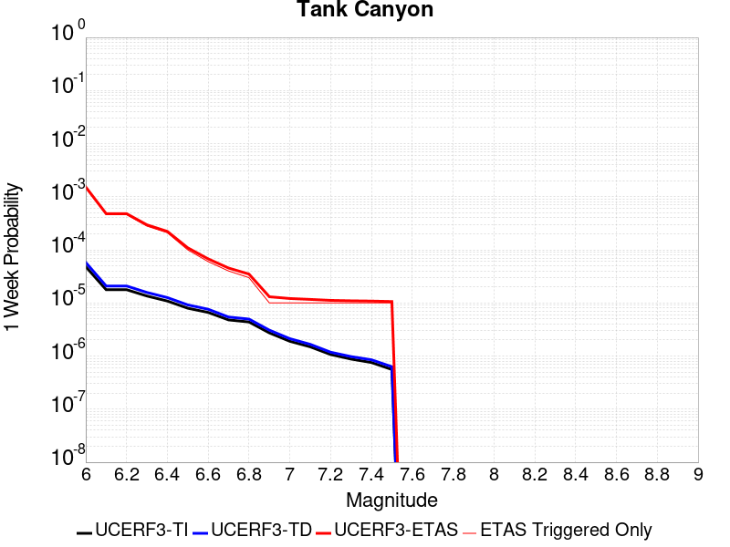 |  | 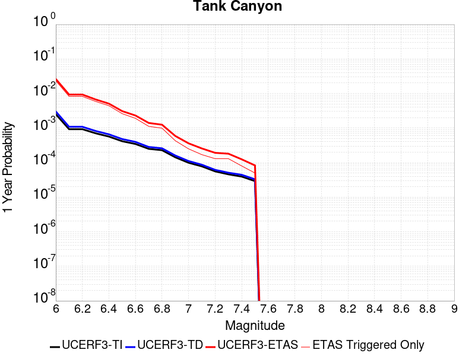 |  |

| Magnitude | 1 wk TI Prob | 1 wk TD Prob | 1 wk ETAS Prob | 1 wk ETAS/TD Gain | 1 wk ETAS Triggered Only | 1 mo TI Prob | 1 mo TD Prob | 1 mo ETAS Prob | 1 mo ETAS/TD Gain | 1 mo ETAS Triggered Only | 1 yr TI Prob | 1 yr TD Prob | 1 yr ETAS Prob | 1 yr ETAS/TD Gain | 1 yr ETAS Triggered Only | 10 yr TI Prob | 10 yr TD Prob | 10 yr ETAS Prob | 10 yr ETAS/TD Gain | 10 yr ETAS Triggered Only |
|-----|-----|-----|-----|-----|-----|-----|-----|-----|-----|-----|-----|-----|-----|-----|-----|-----|-----|-----|-----|-----|
| 6.0 | 4.8284557E-5 | 5.797054E-5 | 0.0015278853 | 26.356237 | 0.00147 | 2.0691741E-4 | 2.4842535E-4 | 0.0056770765 | 22.852242 | 0.00543 | 0.0025163088 | 0.003021048 | 0.026300507 | 8.705756 | 0.02335 | 0.02488006 | 0.02986708 | 0.07637525 | 2.5571718 | 0.04794 |
| 6.1 | 1.7796336E-5 | 2.0875163E-5 | 4.8086556E-4 | 23.035297 | 4.6E-4 | 7.626778E-5 | 8.946213E-5 | 0.0018193073 | 20.33606 | 0.00173 | 9.281647E-4 | 0.0010886953 | 0.009329714 | 8.569628 | 0.00825 | 0.009242975 | 0.010837966 | 0.028059276 | 2.5889802 | 0.01741 |
| 6.2 | 1.7796336E-5 | 2.0875163E-5 | 4.8086556E-4 | 23.035297 | 4.6E-4 | 7.626778E-5 | 8.946213E-5 | 0.0018193073 | 20.33606 | 0.00173 | 9.281647E-4 | 0.0010886953 | 0.009329714 | 8.569628 | 0.00825 | 0.009242975 | 0.010837966 | 0.028059276 | 2.5889802 | 0.01741 |
| 6.3 | 1.3515912E-5 | 1.5760907E-5 | 2.957565E-4 | 18.765196 | 2.8E-4 | 5.792405E-5 | 6.754513E-5 | 0.0012174675 | 18.024504 | 0.00115 | 7.049971E-4 | 8.220753E-4 | 0.0067072334 | 8.158904 | 0.00589 | 0.007027647 | 0.00819321 | 0.020580877 | 2.511943 | 0.01249 |
| 6.4 | 1.0870146E-5 | 1.2619056E-5 | 2.226164E-4 | 17.641289 | 2.1E-4 | 4.658551E-5 | 5.4080647E-5 | 9.1403414E-4 | 16.901316 | 8.6E-4 | 5.67031E-4 | 6.582507E-4 | 0.0050853346 | 7.7255287 | 0.00443 | 0.005655863 | 0.0065652747 | 0.015933365 | 2.4269152 | 0.00943 |
| 6.5 | 7.964826E-6 | 9.196807E-6 | 1.09195884E-4 | 11.8732395 | 1.0E-4 | 3.4134522E-5 | 3.941435E-5 | 4.893966E-4 | 12.416712 | 4.5E-4 | 4.1550855E-4 | 4.7977458E-4 | 0.0030885225 | 6.4374447 | 0.00261 | 0.0041473247 | 0.004788939 | 0.01059102 | 2.2115586 | 0.00583 |
| 6.6 | 6.6317E-6 | 7.6128526E-6 | 6.76124E-5 | 8.881349 | 6.0E-5 | 2.8421264E-5 | 3.2626154E-5 | 3.0261735E-4 | 9.275299 | 2.7E-4 | 3.4597394E-4 | 3.971601E-4 | 0.0023064015 | 5.807234 | 0.00191 | 0.0034543579 | 0.003965905 | 0.008348455 | 2.1050568 | 0.0044 |
| 6.7 | 4.793663E-6 | 5.431129E-6 | 4.5430912E-5 | 8.364911 | 4.0E-5 | 2.0544108E-5 | 2.3276085E-5 | 1.9327212E-4 | 8.303464 | 1.7E-4 | 2.500958E-4 | 2.8335385E-4 | 0.0014030365 | 4.9515347 | 0.00112 | 0.0024981452 | 0.0028308667 | 0.0053237895 | 1.8806218 | 0.0025 |
| 6.8 | 4.382823E-6 | 4.96956E-6 | 3.4969413E-5 | 7.0367217 | 3.0E-5 | 1.8783392E-5 | 2.1297965E-5 | 1.8129456E-4 | 8.512295 | 1.6E-4 | 2.286638E-4 | 2.5927613E-4 | 0.0012490194 | 4.8173327 | 9.9E-4 | 0.0022842865 | 0.0025906577 | 0.0048248544 | 1.8624053 | 0.00224 |
| 6.9 | 2.729601E-6 | 3.073687E-6 | 1.3073656E-5 | 4.253412 | 1.0E-5 | 1.1698237E-5 | 1.3172884E-5 | 8.317196E-5 | 6.3138766 | 7.0E-5 | 1.4241673E-4 | 1.6036928E-4 | 5.903003E-4 | 3.6808815 | 4.3E-4 | 0.001423255 | 0.0016027665 | 0.0026610675 | 1.6602964 | 0.00106 |
| 7.0 | 1.8987357E-6 | 2.1270264E-6 | 1.2127005E-5 | 5.7013893 | 1.0E-5 | 8.137413E-6 | 9.1158E-6 | 4.9115435E-5 | 5.387946 | 4.0E-5 | 9.90685E-5 | 1.10979905E-4 | 3.6095217E-4 | 3.25241 | 2.5E-4 | 9.902435E-4 | 0.0011093135 | 0.0016487145 | 1.4862475 | 5.4E-4 |
| 7.1 | 1.4928986E-6 | 1.66419E-6 | 1.1664173E-5 | 7.0089192 | 1.0E-5 | 6.398121E-6 | 7.1322265E-6 | 3.7132013E-5 | 5.20623 | 3.0E-5 | 7.789434E-5 | 8.683199E-5 | 2.5681723E-4 | 2.9576337 | 1.7E-4 | 7.786704E-4 | 8.680385E-4 | 0.0012177347 | 1.4028579 | 3.5E-4 |
| 7.2 | 1.069082E-6 | 1.1829021E-6 | 1.118289E-5 | 9.453774 | 1.0E-5 | 4.581772E-6 | 5.069574E-6 | 3.506942E-5 | 6.9176273 | 3.0E-5 | 5.5781646E-5 | 6.172085E-5 | 1.9171282E-4 | 3.1061275 | 1.3E-4 | 5.576765E-4 | 6.1708933E-4 | 8.4694737E-4 | 1.3724875 | 2.3E-4 |
| 7.3 | 8.776551E-7 | 9.770343E-7 | 1.0977024E-5 | 11.2350445 | 1.0E-5 | 3.7613736E-6 | 4.1872863E-6 | 3.418716E-5 | 8.164515 | 3.0E-5 | 4.579376E-5 | 5.097954E-5 | 1.8097291E-4 | 3.5499127 | 1.3E-4 | 4.5784327E-4 | 5.0972943E-4 | 7.196224E-4 | 1.4117732 | 2.1E-4 |
| 7.4 | 7.55721E-7 | 8.5105546E-7 | 1.0851047E-5 | 12.750106 | 1.0E-5 | 3.2388E-6 | 3.6473784E-6 | 2.3647306E-5 | 6.4833703 | 2.0E-5 | 3.9431678E-5 | 4.4406446E-5 | 1.244029E-4 | 2.8014603 | 8.0E-5 | 3.942468E-4 | 4.4402658E-4 | 5.839644E-4 | 1.3151565 | 1.4E-4 |
| 7.5 | 5.587665E-7 | 6.3058303E-7 | 1.0630577E-5 | 16.85833 | 1.0E-5 | 2.3947114E-6 | 2.7024987E-6 | 2.2702445E-5 | 8.400538 | 2.0E-5 | 2.915522E-5 | 3.290292E-5 | 8.290128E-5 | 2.5195718 | 5.0E-5 | 2.9151395E-4 | 3.2902922E-4 | 4.189996E-4 | 1.2734419 | 9.0E-5 |

## Owl Lake
*[(top)](#table-of-contents)*

| 1 Week | 1 Month | 1 Year | 10 Year |
|-----|-----|-----|-----|
|  |  |  |  |

| Magnitude | 1 wk TI Prob | 1 wk TD Prob | 1 wk ETAS Prob | 1 wk ETAS/TD Gain | 1 wk ETAS Triggered Only | 1 mo TI Prob | 1 mo TD Prob | 1 mo ETAS Prob | 1 mo ETAS/TD Gain | 1 mo ETAS Triggered Only | 1 yr TI Prob | 1 yr TD Prob | 1 yr ETAS Prob | 1 yr ETAS/TD Gain | 1 yr ETAS Triggered Only | 10 yr TI Prob | 10 yr TD Prob | 10 yr ETAS Prob | 10 yr ETAS/TD Gain | 10 yr ETAS Triggered Only |
|-----|-----|-----|-----|-----|-----|-----|-----|-----|-----|-----|-----|-----|-----|-----|-----|-----|-----|-----|-----|-----|
| 6.0 | 5.0320643E-5 | 6.637038E-5 | 7.063279E-4 | 10.642216 | 6.4E-4 | 2.1564208E-4 | 2.8441957E-4 | 0.003063629 | 10.771512 | 0.00278 | 0.0026222812 | 0.0034582033 | 0.014479956 | 4.187133 | 0.01106 | 0.02591553 | 0.034148198 | 0.055551473 | 1.6267761 | 0.02216 |
| 6.1 | 5.0320643E-5 | 6.637038E-5 | 7.063279E-4 | 10.642216 | 6.4E-4 | 2.1564208E-4 | 2.8441957E-4 | 0.003063629 | 10.771512 | 0.00278 | 0.0026222812 | 0.0034582033 | 0.014479956 | 4.187133 | 0.01106 | 0.02591553 | 0.034148198 | 0.055551473 | 1.6267761 | 0.02216 |
| 6.2 | 2.4125871E-5 | 3.09871E-5 | 5.609707E-4 | 18.103363 | 5.3E-4 | 1.0339249E-4 | 1.3279608E-4 | 0.002422492 | 18.242195 | 0.00229 | 0.0012580766 | 0.0016157634 | 0.010381577 | 6.425184 | 0.00878 | 0.012509781 | 0.016074665 | 0.032771878 | 2.0387285 | 0.01697 |
| 6.3 | 1.7433485E-5 | 2.2360797E-5 | 5.223496E-4 | 23.360064 | 5.0E-4 | 7.471279E-5 | 9.582917E-5 | 0.0020956376 | 21.868471 | 0.002 | 9.0924866E-4 | 0.0011662331 | 0.008917183 | 7.6461415 | 0.00776 | 0.009055373 | 0.011632415 | 0.026200954 | 2.2524087 | 0.01474 |
| 6.4 | 1.7433485E-5 | 2.2360797E-5 | 5.223496E-4 | 23.360064 | 5.0E-4 | 7.471279E-5 | 9.582917E-5 | 0.0020956376 | 21.868471 | 0.002 | 9.0924866E-4 | 0.0011662331 | 0.008917183 | 7.6461415 | 0.00776 | 0.009055373 | 0.011632415 | 0.026200954 | 2.2524087 | 0.01474 |
| 6.5 | 1.5182742E-5 | 1.9434077E-5 | 4.9942476E-4 | 25.698404 | 4.8E-4 | 6.506727E-5 | 8.328693E-5 | 0.0020331244 | 24.411089 | 0.00195 | 7.919061E-4 | 0.0010136823 | 0.0084561305 | 8.341992 | 0.00745 | 0.0078909 | 0.010121727 | 0.023999821 | 2.371119 | 0.01402 |
| 6.6 | 6.7271576E-6 | 8.550671E-6 | 3.9854733E-4 | 46.610065 | 3.9E-4 | 2.8830356E-5 | 3.664525E-5 | 0.0016965844 | 46.297527 | 0.00166 | 3.5095305E-4 | 4.4607025E-4 | 0.006443394 | 14.444797 | 0.006 | 0.0035039932 | 0.0044702506 | 0.015371301 | 3.438577 | 0.01095 |
| 6.7 | 6.682835E-6 | 8.48311E-6 | 3.984798E-4 | 46.973316 | 3.9E-4 | 2.8640408E-5 | 3.635571E-5 | 0.0016962953 | 46.658295 | 0.00166 | 3.4864116E-4 | 4.4254653E-4 | 0.006439891 | 14.551896 | 0.006 | 0.003480947 | 0.0044352226 | 0.0152968345 | 3.4489439 | 0.01091 |
| 6.8 | 6.5774975E-6 | 8.32956E-6 | 3.9832632E-4 | 47.82081 | 3.9E-4 | 2.8188972E-5 | 3.569766E-5 | 0.0016956384 | 47.49999 | 0.00166 | 3.4314668E-4 | 4.3453797E-4 | 0.0064219353 | 14.778767 | 0.00599 | 0.0034261728 | 0.0043553766 | 0.0152079025 | 3.491754 | 0.0109 |
| 6.9 | 6.363419E-6 | 8.002683E-6 | 3.9799957E-4 | 49.73327 | 3.9E-4 | 2.727151E-5 | 3.429679E-5 | 0.0016942399 | 49.39937 | 0.00166 | 3.3198006E-4 | 4.1748903E-4 | 0.0063849967 | 15.293807 | 0.00597 | 0.0033148455 | 0.0041853474 | 0.015019811 | 3.5886652 | 0.01088 |
| 7.0 | 6.1342453E-6 | 7.634817E-6 | 3.9763184E-4 | 52.081387 | 3.9E-4 | 2.6289357E-5 | 3.272026E-5 | 0.001692666 | 51.731426 | 0.00166 | 3.2002592E-4 | 3.983019E-4 | 0.006355928 | 15.957564 | 0.00596 | 0.0031956544 | 0.003994015 | 0.0147708 | 3.6982334 | 0.01082 |
| 7.1 | 5.842926E-6 | 7.1452696E-6 | 3.671427E-4 | 51.382626 | 3.6E-4 | 2.504087E-5 | 3.0622254E-5 | 0.0016005741 | 52.268333 | 0.00157 | 3.0482994E-4 | 3.727676E-4 | 0.006010665 | 16.124432 | 0.00564 | 0.0030441214 | 0.0037395519 | 0.013871521 | 3.7094073 | 0.01017 |
| 7.2 | 4.77173E-6 | 5.3611675E-6 | 2.2535998E-4 | 42.035618 | 2.2E-4 | 2.045011E-5 | 2.2976252E-5 | 0.0010529526 | 45.827866 | 0.00103 | 2.4895166E-4 | 2.7970402E-4 | 0.003978669 | 14.224569 | 0.0037 | 0.0024867293 | 0.0028107075 | 0.009432045 | 3.3557544 | 0.00664 |
| 7.3 | 3.0494948E-6 | 2.712334E-6 | 5.27122E-5 | 19.434258 | 5.0E-5 | 1.3069198E-5 | 1.1624238E-5 | 2.216218E-4 | 19.06549 | 2.1E-4 | 1.5910587E-4 | 1.4151607E-4 | 0.001131376 | 7.994682 | 9.9E-4 | 0.0015899199 | 0.0014246284 | 0.0030822635 | 2.163556 | 0.00166 |
| 7.4 | 2.7263884E-6 | 2.307415E-6 | 4.230732E-5 | 18.335377 | 4.0E-5 | 1.1684469E-5 | 9.888884E-6 | 1.99887E-4 | 20.213303 | 1.9E-4 | 1.4224913E-4 | 1.20390614E-4 | 8.4030395E-4 | 6.9798126 | 7.2E-4 | 0.0014215811 | 0.0012125135 | 0.0023111799 | 1.9061064 | 0.0011 |
| 7.5 | 2.6090431E-6 | 2.1673172E-6 | 4.216723E-5 | 19.455957 | 4.0E-5 | 1.1181565E-5 | 9.288469E-6 | 1.6928698E-4 | 18.225498 | 1.6E-4 | 1.3612706E-4 | 1.1308135E-4 | 7.130135E-4 | 6.305315 | 6.0E-4 | 0.001360437 | 0.0011392768 | 0.0020382514 | 1.7890749 | 9.0E-4 |
| 7.6 | 2.3008756E-6 | 1.8744257E-6 | 2.1874388E-5 | 11.669915 | 2.0E-5 | 9.860858E-6 | 8.033228E-6 | 9.8032506E-5 | 12.203376 | 9.0E-5 | 1.20049335E-4 | 9.780025E-5 | 5.277582E-4 | 5.3962865 | 4.3E-4 | 0.001199845 | 9.862278E-4 | 0.0016255967 | 1.6482973 | 6.4E-4 |
| 7.7 | 1.7184348E-6 | 1.3434202E-6 | 2.1343394E-5 | 15.887356 | 2.0E-5 | 7.3646997E-6 | 5.7575025E-6 | 4.575727E-5 | 7.947417 | 4.0E-5 | 8.966153E-5 | 7.0095375E-5 | 3.1007855E-4 | 4.423666 | 2.4E-4 | 8.962536E-4 | 7.0897903E-4 | 0.0011186884 | 1.5778863 | 4.1E-4 |
| 7.8 | 8.4612907E-7 | 8.416933E-7 | 2.0841677E-5 | 24.761604 | 2.0E-5 | 3.6262625E-6 | 3.6072522E-6 | 3.3607143E-5 | 9.31655 | 3.0E-5 | 4.4148852E-5 | 4.391743E-5 | 1.8391128E-4 | 4.18766 | 1.4E-4 | 4.414008E-4 | 4.4484966E-4 | 6.3476514E-4 | 1.4269205 | 1.9E-4 |
| 7.9 | 2.716738E-7 | 3.773008E-7 | 1.0377297E-5 | 27.504042 | 1.0E-5 | 1.1643157E-6 | 1.6170025E-6 | 2.161697E-5 | 13.368545 | 2.0E-5 | 1.4175452E-5 | 1.9686839E-5 | 9.968526E-5 | 5.0635486 | 8.0E-5 | 1.4174548E-4 | 1.9892666E-4 | 2.9890676E-4 | 1.5025978 | 1.0E-4 |
| 8.0 | 2.1995428E-8 | 3.3868776E-8 | 3.3868776E-8 | 1.0 | 0.0 | 9.426611E-8 | 1.4515189E-7 | 1.4515189E-7 | 1.0 | 0.0 | 1.1476893E-6 | 1.7672235E-6 | 1.7672235E-6 | 1.0 | 0.0 | 1.14768345E-5 | 1.8218208E-5 | 2.8218026E-5 | 1.5488914 | 1.0E-5 |

## Little Lake
*[(top)](#table-of-contents)*

| 1 Week | 1 Month | 1 Year | 10 Year |
|-----|-----|-----|-----|
| 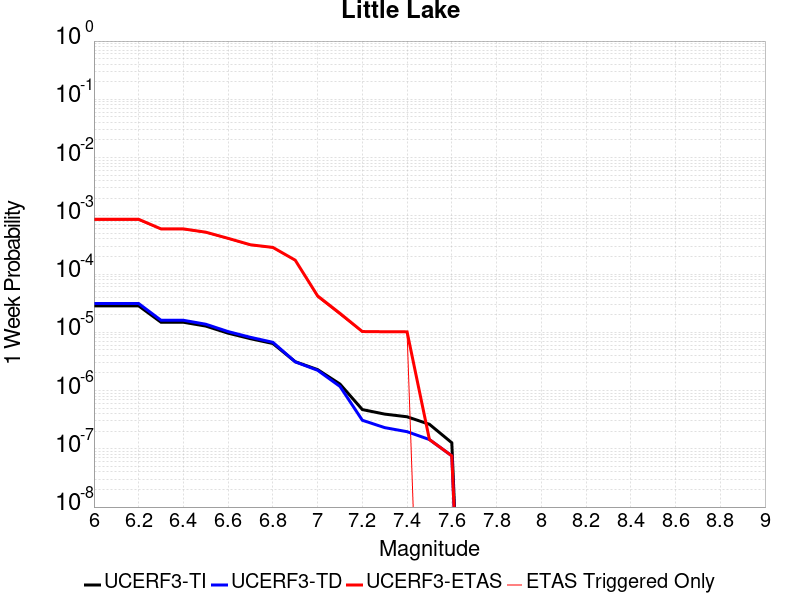 |  |  |  |

| Magnitude | 1 wk TI Prob | 1 wk TD Prob | 1 wk ETAS Prob | 1 wk ETAS/TD Gain | 1 wk ETAS Triggered Only | 1 mo TI Prob | 1 mo TD Prob | 1 mo ETAS Prob | 1 mo ETAS/TD Gain | 1 mo ETAS Triggered Only | 1 yr TI Prob | 1 yr TD Prob | 1 yr ETAS Prob | 1 yr ETAS/TD Gain | 1 yr ETAS Triggered Only | 10 yr TI Prob | 10 yr TD Prob | 10 yr ETAS Prob | 10 yr ETAS/TD Gain | 10 yr ETAS Triggered Only |
|-----|-----|-----|-----|-----|-----|-----|-----|-----|-----|-----|-----|-----|-----|-----|-----|-----|-----|-----|-----|-----|
| 6.0 | 2.8424427E-5 | 3.1207474E-5 | 8.7118126E-4 | 27.91579 | 8.4E-4 | 1.2181328E-4 | 1.337402E-4 | 0.003223327 | 24.101406 | 0.00309 | 0.0014820677 | 0.001627204 | 0.013577727 | 8.344207 | 0.01197 | 0.014722223 | 0.016166301 | 0.038519002 | 2.3826725 | 0.02272 |
| 6.1 | 2.8424427E-5 | 3.1207474E-5 | 8.7118126E-4 | 27.91579 | 8.4E-4 | 1.2181328E-4 | 1.337402E-4 | 0.003223327 | 24.101406 | 0.00309 | 0.0014820677 | 0.001627204 | 0.013577727 | 8.344207 | 0.01197 | 0.014722223 | 0.016166301 | 0.038519002 | 2.3826725 | 0.02272 |
| 6.2 | 2.8424427E-5 | 3.1207474E-5 | 8.7118126E-4 | 27.91579 | 8.4E-4 | 1.2181328E-4 | 1.337402E-4 | 0.003223327 | 24.101406 | 0.00309 | 0.0014820677 | 0.001627204 | 0.013577727 | 8.344207 | 0.01197 | 0.014722223 | 0.016166301 | 0.038519002 | 2.3826725 | 0.02272 |
| 6.3 | 1.48860645E-5 | 1.60822E-5 | 5.960729E-4 | 37.064137 | 5.8E-4 | 6.379586E-5 | 6.8922054E-5 | 0.0020387862 | 29.581043 | 0.00197 | 7.7643775E-4 | 8.388312E-4 | 0.008662263 | 10.326587 | 0.00783 | 0.007737305 | 0.008359468 | 0.023035748 | 2.7556477 | 0.0148 |
| 6.4 | 1.48860645E-5 | 1.60822E-5 | 5.960729E-4 | 37.064137 | 5.8E-4 | 6.379586E-5 | 6.8922054E-5 | 0.0020387862 | 29.581043 | 0.00197 | 7.7643775E-4 | 8.388312E-4 | 0.008662263 | 10.326587 | 0.00783 | 0.007737305 | 0.008359468 | 0.023035748 | 2.7556477 | 0.0148 |
| 6.5 | 1.2797581E-5 | 1.3766243E-5 | 5.237592E-4 | 38.04664 | 5.1E-4 | 5.4845623E-5 | 5.8996993E-5 | 0.0018488914 | 31.33874 | 0.00179 | 6.675408E-4 | 7.1807735E-4 | 0.007763015 | 10.810834 | 0.00705 | 0.006655392 | 0.007160121 | 0.020364892 | 2.8442104 | 0.0133 |
| 6.6 | 9.661896E-6 | 1.0289515E-5 | 4.102854E-4 | 39.874126 | 4.0E-4 | 4.1407468E-5 | 4.4097265E-5 | 0.0015440311 | 35.014214 | 0.0015 | 5.040193E-4 | 5.367682E-4 | 0.0063736336 | 11.874089 | 0.00584 | 0.005028777 | 0.005356322 | 0.01638692 | 3.0593605 | 0.01109 |
| 6.7 | 7.767871E-6 | 8.200049E-6 | 3.181975E-4 | 38.80434 | 3.1E-4 | 3.329045E-5 | 3.514267E-5 | 0.0012750991 | 36.283497 | 0.00124 | 4.0523586E-4 | 4.2779176E-4 | 0.0055156145 | 12.893223 | 0.00509 | 0.004044977 | 0.0042710346 | 0.013919648 | 3.2590811 | 0.00969 |
| 6.8 | 6.4235196E-6 | 6.7360374E-6 | 2.8673414E-4 | 42.567184 | 2.8E-4 | 2.752908E-5 | 2.8868486E-5 | 0.0011088373 | 38.409958 | 0.00108 | 3.35115E-4 | 3.5142995E-4 | 0.0045799436 | 13.032308 | 0.00423 | 0.003346101 | 0.0035100025 | 0.011412168 | 3.2513275 | 0.00793 |
| 6.9 | 3.1283696E-6 | 3.1122813E-6 | 1.7311175E-4 | 55.622143 | 1.7E-4 | 1.3407229E-5 | 1.3338288E-5 | 6.633296E-4 | 49.73124 | 6.5E-4 | 1.6322079E-4 | 1.6238306E-4 | 0.0027719592 | 17.070494 | 0.00261 | 0.0016310095 | 0.0016227924 | 0.006494873 | 4.002282 | 0.00488 |
| 7.0 | 2.290603E-6 | 2.2287568E-6 | 4.222867E-5 | 18.947186 | 4.0E-5 | 9.816834E-6 | 9.551785E-6 | 3.0954892E-4 | 32.40744 | 3.0E-4 | 1.19513395E-4 | 1.16287825E-4 | 0.0015561203 | 13.381628 | 0.00144 | 0.0011944914 | 0.0011623718 | 0.003949129 | 3.3974745 | 0.00279 |
| 7.1 | 1.293693E-6 | 1.1777277E-6 | 2.1177704E-5 | 17.981834 | 2.0E-5 | 5.5443866E-6 | 5.0473986E-6 | 1.5504664E-4 | 30.71813 | 1.5E-4 | 6.750081E-5 | 6.145104E-5 | 7.714074E-4 | 12.553204 | 7.1E-4 | 6.7480316E-4 | 6.14409E-4 | 0.001933598 | 3.1470861 | 0.00132 |
| 7.2 | 4.715842E-7 | 3.0919745E-7 | 1.0309194E-5 | 33.341785 | 1.0E-5 | 2.0210737E-6 | 1.3251313E-6 | 2.1325104E-5 | 16.092825 | 2.0E-5 | 2.4606294E-5 | 1.613336E-5 | 9.613207E-5 | 5.95859 | 8.0E-5 | 2.460357E-4 | 1.6132242E-4 | 3.112982E-4 | 1.929665 | 1.5E-4 |
| 7.3 | 3.9430947E-7 | 2.3099179E-7 | 1.023099E-5 | 44.291573 | 1.0E-5 | 1.6898966E-6 | 9.899644E-7 | 2.0989944E-5 | 21.202726 | 2.0E-5 | 2.0574296E-5 | 1.2052751E-5 | 7.2052026E-5 | 5.9780564 | 6.0E-5 | 2.0572392E-4 | 1.2052105E-4 | 2.4050659E-4 | 1.9955567 | 1.2E-4 |
| 7.4 | 3.547123E-7 | 1.9680678E-7 | 1.0196804E-5 | 51.81125 | 1.0E-5 | 1.5201948E-6 | 8.434573E-7 | 2.0843441E-5 | 24.711908 | 2.0E-5 | 1.8508214E-5 | 1.0269046E-5 | 7.026843E-5 | 6.842742 | 6.0E-5 | 1.8506673E-4 | 1.0268577E-4 | 2.0267551E-4 | 1.9737448 | 1.0E-4 |
| 7.5 | 2.6354266E-7 | 1.4424151E-7 | 1.4424151E-7 | 1.0 | 0.0 | 1.129468E-6 | 6.1817775E-7 | 6.1817775E-7 | 1.0 | 0.0 | 1.3751187E-5 | 7.5262888E-6 | 1.7526214E-5 | 2.3286662 | 1.0E-5 | 1.3750336E-4 | 7.526039E-5 | 1.1525738E-4 | 1.5314481 | 4.0E-5 |
| 7.6 | 1.269913E-7 | 7.572964E-8 | 7.572964E-8 | 1.0 | 0.0 | 5.4424834E-7 | 3.2455554E-7 | 3.2455554E-7 | 1.0 | 0.0 | 6.6262032E-6 | 3.951457E-6 | 1.3951418E-5 | 3.530702 | 1.0E-5 | 6.626006E-5 | 3.9513903E-5 | 6.951272E-5 | 1.7591964 | 3.0E-5 |

## Airport Lake
*[(top)](#table-of-contents)*

| 1 Week | 1 Month | 1 Year | 10 Year |
|-----|-----|-----|-----|
|  |  | 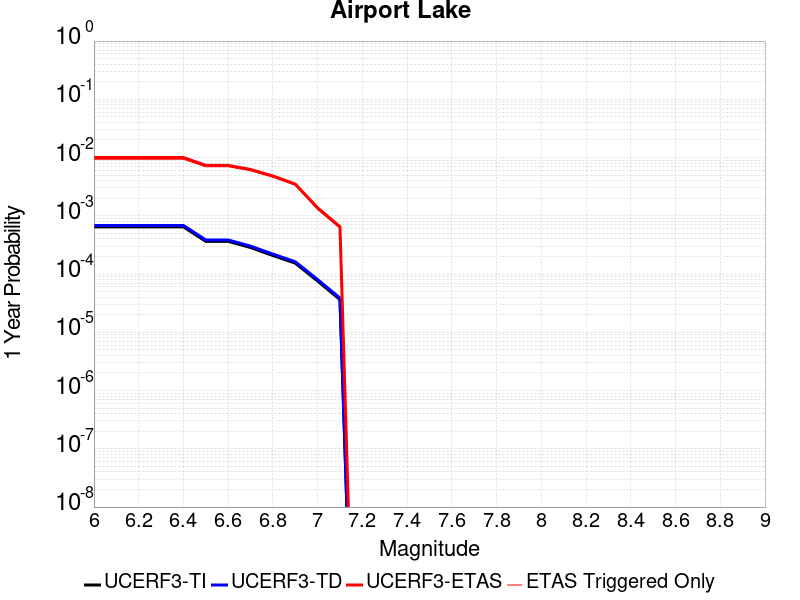 |  |

| Magnitude | 1 wk TI Prob | 1 wk TD Prob | 1 wk ETAS Prob | 1 wk ETAS/TD Gain | 1 wk ETAS Triggered Only | 1 mo TI Prob | 1 mo TD Prob | 1 mo ETAS Prob | 1 mo ETAS/TD Gain | 1 mo ETAS Triggered Only | 1 yr TI Prob | 1 yr TD Prob | 1 yr ETAS Prob | 1 yr ETAS/TD Gain | 1 yr ETAS Triggered Only | 10 yr TI Prob | 10 yr TD Prob | 10 yr ETAS Prob | 10 yr ETAS/TD Gain | 10 yr ETAS Triggered Only |
|-----|-----|-----|-----|-----|-----|-----|-----|-----|-----|-----|-----|-----|-----|-----|-----|-----|-----|-----|-----|-----|
| 6.0 | 1.2387061E-5 | 1.3103559E-5 | 7.030945E-4 | 53.65676 | 6.9E-4 | 5.3086325E-5 | 5.615706E-5 | 0.0025060195 | 44.62519 | 0.00245 | 6.461343E-4 | 6.8352616E-4 | 0.010027135 | 14.669717 | 0.00935 | 0.0064425888 | 0.006817048 | 0.024495704 | 3.5933008 | 0.0178 |
| 6.1 | 1.2387061E-5 | 1.3103559E-5 | 7.030945E-4 | 53.65676 | 6.9E-4 | 5.3086325E-5 | 5.615706E-5 | 0.0025060195 | 44.62519 | 0.00245 | 6.461343E-4 | 6.8352616E-4 | 0.010027135 | 14.669717 | 0.00935 | 0.0064425888 | 0.006817048 | 0.024495704 | 3.5933008 | 0.0178 |
| 6.2 | 1.2387061E-5 | 1.3103559E-5 | 7.030945E-4 | 53.65676 | 6.9E-4 | 5.3086325E-5 | 5.615706E-5 | 0.0025060195 | 44.62519 | 0.00245 | 6.461343E-4 | 6.8352616E-4 | 0.010027135 | 14.669717 | 0.00935 | 0.0064425888 | 0.006817048 | 0.024495704 | 3.5933008 | 0.0178 |
| 6.3 | 1.2387061E-5 | 1.3103559E-5 | 7.030945E-4 | 53.65676 | 6.9E-4 | 5.3086325E-5 | 5.615706E-5 | 0.0025060195 | 44.62519 | 0.00245 | 6.461343E-4 | 6.8352616E-4 | 0.010027135 | 14.669717 | 0.00935 | 0.0064425888 | 0.006817048 | 0.024495704 | 3.5933008 | 0.0178 |
| 6.4 | 1.2387061E-5 | 1.3103559E-5 | 7.030945E-4 | 53.65676 | 6.9E-4 | 5.3086325E-5 | 5.615706E-5 | 0.0025060195 | 44.62519 | 0.00245 | 6.461343E-4 | 6.8352616E-4 | 0.010027135 | 14.669717 | 0.00935 | 0.0064425888 | 0.006817048 | 0.024495704 | 3.5933008 | 0.0178 |
| 6.5 | 6.9922594E-6 | 7.385145E-6 | 4.9738155E-4 | 67.348915 | 4.9E-4 | 2.996648E-5 | 3.165027E-5 | 0.0018215936 | 57.55381 | 0.00179 | 3.6478083E-4 | 3.8527933E-4 | 0.007342598 | 19.057856 | 0.00696 | 0.003641826 | 0.003846651 | 0.01670699 | 4.343256 | 0.01291 |
| 6.6 | 6.9922594E-6 | 7.385145E-6 | 4.9738155E-4 | 67.348915 | 4.9E-4 | 2.996648E-5 | 3.165027E-5 | 0.0018215936 | 57.55381 | 0.00179 | 3.6478083E-4 | 3.8527933E-4 | 0.007342598 | 19.057856 | 0.00696 | 0.003641826 | 0.003846651 | 0.01670699 | 4.343256 | 0.01291 |
| 6.7 | 5.477277E-6 | 5.7862417E-6 | 4.1578387E-4 | 71.85733 | 4.1E-4 | 2.3473833E-5 | 2.4797964E-5 | 0.0015647598 | 63.10033 | 0.00154 | 2.8575645E-4 | 3.0187727E-4 | 0.006250081 | 20.704046 | 0.00595 | 0.0028538927 | 0.003015056 | 0.014121468 | 4.6836505 | 0.01114 |
| 6.8 | 3.9950432E-6 | 4.2192128E-6 | 3.142179E-4 | 74.473114 | 3.1E-4 | 1.7121502E-5 | 1.808223E-5 | 0.00124806 | 69.021355 | 0.00123 | 2.0843433E-4 | 2.2013167E-4 | 0.0048291166 | 21.937403 | 0.00461 | 0.0020823893 | 0.0021994072 | 0.010630822 | 4.8334947 | 0.00845 |
| 6.9 | 2.95695E-6 | 3.1231173E-6 | 2.2312244E-4 | 71.442215 | 2.2E-4 | 1.2672582E-5 | 1.33847325E-5 | 8.6337334E-4 | 64.50434 | 8.5E-4 | 1.5427776E-4 | 1.629492E-4 | 0.0035124032 | 21.555204 | 0.00335 | 0.001541707 | 0.0016285196 | 0.007788472 | 4.782547 | 0.00617 |
| 7.0 | 1.456072E-6 | 1.5408596E-6 | 3.1540814E-5 | 20.469622 | 3.0E-5 | 6.2402937E-6 | 6.603673E-6 | 2.8660183E-4 | 43.400368 | 2.8E-4 | 7.597293E-5 | 8.039776E-5 | 0.001370294 | 17.043934 | 0.00129 | 7.594696E-4 | 8.0378563E-4 | 0.0033117682 | 4.120213 | 0.00251 |
| 7.1 | 6.995192E-7 | 7.409207E-7 | 1.0740913E-5 | 14.496711 | 1.0E-5 | 2.997936E-6 | 3.1753743E-6 | 1.3317497E-4 | 41.939926 | 1.3E-4 | 3.649926E-5 | 3.8660182E-5 | 6.486366E-4 | 16.777897 | 6.1E-4 | 3.6493264E-4 | 3.8660184E-4 | 0.001516165 | 3.921774 | 0.00113 |

## Panamint Valley
*[(top)](#table-of-contents)*

| 1 Week | 1 Month | 1 Year | 10 Year |
|-----|-----|-----|-----|
|  |  | 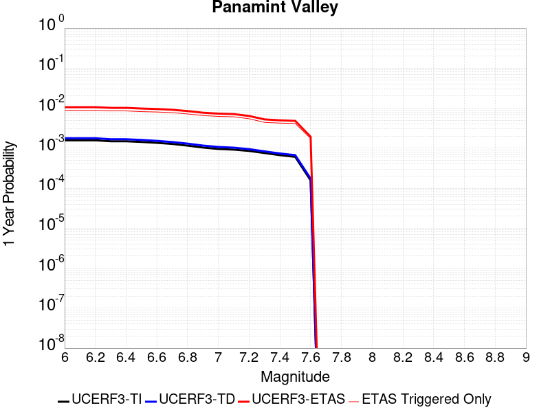 |  |

| Magnitude | 1 wk TI Prob | 1 wk TD Prob | 1 wk ETAS Prob | 1 wk ETAS/TD Gain | 1 wk ETAS Triggered Only | 1 mo TI Prob | 1 mo TD Prob | 1 mo ETAS Prob | 1 mo ETAS/TD Gain | 1 mo ETAS Triggered Only | 1 yr TI Prob | 1 yr TD Prob | 1 yr ETAS Prob | 1 yr ETAS/TD Gain | 1 yr ETAS Triggered Only | 10 yr TI Prob | 10 yr TD Prob | 10 yr ETAS Prob | 10 yr ETAS/TD Gain | 10 yr ETAS Triggered Only |
|-----|-----|-----|-----|-----|-----|-----|-----|-----|-----|-----|-----|-----|-----|-----|-----|-----|-----|-----|-----|-----|
| 6.0 | 3.0211835E-5 | 3.3987795E-5 | 5.939688E-4 | 17.475943 | 5.6E-4 | 1.2947287E-4 | 1.4565402E-4 | 0.002205354 | 15.141045 | 0.00206 | 0.0015751923 | 0.0017719247 | 0.0105862785 | 5.974452 | 0.00883 | 0.015640736 | 0.017584749 | 0.03423669 | 1.9469534 | 0.01695 |
| 6.1 | 3.0211835E-5 | 3.3987795E-5 | 5.939688E-4 | 17.475943 | 5.6E-4 | 1.2947287E-4 | 1.4565402E-4 | 0.002205354 | 15.141045 | 0.00206 | 0.0015751923 | 0.0017719247 | 0.0105862785 | 5.974452 | 0.00883 | 0.015640736 | 0.017584749 | 0.03423669 | 1.9469534 | 0.01695 |
| 6.2 | 3.0211835E-5 | 3.3987795E-5 | 5.939688E-4 | 17.475943 | 5.6E-4 | 1.2947287E-4 | 1.4565402E-4 | 0.002205354 | 15.141045 | 0.00206 | 0.0015751923 | 0.0017719247 | 0.0105862785 | 5.974452 | 0.00883 | 0.015640736 | 0.017584749 | 0.03423669 | 1.9469534 | 0.01695 |
| 6.3 | 2.8573924E-5 | 3.2105843E-5 | 5.9208786E-4 | 18.441748 | 5.6E-4 | 1.2245393E-4 | 1.3758938E-4 | 0.0021473127 | 15.606676 | 0.00201 | 0.001489857 | 0.0016738913 | 0.010199596 | 6.0933447 | 0.00854 | 0.01479908 | 0.016619716 | 0.03260948 | 1.9620961 | 0.01626 |
| 6.4 | 2.8573924E-5 | 3.2105843E-5 | 5.9208786E-4 | 18.441748 | 5.6E-4 | 1.2245393E-4 | 1.3758938E-4 | 0.0021473127 | 15.606676 | 0.00201 | 0.001489857 | 0.0016738913 | 0.010199596 | 6.0933447 | 0.00854 | 0.01479908 | 0.016619716 | 0.03260948 | 1.9620961 | 0.01626 |
| 6.5 | 2.7468774E-5 | 3.0831467E-5 | 5.908142E-4 | 19.162703 | 5.6E-4 | 1.1771801E-4 | 1.321283E-4 | 0.002101868 | 15.90778 | 0.00197 | 0.0014322745 | 0.0016075026 | 0.009804305 | 6.0990915 | 0.00821 | 0.014230782 | 0.015965527 | 0.031434547 | 1.9689014 | 0.01572 |
| 6.6 | 2.6135967E-5 | 2.9255378E-5 | 5.792393E-4 | 19.799412 | 5.5E-4 | 1.1200648E-4 | 1.2537432E-4 | 0.0020551323 | 16.391972 | 0.00193 | 0.0013628257 | 0.0015253901 | 0.009543141 | 6.2561975 | 0.00803 | 0.013544982 | 0.015155784 | 0.030194355 | 1.9922662 | 0.01527 |
| 6.7 | 2.4498746E-5 | 2.7344215E-5 | 5.773292E-4 | 21.113394 | 5.5E-4 | 1.04990395E-4 | 1.1718437E-4 | 0.0020169618 | 17.211866 | 0.0019 | 0.0012775084 | 0.001425811 | 0.009134804 | 6.4067426 | 0.00772 | 0.012701893 | 0.014173006 | 0.028575938 | 2.016223 | 0.01461 |
| 6.8 | 2.2244329E-5 | 2.4938487E-5 | 5.449255E-4 | 21.850784 | 5.2E-4 | 9.532935E-5 | 1.0687498E-4 | 0.0019466783 | 18.214539 | 0.00184 | 0.0011600169 | 0.001300448 | 0.008471111 | 6.5139947 | 0.00718 | 0.011539802 | 0.012934348 | 0.026328828 | 2.0355744 | 0.01357 |
| 6.9 | 1.9902658E-5 | 2.229314E-5 | 5.22282E-4 | 23.427923 | 5.0E-4 | 8.529431E-5 | 9.5538635E-5 | 0.0018253734 | 19.106127 | 0.00173 | 0.0010379635 | 0.0011625807 | 0.007704966 | 6.6274676 | 0.00655 | 0.010331288 | 0.01157016 | 0.023747616 | 2.052488 | 0.01232 |
| 7.0 | 1.8353881E-5 | 2.0568947E-5 | 5.205587E-4 | 25.30799 | 5.0E-4 | 7.865712E-5 | 8.814975E-5 | 0.0017580026 | 19.943363 | 0.00167 | 9.5722964E-4 | 0.0010727125 | 0.007306019 | 6.810789 | 0.00624 | 0.009531168 | 0.010680287 | 0.022027785 | 2.0624712 | 0.01147 |
| 7.1 | 1.7667631E-5 | 1.9775267E-5 | 5.097656E-4 | 25.777937 | 4.9E-4 | 7.571623E-5 | 8.474849E-5 | 0.0017146104 | 20.23175 | 0.00163 | 9.2145515E-4 | 0.0010313421 | 0.0071250508 | 6.9085236 | 0.0061 | 0.009176437 | 0.010270455 | 0.021325734 | 2.0764158 | 0.01117 |
| 7.2 | 1.6381597E-5 | 1.8160737E-5 | 4.781524E-4 | 26.328907 | 4.6E-4 | 7.020495E-5 | 7.782951E-5 | 0.0015677136 | 20.14292 | 0.00149 | 8.544101E-4 | 9.471797E-4 | 0.0063920175 | 6.748474 | 0.00545 | 0.008511325 | 0.009436136 | 0.019272435 | 2.0424075 | 0.00993 |
| 7.3 | 1.4520491E-5 | 1.5968153E-5 | 3.759624E-4 | 23.544516 | 3.6E-4 | 6.222919E-5 | 6.843323E-5 | 0.0012483525 | 18.241903 | 0.00118 | 7.57377E-4 | 8.3287235E-4 | 0.005249191 | 6.3025155 | 0.00442 | 0.0075480095 | 0.0083006555 | 0.01633342 | 1.9677266 | 0.0081 |
| 7.4 | 1.2852287E-5 | 1.41469245E-5 | 3.541421E-4 | 25.033152 | 3.4E-4 | 5.5080065E-5 | 6.0628357E-5 | 0.0012005592 | 19.801943 | 0.00114 | 6.7039346E-4 | 7.379161E-4 | 0.004974787 | 6.741671 | 0.00424 | 0.0066837464 | 0.007357609 | 0.01507044 | 2.0482795 | 0.00777 |
| 7.5 | 1.1637851E-5 | 1.2838173E-5 | 3.528338E-4 | 27.483181 | 3.4E-4 | 4.987555E-5 | 5.5019667E-5 | 0.0011849575 | 21.536982 | 0.00113 | 6.070656E-4 | 6.6967425E-4 | 0.004816895 | 7.192893 | 0.00415 | 0.006054099 | 0.006679489 | 0.014238657 | 2.1316988 | 0.00761 |
| 7.6 | 3.0068115E-6 | 3.333561E-6 | 1.4333309E-4 | 42.996994 | 1.4E-4 | 1.2886271E-5 | 1.4286652E-5 | 5.142795E-4 | 35.997204 | 5.0E-4 | 1.5687906E-4 | 1.739334E-4 | 0.0019336273 | 11.117056 | 0.00176 | 0.0015676835 | 0.0017394735 | 0.0050237505 | 2.8880868 | 0.00329 |

## Garlock (East)
*[(top)](#table-of-contents)*

| 1 Week | 1 Month | 1 Year | 10 Year |
|-----|-----|-----|-----|
| 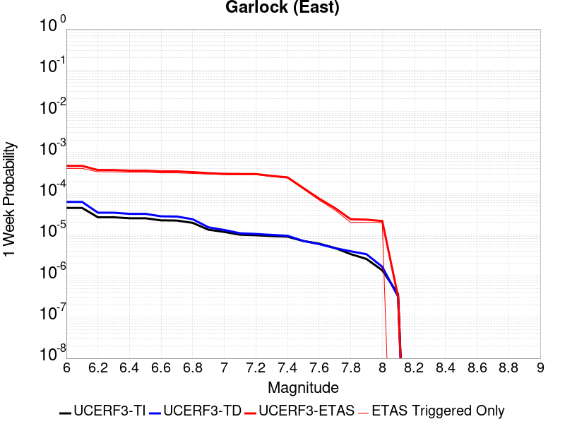 |  |  |  |

| Magnitude | 1 wk TI Prob | 1 wk TD Prob | 1 wk ETAS Prob | 1 wk ETAS/TD Gain | 1 wk ETAS Triggered Only | 1 mo TI Prob | 1 mo TD Prob | 1 mo ETAS Prob | 1 mo ETAS/TD Gain | 1 mo ETAS Triggered Only | 1 yr TI Prob | 1 yr TD Prob | 1 yr ETAS Prob | 1 yr ETAS/TD Gain | 1 yr ETAS Triggered Only | 10 yr TI Prob | 10 yr TD Prob | 10 yr ETAS Prob | 10 yr ETAS/TD Gain | 10 yr ETAS Triggered Only |
|-----|-----|-----|-----|-----|-----|-----|-----|-----|-----|-----|-----|-----|-----|-----|-----|-----|-----|-----|-----|-----|
| 6.0 | 4.5092507E-5 | 6.291901E-5 | 4.728932E-4 | 7.515904 | 4.1E-4 | 1.9323928E-4 | 2.6962755E-4 | 0.0018791935 | 6.96959 | 0.00161 | 0.0023501497 | 0.0032782198 | 0.0107237315 | 3.2712057 | 0.00747 | 0.023254504 | 0.032287683 | 0.046880785 | 1.4519712 | 0.01508 |
| 6.1 | 4.5092507E-5 | 6.291901E-5 | 4.728932E-4 | 7.515904 | 4.1E-4 | 1.9323928E-4 | 2.6962755E-4 | 0.0018791935 | 6.96959 | 0.00161 | 0.0023501497 | 0.0032782198 | 0.0107237315 | 3.2712057 | 0.00747 | 0.023254504 | 0.032287683 | 0.046880785 | 1.4519712 | 0.01508 |
| 6.2 | 2.6674514E-5 | 3.4522156E-5 | 3.7451042E-4 | 10.848408 | 3.4E-4 | 1.1431433E-4 | 1.4794388E-4 | 0.001417756 | 9.583066 | 0.00127 | 0.0013908884 | 0.0017997618 | 0.007369719 | 4.0948305 | 0.00558 | 0.01382215 | 0.01787814 | 0.028848441 | 1.6136154 | 0.01117 |
| 6.3 | 2.6674514E-5 | 3.4522156E-5 | 3.7451042E-4 | 10.848408 | 3.4E-4 | 1.1431433E-4 | 1.4794388E-4 | 0.001417756 | 9.583066 | 0.00127 | 0.0013908884 | 0.0017997618 | 0.007369719 | 4.0948305 | 0.00558 | 0.01382215 | 0.01787814 | 0.028848441 | 1.6136154 | 0.01117 |
| 6.4 | 2.5312667E-5 | 3.2350978E-5 | 3.623403E-4 | 11.200289 | 3.3E-4 | 1.0847834E-4 | 1.3863985E-4 | 0.0013984651 | 10.087036 | 0.00126 | 0.0013199237 | 0.0016866627 | 0.0071274703 | 4.225783 | 0.00545 | 0.013121112 | 0.016778192 | 0.027524805 | 1.6405109 | 0.01093 |
| 6.5 | 2.5312667E-5 | 3.2350978E-5 | 3.623403E-4 | 11.200289 | 3.3E-4 | 1.0847834E-4 | 1.3863985E-4 | 0.0013984651 | 10.087036 | 0.00126 | 0.0013199237 | 0.0016866627 | 0.0071274703 | 4.225783 | 0.00545 | 0.013121112 | 0.016778192 | 0.027524805 | 1.6405109 | 0.01093 |
| 6.6 | 2.246556E-5 | 2.8145088E-5 | 3.481361E-4 | 12.369337 | 3.2E-4 | 9.627742E-5 | 1.20616365E-4 | 0.0013204716 | 10.947699 | 0.0012 | 0.0011715472 | 0.0014675385 | 0.0066299513 | 4.5177355 | 0.00517 | 0.011653901 | 0.014618727 | 0.024718884 | 1.6909055 | 0.01025 |
| 6.7 | 2.2241198E-5 | 2.7814802E-5 | 3.478059E-4 | 12.504346 | 3.2E-4 | 9.531594E-5 | 1.1920098E-4 | 0.0013190579 | 11.065831 | 0.0012 | 0.0011598538 | 0.0014503293 | 0.00659286 | 4.545768 | 0.00515 | 0.011538187 | 0.014448618 | 0.024530808 | 1.6977962 | 0.01023 |
| 6.8 | 1.9528685E-5 | 2.3908464E-5 | 3.3390106E-4 | 13.96581 | 3.1E-4 | 8.369167E-5 | 1.0246093E-4 | 0.0012523431 | 12.22264 | 0.00115 | 0.0010184698 | 0.0012467676 | 0.006170621 | 4.949295 | 0.00493 | 0.010138147 | 0.012441509 | 0.021931946 | 1.7628043 | 0.00961 |
| 6.9 | 1.3318621E-5 | 1.5207378E-5 | 3.152028E-4 | 20.726967 | 3.0E-4 | 5.7078556E-5 | 6.5172884E-5 | 0.0011451025 | 17.57023 | 0.00108 | 6.9470983E-4 | 7.9319667E-4 | 0.0051597306 | 6.5049825 | 0.00437 | 0.0069254204 | 0.007945063 | 0.016318006 | 2.053855 | 0.00844 |
| 7.0 | 1.1760853E-5 | 1.3115919E-5 | 3.0311212E-4 | 23.110247 | 2.9E-4 | 5.0402683E-5 | 5.6209898E-5 | 0.0011061509 | 19.678934 | 0.00105 | 6.134799E-4 | 6.8414566E-4 | 0.004911252 | 7.178664 | 0.00423 | 0.0061178906 | 0.006861606 | 0.014786851 | 2.155013 | 0.00798 |
| 7.1 | 1.0064758E-5 | 1.09107295E-5 | 3.0090756E-4 | 27.579052 | 2.9E-4 | 4.3133965E-5 | 4.675945E-5 | 0.0010767113 | 23.026602 | 0.00103 | 5.2502943E-4 | 5.6915113E-4 | 0.0046568234 | 8.182051 | 0.00409 | 0.005237907 | 0.005717425 | 0.013363458 | 2.337321 | 0.00769 |
| 7.2 | 9.768808E-6 | 1.0506538E-5 | 3.0050348E-4 | 28.60157 | 2.9E-4 | 4.186565E-5 | 4.5027264E-5 | 0.0010749808 | 23.874 | 0.00103 | 5.095951E-4 | 5.480725E-4 | 0.0045658695 | 8.330775 | 0.00402 | 0.0050842804 | 0.0055075847 | 0.0130358925 | 2.3668983 | 0.00757 |
| 7.3 | 9.344516E-6 | 9.952032E-6 | 2.6994944E-4 | 27.12506 | 2.6E-4 | 4.004731E-5 | 4.2650885E-5 | 9.926104E-4 | 23.272913 | 9.5E-4 | 4.8746695E-4 | 5.191543E-4 | 0.004237223 | 8.16178 | 0.00372 | 0.0048639905 | 0.0052191834 | 0.012093119 | 2.317052 | 0.00691 |
| 7.4 | 9.023491E-6 | 9.498046E-6 | 2.4949576E-4 | 26.268114 | 2.4E-4 | 3.867153E-5 | 4.0705298E-5 | 9.006703E-4 | 22.126612 | 8.6E-4 | 4.7072413E-4 | 4.9547764E-4 | 0.0038038376 | 7.6771126 | 0.00331 | 0.004697283 | 0.0049825576 | 0.011072064 | 2.2221649 | 0.00612 |
| 7.5 | 7.081253E-6 | 7.0941337E-6 | 1.3709322E-4 | 19.324871 | 1.3E-4 | 3.0347876E-5 | 3.040308E-5 | 4.303909E-4 | 14.156162 | 4.0E-4 | 3.6942272E-4 | 3.7009537E-4 | 0.002029481 | 5.4836707 | 0.00166 | 0.003688092 | 0.0037283404 | 0.006757006 | 1.8123362 | 0.00304 |
| 7.6 | 6.116396E-6 | 5.9653516E-6 | 7.5964934E-5 | 12.73436 | 7.0E-5 | 2.6212863E-5 | 2.5565543E-5 | 2.5555966E-4 | 9.996254 | 2.3E-4 | 3.1909486E-4 | 3.112163E-4 | 0.001400877 | 4.5012975 | 0.00109 | 0.0031863707 | 0.0031395783 | 0.0050934246 | 1.6223277 | 0.00196 |
| 7.7 | 4.797145E-6 | 4.7631393E-6 | 4.476295E-5 | 9.397783 | 4.0E-5 | 2.055903E-5 | 2.0413294E-5 | 1.4041085E-4 | 6.878402 | 1.2E-4 | 2.5027743E-4 | 2.4850364E-4 | 7.7837193E-4 | 3.1322355 | 5.3E-4 | 0.0024999576 | 0.0025124259 | 0.003549813 | 1.4129026 | 0.00104 |
| 7.8 | 3.4028885E-6 | 3.9837723E-6 | 2.3983694E-5 | 6.020347 | 2.0E-5 | 1.4583726E-5 | 1.70732E-5 | 8.7072E-5 | 5.099923 | 7.0E-5 | 1.775424E-4 | 2.0784645E-4 | 5.677716E-4 | 2.7316878 | 3.6E-4 | 0.0017740062 | 0.0021040265 | 0.0027626378 | 1.3130243 | 6.6E-4 |
| 7.9 | 2.5928412E-6 | 3.3769782E-6 | 2.3376911E-5 | 6.9224343 | 2.0E-5 | 1.1112129E-5 | 1.4472684E-5 | 7.447181E-5 | 5.145681 | 6.0E-5 | 1.3528178E-4 | 1.7619075E-4 | 4.1614845E-4 | 2.36192 | 2.4E-4 | 0.0013519945 | 0.0017837033 | 0.0022428827 | 1.2574304 | 4.6E-4 |
| 8.0 | 1.3743648E-6 | 1.6755052E-6 | 2.1675472E-5 | 12.936678 | 2.0E-5 | 5.8901214E-6 | 7.180717E-6 | 3.71805E-5 | 5.177826 | 3.0E-5 | 7.1709874E-5 | 8.742175E-5 | 1.7741388E-4 | 2.029402 | 9.0E-5 | 7.1686733E-4 | 8.849517E-4 | 0.0010647924 | 1.203221 | 1.8E-4 |
| 8.1 | 3.6733252E-7 | 3.1523513E-7 | 3.1523513E-7 | 1.0 | 0.0 | 1.5742813E-6 | 1.3510071E-6 | 1.3510071E-6 | 1.0 | 0.0 | 1.9166706E-5 | 1.6448403E-5 | 3.6448073E-5 | 2.2159035 | 2.0E-5 | 1.9165053E-4 | 1.6662726E-4 | 2.0662059E-4 | 1.2400167 | 4.0E-5 |

## Hunter Mountain-Saline Valley
*[(top)](#table-of-contents)*

| 1 Week | 1 Month | 1 Year | 10 Year |
|-----|-----|-----|-----|
|  |  |  |  |

| Magnitude | 1 wk TI Prob | 1 wk TD Prob | 1 wk ETAS Prob | 1 wk ETAS/TD Gain | 1 wk ETAS Triggered Only | 1 mo TI Prob | 1 mo TD Prob | 1 mo ETAS Prob | 1 mo ETAS/TD Gain | 1 mo ETAS Triggered Only | 1 yr TI Prob | 1 yr TD Prob | 1 yr ETAS Prob | 1 yr ETAS/TD Gain | 1 yr ETAS Triggered Only | 10 yr TI Prob | 10 yr TD Prob | 10 yr ETAS Prob | 10 yr ETAS/TD Gain | 10 yr ETAS Triggered Only |
|-----|-----|-----|-----|-----|-----|-----|-----|-----|-----|-----|-----|-----|-----|-----|-----|-----|-----|-----|-----|-----|
| 6.0 | 4.5103672E-5 | 5.4575703E-5 | 3.9455714E-4 | 7.2295384 | 3.4E-4 | 1.9328714E-4 | 2.3387565E-4 | 0.001403602 | 6.0014887 | 0.00117 | 0.002350731 | 0.0028438994 | 0.007201472 | 2.5322526 | 0.00437 | 0.023260195 | 0.028095502 | 0.035909615 | 1.2781268 | 0.00804 |
| 6.1 | 4.5103672E-5 | 5.4575703E-5 | 3.9455714E-4 | 7.2295384 | 3.4E-4 | 1.9328714E-4 | 2.3387565E-4 | 0.001403602 | 6.0014887 | 0.00117 | 0.002350731 | 0.0028438994 | 0.007201472 | 2.5322526 | 0.00437 | 0.023260195 | 0.028095502 | 0.035909615 | 1.2781268 | 0.00804 |
| 6.2 | 3.9363465E-5 | 4.7068323E-5 | 3.870523E-4 | 8.223202 | 3.4E-4 | 1.6868966E-4 | 2.017062E-4 | 0.0013714702 | 6.7993455 | 0.00117 | 0.002051862 | 0.0024531453 | 0.0067824987 | 2.7648172 | 0.00434 | 0.020330196 | 0.02427648 | 0.032092024 | 1.321939 | 0.00801 |
| 6.3 | 3.9363465E-5 | 4.7068323E-5 | 3.870523E-4 | 8.223202 | 3.4E-4 | 1.6868966E-4 | 2.017062E-4 | 0.0013714702 | 6.7993455 | 0.00117 | 0.002051862 | 0.0024531453 | 0.0067824987 | 2.7648172 | 0.00434 | 0.020330196 | 0.02427648 | 0.032092024 | 1.321939 | 0.00801 |
| 6.4 | 3.2311684E-5 | 3.7955364E-5 | 3.7794246E-4 | 9.957551 | 3.4E-4 | 1.384713E-4 | 1.6265611E-4 | 0.0013324658 | 8.191919 | 0.00117 | 0.0016845843 | 0.001978608 | 0.006300041 | 3.184077 | 0.00433 | 0.016718714 | 0.019618724 | 0.027432362 | 1.3982745 | 0.00797 |
| 6.5 | 3.2311684E-5 | 3.7955364E-5 | 3.7794246E-4 | 9.957551 | 3.4E-4 | 1.384713E-4 | 1.6265611E-4 | 0.0013324658 | 8.191919 | 0.00117 | 0.0016845843 | 0.001978608 | 0.006300041 | 3.184077 | 0.00433 | 0.016718714 | 0.019618724 | 0.027432362 | 1.3982745 | 0.00797 |
| 6.6 | 2.9305844E-5 | 3.4185698E-5 | 3.7417407E-4 | 10.94534 | 3.4E-4 | 1.2559042E-4 | 1.4650227E-4 | 0.0013063323 | 8.916806 | 0.00116 | 0.0015279909 | 0.0017822677 | 0.0060945684 | 3.4195583 | 0.00432 | 0.015175272 | 0.017687676 | 0.025506882 | 1.4420708 | 0.00796 |
| 6.7 | 2.7826512E-5 | 3.2347863E-5 | 3.7233686E-4 | 11.5104 | 3.4E-4 | 1.19251024E-4 | 1.3862668E-4 | 0.0012884672 | 9.294512 | 0.00115 | 0.0014509142 | 0.0016865334 | 0.005969298 | 3.5393891 | 0.00429 | 0.014414776 | 0.016745051 | 0.02453243 | 1.4650556 | 0.00792 |
| 6.8 | 2.3389874E-5 | 2.686962E-5 | 3.6686048E-4 | 13.653356 | 3.4E-4 | 1.0023846E-4 | 1.15150695E-4 | 0.0012650182 | 10.985764 | 0.00115 | 0.00121972 | 0.0014011054 | 0.0056651225 | 4.0433235 | 0.00427 | 0.01213047 | 0.013928953 | 0.021709053 | 1.5585561 | 0.00789 |
| 6.9 | 2.069209E-5 | 2.357255E-5 | 3.6356453E-4 | 15.423217 | 3.4E-4 | 8.867737E-5 | 1.01021506E-4 | 0.0012509053 | 12.3825655 | 0.00115 | 0.0010791123 | 0.001229279 | 0.0054740547 | 4.453061 | 0.00425 | 0.010738871 | 0.012229844 | 0.020003594 | 1.6356378 | 0.00787 |
| 7.0 | 1.7462342E-5 | 1.9635605E-5 | 3.5962893E-4 | 18.315144 | 3.4E-4 | 7.483646E-5 | 8.415001E-5 | 0.0012340533 | 14.664921 | 0.00115 | 9.1075303E-4 | 0.0010240674 | 0.0052597253 | 5.136112 | 0.00424 | 0.009070295 | 0.010197138 | 0.017957194 | 1.7610031 | 0.00784 |
| 7.1 | 1.4807709E-5 | 1.6443466E-5 | 3.5643787E-4 | 21.676565 | 3.4E-4 | 6.3460066E-5 | 7.047019E-5 | 0.0012203892 | 17.317808 | 0.00115 | 7.723524E-4 | 8.5765333E-4 | 0.005094017 | 5.9394827 | 0.00424 | 0.007696735 | 0.008546443 | 0.016269866 | 1.9037004 | 0.00779 |
| 7.2 | 1.4180048E-5 | 1.5699981E-5 | 3.5569465E-4 | 22.655737 | 3.4E-4 | 6.077022E-5 | 6.728399E-5 | 0.0012172066 | 18.090584 | 0.00115 | 7.396263E-4 | 8.1889087E-4 | 0.0050554187 | 6.173495 | 0.00424 | 0.0073716943 | 0.008161707 | 0.015878208 | 1.945452 | 0.00778 |
| 7.3 | 1.3730402E-5 | 1.517367E-5 | 3.551685E-4 | 23.406895 | 3.4E-4 | 5.8843252E-5 | 6.5028486E-5 | 0.0012149537 | 18.683407 | 0.00115 | 7.161811E-4 | 7.914503E-4 | 0.0050280946 | 6.3530135 | 0.00424 | 0.007138774 | 0.007889271 | 0.015607893 | 1.9783695 | 0.00778 |
| 7.4 | 1.2810095E-5 | 1.4110783E-5 | 3.5410599E-4 | 25.09471 | 3.4E-4 | 5.489925E-5 | 6.047347E-5 | 0.0012004045 | 19.850101 | 0.00114 | 6.681934E-4 | 7.360316E-4 | 0.004942933 | 6.715653 | 0.00421 | 0.006661878 | 0.0073388554 | 0.014992273 | 2.0428624 | 0.00771 |
| 7.5 | 1.1595659E-5 | 1.280203E-5 | 3.5279768E-4 | 27.557947 | 3.4E-4 | 4.9694736E-5 | 5.486478E-5 | 0.0011848027 | 21.594961 | 0.00113 | 6.0486543E-4 | 6.6778966E-4 | 0.0047850385 | 7.165488 | 0.00412 | 0.006032217 | 0.0066607227 | 0.014160434 | 2.1259606 | 0.00755 |
| 7.6 | 2.997694E-6 | 3.325686E-6 | 1.4332522E-4 | 43.096436 | 1.4E-4 | 1.28471975E-5 | 1.4252903E-5 | 5.1424577E-4 | 36.08007 | 5.0E-4 | 1.564034E-4 | 1.7352257E-4 | 0.0019332172 | 11.141013 | 0.00176 | 0.0015629337 | 0.0017353615 | 0.00500967 | 2.886816 | 0.00328 |

## Ash Hill
*[(top)](#table-of-contents)*

| 1 Week | 1 Month | 1 Year | 10 Year |
|-----|-----|-----|-----|
|  |  | 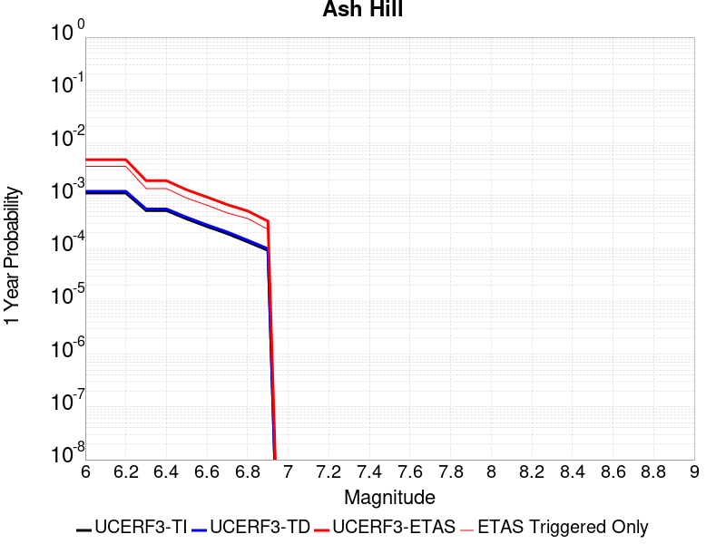 |  |

| Magnitude | 1 wk TI Prob | 1 wk TD Prob | 1 wk ETAS Prob | 1 wk ETAS/TD Gain | 1 wk ETAS Triggered Only | 1 mo TI Prob | 1 mo TD Prob | 1 mo ETAS Prob | 1 mo ETAS/TD Gain | 1 mo ETAS Triggered Only | 1 yr TI Prob | 1 yr TD Prob | 1 yr ETAS Prob | 1 yr ETAS/TD Gain | 1 yr ETAS Triggered Only | 10 yr TI Prob | 10 yr TD Prob | 10 yr ETAS Prob | 10 yr ETAS/TD Gain | 10 yr ETAS Triggered Only |
|-----|-----|-----|-----|-----|-----|-----|-----|-----|-----|-----|-----|-----|-----|-----|-----|-----|-----|-----|-----|-----|
| 6.0 | 2.1545662E-5 | 2.3195389E-5 | 3.1318865E-4 | 13.502195 | 2.9E-4 | 9.2335285E-5 | 9.940547E-5 | 0.001019314 | 10.254104 | 9.2E-4 | 0.0011236023 | 0.0012096697 | 0.004795327 | 3.9641623 | 0.00359 | 0.011179381 | 0.012038835 | 0.018796489 | 1.5613213 | 0.00684 |
| 6.1 | 2.1545662E-5 | 2.3195389E-5 | 3.1318865E-4 | 13.502195 | 2.9E-4 | 9.2335285E-5 | 9.940547E-5 | 0.001019314 | 10.254104 | 9.2E-4 | 0.0011236023 | 0.0012096697 | 0.004795327 | 3.9641623 | 0.00359 | 0.011179381 | 0.012038835 | 0.018796489 | 1.5613213 | 0.00684 |
| 6.2 | 2.1545662E-5 | 2.3195389E-5 | 3.1318865E-4 | 13.502195 | 2.9E-4 | 9.2335285E-5 | 9.940547E-5 | 0.001019314 | 10.254104 | 9.2E-4 | 0.0011236023 | 0.0012096697 | 0.004795327 | 3.9641623 | 0.00359 | 0.011179381 | 0.012038835 | 0.018796489 | 1.5613213 | 0.00684 |
| 6.3 | 1.0025529E-5 | 1.0747344E-5 | 5.0746916E-5 | 4.7218094 | 4.0E-5 | 4.2965847E-5 | 4.605931E-5 | 3.1604688E-4 | 6.8617373 | 2.7E-4 | 5.229836E-4 | 5.6064106E-4 | 0.0019198785 | 3.4244347 | 0.00136 | 0.005217545 | 0.0055935793 | 0.008268532 | 1.4782186 | 0.00269 |
| 6.4 | 1.0025529E-5 | 1.0747344E-5 | 5.0746916E-5 | 4.7218094 | 4.0E-5 | 4.2965847E-5 | 4.605931E-5 | 3.1604688E-4 | 6.8617373 | 2.7E-4 | 5.229836E-4 | 5.6064106E-4 | 0.0019198785 | 3.4244347 | 0.00136 | 0.005217545 | 0.0055935793 | 0.008268532 | 1.4782186 | 0.00269 |
| 6.5 | 6.9617327E-6 | 7.4569152E-6 | 4.745662E-5 | 6.3641086 | 4.0E-5 | 2.9835655E-5 | 3.1957865E-5 | 2.3195148E-4 | 7.25804 | 2.0E-4 | 3.6318856E-4 | 3.8902622E-4 | 0.001288676 | 3.3125687 | 9.0E-4 | 0.0036259557 | 0.0038843066 | 0.0057271207 | 1.4744254 | 0.00185 |
| 6.6 | 4.9919777E-6 | 5.34689E-6 | 1.5346837E-5 | 2.8702362 | 1.0E-5 | 2.1394015E-5 | 2.291508E-5 | 1.6291186E-4 | 7.1093745 | 1.4E-4 | 2.60441E-4 | 2.7896208E-4 | 9.387779E-4 | 3.365253 | 6.6E-4 | 0.0026013597 | 0.0027867774 | 0.004113071 | 1.4759238 | 0.00133 |
| 6.7 | 3.6630722E-6 | 3.9247725E-6 | 1.3924733E-5 | 3.5479085 | 1.0E-5 | 1.5698786E-5 | 1.6820377E-5 | 1.16818694E-4 | 6.9450703 | 1.0E-4 | 1.9111596E-4 | 2.0477458E-4 | 6.7467836E-4 | 3.2947366 | 4.7E-4 | 0.0019095168 | 0.002046422 | 0.0029545596 | 1.4437686 | 9.1E-4 |
| 6.8 | 2.5599613E-6 | 2.7450303E-6 | 2.7450303E-6 | 1.0 | 0.0 | 1.0971216E-5 | 1.176439E-5 | 6.17638E-5 | 5.250064 | 5.0E-5 | 1.3356637E-4 | 1.4322698E-4 | 5.13174E-4 | 3.582942 | 3.7E-4 | 0.0013348613 | 0.0014318317 | 0.0020908867 | 1.460288 | 6.6E-4 |
| 6.9 | 1.7684905E-6 | 1.8969438E-6 | 1.8969438E-6 | 1.0 | 0.0 | 7.579223E-6 | 8.129759E-6 | 2.8129596E-5 | 3.4600775 | 2.0E-5 | 9.2273134E-5 | 9.897981E-5 | 3.2895704E-4 | 3.323476 | 2.3E-4 | 9.223483E-4 | 9.897981E-4 | 0.0014093824 | 1.423909 | 4.2E-4 |

## Blackwater
*[(top)](#table-of-contents)*

| 1 Week | 1 Month | 1 Year | 10 Year |
|-----|-----|-----|-----|
|  |  |  |  |

| Magnitude | 1 wk TI Prob | 1 wk TD Prob | 1 wk ETAS Prob | 1 wk ETAS/TD Gain | 1 wk ETAS Triggered Only | 1 mo TI Prob | 1 mo TD Prob | 1 mo ETAS Prob | 1 mo ETAS/TD Gain | 1 mo ETAS Triggered Only | 1 yr TI Prob | 1 yr TD Prob | 1 yr ETAS Prob | 1 yr ETAS/TD Gain | 1 yr ETAS Triggered Only | 10 yr TI Prob | 10 yr TD Prob | 10 yr ETAS Prob | 10 yr ETAS/TD Gain | 10 yr ETAS Triggered Only |
|-----|-----|-----|-----|-----|-----|-----|-----|-----|-----|-----|-----|-----|-----|-----|-----|-----|-----|-----|-----|-----|
| 6.0 | 3.0708583E-5 | 3.3097214E-5 | 2.930886E-4 | 8.855386 | 2.6E-4 | 1.3160157E-4 | 1.4183826E-4 | 8.0174464E-4 | 5.6525273 | 6.6E-4 | 0.0016010714 | 0.0017256497 | 0.0047304556 | 2.7412605 | 0.00301 | 0.015895851 | 0.017136335 | 0.023200605 | 1.3538836 | 0.00617 |
| 6.1 | 3.0708583E-5 | 3.3097214E-5 | 2.930886E-4 | 8.855386 | 2.6E-4 | 1.3160157E-4 | 1.4183826E-4 | 8.0174464E-4 | 5.6525273 | 6.6E-4 | 0.0016010714 | 0.0017256497 | 0.0047304556 | 2.7412605 | 0.00301 | 0.015895851 | 0.017136335 | 0.023200605 | 1.3538836 | 0.00617 |
| 6.2 | 1.1707779E-5 | 1.2545598E-5 | 1.12544345E-4 | 8.970823 | 1.0E-4 | 5.017523E-5 | 5.3765798E-5 | 2.7375398E-4 | 5.091601 | 2.2E-4 | 6.107122E-4 | 6.5441156E-4 | 0.0018136525 | 2.7714248 | 0.00116 | 0.006090366 | 0.0065258164 | 0.008979698 | 1.3760267 | 0.00247 |
| 6.3 | 1.1707779E-5 | 1.2545598E-5 | 1.12544345E-4 | 8.970823 | 1.0E-4 | 5.017523E-5 | 5.3765798E-5 | 2.7375398E-4 | 5.091601 | 2.2E-4 | 6.107122E-4 | 6.5441156E-4 | 0.0018136525 | 2.7714248 | 0.00116 | 0.006090366 | 0.0065258164 | 0.008979698 | 1.3760267 | 0.00247 |
| 6.4 | 7.929244E-6 | 8.4804105E-6 | 5.8479985E-5 | 6.8958907 | 5.0E-5 | 3.3982033E-5 | 3.6344132E-5 | 1.363405E-4 | 3.7513757 | 1.0E-4 | 4.136527E-4 | 4.4240404E-4 | 0.0011320987 | 2.5589702 | 6.9E-4 | 0.0041288356 | 0.0044156383 | 0.0059986175 | 1.3584938 | 0.00159 |
| 6.5 | 5.8832115E-6 | 6.286219E-6 | 3.628603E-5 | 5.772314 | 3.0E-5 | 2.521352E-5 | 2.6940676E-5 | 8.693906E-5 | 3.2270555 | 6.0E-5 | 3.0693135E-4 | 3.279559E-4 | 8.177952E-4 | 2.4936132 | 4.9E-4 | 0.0030650778 | 0.0032749726 | 0.004381337 | 1.3378241 | 0.00111 |
| 6.6 | 5.8832115E-6 | 6.286219E-6 | 3.628603E-5 | 5.772314 | 3.0E-5 | 2.521352E-5 | 2.6940676E-5 | 8.693906E-5 | 3.2270555 | 6.0E-5 | 3.0693135E-4 | 3.279559E-4 | 8.177952E-4 | 2.4936132 | 4.9E-4 | 0.0030650778 | 0.0032749726 | 0.004381337 | 1.3378241 | 0.00111 |
| 6.7 | 3.0715053E-6 | 3.2815851E-6 | 3.3281485E-5 | 10.141893 | 3.0E-5 | 1.3163528E-5 | 1.4063868E-5 | 5.4063305E-5 | 3.844128 | 4.0E-5 | 1.6025416E-4 | 1.7121529E-4 | 4.011759E-4 | 2.343108 | 2.3E-4 | 0.0016013865 | 0.0017109484 | 0.0022200758 | 1.2975703 | 5.1E-4 |
| 6.8 | 2.2722281E-6 | 2.4288424E-6 | 2.2428794E-5 | 9.234355 | 2.0E-5 | 9.738084E-6 | 1.0409289E-5 | 4.0408977E-5 | 3.8820114 | 3.0E-5 | 1.1855473E-4 | 1.2672663E-4 | 3.267013E-4 | 2.5780003 | 2.0E-4 | 0.001184915 | 0.0012666339 | 0.0016861019 | 1.3311676 | 4.2E-4 |
| 6.9 | 9.952399E-7 | 1.0653887E-6 | 1.0653887E-6 | 1.0 | 0.0 | 4.265307E-6 | 4.5659463E-6 | 4.5659463E-6 | 1.0 | 0.0 | 5.1928873E-5 | 5.5589495E-5 | 8.5587824E-5 | 1.5396403 | 3.0E-5 | 5.191674E-4 | 5.558065E-4 | 6.557509E-4 | 1.1798187 | 1.0E-4 |
| 7.0 | 4.7385504E-7 | 5.075751E-7 | 5.075751E-7 | 1.0 | 0.0 | 2.0308057E-6 | 2.175322E-6 | 2.175322E-6 | 1.0 | 0.0 | 2.4724779E-5 | 2.6484544E-5 | 5.648375E-5 | 2.1327062 | 3.0E-5 | 2.4722028E-4 | 2.6484544E-4 | 3.0483483E-4 | 1.1509914 | 4.0E-5 |

## Garlock (West)
*[(top)](#table-of-contents)*

| 1 Week | 1 Month | 1 Year | 10 Year |
|-----|-----|-----|-----|
|  |  |  |  |

| Magnitude | 1 wk TI Prob | 1 wk TD Prob | 1 wk ETAS Prob | 1 wk ETAS/TD Gain | 1 wk ETAS Triggered Only | 1 mo TI Prob | 1 mo TD Prob | 1 mo ETAS Prob | 1 mo ETAS/TD Gain | 1 mo ETAS Triggered Only | 1 yr TI Prob | 1 yr TD Prob | 1 yr ETAS Prob | 1 yr ETAS/TD Gain | 1 yr ETAS Triggered Only | 10 yr TI Prob | 10 yr TD Prob | 10 yr ETAS Prob | 10 yr ETAS/TD Gain | 10 yr ETAS Triggered Only |
|-----|-----|-----|-----|-----|-----|-----|-----|-----|-----|-----|-----|-----|-----|-----|-----|-----|-----|-----|-----|-----|
| 6.0 | 2.5181727E-5 | 2.5216248E-5 | 2.9520944E-4 | 11.707111 | 2.7E-4 | 1.0791722E-4 | 1.0806518E-4 | 9.1797765E-4 | 8.494666 | 8.1E-4 | 0.0013131002 | 0.0013149029 | 0.0043309317 | 3.2937274 | 0.00302 | 0.013053683 | 0.013152735 | 0.018511316 | 1.4074118 | 0.00543 |
| 6.1 | 2.5077732E-5 | 2.5117288E-5 | 2.951105E-4 | 11.749298 | 2.7E-4 | 1.0747157E-4 | 1.0764109E-4 | 9.175539E-4 | 8.524197 | 8.1E-4 | 0.001307681 | 0.001309746 | 0.0043257903 | 3.3027709 | 0.00302 | 0.013000126 | 0.013101775 | 0.018460631 | 1.4090177 | 0.00543 |
| 6.2 | 2.494612E-5 | 2.4998972E-5 | 2.9499223E-4 | 11.800175 | 2.7E-4 | 1.0690756E-4 | 1.0713407E-4 | 9.1704726E-4 | 8.559811 | 8.1E-4 | 0.0013008224 | 0.0013035802 | 0.0043196436 | 3.3136768 | 0.00302 | 0.012932341 | 0.0130408425 | 0.01840003 | 1.4109541 | 0.00543 |
| 6.3 | 2.4733758E-5 | 2.4818324E-5 | 2.9481162E-4 | 11.878788 | 2.7E-4 | 1.0599751E-4 | 1.0635993E-4 | 9.162738E-4 | 8.61484 | 8.1E-4 | 0.0012897556 | 0.0012941663 | 0.0043102577 | 3.3305285 | 0.00302 | 0.012822957 | 0.012947805 | 0.018297628 | 1.4131838 | 0.00542 |
| 6.4 | 2.3237335E-5 | 2.3197525E-5 | 2.9319126E-4 | 12.638903 | 2.7E-4 | 9.958477E-5 | 9.9414196E-5 | 9.0933364E-4 | 9.14692 | 8.1E-4 | 0.0012117702 | 0.0012096985 | 0.004226045 | 3.4934697 | 0.00302 | 0.012051838 | 0.012112607 | 0.01742744 | 1.4387853 | 0.00538 |
| 6.5 | 2.2732203E-5 | 2.3011888E-5 | 2.9300567E-4 | 12.732796 | 2.7E-4 | 9.742009E-5 | 9.8618664E-5 | 9.0853876E-4 | 9.212646 | 8.1E-4 | 0.0011854442 | 0.0012000237 | 0.0042163995 | 3.513597 | 0.00302 | 0.011791403 | 0.012016909 | 0.017332258 | 1.4423225 | 0.00538 |
| 6.6 | 2.1319436E-5 | 2.179202E-5 | 2.9178613E-4 | 13.3895855 | 2.7E-4 | 9.136581E-5 | 9.339105E-5 | 9.033154E-4 | 9.672399 | 8.1E-4 | 0.001111811 | 0.0011364452 | 0.0041430243 | 3.6455998 | 0.00301 | 0.011062649 | 0.011387785 | 0.016696632 | 1.466188 | 0.00537 |
| 6.7 | 1.970802E-5 | 2.0411735E-5 | 2.9040623E-4 | 14.227415 | 2.7E-4 | 8.446021E-5 | 8.747594E-5 | 8.974051E-4 | 10.258879 | 8.1E-4 | 0.001027818 | 0.0010645009 | 0.0040712967 | 3.8246062 | 0.00301 | 0.010230771 | 0.010675436 | 0.015988108 | 1.497654 | 0.00537 |
| 6.8 | 1.8744462E-5 | 1.9919305E-5 | 2.8991394E-4 | 14.5544195 | 2.7E-4 | 8.033094E-5 | 8.536567E-5 | 8.952965E-4 | 10.4877825 | 8.1E-4 | 9.775903E-4 | 0.0010388332 | 0.0040457062 | 3.8944716 | 0.00301 | 0.009733009 | 0.0104211895 | 0.015735228 | 1.5099262 | 0.00537 |
| 6.9 | 1.7559682E-5 | 1.8971561E-5 | 2.8896643E-4 | 15.231559 | 2.7E-4 | 7.5253614E-5 | 8.130416E-5 | 8.9123833E-4 | 10.96178 | 8.1E-4 | 9.158276E-4 | 9.894301E-4 | 0.003996452 | 4.0391455 | 0.00301 | 0.0091206245 | 0.009931459 | 0.015238226 | 1.5343392 | 0.00536 |
| 7.0 | 1.6794445E-5 | 1.823424E-5 | 2.8822932E-4 | 15.807038 | 2.7E-4 | 7.197421E-5 | 7.81444E-5 | 8.880811E-4 | 11.364615 | 8.1E-4 | 8.759337E-4 | 9.509942E-4 | 0.0039581317 | 4.1620984 | 0.00301 | 0.008724891 | 0.009550322 | 0.014849228 | 1.5548406 | 0.00535 |
| 7.1 | 1.6337795E-5 | 1.7734945E-5 | 2.8773016E-4 | 16.223911 | 2.7E-4 | 7.0017246E-5 | 7.60047E-5 | 8.859431E-4 | 11.656425 | 8.1E-4 | 8.521265E-4 | 9.249657E-4 | 0.0039321817 | 4.251165 | 0.00301 | 0.008488664 | 0.00929198 | 0.014552641 | 1.5661505 | 0.00531 |
| 7.2 | 1.5780008E-5 | 1.7183505E-5 | 2.8717887E-4 | 16.712473 | 2.7E-4 | 6.762685E-5 | 7.3641524E-5 | 8.835819E-4 | 11.998419 | 8.1E-4 | 8.2304585E-4 | 8.9621806E-4 | 0.0038835383 | 4.3332515 | 0.00299 | 0.008200042 | 0.009006796 | 0.014249151 | 1.5820442 | 0.00529 |
| 7.3 | 1.5058865E-5 | 1.6636446E-5 | 2.8663196E-4 | 17.229158 | 2.7E-4 | 6.45364E-5 | 7.129711E-5 | 8.8123936E-4 | 12.360099 | 8.1E-4 | 7.854473E-4 | 8.676978E-4 | 0.0038351207 | 4.4198804 | 0.00297 | 0.00782677 | 0.00872343 | 0.013927633 | 1.5965774 | 0.00525 |
| 7.4 | 1.4887923E-5 | 1.6472359E-5 | 2.7646808E-4 | 16.783756 | 2.6E-4 | 6.380382E-5 | 7.0593924E-5 | 8.6053816E-4 | 12.189975 | 7.9E-4 | 7.7653467E-4 | 8.591433E-4 | 0.003766643 | 4.384185 | 0.00291 | 0.0077382675 | 0.008638229 | 0.013743742 | 1.591037 | 0.00515 |
| 7.5 | 1.4509299E-5 | 1.6064254E-5 | 2.4606055E-4 | 15.317273 | 2.3E-4 | 6.218123E-5 | 6.8844995E-5 | 7.687968E-4 | 11.167069 | 7.0E-4 | 7.567935E-4 | 8.378666E-4 | 0.0035156212 | 4.19592 | 0.00268 | 0.0075422134 | 0.008426482 | 0.0131463725 | 1.5601258 | 0.00476 |
| 7.6 | 1.2756717E-5 | 1.4067613E-5 | 1.6406551E-4 | 11.66264 | 1.5E-4 | 5.4670498E-5 | 6.028838E-5 | 5.0026184E-4 | 8.297815 | 4.4E-4 | 6.6541E-4 | 7.337645E-4 | 0.0025624216 | 3.4921582 | 0.00183 | 0.006634211 | 0.0073910584 | 0.010547555 | 1.4270697 | 0.00318 |
| 7.7 | 1.0328985E-5 | 1.1476324E-5 | 1.3147495E-4 | 11.45619 | 1.2E-4 | 4.4266326E-5 | 4.9183323E-5 | 3.2916956E-4 | 6.6927066 | 2.8E-4 | 5.388092E-4 | 5.986428E-4 | 0.0016380203 | 2.736223 | 0.00104 | 0.0053750467 | 0.006046964 | 0.007995112 | 1.3221695 | 0.00196 |
| 7.8 | 7.0306583E-6 | 8.912348E-6 | 1.0891146E-4 | 12.220287 | 1.0E-4 | 3.0131043E-5 | 3.819522E-5 | 2.581868E-4 | 6.759663 | 2.2E-4 | 3.667837E-4 | 4.6492773E-4 | 0.001214579 | 2.6124039 | 7.5E-4 | 0.003661789 | 0.004702143 | 0.0059960303 | 1.2751697 | 0.0013 |
| 7.9 | 4.060633E-6 | 5.472873E-6 | 7.547249E-5 | 13.790287 | 7.0E-5 | 1.7402595E-5 | 2.3454959E-5 | 1.4345214E-4 | 6.116069 | 1.2E-4 | 2.11856E-4 | 2.8552682E-4 | 7.2540116E-4 | 2.5405712 | 4.4E-4 | 0.0021165414 | 0.0028883645 | 0.0036361981 | 1.2589126 | 7.5E-4 |
| 8.0 | 1.6729537E-6 | 2.080019E-6 | 3.2079955E-5 | 15.422915 | 3.0E-5 | 7.169782E-6 | 8.914337E-6 | 4.8913982E-5 | 5.4871135 | 4.0E-5 | 8.7288594E-5 | 1.08526685E-4 | 2.485115E-4 | 2.2898653 | 1.4E-4 | 8.7254314E-4 | 0.0010985459 | 0.0013482713 | 1.2273235 | 2.5E-4 |
| 8.1 | 3.6733252E-7 | 3.1523513E-7 | 3.1523513E-7 | 1.0 | 0.0 | 1.5742813E-6 | 1.3510071E-6 | 1.3510071E-6 | 1.0 | 0.0 | 1.9166706E-5 | 1.6448403E-5 | 3.6448073E-5 | 2.2159035 | 2.0E-5 | 1.9165053E-4 | 1.6662726E-4 | 2.0662059E-4 | 1.2400167 | 4.0E-5 |

## McLean Lake
*[(top)](#table-of-contents)*

| 1 Week | 1 Month | 1 Year | 10 Year |
|-----|-----|-----|-----|
|  | 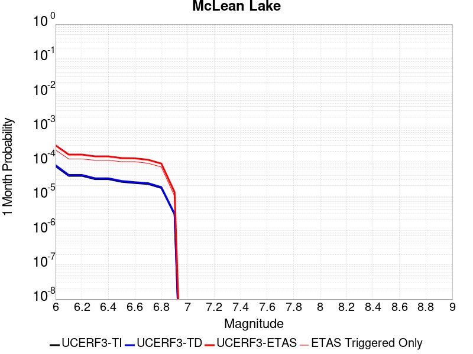 |  |  |

| Magnitude | 1 wk TI Prob | 1 wk TD Prob | 1 wk ETAS Prob | 1 wk ETAS/TD Gain | 1 wk ETAS Triggered Only | 1 mo TI Prob | 1 mo TD Prob | 1 mo ETAS Prob | 1 mo ETAS/TD Gain | 1 mo ETAS Triggered Only | 1 yr TI Prob | 1 yr TD Prob | 1 yr ETAS Prob | 1 yr ETAS/TD Gain | 1 yr ETAS Triggered Only | 10 yr TI Prob | 10 yr TD Prob | 10 yr ETAS Prob | 10 yr ETAS/TD Gain | 10 yr ETAS Triggered Only |
|-----|-----|-----|-----|-----|-----|-----|-----|-----|-----|-----|-----|-----|-----|-----|-----|-----|-----|-----|-----|-----|
| 6.0 | 1.7360222E-5 | 1.8502275E-5 | 7.8501165E-5 | 4.2427845 | 6.0E-5 | 7.439883E-5 | 7.929332E-5 | 2.9927588E-4 | 3.7742884 | 2.2E-4 | 9.0542925E-4 | 9.6501724E-4 | 0.0025734636 | 2.666754 | 0.00161 | 0.009017491 | 0.009613109 | 0.013436003 | 1.397675 | 0.00386 |
| 6.1 | 9.062689E-6 | 9.592492E-6 | 4.959211E-5 | 5.1698885 | 4.0E-5 | 3.8839516E-5 | 4.1110077E-5 | 1.6110514E-4 | 3.918872 | 1.2E-4 | 4.727685E-4 | 5.0040917E-4 | 0.0013399888 | 2.6777864 | 8.4E-4 | 0.0047176396 | 0.0049937065 | 0.0071031195 | 1.4224144 | 0.00212 |
| 6.2 | 9.062689E-6 | 9.592492E-6 | 4.959211E-5 | 5.1698885 | 4.0E-5 | 3.8839516E-5 | 4.1110077E-5 | 1.6110514E-4 | 3.918872 | 1.2E-4 | 4.727685E-4 | 5.0040917E-4 | 0.0013399888 | 2.6777864 | 8.4E-4 | 0.0047176396 | 0.0049937065 | 0.0071031195 | 1.4224144 | 0.00212 |
| 6.3 | 7.2575485E-6 | 7.66794E-6 | 3.766771E-5 | 4.912364 | 3.0E-5 | 3.110341E-5 | 3.2862223E-5 | 1.4285861E-4 | 4.3471985 | 1.1E-4 | 3.786182E-4 | 4.0003125E-4 | 0.0010297792 | 2.574247 | 6.3E-4 | 0.0037797375 | 0.003993816 | 0.0055973865 | 1.4015132 | 0.00161 |
| 6.4 | 7.2575485E-6 | 7.66794E-6 | 3.766771E-5 | 4.912364 | 3.0E-5 | 3.110341E-5 | 3.2862223E-5 | 1.4285861E-4 | 4.3471985 | 1.1E-4 | 3.786182E-4 | 4.0003125E-4 | 0.0010297792 | 2.574247 | 6.3E-4 | 0.0037797375 | 0.003993816 | 0.0055973865 | 1.4015132 | 0.00161 |
| 6.5 | 6.06582E-6 | 6.4040664E-6 | 2.6403939E-5 | 4.1229954 | 2.0E-5 | 2.5996113E-5 | 2.7445747E-5 | 1.27443E-4 | 4.6434517 | 1.0E-4 | 3.164567E-4 | 3.3410723E-4 | 8.539335E-4 | 2.5558665 | 5.2E-4 | 0.0031600643 | 0.0033366878 | 0.0046722167 | 1.4002558 | 0.00134 |
| 6.6 | 5.598744E-6 | 5.910437E-6 | 2.5910318E-5 | 4.383825 | 2.0E-5 | 2.3994397E-5 | 2.5330233E-5 | 1.253277E-4 | 4.9477515 | 1.0E-4 | 2.9209262E-4 | 3.0835834E-4 | 7.882103E-4 | 2.5561504 | 4.8E-4 | 0.0029170897 | 0.003079934 | 0.004336053 | 1.4078397 | 0.00126 |
| 6.7 | 5.246996E-6 | 5.5393257E-6 | 1.553927E-5 | 2.8052638 | 1.0E-5 | 2.2486933E-5 | 2.3739787E-5 | 1.1373765E-4 | 4.7910137 | 9.0E-5 | 2.73744E-4 | 2.8899993E-4 | 7.388699E-4 | 2.5566437 | 4.5E-4 | 0.0027340704 | 0.0028868648 | 0.0040734294 | 1.4110218 | 0.00119 |
| 6.8 | 4.02324E-6 | 4.2470297E-6 | 1.4246987E-5 | 3.3545768 | 1.0E-5 | 1.7242342E-5 | 1.8201463E-5 | 8.820019E-5 | 4.8457747 | 7.0E-5 | 2.099053E-4 | 2.2158623E-4 | 6.114998E-4 | 2.7596471 | 3.9E-4 | 0.0020970714 | 0.0022142373 | 0.003142178 | 1.4190792 | 9.3E-4 |
| 6.9 | 6.835972E-7 | 7.140097E-7 | 1.0714002E-5 | 15.005403 | 1.0E-5 | 2.9296991E-6 | 3.0600397E-6 | 1.3060009E-5 | 4.2679214 | 1.0E-5 | 3.56685E-5 | 3.7255664E-5 | 1.1725268E-4 | 3.1472445 | 8.0E-5 | 3.5662777E-4 | 3.7252545E-4 | 5.324658E-4 | 1.4293408 | 1.6E-4 |

## Goldstone Lake
*[(top)](#table-of-contents)*

| 1 Week | 1 Month | 1 Year | 10 Year |
|-----|-----|-----|-----|
|  | 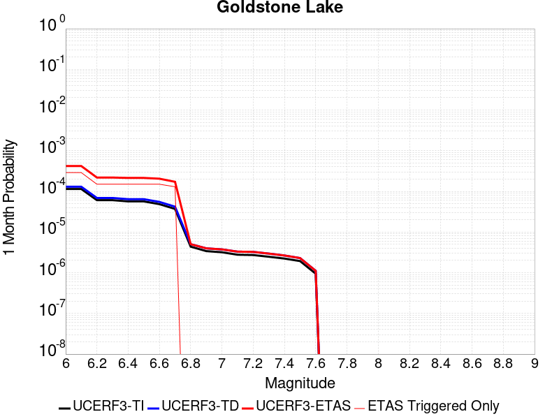 | 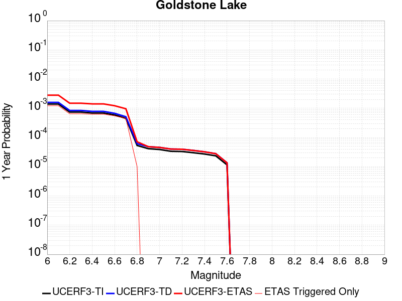 |  |

| Magnitude | 1 wk TI Prob | 1 wk TD Prob | 1 wk ETAS Prob | 1 wk ETAS/TD Gain | 1 wk ETAS Triggered Only | 1 mo TI Prob | 1 mo TD Prob | 1 mo ETAS Prob | 1 mo ETAS/TD Gain | 1 mo ETAS Triggered Only | 1 yr TI Prob | 1 yr TD Prob | 1 yr ETAS Prob | 1 yr ETAS/TD Gain | 1 yr ETAS Triggered Only | 10 yr TI Prob | 10 yr TD Prob | 10 yr ETAS Prob | 10 yr ETAS/TD Gain | 10 yr ETAS Triggered Only |
|-----|-----|-----|-----|-----|-----|-----|-----|-----|-----|-----|-----|-----|-----|-----|-----|-----|-----|-----|-----|-----|
| 6.0 | 2.671352E-5 | 3.0378256E-5 | 7.037704E-5 | 2.3166914 | 4.0E-5 | 1.1448149E-4 | 1.3018714E-4 | 4.201494E-4 | 3.2272727 | 2.9E-4 | 0.001392921 | 0.0015840722 | 0.0028021396 | 1.7689469 | 0.00122 | 0.013842222 | 0.01574731 | 0.018749282 | 1.1906339 | 0.00305 |
| 6.1 | 2.671352E-5 | 3.0378256E-5 | 7.037704E-5 | 2.3166914 | 4.0E-5 | 1.1448149E-4 | 1.3018714E-4 | 4.201494E-4 | 3.2272727 | 2.9E-4 | 0.001392921 | 0.0015840722 | 0.0028021396 | 1.7689469 | 0.00122 | 0.013842222 | 0.01574731 | 0.018749282 | 1.1906339 | 0.00305 |
| 6.2 | 1.4197047E-5 | 1.609734E-5 | 2.6097177E-5 | 1.6212107 | 1.0E-5 | 6.0843064E-5 | 6.898733E-5 | 2.1897697E-4 | 3.1741624 | 1.5E-4 | 7.4051257E-4 | 8.396957E-4 | 0.0014891499 | 1.77344 | 6.5E-4 | 0.007380498 | 0.008374927 | 0.009981359 | 1.1918145 | 0.00162 |
| 6.3 | 1.4197047E-5 | 1.609734E-5 | 2.6097177E-5 | 1.6212107 | 1.0E-5 | 6.0843064E-5 | 6.898733E-5 | 2.1897697E-4 | 3.1741624 | 1.5E-4 | 7.4051257E-4 | 8.396957E-4 | 0.0014891499 | 1.77344 | 6.5E-4 | 0.007380498 | 0.008374927 | 0.009981359 | 1.1918145 | 0.00162 |
| 6.4 | 1.3238931E-5 | 1.5009476E-5 | 2.5009325E-5 | 1.6662358 | 1.0E-5 | 5.6737044E-5 | 6.432529E-5 | 2.1431565E-4 | 3.3317478 | 1.5E-4 | 6.9055456E-4 | 7.8297703E-4 | 0.0014124837 | 1.8039913 | 6.3E-4 | 0.006884126 | 0.0078118113 | 0.0092802495 | 1.1879767 | 0.00148 |
| 6.5 | 1.3238931E-5 | 1.5009476E-5 | 2.5009325E-5 | 1.6662358 | 1.0E-5 | 5.6737044E-5 | 6.432529E-5 | 2.1431565E-4 | 3.3317478 | 1.5E-4 | 6.9055456E-4 | 7.8297703E-4 | 0.0014124837 | 1.8039913 | 6.3E-4 | 0.006884126 | 0.0078118113 | 0.0092802495 | 1.1879767 | 0.00148 |
| 6.6 | 1.1328278E-5 | 1.2856037E-5 | 2.2855907E-5 | 1.7778347 | 1.0E-5 | 4.8548856E-5 | 5.5096676E-5 | 2.050884E-4 | 3.7223372 | 1.5E-4 | 5.90922E-4 | 6.7069125E-4 | 0.0012203224 | 1.8194994 | 5.5E-4 | 0.0058935313 | 0.0066960617 | 0.007947625 | 1.1869103 | 0.00126 |
| 6.7 | 8.651175E-6 | 9.825223E-6 | 1.9825125E-5 | 2.0177786 | 1.0E-5 | 3.707594E-5 | 4.210793E-5 | 1.7210246E-4 | 4.0871744 | 1.3E-4 | 4.5130608E-4 | 5.12634E-4 | 9.624033E-4 | 1.8773693 | 4.5E-4 | 0.0045039062 | 0.0051233945 | 0.0061381687 | 1.1980667 | 0.00102 |
| 6.8 | 1.0215377E-6 | 1.1755159E-6 | 1.1755159E-6 | 1.0 | 0.0 | 4.378012E-6 | 5.0379163E-6 | 5.0379163E-6 | 1.0 | 0.0 | 5.3300988E-5 | 6.133502E-5 | 7.1334405E-5 | 1.163029 | 1.0E-5 | 5.3288206E-4 | 6.1319215E-4 | 6.4317376E-4 | 1.0488943 | 3.0E-5 |
| 6.9 | 7.9360774E-7 | 9.283743E-7 | 9.283743E-7 | 1.0 | 0.0 | 3.4011714E-6 | 3.978741E-6 | 3.978741E-6 | 1.0 | 0.0 | 4.1408475E-5 | 4.8440168E-5 | 4.8440168E-5 | 1.0 | 0.0 | 4.140076E-4 | 4.8430308E-4 | 5.042934E-4 | 1.0412765 | 2.0E-5 |
| 7.0 | 7.4382757E-7 | 8.7476525E-7 | 8.7476525E-7 | 1.0 | 0.0 | 3.1878285E-6 | 3.748989E-6 | 3.748989E-6 | 1.0 | 0.0 | 3.8811122E-5 | 4.5643053E-5 | 4.5643053E-5 | 1.0 | 0.0 | 3.8804344E-4 | 4.5634343E-4 | 4.6633885E-4 | 1.0219033 | 1.0E-5 |
| 7.1 | 6.4709513E-7 | 7.711585E-7 | 7.711585E-7 | 1.0 | 0.0 | 2.773262E-6 | 3.3049612E-6 | 3.3049612E-6 | 1.0 | 0.0 | 3.376394E-5 | 4.023722E-5 | 4.023722E-5 | 1.0 | 0.0 | 3.375881E-4 | 4.023053E-4 | 4.1230128E-4 | 1.0248468 | 1.0E-5 |
| 7.2 | 6.356704E-7 | 7.5886396E-7 | 7.5886396E-7 | 1.0 | 0.0 | 2.7242988E-6 | 3.2522705E-6 | 3.2522705E-6 | 1.0 | 0.0 | 3.3167835E-5 | 3.9595736E-5 | 3.9595736E-5 | 1.0 | 0.0 | 3.3162883E-4 | 3.9589274E-4 | 4.0588877E-4 | 1.0252494 | 1.0E-5 |
| 7.3 | 5.7695723E-7 | 6.8968285E-7 | 6.8968285E-7 | 1.0 | 0.0 | 2.4726714E-6 | 2.9557807E-6 | 2.9557807E-6 | 1.0 | 0.0 | 3.0104358E-5 | 3.5986093E-5 | 3.5986093E-5 | 1.0 | 0.0 | 3.0100282E-4 | 3.598084E-4 | 3.698048E-4 | 1.0277826 | 1.0E-5 |
| 7.4 | 5.209647E-7 | 6.1937425E-7 | 6.1937425E-7 | 1.0 | 0.0 | 2.232704E-6 | 2.6544587E-6 | 2.6544587E-6 | 1.0 | 0.0 | 2.718283E-5 | 3.231761E-5 | 3.231761E-5 | 1.0 | 0.0 | 2.7179506E-4 | 3.2313468E-4 | 3.3313144E-4 | 1.0309368 | 1.0E-5 |
| 7.5 | 4.512955E-7 | 5.3490703E-7 | 5.3490703E-7 | 1.0 | 0.0 | 1.934122E-6 | 2.292457E-6 | 2.292457E-6 | 1.0 | 0.0 | 2.3547682E-5 | 2.791036E-5 | 2.791036E-5 | 1.0 | 0.0 | 2.3545188E-4 | 2.7907387E-4 | 2.8907106E-4 | 1.0358227 | 1.0E-5 |
| 7.6 | 2.21172E-7 | 2.6040448E-7 | 2.6040448E-7 | 1.0 | 0.0 | 9.478797E-7 | 1.1160189E-6 | 1.1160189E-6 | 1.0 | 0.0 | 1.1540374E-5 | 1.3587473E-5 | 1.3587473E-5 | 1.0 | 0.0 | 1.1539775E-4 | 1.3586924E-4 | 1.3586924E-4 | 1.0 | 0.0 |

## Gravel Hills-Harper Lk
*[(top)](#table-of-contents)*

| 1 Week | 1 Month | 1 Year | 10 Year |
|-----|-----|-----|-----|
|  |  |  |  |

| Magnitude | 1 wk TI Prob | 1 wk TD Prob | 1 wk ETAS Prob | 1 wk ETAS/TD Gain | 1 wk ETAS Triggered Only | 1 mo TI Prob | 1 mo TD Prob | 1 mo ETAS Prob | 1 mo ETAS/TD Gain | 1 mo ETAS Triggered Only | 1 yr TI Prob | 1 yr TD Prob | 1 yr ETAS Prob | 1 yr ETAS/TD Gain | 1 yr ETAS Triggered Only | 10 yr TI Prob | 10 yr TD Prob | 10 yr ETAS Prob | 10 yr ETAS/TD Gain | 10 yr ETAS Triggered Only |
|-----|-----|-----|-----|-----|-----|-----|-----|-----|-----|-----|-----|-----|-----|-----|-----|-----|-----|-----|-----|-----|
| 6.0 | 3.0679566E-5 | 3.146678E-5 | 1.2146395E-4 | 3.8600693 | 9.0E-5 | 1.3147724E-4 | 1.3485189E-4 | 4.2481278E-4 | 3.1502175 | 2.9E-4 | 0.0015995599 | 0.0016408021 | 0.0029586363 | 1.8031646 | 0.00132 | 0.015880952 | 0.016308447 | 0.019239848 | 1.1797473 | 0.00298 |
| 6.1 | 3.0679566E-5 | 3.146678E-5 | 1.2146395E-4 | 3.8600693 | 9.0E-5 | 1.3147724E-4 | 1.3485189E-4 | 4.2481278E-4 | 3.1502175 | 2.9E-4 | 0.0015995599 | 0.0016408021 | 0.0029586363 | 1.8031646 | 0.00132 | 0.015880952 | 0.016308447 | 0.019239848 | 1.1797473 | 0.00298 |
| 6.2 | 1.514536E-5 | 1.3635941E-5 | 5.3635395E-5 | 3.9333842 | 4.0E-5 | 6.490707E-5 | 5.843851E-5 | 1.4843325E-4 | 2.5399904 | 9.0E-5 | 7.8995706E-4 | 7.1126845E-4 | 0.0010510266 | 1.4776793 | 3.4E-4 | 0.007871548 | 0.0070911213 | 0.007875519 | 1.1106169 | 7.9E-4 |
| 6.3 | 1.514536E-5 | 1.3635941E-5 | 5.3635395E-5 | 3.9333842 | 4.0E-5 | 6.490707E-5 | 5.843851E-5 | 1.4843325E-4 | 2.5399904 | 9.0E-5 | 7.8995706E-4 | 7.1126845E-4 | 0.0010510266 | 1.4776793 | 3.4E-4 | 0.007871548 | 0.0070911213 | 0.007875519 | 1.1106169 | 7.9E-4 |
| 6.4 | 1.2532521E-5 | 1.0690225E-5 | 4.0689905E-5 | 3.806272 | 3.0E-5 | 5.37097E-5 | 4.581448E-5 | 1.2581081E-4 | 2.7460928 | 8.0E-5 | 6.537194E-4 | 5.5765436E-4 | 8.1750937E-4 | 1.4659786 | 2.6E-4 | 0.0065179965 | 0.00556314 | 0.0060603586 | 1.0893773 | 5.0E-4 |
| 6.5 | 1.1094058E-5 | 9.084098E-6 | 3.9083825E-5 | 4.3024445 | 3.0E-5 | 4.7545094E-5 | 3.8931288E-5 | 9.8928955E-5 | 2.5411167 | 6.0E-5 | 5.787078E-4 | 4.738894E-4 | 6.837899E-4 | 1.4429314 | 2.1E-4 | 0.0057720304 | 0.004729196 | 0.0051273047 | 1.084181 | 4.0E-4 |
| 6.6 | 9.688328E-6 | 7.5320436E-6 | 1.7531967E-5 | 2.327651 | 1.0E-5 | 4.1520743E-5 | 3.22798E-5 | 7.227851E-5 | 2.239125 | 4.0E-5 | 5.053978E-4 | 3.9293827E-4 | 4.92899E-4 | 1.2543929 | 1.0E-4 | 0.0050424994 | 0.0039226916 | 0.004171711 | 1.0634818 | 2.5E-4 |
| 6.7 | 8.974824E-6 | 6.7497213E-6 | 1.6749655E-5 | 2.4815326 | 1.0E-5 | 3.8462964E-5 | 2.8927068E-5 | 4.892649E-5 | 1.691374 | 2.0E-5 | 4.6818596E-4 | 3.5213237E-4 | 4.0211476E-4 | 1.141942 | 5.0E-5 | 0.004672008 | 0.0035159648 | 0.003685367 | 1.0481809 | 1.7E-4 |
| 6.8 | 7.4780046E-6 | 5.1164225E-6 | 1.5116371E-5 | 2.9544806 | 1.0E-5 | 3.20482E-5 | 2.1927348E-5 | 3.1927128E-5 | 1.4560415 | 1.0E-5 | 3.9011694E-4 | 2.6693416E-4 | 2.7693147E-4 | 1.0374525 | 1.0E-5 | 0.0038943281 | 0.0026662734 | 0.0027360867 | 1.0261838 | 7.0E-5 |
| 6.9 | 6.3409307E-6 | 3.9076735E-6 | 3.9076735E-6 | 1.0 | 0.0 | 2.7175134E-5 | 1.674707E-5 | 1.674707E-5 | 1.0 | 0.0 | 3.3080703E-4 | 2.038775E-4 | 2.038775E-4 | 1.0 | 0.0 | 0.0033031502 | 0.0020370027 | 0.0020669417 | 1.0146976 | 3.0E-5 |
| 7.0 | 5.1239335E-6 | 2.605978E-6 | 2.605978E-6 | 1.0 | 0.0 | 2.195953E-5 | 1.116843E-5 | 1.116843E-5 | 1.0 | 0.0 | 2.6732447E-4 | 1.359674E-4 | 1.359674E-4 | 1.0 | 0.0 | 0.0026700313 | 0.0013588674 | 0.0013688538 | 1.007349 | 1.0E-5 |
| 7.1 | 4.438899E-6 | 2.0985767E-6 | 2.0985767E-6 | 1.0 | 0.0 | 1.9023713E-5 | 8.99387E-6 | 8.99387E-6 | 1.0 | 0.0 | 2.315891E-4 | 1.0949509E-4 | 1.0949509E-4 | 1.0 | 0.0 | 0.002313479 | 0.0010944332 | 0.0011044224 | 1.0091271 | 1.0E-5 |
| 7.2 | 3.50367E-6 | 1.2616476E-6 | 1.2616476E-6 | 1.0 | 0.0 | 1.5015643E-5 | 5.4070506E-6 | 5.4070506E-6 | 1.0 | 0.0 | 1.8280011E-4 | 6.5828935E-5 | 6.5828935E-5 | 1.0 | 0.0 | 0.0018264982 | 6.5810257E-4 | 6.6809595E-4 | 1.0151852 | 1.0E-5 |
| 7.3 | 2.561638E-6 | 7.1193233E-7 | 7.1193233E-7 | 1.0 | 0.0 | 1.0978401E-5 | 3.051135E-6 | 3.051135E-6 | 1.0 | 0.0 | 1.3365384E-4 | 3.7146954E-5 | 3.7146954E-5 | 1.0 | 0.0 | 0.0013357349 | 3.7140946E-4 | 3.8140576E-4 | 1.0269145 | 1.0E-5 |
| 7.4 | 2.0368864E-6 | 5.304974E-7 | 5.304974E-7 | 1.0 | 0.0 | 8.729483E-6 | 2.2735583E-6 | 2.2735583E-6 | 1.0 | 0.0 | 1.06276275E-4 | 2.7680228E-5 | 2.7680228E-5 | 1.0 | 0.0 | 0.0010622547 | 2.7676832E-4 | 2.8676557E-4 | 1.0361212 | 1.0E-5 |
| 7.5 | 1.1681728E-6 | 3.6031344E-7 | 3.6031344E-7 | 1.0 | 0.0 | 5.0064455E-6 | 1.5441996E-6 | 1.5441996E-6 | 1.0 | 0.0 | 6.0951766E-5 | 1.8800472E-5 | 1.8800472E-5 | 1.0 | 0.0 | 6.093505E-4 | 1.8798928E-4 | 1.979874E-4 | 1.0531845 | 1.0E-5 |
| 7.6 | 1.3154387E-7 | 7.119929E-8 | 7.119929E-8 | 1.0 | 0.0 | 5.6375933E-7 | 3.0513976E-7 | 3.0513976E-7 | 1.0 | 0.0 | 6.863748E-6 | 3.715072E-6 | 3.715072E-6 | 1.0 | 0.0 | 6.863536E-5 | 3.7150257E-5 | 3.7150257E-5 | 1.0 | 0.0 |

## So Sierra Nevada
*[(top)](#table-of-contents)*

| 1 Week | 1 Month | 1 Year | 10 Year |
|-----|-----|-----|-----|
| 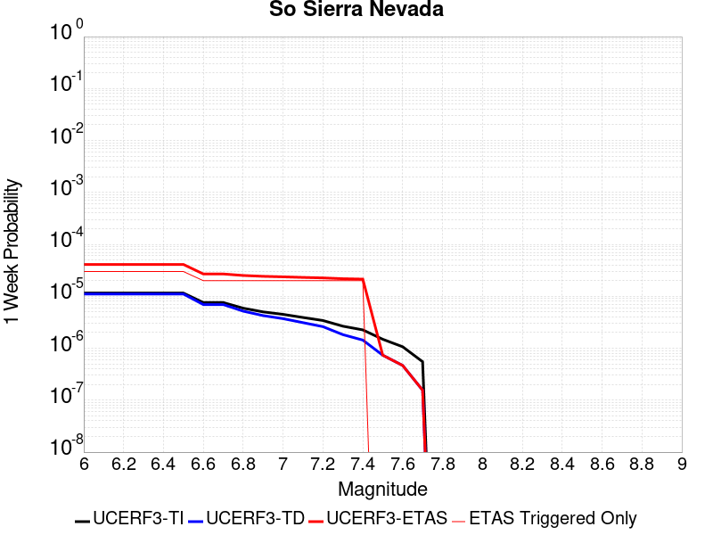 | 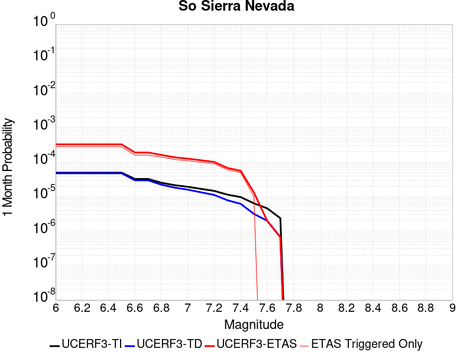 |  |  |

| Magnitude | 1 wk TI Prob | 1 wk TD Prob | 1 wk ETAS Prob | 1 wk ETAS/TD Gain | 1 wk ETAS Triggered Only | 1 mo TI Prob | 1 mo TD Prob | 1 mo ETAS Prob | 1 mo ETAS/TD Gain | 1 mo ETAS Triggered Only | 1 yr TI Prob | 1 yr TD Prob | 1 yr ETAS Prob | 1 yr ETAS/TD Gain | 1 yr ETAS Triggered Only | 10 yr TI Prob | 10 yr TD Prob | 10 yr ETAS Prob | 10 yr ETAS/TD Gain | 10 yr ETAS Triggered Only |
|-----|-----|-----|-----|-----|-----|-----|-----|-----|-----|-----|-----|-----|-----|-----|-----|-----|-----|-----|-----|-----|
| 6.0 | 1.15488665E-5 | 1.1079929E-5 | 4.1079595E-5 | 3.7075686 | 3.0E-5 | 4.9494203E-5 | 4.7484617E-5 | 3.2747132E-4 | 6.8963666 | 2.8E-4 | 6.024253E-4 | 5.779846E-4 | 0.0017772911 | 3.0749798 | 0.0012 | 0.006007948 | 0.0057660826 | 0.008450515 | 1.4655555 | 0.0027 |
| 6.1 | 1.15488665E-5 | 1.1079929E-5 | 4.1079595E-5 | 3.7075686 | 3.0E-5 | 4.9494203E-5 | 4.7484617E-5 | 3.2747132E-4 | 6.8963666 | 2.8E-4 | 6.024253E-4 | 5.779846E-4 | 0.0017772911 | 3.0749798 | 0.0012 | 0.006007948 | 0.0057660826 | 0.008450515 | 1.4655555 | 0.0027 |
| 6.2 | 1.15488665E-5 | 1.1079929E-5 | 4.1079595E-5 | 3.7075686 | 3.0E-5 | 4.9494203E-5 | 4.7484617E-5 | 3.2747132E-4 | 6.8963666 | 2.8E-4 | 6.024253E-4 | 5.779846E-4 | 0.0017772911 | 3.0749798 | 0.0012 | 0.006007948 | 0.0057660826 | 0.008450515 | 1.4655555 | 0.0027 |
| 6.3 | 1.15488665E-5 | 1.1079929E-5 | 4.1079595E-5 | 3.7075686 | 3.0E-5 | 4.9494203E-5 | 4.7484617E-5 | 3.2747132E-4 | 6.8963666 | 2.8E-4 | 6.024253E-4 | 5.779846E-4 | 0.0017772911 | 3.0749798 | 0.0012 | 0.006007948 | 0.0057660826 | 0.008450515 | 1.4655555 | 0.0027 |
| 6.4 | 1.15488665E-5 | 1.1079929E-5 | 4.1079595E-5 | 3.7075686 | 3.0E-5 | 4.9494203E-5 | 4.7484617E-5 | 3.2747132E-4 | 6.8963666 | 2.8E-4 | 6.024253E-4 | 5.779846E-4 | 0.0017772911 | 3.0749798 | 0.0012 | 0.006007948 | 0.0057660826 | 0.008450515 | 1.4655555 | 0.0027 |
| 6.5 | 1.15488665E-5 | 1.1079929E-5 | 4.1079595E-5 | 3.7075686 | 3.0E-5 | 4.9494203E-5 | 4.7484617E-5 | 3.2747132E-4 | 6.8963666 | 2.8E-4 | 6.024253E-4 | 5.779846E-4 | 0.0017772911 | 3.0749798 | 0.0012 | 0.006007948 | 0.0057660826 | 0.008450515 | 1.4655555 | 0.0027 |
| 6.6 | 7.587044E-6 | 6.9358202E-6 | 2.6935682E-5 | 3.8835611 | 2.0E-5 | 3.2515498E-5 | 2.9724622E-5 | 1.8971987E-4 | 6.382583 | 1.6E-4 | 3.9580427E-4 | 3.618401E-4 | 9.816157E-4 | 2.7128441 | 6.2E-4 | 0.003951 | 0.003612801 | 0.0049579237 | 1.3723212 | 0.00135 |
| 6.7 | 7.587044E-6 | 6.9358202E-6 | 2.6935682E-5 | 3.8835611 | 2.0E-5 | 3.2515498E-5 | 2.9724622E-5 | 1.8971987E-4 | 6.382583 | 1.6E-4 | 3.9580427E-4 | 3.618401E-4 | 9.816157E-4 | 2.7128441 | 6.2E-4 | 0.003951 | 0.003612801 | 0.0049579237 | 1.3723212 | 0.00135 |
| 6.8 | 5.9026956E-6 | 5.179538E-6 | 2.5179434E-5 | 4.861328 | 2.0E-5 | 2.5297022E-5 | 2.2197837E-5 | 1.6219473E-4 | 7.3067803 | 1.4E-4 | 3.0794772E-4 | 2.7022633E-4 | 7.900858E-4 | 2.9237928 | 5.2E-4 | 0.0030752132 | 0.0026990937 | 0.0036565023 | 1.354715 | 9.6E-4 |
| 6.9 | 5.0118915E-6 | 4.2525508E-6 | 2.4252466E-5 | 5.7030396 | 2.0E-5 | 2.1479358E-5 | 1.8225093E-5 | 1.3822291E-4 | 7.584208 | 1.2E-4 | 2.614798E-4 | 2.2186866E-4 | 6.6177105E-4 | 2.9827154 | 4.4E-4 | 0.0026117235 | 0.002216544 | 0.0029748594 | 1.3421161 | 7.6E-4 |
| 7.0 | 4.4924795E-6 | 3.7140323E-6 | 2.3713957E-5 | 6.3849626 | 2.0E-5 | 1.925334E-5 | 1.5917189E-5 | 1.2591544E-4 | 7.9106584 | 1.1E-4 | 2.3438422E-4 | 1.9377517E-4 | 5.836996E-4 | 3.0122519 | 3.9E-4 | 0.0023413717 | 0.0019361249 | 0.002594847 | 1.3402271 | 6.6E-4 |
| 7.1 | 3.9118436E-6 | 3.1120794E-6 | 2.3112018E-5 | 7.4265513 | 2.0E-5 | 1.6764936E-5 | 1.3337418E-5 | 1.13336086E-4 | 8.497603 | 1.0E-4 | 2.0409399E-4 | 1.6237154E-4 | 4.6232282E-4 | 2.8473146 | 3.0E-4 | 0.0020390663 | 0.001622585 | 0.0021217738 | 1.3076502 | 5.0E-4 |
| 7.2 | 3.4200818E-6 | 2.605546E-6 | 2.2605494E-5 | 8.675915 | 2.0E-5 | 1.4657411E-5 | 1.116658E-5 | 1.0116558E-4 | 9.059673 | 9.0E-5 | 1.7843937E-4 | 1.3594514E-4 | 3.8591115E-4 | 2.8387272 | 2.5E-4 | 0.0017829615 | 0.0013586695 | 0.0017780989 | 1.3087059 | 4.2E-4 |
| 7.3 | 2.6593618E-6 | 1.8284966E-6 | 2.182846E-5 | 11.937928 | 2.0E-5 | 1.13972155E-5 | 7.836392E-6 | 6.783592E-5 | 8.656525 | 6.0E-5 | 1.3875226E-4 | 9.540419E-5 | 2.5538894E-4 | 2.6769152 | 1.6E-4 | 0.0013866565 | 9.536612E-4 | 0.0012433847 | 1.3038012 | 2.9E-4 |
| 7.4 | 2.2577992E-6 | 1.4365053E-6 | 2.1436477E-5 | 14.922658 | 2.0E-5 | 9.676246E-6 | 6.156438E-6 | 5.615613E-5 | 9.12153 | 5.0E-5 | 1.1780193E-4 | 7.495231E-5 | 2.1494181E-4 | 2.8677144 | 1.4E-4 | 0.001177395 | 7.4929534E-4 | 9.99108E-4 | 1.3333968 | 2.5E-4 |
| 7.5 | 1.489319E-6 | 7.354422E-7 | 7.354422E-7 | 1.0 | 0.0 | 6.3827797E-6 | 3.1518912E-6 | 1.315186E-5 | 4.1726885 | 1.0E-5 | 7.770758E-5 | 3.8373604E-5 | 7.837207E-5 | 2.0423431 | 4.0E-5 | 7.7680405E-4 | 3.836702E-4 | 4.9362803E-4 | 1.2865945 | 1.1E-4 |
| 7.6 | 1.0680322E-6 | 4.659972E-7 | 4.659972E-7 | 1.0 | 0.0 | 4.577273E-6 | 1.9971294E-6 | 1.9971294E-6 | 1.0 | 0.0 | 5.5726876E-5 | 2.431478E-5 | 4.4314293E-5 | 1.8225249 | 2.0E-5 | 5.5712904E-4 | 2.4312147E-4 | 3.1310445E-4 | 1.2878519 | 7.0E-5 |
| 7.7 | 5.509146E-7 | 1.5581371E-7 | 1.5581371E-7 | 1.0 | 0.0 | 2.3610605E-6 | 6.677729E-7 | 6.677729E-7 | 1.0 | 0.0 | 2.8745531E-5 | 8.130106E-6 | 8.130106E-6 | 1.0 | 0.0 | 2.8741814E-4 | 8.1298196E-5 | 8.1298196E-5 | 1.0 | 0.0 |

## San Andreas (Mojave S)
*[(top)](#table-of-contents)*

| 1 Week | 1 Month | 1 Year | 10 Year |
|-----|-----|-----|-----|
|  | 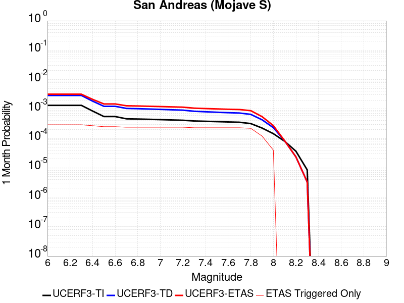 |  |  |

| Magnitude | 1 wk TI Prob | 1 wk TD Prob | 1 wk ETAS Prob | 1 wk ETAS/TD Gain | 1 wk ETAS Triggered Only | 1 mo TI Prob | 1 mo TD Prob | 1 mo ETAS Prob | 1 mo ETAS/TD Gain | 1 mo ETAS Triggered Only | 1 yr TI Prob | 1 yr TD Prob | 1 yr ETAS Prob | 1 yr ETAS/TD Gain | 1 yr ETAS Triggered Only | 10 yr TI Prob | 10 yr TD Prob | 10 yr ETAS Prob | 10 yr ETAS/TD Gain | 10 yr ETAS Triggered Only |
|-----|-----|-----|-----|-----|-----|-----|-----|-----|-----|-----|-----|-----|-----|-----|-----|-----|-----|-----|-----|-----|
| 6.0 | 3.1064058E-4 | 6.7501515E-4 | 7.9493417E-4 | 1.1776538 | 1.2E-4 | 0.0013306376 | 0.002889843 | 0.003179005 | 1.1000614 | 2.9E-4 | 0.016080605 | 0.034743454 | 0.03581489 | 1.0308385 | 0.00111 | 0.1496549 | 0.28684503 | 0.28836405 | 1.0052956 | 0.00213 |
| 6.1 | 3.1064058E-4 | 6.7501515E-4 | 7.9493417E-4 | 1.1776538 | 1.2E-4 | 0.0013306376 | 0.002889843 | 0.003179005 | 1.1000614 | 2.9E-4 | 0.016080605 | 0.034743454 | 0.03581489 | 1.0308385 | 0.00111 | 0.1496549 | 0.28684503 | 0.28836405 | 1.0052956 | 0.00213 |
| 6.2 | 3.1064058E-4 | 6.7501515E-4 | 7.9493417E-4 | 1.1776538 | 1.2E-4 | 0.0013306376 | 0.002889843 | 0.003179005 | 1.1000614 | 2.9E-4 | 0.016080605 | 0.034743454 | 0.03581489 | 1.0308385 | 0.00111 | 0.1496549 | 0.28684503 | 0.28836405 | 1.0052956 | 0.00213 |
| 6.3 | 3.1064058E-4 | 6.7501515E-4 | 7.9493417E-4 | 1.1776538 | 1.2E-4 | 0.0013306376 | 0.002889843 | 0.003179005 | 1.1000614 | 2.9E-4 | 0.016080605 | 0.034743454 | 0.03581489 | 1.0308385 | 0.00111 | 0.1496549 | 0.28684503 | 0.28836405 | 1.0052956 | 0.00213 |
| 6.4 | 1.9872203E-4 | 4.3217847E-4 | 5.421309E-4 | 1.2544144 | 1.1E-4 | 8.5138786E-4 | 0.0018509069 | 0.002120407 | 1.1456045 | 2.7E-4 | 0.010316478 | 0.022308085 | 0.023315107 | 1.0451416 | 0.00103 | 0.098504856 | 0.19718863 | 0.19873807 | 1.0078576 | 0.00193 |
| 6.5 | 1.291105E-4 | 2.878896E-4 | 3.9785795E-4 | 1.3819809 | 1.1E-4 | 5.5321335E-4 | 0.001233232 | 0.0014829236 | 1.2024693 | 2.5E-4 | 0.006714592 | 0.0149120595 | 0.015857743 | 1.0634174 | 9.6E-4 | 0.065152965 | 0.13821197 | 0.13973732 | 1.0110364 | 0.00177 |
| 6.6 | 1.291105E-4 | 2.878896E-4 | 3.9785795E-4 | 1.3819809 | 1.1E-4 | 5.5321335E-4 | 0.001233232 | 0.0014829236 | 1.2024693 | 2.5E-4 | 0.006714592 | 0.0149120595 | 0.015857743 | 1.0634174 | 9.6E-4 | 0.065152965 | 0.13821197 | 0.13973732 | 1.0110364 | 0.00177 |
| 6.7 | 1.08001186E-4 | 2.4369665E-4 | 3.5366984E-4 | 1.4512708 | 1.1E-4 | 4.6278012E-4 | 0.0010439967 | 0.0012837462 | 1.2296457 | 2.4E-4 | 0.0056198016 | 0.012636882 | 0.013535382 | 1.0711014 | 9.1E-4 | 0.054797906 | 0.11933387 | 0.120839804 | 1.0126195 | 0.00171 |
| 6.8 | 1.0624356E-4 | 2.3887234E-4 | 3.4884608E-4 | 1.460387 | 1.1E-4 | 4.5525006E-4 | 0.0010233375 | 0.0012630918 | 1.2342868 | 2.4E-4 | 0.0055285925 | 0.012388234 | 0.013286961 | 1.0725468 | 9.1E-4 | 0.053930566 | 0.117277905 | 0.11878736 | 1.0128708 | 0.00171 |
| 6.9 | 1.0393785E-4 | 2.3257434E-4 | 3.4254877E-4 | 1.4728571 | 1.1E-4 | 4.4537184E-4 | 9.963668E-4 | 0.0012361277 | 1.2406352 | 2.4E-4 | 0.0054089287 | 0.012063543 | 0.012962566 | 1.0745239 | 9.1E-4 | 0.05279156 | 0.11457736 | 0.11608258 | 1.0131371 | 0.0017 |
| 7.0 | 1.0155622E-4 | 2.2626782E-4 | 3.3624293E-4 | 1.4860395 | 1.1E-4 | 4.3516833E-4 | 9.693592E-4 | 0.0012091266 | 1.2473463 | 2.4E-4 | 0.005285311 | 0.01173831 | 0.012637628 | 1.0766139 | 9.1E-4 | 0.05161361 | 0.111840434 | 0.11334143 | 1.0134208 | 0.00169 |
| 7.1 | 9.885595E-5 | 2.1914982E-4 | 3.291257E-4 | 1.5018297 | 1.1E-4 | 4.2359953E-4 | 9.388758E-4 | 0.0011786504 | 1.2553849 | 2.4E-4 | 0.0051451353 | 0.011371101 | 0.012270753 | 1.0791174 | 9.1E-4 | 0.05027629 | 0.10872063 | 0.11021798 | 1.0137725 | 0.00168 |
| 7.2 | 9.6411415E-5 | 2.1277768E-4 | 3.2275426E-4 | 1.5168616 | 1.1E-4 | 4.1312634E-4 | 9.11586E-4 | 0.0011513672 | 1.2630374 | 2.4E-4 | 0.005018219 | 0.011042262 | 0.011942214 | 1.0815006 | 9.1E-4 | 0.049064007 | 0.105914876 | 0.107416935 | 1.0141819 | 0.00168 |
| 7.3 | 9.1180635E-5 | 1.9505205E-4 | 2.9503254E-4 | 1.5125837 | 1.0E-4 | 3.907156E-4 | 8.3566963E-4 | 0.0010654774 | 1.2749984 | 2.3E-4 | 0.004746591 | 0.010126927 | 0.011017812 | 1.0879719 | 9.0E-4 | 0.046464786 | 0.09810342 | 0.09960057 | 1.0152609 | 0.00166 |
| 7.4 | 8.887388E-5 | 1.875339E-4 | 2.8751514E-4 | 1.533137 | 1.0E-4 | 3.8083247E-4 | 8.034692E-4 | 0.0010332845 | 1.2860286 | 2.3E-4 | 0.0046267817 | 0.009738459 | 0.010629695 | 1.0915171 | 9.0E-4 | 0.045316286 | 0.094735 | 0.096237734 | 1.0158626 | 0.00166 |
| 7.5 | 8.6750515E-5 | 1.8084598E-4 | 2.808279E-4 | 1.5528567 | 1.0E-4 | 3.7173493E-4 | 7.7482406E-4 | 0.0010046458 | 1.2966115 | 2.3E-4 | 0.004516484 | 0.009392765 | 0.010284312 | 1.0949184 | 9.0E-4 | 0.04425787 | 0.091696784 | 0.093204565 | 1.0164431 | 0.00166 |
| 7.6 | 8.453092E-5 | 1.7471766E-4 | 2.7470017E-4 | 1.572252 | 1.0E-4 | 3.6222505E-4 | 7.485751E-4 | 9.784029E-4 | 1.3070204 | 2.3E-4 | 0.0044011753 | 0.009075891 | 0.009967723 | 1.0982639 | 9.0E-4 | 0.04315024 | 0.08885263 | 0.09035602 | 1.0169201 | 0.00165 |
| 7.7 | 8.259102E-5 | 1.6993514E-4 | 2.6991815E-4 | 1.5883598 | 1.0E-4 | 3.539135E-4 | 7.280903E-4 | 9.579228E-4 | 1.3156649 | 2.3E-4 | 0.004300386 | 0.0088285385 | 0.009720593 | 1.1010422 | 9.0E-4 | 0.042181134 | 0.086603284 | 0.08811039 | 1.0174024 | 0.00165 |
| 7.8 | 7.444844E-5 | 1.531286E-4 | 2.5311328E-4 | 1.6529459 | 1.0E-4 | 3.1902574E-4 | 6.561004E-4 | 8.759561E-4 | 1.3350946 | 2.2E-4 | 0.0038772223 | 0.0079588145 | 0.008752448 | 1.0997175 | 8.0E-4 | 0.03810269 | 0.07842231 | 0.079694085 | 1.016217 | 0.00138 |
| 7.9 | 5.2586525E-5 | 1.0026347E-4 | 1.7025645E-4 | 1.6980906 | 7.0E-5 | 2.2535135E-4 | 4.2962984E-4 | 5.495783E-4 | 1.2791902 | 1.2E-4 | 0.0027402006 | 0.0052182092 | 0.005665861 | 1.0857865 | 4.5E-4 | 0.027066574 | 0.052295044 | 0.053015303 | 1.013773 | 7.6E-4 |
| 8.0 | 3.379877E-5 | 5.418741E-5 | 8.418578E-5 | 1.5536041 | 3.0E-5 | 1.4484383E-4 | 2.322111E-4 | 2.722018E-4 | 1.172217 | 4.0E-5 | 0.0017620471 | 0.0028235065 | 0.0029631113 | 1.0494437 | 1.4E-4 | 0.017481409 | 0.0288912 | 0.02914369 | 1.0087392 | 2.6E-4 |
| 8.1 | 1.8668277E-5 | 1.9360978E-5 | 1.9360978E-5 | 1.0 | 0.0 | 8.000444E-5 | 8.2972976E-5 | 8.2972976E-5 | 1.0 | 0.0 | 9.736188E-4 | 0.0010097285 | 0.0010297083 | 1.0197873 | 2.0E-5 | 0.009693642 | 0.010826115 | 0.010875572 | 1.0045685 | 5.0E-5 |
| 8.2 | 8.541571E-6 | 5.4799148E-6 | 5.4799148E-6 | 1.0 | 0.0 | 3.660622E-5 | 2.3485138E-5 | 2.3485138E-5 | 1.0 | 0.0 | 4.455896E-4 | 2.8589412E-4 | 2.8589412E-4 | 1.0 | 0.0 | 0.0044469717 | 0.0032512886 | 0.0032512886 | 1.0 | 0.0 |
| 8.3 | 1.983087E-6 | 7.690063E-7 | 7.690063E-7 | 1.0 | 0.0 | 8.498917E-6 | 3.295737E-6 | 3.295737E-6 | 1.0 | 0.0 | 1.034694E-4 | 4.012488E-5 | 4.012488E-5 | 1.0 | 0.0 | 0.0010342124 | 4.737206E-4 | 4.737206E-4 | 1.0 | 0.0 |

## Coyote Canyon
*[(top)](#table-of-contents)*

| 1 Week | 1 Month | 1 Year | 10 Year |
|-----|-----|-----|-----|
|  |  |  |  |

| Magnitude | 1 wk TI Prob | 1 wk TD Prob | 1 wk ETAS Prob | 1 wk ETAS/TD Gain | 1 wk ETAS Triggered Only | 1 mo TI Prob | 1 mo TD Prob | 1 mo ETAS Prob | 1 mo ETAS/TD Gain | 1 mo ETAS Triggered Only | 1 yr TI Prob | 1 yr TD Prob | 1 yr ETAS Prob | 1 yr ETAS/TD Gain | 1 yr ETAS Triggered Only | 10 yr TI Prob | 10 yr TD Prob | 10 yr ETAS Prob | 10 yr ETAS/TD Gain | 10 yr ETAS Triggered Only |
|-----|-----|-----|-----|-----|-----|-----|-----|-----|-----|-----|-----|-----|-----|-----|-----|-----|-----|-----|-----|-----|
| 6.0 | 3.5090034E-5 | 4.0367537E-5 | 8.036592E-5 | 1.9908552 | 4.0E-5 | 1.503772E-4 | 1.729937E-4 | 3.3296604E-4 | 1.9247291 | 1.6E-4 | 0.0018293047 | 0.0021044211 | 0.0029027376 | 1.3793521 | 8.0E-4 | 0.018143194 | 0.020870855 | 0.022819322 | 1.0933583 | 0.00199 |
| 6.1 | 3.5090034E-5 | 4.0367537E-5 | 8.036592E-5 | 1.9908552 | 4.0E-5 | 1.503772E-4 | 1.729937E-4 | 3.3296604E-4 | 1.9247291 | 1.6E-4 | 0.0018293047 | 0.0021044211 | 0.0029027376 | 1.3793521 | 8.0E-4 | 0.018143194 | 0.020870855 | 0.022819322 | 1.0933583 | 0.00199 |
| 6.2 | 1.841879E-5 | 2.1061396E-5 | 4.1060975E-5 | 1.9495847 | 2.0E-5 | 7.8935285E-5 | 9.0260575E-5 | 1.5025516E-4 | 1.664682 | 6.0E-5 | 9.606133E-4 | 0.0010984705 | 0.0015579653 | 1.4183041 | 4.6E-4 | 0.0095647145 | 0.010940497 | 0.012048243 | 1.101252 | 0.00112 |
| 6.3 | 1.841879E-5 | 2.1061396E-5 | 4.1060975E-5 | 1.9495847 | 2.0E-5 | 7.8935285E-5 | 9.0260575E-5 | 1.5025516E-4 | 1.664682 | 6.0E-5 | 9.606133E-4 | 0.0010984705 | 0.0015579653 | 1.4183041 | 4.6E-4 | 0.0095647145 | 0.010940497 | 0.012048243 | 1.101252 | 0.00112 |
| 6.4 | 1.712201E-5 | 1.9566693E-5 | 3.95663E-5 | 2.022125 | 2.0E-5 | 7.337798E-5 | 8.385513E-5 | 1.4385009E-4 | 1.7154597 | 6.0E-5 | 8.930107E-4 | 0.0010205586 | 0.0014800892 | 1.4502735 | 4.6E-4 | 0.008894307 | 0.010168638 | 0.011198062 | 1.1012353 | 0.00104 |
| 6.5 | 1.4744935E-5 | 1.683824E-5 | 3.6837904E-5 | 2.1877527 | 2.0E-5 | 6.3191044E-5 | 7.216242E-5 | 1.3215808E-4 | 1.8313978 | 6.0E-5 | 7.6907943E-4 | 8.7831676E-4 | 0.0012779655 | 1.4550165 | 4.0E-4 | 0.007664232 | 0.008757652 | 0.009629945 | 1.0996035 | 8.8E-4 |
| 6.6 | 1.2017839E-5 | 1.3725124E-5 | 2.3724986E-5 | 1.728581 | 1.0E-5 | 5.150401E-5 | 5.882113E-5 | 1.0881819E-4 | 1.8499846 | 5.0E-5 | 6.268809E-4 | 7.1600056E-4 | 0.0010657499 | 1.4884764 | 3.5E-4 | 0.0062511545 | 0.007145631 | 0.007910129 | 1.1069882 | 7.7E-4 |
| 6.7 | 1.00956095E-5 | 1.1534388E-5 | 2.1534273E-5 | 1.8669627 | 1.0E-5 | 4.326618E-5 | 4.943265E-5 | 9.943017E-5 | 2.0114274 | 5.0E-5 | 5.266384E-4 | 6.0176325E-4 | 9.0158277E-4 | 1.4982349 | 3.0E-4 | 0.005253921 | 0.006009866 | 0.00664602 | 1.1058515 | 6.4E-4 |

## Death Valley (So)
*[(top)](#table-of-contents)*

| 1 Week | 1 Month | 1 Year | 10 Year |
|-----|-----|-----|-----|
|  | 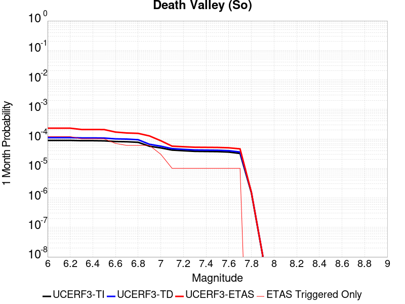 |  | 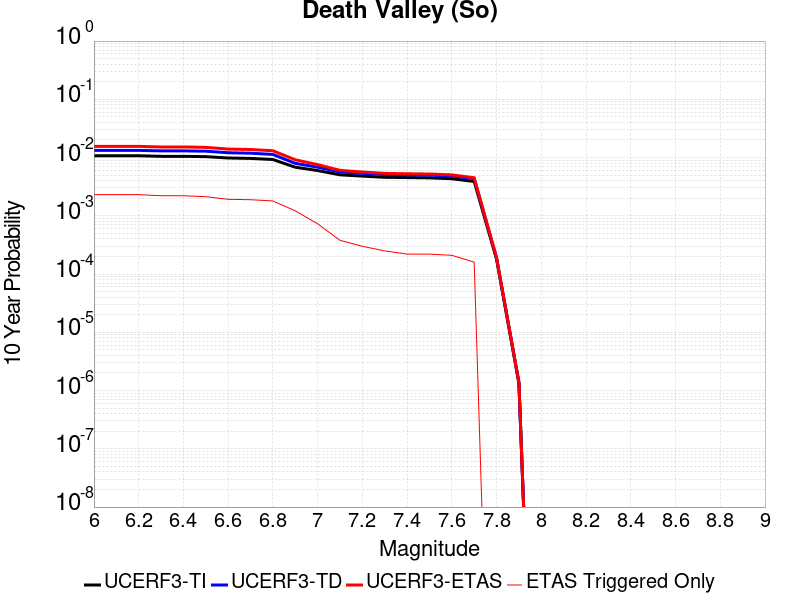 |

| Magnitude | 1 wk TI Prob | 1 wk TD Prob | 1 wk ETAS Prob | 1 wk ETAS/TD Gain | 1 wk ETAS Triggered Only | 1 mo TI Prob | 1 mo TD Prob | 1 mo ETAS Prob | 1 mo ETAS/TD Gain | 1 mo ETAS Triggered Only | 1 yr TI Prob | 1 yr TD Prob | 1 yr ETAS Prob | 1 yr ETAS/TD Gain | 1 yr ETAS Triggered Only | 10 yr TI Prob | 10 yr TD Prob | 10 yr ETAS Prob | 10 yr ETAS/TD Gain | 10 yr ETAS Triggered Only |
|-----|-----|-----|-----|-----|-----|-----|-----|-----|-----|-----|-----|-----|-----|-----|-----|-----|-----|-----|-----|-----|
| 6.0 | 2.0684236E-5 | 2.5620835E-5 | 4.5620323E-5 | 1.7805947 | 2.0E-5 | 8.864371E-5 | 1.09799046E-4 | 2.2978587E-4 | 2.0927856 | 1.2E-4 | 0.0010787029 | 0.0013360005 | 0.0023346646 | 1.7475027 | 0.001 | 0.010734817 | 0.013282978 | 0.015562294 | 1.1715968 | 0.00231 |
| 6.1 | 2.0684236E-5 | 2.5620835E-5 | 4.5620323E-5 | 1.7805947 | 2.0E-5 | 8.864371E-5 | 1.09799046E-4 | 2.2978587E-4 | 2.0927856 | 1.2E-4 | 0.0010787029 | 0.0013360005 | 0.0023346646 | 1.7475027 | 0.001 | 0.010734817 | 0.013282978 | 0.015562294 | 1.1715968 | 0.00231 |
| 6.2 | 2.0684236E-5 | 2.5620835E-5 | 4.5620323E-5 | 1.7805947 | 2.0E-5 | 8.864371E-5 | 1.09799046E-4 | 2.2978587E-4 | 2.0927856 | 1.2E-4 | 0.0010787029 | 0.0013360005 | 0.0023346646 | 1.7475027 | 0.001 | 0.010734817 | 0.013282978 | 0.015562294 | 1.1715968 | 0.00231 |
| 6.3 | 2.0240292E-5 | 2.5120886E-5 | 4.512038E-5 | 1.7961303 | 2.0E-5 | 8.6741224E-5 | 1.0765659E-4 | 2.0764582E-4 | 1.9287795 | 1.0E-4 | 0.0010555626 | 0.0013099476 | 0.0022686902 | 1.7318938 | 9.6E-4 | 0.010505628 | 0.01302552 | 0.015206734 | 1.167457 | 0.00221 |
| 6.4 | 2.0240292E-5 | 2.5120886E-5 | 4.512038E-5 | 1.7961303 | 2.0E-5 | 8.6741224E-5 | 1.0765659E-4 | 2.0764582E-4 | 1.9287795 | 1.0E-4 | 0.0010555626 | 0.0013099476 | 0.0022686902 | 1.7318938 | 9.6E-4 | 0.010505628 | 0.01302552 | 0.015206734 | 1.167457 | 0.00221 |
| 6.5 | 1.9962767E-5 | 2.4810119E-5 | 4.480962E-5 | 1.8061028 | 2.0E-5 | 8.55519E-5 | 1.0632484E-4 | 2.063142E-4 | 1.940414 | 1.0E-4 | 0.0010410968 | 0.0012937529 | 0.002242524 | 1.7333479 | 9.5E-4 | 0.010362327 | 0.012865457 | 0.014968053 | 1.1634296 | 0.00213 |
| 6.6 | 1.8937297E-5 | 2.3313813E-5 | 4.3313346E-5 | 1.8578405 | 2.0E-5 | 8.115732E-5 | 9.99126E-5 | 1.699056E-4 | 1.7005423 | 7.0E-5 | 9.876423E-4 | 0.0012157715 | 0.002014799 | 1.6572183 | 8.0E-4 | 0.009832645 | 0.01209411 | 0.013990889 | 1.156835 | 0.00192 |
| 6.7 | 1.8621096E-5 | 2.291442E-5 | 3.291419E-5 | 1.4363964 | 1.0E-5 | 7.980225E-5 | 9.8201046E-5 | 1.5819515E-4 | 1.6109314 | 6.0E-5 | 9.711593E-4 | 0.0011949565 | 0.0019840125 | 1.660322 | 7.9E-4 | 0.009669261 | 0.011888204 | 0.013755735 | 1.1570911 | 0.00189 |
| 6.8 | 1.7830353E-5 | 2.1808304E-5 | 3.1808086E-5 | 1.4585309 | 1.0E-5 | 7.641356E-5 | 9.34609E-5 | 1.5345529E-4 | 1.6419197 | 6.0E-5 | 9.29938E-4 | 0.0011373064 | 0.0019064307 | 1.6762683 | 7.7E-4 | 0.009260561 | 0.011317262 | 0.013096891 | 1.1572491 | 0.0018 |
| 6.9 | 1.3135183E-5 | 1.5305317E-5 | 2.5305164E-5 | 1.6533577 | 1.0E-5 | 5.6292425E-5 | 6.5592605E-5 | 1.2558867E-4 | 1.9146773 | 6.0E-5 | 6.8514474E-4 | 7.9830387E-4 | 0.0012979046 | 1.6258279 | 5.0E-4 | 0.006830362 | 0.007955869 | 0.009166162 | 1.152126 | 0.00122 |
| 7.0 | 1.1507512E-5 | 1.3155236E-5 | 1.3155236E-5 | 1.0 | 0.0 | 4.9316975E-5 | 5.6378398E-5 | 8.6376705E-5 | 1.5320888 | 3.0E-5 | 6.002687E-4 | 6.861966E-4 | 0.001005977 | 1.4660187 | 3.2E-4 | 0.0059864987 | 0.0068420726 | 0.007567078 | 1.1059629 | 7.3E-4 |
| 7.1 | 9.715903E-6 | 1.0865992E-5 | 1.0865992E-5 | 1.0 | 0.0 | 4.1638916E-5 | 4.6567733E-5 | 5.6567267E-5 | 1.214731 | 1.0E-5 | 5.068359E-4 | 5.668189E-4 | 7.4671686E-4 | 1.3173817 | 1.8E-4 | 0.0050568148 | 0.0056542754 | 0.006032127 | 1.0668257 | 3.8E-4 |
| 7.2 | 9.233269E-6 | 1.02869635E-5 | 1.02869635E-5 | 1.0 | 0.0 | 3.9570554E-5 | 4.4086264E-5 | 5.4085824E-5 | 1.226818 | 1.0E-5 | 4.81665E-4 | 5.366223E-4 | 6.565579E-4 | 1.223501 | 1.2E-4 | 0.0048062233 | 0.0053536966 | 0.0056520905 | 1.0557361 | 3.0E-4 |
| 7.3 | 8.8041315E-6 | 9.80876E-6 | 9.80876E-6 | 1.0 | 0.0 | 3.7731446E-5 | 4.203689E-5 | 5.203647E-5 | 1.2378763 | 1.0E-5 | 4.592835E-4 | 5.116832E-4 | 6.2162685E-4 | 1.2148668 | 1.1E-4 | 0.0045833546 | 0.005105477 | 0.0053542005 | 1.048717 | 2.5E-4 |
| 7.4 | 8.708749E-6 | 9.707768E-6 | 9.707768E-6 | 1.0 | 0.0 | 3.7322676E-5 | 4.1604082E-5 | 5.1603663E-5 | 1.2403511 | 1.0E-5 | 4.5430884E-4 | 5.0641614E-4 | 5.8637565E-4 | 1.1578928 | 8.0E-5 | 0.004533812 | 0.0050530476 | 0.005271936 | 1.043318 | 2.2E-4 |
| 7.5 | 8.612678E-6 | 9.605406E-6 | 9.605406E-6 | 1.0 | 0.0 | 3.6910955E-5 | 4.1165404E-5 | 5.1164992E-5 | 1.2429124 | 1.0E-5 | 4.492982E-4 | 5.0107774E-4 | 5.8103766E-4 | 1.1595758 | 8.0E-5 | 0.004483909 | 0.004999905 | 0.005218805 | 1.0437808 | 2.2E-4 |
| 7.6 | 8.319024E-6 | 9.28449E-6 | 9.28449E-6 | 1.0 | 0.0 | 3.5652476E-5 | 3.9790088E-5 | 4.978969E-5 | 1.2513089 | 1.0E-5 | 4.3398244E-4 | 4.8434082E-4 | 5.643021E-4 | 1.165093 | 8.0E-5 | 0.0043313587 | 0.0048332764 | 0.005042261 | 1.0432388 | 2.1E-4 |
| 7.7 | 7.4718328E-6 | 8.345689E-6 | 8.345689E-6 | 1.0 | 0.0 | 3.2021748E-5 | 3.576677E-5 | 4.5766414E-5 | 1.2795792 | 1.0E-5 | 3.8979502E-4 | 4.3537747E-4 | 5.05347E-4 | 1.16071 | 7.0E-5 | 0.00389112 | 0.0043456503 | 0.0045049554 | 1.0366584 | 1.6E-4 |
| 7.8 | 3.4586725E-7 | 3.648368E-7 | 3.648368E-7 | 1.0 | 0.0 | 1.4822873E-6 | 1.5635853E-6 | 1.5635853E-6 | 1.0 | 0.0 | 1.80467E-5 | 1.903649E-5 | 1.903649E-5 | 1.0 | 0.0 | 1.8045233E-4 | 1.9034903E-4 | 1.9034903E-4 | 1.0 | 0.0 |
| 7.9 | 2.5591178E-9 | 2.6697329E-9 | 2.6697329E-9 | 1.0 | 0.0 | 1.0967647E-8 | 1.14417125E-8 | 1.14417125E-8 | 1.0 | 0.0 | 1.335311E-7 | 1.3930286E-7 | 1.3930286E-7 | 1.0 | 0.0 | 1.3353102E-6 | 1.3930285E-6 | 1.3930285E-6 | 1.0 | 0.0 |

## San Andreas (Mojave N)
*[(top)](#table-of-contents)*

| 1 Week | 1 Month | 1 Year | 10 Year |
|-----|-----|-----|-----|
| 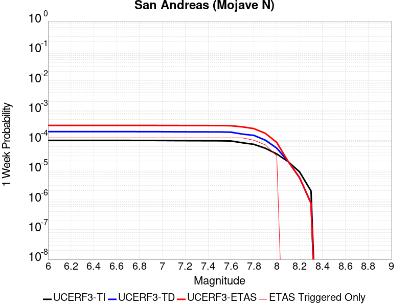 |  |  |  |

| Magnitude | 1 wk TI Prob | 1 wk TD Prob | 1 wk ETAS Prob | 1 wk ETAS/TD Gain | 1 wk ETAS Triggered Only | 1 mo TI Prob | 1 mo TD Prob | 1 mo ETAS Prob | 1 mo ETAS/TD Gain | 1 mo ETAS Triggered Only | 1 yr TI Prob | 1 yr TD Prob | 1 yr ETAS Prob | 1 yr ETAS/TD Gain | 1 yr ETAS Triggered Only | 10 yr TI Prob | 10 yr TD Prob | 10 yr ETAS Prob | 10 yr ETAS/TD Gain | 10 yr ETAS Triggered Only |
|-----|-----|-----|-----|-----|-----|-----|-----|-----|-----|-----|-----|-----|-----|-----|-----|-----|-----|-----|-----|-----|
| 6.0 | 9.877682E-5 | 1.9436594E-4 | 3.1434261E-4 | 1.6172721 | 1.2E-4 | 4.2326056E-4 | 8.3273114E-4 | 0.0011324814 | 1.3599603 | 3.0E-4 | 0.0051410277 | 0.0100914985 | 0.011309086 | 1.1206548 | 0.00123 | 0.05023708 | 0.09847636 | 0.10049577 | 1.0205066 | 0.00224 |
| 6.1 | 9.877682E-5 | 1.9436594E-4 | 3.1434261E-4 | 1.6172721 | 1.2E-4 | 4.2326056E-4 | 8.3273114E-4 | 0.0011324814 | 1.3599603 | 3.0E-4 | 0.0051410277 | 0.0100914985 | 0.011309086 | 1.1206548 | 0.00123 | 0.05023708 | 0.09847636 | 0.10049577 | 1.0205066 | 0.00224 |
| 6.2 | 9.877682E-5 | 1.9436594E-4 | 3.1434261E-4 | 1.6172721 | 1.2E-4 | 4.2326056E-4 | 8.3273114E-4 | 0.0011324814 | 1.3599603 | 3.0E-4 | 0.0051410277 | 0.0100914985 | 0.011309086 | 1.1206548 | 0.00123 | 0.05023708 | 0.09847636 | 0.10049577 | 1.0205066 | 0.00224 |
| 6.3 | 9.877682E-5 | 1.9436594E-4 | 3.1434261E-4 | 1.6172721 | 1.2E-4 | 4.2326056E-4 | 8.3273114E-4 | 0.0011324814 | 1.3599603 | 3.0E-4 | 0.0051410277 | 0.0100914985 | 0.011309086 | 1.1206548 | 0.00123 | 0.05023708 | 0.09847636 | 0.10049577 | 1.0205066 | 0.00224 |
| 6.4 | 9.877682E-5 | 1.9436594E-4 | 3.1434261E-4 | 1.6172721 | 1.2E-4 | 4.2326056E-4 | 8.3273114E-4 | 0.0011324814 | 1.3599603 | 3.0E-4 | 0.0051410277 | 0.0100914985 | 0.011309086 | 1.1206548 | 0.00123 | 0.05023708 | 0.09847636 | 0.10049577 | 1.0205066 | 0.00224 |
| 6.5 | 9.861474E-5 | 1.9410347E-4 | 3.140802E-4 | 1.618107 | 1.2E-4 | 4.2256617E-4 | 8.3160703E-4 | 0.0011313575 | 1.3604473 | 3.0E-4 | 0.0051326132 | 0.010077939 | 0.011295543 | 1.1208187 | 0.00123 | 0.050156746 | 0.098354205 | 0.100373894 | 1.0205349 | 0.00224 |
| 6.6 | 9.861474E-5 | 1.9410347E-4 | 3.140802E-4 | 1.618107 | 1.2E-4 | 4.2256617E-4 | 8.3160703E-4 | 0.0011313575 | 1.3604473 | 3.0E-4 | 0.0051326132 | 0.010077939 | 0.011295543 | 1.1208187 | 0.00123 | 0.050156746 | 0.098354205 | 0.100373894 | 1.0205349 | 0.00224 |
| 6.7 | 9.8552715E-5 | 1.9400296E-4 | 3.139797E-4 | 1.6184273 | 1.2E-4 | 4.223004E-4 | 8.311765E-4 | 0.0011309271 | 1.3606342 | 3.0E-4 | 0.0051293927 | 0.010072746 | 0.011290357 | 1.1208817 | 0.00123 | 0.050125998 | 0.09830724 | 0.10032703 | 1.0205457 | 0.00224 |
| 6.8 | 9.8464974E-5 | 1.9385452E-4 | 3.1383126E-4 | 1.6189009 | 1.2E-4 | 4.219245E-4 | 8.305407E-4 | 0.0011302916 | 1.3609104 | 3.0E-4 | 0.0051248376 | 0.010065078 | 0.011282697 | 1.1209748 | 0.00123 | 0.05008251 | 0.098237 | 0.10025695 | 1.020562 | 0.00224 |
| 6.9 | 9.825824E-5 | 1.935344E-4 | 3.1351118E-4 | 1.6199248 | 1.2E-4 | 4.2103877E-4 | 8.291697E-4 | 0.0011289209 | 1.3615078 | 3.0E-4 | 0.0051141046 | 0.010048538 | 0.011266179 | 1.1211759 | 0.00123 | 0.049980022 | 0.09808606 | 0.10010634 | 1.0205971 | 0.00224 |
| 7.0 | 9.781462E-5 | 1.9284763E-4 | 3.128245E-4 | 1.6221329 | 1.2E-4 | 4.1913814E-4 | 8.2622824E-4 | 0.0011259804 | 1.3627958 | 3.0E-4 | 0.005091073 | 0.010013057 | 0.011230741 | 1.1216096 | 0.00123 | 0.04976007 | 0.09776237 | 0.09977436 | 1.0205804 | 0.00223 |
| 7.1 | 9.7121134E-5 | 1.9186416E-4 | 3.1184114E-4 | 1.6253225 | 1.2E-4 | 4.1616702E-4 | 8.2201604E-4 | 0.0011217694 | 1.3646563 | 3.0E-4 | 0.005055068 | 0.009962243 | 0.011179989 | 1.1222361 | 0.00123 | 0.04941613 | 0.09729878 | 0.099302776 | 1.0205963 | 0.00222 |
| 7.2 | 9.663819E-5 | 1.9117158E-4 | 3.1114864E-4 | 1.6275884 | 1.2E-4 | 4.1409794E-4 | 8.1904966E-4 | 0.001118804 | 1.3659781 | 3.0E-4 | 0.0050299936 | 0.009926458 | 0.011144248 | 1.1226813 | 0.00123 | 0.049176537 | 0.09697204 | 0.09897677 | 1.0206732 | 0.00222 |
| 7.3 | 9.6277574E-5 | 1.906962E-4 | 3.1067332E-4 | 1.6291531 | 1.2E-4 | 4.125529E-4 | 8.170136E-4 | 0.0011167685 | 1.3668909 | 3.0E-4 | 0.0050112694 | 0.009901894 | 0.011119715 | 1.1229887 | 0.00123 | 0.04899759 | 0.09674529 | 0.09875051 | 1.0207268 | 0.00222 |
| 7.4 | 9.593308E-5 | 1.9009347E-4 | 3.1007067E-4 | 1.6311483 | 1.2E-4 | 4.1107697E-4 | 8.1443216E-4 | 0.0011141879 | 1.3680549 | 3.0E-4 | 0.0049933824 | 0.00987075 | 0.011088609 | 1.1233805 | 0.00123 | 0.04882661 | 0.09646287 | 0.09846872 | 1.020794 | 0.00222 |
| 7.5 | 9.561707E-5 | 1.8955376E-4 | 3.09531E-4 | 1.6329458 | 1.2E-4 | 4.0972308E-4 | 8.121205E-4 | 0.0011118768 | 1.3691033 | 3.0E-4 | 0.0049769743 | 0.0098428605 | 0.011060754 | 1.1237336 | 0.00123 | 0.048669744 | 0.09620883 | 0.09821525 | 1.0208548 | 0.00222 |
| 7.6 | 9.418194E-5 | 1.8607336E-4 | 3.0605102E-4 | 1.644787 | 1.2E-4 | 4.0357444E-4 | 7.972137E-4 | 0.0010969746 | 1.3760107 | 3.0E-4 | 0.004902454 | 0.009662993 | 0.010881108 | 1.1260598 | 0.00123 | 0.047957025 | 0.09458842 | 0.09658938 | 1.0211544 | 0.00221 |
| 7.7 | 8.202141E-5 | 1.6053455E-4 | 2.805153E-4 | 1.7473826 | 1.2E-4 | 3.51473E-4 | 6.878238E-4 | 9.6763123E-4 | 1.406801 | 2.8E-4 | 0.00427079 | 0.008342157 | 0.009423064 | 1.1295717 | 0.00109 | 0.04189639 | 0.08237585 | 0.08425698 | 1.022836 | 0.00205 |
| 7.8 | 7.2859846E-5 | 1.4545326E-4 | 2.454387E-4 | 1.6874061 | 1.0E-4 | 3.1221908E-4 | 6.232222E-4 | 8.430851E-4 | 1.3527842 | 2.2E-4 | 0.003794643 | 0.0075613735 | 0.008355324 | 1.1050009 | 8.0E-4 | 0.037304975 | 0.074854724 | 0.07613142 | 1.0170557 | 0.00138 |
| 7.9 | 5.3874453E-5 | 1.0065783E-4 | 1.7065079E-4 | 1.6953553 | 7.0E-5 | 2.3087008E-4 | 4.313194E-4 | 5.5126764E-4 | 1.2780961 | 1.2E-4 | 0.0028072202 | 0.0052386806 | 0.0056863236 | 1.0854495 | 4.5E-4 | 0.02772022 | 0.052520394 | 0.05324048 | 1.0137106 | 7.6E-4 |
| 8.0 | 3.468538E-5 | 5.4374406E-5 | 8.4372776E-5 | 1.5517002 | 3.0E-5 | 1.4864317E-4 | 2.3301235E-4 | 2.7300304E-4 | 1.1716247 | 4.0E-5 | 0.0018082283 | 0.0028332367 | 0.0029728399 | 1.0492735 | 1.4E-4 | 0.017935853 | 0.02900434 | 0.029256798 | 1.0087042 | 2.6E-4 |
| 8.1 | 1.9152367E-5 | 1.9454663E-5 | 1.9454663E-5 | 1.0 | 0.0 | 8.207899E-5 | 8.337447E-5 | 8.337447E-5 | 1.0 | 0.0 | 9.988535E-4 | 0.001014612 | 0.0010345918 | 1.019692 | 2.0E-5 | 0.009943757 | 0.010883738 | 0.010933194 | 1.004544 | 5.0E-5 |
| 8.2 | 8.643924E-6 | 5.494016E-6 | 5.494016E-6 | 1.0 | 0.0 | 3.704486E-5 | 2.3545572E-5 | 2.3545572E-5 | 1.0 | 0.0 | 4.5092785E-4 | 2.866297E-4 | 2.866297E-4 | 1.0 | 0.0 | 0.0045001395 | 0.0032592218 | 0.0032592218 | 1.0 | 0.0 |
| 8.3 | 1.983087E-6 | 7.690063E-7 | 7.690063E-7 | 1.0 | 0.0 | 8.498917E-6 | 3.295737E-6 | 3.295737E-6 | 1.0 | 0.0 | 1.034694E-4 | 4.012488E-5 | 4.012488E-5 | 1.0 | 0.0 | 0.0010342124 | 4.737206E-4 | 4.737206E-4 | 1.0 | 0.0 |

## Nelson Lake
*[(top)](#table-of-contents)*

| 1 Week | 1 Month | 1 Year | 10 Year |
|-----|-----|-----|-----|
|  |  |  |  |

| Magnitude | 1 wk TI Prob | 1 wk TD Prob | 1 wk ETAS Prob | 1 wk ETAS/TD Gain | 1 wk ETAS Triggered Only | 1 mo TI Prob | 1 mo TD Prob | 1 mo ETAS Prob | 1 mo ETAS/TD Gain | 1 mo ETAS Triggered Only | 1 yr TI Prob | 1 yr TD Prob | 1 yr ETAS Prob | 1 yr ETAS/TD Gain | 1 yr ETAS Triggered Only | 10 yr TI Prob | 10 yr TD Prob | 10 yr ETAS Prob | 10 yr ETAS/TD Gain | 10 yr ETAS Triggered Only |
|-----|-----|-----|-----|-----|-----|-----|-----|-----|-----|-----|-----|-----|-----|-----|-----|-----|-----|-----|-----|-----|
| 6.0 | 9.913453E-6 | 1.0192408E-5 | 3.0192205E-5 | 2.962225 | 2.0E-5 | 4.2485535E-5 | 4.3681073E-5 | 1.7367539E-4 | 3.9759872 | 1.3E-4 | 5.1713863E-4 | 5.3169765E-4 | 0.001151368 | 2.1654563 | 6.2E-4 | 0.0051593683 | 0.0053052832 | 0.007145468 | 1.346859 | 0.00185 |
| 6.1 | 9.913453E-6 | 1.0192408E-5 | 3.0192205E-5 | 2.962225 | 2.0E-5 | 4.2485535E-5 | 4.3681073E-5 | 1.7367539E-4 | 3.9759872 | 1.3E-4 | 5.1713863E-4 | 5.3169765E-4 | 0.001151368 | 2.1654563 | 6.2E-4 | 0.0051593683 | 0.0053052832 | 0.007145468 | 1.346859 | 0.00185 |
| 6.2 | 4.5596407E-6 | 4.696388E-6 | 1.4696341E-5 | 3.129286 | 1.0E-5 | 1.954117E-5 | 2.0127229E-5 | 1.0012562E-4 | 4.974635 | 8.0E-5 | 2.3788778E-4 | 2.4502273E-4 | 6.049345E-4 | 2.4688914 | 3.6E-4 | 0.0023763329 | 0.0024476517 | 0.0032955713 | 1.3464216 | 8.5E-4 |
| 6.3 | 4.5596407E-6 | 4.696388E-6 | 1.4696341E-5 | 3.129286 | 1.0E-5 | 1.954117E-5 | 2.0127229E-5 | 1.0012562E-4 | 4.974635 | 8.0E-5 | 2.3788778E-4 | 2.4502273E-4 | 6.049345E-4 | 2.4688914 | 3.6E-4 | 0.0023763329 | 0.0024476517 | 0.0032955713 | 1.3464216 | 8.5E-4 |
| 6.4 | 3.4025713E-6 | 3.509956E-6 | 1.3509921E-5 | 3.8490286 | 1.0E-5 | 1.4582367E-5 | 1.5042587E-5 | 5.5041986E-5 | 3.6590772 | 4.0E-5 | 1.7752586E-4 | 1.8312894E-4 | 4.530795E-4 | 2.474101 | 2.7E-4 | 0.001773841 | 0.0018298633 | 0.0024886555 | 1.3600227 | 6.6E-4 |
| 6.5 | 2.8352947E-6 | 2.927907E-6 | 1.2927878E-5 | 4.415399 | 1.0E-5 | 1.2151207E-5 | 1.25481165E-5 | 4.254774E-5 | 3.390767 | 3.0E-5 | 1.479309E-4 | 1.5276336E-4 | 3.9272668E-4 | 2.5708175 | 2.4E-4 | 0.0014783246 | 0.0015266574 | 0.0020758177 | 1.3597143 | 5.5E-4 |
| 6.6 | 2.251518E-6 | 2.3291102E-6 | 1.23290865E-5 | 5.293475 | 1.0E-5 | 9.649328E-6 | 9.981866E-6 | 2.9981667E-5 | 3.0036132 | 2.0E-5 | 1.1747423E-4 | 1.2152307E-4 | 3.1149999E-4 | 2.5632992 | 1.9E-4 | 0.0011741214 | 0.001214628 | 0.0016041542 | 1.320696 | 3.9E-4 |
| 6.7 | 1.8911853E-6 | 1.959177E-6 | 1.1959158E-5 | 6.1041737 | 1.0E-5 | 8.105055E-6 | 8.39645E-6 | 2.8396282E-5 | 3.3819392 | 2.0E-5 | 9.867457E-5 | 1.0222256E-4 | 2.6220622E-4 | 2.5650523 | 1.6E-4 | 9.863076E-4 | 0.0010218129 | 0.0013514757 | 1.3226254 | 3.3E-4 |
| 6.8 | 1.4874814E-6 | 1.5438616E-6 | 1.1543846E-5 | 7.477255 | 1.0E-5 | 6.374905E-6 | 6.6165358E-6 | 2.6616404E-5 | 4.02271 | 2.0E-5 | 7.76117E-5 | 8.0553866E-5 | 2.105434E-4 | 2.613697 | 1.3E-4 | 7.75846E-4 | 8.0529775E-4 | 0.0010850723 | 1.3474175 | 2.8E-4 |
| 6.9 | 6.835972E-7 | 7.140097E-7 | 1.0714002E-5 | 15.005403 | 1.0E-5 | 2.9296991E-6 | 3.0600397E-6 | 1.3060009E-5 | 4.2679214 | 1.0E-5 | 3.56685E-5 | 3.7255664E-5 | 1.1725268E-4 | 3.1472445 | 8.0E-5 | 3.5662777E-4 | 3.7252545E-4 | 5.324658E-4 | 1.4293408 | 1.6E-4 |

## Towne Pass
*[(top)](#table-of-contents)*

| 1 Week | 1 Month | 1 Year | 10 Year |
|-----|-----|-----|-----|
|  |  |  |  |

| Magnitude | 1 wk TI Prob | 1 wk TD Prob | 1 wk ETAS Prob | 1 wk ETAS/TD Gain | 1 wk ETAS Triggered Only | 1 mo TI Prob | 1 mo TD Prob | 1 mo ETAS Prob | 1 mo ETAS/TD Gain | 1 mo ETAS Triggered Only | 1 yr TI Prob | 1 yr TD Prob | 1 yr ETAS Prob | 1 yr ETAS/TD Gain | 1 yr ETAS Triggered Only | 10 yr TI Prob | 10 yr TD Prob | 10 yr ETAS Prob | 10 yr ETAS/TD Gain | 10 yr ETAS Triggered Only |
|-----|-----|-----|-----|-----|-----|-----|-----|-----|-----|-----|-----|-----|-----|-----|-----|-----|-----|-----|-----|-----|
| 6.0 | 3.849728E-6 | 3.894574E-6 | 3.894574E-6 | 1.0 | 0.0 | 1.649873E-5 | 1.669095E-5 | 1.6668845E-4 | 9.986756 | 1.5E-4 | 2.0085352E-4 | 2.0319773E-4 | 0.001063023 | 5.2314706 | 8.6E-4 | 0.0020067208 | 0.0020305486 | 0.0037670154 | 1.8551713 | 0.00174 |
| 6.1 | 3.849728E-6 | 3.894574E-6 | 3.894574E-6 | 1.0 | 0.0 | 1.649873E-5 | 1.669095E-5 | 1.6668845E-4 | 9.986756 | 1.5E-4 | 2.0085352E-4 | 2.0319773E-4 | 0.001063023 | 5.2314706 | 8.6E-4 | 0.0020067208 | 0.0020305486 | 0.0037670154 | 1.8551713 | 0.00174 |
| 6.2 | 3.849728E-6 | 3.894574E-6 | 3.894574E-6 | 1.0 | 0.0 | 1.649873E-5 | 1.669095E-5 | 1.6668845E-4 | 9.986756 | 1.5E-4 | 2.0085352E-4 | 2.0319773E-4 | 0.001063023 | 5.2314706 | 8.6E-4 | 0.0020067208 | 0.0020305486 | 0.0037670154 | 1.8551713 | 0.00174 |
| 6.3 | 3.849728E-6 | 3.894574E-6 | 3.894574E-6 | 1.0 | 0.0 | 1.649873E-5 | 1.669095E-5 | 1.6668845E-4 | 9.986756 | 1.5E-4 | 2.0085352E-4 | 2.0319773E-4 | 0.001063023 | 5.2314706 | 8.6E-4 | 0.0020067208 | 0.0020305486 | 0.0037670154 | 1.8551713 | 0.00174 |
| 6.4 | 3.849728E-6 | 3.894574E-6 | 3.894574E-6 | 1.0 | 0.0 | 1.649873E-5 | 1.669095E-5 | 1.6668845E-4 | 9.986756 | 1.5E-4 | 2.0085352E-4 | 2.0319773E-4 | 0.001063023 | 5.2314706 | 8.6E-4 | 0.0020067208 | 0.0020305486 | 0.0037670154 | 1.8551713 | 0.00174 |
| 6.5 | 1.1953545E-6 | 1.2030648E-6 | 1.2030648E-6 | 1.0 | 0.0 | 5.1229376E-6 | 5.1559828E-6 | 4.5155775E-5 | 8.757937 | 4.0E-5 | 6.236998E-5 | 6.27724E-5 | 2.5276048E-4 | 4.026618 | 1.9E-4 | 6.235248E-4 | 6.275584E-4 | 9.373639E-4 | 1.493668 | 3.1E-4 |
| 6.6 | 1.1953545E-6 | 1.2030648E-6 | 1.2030648E-6 | 1.0 | 0.0 | 5.1229376E-6 | 5.1559828E-6 | 4.5155775E-5 | 8.757937 | 4.0E-5 | 6.236998E-5 | 6.27724E-5 | 2.5276048E-4 | 4.026618 | 1.9E-4 | 6.235248E-4 | 6.275584E-4 | 9.373639E-4 | 1.493668 | 3.1E-4 |
| 6.7 | 8.375951E-7 | 8.410776E-7 | 8.410776E-7 | 1.0 | 0.0 | 3.5896885E-6 | 3.6046138E-6 | 2.3604542E-5 | 6.5484247 | 2.0E-5 | 4.370358E-5 | 4.3885346E-5 | 1.8387921E-4 | 4.189991 | 1.4E-4 | 4.3694986E-4 | 4.3877252E-4 | 6.6867156E-4 | 1.5239596 | 2.3E-4 |
| 6.8 | 6.38041E-7 | 6.39225E-7 | 6.39225E-7 | 1.0 | 0.0 | 2.7344586E-6 | 2.7395329E-6 | 2.2739478E-5 | 8.300494 | 2.0E-5 | 3.3291526E-5 | 3.3353343E-5 | 1.63349E-4 | 4.8975306 | 1.3E-4 | 3.3286537E-4 | 3.3348717E-4 | 5.2342383E-4 | 1.569547 | 1.9E-4 |
| 6.9 | 5.3460053E-7 | 5.34542E-7 | 5.34542E-7 | 1.0 | 0.0 | 2.2911431E-6 | 2.2908923E-6 | 2.2290846E-5 | 9.730203 | 2.0E-5 | 2.789431E-5 | 2.7891292E-5 | 1.3788823E-4 | 4.9437733 | 1.1E-4 | 2.789081E-4 | 2.7888123E-4 | 4.188422E-4 | 1.5018659 | 1.4E-4 |
| 7.0 | 3.557783E-7 | 3.532496E-7 | 3.532496E-7 | 1.0 | 0.0 | 1.5247632E-6 | 1.513926E-6 | 1.1513911E-5 | 7.6053324 | 1.0E-5 | 1.8563835E-5 | 1.8431901E-5 | 8.8430614E-5 | 4.7976933 | 7.0E-5 | 1.8562283E-4 | 1.8430458E-4 | 2.6428982E-4 | 1.4339842 | 8.0E-5 |
| 7.1 | 3.037942E-7 | 3.0002886E-7 | 3.0002886E-7 | 1.0 | 0.0 | 1.3019744E-6 | 1.2858374E-6 | 1.1285824E-5 | 8.777023 | 1.0E-5 | 1.5851423E-5 | 1.5654965E-5 | 8.565387E-5 | 5.471355 | 7.0E-5 | 1.5850292E-4 | 1.5653936E-4 | 2.3652684E-4 | 1.5109736 | 8.0E-5 |
| 7.2 | 2.0808248E-7 | 2.0218206E-7 | 2.0218206E-7 | 1.0 | 0.0 | 8.917818E-7 | 8.664943E-7 | 1.0866485E-5 | 12.540747 | 1.0E-5 | 1.0857389E-5 | 1.0549522E-5 | 6.0548995E-5 | 5.739501 | 5.0E-5 | 1.0856859E-4 | 1.05490675E-4 | 1.554854E-4 | 1.4739256 | 5.0E-5 |
| 7.3 | 1.1162073E-7 | 1.06371445E-7 | 1.06371445E-7 | 1.0 | 0.0 | 4.7837443E-7 | 4.5587754E-7 | 1.0455873E-5 | 22.935705 | 1.0E-5 | 5.8241935E-6 | 5.550297E-6 | 4.5550074E-5 | 8.206781 | 4.0E-5 | 5.8240406E-5 | 5.5501783E-5 | 9.549956E-5 | 1.7206576 | 4.0E-5 |

## Lenwood-Lockhart-Old Woman Springs
*[(top)](#table-of-contents)*

| 1 Week | 1 Month | 1 Year | 10 Year |
|-----|-----|-----|-----|
|  | 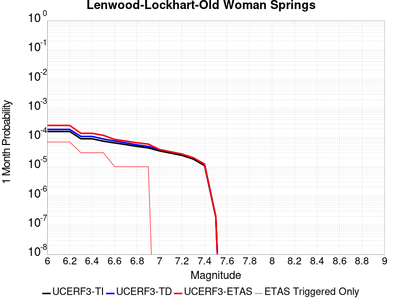 |  |  |

| Magnitude | 1 wk TI Prob | 1 wk TD Prob | 1 wk ETAS Prob | 1 wk ETAS/TD Gain | 1 wk ETAS Triggered Only | 1 mo TI Prob | 1 mo TD Prob | 1 mo ETAS Prob | 1 mo ETAS/TD Gain | 1 mo ETAS Triggered Only | 1 yr TI Prob | 1 yr TD Prob | 1 yr ETAS Prob | 1 yr ETAS/TD Gain | 1 yr ETAS Triggered Only | 10 yr TI Prob | 10 yr TD Prob | 10 yr ETAS Prob | 10 yr ETAS/TD Gain | 10 yr ETAS Triggered Only |
|-----|-----|-----|-----|-----|-----|-----|-----|-----|-----|-----|-----|-----|-----|-----|-----|-----|-----|-----|-----|-----|
| 6.0 | 3.744542E-5 | 4.3965032E-5 | 5.396459E-5 | 1.2274435 | 1.0E-5 | 1.604705E-4 | 1.8840893E-4 | 2.5839574E-4 | 1.3714623 | 7.0E-5 | 0.0019519776 | 0.0022916375 | 0.0027206521 | 1.1872088 | 4.3E-4 | 0.019349206 | 0.02269807 | 0.023909925 | 1.0533901 | 0.00124 |
| 6.1 | 3.744542E-5 | 4.3965032E-5 | 5.396459E-5 | 1.2274435 | 1.0E-5 | 1.604705E-4 | 1.8840893E-4 | 2.5839574E-4 | 1.3714623 | 7.0E-5 | 0.0019519776 | 0.0022916375 | 0.0027206521 | 1.1872088 | 4.3E-4 | 0.019349206 | 0.02269807 | 0.023909925 | 1.0533901 | 0.00124 |
| 6.2 | 3.744542E-5 | 4.3965032E-5 | 5.396459E-5 | 1.2274435 | 1.0E-5 | 1.604705E-4 | 1.8840893E-4 | 2.5839574E-4 | 1.3714623 | 7.0E-5 | 0.0019519776 | 0.0022916375 | 0.0027206521 | 1.1872088 | 4.3E-4 | 0.019349206 | 0.02269807 | 0.023909925 | 1.0533901 | 0.00124 |
| 6.3 | 2.1079984E-5 | 2.5354779E-5 | 2.5354779E-5 | 1.0 | 0.0 | 9.0339665E-5 | 1.0865892E-4 | 1.3865567E-4 | 1.2760633 | 3.0E-5 | 0.0010993304 | 0.0013221395 | 0.0015019015 | 1.135963 | 1.8E-4 | 0.010939079 | 0.01314495 | 0.013618641 | 1.0360359 | 4.8E-4 |
| 6.4 | 2.1079984E-5 | 2.5354779E-5 | 2.5354779E-5 | 1.0 | 0.0 | 9.0339665E-5 | 1.0865892E-4 | 1.3865567E-4 | 1.2760633 | 3.0E-5 | 0.0010993304 | 0.0013221395 | 0.0015019015 | 1.135963 | 1.8E-4 | 0.010939079 | 0.01314495 | 0.013618641 | 1.0360359 | 4.8E-4 |
| 6.5 | 1.7397282E-5 | 2.0663578E-5 | 2.0663578E-5 | 1.0 | 0.0 | 7.455765E-5 | 8.855525E-5 | 1.1855259E-4 | 1.3387415 | 3.0E-5 | 9.073613E-4 | 0.0010776386 | 0.0011975094 | 1.1112345 | 1.2E-4 | 0.009036654 | 0.010725424 | 0.011041991 | 1.0295156 | 3.2E-4 |
| 6.6 | 1.52050325E-5 | 1.7680335E-5 | 1.7680335E-5 | 1.0 | 0.0 | 6.51628E-5 | 7.577071E-5 | 8.576995E-5 | 1.1319671 | 1.0E-5 | 7.9306826E-4 | 9.221258E-4 | 0.0010120429 | 1.0975106 | 9.0E-5 | 0.007902439 | 0.009183858 | 0.009431561 | 1.0269717 | 2.5E-4 |
| 6.7 | 1.332523E-5 | 1.526459E-5 | 1.526459E-5 | 1.0 | 0.0 | 5.7106878E-5 | 6.541806E-5 | 7.541741E-5 | 1.152853 | 1.0E-5 | 6.950544E-4 | 7.9617975E-4 | 8.7611604E-4 | 1.1003999 | 8.0E-5 | 0.006928845 | 0.0079339035 | 0.008132316 | 1.0250083 | 2.0E-4 |
| 6.8 | 1.1525329E-5 | 1.30315375E-5 | 1.30315375E-5 | 1.0 | 0.0 | 4.9393333E-5 | 5.584827E-5 | 6.5847715E-5 | 1.1790465 | 1.0E-5 | 6.011979E-4 | 6.797448E-4 | 7.4969727E-4 | 1.1029098 | 7.0E-5 | 0.00599574 | 0.0067771086 | 0.006936024 | 1.023449 | 1.6E-4 |
| 6.9 | 1.0253909E-5 | 1.151498E-5 | 1.151498E-5 | 1.0 | 0.0 | 4.3944583E-5 | 4.9349E-5 | 5.9348506E-5 | 1.2026284 | 1.0E-5 | 5.3489394E-4 | 6.006621E-4 | 6.7062E-4 | 1.1164681 | 7.0E-5 | 0.0053360825 | 0.005990765 | 0.006129926 | 1.0232294 | 1.4E-4 |
| 7.0 | 8.104563E-6 | 8.991533E-6 | 8.991533E-6 | 1.0 | 0.0 | 3.4733377E-5 | 3.8534585E-5 | 3.8534585E-5 | 1.0 | 0.0 | 4.2279682E-4 | 4.6906E-4 | 4.9904594E-4 | 1.0639277 | 3.0E-5 | 0.0042199334 | 0.0046809474 | 0.0047406666 | 1.0127579 | 6.0E-5 |
| 7.1 | 6.7986157E-6 | 7.516056E-6 | 7.516056E-6 | 1.0 | 0.0 | 2.91366E-5 | 3.2211283E-5 | 3.2211283E-5 | 1.0 | 0.0 | 3.5468035E-4 | 3.9210395E-4 | 4.120961E-4 | 1.0509869 | 2.0E-5 | 0.003541148 | 0.0039143376 | 0.003964142 | 1.0127236 | 5.0E-5 |
| 7.2 | 5.6893327E-6 | 6.280187E-6 | 6.280187E-6 | 1.0 | 0.0 | 2.4382627E-5 | 2.691482E-5 | 2.691482E-5 | 1.0 | 0.0 | 2.9681803E-4 | 3.2764065E-4 | 3.3763738E-4 | 1.0305113 | 1.0E-5 | 0.002964219 | 0.0032717746 | 0.0033116438 | 1.0121858 | 4.0E-5 |
| 7.3 | 4.253348E-6 | 4.707105E-6 | 4.707105E-6 | 1.0 | 0.0 | 1.8228506E-5 | 2.017316E-5 | 2.017316E-5 | 1.0 | 0.0 | 2.2190946E-4 | 2.4558237E-4 | 2.5557991E-4 | 1.0407095 | 1.0E-5 | 0.00221688 | 0.0024532909 | 0.0024832173 | 1.0121984 | 3.0E-5 |
| 7.4 | 2.5448119E-6 | 2.8520674E-6 | 2.8520674E-6 | 1.0 | 0.0 | 1.0906291E-5 | 1.2223099E-5 | 1.2223099E-5 | 1.0 | 0.0 | 1.3277601E-4 | 1.4880771E-4 | 1.4880771E-4 | 1.0 | 0.0 | 0.001326967 | 0.0014872429 | 0.0014972279 | 1.0067139 | 1.0E-5 |
| 7.5 | 4.3706837E-8 | 4.5630156E-8 | 4.5630156E-8 | 1.0 | 0.0 | 1.8731501E-7 | 1.955578E-7 | 1.955578E-7 | 1.0 | 0.0 | 2.2805577E-6 | 2.380914E-6 | 2.380914E-6 | 1.0 | 0.0 | 2.2805343E-5 | 2.3808941E-5 | 2.3808941E-5 | 1.0 | 0.0 |

## San Andreas (San Bernardino N)
*[(top)](#table-of-contents)*

| 1 Week | 1 Month | 1 Year | 10 Year |
|-----|-----|-----|-----|
|  |  | 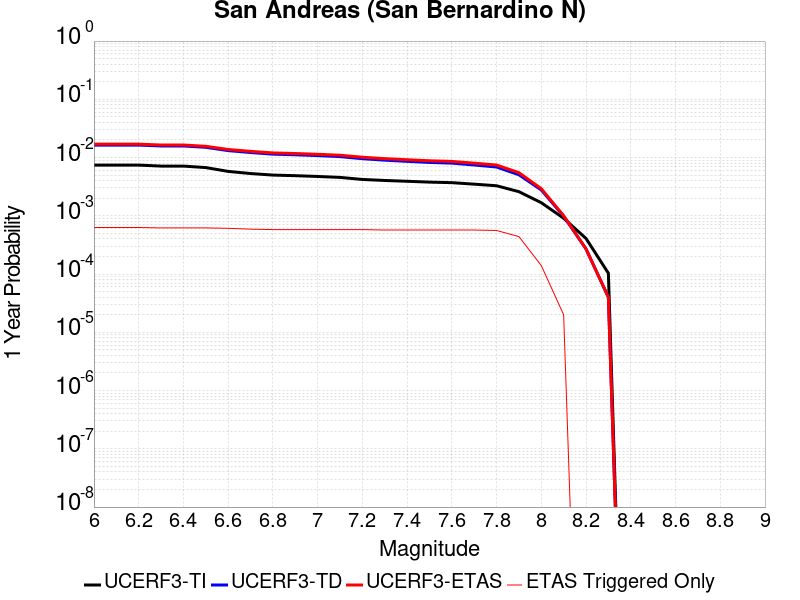 |  |

| Magnitude | 1 wk TI Prob | 1 wk TD Prob | 1 wk ETAS Prob | 1 wk ETAS/TD Gain | 1 wk ETAS Triggered Only | 1 mo TI Prob | 1 mo TD Prob | 1 mo ETAS Prob | 1 mo ETAS/TD Gain | 1 mo ETAS Triggered Only | 1 yr TI Prob | 1 yr TD Prob | 1 yr ETAS Prob | 1 yr ETAS/TD Gain | 1 yr ETAS Triggered Only | 10 yr TI Prob | 10 yr TD Prob | 10 yr ETAS Prob | 10 yr ETAS/TD Gain | 10 yr ETAS Triggered Only |
|-----|-----|-----|-----|-----|-----|-----|-----|-----|-----|-----|-----|-----|-----|-----|-----|-----|-----|-----|-----|-----|
| 6.0 | 1.4273766E-4 | 3.1637165E-4 | 4.1634E-4 | 1.315984 | 1.0E-4 | 6.115894E-4 | 0.0013551798 | 0.0015549088 | 1.1473819 | 2.0E-4 | 0.0074207084 | 0.016375994 | 0.016995678 | 1.037841 | 6.3E-4 | 0.07177748 | 0.15046582 | 0.15143429 | 1.0064365 | 0.00114 |
| 6.1 | 1.4273766E-4 | 3.1637165E-4 | 4.1634E-4 | 1.315984 | 1.0E-4 | 6.115894E-4 | 0.0013551798 | 0.0015549088 | 1.1473819 | 2.0E-4 | 0.0074207084 | 0.016375994 | 0.016995678 | 1.037841 | 6.3E-4 | 0.07177748 | 0.15046582 | 0.15143429 | 1.0064365 | 0.00114 |
| 6.2 | 1.4273766E-4 | 3.1637165E-4 | 4.1634E-4 | 1.315984 | 1.0E-4 | 6.115894E-4 | 0.0013551798 | 0.0015549088 | 1.1473819 | 2.0E-4 | 0.0074207084 | 0.016375994 | 0.016995678 | 1.037841 | 6.3E-4 | 0.07177748 | 0.15046582 | 0.15143429 | 1.0064365 | 0.00114 |
| 6.3 | 1.3730655E-4 | 3.0541886E-4 | 4.053883E-4 | 1.3273193 | 1.0E-4 | 5.883239E-4 | 0.0013082869 | 0.0015080253 | 1.1526717 | 2.0E-4 | 0.0071393442 | 0.015813464 | 0.01642366 | 1.0385871 | 6.2E-4 | 0.06914291 | 0.14575101 | 0.14671631 | 1.0066229 | 0.00113 |
| 6.4 | 1.3730655E-4 | 3.0541886E-4 | 4.053883E-4 | 1.3273193 | 1.0E-4 | 5.883239E-4 | 0.0013082869 | 0.0015080253 | 1.1526717 | 2.0E-4 | 0.0071393442 | 0.015813464 | 0.01642366 | 1.0385871 | 6.2E-4 | 0.06914291 | 0.14575101 | 0.14671631 | 1.0066229 | 0.00113 |
| 6.5 | 1.2942807E-4 | 2.895608E-4 | 3.8953184E-4 | 1.3452506 | 1.0E-4 | 5.545738E-4 | 0.0012403899 | 0.0014401417 | 1.1610396 | 2.0E-4 | 0.0067310524 | 0.014998424 | 0.015609125 | 1.0407177 | 6.2E-4 | 0.06530788 | 0.1388892 | 0.13985363 | 1.006944 | 0.00112 |
| 6.6 | 1.1125901E-4 | 2.5394472E-4 | 3.539193E-4 | 1.3936865 | 1.0E-4 | 4.767372E-4 | 0.0010878829 | 0.0012876653 | 1.1836433 | 2.0E-4 | 0.005788839 | 0.013165171 | 0.013767141 | 1.0457244 | 6.1E-4 | 0.056403454 | 0.123156786 | 0.124121316 | 1.0078317 | 0.0011 |
| 6.7 | 1.02209575E-4 | 2.3529287E-4 | 3.3526935E-4 | 1.4249022 | 1.0E-4 | 4.3796748E-4 | 0.0010080098 | 0.0012078081 | 1.1982108 | 2.0E-4 | 0.0053192247 | 0.012203882 | 0.012786683 | 1.0477552 | 5.9E-4 | 0.051936906 | 0.1149152 | 0.11584454 | 1.0080872 | 0.00105 |
| 6.8 | 9.610582E-5 | 2.2054653E-4 | 3.2052447E-4 | 1.4533191 | 1.0E-4 | 4.1181705E-4 | 9.448577E-4 | 0.0011346783 | 1.2008985 | 1.9E-4 | 0.0050023515 | 0.011443232 | 0.012016594 | 1.050105 | 5.8E-4 | 0.048912346 | 0.10832591 | 0.10925326 | 1.0085607 | 0.00104 |
| 6.9 | 9.3877505E-5 | 2.1510055E-4 | 3.1507903E-4 | 1.4647988 | 1.0E-4 | 4.0227012E-4 | 9.2153443E-4 | 0.0011113593 | 1.2059878 | 1.9E-4 | 0.0048866454 | 0.01116221 | 0.011735736 | 1.051381 | 5.8E-4 | 0.04780577 | 0.10591924 | 0.10684909 | 1.0087788 | 0.00104 |
| 7.0 | 9.1019785E-5 | 2.0836767E-4 | 3.0834682E-4 | 1.479821 | 1.0E-4 | 3.900265E-4 | 8.926993E-4 | 0.0010825297 | 1.2126477 | 1.9E-4 | 0.0047382377 | 0.010814676 | 0.011388404 | 1.0530509 | 5.8E-4 | 0.046384744 | 0.10288831 | 0.10381234 | 1.0089809 | 0.00103 |
| 7.1 | 8.771155E-5 | 2.0011076E-4 | 3.0009076E-4 | 1.4996233 | 1.0E-4 | 3.758525E-4 | 8.573362E-4 | 0.0010471733 | 1.2214267 | 1.9E-4 | 0.0045664064 | 0.010388309 | 0.010962284 | 1.055252 | 5.8E-4 | 0.044737056 | 0.099199384 | 0.100127205 | 1.0093532 | 0.00103 |
| 7.2 | 8.0830236E-5 | 1.8416144E-4 | 2.8414303E-4 | 1.5429019 | 1.0E-4 | 3.4636928E-4 | 7.890247E-4 | 9.788749E-4 | 1.2406136 | 1.9E-4 | 0.0042088944 | 0.00956417 | 0.0101386225 | 1.060063 | 5.8E-4 | 0.041300658 | 0.09192752 | 0.09286284 | 1.0101745 | 0.00103 |
| 7.3 | 7.7668235E-5 | 1.7359214E-4 | 2.635765E-4 | 1.5183667 | 9.0E-5 | 3.328214E-4 | 7.4375427E-4 | 9.2362036E-4 | 1.2418355 | 1.8E-4 | 0.0040445733 | 0.009017691 | 0.009582551 | 1.0626391 | 5.7E-4 | 0.03971748 | 0.087187394 | 0.088118464 | 1.0106789 | 0.00102 |
| 7.4 | 7.520177E-5 | 1.6578918E-4 | 2.5577427E-4 | 1.5427681 | 9.0E-5 | 3.2225347E-4 | 7.1033166E-4 | 8.9020375E-4 | 1.2532227 | 1.8E-4 | 0.0039163795 | 0.008614061 | 0.009179152 | 1.0656009 | 5.7E-4 | 0.038480744 | 0.08364062 | 0.08457531 | 1.011175 | 0.00102 |
| 7.5 | 7.274697E-5 | 1.5866217E-4 | 2.4864788E-4 | 1.567153 | 9.0E-5 | 3.1173544E-4 | 6.7980355E-4 | 8.5968117E-4 | 1.2646024 | 1.8E-4 | 0.003788775 | 0.008245256 | 0.0088105565 | 1.0685606 | 5.7E-4 | 0.03724827 | 0.080355436 | 0.08129347 | 1.0116736 | 0.00102 |
| 7.6 | 7.1185845E-5 | 1.5435848E-4 | 2.4434458E-4 | 1.5829684 | 9.0E-5 | 3.0504653E-4 | 6.6136866E-4 | 8.412496E-4 | 1.2719829 | 1.8E-4 | 0.0037076178 | 0.008022487 | 0.0085879145 | 1.0704803 | 5.7E-4 | 0.036463667 | 0.07834393 | 0.07928401 | 1.0119995 | 0.00102 |
| 7.7 | 6.709961E-5 | 1.4344044E-4 | 2.3342753E-4 | 1.6273481 | 9.0E-5 | 2.8753807E-4 | 6.1459997E-4 | 7.9448934E-4 | 1.2926935 | 1.8E-4 | 0.003495157 | 0.0074571203 | 0.00802287 | 1.075867 | 5.7E-4 | 0.034406938 | 0.07317166 | 0.07411703 | 1.0129198 | 0.00102 |
| 7.8 | 6.300812E-5 | 1.3226763E-4 | 2.2225572E-4 | 1.6803486 | 9.0E-5 | 2.7000686E-4 | 5.6673813E-4 | 7.466361E-4 | 1.317427 | 1.8E-4 | 0.0032823787 | 0.0068782354 | 0.007434384 | 1.0808562 | 5.6E-4 | 0.032343175 | 0.06782526 | 0.06875743 | 1.0137438 | 0.001 |
| 7.9 | 4.983037E-5 | 9.7425276E-5 | 1.6741846E-4 | 1.7184294 | 7.0E-5 | 2.1354125E-4 | 4.174701E-4 | 5.3742E-4 | 1.2873257 | 1.2E-4 | 0.0025967648 | 0.0050708633 | 0.005508632 | 1.0863302 | 4.4E-4 | 0.025666296 | 0.050739504 | 0.051451452 | 1.0140314 | 7.5E-4 |
| 8.0 | 3.2211527E-5 | 5.3414442E-5 | 8.341284E-5 | 1.5616158 | 3.0E-5 | 1.380421E-4 | 2.2889896E-4 | 2.688898E-4 | 1.1747096 | 4.0E-5 | 0.0016793669 | 0.0027832852 | 0.0029228954 | 1.0501603 | 1.4E-4 | 0.016667323 | 0.028415749 | 0.028658645 | 1.0085479 | 2.5E-4 |
| 8.1 | 1.743376E-5 | 1.8873632E-5 | 1.8873632E-5 | 1.0 | 0.0 | 7.471398E-5 | 8.0884485E-5 | 8.0884485E-5 | 1.0 | 0.0 | 9.0926304E-4 | 9.843244E-4 | 0.0010043047 | 1.0202985 | 2.0E-5 | 0.009055517 | 0.010509953 | 0.010549532 | 1.003766 | 4.0E-5 |
| 8.2 | 7.831616E-6 | 5.1727284E-6 | 5.1727284E-6 | 1.0 | 0.0 | 3.3563636E-5 | 2.2168648E-5 | 2.2168648E-5 | 1.0 | 0.0 | 4.0856065E-4 | 2.6986995E-4 | 2.6986995E-4 | 1.0 | 0.0 | 0.004078103 | 0.003051444 | 0.003051444 | 1.0 | 0.0 |
| 8.3 | 1.983087E-6 | 7.690063E-7 | 7.690063E-7 | 1.0 | 0.0 | 8.498917E-6 | 3.295737E-6 | 3.295737E-6 | 1.0 | 0.0 | 1.034694E-4 | 4.012488E-5 | 4.012488E-5 | 1.0 | 0.0 | 0.0010342124 | 4.737206E-4 | 4.737206E-4 | 1.0 | 0.0 |

## Paradise
*[(top)](#table-of-contents)*

| 1 Week | 1 Month | 1 Year | 10 Year |
|-----|-----|-----|-----|
|  |  | 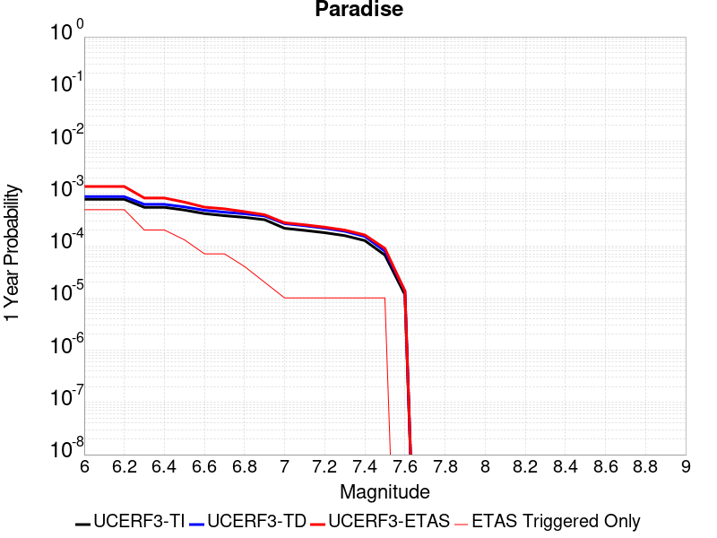 |  |

| Magnitude | 1 wk TI Prob | 1 wk TD Prob | 1 wk ETAS Prob | 1 wk ETAS/TD Gain | 1 wk ETAS Triggered Only | 1 mo TI Prob | 1 mo TD Prob | 1 mo ETAS Prob | 1 mo ETAS/TD Gain | 1 mo ETAS Triggered Only | 1 yr TI Prob | 1 yr TD Prob | 1 yr ETAS Prob | 1 yr ETAS/TD Gain | 1 yr ETAS Triggered Only | 10 yr TI Prob | 10 yr TD Prob | 10 yr ETAS Prob | 10 yr ETAS/TD Gain | 10 yr ETAS Triggered Only |
|-----|-----|-----|-----|-----|-----|-----|-----|-----|-----|-----|-----|-----|-----|-----|-----|-----|-----|-----|-----|-----|
| 6.0 | 1.4851273E-5 | 1.6695423E-5 | 2.6695256E-5 | 1.5989566 | 1.0E-5 | 6.364676E-5 | 7.1549985E-5 | 1.6154355E-4 | 2.257772 | 9.0E-5 | 7.7462377E-4 | 8.707965E-4 | 0.0013603698 | 1.5622132 | 4.9E-4 | 0.0077192914 | 0.008676223 | 0.009796419 | 1.129111 | 0.00113 |
| 6.1 | 1.4851273E-5 | 1.6695423E-5 | 2.6695256E-5 | 1.5989566 | 1.0E-5 | 6.364676E-5 | 7.1549985E-5 | 1.6154355E-4 | 2.257772 | 9.0E-5 | 7.7462377E-4 | 8.707965E-4 | 0.0013603698 | 1.5622132 | 4.9E-4 | 0.0077192914 | 0.008676223 | 0.009796419 | 1.129111 | 0.00113 |
| 6.2 | 1.4851273E-5 | 1.6695423E-5 | 2.6695256E-5 | 1.5989566 | 1.0E-5 | 6.364676E-5 | 7.1549985E-5 | 1.6154355E-4 | 2.257772 | 9.0E-5 | 7.7462377E-4 | 8.707965E-4 | 0.0013603698 | 1.5622132 | 4.9E-4 | 0.0077192914 | 0.008676223 | 0.009796419 | 1.129111 | 0.00113 |
| 6.3 | 1.0426831E-5 | 1.1889131E-5 | 1.1889131E-5 | 1.0 | 0.0 | 4.4685654E-5 | 5.0952458E-5 | 9.095042E-5 | 1.7850056 | 4.0E-5 | 5.43912E-4 | 6.2017556E-4 | 8.2005153E-4 | 1.3222893 | 2.0E-4 | 0.0054258266 | 0.0061850566 | 0.0067515313 | 1.0915875 | 5.7E-4 |
| 6.4 | 1.0426831E-5 | 1.1889131E-5 | 1.1889131E-5 | 1.0 | 0.0 | 4.4685654E-5 | 5.0952458E-5 | 9.095042E-5 | 1.7850056 | 4.0E-5 | 5.43912E-4 | 6.2017556E-4 | 8.2005153E-4 | 1.3222893 | 2.0E-4 | 0.0054258266 | 0.0061850566 | 0.0067515313 | 1.0915875 | 5.7E-4 |
| 6.5 | 9.25027E-6 | 1.0620418E-5 | 1.0620418E-5 | 1.0 | 0.0 | 3.964341E-5 | 4.5515313E-5 | 6.55144E-5 | 1.4393926 | 2.0E-5 | 4.8255164E-4 | 5.5401295E-4 | 6.839409E-4 | 1.2345215 | 1.3E-4 | 0.0048150513 | 0.0055268174 | 0.0059643853 | 1.0791718 | 4.4E-4 |
| 6.6 | 7.904275E-6 | 9.159918E-6 | 9.159918E-6 | 1.0 | 0.0 | 3.3875025E-5 | 3.925622E-5 | 4.925583E-5 | 1.2547266 | 1.0E-5 | 4.1235037E-4 | 4.778436E-4 | 5.4781017E-4 | 1.1464214 | 7.0E-5 | 0.0041158604 | 0.0047685583 | 0.0050074137 | 1.0500897 | 2.4E-4 |
| 6.7 | 7.2061953E-6 | 8.40761E-6 | 8.40761E-6 | 1.0 | 0.0 | 3.088333E-5 | 3.6032136E-5 | 4.6031775E-5 | 1.2775201 | 1.0E-5 | 3.7593965E-4 | 4.3860663E-4 | 5.0857593E-4 | 1.1595263 | 7.0E-5 | 0.003753043 | 0.0043777786 | 0.0045569907 | 1.0409367 | 1.8E-4 |
| 6.8 | 6.6948724E-6 | 7.842504E-6 | 7.842504E-6 | 1.0 | 0.0 | 2.8691995E-5 | 3.361032E-5 | 4.360998E-5 | 1.2975177 | 1.0E-5 | 3.4926904E-4 | 4.0913236E-4 | 4.49116E-4 | 1.0977279 | 4.0E-5 | 0.003487206 | 0.004084149 | 0.0042136176 | 1.0317004 | 1.3E-4 |
| 6.9 | 6.0421025E-6 | 7.13093E-6 | 7.13093E-6 | 1.0 | 0.0 | 2.5894467E-5 | 3.056079E-5 | 4.0560484E-5 | 1.3272066 | 1.0E-5 | 3.1521954E-4 | 3.720175E-4 | 3.9201006E-4 | 1.0537409 | 2.0E-5 | 0.0031477278 | 0.0037142856 | 0.003813914 | 1.026823 | 1.0E-4 |
| 7.0 | 4.134091E-6 | 5.080546E-6 | 5.080546E-6 | 1.0 | 0.0 | 1.7717413E-5 | 2.1773596E-5 | 3.177338E-5 | 1.4592619 | 1.0E-5 | 2.1568815E-4 | 2.6506282E-4 | 2.7506019E-4 | 1.0377169 | 1.0E-5 | 0.0021547892 | 0.00264762 | 0.002687514 | 1.0150679 | 4.0E-5 |
| 7.1 | 3.7674888E-6 | 4.6320843E-6 | 4.6320843E-6 | 1.0 | 0.0 | 1.6146281E-5 | 1.9851648E-5 | 2.985145E-5 | 1.5037265 | 1.0E-5 | 1.9656324E-4 | 2.4166853E-4 | 2.5166612E-4 | 1.041369 | 1.0E-5 | 0.0019638946 | 0.002414208 | 0.0024541111 | 1.0165286 | 4.0E-5 |
| 7.2 | 3.4065345E-6 | 4.1569137E-6 | 4.1569137E-6 | 1.0 | 0.0 | 1.4599351E-5 | 1.7815231E-5 | 2.7815053E-5 | 1.5613074 | 1.0E-5 | 1.777326E-4 | 2.1688035E-4 | 2.2687818E-4 | 1.0460984 | 1.0E-5 | 0.0017759053 | 0.0021668351 | 0.0022067486 | 1.0184201 | 4.0E-5 |
| 7.3 | 2.9934936E-6 | 3.629477E-6 | 3.629477E-6 | 1.0 | 0.0 | 1.2829195E-5 | 1.5554817E-5 | 2.5554662E-5 | 1.6428776 | 1.0E-5 | 1.5618425E-4 | 1.8936492E-4 | 1.9936303E-4 | 1.052798 | 1.0E-5 | 0.0015607453 | 0.001892181 | 0.0019221242 | 1.0158247 | 3.0E-5 |
| 7.4 | 2.4049796E-6 | 2.889102E-6 | 2.889102E-6 | 1.0 | 0.0 | 1.0307015E-5 | 1.2381815E-5 | 2.2381691E-5 | 1.807626 | 1.0E-5 | 1.2548068E-4 | 1.5073961E-4 | 1.6073811E-4 | 1.0663296 | 1.0E-5 | 0.0012540985 | 0.0015065151 | 0.0015364699 | 1.0198835 | 3.0E-5 |
| 7.5 | 1.2710091E-6 | 1.5135334E-6 | 1.5135334E-6 | 1.0 | 0.0 | 5.44717E-6 | 6.4865626E-6 | 1.6486498E-5 | 2.5416386 | 1.0E-5 | 6.631728E-5 | 7.897229E-5 | 8.89715E-5 | 1.1266167 | 1.0E-5 | 6.6297496E-4 | 7.895649E-4 | 8.195412E-4 | 1.0379657 | 3.0E-5 |
| 7.6 | 2.21172E-7 | 2.6040448E-7 | 2.6040448E-7 | 1.0 | 0.0 | 9.478797E-7 | 1.1160189E-6 | 1.1160189E-6 | 1.0 | 0.0 | 1.1540374E-5 | 1.3587473E-5 | 1.3587473E-5 | 1.0 | 0.0 | 1.1539775E-4 | 1.3586924E-4 | 1.3586924E-4 | 1.0 | 0.0 |

## Bicycle Lake
*[(top)](#table-of-contents)*

| 1 Week | 1 Month | 1 Year | 10 Year |
|-----|-----|-----|-----|
|  |  |  |  |

| Magnitude | 1 wk TI Prob | 1 wk TD Prob | 1 wk ETAS Prob | 1 wk ETAS/TD Gain | 1 wk ETAS Triggered Only | 1 mo TI Prob | 1 mo TD Prob | 1 mo ETAS Prob | 1 mo ETAS/TD Gain | 1 mo ETAS Triggered Only | 1 yr TI Prob | 1 yr TD Prob | 1 yr ETAS Prob | 1 yr ETAS/TD Gain | 1 yr ETAS Triggered Only | 10 yr TI Prob | 10 yr TD Prob | 10 yr ETAS Prob | 10 yr ETAS/TD Gain | 10 yr ETAS Triggered Only |
|-----|-----|-----|-----|-----|-----|-----|-----|-----|-----|-----|-----|-----|-----|-----|-----|-----|-----|-----|-----|-----|
| 6.0 | 1.9621975E-5 | 2.2098557E-5 | 3.2098338E-5 | 1.4525082 | 1.0E-5 | 8.4091465E-5 | 9.470543E-5 | 1.646988E-4 | 1.739064 | 7.0E-5 | 0.0010233327 | 0.0011525637 | 0.0015421142 | 1.3379861 | 3.9E-4 | 0.01018633 | 0.011479174 | 0.012358957 | 1.0766417 | 8.9E-4 |
| 6.1 | 1.9621975E-5 | 2.2098557E-5 | 3.2098338E-5 | 1.4525082 | 1.0E-5 | 8.4091465E-5 | 9.470543E-5 | 1.646988E-4 | 1.739064 | 7.0E-5 | 0.0010233327 | 0.0011525637 | 0.0015421142 | 1.3379861 | 3.9E-4 | 0.01018633 | 0.011479174 | 0.012358957 | 1.0766417 | 8.9E-4 |
| 6.2 | 9.9971285E-6 | 1.1256391E-5 | 1.1256391E-5 | 1.0 | 0.0 | 4.2844134E-5 | 4.824108E-5 | 7.823963E-5 | 1.6218467 | 3.0E-5 | 5.2150246E-4 | 5.8722886E-4 | 8.470762E-4 | 1.4424975 | 2.6E-4 | 0.0052028033 | 0.0058618775 | 0.006498126 | 1.10854 | 6.4E-4 |
| 6.3 | 9.589428E-6 | 1.0799068E-5 | 1.0799068E-5 | 1.0 | 0.0 | 4.10969E-5 | 4.6281195E-5 | 7.627981E-5 | 1.6481814 | 3.0E-5 | 5.002399E-4 | 5.633797E-4 | 8.232333E-4 | 1.4612404 | 2.6E-4 | 0.0049911533 | 0.0056246053 | 0.006251062 | 1.1113778 | 6.3E-4 |
| 6.4 | 9.589428E-6 | 1.0799068E-5 | 1.0799068E-5 | 1.0 | 0.0 | 4.10969E-5 | 4.6281195E-5 | 7.627981E-5 | 1.6481814 | 3.0E-5 | 5.002399E-4 | 5.633797E-4 | 8.232333E-4 | 1.4612404 | 2.6E-4 | 0.0049911533 | 0.0056246053 | 0.006251062 | 1.1113778 | 6.3E-4 |
| 6.5 | 5.557707E-6 | 6.286038E-6 | 6.286038E-6 | 1.0 | 0.0 | 2.3818526E-5 | 2.6940037E-5 | 4.6939498E-5 | 1.7423694 | 2.0E-5 | 2.8995197E-4 | 3.2797246E-4 | 4.8792E-4 | 1.4876858 | 1.6E-4 | 0.0028957394 | 0.003277521 | 0.0036562756 | 1.1155612 | 3.8E-4 |
| 6.6 | 4.8742945E-6 | 5.5136734E-6 | 5.5136734E-6 | 1.0 | 0.0 | 2.0889667E-5 | 2.3629962E-5 | 4.362949E-5 | 1.8463631 | 2.0E-5 | 2.54302E-4 | 2.87683E-4 | 4.2764272E-4 | 1.4865067 | 1.4E-4 | 0.002540112 | 0.0028756752 | 0.003194755 | 1.1109582 | 3.2E-4 |
| 6.7 | 3.991108E-6 | 4.5162255E-6 | 4.5162255E-6 | 1.0 | 0.0 | 1.7104636E-5 | 1.9355251E-5 | 3.9354865E-5 | 2.0332913 | 2.0E-5 | 2.0822904E-4 | 2.3565018E-4 | 3.3562662E-4 | 1.4242579 | 1.0E-4 | 0.0020803404 | 0.0023565018 | 0.0025759835 | 1.0931387 | 2.2E-4 |

## Garlic Springs
*[(top)](#table-of-contents)*

| 1 Week | 1 Month | 1 Year | 10 Year |
|-----|-----|-----|-----|
| 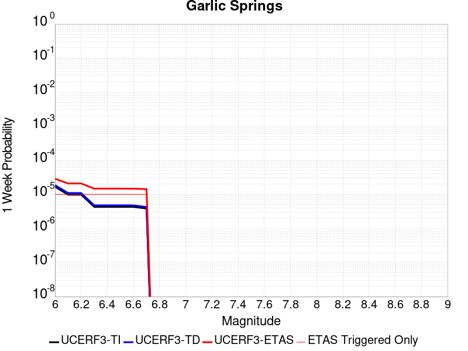 | 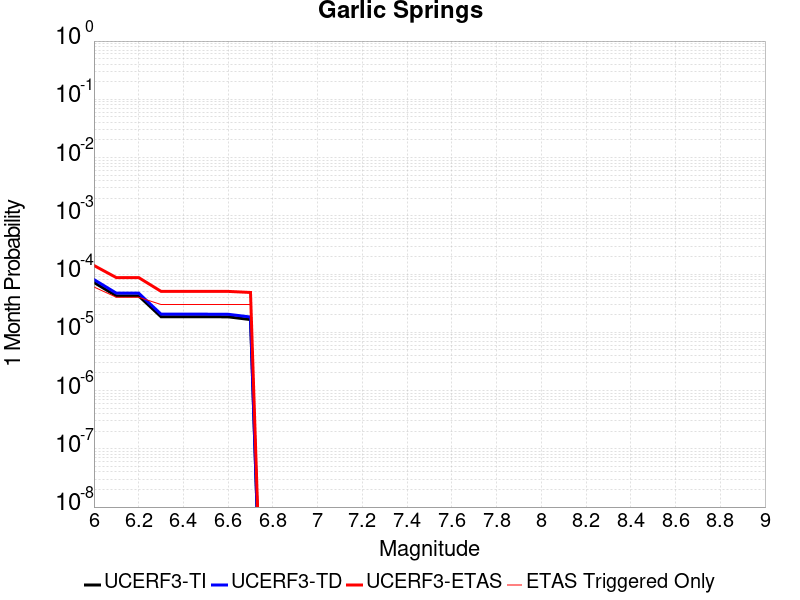 |  | 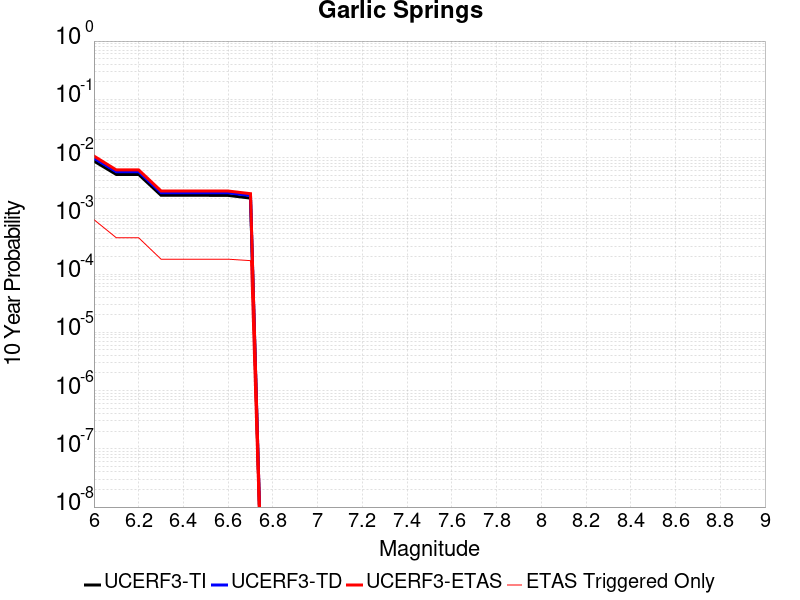 |

| Magnitude | 1 wk TI Prob | 1 wk TD Prob | 1 wk ETAS Prob | 1 wk ETAS/TD Gain | 1 wk ETAS Triggered Only | 1 mo TI Prob | 1 mo TD Prob | 1 mo ETAS Prob | 1 mo ETAS/TD Gain | 1 mo ETAS Triggered Only | 1 yr TI Prob | 1 yr TD Prob | 1 yr ETAS Prob | 1 yr ETAS/TD Gain | 1 yr ETAS Triggered Only | 10 yr TI Prob | 10 yr TD Prob | 10 yr ETAS Prob | 10 yr ETAS/TD Gain | 10 yr ETAS Triggered Only |
|-----|-----|-----|-----|-----|-----|-----|-----|-----|-----|-----|-----|-----|-----|-----|-----|-----|-----|-----|-----|-----|
| 6.0 | 1.6760017E-5 | 1.8778032E-5 | 2.8777844E-5 | 1.5325272 | 1.0E-5 | 7.182667E-5 | 8.047546E-5 | 1.4047063E-4 | 1.7455089 | 6.0E-5 | 8.7413884E-4 | 9.794657E-4 | 0.0012791719 | 1.3059894 | 3.0E-4 | 0.008707083 | 0.009763035 | 0.010614638 | 1.0872273 | 8.6E-4 |
| 6.1 | 9.852767E-6 | 1.097425E-5 | 2.097414E-5 | 1.911214 | 1.0E-5 | 4.222546E-5 | 4.703205E-5 | 8.703017E-5 | 1.8504438 | 4.0E-5 | 5.139737E-4 | 5.7253573E-4 | 7.324441E-4 | 1.2792985 | 1.6E-4 | 0.005127866 | 0.0057175662 | 0.0061351648 | 1.0730379 | 4.2E-4 |
| 6.2 | 9.852767E-6 | 1.097425E-5 | 2.097414E-5 | 1.911214 | 1.0E-5 | 4.222546E-5 | 4.703205E-5 | 8.703017E-5 | 1.8504438 | 4.0E-5 | 5.139737E-4 | 5.7253573E-4 | 7.324441E-4 | 1.2792985 | 1.6E-4 | 0.005127866 | 0.0057175662 | 0.0061351648 | 1.0730379 | 4.2E-4 |
| 6.3 | 4.3167724E-6 | 4.7782996E-6 | 1.4778252E-5 | 3.0927846 | 1.0E-5 | 1.8500323E-5 | 2.0478396E-5 | 5.047778E-5 | 2.4649286 | 3.0E-5 | 2.2521814E-4 | 2.4931898E-4 | 3.1930153E-4 | 1.2806948 | 7.0E-5 | 0.0022499003 | 0.002492651 | 0.0026722024 | 1.0720322 | 1.8E-4 |
| 6.4 | 4.3167724E-6 | 4.7782996E-6 | 1.4778252E-5 | 3.0927846 | 1.0E-5 | 1.8500323E-5 | 2.0478396E-5 | 5.047778E-5 | 2.4649286 | 3.0E-5 | 2.2521814E-4 | 2.4931898E-4 | 3.1930153E-4 | 1.2806948 | 7.0E-5 | 0.0022499003 | 0.002492651 | 0.0026722024 | 1.0720322 | 1.8E-4 |
| 6.5 | 4.3167724E-6 | 4.7782996E-6 | 1.4778252E-5 | 3.0927846 | 1.0E-5 | 1.8500323E-5 | 2.0478396E-5 | 5.047778E-5 | 2.4649286 | 3.0E-5 | 2.2521814E-4 | 2.4931898E-4 | 3.1930153E-4 | 1.2806948 | 7.0E-5 | 0.0022499003 | 0.002492651 | 0.0026722024 | 1.0720322 | 1.8E-4 |
| 6.6 | 4.301311E-6 | 4.761167E-6 | 1.4761119E-5 | 3.1003153 | 1.0E-5 | 1.8434059E-5 | 2.0404972E-5 | 5.040436E-5 | 2.4702 | 3.0E-5 | 2.2441156E-4 | 2.4842523E-4 | 3.1840784E-4 | 1.2817049 | 7.0E-5 | 0.0022418506 | 0.002483734 | 0.0026632869 | 1.0722915 | 1.8E-4 |
| 6.7 | 3.8599724E-6 | 4.2713013E-6 | 1.4271259E-5 | 3.341197 | 1.0E-5 | 1.6542634E-5 | 1.8305576E-5 | 4.8305028E-5 | 2.638815 | 3.0E-5 | 2.0138794E-4 | 2.228704E-4 | 2.928548E-4 | 1.3140138 | 7.0E-5 | 0.0020120554 | 0.0022287038 | 0.0023983251 | 1.0761075 | 1.7E-4 |

## San Andreas (San Bernardino S)
*[(top)](#table-of-contents)*

| 1 Week | 1 Month | 1 Year | 10 Year |
|-----|-----|-----|-----|
|  |  |  |  |

| Magnitude | 1 wk TI Prob | 1 wk TD Prob | 1 wk ETAS Prob | 1 wk ETAS/TD Gain | 1 wk ETAS Triggered Only | 1 mo TI Prob | 1 mo TD Prob | 1 mo ETAS Prob | 1 mo ETAS/TD Gain | 1 mo ETAS Triggered Only | 1 yr TI Prob | 1 yr TD Prob | 1 yr ETAS Prob | 1 yr ETAS/TD Gain | 1 yr ETAS Triggered Only | 10 yr TI Prob | 10 yr TD Prob | 10 yr ETAS Prob | 10 yr ETAS/TD Gain | 10 yr ETAS Triggered Only |
|-----|-----|-----|-----|-----|-----|-----|-----|-----|-----|-----|-----|-----|-----|-----|-----|-----|-----|-----|-----|-----|
| 6.0 | 1.2336002E-4 | 3.0025674E-4 | 3.702357E-4 | 1.2330638 | 7.0E-5 | 5.2857865E-4 | 0.0012862061 | 0.0013960645 | 1.0854129 | 1.1E-4 | 0.006416472 | 0.015552082 | 0.015827727 | 1.017724 | 2.8E-4 | 0.06234337 | 0.14278531 | 0.14328249 | 1.003482 | 5.8E-4 |
| 6.1 | 1.2336002E-4 | 3.0025674E-4 | 3.702357E-4 | 1.2330638 | 7.0E-5 | 5.2857865E-4 | 0.0012862061 | 0.0013960645 | 1.0854129 | 1.1E-4 | 0.006416472 | 0.015552082 | 0.015827727 | 1.017724 | 2.8E-4 | 0.06234337 | 0.14278531 | 0.14328249 | 1.003482 | 5.8E-4 |
| 6.2 | 1.2336002E-4 | 3.0025674E-4 | 3.702357E-4 | 1.2330638 | 7.0E-5 | 5.2857865E-4 | 0.0012862061 | 0.0013960645 | 1.0854129 | 1.1E-4 | 0.006416472 | 0.015552082 | 0.015827727 | 1.017724 | 2.8E-4 | 0.06234337 | 0.14278531 | 0.14328249 | 1.003482 | 5.8E-4 |
| 6.3 | 1.1712257E-4 | 2.8813703E-4 | 3.5811687E-4 | 1.24287 | 7.0E-5 | 5.018573E-4 | 0.0012343143 | 0.0013441786 | 1.0890083 | 1.1E-4 | 0.006093008 | 0.014929076 | 0.015204895 | 1.0184753 | 2.8E-4 | 0.059286322 | 0.13748851 | 0.13798876 | 1.0036385 | 5.8E-4 |
| 6.4 | 1.1712257E-4 | 2.8813703E-4 | 3.5811687E-4 | 1.24287 | 7.0E-5 | 5.018573E-4 | 0.0012343143 | 0.0013441786 | 1.0890083 | 1.1E-4 | 0.006093008 | 0.014929076 | 0.015204895 | 1.0184753 | 2.8E-4 | 0.059286322 | 0.13748851 | 0.13798876 | 1.0036385 | 5.8E-4 |
| 6.5 | 1.0689076E-4 | 2.6826185E-4 | 3.382431E-4 | 1.260869 | 7.0E-5 | 4.5802278E-4 | 0.0011492119 | 0.0012590855 | 1.0956078 | 1.1E-4 | 0.0055621783 | 0.013906514 | 0.014182621 | 1.0198544 | 2.8E-4 | 0.05425003 | 0.12872604 | 0.12922266 | 1.003858 | 5.7E-4 |
| 6.6 | 9.7648895E-5 | 2.5070578E-4 | 3.2068824E-4 | 1.2791418 | 7.0E-5 | 4.1842813E-4 | 0.0010740346 | 0.0011839165 | 1.1023076 | 1.1E-4 | 0.005082469 | 0.013002338 | 0.013278698 | 1.0212545 | 2.8E-4 | 0.049677886 | 0.120901346 | 0.12139364 | 1.0040718 | 5.6E-4 |
| 6.7 | 8.757013E-5 | 2.3141113E-4 | 3.0139493E-4 | 1.3024219 | 7.0E-5 | 3.7524657E-4 | 9.914073E-4 | 0.0011012983 | 1.1108434 | 1.1E-4 | 0.00455906 | 0.0120076705 | 0.012274428 | 1.0222156 | 2.7E-4 | 0.04466656 | 0.11218169 | 0.11266999 | 1.0043528 | 5.5E-4 |
| 6.8 | 8.562978E-5 | 2.270081E-4 | 2.9699222E-4 | 1.308289 | 7.0E-5 | 3.6693315E-4 | 9.7255135E-4 | 0.0010824443 | 1.1129946 | 1.1E-4 | 0.004458263 | 0.011780596 | 0.012047416 | 1.022649 | 2.7E-4 | 0.043698758 | 0.1101955 | 0.110684894 | 1.0044411 | 5.5E-4 |
| 6.9 | 6.124075E-5 | 1.7083176E-4 | 2.4081979E-4 | 1.4096899 | 7.0E-5 | 2.6243398E-4 | 7.319315E-4 | 8.41851E-4 | 1.1501772 | 1.1E-4 | 0.0031904527 | 0.008875063 | 0.009132755 | 1.0290356 | 2.6E-4 | 0.031450346 | 0.084271915 | 0.08473894 | 1.0055418 | 5.1E-4 |
| 7.0 | 5.8598747E-5 | 1.6512029E-4 | 2.3510873E-4 | 1.4238634 | 7.0E-5 | 2.5111332E-4 | 7.0746726E-4 | 8.173894E-4 | 1.1553743 | 1.1E-4 | 0.0030530186 | 0.008579592 | 0.008837362 | 1.0300444 | 2.6E-4 | 0.03011414 | 0.08158445 | 0.08205284 | 1.0057412 | 5.1E-4 |
| 7.1 | 5.613814E-5 | 1.5930375E-4 | 2.292926E-4 | 1.4393421 | 7.0E-5 | 2.4056983E-4 | 6.8255246E-4 | 7.9247734E-4 | 1.1610497 | 1.1E-4 | 0.0029250039 | 0.008278593 | 0.008536441 | 1.0311463 | 2.6E-4 | 0.028868021 | 0.07888606 | 0.07935583 | 1.005955 | 5.1E-4 |
| 7.2 | 4.991222E-5 | 1.4536385E-4 | 2.1535368E-4 | 1.4814802 | 7.0E-5 | 2.1389198E-4 | 6.2283955E-4 | 7.3277106E-4 | 1.1765004 | 1.1E-4 | 0.002601025 | 0.007556809 | 0.007814844 | 1.0341461 | 2.6E-4 | 0.025707912 | 0.07233381 | 0.07280692 | 1.0065407 | 5.1E-4 |
| 7.3 | 4.7410045E-5 | 1.373025E-4 | 1.9729427E-4 | 1.4369313 | 6.0E-5 | 2.0317009E-4 | 5.883069E-4 | 6.8824814E-4 | 1.1698793 | 1.0E-4 | 0.0024707897 | 0.0071392 | 0.007387415 | 1.034768 | 2.5E-4 | 0.024434982 | 0.06861141 | 0.069077104 | 1.0067874 | 5.0E-4 |
| 7.4 | 4.5556746E-5 | 1.3137884E-4 | 1.9137096E-4 | 1.4566345 | 6.0E-5 | 1.952286E-4 | 5.62931E-4 | 6.628747E-4 | 1.1775416 | 1.0E-4 | 0.002374317 | 0.006832226 | 0.007080518 | 1.0363413 | 2.5E-4 | 0.023491086 | 0.06586029 | 0.066327356 | 1.0070919 | 5.0E-4 |
| 7.5 | 4.3084514E-5 | 1.2372872E-4 | 1.8372129E-4 | 1.4848719 | 6.0E-5 | 1.8463485E-4 | 5.3015846E-4 | 6.3010544E-4 | 1.1885228 | 1.0E-4 | 0.0022456115 | 0.006435648 | 0.0066840393 | 1.0385962 | 2.5E-4 | 0.022230545 | 0.06225957 | 0.06272844 | 1.0075309 | 5.0E-4 |
| 7.6 | 3.408608E-5 | 9.849839E-5 | 1.5849249E-4 | 1.609087 | 6.0E-5 | 1.4607502E-4 | 4.2206777E-4 | 5.2202557E-4 | 1.2368288 | 1.0E-4 | 0.0017770125 | 0.005126593 | 0.0053753117 | 1.0485153 | 2.5E-4 | 0.017628696 | 0.050086122 | 0.050561078 | 1.0094829 | 5.0E-4 |
| 7.7 | 2.8315713E-5 | 8.262102E-5 | 1.4261606E-4 | 1.7261474 | 6.0E-5 | 1.2134742E-4 | 3.5404207E-4 | 4.5400666E-4 | 1.2823523 | 1.0E-4 | 0.0014764034 | 0.0043019517 | 0.004550876 | 1.0578631 | 2.5E-4 | 0.01466633 | 0.042333513 | 0.042812347 | 1.0113109 | 5.0E-4 |
| 7.8 | 2.6222975E-5 | 7.4756E-5 | 1.347515E-4 | 1.8025513 | 6.0E-5 | 1.1237934E-4 | 3.203435E-4 | 4.2031147E-4 | 1.3120649 | 1.0E-4 | 0.0013673597 | 0.0038932136 | 0.004132279 | 1.0614058 | 2.4E-4 | 0.013589768 | 0.038495146 | 0.038966283 | 1.0122389 | 4.9E-4 |
| 7.9 | 2.1469694E-5 | 5.7982703E-5 | 1.1797922E-4 | 2.0347314 | 6.0E-5 | 9.200973E-5 | 2.4847363E-4 | 3.4844878E-4 | 1.4023572 | 1.0E-4 | 0.0011196428 | 0.003020973 | 0.0032502783 | 1.0759044 | 2.3E-4 | 0.011140184 | 0.030201301 | 0.030628012 | 1.0141289 | 4.4E-4 |
| 8.0 | 1.2420249E-5 | 3.1376432E-5 | 5.1375802E-5 | 1.6374011 | 2.0E-5 | 5.322855E-5 | 1.344635E-4 | 1.6445946E-4 | 1.2230788 | 3.0E-5 | 6.478649E-4 | 0.0016358647 | 0.0017057502 | 1.0427208 | 7.0E-5 | 0.0064597935 | 0.016549915 | 0.016687598 | 1.0083193 | 1.4E-4 |
| 8.1 | 4.9197724E-6 | 7.842547E-6 | 7.842547E-6 | 1.0 | 0.0 | 2.1084568E-5 | 3.3610482E-5 | 3.3610482E-5 | 1.0 | 0.0 | 2.566744E-4 | 4.0913094E-4 | 4.0913094E-4 | 1.0 | 0.0 | 0.002563781 | 0.0043946104 | 0.0043946104 | 1.0 | 0.0 |
| 8.2 | 2.5634774E-6 | 2.915849E-6 | 2.915849E-6 | 1.0 | 0.0 | 1.0986286E-5 | 1.2496436E-5 | 1.2496436E-5 | 1.0 | 0.0 | 1.3374983E-4 | 1.5213354E-4 | 1.5213354E-4 | 1.0 | 0.0 | 0.0013366934 | 0.0017097751 | 0.0017097751 | 1.0 | 0.0 |
| 8.3 | 5.2850464E-7 | 3.2203224E-7 | 3.2203224E-7 | 1.0 | 0.0 | 2.2650179E-6 | 1.3801375E-6 | 1.3801375E-6 | 1.0 | 0.0 | 2.7576245E-5 | 1.6803056E-5 | 1.6803056E-5 | 1.0 | 0.0 | 2.7572823E-4 | 1.9934843E-4 | 1.9934843E-4 | 1.0 | 0.0 |

## Death Valley (Black Mtns Frontal)
*[(top)](#table-of-contents)*

| 1 Week | 1 Month | 1 Year | 10 Year |
|-----|-----|-----|-----|
| 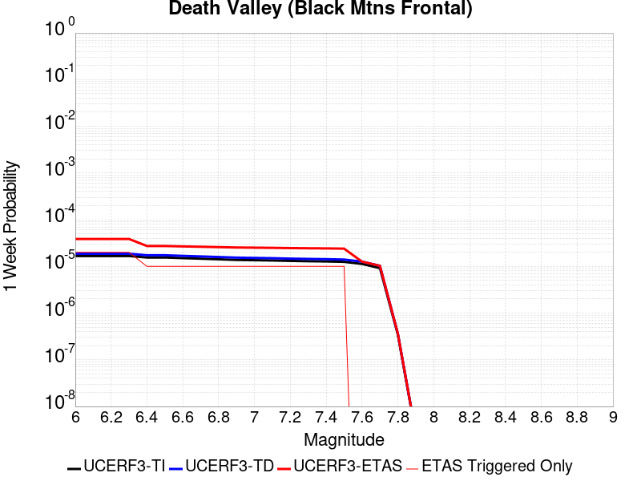 |  |  |  |

| Magnitude | 1 wk TI Prob | 1 wk TD Prob | 1 wk ETAS Prob | 1 wk ETAS/TD Gain | 1 wk ETAS Triggered Only | 1 mo TI Prob | 1 mo TD Prob | 1 mo ETAS Prob | 1 mo ETAS/TD Gain | 1 mo ETAS Triggered Only | 1 yr TI Prob | 1 yr TD Prob | 1 yr ETAS Prob | 1 yr ETAS/TD Gain | 1 yr ETAS Triggered Only | 10 yr TI Prob | 10 yr TD Prob | 10 yr ETAS Prob | 10 yr ETAS/TD Gain | 10 yr ETAS Triggered Only |
|-----|-----|-----|-----|-----|-----|-----|-----|-----|-----|-----|-----|-----|-----|-----|-----|-----|-----|-----|-----|-----|
| 6.0 | 1.6707214E-5 | 1.8671435E-5 | 3.8671064E-5 | 2.0711348 | 2.0E-5 | 7.160038E-5 | 8.001803E-5 | 1.20014825E-4 | 1.4998474 | 4.0E-5 | 8.71386E-4 | 9.737917E-4 | 0.0011835872 | 1.2154418 | 2.1E-4 | 0.00867977 | 0.0096961 | 0.010201155 | 1.0520885 | 5.1E-4 |
| 6.1 | 1.6707214E-5 | 1.8671435E-5 | 3.8671064E-5 | 2.0711348 | 2.0E-5 | 7.160038E-5 | 8.001803E-5 | 1.20014825E-4 | 1.4998474 | 4.0E-5 | 8.71386E-4 | 9.737917E-4 | 0.0011835872 | 1.2154418 | 2.1E-4 | 0.00867977 | 0.0096961 | 0.010201155 | 1.0520885 | 5.1E-4 |
| 6.2 | 1.6707214E-5 | 1.8671435E-5 | 3.8671064E-5 | 2.0711348 | 2.0E-5 | 7.160038E-5 | 8.001803E-5 | 1.20014825E-4 | 1.4998474 | 4.0E-5 | 8.71386E-4 | 9.737917E-4 | 0.0011835872 | 1.2154418 | 2.1E-4 | 0.00867977 | 0.0096961 | 0.010201155 | 1.0520885 | 5.1E-4 |
| 6.3 | 1.6707214E-5 | 1.8671435E-5 | 3.8671064E-5 | 2.0711348 | 2.0E-5 | 7.160038E-5 | 8.001803E-5 | 1.20014825E-4 | 1.4998474 | 4.0E-5 | 8.71386E-4 | 9.737917E-4 | 0.0011835872 | 1.2154418 | 2.1E-4 | 0.00867977 | 0.0096961 | 0.010201155 | 1.0520885 | 5.1E-4 |
| 6.4 | 1.5515609E-5 | 1.7339296E-5 | 2.7339123E-5 | 1.5767146 | 1.0E-5 | 6.649377E-5 | 7.430919E-5 | 1.04306964E-4 | 1.4036885 | 3.0E-5 | 8.0926094E-4 | 9.04345E-4 | 0.0011041642 | 1.2209545 | 2.0E-4 | 0.008063202 | 0.009007333 | 0.0094731 | 1.0517097 | 4.7E-4 |
| 6.5 | 1.5515609E-5 | 1.7339296E-5 | 2.7339123E-5 | 1.5767146 | 1.0E-5 | 6.649377E-5 | 7.430919E-5 | 1.04306964E-4 | 1.4036885 | 3.0E-5 | 8.0926094E-4 | 9.04345E-4 | 0.0011041642 | 1.2209545 | 2.0E-4 | 0.008063202 | 0.009007333 | 0.0094731 | 1.0517097 | 4.7E-4 |
| 6.6 | 1.5041828E-5 | 1.6810196E-5 | 2.6810027E-5 | 1.5948671 | 1.0E-5 | 6.4463384E-5 | 7.204174E-5 | 9.2040296E-5 | 1.2775968 | 2.0E-5 | 7.8455906E-4 | 8.767611E-4 | 0.0010665945 | 1.2165167 | 1.9E-4 | 0.00781795 | 0.008733676 | 0.009169833 | 1.0499398 | 4.4E-4 |
| 6.7 | 1.4634985E-5 | 1.635704E-5 | 2.6356876E-5 | 1.6113476 | 1.0E-5 | 6.271985E-5 | 7.009975E-5 | 9.009834E-5 | 1.2852877 | 2.0E-5 | 7.6334673E-4 | 8.53136E-4 | 0.001042974 | 1.2225177 | 1.9E-4 | 0.007607299 | 0.008499245 | 0.008915676 | 1.0489962 | 4.2E-4 |
| 6.8 | 1.4209158E-5 | 1.5883043E-5 | 2.5882884E-5 | 1.6295923 | 1.0E-5 | 6.089497E-5 | 6.806844E-5 | 8.806708E-5 | 1.2938019 | 2.0E-5 | 7.4114406E-4 | 8.2842377E-4 | 0.0010182663 | 1.2291613 | 1.9E-4 | 0.007386771 | 0.008253971 | 0.00865067 | 1.0480615 | 4.0E-4 |
| 6.9 | 1.3780098E-5 | 1.540556E-5 | 2.5405405E-5 | 1.6491063 | 1.0E-5 | 5.9056227E-5 | 6.6022185E-5 | 8.602087E-5 | 1.3029084 | 2.0E-5 | 7.1877235E-4 | 8.0352917E-4 | 9.833846E-4 | 1.2238318 | 1.8E-4 | 0.0071645193 | 0.0080068335 | 0.008383791 | 1.0470794 | 3.8E-4 |
| 7.0 | 1.3585064E-5 | 1.5189109E-5 | 2.5188958E-5 | 1.6583564 | 1.0E-5 | 5.8220405E-5 | 6.509459E-5 | 8.5093285E-5 | 1.3072252 | 2.0E-5 | 7.086029E-4 | 7.922439E-4 | 9.721013E-4 | 1.2270228 | 1.8E-4 | 0.007063476 | 0.007894788 | 0.008271787 | 1.047753 | 3.8E-4 |
| 7.1 | 1.3398601E-5 | 1.4982282E-5 | 2.4982131E-5 | 1.6674451 | 1.0E-5 | 5.742131E-5 | 6.420823E-5 | 8.420694E-5 | 1.3114666 | 2.0E-5 | 6.9888023E-4 | 7.8146026E-4 | 9.513274E-4 | 1.2173715 | 1.7E-4 | 0.0069668638 | 0.007787712 | 0.008105219 | 1.0407704 | 3.2E-4 |
| 7.2 | 1.3126312E-5 | 1.4680485E-5 | 2.468034E-5 | 1.6811664 | 1.0E-5 | 5.6254412E-5 | 6.291488E-5 | 8.291362E-5 | 1.3178698 | 2.0E-5 | 6.846822E-4 | 7.6572486E-4 | 9.1561006E-4 | 1.1957428 | 1.5E-4 | 0.006825765 | 0.007631449 | 0.007929159 | 1.039011 | 3.0E-4 |
| 7.3 | 1.2922429E-5 | 1.4454699E-5 | 2.4454555E-5 | 1.6918066 | 1.0E-5 | 5.5380664E-5 | 6.194727E-5 | 8.194603E-5 | 1.3228352 | 2.0E-5 | 6.74051E-4 | 7.539525E-4 | 9.038394E-4 | 1.1988015 | 1.5E-4 | 0.006720101 | 0.007514527 | 0.0078122728 | 1.0396227 | 3.0E-4 |
| 7.4 | 1.2768878E-5 | 1.4284673E-5 | 2.428453E-5 | 1.700041 | 1.0E-5 | 5.4722615E-5 | 6.121862E-5 | 8.12174E-5 | 1.3266779 | 2.0E-5 | 6.660441E-4 | 7.450873E-4 | 8.749904E-4 | 1.1743462 | 1.3E-4 | 0.0066405144 | 0.007426471 | 0.007704391 | 1.037423 | 2.8E-4 |
| 7.5 | 1.2521929E-5 | 1.4012902E-5 | 2.4012763E-5 | 1.713618 | 1.0E-5 | 5.366431E-5 | 6.0053942E-5 | 8.005274E-5 | 1.3330139 | 2.0E-5 | 6.531671E-4 | 7.309169E-4 | 8.608219E-4 | 1.1777288 | 1.3E-4 | 0.006512506 | 0.0072857053 | 0.0075636655 | 1.0381514 | 2.8E-4 |
| 7.6 | 1.1301089E-5 | 1.2648951E-5 | 1.2648951E-5 | 1.0 | 0.0 | 4.8432343E-5 | 5.4208693E-5 | 6.420815E-5 | 1.1844623 | 1.0E-5 | 5.895042E-4 | 6.597963E-4 | 7.497369E-4 | 1.1363157 | 9.0E-5 | 0.0058794282 | 0.006578926 | 0.006807413 | 1.0347301 | 2.3E-4 |
| 7.7 | 9.189108E-6 | 1.02840095E-5 | 1.02840095E-5 | 1.0 | 0.0 | 3.93813E-5 | 4.407361E-5 | 5.407317E-5 | 1.2268832 | 1.0E-5 | 4.7936183E-4 | 5.3646916E-4 | 6.1642623E-4 | 1.1490432 | 8.0E-5 | 0.004783291 | 0.005352252 | 0.0055312887 | 1.0334507 | 1.8E-4 |
| 7.8 | 3.4586725E-7 | 3.648368E-7 | 3.648368E-7 | 1.0 | 0.0 | 1.4822873E-6 | 1.5635853E-6 | 1.5635853E-6 | 1.0 | 0.0 | 1.80467E-5 | 1.903649E-5 | 1.903649E-5 | 1.0 | 0.0 | 1.8045233E-4 | 1.9034903E-4 | 1.9034903E-4 | 1.0 | 0.0 |
| 7.9 | 2.5591178E-9 | 2.6697329E-9 | 2.6697329E-9 | 1.0 | 0.0 | 1.0967647E-8 | 1.14417125E-8 | 1.14417125E-8 | 1.0 | 0.0 | 1.335311E-7 | 1.3930286E-7 | 1.3930286E-7 | 1.0 | 0.0 | 1.3353102E-6 | 1.3930285E-6 | 1.3930285E-6 | 1.0 | 0.0 |

## San Andreas (Big Bend)
*[(top)](#table-of-contents)*

| 1 Week | 1 Month | 1 Year | 10 Year |
|-----|-----|-----|-----|
|  |  |  |  |

| Magnitude | 1 wk TI Prob | 1 wk TD Prob | 1 wk ETAS Prob | 1 wk ETAS/TD Gain | 1 wk ETAS Triggered Only | 1 mo TI Prob | 1 mo TD Prob | 1 mo ETAS Prob | 1 mo ETAS/TD Gain | 1 mo ETAS Triggered Only | 1 yr TI Prob | 1 yr TD Prob | 1 yr ETAS Prob | 1 yr ETAS/TD Gain | 1 yr ETAS Triggered Only | 10 yr TI Prob | 10 yr TD Prob | 10 yr ETAS Prob | 10 yr ETAS/TD Gain | 10 yr ETAS Triggered Only |
|-----|-----|-----|-----|-----|-----|-----|-----|-----|-----|-----|-----|-----|-----|-----|-----|-----|-----|-----|-----|-----|
| 6.0 | 1.0179969E-4 | 2.0107176E-4 | 2.1106975E-4 | 1.0497235 | 1.0E-5 | 4.362114E-4 | 8.6145254E-4 | 8.814353E-4 | 1.0231966 | 2.0E-5 | 0.0052979486 | 0.0104380315 | 0.010596362 | 1.0151685 | 1.6E-4 | 0.051734097 | 0.10163772 | 0.10198808 | 1.0034472 | 3.9E-4 |
| 6.1 | 1.0179969E-4 | 2.0107176E-4 | 2.1106975E-4 | 1.0497235 | 1.0E-5 | 4.362114E-4 | 8.6145254E-4 | 8.814353E-4 | 1.0231966 | 2.0E-5 | 0.0052979486 | 0.0104380315 | 0.010596362 | 1.0151685 | 1.6E-4 | 0.051734097 | 0.10163772 | 0.10198808 | 1.0034472 | 3.9E-4 |
| 6.2 | 1.0179969E-4 | 2.0107176E-4 | 2.1106975E-4 | 1.0497235 | 1.0E-5 | 4.362114E-4 | 8.6145254E-4 | 8.814353E-4 | 1.0231966 | 2.0E-5 | 0.0052979486 | 0.0104380315 | 0.010596362 | 1.0151685 | 1.6E-4 | 0.051734097 | 0.10163772 | 0.10198808 | 1.0034472 | 3.9E-4 |
| 6.3 | 1.0179969E-4 | 2.0107176E-4 | 2.1106975E-4 | 1.0497235 | 1.0E-5 | 4.362114E-4 | 8.6145254E-4 | 8.814353E-4 | 1.0231966 | 2.0E-5 | 0.0052979486 | 0.0104380315 | 0.010596362 | 1.0151685 | 1.6E-4 | 0.051734097 | 0.10163772 | 0.10198808 | 1.0034472 | 3.9E-4 |
| 6.4 | 9.1639464E-5 | 1.8463937E-4 | 1.9463753E-4 | 1.0541496 | 1.0E-5 | 3.9268145E-4 | 7.9107186E-4 | 8.010639E-4 | 1.012631 | 1.0E-5 | 0.0047704205 | 0.009588886 | 0.009678023 | 1.0092958 | 9.0E-5 | 0.046693064 | 0.093937874 | 0.09412815 | 1.0020255 | 2.1E-4 |
| 6.5 | 9.1639464E-5 | 1.8463937E-4 | 1.9463753E-4 | 1.0541496 | 1.0E-5 | 3.9268145E-4 | 7.9107186E-4 | 8.010639E-4 | 1.012631 | 1.0E-5 | 0.0047704205 | 0.009588886 | 0.009678023 | 1.0092958 | 9.0E-5 | 0.046693064 | 0.093937874 | 0.09412815 | 1.0020255 | 2.1E-4 |
| 6.6 | 9.042622E-5 | 1.827092E-4 | 1.9270739E-4 | 1.0547218 | 1.0E-5 | 3.8748336E-4 | 7.828047E-4 | 7.927969E-4 | 1.0127646 | 1.0E-5 | 0.0047074095 | 0.009489112 | 0.009578258 | 1.0093945 | 9.0E-5 | 0.046089325 | 0.09302715 | 0.09321761 | 1.0020474 | 2.1E-4 |
| 6.7 | 8.9836685E-5 | 1.8185233E-4 | 1.8185233E-4 | 1.0 | 0.0 | 3.8495753E-4 | 7.791345E-4 | 7.791345E-4 | 1.0 | 0.0 | 0.00467679 | 0.009444815 | 0.0095240595 | 1.0083903 | 8.0E-5 | 0.045795817 | 0.09262138 | 0.0927847 | 1.0017633 | 1.8E-4 |
| 6.8 | 8.9471854E-5 | 1.8131983E-4 | 1.8131983E-4 | 1.0 | 0.0 | 3.8339442E-4 | 7.7685376E-4 | 7.7685376E-4 | 1.0 | 0.0 | 0.004657841 | 0.009417287 | 0.009496534 | 1.008415 | 8.0E-5 | 0.04561414 | 0.092368215 | 0.09253159 | 1.0017687 | 1.8E-4 |
| 6.9 | 8.858234E-5 | 1.8013896E-4 | 1.8013896E-4 | 1.0 | 0.0 | 3.7958333E-4 | 7.717959E-4 | 7.717959E-4 | 1.0 | 0.0 | 0.004611638 | 0.009356238 | 0.00943549 | 1.0084704 | 8.0E-5 | 0.04517103 | 0.09180844 | 0.09196283 | 1.0016817 | 1.7E-4 |
| 7.0 | 8.7433385E-5 | 1.7852607E-4 | 1.7852607E-4 | 1.0 | 0.0 | 3.746607E-4 | 7.6488755E-4 | 7.6488755E-4 | 1.0 | 0.0 | 0.004551957 | 0.009272847 | 0.009352106 | 1.0085473 | 8.0E-5 | 0.044598386 | 0.0910425 | 0.09118793 | 1.0015974 | 1.6E-4 |
| 7.1 | 8.684964E-5 | 1.7764501E-4 | 1.7764501E-4 | 1.0 | 0.0 | 3.7215967E-4 | 7.6111377E-4 | 7.6111377E-4 | 1.0 | 0.0 | 0.0045216335 | 0.009227292 | 0.009306554 | 1.00859 | 8.0E-5 | 0.04430731 | 0.09062394 | 0.09076034 | 1.0015051 | 1.5E-4 |
| 7.2 | 8.606521E-5 | 1.7655063E-4 | 1.7655063E-4 | 1.0 | 0.0 | 3.6879873E-4 | 7.5642637E-4 | 7.5642637E-4 | 1.0 | 0.0 | 0.0044808835 | 0.0091707045 | 0.009249971 | 1.0086434 | 8.0E-5 | 0.043916024 | 0.09010384 | 0.09024032 | 1.0015148 | 1.5E-4 |
| 7.3 | 8.568266E-5 | 1.7596998E-4 | 1.7596998E-4 | 1.0 | 0.0 | 3.6715972E-4 | 7.5393927E-4 | 7.5393927E-4 | 1.0 | 0.0 | 0.0044610105 | 0.009140679 | 0.009219947 | 1.0086721 | 8.0E-5 | 0.043725148 | 0.08982521 | 0.089961745 | 1.0015199 | 1.5E-4 |
| 7.4 | 8.5432206E-5 | 1.7559543E-4 | 1.7559543E-4 | 1.0 | 0.0 | 3.6608664E-4 | 7.5233495E-4 | 7.5233495E-4 | 1.0 | 0.0 | 0.004447999 | 0.00912131 | 0.00920058 | 1.0086907 | 8.0E-5 | 0.043600157 | 0.08964524 | 0.08978179 | 1.0015233 | 1.5E-4 |
| 7.5 | 8.4791965E-5 | 1.7428731E-4 | 1.7428731E-4 | 1.0 | 0.0 | 3.633435E-4 | 7.46732E-4 | 7.46732E-4 | 1.0 | 0.0 | 0.0044147377 | 0.009053662 | 0.009132938 | 1.0087562 | 8.0E-5 | 0.043280575 | 0.08902357 | 0.08916021 | 1.0015349 | 1.5E-4 |
| 7.6 | 8.241105E-5 | 1.6873641E-4 | 1.6873641E-4 | 1.0 | 0.0 | 3.531424E-4 | 7.229558E-4 | 7.229558E-4 | 1.0 | 0.0 | 0.0042910352 | 0.008766552 | 0.008845851 | 1.0090456 | 8.0E-5 | 0.042091176 | 0.08639386 | 0.08652177 | 1.0014805 | 1.4E-4 |
| 7.7 | 7.00432E-5 | 1.4234452E-4 | 1.4234452E-4 | 1.0 | 0.0 | 3.001506E-4 | 6.099054E-4 | 6.099054E-4 | 1.0 | 0.0 | 0.0036482112 | 0.007400356 | 0.0074499855 | 1.0067065 | 5.0E-5 | 0.035888977 | 0.07365227 | 0.07375416 | 1.0013835 | 1.1E-4 |
| 7.8 | 6.415362E-5 | 1.2995867E-4 | 1.2995867E-4 | 1.0 | 0.0 | 2.749151E-4 | 5.568469E-4 | 5.568469E-4 | 1.0 | 0.0 | 0.0033419547 | 0.006758566 | 0.0068082283 | 1.0073481 | 5.0E-5 | 0.03292141 | 0.06737457 | 0.06745851 | 1.0012459 | 9.0E-5 |
| 7.9 | 4.939911E-5 | 9.36036E-5 | 9.36036E-5 | 1.0 | 0.0 | 2.116933E-4 | 4.0109662E-4 | 4.0109662E-4 | 1.0 | 0.0 | 0.0025743195 | 0.0048724264 | 0.0048823776 | 1.0020424 | 1.0E-5 | 0.025447013 | 0.049006134 | 0.049025156 | 1.0003881 | 2.0E-5 |
| 8.0 | 3.344983E-5 | 5.233905E-5 | 5.233905E-5 | 1.0 | 0.0 | 1.4334853E-4 | 2.2429094E-4 | 2.2429094E-4 | 1.0 | 0.0 | 0.0017438711 | 0.0027273244 | 0.0027273244 | 1.0 | 0.0 | 0.017302496 | 0.027977858 | 0.027987579 | 1.0003474 | 1.0E-5 |
| 8.1 | 1.9104898E-5 | 1.9225243E-5 | 1.9225243E-5 | 1.0 | 0.0 | 8.1875565E-5 | 8.23913E-5 | 8.23913E-5 | 1.0 | 0.0 | 9.963791E-4 | 0.001002653 | 0.001002653 | 1.0 | 0.0 | 0.009919235 | 0.010777342 | 0.010787235 | 1.0009179 | 1.0E-5 |
| 8.2 | 8.643924E-6 | 5.494016E-6 | 5.494016E-6 | 1.0 | 0.0 | 3.704486E-5 | 2.3545572E-5 | 2.3545572E-5 | 1.0 | 0.0 | 4.5092785E-4 | 2.866297E-4 | 2.866297E-4 | 1.0 | 0.0 | 0.0045001395 | 0.0032592218 | 0.0032592218 | 1.0 | 0.0 |
| 8.3 | 1.983087E-6 | 7.690063E-7 | 7.690063E-7 | 1.0 | 0.0 | 8.498917E-6 | 3.295737E-6 | 3.295737E-6 | 1.0 | 0.0 | 1.034694E-4 | 4.012488E-5 | 4.012488E-5 | 1.0 | 0.0 | 0.0010342124 | 4.737206E-4 | 4.737206E-4 | 1.0 | 0.0 |

## Coyote Lake
*[(top)](#table-of-contents)*

| 1 Week | 1 Month | 1 Year | 10 Year |
|-----|-----|-----|-----|
|  |  |  |  |

| Magnitude | 1 wk TI Prob | 1 wk TD Prob | 1 wk ETAS Prob | 1 wk ETAS/TD Gain | 1 wk ETAS Triggered Only | 1 mo TI Prob | 1 mo TD Prob | 1 mo ETAS Prob | 1 mo ETAS/TD Gain | 1 mo ETAS Triggered Only | 1 yr TI Prob | 1 yr TD Prob | 1 yr ETAS Prob | 1 yr ETAS/TD Gain | 1 yr ETAS Triggered Only | 10 yr TI Prob | 10 yr TD Prob | 10 yr ETAS Prob | 10 yr ETAS/TD Gain | 10 yr ETAS Triggered Only |
|-----|-----|-----|-----|-----|-----|-----|-----|-----|-----|-----|-----|-----|-----|-----|-----|-----|-----|-----|-----|-----|
| 6.0 | 1.980352E-5 | 2.1707852E-5 | 3.1707634E-5 | 1.4606528 | 1.0E-5 | 8.486947E-5 | 9.303074E-5 | 1.2302794E-4 | 1.3224441 | 3.0E-5 | 0.0010327959 | 0.0011321327 | 0.0012619856 | 1.1146976 | 1.3E-4 | 0.010280091 | 0.01127083 | 0.011646547 | 1.0333353 | 3.8E-4 |
| 6.1 | 1.980352E-5 | 2.1707852E-5 | 3.1707634E-5 | 1.4606528 | 1.0E-5 | 8.486947E-5 | 9.303074E-5 | 1.2302794E-4 | 1.3224441 | 3.0E-5 | 0.0010327959 | 0.0011321327 | 0.0012619856 | 1.1146976 | 1.3E-4 | 0.010280091 | 0.01127083 | 0.011646547 | 1.0333353 | 3.8E-4 |
| 6.2 | 1.980352E-5 | 2.1707852E-5 | 3.1707634E-5 | 1.4606528 | 1.0E-5 | 8.486947E-5 | 9.303074E-5 | 1.2302794E-4 | 1.3224441 | 3.0E-5 | 0.0010327959 | 0.0011321327 | 0.0012619856 | 1.1146976 | 1.3E-4 | 0.010280091 | 0.01127083 | 0.011646547 | 1.0333353 | 3.8E-4 |
| 6.3 | 1.5344787E-5 | 1.6821528E-5 | 2.6821359E-5 | 1.5944663 | 1.0E-5 | 6.576172E-5 | 7.209062E-5 | 1.0208845E-4 | 1.4161129 | 3.0E-5 | 8.003548E-4 | 8.7741105E-4 | 9.773233E-4 | 1.1138717 | 1.0E-4 | 0.007974784 | 0.008745514 | 0.009052803 | 1.0351367 | 3.1E-4 |
| 6.4 | 1.5344787E-5 | 1.6821528E-5 | 2.6821359E-5 | 1.5944663 | 1.0E-5 | 6.576172E-5 | 7.209062E-5 | 1.0208845E-4 | 1.4161129 | 3.0E-5 | 8.003548E-4 | 8.7741105E-4 | 9.773233E-4 | 1.1138717 | 1.0E-4 | 0.007974784 | 0.008745514 | 0.009052803 | 1.0351367 | 3.1E-4 |
| 6.5 | 1.4189697E-5 | 1.5558782E-5 | 2.5558627E-5 | 1.6427138 | 1.0E-5 | 6.081157E-5 | 6.667913E-5 | 9.667713E-5 | 1.4498858 | 3.0E-5 | 7.401293E-4 | 8.115764E-4 | 9.1149524E-4 | 1.123117 | 1.0E-4 | 0.0073766913 | 0.008092069 | 0.0083896415 | 1.0367733 | 3.0E-4 |
| 6.6 | 1.3469301E-5 | 1.4772335E-5 | 2.4772187E-5 | 1.676931 | 1.0E-5 | 5.7724297E-5 | 6.330881E-5 | 9.330691E-5 | 1.4738377 | 3.0E-5 | 7.025667E-4 | 7.7057217E-4 | 8.704951E-4 | 1.1296737 | 1.0E-4 | 0.0070034964 | 0.0076849074 | 0.007982602 | 1.0387375 | 3.0E-4 |
| 6.7 | 1.3027966E-5 | 1.4282475E-5 | 2.4282332E-5 | 1.7001488 | 1.0E-5 | 5.5832945E-5 | 6.12095E-5 | 9.120767E-5 | 1.4900899 | 3.0E-5 | 6.7955407E-4 | 7.450307E-4 | 8.4495614E-4 | 1.1341226 | 1.0E-4 | 0.006774798 | 0.007431207 | 0.007719052 | 1.0387347 | 2.9E-4 |
| 6.8 | 5.695434E-6 | 6.2247245E-6 | 6.2247245E-6 | 1.0 | 0.0 | 2.4408775E-5 | 2.6677288E-5 | 2.6677288E-5 | 1.0 | 0.0 | 2.971363E-4 | 3.2477756E-4 | 3.547678E-4 | 1.092341 | 3.0E-5 | 0.0029673933 | 0.0032459702 | 0.0032958079 | 1.0153537 | 5.0E-5 |
| 6.9 | 4.385688E-6 | 4.7932917E-6 | 4.7932917E-6 | 1.0 | 0.0 | 1.879567E-5 | 2.0542679E-5 | 2.0542679E-5 | 1.0 | 0.0 | 2.2881327E-4 | 2.501071E-4 | 2.601046E-4 | 1.0399729 | 1.0E-5 | 0.002285778 | 0.002501071 | 0.002521021 | 1.0079765 | 2.0E-5 |

## Death Valley (No)
*[(top)](#table-of-contents)*

| 1 Week | 1 Month | 1 Year | 10 Year |
|-----|-----|-----|-----|
|  |  |  |  |

| Magnitude | 1 wk TI Prob | 1 wk TD Prob | 1 wk ETAS Prob | 1 wk ETAS/TD Gain | 1 wk ETAS Triggered Only | 1 mo TI Prob | 1 mo TD Prob | 1 mo ETAS Prob | 1 mo ETAS/TD Gain | 1 mo ETAS Triggered Only | 1 yr TI Prob | 1 yr TD Prob | 1 yr ETAS Prob | 1 yr ETAS/TD Gain | 1 yr ETAS Triggered Only | 10 yr TI Prob | 10 yr TD Prob | 10 yr ETAS Prob | 10 yr ETAS/TD Gain | 10 yr ETAS Triggered Only |
|-----|-----|-----|-----|-----|-----|-----|-----|-----|-----|-----|-----|-----|-----|-----|-----|-----|-----|-----|-----|-----|
| 6.0 | 2.0074807E-5 | 2.2501532E-5 | 4.2501084E-5 | 1.8888084 | 2.0E-5 | 8.603206E-5 | 9.643161E-5 | 1.3642776E-4 | 1.4147617 | 4.0E-5 | 0.001046937 | 0.00117343 | 0.0013332423 | 1.1361924 | 1.6E-4 | 0.010420183 | 0.011673254 | 0.011999401 | 1.0279398 | 3.3E-4 |
| 6.1 | 2.0074807E-5 | 2.2501532E-5 | 4.2501084E-5 | 1.8888084 | 2.0E-5 | 8.603206E-5 | 9.643161E-5 | 1.3642776E-4 | 1.4147617 | 4.0E-5 | 0.001046937 | 0.00117343 | 0.0013332423 | 1.1361924 | 1.6E-4 | 0.010420183 | 0.011673254 | 0.011999401 | 1.0279398 | 3.3E-4 |
| 6.2 | 2.0074807E-5 | 2.2501532E-5 | 4.2501084E-5 | 1.8888084 | 2.0E-5 | 8.603206E-5 | 9.643161E-5 | 1.3642776E-4 | 1.4147617 | 4.0E-5 | 0.001046937 | 0.00117343 | 0.0013332423 | 1.1361924 | 1.6E-4 | 0.010420183 | 0.011673254 | 0.011999401 | 1.0279398 | 3.3E-4 |
| 6.3 | 1.9050609E-5 | 2.1338312E-5 | 4.1337888E-5 | 1.9372612 | 2.0E-5 | 8.164292E-5 | 9.1446746E-5 | 1.3144308E-4 | 1.437373 | 4.0E-5 | 9.935491E-4 | 0.0011128022 | 0.0012626353 | 1.1346449 | 1.5E-4 | 0.009891188 | 0.011073124 | 0.01138958 | 1.0285788 | 3.2E-4 |
| 6.4 | 1.9050609E-5 | 2.1338312E-5 | 4.1337888E-5 | 1.9372612 | 2.0E-5 | 8.164292E-5 | 9.1446746E-5 | 1.3144308E-4 | 1.437373 | 4.0E-5 | 9.935491E-4 | 0.0011128022 | 0.0012626353 | 1.1346449 | 1.5E-4 | 0.009891188 | 0.011073124 | 0.01138958 | 1.0285788 | 3.2E-4 |
| 6.5 | 1.8367004E-5 | 2.0562318E-5 | 4.0561907E-5 | 1.972633 | 2.0E-5 | 7.8713354E-5 | 8.812128E-5 | 1.2811775E-4 | 1.4538798 | 4.0E-5 | 9.5791375E-4 | 0.0010723551 | 0.0012221942 | 1.139729 | 1.5E-4 | 0.009537951 | 0.010672592 | 0.010989176 | 1.0296633 | 3.2E-4 |
| 6.6 | 1.779439E-5 | 1.9912191E-5 | 3.9911793E-5 | 2.0043898 | 2.0E-5 | 7.625944E-5 | 8.53352E-5 | 1.2533179E-4 | 1.4686997 | 4.0E-5 | 9.280632E-4 | 0.0010384673 | 0.0011883116 | 1.1442937 | 1.5E-4 | 0.009241969 | 0.010336905 | 0.010653597 | 1.030637 | 3.2E-4 |
| 6.7 | 1.7025437E-5 | 1.904463E-5 | 3.9044247E-5 | 2.050145 | 2.0E-5 | 7.296412E-5 | 8.161732E-5 | 1.2161405E-4 | 1.4900521 | 4.0E-5 | 8.87976E-4 | 9.93244E-4 | 0.0011430951 | 1.1508703 | 1.5E-4 | 0.008844362 | 0.009888767 | 0.010195701 | 1.0310386 | 3.1E-4 |
| 6.8 | 1.6545107E-5 | 1.851372E-5 | 3.851335E-5 | 2.08026 | 2.0E-5 | 7.090568E-5 | 7.934213E-5 | 1.19338954E-4 | 1.5041058 | 4.0E-5 | 8.629347E-4 | 9.6556847E-4 | 0.0011154236 | 1.1551989 | 1.5E-4 | 0.008595915 | 0.009614435 | 0.009911551 | 1.0309031 | 3.0E-4 |
| 6.9 | 1.615478E-5 | 1.8088747E-5 | 3.8088387E-5 | 2.1056397 | 2.0E-5 | 6.9232934E-5 | 7.7520934E-5 | 1.1751783E-4 | 1.5159497 | 4.0E-5 | 8.4258494E-4 | 9.4341475E-4 | 0.0010932733 | 1.1588469 | 1.5E-4 | 0.008393973 | 0.009394792 | 0.009691973 | 1.0316325 | 3.0E-4 |
| 7.0 | 1.5894311E-5 | 1.780669E-5 | 3.7806334E-5 | 2.1231534 | 2.0E-5 | 6.81167E-5 | 7.6312186E-5 | 1.1630914E-4 | 1.5241227 | 4.0E-5 | 8.2900526E-4 | 9.287109E-4 | 0.0010785717 | 1.1613642 | 1.5E-4 | 0.008259195 | 0.009248987 | 0.0095363045 | 1.0310647 | 2.9E-4 |
| 7.1 | 1.5602263E-5 | 1.7484625E-5 | 3.7484275E-5 | 2.143842 | 2.0E-5 | 6.6865134E-5 | 7.493199E-5 | 1.14929E-4 | 1.5337774 | 4.0E-5 | 8.137789E-4 | 9.119212E-4 | 0.0010617845 | 1.1643379 | 1.5E-4 | 0.008108052 | 0.009082474 | 0.00936984 | 1.0316396 | 2.9E-4 |
| 7.2 | 1.5323829E-5 | 1.7171731E-5 | 3.7171387E-5 | 2.164685 | 2.0E-5 | 6.56719E-5 | 7.3591094E-5 | 1.13588154E-4 | 1.543504 | 4.0E-5 | 7.99262E-4 | 8.956093E-4 | 0.001045475 | 1.1673337 | 1.5E-4 | 0.007963934 | 0.008920676 | 0.00920809 | 1.0322187 | 2.9E-4 |
| 7.3 | 1.4556212E-5 | 1.6303497E-5 | 3.630317E-5 | 2.2267108 | 2.0E-5 | 6.238227E-5 | 6.9870286E-5 | 9.986819E-5 | 1.429337 | 3.0E-5 | 7.592395E-4 | 8.503446E-4 | 9.902256E-4 | 1.1644992 | 1.4E-4 | 0.0075665074 | 0.008471553 | 0.008739266 | 1.0316014 | 2.7E-4 |
| 7.4 | 1.411725E-5 | 1.5808968E-5 | 3.580865E-5 | 2.2650847 | 2.0E-5 | 6.0501097E-5 | 6.775099E-5 | 9.774896E-5 | 1.442768 | 3.0E-5 | 7.363519E-4 | 8.24562E-4 | 9.644465E-4 | 1.1696471 | 1.4E-4 | 0.0073391674 | 0.00821566 | 0.008483442 | 1.0325941 | 2.7E-4 |
| 7.5 | 1.3503312E-5 | 1.5127256E-5 | 3.5126955E-5 | 2.3220968 | 2.0E-5 | 5.7870053E-5 | 6.4829524E-5 | 9.482758E-5 | 1.4627222 | 3.0E-5 | 7.043401E-4 | 7.890194E-4 | 9.2890894E-4 | 1.1772954 | 1.4E-4 | 0.007021119 | 0.007862805 | 0.008130683 | 1.034069 | 2.7E-4 |
| 7.6 | 1.1279839E-5 | 1.2627129E-5 | 1.2627129E-5 | 1.0 | 0.0 | 4.834127E-5 | 5.4115175E-5 | 6.411463E-5 | 1.1847811 | 1.0E-5 | 5.88396E-4 | 6.586584E-4 | 7.485991E-4 | 1.1365514 | 9.0E-5 | 0.005868405 | 0.006567614 | 0.0067861695 | 1.0332778 | 2.2E-4 |
| 7.7 | 9.189108E-6 | 1.02840095E-5 | 1.02840095E-5 | 1.0 | 0.0 | 3.93813E-5 | 4.407361E-5 | 5.407317E-5 | 1.2268832 | 1.0E-5 | 4.7936183E-4 | 5.3646916E-4 | 6.1642623E-4 | 1.1490432 | 8.0E-5 | 0.004783291 | 0.005352252 | 0.0055312887 | 1.0334507 | 1.8E-4 |
| 7.8 | 3.4586725E-7 | 3.648368E-7 | 3.648368E-7 | 1.0 | 0.0 | 1.4822873E-6 | 1.5635853E-6 | 1.5635853E-6 | 1.0 | 0.0 | 1.80467E-5 | 1.903649E-5 | 1.903649E-5 | 1.0 | 0.0 | 1.8045233E-4 | 1.9034903E-4 | 1.9034903E-4 | 1.0 | 0.0 |
| 7.9 | 2.5591178E-9 | 2.6697329E-9 | 2.6697329E-9 | 1.0 | 0.0 | 1.0967647E-8 | 1.14417125E-8 | 1.14417125E-8 | 1.0 | 0.0 | 1.335311E-7 | 1.3930286E-7 | 1.3930286E-7 | 1.0 | 0.0 | 1.3353102E-6 | 1.3930285E-6 | 1.3930285E-6 | 1.0 | 0.0 |

## Sierra Nevada  (No Extension)
*[(top)](#table-of-contents)*

| 1 Week | 1 Month | 1 Year | 10 Year |
|-----|-----|-----|-----|
|  |  | 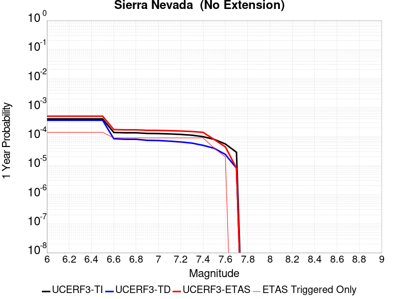 |  |

| Magnitude | 1 wk TI Prob | 1 wk TD Prob | 1 wk ETAS Prob | 1 wk ETAS/TD Gain | 1 wk ETAS Triggered Only | 1 mo TI Prob | 1 mo TD Prob | 1 mo ETAS Prob | 1 mo ETAS/TD Gain | 1 mo ETAS Triggered Only | 1 yr TI Prob | 1 yr TD Prob | 1 yr ETAS Prob | 1 yr ETAS/TD Gain | 1 yr ETAS Triggered Only | 10 yr TI Prob | 10 yr TD Prob | 10 yr ETAS Prob | 10 yr ETAS/TD Gain | 10 yr ETAS Triggered Only |
|-----|-----|-----|-----|-----|-----|-----|-----|-----|-----|-----|-----|-----|-----|-----|-----|-----|-----|-----|-----|-----|
| 6.0 | 7.7690465E-6 | 6.9765347E-6 | 1.6976464E-5 | 2.4333663 | 1.0E-5 | 3.329549E-5 | 2.9899295E-5 | 8.98975E-5 | 3.0066762 | 6.0E-5 | 4.0529718E-4 | 3.6399896E-4 | 5.03948E-4 | 1.3844765 | 1.4E-4 | 0.004045588 | 0.0036375436 | 0.003896598 | 1.0712168 | 2.6E-4 |
| 6.1 | 7.7690465E-6 | 6.9765347E-6 | 1.6976464E-5 | 2.4333663 | 1.0E-5 | 3.329549E-5 | 2.9899295E-5 | 8.98975E-5 | 3.0066762 | 6.0E-5 | 4.0529718E-4 | 3.6399896E-4 | 5.03948E-4 | 1.3844765 | 1.4E-4 | 0.004045588 | 0.0036375436 | 0.003896598 | 1.0712168 | 2.6E-4 |
| 6.2 | 7.7690465E-6 | 6.9765347E-6 | 1.6976464E-5 | 2.4333663 | 1.0E-5 | 3.329549E-5 | 2.9899295E-5 | 8.98975E-5 | 3.0066762 | 6.0E-5 | 4.0529718E-4 | 3.6399896E-4 | 5.03948E-4 | 1.3844765 | 1.4E-4 | 0.004045588 | 0.0036375436 | 0.003896598 | 1.0712168 | 2.6E-4 |
| 6.3 | 7.7690465E-6 | 6.9765347E-6 | 1.6976464E-5 | 2.4333663 | 1.0E-5 | 3.329549E-5 | 2.9899295E-5 | 8.98975E-5 | 3.0066762 | 6.0E-5 | 4.0529718E-4 | 3.6399896E-4 | 5.03948E-4 | 1.3844765 | 1.4E-4 | 0.004045588 | 0.0036375436 | 0.003896598 | 1.0712168 | 2.6E-4 |
| 6.4 | 7.7690465E-6 | 6.9765347E-6 | 1.6976464E-5 | 2.4333663 | 1.0E-5 | 3.329549E-5 | 2.9899295E-5 | 8.98975E-5 | 3.0066762 | 6.0E-5 | 4.0529718E-4 | 3.6399896E-4 | 5.03948E-4 | 1.3844765 | 1.4E-4 | 0.004045588 | 0.0036375436 | 0.003896598 | 1.0712168 | 2.6E-4 |
| 6.5 | 7.7690465E-6 | 6.9765347E-6 | 1.6976464E-5 | 2.4333663 | 1.0E-5 | 3.329549E-5 | 2.9899295E-5 | 8.98975E-5 | 3.0066762 | 6.0E-5 | 4.0529718E-4 | 3.6399896E-4 | 5.03948E-4 | 1.3844765 | 1.4E-4 | 0.004045588 | 0.0036375436 | 0.003896598 | 1.0712168 | 2.6E-4 |
| 6.6 | 2.653E-6 | 1.6149307E-6 | 1.1614915E-5 | 7.1922064 | 1.0E-5 | 1.136995E-5 | 6.9211133E-6 | 3.6920905E-5 | 5.3345327 | 3.0E-5 | 1.3842035E-4 | 8.426133E-5 | 1.7425374E-4 | 2.0680156 | 9.0E-5 | 0.0013833415 | 8.422973E-4 | 0.0010421288 | 1.2372459 | 2.0E-4 |
| 6.7 | 2.5902466E-6 | 1.5502632E-6 | 1.1550248E-5 | 7.4505076 | 1.0E-5 | 1.11010095E-5 | 6.6439684E-6 | 3.664377E-5 | 5.5153437 | 3.0E-5 | 1.351464E-4 | 8.0887345E-5 | 1.7088006E-4 | 2.1125686 | 9.0E-5 | 0.0013506424 | 8.08582E-4 | 0.0010084203 | 1.2471466 | 2.0E-4 |
| 6.8 | 2.5853892E-6 | 1.547063E-6 | 1.15470475E-5 | 7.463851 | 1.0E-5 | 1.1080193E-5 | 6.630253E-6 | 3.6630056E-5 | 5.524684 | 3.0E-5 | 1.34893E-4 | 8.072037E-5 | 1.707131E-4 | 2.11487 | 9.0E-5 | 0.0013481114 | 8.069135E-4 | 0.0010067521 | 1.247658 | 2.0E-4 |
| 6.9 | 2.458257E-6 | 1.4221347E-6 | 1.142212E-5 | 8.0316725 | 1.0E-5 | 1.0535345E-5 | 6.094849E-6 | 3.6094665E-5 | 5.922159 | 3.0E-5 | 1.2826028E-4 | 7.4202275E-5 | 1.641956E-4 | 2.2128108 | 9.0E-5 | 0.0012818627 | 7.41777E-4 | 9.4162865E-4 | 1.2694228 | 2.0E-4 |
| 7.0 | 2.4341468E-6 | 1.3990981E-6 | 1.1399084E-5 | 8.147451 | 1.0E-5 | 1.0432016E-5 | 5.9961208E-6 | 3.599594E-5 | 6.003205 | 3.0E-5 | 1.270024E-4 | 7.3000345E-5 | 1.6299378E-4 | 2.232781 | 9.0E-5 | 0.0012692984 | 7.2976557E-4 | 9.296196E-4 | 1.2738606 | 2.0E-4 |
| 7.1 | 2.3652476E-6 | 1.3340461E-6 | 1.1334033E-5 | 8.495983 | 1.0E-5 | 1.0136736E-5 | 5.717328E-6 | 3.5717156E-5 | 6.247176 | 3.0E-5 | 1.2340778E-4 | 6.960626E-5 | 1.596E-4 | 2.2928972 | 9.0E-5 | 0.0012333926 | 6.958463E-4 | 8.957071E-4 | 1.2872198 | 2.0E-4 |
| 7.2 | 2.272158E-6 | 1.2503509E-6 | 1.12503385E-5 | 8.997745 | 1.0E-5 | 9.737784E-6 | 5.3586355E-6 | 3.5358476E-5 | 6.59841 | 3.0E-5 | 1.1855107E-4 | 6.523945E-5 | 1.5523357E-4 | 2.3794434 | 9.0E-5 | 0.0011848784 | 6.522045E-4 | 8.5207407E-4 | 1.3064523 | 2.0E-4 |
| 7.3 | 2.1382127E-6 | 1.1420364E-6 | 1.1142025E-5 | 9.756279 | 1.0E-5 | 9.163737E-6 | 4.894432E-6 | 3.4894285E-5 | 7.129384 | 3.0E-5 | 1.1156279E-4 | 5.9588092E-5 | 1.4958273E-4 | 2.510279 | 9.0E-5 | 0.001115068 | 5.9572235E-4 | 7.956032E-4 | 1.3355268 | 2.0E-4 |
| 7.4 | 1.9048055E-6 | 9.575857E-7 | 1.0957576E-5 | 11.44292 | 1.0E-5 | 8.163426E-6 | 4.103932E-6 | 3.410381E-5 | 8.310032 | 3.0E-5 | 9.9385186E-5 | 4.9964237E-5 | 1.3995974E-4 | 2.8011985 | 9.0E-5 | 9.934074E-4 | 4.995307E-4 | 6.794408E-4 | 1.3601582 | 1.8E-4 |
| 7.5 | 1.5373403E-6 | 7.5605493E-7 | 7.5605493E-7 | 1.0 | 0.0 | 6.5885843E-6 | 3.2402313E-6 | 1.3240199E-5 | 4.0861893 | 1.0E-5 | 8.021306E-5 | 3.9449107E-5 | 7.944753E-5 | 2.0139246 | 4.0E-5 | 8.0184115E-4 | 3.944215E-4 | 5.043781E-4 | 1.2787795 | 1.1E-4 |
| 7.6 | 1.0680322E-6 | 4.659972E-7 | 4.659972E-7 | 1.0 | 0.0 | 4.577273E-6 | 1.9971294E-6 | 1.9971294E-6 | 1.0 | 0.0 | 5.5726876E-5 | 2.431478E-5 | 4.4314293E-5 | 1.8225249 | 2.0E-5 | 5.5712904E-4 | 2.4312147E-4 | 3.1310445E-4 | 1.2878519 | 7.0E-5 |
| 7.7 | 5.509146E-7 | 1.5581371E-7 | 1.5581371E-7 | 1.0 | 0.0 | 2.3610605E-6 | 6.677729E-7 | 6.677729E-7 | 1.0 | 0.0 | 2.8745531E-5 | 8.130106E-6 | 8.130106E-6 | 1.0 | 0.0 | 2.8741814E-4 | 8.1298196E-5 | 8.1298196E-5 | 1.0 | 0.0 |

## Helendale-So Lockhart
*[(top)](#table-of-contents)*

| 1 Week | 1 Month | 1 Year | 10 Year |
|-----|-----|-----|-----|
|  |  |  |  |

| Magnitude | 1 wk TI Prob | 1 wk TD Prob | 1 wk ETAS Prob | 1 wk ETAS/TD Gain | 1 wk ETAS Triggered Only | 1 mo TI Prob | 1 mo TD Prob | 1 mo ETAS Prob | 1 mo ETAS/TD Gain | 1 mo ETAS Triggered Only | 1 yr TI Prob | 1 yr TD Prob | 1 yr ETAS Prob | 1 yr ETAS/TD Gain | 1 yr ETAS Triggered Only | 10 yr TI Prob | 10 yr TD Prob | 10 yr ETAS Prob | 10 yr ETAS/TD Gain | 10 yr ETAS Triggered Only |
|-----|-----|-----|-----|-----|-----|-----|-----|-----|-----|-----|-----|-----|-----|-----|-----|-----|-----|-----|-----|-----|
| 6.0 | 1.7296055E-5 | 1.810418E-5 | 1.810418E-5 | 1.0 | 0.0 | 7.412385E-5 | 7.7587145E-5 | 9.7585595E-5 | 1.2577547 | 2.0E-5 | 9.0208417E-4 | 9.442349E-4 | 0.0010741121 | 1.1375476 | 1.3E-4 | 0.008984311 | 0.009404349 | 0.009671809 | 1.0284401 | 2.7E-4 |
| 6.1 | 1.7296055E-5 | 1.810418E-5 | 1.810418E-5 | 1.0 | 0.0 | 7.412385E-5 | 7.7587145E-5 | 9.7585595E-5 | 1.2577547 | 2.0E-5 | 9.0208417E-4 | 9.442349E-4 | 0.0010741121 | 1.1375476 | 1.3E-4 | 0.008984311 | 0.009404349 | 0.009671809 | 1.0284401 | 2.7E-4 |
| 6.2 | 1.7296055E-5 | 1.810418E-5 | 1.810418E-5 | 1.0 | 0.0 | 7.412385E-5 | 7.7587145E-5 | 9.7585595E-5 | 1.2577547 | 2.0E-5 | 9.0208417E-4 | 9.442349E-4 | 0.0010741121 | 1.1375476 | 1.3E-4 | 0.008984311 | 0.009404349 | 0.009671809 | 1.0284401 | 2.7E-4 |
| 6.3 | 1.0669118E-5 | 1.1135683E-5 | 1.1135683E-5 | 1.0 | 0.0 | 4.5723988E-5 | 4.7723497E-5 | 5.772302E-5 | 1.2095304 | 1.0E-5 | 5.5654737E-4 | 5.808815E-4 | 6.708292E-4 | 1.1548469 | 9.0E-5 | 0.0055515557 | 0.0057939277 | 0.0059728846 | 1.030887 | 1.8E-4 |
| 6.4 | 1.0669118E-5 | 1.1135683E-5 | 1.1135683E-5 | 1.0 | 0.0 | 4.5723988E-5 | 4.7723497E-5 | 5.772302E-5 | 1.2095304 | 1.0E-5 | 5.5654737E-4 | 5.808815E-4 | 6.708292E-4 | 1.1548469 | 9.0E-5 | 0.0055515557 | 0.0057939277 | 0.0059728846 | 1.030887 | 1.8E-4 |
| 6.5 | 8.790038E-6 | 9.170408E-6 | 9.170408E-6 | 1.0 | 0.0 | 3.767105E-5 | 3.930116E-5 | 4.9300772E-5 | 1.2544354 | 1.0E-5 | 4.585485E-4 | 4.7838816E-4 | 5.583499E-4 | 1.1671482 | 8.0E-5 | 0.0045760344 | 0.0047737476 | 0.004932984 | 1.0333567 | 1.6E-4 |
| 6.6 | 7.396949E-6 | 7.715714E-6 | 7.715714E-6 | 1.0 | 0.0 | 3.1700827E-5 | 3.306693E-5 | 4.30666E-5 | 1.3024069 | 1.0E-5 | 3.858892E-4 | 4.025165E-4 | 4.7248835E-4 | 1.1738359 | 7.0E-5 | 0.003852198 | 0.0040179817 | 0.004157419 | 1.0347034 | 1.4E-4 |
| 6.7 | 6.4600285E-6 | 6.738185E-6 | 6.738185E-6 | 1.0 | 0.0 | 2.7685543E-5 | 2.8877621E-5 | 2.8877621E-5 | 1.0 | 0.0 | 3.3701936E-4 | 3.515291E-4 | 3.9151503E-4 | 1.1137486 | 4.0E-5 | 0.0033650869 | 0.003509812 | 0.003599496 | 1.0255524 | 9.0E-5 |
| 6.8 | 5.600104E-6 | 5.8361397E-6 | 5.8361397E-6 | 1.0 | 0.0 | 2.4000226E-5 | 2.5011792E-5 | 2.5011792E-5 | 1.0 | 0.0 | 2.9216358E-4 | 3.0447662E-4 | 3.3446748E-4 | 1.0984998 | 3.0E-5 | 0.0029177975 | 0.003040656 | 0.0031104432 | 1.0229514 | 7.0E-5 |
| 6.9 | 4.839122E-6 | 5.03962E-6 | 5.03962E-6 | 1.0 | 0.0 | 2.0738931E-5 | 2.1598196E-5 | 2.1598196E-5 | 1.0 | 0.0 | 2.5246723E-4 | 2.6292677E-4 | 2.9291888E-4 | 1.1140702 | 3.0E-5 | 0.002521806 | 0.0026262044 | 0.0026960205 | 1.0265844 | 7.0E-5 |
| 7.0 | 3.6937633E-6 | 3.8452918E-6 | 3.8452918E-6 | 1.0 | 0.0 | 1.5830317E-5 | 1.6479718E-5 | 1.6479718E-5 | 1.0 | 0.0 | 1.9271708E-4 | 2.0062242E-4 | 2.206184E-4 | 1.0996698 | 2.0E-5 | 0.0019255003 | 0.0020044446 | 0.0020443643 | 1.0199157 | 4.0E-5 |
| 7.1 | 2.7858857E-6 | 2.8979157E-6 | 2.8979157E-6 | 1.0 | 0.0 | 1.1939455E-5 | 1.241958E-5 | 1.241958E-5 | 1.0 | 0.0 | 1.4535317E-4 | 1.5119811E-4 | 1.611966E-4 | 1.0661284 | 1.0E-5 | 0.0014525814 | 0.0015109739 | 0.0015409286 | 1.0198247 | 3.0E-5 |
| 7.2 | 2.1672065E-6 | 2.2540607E-6 | 2.2540607E-6 | 1.0 | 0.0 | 9.2879945E-6 | 9.660225E-6 | 9.660225E-6 | 1.0 | 0.0 | 1.1307546E-4 | 1.1760708E-4 | 1.1760708E-4 | 1.0 | 0.0 | 0.0011301794 | 0.0011754666 | 0.0011954431 | 1.0169945 | 2.0E-5 |
| 7.3 | 1.4823496E-6 | 1.5422432E-6 | 1.5422432E-6 | 1.0 | 0.0 | 6.3529114E-6 | 6.609598E-6 | 6.609598E-6 | 1.0 | 0.0 | 7.734395E-5 | 8.0469035E-5 | 8.0469035E-5 | 1.0 | 0.0 | 7.731704E-4 | 8.044141E-4 | 8.24398E-4 | 1.0248429 | 2.0E-5 |
| 7.4 | 4.2321457E-7 | 4.4109754E-7 | 4.4109754E-7 | 1.0 | 0.0 | 1.8137755E-6 | 1.8904169E-6 | 1.8904169E-6 | 1.0 | 0.0 | 2.2082493E-5 | 2.301563E-5 | 2.301563E-5 | 1.0 | 0.0 | 2.2080299E-4 | 2.3013698E-4 | 2.3013698E-4 | 1.0 | 0.0 |
| 7.5 | 5.6942316E-8 | 5.9417015E-8 | 5.9417015E-8 | 1.0 | 0.0 | 2.440385E-7 | 2.5464433E-7 | 2.5464433E-7 | 1.0 | 0.0 | 2.9711643E-6 | 3.100291E-6 | 3.100291E-6 | 1.0 | 0.0 | 2.9711247E-5 | 3.1002557E-5 | 3.1002557E-5 | 1.0 | 0.0 |

## Death Valley (Fish Lake Valley)
*[(top)](#table-of-contents)*

| 1 Week | 1 Month | 1 Year | 10 Year |
|-----|-----|-----|-----|
|  |  |  |  |

| Magnitude | 1 wk TI Prob | 1 wk TD Prob | 1 wk ETAS Prob | 1 wk ETAS/TD Gain | 1 wk ETAS Triggered Only | 1 mo TI Prob | 1 mo TD Prob | 1 mo ETAS Prob | 1 mo ETAS/TD Gain | 1 mo ETAS Triggered Only | 1 yr TI Prob | 1 yr TD Prob | 1 yr ETAS Prob | 1 yr ETAS/TD Gain | 1 yr ETAS Triggered Only | 10 yr TI Prob | 10 yr TD Prob | 10 yr ETAS Prob | 10 yr ETAS/TD Gain | 10 yr ETAS Triggered Only |
|-----|-----|-----|-----|-----|-----|-----|-----|-----|-----|-----|-----|-----|-----|-----|-----|-----|-----|-----|-----|-----|
| 6.0 | 3.872328E-5 | 4.7271373E-5 | 5.7270903E-5 | 1.2115345 | 1.0E-5 | 1.6594635E-4 | 2.0257758E-4 | 2.2257352E-4 | 1.0987076 | 2.0E-5 | 0.0020185246 | 0.0024638502 | 0.0025636037 | 1.0404869 | 1.0E-4 | 0.02000288 | 0.024391154 | 0.024596032 | 1.0083997 | 2.1E-4 |
| 6.1 | 3.872328E-5 | 4.7271373E-5 | 5.7270903E-5 | 1.2115345 | 1.0E-5 | 1.6594635E-4 | 2.0257758E-4 | 2.2257352E-4 | 1.0987076 | 2.0E-5 | 0.0020185246 | 0.0024638502 | 0.0025636037 | 1.0404869 | 1.0E-4 | 0.02000288 | 0.024391154 | 0.024596032 | 1.0083997 | 2.1E-4 |
| 6.2 | 3.872328E-5 | 4.7271373E-5 | 5.7270903E-5 | 1.2115345 | 1.0E-5 | 1.6594635E-4 | 2.0257758E-4 | 2.2257352E-4 | 1.0987076 | 2.0E-5 | 0.0020185246 | 0.0024638502 | 0.0025636037 | 1.0404869 | 1.0E-4 | 0.02000288 | 0.024391154 | 0.024596032 | 1.0083997 | 2.1E-4 |
| 6.3 | 2.8356371E-5 | 3.3613145E-5 | 4.361281E-5 | 1.2974926 | 1.0E-5 | 1.2152165E-4 | 1.4404883E-4 | 1.6404595E-4 | 1.1388218 | 2.0E-5 | 0.0014785219 | 0.0017524528 | 0.0018522775 | 1.0569628 | 1.0E-4 | 0.014687235 | 0.017393526 | 0.017590048 | 1.0112985 | 2.0E-4 |
| 6.4 | 2.8356371E-5 | 3.3613145E-5 | 4.361281E-5 | 1.2974926 | 1.0E-5 | 1.2152165E-4 | 1.4404883E-4 | 1.6404595E-4 | 1.1388218 | 2.0E-5 | 0.0014785219 | 0.0017524528 | 0.0018522775 | 1.0569628 | 1.0E-4 | 0.014687235 | 0.017393526 | 0.017590048 | 1.0112985 | 2.0E-4 |
| 6.5 | 2.4448687E-5 | 2.8610195E-5 | 3.860991E-5 | 1.3495158 | 1.0E-5 | 1.0477588E-4 | 1.2260964E-4 | 1.4260718E-4 | 1.1630993 | 2.0E-5 | 0.0012748998 | 0.0014917979 | 0.0015816636 | 1.0602399 | 9.0E-5 | 0.012676105 | 0.014822734 | 0.015009917 | 1.0126282 | 1.9E-4 |
| 6.6 | 2.1298161E-5 | 2.466216E-5 | 3.4661913E-5 | 1.4054694 | 1.0E-5 | 9.127464E-5 | 1.0569088E-4 | 1.2568876E-4 | 1.1892111 | 2.0E-5 | 0.0011107022 | 0.0012860601 | 0.0013759444 | 1.0698912 | 9.0E-5 | 0.011051672 | 0.012789606 | 0.012977176 | 1.0146658 | 1.9E-4 |
| 6.7 | 1.8959729E-5 | 2.1782764E-5 | 3.1782547E-5 | 1.4590685 | 1.0E-5 | 8.125345E-5 | 9.3351504E-5 | 1.1334963E-4 | 1.214224 | 2.0E-5 | 9.888117E-4 | 0.0011359876 | 0.0012258852 | 1.0791363 | 9.0E-5 | 0.009844234 | 0.011304467 | 0.0114824325 | 1.0157429 | 1.8E-4 |
| 6.8 | 1.6691629E-5 | 1.901977E-5 | 2.9019579E-5 | 1.5257587 | 1.0E-5 | 7.153359E-5 | 8.151084E-5 | 1.0150921E-4 | 1.2453461 | 2.0E-5 | 8.7057345E-4 | 9.919596E-4 | 0.0010818703 | 1.0906395 | 9.0E-5 | 0.008671708 | 0.009877076 | 0.010055298 | 1.018044 | 1.8E-4 |
| 6.9 | 1.450505E-5 | 1.6390675E-5 | 2.6390511E-5 | 1.610093 | 1.0E-5 | 6.216302E-5 | 7.024391E-5 | 9.02425E-5 | 1.2847022 | 2.0E-5 | 7.5657194E-4 | 8.5489283E-4 | 9.4481587E-4 | 1.1051863 | 9.0E-5 | 0.007540013 | 0.008516973 | 0.00869544 | 1.0209543 | 1.8E-4 |
| 7.0 | 1.2940855E-5 | 1.4538927E-5 | 2.453878E-5 | 1.6877987 | 1.0E-5 | 5.545963E-5 | 6.230823E-5 | 8.2306986E-5 | 1.3209649 | 2.0E-5 | 6.750118E-4 | 7.583444E-4 | 8.482762E-4 | 1.1185895 | 9.0E-5 | 0.006729651 | 0.007558184 | 0.007736824 | 1.0236353 | 1.8E-4 |
| 7.1 | 1.2544658E-5 | 1.4079123E-5 | 2.4078981E-5 | 1.7102615 | 1.0E-5 | 5.3761712E-5 | 6.0337734E-5 | 8.0336526E-5 | 1.3314475 | 2.0E-5 | 6.5435225E-4 | 7.343699E-4 | 8.2430383E-4 | 1.1224641 | 9.0E-5 | 0.006524288 | 0.007320025 | 0.0074987076 | 1.0244101 | 1.8E-4 |
| 7.2 | 1.2489416E-5 | 1.4016585E-5 | 2.4016445E-5 | 1.7134305 | 1.0E-5 | 5.3524967E-5 | 6.0069728E-5 | 8.006853E-5 | 1.3329264 | 2.0E-5 | 6.514716E-4 | 7.311091E-4 | 8.2104333E-4 | 1.1230106 | 9.0E-5 | 0.006495651 | 0.0072876317 | 0.00746632 | 1.0245193 | 1.8E-4 |
| 7.3 | 1.2368307E-5 | 1.38807145E-5 | 2.3880575E-5 | 1.720414 | 1.0E-5 | 5.3005948E-5 | 5.948745E-5 | 7.9486264E-5 | 1.3361853 | 2.0E-5 | 6.451563E-4 | 7.2402466E-4 | 8.139595E-4 | 1.1242151 | 9.0E-5 | 0.0064328653 | 0.0072172494 | 0.00739595 | 1.0247602 | 1.8E-4 |
| 7.4 | 1.2161707E-5 | 1.3648755E-5 | 2.3648618E-5 | 1.7326576 | 1.0E-5 | 5.212056E-5 | 5.8493384E-5 | 7.8492216E-5 | 1.341899 | 2.0E-5 | 6.3438306E-4 | 7.1192987E-4 | 8.0186577E-4 | 1.1263269 | 9.0E-5 | 0.006325751 | 0.0070970803 | 0.0072758025 | 1.0251825 | 1.8E-4 |
| 7.5 | 1.1707948E-5 | 1.3146373E-5 | 2.3146242E-5 | 1.7606561 | 1.0E-5 | 5.0175953E-5 | 5.6340414E-5 | 7.633929E-5 | 1.354965 | 2.0E-5 | 6.10721E-4 | 6.857342E-4 | 7.756725E-4 | 1.1311562 | 9.0E-5 | 0.0060904534 | 0.006836766 | 0.007015535 | 1.0261482 | 1.8E-4 |
| 7.6 | 1.0319538E-5 | 1.1580373E-5 | 1.1580373E-5 | 1.0 | 0.0 | 4.4225842E-5 | 4.9629256E-5 | 5.962876E-5 | 1.2014841 | 1.0E-5 | 5.383166E-4 | 6.0407387E-4 | 6.840255E-4 | 1.1323541 | 8.0E-5 | 0.0053701443 | 0.00602485 | 0.006193826 | 1.0280465 | 1.7E-4 |
| 7.7 | 8.937764E-6 | 1.0023426E-5 | 1.0023426E-5 | 1.0 | 0.0 | 3.830414E-5 | 4.295686E-5 | 5.295643E-5 | 1.2327816 | 1.0E-5 | 4.6625308E-4 | 5.228793E-4 | 6.028375E-4 | 1.1529189 | 8.0E-5 | 0.0046527605 | 0.005217 | 0.005386113 | 1.0324157 | 1.7E-4 |
| 7.8 | 3.108007E-7 | 3.2847535E-7 | 3.2847535E-7 | 1.0 | 0.0 | 1.3320023E-6 | 1.4077508E-6 | 1.4077508E-6 | 1.0 | 0.0 | 1.6217007E-5 | 1.7139235E-5 | 1.7139235E-5 | 1.0 | 0.0 | 1.6215823E-4 | 1.713795E-4 | 1.713795E-4 | 1.0 | 0.0 |
| 7.9 | 2.5591178E-9 | 2.6697329E-9 | 2.6697329E-9 | 1.0 | 0.0 | 1.0967647E-8 | 1.14417125E-8 | 1.14417125E-8 | 1.0 | 0.0 | 1.335311E-7 | 1.3930286E-7 | 1.3930286E-7 | 1.0 | 0.0 | 1.3353102E-6 | 1.3930285E-6 | 1.3930285E-6 | 1.0 | 0.0 |

## Elsinore (Glen Ivy) rev
*[(top)](#table-of-contents)*

| 1 Week | 1 Month | 1 Year | 10 Year |
|-----|-----|-----|-----|
|  |  | 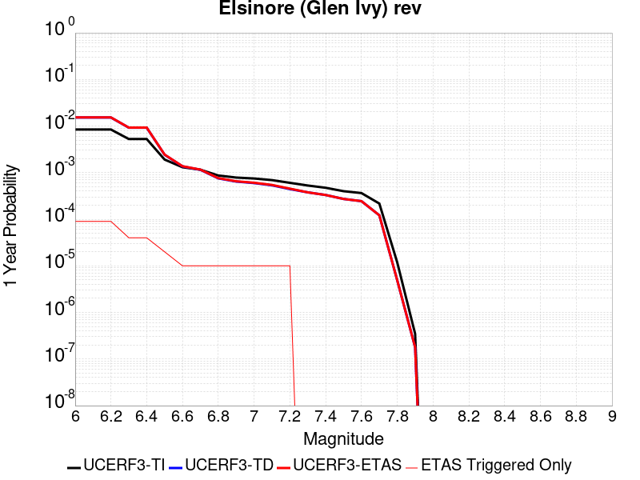 |  |

| Magnitude | 1 wk TI Prob | 1 wk TD Prob | 1 wk ETAS Prob | 1 wk ETAS/TD Gain | 1 wk ETAS Triggered Only | 1 mo TI Prob | 1 mo TD Prob | 1 mo ETAS Prob | 1 mo ETAS/TD Gain | 1 mo ETAS Triggered Only | 1 yr TI Prob | 1 yr TD Prob | 1 yr ETAS Prob | 1 yr ETAS/TD Gain | 1 yr ETAS Triggered Only | 10 yr TI Prob | 10 yr TD Prob | 10 yr ETAS Prob | 10 yr ETAS/TD Gain | 10 yr ETAS Triggered Only |
|-----|-----|-----|-----|-----|-----|-----|-----|-----|-----|-----|-----|-----|-----|-----|-----|-----|-----|-----|-----|-----|
| 6.0 | 1.6204086E-4 | 2.93772E-4 | 3.0376908E-4 | 1.03403 | 1.0E-5 | 6.94276E-4 | 0.0012584875 | 0.0012884496 | 1.0238081 | 3.0E-5 | 0.008420097 | 0.015235919 | 0.015324548 | 1.005817 | 9.0E-5 | 0.081081145 | 0.1398973 | 0.14005212 | 1.0011066 | 1.8E-4 |
| 6.1 | 1.6204086E-4 | 2.93772E-4 | 3.0376908E-4 | 1.03403 | 1.0E-5 | 6.94276E-4 | 0.0012584875 | 0.0012884496 | 1.0238081 | 3.0E-5 | 0.008420097 | 0.015235919 | 0.015324548 | 1.005817 | 9.0E-5 | 0.081081145 | 0.1398973 | 0.14005212 | 1.0011066 | 1.8E-4 |
| 6.2 | 1.6204086E-4 | 2.93772E-4 | 3.0376908E-4 | 1.03403 | 1.0E-5 | 6.94276E-4 | 0.0012584875 | 0.0012884496 | 1.0238081 | 3.0E-5 | 0.008420097 | 0.015235919 | 0.015324548 | 1.005817 | 9.0E-5 | 0.081081145 | 0.1398973 | 0.14005212 | 1.0011066 | 1.8E-4 |
| 6.3 | 1.0111737E-4 | 1.7704953E-4 | 1.8704776E-4 | 1.0564713 | 1.0E-5 | 4.332882E-4 | 7.5867976E-4 | 7.7866454E-4 | 1.0263416 | 2.0E-5 | 0.005262531 | 0.009218495 | 0.009258126 | 1.004299 | 4.0E-5 | 0.0513964 | 0.08714668 | 0.087228835 | 1.0009427 | 9.0E-5 |
| 6.4 | 1.0111737E-4 | 1.7704953E-4 | 1.8704776E-4 | 1.0564713 | 1.0E-5 | 4.332882E-4 | 7.5867976E-4 | 7.7866454E-4 | 1.0263416 | 2.0E-5 | 0.005262531 | 0.009218495 | 0.009258126 | 1.004299 | 4.0E-5 | 0.0513964 | 0.08714668 | 0.087228835 | 1.0009427 | 9.0E-5 |
| 6.5 | 3.6624708E-5 | 4.63993E-5 | 4.63993E-5 | 1.0 | 0.0 | 1.569536E-4 | 1.9884102E-4 | 2.0883903E-4 | 1.0502814 | 1.0E-5 | 0.001909235 | 0.002418563 | 0.0024385147 | 1.0082494 | 2.0E-5 | 0.01892915 | 0.023771606 | 0.02379113 | 1.0008214 | 2.0E-5 |
| 6.6 | 2.5051324E-5 | 2.6153504E-5 | 2.6153504E-5 | 1.0 | 0.0 | 1.073584E-4 | 1.12081885E-4 | 1.12081885E-4 | 1.0 | 0.0 | 0.0013063047 | 0.0013637872 | 0.0013737737 | 1.0073225 | 1.0E-5 | 0.012986525 | 0.013565531 | 0.013575395 | 1.0007272 | 1.0E-5 |
| 6.7 | 2.2189772E-5 | 2.2077826E-5 | 2.2077826E-5 | 1.0 | 0.0 | 9.509556E-5 | 9.461602E-5 | 9.461602E-5 | 1.0 | 0.0 | 0.0011571734 | 0.0011513777 | 0.0011613662 | 1.0086752 | 1.0E-5 | 0.011511663 | 0.011465822 | 0.011475708 | 1.0008621 | 1.0E-5 |
| 6.8 | 1.6654378E-5 | 1.44404075E-5 | 1.44404075E-5 | 1.0 | 0.0 | 7.137396E-5 | 6.188602E-5 | 6.188602E-5 | 1.0 | 0.0 | 8.686314E-4 | 7.5320696E-4 | 7.6319947E-4 | 1.0132666 | 1.0E-5 | 0.008652439 | 0.007511861 | 0.0075217863 | 1.0013212 | 1.0E-5 |
| 6.9 | 1.5042909E-5 | 1.2334343E-5 | 1.2334343E-5 | 1.0 | 0.0 | 6.446802E-5 | 5.2860418E-5 | 5.2860418E-5 | 1.0 | 0.0 | 7.8461546E-4 | 6.4338866E-4 | 6.533822E-4 | 1.0155327 | 1.0E-5 | 0.007818509 | 0.0064195115 | 0.0064294473 | 1.0015477 | 1.0E-5 |
| 7.0 | 1.4361385E-5 | 1.1453502E-5 | 1.1453502E-5 | 1.0 | 0.0 | 6.154734E-5 | 4.908553E-5 | 4.908553E-5 | 1.0 | 0.0 | 7.490812E-4 | 5.974554E-4 | 6.0744944E-4 | 1.0167277 | 1.0E-5 | 0.007465612 | 0.0059625087 | 0.005972449 | 1.0016671 | 1.0E-5 |
| 7.1 | 1.3265571E-5 | 1.0246804E-5 | 1.0246804E-5 | 1.0 | 0.0 | 5.6851208E-5 | 4.391415E-5 | 4.391415E-5 | 1.0 | 0.0 | 6.919436E-4 | 5.3452613E-4 | 5.445208E-4 | 1.0186982 | 1.0E-5 | 0.006897931 | 0.0053357244 | 0.005345671 | 1.0018642 | 1.0E-5 |
| 7.2 | 1.1596403E-5 | 8.506578E-6 | 8.506578E-6 | 1.0 | 0.0 | 4.9697923E-5 | 3.6456262E-5 | 3.6456262E-5 | 1.0 | 0.0 | 6.049042E-4 | 4.4376627E-4 | 4.5376184E-4 | 1.0225244 | 1.0E-5 | 0.006032603 | 0.004430235 | 0.0044401907 | 1.0022472 | 1.0E-5 |
| 7.3 | 1.0150827E-5 | 7.2400208E-6 | 7.2400208E-6 | 1.0 | 0.0 | 4.3502816E-5 | 3.10283E-5 | 3.10283E-5 | 1.0 | 0.0 | 5.2951806E-4 | 3.777055E-4 | 3.777055E-4 | 1.0 | 0.0 | 0.005282581 | 0.003771035 | 0.003771035 | 1.0 | 0.0 |
| 7.4 | 9.080705E-6 | 6.3536127E-6 | 6.3536127E-6 | 1.0 | 0.0 | 3.8916725E-5 | 2.7229491E-5 | 2.7229491E-5 | 1.0 | 0.0 | 4.7370812E-4 | 3.3147E-4 | 3.3147E-4 | 1.0 | 0.0 | 0.004726996 | 0.0033099046 | 0.0033099046 | 1.0 | 0.0 |
| 7.5 | 7.671649E-6 | 5.2265436E-6 | 5.2265436E-6 | 1.0 | 0.0 | 3.287808E-5 | 2.2399287E-5 | 2.2399287E-5 | 1.0 | 0.0 | 4.0021708E-4 | 2.7267844E-4 | 2.7267844E-4 | 1.0 | 0.0 | 0.0039949706 | 0.0027235637 | 0.0027235637 | 1.0 | 0.0 |
| 7.6 | 6.990086E-6 | 4.688364E-6 | 4.688364E-6 | 1.0 | 0.0 | 2.9957167E-5 | 2.0092839E-5 | 2.0092839E-5 | 1.0 | 0.0 | 3.6466747E-4 | 2.4460402E-4 | 2.4460402E-4 | 1.0 | 0.0 | 0.0036406964 | 0.0024434642 | 0.0024434642 | 1.0 | 0.0 |
| 7.7 | 4.163505E-6 | 2.3300386E-6 | 2.3300386E-6 | 1.0 | 0.0 | 1.7843471E-5 | 9.985846E-6 | 9.985846E-6 | 1.0 | 0.0 | 2.172226E-4 | 1.2157163E-4 | 1.2157163E-4 | 1.0 | 0.0 | 0.0021701038 | 0.0012151244 | 0.0012151244 | 1.0 | 0.0 |
| 7.8 | 2.2692414E-7 | 9.38645E-8 | 9.38645E-8 | 1.0 | 0.0 | 9.725317E-7 | 4.0227638E-7 | 4.0227638E-7 | 1.0 | 0.0 | 1.1840509E-5 | 4.8977076E-6 | 4.8977076E-6 | 1.0 | 0.0 | 1.1839878E-4 | 4.8976322E-5 | 4.8976322E-5 | 1.0 | 0.0 |
| 7.9 | 6.676829E-9 | 3.4402008E-9 | 3.4402008E-9 | 1.0 | 0.0 | 2.861498E-8 | 1.4743718E-8 | 1.4743718E-8 | 1.0 | 0.0 | 3.4838732E-7 | 1.7950475E-7 | 1.7950475E-7 | 1.0 | 0.0 | 3.4838679E-6 | 1.7950463E-6 | 1.7950463E-6 | 1.0 | 0.0 |

## Cady
*[(top)](#table-of-contents)*

| 1 Week | 1 Month | 1 Year | 10 Year |
|-----|-----|-----|-----|
|  |  |  |  |

| Magnitude | 1 wk TI Prob | 1 wk TD Prob | 1 wk ETAS Prob | 1 wk ETAS/TD Gain | 1 wk ETAS Triggered Only | 1 mo TI Prob | 1 mo TD Prob | 1 mo ETAS Prob | 1 mo ETAS/TD Gain | 1 mo ETAS Triggered Only | 1 yr TI Prob | 1 yr TD Prob | 1 yr ETAS Prob | 1 yr ETAS/TD Gain | 1 yr ETAS Triggered Only | 10 yr TI Prob | 10 yr TD Prob | 10 yr ETAS Prob | 10 yr ETAS/TD Gain | 10 yr ETAS Triggered Only |
|-----|-----|-----|-----|-----|-----|-----|-----|-----|-----|-----|-----|-----|-----|-----|-----|-----|-----|-----|-----|-----|
| 6.0 | 1.9892565E-5 | 2.1859876E-5 | 2.1859876E-5 | 1.0 | 0.0 | 8.525106E-5 | 9.3682334E-5 | 1.1368046E-4 | 1.2134675 | 2.0E-5 | 0.0010374374 | 0.0011400766 | 0.0012399625 | 1.0876135 | 1.0E-4 | 0.010326075 | 0.011351293 | 0.011539136 | 1.0165482 | 1.9E-4 |
| 6.1 | 1.9892565E-5 | 2.1859876E-5 | 2.1859876E-5 | 1.0 | 0.0 | 8.525106E-5 | 9.3682334E-5 | 1.1368046E-4 | 1.2134675 | 2.0E-5 | 0.0010374374 | 0.0011400766 | 0.0012399625 | 1.0876135 | 1.0E-4 | 0.010326075 | 0.011351293 | 0.011539136 | 1.0165482 | 1.9E-4 |
| 6.2 | 1.9892565E-5 | 2.1859876E-5 | 2.1859876E-5 | 1.0 | 0.0 | 8.525106E-5 | 9.3682334E-5 | 1.1368046E-4 | 1.2134675 | 2.0E-5 | 0.0010374374 | 0.0011400766 | 0.0012399625 | 1.0876135 | 1.0E-4 | 0.010326075 | 0.011351293 | 0.011539136 | 1.0165482 | 1.9E-4 |
| 6.3 | 1.1117327E-5 | 1.2177199E-5 | 1.2177199E-5 | 1.0 | 0.0 | 4.764482E-5 | 5.218713E-5 | 6.218661E-5 | 1.1916081 | 1.0E-5 | 5.7992124E-4 | 6.352246E-4 | 6.751992E-4 | 1.0629299 | 4.0E-5 | 0.0057841022 | 0.006337195 | 0.006446498 | 1.0172478 | 1.1E-4 |
| 6.4 | 1.1117327E-5 | 1.2177199E-5 | 1.2177199E-5 | 1.0 | 0.0 | 4.764482E-5 | 5.218713E-5 | 6.218661E-5 | 1.1916081 | 1.0E-5 | 5.7992124E-4 | 6.352246E-4 | 6.751992E-4 | 1.0629299 | 4.0E-5 | 0.0057841022 | 0.006337195 | 0.006446498 | 1.0172478 | 1.1E-4 |
| 6.5 | 6.103093E-6 | 6.672351E-6 | 6.672351E-6 | 1.0 | 0.0 | 2.615585E-5 | 2.8595547E-5 | 3.8595263E-5 | 1.3496948 | 1.0E-5 | 3.1840094E-4 | 3.4810771E-4 | 3.8809382E-4 | 1.114867 | 4.0E-5 | 0.0031794512 | 0.0034768586 | 0.0035466151 | 1.0200632 | 7.0E-5 |
| 6.6 | 5.817237E-6 | 6.3659772E-6 | 6.3659772E-6 | 1.0 | 0.0 | 2.4930776E-5 | 2.7282544E-5 | 3.7282272E-5 | 1.3665247 | 1.0E-5 | 3.034899E-4 | 3.321268E-4 | 3.721135E-4 | 1.1203959 | 4.0E-5 | 0.0030307577 | 0.0033175263 | 0.0033773272 | 1.0180258 | 6.0E-5 |
| 6.7 | 4.8846314E-6 | 5.340833E-6 | 5.340833E-6 | 1.0 | 0.0 | 2.0933967E-5 | 2.288915E-5 | 3.2888922E-5 | 1.4368782 | 1.0E-5 | 2.5484123E-4 | 2.7865154E-4 | 3.1864038E-4 | 1.1435084 | 4.0E-5 | 0.0025454918 | 0.002784177 | 0.00284401 | 1.0214903 | 6.0E-5 |
| 6.8 | 1.7788773E-6 | 1.940001E-6 | 1.940001E-6 | 1.0 | 0.0 | 7.6237375E-6 | 8.314273E-6 | 1.831419E-5 | 2.202741 | 1.0E-5 | 9.281505E-5 | 1.0122315E-4 | 1.11222136E-4 | 1.0987816 | 1.0E-5 | 9.2776294E-4 | 0.001011925 | 0.0010418948 | 1.0296165 | 3.0E-5 |
| 6.9 | 7.5455404E-7 | 8.2975305E-7 | 8.2975305E-7 | 1.0 | 0.0 | 3.233799E-6 | 3.5560815E-6 | 3.5560815E-6 | 1.0 | 0.0 | 3.937079E-5 | 4.329477E-5 | 4.329477E-5 | 1.0 | 0.0 | 3.9363815E-4 | 4.3289628E-4 | 4.4289196E-4 | 1.0230902 | 1.0E-5 |
| 7.0 | 6.8578805E-7 | 7.542215E-7 | 7.542215E-7 | 1.0 | 0.0 | 2.9390883E-6 | 3.2323758E-6 | 3.2323758E-6 | 1.0 | 0.0 | 3.578281E-5 | 3.9353796E-5 | 3.9353796E-5 | 1.0 | 0.0 | 3.577705E-4 | 3.9350073E-4 | 4.0349682E-4 | 1.0254029 | 1.0E-5 |

## San Andreas (San Gorgonio Pass-Garnet HIll)
*[(top)](#table-of-contents)*

| 1 Week | 1 Month | 1 Year | 10 Year |
|-----|-----|-----|-----|
| 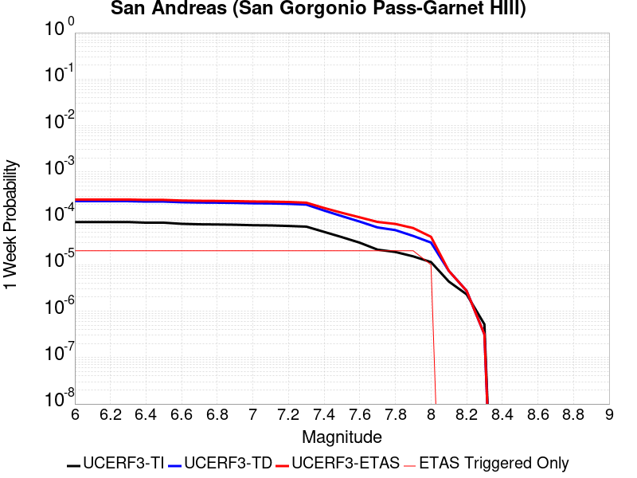 |  |  | 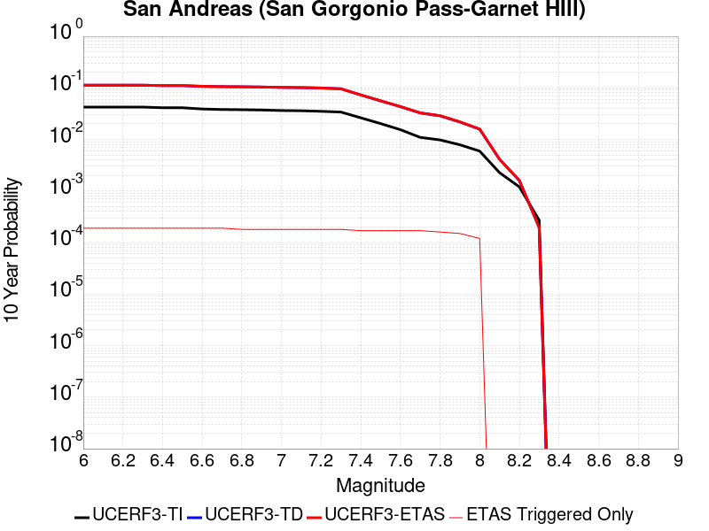 |

| Magnitude | 1 wk TI Prob | 1 wk TD Prob | 1 wk ETAS Prob | 1 wk ETAS/TD Gain | 1 wk ETAS Triggered Only | 1 mo TI Prob | 1 mo TD Prob | 1 mo ETAS Prob | 1 mo ETAS/TD Gain | 1 mo ETAS Triggered Only | 1 yr TI Prob | 1 yr TD Prob | 1 yr ETAS Prob | 1 yr ETAS/TD Gain | 1 yr ETAS Triggered Only | 10 yr TI Prob | 10 yr TD Prob | 10 yr ETAS Prob | 10 yr ETAS/TD Gain | 10 yr ETAS Triggered Only |
|-----|-----|-----|-----|-----|-----|-----|-----|-----|-----|-----|-----|-----|-----|-----|-----|-----|-----|-----|-----|-----|
| 6.0 | 8.31567E-5 | 2.3400006E-4 | 2.539954E-4 | 1.08545 | 2.0E-5 | 3.5633717E-4 | 0.0010024677 | 0.0010324377 | 1.0298961 | 3.0E-5 | 0.004329778 | 0.012136659 | 0.012235445 | 1.0081395 | 1.0E-4 | 0.042463828 | 0.112651974 | 0.11282057 | 1.0014966 | 1.9E-4 |
| 6.1 | 8.31567E-5 | 2.3400006E-4 | 2.539954E-4 | 1.08545 | 2.0E-5 | 3.5633717E-4 | 0.0010024677 | 0.0010324377 | 1.0298961 | 3.0E-5 | 0.004329778 | 0.012136659 | 0.012235445 | 1.0081395 | 1.0E-4 | 0.042463828 | 0.112651974 | 0.11282057 | 1.0014966 | 1.9E-4 |
| 6.2 | 8.31567E-5 | 2.3400006E-4 | 2.539954E-4 | 1.08545 | 2.0E-5 | 3.5633717E-4 | 0.0010024677 | 0.0010324377 | 1.0298961 | 3.0E-5 | 0.004329778 | 0.012136659 | 0.012235445 | 1.0081395 | 1.0E-4 | 0.042463828 | 0.112651974 | 0.11282057 | 1.0014966 | 1.9E-4 |
| 6.3 | 8.31567E-5 | 2.3400006E-4 | 2.539954E-4 | 1.08545 | 2.0E-5 | 3.5633717E-4 | 0.0010024677 | 0.0010324377 | 1.0298961 | 3.0E-5 | 0.004329778 | 0.012136659 | 0.012235445 | 1.0081395 | 1.0E-4 | 0.042463828 | 0.112651974 | 0.11282057 | 1.0014966 | 1.9E-4 |
| 6.4 | 8.059055E-5 | 2.2957478E-4 | 2.4957018E-4 | 1.0870975 | 2.0E-5 | 3.4534236E-4 | 9.835173E-4 | 0.0010134877 | 1.0304728 | 3.0E-5 | 0.0041964394 | 0.0119088115 | 0.012007621 | 1.0082971 | 1.0E-4 | 0.041180745 | 0.11063283 | 0.11080181 | 1.0015274 | 1.9E-4 |
| 6.5 | 8.059055E-5 | 2.2957478E-4 | 2.4957018E-4 | 1.0870975 | 2.0E-5 | 3.4534236E-4 | 9.835173E-4 | 0.0010134877 | 1.0304728 | 3.0E-5 | 0.0041964394 | 0.0119088115 | 0.012007621 | 1.0082971 | 1.0E-4 | 0.041180745 | 0.11063283 | 0.11080181 | 1.0015274 | 1.9E-4 |
| 6.6 | 7.619237E-5 | 2.2201831E-4 | 2.4201388E-4 | 1.0900626 | 2.0E-5 | 3.2649786E-4 | 9.5116236E-4 | 9.811338E-4 | 1.0315104 | 3.0E-5 | 0.0039678677 | 0.011519459 | 0.011618308 | 1.0085809 | 1.0E-4 | 0.03897764 | 0.10716916 | 0.10733879 | 1.0015829 | 1.9E-4 |
| 6.7 | 7.440636E-5 | 2.187761E-4 | 2.3877172E-4 | 1.0913976 | 2.0E-5 | 3.188454E-4 | 9.3727716E-4 | 9.6724904E-4 | 1.0319777 | 3.0E-5 | 0.0038750346 | 0.011352178 | 0.011451042 | 1.0087088 | 1.0E-4 | 0.038081564 | 0.10567762 | 0.10584754 | 1.0016079 | 1.9E-4 |
| 6.8 | 7.3735864E-5 | 2.1724754E-4 | 2.3724319E-4 | 1.0920409 | 2.0E-5 | 3.1597257E-4 | 9.307309E-4 | 9.6070295E-4 | 1.0322027 | 3.0E-5 | 0.0038401815 | 0.011273306 | 0.011362292 | 1.0078934 | 9.0E-5 | 0.03774495 | 0.10497911 | 0.10514022 | 1.0015346 | 1.8E-4 |
| 6.9 | 7.27575E-5 | 2.1493697E-4 | 2.3493267E-4 | 1.0930306 | 2.0E-5 | 3.117806E-4 | 9.208355E-4 | 9.508079E-4 | 1.0325491 | 3.0E-5 | 0.003789323 | 0.01115407 | 0.011243066 | 1.0079788 | 9.0E-5 | 0.037253562 | 0.10392705 | 0.10408834 | 1.001552 | 1.8E-4 |
| 7.0 | 7.102591E-5 | 2.1077669E-4 | 2.3077248E-4 | 1.0948671 | 2.0E-5 | 3.0436125E-4 | 9.0301817E-4 | 9.329911E-4 | 1.0331919 | 3.0E-5 | 0.003699303 | 0.01093934 | 0.011028355 | 1.0081372 | 9.0E-5 | 0.03638325 | 0.10202858 | 0.10219021 | 1.0015842 | 1.8E-4 |
| 7.1 | 7.028513E-5 | 2.0913279E-4 | 2.2912861E-4 | 1.095613 | 2.0E-5 | 3.0118722E-4 | 8.959777E-4 | 9.259509E-4 | 1.033453 | 3.0E-5 | 0.0036607897 | 0.01085448 | 0.010943503 | 1.0082015 | 9.0E-5 | 0.036010686 | 0.10127171 | 0.101433486 | 1.0015974 | 1.8E-4 |
| 7.2 | 6.8498244E-5 | 2.0521069E-4 | 2.2520658E-4 | 1.0974408 | 2.0E-5 | 2.9353087E-4 | 8.7918015E-4 | 9.091538E-4 | 1.0340927 | 3.0E-5 | 0.003567883 | 0.010651984 | 0.010741026 | 1.0083591 | 9.0E-5 | 0.035111405 | 0.09946359 | 0.09962569 | 1.0016297 | 1.8E-4 |
| 7.3 | 6.622592E-5 | 1.9748145E-4 | 2.174775E-4 | 1.1012553 | 2.0E-5 | 2.8379448E-4 | 8.4607676E-4 | 8.760514E-4 | 1.0354278 | 3.0E-5 | 0.0034497243 | 0.010252813 | 0.01034189 | 1.0086881 | 9.0E-5 | 0.033966612 | 0.095959775 | 0.0961225 | 1.0016958 | 1.8E-4 |
| 7.4 | 5.1050705E-5 | 1.4702928E-4 | 1.6702634E-4 | 1.1360073 | 2.0E-5 | 2.1877038E-4 | 6.299742E-4 | 6.599553E-4 | 1.047591 | 3.0E-5 | 0.002660276 | 0.0076431558 | 0.007722544 | 1.0103868 | 8.0E-5 | 0.02628654 | 0.07292454 | 0.07308214 | 1.0021611 | 1.7E-4 |
| 7.5 | 3.9302922E-5 | 1.1141936E-4 | 1.3141712E-4 | 1.179482 | 2.0E-5 | 1.6843023E-4 | 4.7742447E-4 | 5.0741015E-4 | 1.0628072 | 3.0E-5 | 0.0020487092 | 0.005797221 | 0.005876757 | 1.0137197 | 8.0E-5 | 0.020299247 | 0.056063596 | 0.056224067 | 1.0028622 | 1.7E-4 |
| 7.6 | 2.9851626E-5 | 8.50571E-5 | 1.050554E-4 | 1.2351161 | 2.0E-5 | 1.2792926E-4 | 3.644796E-4 | 3.944687E-4 | 1.0822791 | 3.0E-5 | 0.0015564259 | 0.0044285357 | 0.0045081815 | 1.0179846 | 8.0E-5 | 0.0154556995 | 0.0432426 | 0.04340525 | 1.0037613 | 1.7E-4 |
| 7.7 | 2.1135214E-5 | 6.362411E-5 | 8.362284E-5 | 1.3143263 | 2.0E-5 | 9.0576345E-5 | 2.7264628E-4 | 3.026381E-4 | 1.1100026 | 3.0E-5 | 0.0011022091 | 0.0033144215 | 0.0033941562 | 1.0240569 | 8.0E-5 | 0.010967582 | 0.032626197 | 0.03279065 | 1.0050405 | 1.7E-4 |
| 7.8 | 1.883379E-5 | 5.5727225E-5 | 7.5726115E-5 | 1.358871 | 2.0E-5 | 8.0713755E-5 | 2.3880912E-4 | 2.6880196E-4 | 1.1255933 | 3.0E-5 | 9.822468E-4 | 0.0029036277 | 0.0029734245 | 1.0240377 | 7.0E-5 | 0.0097791655 | 0.028735327 | 0.028890729 | 1.005408 | 1.6E-4 |
| 7.9 | 1.5156185E-5 | 4.172945E-5 | 6.172861E-5 | 1.4792578 | 2.0E-5 | 6.495346E-5 | 1.7882824E-4 | 2.0882288E-4 | 1.1677288 | 3.0E-5 | 7.9052144E-4 | 0.0021750613 | 0.0022349306 | 1.0275254 | 6.0E-5 | 0.007877152 | 0.021792497 | 0.021939227 | 1.0067331 | 1.5E-4 |
| 8.0 | 1.1405907E-5 | 3.0027531E-5 | 4.002723E-5 | 1.3330177 | 1.0E-5 | 4.8881542E-5 | 1.2868308E-4 | 1.486805E-4 | 1.1554006 | 2.0E-5 | 5.9497025E-4 | 0.0015655915 | 0.0016155132 | 1.0318868 | 5.0E-5 | 0.005933798 | 0.01579799 | 0.015916092 | 1.0074759 | 1.2E-4 |
| 8.1 | 4.3511436E-6 | 7.3876467E-6 | 7.3876467E-6 | 1.0 | 0.0 | 1.8647626E-5 | 3.166096E-5 | 3.166096E-5 | 1.0 | 0.0 | 2.2701119E-4 | 3.8540413E-4 | 3.8540413E-4 | 1.0 | 0.0 | 0.0022677942 | 0.004125591 | 0.004125591 | 1.0 | 0.0 |
| 8.2 | 2.3042528E-6 | 2.741309E-6 | 2.741309E-6 | 1.0 | 0.0 | 9.875332E-6 | 1.1748414E-5 | 1.1748414E-5 | 1.0 | 0.0 | 1.2022553E-4 | 1.430276E-4 | 1.430276E-4 | 1.0 | 0.0 | 0.0012016051 | 0.0016023441 | 0.0016023441 | 1.0 | 0.0 |
| 8.3 | 5.202968E-7 | 3.1710775E-7 | 3.1710775E-7 | 1.0 | 0.0 | 2.2298414E-6 | 1.3590326E-6 | 1.3590326E-6 | 1.0 | 0.0 | 2.714798E-5 | 1.6546108E-5 | 1.6546108E-5 | 1.0 | 0.0 | 2.7144665E-4 | 1.9627038E-4 | 1.9627038E-4 | 1.0 | 0.0 |

## Manix-Afton Hills
*[(top)](#table-of-contents)*

| 1 Week | 1 Month | 1 Year | 10 Year |
|-----|-----|-----|-----|
|  |  |  |  |

| Magnitude | 1 wk TI Prob | 1 wk TD Prob | 1 wk ETAS Prob | 1 wk ETAS/TD Gain | 1 wk ETAS Triggered Only | 1 mo TI Prob | 1 mo TD Prob | 1 mo ETAS Prob | 1 mo ETAS/TD Gain | 1 mo ETAS Triggered Only | 1 yr TI Prob | 1 yr TD Prob | 1 yr ETAS Prob | 1 yr ETAS/TD Gain | 1 yr ETAS Triggered Only | 10 yr TI Prob | 10 yr TD Prob | 10 yr ETAS Prob | 10 yr ETAS/TD Gain | 10 yr ETAS Triggered Only |
|-----|-----|-----|-----|-----|-----|-----|-----|-----|-----|-----|-----|-----|-----|-----|-----|-----|-----|-----|-----|-----|
| 6.0 | 1.3783202E-5 | 1.4711616E-5 | 2.471147E-5 | 1.6797249 | 1.0E-5 | 5.906953E-5 | 6.3048356E-5 | 8.3047096E-5 | 1.3171968 | 2.0E-5 | 7.189342E-4 | 7.673609E-4 | 8.6728414E-4 | 1.1302168 | 1.0E-4 | 0.0071661277 | 0.0076488685 | 0.007847339 | 1.0259477 | 2.0E-4 |
| 6.1 | 1.3783202E-5 | 1.4711616E-5 | 2.471147E-5 | 1.6797249 | 1.0E-5 | 5.906953E-5 | 6.3048356E-5 | 8.3047096E-5 | 1.3171968 | 2.0E-5 | 7.189342E-4 | 7.673609E-4 | 8.6728414E-4 | 1.1302168 | 1.0E-4 | 0.0071661277 | 0.0076488685 | 0.007847339 | 1.0259477 | 2.0E-4 |
| 6.2 | 1.3783202E-5 | 1.4711616E-5 | 2.471147E-5 | 1.6797249 | 1.0E-5 | 5.906953E-5 | 6.3048356E-5 | 8.3047096E-5 | 1.3171968 | 2.0E-5 | 7.189342E-4 | 7.673609E-4 | 8.6728414E-4 | 1.1302168 | 1.0E-4 | 0.0071661277 | 0.0076488685 | 0.007847339 | 1.0259477 | 2.0E-4 |
| 6.3 | 1.10494875E-5 | 1.1793558E-5 | 1.1793558E-5 | 1.0 | 0.0 | 4.7354086E-5 | 5.0542898E-5 | 6.0542392E-5 | 1.1978418 | 1.0E-5 | 5.763835E-4 | 6.151964E-4 | 7.0514105E-4 | 1.1462047 | 9.0E-5 | 0.005748908 | 0.0061359745 | 0.0062949928 | 1.0259157 | 1.6E-4 |
| 6.4 | 1.10494875E-5 | 1.1793558E-5 | 1.1793558E-5 | 1.0 | 0.0 | 4.7354086E-5 | 5.0542898E-5 | 6.0542392E-5 | 1.1978418 | 1.0E-5 | 5.763835E-4 | 6.151964E-4 | 7.0514105E-4 | 1.1462047 | 9.0E-5 | 0.005748908 | 0.0061359745 | 0.0062949928 | 1.0259157 | 1.6E-4 |
| 6.5 | 9.788949E-6 | 1.0454697E-5 | 1.0454697E-5 | 1.0 | 0.0 | 4.1951964E-5 | 4.480513E-5 | 5.480468E-5 | 1.2231787 | 1.0E-5 | 5.1064545E-4 | 5.453752E-4 | 6.253316E-4 | 1.146608 | 8.0E-5 | 0.0050947363 | 0.005441295 | 0.0055904784 | 1.027417 | 1.5E-4 |
| 6.6 | 8.810006E-6 | 9.413971E-6 | 9.413971E-6 | 1.0 | 0.0 | 3.775662E-5 | 4.0345018E-5 | 5.0344614E-5 | 1.2478521 | 1.0E-5 | 4.5958988E-4 | 4.9109873E-4 | 5.7105947E-4 | 1.16282 | 8.0E-5 | 0.0045864056 | 0.0049010175 | 0.0050403313 | 1.0284255 | 1.4E-4 |
| 6.7 | 8.80128E-6 | 9.404451E-6 | 9.404451E-6 | 1.0 | 0.0 | 3.7719226E-5 | 4.0304214E-5 | 5.0303814E-5 | 1.248103 | 1.0E-5 | 4.591348E-4 | 4.906022E-4 | 5.7056296E-4 | 1.1629848 | 8.0E-5 | 0.004581874 | 0.004896074 | 0.0050353883 | 1.0284543 | 1.4E-4 |
| 6.8 | 6.8994877E-6 | 7.3803494E-6 | 7.3803494E-6 | 1.0 | 0.0 | 2.9568899E-5 | 3.162973E-5 | 4.1629417E-5 | 1.3161483 | 1.0E-5 | 3.5994186E-4 | 3.850321E-4 | 4.45009E-4 | 1.1557711 | 6.0E-5 | 0.003593594 | 0.0038444551 | 0.003954032 | 1.0285026 | 1.1E-4 |
| 6.9 | 4.9328037E-6 | 5.271154E-6 | 5.271154E-6 | 1.0 | 0.0 | 2.1140417E-5 | 2.2590497E-5 | 2.2590497E-5 | 1.0 | 0.0 | 2.5735417E-4 | 2.7501077E-4 | 3.1499975E-4 | 1.1454089 | 4.0E-5 | 0.0025705635 | 0.0027473096 | 0.0028071448 | 1.0217795 | 6.0E-5 |
| 7.0 | 3.347973E-6 | 3.590168E-6 | 3.590168E-6 | 1.0 | 0.0 | 1.4348378E-5 | 1.5386368E-5 | 1.5386368E-5 | 1.0 | 0.0 | 1.746775E-4 | 1.8731703E-4 | 2.173114E-4 | 1.1601263 | 3.0E-5 | 0.0017454025 | 0.0018719939 | 0.0019219003 | 1.0266595 | 5.0E-5 |
| 7.1 | 1.2073567E-6 | 1.293531E-6 | 1.293531E-6 | 1.0 | 0.0 | 5.1743755E-6 | 5.5437017E-6 | 5.5437017E-6 | 1.0 | 0.0 | 6.29962E-5 | 6.749411E-5 | 8.7492765E-5 | 1.2963022 | 2.0E-5 | 6.297835E-4 | 6.748963E-4 | 6.9488276E-4 | 1.0296142 | 2.0E-5 |

## San Andreas (Coachella) rev
*[(top)](#table-of-contents)*

| 1 Week | 1 Month | 1 Year | 10 Year |
|-----|-----|-----|-----|
|  |  |  |  |

| Magnitude | 1 wk TI Prob | 1 wk TD Prob | 1 wk ETAS Prob | 1 wk ETAS/TD Gain | 1 wk ETAS Triggered Only | 1 mo TI Prob | 1 mo TD Prob | 1 mo ETAS Prob | 1 mo ETAS/TD Gain | 1 mo ETAS Triggered Only | 1 yr TI Prob | 1 yr TD Prob | 1 yr ETAS Prob | 1 yr ETAS/TD Gain | 1 yr ETAS Triggered Only | 10 yr TI Prob | 10 yr TD Prob | 10 yr ETAS Prob | 10 yr ETAS/TD Gain | 10 yr ETAS Triggered Only |
|-----|-----|-----|-----|-----|-----|-----|-----|-----|-----|-----|-----|-----|-----|-----|-----|-----|-----|-----|-----|-----|
| 6.0 | 1.1925945E-4 | 3.2748378E-4 | 3.4747724E-4 | 1.0610517 | 2.0E-5 | 5.110118E-4 | 0.0014027518 | 0.0014227238 | 1.0142376 | 2.0E-5 | 0.0062038354 | 0.016946103 | 0.017044408 | 1.0058011 | 1.0E-4 | 0.060334753 | 0.15272254 | 0.15287504 | 1.0009986 | 1.8E-4 |
| 6.1 | 1.1925945E-4 | 3.2748378E-4 | 3.4747724E-4 | 1.0610517 | 2.0E-5 | 5.110118E-4 | 0.0014027518 | 0.0014227238 | 1.0142376 | 2.0E-5 | 0.0062038354 | 0.016946103 | 0.017044408 | 1.0058011 | 1.0E-4 | 0.060334753 | 0.15272254 | 0.15287504 | 1.0009986 | 1.8E-4 |
| 6.2 | 1.07432395E-4 | 3.0248926E-4 | 3.2248322E-4 | 1.0660981 | 2.0E-5 | 4.603433E-4 | 0.0012957426 | 0.0013157167 | 1.0154152 | 2.0E-5 | 0.005590286 | 0.015662653 | 0.015761087 | 1.0062846 | 1.0E-4 | 0.05451731 | 0.14190318 | 0.14204906 | 1.001028 | 1.7E-4 |
| 6.3 | 1.0718766E-4 | 3.0194232E-4 | 3.219363E-4 | 1.0662178 | 2.0E-5 | 4.592948E-4 | 0.0012934008 | 0.001313375 | 1.0154431 | 2.0E-5 | 0.005577586 | 0.015634552 | 0.015732989 | 1.006296 | 1.0E-4 | 0.054396555 | 0.14167143 | 0.14181735 | 1.00103 | 1.7E-4 |
| 6.4 | 1.0355944E-4 | 2.94023E-4 | 3.1401712E-4 | 1.0680019 | 2.0E-5 | 4.4375064E-4 | 0.001259494 | 0.0012794688 | 1.0158594 | 2.0E-5 | 0.0053892885 | 0.015227578 | 0.015326055 | 1.006467 | 1.0E-4 | 0.052604496 | 0.13822651 | 0.13837302 | 1.0010599 | 1.7E-4 |
| 6.5 | 1.0227914E-4 | 2.9121726E-4 | 3.1121145E-4 | 1.0686573 | 2.0E-5 | 4.382655E-4 | 0.001247481 | 0.001267456 | 1.0160123 | 2.0E-5 | 0.0053228354 | 0.015083354 | 0.015181846 | 1.0065298 | 1.0E-4 | 0.051971316 | 0.13700029 | 0.13714701 | 1.0010709 | 1.7E-4 |
| 6.6 | 1.0116757E-4 | 2.8887467E-4 | 2.988718E-4 | 1.034607 | 1.0E-5 | 4.3350324E-4 | 0.0012374509 | 0.0012474385 | 1.0080712 | 1.0E-5 | 0.0052651367 | 0.014962921 | 0.0150515735 | 1.0059248 | 9.0E-5 | 0.051421247 | 0.13597916 | 0.1361174 | 1.0010166 | 1.6E-4 |
| 6.7 | 1.0050676E-4 | 2.8746025E-4 | 2.974574E-4 | 1.0347774 | 1.0E-5 | 4.3067214E-4 | 0.0012313948 | 0.0012413824 | 1.0081109 | 1.0E-5 | 0.005230834 | 0.014890198 | 0.014978858 | 1.0059543 | 9.0E-5 | 0.051094085 | 0.13536453 | 0.13550287 | 1.001022 | 1.6E-4 |
| 6.8 | 9.976819E-5 | 2.854966E-4 | 2.9549372E-4 | 1.0350167 | 1.0E-5 | 4.2750788E-4 | 0.001222987 | 0.0012329748 | 1.0081667 | 1.0E-5 | 0.0051924936 | 0.014789228 | 0.014868044 | 1.0053294 | 8.0E-5 | 0.050728295 | 0.13451625 | 0.13464609 | 1.0009651 | 1.5E-4 |
| 6.9 | 9.77719E-5 | 2.8046442E-4 | 2.904616E-4 | 1.0356451 | 1.0E-5 | 4.1895514E-4 | 0.0012014406 | 0.0012114285 | 1.0083133 | 1.0E-5 | 0.0050888555 | 0.014530429 | 0.014609266 | 1.0054257 | 8.0E-5 | 0.049738888 | 0.13234438 | 0.13247453 | 1.0009834 | 1.5E-4 |
| 7.0 | 8.500761E-5 | 2.4780032E-4 | 2.5779786E-4 | 1.0403451 | 1.0E-5 | 3.6426744E-4 | 0.0010615723 | 0.0010715618 | 1.00941 | 1.0E-5 | 0.0044259406 | 0.012848827 | 0.012927799 | 1.0061462 | 8.0E-5 | 0.04338823 | 0.11821055 | 0.11834282 | 1.0011189 | 1.5E-4 |
| 7.1 | 8.319876E-5 | 2.4382581E-4 | 2.5382335E-4 | 1.0410029 | 1.0E-5 | 3.5651738E-4 | 0.0010445524 | 0.001054542 | 1.0095634 | 1.0E-5 | 0.004331963 | 0.012644033 | 0.012723021 | 1.006247 | 8.0E-5 | 0.042484846 | 0.116430394 | 0.116562925 | 1.0011383 | 1.5E-4 |
| 7.2 | 7.563917E-5 | 2.2430507E-4 | 2.3430282E-4 | 1.0445721 | 1.0E-5 | 3.2412758E-4 | 9.609563E-4 | 9.7094674E-4 | 1.0103962 | 1.0E-5 | 0.0039391145 | 0.011637572 | 0.011716641 | 1.0067943 | 8.0E-5 | 0.03870018 | 0.10783492 | 0.10796875 | 1.001241 | 1.5E-4 |
| 7.3 | 7.082985E-5 | 2.074602E-4 | 2.1745812E-4 | 1.048192 | 1.0E-5 | 3.0352117E-4 | 8.888151E-4 | 8.988062E-4 | 1.011241 | 1.0E-5 | 0.0036891096 | 0.010768257 | 0.010847395 | 1.0073493 | 8.0E-5 | 0.03628465 | 0.100355 | 0.100489944 | 1.0013447 | 1.5E-4 |
| 7.4 | 5.146215E-5 | 1.4286964E-4 | 1.5286822E-4 | 1.0699838 | 1.0E-5 | 2.2053342E-4 | 6.1215565E-4 | 6.2214956E-4 | 1.0163257 | 1.0E-5 | 0.0026816884 | 0.0074277157 | 0.0074971956 | 1.0093541 | 7.0E-5 | 0.02649557 | 0.07090832 | 0.071038395 | 1.0018344 | 1.4E-4 |
| 7.5 | 4.0285166E-5 | 1.0953038E-4 | 1.19529286E-4 | 1.0912889 | 1.0E-5 | 1.7263928E-4 | 4.6933178E-4 | 4.7932708E-4 | 1.0212969 | 1.0E-5 | 0.002099857 | 0.005699213 | 0.005768814 | 1.0122124 | 7.0E-5 | 0.020801254 | 0.055062566 | 0.055194855 | 1.0024025 | 1.4E-4 |
| 7.6 | 3.1168736E-5 | 8.4490566E-5 | 9.448972E-5 | 1.1183465 | 1.0E-5 | 1.3357346E-4 | 3.620523E-4 | 3.7204867E-4 | 1.0276103 | 1.0E-5 | 0.0016250437 | 0.004399104 | 0.0044687963 | 1.0158423 | 7.0E-5 | 0.016132116 | 0.04285644 | 0.04299044 | 1.0031267 | 1.4E-4 |
| 7.7 | 2.2100989E-5 | 6.247655E-5 | 7.247592E-5 | 1.16005 | 1.0E-5 | 9.4715084E-5 | 2.677292E-4 | 2.7772653E-4 | 1.0373411 | 1.0E-5 | 0.001152546 | 0.0032547372 | 0.0033245096 | 1.0214372 | 7.0E-5 | 0.011465867 | 0.031941194 | 0.03207672 | 1.004243 | 1.4E-4 |
| 7.8 | 1.7484861E-5 | 5.1874897E-5 | 6.187438E-5 | 1.1927614 | 1.0E-5 | 7.493296E-5 | 2.2230206E-4 | 2.3229983E-4 | 1.0449739 | 1.0E-5 | 9.1192697E-4 | 0.0027031712 | 0.002763009 | 1.0221362 | 6.0E-5 | 0.009081938 | 0.026676701 | 0.026803233 | 1.0047432 | 1.3E-4 |
| 7.9 | 1.3967285E-5 | 3.8286966E-5 | 4.828658E-5 | 1.2611755 | 1.0E-5 | 5.985842E-5 | 1.6407667E-4 | 1.7407503E-4 | 1.0609372 | 1.0E-5 | 7.2853256E-4 | 0.0019958045 | 0.0020457048 | 1.0250026 | 5.0E-5 | 0.0072614877 | 0.019939471 | 0.020057078 | 1.0058982 | 1.2E-4 |
| 8.0 | 1.1887396E-5 | 3.1120293E-5 | 4.1119984E-5 | 1.3213238 | 1.0E-5 | 5.094499E-5 | 1.3336587E-4 | 1.4336454E-4 | 1.0749717 | 1.0E-5 | 6.200787E-4 | 0.0016225212 | 0.0016724401 | 1.0307662 | 5.0E-5 | 0.006183513 | 0.016305106 | 0.016423149 | 1.0072397 | 1.2E-4 |
| 8.1 | 5.100864E-6 | 8.995033E-6 | 8.995033E-6 | 1.0 | 0.0 | 2.1860664E-5 | 3.8549573E-5 | 3.8549573E-5 | 1.0 | 0.0 | 2.6612106E-4 | 4.692401E-4 | 4.692401E-4 | 1.0 | 0.0 | 0.002658026 | 0.0049286583 | 0.004938609 | 1.0020189 | 1.0E-5 |
| 8.2 | 2.3004484E-6 | 2.7949095E-6 | 2.7949095E-6 | 1.0 | 0.0 | 9.859027E-6 | 1.1978128E-5 | 1.1978128E-5 | 1.0 | 0.0 | 1.2002704E-4 | 1.4582399E-4 | 1.4582399E-4 | 1.0 | 0.0 | 0.0011996223 | 0.001601765 | 0.001601765 | 1.0 | 0.0 |
| 8.3 | 1.0424446E-7 | 5.837541E-8 | 5.837541E-8 | 1.0 | 0.0 | 4.4676187E-7 | 2.501803E-7 | 2.501803E-7 | 1.0 | 0.0 | 5.439312E-6 | 3.0459412E-6 | 3.0459412E-6 | 1.0 | 0.0 | 5.4391792E-5 | 3.2025855E-5 | 3.2025855E-5 | 1.0 | 0.0 |

## San Andreas (Parkfield)
*[(top)](#table-of-contents)*

| 1 Week | 1 Month | 1 Year | 10 Year |
|-----|-----|-----|-----|
|  |  | 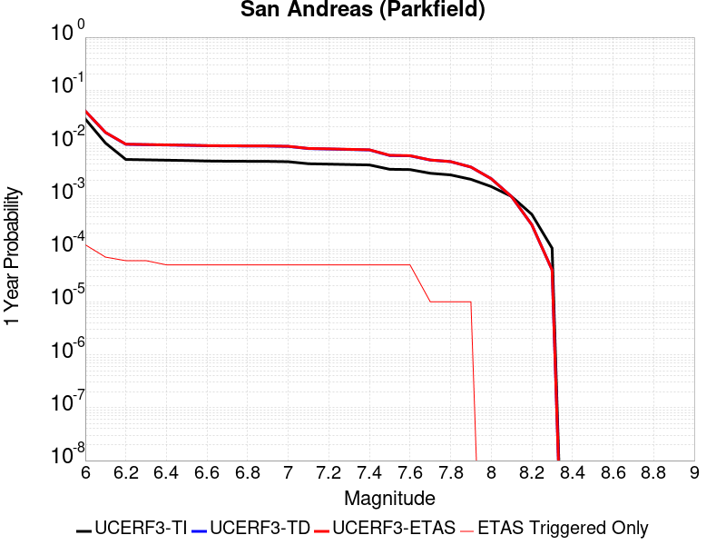 |  |

| Magnitude | 1 wk TI Prob | 1 wk TD Prob | 1 wk ETAS Prob | 1 wk ETAS/TD Gain | 1 wk ETAS Triggered Only | 1 mo TI Prob | 1 mo TD Prob | 1 mo ETAS Prob | 1 mo ETAS/TD Gain | 1 mo ETAS Triggered Only | 1 yr TI Prob | 1 yr TD Prob | 1 yr ETAS Prob | 1 yr ETAS/TD Gain | 1 yr ETAS Triggered Only | 10 yr TI Prob | 10 yr TD Prob | 10 yr ETAS Prob | 10 yr ETAS/TD Gain | 10 yr ETAS Triggered Only |
|-----|-----|-----|-----|-----|-----|-----|-----|-----|-----|-----|-----|-----|-----|-----|-----|-----|-----|-----|-----|-----|
| 6.0 | 5.556969E-4 | 7.8200514E-4 | 7.8200514E-4 | 1.0 | 0.0 | 0.0023793848 | 0.003347701 | 0.003367634 | 1.0059543 | 2.0E-5 | 0.028586963 | 0.040345885 | 0.040461045 | 1.0028542 | 1.2E-4 | 0.25176284 | 0.3377101 | 0.3378227 | 1.0003334 | 1.7E-4 |
| 6.1 | 1.925858E-4 | 3.0395915E-4 | 3.0395915E-4 | 1.0 | 0.0 | 8.2510663E-4 | 0.0013021269 | 0.0013021269 | 1.0 | 0.0 | 0.0099994885 | 0.015831968 | 0.01590086 | 1.0043514 | 7.0E-5 | 0.095613256 | 0.14996985 | 0.15005486 | 1.0005668 | 1.0E-4 |
| 6.2 | 9.4306815E-5 | 1.8274323E-4 | 1.8274323E-4 | 1.0 | 0.0 | 4.0410945E-4 | 7.829515E-4 | 7.829515E-4 | 1.0 | 0.0 | 0.0049089384 | 0.009490968 | 0.009550398 | 1.0062618 | 6.0E-5 | 0.048019063 | 0.09199097 | 0.09205453 | 1.0006909 | 7.0E-5 |
| 6.3 | 9.283051E-5 | 1.7970752E-4 | 1.7970752E-4 | 1.0 | 0.0 | 3.9778434E-4 | 7.69949E-4 | 7.69949E-4 | 1.0 | 0.0 | 0.0048322747 | 0.009334031 | 0.00939347 | 1.006368 | 6.0E-5 | 0.047285385 | 0.090643644 | 0.0907073 | 1.0007023 | 7.0E-5 |
| 6.4 | 9.138826E-5 | 1.7732776E-4 | 1.7732776E-4 | 1.0 | 0.0 | 3.916052E-4 | 7.5975596E-4 | 7.5975596E-4 | 1.0 | 0.0 | 0.0047573745 | 0.009210981 | 0.009260521 | 1.0053782 | 5.0E-5 | 0.046568092 | 0.08954158 | 0.089596204 | 1.0006101 | 6.0E-5 |
| 6.5 | 9.000255E-5 | 1.749061E-4 | 1.749061E-4 | 1.0 | 0.0 | 3.8566816E-4 | 7.493834E-4 | 7.493834E-4 | 1.0 | 0.0 | 0.0046854047 | 0.009085771 | 0.009135317 | 1.0054531 | 5.0E-5 | 0.045878403 | 0.08842976 | 0.08848444 | 1.0006185 | 6.0E-5 |
| 6.6 | 8.8109264E-5 | 1.7171387E-4 | 1.7171387E-4 | 1.0 | 0.0 | 3.7755648E-4 | 7.3571014E-4 | 7.3571014E-4 | 1.0 | 0.0 | 0.0045870654 | 0.008920688 | 0.008970242 | 1.0055549 | 5.0E-5 | 0.04493529 | 0.08695953 | 0.08701431 | 1.00063 | 6.0E-5 |
| 6.7 | 8.738073E-5 | 1.7038376E-4 | 1.7038376E-4 | 1.0 | 0.0 | 3.7443507E-4 | 7.3001295E-4 | 7.3001295E-4 | 1.0 | 0.0 | 0.0045492216 | 0.0088519445 | 0.008901502 | 1.0055984 | 5.0E-5 | 0.04457213 | 0.086359605 | 0.08641443 | 1.0006348 | 6.0E-5 |
| 6.8 | 8.710195E-5 | 1.698381E-4 | 1.698381E-4 | 1.0 | 0.0 | 3.7324068E-4 | 7.276757E-4 | 7.276757E-4 | 1.0 | 0.0 | 0.0045347405 | 0.008823725 | 0.008873285 | 1.0056165 | 5.0E-5 | 0.04443313 | 0.08610701 | 0.08616184 | 1.0006368 | 6.0E-5 |
| 6.9 | 8.6801556E-5 | 1.6924697E-4 | 1.6924697E-4 | 1.0 | 0.0 | 3.7195362E-4 | 7.251437E-4 | 7.251437E-4 | 1.0 | 0.0 | 0.0045191357 | 0.008793148 | 0.008842709 | 1.0056362 | 5.0E-5 | 0.044283327 | 0.085832745 | 0.085887596 | 1.0006391 | 6.0E-5 |
| 7.0 | 8.5571606E-5 | 1.6677282E-4 | 1.6677282E-4 | 1.0 | 0.0 | 3.6668387E-4 | 7.14546E-4 | 7.14546E-4 | 1.0 | 0.0 | 0.004455241 | 0.008665155 | 0.008714721 | 1.0057203 | 5.0E-5 | 0.043669727 | 0.084680066 | 0.084734984 | 1.0006485 | 6.0E-5 |
| 7.1 | 7.82589E-5 | 1.5156982E-4 | 1.5156982E-4 | 1.0 | 0.0 | 3.3535215E-4 | 6.4942404E-4 | 6.4942404E-4 | 1.0 | 0.0 | 0.0040752706 | 0.007878244 | 0.00792785 | 1.0062966 | 5.0E-5 | 0.040013418 | 0.07759189 | 0.07764723 | 1.0007132 | 6.0E-5 |
| 7.2 | 7.690929E-5 | 1.4894054E-4 | 1.4894054E-4 | 1.0 | 0.0 | 3.2956956E-4 | 6.381612E-4 | 6.381612E-4 | 1.0 | 0.0 | 0.004005129 | 0.007742101 | 0.007791714 | 1.0064082 | 5.0E-5 | 0.0393371 | 0.07636437 | 0.076419786 | 1.0007257 | 6.0E-5 |
| 7.3 | 7.5543794E-5 | 1.4590233E-4 | 1.4590233E-4 | 1.0 | 0.0 | 3.2371894E-4 | 6.251466E-4 | 6.251466E-4 | 1.0 | 0.0 | 0.003934157 | 0.0075847614 | 0.007634382 | 1.0065422 | 5.0E-5 | 0.038652334 | 0.07492845 | 0.07498395 | 1.0007408 | 6.0E-5 |
| 7.4 | 7.4214564E-5 | 1.4290822E-4 | 1.4290822E-4 | 1.0 | 0.0 | 3.1802364E-4 | 6.123207E-4 | 6.123207E-4 | 1.0 | 0.0 | 0.003865065 | 0.0074296813 | 0.00747931 | 1.0066798 | 5.0E-5 | 0.03798529 | 0.07350102 | 0.07355661 | 1.0007563 | 6.0E-5 |
| 7.5 | 6.149578E-5 | 1.1214689E-4 | 1.1214689E-4 | 1.0 | 0.0 | 2.6352672E-4 | 4.805411E-4 | 4.805411E-4 | 1.0 | 0.0 | 0.0032037178 | 0.005834925 | 0.0058846334 | 1.008519 | 5.0E-5 | 0.03157923 | 0.058674183 | 0.058730662 | 1.0009626 | 6.0E-5 |
| 7.6 | 6.0643448E-5 | 1.1043109E-4 | 1.1043109E-4 | 1.0 | 0.0 | 2.598746E-4 | 4.7319033E-4 | 4.7319033E-4 | 1.0 | 0.0 | 0.0031593828 | 0.0057459055 | 0.005795618 | 1.0086519 | 5.0E-5 | 0.031148417 | 0.057834256 | 0.057890784 | 1.0009774 | 6.0E-5 |
| 7.7 | 5.1652263E-5 | 9.1959046E-5 | 9.1959046E-5 | 1.0 | 0.0 | 2.2134806E-4 | 3.940507E-4 | 3.940507E-4 | 1.0 | 0.0 | 0.002691582 | 0.0047870236 | 0.0047969758 | 1.002079 | 1.0E-5 | 0.026592141 | 0.04863762 | 0.04865665 | 1.0003912 | 2.0E-5 |
| 7.8 | 4.8090482E-5 | 8.5791486E-5 | 8.5791486E-5 | 1.0 | 0.0 | 2.060858E-4 | 3.67626E-4 | 3.67626E-4 | 1.0 | 0.0 | 0.0025062072 | 0.004466669 | 0.0044766245 | 1.0022289 | 1.0E-5 | 0.024781305 | 0.045395855 | 0.045414947 | 1.0004206 | 2.0E-5 |
| 7.9 | 3.970278E-5 | 6.765535E-5 | 6.765535E-5 | 1.0 | 0.0 | 1.7014367E-4 | 2.899193E-4 | 2.899193E-4 | 1.0 | 0.0 | 0.002069531 | 0.003524058 | 0.0035340227 | 1.0028276 | 1.0E-5 | 0.020503636 | 0.035954855 | 0.035974134 | 1.0005362 | 2.0E-5 |
| 8.0 | 2.8982335E-5 | 4.0792085E-5 | 4.0792085E-5 | 1.0 | 0.0 | 1.2420409E-4 | 1.748115E-4 | 1.748115E-4 | 1.0 | 0.0 | 0.0015111357 | 0.002126254 | 0.002126254 | 1.0 | 0.0 | 0.015009012 | 0.022058146 | 0.022067925 | 1.0004433 | 1.0E-5 |
| 8.1 | 1.8836186E-5 | 1.8732435E-5 | 1.8732435E-5 | 1.0 | 0.0 | 8.0724014E-5 | 8.02794E-5 | 8.02794E-5 | 1.0 | 0.0 | 9.823717E-4 | 9.76964E-4 | 9.76964E-4 | 1.0 | 0.0 | 0.009780403 | 0.010515128 | 0.010525024 | 1.000941 | 1.0E-5 |
| 8.2 | 8.643924E-6 | 5.494016E-6 | 5.494016E-6 | 1.0 | 0.0 | 3.704486E-5 | 2.3545572E-5 | 2.3545572E-5 | 1.0 | 0.0 | 4.5092785E-4 | 2.866297E-4 | 2.866297E-4 | 1.0 | 0.0 | 0.0045001395 | 0.0032592218 | 0.0032592218 | 1.0 | 0.0 |
| 8.3 | 1.983087E-6 | 7.690063E-7 | 7.690063E-7 | 1.0 | 0.0 | 8.498917E-6 | 3.295737E-6 | 3.295737E-6 | 1.0 | 0.0 | 1.034694E-4 | 4.012488E-5 | 4.012488E-5 | 1.0 | 0.0 | 0.0010342124 | 4.737206E-4 | 4.737206E-4 | 1.0 | 0.0 |

## Baker
*[(top)](#table-of-contents)*

| 1 Week | 1 Month | 1 Year | 10 Year |
|-----|-----|-----|-----|
|  |  |  |  |

| Magnitude | 1 wk TI Prob | 1 wk TD Prob | 1 wk ETAS Prob | 1 wk ETAS/TD Gain | 1 wk ETAS Triggered Only | 1 mo TI Prob | 1 mo TD Prob | 1 mo ETAS Prob | 1 mo ETAS/TD Gain | 1 mo ETAS Triggered Only | 1 yr TI Prob | 1 yr TD Prob | 1 yr ETAS Prob | 1 yr ETAS/TD Gain | 1 yr ETAS Triggered Only | 10 yr TI Prob | 10 yr TD Prob | 10 yr ETAS Prob | 10 yr ETAS/TD Gain | 10 yr ETAS Triggered Only |
|-----|-----|-----|-----|-----|-----|-----|-----|-----|-----|-----|-----|-----|-----|-----|-----|-----|-----|-----|-----|-----|
| 6.0 | 5.695525E-6 | 5.8349133E-6 | 5.8349133E-6 | 1.0 | 0.0 | 2.4409164E-5 | 2.5006555E-5 | 3.5006306E-5 | 1.3998852 | 1.0E-5 | 2.9714106E-4 | 3.0441626E-4 | 3.5440104E-4 | 1.1641988 | 5.0E-5 | 0.0029674405 | 0.0030403885 | 0.003199902 | 1.0524648 | 1.6E-4 |
| 6.1 | 5.695525E-6 | 5.8349133E-6 | 5.8349133E-6 | 1.0 | 0.0 | 2.4409164E-5 | 2.5006555E-5 | 3.5006306E-5 | 1.3998852 | 1.0E-5 | 2.9714106E-4 | 3.0441626E-4 | 3.5440104E-4 | 1.1641988 | 5.0E-5 | 0.0029674405 | 0.0030403885 | 0.003199902 | 1.0524648 | 1.6E-4 |
| 6.2 | 5.695525E-6 | 5.8349133E-6 | 5.8349133E-6 | 1.0 | 0.0 | 2.4409164E-5 | 2.5006555E-5 | 3.5006306E-5 | 1.3998852 | 1.0E-5 | 2.9714106E-4 | 3.0441626E-4 | 3.5440104E-4 | 1.1641988 | 5.0E-5 | 0.0029674405 | 0.0030403885 | 0.003199902 | 1.0524648 | 1.6E-4 |
| 6.3 | 3.2995713E-6 | 3.3837132E-6 | 3.3837132E-6 | 1.0 | 0.0 | 1.4140943E-5 | 1.450155E-5 | 1.450155E-5 | 1.0 | 0.0 | 1.7215237E-4 | 1.7654254E-4 | 2.0653725E-4 | 1.1699007 | 3.0E-5 | 0.0017201907 | 0.00176407 | 0.0018439289 | 1.0452697 | 8.0E-5 |
| 6.4 | 3.2995713E-6 | 3.3837132E-6 | 3.3837132E-6 | 1.0 | 0.0 | 1.4140943E-5 | 1.450155E-5 | 1.450155E-5 | 1.0 | 0.0 | 1.7215237E-4 | 1.7654254E-4 | 2.0653725E-4 | 1.1699007 | 3.0E-5 | 0.0017201907 | 0.00176407 | 0.0018439289 | 1.0452697 | 8.0E-5 |
| 6.5 | 2.782202E-6 | 2.855881E-6 | 2.855881E-6 | 1.0 | 0.0 | 1.1923668E-5 | 1.2239434E-5 | 1.2239434E-5 | 1.0 | 0.0 | 1.4516099E-4 | 1.4900525E-4 | 1.7900078E-4 | 1.2013052 | 3.0E-5 | 0.001450662 | 0.0014890862 | 0.001558982 | 1.0469387 | 7.0E-5 |
| 6.6 | 2.3163404E-6 | 2.3809555E-6 | 2.3809555E-6 | 1.0 | 0.0 | 9.927136E-6 | 1.0204057E-5 | 1.0204057E-5 | 1.0 | 0.0 | 1.20856166E-4 | 1.242275E-4 | 1.5422379E-4 | 1.2414623 | 3.0E-5 | 0.0012079047 | 0.0012416008 | 0.001311514 | 1.0563089 | 7.0E-5 |
| 6.7 | 2.037056E-6 | 2.0965333E-6 | 2.0965333E-6 | 1.0 | 0.0 | 8.7302105E-6 | 8.985113E-6 | 8.985113E-6 | 1.0 | 0.0 | 1.0628513E-4 | 1.0938842E-4 | 1.3938514E-4 | 1.274222 | 3.0E-5 | 0.0010623431 | 0.0010933619 | 0.0011632853 | 1.0639527 | 7.0E-5 |
| 6.8 | 1.8356744E-6 | 1.8915596E-6 | 1.8915596E-6 | 1.0 | 0.0 | 7.867153E-6 | 8.106659E-6 | 8.106659E-6 | 1.0 | 0.0 | 9.577837E-5 | 9.869425E-5 | 1.2869129E-4 | 1.3039391 | 3.0E-5 | 9.57371E-4 | 9.865181E-4 | 0.0010564491 | 1.0708866 | 7.0E-5 |
| 6.9 | 1.6310546E-6 | 1.6832361E-6 | 1.6832361E-6 | 1.0 | 0.0 | 6.9902153E-6 | 7.2138496E-6 | 7.2138496E-6 | 1.0 | 0.0 | 8.510255E-5 | 8.7825196E-5 | 1.1782256E-4 | 1.3415576 | 3.0E-5 | 8.5069967E-4 | 8.779161E-4 | 9.4785466E-4 | 1.0796642 | 7.0E-5 |
| 7.0 | 1.2058036E-6 | 1.2508916E-6 | 1.2508916E-6 | 1.0 | 0.0 | 5.1677193E-6 | 5.3609533E-6 | 5.3609533E-6 | 1.0 | 0.0 | 6.291517E-5 | 6.5267675E-5 | 9.5265714E-5 | 1.4596156 | 3.0E-5 | 6.289736E-4 | 6.5248733E-4 | 7.224417E-4 | 1.1072118 | 7.0E-5 |
| 7.1 | 1.052382E-6 | 1.0951846E-6 | 1.0951846E-6 | 1.0 | 0.0 | 4.5102006E-6 | 4.69364E-6 | 4.69364E-6 | 1.0 | 0.0 | 5.491031E-5 | 5.714358E-5 | 8.714187E-5 | 1.5249634 | 3.0E-5 | 5.4896745E-4 | 5.7128974E-4 | 6.3125545E-4 | 1.1049656 | 6.0E-5 |
| 7.2 | 1.0067454E-6 | 1.0487945E-6 | 1.0487945E-6 | 1.0 | 0.0 | 4.3146156E-6 | 4.4948256E-6 | 4.4948256E-6 | 1.0 | 0.0 | 5.252918E-5 | 5.472314E-5 | 8.47215E-5 | 1.5481842 | 3.0E-5 | 5.251676E-4 | 5.470975E-4 | 6.070647E-4 | 1.1096097 | 6.0E-5 |
| 7.3 | 9.3596316E-7 | 9.76795E-7 | 9.76795E-7 | 1.0 | 0.0 | 4.0112645E-6 | 4.186258E-6 | 4.186258E-6 | 1.0 | 0.0 | 4.8836053E-5 | 5.0966508E-5 | 7.0965485E-5 | 1.3923945 | 2.0E-5 | 4.8825322E-4 | 5.09549E-4 | 5.5952347E-4 | 1.098076 | 5.0E-5 |
| 7.4 | 8.8117395E-7 | 9.207884E-7 | 9.207884E-7 | 1.0 | 0.0 | 3.7764542E-6 | 3.94623E-6 | 3.94623E-6 | 1.0 | 0.0 | 4.5977362E-5 | 4.80443E-5 | 4.80443E-5 | 1.0 | 0.0 | 4.596785E-4 | 4.803399E-4 | 5.103255E-4 | 1.0624257 | 3.0E-5 |
| 7.5 | 8.292386E-7 | 8.6748094E-7 | 8.6748094E-7 | 1.0 | 0.0 | 3.5538749E-6 | 3.7177701E-6 | 3.7177701E-6 | 1.0 | 0.0 | 4.326757E-5 | 4.5262917E-5 | 4.5262917E-5 | 1.0 | 0.0 | 4.3259145E-4 | 4.5253773E-4 | 4.8252416E-4 | 1.0662628 | 3.0E-5 |
| 7.6 | 7.553842E-7 | 7.9146724E-7 | 7.9146724E-7 | 1.0 | 0.0 | 3.2373566E-6 | 3.391998E-6 | 3.391998E-6 | 1.0 | 0.0 | 3.9414106E-5 | 4.12968E-5 | 4.12968E-5 | 1.0 | 0.0 | 3.9407116E-4 | 4.1289197E-4 | 4.328837E-4 | 1.0484189 | 2.0E-5 |
| 7.7 | 6.5285366E-7 | 6.8529783E-7 | 6.8529783E-7 | 1.0 | 0.0 | 2.797941E-6 | 2.9369874E-6 | 2.9369874E-6 | 1.0 | 0.0 | 3.40644E-5 | 3.5757243E-5 | 3.5757243E-5 | 1.0 | 0.0 | 3.405918E-4 | 3.5751556E-4 | 3.6751197E-4 | 1.0279608 | 1.0E-5 |
| 7.8 | 3.4586725E-7 | 3.648368E-7 | 3.648368E-7 | 1.0 | 0.0 | 1.4822873E-6 | 1.5635853E-6 | 1.5635853E-6 | 1.0 | 0.0 | 1.80467E-5 | 1.903649E-5 | 1.903649E-5 | 1.0 | 0.0 | 1.8045233E-4 | 1.9034903E-4 | 1.9034903E-4 | 1.0 | 0.0 |
| 7.9 | 2.5591178E-9 | 2.6697329E-9 | 2.6697329E-9 | 1.0 | 0.0 | 1.0967647E-8 | 1.14417125E-8 | 1.14417125E-8 | 1.0 | 0.0 | 1.335311E-7 | 1.3930286E-7 | 1.3930286E-7 | 1.0 | 0.0 | 1.3353102E-6 | 1.3930285E-6 | 1.3930285E-6 | 1.0 | 0.0 |

## Calico-Hidalgo
*[(top)](#table-of-contents)*

| 1 Week | 1 Month | 1 Year | 10 Year |
|-----|-----|-----|-----|
|  |  |  |  |

| Magnitude | 1 wk TI Prob | 1 wk TD Prob | 1 wk ETAS Prob | 1 wk ETAS/TD Gain | 1 wk ETAS Triggered Only | 1 mo TI Prob | 1 mo TD Prob | 1 mo ETAS Prob | 1 mo ETAS/TD Gain | 1 mo ETAS Triggered Only | 1 yr TI Prob | 1 yr TD Prob | 1 yr ETAS Prob | 1 yr ETAS/TD Gain | 1 yr ETAS Triggered Only | 10 yr TI Prob | 10 yr TD Prob | 10 yr ETAS Prob | 10 yr ETAS/TD Gain | 10 yr ETAS Triggered Only |
|-----|-----|-----|-----|-----|-----|-----|-----|-----|-----|-----|-----|-----|-----|-----|-----|-----|-----|-----|-----|-----|
| 6.0 | 4.0906612E-5 | 5.0708393E-5 | 5.0708393E-5 | 1.0 | 0.0 | 1.7530227E-4 | 2.1730587E-4 | 2.2730371E-4 | 1.0460081 | 1.0E-5 | 0.0021322158 | 0.0026428874 | 0.0026927553 | 1.0188687 | 5.0E-5 | 0.02111873 | 0.02615486 | 0.026300937 | 1.0055851 | 1.5E-4 |
| 6.1 | 4.0906612E-5 | 5.0708393E-5 | 5.0708393E-5 | 1.0 | 0.0 | 1.7530227E-4 | 2.1730587E-4 | 2.2730371E-4 | 1.0460081 | 1.0E-5 | 0.0021322158 | 0.0026428874 | 0.0026927553 | 1.0188687 | 5.0E-5 | 0.02111873 | 0.02615486 | 0.026300937 | 1.0055851 | 1.5E-4 |
| 6.2 | 4.0906612E-5 | 5.0708393E-5 | 5.0708393E-5 | 1.0 | 0.0 | 1.7530227E-4 | 2.1730587E-4 | 2.2730371E-4 | 1.0460081 | 1.0E-5 | 0.0021322158 | 0.0026428874 | 0.0026927553 | 1.0188687 | 5.0E-5 | 0.02111873 | 0.02615486 | 0.026300937 | 1.0055851 | 1.5E-4 |
| 6.3 | 2.4242801E-5 | 3.0092604E-5 | 3.0092604E-5 | 1.0 | 0.0 | 1.0389358E-4 | 1.2896211E-4 | 1.3896084E-4 | 1.0775322 | 1.0E-5 | 0.0012641704 | 0.0015690165 | 0.0016189379 | 1.0318171 | 5.0E-5 | 0.01257003 | 0.015583069 | 0.015701199 | 1.0075806 | 1.2E-4 |
| 6.4 | 2.4242801E-5 | 3.0092604E-5 | 3.0092604E-5 | 1.0 | 0.0 | 1.0389358E-4 | 1.2896211E-4 | 1.3896084E-4 | 1.0775322 | 1.0E-5 | 0.0012641704 | 0.0015690165 | 0.0016189379 | 1.0318171 | 5.0E-5 | 0.01257003 | 0.015583069 | 0.015701199 | 1.0075806 | 1.2E-4 |
| 6.5 | 2.0286952E-5 | 2.5317231E-5 | 2.5317231E-5 | 1.0 | 0.0 | 8.694118E-5 | 1.08498E-4 | 1.18496915E-4 | 1.0921576 | 1.0E-5 | 0.0010579949 | 0.0013201798 | 0.0013701138 | 1.0378237 | 5.0E-5 | 0.010529719 | 0.013125306 | 0.013233863 | 1.0082707 | 1.1E-4 |
| 6.6 | 2.0269223E-5 | 2.5298179E-5 | 2.5298179E-5 | 1.0 | 0.0 | 8.6865206E-5 | 1.0841636E-4 | 1.1841528E-4 | 1.092227 | 1.0E-5 | 0.0010570707 | 0.001319187 | 0.001369121 | 1.0378522 | 5.0E-5 | 0.010520565 | 0.013115495 | 0.013224053 | 1.008277 | 1.1E-4 |
| 6.7 | 1.799852E-5 | 2.2541886E-5 | 2.2541886E-5 | 1.0 | 0.0 | 7.713423E-5 | 9.660459E-5 | 1.0660363E-4 | 1.1035048 | 1.0E-5 | 9.3870464E-4 | 0.0011755408 | 0.0012254821 | 1.0424836 | 5.0E-5 | 0.009347493 | 0.011694837 | 0.011803551 | 1.0092958 | 1.1E-4 |
| 6.8 | 1.7458793E-5 | 2.1843232E-5 | 2.1843232E-5 | 1.0 | 0.0 | 7.4821255E-5 | 9.361057E-5 | 1.0360964E-4 | 1.1068156 | 1.0E-5 | 9.10568E-4 | 0.0011391273 | 0.0011890704 | 1.0438433 | 5.0E-5 | 0.009068459 | 0.011334467 | 0.01144322 | 1.0095949 | 1.1E-4 |
| 6.9 | 1.542884E-5 | 1.9026784E-5 | 1.9026784E-5 | 1.0 | 0.0 | 6.612192E-5 | 8.1540886E-5 | 9.154007E-5 | 1.1226279 | 1.0E-5 | 8.04737E-4 | 9.923213E-4 | 0.0010422716 | 1.050337 | 5.0E-5 | 0.008018291 | 0.009880301 | 0.009989213 | 1.0110233 | 1.1E-4 |
| 7.0 | 1.468253E-5 | 1.8031564E-5 | 1.8031564E-5 | 1.0 | 0.0 | 6.292361E-5 | 7.7275916E-5 | 8.727514E-5 | 1.1293964 | 1.0E-5 | 7.658257E-4 | 9.404412E-4 | 9.903942E-4 | 1.0531166 | 5.0E-5 | 0.0076319184 | 0.0093659805 | 0.00947495 | 1.0116346 | 1.1E-4 |
| 7.1 | 1.3139281E-5 | 1.620179E-5 | 1.620179E-5 | 1.0 | 0.0 | 5.6309986E-5 | 6.943446E-5 | 7.9433776E-5 | 1.1440107 | 1.0E-5 | 6.853584E-4 | 8.4504933E-4 | 8.950071E-4 | 1.0591182 | 5.0E-5 | 0.0068324856 | 0.008419657 | 0.008518815 | 1.0117769 | 1.0E-4 |
| 7.2 | 1.1127404E-5 | 1.3867326E-5 | 1.3867326E-5 | 1.0 | 0.0 | 4.7688E-5 | 5.9430102E-5 | 6.942951E-5 | 1.1682549 | 1.0E-5 | 5.8044674E-4 | 7.2333217E-4 | 7.533105E-4 | 1.0414448 | 3.0E-5 | 0.0057893298 | 0.007210886 | 0.007290309 | 1.0110143 | 8.0E-5 |
| 7.3 | 9.808154E-6 | 1.2176835E-5 | 1.2176835E-5 | 1.0 | 0.0 | 4.2034266E-5 | 5.2185453E-5 | 6.218493E-5 | 1.1916143 | 1.0E-5 | 5.11647E-4 | 6.351834E-4 | 6.551707E-4 | 1.031467 | 2.0E-5 | 0.0051047057 | 0.0063347546 | 0.0063943746 | 1.0094116 | 6.0E-5 |
| 7.4 | 7.942452E-6 | 9.792561E-6 | 9.792561E-6 | 1.0 | 0.0 | 3.4038632E-5 | 4.1967498E-5 | 5.196708E-5 | 1.2382697 | 1.0E-5 | 4.1434157E-4 | 5.10844E-4 | 5.2083883E-4 | 1.0195655 | 1.0E-5 | 0.0041356985 | 0.005097638 | 0.005137434 | 1.0078068 | 4.0E-5 |
| 7.5 | 4.7121216E-6 | 5.773085E-6 | 5.773085E-6 | 1.0 | 0.0 | 2.019465E-5 | 2.4741601E-5 | 3.4741355E-5 | 1.4041675 | 1.0E-5 | 2.4584212E-4 | 3.0119502E-4 | 3.11192E-4 | 1.0331911 | 1.0E-5 | 0.0024557032 | 0.0030086206 | 0.0030385302 | 1.0099413 | 3.0E-5 |
| 7.6 | 2.21172E-7 | 2.6040448E-7 | 2.6040448E-7 | 1.0 | 0.0 | 9.478797E-7 | 1.1160189E-6 | 1.1160189E-6 | 1.0 | 0.0 | 1.1540374E-5 | 1.3587473E-5 | 1.3587473E-5 | 1.0 | 0.0 | 1.1539775E-4 | 1.3586924E-4 | 1.3586924E-4 | 1.0 | 0.0 |

## San Andreas (Carrizo) rev
*[(top)](#table-of-contents)*

| 1 Week | 1 Month | 1 Year | 10 Year |
|-----|-----|-----|-----|
|  | 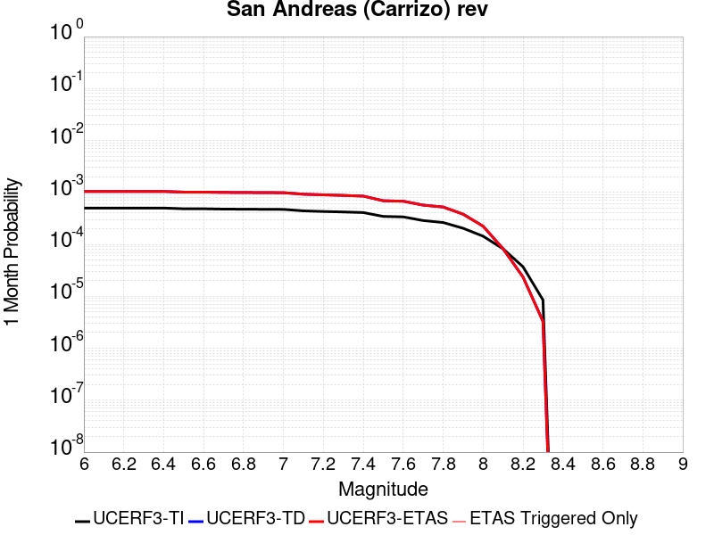 |  | 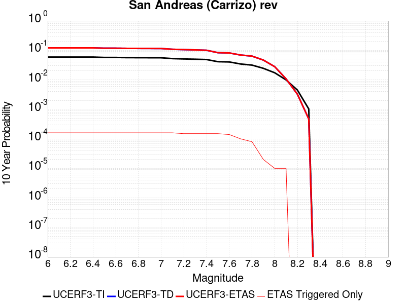 |

| Magnitude | 1 wk TI Prob | 1 wk TD Prob | 1 wk ETAS Prob | 1 wk ETAS/TD Gain | 1 wk ETAS Triggered Only | 1 mo TI Prob | 1 mo TD Prob | 1 mo ETAS Prob | 1 mo ETAS/TD Gain | 1 mo ETAS Triggered Only | 1 yr TI Prob | 1 yr TD Prob | 1 yr ETAS Prob | 1 yr ETAS/TD Gain | 1 yr ETAS Triggered Only | 10 yr TI Prob | 10 yr TD Prob | 10 yr ETAS Prob | 10 yr ETAS/TD Gain | 10 yr ETAS Triggered Only |
|-----|-----|-----|-----|-----|-----|-----|-----|-----|-----|-----|-----|-----|-----|-----|-----|-----|-----|-----|-----|-----|
| 6.0 | 1.1674632E-4 | 2.4362565E-4 | 2.4362565E-4 | 1.0 | 0.0 | 5.002454E-4 | 0.0010436937 | 0.0010436937 | 1.0 | 0.0 | 0.006073493 | 0.012633421 | 0.0127222845 | 1.007034 | 9.0E-5 | 0.0591016 | 0.12077793 | 0.1209186 | 1.0011648 | 1.6E-4 |
| 6.1 | 1.1674632E-4 | 2.4362565E-4 | 2.4362565E-4 | 1.0 | 0.0 | 5.002454E-4 | 0.0010436937 | 0.0010436937 | 1.0 | 0.0 | 0.006073493 | 0.012633421 | 0.0127222845 | 1.007034 | 9.0E-5 | 0.0591016 | 0.12077793 | 0.1209186 | 1.0011648 | 1.6E-4 |
| 6.2 | 1.1674632E-4 | 2.4362565E-4 | 2.4362565E-4 | 1.0 | 0.0 | 5.002454E-4 | 0.0010436937 | 0.0010436937 | 1.0 | 0.0 | 0.006073493 | 0.012633421 | 0.0127222845 | 1.007034 | 9.0E-5 | 0.0591016 | 0.12077793 | 0.1209186 | 1.0011648 | 1.6E-4 |
| 6.3 | 1.1674632E-4 | 2.4362565E-4 | 2.4362565E-4 | 1.0 | 0.0 | 5.002454E-4 | 0.0010436937 | 0.0010436937 | 1.0 | 0.0 | 0.006073493 | 0.012633421 | 0.0127222845 | 1.007034 | 9.0E-5 | 0.0591016 | 0.12077793 | 0.1209186 | 1.0011648 | 1.6E-4 |
| 6.4 | 1.1674632E-4 | 2.4362565E-4 | 2.4362565E-4 | 1.0 | 0.0 | 5.002454E-4 | 0.0010436937 | 0.0010436937 | 1.0 | 0.0 | 0.006073493 | 0.012633421 | 0.0127222845 | 1.007034 | 9.0E-5 | 0.0591016 | 0.12077793 | 0.1209186 | 1.0011648 | 1.6E-4 |
| 6.5 | 1.13136164E-4 | 2.368245E-4 | 2.368245E-4 | 1.0 | 0.0 | 4.847792E-4 | 0.001014569 | 0.001014569 | 1.0 | 0.0 | 0.0058862255 | 0.012282865 | 0.01237176 | 1.0072373 | 9.0E-5 | 0.057327334 | 0.11774252 | 0.11788368 | 1.0011989 | 1.6E-4 |
| 6.6 | 1.13136164E-4 | 2.368245E-4 | 2.368245E-4 | 1.0 | 0.0 | 4.847792E-4 | 0.001014569 | 0.001014569 | 1.0 | 0.0 | 0.0058862255 | 0.012282865 | 0.01237176 | 1.0072373 | 9.0E-5 | 0.057327334 | 0.11774252 | 0.11788368 | 1.0011989 | 1.6E-4 |
| 6.7 | 1.1149675E-4 | 2.3373615E-4 | 2.3373615E-4 | 1.0 | 0.0 | 4.777557E-4 | 0.0010013434 | 0.0010013434 | 1.0 | 0.0 | 0.0058011734 | 0.012123644 | 0.012212553 | 1.0073335 | 9.0E-5 | 0.05652051 | 0.11636054 | 0.11650192 | 1.001215 | 1.6E-4 |
| 6.8 | 1.1103589E-4 | 2.3275726E-4 | 2.3275726E-4 | 1.0 | 0.0 | 4.7578133E-4 | 9.971512E-4 | 9.971512E-4 | 1.0 | 0.0 | 0.005777263 | 0.012073172 | 0.012162086 | 1.0073645 | 9.0E-5 | 0.056293584 | 0.11592107 | 0.11606253 | 1.0012202 | 1.6E-4 |
| 6.9 | 1.1053259E-4 | 2.3168049E-4 | 2.3168049E-4 | 1.0 | 0.0 | 4.7362508E-4 | 9.9254E-4 | 9.9254E-4 | 1.0 | 0.0 | 0.0057511497 | 0.012017651 | 0.01210657 | 1.007399 | 9.0E-5 | 0.05604569 | 0.11543746 | 0.115578994 | 1.0012261 | 1.6E-4 |
| 7.0 | 1.1005377E-4 | 2.306884E-4 | 2.306884E-4 | 1.0 | 0.0 | 4.7157376E-4 | 9.882915E-4 | 9.882915E-4 | 1.0 | 0.0 | 0.0057263062 | 0.011966494 | 0.0120554175 | 1.007431 | 9.0E-5 | 0.055809796 | 0.114989534 | 0.11513114 | 1.0012314 | 1.6E-4 |
| 7.1 | 1.0308142E-4 | 2.157785E-4 | 2.157785E-4 | 1.0 | 0.0 | 4.417027E-4 | 9.2443835E-4 | 9.2443835E-4 | 1.0 | 0.0 | 0.0053644776 | 0.01119727 | 0.011286262 | 1.0079477 | 9.0E-5 | 0.052368138 | 0.108249314 | 0.108392 | 1.0013181 | 1.6E-4 |
| 7.2 | 1.0027479E-4 | 2.0985417E-4 | 2.0985417E-4 | 1.0 | 0.0 | 4.296783E-4 | 8.9906604E-4 | 8.9906604E-4 | 1.0 | 0.0 | 0.0052187922 | 0.01089149 | 0.010970619 | 1.0072652 | 8.0E-5 | 0.050979212 | 0.105556235 | 0.105690405 | 1.001271 | 1.5E-4 |
| 7.3 | 9.816942E-5 | 2.0460035E-4 | 2.0460035E-4 | 1.0 | 0.0 | 4.2065824E-4 | 8.76565E-4 | 8.76565E-4 | 1.0 | 0.0 | 0.005109493 | 0.010620243 | 0.010699393 | 1.0074527 | 8.0E-5 | 0.049935985 | 0.103138015 | 0.10327254 | 1.0013044 | 1.5E-4 |
| 7.4 | 9.5634205E-5 | 1.9828742E-4 | 1.9828742E-4 | 1.0 | 0.0 | 4.0979648E-4 | 8.4952737E-4 | 8.4952737E-4 | 1.0 | 0.0 | 0.0049778637 | 0.010294209 | 0.010373386 | 1.0076914 | 8.0E-5 | 0.048678253 | 0.10022864 | 0.100363605 | 1.0013466 | 1.5E-4 |
| 7.5 | 8.052417E-5 | 1.6144858E-4 | 1.6144858E-4 | 1.0 | 0.0 | 3.4505792E-4 | 6.917392E-4 | 6.917392E-4 | 1.0 | 0.0 | 0.0041929903 | 0.008389484 | 0.008468813 | 1.0094558 | 8.0E-5 | 0.04114753 | 0.082961716 | 0.08309927 | 1.0016581 | 1.5E-4 |
| 7.6 | 7.897024E-5 | 1.5797748E-4 | 1.5797748E-4 | 1.0 | 0.0 | 3.384E-4 | 6.7687087E-4 | 6.7687087E-4 | 1.0 | 0.0 | 0.0041122385 | 0.00820984 | 0.008289184 | 1.0096644 | 8.0E-5 | 0.040369697 | 0.08129846 | 0.08142708 | 1.001582 | 1.4E-4 |
| 7.7 | 6.707427E-5 | 1.3304809E-4 | 1.3304809E-4 | 1.0 | 0.0 | 2.8742946E-4 | 5.700815E-4 | 5.700815E-4 | 1.0 | 0.0 | 0.003493839 | 0.006918687 | 0.00695841 | 1.0057415 | 4.0E-5 | 0.034394164 | 0.06917808 | 0.06927116 | 1.0013455 | 1.0E-4 |
| 7.8 | 6.147705E-5 | 1.2223405E-4 | 1.2223405E-4 | 1.0 | 0.0 | 2.6344648E-4 | 5.2375504E-4 | 5.2375504E-4 | 1.0 | 0.0 | 0.0032027436 | 0.0063580987 | 0.0063978443 | 1.0062512 | 4.0E-5 | 0.031569764 | 0.06363271 | 0.06370763 | 1.0011772 | 8.0E-5 |
| 7.9 | 4.7636717E-5 | 8.898354E-5 | 8.898354E-5 | 1.0 | 0.0 | 2.0414138E-4 | 3.8130232E-4 | 3.8130232E-4 | 1.0 | 0.0 | 0.0024825884 | 0.004632482 | 0.0046424353 | 1.0021486 | 1.0E-5 | 0.024550365 | 0.046717253 | 0.04673632 | 1.000408 | 2.0E-5 |
| 8.0 | 3.3554235E-5 | 5.224913E-5 | 5.224913E-5 | 1.0 | 0.0 | 1.4379594E-4 | 2.2390562E-4 | 2.2390562E-4 | 1.0 | 0.0 | 0.0017493097 | 0.002722645 | 0.002722645 | 1.0 | 0.0 | 0.017356034 | 0.02793666 | 0.02794638 | 1.000348 | 1.0E-5 |
| 8.1 | 1.9175432E-5 | 1.923722E-5 | 1.923722E-5 | 1.0 | 0.0 | 8.217783E-5 | 8.244263E-5 | 8.244263E-5 | 1.0 | 0.0 | 0.0010000558 | 0.0010032775 | 0.0010032775 | 1.0 | 0.0 | 0.009955673 | 0.010785607 | 0.010795498 | 1.0009172 | 1.0E-5 |
| 8.2 | 8.643924E-6 | 5.494016E-6 | 5.494016E-6 | 1.0 | 0.0 | 3.704486E-5 | 2.3545572E-5 | 2.3545572E-5 | 1.0 | 0.0 | 4.5092785E-4 | 2.866297E-4 | 2.866297E-4 | 1.0 | 0.0 | 0.0045001395 | 0.0032592218 | 0.0032592218 | 1.0 | 0.0 |
| 8.3 | 1.983087E-6 | 7.690063E-7 | 7.690063E-7 | 1.0 | 0.0 | 8.498917E-6 | 3.295737E-6 | 3.295737E-6 | 1.0 | 0.0 | 1.034694E-4 | 4.012488E-5 | 4.012488E-5 | 1.0 | 0.0 | 0.0010342124 | 4.737206E-4 | 4.737206E-4 | 1.0 | 0.0 |

## San Jacinto (San Bernardino)
*[(top)](#table-of-contents)*

| 1 Week | 1 Month | 1 Year | 10 Year |
|-----|-----|-----|-----|
|  |  |  |  |

| Magnitude | 1 wk TI Prob | 1 wk TD Prob | 1 wk ETAS Prob | 1 wk ETAS/TD Gain | 1 wk ETAS Triggered Only | 1 mo TI Prob | 1 mo TD Prob | 1 mo ETAS Prob | 1 mo ETAS/TD Gain | 1 mo ETAS Triggered Only | 1 yr TI Prob | 1 yr TD Prob | 1 yr ETAS Prob | 1 yr ETAS/TD Gain | 1 yr ETAS Triggered Only | 10 yr TI Prob | 10 yr TD Prob | 10 yr ETAS Prob | 10 yr ETAS/TD Gain | 10 yr ETAS Triggered Only |
|-----|-----|-----|-----|-----|-----|-----|-----|-----|-----|-----|-----|-----|-----|-----|-----|-----|-----|-----|-----|-----|
| 6.0 | 3.409352E-5 | 3.604894E-5 | 3.604894E-5 | 1.0 | 0.0 | 1.461069E-4 | 1.5448632E-4 | 1.6448477E-4 | 1.0647206 | 1.0E-5 | 0.0017774 | 0.0018792498 | 0.0019690807 | 1.0478015 | 9.0E-5 | 0.01763251 | 0.019381514 | 0.019528607 | 1.0075893 | 1.5E-4 |
| 6.1 | 3.409352E-5 | 3.604894E-5 | 3.604894E-5 | 1.0 | 0.0 | 1.461069E-4 | 1.5448632E-4 | 1.6448477E-4 | 1.0647206 | 1.0E-5 | 0.0017774 | 0.0018792498 | 0.0019690807 | 1.0478015 | 9.0E-5 | 0.01763251 | 0.019381514 | 0.019528607 | 1.0075893 | 1.5E-4 |
| 6.2 | 3.409352E-5 | 3.604894E-5 | 3.604894E-5 | 1.0 | 0.0 | 1.461069E-4 | 1.5448632E-4 | 1.6448477E-4 | 1.0647206 | 1.0E-5 | 0.0017774 | 0.0018792498 | 0.0019690807 | 1.0478015 | 9.0E-5 | 0.01763251 | 0.019381514 | 0.019528607 | 1.0075893 | 1.5E-4 |
| 6.3 | 3.409352E-5 | 3.604894E-5 | 3.604894E-5 | 1.0 | 0.0 | 1.461069E-4 | 1.5448632E-4 | 1.6448477E-4 | 1.0647206 | 1.0E-5 | 0.0017774 | 0.0018792498 | 0.0019690807 | 1.0478015 | 9.0E-5 | 0.01763251 | 0.019381514 | 0.019528607 | 1.0075893 | 1.5E-4 |
| 6.4 | 3.400795E-5 | 3.594159E-5 | 3.594159E-5 | 1.0 | 0.0 | 1.4574021E-4 | 1.540263E-4 | 1.6402476E-4 | 1.064914 | 1.0E-5 | 0.0017729428 | 0.0018736589 | 0.001953509 | 1.0426172 | 8.0E-5 | 0.017588645 | 0.01932659 | 0.019463884 | 1.0071039 | 1.4E-4 |
| 6.5 | 3.341482E-5 | 3.5202123E-5 | 3.5202123E-5 | 1.0 | 0.0 | 1.4319851E-4 | 1.5085752E-4 | 1.6085601E-4 | 1.0662777 | 1.0E-5 | 0.0017420477 | 0.0018351445 | 0.0019149977 | 1.0435133 | 8.0E-5 | 0.017284546 | 0.018948095 | 0.01907563 | 1.0067308 | 1.3E-4 |
| 6.6 | 3.3364955E-5 | 3.5139332E-5 | 3.5139332E-5 | 1.0 | 0.0 | 1.4298483E-4 | 1.5058846E-4 | 1.6058695E-4 | 1.0663961 | 1.0E-5 | 0.0017394501 | 0.001831874 | 0.0019117275 | 1.0435911 | 8.0E-5 | 0.017258976 | 0.018915955 | 0.019043496 | 1.0067425 | 1.3E-4 |
| 6.7 | 3.335922E-5 | 3.5129106E-5 | 3.5129106E-5 | 1.0 | 0.0 | 1.4296026E-4 | 1.5054463E-4 | 1.6054312E-4 | 1.0664154 | 1.0E-5 | 0.0017391514 | 0.0018313414 | 0.0019111949 | 1.0436038 | 8.0E-5 | 0.017256035 | 0.018910747 | 0.01903829 | 1.0067444 | 1.3E-4 |
| 6.8 | 3.327683E-5 | 3.5023157E-5 | 3.5023157E-5 | 1.0 | 0.0 | 1.4260718E-4 | 1.5009061E-4 | 1.6008911E-4 | 1.0666164 | 1.0E-5 | 0.0017348597 | 0.001825823 | 0.0019056769 | 1.0437359 | 8.0E-5 | 0.017213784 | 0.018856514 | 0.018984063 | 1.0067642 | 1.3E-4 |
| 6.9 | 3.3235785E-5 | 3.49641E-5 | 3.49641E-5 | 1.0 | 0.0 | 1.4243131E-4 | 1.4983755E-4 | 1.5983604E-4 | 1.066729 | 1.0E-5 | 0.0017327217 | 0.001822747 | 0.0019026012 | 1.0438098 | 8.0E-5 | 0.017192734 | 0.01882638 | 0.018953932 | 1.0067753 | 1.3E-4 |
| 7.0 | 3.3197095E-5 | 3.4904017E-5 | 3.4904017E-5 | 1.0 | 0.0 | 1.422655E-4 | 1.4958008E-4 | 1.5957859E-4 | 1.0668439 | 1.0E-5 | 0.0017307063 | 0.0018196177 | 0.0018994721 | 1.0438852 | 8.0E-5 | 0.017172894 | 0.018795753 | 0.018923309 | 1.0067865 | 1.3E-4 |
| 7.1 | 3.3129716E-5 | 3.4784203E-5 | 3.4784203E-5 | 1.0 | 0.0 | 1.4197677E-4 | 1.4906665E-4 | 1.5906515E-4 | 1.0670741 | 1.0E-5 | 0.0017271966 | 0.001813377 | 0.001893232 | 1.0440366 | 8.0E-5 | 0.017138338 | 0.01873482 | 0.018862385 | 1.006809 | 1.3E-4 |
| 7.2 | 3.3034008E-5 | 3.4651628E-5 | 3.4651628E-5 | 1.0 | 0.0 | 1.4156665E-4 | 1.4849853E-4 | 1.5849705E-4 | 1.0673307 | 1.0E-5 | 0.0017222111 | 0.0018064718 | 0.0018863273 | 1.0442052 | 8.0E-5 | 0.017089253 | 0.018667199 | 0.018794773 | 1.006834 | 1.3E-4 |
| 7.3 | 3.2956614E-5 | 3.4519344E-5 | 3.4519344E-5 | 1.0 | 0.0 | 1.4123498E-4 | 1.4793167E-4 | 1.5793019E-4 | 1.0675888 | 1.0E-5 | 0.0017181796 | 0.0017995817 | 0.0018794377 | 1.0443748 | 8.0E-5 | 0.017049557 | 0.018599935 | 0.018727517 | 1.0068593 | 1.3E-4 |
| 7.4 | 3.2915937E-5 | 3.4441007E-5 | 3.4441007E-5 | 1.0 | 0.0 | 1.4106068E-4 | 1.4759599E-4 | 1.575945E-4 | 1.0677425 | 1.0E-5 | 0.0017160608 | 0.0017955014 | 0.0018753577 | 1.0444758 | 8.0E-5 | 0.017028693 | 0.01856018 | 0.018687768 | 1.0068742 | 1.3E-4 |
| 7.5 | 3.281791E-5 | 3.4305875E-5 | 3.4305875E-5 | 1.0 | 0.0 | 1.406406E-4 | 1.4701691E-4 | 1.5701544E-4 | 1.0680094 | 1.0E-5 | 0.0017109542 | 0.0017884627 | 0.0018683197 | 1.0446512 | 8.0E-5 | 0.016978411 | 0.018491047 | 0.018618641 | 1.0069004 | 1.3E-4 |
| 7.6 | 3.2521442E-5 | 3.403071E-5 | 3.403071E-5 | 1.0 | 0.0 | 1.3937015E-4 | 1.4583775E-4 | 1.558363E-4 | 1.0685594 | 1.0E-5 | 0.0016955109 | 0.00177413 | 0.0018539882 | 1.0450125 | 8.0E-5 | 0.016826328 | 0.018348608 | 0.018476224 | 1.006955 | 1.3E-4 |
| 7.7 | 3.0287873E-5 | 3.2514057E-5 | 3.2514057E-5 | 1.0 | 0.0 | 1.297987E-4 | 1.3933852E-4 | 1.4933712E-4 | 1.0717577 | 1.0E-5 | 0.0015791537 | 0.0016951276 | 0.001774992 | 1.0471141 | 8.0E-5 | 0.01567979 | 0.017559286 | 0.017687004 | 1.0072734 | 1.3E-4 |
| 7.8 | 2.6316151E-5 | 2.9722758E-5 | 2.9722758E-5 | 1.0 | 0.0 | 1.1277862E-4 | 1.2737703E-4 | 1.3737577E-4 | 1.078497 | 1.0E-5 | 0.0013722149 | 0.0015497132 | 0.0016295892 | 1.0515424 | 8.0E-5 | 0.013637724 | 0.016099673 | 0.016227579 | 1.0079447 | 1.3E-4 |
| 7.9 | 2.0761147E-5 | 2.346946E-5 | 2.346946E-5 | 1.0 | 0.0 | 8.897331E-5 | 1.0057953E-4 | 1.0057953E-4 | 1.0 | 0.0 | 0.0010827117 | 0.0012238687 | 0.001293783 | 1.0571257 | 7.0E-5 | 0.010774517 | 0.012819743 | 0.012928332 | 1.0084705 | 1.1E-4 |
| 8.0 | 1.5738568E-5 | 1.6071699E-5 | 1.6071699E-5 | 1.0 | 0.0 | 6.744926E-5 | 6.887689E-5 | 6.887689E-5 | 1.0 | 0.0 | 8.2088535E-4 | 8.3825423E-4 | 8.8821235E-4 | 1.0595977 | 5.0E-5 | 0.008178596 | 0.008886066 | 0.008955444 | 1.0078075 | 7.0E-5 |
| 8.1 | 1.0105832E-5 | 8.352162E-6 | 8.352162E-6 | 1.0 | 0.0 | 4.3309992E-5 | 3.5794492E-5 | 3.5794492E-5 | 1.0 | 0.0 | 5.2717153E-4 | 4.357113E-4 | 4.557026E-4 | 1.045882 | 2.0E-5 | 0.005259227 | 0.004688983 | 0.004718842 | 1.0063679 | 3.0E-5 |
| 8.2 | 4.189207E-6 | 1.5843941E-6 | 1.5843941E-6 | 1.0 | 0.0 | 1.7953622E-5 | 6.790243E-6 | 6.790243E-6 | 1.0 | 0.0 | 2.1856341E-4 | 8.26681E-5 | 8.26681E-5 | 1.0 | 0.0 | 0.0021834858 | 9.600267E-4 | 9.600267E-4 | 1.0 | 0.0 |
| 8.3 | 1.2758221E-6 | 3.6306494E-7 | 3.6306494E-7 | 1.0 | 0.0 | 5.4677976E-6 | 1.5559917E-6 | 1.5559917E-6 | 1.0 | 0.0 | 6.65684E-5 | 1.8944038E-5 | 1.8944038E-5 | 1.0 | 0.0 | 6.6548464E-4 | 2.2845245E-4 | 2.2845245E-4 | 1.0 | 0.0 |

## Owens Valley
*[(top)](#table-of-contents)*

| 1 Week | 1 Month | 1 Year | 10 Year |
|-----|-----|-----|-----|
|  |  |  |  |

| Magnitude | 1 wk TI Prob | 1 wk TD Prob | 1 wk ETAS Prob | 1 wk ETAS/TD Gain | 1 wk ETAS Triggered Only | 1 mo TI Prob | 1 mo TD Prob | 1 mo ETAS Prob | 1 mo ETAS/TD Gain | 1 mo ETAS Triggered Only | 1 yr TI Prob | 1 yr TD Prob | 1 yr ETAS Prob | 1 yr ETAS/TD Gain | 1 yr ETAS Triggered Only | 10 yr TI Prob | 10 yr TD Prob | 10 yr ETAS Prob | 10 yr ETAS/TD Gain | 10 yr ETAS Triggered Only |
|-----|-----|-----|-----|-----|-----|-----|-----|-----|-----|-----|-----|-----|-----|-----|-----|-----|-----|-----|-----|-----|
| 6.0 | 4.83821E-5 | 3.6305946E-6 | 3.6305946E-6 | 1.0 | 0.0 | 2.0733538E-4 | 1.5559604E-5 | 3.5559293E-5 | 2.2853596 | 2.0E-5 | 0.002521386 | 1.8942272E-4 | 2.6940755E-4 | 1.4222559 | 8.0E-5 | 0.024929691 | 0.0019204353 | 0.0020601666 | 1.0727601 | 1.4E-4 |
| 6.1 | 4.83821E-5 | 3.6305946E-6 | 3.6305946E-6 | 1.0 | 0.0 | 2.0733538E-4 | 1.5559604E-5 | 3.5559293E-5 | 2.2853596 | 2.0E-5 | 0.002521386 | 1.8942272E-4 | 2.6940755E-4 | 1.4222559 | 8.0E-5 | 0.024929691 | 0.0019204353 | 0.0020601666 | 1.0727601 | 1.4E-4 |
| 6.2 | 4.83821E-5 | 3.6305946E-6 | 3.6305946E-6 | 1.0 | 0.0 | 2.0733538E-4 | 1.5559604E-5 | 3.5559293E-5 | 2.2853596 | 2.0E-5 | 0.002521386 | 1.8942272E-4 | 2.6940755E-4 | 1.4222559 | 8.0E-5 | 0.024929691 | 0.0019204353 | 0.0020601666 | 1.0727601 | 1.4E-4 |
| 6.3 | 3.953008E-5 | 3.1569743E-6 | 3.1569743E-6 | 1.0 | 0.0 | 1.6940363E-4 | 1.3529823E-5 | 3.352955E-5 | 2.478196 | 2.0E-5 | 0.002060538 | 1.6471389E-4 | 2.3470235E-4 | 1.4249094 | 7.0E-5 | 0.020415364 | 0.0016592429 | 0.0017890272 | 1.0782189 | 1.3E-4 |
| 6.4 | 3.953008E-5 | 3.1569743E-6 | 3.1569743E-6 | 1.0 | 0.0 | 1.6940363E-4 | 1.3529823E-5 | 3.352955E-5 | 2.478196 | 2.0E-5 | 0.002060538 | 1.6471389E-4 | 2.3470235E-4 | 1.4249094 | 7.0E-5 | 0.020415364 | 0.0016592429 | 0.0017890272 | 1.0782189 | 1.3E-4 |
| 6.5 | 3.457342E-5 | 2.9722537E-6 | 2.9722537E-6 | 1.0 | 0.0 | 1.4816338E-4 | 1.2738172E-5 | 3.2737917E-5 | 2.570064 | 2.0E-5 | 0.0018023965 | 1.5507691E-4 | 2.2506605E-4 | 1.451319 | 7.0E-5 | 0.017878477 | 0.0015558794 | 0.0016856771 | 1.0834241 | 1.3E-4 |
| 6.6 | 3.1127765E-5 | 2.8751224E-6 | 2.8751224E-6 | 1.0 | 0.0 | 1.3339789E-4 | 1.2321899E-5 | 3.232165E-5 | 2.6231065 | 2.0E-5 | 0.0016229092 | 1.5000948E-4 | 2.1999898E-4 | 1.4665672 | 7.0E-5 | 0.016111081 | 0.0015009856 | 0.0016307905 | 1.0864798 | 1.3E-4 |
| 6.7 | 2.806885E-5 | 2.8107588E-6 | 2.8107588E-6 | 1.0 | 0.0 | 1.2028952E-4 | 1.2046057E-5 | 3.2045817E-5 | 2.6602743 | 2.0E-5 | 0.001463541 | 1.4665157E-4 | 2.166413E-4 | 1.4772519 | 7.0E-5 | 0.014539397 | 0.0014659754 | 0.0015957848 | 1.0885482 | 1.3E-4 |
| 6.8 | 2.524524E-5 | 2.2356737E-6 | 2.2356737E-6 | 1.0 | 0.0 | 1.0818939E-4 | 9.581425E-6 | 2.9581233E-5 | 3.087352 | 2.0E-5 | 0.0013164099 | 1.1664791E-4 | 1.8663975E-4 | 1.6000265 | 7.0E-5 | 0.01308639 | 0.0011661606 | 0.0012960089 | 1.111347 | 1.3E-4 |
| 6.9 | 2.2704568E-5 | 1.6083629E-6 | 1.6083629E-6 | 1.0 | 0.0 | 9.730166E-5 | 6.8929658E-6 | 2.6892829E-5 | 3.9014885 | 2.0E-5 | 0.0011840039 | 8.391865E-5 | 1.5391277E-4 | 1.8340712 | 7.0E-5 | 0.011777153 | 8.3909626E-4 | 9.689872E-4 | 1.1547986 | 1.3E-4 |
| 7.0 | 2.0871712E-5 | 1.539734E-6 | 1.539734E-6 | 1.0 | 0.0 | 8.944713E-5 | 6.5988434E-6 | 2.6598711E-5 | 4.030814 | 2.0E-5 | 0.0010884746 | 8.033797E-5 | 1.5033234E-4 | 1.871249 | 7.0E-5 | 0.010831586 | 8.0327404E-4 | 9.331696E-4 | 1.1617076 | 1.3E-4 |
| 7.1 | 1.944928E-5 | 1.386575E-6 | 1.386575E-6 | 1.0 | 0.0 | 8.335139E-5 | 5.942451E-6 | 2.5942332E-5 | 4.3655944 | 2.0E-5 | 0.0010143308 | 7.234695E-5 | 1.4234189E-4 | 1.9674898 | 7.0E-5 | 0.010097133 | 7.2340504E-4 | 8.53311E-4 | 1.1795757 | 1.3E-4 |
| 7.2 | 1.7876306E-5 | 1.24905E-6 | 1.24905E-6 | 1.0 | 0.0 | 7.6610486E-5 | 5.3530603E-6 | 2.5352952E-5 | 4.7361608 | 2.0E-5 | 9.3233347E-4 | 6.517157E-5 | 1.35167E-4 | 2.074018 | 7.0E-5 | 0.009284316 | 6.5168424E-4 | 7.8159955E-4 | 1.1993531 | 1.3E-4 |
| 7.3 | 1.2618672E-5 | 1.1116437E-6 | 1.1116437E-6 | 1.0 | 0.0 | 5.40789E-5 | 4.7641784E-6 | 2.4764084E-5 | 5.1979756 | 2.0E-5 | 6.582117E-4 | 5.8002333E-5 | 1.2799827E-4 | 2.206778 | 7.0E-5 | 0.0065626553 | 5.8002654E-4 | 7.0995116E-4 | 1.2239977 | 1.3E-4 |
| 7.4 | 7.4874442E-6 | 8.5496856E-7 | 8.5496856E-7 | 1.0 | 0.0 | 3.208865E-5 | 3.6641459E-6 | 2.3664072E-5 | 6.458278 | 2.0E-5 | 3.906093E-4 | 4.4610068E-5 | 1.1460694E-4 | 2.5690825 | 7.0E-5 | 0.003899234 | 4.4612345E-4 | 5.660699E-4 | 1.2688638 | 1.2E-4 |
| 7.5 | 2.4734156E-6 | 6.0694214E-7 | 6.0694214E-7 | 1.0 | 0.0 | 1.060031E-5 | 2.601178E-6 | 1.2601152E-5 | 4.844402 | 1.0E-5 | 1.2905113E-4 | 3.1668886E-5 | 7.1667615E-5 | 2.2630293 | 4.0E-5 | 0.0012897621 | 3.1664406E-4 | 3.966187E-4 | 1.2525697 | 8.0E-5 |
| 7.6 | 1.1328841E-6 | 3.196907E-7 | 3.196907E-7 | 1.0 | 0.0 | 4.8552088E-6 | 1.3701024E-6 | 1.3701024E-6 | 1.0 | 0.0 | 5.9110564E-5 | 1.668087E-5 | 3.6680536E-5 | 2.1989582 | 2.0E-5 | 5.9094845E-4 | 1.6679637E-4 | 2.2678636E-4 | 1.35966 | 6.0E-5 |
| 7.7 | 4.8613185E-7 | 8.9654996E-8 | 8.9654996E-8 | 1.0 | 0.0 | 2.0834207E-6 | 3.8423565E-7 | 3.8423565E-7 | 1.0 | 0.0 | 2.536535E-5 | 4.6780597E-6 | 4.6780597E-6 | 1.0 | 0.0 | 2.5362454E-4 | 4.677968E-5 | 4.677968E-5 | 1.0 | 0.0 |

## San Andreas (Cholame) rev
*[(top)](#table-of-contents)*

| 1 Week | 1 Month | 1 Year | 10 Year |
|-----|-----|-----|-----|
|  |  |  |  |

| Magnitude | 1 wk TI Prob | 1 wk TD Prob | 1 wk ETAS Prob | 1 wk ETAS/TD Gain | 1 wk ETAS Triggered Only | 1 mo TI Prob | 1 mo TD Prob | 1 mo ETAS Prob | 1 mo ETAS/TD Gain | 1 mo ETAS Triggered Only | 1 yr TI Prob | 1 yr TD Prob | 1 yr ETAS Prob | 1 yr ETAS/TD Gain | 1 yr ETAS Triggered Only | 10 yr TI Prob | 10 yr TD Prob | 10 yr ETAS Prob | 10 yr ETAS/TD Gain | 10 yr ETAS Triggered Only |
|-----|-----|-----|-----|-----|-----|-----|-----|-----|-----|-----|-----|-----|-----|-----|-----|-----|-----|-----|-----|-----|
| 6.0 | 1.2302514E-4 | 2.5244427E-4 | 2.5244427E-4 | 1.0 | 0.0 | 5.27144E-4 | 0.0010814571 | 0.0010814571 | 1.0 | 0.0 | 0.0063991086 | 0.01308776 | 0.013186451 | 1.0075407 | 1.0E-4 | 0.06217949 | 0.124556385 | 0.12467895 | 1.000984 | 1.4E-4 |
| 6.1 | 1.2302514E-4 | 2.5244427E-4 | 2.5244427E-4 | 1.0 | 0.0 | 5.27144E-4 | 0.0010814571 | 0.0010814571 | 1.0 | 0.0 | 0.0063991086 | 0.01308776 | 0.013186451 | 1.0075407 | 1.0E-4 | 0.06217949 | 0.124556385 | 0.12467895 | 1.000984 | 1.4E-4 |
| 6.2 | 1.2203569E-4 | 2.5061177E-4 | 2.5061177E-4 | 1.0 | 0.0 | 5.2290526E-4 | 0.00107361 | 0.00107361 | 1.0 | 0.0 | 0.006347804 | 0.0129933655 | 0.013092066 | 1.0075963 | 1.0E-4 | 0.061695136 | 0.123740464 | 0.12386314 | 1.0009913 | 1.4E-4 |
| 6.3 | 1.2142645E-4 | 2.494712E-4 | 2.494712E-4 | 1.0 | 0.0 | 5.202953E-4 | 0.0010687258 | 0.0010687258 | 1.0 | 0.0 | 0.006316212 | 0.012934607 | 0.013033314 | 1.0076312 | 1.0E-4 | 0.06139677 | 0.12323469 | 0.12335744 | 1.000996 | 1.4E-4 |
| 6.4 | 1.1865206E-4 | 2.4452424E-4 | 2.4452424E-4 | 1.0 | 0.0 | 5.0840975E-4 | 0.0010475417 | 0.0010475417 | 1.0 | 0.0 | 0.006172335 | 0.012679719 | 0.012768578 | 1.007008 | 9.0E-5 | 0.060036868 | 0.12102321 | 0.12113748 | 1.0009441 | 1.3E-4 |
| 6.5 | 1.17443946E-4 | 2.4245547E-4 | 2.4245547E-4 | 1.0 | 0.0 | 5.032341E-4 | 0.0010386826 | 0.0010386826 | 1.0 | 0.0 | 0.006109677 | 0.012573105 | 0.012661974 | 1.0070682 | 9.0E-5 | 0.059444077 | 0.12009983 | 0.12021422 | 1.0009525 | 1.3E-4 |
| 6.6 | 1.13579066E-4 | 2.3554098E-4 | 2.3554098E-4 | 1.0 | 0.0 | 4.866766E-4 | 0.0010090723 | 0.0010090723 | 1.0 | 0.0 | 0.0059092017 | 0.012216696 | 0.012305596 | 1.007277 | 9.0E-5 | 0.057545185 | 0.11701165 | 0.117126435 | 1.000981 | 1.3E-4 |
| 6.7 | 1.1271412E-4 | 2.3398313E-4 | 2.3398313E-4 | 1.0 | 0.0 | 4.829711E-4 | 0.001002401 | 0.001002401 | 1.0 | 0.0 | 0.005864331 | 0.01213638 | 0.012225288 | 1.0073258 | 9.0E-5 | 0.057119697 | 0.11631538 | 0.11643026 | 1.0009876 | 1.3E-4 |
| 6.8 | 1.1217975E-4 | 2.3286647E-4 | 2.3286647E-4 | 1.0 | 0.0 | 4.8068175E-4 | 9.97619E-4 | 9.97619E-4 | 1.0 | 0.0 | 0.005836608 | 0.012078806 | 0.012167719 | 1.007361 | 9.0E-5 | 0.056856725 | 0.11581328 | 0.115928225 | 1.0009925 | 1.3E-4 |
| 6.9 | 1.1146753E-4 | 2.3135285E-4 | 2.3135285E-4 | 1.0 | 0.0 | 4.7763053E-4 | 9.91137E-4 | 9.91137E-4 | 1.0 | 0.0 | 0.0057996577 | 0.01200076 | 0.01208968 | 1.0074096 | 9.0E-5 | 0.056506127 | 0.11513366 | 0.115248695 | 1.0009991 | 1.3E-4 |
| 7.0 | 1.0965793E-4 | 2.2758332E-4 | 2.2758332E-4 | 1.0 | 0.0 | 4.698779E-4 | 9.7499404E-4 | 9.7499404E-4 | 1.0 | 0.0 | 0.005705768 | 0.011806366 | 0.011895304 | 1.007533 | 9.0E-5 | 0.055614736 | 0.11343388 | 0.113549136 | 1.001016 | 1.3E-4 |
| 7.1 | 9.927982E-5 | 2.0575813E-4 | 2.0575813E-4 | 1.0 | 0.0 | 4.2541555E-4 | 8.8152353E-4 | 8.8152353E-4 | 1.0 | 0.0 | 0.0051671406 | 0.010680028 | 0.010769067 | 1.0083369 | 9.0E-5 | 0.05048634 | 0.10352613 | 0.103642665 | 1.0011257 | 1.3E-4 |
| 7.2 | 9.696786E-5 | 2.0079788E-4 | 2.0079788E-4 | 1.0 | 0.0 | 4.1551032E-4 | 8.6027954E-4 | 8.6027954E-4 | 1.0 | 0.0 | 0.00504711 | 0.010423886 | 0.010503052 | 1.0075947 | 8.0E-5 | 0.04934009 | 0.10126456 | 0.101372406 | 1.001065 | 1.2E-4 |
| 7.3 | 9.4727984E-5 | 1.9508426E-4 | 1.9508426E-4 | 1.0 | 0.0 | 4.0591392E-4 | 8.3580846E-4 | 8.3580846E-4 | 1.0 | 0.0 | 0.0049308087 | 0.010128759 | 0.010207948 | 1.0078183 | 8.0E-5 | 0.048228268 | 0.09863298 | 0.098741144 | 1.0010966 | 1.2E-4 |
| 7.4 | 9.220358E-5 | 1.8878204E-4 | 1.8878204E-4 | 1.0 | 0.0 | 3.9509835E-4 | 8.0881594E-4 | 8.0881594E-4 | 1.0 | 0.0 | 0.004799717 | 0.009803121 | 0.0098823365 | 1.0080807 | 8.0E-5 | 0.046973653 | 0.09571529 | 0.09582381 | 1.0011337 | 1.2E-4 |
| 7.5 | 7.71631E-5 | 1.520862E-4 | 1.520862E-4 | 1.0 | 0.0 | 3.306571E-4 | 6.5163535E-4 | 6.5163535E-4 | 1.0 | 0.0 | 0.0040183207 | 0.007904872 | 0.00798424 | 1.0100403 | 8.0E-5 | 0.03946433 | 0.078431815 | 0.078542404 | 1.00141 | 1.2E-4 |
| 7.6 | 7.5634416E-5 | 1.4867744E-4 | 1.4867744E-4 | 1.0 | 0.0 | 3.241072E-4 | 6.370336E-4 | 6.370336E-4 | 1.0 | 0.0 | 0.0039388672 | 0.00772837 | 0.0078077517 | 1.0102714 | 8.0E-5 | 0.038697794 | 0.07679068 | 0.076901466 | 1.0014427 | 1.2E-4 |
| 7.7 | 6.3783E-5 | 1.2385847E-4 | 1.2385847E-4 | 1.0 | 0.0 | 2.7332708E-4 | 5.30714E-4 | 5.30714E-4 | 1.0 | 0.0 | 0.0033226798 | 0.006442327 | 0.0064820694 | 1.006169 | 4.0E-5 | 0.032734364 | 0.06466551 | 0.06474034 | 1.0011572 | 8.0E-5 |
| 7.8 | 5.863422E-5 | 1.1440734E-4 | 1.1440734E-4 | 1.0 | 0.0 | 2.512653E-4 | 4.9022504E-4 | 4.9022504E-4 | 1.0 | 0.0 | 0.003054864 | 0.0059521776 | 0.0059919395 | 1.0066803 | 4.0E-5 | 0.030132094 | 0.059772514 | 0.05984773 | 1.0012584 | 8.0E-5 |
| 7.9 | 4.595283E-5 | 8.44424E-5 | 8.44424E-5 | 1.0 | 0.0 | 1.9692584E-4 | 3.618458E-4 | 3.618458E-4 | 1.0 | 0.0 | 0.0023949358 | 0.00439658 | 0.0044065365 | 1.0022645 | 1.0E-5 | 0.023692891 | 0.044448342 | 0.044467453 | 1.00043 | 2.0E-5 |
| 8.0 | 3.2950178E-5 | 5.0882958E-5 | 5.0882958E-5 | 1.0 | 0.0 | 1.412074E-4 | 2.180516E-4 | 2.180516E-4 | 1.0 | 0.0 | 0.0017178444 | 0.002651548 | 0.002651548 | 1.0 | 0.0 | 0.017046256 | 0.027234862 | 0.027244588 | 1.0003572 | 1.0E-5 |
| 8.1 | 1.9177472E-5 | 1.9237392E-5 | 1.9237392E-5 | 1.0 | 0.0 | 8.218658E-5 | 8.244337E-5 | 8.244337E-5 | 1.0 | 0.0 | 0.0010001622 | 0.0010032863 | 0.0010032863 | 1.0 | 0.0 | 0.009956728 | 0.010785722 | 0.010795615 | 1.0009172 | 1.0E-5 |
| 8.2 | 8.643924E-6 | 5.494016E-6 | 5.494016E-6 | 1.0 | 0.0 | 3.704486E-5 | 2.3545572E-5 | 2.3545572E-5 | 1.0 | 0.0 | 4.5092785E-4 | 2.866297E-4 | 2.866297E-4 | 1.0 | 0.0 | 0.0045001395 | 0.0032592218 | 0.0032592218 | 1.0 | 0.0 |
| 8.3 | 1.983087E-6 | 7.690063E-7 | 7.690063E-7 | 1.0 | 0.0 | 8.498917E-6 | 3.295737E-6 | 3.295737E-6 | 1.0 | 0.0 | 1.034694E-4 | 4.012488E-5 | 4.012488E-5 | 1.0 | 0.0 | 0.0010342124 | 4.737206E-4 | 4.737206E-4 | 1.0 | 0.0 |

## Ludlow
*[(top)](#table-of-contents)*

| 1 Week | 1 Month | 1 Year | 10 Year |
|-----|-----|-----|-----|
|  |  |  |  |

| Magnitude | 1 wk TI Prob | 1 wk TD Prob | 1 wk ETAS Prob | 1 wk ETAS/TD Gain | 1 wk ETAS Triggered Only | 1 mo TI Prob | 1 mo TD Prob | 1 mo ETAS Prob | 1 mo ETAS/TD Gain | 1 mo ETAS Triggered Only | 1 yr TI Prob | 1 yr TD Prob | 1 yr ETAS Prob | 1 yr ETAS/TD Gain | 1 yr ETAS Triggered Only | 10 yr TI Prob | 10 yr TD Prob | 10 yr ETAS Prob | 10 yr ETAS/TD Gain | 10 yr ETAS Triggered Only |
|-----|-----|-----|-----|-----|-----|-----|-----|-----|-----|-----|-----|-----|-----|-----|-----|-----|-----|-----|-----|-----|
| 6.0 | 2.2407607E-5 | 2.3657954E-5 | 2.3657954E-5 | 1.0 | 0.0 | 9.602906E-5 | 1.0138754E-4 | 1.0138754E-4 | 1.0 | 0.0 | 0.0011685267 | 0.0012337384 | 0.0012936644 | 1.0485727 | 6.0E-5 | 0.011624013 | 0.012273403 | 0.012382053 | 1.0088525 | 1.1E-4 |
| 6.1 | 2.2407607E-5 | 2.3657954E-5 | 2.3657954E-5 | 1.0 | 0.0 | 9.602906E-5 | 1.0138754E-4 | 1.0138754E-4 | 1.0 | 0.0 | 0.0011685267 | 0.0012337384 | 0.0012936644 | 1.0485727 | 6.0E-5 | 0.011624013 | 0.012273403 | 0.012382053 | 1.0088525 | 1.1E-4 |
| 6.2 | 1.0781252E-5 | 1.1365991E-5 | 1.1365991E-5 | 1.0 | 0.0 | 4.620455E-5 | 4.8710503E-5 | 4.8710503E-5 | 1.0 | 0.0 | 5.623952E-4 | 5.92893E-4 | 6.2287523E-4 | 1.0505693 | 3.0E-5 | 0.00560974 | 0.005913531 | 0.005983117 | 1.0117673 | 7.0E-5 |
| 6.3 | 1.0781252E-5 | 1.1365991E-5 | 1.1365991E-5 | 1.0 | 0.0 | 4.620455E-5 | 4.8710503E-5 | 4.8710503E-5 | 1.0 | 0.0 | 5.623952E-4 | 5.92893E-4 | 6.2287523E-4 | 1.0505693 | 3.0E-5 | 0.00560974 | 0.005913531 | 0.005983117 | 1.0117673 | 7.0E-5 |
| 6.4 | 7.814439E-6 | 8.237966E-6 | 8.237966E-6 | 1.0 | 0.0 | 3.3490025E-5 | 3.5305096E-5 | 3.5305096E-5 | 1.0 | 0.0 | 4.0766477E-4 | 4.2975618E-4 | 4.397519E-4 | 1.023259 | 1.0E-5 | 0.0040691774 | 0.0042893975 | 0.004329226 | 1.0092853 | 4.0E-5 |
| 6.5 | 6.4986366E-6 | 6.8511167E-6 | 6.8511167E-6 | 1.0 | 0.0 | 2.7851002E-5 | 2.9361603E-5 | 2.9361603E-5 | 1.0 | 0.0 | 3.390332E-4 | 3.574198E-4 | 3.6741624E-4 | 1.0279683 | 1.0E-5 | 0.003385164 | 0.003568546 | 0.003608403 | 1.0111691 | 4.0E-5 |
| 6.6 | 5.582177E-6 | 5.8861756E-6 | 5.8861756E-6 | 1.0 | 0.0 | 2.3923398E-5 | 2.5226227E-5 | 2.5226227E-5 | 1.0 | 0.0 | 2.9122844E-4 | 3.0708674E-4 | 3.1708367E-4 | 1.032554 | 1.0E-5 | 0.0029084706 | 0.0030666974 | 0.0030966054 | 1.0097525 | 3.0E-5 |
| 6.7 | 4.6858763E-6 | 4.94057E-6 | 4.94057E-6 | 1.0 | 0.0 | 2.0082172E-5 | 2.1173702E-5 | 2.1173702E-5 | 1.0 | 0.0 | 2.4447302E-4 | 2.5775988E-4 | 2.677573E-4 | 1.0387858 | 1.0E-5 | 0.0024420423 | 0.0025746655 | 0.0026045882 | 1.011622 | 3.0E-5 |
| 6.8 | 3.5584908E-6 | 3.7521265E-6 | 3.7521265E-6 | 1.0 | 0.0 | 1.5250586E-5 | 1.6080447E-5 | 1.6080447E-5 | 1.0 | 0.0 | 1.8566006E-4 | 1.9576224E-4 | 1.9576224E-4 | 1.0 | 0.0 | 0.0018550502 | 0.0019559392 | 0.0019759 | 1.0102053 | 2.0E-5 |
| 6.9 | 2.532834E-6 | 2.6710807E-6 | 2.6710807E-6 | 1.0 | 0.0 | 1.0854958E-5 | 1.1447441E-5 | 1.1447441E-5 | 1.0 | 0.0 | 1.3215111E-4 | 1.3936395E-4 | 1.3936395E-4 | 1.0 | 0.0 | 0.0013207254 | 0.0013927931 | 0.0014027792 | 1.0071698 | 1.0E-5 |
| 7.0 | 1.7083285E-6 | 1.8019963E-6 | 1.8019963E-6 | 1.0 | 0.0 | 7.3213873E-6 | 7.722819E-6 | 7.722819E-6 | 1.0 | 0.0 | 8.913424E-5 | 9.402143E-5 | 9.402143E-5 | 1.0 | 0.0 | 8.9098496E-4 | 9.3983306E-4 | 9.4982365E-4 | 1.0106301 | 1.0E-5 |
| 7.1 | 1.0905424E-6 | 1.1497951E-6 | 1.1497951E-6 | 1.0 | 0.0 | 4.6737446E-6 | 4.9276846E-6 | 4.9276846E-6 | 1.0 | 0.0 | 5.6901354E-5 | 5.9993006E-5 | 5.9993006E-5 | 1.0 | 0.0 | 5.6886784E-4 | 5.997779E-4 | 5.997779E-4 | 1.0 | 0.0 |
| 7.2 | 6.06668E-7 | 6.387457E-7 | 6.387457E-7 | 1.0 | 0.0 | 2.600003E-6 | 2.737479E-6 | 2.737479E-6 | 1.0 | 0.0 | 3.1654577E-5 | 3.3328364E-5 | 3.3328364E-5 | 1.0 | 0.0 | 3.1650066E-4 | 3.3324052E-4 | 3.3324052E-4 | 1.0 | 0.0 |

## White Wolf (Extension)
*[(top)](#table-of-contents)*

| 1 Week | 1 Month | 1 Year | 10 Year |
|-----|-----|-----|-----|
|  | 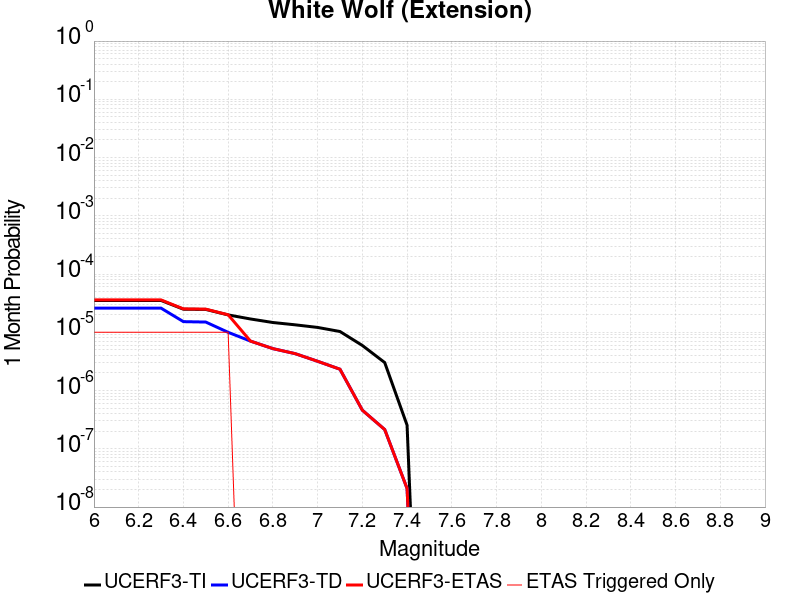 |  |  |

| Magnitude | 1 wk TI Prob | 1 wk TD Prob | 1 wk ETAS Prob | 1 wk ETAS/TD Gain | 1 wk ETAS Triggered Only | 1 mo TI Prob | 1 mo TD Prob | 1 mo ETAS Prob | 1 mo ETAS/TD Gain | 1 mo ETAS Triggered Only | 1 yr TI Prob | 1 yr TD Prob | 1 yr ETAS Prob | 1 yr ETAS/TD Gain | 1 yr ETAS Triggered Only | 10 yr TI Prob | 10 yr TD Prob | 10 yr ETAS Prob | 10 yr ETAS/TD Gain | 10 yr ETAS Triggered Only |
|-----|-----|-----|-----|-----|-----|-----|-----|-----|-----|-----|-----|-----|-----|-----|-----|-----|-----|-----|-----|-----|
| 6.0 | 8.222555E-6 | 6.066774E-6 | 1.6066713E-5 | 2.6483123 | 1.0E-5 | 3.5239045E-5 | 2.600024E-5 | 3.599998E-5 | 1.3846018 | 1.0E-5 | 4.289509E-4 | 3.1651356E-4 | 3.6649773E-4 | 1.1579211 | 5.0E-5 | 0.0042812387 | 0.0031612795 | 0.0032908686 | 1.0409926 | 1.3E-4 |
| 6.1 | 8.222555E-6 | 6.066774E-6 | 1.6066713E-5 | 2.6483123 | 1.0E-5 | 3.5239045E-5 | 2.600024E-5 | 3.599998E-5 | 1.3846018 | 1.0E-5 | 4.289509E-4 | 3.1651356E-4 | 3.6649773E-4 | 1.1579211 | 5.0E-5 | 0.0042812387 | 0.0031612795 | 0.0032908686 | 1.0409926 | 1.3E-4 |
| 6.2 | 8.222555E-6 | 6.066774E-6 | 1.6066713E-5 | 2.6483123 | 1.0E-5 | 3.5239045E-5 | 2.600024E-5 | 3.599998E-5 | 1.3846018 | 1.0E-5 | 4.289509E-4 | 3.1651356E-4 | 3.6649773E-4 | 1.1579211 | 5.0E-5 | 0.0042812387 | 0.0031612795 | 0.0032908686 | 1.0409926 | 1.3E-4 |
| 6.3 | 8.222555E-6 | 6.066774E-6 | 1.6066713E-5 | 2.6483123 | 1.0E-5 | 3.5239045E-5 | 2.600024E-5 | 3.599998E-5 | 1.3846018 | 1.0E-5 | 4.289509E-4 | 3.1651356E-4 | 3.6649773E-4 | 1.1579211 | 5.0E-5 | 0.0042812387 | 0.0031612795 | 0.0032908686 | 1.0409926 | 1.3E-4 |
| 6.4 | 5.821773E-6 | 3.5572245E-6 | 1.3557189E-5 | 3.8111703 | 1.0E-5 | 2.4950215E-5 | 1.5245166E-5 | 2.5245014E-5 | 1.6559356 | 1.0E-5 | 3.0372653E-4 | 1.8559519E-4 | 2.355859E-4 | 1.2693535 | 5.0E-5 | 0.0030331176 | 0.0018545102 | 0.0019343618 | 1.043058 | 8.0E-5 |
| 6.5 | 5.766023E-6 | 3.4991574E-6 | 1.3499122E-5 | 3.8578207 | 1.0E-5 | 2.4711293E-5 | 1.4996309E-5 | 2.499616E-5 | 1.6668208 | 1.0E-5 | 3.0081844E-4 | 1.8256587E-4 | 2.3255673E-4 | 1.2738237 | 5.0E-5 | 0.0030041158 | 0.001824267 | 0.0019041211 | 1.0437732 | 8.0E-5 |
| 6.6 | 4.643576E-6 | 2.3326468E-6 | 1.2332624E-5 | 5.286966 | 1.0E-5 | 1.9900888E-5 | 9.997021E-6 | 1.9996922E-5 | 2.000288 | 1.0E-5 | 2.4226638E-4 | 1.21707366E-4 | 1.5170372E-4 | 1.246463 | 3.0E-5 | 0.0024200242 | 0.0012164495 | 0.0012763765 | 1.0492638 | 6.0E-5 |
| 6.7 | 3.9529173E-6 | 1.6483561E-6 | 1.6483561E-6 | 1.0 | 0.0 | 1.6940963E-5 | 7.064365E-6 | 7.064365E-6 | 1.0 | 0.0 | 2.0623671E-4 | 8.600544E-5 | 9.600458E-5 | 1.1162617 | 1.0E-5 | 0.002060454 | 8.597401E-4 | 8.797229E-4 | 1.0232428 | 2.0E-5 |
| 6.8 | 3.4377522E-6 | 1.2245247E-6 | 1.2245247E-6 | 1.0 | 0.0 | 1.473314E-5 | 5.247953E-6 | 5.247953E-6 | 1.0 | 0.0 | 1.7936122E-4 | 6.389205E-5 | 7.389141E-5 | 1.156504 | 1.0E-5 | 0.0017921652 | 6.387459E-4 | 6.5873313E-4 | 1.0312914 | 2.0E-5 |
| 6.9 | 3.1367306E-6 | 1.0033741E-6 | 1.0033741E-6 | 1.0 | 0.0 | 1.3443062E-5 | 4.300168E-6 | 4.300168E-6 | 1.0 | 0.0 | 1.63657E-4 | 5.2353364E-5 | 5.2353364E-5 | 1.0 | 0.0 | 0.0016353652 | 5.2341796E-4 | 5.2341796E-4 | 1.0 | 0.0 |
| 7.0 | 2.8298145E-6 | 7.428598E-7 | 7.428598E-7 | 1.0 | 0.0 | 1.2127721E-5 | 3.1836814E-6 | 3.1836814E-6 | 1.0 | 0.0 | 1.47645E-4 | 3.876068E-5 | 3.876068E-5 | 1.0 | 0.0 | 0.0014754693 | 3.8754422E-4 | 3.8754422E-4 | 1.0 | 0.0 |
| 7.1 | 2.4091064E-6 | 5.422674E-7 | 5.422674E-7 | 1.0 | 0.0 | 1.03247E-5 | 2.3240013E-6 | 2.3240013E-6 | 1.0 | 0.0 | 1.2569598E-4 | 2.829439E-5 | 2.829439E-5 | 1.0 | 0.0 | 0.001256249 | 2.829119E-4 | 2.829119E-4 | 1.0 | 0.0 |
| 7.2 | 1.3875518E-6 | 1.0741592E-7 | 1.0741592E-7 | 1.0 | 0.0 | 5.9466374E-6 | 4.6035387E-7 | 4.6035387E-7 | 1.0 | 0.0 | 7.23979E-5 | 5.604795E-6 | 5.604795E-6 | 1.0 | 0.0 | 7.2374323E-4 | 5.6046654E-5 | 5.6046654E-5 | 1.0 | 0.0 |
| 7.3 | 7.056077E-7 | 5.001199E-8 | 5.001199E-8 | 1.0 | 0.0 | 3.0240296E-6 | 2.1433708E-7 | 2.1433708E-7 | 1.0 | 0.0 | 3.681694E-5 | 2.6095513E-6 | 2.6095513E-6 | 1.0 | 0.0 | 3.681084E-4 | 2.6095253E-5 | 2.6095253E-5 | 1.0 | 0.0 |
| 7.4 | 5.9334678E-8 | 4.864214E-9 | 4.864214E-9 | 1.0 | 0.0 | 2.5429145E-7 | 2.0846631E-8 | 2.0846631E-8 | 1.0 | 0.0 | 3.095994E-6 | 2.5380774E-7 | 2.5380774E-7 | 1.0 | 0.0 | 3.095951E-5 | 2.5380755E-6 | 2.5380755E-6 | 1.0 | 0.0 |

## Scodie Lineament
*[(top)](#table-of-contents)*

| 1 Week | 1 Month | 1 Year | 10 Year |
|-----|-----|-----|-----|
|  |  |  |  |

| Magnitude | 1 wk TI Prob | 1 wk TD Prob | 1 wk ETAS Prob | 1 wk ETAS/TD Gain | 1 wk ETAS Triggered Only | 1 mo TI Prob | 1 mo TD Prob | 1 mo ETAS Prob | 1 mo ETAS/TD Gain | 1 mo ETAS Triggered Only | 1 yr TI Prob | 1 yr TD Prob | 1 yr ETAS Prob | 1 yr ETAS/TD Gain | 1 yr ETAS Triggered Only | 10 yr TI Prob | 10 yr TD Prob | 10 yr ETAS Prob | 10 yr ETAS/TD Gain | 10 yr ETAS Triggered Only |
|-----|-----|-----|-----|-----|-----|-----|-----|-----|-----|-----|-----|-----|-----|-----|-----|-----|-----|-----|-----|-----|
| 6.0 | 3.2919327E-6 | 3.0133872E-6 | 3.0133872E-6 | 1.0 | 0.0 | 1.4108206E-5 | 1.2914471E-5 | 2.291434E-5 | 1.7743152 | 1.0E-5 | 1.7175387E-4 | 1.5722551E-4 | 2.272145E-4 | 1.4451504 | 7.0E-5 | 0.0017162118 | 0.0015714543 | 0.0017012501 | 1.082596 | 1.3E-4 |
| 6.1 | 1.8663811E-6 | 1.5490738E-6 | 1.5490738E-6 | 1.0 | 0.0 | 7.998751E-6 | 6.638874E-6 | 6.638874E-6 | 1.0 | 0.0 | 9.738045E-5 | 8.082579E-5 | 1.1082336E-4 | 1.3711387 | 3.0E-5 | 9.7337784E-4 | 8.0801273E-4 | 8.479804E-4 | 1.0494642 | 4.0E-5 |
| 6.2 | 1.8663811E-6 | 1.5490738E-6 | 1.5490738E-6 | 1.0 | 0.0 | 7.998751E-6 | 6.638874E-6 | 6.638874E-6 | 1.0 | 0.0 | 9.738045E-5 | 8.082579E-5 | 1.1082336E-4 | 1.3711387 | 3.0E-5 | 9.7337784E-4 | 8.0801273E-4 | 8.479804E-4 | 1.0494642 | 4.0E-5 |
| 6.3 | 1.8663811E-6 | 1.5490738E-6 | 1.5490738E-6 | 1.0 | 0.0 | 7.998751E-6 | 6.638874E-6 | 6.638874E-6 | 1.0 | 0.0 | 9.738045E-5 | 8.082579E-5 | 1.1082336E-4 | 1.3711387 | 3.0E-5 | 9.7337784E-4 | 8.0801273E-4 | 8.479804E-4 | 1.0494642 | 4.0E-5 |
| 6.4 | 1.8663811E-6 | 1.5490738E-6 | 1.5490738E-6 | 1.0 | 0.0 | 7.998751E-6 | 6.638874E-6 | 6.638874E-6 | 1.0 | 0.0 | 9.738045E-5 | 8.082579E-5 | 1.1082336E-4 | 1.3711387 | 3.0E-5 | 9.7337784E-4 | 8.0801273E-4 | 8.479804E-4 | 1.0494642 | 4.0E-5 |
| 6.5 | 1.8106311E-6 | 1.4910065E-6 | 1.4910065E-6 | 1.0 | 0.0 | 7.759824E-6 | 6.390015E-6 | 6.390015E-6 | 1.0 | 0.0 | 9.447177E-5 | 7.7796154E-5 | 1.0779382E-4 | 1.3855932 | 3.0E-5 | 9.4431615E-4 | 7.777379E-4 | 8.1770675E-4 | 1.0513912 | 4.0E-5 |
| 6.6 | 1.2414679E-6 | 8.9976623E-7 | 8.9976623E-7 | 1.0 | 0.0 | 5.320566E-6 | 3.8561357E-6 | 3.8561357E-6 | 1.0 | 0.0 | 6.477596E-5 | 4.694753E-5 | 5.694706E-5 | 1.2129937 | 1.0E-5 | 6.475708E-4 | 4.6938477E-4 | 4.893754E-4 | 1.042589 | 2.0E-5 |
| 6.7 | 1.1062215E-6 | 7.5943876E-7 | 7.5943876E-7 | 1.0 | 0.0 | 4.7409408E-6 | 3.2547339E-6 | 3.2547339E-6 | 1.0 | 0.0 | 5.7719422E-5 | 3.9625735E-5 | 4.9625338E-5 | 1.2523513 | 1.0E-5 | 5.770443E-4 | 3.9619367E-4 | 4.1618577E-4 | 1.0504603 | 2.0E-5 |
| 6.8 | 1.0006736E-6 | 6.500452E-7 | 6.500452E-7 | 1.0 | 0.0 | 4.288594E-6 | 2.7859055E-6 | 2.7859055E-6 | 1.0 | 0.0 | 5.221238E-5 | 3.391793E-5 | 4.3917593E-5 | 1.2948192 | 1.0E-5 | 5.220012E-4 | 3.3913364E-4 | 3.5912686E-4 | 1.0589538 | 2.0E-5 |
| 6.9 | 9.167364E-7 | 5.631664E-7 | 5.631664E-7 | 1.0 | 0.0 | 3.9288643E-6 | 2.4135684E-6 | 2.4135684E-6 | 1.0 | 0.0 | 4.7832873E-5 | 2.9384857E-5 | 2.9384857E-5 | 1.0 | 0.0 | 4.782258E-4 | 2.938154E-4 | 2.938154E-4 | 1.0 | 0.0 |
| 7.0 | 7.6987664E-7 | 4.113395E-7 | 4.113395E-7 | 1.0 | 0.0 | 3.2994672E-6 | 1.7628826E-6 | 1.7628826E-6 | 1.0 | 0.0 | 4.0170275E-5 | 2.1462924E-5 | 2.1462924E-5 | 1.0 | 0.0 | 4.0163012E-4 | 2.1461236E-4 | 2.1461236E-4 | 1.0 | 0.0 |
| 7.1 | 7.1038727E-7 | 3.521151E-7 | 3.521151E-7 | 1.0 | 0.0 | 3.0445133E-6 | 1.5090641E-6 | 1.5090641E-6 | 1.0 | 0.0 | 3.706632E-5 | 1.8372735E-5 | 1.8372735E-5 | 1.0 | 0.0 | 3.7060137E-4 | 1.8371566E-4 | 1.8371566E-4 | 1.0 | 0.0 |
| 7.2 | 2.0799602E-7 | 3.118087E-8 | 3.118087E-8 | 1.0 | 0.0 | 8.914113E-7 | 1.336323E-7 | 1.336323E-7 | 1.0 | 0.0 | 1.0852878E-5 | 1.6269721E-6 | 1.6269721E-6 | 1.0 | 0.0 | 1.08523476E-4 | 1.6269609E-5 | 1.6269609E-5 | 1.0 | 0.0 |
| 7.3 | 1.5048182E-7 | 1.5940762E-8 | 1.5940762E-8 | 1.0 | 0.0 | 6.449219E-7 | 6.831755E-8 | 6.831755E-8 | 1.0 | 0.0 | 7.851896E-6 | 8.317658E-7 | 8.317658E-7 | 1.0 | 0.0 | 7.851618E-5 | 8.31763E-6 | 8.31763E-6 | 1.0 | 0.0 |
| 7.4 | 5.9334678E-8 | 4.864214E-9 | 4.864214E-9 | 1.0 | 0.0 | 2.5429145E-7 | 2.0846631E-8 | 2.0846631E-8 | 1.0 | 0.0 | 3.095994E-6 | 2.5380774E-7 | 2.5380774E-7 | 1.0 | 0.0 | 3.095951E-5 | 2.5380755E-6 | 2.5380755E-6 | 1.0 | 0.0 |

## Red Pass
*[(top)](#table-of-contents)*

| 1 Week | 1 Month | 1 Year | 10 Year |
|-----|-----|-----|-----|
|  |  |  |  |

| Magnitude | 1 wk TI Prob | 1 wk TD Prob | 1 wk ETAS Prob | 1 wk ETAS/TD Gain | 1 wk ETAS Triggered Only | 1 mo TI Prob | 1 mo TD Prob | 1 mo ETAS Prob | 1 mo ETAS/TD Gain | 1 mo ETAS Triggered Only | 1 yr TI Prob | 1 yr TD Prob | 1 yr ETAS Prob | 1 yr ETAS/TD Gain | 1 yr ETAS Triggered Only | 10 yr TI Prob | 10 yr TD Prob | 10 yr ETAS Prob | 10 yr ETAS/TD Gain | 10 yr ETAS Triggered Only |
|-----|-----|-----|-----|-----|-----|-----|-----|-----|-----|-----|-----|-----|-----|-----|-----|-----|-----|-----|-----|-----|
| 6.0 | 8.258278E-6 | 8.551426E-6 | 8.551426E-6 | 1.0 | 0.0 | 3.539214E-5 | 3.6648555E-5 | 3.6648555E-5 | 1.0 | 0.0 | 4.308141E-4 | 4.4612266E-4 | 4.7610927E-4 | 1.067216 | 3.0E-5 | 0.0042997985 | 0.0044540283 | 0.0045834496 | 1.029057 | 1.3E-4 |
| 6.1 | 3.649988E-6 | 3.7753848E-6 | 3.7753848E-6 | 1.0 | 0.0 | 1.5642712E-5 | 1.6180147E-5 | 1.6180147E-5 | 1.0 | 0.0 | 1.9043336E-4 | 1.9698025E-4 | 2.2697434E-4 | 1.1522695 | 3.0E-5 | 0.0019027026 | 0.0019685237 | 0.0020583468 | 1.0456295 | 9.0E-5 |
| 6.2 | 3.649988E-6 | 3.7753848E-6 | 3.7753848E-6 | 1.0 | 0.0 | 1.5642712E-5 | 1.6180147E-5 | 1.6180147E-5 | 1.0 | 0.0 | 1.9043336E-4 | 1.9698025E-4 | 2.2697434E-4 | 1.1522695 | 3.0E-5 | 0.0019027026 | 0.0019685237 | 0.0020583468 | 1.0456295 | 9.0E-5 |
| 6.3 | 1.3924937E-6 | 1.4411434E-6 | 1.4411434E-6 | 1.0 | 0.0 | 5.9678164E-6 | 6.1763217E-6 | 6.1763217E-6 | 1.0 | 0.0 | 7.265574E-5 | 7.519554E-5 | 8.5194784E-5 | 1.1329767 | 1.0E-5 | 7.263199E-4 | 7.518397E-4 | 7.9180964E-4 | 1.0531628 | 4.0E-5 |
| 6.4 | 1.3924937E-6 | 1.4411434E-6 | 1.4411434E-6 | 1.0 | 0.0 | 5.9678164E-6 | 6.1763217E-6 | 6.1763217E-6 | 1.0 | 0.0 | 7.265574E-5 | 7.519554E-5 | 8.5194784E-5 | 1.1329767 | 1.0E-5 | 7.263199E-4 | 7.518397E-4 | 7.9180964E-4 | 1.0531628 | 4.0E-5 |
| 6.5 | 9.876812E-7 | 1.0222102E-6 | 1.0222102E-6 | 1.0 | 0.0 | 4.2329125E-6 | 4.3809005E-6 | 4.3809005E-6 | 1.0 | 0.0 | 5.153449E-5 | 5.3337466E-5 | 6.3336935E-5 | 1.1874754 | 1.0E-5 | 5.1522546E-4 | 5.3337467E-4 | 5.6335866E-4 | 1.0562156 | 3.0E-5 |

## Lake Isabella (Seismicity)
*[(top)](#table-of-contents)*

| 1 Week | 1 Month | 1 Year | 10 Year |
|-----|-----|-----|-----|
|  |  |  |  |

| Magnitude | 1 wk TI Prob | 1 wk TD Prob | 1 wk ETAS Prob | 1 wk ETAS/TD Gain | 1 wk ETAS Triggered Only | 1 mo TI Prob | 1 mo TD Prob | 1 mo ETAS Prob | 1 mo ETAS/TD Gain | 1 mo ETAS Triggered Only | 1 yr TI Prob | 1 yr TD Prob | 1 yr ETAS Prob | 1 yr ETAS/TD Gain | 1 yr ETAS Triggered Only | 10 yr TI Prob | 10 yr TD Prob | 10 yr ETAS Prob | 10 yr ETAS/TD Gain | 10 yr ETAS Triggered Only |
|-----|-----|-----|-----|-----|-----|-----|-----|-----|-----|-----|-----|-----|-----|-----|-----|-----|-----|-----|-----|-----|
| 6.0 | 9.431637E-6 | 9.7418215E-6 | 9.7418215E-6 | 1.0 | 0.0 | 4.0420677E-5 | 4.175007E-5 | 5.1749652E-5 | 1.2395105 | 1.0E-5 | 4.920106E-4 | 5.082016E-4 | 5.6817115E-4 | 1.1180034 | 6.0E-5 | 0.004909227 | 0.005071687 | 0.0052010277 | 1.0255024 | 1.3E-4 |
| 6.1 | 9.431637E-6 | 9.7418215E-6 | 9.7418215E-6 | 1.0 | 0.0 | 4.0420677E-5 | 4.175007E-5 | 5.1749652E-5 | 1.2395105 | 1.0E-5 | 4.920106E-4 | 5.082016E-4 | 5.6817115E-4 | 1.1180034 | 6.0E-5 | 0.004909227 | 0.005071687 | 0.0052010277 | 1.0255024 | 1.3E-4 |
| 6.2 | 9.431637E-6 | 9.7418215E-6 | 9.7418215E-6 | 1.0 | 0.0 | 4.0420677E-5 | 4.175007E-5 | 5.1749652E-5 | 1.2395105 | 1.0E-5 | 4.920106E-4 | 5.082016E-4 | 5.6817115E-4 | 1.1180034 | 6.0E-5 | 0.004909227 | 0.005071687 | 0.0052010277 | 1.0255024 | 1.3E-4 |
| 6.3 | 9.431637E-6 | 9.7418215E-6 | 9.7418215E-6 | 1.0 | 0.0 | 4.0420677E-5 | 4.175007E-5 | 5.1749652E-5 | 1.2395105 | 1.0E-5 | 4.920106E-4 | 5.082016E-4 | 5.6817115E-4 | 1.1180034 | 6.0E-5 | 0.004909227 | 0.005071687 | 0.0052010277 | 1.0255024 | 1.3E-4 |
| 6.4 | 5.144063E-6 | 5.3001613E-6 | 5.3001613E-6 | 1.0 | 0.0 | 2.2045799E-5 | 2.27148E-5 | 3.271457E-5 | 1.4402316 | 1.0E-5 | 2.6837454E-4 | 2.7652105E-4 | 2.965155E-4 | 1.0723072 | 2.0E-5 | 0.0026805066 | 0.0027621102 | 0.0028219444 | 1.0216625 | 6.0E-5 |
| 6.5 | 5.144063E-6 | 5.3001613E-6 | 5.3001613E-6 | 1.0 | 0.0 | 2.2045799E-5 | 2.27148E-5 | 3.271457E-5 | 1.4402316 | 1.0E-5 | 2.6837454E-4 | 2.7652105E-4 | 2.965155E-4 | 1.0723072 | 2.0E-5 | 0.0026805066 | 0.0027621102 | 0.0028219444 | 1.0216625 | 6.0E-5 |
| 6.6 | 3.4009804E-6 | 3.4988395E-6 | 3.4988395E-6 | 1.0 | 0.0 | 1.4575549E-5 | 1.4994949E-5 | 2.4994799E-5 | 1.6668812 | 1.0E-5 | 1.7744285E-4 | 1.8254982E-4 | 2.0254617E-4 | 1.1095392 | 2.0E-5 | 0.0017730123 | 0.0018241564 | 0.001884047 | 1.0328319 | 6.0E-5 |
| 6.7 | 3.3880428E-6 | 3.485706E-6 | 3.485706E-6 | 1.0 | 0.0 | 1.4520103E-5 | 1.4938664E-5 | 2.4938514E-5 | 1.6693939 | 1.0E-5 | 1.767679E-4 | 1.8186466E-4 | 2.0186102E-4 | 1.1099519 | 2.0E-5 | 0.0017662736 | 0.0018173159 | 0.001877207 | 1.0329558 | 6.0E-5 |
| 6.8 | 2.6582E-6 | 2.7337414E-6 | 2.7337414E-6 | 1.0 | 0.0 | 1.1392236E-5 | 1.171599E-5 | 1.171599E-5 | 1.0 | 0.0 | 1.3869164E-4 | 1.4263418E-4 | 1.4263418E-4 | 1.0 | 0.0 | 0.0013860512 | 0.0014255584 | 0.0014455299 | 1.0140096 | 2.0E-5 |
| 6.9 | 2.406011E-6 | 2.474366E-6 | 2.474366E-6 | 1.0 | 0.0 | 1.0311434E-5 | 1.0604391E-5 | 1.0604391E-5 | 1.0 | 0.0 | 1.2553448E-4 | 1.2910213E-4 | 1.2910213E-4 | 1.0 | 0.0 | 0.0012546359 | 0.0012904009 | 0.001300388 | 1.0077395 | 1.0E-5 |
| 7.0 | 1.6953097E-6 | 1.7429631E-6 | 1.7429631E-6 | 1.0 | 0.0 | 7.265593E-6 | 7.469827E-6 | 7.469827E-6 | 1.0 | 0.0 | 8.8455E-5 | 9.094239E-5 | 9.094239E-5 | 1.0 | 0.0 | 8.84198E-4 | 9.0915454E-4 | 9.0915454E-4 | 1.0 | 0.0 |
| 7.1 | 3.5013824E-7 | 3.5715203E-7 | 3.5715203E-7 | 1.0 | 0.0 | 1.5005916E-6 | 1.5306507E-6 | 1.5306507E-6 | 1.0 | 0.0 | 1.826955E-5 | 1.8635516E-5 | 1.8635516E-5 | 1.0 | 0.0 | 1.8268047E-4 | 1.8633978E-4 | 1.8633978E-4 | 1.0 | 0.0 |
| 7.2 | 2.2321095E-7 | 2.2750805E-7 | 2.2750805E-7 | 1.0 | 0.0 | 9.56618E-7 | 9.750341E-7 | 9.750341E-7 | 1.0 | 0.0 | 1.1646762E-5 | 1.1870978E-5 | 1.1870978E-5 | 1.0 | 0.0 | 1.1646151E-4 | 1.1870354E-4 | 1.1870354E-4 | 1.0 | 0.0 |
| 7.3 | 1.5760406E-7 | 1.6061085E-7 | 1.6061085E-7 | 1.0 | 0.0 | 6.7544585E-7 | 6.88332E-7 | 6.88332E-7 | 1.0 | 0.0 | 8.223522E-6 | 8.380411E-6 | 8.380411E-6 | 1.0 | 0.0 | 8.2232174E-5 | 8.380101E-5 | 8.380101E-5 | 1.0 | 0.0 |
| 7.4 | 1.1216497E-7 | 1.14318226E-7 | 1.14318226E-7 | 1.0 | 0.0 | 4.8070694E-7 | 4.899352E-7 | 4.899352E-7 | 1.0 | 0.0 | 5.852591E-6 | 5.9649446E-6 | 5.9649446E-6 | 1.0 | 0.0 | 5.8524372E-5 | 5.964789E-5 | 5.964789E-5 | 1.0 | 0.0 |
| 7.5 | 4.885185E-8 | 4.9788245E-8 | 4.9788245E-8 | 1.0 | 0.0 | 2.0936506E-7 | 2.1337817E-7 | 2.1337817E-7 | 1.0 | 0.0 | 2.5490165E-6 | 2.5978763E-6 | 2.5978763E-6 | 1.0 | 0.0 | 2.5489873E-5 | 2.5978477E-5 | 2.5978477E-5 | 1.0 | 0.0 |
| 7.6 | 1.504641E-9 | 1.5318049E-9 | 1.5318049E-9 | 1.0 | 0.0 | 6.4484613E-9 | 6.5648784E-9 | 6.5648784E-9 | 1.0 | 0.0 | 7.851001E-8 | 7.9927396E-8 | 7.9927396E-8 | 1.0 | 0.0 | 7.8509987E-7 | 7.9927395E-7 | 7.9927395E-7 | 1.0 | 0.0 |

## Mission Creek
*[(top)](#table-of-contents)*

| 1 Week | 1 Month | 1 Year | 10 Year |
|-----|-----|-----|-----|
|  |  |  |  |

| Magnitude | 1 wk TI Prob | 1 wk TD Prob | 1 wk ETAS Prob | 1 wk ETAS/TD Gain | 1 wk ETAS Triggered Only | 1 mo TI Prob | 1 mo TD Prob | 1 mo ETAS Prob | 1 mo ETAS/TD Gain | 1 mo ETAS Triggered Only | 1 yr TI Prob | 1 yr TD Prob | 1 yr ETAS Prob | 1 yr ETAS/TD Gain | 1 yr ETAS Triggered Only | 10 yr TI Prob | 10 yr TD Prob | 10 yr ETAS Prob | 10 yr ETAS/TD Gain | 10 yr ETAS Triggered Only |
|-----|-----|-----|-----|-----|-----|-----|-----|-----|-----|-----|-----|-----|-----|-----|-----|-----|-----|-----|-----|-----|
| 6.0 | 1.1549387E-5 | 1.6332237E-5 | 3.633191E-5 | 2.2245522 | 2.0E-5 | 4.9496433E-5 | 6.9993504E-5 | 1.099907E-4 | 1.5714417 | 4.0E-5 | 6.0245243E-4 | 8.5185276E-4 | 9.417761E-4 | 1.1055621 | 9.0E-5 | 0.006008218 | 0.0085145235 | 0.008633502 | 1.0139736 | 1.2E-4 |
| 6.1 | 1.1549387E-5 | 1.6332237E-5 | 3.633191E-5 | 2.2245522 | 2.0E-5 | 4.9496433E-5 | 6.9993504E-5 | 1.099907E-4 | 1.5714417 | 4.0E-5 | 6.0245243E-4 | 8.5185276E-4 | 9.417761E-4 | 1.1055621 | 9.0E-5 | 0.006008218 | 0.0085145235 | 0.008633502 | 1.0139736 | 1.2E-4 |
| 6.2 | 1.1549387E-5 | 1.6332237E-5 | 3.633191E-5 | 2.2245522 | 2.0E-5 | 4.9496433E-5 | 6.9993504E-5 | 1.099907E-4 | 1.5714417 | 4.0E-5 | 6.0245243E-4 | 8.5185276E-4 | 9.417761E-4 | 1.1055621 | 9.0E-5 | 0.006008218 | 0.0085145235 | 0.008633502 | 1.0139736 | 1.2E-4 |
| 6.3 | 1.1549387E-5 | 1.6332237E-5 | 3.633191E-5 | 2.2245522 | 2.0E-5 | 4.9496433E-5 | 6.9993504E-5 | 1.099907E-4 | 1.5714417 | 4.0E-5 | 6.0245243E-4 | 8.5185276E-4 | 9.417761E-4 | 1.1055621 | 9.0E-5 | 0.006008218 | 0.0085145235 | 0.008633502 | 1.0139736 | 1.2E-4 |
| 6.4 | 1.1549387E-5 | 1.6332237E-5 | 3.633191E-5 | 2.2245522 | 2.0E-5 | 4.9496433E-5 | 6.9993504E-5 | 1.099907E-4 | 1.5714417 | 4.0E-5 | 6.0245243E-4 | 8.5185276E-4 | 9.417761E-4 | 1.1055621 | 9.0E-5 | 0.006008218 | 0.0085145235 | 0.008633502 | 1.0139736 | 1.2E-4 |
| 6.5 | 1.1549387E-5 | 1.6332237E-5 | 3.633191E-5 | 2.2245522 | 2.0E-5 | 4.9496433E-5 | 6.9993504E-5 | 1.099907E-4 | 1.5714417 | 4.0E-5 | 6.0245243E-4 | 8.5185276E-4 | 9.417761E-4 | 1.1055621 | 9.0E-5 | 0.006008218 | 0.0085145235 | 0.008633502 | 1.0139736 | 1.2E-4 |
| 6.6 | 9.202681E-6 | 1.385544E-5 | 3.385516E-5 | 2.4434564 | 2.0E-5 | 3.9439463E-5 | 5.9379156E-5 | 9.937678E-5 | 1.6735971 | 4.0E-5 | 4.800697E-4 | 7.2271045E-4 | 8.126454E-4 | 1.1244411 | 9.0E-5 | 0.004790339 | 0.0072316756 | 0.0073508075 | 1.0164737 | 1.2E-4 |
| 6.7 | 9.019164E-6 | 1.3661103E-5 | 3.366083E-5 | 2.4639907 | 2.0E-5 | 3.8652986E-5 | 5.854632E-5 | 9.854398E-5 | 1.6831797 | 4.0E-5 | 4.7049852E-4 | 7.1257737E-4 | 8.025132E-4 | 1.1262121 | 9.0E-5 | 0.004695036 | 0.0071309973 | 0.0072501414 | 1.0167079 | 1.2E-4 |
| 6.8 | 8.673558E-6 | 1.3283194E-5 | 3.328293E-5 | 2.505642 | 2.0E-5 | 3.717186E-5 | 5.692678E-5 | 9.69245E-5 | 1.7026169 | 4.0E-5 | 4.524734E-4 | 6.92872E-4 | 7.828096E-4 | 1.1298041 | 9.0E-5 | 0.0045155324 | 0.006935176 | 0.007054344 | 1.0171831 | 1.2E-4 |
| 6.9 | 7.002255E-6 | 1.1487351E-5 | 3.148712E-5 | 2.7410254 | 2.0E-5 | 3.000932E-5 | 4.9230614E-5 | 8.922865E-5 | 1.8124626 | 4.0E-5 | 3.653022E-4 | 5.9922476E-4 | 6.8917085E-4 | 1.150104 | 9.0E-5 | 0.0036470229 | 0.0060039656 | 0.006123245 | 1.0198668 | 1.2E-4 |
| 7.0 | 5.84644E-6 | 9.68415E-6 | 2.9683957E-5 | 3.06521 | 2.0E-5 | 2.5055931E-5 | 4.150287E-5 | 8.150121E-5 | 1.9637488 | 4.0E-5 | 3.0501327E-4 | 5.051848E-4 | 5.951394E-4 | 1.1780626 | 9.0E-5 | 0.0030459496 | 0.005068033 | 0.005187425 | 1.0235578 | 1.2E-4 |
| 7.1 | 5.54703E-6 | 9.338593E-6 | 2.9338407E-5 | 3.1416302 | 2.0E-5 | 2.377277E-5 | 4.0021954E-5 | 8.0020356E-5 | 1.9994115 | 4.0E-5 | 2.8939504E-4 | 4.8716282E-4 | 5.7711895E-4 | 1.1846532 | 9.0E-5 | 0.0028901845 | 0.0048886104 | 0.0050080237 | 1.0244268 | 1.2E-4 |
| 7.2 | 4.384709E-6 | 7.690283E-6 | 2.769013E-5 | 3.6006646 | 2.0E-5 | 1.8791474E-5 | 3.295796E-5 | 7.295664E-5 | 2.2136273 | 4.0E-5 | 2.2876218E-4 | 4.0119293E-4 | 4.911568E-4 | 1.224241 | 9.0E-5 | 0.0022852682 | 0.0040323576 | 0.0041518738 | 1.0296392 | 1.2E-4 |
| 7.3 | 3.7888456E-6 | 6.9239895E-6 | 2.6923852E-5 | 3.888488 | 2.0E-5 | 1.623781E-5 | 2.9673924E-5 | 6.967274E-5 | 2.347945 | 4.0E-5 | 1.9767738E-4 | 3.6122347E-4 | 4.5119095E-4 | 1.2490633 | 9.0E-5 | 0.0019750162 | 0.0036340314 | 0.0037535953 | 1.0329012 | 1.2E-4 |
| 7.4 | 2.1982462E-6 | 5.032061E-6 | 2.503196E-5 | 4.9744945 | 2.0E-5 | 9.421021E-6 | 2.1565798E-5 | 6.156493E-5 | 2.8547487 | 4.0E-5 | 1.1469489E-4 | 2.6253215E-4 | 3.525085E-4 | 1.3427252 | 9.0E-5 | 0.0011463572 | 0.00264967 | 0.002769352 | 1.0451686 | 1.2E-4 |
| 7.5 | 2.051923E-6 | 4.623061E-6 | 2.4622968E-5 | 5.3261175 | 2.0E-5 | 8.793926E-6 | 1.9812971E-5 | 5.9812177E-5 | 3.0188396 | 4.0E-5 | 1.0706078E-4 | 2.4119635E-4 | 3.3117464E-4 | 1.37305 | 9.0E-5 | 0.0010700922 | 0.0024373732 | 0.0025570807 | 1.0491133 | 1.2E-4 |
| 7.6 | 1.8733427E-6 | 4.131132E-6 | 2.413105E-5 | 5.8412685 | 2.0E-5 | 8.028587E-6 | 1.7704731E-5 | 5.7704023E-5 | 3.2592432 | 4.0E-5 | 9.774366E-5 | 2.1553386E-4 | 3.0551446E-4 | 1.4174778 | 9.0E-5 | 9.770069E-4 | 0.0021818897 | 0.0023016278 | 1.0548782 | 1.2E-4 |
| 7.7 | 1.8411953E-6 | 4.0507525E-6 | 2.4050672E-5 | 5.937334 | 2.0E-5 | 7.890813E-6 | 1.7360253E-5 | 5.7359557E-5 | 3.3040738 | 4.0E-5 | 9.606641E-5 | 2.1134067E-4 | 3.0132165E-4 | 1.4257628 | 9.0E-5 | 9.6024893E-4 | 0.0021401562 | 0.0022598994 | 1.0559506 | 1.2E-4 |
| 7.8 | 1.7194251E-6 | 3.7175898E-6 | 2.3717515E-5 | 6.3798094 | 2.0E-5 | 7.368944E-6 | 1.5932432E-5 | 5.5931792E-5 | 3.5105624 | 4.0E-5 | 8.97132E-5 | 1.9396016E-4 | 2.839427E-4 | 1.4639229 | 9.0E-5 | 8.967699E-4 | 0.0019658697 | 0.0020856338 | 1.0609217 | 1.2E-4 |
| 7.9 | 1.4035052E-6 | 2.9559305E-6 | 2.2955872E-5 | 7.766039 | 2.0E-5 | 6.0150082E-6 | 1.2668213E-5 | 5.2667707E-5 | 4.1574693 | 4.0E-5 | 7.3230265E-5 | 1.5422463E-4 | 2.4421074E-4 | 1.5834744 | 9.0E-5 | 7.3206134E-4 | 0.001565874 | 0.0016856861 | 1.0765145 | 1.2E-4 |
| 8.0 | 3.9318823E-7 | 5.5421293E-7 | 1.0554208E-5 | 19.043596 | 1.0E-5 | 1.6850913E-6 | 2.3751961E-6 | 1.2375172E-5 | 5.210169 | 1.0E-5 | 2.0515794E-5 | 2.8917633E-5 | 4.8917056E-5 | 1.6915995 | 2.0E-5 | 2.0513899E-4 | 2.9980825E-4 | 3.1980226E-4 | 1.0666893 | 2.0E-5 |
| 8.1 | 1.596793E-7 | 1.1425073E-7 | 1.1425073E-7 | 1.0 | 0.0 | 6.8433974E-7 | 4.896459E-7 | 4.896459E-7 | 1.0 | 0.0 | 8.331805E-6 | 5.961423E-6 | 5.961423E-6 | 1.0 | 0.0 | 8.331492E-5 | 6.574893E-5 | 6.574893E-5 | 1.0 | 0.0 |
| 8.2 | 4.9003038E-8 | 2.5556407E-8 | 2.5556407E-8 | 1.0 | 0.0 | 2.10013E-7 | 1.09527456E-7 | 1.09527456E-7 | 1.0 | 0.0 | 2.5569052E-6 | 1.333496E-6 | 1.333496E-6 | 1.0 | 0.0 | 2.556876E-5 | 1.5019927E-5 | 1.5019927E-5 | 1.0 | 0.0 |

## Mission Ridge-Arroyo Parida-Santa Ana
*[(top)](#table-of-contents)*

| 1 Week | 1 Month | 1 Year | 10 Year |
|-----|-----|-----|-----|
|  |  |  |  |

| Magnitude | 1 wk TI Prob | 1 wk TD Prob | 1 wk ETAS Prob | 1 wk ETAS/TD Gain | 1 wk ETAS Triggered Only | 1 mo TI Prob | 1 mo TD Prob | 1 mo ETAS Prob | 1 mo ETAS/TD Gain | 1 mo ETAS Triggered Only | 1 yr TI Prob | 1 yr TD Prob | 1 yr ETAS Prob | 1 yr ETAS/TD Gain | 1 yr ETAS Triggered Only | 10 yr TI Prob | 10 yr TD Prob | 10 yr ETAS Prob | 10 yr ETAS/TD Gain | 10 yr ETAS Triggered Only |
|-----|-----|-----|-----|-----|-----|-----|-----|-----|-----|-----|-----|-----|-----|-----|-----|-----|-----|-----|-----|-----|
| 6.0 | 4.169034E-5 | 4.7142308E-5 | 4.7142308E-5 | 1.0 | 0.0 | 1.7866064E-4 | 2.0202712E-4 | 2.0202712E-4 | 1.0 | 0.0 | 0.0021730233 | 0.0024577351 | 0.002477686 | 1.0081176 | 2.0E-5 | 0.021518968 | 0.024387209 | 0.024475014 | 1.0036005 | 9.0E-5 |
| 6.1 | 1.73813E-5 | 1.6855429E-5 | 1.6855429E-5 | 1.0 | 0.0 | 7.4489166E-5 | 7.223561E-5 | 7.223561E-5 | 1.0 | 0.0 | 9.065282E-4 | 8.791244E-4 | 8.791244E-4 | 1.0 | 0.0 | 0.009028391 | 0.008757493 | 0.0087773185 | 1.0022638 | 2.0E-5 |
| 6.2 | 1.4622182E-5 | 1.36742265E-5 | 1.36742265E-5 | 1.0 | 0.0 | 6.2664985E-5 | 5.8602534E-5 | 5.8602534E-5 | 1.0 | 0.0 | 7.6267915E-4 | 7.132562E-4 | 7.132562E-4 | 1.0 | 0.0 | 0.007600669 | 0.0071099964 | 0.0071199257 | 1.0013964 | 1.0E-5 |
| 6.3 | 1.3552434E-5 | 1.2483065E-5 | 1.2483065E-5 | 1.0 | 0.0 | 5.8080568E-5 | 5.3497773E-5 | 5.3497773E-5 | 1.0 | 0.0 | 7.069015E-4 | 6.511439E-4 | 6.511439E-4 | 1.0 | 0.0 | 0.00704657 | 0.006492607 | 0.006502542 | 1.0015302 | 1.0E-5 |
| 6.4 | 1.30977305E-5 | 1.19799915E-5 | 1.19799915E-5 | 1.0 | 0.0 | 5.613192E-5 | 5.1341827E-5 | 5.1341827E-5 | 1.0 | 0.0 | 6.831918E-4 | 6.249105E-4 | 6.249105E-4 | 1.0 | 0.0 | 0.006810953 | 0.0062317615 | 0.006241699 | 1.0015947 | 1.0E-5 |
| 6.5 | 1.225205E-5 | 1.1049589E-5 | 1.1049589E-5 | 1.0 | 0.0 | 5.2507727E-5 | 4.7354537E-5 | 4.7354537E-5 | 1.0 | 0.0 | 6.3909404E-4 | 5.763917E-4 | 5.763917E-4 | 1.0 | 0.0 | 0.006372592 | 0.005749161 | 0.005759103 | 1.0017294 | 1.0E-5 |
| 6.6 | 1.1352241E-5 | 1.0064272E-5 | 1.0064272E-5 | 1.0 | 0.0 | 4.8651553E-5 | 4.313189E-5 | 4.313189E-5 | 1.0 | 0.0 | 5.921717E-4 | 5.250063E-4 | 5.250063E-4 | 1.0 | 0.0 | 0.0059059616 | 0.0052377903 | 0.0052477377 | 1.0018992 | 1.0E-5 |
| 6.7 | 1.0864116E-5 | 9.517728E-6 | 9.517728E-6 | 1.0 | 0.0 | 4.6559664E-5 | 4.078964E-5 | 4.078964E-5 | 1.0 | 0.0 | 5.667165E-4 | 4.965027E-4 | 4.965027E-4 | 1.0 | 0.0 | 0.005652734 | 0.0049540517 | 0.004964002 | 1.0020086 | 1.0E-5 |
| 6.8 | 1.0666365E-5 | 9.300469E-6 | 9.300469E-6 | 1.0 | 0.0 | 4.571219E-5 | 3.9858554E-5 | 3.9858554E-5 | 1.0 | 0.0 | 5.564038E-4 | 4.8517185E-4 | 4.8517185E-4 | 1.0 | 0.0 | 0.005550127 | 0.004841242 | 0.0048511936 | 1.0020556 | 1.0E-5 |
| 6.9 | 1.0038665E-5 | 8.592688E-6 | 8.592688E-6 | 1.0 | 0.0 | 4.302214E-5 | 3.6825295E-5 | 3.6825295E-5 | 1.0 | 0.0 | 5.236687E-4 | 4.4825752E-4 | 4.4825752E-4 | 1.0 | 0.0 | 0.005224364 | 0.0044736275 | 0.004483583 | 1.0022253 | 1.0E-5 |
| 7.0 | 9.5379955E-6 | 8.025673E-6 | 8.025673E-6 | 1.0 | 0.0 | 4.0876483E-5 | 3.43953E-5 | 3.43953E-5 | 1.0 | 0.0 | 4.975576E-4 | 4.18684E-4 | 4.18684E-4 | 1.0 | 0.0 | 0.00496445 | 0.004179035 | 0.004188993 | 1.0023829 | 1.0E-5 |
| 7.1 | 9.207389E-6 | 7.652947E-6 | 7.652947E-6 | 1.0 | 0.0 | 3.945964E-5 | 3.279794E-5 | 3.279794E-5 | 1.0 | 0.0 | 4.803152E-4 | 3.9924344E-4 | 3.9924344E-4 | 1.0 | 0.0 | 0.004792784 | 0.0039853416 | 0.0039953017 | 1.0024992 | 1.0E-5 |
| 7.2 | 7.638091E-6 | 5.9315425E-6 | 5.9315425E-6 | 1.0 | 0.0 | 3.2734264E-5 | 2.542065E-5 | 2.542065E-5 | 1.0 | 0.0 | 3.984668E-4 | 3.0945276E-4 | 3.0945276E-4 | 1.0 | 0.0 | 0.0039775306 | 0.0030901586 | 0.0030901586 | 1.0 | 0.0 |
| 7.3 | 7.2500147E-6 | 5.596552E-6 | 5.596552E-6 | 1.0 | 0.0 | 3.1071122E-5 | 2.3985005E-5 | 2.3985005E-5 | 1.0 | 0.0 | 3.7822526E-4 | 2.919786E-4 | 2.919786E-4 | 1.0 | 0.0 | 0.0037758215 | 0.0029158886 | 0.0029158886 | 1.0 | 0.0 |
| 7.4 | 6.3899715E-6 | 4.9188443E-6 | 4.9188443E-6 | 1.0 | 0.0 | 2.7385306E-5 | 2.1080592E-5 | 2.1080592E-5 | 1.0 | 0.0 | 3.3336508E-4 | 2.5662617E-4 | 2.5662617E-4 | 1.0 | 0.0 | 0.0033286542 | 0.002563226 | 0.002563226 | 1.0 | 0.0 |
| 7.5 | 5.379025E-6 | 4.0841383E-6 | 4.0841383E-6 | 1.0 | 0.0 | 2.305276E-5 | 1.7503333E-5 | 1.7503333E-5 | 1.0 | 0.0 | 2.806312E-4 | 2.1308236E-4 | 2.1308236E-4 | 1.0 | 0.0 | 0.0028027708 | 0.0021287918 | 0.0021287918 | 1.0 | 0.0 |
| 7.6 | 4.1270696E-6 | 3.0885694E-6 | 3.0885694E-6 | 1.0 | 0.0 | 1.768732E-5 | 1.32366595E-5 | 1.32366595E-5 | 1.0 | 0.0 | 2.1532185E-4 | 1.6114449E-4 | 1.6114449E-4 | 1.0 | 0.0 | 0.0021511333 | 0.0016102846 | 0.0016102846 | 1.0 | 0.0 |
| 7.7 | 2.5406805E-6 | 1.8283392E-6 | 1.8283392E-6 | 1.0 | 0.0 | 1.0888585E-5 | 7.835716E-6 | 7.835716E-6 | 1.0 | 0.0 | 1.3256045E-4 | 9.5395735E-5 | 9.5395735E-5 | 1.0 | 0.0 | 0.0013248142 | 9.53554E-4 | 9.53554E-4 | 1.0 | 0.0 |
| 7.8 | 4.8608285E-7 | 3.5100481E-7 | 3.5100481E-7 | 1.0 | 0.0 | 2.0832106E-6 | 1.5043055E-6 | 1.5043055E-6 | 1.0 | 0.0 | 2.5362791E-5 | 1.8314766E-5 | 1.8314766E-5 | 1.0 | 0.0 | 2.5359896E-4 | 1.831327E-4 | 1.831327E-4 | 1.0 | 0.0 |
| 7.9 | 2.0472514E-8 | 1.2689942E-8 | 1.2689942E-8 | 1.0 | 0.0 | 8.7739345E-8 | 5.4385467E-8 | 5.4385467E-8 | 1.0 | 0.0 | 1.068226E-6 | 6.6214284E-7 | 6.6214284E-7 | 1.0 | 0.0 | 1.0682209E-5 | 6.6214097E-6 | 6.6214097E-6 | 1.0 | 0.0 |
| 8.0 | 4.443582E-9 | 2.0326758E-9 | 2.0326758E-9 | 1.0 | 0.0 | 1.9043922E-8 | 8.711468E-9 | 8.711468E-9 | 1.0 | 0.0 | 2.3185973E-7 | 1.0606212E-7 | 1.0606212E-7 | 1.0 | 0.0 | 2.3185949E-6 | 1.0606208E-6 | 1.0606208E-6 | 1.0 | 0.0 |

## Big Pine (East)
*[(top)](#table-of-contents)*

| 1 Week | 1 Month | 1 Year | 10 Year |
|-----|-----|-----|-----|
|  |  | 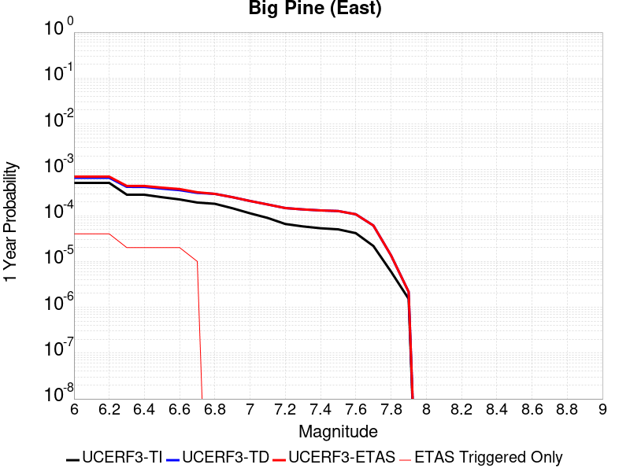 |  |

| Magnitude | 1 wk TI Prob | 1 wk TD Prob | 1 wk ETAS Prob | 1 wk ETAS/TD Gain | 1 wk ETAS Triggered Only | 1 mo TI Prob | 1 mo TD Prob | 1 mo ETAS Prob | 1 mo ETAS/TD Gain | 1 mo ETAS Triggered Only | 1 yr TI Prob | 1 yr TD Prob | 1 yr ETAS Prob | 1 yr ETAS/TD Gain | 1 yr ETAS Triggered Only | 10 yr TI Prob | 10 yr TD Prob | 10 yr ETAS Prob | 10 yr ETAS/TD Gain | 10 yr ETAS Triggered Only |
|-----|-----|-----|-----|-----|-----|-----|-----|-----|-----|-----|-----|-----|-----|-----|-----|-----|-----|-----|-----|-----|
| 6.0 | 9.916913E-6 | 1.2822198E-5 | 2.2822069E-5 | 1.7798876 | 1.0E-5 | 4.250036E-5 | 5.4951244E-5 | 6.495069E-5 | 1.1819695 | 1.0E-5 | 5.173191E-4 | 6.688481E-4 | 7.0882135E-4 | 1.0597643 | 4.0E-5 | 0.0051611643 | 0.006673103 | 0.006772436 | 1.0148855 | 1.0E-4 |
| 6.1 | 9.916913E-6 | 1.2822198E-5 | 2.2822069E-5 | 1.7798876 | 1.0E-5 | 4.250036E-5 | 5.4951244E-5 | 6.495069E-5 | 1.1819695 | 1.0E-5 | 5.173191E-4 | 6.688481E-4 | 7.0882135E-4 | 1.0597643 | 4.0E-5 | 0.0051611643 | 0.006673103 | 0.006772436 | 1.0148855 | 1.0E-4 |
| 6.2 | 9.916913E-6 | 1.2822198E-5 | 2.2822069E-5 | 1.7798876 | 1.0E-5 | 4.250036E-5 | 5.4951244E-5 | 6.495069E-5 | 1.1819695 | 1.0E-5 | 5.173191E-4 | 6.688481E-4 | 7.0882135E-4 | 1.0597643 | 4.0E-5 | 0.0051611643 | 0.006673103 | 0.006772436 | 1.0148855 | 1.0E-4 |
| 6.3 | 5.479711E-6 | 8.118015E-6 | 1.8117933E-5 | 2.2318182 | 1.0E-5 | 2.3484265E-5 | 3.4791046E-5 | 4.4790697E-5 | 1.2874203 | 1.0E-5 | 2.858834E-4 | 4.2350183E-4 | 4.4349337E-4 | 1.0472053 | 2.0E-5 | 0.0028551589 | 0.0042298343 | 0.0042895805 | 1.014125 | 6.0E-5 |
| 6.4 | 5.465009E-6 | 8.102307E-6 | 1.8102226E-5 | 2.2342062 | 1.0E-5 | 2.3421257E-5 | 3.472373E-5 | 4.4723383E-5 | 1.2879775 | 1.0E-5 | 2.851165E-4 | 4.226826E-4 | 4.4267415E-4 | 1.0472969 | 2.0E-5 | 0.0028475097 | 0.004221673 | 0.00428142 | 1.0141524 | 6.0E-5 |
| 6.5 | 4.826767E-6 | 7.427343E-6 | 1.7427268E-5 | 2.3463664 | 1.0E-5 | 2.068598E-5 | 3.18311E-5 | 4.183078E-5 | 1.3141482 | 1.0E-5 | 2.518227E-4 | 3.8747748E-4 | 4.0746972E-4 | 1.0515959 | 2.0E-5 | 0.0025153751 | 0.0038708635 | 0.003930631 | 1.0154405 | 6.0E-5 |
| 6.6 | 4.3146847E-6 | 6.8872637E-6 | 1.6887194E-5 | 2.4519455 | 1.0E-5 | 1.8491375E-5 | 2.9516525E-5 | 3.9516228E-5 | 1.3387833 | 1.0E-5 | 2.2510924E-4 | 3.5930687E-4 | 3.792997E-4 | 1.0556427 | 2.0E-5 | 0.0022488134 | 0.0035900716 | 0.0036498562 | 1.0166527 | 6.0E-5 |
| 6.7 | 3.6968106E-6 | 6.000254E-6 | 6.000254E-6 | 1.0 | 0.0 | 1.5843378E-5 | 2.571513E-5 | 2.571513E-5 | 1.0 | 0.0 | 1.9287605E-4 | 3.1303827E-4 | 3.2303514E-4 | 1.031935 | 1.0E-5 | 0.0019270873 | 0.003128695 | 0.0031586012 | 1.0095587 | 3.0E-5 |
| 6.8 | 3.4671132E-6 | 5.706825E-6 | 5.706825E-6 | 1.0 | 0.0 | 1.4858972E-5 | 2.44576E-5 | 2.44576E-5 | 1.0 | 0.0 | 1.8089297E-4 | 2.9773204E-4 | 2.9773204E-4 | 1.0 | 0.0 | 0.0018074579 | 0.002976045 | 0.0029959856 | 1.0067003 | 2.0E-5 |
| 6.9 | 2.7686972E-6 | 4.829523E-6 | 4.829523E-6 | 1.0 | 0.0 | 1.1865792E-5 | 2.0697795E-5 | 2.0697795E-5 | 1.0 | 0.0 | 1.4445644E-4 | 2.5196726E-4 | 2.5196726E-4 | 1.0 | 0.0 | 0.0014436257 | 0.0025194613 | 0.002529436 | 1.0039591 | 1.0E-5 |
| 7.0 | 2.1472624E-6 | 3.9889437E-6 | 3.9889437E-6 | 1.0 | 0.0 | 9.20252E-6 | 1.7095364E-5 | 1.7095364E-5 | 1.0 | 0.0 | 1.12034926E-4 | 2.0811672E-4 | 2.0811672E-4 | 1.0 | 0.0 | 0.0011197845 | 0.0020818403 | 0.0020918194 | 1.0047934 | 1.0E-5 |
| 7.1 | 1.7018335E-6 | 3.3484318E-6 | 3.3484318E-6 | 1.0 | 0.0 | 7.293552E-6 | 1.4350345E-5 | 1.4350345E-5 | 1.0 | 0.0 | 8.879537E-5 | 1.747018E-4 | 1.747018E-4 | 1.0 | 0.0 | 8.87599E-4 | 0.0017482359 | 0.0017482359 | 1.0 | 0.0 |
| 7.2 | 1.25603E-6 | 2.797844E-6 | 2.797844E-6 | 1.0 | 0.0 | 5.3829745E-6 | 1.1990706E-5 | 1.1990706E-5 | 1.0 | 0.0 | 6.553574E-5 | 1.459773E-4 | 1.459773E-4 | 1.0 | 0.0 | 6.551642E-4 | 0.0014613821 | 0.0014613821 | 1.0 | 0.0 |
| 7.3 | 1.112297E-6 | 2.6135112E-6 | 2.6135112E-6 | 1.0 | 0.0 | 4.7669787E-6 | 1.1200716E-5 | 1.1200716E-5 | 1.0 | 0.0 | 5.803642E-5 | 1.363604E-4 | 1.363604E-4 | 1.0 | 0.0 | 5.802127E-4 | 0.0013651794 | 0.0013651794 | 1.0 | 0.0 |
| 7.4 | 1.0137181E-6 | 2.4865376E-6 | 2.4865376E-6 | 1.0 | 0.0 | 4.3444993E-6 | 1.0656548E-5 | 1.0656548E-5 | 1.0 | 0.0 | 5.2892992E-5 | 1.2973596E-4 | 1.2973596E-4 | 1.0 | 0.0 | 5.288041E-4 | 0.0012987981 | 0.0012987981 | 1.0 | 0.0 |
| 7.5 | 9.598608E-7 | 2.410106E-6 | 2.410106E-6 | 1.0 | 0.0 | 4.1136827E-6 | 1.0328986E-5 | 1.0328986E-5 | 1.0 | 0.0 | 5.0082934E-5 | 1.2574837E-4 | 1.2574837E-4 | 1.0 | 0.0 | 5.007165E-4 | 0.001258775 | 0.001258775 | 1.0 | 0.0 |
| 7.6 | 7.929459E-7 | 2.0474768E-6 | 2.0474768E-6 | 1.0 | 0.0 | 3.3983351E-6 | 8.774872E-6 | 8.774872E-6 | 1.0 | 0.0 | 4.1373947E-5 | 1.06829E-4 | 1.06829E-4 | 1.0 | 0.0 | 4.1366243E-4 | 0.0010698074 | 0.0010698074 | 1.0 | 0.0 |
| 7.7 | 4.155788E-7 | 1.1624114E-6 | 1.1624114E-6 | 1.0 | 0.0 | 1.7810507E-6 | 4.981754E-6 | 4.981754E-6 | 1.0 | 0.0 | 2.1684076E-5 | 6.0651208E-5 | 6.0651208E-5 | 1.0 | 0.0 | 2.1681961E-4 | 6.09492E-4 | 6.09492E-4 | 1.0 | 0.0 |
| 7.8 | 1.14666925E-7 | 2.5960628E-7 | 2.5960628E-7 | 1.0 | 0.0 | 4.914296E-7 | 1.1125978E-6 | 1.1125978E-6 | 1.0 | 0.0 | 5.9831386E-6 | 1.3545799E-5 | 1.3545799E-5 | 1.0 | 0.0 | 5.9829777E-5 | 1.3656996E-4 | 1.3656996E-4 | 1.0 | 0.0 |
| 7.9 | 2.9231824E-8 | 4.1527553E-8 | 4.1527553E-8 | 1.0 | 0.0 | 1.2527924E-7 | 1.7797521E-7 | 1.7797521E-7 | 1.0 | 0.0 | 1.5252737E-6 | 2.1668463E-6 | 2.1668463E-6 | 1.0 | 0.0 | 1.5252632E-5 | 2.2004704E-5 | 2.2004704E-5 | 1.0 | 0.0 |

## Cleghorn Lake
*[(top)](#table-of-contents)*

| 1 Week | 1 Month | 1 Year | 10 Year |
|-----|-----|-----|-----|
|  |  |  |  |

| Magnitude | 1 wk TI Prob | 1 wk TD Prob | 1 wk ETAS Prob | 1 wk ETAS/TD Gain | 1 wk ETAS Triggered Only | 1 mo TI Prob | 1 mo TD Prob | 1 mo ETAS Prob | 1 mo ETAS/TD Gain | 1 mo ETAS Triggered Only | 1 yr TI Prob | 1 yr TD Prob | 1 yr ETAS Prob | 1 yr ETAS/TD Gain | 1 yr ETAS Triggered Only | 10 yr TI Prob | 10 yr TD Prob | 10 yr ETAS Prob | 10 yr ETAS/TD Gain | 10 yr ETAS Triggered Only |
|-----|-----|-----|-----|-----|-----|-----|-----|-----|-----|-----|-----|-----|-----|-----|-----|-----|-----|-----|-----|-----|
| 6.0 | 1.5467183E-5 | 1.6794971E-5 | 1.6794971E-5 | 1.0 | 0.0 | 6.6286244E-5 | 7.197677E-5 | 7.197677E-5 | 1.0 | 0.0 | 8.067362E-4 | 8.760197E-4 | 8.960022E-4 | 1.0228106 | 2.0E-5 | 0.008038137 | 0.008731093 | 0.008810394 | 1.0090827 | 8.0E-5 |
| 6.1 | 1.5467183E-5 | 1.6794971E-5 | 1.6794971E-5 | 1.0 | 0.0 | 6.6286244E-5 | 7.197677E-5 | 7.197677E-5 | 1.0 | 0.0 | 8.067362E-4 | 8.760197E-4 | 8.960022E-4 | 1.0228106 | 2.0E-5 | 0.008038137 | 0.008731093 | 0.008810394 | 1.0090827 | 8.0E-5 |
| 6.2 | 1.2624631E-5 | 1.36821545E-5 | 1.36821545E-5 | 1.0 | 0.0 | 5.410444E-5 | 5.863676E-5 | 5.863676E-5 | 1.0 | 0.0 | 6.585225E-4 | 7.137174E-4 | 7.3370314E-4 | 1.0280023 | 2.0E-5 | 0.0065657445 | 0.0071190484 | 0.00718855 | 1.0097628 | 7.0E-5 |
| 6.3 | 1.2624631E-5 | 1.36821545E-5 | 1.36821545E-5 | 1.0 | 0.0 | 5.410444E-5 | 5.863676E-5 | 5.863676E-5 | 1.0 | 0.0 | 6.585225E-4 | 7.137174E-4 | 7.3370314E-4 | 1.0280023 | 2.0E-5 | 0.0065657445 | 0.0071190484 | 0.00718855 | 1.0097628 | 7.0E-5 |
| 6.4 | 9.417684E-6 | 1.0170551E-5 | 1.0170551E-5 | 1.0 | 0.0 | 4.036088E-5 | 4.3587577E-5 | 4.3587577E-5 | 1.0 | 0.0 | 4.912829E-4 | 5.3059065E-4 | 5.405853E-4 | 1.018837 | 1.0E-5 | 0.004901982 | 0.0052972743 | 0.0053370623 | 1.007511 | 4.0E-5 |
| 6.5 | 9.368219E-6 | 1.0117976E-5 | 1.0117976E-5 | 1.0 | 0.0 | 4.014889E-5 | 4.3362263E-5 | 4.3362263E-5 | 1.0 | 0.0 | 4.8870314E-4 | 5.278488E-4 | 5.378435E-4 | 1.0189348 | 1.0E-5 | 0.004876298 | 0.0052699856 | 0.005309775 | 1.0075501 | 4.0E-5 |
| 6.6 | 7.803798E-6 | 8.442198E-6 | 8.442198E-6 | 1.0 | 0.0 | 3.3444423E-5 | 3.6180576E-5 | 3.6180576E-5 | 1.0 | 0.0 | 4.0710976E-4 | 4.404494E-4 | 4.50445E-4 | 1.0226941 | 1.0E-5 | 0.0040636472 | 0.004399682 | 0.00442955 | 1.0067887 | 3.0E-5 |
| 6.7 | 2.3108669E-6 | 2.4439082E-6 | 2.4439082E-6 | 1.0 | 0.0 | 9.903678E-6 | 1.0473852E-5 | 1.0473852E-5 | 1.0 | 0.0 | 1.205706E-4 | 1.2751187E-4 | 1.2751187E-4 | 1.0 | 0.0 | 0.001205052 | 0.0012744057 | 0.001284393 | 1.0078368 | 1.0E-5 |
| 6.8 | 2.0882828E-6 | 2.2063484E-6 | 2.2063484E-6 | 1.0 | 0.0 | 8.949753E-6 | 9.455745E-6 | 9.455745E-6 | 1.0 | 0.0 | 1.08957785E-4 | 1.15117786E-4 | 1.15117786E-4 | 1.0 | 0.0 | 0.0010890438 | 0.0011505984 | 0.001160587 | 1.0086812 | 1.0E-5 |
| 6.9 | 1.876935E-6 | 1.9811093E-6 | 1.9811093E-6 | 1.0 | 0.0 | 8.043982E-6 | 8.490441E-6 | 8.490441E-6 | 1.0 | 0.0 | 9.7931086E-5 | 1.0336639E-4 | 1.0336639E-4 | 1.0 | 0.0 | 9.788794E-4 | 0.001033199 | 0.0010431887 | 1.0096687 | 1.0E-5 |
| 7.0 | 1.5357559E-6 | 1.620328E-6 | 1.620328E-6 | 1.0 | 0.0 | 6.5817944E-6 | 6.9442453E-6 | 6.9442453E-6 | 1.0 | 0.0 | 8.01304E-5 | 8.454303E-5 | 8.454303E-5 | 1.0 | 0.0 | 8.010151E-4 | 8.4512116E-4 | 8.551127E-4 | 1.0118226 | 1.0E-5 |
| 7.1 | 1.0905424E-6 | 1.1497951E-6 | 1.1497951E-6 | 1.0 | 0.0 | 4.6737446E-6 | 4.9276846E-6 | 4.9276846E-6 | 1.0 | 0.0 | 5.6901354E-5 | 5.9993006E-5 | 5.9993006E-5 | 1.0 | 0.0 | 5.6886784E-4 | 5.997779E-4 | 5.997779E-4 | 1.0 | 0.0 |
| 7.2 | 6.06668E-7 | 6.387457E-7 | 6.387457E-7 | 1.0 | 0.0 | 2.600003E-6 | 2.737479E-6 | 2.737479E-6 | 1.0 | 0.0 | 3.1654577E-5 | 3.3328364E-5 | 3.3328364E-5 | 1.0 | 0.0 | 3.1650066E-4 | 3.3324052E-4 | 3.3324052E-4 | 1.0 | 0.0 |

## Santa Ynez (West)
*[(top)](#table-of-contents)*

| 1 Week | 1 Month | 1 Year | 10 Year |
|-----|-----|-----|-----|
|  |  |  | 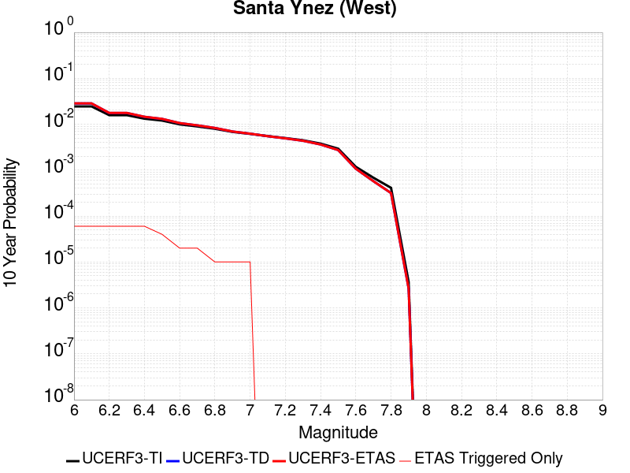 |

| Magnitude | 1 wk TI Prob | 1 wk TD Prob | 1 wk ETAS Prob | 1 wk ETAS/TD Gain | 1 wk ETAS Triggered Only | 1 mo TI Prob | 1 mo TD Prob | 1 mo ETAS Prob | 1 mo ETAS/TD Gain | 1 mo ETAS Triggered Only | 1 yr TI Prob | 1 yr TD Prob | 1 yr ETAS Prob | 1 yr ETAS/TD Gain | 1 yr ETAS Triggered Only | 10 yr TI Prob | 10 yr TD Prob | 10 yr ETAS Prob | 10 yr ETAS/TD Gain | 10 yr ETAS Triggered Only |
|-----|-----|-----|-----|-----|-----|-----|-----|-----|-----|-----|-----|-----|-----|-----|-----|-----|-----|-----|-----|-----|
| 6.0 | 4.7352758E-5 | 5.4976248E-5 | 6.49757E-5 | 1.1818867 | 1.0E-5 | 2.0292461E-4 | 2.3559289E-4 | 2.4559052E-4 | 1.0424361 | 1.0E-5 | 0.0024678076 | 0.0028648374 | 0.0028947513 | 1.0104418 | 3.0E-5 | 0.024405818 | 0.028307172 | 0.028365474 | 1.0020596 | 6.0E-5 |
| 6.1 | 4.7352758E-5 | 5.4976248E-5 | 6.49757E-5 | 1.1818867 | 1.0E-5 | 2.0292461E-4 | 2.3559289E-4 | 2.4559052E-4 | 1.0424361 | 1.0E-5 | 0.0024678076 | 0.0028648374 | 0.0028947513 | 1.0104418 | 3.0E-5 | 0.024405818 | 0.028307172 | 0.028365474 | 1.0020596 | 6.0E-5 |
| 6.2 | 3.0415853E-5 | 3.3927645E-5 | 4.3927306E-5 | 1.2947348 | 1.0E-5 | 1.3034715E-4 | 1.4539632E-4 | 1.5539485E-4 | 1.0687675 | 1.0E-5 | 0.0015858212 | 0.0017687982 | 0.0017987451 | 1.0169307 | 3.0E-5 | 0.015745522 | 0.017551146 | 0.017610094 | 1.0033586 | 6.0E-5 |
| 6.3 | 3.0415853E-5 | 3.3927645E-5 | 4.3927306E-5 | 1.2947348 | 1.0E-5 | 1.3034715E-4 | 1.4539632E-4 | 1.5539485E-4 | 1.0687675 | 1.0E-5 | 0.0015858212 | 0.0017687982 | 0.0017987451 | 1.0169307 | 3.0E-5 | 0.015745522 | 0.017551146 | 0.017610094 | 1.0033586 | 6.0E-5 |
| 6.4 | 2.5452082E-5 | 2.7914315E-5 | 3.7914037E-5 | 1.3582292 | 1.0E-5 | 1.09075794E-4 | 1.196274E-4 | 1.296262E-4 | 1.0835829 | 1.0E-5 | 0.0013271887 | 0.0014555093 | 0.0014854657 | 1.0205814 | 3.0E-5 | 0.013192902 | 0.014461935 | 0.014521066 | 1.0040889 | 6.0E-5 |
| 6.5 | 2.3143784E-5 | 2.512982E-5 | 2.512982E-5 | 1.0 | 0.0 | 9.9183875E-5 | 1.0769487E-4 | 1.0769487E-4 | 1.0 | 0.0 | 0.0012068948 | 0.0013104109 | 0.0013303846 | 1.0152423 | 2.0E-5 | 0.012003611 | 0.013028506 | 0.013067986 | 1.0030302 | 4.0E-5 |
| 6.6 | 1.9118515E-5 | 2.035546E-5 | 2.035546E-5 | 1.0 | 0.0 | 8.193392E-5 | 8.723481E-5 | 8.723481E-5 | 1.0 | 0.0 | 9.97089E-4 | 0.0010615742 | 0.0010615742 | 1.0 | 0.0 | 0.00992627 | 0.010565943 | 0.010585732 | 1.0018729 | 2.0E-5 |
| 6.7 | 1.722807E-5 | 1.8147268E-5 | 1.8147268E-5 | 1.0 | 0.0 | 7.3832496E-5 | 7.777172E-5 | 7.777172E-5 | 1.0 | 0.0 | 8.985399E-4 | 9.4646495E-4 | 9.4646495E-4 | 1.0 | 0.0 | 0.008949154 | 0.009424986 | 0.009444797 | 1.002102 | 2.0E-5 |
| 6.8 | 1.5317364E-5 | 1.5927215E-5 | 1.5927215E-5 | 1.0 | 0.0 | 6.56442E-5 | 6.825773E-5 | 6.825773E-5 | 1.0 | 0.0 | 7.98925E-4 | 8.3072524E-4 | 8.3072524E-4 | 1.0 | 0.0 | 0.007960589 | 0.008276687 | 0.008286604 | 1.0011982 | 1.0E-5 |
| 6.9 | 1.3071226E-5 | 1.3330136E-5 | 1.3330136E-5 | 1.0 | 0.0 | 5.6018336E-5 | 5.7127916E-5 | 5.7127916E-5 | 1.0 | 0.0 | 6.8180985E-4 | 6.953127E-4 | 6.953127E-4 | 1.0 | 0.0 | 0.0067972173 | 0.0069316328 | 0.0069415634 | 1.0014327 | 1.0E-5 |
| 7.0 | 1.1836986E-5 | 1.1933195E-5 | 1.1933195E-5 | 1.0 | 0.0 | 5.0728955E-5 | 5.1141273E-5 | 5.1141273E-5 | 1.0 | 0.0 | 6.1745E-4 | 6.224688E-4 | 6.224688E-4 | 1.0 | 0.0 | 0.006157372 | 0.0062074456 | 0.006217384 | 1.001601 | 1.0E-5 |
| 7.1 | 1.0597169E-5 | 1.0542524E-5 | 1.0542524E-5 | 1.0 | 0.0 | 4.541565E-5 | 4.518147E-5 | 4.518147E-5 | 1.0 | 0.0 | 5.5279525E-4 | 5.499467E-4 | 5.499467E-4 | 1.0 | 0.0 | 0.0055142213 | 0.0054859887 | 0.0054859887 | 1.0 | 0.0 |
| 7.2 | 9.59113E-6 | 9.4594225E-6 | 9.4594225E-6 | 1.0 | 0.0 | 4.11042E-5 | 4.053976E-5 | 4.053976E-5 | 1.0 | 0.0 | 5.0032866E-4 | 4.9346086E-4 | 4.9346086E-4 | 1.0 | 0.0 | 0.004992037 | 0.00492377 | 0.00492377 | 1.0 | 0.0 |
| 7.3 | 8.586084E-6 | 8.3798195E-6 | 8.3798195E-6 | 1.0 | 0.0 | 3.679698E-5 | 3.591302E-5 | 3.591302E-5 | 1.0 | 0.0 | 4.4791115E-4 | 4.3715438E-4 | 4.3715438E-4 | 1.0 | 0.0 | 0.004470094 | 0.0043630553 | 0.0043630553 | 1.0 | 0.0 |
| 7.4 | 7.2622997E-6 | 6.951717E-6 | 6.951717E-6 | 1.0 | 0.0 | 3.112377E-5 | 2.9792738E-5 | 2.9792738E-5 | 1.0 | 0.0 | 3.78866E-4 | 3.6266717E-4 | 3.6266717E-4 | 1.0 | 0.0 | 0.0037822074 | 0.0036208534 | 0.0036208534 | 1.0 | 0.0 |
| 7.5 | 5.627296E-6 | 5.251687E-6 | 5.251687E-6 | 1.0 | 0.0 | 2.411676E-5 | 2.250704E-5 | 2.250704E-5 | 1.0 | 0.0 | 2.9358198E-4 | 2.7398948E-4 | 2.7398948E-4 | 1.0 | 0.0 | 0.0029319443 | 0.0027365887 | 0.0027365887 | 1.0 | 0.0 |
| 7.6 | 2.265244E-6 | 2.0609377E-6 | 2.0609377E-6 | 1.0 | 0.0 | 9.708152E-6 | 8.832561E-6 | 8.832561E-6 | 1.0 | 0.0 | 1.18190335E-4 | 1.0753121E-4 | 1.0753121E-4 | 1.0 | 0.0 | 0.001181275 | 0.0010748004 | 0.0010748004 | 1.0 | 0.0 |
| 7.7 | 1.3099874E-6 | 1.1016689E-6 | 1.1016689E-6 | 1.0 | 0.0 | 5.61422E-6 | 4.7214294E-6 | 4.7214294E-6 | 1.0 | 0.0 | 6.8350986E-5 | 5.7481913E-5 | 5.7481913E-5 | 1.0 | 0.0 | 6.832996E-4 | 5.746728E-4 | 5.746728E-4 | 1.0 | 0.0 |
| 7.8 | 7.903951E-7 | 6.071319E-7 | 6.071319E-7 | 1.0 | 0.0 | 3.3874032E-6 | 2.6019911E-6 | 2.6019911E-6 | 1.0 | 0.0 | 4.1240855E-5 | 3.1678795E-5 | 3.1678795E-5 | 1.0 | 0.0 | 4.12332E-4 | 3.1674412E-4 | 3.1674412E-4 | 1.0 | 0.0 |
| 7.9 | 7.0753297E-9 | 5.0901185E-9 | 5.0901185E-9 | 1.0 | 0.0 | 3.032284E-8 | 2.1814794E-8 | 2.1814794E-8 | 1.0 | 0.0 | 3.6918053E-7 | 2.6559508E-7 | 2.6559508E-7 | 1.0 | 0.0 | 3.691799E-6 | 2.6559487E-6 | 2.6559487E-6 | 1.0 | 0.0 |

## Pinto Mtn
*[(top)](#table-of-contents)*

| 1 Week | 1 Month | 1 Year | 10 Year |
|-----|-----|-----|-----|
|  |  |  |  |

| Magnitude | 1 wk TI Prob | 1 wk TD Prob | 1 wk ETAS Prob | 1 wk ETAS/TD Gain | 1 wk ETAS Triggered Only | 1 mo TI Prob | 1 mo TD Prob | 1 mo ETAS Prob | 1 mo ETAS/TD Gain | 1 mo ETAS Triggered Only | 1 yr TI Prob | 1 yr TD Prob | 1 yr ETAS Prob | 1 yr ETAS/TD Gain | 1 yr ETAS Triggered Only | 10 yr TI Prob | 10 yr TD Prob | 10 yr ETAS Prob | 10 yr ETAS/TD Gain | 10 yr ETAS Triggered Only |
|-----|-----|-----|-----|-----|-----|-----|-----|-----|-----|-----|-----|-----|-----|-----|-----|-----|-----|-----|-----|-----|
| 6.0 | 4.4194956E-5 | 4.786026E-5 | 4.786026E-5 | 1.0 | 0.0 | 1.893932E-4 | 2.051002E-4 | 2.051002E-4 | 1.0 | 0.0 | 0.0023034236 | 0.0024943987 | 0.0025342992 | 1.015996 | 4.0E-5 | 0.022796938 | 0.024681535 | 0.024749808 | 1.0027661 | 7.0E-5 |
| 6.1 | 4.4194956E-5 | 4.786026E-5 | 4.786026E-5 | 1.0 | 0.0 | 1.893932E-4 | 2.051002E-4 | 2.051002E-4 | 1.0 | 0.0 | 0.0023034236 | 0.0024943987 | 0.0025342992 | 1.015996 | 4.0E-5 | 0.022796938 | 0.024681535 | 0.024749808 | 1.0027661 | 7.0E-5 |
| 6.2 | 4.4194956E-5 | 4.786026E-5 | 4.786026E-5 | 1.0 | 0.0 | 1.893932E-4 | 2.051002E-4 | 2.051002E-4 | 1.0 | 0.0 | 0.0023034236 | 0.0024943987 | 0.0025342992 | 1.015996 | 4.0E-5 | 0.022796938 | 0.024681535 | 0.024749808 | 1.0027661 | 7.0E-5 |
| 6.3 | 4.4194956E-5 | 4.786026E-5 | 4.786026E-5 | 1.0 | 0.0 | 1.893932E-4 | 2.051002E-4 | 2.051002E-4 | 1.0 | 0.0 | 0.0023034236 | 0.0024943987 | 0.0025342992 | 1.015996 | 4.0E-5 | 0.022796938 | 0.024681535 | 0.024749808 | 1.0027661 | 7.0E-5 |
| 6.4 | 3.729929E-5 | 3.9608974E-5 | 3.9608974E-5 | 1.0 | 0.0 | 1.5984432E-4 | 1.6974223E-4 | 1.6974223E-4 | 1.0 | 0.0 | 0.0019443673 | 0.0020647459 | 0.0021046633 | 1.0193329 | 4.0E-5 | 0.019274427 | 0.020465652 | 0.02053422 | 1.0033504 | 7.0E-5 |
| 6.5 | 3.729929E-5 | 3.9608974E-5 | 3.9608974E-5 | 1.0 | 0.0 | 1.5984432E-4 | 1.6974223E-4 | 1.6974223E-4 | 1.0 | 0.0 | 0.0019443673 | 0.0020647459 | 0.0021046633 | 1.0193329 | 4.0E-5 | 0.019274427 | 0.020465652 | 0.02053422 | 1.0033504 | 7.0E-5 |
| 6.6 | 3.0204548E-5 | 3.1210264E-5 | 3.1210264E-5 | 1.0 | 0.0 | 1.2944164E-4 | 1.3375162E-4 | 1.3375162E-4 | 1.0 | 0.0 | 0.0015748127 | 0.0016272442 | 0.0016571954 | 1.018406 | 3.0E-5 | 0.015636992 | 0.01615716 | 0.016206352 | 1.0030446 | 5.0E-5 |
| 6.7 | 2.9857754E-5 | 3.081962E-5 | 3.081962E-5 | 1.0 | 0.0 | 1.2795553E-4 | 1.320776E-4 | 1.320776E-4 | 1.0 | 0.0 | 0.0015567453 | 0.0016068934 | 0.0016368451 | 1.0186396 | 3.0E-5 | 0.015458848 | 0.015956586 | 0.016005788 | 1.0030835 | 5.0E-5 |
| 6.8 | 2.4819734E-5 | 2.5013833E-5 | 2.5013833E-5 | 1.0 | 0.0 | 1.0636595E-4 | 1.07197855E-4 | 1.07197855E-4 | 1.0 | 0.0 | 0.0012942362 | 0.0013043742 | 0.001324348 | 1.015313 | 2.0E-5 | 0.012867244 | 0.01296955 | 0.01300903 | 1.0030441 | 4.0E-5 |
| 6.9 | 2.331124E-5 | 2.3342016E-5 | 2.3342016E-5 | 1.0 | 0.0 | 9.990149E-5 | 1.0003349E-4 | 1.0003349E-4 | 1.0 | 0.0 | 0.001215622 | 0.0012172476 | 0.0012372233 | 1.0164105 | 2.0E-5 | 0.012089936 | 0.012107995 | 0.012147511 | 1.0032636 | 4.0E-5 |
| 7.0 | 2.1818534E-5 | 2.1765065E-5 | 2.1765065E-5 | 1.0 | 0.0 | 9.3504656E-5 | 9.327562E-5 | 9.327562E-5 | 1.0 | 0.0 | 0.0011378246 | 0.0011350589 | 0.0011550363 | 1.0176002 | 2.0E-5 | 0.011320163 | 0.011294719 | 0.0113342665 | 1.0035015 | 4.0E-5 |
| 7.1 | 2.066081E-5 | 2.0544632E-5 | 2.0544632E-5 | 1.0 | 0.0 | 8.854332E-5 | 8.804556E-5 | 8.804556E-5 | 1.0 | 0.0 | 0.0010774818 | 0.0010714472 | 0.0010914258 | 1.0186464 | 2.0E-5 | 0.010722724 | 0.010664865 | 0.010704438 | 1.0037106 | 4.0E-5 |
| 7.2 | 1.8990233E-5 | 1.9057838E-5 | 1.9057838E-5 | 1.0 | 0.0 | 8.138417E-5 | 8.1674E-5 | 8.1674E-5 | 1.0 | 0.0 | 9.904018E-4 | 9.939467E-4 | 0.0010139267 | 1.0201018 | 2.0E-5 | 0.009859995 | 0.00989701 | 0.009936615 | 1.0040016 | 4.0E-5 |
| 7.3 | 1.3335872E-5 | 1.4910233E-5 | 1.4910233E-5 | 1.0 | 0.0 | 5.7152483E-5 | 6.3899504E-5 | 6.3899504E-5 | 1.0 | 0.0 | 6.956093E-4 | 7.7771157E-4 | 7.877038E-4 | 1.0128483 | 1.0E-5 | 0.006934359 | 0.007751199 | 0.007771044 | 1.0025603 | 2.0E-5 |
| 7.4 | 9.414066E-6 | 1.1864307E-5 | 1.1864307E-5 | 1.0 | 0.0 | 4.0345374E-5 | 5.0846094E-5 | 5.0846094E-5 | 1.0 | 0.0 | 4.910942E-4 | 6.188848E-4 | 6.188848E-4 | 1.0 | 0.0 | 0.0049001034 | 0.0061725616 | 0.0061824997 | 1.00161 | 1.0E-5 |
| 7.5 | 7.2101157E-6 | 9.16147E-6 | 9.16147E-6 | 1.0 | 0.0 | 3.090013E-5 | 3.9262897E-5 | 3.9262897E-5 | 1.0 | 0.0 | 3.7614413E-4 | 4.7792873E-4 | 4.7792873E-4 | 1.0 | 0.0 | 0.0037550807 | 0.0047697844 | 0.0047697844 | 1.0 | 0.0 |
| 7.6 | 3.296375E-6 | 4.548674E-6 | 4.548674E-6 | 1.0 | 0.0 | 1.4127245E-5 | 1.9494179E-5 | 1.9494179E-5 | 1.0 | 0.0 | 1.7198564E-4 | 2.3731717E-4 | 2.3731717E-4 | 1.0 | 0.0 | 0.0017185259 | 0.002370775 | 0.002370775 | 1.0 | 0.0 |
| 7.7 | 2.5741092E-6 | 3.5873995E-6 | 3.5873995E-6 | 1.0 | 0.0 | 1.103185E-5 | 1.5374486E-5 | 1.5374486E-5 | 1.0 | 0.0 | 1.3430449E-4 | 1.8716961E-4 | 1.8716961E-4 | 1.0 | 0.0 | 0.0013422335 | 0.0018702497 | 0.0018702497 | 1.0 | 0.0 |

## Independence rev 2011
*[(top)](#table-of-contents)*

| 1 Week | 1 Month | 1 Year | 10 Year |
|-----|-----|-----|-----|
|  | 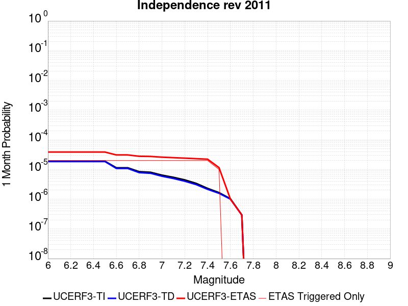 |  | 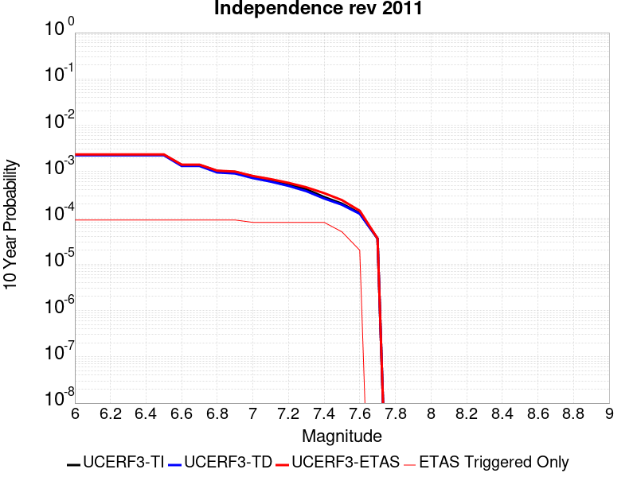 |

| Magnitude | 1 wk TI Prob | 1 wk TD Prob | 1 wk ETAS Prob | 1 wk ETAS/TD Gain | 1 wk ETAS Triggered Only | 1 mo TI Prob | 1 mo TD Prob | 1 mo ETAS Prob | 1 mo ETAS/TD Gain | 1 mo ETAS Triggered Only | 1 yr TI Prob | 1 yr TD Prob | 1 yr ETAS Prob | 1 yr ETAS/TD Gain | 1 yr ETAS Triggered Only | 10 yr TI Prob | 10 yr TD Prob | 10 yr ETAS Prob | 10 yr ETAS/TD Gain | 10 yr ETAS Triggered Only |
|-----|-----|-----|-----|-----|-----|-----|-----|-----|-----|-----|-----|-----|-----|-----|-----|-----|-----|-----|-----|-----|
| 6.0 | 4.422171E-6 | 4.3263026E-6 | 1.432626E-5 | 3.3114326 | 1.0E-5 | 1.8952025E-5 | 1.854118E-5 | 3.854081E-5 | 2.07866 | 2.0E-5 | 2.3071647E-4 | 2.2571848E-4 | 2.5571173E-4 | 1.1328789 | 3.0E-5 | 0.0023047708 | 0.002255186 | 0.002344983 | 1.039818 | 9.0E-5 |
| 6.1 | 4.422171E-6 | 4.3263026E-6 | 1.432626E-5 | 3.3114326 | 1.0E-5 | 1.8952025E-5 | 1.854118E-5 | 3.854081E-5 | 2.07866 | 2.0E-5 | 2.3071647E-4 | 2.2571848E-4 | 2.5571173E-4 | 1.1328789 | 3.0E-5 | 0.0023047708 | 0.002255186 | 0.002344983 | 1.039818 | 9.0E-5 |
| 6.2 | 4.422171E-6 | 4.3263026E-6 | 1.432626E-5 | 3.3114326 | 1.0E-5 | 1.8952025E-5 | 1.854118E-5 | 3.854081E-5 | 2.07866 | 2.0E-5 | 2.3071647E-4 | 2.2571848E-4 | 2.5571173E-4 | 1.1328789 | 3.0E-5 | 0.0023047708 | 0.002255186 | 0.002344983 | 1.039818 | 9.0E-5 |
| 6.3 | 4.422171E-6 | 4.3263026E-6 | 1.432626E-5 | 3.3114326 | 1.0E-5 | 1.8952025E-5 | 1.854118E-5 | 3.854081E-5 | 2.07866 | 2.0E-5 | 2.3071647E-4 | 2.2571848E-4 | 2.5571173E-4 | 1.1328789 | 3.0E-5 | 0.0023047708 | 0.002255186 | 0.002344983 | 1.039818 | 9.0E-5 |
| 6.4 | 4.422171E-6 | 4.3263026E-6 | 1.432626E-5 | 3.3114326 | 1.0E-5 | 1.8952025E-5 | 1.854118E-5 | 3.854081E-5 | 2.07866 | 2.0E-5 | 2.3071647E-4 | 2.2571848E-4 | 2.5571173E-4 | 1.1328789 | 3.0E-5 | 0.0023047708 | 0.002255186 | 0.002344983 | 1.039818 | 9.0E-5 |
| 6.5 | 4.422171E-6 | 4.3263026E-6 | 1.432626E-5 | 3.3114326 | 1.0E-5 | 1.8952025E-5 | 1.854118E-5 | 3.854081E-5 | 2.07866 | 2.0E-5 | 2.3071647E-4 | 2.2571848E-4 | 2.5571173E-4 | 1.1328789 | 3.0E-5 | 0.0023047708 | 0.002255186 | 0.002344983 | 1.039818 | 9.0E-5 |
| 6.6 | 2.663744E-6 | 2.5320423E-6 | 1.2532017E-5 | 4.949371 | 1.0E-5 | 1.1415996E-5 | 1.0851568E-5 | 3.085135E-5 | 2.8430316 | 2.0E-5 | 1.3898089E-4 | 1.3211032E-4 | 1.6210636E-4 | 1.2270529 | 3.0E-5 | 0.0013889399 | 0.001320366 | 0.0014102472 | 1.0680729 | 9.0E-5 |
| 6.7 | 2.663744E-6 | 2.5320423E-6 | 1.2532017E-5 | 4.949371 | 1.0E-5 | 1.1415996E-5 | 1.0851568E-5 | 3.085135E-5 | 2.8430316 | 2.0E-5 | 1.3898089E-4 | 1.3211032E-4 | 1.6210636E-4 | 1.2270529 | 3.0E-5 | 0.0013889399 | 0.001320366 | 0.0014102472 | 1.0680729 | 9.0E-5 |
| 6.8 | 1.9716529E-6 | 1.8323069E-6 | 1.1832289E-5 | 6.457591 | 1.0E-5 | 8.449913E-6 | 7.852721E-6 | 2.7852564E-5 | 3.5468678 | 2.0E-5 | 1.0287284E-4 | 9.560281E-5 | 1.2559994E-4 | 1.3137683 | 3.0E-5 | 0.0010282523 | 9.5562974E-4 | 0.0010455437 | 1.0940888 | 9.0E-5 |
| 6.9 | 1.8788617E-6 | 1.7430461E-6 | 1.1743029E-5 | 6.737073 | 1.0E-5 | 8.0522395E-6 | 7.470177E-6 | 2.7470027E-5 | 3.6772928 | 2.0E-5 | 9.80316E-5 | 9.094573E-5 | 1.20943005E-4 | 1.3298371 | 3.0E-5 | 9.798837E-4 | 9.0909714E-4 | 9.990153E-4 | 1.0989094 | 9.0E-5 |
| 7.0 | 1.5045488E-6 | 1.3849901E-6 | 1.13849765E-5 | 8.220258 | 1.0E-5 | 6.44805E-6 | 5.935659E-6 | 2.593554E-5 | 4.369446 | 2.0E-5 | 7.8502184E-5 | 7.22643E-5 | 1.02262136E-4 | 1.4151127 | 3.0E-5 | 7.8474457E-4 | 7.224132E-4 | 8.0235535E-4 | 1.11066 | 8.0E-5 |
| 7.1 | 1.272341E-6 | 1.1625449E-6 | 1.1162533E-5 | 9.601809 | 1.0E-5 | 5.4528787E-6 | 4.982326E-6 | 2.4982226E-5 | 5.014169 | 2.0E-5 | 6.6386776E-5 | 6.0658163E-5 | 9.0656344E-5 | 1.4945449 | 3.0E-5 | 6.636695E-4 | 6.064193E-4 | 6.8637077E-4 | 1.1318419 | 8.0E-5 |
| 7.2 | 1.0416892E-6 | 9.4101864E-7 | 1.0941009E-5 | 11.626772 | 1.0E-5 | 4.464375E-6 | 4.032931E-6 | 2.403285E-5 | 5.959152 | 2.0E-5 | 5.4352407E-5 | 4.9099846E-5 | 7.9098376E-5 | 1.6109699 | 3.0E-5 | 5.4339116E-4 | 4.9089186E-4 | 5.708526E-4 | 1.1628886 | 8.0E-5 |
| 7.3 | 7.9450155E-7 | 7.2352304E-7 | 1.07235155E-5 | 14.82125 | 1.0E-5 | 3.4050022E-6 | 3.1008094E-6 | 2.3100747E-5 | 7.4499087 | 2.0E-5 | 4.1455114E-5 | 3.775171E-5 | 6.775058E-5 | 1.794636 | 3.0E-5 | 4.144738E-4 | 3.774541E-4 | 4.574239E-4 | 1.2118663 | 8.0E-5 |
| 7.4 | 5.3893444E-7 | 5.019647E-7 | 1.050196E-5 | 20.921711 | 1.0E-5 | 2.309717E-6 | 2.1512753E-6 | 2.2151233E-5 | 10.29679 | 2.0E-5 | 2.8120441E-5 | 2.6191468E-5 | 5.619068E-5 | 2.1453812 | 3.0E-5 | 2.8116882E-4 | 2.6188427E-4 | 3.418633E-4 | 1.3053985 | 8.0E-5 |
| 7.5 | 3.8852085E-7 | 3.682647E-7 | 3.682647E-7 | 1.0 | 0.0 | 1.6650882E-6 | 1.5782763E-6 | 1.15782605E-5 | 7.336016 | 1.0E-5 | 2.027226E-5 | 1.9215347E-5 | 2.9215154E-5 | 1.5204073 | 1.0E-5 | 2.0270412E-4 | 1.9213707E-4 | 2.4212747E-4 | 1.2601808 | 5.0E-5 |
| 7.6 | 2.414929E-7 | 2.345808E-7 | 2.345808E-7 | 1.0 | 0.0 | 1.0349692E-6 | 1.0053459E-6 | 1.0053459E-6 | 1.0 | 0.0 | 1.2600677E-5 | 1.2240019E-5 | 1.2240019E-5 | 1.0 | 0.0 | 1.2599962E-4 | 1.2239357E-4 | 1.4239112E-4 | 1.1633873 | 2.0E-5 |
| 7.7 | 6.8298014E-8 | 6.859071E-8 | 6.859071E-8 | 1.0 | 0.0 | 2.9270575E-7 | 2.9396014E-7 | 2.9396014E-7 | 1.0 | 0.0 | 3.5636867E-6 | 3.5789594E-6 | 3.5789594E-6 | 1.0 | 0.0 | 3.5636294E-5 | 3.5789068E-5 | 3.5789068E-5 | 1.0 | 0.0 |

## San Andreas (North Branch Mill Creek)
*[(top)](#table-of-contents)*

| 1 Week | 1 Month | 1 Year | 10 Year |
|-----|-----|-----|-----|
|  |  | 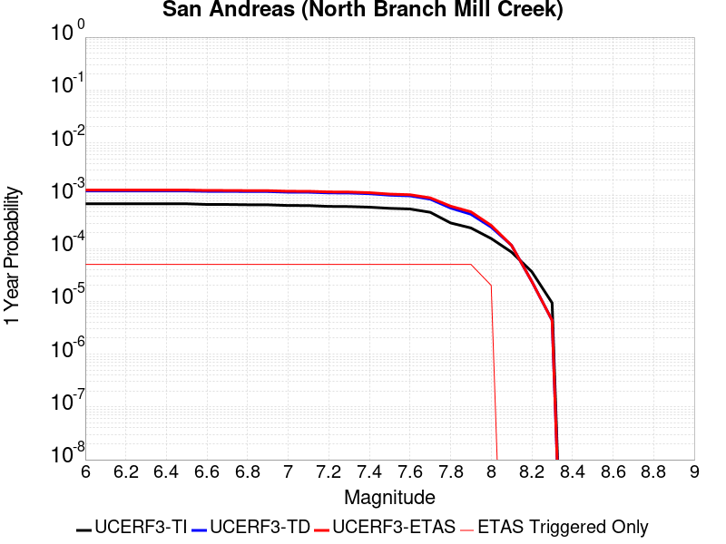 |  |

| Magnitude | 1 wk TI Prob | 1 wk TD Prob | 1 wk ETAS Prob | 1 wk ETAS/TD Gain | 1 wk ETAS Triggered Only | 1 mo TI Prob | 1 mo TD Prob | 1 mo ETAS Prob | 1 mo ETAS/TD Gain | 1 mo ETAS Triggered Only | 1 yr TI Prob | 1 yr TD Prob | 1 yr ETAS Prob | 1 yr ETAS/TD Gain | 1 yr ETAS Triggered Only | 10 yr TI Prob | 10 yr TD Prob | 10 yr ETAS Prob | 10 yr ETAS/TD Gain | 10 yr ETAS Triggered Only |
|-----|-----|-----|-----|-----|-----|-----|-----|-----|-----|-----|-----|-----|-----|-----|-----|-----|-----|-----|-----|-----|
| 6.0 | 1.3461156E-5 | 2.3528417E-5 | 3.352818E-5 | 1.4250079 | 1.0E-5 | 5.7689394E-5 | 1.0083219E-4 | 1.10831184E-4 | 1.0991647 | 1.0E-5 | 7.02142E-4 | 0.0012269439 | 0.0012768826 | 1.0407016 | 5.0E-5 | 0.0069992766 | 0.012244128 | 0.012323149 | 1.0064538 | 8.0E-5 |
| 6.1 | 1.3461156E-5 | 2.3528417E-5 | 3.352818E-5 | 1.4250079 | 1.0E-5 | 5.7689394E-5 | 1.0083219E-4 | 1.10831184E-4 | 1.0991647 | 1.0E-5 | 7.02142E-4 | 0.0012269439 | 0.0012768826 | 1.0407016 | 5.0E-5 | 0.0069992766 | 0.012244128 | 0.012323149 | 1.0064538 | 8.0E-5 |
| 6.2 | 1.3461156E-5 | 2.3528417E-5 | 3.352818E-5 | 1.4250079 | 1.0E-5 | 5.7689394E-5 | 1.0083219E-4 | 1.10831184E-4 | 1.0991647 | 1.0E-5 | 7.02142E-4 | 0.0012269439 | 0.0012768826 | 1.0407016 | 5.0E-5 | 0.0069992766 | 0.012244128 | 0.012323149 | 1.0064538 | 8.0E-5 |
| 6.3 | 1.3461156E-5 | 2.3528417E-5 | 3.352818E-5 | 1.4250079 | 1.0E-5 | 5.7689394E-5 | 1.0083219E-4 | 1.10831184E-4 | 1.0991647 | 1.0E-5 | 7.02142E-4 | 0.0012269439 | 0.0012768826 | 1.0407016 | 5.0E-5 | 0.0069992766 | 0.012244128 | 0.012323149 | 1.0064538 | 8.0E-5 |
| 6.4 | 1.3461156E-5 | 2.3528417E-5 | 3.352818E-5 | 1.4250079 | 1.0E-5 | 5.7689394E-5 | 1.0083219E-4 | 1.10831184E-4 | 1.0991647 | 1.0E-5 | 7.02142E-4 | 0.0012269439 | 0.0012768826 | 1.0407016 | 5.0E-5 | 0.0069992766 | 0.012244128 | 0.012323149 | 1.0064538 | 8.0E-5 |
| 6.5 | 1.3450706E-5 | 2.3517377E-5 | 3.3517143E-5 | 1.4252075 | 1.0E-5 | 5.764461E-5 | 1.00784884E-4 | 1.10783876E-4 | 1.0992112 | 1.0E-5 | 7.0159714E-4 | 0.0012263686 | 0.0012763073 | 1.0407208 | 5.0E-5 | 0.006993862 | 0.012238437 | 0.012317458 | 1.0064567 | 8.0E-5 |
| 6.6 | 1.3074523E-5 | 2.313165E-5 | 3.313142E-5 | 1.4322981 | 1.0E-5 | 5.6032466E-5 | 9.9131896E-5 | 1.0913091E-4 | 1.1008657 | 1.0E-5 | 6.8198174E-4 | 0.0012062659 | 0.0012562055 | 1.0414002 | 5.0E-5 | 0.006798926 | 0.012039601 | 0.012118638 | 1.0065647 | 8.0E-5 |
| 6.7 | 1.3050216E-5 | 2.3106948E-5 | 3.3106717E-5 | 1.4327602 | 1.0E-5 | 5.59283E-5 | 9.902603E-5 | 1.09025044E-4 | 1.1009735 | 1.0E-5 | 6.8071426E-4 | 0.0012049783 | 0.0012549182 | 1.0414445 | 5.0E-5 | 0.0067863287 | 0.012026866 | 0.012105904 | 1.0065718 | 8.0E-5 |
| 6.8 | 1.29049395E-5 | 2.295535E-5 | 3.2955122E-5 | 1.4356183 | 1.0E-5 | 5.530571E-5 | 9.837638E-5 | 1.08375396E-4 | 1.1016405 | 1.0E-5 | 6.73139E-4 | 0.0011970776 | 0.0012470178 | 1.0417184 | 5.0E-5 | 0.0067110364 | 0.011948708 | 0.012027753 | 1.0066153 | 8.0E-5 |
| 6.9 | 1.2867369E-5 | 2.2914748E-5 | 3.291452E-5 | 1.4363902 | 1.0E-5 | 5.51447E-5 | 9.8202385E-5 | 1.08201406E-4 | 1.1018205 | 1.0E-5 | 6.711799E-4 | 0.0011949615 | 0.0012449018 | 1.0417924 | 5.0E-5 | 0.006691564 | 0.011927776 | 0.012006822 | 1.0066271 | 8.0E-5 |
| 7.0 | 1.2495996E-5 | 2.2314638E-5 | 3.2314416E-5 | 1.4481263 | 1.0E-5 | 5.3553173E-5 | 9.5630676E-5 | 1.0562972E-4 | 1.104559 | 1.0E-5 | 6.518148E-4 | 0.0011636844 | 0.0012136262 | 1.042917 | 5.0E-5 | 0.0064990623 | 0.011618286 | 0.0116973575 | 1.0068057 | 8.0E-5 |
| 7.1 | 1.2452067E-5 | 2.2259701E-5 | 3.225948E-5 | 1.4492323 | 1.0E-5 | 5.3364907E-5 | 9.539525E-5 | 1.053943E-4 | 1.104817 | 1.0E-5 | 6.4952404E-4 | 0.0011608212 | 0.0012107631 | 1.043023 | 5.0E-5 | 0.0064762887 | 0.011589954 | 0.011669027 | 1.0068226 | 8.0E-5 |
| 7.2 | 1.2002777E-5 | 2.1638136E-5 | 3.163792E-5 | 1.462137 | 1.0E-5 | 5.143946E-5 | 9.2731585E-5 | 1.0273066E-4 | 1.1078281 | 1.0E-5 | 6.2609545E-4 | 0.001128425 | 0.0011783686 | 1.0442595 | 5.0E-5 | 0.006243344 | 0.011269332 | 0.011348431 | 1.0070189 | 8.0E-5 |
| 7.3 | 1.1923425E-5 | 2.150792E-5 | 3.1507705E-5 | 1.4649351 | 1.0E-5 | 5.109939E-5 | 9.2173555E-5 | 1.02172635E-4 | 1.1084809 | 1.0E-5 | 6.219575E-4 | 0.001121638 | 0.0011715819 | 1.0445276 | 5.0E-5 | 0.0062021962 | 0.011202184 | 0.011281287 | 1.0070615 | 8.0E-5 |
| 7.4 | 1.16105175E-5 | 2.0881596E-5 | 3.0881387E-5 | 1.4788806 | 1.0E-5 | 4.975841E-5 | 8.94895E-5 | 9.94886E-5 | 1.111735 | 1.0E-5 | 6.0564023E-4 | 0.0010889926 | 0.0011389381 | 1.045864 | 5.0E-5 | 0.006039923 | 0.010879889 | 0.010959019 | 1.007273 | 8.0E-5 |
| 7.5 | 1.1037265E-5 | 1.9580697E-5 | 2.95805E-5 | 1.510697 | 1.0E-5 | 4.7301706E-5 | 8.391459E-5 | 9.3913746E-5 | 1.1191587 | 1.0E-5 | 5.757461E-4 | 0.0010211834 | 0.0010711324 | 1.0489128 | 5.0E-5 | 0.005742567 | 0.010208925 | 0.010288108 | 1.0077562 | 8.0E-5 |
| 7.6 | 1.0720915E-5 | 1.9022264E-5 | 2.9022074E-5 | 1.5256898 | 1.0E-5 | 4.5945973E-5 | 8.152145E-5 | 9.152064E-5 | 1.1226571 | 1.0E-5 | 5.592486E-4 | 9.920739E-4 | 0.0010420243 | 1.0503495 | 5.0E-5 | 0.005578433 | 0.009920476 | 0.009999682 | 1.0079842 | 8.0E-5 |
| 7.7 | 9.276279E-6 | 1.6466776E-5 | 2.6466612E-5 | 1.6072735 | 1.0E-5 | 3.9754876E-5 | 7.057E-5 | 8.056929E-5 | 1.1416932 | 1.0E-5 | 4.839081E-4 | 8.588527E-4 | 9.088098E-4 | 1.0581672 | 5.0E-5 | 0.0048285574 | 0.008599266 | 0.008678579 | 1.0092231 | 8.0E-5 |
| 7.8 | 5.8346777E-6 | 1.1175348E-5 | 2.1175236E-5 | 1.8948168 | 1.0E-5 | 2.5005522E-5 | 4.7893467E-5 | 5.789299E-5 | 1.2087867 | 1.0E-5 | 3.043997E-4 | 5.829471E-4 | 6.32918E-4 | 1.0857211 | 5.0E-5 | 0.0030398308 | 0.0058576525 | 0.0059371837 | 1.0135773 | 8.0E-5 |
| 7.9 | 4.690204E-6 | 8.525966E-6 | 1.8525881E-5 | 2.1728776 | 1.0E-5 | 2.0100719E-5 | 3.6539343E-5 | 4.653898E-5 | 1.2736676 | 1.0E-5 | 2.4469878E-4 | 4.4477577E-4 | 4.9475353E-4 | 1.1123662 | 5.0E-5 | 0.002444295 | 0.0044796076 | 0.004559249 | 1.0177788 | 8.0E-5 |
| 8.0 | 2.9570454E-6 | 4.857161E-6 | 1.4857113E-5 | 3.0588057 | 1.0E-5 | 1.267299E-5 | 2.0816238E-5 | 3.081603E-5 | 1.4803842 | 1.0E-5 | 1.5428272E-4 | 2.5340827E-4 | 2.734032E-4 | 1.078904 | 2.0E-5 | 0.0015417566 | 0.002555138 | 0.0025950356 | 1.0156147 | 4.0E-5 |
| 8.1 | 1.6376824E-6 | 2.2021675E-6 | 2.2021675E-6 | 1.0 | 0.0 | 7.01862E-6 | 9.4378265E-6 | 9.4378265E-6 | 1.0 | 0.0 | 8.544835E-5 | 1.1489949E-4 | 1.1489949E-4 | 1.0 | 0.0 | 8.54155E-4 | 0.0011635037 | 0.001173492 | 1.0085847 | 1.0E-5 |
| 8.2 | 6.9631557E-7 | 4.5515284E-7 | 4.5515284E-7 | 1.0 | 0.0 | 2.984206E-6 | 1.9506535E-6 | 1.9506535E-6 | 1.0 | 0.0 | 3.63321E-5 | 2.374895E-5 | 2.374895E-5 | 1.0 | 0.0 | 3.6326164E-4 | 2.4599142E-4 | 2.4599142E-4 | 1.0 | 0.0 |
| 8.3 | 1.7876137E-7 | 8.39093E-8 | 8.39093E-8 | 1.0 | 0.0 | 7.661199E-7 | 3.5961122E-7 | 3.5961122E-7 | 1.0 | 0.0 | 9.32747E-6 | 4.3782584E-6 | 4.3782584E-6 | 1.0 | 0.0 | 9.3270784E-5 | 4.598492E-5 | 4.598492E-5 | 1.0 | 0.0 |

## San Andreas (Creeping Section) 2011 CFM
*[(top)](#table-of-contents)*

| 1 Week | 1 Month | 1 Year | 10 Year |
|-----|-----|-----|-----|
|  | 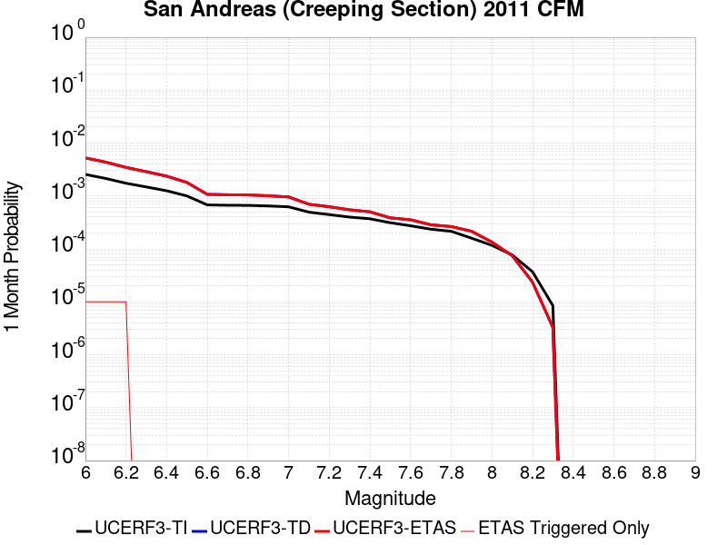 |  |  |

| Magnitude | 1 wk TI Prob | 1 wk TD Prob | 1 wk ETAS Prob | 1 wk ETAS/TD Gain | 1 wk ETAS Triggered Only | 1 mo TI Prob | 1 mo TD Prob | 1 mo ETAS Prob | 1 mo ETAS/TD Gain | 1 mo ETAS Triggered Only | 1 yr TI Prob | 1 yr TD Prob | 1 yr ETAS Prob | 1 yr ETAS/TD Gain | 1 yr ETAS Triggered Only | 10 yr TI Prob | 10 yr TD Prob | 10 yr ETAS Prob | 10 yr ETAS/TD Gain | 10 yr ETAS Triggered Only |
|-----|-----|-----|-----|-----|-----|-----|-----|-----|-----|-----|-----|-----|-----|-----|-----|-----|-----|-----|-----|-----|
| 6.0 | 5.986481E-4 | 0.0012281181 | 0.0012281181 | 1.0 | 0.0 | 0.0025631124 | 0.0052478816 | 0.005257829 | 1.0018955 | 1.0E-5 | 0.030762846 | 0.061232176 | 0.061279114 | 1.0007665 | 5.0E-5 | 0.26835477 | 0.42607728 | 0.42611745 | 1.0000943 | 7.0E-5 |
| 6.1 | 5.015945E-4 | 0.0010222462 | 0.0010222462 | 1.0 | 0.0 | 0.00214792 | 0.004369848 | 0.0043798042 | 1.0022784 | 1.0E-5 | 0.025839351 | 0.051271588 | 0.05131902 | 1.0009252 | 5.0E-5 | 0.23032776 | 0.3729949 | 0.3730325 | 1.0001009 | 6.0E-5 |
| 6.2 | 4.073338E-4 | 8.1118365E-4 | 8.1118365E-4 | 1.0 | 0.0 | 0.0017445484 | 0.0034691135 | 0.0034790789 | 1.0028726 | 1.0E-5 | 0.021034058 | 0.040956367 | 0.04100432 | 1.0011708 | 5.0E-5 | 0.19150782 | 0.3131846 | 0.3132258 | 1.0001316 | 6.0E-5 |
| 6.3 | 3.464099E-4 | 6.743695E-4 | 6.743695E-4 | 1.0 | 0.0 | 0.0014837692 | 0.0028849328 | 0.0028849328 | 1.0 | 0.0 | 0.017915873 | 0.03421296 | 0.034251593 | 1.0011292 | 4.0E-5 | 0.16538359 | 0.27147684 | 0.27151325 | 1.0001342 | 5.0E-5 |
| 6.4 | 2.935057E-4 | 5.5487157E-4 | 5.5487157E-4 | 1.0 | 0.0 | 0.0012572751 | 0.0023745096 | 0.0023745096 | 1.0 | 0.0 | 0.015200248 | 0.028288092 | 0.02832696 | 1.001374 | 4.0E-5 | 0.14201577 | 0.23315436 | 0.2331927 | 1.0001645 | 5.0E-5 |
| 6.5 | 2.3409708E-4 | 4.2138255E-4 | 4.2138255E-4 | 1.0 | 0.0 | 0.0010028875 | 0.0018039518 | 0.0018039518 | 1.0 | 0.0 | 0.012141965 | 0.02161123 | 0.021650366 | 1.0018109 | 4.0E-5 | 0.11499573 | 0.18700314 | 0.18704379 | 1.0002173 | 5.0E-5 |
| 6.6 | 1.5842178E-4 | 2.511574E-4 | 2.511574E-4 | 1.0 | 0.0 | 6.7877385E-4 | 0.0010759344 | 0.0010759344 | 1.0 | 0.0 | 0.0082328 | 0.013019429 | 0.013058907 | 1.0030323 | 4.0E-5 | 0.07934396 | 0.12333928 | 0.12338311 | 1.0003554 | 5.0E-5 |
| 6.7 | 1.5616413E-4 | 2.46522E-4 | 2.46522E-4 | 1.0 | 0.0 | 6.691031E-4 | 0.0010560873 | 0.0010560873 | 1.0 | 0.0 | 0.0081159435 | 0.0127812615 | 0.0128207505 | 1.0030895 | 4.0E-5 | 0.0782586 | 0.12136643 | 0.12141036 | 1.0003619 | 5.0E-5 |
| 6.8 | 1.5538467E-4 | 2.4475955E-4 | 2.4475955E-4 | 1.0 | 0.0 | 6.6576427E-4 | 0.0010485414 | 0.0010485414 | 1.0 | 0.0 | 0.008075596 | 0.01269062 | 0.012730111 | 1.003112 | 4.0E-5 | 0.07788358 | 0.120597176 | 0.12064115 | 1.0003647 | 5.0E-5 |
| 6.9 | 1.5153569E-4 | 2.3584829E-4 | 2.3584829E-4 | 1.0 | 0.0 | 6.49277E-4 | 0.0010103888 | 0.0010103888 | 1.0 | 0.0 | 0.007876333 | 0.012232622 | 0.012272133 | 1.00323 | 4.0E-5 | 0.07602952 | 0.116666704 | 0.11671087 | 1.0003786 | 5.0E-5 |
| 7.0 | 1.4588932E-4 | 2.2441633E-4 | 2.2441633E-4 | 1.0 | 0.0 | 6.250901E-4 | 9.6143177E-4 | 9.6143177E-4 | 1.0 | 0.0 | 0.0075839474 | 0.011643107 | 0.011682641 | 1.0033956 | 4.0E-5 | 0.073302895 | 0.1115123 | 0.11155672 | 1.0003984 | 5.0E-5 |
| 7.1 | 1.1565079E-4 | 1.631913E-4 | 1.631913E-4 | 1.0 | 0.0 | 4.955521E-4 | 6.992047E-4 | 6.992047E-4 | 1.0 | 0.0 | 0.006016669 | 0.008479793 | 0.008519453 | 1.004677 | 4.0E-5 | 0.058563538 | 0.08384011 | 0.083885916 | 1.0005463 | 5.0E-5 |
| 7.2 | 1.0393792E-4 | 1.4650873E-4 | 1.4650873E-4 | 1.0 | 0.0 | 4.4537216E-4 | 6.277442E-4 | 6.277442E-4 | 1.0 | 0.0 | 0.005408933 | 0.007616173 | 0.007655869 | 1.005212 | 4.0E-5 | 0.052791595 | 0.07578092 | 0.07582713 | 1.0006098 | 5.0E-5 |
| 7.3 | 9.332884E-5 | 1.2811464E-4 | 1.2811464E-4 | 1.0 | 0.0 | 3.999194E-4 | 5.4894784E-4 | 5.4894784E-4 | 1.0 | 0.0 | 0.0048581534 | 0.006663094 | 0.0067028273 | 1.0059632 | 4.0E-5 | 0.047533102 | 0.06662787 | 0.06667453 | 1.0007005 | 5.0E-5 |
| 7.4 | 8.670252E-5 | 1.1729612E-4 | 1.1729612E-4 | 1.0 | 0.0 | 3.715293E-4 | 5.026014E-4 | 5.026014E-4 | 1.0 | 0.0 | 0.004513991 | 0.006102124 | 0.00614188 | 1.0065151 | 4.0E-5 | 0.044233937 | 0.061277855 | 0.06132479 | 1.0007659 | 5.0E-5 |
| 7.5 | 7.3036405E-5 | 9.0276684E-5 | 9.0276684E-5 | 1.0 | 0.0 | 3.129756E-4 | 3.868428E-4 | 3.868428E-4 | 1.0 | 0.0 | 0.0038038217 | 0.0046996614 | 0.0047394736 | 1.0084713 | 4.0E-5 | 0.03739367 | 0.047983047 | 0.048030645 | 1.0009921 | 5.0E-5 |
| 7.6 | 6.3935775E-5 | 8.298909E-5 | 8.298909E-5 | 1.0 | 0.0 | 2.7398168E-4 | 3.5561912E-4 | 3.5561912E-4 | 1.0 | 0.0 | 0.0033306254 | 0.004321086 | 0.0043609133 | 1.0092169 | 4.0E-5 | 0.032811474 | 0.044081833 | 0.04412963 | 1.0010842 | 5.0E-5 |
| 7.7 | 5.5050095E-5 | 6.678156E-5 | 6.678156E-5 | 1.0 | 0.0 | 2.3590765E-4 | 2.8617532E-4 | 2.8617532E-4 | 1.0 | 0.0 | 0.0028683927 | 0.0034786223 | 0.0034885874 | 1.0028647 | 1.0E-5 | 0.0283165 | 0.035876084 | 0.035895366 | 1.0005375 | 2.0E-5 |
| 7.8 | 5.027131E-5 | 6.177745E-5 | 6.177745E-5 | 1.0 | 0.0 | 2.1543067E-4 | 2.6473365E-4 | 2.6473365E-4 | 1.0 | 0.0 | 0.0026197135 | 0.003218372 | 0.0032283398 | 1.0030972 | 1.0E-5 | 0.025890453 | 0.033199526 | 0.033218864 | 1.0005825 | 2.0E-5 |
| 7.9 | 3.7271806E-5 | 5.0343926E-5 | 5.0343926E-5 | 1.0 | 0.0 | 1.5972654E-4 | 2.1574185E-4 | 2.1574185E-4 | 1.0 | 0.0 | 0.0019429359 | 0.0026234952 | 0.002633469 | 1.0038017 | 1.0E-5 | 0.019260362 | 0.027125923 | 0.02714538 | 1.0007173 | 2.0E-5 |
| 8.0 | 2.7310243E-5 | 3.1506035E-5 | 3.1506035E-5 | 1.0 | 0.0 | 1.17038646E-4 | 1.3501888E-4 | 1.3501888E-4 | 1.0 | 0.0 | 0.0014240141 | 0.0016426162 | 0.0016426162 | 1.0 | 0.0 | 0.014149235 | 0.01725378 | 0.017263608 | 1.0005696 | 1.0E-5 |
| 8.1 | 1.7940547E-5 | 1.7449367E-5 | 1.7449367E-5 | 1.0 | 0.0 | 7.688579E-5 | 7.478086E-5 | 7.478086E-5 | 1.0 | 0.0 | 9.3568244E-4 | 9.1007724E-4 | 9.1007724E-4 | 1.0 | 0.0 | 0.009317525 | 0.009824635 | 0.009834537 | 1.0010078 | 1.0E-5 |
| 8.2 | 8.643924E-6 | 5.494016E-6 | 5.494016E-6 | 1.0 | 0.0 | 3.704486E-5 | 2.3545572E-5 | 2.3545572E-5 | 1.0 | 0.0 | 4.5092785E-4 | 2.866297E-4 | 2.866297E-4 | 1.0 | 0.0 | 0.0045001395 | 0.0032592218 | 0.0032592218 | 1.0 | 0.0 |
| 8.3 | 1.983087E-6 | 7.690063E-7 | 7.690063E-7 | 1.0 | 0.0 | 8.498917E-6 | 3.295737E-6 | 3.295737E-6 | 1.0 | 0.0 | 1.034694E-4 | 4.012488E-5 | 4.012488E-5 | 1.0 | 0.0 | 0.0010342124 | 4.737206E-4 | 4.737206E-4 | 1.0 | 0.0 |

## Santa Ynez (East)
*[(top)](#table-of-contents)*

| 1 Week | 1 Month | 1 Year | 10 Year |
|-----|-----|-----|-----|
| 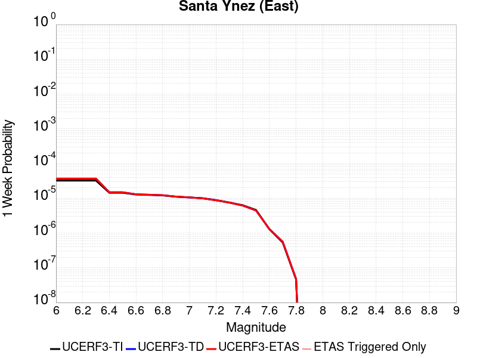 |  |  |  |

| Magnitude | 1 wk TI Prob | 1 wk TD Prob | 1 wk ETAS Prob | 1 wk ETAS/TD Gain | 1 wk ETAS Triggered Only | 1 mo TI Prob | 1 mo TD Prob | 1 mo ETAS Prob | 1 mo ETAS/TD Gain | 1 mo ETAS Triggered Only | 1 yr TI Prob | 1 yr TD Prob | 1 yr ETAS Prob | 1 yr ETAS/TD Gain | 1 yr ETAS Triggered Only | 10 yr TI Prob | 10 yr TD Prob | 10 yr ETAS Prob | 10 yr ETAS/TD Gain | 10 yr ETAS Triggered Only |
|-----|-----|-----|-----|-----|-----|-----|-----|-----|-----|-----|-----|-----|-----|-----|-----|-----|-----|-----|-----|-----|
| 6.0 | 3.2269712E-5 | 3.675413E-5 | 3.675413E-5 | 1.0 | 0.0 | 1.3829143E-4 | 1.5751152E-4 | 1.7750837E-4 | 1.1269548 | 2.0E-5 | 0.0016823979 | 0.0019165992 | 0.0019665034 | 1.0260379 | 5.0E-5 | 0.016697178 | 0.01905816 | 0.019136636 | 1.0041177 | 8.0E-5 |
| 6.1 | 3.2269712E-5 | 3.675413E-5 | 3.675413E-5 | 1.0 | 0.0 | 1.3829143E-4 | 1.5751152E-4 | 1.7750837E-4 | 1.1269548 | 2.0E-5 | 0.0016823979 | 0.0019165992 | 0.0019665034 | 1.0260379 | 5.0E-5 | 0.016697178 | 0.01905816 | 0.019136636 | 1.0041177 | 8.0E-5 |
| 6.2 | 3.2269712E-5 | 3.675413E-5 | 3.675413E-5 | 1.0 | 0.0 | 1.3829143E-4 | 1.5751152E-4 | 1.7750837E-4 | 1.1269548 | 2.0E-5 | 0.0016823979 | 0.0019165992 | 0.0019665034 | 1.0260379 | 5.0E-5 | 0.016697178 | 0.01905816 | 0.019136636 | 1.0041177 | 8.0E-5 |
| 6.3 | 3.2269712E-5 | 3.675413E-5 | 3.675413E-5 | 1.0 | 0.0 | 1.3829143E-4 | 1.5751152E-4 | 1.7750837E-4 | 1.1269548 | 2.0E-5 | 0.0016823979 | 0.0019165992 | 0.0019665034 | 1.0260379 | 5.0E-5 | 0.016697178 | 0.01905816 | 0.019136636 | 1.0041177 | 8.0E-5 |
| 6.4 | 1.4404779E-5 | 1.4850021E-5 | 1.4850021E-5 | 1.0 | 0.0 | 6.1733306E-5 | 6.3641426E-5 | 6.3641426E-5 | 1.0 | 0.0 | 7.513438E-4 | 7.74564E-4 | 7.845562E-4 | 1.0129005 | 1.0E-5 | 0.0074880854 | 0.0077191936 | 0.0077291164 | 1.0012854 | 1.0E-5 |
| 6.5 | 1.4404779E-5 | 1.4850021E-5 | 1.4850021E-5 | 1.0 | 0.0 | 6.1733306E-5 | 6.3641426E-5 | 6.3641426E-5 | 1.0 | 0.0 | 7.513438E-4 | 7.74564E-4 | 7.845562E-4 | 1.0129005 | 1.0E-5 | 0.0074880854 | 0.0077191936 | 0.0077291164 | 1.0012854 | 1.0E-5 |
| 6.6 | 1.280208E-5 | 1.3012444E-5 | 1.3012444E-5 | 1.0 | 0.0 | 5.4864904E-5 | 5.5766435E-5 | 5.5766435E-5 | 1.0 | 0.0 | 6.6777546E-4 | 6.787466E-4 | 6.787466E-4 | 1.0 | 0.0 | 0.006657724 | 0.006766946 | 0.006766946 | 1.0 | 0.0 |
| 6.7 | 1.2457027E-5 | 1.26289415E-5 | 1.26289415E-5 | 1.0 | 0.0 | 5.3386164E-5 | 5.412292E-5 | 5.412292E-5 | 1.0 | 0.0 | 6.497827E-4 | 6.58749E-4 | 6.58749E-4 | 1.0 | 0.0 | 0.00647886 | 0.0065681604 | 0.0065681604 | 1.0 | 0.0 |
| 6.8 | 1.2095134E-5 | 1.2231368E-5 | 1.2231368E-5 | 1.0 | 0.0 | 5.1835254E-5 | 5.2419102E-5 | 5.2419102E-5 | 1.0 | 0.0 | 6.309115E-4 | 6.380173E-4 | 6.380173E-4 | 1.0 | 0.0 | 0.0062912325 | 0.006362044 | 0.006362044 | 1.0 | 0.0 |
| 6.9 | 1.1104036E-5 | 1.1157752E-5 | 1.1157752E-5 | 1.0 | 0.0 | 4.758786E-5 | 4.781807E-5 | 4.781807E-5 | 1.0 | 0.0 | 5.7922816E-4 | 5.8203074E-4 | 5.8203074E-4 | 1.0 | 0.0 | 0.005777207 | 0.0058052093 | 0.0058052093 | 1.0 | 0.0 |
| 7.0 | 1.0577444E-5 | 1.0582056E-5 | 1.0582056E-5 | 1.0 | 0.0 | 4.5331115E-5 | 4.535089E-5 | 4.535089E-5 | 1.0 | 0.0 | 5.5176654E-4 | 5.520084E-4 | 5.520084E-4 | 1.0 | 0.0 | 0.0055039856 | 0.005506511 | 0.005506511 | 1.0 | 0.0 |
| 7.1 | 1.0021775E-5 | 9.981338E-6 | 9.981338E-6 | 1.0 | 0.0 | 4.294976E-5 | 4.2776468E-5 | 4.2776468E-5 | 1.0 | 0.0 | 5.2278786E-4 | 5.206802E-4 | 5.206802E-4 | 1.0 | 0.0 | 0.0052155964 | 0.0051947352 | 0.0051947352 | 1.0 | 0.0 |
| 7.2 | 8.874109E-6 | 8.749089E-6 | 8.749089E-6 | 1.0 | 0.0 | 3.8031343E-5 | 3.7495563E-5 | 3.7495563E-5 | 1.0 | 0.0 | 4.629332E-4 | 4.5641392E-4 | 4.5641392E-4 | 1.0 | 0.0 | 0.0046197 | 0.0045548836 | 0.0045548836 | 1.0 | 0.0 |
| 7.3 | 7.5504267E-6 | 7.5053244E-6 | 7.5053244E-6 | 1.0 | 0.0 | 3.235857E-5 | 3.2165288E-5 | 3.2165288E-5 | 1.0 | 0.0 | 3.9389438E-4 | 3.91543E-4 | 3.91543E-4 | 1.0 | 0.0 | 0.0039319694 | 0.0039086384 | 0.0039086384 | 1.0 | 0.0 |
| 7.4 | 6.309394E-6 | 6.183301E-6 | 6.183301E-6 | 1.0 | 0.0 | 2.703998E-5 | 2.6499598E-5 | 2.6499598E-5 | 1.0 | 0.0 | 3.2916202E-4 | 3.225858E-4 | 3.225858E-4 | 1.0 | 0.0 | 0.003286749 | 0.0032212727 | 0.0032212727 | 1.0 | 0.0 |
| 7.5 | 4.6103073E-6 | 4.440954E-6 | 4.440954E-6 | 1.0 | 0.0 | 1.975831E-5 | 1.9032526E-5 | 1.9032526E-5 | 1.0 | 0.0 | 2.4053088E-4 | 2.3169705E-4 | 2.3169705E-4 | 1.0 | 0.0 | 0.002402707 | 0.0023146244 | 0.0023146244 | 1.0 | 0.0 |
| 7.6 | 1.2858658E-6 | 1.3008582E-6 | 1.3008582E-6 | 1.0 | 0.0 | 5.5108417E-6 | 5.575095E-6 | 5.575095E-6 | 1.0 | 0.0 | 6.7092435E-5 | 6.787474E-5 | 6.787474E-5 | 1.0 | 0.0 | 6.707218E-4 | 6.7854696E-4 | 6.7854696E-4 | 1.0 | 0.0 |
| 7.7 | 5.3302307E-7 | 5.612297E-7 | 5.612297E-7 | 1.0 | 0.0 | 2.2843826E-6 | 2.4052679E-6 | 2.4052679E-6 | 1.0 | 0.0 | 2.7812002E-5 | 2.9283781E-5 | 2.9283781E-5 | 1.0 | 0.0 | 2.7808524E-4 | 2.9280278E-4 | 2.9280278E-4 | 1.0 | 0.0 |
| 7.8 | 4.613933E-8 | 4.8031144E-8 | 4.8031144E-8 | 1.0 | 0.0 | 1.9773998E-7 | 2.0584774E-7 | 2.0584774E-7 | 1.0 | 0.0 | 2.4074816E-6 | 2.5061934E-6 | 2.5061934E-6 | 1.0 | 0.0 | 2.4074554E-5 | 2.5061661E-5 | 2.5061661E-5 | 1.0 | 0.0 |

## San Jacinto (San Jacinto Valley) rev
*[(top)](#table-of-contents)*

| 1 Week | 1 Month | 1 Year | 10 Year |
|-----|-----|-----|-----|
|  |  |  |  |

| Magnitude | 1 wk TI Prob | 1 wk TD Prob | 1 wk ETAS Prob | 1 wk ETAS/TD Gain | 1 wk ETAS Triggered Only | 1 mo TI Prob | 1 mo TD Prob | 1 mo ETAS Prob | 1 mo ETAS/TD Gain | 1 mo ETAS Triggered Only | 1 yr TI Prob | 1 yr TD Prob | 1 yr ETAS Prob | 1 yr ETAS/TD Gain | 1 yr ETAS Triggered Only | 10 yr TI Prob | 10 yr TD Prob | 10 yr ETAS Prob | 10 yr ETAS/TD Gain | 10 yr ETAS Triggered Only |
|-----|-----|-----|-----|-----|-----|-----|-----|-----|-----|-----|-----|-----|-----|-----|-----|-----|-----|-----|-----|-----|
| 6.0 | 3.652694E-5 | 3.4466113E-5 | 3.4466113E-5 | 1.0 | 0.0 | 1.5653463E-4 | 1.4770357E-4 | 1.4770357E-4 | 1.0 | 0.0 | 0.0019041431 | 0.0017968096 | 0.0018567018 | 1.0333325 | 6.0E-5 | 0.018879099 | 0.018559378 | 0.018637892 | 1.0042305 | 8.0E-5 |
| 6.1 | 3.652694E-5 | 3.4466113E-5 | 3.4466113E-5 | 1.0 | 0.0 | 1.5653463E-4 | 1.4770357E-4 | 1.4770357E-4 | 1.0 | 0.0 | 0.0019041431 | 0.0017968096 | 0.0018567018 | 1.0333325 | 6.0E-5 | 0.018879099 | 0.018559378 | 0.018637892 | 1.0042305 | 8.0E-5 |
| 6.2 | 3.652694E-5 | 3.4466113E-5 | 3.4466113E-5 | 1.0 | 0.0 | 1.5653463E-4 | 1.4770357E-4 | 1.4770357E-4 | 1.0 | 0.0 | 0.0019041431 | 0.0017968096 | 0.0018567018 | 1.0333325 | 6.0E-5 | 0.018879099 | 0.018559378 | 0.018637892 | 1.0042305 | 8.0E-5 |
| 6.3 | 3.652694E-5 | 3.4466113E-5 | 3.4466113E-5 | 1.0 | 0.0 | 1.5653463E-4 | 1.4770357E-4 | 1.4770357E-4 | 1.0 | 0.0 | 0.0019041431 | 0.0017968096 | 0.0018567018 | 1.0333325 | 6.0E-5 | 0.018879099 | 0.018559378 | 0.018637892 | 1.0042305 | 8.0E-5 |
| 6.4 | 3.646941E-5 | 3.4387675E-5 | 3.4387675E-5 | 1.0 | 0.0 | 1.5628811E-4 | 1.4736745E-4 | 1.4736745E-4 | 1.0 | 0.0 | 0.0019011468 | 0.0017927244 | 0.0018526168 | 1.0334086 | 6.0E-5 | 0.018849645 | 0.018519253 | 0.01859777 | 1.0042398 | 8.0E-5 |
| 6.5 | 3.646941E-5 | 3.4387675E-5 | 3.4387675E-5 | 1.0 | 0.0 | 1.5628811E-4 | 1.4736745E-4 | 1.4736745E-4 | 1.0 | 0.0 | 0.0019011468 | 0.0017927244 | 0.0018526168 | 1.0334086 | 6.0E-5 | 0.018849645 | 0.018519253 | 0.01859777 | 1.0042398 | 8.0E-5 |
| 6.6 | 3.6442503E-5 | 3.435106E-5 | 3.435106E-5 | 1.0 | 0.0 | 1.561728E-4 | 1.4721052E-4 | 1.4721052E-4 | 1.0 | 0.0 | 0.0018997455 | 0.0017908171 | 0.0018507097 | 1.0334443 | 6.0E-5 | 0.018835869 | 0.018500518 | 0.018579038 | 1.0042442 | 8.0E-5 |
| 6.7 | 3.6432113E-5 | 3.433663E-5 | 3.433663E-5 | 1.0 | 0.0 | 1.5612828E-4 | 1.4714869E-4 | 1.4714869E-4 | 1.0 | 0.0 | 0.0018992044 | 0.0017900657 | 0.0018499583 | 1.0334584 | 6.0E-5 | 0.018830549 | 0.01849314 | 0.018571662 | 1.0042459 | 8.0E-5 |
| 6.8 | 3.6409598E-5 | 3.4305678E-5 | 3.4305678E-5 | 1.0 | 0.0 | 1.560318E-4 | 1.4701606E-4 | 1.4701606E-4 | 1.0 | 0.0 | 0.0018980318 | 0.0017884537 | 0.0018483463 | 1.0334885 | 6.0E-5 | 0.018819023 | 0.018477293 | 0.018555814 | 1.0042497 | 8.0E-5 |
| 6.9 | 3.638078E-5 | 3.4266093E-5 | 3.4266093E-5 | 1.0 | 0.0 | 1.5590832E-4 | 1.4684643E-4 | 1.4684643E-4 | 1.0 | 0.0 | 0.0018965311 | 0.0017863918 | 0.0018462846 | 1.0335273 | 6.0E-5 | 0.018804269 | 0.018457023 | 0.018535547 | 1.0042543 | 8.0E-5 |
| 7.0 | 3.6294874E-5 | 3.4148088E-5 | 3.4148088E-5 | 1.0 | 0.0 | 1.5554018E-4 | 1.4634077E-4 | 1.4634077E-4 | 1.0 | 0.0 | 0.0018920569 | 0.0017802453 | 0.0018401386 | 1.0336432 | 6.0E-5 | 0.018760284 | 0.018396595 | 0.018475123 | 1.0042686 | 8.0E-5 |
| 7.1 | 3.6260717E-5 | 3.4104367E-5 | 3.4104367E-5 | 1.0 | 0.0 | 1.5539382E-4 | 1.461534E-4 | 1.461534E-4 | 1.0 | 0.0 | 0.001890278 | 0.0017779679 | 0.0018378613 | 1.0336864 | 6.0E-5 | 0.018742796 | 0.018374188 | 0.018452719 | 1.0042739 | 8.0E-5 |
| 7.2 | 3.6210204E-5 | 3.4038494E-5 | 3.4038494E-5 | 1.0 | 0.0 | 1.5517735E-4 | 1.4587112E-4 | 1.4587112E-4 | 1.0 | 0.0 | 0.001887647 | 0.0017745368 | 0.0018344304 | 1.0337516 | 6.0E-5 | 0.01871693 | 0.018340416 | 0.01841895 | 1.004282 | 8.0E-5 |
| 7.3 | 3.6119454E-5 | 3.392659E-5 | 3.392659E-5 | 1.0 | 0.0 | 1.5478847E-4 | 1.4539158E-4 | 1.4539158E-4 | 1.0 | 0.0 | 0.0018829206 | 0.0017687079 | 0.0018286018 | 1.0338631 | 6.0E-5 | 0.018670462 | 0.018282874 | 0.018361412 | 1.0042957 | 8.0E-5 |
| 7.4 | 3.607848E-5 | 3.3874043E-5 | 3.3874043E-5 | 1.0 | 0.0 | 1.5461289E-4 | 1.4516641E-4 | 1.4516641E-4 | 1.0 | 0.0 | 0.0018807866 | 0.001765971 | 0.001825865 | 1.0339156 | 6.0E-5 | 0.018649481 | 0.018255847 | 0.018334385 | 1.0043021 | 8.0E-5 |
| 7.5 | 3.5856774E-5 | 3.368289E-5 | 3.368289E-5 | 1.0 | 0.0 | 1.5366284E-4 | 1.4434727E-4 | 1.4434727E-4 | 1.0 | 0.0 | 0.0018692396 | 0.0017560141 | 0.0018159087 | 1.0341083 | 6.0E-5 | 0.018535944 | 0.018156461 | 0.01823501 | 1.0043261 | 8.0E-5 |
| 7.6 | 3.286655E-5 | 3.219922E-5 | 3.219922E-5 | 1.0 | 0.0 | 1.4084904E-4 | 1.3798937E-4 | 1.3798937E-4 | 1.0 | 0.0 | 0.001713488 | 0.0016787279 | 0.0017386272 | 1.0356814 | 6.0E-5 | 0.017003361 | 0.017372673 | 0.017451284 | 1.004525 | 8.0E-5 |
| 7.7 | 2.8882527E-5 | 2.9290912E-5 | 2.9290912E-5 | 1.0 | 0.0 | 1.237764E-4 | 1.2552645E-4 | 1.2552645E-4 | 1.0 | 0.0 | 0.0015059357 | 0.0015272142 | 0.0015871226 | 1.0392272 | 6.0E-5 | 0.014957713 | 0.01585857 | 0.0159373 | 1.0049646 | 8.0E-5 |
| 7.8 | 2.4950225E-5 | 2.6579837E-5 | 2.6579837E-5 | 1.0 | 0.0 | 1.0692515E-4 | 1.13908616E-4 | 1.13908616E-4 | 1.0 | 0.0 | 0.0013010362 | 0.001385956 | 0.0014458728 | 1.0432314 | 6.0E-5 | 0.012934455 | 0.014438762 | 0.014517607 | 1.0054606 | 8.0E-5 |
| 7.9 | 1.9881603E-5 | 2.1554622E-5 | 2.1554622E-5 | 1.0 | 0.0 | 8.520408E-5 | 9.237368E-5 | 9.237368E-5 | 1.0 | 0.0 | 0.001036866 | 0.0011240701 | 0.0011840027 | 1.0533174 | 6.0E-5 | 0.010320415 | 0.011801713 | 0.011880769 | 1.0066987 | 8.0E-5 |
| 8.0 | 1.563292E-5 | 1.597515E-5 | 1.597515E-5 | 1.0 | 0.0 | 6.6996516E-5 | 6.846314E-5 | 6.846314E-5 | 1.0 | 0.0 | 8.153773E-4 | 8.3322066E-4 | 8.8317896E-4 | 1.0599581 | 5.0E-5 | 0.00812392 | 0.008830484 | 0.008899866 | 1.0078571 | 7.0E-5 |
| 8.1 | 1.0045313E-5 | 8.323337E-6 | 8.323337E-6 | 1.0 | 0.0 | 4.305063E-5 | 3.567096E-5 | 3.567096E-5 | 1.0 | 0.0 | 5.2401534E-4 | 4.3420793E-4 | 4.5419924E-4 | 1.0460409 | 2.0E-5 | 0.0052278144 | 0.00467079 | 0.00470065 | 1.006393 | 3.0E-5 |
| 8.2 | 4.1554413E-6 | 1.571458E-6 | 1.571458E-6 | 1.0 | 0.0 | 1.7808914E-5 | 6.734803E-6 | 6.734803E-6 | 1.0 | 0.0 | 2.1680194E-4 | 8.199317E-5 | 8.199317E-5 | 1.0 | 0.0 | 0.0021659054 | 9.5169496E-4 | 9.5169496E-4 | 1.0 | 0.0 |
| 8.3 | 1.2758221E-6 | 3.6306494E-7 | 3.6306494E-7 | 1.0 | 0.0 | 5.4677976E-6 | 1.5559917E-6 | 1.5559917E-6 | 1.0 | 0.0 | 6.65684E-5 | 1.8944038E-5 | 1.8944038E-5 | 1.0 | 0.0 | 6.6548464E-4 | 2.2845245E-4 | 2.2845245E-4 | 1.0 | 0.0 |

## San Jacinto (Stepovers Combined)
*[(top)](#table-of-contents)*

| 1 Week | 1 Month | 1 Year | 10 Year |
|-----|-----|-----|-----|
|  | 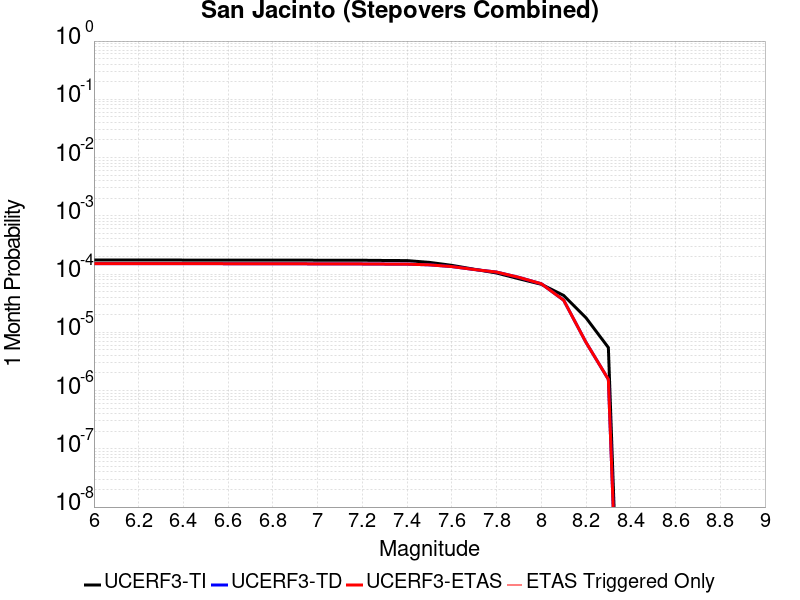 |  |  |

| Magnitude | 1 wk TI Prob | 1 wk TD Prob | 1 wk ETAS Prob | 1 wk ETAS/TD Gain | 1 wk ETAS Triggered Only | 1 mo TI Prob | 1 mo TD Prob | 1 mo ETAS Prob | 1 mo ETAS/TD Gain | 1 mo ETAS Triggered Only | 1 yr TI Prob | 1 yr TD Prob | 1 yr ETAS Prob | 1 yr ETAS/TD Gain | 1 yr ETAS Triggered Only | 10 yr TI Prob | 10 yr TD Prob | 10 yr ETAS Prob | 10 yr ETAS/TD Gain | 10 yr ETAS Triggered Only |
|-----|-----|-----|-----|-----|-----|-----|-----|-----|-----|-----|-----|-----|-----|-----|-----|-----|-----|-----|-----|-----|
| 6.0 | 4.0667746E-5 | 3.5335263E-5 | 3.5335263E-5 | 1.0 | 0.0 | 1.742787E-4 | 1.5142806E-4 | 1.5142806E-4 | 1.0 | 0.0 | 0.0021197782 | 0.0018420788 | 0.0018919867 | 1.0270933 | 5.0E-5 | 0.020996714 | 0.019019177 | 0.019087845 | 1.0036105 | 7.0E-5 |
| 6.1 | 4.0667746E-5 | 3.5335263E-5 | 3.5335263E-5 | 1.0 | 0.0 | 1.742787E-4 | 1.5142806E-4 | 1.5142806E-4 | 1.0 | 0.0 | 0.0021197782 | 0.0018420788 | 0.0018919867 | 1.0270933 | 5.0E-5 | 0.020996714 | 0.019019177 | 0.019087845 | 1.0036105 | 7.0E-5 |
| 6.2 | 4.0667746E-5 | 3.5335263E-5 | 3.5335263E-5 | 1.0 | 0.0 | 1.742787E-4 | 1.5142806E-4 | 1.5142806E-4 | 1.0 | 0.0 | 0.0021197782 | 0.0018420788 | 0.0018919867 | 1.0270933 | 5.0E-5 | 0.020996714 | 0.019019177 | 0.019087845 | 1.0036105 | 7.0E-5 |
| 6.3 | 4.0667746E-5 | 3.5335263E-5 | 3.5335263E-5 | 1.0 | 0.0 | 1.742787E-4 | 1.5142806E-4 | 1.5142806E-4 | 1.0 | 0.0 | 0.0021197782 | 0.0018420788 | 0.0018919867 | 1.0270933 | 5.0E-5 | 0.020996714 | 0.019019177 | 0.019087845 | 1.0036105 | 7.0E-5 |
| 6.4 | 4.0577226E-5 | 3.5207147E-5 | 3.5207147E-5 | 1.0 | 0.0 | 1.738908E-4 | 1.5087906E-4 | 1.5087906E-4 | 1.0 | 0.0 | 0.0021150648 | 0.0018354072 | 0.0018853155 | 1.0271919 | 5.0E-5 | 0.020950472 | 0.018953735 | 0.019022407 | 1.0036232 | 7.0E-5 |
| 6.5 | 4.0577226E-5 | 3.5207147E-5 | 3.5207147E-5 | 1.0 | 0.0 | 1.738908E-4 | 1.5087906E-4 | 1.5087906E-4 | 1.0 | 0.0 | 0.0021150648 | 0.0018354072 | 0.0018853155 | 1.0271919 | 5.0E-5 | 0.020950472 | 0.018953735 | 0.019022407 | 1.0036232 | 7.0E-5 |
| 6.6 | 4.053861E-5 | 3.515248E-5 | 3.515248E-5 | 1.0 | 0.0 | 1.7372532E-4 | 1.506448E-4 | 1.506448E-4 | 1.0 | 0.0 | 0.0021130538 | 0.0018325604 | 0.0018824687 | 1.0272342 | 5.0E-5 | 0.020930743 | 0.018925807 | 0.018994482 | 1.0036286 | 7.0E-5 |
| 6.7 | 4.0516545E-5 | 3.5121546E-5 | 3.5121546E-5 | 1.0 | 0.0 | 1.7363077E-4 | 1.5051225E-4 | 1.5051225E-4 | 1.0 | 0.0 | 0.002111905 | 0.0018309496 | 0.001880858 | 1.0272583 | 5.0E-5 | 0.020919468 | 0.018910002 | 0.018978678 | 1.0036317 | 7.0E-5 |
| 6.8 | 4.049434E-5 | 3.5093104E-5 | 3.5093104E-5 | 1.0 | 0.0 | 1.7353562E-4 | 1.5039036E-4 | 1.5039036E-4 | 1.0 | 0.0 | 0.0021107488 | 0.0018294681 | 0.0018793766 | 1.0272803 | 5.0E-5 | 0.020908125 | 0.018895412 | 0.01896409 | 1.0036346 | 7.0E-5 |
| 6.9 | 4.046386E-5 | 3.5055655E-5 | 3.5055655E-5 | 1.0 | 0.0 | 1.73405E-4 | 1.5022988E-4 | 1.5022988E-4 | 1.0 | 0.0 | 0.0021091616 | 0.0018275176 | 0.0018774263 | 1.0273095 | 5.0E-5 | 0.020892553 | 0.018876182 | 0.01894486 | 1.0036384 | 7.0E-5 |
| 7.0 | 4.036382E-5 | 3.4936198E-5 | 3.4936198E-5 | 1.0 | 0.0 | 1.7297632E-4 | 1.4971798E-4 | 1.4971798E-4 | 1.0 | 0.0 | 0.0021039525 | 0.0018212957 | 0.0018712046 | 1.027403 | 5.0E-5 | 0.02084144 | 0.018814782 | 0.018883465 | 1.0036504 | 7.0E-5 |
| 7.1 | 4.0343282E-5 | 3.4914654E-5 | 3.4914654E-5 | 1.0 | 0.0 | 1.7288832E-4 | 1.4962567E-4 | 1.4962567E-4 | 1.0 | 0.0 | 0.002102883 | 0.0018201737 | 0.0018700827 | 1.0274199 | 5.0E-5 | 0.020830948 | 0.018803652 | 0.018872336 | 1.0036527 | 7.0E-5 |
| 7.2 | 4.0257353E-5 | 3.4819048E-5 | 3.4819048E-5 | 1.0 | 0.0 | 1.725201E-4 | 1.4921598E-4 | 1.4921598E-4 | 1.0 | 0.0 | 0.0020984085 | 0.001815194 | 0.0018651033 | 1.0274953 | 5.0E-5 | 0.020787042 | 0.018754339 | 0.018823026 | 1.0036625 | 7.0E-5 |
| 7.3 | 3.9940667E-5 | 3.4646426E-5 | 3.4646426E-5 | 1.0 | 0.0 | 1.7116306E-4 | 1.4847625E-4 | 1.4847625E-4 | 1.0 | 0.0 | 0.0020819185 | 0.0018062027 | 0.0018561124 | 1.0276324 | 5.0E-5 | 0.020625217 | 0.018662827 | 0.01873152 | 1.0036808 | 7.0E-5 |
| 7.4 | 3.9721202E-5 | 3.4531695E-5 | 3.4531695E-5 | 1.0 | 0.0 | 1.7022261E-4 | 1.479846E-4 | 1.479846E-4 | 1.0 | 0.0 | 0.0020704903 | 0.0018002269 | 0.0018501368 | 1.0277243 | 5.0E-5 | 0.020513052 | 0.018601885 | 0.018670583 | 1.0036931 | 7.0E-5 |
| 7.5 | 3.7036873E-5 | 3.3597462E-5 | 3.3597462E-5 | 1.0 | 0.0 | 1.5871979E-4 | 1.4398119E-4 | 1.4398119E-4 | 1.0 | 0.0 | 0.0019307006 | 0.0017515646 | 0.001801477 | 1.0284959 | 5.0E-5 | 0.019140124 | 0.018102536 | 0.01817127 | 1.0037968 | 7.0E-5 |
| 7.6 | 3.2940967E-5 | 3.1371335E-5 | 3.1371335E-5 | 1.0 | 0.0 | 1.4116794E-4 | 1.3444165E-4 | 1.3444165E-4 | 1.0 | 0.0 | 0.0017173645 | 0.0016356006 | 0.0016855188 | 1.0305198 | 5.0E-5 | 0.01704153 | 0.016931716 | 0.017000532 | 1.0040642 | 7.0E-5 |
| 7.7 | 2.8236149E-5 | 2.7935872E-5 | 2.7935872E-5 | 1.0 | 0.0 | 1.2100645E-4 | 1.19719676E-4 | 1.19719676E-4 | 1.0 | 0.0 | 0.0014722579 | 0.0014566135 | 0.0015065407 | 1.0342762 | 5.0E-5 | 0.014625421 | 0.015141861 | 0.015210801 | 1.004553 | 7.0E-5 |
| 7.8 | 2.4329287E-5 | 2.5257565E-5 | 2.5257565E-5 | 1.0 | 0.0 | 1.042642E-4 | 1.08242224E-4 | 1.08242224E-4 | 1.0 | 0.0 | 0.0012686774 | 0.0013170532 | 0.0013669874 | 1.0379136 | 5.0E-5 | 0.012614589 | 0.013738072 | 0.01380711 | 1.0050254 | 7.0E-5 |
| 7.9 | 1.9370926E-5 | 2.0466443E-5 | 2.0466443E-5 | 1.0 | 0.0 | 8.301561E-5 | 8.771038E-5 | 8.771038E-5 | 1.0 | 0.0 | 0.0010102465 | 0.0010673514 | 0.0011172981 | 1.0467949 | 5.0E-5 | 0.0100566605 | 0.011223038 | 0.011292253 | 1.0061672 | 7.0E-5 |
| 8.0 | 1.5583017E-5 | 1.5924119E-5 | 1.5924119E-5 | 1.0 | 0.0 | 6.6782646E-5 | 6.8244444E-5 | 6.8244444E-5 | 1.0 | 0.0 | 8.127754E-4 | 8.3056005E-4 | 8.805185E-4 | 1.0601504 | 5.0E-5 | 0.008098091 | 0.008801706 | 0.00887109 | 1.007883 | 7.0E-5 |
| 8.1 | 1.0024873E-5 | 8.313899E-6 | 8.313899E-6 | 1.0 | 0.0 | 4.2963035E-5 | 3.5630514E-5 | 3.5630514E-5 | 1.0 | 0.0 | 5.229494E-4 | 4.3371567E-4 | 4.5370698E-4 | 1.0460931 | 2.0E-5 | 0.0052172043 | 0.004665064 | 0.004694924 | 1.0064008 | 3.0E-5 |
| 8.2 | 4.142796E-6 | 1.5668816E-6 | 1.5668816E-6 | 1.0 | 0.0 | 1.775472E-5 | 6.7151896E-6 | 6.7151896E-6 | 1.0 | 0.0 | 2.1614227E-4 | 8.175439E-5 | 8.175439E-5 | 1.0 | 0.0 | 0.0021593217 | 9.488576E-4 | 9.488576E-4 | 1.0 | 0.0 |
| 8.3 | 1.2750878E-6 | 3.6277774E-7 | 3.6277774E-7 | 1.0 | 0.0 | 5.4646503E-6 | 1.5547608E-6 | 1.5547608E-6 | 1.0 | 0.0 | 6.653009E-5 | 1.8929053E-5 | 1.8929053E-5 | 1.0 | 0.0 | 6.6510175E-4 | 2.2828147E-4 | 2.2828147E-4 | 1.0 | 0.0 |

## Cleghorn Pass
*[(top)](#table-of-contents)*

| 1 Week | 1 Month | 1 Year | 10 Year |
|-----|-----|-----|-----|
|  |  | 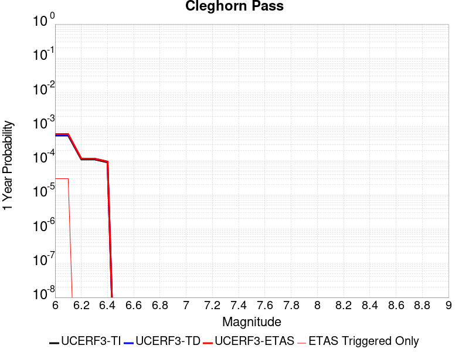 |  |

| Magnitude | 1 wk TI Prob | 1 wk TD Prob | 1 wk ETAS Prob | 1 wk ETAS/TD Gain | 1 wk ETAS Triggered Only | 1 mo TI Prob | 1 mo TD Prob | 1 mo ETAS Prob | 1 mo ETAS/TD Gain | 1 mo ETAS Triggered Only | 1 yr TI Prob | 1 yr TD Prob | 1 yr ETAS Prob | 1 yr ETAS/TD Gain | 1 yr ETAS Triggered Only | 10 yr TI Prob | 10 yr TD Prob | 10 yr ETAS Prob | 10 yr ETAS/TD Gain | 10 yr ETAS Triggered Only |
|-----|-----|-----|-----|-----|-----|-----|-----|-----|-----|-----|-----|-----|-----|-----|-----|-----|-----|-----|-----|-----|
| 6.0 | 1.0522846E-5 | 1.104093E-5 | 2.104082E-5 | 1.9057108 | 1.0E-5 | 4.509713E-5 | 4.731771E-5 | 5.7317236E-5 | 1.2113273 | 1.0E-5 | 5.4891926E-4 | 5.759935E-4 | 6.059762E-4 | 1.0520539 | 3.0E-5 | 0.0054756533 | 0.005750172 | 0.005809827 | 1.0103744 | 6.0E-5 |
| 6.1 | 1.0522846E-5 | 1.104093E-5 | 2.104082E-5 | 1.9057108 | 1.0E-5 | 4.509713E-5 | 4.731771E-5 | 5.7317236E-5 | 1.2113273 | 1.0E-5 | 5.4891926E-4 | 5.759935E-4 | 6.059762E-4 | 1.0520539 | 3.0E-5 | 0.0054756533 | 0.005750172 | 0.005809827 | 1.0103744 | 6.0E-5 |
| 6.2 | 2.1045846E-6 | 2.2082602E-6 | 2.2082602E-6 | 1.0 | 0.0 | 9.019617E-6 | 9.463961E-6 | 9.463961E-6 | 1.0 | 0.0 | 1.098083E-4 | 1.1522183E-4 | 1.1522183E-4 | 1.0 | 0.0 | 0.0010975406 | 0.0011520323 | 0.0011620208 | 1.0086703 | 1.0E-5 |
| 6.3 | 2.1045846E-6 | 2.2082602E-6 | 2.2082602E-6 | 1.0 | 0.0 | 9.019617E-6 | 9.463961E-6 | 9.463961E-6 | 1.0 | 0.0 | 1.098083E-4 | 1.1522183E-4 | 1.1522183E-4 | 1.0 | 0.0 | 0.0010975406 | 0.0011520323 | 0.0011620208 | 1.0086703 | 1.0E-5 |
| 6.4 | 1.7259927E-6 | 1.8109243E-6 | 1.8109243E-6 | 1.0 | 0.0 | 7.3970905E-6 | 7.761104E-6 | 7.761104E-6 | 1.0 | 0.0 | 9.005586E-5 | 9.449144E-5 | 9.449144E-5 | 1.0 | 0.0 | 9.001937E-4 | 9.4491447E-4 | 9.54905E-4 | 1.0105729 | 1.0E-5 |

## Pleito
*[(top)](#table-of-contents)*

| 1 Week | 1 Month | 1 Year | 10 Year |
|-----|-----|-----|-----|
|  |  |  |  |

| Magnitude | 1 wk TI Prob | 1 wk TD Prob | 1 wk ETAS Prob | 1 wk ETAS/TD Gain | 1 wk ETAS Triggered Only | 1 mo TI Prob | 1 mo TD Prob | 1 mo ETAS Prob | 1 mo ETAS/TD Gain | 1 mo ETAS Triggered Only | 1 yr TI Prob | 1 yr TD Prob | 1 yr ETAS Prob | 1 yr ETAS/TD Gain | 1 yr ETAS Triggered Only | 10 yr TI Prob | 10 yr TD Prob | 10 yr ETAS Prob | 10 yr ETAS/TD Gain | 10 yr ETAS Triggered Only |
|-----|-----|-----|-----|-----|-----|-----|-----|-----|-----|-----|-----|-----|-----|-----|-----|-----|-----|-----|-----|-----|
| 6.0 | 1.6763008E-5 | 2.479146E-5 | 2.479146E-5 | 1.0 | 0.0 | 7.183948E-5 | 1.0624519E-4 | 1.0624519E-4 | 1.0 | 0.0 | 8.742947E-4 | 0.0012928396 | 0.0013228009 | 1.0231748 | 3.0E-5 | 0.00870863 | 0.012967767 | 0.01303686 | 1.0053279 | 7.0E-5 |
| 6.1 | 1.6763008E-5 | 2.479146E-5 | 2.479146E-5 | 1.0 | 0.0 | 7.183948E-5 | 1.0624519E-4 | 1.0624519E-4 | 1.0 | 0.0 | 8.742947E-4 | 0.0012928396 | 0.0013228009 | 1.0231748 | 3.0E-5 | 0.00870863 | 0.012967767 | 0.01303686 | 1.0053279 | 7.0E-5 |
| 6.2 | 1.6763008E-5 | 2.479146E-5 | 2.479146E-5 | 1.0 | 0.0 | 7.183948E-5 | 1.0624519E-4 | 1.0624519E-4 | 1.0 | 0.0 | 8.742947E-4 | 0.0012928396 | 0.0013228009 | 1.0231748 | 3.0E-5 | 0.00870863 | 0.012967767 | 0.01303686 | 1.0053279 | 7.0E-5 |
| 6.3 | 1.6763008E-5 | 2.479146E-5 | 2.479146E-5 | 1.0 | 0.0 | 7.183948E-5 | 1.0624519E-4 | 1.0624519E-4 | 1.0 | 0.0 | 8.742947E-4 | 0.0012928396 | 0.0013228009 | 1.0231748 | 3.0E-5 | 0.00870863 | 0.012967767 | 0.01303686 | 1.0053279 | 7.0E-5 |
| 6.4 | 1.6763008E-5 | 2.479146E-5 | 2.479146E-5 | 1.0 | 0.0 | 7.183948E-5 | 1.0624519E-4 | 1.0624519E-4 | 1.0 | 0.0 | 8.742947E-4 | 0.0012928396 | 0.0013228009 | 1.0231748 | 3.0E-5 | 0.00870863 | 0.012967767 | 0.01303686 | 1.0053279 | 7.0E-5 |
| 6.5 | 1.6763008E-5 | 2.479146E-5 | 2.479146E-5 | 1.0 | 0.0 | 7.183948E-5 | 1.0624519E-4 | 1.0624519E-4 | 1.0 | 0.0 | 8.742947E-4 | 0.0012928396 | 0.0013228009 | 1.0231748 | 3.0E-5 | 0.00870863 | 0.012967767 | 0.01303686 | 1.0053279 | 7.0E-5 |
| 6.6 | 9.910213E-6 | 1.7241837E-5 | 1.7241837E-5 | 1.0 | 0.0 | 4.247165E-5 | 7.389152E-5 | 7.389152E-5 | 1.0 | 0.0 | 5.169696E-4 | 8.992616E-4 | 9.1924367E-4 | 1.0222205 | 2.0E-5 | 0.0051576863 | 0.009064423 | 0.00910406 | 1.0043728 | 4.0E-5 |
| 6.7 | 9.910213E-6 | 1.7241837E-5 | 1.7241837E-5 | 1.0 | 0.0 | 4.247165E-5 | 7.389152E-5 | 7.389152E-5 | 1.0 | 0.0 | 5.169696E-4 | 8.992616E-4 | 9.1924367E-4 | 1.0222205 | 2.0E-5 | 0.0051576863 | 0.009064423 | 0.00910406 | 1.0043728 | 4.0E-5 |
| 6.8 | 8.300162E-6 | 1.5501371E-5 | 1.5501371E-5 | 1.0 | 0.0 | 3.557164E-5 | 6.643277E-5 | 6.643277E-5 | 1.0 | 0.0 | 4.3299864E-4 | 8.0852024E-4 | 8.185121E-4 | 1.0123583 | 1.0E-5 | 0.004321559 | 0.008163834 | 0.008193589 | 1.0036447 | 3.0E-5 |
| 6.9 | 8.183114E-6 | 1.5372574E-5 | 1.5372574E-5 | 1.0 | 0.0 | 3.5070017E-5 | 6.5880806E-5 | 6.5880806E-5 | 1.0 | 0.0 | 4.2689382E-4 | 8.0180506E-4 | 8.1179704E-4 | 1.0124619 | 1.0E-5 | 0.0042607468 | 0.008097173 | 0.00812693 | 1.003675 | 3.0E-5 |
| 7.0 | 7.1748823E-6 | 1.4159216E-5 | 1.4159216E-5 | 1.0 | 0.0 | 3.0749135E-5 | 6.0680948E-5 | 6.0680948E-5 | 1.0 | 0.0 | 3.743064E-4 | 7.385406E-4 | 7.4853323E-4 | 1.0135303 | 1.0E-5 | 0.0037367654 | 0.007468599 | 0.0074884496 | 1.0026579 | 2.0E-5 |
| 7.1 | 7.1671807E-6 | 1.4149584E-5 | 1.4149584E-5 | 1.0 | 0.0 | 3.0716128E-5 | 6.0639664E-5 | 6.0639664E-5 | 1.0 | 0.0 | 3.7390468E-4 | 7.380384E-4 | 7.48031E-4 | 1.0135394 | 1.0E-5 | 0.0037327618 | 0.0074636103 | 0.007483461 | 1.0026597 | 2.0E-5 |
| 7.2 | 7.0649667E-6 | 1.3996784E-5 | 1.3996784E-5 | 1.0 | 0.0 | 3.0278077E-5 | 5.998484E-5 | 5.998484E-5 | 1.0 | 0.0 | 3.6857324E-4 | 7.300712E-4 | 7.4006396E-4 | 1.0136873 | 1.0E-5 | 0.0036796255 | 0.007384318 | 0.0074041705 | 1.0026884 | 2.0E-5 |
| 7.3 | 7.02082E-6 | 1.3940186E-5 | 1.3940186E-5 | 1.0 | 0.0 | 3.008888E-5 | 5.974229E-5 | 5.974229E-5 | 1.0 | 0.0 | 3.6627054E-4 | 7.2712015E-4 | 7.371129E-4 | 1.0137429 | 1.0E-5 | 0.0036566744 | 0.007354794 | 0.007374647 | 1.0026993 | 2.0E-5 |
| 7.4 | 6.987146E-6 | 1.3899719E-5 | 1.3899719E-5 | 1.0 | 0.0 | 2.9944567E-5 | 5.956887E-5 | 5.956887E-5 | 1.0 | 0.0 | 3.6451413E-4 | 7.250101E-4 | 7.350029E-4 | 1.0137829 | 1.0E-5 | 0.0036391679 | 0.007333714 | 0.0073535675 | 1.0027071 | 2.0E-5 |
| 7.5 | 6.9494554E-6 | 1.3856602E-5 | 1.3856602E-5 | 1.0 | 0.0 | 2.9783041E-5 | 5.938409E-5 | 5.938409E-5 | 1.0 | 0.0 | 3.625482E-4 | 7.2276196E-4 | 7.327547E-4 | 1.0138258 | 1.0E-5 | 0.0036195726 | 0.0073113306 | 0.0073311846 | 1.0027155 | 2.0E-5 |
| 7.6 | 6.92694E-6 | 1.3815674E-5 | 1.3815674E-5 | 1.0 | 0.0 | 2.9686547E-5 | 5.920869E-5 | 5.920869E-5 | 1.0 | 0.0 | 3.6137376E-4 | 7.206279E-4 | 7.306207E-4 | 1.0138668 | 1.0E-5 | 0.0036078666 | 0.0072900616 | 0.007309916 | 1.0027235 | 2.0E-5 |
| 7.7 | 6.395867E-6 | 1.2693605E-5 | 1.2693605E-5 | 1.0 | 0.0 | 2.741057E-5 | 5.440003E-5 | 5.440003E-5 | 1.0 | 0.0 | 3.336726E-4 | 6.621194E-4 | 6.721128E-4 | 1.015093 | 1.0E-5 | 0.0033317201 | 0.0067081 | 0.006727966 | 1.0029615 | 2.0E-5 |
| 7.8 | 5.8664327E-6 | 1.1559044E-5 | 1.1559044E-5 | 1.0 | 0.0 | 2.5141611E-5 | 4.953782E-5 | 4.953782E-5 | 1.0 | 0.0 | 3.060561E-4 | 6.029563E-4 | 6.1295024E-4 | 1.016575 | 1.0E-5 | 0.0030563495 | 0.006112456 | 0.006132334 | 1.003252 | 2.0E-5 |
| 7.9 | 3.7167474E-6 | 7.128102E-6 | 7.128102E-6 | 1.0 | 0.0 | 1.592882E-5 | 3.054865E-5 | 3.054865E-5 | 1.0 | 0.0 | 1.9391612E-4 | 3.718665E-4 | 3.718665E-4 | 1.0 | 0.0 | 0.0019374699 | 0.0037745768 | 0.0037745768 | 1.0 | 0.0 |
| 8.0 | 1.0903841E-6 | 1.2908959E-6 | 1.2908959E-6 | 1.0 | 0.0 | 4.6730665E-6 | 5.532399E-6 | 5.532399E-6 | 1.0 | 0.0 | 5.68931E-5 | 6.7354886E-5 | 6.7354886E-5 | 1.0 | 0.0 | 5.6878536E-4 | 6.957491E-4 | 6.957491E-4 | 1.0 | 0.0 |
| 8.1 | 2.6894583E-7 | 1.1106567E-7 | 1.1106567E-7 | 1.0 | 0.0 | 1.1526245E-6 | 4.7599562E-7 | 4.7599562E-7 | 1.0 | 0.0 | 1.4033113E-5 | 5.7952316E-6 | 5.7952316E-6 | 1.0 | 0.0 | 1.4032227E-4 | 6.482664E-5 | 6.482664E-5 | 1.0 | 0.0 |
| 8.2 | 5.2967013E-9 | 2.468831E-9 | 2.468831E-9 | 1.0 | 0.0 | 2.2700148E-8 | 1.0580704E-8 | 1.0580704E-8 | 1.0 | 0.0 | 2.7637427E-7 | 1.2882006E-7 | 1.2882006E-7 | 1.0 | 0.0 | 2.7637393E-6 | 1.4656648E-6 | 1.4656648E-6 | 1.0 | 0.0 |

## Oceanic - West Huasna
*[(top)](#table-of-contents)*

| 1 Week | 1 Month | 1 Year | 10 Year |
|-----|-----|-----|-----|
|  |  |  |  |

| Magnitude | 1 wk TI Prob | 1 wk TD Prob | 1 wk ETAS Prob | 1 wk ETAS/TD Gain | 1 wk ETAS Triggered Only | 1 mo TI Prob | 1 mo TD Prob | 1 mo ETAS Prob | 1 mo ETAS/TD Gain | 1 mo ETAS Triggered Only | 1 yr TI Prob | 1 yr TD Prob | 1 yr ETAS Prob | 1 yr ETAS/TD Gain | 1 yr ETAS Triggered Only | 10 yr TI Prob | 10 yr TD Prob | 10 yr ETAS Prob | 10 yr ETAS/TD Gain | 10 yr ETAS Triggered Only |
|-----|-----|-----|-----|-----|-----|-----|-----|-----|-----|-----|-----|-----|-----|-----|-----|-----|-----|-----|-----|-----|
| 6.0 | 3.195567E-5 | 2.7928398E-5 | 2.7928398E-5 | 1.0 | 0.0 | 1.3694567E-4 | 1.1968789E-4 | 1.1968789E-4 | 1.0 | 0.0 | 0.0016660384 | 0.0014562691 | 0.00147624 | 1.0137137 | 2.0E-5 | 0.016536033 | 0.014471814 | 0.0145309465 | 1.004086 | 6.0E-5 |
| 6.1 | 2.1156782E-5 | 1.7574706E-5 | 1.7574706E-5 | 1.0 | 0.0 | 9.066878E-5 | 7.531805E-5 | 7.531805E-5 | 1.0 | 0.0 | 0.0011033333 | 9.166209E-4 | 9.166209E-4 | 1.0 | 0.0 | 0.010978713 | 0.009129409 | 0.009169044 | 1.0043415 | 4.0E-5 |
| 6.2 | 1.6195117E-5 | 1.3327666E-5 | 1.3327666E-5 | 1.0 | 0.0 | 6.9405796E-5 | 5.7117333E-5 | 5.7117333E-5 | 1.0 | 0.0 | 8.44688E-4 | 6.951842E-4 | 6.951842E-4 | 1.0 | 0.0 | 0.008414844 | 0.006930389 | 0.0069701117 | 1.0057317 | 4.0E-5 |
| 6.3 | 1.3559345E-5 | 1.1179372E-5 | 1.1179372E-5 | 1.0 | 0.0 | 5.811018E-5 | 4.7910722E-5 | 4.7910722E-5 | 1.0 | 0.0 | 7.072618E-4 | 5.831579E-4 | 5.831579E-4 | 1.0 | 0.0 | 0.0070501505 | 0.005816394 | 0.0058462196 | 1.0051278 | 3.0E-5 |
| 6.4 | 1.2120619E-5 | 1.0001191E-5 | 1.0001191E-5 | 1.0 | 0.0 | 5.1944477E-5 | 4.2861546E-5 | 4.2861546E-5 | 1.0 | 0.0 | 6.322405E-4 | 5.2171486E-4 | 5.2171486E-4 | 1.0 | 0.0 | 0.006304447 | 0.0052049677 | 0.005224864 | 1.0038224 | 2.0E-5 |
| 6.5 | 1.13511915E-5 | 9.367664E-6 | 9.367664E-6 | 1.0 | 0.0 | 4.8647056E-5 | 4.0146515E-5 | 4.0146515E-5 | 1.0 | 0.0 | 5.9211696E-4 | 4.886746E-4 | 4.886746E-4 | 1.0 | 0.0 | 0.0059054173 | 0.004876059 | 0.004895962 | 1.0040817 | 2.0E-5 |
| 6.6 | 9.850605E-6 | 8.135557E-6 | 8.135557E-6 | 1.0 | 0.0 | 4.2216197E-5 | 3.486621E-5 | 3.486621E-5 | 1.0 | 0.0 | 5.1386096E-4 | 4.2441362E-4 | 4.2441362E-4 | 1.0 | 0.0 | 0.0051267436 | 0.004236063 | 0.0042460207 | 1.0023507 | 1.0E-5 |
| 6.7 | 8.8558645E-6 | 7.318557E-6 | 7.318557E-6 | 1.0 | 0.0 | 3.7953152E-5 | 3.1364867E-5 | 3.1364867E-5 | 1.0 | 0.0 | 4.6198163E-4 | 3.8180055E-4 | 3.8180055E-4 | 1.0 | 0.0 | 0.004610224 | 0.0038114712 | 0.0038114712 | 1.0 | 0.0 |
| 6.8 | 7.67136E-6 | 6.3918774E-6 | 6.3918774E-6 | 1.0 | 0.0 | 3.2876844E-5 | 2.7393473E-5 | 2.7393473E-5 | 1.0 | 0.0 | 4.0020206E-4 | 3.3346465E-4 | 3.3346465E-4 | 1.0 | 0.0 | 0.003994821 | 0.0033296635 | 0.0033296635 | 1.0 | 0.0 |
| 6.9 | 6.534529E-6 | 5.458424E-6 | 5.458424E-6 | 1.0 | 0.0 | 2.8004823E-5 | 2.3393037E-5 | 2.3393037E-5 | 1.0 | 0.0 | 3.4090536E-4 | 2.8477312E-4 | 2.8477312E-4 | 1.0 | 0.0 | 0.0034038287 | 0.0028440985 | 0.0028440985 | 1.0 | 0.0 |
| 7.0 | 5.460525E-6 | 4.570061E-6 | 4.570061E-6 | 1.0 | 0.0 | 2.3402039E-5 | 1.9585828E-5 | 1.9585828E-5 | 1.0 | 0.0 | 2.8488258E-4 | 2.3843147E-4 | 2.3843147E-4 | 1.0 | 0.0 | 0.0028451765 | 0.0023817702 | 0.0023817702 | 1.0 | 0.0 |
| 7.1 | 4.4825083E-6 | 3.7525451E-6 | 3.7525451E-6 | 1.0 | 0.0 | 1.9210609E-5 | 1.6082236E-5 | 1.6082236E-5 | 1.0 | 0.0 | 2.3386406E-4 | 1.9578375E-4 | 1.9578375E-4 | 1.0 | 0.0 | 0.002336181 | 0.0019561243 | 0.0019561243 | 1.0 | 0.0 |
| 7.2 | 2.821708E-6 | 2.425045E-6 | 2.425045E-6 | 1.0 | 0.0 | 1.2092979E-5 | 1.0393009E-5 | 1.0393009E-5 | 1.0 | 0.0 | 1.4722206E-4 | 1.2652755E-4 | 1.2652755E-4 | 1.0 | 0.0 | 0.0014712457 | 0.0012645572 | 0.0012645572 | 1.0 | 0.0 |
| 7.3 | 2.0644757E-6 | 1.7688409E-6 | 1.7688409E-6 | 1.0 | 0.0 | 8.847723E-6 | 7.5807243E-6 | 7.5807243E-6 | 1.0 | 0.0 | 1.0771569E-4 | 9.229141E-5 | 9.229141E-5 | 1.0 | 0.0 | 0.001076635 | 9.2253234E-4 | 9.2253234E-4 | 1.0 | 0.0 |
| 7.4 | 1.6980367E-6 | 1.4380826E-6 | 1.4380826E-6 | 1.0 | 0.0 | 7.27728E-6 | 6.1631963E-6 | 6.1631963E-6 | 1.0 | 0.0 | 8.8597284E-5 | 7.503434E-5 | 7.503434E-5 | 1.0 | 0.0 | 8.8561967E-4 | 7.500914E-4 | 7.500914E-4 | 1.0 | 0.0 |
| 7.5 | 1.3637683E-6 | 1.1303514E-6 | 1.1303514E-6 | 1.0 | 0.0 | 5.844708E-6 | 4.844354E-6 | 4.844354E-6 | 1.0 | 0.0 | 7.1156996E-5 | 5.8978418E-5 | 5.8978418E-5 | 1.0 | 0.0 | 7.1134215E-4 | 5.8962894E-4 | 5.8962894E-4 | 1.0 | 0.0 |
| 7.6 | 9.802994E-7 | 7.6780407E-7 | 7.6780407E-7 | 1.0 | 0.0 | 4.2012766E-6 | 3.2905848E-6 | 3.2905848E-6 | 1.0 | 0.0 | 5.1149345E-5 | 4.0062132E-5 | 4.0062132E-5 | 1.0 | 0.0 | 5.113757E-4 | 4.005503E-4 | 4.005503E-4 | 1.0 | 0.0 |
| 7.7 | 5.986191E-7 | 4.0057682E-7 | 4.0057682E-7 | 1.0 | 0.0 | 2.5655079E-6 | 1.7167566E-6 | 1.7167566E-6 | 1.0 | 0.0 | 3.1234613E-5 | 2.0901312E-5 | 2.0901312E-5 | 1.0 | 0.0 | 3.123022E-4 | 2.0899458E-4 | 2.0899458E-4 | 1.0 | 0.0 |
| 7.8 | 2.9189815E-7 | 1.5291376E-7 | 1.5291376E-7 | 1.0 | 0.0 | 1.2509914E-6 | 6.553445E-7 | 6.553445E-7 | 1.0 | 0.0 | 1.5230714E-5 | 7.978791E-6 | 7.978791E-6 | 1.0 | 0.0 | 1.522967E-4 | 7.9786114E-5 | 7.9786114E-5 | 1.0 | 0.0 |
| 7.9 | 1.2057845E-7 | 4.624249E-8 | 4.624249E-8 | 1.0 | 0.0 | 5.1676466E-7 | 1.981821E-7 | 1.981821E-7 | 1.0 | 0.0 | 6.2915915E-6 | 2.4128642E-6 | 2.4128642E-6 | 1.0 | 0.0 | 6.2914136E-5 | 2.4129453E-5 | 2.4129453E-5 | 1.0 | 0.0 |
| 8.0 | 3.3806387E-9 | 9.0229946E-10 | 9.0229946E-10 | 1.0 | 0.0 | 1.4488451E-8 | 3.8669987E-9 | 3.8669987E-9 | 1.0 | 0.0 | 1.7639688E-7 | 4.7080707E-8 | 4.7080707E-8 | 1.0 | 0.0 | 1.7639674E-6 | 4.7169183E-7 | 4.7169183E-7 | 1.0 | 0.0 |

## San Jacinto (Anza) rev
*[(top)](#table-of-contents)*

| 1 Week | 1 Month | 1 Year | 10 Year |
|-----|-----|-----|-----|
|  |  |  |  |

| Magnitude | 1 wk TI Prob | 1 wk TD Prob | 1 wk ETAS Prob | 1 wk ETAS/TD Gain | 1 wk ETAS Triggered Only | 1 mo TI Prob | 1 mo TD Prob | 1 mo ETAS Prob | 1 mo ETAS/TD Gain | 1 mo ETAS Triggered Only | 1 yr TI Prob | 1 yr TD Prob | 1 yr ETAS Prob | 1 yr ETAS/TD Gain | 1 yr ETAS Triggered Only | 10 yr TI Prob | 10 yr TD Prob | 10 yr ETAS Prob | 10 yr ETAS/TD Gain | 10 yr ETAS Triggered Only |
|-----|-----|-----|-----|-----|-----|-----|-----|-----|-----|-----|-----|-----|-----|-----|-----|-----|-----|-----|-----|-----|
| 6.0 | 6.3015636E-5 | 4.33769E-5 | 4.33769E-5 | 1.0 | 0.0 | 2.7003905E-4 | 1.8588782E-4 | 1.8588782E-4 | 1.0 | 0.0 | 0.0032827691 | 0.002260847 | 0.002310734 | 1.0220656 | 5.0E-5 | 0.032346968 | 0.023336569 | 0.023404935 | 1.0029296 | 7.0E-5 |
| 6.1 | 6.3015636E-5 | 4.33769E-5 | 4.33769E-5 | 1.0 | 0.0 | 2.7003905E-4 | 1.8588782E-4 | 1.8588782E-4 | 1.0 | 0.0 | 0.0032827691 | 0.002260847 | 0.002310734 | 1.0220656 | 5.0E-5 | 0.032346968 | 0.023336569 | 0.023404935 | 1.0029296 | 7.0E-5 |
| 6.2 | 6.3015636E-5 | 4.33769E-5 | 4.33769E-5 | 1.0 | 0.0 | 2.7003905E-4 | 1.8588782E-4 | 1.8588782E-4 | 1.0 | 0.0 | 0.0032827691 | 0.002260847 | 0.002310734 | 1.0220656 | 5.0E-5 | 0.032346968 | 0.023336569 | 0.023404935 | 1.0029296 | 7.0E-5 |
| 6.3 | 6.3015636E-5 | 4.33769E-5 | 4.33769E-5 | 1.0 | 0.0 | 2.7003905E-4 | 1.8588782E-4 | 1.8588782E-4 | 1.0 | 0.0 | 0.0032827691 | 0.002260847 | 0.002310734 | 1.0220656 | 5.0E-5 | 0.032346968 | 0.023336569 | 0.023404935 | 1.0029296 | 7.0E-5 |
| 6.4 | 6.3015636E-5 | 4.33769E-5 | 4.33769E-5 | 1.0 | 0.0 | 2.7003905E-4 | 1.8588782E-4 | 1.8588782E-4 | 1.0 | 0.0 | 0.0032827691 | 0.002260847 | 0.002310734 | 1.0220656 | 5.0E-5 | 0.032346968 | 0.023336569 | 0.023404935 | 1.0029296 | 7.0E-5 |
| 6.5 | 5.811017E-5 | 4.0152172E-5 | 4.0152172E-5 | 1.0 | 0.0 | 2.4901982E-4 | 1.7206941E-4 | 1.7206941E-4 | 1.0 | 0.0 | 0.0030276014 | 0.002092938 | 0.0021428333 | 1.0238398 | 5.0E-5 | 0.02986684 | 0.02163211 | 0.021700596 | 1.003166 | 7.0E-5 |
| 6.6 | 5.811017E-5 | 4.0152172E-5 | 4.0152172E-5 | 1.0 | 0.0 | 2.4901982E-4 | 1.7206941E-4 | 1.7206941E-4 | 1.0 | 0.0 | 0.0030276014 | 0.002092938 | 0.0021428333 | 1.0238398 | 5.0E-5 | 0.02986684 | 0.02163211 | 0.021700596 | 1.003166 | 7.0E-5 |
| 6.7 | 5.712442E-5 | 3.9574043E-5 | 3.9574043E-5 | 1.0 | 0.0 | 2.4479596E-4 | 1.6959205E-4 | 1.6959205E-4 | 1.0 | 0.0 | 0.0029763177 | 0.0020628334 | 0.0021127302 | 1.0241885 | 5.0E-5 | 0.029367693 | 0.021324372 | 0.02139288 | 1.0032126 | 7.0E-5 |
| 6.8 | 5.6967532E-5 | 3.9430324E-5 | 3.9430324E-5 | 1.0 | 0.0 | 2.4412372E-4 | 1.689762E-4 | 1.689762E-4 | 1.0 | 0.0 | 0.0029681553 | 0.0020553495 | 0.0021052468 | 1.0242767 | 5.0E-5 | 0.029288229 | 0.021248532 | 0.021317044 | 1.0032244 | 7.0E-5 |
| 6.9 | 5.6211324E-5 | 3.9134367E-5 | 3.9134367E-5 | 1.0 | 0.0 | 2.4088343E-4 | 1.6770797E-4 | 1.6770797E-4 | 1.0 | 0.0 | 0.0029288116 | 0.0020399378 | 0.002089836 | 1.0244606 | 5.0E-5 | 0.028905109 | 0.021088846 | 0.02115737 | 1.0032493 | 7.0E-5 |
| 7.0 | 5.4383527E-5 | 3.7993592E-5 | 3.7993592E-5 | 1.0 | 0.0 | 2.3305144E-4 | 1.6281955E-4 | 1.6281955E-4 | 1.0 | 0.0 | 0.0028337094 | 0.0019805306 | 0.0020304315 | 1.0251957 | 5.0E-5 | 0.027978465 | 0.020475477 | 0.020544043 | 1.0033487 | 7.0E-5 |
| 7.1 | 5.1393665E-5 | 3.6453963E-5 | 3.6453963E-5 | 1.0 | 0.0 | 2.2023996E-4 | 1.5622194E-4 | 1.5622194E-4 | 1.0 | 0.0 | 0.0026781242 | 0.0019003471 | 0.0019502521 | 1.026261 | 5.0E-5 | 0.026460782 | 0.019646611 | 0.019715236 | 1.003493 | 7.0E-5 |
| 7.2 | 4.785222E-5 | 3.480354E-5 | 3.480354E-5 | 1.0 | 0.0 | 2.0506482E-4 | 1.4914952E-4 | 1.4914952E-4 | 1.0 | 0.0 | 0.0024938055 | 0.0018143865 | 0.0018642958 | 1.0275075 | 5.0E-5 | 0.024660049 | 0.018758623 | 0.01882731 | 1.0036616 | 7.0E-5 |
| 7.3 | 4.2143256E-5 | 3.3895747E-5 | 3.3895747E-5 | 1.0 | 0.0 | 1.8060145E-4 | 1.4525942E-4 | 1.4525942E-4 | 1.0 | 0.0 | 0.002196605 | 0.0017671023 | 0.001817014 | 1.0282449 | 5.0E-5 | 0.02175019 | 0.018267985 | 0.018336708 | 1.0037619 | 7.0E-5 |
| 7.4 | 4.0264713E-5 | 3.35335E-5 | 3.35335E-5 | 1.0 | 0.0 | 1.7255165E-4 | 1.4370709E-4 | 1.4370709E-4 | 1.0 | 0.0 | 0.002098792 | 0.0017482331 | 0.0017981457 | 1.0285503 | 5.0E-5 | 0.020790804 | 0.018072372 | 0.018141108 | 1.0038034 | 7.0E-5 |
| 7.5 | 3.694492E-5 | 3.2245665E-5 | 3.2245665E-5 | 1.0 | 0.0 | 1.5832575E-4 | 1.381884E-4 | 1.381884E-4 | 1.0 | 0.0 | 0.0019259118 | 0.0016811487 | 0.0017310645 | 1.0296916 | 5.0E-5 | 0.01909306 | 0.017387826 | 0.017456608 | 1.0039558 | 7.0E-5 |
| 7.6 | 3.200565E-5 | 2.9554123E-5 | 2.9554123E-5 | 1.0 | 0.0 | 1.3715986E-4 | 1.2665438E-4 | 1.2665438E-4 | 1.0 | 0.0 | 0.001668642 | 0.0015409287 | 0.0015908516 | 1.032398 | 5.0E-5 | 0.01656168 | 0.015972013 | 0.016040895 | 1.0043126 | 7.0E-5 |
| 7.7 | 2.731642E-5 | 2.6141446E-5 | 2.6141446E-5 | 1.0 | 0.0 | 1.1706512E-4 | 1.12029964E-4 | 1.12029964E-4 | 1.0 | 0.0 | 0.001424336 | 0.0013631124 | 0.0014130442 | 1.0366307 | 5.0E-5 | 0.014152412 | 0.014192118 | 0.014261125 | 1.0048623 | 7.0E-5 |
| 7.8 | 2.3466424E-5 | 2.3551616E-5 | 2.3551616E-5 | 1.0 | 0.0 | 1.0056651E-4 | 1.009316E-4 | 1.009316E-4 | 1.0 | 0.0 | 0.0012237094 | 0.0012281502 | 0.0012780889 | 1.0406616 | 5.0E-5 | 0.012169928 | 0.012832963 | 0.012902064 | 1.0053847 | 7.0E-5 |
| 7.9 | 1.8611925E-5 | 1.8950184E-5 | 1.8950184E-5 | 1.0 | 0.0 | 7.9762955E-5 | 8.121255E-5 | 8.121255E-5 | 1.0 | 0.0 | 9.7068126E-4 | 9.883151E-4 | 0.0010382656 | 1.0505412 | 5.0E-5 | 0.0096645225 | 0.010415917 | 0.010485188 | 1.0066504 | 7.0E-5 |
| 8.0 | 1.5460775E-5 | 1.5778292E-5 | 1.5778292E-5 | 1.0 | 0.0 | 6.6258784E-5 | 6.7619505E-5 | 6.7619505E-5 | 1.0 | 0.0 | 8.0640207E-4 | 8.229572E-4 | 8.72916E-4 | 1.0607065 | 5.0E-5 | 0.008034821 | 0.008722612 | 0.008792001 | 1.0079551 | 7.0E-5 |
| 8.1 | 9.983884E-6 | 8.29136E-6 | 8.29136E-6 | 1.0 | 0.0 | 4.2787375E-5 | 3.553392E-5 | 3.553392E-5 | 1.0 | 0.0 | 5.2081177E-4 | 4.3254014E-4 | 4.5253147E-4 | 1.0462185 | 2.0E-5 | 0.0051959283 | 0.004651628 | 0.0046814885 | 1.0064193 | 3.0E-5 |
| 8.2 | 4.1226E-6 | 1.5588215E-6 | 1.5588215E-6 | 1.0 | 0.0 | 1.7668166E-5 | 6.6806465E-6 | 6.6806465E-6 | 1.0 | 0.0 | 2.1508869E-4 | 8.133386E-5 | 8.133386E-5 | 1.0 | 0.0 | 0.0021488064 | 9.43875E-4 | 9.43875E-4 | 1.0 | 0.0 |
| 8.3 | 1.2750878E-6 | 3.6277774E-7 | 3.6277774E-7 | 1.0 | 0.0 | 5.4646503E-6 | 1.5547608E-6 | 1.5547608E-6 | 1.0 | 0.0 | 6.653009E-5 | 1.8929053E-5 | 1.8929053E-5 | 1.0 | 0.0 | 6.6510175E-4 | 2.2828147E-4 | 2.2828147E-4 | 1.0 | 0.0 |

## Palos Verdes
*[(top)](#table-of-contents)*

| 1 Week | 1 Month | 1 Year | 10 Year |
|-----|-----|-----|-----|
|  |  |  |  |

| Magnitude | 1 wk TI Prob | 1 wk TD Prob | 1 wk ETAS Prob | 1 wk ETAS/TD Gain | 1 wk ETAS Triggered Only | 1 mo TI Prob | 1 mo TD Prob | 1 mo ETAS Prob | 1 mo ETAS/TD Gain | 1 mo ETAS Triggered Only | 1 yr TI Prob | 1 yr TD Prob | 1 yr ETAS Prob | 1 yr ETAS/TD Gain | 1 yr ETAS Triggered Only | 10 yr TI Prob | 10 yr TD Prob | 10 yr ETAS Prob | 10 yr ETAS/TD Gain | 10 yr ETAS Triggered Only |
|-----|-----|-----|-----|-----|-----|-----|-----|-----|-----|-----|-----|-----|-----|-----|-----|-----|-----|-----|-----|-----|
| 6.0 | 6.126063E-5 | 7.623574E-5 | 9.623422E-5 | 1.2623241 | 2.0E-5 | 2.6251914E-4 | 3.2668703E-4 | 3.466805E-4 | 1.0612006 | 2.0E-5 | 0.0031914865 | 0.0039706845 | 0.0040005655 | 1.0075253 | 3.0E-5 | 0.031460393 | 0.039054003 | 0.03911166 | 1.0014763 | 6.0E-5 |
| 6.1 | 6.126063E-5 | 7.623574E-5 | 9.623422E-5 | 1.2623241 | 2.0E-5 | 2.6251914E-4 | 3.2668703E-4 | 3.466805E-4 | 1.0612006 | 2.0E-5 | 0.0031914865 | 0.0039706845 | 0.0040005655 | 1.0075253 | 3.0E-5 | 0.031460393 | 0.039054003 | 0.03911166 | 1.0014763 | 6.0E-5 |
| 6.2 | 6.126063E-5 | 7.623574E-5 | 9.623422E-5 | 1.2623241 | 2.0E-5 | 2.6251914E-4 | 3.2668703E-4 | 3.466805E-4 | 1.0612006 | 2.0E-5 | 0.0031914865 | 0.0039706845 | 0.0040005655 | 1.0075253 | 3.0E-5 | 0.031460393 | 0.039054003 | 0.03911166 | 1.0014763 | 6.0E-5 |
| 6.3 | 4.0838047E-5 | 4.9754835E-5 | 5.9754337E-5 | 1.2009755 | 1.0E-5 | 1.7500846E-4 | 2.1321885E-4 | 2.2321672E-4 | 1.0468901 | 1.0E-5 | 0.0021286458 | 0.0025930547 | 0.0026030287 | 1.0038464 | 1.0E-5 | 0.021083709 | 0.02564968 | 0.025688654 | 1.0015194 | 4.0E-5 |
| 6.4 | 4.0838047E-5 | 4.9754835E-5 | 5.9754337E-5 | 1.2009755 | 1.0E-5 | 1.7500846E-4 | 2.1321885E-4 | 2.2321672E-4 | 1.0468901 | 1.0E-5 | 0.0021286458 | 0.0025930547 | 0.0026030287 | 1.0038464 | 1.0E-5 | 0.021083709 | 0.02564968 | 0.025688654 | 1.0015194 | 4.0E-5 |
| 6.5 | 3.0512005E-5 | 3.6565478E-5 | 3.6565478E-5 | 1.0 | 0.0 | 1.3075917E-4 | 1.5670045E-4 | 1.5670045E-4 | 1.0 | 0.0 | 0.0015908304 | 0.0019062737 | 0.0019062737 | 1.0 | 0.0 | 0.015794903 | 0.018911155 | 0.018930778 | 1.0010376 | 2.0E-5 |
| 6.6 | 2.9255087E-5 | 3.5158188E-5 | 3.5158188E-5 | 1.0 | 0.0 | 1.2537291E-4 | 1.5066989E-4 | 1.5066989E-4 | 1.0 | 0.0 | 0.0015253464 | 0.0018329752 | 0.0018329752 | 1.0 | 0.0 | 0.015149189 | 0.018190183 | 0.018209819 | 1.0010794 | 2.0E-5 |
| 6.7 | 2.287198E-5 | 2.7251068E-5 | 2.7251068E-5 | 1.0 | 0.0 | 9.801909E-5 | 1.1678558E-4 | 1.1678558E-4 | 1.0 | 0.0 | 0.001192729 | 0.0014210287 | 0.0014210287 | 1.0 | 0.0 | 0.011863477 | 0.014128654 | 0.014138513 | 1.0006977 | 1.0E-5 |
| 6.8 | 2.1325764E-5 | 2.5434496E-5 | 2.5434496E-5 | 1.0 | 0.0 | 9.139293E-5 | 1.0900094E-4 | 1.0900094E-4 | 1.0 | 0.0 | 0.001112141 | 0.0013263688 | 0.0013263688 | 1.0 | 0.0 | 0.011065915 | 0.013193562 | 0.01320343 | 1.0007479 | 1.0E-5 |
| 6.9 | 1.9009392E-5 | 2.2615843E-5 | 2.2615843E-5 | 1.0 | 0.0 | 8.1466285E-5 | 9.692193E-5 | 9.692193E-5 | 1.0 | 0.0 | 9.914007E-4 | 0.0011794731 | 0.0011794731 | 1.0 | 0.0 | 0.009869894 | 0.011740818 | 0.0117507 | 1.0008417 | 1.0E-5 |
| 7.0 | 1.7098473E-5 | 2.0321406E-5 | 2.0321406E-5 | 1.0 | 0.0 | 7.3277115E-5 | 8.708931E-5 | 8.708931E-5 | 1.0 | 0.0 | 8.917837E-4 | 0.0010598819 | 0.0010598819 | 1.0 | 0.0 | 0.008882134 | 0.010556707 | 0.0105666015 | 1.0009372 | 1.0E-5 |
| 7.1 | 1.5982785E-5 | 1.8996678E-5 | 1.8996678E-5 | 1.0 | 0.0 | 6.849585E-5 | 8.141227E-5 | 8.141227E-5 | 1.0 | 0.0 | 8.336179E-4 | 9.908284E-4 | 9.908284E-4 | 1.0 | 0.0 | 0.008304977 | 0.009872472 | 0.009882374 | 1.0010029 | 1.0E-5 |
| 7.2 | 1.4468002E-5 | 1.7198974E-5 | 1.7198974E-5 | 1.0 | 0.0 | 6.200425E-5 | 7.370828E-5 | 7.370828E-5 | 1.0 | 0.0 | 7.546402E-4 | 8.971129E-4 | 8.971129E-4 | 1.0 | 0.0 | 0.007520827 | 0.008943185 | 0.008953095 | 1.0011082 | 1.0E-5 |
| 7.3 | 5.288233E-6 | 6.204259E-6 | 6.204259E-6 | 1.0 | 0.0 | 2.2663658E-5 | 2.6589607E-5 | 2.6589607E-5 | 1.0 | 0.0 | 2.7589512E-4 | 3.237153E-4 | 3.237153E-4 | 1.0 | 0.0 | 0.0027555283 | 0.003235861 | 0.003235861 | 1.0 | 0.0 |
| 7.4 | 8.279556E-7 | 8.408416E-7 | 8.408416E-7 | 1.0 | 0.0 | 3.5483763E-6 | 3.6036022E-6 | 3.6036022E-6 | 1.0 | 0.0 | 4.3200624E-5 | 4.387305E-5 | 4.387305E-5 | 1.0 | 0.0 | 4.3192226E-4 | 4.386511E-4 | 4.386511E-4 | 1.0 | 0.0 |
| 7.5 | 6.559831E-7 | 6.667287E-7 | 6.667287E-7 | 1.0 | 0.0 | 2.8113532E-6 | 2.857406E-6 | 2.857406E-6 | 1.0 | 0.0 | 3.4227687E-5 | 3.4788427E-5 | 3.4788427E-5 | 1.0 | 0.0 | 3.4222414E-4 | 3.4783647E-4 | 3.4783647E-4 | 1.0 | 0.0 |
| 7.6 | 3.5018968E-7 | 3.5620351E-7 | 3.5620351E-7 | 1.0 | 0.0 | 1.500812E-6 | 1.526586E-6 | 1.526586E-6 | 1.0 | 0.0 | 1.8272232E-5 | 1.8586072E-5 | 1.8586072E-5 | 1.0 | 0.0 | 1.8270731E-4 | 1.8584977E-4 | 1.8584977E-4 | 1.0 | 0.0 |
| 7.7 | 1.1986104E-7 | 1.2198491E-7 | 1.2198491E-7 | 1.0 | 0.0 | 5.1369005E-7 | 5.227924E-7 | 5.227924E-7 | 1.0 | 0.0 | 6.2541585E-6 | 6.364979E-6 | 6.364979E-6 | 1.0 | 0.0 | 6.2539824E-5 | 6.364801E-5 | 6.364801E-5 | 1.0 | 0.0 |
| 7.8 | 3.0445005E-8 | 3.10279E-8 | 3.10279E-8 | 1.0 | 0.0 | 1.3047858E-7 | 1.3297671E-7 | 1.3297671E-7 | 1.0 | 0.0 | 1.5885756E-6 | 1.6189904E-6 | 1.6189904E-6 | 1.0 | 0.0 | 1.5885644E-5 | 1.6189806E-5 | 1.6189806E-5 | 1.0 | 0.0 |

## White Mountains
*[(top)](#table-of-contents)*

| 1 Week | 1 Month | 1 Year | 10 Year |
|-----|-----|-----|-----|
|  |  |  |  |

| Magnitude | 1 wk TI Prob | 1 wk TD Prob | 1 wk ETAS Prob | 1 wk ETAS/TD Gain | 1 wk ETAS Triggered Only | 1 mo TI Prob | 1 mo TD Prob | 1 mo ETAS Prob | 1 mo ETAS/TD Gain | 1 mo ETAS Triggered Only | 1 yr TI Prob | 1 yr TD Prob | 1 yr ETAS Prob | 1 yr ETAS/TD Gain | 1 yr ETAS Triggered Only | 10 yr TI Prob | 10 yr TD Prob | 10 yr ETAS Prob | 10 yr ETAS/TD Gain | 10 yr ETAS Triggered Only |
|-----|-----|-----|-----|-----|-----|-----|-----|-----|-----|-----|-----|-----|-----|-----|-----|-----|-----|-----|-----|-----|
| 6.0 | 3.503579E-5 | 3.378576E-5 | 4.3785425E-5 | 1.2959727 | 1.0E-5 | 1.5014476E-4 | 1.4478876E-4 | 1.6478587E-4 | 1.1381123 | 2.0E-5 | 0.0018264796 | 0.0017614986 | 0.0018114106 | 1.028335 | 5.0E-5 | 0.018115403 | 0.017487697 | 0.017546648 | 1.003371 | 6.0E-5 |
| 6.1 | 3.503579E-5 | 3.378576E-5 | 4.3785425E-5 | 1.2959727 | 1.0E-5 | 1.5014476E-4 | 1.4478876E-4 | 1.6478587E-4 | 1.1381123 | 2.0E-5 | 0.0018264796 | 0.0017614986 | 0.0018114106 | 1.028335 | 5.0E-5 | 0.018115403 | 0.017487697 | 0.017546648 | 1.003371 | 6.0E-5 |
| 6.2 | 3.503579E-5 | 3.378576E-5 | 4.3785425E-5 | 1.2959727 | 1.0E-5 | 1.5014476E-4 | 1.4478876E-4 | 1.6478587E-4 | 1.1381123 | 2.0E-5 | 0.0018264796 | 0.0017614986 | 0.0018114106 | 1.028335 | 5.0E-5 | 0.018115403 | 0.017487697 | 0.017546648 | 1.003371 | 6.0E-5 |
| 6.3 | 1.7818425E-5 | 1.5916949E-5 | 1.5916949E-5 | 1.0 | 0.0 | 7.636245E-5 | 6.821379E-5 | 6.821379E-5 | 1.0 | 0.0 | 9.293162E-4 | 8.3020073E-4 | 8.3020073E-4 | 1.0 | 0.0 | 0.009254395 | 0.008272451 | 0.008272451 | 1.0 | 0.0 |
| 6.4 | 1.7818425E-5 | 1.5916949E-5 | 1.5916949E-5 | 1.0 | 0.0 | 7.636245E-5 | 6.821379E-5 | 6.821379E-5 | 1.0 | 0.0 | 9.293162E-4 | 8.3020073E-4 | 8.3020073E-4 | 1.0 | 0.0 | 0.009254395 | 0.008272451 | 0.008272451 | 1.0 | 0.0 |
| 6.5 | 1.3397557E-5 | 1.1336967E-5 | 1.1336967E-5 | 1.0 | 0.0 | 5.741684E-5 | 4.858614E-5 | 4.858614E-5 | 1.0 | 0.0 | 6.988258E-4 | 5.913826E-4 | 5.913826E-4 | 1.0 | 0.0 | 0.006966323 | 0.0058987946 | 0.0058987946 | 1.0 | 0.0 |
| 6.6 | 1.0818695E-5 | 8.625845E-6 | 8.625845E-6 | 1.0 | 0.0 | 4.6365014E-5 | 3.696741E-5 | 3.696741E-5 | 1.0 | 0.0 | 5.6434784E-4 | 4.499896E-4 | 4.499896E-4 | 1.0 | 0.0 | 0.005629168 | 0.0044912207 | 0.0044912207 | 1.0 | 0.0 |
| 6.7 | 9.067908E-6 | 6.802775E-6 | 6.802775E-6 | 1.0 | 0.0 | 3.8861883E-5 | 2.915444E-5 | 2.915444E-5 | 1.0 | 0.0 | 4.7304068E-4 | 3.549007E-4 | 3.549007E-4 | 1.0 | 0.0 | 0.00472035 | 0.0035436563 | 0.0035436563 | 1.0 | 0.0 |
| 6.8 | 7.295947E-6 | 4.936636E-6 | 4.936636E-6 | 1.0 | 0.0 | 3.126797E-5 | 2.1156846E-5 | 2.1156846E-5 | 1.0 | 0.0 | 3.8062103E-4 | 2.5755528E-4 | 2.5755528E-4 | 1.0 | 0.0 | 0.0037996976 | 0.0025726808 | 0.0025726808 | 1.0 | 0.0 |
| 6.9 | 6.2243444E-6 | 3.8324238E-6 | 3.8324238E-6 | 1.0 | 0.0 | 2.6675489E-5 | 1.6424572E-5 | 1.6424572E-5 | 1.0 | 0.0 | 3.2472567E-4 | 1.9995135E-4 | 1.9995135E-4 | 1.0 | 0.0 | 0.0032425157 | 0.0019977672 | 0.0019977672 | 1.0 | 0.0 |
| 7.0 | 4.9878413E-6 | 2.6796909E-6 | 2.6796909E-6 | 1.0 | 0.0 | 2.1376287E-5 | 1.1484341E-5 | 1.1484341E-5 | 1.0 | 0.0 | 2.602252E-4 | 1.3981314E-4 | 1.3981314E-4 | 1.0 | 0.0 | 0.002599207 | 0.001397278 | 0.001397278 | 1.0 | 0.0 |
| 7.1 | 4.0252844E-6 | 1.8858237E-6 | 1.8858237E-6 | 1.0 | 0.0 | 1.7251105E-5 | 8.082077E-6 | 8.082077E-6 | 1.0 | 0.0 | 2.1001195E-4 | 9.839498E-5 | 9.839498E-5 | 1.0 | 0.0 | 0.0020981359 | 9.835269E-4 | 9.835269E-4 | 1.0 | 0.0 |
| 7.2 | 3.3284066E-6 | 1.2820087E-6 | 1.2820087E-6 | 1.0 | 0.0 | 1.4264522E-5 | 5.494312E-6 | 5.494312E-6 | 1.0 | 0.0 | 1.736567E-4 | 6.68913E-5 | 6.68913E-5 | 1.0 | 0.0 | 0.0017352107 | 6.6872174E-4 | 6.6872174E-4 | 1.0 | 0.0 |
| 7.3 | 2.458226E-6 | 6.057767E-7 | 6.057767E-7 | 1.0 | 0.0 | 1.0535211E-5 | 2.5961833E-6 | 2.5961833E-6 | 1.0 | 0.0 | 1.2825865E-4 | 3.1608113E-5 | 3.1608113E-5 | 1.0 | 0.0 | 0.0012818464 | 3.1603992E-4 | 3.1603992E-4 | 1.0 | 0.0 |
| 7.4 | 1.965953E-6 | 3.1094075E-7 | 3.1094075E-7 | 1.0 | 0.0 | 8.425486E-6 | 1.3326026E-6 | 1.3326026E-6 | 1.0 | 0.0 | 1.0257547E-4 | 1.6224316E-5 | 1.6224316E-5 | 1.0 | 0.0 | 0.0010252813 | 1.6223144E-4 | 1.6223144E-4 | 1.0 | 0.0 |
| 7.5 | 1.2014192E-6 | 1.8247486E-7 | 1.8247486E-7 | 1.0 | 0.0 | 5.148929E-6 | 7.820349E-7 | 7.820349E-7 | 1.0 | 0.0 | 6.2686406E-5 | 9.521234E-6 | 9.521234E-6 | 1.0 | 0.0 | 6.266873E-4 | 9.520834E-5 | 9.520834E-5 | 1.0 | 0.0 |
| 7.6 | 2.5612175E-7 | 4.8954593E-8 | 4.8954593E-8 | 1.0 | 0.0 | 1.0976642E-6 | 2.0980538E-7 | 2.0980538E-7 | 1.0 | 0.0 | 1.3363979E-5 | 2.554378E-6 | 2.554378E-6 | 1.0 | 0.0 | 1.3363175E-4 | 2.5543522E-5 | 2.5543522E-5 | 1.0 | 0.0 |

## Deep Springs
*[(top)](#table-of-contents)*

| 1 Week | 1 Month | 1 Year | 10 Year |
|-----|-----|-----|-----|
|  |  |  |  |

| Magnitude | 1 wk TI Prob | 1 wk TD Prob | 1 wk ETAS Prob | 1 wk ETAS/TD Gain | 1 wk ETAS Triggered Only | 1 mo TI Prob | 1 mo TD Prob | 1 mo ETAS Prob | 1 mo ETAS/TD Gain | 1 mo ETAS Triggered Only | 1 yr TI Prob | 1 yr TD Prob | 1 yr ETAS Prob | 1 yr ETAS/TD Gain | 1 yr ETAS Triggered Only | 10 yr TI Prob | 10 yr TD Prob | 10 yr ETAS Prob | 10 yr ETAS/TD Gain | 10 yr ETAS Triggered Only |
|-----|-----|-----|-----|-----|-----|-----|-----|-----|-----|-----|-----|-----|-----|-----|-----|-----|-----|-----|-----|-----|
| 6.0 | 1.9810619E-5 | 2.3114562E-5 | 3.311433E-5 | 1.4326177 | 1.0E-5 | 8.489989E-5 | 9.9061515E-5 | 1.0906052E-4 | 1.1009374 | 1.0E-5 | 0.001033166 | 0.0012059144 | 0.0012358782 | 1.0248474 | 3.0E-5 | 0.010283757 | 0.012043493 | 0.01210277 | 1.0049219 | 6.0E-5 |
| 6.1 | 1.9810619E-5 | 2.3114562E-5 | 3.311433E-5 | 1.4326177 | 1.0E-5 | 8.489989E-5 | 9.9061515E-5 | 1.0906052E-4 | 1.1009374 | 1.0E-5 | 0.001033166 | 0.0012059144 | 0.0012358782 | 1.0248474 | 3.0E-5 | 0.010283757 | 0.012043493 | 0.01210277 | 1.0049219 | 6.0E-5 |
| 6.2 | 1.9810619E-5 | 2.3114562E-5 | 3.311433E-5 | 1.4326177 | 1.0E-5 | 8.489989E-5 | 9.9061515E-5 | 1.0906052E-4 | 1.1009374 | 1.0E-5 | 0.001033166 | 0.0012059144 | 0.0012358782 | 1.0248474 | 3.0E-5 | 0.010283757 | 0.012043493 | 0.01210277 | 1.0049219 | 6.0E-5 |
| 6.3 | 1.9810619E-5 | 2.3114562E-5 | 3.311433E-5 | 1.4326177 | 1.0E-5 | 8.489989E-5 | 9.9061515E-5 | 1.0906052E-4 | 1.1009374 | 1.0E-5 | 0.001033166 | 0.0012059144 | 0.0012358782 | 1.0248474 | 3.0E-5 | 0.010283757 | 0.012043493 | 0.01210277 | 1.0049219 | 6.0E-5 |
| 6.4 | 1.9810619E-5 | 2.3114562E-5 | 3.311433E-5 | 1.4326177 | 1.0E-5 | 8.489989E-5 | 9.9061515E-5 | 1.0906052E-4 | 1.1009374 | 1.0E-5 | 0.001033166 | 0.0012059144 | 0.0012358782 | 1.0248474 | 3.0E-5 | 0.010283757 | 0.012043493 | 0.01210277 | 1.0049219 | 6.0E-5 |
| 6.5 | 1.7190405E-5 | 2.0052328E-5 | 3.0052126E-5 | 1.4986852 | 1.0E-5 | 7.367108E-5 | 8.593855E-5 | 9.5937685E-5 | 1.1163522 | 1.0E-5 | 8.9657627E-4 | 0.0010463016 | 0.0010762701 | 1.0286424 | 3.0E-5 | 0.008929676 | 0.0104629835 | 0.010512461 | 1.0047288 | 5.0E-5 |
| 6.6 | 1.7190405E-5 | 2.0052328E-5 | 3.0052126E-5 | 1.4986852 | 1.0E-5 | 7.367108E-5 | 8.593855E-5 | 9.5937685E-5 | 1.1163522 | 1.0E-5 | 8.9657627E-4 | 0.0010463016 | 0.0010762701 | 1.0286424 | 3.0E-5 | 0.008929676 | 0.0104629835 | 0.010512461 | 1.0047288 | 5.0E-5 |

## Kern Canyon (North Kern) 2011
*[(top)](#table-of-contents)*

| 1 Week | 1 Month | 1 Year | 10 Year |
|-----|-----|-----|-----|
|  |  |  |  |

| Magnitude | 1 wk TI Prob | 1 wk TD Prob | 1 wk ETAS Prob | 1 wk ETAS/TD Gain | 1 wk ETAS Triggered Only | 1 mo TI Prob | 1 mo TD Prob | 1 mo ETAS Prob | 1 mo ETAS/TD Gain | 1 mo ETAS Triggered Only | 1 yr TI Prob | 1 yr TD Prob | 1 yr ETAS Prob | 1 yr ETAS/TD Gain | 1 yr ETAS Triggered Only | 10 yr TI Prob | 10 yr TD Prob | 10 yr ETAS Prob | 10 yr ETAS/TD Gain | 10 yr ETAS Triggered Only |
|-----|-----|-----|-----|-----|-----|-----|-----|-----|-----|-----|-----|-----|-----|-----|-----|-----|-----|-----|-----|-----|
| 6.0 | 6.6264497E-6 | 6.757416E-6 | 6.757416E-6 | 1.0 | 0.0 | 2.8398761E-5 | 2.8960078E-5 | 2.8960078E-5 | 1.0 | 0.0 | 3.4570007E-4 | 3.525399E-4 | 3.6253638E-4 | 1.0283556 | 1.0E-5 | 0.0034516277 | 0.003520595 | 0.0035803837 | 1.0169826 | 6.0E-5 |
| 6.1 | 6.6264497E-6 | 6.757416E-6 | 6.757416E-6 | 1.0 | 0.0 | 2.8398761E-5 | 2.8960078E-5 | 2.8960078E-5 | 1.0 | 0.0 | 3.4570007E-4 | 3.525399E-4 | 3.6253638E-4 | 1.0283556 | 1.0E-5 | 0.0034516277 | 0.003520595 | 0.0035803837 | 1.0169826 | 6.0E-5 |
| 6.2 | 6.6264497E-6 | 6.757416E-6 | 6.757416E-6 | 1.0 | 0.0 | 2.8398761E-5 | 2.8960078E-5 | 2.8960078E-5 | 1.0 | 0.0 | 3.4570007E-4 | 3.525399E-4 | 3.6253638E-4 | 1.0283556 | 1.0E-5 | 0.0034516277 | 0.003520595 | 0.0035803837 | 1.0169826 | 6.0E-5 |
| 6.3 | 6.6264497E-6 | 6.757416E-6 | 6.757416E-6 | 1.0 | 0.0 | 2.8398761E-5 | 2.8960078E-5 | 2.8960078E-5 | 1.0 | 0.0 | 3.4570007E-4 | 3.525399E-4 | 3.6253638E-4 | 1.0283556 | 1.0E-5 | 0.0034516277 | 0.003520595 | 0.0035803837 | 1.0169826 | 6.0E-5 |
| 6.4 | 6.6264497E-6 | 6.757416E-6 | 6.757416E-6 | 1.0 | 0.0 | 2.8398761E-5 | 2.8960078E-5 | 2.8960078E-5 | 1.0 | 0.0 | 3.4570007E-4 | 3.525399E-4 | 3.6253638E-4 | 1.0283556 | 1.0E-5 | 0.0034516277 | 0.003520595 | 0.0035803837 | 1.0169826 | 6.0E-5 |
| 6.5 | 3.2162225E-6 | 3.2571281E-6 | 3.2571281E-6 | 1.0 | 0.0 | 1.3783738E-5 | 1.395905E-5 | 1.395905E-5 | 1.0 | 0.0 | 1.6780409E-4 | 1.69939E-4 | 1.69939E-4 | 1.0 | 0.0 | 0.0016767744 | 0.0016981701 | 0.0017281192 | 1.0176361 | 3.0E-5 |
| 6.6 | 3.2162225E-6 | 3.2571281E-6 | 3.2571281E-6 | 1.0 | 0.0 | 1.3783738E-5 | 1.395905E-5 | 1.395905E-5 | 1.0 | 0.0 | 1.6780409E-4 | 1.69939E-4 | 1.69939E-4 | 1.0 | 0.0 | 0.0016767744 | 0.0016981701 | 0.0017281192 | 1.0176361 | 3.0E-5 |
| 6.7 | 2.1908265E-6 | 2.2071456E-6 | 2.2071456E-6 | 1.0 | 0.0 | 9.389223E-6 | 9.459161E-6 | 9.459161E-6 | 1.0 | 0.0 | 1.1430779E-4 | 1.15159404E-4 | 1.15159404E-4 | 1.0 | 0.0 | 0.0011424901 | 0.0011510167 | 0.0011610052 | 1.008678 | 1.0E-5 |
| 6.8 | 1.7303895E-6 | 1.7365708E-6 | 1.7365708E-6 | 1.0 | 0.0 | 7.415934E-6 | 7.4424256E-6 | 7.4424256E-6 | 1.0 | 0.0 | 9.028525E-5 | 9.060786E-5 | 9.060786E-5 | 1.0 | 0.0 | 9.024858E-4 | 9.057189E-4 | 9.057189E-4 | 1.0 | 0.0 |
| 6.9 | 1.3700314E-6 | 1.3688762E-6 | 1.3688762E-6 | 1.0 | 0.0 | 5.87155E-6 | 5.866599E-6 | 5.866599E-6 | 1.0 | 0.0 | 7.148377E-5 | 7.142355E-5 | 7.142355E-5 | 1.0 | 0.0 | 7.146078E-4 | 7.140105E-4 | 7.140105E-4 | 1.0 | 0.0 |
| 7.0 | 1.1467797E-6 | 1.1413921E-6 | 1.1413921E-6 | 1.0 | 0.0 | 4.9147607E-6 | 4.8916713E-6 | 4.8916713E-6 | 1.0 | 0.0 | 5.983557E-5 | 5.9554503E-5 | 5.9554503E-5 | 1.0 | 0.0 | 5.981946E-4 | 5.953886E-4 | 5.953886E-4 | 1.0 | 0.0 |
| 7.1 | 9.3952065E-7 | 9.302786E-7 | 9.302786E-7 | 1.0 | 0.0 | 4.026511E-6 | 3.9869024E-6 | 3.9869024E-6 | 1.0 | 0.0 | 4.9021666E-5 | 4.853947E-5 | 4.853947E-5 | 1.0 | 0.0 | 4.901085E-4 | 4.8529045E-4 | 4.8529045E-4 | 1.0 | 0.0 |
| 7.2 | 6.858055E-7 | 6.719371E-7 | 6.719371E-7 | 1.0 | 0.0 | 2.939163E-6 | 2.8797272E-6 | 2.8797272E-6 | 1.0 | 0.0 | 3.5783723E-5 | 3.5060122E-5 | 3.5060122E-5 | 1.0 | 0.0 | 3.5777962E-4 | 3.505468E-4 | 3.505468E-4 | 1.0 | 0.0 |
| 7.3 | 5.1101983E-7 | 4.9393526E-7 | 4.9393526E-7 | 1.0 | 0.0 | 2.1900833E-6 | 2.1168637E-6 | 2.1168637E-6 | 1.0 | 0.0 | 2.6663936E-5 | 2.5772517E-5 | 2.5772517E-5 | 1.0 | 0.0 | 2.6660739E-4 | 2.5769576E-4 | 2.5769576E-4 | 1.0 | 0.0 |
| 7.4 | 3.4999414E-7 | 3.2996275E-7 | 3.2996275E-7 | 1.0 | 0.0 | 1.499974E-6 | 1.4141253E-6 | 1.4141253E-6 | 1.0 | 0.0 | 1.8262032E-5 | 1.7216842E-5 | 1.7216842E-5 | 1.0 | 0.0 | 1.826053E-4 | 1.7215533E-4 | 1.7215533E-4 | 1.0 | 0.0 |
| 7.5 | 1.7021522E-7 | 1.4750238E-7 | 1.4750238E-7 | 1.0 | 0.0 | 7.2949354E-7 | 6.321529E-7 | 6.321529E-7 | 1.0 | 0.0 | 8.881548E-6 | 7.696435E-6 | 7.696435E-6 | 1.0 | 0.0 | 8.8811925E-5 | 7.696177E-5 | 7.696177E-5 | 1.0 | 0.0 |
| 7.6 | 2.572245E-8 | 1.7353019E-8 | 1.7353019E-8 | 1.0 | 0.0 | 1.10239064E-7 | 7.437008E-8 | 7.437008E-8 | 1.0 | 0.0 | 1.3421597E-6 | 9.054554E-7 | 9.054554E-7 | 1.0 | 0.0 | 1.3421517E-5 | 9.054523E-6 | 9.054523E-6 | 1.0 | 0.0 |

## Tin Mountain
*[(top)](#table-of-contents)*

| 1 Week | 1 Month | 1 Year | 10 Year |
|-----|-----|-----|-----|
| 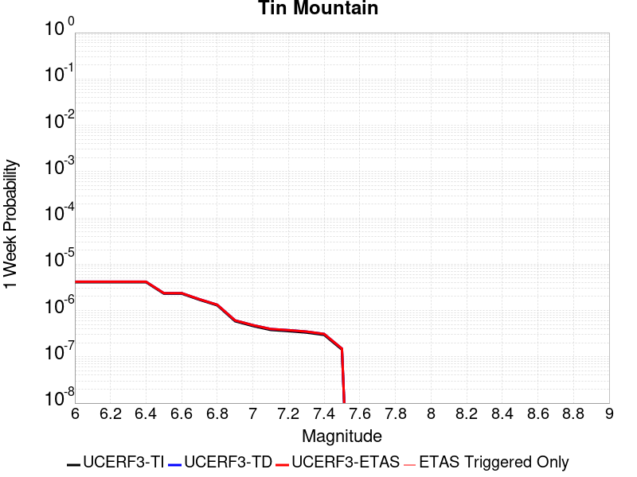 | 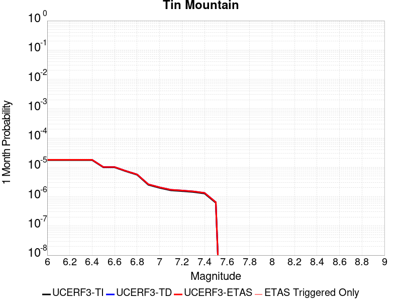 |  |  |

| Magnitude | 1 wk TI Prob | 1 wk TD Prob | 1 wk ETAS Prob | 1 wk ETAS/TD Gain | 1 wk ETAS Triggered Only | 1 mo TI Prob | 1 mo TD Prob | 1 mo ETAS Prob | 1 mo ETAS/TD Gain | 1 mo ETAS Triggered Only | 1 yr TI Prob | 1 yr TD Prob | 1 yr ETAS Prob | 1 yr ETAS/TD Gain | 1 yr ETAS Triggered Only | 10 yr TI Prob | 10 yr TD Prob | 10 yr ETAS Prob | 10 yr ETAS/TD Gain | 10 yr ETAS Triggered Only |
|-----|-----|-----|-----|-----|-----|-----|-----|-----|-----|-----|-----|-----|-----|-----|-----|-----|-----|-----|-----|-----|
| 6.0 | 4.083776E-6 | 4.18159E-6 | 4.18159E-6 | 1.0 | 0.0 | 1.750178E-5 | 1.7920998E-5 | 1.7920998E-5 | 1.0 | 0.0 | 2.1306332E-4 | 2.1817003E-4 | 2.2816785E-4 | 1.0458258 | 1.0E-5 | 0.0021285915 | 0.0021799242 | 0.002229815 | 1.0228866 | 5.0E-5 |
| 6.1 | 4.083776E-6 | 4.18159E-6 | 4.18159E-6 | 1.0 | 0.0 | 1.750178E-5 | 1.7920998E-5 | 1.7920998E-5 | 1.0 | 0.0 | 2.1306332E-4 | 2.1817003E-4 | 2.2816785E-4 | 1.0458258 | 1.0E-5 | 0.0021285915 | 0.0021799242 | 0.002229815 | 1.0228866 | 5.0E-5 |
| 6.2 | 4.083776E-6 | 4.18159E-6 | 4.18159E-6 | 1.0 | 0.0 | 1.750178E-5 | 1.7920998E-5 | 1.7920998E-5 | 1.0 | 0.0 | 2.1306332E-4 | 2.1817003E-4 | 2.2816785E-4 | 1.0458258 | 1.0E-5 | 0.0021285915 | 0.0021799242 | 0.002229815 | 1.0228866 | 5.0E-5 |
| 6.3 | 4.083776E-6 | 4.18159E-6 | 4.18159E-6 | 1.0 | 0.0 | 1.750178E-5 | 1.7920998E-5 | 1.7920998E-5 | 1.0 | 0.0 | 2.1306332E-4 | 2.1817003E-4 | 2.2816785E-4 | 1.0458258 | 1.0E-5 | 0.0021285915 | 0.0021799242 | 0.002229815 | 1.0228866 | 5.0E-5 |
| 6.4 | 4.083776E-6 | 4.18159E-6 | 4.18159E-6 | 1.0 | 0.0 | 1.750178E-5 | 1.7920998E-5 | 1.7920998E-5 | 1.0 | 0.0 | 2.1306332E-4 | 2.1817003E-4 | 2.2816785E-4 | 1.0458258 | 1.0E-5 | 0.0021285915 | 0.0021799242 | 0.002229815 | 1.0228866 | 5.0E-5 |
| 6.5 | 2.3143427E-6 | 2.3731893E-6 | 2.3731893E-6 | 1.0 | 0.0 | 9.9185745E-6 | 1.01707765E-5 | 1.01707765E-5 | 1.0 | 0.0 | 1.2075195E-4 | 1.2382293E-4 | 1.338217E-4 | 1.0807505 | 1.0E-5 | 0.0012068636 | 0.0012376154 | 0.0012775658 | 1.0322802 | 4.0E-5 |
| 6.6 | 2.3143427E-6 | 2.3731893E-6 | 2.3731893E-6 | 1.0 | 0.0 | 9.9185745E-6 | 1.01707765E-5 | 1.01707765E-5 | 1.0 | 0.0 | 1.2075195E-4 | 1.2382293E-4 | 1.338217E-4 | 1.0807505 | 1.0E-5 | 0.0012068636 | 0.0012376154 | 0.0012775658 | 1.0322802 | 4.0E-5 |
| 6.7 | 1.7029532E-6 | 1.7498172E-6 | 1.7498172E-6 | 1.0 | 0.0 | 7.2983503E-6 | 7.499198E-6 | 7.499198E-6 | 1.0 | 0.0 | 8.885379E-5 | 9.1299444E-5 | 9.1299444E-5 | 1.0 | 0.0 | 8.881827E-4 | 9.12672E-4 | 9.326537E-4 | 1.0218936 | 2.0E-5 |
| 6.8 | 1.2914646E-6 | 1.329959E-6 | 1.329959E-6 | 1.0 | 0.0 | 5.534837E-6 | 5.699814E-6 | 5.699814E-6 | 1.0 | 0.0 | 6.738455E-5 | 6.939347E-5 | 6.939347E-5 | 1.0 | 0.0 | 6.736412E-4 | 6.937614E-4 | 6.937614E-4 | 1.0 | 0.0 |
| 6.9 | 5.8708974E-7 | 6.11713E-7 | 6.11713E-7 | 1.0 | 0.0 | 2.5160964E-6 | 2.6216248E-6 | 2.6216248E-6 | 1.0 | 0.0 | 3.0633044E-5 | 3.1917854E-5 | 3.1917854E-5 | 1.0 | 0.0 | 3.0628822E-4 | 3.1913683E-4 | 3.1913683E-4 | 1.0 | 0.0 |
| 7.0 | 4.6248786E-7 | 4.8321306E-7 | 4.8321306E-7 | 1.0 | 0.0 | 1.9820893E-6 | 2.0709115E-6 | 2.0709115E-6 | 1.0 | 0.0 | 2.413167E-5 | 2.5213094E-5 | 2.5213094E-5 | 1.0 | 0.0 | 2.412905E-4 | 2.5210602E-4 | 2.5210602E-4 | 1.0 | 0.0 |
| 7.1 | 3.804606E-7 | 3.9872486E-7 | 3.9872486E-7 | 1.0 | 0.0 | 1.6305444E-6 | 1.7088199E-6 | 1.7088199E-6 | 1.0 | 0.0 | 1.9851697E-5 | 2.0804719E-5 | 2.0804719E-5 | 1.0 | 0.0 | 1.9849923E-4 | 2.0803107E-4 | 2.0803107E-4 | 1.0 | 0.0 |
| 7.2 | 3.5864858E-7 | 3.7617838E-7 | 3.7617838E-7 | 1.0 | 0.0 | 1.5370645E-6 | 1.6121922E-6 | 1.6121922E-6 | 1.0 | 0.0 | 1.87136E-5 | 1.9628298E-5 | 1.9628298E-5 | 1.0 | 0.0 | 1.8712023E-4 | 1.9626896E-4 | 1.9626896E-4 | 1.0 | 0.0 |
| 7.3 | 3.342063E-7 | 3.5064386E-7 | 3.5064386E-7 | 1.0 | 0.0 | 1.4323119E-6 | 1.5027588E-6 | 1.5027588E-6 | 1.0 | 0.0 | 1.7438259E-5 | 1.8295968E-5 | 1.8295968E-5 | 1.0 | 0.0 | 1.743689E-4 | 1.8294792E-4 | 1.8294792E-4 | 1.0 | 0.0 |
| 7.4 | 2.971242E-7 | 3.1166627E-7 | 3.1166627E-7 | 1.0 | 0.0 | 1.2733886E-6 | 1.3357121E-6 | 1.3357121E-6 | 1.0 | 0.0 | 1.5503398E-5 | 1.6262207E-5 | 1.6262207E-5 | 1.0 | 0.0 | 1.5502315E-4 | 1.6261345E-4 | 1.6261345E-4 | 1.0 | 0.0 |
| 7.5 | 1.4326713E-7 | 1.5012905E-7 | 1.5012905E-7 | 1.0 | 0.0 | 6.140018E-7 | 6.434102E-7 | 6.434102E-7 | 1.0 | 0.0 | 7.4754466E-6 | 7.83352E-6 | 7.83352E-6 | 1.0 | 0.0 | 7.475195E-5 | 7.833519E-5 | 7.833519E-5 | 1.0 | 0.0 |

## Big Pine (Central)
*[(top)](#table-of-contents)*

| 1 Week | 1 Month | 1 Year | 10 Year |
|-----|-----|-----|-----|
|  |  |  | 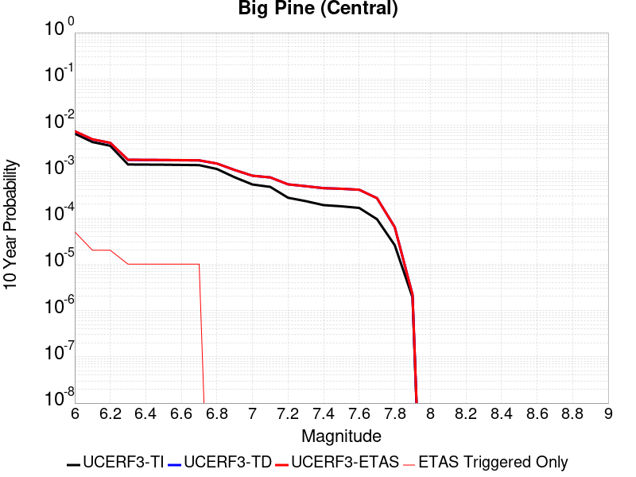 |

| Magnitude | 1 wk TI Prob | 1 wk TD Prob | 1 wk ETAS Prob | 1 wk ETAS/TD Gain | 1 wk ETAS Triggered Only | 1 mo TI Prob | 1 mo TD Prob | 1 mo ETAS Prob | 1 mo ETAS/TD Gain | 1 mo ETAS Triggered Only | 1 yr TI Prob | 1 yr TD Prob | 1 yr ETAS Prob | 1 yr ETAS/TD Gain | 1 yr ETAS Triggered Only | 10 yr TI Prob | 10 yr TD Prob | 10 yr ETAS Prob | 10 yr ETAS/TD Gain | 10 yr ETAS Triggered Only |
|-----|-----|-----|-----|-----|-----|-----|-----|-----|-----|-----|-----|-----|-----|-----|-----|-----|-----|-----|-----|-----|
| 6.0 | 1.2706755E-5 | 1.4252547E-5 | 1.4252547E-5 | 1.0 | 0.0 | 5.4456385E-5 | 6.108112E-5 | 7.108051E-5 | 1.1637067 | 1.0E-5 | 6.628048E-4 | 7.434455E-4 | 7.634306E-4 | 1.0268818 | 2.0E-5 | 0.006608314 | 0.0074146423 | 0.0074642715 | 1.0066934 | 5.0E-5 |
| 6.1 | 8.342579E-6 | 9.512563E-6 | 9.512563E-6 | 1.0 | 0.0 | 3.5753423E-5 | 4.0767616E-5 | 4.0767616E-5 | 1.0 | 0.0 | 4.3521097E-4 | 4.962544E-4 | 4.962544E-4 | 1.0 | 0.0 | 0.0043435963 | 0.0049550477 | 0.0049749487 | 1.0040163 | 2.0E-5 |
| 6.2 | 6.923899E-6 | 7.968877E-6 | 7.968877E-6 | 1.0 | 0.0 | 2.9673516E-5 | 3.415199E-5 | 3.415199E-5 | 1.0 | 0.0 | 3.6121515E-4 | 4.1574042E-4 | 4.1574042E-4 | 1.0 | 0.0 | 0.003606286 | 0.0041529653 | 0.0041728825 | 1.0047958 | 2.0E-5 |
| 6.3 | 2.728396E-6 | 3.425821E-6 | 3.425821E-6 | 1.0 | 0.0 | 1.1693074E-5 | 1.4682013E-5 | 1.4682013E-5 | 1.0 | 0.0 | 1.4235388E-4 | 1.787397E-4 | 1.787397E-4 | 1.0 | 0.0 | 0.0014226272 | 0.0017874972 | 0.0017974793 | 1.0055844 | 1.0E-5 |
| 6.4 | 2.7136944E-6 | 3.4101138E-6 | 3.4101138E-6 | 1.0 | 0.0 | 1.1630066E-5 | 1.4614697E-5 | 1.4614697E-5 | 1.0 | 0.0 | 1.4158686E-4 | 1.7792027E-4 | 1.7792027E-4 | 1.0 | 0.0 | 0.0014149669 | 0.001779316 | 0.0017892981 | 1.0056101 | 1.0E-5 |
| 6.5 | 2.6971882E-6 | 3.3924584E-6 | 3.3924584E-6 | 1.0 | 0.0 | 1.1559327E-5 | 1.4539031E-5 | 1.4539031E-5 | 1.0 | 0.0 | 1.4072572E-4 | 1.769992E-4 | 1.769992E-4 | 1.0 | 0.0 | 0.0014063664 | 0.0017701199 | 0.0017801021 | 1.0056393 | 1.0E-5 |
| 6.6 | 2.669092E-6 | 3.3624776E-6 | 3.3624776E-6 | 1.0 | 0.0 | 1.1438916E-5 | 1.4410544E-5 | 1.4410544E-5 | 1.0 | 0.0 | 1.3925991E-4 | 1.7543513E-4 | 1.7543513E-4 | 1.0 | 0.0 | 0.0013917267 | 0.0017545038 | 0.0017644863 | 1.0056896 | 1.0E-5 |
| 6.7 | 2.6408059E-6 | 3.3325025E-6 | 3.3325025E-6 | 1.0 | 0.0 | 1.1317691E-5 | 1.428208E-5 | 1.428208E-5 | 1.0 | 0.0 | 1.3778417E-4 | 1.7387132E-4 | 1.7387132E-4 | 1.0 | 0.0 | 0.0013769877 | 0.0017388904 | 0.001748873 | 1.0057408 | 1.0E-5 |
| 6.8 | 2.1786943E-6 | 2.8559518E-6 | 2.8559518E-6 | 1.0 | 0.0 | 9.337228E-6 | 1.22397405E-5 | 1.22397405E-5 | 1.0 | 0.0 | 1.1367482E-4 | 1.4900937E-4 | 1.4900937E-4 | 1.0 | 0.0 | 0.0011361669 | 0.0014906187 | 0.0014906187 | 1.0 | 0.0 |
| 6.9 | 1.4411696E-6 | 2.069955E-6 | 2.069955E-6 | 1.0 | 0.0 | 6.1764263E-6 | 8.871207E-6 | 8.871207E-6 | 1.0 | 0.0 | 7.51954E-5 | 1.0800186E-4 | 1.0800186E-4 | 1.0 | 0.0 | 7.5169955E-4 | 0.0010809733 | 0.0010809733 | 1.0 | 0.0 |
| 7.0 | 1.0073411E-6 | 1.5555618E-6 | 1.5555618E-6 | 1.0 | 0.0 | 4.317169E-6 | 6.6666776E-6 | 6.6666776E-6 | 1.0 | 0.0 | 5.2560266E-5 | 8.1163926E-5 | 8.1163926E-5 | 1.0 | 0.0 | 5.2547833E-4 | 8.128111E-4 | 8.128111E-4 | 1.0 | 0.0 |
| 7.1 | 8.947104E-7 | 1.4315309E-6 | 1.4315309E-6 | 1.0 | 0.0 | 3.834468E-6 | 6.135119E-6 | 6.135119E-6 | 1.0 | 0.0 | 4.6683643E-5 | 7.469266E-5 | 7.469266E-5 | 1.0 | 0.0 | 4.6673836E-4 | 7.481436E-4 | 7.481436E-4 | 1.0 | 0.0 |
| 7.2 | 5.215166E-7 | 1.0123637E-6 | 1.0123637E-6 | 1.0 | 0.0 | 2.2350691E-6 | 4.3386945E-6 | 4.3386945E-6 | 1.0 | 0.0 | 2.7211627E-5 | 5.2822368E-5 | 5.2822368E-5 | 1.0 | 0.0 | 2.7208295E-4 | 5.29556E-4 | 5.29556E-4 | 1.0 | 0.0 |
| 7.3 | 4.4024807E-7 | 9.231207E-7 | 9.231207E-7 | 1.0 | 0.0 | 1.8867761E-6 | 3.956226E-6 | 3.956226E-6 | 1.0 | 0.0 | 2.2971257E-5 | 4.8166028E-5 | 4.8166028E-5 | 1.0 | 0.0 | 2.2968883E-4 | 4.8301363E-4 | 4.8301363E-4 | 1.0 | 0.0 |
| 7.4 | 3.6130905E-7 | 8.3697915E-7 | 8.3697915E-7 | 1.0 | 0.0 | 1.5484665E-6 | 3.5870487E-6 | 3.5870487E-6 | 1.0 | 0.0 | 1.8852415E-5 | 4.3671484E-5 | 4.3671484E-5 | 1.0 | 0.0 | 1.8850817E-4 | 4.3807772E-4 | 4.3807772E-4 | 1.0 | 0.0 |
| 7.5 | 3.408184E-7 | 8.1191774E-7 | 8.1191774E-7 | 1.0 | 0.0 | 1.4606494E-6 | 3.479643E-6 | 3.479643E-6 | 1.0 | 0.0 | 1.7783263E-5 | 4.236387E-5 | 4.236387E-5 | 1.0 | 0.0 | 1.778184E-4 | 4.2498423E-4 | 4.2498423E-4 | 1.0 | 0.0 |
| 7.6 | 3.1428627E-7 | 7.742247E-7 | 7.742247E-7 | 1.0 | 0.0 | 1.3469405E-6 | 3.318102E-6 | 3.318102E-6 | 1.0 | 0.0 | 1.6398877E-5 | 4.0397183E-5 | 4.0397183E-5 | 1.0 | 0.0 | 1.6397667E-4 | 4.0529485E-4 | 4.0529485E-4 | 1.0 | 0.0 |
| 7.7 | 1.7972785E-7 | 5.085898E-7 | 5.085898E-7 | 1.0 | 0.0 | 7.70262E-7 | 2.1796686E-6 | 2.1796686E-6 | 1.0 | 0.0 | 9.377899E-6 | 2.6537155E-5 | 2.6537155E-5 | 1.0 | 0.0 | 9.377503E-5 | 2.6671647E-4 | 2.6671647E-4 | 1.0 | 0.0 |
| 7.8 | 4.9230927E-8 | 1.1999686E-7 | 1.1999686E-7 | 1.0 | 0.0 | 2.1098968E-7 | 5.1427213E-7 | 5.1427213E-7 | 1.0 | 0.0 | 2.5687964E-6 | 6.261247E-6 | 6.261247E-6 | 1.0 | 0.0 | 2.5687666E-5 | 6.306763E-5 | 6.306763E-5 | 1.0 | 0.0 |
| 7.9 | 3.6805972E-9 | 4.112225E-9 | 4.112225E-9 | 1.0 | 0.0 | 1.5773987E-8 | 1.762382E-8 | 1.762382E-8 | 1.0 | 0.0 | 1.9204828E-7 | 2.1457E-7 | 2.1457E-7 | 1.0 | 0.0 | 1.920481E-6 | 2.1932892E-6 | 2.1932892E-6 | 1.0 | 0.0 |

## Pisgah-Bullion Mtn-Mesquite Lk
*[(top)](#table-of-contents)*

| 1 Week | 1 Month | 1 Year | 10 Year |
|-----|-----|-----|-----|
|  | 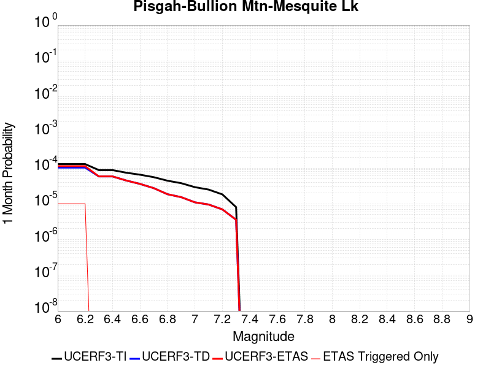 | 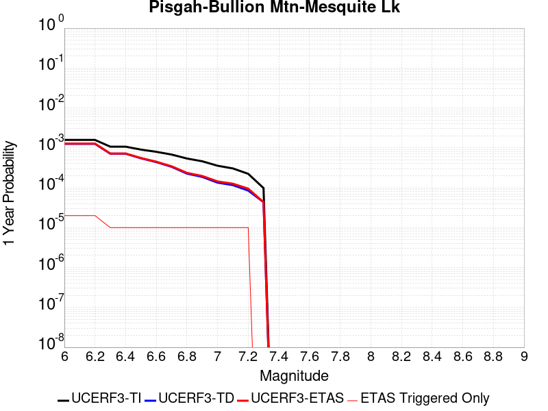 |  |

| Magnitude | 1 wk TI Prob | 1 wk TD Prob | 1 wk ETAS Prob | 1 wk ETAS/TD Gain | 1 wk ETAS Triggered Only | 1 mo TI Prob | 1 mo TD Prob | 1 mo ETAS Prob | 1 mo ETAS/TD Gain | 1 mo ETAS Triggered Only | 1 yr TI Prob | 1 yr TD Prob | 1 yr ETAS Prob | 1 yr ETAS/TD Gain | 1 yr ETAS Triggered Only | 10 yr TI Prob | 10 yr TD Prob | 10 yr ETAS Prob | 10 yr ETAS/TD Gain | 10 yr ETAS Triggered Only |
|-----|-----|-----|-----|-----|-----|-----|-----|-----|-----|-----|-----|-----|-----|-----|-----|-----|-----|-----|-----|-----|
| 6.0 | 3.0240792E-5 | 2.4092273E-5 | 2.4092273E-5 | 1.0 | 0.0 | 1.2959696E-4 | 1.0324908E-4 | 1.1324805E-4 | 1.0968431 | 1.0E-5 | 0.0015767008 | 0.0012564333 | 0.0012764082 | 1.0158981 | 2.0E-5 | 0.015655609 | 0.012503322 | 0.012552697 | 1.0039489 | 5.0E-5 |
| 6.1 | 3.0240792E-5 | 2.4092273E-5 | 2.4092273E-5 | 1.0 | 0.0 | 1.2959696E-4 | 1.0324908E-4 | 1.1324805E-4 | 1.0968431 | 1.0E-5 | 0.0015767008 | 0.0012564333 | 0.0012764082 | 1.0158981 | 2.0E-5 | 0.015655609 | 0.012503322 | 0.012552697 | 1.0039489 | 5.0E-5 |
| 6.2 | 3.0240792E-5 | 2.4092273E-5 | 2.4092273E-5 | 1.0 | 0.0 | 1.2959696E-4 | 1.0324908E-4 | 1.1324805E-4 | 1.0968431 | 1.0E-5 | 0.0015767008 | 0.0012564333 | 0.0012764082 | 1.0158981 | 2.0E-5 | 0.015655609 | 0.012503322 | 0.012552697 | 1.0039489 | 5.0E-5 |
| 6.3 | 2.0498217E-5 | 1.3638665E-5 | 1.3638665E-5 | 1.0 | 0.0 | 8.784654E-5 | 5.84502E-5 | 5.84502E-5 | 1.0 | 0.0 | 0.0010690069 | 7.114151E-4 | 7.21408E-4 | 1.0140465 | 1.0E-5 | 0.01063879 | 0.007093003 | 0.007112861 | 1.0027996 | 2.0E-5 |
| 6.4 | 2.0498217E-5 | 1.3638665E-5 | 1.3638665E-5 | 1.0 | 0.0 | 8.784654E-5 | 5.84502E-5 | 5.84502E-5 | 1.0 | 0.0 | 0.0010690069 | 7.114151E-4 | 7.21408E-4 | 1.0140465 | 1.0E-5 | 0.01063879 | 0.007093003 | 0.007112861 | 1.0027996 | 2.0E-5 |
| 6.5 | 1.7316182E-5 | 1.0477401E-5 | 1.0477401E-5 | 1.0 | 0.0 | 7.42101E-5 | 4.4902426E-5 | 4.4902426E-5 | 1.0 | 0.0 | 9.0313336E-4 | 5.465599E-4 | 5.5655447E-4 | 1.0182862 | 1.0E-5 | 0.008994718 | 0.0054531526 | 0.005473044 | 1.0036476 | 2.0E-5 |
| 6.6 | 1.5251077E-5 | 8.414451E-6 | 8.414451E-6 | 1.0 | 0.0 | 6.536012E-5 | 3.6061476E-5 | 3.6061476E-5 | 1.0 | 0.0 | 7.9546886E-4 | 4.3896728E-4 | 4.4896288E-4 | 1.0227708 | 1.0E-5 | 0.007926274 | 0.004381719 | 0.0044016317 | 1.0045444 | 2.0E-5 |
| 6.7 | 1.2997425E-5 | 6.411434E-6 | 6.411434E-6 | 1.0 | 0.0 | 5.570206E-5 | 2.747731E-5 | 2.747731E-5 | 1.0 | 0.0 | 6.7796157E-4 | 3.3448957E-4 | 3.444862E-4 | 1.0298862 | 1.0E-5 | 0.0067589693 | 0.0033403211 | 0.0033502877 | 1.0029837 | 1.0E-5 |
| 6.8 | 1.035386E-5 | 4.3333516E-6 | 4.3333516E-6 | 1.0 | 0.0 | 4.437293E-5 | 1.857138E-5 | 1.857138E-5 | 1.0 | 0.0 | 5.401065E-4 | 2.2608395E-4 | 2.360817E-4 | 1.0442214 | 1.0E-5 | 0.0053879567 | 0.0022586263 | 0.0022686038 | 1.0044174 | 1.0E-5 |
| 6.9 | 8.816252E-6 | 3.5807668E-6 | 3.5807668E-6 | 1.0 | 0.0 | 3.778339E-5 | 1.5346057E-5 | 1.5346057E-5 | 1.0 | 0.0 | 4.5991567E-4 | 1.8682281E-4 | 1.9682094E-4 | 1.0535166 | 1.0E-5 | 0.00458965 | 0.001866716 | 0.0018766973 | 1.005347 | 1.0E-5 |
| 7.0 | 6.8232207E-6 | 2.5675947E-6 | 2.5675947E-6 | 1.0 | 0.0 | 2.9242048E-5 | 1.1003933E-5 | 1.1003933E-5 | 1.0 | 0.0 | 3.5596377E-4 | 1.3396496E-4 | 1.4396363E-4 | 1.0746363 | 1.0E-5 | 0.0035539411 | 0.0013388731 | 0.0013488597 | 1.0074589 | 1.0E-5 |
| 7.1 | 5.837013E-6 | 2.2274467E-6 | 2.2274467E-6 | 1.0 | 0.0 | 2.501553E-5 | 9.546166E-6 | 9.546166E-6 | 1.0 | 0.0 | 3.045215E-4 | 1.16218675E-4 | 1.262175E-4 | 1.0860347 | 1.0E-5 | 0.0030410455 | 0.001161608 | 0.0011715963 | 1.0085988 | 1.0E-5 |
| 7.2 | 4.278052E-6 | 1.6275889E-6 | 1.6275889E-6 | 1.0 | 0.0 | 1.833438E-5 | 6.9753632E-6 | 6.9753632E-6 | 1.0 | 0.0 | 2.231982E-4 | 8.492197E-5 | 9.4921124E-5 | 1.1177452 | 1.0E-5 | 0.0022297418 | 8.4891845E-4 | 8.5891E-4 | 1.0117697 | 1.0E-5 |
| 7.3 | 1.8803692E-6 | 8.345203E-7 | 8.345203E-7 | 1.0 | 0.0 | 8.0587E-6 | 3.5765115E-6 | 3.5765115E-6 | 1.0 | 0.0 | 9.811026E-5 | 4.3543307E-5 | 4.3543307E-5 | 1.0 | 0.0 | 9.806695E-4 | 4.353622E-4 | 4.353622E-4 | 1.0 | 0.0 |

## Whittier alt 1
*[(top)](#table-of-contents)*

| 1 Week | 1 Month | 1 Year | 10 Year |
|-----|-----|-----|-----|
|  |  |  |  |

| Magnitude | 1 wk TI Prob | 1 wk TD Prob | 1 wk ETAS Prob | 1 wk ETAS/TD Gain | 1 wk ETAS Triggered Only | 1 mo TI Prob | 1 mo TD Prob | 1 mo ETAS Prob | 1 mo ETAS/TD Gain | 1 mo ETAS Triggered Only | 1 yr TI Prob | 1 yr TD Prob | 1 yr ETAS Prob | 1 yr ETAS/TD Gain | 1 yr ETAS Triggered Only | 10 yr TI Prob | 10 yr TD Prob | 10 yr ETAS Prob | 10 yr ETAS/TD Gain | 10 yr ETAS Triggered Only |
|-----|-----|-----|-----|-----|-----|-----|-----|-----|-----|-----|-----|-----|-----|-----|-----|-----|-----|-----|-----|-----|
| 6.0 | 4.2554693E-5 | 4.725724E-5 | 4.725724E-5 | 1.0 | 0.0 | 1.8236451E-4 | 2.0251713E-4 | 2.0251713E-4 | 1.0 | 0.0 | 0.002218027 | 0.0024631799 | 0.002493106 | 1.0121493 | 3.0E-5 | 0.02196019 | 0.024392825 | 0.024441604 | 1.0019997 | 5.0E-5 |
| 6.1 | 4.2554693E-5 | 4.725724E-5 | 4.725724E-5 | 1.0 | 0.0 | 1.8236451E-4 | 2.0251713E-4 | 2.0251713E-4 | 1.0 | 0.0 | 0.002218027 | 0.0024631799 | 0.002493106 | 1.0121493 | 3.0E-5 | 0.02196019 | 0.024392825 | 0.024441604 | 1.0019997 | 5.0E-5 |
| 6.2 | 4.2554693E-5 | 4.725724E-5 | 4.725724E-5 | 1.0 | 0.0 | 1.8236451E-4 | 2.0251713E-4 | 2.0251713E-4 | 1.0 | 0.0 | 0.002218027 | 0.0024631799 | 0.002493106 | 1.0121493 | 3.0E-5 | 0.02196019 | 0.024392825 | 0.024441604 | 1.0019997 | 5.0E-5 |
| 6.3 | 1.9617712E-5 | 1.827133E-5 | 1.827133E-5 | 1.0 | 0.0 | 8.40732E-5 | 7.8303456E-5 | 7.8303456E-5 | 1.0 | 0.0 | 0.0010231105 | 9.5294666E-4 | 9.6293713E-4 | 1.0104837 | 1.0E-5 | 0.01018413 | 0.009491887 | 0.009511697 | 1.0020871 | 2.0E-5 |
| 6.4 | 1.5611336E-5 | 1.3606614E-5 | 1.3606614E-5 | 1.0 | 0.0 | 6.690401E-5 | 5.8312788E-5 | 5.8312788E-5 | 1.0 | 0.0 | 8.142519E-4 | 7.0973294E-4 | 7.1972585E-4 | 1.0140798 | 1.0E-5 | 0.008112748 | 0.0070766234 | 0.0070865527 | 1.0014031 | 1.0E-5 |
| 6.5 | 1.5150166E-5 | 1.3103243E-5 | 1.3103243E-5 | 1.0 | 0.0 | 6.492767E-5 | 5.615558E-5 | 5.615558E-5 | 1.0 | 0.0 | 7.9020765E-4 | 6.834856E-4 | 6.9347874E-4 | 1.0146209 | 1.0E-5 | 0.007874036 | 0.0068157804 | 0.0068257125 | 1.0014572 | 1.0E-5 |
| 6.6 | 1.295588E-5 | 1.03825705E-5 | 1.03825705E-5 | 1.0 | 0.0 | 5.552402E-5 | 4.4495984E-5 | 4.4495984E-5 | 1.0 | 0.0 | 6.7579525E-4 | 5.4160587E-4 | 5.516005E-4 | 1.0184536 | 1.0E-5 | 0.006737438 | 0.005404372 | 0.005414318 | 1.0018404 | 1.0E-5 |
| 6.7 | 1.2542085E-5 | 9.901169E-6 | 9.901169E-6 | 1.0 | 0.0 | 5.3750682E-5 | 4.24329E-5 | 4.24329E-5 | 1.0 | 0.0 | 6.542181E-4 | 5.165E-4 | 5.264948E-4 | 1.0193511 | 1.0E-5 | 0.006522954 | 0.0051544965 | 0.005164445 | 1.00193 | 1.0E-5 |
| 6.8 | 1.2195878E-5 | 9.497154E-6 | 9.497154E-6 | 1.0 | 0.0 | 5.2267E-5 | 4.0701463E-5 | 4.0701463E-5 | 1.0 | 0.0 | 6.36165E-4 | 4.954295E-4 | 5.054245E-4 | 1.0201745 | 1.0E-5 | 0.0063434686 | 0.0049446435 | 0.004954594 | 1.0020124 | 1.0E-5 |
| 6.9 | 1.1580298E-5 | 8.774531E-6 | 8.774531E-6 | 1.0 | 0.0 | 4.9628903E-5 | 3.76046E-5 | 3.76046E-5 | 1.0 | 0.0 | 6.040644E-4 | 4.577415E-4 | 4.677369E-4 | 1.0218364 | 1.0E-5 | 0.00602425 | 0.0045693456 | 0.0045793 | 1.0021785 | 1.0E-5 |
| 7.0 | 1.0964795E-5 | 8.085506E-6 | 8.085506E-6 | 1.0 | 0.0 | 4.6991136E-5 | 3.465172E-5 | 3.465172E-5 | 1.0 | 0.0 | 5.7196687E-4 | 4.2180452E-4 | 4.318003E-4 | 1.0236976 | 1.0E-5 | 0.0057049696 | 0.0042113136 | 0.0042212713 | 1.0023645 | 1.0E-5 |
| 7.1 | 1.0230601E-5 | 7.3279657E-6 | 7.3279657E-6 | 1.0 | 0.0 | 4.3844695E-5 | 3.1405198E-5 | 3.1405198E-5 | 1.0 | 0.0 | 5.336784E-4 | 3.822925E-4 | 3.9228867E-4 | 1.026148 | 1.0E-5 | 0.005323986 | 0.0038174998 | 0.0038274617 | 1.0026095 | 1.0E-5 |
| 7.2 | 9.40865E-6 | 6.544458E-6 | 6.544458E-6 | 1.0 | 0.0 | 4.032216E-5 | 2.8047383E-5 | 2.8047383E-5 | 1.0 | 0.0 | 4.908117E-4 | 3.414246E-4 | 3.514212E-4 | 1.029279 | 1.0E-5 | 0.0048972913 | 0.0034100893 | 0.0034200551 | 1.0029224 | 1.0E-5 |
| 7.3 | 8.237384E-6 | 5.5987566E-6 | 5.5987566E-6 | 1.0 | 0.0 | 3.5302593E-5 | 2.3994457E-5 | 2.3994457E-5 | 1.0 | 0.0 | 4.2972428E-4 | 2.920944E-4 | 2.920944E-4 | 1.0 | 0.0 | 0.0042889426 | 0.002917429 | 0.002917429 | 1.0 | 0.0 |
| 7.4 | 7.5316966E-6 | 5.028736E-6 | 5.028736E-6 | 1.0 | 0.0 | 3.2278298E-5 | 2.1551552E-5 | 2.1551552E-5 | 1.0 | 0.0 | 3.9291743E-4 | 2.6235956E-4 | 2.6235956E-4 | 1.0 | 0.0 | 0.0039222343 | 0.0026206083 | 0.0026206083 | 1.0 | 0.0 |
| 7.5 | 6.149649E-6 | 3.9345864E-6 | 3.9345864E-6 | 1.0 | 0.0 | 2.6355372E-5 | 1.6862408E-5 | 1.6862408E-5 | 1.0 | 0.0 | 3.208294E-4 | 2.0528138E-4 | 2.0528138E-4 | 1.0 | 0.0 | 0.003203666 | 0.0020510068 | 0.0020510068 | 1.0 | 0.0 |
| 7.6 | 5.457711E-6 | 3.3960353E-6 | 3.3960353E-6 | 1.0 | 0.0 | 2.338998E-5 | 1.455436E-5 | 1.455436E-5 | 1.0 | 0.0 | 2.8473578E-4 | 1.7718575E-4 | 1.7718575E-4 | 1.0 | 0.0 | 0.0028437122 | 0.0017705255 | 0.0017705255 | 1.0 | 0.0 |
| 7.7 | 4.1676276E-6 | 2.3337E-6 | 2.3337E-6 | 1.0 | 0.0 | 1.7861139E-5 | 1.0001537E-5 | 1.0001537E-5 | 1.0 | 0.0 | 2.1743766E-4 | 1.21762656E-4 | 1.21762656E-4 | 1.0 | 0.0 | 0.0021722503 | 0.0012170325 | 0.0012170325 | 1.0 | 0.0 |
| 7.8 | 2.2692414E-7 | 9.38645E-8 | 9.38645E-8 | 1.0 | 0.0 | 9.725317E-7 | 4.0227638E-7 | 4.0227638E-7 | 1.0 | 0.0 | 1.1840509E-5 | 4.8977076E-6 | 4.8977076E-6 | 1.0 | 0.0 | 1.1839878E-4 | 4.8976322E-5 | 4.8976322E-5 | 1.0 | 0.0 |
| 7.9 | 6.676829E-9 | 3.4402008E-9 | 3.4402008E-9 | 1.0 | 0.0 | 2.861498E-8 | 1.4743718E-8 | 1.4743718E-8 | 1.0 | 0.0 | 3.4838732E-7 | 1.7950475E-7 | 1.7950475E-7 | 1.0 | 0.0 | 3.4838679E-6 | 1.7950463E-6 | 1.7950463E-6 | 1.0 | 0.0 |

## Red Mountain
*[(top)](#table-of-contents)*

| 1 Week | 1 Month | 1 Year | 10 Year |
|-----|-----|-----|-----|
|  |  | 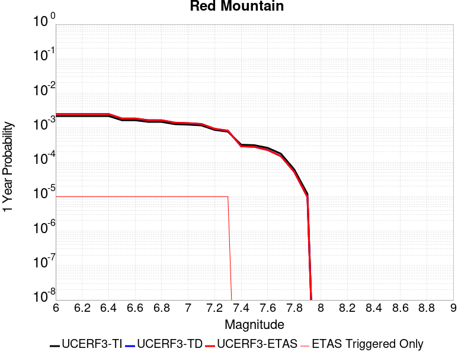 |  |

| Magnitude | 1 wk TI Prob | 1 wk TD Prob | 1 wk ETAS Prob | 1 wk ETAS/TD Gain | 1 wk ETAS Triggered Only | 1 mo TI Prob | 1 mo TD Prob | 1 mo ETAS Prob | 1 mo ETAS/TD Gain | 1 mo ETAS Triggered Only | 1 yr TI Prob | 1 yr TD Prob | 1 yr ETAS Prob | 1 yr ETAS/TD Gain | 1 yr ETAS Triggered Only | 10 yr TI Prob | 10 yr TD Prob | 10 yr ETAS Prob | 10 yr ETAS/TD Gain | 10 yr ETAS Triggered Only |
|-----|-----|-----|-----|-----|-----|-----|-----|-----|-----|-----|-----|-----|-----|-----|-----|-----|-----|-----|-----|-----|
| 6.0 | 4.1810763E-5 | 4.759426E-5 | 4.759426E-5 | 1.0 | 0.0 | 1.7917668E-4 | 2.0396039E-4 | 2.0396039E-4 | 1.0 | 0.0 | 0.0021792934 | 0.0024805544 | 0.0024905296 | 1.0040214 | 1.0E-5 | 0.021580452 | 0.024546275 | 0.024585294 | 1.0015895 | 4.0E-5 |
| 6.1 | 4.1810763E-5 | 4.759426E-5 | 4.759426E-5 | 1.0 | 0.0 | 1.7917668E-4 | 2.0396039E-4 | 2.0396039E-4 | 1.0 | 0.0 | 0.0021792934 | 0.0024805544 | 0.0024905296 | 1.0040214 | 1.0E-5 | 0.021580452 | 0.024546275 | 0.024585294 | 1.0015895 | 4.0E-5 |
| 6.2 | 4.1810763E-5 | 4.759426E-5 | 4.759426E-5 | 1.0 | 0.0 | 1.7917668E-4 | 2.0396039E-4 | 2.0396039E-4 | 1.0 | 0.0 | 0.0021792934 | 0.0024805544 | 0.0024905296 | 1.0040214 | 1.0E-5 | 0.021580452 | 0.024546275 | 0.024585294 | 1.0015895 | 4.0E-5 |
| 6.3 | 4.1810763E-5 | 4.759426E-5 | 4.759426E-5 | 1.0 | 0.0 | 1.7917668E-4 | 2.0396039E-4 | 2.0396039E-4 | 1.0 | 0.0 | 0.0021792934 | 0.0024805544 | 0.0024905296 | 1.0040214 | 1.0E-5 | 0.021580452 | 0.024546275 | 0.024585294 | 1.0015895 | 4.0E-5 |
| 6.4 | 4.1810763E-5 | 4.759426E-5 | 4.759426E-5 | 1.0 | 0.0 | 1.7917668E-4 | 2.0396039E-4 | 2.0396039E-4 | 1.0 | 0.0 | 0.0021792934 | 0.0024805544 | 0.0024905296 | 1.0040214 | 1.0E-5 | 0.021580452 | 0.024546275 | 0.024585294 | 1.0015895 | 4.0E-5 |
| 6.5 | 3.154503E-5 | 3.5362766E-5 | 3.5362766E-5 | 1.0 | 0.0 | 1.3518598E-4 | 1.5154642E-4 | 1.5154642E-4 | 1.0 | 0.0 | 0.0016446467 | 0.0018436083 | 0.0018535899 | 1.0054141 | 1.0E-5 | 0.01632528 | 0.018292787 | 0.018332055 | 1.0021466 | 4.0E-5 |
| 6.6 | 3.1535834E-5 | 3.5352146E-5 | 3.5352146E-5 | 1.0 | 0.0 | 1.3514658E-4 | 1.5150092E-4 | 1.5150092E-4 | 1.0 | 0.0 | 0.0016441676 | 0.0018430552 | 0.0018530368 | 1.0054158 | 1.0E-5 | 0.01632056 | 0.018287348 | 0.018326616 | 1.0021473 | 4.0E-5 |
| 6.7 | 2.8267326E-5 | 3.1471976E-5 | 3.1471976E-5 | 1.0 | 0.0 | 1.2114006E-4 | 1.3487341E-4 | 1.3487341E-4 | 1.0 | 0.0 | 0.0014738824 | 0.0016409319 | 0.0016509155 | 1.0060841 | 1.0E-5 | 0.014641452 | 0.01629692 | 0.016336268 | 1.0024145 | 4.0E-5 |
| 6.8 | 2.8212884E-5 | 3.1409858E-5 | 3.1409858E-5 | 1.0 | 0.0 | 1.20906756E-4 | 1.3460721E-4 | 1.3460721E-4 | 1.0 | 0.0 | 0.0014710457 | 0.0016376958 | 0.0016476795 | 1.0060961 | 1.0E-5 | 0.014613459 | 0.016265033 | 0.016304381 | 1.0024192 | 4.0E-5 |
| 6.9 | 2.4227871E-5 | 2.6709162E-5 | 2.6709162E-5 | 1.0 | 0.0 | 1.03829596E-4 | 1.1446325E-4 | 1.1446325E-4 | 1.0 | 0.0 | 0.0012633923 | 0.0013927751 | 0.0014027611 | 1.00717 | 1.0E-5 | 0.012562336 | 0.013848151 | 0.013887597 | 1.0028485 | 4.0E-5 |
| 7.0 | 2.348524E-5 | 2.5837868E-5 | 2.5837868E-5 | 1.0 | 0.0 | 1.0064714E-4 | 1.10729445E-4 | 1.10729445E-4 | 1.0 | 0.0 | 0.0012246901 | 0.0013473729 | 0.0013573595 | 1.0074118 | 1.0E-5 | 0.012179627 | 0.013399675 | 0.013439138 | 1.0029452 | 4.0E-5 |
| 7.1 | 2.2311642E-5 | 2.4464809E-5 | 2.4464809E-5 | 1.0 | 0.0 | 9.561782E-5 | 1.0484539E-4 | 1.0484539E-4 | 1.0 | 0.0 | 0.0011635252 | 0.00127582 | 0.0012858072 | 1.0078281 | 1.0E-5 | 0.01157452 | 0.012692473 | 0.012722092 | 1.0023336 | 3.0E-5 |
| 7.2 | 1.6533986E-5 | 1.7671693E-5 | 1.7671693E-5 | 1.0 | 0.0 | 7.085802E-5 | 7.573399E-5 | 7.573399E-5 | 1.0 | 0.0 | 8.623549E-4 | 9.217347E-4 | 9.317255E-4 | 1.0108391 | 1.0E-5 | 0.008590161 | 0.009185396 | 0.00921512 | 1.003236 | 3.0E-5 |
| 7.3 | 1.4703092E-5 | 1.5560694E-5 | 1.5560694E-5 | 1.0 | 0.0 | 6.301173E-5 | 6.668733E-5 | 6.668733E-5 | 1.0 | 0.0 | 7.668978E-4 | 8.116775E-4 | 8.2166935E-4 | 1.0123101 | 1.0E-5 | 0.0076425658 | 0.008093204 | 0.008113042 | 1.0024512 | 2.0E-5 |
| 7.4 | 6.1331984E-6 | 5.5291357E-6 | 5.5291357E-6 | 1.0 | 0.0 | 2.6284872E-5 | 2.3696084E-5 | 2.3696084E-5 | 1.0 | 0.0 | 3.199713E-4 | 2.8846215E-4 | 2.8846215E-4 | 1.0 | 0.0 | 0.0031951098 | 0.0028809316 | 0.0028909028 | 1.0034611 | 1.0E-5 |
| 7.5 | 5.954766E-6 | 5.3387566E-6 | 5.3387566E-6 | 1.0 | 0.0 | 2.5520176E-5 | 2.288019E-5 | 2.288019E-5 | 1.0 | 0.0 | 3.1066386E-4 | 2.7853122E-4 | 2.7853122E-4 | 1.0 | 0.0 | 0.003102299 | 0.0027818752 | 0.0027918473 | 1.0035847 | 1.0E-5 |
| 7.6 | 4.9726646E-6 | 4.315507E-6 | 4.315507E-6 | 1.0 | 0.0 | 2.1311245E-5 | 1.84949E-5 | 1.84949E-5 | 1.0 | 0.0 | 2.5943352E-4 | 2.2515249E-4 | 2.2515249E-4 | 1.0 | 0.0 | 0.0025913084 | 0.0022492784 | 0.0022592559 | 1.0044359 | 1.0E-5 |
| 7.7 | 3.3613894E-6 | 2.8528066E-6 | 2.8528066E-6 | 1.0 | 0.0 | 1.4405875E-5 | 1.2226258E-5 | 1.2226258E-5 | 1.0 | 0.0 | 1.7537741E-4 | 1.4884479E-4 | 1.4884479E-4 | 1.0 | 0.0 | 0.0017523908 | 0.0014874772 | 0.0014974623 | 1.0067128 | 1.0E-5 |
| 7.8 | 1.1828961E-6 | 1.0123285E-6 | 1.0123285E-6 | 1.0 | 0.0 | 5.069545E-6 | 4.338544E-6 | 4.338544E-6 | 1.0 | 0.0 | 6.171996E-5 | 5.2820524E-5 | 5.2820524E-5 | 1.0 | 0.0 | 6.170282E-4 | 5.280826E-4 | 5.380773E-4 | 1.0189264 | 1.0E-5 |
| 7.9 | 2.2967266E-7 | 1.8619782E-7 | 1.8619782E-7 | 1.0 | 0.0 | 9.843111E-7 | 7.979905E-7 | 7.979905E-7 | 1.0 | 0.0 | 1.19839215E-5 | 9.715493E-6 | 9.715493E-6 | 1.0 | 0.0 | 1.1983275E-4 | 9.715097E-5 | 9.715097E-5 | 1.0 | 0.0 |

## Brawley (Seismic Zone) alt 1
*[(top)](#table-of-contents)*

| 1 Week | 1 Month | 1 Year | 10 Year |
|-----|-----|-----|-----|
|  |  | 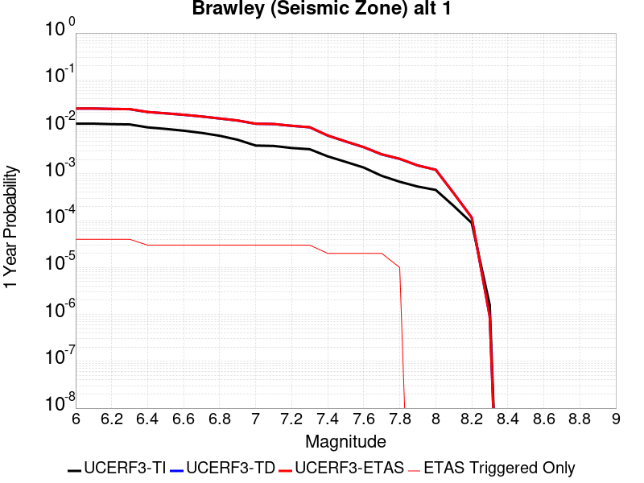 |  |

| Magnitude | 1 wk TI Prob | 1 wk TD Prob | 1 wk ETAS Prob | 1 wk ETAS/TD Gain | 1 wk ETAS Triggered Only | 1 mo TI Prob | 1 mo TD Prob | 1 mo ETAS Prob | 1 mo ETAS/TD Gain | 1 mo ETAS Triggered Only | 1 yr TI Prob | 1 yr TD Prob | 1 yr ETAS Prob | 1 yr ETAS/TD Gain | 1 yr ETAS Triggered Only | 10 yr TI Prob | 10 yr TD Prob | 10 yr ETAS Prob | 10 yr ETAS/TD Gain | 10 yr ETAS Triggered Only |
|-----|-----|-----|-----|-----|-----|-----|-----|-----|-----|-----|-----|-----|-----|-----|-----|-----|-----|-----|-----|-----|
| 6.0 | 2.2521618E-4 | 4.76691E-4 | 4.76691E-4 | 1.0 | 0.0 | 9.6485513E-4 | 0.002041399 | 0.0020513786 | 1.0048887 | 1.0E-5 | 0.011683988 | 0.024565222 | 0.024604239 | 1.0015883 | 4.0E-5 | 0.11088423 | 0.21363127 | 0.21366273 | 1.0001472 | 4.0E-5 |
| 6.1 | 2.2521618E-4 | 4.76691E-4 | 4.76691E-4 | 1.0 | 0.0 | 9.6485513E-4 | 0.002041399 | 0.0020513786 | 1.0048887 | 1.0E-5 | 0.011683988 | 0.024565222 | 0.024604239 | 1.0015883 | 4.0E-5 | 0.11088423 | 0.21363127 | 0.21366273 | 1.0001472 | 4.0E-5 |
| 6.2 | 2.198148E-4 | 4.6752882E-4 | 4.6752882E-4 | 1.0 | 0.0 | 9.417233E-4 | 0.0020021931 | 0.002012173 | 1.0049845 | 1.0E-5 | 0.011405343 | 0.02409898 | 0.024138015 | 1.0016198 | 4.0E-5 | 0.10837428 | 0.21006602 | 0.21009761 | 1.0001504 | 4.0E-5 |
| 6.3 | 2.1704129E-4 | 4.618843E-4 | 4.618843E-4 | 1.0 | 0.0 | 9.298453E-4 | 0.001978039 | 0.0019880193 | 1.0050455 | 1.0E-5 | 0.011262234 | 0.02381224 | 0.023851288 | 1.0016398 | 4.0E-5 | 0.107082725 | 0.20795701 | 0.2079887 | 1.0001523 | 4.0E-5 |
| 6.4 | 1.876142E-4 | 4.0079502E-4 | 4.0079502E-4 | 1.0 | 0.0 | 8.038131E-4 | 0.0017165765 | 0.0017165765 | 1.0 | 0.0 | 0.00974259 | 0.020700144 | 0.020729521 | 1.0014193 | 3.0E-5 | 0.093263686 | 0.18470816 | 0.18473262 | 1.0001324 | 3.0E-5 |
| 6.5 | 1.7390939E-4 | 3.7510466E-4 | 3.7510466E-4 | 1.0 | 0.0 | 7.45113E-4 | 0.0016066132 | 0.0016066132 | 1.0 | 0.0 | 0.009034078 | 0.019388033 | 0.01941745 | 1.0015173 | 3.0E-5 | 0.086755216 | 0.17452815 | 0.17455292 | 1.0001419 | 3.0E-5 |
| 6.6 | 1.591791E-4 | 3.4923697E-4 | 3.4923697E-4 | 1.0 | 0.0 | 6.8201777E-4 | 0.0014958814 | 0.0014958814 | 1.0 | 0.0 | 0.008271996 | 0.018062927 | 0.018092385 | 1.0016309 | 3.0E-5 | 0.07970774 | 0.16393267 | 0.16395774 | 1.000153 | 3.0E-5 |
| 6.7 | 1.4268003E-4 | 3.208802E-4 | 3.208802E-4 | 1.0 | 0.0 | 6.1134255E-4 | 0.0013744844 | 0.0013744844 | 1.0 | 0.0 | 0.007417723 | 0.01660808 | 0.016637582 | 1.0017763 | 3.0E-5 | 0.07174956 | 0.15205671 | 0.15208215 | 1.0001673 | 3.0E-5 |
| 6.8 | 1.239713E-4 | 2.9079075E-4 | 2.9079075E-4 | 1.0 | 0.0 | 5.3119735E-4 | 0.001245657 | 0.001245657 | 1.0 | 0.0 | 0.0064481674 | 0.015061846 | 0.015091394 | 1.0019618 | 3.0E-5 | 0.06264243 | 0.13848521 | 0.13851106 | 1.0001867 | 3.0E-5 |
| 6.9 | 1.0180238E-4 | 2.6274272E-4 | 2.6274272E-4 | 1.0 | 0.0 | 4.3622297E-4 | 0.0011255586 | 0.0011255586 | 1.0 | 0.0 | 0.005298089 | 0.013618573 | 0.013648164 | 1.0021728 | 3.0E-5 | 0.05173543 | 0.12504812 | 0.12507436 | 1.0002099 | 3.0E-5 |
| 7.0 | 7.6619996E-5 | 2.241466E-4 | 2.241466E-4 | 1.0 | 0.0 | 3.283301E-4 | 9.602778E-4 | 9.602778E-4 | 1.0 | 0.0 | 0.0039900932 | 0.011629419 | 0.01165907 | 1.0025496 | 3.0E-5 | 0.039192066 | 0.10733641 | 0.107363194 | 1.0002495 | 3.0E-5 |
| 7.1 | 7.5127435E-5 | 2.2097632E-4 | 2.2097632E-4 | 1.0 | 0.0 | 3.2193496E-4 | 9.4670086E-4 | 9.4670086E-4 | 1.0 | 0.0 | 0.0039125155 | 0.011465871 | 0.011495527 | 1.0025865 | 3.0E-5 | 0.038443442 | 0.10589979 | 0.10592661 | 1.0002533 | 3.0E-5 |
| 7.2 | 6.788582E-5 | 2.0224846E-4 | 2.0224846E-4 | 1.0 | 0.0 | 2.9090676E-4 | 8.664942E-4 | 8.664942E-4 | 1.0 | 0.0 | 0.0035360386 | 0.0104991775 | 0.0105288625 | 1.0028274 | 3.0E-5 | 0.034803 | 0.097568415 | 0.09759548 | 1.0002775 | 3.0E-5 |
| 7.3 | 6.399602E-5 | 1.8855186E-4 | 1.8855186E-4 | 1.0 | 0.0 | 2.7423984E-4 | 8.0783205E-4 | 8.0783205E-4 | 1.0 | 0.0 | 0.0033337586 | 0.009791592 | 0.009821298 | 1.0030339 | 3.0E-5 | 0.03284188 | 0.091460384 | 0.091487646 | 1.000298 | 3.0E-5 |
| 7.4 | 4.506759E-5 | 1.2540306E-4 | 1.2540306E-4 | 1.0 | 0.0 | 1.9313251E-4 | 5.373319E-4 | 5.373319E-4 | 1.0 | 0.0 | 0.0023488526 | 0.0065225675 | 0.006542437 | 1.0030463 | 2.0E-5 | 0.023241805 | 0.06241342 | 0.062432174 | 1.0003004 | 2.0E-5 |
| 7.5 | 3.43289E-5 | 9.3448114E-5 | 9.3448114E-5 | 1.0 | 0.0 | 1.4711556E-4 | 4.0043076E-4 | 4.0043076E-4 | 1.0 | 0.0 | 0.0017896603 | 0.0048644086 | 0.0048843115 | 1.0040915 | 2.0E-5 | 0.01775316 | 0.04709746 | 0.047116518 | 1.0004046 | 2.0E-5 |
| 7.6 | 2.5980507E-5 | 7.061279E-5 | 7.061279E-5 | 1.0 | 0.0 | 1.1134028E-4 | 3.0259127E-4 | 3.0259127E-4 | 1.0 | 0.0 | 0.001354725 | 0.0036778497 | 0.003697776 | 1.005418 | 2.0E-5 | 0.013464959 | 0.03587832 | 0.0358976 | 1.0005374 | 2.0E-5 |
| 7.7 | 1.7292105E-5 | 4.9476897E-5 | 4.9476897E-5 | 1.0 | 0.0 | 7.4106916E-5 | 2.1202664E-4 | 2.1202664E-4 | 1.0 | 0.0 | 9.018782E-4 | 0.0025783742 | 0.0025983225 | 1.0077368 | 2.0E-5 | 0.008982267 | 0.025322445 | 0.02534194 | 1.0007699 | 2.0E-5 |
| 7.8 | 1.2927471E-5 | 3.9753748E-5 | 3.9753748E-5 | 1.0 | 0.0 | 5.5402274E-5 | 1.703621E-4 | 1.703621E-4 | 1.0 | 0.0 | 6.743139E-4 | 0.0020721878 | 0.0020821672 | 1.0048158 | 1.0E-5 | 0.0067227143 | 0.02045964 | 0.020469436 | 1.0004787 | 1.0E-5 |
| 7.9 | 1.0200774E-5 | 2.879426E-5 | 2.879426E-5 | 1.0 | 0.0 | 4.371687E-5 | 1.2339813E-4 | 1.2339813E-4 | 1.0 | 0.0 | 5.321229E-4 | 0.0015013381 | 0.0015013381 | 1.0 | 0.0 | 0.005308505 | 0.015014351 | 0.015014351 | 1.0 | 0.0 |
| 8.0 | 8.650396E-6 | 2.331885E-5 | 2.331885E-5 | 1.0 | 0.0 | 3.70726E-5 | 9.99341E-5 | 9.99341E-5 | 1.0 | 0.0 | 4.5126543E-4 | 0.0012160194 | 0.0012160194 | 1.0 | 0.0 | 0.0045035016 | 0.012230608 | 0.012230608 | 1.0 | 0.0 |
| 8.1 | 3.9368224E-6 | 7.3453502E-6 | 7.3453502E-6 | 1.0 | 0.0 | 1.6871985E-5 | 3.1479693E-5 | 3.1479693E-5 | 1.0 | 0.0 | 2.0539707E-4 | 3.83198E-4 | 3.83198E-4 | 1.0 | 0.0 | 0.0020520731 | 0.004009915 | 0.004009915 | 1.0 | 0.0 |
| 8.2 | 1.7101195E-6 | 2.2244978E-6 | 2.2244978E-6 | 1.0 | 0.0 | 7.329063E-6 | 9.533527E-6 | 9.533527E-6 | 1.0 | 0.0 | 8.922769E-5 | 1.1606455E-4 | 1.1606455E-4 | 1.0 | 0.0 | 8.9191867E-4 | 0.0012700894 | 0.0012700894 | 1.0 | 0.0 |
| 8.3 | 3.0346666E-8 | 1.7278948E-8 | 1.7278948E-8 | 1.0 | 0.0 | 1.3005713E-7 | 7.405263E-8 | 7.405263E-8 | 1.0 | 0.0 | 1.5834444E-6 | 9.015907E-7 | 9.015907E-7 | 1.0 | 0.0 | 1.5834332E-5 | 9.403383E-6 | 9.403383E-6 | 1.0 | 0.0 |

## Mono Lake 2011 CFM
*[(top)](#table-of-contents)*

| 1 Week | 1 Month | 1 Year | 10 Year |
|-----|-----|-----|-----|
|  |  |  |  |

| Magnitude | 1 wk TI Prob | 1 wk TD Prob | 1 wk ETAS Prob | 1 wk ETAS/TD Gain | 1 wk ETAS Triggered Only | 1 mo TI Prob | 1 mo TD Prob | 1 mo ETAS Prob | 1 mo ETAS/TD Gain | 1 mo ETAS Triggered Only | 1 yr TI Prob | 1 yr TD Prob | 1 yr ETAS Prob | 1 yr ETAS/TD Gain | 1 yr ETAS Triggered Only | 10 yr TI Prob | 10 yr TD Prob | 10 yr ETAS Prob | 10 yr ETAS/TD Gain | 10 yr ETAS Triggered Only |
|-----|-----|-----|-----|-----|-----|-----|-----|-----|-----|-----|-----|-----|-----|-----|-----|-----|-----|-----|-----|-----|
| 6.0 | 2.0341662E-5 | 2.3830356E-5 | 2.3830356E-5 | 1.0 | 0.0 | 8.717564E-5 | 1.021291E-4 | 1.021291E-4 | 1.0 | 0.0 | 0.0010608466 | 0.0012432437 | 0.0012532313 | 1.0080335 | 1.0E-5 | 0.010557966 | 0.012414968 | 0.012454471 | 1.0031819 | 4.0E-5 |
| 6.1 | 2.0341662E-5 | 2.3830356E-5 | 2.3830356E-5 | 1.0 | 0.0 | 8.717564E-5 | 1.021291E-4 | 1.021291E-4 | 1.0 | 0.0 | 0.0010608466 | 0.0012432437 | 0.0012532313 | 1.0080335 | 1.0E-5 | 0.010557966 | 0.012414968 | 0.012454471 | 1.0031819 | 4.0E-5 |
| 6.2 | 2.0341662E-5 | 2.3830356E-5 | 2.3830356E-5 | 1.0 | 0.0 | 8.717564E-5 | 1.021291E-4 | 1.021291E-4 | 1.0 | 0.0 | 0.0010608466 | 0.0012432437 | 0.0012532313 | 1.0080335 | 1.0E-5 | 0.010557966 | 0.012414968 | 0.012454471 | 1.0031819 | 4.0E-5 |
| 6.3 | 2.0341662E-5 | 2.3830356E-5 | 2.3830356E-5 | 1.0 | 0.0 | 8.717564E-5 | 1.021291E-4 | 1.021291E-4 | 1.0 | 0.0 | 0.0010608466 | 0.0012432437 | 0.0012532313 | 1.0080335 | 1.0E-5 | 0.010557966 | 0.012414968 | 0.012454471 | 1.0031819 | 4.0E-5 |
| 6.4 | 1.749821E-5 | 2.049287E-5 | 2.049287E-5 | 1.0 | 0.0 | 7.499018E-5 | 8.782658E-5 | 8.782658E-5 | 1.0 | 0.0 | 9.1262296E-4 | 0.0010692884 | 0.0010792776 | 1.009342 | 1.0E-5 | 0.009088841 | 0.0106928395 | 0.010732412 | 1.0037009 | 4.0E-5 |
| 6.5 | 1.749821E-5 | 2.049287E-5 | 2.049287E-5 | 1.0 | 0.0 | 7.499018E-5 | 8.782658E-5 | 8.782658E-5 | 1.0 | 0.0 | 9.1262296E-4 | 0.0010692884 | 0.0010792776 | 1.009342 | 1.0E-5 | 0.009088841 | 0.0106928395 | 0.010732412 | 1.0037009 | 4.0E-5 |

## San Juan
*[(top)](#table-of-contents)*

| 1 Week | 1 Month | 1 Year | 10 Year |
|-----|-----|-----|-----|
| 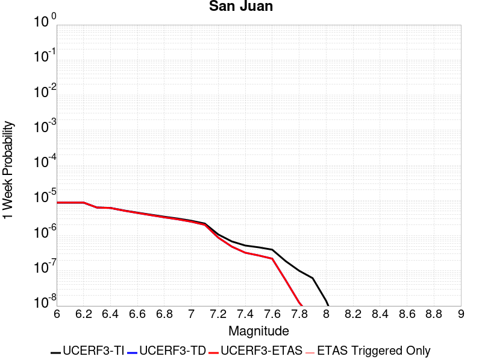 |  |  |  |

| Magnitude | 1 wk TI Prob | 1 wk TD Prob | 1 wk ETAS Prob | 1 wk ETAS/TD Gain | 1 wk ETAS Triggered Only | 1 mo TI Prob | 1 mo TD Prob | 1 mo ETAS Prob | 1 mo ETAS/TD Gain | 1 mo ETAS Triggered Only | 1 yr TI Prob | 1 yr TD Prob | 1 yr ETAS Prob | 1 yr ETAS/TD Gain | 1 yr ETAS Triggered Only | 10 yr TI Prob | 10 yr TD Prob | 10 yr ETAS Prob | 10 yr ETAS/TD Gain | 10 yr ETAS Triggered Only |
|-----|-----|-----|-----|-----|-----|-----|-----|-----|-----|-----|-----|-----|-----|-----|-----|-----|-----|-----|-----|-----|
| 6.0 | 8.682808E-6 | 8.750764E-6 | 8.750764E-6 | 1.0 | 0.0 | 3.72115E-5 | 3.7502763E-5 | 3.7502763E-5 | 1.0 | 0.0 | 4.5295584E-4 | 4.565053E-4 | 4.565053E-4 | 1.0 | 0.0 | 0.004520337 | 0.004556215 | 0.0045960327 | 1.0087392 | 4.0E-5 |
| 6.1 | 8.682808E-6 | 8.750764E-6 | 8.750764E-6 | 1.0 | 0.0 | 3.72115E-5 | 3.7502763E-5 | 3.7502763E-5 | 1.0 | 0.0 | 4.5295584E-4 | 4.565053E-4 | 4.565053E-4 | 1.0 | 0.0 | 0.004520337 | 0.004556215 | 0.0045960327 | 1.0087392 | 4.0E-5 |
| 6.2 | 8.682808E-6 | 8.750764E-6 | 8.750764E-6 | 1.0 | 0.0 | 3.72115E-5 | 3.7502763E-5 | 3.7502763E-5 | 1.0 | 0.0 | 4.5295584E-4 | 4.565053E-4 | 4.565053E-4 | 1.0 | 0.0 | 0.004520337 | 0.004556215 | 0.0045960327 | 1.0087392 | 4.0E-5 |
| 6.3 | 6.3054235E-6 | 6.284137E-6 | 6.284137E-6 | 1.0 | 0.0 | 2.7022963E-5 | 2.6931744E-5 | 2.6931744E-5 | 1.0 | 0.0 | 3.2895492E-4 | 3.2784606E-4 | 3.2784606E-4 | 1.0 | 0.0 | 0.003284684 | 0.0032738224 | 0.0032937569 | 1.0060891 | 2.0E-5 |
| 6.4 | 6.1490473E-6 | 6.1158057E-6 | 6.1158057E-6 | 1.0 | 0.0 | 2.6352795E-5 | 2.621034E-5 | 2.621034E-5 | 1.0 | 0.0 | 3.2079802E-4 | 3.1906553E-4 | 3.1906553E-4 | 1.0 | 0.0 | 0.0032033534 | 0.0031862692 | 0.0032062056 | 1.0062569 | 2.0E-5 |
| 6.5 | 5.204848E-6 | 5.1385305E-6 | 5.1385305E-6 | 1.0 | 0.0 | 2.23063E-5 | 2.2022092E-5 | 2.2022092E-5 | 1.0 | 0.0 | 2.7154534E-4 | 2.6808694E-4 | 2.6808694E-4 | 1.0 | 0.0 | 0.0027121378 | 0.002677788 | 0.0026977344 | 1.0074488 | 2.0E-5 |
| 6.6 | 4.5179986E-6 | 4.416E-6 | 4.416E-6 | 1.0 | 0.0 | 1.9362706E-5 | 1.892558E-5 | 1.892558E-5 | 1.0 | 0.0 | 2.3571544E-4 | 2.3039538E-4 | 2.3039538E-4 | 1.0 | 0.0 | 0.0023546559 | 0.0023017006 | 0.0023216547 | 1.0086693 | 2.0E-5 |
| 6.7 | 3.9442616E-6 | 3.820695E-6 | 3.820695E-6 | 1.0 | 0.0 | 1.6903869E-5 | 1.6374308E-5 | 1.6374308E-5 | 1.0 | 0.0 | 2.0578515E-4 | 1.9933963E-4 | 1.9933963E-4 | 1.0 | 0.0 | 0.002055947 | 0.0019917316 | 0.0020116917 | 1.0100216 | 2.0E-5 |
| 6.8 | 3.4536245E-6 | 3.3171661E-6 | 3.3171661E-6 | 1.0 | 0.0 | 1.4801163E-5 | 1.4216353E-5 | 1.4216353E-5 | 1.0 | 0.0 | 1.8018926E-4 | 1.7307096E-4 | 1.7307096E-4 | 1.0 | 0.0 | 0.0018004322 | 0.0017294791 | 0.0017494444 | 1.0115442 | 2.0E-5 |
| 6.9 | 3.059865E-6 | 2.9128253E-6 | 2.9128253E-6 | 1.0 | 0.0 | 1.3113641E-5 | 1.248348E-5 | 1.248348E-5 | 1.0 | 0.0 | 1.596469E-4 | 1.5197633E-4 | 1.5197633E-4 | 1.0 | 0.0 | 0.0015953224 | 0.0015188372 | 0.0015388068 | 1.013148 | 2.0E-5 |
| 7.0 | 2.6504351E-6 | 2.4927492E-6 | 2.4927492E-6 | 1.0 | 0.0 | 1.1358958E-5 | 1.068317E-5 | 1.068317E-5 | 1.0 | 0.0 | 1.3828653E-4 | 1.3006038E-4 | 1.3006038E-4 | 1.0 | 0.0 | 0.0013820052 | 0.0012999529 | 0.0012999529 | 1.0 | 0.0 |
| 7.1 | 2.2039317E-6 | 2.034435E-6 | 2.034435E-6 | 1.0 | 0.0 | 9.445387E-6 | 8.718981E-6 | 8.718981E-6 | 1.0 | 0.0 | 1.1499152E-4 | 1.06148946E-4 | 1.06148946E-4 | 1.0 | 0.0 | 0.0011493203 | 0.0010610909 | 0.0010610909 | 1.0 | 0.0 |
| 7.2 | 1.0786707E-6 | 8.775373E-7 | 8.775373E-7 | 1.0 | 0.0 | 4.622866E-6 | 3.7608684E-6 | 3.7608684E-6 | 1.0 | 0.0 | 5.628194E-5 | 4.5787623E-5 | 4.5787623E-5 | 1.0 | 0.0 | 5.6267687E-4 | 4.5783943E-4 | 4.5783943E-4 | 1.0 | 0.0 |
| 7.3 | 6.846433E-7 | 4.872059E-7 | 4.872059E-7 | 1.0 | 0.0 | 2.9341822E-6 | 2.0880236E-6 | 2.0880236E-6 | 1.0 | 0.0 | 3.5723086E-5 | 2.542139E-5 | 2.542139E-5 | 1.0 | 0.0 | 3.571734E-4 | 2.542176E-4 | 2.542176E-4 | 1.0 | 0.0 |
| 7.4 | 5.23043E-7 | 3.2652028E-7 | 3.2652028E-7 | 1.0 | 0.0 | 2.2416111E-6 | 1.3993719E-6 | 1.3993719E-6 | 1.0 | 0.0 | 2.7291273E-5 | 1.703722E-5 | 1.703722E-5 | 1.0 | 0.0 | 2.7287923E-4 | 1.7039063E-4 | 1.7039063E-4 | 1.0 | 0.0 |
| 7.5 | 4.648444E-7 | 2.7255334E-7 | 2.7255334E-7 | 1.0 | 0.0 | 1.9921886E-6 | 1.1680851E-6 | 1.1680851E-6 | 1.0 | 0.0 | 2.4254627E-5 | 1.4221344E-5 | 1.4221344E-5 | 1.0 | 0.0 | 2.425198E-4 | 1.4223348E-4 | 1.4223348E-4 | 1.0 | 0.0 |
| 7.6 | 3.9906567E-7 | 2.2099482E-7 | 2.2099482E-7 | 1.0 | 0.0 | 1.7102802E-6 | 9.471203E-7 | 9.471203E-7 | 1.0 | 0.0 | 2.0822463E-5 | 1.15311295E-5 | 1.15311295E-5 | 1.0 | 0.0 | 2.0820512E-4 | 1.1532919E-4 | 1.1532919E-4 | 1.0 | 0.0 |
| 7.7 | 1.8784601E-7 | 5.372496E-8 | 5.372496E-8 | 1.0 | 0.0 | 8.0505407E-7 | 2.3024981E-7 | 2.3024981E-7 | 1.0 | 0.0 | 9.80149E-6 | 2.8032878E-6 | 2.8032878E-6 | 1.0 | 0.0 | 9.801057E-5 | 2.80415E-5 | 2.80415E-5 | 1.0 | 0.0 |
| 7.8 | 1.00154914E-7 | 1.2432812E-8 | 1.2432812E-8 | 1.0 | 0.0 | 4.2923529E-7 | 5.3283486E-8 | 5.3283486E-8 | 1.0 | 0.0 | 5.225927E-6 | 6.487262E-7 | 6.487262E-7 | 1.0 | 0.0 | 5.225804E-5 | 6.4931564E-6 | 6.4931564E-6 | 1.0 | 0.0 |
| 7.9 | 6.171429E-8 | 4.3050106E-9 | 4.3050106E-9 | 1.0 | 0.0 | 2.6448978E-7 | 1.8450045E-8 | 1.8450045E-8 | 1.0 | 0.0 | 3.2201583E-6 | 2.2462923E-7 | 2.2462923E-7 | 1.0 | 0.0 | 3.2201115E-5 | 2.2516008E-6 | 2.2516008E-6 | 1.0 | 0.0 |
| 8.0 | 1.3974572E-8 | 3.3928182E-10 | 3.3928182E-10 | 1.0 | 0.0 | 5.989102E-8 | 1.4540653E-9 | 1.4540653E-9 | 1.0 | 0.0 | 7.2917294E-7 | 1.7703238E-8 | 1.7703238E-8 | 1.0 | 0.0 | 7.2917055E-6 | 1.8134347E-7 | 1.8134347E-7 | 1.0 | 0.0 |
| 8.1 | 1.8403477E-9 | 1.1340173E-10 | 1.1340173E-10 | 1.0 | 0.0 | 7.887204E-9 | 4.8600757E-10 | 4.8600757E-10 | 1.0 | 0.0 | 9.602671E-8 | 5.917144E-9 | 5.917144E-9 | 1.0 | 0.0 | 9.602667E-7 | 6.0406514E-8 | 6.0406514E-8 | 1.0 | 0.0 |

## San Jacinto (Coyote Creek)
*[(top)](#table-of-contents)*

| 1 Week | 1 Month | 1 Year | 10 Year |
|-----|-----|-----|-----|
|  |  |  |  |

| Magnitude | 1 wk TI Prob | 1 wk TD Prob | 1 wk ETAS Prob | 1 wk ETAS/TD Gain | 1 wk ETAS Triggered Only | 1 mo TI Prob | 1 mo TD Prob | 1 mo ETAS Prob | 1 mo ETAS/TD Gain | 1 mo ETAS Triggered Only | 1 yr TI Prob | 1 yr TD Prob | 1 yr ETAS Prob | 1 yr ETAS/TD Gain | 1 yr ETAS Triggered Only | 10 yr TI Prob | 10 yr TD Prob | 10 yr ETAS Prob | 10 yr ETAS/TD Gain | 10 yr ETAS Triggered Only |
|-----|-----|-----|-----|-----|-----|-----|-----|-----|-----|-----|-----|-----|-----|-----|-----|-----|-----|-----|-----|-----|
| 6.0 | 2.7374346E-5 | 2.4176177E-5 | 2.4176177E-5 | 1.0 | 0.0 | 1.1731335E-4 | 1.03608094E-4 | 1.03608094E-4 | 1.0 | 0.0 | 0.0014273542 | 0.0012607011 | 0.0012906634 | 1.0237663 | 3.0E-5 | 0.01418221 | 0.012944493 | 0.012983975 | 1.0030501 | 4.0E-5 |
| 6.1 | 2.7374346E-5 | 2.4176177E-5 | 2.4176177E-5 | 1.0 | 0.0 | 1.1731335E-4 | 1.03608094E-4 | 1.03608094E-4 | 1.0 | 0.0 | 0.0014273542 | 0.0012607011 | 0.0012906634 | 1.0237663 | 3.0E-5 | 0.01418221 | 0.012944493 | 0.012983975 | 1.0030501 | 4.0E-5 |
| 6.2 | 2.7374346E-5 | 2.4176177E-5 | 2.4176177E-5 | 1.0 | 0.0 | 1.1731335E-4 | 1.03608094E-4 | 1.03608094E-4 | 1.0 | 0.0 | 0.0014273542 | 0.0012607011 | 0.0012906634 | 1.0237663 | 3.0E-5 | 0.01418221 | 0.012944493 | 0.012983975 | 1.0030501 | 4.0E-5 |
| 6.3 | 2.7374346E-5 | 2.4176177E-5 | 2.4176177E-5 | 1.0 | 0.0 | 1.1731335E-4 | 1.03608094E-4 | 1.03608094E-4 | 1.0 | 0.0 | 0.0014273542 | 0.0012607011 | 0.0012906634 | 1.0237663 | 3.0E-5 | 0.01418221 | 0.012944493 | 0.012983975 | 1.0030501 | 4.0E-5 |
| 6.4 | 2.7374346E-5 | 2.4176177E-5 | 2.4176177E-5 | 1.0 | 0.0 | 1.1731335E-4 | 1.03608094E-4 | 1.03608094E-4 | 1.0 | 0.0 | 0.0014273542 | 0.0012607011 | 0.0012906634 | 1.0237663 | 3.0E-5 | 0.01418221 | 0.012944493 | 0.012983975 | 1.0030501 | 4.0E-5 |
| 6.5 | 2.7282445E-5 | 2.4062241E-5 | 2.4062241E-5 | 1.0 | 0.0 | 1.16919524E-4 | 1.0311983E-4 | 1.0311983E-4 | 1.0 | 0.0 | 0.0014225657 | 0.0012547635 | 0.0012847258 | 1.0238789 | 3.0E-5 | 0.014134934 | 0.0128858145 | 0.012925299 | 1.0030642 | 4.0E-5 |
| 6.6 | 2.7282445E-5 | 2.4062241E-5 | 2.4062241E-5 | 1.0 | 0.0 | 1.16919524E-4 | 1.0311983E-4 | 1.0311983E-4 | 1.0 | 0.0 | 0.0014225657 | 0.0012547635 | 0.0012847258 | 1.0238789 | 3.0E-5 | 0.014134934 | 0.0128858145 | 0.012925299 | 1.0030642 | 4.0E-5 |
| 6.7 | 2.7216198E-5 | 2.3987352E-5 | 2.3987352E-5 | 1.0 | 0.0 | 1.1663563E-4 | 1.02798906E-4 | 1.02798906E-4 | 1.0 | 0.0 | 0.0014191137 | 0.0012508607 | 0.0012808231 | 1.0239534 | 3.0E-5 | 0.014100855 | 0.012847221 | 0.012886707 | 1.0030736 | 4.0E-5 |
| 6.8 | 2.7078617E-5 | 2.3904551E-5 | 2.3904551E-5 | 1.0 | 0.0 | 1.1604605E-4 | 1.0244407E-4 | 1.0244407E-4 | 1.0 | 0.0 | 0.001411945 | 0.0012465456 | 0.0012765082 | 1.0240365 | 3.0E-5 | 0.014030075 | 0.012804349 | 0.012843837 | 1.003084 | 4.0E-5 |
| 6.9 | 2.6982952E-5 | 2.3824046E-5 | 2.3824046E-5 | 1.0 | 0.0 | 1.15636096E-4 | 1.02099075E-4 | 1.02099075E-4 | 1.0 | 0.0 | 0.0014069602 | 0.0012423501 | 0.0012723128 | 1.0241178 | 3.0E-5 | 0.013980856 | 0.012762618 | 0.012802108 | 1.0030942 | 4.0E-5 |
| 7.0 | 2.6449972E-5 | 2.3401004E-5 | 2.3401004E-5 | 1.0 | 0.0 | 1.1335209E-4 | 1.00286175E-4 | 1.00286175E-4 | 1.0 | 0.0 | 0.001379188 | 0.0012203029 | 0.0012502663 | 1.024554 | 3.0E-5 | 0.0137065975 | 0.012543921 | 0.012583419 | 1.0031488 | 4.0E-5 |
| 7.1 | 2.6257849E-5 | 2.322702E-5 | 2.322702E-5 | 1.0 | 0.0 | 1.1252879E-4 | 9.9540586E-5 | 9.9540586E-5 | 1.0 | 0.0 | 0.0013691769 | 0.0012112354 | 0.0012411991 | 1.0247381 | 3.0E-5 | 0.013607717 | 0.012453787 | 0.012493289 | 1.0031719 | 4.0E-5 |
| 7.2 | 2.5270041E-5 | 2.242154E-5 | 2.242154E-5 | 1.0 | 0.0 | 1.0829568E-4 | 9.6088785E-5 | 9.6088785E-5 | 1.0 | 0.0 | 0.0013177024 | 0.0011692555 | 0.0011992204 | 1.0256274 | 3.0E-5 | 0.013099162 | 0.012034738 | 0.012074257 | 1.0032837 | 4.0E-5 |
| 7.3 | 2.339701E-5 | 2.1152975E-5 | 2.1152975E-5 | 1.0 | 0.0 | 1.0026905E-4 | 9.0652466E-5 | 9.0652466E-5 | 1.0 | 0.0 | 0.001220092 | 0.001103137 | 0.001133104 | 1.0271652 | 3.0E-5 | 0.012134149 | 0.0113734165 | 0.011412961 | 1.003477 | 4.0E-5 |
| 7.4 | 2.296333E-5 | 2.0883224E-5 | 2.0883224E-5 | 1.0 | 0.0 | 9.841056E-5 | 8.9496476E-5 | 8.9496476E-5 | 1.0 | 0.0 | 0.0011974899 | 0.001089077 | 0.0011190444 | 1.0275162 | 3.0E-5 | 0.011910575 | 0.011232498 | 0.011272049 | 1.0035211 | 4.0E-5 |
| 7.5 | 2.2188895E-5 | 2.0405923E-5 | 2.0405923E-5 | 1.0 | 0.0 | 9.50918E-5 | 8.745104E-5 | 8.745104E-5 | 1.0 | 0.0 | 0.0011571277 | 0.0010641983 | 0.0010941664 | 1.0281602 | 3.0E-5 | 0.011511209 | 0.010982013 | 0.011021574 | 1.0036023 | 4.0E-5 |
| 7.6 | 2.0013189E-5 | 1.899158E-5 | 1.899158E-5 | 1.0 | 0.0 | 8.5767984E-5 | 8.138996E-5 | 8.138996E-5 | 1.0 | 0.0 | 0.001043725 | 9.90474E-4 | 0.0010204443 | 1.0302585 | 3.0E-5 | 0.010388365 | 0.010239562 | 0.010279152 | 1.0038664 | 4.0E-5 |
| 7.7 | 1.7230794E-5 | 1.6772141E-5 | 1.6772141E-5 | 1.0 | 0.0 | 7.384417E-5 | 7.1878625E-5 | 7.1878625E-5 | 1.0 | 0.0 | 8.986819E-4 | 8.7477174E-4 | 9.0474554E-4 | 1.0342647 | 3.0E-5 | 0.008950562 | 0.009077629 | 0.009117266 | 1.0043664 | 4.0E-5 |
| 7.8 | 1.4478809E-5 | 1.5018486E-5 | 1.5018486E-5 | 1.0 | 0.0 | 6.205057E-5 | 6.4363354E-5 | 6.4363354E-5 | 1.0 | 0.0 | 7.552038E-4 | 7.8334275E-4 | 8.1331923E-4 | 1.0382674 | 3.0E-5 | 0.0075264242 | 0.008155493 | 0.008195167 | 1.0048647 | 4.0E-5 |
| 7.9 | 1.1114467E-5 | 1.1669441E-5 | 1.1669441E-5 | 1.0 | 0.0 | 4.7632562E-5 | 5.0010935E-5 | 5.0010935E-5 | 1.0 | 0.0 | 5.797721E-4 | 6.087136E-4 | 6.386954E-4 | 1.0492543 | 3.0E-5 | 0.0057826187 | 0.006393022 | 0.006432766 | 1.0062168 | 4.0E-5 |
| 8.0 | 9.327402E-6 | 9.92126E-6 | 9.92126E-6 | 1.0 | 0.0 | 3.9973966E-5 | 4.2518997E-5 | 4.2518997E-5 | 1.0 | 0.0 | 4.8657437E-4 | 5.175464E-4 | 5.475308E-4 | 1.0579358 | 3.0E-5 | 0.0048551033 | 0.005461515 | 0.0055012964 | 1.0072839 | 4.0E-5 |
| 8.1 | 7.0235833E-6 | 6.8437025E-6 | 6.8437025E-6 | 1.0 | 0.0 | 3.0100724E-5 | 2.9329827E-5 | 2.9329827E-5 | 1.0 | 0.0 | 3.664147E-4 | 3.5703264E-4 | 3.6702908E-4 | 1.0279987 | 1.0E-5 | 0.003658111 | 0.003796282 | 0.0038162062 | 1.0052483 | 2.0E-5 |
| 8.2 | 2.0358202E-6 | 9.025306E-7 | 9.025306E-7 | 1.0 | 0.0 | 8.724915E-6 | 3.8679827E-6 | 3.8679827E-6 | 1.0 | 0.0 | 1.06220665E-4 | 4.7091693E-5 | 4.7091693E-5 | 1.0 | 0.0 | 0.001061699 | 5.3427246E-4 | 5.3427246E-4 | 1.0 | 0.0 |
| 8.3 | 2.0051264E-7 | 6.6426736E-8 | 6.6426736E-8 | 1.0 | 0.0 | 8.5933965E-7 | 2.8468597E-7 | 2.8468597E-7 | 1.0 | 0.0 | 1.046241E-5 | 3.4660466E-6 | 3.4660466E-6 | 1.0 | 0.0 | 1.0461917E-4 | 4.028949E-5 | 4.028949E-5 | 1.0 | 0.0 |

## Santa Cruz Island
*[(top)](#table-of-contents)*

| 1 Week | 1 Month | 1 Year | 10 Year |
|-----|-----|-----|-----|
|  |  |  |  |

| Magnitude | 1 wk TI Prob | 1 wk TD Prob | 1 wk ETAS Prob | 1 wk ETAS/TD Gain | 1 wk ETAS Triggered Only | 1 mo TI Prob | 1 mo TD Prob | 1 mo ETAS Prob | 1 mo ETAS/TD Gain | 1 mo ETAS Triggered Only | 1 yr TI Prob | 1 yr TD Prob | 1 yr ETAS Prob | 1 yr ETAS/TD Gain | 1 yr ETAS Triggered Only | 10 yr TI Prob | 10 yr TD Prob | 10 yr ETAS Prob | 10 yr ETAS/TD Gain | 10 yr ETAS Triggered Only |
|-----|-----|-----|-----|-----|-----|-----|-----|-----|-----|-----|-----|-----|-----|-----|-----|-----|-----|-----|-----|-----|
| 6.0 | 2.9164563E-5 | 3.1601154E-5 | 3.1601154E-5 | 1.0 | 0.0 | 1.2498499E-4 | 1.3542725E-4 | 1.3542725E-4 | 1.0 | 0.0 | 0.0015206301 | 0.001647716 | 0.0016576996 | 1.006059 | 1.0E-5 | 0.015102667 | 0.016368724 | 0.016398234 | 1.0018028 | 3.0E-5 |
| 6.1 | 2.9164563E-5 | 3.1601154E-5 | 3.1601154E-5 | 1.0 | 0.0 | 1.2498499E-4 | 1.3542725E-4 | 1.3542725E-4 | 1.0 | 0.0 | 0.0015206301 | 0.001647716 | 0.0016576996 | 1.006059 | 1.0E-5 | 0.015102667 | 0.016368724 | 0.016398234 | 1.0018028 | 3.0E-5 |
| 6.2 | 2.9164563E-5 | 3.1601154E-5 | 3.1601154E-5 | 1.0 | 0.0 | 1.2498499E-4 | 1.3542725E-4 | 1.3542725E-4 | 1.0 | 0.0 | 0.0015206301 | 0.001647716 | 0.0016576996 | 1.006059 | 1.0E-5 | 0.015102667 | 0.016368724 | 0.016398234 | 1.0018028 | 3.0E-5 |
| 6.3 | 1.6635553E-5 | 1.7805029E-5 | 1.7805029E-5 | 1.0 | 0.0 | 7.1293274E-5 | 7.6305136E-5 | 7.6305136E-5 | 1.0 | 0.0 | 8.6765E-4 | 9.286373E-4 | 9.38628E-4 | 1.0107585 | 1.0E-5 | 0.008642701 | 0.00924944 | 0.009279163 | 1.0032134 | 3.0E-5 |
| 6.4 | 1.6635553E-5 | 1.7805029E-5 | 1.7805029E-5 | 1.0 | 0.0 | 7.1293274E-5 | 7.6305136E-5 | 7.6305136E-5 | 1.0 | 0.0 | 8.6765E-4 | 9.286373E-4 | 9.38628E-4 | 1.0107585 | 1.0E-5 | 0.008642701 | 0.00924944 | 0.009279163 | 1.0032134 | 3.0E-5 |
| 6.5 | 1.2238748E-5 | 1.30434555E-5 | 1.30434555E-5 | 1.0 | 0.0 | 5.2450723E-5 | 5.589935E-5 | 5.589935E-5 | 1.0 | 0.0 | 6.3840044E-4 | 6.803657E-4 | 6.903589E-4 | 1.014688 | 1.0E-5 | 0.0063656955 | 0.0067832265 | 0.0068030907 | 1.0029285 | 2.0E-5 |
| 6.6 | 1.0489767E-5 | 1.1157017E-5 | 1.1157017E-5 | 1.0 | 0.0 | 4.495537E-5 | 4.7814923E-5 | 4.7814923E-5 | 1.0 | 0.0 | 5.4719415E-4 | 5.8199343E-4 | 5.8199343E-4 | 1.0 | 0.0 | 0.005458487 | 0.0058049336 | 0.0058148755 | 1.0017127 | 1.0E-5 |
| 6.7 | 8.699222E-6 | 9.23709E-6 | 9.23709E-6 | 1.0 | 0.0 | 3.7281847E-5 | 3.9586932E-5 | 3.9586932E-5 | 1.0 | 0.0 | 4.5381195E-4 | 4.8186484E-4 | 4.8186484E-4 | 1.0 | 0.0 | 0.0045288634 | 0.0048082676 | 0.0048182197 | 1.0020697 | 1.0E-5 |
| 6.8 | 8.307732E-6 | 8.8171955E-6 | 8.8171955E-6 | 1.0 | 0.0 | 3.560408E-5 | 3.778744E-5 | 3.778744E-5 | 1.0 | 0.0 | 4.3339343E-4 | 4.5996535E-4 | 4.5996535E-4 | 1.0 | 0.0 | 0.004325492 | 0.0045901868 | 0.0046001407 | 1.0021685 | 1.0E-5 |
| 6.9 | 8.073121E-6 | 8.565221E-6 | 8.565221E-6 | 1.0 | 0.0 | 3.459863E-5 | 3.6707574E-5 | 3.6707574E-5 | 1.0 | 0.0 | 4.2115687E-4 | 4.4682348E-4 | 4.4682348E-4 | 1.0 | 0.0 | 0.004203596 | 0.0044593024 | 0.004469258 | 1.0022326 | 1.0E-5 |
| 7.0 | 7.617019E-6 | 8.074926E-6 | 8.074926E-6 | 1.0 | 0.0 | 3.264396E-5 | 3.460637E-5 | 3.460637E-5 | 1.0 | 0.0 | 3.9736772E-4 | 4.212515E-4 | 4.212515E-4 | 1.0 | 0.0 | 0.003966579 | 0.0042045773 | 0.0042145355 | 1.0023683 | 1.0E-5 |
| 7.1 | 7.1224836E-6 | 7.5460302E-6 | 7.5460302E-6 | 1.0 | 0.0 | 3.052457E-5 | 3.2339733E-5 | 3.2339733E-5 | 1.0 | 0.0 | 3.715733E-4 | 3.9366545E-4 | 3.9366545E-4 | 1.0 | 0.0 | 0.003709526 | 0.003929724 | 0.0039396845 | 1.0025347 | 1.0E-5 |
| 7.2 | 6.441115E-6 | 6.827605E-6 | 6.827605E-6 | 1.0 | 0.0 | 2.7604487E-5 | 2.9260838E-5 | 2.9260838E-5 | 1.0 | 0.0 | 3.360328E-4 | 3.561927E-4 | 3.561927E-4 | 1.0 | 0.0 | 0.0033552512 | 0.0035562462 | 0.0035662106 | 1.0028019 | 1.0E-5 |
| 7.3 | 5.494274E-6 | 5.8201817E-6 | 5.8201817E-6 | 1.0 | 0.0 | 2.3546674E-5 | 2.4943398E-5 | 2.4943398E-5 | 1.0 | 0.0 | 2.8664304E-4 | 3.0364376E-4 | 3.0364376E-4 | 1.0 | 0.0 | 0.002862736 | 0.0030323118 | 0.0030422816 | 1.0032878 | 1.0E-5 |
| 7.4 | 4.0802624E-6 | 4.3123905E-6 | 4.3123905E-6 | 1.0 | 0.0 | 1.7486722E-5 | 1.8481544E-5 | 1.8481544E-5 | 1.0 | 0.0 | 2.1288003E-4 | 2.2498962E-4 | 2.2498962E-4 | 1.0 | 0.0 | 0.0021267622 | 0.0022476274 | 0.0022576049 | 1.0044391 | 1.0E-5 |
| 7.5 | 2.3584746E-6 | 2.4753786E-6 | 2.4753786E-6 | 1.0 | 0.0 | 1.0107709E-5 | 1.0608722E-5 | 1.0608722E-5 | 1.0 | 0.0 | 1.2305441E-4 | 1.2915359E-4 | 1.2915359E-4 | 1.0 | 0.0 | 0.0012298629 | 0.0012907903 | 0.0012907903 | 1.0 | 0.0 |
| 7.6 | 9.4981914E-7 | 9.861163E-7 | 9.861163E-7 | 1.0 | 0.0 | 4.0706473E-6 | 4.226206E-6 | 4.226206E-6 | 1.0 | 0.0 | 4.9559E-5 | 5.1452855E-5 | 5.1452855E-5 | 1.0 | 0.0 | 4.954795E-4 | 5.144107E-4 | 5.144107E-4 | 1.0 | 0.0 |
| 7.7 | 2.6013532E-7 | 2.6417084E-7 | 2.6417084E-7 | 1.0 | 0.0 | 1.1148652E-6 | 1.1321602E-6 | 1.1321602E-6 | 1.0 | 0.0 | 1.3573399E-5 | 1.3783963E-5 | 1.3783963E-5 | 1.0 | 0.0 | 1.357257E-4 | 1.3783116E-4 | 1.3783116E-4 | 1.0 | 0.0 |
| 7.8 | 4.1522263E-8 | 3.965741E-8 | 3.965741E-8 | 1.0 | 0.0 | 1.7795254E-7 | 1.6996033E-7 | 1.6996033E-7 | 1.0 | 0.0 | 2.16657E-6 | 2.0692653E-6 | 2.0692653E-6 | 1.0 | 0.0 | 2.1665488E-5 | 2.0692481E-5 | 2.0692481E-5 | 1.0 | 0.0 |
| 7.9 | 7.7242046E-10 | 5.947626E-10 | 5.947626E-10 | 1.0 | 0.0 | 3.3103735E-9 | 2.548983E-9 | 2.548983E-9 | 1.0 | 0.0 | 4.0303796E-8 | 3.1033867E-8 | 3.1033867E-8 | 1.0 | 0.0 | 4.030379E-7 | 3.1033863E-7 | 3.1033863E-7 | 1.0 | 0.0 |

## Santa Rosa Island
*[(top)](#table-of-contents)*

| 1 Week | 1 Month | 1 Year | 10 Year |
|-----|-----|-----|-----|
| 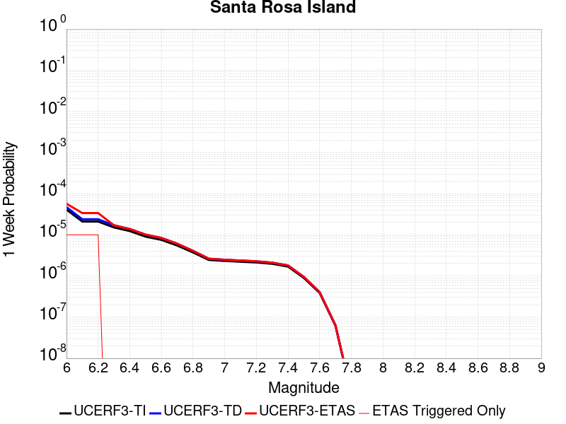 |  |  |  |

| Magnitude | 1 wk TI Prob | 1 wk TD Prob | 1 wk ETAS Prob | 1 wk ETAS/TD Gain | 1 wk ETAS Triggered Only | 1 mo TI Prob | 1 mo TD Prob | 1 mo ETAS Prob | 1 mo ETAS/TD Gain | 1 mo ETAS Triggered Only | 1 yr TI Prob | 1 yr TD Prob | 1 yr ETAS Prob | 1 yr ETAS/TD Gain | 1 yr ETAS Triggered Only | 10 yr TI Prob | 10 yr TD Prob | 10 yr ETAS Prob | 10 yr ETAS/TD Gain | 10 yr ETAS Triggered Only |
|-----|-----|-----|-----|-----|-----|-----|-----|-----|-----|-----|-----|-----|-----|-----|-----|-----|-----|-----|-----|-----|
| 6.0 | 4.1143165E-5 | 4.709476E-5 | 5.709429E-5 | 1.2123278 | 1.0E-5 | 1.7631594E-4 | 2.0182018E-4 | 2.1181816E-4 | 1.0495391 | 1.0E-5 | 0.002144533 | 0.0024545882 | 0.0024845144 | 1.012192 | 3.0E-5 | 0.021239553 | 0.024295408 | 0.024334436 | 1.0016063 | 4.0E-5 |
| 6.1 | 2.1061249E-5 | 2.3866654E-5 | 3.3866414E-5 | 1.4189847 | 1.0E-5 | 9.0259375E-5 | 1.0228182E-4 | 1.12280795E-4 | 1.0977591 | 1.0E-5 | 0.0010983539 | 0.0012445987 | 0.0012645738 | 1.0160494 | 2.0E-5 | 0.01092941 | 0.012379324 | 0.0123990765 | 1.0015956 | 2.0E-5 |
| 6.2 | 2.1061249E-5 | 2.3866654E-5 | 3.3866414E-5 | 1.4189847 | 1.0E-5 | 9.0259375E-5 | 1.0228182E-4 | 1.12280795E-4 | 1.0977591 | 1.0E-5 | 0.0010983539 | 0.0012445987 | 0.0012645738 | 1.0160494 | 2.0E-5 | 0.01092941 | 0.012379324 | 0.0123990765 | 1.0015956 | 2.0E-5 |
| 6.3 | 1.5158236E-5 | 1.707557E-5 | 1.707557E-5 | 1.0 | 0.0 | 6.496225E-5 | 7.317903E-5 | 7.317903E-5 | 1.0 | 0.0 | 7.906284E-4 | 8.9060253E-4 | 9.005936E-4 | 1.0112183 | 1.0E-5 | 0.007878214 | 0.008871586 | 0.008881497 | 1.0011172 | 1.0E-5 |
| 6.4 | 1.2341918E-5 | 1.3853823E-5 | 1.3853823E-5 | 1.0 | 0.0 | 5.2892858E-5 | 5.9372218E-5 | 5.9372218E-5 | 1.0 | 0.0 | 6.437803E-4 | 7.226252E-4 | 7.326179E-4 | 1.0138284 | 1.0E-5 | 0.006419184 | 0.007203591 | 0.007213519 | 1.0013782 | 1.0E-5 |
| 6.5 | 9.061158E-6 | 1.0117662E-5 | 1.0117662E-5 | 1.0 | 0.0 | 3.883296E-5 | 4.3360717E-5 | 4.3360717E-5 | 1.0 | 0.0 | 4.726887E-4 | 5.277942E-4 | 5.377889E-4 | 1.0189368 | 1.0E-5 | 0.004716845 | 0.005265945 | 0.005275892 | 1.001889 | 1.0E-5 |
| 6.6 | 7.5461685E-6 | 8.401244E-6 | 8.401244E-6 | 1.0 | 0.0 | 3.2340322E-5 | 3.6004854E-5 | 3.6004854E-5 | 1.0 | 0.0 | 3.936723E-4 | 4.3827525E-4 | 4.4827085E-4 | 1.0228068 | 1.0E-5 | 0.003929756 | 0.0043745385 | 0.004384495 | 1.002276 | 1.0E-5 |
| 6.7 | 5.5023775E-6 | 6.0877283E-6 | 6.0877283E-6 | 1.0 | 0.0 | 2.3581404E-5 | 2.6090021E-5 | 2.6090021E-5 | 1.0 | 0.0 | 2.8706578E-4 | 3.1760297E-4 | 3.1760297E-4 | 1.0 | 0.0 | 0.0028669522 | 0.0031718123 | 0.0031718123 | 1.0 | 0.0 |
| 6.8 | 3.7351679E-6 | 4.0833456E-6 | 4.0833456E-6 | 1.0 | 0.0 | 1.6007763E-5 | 1.7499948E-5 | 1.7499948E-5 | 1.0 | 0.0 | 1.948771E-4 | 2.1304353E-4 | 2.1304353E-4 | 1.0 | 0.0 | 0.0019470629 | 0.0021286383 | 0.0021286383 | 1.0 | 0.0 |
| 6.9 | 2.456366E-6 | 2.6293699E-6 | 2.6293699E-6 | 1.0 | 0.0 | 1.0527241E-5 | 1.126868E-5 | 1.126868E-5 | 1.0 | 0.0 | 1.2816161E-4 | 1.3718757E-4 | 1.3718757E-4 | 1.0 | 0.0 | 0.0012808773 | 0.0013710317 | 0.0013710317 | 1.0 | 0.0 |
| 7.0 | 2.3245157E-6 | 2.4828691E-6 | 2.4828691E-6 | 1.0 | 0.0 | 9.962172E-6 | 1.0640824E-5 | 1.0640824E-5 | 1.0 | 0.0 | 1.2128269E-4 | 1.2954435E-4 | 1.2954435E-4 | 1.0 | 0.0 | 0.0012121652 | 0.0012946906 | 0.0012946906 | 1.0 | 0.0 |
| 7.1 | 2.2248344E-6 | 2.373335E-6 | 2.373335E-6 | 1.0 | 0.0 | 9.53497E-6 | 1.0171396E-5 | 1.0171396E-5 | 1.0 | 0.0 | 1.1608207E-4 | 1.2382973E-4 | 1.2382973E-4 | 1.0 | 0.0 | 0.0011602144 | 0.0012376093 | 0.0012376093 | 1.0 | 0.0 |
| 7.2 | 2.1350402E-6 | 2.2762347E-6 | 2.2762347E-6 | 1.0 | 0.0 | 9.150141E-6 | 9.755256E-6 | 9.755256E-6 | 1.0 | 0.0 | 1.1139726E-4 | 1.1876378E-4 | 1.1876378E-4 | 1.0 | 0.0 | 0.0011134144 | 0.001187005 | 0.001187005 | 1.0 | 0.0 |
| 7.3 | 1.9793572E-6 | 2.108793E-6 | 2.108793E-6 | 1.0 | 0.0 | 8.482932E-6 | 9.037653E-6 | 9.037653E-6 | 1.0 | 0.0 | 1.032748E-4 | 1.100279E-4 | 1.100279E-4 | 1.0 | 0.0 | 0.0010322682 | 0.001099736 | 0.001099736 | 1.0 | 0.0 |
| 7.4 | 1.6951194E-6 | 1.8046361E-6 | 1.8046361E-6 | 1.0 | 0.0 | 7.264777E-6 | 7.734132E-6 | 7.734132E-6 | 1.0 | 0.0 | 8.844508E-5 | 9.4159004E-5 | 9.4159004E-5 | 1.0 | 0.0 | 8.840988E-4 | 9.411928E-4 | 9.411928E-4 | 1.0 | 0.0 |
| 7.5 | 8.987207E-7 | 9.512518E-7 | 9.512518E-7 | 1.0 | 0.0 | 3.8516546E-6 | 4.0767873E-6 | 4.0767873E-6 | 1.0 | 0.0 | 4.6892885E-5 | 4.9633767E-5 | 4.9633767E-5 | 1.0 | 0.0 | 4.688299E-4 | 4.96228E-4 | 4.96228E-4 | 1.0 | 0.0 |
| 7.6 | 3.8783037E-7 | 4.0530364E-7 | 4.0530364E-7 | 1.0 | 0.0 | 1.6621291E-6 | 1.7370145E-6 | 1.7370145E-6 | 1.0 | 0.0 | 2.0236233E-5 | 2.1147953E-5 | 2.1147953E-5 | 1.0 | 0.0 | 2.023439E-4 | 2.1146005E-4 | 2.1146005E-4 | 1.0 | 0.0 |
| 7.7 | 6.181804E-8 | 6.3391695E-8 | 6.3391695E-8 | 1.0 | 0.0 | 2.6493444E-7 | 2.7167866E-7 | 2.7167866E-7 | 1.0 | 0.0 | 3.225572E-6 | 3.3076826E-6 | 3.3076826E-6 | 1.0 | 0.0 | 3.225525E-5 | 3.3076343E-5 | 3.3076343E-5 | 1.0 | 0.0 |
| 7.8 | 1.3704449E-9 | 1.3964294E-9 | 1.3964294E-9 | 1.0 | 0.0 | 5.873335E-9 | 5.984697E-9 | 5.984697E-9 | 1.0 | 0.0 | 7.1507856E-8 | 7.2863685E-8 | 7.2863685E-8 | 1.0 | 0.0 | 7.1507833E-7 | 7.2863673E-7 | 7.2863673E-7 | 1.0 | 0.0 |

## Rose Canyon
*[(top)](#table-of-contents)*

| 1 Week | 1 Month | 1 Year | 10 Year |
|-----|-----|-----|-----|
|  |  |  | 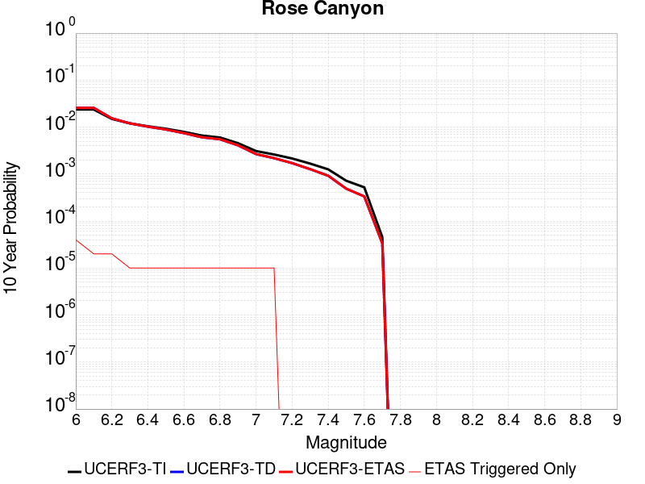 |

| Magnitude | 1 wk TI Prob | 1 wk TD Prob | 1 wk ETAS Prob | 1 wk ETAS/TD Gain | 1 wk ETAS Triggered Only | 1 mo TI Prob | 1 mo TD Prob | 1 mo ETAS Prob | 1 mo ETAS/TD Gain | 1 mo ETAS Triggered Only | 1 yr TI Prob | 1 yr TD Prob | 1 yr ETAS Prob | 1 yr ETAS/TD Gain | 1 yr ETAS Triggered Only | 10 yr TI Prob | 10 yr TD Prob | 10 yr ETAS Prob | 10 yr ETAS/TD Gain | 10 yr ETAS Triggered Only |
|-----|-----|-----|-----|-----|-----|-----|-----|-----|-----|-----|-----|-----|-----|-----|-----|-----|-----|-----|-----|-----|
| 6.0 | 4.5923203E-5 | 4.9721333E-5 | 4.9721333E-5 | 1.0 | 0.0 | 1.9679888E-4 | 2.130744E-4 | 2.130744E-4 | 1.0 | 0.0 | 0.0023933933 | 0.002591291 | 0.002591291 | 1.0 | 0.0 | 0.023677798 | 0.02562449 | 0.025663465 | 1.001521 | 4.0E-5 |
| 6.1 | 4.5923203E-5 | 4.9721333E-5 | 4.9721333E-5 | 1.0 | 0.0 | 1.9679888E-4 | 2.130744E-4 | 2.130744E-4 | 1.0 | 0.0 | 0.0023933933 | 0.002591291 | 0.002591291 | 1.0 | 0.0 | 0.023677798 | 0.02562449 | 0.025643978 | 1.0007606 | 2.0E-5 |
| 6.2 | 2.8844734E-5 | 2.9672712E-5 | 2.9672712E-5 | 1.0 | 0.0 | 1.2361443E-4 | 1.2716257E-4 | 1.2716257E-4 | 1.0 | 0.0 | 0.0015039665 | 0.0015471342 | 0.0015471342 | 1.0 | 0.0 | 0.0149382865 | 0.015362789 | 0.015382482 | 1.0012819 | 2.0E-5 |
| 6.3 | 2.3171577E-5 | 2.316474E-5 | 2.316474E-5 | 1.0 | 0.0 | 9.9302975E-5 | 9.9273755E-5 | 9.9273755E-5 | 1.0 | 0.0 | 0.0012083431 | 0.001208001 | 0.001208001 | 1.0 | 0.0 | 0.012017938 | 0.012007657 | 0.012017538 | 1.0008228 | 1.0E-5 |
| 6.4 | 2.0066604E-5 | 1.9670135E-5 | 1.9670135E-5 | 1.0 | 0.0 | 8.599689E-5 | 8.4297906E-5 | 8.4297906E-5 | 1.0 | 0.0 | 0.0010465092 | 0.0010258538 | 0.0010258538 | 1.0 | 0.0 | 0.010415946 | 0.010209216 | 0.010219113 | 1.0009695 | 1.0E-5 |
| 6.5 | 1.776989E-5 | 1.7116565E-5 | 1.7116565E-5 | 1.0 | 0.0 | 7.615444E-5 | 7.3354684E-5 | 7.3354684E-5 | 1.0 | 0.0 | 9.267859E-4 | 8.9273433E-4 | 8.9273433E-4 | 1.0 | 0.0 | 0.009229303 | 0.008885121 | 0.008895032 | 1.0011154 | 1.0E-5 |
| 6.6 | 1.5227364E-5 | 1.4341523E-5 | 1.4341523E-5 | 1.0 | 0.0 | 6.52585E-5 | 6.146225E-5 | 6.146225E-5 | 1.0 | 0.0 | 7.942326E-4 | 7.4805116E-4 | 7.4805116E-4 | 1.0 | 0.0 | 0.007914 | 0.007443273 | 0.0074531985 | 1.0013335 | 1.0E-5 |
| 6.7 | 1.2703898E-5 | 1.1674748E-5 | 1.1674748E-5 | 1.0 | 0.0 | 5.4444143E-5 | 5.0033697E-5 | 5.0033697E-5 | 1.0 | 0.0 | 6.626558E-4 | 6.089942E-4 | 6.089942E-4 | 1.0 | 0.0 | 0.006606833 | 0.0060647707 | 0.00607471 | 1.0016389 | 1.0E-5 |
| 6.8 | 1.1554917E-5 | 1.0610774E-5 | 1.0610774E-5 | 1.0 | 0.0 | 4.9520135E-5 | 4.5473975E-5 | 4.5473975E-5 | 1.0 | 0.0 | 6.0274085E-4 | 5.5350905E-4 | 5.5350905E-4 | 1.0 | 0.0 | 0.0060110865 | 0.0055070627 | 0.005517008 | 1.0018059 | 1.0E-5 |
| 6.9 | 8.732078E-6 | 7.882542E-6 | 7.882542E-6 | 1.0 | 0.0 | 3.7422655E-5 | 3.3781904E-5 | 3.3781904E-5 | 1.0 | 0.0 | 4.5552556E-4 | 4.1121998E-4 | 4.1121998E-4 | 1.0 | 0.0 | 0.0045459294 | 0.0040896484 | 0.0040996075 | 1.0024352 | 1.0E-5 |
| 7.0 | 5.9337494E-6 | 5.1076154E-6 | 5.1076154E-6 | 1.0 | 0.0 | 2.5430107E-5 | 2.1889597E-5 | 2.1889597E-5 | 1.0 | 0.0 | 3.0956755E-4 | 2.664734E-4 | 2.664734E-4 | 1.0 | 0.0 | 0.0030913667 | 0.0026615544 | 0.0026715277 | 1.0037472 | 1.0E-5 |
| 7.1 | 5.013409E-6 | 4.1774833E-6 | 4.1774833E-6 | 1.0 | 0.0 | 2.1485863E-5 | 1.7903378E-5 | 1.7903378E-5 | 1.0 | 0.0 | 2.6155898E-4 | 2.1795194E-4 | 2.1795194E-4 | 1.0 | 0.0 | 0.0026125133 | 0.0021773935 | 0.0021873717 | 1.0045826 | 1.0E-5 |
| 7.2 | 4.120763E-6 | 3.2822081E-6 | 3.2822081E-6 | 1.0 | 0.0 | 1.7660293E-5 | 1.4066532E-5 | 1.4066532E-5 | 1.0 | 0.0 | 2.1499286E-4 | 1.7124665E-4 | 1.7124665E-4 | 1.0 | 0.0 | 0.0021478499 | 0.0017111565 | 0.0017111565 | 1.0 | 0.0 |
| 7.3 | 3.2081239E-6 | 2.4405792E-6 | 2.4405792E-6 | 1.0 | 0.0 | 1.374903E-5 | 1.0459584E-5 | 1.0459584E-5 | 1.0 | 0.0 | 1.6738157E-4 | 1.2733806E-4 | 1.2733806E-4 | 1.0 | 0.0 | 0.0016725556 | 0.001272658 | 0.001272658 | 1.0 | 0.0 |
| 7.4 | 2.4194755E-6 | 1.7680943E-6 | 1.7680943E-6 | 1.0 | 0.0 | 1.0369139E-5 | 7.577525E-6 | 7.577525E-6 | 1.0 | 0.0 | 1.2623696E-4 | 9.225252E-5 | 9.225252E-5 | 1.0 | 0.0 | 0.0012616527 | 9.221476E-4 | 9.221476E-4 | 1.0 | 0.0 |
| 7.5 | 1.3842889E-6 | 9.378659E-7 | 9.378659E-7 | 1.0 | 0.0 | 5.9326535E-6 | 4.019419E-6 | 4.019419E-6 | 1.0 | 0.0 | 7.222766E-5 | 4.8935366E-5 | 4.8935366E-5 | 1.0 | 0.0 | 7.220419E-4 | 4.892494E-4 | 4.892494E-4 | 1.0 | 0.0 |
| 7.6 | 1.0021575E-6 | 6.4116585E-7 | 6.4116585E-7 | 1.0 | 0.0 | 4.2949537E-6 | 2.7478509E-6 | 2.7478509E-6 | 1.0 | 0.0 | 5.2289808E-5 | 3.345459E-5 | 3.345459E-5 | 1.0 | 0.0 | 5.2277505E-4 | 3.3449772E-4 | 3.3449772E-4 | 1.0 | 0.0 |
| 7.7 | 8.7620116E-8 | 6.449451E-8 | 6.449451E-8 | 1.0 | 0.0 | 3.7551473E-7 | 2.7640502E-7 | 2.7640502E-7 | 1.0 | 0.0 | 4.5718825E-6 | 3.3652261E-6 | 3.3652261E-6 | 1.0 | 0.0 | 4.5717883E-5 | 3.365178E-5 | 3.365178E-5 | 1.0 | 0.0 |

## Cleghorn
*[(top)](#table-of-contents)*

| 1 Week | 1 Month | 1 Year | 10 Year |
|-----|-----|-----|-----|
|  |  |  | 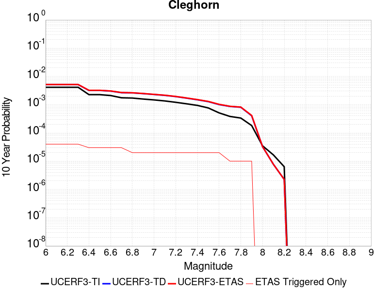 |

| Magnitude | 1 wk TI Prob | 1 wk TD Prob | 1 wk ETAS Prob | 1 wk ETAS/TD Gain | 1 wk ETAS Triggered Only | 1 mo TI Prob | 1 mo TD Prob | 1 mo ETAS Prob | 1 mo ETAS/TD Gain | 1 mo ETAS Triggered Only | 1 yr TI Prob | 1 yr TD Prob | 1 yr ETAS Prob | 1 yr ETAS/TD Gain | 1 yr ETAS Triggered Only | 10 yr TI Prob | 10 yr TD Prob | 10 yr ETAS Prob | 10 yr ETAS/TD Gain | 10 yr ETAS Triggered Only |
|-----|-----|-----|-----|-----|-----|-----|-----|-----|-----|-----|-----|-----|-----|-----|-----|-----|-----|-----|-----|-----|
| 6.0 | 7.9267165E-6 | 9.838549E-6 | 9.838549E-6 | 1.0 | 0.0 | 3.39712E-5 | 4.216459E-5 | 4.216459E-5 | 1.0 | 0.0 | 4.1352084E-4 | 5.1324355E-4 | 5.332333E-4 | 1.0389478 | 2.0E-5 | 0.004127522 | 0.0051355856 | 0.00517538 | 1.0077488 | 4.0E-5 |
| 6.1 | 7.9267165E-6 | 9.838549E-6 | 9.838549E-6 | 1.0 | 0.0 | 3.39712E-5 | 4.216459E-5 | 4.216459E-5 | 1.0 | 0.0 | 4.1352084E-4 | 5.1324355E-4 | 5.332333E-4 | 1.0389478 | 2.0E-5 | 0.004127522 | 0.0051355856 | 0.00517538 | 1.0077488 | 4.0E-5 |
| 6.2 | 7.9267165E-6 | 9.838549E-6 | 9.838549E-6 | 1.0 | 0.0 | 3.39712E-5 | 4.216459E-5 | 4.216459E-5 | 1.0 | 0.0 | 4.1352084E-4 | 5.1324355E-4 | 5.332333E-4 | 1.0389478 | 2.0E-5 | 0.004127522 | 0.0051355856 | 0.00517538 | 1.0077488 | 4.0E-5 |
| 6.3 | 7.9267165E-6 | 9.838549E-6 | 9.838549E-6 | 1.0 | 0.0 | 3.39712E-5 | 4.216459E-5 | 4.216459E-5 | 1.0 | 0.0 | 4.1352084E-4 | 5.1324355E-4 | 5.332333E-4 | 1.0389478 | 2.0E-5 | 0.004127522 | 0.0051355856 | 0.00517538 | 1.0077488 | 4.0E-5 |
| 6.4 | 4.3445207E-6 | 6.098322E-6 | 6.098322E-6 | 1.0 | 0.0 | 1.8619241E-5 | 2.613541E-5 | 2.613541E-5 | 1.0 | 0.0 | 2.2666567E-4 | 3.1815318E-4 | 3.2815E-4 | 1.0314214 | 1.0E-5 | 0.0022643462 | 0.0031910567 | 0.003220961 | 1.0093713 | 3.0E-5 |
| 6.5 | 4.3445207E-6 | 6.098322E-6 | 6.098322E-6 | 1.0 | 0.0 | 1.8619241E-5 | 2.613541E-5 | 2.613541E-5 | 1.0 | 0.0 | 2.2666567E-4 | 3.1815318E-4 | 3.2815E-4 | 1.0314214 | 1.0E-5 | 0.0022643462 | 0.0031910567 | 0.003220961 | 1.0093713 | 3.0E-5 |
| 6.6 | 4.040109E-6 | 5.7807224E-6 | 5.7807224E-6 | 1.0 | 0.0 | 1.7314638E-5 | 2.4774296E-5 | 2.4774296E-5 | 1.0 | 0.0 | 2.1078532E-4 | 3.0158623E-4 | 3.1158322E-4 | 1.033148 | 1.0E-5 | 0.002105855 | 0.0030258433 | 0.0030557525 | 1.0098846 | 3.0E-5 |
| 6.7 | 3.3632055E-6 | 5.0742033E-6 | 5.0742033E-6 | 1.0 | 0.0 | 1.4413658E-5 | 2.1746406E-5 | 2.1746406E-5 | 1.0 | 0.0 | 1.7547216E-4 | 2.6473065E-4 | 2.74728E-4 | 1.0377642 | 1.0E-5 | 0.0017533366 | 0.0026581702 | 0.0026880905 | 1.011256 | 3.0E-5 |
| 6.8 | 3.2902772E-6 | 4.9961077E-6 | 4.9961077E-6 | 1.0 | 0.0 | 1.4101111E-5 | 2.1411717E-5 | 2.1411717E-5 | 1.0 | 0.0 | 1.716675E-4 | 2.606568E-4 | 2.7065416E-4 | 1.0383546 | 1.0E-5 | 0.0017153495 | 0.0026175277 | 0.0026374755 | 1.0076208 | 2.0E-5 |
| 6.9 | 3.031547E-6 | 4.6976434E-6 | 4.6976434E-6 | 1.0 | 0.0 | 1.299228E-5 | 2.0132604E-5 | 2.0132604E-5 | 1.0 | 0.0 | 1.5816953E-4 | 2.4508717E-4 | 2.550847E-4 | 1.0407919 | 1.0E-5 | 0.00158057 | 0.0024621838 | 0.0024821346 | 1.0081029 | 2.0E-5 |
| 7.0 | 2.8259715E-6 | 4.3766395E-6 | 4.3766395E-6 | 1.0 | 0.0 | 1.211125E-5 | 1.8756893E-5 | 1.8756893E-5 | 1.0 | 0.0 | 1.4744449E-4 | 2.2834148E-4 | 2.3833918E-4 | 1.043784 | 1.0E-5 | 0.001473467 | 0.0022950824 | 0.0023150365 | 1.0086943 | 2.0E-5 |
| 7.1 | 2.5962665E-6 | 4.071624E-6 | 4.071624E-6 | 1.0 | 0.0 | 1.1126809E-5 | 1.7449702E-5 | 1.7449702E-5 | 1.0 | 0.0 | 1.3546048E-4 | 2.1242963E-4 | 2.2242751E-4 | 1.0470644 | 1.0E-5 | 0.0013537793 | 0.002136286 | 0.0021562434 | 1.0093421 | 2.0E-5 |
| 7.2 | 2.3247253E-6 | 3.6819104E-6 | 3.6819104E-6 | 1.0 | 0.0 | 9.96307E-6 | 1.577952E-5 | 1.577952E-5 | 1.0 | 0.0 | 1.21293626E-4 | 1.9209892E-4 | 2.02097E-4 | 1.0520465 | 1.0E-5 | 0.0012122744 | 0.0019333686 | 0.00195333 | 1.0103246 | 2.0E-5 |
| 7.3 | 2.056928E-6 | 3.240099E-6 | 3.240099E-6 | 1.0 | 0.0 | 8.815376E-6 | 1.3886065E-5 | 1.3886065E-5 | 1.0 | 0.0 | 1.0732192E-4 | 1.6904989E-4 | 1.790482E-4 | 1.0591441 | 1.0E-5 | 0.001072701 | 0.001703324 | 0.00172329 | 1.0117217 | 2.0E-5 |
| 7.4 | 1.8055999E-6 | 2.830045E-6 | 2.830045E-6 | 1.0 | 0.0 | 7.738263E-6 | 1.2128709E-5 | 1.2128709E-5 | 1.0 | 0.0 | 9.4209274E-5 | 1.4765716E-4 | 1.576557E-4 | 1.0677145 | 1.0E-5 | 9.4169343E-4 | 0.0014898488 | 0.0015098191 | 1.0134041 | 2.0E-5 |
| 7.5 | 1.4683443E-6 | 2.4290832E-6 | 2.4290832E-6 | 1.0 | 0.0 | 6.292889E-6 | 1.0410316E-5 | 1.0410316E-5 | 1.0 | 0.0 | 7.661323E-5 | 1.267383E-4 | 1.3673704E-4 | 1.0788927 | 1.0E-5 | 7.658682E-4 | 0.0012809638 | 0.0013009382 | 1.0155933 | 2.0E-5 |
| 7.6 | 9.804088E-7 | 1.9045069E-6 | 1.9045069E-6 | 1.0 | 0.0 | 4.201745E-6 | 8.162147E-6 | 8.162147E-6 | 1.0 | 0.0 | 5.1155046E-5 | 9.936965E-5 | 1.0936866E-4 | 1.1006243 | 1.0E-5 | 5.114327E-4 | 0.0010075923 | 0.0010275722 | 1.0198293 | 2.0E-5 |
| 7.7 | 7.3434086E-7 | 1.6325722E-6 | 1.6325722E-6 | 1.0 | 0.0 | 3.1471714E-6 | 6.9967195E-6 | 6.9967195E-6 | 1.0 | 0.0 | 3.831614E-5 | 8.518175E-5 | 9.5180905E-5 | 1.117386 | 1.0E-5 | 3.8309532E-4 | 8.6586515E-4 | 8.758565E-4 | 1.0115391 | 1.0E-5 |
| 7.8 | 6.434184E-7 | 1.5259246E-6 | 1.5259246E-6 | 1.0 | 0.0 | 2.7575045E-6 | 6.5396607E-6 | 6.5396607E-6 | 1.0 | 0.0 | 3.35721E-5 | 7.9617486E-5 | 8.961669E-5 | 1.1255906 | 1.0E-5 | 3.3567028E-4 | 8.0996245E-4 | 8.199544E-4 | 1.0123363 | 1.0E-5 |
| 7.9 | 3.4943926E-7 | 7.594768E-7 | 7.594768E-7 | 1.0 | 0.0 | 1.497596E-6 | 3.2548967E-6 | 3.2548967E-6 | 1.0 | 0.0 | 1.8233079E-5 | 3.9627655E-5 | 4.962726E-5 | 1.252339 | 1.0E-5 | 1.8231584E-4 | 4.050516E-4 | 4.1504754E-4 | 1.0246782 | 1.0E-5 |
| 8.0 | 6.717524E-8 | 5.858803E-8 | 5.858803E-8 | 1.0 | 0.0 | 2.8789387E-7 | 2.510915E-7 | 2.510915E-7 | 1.0 | 0.0 | 3.505102E-6 | 3.057035E-6 | 3.057035E-6 | 1.0 | 0.0 | 3.5050467E-5 | 3.2865428E-5 | 3.2865428E-5 | 1.0 | 0.0 |
| 8.1 | 3.1984914E-8 | 1.3018768E-8 | 1.3018768E-8 | 1.0 | 0.0 | 1.370782E-7 | 5.5794718E-8 | 5.5794718E-8 | 1.0 | 0.0 | 1.6689258E-6 | 6.793005E-7 | 6.793005E-7 | 1.0 | 0.0 | 1.6689133E-5 | 7.780131E-6 | 7.780131E-6 | 1.0 | 0.0 |
| 8.2 | 1.21887656E-8 | 3.6682692E-9 | 3.6682692E-9 | 1.0 | 0.0 | 5.2237567E-8 | 1.5721154E-8 | 1.5721154E-8 | 1.0 | 0.0 | 6.359922E-7 | 1.9140504E-7 | 1.9140504E-7 | 1.0 | 0.0 | 6.3599036E-6 | 2.2579025E-6 | 2.2579025E-6 | 1.0 | 0.0 |

## San Luis Range 2011 CFM
*[(top)](#table-of-contents)*

| 1 Week | 1 Month | 1 Year | 10 Year |
|-----|-----|-----|-----|
|  |  |  |  |

| Magnitude | 1 wk TI Prob | 1 wk TD Prob | 1 wk ETAS Prob | 1 wk ETAS/TD Gain | 1 wk ETAS Triggered Only | 1 mo TI Prob | 1 mo TD Prob | 1 mo ETAS Prob | 1 mo ETAS/TD Gain | 1 mo ETAS Triggered Only | 1 yr TI Prob | 1 yr TD Prob | 1 yr ETAS Prob | 1 yr ETAS/TD Gain | 1 yr ETAS Triggered Only | 10 yr TI Prob | 10 yr TD Prob | 10 yr ETAS Prob | 10 yr ETAS/TD Gain | 10 yr ETAS Triggered Only |
|-----|-----|-----|-----|-----|-----|-----|-----|-----|-----|-----|-----|-----|-----|-----|-----|-----|-----|-----|-----|-----|
| 6.0 | 8.8368415E-6 | 8.965549E-6 | 8.965549E-6 | 1.0 | 0.0 | 3.787163E-5 | 3.842326E-5 | 3.842326E-5 | 1.0 | 0.0 | 4.609895E-4 | 4.6771066E-4 | 4.77706E-4 | 1.0213708 | 1.0E-5 | 0.0046003438 | 0.004668046 | 0.004707859 | 1.008529 | 4.0E-5 |
| 6.1 | 8.8368415E-6 | 8.965549E-6 | 8.965549E-6 | 1.0 | 0.0 | 3.787163E-5 | 3.842326E-5 | 3.842326E-5 | 1.0 | 0.0 | 4.609895E-4 | 4.6771066E-4 | 4.77706E-4 | 1.0213708 | 1.0E-5 | 0.0046003438 | 0.004668046 | 0.004707859 | 1.008529 | 4.0E-5 |
| 6.2 | 8.8368415E-6 | 8.965549E-6 | 8.965549E-6 | 1.0 | 0.0 | 3.787163E-5 | 3.842326E-5 | 3.842326E-5 | 1.0 | 0.0 | 4.609895E-4 | 4.6771066E-4 | 4.77706E-4 | 1.0213708 | 1.0E-5 | 0.0046003438 | 0.004668046 | 0.004707859 | 1.008529 | 4.0E-5 |
| 6.3 | 8.8368415E-6 | 8.965549E-6 | 8.965549E-6 | 1.0 | 0.0 | 3.787163E-5 | 3.842326E-5 | 3.842326E-5 | 1.0 | 0.0 | 4.609895E-4 | 4.6771066E-4 | 4.77706E-4 | 1.0213708 | 1.0E-5 | 0.0046003438 | 0.004668046 | 0.004707859 | 1.008529 | 4.0E-5 |
| 6.4 | 3.9094193E-6 | 3.9412457E-6 | 3.9412457E-6 | 1.0 | 0.0 | 1.6754546E-5 | 1.6890945E-5 | 1.6890945E-5 | 1.0 | 0.0 | 2.039675E-4 | 2.0562814E-4 | 2.0562814E-4 | 1.0 | 0.0 | 0.0020378039 | 0.0020544075 | 0.0020544075 | 1.0 | 0.0 |
| 6.5 | 3.9094193E-6 | 3.9412457E-6 | 3.9412457E-6 | 1.0 | 0.0 | 1.6754546E-5 | 1.6890945E-5 | 1.6890945E-5 | 1.0 | 0.0 | 2.039675E-4 | 2.0562814E-4 | 2.0562814E-4 | 1.0 | 0.0 | 0.0020378039 | 0.0020544075 | 0.0020544075 | 1.0 | 0.0 |
| 6.6 | 3.0587726E-6 | 3.0754231E-6 | 3.0754231E-6 | 1.0 | 0.0 | 1.3108959E-5 | 1.3180319E-5 | 1.3180319E-5 | 1.0 | 0.0 | 1.595899E-4 | 1.6045867E-4 | 1.6045867E-4 | 1.0 | 0.0 | 0.0015947534 | 0.0016034401 | 0.0016034401 | 1.0 | 0.0 |
| 6.7 | 2.6160574E-6 | 2.625158E-6 | 2.625158E-6 | 1.0 | 0.0 | 1.1211626E-5 | 1.1250629E-5 | 1.1250629E-5 | 1.0 | 0.0 | 1.3649299E-4 | 1.3696786E-4 | 1.3696786E-4 | 1.0 | 0.0 | 0.0013640919 | 0.0013688406 | 0.0013688406 | 1.0 | 0.0 |
| 6.8 | 2.5110312E-6 | 2.5181698E-6 | 2.5181698E-6 | 1.0 | 0.0 | 1.0761518E-5 | 1.0792112E-5 | 1.0792112E-5 | 1.0 | 0.0 | 1.310136E-4 | 1.313861E-4 | 1.313861E-4 | 1.0 | 0.0 | 0.0013093639 | 0.0013130901 | 0.0013130901 | 1.0 | 0.0 |
| 6.9 | 1.8564405E-6 | 1.8525106E-6 | 1.8525106E-6 | 1.0 | 0.0 | 7.95615E-6 | 7.939308E-6 | 7.939308E-6 | 1.0 | 0.0 | 9.686181E-5 | 9.66568E-5 | 9.66568E-5 | 1.0 | 0.0 | 9.68196E-4 | 9.661496E-4 | 9.661496E-4 | 1.0 | 0.0 |
| 7.0 | 1.546127E-6 | 1.5369747E-6 | 1.5369747E-6 | 1.0 | 0.0 | 6.626242E-6 | 6.5870177E-6 | 6.5870177E-6 | 1.0 | 0.0 | 8.06715E-5 | 8.019399E-5 | 8.019399E-5 | 1.0 | 0.0 | 8.0642226E-4 | 8.016513E-4 | 8.016513E-4 | 1.0 | 0.0 |
| 7.1 | 1.3368208E-6 | 1.3235513E-6 | 1.3235513E-6 | 1.0 | 0.0 | 5.7292195E-6 | 5.67235E-6 | 5.67235E-6 | 1.0 | 0.0 | 6.975101E-5 | 6.9058675E-5 | 6.9058675E-5 | 1.0 | 0.0 | 6.972912E-4 | 6.9037266E-4 | 6.9037266E-4 | 1.0 | 0.0 |
| 7.2 | 1.0623363E-6 | 1.0454524E-6 | 1.0454524E-6 | 1.0 | 0.0 | 4.5528623E-6 | 4.480503E-6 | 4.480503E-6 | 1.0 | 0.0 | 5.5429686E-5 | 5.4548756E-5 | 5.4548756E-5 | 1.0 | 0.0 | 5.5415864E-4 | 5.453539E-4 | 5.453539E-4 | 1.0 | 0.0 |
| 7.3 | 7.831679E-7 | 7.727519E-7 | 7.727519E-7 | 1.0 | 0.0 | 3.3564295E-6 | 3.3117897E-6 | 3.3117897E-6 | 1.0 | 0.0 | 4.086376E-5 | 4.0320294E-5 | 4.0320294E-5 | 1.0 | 0.0 | 4.0856248E-4 | 4.0312993E-4 | 4.0312993E-4 | 1.0 | 0.0 |
| 7.4 | 5.9558846E-7 | 5.9107464E-7 | 5.9107464E-7 | 1.0 | 0.0 | 2.5525194E-6 | 2.5331744E-6 | 2.5331744E-6 | 1.0 | 0.0 | 3.107648E-5 | 3.084096E-5 | 3.084096E-5 | 1.0 | 0.0 | 3.1072134E-4 | 3.0836693E-4 | 3.0836693E-4 | 1.0 | 0.0 |
| 7.5 | 4.1616502E-7 | 4.119723E-7 | 4.119723E-7 | 1.0 | 0.0 | 1.7835631E-6 | 1.7655943E-6 | 1.7655943E-6 | 1.0 | 0.0 | 2.1714664E-5 | 2.14959E-5 | 2.14959E-5 | 1.0 | 0.0 | 2.1712543E-4 | 2.1493825E-4 | 2.1493825E-4 | 1.0 | 0.0 |
| 7.6 | 2.3816014E-7 | 2.3377252E-7 | 2.3377252E-7 | 1.0 | 0.0 | 1.0206859E-6 | 1.0018819E-6 | 1.0018819E-6 | 1.0 | 0.0 | 1.242678E-5 | 1.2197844E-5 | 1.2197844E-5 | 1.0 | 0.0 | 1.2426086E-4 | 1.2197176E-4 | 1.2197176E-4 | 1.0 | 0.0 |
| 7.7 | 9.918777E-8 | 9.387299E-8 | 9.387299E-8 | 1.0 | 0.0 | 4.2509038E-7 | 4.0231276E-7 | 4.0231276E-7 | 1.0 | 0.0 | 5.1754632E-6 | 4.898147E-6 | 4.898147E-6 | 1.0 | 0.0 | 5.1753424E-5 | 4.8980393E-5 | 4.8980393E-5 | 1.0 | 0.0 |
| 7.8 | 3.4982556E-8 | 2.9690755E-8 | 2.9690755E-8 | 1.0 | 0.0 | 1.4992524E-7 | 1.272461E-7 | 1.272461E-7 | 1.0 | 0.0 | 1.8253382E-6 | 1.54922E-6 | 1.54922E-6 | 1.0 | 0.0 | 1.8253233E-5 | 1.5492093E-5 | 1.5492093E-5 | 1.0 | 0.0 |
| 7.9 | 1.6624908E-8 | 1.14806715E-8 | 1.14806715E-8 | 1.0 | 0.0 | 7.12496E-8 | 4.9202875E-8 | 4.9202875E-8 | 1.0 | 0.0 | 8.6746354E-7 | 5.990448E-7 | 5.990448E-7 | 1.0 | 0.0 | 8.674601E-6 | 5.9904323E-6 | 5.9904323E-6 | 1.0 | 0.0 |
| 8.0 | 6.3352315E-9 | 3.0906608E-9 | 3.0906608E-9 | 1.0 | 0.0 | 2.715099E-8 | 1.3245688E-8 | 1.3245688E-8 | 1.0 | 0.0 | 3.3056327E-7 | 1.6126624E-7 | 1.6126624E-7 | 1.0 | 0.0 | 3.3056278E-6 | 1.6126613E-6 | 1.6126613E-6 | 1.0 | 0.0 |

## Chino alt 1
*[(top)](#table-of-contents)*

| 1 Week | 1 Month | 1 Year | 10 Year |
|-----|-----|-----|-----|
|  | 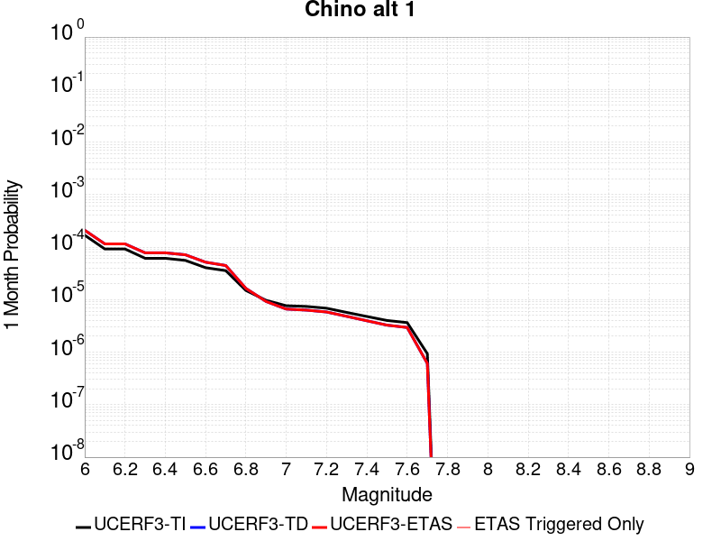 |  |  |

| Magnitude | 1 wk TI Prob | 1 wk TD Prob | 1 wk ETAS Prob | 1 wk ETAS/TD Gain | 1 wk ETAS Triggered Only | 1 mo TI Prob | 1 mo TD Prob | 1 mo ETAS Prob | 1 mo ETAS/TD Gain | 1 mo ETAS Triggered Only | 1 yr TI Prob | 1 yr TD Prob | 1 yr ETAS Prob | 1 yr ETAS/TD Gain | 1 yr ETAS Triggered Only | 10 yr TI Prob | 10 yr TD Prob | 10 yr ETAS Prob | 10 yr ETAS/TD Gain | 10 yr ETAS Triggered Only |
|-----|-----|-----|-----|-----|-----|-----|-----|-----|-----|-----|-----|-----|-----|-----|-----|-----|-----|-----|-----|-----|
| 6.0 | 3.939946E-5 | 4.8956157E-5 | 4.8956157E-5 | 1.0 | 0.0 | 1.6884391E-4 | 2.0979813E-4 | 2.0979813E-4 | 1.0 | 0.0 | 0.0020537362 | 0.002551809 | 0.002551809 | 1.0 | 0.0 | 0.020348595 | 0.025279585 | 0.025318574 | 1.0015423 | 4.0E-5 |
| 6.1 | 2.1505624E-5 | 2.6884254E-5 | 2.6884254E-5 | 1.0 | 0.0 | 9.2163704E-5 | 1.1521374E-4 | 1.1521374E-4 | 1.0 | 0.0 | 0.0011215154 | 0.0014019344 | 0.0014019344 | 1.0 | 0.0 | 0.011158722 | 0.01394543 | 0.01395529 | 1.000707 | 1.0E-5 |
| 6.2 | 2.1505624E-5 | 2.6884254E-5 | 2.6884254E-5 | 1.0 | 0.0 | 9.2163704E-5 | 1.1521374E-4 | 1.1521374E-4 | 1.0 | 0.0 | 0.0011215154 | 0.0014019344 | 0.0014019344 | 1.0 | 0.0 | 0.011158722 | 0.01394543 | 0.01395529 | 1.000707 | 1.0E-5 |
| 6.3 | 1.4290785E-5 | 1.81693E-5 | 1.81693E-5 | 1.0 | 0.0 | 6.1244784E-5 | 7.786636E-5 | 7.786636E-5 | 1.0 | 0.0 | 7.454001E-4 | 9.476558E-4 | 9.476558E-4 | 1.0 | 0.0 | 0.007429048 | 0.009444239 | 0.009444239 | 1.0 | 0.0 |
| 6.4 | 1.4290785E-5 | 1.81693E-5 | 1.81693E-5 | 1.0 | 0.0 | 6.1244784E-5 | 7.786636E-5 | 7.786636E-5 | 1.0 | 0.0 | 7.454001E-4 | 9.476558E-4 | 9.476558E-4 | 1.0 | 0.0 | 0.007429048 | 0.009444239 | 0.009444239 | 1.0 | 0.0 |
| 6.5 | 1.3017944E-5 | 1.6656108E-5 | 1.6656108E-5 | 1.0 | 0.0 | 5.5789995E-5 | 7.138161E-5 | 7.138161E-5 | 1.0 | 0.0 | 6.790315E-4 | 8.687684E-4 | 8.687684E-4 | 1.0 | 0.0 | 0.0067696036 | 0.008661652 | 0.008661652 | 1.0 | 0.0 |
| 6.6 | 9.470016E-6 | 1.204242E-5 | 1.204242E-5 | 1.0 | 0.0 | 4.058515E-5 | 5.1609542E-5 | 5.1609542E-5 | 1.0 | 0.0 | 4.940122E-4 | 6.2819896E-4 | 6.2819896E-4 | 1.0 | 0.0 | 0.004929154 | 0.00627157 | 0.00627157 | 1.0 | 0.0 |
| 6.7 | 8.314155E-6 | 1.04104065E-5 | 1.04104065E-5 | 1.0 | 0.0 | 3.5631605E-5 | 4.4615444E-5 | 4.4615444E-5 | 1.0 | 0.0 | 4.3372845E-4 | 5.4308993E-4 | 5.4308993E-4 | 1.0 | 0.0 | 0.004328829 | 0.005425105 | 0.005425105 | 1.0 | 0.0 |
| 6.8 | 3.4856364E-6 | 3.8139972E-6 | 3.8139972E-6 | 1.0 | 0.0 | 1.4938357E-5 | 1.6345612E-5 | 1.6345612E-5 | 1.0 | 0.0 | 1.8185932E-4 | 1.9899172E-4 | 1.9899172E-4 | 1.0 | 0.0 | 0.0018171056 | 0.001989816 | 0.001989816 | 1.0 | 0.0 |
| 6.9 | 2.2645952E-6 | 2.1532255E-6 | 2.1532255E-6 | 1.0 | 0.0 | 9.705372E-6 | 9.228078E-6 | 9.228078E-6 | 1.0 | 0.0 | 1.18156495E-4 | 1.1234627E-4 | 1.1234627E-4 | 1.0 | 0.0 | 0.0011809369 | 0.0011235173 | 0.0011235173 | 1.0 | 0.0 |
| 7.0 | 1.7864003E-6 | 1.5433253E-6 | 1.5433253E-6 | 1.0 | 0.0 | 7.655979E-6 | 6.614235E-6 | 6.614235E-6 | 1.0 | 0.0 | 9.3207556E-5 | 8.0525395E-5 | 8.0525395E-5 | 1.0 | 0.0 | 9.316847E-4 | 8.0545404E-4 | 8.0545404E-4 | 1.0 | 0.0 |
| 7.1 | 1.7315456E-6 | 1.4735895E-6 | 1.4735895E-6 | 1.0 | 0.0 | 7.420889E-6 | 6.3153684E-6 | 6.3153684E-6 | 1.0 | 0.0 | 9.034557E-5 | 7.688695E-5 | 7.688695E-5 | 1.0 | 0.0 | 9.0308854E-4 | 7.6908193E-4 | 7.6908193E-4 | 1.0 | 0.0 |
| 7.2 | 1.6008337E-6 | 1.3576248E-6 | 1.3576248E-6 | 1.0 | 0.0 | 6.860698E-6 | 5.818379E-6 | 5.818379E-6 | 1.0 | 0.0 | 8.352579E-5 | 7.083652E-5 | 7.083652E-5 | 1.0 | 0.0 | 8.34944E-4 | 7.086046E-4 | 7.086046E-4 | 1.0 | 0.0 |
| 7.3 | 1.3320939E-6 | 1.1219453E-6 | 1.1219453E-6 | 1.0 | 0.0 | 5.7089615E-6 | 4.8083284E-6 | 4.8083284E-6 | 1.0 | 0.0 | 6.9504385E-5 | 5.8539874E-5 | 5.8539874E-5 | 1.0 | 0.0 | 6.9482654E-4 | 5.854161E-4 | 5.854161E-4 | 1.0 | 0.0 |
| 7.4 | 1.114294E-6 | 9.2384E-7 | 9.2384E-7 | 1.0 | 0.0 | 4.775537E-6 | 3.9593083E-6 | 3.9593083E-6 | 1.0 | 0.0 | 5.8140613E-5 | 4.820355E-5 | 4.820355E-5 | 1.0 | 0.0 | 5.81254E-4 | 4.8194567E-4 | 4.8194567E-4 | 1.0 | 0.0 |
| 7.5 | 9.354081E-7 | 7.6244334E-7 | 7.6244334E-7 | 1.0 | 0.0 | 4.0088858E-6 | 3.2676103E-6 | 3.2676103E-6 | 1.0 | 0.0 | 4.8807087E-5 | 3.9782462E-5 | 3.9782462E-5 | 1.0 | 0.0 | 4.879637E-4 | 3.977568E-4 | 3.977568E-4 | 1.0 | 0.0 |
| 7.6 | 8.521771E-7 | 6.881599E-7 | 6.881599E-7 | 1.0 | 0.0 | 3.6521824E-6 | 2.9492537E-6 | 2.9492537E-6 | 1.0 | 0.0 | 4.4464414E-5 | 3.5906603E-5 | 3.5906603E-5 | 1.0 | 0.0 | 4.4455516E-4 | 3.590112E-4 | 3.590112E-4 | 1.0 | 0.0 |
| 7.7 | 2.1803626E-7 | 1.4188254E-7 | 1.4188254E-7 | 1.0 | 0.0 | 9.344408E-7 | 6.08068E-7 | 6.08068E-7 | 1.0 | 0.0 | 1.1376757E-5 | 7.403212E-6 | 7.403212E-6 | 1.0 | 0.0 | 1.13761744E-4 | 7.403061E-5 | 7.403061E-5 | 1.0 | 0.0 |

## San Pedro Basin
*[(top)](#table-of-contents)*

| 1 Week | 1 Month | 1 Year | 10 Year |
|-----|-----|-----|-----|
|  |  | 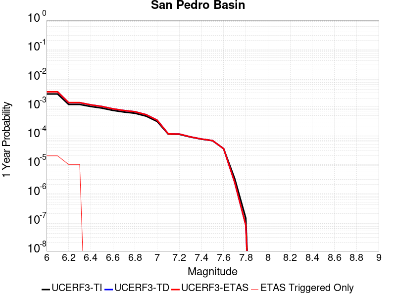 |  |

| Magnitude | 1 wk TI Prob | 1 wk TD Prob | 1 wk ETAS Prob | 1 wk ETAS/TD Gain | 1 wk ETAS Triggered Only | 1 mo TI Prob | 1 mo TD Prob | 1 mo ETAS Prob | 1 mo ETAS/TD Gain | 1 mo ETAS Triggered Only | 1 yr TI Prob | 1 yr TD Prob | 1 yr ETAS Prob | 1 yr ETAS/TD Gain | 1 yr ETAS Triggered Only | 10 yr TI Prob | 10 yr TD Prob | 10 yr ETAS Prob | 10 yr ETAS/TD Gain | 10 yr ETAS Triggered Only |
|-----|-----|-----|-----|-----|-----|-----|-----|-----|-----|-----|-----|-----|-----|-----|-----|-----|-----|-----|-----|-----|
| 6.0 | 5.3449043E-5 | 6.337653E-5 | 6.337653E-5 | 1.0 | 0.0 | 2.2904722E-4 | 2.7158888E-4 | 2.8158617E-4 | 1.0368104 | 1.0E-5 | 0.0027850836 | 0.0033021797 | 0.0033221138 | 1.0060366 | 2.0E-5 | 0.027504366 | 0.032592677 | 0.0326217 | 1.0008905 | 3.0E-5 |
| 6.1 | 5.3449043E-5 | 6.337653E-5 | 6.337653E-5 | 1.0 | 0.0 | 2.2904722E-4 | 2.7158888E-4 | 2.8158617E-4 | 1.0368104 | 1.0E-5 | 0.0027850836 | 0.0033021797 | 0.0033221138 | 1.0060366 | 2.0E-5 | 0.027504366 | 0.032592677 | 0.0326217 | 1.0008905 | 3.0E-5 |
| 6.2 | 2.3189454E-5 | 2.6644975E-5 | 2.6644975E-5 | 1.0 | 0.0 | 9.9379584E-5 | 1.1418802E-4 | 1.2418687E-4 | 1.0875648 | 1.0E-5 | 0.0012092749 | 0.0013893996 | 0.0013993857 | 1.0071874 | 1.0E-5 | 0.012027155 | 0.013811997 | 0.013821859 | 1.0007141 | 1.0E-5 |
| 6.3 | 2.3189454E-5 | 2.6644975E-5 | 2.6644975E-5 | 1.0 | 0.0 | 9.9379584E-5 | 1.1418802E-4 | 1.2418687E-4 | 1.0875648 | 1.0E-5 | 0.0012092749 | 0.0013893996 | 0.0013993857 | 1.0071874 | 1.0E-5 | 0.012027155 | 0.013811997 | 0.013821859 | 1.0007141 | 1.0E-5 |
| 6.4 | 1.966056E-5 | 2.2465161E-5 | 2.2465161E-5 | 1.0 | 0.0 | 8.425682E-5 | 9.627594E-5 | 9.627594E-5 | 1.0 | 0.0 | 0.001025344 | 0.0011715693 | 0.0011715693 | 1.0 | 0.0 | 0.010206259 | 0.0116580175 | 0.0116580175 | 1.0 | 0.0 |
| 6.5 | 1.7342953E-5 | 1.9746642E-5 | 1.9746642E-5 | 1.0 | 0.0 | 7.4324824E-5 | 8.462593E-5 | 8.462593E-5 | 1.0 | 0.0 | 9.04529E-4 | 0.0010298706 | 0.0010298706 | 1.0 | 0.0 | 0.009008561 | 0.010254703 | 0.010254703 | 1.0 | 0.0 |
| 6.6 | 1.439804E-5 | 1.6323913E-5 | 1.6323913E-5 | 1.0 | 0.0 | 6.170443E-5 | 6.995793E-5 | 6.995793E-5 | 1.0 | 0.0 | 7.509924E-4 | 8.514371E-4 | 8.514371E-4 | 1.0 | 0.0 | 0.0074845953 | 0.008484952 | 0.008484952 | 1.0 | 0.0 |
| 6.7 | 1.2634884E-5 | 1.42863255E-5 | 1.42863255E-5 | 1.0 | 0.0 | 5.414838E-5 | 6.1225845E-5 | 6.1225845E-5 | 1.0 | 0.0 | 6.590571E-4 | 7.452002E-4 | 7.452002E-4 | 1.0 | 0.0 | 0.006571059 | 0.0074300347 | 0.0074300347 | 1.0 | 0.0 |
| 6.8 | 1.146091E-5 | 1.29341115E-5 | 1.29341115E-5 | 1.0 | 0.0 | 4.911726E-5 | 5.5430897E-5 | 5.5430897E-5 | 1.0 | 0.0 | 5.9783855E-4 | 6.746919E-4 | 6.746919E-4 | 1.0 | 0.0 | 0.0059623276 | 0.0067293765 | 0.0067293765 | 1.0 | 0.0 |
| 6.9 | 9.109035E-6 | 1.023572E-5 | 1.023572E-5 | 1.0 | 0.0 | 3.9038136E-5 | 4.3866792E-5 | 4.3866792E-5 | 1.0 | 0.0 | 4.7518566E-4 | 5.339753E-4 | 5.339753E-4 | 1.0 | 0.0 | 0.0047417083 | 0.0053296774 | 0.0053296774 | 1.0 | 0.0 |
| 7.0 | 5.9351028E-6 | 6.584381E-6 | 6.584381E-6 | 1.0 | 0.0 | 2.5435906E-5 | 2.8218605E-5 | 2.8218605E-5 | 1.0 | 0.0 | 3.0963816E-4 | 3.4353096E-4 | 3.4353096E-4 | 1.0 | 0.0 | 0.0030920706 | 0.0034323165 | 0.0034323165 | 1.0 | 0.0 |
| 7.1 | 2.1557585E-6 | 2.2096997E-6 | 2.2096997E-6 | 1.0 | 0.0 | 9.238933E-6 | 9.470108E-6 | 9.470108E-6 | 1.0 | 0.0 | 1.1247819E-4 | 1.1529262E-4 | 1.1529262E-4 | 1.0 | 0.0 | 0.0011242128 | 0.0011523435 | 0.0011523435 | 1.0 | 0.0 |
| 7.2 | 2.1251979E-6 | 2.1780454E-6 | 2.1780454E-6 | 1.0 | 0.0 | 9.107958E-6 | 9.334447E-6 | 9.334447E-6 | 1.0 | 0.0 | 1.1088375E-4 | 1.1364112E-4 | 1.1364112E-4 | 1.0 | 0.0 | 0.0011082845 | 0.0011358454 | 0.0011358454 | 1.0 | 0.0 |
| 7.3 | 1.7145798E-6 | 1.7443253E-6 | 1.7443253E-6 | 1.0 | 0.0 | 7.3481783E-6 | 7.4756595E-6 | 7.4756595E-6 | 1.0 | 0.0 | 8.94604E-5 | 9.101244E-5 | 9.101244E-5 | 1.0 | 0.0 | 8.9424395E-4 | 9.097608E-4 | 9.097608E-4 | 1.0 | 0.0 |
| 7.4 | 1.4467993E-6 | 1.4642178E-6 | 1.4642178E-6 | 1.0 | 0.0 | 6.200554E-6 | 6.2752047E-6 | 6.2752047E-6 | 1.0 | 0.0 | 7.548913E-5 | 7.639801E-5 | 7.639801E-5 | 1.0 | 0.0 | 7.546349E-4 | 7.6372473E-4 | 7.6372473E-4 | 1.0 | 0.0 |
| 7.5 | 1.2803735E-6 | 1.293177E-6 | 1.293177E-6 | 1.0 | 0.0 | 5.487303E-6 | 5.5421756E-6 | 5.5421756E-6 | 1.0 | 0.0 | 6.680587E-5 | 6.747397E-5 | 6.747397E-5 | 1.0 | 0.0 | 6.678579E-4 | 6.745419E-4 | 6.745419E-4 | 1.0 | 0.0 |
| 7.6 | 6.755009E-7 | 6.769609E-7 | 6.769609E-7 | 1.0 | 0.0 | 2.8950008E-6 | 2.901258E-6 | 2.901258E-6 | 1.0 | 0.0 | 3.5246063E-5 | 3.5322304E-5 | 3.5322304E-5 | 1.0 | 0.0 | 3.5240475E-4 | 3.5317263E-4 | 3.5317263E-4 | 1.0 | 0.0 |
| 7.7 | 6.211885E-8 | 4.5700904E-8 | 4.5700904E-8 | 1.0 | 0.0 | 2.6622362E-7 | 1.95861E-7 | 1.95861E-7 | 1.0 | 0.0 | 3.2412677E-6 | 2.3846053E-6 | 2.3846053E-6 | 1.0 | 0.0 | 3.2412205E-5 | 2.3845818E-5 | 2.3845818E-5 | 1.0 | 0.0 |
| 7.8 | 2.6580573E-9 | 1.5139658E-9 | 1.5139658E-9 | 1.0 | 0.0 | 1.1391674E-8 | 6.488425E-9 | 6.488425E-9 | 1.0 | 0.0 | 1.3869362E-7 | 7.899657E-8 | 7.899657E-8 | 1.0 | 0.0 | 1.3869354E-6 | 7.899657E-7 | 7.899657E-7 | 1.0 | 0.0 |

## Lost Hills
*[(top)](#table-of-contents)*

| 1 Week | 1 Month | 1 Year | 10 Year |
|-----|-----|-----|-----|
|  |  |  | 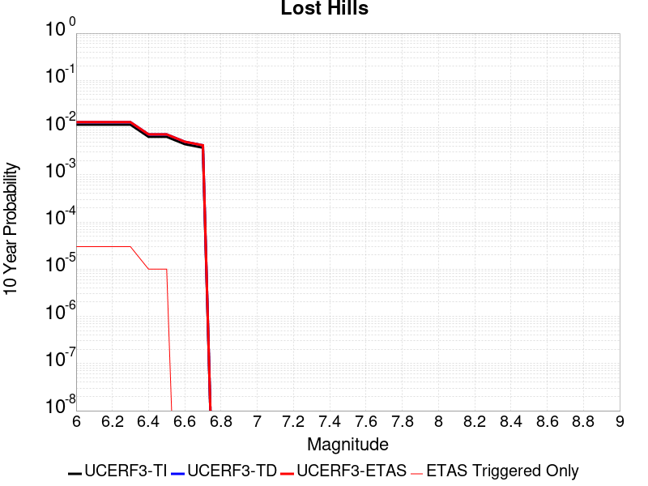 |

| Magnitude | 1 wk TI Prob | 1 wk TD Prob | 1 wk ETAS Prob | 1 wk ETAS/TD Gain | 1 wk ETAS Triggered Only | 1 mo TI Prob | 1 mo TD Prob | 1 mo ETAS Prob | 1 mo ETAS/TD Gain | 1 mo ETAS Triggered Only | 1 yr TI Prob | 1 yr TD Prob | 1 yr ETAS Prob | 1 yr ETAS/TD Gain | 1 yr ETAS Triggered Only | 10 yr TI Prob | 10 yr TD Prob | 10 yr ETAS Prob | 10 yr ETAS/TD Gain | 10 yr ETAS Triggered Only |
|-----|-----|-----|-----|-----|-----|-----|-----|-----|-----|-----|-----|-----|-----|-----|-----|-----|-----|-----|-----|-----|
| 6.0 | 2.233523E-5 | 2.5108235E-5 | 2.5108235E-5 | 1.0 | 0.0 | 9.571891E-5 | 1.07603235E-4 | 1.17602154E-4 | 1.092924 | 1.0E-5 | 0.0011647546 | 0.0013094501 | 0.001319437 | 1.0076268 | 1.0E-5 | 0.011586686 | 0.013033944 | 0.013063554 | 1.0022717 | 3.0E-5 |
| 6.1 | 2.233523E-5 | 2.5108235E-5 | 2.5108235E-5 | 1.0 | 0.0 | 9.571891E-5 | 1.07603235E-4 | 1.17602154E-4 | 1.092924 | 1.0E-5 | 0.0011647546 | 0.0013094501 | 0.001319437 | 1.0076268 | 1.0E-5 | 0.011586686 | 0.013033944 | 0.013063554 | 1.0022717 | 3.0E-5 |
| 6.2 | 2.233523E-5 | 2.5108235E-5 | 2.5108235E-5 | 1.0 | 0.0 | 9.571891E-5 | 1.07603235E-4 | 1.17602154E-4 | 1.092924 | 1.0E-5 | 0.0011647546 | 0.0013094501 | 0.001319437 | 1.0076268 | 1.0E-5 | 0.011586686 | 0.013033944 | 0.013063554 | 1.0022717 | 3.0E-5 |
| 6.3 | 2.233523E-5 | 2.5108235E-5 | 2.5108235E-5 | 1.0 | 0.0 | 9.571891E-5 | 1.07603235E-4 | 1.17602154E-4 | 1.092924 | 1.0E-5 | 0.0011647546 | 0.0013094501 | 0.001319437 | 1.0076268 | 1.0E-5 | 0.011586686 | 0.013033944 | 0.013063554 | 1.0022717 | 3.0E-5 |
| 6.4 | 1.2288092E-5 | 1.3781996E-5 | 1.3781996E-5 | 1.0 | 0.0 | 5.2662188E-5 | 5.906489E-5 | 5.906489E-5 | 1.0 | 0.0 | 6.409735E-4 | 7.1897154E-4 | 7.1897154E-4 | 1.0 | 0.0 | 0.006391279 | 0.007175662 | 0.0071855905 | 1.0013835 | 1.0E-5 |
| 6.5 | 1.2288092E-5 | 1.3781996E-5 | 1.3781996E-5 | 1.0 | 0.0 | 5.2662188E-5 | 5.906489E-5 | 5.906489E-5 | 1.0 | 0.0 | 6.409735E-4 | 7.1897154E-4 | 7.1897154E-4 | 1.0 | 0.0 | 0.006391279 | 0.007175662 | 0.0071855905 | 1.0013835 | 1.0E-5 |
| 6.6 | 8.58281E-6 | 9.634396E-6 | 9.634396E-6 | 1.0 | 0.0 | 3.6782953E-5 | 4.1290084E-5 | 4.1290084E-5 | 1.0 | 0.0 | 4.4774043E-4 | 5.02674E-4 | 5.02674E-4 | 1.0 | 0.0 | 0.0044683935 | 0.005023531 | 0.005023531 | 1.0 | 0.0 |
| 6.7 | 7.205685E-6 | 8.088828E-6 | 8.088828E-6 | 1.0 | 0.0 | 3.088114E-5 | 3.4666402E-5 | 3.4666402E-5 | 1.0 | 0.0 | 3.7591302E-4 | 4.2206346E-4 | 4.2206346E-4 | 1.0 | 0.0 | 0.0037527776 | 0.0042206347 | 0.0042206347 | 1.0 | 0.0 |

## Pitas Point (Lower West)
*[(top)](#table-of-contents)*

| 1 Week | 1 Month | 1 Year | 10 Year |
|-----|-----|-----|-----|
|  |  |  |  |

| Magnitude | 1 wk TI Prob | 1 wk TD Prob | 1 wk ETAS Prob | 1 wk ETAS/TD Gain | 1 wk ETAS Triggered Only | 1 mo TI Prob | 1 mo TD Prob | 1 mo ETAS Prob | 1 mo ETAS/TD Gain | 1 mo ETAS Triggered Only | 1 yr TI Prob | 1 yr TD Prob | 1 yr ETAS Prob | 1 yr ETAS/TD Gain | 1 yr ETAS Triggered Only | 10 yr TI Prob | 10 yr TD Prob | 10 yr ETAS Prob | 10 yr ETAS/TD Gain | 10 yr ETAS Triggered Only |
|-----|-----|-----|-----|-----|-----|-----|-----|-----|-----|-----|-----|-----|-----|-----|-----|-----|-----|-----|-----|-----|
| 6.0 | 8.151497E-6 | 7.856073E-6 | 7.856073E-6 | 1.0 | 0.0 | 3.493452E-5 | 3.3668453E-5 | 3.3668453E-5 | 1.0 | 0.0 | 4.252448E-4 | 4.0983706E-4 | 4.1983297E-4 | 1.02439 | 1.0E-5 | 0.0042443196 | 0.004090893 | 0.0041207704 | 1.0073034 | 3.0E-5 |
| 6.1 | 8.151497E-6 | 7.856073E-6 | 7.856073E-6 | 1.0 | 0.0 | 3.493452E-5 | 3.3668453E-5 | 3.3668453E-5 | 1.0 | 0.0 | 4.252448E-4 | 4.0983706E-4 | 4.1983297E-4 | 1.02439 | 1.0E-5 | 0.0042443196 | 0.004090893 | 0.0041207704 | 1.0073034 | 3.0E-5 |
| 6.2 | 8.151497E-6 | 7.856073E-6 | 7.856073E-6 | 1.0 | 0.0 | 3.493452E-5 | 3.3668453E-5 | 3.3668453E-5 | 1.0 | 0.0 | 4.252448E-4 | 4.0983706E-4 | 4.1983297E-4 | 1.02439 | 1.0E-5 | 0.0042443196 | 0.004090893 | 0.0041207704 | 1.0073034 | 3.0E-5 |
| 6.3 | 8.151497E-6 | 7.856073E-6 | 7.856073E-6 | 1.0 | 0.0 | 3.493452E-5 | 3.3668453E-5 | 3.3668453E-5 | 1.0 | 0.0 | 4.252448E-4 | 4.0983706E-4 | 4.1983297E-4 | 1.02439 | 1.0E-5 | 0.0042443196 | 0.004090893 | 0.0041207704 | 1.0073034 | 3.0E-5 |
| 6.4 | 8.151497E-6 | 7.856073E-6 | 7.856073E-6 | 1.0 | 0.0 | 3.493452E-5 | 3.3668453E-5 | 3.3668453E-5 | 1.0 | 0.0 | 4.252448E-4 | 4.0983706E-4 | 4.1983297E-4 | 1.02439 | 1.0E-5 | 0.0042443196 | 0.004090893 | 0.0041207704 | 1.0073034 | 3.0E-5 |
| 6.5 | 8.151497E-6 | 7.856073E-6 | 7.856073E-6 | 1.0 | 0.0 | 3.493452E-5 | 3.3668453E-5 | 3.3668453E-5 | 1.0 | 0.0 | 4.252448E-4 | 4.0983706E-4 | 4.1983297E-4 | 1.02439 | 1.0E-5 | 0.0042443196 | 0.004090893 | 0.0041207704 | 1.0073034 | 3.0E-5 |
| 6.6 | 8.151497E-6 | 7.856073E-6 | 7.856073E-6 | 1.0 | 0.0 | 3.493452E-5 | 3.3668453E-5 | 3.3668453E-5 | 1.0 | 0.0 | 4.252448E-4 | 4.0983706E-4 | 4.1983297E-4 | 1.02439 | 1.0E-5 | 0.0042443196 | 0.004090893 | 0.0041207704 | 1.0073034 | 3.0E-5 |
| 6.7 | 8.151497E-6 | 7.856073E-6 | 7.856073E-6 | 1.0 | 0.0 | 3.493452E-5 | 3.3668453E-5 | 3.3668453E-5 | 1.0 | 0.0 | 4.252448E-4 | 4.0983706E-4 | 4.1983297E-4 | 1.02439 | 1.0E-5 | 0.0042443196 | 0.004090893 | 0.0041207704 | 1.0073034 | 3.0E-5 |
| 6.8 | 8.151497E-6 | 7.856073E-6 | 7.856073E-6 | 1.0 | 0.0 | 3.493452E-5 | 3.3668453E-5 | 3.3668453E-5 | 1.0 | 0.0 | 4.252448E-4 | 4.0983706E-4 | 4.1983297E-4 | 1.02439 | 1.0E-5 | 0.0042443196 | 0.004090893 | 0.0041207704 | 1.0073034 | 3.0E-5 |
| 6.9 | 8.151497E-6 | 7.856073E-6 | 7.856073E-6 | 1.0 | 0.0 | 3.493452E-5 | 3.3668453E-5 | 3.3668453E-5 | 1.0 | 0.0 | 4.252448E-4 | 4.0983706E-4 | 4.1983297E-4 | 1.02439 | 1.0E-5 | 0.0042443196 | 0.004090893 | 0.0041207704 | 1.0073034 | 3.0E-5 |
| 7.0 | 8.103535E-6 | 7.805501E-6 | 7.805501E-6 | 1.0 | 0.0 | 3.4728975E-5 | 3.3451724E-5 | 3.3451724E-5 | 1.0 | 0.0 | 4.2274324E-4 | 4.0719935E-4 | 4.171953E-4 | 1.024548 | 1.0E-5 | 0.0042193993 | 0.0040646126 | 0.004084531 | 1.0049006 | 2.0E-5 |
| 7.1 | 7.853298E-6 | 7.5411845E-6 | 7.5411845E-6 | 1.0 | 0.0 | 3.3656554E-5 | 3.2318967E-5 | 3.2318967E-5 | 1.0 | 0.0 | 4.096915E-4 | 3.9341307E-4 | 4.0340913E-4 | 1.0254086 | 1.0E-5 | 0.00408937 | 0.003927242 | 0.0039471635 | 1.0050726 | 2.0E-5 |
| 7.2 | 7.771102E-6 | 7.4534632E-6 | 7.4534632E-6 | 1.0 | 0.0 | 3.33043E-5 | 3.1943026E-5 | 3.1943026E-5 | 1.0 | 0.0 | 4.0540437E-4 | 3.8883765E-4 | 3.9883377E-4 | 1.0257077 | 1.0E-5 | 0.0040466557 | 0.0038816486 | 0.003901571 | 1.0051324 | 2.0E-5 |
| 7.3 | 7.3945344E-6 | 7.049552E-6 | 7.049552E-6 | 1.0 | 0.0 | 3.1690477E-5 | 3.021202E-5 | 3.021202E-5 | 1.0 | 0.0 | 3.8576324E-4 | 3.6776988E-4 | 3.777662E-4 | 1.0271809 | 1.0E-5 | 0.0038509427 | 0.0036716803 | 0.003691607 | 1.0054271 | 2.0E-5 |
| 7.4 | 6.964645E-6 | 6.5903846E-6 | 6.5903846E-6 | 1.0 | 0.0 | 2.9848137E-5 | 2.8244203E-5 | 2.8244203E-5 | 1.0 | 0.0 | 3.6334046E-4 | 3.438194E-4 | 3.438194E-4 | 1.0 | 0.0 | 0.0036274698 | 0.003432928 | 0.0034428935 | 1.002903 | 1.0E-5 |
| 7.5 | 6.6525035E-6 | 6.2594127E-6 | 6.2594127E-6 | 1.0 | 0.0 | 2.851042E-5 | 2.682578E-5 | 2.682578E-5 | 1.0 | 0.0 | 3.4705905E-4 | 3.2655543E-4 | 3.2655543E-4 | 1.0 | 0.0 | 0.0034651754 | 0.0032608071 | 0.0032707744 | 1.0030568 | 1.0E-5 |
| 7.6 | 5.613338E-6 | 5.1516E-6 | 5.1516E-6 | 1.0 | 0.0 | 2.405694E-5 | 2.20781E-5 | 2.20781E-5 | 1.0 | 0.0 | 2.928539E-4 | 2.68768E-4 | 2.68768E-4 | 1.0 | 0.0 | 0.0029246826 | 0.0026844612 | 0.0026944343 | 1.0037152 | 1.0E-5 |
| 7.7 | 4.494704E-6 | 3.9970882E-6 | 3.9970882E-6 | 1.0 | 0.0 | 1.9262876E-5 | 1.7130267E-5 | 1.7130267E-5 | 1.0 | 0.0 | 2.3450027E-4 | 2.0854129E-4 | 2.0854129E-4 | 1.0 | 0.0 | 0.0023425296 | 0.00208348 | 0.002093459 | 1.0047897 | 1.0E-5 |
| 7.8 | 2.6075882E-6 | 2.1837427E-6 | 2.1837427E-6 | 1.0 | 0.0 | 1.117533E-5 | 9.358864E-6 | 9.358864E-6 | 1.0 | 0.0 | 1.3605114E-4 | 1.1393826E-4 | 1.1393826E-4 | 1.0 | 0.0 | 0.0013596788 | 0.0011388032 | 0.0011487918 | 1.0087712 | 1.0E-5 |
| 7.9 | 4.045984E-7 | 3.2425163E-7 | 3.2425163E-7 | 1.0 | 0.0 | 1.733992E-6 | 1.389649E-6 | 1.389649E-6 | 1.0 | 0.0 | 2.1111147E-5 | 1.691885E-5 | 1.691885E-5 | 1.0 | 0.0 | 2.1109142E-4 | 1.6917592E-4 | 1.6917592E-4 | 1.0 | 0.0 |
| 8.0 | 7.791402E-9 | 5.6839005E-9 | 5.6839005E-9 | 1.0 | 0.0 | 3.3391725E-8 | 2.4359574E-8 | 2.4359574E-8 | 1.0 | 0.0 | 4.0654416E-7 | 2.9657778E-7 | 2.9657778E-7 | 1.0 | 0.0 | 4.065434E-6 | 2.965776E-6 | 2.965776E-6 | 1.0 | 0.0 |

## Dry Mountain
*[(top)](#table-of-contents)*

| 1 Week | 1 Month | 1 Year | 10 Year |
|-----|-----|-----|-----|
|  |  |  |  |

| Magnitude | 1 wk TI Prob | 1 wk TD Prob | 1 wk ETAS Prob | 1 wk ETAS/TD Gain | 1 wk ETAS Triggered Only | 1 mo TI Prob | 1 mo TD Prob | 1 mo ETAS Prob | 1 mo ETAS/TD Gain | 1 mo ETAS Triggered Only | 1 yr TI Prob | 1 yr TD Prob | 1 yr ETAS Prob | 1 yr ETAS/TD Gain | 1 yr ETAS Triggered Only | 10 yr TI Prob | 10 yr TD Prob | 10 yr ETAS Prob | 10 yr ETAS/TD Gain | 10 yr ETAS Triggered Only |
|-----|-----|-----|-----|-----|-----|-----|-----|-----|-----|-----|-----|-----|-----|-----|-----|-----|-----|-----|-----|-----|
| 6.0 | 6.222801E-6 | 6.4395003E-6 | 6.4395003E-6 | 1.0 | 0.0 | 2.6668875E-5 | 2.7597656E-5 | 2.7597656E-5 | 1.0 | 0.0 | 3.2464517E-4 | 3.3596557E-4 | 3.3596557E-4 | 1.0 | 0.0 | 0.0032417132 | 0.0033561387 | 0.0033860381 | 1.0089089 | 3.0E-5 |
| 6.1 | 6.222801E-6 | 6.4395003E-6 | 6.4395003E-6 | 1.0 | 0.0 | 2.6668875E-5 | 2.7597656E-5 | 2.7597656E-5 | 1.0 | 0.0 | 3.2464517E-4 | 3.3596557E-4 | 3.3596557E-4 | 1.0 | 0.0 | 0.0032417132 | 0.0033561387 | 0.0033860381 | 1.0089089 | 3.0E-5 |
| 6.2 | 6.222801E-6 | 6.4395003E-6 | 6.4395003E-6 | 1.0 | 0.0 | 2.6668875E-5 | 2.7597656E-5 | 2.7597656E-5 | 1.0 | 0.0 | 3.2464517E-4 | 3.3596557E-4 | 3.3596557E-4 | 1.0 | 0.0 | 0.0032417132 | 0.0033561387 | 0.0033860381 | 1.0089089 | 3.0E-5 |
| 6.3 | 6.222801E-6 | 6.4395003E-6 | 6.4395003E-6 | 1.0 | 0.0 | 2.6668875E-5 | 2.7597656E-5 | 2.7597656E-5 | 1.0 | 0.0 | 3.2464517E-4 | 3.3596557E-4 | 3.3596557E-4 | 1.0 | 0.0 | 0.0032417132 | 0.0033561387 | 0.0033860381 | 1.0089089 | 3.0E-5 |
| 6.4 | 6.222801E-6 | 6.4395003E-6 | 6.4395003E-6 | 1.0 | 0.0 | 2.6668875E-5 | 2.7597656E-5 | 2.7597656E-5 | 1.0 | 0.0 | 3.2464517E-4 | 3.3596557E-4 | 3.3596557E-4 | 1.0 | 0.0 | 0.0032417132 | 0.0033561387 | 0.0033860381 | 1.0089089 | 3.0E-5 |
| 6.5 | 2.8528623E-6 | 2.952223E-6 | 2.952223E-6 | 1.0 | 0.0 | 1.22264955E-5 | 1.2652372E-5 | 1.2652372E-5 | 1.0 | 0.0 | 1.4884741E-4 | 1.5404043E-4 | 1.5404043E-4 | 1.0 | 0.0 | 0.0014874774 | 0.0015401901 | 0.0015501747 | 1.0064827 | 1.0E-5 |
| 6.6 | 2.8528623E-6 | 2.952223E-6 | 2.952223E-6 | 1.0 | 0.0 | 1.22264955E-5 | 1.2652372E-5 | 1.2652372E-5 | 1.0 | 0.0 | 1.4884741E-4 | 1.5404043E-4 | 1.5404043E-4 | 1.0 | 0.0 | 0.0014874774 | 0.0015401901 | 0.0015501747 | 1.0064827 | 1.0E-5 |
| 6.7 | 2.541E-6 | 2.6294065E-6 | 2.6294065E-6 | 1.0 | 0.0 | 1.0889954E-5 | 1.1268885E-5 | 1.1268885E-5 | 1.0 | 0.0 | 1.3257713E-4 | 1.3719867E-4 | 1.3719867E-4 | 1.0 | 0.0 | 0.0013249806 | 0.0013719867 | 0.0013819729 | 1.0072787 | 1.0E-5 |

## Cucamonga
*[(top)](#table-of-contents)*

| 1 Week | 1 Month | 1 Year | 10 Year |
|-----|-----|-----|-----|
|  |  |  | 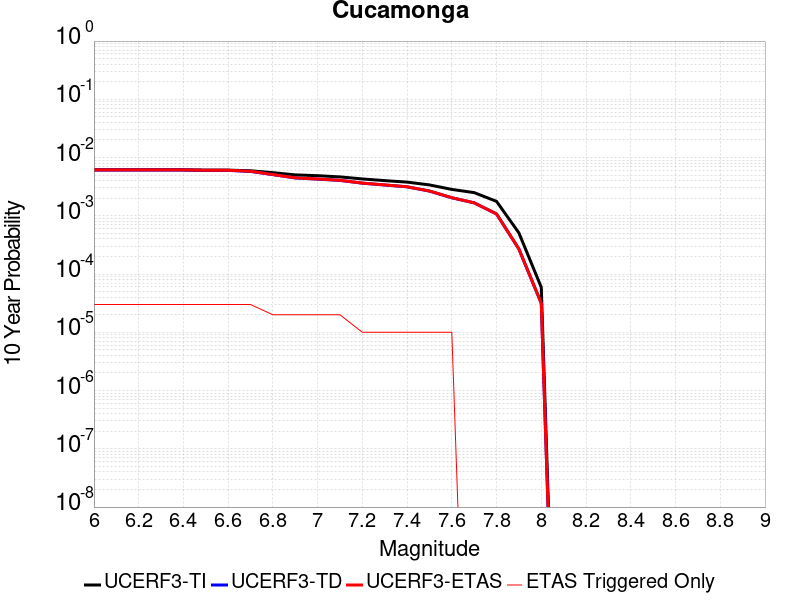 |

| Magnitude | 1 wk TI Prob | 1 wk TD Prob | 1 wk ETAS Prob | 1 wk ETAS/TD Gain | 1 wk ETAS Triggered Only | 1 mo TI Prob | 1 mo TD Prob | 1 mo ETAS Prob | 1 mo ETAS/TD Gain | 1 mo ETAS Triggered Only | 1 yr TI Prob | 1 yr TD Prob | 1 yr ETAS Prob | 1 yr ETAS/TD Gain | 1 yr ETAS Triggered Only | 10 yr TI Prob | 10 yr TD Prob | 10 yr ETAS Prob | 10 yr ETAS/TD Gain | 10 yr ETAS Triggered Only |
|-----|-----|-----|-----|-----|-----|-----|-----|-----|-----|-----|-----|-----|-----|-----|-----|-----|-----|-----|-----|-----|
| 6.0 | 1.1848348E-5 | 1.1739775E-5 | 1.1739775E-5 | 1.0 | 0.0 | 5.0777642E-5 | 5.0312367E-5 | 5.0312367E-5 | 1.0 | 0.0 | 6.180424E-4 | 6.123836E-4 | 6.223775E-4 | 1.0163196 | 1.0E-5 | 0.0061632637 | 0.0061081476 | 0.0061379643 | 1.0048815 | 3.0E-5 |
| 6.1 | 1.1848348E-5 | 1.1739775E-5 | 1.1739775E-5 | 1.0 | 0.0 | 5.0777642E-5 | 5.0312367E-5 | 5.0312367E-5 | 1.0 | 0.0 | 6.180424E-4 | 6.123836E-4 | 6.223775E-4 | 1.0163196 | 1.0E-5 | 0.0061632637 | 0.0061081476 | 0.0061379643 | 1.0048815 | 3.0E-5 |
| 6.2 | 1.1848348E-5 | 1.1739775E-5 | 1.1739775E-5 | 1.0 | 0.0 | 5.0777642E-5 | 5.0312367E-5 | 5.0312367E-5 | 1.0 | 0.0 | 6.180424E-4 | 6.123836E-4 | 6.223775E-4 | 1.0163196 | 1.0E-5 | 0.0061632637 | 0.0061081476 | 0.0061379643 | 1.0048815 | 3.0E-5 |
| 6.3 | 1.1848348E-5 | 1.1739775E-5 | 1.1739775E-5 | 1.0 | 0.0 | 5.0777642E-5 | 5.0312367E-5 | 5.0312367E-5 | 1.0 | 0.0 | 6.180424E-4 | 6.123836E-4 | 6.223775E-4 | 1.0163196 | 1.0E-5 | 0.0061632637 | 0.0061081476 | 0.0061379643 | 1.0048815 | 3.0E-5 |
| 6.4 | 1.1848348E-5 | 1.1739775E-5 | 1.1739775E-5 | 1.0 | 0.0 | 5.0777642E-5 | 5.0312367E-5 | 5.0312367E-5 | 1.0 | 0.0 | 6.180424E-4 | 6.123836E-4 | 6.223775E-4 | 1.0163196 | 1.0E-5 | 0.0061632637 | 0.0061081476 | 0.0061379643 | 1.0048815 | 3.0E-5 |
| 6.5 | 1.16988695E-5 | 1.15788E-5 | 1.15788E-5 | 1.0 | 0.0 | 5.013705E-5 | 4.9622497E-5 | 4.9622497E-5 | 1.0 | 0.0 | 6.102476E-4 | 6.039891E-4 | 6.139831E-4 | 1.0165466 | 1.0E-5 | 0.006085745 | 0.0060246587 | 0.0060544778 | 1.0049496 | 3.0E-5 |
| 6.6 | 1.16988695E-5 | 1.15788E-5 | 1.15788E-5 | 1.0 | 0.0 | 5.013705E-5 | 4.9622497E-5 | 4.9622497E-5 | 1.0 | 0.0 | 6.102476E-4 | 6.039891E-4 | 6.139831E-4 | 1.0165466 | 1.0E-5 | 0.006085745 | 0.0060246587 | 0.0060544778 | 1.0049496 | 3.0E-5 |
| 6.7 | 1.1397107E-5 | 1.11176305E-5 | 1.11176305E-5 | 1.0 | 0.0 | 4.884383E-5 | 4.7646132E-5 | 4.7646132E-5 | 1.0 | 0.0 | 5.9451134E-4 | 5.7993975E-4 | 5.8993394E-4 | 1.0172331 | 1.0E-5 | 0.005929234 | 0.005785425 | 0.0058152517 | 1.0051554 | 3.0E-5 |
| 6.8 | 1.058387E-5 | 9.787316E-6 | 9.787316E-6 | 1.0 | 0.0 | 4.5358654E-5 | 4.1944975E-5 | 4.1944975E-5 | 1.0 | 0.0 | 5.521017E-4 | 5.105615E-4 | 5.205564E-4 | 1.0195763 | 1.0E-5 | 0.00550732 | 0.0050949054 | 0.0051148036 | 1.0039055 | 2.0E-5 |
| 6.9 | 9.690046E-6 | 8.581577E-6 | 8.581577E-6 | 1.0 | 0.0 | 4.1528107E-5 | 3.6777674E-5 | 3.6777674E-5 | 1.0 | 0.0 | 5.054874E-4 | 4.4767658E-4 | 4.5767208E-4 | 1.0223275 | 1.0E-5 | 0.005043391 | 0.004468694 | 0.0044886046 | 1.0044556 | 2.0E-5 |
| 7.0 | 9.381461E-6 | 8.189138E-6 | 8.189138E-6 | 1.0 | 0.0 | 4.020564E-5 | 3.5095833E-5 | 3.5095833E-5 | 1.0 | 0.0 | 4.893937E-4 | 4.2720835E-4 | 4.3720406E-4 | 1.0233978 | 1.0E-5 | 0.0048831734 | 0.004264814 | 0.004284729 | 1.0046695 | 2.0E-5 |
| 7.1 | 8.946492E-6 | 7.783881E-6 | 7.783881E-6 | 1.0 | 0.0 | 3.8341543E-5 | 3.335907E-5 | 3.335907E-5 | 1.0 | 0.0 | 4.667083E-4 | 4.0607128E-4 | 4.1606723E-4 | 1.0246162 | 1.0E-5 | 0.0046572937 | 0.004054238 | 0.004074157 | 1.0049131 | 2.0E-5 |
| 7.2 | 8.251016E-6 | 6.977128E-6 | 6.977128E-6 | 1.0 | 0.0 | 3.5361016E-5 | 2.9901637E-5 | 2.9901637E-5 | 1.0 | 0.0 | 4.3043532E-4 | 3.6399186E-4 | 3.6399186E-4 | 1.0 | 0.0 | 0.0042960253 | 0.0036348994 | 0.0036448631 | 1.0027411 | 1.0E-5 |
| 7.3 | 7.717881E-6 | 6.4881388E-6 | 6.4881388E-6 | 1.0 | 0.0 | 3.3076216E-5 | 2.7806014E-5 | 2.7806014E-5 | 1.0 | 0.0 | 4.026285E-4 | 3.3848584E-4 | 3.3848584E-4 | 1.0 | 0.0 | 0.004018998 | 0.0033806541 | 0.0033906205 | 1.002948 | 1.0E-5 |
| 7.4 | 7.275623E-6 | 6.033712E-6 | 6.033712E-6 | 1.0 | 0.0 | 3.118087E-5 | 2.585851E-5 | 2.585851E-5 | 1.0 | 0.0 | 3.7956095E-4 | 3.1478208E-4 | 3.1478208E-4 | 1.0 | 0.0 | 0.0037891332 | 0.0031443113 | 0.00315428 | 1.0031704 | 1.0E-5 |
| 7.5 | 6.5109502E-6 | 5.1021066E-6 | 5.1021066E-6 | 1.0 | 0.0 | 2.7903774E-5 | 2.1865988E-5 | 2.1865988E-5 | 1.0 | 0.0 | 3.3967546E-4 | 2.6618605E-4 | 2.6618605E-4 | 1.0 | 0.0 | 0.0033915674 | 0.0026596072 | 0.0026695807 | 1.00375 | 1.0E-5 |
| 7.6 | 5.4495326E-6 | 3.9098873E-6 | 3.9098873E-6 | 1.0 | 0.0 | 2.335493E-5 | 1.6756552E-5 | 1.6756552E-5 | 1.0 | 0.0 | 2.8430918E-4 | 2.03992E-4 | 2.03992E-4 | 1.0 | 0.0 | 0.0028394572 | 0.0020389801 | 0.0020489597 | 1.0048944 | 1.0E-5 |
| 7.7 | 4.7997164E-6 | 3.2014277E-6 | 3.2014277E-6 | 1.0 | 0.0 | 2.057005E-5 | 1.3720333E-5 | 1.3720333E-5 | 1.0 | 0.0 | 2.504116E-4 | 1.6703228E-4 | 1.6703228E-4 | 1.0 | 0.0 | 0.002501296 | 0.001670011 | 0.001670011 | 1.0 | 0.0 |
| 7.8 | 3.3941733E-6 | 2.0648565E-6 | 2.0648565E-6 | 1.0 | 0.0 | 1.4546376E-5 | 8.849355E-6 | 8.849355E-6 | 1.0 | 0.0 | 1.7708774E-4 | 1.0773559E-4 | 1.0773559E-4 | 1.0 | 0.0 | 0.0017694668 | 0.0010770098 | 0.0010770098 | 1.0 | 0.0 |
| 7.9 | 9.750552E-7 | 5.157492E-7 | 5.157492E-7 | 1.0 | 0.0 | 4.178801E-6 | 2.2103518E-6 | 2.2103518E-6 | 1.0 | 0.0 | 5.0875715E-5 | 2.6910706E-5 | 2.6910706E-5 | 1.0 | 0.0 | 5.086407E-4 | 2.6907487E-4 | 2.6907487E-4 | 1.0 | 0.0 |
| 8.0 | 1.133857E-7 | 6.055065E-8 | 6.055065E-8 | 1.0 | 0.0 | 4.8593864E-7 | 2.5950274E-7 | 2.5950274E-7 | 1.0 | 0.0 | 5.9162867E-6 | 3.1594416E-6 | 3.1594416E-6 | 1.0 | 0.0 | 5.916129E-5 | 3.1593983E-5 | 3.1593983E-5 | 1.0 | 0.0 |

## Imperial
*[(top)](#table-of-contents)*

| 1 Week | 1 Month | 1 Year | 10 Year |
|-----|-----|-----|-----|
|  |  |  | 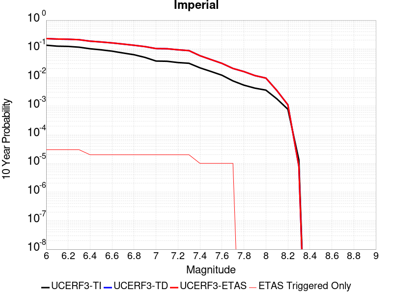 |

| Magnitude | 1 wk TI Prob | 1 wk TD Prob | 1 wk ETAS Prob | 1 wk ETAS/TD Gain | 1 wk ETAS Triggered Only | 1 mo TI Prob | 1 mo TD Prob | 1 mo ETAS Prob | 1 mo ETAS/TD Gain | 1 mo ETAS Triggered Only | 1 yr TI Prob | 1 yr TD Prob | 1 yr ETAS Prob | 1 yr ETAS/TD Gain | 1 yr ETAS Triggered Only | 10 yr TI Prob | 10 yr TD Prob | 10 yr ETAS Prob | 10 yr ETAS/TD Gain | 10 yr ETAS Triggered Only |
|-----|-----|-----|-----|-----|-----|-----|-----|-----|-----|-----|-----|-----|-----|-----|-----|-----|-----|-----|-----|-----|
| 6.0 | 2.7496446E-4 | 5.060534E-4 | 5.060534E-4 | 1.0 | 0.0 | 0.0011778869 | 0.002167037 | 0.0021770152 | 1.0046046 | 1.0E-5 | 0.0142467655 | 0.026063008 | 0.026092226 | 1.001121 | 3.0E-5 | 0.13367249 | 0.22823441 | 0.22825757 | 1.0001014 | 3.0E-5 |
| 6.1 | 2.5356023E-4 | 4.8701253E-4 | 4.8701253E-4 | 1.0 | 0.0 | 0.001086234 | 0.0020855654 | 0.0020955445 | 1.0047848 | 1.0E-5 | 0.013144928 | 0.025100723 | 0.02512997 | 1.0011652 | 3.0E-5 | 0.123940155 | 0.21965367 | 0.21967708 | 1.0001066 | 3.0E-5 |
| 6.2 | 2.4820742E-4 | 4.7795853E-4 | 4.7795853E-4 | 1.0 | 0.0 | 0.0010633124 | 0.0020468235 | 0.002056803 | 1.0048757 | 1.0E-5 | 0.01286919 | 0.02464024 | 0.024669502 | 1.0011876 | 3.0E-5 | 0.12148927 | 0.21615778 | 0.2161813 | 1.0001088 | 3.0E-5 |
| 6.3 | 2.3205351E-4 | 4.5930318E-4 | 4.5930318E-4 | 1.0 | 0.0 | 9.94136E-4 | 0.001966994 | 0.0019769743 | 1.0050739 | 1.0E-5 | 0.012036599 | 0.023685131 | 0.02371442 | 1.0012366 | 3.0E-5 | 0.11405133 | 0.20807824 | 0.20810199 | 1.0001142 | 3.0E-5 |
| 6.4 | 2.0304754E-4 | 3.9915304E-4 | 3.9915304E-4 | 1.0 | 0.0 | 8.6991355E-4 | 0.001709549 | 0.001709549 | 1.0 | 0.0 | 0.010539869 | 0.02062065 | 0.020640237 | 1.0009499 | 2.0E-5 | 0.100537635 | 0.1852114 | 0.18522769 | 1.000088 | 2.0E-5 |
| 6.5 | 1.854992E-4 | 3.7025133E-4 | 3.7025133E-4 | 1.0 | 0.0 | 7.9475436E-4 | 0.0015858389 | 0.0015858389 | 1.0 | 0.0 | 0.009633281 | 0.019145777 | 0.019165395 | 1.0010246 | 2.0E-5 | 0.0922623 | 0.17343764 | 0.17345417 | 1.0000954 | 2.0E-5 |
| 6.6 | 1.6586106E-4 | 3.406821E-4 | 3.406821E-4 | 1.0 | 0.0 | 7.106394E-4 | 0.0014592593 | 0.0014592593 | 1.0 | 0.0 | 0.008617763 | 0.01762655 | 0.0176462 | 1.0011146 | 2.0E-5 | 0.08291132 | 0.16090786 | 0.16092464 | 1.0001043 | 2.0E-5 |
| 6.7 | 1.4224656E-4 | 3.0796128E-4 | 3.0796128E-4 | 1.0 | 0.0 | 6.094856E-4 | 0.0013191747 | 0.0013191747 | 1.0 | 0.0 | 0.0073952693 | 0.015944751 | 0.015964434 | 1.0012343 | 2.0E-5 | 0.07153955 | 0.14660648 | 0.14662355 | 1.0001165 | 2.0E-5 |
| 6.8 | 1.2317259E-4 | 2.7815934E-4 | 2.7815934E-4 | 1.0 | 0.0 | 5.2777573E-4 | 0.0011915729 | 0.0011915729 | 1.0 | 0.0 | 0.0064067547 | 0.014412285 | 0.014431997 | 1.0013677 | 2.0E-5 | 0.06225166 | 0.13304241 | 0.13305975 | 1.0001303 | 2.0E-5 |
| 6.9 | 9.859898E-5 | 2.503297E-4 | 2.503297E-4 | 1.0 | 0.0 | 4.2249862E-4 | 0.0010724048 | 0.0010724048 | 1.0 | 0.0 | 0.0051317946 | 0.012979328 | 0.012999069 | 1.0015209 | 2.0E-5 | 0.05014893 | 0.11948839 | 0.119506 | 1.0001473 | 2.0E-5 |
| 7.0 | 7.3191884E-5 | 2.1280872E-4 | 2.1280872E-4 | 1.0 | 0.0 | 3.136418E-4 | 9.117218E-4 | 9.117218E-4 | 1.0 | 0.0 | 0.003811904 | 0.011044404 | 0.011064183 | 1.0017909 | 2.0E-5 | 0.037471764 | 0.10212967 | 0.102147624 | 1.0001758 | 2.0E-5 |
| 7.1 | 7.1760296E-5 | 2.0982049E-4 | 2.0982049E-4 | 1.0 | 0.0 | 3.0750787E-4 | 8.9892396E-4 | 8.9892396E-4 | 1.0 | 0.0 | 0.003737482 | 0.010890158 | 0.01090994 | 1.0018165 | 2.0E-5 | 0.03675245 | 0.10076556 | 0.10078355 | 1.0001785 | 2.0E-5 |
| 7.2 | 6.46614E-5 | 1.9150079E-4 | 1.9150079E-4 | 1.0 | 0.0 | 2.7709085E-4 | 8.204626E-4 | 8.204626E-4 | 1.0 | 0.0 | 0.0033683628 | 0.009944002 | 0.009963804 | 1.0019913 | 2.0E-5 | 0.033177625 | 0.09257121 | 0.092589356 | 1.0001961 | 2.0E-5 |
| 7.3 | 6.088115E-5 | 1.7821198E-4 | 1.7821198E-4 | 1.0 | 0.0 | 2.6089314E-4 | 7.6354493E-4 | 7.6354493E-4 | 1.0 | 0.0 | 0.0031717476 | 0.009257112 | 0.0092769265 | 1.0021405 | 2.0E-5 | 0.031268585 | 0.086619206 | 0.086637475 | 1.0002109 | 2.0E-5 |
| 7.4 | 4.199346E-5 | 1.1520217E-4 | 1.1520217E-4 | 1.0 | 0.0 | 1.7995955E-4 | 4.9363106E-4 | 4.9363106E-4 | 1.0 | 0.0 | 0.0021888057 | 0.0059935665 | 0.0060035065 | 1.0016584 | 1.0E-5 | 0.02167372 | 0.05748436 | 0.057493784 | 1.0001639 | 1.0E-5 |
| 7.5 | 3.130448E-5 | 8.341438E-5 | 8.341438E-5 | 1.0 | 0.0 | 1.3415517E-4 | 3.5744155E-4 | 3.5744155E-4 | 1.0 | 0.0 | 0.0016321153 | 0.004343227 | 0.0043531833 | 1.0022924 | 1.0E-5 | 0.016201803 | 0.042169005 | 0.042178582 | 1.0002271 | 1.0E-5 |
| 7.6 | 2.3074248E-5 | 6.0914088E-5 | 6.0914088E-5 | 1.0 | 0.0 | 9.888588E-5 | 2.6103438E-4 | 2.6103438E-4 | 1.0 | 0.0 | 0.0012032706 | 0.0031734854 | 0.0031834536 | 1.0031412 | 1.0E-5 | 0.011967761 | 0.031058539 | 0.031068228 | 1.000312 | 1.0E-5 |
| 7.7 | 1.45864815E-5 | 4.018208E-5 | 4.018208E-5 | 1.0 | 0.0 | 6.2511994E-5 | 1.7219759E-4 | 1.7219759E-4 | 1.0 | 0.0 | 7.608177E-4 | 0.002094495 | 0.0021044742 | 1.0047644 | 1.0E-5 | 0.007582182 | 0.020654438 | 0.020664232 | 1.0004742 | 1.0E-5 |
| 7.8 | 1.0352979E-5 | 3.100957E-5 | 3.100957E-5 | 1.0 | 0.0 | 4.4369157E-5 | 1.3289141E-4 | 1.3289141E-4 | 1.0 | 0.0 | 5.400606E-4 | 0.0016167545 | 0.0016167545 | 1.0 | 0.0 | 0.0053875 | 0.016039513 | 0.016039513 | 1.0 | 0.0 |
| 7.9 | 8.137906E-6 | 2.2187884E-5 | 2.2187884E-5 | 1.0 | 0.0 | 3.4876273E-5 | 9.5087475E-5 | 9.5087475E-5 | 1.0 | 0.0 | 4.2453592E-4 | 0.0011570761 | 0.0011570761 | 1.0 | 0.0 | 0.004237258 | 0.011636249 | 0.011636249 | 1.0 | 0.0 |
| 8.0 | 6.93792E-6 | 1.8041985E-5 | 1.8041985E-5 | 1.0 | 0.0 | 2.9733603E-5 | 7.73205E-5 | 7.73205E-5 | 1.0 | 0.0 | 3.6194647E-4 | 9.409713E-4 | 9.409713E-4 | 1.0 | 0.0 | 0.0036135751 | 0.009517279 | 0.009517279 | 1.0 | 0.0 |
| 8.1 | 3.4286315E-6 | 6.394906E-6 | 6.394906E-6 | 1.0 | 0.0 | 1.4694053E-5 | 2.7406453E-5 | 2.7406453E-5 | 1.0 | 0.0 | 1.7888541E-4 | 3.336226E-4 | 3.336226E-4 | 1.0 | 0.0 | 0.0017874148 | 0.003493592 | 0.003493592 | 1.0 | 0.0 |
| 8.2 | 1.4906886E-6 | 1.9423765E-6 | 1.9423765E-6 | 1.0 | 0.0 | 6.3886496E-6 | 8.324444E-6 | 8.324444E-6 | 1.0 | 0.0 | 7.7779034E-5 | 1.01345424E-4 | 1.01345424E-4 | 1.0 | 0.0 | 7.775182E-4 | 0.0011104718 | 0.0011104718 | 1.0 | 0.0 |
| 8.3 | 2.5758007E-8 | 1.4553524E-8 | 1.4553524E-8 | 1.0 | 0.0 | 1.10391454E-7 | 6.2372244E-8 | 6.2372244E-8 | 1.0 | 0.0 | 1.3440151E-6 | 7.593821E-7 | 7.593821E-7 | 1.0 | 0.0 | 1.344007E-5 | 7.9182655E-6 | 7.9182655E-6 | 1.0 | 0.0 |

## Hayward (So) 2011 CFM
*[(top)](#table-of-contents)*

| 1 Week | 1 Month | 1 Year | 10 Year |
|-----|-----|-----|-----|
|  |  |  |  |

| Magnitude | 1 wk TI Prob | 1 wk TD Prob | 1 wk ETAS Prob | 1 wk ETAS/TD Gain | 1 wk ETAS Triggered Only | 1 mo TI Prob | 1 mo TD Prob | 1 mo ETAS Prob | 1 mo ETAS/TD Gain | 1 mo ETAS Triggered Only | 1 yr TI Prob | 1 yr TD Prob | 1 yr ETAS Prob | 1 yr ETAS/TD Gain | 1 yr ETAS Triggered Only | 10 yr TI Prob | 10 yr TD Prob | 10 yr ETAS Prob | 10 yr ETAS/TD Gain | 10 yr ETAS Triggered Only |
|-----|-----|-----|-----|-----|-----|-----|-----|-----|-----|-----|-----|-----|-----|-----|-----|-----|-----|-----|-----|-----|
| 6.0 | 1.8091932E-4 | 3.572658E-4 | 3.572658E-4 | 1.0 | 0.0 | 7.751381E-4 | 0.0015302505 | 0.0015302505 | 1.0 | 0.0 | 0.00939654 | 0.018474055 | 0.018483872 | 1.0005313 | 1.0E-5 | 0.090090066 | 0.16683507 | 0.16686006 | 1.0001498 | 3.0E-5 |
| 6.1 | 1.8091932E-4 | 3.572658E-4 | 3.572658E-4 | 1.0 | 0.0 | 7.751381E-4 | 0.0015302505 | 0.0015302505 | 1.0 | 0.0 | 0.00939654 | 0.018474055 | 0.018483872 | 1.0005313 | 1.0E-5 | 0.090090066 | 0.16683507 | 0.16686006 | 1.0001498 | 3.0E-5 |
| 6.2 | 1.8091932E-4 | 3.572658E-4 | 3.572658E-4 | 1.0 | 0.0 | 7.751381E-4 | 0.0015302505 | 0.0015302505 | 1.0 | 0.0 | 0.00939654 | 0.018474055 | 0.018483872 | 1.0005313 | 1.0E-5 | 0.090090066 | 0.16683507 | 0.16686006 | 1.0001498 | 3.0E-5 |
| 6.3 | 1.7322872E-4 | 3.4283107E-4 | 3.4283107E-4 | 1.0 | 0.0 | 7.4219756E-4 | 0.0014684583 | 0.0014684583 | 1.0 | 0.0 | 0.0089988755 | 0.017734194 | 0.017744016 | 1.0005538 | 1.0E-5 | 0.08643075 | 0.16077508 | 0.16080026 | 1.0001566 | 3.0E-5 |
| 6.4 | 1.6334097E-4 | 3.2364417E-4 | 3.2364417E-4 | 1.0 | 0.0 | 6.998449E-4 | 0.0013863178 | 0.0013863178 | 1.0 | 0.0 | 0.008487372 | 0.016749809 | 0.016759641 | 1.000587 | 1.0E-5 | 0.081704415 | 0.1526814 | 0.15270682 | 1.0001665 | 3.0E-5 |
| 6.5 | 1.5600289E-4 | 3.1038653E-4 | 3.1038653E-4 | 1.0 | 0.0 | 6.684125E-4 | 0.0013295582 | 0.0013295582 | 1.0 | 0.0 | 0.008107598 | 0.016069118 | 0.016069118 | 1.0 | 0.0 | 0.078181036 | 0.14695747 | 0.14697453 | 1.0001161 | 2.0E-5 |
| 6.6 | 1.4046066E-4 | 2.8051974E-4 | 2.8051974E-4 | 1.0 | 0.0 | 6.018354E-4 | 0.0012016804 | 0.0012016804 | 1.0 | 0.0 | 0.0073027555 | 0.014533816 | 0.014533816 | 1.0 | 0.0 | 0.07067384 | 0.13404344 | 0.1340521 | 1.0000646 | 1.0E-5 |
| 6.7 | 1.14696966E-4 | 2.3288836E-4 | 2.3288836E-4 | 1.0 | 0.0 | 4.914658E-4 | 9.977162E-4 | 9.977162E-4 | 1.0 | 0.0 | 0.0059671924 | 0.012080604 | 0.012080604 | 1.0 | 0.0 | 0.058094822 | 0.11285077 | 0.11285077 | 1.0 | 0.0 |
| 6.8 | 9.3874296E-5 | 1.8875783E-4 | 1.8875783E-4 | 1.0 | 0.0 | 4.0225635E-4 | 8.08715E-4 | 8.08715E-4 | 1.0 | 0.0 | 0.0048864787 | 0.00980239 | 0.00980239 | 1.0 | 0.0 | 0.047804173 | 0.092699364 | 0.092699364 | 1.0 | 0.0 |
| 6.9 | 5.551852E-5 | 1.07379914E-4 | 1.07379914E-4 | 1.0 | 0.0 | 2.3791482E-4 | 4.6011907E-4 | 4.6011907E-4 | 1.0 | 0.0 | 0.0028927654 | 0.00558768 | 0.00558768 | 1.0 | 0.0 | 0.028553981 | 0.054287255 | 0.054287255 | 1.0 | 0.0 |
| 7.0 | 4.2662363E-5 | 8.2531384E-5 | 8.2531384E-5 | 1.0 | 0.0 | 1.8282588E-4 | 3.5365837E-4 | 3.5365837E-4 | 1.0 | 0.0 | 0.0022236328 | 0.004297363 | 0.004297363 | 1.0 | 0.0 | 0.022015138 | 0.04209628 | 0.04209628 | 1.0 | 0.0 |
| 7.1 | 3.305886E-5 | 6.307517E-5 | 6.307517E-5 | 1.0 | 0.0 | 1.4167312E-4 | 2.7029423E-4 | 2.7029423E-4 | 1.0 | 0.0 | 0.0017235056 | 0.0032858853 | 0.0032858853 | 1.0 | 0.0 | 0.017101998 | 0.032479387 | 0.032479387 | 1.0 | 0.0 |
| 7.2 | 2.9856887E-5 | 5.7067366E-5 | 5.7067366E-5 | 1.0 | 0.0 | 1.2795182E-4 | 2.445516E-4 | 2.445516E-4 | 1.0 | 0.0 | 0.0015567001 | 0.0029733672 | 0.0029733672 | 1.0 | 0.0 | 0.015458403 | 0.029479273 | 0.029479273 | 1.0 | 0.0 |
| 7.3 | 2.4559737E-5 | 4.603594E-5 | 4.603594E-5 | 1.0 | 0.0 | 1.0525176E-4 | 1.9728203E-4 | 1.9728203E-4 | 1.0 | 0.0 | 0.0012806869 | 0.002399276 | 0.002399276 | 1.0 | 0.0 | 0.012733313 | 0.02387939 | 0.02387939 | 1.0 | 0.0 |
| 7.4 | 1.9002231E-5 | 3.5087567E-5 | 3.5087567E-5 | 1.0 | 0.0 | 8.143559E-5 | 1.5036669E-4 | 1.5036669E-4 | 1.0 | 0.0 | 9.910273E-4 | 0.0018291869 | 0.0018291869 | 1.0 | 0.0 | 0.009866194 | 0.018276993 | 0.018276993 | 1.0 | 0.0 |
| 7.5 | 1.2783333E-5 | 2.335991E-5 | 2.335991E-5 | 1.0 | 0.0 | 5.4784563E-5 | 1.0011009E-4 | 1.0011009E-4 | 1.0 | 0.0 | 6.667979E-4 | 0.0012181647 | 0.0012181647 | 1.0 | 0.0 | 0.006648007 | 0.012224549 | 0.012224549 | 1.0 | 0.0 |
| 7.6 | 4.8149627E-6 | 8.898817E-6 | 8.898817E-6 | 1.0 | 0.0 | 2.063539E-5 | 3.8137237E-5 | 3.8137237E-5 | 1.0 | 0.0 | 2.5120692E-4 | 4.6422318E-4 | 4.6422318E-4 | 1.0 | 0.0 | 0.0025092314 | 0.004687876 | 0.004687876 | 1.0 | 0.0 |
| 7.7 | 6.0838227E-7 | 1.2080477E-6 | 1.2080477E-6 | 1.0 | 0.0 | 2.6073499E-6 | 5.177337E-6 | 5.177337E-6 | 1.0 | 0.0 | 3.174402E-5 | 6.3032254E-5 | 6.3032254E-5 | 1.0 | 0.0 | 3.1739488E-4 | 6.5410853E-4 | 6.5410853E-4 | 1.0 | 0.0 |
| 7.8 | 4.5542808E-7 | 9.812968E-7 | 9.812968E-7 | 1.0 | 0.0 | 1.9518332E-6 | 4.2055512E-6 | 4.2055512E-6 | 1.0 | 0.0 | 2.376331E-5 | 5.1201387E-5 | 5.1201387E-5 | 1.0 | 0.0 | 2.3760769E-4 | 5.331643E-4 | 5.331643E-4 | 1.0 | 0.0 |
| 7.9 | 3.3016747E-7 | 7.401679E-7 | 7.401679E-7 | 1.0 | 0.0 | 1.4150027E-6 | 3.172144E-6 | 3.172144E-6 | 1.0 | 0.0 | 1.7227521E-5 | 3.8620172E-5 | 3.8620172E-5 | 1.0 | 0.0 | 1.7226185E-4 | 4.0006454E-4 | 4.0006454E-4 | 1.0 | 0.0 |
| 8.0 | 2.347038E-7 | 5.482229E-7 | 5.482229E-7 | 1.0 | 0.0 | 1.0058731E-6 | 2.3495245E-6 | 2.3495245E-6 | 1.0 | 0.0 | 1.2246436E-5 | 2.8605087E-5 | 2.8605087E-5 | 1.0 | 0.0 | 1.2245761E-4 | 2.9407733E-4 | 2.9407733E-4 | 1.0 | 0.0 |
| 8.1 | 1.18822804E-7 | 2.610645E-7 | 2.610645E-7 | 1.0 | 0.0 | 5.092405E-7 | 1.1188474E-6 | 1.1188474E-6 | 1.0 | 0.0 | 6.1999854E-6 | 1.3621884E-5 | 1.3621884E-5 | 1.0 | 0.0 | 6.199812E-5 | 1.3941649E-4 | 1.3941649E-4 | 1.0 | 0.0 |

## Santa Ynez River
*[(top)](#table-of-contents)*

| 1 Week | 1 Month | 1 Year | 10 Year |
|-----|-----|-----|-----|
|  |  | 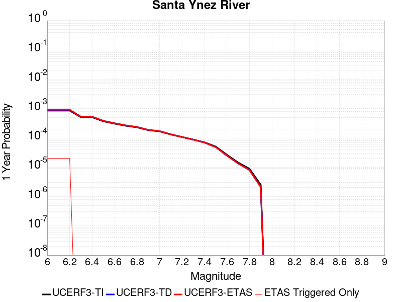 |  |

| Magnitude | 1 wk TI Prob | 1 wk TD Prob | 1 wk ETAS Prob | 1 wk ETAS/TD Gain | 1 wk ETAS Triggered Only | 1 mo TI Prob | 1 mo TD Prob | 1 mo ETAS Prob | 1 mo ETAS/TD Gain | 1 mo ETAS Triggered Only | 1 yr TI Prob | 1 yr TD Prob | 1 yr ETAS Prob | 1 yr ETAS/TD Gain | 1 yr ETAS Triggered Only | 10 yr TI Prob | 10 yr TD Prob | 10 yr ETAS Prob | 10 yr ETAS/TD Gain | 10 yr ETAS Triggered Only |
|-----|-----|-----|-----|-----|-----|-----|-----|-----|-----|-----|-----|-----|-----|-----|-----|-----|-----|-----|-----|-----|
| 6.0 | 1.6396456E-5 | 1.7209959E-5 | 1.7209959E-5 | 1.0 | 0.0 | 7.026863E-5 | 7.375509E-5 | 8.375435E-5 | 1.1355739 | 1.0E-5 | 8.551848E-4 | 8.976337E-4 | 9.176158E-4 | 1.0222608 | 2.0E-5 | 0.0085190125 | 0.008943629 | 0.008973361 | 1.0033244 | 3.0E-5 |
| 6.1 | 1.6396456E-5 | 1.7209959E-5 | 1.7209959E-5 | 1.0 | 0.0 | 7.026863E-5 | 7.375509E-5 | 8.375435E-5 | 1.1355739 | 1.0E-5 | 8.551848E-4 | 8.976337E-4 | 9.176158E-4 | 1.0222608 | 2.0E-5 | 0.0085190125 | 0.008943629 | 0.008973361 | 1.0033244 | 3.0E-5 |
| 6.2 | 1.6396456E-5 | 1.7209959E-5 | 1.7209959E-5 | 1.0 | 0.0 | 7.026863E-5 | 7.375509E-5 | 8.375435E-5 | 1.1355739 | 1.0E-5 | 8.551848E-4 | 8.976337E-4 | 9.176158E-4 | 1.0222608 | 2.0E-5 | 0.0085190125 | 0.008943629 | 0.008973361 | 1.0033244 | 3.0E-5 |
| 6.3 | 9.736976E-6 | 1.01226115E-5 | 1.01226115E-5 | 1.0 | 0.0 | 4.172923E-5 | 4.338193E-5 | 4.338193E-5 | 1.0 | 0.0 | 5.0793495E-4 | 5.28052E-4 | 5.28052E-4 | 1.0 | 0.0 | 0.005067755 | 0.0052684783 | 0.0052684783 | 1.0 | 0.0 |
| 6.4 | 9.736976E-6 | 1.01226115E-5 | 1.01226115E-5 | 1.0 | 0.0 | 4.172923E-5 | 4.338193E-5 | 4.338193E-5 | 1.0 | 0.0 | 5.0793495E-4 | 5.28052E-4 | 5.28052E-4 | 1.0 | 0.0 | 0.005067755 | 0.0052684783 | 0.0052684783 | 1.0 | 0.0 |
| 6.5 | 7.081964E-6 | 7.330101E-6 | 7.330101E-6 | 1.0 | 0.0 | 3.035092E-5 | 3.141435E-5 | 3.141435E-5 | 1.0 | 0.0 | 3.694598E-4 | 3.8240416E-4 | 3.8240416E-4 | 1.0 | 0.0 | 0.0036884616 | 0.0038176232 | 0.0038176232 | 1.0 | 0.0 |
| 6.6 | 5.873247E-6 | 6.059913E-6 | 6.059913E-6 | 1.0 | 0.0 | 2.5170815E-5 | 2.5970803E-5 | 2.5970803E-5 | 1.0 | 0.0 | 3.064116E-4 | 3.161495E-4 | 3.161495E-4 | 1.0 | 0.0 | 0.0030598943 | 0.0031570848 | 0.0031570848 | 1.0 | 0.0 |
| 6.7 | 4.973277E-6 | 5.116047E-6 | 5.116047E-6 | 1.0 | 0.0 | 2.1313872E-5 | 2.1925734E-5 | 2.1925734E-5 | 1.0 | 0.0 | 2.5946548E-4 | 2.669136E-4 | 2.669136E-4 | 1.0 | 0.0 | 0.0025916274 | 0.002665979 | 0.002665979 | 1.0 | 0.0 |
| 6.8 | 4.396492E-6 | 4.511108E-6 | 4.511108E-6 | 1.0 | 0.0 | 1.884197E-5 | 1.9333178E-5 | 1.9333178E-5 | 1.0 | 0.0 | 2.2937685E-4 | 2.3535638E-4 | 2.3535638E-4 | 1.0 | 0.0 | 0.0022914023 | 0.0023511064 | 0.0023511064 | 1.0 | 0.0 |
| 6.9 | 3.5255632E-6 | 3.6014421E-6 | 3.6014421E-6 | 1.0 | 0.0 | 1.5109469E-5 | 1.5434662E-5 | 1.5434662E-5 | 1.0 | 0.0 | 1.8394225E-4 | 1.8790095E-4 | 1.8790095E-4 | 1.0 | 0.0 | 0.0018379007 | 0.001877437 | 0.001877437 | 1.0 | 0.0 |
| 7.0 | 3.211603E-6 | 3.2737553E-6 | 3.2737553E-6 | 1.0 | 0.0 | 1.376394E-5 | 1.4030305E-5 | 1.4030305E-5 | 1.0 | 0.0 | 1.6756308E-4 | 1.7080571E-4 | 1.7080571E-4 | 1.0 | 0.0 | 0.0016743679 | 0.0017067584 | 0.0017067584 | 1.0 | 0.0 |
| 7.1 | 2.5094619E-6 | 2.5410047E-6 | 2.5410047E-6 | 1.0 | 0.0 | 1.0754793E-5 | 1.0889975E-5 | 1.0889975E-5 | 1.0 | 0.0 | 1.3093173E-4 | 1.3257744E-4 | 1.3257744E-4 | 1.0 | 0.0 | 0.0013085462 | 0.0013249894 | 0.0013249894 | 1.0 | 0.0 |
| 7.2 | 2.0515774E-6 | 2.06201E-6 | 2.06201E-6 | 1.0 | 0.0 | 8.792445E-6 | 8.837156E-6 | 8.837156E-6 | 1.0 | 0.0 | 1.0704277E-4 | 1.07587104E-4 | 1.07587104E-4 | 1.0 | 0.0 | 0.0010699122 | 0.0010753545 | 0.0010753545 | 1.0 | 0.0 |
| 7.3 | 1.6845745E-6 | 1.6774534E-6 | 1.6774534E-6 | 1.0 | 0.0 | 7.219585E-6 | 7.1890663E-6 | 7.1890663E-6 | 1.0 | 0.0 | 8.78949E-5 | 8.752339E-5 | 8.752339E-5 | 1.0 | 0.0 | 8.7860145E-4 | 8.748921E-4 | 8.748921E-4 | 1.0 | 0.0 |
| 7.4 | 1.3600285E-6 | 1.3333874E-6 | 1.3333874E-6 | 1.0 | 0.0 | 5.82868E-6 | 5.7145053E-6 | 5.7145053E-6 | 1.0 | 0.0 | 7.096187E-5 | 6.95719E-5 | 6.95719E-5 | 1.0 | 0.0 | 7.0939213E-4 | 6.9550343E-4 | 6.9550343E-4 | 1.0 | 0.0 |
| 7.5 | 9.735342E-7 | 9.290493E-7 | 9.290493E-7 | 1.0 | 0.0 | 4.172283E-6 | 3.981634E-6 | 3.981634E-6 | 1.0 | 0.0 | 5.079636E-5 | 4.8475333E-5 | 4.8475333E-5 | 1.0 | 0.0 | 5.0784746E-4 | 4.846493E-4 | 4.846493E-4 | 1.0 | 0.0 |
| 7.6 | 5.067187E-7 | 4.778753E-7 | 4.778753E-7 | 1.0 | 0.0 | 2.1716498E-6 | 2.0480354E-6 | 2.0480354E-6 | 1.0 | 0.0 | 2.6439517E-5 | 2.4934552E-5 | 2.4934552E-5 | 1.0 | 0.0 | 2.643637E-4 | 2.4931828E-4 | 2.4931828E-4 | 1.0 | 0.0 |
| 7.7 | 2.769089E-7 | 2.5760096E-7 | 2.5760096E-7 | 1.0 | 0.0 | 1.1867519E-6 | 1.1040037E-6 | 1.1040037E-6 | 1.0 | 0.0 | 1.4448608E-5 | 1.3441162E-5 | 1.3441162E-5 | 1.0 | 0.0 | 1.444767E-4 | 1.3440353E-4 | 1.3440353E-4 | 1.0 | 0.0 |
| 7.8 | 1.7044663E-7 | 1.5449687E-7 | 1.5449687E-7 | 1.0 | 0.0 | 7.3048534E-7 | 6.6212925E-7 | 6.6212925E-7 | 1.0 | 0.0 | 8.893623E-6 | 8.0613945E-6 | 8.0613945E-6 | 1.0 | 0.0 | 8.893267E-5 | 8.061104E-5 | 8.061104E-5 | 1.0 | 0.0 |
| 7.9 | 4.8344287E-8 | 4.0912912E-8 | 4.0912912E-8 | 1.0 | 0.0 | 2.0718979E-7 | 1.7534104E-7 | 1.7534104E-7 | 1.0 | 0.0 | 2.5225327E-6 | 2.134775E-6 | 2.134775E-6 | 1.0 | 0.0 | 2.5225041E-5 | 2.134755E-5 | 2.134755E-5 | 1.0 | 0.0 |

## Blue Cut
*[(top)](#table-of-contents)*

| 1 Week | 1 Month | 1 Year | 10 Year |
|-----|-----|-----|-----|
|  |  |  |  |

| Magnitude | 1 wk TI Prob | 1 wk TD Prob | 1 wk ETAS Prob | 1 wk ETAS/TD Gain | 1 wk ETAS Triggered Only | 1 mo TI Prob | 1 mo TD Prob | 1 mo ETAS Prob | 1 mo ETAS/TD Gain | 1 mo ETAS Triggered Only | 1 yr TI Prob | 1 yr TD Prob | 1 yr ETAS Prob | 1 yr ETAS/TD Gain | 1 yr ETAS Triggered Only | 10 yr TI Prob | 10 yr TD Prob | 10 yr ETAS Prob | 10 yr ETAS/TD Gain | 10 yr ETAS Triggered Only |
|-----|-----|-----|-----|-----|-----|-----|-----|-----|-----|-----|-----|-----|-----|-----|-----|-----|-----|-----|-----|-----|
| 6.0 | 2.1227985E-5 | 2.2720424E-5 | 2.2720424E-5 | 1.0 | 0.0 | 9.097391E-5 | 9.7369935E-5 | 9.7369935E-5 | 1.0 | 0.0 | 0.0011070445 | 0.0011848924 | 0.0012048687 | 1.0168592 | 2.0E-5 | 0.011015458 | 0.01179159 | 0.0118212355 | 1.0025142 | 3.0E-5 |
| 6.1 | 2.1227985E-5 | 2.2720424E-5 | 2.2720424E-5 | 1.0 | 0.0 | 9.097391E-5 | 9.7369935E-5 | 9.7369935E-5 | 1.0 | 0.0 | 0.0011070445 | 0.0011848924 | 0.0012048687 | 1.0168592 | 2.0E-5 | 0.011015458 | 0.01179159 | 0.0118212355 | 1.0025142 | 3.0E-5 |
| 6.2 | 2.1227985E-5 | 2.2720424E-5 | 2.2720424E-5 | 1.0 | 0.0 | 9.097391E-5 | 9.7369935E-5 | 9.7369935E-5 | 1.0 | 0.0 | 0.0011070445 | 0.0011848924 | 0.0012048687 | 1.0168592 | 2.0E-5 | 0.011015458 | 0.01179159 | 0.0118212355 | 1.0025142 | 3.0E-5 |
| 6.3 | 1.1613981E-5 | 1.2353959E-5 | 1.2353959E-5 | 1.0 | 0.0 | 4.9773254E-5 | 5.2944535E-5 | 5.2944535E-5 | 1.0 | 0.0 | 6.0582085E-4 | 6.4442155E-4 | 6.4442155E-4 | 1.0 | 0.0 | 0.0060417196 | 0.006426776 | 0.006426776 | 1.0 | 0.0 |
| 6.4 | 1.1613981E-5 | 1.2353959E-5 | 1.2353959E-5 | 1.0 | 0.0 | 4.9773254E-5 | 5.2944535E-5 | 5.2944535E-5 | 1.0 | 0.0 | 6.0582085E-4 | 6.4442155E-4 | 6.4442155E-4 | 1.0 | 0.0 | 0.0060417196 | 0.006426776 | 0.006426776 | 1.0 | 0.0 |
| 6.5 | 8.931326E-6 | 9.48191E-6 | 9.48191E-6 | 1.0 | 0.0 | 3.8276554E-5 | 4.0636176E-5 | 4.0636176E-5 | 1.0 | 0.0 | 4.6591737E-4 | 4.9464224E-4 | 4.9464224E-4 | 1.0 | 0.0 | 0.0046494175 | 0.004936322 | 0.004936322 | 1.0 | 0.0 |
| 6.6 | 7.345353E-6 | 7.79053E-6 | 7.79053E-6 | 1.0 | 0.0 | 3.1479703E-5 | 3.33876E-5 | 3.33876E-5 | 1.0 | 0.0 | 3.83198E-4 | 4.0642623E-4 | 4.0642623E-4 | 1.0 | 0.0 | 0.0038253788 | 0.004057621 | 0.004057621 | 1.0 | 0.0 |
| 6.7 | 6.2775666E-6 | 6.655361E-6 | 6.655361E-6 | 1.0 | 0.0 | 2.690358E-5 | 2.8522707E-5 | 2.8522707E-5 | 1.0 | 0.0 | 3.2750185E-4 | 3.4721615E-4 | 3.4721615E-4 | 1.0 | 0.0 | 0.0032701963 | 0.0034674776 | 0.0034674776 | 1.0 | 0.0 |
| 6.8 | 5.5234095E-6 | 5.855298E-6 | 5.855298E-6 | 1.0 | 0.0 | 2.367154E-5 | 2.5093934E-5 | 2.5093934E-5 | 1.0 | 0.0 | 2.8816288E-4 | 3.054831E-4 | 3.054831E-4 | 1.0 | 0.0 | 0.002877895 | 0.0030513476 | 0.0030513476 | 1.0 | 0.0 |
| 6.9 | 4.7780054E-6 | 5.065582E-6 | 5.065582E-6 | 1.0 | 0.0 | 2.0477004E-5 | 2.1709497E-5 | 2.1709497E-5 | 1.0 | 0.0 | 2.4927902E-4 | 2.642881E-4 | 2.642881E-4 | 1.0 | 0.0 | 0.0024899957 | 0.0026404303 | 0.0026404303 | 1.0 | 0.0 |
| 7.0 | 3.883171E-6 | 4.1186195E-6 | 4.1186195E-6 | 1.0 | 0.0 | 1.6642054E-5 | 1.7651146E-5 | 1.7651146E-5 | 1.0 | 0.0 | 2.0259817E-4 | 2.148884E-4 | 2.148884E-4 | 1.0 | 0.0 | 0.0020241356 | 0.0021474818 | 0.0021474818 | 1.0 | 0.0 |
| 7.1 | 2.8358215E-6 | 3.0098138E-6 | 3.0098138E-6 | 1.0 | 0.0 | 1.2153464E-5 | 1.2899175E-5 | 1.2899175E-5 | 1.0 | 0.0 | 1.4795837E-4 | 1.5704273E-4 | 1.5704273E-4 | 1.0 | 0.0 | 0.001478599 | 0.0015699627 | 0.0015699627 | 1.0 | 0.0 |

## Great Valley 03a Dunnigan Hills
*[(top)](#table-of-contents)*

| 1 Week | 1 Month | 1 Year | 10 Year |
|-----|-----|-----|-----|
|  |  | 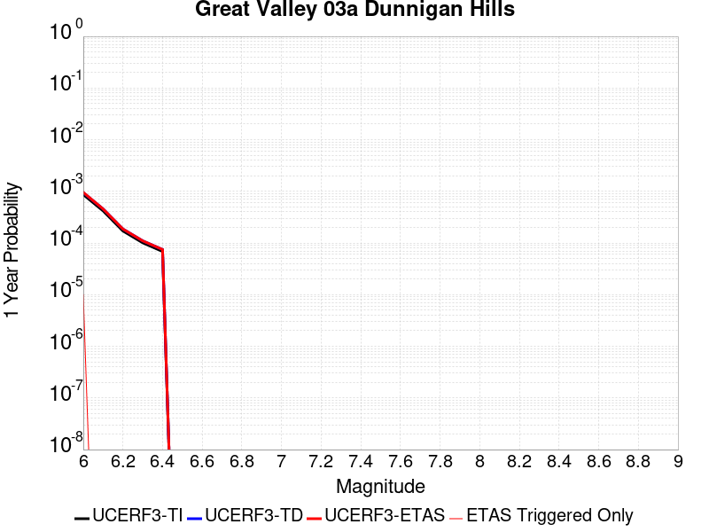 |  |

| Magnitude | 1 wk TI Prob | 1 wk TD Prob | 1 wk ETAS Prob | 1 wk ETAS/TD Gain | 1 wk ETAS Triggered Only | 1 mo TI Prob | 1 mo TD Prob | 1 mo ETAS Prob | 1 mo ETAS/TD Gain | 1 mo ETAS Triggered Only | 1 yr TI Prob | 1 yr TD Prob | 1 yr ETAS Prob | 1 yr ETAS/TD Gain | 1 yr ETAS Triggered Only | 10 yr TI Prob | 10 yr TD Prob | 10 yr ETAS Prob | 10 yr ETAS/TD Gain | 10 yr ETAS Triggered Only |
|-----|-----|-----|-----|-----|-----|-----|-----|-----|-----|-----|-----|-----|-----|-----|-----|-----|-----|-----|-----|-----|
| 6.0 | 1.6591328E-5 | 1.8108833E-5 | 1.8108833E-5 | 1.0 | 0.0 | 7.110376E-5 | 7.7607365E-5 | 7.7607365E-5 | 1.0 | 0.0 | 8.6534437E-4 | 9.445292E-4 | 9.545197E-4 | 1.0105773 | 1.0E-5 | 0.008619824 | 0.0094119795 | 0.0094317915 | 1.002105 | 2.0E-5 |
| 6.1 | 8.041125E-6 | 8.770148E-6 | 8.770148E-6 | 1.0 | 0.0 | 3.4461507E-5 | 3.7585924E-5 | 3.7585924E-5 | 1.0 | 0.0 | 4.194881E-4 | 4.5753285E-4 | 4.5753285E-4 | 1.0 | 0.0 | 0.004186971 | 0.0045679063 | 0.0045778607 | 1.0021791 | 1.0E-5 |
| 6.2 | 3.2807004E-6 | 3.5797418E-6 | 3.5797418E-6 | 1.0 | 0.0 | 1.4060069E-5 | 1.5341684E-5 | 1.5341684E-5 | 1.0 | 0.0 | 1.7116789E-4 | 1.8677315E-4 | 1.8677315E-4 | 1.0 | 0.0 | 0.0017103611 | 0.0018665699 | 0.0018665699 | 1.0 | 0.0 |
| 6.3 | 1.9339366E-6 | 2.110483E-6 | 2.110483E-6 | 1.0 | 0.0 | 8.288273E-6 | 9.044911E-6 | 9.044911E-6 | 1.0 | 0.0 | 1.00905054E-4 | 1.1011909E-4 | 1.1011909E-4 | 1.0 | 0.0 | 0.0010085925 | 0.0011009251 | 0.0011009251 | 1.0 | 0.0 |
| 6.4 | 1.3142635E-6 | 1.4340559E-6 | 1.4340559E-6 | 1.0 | 0.0 | 5.6325457E-6 | 6.145954E-6 | 6.145954E-6 | 1.0 | 0.0 | 6.857408E-5 | 7.482699E-5 | 7.482699E-5 | 1.0 | 0.0 | 6.8552926E-4 | 7.482699E-4 | 7.482699E-4 | 1.0 | 0.0 |

## Pine Mtn
*[(top)](#table-of-contents)*

| 1 Week | 1 Month | 1 Year | 10 Year |
|-----|-----|-----|-----|
|  |  | 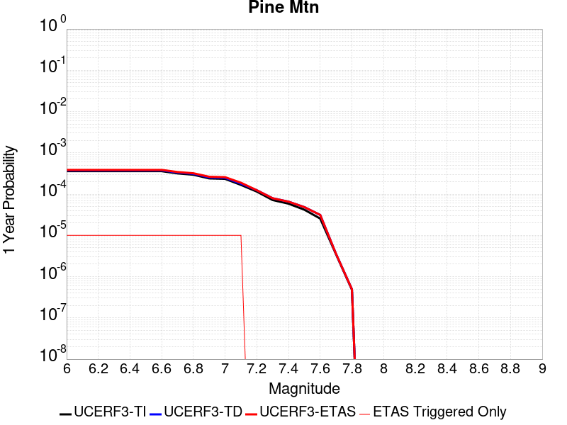 | 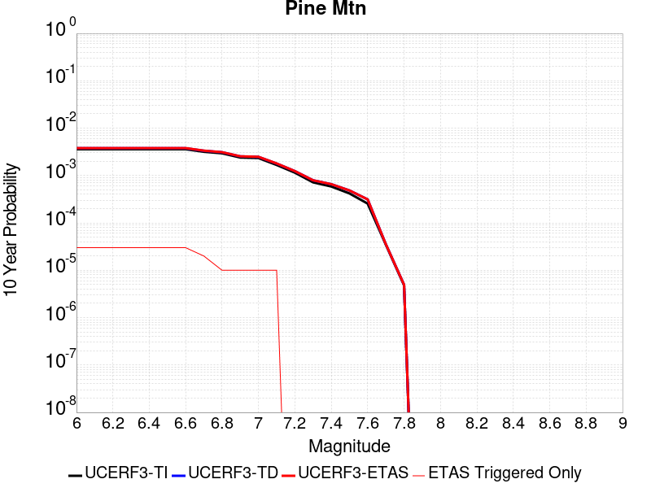 |

| Magnitude | 1 wk TI Prob | 1 wk TD Prob | 1 wk ETAS Prob | 1 wk ETAS/TD Gain | 1 wk ETAS Triggered Only | 1 mo TI Prob | 1 mo TD Prob | 1 mo ETAS Prob | 1 mo ETAS/TD Gain | 1 mo ETAS Triggered Only | 1 yr TI Prob | 1 yr TD Prob | 1 yr ETAS Prob | 1 yr ETAS/TD Gain | 1 yr ETAS Triggered Only | 10 yr TI Prob | 10 yr TD Prob | 10 yr ETAS Prob | 10 yr ETAS/TD Gain | 10 yr ETAS Triggered Only |
|-----|-----|-----|-----|-----|-----|-----|-----|-----|-----|-----|-----|-----|-----|-----|-----|-----|-----|-----|-----|-----|
| 6.0 | 6.894797E-6 | 7.2258863E-6 | 7.2258863E-6 | 1.0 | 0.0 | 2.9548795E-5 | 3.0967734E-5 | 4.0967425E-5 | 1.3229067 | 1.0E-5 | 3.596972E-4 | 3.769699E-4 | 3.8696613E-4 | 1.0265173 | 1.0E-5 | 0.0035911554 | 0.0037636019 | 0.003793489 | 1.0079411 | 3.0E-5 |
| 6.1 | 6.894797E-6 | 7.2258863E-6 | 7.2258863E-6 | 1.0 | 0.0 | 2.9548795E-5 | 3.0967734E-5 | 4.0967425E-5 | 1.3229067 | 1.0E-5 | 3.596972E-4 | 3.769699E-4 | 3.8696613E-4 | 1.0265173 | 1.0E-5 | 0.0035911554 | 0.0037636019 | 0.003793489 | 1.0079411 | 3.0E-5 |
| 6.2 | 6.894797E-6 | 7.2258863E-6 | 7.2258863E-6 | 1.0 | 0.0 | 2.9548795E-5 | 3.0967734E-5 | 4.0967425E-5 | 1.3229067 | 1.0E-5 | 3.596972E-4 | 3.769699E-4 | 3.8696613E-4 | 1.0265173 | 1.0E-5 | 0.0035911554 | 0.0037636019 | 0.003793489 | 1.0079411 | 3.0E-5 |
| 6.3 | 6.894797E-6 | 7.2258863E-6 | 7.2258863E-6 | 1.0 | 0.0 | 2.9548795E-5 | 3.0967734E-5 | 4.0967425E-5 | 1.3229067 | 1.0E-5 | 3.596972E-4 | 3.769699E-4 | 3.8696613E-4 | 1.0265173 | 1.0E-5 | 0.0035911554 | 0.0037636019 | 0.003793489 | 1.0079411 | 3.0E-5 |
| 6.4 | 6.894797E-6 | 7.2258863E-6 | 7.2258863E-6 | 1.0 | 0.0 | 2.9548795E-5 | 3.0967734E-5 | 4.0967425E-5 | 1.3229067 | 1.0E-5 | 3.596972E-4 | 3.769699E-4 | 3.8696613E-4 | 1.0265173 | 1.0E-5 | 0.0035911554 | 0.0037636019 | 0.003793489 | 1.0079411 | 3.0E-5 |
| 6.5 | 6.894797E-6 | 7.2258863E-6 | 7.2258863E-6 | 1.0 | 0.0 | 2.9548795E-5 | 3.0967734E-5 | 4.0967425E-5 | 1.3229067 | 1.0E-5 | 3.596972E-4 | 3.769699E-4 | 3.8696613E-4 | 1.0265173 | 1.0E-5 | 0.0035911554 | 0.0037636019 | 0.003793489 | 1.0079411 | 3.0E-5 |
| 6.6 | 6.894797E-6 | 7.2258863E-6 | 7.2258863E-6 | 1.0 | 0.0 | 2.9548795E-5 | 3.0967734E-5 | 4.0967425E-5 | 1.3229067 | 1.0E-5 | 3.596972E-4 | 3.769699E-4 | 3.8696613E-4 | 1.0265173 | 1.0E-5 | 0.0035911554 | 0.0037636019 | 0.003793489 | 1.0079411 | 3.0E-5 |
| 6.7 | 6.0867933E-6 | 6.397527E-6 | 6.397527E-6 | 1.0 | 0.0 | 2.6085996E-5 | 2.7417698E-5 | 3.7417423E-5 | 1.364718 | 1.0E-5 | 3.1755073E-4 | 3.3376153E-4 | 3.437582E-4 | 1.0299515 | 1.0E-5 | 0.0031709734 | 0.0033328217 | 0.003352755 | 1.005981 | 2.0E-5 |
| 6.8 | 5.6530425E-6 | 5.9510025E-6 | 5.9510025E-6 | 1.0 | 0.0 | 2.42271E-5 | 2.550406E-5 | 3.5503803E-5 | 1.3920845 | 1.0E-5 | 2.94925E-4 | 3.1046974E-4 | 3.204666E-4 | 1.0321993 | 1.0E-5 | 0.002945339 | 0.0031005645 | 0.0031105336 | 1.0032152 | 1.0E-5 |
| 6.9 | 4.6015225E-6 | 4.864222E-6 | 4.864222E-6 | 1.0 | 0.0 | 1.9720663E-5 | 2.0846506E-5 | 3.08463E-5 | 1.4796867 | 1.0E-5 | 2.4007261E-4 | 2.537781E-4 | 2.6377555E-4 | 1.0393945 | 1.0E-5 | 0.0023981342 | 0.0025350272 | 0.002545002 | 1.0039347 | 1.0E-5 |
| 7.0 | 4.4875965E-6 | 4.7478593E-6 | 4.7478593E-6 | 1.0 | 0.0 | 1.9232413E-5 | 2.0347818E-5 | 3.0347615E-5 | 1.4914432 | 1.0E-5 | 2.3412947E-4 | 2.4770797E-4 | 2.5770548E-4 | 1.0403601 | 1.0E-5 | 0.0023388295 | 0.0024744626 | 0.0024844378 | 1.0040313 | 1.0E-5 |
| 7.1 | 3.203907E-6 | 3.429777E-6 | 3.429777E-6 | 1.0 | 0.0 | 1.3730958E-5 | 1.4698966E-5 | 2.4698818E-5 | 1.68031 | 1.0E-5 | 1.6716159E-4 | 1.7894588E-4 | 1.8894409E-4 | 1.0558728 | 1.0E-5 | 0.0016703589 | 0.001788084 | 0.0017980661 | 1.0055826 | 1.0E-5 |
| 7.2 | 2.2060601E-6 | 2.3787825E-6 | 2.3787825E-6 | 1.0 | 0.0 | 9.4545085E-6 | 1.0194745E-5 | 1.0194745E-5 | 1.0 | 0.0 | 1.15102564E-4 | 1.241144E-4 | 1.241144E-4 | 1.0 | 0.0 | 0.0011504296 | 0.0012404957 | 0.0012404957 | 1.0 | 0.0 |
| 7.3 | 1.3765207E-6 | 1.5219202E-6 | 1.5219202E-6 | 1.0 | 0.0 | 5.899361E-6 | 6.5224995E-6 | 6.5224995E-6 | 1.0 | 0.0 | 7.182235E-5 | 7.940863E-5 | 7.940863E-5 | 1.0 | 0.0 | 7.1799144E-4 | 7.9381163E-4 | 7.9381163E-4 | 1.0 | 0.0 |
| 7.4 | 1.1245983E-6 | 1.2589533E-6 | 1.2589533E-6 | 1.0 | 0.0 | 4.819698E-6 | 5.3955036E-6 | 5.3955036E-6 | 1.0 | 0.0 | 5.8678244E-5 | 6.568836E-5 | 6.568836E-5 | 1.0 | 0.0 | 5.866275E-4 | 6.566977E-4 | 6.566977E-4 | 1.0 | 0.0 |
| 7.5 | 8.031682E-7 | 9.279254E-7 | 9.279254E-7 | 1.0 | 0.0 | 3.4421448E-6 | 3.9768174E-6 | 3.9768174E-6 | 1.0 | 0.0 | 4.1907308E-5 | 4.8416743E-5 | 4.8416743E-5 | 1.0 | 0.0 | 4.1899405E-4 | 4.840687E-4 | 4.840687E-4 | 1.0 | 0.0 |
| 7.6 | 4.8953444E-7 | 6.0050616E-7 | 6.0050616E-7 | 1.0 | 0.0 | 2.098003E-6 | 2.5735953E-6 | 2.5735953E-6 | 1.0 | 0.0 | 2.5542888E-5 | 3.1333122E-5 | 3.1333122E-5 | 1.0 | 0.0 | 2.5539953E-4 | 3.1329194E-4 | 3.1329194E-4 | 1.0 | 0.0 |
| 7.7 | 6.634529E-8 | 6.7889104E-8 | 6.7889104E-8 | 1.0 | 0.0 | 2.843369E-7 | 2.9095327E-7 | 2.9095327E-7 | 1.0 | 0.0 | 3.4617963E-6 | 3.542351E-6 | 3.542351E-6 | 1.0 | 0.0 | 3.4617424E-5 | 3.5422992E-5 | 3.5422992E-5 | 1.0 | 0.0 |
| 7.8 | 9.235578E-9 | 9.488707E-9 | 9.488707E-9 | 1.0 | 0.0 | 3.9581046E-8 | 4.0665885E-8 | 4.0665885E-8 | 1.0 | 0.0 | 4.818991E-7 | 4.9510703E-7 | 4.9510703E-7 | 1.0 | 0.0 | 4.8189804E-6 | 4.951061E-6 | 4.951061E-6 | 1.0 | 0.0 |

## San Jacinto (Lytle Creek connector)
*[(top)](#table-of-contents)*

| 1 Week | 1 Month | 1 Year | 10 Year |
|-----|-----|-----|-----|
|  |  |  |  |

| Magnitude | 1 wk TI Prob | 1 wk TD Prob | 1 wk ETAS Prob | 1 wk ETAS/TD Gain | 1 wk ETAS Triggered Only | 1 mo TI Prob | 1 mo TD Prob | 1 mo ETAS Prob | 1 mo ETAS/TD Gain | 1 mo ETAS Triggered Only | 1 yr TI Prob | 1 yr TD Prob | 1 yr ETAS Prob | 1 yr ETAS/TD Gain | 1 yr ETAS Triggered Only | 10 yr TI Prob | 10 yr TD Prob | 10 yr ETAS Prob | 10 yr ETAS/TD Gain | 10 yr ETAS Triggered Only |
|-----|-----|-----|-----|-----|-----|-----|-----|-----|-----|-----|-----|-----|-----|-----|-----|-----|-----|-----|-----|-----|
| 6.0 | 6.693995E-6 | 6.6708703E-6 | 6.6708703E-6 | 1.0 | 0.0 | 2.8688235E-5 | 2.8589133E-5 | 2.8589133E-5 | 1.0 | 0.0 | 3.492233E-4 | 3.4801717E-4 | 3.580137E-4 | 1.0287242 | 1.0E-5 | 0.00348675 | 0.0035549798 | 0.0035848732 | 1.0084089 | 3.0E-5 |
| 6.1 | 6.693995E-6 | 6.6708703E-6 | 6.6708703E-6 | 1.0 | 0.0 | 2.8688235E-5 | 2.8589133E-5 | 2.8589133E-5 | 1.0 | 0.0 | 3.492233E-4 | 3.4801717E-4 | 3.580137E-4 | 1.0287242 | 1.0E-5 | 0.00348675 | 0.0035549798 | 0.0035848732 | 1.0084089 | 3.0E-5 |
| 6.2 | 6.693995E-6 | 6.6708703E-6 | 6.6708703E-6 | 1.0 | 0.0 | 2.8688235E-5 | 2.8589133E-5 | 2.8589133E-5 | 1.0 | 0.0 | 3.492233E-4 | 3.4801717E-4 | 3.580137E-4 | 1.0287242 | 1.0E-5 | 0.00348675 | 0.0035549798 | 0.0035848732 | 1.0084089 | 3.0E-5 |
| 6.3 | 6.693995E-6 | 6.6708703E-6 | 6.6708703E-6 | 1.0 | 0.0 | 2.8688235E-5 | 2.8589133E-5 | 2.8589133E-5 | 1.0 | 0.0 | 3.492233E-4 | 3.4801717E-4 | 3.580137E-4 | 1.0287242 | 1.0E-5 | 0.00348675 | 0.0035549798 | 0.0035848732 | 1.0084089 | 3.0E-5 |
| 6.4 | 6.693995E-6 | 6.6708703E-6 | 6.6708703E-6 | 1.0 | 0.0 | 2.8688235E-5 | 2.8589133E-5 | 2.8589133E-5 | 1.0 | 0.0 | 3.492233E-4 | 3.4801717E-4 | 3.580137E-4 | 1.0287242 | 1.0E-5 | 0.00348675 | 0.0035549798 | 0.0035848732 | 1.0084089 | 3.0E-5 |
| 6.5 | 6.6561875E-6 | 6.6310877E-6 | 6.6310877E-6 | 1.0 | 0.0 | 2.8526205E-5 | 2.8418637E-5 | 2.8418637E-5 | 1.0 | 0.0 | 3.472512E-4 | 3.4594207E-4 | 3.559386E-4 | 1.0288966 | 1.0E-5 | 0.0034670907 | 0.003534295 | 0.003564189 | 1.0084583 | 3.0E-5 |
| 6.6 | 6.6561875E-6 | 6.6310877E-6 | 6.6310877E-6 | 1.0 | 0.0 | 2.8526205E-5 | 2.8418637E-5 | 2.8418637E-5 | 1.0 | 0.0 | 3.472512E-4 | 3.4594207E-4 | 3.559386E-4 | 1.0288966 | 1.0E-5 | 0.0034670907 | 0.003534295 | 0.003564189 | 1.0084583 | 3.0E-5 |
| 6.7 | 6.5802237E-6 | 6.550262E-6 | 6.550262E-6 | 1.0 | 0.0 | 2.8200653E-5 | 2.8072249E-5 | 2.8072249E-5 | 1.0 | 0.0 | 3.4328885E-4 | 3.417261E-4 | 3.5172267E-4 | 1.0292532 | 1.0E-5 | 0.0034275902 | 0.0034922683 | 0.0035221635 | 1.0085604 | 3.0E-5 |
| 6.8 | 6.575632E-6 | 6.5447507E-6 | 6.5447507E-6 | 1.0 | 0.0 | 2.8180975E-5 | 2.804863E-5 | 2.804863E-5 | 1.0 | 0.0 | 3.4304935E-4 | 3.4143863E-4 | 3.514352E-4 | 1.0292778 | 1.0E-5 | 0.0034252026 | 0.0034894026 | 0.003519298 | 1.0085675 | 3.0E-5 |
| 6.9 | 6.570433E-6 | 6.5361432E-6 | 6.5361432E-6 | 1.0 | 0.0 | 2.8158694E-5 | 2.8011742E-5 | 2.8011742E-5 | 1.0 | 0.0 | 3.4277816E-4 | 3.4098965E-4 | 3.5098626E-4 | 1.0293164 | 1.0E-5 | 0.0034224992 | 0.0034849271 | 0.0035148226 | 1.0085785 | 3.0E-5 |
| 7.0 | 6.5643826E-6 | 6.526262E-6 | 6.526262E-6 | 1.0 | 0.0 | 2.8132765E-5 | 2.7969396E-5 | 2.7969396E-5 | 1.0 | 0.0 | 3.424626E-4 | 3.4047425E-4 | 3.5047086E-4 | 1.0293608 | 1.0E-5 | 0.0034193532 | 0.0034797892 | 0.003509685 | 1.0085912 | 3.0E-5 |
| 7.1 | 6.557402E-6 | 6.514972E-6 | 6.514972E-6 | 1.0 | 0.0 | 2.8102848E-5 | 2.792101E-5 | 2.792101E-5 | 1.0 | 0.0 | 3.4209844E-4 | 3.3988536E-4 | 3.4988194E-4 | 1.0294117 | 1.0E-5 | 0.0034157229 | 0.00347392 | 0.003503816 | 1.0086057 | 3.0E-5 |
| 7.2 | 6.546394E-6 | 6.496935E-6 | 6.496935E-6 | 1.0 | 0.0 | 2.8055672E-5 | 2.784371E-5 | 2.784371E-5 | 1.0 | 0.0 | 3.4152428E-4 | 3.3894452E-4 | 3.4894113E-4 | 1.0294933 | 1.0E-5 | 0.0034099987 | 0.0034645454 | 0.0034944415 | 1.0086292 | 3.0E-5 |
| 7.3 | 6.5364216E-6 | 6.477713E-6 | 6.477713E-6 | 1.0 | 0.0 | 2.8012933E-5 | 2.7761333E-5 | 2.7761333E-5 | 1.0 | 0.0 | 3.4100408E-4 | 3.379419E-4 | 3.479385E-4 | 1.0295808 | 1.0E-5 | 0.003404813 | 0.0034545609 | 0.0034844573 | 1.0086541 | 3.0E-5 |
| 7.4 | 6.5269523E-6 | 6.4587916E-6 | 6.4587916E-6 | 1.0 | 0.0 | 2.7972354E-5 | 2.7680242E-5 | 2.7680242E-5 | 1.0 | 0.0 | 3.4051016E-4 | 3.3695492E-4 | 3.4695154E-4 | 1.0296676 | 1.0E-5 | 0.0033998888 | 0.00344474 | 0.003474637 | 1.0086789 | 3.0E-5 |
| 7.5 | 6.5111835E-6 | 6.435057E-6 | 6.435057E-6 | 1.0 | 0.0 | 2.7904773E-5 | 2.7578524E-5 | 2.7578524E-5 | 1.0 | 0.0 | 3.3968766E-4 | 3.3571688E-4 | 3.4571352E-4 | 1.029777 | 1.0E-5 | 0.0033916887 | 0.00343241 | 0.0034623072 | 1.0087103 | 3.0E-5 |
| 7.6 | 6.4768806E-6 | 6.394153E-6 | 6.394153E-6 | 1.0 | 0.0 | 2.7757764E-5 | 2.7403225E-5 | 2.7403225E-5 | 1.0 | 0.0 | 3.3789838E-4 | 3.3358324E-4 | 3.4357992E-4 | 1.0299675 | 1.0E-5 | 0.0033738504 | 0.003411134 | 0.0034410316 | 1.0087647 | 3.0E-5 |
| 7.7 | 6.1655364E-6 | 6.18656E-6 | 6.18656E-6 | 1.0 | 0.0 | 2.642346E-5 | 2.6513559E-5 | 2.6513559E-5 | 1.0 | 0.0 | 3.2165812E-4 | 3.2275481E-4 | 3.327516E-4 | 1.0309733 | 1.0E-5 | 0.0032119295 | 0.003302697 | 0.0033325981 | 1.0090535 | 3.0E-5 |
| 7.8 | 5.5043524E-6 | 5.747343E-6 | 5.747343E-6 | 1.0 | 0.0 | 2.3589868E-5 | 2.463124E-5 | 2.463124E-5 | 1.0 | 0.0 | 2.871688E-4 | 2.9984413E-4 | 3.0984113E-4 | 1.0333407 | 1.0E-5 | 0.0028679797 | 0.0030726586 | 0.0031025663 | 1.0097336 | 3.0E-5 |
| 7.9 | 3.889249E-6 | 4.085056E-6 | 4.085056E-6 | 1.0 | 0.0 | 1.6668104E-5 | 1.7507266E-5 | 1.7507266E-5 | 1.0 | 0.0 | 2.0291525E-4 | 2.1313014E-4 | 2.2312802E-4 | 1.0469097 | 1.0E-5 | 0.0020273007 | 0.0021987725 | 0.0022187284 | 1.009076 | 2.0E-5 |
| 8.0 | 2.668535E-6 | 2.5371553E-6 | 2.5371553E-6 | 1.0 | 0.0 | 1.1436528E-5 | 1.0873477E-5 | 1.0873477E-5 | 1.0 | 0.0 | 1.3923083E-4 | 1.3237656E-4 | 1.4237524E-4 | 1.0755321 | 1.0E-5 | 0.0013914363 | 0.0013788908 | 0.0013988633 | 1.0144844 | 2.0E-5 |
| 8.1 | 1.5911459E-6 | 1.2216242E-6 | 1.2216242E-6 | 1.0 | 0.0 | 6.8191785E-6 | 5.2355217E-6 | 5.2355217E-6 | 1.0 | 0.0 | 8.3020335E-5 | 6.3740634E-5 | 7.374E-5 | 1.1568758 | 1.0E-5 | 8.298933E-4 | 6.709651E-4 | 6.9095165E-4 | 1.0297878 | 2.0E-5 |
| 8.2 | 6.1294963E-7 | 2.1894976E-7 | 2.1894976E-7 | 1.0 | 0.0 | 2.6269242E-6 | 9.383558E-7 | 9.383558E-7 | 1.0 | 0.0 | 3.1982334E-5 | 1.1424422E-5 | 1.1424422E-5 | 1.0 | 0.0 | 3.1977732E-4 | 1.2831615E-4 | 1.2831615E-4 | 1.0 | 0.0 |
| 8.3 | 1.762871E-7 | 4.7755343E-8 | 4.7755343E-8 | 1.0 | 0.0 | 7.5551594E-7 | 2.0466574E-7 | 2.0466574E-7 | 1.0 | 0.0 | 9.1983675E-6 | 2.4918027E-6 | 2.4918027E-6 | 1.0 | 0.0 | 9.197987E-5 | 2.881044E-5 | 2.881044E-5 | 1.0 | 0.0 |

## San Clemente
*[(top)](#table-of-contents)*

| 1 Week | 1 Month | 1 Year | 10 Year |
|-----|-----|-----|-----|
|  |  |  |  |

| Magnitude | 1 wk TI Prob | 1 wk TD Prob | 1 wk ETAS Prob | 1 wk ETAS/TD Gain | 1 wk ETAS Triggered Only | 1 mo TI Prob | 1 mo TD Prob | 1 mo ETAS Prob | 1 mo ETAS/TD Gain | 1 mo ETAS Triggered Only | 1 yr TI Prob | 1 yr TD Prob | 1 yr ETAS Prob | 1 yr ETAS/TD Gain | 1 yr ETAS Triggered Only | 10 yr TI Prob | 10 yr TD Prob | 10 yr ETAS Prob | 10 yr ETAS/TD Gain | 10 yr ETAS Triggered Only |
|-----|-----|-----|-----|-----|-----|-----|-----|-----|-----|-----|-----|-----|-----|-----|-----|-----|-----|-----|-----|-----|
| 6.0 | 6.681379E-5 | 8.164766E-5 | 8.164766E-5 | 1.0 | 0.0 | 2.8631336E-4 | 3.4987382E-4 | 3.4987382E-4 | 1.0 | 0.0 | 0.003480294 | 0.0042519076 | 0.004261865 | 1.0023419 | 1.0E-5 | 0.03426291 | 0.041760825 | 0.04178957 | 1.0006884 | 3.0E-5 |
| 6.1 | 6.681379E-5 | 8.164766E-5 | 8.164766E-5 | 1.0 | 0.0 | 2.8631336E-4 | 3.4987382E-4 | 3.4987382E-4 | 1.0 | 0.0 | 0.003480294 | 0.0042519076 | 0.004261865 | 1.0023419 | 1.0E-5 | 0.03426291 | 0.041760825 | 0.04178957 | 1.0006884 | 3.0E-5 |
| 6.2 | 3.9400576E-5 | 4.6456847E-5 | 4.6456847E-5 | 1.0 | 0.0 | 1.6884868E-4 | 1.9908592E-4 | 1.9908592E-4 | 1.0 | 0.0 | 0.0020537945 | 0.0024212298 | 0.0024212298 | 1.0 | 0.0 | 0.020349167 | 0.023955164 | 0.023964925 | 1.0004075 | 1.0E-5 |
| 6.3 | 3.2590255E-5 | 3.793244E-5 | 3.793244E-5 | 1.0 | 0.0 | 1.3966505E-4 | 1.6255764E-4 | 1.6255764E-4 | 1.0 | 0.0 | 0.0016990956 | 0.001977373 | 0.001977373 | 1.0 | 0.0 | 0.01686163 | 0.019601578 | 0.019601578 | 1.0 | 0.0 |
| 6.4 | 2.9454652E-5 | 3.410063E-5 | 3.410063E-5 | 1.0 | 0.0 | 1.2622811E-4 | 1.4613752E-4 | 1.4613752E-4 | 1.0 | 0.0 | 0.0015357438 | 0.0017777986 | 0.0017777986 | 1.0 | 0.0 | 0.015251739 | 0.017638939 | 0.017638939 | 1.0 | 0.0 |
| 6.5 | 2.790836E-5 | 3.2250136E-5 | 3.2250136E-5 | 1.0 | 0.0 | 1.1960178E-4 | 1.3820769E-4 | 1.3820769E-4 | 1.0 | 0.0 | 0.001455179 | 0.0016814056 | 0.0016814056 | 1.0 | 0.0 | 0.014456868 | 0.016689856 | 0.016689856 | 1.0 | 0.0 |
| 6.6 | 2.2492153E-5 | 2.5764695E-5 | 2.5764695E-5 | 1.0 | 0.0 | 9.639138E-5 | 1.1041553E-4 | 1.1041553E-4 | 1.0 | 0.0 | 0.0011729331 | 0.0013434949 | 0.0013434949 | 1.0 | 0.0 | 0.011667615 | 0.013355443 | 0.013355443 | 1.0 | 0.0 |
| 6.7 | 1.9862755E-5 | 2.2668124E-5 | 2.2668124E-5 | 1.0 | 0.0 | 8.512331E-5 | 9.7145545E-5 | 9.7145545E-5 | 1.0 | 0.0 | 0.0010358836 | 0.0011821166 | 0.0011821166 | 1.0 | 0.0 | 0.010310682 | 0.011759578 | 0.011759578 | 1.0 | 0.0 |
| 6.8 | 1.6697575E-5 | 1.8979084E-5 | 1.8979084E-5 | 1.0 | 0.0 | 7.155907E-5 | 8.133645E-5 | 8.133645E-5 | 1.0 | 0.0 | 8.7088346E-4 | 9.898308E-4 | 9.898308E-4 | 1.0 | 0.0 | 0.008674784 | 0.009855248 | 0.009855248 | 1.0 | 0.0 |
| 6.9 | 1.5218415E-5 | 1.7270635E-5 | 1.7270635E-5 | 1.0 | 0.0 | 6.522015E-5 | 7.401496E-5 | 7.401496E-5 | 1.0 | 0.0 | 7.93766E-4 | 9.007684E-4 | 9.007684E-4 | 1.0 | 0.0 | 0.007909367 | 0.00897212 | 0.00897212 | 1.0 | 0.0 |
| 7.0 | 1.2392958E-5 | 1.4034001E-5 | 1.4034001E-5 | 1.0 | 0.0 | 5.3111595E-5 | 6.0144375E-5 | 6.0144375E-5 | 1.0 | 0.0 | 6.4644177E-4 | 7.320193E-4 | 7.320193E-4 | 1.0 | 0.0 | 0.0064456454 | 0.007296867 | 0.007296867 | 1.0 | 0.0 |
| 7.1 | 1.0934128E-5 | 1.2376004E-5 | 1.2376004E-5 | 1.0 | 0.0 | 4.6859706E-5 | 5.3038977E-5 | 5.3038977E-5 | 1.0 | 0.0 | 5.7036756E-4 | 6.4556557E-4 | 6.4556557E-4 | 1.0 | 0.0 | 0.0056890585 | 0.0064376486 | 0.0064376486 | 1.0 | 0.0 |
| 7.2 | 9.5798805E-6 | 1.0845695E-5 | 1.0845695E-5 | 1.0 | 0.0 | 4.1055984E-5 | 4.6480764E-5 | 4.6480764E-5 | 1.0 | 0.0 | 4.9974193E-4 | 5.6576356E-4 | 5.6576356E-4 | 1.0 | 0.0 | 0.0049861963 | 0.005643956 | 0.005643956 | 1.0 | 0.0 |
| 7.3 | 8.0167365E-6 | 9.084559E-6 | 9.084559E-6 | 1.0 | 0.0 | 3.4356988E-5 | 3.893328E-5 | 3.893328E-5 | 1.0 | 0.0 | 4.1821605E-4 | 4.7391668E-4 | 4.7391668E-4 | 1.0 | 0.0 | 0.0041742986 | 0.004729763 | 0.004729763 | 1.0 | 0.0 |
| 7.4 | 2.9581017E-6 | 3.362623E-6 | 3.362623E-6 | 1.0 | 0.0 | 1.2677518E-5 | 1.441119E-5 | 1.441119E-5 | 1.0 | 0.0 | 1.5433785E-4 | 1.7544716E-4 | 1.7544716E-4 | 1.0 | 0.0 | 0.001542307 | 0.0017535817 | 0.0017535817 | 1.0 | 0.0 |

## Pittville 2011 CFM
*[(top)](#table-of-contents)*

| 1 Week | 1 Month | 1 Year | 10 Year |
|-----|-----|-----|-----|
|  |  |  |  |

| Magnitude | 1 wk TI Prob | 1 wk TD Prob | 1 wk ETAS Prob | 1 wk ETAS/TD Gain | 1 wk ETAS Triggered Only | 1 mo TI Prob | 1 mo TD Prob | 1 mo ETAS Prob | 1 mo ETAS/TD Gain | 1 mo ETAS Triggered Only | 1 yr TI Prob | 1 yr TD Prob | 1 yr ETAS Prob | 1 yr ETAS/TD Gain | 1 yr ETAS Triggered Only | 10 yr TI Prob | 10 yr TD Prob | 10 yr ETAS Prob | 10 yr ETAS/TD Gain | 10 yr ETAS Triggered Only |
|-----|-----|-----|-----|-----|-----|-----|-----|-----|-----|-----|-----|-----|-----|-----|-----|-----|-----|-----|-----|-----|
| 6.0 | 2.5031832E-5 | 2.7058131E-5 | 2.7058131E-5 | 1.0 | 0.0 | 1.0727487E-4 | 1.15958814E-4 | 1.15958814E-4 | 1.0 | 0.0 | 0.001305289 | 0.0014109816 | 0.0014209675 | 1.0070772 | 1.0E-5 | 0.012976485 | 0.014030014 | 0.014049734 | 1.0014055 | 2.0E-5 |
| 6.1 | 1.2540113E-5 | 1.3513622E-5 | 1.3513622E-5 | 1.0 | 0.0 | 5.3742235E-5 | 5.7914367E-5 | 5.7914367E-5 | 1.0 | 0.0 | 6.541153E-4 | 7.0490176E-4 | 7.0490176E-4 | 1.0 | 0.0 | 0.0065219323 | 0.0070288926 | 0.0070388224 | 1.0014127 | 1.0E-5 |
| 6.2 | 6.603218E-6 | 7.107477E-6 | 7.107477E-6 | 1.0 | 0.0 | 2.8299199E-5 | 3.0460296E-5 | 3.0460296E-5 | 1.0 | 0.0 | 3.4448825E-4 | 3.707975E-4 | 3.707975E-4 | 1.0 | 0.0 | 0.0034395473 | 0.003702429 | 0.0037123917 | 1.0026909 | 1.0E-5 |
| 6.3 | 6.603218E-6 | 7.107477E-6 | 7.107477E-6 | 1.0 | 0.0 | 2.8299199E-5 | 3.0460296E-5 | 3.0460296E-5 | 1.0 | 0.0 | 3.4448825E-4 | 3.707975E-4 | 3.707975E-4 | 1.0 | 0.0 | 0.0034395473 | 0.003702429 | 0.0037123917 | 1.0026909 | 1.0E-5 |
| 6.4 | 3.9389015E-6 | 4.2393463E-6 | 4.2393463E-6 | 1.0 | 0.0 | 1.6880897E-5 | 1.816852E-5 | 1.816852E-5 | 1.0 | 0.0 | 2.0550552E-4 | 2.2118236E-4 | 2.2118236E-4 | 1.0 | 0.0 | 0.0020531558 | 0.0022099272 | 0.0022099272 | 1.0 | 0.0 |
| 6.5 | 2.4533072E-6 | 2.6413759E-6 | 2.6413759E-6 | 1.0 | 0.0 | 1.0514132E-5 | 1.1320145E-5 | 1.1320145E-5 | 1.0 | 0.0 | 1.2800204E-4 | 1.3781598E-4 | 1.3781598E-4 | 1.0 | 0.0 | 0.0012792832 | 0.0013774954 | 0.0013774954 | 1.0 | 0.0 |
| 6.6 | 1.3482367E-6 | 1.453053E-6 | 1.453053E-6 | 1.0 | 0.0 | 5.778144E-6 | 6.2273616E-6 | 6.2273616E-6 | 1.0 | 0.0 | 7.0346636E-5 | 7.581662E-5 | 7.581662E-5 | 1.0 | 0.0 | 7.032437E-4 | 7.5801864E-4 | 7.5801864E-4 | 1.0 | 0.0 |

## Channel Islands Thrust
*[(top)](#table-of-contents)*

| 1 Week | 1 Month | 1 Year | 10 Year |
|-----|-----|-----|-----|
|  |  |  | 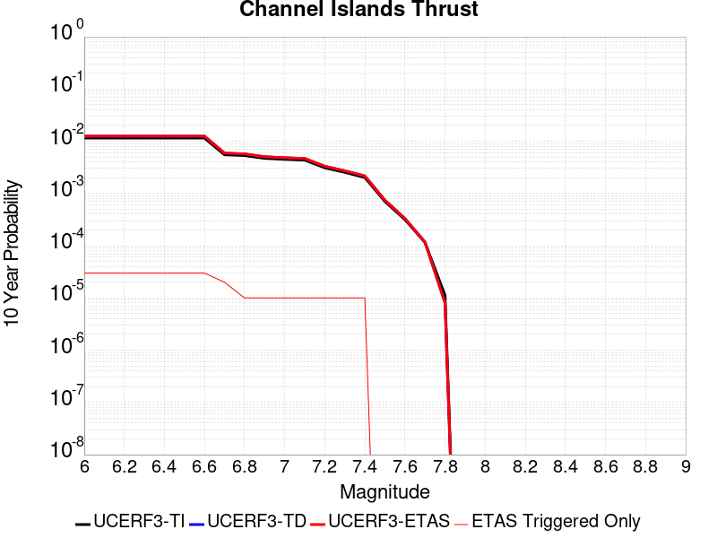 |

| Magnitude | 1 wk TI Prob | 1 wk TD Prob | 1 wk ETAS Prob | 1 wk ETAS/TD Gain | 1 wk ETAS Triggered Only | 1 mo TI Prob | 1 mo TD Prob | 1 mo ETAS Prob | 1 mo ETAS/TD Gain | 1 mo ETAS Triggered Only | 1 yr TI Prob | 1 yr TD Prob | 1 yr ETAS Prob | 1 yr ETAS/TD Gain | 1 yr ETAS Triggered Only | 10 yr TI Prob | 10 yr TD Prob | 10 yr ETAS Prob | 10 yr ETAS/TD Gain | 10 yr ETAS Triggered Only |
|-----|-----|-----|-----|-----|-----|-----|-----|-----|-----|-----|-----|-----|-----|-----|-----|-----|-----|-----|-----|-----|
| 6.0 | 2.2156251E-5 | 2.4093148E-5 | 2.4093148E-5 | 1.0 | 0.0 | 9.495191E-5 | 1.0325286E-4 | 1.0325286E-4 | 1.0 | 0.0 | 0.0011554264 | 0.0012564851 | 0.0012664726 | 1.0079488 | 1.0E-5 | 0.011494373 | 0.012504402 | 0.012534026 | 1.0023692 | 3.0E-5 |
| 6.1 | 2.2156251E-5 | 2.4093148E-5 | 2.4093148E-5 | 1.0 | 0.0 | 9.495191E-5 | 1.0325286E-4 | 1.0325286E-4 | 1.0 | 0.0 | 0.0011554264 | 0.0012564851 | 0.0012664726 | 1.0079488 | 1.0E-5 | 0.011494373 | 0.012504402 | 0.012534026 | 1.0023692 | 3.0E-5 |
| 6.2 | 2.2156251E-5 | 2.4093148E-5 | 2.4093148E-5 | 1.0 | 0.0 | 9.495191E-5 | 1.0325286E-4 | 1.0325286E-4 | 1.0 | 0.0 | 0.0011554264 | 0.0012564851 | 0.0012664726 | 1.0079488 | 1.0E-5 | 0.011494373 | 0.012504402 | 0.012534026 | 1.0023692 | 3.0E-5 |
| 6.3 | 2.2156251E-5 | 2.4093148E-5 | 2.4093148E-5 | 1.0 | 0.0 | 9.495191E-5 | 1.0325286E-4 | 1.0325286E-4 | 1.0 | 0.0 | 0.0011554264 | 0.0012564851 | 0.0012664726 | 1.0079488 | 1.0E-5 | 0.011494373 | 0.012504402 | 0.012534026 | 1.0023692 | 3.0E-5 |
| 6.4 | 2.2156251E-5 | 2.4093148E-5 | 2.4093148E-5 | 1.0 | 0.0 | 9.495191E-5 | 1.0325286E-4 | 1.0325286E-4 | 1.0 | 0.0 | 0.0011554264 | 0.0012564851 | 0.0012664726 | 1.0079488 | 1.0E-5 | 0.011494373 | 0.012504402 | 0.012534026 | 1.0023692 | 3.0E-5 |
| 6.5 | 2.2156251E-5 | 2.4093148E-5 | 2.4093148E-5 | 1.0 | 0.0 | 9.495191E-5 | 1.0325286E-4 | 1.0325286E-4 | 1.0 | 0.0 | 0.0011554264 | 0.0012564851 | 0.0012664726 | 1.0079488 | 1.0E-5 | 0.011494373 | 0.012504402 | 0.012534026 | 1.0023692 | 3.0E-5 |
| 6.6 | 2.2156251E-5 | 2.4093148E-5 | 2.4093148E-5 | 1.0 | 0.0 | 9.495191E-5 | 1.0325286E-4 | 1.0325286E-4 | 1.0 | 0.0 | 0.0011554264 | 0.0012564851 | 0.0012664726 | 1.0079488 | 1.0E-5 | 0.011494373 | 0.012504402 | 0.012534026 | 1.0023692 | 3.0E-5 |
| 6.7 | 1.0601296E-5 | 1.1379992E-5 | 1.1379992E-5 | 1.0 | 0.0 | 4.5433335E-5 | 4.8770515E-5 | 4.8770515E-5 | 1.0 | 0.0 | 5.5301044E-4 | 5.9362414E-4 | 5.9362414E-4 | 1.0 | 0.0 | 0.005516363 | 0.0059208865 | 0.005940768 | 1.0033579 | 2.0E-5 |
| 6.8 | 1.0246747E-5 | 1.09971015E-5 | 1.09971015E-5 | 1.0 | 0.0 | 4.391389E-5 | 4.712961E-5 | 4.712961E-5 | 1.0 | 0.0 | 5.345204E-4 | 5.7365675E-4 | 5.7365675E-4 | 1.0 | 0.0 | 0.0053323656 | 0.0057222494 | 0.005732192 | 1.0017376 | 1.0E-5 |
| 6.9 | 9.049551E-6 | 9.70002E-6 | 9.70002E-6 | 1.0 | 0.0 | 3.878322E-5 | 4.1570875E-5 | 4.1570875E-5 | 1.0 | 0.0 | 4.7208337E-4 | 5.0601194E-4 | 5.0601194E-4 | 1.0 | 0.0 | 0.0047108172 | 0.0050490154 | 0.0050589647 | 1.0019705 | 1.0E-5 |
| 7.0 | 8.6542195E-6 | 9.2749615E-6 | 9.2749615E-6 | 1.0 | 0.0 | 3.7088983E-5 | 3.974925E-5 | 3.974925E-5 | 1.0 | 0.0 | 4.5146482E-4 | 4.8384376E-4 | 4.8384376E-4 | 1.0 | 0.0 | 0.004505487 | 0.004828315 | 0.004838267 | 1.0020611 | 1.0E-5 |
| 7.1 | 8.391028E-6 | 8.993273E-6 | 8.993273E-6 | 1.0 | 0.0 | 3.5961057E-5 | 3.8542054E-5 | 3.8542054E-5 | 1.0 | 0.0 | 4.3773788E-4 | 4.6915252E-4 | 4.6915252E-4 | 1.0 | 0.0 | 0.004368766 | 0.004682031 | 0.004691984 | 1.0021259 | 1.0E-5 |
| 7.2 | 5.965188E-6 | 6.3719312E-6 | 6.3719312E-6 | 1.0 | 0.0 | 2.556484E-5 | 2.7307993E-5 | 2.7307993E-5 | 1.0 | 0.0 | 3.1120746E-4 | 3.3242465E-4 | 3.3242465E-4 | 1.0 | 0.0 | 0.00310772 | 0.003319332 | 0.0033292987 | 1.0030026 | 1.0E-5 |
| 7.3 | 4.877518E-6 | 5.206198E-6 | 5.206198E-6 | 1.0 | 0.0 | 2.0903482E-5 | 2.2312088E-5 | 2.2312088E-5 | 1.0 | 0.0 | 2.5447016E-4 | 2.7161627E-4 | 2.7161627E-4 | 1.0 | 0.0 | 0.0025417898 | 0.002712889 | 0.002722862 | 1.003676 | 1.0E-5 |
| 7.4 | 3.8829853E-6 | 4.142015E-6 | 4.142015E-6 | 1.0 | 0.0 | 1.664126E-5 | 1.7751374E-5 | 1.7751374E-5 | 1.0 | 0.0 | 2.0258849E-4 | 2.1610195E-4 | 2.1610195E-4 | 1.0 | 0.0 | 0.002024039 | 0.0021589599 | 0.0021689383 | 1.0046219 | 1.0E-5 |
| 7.5 | 1.3489616E-6 | 1.4278398E-6 | 1.4278398E-6 | 1.0 | 0.0 | 5.7812517E-6 | 6.119299E-6 | 6.119299E-6 | 1.0 | 0.0 | 7.038446E-5 | 7.449996E-5 | 7.449996E-5 | 1.0 | 0.0 | 7.036218E-4 | 7.447538E-4 | 7.447538E-4 | 1.0 | 0.0 |
| 7.6 | 6.058192E-7 | 6.3539926E-7 | 6.3539926E-7 | 1.0 | 0.0 | 2.5963652E-6 | 2.723137E-6 | 2.723137E-6 | 1.0 | 0.0 | 3.161029E-5 | 3.3153705E-5 | 3.3153705E-5 | 1.0 | 0.0 | 3.1605794E-4 | 3.314892E-4 | 3.314892E-4 | 1.0 | 0.0 |
| 7.7 | 2.2170494E-7 | 2.26086E-7 | 2.26086E-7 | 1.0 | 0.0 | 9.5016367E-7 | 9.689397E-7 | 9.689397E-7 | 1.0 | 0.0 | 1.1568181E-5 | 1.1796788E-5 | 1.1796788E-5 | 1.0 | 0.0 | 1.1567579E-4 | 1.1796273E-4 | 1.1796273E-4 | 1.0 | 0.0 |
| 7.8 | 2.1613102E-8 | 1.546703E-8 | 1.546703E-8 | 1.0 | 0.0 | 9.262757E-8 | 6.628727E-8 | 6.628727E-8 | 1.0 | 0.0 | 1.1277401E-6 | 8.070473E-7 | 8.070473E-7 | 1.0 | 0.0 | 1.1277344E-5 | 8.070451E-6 | 8.070451E-6 | 1.0 | 0.0 |

## San Diego Trough south
*[(top)](#table-of-contents)*

| 1 Week | 1 Month | 1 Year | 10 Year |
|-----|-----|-----|-----|
|  |  | 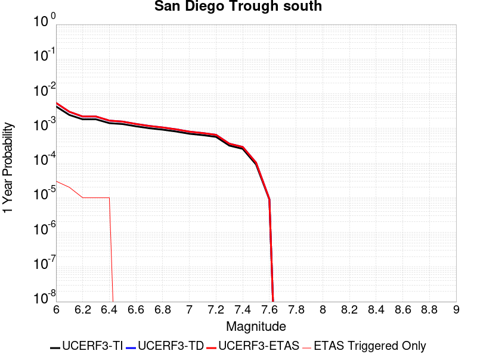 |  |

| Magnitude | 1 wk TI Prob | 1 wk TD Prob | 1 wk ETAS Prob | 1 wk ETAS/TD Gain | 1 wk ETAS Triggered Only | 1 mo TI Prob | 1 mo TD Prob | 1 mo ETAS Prob | 1 mo ETAS/TD Gain | 1 mo ETAS Triggered Only | 1 yr TI Prob | 1 yr TD Prob | 1 yr ETAS Prob | 1 yr ETAS/TD Gain | 1 yr ETAS Triggered Only | 10 yr TI Prob | 10 yr TD Prob | 10 yr ETAS Prob | 10 yr ETAS/TD Gain | 10 yr ETAS Triggered Only |
|-----|-----|-----|-----|-----|-----|-----|-----|-----|-----|-----|-----|-----|-----|-----|-----|-----|-----|-----|-----|-----|
| 6.0 | 8.279495E-5 | 1.0426959E-4 | 1.0426959E-4 | 1.0 | 0.0 | 3.5478722E-4 | 4.4679717E-4 | 4.7678375E-4 | 1.0671146 | 3.0E-5 | 0.004310982 | 0.0054266346 | 0.005456472 | 1.0054983 | 3.0E-5 | 0.042283054 | 0.052999813 | 0.053028222 | 1.0005361 | 3.0E-5 |
| 6.1 | 4.6961468E-5 | 5.7736557E-5 | 5.7736557E-5 | 1.0 | 0.0 | 2.0124791E-4 | 2.4741987E-4 | 2.6741493E-4 | 1.0808142 | 2.0E-5 | 0.00244744 | 0.0030082478 | 0.0030281877 | 1.0066284 | 2.0E-5 | 0.024206603 | 0.029683128 | 0.029702535 | 1.0006537 | 2.0E-5 |
| 6.2 | 3.5079658E-5 | 4.214702E-5 | 4.214702E-5 | 1.0 | 0.0 | 1.5033272E-4 | 1.8061785E-4 | 1.9061603E-4 | 1.0553555 | 1.0E-5 | 0.0018287642 | 0.0021968228 | 0.0022068007 | 1.004542 | 1.0E-5 | 0.018137876 | 0.021753483 | 0.021763265 | 1.0004497 | 1.0E-5 |
| 6.3 | 3.5079658E-5 | 4.214702E-5 | 4.214702E-5 | 1.0 | 0.0 | 1.5033272E-4 | 1.8061785E-4 | 1.9061603E-4 | 1.0553555 | 1.0E-5 | 0.0018287642 | 0.0021968228 | 0.0022068007 | 1.004542 | 1.0E-5 | 0.018137876 | 0.021753483 | 0.021763265 | 1.0004497 | 1.0E-5 |
| 6.4 | 2.7196904E-5 | 3.2090207E-5 | 3.2090207E-5 | 1.0 | 0.0 | 1.16552954E-4 | 1.375223E-4 | 1.4752091E-4 | 1.0727055 | 1.0E-5 | 0.0014181085 | 0.00167306 | 0.0016830433 | 1.005967 | 1.0E-5 | 0.014090929 | 0.016606245 | 0.01661608 | 1.0005922 | 1.0E-5 |
| 6.5 | 2.5584688E-5 | 3.0104437E-5 | 3.0104437E-5 | 1.0 | 0.0 | 1.0964406E-4 | 1.2901273E-4 | 1.2901273E-4 | 1.0 | 0.0 | 0.0013340989 | 0.0015696106 | 0.0015696106 | 1.0 | 0.0 | 0.013261181 | 0.01558679 | 0.01558679 | 1.0 | 0.0 |
| 6.6 | 2.2034688E-5 | 2.5745014E-5 | 2.5745014E-5 | 1.0 | 0.0 | 9.443096E-5 | 1.1033115E-4 | 1.1033115E-4 | 1.0 | 0.0 | 0.0011490905 | 0.0013424618 | 0.0013424618 | 1.0 | 0.0 | 0.011431668 | 0.013344516 | 0.013344516 | 1.0 | 0.0 |
| 6.7 | 1.9394853E-5 | 2.2543714E-5 | 2.2543714E-5 | 1.0 | 0.0 | 8.311815E-5 | 9.661237E-5 | 9.661237E-5 | 1.0 | 0.0 | 0.0010114936 | 0.0011756261 | 0.0011756261 | 1.0 | 0.0 | 0.01006902 | 0.011694773 | 0.011694773 | 1.0 | 0.0 |
| 6.8 | 1.7615313E-5 | 2.0404905E-5 | 2.0404905E-5 | 1.0 | 0.0 | 7.549201E-5 | 8.7446686E-5 | 8.7446686E-5 | 1.0 | 0.0 | 9.1872766E-4 | 0.0010641478 | 0.0010641478 | 1.0 | 0.0 | 0.009149387 | 0.010591088 | 0.010591088 | 1.0 | 0.0 |
| 6.9 | 1.5621423E-5 | 1.8027595E-5 | 1.8027595E-5 | 1.0 | 0.0 | 6.6947236E-5 | 7.725885E-5 | 7.725885E-5 | 1.0 | 0.0 | 8.147778E-4 | 9.402241E-4 | 9.402241E-4 | 1.0 | 0.0 | 0.008117969 | 0.009362906 | 0.009362906 | 1.0 | 0.0 |
| 7.0 | 1.3444376E-5 | 1.5449315E-5 | 1.5449315E-5 | 1.0 | 0.0 | 5.7617483E-5 | 6.6209686E-5 | 6.6209686E-5 | 1.0 | 0.0 | 7.0126704E-4 | 8.0580753E-4 | 8.0580753E-4 | 1.0 | 0.0 | 0.006990582 | 0.00802919 | 0.00802919 | 1.0 | 0.0 |
| 7.1 | 1.2268361E-5 | 1.4074132E-5 | 1.4074132E-5 | 1.0 | 0.0 | 5.2577634E-5 | 6.031633E-5 | 6.031633E-5 | 1.0 | 0.0 | 6.399447E-4 | 7.341065E-4 | 7.341065E-4 | 1.0 | 0.0 | 0.0063810493 | 0.00731712 | 0.00731712 | 1.0 | 0.0 |
| 7.2 | 1.0922655E-5 | 1.2514534E-5 | 1.2514534E-5 | 1.0 | 0.0 | 4.681054E-5 | 5.363263E-5 | 5.363263E-5 | 1.0 | 0.0 | 5.697693E-4 | 6.5278413E-4 | 6.5278413E-4 | 1.0 | 0.0 | 0.0056831064 | 0.006508947 | 0.006508947 | 1.0 | 0.0 |
| 7.3 | 6.1106753E-6 | 6.9294197E-6 | 6.9294197E-6 | 1.0 | 0.0 | 2.6188345E-5 | 2.9697178E-5 | 2.9697178E-5 | 1.0 | 0.0 | 3.1879646E-4 | 3.6150354E-4 | 3.6150354E-4 | 1.0 | 0.0 | 0.0031833951 | 0.0036092002 | 0.0036092002 | 1.0 | 0.0 |
| 7.4 | 4.933187E-6 | 5.5899495E-6 | 5.5899495E-6 | 1.0 | 0.0 | 2.114206E-5 | 2.3956709E-5 | 2.3956709E-5 | 1.0 | 0.0 | 2.5737417E-4 | 2.9163426E-4 | 2.9163426E-4 | 1.0 | 0.0 | 0.002570763 | 0.0029125568 | 0.0029125568 | 1.0 | 0.0 |
| 7.5 | 1.7489613E-6 | 1.9698116E-6 | 1.9698116E-6 | 1.0 | 0.0 | 7.495527E-6 | 8.4420235E-6 | 8.4420235E-6 | 1.0 | 0.0 | 9.125422E-5 | 1.0277701E-4 | 1.0277701E-4 | 1.0 | 0.0 | 9.1216754E-4 | 0.0010273168 | 0.0010273168 | 1.0 | 0.0 |
| 7.6 | 1.6988751E-7 | 1.7534121E-7 | 1.7534121E-7 | 1.0 | 0.0 | 7.2808916E-7 | 7.5146215E-7 | 7.5146215E-7 | 1.0 | 0.0 | 8.864449E-6 | 9.149016E-6 | 9.149016E-6 | 1.0 | 0.0 | 8.8640954E-5 | 9.148658E-5 | 9.148658E-5 | 1.0 | 0.0 |

## Coronado Bank alt1
*[(top)](#table-of-contents)*

| 1 Week | 1 Month | 1 Year | 10 Year |
|-----|-----|-----|-----|
|  | 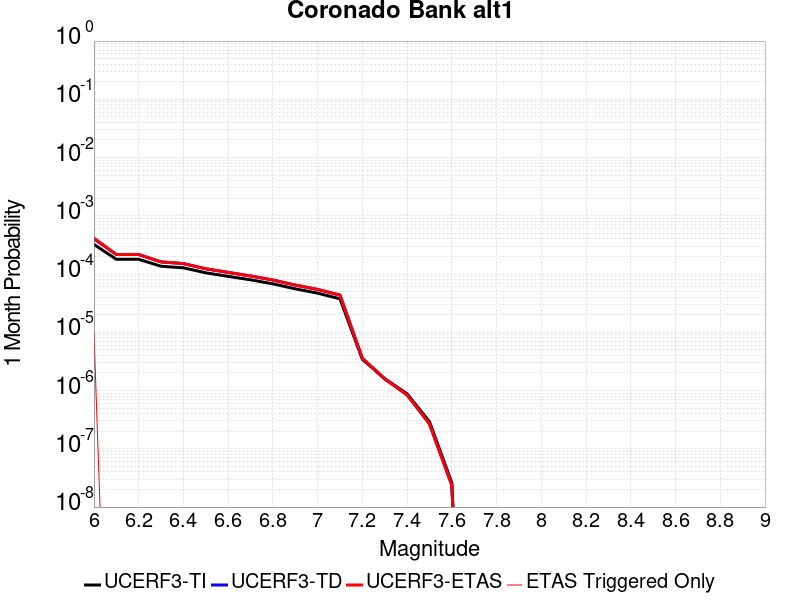 |  |  |

| Magnitude | 1 wk TI Prob | 1 wk TD Prob | 1 wk ETAS Prob | 1 wk ETAS/TD Gain | 1 wk ETAS Triggered Only | 1 mo TI Prob | 1 mo TD Prob | 1 mo ETAS Prob | 1 mo ETAS/TD Gain | 1 mo ETAS Triggered Only | 1 yr TI Prob | 1 yr TD Prob | 1 yr ETAS Prob | 1 yr ETAS/TD Gain | 1 yr ETAS Triggered Only | 10 yr TI Prob | 10 yr TD Prob | 10 yr ETAS Prob | 10 yr ETAS/TD Gain | 10 yr ETAS Triggered Only |
|-----|-----|-----|-----|-----|-----|-----|-----|-----|-----|-----|-----|-----|-----|-----|-----|-----|-----|-----|-----|-----|
| 6.0 | 7.533492E-5 | 9.396308E-5 | 9.396308E-5 | 1.0 | 0.0 | 3.22824E-4 | 4.026398E-4 | 4.1263577E-4 | 1.024826 | 1.0E-5 | 0.0039233007 | 0.004891753 | 0.0049017044 | 1.0020343 | 1.0E-5 | 0.03854755 | 0.047910035 | 0.047938596 | 1.0005962 | 3.0E-5 |
| 6.1 | 4.1807285E-5 | 5.0498526E-5 | 5.0498526E-5 | 1.0 | 0.0 | 1.7916178E-4 | 2.164048E-4 | 2.164048E-4 | 1.0 | 0.0 | 0.0021791123 | 0.0026316273 | 0.0026316273 | 1.0 | 0.0 | 0.021578677 | 0.026013961 | 0.02603344 | 1.0007489 | 2.0E-5 |
| 6.2 | 4.1807285E-5 | 5.0498526E-5 | 5.0498526E-5 | 1.0 | 0.0 | 1.7916178E-4 | 2.164048E-4 | 2.164048E-4 | 1.0 | 0.0 | 0.0021791123 | 0.0026316273 | 0.0026316273 | 1.0 | 0.0 | 0.021578677 | 0.026013961 | 0.02603344 | 1.0007489 | 2.0E-5 |
| 6.3 | 3.1793104E-5 | 3.7714883E-5 | 3.7714883E-5 | 1.0 | 0.0 | 1.3624904E-4 | 1.6162539E-4 | 1.6162539E-4 | 1.0 | 0.0 | 0.0016575698 | 0.0019660448 | 0.0019660448 | 1.0 | 0.0 | 0.016452603 | 0.019490417 | 0.019510027 | 1.0010061 | 2.0E-5 |
| 6.4 | 2.9878007E-5 | 3.5339264E-5 | 3.5339264E-5 | 1.0 | 0.0 | 1.2804232E-4 | 1.5144538E-4 | 1.5144538E-4 | 1.0 | 0.0 | 0.0015578003 | 0.0018423196 | 0.0018423196 | 1.0 | 0.0 | 0.015469253 | 0.018274235 | 0.01829387 | 1.0010744 | 2.0E-5 |
| 6.5 | 2.4512565E-5 | 2.8766783E-5 | 2.8766783E-5 | 1.0 | 0.0 | 1.0504962E-4 | 1.2328054E-4 | 1.2328054E-4 | 1.0 | 0.0 | 0.0012782287 | 0.0014999339 | 0.0014999339 | 1.0 | 0.0 | 0.012709012 | 0.01490107 | 0.014920771 | 1.0013222 | 2.0E-5 |
| 6.6 | 2.1317413E-5 | 2.4908924E-5 | 2.4908924E-5 | 1.0 | 0.0 | 9.135714E-5 | 1.0674829E-4 | 1.0674829E-4 | 1.0 | 0.0 | 0.0011117056 | 0.0012989078 | 0.0012989078 | 1.0 | 0.0 | 0.011061605 | 0.012915568 | 0.0129254395 | 1.0007643 | 1.0E-5 |
| 6.7 | 1.8585655E-5 | 2.1636792E-5 | 2.1636792E-5 | 1.0 | 0.0 | 7.9650374E-5 | 9.2725924E-5 | 9.2725924E-5 | 1.0 | 0.0 | 9.6931186E-4 | 0.0011283739 | 0.0011283739 | 1.0 | 0.0 | 0.0096509475 | 0.011228609 | 0.011238496 | 1.0008806 | 1.0E-5 |
| 6.8 | 1.5862879E-5 | 1.8421075E-5 | 1.8421075E-5 | 1.0 | 0.0 | 6.798199E-5 | 7.894519E-5 | 7.894519E-5 | 1.0 | 0.0 | 8.273665E-4 | 9.6075307E-4 | 9.6075307E-4 | 1.0 | 0.0 | 0.008242928 | 0.009567978 | 0.009577882 | 1.0010351 | 1.0E-5 |
| 6.9 | 1.3021509E-5 | 1.5096564E-5 | 1.5096564E-5 | 1.0 | 0.0 | 5.5805274E-5 | 6.4698055E-5 | 6.4698055E-5 | 1.0 | 0.0 | 6.792174E-4 | 7.874323E-4 | 7.874323E-4 | 1.0 | 0.0 | 0.006771452 | 0.007848245 | 0.007858167 | 1.0012642 | 1.0E-5 |
| 7.0 | 1.0974371E-5 | 1.2721201E-5 | 1.2721201E-5 | 1.0 | 0.0 | 4.7032172E-5 | 5.451839E-5 | 5.451839E-5 | 1.0 | 0.0 | 5.7246623E-4 | 6.635768E-4 | 6.635768E-4 | 1.0 | 0.0 | 0.0057099373 | 0.0066177035 | 0.0066276374 | 1.0015011 | 1.0E-5 |
| 7.1 | 8.766221E-6 | 1.0164714E-5 | 1.0164714E-5 | 1.0 | 0.0 | 3.7568978E-5 | 4.356243E-5 | 4.356243E-5 | 1.0 | 0.0 | 4.573063E-4 | 5.3026073E-4 | 5.3026073E-4 | 1.0 | 0.0 | 0.0045636636 | 0.0052916547 | 0.0052916547 | 1.0 | 0.0 |
| 7.2 | 8.026024E-7 | 8.332067E-7 | 8.332067E-7 | 1.0 | 0.0 | 3.43972E-6 | 3.570881E-6 | 3.570881E-6 | 1.0 | 0.0 | 4.1877785E-5 | 4.3474618E-5 | 4.3474618E-5 | 1.0 | 0.0 | 4.1869894E-4 | 4.3466224E-4 | 4.3466224E-4 | 1.0 | 0.0 |
| 7.3 | 3.7293114E-7 | 3.7002025E-7 | 3.7002025E-7 | 1.0 | 0.0 | 1.5982754E-6 | 1.5858001E-6 | 1.5858001E-6 | 1.0 | 0.0 | 1.9458828E-5 | 1.9306945E-5 | 1.9306945E-5 | 1.0 | 0.0 | 1.9457124E-4 | 1.9305275E-4 | 1.9305275E-4 | 1.0 | 0.0 |
| 7.4 | 2.0557036E-7 | 1.9674852E-7 | 1.9674852E-7 | 1.0 | 0.0 | 8.810155E-7 | 8.4320766E-7 | 8.4320766E-7 | 1.0 | 0.0 | 1.0726311E-5 | 1.0266005E-5 | 1.0266005E-5 | 1.0 | 0.0 | 1.0725793E-4 | 1.0265534E-4 | 1.0265534E-4 | 1.0 | 0.0 |
| 7.5 | 6.845446E-8 | 6.2794854E-8 | 6.2794854E-8 | 1.0 | 0.0 | 2.9337625E-7 | 2.6912076E-7 | 2.6912076E-7 | 1.0 | 0.0 | 3.5718497E-6 | 3.2765404E-6 | 3.2765404E-6 | 1.0 | 0.0 | 3.5717923E-5 | 3.276493E-5 | 3.276493E-5 | 1.0 | 0.0 |
| 7.6 | 6.0975145E-9 | 5.5319385E-9 | 5.5319385E-9 | 1.0 | 0.0 | 2.6132206E-8 | 2.3708308E-8 | 2.3708308E-8 | 1.0 | 0.0 | 3.1815955E-7 | 2.8864864E-7 | 2.8864864E-7 | 1.0 | 0.0 | 3.181591E-6 | 2.8864836E-6 | 2.8864836E-6 | 1.0 | 0.0 |

## Great Valley 09 (Laguna Seca)
*[(top)](#table-of-contents)*

| 1 Week | 1 Month | 1 Year | 10 Year |
|-----|-----|-----|-----|
|  |  |  |  |

| Magnitude | 1 wk TI Prob | 1 wk TD Prob | 1 wk ETAS Prob | 1 wk ETAS/TD Gain | 1 wk ETAS Triggered Only | 1 mo TI Prob | 1 mo TD Prob | 1 mo ETAS Prob | 1 mo ETAS/TD Gain | 1 mo ETAS Triggered Only | 1 yr TI Prob | 1 yr TD Prob | 1 yr ETAS Prob | 1 yr ETAS/TD Gain | 1 yr ETAS Triggered Only | 10 yr TI Prob | 10 yr TD Prob | 10 yr ETAS Prob | 10 yr ETAS/TD Gain | 10 yr ETAS Triggered Only |
|-----|-----|-----|-----|-----|-----|-----|-----|-----|-----|-----|-----|-----|-----|-----|-----|-----|-----|-----|-----|-----|
| 6.0 | 5.4353277E-5 | 7.051243E-5 | 7.051243E-5 | 1.0 | 0.0 | 2.3292181E-4 | 3.0216138E-4 | 3.0216138E-4 | 1.0 | 0.0 | 0.0028321352 | 0.003672609 | 0.0036825724 | 1.0027128 | 1.0E-5 | 0.02796312 | 0.03612157 | 0.036140848 | 1.0005337 | 2.0E-5 |
| 6.1 | 4.5578287E-5 | 5.823013E-5 | 5.823013E-5 | 1.0 | 0.0 | 1.953209E-4 | 2.4953342E-4 | 2.4953342E-4 | 1.0 | 0.0 | 0.0023754383 | 0.0030338368 | 0.0030338368 | 1.0 | 0.0 | 0.023502063 | 0.029924503 | 0.029934203 | 1.0003241 | 1.0E-5 |
| 6.2 | 2.8536782E-5 | 3.4741206E-5 | 3.4741206E-5 | 1.0 | 0.0 | 1.2229476E-4 | 1.4888248E-4 | 1.4888248E-4 | 1.0 | 0.0 | 0.0014879217 | 0.0018111159 | 0.0018111159 | 1.0 | 0.0 | 0.014779986 | 0.017960787 | 0.017970607 | 1.0005468 | 1.0E-5 |
| 6.3 | 2.3698774E-5 | 2.82169E-5 | 2.82169E-5 | 1.0 | 0.0 | 1.01562226E-4 | 1.2092415E-4 | 1.2092415E-4 | 1.0 | 0.0 | 0.0012358186 | 0.0014712509 | 0.0014712509 | 1.0 | 0.0 | 0.012289686 | 0.014613405 | 0.014623259 | 1.0006742 | 1.0E-5 |
| 6.4 | 1.9191197E-5 | 2.2125585E-5 | 2.2125585E-5 | 1.0 | 0.0 | 8.2245395E-5 | 9.482068E-5 | 9.482068E-5 | 1.0 | 0.0 | 0.0010008777 | 0.0011538353 | 0.0011538353 | 1.0 | 0.0 | 0.009963818 | 0.011478443 | 0.011488328 | 1.0008612 | 1.0E-5 |
| 6.5 | 1.5203241E-5 | 1.6803031E-5 | 1.6803031E-5 | 1.0 | 0.0 | 6.5155116E-5 | 7.201118E-5 | 7.201118E-5 | 1.0 | 0.0 | 7.9297484E-4 | 8.763992E-4 | 8.763992E-4 | 1.0 | 0.0 | 0.007901512 | 0.00873055 | 0.008740463 | 1.0011353 | 1.0E-5 |
| 6.6 | 1.0984925E-5 | 1.124355E-5 | 1.124355E-5 | 1.0 | 0.0 | 4.70774E-5 | 4.8185768E-5 | 4.8185768E-5 | 1.0 | 0.0 | 5.730166E-4 | 5.865076E-4 | 5.865076E-4 | 1.0 | 0.0 | 0.005715413 | 0.0058499887 | 0.00585993 | 1.0016994 | 1.0E-5 |
| 6.7 | 9.134616E-6 | 9.02062E-6 | 9.02062E-6 | 1.0 | 0.0 | 3.9147766E-5 | 3.865924E-5 | 3.865924E-5 | 1.0 | 0.0 | 4.7651984E-4 | 4.70577E-4 | 4.70577E-4 | 1.0 | 0.0 | 0.004754993 | 0.0046960507 | 0.0046960507 | 1.0 | 0.0 |
| 6.8 | 7.785589E-6 | 7.4525356E-6 | 7.4525356E-6 | 1.0 | 0.0 | 3.3366385E-5 | 3.1939056E-5 | 3.1939056E-5 | 1.0 | 0.0 | 4.0616E-4 | 3.8879065E-4 | 3.8879065E-4 | 1.0 | 0.0 | 0.0040541845 | 0.0038813087 | 0.0038813087 | 1.0 | 0.0 |
| 6.9 | 5.579095E-6 | 4.8988704E-6 | 4.8988704E-6 | 1.0 | 0.0 | 2.3910188E-5 | 2.0994998E-5 | 2.0994998E-5 | 1.0 | 0.0 | 2.9106764E-4 | 2.555855E-4 | 2.555855E-4 | 1.0 | 0.0 | 0.002906867 | 0.0025530527 | 0.0025530527 | 1.0 | 0.0 |
| 7.0 | 2.6816688E-6 | 1.5216937E-6 | 1.5216937E-6 | 1.0 | 0.0 | 1.1492816E-5 | 6.5215286E-6 | 6.5215286E-6 | 1.0 | 0.0 | 1.3991605E-4 | 7.939681E-5 | 7.939681E-5 | 1.0 | 0.0 | 0.0013982799 | 7.936931E-4 | 7.936931E-4 | 1.0 | 0.0 |
| 7.1 | 1.9951021E-6 | 7.4540986E-7 | 7.4540986E-7 | 1.0 | 0.0 | 8.55041E-6 | 3.1946101E-6 | 3.1946101E-6 | 1.0 | 0.0 | 1.0409627E-4 | 3.8893726E-5 | 3.8893726E-5 | 1.0 | 0.0 | 0.0010404752 | 3.8887333E-4 | 3.8887333E-4 | 1.0 | 0.0 |
| 7.2 | 1.9951021E-6 | 7.4540986E-7 | 7.4540986E-7 | 1.0 | 0.0 | 8.55041E-6 | 3.1946101E-6 | 3.1946101E-6 | 1.0 | 0.0 | 1.0409627E-4 | 3.8893726E-5 | 3.8893726E-5 | 1.0 | 0.0 | 0.0010404752 | 3.8887333E-4 | 3.8887333E-4 | 1.0 | 0.0 |
| 7.3 | 1.7087556E-6 | 6.579121E-7 | 6.579121E-7 | 1.0 | 0.0 | 7.3232177E-6 | 2.8196202E-6 | 2.8196202E-6 | 1.0 | 0.0 | 8.915652E-5 | 3.432838E-5 | 3.432838E-5 | 1.0 | 0.0 | 8.9120766E-4 | 3.432348E-4 | 3.432348E-4 | 1.0 | 0.0 |
| 7.4 | 1.3804846E-6 | 6.0740956E-7 | 6.0740956E-7 | 1.0 | 0.0 | 5.916349E-6 | 2.6031814E-6 | 2.6031814E-6 | 1.0 | 0.0 | 7.2029165E-5 | 3.1693315E-5 | 3.1693315E-5 | 1.0 | 0.0 | 7.200583E-4 | 3.1689196E-4 | 3.1689196E-4 | 1.0 | 0.0 |
| 7.5 | 1.3804846E-6 | 6.0740956E-7 | 6.0740956E-7 | 1.0 | 0.0 | 5.916349E-6 | 2.6031814E-6 | 2.6031814E-6 | 1.0 | 0.0 | 7.2029165E-5 | 3.1693315E-5 | 3.1693315E-5 | 1.0 | 0.0 | 7.200583E-4 | 3.1689196E-4 | 3.1689196E-4 | 1.0 | 0.0 |

## Elsinore (Temecula) rev
*[(top)](#table-of-contents)*

| 1 Week | 1 Month | 1 Year | 10 Year |
|-----|-----|-----|-----|
| 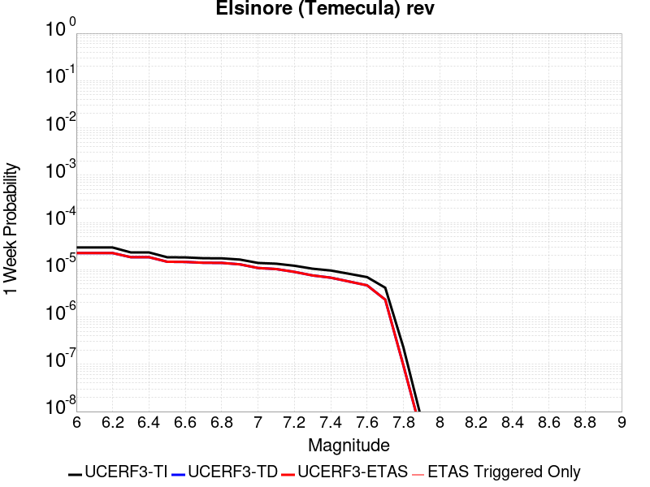 |  | 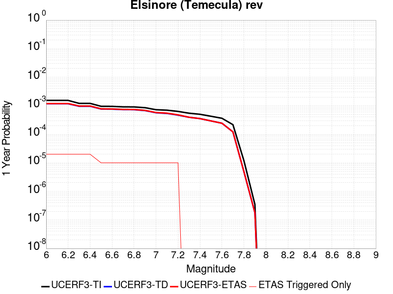 | 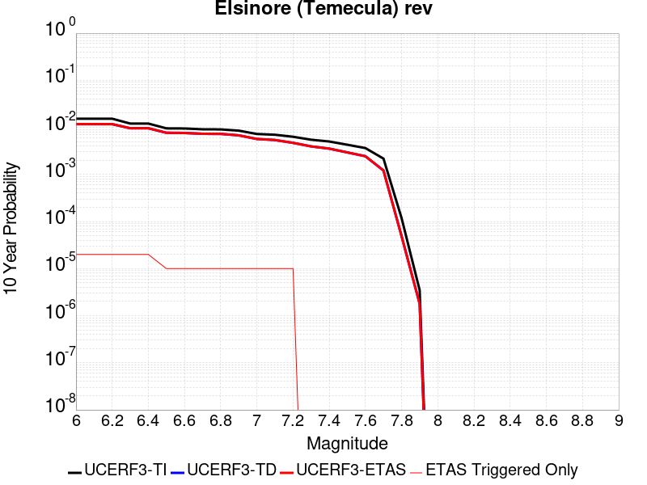 |

| Magnitude | 1 wk TI Prob | 1 wk TD Prob | 1 wk ETAS Prob | 1 wk ETAS/TD Gain | 1 wk ETAS Triggered Only | 1 mo TI Prob | 1 mo TD Prob | 1 mo ETAS Prob | 1 mo ETAS/TD Gain | 1 mo ETAS Triggered Only | 1 yr TI Prob | 1 yr TD Prob | 1 yr ETAS Prob | 1 yr ETAS/TD Gain | 1 yr ETAS Triggered Only | 10 yr TI Prob | 10 yr TD Prob | 10 yr ETAS Prob | 10 yr ETAS/TD Gain | 10 yr ETAS Triggered Only |
|-----|-----|-----|-----|-----|-----|-----|-----|-----|-----|-----|-----|-----|-----|-----|-----|-----|-----|-----|-----|-----|
| 6.0 | 2.9514995E-5 | 2.2524138E-5 | 2.2524138E-5 | 1.0 | 0.0 | 1.264867E-4 | 9.652858E-5 | 1.0652761E-4 | 1.1035863 | 1.0E-5 | 0.0015388876 | 0.0011746238 | 0.0011946004 | 1.0170068 | 2.0E-5 | 0.015282745 | 0.0116978055 | 0.011717572 | 1.0016897 | 2.0E-5 |
| 6.1 | 2.9514995E-5 | 2.2524138E-5 | 2.2524138E-5 | 1.0 | 0.0 | 1.264867E-4 | 9.652858E-5 | 1.0652761E-4 | 1.1035863 | 1.0E-5 | 0.0015388876 | 0.0011746238 | 0.0011946004 | 1.0170068 | 2.0E-5 | 0.015282745 | 0.0116978055 | 0.011717572 | 1.0016897 | 2.0E-5 |
| 6.2 | 2.9514995E-5 | 2.2524138E-5 | 2.2524138E-5 | 1.0 | 0.0 | 1.264867E-4 | 9.652858E-5 | 1.0652761E-4 | 1.1035863 | 1.0E-5 | 0.0015388876 | 0.0011746238 | 0.0011946004 | 1.0170068 | 2.0E-5 | 0.015282745 | 0.0116978055 | 0.011717572 | 1.0016897 | 2.0E-5 |
| 6.3 | 2.3223649E-5 | 1.8411085E-5 | 1.8411085E-5 | 1.0 | 0.0 | 9.952613E-5 | 7.890236E-5 | 8.890157E-5 | 1.1267289 | 1.0E-5 | 0.001211057 | 9.6023E-4 | 9.802108E-4 | 1.0208083 | 2.0E-5 | 0.012044783 | 0.0095697455 | 0.009589555 | 1.00207 | 2.0E-5 |
| 6.4 | 2.3223649E-5 | 1.8411085E-5 | 1.8411085E-5 | 1.0 | 0.0 | 9.952613E-5 | 7.890236E-5 | 8.890157E-5 | 1.1267289 | 1.0E-5 | 0.001211057 | 9.6023E-4 | 9.802108E-4 | 1.0208083 | 2.0E-5 | 0.012044783 | 0.0095697455 | 0.009589555 | 1.00207 | 2.0E-5 |
| 6.5 | 1.8338875E-5 | 1.47526835E-5 | 1.47526835E-5 | 1.0 | 0.0 | 7.8592806E-5 | 6.32243E-5 | 6.32243E-5 | 1.0 | 0.0 | 9.5644733E-4 | 7.694928E-4 | 7.794851E-4 | 1.0129856 | 1.0E-5 | 0.009523412 | 0.0076718247 | 0.007681748 | 1.0012934 | 1.0E-5 |
| 6.6 | 1.8223333E-5 | 1.4615226E-5 | 1.4615226E-5 | 1.0 | 0.0 | 7.809766E-5 | 6.263523E-5 | 6.263523E-5 | 1.0 | 0.0 | 9.504242E-4 | 7.623258E-4 | 7.723182E-4 | 1.0131078 | 1.0E-5 | 0.009463696 | 0.0076006465 | 0.00761057 | 1.0013057 | 1.0E-5 |
| 6.7 | 1.7512752E-5 | 1.4029559E-5 | 1.4029559E-5 | 1.0 | 0.0 | 7.505249E-5 | 6.012534E-5 | 6.012534E-5 | 1.0 | 0.0 | 9.13381E-4 | 7.3178875E-4 | 7.4178143E-4 | 1.0136552 | 1.0E-5 | 0.00909636 | 0.0073001822 | 0.007310109 | 1.0013598 | 1.0E-5 |
| 6.8 | 1.7417142E-5 | 1.3953522E-5 | 1.3953522E-5 | 1.0 | 0.0 | 7.4642754E-5 | 5.9799488E-5 | 5.9799488E-5 | 1.0 | 0.0 | 9.083966E-4 | 7.278241E-4 | 7.3781685E-4 | 1.0137296 | 1.0E-5 | 0.009046922 | 0.0072607356 | 0.007270663 | 1.0013673 | 1.0E-5 |
| 6.9 | 1.6402591E-5 | 1.2990858E-5 | 1.2990858E-5 | 1.0 | 0.0 | 7.0294926E-5 | 5.5673958E-5 | 5.5673958E-5 | 1.0 | 0.0 | 8.5550465E-4 | 6.7762734E-4 | 6.8762054E-4 | 1.0147474 | 1.0E-5 | 0.008522186 | 0.0067611905 | 0.0067711226 | 1.001469 | 1.0E-5 |
| 7.0 | 1.3912486E-5 | 1.0880293E-5 | 1.0880293E-5 | 1.0 | 0.0 | 5.9623577E-5 | 4.662901E-5 | 4.662901E-5 | 1.0 | 0.0 | 7.2567526E-4 | 5.6756305E-4 | 5.7755737E-4 | 1.0176092 | 1.0E-5 | 0.0072331014 | 0.0056650066 | 0.00567495 | 1.0017552 | 1.0E-5 |
| 7.1 | 1.3405147E-5 | 1.0329356E-5 | 1.0329356E-5 | 1.0 | 0.0 | 5.7449364E-5 | 4.426793E-5 | 4.426793E-5 | 1.0 | 0.0 | 6.9922156E-4 | 5.3883134E-4 | 5.4882595E-4 | 1.0185487 | 1.0E-5 | 0.0069702556 | 0.005378547 | 0.0053884936 | 1.0018493 | 1.0E-5 |
| 7.2 | 1.21402E-5 | 8.998374E-6 | 8.998374E-6 | 1.0 | 0.0 | 5.202839E-5 | 3.8563903E-5 | 3.8563903E-5 | 1.0 | 0.0 | 6.332616E-4 | 4.6941615E-4 | 4.7941145E-4 | 1.021293 | 1.0E-5 | 0.0063146 | 0.00468569 | 0.004695643 | 1.0021242 | 1.0E-5 |
| 7.3 | 1.05047775E-5 | 7.57314E-6 | 7.57314E-6 | 1.0 | 0.0 | 4.5019697E-5 | 3.245592E-5 | 3.245592E-5 | 1.0 | 0.0 | 5.4797693E-4 | 3.9508063E-4 | 3.9508063E-4 | 1.0 | 0.0 | 0.005466277 | 0.0039441846 | 0.0039441846 | 1.0 | 0.0 |
| 7.4 | 9.624483E-6 | 6.788087E-6 | 6.788087E-6 | 1.0 | 0.0 | 4.124713E-5 | 2.9091485E-5 | 2.9091485E-5 | 1.0 | 0.0 | 5.0206814E-4 | 3.5413264E-4 | 3.5413264E-4 | 1.0 | 0.0 | 0.005009353 | 0.003535835 | 0.003535835 | 1.0 | 0.0 |
| 7.5 | 8.215151E-6 | 5.6364843E-6 | 5.6364843E-6 | 1.0 | 0.0 | 3.5207315E-5 | 2.4156145E-5 | 2.4156145E-5 | 1.0 | 0.0 | 4.2856473E-4 | 2.9406266E-4 | 2.9406266E-4 | 1.0 | 0.0 | 0.004277392 | 0.0029368633 | 0.0029368633 | 1.0 | 0.0 |
| 7.6 | 6.975058E-6 | 4.676863E-6 | 4.676863E-6 | 1.0 | 0.0 | 2.9892764E-5 | 2.0043552E-5 | 2.0043552E-5 | 1.0 | 0.0 | 3.6388362E-4 | 2.4400408E-4 | 2.4400408E-4 | 1.0 | 0.0 | 0.0036328835 | 0.002437478 | 0.002437478 | 1.0 | 0.0 |
| 7.7 | 4.159604E-6 | 2.3274965E-6 | 2.3274965E-6 | 1.0 | 0.0 | 1.7826753E-5 | 9.974951E-6 | 9.974951E-6 | 1.0 | 0.0 | 2.1701909E-4 | 1.2143901E-4 | 1.2143901E-4 | 1.0 | 0.0 | 0.0021680726 | 0.0012137996 | 0.0012137996 | 1.0 | 0.0 |
| 7.8 | 2.2692414E-7 | 9.38645E-8 | 9.38645E-8 | 1.0 | 0.0 | 9.725317E-7 | 4.0227638E-7 | 4.0227638E-7 | 1.0 | 0.0 | 1.1840509E-5 | 4.8977076E-6 | 4.8977076E-6 | 1.0 | 0.0 | 1.1839878E-4 | 4.8976322E-5 | 4.8976322E-5 | 1.0 | 0.0 |
| 7.9 | 6.676829E-9 | 3.4402008E-9 | 3.4402008E-9 | 1.0 | 0.0 | 2.861498E-8 | 1.4743718E-8 | 1.4743718E-8 | 1.0 | 0.0 | 3.4838732E-7 | 1.7950475E-7 | 1.7950475E-7 | 1.0 | 0.0 | 3.4838679E-6 | 1.7950463E-6 | 1.7950463E-6 | 1.0 | 0.0 |

## Hunting Creek - Berryessa 2011 CFM
*[(top)](#table-of-contents)*

| 1 Week | 1 Month | 1 Year | 10 Year |
|-----|-----|-----|-----|
|  |  | 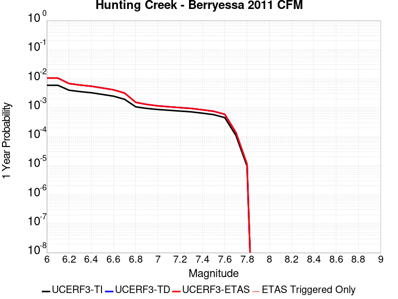 |  |

| Magnitude | 1 wk TI Prob | 1 wk TD Prob | 1 wk ETAS Prob | 1 wk ETAS/TD Gain | 1 wk ETAS Triggered Only | 1 mo TI Prob | 1 mo TD Prob | 1 mo ETAS Prob | 1 mo ETAS/TD Gain | 1 mo ETAS Triggered Only | 1 yr TI Prob | 1 yr TD Prob | 1 yr ETAS Prob | 1 yr ETAS/TD Gain | 1 yr ETAS Triggered Only | 10 yr TI Prob | 10 yr TD Prob | 10 yr ETAS Prob | 10 yr ETAS/TD Gain | 10 yr ETAS Triggered Only |
|-----|-----|-----|-----|-----|-----|-----|-----|-----|-----|-----|-----|-----|-----|-----|-----|-----|-----|-----|-----|-----|
| 6.0 | 1.1270982E-4 | 2.003051E-4 | 2.003051E-4 | 1.0 | 0.0 | 4.8295266E-4 | 8.5816236E-4 | 8.5816236E-4 | 1.0 | 0.0 | 0.0058641075 | 0.010387901 | 0.010387901 | 1.0 | 0.0 | 0.057117578 | 0.09805656 | 0.0980746 | 1.0001839 | 2.0E-5 |
| 6.1 | 1.1239393E-4 | 1.9978649E-4 | 1.9978649E-4 | 1.0 | 0.0 | 4.8159933E-4 | 8.559412E-4 | 8.559412E-4 | 1.0 | 0.0 | 0.0058477195 | 0.01036114 | 0.01036114 | 1.0 | 0.0 | 0.056962132 | 0.09781499 | 0.097824015 | 1.0000923 | 1.0E-5 |
| 6.2 | 7.596265E-5 | 1.2936012E-4 | 1.2936012E-4 | 1.0 | 0.0 | 3.2551357E-4 | 5.542557E-4 | 5.542557E-4 | 1.0 | 0.0 | 0.0039559277 | 0.0067224824 | 0.0067224824 | 1.0 | 0.0 | 0.038862433 | 0.06460357 | 0.06460357 | 1.0 | 0.0 |
| 6.3 | 6.78794E-5 | 1.1450075E-4 | 1.1450075E-4 | 1.0 | 0.0 | 2.9087928E-4 | 4.9062027E-4 | 4.9062027E-4 | 1.0 | 0.0 | 0.003535705 | 0.005953632 | 0.005953632 | 1.0 | 0.0 | 0.034799766 | 0.057476293 | 0.057476293 | 1.0 | 0.0 |
| 6.4 | 6.2165134E-5 | 1.0436495E-4 | 1.0436495E-4 | 1.0 | 0.0 | 2.6639478E-4 | 4.4719726E-4 | 4.4719726E-4 | 1.0 | 0.0 | 0.0032385332 | 0.0054283096 | 0.0054283096 | 1.0 | 0.0 | 0.03191742 | 0.052560717 | 0.052560717 | 1.0 | 0.0 |
| 6.5 | 5.4368087E-5 | 9.071705E-5 | 9.071705E-5 | 1.0 | 0.0 | 2.3298527E-4 | 3.8872933E-4 | 3.8872933E-4 | 1.0 | 0.0 | 0.0028329059 | 0.00472048 | 0.00472048 | 1.0 | 0.0 | 0.027970633 | 0.04588959 | 0.04588959 | 1.0 | 0.0 |
| 6.6 | 4.729947E-5 | 7.8481535E-5 | 7.8481535E-5 | 1.0 | 0.0 | 2.0269625E-4 | 3.3630725E-4 | 3.3630725E-4 | 1.0 | 0.0 | 0.002465034 | 0.0040854122 | 0.0040854122 | 1.0 | 0.0 | 0.02437869 | 0.039859768 | 0.039859768 | 1.0 | 0.0 |
| 6.7 | 3.6875328E-5 | 6.0453847E-5 | 6.0453847E-5 | 1.0 | 0.0 | 1.5802756E-4 | 2.590628E-4 | 2.590628E-4 | 1.0 | 0.0 | 0.0019222875 | 0.003148796 | 0.003148796 | 1.0 | 0.0 | 0.019057442 | 0.030898971 | 0.030898971 | 1.0 | 0.0 |
| 6.8 | 2.0292036E-5 | 2.8979644E-5 | 2.8979644E-5 | 1.0 | 0.0 | 8.6962966E-5 | 1.241925E-4 | 1.241925E-4 | 1.0 | 0.0 | 0.0010582599 | 0.0015109818 | 0.0015109818 | 1.0 | 0.0 | 0.010532344 | 0.014980777 | 0.014980777 | 1.0 | 0.0 |
| 6.9 | 1.7871042E-5 | 2.4475177E-5 | 2.4475177E-5 | 1.0 | 0.0 | 7.658793E-5 | 1.0488941E-4 | 1.0488941E-4 | 1.0 | 0.0 | 9.320591E-4 | 0.0012762798 | 0.0012762798 | 1.0 | 0.0 | 0.009281595 | 0.012681562 | 0.012681562 | 1.0 | 0.0 |
| 7.0 | 1.6415532E-5 | 2.1908912E-5 | 2.1908912E-5 | 1.0 | 0.0 | 7.035038E-5 | 9.3891984E-5 | 9.3891984E-5 | 1.0 | 0.0 | 8.561793E-4 | 0.0011425366 | 0.0011425366 | 1.0 | 0.0 | 0.008528882 | 0.011366049 | 0.011366049 | 1.0 | 0.0 |
| 7.1 | 1.5409885E-5 | 2.03488E-5 | 2.03488E-5 | 1.0 | 0.0 | 6.6040695E-5 | 8.7206245E-5 | 8.7206245E-5 | 1.0 | 0.0 | 8.0374884E-4 | 0.0010612216 | 0.0010612216 | 1.0 | 0.0 | 0.00800848 | 0.0105619915 | 0.0105619915 | 1.0 | 0.0 |
| 7.2 | 1.4497423E-5 | 1.9057261E-5 | 1.9057261E-5 | 1.0 | 0.0 | 6.213033E-5 | 8.167144E-5 | 8.167144E-5 | 1.0 | 0.0 | 7.5617427E-4 | 9.938992E-4 | 9.938992E-4 | 1.0 | 0.0 | 0.0075360634 | 0.00989526 | 0.00989526 | 1.0 | 0.0 |
| 7.3 | 1.3615175E-5 | 1.7828346E-5 | 1.7828346E-5 | 1.0 | 0.0 | 5.8349444E-5 | 7.640498E-5 | 7.640498E-5 | 1.0 | 0.0 | 7.101729E-4 | 9.2983653E-4 | 9.2983653E-4 | 1.0 | 0.0 | 0.0070790765 | 0.009260084 | 0.009260084 | 1.0 | 0.0 |
| 7.4 | 1.2252825E-5 | 1.6028262E-5 | 1.6028262E-5 | 1.0 | 0.0 | 5.251105E-5 | 6.869076E-5 | 6.869076E-5 | 1.0 | 0.0 | 6.391345E-4 | 8.359919E-4 | 8.359919E-4 | 1.0 | 0.0 | 0.0063729943 | 0.008329037 | 0.008329037 | 1.0 | 0.0 |
| 7.5 | 1.0913301E-5 | 1.4242859E-5 | 1.4242859E-5 | 1.0 | 0.0 | 4.6770452E-5 | 6.103941E-5 | 6.103941E-5 | 1.0 | 0.0 | 5.6928146E-4 | 7.429042E-4 | 7.429042E-4 | 1.0 | 0.0 | 0.0056782532 | 0.00740471 | 0.00740471 | 1.0 | 0.0 |
| 7.6 | 8.623192E-6 | 1.1235911E-5 | 1.1235911E-5 | 1.0 | 0.0 | 3.6956015E-5 | 4.815303E-5 | 4.815303E-5 | 1.0 | 0.0 | 4.4984656E-4 | 5.86108E-4 | 5.86108E-4 | 1.0 | 0.0 | 0.00448937 | 0.005845999 | 0.005845999 | 1.0 | 0.0 |
| 7.7 | 2.0993634E-6 | 2.6628493E-6 | 2.6628493E-6 | 1.0 | 0.0 | 8.997241E-6 | 1.1412161E-5 | 1.1412161E-5 | 1.0 | 0.0 | 1.09535904E-4 | 1.3893428E-4 | 1.3893428E-4 | 1.0 | 0.0 | 0.0010948193 | 0.0013884885 | 0.0013884885 | 1.0 | 0.0 |
| 7.8 | 1.8428308E-7 | 2.1676125E-7 | 2.1676125E-7 | 1.0 | 0.0 | 7.897844E-7 | 9.289765E-7 | 9.289765E-7 | 1.0 | 0.0 | 9.615583E-6 | 1.1310233E-5 | 1.1310233E-5 | 1.0 | 0.0 | 9.615166E-5 | 1.1308978E-4 | 1.1308978E-4 | 1.0 | 0.0 |

## Rinconada 2011 CFM
*[(top)](#table-of-contents)*

| 1 Week | 1 Month | 1 Year | 10 Year |
|-----|-----|-----|-----|
|  | 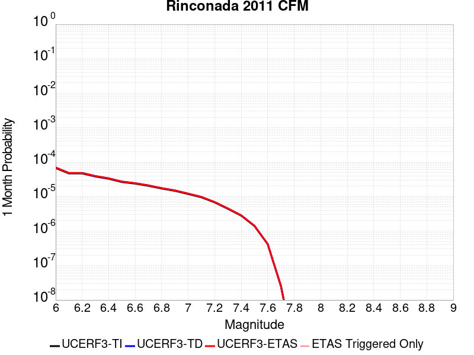 |  |  |

| Magnitude | 1 wk TI Prob | 1 wk TD Prob | 1 wk ETAS Prob | 1 wk ETAS/TD Gain | 1 wk ETAS Triggered Only | 1 mo TI Prob | 1 mo TD Prob | 1 mo ETAS Prob | 1 mo ETAS/TD Gain | 1 mo ETAS Triggered Only | 1 yr TI Prob | 1 yr TD Prob | 1 yr ETAS Prob | 1 yr ETAS/TD Gain | 1 yr ETAS Triggered Only | 10 yr TI Prob | 10 yr TD Prob | 10 yr ETAS Prob | 10 yr ETAS/TD Gain | 10 yr ETAS Triggered Only |
|-----|-----|-----|-----|-----|-----|-----|-----|-----|-----|-----|-----|-----|-----|-----|-----|-----|-----|-----|-----|-----|
| 6.0 | 1.5752368E-5 | 1.6275004E-5 | 1.6275004E-5 | 1.0 | 0.0 | 6.75084E-5 | 6.974817E-5 | 6.974817E-5 | 1.0 | 0.0 | 8.2160486E-4 | 8.4885623E-4 | 8.4885623E-4 | 1.0 | 0.0 | 0.008185739 | 0.008456519 | 0.0084763495 | 1.0023451 | 2.0E-5 |
| 6.1 | 1.0966133E-5 | 1.1323226E-5 | 1.1323226E-5 | 1.0 | 0.0 | 4.6996865E-5 | 4.8527214E-5 | 4.8527214E-5 | 1.0 | 0.0 | 5.720366E-4 | 5.906594E-4 | 5.906594E-4 | 1.0 | 0.0 | 0.0057056635 | 0.005890991 | 0.0059108734 | 1.003375 | 2.0E-5 |
| 6.2 | 1.0966133E-5 | 1.1323226E-5 | 1.1323226E-5 | 1.0 | 0.0 | 4.6996865E-5 | 4.8527214E-5 | 4.8527214E-5 | 1.0 | 0.0 | 5.720366E-4 | 5.906594E-4 | 5.906594E-4 | 1.0 | 0.0 | 0.0057056635 | 0.005890991 | 0.0059108734 | 1.003375 | 2.0E-5 |
| 6.3 | 8.926149E-6 | 9.21293E-6 | 9.21293E-6 | 1.0 | 0.0 | 3.8254362E-5 | 3.948339E-5 | 3.948339E-5 | 1.0 | 0.0 | 4.6564735E-4 | 4.8060456E-4 | 4.8060456E-4 | 1.0 | 0.0 | 0.0046467283 | 0.0047956966 | 0.004815601 | 1.0041504 | 2.0E-5 |
| 6.4 | 7.676955E-6 | 7.9203255E-6 | 7.9203255E-6 | 1.0 | 0.0 | 3.290082E-5 | 3.3943812E-5 | 3.3943812E-5 | 1.0 | 0.0 | 4.0049385E-4 | 4.1318772E-4 | 4.1318772E-4 | 1.0 | 0.0 | 0.0039977287 | 0.004124221 | 0.00413418 | 1.0024147 | 1.0E-5 |
| 6.5 | 6.1671026E-6 | 6.3590614E-6 | 6.3590614E-6 | 1.0 | 0.0 | 2.6430173E-5 | 2.7252836E-5 | 2.7252836E-5 | 1.0 | 0.0 | 3.2173982E-4 | 3.3175282E-4 | 3.3175282E-4 | 1.0 | 0.0 | 0.003212744 | 0.0033125877 | 0.0033125877 | 1.0 | 0.0 |
| 6.6 | 5.553456E-6 | 5.7249076E-6 | 5.7249076E-6 | 1.0 | 0.0 | 2.3800309E-5 | 2.4535088E-5 | 2.4535088E-5 | 1.0 | 0.0 | 2.897302E-4 | 2.986738E-4 | 2.986738E-4 | 1.0 | 0.0 | 0.0028935277 | 0.0029827326 | 0.0029827326 | 1.0 | 0.0 |
| 6.7 | 4.787857E-6 | 4.9333903E-6 | 4.9333903E-6 | 1.0 | 0.0 | 2.0519226E-5 | 2.114293E-5 | 2.114293E-5 | 1.0 | 0.0 | 2.4979294E-4 | 2.5738482E-4 | 2.5738482E-4 | 1.0 | 0.0 | 0.0024951235 | 0.002570873 | 0.002570873 | 1.0 | 0.0 |
| 6.8 | 3.9955166E-6 | 4.1135418E-6 | 4.1135418E-6 | 1.0 | 0.0 | 1.7123532E-5 | 1.7629347E-5 | 1.7629347E-5 | 1.0 | 0.0 | 2.0845905E-4 | 2.1461617E-4 | 2.1461617E-4 | 1.0 | 0.0 | 0.002082636 | 0.0021440927 | 0.0021440927 | 1.0 | 0.0 |
| 6.9 | 3.4250072E-6 | 3.522501E-6 | 3.522501E-6 | 1.0 | 0.0 | 1.46785205E-5 | 1.5096345E-5 | 1.5096345E-5 | 1.0 | 0.0 | 1.7869633E-4 | 1.8378251E-4 | 1.8378251E-4 | 1.0 | 0.0 | 0.001785527 | 0.0018363078 | 0.0018363078 | 1.0 | 0.0 |
| 7.0 | 2.7712713E-6 | 2.8467423E-6 | 2.8467423E-6 | 1.0 | 0.0 | 1.1876823E-5 | 1.22002675E-5 | 1.22002675E-5 | 1.0 | 0.0 | 1.4459073E-4 | 1.4852814E-4 | 1.4852814E-4 | 1.0 | 0.0 | 0.0014449668 | 0.0014842903 | 0.0014842903 | 1.0 | 0.0 |
| 7.1 | 2.227358E-6 | 2.2857314E-6 | 2.2857314E-6 | 1.0 | 0.0 | 9.545785E-6 | 9.7959555E-6 | 9.7959555E-6 | 1.0 | 0.0 | 1.16213734E-4 | 1.1925924E-4 | 1.1925924E-4 | 1.0 | 0.0 | 0.0011615298 | 0.0011919534 | 0.0011919534 | 1.0 | 0.0 |
| 7.2 | 1.581796E-6 | 1.6209236E-6 | 1.6209236E-6 | 1.0 | 0.0 | 6.779108E-6 | 6.9467974E-6 | 6.9467974E-6 | 1.0 | 0.0 | 8.253252E-5 | 8.457398E-5 | 8.457398E-5 | 1.0 | 0.0 | 8.250187E-4 | 8.454185E-4 | 8.454185E-4 | 1.0 | 0.0 |
| 7.3 | 1.0306567E-6 | 1.0546619E-6 | 1.0546619E-6 | 1.0 | 0.0 | 4.4170924E-6 | 4.5199718E-6 | 4.5199718E-6 | 1.0 | 0.0 | 5.3776774E-5 | 5.502927E-5 | 5.502927E-5 | 1.0 | 0.0 | 5.376376E-4 | 5.501567E-4 | 5.501567E-4 | 1.0 | 0.0 |
| 7.4 | 6.535541E-7 | 6.6828335E-7 | 6.6828335E-7 | 1.0 | 0.0 | 2.800943E-6 | 2.8640684E-6 | 2.8640684E-6 | 1.0 | 0.0 | 3.4100947E-5 | 3.4869478E-5 | 3.4869478E-5 | 1.0 | 0.0 | 3.4095717E-4 | 3.4864017E-4 | 3.4864017E-4 | 1.0 | 0.0 |
| 7.5 | 3.2656962E-7 | 3.3317164E-7 | 3.3317164E-7 | 1.0 | 0.0 | 1.3995833E-6 | 1.4278776E-6 | 1.4278776E-6 | 1.0 | 0.0 | 1.7039794E-5 | 1.738427E-5 | 1.738427E-5 | 1.0 | 0.0 | 1.7038487E-4 | 1.7382916E-4 | 1.7382916E-4 | 1.0 | 0.0 |
| 7.6 | 9.754343E-8 | 9.821144E-8 | 9.821144E-8 | 1.0 | 0.0 | 4.180432E-7 | 4.209061E-7 | 4.209061E-7 | 1.0 | 0.0 | 5.089664E-6 | 5.1245197E-6 | 5.1245197E-6 | 1.0 | 0.0 | 5.0895473E-5 | 5.1244024E-5 | 5.1244024E-5 | 1.0 | 0.0 |
| 7.7 | 6.0001453E-9 | 5.849203E-9 | 5.849203E-9 | 1.0 | 0.0 | 2.5714908E-8 | 2.5068012E-8 | 2.5068012E-8 | 1.0 | 0.0 | 3.1307894E-7 | 3.05203E-7 | 3.05203E-7 | 1.0 | 0.0 | 3.1307852E-6 | 3.0520262E-6 | 3.0520262E-6 | 1.0 | 0.0 |
| 7.8 | 7.400003E-11 | 7.465484E-11 | 7.465484E-11 | 1.0 | 0.0 | 3.171432E-10 | 3.1994918E-10 | 3.1994918E-10 | 1.0 | 0.0 | 3.861218E-9 | 3.8953814E-9 | 3.8953814E-9 | 1.0 | 0.0 | 3.861218E-8 | 3.8953814E-8 | 3.8953814E-8 | 1.0 | 0.0 |

## North Frontal  (East)
*[(top)](#table-of-contents)*

| 1 Week | 1 Month | 1 Year | 10 Year |
|-----|-----|-----|-----|
|  |  | 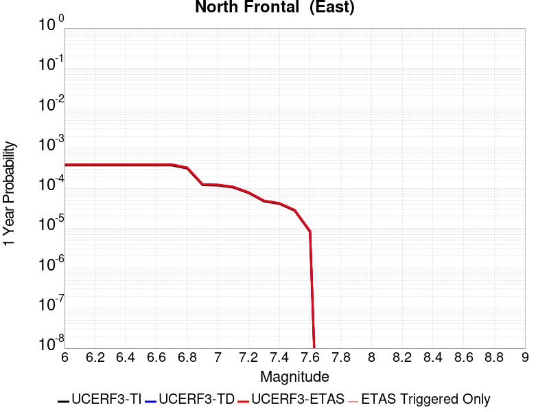 |  |

| Magnitude | 1 wk TI Prob | 1 wk TD Prob | 1 wk ETAS Prob | 1 wk ETAS/TD Gain | 1 wk ETAS Triggered Only | 1 mo TI Prob | 1 mo TD Prob | 1 mo ETAS Prob | 1 mo ETAS/TD Gain | 1 mo ETAS Triggered Only | 1 yr TI Prob | 1 yr TD Prob | 1 yr ETAS Prob | 1 yr ETAS/TD Gain | 1 yr ETAS Triggered Only | 10 yr TI Prob | 10 yr TD Prob | 10 yr ETAS Prob | 10 yr ETAS/TD Gain | 10 yr ETAS Triggered Only |
|-----|-----|-----|-----|-----|-----|-----|-----|-----|-----|-----|-----|-----|-----|-----|-----|-----|-----|-----|-----|-----|
| 6.0 | 7.135738E-6 | 7.4773666E-6 | 7.4773666E-6 | 1.0 | 0.0 | 3.0581377E-5 | 3.2045577E-5 | 3.2045577E-5 | 1.0 | 0.0 | 3.7226462E-4 | 3.9010498E-4 | 3.9010498E-4 | 1.0 | 0.0 | 0.0037164164 | 0.0038961596 | 0.003916082 | 1.0051132 | 2.0E-5 |
| 6.1 | 7.135738E-6 | 7.4773666E-6 | 7.4773666E-6 | 1.0 | 0.0 | 3.0581377E-5 | 3.2045577E-5 | 3.2045577E-5 | 1.0 | 0.0 | 3.7226462E-4 | 3.9010498E-4 | 3.9010498E-4 | 1.0 | 0.0 | 0.0037164164 | 0.0038961596 | 0.003916082 | 1.0051132 | 2.0E-5 |
| 6.2 | 7.135738E-6 | 7.4773666E-6 | 7.4773666E-6 | 1.0 | 0.0 | 3.0581377E-5 | 3.2045577E-5 | 3.2045577E-5 | 1.0 | 0.0 | 3.7226462E-4 | 3.9010498E-4 | 3.9010498E-4 | 1.0 | 0.0 | 0.0037164164 | 0.0038961596 | 0.003916082 | 1.0051132 | 2.0E-5 |
| 6.3 | 7.135738E-6 | 7.4773666E-6 | 7.4773666E-6 | 1.0 | 0.0 | 3.0581377E-5 | 3.2045577E-5 | 3.2045577E-5 | 1.0 | 0.0 | 3.7226462E-4 | 3.9010498E-4 | 3.9010498E-4 | 1.0 | 0.0 | 0.0037164164 | 0.0038961596 | 0.003916082 | 1.0051132 | 2.0E-5 |
| 6.4 | 7.135738E-6 | 7.4773666E-6 | 7.4773666E-6 | 1.0 | 0.0 | 3.0581377E-5 | 3.2045577E-5 | 3.2045577E-5 | 1.0 | 0.0 | 3.7226462E-4 | 3.9010498E-4 | 3.9010498E-4 | 1.0 | 0.0 | 0.0037164164 | 0.0038961596 | 0.003916082 | 1.0051132 | 2.0E-5 |
| 6.5 | 7.135738E-6 | 7.4773666E-6 | 7.4773666E-6 | 1.0 | 0.0 | 3.0581377E-5 | 3.2045577E-5 | 3.2045577E-5 | 1.0 | 0.0 | 3.7226462E-4 | 3.9010498E-4 | 3.9010498E-4 | 1.0 | 0.0 | 0.0037164164 | 0.0038961596 | 0.003916082 | 1.0051132 | 2.0E-5 |
| 6.6 | 7.135738E-6 | 7.4773666E-6 | 7.4773666E-6 | 1.0 | 0.0 | 3.0581377E-5 | 3.2045577E-5 | 3.2045577E-5 | 1.0 | 0.0 | 3.7226462E-4 | 3.9010498E-4 | 3.9010498E-4 | 1.0 | 0.0 | 0.0037164164 | 0.0038961596 | 0.003916082 | 1.0051132 | 2.0E-5 |
| 6.7 | 7.135738E-6 | 7.4773666E-6 | 7.4773666E-6 | 1.0 | 0.0 | 3.0581377E-5 | 3.2045577E-5 | 3.2045577E-5 | 1.0 | 0.0 | 3.7226462E-4 | 3.9010498E-4 | 3.9010498E-4 | 1.0 | 0.0 | 0.0037164164 | 0.0038961596 | 0.003916082 | 1.0051132 | 2.0E-5 |
| 6.8 | 5.959142E-6 | 6.236837E-6 | 6.236837E-6 | 1.0 | 0.0 | 2.553893E-5 | 2.672913E-5 | 2.672913E-5 | 1.0 | 0.0 | 3.108921E-4 | 3.2539663E-4 | 3.2539663E-4 | 1.0 | 0.0 | 0.0031045752 | 0.0032509752 | 0.0032709101 | 1.006132 | 2.0E-5 |
| 6.9 | 2.2946929E-6 | 2.382509E-6 | 2.382509E-6 | 1.0 | 0.0 | 9.834361E-6 | 1.0210715E-5 | 1.0210715E-5 | 1.0 | 0.0 | 1.1972676E-4 | 1.2430883E-4 | 1.2430883E-4 | 1.0 | 0.0 | 0.0011966228 | 0.0012424395 | 0.0012624146 | 1.0160774 | 2.0E-5 |
| 7.0 | 2.2468673E-6 | 2.3322007E-6 | 2.3322007E-6 | 1.0 | 0.0 | 9.629396E-6 | 9.99511E-6 | 9.99511E-6 | 1.0 | 0.0 | 1.1723159E-4 | 1.2168415E-4 | 1.2168415E-4 | 1.0 | 0.0 | 0.0011716976 | 0.0012162215 | 0.0012361972 | 1.0164244 | 2.0E-5 |
| 7.1 | 1.9921076E-6 | 2.064643E-6 | 2.064643E-6 | 1.0 | 0.0 | 8.537577E-6 | 8.848443E-6 | 8.848443E-6 | 1.0 | 0.0 | 1.0394004E-4 | 1.077249E-4 | 1.077249E-4 | 1.0 | 0.0 | 0.0010389143 | 0.0010767695 | 0.001096748 | 1.0185541 | 2.0E-5 |
| 7.2 | 1.4524545E-6 | 1.5045434E-6 | 1.5045434E-6 | 1.0 | 0.0 | 6.2247905E-6 | 6.4480287E-6 | 6.4480287E-6 | 1.0 | 0.0 | 7.5784184E-5 | 7.850217E-5 | 7.850217E-5 | 1.0 | 0.0 | 7.575835E-4 | 7.8476884E-4 | 8.0475316E-4 | 1.0254653 | 2.0E-5 |
| 7.3 | 8.9802575E-7 | 9.3089085E-7 | 9.3089085E-7 | 1.0 | 0.0 | 3.848676E-6 | 3.9895267E-6 | 3.9895267E-6 | 1.0 | 0.0 | 4.685662E-5 | 4.857152E-5 | 4.857152E-5 | 1.0 | 0.0 | 4.6846745E-4 | 4.8562037E-4 | 5.0561066E-4 | 1.0411644 | 2.0E-5 |
| 7.4 | 7.776139E-7 | 8.060631E-7 | 8.060631E-7 | 1.0 | 0.0 | 3.3326266E-6 | 3.4545521E-6 | 3.4545521E-6 | 1.0 | 0.0 | 4.0573974E-5 | 4.2058473E-5 | 4.2058473E-5 | 1.0 | 0.0 | 4.0566566E-4 | 4.205159E-4 | 4.305117E-4 | 1.0237703 | 1.0E-5 |
| 7.5 | 5.244417E-7 | 5.441328E-7 | 5.441328E-7 | 1.0 | 0.0 | 2.2476054E-6 | 2.3319958E-6 | 2.3319958E-6 | 1.0 | 0.0 | 2.7364253E-5 | 2.8391745E-5 | 2.8391745E-5 | 1.0 | 0.0 | 2.7360884E-4 | 2.838877E-4 | 2.9388486E-4 | 1.0352151 | 1.0E-5 |
| 7.6 | 1.5489647E-7 | 1.6089835E-7 | 1.6089835E-7 | 1.0 | 0.0 | 6.6384183E-7 | 6.895643E-7 | 6.895643E-7 | 1.0 | 0.0 | 8.082245E-6 | 8.395433E-6 | 8.395433E-6 | 1.0 | 0.0 | 8.08195E-5 | 8.395316E-5 | 9.3952316E-5 | 1.119104 | 1.0E-5 |

## Calaveras (Central) 2011 CFM
*[(top)](#table-of-contents)*

| 1 Week | 1 Month | 1 Year | 10 Year |
|-----|-----|-----|-----|
|  |  | 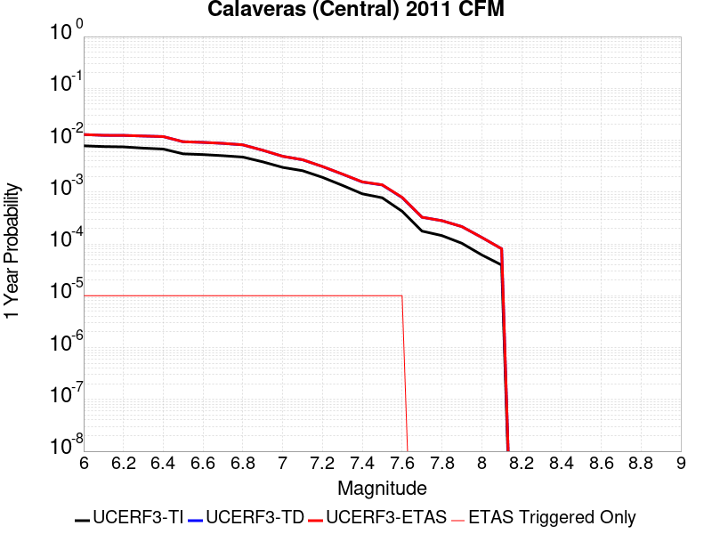 |  |

| Magnitude | 1 wk TI Prob | 1 wk TD Prob | 1 wk ETAS Prob | 1 wk ETAS/TD Gain | 1 wk ETAS Triggered Only | 1 mo TI Prob | 1 mo TD Prob | 1 mo ETAS Prob | 1 mo ETAS/TD Gain | 1 mo ETAS Triggered Only | 1 yr TI Prob | 1 yr TD Prob | 1 yr ETAS Prob | 1 yr ETAS/TD Gain | 1 yr ETAS Triggered Only | 10 yr TI Prob | 10 yr TD Prob | 10 yr ETAS Prob | 10 yr ETAS/TD Gain | 10 yr ETAS Triggered Only |
|-----|-----|-----|-----|-----|-----|-----|-----|-----|-----|-----|-----|-----|-----|-----|-----|-----|-----|-----|-----|-----|
| 6.0 | 1.5010907E-4 | 2.4819706E-4 | 2.4819706E-4 | 1.0 | 0.0 | 6.4316596E-4 | 0.001063205 | 0.001063205 | 1.0 | 0.0 | 0.0078024664 | 0.012858907 | 0.012868779 | 1.0007677 | 1.0E-5 | 0.07534136 | 0.12048197 | 0.12049077 | 1.000073 | 1.0E-5 |
| 6.1 | 1.4521465E-4 | 2.3981159E-4 | 2.3981159E-4 | 1.0 | 0.0 | 6.222001E-4 | 0.0010272958 | 0.0010272958 | 1.0 | 0.0 | 0.0075490056 | 0.012428159 | 0.012438035 | 1.0007946 | 1.0E-5 | 0.07297657 | 0.11675321 | 0.11676205 | 1.0000757 | 1.0E-5 |
| 6.2 | 1.429998E-4 | 2.391228E-4 | 2.391228E-4 | 1.0 | 0.0 | 6.127123E-4 | 0.0010243463 | 0.0010243463 | 1.0 | 0.0 | 0.007434286 | 0.012392704 | 0.01240258 | 1.0007969 | 1.0E-5 | 0.07190444 | 0.1164066 | 0.11641543 | 1.0000759 | 1.0E-5 |
| 6.3 | 1.3536277E-4 | 2.3243108E-4 | 2.3243108E-4 | 1.0 | 0.0 | 5.799972E-4 | 9.956934E-4 | 9.956934E-4 | 1.0 | 0.0 | 0.0070386264 | 0.012048675 | 0.012058554 | 1.0008199 | 1.0E-5 | 0.0681982 | 0.113317646 | 0.11332651 | 1.0000782 | 1.0E-5 |
| 6.4 | 1.2993296E-4 | 2.2666331E-4 | 2.2666331E-4 | 1.0 | 0.0 | 5.5673666E-4 | 9.7099325E-4 | 9.7099325E-4 | 1.0 | 0.0 | 0.006757223 | 0.0117513 | 0.011761182 | 1.000841 | 1.0E-5 | 0.06555412 | 0.110593975 | 0.11060287 | 1.0000805 | 1.0E-5 |
| 6.5 | 1.0498927E-4 | 1.7996559E-4 | 1.7996559E-4 | 1.0 | 0.0 | 4.498764E-4 | 7.71052E-4 | 7.71052E-4 | 1.0 | 0.0 | 0.005463498 | 0.009347059 | 0.009356966 | 1.0010599 | 1.0E-5 | 0.053311124 | 0.08927178 | 0.08928089 | 1.000102 | 1.0E-5 |
| 6.6 | 1.0157505E-4 | 1.7483841E-4 | 1.7483841E-4 | 1.0 | 0.0 | 4.35249E-4 | 7.490911E-4 | 7.490911E-4 | 1.0 | 0.0 | 0.0052862884 | 0.009081982 | 0.009091891 | 1.0010911 | 1.0E-5 | 0.05162293 | 0.08684812 | 0.08685725 | 1.0001051 | 1.0E-5 |
| 6.7 | 9.660386E-5 | 1.6742892E-4 | 1.6742892E-4 | 1.0 | 0.0 | 4.1395082E-4 | 7.173546E-4 | 7.173546E-4 | 1.0 | 0.0 | 0.0050282106 | 0.008698776 | 0.008708689 | 1.0011396 | 1.0E-5 | 0.049159497 | 0.083336994 | 0.08334616 | 1.00011 | 1.0E-5 |
| 6.8 | 9.089927E-5 | 1.5656423E-4 | 1.5656423E-4 | 1.0 | 0.0 | 3.8951015E-4 | 6.708168E-4 | 6.708168E-4 | 1.0 | 0.0 | 0.0047319788 | 0.008136575 | 0.008146494 | 1.001219 | 1.0E-5 | 0.046324775 | 0.07822998 | 0.078239195 | 1.0001178 | 1.0E-5 |
| 6.9 | 7.353187E-5 | 1.2306191E-4 | 1.2306191E-4 | 1.0 | 0.0 | 3.150985E-4 | 5.273022E-4 | 5.273022E-4 | 1.0 | 0.0 | 0.0038295772 | 0.006401127 | 0.0064110635 | 1.0015522 | 1.0E-5 | 0.037642512 | 0.062238418 | 0.062247794 | 1.0001507 | 1.0E-5 |
| 7.0 | 5.746064E-5 | 9.398813E-5 | 9.398813E-5 | 1.0 | 0.0 | 2.4623662E-4 | 4.0274445E-4 | 4.0274445E-4 | 1.0 | 0.0 | 0.0029938098 | 0.0048924605 | 0.0049024113 | 1.002034 | 1.0E-5 | 0.02953797 | 0.048034415 | 0.048043933 | 1.0001981 | 1.0E-5 |
| 7.1 | 4.9557195E-5 | 8.060119E-5 | 8.060119E-5 | 1.0 | 0.0 | 2.123707E-4 | 3.4538825E-4 | 3.4538825E-4 | 1.0 | 0.0 | 0.0025825473 | 0.004197057 | 0.004207015 | 1.0023726 | 1.0E-5 | 0.0255274 | 0.041410543 | 0.04142013 | 1.0002315 | 1.0E-5 |
| 7.2 | 3.687595E-5 | 5.9597183E-5 | 5.9597183E-5 | 1.0 | 0.0 | 1.5803022E-4 | 2.5539167E-4 | 2.5539167E-4 | 1.0 | 0.0 | 0.0019223199 | 0.0031049892 | 0.003114958 | 1.0032107 | 1.0E-5 | 0.01905776 | 0.030919215 | 0.030928906 | 1.0003134 | 1.0E-5 |
| 7.3 | 2.5846984E-5 | 4.2534713E-5 | 4.2534713E-5 | 1.0 | 0.0 | 1.1076809E-4 | 1.82279E-4 | 1.82279E-4 | 1.0 | 0.0 | 0.0013477671 | 0.0022170055 | 0.0022269834 | 1.0045006 | 1.0E-5 | 0.013396223 | 0.022206744 | 0.022216521 | 1.0004404 | 1.0E-5 |
| 7.4 | 1.7747854E-5 | 2.9968245E-5 | 2.9968245E-5 | 1.0 | 0.0 | 7.6060016E-5 | 1.2842902E-4 | 1.2842902E-4 | 1.0 | 0.0 | 9.2563726E-4 | 0.0015625048 | 0.0015724892 | 1.00639 | 1.0E-5 | 0.009217911 | 0.015725428 | 0.01573527 | 1.000626 | 1.0E-5 |
| 7.5 | 1.4883479E-5 | 2.6273883E-5 | 2.6273883E-5 | 1.0 | 0.0 | 6.378478E-5 | 1.1259751E-4 | 1.1259751E-4 | 1.0 | 0.0 | 7.76303E-4 | 0.0013700153 | 0.0013800017 | 1.0072892 | 1.0E-5 | 0.0077359667 | 0.01381797 | 0.0138278315 | 1.0007137 | 1.0E-5 |
| 7.6 | 8.166975E-6 | 1.4987666E-5 | 1.4987666E-5 | 1.0 | 0.0 | 3.5000852E-5 | 6.423128E-5 | 6.423128E-5 | 1.0 | 0.0 | 4.2605202E-4 | 7.8173657E-4 | 7.9172873E-4 | 1.012782 | 1.0E-5 | 0.004252361 | 0.007952956 | 0.007962876 | 1.0012474 | 1.0E-5 |
| 7.7 | 3.3858064E-6 | 6.2680556E-6 | 6.2680556E-6 | 1.0 | 0.0 | 1.4510518E-5 | 2.686282E-5 | 2.686282E-5 | 1.0 | 0.0 | 1.7665124E-4 | 3.2700578E-4 | 3.2700578E-4 | 1.0 | 0.0 | 0.0017651088 | 0.0033953558 | 0.0033953558 | 1.0 | 0.0 |
| 7.8 | 2.7721615E-6 | 5.3785216E-6 | 5.3785216E-6 | 1.0 | 0.0 | 1.1880637E-5 | 2.3050603E-5 | 2.3050603E-5 | 1.0 | 0.0 | 1.4463716E-4 | 2.8060502E-4 | 2.8060502E-4 | 1.0 | 0.0 | 0.0014454306 | 0.002913498 | 0.002913498 | 1.0 | 0.0 |
| 7.9 | 1.9736292E-6 | 4.1373296E-6 | 4.1373296E-6 | 1.0 | 0.0 | 8.4583835E-6 | 1.7731292E-5 | 1.7731292E-5 | 1.0 | 0.0 | 1.0297595E-4 | 2.1585713E-4 | 2.1585713E-4 | 1.0 | 0.0 | 0.0010292825 | 0.0022279534 | 0.0022279534 | 1.0 | 0.0 |
| 8.0 | 1.1767289E-6 | 2.5597071E-6 | 2.5597071E-6 | 1.0 | 0.0 | 5.0431145E-6 | 1.0970128E-5 | 1.0970128E-5 | 1.0 | 0.0 | 6.139818E-5 | 1.3355314E-4 | 1.3355314E-4 | 1.0 | 0.0 | 6.1381224E-4 | 0.0013686379 | 0.0013686379 | 1.0 | 0.0 |
| 8.1 | 7.5112825E-7 | 1.5440835E-6 | 1.5440835E-6 | 1.0 | 0.0 | 3.2191172E-6 | 6.617484E-6 | 6.617484E-6 | 1.0 | 0.0 | 3.9192048E-5 | 8.056491E-5 | 8.056491E-5 | 1.0 | 0.0 | 3.9185135E-4 | 8.25079E-4 | 8.25079E-4 | 1.0 | 0.0 |

## Emerson-Copper Mtn 2011
*[(top)](#table-of-contents)*

| 1 Week | 1 Month | 1 Year | 10 Year |
|-----|-----|-----|-----|
|  |  |  | 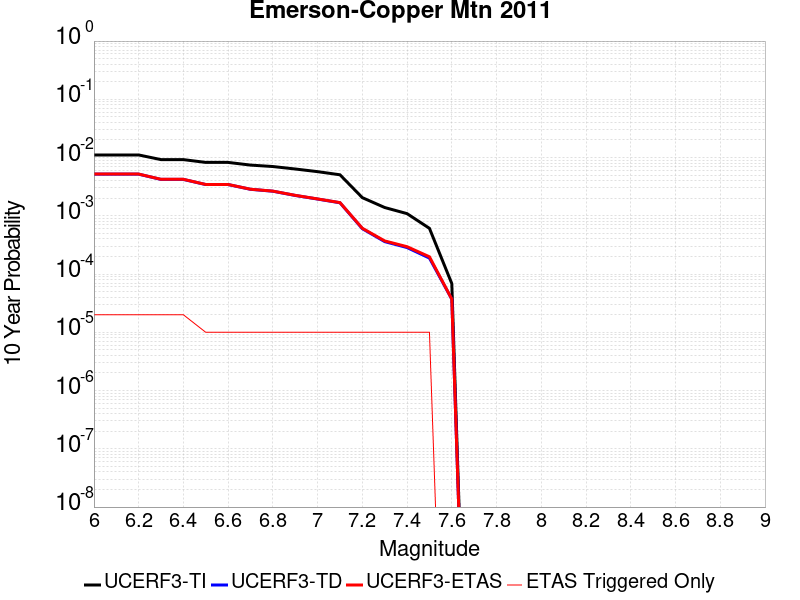 |

| Magnitude | 1 wk TI Prob | 1 wk TD Prob | 1 wk ETAS Prob | 1 wk ETAS/TD Gain | 1 wk ETAS Triggered Only | 1 mo TI Prob | 1 mo TD Prob | 1 mo ETAS Prob | 1 mo ETAS/TD Gain | 1 mo ETAS Triggered Only | 1 yr TI Prob | 1 yr TD Prob | 1 yr ETAS Prob | 1 yr ETAS/TD Gain | 1 yr ETAS Triggered Only | 10 yr TI Prob | 10 yr TD Prob | 10 yr ETAS Prob | 10 yr ETAS/TD Gain | 10 yr ETAS Triggered Only |
|-----|-----|-----|-----|-----|-----|-----|-----|-----|-----|-----|-----|-----|-----|-----|-----|-----|-----|-----|-----|-----|
| 6.0 | 2.1364202E-5 | 9.968862E-6 | 9.968862E-6 | 1.0 | 0.0 | 9.1557646E-5 | 4.2723044E-5 | 4.2723044E-5 | 1.0 | 0.0 | 0.0011141442 | 5.2003766E-4 | 5.3003244E-4 | 1.0192194 | 1.0E-5 | 0.011085749 | 0.005189077 | 0.0052089733 | 1.0038342 | 2.0E-5 |
| 6.1 | 2.1364202E-5 | 9.968862E-6 | 9.968862E-6 | 1.0 | 0.0 | 9.1557646E-5 | 4.2723044E-5 | 4.2723044E-5 | 1.0 | 0.0 | 0.0011141442 | 5.2003766E-4 | 5.3003244E-4 | 1.0192194 | 1.0E-5 | 0.011085749 | 0.005189077 | 0.0052089733 | 1.0038342 | 2.0E-5 |
| 6.2 | 2.1364202E-5 | 9.968862E-6 | 9.968862E-6 | 1.0 | 0.0 | 9.1557646E-5 | 4.2723044E-5 | 4.2723044E-5 | 1.0 | 0.0 | 0.0011141442 | 5.2003766E-4 | 5.3003244E-4 | 1.0192194 | 1.0E-5 | 0.011085749 | 0.005189077 | 0.0052089733 | 1.0038342 | 2.0E-5 |
| 6.3 | 1.7751237E-5 | 8.0898735E-6 | 8.0898735E-6 | 1.0 | 0.0 | 7.607452E-5 | 3.467046E-5 | 3.467046E-5 | 1.0 | 0.0 | 9.258136E-4 | 4.2203735E-4 | 4.3203315E-4 | 1.0236846 | 1.0E-5 | 0.00921966 | 0.0042129816 | 0.004232897 | 1.0047272 | 2.0E-5 |
| 6.4 | 1.7751237E-5 | 8.0898735E-6 | 8.0898735E-6 | 1.0 | 0.0 | 7.607452E-5 | 3.467046E-5 | 3.467046E-5 | 1.0 | 0.0 | 9.258136E-4 | 4.2203735E-4 | 4.3203315E-4 | 1.0236846 | 1.0E-5 | 0.00921966 | 0.0042129816 | 0.004232897 | 1.0047272 | 2.0E-5 |
| 6.5 | 1.5886664E-5 | 6.604355E-6 | 6.604355E-6 | 1.0 | 0.0 | 6.808392E-5 | 2.8304097E-5 | 2.8304097E-5 | 1.0 | 0.0 | 8.286065E-4 | 3.445526E-4 | 3.445526E-4 | 1.0 | 0.0 | 0.008255237 | 0.003440648 | 0.0034506137 | 1.0028964 | 1.0E-5 |
| 6.6 | 1.5886664E-5 | 6.604355E-6 | 6.604355E-6 | 1.0 | 0.0 | 6.808392E-5 | 2.8304097E-5 | 2.8304097E-5 | 1.0 | 0.0 | 8.286065E-4 | 3.445526E-4 | 3.445526E-4 | 1.0 | 0.0 | 0.008255237 | 0.003440648 | 0.0034506137 | 1.0028964 | 1.0E-5 |
| 6.7 | 1.428471E-5 | 5.47086E-6 | 5.47086E-6 | 1.0 | 0.0 | 6.121875E-5 | 2.3446355E-5 | 2.3446355E-5 | 1.0 | 0.0 | 7.450834E-4 | 2.8542592E-4 | 2.8542592E-4 | 1.0 | 0.0 | 0.007425902 | 0.0028509812 | 0.0028609526 | 1.0034976 | 1.0E-5 |
| 6.8 | 1.3490684E-5 | 5.0741232E-6 | 5.0741232E-6 | 1.0 | 0.0 | 5.7815934E-5 | 2.1746082E-5 | 2.1746082E-5 | 1.0 | 0.0 | 7.0368167E-4 | 2.6473025E-4 | 2.6473025E-4 | 1.0 | 0.0 | 0.007014576 | 0.00264453 | 0.0026545036 | 1.0037714 | 1.0E-5 |
| 6.9 | 1.2235421E-5 | 4.29004E-6 | 4.29004E-6 | 1.0 | 0.0 | 5.2436466E-5 | 1.8385777E-5 | 1.8385777E-5 | 1.0 | 0.0 | 6.38227E-4 | 2.2382745E-4 | 2.2382745E-4 | 1.0 | 0.0 | 0.0063639707 | 0.0022363744 | 0.0022463521 | 1.0044615 | 1.0E-5 |
| 7.0 | 1.1009851E-5 | 3.7193186E-6 | 3.7193186E-6 | 1.0 | 0.0 | 4.7184225E-5 | 1.5939859E-5 | 1.5939859E-5 | 1.0 | 0.0 | 5.743165E-4 | 1.9405394E-4 | 1.9405394E-4 | 1.0 | 0.0 | 0.005728345 | 0.0019391828 | 0.0019491634 | 1.0051469 | 1.0E-5 |
| 7.1 | 9.726373E-6 | 3.212039E-6 | 3.212039E-6 | 1.0 | 0.0 | 4.168379E-5 | 1.3765828E-5 | 1.3765828E-5 | 1.0 | 0.0 | 5.07382E-4 | 1.6758945E-4 | 1.6758945E-4 | 1.0 | 0.0 | 0.0050622504 | 0.0016749619 | 0.0016849452 | 1.0059602 | 1.0E-5 |
| 7.2 | 3.9335127E-6 | 1.1525179E-6 | 1.1525179E-6 | 1.0 | 0.0 | 1.6857803E-5 | 4.9393534E-6 | 4.9393534E-6 | 1.0 | 0.0 | 2.0522442E-4 | 6.013503E-5 | 6.013503E-5 | 1.0 | 0.0 | 0.00205035 | 6.011935E-4 | 6.111875E-4 | 1.0166236 | 1.0E-5 |
| 7.3 | 2.661632E-6 | 6.91165E-7 | 6.91165E-7 | 1.0 | 0.0 | 1.14069435E-5 | 2.9621324E-6 | 2.9621324E-6 | 1.0 | 0.0 | 1.3887069E-4 | 3.6063375E-5 | 3.6063375E-5 | 1.0 | 0.0 | 0.0013878393 | 3.6057626E-4 | 3.7057267E-4 | 1.0277234 | 1.0E-5 |
| 7.4 | 2.0893426E-6 | 5.461979E-7 | 5.461979E-7 | 1.0 | 0.0 | 8.954295E-6 | 2.340846E-6 | 2.340846E-6 | 1.0 | 0.0 | 1.0901308E-4 | 2.8499433E-5 | 2.8499433E-5 | 1.0 | 0.0 | 0.0010895962 | 2.8495834E-4 | 2.9495548E-4 | 1.0350828 | 1.0E-5 |
| 7.5 | 1.1681728E-6 | 3.6031344E-7 | 3.6031344E-7 | 1.0 | 0.0 | 5.0064455E-6 | 1.5441996E-6 | 1.5441996E-6 | 1.0 | 0.0 | 6.0951766E-5 | 1.8800472E-5 | 1.8800472E-5 | 1.0 | 0.0 | 6.093505E-4 | 1.8798928E-4 | 1.979874E-4 | 1.0531845 | 1.0E-5 |
| 7.6 | 1.3154387E-7 | 7.119929E-8 | 7.119929E-8 | 1.0 | 0.0 | 5.6375933E-7 | 3.0513976E-7 | 3.0513976E-7 | 1.0 | 0.0 | 6.863748E-6 | 3.715072E-6 | 3.715072E-6 | 1.0 | 0.0 | 6.863536E-5 | 3.7150257E-5 | 3.7150257E-5 | 1.0 | 0.0 |

## San Andreas (Santa Cruz Mts) 2011 CFM
*[(top)](#table-of-contents)*

| 1 Week | 1 Month | 1 Year | 10 Year |
|-----|-----|-----|-----|
|  |  |  |  |

| Magnitude | 1 wk TI Prob | 1 wk TD Prob | 1 wk ETAS Prob | 1 wk ETAS/TD Gain | 1 wk ETAS Triggered Only | 1 mo TI Prob | 1 mo TD Prob | 1 mo ETAS Prob | 1 mo ETAS/TD Gain | 1 mo ETAS Triggered Only | 1 yr TI Prob | 1 yr TD Prob | 1 yr ETAS Prob | 1 yr ETAS/TD Gain | 1 yr ETAS Triggered Only | 10 yr TI Prob | 10 yr TD Prob | 10 yr ETAS Prob | 10 yr ETAS/TD Gain | 10 yr ETAS Triggered Only |
|-----|-----|-----|-----|-----|-----|-----|-----|-----|-----|-----|-----|-----|-----|-----|-----|-----|-----|-----|-----|-----|
| 6.0 | 1.7221631E-4 | 1.3823033E-4 | 1.3823033E-4 | 1.0 | 0.0 | 7.378611E-4 | 5.922832E-4 | 5.922832E-4 | 1.0 | 0.0 | 0.008946515 | 0.0071875807 | 0.007197509 | 1.0013813 | 1.0E-5 | 0.08594794 | 0.07068555 | 0.07070414 | 1.000263 | 2.0E-5 |
| 6.1 | 1.7221631E-4 | 1.3823033E-4 | 1.3823033E-4 | 1.0 | 0.0 | 7.378611E-4 | 5.922832E-4 | 5.922832E-4 | 1.0 | 0.0 | 0.008946515 | 0.0071875807 | 0.007197509 | 1.0013813 | 1.0E-5 | 0.08594794 | 0.07068555 | 0.07070414 | 1.000263 | 2.0E-5 |
| 6.2 | 1.7221631E-4 | 1.3823033E-4 | 1.3823033E-4 | 1.0 | 0.0 | 7.378611E-4 | 5.922832E-4 | 5.922832E-4 | 1.0 | 0.0 | 0.008946515 | 0.0071875807 | 0.007197509 | 1.0013813 | 1.0E-5 | 0.08594794 | 0.07068555 | 0.07070414 | 1.000263 | 2.0E-5 |
| 6.3 | 1.716926E-4 | 1.374243E-4 | 1.374243E-4 | 1.0 | 0.0 | 7.3561794E-4 | 5.888304E-4 | 5.888304E-4 | 1.0 | 0.0 | 0.008919428 | 0.0071458183 | 0.0071557467 | 1.0013894 | 1.0E-5 | 0.08569809 | 0.070297346 | 0.07031594 | 1.0002645 | 2.0E-5 |
| 6.4 | 1.6392978E-4 | 1.361796E-4 | 1.361796E-4 | 1.0 | 0.0 | 7.02367E-4 | 5.8349833E-4 | 5.8349833E-4 | 1.0 | 0.0 | 0.008517839 | 0.0070813233 | 0.007091252 | 1.0014021 | 1.0E-5 | 0.08198654 | 0.06952924 | 0.069547854 | 1.0002676 | 2.0E-5 |
| 6.5 | 1.5742714E-4 | 1.2677119E-4 | 1.2677119E-4 | 1.0 | 0.0 | 6.745133E-4 | 5.4319366E-4 | 5.4319366E-4 | 1.0 | 0.0 | 0.00818132 | 0.006593639 | 0.006603573 | 1.0015066 | 1.0E-5 | 0.078865945 | 0.06499287 | 0.06501156 | 1.0002878 | 2.0E-5 |
| 6.6 | 1.3038084E-4 | 1.1615326E-4 | 1.1615326E-4 | 1.0 | 0.0 | 5.5865536E-4 | 4.97706E-4 | 4.97706E-4 | 1.0 | 0.0 | 0.006780438 | 0.0060429615 | 0.006052901 | 1.0016448 | 1.0E-5 | 0.0657725 | 0.059452403 | 0.059471212 | 1.0003164 | 2.0E-5 |
| 6.7 | 1.2867592E-4 | 1.1341684E-4 | 1.1341684E-4 | 1.0 | 0.0 | 5.5135164E-4 | 4.859829E-4 | 4.859829E-4 | 1.0 | 0.0 | 0.0066920654 | 0.005901013 | 0.005910954 | 1.0016847 | 1.0E-5 | 0.06494093 | 0.058162734 | 0.058181573 | 1.0003239 | 2.0E-5 |
| 6.8 | 1.2801298E-4 | 1.1279208E-4 | 1.1279208E-4 | 1.0 | 0.0 | 5.485117E-4 | 4.8330633E-4 | 4.8330633E-4 | 1.0 | 0.0 | 0.0066577005 | 0.0058686184 | 0.00587856 | 1.001694 | 1.0E-5 | 0.06461738 | 0.057876524 | 0.057895366 | 1.0003256 | 2.0E-5 |
| 6.9 | 1.269149E-4 | 1.11213E-4 | 1.11213E-4 | 1.0 | 0.0 | 5.4380763E-4 | 4.7654135E-4 | 4.7654135E-4 | 1.0 | 0.0 | 0.006600777 | 0.005786695 | 0.0057966374 | 1.001718 | 1.0E-5 | 0.06408122 | 0.05714789 | 0.057166748 | 1.00033 | 2.0E-5 |
| 7.0 | 1.2030331E-4 | 1.085109E-4 | 1.085109E-4 | 1.0 | 0.0 | 5.154837E-4 | 4.649651E-4 | 4.649651E-4 | 1.0 | 0.0 | 0.006257969 | 0.005646493 | 0.0056564366 | 1.001761 | 1.0E-5 | 0.06084648 | 0.05581902 | 0.055837903 | 1.0003383 | 2.0E-5 |
| 7.1 | 8.049617E-5 | 5.4112494E-5 | 5.4112494E-5 | 1.0 | 0.0 | 3.4493793E-4 | 2.3189027E-4 | 2.3189027E-4 | 1.0 | 0.0 | 0.0041915346 | 0.0028196438 | 0.0028296157 | 1.0035366 | 1.0E-5 | 0.041133516 | 0.029710831 | 0.029730238 | 1.0006531 | 2.0E-5 |
| 7.2 | 7.093979E-5 | 4.3101376E-5 | 4.3101376E-5 | 1.0 | 0.0 | 3.0399222E-4 | 1.8470723E-4 | 1.8470723E-4 | 1.0 | 0.0 | 0.0036948253 | 0.0022465142 | 0.0022564917 | 1.0044414 | 1.0E-5 | 0.03633994 | 0.024023062 | 0.02404258 | 1.0008125 | 2.0E-5 |
| 7.3 | 6.193693E-5 | 2.9015144E-5 | 2.9015144E-5 | 1.0 | 0.0 | 2.6541698E-4 | 1.2434469E-4 | 1.2434469E-4 | 1.0 | 0.0 | 0.0032266637 | 0.0015128471 | 0.001522832 | 1.0066 | 1.0E-5 | 0.031802133 | 0.016562603 | 0.016582273 | 1.0011876 | 2.0E-5 |
| 7.4 | 5.906492E-5 | 2.7132985E-5 | 2.7132985E-5 | 1.0 | 0.0 | 2.5311083E-4 | 1.1627904E-4 | 1.1627904E-4 | 1.0 | 0.0 | 0.0030772698 | 0.0014147795 | 0.0014247653 | 1.0070583 | 1.0E-5 | 0.030350044 | 0.015529016 | 0.015548705 | 1.0012679 | 2.0E-5 |
| 7.5 | 5.424296E-5 | 2.4772991E-5 | 2.4772991E-5 | 1.0 | 0.0 | 2.324491E-4 | 1.0616565E-4 | 1.0616565E-4 | 1.0 | 0.0 | 0.002826395 | 0.0012918016 | 0.0013017886 | 1.0077311 | 1.0E-5 | 0.027907165 | 0.014213656 | 0.014233372 | 1.0013871 | 2.0E-5 |
| 7.6 | 4.43084E-5 | 1.9968573E-5 | 1.9968573E-5 | 1.0 | 0.0 | 1.8987931E-4 | 8.557679E-5 | 8.557679E-5 | 1.0 | 0.0 | 0.0023093296 | 0.0010413997 | 0.0010513893 | 1.0095924 | 1.0E-5 | 0.022854783 | 0.011447506 | 0.011467277 | 1.0017271 | 2.0E-5 |
| 7.7 | 4.118098E-5 | 1.8996907E-5 | 1.8996907E-5 | 1.0 | 0.0 | 1.7647797E-4 | 8.141278E-5 | 8.141278E-5 | 1.0 | 0.0 | 0.002146502 | 9.9075E-4 | 9.9075E-4 | 1.0 | 0.0 | 0.021258866 | 0.010903266 | 0.010913158 | 1.0009072 | 1.0E-5 |
| 7.8 | 3.5408906E-5 | 1.8623094E-5 | 1.8623094E-5 | 1.0 | 0.0 | 1.5174363E-4 | 7.9810816E-5 | 7.9810816E-5 | 1.0 | 0.0 | 0.0018459131 | 9.712638E-4 | 9.712638E-4 | 1.0 | 0.0 | 0.018306552 | 0.010683734 | 0.010693627 | 1.000926 | 1.0E-5 |
| 7.9 | 2.5860836E-5 | 1.7369108E-5 | 1.7369108E-5 | 1.0 | 0.0 | 1.10827445E-4 | 7.443691E-5 | 7.443691E-5 | 1.0 | 0.0 | 0.001348489 | 9.058928E-4 | 9.058928E-4 | 1.0 | 0.0 | 0.013403354 | 0.009936054 | 0.009945955 | 1.0009965 | 1.0E-5 |
| 8.0 | 1.9777332E-5 | 1.48851705E-5 | 1.48851705E-5 | 1.0 | 0.0 | 8.4757245E-5 | 6.379203E-5 | 6.379203E-5 | 1.0 | 0.0 | 0.0010314309 | 7.763914E-4 | 7.763914E-4 | 1.0 | 0.0 | 0.010266567 | 0.008533524 | 0.008543439 | 1.0011618 | 1.0E-5 |
| 8.1 | 1.468494E-5 | 1.2144859E-5 | 1.2144859E-5 | 1.0 | 0.0 | 6.293394E-5 | 5.204836E-5 | 5.204836E-5 | 1.0 | 0.0 | 7.6595135E-4 | 6.335047E-4 | 6.335047E-4 | 1.0 | 0.0 | 0.0076331664 | 0.006989243 | 0.0069991727 | 1.0014207 | 1.0E-5 |
| 8.2 | 8.63836E-6 | 5.4882034E-6 | 5.4882034E-6 | 1.0 | 0.0 | 3.7021015E-5 | 2.352066E-5 | 2.352066E-5 | 1.0 | 0.0 | 4.5063766E-4 | 2.8632648E-4 | 2.8632648E-4 | 1.0 | 0.0 | 0.004497249 | 0.0032561985 | 0.0032561985 | 1.0 | 0.0 |
| 8.3 | 1.983087E-6 | 7.690063E-7 | 7.690063E-7 | 1.0 | 0.0 | 8.498917E-6 | 3.295737E-6 | 3.295737E-6 | 1.0 | 0.0 | 1.034694E-4 | 4.012488E-5 | 4.012488E-5 | 1.0 | 0.0 | 0.0010342124 | 4.737206E-4 | 4.737206E-4 | 1.0 | 0.0 |

## Ventura-Pitas Point
*[(top)](#table-of-contents)*

| 1 Week | 1 Month | 1 Year | 10 Year |
|-----|-----|-----|-----|
|  | 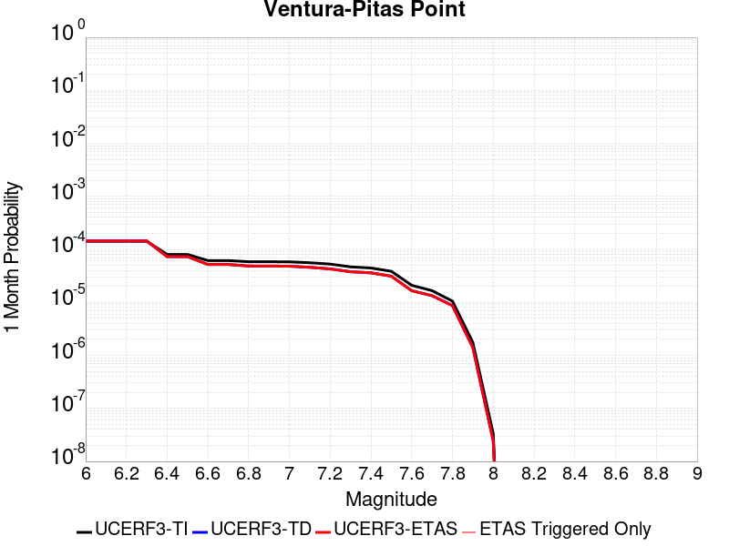 |  |  |

| Magnitude | 1 wk TI Prob | 1 wk TD Prob | 1 wk ETAS Prob | 1 wk ETAS/TD Gain | 1 wk ETAS Triggered Only | 1 mo TI Prob | 1 mo TD Prob | 1 mo ETAS Prob | 1 mo ETAS/TD Gain | 1 mo ETAS Triggered Only | 1 yr TI Prob | 1 yr TD Prob | 1 yr ETAS Prob | 1 yr ETAS/TD Gain | 1 yr ETAS Triggered Only | 10 yr TI Prob | 10 yr TD Prob | 10 yr ETAS Prob | 10 yr ETAS/TD Gain | 10 yr ETAS Triggered Only |
|-----|-----|-----|-----|-----|-----|-----|-----|-----|-----|-----|-----|-----|-----|-----|-----|-----|-----|-----|-----|-----|
| 6.0 | 3.3179622E-5 | 3.3739056E-5 | 3.3739056E-5 | 1.0 | 0.0 | 1.4219063E-4 | 1.445894E-4 | 1.445894E-4 | 1.0 | 0.0 | 0.0017297962 | 0.0017592113 | 0.0017592113 | 1.0 | 0.0 | 0.017163932 | 0.017478276 | 0.017488101 | 1.0005622 | 1.0E-5 |
| 6.1 | 3.3179622E-5 | 3.3739056E-5 | 3.3739056E-5 | 1.0 | 0.0 | 1.4219063E-4 | 1.445894E-4 | 1.445894E-4 | 1.0 | 0.0 | 0.0017297962 | 0.0017592113 | 0.0017592113 | 1.0 | 0.0 | 0.017163932 | 0.017478276 | 0.017488101 | 1.0005622 | 1.0E-5 |
| 6.2 | 3.3179622E-5 | 3.3739056E-5 | 3.3739056E-5 | 1.0 | 0.0 | 1.4219063E-4 | 1.445894E-4 | 1.445894E-4 | 1.0 | 0.0 | 0.0017297962 | 0.0017592113 | 0.0017592113 | 1.0 | 0.0 | 0.017163932 | 0.017478276 | 0.017488101 | 1.0005622 | 1.0E-5 |
| 6.3 | 3.3179622E-5 | 3.3739056E-5 | 3.3739056E-5 | 1.0 | 0.0 | 1.4219063E-4 | 1.445894E-4 | 1.445894E-4 | 1.0 | 0.0 | 0.0017297962 | 0.0017592113 | 0.0017592113 | 1.0 | 0.0 | 0.017163932 | 0.017478276 | 0.017488101 | 1.0005622 | 1.0E-5 |
| 6.4 | 1.8754668E-5 | 1.7022052E-5 | 1.7022052E-5 | 1.0 | 0.0 | 8.037467E-5 | 7.294974E-5 | 7.294974E-5 | 1.0 | 0.0 | 9.781223E-4 | 8.878243E-4 | 8.878243E-4 | 1.0 | 0.0 | 0.009738282 | 0.008845002 | 0.008854914 | 1.0011206 | 1.0E-5 |
| 6.5 | 1.8754668E-5 | 1.7022052E-5 | 1.7022052E-5 | 1.0 | 0.0 | 8.037467E-5 | 7.294974E-5 | 7.294974E-5 | 1.0 | 0.0 | 9.781223E-4 | 8.878243E-4 | 8.878243E-4 | 1.0 | 0.0 | 0.009738282 | 0.008845002 | 0.008854914 | 1.0011206 | 1.0E-5 |
| 6.6 | 1.4361558E-5 | 1.21244175E-5 | 1.21244175E-5 | 1.0 | 0.0 | 6.154808E-5 | 5.1960767E-5 | 5.1960767E-5 | 1.0 | 0.0 | 7.490902E-4 | 6.32441E-4 | 6.32441E-4 | 1.0 | 0.0 | 0.0074657016 | 0.0063065602 | 0.006316497 | 1.0015757 | 1.0E-5 |
| 6.7 | 1.4361558E-5 | 1.21244175E-5 | 1.21244175E-5 | 1.0 | 0.0 | 6.154808E-5 | 5.1960767E-5 | 5.1960767E-5 | 1.0 | 0.0 | 7.490902E-4 | 6.32441E-4 | 6.32441E-4 | 1.0 | 0.0 | 0.0074657016 | 0.0063065602 | 0.006316497 | 1.0015757 | 1.0E-5 |
| 6.8 | 1.3663846E-5 | 1.1346513E-5 | 1.1346513E-5 | 1.0 | 0.0 | 5.8558027E-5 | 4.862702E-5 | 4.862702E-5 | 1.0 | 0.0 | 7.127108E-4 | 5.9187505E-4 | 5.9187505E-4 | 1.0 | 0.0 | 0.007104293 | 0.0059030945 | 0.0059130355 | 1.0016841 | 1.0E-5 |
| 6.9 | 1.3644157E-5 | 1.1324612E-5 | 1.1324612E-5 | 1.0 | 0.0 | 5.8473648E-5 | 4.8533162E-5 | 4.8533162E-5 | 1.0 | 0.0 | 7.116841E-4 | 5.9073296E-4 | 5.9073296E-4 | 1.0 | 0.0 | 0.007094092 | 0.0058917343 | 0.005901675 | 1.0016873 | 1.0E-5 |
| 7.0 | 1.3568845E-5 | 1.1244173E-5 | 1.1244173E-5 | 1.0 | 0.0 | 5.8150898E-5 | 4.8188434E-5 | 4.8188434E-5 | 1.0 | 0.0 | 7.077572E-4 | 5.8653817E-4 | 5.8653817E-4 | 1.0 | 0.0 | 0.007055073 | 0.0058500078 | 0.0058599496 | 1.0016994 | 1.0E-5 |
| 7.1 | 1.306572E-5 | 1.07225915E-5 | 1.07225915E-5 | 1.0 | 0.0 | 5.599474E-5 | 4.5953166E-5 | 4.5953166E-5 | 1.0 | 0.0 | 6.815227E-4 | 5.59338E-4 | 5.59338E-4 | 1.0 | 0.0 | 0.0067943637 | 0.0055793985 | 0.0055893427 | 1.0017823 | 1.0E-5 |
| 7.2 | 1.232604E-5 | 9.997138E-6 | 9.997138E-6 | 1.0 | 0.0 | 5.2824813E-5 | 4.284418E-5 | 4.284418E-5 | 1.0 | 0.0 | 6.429523E-4 | 5.2150484E-4 | 5.2150484E-4 | 1.0 | 0.0 | 0.0064109527 | 0.0052028936 | 0.0052128416 | 1.001912 | 1.0E-5 |
| 7.3 | 1.0917261E-5 | 8.844401E-6 | 8.844401E-6 | 1.0 | 0.0 | 4.678742E-5 | 3.7904032E-5 | 3.7904032E-5 | 1.0 | 0.0 | 5.69488E-4 | 4.6138544E-4 | 4.6138544E-4 | 1.0 | 0.0 | 0.0056803077 | 0.0046043326 | 0.0046142866 | 1.0021619 | 1.0E-5 |
| 7.4 | 1.039959E-5 | 8.424092E-6 | 8.424092E-6 | 1.0 | 0.0 | 4.456891E-5 | 3.610276E-5 | 3.610276E-5 | 1.0 | 0.0 | 5.424914E-4 | 4.3946397E-4 | 4.3946397E-4 | 1.0 | 0.0 | 0.0054116896 | 0.004386002 | 0.0043959585 | 1.00227 | 1.0E-5 |
| 7.5 | 9.015877E-6 | 7.297917E-6 | 7.297917E-6 | 1.0 | 0.0 | 3.86389E-5 | 3.127642E-5 | 3.127642E-5 | 1.0 | 0.0 | 4.7032707E-4 | 3.8072528E-4 | 3.8072528E-4 | 1.0 | 0.0 | 0.004693329 | 0.003800768 | 0.0038107298 | 1.002621 | 1.0E-5 |
| 7.6 | 4.900162E-6 | 3.8742764E-6 | 3.8742764E-6 | 1.0 | 0.0 | 2.1000526E-5 | 1.6603937E-5 | 1.6603937E-5 | 1.0 | 0.0 | 2.556514E-4 | 2.0213432E-4 | 2.0213432E-4 | 1.0 | 0.0 | 0.0025535747 | 0.0020195183 | 0.002029498 | 1.0049417 | 1.0E-5 |
| 7.7 | 3.8850626E-6 | 3.12688E-6 | 3.12688E-6 | 1.0 | 0.0 | 1.6650163E-5 | 1.3400846E-5 | 1.3400846E-5 | 1.0 | 0.0 | 2.0269687E-4 | 1.6314318E-4 | 1.6314318E-4 | 1.0 | 0.0 | 0.002025121 | 0.0016302434 | 0.001640227 | 1.006124 | 1.0E-5 |
| 7.8 | 2.4654719E-6 | 2.0299744E-6 | 2.0299744E-6 | 1.0 | 0.0 | 1.0566265E-5 | 8.699862E-6 | 8.699862E-6 | 1.0 | 0.0 | 1.2863669E-4 | 1.05915715E-4 | 1.05915715E-4 | 1.0 | 0.0 | 0.0012856225 | 0.0010586571 | 0.0010686464 | 1.0094359 | 1.0E-5 |
| 7.9 | 4.095894E-7 | 3.2766198E-7 | 3.2766198E-7 | 1.0 | 0.0 | 1.7553821E-6 | 1.4042649E-6 | 1.4042649E-6 | 1.0 | 0.0 | 2.1371567E-5 | 1.7096794E-5 | 1.7096794E-5 | 1.0 | 0.0 | 2.1369511E-4 | 1.709551E-4 | 1.709551E-4 | 1.0 | 0.0 |
| 8.0 | 7.791402E-9 | 5.6839005E-9 | 5.6839005E-9 | 1.0 | 0.0 | 3.3391725E-8 | 2.4359574E-8 | 2.4359574E-8 | 1.0 | 0.0 | 4.0654416E-7 | 2.9657778E-7 | 2.9657778E-7 | 1.0 | 0.0 | 4.065434E-6 | 2.965776E-6 | 2.965776E-6 | 1.0 | 0.0 |

## Los Osos 2011
*[(top)](#table-of-contents)*

| 1 Week | 1 Month | 1 Year | 10 Year |
|-----|-----|-----|-----|
|  |  |  |  |

| Magnitude | 1 wk TI Prob | 1 wk TD Prob | 1 wk ETAS Prob | 1 wk ETAS/TD Gain | 1 wk ETAS Triggered Only | 1 mo TI Prob | 1 mo TD Prob | 1 mo ETAS Prob | 1 mo ETAS/TD Gain | 1 mo ETAS Triggered Only | 1 yr TI Prob | 1 yr TD Prob | 1 yr ETAS Prob | 1 yr ETAS/TD Gain | 1 yr ETAS Triggered Only | 10 yr TI Prob | 10 yr TD Prob | 10 yr ETAS Prob | 10 yr ETAS/TD Gain | 10 yr ETAS Triggered Only |
|-----|-----|-----|-----|-----|-----|-----|-----|-----|-----|-----|-----|-----|-----|-----|-----|-----|-----|-----|-----|-----|
| 6.0 | 4.8871775E-6 | 4.981564E-6 | 4.981564E-6 | 1.0 | 0.0 | 2.0944879E-5 | 2.1349402E-5 | 2.1349402E-5 | 1.0 | 0.0 | 2.5497406E-4 | 2.5990076E-4 | 2.6989816E-4 | 1.0384662 | 1.0E-5 | 0.002546817 | 0.0025962424 | 0.0026161904 | 1.0076834 | 2.0E-5 |
| 6.1 | 4.8871775E-6 | 4.981564E-6 | 4.981564E-6 | 1.0 | 0.0 | 2.0944879E-5 | 2.1349402E-5 | 2.1349402E-5 | 1.0 | 0.0 | 2.5497406E-4 | 2.5990076E-4 | 2.6989816E-4 | 1.0384662 | 1.0E-5 | 0.002546817 | 0.0025962424 | 0.0026161904 | 1.0076834 | 2.0E-5 |
| 6.2 | 4.8871775E-6 | 4.981564E-6 | 4.981564E-6 | 1.0 | 0.0 | 2.0944879E-5 | 2.1349402E-5 | 2.1349402E-5 | 1.0 | 0.0 | 2.5497406E-4 | 2.5990076E-4 | 2.6989816E-4 | 1.0384662 | 1.0E-5 | 0.002546817 | 0.0025962424 | 0.0026161904 | 1.0076834 | 2.0E-5 |
| 6.3 | 4.8871775E-6 | 4.981564E-6 | 4.981564E-6 | 1.0 | 0.0 | 2.0944879E-5 | 2.1349402E-5 | 2.1349402E-5 | 1.0 | 0.0 | 2.5497406E-4 | 2.5990076E-4 | 2.6989816E-4 | 1.0384662 | 1.0E-5 | 0.002546817 | 0.0025962424 | 0.0026161904 | 1.0076834 | 2.0E-5 |
| 6.4 | 4.8871775E-6 | 4.981564E-6 | 4.981564E-6 | 1.0 | 0.0 | 2.0944879E-5 | 2.1349402E-5 | 2.1349402E-5 | 1.0 | 0.0 | 2.5497406E-4 | 2.5990076E-4 | 2.6989816E-4 | 1.0384662 | 1.0E-5 | 0.002546817 | 0.0025962424 | 0.0026161904 | 1.0076834 | 2.0E-5 |
| 6.5 | 3.1724062E-6 | 3.223452E-6 | 3.223452E-6 | 1.0 | 0.0 | 1.3595956E-5 | 1.38147225E-5 | 1.38147225E-5 | 1.0 | 0.0 | 1.6551818E-4 | 1.681814E-4 | 1.681814E-4 | 1.0 | 0.0 | 0.0016539496 | 0.0016805547 | 0.0016905379 | 1.0059404 | 1.0E-5 |
| 6.6 | 3.1022591E-6 | 3.1511604E-6 | 3.1511604E-6 | 1.0 | 0.0 | 1.3295328E-5 | 1.3504904E-5 | 1.3504904E-5 | 1.0 | 0.0 | 1.618586E-4 | 1.6440992E-4 | 1.6440992E-4 | 1.0 | 0.0 | 0.0016174077 | 0.0016428957 | 0.0016528793 | 1.0060768 | 1.0E-5 |
| 6.7 | 2.611518E-6 | 2.6492332E-6 | 2.6492332E-6 | 1.0 | 0.0 | 1.1192172E-5 | 1.1353807E-5 | 1.1353807E-5 | 1.0 | 0.0 | 1.3625617E-4 | 1.3822388E-4 | 1.3822388E-4 | 1.0 | 0.0 | 0.0013617266 | 0.0013813835 | 0.0013813835 | 1.0 | 0.0 |
| 6.8 | 2.4780884E-6 | 2.5122072E-6 | 2.5122072E-6 | 1.0 | 0.0 | 1.0620336E-5 | 1.0766558E-5 | 1.0766558E-5 | 1.0 | 0.0 | 1.2929492E-4 | 1.3107501E-4 | 1.3107501E-4 | 1.0 | 0.0 | 0.0012921972 | 0.001309981 | 0.001309981 | 1.0 | 0.0 |
| 6.9 | 2.1376322E-6 | 2.1635492E-6 | 2.1635492E-6 | 1.0 | 0.0 | 9.161248E-6 | 9.27232E-6 | 9.27232E-6 | 1.0 | 0.0 | 1.1153249E-4 | 1.1288467E-4 | 1.1288467E-4 | 1.0 | 0.0 | 0.0011147653 | 0.0011282752 | 0.0011282752 | 1.0 | 0.0 |
| 7.0 | 1.9282882E-6 | 1.9494996E-6 | 1.9494996E-6 | 1.0 | 0.0 | 8.264066E-6 | 8.354971E-6 | 8.354971E-6 | 1.0 | 0.0 | 1.0061036E-4 | 1.01717036E-4 | 1.01717036E-4 | 1.0 | 0.0 | 0.0010056482 | 0.0010167062 | 0.0010167062 | 1.0 | 0.0 |
| 7.1 | 1.6353226E-6 | 1.6501493E-6 | 1.6501493E-6 | 1.0 | 0.0 | 7.0085066E-6 | 7.0720494E-6 | 7.0720494E-6 | 1.0 | 0.0 | 8.532523E-5 | 8.609881E-5 | 8.609881E-5 | 1.0 | 0.0 | 8.529247E-4 | 8.606552E-4 | 8.606552E-4 | 1.0 | 0.0 |
| 7.2 | 1.4446276E-6 | 1.4553694E-6 | 1.4553694E-6 | 1.0 | 0.0 | 6.191247E-6 | 6.2372824E-6 | 6.2372824E-6 | 1.0 | 0.0 | 7.537582E-5 | 7.5936274E-5 | 7.5936274E-5 | 1.0 | 0.0 | 7.535026E-4 | 7.5910386E-4 | 7.5910386E-4 | 1.0 | 0.0 |
| 7.3 | 1.2014582E-6 | 1.2069397E-6 | 1.2069397E-6 | 1.0 | 0.0 | 5.149096E-6 | 5.1725883E-6 | 5.1725883E-6 | 1.0 | 0.0 | 6.268844E-5 | 6.2974446E-5 | 6.2974446E-5 | 1.0 | 0.0 | 6.267076E-4 | 6.2956644E-4 | 6.2956644E-4 | 1.0 | 0.0 |
| 7.4 | 9.707733E-7 | 9.710069E-7 | 9.710069E-7 | 1.0 | 0.0 | 4.16045E-6 | 4.1614517E-6 | 4.1614517E-6 | 1.0 | 0.0 | 5.0652303E-5 | 5.0664497E-5 | 5.0664497E-5 | 1.0 | 0.0 | 5.064076E-4 | 5.065297E-4 | 5.065297E-4 | 1.0 | 0.0 |
| 7.5 | 7.174908E-7 | 7.115176E-7 | 7.115176E-7 | 1.0 | 0.0 | 3.074957E-6 | 3.0493575E-6 | 3.0493575E-6 | 1.0 | 0.0 | 3.743696E-5 | 3.7125297E-5 | 3.7125297E-5 | 1.0 | 0.0 | 3.7430652E-4 | 3.7119113E-4 | 3.7119113E-4 | 1.0 | 0.0 |
| 7.6 | 4.5535776E-7 | 4.4210145E-7 | 4.4210145E-7 | 1.0 | 0.0 | 1.9515319E-6 | 1.8947192E-6 | 1.8947192E-6 | 1.0 | 0.0 | 2.3759641E-5 | 2.3067962E-5 | 2.3067962E-5 | 1.0 | 0.0 | 2.37571E-4 | 2.3065577E-4 | 2.3065577E-4 | 1.0 | 0.0 |
| 7.7 | 2.1173553E-7 | 1.906259E-7 | 1.906259E-7 | 1.0 | 0.0 | 9.0743765E-7 | 8.169679E-7 | 8.169679E-7 | 1.0 | 0.0 | 1.1047998E-5 | 9.946539E-6 | 9.946539E-6 | 1.0 | 0.0 | 1.1047449E-4 | 9.946096E-5 | 9.946096E-5 | 1.0 | 0.0 |
| 7.8 | 9.873608E-8 | 7.3690714E-8 | 7.3690714E-8 | 1.0 | 0.0 | 4.2315455E-7 | 3.158173E-7 | 3.158173E-7 | 1.0 | 0.0 | 5.1518946E-6 | 3.845069E-6 | 3.845069E-6 | 1.0 | 0.0 | 5.1517753E-5 | 3.845003E-5 | 3.845003E-5 | 1.0 | 0.0 |
| 7.9 | 5.4399106E-8 | 3.1893627E-8 | 3.1893627E-8 | 1.0 | 0.0 | 2.33139E-7 | 1.3668696E-7 | 1.3668696E-7 | 1.0 | 0.0 | 2.8384638E-6 | 1.6641625E-6 | 1.6641625E-6 | 1.0 | 0.0 | 2.8384275E-5 | 1.6641501E-5 | 1.6641501E-5 | 1.0 | 0.0 |
| 8.0 | 1.817203E-8 | 8.4260625E-9 | 8.4260625E-9 | 1.0 | 0.0 | 7.7880124E-8 | 3.6111697E-8 | 3.6111697E-8 | 1.0 | 0.0 | 9.481901E-7 | 4.396598E-7 | 4.396598E-7 | 1.0 | 0.0 | 9.481861E-6 | 4.3965897E-6 | 4.3965897E-6 | 1.0 | 0.0 |

## Greenville (So) 2011 CFM
*[(top)](#table-of-contents)*

| 1 Week | 1 Month | 1 Year | 10 Year |
|-----|-----|-----|-----|
| 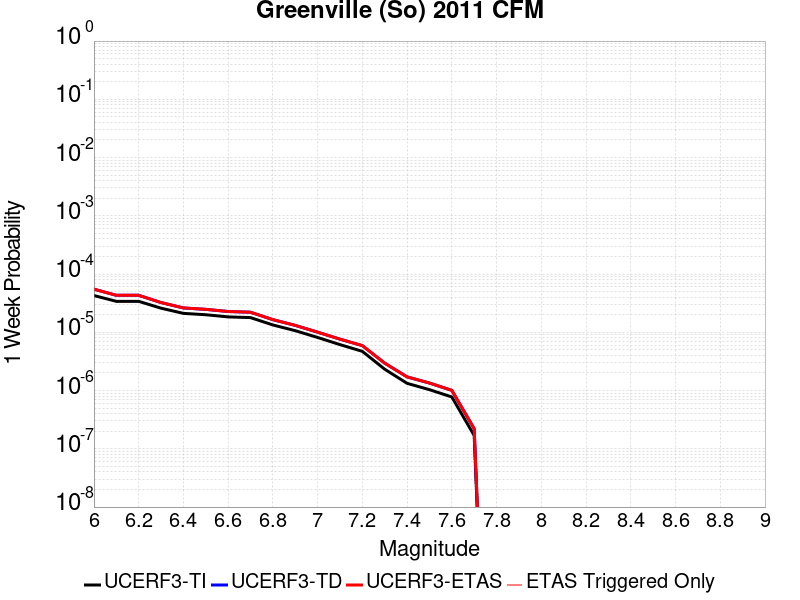 |  |  |  |

| Magnitude | 1 wk TI Prob | 1 wk TD Prob | 1 wk ETAS Prob | 1 wk ETAS/TD Gain | 1 wk ETAS Triggered Only | 1 mo TI Prob | 1 mo TD Prob | 1 mo ETAS Prob | 1 mo ETAS/TD Gain | 1 mo ETAS Triggered Only | 1 yr TI Prob | 1 yr TD Prob | 1 yr ETAS Prob | 1 yr ETAS/TD Gain | 1 yr ETAS Triggered Only | 10 yr TI Prob | 10 yr TD Prob | 10 yr ETAS Prob | 10 yr ETAS/TD Gain | 10 yr ETAS Triggered Only |
|-----|-----|-----|-----|-----|-----|-----|-----|-----|-----|-----|-----|-----|-----|-----|-----|-----|-----|-----|-----|-----|
| 6.0 | 4.279693E-5 | 5.504811E-5 | 5.504811E-5 | 1.0 | 0.0 | 1.8340252E-4 | 2.3589977E-4 | 2.3589977E-4 | 1.0 | 0.0 | 0.0022306389 | 0.0028685662 | 0.0028885088 | 1.0069522 | 2.0E-5 | 0.022083808 | 0.02834272 | 0.028362153 | 1.0006857 | 2.0E-5 |
| 6.1 | 3.4037297E-5 | 4.319768E-5 | 4.319768E-5 | 1.0 | 0.0 | 1.4586597E-4 | 1.8512092E-4 | 1.8512092E-4 | 1.0 | 0.0 | 0.0017744715 | 0.002251689 | 0.0022616666 | 1.0044311 | 1.0E-5 | 0.01760369 | 0.022306086 | 0.022315864 | 1.0004383 | 1.0E-5 |
| 6.2 | 3.4037297E-5 | 4.319768E-5 | 4.319768E-5 | 1.0 | 0.0 | 1.4586597E-4 | 1.8512092E-4 | 1.8512092E-4 | 1.0 | 0.0 | 0.0017744715 | 0.002251689 | 0.0022616666 | 1.0044311 | 1.0E-5 | 0.01760369 | 0.022306086 | 0.022315864 | 1.0004383 | 1.0E-5 |
| 6.3 | 2.5956324E-5 | 3.243318E-5 | 3.243318E-5 | 1.0 | 0.0 | 1.11236644E-4 | 1.3899231E-4 | 1.3899231E-4 | 1.0 | 0.0 | 0.0013534647 | 0.0016909818 | 0.0017009649 | 1.0059037 | 1.0E-5 | 0.013452509 | 0.016788457 | 0.016798288 | 1.0005857 | 1.0E-5 |
| 6.4 | 2.1145053E-5 | 2.6200603E-5 | 2.6200603E-5 | 1.0 | 0.0 | 9.061851E-5 | 1.1228366E-4 | 1.1228366E-4 | 1.0 | 0.0 | 0.0011027219 | 0.0013662282 | 0.0013762146 | 1.0073094 | 1.0E-5 | 0.01097266 | 0.013582237 | 0.013592102 | 1.0007262 | 1.0E-5 |
| 6.5 | 2.0030959E-5 | 2.4798554E-5 | 2.4798554E-5 | 1.0 | 0.0 | 8.584414E-5 | 1.06275365E-4 | 1.06275365E-4 | 1.0 | 0.0 | 0.0010446513 | 0.001293166 | 0.0013031531 | 1.007723 | 1.0E-5 | 0.010397541 | 0.012860296 | 0.012870167 | 1.0007676 | 1.0E-5 |
| 6.6 | 1.8395405E-5 | 2.2756956E-5 | 2.2756956E-5 | 1.0 | 0.0 | 7.8835066E-5 | 9.752633E-5 | 9.752633E-5 | 1.0 | 0.0 | 9.5939427E-4 | 0.0011867648 | 0.0011967529 | 1.0084163 | 1.0E-5 | 0.009552629 | 0.011807861 | 0.011817742 | 1.0008368 | 1.0E-5 |
| 6.7 | 1.7883482E-5 | 2.2127924E-5 | 2.2127924E-5 | 1.0 | 0.0 | 7.664124E-5 | 9.483068E-5 | 9.483068E-5 | 1.0 | 0.0 | 9.3270757E-4 | 0.0011539806 | 0.001163969 | 1.0086557 | 1.0E-5 | 0.009288026 | 0.011483469 | 0.011493354 | 1.0008608 | 1.0E-5 |
| 6.8 | 1.3373564E-5 | 1.6507647E-5 | 1.6507647E-5 | 1.0 | 0.0 | 5.7314013E-5 | 7.074522E-5 | 7.074522E-5 | 1.0 | 0.0 | 6.975747E-4 | 8.609975E-4 | 8.709889E-4 | 1.0116044 | 1.0E-5 | 0.0069538904 | 0.008578762 | 0.008588676 | 1.0011556 | 1.0E-5 |
| 6.9 | 1.06692905E-5 | 1.31538345E-5 | 1.31538345E-5 | 1.0 | 0.0 | 4.5724726E-5 | 5.6372424E-5 | 5.6372424E-5 | 1.0 | 0.0 | 5.5655633E-4 | 6.861294E-4 | 6.9612253E-4 | 1.0145645 | 1.0E-5 | 0.005551645 | 0.006841879 | 0.0068518105 | 1.0014516 | 1.0E-5 |
| 7.0 | 8.157512E-6 | 1.0063514E-5 | 1.0063514E-5 | 1.0 | 0.0 | 3.4960296E-5 | 4.3128653E-5 | 4.3128653E-5 | 1.0 | 0.0 | 4.2555845E-4 | 5.2496855E-4 | 5.2496855E-4 | 1.0 | 0.0 | 0.004247444 | 0.0052382983 | 0.0052382983 | 1.0 | 0.0 |
| 7.1 | 6.1467113E-6 | 7.628033E-6 | 7.628033E-6 | 1.0 | 0.0 | 2.6342783E-5 | 3.2691165E-5 | 3.2691165E-5 | 1.0 | 0.0 | 3.206762E-4 | 3.979431E-4 | 3.979431E-4 | 1.0 | 0.0 | 0.0032021382 | 0.0039730305 | 0.0039730305 | 1.0 | 0.0 |
| 7.2 | 4.713467E-6 | 5.9146323E-6 | 5.9146323E-6 | 1.0 | 0.0 | 2.0200418E-5 | 2.5348181E-5 | 2.5348181E-5 | 1.0 | 0.0 | 2.4591232E-4 | 3.08571E-4 | 3.08571E-4 | 1.0 | 0.0 | 0.0024564038 | 0.0030820682 | 0.0030820682 | 1.0 | 0.0 |
| 7.3 | 2.3266216E-6 | 2.9542937E-6 | 2.9542937E-6 | 1.0 | 0.0 | 9.971197E-6 | 1.2661198E-5 | 1.2661198E-5 | 1.0 | 0.0 | 1.2139256E-4 | 1.5413933E-4 | 1.5413933E-4 | 1.0 | 0.0 | 0.0012132627 | 0.0015405918 | 0.0015405918 | 1.0 | 0.0 |
| 7.4 | 1.3314E-6 | 1.7181609E-6 | 1.7181609E-6 | 1.0 | 0.0 | 5.7059874E-6 | 7.363526E-6 | 7.363526E-6 | 1.0 | 0.0 | 6.946818E-5 | 8.964729E-5 | 8.964729E-5 | 1.0 | 0.0 | 6.9446466E-4 | 8.964158E-4 | 8.964158E-4 | 1.0 | 0.0 |
| 7.5 | 1.0362941E-6 | 1.347037E-6 | 1.347037E-6 | 1.0 | 0.0 | 4.4412527E-6 | 5.7730035E-6 | 5.7730035E-6 | 1.0 | 0.0 | 5.407091E-5 | 7.02841E-5 | 7.02841E-5 | 1.0 | 0.0 | 5.405776E-4 | 7.0290704E-4 | 7.0290704E-4 | 1.0 | 0.0 |
| 7.6 | 7.764784E-7 | 1.0090031E-6 | 1.0090031E-6 | 1.0 | 0.0 | 3.3277602E-6 | 4.324292E-6 | 4.324292E-6 | 1.0 | 0.0 | 4.0514726E-5 | 5.2647025E-5 | 5.2647025E-5 | 1.0 | 0.0 | 4.050734E-4 | 5.265857E-4 | 5.265857E-4 | 1.0 | 0.0 |
| 7.7 | 1.6927763E-7 | 2.2140586E-7 | 2.2140586E-7 | 1.0 | 0.0 | 7.2547533E-7 | 9.488819E-7 | 9.488819E-7 | 1.0 | 0.0 | 8.832627E-6 | 1.1552579E-5 | 1.1552579E-5 | 1.0 | 0.0 | 8.8322755E-5 | 1.1553604E-4 | 1.1553604E-4 | 1.0 | 0.0 |

## San Jacinto (Borrego)
*[(top)](#table-of-contents)*

| 1 Week | 1 Month | 1 Year | 10 Year |
|-----|-----|-----|-----|
|  | 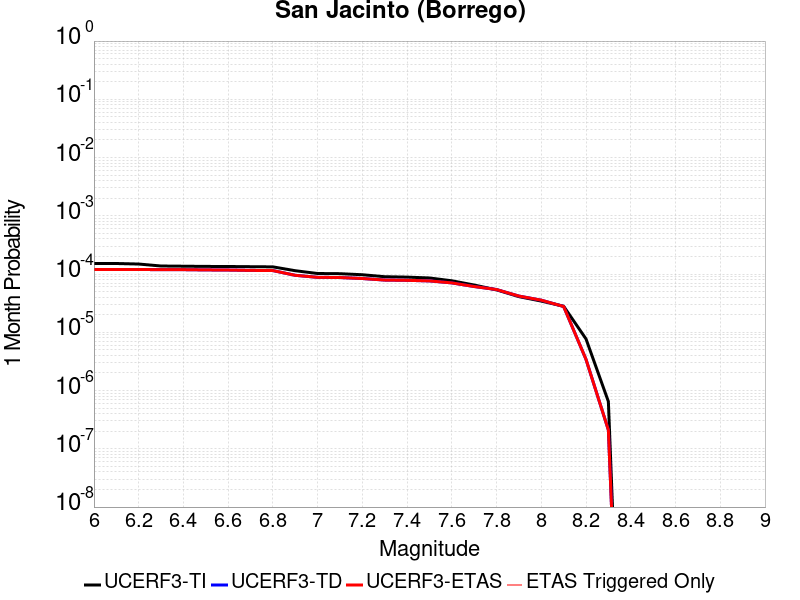 |  |  |

| Magnitude | 1 wk TI Prob | 1 wk TD Prob | 1 wk ETAS Prob | 1 wk ETAS/TD Gain | 1 wk ETAS Triggered Only | 1 mo TI Prob | 1 mo TD Prob | 1 mo ETAS Prob | 1 mo ETAS/TD Gain | 1 mo ETAS Triggered Only | 1 yr TI Prob | 1 yr TD Prob | 1 yr ETAS Prob | 1 yr ETAS/TD Gain | 1 yr ETAS Triggered Only | 10 yr TI Prob | 10 yr TD Prob | 10 yr ETAS Prob | 10 yr ETAS/TD Gain | 10 yr ETAS Triggered Only |
|-----|-----|-----|-----|-----|-----|-----|-----|-----|-----|-----|-----|-----|-----|-----|-----|-----|-----|-----|-----|-----|
| 6.0 | 3.543992E-5 | 2.7955874E-5 | 2.7955874E-5 | 1.0 | 0.0 | 1.5187653E-4 | 1.1980545E-4 | 1.1980545E-4 | 1.0 | 0.0 | 0.0018475284 | 0.0014576677 | 0.0014676531 | 1.0068502 | 1.0E-5 | 0.018322436 | 0.01488493 | 0.014904633 | 1.0013237 | 2.0E-5 |
| 6.1 | 3.542281E-5 | 2.7955874E-5 | 2.7955874E-5 | 1.0 | 0.0 | 1.5180321E-4 | 1.1980545E-4 | 1.1980545E-4 | 1.0 | 0.0 | 0.0018466372 | 0.0014576677 | 0.0014676531 | 1.0068502 | 1.0E-5 | 0.018313672 | 0.01488493 | 0.014904633 | 1.0013237 | 2.0E-5 |
| 6.2 | 3.4688688E-5 | 2.7955874E-5 | 2.7955874E-5 | 1.0 | 0.0 | 1.4865733E-4 | 1.1980545E-4 | 1.1980545E-4 | 1.0 | 0.0 | 0.0018084005 | 0.0014576677 | 0.0014676531 | 1.0068502 | 1.0E-5 | 0.017937548 | 0.01488493 | 0.014904632 | 1.0013237 | 2.0E-5 |
| 6.3 | 3.2087122E-5 | 2.7801223E-5 | 2.7801223E-5 | 1.0 | 0.0 | 1.3750899E-4 | 1.1914273E-4 | 1.1914273E-4 | 1.0 | 0.0 | 0.0016728862 | 0.0014496098 | 0.0014595953 | 1.0068884 | 1.0E-5 | 0.016603488 | 0.014806089 | 0.014825793 | 1.0013309 | 2.0E-5 |
| 6.4 | 3.1828724E-5 | 2.77682E-5 | 2.77682E-5 | 1.0 | 0.0 | 1.364017E-4 | 1.1900121E-4 | 1.1900121E-4 | 1.0 | 0.0 | 0.0016594254 | 0.001447889 | 0.0014578745 | 1.0068966 | 1.0E-5 | 0.016470885 | 0.014789282 | 0.014808986 | 1.0013323 | 2.0E-5 |
| 6.5 | 3.1563577E-5 | 2.750787E-5 | 2.750787E-5 | 1.0 | 0.0 | 1.3526545E-4 | 1.17885604E-4 | 1.17885604E-4 | 1.0 | 0.0 | 0.0016456128 | 0.0014343245 | 0.0014443102 | 1.006962 | 1.0E-5 | 0.0163348 | 0.014655326 | 0.014675032 | 1.0013447 | 2.0E-5 |
| 6.6 | 3.1467625E-5 | 2.7352073E-5 | 2.7352073E-5 | 1.0 | 0.0 | 1.3485427E-4 | 1.1721797E-4 | 1.1721797E-4 | 1.0 | 0.0 | 0.0016406142 | 0.0014262067 | 0.0014361924 | 1.0070016 | 1.0E-5 | 0.016285548 | 0.014575482 | 0.014595191 | 1.0013522 | 2.0E-5 |
| 6.7 | 3.1223695E-5 | 2.6970027E-5 | 2.6970027E-5 | 1.0 | 0.0 | 1.3380898E-4 | 1.1558078E-4 | 1.1558078E-4 | 1.0 | 0.0 | 0.0016279068 | 0.0014062996 | 0.0014162856 | 1.0071008 | 1.0E-5 | 0.01616033 | 0.014379977 | 0.01439969 | 1.0013708 | 2.0E-5 |
| 6.8 | 3.1015585E-5 | 2.679098E-5 | 2.679098E-5 | 1.0 | 0.0 | 1.3291716E-4 | 1.14813505E-4 | 1.14813505E-4 | 1.0 | 0.0 | 0.001617065 | 0.0013969702 | 0.0014069562 | 1.0071484 | 1.0E-5 | 0.016053487 | 0.014287205 | 0.01430692 | 1.0013798 | 2.0E-5 |
| 6.9 | 2.6641965E-5 | 2.2211414E-5 | 2.2211414E-5 | 1.0 | 0.0 | 1.1417485E-4 | 9.518833E-5 | 9.518833E-5 | 1.0 | 0.0 | 0.0013891924 | 0.0011583057 | 0.0011682941 | 1.0086232 | 1.0E-5 | 0.0138054015 | 0.011896737 | 0.0119165 | 1.0016612 | 2.0E-5 |
| 7.0 | 2.3854353E-5 | 2.050528E-5 | 2.050528E-5 | 1.0 | 0.0 | 1.02228936E-4 | 8.7876826E-5 | 8.7876826E-5 | 1.0 | 0.0 | 0.0012439266 | 0.0010693778 | 0.0010793671 | 1.0093412 | 1.0E-5 | 0.012369866 | 0.010996556 | 0.011016335 | 1.0017987 | 2.0E-5 |
| 7.1 | 2.3672901E-5 | 2.0341751E-5 | 2.0341751E-5 | 1.0 | 0.0 | 1.0145135E-4 | 8.7176035E-5 | 8.7176035E-5 | 1.0 | 0.0 | 0.0012344702 | 0.001060854 | 0.0010708433 | 1.0094163 | 1.0E-5 | 0.0122763505 | 0.010911736 | 0.010931518 | 1.0018129 | 2.0E-5 |
| 7.2 | 2.2717244E-5 | 1.9568899E-5 | 1.9568899E-5 | 1.0 | 0.0 | 9.735599E-5 | 8.3864026E-5 | 8.3864026E-5 | 1.0 | 0.0 | 0.0011846646 | 0.0010205687 | 0.0010305584 | 1.0097885 | 1.0E-5 | 0.01178369 | 0.010509028 | 0.010528818 | 1.0018831 | 2.0E-5 |
| 7.3 | 2.1016205E-5 | 1.8410172E-5 | 1.8410172E-5 | 1.0 | 0.0 | 9.006634E-5 | 7.889837E-5 | 7.889837E-5 | 1.0 | 0.0 | 0.001096006 | 9.6016633E-4 | 9.7015675E-4 | 1.0104048 | 1.0E-5 | 0.010906163 | 0.0099044405 | 0.009924242 | 1.0019993 | 2.0E-5 |
| 7.4 | 2.0683625E-5 | 1.8212622E-5 | 1.8212622E-5 | 1.0 | 0.0 | 8.86411E-5 | 7.805177E-5 | 7.805177E-5 | 1.0 | 0.0 | 0.001078671 | 9.4986806E-4 | 9.598586E-4 | 1.0105178 | 1.0E-5 | 0.010734501 | 0.00980115 | 0.009820954 | 1.0020206 | 2.0E-5 |
| 7.5 | 1.9993966E-5 | 1.7807442E-5 | 1.7807442E-5 | 1.0 | 0.0 | 8.568561E-5 | 7.6315395E-5 | 7.6315395E-5 | 1.0 | 0.0 | 0.001042723 | 9.2874584E-4 | 9.3873654E-4 | 1.0107572 | 1.0E-5 | 0.010378438 | 0.009587968 | 0.009607776 | 1.0020659 | 2.0E-5 |
| 7.6 | 1.788966E-5 | 1.6460064E-5 | 1.6460064E-5 | 1.0 | 0.0 | 7.666772E-5 | 7.054124E-5 | 7.054124E-5 | 1.0 | 0.0 | 9.3302975E-4 | 8.585029E-4 | 8.6849433E-4 | 1.0116382 | 1.0E-5 | 0.00929122 | 0.008879389 | 0.008899211 | 1.0022324 | 2.0E-5 |
| 7.7 | 1.5125781E-5 | 1.4261374E-5 | 1.4261374E-5 | 1.0 | 0.0 | 6.4823165E-5 | 6.111875E-5 | 6.111875E-5 | 1.0 | 0.0 | 7.889362E-4 | 7.4386754E-4 | 7.538601E-4 | 1.0134332 | 1.0E-5 | 0.007861412 | 0.007726649 | 0.0077464944 | 1.0025685 | 2.0E-5 |
| 7.8 | 1.250089E-5 | 1.26536925E-5 | 1.26536925E-5 | 1.0 | 0.0 | 5.3574146E-5 | 5.4228985E-5 | 5.4228985E-5 | 1.0 | 0.0 | 6.5207E-4 | 6.600385E-4 | 6.7003194E-4 | 1.0151407 | 1.0E-5 | 0.006501599 | 0.0068797027 | 0.006899565 | 1.0028871 | 2.0E-5 |
| 7.9 | 9.561E-6 | 9.775099E-6 | 9.775099E-6 | 1.0 | 0.0 | 4.0975072E-5 | 4.189261E-5 | 4.189261E-5 | 1.0 | 0.0 | 4.987573E-4 | 5.0992373E-4 | 5.199186E-4 | 1.0196007 | 1.0E-5 | 0.0049763937 | 0.005363107 | 0.005383 | 1.0037092 | 2.0E-5 |
| 8.0 | 8.01699E-6 | 8.3121295E-6 | 8.3121295E-6 | 1.0 | 0.0 | 3.4358076E-5 | 3.562293E-5 | 3.562293E-5 | 1.0 | 0.0 | 4.1822926E-4 | 4.3362338E-4 | 4.4361904E-4 | 1.0230515 | 1.0E-5 | 0.0041744304 | 0.0045832046 | 0.004603113 | 1.0043437 | 2.0E-5 |
| 8.1 | 6.541947E-6 | 6.477423E-6 | 6.477423E-6 | 1.0 | 0.0 | 2.8036617E-5 | 2.7760092E-5 | 2.7760092E-5 | 1.0 | 0.0 | 3.4129233E-4 | 3.3792722E-4 | 3.4792384E-4 | 1.0295821 | 1.0E-5 | 0.0034076865 | 0.003588821 | 0.0036087495 | 1.0055529 | 2.0E-5 |
| 8.2 | 1.7968189E-6 | 7.9984034E-7 | 7.9984034E-7 | 1.0 | 0.0 | 7.70063E-6 | 3.4278826E-6 | 3.4278826E-6 | 1.0 | 0.0 | 9.3751136E-5 | 4.1733696E-5 | 4.1733696E-5 | 1.0 | 0.0 | 9.371159E-4 | 4.727189E-4 | 4.727189E-4 | 1.0 | 0.0 |
| 8.3 | 1.5167889E-7 | 4.916523E-8 | 4.916523E-8 | 1.0 | 0.0 | 6.500522E-7 | 2.1070811E-7 | 2.1070811E-7 | 1.0 | 0.0 | 7.9143565E-6 | 2.5653687E-6 | 2.5653687E-6 | 1.0 | 0.0 | 7.914075E-5 | 2.9806817E-5 | 2.9806817E-5 | 1.0 | 0.0 |

## Calaveras (So) 2011 CFM
*[(top)](#table-of-contents)*

| 1 Week | 1 Month | 1 Year | 10 Year |
|-----|-----|-----|-----|
|  |  |  | 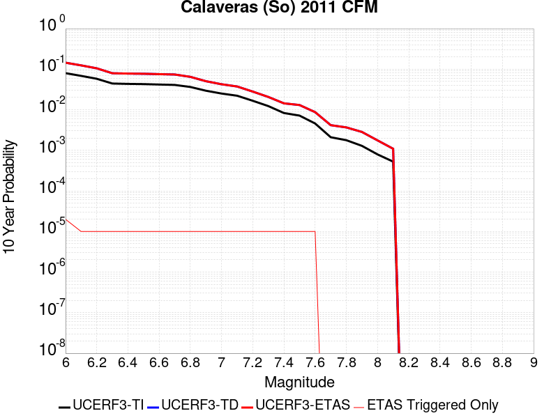 |

| Magnitude | 1 wk TI Prob | 1 wk TD Prob | 1 wk ETAS Prob | 1 wk ETAS/TD Gain | 1 wk ETAS Triggered Only | 1 mo TI Prob | 1 mo TD Prob | 1 mo ETAS Prob | 1 mo ETAS/TD Gain | 1 mo ETAS Triggered Only | 1 yr TI Prob | 1 yr TD Prob | 1 yr ETAS Prob | 1 yr ETAS/TD Gain | 1 yr ETAS Triggered Only | 10 yr TI Prob | 10 yr TD Prob | 10 yr ETAS Prob | 10 yr ETAS/TD Gain | 10 yr ETAS Triggered Only |
|-----|-----|-----|-----|-----|-----|-----|-----|-----|-----|-----|-----|-----|-----|-----|-----|-----|-----|-----|-----|-----|
| 6.0 | 1.5950744E-4 | 3.072718E-4 | 3.072718E-4 | 1.0 | 0.0 | 6.834242E-4 | 0.0013160399 | 0.0013160399 | 1.0 | 0.0 | 0.00828899 | 0.015865648 | 0.01587549 | 1.0006202 | 1.0E-5 | 0.079865426 | 0.14446959 | 0.14448671 | 1.0001185 | 2.0E-5 |
| 6.1 | 1.3584697E-4 | 2.604938E-4 | 2.604938E-4 | 1.0 | 0.0 | 5.8207137E-4 | 0.0011157675 | 0.0011157675 | 1.0 | 0.0 | 0.007063716 | 0.01346837 | 0.013478235 | 1.0007324 | 1.0E-5 | 0.06843361 | 0.12409648 | 0.124105245 | 1.0000706 | 1.0E-5 |
| 6.2 | 1.14676266E-4 | 2.1727956E-4 | 2.1727956E-4 | 1.0 | 0.0 | 4.9137714E-4 | 9.307831E-4 | 9.307831E-4 | 1.0 | 0.0 | 0.0059661185 | 0.011251759 | 0.011261647 | 1.0008787 | 1.0E-5 | 0.058084648 | 0.10508624 | 0.105095185 | 1.0000851 | 1.0E-5 |
| 6.3 | 8.691518E-5 | 1.6000312E-4 | 1.6000312E-4 | 1.0 | 0.0 | 3.7244044E-4 | 6.8550813E-4 | 6.8550813E-4 | 1.0 | 0.0 | 0.004525038 | 0.008307494 | 0.008317411 | 1.0011938 | 1.0E-5 | 0.044339992 | 0.07940137 | 0.07941057 | 1.000116 | 1.0E-5 |
| 6.4 | 8.50982E-5 | 1.5706658E-4 | 1.5706658E-4 | 1.0 | 0.0 | 3.646556E-4 | 6.7292945E-4 | 6.7292945E-4 | 1.0 | 0.0 | 0.0044306475 | 0.008155502 | 0.008165421 | 1.0012162 | 1.0E-5 | 0.04343345 | 0.078007154 | 0.07801637 | 1.0001181 | 1.0E-5 |
| 6.5 | 8.4062965E-5 | 1.5531052E-4 | 1.5531052E-4 | 1.0 | 0.0 | 3.602201E-4 | 6.6540745E-4 | 6.6540745E-4 | 1.0 | 0.0 | 0.004376863 | 0.008064697 | 0.008074616 | 1.00123 | 1.0E-5 | 0.042916555 | 0.07717834 | 0.07718756 | 1.0001196 | 1.0E-5 |
| 6.6 | 8.194716E-5 | 1.5166824E-4 | 1.5166824E-4 | 1.0 | 0.0 | 3.5115483E-4 | 6.498056E-4 | 6.498056E-4 | 1.0 | 0.0 | 0.0042669317 | 0.007876504 | 0.007886426 | 1.0012596 | 1.0E-5 | 0.04185927 | 0.07546313 | 0.07547237 | 1.0001225 | 1.0E-5 |
| 6.7 | 8.012326E-5 | 1.4834652E-4 | 1.4834652E-4 | 1.0 | 0.0 | 3.433402E-4 | 6.355799E-4 | 6.355799E-4 | 1.0 | 0.0 | 0.004172157 | 0.0077049676 | 0.0077148904 | 1.0012878 | 1.0E-5 | 0.040946912 | 0.073905125 | 0.07391439 | 1.0001253 | 1.0E-5 |
| 6.8 | 7.119773E-5 | 1.2893327E-4 | 1.2893327E-4 | 1.0 | 0.0 | 3.0509746E-4 | 5.5243546E-4 | 5.5243546E-4 | 1.0 | 0.0 | 0.0037082357 | 0.0067019444 | 0.0067118774 | 1.0014821 | 1.0E-5 | 0.036469642 | 0.06474684 | 0.0647562 | 1.0001445 | 1.0E-5 |
| 6.9 | 5.7343088E-5 | 9.929162E-5 | 9.929162E-5 | 1.0 | 0.0 | 2.4573295E-4 | 4.2546654E-4 | 4.2546654E-4 | 1.0 | 0.0 | 0.0029876942 | 0.005167826 | 0.0051777745 | 1.001925 | 1.0E-5 | 0.02947844 | 0.050557766 | 0.050567262 | 1.0001878 | 1.0E-5 |
| 7.0 | 4.8746577E-5 | 8.294708E-5 | 8.294708E-5 | 1.0 | 0.0 | 2.0889717E-4 | 3.5543944E-4 | 3.5543944E-4 | 1.0 | 0.0 | 0.0025403565 | 0.0043189544 | 0.0043289117 | 1.0023054 | 1.0E-5 | 0.025115121 | 0.042532407 | 0.04254198 | 1.0002251 | 1.0E-5 |
| 7.1 | 4.2998014E-5 | 7.272609E-5 | 7.272609E-5 | 1.0 | 0.0 | 1.8426418E-4 | 3.1164635E-4 | 3.1164635E-4 | 1.0 | 0.0 | 0.002241108 | 0.0037877534 | 0.0037977155 | 1.0026301 | 1.0E-5 | 0.022186412 | 0.03746113 | 0.037470758 | 1.0002569 | 1.0E-5 |
| 7.2 | 3.221292E-5 | 5.397899E-5 | 5.397899E-5 | 1.0 | 0.0 | 1.3804805E-4 | 2.3131818E-4 | 2.3131818E-4 | 1.0 | 0.0 | 0.0016794393 | 0.0028126896 | 0.0028226615 | 1.0035453 | 1.0E-5 | 0.016668037 | 0.028072093 | 0.028081812 | 1.0003462 | 1.0E-5 |
| 7.3 | 2.3756531E-5 | 3.9535546E-5 | 3.9535546E-5 | 1.0 | 0.0 | 1.0180973E-4 | 1.6942713E-4 | 1.6942713E-4 | 1.0 | 0.0 | 0.0012388286 | 0.0020608408 | 0.0020708204 | 1.0048424 | 1.0E-5 | 0.012319452 | 0.020675438 | 0.020685231 | 1.0004736 | 1.0E-5 |
| 7.4 | 1.5997684E-5 | 2.7374297E-5 | 2.7374297E-5 | 1.0 | 0.0 | 6.8559704E-5 | 1.1731315E-4 | 1.1731315E-4 | 1.0 | 0.0 | 8.343947E-4 | 0.0014273543 | 0.00143734 | 1.0069959 | 1.0E-5 | 0.008312687 | 0.0143935755 | 0.014403431 | 1.0006847 | 1.0E-5 |
| 7.5 | 1.3814293E-5 | 2.4815101E-5 | 2.4815101E-5 | 1.0 | 0.0 | 5.9202768E-5 | 1.0634611E-4 | 1.0634611E-4 | 1.0 | 0.0 | 7.205553E-4 | 0.0012939973 | 0.0013039843 | 1.007718 | 1.0E-5 | 0.007182234 | 0.013072435 | 0.013082304 | 1.000755 | 1.0E-5 |
| 7.6 | 8.817309E-6 | 1.6457496E-5 | 1.6457496E-5 | 1.0 | 0.0 | 3.7787922E-5 | 7.053022E-5 | 7.053022E-5 | 1.0 | 0.0 | 4.5997082E-4 | 8.583685E-4 | 8.6835993E-4 | 1.01164 | 1.0E-5 | 0.004590199 | 0.008734633 | 0.008744546 | 1.0011349 | 1.0E-5 |
| 7.7 | 4.0352206E-6 | 7.724459E-6 | 7.724459E-6 | 1.0 | 0.0 | 1.7293689E-5 | 3.3104403E-5 | 3.3104403E-5 | 1.0 | 0.0 | 2.1053031E-4 | 4.0297164E-4 | 4.0297164E-4 | 1.0 | 0.0 | 0.0021033096 | 0.0041737603 | 0.0041737603 | 1.0 | 0.0 |
| 7.8 | 3.413169E-6 | 6.802247E-6 | 6.802247E-6 | 1.0 | 0.0 | 1.4627784E-5 | 2.9152161E-5 | 2.9152161E-5 | 1.0 | 0.0 | 1.7807873E-4 | 3.5486982E-4 | 3.5486982E-4 | 1.0 | 0.0 | 0.0017793609 | 0.003673909 | 0.003673909 | 1.0 | 0.0 |
| 7.9 | 2.4740732E-6 | 5.290168E-6 | 5.290168E-6 | 1.0 | 0.0 | 1.06031275E-5 | 2.2671951E-5 | 2.2671951E-5 | 1.0 | 0.0 | 1.2908543E-4 | 2.7599608E-4 | 2.7599608E-4 | 1.0 | 0.0 | 0.0012901047 | 0.0028401602 | 0.0028401602 | 1.0 | 0.0 |
| 8.0 | 1.5231818E-6 | 3.295294E-6 | 3.295294E-6 | 1.0 | 0.0 | 6.527906E-6 | 1.4122612E-5 | 1.4122612E-5 | 1.0 | 0.0 | 7.9474354E-5 | 1.7192928E-4 | 1.7192928E-4 | 1.0 | 0.0 | 7.944594E-4 | 0.0017596188 | 0.0017596188 | 1.0 | 0.0 |
| 8.1 | 1.0104524E-6 | 2.0496998E-6 | 2.0496998E-6 | 1.0 | 0.0 | 4.330503E-6 | 8.784398E-6 | 8.784398E-6 | 1.0 | 0.0 | 5.2722597E-5 | 1.0694483E-4 | 1.0694483E-4 | 1.0 | 0.0 | 5.271009E-4 | 0.0010949362 | 0.0010949362 | 1.0 | 0.0 |

## Sheephole
*[(top)](#table-of-contents)*

| 1 Week | 1 Month | 1 Year | 10 Year |
|-----|-----|-----|-----|
| 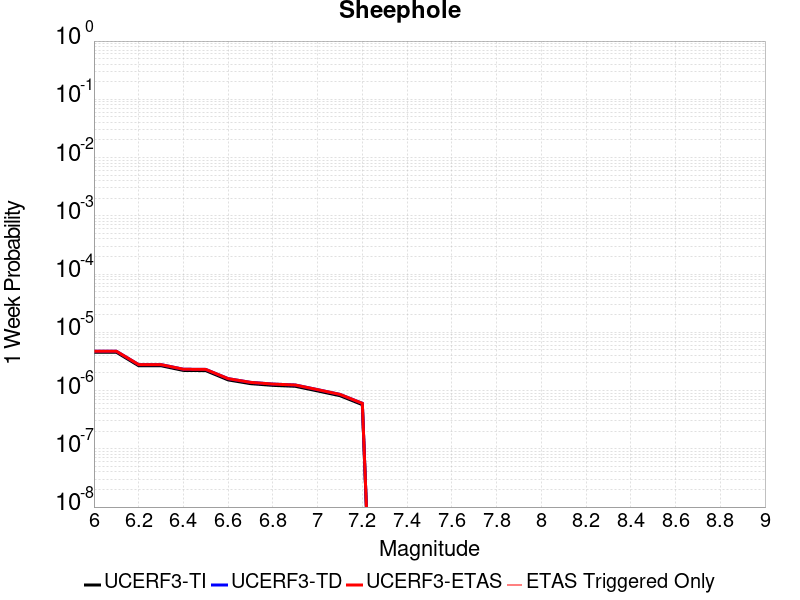 |  | 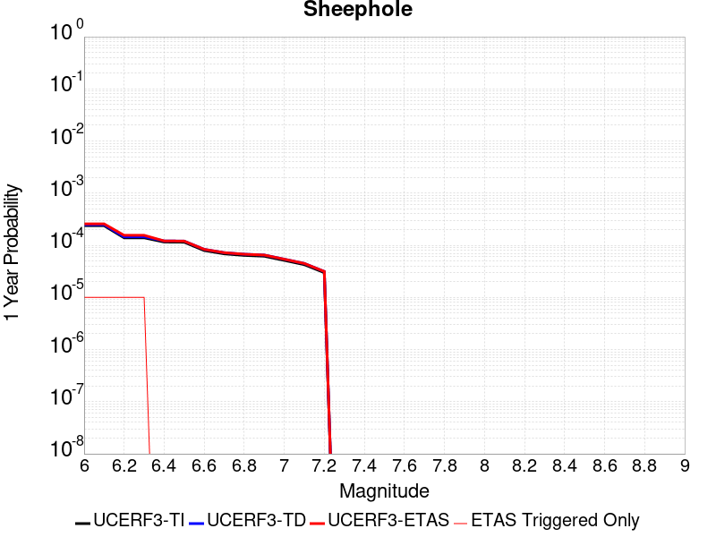 |  |

| Magnitude | 1 wk TI Prob | 1 wk TD Prob | 1 wk ETAS Prob | 1 wk ETAS/TD Gain | 1 wk ETAS Triggered Only | 1 mo TI Prob | 1 mo TD Prob | 1 mo ETAS Prob | 1 mo ETAS/TD Gain | 1 mo ETAS Triggered Only | 1 yr TI Prob | 1 yr TD Prob | 1 yr ETAS Prob | 1 yr ETAS/TD Gain | 1 yr ETAS Triggered Only | 10 yr TI Prob | 10 yr TD Prob | 10 yr ETAS Prob | 10 yr ETAS/TD Gain | 10 yr ETAS Triggered Only |
|-----|-----|-----|-----|-----|-----|-----|-----|-----|-----|-----|-----|-----|-----|-----|-----|-----|-----|-----|-----|-----|
| 6.0 | 4.5579695E-6 | 4.741364E-6 | 4.741364E-6 | 1.0 | 0.0 | 1.9534009E-5 | 2.0320003E-5 | 2.0320003E-5 | 1.0 | 0.0 | 2.3780059E-4 | 2.473735E-4 | 2.5737102E-4 | 1.0404147 | 1.0E-5 | 0.0023754628 | 0.002471526 | 0.0024914765 | 1.0080721 | 2.0E-5 |
| 6.1 | 4.5579695E-6 | 4.741364E-6 | 4.741364E-6 | 1.0 | 0.0 | 1.9534009E-5 | 2.0320003E-5 | 2.0320003E-5 | 1.0 | 0.0 | 2.3780059E-4 | 2.473735E-4 | 2.5737102E-4 | 1.0404147 | 1.0E-5 | 0.0023754628 | 0.002471526 | 0.0024914765 | 1.0080721 | 2.0E-5 |
| 6.2 | 2.6677674E-6 | 2.7874607E-6 | 2.7874607E-6 | 1.0 | 0.0 | 1.1433239E-5 | 1.1946211E-5 | 1.1946211E-5 | 1.0 | 0.0 | 1.3919079E-4 | 1.454365E-4 | 1.5543503E-4 | 1.0687486 | 1.0E-5 | 0.0013910364 | 0.001453519 | 0.0014734899 | 1.0137397 | 2.0E-5 |
| 6.3 | 2.6677674E-6 | 2.7874607E-6 | 2.7874607E-6 | 1.0 | 0.0 | 1.1433239E-5 | 1.1946211E-5 | 1.1946211E-5 | 1.0 | 0.0 | 1.3919079E-4 | 1.454365E-4 | 1.5543503E-4 | 1.0687486 | 1.0E-5 | 0.0013910364 | 0.001453519 | 0.0014734899 | 1.0137397 | 2.0E-5 |
| 6.4 | 2.2159759E-6 | 2.3229381E-6 | 2.3229381E-6 | 1.0 | 0.0 | 9.497005E-6 | 9.955416E-6 | 9.955416E-6 | 1.0 | 0.0 | 1.156199E-4 | 1.2120126E-4 | 1.2120126E-4 | 1.0 | 0.0 | 0.0011555976 | 0.0012114309 | 0.0012214187 | 1.0082448 | 1.0E-5 |
| 6.5 | 2.1986082E-6 | 2.304818E-6 | 2.304818E-6 | 1.0 | 0.0 | 9.4225725E-6 | 9.877759E-6 | 9.877759E-6 | 1.0 | 0.0 | 1.1471378E-4 | 1.20255885E-4 | 1.20255885E-4 | 1.0 | 0.0 | 0.0011465458 | 0.0012019875 | 0.0012119755 | 1.0083096 | 1.0E-5 |
| 6.6 | 1.5232331E-6 | 1.6019358E-6 | 1.6019358E-6 | 1.0 | 0.0 | 6.5281256E-6 | 6.8654217E-6 | 6.8654217E-6 | 1.0 | 0.0 | 7.947703E-5 | 8.3583494E-5 | 8.3583494E-5 | 1.0 | 0.0 | 7.9448614E-4 | 8.355393E-4 | 8.355393E-4 | 1.0 | 0.0 |
| 6.7 | 1.3137362E-6 | 1.3828576E-6 | 1.3828576E-6 | 1.0 | 0.0 | 5.6302856E-6 | 5.92652E-6 | 5.92652E-6 | 1.0 | 0.0 | 6.854657E-5 | 7.215313E-5 | 7.215313E-5 | 1.0 | 0.0 | 6.8525434E-4 | 7.2131096E-4 | 7.2131096E-4 | 1.0 | 0.0 |
| 6.8 | 1.2275751E-6 | 1.2923208E-6 | 1.2923208E-6 | 1.0 | 0.0 | 5.2610258E-6 | 5.5385067E-6 | 5.5385067E-6 | 1.0 | 0.0 | 6.4051106E-5 | 6.742937E-5 | 6.742937E-5 | 1.0 | 0.0 | 6.4032647E-4 | 6.7410246E-4 | 6.7410246E-4 | 1.0 | 0.0 |
| 6.9 | 1.1837088E-6 | 1.2461369E-6 | 1.2461369E-6 | 1.0 | 0.0 | 5.0730278E-6 | 5.3405765E-6 | 5.3405765E-6 | 1.0 | 0.0 | 6.176237E-5 | 6.501971E-5 | 6.501971E-5 | 1.0 | 0.0 | 6.17452E-4 | 6.5002E-4 | 6.5002E-4 | 1.0 | 0.0 |
| 7.0 | 9.849371E-7 | 1.0366576E-6 | 1.0366576E-6 | 1.0 | 0.0 | 4.2211523E-6 | 4.4428116E-6 | 4.4428116E-6 | 1.0 | 0.0 | 5.1391315E-5 | 5.4089993E-5 | 5.4089993E-5 | 1.0 | 0.0 | 5.137943E-4 | 5.4077833E-4 | 5.4077833E-4 | 1.0 | 0.0 |
| 7.1 | 8.1643645E-7 | 8.591908E-7 | 8.591908E-7 | 1.0 | 0.0 | 3.4990085E-6 | 3.6822414E-6 | 3.6822414E-6 | 1.0 | 0.0 | 4.2599597E-5 | 4.4830453E-5 | 4.4830453E-5 | 1.0 | 0.0 | 4.259143E-4 | 4.4822274E-4 | 4.4822274E-4 | 1.0 | 0.0 |
| 7.2 | 5.7295756E-7 | 6.029669E-7 | 6.029669E-7 | 1.0 | 0.0 | 2.45553E-6 | 2.5841418E-6 | 2.5841418E-6 | 1.0 | 0.0 | 2.9895667E-5 | 3.146154E-5 | 3.146154E-5 | 1.0 | 0.0 | 2.9891645E-4 | 3.1457754E-4 | 3.1457754E-4 | 1.0 | 0.0 |

## Ortigalita (North)
*[(top)](#table-of-contents)*

| 1 Week | 1 Month | 1 Year | 10 Year |
|-----|-----|-----|-----|
| 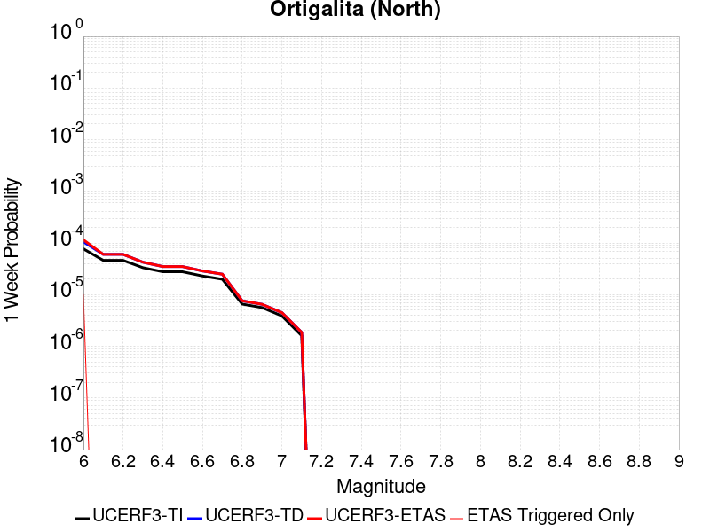 |  |  |  |

| Magnitude | 1 wk TI Prob | 1 wk TD Prob | 1 wk ETAS Prob | 1 wk ETAS/TD Gain | 1 wk ETAS Triggered Only | 1 mo TI Prob | 1 mo TD Prob | 1 mo ETAS Prob | 1 mo ETAS/TD Gain | 1 mo ETAS Triggered Only | 1 yr TI Prob | 1 yr TD Prob | 1 yr ETAS Prob | 1 yr ETAS/TD Gain | 1 yr ETAS Triggered Only | 10 yr TI Prob | 10 yr TD Prob | 10 yr ETAS Prob | 10 yr ETAS/TD Gain | 10 yr ETAS Triggered Only |
|-----|-----|-----|-----|-----|-----|-----|-----|-----|-----|-----|-----|-----|-----|-----|-----|-----|-----|-----|-----|-----|
| 6.0 | 7.711876E-5 | 1.0507352E-4 | 1.1507247E-4 | 1.0951614 | 1.0E-5 | 3.3046713E-4 | 4.502348E-4 | 4.602303E-4 | 1.0222006 | 1.0E-5 | 0.004016016 | 0.005469011 | 0.005488902 | 1.003637 | 2.0E-5 | 0.039442103 | 0.05346466 | 0.05348359 | 1.000354 | 2.0E-5 |
| 6.1 | 4.607858E-5 | 6.0249444E-5 | 6.0249444E-5 | 1.0 | 0.0 | 1.9746469E-4 | 2.581888E-4 | 2.581888E-4 | 1.0 | 0.0 | 0.0024014818 | 0.003139234 | 0.003139234 | 1.0 | 0.0 | 0.023756953 | 0.030980105 | 0.030980105 | 1.0 | 0.0 |
| 6.2 | 4.607858E-5 | 6.0249444E-5 | 6.0249444E-5 | 1.0 | 0.0 | 1.9746469E-4 | 2.581888E-4 | 2.581888E-4 | 1.0 | 0.0 | 0.0024014818 | 0.003139234 | 0.003139234 | 1.0 | 0.0 | 0.023756953 | 0.030980105 | 0.030980105 | 1.0 | 0.0 |
| 6.3 | 3.327423E-5 | 4.2482494E-5 | 4.2482494E-5 | 1.0 | 0.0 | 1.4259605E-4 | 1.8205654E-4 | 1.8205654E-4 | 1.0 | 0.0 | 0.0017347244 | 0.002214531 | 0.002214531 | 1.0 | 0.0 | 0.017212452 | 0.021948911 | 0.021948911 | 1.0 | 0.0 |
| 6.4 | 2.7732503E-5 | 3.5003977E-5 | 3.5003977E-5 | 1.0 | 0.0 | 1.1884817E-4 | 1.5000958E-4 | 1.5000958E-4 | 1.0 | 0.0 | 0.001446016 | 0.0018250728 | 0.0018250728 | 1.0 | 0.0 | 0.014366428 | 0.018123824 | 0.018123824 | 1.0 | 0.0 |
| 6.5 | 2.7689714E-5 | 3.4953788E-5 | 3.4953788E-5 | 1.0 | 0.0 | 1.186648E-4 | 1.497945E-4 | 1.497945E-4 | 1.0 | 0.0 | 0.0014437864 | 0.0018224587 | 0.0018224587 | 1.0 | 0.0 | 0.014344421 | 0.018098108 | 0.018098108 | 1.0 | 0.0 |
| 6.6 | 2.2976905E-5 | 2.872225E-5 | 2.872225E-5 | 1.0 | 0.0 | 9.846873E-5 | 1.2309082E-4 | 1.2309082E-4 | 1.0 | 0.0 | 0.0011981975 | 0.0014978388 | 0.0014978388 | 1.0 | 0.0 | 0.011917574 | 0.014900749 | 0.014900749 | 1.0 | 0.0 |
| 6.7 | 1.9871539E-5 | 2.4908106E-5 | 2.4908106E-5 | 1.0 | 0.0 | 8.516096E-5 | 1.0674606E-4 | 1.0674606E-4 | 1.0 | 0.0 | 0.0010363415 | 0.0012990998 | 0.0012990998 | 1.0 | 0.0 | 0.010315218 | 0.012938719 | 0.012938719 | 1.0 | 0.0 |
| 6.8 | 6.5640475E-6 | 7.6061337E-6 | 7.6061337E-6 | 1.0 | 0.0 | 2.813133E-5 | 3.2597323E-5 | 3.2597323E-5 | 1.0 | 0.0 | 3.424451E-4 | 3.9680302E-4 | 3.9680302E-4 | 1.0 | 0.0 | 0.0034191788 | 0.0039612325 | 0.0039612325 | 1.0 | 0.0 |
| 6.9 | 5.6219683E-6 | 6.5023783E-6 | 6.5023783E-6 | 1.0 | 0.0 | 2.4093928E-5 | 2.7867052E-5 | 2.7867052E-5 | 1.0 | 0.0 | 2.933041E-4 | 3.3923113E-4 | 3.3923113E-4 | 1.0 | 0.0 | 0.0029291727 | 0.00338739 | 0.00338739 | 1.0 | 0.0 |
| 7.0 | 3.875591E-6 | 4.4851295E-6 | 4.4851295E-6 | 1.0 | 0.0 | 1.6609569E-5 | 1.9221854E-5 | 1.9221854E-5 | 1.0 | 0.0 | 2.0220275E-4 | 2.3400305E-4 | 2.3400305E-4 | 1.0 | 0.0 | 0.0020201886 | 0.0023377747 | 0.0023377747 | 1.0 | 0.0 |
| 7.1 | 1.6017933E-6 | 1.857199E-6 | 1.857199E-6 | 1.0 | 0.0 | 6.8648105E-6 | 7.959406E-6 | 7.959406E-6 | 1.0 | 0.0 | 8.357586E-5 | 9.690253E-5 | 9.690253E-5 | 1.0 | 0.0 | 8.3544437E-4 | 9.6870743E-4 | 9.6870743E-4 | 1.0 | 0.0 |

## Calaveras (So) - Paicines extension 2011 CFM
*[(top)](#table-of-contents)*

| 1 Week | 1 Month | 1 Year | 10 Year |
|-----|-----|-----|-----|
|  |  |  |  |

| Magnitude | 1 wk TI Prob | 1 wk TD Prob | 1 wk ETAS Prob | 1 wk ETAS/TD Gain | 1 wk ETAS Triggered Only | 1 mo TI Prob | 1 mo TD Prob | 1 mo ETAS Prob | 1 mo ETAS/TD Gain | 1 mo ETAS Triggered Only | 1 yr TI Prob | 1 yr TD Prob | 1 yr ETAS Prob | 1 yr ETAS/TD Gain | 1 yr ETAS Triggered Only | 10 yr TI Prob | 10 yr TD Prob | 10 yr ETAS Prob | 10 yr ETAS/TD Gain | 10 yr ETAS Triggered Only |
|-----|-----|-----|-----|-----|-----|-----|-----|-----|-----|-----|-----|-----|-----|-----|-----|-----|-----|-----|-----|-----|
| 6.0 | 1.5183659E-4 | 3.0534517E-4 | 3.0534517E-4 | 1.0 | 0.0 | 6.5056595E-4 | 0.0013073935 | 0.0013073935 | 1.0 | 0.0 | 0.007891912 | 0.015703076 | 0.01571292 | 1.0006268 | 1.0E-5 | 0.076174594 | 0.13855352 | 0.13856213 | 1.0000622 | 1.0E-5 |
| 6.1 | 1.5024997E-4 | 3.022871E-4 | 3.022871E-4 | 1.0 | 0.0 | 6.437695E-4 | 0.0012943014 | 0.0012943014 | 1.0 | 0.0 | 0.0078097614 | 0.015546443 | 0.015556287 | 1.0006332 | 1.0E-5 | 0.075409345 | 0.13722299 | 0.13723162 | 1.0000628 | 1.0E-5 |
| 6.2 | 1.2743923E-4 | 2.5326732E-4 | 2.5326732E-4 | 1.0 | 0.0 | 5.460538E-4 | 0.0010845594 | 0.0010845594 | 1.0 | 0.0 | 0.0066279583 | 0.013053613 | 0.013063482 | 1.000756 | 1.0E-5 | 0.064337276 | 0.1173209 | 0.11732973 | 1.0000752 | 1.0E-5 |
| 6.3 | 1.1525114E-4 | 2.2612499E-4 | 2.2612499E-4 | 1.0 | 0.0 | 4.9383997E-4 | 9.684327E-4 | 9.684327E-4 | 1.0 | 0.0 | 0.0059959386 | 0.0116747925 | 0.011684676 | 1.0008465 | 1.0E-5 | 0.058367174 | 0.106437564 | 0.106446505 | 1.0000839 | 1.0E-5 |
| 6.4 | 1.07200925E-4 | 2.0853426E-4 | 2.0853426E-4 | 1.0 | 0.0 | 4.5935164E-4 | 8.9316786E-4 | 8.9316786E-4 | 1.0 | 0.0 | 0.0055782744 | 0.010779645 | 0.010789537 | 1.0009177 | 1.0E-5 | 0.0544031 | 0.099260494 | 0.099269494 | 1.0000907 | 1.0E-5 |
| 6.5 | 9.69631E-5 | 1.8746986E-4 | 1.8746986E-4 | 1.0 | 0.0 | 4.1548995E-4 | 8.0301095E-4 | 8.0301095E-4 | 1.0 | 0.0 | 0.0050468626 | 0.00970143 | 0.009711333 | 1.0010208 | 1.0E-5 | 0.04933773 | 0.090152085 | 0.09016118 | 1.000101 | 1.0E-5 |
| 6.6 | 8.0552316E-5 | 1.5083487E-4 | 1.5083487E-4 | 1.0 | 0.0 | 3.4517853E-4 | 6.4623426E-4 | 6.4623426E-4 | 1.0 | 0.0 | 0.0041944524 | 0.007833077 | 0.007842998 | 1.0012666 | 1.0E-5 | 0.04116161 | 0.074922696 | 0.07493195 | 1.0001235 | 1.0E-5 |
| 6.7 | 7.815757E-5 | 1.462396E-4 | 1.462396E-4 | 1.0 | 0.0 | 3.34918E-4 | 6.265544E-4 | 6.265544E-4 | 1.0 | 0.0 | 0.004070005 | 0.0075958404 | 0.007605764 | 1.0013065 | 1.0E-5 | 0.039962657 | 0.072772026 | 0.072781295 | 1.0001274 | 1.0E-5 |
| 6.8 | 6.965264E-5 | 1.2734742E-4 | 1.2734742E-4 | 1.0 | 0.0 | 2.9847719E-4 | 5.456419E-4 | 5.456419E-4 | 1.0 | 0.0 | 0.0036279052 | 0.006619751 | 0.006629685 | 1.0015006 | 1.0E-5 | 0.03569247 | 0.06386474 | 0.063874096 | 1.0001466 | 1.0E-5 |
| 6.9 | 5.8000453E-5 | 1.0154427E-4 | 1.0154427E-4 | 1.0 | 0.0 | 2.4854968E-4 | 4.3511766E-4 | 4.3511766E-4 | 1.0 | 0.0 | 0.0030218933 | 0.005284787 | 0.005294734 | 1.0018822 | 1.0E-5 | 0.029811295 | 0.051553804 | 0.05156329 | 1.0001839 | 1.0E-5 |
| 7.0 | 4.9865852E-5 | 8.578355E-5 | 8.578355E-5 | 1.0 | 0.0 | 2.1369329E-4 | 3.6759244E-4 | 3.6759244E-4 | 1.0 | 0.0 | 0.0025986114 | 0.004466343 | 0.0044762986 | 1.002229 | 1.0E-5 | 0.025684336 | 0.043832865 | 0.043842427 | 1.0002182 | 1.0E-5 |
| 7.1 | 4.283875E-5 | 7.120516E-5 | 7.120516E-5 | 1.0 | 0.0 | 1.8358172E-4 | 3.051296E-4 | 3.051296E-4 | 1.0 | 0.0 | 0.0022328163 | 0.003708681 | 0.0037186441 | 1.0026864 | 1.0E-5 | 0.022105146 | 0.03677737 | 0.036787 | 1.0002619 | 1.0E-5 |
| 7.2 | 3.450115E-5 | 5.5856777E-5 | 5.5856777E-5 | 1.0 | 0.0 | 1.478537E-4 | 2.3936438E-4 | 2.3936438E-4 | 1.0 | 0.0 | 0.0017986323 | 0.0029103959 | 0.0029203668 | 1.003426 | 1.0E-5 | 0.017841442 | 0.029119333 | 0.029129041 | 1.0003334 | 1.0E-5 |
| 7.3 | 2.5709045E-5 | 4.065854E-5 | 4.065854E-5 | 1.0 | 0.0 | 1.1017697E-4 | 1.7423934E-4 | 1.7423934E-4 | 1.0 | 0.0 | 0.0013405791 | 0.002119317 | 0.0021292958 | 1.0047085 | 1.0E-5 | 0.013325208 | 0.021332886 | 0.021342672 | 1.0004587 | 1.0E-5 |
| 7.4 | 1.8003093E-5 | 2.8549623E-5 | 2.8549623E-5 | 1.0 | 0.0 | 7.715383E-5 | 1.223498E-4 | 1.223498E-4 | 1.0 | 0.0 | 9.3894306E-4 | 0.0014885933 | 0.0014985785 | 1.0067078 | 1.0E-5 | 0.009349857 | 0.015072777 | 0.015082627 | 1.0006535 | 1.0E-5 |
| 7.5 | 1.5595824E-5 | 2.5860876E-5 | 2.5860876E-5 | 1.0 | 0.0 | 6.683753E-5 | 1.10827634E-4 | 1.10827634E-4 | 1.0 | 0.0 | 8.134431E-4 | 0.0013484934 | 0.00135848 | 1.0074056 | 1.0E-5 | 0.008104719 | 0.013671774 | 0.013681638 | 1.0007215 | 1.0E-5 |
| 7.6 | 1.1110309E-5 | 1.9255813E-5 | 1.9255813E-5 | 1.0 | 0.0 | 4.761474E-5 | 8.252231E-5 | 8.252231E-5 | 1.0 | 0.0 | 5.795553E-4 | 0.0010042473 | 0.0010142373 | 1.0099477 | 1.0E-5 | 0.0057804612 | 0.01022158 | 0.010231478 | 1.0009683 | 1.0E-5 |
| 7.7 | 6.2140443E-6 | 1.0460544E-5 | 1.0460544E-5 | 1.0 | 0.0 | 2.6631347E-5 | 4.4830133E-5 | 4.4830133E-5 | 1.0 | 0.0 | 3.241884E-4 | 5.456703E-4 | 5.456703E-4 | 1.0 | 0.0 | 0.0032371588 | 0.005631412 | 0.005631412 | 1.0 | 0.0 |
| 7.8 | 5.305533E-6 | 9.454043E-6 | 9.454043E-6 | 1.0 | 0.0 | 2.27378E-5 | 4.0516697E-5 | 4.0516697E-5 | 1.0 | 0.0 | 2.7679754E-4 | 4.9317925E-4 | 4.9317925E-4 | 1.0 | 0.0 | 0.0027645302 | 0.005084593 | 0.005084593 | 1.0 | 0.0 |
| 7.9 | 3.363505E-6 | 7.400539E-6 | 7.400539E-6 | 1.0 | 0.0 | 1.4414942E-5 | 3.171621E-5 | 3.171621E-5 | 1.0 | 0.0 | 1.7548777E-4 | 3.860765E-4 | 3.860765E-4 | 1.0 | 0.0 | 0.0017534926 | 0.0039560283 | 0.0039560283 | 1.0 | 0.0 |
| 8.0 | 2.0271132E-6 | 4.421917E-6 | 4.421917E-6 | 1.0 | 0.0 | 8.687599E-6 | 1.8950936E-5 | 1.8950936E-5 | 1.0 | 0.0 | 1.05766376E-4 | 2.3070326E-4 | 2.3070326E-4 | 1.0 | 0.0 | 0.0010571606 | 0.0023553926 | 0.0023553926 | 1.0 | 0.0 |
| 8.1 | 1.2206116E-6 | 2.3798764E-6 | 2.3798764E-6 | 1.0 | 0.0 | 5.2311816E-6 | 1.019943E-5 | 1.019943E-5 | 1.0 | 0.0 | 6.3687774E-5 | 1.2417103E-4 | 1.2417103E-4 | 1.0 | 0.0 | 6.366953E-4 | 0.001272909 | 0.001272909 | 1.0 | 0.0 |

## Hayward (So) extension 2011 CFM
*[(top)](#table-of-contents)*

| 1 Week | 1 Month | 1 Year | 10 Year |
|-----|-----|-----|-----|
|  |  |  |  |

| Magnitude | 1 wk TI Prob | 1 wk TD Prob | 1 wk ETAS Prob | 1 wk ETAS/TD Gain | 1 wk ETAS Triggered Only | 1 mo TI Prob | 1 mo TD Prob | 1 mo ETAS Prob | 1 mo ETAS/TD Gain | 1 mo ETAS Triggered Only | 1 yr TI Prob | 1 yr TD Prob | 1 yr ETAS Prob | 1 yr ETAS/TD Gain | 1 yr ETAS Triggered Only | 10 yr TI Prob | 10 yr TD Prob | 10 yr ETAS Prob | 10 yr ETAS/TD Gain | 10 yr ETAS Triggered Only |
|-----|-----|-----|-----|-----|-----|-----|-----|-----|-----|-----|-----|-----|-----|-----|-----|-----|-----|-----|-----|-----|
| 6.0 | 1.1721256E-4 | 2.3678501E-4 | 2.3678501E-4 | 1.0 | 0.0 | 5.022428E-4 | 0.0010141538 | 0.0010141538 | 1.0 | 0.0 | 0.0060976758 | 0.012253833 | 0.012273588 | 1.0016122 | 2.0E-5 | 0.0593305 | 0.11287341 | 0.11289116 | 1.0001572 | 2.0E-5 |
| 6.1 | 6.99169E-5 | 1.381259E-4 | 1.381259E-4 | 1.0 | 0.0 | 2.9960944E-4 | 5.9177785E-4 | 5.9177785E-4 | 1.0 | 0.0 | 0.0036416445 | 0.0071749697 | 0.0071848975 | 1.0013838 | 1.0E-5 | 0.035825435 | 0.067829885 | 0.067839205 | 1.0001374 | 1.0E-5 |
| 6.2 | 6.99169E-5 | 1.381259E-4 | 1.381259E-4 | 1.0 | 0.0 | 2.9960944E-4 | 5.9177785E-4 | 5.9177785E-4 | 1.0 | 0.0 | 0.0036416445 | 0.0071749697 | 0.0071848975 | 1.0013838 | 1.0E-5 | 0.035825435 | 0.067829885 | 0.067839205 | 1.0001374 | 1.0E-5 |
| 6.3 | 6.970908E-5 | 1.3780732E-4 | 1.3780732E-4 | 1.0 | 0.0 | 2.9871898E-4 | 5.904133E-4 | 5.904133E-4 | 1.0 | 0.0 | 0.0036308395 | 0.0071585043 | 0.0071684327 | 1.0013869 | 1.0E-5 | 0.035720866 | 0.06767883 | 0.06768816 | 1.0001378 | 1.0E-5 |
| 6.4 | 6.9517155E-5 | 1.3747651E-4 | 1.3747651E-4 | 1.0 | 0.0 | 2.9789665E-4 | 5.8899634E-4 | 5.8899634E-4 | 1.0 | 0.0 | 0.0036208609 | 0.007141415 | 0.007151344 | 1.0013903 | 1.0E-5 | 0.03562429 | 0.06752286 | 0.06753218 | 1.000138 | 1.0E-5 |
| 6.5 | 4.786248E-5 | 9.4196075E-5 | 9.4196075E-5 | 1.0 | 0.0 | 2.0510878E-4 | 4.0363762E-4 | 4.0363762E-4 | 1.0 | 0.0 | 0.0024943394 | 0.00490365 | 0.0049136006 | 1.0020293 | 1.0E-5 | 0.02466527 | 0.046923906 | 0.046933435 | 1.0002031 | 1.0E-5 |
| 6.6 | 4.4662214E-5 | 8.886191E-5 | 8.886191E-5 | 1.0 | 0.0 | 1.9139545E-4 | 3.8078375E-4 | 3.8078375E-4 | 1.0 | 0.0 | 0.0023277493 | 0.0046266513 | 0.0046366053 | 1.0021514 | 1.0E-5 | 0.02303517 | 0.044314813 | 0.04432437 | 1.0002156 | 1.0E-5 |
| 6.7 | 3.884542E-5 | 7.8691475E-5 | 7.8691475E-5 | 1.0 | 0.0 | 1.6646975E-4 | 3.3720807E-4 | 3.3720807E-4 | 1.0 | 0.0 | 0.002024885 | 0.004098225 | 0.0041081836 | 1.0024301 | 1.0E-5 | 0.020065336 | 0.039353985 | 0.03936359 | 1.0002441 | 1.0E-5 |
| 6.8 | 3.4221863E-5 | 6.8596244E-5 | 6.8596244E-5 | 1.0 | 0.0 | 1.4665688E-4 | 2.9395317E-4 | 2.9395317E-4 | 1.0 | 0.0 | 0.0017840851 | 0.003573428 | 0.0035833921 | 1.0027884 | 1.0E-5 | 0.017698295 | 0.034440026 | 0.03444968 | 1.0002804 | 1.0E-5 |
| 6.9 | 1.6927712E-5 | 3.0085983E-5 | 3.0085983E-5 | 1.0 | 0.0 | 7.2545314E-5 | 1.2893387E-4 | 1.2893387E-4 | 1.0 | 0.0 | 8.828813E-4 | 0.0015686966 | 0.0015786809 | 1.0063647 | 1.0E-5 | 0.008793819 | 0.015474755 | 0.015484601 | 1.0006362 | 1.0E-5 |
| 7.0 | 1.2509653E-5 | 2.2485337E-5 | 2.2485337E-5 | 1.0 | 0.0 | 5.3611697E-5 | 9.636242E-5 | 9.636242E-5 | 1.0 | 0.0 | 6.525269E-4 | 0.0011726251 | 0.0011826134 | 1.0085179 | 1.0E-5 | 0.0065061417 | 0.011592756 | 0.011602639 | 1.0008526 | 1.0E-5 |
| 7.1 | 8.751583E-6 | 1.4945013E-5 | 1.4945013E-5 | 1.0 | 0.0 | 3.750624E-5 | 6.4048516E-5 | 6.4048516E-5 | 1.0 | 0.0 | 4.5654282E-4 | 7.795176E-4 | 7.895098E-4 | 1.0128185 | 1.0E-5 | 0.0045560603 | 0.0077725183 | 0.0077824406 | 1.0012766 | 1.0E-5 |
| 7.2 | 6.354379E-6 | 1.1517141E-5 | 1.1517141E-5 | 1.0 | 0.0 | 2.7232769E-5 | 4.935827E-5 | 4.935827E-5 | 1.0 | 0.0 | 3.3150852E-4 | 6.0077605E-4 | 6.107701E-4 | 1.0166352 | 1.0E-5 | 0.0033101442 | 0.006008966 | 0.006018906 | 1.0016541 | 1.0E-5 |
| 7.3 | 4.645554E-6 | 8.835465E-6 | 8.835465E-6 | 1.0 | 0.0 | 1.9909365E-5 | 3.7865753E-5 | 3.7865753E-5 | 1.0 | 0.0 | 2.4236954E-4 | 4.60922E-4 | 4.60922E-4 | 1.0 | 0.0 | 0.0024210536 | 0.004618853 | 0.004618853 | 1.0 | 0.0 |
| 7.4 | 4.23437E-6 | 8.009341E-6 | 8.009341E-6 | 1.0 | 0.0 | 1.8147173E-5 | 3.432532E-5 | 3.432532E-5 | 1.0 | 0.0 | 2.2091944E-4 | 4.178345E-4 | 4.178345E-4 | 1.0 | 0.0 | 0.0022069993 | 0.004189895 | 0.004189895 | 1.0 | 0.0 |
| 7.5 | 2.2187417E-6 | 3.9646256E-6 | 3.9646256E-6 | 1.0 | 0.0 | 9.508858E-6 | 1.6991156E-5 | 1.6991156E-5 | 1.0 | 0.0 | 1.157642E-4 | 2.0685032E-4 | 2.0685032E-4 | 1.0 | 0.0 | 0.0011570391 | 0.0020793215 | 0.0020793215 | 1.0 | 0.0 |
| 7.6 | 2.7952495E-8 | 3.8808025E-8 | 3.8808025E-8 | 1.0 | 0.0 | 1.1979641E-7 | 1.663201E-7 | 1.663201E-7 | 1.0 | 0.0 | 1.4585203E-6 | 2.0249454E-6 | 2.0249454E-6 | 1.0 | 0.0 | 1.4585107E-5 | 2.0340014E-5 | 2.0340014E-5 | 1.0 | 0.0 |
| 7.7 | 1.7192724E-8 | 2.3453167E-8 | 2.3453167E-8 | 1.0 | 0.0 | 7.36831E-8 | 1.0051357E-7 | 1.0051357E-7 | 1.0 | 0.0 | 8.9709135E-7 | 1.2237521E-6 | 1.2237521E-6 | 1.0 | 0.0 | 8.970877E-6 | 1.2304813E-5 | 1.2304813E-5 | 1.0 | 0.0 |

## Monterey Bay-Tularcitos
*[(top)](#table-of-contents)*

| 1 Week | 1 Month | 1 Year | 10 Year |
|-----|-----|-----|-----|
|  | 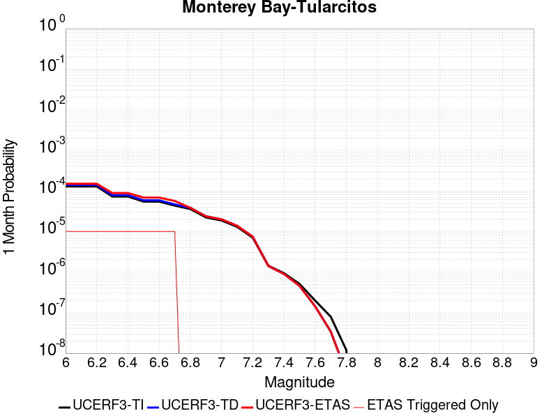 | 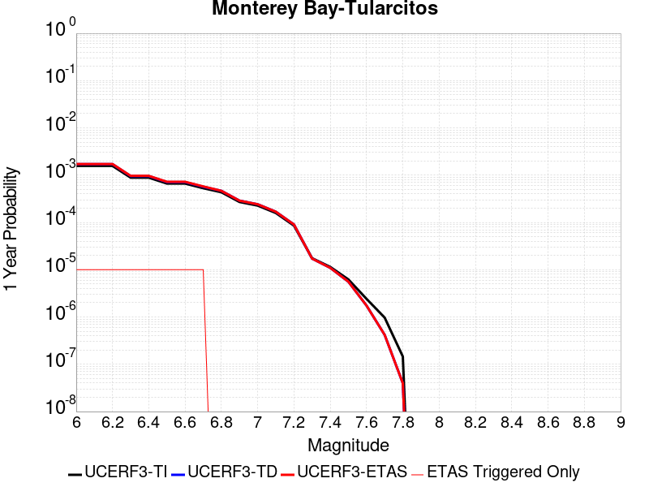 |  |

| Magnitude | 1 wk TI Prob | 1 wk TD Prob | 1 wk ETAS Prob | 1 wk ETAS/TD Gain | 1 wk ETAS Triggered Only | 1 mo TI Prob | 1 mo TD Prob | 1 mo ETAS Prob | 1 mo ETAS/TD Gain | 1 mo ETAS Triggered Only | 1 yr TI Prob | 1 yr TD Prob | 1 yr ETAS Prob | 1 yr ETAS/TD Gain | 1 yr ETAS Triggered Only | 10 yr TI Prob | 10 yr TD Prob | 10 yr ETAS Prob | 10 yr ETAS/TD Gain | 10 yr ETAS Triggered Only |
|-----|-----|-----|-----|-----|-----|-----|-----|-----|-----|-----|-----|-----|-----|-----|-----|-----|-----|-----|-----|-----|
| 6.0 | 3.0131365E-5 | 3.2800384E-5 | 4.2800057E-5 | 1.3048644 | 1.0E-5 | 1.2912804E-4 | 1.405661E-4 | 1.505647E-4 | 1.0711309 | 1.0E-5 | 0.001571 | 0.0017101543 | 0.0017201373 | 1.0058374 | 1.0E-5 | 0.015599402 | 0.016980747 | 0.017000407 | 1.0011578 | 2.0E-5 |
| 6.1 | 3.0131365E-5 | 3.2800384E-5 | 4.2800057E-5 | 1.3048644 | 1.0E-5 | 1.2912804E-4 | 1.405661E-4 | 1.505647E-4 | 1.0711309 | 1.0E-5 | 0.001571 | 0.0017101543 | 0.0017201373 | 1.0058374 | 1.0E-5 | 0.015599402 | 0.016980747 | 0.017000407 | 1.0011578 | 2.0E-5 |
| 6.2 | 3.0131365E-5 | 3.2800384E-5 | 4.2800057E-5 | 1.3048644 | 1.0E-5 | 1.2912804E-4 | 1.405661E-4 | 1.505647E-4 | 1.0711309 | 1.0E-5 | 0.001571 | 0.0017101543 | 0.0017201373 | 1.0058374 | 1.0E-5 | 0.015599402 | 0.016980747 | 0.017000407 | 1.0011578 | 2.0E-5 |
| 6.3 | 1.6998249E-5 | 1.8331632E-5 | 2.8331448E-5 | 1.5454952 | 1.0E-5 | 7.28476E-5 | 7.8561876E-5 | 8.8561086E-5 | 1.1272782 | 1.0E-5 | 8.865586E-4 | 9.560898E-4 | 9.6608023E-4 | 1.0104493 | 1.0E-5 | 0.0088303005 | 0.009521689 | 0.0095414985 | 1.0020804 | 2.0E-5 |
| 6.4 | 1.6998249E-5 | 1.8331632E-5 | 2.8331448E-5 | 1.5454952 | 1.0E-5 | 7.28476E-5 | 7.8561876E-5 | 8.8561086E-5 | 1.1272782 | 1.0E-5 | 8.865586E-4 | 9.560898E-4 | 9.6608023E-4 | 1.0104493 | 1.0E-5 | 0.0088303005 | 0.009521689 | 0.0095414985 | 1.0020804 | 2.0E-5 |
| 6.5 | 1.27470785E-5 | 1.36939225E-5 | 2.3693785E-5 | 1.730241 | 1.0E-5 | 5.4629192E-5 | 5.8686976E-5 | 6.8686386E-5 | 1.1703856 | 1.0E-5 | 6.649074E-4 | 7.142901E-4 | 7.2428293E-4 | 1.0139899 | 1.0E-5 | 0.0066292146 | 0.0071209944 | 0.007140852 | 1.0027885 | 2.0E-5 |
| 6.6 | 1.2739422E-5 | 1.3686009E-5 | 2.3685872E-5 | 1.7306632 | 1.0E-5 | 5.4596385E-5 | 5.8653066E-5 | 6.865248E-5 | 1.1704841 | 1.0E-5 | 6.645082E-4 | 7.1387744E-4 | 7.238703E-4 | 1.013998 | 1.0E-5 | 0.0066252467 | 0.0071168947 | 0.0071367524 | 1.0027902 | 2.0E-5 |
| 6.7 | 1.0160109E-5 | 1.0886237E-5 | 2.0886127E-5 | 1.918581 | 1.0E-5 | 4.35426E-5 | 4.6654506E-5 | 5.665404E-5 | 1.2143315 | 1.0E-5 | 5.300022E-4 | 5.6787767E-4 | 5.77872E-4 | 1.0175995 | 1.0E-5 | 0.005287399 | 0.005664977 | 0.0056848633 | 1.0035105 | 2.0E-5 |
| 6.8 | 8.349859E-6 | 8.932988E-6 | 8.932988E-6 | 1.0 | 0.0 | 3.578462E-5 | 3.8283702E-5 | 3.8283702E-5 | 1.0 | 0.0 | 4.3559066E-4 | 4.6601004E-4 | 4.6601004E-4 | 1.0 | 0.0 | 0.004347378 | 0.004650893 | 0.0046608467 | 1.0021402 | 1.0E-5 |
| 6.9 | 5.193639E-6 | 5.5366936E-6 | 5.5366936E-6 | 1.0 | 0.0 | 2.2258262E-5 | 2.372849E-5 | 2.372849E-5 | 1.0 | 0.0 | 2.7096065E-4 | 2.888593E-4 | 2.888593E-4 | 1.0 | 0.0 | 0.0027063051 | 0.0028851596 | 0.0028851596 | 1.0 | 0.0 |
| 7.0 | 4.359381E-6 | 4.643596E-6 | 4.643596E-6 | 1.0 | 0.0 | 1.8682927E-5 | 1.990099E-5 | 1.990099E-5 | 1.0 | 0.0 | 2.274409E-4 | 2.422706E-4 | 2.422706E-4 | 1.0 | 0.0 | 0.0022720827 | 0.002420358 | 0.002420358 | 1.0 | 0.0 |
| 7.1 | 3.0398533E-6 | 3.23122E-6 | 3.23122E-6 | 1.0 | 0.0 | 1.3027877E-5 | 1.3848027E-5 | 1.3848027E-5 | 1.0 | 0.0 | 1.5860285E-4 | 1.6858931E-4 | 1.6858931E-4 | 1.0 | 0.0 | 0.001584897 | 0.0016848717 | 0.0016848717 | 1.0 | 0.0 |
| 7.2 | 1.642335E-6 | 1.7334356E-6 | 1.7334356E-6 | 1.0 | 0.0 | 7.0385595E-6 | 7.4290006E-6 | 7.4290006E-6 | 1.0 | 0.0 | 8.569109E-5 | 9.0446396E-5 | 9.0446396E-5 | 1.0 | 0.0 | 8.5658056E-4 | 9.0429856E-4 | 9.0429856E-4 | 1.0 | 0.0 |
| 7.3 | 3.356842E-7 | 3.2958872E-7 | 3.2958872E-7 | 1.0 | 0.0 | 1.4386458E-6 | 1.4125224E-6 | 1.4125224E-6 | 1.0 | 0.0 | 1.7515373E-5 | 1.7197324E-5 | 1.7197324E-5 | 1.0 | 0.0 | 1.7513991E-4 | 1.7196004E-4 | 1.7196004E-4 | 1.0 | 0.0 |
| 7.4 | 2.1973483E-7 | 2.1012706E-7 | 2.1012706E-7 | 1.0 | 0.0 | 9.417204E-7 | 9.005442E-7 | 9.005442E-7 | 1.0 | 0.0 | 1.1465385E-5 | 1.09640705E-5 | 1.09640705E-5 | 1.0 | 0.0 | 1.1464794E-4 | 1.0963533E-4 | 1.0963533E-4 | 1.0 | 0.0 |
| 7.5 | 1.1944135E-7 | 1.0702149E-7 | 1.0702149E-7 | 1.0 | 0.0 | 5.118914E-7 | 4.5866346E-7 | 4.5866346E-7 | 1.0 | 0.0 | 6.23226E-6 | 5.5842133E-6 | 5.5842133E-6 | 1.0 | 0.0 | 6.2320854E-5 | 5.5840745E-5 | 5.5840745E-5 | 1.0 | 0.0 |
| 7.6 | 4.636058E-8 | 3.340164E-8 | 3.340164E-8 | 1.0 | 0.0 | 1.9868818E-7 | 1.4314989E-7 | 1.4314989E-7 | 1.0 | 0.0 | 2.419026E-6 | 1.7428484E-6 | 1.7428484E-6 | 1.0 | 0.0 | 2.4189996E-5 | 1.742835E-5 | 1.742835E-5 | 1.0 | 0.0 |
| 7.7 | 1.8588572E-8 | 8.018322E-9 | 8.018322E-9 | 1.0 | 0.0 | 7.9665305E-8 | 3.4364238E-8 | 3.4364238E-8 | 1.0 | 0.0 | 9.699246E-7 | 4.183845E-7 | 4.183845E-7 | 1.0 | 0.0 | 9.699204E-6 | 4.1838375E-6 | 4.1838375E-6 | 1.0 | 0.0 |
| 7.8 | 2.7960154E-9 | 7.631319E-10 | 7.631319E-10 | 1.0 | 0.0 | 1.1982923E-8 | 3.270566E-9 | 3.270566E-9 | 1.0 | 0.0 | 1.4589209E-7 | 3.981914E-8 | 3.981914E-8 | 1.0 | 0.0 | 1.4589199E-6 | 3.9819136E-7 | 3.9819136E-7 | 1.0 | 0.0 |

## Great Valley 07 (Orestimba)
*[(top)](#table-of-contents)*

| 1 Week | 1 Month | 1 Year | 10 Year |
|-----|-----|-----|-----|
|  |  |  |  |

| Magnitude | 1 wk TI Prob | 1 wk TD Prob | 1 wk ETAS Prob | 1 wk ETAS/TD Gain | 1 wk ETAS Triggered Only | 1 mo TI Prob | 1 mo TD Prob | 1 mo ETAS Prob | 1 mo ETAS/TD Gain | 1 mo ETAS Triggered Only | 1 yr TI Prob | 1 yr TD Prob | 1 yr ETAS Prob | 1 yr ETAS/TD Gain | 1 yr ETAS Triggered Only | 10 yr TI Prob | 10 yr TD Prob | 10 yr ETAS Prob | 10 yr ETAS/TD Gain | 10 yr ETAS Triggered Only |
|-----|-----|-----|-----|-----|-----|-----|-----|-----|-----|-----|-----|-----|-----|-----|-----|-----|-----|-----|-----|-----|
| 6.0 | 2.9687902E-5 | 3.2759297E-5 | 3.2759297E-5 | 1.0 | 0.0 | 1.2722766E-4 | 1.4038983E-4 | 1.4038983E-4 | 1.0 | 0.0 | 0.0015478961 | 0.0017079781 | 0.001717961 | 1.0058448 | 1.0E-5 | 0.015371585 | 0.01695606 | 0.01697572 | 1.0011595 | 2.0E-5 |
| 6.1 | 2.9687902E-5 | 3.2759297E-5 | 3.2759297E-5 | 1.0 | 0.0 | 1.2722766E-4 | 1.4038983E-4 | 1.4038983E-4 | 1.0 | 0.0 | 0.0015478961 | 0.0017079781 | 0.001717961 | 1.0058448 | 1.0E-5 | 0.015371585 | 0.01695606 | 0.01696589 | 1.0005797 | 1.0E-5 |
| 6.2 | 1.9231524E-5 | 2.1160291E-5 | 2.1160291E-5 | 1.0 | 0.0 | 8.2418206E-5 | 9.068394E-5 | 9.068394E-5 | 1.0 | 0.0 | 0.0010029797 | 0.0011035409 | 0.0011135299 | 1.0090517 | 1.0E-5 | 0.00998465 | 0.010983022 | 0.010992912 | 1.0009005 | 1.0E-5 |
| 6.3 | 1.324766E-5 | 1.4549291E-5 | 1.4549291E-5 | 1.0 | 0.0 | 5.6774446E-5 | 6.2352665E-5 | 6.2352665E-5 | 1.0 | 0.0 | 6.910097E-4 | 7.588885E-4 | 7.588885E-4 | 1.0 | 0.0 | 0.006888649 | 0.0075639165 | 0.0075639165 | 1.0 | 0.0 |
| 6.4 | 7.818645E-6 | 8.573279E-6 | 8.573279E-6 | 1.0 | 0.0 | 3.3508048E-5 | 3.6742123E-5 | 3.6742123E-5 | 1.0 | 0.0 | 4.078841E-4 | 4.4724692E-4 | 4.4724692E-4 | 1.0 | 0.0 | 0.004071363 | 0.0044638086 | 0.0044638086 | 1.0 | 0.0 |
| 6.5 | 5.3076565E-6 | 5.8180976E-6 | 5.8180976E-6 | 1.0 | 0.0 | 2.27469E-5 | 2.4934478E-5 | 2.4934478E-5 | 1.0 | 0.0 | 2.7690834E-4 | 3.0353706E-4 | 3.0353706E-4 | 1.0 | 0.0 | 0.0027656353 | 0.0030314343 | 0.0030314343 | 1.0 | 0.0 |
| 6.6 | 3.6003578E-6 | 3.948698E-6 | 3.948698E-6 | 1.0 | 0.0 | 1.5430012E-5 | 1.692289E-5 | 1.692289E-5 | 1.0 | 0.0 | 1.8784421E-4 | 2.0601827E-4 | 2.0601827E-4 | 1.0 | 0.0 | 0.0018768552 | 0.0020584268 | 0.0020584268 | 1.0 | 0.0 |
| 6.7 | 2.5361826E-6 | 2.783612E-6 | 2.783612E-6 | 1.0 | 0.0 | 1.0869308E-5 | 1.1929718E-5 | 1.1929718E-5 | 1.0 | 0.0 | 1.3232579E-4 | 1.4523596E-4 | 1.4523596E-4 | 1.0 | 0.0 | 0.0013224703 | 0.0014515404 | 0.0014515404 | 1.0 | 0.0 |
| 6.8 | 1.2115831E-6 | 1.3314497E-6 | 1.3314497E-6 | 1.0 | 0.0 | 5.1924885E-6 | 5.7062057E-6 | 5.7062057E-6 | 1.0 | 0.0 | 6.3216714E-5 | 6.947181E-5 | 6.947181E-5 | 1.0 | 0.0 | 6.3198735E-4 | 6.9459603E-4 | 6.9459603E-4 | 1.0 | 0.0 |

## Great Valley 11
*[(top)](#table-of-contents)*

| 1 Week | 1 Month | 1 Year | 10 Year |
|-----|-----|-----|-----|
|  |  | 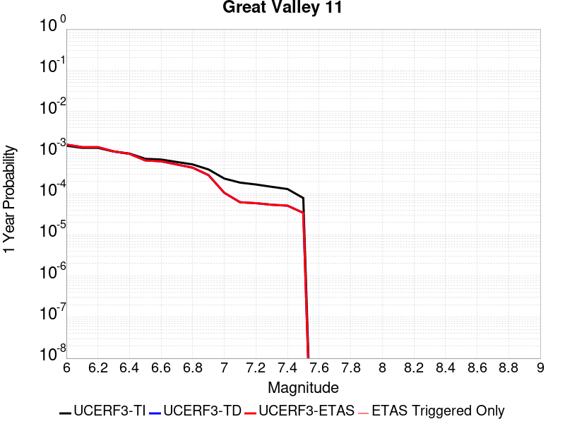 | 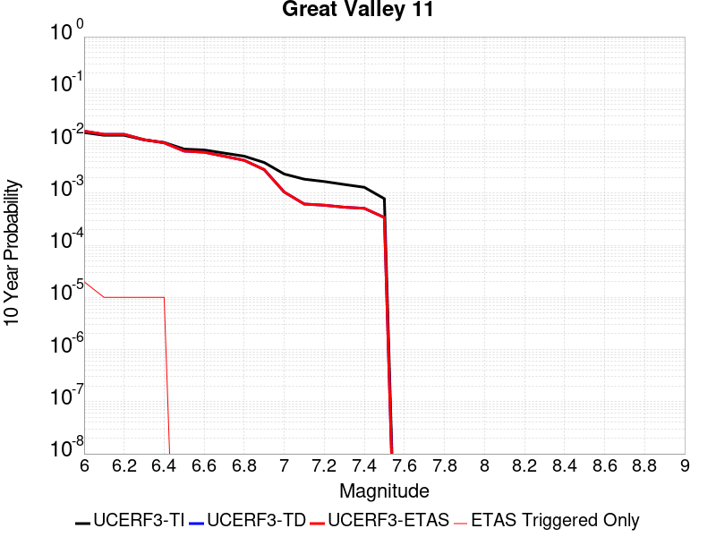 |

| Magnitude | 1 wk TI Prob | 1 wk TD Prob | 1 wk ETAS Prob | 1 wk ETAS/TD Gain | 1 wk ETAS Triggered Only | 1 mo TI Prob | 1 mo TD Prob | 1 mo ETAS Prob | 1 mo ETAS/TD Gain | 1 mo ETAS Triggered Only | 1 yr TI Prob | 1 yr TD Prob | 1 yr ETAS Prob | 1 yr ETAS/TD Gain | 1 yr ETAS Triggered Only | 10 yr TI Prob | 10 yr TD Prob | 10 yr ETAS Prob | 10 yr ETAS/TD Gain | 10 yr ETAS Triggered Only |
|-----|-----|-----|-----|-----|-----|-----|-----|-----|-----|-----|-----|-----|-----|-----|-----|-----|-----|-----|-----|-----|
| 6.0 | 2.8099583E-5 | 2.9834951E-5 | 2.9834951E-5 | 1.0 | 0.0 | 1.20421224E-4 | 1.2785822E-4 | 1.2785822E-4 | 1.0 | 0.0 | 0.0014651422 | 0.0015556357 | 0.0015556357 | 1.0 | 0.0 | 0.0145552 | 0.01545499 | 0.015474681 | 1.0012741 | 2.0E-5 |
| 6.1 | 2.483194E-5 | 2.5909536E-5 | 2.5909536E-5 | 1.0 | 0.0 | 1.0641825E-4 | 1.1103649E-4 | 1.1103649E-4 | 1.0 | 0.0 | 0.0012948721 | 0.0013510942 | 0.0013510942 | 1.0 | 0.0 | 0.012873529 | 0.013435209 | 0.013445076 | 1.0007343 | 1.0E-5 |
| 6.2 | 2.483194E-5 | 2.5909536E-5 | 2.5909536E-5 | 1.0 | 0.0 | 1.0641825E-4 | 1.1103649E-4 | 1.1103649E-4 | 1.0 | 0.0 | 0.0012948721 | 0.0013510942 | 0.0013510942 | 1.0 | 0.0 | 0.012873529 | 0.013435209 | 0.013445076 | 1.0007343 | 1.0E-5 |
| 6.3 | 2.0257901E-5 | 2.040071E-5 | 2.040071E-5 | 1.0 | 0.0 | 8.681669E-5 | 8.742892E-5 | 8.742892E-5 | 1.0 | 0.0 | 0.0010564806 | 0.0010639689 | 0.0010639689 | 1.0 | 0.0 | 0.01051472 | 0.010592921 | 0.010602815 | 1.000934 | 1.0E-5 |
| 6.4 | 1.8054898E-5 | 1.7782384E-5 | 1.7782384E-5 | 1.0 | 0.0 | 7.737584E-5 | 7.6208205E-5 | 7.6208205E-5 | 1.0 | 0.0 | 9.416436E-4 | 9.2747755E-4 | 9.2747755E-4 | 1.0 | 0.0 | 0.009376635 | 0.009239808 | 0.009249715 | 1.0010723 | 1.0E-5 |
| 6.5 | 1.34804895E-5 | 1.2321976E-5 | 1.2321976E-5 | 1.0 | 0.0 | 5.777225E-5 | 5.2807423E-5 | 5.2807423E-5 | 1.0 | 0.0 | 7.031501E-4 | 6.427449E-4 | 6.427449E-4 | 1.0 | 0.0 | 0.007009294 | 0.0064092963 | 0.0064092963 | 1.0 | 0.0 |
| 6.6 | 1.294883E-5 | 1.1733199E-5 | 1.1733199E-5 | 1.0 | 0.0 | 5.5493805E-5 | 5.028419E-5 | 5.028419E-5 | 1.0 | 0.0 | 6.754276E-4 | 6.1204215E-4 | 6.1204215E-4 | 1.0 | 0.0 | 0.006733784 | 0.006103991 | 0.006103991 | 1.0 | 0.0 |
| 6.7 | 1.1272237E-5 | 9.812625E-6 | 9.812625E-6 | 1.0 | 0.0 | 4.8308695E-5 | 4.205344E-5 | 4.205344E-5 | 1.0 | 0.0 | 5.879996E-4 | 5.118831E-4 | 5.118831E-4 | 1.0 | 0.0 | 0.005864462 | 0.0051073246 | 0.0051073246 | 1.0 | 0.0 |
| 6.8 | 9.8337505E-6 | 8.194401E-6 | 8.194401E-6 | 1.0 | 0.0 | 4.2143965E-5 | 3.5118403E-5 | 3.5118403E-5 | 1.0 | 0.0 | 5.1298196E-4 | 4.274847E-4 | 4.274847E-4 | 1.0 | 0.0 | 0.005117994 | 0.004266834 | 0.004266834 | 1.0 | 0.0 |
| 6.9 | 7.4224813E-6 | 5.41354E-6 | 5.41354E-6 | 1.0 | 0.0 | 3.1810247E-5 | 2.3200686E-5 | 2.3200686E-5 | 1.0 | 0.0 | 3.872209E-4 | 2.8243315E-4 | 2.8243315E-4 | 1.0 | 0.0 | 0.0038654688 | 0.002820883 | 0.002820883 | 1.0 | 0.0 |
| 7.0 | 4.4628923E-6 | 2.011186E-6 | 2.011186E-6 | 1.0 | 0.0 | 1.912654E-5 | 8.619341E-6 | 8.619341E-6 | 1.0 | 0.0 | 2.3284076E-4 | 1.0493554E-4 | 1.0493554E-4 | 1.0 | 0.0 | 0.0023259693 | 0.0010488715 | 0.0010488715 | 1.0 | 0.0 |
| 7.1 | 3.5546527E-6 | 1.1856338E-6 | 1.1856338E-6 | 1.0 | 0.0 | 1.5234136E-5 | 5.0812782E-6 | 5.0812782E-6 | 1.0 | 0.0 | 1.8545982E-4 | 6.186288E-5 | 6.186288E-5 | 1.0 | 0.0 | 0.0018530512 | 6.184633E-4 | 6.184633E-4 | 1.0 | 0.0 |
| 7.2 | 3.2039936E-6 | 1.1254613E-6 | 1.1254613E-6 | 1.0 | 0.0 | 1.3731329E-5 | 4.823397E-6 | 4.823397E-6 | 1.0 | 0.0 | 1.671661E-4 | 5.8723344E-5 | 5.8723344E-5 | 1.0 | 0.0 | 0.0016704041 | 5.87085E-4 | 5.87085E-4 | 1.0 | 0.0 |
| 7.3 | 2.8120473E-6 | 1.0306067E-6 | 1.0306067E-6 | 1.0 | 0.0 | 1.2051575E-5 | 4.4168787E-6 | 4.4168787E-6 | 1.0 | 0.0 | 1.4671806E-4 | 5.3774238E-5 | 5.3774238E-5 | 1.0 | 0.0 | 0.0014662122 | 5.376189E-4 | 5.376189E-4 | 1.0 | 0.0 |
| 7.4 | 2.4837766E-6 | 9.801042E-7 | 9.801042E-7 | 1.0 | 0.0 | 1.0644713E-5 | 4.2004403E-6 | 4.2004403E-6 | 1.0 | 0.0 | 1.2959167E-4 | 5.1139225E-5 | 5.1139225E-5 | 1.0 | 0.0 | 0.0012951613 | 5.1128113E-4 | 5.1128113E-4 | 1.0 | 0.0 |
| 7.5 | 1.5002679E-6 | 6.546404E-7 | 6.546404E-7 | 1.0 | 0.0 | 6.4297037E-6 | 2.805599E-6 | 2.805599E-6 | 1.0 | 0.0 | 7.827883E-5 | 3.4157674E-5 | 3.4157674E-5 | 1.0 | 0.0 | 7.825126E-4 | 3.415284E-4 | 3.415284E-4 | 1.0 | 0.0 |

## San Andreas (North Coast) 2011 CFM
*[(top)](#table-of-contents)*

| 1 Week | 1 Month | 1 Year | 10 Year |
|-----|-----|-----|-----|
|  |  |  |  |

| Magnitude | 1 wk TI Prob | 1 wk TD Prob | 1 wk ETAS Prob | 1 wk ETAS/TD Gain | 1 wk ETAS Triggered Only | 1 mo TI Prob | 1 mo TD Prob | 1 mo ETAS Prob | 1 mo ETAS/TD Gain | 1 mo ETAS Triggered Only | 1 yr TI Prob | 1 yr TD Prob | 1 yr ETAS Prob | 1 yr ETAS/TD Gain | 1 yr ETAS Triggered Only | 10 yr TI Prob | 10 yr TD Prob | 10 yr ETAS Prob | 10 yr ETAS/TD Gain | 10 yr ETAS Triggered Only |
|-----|-----|-----|-----|-----|-----|-----|-----|-----|-----|-----|-----|-----|-----|-----|-----|-----|-----|-----|-----|-----|
| 6.0 | 1.5333705E-4 | 7.124673E-5 | 7.124673E-5 | 1.0 | 0.0 | 6.5699324E-4 | 3.0530756E-4 | 3.0530756E-4 | 1.0 | 0.0 | 0.007969595 | 0.0037108182 | 0.0037108182 | 1.0 | 0.0 | 0.0768977 | 0.03942352 | 0.039433125 | 1.0002437 | 1.0E-5 |
| 6.1 | 1.5333705E-4 | 7.124673E-5 | 7.124673E-5 | 1.0 | 0.0 | 6.5699324E-4 | 3.0530756E-4 | 3.0530756E-4 | 1.0 | 0.0 | 0.007969595 | 0.0037108182 | 0.0037108182 | 1.0 | 0.0 | 0.0768977 | 0.03942352 | 0.039433125 | 1.0002437 | 1.0E-5 |
| 6.2 | 1.3912938E-4 | 6.0624283E-5 | 6.0624283E-5 | 1.0 | 0.0 | 5.961325E-4 | 2.5979264E-4 | 2.5979264E-4 | 1.0 | 0.0 | 0.007233787 | 0.0031584147 | 0.0031584147 | 1.0 | 0.0 | 0.07002798 | 0.033759438 | 0.033769097 | 1.0002862 | 1.0E-5 |
| 6.3 | 1.3912938E-4 | 6.0624283E-5 | 6.0624283E-5 | 1.0 | 0.0 | 5.961325E-4 | 2.5979264E-4 | 2.5979264E-4 | 1.0 | 0.0 | 0.007233787 | 0.0031584147 | 0.0031584147 | 1.0 | 0.0 | 0.07002798 | 0.033759438 | 0.033769097 | 1.0002862 | 1.0E-5 |
| 6.4 | 1.2623647E-4 | 5.0548093E-5 | 5.0548093E-5 | 1.0 | 0.0 | 5.4090127E-4 | 2.1661681E-4 | 2.1661681E-4 | 1.0 | 0.0 | 0.0065656058 | 0.00263414 | 0.00263414 | 1.0 | 0.0 | 0.06374981 | 0.028359612 | 0.028369328 | 1.0003426 | 1.0E-5 |
| 6.5 | 1.1736096E-4 | 4.3619268E-5 | 4.3619268E-5 | 1.0 | 0.0 | 5.028786E-4 | 1.8692642E-4 | 1.8692642E-4 | 1.0 | 0.0 | 0.006105373 | 0.0022734702 | 0.0022734702 | 1.0 | 0.0 | 0.05940335 | 0.024632612 | 0.024642367 | 1.000396 | 1.0E-5 |
| 6.6 | 1.1586959E-4 | 4.2517324E-5 | 4.2517324E-5 | 1.0 | 0.0 | 4.964894E-4 | 1.8220446E-4 | 1.8220446E-4 | 1.0 | 0.0 | 0.006028018 | 0.0022160986 | 0.0022160986 | 1.0 | 0.0 | 0.058671024 | 0.024038248 | 0.024048008 | 1.000406 | 1.0E-5 |
| 6.7 | 1.13693764E-4 | 4.0827243E-5 | 4.0827243E-5 | 1.0 | 0.0 | 4.87168E-4 | 1.7496225E-4 | 1.7496225E-4 | 1.0 | 0.0 | 0.005915152 | 0.0021281003 | 0.0021281003 | 1.0 | 0.0 | 0.057601593 | 0.023128685 | 0.023138452 | 1.0004224 | 1.0E-5 |
| 6.8 | 1.1204889E-4 | 4.004314E-5 | 4.004314E-5 | 1.0 | 0.0 | 4.8012115E-4 | 1.7160227E-4 | 1.7160227E-4 | 1.0 | 0.0 | 0.005829819 | 0.0020872715 | 0.0020872715 | 1.0 | 0.0 | 0.05679232 | 0.02268742 | 0.022697194 | 1.0004308 | 1.0E-5 |
| 6.9 | 1.1005794E-4 | 3.9097245E-5 | 3.9097245E-5 | 1.0 | 0.0 | 4.7159163E-4 | 1.6754896E-4 | 1.6754896E-4 | 1.0 | 0.0 | 0.0057265228 | 0.002038016 | 0.002038016 | 1.0 | 0.0 | 0.055811852 | 0.02215222 | 0.022161998 | 1.0004414 | 1.0E-5 |
| 7.0 | 1.0647948E-4 | 3.724759E-5 | 3.724759E-5 | 1.0 | 0.0 | 4.562608E-4 | 1.5962285E-4 | 1.5962285E-4 | 1.0 | 0.0 | 0.0055408357 | 0.0019416915 | 0.0019416915 | 1.0 | 0.0 | 0.054047033 | 0.021109186 | 0.021118974 | 1.0004637 | 1.0E-5 |
| 7.1 | 1.04795035E-4 | 3.6294154E-5 | 3.6294154E-5 | 1.0 | 0.0 | 4.4904428E-4 | 1.5553719E-4 | 1.5553719E-4 | 1.0 | 0.0 | 0.0054534175 | 0.001892036 | 0.001892036 | 1.0 | 0.0 | 0.053215165 | 0.020576846 | 0.020586642 | 1.000476 | 1.0E-5 |
| 7.2 | 1.02724036E-4 | 3.520005E-5 | 3.520005E-5 | 1.0 | 0.0 | 4.401716E-4 | 1.5084872E-4 | 1.5084872E-4 | 1.0 | 0.0 | 0.0053459285 | 0.0018350515 | 0.0018350515 | 1.0 | 0.0 | 0.052191395 | 0.01996491 | 0.019974709 | 1.0004909 | 1.0E-5 |
| 7.3 | 1.00650694E-4 | 3.4665736E-5 | 3.4665736E-5 | 1.0 | 0.0 | 4.312888E-4 | 1.4855908E-4 | 1.4855908E-4 | 1.0 | 0.0 | 0.005238306 | 0.0018072216 | 0.0018072216 | 1.0 | 0.0 | 0.051165357 | 0.019641502 | 0.019651305 | 1.0004991 | 1.0E-5 |
| 7.4 | 9.672919E-5 | 3.3450186E-5 | 3.3450186E-5 | 1.0 | 0.0 | 4.144878E-4 | 1.4335015E-4 | 1.4335015E-4 | 1.0 | 0.0 | 0.005034718 | 0.0017439061 | 0.0017439061 | 1.0 | 0.0 | 0.049221683 | 0.018912597 | 0.018922409 | 1.0005188 | 1.0E-5 |
| 7.5 | 8.7600405E-5 | 2.2756996E-5 | 2.2756996E-5 | 1.0 | 0.0 | 3.753763E-4 | 9.752635E-5 | 9.752635E-5 | 1.0 | 0.0 | 0.0045606326 | 0.0011867384 | 0.0011867384 | 1.0 | 0.0 | 0.04468165 | 0.013163515 | 0.013173385 | 1.0007497 | 1.0E-5 |
| 7.6 | 7.9562284E-5 | 1.9277217E-5 | 1.9277217E-5 | 1.0 | 0.0 | 3.4093665E-4 | 8.261403E-5 | 8.261403E-5 | 1.0 | 0.0 | 0.0041430052 | 0.0010053633 | 0.0010053633 | 1.0 | 0.0 | 0.040666126 | 0.011252493 | 0.01126238 | 1.0008787 | 1.0E-5 |
| 7.7 | 6.3866544E-5 | 1.1981178E-5 | 1.1981178E-5 | 1.0 | 0.0 | 2.7368503E-4 | 5.13469E-5 | 5.13469E-5 | 1.0 | 0.0 | 0.0033270244 | 6.249694E-4 | 6.249694E-4 | 1.0 | 0.0 | 0.032776527 | 0.007233649 | 0.007243577 | 1.0013725 | 1.0E-5 |
| 7.8 | 4.2543215E-5 | 9.109041E-6 | 9.109041E-6 | 1.0 | 0.0 | 1.8231533E-4 | 3.903816E-5 | 3.903816E-5 | 1.0 | 0.0 | 0.0022174292 | 4.7518607E-4 | 4.7518607E-4 | 1.0 | 0.0 | 0.021954332 | 0.0055094925 | 0.005519437 | 1.0018051 | 1.0E-5 |
| 7.9 | 2.2636612E-5 | 7.842137E-6 | 7.842137E-6 | 1.0 | 0.0 | 9.7010445E-5 | 3.360873E-5 | 3.360873E-5 | 1.0 | 0.0 | 0.0011804621 | 4.0910952E-4 | 4.0910952E-4 | 1.0 | 0.0 | 0.011742111 | 0.004699036 | 0.004708989 | 1.0021181 | 1.0E-5 |
| 8.0 | 1.5167874E-5 | 7.0747274E-6 | 7.0747274E-6 | 1.0 | 0.0 | 6.500356E-5 | 3.0319907E-5 | 3.0319907E-5 | 1.0 | 0.0 | 7.9113094E-4 | 3.6908244E-4 | 3.6908244E-4 | 1.0 | 0.0 | 0.007883203 | 0.004229726 | 0.0042396835 | 1.0023543 | 1.0E-5 |
| 8.1 | 1.0681047E-5 | 6.4101073E-6 | 6.4101073E-6 | 1.0 | 0.0 | 4.5775112E-5 | 2.7471599E-5 | 2.7471599E-5 | 1.0 | 0.0 | 5.5716943E-4 | 3.3441547E-4 | 3.3441547E-4 | 1.0 | 0.0 | 0.0055577457 | 0.0038302164 | 0.003840178 | 1.0026008 | 1.0E-5 |
| 8.2 | 8.226114E-6 | 5.133151E-6 | 5.133151E-6 | 1.0 | 0.0 | 3.52543E-5 | 2.1999032E-5 | 2.1999032E-5 | 1.0 | 0.0 | 4.2913653E-4 | 2.678054E-4 | 2.678054E-4 | 1.0 | 0.0 | 0.004283088 | 0.0030550708 | 0.0030550708 | 1.0 | 0.0 |
| 8.3 | 1.983087E-6 | 7.690063E-7 | 7.690063E-7 | 1.0 | 0.0 | 8.498917E-6 | 3.295737E-6 | 3.295737E-6 | 1.0 | 0.0 | 1.034694E-4 | 4.012488E-5 | 4.012488E-5 | 1.0 | 0.0 | 0.0010342124 | 4.737206E-4 | 4.737206E-4 | 1.0 | 0.0 |

## San Luis Range - Oceano 2011 CFM
*[(top)](#table-of-contents)*

| 1 Week | 1 Month | 1 Year | 10 Year |
|-----|-----|-----|-----|
|  |  |  |  |

| Magnitude | 1 wk TI Prob | 1 wk TD Prob | 1 wk ETAS Prob | 1 wk ETAS/TD Gain | 1 wk ETAS Triggered Only | 1 mo TI Prob | 1 mo TD Prob | 1 mo ETAS Prob | 1 mo ETAS/TD Gain | 1 mo ETAS Triggered Only | 1 yr TI Prob | 1 yr TD Prob | 1 yr ETAS Prob | 1 yr ETAS/TD Gain | 1 yr ETAS Triggered Only | 10 yr TI Prob | 10 yr TD Prob | 10 yr ETAS Prob | 10 yr ETAS/TD Gain | 10 yr ETAS Triggered Only |
|-----|-----|-----|-----|-----|-----|-----|-----|-----|-----|-----|-----|-----|-----|-----|-----|-----|-----|-----|-----|-----|
| 6.0 | 1.6025788E-6 | 1.6201284E-6 | 1.6201284E-6 | 1.0 | 0.0 | 6.8681766E-6 | 6.9433913E-6 | 6.9433913E-6 | 1.0 | 0.0 | 8.361684E-5 | 8.453293E-5 | 8.453293E-5 | 1.0 | 0.0 | 8.3585386E-4 | 8.450485E-4 | 8.5504004E-4 | 1.0118237 | 1.0E-5 |
| 6.1 | 1.6025788E-6 | 1.6201284E-6 | 1.6201284E-6 | 1.0 | 0.0 | 6.8681766E-6 | 6.9433913E-6 | 6.9433913E-6 | 1.0 | 0.0 | 8.361684E-5 | 8.453293E-5 | 8.453293E-5 | 1.0 | 0.0 | 8.3585386E-4 | 8.450485E-4 | 8.5504004E-4 | 1.0118237 | 1.0E-5 |
| 6.2 | 1.6025788E-6 | 1.6201284E-6 | 1.6201284E-6 | 1.0 | 0.0 | 6.8681766E-6 | 6.9433913E-6 | 6.9433913E-6 | 1.0 | 0.0 | 8.361684E-5 | 8.453293E-5 | 8.453293E-5 | 1.0 | 0.0 | 8.3585386E-4 | 8.450485E-4 | 8.5504004E-4 | 1.0118237 | 1.0E-5 |
| 6.3 | 1.6025788E-6 | 1.6201284E-6 | 1.6201284E-6 | 1.0 | 0.0 | 6.8681766E-6 | 6.9433913E-6 | 6.9433913E-6 | 1.0 | 0.0 | 8.361684E-5 | 8.453293E-5 | 8.453293E-5 | 1.0 | 0.0 | 8.3585386E-4 | 8.450485E-4 | 8.5504004E-4 | 1.0118237 | 1.0E-5 |
| 6.4 | 1.1621186E-6 | 1.1749963E-6 | 1.1749963E-6 | 1.0 | 0.0 | 4.980499E-6 | 5.0356903E-6 | 5.0356903E-6 | 1.0 | 0.0 | 6.0635884E-5 | 6.130808E-5 | 6.130808E-5 | 1.0 | 0.0 | 6.0619344E-4 | 6.1293825E-4 | 6.229321E-4 | 1.0163049 | 1.0E-5 |
| 6.5 | 1.1621186E-6 | 1.1749963E-6 | 1.1749963E-6 | 1.0 | 0.0 | 4.980499E-6 | 5.0356903E-6 | 5.0356903E-6 | 1.0 | 0.0 | 6.0635884E-5 | 6.130808E-5 | 6.130808E-5 | 1.0 | 0.0 | 6.0619344E-4 | 6.1293825E-4 | 6.229321E-4 | 1.0163049 | 1.0E-5 |
| 6.6 | 7.164729E-7 | 7.2486233E-7 | 7.2486233E-7 | 1.0 | 0.0 | 3.0705946E-6 | 3.1065492E-6 | 3.1065492E-6 | 1.0 | 0.0 | 3.738385E-5 | 3.78216E-5 | 3.78216E-5 | 1.0 | 0.0 | 3.737756E-4 | 3.7815337E-4 | 3.7815337E-4 | 1.0 | 0.0 |
| 6.7 | 7.164729E-7 | 7.2486233E-7 | 7.2486233E-7 | 1.0 | 0.0 | 3.0705946E-6 | 3.1065492E-6 | 3.1065492E-6 | 1.0 | 0.0 | 3.738385E-5 | 3.78216E-5 | 3.78216E-5 | 1.0 | 0.0 | 3.737756E-4 | 3.7815337E-4 | 3.7815337E-4 | 1.0 | 0.0 |
| 6.8 | 6.700177E-7 | 6.777481E-7 | 6.777481E-7 | 1.0 | 0.0 | 2.8715012E-6 | 2.9046316E-6 | 2.9046316E-6 | 1.0 | 0.0 | 3.495997E-5 | 3.5363333E-5 | 3.5363333E-5 | 1.0 | 0.0 | 3.495447E-4 | 3.535787E-4 | 3.535787E-4 | 1.0 | 0.0 |
| 6.9 | 5.657865E-7 | 5.721821E-7 | 5.721821E-7 | 1.0 | 0.0 | 2.424797E-6 | 2.4522067E-6 | 2.4522067E-6 | 1.0 | 0.0 | 2.9521503E-5 | 2.9855219E-5 | 2.9855219E-5 | 1.0 | 0.0 | 2.9517582E-4 | 2.9851313E-4 | 2.9851313E-4 | 1.0 | 0.0 |
| 7.0 | 4.608413E-7 | 4.6601969E-7 | 4.6601969E-7 | 1.0 | 0.0 | 1.9750328E-6 | 1.9972258E-6 | 1.9972258E-6 | 1.0 | 0.0 | 2.4045758E-5 | 2.4315956E-5 | 2.4315956E-5 | 1.0 | 0.0 | 2.4043156E-4 | 2.4313324E-4 | 2.4313324E-4 | 1.0 | 0.0 |
| 7.1 | 3.9177846E-7 | 3.962184E-7 | 3.962184E-7 | 1.0 | 0.0 | 1.6790494E-6 | 1.6980779E-6 | 1.6980779E-6 | 1.0 | 0.0 | 2.0442236E-5 | 2.0673902E-5 | 2.0673902E-5 | 1.0 | 0.0 | 2.0440355E-4 | 2.0671995E-4 | 2.0671995E-4 | 1.0 | 0.0 |
| 7.2 | 3.3974752E-7 | 3.436674E-7 | 3.436674E-7 | 1.0 | 0.0 | 1.45606E-6 | 1.4728595E-6 | 1.4728595E-6 | 1.0 | 0.0 | 1.7727387E-5 | 1.7931918E-5 | 1.7931918E-5 | 1.0 | 0.0 | 1.7725973E-4 | 1.7930481E-4 | 1.7930481E-4 | 1.0 | 0.0 |
| 7.3 | 2.8900928E-7 | 2.9234198E-7 | 2.9234198E-7 | 1.0 | 0.0 | 1.2386106E-6 | 1.2528936E-6 | 1.2528936E-6 | 1.0 | 0.0 | 1.5079979E-5 | 1.5253873E-5 | 1.5253873E-5 | 1.0 | 0.0 | 1.5078956E-4 | 1.5252834E-4 | 1.5252834E-4 | 1.0 | 0.0 |
| 7.4 | 2.1881527E-7 | 2.2139733E-7 | 2.2139733E-7 | 1.0 | 0.0 | 9.3777936E-7 | 9.4884535E-7 | 9.4884535E-7 | 1.0 | 0.0 | 1.14174045E-5 | 1.1552132E-5 | 1.1552132E-5 | 1.0 | 0.0 | 1.1416818E-4 | 1.15515366E-4 | 1.15515366E-4 | 1.0 | 0.0 |
| 7.5 | 1.356398E-7 | 1.3718723E-7 | 1.3718723E-7 | 1.0 | 0.0 | 5.813133E-7 | 5.879451E-7 | 5.879451E-7 | 1.0 | 0.0 | 7.0774663E-6 | 7.1582085E-6 | 7.1582085E-6 | 1.0 | 0.0 | 7.077241E-5 | 7.157981E-5 | 7.157981E-5 | 1.0 | 0.0 |
| 7.6 | 5.9269272E-8 | 6.0014045E-8 | 6.0014045E-8 | 1.0 | 0.0 | 2.5401116E-7 | 2.5720303E-7 | 2.5720303E-7 | 1.0 | 0.0 | 3.0925814E-6 | 3.1314426E-6 | 3.1314426E-6 | 1.0 | 0.0 | 3.0925385E-5 | 3.1313997E-5 | 3.1313997E-5 | 1.0 | 0.0 |
| 7.7 | 5.946232E-9 | 6.0369776E-9 | 6.0369776E-9 | 1.0 | 0.0 | 2.5483851E-8 | 2.587276E-8 | 2.587276E-8 | 1.0 | 0.0 | 3.1026585E-7 | 3.1500082E-7 | 3.1500082E-7 | 1.0 | 0.0 | 3.102654E-6 | 3.1500044E-6 | 3.1500044E-6 | 1.0 | 0.0 |

## King Range 2011 CFM
*[(top)](#table-of-contents)*

| 1 Week | 1 Month | 1 Year | 10 Year |
|-----|-----|-----|-----|
|  |  |  |  |

| Magnitude | 1 wk TI Prob | 1 wk TD Prob | 1 wk ETAS Prob | 1 wk ETAS/TD Gain | 1 wk ETAS Triggered Only | 1 mo TI Prob | 1 mo TD Prob | 1 mo ETAS Prob | 1 mo ETAS/TD Gain | 1 mo ETAS Triggered Only | 1 yr TI Prob | 1 yr TD Prob | 1 yr ETAS Prob | 1 yr ETAS/TD Gain | 1 yr ETAS Triggered Only | 10 yr TI Prob | 10 yr TD Prob | 10 yr ETAS Prob | 10 yr ETAS/TD Gain | 10 yr ETAS Triggered Only |
|-----|-----|-----|-----|-----|-----|-----|-----|-----|-----|-----|-----|-----|-----|-----|-----|-----|-----|-----|-----|-----|
| 6.0 | 1.2462566E-5 | 1.3022665E-5 | 1.3022665E-5 | 1.0 | 0.0 | 5.34099E-5 | 5.5810426E-5 | 5.5810426E-5 | 1.0 | 0.0 | 6.5007154E-4 | 6.79315E-4 | 6.79315E-4 | 1.0 | 0.0 | 0.0064817313 | 0.006776772 | 0.0067867045 | 1.0014657 | 1.0E-5 |
| 6.1 | 1.2462566E-5 | 1.3022665E-5 | 1.3022665E-5 | 1.0 | 0.0 | 5.34099E-5 | 5.5810426E-5 | 5.5810426E-5 | 1.0 | 0.0 | 6.5007154E-4 | 6.79315E-4 | 6.79315E-4 | 1.0 | 0.0 | 0.0064817313 | 0.006776772 | 0.0067867045 | 1.0014657 | 1.0E-5 |
| 6.2 | 1.2462566E-5 | 1.3022665E-5 | 1.3022665E-5 | 1.0 | 0.0 | 5.34099E-5 | 5.5810426E-5 | 5.5810426E-5 | 1.0 | 0.0 | 6.5007154E-4 | 6.79315E-4 | 6.79315E-4 | 1.0 | 0.0 | 0.0064817313 | 0.006776772 | 0.0067867045 | 1.0014657 | 1.0E-5 |
| 6.3 | 7.988484E-6 | 8.213591E-6 | 8.213591E-6 | 1.0 | 0.0 | 3.423591E-5 | 3.52007E-5 | 3.52007E-5 | 1.0 | 0.0 | 4.1674246E-4 | 4.2849718E-4 | 4.2849718E-4 | 1.0 | 0.0 | 0.004159618 | 0.004278928 | 0.0042888853 | 1.0023271 | 1.0E-5 |
| 6.4 | 7.988484E-6 | 8.213591E-6 | 8.213591E-6 | 1.0 | 0.0 | 3.423591E-5 | 3.52007E-5 | 3.52007E-5 | 1.0 | 0.0 | 4.1674246E-4 | 4.2849718E-4 | 4.2849718E-4 | 1.0 | 0.0 | 0.004159618 | 0.004278928 | 0.0042888853 | 1.0023271 | 1.0E-5 |
| 6.5 | 5.0522513E-6 | 5.0819467E-6 | 5.0819467E-6 | 1.0 | 0.0 | 2.1652326E-5 | 2.1779595E-5 | 2.1779595E-5 | 1.0 | 0.0 | 2.6358519E-4 | 2.6513523E-4 | 2.6513523E-4 | 1.0 | 0.0 | 0.0026327274 | 0.002649229 | 0.002649229 | 1.0 | 0.0 |
| 6.6 | 4.53682E-6 | 4.538631E-6 | 4.538631E-6 | 1.0 | 0.0 | 1.944337E-5 | 1.9451134E-5 | 1.9451134E-5 | 1.0 | 0.0 | 2.3669732E-4 | 2.3679242E-4 | 2.3679242E-4 | 1.0 | 0.0 | 0.0023644536 | 0.0023664085 | 0.0023664085 | 1.0 | 0.0 |
| 6.7 | 4.1144335E-6 | 4.0966515E-6 | 4.0966515E-6 | 1.0 | 0.0 | 1.7633167E-5 | 1.7556962E-5 | 1.7556962E-5 | 1.0 | 0.0 | 2.1466266E-4 | 2.1373545E-4 | 2.1373545E-4 | 1.0 | 0.0 | 0.0021445542 | 0.0021362852 | 0.0021362852 | 1.0 | 0.0 |
| 6.8 | 3.8321214E-6 | 3.8070925E-6 | 3.8070925E-6 | 1.0 | 0.0 | 1.6423275E-5 | 1.6316011E-5 | 1.6316011E-5 | 1.0 | 0.0 | 1.9993502E-4 | 1.9862966E-4 | 1.9862966E-4 | 1.0 | 0.0 | 0.0019975523 | 0.0019855013 | 0.0019855013 | 1.0 | 0.0 |
| 6.9 | 3.4999944E-6 | 3.463519E-6 | 3.463519E-6 | 1.0 | 0.0 | 1.499989E-5 | 1.484357E-5 | 1.484357E-5 | 1.0 | 0.0 | 1.8260835E-4 | 1.8070573E-4 | 1.8070573E-4 | 1.0 | 0.0 | 0.0018245836 | 0.0018065603 | 0.0018065603 | 1.0 | 0.0 |
| 7.0 | 2.9470837E-6 | 2.8865973E-6 | 2.8865973E-6 | 1.0 | 0.0 | 1.26302975E-5 | 1.2371073E-5 | 1.2371073E-5 | 1.0 | 0.0 | 1.5376302E-4 | 1.506076E-4 | 1.506076E-4 | 1.0 | 0.0 | 0.0015365666 | 0.0015060179 | 0.0015060179 | 1.0 | 0.0 |
| 7.1 | 2.4850247E-6 | 2.3978553E-6 | 2.3978553E-6 | 1.0 | 0.0 | 1.0650062E-5 | 1.0276483E-5 | 1.0276483E-5 | 1.0 | 0.0 | 1.296568E-4 | 1.2510915E-4 | 1.2510915E-4 | 1.0 | 0.0 | 0.0012958117 | 0.0012513464 | 0.0012513464 | 1.0 | 0.0 |
| 7.2 | 2.1800304E-6 | 2.076136E-6 | 2.076136E-6 | 1.0 | 0.0 | 9.342954E-6 | 8.897696E-6 | 8.897696E-6 | 1.0 | 0.0 | 1.1374453E-4 | 1.0832415E-4 | 1.0832415E-4 | 1.0 | 0.0 | 0.0011368633 | 0.0010836559 | 0.0010836559 | 1.0 | 0.0 |
| 7.3 | 2.0378504E-6 | 1.9497054E-6 | 1.9497054E-6 | 1.0 | 0.0 | 8.733615E-6 | 8.355854E-6 | 8.355854E-6 | 1.0 | 0.0 | 1.0632657E-4 | 1.0172786E-4 | 1.0172786E-4 | 1.0 | 0.0 | 0.0010627571 | 0.0010177415 | 0.0010177415 | 1.0 | 0.0 |
| 7.4 | 1.4577047E-6 | 1.4095921E-6 | 1.4095921E-6 | 1.0 | 0.0 | 6.247291E-6 | 6.0410953E-6 | 6.0410953E-6 | 1.0 | 0.0 | 7.605811E-5 | 7.3547926E-5 | 7.3547926E-5 | 1.0 | 0.0 | 7.603208E-4 | 7.361136E-4 | 7.361136E-4 | 1.0 | 0.0 |
| 7.5 | 8.0685743E-7 | 6.5368414E-7 | 6.5368414E-7 | 1.0 | 0.0 | 3.457956E-6 | 2.8015006E-6 | 2.8015006E-6 | 1.0 | 0.0 | 4.20998E-5 | 3.4107783E-5 | 3.4107783E-5 | 1.0 | 0.0 | 4.2091825E-4 | 3.417413E-4 | 3.417413E-4 | 1.0 | 0.0 |
| 7.6 | 3.1239435E-7 | 1.3281762E-7 | 1.3281762E-7 | 1.0 | 0.0 | 1.3388321E-6 | 5.6921823E-7 | 5.6921823E-7 | 1.0 | 0.0 | 1.630016E-5 | 6.9302105E-6 | 6.9302105E-6 | 1.0 | 0.0 | 1.6298964E-4 | 6.995385E-5 | 6.995385E-5 | 1.0 | 0.0 |
| 7.7 | 1.7747207E-7 | 4.7799166E-8 | 4.7799166E-8 | 1.0 | 0.0 | 7.605944E-7 | 2.0485354E-7 | 2.0485354E-7 | 1.0 | 0.0 | 9.260198E-6 | 2.4940891E-6 | 2.4940891E-6 | 1.0 | 0.0 | 9.2598115E-5 | 2.535763E-5 | 2.535763E-5 | 1.0 | 0.0 |
| 7.8 | 2.1035538E-8 | 2.2031448E-9 | 2.2031448E-9 | 1.0 | 0.0 | 9.0152305E-8 | 9.442049E-9 | 9.442049E-9 | 1.0 | 0.0 | 1.0976038E-6 | 1.1495695E-7 | 1.1495695E-7 | 1.0 | 0.0 | 1.0975983E-5 | 1.1862359E-6 | 1.1862359E-6 | 1.0 | 0.0 |
| 7.9 | 1.4782963E-9 | 8.796297E-13 | 8.796297E-13 | 1.0 | 0.0 | 6.335555E-9 | 3.7704284E-12 | 3.7704284E-12 | 1.0 | 0.0 | 7.713538E-8 | 4.5902504E-11 | 4.5902504E-11 | 1.0 | 0.0 | 7.7135354E-7 | 6.632832E-10 | 6.632832E-10 | 1.0 | 0.0 |

## Calaveras (No) 2011 CFM
*[(top)](#table-of-contents)*

| 1 Week | 1 Month | 1 Year | 10 Year |
|-----|-----|-----|-----|
|  |  |  |  |

| Magnitude | 1 wk TI Prob | 1 wk TD Prob | 1 wk ETAS Prob | 1 wk ETAS/TD Gain | 1 wk ETAS Triggered Only | 1 mo TI Prob | 1 mo TD Prob | 1 mo ETAS Prob | 1 mo ETAS/TD Gain | 1 mo ETAS Triggered Only | 1 yr TI Prob | 1 yr TD Prob | 1 yr ETAS Prob | 1 yr ETAS/TD Gain | 1 yr ETAS Triggered Only | 10 yr TI Prob | 10 yr TD Prob | 10 yr ETAS Prob | 10 yr ETAS/TD Gain | 10 yr ETAS Triggered Only |
|-----|-----|-----|-----|-----|-----|-----|-----|-----|-----|-----|-----|-----|-----|-----|-----|-----|-----|-----|-----|-----|
| 6.0 | 4.8694856E-5 | 6.7519904E-5 | 6.7519904E-5 | 1.0 | 0.0 | 2.0867554E-4 | 2.8933946E-4 | 2.8933946E-4 | 1.0 | 0.0 | 0.0025376645 | 0.0035170133 | 0.0035269782 | 1.0028334 | 1.0E-5 | 0.02508881 | 0.034793913 | 0.034803566 | 1.0002774 | 1.0E-5 |
| 6.1 | 4.8694856E-5 | 6.7519904E-5 | 6.7519904E-5 | 1.0 | 0.0 | 2.0867554E-4 | 2.8933946E-4 | 2.8933946E-4 | 1.0 | 0.0 | 0.0025376645 | 0.0035170133 | 0.0035269782 | 1.0028334 | 1.0E-5 | 0.02508881 | 0.034793913 | 0.034803566 | 1.0002774 | 1.0E-5 |
| 6.2 | 4.7541962E-5 | 6.585073E-5 | 6.585073E-5 | 1.0 | 0.0 | 2.0373536E-4 | 2.8218745E-4 | 2.8218745E-4 | 1.0 | 0.0 | 0.0024776561 | 0.0034302373 | 0.0034402031 | 1.0029052 | 1.0E-5 | 0.024502134 | 0.033955194 | 0.033964854 | 1.0002846 | 1.0E-5 |
| 6.3 | 4.6717287E-5 | 6.468407E-5 | 6.468407E-5 | 1.0 | 0.0 | 2.0020158E-4 | 2.7718878E-4 | 2.7718878E-4 | 1.0 | 0.0 | 0.0024347296 | 0.0033695772 | 0.0033795435 | 1.0029577 | 1.0E-5 | 0.024082264 | 0.033367604 | 0.03337727 | 1.0002897 | 1.0E-5 |
| 6.4 | 4.6276386E-5 | 6.404562E-5 | 6.404562E-5 | 1.0 | 0.0 | 1.983123E-4 | 2.7445317E-4 | 2.7445317E-4 | 1.0 | 0.0 | 0.0024117786 | 0.0033363812 | 0.0033463477 | 1.0029873 | 1.0E-5 | 0.02385771 | 0.03304642 | 0.033056088 | 1.0002927 | 1.0E-5 |
| 6.5 | 4.5720994E-5 | 6.324692E-5 | 6.324692E-5 | 1.0 | 0.0 | 1.9593239E-4 | 2.710311E-4 | 2.710311E-4 | 1.0 | 0.0 | 0.002382867 | 0.003294852 | 0.003304819 | 1.003025 | 1.0E-5 | 0.023574775 | 0.032644313 | 0.032653984 | 1.0002964 | 1.0E-5 |
| 6.6 | 4.549134E-5 | 6.289995E-5 | 6.289995E-5 | 1.0 | 0.0 | 1.949483E-4 | 2.6954443E-4 | 2.6954443E-4 | 1.0 | 0.0 | 0.0023709119 | 0.003276806 | 0.0032867733 | 1.0030417 | 1.0E-5 | 0.023457756 | 0.0324696 | 0.032479275 | 1.000298 | 1.0E-5 |
| 6.7 | 3.701047E-5 | 5.0402305E-5 | 5.0402305E-5 | 1.0 | 0.0 | 1.5860666E-4 | 2.1599224E-4 | 2.1599224E-4 | 1.0 | 0.0 | 0.0019293258 | 0.0026265776 | 0.0026365514 | 1.0037973 | 1.0E-5 | 0.019126613 | 0.026146615 | 0.026156355 | 1.0003724 | 1.0E-5 |
| 6.8 | 3.5523568E-5 | 4.838363E-5 | 4.838363E-5 | 1.0 | 0.0 | 1.5223498E-4 | 2.0734218E-4 | 2.0734218E-4 | 1.0 | 0.0 | 0.0018518851 | 0.0025215116 | 0.0025314863 | 1.0039558 | 1.0E-5 | 0.018365284 | 0.025118496 | 0.025128245 | 1.0003881 | 1.0E-5 |
| 6.9 | 3.2946147E-5 | 4.470384E-5 | 4.470384E-5 | 1.0 | 0.0 | 1.4119013E-4 | 1.9157406E-4 | 1.9157406E-4 | 1.0 | 0.0 | 0.0017176344 | 0.0023299614 | 0.0023399382 | 1.0042819 | 1.0E-5 | 0.017044188 | 0.023239722 | 0.02324949 | 1.0004203 | 1.0E-5 |
| 7.0 | 2.7682381E-5 | 3.7062546E-5 | 3.7062546E-5 | 1.0 | 0.0 | 1.1863338E-4 | 1.5882998E-4 | 1.5882998E-4 | 1.0 | 0.0 | 0.0014434044 | 0.00193207 | 0.0019420506 | 1.0051658 | 1.0E-5 | 0.01434065 | 0.01933066 | 0.019340467 | 1.0005074 | 1.0E-5 |
| 7.1 | 2.471967E-5 | 3.3326065E-5 | 3.3326065E-5 | 1.0 | 0.0 | 1.05937135E-4 | 1.4281833E-4 | 1.4281833E-4 | 1.0 | 0.0 | 0.0012890215 | 0.0017374554 | 0.001747438 | 1.0057455 | 1.0E-5 | 0.0128157 | 0.017405737 | 0.017415565 | 1.0005646 | 1.0E-5 |
| 7.2 | 1.9748062E-5 | 2.6813037E-5 | 2.6813037E-5 | 1.0 | 0.0 | 8.463181E-5 | 1.14908085E-4 | 1.14908085E-4 | 1.0 | 0.0 | 0.0010299052 | 0.0013981316 | 0.0014081176 | 1.0071424 | 1.0E-5 | 0.01025145 | 0.014049704 | 0.014059564 | 1.0007018 | 1.0E-5 |
| 7.3 | 1.1603734E-5 | 1.5818247E-5 | 1.5818247E-5 | 1.0 | 0.0 | 4.9729337E-5 | 6.77908E-5 | 6.77908E-5 | 1.0 | 0.0 | 6.052865E-4 | 8.250547E-4 | 8.250547E-4 | 1.0 | 0.0 | 0.0060364045 | 0.008325801 | 0.008325801 | 1.0 | 0.0 |
| 7.4 | 4.885381E-6 | 6.0418324E-6 | 6.0418324E-6 | 1.0 | 0.0 | 2.0937177E-5 | 2.5893312E-5 | 2.5893312E-5 | 1.0 | 0.0 | 2.5488032E-4 | 3.1520563E-4 | 3.1520563E-4 | 1.0 | 0.0 | 0.0025458818 | 0.003204309 | 0.003204309 | 1.0 | 0.0 |
| 7.5 | 3.0571264E-6 | 4.161769E-6 | 4.161769E-6 | 1.0 | 0.0 | 1.3101904E-5 | 1.7836031E-5 | 1.7836031E-5 | 1.0 | 0.0 | 1.5950401E-4 | 2.1713214E-4 | 2.1713214E-4 | 1.0 | 0.0 | 0.0015938957 | 0.002224247 | 0.002224247 | 1.0 | 0.0 |
| 7.6 | 1.764948E-6 | 2.801614E-6 | 2.801614E-6 | 1.0 | 0.0 | 7.564041E-6 | 1.2006863E-5 | 1.2006863E-5 | 1.0 | 0.0 | 9.208831E-5 | 1.4617383E-4 | 1.4617383E-4 | 1.0 | 0.0 | 9.205016E-4 | 0.0015155292 | 0.0015155292 | 1.0 | 0.0 |
| 7.7 | 1.3173734E-6 | 2.063754E-6 | 2.063754E-6 | 1.0 | 0.0 | 5.645874E-6 | 8.84463E-6 | 8.84463E-6 | 1.0 | 0.0 | 6.873634E-5 | 1.07678075E-4 | 1.07678075E-4 | 1.0 | 0.0 | 6.8715087E-4 | 0.001128955 | 0.001128955 | 1.0 | 0.0 |
| 7.8 | 9.4429885E-7 | 1.5530685E-6 | 1.5530685E-6 | 1.0 | 0.0 | 4.0469886E-6 | 6.655991E-6 | 6.655991E-6 | 1.0 | 0.0 | 4.9270973E-5 | 8.1033686E-5 | 8.1033686E-5 | 1.0 | 0.0 | 4.926005E-4 | 8.5228094E-4 | 8.5228094E-4 | 1.0 | 0.0 |
| 7.9 | 6.388233E-7 | 1.1177156E-6 | 1.1177156E-6 | 1.0 | 0.0 | 2.7378112E-6 | 4.790201E-6 | 4.790201E-6 | 1.0 | 0.0 | 3.3332344E-5 | 5.8319147E-5 | 5.8319147E-5 | 1.0 | 0.0 | 3.3327343E-4 | 6.110697E-4 | 6.110697E-4 | 1.0 | 0.0 |
| 8.0 | 3.087986E-7 | 5.768667E-7 | 5.768667E-7 | 1.0 | 0.0 | 1.323422E-6 | 2.4722835E-6 | 2.4722835E-6 | 1.0 | 0.0 | 1.6112543E-5 | 3.009964E-5 | 3.009964E-5 | 1.0 | 0.0 | 1.6111376E-4 | 3.1177478E-4 | 3.1177478E-4 | 1.0 | 0.0 |
| 8.1 | 1.6725647E-7 | 2.7479336E-7 | 2.7479336E-7 | 1.0 | 0.0 | 7.168133E-7 | 1.1776852E-6 | 1.1776852E-6 | 1.0 | 0.0 | 8.7271665E-6 | 1.4338226E-5 | 1.4338226E-5 | 1.0 | 0.0 | 8.726824E-5 | 1.4885924E-4 | 1.4885924E-4 | 1.0 | 0.0 |

## Jess Valley
*[(top)](#table-of-contents)*

| 1 Week | 1 Month | 1 Year | 10 Year |
|-----|-----|-----|-----|
| 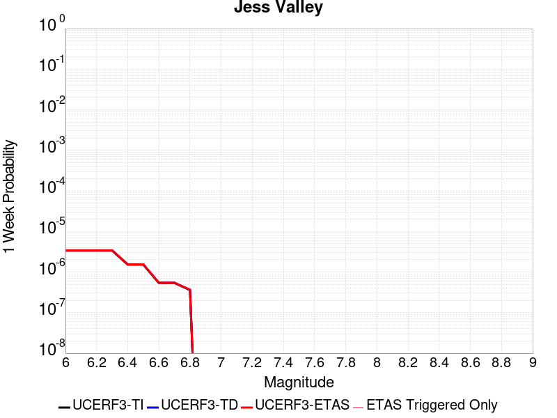 |  |  |  |

| Magnitude | 1 wk TI Prob | 1 wk TD Prob | 1 wk ETAS Prob | 1 wk ETAS/TD Gain | 1 wk ETAS Triggered Only | 1 mo TI Prob | 1 mo TD Prob | 1 mo ETAS Prob | 1 mo ETAS/TD Gain | 1 mo ETAS Triggered Only | 1 yr TI Prob | 1 yr TD Prob | 1 yr ETAS Prob | 1 yr ETAS/TD Gain | 1 yr ETAS Triggered Only | 10 yr TI Prob | 10 yr TD Prob | 10 yr ETAS Prob | 10 yr ETAS/TD Gain | 10 yr ETAS Triggered Only |
|-----|-----|-----|-----|-----|-----|-----|-----|-----|-----|-----|-----|-----|-----|-----|-----|-----|-----|-----|-----|-----|
| 6.0 | 3.3861274E-6 | 3.434085E-6 | 3.434085E-6 | 1.0 | 0.0 | 1.4511894E-5 | 1.471744E-5 | 1.471744E-5 | 1.0 | 0.0 | 1.7666799E-4 | 1.7917292E-4 | 1.8917113E-4 | 1.055802 | 1.0E-5 | 0.001765276 | 0.001790561 | 0.0018005432 | 1.0055748 | 1.0E-5 |
| 6.1 | 3.3861274E-6 | 3.434085E-6 | 3.434085E-6 | 1.0 | 0.0 | 1.4511894E-5 | 1.471744E-5 | 1.471744E-5 | 1.0 | 0.0 | 1.7666799E-4 | 1.7917292E-4 | 1.8917113E-4 | 1.055802 | 1.0E-5 | 0.001765276 | 0.001790561 | 0.0018005432 | 1.0055748 | 1.0E-5 |
| 6.2 | 3.3861274E-6 | 3.434085E-6 | 3.434085E-6 | 1.0 | 0.0 | 1.4511894E-5 | 1.471744E-5 | 1.471744E-5 | 1.0 | 0.0 | 1.7666799E-4 | 1.7917292E-4 | 1.8917113E-4 | 1.055802 | 1.0E-5 | 0.001765276 | 0.001790561 | 0.0018005432 | 1.0055748 | 1.0E-5 |
| 6.3 | 3.3861274E-6 | 3.434085E-6 | 3.434085E-6 | 1.0 | 0.0 | 1.4511894E-5 | 1.471744E-5 | 1.471744E-5 | 1.0 | 0.0 | 1.7666799E-4 | 1.7917292E-4 | 1.8917113E-4 | 1.055802 | 1.0E-5 | 0.001765276 | 0.001790561 | 0.0018005432 | 1.0055748 | 1.0E-5 |
| 6.4 | 1.5291708E-6 | 1.5502898E-6 | 1.5502898E-6 | 1.0 | 0.0 | 6.553573E-6 | 6.6440866E-6 | 6.6440866E-6 | 1.0 | 0.0 | 7.978683E-5 | 8.088955E-5 | 9.088874E-5 | 1.1236154 | 1.0E-5 | 7.975819E-4 | 8.0867927E-4 | 8.186712E-4 | 1.0123558 | 1.0E-5 |
| 6.5 | 1.5291708E-6 | 1.5502898E-6 | 1.5502898E-6 | 1.0 | 0.0 | 6.553573E-6 | 6.6440866E-6 | 6.6440866E-6 | 1.0 | 0.0 | 7.978683E-5 | 8.088955E-5 | 9.088874E-5 | 1.1236154 | 1.0E-5 | 7.975819E-4 | 8.0867927E-4 | 8.186712E-4 | 1.0123558 | 1.0E-5 |
| 6.6 | 5.396423E-7 | 5.472036E-7 | 5.472036E-7 | 1.0 | 0.0 | 2.312751E-6 | 2.3451573E-6 | 2.3451573E-6 | 1.0 | 0.0 | 2.8157378E-5 | 2.8552104E-5 | 3.8551818E-5 | 1.3502269 | 1.0E-5 | 2.8153812E-4 | 2.8550276E-4 | 2.954999E-4 | 1.035016 | 1.0E-5 |
| 6.7 | 5.396423E-7 | 5.472036E-7 | 5.472036E-7 | 1.0 | 0.0 | 2.312751E-6 | 2.3451573E-6 | 2.3451573E-6 | 1.0 | 0.0 | 2.8157378E-5 | 2.8552104E-5 | 3.8551818E-5 | 1.3502269 | 1.0E-5 | 2.8153812E-4 | 2.8550276E-4 | 2.954999E-4 | 1.035016 | 1.0E-5 |
| 6.8 | 3.6058395E-7 | 3.6563338E-7 | 3.6563338E-7 | 1.0 | 0.0 | 1.5453588E-6 | 1.5670003E-6 | 1.5670003E-6 | 1.0 | 0.0 | 1.8814582E-5 | 1.9078228E-5 | 2.9078037E-5 | 1.5241477 | 1.0E-5 | 1.8812988E-4 | 1.9078227E-4 | 2.0078037E-4 | 1.0524057 | 1.0E-5 |

## San Gabriel (Extension)
*[(top)](#table-of-contents)*

| 1 Week | 1 Month | 1 Year | 10 Year |
|-----|-----|-----|-----|
|  |  |  |  |

| Magnitude | 1 wk TI Prob | 1 wk TD Prob | 1 wk ETAS Prob | 1 wk ETAS/TD Gain | 1 wk ETAS Triggered Only | 1 mo TI Prob | 1 mo TD Prob | 1 mo ETAS Prob | 1 mo ETAS/TD Gain | 1 mo ETAS Triggered Only | 1 yr TI Prob | 1 yr TD Prob | 1 yr ETAS Prob | 1 yr ETAS/TD Gain | 1 yr ETAS Triggered Only | 10 yr TI Prob | 10 yr TD Prob | 10 yr ETAS Prob | 10 yr ETAS/TD Gain | 10 yr ETAS Triggered Only |
|-----|-----|-----|-----|-----|-----|-----|-----|-----|-----|-----|-----|-----|-----|-----|-----|-----|-----|-----|-----|-----|
| 6.0 | 5.6486106E-6 | 5.718104E-6 | 5.718104E-6 | 1.0 | 0.0 | 2.4208108E-5 | 2.4505938E-5 | 2.4505938E-5 | 1.0 | 0.0 | 2.9469383E-4 | 2.983202E-4 | 2.983202E-4 | 1.0 | 0.0 | 0.0029430336 | 0.0029793254 | 0.0029892954 | 1.0033464 | 1.0E-5 |
| 6.1 | 5.6486106E-6 | 5.718104E-6 | 5.718104E-6 | 1.0 | 0.0 | 2.4208108E-5 | 2.4505938E-5 | 2.4505938E-5 | 1.0 | 0.0 | 2.9469383E-4 | 2.983202E-4 | 2.983202E-4 | 1.0 | 0.0 | 0.0029430336 | 0.0029793254 | 0.0029892954 | 1.0033464 | 1.0E-5 |
| 6.2 | 5.6486106E-6 | 5.718104E-6 | 5.718104E-6 | 1.0 | 0.0 | 2.4208108E-5 | 2.4505938E-5 | 2.4505938E-5 | 1.0 | 0.0 | 2.9469383E-4 | 2.983202E-4 | 2.983202E-4 | 1.0 | 0.0 | 0.0029430336 | 0.0029793254 | 0.0029892954 | 1.0033464 | 1.0E-5 |
| 6.3 | 5.6486106E-6 | 5.718104E-6 | 5.718104E-6 | 1.0 | 0.0 | 2.4208108E-5 | 2.4505938E-5 | 2.4505938E-5 | 1.0 | 0.0 | 2.9469383E-4 | 2.983202E-4 | 2.983202E-4 | 1.0 | 0.0 | 0.0029430336 | 0.0029793254 | 0.0029892954 | 1.0033464 | 1.0E-5 |
| 6.4 | 5.6486106E-6 | 5.718104E-6 | 5.718104E-6 | 1.0 | 0.0 | 2.4208108E-5 | 2.4505938E-5 | 2.4505938E-5 | 1.0 | 0.0 | 2.9469383E-4 | 2.983202E-4 | 2.983202E-4 | 1.0 | 0.0 | 0.0029430336 | 0.0029793254 | 0.0029892954 | 1.0033464 | 1.0E-5 |
| 6.5 | 4.7134554E-6 | 4.755513E-6 | 4.755513E-6 | 1.0 | 0.0 | 2.0200367E-5 | 2.0380618E-5 | 2.0380618E-5 | 1.0 | 0.0 | 2.459117E-4 | 2.481066E-4 | 2.481066E-4 | 1.0 | 0.0 | 0.0024563975 | 0.0024783816 | 0.0024883568 | 1.0040249 | 1.0E-5 |
| 6.6 | 4.7134554E-6 | 4.755513E-6 | 4.755513E-6 | 1.0 | 0.0 | 2.0200367E-5 | 2.0380618E-5 | 2.0380618E-5 | 1.0 | 0.0 | 2.459117E-4 | 2.481066E-4 | 2.481066E-4 | 1.0 | 0.0 | 0.0024563975 | 0.0024783816 | 0.0024883568 | 1.0040249 | 1.0E-5 |
| 6.7 | 4.2468837E-6 | 4.275323E-6 | 4.275323E-6 | 1.0 | 0.0 | 1.8200803E-5 | 1.832269E-5 | 1.832269E-5 | 1.0 | 0.0 | 2.2157225E-4 | 2.2305663E-4 | 2.2305663E-4 | 1.0 | 0.0 | 0.0022135144 | 0.0022284007 | 0.0022383784 | 1.0044775 | 1.0E-5 |
| 6.8 | 4.1180615E-6 | 4.1427106E-6 | 4.1427106E-6 | 1.0 | 0.0 | 1.7648716E-5 | 1.7754357E-5 | 1.7754357E-5 | 1.0 | 0.0 | 2.1485193E-4 | 2.1613858E-4 | 2.1613858E-4 | 1.0 | 0.0 | 0.0021464431 | 0.0021593561 | 0.0021693346 | 1.004621 | 1.0E-5 |
| 6.9 | 3.863861E-6 | 3.8810217E-6 | 3.8810217E-6 | 1.0 | 0.0 | 1.65593E-5 | 1.6632848E-5 | 1.6632848E-5 | 1.0 | 0.0 | 2.0159081E-4 | 2.024868E-4 | 2.024868E-4 | 1.0 | 0.0 | 0.0020140803 | 0.0020230918 | 0.0020330716 | 1.0049329 | 1.0E-5 |
| 7.0 | 3.6947372E-6 | 3.7069185E-6 | 3.7069185E-6 | 1.0 | 0.0 | 1.5834492E-5 | 1.58867E-5 | 1.58867E-5 | 1.0 | 0.0 | 1.9276788E-4 | 1.9340408E-4 | 1.9340408E-4 | 1.0 | 0.0 | 0.0019260074 | 0.0019324252 | 0.001942406 | 1.0051649 | 1.0E-5 |
| 7.1 | 3.5686835E-6 | 3.5741346E-6 | 3.5741346E-6 | 1.0 | 0.0 | 1.5294268E-5 | 1.5317633E-5 | 1.5317633E-5 | 1.0 | 0.0 | 1.861918E-4 | 1.864769E-4 | 1.864769E-4 | 1.0 | 0.0 | 0.0018603588 | 0.0018632711 | 0.0018732526 | 1.0053569 | 1.0E-5 |
| 7.2 | 2.8023446E-6 | 2.7780084E-6 | 2.7780084E-6 | 1.0 | 0.0 | 1.2009994E-5 | 1.1905696E-5 | 1.1905696E-5 | 1.0 | 0.0 | 1.4621185E-4 | 1.4494231E-4 | 1.4494231E-4 | 1.0 | 0.0 | 0.001461157 | 0.0014484898 | 0.0014584754 | 1.0068938 | 1.0E-5 |
| 7.3 | 2.5843012E-6 | 2.5471716E-6 | 2.5471716E-6 | 1.0 | 0.0 | 1.1075529E-5 | 1.0916404E-5 | 1.0916404E-5 | 1.0 | 0.0 | 1.3483623E-4 | 1.3289921E-4 | 1.3289921E-4 | 1.0 | 0.0 | 0.0013475444 | 0.0013282083 | 0.0013381949 | 1.0075189 | 1.0E-5 |
| 7.4 | 2.4464468E-6 | 2.3978541E-6 | 2.3978541E-6 | 1.0 | 0.0 | 1.04847295E-5 | 1.0276478E-5 | 1.0276478E-5 | 1.0 | 0.0 | 1.276441E-4 | 1.2510903E-4 | 1.2510903E-4 | 1.0 | 0.0 | 0.0012757082 | 0.0012503967 | 0.0012603842 | 1.0079875 | 1.0E-5 |
| 7.5 | 2.0420266E-6 | 1.892085E-6 | 1.892085E-6 | 1.0 | 0.0 | 8.751514E-6 | 8.108911E-6 | 8.108911E-6 | 1.0 | 0.0 | 1.0654447E-4 | 9.872155E-5 | 9.872155E-5 | 1.0 | 0.0 | 0.001064934 | 9.867814E-4 | 9.967716E-4 | 1.010124 | 1.0E-5 |
| 7.6 | 1.8326596E-6 | 1.6407992E-6 | 1.6407992E-6 | 1.0 | 0.0 | 7.854232E-6 | 7.0319775E-6 | 7.0319775E-6 | 1.0 | 0.0 | 9.562107E-5 | 8.5610984E-5 | 8.5610984E-5 | 1.0 | 0.0 | 9.5579936E-4 | 8.5578335E-4 | 8.657748E-4 | 1.0116752 | 1.0E-5 |
| 7.7 | 1.4786998E-6 | 1.2532653E-6 | 1.2532653E-6 | 1.0 | 0.0 | 6.3372695E-6 | 5.371126E-6 | 5.371126E-6 | 1.0 | 0.0 | 7.715353E-5 | 6.5391505E-5 | 6.5391505E-5 | 1.0 | 0.0 | 7.7126746E-4 | 6.537298E-4 | 6.637232E-4 | 1.0152868 | 1.0E-5 |
| 7.8 | 7.6975533E-7 | 6.076714E-7 | 6.076714E-7 | 1.0 | 0.0 | 3.2989474E-6 | 2.6043033E-6 | 2.6043033E-6 | 1.0 | 0.0 | 4.0163945E-5 | 3.1706935E-5 | 3.1706935E-5 | 1.0 | 0.0 | 4.0156685E-4 | 3.170294E-4 | 3.170294E-4 | 1.0 | 0.0 |
| 7.9 | 1.7645915E-7 | 9.2330005E-8 | 9.2330005E-8 | 1.0 | 0.0 | 7.562533E-7 | 3.9569994E-7 | 3.9569994E-7 | 1.0 | 0.0 | 9.207345E-6 | 4.817636E-6 | 4.817636E-6 | 1.0 | 0.0 | 9.206964E-5 | 4.818034E-5 | 4.818034E-5 | 1.0 | 0.0 |
| 8.0 | 1.0463461E-7 | 2.5029875E-8 | 2.5029875E-8 | 1.0 | 0.0 | 4.4843398E-7 | 1.0727089E-7 | 1.0727089E-7 | 1.0 | 0.0 | 5.45967E-6 | 1.3060223E-6 | 1.3060223E-6 | 1.0 | 0.0 | 5.459536E-5 | 1.30651615E-5 | 1.30651615E-5 | 1.0 | 0.0 |
| 8.1 | 7.875717E-8 | 1.3918644E-8 | 1.3918644E-8 | 1.0 | 0.0 | 3.3753068E-7 | 5.965133E-8 | 5.965133E-8 | 1.0 | 0.0 | 4.109428E-6 | 7.262547E-7 | 7.262547E-7 | 1.0 | 0.0 | 4.109352E-5 | 7.2675384E-6 | 7.2675384E-6 | 1.0 | 0.0 |
| 8.2 | 1.33163E-8 | 1.780463E-9 | 1.780463E-9 | 1.0 | 0.0 | 5.7069855E-8 | 7.630555E-9 | 7.630555E-9 | 1.0 | 0.0 | 6.9482525E-7 | 9.2902E-8 | 9.2902E-8 | 1.0 | 0.0 | 6.9482307E-6 | 9.310114E-7 | 9.310114E-7 | 1.0 | 0.0 |

## Butano 2011 CFM
*[(top)](#table-of-contents)*

| 1 Week | 1 Month | 1 Year | 10 Year |
|-----|-----|-----|-----|
|  |  |  |  |

| Magnitude | 1 wk TI Prob | 1 wk TD Prob | 1 wk ETAS Prob | 1 wk ETAS/TD Gain | 1 wk ETAS Triggered Only | 1 mo TI Prob | 1 mo TD Prob | 1 mo ETAS Prob | 1 mo ETAS/TD Gain | 1 mo ETAS Triggered Only | 1 yr TI Prob | 1 yr TD Prob | 1 yr ETAS Prob | 1 yr ETAS/TD Gain | 1 yr ETAS Triggered Only | 10 yr TI Prob | 10 yr TD Prob | 10 yr ETAS Prob | 10 yr ETAS/TD Gain | 10 yr ETAS Triggered Only |
|-----|-----|-----|-----|-----|-----|-----|-----|-----|-----|-----|-----|-----|-----|-----|-----|-----|-----|-----|-----|-----|
| 6.0 | 9.561135E-6 | 6.2291797E-6 | 6.2291797E-6 | 1.0 | 0.0 | 4.097565E-5 | 2.6696222E-5 | 2.6696222E-5 | 1.0 | 0.0 | 4.9876433E-4 | 3.2498024E-4 | 3.2498024E-4 | 1.0 | 0.0 | 0.004976464 | 0.0032627317 | 0.0032726992 | 1.0030549 | 1.0E-5 |
| 6.1 | 9.561135E-6 | 6.2291797E-6 | 6.2291797E-6 | 1.0 | 0.0 | 4.097565E-5 | 2.6696222E-5 | 2.6696222E-5 | 1.0 | 0.0 | 4.9876433E-4 | 3.2498024E-4 | 3.2498024E-4 | 1.0 | 0.0 | 0.004976464 | 0.0032627317 | 0.0032726992 | 1.0030549 | 1.0E-5 |
| 6.2 | 8.364741E-6 | 4.982237E-6 | 4.982237E-6 | 1.0 | 0.0 | 3.5848396E-5 | 2.1352276E-5 | 2.1352276E-5 | 1.0 | 0.0 | 4.3636683E-4 | 2.5993452E-4 | 2.5993452E-4 | 1.0 | 0.0 | 0.0043551093 | 0.002613935 | 0.0026239087 | 1.0038157 | 1.0E-5 |
| 6.3 | 8.364741E-6 | 4.982237E-6 | 4.982237E-6 | 1.0 | 0.0 | 3.5848396E-5 | 2.1352276E-5 | 2.1352276E-5 | 1.0 | 0.0 | 4.3636683E-4 | 2.5993452E-4 | 2.5993452E-4 | 1.0 | 0.0 | 0.0043551093 | 0.002613935 | 0.0026239087 | 1.0038157 | 1.0E-5 |
| 6.4 | 7.768282E-6 | 4.3601704E-6 | 4.3601704E-6 | 1.0 | 0.0 | 3.329221E-5 | 1.8686318E-5 | 1.8686318E-5 | 1.0 | 0.0 | 4.0525728E-4 | 2.2748353E-4 | 2.2748353E-4 | 1.0 | 0.0 | 0.0040451903 | 0.0022901213 | 0.0022901213 | 1.0 | 0.0 |
| 6.5 | 7.673437E-6 | 4.2597303E-6 | 4.2597303E-6 | 1.0 | 0.0 | 3.2885746E-5 | 1.8255867E-5 | 1.8255867E-5 | 1.0 | 0.0 | 4.0031038E-4 | 2.2224386E-4 | 2.2224386E-4 | 1.0 | 0.0 | 0.0039959005 | 0.0022378303 | 0.0022378303 | 1.0 | 0.0 |
| 6.6 | 7.5244197E-6 | 4.1046887E-6 | 4.1046887E-6 | 1.0 | 0.0 | 3.2247113E-5 | 1.759141E-5 | 1.759141E-5 | 1.0 | 0.0 | 3.9253788E-4 | 2.1415572E-4 | 2.1415572E-4 | 1.0 | 0.0 | 0.003918452 | 0.0021571077 | 0.0021571077 | 1.0 | 0.0 |
| 6.7 | 6.4921405E-6 | 3.0447154E-6 | 3.0447154E-6 | 1.0 | 0.0 | 2.7823162E-5 | 1.3048715E-5 | 1.3048715E-5 | 1.0 | 0.0 | 3.3869434E-4 | 1.5885661E-4 | 1.5885661E-4 | 1.0 | 0.0 | 0.003381786 | 0.0016049311 | 0.0016049311 | 1.0 | 0.0 |
| 6.8 | 6.2890294E-6 | 2.8314732E-6 | 2.8314732E-6 | 1.0 | 0.0 | 2.6952705E-5 | 1.21348285E-5 | 1.21348285E-5 | 1.0 | 0.0 | 3.2809976E-4 | 1.477316E-4 | 1.477316E-4 | 1.0 | 0.0 | 0.0032761577 | 0.0014938356 | 0.0014938356 | 1.0 | 0.0 |
| 6.9 | 6.0965517E-6 | 2.637974E-6 | 2.637974E-6 | 1.0 | 0.0 | 2.6127816E-5 | 1.1305554E-5 | 1.1305554E-5 | 1.0 | 0.0 | 3.1805973E-4 | 1.3763648E-4 | 1.3763648E-4 | 1.0 | 0.0 | 0.0031760489 | 0.0013930144 | 0.0013930144 | 1.0 | 0.0 |
| 7.0 | 5.566252E-6 | 2.1553467E-6 | 2.1553467E-6 | 1.0 | 0.0 | 2.3855147E-5 | 9.237167E-6 | 9.237167E-6 | 1.0 | 0.0 | 2.9039773E-4 | 1.1245674E-4 | 1.1245674E-4 | 1.0 | 0.0 | 0.0029001853 | 0.0011414976 | 0.0011414976 | 1.0 | 0.0 |
| 7.1 | 3.878588E-6 | 1.6062415E-6 | 1.6062415E-6 | 1.0 | 0.0 | 1.6622414E-5 | 6.8838735E-6 | 6.8838735E-6 | 1.0 | 0.0 | 2.023591E-4 | 8.380794E-5 | 8.380794E-5 | 1.0 | 0.0 | 0.0020217493 | 8.548662E-4 | 8.548662E-4 | 1.0 | 0.0 |
| 7.2 | 3.7038085E-6 | 1.4872645E-6 | 1.4872645E-6 | 1.0 | 0.0 | 1.587337E-5 | 6.373975E-6 | 6.373975E-6 | 1.0 | 0.0 | 1.9324113E-4 | 7.760038E-5 | 7.760038E-5 | 1.0 | 0.0 | 0.0019307317 | 7.9280377E-4 | 7.9280377E-4 | 1.0 | 0.0 |
| 7.3 | 3.5277278E-6 | 1.395344E-6 | 1.395344E-6 | 1.0 | 0.0 | 1.5118746E-5 | 5.980032E-6 | 5.980032E-6 | 1.0 | 0.0 | 1.8405518E-4 | 7.2804454E-5 | 7.2804454E-5 | 1.0 | 0.0 | 0.0018390282 | 7.4479013E-4 | 7.4479013E-4 | 1.0 | 0.0 |
| 7.4 | 3.3711294E-6 | 1.3325548E-6 | 1.3325548E-6 | 1.0 | 0.0 | 1.4447617E-5 | 5.7109364E-6 | 5.7109364E-6 | 1.0 | 0.0 | 1.7588554E-4 | 6.952843E-5 | 6.952843E-5 | 1.0 | 0.0 | 0.0017574639 | 7.119977E-4 | 7.119977E-4 | 1.0 | 0.0 |
| 7.5 | 3.0496426E-6 | 1.2214387E-6 | 1.2214387E-6 | 1.0 | 0.0 | 1.3069831E-5 | 5.2347264E-6 | 5.2347264E-6 | 1.0 | 0.0 | 1.5911358E-4 | 6.3730935E-5 | 6.3730935E-5 | 1.0 | 0.0 | 0.001589997 | 6.5398775E-4 | 6.5398775E-4 | 1.0 | 0.0 |
| 7.6 | 2.2179781E-6 | 8.893035E-7 | 8.893035E-7 | 1.0 | 0.0 | 9.505586E-6 | 3.811295E-6 | 3.811295E-6 | 1.0 | 0.0 | 1.1572436E-4 | 4.640153E-5 | 4.640153E-5 | 1.0 | 0.0 | 0.0011566412 | 4.8067747E-4 | 4.8067747E-4 | 1.0 | 0.0 |
| 7.7 | 1.7519328E-6 | 6.950791E-7 | 6.950791E-7 | 1.0 | 0.0 | 7.508262E-6 | 2.9789069E-6 | 2.9789069E-6 | 1.0 | 0.0 | 9.140925E-5 | 3.626759E-5 | 3.626759E-5 | 1.0 | 0.0 | 9.137166E-4 | 3.7863897E-4 | 3.7863897E-4 | 1.0 | 0.0 |
| 7.8 | 1.1478974E-6 | 6.192403E-7 | 6.192403E-7 | 1.0 | 0.0 | 4.9195505E-6 | 2.6538842E-6 | 2.6538842E-6 | 1.0 | 0.0 | 5.9893882E-5 | 3.231056E-5 | 3.231056E-5 | 1.0 | 0.0 | 5.9877743E-4 | 3.3873506E-4 | 3.3873506E-4 | 1.0 | 0.0 |
| 7.9 | 6.1154634E-7 | 5.597958E-7 | 5.597958E-7 | 1.0 | 0.0 | 2.6209104E-6 | 2.3991226E-6 | 2.3991226E-6 | 1.0 | 0.0 | 3.1909116E-5 | 2.9208928E-5 | 2.9208928E-5 | 1.0 | 0.0 | 3.1904536E-4 | 3.064846E-4 | 3.064846E-4 | 1.0 | 0.0 |
| 8.0 | 4.6520046E-7 | 5.204134E-7 | 5.204134E-7 | 1.0 | 0.0 | 1.9937147E-6 | 2.2303411E-6 | 2.2303411E-6 | 1.0 | 0.0 | 2.4273206E-5 | 2.7154065E-5 | 2.7154065E-5 | 1.0 | 0.0 | 2.4270554E-4 | 2.8496262E-4 | 2.8496262E-4 | 1.0 | 0.0 |
| 8.1 | 2.8425194E-7 | 3.0654417E-7 | 3.0654417E-7 | 1.0 | 0.0 | 1.218222E-6 | 1.31376E-6 | 1.31376E-6 | 1.0 | 0.0 | 1.4831752E-5 | 1.599491E-5 | 1.599491E-5 | 1.0 | 0.0 | 1.4830762E-4 | 1.6784061E-4 | 1.6784061E-4 | 1.0 | 0.0 |
| 8.2 | 5.585778E-8 | 4.0659305E-8 | 4.0659305E-8 | 1.0 | 0.0 | 2.3939046E-7 | 1.7425414E-7 | 1.7425414E-7 | 1.0 | 0.0 | 2.914575E-6 | 2.121542E-6 | 2.121542E-6 | 1.0 | 0.0 | 2.9145367E-5 | 2.3050008E-5 | 2.3050008E-5 | 1.0 | 0.0 |
| 8.3 | 1.0371215E-10 | 5.3769766E-11 | 5.3769766E-11 | 1.0 | 0.0 | 4.4448079E-10 | 2.3044211E-10 | 2.3044211E-10 | 1.0 | 0.0 | 5.4115543E-9 | 2.805633E-9 | 2.805633E-9 | 1.0 | 0.0 | 5.4115542E-8 | 3.2253645E-8 | 3.2253645E-8 | 1.0 | 0.0 |

## San Andreas (Offshore) 2011 CFM
*[(top)](#table-of-contents)*

| 1 Week | 1 Month | 1 Year | 10 Year |
|-----|-----|-----|-----|
|  |  |  |  |

| Magnitude | 1 wk TI Prob | 1 wk TD Prob | 1 wk ETAS Prob | 1 wk ETAS/TD Gain | 1 wk ETAS Triggered Only | 1 mo TI Prob | 1 mo TD Prob | 1 mo ETAS Prob | 1 mo ETAS/TD Gain | 1 mo ETAS Triggered Only | 1 yr TI Prob | 1 yr TD Prob | 1 yr ETAS Prob | 1 yr ETAS/TD Gain | 1 yr ETAS Triggered Only | 10 yr TI Prob | 10 yr TD Prob | 10 yr ETAS Prob | 10 yr ETAS/TD Gain | 10 yr ETAS Triggered Only |
|-----|-----|-----|-----|-----|-----|-----|-----|-----|-----|-----|-----|-----|-----|-----|-----|-----|-----|-----|-----|-----|
| 6.0 | 1.7072787E-4 | 1.9244522E-4 | 1.9244522E-4 | 1.0 | 0.0 | 7.3148566E-4 | 8.245069E-4 | 8.245069E-4 | 1.0 | 0.0 | 0.008869528 | 0.009992682 | 0.009992682 | 1.0 | 0.0 | 0.085237645 | 0.096918665 | 0.096927695 | 1.0000932 | 1.0E-5 |
| 6.1 | 1.7072787E-4 | 1.9244522E-4 | 1.9244522E-4 | 1.0 | 0.0 | 7.3148566E-4 | 8.245069E-4 | 8.245069E-4 | 1.0 | 0.0 | 0.008869528 | 0.009992682 | 0.009992682 | 1.0 | 0.0 | 0.085237645 | 0.096918665 | 0.096927695 | 1.0000932 | 1.0E-5 |
| 6.2 | 1.6312556E-4 | 1.8425238E-4 | 1.8425238E-4 | 1.0 | 0.0 | 6.989222E-4 | 7.894165E-4 | 7.894165E-4 | 1.0 | 0.0 | 0.008476226 | 0.009569289 | 0.009569289 | 1.0 | 0.0 | 0.08160117 | 0.09294029 | 0.09294936 | 1.0000976 | 1.0E-5 |
| 6.3 | 1.5103363E-4 | 1.6896697E-4 | 1.6896697E-4 | 1.0 | 0.0 | 6.471264E-4 | 7.2394544E-4 | 7.2394544E-4 | 1.0 | 0.0 | 0.007850339 | 0.008778859 | 0.008778859 | 1.0 | 0.0 | 0.075787395 | 0.08556559 | 0.08557473 | 1.0001068 | 1.0E-5 |
| 6.4 | 1.5047993E-4 | 1.678262E-4 | 1.678262E-4 | 1.0 | 0.0 | 6.4475456E-4 | 7.190591E-4 | 7.190591E-4 | 1.0 | 0.0 | 0.007821669 | 0.008719845 | 0.008719845 | 1.0 | 0.0 | 0.0755203 | 0.08504562 | 0.08505477 | 1.0001075 | 1.0E-5 |
| 6.5 | 1.2760791E-4 | 1.3748434E-4 | 1.3748434E-4 | 1.0 | 0.0 | 5.467764E-4 | 5.8908697E-4 | 5.8908697E-4 | 1.0 | 0.0 | 0.0066367025 | 0.0071488223 | 0.0071488223 | 1.0 | 0.0 | 0.064419635 | 0.07029571 | 0.070305005 | 1.0001322 | 1.0E-5 |
| 6.6 | 1.1063525E-4 | 1.15677954E-4 | 1.15677954E-4 | 1.0 | 0.0 | 4.740649E-4 | 4.9566955E-4 | 4.9566955E-4 | 1.0 | 0.0 | 0.0057564764 | 0.00601828 | 0.00601828 | 1.0 | 0.0 | 0.05609626 | 0.059541386 | 0.05955079 | 1.000158 | 1.0E-5 |
| 6.7 | 1.0391049E-4 | 1.0656347E-4 | 1.0656347E-4 | 1.0 | 0.0 | 4.4525467E-4 | 4.5662167E-4 | 4.5662167E-4 | 1.0 | 0.0 | 0.0054075094 | 0.0055453856 | 0.0055453856 | 1.0 | 0.0 | 0.052778035 | 0.055040713 | 0.055050164 | 1.0001717 | 1.0E-5 |
| 6.8 | 1.0096706E-4 | 1.0168417E-4 | 1.0168417E-4 | 1.0 | 0.0 | 4.3264418E-4 | 4.357175E-4 | 4.357175E-4 | 1.0 | 0.0 | 0.0052547283 | 0.0052921344 | 0.0052921344 | 1.0 | 0.0 | 0.051321987 | 0.052737184 | 0.052746657 | 1.0001796 | 1.0E-5 |
| 6.9 | 9.800265E-5 | 9.59869E-5 | 9.59869E-5 | 1.0 | 0.0 | 4.1994374E-4 | 4.113085E-4 | 4.113085E-4 | 1.0 | 0.0 | 0.0051008356 | 0.004996351 | 0.004996351 | 1.0 | 0.0 | 0.049853306 | 0.050064012 | 0.050073512 | 1.0001898 | 1.0E-5 |
| 7.0 | 9.4642375E-5 | 9.0117996E-5 | 9.0117996E-5 | 1.0 | 0.0 | 4.0554712E-4 | 3.8616368E-4 | 3.8616368E-4 | 1.0 | 0.0 | 0.004926363 | 0.00469157 | 0.00469157 | 1.0 | 0.0 | 0.048185747 | 0.047243748 | 0.047253273 | 1.0002017 | 1.0E-5 |
| 7.1 | 9.0996844E-5 | 8.363476E-5 | 8.363476E-5 | 1.0 | 0.0 | 3.8992817E-4 | 3.583863E-4 | 3.583863E-4 | 1.0 | 0.0 | 0.004737046 | 0.00435478 | 0.00435478 | 1.0 | 0.0 | 0.04637333 | 0.044094495 | 0.044104055 | 1.0002168 | 1.0E-5 |
| 7.2 | 8.848287E-5 | 7.990859E-5 | 7.990859E-5 | 1.0 | 0.0 | 3.791572E-4 | 3.424213E-4 | 3.424213E-4 | 1.0 | 0.0 | 0.004606472 | 0.0041611637 | 0.0041611637 | 1.0 | 0.0 | 0.045121472 | 0.04223778 | 0.04224736 | 1.0002267 | 1.0E-5 |
| 7.3 | 7.9280784E-5 | 6.135293E-5 | 6.135293E-5 | 1.0 | 0.0 | 3.3973053E-4 | 2.629152E-4 | 2.629152E-4 | 1.0 | 0.0 | 0.004128377 | 0.0031963966 | 0.0031963966 | 1.0 | 0.0 | 0.040525194 | 0.0329454 | 0.03295507 | 1.0002935 | 1.0E-5 |
| 7.4 | 6.468038E-5 | 3.7985967E-5 | 3.7985967E-5 | 1.0 | 0.0 | 2.771722E-4 | 1.6278717E-4 | 1.6278717E-4 | 1.0 | 0.0 | 0.0033693502 | 0.00198019 | 0.00198019 | 1.0 | 0.0 | 0.0331872 | 0.020856531 | 0.020866323 | 1.0004694 | 1.0E-5 |
| 7.5 | 4.930574E-5 | 1.2732583E-5 | 1.2732583E-5 | 1.0 | 0.0 | 2.1129321E-4 | 5.4567077E-5 | 5.4567077E-5 | 1.0 | 0.0 | 0.0025694598 | 6.6415325E-4 | 6.6415325E-4 | 1.0 | 0.0 | 0.02539953 | 0.007500171 | 0.0075100963 | 1.0013233 | 1.0E-5 |
| 7.6 | 4.612566E-5 | 1.0362292E-5 | 1.0362292E-5 | 1.0 | 0.0 | 1.9766642E-4 | 4.4409077E-5 | 4.4409077E-5 | 1.0 | 0.0 | 0.0024039324 | 5.405477E-4 | 5.405477E-4 | 1.0 | 0.0 | 0.023780935 | 0.00618925 | 0.006199188 | 1.0016057 | 1.0E-5 |
| 7.7 | 3.9435414E-5 | 5.594974E-6 | 5.594974E-6 | 1.0 | 0.0 | 1.6899795E-4 | 2.397824E-5 | 2.397824E-5 | 1.0 | 0.0 | 0.0020556084 | 2.9189617E-4 | 2.9189617E-4 | 1.0 | 0.0 | 0.020366974 | 0.0035543093 | 0.0035642737 | 1.0028034 | 1.0E-5 |
| 7.8 | 2.7787428E-5 | 3.7703621E-6 | 3.7703621E-6 | 1.0 | 0.0 | 1.1908354E-4 | 1.6158594E-5 | 1.6158594E-5 | 1.0 | 0.0 | 0.0014488777 | 1.9671317E-4 | 1.9671317E-4 | 1.0 | 0.0 | 0.014394675 | 0.0023968155 | 0.0024067916 | 1.0041622 | 1.0E-5 |
| 7.9 | 1.590671E-5 | 3.0531762E-6 | 3.0531762E-6 | 1.0 | 0.0 | 6.816983E-5 | 1.3084975E-5 | 1.3084975E-5 | 1.0 | 0.0 | 8.2965166E-4 | 1.5929795E-4 | 1.5929795E-4 | 1.0 | 0.0 | 0.008265611 | 0.0019116144 | 0.0019215953 | 1.0052211 | 1.0E-5 |
| 8.0 | 9.193638E-6 | 2.602415E-6 | 2.602415E-6 | 1.0 | 0.0 | 3.940071E-5 | 1.1153159E-5 | 1.1153159E-5 | 1.0 | 0.0 | 4.7959806E-4 | 1.3578127E-4 | 1.3578127E-4 | 1.0 | 0.0 | 0.0047856434 | 0.0016175489 | 0.0016275328 | 1.0061722 | 1.0E-5 |
| 8.1 | 5.601576E-6 | 2.2438371E-6 | 2.2438371E-6 | 1.0 | 0.0 | 2.4006533E-5 | 9.616409E-6 | 9.616409E-6 | 1.0 | 0.0 | 2.9224035E-4 | 1.1707353E-4 | 1.1707353E-4 | 1.0 | 0.0 | 0.0029185633 | 0.0014075873 | 0.0014175733 | 1.0070944 | 1.0E-5 |
| 8.2 | 4.3508785E-6 | 1.8653523E-6 | 1.8653523E-6 | 1.0 | 0.0 | 1.864649E-5 | 7.994342E-6 | 7.994342E-6 | 1.0 | 0.0 | 2.2699735E-4 | 9.7326796E-5 | 9.7326796E-5 | 1.0 | 0.0 | 0.0022676561 | 0.0011639223 | 0.0011639223 | 1.0 | 0.0 |
| 8.3 | 1.9573292E-6 | 7.544528E-7 | 7.544528E-7 | 1.0 | 0.0 | 8.388526E-6 | 3.233365E-6 | 3.233365E-6 | 1.0 | 0.0 | 1.0212552E-4 | 3.9365525E-5 | 3.9365525E-5 | 1.0 | 0.0 | 0.001020786 | 4.6580602E-4 | 4.6580602E-4 | 1.0 | 0.0 |

## Contra Costa Shear Zone (connector) 2011 CFM
*[(top)](#table-of-contents)*

| 1 Week | 1 Month | 1 Year | 10 Year |
|-----|-----|-----|-----|
| 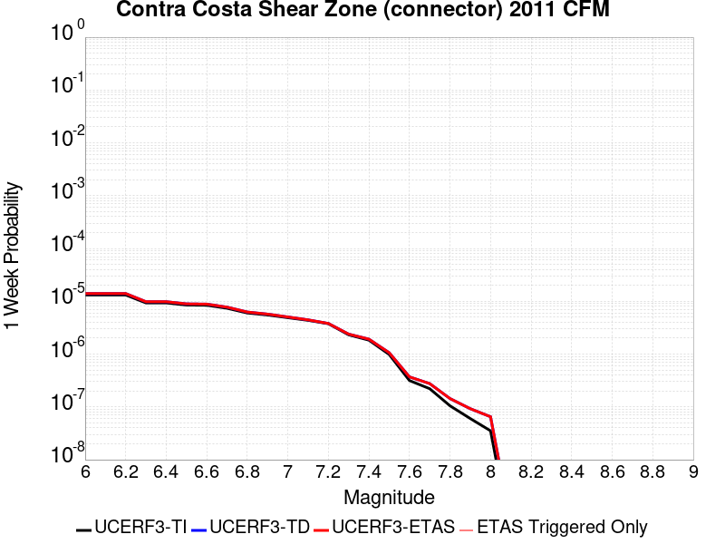 | 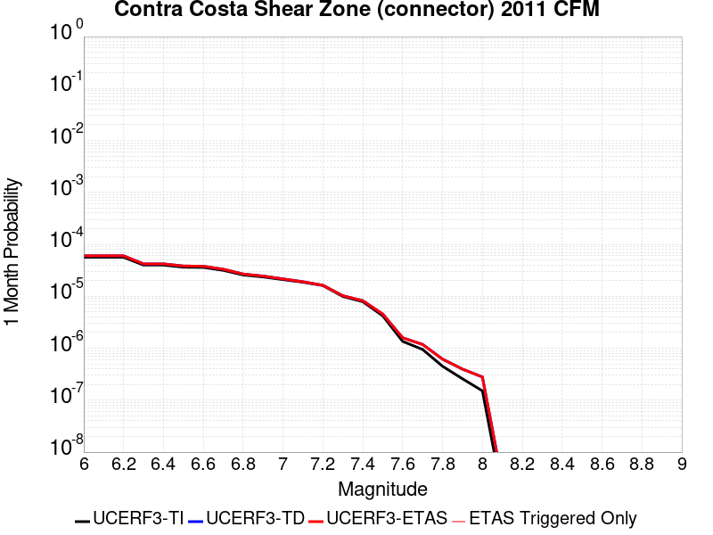 | 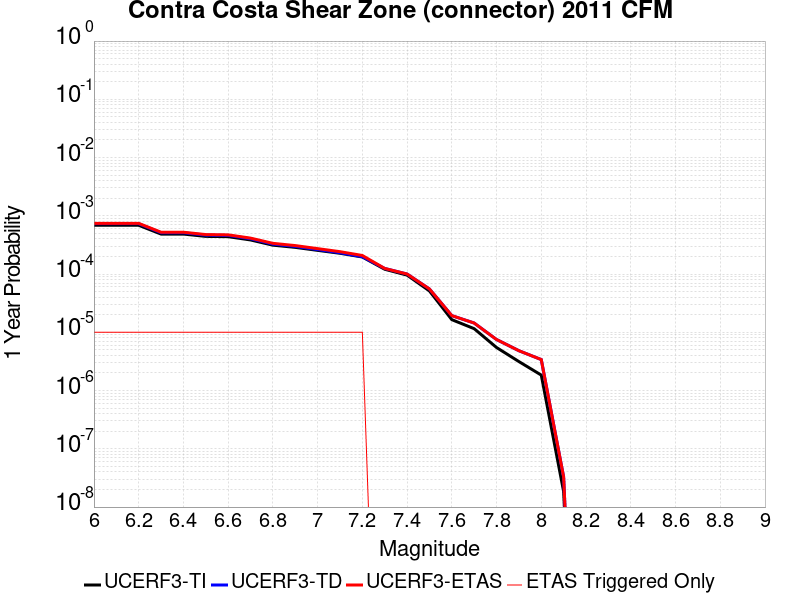 | 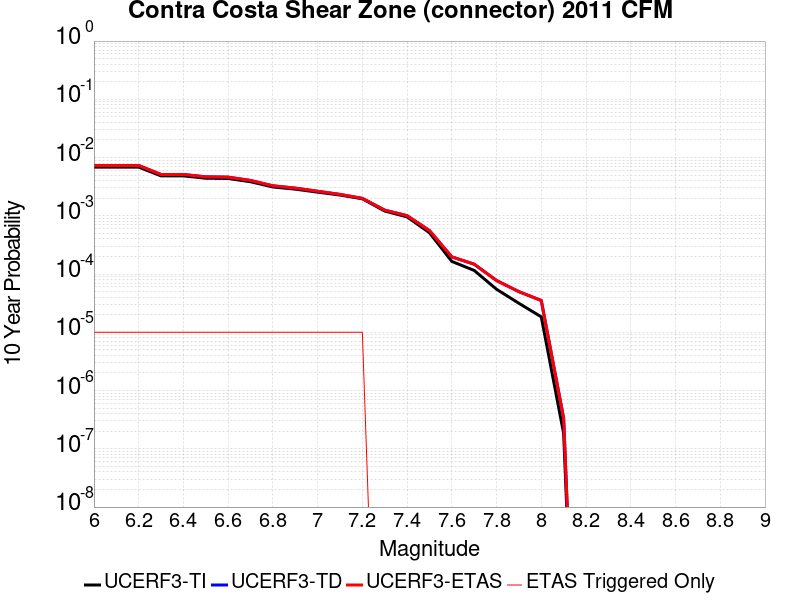 |

| Magnitude | 1 wk TI Prob | 1 wk TD Prob | 1 wk ETAS Prob | 1 wk ETAS/TD Gain | 1 wk ETAS Triggered Only | 1 mo TI Prob | 1 mo TD Prob | 1 mo ETAS Prob | 1 mo ETAS/TD Gain | 1 mo ETAS Triggered Only | 1 yr TI Prob | 1 yr TD Prob | 1 yr ETAS Prob | 1 yr ETAS/TD Gain | 1 yr ETAS Triggered Only | 10 yr TI Prob | 10 yr TD Prob | 10 yr ETAS Prob | 10 yr ETAS/TD Gain | 10 yr ETAS Triggered Only |
|-----|-----|-----|-----|-----|-----|-----|-----|-----|-----|-----|-----|-----|-----|-----|-----|-----|-----|-----|-----|-----|
| 6.0 | 1.3187427E-5 | 1.4043677E-5 | 1.4043677E-5 | 1.0 | 0.0 | 5.6516317E-5 | 6.018593E-5 | 6.018593E-5 | 1.0 | 0.0 | 6.878689E-4 | 7.3254015E-4 | 7.425328E-4 | 1.0136411 | 1.0E-5 | 0.006857436 | 0.0073078023 | 0.0073177293 | 1.0013584 | 1.0E-5 |
| 6.1 | 1.3187427E-5 | 1.4043677E-5 | 1.4043677E-5 | 1.0 | 0.0 | 5.6516317E-5 | 6.018593E-5 | 6.018593E-5 | 1.0 | 0.0 | 6.878689E-4 | 7.3254015E-4 | 7.425328E-4 | 1.0136411 | 1.0E-5 | 0.006857436 | 0.0073078023 | 0.0073177293 | 1.0013584 | 1.0E-5 |
| 6.2 | 1.3187427E-5 | 1.4043677E-5 | 1.4043677E-5 | 1.0 | 0.0 | 5.6516317E-5 | 6.018593E-5 | 6.018593E-5 | 1.0 | 0.0 | 6.878689E-4 | 7.3254015E-4 | 7.425328E-4 | 1.0136411 | 1.0E-5 | 0.006857436 | 0.0073078023 | 0.0073177293 | 1.0013584 | 1.0E-5 |
| 6.3 | 9.315374E-6 | 9.826407E-6 | 9.826407E-6 | 1.0 | 0.0 | 3.992242E-5 | 4.2112515E-5 | 4.2112515E-5 | 1.0 | 0.0 | 4.8594706E-4 | 5.126034E-4 | 5.225983E-4 | 1.0194982 | 1.0E-5 | 0.004848858 | 0.0051189135 | 0.0051288623 | 1.0019436 | 1.0E-5 |
| 6.4 | 9.315374E-6 | 9.826407E-6 | 9.826407E-6 | 1.0 | 0.0 | 3.992242E-5 | 4.2112515E-5 | 4.2112515E-5 | 1.0 | 0.0 | 4.8594706E-4 | 5.126034E-4 | 5.225983E-4 | 1.0194982 | 1.0E-5 | 0.004848858 | 0.0051189135 | 0.0051288623 | 1.0019436 | 1.0E-5 |
| 6.5 | 8.492638E-6 | 8.940053E-6 | 8.940053E-6 | 1.0 | 0.0 | 3.639651E-5 | 3.8313967E-5 | 3.8313967E-5 | 1.0 | 0.0 | 4.430374E-4 | 4.6637608E-4 | 4.763714E-4 | 1.0214319 | 1.0E-5 | 0.0044215517 | 0.004658601 | 0.0046685543 | 1.0021366 | 1.0E-5 |
| 6.6 | 8.402072E-6 | 8.840848E-6 | 8.840848E-6 | 1.0 | 0.0 | 3.6008387E-5 | 3.7888814E-5 | 3.7888814E-5 | 1.0 | 0.0 | 4.383139E-4 | 4.6120206E-4 | 4.7119745E-4 | 1.0216725 | 1.0E-5 | 0.0043745036 | 0.0046070763 | 0.0046170303 | 1.0021605 | 1.0E-5 |
| 6.7 | 7.383587E-6 | 7.748402E-6 | 7.748402E-6 | 1.0 | 0.0 | 3.164356E-5 | 3.3207027E-5 | 3.3207027E-5 | 1.0 | 0.0 | 3.8519225E-4 | 4.0422264E-4 | 4.142186E-4 | 1.0247289 | 1.0E-5 | 0.0038452526 | 0.0040393756 | 0.0040493356 | 1.0024656 | 1.0E-5 |
| 6.8 | 6.004921E-6 | 6.266022E-6 | 6.266022E-6 | 1.0 | 0.0 | 2.5735122E-5 | 2.6854106E-5 | 2.6854106E-5 | 1.0 | 0.0 | 3.1328006E-4 | 3.2690022E-4 | 3.3689695E-4 | 1.0305804 | 1.0E-5 | 0.0031283877 | 0.0032685418 | 0.003278509 | 1.0030495 | 1.0E-5 |
| 6.9 | 5.505255E-6 | 5.7184034E-6 | 5.7184034E-6 | 1.0 | 0.0 | 2.3593739E-5 | 2.4507215E-5 | 2.4507215E-5 | 1.0 | 0.0 | 2.872159E-4 | 2.9833493E-4 | 3.0833195E-4 | 1.0335094 | 1.0E-5 | 0.0028684495 | 0.0029836835 | 0.0029936538 | 1.0033416 | 1.0E-5 |
| 7.0 | 4.891922E-6 | 5.049046E-6 | 5.049046E-6 | 1.0 | 0.0 | 2.096521E-5 | 2.163859E-5 | 2.163859E-5 | 1.0 | 0.0 | 2.5522153E-4 | 2.6341833E-4 | 2.734157E-4 | 1.0379524 | 1.0E-5 | 0.0025492862 | 0.0026353926 | 0.0026453664 | 1.0037845 | 1.0E-5 |
| 7.1 | 4.3599E-6 | 4.453027E-6 | 4.453027E-6 | 1.0 | 0.0 | 1.868515E-5 | 1.9084264E-5 | 1.9084264E-5 | 1.0 | 0.0 | 2.2746796E-4 | 2.3232642E-4 | 2.423241E-4 | 1.0430329 | 1.0E-5 | 0.0022723526 | 0.0023251602 | 0.002335137 | 1.0042908 | 1.0E-5 |
| 7.2 | 3.7647926E-6 | 3.8040112E-6 | 3.8040112E-6 | 1.0 | 0.0 | 1.6134725E-5 | 1.6302805E-5 | 1.6302805E-5 | 1.0 | 0.0 | 1.9642258E-4 | 1.9846881E-4 | 2.0846684E-4 | 1.0503757 | 1.0E-5 | 0.0019624906 | 0.001987224 | 0.001997204 | 1.0050222 | 1.0E-5 |
| 7.3 | 2.3179882E-6 | 2.3920848E-6 | 2.3920848E-6 | 1.0 | 0.0 | 9.934198E-6 | 1.0251752E-5 | 1.0251752E-5 | 1.0 | 0.0 | 1.20942146E-4 | 1.2480798E-4 | 1.2480798E-4 | 1.0 | 0.0 | 0.0012087635 | 0.0012516835 | 0.0012516835 | 1.0 | 0.0 |
| 7.4 | 1.8378355E-6 | 1.919211E-6 | 1.919211E-6 | 1.0 | 0.0 | 7.876414E-6 | 8.2251645E-6 | 8.2251645E-6 | 1.0 | 0.0 | 9.5891126E-5 | 1.00136815E-4 | 1.00136815E-4 | 1.0 | 0.0 | 9.584976E-4 | 0.0010050461 | 0.0010050461 | 1.0 | 0.0 |
| 7.5 | 9.840493E-7 | 1.063249E-6 | 1.063249E-6 | 1.0 | 0.0 | 4.2173474E-6 | 4.556773E-6 | 4.556773E-6 | 1.0 | 0.0 | 5.1344992E-5 | 5.5477314E-5 | 5.5477314E-5 | 1.0 | 0.0 | 5.133313E-4 | 5.5844174E-4 | 5.5844174E-4 | 1.0 | 0.0 |
| 7.6 | 3.1602997E-7 | 3.7095242E-7 | 3.7095242E-7 | 1.0 | 0.0 | 1.3544135E-6 | 1.589795E-6 | 1.589795E-6 | 1.0 | 0.0 | 1.648986E-5 | 1.9355584E-5 | 1.9355584E-5 | 1.0 | 0.0 | 1.6488635E-4 | 1.971704E-4 | 1.971704E-4 | 1.0 | 0.0 |
| 7.7 | 2.2125788E-7 | 2.7637128E-7 | 2.7637128E-7 | 1.0 | 0.0 | 9.482477E-7 | 1.1844478E-6 | 1.1844478E-6 | 1.0 | 0.0 | 1.1544855E-5 | 1.4420558E-5 | 1.4420558E-5 | 1.0 | 0.0 | 1.1544255E-4 | 1.4779065E-4 | 1.4779065E-4 | 1.0 | 0.0 |
| 7.8 | 1.0509553E-7 | 1.4405862E-7 | 1.4405862E-7 | 1.0 | 0.0 | 4.5040935E-7 | 6.1739394E-7 | 6.1739394E-7 | 1.0 | 0.0 | 5.48372E-6 | 7.5167454E-6 | 7.5167454E-6 | 1.0 | 0.0 | 5.4835844E-5 | 7.746688E-5 | 7.746688E-5 | 1.0 | 0.0 |
| 7.9 | 6.029319E-8 | 9.258519E-8 | 9.258519E-8 | 1.0 | 0.0 | 2.5839938E-7 | 3.967936E-7 | 3.967936E-7 | 1.0 | 0.0 | 3.1460077E-6 | 4.8309516E-6 | 4.8309516E-6 | 1.0 | 0.0 | 3.1459633E-5 | 4.9890397E-5 | 4.9890397E-5 | 1.0 | 0.0 |
| 8.0 | 3.531068E-8 | 6.521954E-8 | 6.521954E-8 | 1.0 | 0.0 | 1.5133148E-7 | 2.7951228E-7 | 2.7951228E-7 | 1.0 | 0.0 | 1.8424593E-6 | 3.4030566E-6 | 3.4030566E-6 | 1.0 | 0.0 | 1.842444E-5 | 3.5169614E-5 | 3.5169614E-5 | 1.0 | 0.0 |
| 8.1 | 3.5238246E-10 | 6.268245E-10 | 6.268245E-10 | 1.0 | 0.0 | 1.5102107E-9 | 2.6863902E-9 | 2.6863902E-9 | 1.0 | 0.0 | 1.8386816E-8 | 3.27068E-8 | 3.27068E-8 | 1.0 | 0.0 | 1.8386814E-7 | 3.3500237E-7 | 3.3500237E-7 | 1.0 | 0.0 |

## Elysian Park (Upper)
*[(top)](#table-of-contents)*

| 1 Week | 1 Month | 1 Year | 10 Year |
|-----|-----|-----|-----|
|  |  |  | 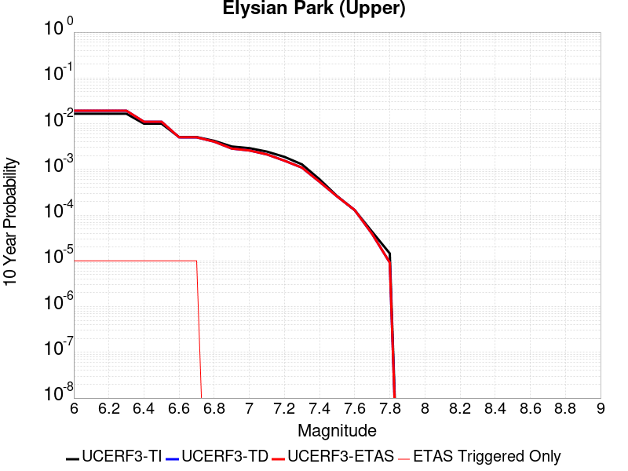 |

| Magnitude | 1 wk TI Prob | 1 wk TD Prob | 1 wk ETAS Prob | 1 wk ETAS/TD Gain | 1 wk ETAS Triggered Only | 1 mo TI Prob | 1 mo TD Prob | 1 mo ETAS Prob | 1 mo ETAS/TD Gain | 1 mo ETAS Triggered Only | 1 yr TI Prob | 1 yr TD Prob | 1 yr ETAS Prob | 1 yr ETAS/TD Gain | 1 yr ETAS Triggered Only | 10 yr TI Prob | 10 yr TD Prob | 10 yr ETAS Prob | 10 yr ETAS/TD Gain | 10 yr ETAS Triggered Only |
|-----|-----|-----|-----|-----|-----|-----|-----|-----|-----|-----|-----|-----|-----|-----|-----|-----|-----|-----|-----|-----|
| 6.0 | 3.1876025E-5 | 3.703929E-5 | 3.703929E-5 | 1.0 | 0.0 | 1.3660437E-4 | 1.5873248E-4 | 1.5873248E-4 | 1.0 | 0.0 | 0.0016618895 | 0.0019313293 | 0.0019313293 | 1.0 | 0.0 | 0.016495159 | 0.019191904 | 0.019201713 | 1.000511 | 1.0E-5 |
| 6.1 | 3.1876025E-5 | 3.703929E-5 | 3.703929E-5 | 1.0 | 0.0 | 1.3660437E-4 | 1.5873248E-4 | 1.5873248E-4 | 1.0 | 0.0 | 0.0016618895 | 0.0019313293 | 0.0019313293 | 1.0 | 0.0 | 0.016495159 | 0.019191904 | 0.019201713 | 1.000511 | 1.0E-5 |
| 6.2 | 3.1876025E-5 | 3.703929E-5 | 3.703929E-5 | 1.0 | 0.0 | 1.3660437E-4 | 1.5873248E-4 | 1.5873248E-4 | 1.0 | 0.0 | 0.0016618895 | 0.0019313293 | 0.0019313293 | 1.0 | 0.0 | 0.016495159 | 0.019191904 | 0.019201713 | 1.000511 | 1.0E-5 |
| 6.3 | 3.1876025E-5 | 3.703929E-5 | 3.703929E-5 | 1.0 | 0.0 | 1.3660437E-4 | 1.5873248E-4 | 1.5873248E-4 | 1.0 | 0.0 | 0.0016618895 | 0.0019313293 | 0.0019313293 | 1.0 | 0.0 | 0.016495159 | 0.019191904 | 0.019201713 | 1.000511 | 1.0E-5 |
| 6.4 | 1.9273462E-5 | 2.1204301E-5 | 2.1204301E-5 | 1.0 | 0.0 | 8.259794E-5 | 9.0873385E-5 | 9.0873385E-5 | 1.0 | 0.0 | 0.001005166 | 0.0011059934 | 0.0011059934 | 1.0 | 0.0 | 0.010006315 | 0.011021703 | 0.011031593 | 1.0008973 | 1.0E-5 |
| 6.5 | 1.9273462E-5 | 2.1204301E-5 | 2.1204301E-5 | 1.0 | 0.0 | 8.259794E-5 | 9.0873385E-5 | 9.0873385E-5 | 1.0 | 0.0 | 0.001005166 | 0.0011059934 | 0.0011059934 | 1.0 | 0.0 | 0.010006315 | 0.011021703 | 0.011031593 | 1.0008973 | 1.0E-5 |
| 6.6 | 9.813258E-6 | 9.666103E-6 | 9.666103E-6 | 1.0 | 0.0 | 4.205614E-5 | 4.142554E-5 | 4.142554E-5 | 1.0 | 0.0 | 5.119132E-4 | 5.042465E-4 | 5.042465E-4 | 1.0 | 0.0 | 0.005107356 | 0.0050317473 | 0.005041697 | 1.0019773 | 1.0E-5 |
| 6.7 | 9.801478E-6 | 9.653672E-6 | 9.653672E-6 | 1.0 | 0.0 | 4.2005657E-5 | 4.1372266E-5 | 4.1372266E-5 | 1.0 | 0.0 | 5.112989E-4 | 5.035982E-4 | 5.035982E-4 | 1.0 | 0.0 | 0.0051012407 | 0.005025293 | 0.005035243 | 1.00198 | 1.0E-5 |
| 6.8 | 8.102489E-6 | 7.773402E-6 | 7.773402E-6 | 1.0 | 0.0 | 3.4724493E-5 | 3.3314183E-5 | 3.3314183E-5 | 1.0 | 0.0 | 4.2268867E-4 | 4.0552966E-4 | 4.0552966E-4 | 1.0 | 0.0 | 0.004218856 | 0.0040483903 | 0.0040483903 | 1.0 | 0.0 |
| 6.9 | 6.08275E-6 | 5.4816855E-6 | 5.4816855E-6 | 1.0 | 0.0 | 2.6068668E-5 | 2.349273E-5 | 2.349273E-5 | 1.0 | 0.0 | 3.173398E-4 | 2.8598722E-4 | 2.8598722E-4 | 1.0 | 0.0 | 0.0031688702 | 0.0028562695 | 0.0028562695 | 1.0 | 0.0 |
| 7.0 | 5.5995934E-6 | 4.982991E-6 | 4.982991E-6 | 1.0 | 0.0 | 2.3998036E-5 | 2.1355505E-5 | 2.1355505E-5 | 1.0 | 0.0 | 2.9213692E-4 | 2.599729E-4 | 2.599729E-4 | 1.0 | 0.0 | 0.0029175316 | 0.002596755 | 0.002596755 | 1.0 | 0.0 |
| 7.1 | 4.709881E-6 | 4.087571E-6 | 4.087571E-6 | 1.0 | 0.0 | 2.0185047E-5 | 1.7518047E-5 | 1.7518047E-5 | 1.0 | 0.0 | 2.4572524E-4 | 2.1326175E-4 | 2.1326175E-4 | 1.0 | 0.0 | 0.002454537 | 0.0021306125 | 0.0021306125 | 1.0 | 0.0 |
| 7.2 | 3.6063436E-6 | 2.97807E-6 | 2.97807E-6 | 1.0 | 0.0 | 1.5455667E-5 | 1.2763095E-5 | 1.2763095E-5 | 1.0 | 0.0 | 1.881565E-4 | 1.553797E-4 | 1.553797E-4 | 1.0 | 0.0 | 0.0018799726 | 0.001552722 | 0.001552722 | 1.0 | 0.0 |
| 7.3 | 2.471135E-6 | 2.0955465E-6 | 2.0955465E-6 | 1.0 | 0.0 | 1.0590536E-5 | 8.980883E-6 | 8.980883E-6 | 1.0 | 0.0 | 1.2893214E-4 | 1.09336834E-4 | 1.09336834E-4 | 1.0 | 0.0 | 0.0012885736 | 0.0010928377 | 0.0010928377 | 1.0 | 0.0 |
| 7.4 | 1.163943E-6 | 1.0275547E-6 | 1.0275547E-6 | 1.0 | 0.0 | 4.988318E-6 | 4.403799E-6 | 4.403799E-6 | 1.0 | 0.0 | 6.0731076E-5 | 5.3614964E-5 | 5.3614964E-5 | 1.0 | 0.0 | 6.071448E-4 | 5.3602323E-4 | 5.3602323E-4 | 1.0 | 0.0 |
| 7.5 | 4.99459E-7 | 4.9178317E-7 | 4.9178317E-7 | 1.0 | 0.0 | 2.140537E-6 | 2.1076405E-6 | 2.1076405E-6 | 1.0 | 0.0 | 2.6060725E-5 | 2.5660238E-5 | 2.5660238E-5 | 1.0 | 0.0 | 2.605767E-4 | 2.565743E-4 | 2.565743E-4 | 1.0 | 0.0 |
| 7.6 | 2.4667852E-7 | 2.4779692E-7 | 2.4779692E-7 | 1.0 | 0.0 | 1.0571932E-6 | 1.0619863E-6 | 1.0619863E-6 | 1.0 | 0.0 | 1.2871251E-5 | 1.292961E-5 | 1.292961E-5 | 1.0 | 0.0 | 1.2870505E-4 | 1.2928895E-4 | 1.2928895E-4 | 1.0 | 0.0 |
| 7.7 | 8.2312795E-8 | 7.387176E-8 | 7.387176E-8 | 1.0 | 0.0 | 3.527691E-7 | 3.1659323E-7 | 3.1659323E-7 | 1.0 | 0.0 | 4.294955E-6 | 3.8545168E-6 | 3.8545168E-6 | 1.0 | 0.0 | 4.2948723E-5 | 3.8544615E-5 | 3.8544615E-5 | 1.0 | 0.0 |
| 7.8 | 2.7819295E-8 | 1.7571175E-8 | 1.7571175E-8 | 1.0 | 0.0 | 1.1922555E-7 | 7.530504E-8 | 7.530504E-8 | 1.0 | 0.0 | 1.45157E-6 | 9.168386E-7 | 9.168386E-7 | 1.0 | 0.0 | 1.45156055E-5 | 9.168363E-6 | 9.168363E-6 | 1.0 | 0.0 |

## San Cayetano
*[(top)](#table-of-contents)*

| 1 Week | 1 Month | 1 Year | 10 Year |
|-----|-----|-----|-----|
|  |  |  |  |

| Magnitude | 1 wk TI Prob | 1 wk TD Prob | 1 wk ETAS Prob | 1 wk ETAS/TD Gain | 1 wk ETAS Triggered Only | 1 mo TI Prob | 1 mo TD Prob | 1 mo ETAS Prob | 1 mo ETAS/TD Gain | 1 mo ETAS Triggered Only | 1 yr TI Prob | 1 yr TD Prob | 1 yr ETAS Prob | 1 yr ETAS/TD Gain | 1 yr ETAS Triggered Only | 10 yr TI Prob | 10 yr TD Prob | 10 yr ETAS Prob | 10 yr ETAS/TD Gain | 10 yr ETAS Triggered Only |
|-----|-----|-----|-----|-----|-----|-----|-----|-----|-----|-----|-----|-----|-----|-----|-----|-----|-----|-----|-----|-----|
| 6.0 | 2.3476267E-5 | 1.8172113E-5 | 1.8172113E-5 | 1.0 | 0.0 | 1.0060869E-4 | 7.787818E-5 | 7.787818E-5 | 1.0 | 0.0 | 0.0012242225 | 9.477581E-4 | 9.477581E-4 | 1.0 | 0.0 | 0.012175002 | 0.009437738 | 0.0094476435 | 1.0010495 | 1.0E-5 |
| 6.1 | 2.3476267E-5 | 1.8172113E-5 | 1.8172113E-5 | 1.0 | 0.0 | 1.0060869E-4 | 7.787818E-5 | 7.787818E-5 | 1.0 | 0.0 | 0.0012242225 | 9.477581E-4 | 9.477581E-4 | 1.0 | 0.0 | 0.012175002 | 0.009437738 | 0.0094476435 | 1.0010495 | 1.0E-5 |
| 6.2 | 2.3476267E-5 | 1.8172113E-5 | 1.8172113E-5 | 1.0 | 0.0 | 1.0060869E-4 | 7.787818E-5 | 7.787818E-5 | 1.0 | 0.0 | 0.0012242225 | 9.477581E-4 | 9.477581E-4 | 1.0 | 0.0 | 0.012175002 | 0.009437738 | 0.0094476435 | 1.0010495 | 1.0E-5 |
| 6.3 | 2.3476267E-5 | 1.8172113E-5 | 1.8172113E-5 | 1.0 | 0.0 | 1.0060869E-4 | 7.787818E-5 | 7.787818E-5 | 1.0 | 0.0 | 0.0012242225 | 9.477581E-4 | 9.477581E-4 | 1.0 | 0.0 | 0.012175002 | 0.009437738 | 0.0094476435 | 1.0010495 | 1.0E-5 |
| 6.4 | 2.3476267E-5 | 1.8172113E-5 | 1.8172113E-5 | 1.0 | 0.0 | 1.0060869E-4 | 7.787818E-5 | 7.787818E-5 | 1.0 | 0.0 | 0.0012242225 | 9.477581E-4 | 9.477581E-4 | 1.0 | 0.0 | 0.012175002 | 0.009437738 | 0.0094476435 | 1.0010495 | 1.0E-5 |
| 6.5 | 2.3476267E-5 | 1.8172113E-5 | 1.8172113E-5 | 1.0 | 0.0 | 1.0060869E-4 | 7.787818E-5 | 7.787818E-5 | 1.0 | 0.0 | 0.0012242225 | 9.477581E-4 | 9.477581E-4 | 1.0 | 0.0 | 0.012175002 | 0.009437738 | 0.0094476435 | 1.0010495 | 1.0E-5 |
| 6.6 | 2.3476267E-5 | 1.8172113E-5 | 1.8172113E-5 | 1.0 | 0.0 | 1.0060869E-4 | 7.787818E-5 | 7.787818E-5 | 1.0 | 0.0 | 0.0012242225 | 9.477581E-4 | 9.477581E-4 | 1.0 | 0.0 | 0.012175002 | 0.009437738 | 0.0094476435 | 1.0010495 | 1.0E-5 |
| 6.7 | 2.3476267E-5 | 1.8172113E-5 | 1.8172113E-5 | 1.0 | 0.0 | 1.0060869E-4 | 7.787818E-5 | 7.787818E-5 | 1.0 | 0.0 | 0.0012242225 | 9.477581E-4 | 9.477581E-4 | 1.0 | 0.0 | 0.012175002 | 0.009437738 | 0.0094476435 | 1.0010495 | 1.0E-5 |
| 6.8 | 2.3241924E-5 | 1.7939776E-5 | 1.7939776E-5 | 1.0 | 0.0 | 9.960445E-5 | 7.6882505E-5 | 7.6882505E-5 | 1.0 | 0.0 | 0.0012120095 | 9.356462E-4 | 9.356462E-4 | 1.0 | 0.0 | 0.012054204 | 0.009317572 | 0.00932748 | 1.0010632 | 1.0E-5 |
| 6.9 | 2.2761007E-5 | 1.7435174E-5 | 1.7435174E-5 | 1.0 | 0.0 | 9.7543525E-5 | 7.472005E-5 | 7.472005E-5 | 1.0 | 0.0 | 0.0011869454 | 9.0934034E-4 | 9.0934034E-4 | 1.0 | 0.0 | 0.011806256 | 0.009056673 | 0.009066583 | 1.0010941 | 1.0E-5 |
| 7.0 | 2.240283E-5 | 1.7068909E-5 | 1.7068909E-5 | 1.0 | 0.0 | 9.600859E-5 | 7.315043E-5 | 7.315043E-5 | 1.0 | 0.0 | 0.0011682777 | 8.9024607E-4 | 8.9024607E-4 | 1.0 | 0.0 | 0.011621549 | 0.00886726 | 0.008877171 | 1.0011177 | 1.0E-5 |
| 7.1 | 2.1871154E-5 | 1.6588769E-5 | 1.6588769E-5 | 1.0 | 0.0 | 9.373015E-5 | 7.10928E-5 | 7.10928E-5 | 1.0 | 0.0 | 0.0011405671 | 8.652145E-4 | 8.652145E-4 | 1.0 | 0.0 | 0.011347309 | 0.008618908 | 0.008628822 | 1.0011503 | 1.0E-5 |
| 7.2 | 2.0714133E-5 | 1.556723E-5 | 1.556723E-5 | 1.0 | 0.0 | 8.8771834E-5 | 6.671501E-5 | 6.671501E-5 | 1.0 | 0.0 | 0.0010802611 | 8.119558E-4 | 8.119558E-4 | 1.0 | 0.0 | 0.010750249 | 0.008090313 | 0.008100232 | 1.0012261 | 1.0E-5 |
| 7.3 | 1.8408395E-5 | 1.3997954E-5 | 1.3997954E-5 | 1.0 | 0.0 | 7.8890735E-5 | 5.998987E-5 | 5.998987E-5 | 1.0 | 0.0 | 9.600714E-4 | 7.301349E-4 | 7.301349E-4 | 1.0 | 0.0 | 0.009559342 | 0.0072777392 | 0.007287666 | 1.0013641 | 1.0E-5 |
| 7.4 | 1.6856795E-5 | 1.2850997E-5 | 1.2850997E-5 | 1.0 | 0.0 | 7.2241404E-5 | 5.5074554E-5 | 5.5074554E-5 | 1.0 | 0.0 | 8.7918417E-4 | 6.7032926E-4 | 6.7032926E-4 | 1.0 | 0.0 | 0.00875714 | 0.0066834004 | 0.0066933334 | 1.0014863 | 1.0E-5 |
| 7.5 | 1.2822778E-5 | 9.578085E-6 | 9.578085E-6 | 1.0 | 0.0 | 5.495361E-5 | 4.1048297E-5 | 4.1048297E-5 | 1.0 | 0.0 | 6.688548E-4 | 4.9965E-4 | 4.9965E-4 | 1.0 | 0.0 | 0.006668452 | 0.00498533 | 0.00499528 | 1.0019959 | 1.0E-5 |
| 7.6 | 5.6272684E-6 | 3.855225E-6 | 3.855225E-6 | 1.0 | 0.0 | 2.4116642E-5 | 1.6522288E-5 | 1.6522288E-5 | 1.0 | 0.0 | 2.9358055E-4 | 2.0114038E-4 | 2.0114038E-4 | 1.0 | 0.0 | 0.0029319301 | 0.0020095943 | 0.0020195742 | 1.0049661 | 1.0E-5 |
| 7.7 | 3.5261346E-6 | 2.3409038E-6 | 2.3409038E-6 | 1.0 | 0.0 | 1.5111918E-5 | 1.0032407E-5 | 1.0032407E-5 | 1.0 | 0.0 | 1.8397206E-4 | 1.2213778E-4 | 1.2213778E-4 | 1.0 | 0.0 | 0.0018381984 | 0.001220714 | 0.0012307017 | 1.0081819 | 1.0E-5 |
| 7.8 | 1.4826929E-6 | 1.0565171E-6 | 1.0565171E-6 | 1.0 | 0.0 | 6.354383E-6 | 4.527923E-6 | 4.527923E-6 | 1.0 | 0.0 | 7.736187E-5 | 5.5126085E-5 | 5.5126085E-5 | 1.0 | 0.0 | 7.733494E-4 | 5.5112614E-4 | 5.611206E-4 | 1.0181347 | 1.0E-5 |
| 7.9 | 2.7568166E-7 | 1.6979682E-7 | 1.6979682E-7 | 1.0 | 0.0 | 1.1814923E-6 | 7.2770047E-7 | 7.2770047E-7 | 1.0 | 0.0 | 1.4384574E-5 | 8.859717E-6 | 8.859717E-6 | 1.0 | 0.0 | 1.4383643E-4 | 8.8593675E-5 | 8.8593675E-5 | 1.0 | 0.0 |
| 8.0 | 5.407832E-8 | 2.6892753E-8 | 2.6892753E-8 | 1.0 | 0.0 | 2.3176422E-7 | 1.1525465E-7 | 1.1525465E-7 | 1.0 | 0.0 | 2.8217257E-6 | 1.4032245E-6 | 1.4032245E-6 | 1.0 | 0.0 | 2.8216898E-5 | 1.4032161E-5 | 1.4032161E-5 | 1.0 | 0.0 |

## Hayward (No) 2011 CFM
*[(top)](#table-of-contents)*

| 1 Week | 1 Month | 1 Year | 10 Year |
|-----|-----|-----|-----|
| 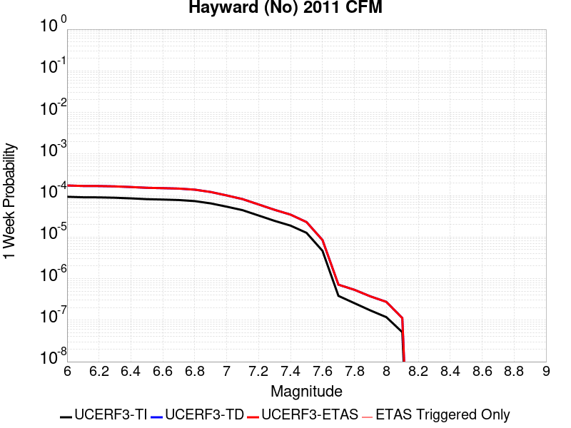 |  |  | 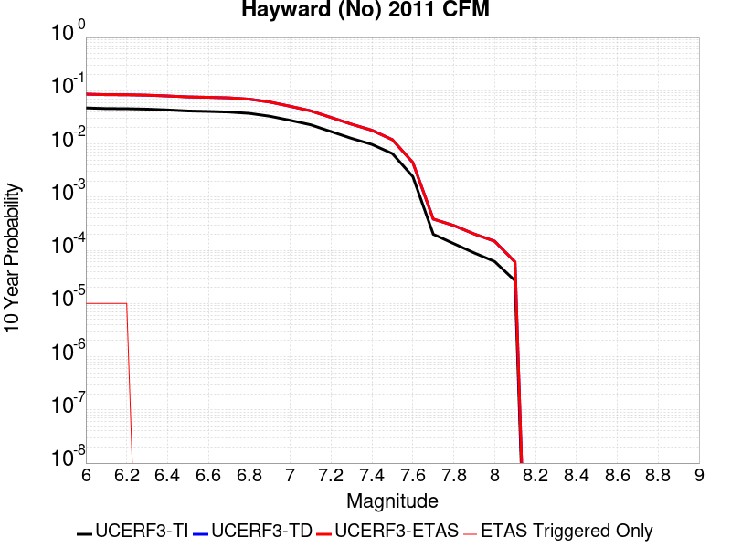 |

| Magnitude | 1 wk TI Prob | 1 wk TD Prob | 1 wk ETAS Prob | 1 wk ETAS/TD Gain | 1 wk ETAS Triggered Only | 1 mo TI Prob | 1 mo TD Prob | 1 mo ETAS Prob | 1 mo ETAS/TD Gain | 1 mo ETAS Triggered Only | 1 yr TI Prob | 1 yr TD Prob | 1 yr ETAS Prob | 1 yr ETAS/TD Gain | 1 yr ETAS Triggered Only | 10 yr TI Prob | 10 yr TD Prob | 10 yr ETAS Prob | 10 yr ETAS/TD Gain | 10 yr ETAS Triggered Only |
|-----|-----|-----|-----|-----|-----|-----|-----|-----|-----|-----|-----|-----|-----|-----|-----|-----|-----|-----|-----|-----|
| 6.0 | 9.3068506E-5 | 1.7407778E-4 | 1.7407778E-4 | 1.0 | 0.0 | 3.9880406E-4 | 7.458329E-4 | 7.458329E-4 | 1.0 | 0.0 | 0.0048446343 | 0.009042598 | 0.0090525085 | 1.0010959 | 1.0E-5 | 0.047403704 | 0.08642659 | 0.086435735 | 1.0001057 | 1.0E-5 |
| 6.1 | 9.055486E-5 | 1.6958894E-4 | 1.6958894E-4 | 1.0 | 0.0 | 3.880345E-4 | 7.266072E-4 | 7.266072E-4 | 1.0 | 0.0 | 0.0047140904 | 0.008810638 | 0.0088205505 | 1.001125 | 1.0E-5 | 0.046153355 | 0.08432426 | 0.08433342 | 1.0001086 | 1.0E-5 |
| 6.2 | 9.006742E-5 | 1.6879481E-4 | 1.6879481E-4 | 1.0 | 0.0 | 3.859461E-4 | 7.232057E-4 | 7.232057E-4 | 1.0 | 0.0 | 0.0046887742 | 0.008769595 | 0.008779507 | 1.0011303 | 1.0E-5 | 0.0459107 | 0.08394843 | 0.0839576 | 1.0001091 | 1.0E-5 |
| 6.3 | 8.8336754E-5 | 1.6558994E-4 | 1.6558994E-4 | 1.0 | 0.0 | 3.7853114E-4 | 7.094785E-4 | 7.094785E-4 | 1.0 | 0.0 | 0.004598882 | 0.008603848 | 0.008603848 | 1.0 | 0.0 | 0.04504866 | 0.0824453 | 0.0824453 | 1.0 | 0.0 |
| 6.4 | 8.526157E-5 | 1.5985436E-4 | 1.5985436E-4 | 1.0 | 0.0 | 3.6535555E-4 | 6.849107E-4 | 6.849107E-4 | 1.0 | 0.0 | 0.0044391346 | 0.008307064 | 0.008307064 | 1.0 | 0.0 | 0.043514993 | 0.07972577 | 0.07972577 | 1.0 | 0.0 |
| 6.5 | 8.152396E-5 | 1.531771E-4 | 1.531771E-4 | 1.0 | 0.0 | 3.493416E-4 | 6.5630855E-4 | 6.5630855E-4 | 1.0 | 0.0 | 0.0042449418 | 0.007961432 | 0.007961432 | 1.0 | 0.0 | 0.04164765 | 0.076563716 | 0.076563716 | 1.0 | 0.0 |
| 6.6 | 7.987405E-5 | 1.5021875E-4 | 1.5021875E-4 | 1.0 | 0.0 | 3.4227243E-4 | 6.436364E-4 | 6.436364E-4 | 1.0 | 0.0 | 0.0041592065 | 0.007808275 | 0.007808275 | 1.0 | 0.0 | 0.04082218 | 0.075156055 | 0.075156055 | 1.0 | 0.0 |
| 6.7 | 7.777665E-5 | 1.4660617E-4 | 1.4660617E-4 | 1.0 | 0.0 | 3.332859E-4 | 6.2816154E-4 | 6.2816154E-4 | 1.0 | 0.0 | 0.004050208 | 0.0076212035 | 0.0076212035 | 1.0 | 0.0 | 0.039771806 | 0.07343067 | 0.07343067 | 1.0 | 0.0 |
| 6.8 | 7.3284005E-5 | 1.3810355E-4 | 1.3810355E-4 | 1.0 | 0.0 | 3.140365E-4 | 5.9173873E-4 | 5.9173873E-4 | 1.0 | 0.0 | 0.0038166929 | 0.007180758 | 0.007180758 | 1.0 | 0.0 | 0.037518036 | 0.06934019 | 0.06934019 | 1.0 | 0.0 |
| 6.9 | 6.458263E-5 | 1.213902E-4 | 1.213902E-4 | 1.0 | 0.0 | 2.7675333E-4 | 5.2014046E-4 | 5.2014046E-4 | 1.0 | 0.0 | 0.0033642664 | 0.0063144234 | 0.0063144234 | 1.0 | 0.0 | 0.033137884 | 0.061260317 | 0.061260317 | 1.0 | 0.0 |
| 7.0 | 5.3853604E-5 | 1.0031354E-4 | 1.0031354E-4 | 1.0 | 0.0 | 2.3078074E-4 | 4.2984466E-4 | 4.2984466E-4 | 1.0 | 0.0 | 0.0028061352 | 0.0052208654 | 0.0052208654 | 1.0 | 0.0 | 0.027709642 | 0.050988052 | 0.050988052 | 1.0 | 0.0 |
| 7.1 | 4.4308683E-5 | 8.175687E-5 | 8.175687E-5 | 1.0 | 0.0 | 1.8988053E-4 | 3.5033975E-4 | 3.5033975E-4 | 1.0 | 0.0 | 0.0023093442 | 0.0042570857 | 0.0042570857 | 1.0 | 0.0 | 0.022854926 | 0.04184846 | 0.04184846 | 1.0 | 0.0 |
| 7.2 | 3.295973E-5 | 6.0817918E-5 | 6.0817918E-5 | 1.0 | 0.0 | 1.4124835E-4 | 2.606223E-4 | 2.606223E-4 | 1.0 | 0.0 | 0.0017183421 | 0.0031684826 | 0.0031684826 | 1.0 | 0.0 | 0.017051157 | 0.031391717 | 0.031391717 | 1.0 | 0.0 |
| 7.3 | 2.452256E-5 | 4.5222114E-5 | 4.5222114E-5 | 1.0 | 0.0 | 1.05092455E-4 | 1.9379474E-4 | 1.9379474E-4 | 1.0 | 0.0 | 0.0012787496 | 0.0023569115 | 0.0023569115 | 1.0 | 0.0 | 0.0127141625 | 0.023461517 | 0.023461517 | 1.0 | 0.0 |
| 7.4 | 1.8829967E-5 | 3.4639685E-5 | 3.4639685E-5 | 1.0 | 0.0 | 8.069736E-5 | 1.484474E-4 | 1.484474E-4 | 1.0 | 0.0 | 9.820475E-4 | 0.0018058587 | 0.0018058587 | 1.0 | 0.0 | 0.009777189 | 0.018037686 | 0.018037686 | 1.0 | 0.0 |
| 7.5 | 1.26374125E-5 | 2.2949873E-5 | 2.2949873E-5 | 1.0 | 0.0 | 5.4159216E-5 | 9.8352924E-5 | 9.8352924E-5 | 1.0 | 0.0 | 6.5918895E-4 | 0.0011967949 | 0.0011967949 | 1.0 | 0.0 | 0.00657237 | 0.012003299 | 0.012003299 | 1.0 | 0.0 |
| 7.6 | 4.666429E-6 | 8.489379E-6 | 8.489379E-6 | 1.0 | 0.0 | 1.9998828E-5 | 3.638255E-5 | 3.638255E-5 | 1.0 | 0.0 | 2.4345852E-4 | 4.4286877E-4 | 4.4286877E-4 | 1.0 | 0.0 | 0.0024319198 | 0.004465238 | 0.004465238 | 1.0 | 0.0 |
| 7.7 | 3.8399318E-7 | 7.147363E-7 | 7.147363E-7 | 1.0 | 0.0 | 1.6456839E-6 | 3.063152E-6 | 3.063152E-6 | 1.0 | 0.0 | 2.003602E-5 | 3.7293237E-5 | 3.7293237E-5 | 1.0 | 0.0 | 2.0034213E-4 | 3.8681817E-4 | 3.8681817E-4 | 1.0 | 0.0 |
| 7.8 | 2.5637698E-7 | 5.377888E-7 | 5.377888E-7 | 1.0 | 0.0 | 1.098758E-6 | 2.3048071E-6 | 2.3048071E-6 | 1.0 | 0.0 | 1.3377297E-5 | 2.8060667E-5 | 2.8060667E-5 | 1.0 | 0.0 | 1.3376492E-4 | 2.9301937E-4 | 2.9301937E-4 | 1.0 | 0.0 |
| 7.9 | 1.7141245E-7 | 3.7371512E-7 | 3.7371512E-7 | 1.0 | 0.0 | 7.3462456E-7 | 1.6016353E-6 | 1.6016353E-6 | 1.0 | 0.0 | 8.944017E-6 | 1.9499736E-5 | 1.9499736E-5 | 1.0 | 0.0 | 8.943657E-5 | 2.0285243E-4 | 2.0285243E-4 | 1.0 | 0.0 |
| 8.0 | 1.1808895E-7 | 2.7565898E-7 | 2.7565898E-7 | 1.0 | 0.0 | 5.060954E-7 | 1.181395E-6 | 1.181395E-6 | 1.0 | 0.0 | 6.161694E-6 | 1.438339E-5 | 1.438339E-5 | 1.0 | 0.0 | 6.161523E-5 | 1.4843856E-4 | 1.4843856E-4 | 1.0 | 0.0 |
| 8.1 | 5.138535E-8 | 1.1250981E-7 | 1.1250981E-7 | 1.0 | 0.0 | 2.2022292E-7 | 4.821848E-7 | 4.821848E-7 | 1.0 | 0.0 | 2.6812106E-6 | 5.8705846E-6 | 5.8705846E-6 | 1.0 | 0.0 | 2.6811784E-5 | 6.026497E-5 | 6.026497E-5 | 1.0 | 0.0 |

## Hosgri
*[(top)](#table-of-contents)*

| 1 Week | 1 Month | 1 Year | 10 Year |
|-----|-----|-----|-----|
|  |  |  | 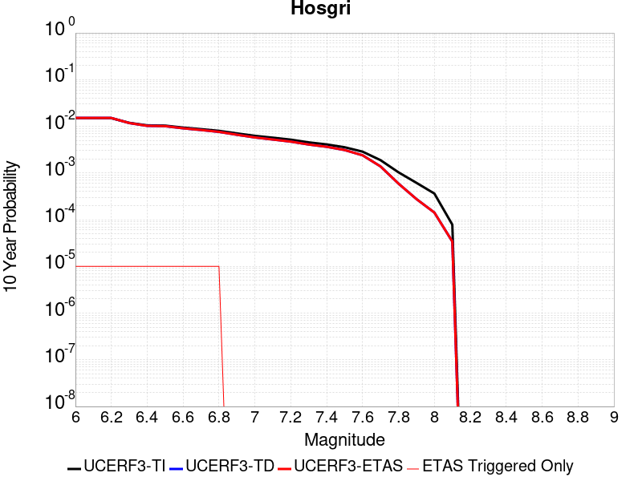 |

| Magnitude | 1 wk TI Prob | 1 wk TD Prob | 1 wk ETAS Prob | 1 wk ETAS/TD Gain | 1 wk ETAS Triggered Only | 1 mo TI Prob | 1 mo TD Prob | 1 mo ETAS Prob | 1 mo ETAS/TD Gain | 1 mo ETAS Triggered Only | 1 yr TI Prob | 1 yr TD Prob | 1 yr ETAS Prob | 1 yr ETAS/TD Gain | 1 yr ETAS Triggered Only | 10 yr TI Prob | 10 yr TD Prob | 10 yr ETAS Prob | 10 yr ETAS/TD Gain | 10 yr ETAS Triggered Only |
|-----|-----|-----|-----|-----|-----|-----|-----|-----|-----|-----|-----|-----|-----|-----|-----|-----|-----|-----|-----|-----|
| 6.0 | 2.883978E-5 | 2.9130044E-5 | 2.9130044E-5 | 1.0 | 0.0 | 1.235932E-4 | 1.2483723E-4 | 1.2483723E-4 | 1.0 | 0.0 | 0.0015037085 | 0.0015188608 | 0.0015188608 | 1.0 | 0.0 | 0.01493574 | 0.015088583 | 0.015098432 | 1.0006528 | 1.0E-5 |
| 6.1 | 2.883978E-5 | 2.9130044E-5 | 2.9130044E-5 | 1.0 | 0.0 | 1.235932E-4 | 1.2483723E-4 | 1.2483723E-4 | 1.0 | 0.0 | 0.0015037085 | 0.0015188608 | 0.0015188608 | 1.0 | 0.0 | 0.01493574 | 0.015088583 | 0.015098432 | 1.0006528 | 1.0E-5 |
| 6.2 | 2.883978E-5 | 2.9130044E-5 | 2.9130044E-5 | 1.0 | 0.0 | 1.235932E-4 | 1.2483723E-4 | 1.2483723E-4 | 1.0 | 0.0 | 0.0015037085 | 0.0015188608 | 0.0015188608 | 1.0 | 0.0 | 0.01493574 | 0.015088583 | 0.015098432 | 1.0006528 | 1.0E-5 |
| 6.3 | 2.2914428E-5 | 2.2643271E-5 | 2.2643271E-5 | 1.0 | 0.0 | 9.8200995E-5 | 9.703901E-5 | 9.703901E-5 | 1.0 | 0.0 | 0.0011949413 | 0.0011808145 | 0.0011808145 | 1.0 | 0.0 | 0.011885363 | 0.011746811 | 0.011756693 | 1.0008413 | 1.0E-5 |
| 6.4 | 2.0195741E-5 | 1.969773E-5 | 1.969773E-5 | 1.0 | 0.0 | 8.65503E-5 | 8.4416126E-5 | 8.4416126E-5 | 1.0 | 0.0 | 0.0010532405 | 0.0010272837 | 0.0010272837 | 1.0 | 0.0 | 0.010482626 | 0.010226403 | 0.010236301 | 1.0009679 | 1.0E-5 |
| 6.5 | 1.9924333E-5 | 1.9410143E-5 | 1.9410143E-5 | 1.0 | 0.0 | 8.53872E-5 | 8.318368E-5 | 8.318368E-5 | 1.0 | 0.0 | 0.0010390934 | 0.0010122927 | 0.0010122927 | 1.0 | 0.0 | 0.010342481 | 0.010077859 | 0.010087758 | 1.0009823 | 1.0E-5 |
| 6.6 | 1.809694E-5 | 1.7459386E-5 | 1.7459386E-5 | 1.0 | 0.0 | 7.7556004E-5 | 7.48238E-5 | 7.48238E-5 | 1.0 | 0.0 | 9.438353E-4 | 9.106004E-4 | 9.106004E-4 | 1.0 | 0.0 | 0.009398366 | 0.009069641 | 0.00907955 | 1.0010926 | 1.0E-5 |
| 6.7 | 1.675989E-5 | 1.6043801E-5 | 1.6043801E-5 | 1.0 | 0.0 | 7.182612E-5 | 6.875734E-5 | 6.875734E-5 | 1.0 | 0.0 | 8.7413215E-4 | 8.3680026E-4 | 8.3680026E-4 | 1.0 | 0.0 | 0.008707017 | 0.0083374055 | 0.008347322 | 1.0011895 | 1.0E-5 |
| 6.8 | 1.5401129E-5 | 1.4615068E-5 | 1.4615068E-5 | 1.0 | 0.0 | 6.6003166E-5 | 6.2634506E-5 | 6.2634506E-5 | 1.0 | 0.0 | 8.032922E-4 | 7.623092E-4 | 7.623092E-4 | 1.0 | 0.0 | 0.008003947 | 0.0075978134 | 0.007607737 | 1.0013062 | 1.0E-5 |
| 6.9 | 1.356559E-5 | 1.2690886E-5 | 1.2690886E-5 | 1.0 | 0.0 | 5.8136946E-5 | 5.4388383E-5 | 5.4388383E-5 | 1.0 | 0.0 | 7.0758746E-4 | 6.619778E-4 | 6.619778E-4 | 1.0 | 0.0 | 0.007053386 | 0.0066008708 | 0.0066008708 | 1.0 | 0.0 |
| 7.0 | 1.2030819E-5 | 1.1096827E-5 | 1.1096827E-5 | 1.0 | 0.0 | 5.155963E-5 | 4.7556965E-5 | 4.7556965E-5 | 1.0 | 0.0 | 6.275577E-4 | 5.788523E-4 | 5.788523E-4 | 1.0 | 0.0 | 0.006257884 | 0.0057742125 | 0.0057742125 | 1.0 | 0.0 |
| 7.1 | 1.0972698E-5 | 1.0023014E-5 | 1.0023014E-5 | 1.0 | 0.0 | 4.7025E-5 | 4.2955064E-5 | 4.2955064E-5 | 1.0 | 0.0 | 5.72379E-4 | 5.2285247E-4 | 5.2285247E-4 | 1.0 | 0.0 | 0.0057090693 | 0.0052169817 | 0.0052169817 | 1.0 | 0.0 |
| 7.2 | 9.961926E-6 | 9.035552E-6 | 9.035552E-6 | 1.0 | 0.0 | 4.2693267E-5 | 3.8723218E-5 | 3.8723218E-5 | 1.0 | 0.0 | 5.1966653E-4 | 4.713532E-4 | 4.713532E-4 | 1.0 | 0.0 | 0.00518453 | 0.0047042873 | 0.0047042873 | 1.0 | 0.0 |
| 7.3 | 8.700929E-6 | 7.828873E-6 | 7.828873E-6 | 1.0 | 0.0 | 3.7289166E-5 | 3.3551885E-5 | 3.3551885E-5 | 1.0 | 0.0 | 4.53901E-4 | 4.0841763E-4 | 4.0841763E-4 | 1.0 | 0.0 | 0.00452975 | 0.0040774164 | 0.0040774164 | 1.0 | 0.0 |
| 7.4 | 7.866285E-6 | 6.9994917E-6 | 6.9994917E-6 | 1.0 | 0.0 | 3.3712215E-5 | 2.9997478E-5 | 2.9997478E-5 | 1.0 | 0.0 | 4.103689E-4 | 3.651581E-4 | 3.651581E-4 | 1.0 | 0.0 | 0.004096119 | 0.0036463244 | 0.0036463244 | 1.0 | 0.0 |
| 7.5 | 6.8381305E-6 | 5.9604217E-6 | 5.9604217E-6 | 1.0 | 0.0 | 2.9305946E-5 | 2.5544414E-5 | 2.5544414E-5 | 1.0 | 0.0 | 3.5674145E-4 | 3.109589E-4 | 3.109589E-4 | 1.0 | 0.0 | 0.0035616932 | 0.003105979 | 0.003105979 | 1.0 | 0.0 |
| 7.6 | 5.503376E-6 | 4.595932E-6 | 4.595932E-6 | 1.0 | 0.0 | 2.3585684E-5 | 1.9696703E-5 | 1.9696703E-5 | 1.0 | 0.0 | 2.8711787E-4 | 2.3978099E-4 | 2.3978099E-4 | 1.0 | 0.0 | 0.002867472 | 0.002395962 | 0.002395962 | 1.0 | 0.0 |
| 7.7 | 3.6144982E-6 | 2.6528419E-6 | 2.6528419E-6 | 1.0 | 0.0 | 1.5490614E-5 | 1.1369272E-5 | 1.1369272E-5 | 1.0 | 0.0 | 1.8858191E-4 | 1.384121E-4 | 1.384121E-4 | 1.0 | 0.0 | 0.0018842196 | 0.0013839965 | 0.0013839965 | 1.0 | 0.0 |
| 7.8 | 1.9853494E-6 | 1.1366267E-6 | 1.1366267E-6 | 1.0 | 0.0 | 8.508612E-6 | 4.8712477E-6 | 4.8712477E-6 | 1.0 | 0.0 | 1.0358743E-4 | 5.930583E-5 | 5.930583E-5 | 1.0 | 0.0 | 0.0010353916 | 5.936362E-4 | 5.936362E-4 | 1.0 | 0.0 |
| 7.9 | 1.1818757E-6 | 5.299053E-7 | 5.299053E-7 | 1.0 | 0.0 | 5.0651715E-6 | 2.2710205E-6 | 2.2710205E-6 | 1.0 | 0.0 | 6.1666724E-5 | 2.7649327E-5 | 2.7649327E-5 | 1.0 | 0.0 | 6.1649614E-4 | 2.7715892E-4 | 2.7715892E-4 | 1.0 | 0.0 |
| 8.0 | 6.962958E-7 | 2.7166053E-7 | 2.7166053E-7 | 1.0 | 0.0 | 2.9841215E-6 | 1.1642588E-6 | 1.1642588E-6 | 1.0 | 0.0 | 3.6331072E-5 | 1.4174759E-5 | 1.4174759E-5 | 1.0 | 0.0 | 3.6325134E-4 | 1.423126E-4 | 1.423126E-4 | 1.0 | 0.0 |
| 8.1 | 1.5033264E-7 | 6.5333694E-8 | 6.5333694E-8 | 1.0 | 0.0 | 6.442826E-7 | 2.800015E-7 | 2.800015E-7 | 1.0 | 0.0 | 7.844113E-6 | 3.409013E-6 | 3.409013E-6 | 1.0 | 0.0 | 7.843835E-5 | 3.410907E-5 | 3.410907E-5 | 1.0 | 0.0 |

## Gillem - Big Crack 2011 CFM
*[(top)](#table-of-contents)*

| 1 Week | 1 Month | 1 Year | 10 Year |
|-----|-----|-----|-----|
|  |  |  |  |

| Magnitude | 1 wk TI Prob | 1 wk TD Prob | 1 wk ETAS Prob | 1 wk ETAS/TD Gain | 1 wk ETAS Triggered Only | 1 mo TI Prob | 1 mo TD Prob | 1 mo ETAS Prob | 1 mo ETAS/TD Gain | 1 mo ETAS Triggered Only | 1 yr TI Prob | 1 yr TD Prob | 1 yr ETAS Prob | 1 yr ETAS/TD Gain | 1 yr ETAS Triggered Only | 10 yr TI Prob | 10 yr TD Prob | 10 yr ETAS Prob | 10 yr ETAS/TD Gain | 10 yr ETAS Triggered Only |
|-----|-----|-----|-----|-----|-----|-----|-----|-----|-----|-----|-----|-----|-----|-----|-----|-----|-----|-----|-----|-----|
| 6.0 | 2.196852E-5 | 2.3605418E-5 | 2.3605418E-5 | 1.0 | 0.0 | 9.4147406E-5 | 1.0116266E-4 | 1.0116266E-4 | 1.0 | 0.0 | 0.0011456419 | 0.0012310484 | 0.0012310484 | 1.0 | 0.0 | 0.011397537 | 0.012251151 | 0.012261028 | 1.0008062 | 1.0E-5 |
| 6.1 | 9.992795E-6 | 1.0712299E-5 | 1.0712299E-5 | 1.0 | 0.0 | 4.2825563E-5 | 4.590915E-5 | 4.590915E-5 | 1.0 | 0.0 | 5.2127644E-4 | 5.5881887E-4 | 5.5881887E-4 | 1.0 | 0.0 | 0.0052005537 | 0.005575947 | 0.005575947 | 1.0 | 0.0 |
| 6.2 | 9.992795E-6 | 1.0712299E-5 | 1.0712299E-5 | 1.0 | 0.0 | 4.2825563E-5 | 4.590915E-5 | 4.590915E-5 | 1.0 | 0.0 | 5.2127644E-4 | 5.5881887E-4 | 5.5881887E-4 | 1.0 | 0.0 | 0.0052005537 | 0.005575947 | 0.005575947 | 1.0 | 0.0 |
| 6.3 | 4.6127884E-6 | 4.9428445E-6 | 4.9428445E-6 | 1.0 | 0.0 | 1.9768944E-5 | 2.1183472E-5 | 2.1183472E-5 | 1.0 | 0.0 | 2.406603E-4 | 2.578827E-4 | 2.578827E-4 | 1.0 | 0.0 | 0.0024039985 | 0.0025762727 | 0.0025762727 | 1.0 | 0.0 |
| 6.4 | 4.6127884E-6 | 4.9428445E-6 | 4.9428445E-6 | 1.0 | 0.0 | 1.9768944E-5 | 2.1183472E-5 | 2.1183472E-5 | 1.0 | 0.0 | 2.406603E-4 | 2.578827E-4 | 2.578827E-4 | 1.0 | 0.0 | 0.0024039985 | 0.0025762727 | 0.0025762727 | 1.0 | 0.0 |
| 6.5 | 2.716712E-6 | 2.9112218E-6 | 2.9112218E-6 | 1.0 | 0.0 | 1.1643E-5 | 1.2476619E-5 | 1.2476619E-5 | 1.0 | 0.0 | 1.417443E-4 | 1.5189468E-4 | 1.5189468E-4 | 1.0 | 0.0 | 0.0014165393 | 0.0015181466 | 0.0015181466 | 1.0 | 0.0 |
| 6.6 | 1.3818255E-6 | 1.482126E-6 | 1.482126E-6 | 1.0 | 0.0 | 5.922096E-6 | 6.3519597E-6 | 6.3519597E-6 | 1.0 | 0.0 | 7.209913E-5 | 7.73336E-5 | 7.73336E-5 | 1.0 | 0.0 | 7.2075747E-4 | 7.731878E-4 | 7.731878E-4 | 1.0 | 0.0 |

## Northridge
*[(top)](#table-of-contents)*

| 1 Week | 1 Month | 1 Year | 10 Year |
|-----|-----|-----|-----|
|  |  |  | 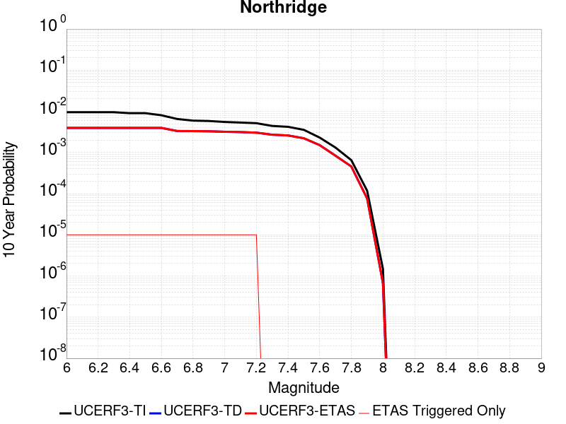 |

| Magnitude | 1 wk TI Prob | 1 wk TD Prob | 1 wk ETAS Prob | 1 wk ETAS/TD Gain | 1 wk ETAS Triggered Only | 1 mo TI Prob | 1 mo TD Prob | 1 mo ETAS Prob | 1 mo ETAS/TD Gain | 1 mo ETAS Triggered Only | 1 yr TI Prob | 1 yr TD Prob | 1 yr ETAS Prob | 1 yr ETAS/TD Gain | 1 yr ETAS Triggered Only | 10 yr TI Prob | 10 yr TD Prob | 10 yr ETAS Prob | 10 yr ETAS/TD Gain | 10 yr ETAS Triggered Only |
|-----|-----|-----|-----|-----|-----|-----|-----|-----|-----|-----|-----|-----|-----|-----|-----|-----|-----|-----|-----|-----|
| 6.0 | 1.8340852E-5 | 7.5887356E-6 | 7.5887356E-6 | 1.0 | 0.0 | 7.860128E-5 | 3.252276E-5 | 3.252276E-5 | 1.0 | 0.0 | 9.565505E-4 | 3.9589484E-4 | 3.9589484E-4 | 1.0 | 0.0 | 0.009524435 | 0.003952141 | 0.0039621014 | 1.0025203 | 1.0E-5 |
| 6.1 | 1.8340852E-5 | 7.5887356E-6 | 7.5887356E-6 | 1.0 | 0.0 | 7.860128E-5 | 3.252276E-5 | 3.252276E-5 | 1.0 | 0.0 | 9.565505E-4 | 3.9589484E-4 | 3.9589484E-4 | 1.0 | 0.0 | 0.009524435 | 0.003952141 | 0.0039621014 | 1.0025203 | 1.0E-5 |
| 6.2 | 1.8340852E-5 | 7.5887356E-6 | 7.5887356E-6 | 1.0 | 0.0 | 7.860128E-5 | 3.252276E-5 | 3.252276E-5 | 1.0 | 0.0 | 9.565505E-4 | 3.9589484E-4 | 3.9589484E-4 | 1.0 | 0.0 | 0.009524435 | 0.003952141 | 0.0039621014 | 1.0025203 | 1.0E-5 |
| 6.3 | 1.8340852E-5 | 7.5887356E-6 | 7.5887356E-6 | 1.0 | 0.0 | 7.860128E-5 | 3.252276E-5 | 3.252276E-5 | 1.0 | 0.0 | 9.565505E-4 | 3.9589484E-4 | 3.9589484E-4 | 1.0 | 0.0 | 0.009524435 | 0.003952141 | 0.0039621014 | 1.0025203 | 1.0E-5 |
| 6.4 | 1.7361892E-5 | 7.5887356E-6 | 7.5887356E-6 | 1.0 | 0.0 | 7.440598E-5 | 3.252276E-5 | 3.252276E-5 | 1.0 | 0.0 | 9.055163E-4 | 3.9589484E-4 | 3.9589484E-4 | 1.0 | 0.0 | 0.009018354 | 0.003952141 | 0.0039621014 | 1.0025203 | 1.0E-5 |
| 6.5 | 1.7361892E-5 | 7.5887356E-6 | 7.5887356E-6 | 1.0 | 0.0 | 7.440598E-5 | 3.252276E-5 | 3.252276E-5 | 1.0 | 0.0 | 9.055163E-4 | 3.9589484E-4 | 3.9589484E-4 | 1.0 | 0.0 | 0.009018354 | 0.003952141 | 0.0039621014 | 1.0025203 | 1.0E-5 |
| 6.6 | 1.5458201E-5 | 7.5887356E-6 | 7.5887356E-6 | 1.0 | 0.0 | 6.624775E-5 | 3.252276E-5 | 3.252276E-5 | 1.0 | 0.0 | 8.0626784E-4 | 3.9589484E-4 | 3.9589484E-4 | 1.0 | 0.0 | 0.008033488 | 0.003952141 | 0.0039621014 | 1.0025203 | 1.0E-5 |
| 6.7 | 1.2538368E-5 | 6.382213E-6 | 6.382213E-6 | 1.0 | 0.0 | 5.3734755E-5 | 2.7352058E-5 | 2.7352058E-5 | 1.0 | 0.0 | 6.5402425E-4 | 3.3296086E-4 | 3.3296086E-4 | 1.0 | 0.0 | 0.0065210275 | 0.0033246905 | 0.0033346573 | 1.0029978 | 1.0E-5 |
| 6.8 | 1.1438097E-5 | 6.3508664E-6 | 6.3508664E-6 | 1.0 | 0.0 | 4.9019498E-5 | 2.7217717E-5 | 2.7217717E-5 | 1.0 | 0.0 | 5.9664896E-4 | 3.3132575E-4 | 3.3132575E-4 | 1.0 | 0.0 | 0.005950495 | 0.0033083882 | 0.0033183552 | 1.0030127 | 1.0E-5 |
| 6.9 | 1.1204891E-5 | 6.2873146E-6 | 6.2873146E-6 | 1.0 | 0.0 | 4.8020076E-5 | 2.6945358E-5 | 2.6945358E-5 | 1.0 | 0.0 | 5.8448757E-4 | 3.2801076E-4 | 3.2801076E-4 | 1.0 | 0.0 | 0.0058295266 | 0.0032753367 | 0.003285304 | 1.0030432 | 1.0E-5 |
| 7.0 | 1.061046E-5 | 6.115958E-6 | 6.115958E-6 | 1.0 | 0.0 | 4.5472607E-5 | 2.6210988E-5 | 2.6210988E-5 | 1.0 | 0.0 | 5.534883E-4 | 3.1907248E-4 | 3.1907248E-4 | 1.0 | 0.0 | 0.0055211177 | 0.0031861905 | 0.0031961587 | 1.0031285 | 1.0E-5 |
| 7.1 | 1.0266979E-5 | 6.0048683E-6 | 6.0048683E-6 | 1.0 | 0.0 | 4.40006E-5 | 2.5734898E-5 | 2.5734898E-5 | 1.0 | 0.0 | 5.355756E-4 | 3.1327776E-4 | 3.1327776E-4 | 1.0 | 0.0 | 0.0053428668 | 0.0031284078 | 0.0031383764 | 1.0031865 | 1.0E-5 |
| 7.2 | 9.91273E-6 | 5.82057E-6 | 5.82057E-6 | 1.0 | 0.0 | 4.248244E-5 | 2.4945064E-5 | 2.4945064E-5 | 1.0 | 0.0 | 5.171009E-4 | 3.0366424E-4 | 3.0366424E-4 | 1.0 | 0.0 | 0.0051589934 | 0.0030325386 | 0.0030425084 | 1.0032876 | 1.0E-5 |
| 7.3 | 8.4959265E-6 | 5.19363E-6 | 5.19363E-6 | 1.0 | 0.0 | 3.6410605E-5 | 2.2258226E-5 | 2.2258226E-5 | 1.0 | 0.0 | 4.4320893E-4 | 2.7096045E-4 | 2.7096045E-4 | 1.0 | 0.0 | 0.00442326 | 0.0027063275 | 0.0027063275 | 1.0 | 0.0 |
| 7.4 | 8.0847185E-6 | 4.9824075E-6 | 4.9824075E-6 | 1.0 | 0.0 | 3.4648332E-5 | 2.1353002E-5 | 2.1353002E-5 | 1.0 | 0.0 | 4.2176177E-4 | 2.5994203E-4 | 2.5994203E-4 | 1.0 | 0.0 | 0.0042096223 | 0.0025964058 | 0.0025964058 | 1.0 | 0.0 |
| 7.5 | 6.8220684E-6 | 4.2535225E-6 | 4.2535225E-6 | 1.0 | 0.0 | 2.9237108E-5 | 1.8229257E-5 | 1.8229257E-5 | 1.0 | 0.0 | 3.5590364E-4 | 2.2191879E-4 | 2.2191879E-4 | 1.0 | 0.0 | 0.0035533418 | 0.002216993 | 0.002216993 | 1.0 | 0.0 |
| 7.6 | 4.4224143E-6 | 2.9000853E-6 | 2.9000853E-6 | 1.0 | 0.0 | 1.8953066E-5 | 1.2428878E-5 | 1.2428878E-5 | 1.0 | 0.0 | 2.3072914E-4 | 1.5131121E-4 | 1.5131121E-4 | 1.0 | 0.0 | 0.0023048974 | 0.0015120934 | 0.0015120934 | 1.0 | 0.0 |
| 7.7 | 2.5297056E-6 | 1.6046582E-6 | 1.6046582E-6 | 1.0 | 0.0 | 1.0841551E-5 | 6.8770887E-6 | 6.8770887E-6 | 1.0 | 0.0 | 1.319879E-4 | 8.372539E-5 | 8.372539E-5 | 1.0 | 0.0 | 0.0013190953 | 8.3694316E-4 | 8.3694316E-4 | 1.0 | 0.0 |
| 7.8 | 1.2508156E-6 | 8.780451E-7 | 8.780451E-7 | 1.0 | 0.0 | 5.3606273E-6 | 3.763045E-6 | 3.763045E-6 | 1.0 | 0.0 | 6.526368E-5 | 4.5814122E-5 | 4.5814122E-5 | 1.0 | 0.0 | 6.524452E-4 | 4.5804807E-4 | 4.5804807E-4 | 1.0 | 0.0 |
| 7.9 | 2.262199E-7 | 1.4665683E-7 | 1.4665683E-7 | 1.0 | 0.0 | 9.695135E-7 | 6.285291E-7 | 6.285291E-7 | 1.0 | 0.0 | 1.1803763E-5 | 7.652316E-6 | 7.652316E-6 | 1.0 | 0.0 | 1.1803136E-4 | 7.65206E-5 | 7.65206E-5 | 1.0 | 0.0 |
| 8.0 | 2.865362E-9 | 1.2755863E-9 | 1.2755863E-9 | 1.0 | 0.0 | 1.2280123E-8 | 5.4667986E-9 | 5.4667986E-9 | 1.0 | 0.0 | 1.4951048E-7 | 6.655827E-8 | 6.655827E-8 | 1.0 | 0.0 | 1.4951038E-6 | 6.655827E-7 | 6.655827E-7 | 1.0 | 0.0 |

## Santa Monica alt 1
*[(top)](#table-of-contents)*

| 1 Week | 1 Month | 1 Year | 10 Year |
|-----|-----|-----|-----|
|  |  |  |  |

| Magnitude | 1 wk TI Prob | 1 wk TD Prob | 1 wk ETAS Prob | 1 wk ETAS/TD Gain | 1 wk ETAS Triggered Only | 1 mo TI Prob | 1 mo TD Prob | 1 mo ETAS Prob | 1 mo ETAS/TD Gain | 1 mo ETAS Triggered Only | 1 yr TI Prob | 1 yr TD Prob | 1 yr ETAS Prob | 1 yr ETAS/TD Gain | 1 yr ETAS Triggered Only | 10 yr TI Prob | 10 yr TD Prob | 10 yr ETAS Prob | 10 yr ETAS/TD Gain | 10 yr ETAS Triggered Only |
|-----|-----|-----|-----|-----|-----|-----|-----|-----|-----|-----|-----|-----|-----|-----|-----|-----|-----|-----|-----|-----|
| 6.0 | 1.1066008E-5 | 1.1480816E-5 | 1.1480816E-5 | 1.0 | 0.0 | 4.742488E-5 | 4.920265E-5 | 4.920265E-5 | 1.0 | 0.0 | 5.7724497E-4 | 5.988915E-4 | 6.0888554E-4 | 1.0166875 | 1.0E-5 | 0.005757478 | 0.005974163 | 0.0059841033 | 1.0016639 | 1.0E-5 |
| 6.1 | 1.1066008E-5 | 1.1480816E-5 | 1.1480816E-5 | 1.0 | 0.0 | 4.742488E-5 | 4.920265E-5 | 4.920265E-5 | 1.0 | 0.0 | 5.7724497E-4 | 5.988915E-4 | 6.0888554E-4 | 1.0166875 | 1.0E-5 | 0.005757478 | 0.005974163 | 0.0059841033 | 1.0016639 | 1.0E-5 |
| 6.2 | 1.1066008E-5 | 1.1480816E-5 | 1.1480816E-5 | 1.0 | 0.0 | 4.742488E-5 | 4.920265E-5 | 4.920265E-5 | 1.0 | 0.0 | 5.7724497E-4 | 5.988915E-4 | 6.0888554E-4 | 1.0166875 | 1.0E-5 | 0.005757478 | 0.005974163 | 0.0059841033 | 1.0016639 | 1.0E-5 |
| 6.3 | 1.1066008E-5 | 1.1480816E-5 | 1.1480816E-5 | 1.0 | 0.0 | 4.742488E-5 | 4.920265E-5 | 4.920265E-5 | 1.0 | 0.0 | 5.7724497E-4 | 5.988915E-4 | 6.0888554E-4 | 1.0166875 | 1.0E-5 | 0.005757478 | 0.005974163 | 0.0059841033 | 1.0016639 | 1.0E-5 |
| 6.4 | 1.1066008E-5 | 1.1480816E-5 | 1.1480816E-5 | 1.0 | 0.0 | 4.742488E-5 | 4.920265E-5 | 4.920265E-5 | 1.0 | 0.0 | 5.7724497E-4 | 5.988915E-4 | 6.0888554E-4 | 1.0166875 | 1.0E-5 | 0.005757478 | 0.005974163 | 0.0059841033 | 1.0016639 | 1.0E-5 |
| 6.5 | 8.183544E-6 | 8.335786E-6 | 8.335786E-6 | 1.0 | 0.0 | 3.5071862E-5 | 3.5724315E-5 | 3.5724315E-5 | 1.0 | 0.0 | 4.2691626E-4 | 4.3485835E-4 | 4.3485835E-4 | 1.0 | 0.0 | 0.0042609703 | 0.00434024 | 0.00434024 | 1.0 | 0.0 |
| 6.6 | 8.1543285E-6 | 8.303999E-6 | 8.303999E-6 | 1.0 | 0.0 | 3.4946657E-5 | 3.558809E-5 | 3.558809E-5 | 1.0 | 0.0 | 4.2539247E-4 | 4.3320045E-4 | 4.3320045E-4 | 1.0 | 0.0 | 0.0042457907 | 0.0043237256 | 0.0043237256 | 1.0 | 0.0 |
| 6.7 | 8.110878E-6 | 8.257393E-6 | 8.257393E-6 | 1.0 | 0.0 | 3.4760444E-5 | 3.538836E-5 | 3.538836E-5 | 1.0 | 0.0 | 4.231262E-4 | 4.3076967E-4 | 4.3076967E-4 | 1.0 | 0.0 | 0.0042232145 | 0.004299512 | 0.004299512 | 1.0 | 0.0 |
| 6.8 | 7.644036E-6 | 7.751389E-6 | 7.751389E-6 | 1.0 | 0.0 | 3.275974E-5 | 3.3219825E-5 | 3.3219825E-5 | 1.0 | 0.0 | 3.9877684E-4 | 4.043777E-4 | 4.043777E-4 | 1.0 | 0.0 | 0.00398062 | 0.0040365653 | 0.0040365653 | 1.0 | 0.0 |
| 6.9 | 7.3698293E-6 | 7.4560357E-6 | 7.4560357E-6 | 1.0 | 0.0 | 3.15846E-5 | 3.1954056E-5 | 3.1954056E-5 | 1.0 | 0.0 | 3.8447464E-4 | 3.8897255E-4 | 3.8897255E-4 | 1.0 | 0.0 | 0.0038381014 | 0.003883061 | 0.003883061 | 1.0 | 0.0 |
| 7.0 | 7.209872E-6 | 7.2859366E-6 | 7.2859366E-6 | 1.0 | 0.0 | 3.0899086E-5 | 3.1225074E-5 | 3.1225074E-5 | 1.0 | 0.0 | 3.7613141E-4 | 3.8010036E-4 | 3.8010036E-4 | 1.0 | 0.0 | 0.0037549543 | 0.0037946452 | 0.0037946452 | 1.0 | 0.0 |
| 7.1 | 5.603456E-6 | 5.5241126E-6 | 5.5241126E-6 | 1.0 | 0.0 | 2.4014591E-5 | 2.3674556E-5 | 2.3674556E-5 | 1.0 | 0.0 | 2.923384E-4 | 2.8819998E-4 | 2.8819998E-4 | 1.0 | 0.0 | 0.0029195412 | 0.002878304 | 0.002878304 | 1.0 | 0.0 |
| 7.2 | 4.7483613E-6 | 4.5913075E-6 | 4.5913075E-6 | 1.0 | 0.0 | 2.0349962E-5 | 1.9676885E-5 | 1.9676885E-5 | 1.0 | 0.0 | 2.4773262E-4 | 2.3953986E-4 | 2.3953986E-4 | 1.0 | 0.0 | 0.0024745662 | 0.0023928308 | 0.0023928308 | 1.0 | 0.0 |
| 7.3 | 3.829015E-6 | 3.6343617E-6 | 3.6343617E-6 | 1.0 | 0.0 | 1.6409962E-5 | 1.5575744E-5 | 1.5575744E-5 | 1.0 | 0.0 | 1.9977297E-4 | 1.8961827E-4 | 1.8961827E-4 | 1.0 | 0.0 | 0.0019959346 | 0.0018945736 | 0.0018945736 | 1.0 | 0.0 |
| 7.4 | 2.610755E-6 | 2.499667E-6 | 2.499667E-6 | 1.0 | 0.0 | 1.1188902E-5 | 1.0712815E-5 | 1.0712815E-5 | 1.0 | 0.0 | 1.3621636E-4 | 1.3042075E-4 | 1.3042075E-4 | 1.0 | 0.0 | 0.001361329 | 0.0013034466 | 0.0013034466 | 1.0 | 0.0 |
| 7.5 | 1.792146E-6 | 1.7584898E-6 | 1.7584898E-6 | 1.0 | 0.0 | 7.680603E-6 | 7.5363632E-6 | 7.5363632E-6 | 1.0 | 0.0 | 9.3507326E-5 | 9.175139E-5 | 9.175139E-5 | 1.0 | 0.0 | 9.3467993E-4 | 9.1713824E-4 | 9.1713824E-4 | 1.0 | 0.0 |
| 7.6 | 1.1473018E-6 | 1.1029626E-6 | 1.1029626E-6 | 1.0 | 0.0 | 4.9169985E-6 | 4.7269746E-6 | 4.7269746E-6 | 1.0 | 0.0 | 5.986281E-5 | 5.7549412E-5 | 5.7549412E-5 | 1.0 | 0.0 | 5.984669E-4 | 5.7534676E-4 | 5.7534676E-4 | 1.0 | 0.0 |
| 7.7 | 5.330919E-7 | 4.7455222E-7 | 4.7455222E-7 | 1.0 | 0.0 | 2.2846775E-6 | 2.0337936E-6 | 2.0337936E-6 | 1.0 | 0.0 | 2.7815593E-5 | 2.4761168E-5 | 2.4761168E-5 | 1.0 | 0.0 | 2.7812112E-4 | 2.4758524E-4 | 2.4758524E-4 | 1.0 | 0.0 |
| 7.8 | 1.1668574E-7 | 8.297861E-8 | 8.297861E-8 | 1.0 | 0.0 | 5.000816E-7 | 3.5562255E-7 | 3.5562255E-7 | 1.0 | 0.0 | 6.0884768E-6 | 4.3296964E-6 | 4.3296964E-6 | 1.0 | 0.0 | 6.08831E-5 | 4.329615E-5 | 4.329615E-5 | 1.0 | 0.0 |
| 7.9 | 8.007447E-10 | 6.1617156E-10 | 6.1617156E-10 | 1.0 | 0.0 | 3.4317629E-9 | 2.6407359E-9 | 2.6407359E-9 | 1.0 | 0.0 | 4.1781714E-8 | 3.2150957E-8 | 3.2150957E-8 | 1.0 | 0.0 | 4.1781706E-7 | 3.2150956E-7 | 3.2150956E-7 | 1.0 | 0.0 |

## Newport-Inglewood (Offshore)
*[(top)](#table-of-contents)*

| 1 Week | 1 Month | 1 Year | 10 Year |
|-----|-----|-----|-----|
|  |  |  |  |

| Magnitude | 1 wk TI Prob | 1 wk TD Prob | 1 wk ETAS Prob | 1 wk ETAS/TD Gain | 1 wk ETAS Triggered Only | 1 mo TI Prob | 1 mo TD Prob | 1 mo ETAS Prob | 1 mo ETAS/TD Gain | 1 mo ETAS Triggered Only | 1 yr TI Prob | 1 yr TD Prob | 1 yr ETAS Prob | 1 yr ETAS/TD Gain | 1 yr ETAS Triggered Only | 10 yr TI Prob | 10 yr TD Prob | 10 yr ETAS Prob | 10 yr ETAS/TD Gain | 10 yr ETAS Triggered Only |
|-----|-----|-----|-----|-----|-----|-----|-----|-----|-----|-----|-----|-----|-----|-----|-----|-----|-----|-----|-----|-----|
| 6.0 | 1.9626508E-5 | 1.8966122E-5 | 1.8966122E-5 | 1.0 | 0.0 | 8.411089E-5 | 8.1280916E-5 | 8.1280916E-5 | 1.0 | 0.0 | 0.001023569 | 9.891585E-4 | 9.891585E-4 | 1.0 | 0.0 | 0.010188672 | 0.009848899 | 0.009858801 | 1.0010053 | 1.0E-5 |
| 6.1 | 1.331886E-5 | 1.2218608E-5 | 1.2218608E-5 | 1.0 | 0.0 | 5.707958E-5 | 5.2364423E-5 | 5.2364423E-5 | 1.0 | 0.0 | 6.947222E-4 | 6.373518E-4 | 6.373518E-4 | 1.0 | 0.0 | 0.006925544 | 0.0063554165 | 0.0063653532 | 1.0015634 | 1.0E-5 |
| 6.2 | 1.2250852E-5 | 1.1076503E-5 | 1.1076503E-5 | 1.0 | 0.0 | 5.2502597E-5 | 4.746987E-5 | 4.746987E-5 | 1.0 | 0.0 | 6.3903164E-4 | 5.777934E-4 | 5.777934E-4 | 1.0 | 0.0 | 0.006371971 | 0.005763033 | 0.0057729753 | 1.0017252 | 1.0E-5 |
| 6.3 | 1.2106258E-5 | 1.0919358E-5 | 1.0919358E-5 | 1.0 | 0.0 | 5.1882926E-5 | 4.6796413E-5 | 4.6796413E-5 | 1.0 | 0.0 | 6.3149154E-4 | 5.695984E-4 | 5.695984E-4 | 1.0 | 0.0 | 0.0062970007 | 0.0056815012 | 0.0056914445 | 1.0017501 | 1.0E-5 |
| 6.4 | 1.1348758E-5 | 1.0109799E-5 | 1.0109799E-5 | 1.0 | 0.0 | 4.8636626E-5 | 4.3326996E-5 | 4.3326996E-5 | 1.0 | 0.0 | 5.919901E-4 | 5.273793E-4 | 5.273793E-4 | 1.0 | 0.0 | 0.005904155 | 0.0052613737 | 0.0052713207 | 1.0018907 | 1.0E-5 |
| 6.5 | 1.100837E-5 | 9.7438115E-6 | 9.7438115E-6 | 1.0 | 0.0 | 4.7177873E-5 | 4.175853E-5 | 4.175853E-5 | 1.0 | 0.0 | 5.7423924E-4 | 5.082923E-4 | 5.082923E-4 | 1.0 | 0.0 | 0.005727576 | 0.005071388 | 0.0050813374 | 1.0019618 | 1.0E-5 |
| 6.6 | 1.0634696E-5 | 9.34595E-6 | 9.34595E-6 | 1.0 | 0.0 | 4.557647E-5 | 4.0053463E-5 | 4.0053463E-5 | 1.0 | 0.0 | 5.5475225E-4 | 4.875425E-4 | 4.875425E-4 | 1.0 | 0.0 | 0.0055336943 | 0.0048648156 | 0.0048747673 | 1.0020456 | 1.0E-5 |
| 6.7 | 9.9780855E-6 | 8.668286E-6 | 8.668286E-6 | 1.0 | 0.0 | 4.276252E-5 | 3.714927E-5 | 3.714927E-5 | 1.0 | 0.0 | 5.205093E-4 | 4.521992E-4 | 4.521992E-4 | 1.0 | 0.0 | 0.0051929182 | 0.0045128698 | 0.0045228247 | 1.0022058 | 1.0E-5 |
| 6.8 | 9.59546E-6 | 8.273307E-6 | 8.273307E-6 | 1.0 | 0.0 | 4.1122752E-5 | 3.545655E-5 | 3.545655E-5 | 1.0 | 0.0 | 5.0055445E-4 | 4.3159866E-4 | 4.3159866E-4 | 1.0 | 0.0 | 0.004994285 | 0.0043076803 | 0.004317637 | 1.0023115 | 1.0E-5 |
| 6.9 | 9.000614E-6 | 7.707169E-6 | 7.707169E-6 | 1.0 | 0.0 | 3.857349E-5 | 3.3030312E-5 | 3.3030312E-5 | 1.0 | 0.0 | 4.6953102E-4 | 4.0207047E-4 | 4.0207047E-4 | 1.0 | 0.0 | 0.004685402 | 0.004013502 | 0.0040234616 | 1.0024816 | 1.0E-5 |
| 7.0 | 7.4070194E-6 | 6.1491287E-6 | 6.1491287E-6 | 1.0 | 0.0 | 3.1743984E-5 | 2.6353144E-5 | 2.6353144E-5 | 1.0 | 0.0 | 3.8641447E-4 | 3.2080244E-4 | 3.2080244E-4 | 1.0 | 0.0 | 0.0038574322 | 0.0032034132 | 0.0032133812 | 1.0031117 | 1.0E-5 |
| 7.1 | 6.299615E-6 | 5.0567855E-6 | 5.0567855E-6 | 1.0 | 0.0 | 2.699807E-5 | 2.1671758E-5 | 2.1671758E-5 | 1.0 | 0.0 | 3.2865192E-4 | 2.6382183E-4 | 2.6382183E-4 | 1.0 | 0.0 | 0.003281663 | 0.002635101 | 0.0026450749 | 1.0037849 | 1.0E-5 |
| 7.2 | 5.096653E-6 | 3.8929225E-6 | 3.8929225E-6 | 1.0 | 0.0 | 2.1842614E-5 | 1.6683847E-5 | 1.6683847E-5 | 1.0 | 0.0 | 2.6590136E-4 | 2.03107E-4 | 2.03107E-4 | 1.0 | 0.0 | 0.0026558342 | 0.002029225 | 0.002029225 | 1.0 | 0.0 |
| 7.3 | 3.9753018E-6 | 2.909986E-6 | 2.909986E-6 | 1.0 | 0.0 | 1.7036897E-5 | 1.2471309E-5 | 1.2471309E-5 | 1.0 | 0.0 | 2.0740448E-4 | 1.5182768E-4 | 1.5182768E-4 | 1.0 | 0.0 | 0.00207211 | 0.0015172476 | 0.0015172476 | 1.0 | 0.0 |
| 7.4 | 3.0568392E-6 | 2.145059E-6 | 2.145059E-6 | 1.0 | 0.0 | 1.3100675E-5 | 9.193077E-6 | 9.193077E-6 | 1.0 | 0.0 | 1.5948903E-4 | 1.1192003E-4 | 1.1192003E-4 | 1.0 | 0.0 | 0.0015937461 | 0.001118643 | 0.001118643 | 1.0 | 0.0 |
| 7.5 | 1.7279019E-6 | 1.1470098E-6 | 1.1470098E-6 | 1.0 | 0.0 | 7.405273E-6 | 4.9157475E-6 | 4.9157475E-6 | 1.0 | 0.0 | 9.015547E-5 | 5.9847618E-5 | 5.9847618E-5 | 1.0 | 0.0 | 9.01189E-4 | 5.983189E-4 | 5.983189E-4 | 1.0 | 0.0 |
| 7.6 | 1.1156416E-6 | 7.223291E-7 | 7.223291E-7 | 1.0 | 0.0 | 4.7813123E-6 | 3.0956926E-6 | 3.0956926E-6 | 1.0 | 0.0 | 5.821092E-5 | 3.7689428E-5 | 3.7689428E-5 | 1.0 | 0.0 | 5.8195676E-4 | 3.768327E-4 | 3.768327E-4 | 1.0 | 0.0 |
| 7.7 | 9.117973E-8 | 6.73438E-8 | 6.73438E-8 | 1.0 | 0.0 | 3.907702E-7 | 2.8861623E-7 | 2.8861623E-7 | 1.0 | 0.0 | 4.757617E-6 | 3.5138974E-6 | 3.5138974E-6 | 1.0 | 0.0 | 4.7575148E-5 | 3.5138448E-5 | 3.5138448E-5 | 1.0 | 0.0 |

## Great Valley 06 (Midland) 2011 CFM alt1
*[(top)](#table-of-contents)*

| 1 Week | 1 Month | 1 Year | 10 Year |
|-----|-----|-----|-----|
|  | 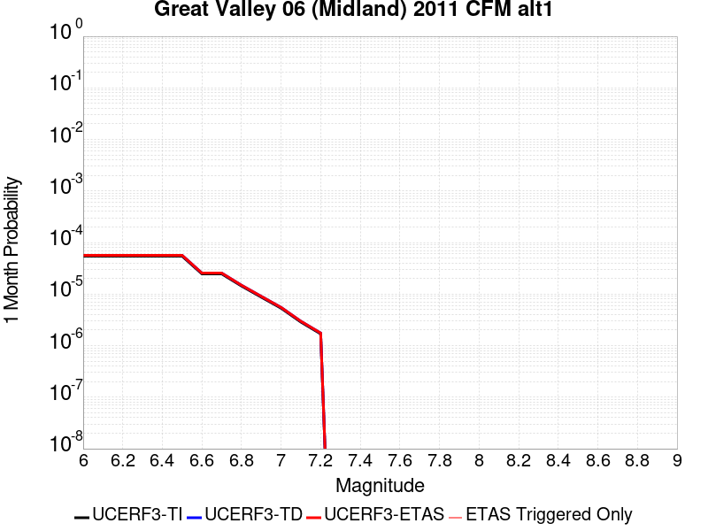 |  |  |

| Magnitude | 1 wk TI Prob | 1 wk TD Prob | 1 wk ETAS Prob | 1 wk ETAS/TD Gain | 1 wk ETAS Triggered Only | 1 mo TI Prob | 1 mo TD Prob | 1 mo ETAS Prob | 1 mo ETAS/TD Gain | 1 mo ETAS Triggered Only | 1 yr TI Prob | 1 yr TD Prob | 1 yr ETAS Prob | 1 yr ETAS/TD Gain | 1 yr ETAS Triggered Only | 10 yr TI Prob | 10 yr TD Prob | 10 yr ETAS Prob | 10 yr ETAS/TD Gain | 10 yr ETAS Triggered Only |
|-----|-----|-----|-----|-----|-----|-----|-----|-----|-----|-----|-----|-----|-----|-----|-----|-----|-----|-----|-----|-----|
| 6.0 | 1.2712525E-5 | 1.3210851E-5 | 1.3210851E-5 | 1.0 | 0.0 | 5.4481112E-5 | 5.6616846E-5 | 5.6616846E-5 | 1.0 | 0.0 | 6.6310563E-4 | 6.8911747E-4 | 6.9911056E-4 | 1.0145013 | 1.0E-5 | 0.0066113044 | 0.0068723215 | 0.0068822526 | 1.001445 | 1.0E-5 |
| 6.1 | 1.2712525E-5 | 1.3210851E-5 | 1.3210851E-5 | 1.0 | 0.0 | 5.4481112E-5 | 5.6616846E-5 | 5.6616846E-5 | 1.0 | 0.0 | 6.6310563E-4 | 6.8911747E-4 | 6.9911056E-4 | 1.0145013 | 1.0E-5 | 0.0066113044 | 0.0068723215 | 0.0068822526 | 1.001445 | 1.0E-5 |
| 6.2 | 1.2712525E-5 | 1.3210851E-5 | 1.3210851E-5 | 1.0 | 0.0 | 5.4481112E-5 | 5.6616846E-5 | 5.6616846E-5 | 1.0 | 0.0 | 6.6310563E-4 | 6.8911747E-4 | 6.9911056E-4 | 1.0145013 | 1.0E-5 | 0.0066113044 | 0.0068723215 | 0.0068822526 | 1.001445 | 1.0E-5 |
| 6.3 | 1.2712525E-5 | 1.3210851E-5 | 1.3210851E-5 | 1.0 | 0.0 | 5.4481112E-5 | 5.6616846E-5 | 5.6616846E-5 | 1.0 | 0.0 | 6.6310563E-4 | 6.8911747E-4 | 6.9911056E-4 | 1.0145013 | 1.0E-5 | 0.0066113044 | 0.0068723215 | 0.0068822526 | 1.001445 | 1.0E-5 |
| 6.4 | 1.2712525E-5 | 1.3210851E-5 | 1.3210851E-5 | 1.0 | 0.0 | 5.4481112E-5 | 5.6616846E-5 | 5.6616846E-5 | 1.0 | 0.0 | 6.6310563E-4 | 6.8911747E-4 | 6.9911056E-4 | 1.0145013 | 1.0E-5 | 0.0066113044 | 0.0068723215 | 0.0068822526 | 1.001445 | 1.0E-5 |
| 6.5 | 1.2712525E-5 | 1.3210851E-5 | 1.3210851E-5 | 1.0 | 0.0 | 5.4481112E-5 | 5.6616846E-5 | 5.6616846E-5 | 1.0 | 0.0 | 6.6310563E-4 | 6.8911747E-4 | 6.9911056E-4 | 1.0145013 | 1.0E-5 | 0.0066113044 | 0.0068723215 | 0.0068822526 | 1.001445 | 1.0E-5 |
| 6.6 | 5.7574384E-6 | 5.9707636E-6 | 5.9707636E-6 | 1.0 | 0.0 | 2.4674504E-5 | 2.5588757E-5 | 2.5588757E-5 | 1.0 | 0.0 | 3.0037065E-4 | 3.1150252E-4 | 3.1150252E-4 | 1.0 | 0.0 | 0.0029996498 | 0.0031110453 | 0.0031110453 | 1.0 | 0.0 |
| 6.7 | 5.7574384E-6 | 5.9707636E-6 | 5.9707636E-6 | 1.0 | 0.0 | 2.4674504E-5 | 2.5588757E-5 | 2.5588757E-5 | 1.0 | 0.0 | 3.0037065E-4 | 3.1150252E-4 | 3.1150252E-4 | 1.0 | 0.0 | 0.0029996498 | 0.0031110453 | 0.0031110453 | 1.0 | 0.0 |
| 6.8 | 3.3474828E-6 | 3.4694517E-6 | 3.4694517E-6 | 1.0 | 0.0 | 1.4346277E-5 | 1.4869002E-5 | 1.4869002E-5 | 1.0 | 0.0 | 1.7465191E-4 | 1.8101657E-4 | 1.8101657E-4 | 1.0 | 0.0 | 0.0017451472 | 0.0018088382 | 0.0018088382 | 1.0 | 0.0 |
| 6.9 | 2.035106E-6 | 2.1090761E-6 | 2.1090761E-6 | 1.0 | 0.0 | 8.721853E-6 | 9.038871E-6 | 9.038871E-6 | 1.0 | 0.0 | 1.0618339E-4 | 1.1004343E-4 | 1.1004343E-4 | 1.0 | 0.0 | 0.0010613267 | 0.0010999617 | 0.0010999617 | 1.0 | 0.0 |
| 7.0 | 1.2424716E-6 | 1.2879011E-6 | 1.2879011E-6 | 1.0 | 0.0 | 5.3248673E-6 | 5.5195674E-6 | 5.5195674E-6 | 1.0 | 0.0 | 6.482833E-5 | 6.719911E-5 | 6.719911E-5 | 1.0 | 0.0 | 6.480942E-4 | 6.7183224E-4 | 6.7183224E-4 | 1.0 | 0.0 |
| 7.1 | 6.6904556E-7 | 6.939171E-7 | 6.939171E-7 | 1.0 | 0.0 | 2.867335E-6 | 2.9739288E-6 | 2.9739288E-6 | 1.0 | 0.0 | 3.4909244E-5 | 3.620724E-5 | 3.620724E-5 | 1.0 | 0.0 | 3.490376E-4 | 3.620389E-4 | 3.620389E-4 | 1.0 | 0.0 |
| 7.2 | 3.948168E-7 | 4.095786E-7 | 4.095786E-7 | 1.0 | 0.0 | 1.6920709E-6 | 1.7553369E-6 | 1.7553369E-6 | 1.0 | 0.0 | 2.0600768E-5 | 2.1371226E-5 | 2.1371226E-5 | 1.0 | 0.0 | 2.0598859E-4 | 2.1371226E-4 | 2.1371226E-4 | 1.0 | 0.0 |

## Monte Vista - Shannon 2011 CFM
*[(top)](#table-of-contents)*

| 1 Week | 1 Month | 1 Year | 10 Year |
|-----|-----|-----|-----|
|  |  |  |  |

| Magnitude | 1 wk TI Prob | 1 wk TD Prob | 1 wk ETAS Prob | 1 wk ETAS/TD Gain | 1 wk ETAS Triggered Only | 1 mo TI Prob | 1 mo TD Prob | 1 mo ETAS Prob | 1 mo ETAS/TD Gain | 1 mo ETAS Triggered Only | 1 yr TI Prob | 1 yr TD Prob | 1 yr ETAS Prob | 1 yr ETAS/TD Gain | 1 yr ETAS Triggered Only | 10 yr TI Prob | 10 yr TD Prob | 10 yr ETAS Prob | 10 yr ETAS/TD Gain | 10 yr ETAS Triggered Only |
|-----|-----|-----|-----|-----|-----|-----|-----|-----|-----|-----|-----|-----|-----|-----|-----|-----|-----|-----|-----|-----|
| 6.0 | 2.7907707E-5 | 2.758756E-5 | 2.758756E-5 | 1.0 | 0.0 | 1.19598975E-4 | 1.1822775E-4 | 1.1822775E-4 | 1.0 | 0.0 | 0.0014551448 | 0.001438596 | 0.001438596 | 1.0 | 0.0 | 0.014456532 | 0.014321938 | 0.014331795 | 1.0006882 | 1.0E-5 |
| 6.1 | 2.7907707E-5 | 2.758756E-5 | 2.758756E-5 | 1.0 | 0.0 | 1.19598975E-4 | 1.1822775E-4 | 1.1822775E-4 | 1.0 | 0.0 | 0.0014551448 | 0.001438596 | 0.001438596 | 1.0 | 0.0 | 0.014456532 | 0.014321938 | 0.014331795 | 1.0006882 | 1.0E-5 |
| 6.2 | 2.7907707E-5 | 2.758756E-5 | 2.758756E-5 | 1.0 | 0.0 | 1.19598975E-4 | 1.1822775E-4 | 1.1822775E-4 | 1.0 | 0.0 | 0.0014551448 | 0.001438596 | 0.001438596 | 1.0 | 0.0 | 0.014456532 | 0.014321938 | 0.014331795 | 1.0006882 | 1.0E-5 |
| 6.3 | 2.7907707E-5 | 2.758756E-5 | 2.758756E-5 | 1.0 | 0.0 | 1.19598975E-4 | 1.1822775E-4 | 1.1822775E-4 | 1.0 | 0.0 | 0.0014551448 | 0.001438596 | 0.001438596 | 1.0 | 0.0 | 0.014456532 | 0.014321938 | 0.014331795 | 1.0006882 | 1.0E-5 |
| 6.4 | 2.7907707E-5 | 2.758756E-5 | 2.758756E-5 | 1.0 | 0.0 | 1.19598975E-4 | 1.1822775E-4 | 1.1822775E-4 | 1.0 | 0.0 | 0.0014551448 | 0.001438596 | 0.001438596 | 1.0 | 0.0 | 0.014456532 | 0.014321938 | 0.014331795 | 1.0006882 | 1.0E-5 |
| 6.5 | 1.7990213E-5 | 1.6642634E-5 | 1.6642634E-5 | 1.0 | 0.0 | 7.709863E-5 | 7.1324E-5 | 7.1324E-5 | 1.0 | 0.0 | 9.382716E-4 | 8.6809014E-4 | 8.6809014E-4 | 1.0 | 0.0 | 0.0093431985 | 0.008670382 | 0.008680296 | 1.0011433 | 1.0E-5 |
| 6.6 | 9.650407E-6 | 7.459402E-6 | 7.459402E-6 | 1.0 | 0.0 | 4.135823E-5 | 3.1968517E-5 | 3.1968517E-5 | 1.0 | 0.0 | 5.0342013E-4 | 3.8915503E-4 | 3.8915503E-4 | 1.0 | 0.0 | 0.005022812 | 0.0039024334 | 0.0039024334 | 1.0 | 0.0 |
| 6.7 | 9.62828E-6 | 7.437314E-6 | 7.437314E-6 | 1.0 | 0.0 | 4.1263404E-5 | 3.1873857E-5 | 3.1873857E-5 | 1.0 | 0.0 | 5.022661E-4 | 3.8800295E-4 | 3.8800295E-4 | 1.0 | 0.0 | 0.0050113243 | 0.0038909533 | 0.0038909533 | 1.0 | 0.0 |
| 6.8 | 6.887523E-6 | 4.4636836E-6 | 4.4636836E-6 | 1.0 | 0.0 | 2.9517621E-5 | 1.9129946E-5 | 1.9129946E-5 | 1.0 | 0.0 | 3.5931775E-4 | 2.3288443E-4 | 2.3288443E-4 | 1.0 | 0.0 | 0.0035873733 | 0.0023435748 | 0.0023435748 | 1.0 | 0.0 |
| 6.9 | 6.2722347E-6 | 3.805522E-6 | 3.805522E-6 | 1.0 | 0.0 | 2.6880729E-5 | 1.630929E-5 | 1.630929E-5 | 1.0 | 0.0 | 3.2722374E-4 | 1.9854953E-4 | 1.9854953E-4 | 1.0 | 0.0 | 0.003267423 | 0.0020008786 | 0.0020008786 | 1.0 | 0.0 |
| 7.0 | 5.5320347E-6 | 3.0326237E-6 | 3.0326237E-6 | 1.0 | 0.0 | 2.3708504E-5 | 1.2996904E-5 | 1.2996904E-5 | 1.0 | 0.0 | 2.8861282E-4 | 1.5822765E-4 | 1.5822765E-4 | 1.0 | 0.0 | 0.0028823826 | 0.0015982919 | 0.0015982919 | 1.0 | 0.0 |
| 7.1 | 3.8794055E-6 | 1.2857167E-6 | 1.2857167E-6 | 1.0 | 0.0 | 1.6625918E-5 | 5.5102028E-6 | 5.5102028E-6 | 1.0 | 0.0 | 2.0240174E-4 | 6.708467E-5 | 6.708467E-5 | 1.0 | 0.0 | 0.002022175 | 6.8761036E-4 | 6.8761036E-4 | 1.0 | 0.0 |
| 7.2 | 3.4813652E-6 | 9.689345E-7 | 9.689345E-7 | 1.0 | 0.0 | 1.49200505E-5 | 4.15257E-6 | 4.15257E-6 | 1.0 | 0.0 | 1.8163648E-4 | 5.0556377E-5 | 5.0556377E-5 | 1.0 | 0.0 | 0.0018148809 | 5.224037E-4 | 5.224037E-4 | 1.0 | 0.0 |
| 7.3 | 3.1682148E-6 | 7.736803E-7 | 7.736803E-7 | 1.0 | 0.0 | 1.3577992E-5 | 3.3157685E-6 | 3.3157685E-6 | 1.0 | 0.0 | 1.6529951E-4 | 4.0368737E-5 | 4.0368737E-5 | 1.0 | 0.0 | 0.0016517661 | 4.205439E-4 | 4.205439E-4 | 1.0 | 0.0 |
| 7.4 | 2.9707667E-6 | 7.362934E-7 | 7.362934E-7 | 1.0 | 0.0 | 1.2731795E-5 | 3.1555394E-6 | 3.1555394E-6 | 1.0 | 0.0 | 1.5499859E-4 | 3.8418017E-5 | 3.8418017E-5 | 1.0 | 0.0 | 0.0015489052 | 4.0083413E-4 | 4.0083413E-4 | 1.0 | 0.0 |
| 7.5 | 2.3462758E-6 | 6.022688E-7 | 6.022688E-7 | 1.0 | 0.0 | 1.0055429E-5 | 2.5811496E-6 | 2.5811496E-6 | 1.0 | 0.0 | 1.2241797E-4 | 3.1425046E-5 | 3.1425046E-5 | 1.0 | 0.0 | 0.0012235056 | 3.2917794E-4 | 3.2917794E-4 | 1.0 | 0.0 |
| 7.6 | 2.112783E-6 | 5.2655395E-7 | 5.2655395E-7 | 1.0 | 0.0 | 9.054753E-6 | 2.2566578E-6 | 2.2566578E-6 | 1.0 | 0.0 | 1.1023604E-4 | 2.7474465E-5 | 2.7474465E-5 | 1.0 | 0.0 | 0.0011018137 | 2.8925182E-4 | 2.8925182E-4 | 1.0 | 0.0 |
| 7.7 | 1.7022471E-6 | 4.2438955E-7 | 4.2438955E-7 | 1.0 | 0.0 | 7.2953244E-6 | 1.8188111E-6 | 1.8188111E-6 | 1.0 | 0.0 | 8.881695E-5 | 2.2143802E-5 | 2.2143802E-5 | 1.0 | 0.0 | 8.878146E-4 | 2.3463985E-4 | 2.3463985E-4 | 1.0 | 0.0 |
| 7.8 | 7.230914E-7 | 3.7399508E-7 | 3.7399508E-7 | 1.0 | 0.0 | 3.0989595E-6 | 1.602835E-6 | 1.602835E-6 | 1.0 | 0.0 | 3.772918E-5 | 1.9514342E-5 | 1.9514342E-5 | 1.0 | 0.0 | 3.7722773E-4 | 2.0786705E-4 | 2.0786705E-4 | 1.0 | 0.0 |
| 7.9 | 4.3588446E-7 | 3.4405795E-7 | 3.4405795E-7 | 1.0 | 0.0 | 1.868075E-6 | 1.4745333E-6 | 1.4745333E-6 | 1.0 | 0.0 | 2.2743576E-5 | 1.7952296E-5 | 1.7952296E-5 | 1.0 | 0.0 | 2.2741247E-4 | 1.9047344E-4 | 1.9047344E-4 | 1.0 | 0.0 |
| 8.0 | 2.3317523E-7 | 3.1602227E-7 | 3.1602227E-7 | 1.0 | 0.0 | 9.99322E-7 | 1.3543804E-6 | 1.3543804E-6 | 1.0 | 0.0 | 1.2166677E-5 | 1.6489459E-5 | 1.6489459E-5 | 1.0 | 0.0 | 1.21660116E-4 | 1.7445248E-4 | 1.7445248E-4 | 1.0 | 0.0 |
| 8.1 | 1.4662456E-7 | 2.0360719E-7 | 2.0360719E-7 | 1.0 | 0.0 | 6.283908E-7 | 8.726019E-7 | 8.726019E-7 | 1.0 | 0.0 | 7.650631E-6 | 1.0623878E-5 | 1.0623878E-5 | 1.0 | 0.0 | 7.650368E-5 | 1.1159261E-4 | 1.1159261E-4 | 1.0 | 0.0 |
| 8.2 | 5.4931775E-9 | 5.089212E-9 | 5.089212E-9 | 1.0 | 0.0 | 2.3542189E-8 | 2.181091E-8 | 2.181091E-8 | 1.0 | 0.0 | 2.8662612E-7 | 2.655478E-7 | 2.655478E-7 | 1.0 | 0.0 | 2.8662573E-6 | 2.7605859E-6 | 2.7605859E-6 | 1.0 | 0.0 |

## Sierra Madre
*[(top)](#table-of-contents)*

| 1 Week | 1 Month | 1 Year | 10 Year |
|-----|-----|-----|-----|
|  |  |  |  |

| Magnitude | 1 wk TI Prob | 1 wk TD Prob | 1 wk ETAS Prob | 1 wk ETAS/TD Gain | 1 wk ETAS Triggered Only | 1 mo TI Prob | 1 mo TD Prob | 1 mo ETAS Prob | 1 mo ETAS/TD Gain | 1 mo ETAS Triggered Only | 1 yr TI Prob | 1 yr TD Prob | 1 yr ETAS Prob | 1 yr ETAS/TD Gain | 1 yr ETAS Triggered Only | 10 yr TI Prob | 10 yr TD Prob | 10 yr ETAS Prob | 10 yr ETAS/TD Gain | 10 yr ETAS Triggered Only |
|-----|-----|-----|-----|-----|-----|-----|-----|-----|-----|-----|-----|-----|-----|-----|-----|-----|-----|-----|-----|-----|
| 6.0 | 1.3379373E-5 | 1.10021165E-5 | 1.10021165E-5 | 1.0 | 0.0 | 5.7338908E-5 | 4.7151083E-5 | 4.7151083E-5 | 1.0 | 0.0 | 6.978776E-4 | 5.7391473E-4 | 5.7391473E-4 | 1.0 | 0.0 | 0.0069569005 | 0.005724645 | 0.005734588 | 1.0017369 | 1.0E-5 |
| 6.1 | 1.3379373E-5 | 1.10021165E-5 | 1.10021165E-5 | 1.0 | 0.0 | 5.7338908E-5 | 4.7151083E-5 | 4.7151083E-5 | 1.0 | 0.0 | 6.978776E-4 | 5.7391473E-4 | 5.7391473E-4 | 1.0 | 0.0 | 0.0069569005 | 0.005724645 | 0.005734588 | 1.0017369 | 1.0E-5 |
| 6.2 | 1.3379373E-5 | 1.10021165E-5 | 1.10021165E-5 | 1.0 | 0.0 | 5.7338908E-5 | 4.7151083E-5 | 4.7151083E-5 | 1.0 | 0.0 | 6.978776E-4 | 5.7391473E-4 | 5.7391473E-4 | 1.0 | 0.0 | 0.0069569005 | 0.005724645 | 0.005734588 | 1.0017369 | 1.0E-5 |
| 6.3 | 1.3379373E-5 | 1.10021165E-5 | 1.10021165E-5 | 1.0 | 0.0 | 5.7338908E-5 | 4.7151083E-5 | 4.7151083E-5 | 1.0 | 0.0 | 6.978776E-4 | 5.7391473E-4 | 5.7391473E-4 | 1.0 | 0.0 | 0.0069569005 | 0.005724645 | 0.005734588 | 1.0017369 | 1.0E-5 |
| 6.4 | 1.3379373E-5 | 1.10021165E-5 | 1.10021165E-5 | 1.0 | 0.0 | 5.7338908E-5 | 4.7151083E-5 | 4.7151083E-5 | 1.0 | 0.0 | 6.978776E-4 | 5.7391473E-4 | 5.7391473E-4 | 1.0 | 0.0 | 0.0069569005 | 0.005724645 | 0.005734588 | 1.0017369 | 1.0E-5 |
| 6.5 | 1.26563245E-5 | 1.0231545E-5 | 1.0231545E-5 | 1.0 | 0.0 | 5.4240263E-5 | 4.384875E-5 | 4.384875E-5 | 1.0 | 0.0 | 6.601751E-4 | 5.3372886E-4 | 5.3372886E-4 | 1.0 | 0.0 | 0.006582173 | 0.005324747 | 0.005334694 | 1.001868 | 1.0E-5 |
| 6.6 | 1.26563245E-5 | 1.0231545E-5 | 1.0231545E-5 | 1.0 | 0.0 | 5.4240263E-5 | 4.384875E-5 | 4.384875E-5 | 1.0 | 0.0 | 6.601751E-4 | 5.3372886E-4 | 5.3372886E-4 | 1.0 | 0.0 | 0.006582173 | 0.005324747 | 0.005334694 | 1.001868 | 1.0E-5 |
| 6.7 | 1.2502474E-5 | 1.0067684E-5 | 1.0067684E-5 | 1.0 | 0.0 | 5.3580934E-5 | 4.314651E-5 | 4.314651E-5 | 1.0 | 0.0 | 6.521526E-4 | 5.251832E-4 | 5.251832E-4 | 1.0 | 0.0 | 0.0065024206 | 0.0052396953 | 0.005249643 | 1.0018985 | 1.0E-5 |
| 6.8 | 1.2454966E-5 | 1.0019968E-5 | 1.0019968E-5 | 1.0 | 0.0 | 5.3377335E-5 | 4.2942018E-5 | 4.2942018E-5 | 1.0 | 0.0 | 6.4967526E-4 | 5.226947E-4 | 5.226947E-4 | 1.0 | 0.0 | 0.006477792 | 0.0052149273 | 0.005224875 | 1.0019076 | 1.0E-5 |
| 6.9 | 1.2225574E-5 | 9.793936E-6 | 9.793936E-6 | 1.0 | 0.0 | 5.2394265E-5 | 4.1973344E-5 | 4.1973344E-5 | 1.0 | 0.0 | 6.3771347E-4 | 5.109067E-4 | 5.109067E-4 | 1.0 | 0.0 | 0.006358865 | 0.0050975927 | 0.005107542 | 1.0019517 | 1.0E-5 |
| 7.0 | 1.182946E-5 | 9.4004645E-6 | 9.4004645E-6 | 1.0 | 0.0 | 5.06967E-5 | 4.028709E-5 | 4.028709E-5 | 1.0 | 0.0 | 6.1705755E-4 | 4.903859E-4 | 4.903859E-4 | 1.0 | 0.0 | 0.006153469 | 0.0048933052 | 0.0049032564 | 1.0020336 | 1.0E-5 |
| 7.1 | 1.14369095E-5 | 8.987445E-6 | 8.987445E-6 | 1.0 | 0.0 | 4.9014405E-5 | 3.8517057E-5 | 3.8517057E-5 | 1.0 | 0.0 | 5.9658696E-4 | 4.6884525E-4 | 4.6884525E-4 | 1.0 | 0.0 | 0.005949879 | 0.0046788226 | 0.0046887756 | 1.0021273 | 1.0E-5 |
| 7.2 | 1.0836419E-5 | 8.400809E-6 | 8.400809E-6 | 1.0 | 0.0 | 4.644097E-5 | 3.6002977E-5 | 3.6002977E-5 | 1.0 | 0.0 | 5.652721E-4 | 4.3824897E-4 | 4.3824897E-4 | 1.0 | 0.0 | 0.0056383642 | 0.0043741004 | 0.0043840567 | 1.0022762 | 1.0E-5 |
| 7.3 | 1.0403439E-5 | 8.0220525E-6 | 8.0220525E-6 | 1.0 | 0.0 | 4.4585406E-5 | 3.4379776E-5 | 3.4379776E-5 | 1.0 | 0.0 | 5.426921E-4 | 4.184943E-4 | 4.184943E-4 | 1.0 | 0.0 | 0.005413687 | 0.004177313 | 0.004187271 | 1.0023838 | 1.0E-5 |
| 7.4 | 9.768864E-6 | 7.415647E-6 | 7.415647E-6 | 1.0 | 0.0 | 4.186589E-5 | 3.178096E-5 | 3.178096E-5 | 1.0 | 0.0 | 5.09598E-4 | 3.868654E-4 | 3.868654E-4 | 1.0 | 0.0 | 0.0050843097 | 0.0038621665 | 0.003872128 | 1.0025792 | 1.0E-5 |
| 7.5 | 8.687089E-6 | 6.451198E-6 | 6.451198E-6 | 1.0 | 0.0 | 3.722985E-5 | 2.7647704E-5 | 2.7647704E-5 | 1.0 | 0.0 | 4.5317915E-4 | 3.3655966E-4 | 3.3655966E-4 | 1.0 | 0.0 | 0.004522561 | 0.0033607422 | 0.0033707086 | 1.0029656 | 1.0E-5 |
| 7.6 | 6.3506063E-6 | 4.431243E-6 | 4.431243E-6 | 1.0 | 0.0 | 2.72166E-5 | 1.8990904E-5 | 1.8990904E-5 | 1.0 | 0.0 | 3.3131172E-4 | 2.3118999E-4 | 2.3118999E-4 | 1.0 | 0.0 | 0.003308182 | 0.0023096756 | 0.0023196524 | 1.0043197 | 1.0E-5 |
| 7.7 | 4.62223E-6 | 2.9338082E-6 | 2.9338082E-6 | 1.0 | 0.0 | 1.9809406E-5 | 1.2573403E-5 | 1.2573403E-5 | 1.0 | 0.0 | 2.4115283E-4 | 1.5307045E-4 | 1.5307045E-4 | 1.0 | 0.0 | 0.0024089129 | 0.0015298066 | 0.0015298066 | 1.0 | 0.0 |
| 7.8 | 3.2145008E-6 | 1.9500208E-6 | 1.9500208E-6 | 1.0 | 0.0 | 1.3776359E-5 | 8.357206E-6 | 8.357206E-6 | 1.0 | 0.0 | 1.6771426E-4 | 1.0174424E-4 | 1.0174424E-4 | 1.0 | 0.0 | 0.0016758774 | 0.0010170741 | 0.0010170741 | 1.0 | 0.0 |
| 7.9 | 1.0391769E-6 | 5.604198E-7 | 5.604198E-7 | 1.0 | 0.0 | 4.4536077E-6 | 2.4017968E-6 | 2.4017968E-6 | 1.0 | 0.0 | 5.4221324E-5 | 2.9241488E-5 | 2.9241488E-5 | 1.0 | 0.0 | 5.4208096E-4 | 2.9237682E-4 | 2.9237682E-4 | 1.0 | 0.0 |
| 8.0 | 1.210983E-7 | 6.615219E-8 | 6.615219E-8 | 1.0 | 0.0 | 5.1899264E-7 | 2.8350937E-7 | 2.8350937E-7 | 1.0 | 0.0 | 6.3187167E-6 | 3.451721E-6 | 3.451721E-6 | 1.0 | 0.0 | 6.318537E-5 | 3.4516695E-5 | 3.4516695E-5 | 1.0 | 0.0 |

## Green Valley 2011 CFM
*[(top)](#table-of-contents)*

| 1 Week | 1 Month | 1 Year | 10 Year |
|-----|-----|-----|-----|
|  |  |  |  |

| Magnitude | 1 wk TI Prob | 1 wk TD Prob | 1 wk ETAS Prob | 1 wk ETAS/TD Gain | 1 wk ETAS Triggered Only | 1 mo TI Prob | 1 mo TD Prob | 1 mo ETAS Prob | 1 mo ETAS/TD Gain | 1 mo ETAS Triggered Only | 1 yr TI Prob | 1 yr TD Prob | 1 yr ETAS Prob | 1 yr ETAS/TD Gain | 1 yr ETAS Triggered Only | 10 yr TI Prob | 10 yr TD Prob | 10 yr ETAS Prob | 10 yr ETAS/TD Gain | 10 yr ETAS Triggered Only |
|-----|-----|-----|-----|-----|-----|-----|-----|-----|-----|-----|-----|-----|-----|-----|-----|-----|-----|-----|-----|-----|
| 6.0 | 9.9629346E-5 | 1.7304572E-4 | 1.7304572E-4 | 1.0 | 0.0 | 4.2691303E-4 | 7.414138E-4 | 7.414138E-4 | 1.0 | 0.0 | 0.0051852856 | 0.008987814 | 0.008987814 | 1.0 | 0.0 | 0.050659515 | 0.085527435 | 0.08553658 | 1.0001069 | 1.0E-5 |
| 6.1 | 9.88615E-5 | 1.7151864E-4 | 1.7151864E-4 | 1.0 | 0.0 | 4.2362334E-4 | 7.3487294E-4 | 7.3487294E-4 | 1.0 | 0.0 | 0.0051454236 | 0.008908839 | 0.008908839 | 1.0 | 0.0 | 0.050279044 | 0.08481502 | 0.084824175 | 1.0001079 | 1.0E-5 |
| 6.2 | 9.696895E-5 | 1.6790899E-4 | 1.6790899E-4 | 1.0 | 0.0 | 4.15515E-4 | 7.1941176E-4 | 7.1941176E-4 | 1.0 | 0.0 | 0.0050471667 | 0.008722208 | 0.008722208 | 1.0 | 0.0 | 0.04934063 | 0.08312373 | 0.0831329 | 1.0001103 | 1.0E-5 |
| 6.3 | 9.275224E-5 | 1.5970213E-4 | 1.5970213E-4 | 1.0 | 0.0 | 3.9744904E-4 | 6.842581E-4 | 6.842581E-4 | 1.0 | 0.0 | 0.0048282105 | 0.008297518 | 0.008297518 | 1.0 | 0.0 | 0.047246475 | 0.07926153 | 0.079270735 | 1.0001161 | 1.0E-5 |
| 6.4 | 8.391499E-5 | 1.4367483E-4 | 1.4367483E-4 | 1.0 | 0.0 | 3.595861E-4 | 6.1560416E-4 | 6.1560416E-4 | 1.0 | 0.0 | 0.004369175 | 0.007467977 | 0.007467977 | 1.0 | 0.0 | 0.04284265 | 0.071636066 | 0.07164535 | 1.0001296 | 1.0E-5 |
| 6.5 | 5.9519385E-5 | 9.933853E-5 | 9.933853E-5 | 1.0 | 0.0 | 2.5505814E-4 | 4.2566867E-4 | 4.2566867E-4 | 1.0 | 0.0 | 0.0031009112 | 0.0051689674 | 0.0051689674 | 1.0 | 0.0 | 0.030579966 | 0.050151594 | 0.050151594 | 1.0 | 0.0 |
| 6.6 | 4.5361558E-5 | 7.4029E-5 | 7.4029E-5 | 1.0 | 0.0 | 1.9439218E-4 | 3.172295E-4 | 3.172295E-4 | 1.0 | 0.0 | 0.0023641558 | 0.0038543947 | 0.0038543947 | 1.0 | 0.0 | 0.023391623 | 0.037671465 | 0.037671465 | 1.0 | 0.0 |
| 6.7 | 3.8808106E-5 | 6.265283E-5 | 6.265283E-5 | 1.0 | 0.0 | 1.6630985E-4 | 2.6848516E-4 | 2.6848516E-4 | 1.0 | 0.0 | 0.0020229418 | 0.003263188 | 0.003263188 | 1.0 | 0.0 | 0.020046256 | 0.032010417 | 0.032010417 | 1.0 | 0.0 |
| 6.8 | 2.2284667E-5 | 3.1287414E-5 | 3.1287414E-5 | 1.0 | 0.0 | 9.550222E-5 | 1.3408205E-4 | 1.3408205E-4 | 1.0 | 0.0 | 0.0011621192 | 0.0016312245 | 0.0016312245 | 1.0 | 0.0 | 0.011560607 | 0.016166147 | 0.016166147 | 1.0 | 0.0 |
| 6.9 | 1.8050168E-5 | 2.4449786E-5 | 2.4449786E-5 | 1.0 | 0.0 | 7.735557E-5 | 1.0478061E-4 | 1.0478061E-4 | 1.0 | 0.0 | 9.4139716E-4 | 0.00127496 | 0.00127496 | 1.0 | 0.0 | 0.009374191 | 0.012668968 | 0.012668968 | 1.0 | 0.0 |
| 7.0 | 1.4763166E-5 | 1.9584304E-5 | 1.9584304E-5 | 1.0 | 0.0 | 6.326917E-5 | 8.393005E-5 | 8.393005E-5 | 1.0 | 0.0 | 7.7002996E-4 | 0.0010213705 | 0.0010213705 | 1.0 | 0.0 | 0.007673672 | 0.010166095 | 0.010166095 | 1.0 | 0.0 |
| 7.1 | 1.2399713E-5 | 1.6304952E-5 | 1.6304952E-5 | 1.0 | 0.0 | 5.3140546E-5 | 6.987651E-5 | 6.987651E-5 | 1.0 | 0.0 | 6.467941E-4 | 8.5041637E-4 | 8.5041637E-4 | 1.0 | 0.0 | 0.006449148 | 0.0084723225 | 0.0084723225 | 1.0 | 0.0 |
| 7.2 | 1.0584195E-5 | 1.3922896E-5 | 1.3922896E-5 | 1.0 | 0.0 | 4.5360044E-5 | 5.9668197E-5 | 5.9668197E-5 | 1.0 | 0.0 | 5.521186E-4 | 7.262198E-4 | 7.262198E-4 | 1.0 | 0.0 | 0.0055074887 | 0.007239167 | 0.007239167 | 1.0 | 0.0 |
| 7.3 | 7.998173E-6 | 1.0545019E-5 | 1.0545019E-5 | 1.0 | 0.0 | 3.4277433E-5 | 4.5192162E-5 | 4.5192162E-5 | 1.0 | 0.0 | 4.1724785E-4 | 5.500767E-4 | 5.500767E-4 | 1.0 | 0.0 | 0.004164653 | 0.005487462 | 0.005487462 | 1.0 | 0.0 |
| 7.4 | 6.7571127E-6 | 8.933612E-6 | 8.933612E-6 | 1.0 | 0.0 | 2.8958733E-5 | 3.828635E-5 | 3.828635E-5 | 1.0 | 0.0 | 3.5251552E-4 | 4.660376E-4 | 4.660376E-4 | 1.0 | 0.0 | 0.0035195686 | 0.004650931 | 0.004650931 | 1.0 | 0.0 |
| 7.5 | 5.69878E-6 | 7.5170196E-6 | 7.5170196E-6 | 1.0 | 0.0 | 2.4423114E-5 | 3.2215405E-5 | 3.2215405E-5 | 1.0 | 0.0 | 2.9731085E-4 | 3.9215287E-4 | 3.9215287E-4 | 1.0 | 0.0 | 0.002969134 | 0.0039148894 | 0.0039148894 | 1.0 | 0.0 |
| 7.6 | 4.503664E-6 | 5.9361423E-6 | 5.9361423E-6 | 1.0 | 0.0 | 1.9301275E-5 | 2.5440368E-5 | 2.5440368E-5 | 1.0 | 0.0 | 2.3496768E-4 | 3.0969328E-4 | 3.0969328E-4 | 1.0 | 0.0 | 0.002347194 | 0.0030928045 | 0.0030928045 | 1.0 | 0.0 |
| 7.7 | 1.0873546E-6 | 1.4108049E-6 | 1.4108049E-6 | 1.0 | 0.0 | 4.6600826E-6 | 6.0462926E-6 | 6.0462926E-6 | 1.0 | 0.0 | 5.6735033E-5 | 7.3611154E-5 | 7.3611154E-5 | 1.0 | 0.0 | 5.672055E-4 | 7.358776E-4 | 7.358776E-4 | 1.0 | 0.0 |
| 7.8 | 4.9373917E-8 | 6.178244E-8 | 6.178244E-8 | 1.0 | 0.0 | 2.1160248E-7 | 2.6478185E-7 | 2.6478185E-7 | 1.0 | 0.0 | 2.5762572E-6 | 3.2237156E-6 | 3.2237156E-6 | 1.0 | 0.0 | 2.5762274E-5 | 3.2229666E-5 | 3.2229666E-5 | 1.0 | 0.0 |

## Concord 2011 CFM
*[(top)](#table-of-contents)*

| 1 Week | 1 Month | 1 Year | 10 Year |
|-----|-----|-----|-----|
|  |  |  |  |

| Magnitude | 1 wk TI Prob | 1 wk TD Prob | 1 wk ETAS Prob | 1 wk ETAS/TD Gain | 1 wk ETAS Triggered Only | 1 mo TI Prob | 1 mo TD Prob | 1 mo ETAS Prob | 1 mo ETAS/TD Gain | 1 mo ETAS Triggered Only | 1 yr TI Prob | 1 yr TD Prob | 1 yr ETAS Prob | 1 yr ETAS/TD Gain | 1 yr ETAS Triggered Only | 10 yr TI Prob | 10 yr TD Prob | 10 yr ETAS Prob | 10 yr ETAS/TD Gain | 10 yr ETAS Triggered Only |
|-----|-----|-----|-----|-----|-----|-----|-----|-----|-----|-----|-----|-----|-----|-----|-----|-----|-----|-----|-----|-----|
| 6.0 | 5.7865112E-5 | 9.759204E-5 | 9.759204E-5 | 1.0 | 0.0 | 2.4796976E-4 | 4.1818546E-4 | 4.1818546E-4 | 1.0 | 0.0 | 0.0030148525 | 0.005080033 | 0.005080033 | 1.0 | 0.0 | 0.029742775 | 0.049247675 | 0.04925718 | 1.000193 | 1.0E-5 |
| 6.1 | 5.7865112E-5 | 9.759204E-5 | 9.759204E-5 | 1.0 | 0.0 | 2.4796976E-4 | 4.1818546E-4 | 4.1818546E-4 | 1.0 | 0.0 | 0.0030148525 | 0.005080033 | 0.005080033 | 1.0 | 0.0 | 0.029742775 | 0.049247675 | 0.04925718 | 1.000193 | 1.0E-5 |
| 6.2 | 5.6789337E-5 | 9.579413E-5 | 9.579413E-5 | 1.0 | 0.0 | 2.4336016E-4 | 4.1048354E-4 | 4.1048354E-4 | 1.0 | 0.0 | 0.0029588845 | 0.0049867434 | 0.0049867434 | 1.0 | 0.0 | 0.029197963 | 0.048364118 | 0.048373636 | 1.0001968 | 1.0E-5 |
| 6.3 | 5.203322E-5 | 8.8036155E-5 | 8.8036155E-5 | 1.0 | 0.0 | 2.2298045E-4 | 3.7724766E-4 | 3.7724766E-4 | 1.0 | 0.0 | 0.0027114071 | 0.004584101 | 0.004584101 | 1.0 | 0.0 | 0.026785625 | 0.044533722 | 0.044543277 | 1.0002146 | 1.0E-5 |
| 6.4 | 4.7120942E-5 | 7.897909E-5 | 7.897909E-5 | 1.0 | 0.0 | 2.0193127E-4 | 3.384421E-4 | 3.384421E-4 | 1.0 | 0.0 | 0.0024557412 | 0.0041134926 | 0.0041134926 | 1.0 | 0.0 | 0.024287801 | 0.04006376 | 0.04007336 | 1.0002396 | 1.0E-5 |
| 6.5 | 2.9598437E-5 | 4.6677585E-5 | 4.6677585E-5 | 1.0 | 0.0 | 1.2684427E-4 | 2.0003263E-4 | 2.0003263E-4 | 1.0 | 0.0 | 0.001543235 | 0.0024328877 | 0.0024328877 | 1.0 | 0.0 | 0.015325619 | 0.023909245 | 0.023909245 | 1.0 | 0.0 |
| 6.6 | 2.0443718E-5 | 2.998628E-5 | 2.998628E-5 | 1.0 | 0.0 | 8.7613E-5 | 1.2850651E-4 | 1.2850651E-4 | 1.0 | 0.0 | 0.0010661662 | 0.0015634801 | 0.0015634801 | 1.0 | 0.0 | 0.010610655 | 0.015467011 | 0.015467011 | 1.0 | 0.0 |
| 6.7 | 1.798539E-5 | 2.5559208E-5 | 2.5559208E-5 | 1.0 | 0.0 | 7.7077966E-5 | 1.0953499E-4 | 1.0953499E-4 | 1.0 | 0.0 | 9.380202E-4 | 0.0013327942 | 0.0013327942 | 1.0 | 0.0 | 0.009340706 | 0.013217039 | 0.013217039 | 1.0 | 0.0 |
| 6.8 | 1.613555E-5 | 2.1960821E-5 | 2.1960821E-5 | 1.0 | 0.0 | 6.915052E-5 | 9.411448E-5 | 9.411448E-5 | 1.0 | 0.0 | 8.4158237E-4 | 0.0011452555 | 0.0011452555 | 1.0 | 0.0 | 0.008384023 | 0.011377631 | 0.011377631 | 1.0 | 0.0 |
| 6.9 | 1.2916435E-5 | 1.7082351E-5 | 1.7082351E-5 | 1.0 | 0.0 | 5.5354973E-5 | 7.320806E-5 | 7.320806E-5 | 1.0 | 0.0 | 6.7373837E-4 | 8.9094945E-4 | 8.9094945E-4 | 1.0 | 0.0 | 0.006716994 | 0.008867762 | 0.008867762 | 1.0 | 0.0 |
| 7.0 | 9.81129E-6 | 1.2631897E-5 | 1.2631897E-5 | 1.0 | 0.0 | 4.2047708E-5 | 5.4135588E-5 | 5.4135588E-5 | 1.0 | 0.0 | 5.118106E-4 | 6.589031E-4 | 6.589031E-4 | 1.0 | 0.0 | 0.005106334 | 0.006569628 | 0.006569628 | 1.0 | 0.0 |
| 7.1 | 8.0889195E-6 | 1.0419219E-5 | 1.0419219E-5 | 1.0 | 0.0 | 3.4666336E-5 | 4.4653036E-5 | 4.4653036E-5 | 1.0 | 0.0 | 4.219809E-4 | 5.435162E-4 | 5.435162E-4 | 1.0 | 0.0 | 0.004211805 | 0.0054224827 | 0.0054224827 | 1.0 | 0.0 |
| 7.2 | 6.267438E-6 | 8.116534E-6 | 8.116534E-6 | 1.0 | 0.0 | 2.6860173E-5 | 3.478469E-5 | 3.478469E-5 | 1.0 | 0.0 | 3.2697353E-4 | 4.2342203E-4 | 4.2342203E-4 | 1.0 | 0.0 | 0.0032649285 | 0.0042266464 | 0.0042266464 | 1.0 | 0.0 |
| 7.3 | 3.6761196E-6 | 4.8407924E-6 | 4.8407924E-6 | 1.0 | 0.0 | 1.5754704E-5 | 2.074609E-5 | 2.074609E-5 | 1.0 | 0.0 | 1.9179663E-4 | 2.5255457E-4 | 2.5255457E-4 | 1.0 | 0.0 | 0.0019163118 | 0.0025228467 | 0.0025228467 | 1.0 | 0.0 |
| 7.4 | 2.8044356E-6 | 3.7101668E-6 | 3.7101668E-6 | 1.0 | 0.0 | 1.2018954E-5 | 1.590062E-5 | 1.590062E-5 | 1.0 | 0.0 | 1.4632095E-4 | 1.9357295E-4 | 1.9357295E-4 | 1.0 | 0.0 | 0.0014622464 | 0.0019342388 | 0.0019342388 | 1.0 | 0.0 |
| 7.5 | 2.4578699E-6 | 3.2451574E-6 | 3.2451574E-6 | 1.0 | 0.0 | 1.0533685E-5 | 1.3907744E-5 | 1.3907744E-5 | 1.0 | 0.0 | 1.2824008E-4 | 1.6931373E-4 | 1.6931373E-4 | 1.0 | 0.0 | 0.0012816609 | 0.0016920205 | 0.0016920205 | 1.0 | 0.0 |
| 7.6 | 1.7713267E-6 | 2.335325E-6 | 2.335325E-6 | 1.0 | 0.0 | 7.591378E-6 | 1.0008497E-5 | 1.0008497E-5 | 1.0 | 0.0 | 9.2421105E-5 | 1.2184674E-4 | 1.2184674E-4 | 1.0 | 0.0 | 9.2382677E-4 | 0.0012179035 | 0.0012179035 | 1.0 | 0.0 |
| 7.7 | 5.1912366E-7 | 6.8294605E-7 | 6.8294605E-7 | 1.0 | 0.0 | 2.2248137E-6 | 2.9269083E-6 | 2.9269083E-6 | 1.0 | 0.0 | 2.708677E-5 | 3.563454E-5 | 3.563454E-5 | 1.0 | 0.0 | 2.708347E-4 | 3.562774E-4 | 3.562774E-4 | 1.0 | 0.0 |

## Breckenridge 2011
*[(top)](#table-of-contents)*

| 1 Week | 1 Month | 1 Year | 10 Year |
|-----|-----|-----|-----|
|  | 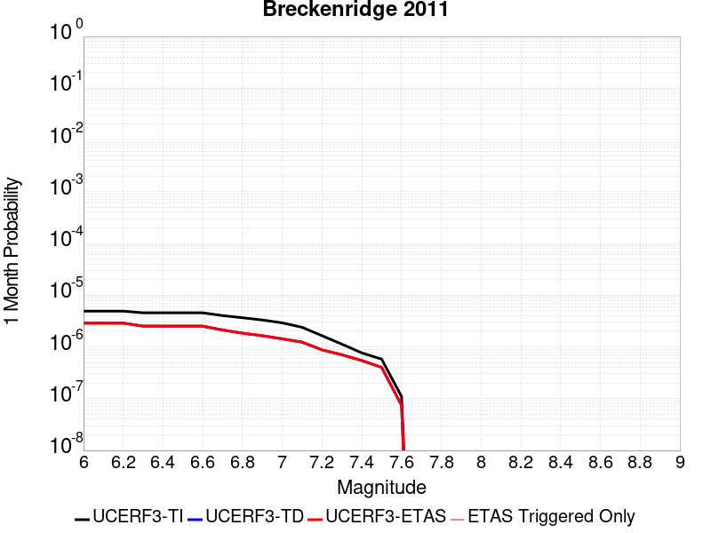 |  |  |

| Magnitude | 1 wk TI Prob | 1 wk TD Prob | 1 wk ETAS Prob | 1 wk ETAS/TD Gain | 1 wk ETAS Triggered Only | 1 mo TI Prob | 1 mo TD Prob | 1 mo ETAS Prob | 1 mo ETAS/TD Gain | 1 mo ETAS Triggered Only | 1 yr TI Prob | 1 yr TD Prob | 1 yr ETAS Prob | 1 yr ETAS/TD Gain | 1 yr ETAS Triggered Only | 10 yr TI Prob | 10 yr TD Prob | 10 yr ETAS Prob | 10 yr ETAS/TD Gain | 10 yr ETAS Triggered Only |
|-----|-----|-----|-----|-----|-----|-----|-----|-----|-----|-----|-----|-----|-----|-----|-----|-----|-----|-----|-----|-----|
| 6.0 | 1.1490393E-6 | 6.738142E-7 | 6.738142E-7 | 1.0 | 0.0 | 4.924445E-6 | 2.887772E-6 | 2.887772E-6 | 1.0 | 0.0 | 5.995347E-5 | 3.515808E-5 | 3.515808E-5 | 1.0 | 0.0 | 5.9937296E-4 | 3.515272E-4 | 3.615237E-4 | 1.0284373 | 1.0E-5 |
| 6.1 | 1.1490393E-6 | 6.738142E-7 | 6.738142E-7 | 1.0 | 0.0 | 4.924445E-6 | 2.887772E-6 | 2.887772E-6 | 1.0 | 0.0 | 5.995347E-5 | 3.515808E-5 | 3.515808E-5 | 1.0 | 0.0 | 5.9937296E-4 | 3.515272E-4 | 3.615237E-4 | 1.0284373 | 1.0E-5 |
| 6.2 | 1.1490393E-6 | 6.738142E-7 | 6.738142E-7 | 1.0 | 0.0 | 4.924445E-6 | 2.887772E-6 | 2.887772E-6 | 1.0 | 0.0 | 5.995347E-5 | 3.515808E-5 | 3.515808E-5 | 1.0 | 0.0 | 5.9937296E-4 | 3.515272E-4 | 3.615237E-4 | 1.0284373 | 1.0E-5 |
| 6.3 | 1.064617E-6 | 5.8865356E-7 | 5.8865356E-7 | 1.0 | 0.0 | 4.5626366E-6 | 2.5227987E-6 | 2.5227987E-6 | 1.0 | 0.0 | 5.5548684E-5 | 3.0714655E-5 | 3.0714655E-5 | 1.0 | 0.0 | 5.55348E-4 | 3.0710525E-4 | 3.1710218E-4 | 1.0325521 | 1.0E-5 |
| 6.4 | 1.064617E-6 | 5.8865356E-7 | 5.8865356E-7 | 1.0 | 0.0 | 4.5626366E-6 | 2.5227987E-6 | 2.5227987E-6 | 1.0 | 0.0 | 5.5548684E-5 | 3.0714655E-5 | 3.0714655E-5 | 1.0 | 0.0 | 5.55348E-4 | 3.0710525E-4 | 3.1710218E-4 | 1.0325521 | 1.0E-5 |
| 6.5 | 1.064617E-6 | 5.8865356E-7 | 5.8865356E-7 | 1.0 | 0.0 | 4.5626366E-6 | 2.5227987E-6 | 2.5227987E-6 | 1.0 | 0.0 | 5.5548684E-5 | 3.0714655E-5 | 3.0714655E-5 | 1.0 | 0.0 | 5.55348E-4 | 3.0710525E-4 | 3.1710218E-4 | 1.0325521 | 1.0E-5 |
| 6.6 | 1.064617E-6 | 5.8865356E-7 | 5.8865356E-7 | 1.0 | 0.0 | 4.5626366E-6 | 2.5227987E-6 | 2.5227987E-6 | 1.0 | 0.0 | 5.5548684E-5 | 3.0714655E-5 | 3.0714655E-5 | 1.0 | 0.0 | 5.55348E-4 | 3.0710525E-4 | 3.1710218E-4 | 1.0325521 | 1.0E-5 |
| 6.7 | 9.4219524E-7 | 4.9541376E-7 | 4.9541376E-7 | 1.0 | 0.0 | 4.037973E-6 | 2.1232001E-6 | 2.1232001E-6 | 1.0 | 0.0 | 4.916122E-5 | 2.5849662E-5 | 2.5849662E-5 | 1.0 | 0.0 | 4.9150345E-4 | 2.584672E-4 | 2.6846462E-4 | 1.0386796 | 1.0E-5 |
| 6.8 | 8.556422E-7 | 4.3120312E-7 | 4.3120312E-7 | 1.0 | 0.0 | 3.667033E-6 | 1.8480121E-6 | 1.8480121E-6 | 1.0 | 0.0 | 4.464521E-5 | 2.2499318E-5 | 2.2499318E-5 | 1.0 | 0.0 | 4.4636242E-4 | 2.249708E-4 | 2.249708E-4 | 1.0 | 0.0 |
| 6.9 | 7.7357794E-7 | 3.842086E-7 | 3.842086E-7 | 1.0 | 0.0 | 3.3153299E-6 | 1.6466072E-6 | 1.6466072E-6 | 1.0 | 0.0 | 4.0363393E-5 | 2.004726E-5 | 2.004726E-5 | 1.0 | 0.0 | 4.035606E-4 | 2.0045483E-4 | 2.0045483E-4 | 1.0 | 0.0 |
| 7.0 | 6.8172454E-7 | 3.3471895E-7 | 3.3471895E-7 | 1.0 | 0.0 | 2.9216735E-6 | 1.4345089E-6 | 1.4345089E-6 | 1.0 | 0.0 | 3.5570793E-5 | 1.7465009E-5 | 1.7465009E-5 | 1.0 | 0.0 | 3.55651E-4 | 1.7463659E-4 | 1.7463659E-4 | 1.0 | 0.0 |
| 7.1 | 5.5936397E-7 | 2.8910054E-7 | 2.8910054E-7 | 1.0 | 0.0 | 2.397272E-6 | 1.2390018E-6 | 1.2390018E-6 | 1.0 | 0.0 | 2.9186394E-5 | 1.5084744E-5 | 1.5084744E-5 | 1.0 | 0.0 | 2.9182562E-4 | 1.5083738E-4 | 1.5083738E-4 | 1.0 | 0.0 |
| 7.2 | 3.8420822E-7 | 2.0468671E-7 | 2.0468671E-7 | 1.0 | 0.0 | 1.6466057E-6 | 8.7722844E-7 | 8.7722844E-7 | 1.0 | 0.0 | 2.004724E-5 | 1.0680205E-5 | 1.0680205E-5 | 1.0 | 0.0 | 2.004543E-4 | 1.06797E-4 | 1.06797E-4 | 1.0 | 0.0 |
| 7.3 | 2.6405158E-7 | 1.6473446E-7 | 1.6473446E-7 | 1.0 | 0.0 | 1.1316491E-6 | 7.0600464E-7 | 7.0600464E-7 | 1.0 | 0.0 | 1.37777415E-5 | 8.595573E-6 | 8.595573E-6 | 1.0 | 0.0 | 1.3776887E-4 | 8.595247E-5 | 8.595247E-5 | 1.0 | 0.0 |
| 7.4 | 1.792114E-7 | 1.2725509E-7 | 1.2725509E-7 | 1.0 | 0.0 | 7.6804866E-7 | 5.4537884E-7 | 5.4537884E-7 | 1.0 | 0.0 | 9.3509525E-6 | 6.639968E-6 | 6.639968E-6 | 1.0 | 0.0 | 9.350559E-5 | 6.639774E-5 | 6.639774E-5 | 1.0 | 0.0 |
| 7.5 | 1.3548703E-7 | 9.3855405E-8 | 9.3855405E-8 | 1.0 | 0.0 | 5.8065854E-7 | 4.022374E-7 | 4.022374E-7 | 1.0 | 0.0 | 7.0694946E-6 | 4.8972297E-6 | 4.8972297E-6 | 1.0 | 0.0 | 7.0692695E-5 | 4.8971255E-5 | 4.8971255E-5 | 1.0 | 0.0 |
| 7.6 | 2.572245E-8 | 1.7353019E-8 | 1.7353019E-8 | 1.0 | 0.0 | 1.10239064E-7 | 7.437008E-8 | 7.437008E-8 | 1.0 | 0.0 | 1.3421597E-6 | 9.054554E-7 | 9.054554E-7 | 1.0 | 0.0 | 1.3421517E-5 | 9.054523E-6 | 9.054523E-6 | 1.0 | 0.0 |

## Peralta Hills
*[(top)](#table-of-contents)*

| 1 Week | 1 Month | 1 Year | 10 Year |
|-----|-----|-----|-----|
|  |  |  |  |

| Magnitude | 1 wk TI Prob | 1 wk TD Prob | 1 wk ETAS Prob | 1 wk ETAS/TD Gain | 1 wk ETAS Triggered Only | 1 mo TI Prob | 1 mo TD Prob | 1 mo ETAS Prob | 1 mo ETAS/TD Gain | 1 mo ETAS Triggered Only | 1 yr TI Prob | 1 yr TD Prob | 1 yr ETAS Prob | 1 yr ETAS/TD Gain | 1 yr ETAS Triggered Only | 10 yr TI Prob | 10 yr TD Prob | 10 yr ETAS Prob | 10 yr ETAS/TD Gain | 10 yr ETAS Triggered Only |
|-----|-----|-----|-----|-----|-----|-----|-----|-----|-----|-----|-----|-----|-----|-----|-----|-----|-----|-----|-----|-----|
| 6.0 | 3.8850067E-6 | 3.8397593E-6 | 3.8397593E-6 | 1.0 | 0.0 | 1.6649923E-5 | 1.6456048E-5 | 1.6456048E-5 | 1.0 | 0.0 | 2.0269395E-4 | 2.0034138E-4 | 2.1033938E-4 | 1.0499048 | 1.0E-5 | 0.0020250916 | 0.0020023354 | 0.0020123154 | 1.0049841 | 1.0E-5 |
| 6.1 | 3.8850067E-6 | 3.8397593E-6 | 3.8397593E-6 | 1.0 | 0.0 | 1.6649923E-5 | 1.6456048E-5 | 1.6456048E-5 | 1.0 | 0.0 | 2.0269395E-4 | 2.0034138E-4 | 2.1033938E-4 | 1.0499048 | 1.0E-5 | 0.0020250916 | 0.0020023354 | 0.0020123154 | 1.0049841 | 1.0E-5 |
| 6.2 | 3.8850067E-6 | 3.8397593E-6 | 3.8397593E-6 | 1.0 | 0.0 | 1.6649923E-5 | 1.6456048E-5 | 1.6456048E-5 | 1.0 | 0.0 | 2.0269395E-4 | 2.0034138E-4 | 2.1033938E-4 | 1.0499048 | 1.0E-5 | 0.0020250916 | 0.0020023354 | 0.0020123154 | 1.0049841 | 1.0E-5 |
| 6.3 | 3.8850067E-6 | 3.8397593E-6 | 3.8397593E-6 | 1.0 | 0.0 | 1.6649923E-5 | 1.6456048E-5 | 1.6456048E-5 | 1.0 | 0.0 | 2.0269395E-4 | 2.0034138E-4 | 2.1033938E-4 | 1.0499048 | 1.0E-5 | 0.0020250916 | 0.0020023354 | 0.0020123154 | 1.0049841 | 1.0E-5 |
| 6.4 | 3.8850067E-6 | 3.8397593E-6 | 3.8397593E-6 | 1.0 | 0.0 | 1.6649923E-5 | 1.6456048E-5 | 1.6456048E-5 | 1.0 | 0.0 | 2.0269395E-4 | 2.0034138E-4 | 2.1033938E-4 | 1.0499048 | 1.0E-5 | 0.0020250916 | 0.0020023354 | 0.0020123154 | 1.0049841 | 1.0E-5 |
| 6.5 | 1.5587785E-6 | 1.4432885E-6 | 1.4432885E-6 | 1.0 | 0.0 | 6.6804623E-6 | 6.185509E-6 | 6.185509E-6 | 1.0 | 0.0 | 8.133159E-5 | 7.530621E-5 | 8.530546E-5 | 1.1327811 | 1.0E-5 | 8.1301836E-4 | 7.5283094E-4 | 7.628234E-4 | 1.0132732 | 1.0E-5 |
| 6.6 | 1.5587785E-6 | 1.4432885E-6 | 1.4432885E-6 | 1.0 | 0.0 | 6.6804623E-6 | 6.185509E-6 | 6.185509E-6 | 1.0 | 0.0 | 8.133159E-5 | 7.530621E-5 | 8.530546E-5 | 1.1327811 | 1.0E-5 | 8.1301836E-4 | 7.5283094E-4 | 7.628234E-4 | 1.0132732 | 1.0E-5 |
| 6.7 | 1.5018579E-6 | 1.3839098E-6 | 1.3839098E-6 | 1.0 | 0.0 | 6.436518E-6 | 5.9310296E-6 | 5.9310296E-6 | 1.0 | 0.0 | 7.836179E-5 | 7.220813E-5 | 8.220741E-5 | 1.1384785 | 1.0E-5 | 7.833416E-4 | 7.218702E-4 | 7.31863E-4 | 1.0138429 | 1.0E-5 |
| 6.8 | 1.4584314E-6 | 1.3383407E-6 | 1.3383407E-6 | 1.0 | 0.0 | 6.250405E-6 | 5.7357342E-6 | 5.7357342E-6 | 1.0 | 0.0 | 7.6096025E-5 | 6.983057E-5 | 7.9829864E-5 | 1.1431937 | 1.0E-5 | 7.6069974E-4 | 6.981096E-4 | 7.0810266E-4 | 1.0143144 | 1.0E-5 |
| 6.9 | 1.1382393E-6 | 9.863742E-7 | 9.863742E-7 | 1.0 | 0.0 | 4.8781594E-6 | 4.2273114E-6 | 4.2273114E-6 | 1.0 | 0.0 | 5.9389975E-5 | 5.1466384E-5 | 6.146587E-5 | 1.1942916 | 1.0E-5 | 5.93741E-4 | 5.1455287E-4 | 5.2454777E-4 | 1.0194243 | 1.0E-5 |
| 7.0 | 9.970413E-7 | 8.310848E-7 | 8.310848E-7 | 1.0 | 0.0 | 4.273027E-6 | 3.5617875E-6 | 3.5617875E-6 | 1.0 | 0.0 | 5.2022864E-5 | 4.336397E-5 | 5.3363536E-5 | 1.2305962 | 1.0E-5 | 5.2010687E-4 | 4.335619E-4 | 4.4355754E-4 | 1.0230547 | 1.0E-5 |
| 7.1 | 9.684443E-7 | 7.995259E-7 | 7.995259E-7 | 1.0 | 0.0 | 4.150469E-6 | 3.4265354E-6 | 3.4265354E-6 | 1.0 | 0.0 | 5.053079E-5 | 4.171734E-5 | 5.171692E-5 | 1.2396985 | 1.0E-5 | 5.05193E-4 | 4.171018E-4 | 4.2709764E-4 | 1.023965 | 1.0E-5 |
| 7.2 | 9.240811E-7 | 7.50427E-7 | 7.50427E-7 | 1.0 | 0.0 | 3.960342E-6 | 3.216112E-6 | 3.216112E-6 | 1.0 | 0.0 | 4.8216094E-5 | 3.9155526E-5 | 4.9155136E-5 | 1.2553818 | 1.0E-5 | 4.8205635E-4 | 3.9149282E-4 | 4.014889E-4 | 1.0255332 | 1.0E-5 |
| 7.3 | 8.158643E-7 | 6.3510055E-7 | 6.3510055E-7 | 1.0 | 0.0 | 3.4965567E-6 | 2.721857E-6 | 2.721857E-6 | 1.0 | 0.0 | 4.2569747E-5 | 3.313817E-5 | 3.313817E-5 | 1.0 | 0.0 | 4.2561593E-4 | 3.313384E-4 | 3.313384E-4 | 1.0 | 0.0 |
| 7.4 | 6.3822824E-7 | 4.7964676E-7 | 4.7964676E-7 | 1.0 | 0.0 | 2.7352612E-6 | 2.0556276E-6 | 2.0556276E-6 | 1.0 | 0.0 | 3.3301294E-5 | 2.5027031E-5 | 2.5027031E-5 | 1.0 | 0.0 | 3.3296304E-4 | 2.5024728E-4 | 2.5024728E-4 | 1.0 | 0.0 |
| 7.5 | 4.0292628E-7 | 2.7850183E-7 | 2.7850183E-7 | 1.0 | 0.0 | 1.7268258E-6 | 1.1935789E-6 | 1.1935789E-6 | 1.0 | 0.0 | 2.1023901E-5 | 1.4531755E-5 | 1.4531755E-5 | 1.0 | 0.0 | 2.1021912E-4 | 1.4531084E-4 | 1.4531084E-4 | 1.0 | 0.0 |
| 7.6 | 3.672993E-7 | 2.4858488E-7 | 2.4858488E-7 | 1.0 | 0.0 | 1.5741389E-6 | 1.0653636E-6 | 1.0653636E-6 | 1.0 | 0.0 | 1.9164972E-5 | 1.2970751E-5 | 1.2970751E-5 | 1.0 | 0.0 | 1.916332E-4 | 1.2970266E-4 | 1.2970266E-4 | 1.0 | 0.0 |
| 7.7 | 2.8466823E-7 | 1.7862686E-7 | 1.7862686E-7 | 1.0 | 0.0 | 1.2200061E-6 | 7.6554363E-7 | 7.6554363E-7 | 1.0 | 0.0 | 1.4853474E-5 | 9.32048E-6 | 9.32048E-6 | 1.0 | 0.0 | 1.485248E-4 | 9.320349E-5 | 9.320349E-5 | 1.0 | 0.0 |

## Santa Cruz Catalina Ridge alt1
*[(top)](#table-of-contents)*

| 1 Week | 1 Month | 1 Year | 10 Year |
|-----|-----|-----|-----|
|  | 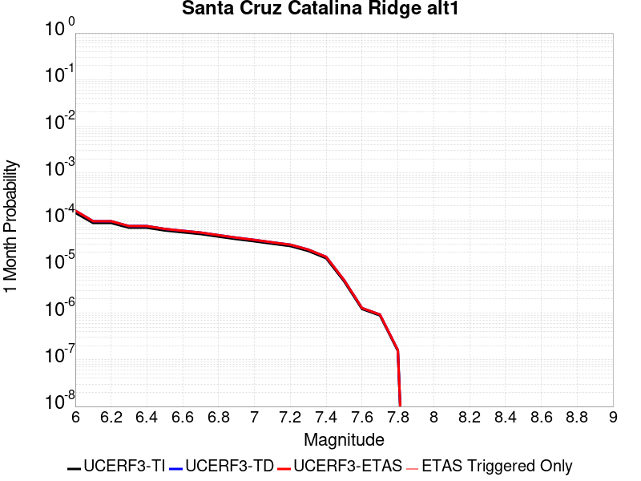 |  |  |

| Magnitude | 1 wk TI Prob | 1 wk TD Prob | 1 wk ETAS Prob | 1 wk ETAS/TD Gain | 1 wk ETAS Triggered Only | 1 mo TI Prob | 1 mo TD Prob | 1 mo ETAS Prob | 1 mo ETAS/TD Gain | 1 mo ETAS Triggered Only | 1 yr TI Prob | 1 yr TD Prob | 1 yr ETAS Prob | 1 yr ETAS/TD Gain | 1 yr ETAS Triggered Only | 10 yr TI Prob | 10 yr TD Prob | 10 yr ETAS Prob | 10 yr ETAS/TD Gain | 10 yr ETAS Triggered Only |
|-----|-----|-----|-----|-----|-----|-----|-----|-----|-----|-----|-----|-----|-----|-----|-----|-----|-----|-----|-----|-----|
| 6.0 | 3.2833184E-5 | 3.6560636E-5 | 3.6560636E-5 | 1.0 | 0.0 | 1.4070606E-4 | 1.5667996E-4 | 1.5667996E-4 | 1.0 | 0.0 | 0.00171175 | 0.0019060757 | 0.0019060757 | 1.0 | 0.0 | 0.016986247 | 0.01891418 | 0.01892399 | 1.0005187 | 1.0E-5 |
| 6.1 | 1.9835548E-5 | 2.1660571E-5 | 2.1660571E-5 | 1.0 | 0.0 | 8.500672E-5 | 9.282783E-5 | 9.282783E-5 | 1.0 | 0.0 | 0.0010344655 | 0.001129613 | 0.001129613 | 1.0 | 0.0 | 0.010296632 | 0.011240846 | 0.011250733 | 1.0008796 | 1.0E-5 |
| 6.2 | 1.9835548E-5 | 2.1660571E-5 | 2.1660571E-5 | 1.0 | 0.0 | 8.500672E-5 | 9.282783E-5 | 9.282783E-5 | 1.0 | 0.0 | 0.0010344655 | 0.001129613 | 0.001129613 | 1.0 | 0.0 | 0.010296632 | 0.011240846 | 0.011250733 | 1.0008796 | 1.0E-5 |
| 6.3 | 1.5728183E-5 | 1.7034703E-5 | 1.7034703E-5 | 1.0 | 0.0 | 6.7404755E-5 | 7.300386E-5 | 7.300386E-5 | 1.0 | 0.0 | 8.2034385E-4 | 8.8846567E-4 | 8.8846567E-4 | 1.0 | 0.0 | 0.008173222 | 0.008849816 | 0.008859728 | 1.00112 | 1.0E-5 |
| 6.4 | 1.5728183E-5 | 1.7034703E-5 | 1.7034703E-5 | 1.0 | 0.0 | 6.7404755E-5 | 7.300386E-5 | 7.300386E-5 | 1.0 | 0.0 | 8.2034385E-4 | 8.8846567E-4 | 8.8846567E-4 | 1.0 | 0.0 | 0.008173222 | 0.008849816 | 0.008859728 | 1.00112 | 1.0E-5 |
| 6.5 | 1.3707734E-5 | 1.4795146E-5 | 1.4795146E-5 | 1.0 | 0.0 | 5.8746107E-5 | 6.3406245E-5 | 6.3406245E-5 | 1.0 | 0.0 | 7.1499916E-4 | 7.7170116E-4 | 7.7170116E-4 | 1.0 | 0.0 | 0.0071270303 | 0.0076906127 | 0.007700536 | 1.0012903 | 1.0E-5 |
| 6.6 | 1.2539813E-5 | 1.3510776E-5 | 1.3510776E-5 | 1.0 | 0.0 | 5.3740947E-5 | 5.7902053E-5 | 5.7902053E-5 | 1.0 | 0.0 | 6.540996E-4 | 7.0473214E-4 | 7.0473214E-4 | 1.0 | 0.0 | 0.0065217763 | 0.007025277 | 0.0070352065 | 1.0014135 | 1.0E-5 |
| 6.7 | 1.1504083E-5 | 1.2377875E-5 | 1.2377875E-5 | 1.0 | 0.0 | 4.930228E-5 | 5.3046966E-5 | 5.3046966E-5 | 1.0 | 0.0 | 6.0008996E-4 | 6.456574E-4 | 6.456574E-4 | 1.0 | 0.0 | 0.005984721 | 0.006438045 | 0.0064479806 | 1.0015433 | 1.0E-5 |
| 6.8 | 1.012739E-5 | 1.0877499E-5 | 1.0877499E-5 | 1.0 | 0.0 | 4.340238E-5 | 4.661703E-5 | 4.661703E-5 | 1.0 | 0.0 | 5.282958E-4 | 5.67416E-4 | 5.67416E-4 | 1.0 | 0.0 | 0.0052704164 | 0.0056598415 | 0.005669785 | 1.0017568 | 1.0E-5 |
| 6.9 | 8.9607865E-6 | 9.609487E-6 | 9.609487E-6 | 1.0 | 0.0 | 3.8402806E-5 | 4.118287E-5 | 4.118287E-5 | 1.0 | 0.0 | 4.6745385E-4 | 5.0128717E-4 | 5.0128717E-4 | 1.0 | 0.0 | 0.0046647177 | 0.0050016837 | 0.0050116335 | 1.0019894 | 1.0E-5 |
| 7.0 | 8.046829E-6 | 8.620072E-6 | 8.620072E-6 | 1.0 | 0.0 | 3.4485955E-5 | 3.694265E-5 | 3.694265E-5 | 1.0 | 0.0 | 4.1978562E-4 | 4.496847E-4 | 4.496847E-4 | 1.0 | 0.0 | 0.004189935 | 0.004487838 | 0.0044977935 | 1.0022182 | 1.0E-5 |
| 7.1 | 7.136131E-6 | 7.637941E-6 | 7.637941E-6 | 1.0 | 0.0 | 3.0583058E-5 | 3.2733627E-5 | 3.2733627E-5 | 1.0 | 0.0 | 3.7228514E-4 | 3.9845973E-4 | 3.9845973E-4 | 1.0 | 0.0 | 0.0037166206 | 0.0039775297 | 0.0039874897 | 1.0025041 | 1.0E-5 |
| 7.2 | 6.362014E-6 | 6.8052104E-6 | 6.8052104E-6 | 1.0 | 0.0 | 2.726549E-5 | 2.9164865E-5 | 2.9164865E-5 | 1.0 | 0.0 | 3.3190678E-4 | 3.5502503E-4 | 3.5502503E-4 | 1.0 | 0.0 | 0.0033141149 | 0.003544647 | 0.0035546115 | 1.0028112 | 1.0E-5 |
| 7.3 | 5.004101E-6 | 5.3519125E-6 | 5.3519125E-6 | 1.0 | 0.0 | 2.1445969E-5 | 2.2936569E-5 | 2.2936569E-5 | 1.0 | 0.0 | 2.6107338E-4 | 2.792175E-4 | 2.792175E-4 | 1.0 | 0.0 | 0.002607669 | 0.0027887214 | 0.0027986935 | 1.0035759 | 1.0E-5 |
| 7.4 | 3.4901443E-6 | 3.73219E-6 | 3.73219E-6 | 1.0 | 0.0 | 1.4957676E-5 | 1.5995005E-5 | 1.5995005E-5 | 1.0 | 0.0 | 1.8209449E-4 | 1.9472216E-4 | 1.9472216E-4 | 1.0 | 0.0 | 0.0018194534 | 0.001945554 | 0.0019555346 | 1.0051299 | 1.0E-5 |
| 7.5 | 1.1215045E-6 | 1.1894253E-6 | 1.1894253E-6 | 1.0 | 0.0 | 4.806439E-6 | 5.0975277E-6 | 5.0975277E-6 | 1.0 | 0.0 | 5.851682E-5 | 6.206066E-5 | 6.206066E-5 | 1.0 | 0.0 | 5.850142E-4 | 6.204364E-4 | 6.204364E-4 | 1.0 | 0.0 |
| 7.6 | 2.8599047E-7 | 2.9952744E-7 | 2.9952744E-7 | 1.0 | 0.0 | 1.2256729E-6 | 1.2836884E-6 | 1.2836884E-6 | 1.0 | 0.0 | 1.4922465E-5 | 1.5628797E-5 | 1.5628797E-5 | 1.0 | 0.0 | 1.4921463E-4 | 1.562771E-4 | 1.562771E-4 | 1.0 | 0.0 |
| 7.7 | 2.0781519E-7 | 2.1744857E-7 | 2.1744857E-7 | 1.0 | 0.0 | 8.906362E-7 | 9.3192216E-7 | 9.3192216E-7 | 1.0 | 0.0 | 1.08434415E-5 | 1.1346094E-5 | 1.1346094E-5 | 1.0 | 0.0 | 1.0842913E-4 | 1.1345524E-4 | 1.1345524E-4 | 1.0 | 0.0 |
| 7.8 | 3.614776E-8 | 3.7641843E-8 | 3.7641843E-8 | 1.0 | 0.0 | 1.5491896E-7 | 1.6132218E-7 | 1.6132218E-7 | 1.0 | 0.0 | 1.8861368E-6 | 1.9640959E-6 | 1.9640959E-6 | 1.0 | 0.0 | 1.8861208E-5 | 1.9640796E-5 | 1.9640796E-5 | 1.0 | 0.0 |

## Hector Mine
*[(top)](#table-of-contents)*

| 1 Week | 1 Month | 1 Year | 10 Year |
|-----|-----|-----|-----|
| 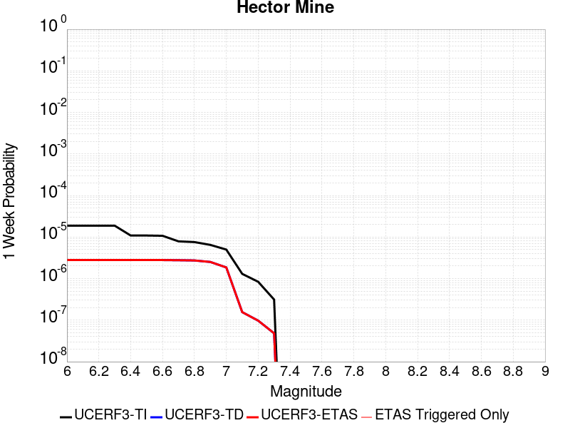 |  |  |  |

| Magnitude | 1 wk TI Prob | 1 wk TD Prob | 1 wk ETAS Prob | 1 wk ETAS/TD Gain | 1 wk ETAS Triggered Only | 1 mo TI Prob | 1 mo TD Prob | 1 mo ETAS Prob | 1 mo ETAS/TD Gain | 1 mo ETAS Triggered Only | 1 yr TI Prob | 1 yr TD Prob | 1 yr ETAS Prob | 1 yr ETAS/TD Gain | 1 yr ETAS Triggered Only | 10 yr TI Prob | 10 yr TD Prob | 10 yr ETAS Prob | 10 yr ETAS/TD Gain | 10 yr ETAS Triggered Only |
|-----|-----|-----|-----|-----|-----|-----|-----|-----|-----|-----|-----|-----|-----|-----|-----|-----|-----|-----|-----|-----|
| 6.0 | 1.8760093E-5 | 2.796579E-6 | 2.796579E-6 | 1.0 | 0.0 | 8.039792E-5 | 1.1985307E-5 | 1.1985307E-5 | 1.0 | 0.0 | 9.78405E-4 | 1.4591533E-4 | 1.5591388E-4 | 1.0685229 | 1.0E-5 | 0.009741086 | 0.0014585875 | 0.0014685729 | 1.006846 | 1.0E-5 |
| 6.1 | 1.8760093E-5 | 2.796579E-6 | 2.796579E-6 | 1.0 | 0.0 | 8.039792E-5 | 1.1985307E-5 | 1.1985307E-5 | 1.0 | 0.0 | 9.78405E-4 | 1.4591533E-4 | 1.5591388E-4 | 1.0685229 | 1.0E-5 | 0.009741086 | 0.0014585875 | 0.0014685729 | 1.006846 | 1.0E-5 |
| 6.2 | 1.8760093E-5 | 2.796579E-6 | 2.796579E-6 | 1.0 | 0.0 | 8.039792E-5 | 1.1985307E-5 | 1.1985307E-5 | 1.0 | 0.0 | 9.78405E-4 | 1.4591533E-4 | 1.5591388E-4 | 1.0685229 | 1.0E-5 | 0.009741086 | 0.0014585875 | 0.0014685729 | 1.006846 | 1.0E-5 |
| 6.3 | 1.8760093E-5 | 2.796579E-6 | 2.796579E-6 | 1.0 | 0.0 | 8.039792E-5 | 1.1985307E-5 | 1.1985307E-5 | 1.0 | 0.0 | 9.78405E-4 | 1.4591533E-4 | 1.5591388E-4 | 1.0685229 | 1.0E-5 | 0.009741086 | 0.0014585875 | 0.0014685729 | 1.006846 | 1.0E-5 |
| 6.4 | 1.0888055E-5 | 2.796579E-6 | 2.796579E-6 | 1.0 | 0.0 | 4.666226E-5 | 1.1985307E-5 | 1.1985307E-5 | 1.0 | 0.0 | 5.679649E-4 | 1.4591533E-4 | 1.5591388E-4 | 1.0685229 | 1.0E-5 | 0.0056651547 | 0.0014585875 | 0.0014685729 | 1.006846 | 1.0E-5 |
| 6.5 | 1.0888055E-5 | 2.796579E-6 | 2.796579E-6 | 1.0 | 0.0 | 4.666226E-5 | 1.1985307E-5 | 1.1985307E-5 | 1.0 | 0.0 | 5.679649E-4 | 1.4591533E-4 | 1.5591388E-4 | 1.0685229 | 1.0E-5 | 0.0056651547 | 0.0014585875 | 0.0014685729 | 1.006846 | 1.0E-5 |
| 6.6 | 1.0730738E-5 | 2.796579E-6 | 2.796579E-6 | 1.0 | 0.0 | 4.5988065E-5 | 1.1985307E-5 | 1.1985307E-5 | 1.0 | 0.0 | 5.5976084E-4 | 1.4591533E-4 | 1.5591388E-4 | 1.0685229 | 1.0E-5 | 0.0055835294 | 0.0014585875 | 0.0014685729 | 1.006846 | 1.0E-5 |
| 6.7 | 7.881326E-6 | 2.7712576E-6 | 2.7712576E-6 | 1.0 | 0.0 | 3.3776672E-5 | 1.1876787E-5 | 1.1876787E-5 | 1.0 | 0.0 | 4.111534E-4 | 1.4459429E-4 | 1.5459284E-4 | 1.069149 | 1.0E-5 | 0.0041039353 | 0.0014453942 | 0.0014553798 | 1.0069085 | 1.0E-5 |
| 6.8 | 7.5683483E-6 | 2.7330339E-6 | 2.7330339E-6 | 1.0 | 0.0 | 3.2435375E-5 | 1.1712972E-5 | 1.1712972E-5 | 1.0 | 0.0 | 3.9482914E-4 | 1.4260011E-4 | 1.5259867E-4 | 1.0701162 | 1.0E-5 | 0.0039412836 | 0.0014254781 | 0.0014354638 | 1.0070052 | 1.0E-5 |
| 6.9 | 6.473048E-6 | 2.5141017E-6 | 2.5141017E-6 | 1.0 | 0.0 | 2.7741338E-5 | 1.0774699E-5 | 1.0774699E-5 | 1.0 | 0.0 | 3.3769844E-4 | 1.3117804E-4 | 1.4117673E-4 | 1.0762223 | 1.0E-5 | 0.0033718573 | 0.0013113957 | 0.0013213825 | 1.0076154 | 1.0E-5 |
| 7.0 | 4.9959954E-6 | 1.8566798E-6 | 1.8566798E-6 | 1.0 | 0.0 | 2.1411232E-5 | 7.957195E-6 | 7.957195E-6 | 1.0 | 0.0 | 2.6065056E-4 | 9.68781E-5 | 1.0687714E-4 | 1.1032125 | 1.0E-5 | 0.0026034506 | 9.6870837E-4 | 9.786987E-4 | 1.010313 | 1.0E-5 |
| 7.1 | 1.2997541E-6 | 1.5601951E-7 | 1.5601951E-7 | 1.0 | 0.0 | 5.5703626E-6 | 6.686549E-7 | 6.686549E-7 | 1.0 | 0.0 | 6.7817055E-5 | 8.140847E-6 | 8.140847E-6 | 1.0 | 0.0 | 6.779636E-4 | 8.140588E-5 | 8.140588E-5 | 1.0 | 0.0 |
| 7.2 | 8.392699E-7 | 9.7273954E-8 | 9.7273954E-8 | 1.0 | 0.0 | 3.596866E-6 | 4.1688833E-7 | 4.1688833E-7 | 1.0 | 0.0 | 4.3790962E-5 | 5.0756053E-6 | 5.0756053E-6 | 1.0 | 0.0 | 4.3782333E-4 | 5.0755087E-5 | 5.0755087E-5 | 1.0 | 0.0 |
| 7.3 | 3.13015E-7 | 4.829177E-8 | 4.829177E-8 | 1.0 | 0.0 | 1.3414921E-6 | 2.0696471E-7 | 2.0696471E-7 | 1.0 | 0.0 | 1.6332544E-5 | 2.5197933E-6 | 2.5197933E-6 | 1.0 | 0.0 | 1.6331344E-4 | 2.5197733E-5 | 2.5197733E-5 | 1.0 | 0.0 |

## Elsinore (Stepovers Combined)
*[(top)](#table-of-contents)*

| 1 Week | 1 Month | 1 Year | 10 Year |
|-----|-----|-----|-----|
|  |  |  |  |

| Magnitude | 1 wk TI Prob | 1 wk TD Prob | 1 wk ETAS Prob | 1 wk ETAS/TD Gain | 1 wk ETAS Triggered Only | 1 mo TI Prob | 1 mo TD Prob | 1 mo ETAS Prob | 1 mo ETAS/TD Gain | 1 mo ETAS Triggered Only | 1 yr TI Prob | 1 yr TD Prob | 1 yr ETAS Prob | 1 yr ETAS/TD Gain | 1 yr ETAS Triggered Only | 10 yr TI Prob | 10 yr TD Prob | 10 yr ETAS Prob | 10 yr ETAS/TD Gain | 10 yr ETAS Triggered Only |
|-----|-----|-----|-----|-----|-----|-----|-----|-----|-----|-----|-----|-----|-----|-----|-----|-----|-----|-----|-----|-----|
| 6.0 | 2.144392E-5 | 1.9763485E-5 | 1.9763485E-5 | 1.0 | 0.0 | 9.189928E-5 | 8.4698026E-5 | 8.4698026E-5 | 1.0 | 0.0 | 0.0011182994 | 0.0010307304 | 0.0010407201 | 1.0096918 | 1.0E-5 | 0.011126885 | 0.010266115 | 0.010276012 | 1.000964 | 1.0E-5 |
| 6.1 | 2.144392E-5 | 1.9763485E-5 | 1.9763485E-5 | 1.0 | 0.0 | 9.189928E-5 | 8.4698026E-5 | 8.4698026E-5 | 1.0 | 0.0 | 0.0011182994 | 0.0010307304 | 0.0010407201 | 1.0096918 | 1.0E-5 | 0.011126885 | 0.010266115 | 0.010276012 | 1.000964 | 1.0E-5 |
| 6.2 | 2.144392E-5 | 1.9763485E-5 | 1.9763485E-5 | 1.0 | 0.0 | 9.189928E-5 | 8.4698026E-5 | 8.4698026E-5 | 1.0 | 0.0 | 0.0011182994 | 0.0010307304 | 0.0010407201 | 1.0096918 | 1.0E-5 | 0.011126885 | 0.010266115 | 0.010276012 | 1.000964 | 1.0E-5 |
| 6.3 | 1.9751555E-5 | 1.7744534E-5 | 1.7744534E-5 | 1.0 | 0.0 | 8.4646774E-5 | 7.604588E-5 | 7.604588E-5 | 1.0 | 0.0 | 0.0010300872 | 9.2548016E-4 | 9.354709E-4 | 1.0107952 | 1.0E-5 | 0.010253254 | 0.009222367 | 0.009232274 | 1.0010743 | 1.0E-5 |
| 6.4 | 1.9751555E-5 | 1.7744534E-5 | 1.7744534E-5 | 1.0 | 0.0 | 8.4646774E-5 | 7.604588E-5 | 7.604588E-5 | 1.0 | 0.0 | 0.0010300872 | 9.2548016E-4 | 9.354709E-4 | 1.0107952 | 1.0E-5 | 0.010253254 | 0.009222367 | 0.009232274 | 1.0010743 | 1.0E-5 |
| 6.5 | 1.9751555E-5 | 1.7744534E-5 | 1.7744534E-5 | 1.0 | 0.0 | 8.4646774E-5 | 7.604588E-5 | 7.604588E-5 | 1.0 | 0.0 | 0.0010300872 | 9.2548016E-4 | 9.354709E-4 | 1.0107952 | 1.0E-5 | 0.010253254 | 0.009222367 | 0.009232274 | 1.0010743 | 1.0E-5 |
| 6.6 | 1.9188685E-5 | 1.7006358E-5 | 1.7006358E-5 | 1.0 | 0.0 | 8.2234634E-5 | 7.2882445E-5 | 7.2882445E-5 | 1.0 | 0.0 | 0.0010007467 | 8.869987E-4 | 8.9698983E-4 | 1.011264 | 1.0E-5 | 0.00996252 | 0.008840879 | 0.008850791 | 1.0011212 | 1.0E-5 |
| 6.7 | 1.7608272E-5 | 1.4735141E-5 | 1.4735141E-5 | 1.0 | 0.0 | 7.546184E-5 | 6.314913E-5 | 6.314913E-5 | 1.0 | 0.0 | 9.183606E-4 | 7.685792E-4 | 7.785715E-4 | 1.013001 | 1.0E-5 | 0.009145746 | 0.0076657925 | 0.0076757157 | 1.0012945 | 1.0E-5 |
| 6.8 | 1.697165E-5 | 1.3785683E-5 | 1.3785683E-5 | 1.0 | 0.0 | 7.273361E-5 | 5.908021E-5 | 5.908021E-5 | 1.0 | 0.0 | 8.8517193E-4 | 7.190728E-4 | 7.290657E-4 | 1.0138968 | 1.0E-5 | 0.008816543 | 0.0071735727 | 0.007183501 | 1.001384 | 1.0E-5 |
| 6.9 | 1.600365E-5 | 1.2848884E-5 | 1.2848884E-5 | 1.0 | 0.0 | 6.858527E-5 | 5.5065524E-5 | 5.5065524E-5 | 1.0 | 0.0 | 8.347058E-4 | 6.702243E-4 | 6.8021764E-4 | 1.0149103 | 1.0E-5 | 0.008315775 | 0.0066877333 | 0.0066976664 | 1.0014852 | 1.0E-5 |
| 7.0 | 1.3314581E-5 | 1.0449536E-5 | 1.0449536E-5 | 1.0 | 0.0 | 5.7061243E-5 | 4.478297E-5 | 4.478297E-5 | 1.0 | 0.0 | 6.944992E-4 | 5.4509897E-4 | 5.550935E-4 | 1.0183353 | 1.0E-5 | 0.006923327 | 0.0054414957 | 0.0054514413 | 1.0018277 | 1.0E-5 |
| 7.1 | 1.2865345E-5 | 9.939341E-6 | 9.939341E-6 | 1.0 | 0.0 | 5.5136024E-5 | 4.2596494E-5 | 4.2596494E-5 | 1.0 | 0.0 | 6.710743E-4 | 5.1849143E-4 | 5.284863E-4 | 1.0192767 | 1.0E-5 | 0.0066905143 | 0.0051761176 | 0.005186066 | 1.0019219 | 1.0E-5 |
| 7.2 | 1.1650051E-5 | 8.635326E-6 | 8.635326E-6 | 1.0 | 0.0 | 4.9927836E-5 | 3.7008023E-5 | 3.7008023E-5 | 1.0 | 0.0 | 6.0770183E-4 | 4.5048128E-4 | 4.604768E-4 | 1.0221884 | 1.0E-5 | 0.0060604266 | 0.0044971234 | 0.0045070783 | 1.0022136 | 1.0E-5 |
| 7.3 | 1.0008533E-5 | 7.202289E-6 | 7.202289E-6 | 1.0 | 0.0 | 4.2893007E-5 | 3.0866595E-5 | 3.0866595E-5 | 1.0 | 0.0 | 5.220972E-4 | 3.7573744E-4 | 3.7573744E-4 | 1.0 | 0.0 | 0.005208723 | 0.0037514218 | 0.0037514218 | 1.0 | 0.0 |
| 7.4 | 9.116759E-6 | 6.4111623E-6 | 6.4111623E-6 | 1.0 | 0.0 | 3.907124E-5 | 2.747613E-5 | 2.747613E-5 | 1.0 | 0.0 | 4.7558855E-4 | 3.344719E-4 | 3.344719E-4 | 1.0 | 0.0 | 0.00474572 | 0.003339835 | 0.003339835 | 1.0 | 0.0 |
| 7.5 | 7.870524E-6 | 5.3834624E-6 | 5.3834624E-6 | 1.0 | 0.0 | 3.3730383E-5 | 2.3071785E-5 | 2.3071785E-5 | 1.0 | 0.0 | 4.1059E-4 | 2.8086404E-4 | 2.8086404E-4 | 1.0 | 0.0 | 0.0040983222 | 0.0028052174 | 0.0028052174 | 1.0 | 0.0 |
| 7.6 | 6.9774537E-6 | 4.6784253E-6 | 4.6784253E-6 | 1.0 | 0.0 | 2.990303E-5 | 2.0050245E-5 | 2.0050245E-5 | 1.0 | 0.0 | 3.640086E-4 | 2.4408558E-4 | 2.4408558E-4 | 1.0 | 0.0 | 0.003634129 | 0.0024382912 | 0.0024382912 | 1.0 | 0.0 |
| 7.7 | 4.1616954E-6 | 2.3288446E-6 | 2.3288446E-6 | 1.0 | 0.0 | 1.7835715E-5 | 9.9807285E-6 | 9.9807285E-6 | 1.0 | 0.0 | 2.171282E-4 | 1.21509336E-4 | 1.21509336E-4 | 1.0 | 0.0 | 0.0021691616 | 0.0012145021 | 0.0012145021 | 1.0 | 0.0 |
| 7.8 | 2.2692414E-7 | 9.38645E-8 | 9.38645E-8 | 1.0 | 0.0 | 9.725317E-7 | 4.0227638E-7 | 4.0227638E-7 | 1.0 | 0.0 | 1.1840509E-5 | 4.8977076E-6 | 4.8977076E-6 | 1.0 | 0.0 | 1.1839878E-4 | 4.8976322E-5 | 4.8976322E-5 | 1.0 | 0.0 |
| 7.9 | 6.676829E-9 | 3.4402008E-9 | 3.4402008E-9 | 1.0 | 0.0 | 2.861498E-8 | 1.4743718E-8 | 1.4743718E-8 | 1.0 | 0.0 | 3.4838732E-7 | 1.7950475E-7 | 1.7950475E-7 | 1.0 | 0.0 | 3.4838679E-6 | 1.7950463E-6 | 1.7950463E-6 | 1.0 | 0.0 |

## Camp Rock 2011
*[(top)](#table-of-contents)*

| 1 Week | 1 Month | 1 Year | 10 Year |
|-----|-----|-----|-----|
|  |  |  |  |

| Magnitude | 1 wk TI Prob | 1 wk TD Prob | 1 wk ETAS Prob | 1 wk ETAS/TD Gain | 1 wk ETAS Triggered Only | 1 mo TI Prob | 1 mo TD Prob | 1 mo ETAS Prob | 1 mo ETAS/TD Gain | 1 mo ETAS Triggered Only | 1 yr TI Prob | 1 yr TD Prob | 1 yr ETAS Prob | 1 yr ETAS/TD Gain | 1 yr ETAS Triggered Only | 10 yr TI Prob | 10 yr TD Prob | 10 yr ETAS Prob | 10 yr ETAS/TD Gain | 10 yr ETAS Triggered Only |
|-----|-----|-----|-----|-----|-----|-----|-----|-----|-----|-----|-----|-----|-----|-----|-----|-----|-----|-----|-----|-----|
| 6.0 | 1.6710783E-5 | 4.2501633E-6 | 4.2501633E-6 | 1.0 | 0.0 | 7.161568E-5 | 1.8214861E-5 | 1.8214861E-5 | 1.0 | 0.0 | 8.7157206E-4 | 2.2174389E-4 | 2.2174389E-4 | 1.0 | 0.0 | 0.008681616 | 0.0022152793 | 0.002225257 | 1.0045041 | 1.0E-5 |
| 6.1 | 1.6710783E-5 | 4.2501633E-6 | 4.2501633E-6 | 1.0 | 0.0 | 7.161568E-5 | 1.8214861E-5 | 1.8214861E-5 | 1.0 | 0.0 | 8.7157206E-4 | 2.2174389E-4 | 2.2174389E-4 | 1.0 | 0.0 | 0.008681616 | 0.0022152793 | 0.002225257 | 1.0045041 | 1.0E-5 |
| 6.2 | 1.6710783E-5 | 4.2501633E-6 | 4.2501633E-6 | 1.0 | 0.0 | 7.161568E-5 | 1.8214861E-5 | 1.8214861E-5 | 1.0 | 0.0 | 8.7157206E-4 | 2.2174389E-4 | 2.2174389E-4 | 1.0 | 0.0 | 0.008681616 | 0.0022152793 | 0.002225257 | 1.0045041 | 1.0E-5 |
| 6.3 | 1.6710783E-5 | 4.2501633E-6 | 4.2501633E-6 | 1.0 | 0.0 | 7.161568E-5 | 1.8214861E-5 | 1.8214861E-5 | 1.0 | 0.0 | 8.7157206E-4 | 2.2174389E-4 | 2.2174389E-4 | 1.0 | 0.0 | 0.008681616 | 0.0022152793 | 0.002225257 | 1.0045041 | 1.0E-5 |
| 6.4 | 7.982846E-6 | 3.6821912E-6 | 3.6821912E-6 | 1.0 | 0.0 | 3.421175E-5 | 1.5780724E-5 | 1.5780724E-5 | 1.0 | 0.0 | 4.1644843E-4 | 1.9211374E-4 | 1.9211374E-4 | 1.0 | 0.0 | 0.0041566887 | 0.0019195115 | 0.0019294922 | 1.0051997 | 1.0E-5 |
| 6.5 | 7.982846E-6 | 3.6821912E-6 | 3.6821912E-6 | 1.0 | 0.0 | 3.421175E-5 | 1.5780724E-5 | 1.5780724E-5 | 1.0 | 0.0 | 4.1644843E-4 | 1.9211374E-4 | 1.9211374E-4 | 1.0 | 0.0 | 0.0041566887 | 0.0019195115 | 0.0019294922 | 1.0051997 | 1.0E-5 |
| 6.6 | 7.048869E-6 | 3.4244488E-6 | 3.4244488E-6 | 1.0 | 0.0 | 3.0209088E-5 | 1.4676129E-5 | 1.4676129E-5 | 1.0 | 0.0 | 3.677336E-4 | 1.7866753E-4 | 1.7866753E-4 | 1.0 | 0.0 | 0.0036712566 | 0.0017852704 | 0.0017952526 | 1.0055914 | 1.0E-5 |
| 6.7 | 6.987307E-6 | 3.3624244E-6 | 3.3624244E-6 | 1.0 | 0.0 | 2.9945259E-5 | 1.4410312E-5 | 1.4410312E-5 | 1.0 | 0.0 | 3.6452254E-4 | 1.7543173E-4 | 1.7543173E-4 | 1.0 | 0.0 | 0.0036392517 | 0.0017529636 | 0.0017629461 | 1.0056946 | 1.0E-5 |
| 6.8 | 6.3737602E-6 | 3.1180107E-6 | 3.1180107E-6 | 1.0 | 0.0 | 2.731583E-5 | 1.3362836E-5 | 1.3362836E-5 | 1.0 | 0.0 | 3.3251947E-4 | 1.6268066E-4 | 1.6268066E-4 | 1.0 | 0.0 | 0.0033202237 | 0.0016256444 | 0.0016356282 | 1.0061414 | 1.0E-5 |
| 6.9 | 6.112211E-6 | 2.9332175E-6 | 2.9332175E-6 | 1.0 | 0.0 | 2.6194928E-5 | 1.2570873E-5 | 1.2570873E-5 | 1.0 | 0.0 | 3.1887658E-4 | 1.530399E-4 | 1.530399E-4 | 1.0 | 0.0 | 0.003184194 | 0.0015293729 | 0.0015393576 | 1.0065286 | 1.0E-5 |
| 7.0 | 5.5140117E-6 | 2.642044E-6 | 2.642044E-6 | 1.0 | 0.0 | 2.3631264E-5 | 1.1322997E-5 | 1.1322997E-5 | 1.0 | 0.0 | 2.8767265E-4 | 1.3784903E-4 | 1.3784903E-4 | 1.0 | 0.0 | 0.0028730053 | 0.0013776604 | 0.0013876467 | 1.0072486 | 1.0E-5 |
| 7.1 | 4.8151105E-6 | 2.134374E-6 | 2.134374E-6 | 1.0 | 0.0 | 2.0636026E-5 | 9.147286E-6 | 9.147286E-6 | 1.0 | 0.0 | 2.5121463E-4 | 1.1136274E-4 | 1.1136274E-4 | 1.0 | 0.0 | 0.0025093083 | 0.0011130912 | 0.00112308 | 1.008974 | 1.0E-5 |
| 7.2 | 3.818335E-6 | 1.293818E-6 | 1.293818E-6 | 1.0 | 0.0 | 1.6364189E-5 | 5.5449227E-6 | 5.5449227E-6 | 1.0 | 0.0 | 1.9921579E-4 | 6.7507426E-5 | 6.7507426E-5 | 1.0 | 0.0 | 0.0019903728 | 6.748774E-4 | 6.8487064E-4 | 1.0148075 | 1.0E-5 |
| 7.3 | 2.7166698E-6 | 7.38375E-7 | 7.38375E-7 | 1.0 | 0.0 | 1.1642818E-5 | 3.1644604E-6 | 3.1644604E-6 | 1.0 | 0.0 | 1.4174209E-4 | 3.8526647E-5 | 3.8526647E-5 | 1.0 | 0.0 | 0.0014165172 | 3.8520168E-4 | 3.9519783E-4 | 1.0259504 | 1.0E-5 |
| 7.4 | 2.0893426E-6 | 5.461979E-7 | 5.461979E-7 | 1.0 | 0.0 | 8.954295E-6 | 2.340846E-6 | 2.340846E-6 | 1.0 | 0.0 | 1.0901308E-4 | 2.8499433E-5 | 2.8499433E-5 | 1.0 | 0.0 | 0.0010895962 | 2.8495834E-4 | 2.9495548E-4 | 1.0350828 | 1.0E-5 |
| 7.5 | 1.1681728E-6 | 3.6031344E-7 | 3.6031344E-7 | 1.0 | 0.0 | 5.0064455E-6 | 1.5441996E-6 | 1.5441996E-6 | 1.0 | 0.0 | 6.0951766E-5 | 1.8800472E-5 | 1.8800472E-5 | 1.0 | 0.0 | 6.093505E-4 | 1.8798928E-4 | 1.979874E-4 | 1.0531845 | 1.0E-5 |
| 7.6 | 1.3154387E-7 | 7.119929E-8 | 7.119929E-8 | 1.0 | 0.0 | 5.6375933E-7 | 3.0513976E-7 | 3.0513976E-7 | 1.0 | 0.0 | 6.863748E-6 | 3.715072E-6 | 3.715072E-6 | 1.0 | 0.0 | 6.863536E-5 | 3.7150257E-5 | 3.7150257E-5 | 1.0 | 0.0 |

## Malibu Coast (Extension) alt 1
*[(top)](#table-of-contents)*

| 1 Week | 1 Month | 1 Year | 10 Year |
|-----|-----|-----|-----|
|  |  |  |  |

| Magnitude | 1 wk TI Prob | 1 wk TD Prob | 1 wk ETAS Prob | 1 wk ETAS/TD Gain | 1 wk ETAS Triggered Only | 1 mo TI Prob | 1 mo TD Prob | 1 mo ETAS Prob | 1 mo ETAS/TD Gain | 1 mo ETAS Triggered Only | 1 yr TI Prob | 1 yr TD Prob | 1 yr ETAS Prob | 1 yr ETAS/TD Gain | 1 yr ETAS Triggered Only | 10 yr TI Prob | 10 yr TD Prob | 10 yr ETAS Prob | 10 yr ETAS/TD Gain | 10 yr ETAS Triggered Only |
|-----|-----|-----|-----|-----|-----|-----|-----|-----|-----|-----|-----|-----|-----|-----|-----|-----|-----|-----|-----|-----|
| 6.0 | 8.930738E-6 | 9.329555E-6 | 9.329555E-6 | 1.0 | 0.0 | 3.827403E-5 | 3.9983202E-5 | 3.9983202E-5 | 1.0 | 0.0 | 4.6588664E-4 | 4.8668848E-4 | 4.8668848E-4 | 1.0 | 0.0 | 0.0046491115 | 0.0048564086 | 0.00486636 | 1.0020491 | 1.0E-5 |
| 6.1 | 7.199952E-6 | 7.5305375E-6 | 7.5305375E-6 | 1.0 | 0.0 | 3.0856572E-5 | 3.2273336E-5 | 3.2273336E-5 | 1.0 | 0.0 | 3.75614E-4 | 3.9285762E-4 | 3.9285762E-4 | 1.0 | 0.0 | 0.0037497976 | 0.0039216974 | 0.0039316583 | 1.0025399 | 1.0E-5 |
| 6.2 | 6.3721413E-6 | 6.6670127E-6 | 6.6670127E-6 | 1.0 | 0.0 | 2.7308892E-5 | 2.8572602E-5 | 2.8572602E-5 | 1.0 | 0.0 | 3.3243504E-4 | 3.4781624E-4 | 3.4781624E-4 | 1.0 | 0.0 | 0.0033193815 | 0.0034727587 | 0.003482724 | 1.0028696 | 1.0E-5 |
| 6.3 | 6.016345E-6 | 6.295371E-6 | 6.295371E-6 | 1.0 | 0.0 | 2.578408E-5 | 2.6979882E-5 | 2.6979882E-5 | 1.0 | 0.0 | 3.1387596E-4 | 3.2843088E-4 | 3.2843088E-4 | 1.0 | 0.0 | 0.00313433 | 0.0032794913 | 0.0032894583 | 1.0030392 | 1.0E-5 |
| 6.4 | 5.8104883E-6 | 6.0797515E-6 | 6.0797515E-6 | 1.0 | 0.0 | 2.4901856E-5 | 2.605582E-5 | 2.605582E-5 | 1.0 | 0.0 | 3.031379E-4 | 3.1718376E-4 | 3.1718376E-4 | 1.0 | 0.0 | 0.0030272473 | 0.003167345 | 0.0031773134 | 1.0031472 | 1.0E-5 |
| 6.5 | 5.476925E-6 | 5.72771E-6 | 5.72771E-6 | 1.0 | 0.0 | 2.3472323E-5 | 2.4547098E-5 | 2.4547098E-5 | 1.0 | 0.0 | 2.8573806E-4 | 2.9882023E-4 | 2.9882023E-4 | 1.0 | 0.0 | 0.0028537093 | 0.0029842162 | 0.0029941865 | 1.003341 | 1.0E-5 |
| 6.6 | 5.222387E-6 | 5.458768E-6 | 5.458768E-6 | 1.0 | 0.0 | 2.2381464E-5 | 2.3394514E-5 | 2.3394514E-5 | 1.0 | 0.0 | 2.7246025E-4 | 2.8479125E-4 | 2.8479125E-4 | 1.0 | 0.0 | 0.0027212645 | 0.0028442936 | 0.0028542653 | 1.0035058 | 1.0E-5 |
| 6.7 | 5.0337076E-6 | 5.2592854E-6 | 5.2592854E-6 | 1.0 | 0.0 | 2.1572854E-5 | 2.2539603E-5 | 2.2539603E-5 | 1.0 | 0.0 | 2.6261783E-4 | 2.7438538E-4 | 2.7438538E-4 | 1.0 | 0.0 | 0.002623077 | 0.002740496 | 0.0027504687 | 1.003639 | 1.0E-5 |
| 6.8 | 4.5675624E-6 | 4.7588796E-6 | 4.7588796E-6 | 1.0 | 0.0 | 1.9575122E-5 | 2.0395039E-5 | 2.0395039E-5 | 1.0 | 0.0 | 2.3830103E-4 | 2.482815E-4 | 2.482815E-4 | 1.0 | 0.0 | 0.0023804565 | 0.0024800608 | 0.0024800608 | 1.0 | 0.0 |
| 6.9 | 4.2802412E-6 | 4.4521726E-6 | 4.4521726E-6 | 1.0 | 0.0 | 1.8343762E-5 | 1.90806E-5 | 1.90806E-5 | 1.0 | 0.0 | 2.2331243E-4 | 2.322817E-4 | 2.322817E-4 | 1.0 | 0.0 | 0.0022308815 | 0.002320406 | 0.002320406 | 1.0 | 0.0 |
| 7.0 | 3.9794063E-6 | 4.130239E-6 | 4.130239E-6 | 1.0 | 0.0 | 1.7054486E-5 | 1.7700906E-5 | 1.7700906E-5 | 1.0 | 0.0 | 2.0761859E-4 | 2.1548734E-4 | 2.1548734E-4 | 1.0 | 0.0 | 0.0020742472 | 0.0021527973 | 0.0021527973 | 1.0 | 0.0 |
| 7.1 | 3.7730424E-6 | 3.91135E-6 | 3.91135E-6 | 1.0 | 0.0 | 1.6170083E-5 | 1.6762822E-5 | 1.6762822E-5 | 1.0 | 0.0 | 1.9685295E-4 | 2.0406836E-4 | 2.0406836E-4 | 1.0 | 0.0 | 0.0019667868 | 0.0020388225 | 0.0020388225 | 1.0 | 0.0 |
| 7.2 | 3.424985E-6 | 3.5414578E-6 | 3.5414578E-6 | 1.0 | 0.0 | 1.4678424E-5 | 1.5177588E-5 | 1.5177588E-5 | 1.0 | 0.0 | 1.7869516E-4 | 1.8477158E-4 | 1.8477158E-4 | 1.0 | 0.0 | 0.0017855153 | 0.0018461916 | 0.0018461916 | 1.0 | 0.0 |
| 7.3 | 2.6966375E-6 | 2.7597434E-6 | 2.7597434E-6 | 1.0 | 0.0 | 1.15569665E-5 | 1.1827418E-5 | 1.1827418E-5 | 1.0 | 0.0 | 1.4069698E-4 | 1.4398934E-4 | 1.4398934E-4 | 1.0 | 0.0 | 0.0014060794 | 0.0014389646 | 0.0014389646 | 1.0 | 0.0 |
| 7.4 | 2.215957E-6 | 2.2494505E-6 | 2.2494505E-6 | 1.0 | 0.0 | 9.496924E-6 | 9.6404665E-6 | 9.6404665E-6 | 1.0 | 0.0 | 1.1561892E-4 | 1.1736639E-4 | 1.1736639E-4 | 1.0 | 0.0 | 0.0011555878 | 0.0011730478 | 0.0011730478 | 1.0 | 0.0 |
| 7.5 | 1.2040218E-6 | 1.2219476E-6 | 1.2219476E-6 | 1.0 | 0.0 | 5.160083E-6 | 5.236908E-6 | 5.236908E-6 | 1.0 | 0.0 | 6.2822204E-5 | 6.375751E-5 | 6.375751E-5 | 1.0 | 0.0 | 6.280445E-4 | 6.37394E-4 | 6.37394E-4 | 1.0 | 0.0 |
| 7.6 | 6.6157446E-7 | 6.679206E-7 | 6.679206E-7 | 1.0 | 0.0 | 2.835316E-6 | 2.8625136E-6 | 2.8625136E-6 | 1.0 | 0.0 | 3.4519428E-5 | 3.485056E-5 | 3.485056E-5 | 1.0 | 0.0 | 3.4514067E-4 | 3.4845248E-4 | 3.4845248E-4 | 1.0 | 0.0 |
| 7.7 | 2.6012302E-7 | 2.4358354E-7 | 2.4358354E-7 | 1.0 | 0.0 | 1.1148124E-6 | 1.0439292E-6 | 1.0439292E-6 | 1.0 | 0.0 | 1.3572758E-5 | 1.2709774E-5 | 1.2709774E-5 | 1.0 | 0.0 | 1.3571928E-4 | 1.2709154E-4 | 1.2709154E-4 | 1.0 | 0.0 |
| 7.8 | 2.8323132E-8 | 2.0267E-8 | 2.0267E-8 | 1.0 | 0.0 | 1.2138484E-7 | 8.685857E-8 | 8.685857E-8 | 1.0 | 0.0 | 1.4778595E-6 | 1.0575027E-6 | 1.0575027E-6 | 1.0 | 0.0 | 1.4778497E-5 | 1.0574984E-5 | 1.0574984E-5 | 1.0 | 0.0 |

## Trinidad (alt1)
*[(top)](#table-of-contents)*

| 1 Week | 1 Month | 1 Year | 10 Year |
|-----|-----|-----|-----|
| 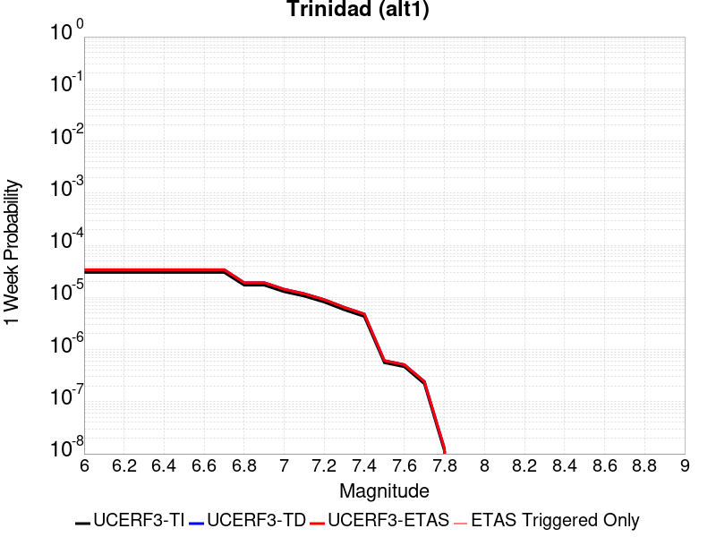 |  | 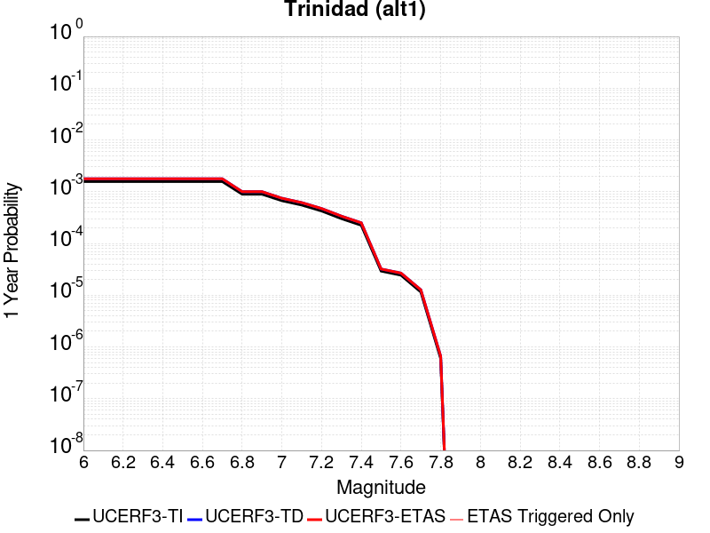 | 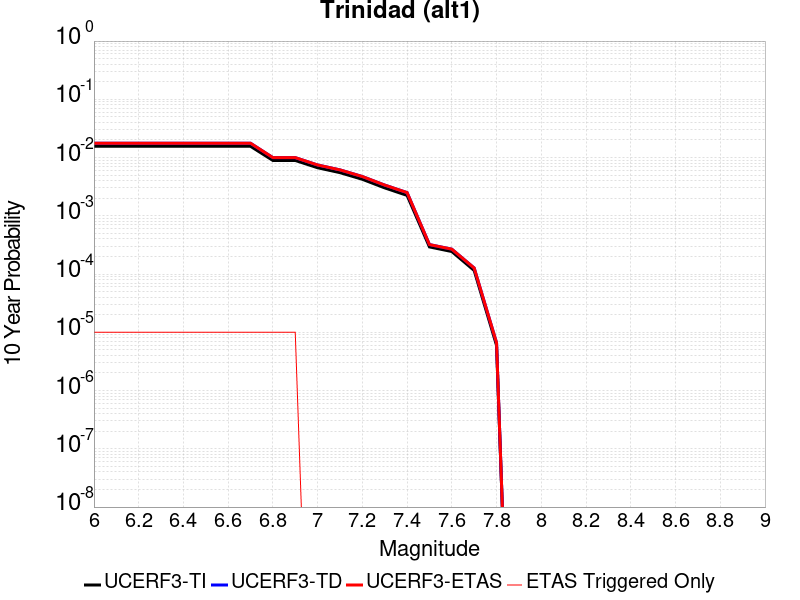 |

| Magnitude | 1 wk TI Prob | 1 wk TD Prob | 1 wk ETAS Prob | 1 wk ETAS/TD Gain | 1 wk ETAS Triggered Only | 1 mo TI Prob | 1 mo TD Prob | 1 mo ETAS Prob | 1 mo ETAS/TD Gain | 1 mo ETAS Triggered Only | 1 yr TI Prob | 1 yr TD Prob | 1 yr ETAS Prob | 1 yr ETAS/TD Gain | 1 yr ETAS Triggered Only | 10 yr TI Prob | 10 yr TD Prob | 10 yr ETAS Prob | 10 yr ETAS/TD Gain | 10 yr ETAS Triggered Only |
|-----|-----|-----|-----|-----|-----|-----|-----|-----|-----|-----|-----|-----|-----|-----|-----|-----|-----|-----|-----|-----|
| 6.0 | 3.0167168E-5 | 3.40355E-5 | 3.40355E-5 | 1.0 | 0.0 | 1.2928146E-4 | 1.4585923E-4 | 1.4585923E-4 | 1.0 | 0.0 | 0.0015728653 | 0.0017745581 | 0.0017745581 | 1.0 | 0.0 | 0.0156177925 | 0.017620837 | 0.01763066 | 1.0005575 | 1.0E-5 |
| 6.1 | 3.0167168E-5 | 3.40355E-5 | 3.40355E-5 | 1.0 | 0.0 | 1.2928146E-4 | 1.4585923E-4 | 1.4585923E-4 | 1.0 | 0.0 | 0.0015728653 | 0.0017745581 | 0.0017745581 | 1.0 | 0.0 | 0.0156177925 | 0.017620837 | 0.01763066 | 1.0005575 | 1.0E-5 |
| 6.2 | 3.0167168E-5 | 3.40355E-5 | 3.40355E-5 | 1.0 | 0.0 | 1.2928146E-4 | 1.4585923E-4 | 1.4585923E-4 | 1.0 | 0.0 | 0.0015728653 | 0.0017745581 | 0.0017745581 | 1.0 | 0.0 | 0.0156177925 | 0.017620837 | 0.01763066 | 1.0005575 | 1.0E-5 |
| 6.3 | 3.0167168E-5 | 3.40355E-5 | 3.40355E-5 | 1.0 | 0.0 | 1.2928146E-4 | 1.4585923E-4 | 1.4585923E-4 | 1.0 | 0.0 | 0.0015728653 | 0.0017745581 | 0.0017745581 | 1.0 | 0.0 | 0.0156177925 | 0.017620837 | 0.01763066 | 1.0005575 | 1.0E-5 |
| 6.4 | 3.0167168E-5 | 3.40355E-5 | 3.40355E-5 | 1.0 | 0.0 | 1.2928146E-4 | 1.4585923E-4 | 1.4585923E-4 | 1.0 | 0.0 | 0.0015728653 | 0.0017745581 | 0.0017745581 | 1.0 | 0.0 | 0.0156177925 | 0.017620837 | 0.01763066 | 1.0005575 | 1.0E-5 |
| 6.5 | 3.0167168E-5 | 3.40355E-5 | 3.40355E-5 | 1.0 | 0.0 | 1.2928146E-4 | 1.4585923E-4 | 1.4585923E-4 | 1.0 | 0.0 | 0.0015728653 | 0.0017745581 | 0.0017745581 | 1.0 | 0.0 | 0.0156177925 | 0.017620837 | 0.01763066 | 1.0005575 | 1.0E-5 |
| 6.6 | 3.0167168E-5 | 3.40355E-5 | 3.40355E-5 | 1.0 | 0.0 | 1.2928146E-4 | 1.4585923E-4 | 1.4585923E-4 | 1.0 | 0.0 | 0.0015728653 | 0.0017745581 | 0.0017745581 | 1.0 | 0.0 | 0.0156177925 | 0.017620837 | 0.01763066 | 1.0005575 | 1.0E-5 |
| 6.7 | 3.0167168E-5 | 3.40355E-5 | 3.40355E-5 | 1.0 | 0.0 | 1.2928146E-4 | 1.4585923E-4 | 1.4585923E-4 | 1.0 | 0.0 | 0.0015728653 | 0.0017745581 | 0.0017745581 | 1.0 | 0.0 | 0.0156177925 | 0.017620837 | 0.01763066 | 1.0005575 | 1.0E-5 |
| 6.8 | 1.717077E-5 | 1.9196885E-5 | 1.9196885E-5 | 1.0 | 0.0 | 7.358694E-5 | 8.2270024E-5 | 8.2270024E-5 | 1.0 | 0.0 | 8.9555274E-4 | 0.0010012218 | 0.0010012218 | 1.0 | 0.0 | 0.008919522 | 0.00997156 | 0.009981461 | 1.0009929 | 1.0E-5 |
| 6.9 | 1.717077E-5 | 1.9196885E-5 | 1.9196885E-5 | 1.0 | 0.0 | 7.358694E-5 | 8.2270024E-5 | 8.2270024E-5 | 1.0 | 0.0 | 8.9555274E-4 | 0.0010012218 | 0.0010012218 | 1.0 | 0.0 | 0.008919522 | 0.00997156 | 0.009981461 | 1.0009929 | 1.0E-5 |
| 7.0 | 1.2858572E-5 | 1.4338246E-5 | 1.4338246E-5 | 1.0 | 0.0 | 5.5107E-5 | 6.144836E-5 | 6.144836E-5 | 1.0 | 0.0 | 6.707212E-4 | 7.479091E-4 | 7.479091E-4 | 1.0 | 0.0 | 0.006687004 | 0.0074570994 | 0.0074570994 | 1.0 | 0.0 |
| 7.1 | 1.0588431E-5 | 1.1801987E-5 | 1.1801987E-5 | 1.0 | 0.0 | 4.53782E-5 | 5.0579125E-5 | 5.0579125E-5 | 1.0 | 0.0 | 5.5233954E-4 | 6.156558E-4 | 6.156558E-4 | 1.0 | 0.0 | 0.005509687 | 0.006142352 | 0.006142352 | 1.0 | 0.0 |
| 7.2 | 8.138061E-6 | 9.067763E-6 | 9.067763E-6 | 1.0 | 0.0 | 3.487694E-5 | 3.8861403E-5 | 3.8861403E-5 | 1.0 | 0.0 | 4.2454398E-4 | 4.730597E-4 | 4.730597E-4 | 1.0 | 0.0 | 0.0042373384 | 0.004722968 | 0.004722968 | 1.0 | 0.0 |
| 7.3 | 5.787542E-6 | 6.460719E-6 | 6.460719E-6 | 1.0 | 0.0 | 2.4803514E-5 | 2.7688622E-5 | 2.7688622E-5 | 1.0 | 0.0 | 3.0194095E-4 | 3.3707835E-4 | 3.3707835E-4 | 1.0 | 0.0 | 0.00301531 | 0.0033677819 | 0.0033677819 | 1.0 | 0.0 |
| 7.4 | 4.303563E-6 | 4.8011457E-6 | 4.8011457E-6 | 1.0 | 0.0 | 1.844371E-5 | 2.0576288E-5 | 2.0576288E-5 | 1.0 | 0.0 | 2.2452902E-4 | 2.5050726E-4 | 2.5050726E-4 | 1.0 | 0.0 | 0.0022430231 | 0.0025041874 | 0.0025041874 | 1.0 | 0.0 |
| 7.5 | 5.6063425E-7 | 6.1432945E-7 | 6.1432945E-7 | 1.0 | 0.0 | 2.402716E-6 | 2.6328378E-6 | 2.6328378E-6 | 1.0 | 0.0 | 2.9252675E-5 | 3.2054344E-5 | 3.2054344E-5 | 1.0 | 0.0 | 2.9248823E-4 | 3.2049877E-4 | 3.2049877E-4 | 1.0 | 0.0 |
| 7.6 | 4.6699128E-7 | 5.126065E-7 | 5.126065E-7 | 1.0 | 0.0 | 2.0013897E-6 | 2.1968833E-6 | 2.1968833E-6 | 1.0 | 0.0 | 2.4366647E-5 | 2.6746739E-5 | 2.6746739E-5 | 1.0 | 0.0 | 2.4363975E-4 | 2.674366E-4 | 2.674366E-4 | 1.0 | 0.0 |
| 7.7 | 2.2080937E-7 | 2.4348222E-7 | 2.4348222E-7 | 1.0 | 0.0 | 9.4632554E-7 | 1.0434949E-6 | 1.0434949E-6 | 1.0 | 0.0 | 1.15214525E-5 | 1.2704482E-5 | 1.2704482E-5 | 1.0 | 0.0 | 1.1520855E-4 | 1.2703816E-4 | 1.2703816E-4 | 1.0 | 0.0 |
| 7.8 | 1.1438307E-8 | 1.2683695E-8 | 1.2683695E-8 | 1.0 | 0.0 | 4.9021317E-8 | 5.4358694E-8 | 5.4358694E-8 | 1.0 | 0.0 | 5.9683435E-7 | 6.6181707E-7 | 6.6181707E-7 | 1.0 | 0.0 | 5.9683275E-6 | 6.618171E-6 | 6.618171E-6 | 1.0 | 0.0 |

## San Luis Range - Pecho 2011 CFM
*[(top)](#table-of-contents)*

| 1 Week | 1 Month | 1 Year | 10 Year |
|-----|-----|-----|-----|
|  | 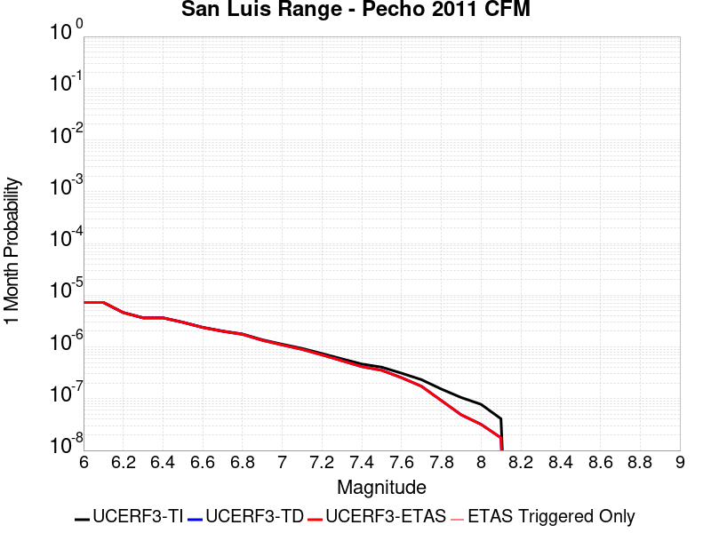 |  |  |

| Magnitude | 1 wk TI Prob | 1 wk TD Prob | 1 wk ETAS Prob | 1 wk ETAS/TD Gain | 1 wk ETAS Triggered Only | 1 mo TI Prob | 1 mo TD Prob | 1 mo ETAS Prob | 1 mo ETAS/TD Gain | 1 mo ETAS Triggered Only | 1 yr TI Prob | 1 yr TD Prob | 1 yr ETAS Prob | 1 yr ETAS/TD Gain | 1 yr ETAS Triggered Only | 10 yr TI Prob | 10 yr TD Prob | 10 yr ETAS Prob | 10 yr ETAS/TD Gain | 10 yr ETAS Triggered Only |
|-----|-----|-----|-----|-----|-----|-----|-----|-----|-----|-----|-----|-----|-----|-----|-----|-----|-----|-----|-----|-----|
| 6.0 | 1.687423E-6 | 1.6922141E-6 | 1.6922141E-6 | 1.0 | 0.0 | 7.231793E-6 | 7.2523276E-6 | 7.2523276E-6 | 1.0 | 0.0 | 8.804352E-5 | 8.829375E-5 | 8.829375E-5 | 1.0 | 0.0 | 8.8008645E-4 | 8.826107E-4 | 8.9260185E-4 | 1.01132 | 1.0E-5 |
| 6.1 | 1.687423E-6 | 1.6922141E-6 | 1.6922141E-6 | 1.0 | 0.0 | 7.231793E-6 | 7.2523276E-6 | 7.2523276E-6 | 1.0 | 0.0 | 8.804352E-5 | 8.829375E-5 | 8.829375E-5 | 1.0 | 0.0 | 8.8008645E-4 | 8.826107E-4 | 8.9260185E-4 | 1.01132 | 1.0E-5 |
| 6.2 | 1.0765672E-6 | 1.0770716E-6 | 1.0770716E-6 | 1.0 | 0.0 | 4.613851E-6 | 4.616013E-6 | 4.616013E-6 | 1.0 | 0.0 | 5.617219E-5 | 5.6198576E-5 | 5.6198576E-5 | 1.0 | 0.0 | 5.6157995E-4 | 5.618499E-4 | 5.718443E-4 | 1.0177883 | 1.0E-5 |
| 6.3 | 8.523104E-7 | 8.513189E-7 | 8.513189E-7 | 1.0 | 0.0 | 3.6527538E-6 | 3.6485046E-6 | 3.6485046E-6 | 1.0 | 0.0 | 4.447137E-5 | 4.441967E-5 | 4.441967E-5 | 1.0 | 0.0 | 4.4462472E-4 | 4.4411112E-4 | 4.5410666E-4 | 1.0225068 | 1.0E-5 |
| 6.4 | 8.523104E-7 | 8.513189E-7 | 8.513189E-7 | 1.0 | 0.0 | 3.6527538E-6 | 3.6485046E-6 | 3.6485046E-6 | 1.0 | 0.0 | 4.447137E-5 | 4.441967E-5 | 4.441967E-5 | 1.0 | 0.0 | 4.4462472E-4 | 4.4411112E-4 | 4.5410666E-4 | 1.0225068 | 1.0E-5 |
| 6.5 | 7.0029404E-7 | 6.976597E-7 | 6.976597E-7 | 1.0 | 0.0 | 3.0012568E-6 | 2.9899666E-6 | 2.9899666E-6 | 1.0 | 0.0 | 3.6539688E-5 | 3.6402253E-5 | 3.6402253E-5 | 1.0 | 0.0 | 3.653368E-4 | 3.639646E-4 | 3.7396094E-4 | 1.0274652 | 1.0E-5 |
| 6.6 | 5.583906E-7 | 5.5429797E-7 | 5.5429797E-7 | 1.0 | 0.0 | 2.3931002E-6 | 2.3755606E-6 | 2.3755606E-6 | 1.0 | 0.0 | 2.9135606E-5 | 2.8922075E-5 | 2.8922075E-5 | 1.0 | 0.0 | 2.9131788E-4 | 2.8918384E-4 | 2.9918095E-4 | 1.0345701 | 1.0E-5 |
| 6.7 | 4.73441E-7 | 4.683211E-7 | 4.683211E-7 | 1.0 | 0.0 | 2.0290313E-6 | 2.0070888E-6 | 2.0070888E-6 | 1.0 | 0.0 | 2.4703175E-5 | 2.4436038E-5 | 2.4436038E-5 | 1.0 | 0.0 | 2.470043E-4 | 2.4433396E-4 | 2.543315E-4 | 1.0409176 | 1.0E-5 |
| 6.8 | 4.1466086E-7 | 4.087936E-7 | 4.087936E-7 | 1.0 | 0.0 | 1.7771167E-6 | 1.7519714E-6 | 1.7519714E-6 | 1.0 | 0.0 | 2.1636182E-5 | 2.1330046E-5 | 2.1330046E-5 | 1.0 | 0.0 | 2.1634075E-4 | 2.1328033E-4 | 2.232782E-4 | 1.0468767 | 1.0E-5 |
| 6.9 | 3.2056641E-7 | 3.1330634E-7 | 3.1330634E-7 | 1.0 | 0.0 | 1.3738553E-6 | 1.3427408E-6 | 1.3427408E-6 | 1.0 | 0.0 | 1.6726559E-5 | 1.6347749E-5 | 1.6347749E-5 | 1.0 | 0.0 | 1.67253E-4 | 1.6346561E-4 | 1.6346561E-4 | 1.0 | 0.0 |
| 7.0 | 2.6315942E-7 | 2.5490954E-7 | 2.5490954E-7 | 1.0 | 0.0 | 1.1278256E-6 | 1.092469E-6 | 1.092469E-6 | 1.0 | 0.0 | 1.3731191E-5 | 1.3300731E-5 | 1.3300731E-5 | 1.0 | 0.0 | 1.3730342E-4 | 1.3299943E-4 | 1.3299943E-4 | 1.0 | 0.0 |
| 7.1 | 2.1832436E-7 | 2.0918546E-7 | 2.0918546E-7 | 1.0 | 0.0 | 9.356755E-7 | 8.9650877E-7 | 8.9650877E-7 | 1.0 | 0.0 | 1.13917895E-5 | 1.09149405E-5 | 1.09149405E-5 | 1.0 | 0.0 | 1.1391206E-4 | 1.0914409E-4 | 1.0914409E-4 | 1.0 | 0.0 |
| 7.2 | 1.7393015E-7 | 1.637777E-7 | 1.637777E-7 | 1.0 | 0.0 | 7.454147E-7 | 7.0190424E-7 | 7.0190424E-7 | 1.0 | 0.0 | 9.075386E-6 | 8.54565E-6 | 8.54565E-6 | 1.0 | 0.0 | 9.075015E-5 | 8.545325E-5 | 8.545325E-5 | 1.0 | 0.0 |
| 7.3 | 1.3744894E-7 | 1.263975E-7 | 1.263975E-7 | 1.0 | 0.0 | 5.890667E-7 | 5.417034E-7 | 5.417034E-7 | 1.0 | 0.0 | 7.1718637E-6 | 6.595219E-6 | 6.595219E-6 | 1.0 | 0.0 | 7.171632E-5 | 6.595025E-5 | 6.595025E-5 | 1.0 | 0.0 |
| 7.4 | 1.0915278E-7 | 9.728619E-8 | 9.728619E-8 | 1.0 | 0.0 | 4.6779755E-7 | 4.1694074E-7 | 4.1694074E-7 | 1.0 | 0.0 | 5.6954204E-6 | 5.076242E-6 | 5.076242E-6 | 1.0 | 0.0 | 5.6952744E-5 | 5.0761264E-5 | 5.0761264E-5 | 1.0 | 0.0 |
| 7.5 | 9.490291E-8 | 8.258192E-8 | 8.258192E-8 | 1.0 | 0.0 | 4.0672668E-7 | 3.5392245E-7 | 3.5392245E-7 | 1.0 | 0.0 | 4.9518862E-6 | 4.308997E-6 | 4.308997E-6 | 1.0 | 0.0 | 4.951776E-5 | 4.308914E-5 | 4.308914E-5 | 1.0 | 0.0 |
| 7.6 | 7.256678E-8 | 5.9435447E-8 | 5.9435447E-8 | 1.0 | 0.0 | 3.1100043E-7 | 2.5472332E-7 | 2.5472332E-7 | 1.0 | 0.0 | 3.7864236E-6 | 3.101252E-6 | 3.101252E-6 | 1.0 | 0.0 | 3.7863592E-5 | 3.101209E-5 | 3.101209E-5 | 1.0 | 0.0 |
| 7.7 | 5.446273E-8 | 4.0589114E-8 | 4.0589114E-8 | 1.0 | 0.0 | 2.3341168E-7 | 1.7395334E-7 | 1.7395334E-7 | 1.0 | 0.0 | 2.8417835E-6 | 2.1178798E-6 | 2.1178798E-6 | 1.0 | 0.0 | 2.8417471E-5 | 2.1178597E-5 | 2.1178597E-5 | 1.0 | 0.0 |
| 7.8 | 3.5850867E-8 | 2.152961E-8 | 2.152961E-8 | 1.0 | 0.0 | 1.5364655E-7 | 9.226976E-8 | 9.226976E-8 | 1.0 | 0.0 | 1.8706452E-6 | 1.1233838E-6 | 1.1233838E-6 | 1.0 | 0.0 | 1.8706294E-5 | 1.1233781E-5 | 1.1233781E-5 | 1.0 | 0.0 |
| 7.9 | 2.45879E-8 | 1.1402837E-8 | 1.1402837E-8 | 1.0 | 0.0 | 1.0537671E-7 | 4.8869296E-8 | 4.8869296E-8 | 1.0 | 0.0 | 1.2829606E-6 | 5.9498353E-7 | 5.9498353E-7 | 1.0 | 0.0 | 1.2829532E-5 | 5.9498193E-6 | 5.9498193E-6 | 1.0 | 0.0 |
| 8.0 | 1.8151761E-8 | 7.447624E-9 | 7.447624E-9 | 1.0 | 0.0 | 7.779326E-8 | 3.1918386E-8 | 3.1918386E-8 | 1.0 | 0.0 | 9.4713255E-7 | 3.8860628E-7 | 3.8860628E-7 | 1.0 | 0.0 | 9.471285E-6 | 3.886056E-6 | 3.886056E-6 | 1.0 | 0.0 |
| 8.1 | 9.559205E-9 | 4.1039563E-9 | 4.1039563E-9 | 1.0 | 0.0 | 4.096802E-8 | 1.7588382E-8 | 1.7588382E-8 | 1.0 | 0.0 | 4.9878554E-7 | 2.1413854E-7 | 2.1413854E-7 | 1.0 | 0.0 | 4.987844E-6 | 2.1413832E-6 | 2.1413832E-6 | 1.0 | 0.0 |

## Simi-Santa Rosa
*[(top)](#table-of-contents)*

| 1 Week | 1 Month | 1 Year | 10 Year |
|-----|-----|-----|-----|
|  |  | 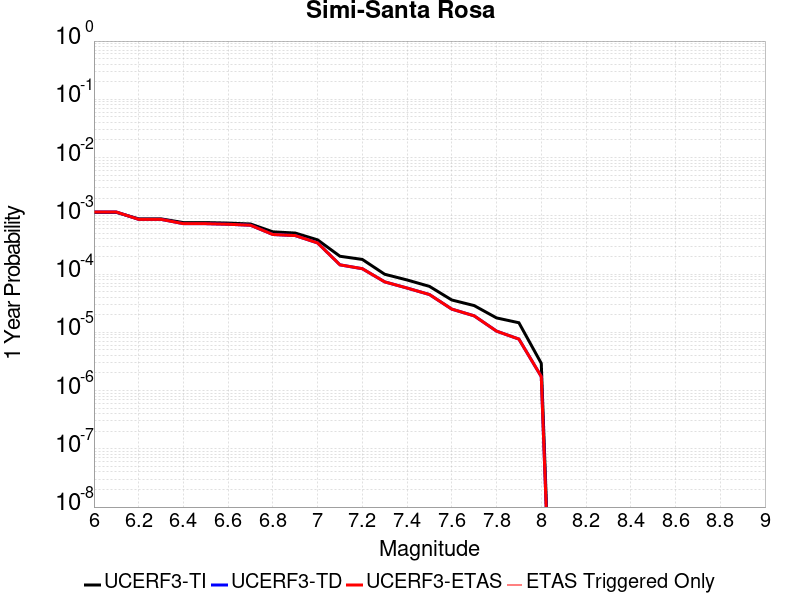 |  |

| Magnitude | 1 wk TI Prob | 1 wk TD Prob | 1 wk ETAS Prob | 1 wk ETAS/TD Gain | 1 wk ETAS Triggered Only | 1 mo TI Prob | 1 mo TD Prob | 1 mo ETAS Prob | 1 mo ETAS/TD Gain | 1 mo ETAS Triggered Only | 1 yr TI Prob | 1 yr TD Prob | 1 yr ETAS Prob | 1 yr ETAS/TD Gain | 1 yr ETAS Triggered Only | 10 yr TI Prob | 10 yr TD Prob | 10 yr ETAS Prob | 10 yr ETAS/TD Gain | 10 yr ETAS Triggered Only |
|-----|-----|-----|-----|-----|-----|-----|-----|-----|-----|-----|-----|-----|-----|-----|-----|-----|-----|-----|-----|-----|
| 6.0 | 2.198912E-5 | 2.2277021E-5 | 2.2277021E-5 | 1.0 | 0.0 | 9.4235686E-5 | 9.54697E-5 | 9.54697E-5 | 1.0 | 0.0 | 0.0011467156 | 0.0011617676 | 0.0011617676 | 1.0 | 0.0 | 0.011408163 | 0.01156139 | 0.011571274 | 1.000855 | 1.0E-5 |
| 6.1 | 2.198912E-5 | 2.2277021E-5 | 2.2277021E-5 | 1.0 | 0.0 | 9.4235686E-5 | 9.54697E-5 | 9.54697E-5 | 1.0 | 0.0 | 0.0011467156 | 0.0011617676 | 0.0011617676 | 1.0 | 0.0 | 0.011408163 | 0.01156139 | 0.011571274 | 1.000855 | 1.0E-5 |
| 6.2 | 1.69983E-5 | 1.666977E-5 | 1.666977E-5 | 1.0 | 0.0 | 7.284782E-5 | 7.144008E-5 | 7.144008E-5 | 1.0 | 0.0 | 8.865613E-4 | 8.694651E-4 | 8.694651E-4 | 1.0 | 0.0 | 0.008830327 | 0.008663555 | 0.008673468 | 1.0011443 | 1.0E-5 |
| 6.3 | 1.69983E-5 | 1.666977E-5 | 1.666977E-5 | 1.0 | 0.0 | 7.284782E-5 | 7.144008E-5 | 7.144008E-5 | 1.0 | 0.0 | 8.865613E-4 | 8.694651E-4 | 8.694651E-4 | 1.0 | 0.0 | 0.008830327 | 0.008663555 | 0.008673468 | 1.0011443 | 1.0E-5 |
| 6.4 | 1.4666188E-5 | 1.4053585E-5 | 1.4053585E-5 | 1.0 | 0.0 | 6.285358E-5 | 6.02284E-5 | 6.02284E-5 | 1.0 | 0.0 | 7.6497364E-4 | 7.3305896E-4 | 7.3305896E-4 | 1.0 | 0.0 | 0.0076234564 | 0.0073088845 | 0.007318811 | 1.0013582 | 1.0E-5 |
| 6.5 | 1.4666188E-5 | 1.4053585E-5 | 1.4053585E-5 | 1.0 | 0.0 | 6.285358E-5 | 6.02284E-5 | 6.02284E-5 | 1.0 | 0.0 | 7.6497364E-4 | 7.3305896E-4 | 7.3305896E-4 | 1.0 | 0.0 | 0.0076234564 | 0.0073088845 | 0.007318811 | 1.0013582 | 1.0E-5 |
| 6.6 | 1.4377586E-5 | 1.3730604E-5 | 1.3730604E-5 | 1.0 | 0.0 | 6.1616774E-5 | 5.884426E-5 | 5.884426E-5 | 1.0 | 0.0 | 7.4992597E-4 | 7.1621826E-4 | 7.1621826E-4 | 1.0 | 0.0 | 0.007474003 | 0.007141568 | 0.0071514966 | 1.0013902 | 1.0E-5 |
| 6.7 | 1.3881404E-5 | 1.320854E-5 | 1.320854E-5 | 1.0 | 0.0 | 5.9490372E-5 | 5.6606936E-5 | 5.6606936E-5 | 1.0 | 0.0 | 7.240546E-4 | 6.889962E-4 | 6.889962E-4 | 1.0 | 0.0 | 0.007217 | 0.0068710507 | 0.0068809823 | 1.0014454 | 1.0E-5 |
| 6.8 | 1.0176516E-5 | 9.154869E-6 | 9.154869E-6 | 1.0 | 0.0 | 4.3612912E-5 | 3.9234656E-5 | 3.9234656E-5 | 1.0 | 0.0 | 5.308578E-4 | 4.7759383E-4 | 4.7759383E-4 | 1.0 | 0.0 | 0.0052959146 | 0.004767308 | 0.00477726 | 1.0020876 | 1.0E-5 |
| 6.9 | 9.699797E-6 | 8.775409E-6 | 8.775409E-6 | 1.0 | 0.0 | 4.15699E-5 | 3.7608446E-5 | 3.7608446E-5 | 1.0 | 0.0 | 5.05996E-4 | 4.5780305E-4 | 4.5780305E-4 | 1.0 | 0.0 | 0.005048454 | 0.004570218 | 0.0045801722 | 1.0021781 | 1.0E-5 |
| 7.0 | 7.4049476E-6 | 6.559854E-6 | 6.559854E-6 | 1.0 | 0.0 | 3.1735104E-5 | 2.8113427E-5 | 2.8113427E-5 | 1.0 | 0.0 | 3.8630638E-4 | 3.4223986E-4 | 3.4223986E-4 | 1.0 | 0.0 | 0.0038563553 | 0.0034183706 | 0.0034283365 | 1.0029154 | 1.0E-5 |
| 7.1 | 3.873439E-6 | 2.75975E-6 | 2.75975E-6 | 1.0 | 0.0 | 1.6600346E-5 | 1.1827447E-5 | 1.1827447E-5 | 1.0 | 0.0 | 2.0209046E-4 | 1.4398989E-4 | 1.4398989E-4 | 1.0 | 0.0 | 0.0020190678 | 0.0014389895 | 0.0014489752 | 1.0069393 | 1.0E-5 |
| 7.2 | 3.417706E-6 | 2.367868E-6 | 2.367868E-6 | 1.0 | 0.0 | 1.4647229E-5 | 1.0147968E-5 | 1.0147968E-5 | 1.0 | 0.0 | 1.7831543E-4 | 1.2354473E-4 | 1.2354473E-4 | 1.0 | 0.0 | 0.0017817242 | 0.0012347827 | 0.0012447704 | 1.0080886 | 1.0E-5 |
| 7.3 | 1.90225E-6 | 1.4075636E-6 | 1.4075636E-6 | 1.0 | 0.0 | 8.152474E-6 | 6.0324014E-6 | 6.0324014E-6 | 1.0 | 0.0 | 9.9251854E-5 | 7.344203E-5 | 7.344203E-5 | 1.0 | 0.0 | 9.920754E-4 | 7.3417986E-4 | 7.3417986E-4 | 1.0 | 0.0 |
| 7.4 | 1.5170556E-6 | 1.102654E-6 | 1.102654E-6 | 1.0 | 0.0 | 6.5016507E-6 | 4.7256517E-6 | 4.7256517E-6 | 1.0 | 0.0 | 7.915472E-5 | 5.75333E-5 | 5.75333E-5 | 1.0 | 0.0 | 7.9126534E-4 | 5.751852E-4 | 5.751852E-4 | 1.0 | 0.0 |
| 7.5 | 1.178732E-6 | 8.5367844E-7 | 8.5367844E-7 | 1.0 | 0.0 | 5.0516987E-6 | 3.6586166E-6 | 3.6586166E-6 | 1.0 | 0.0 | 6.1502695E-5 | 4.4542758E-5 | 4.4542758E-5 | 1.0 | 0.0 | 6.148568E-4 | 4.4533925E-4 | 4.4533925E-4 | 1.0 | 0.0 |
| 7.6 | 6.8722386E-7 | 4.7947464E-7 | 4.7947464E-7 | 1.0 | 0.0 | 2.9452417E-6 | 2.0548896E-6 | 2.0548896E-6 | 1.0 | 0.0 | 3.5857727E-5 | 2.5017995E-5 | 2.5017995E-5 | 1.0 | 0.0 | 3.5851944E-4 | 2.501519E-4 | 2.501519E-4 | 1.0 | 0.0 |
| 7.7 | 5.5126515E-7 | 3.6746107E-7 | 3.6746107E-7 | 1.0 | 0.0 | 2.3625628E-6 | 1.5748323E-6 | 1.5748323E-6 | 1.0 | 0.0 | 2.8763823E-5 | 1.9173414E-5 | 1.9173414E-5 | 1.0 | 0.0 | 2.87601E-4 | 1.9171771E-4 | 1.9171771E-4 | 1.0 | 0.0 |
| 7.8 | 3.3860243E-7 | 2.008429E-7 | 2.008429E-7 | 1.0 | 0.0 | 1.4511525E-6 | 8.60755E-7 | 8.60755E-7 | 1.0 | 0.0 | 1.7667637E-5 | 1.0479643E-5 | 1.0479643E-5 | 1.0 | 0.0 | 1.7666233E-4 | 1.04791536E-4 | 1.04791536E-4 | 1.0 | 0.0 |
| 7.9 | 2.7955386E-7 | 1.4656874E-7 | 1.4656874E-7 | 1.0 | 0.0 | 1.1980875E-6 | 6.281516E-7 | 6.281516E-7 | 1.0 | 0.0 | 1.4586617E-5 | 7.647719E-6 | 7.647719E-6 | 1.0 | 0.0 | 1.458566E-4 | 7.64746E-5 | 7.64746E-5 | 1.0 | 0.0 |
| 8.0 | 5.6259015E-8 | 3.336323E-8 | 3.336323E-8 | 1.0 | 0.0 | 2.4111003E-7 | 1.4298526E-7 | 1.4298526E-7 | 1.0 | 0.0 | 2.9355108E-6 | 1.7408443E-6 | 1.7408443E-6 | 1.0 | 0.0 | 2.935472E-5 | 1.740832E-5 | 1.740832E-5 | 1.0 | 0.0 |

## Mission (connected) 2011 CFM
*[(top)](#table-of-contents)*

| 1 Week | 1 Month | 1 Year | 10 Year |
|-----|-----|-----|-----|
|  |  |  | 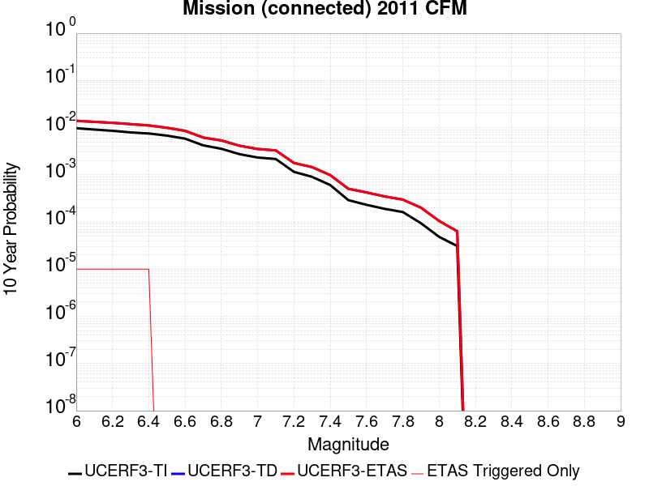 |

| Magnitude | 1 wk TI Prob | 1 wk TD Prob | 1 wk ETAS Prob | 1 wk ETAS/TD Gain | 1 wk ETAS Triggered Only | 1 mo TI Prob | 1 mo TD Prob | 1 mo ETAS Prob | 1 mo ETAS/TD Gain | 1 mo ETAS Triggered Only | 1 yr TI Prob | 1 yr TD Prob | 1 yr ETAS Prob | 1 yr ETAS/TD Gain | 1 yr ETAS Triggered Only | 10 yr TI Prob | 10 yr TD Prob | 10 yr ETAS Prob | 10 yr ETAS/TD Gain | 10 yr ETAS Triggered Only |
|-----|-----|-----|-----|-----|-----|-----|-----|-----|-----|-----|-----|-----|-----|-----|-----|-----|-----|-----|-----|-----|
| 6.0 | 1.8735573E-5 | 2.6894304E-5 | 2.6894304E-5 | 1.0 | 0.0 | 8.029284E-5 | 1.1525593E-4 | 1.1525593E-4 | 1.0 | 0.0 | 9.771269E-4 | 0.0014022337 | 0.0014122197 | 1.0071214 | 1.0E-5 | 0.009728416 | 0.013942391 | 0.0139522515 | 1.0007073 | 1.0E-5 |
| 6.1 | 1.7515964E-5 | 2.5535499E-5 | 2.5535499E-5 | 1.0 | 0.0 | 7.506625E-5 | 1.0943298E-4 | 1.0943298E-4 | 1.0 | 0.0 | 9.135484E-4 | 0.0013314278 | 0.0013414145 | 1.0075008 | 1.0E-5 | 0.009098019 | 0.013242956 | 0.013252824 | 1.0007452 | 1.0E-5 |
| 6.2 | 1.6486343E-5 | 2.4380095E-5 | 2.4380095E-5 | 1.0 | 0.0 | 7.065384E-5 | 1.0448167E-4 | 1.0448167E-4 | 1.0 | 0.0 | 8.5987104E-4 | 0.0012712177 | 0.001281205 | 1.0078565 | 1.0E-5 | 0.008565514 | 0.012647896 | 0.01265777 | 1.0007807 | 1.0E-5 |
| 6.3 | 1.5229385E-5 | 2.2809374E-5 | 2.2809374E-5 | 1.0 | 0.0 | 6.526716E-5 | 9.775052E-5 | 9.775052E-5 | 1.0 | 0.0 | 7.9433795E-4 | 0.0011893588 | 0.0011993469 | 1.0083979 | 1.0E-5 | 0.007915046 | 0.011841001 | 0.011850882 | 1.0008345 | 1.0E-5 |
| 6.4 | 1.4435828E-5 | 2.1409087E-5 | 2.1409087E-5 | 1.0 | 0.0 | 6.186637E-5 | 9.1749724E-5 | 9.1749724E-5 | 1.0 | 0.0 | 7.529627E-4 | 0.0011163774 | 0.0011263662 | 1.0089475 | 1.0E-5 | 0.007504165 | 0.011123775 | 0.011133663 | 1.000889 | 1.0E-5 |
| 6.5 | 1.30127955E-5 | 1.9045607E-5 | 1.9045607E-5 | 1.0 | 0.0 | 5.576793E-5 | 8.162145E-5 | 8.162145E-5 | 1.0 | 0.0 | 6.78763E-4 | 9.932523E-4 | 9.932523E-4 | 1.0 | 0.0 | 0.0067669353 | 0.009915576 | 0.009915576 | 1.0 | 0.0 |
| 6.6 | 1.1220718E-5 | 1.6401595E-5 | 1.6401595E-5 | 1.0 | 0.0 | 4.8087906E-5 | 7.029063E-5 | 7.029063E-5 | 1.0 | 0.0 | 5.8531296E-4 | 8.554521E-4 | 8.554521E-4 | 1.0 | 0.0 | 0.005837737 | 0.008553395 | 0.008553395 | 1.0 | 0.0 |
| 6.7 | 8.086152E-6 | 1.1757157E-5 | 1.1757157E-5 | 1.0 | 0.0 | 3.4654473E-5 | 5.0386847E-5 | 5.0386847E-5 | 1.0 | 0.0 | 4.2183654E-4 | 6.1328796E-4 | 6.1328796E-4 | 1.0 | 0.0 | 0.004210367 | 0.006153021 | 0.006153021 | 1.0 | 0.0 |
| 6.8 | 6.8361655E-6 | 1.0201497E-5 | 1.0201497E-5 | 1.0 | 0.0 | 2.9297524E-5 | 4.3719974E-5 | 4.3719974E-5 | 1.0 | 0.0 | 3.5663895E-4 | 5.321613E-4 | 5.321613E-4 | 1.0 | 0.0 | 0.0035606713 | 0.0053417096 | 0.0053417096 | 1.0 | 0.0 |
| 6.9 | 5.2517353E-6 | 7.873878E-6 | 7.873878E-6 | 1.0 | 0.0 | 2.2507242E-5 | 3.3744753E-5 | 3.3744753E-5 | 1.0 | 0.0 | 2.739912E-4 | 4.1076518E-4 | 4.1076518E-4 | 1.0 | 0.0 | 0.0027365363 | 0.0041321632 | 0.0041321632 | 1.0 | 0.0 |
| 7.0 | 4.4602784E-6 | 6.7059536E-6 | 6.7059536E-6 | 1.0 | 0.0 | 1.911534E-5 | 2.8739485E-5 | 2.8739485E-5 | 1.0 | 0.0 | 2.327044E-4 | 3.4984722E-4 | 3.4984722E-4 | 1.0 | 0.0 | 0.0023246086 | 0.0035241595 | 0.0035241595 | 1.0 | 0.0 |
| 7.1 | 4.1492594E-6 | 6.254544E-6 | 6.254544E-6 | 1.0 | 0.0 | 1.7782419E-5 | 2.6804915E-5 | 2.6804915E-5 | 1.0 | 0.0 | 2.1647944E-4 | 3.2630112E-4 | 3.2630112E-4 | 1.0 | 0.0 | 0.0021626868 | 0.003288889 | 0.003288889 | 1.0 | 0.0 |
| 7.2 | 2.213247E-6 | 3.3658414E-6 | 3.3658414E-6 | 1.0 | 0.0 | 9.485309E-6 | 1.4424955E-5 | 1.4424955E-5 | 1.0 | 0.0 | 1.15477524E-4 | 1.756097E-4 | 1.756097E-4 | 1.0 | 0.0 | 0.0011541754 | 0.0017833347 | 0.0017833347 | 1.0 | 0.0 |
| 7.3 | 1.7362703E-6 | 2.741038E-6 | 2.741038E-6 | 1.0 | 0.0 | 7.4411373E-6 | 1.1747253E-5 | 1.1747253E-5 | 1.0 | 0.0 | 9.0592075E-5 | 1.4301344E-4 | 1.4301344E-4 | 1.0 | 0.0 | 9.0555154E-4 | 0.0014544654 | 0.0014544654 | 1.0 | 0.0 |
| 7.4 | 1.1628409E-6 | 1.851409E-6 | 1.851409E-6 | 1.0 | 0.0 | 4.9835944E-6 | 7.9345855E-6 | 7.9345855E-6 | 1.0 | 0.0 | 6.0673574E-5 | 9.659932E-5 | 9.659932E-5 | 1.0 | 0.0 | 6.065701E-4 | 9.863214E-4 | 9.863214E-4 | 1.0 | 0.0 |
| 7.5 | 5.5610667E-7 | 9.36062E-7 | 9.36062E-7 | 1.0 | 0.0 | 2.3833122E-6 | 4.0116884E-6 | 4.0116884E-6 | 1.0 | 0.0 | 2.9016439E-5 | 4.8841215E-5 | 4.8841215E-5 | 1.0 | 0.0 | 2.901265E-4 | 5.0496095E-4 | 5.0496095E-4 | 1.0 | 0.0 |
| 7.6 | 4.4307663E-7 | 7.800675E-7 | 7.800675E-7 | 1.0 | 0.0 | 1.8988985E-6 | 3.3431422E-6 | 3.3431422E-6 | 1.0 | 0.0 | 2.3118844E-5 | 4.0701998E-5 | 4.0701998E-5 | 1.0 | 0.0 | 2.3116439E-4 | 4.2291713E-4 | 4.2291713E-4 | 1.0 | 0.0 |
| 7.7 | 3.639119E-7 | 6.369316E-7 | 6.369316E-7 | 1.0 | 0.0 | 1.5596215E-6 | 2.729704E-6 | 2.729704E-6 | 1.0 | 0.0 | 1.8988227E-5 | 3.3233642E-5 | 3.3233642E-5 | 1.0 | 0.0 | 1.8986604E-4 | 3.4762762E-4 | 3.4762762E-4 | 1.0 | 0.0 |
| 7.8 | 3.1152942E-7 | 5.4870054E-7 | 5.4870054E-7 | 1.0 | 0.0 | 1.3351254E-6 | 2.3515718E-6 | 2.3515718E-6 | 1.0 | 0.0 | 1.6255031E-5 | 2.8630011E-5 | 2.8630011E-5 | 1.0 | 0.0 | 1.6253842E-4 | 2.983253E-4 | 2.983253E-4 | 1.0 | 0.0 |
| 7.9 | 1.8035962E-7 | 3.726152E-7 | 3.726152E-7 | 1.0 | 0.0 | 7.729696E-7 | 1.5969213E-6 | 1.5969213E-6 | 1.0 | 0.0 | 9.410865E-6 | 1.9442345E-5 | 1.9442345E-5 | 1.0 | 0.0 | 9.410465E-5 | 2.0108408E-4 | 2.0108408E-4 | 1.0 | 0.0 |
| 8.0 | 9.279334E-8 | 1.9733227E-7 | 1.9733227E-7 | 1.0 | 0.0 | 3.976857E-7 | 8.4570945E-7 | 8.4570945E-7 | 1.0 | 0.0 | 4.841813E-6 | 1.0296464E-5 | 1.0296464E-5 | 1.0 | 0.0 | 4.841707E-5 | 1.0547366E-4 | 1.0547366E-4 | 1.0 | 0.0 |
| 8.1 | 5.9253985E-8 | 1.1872451E-7 | 1.1872451E-7 | 1.0 | 0.0 | 2.5394561E-7 | 5.088192E-7 | 5.088192E-7 | 1.0 | 0.0 | 3.0917836E-6 | 6.194857E-6 | 6.194857E-6 | 1.0 | 0.0 | 3.0917407E-5 | 6.332919E-5 | 6.332919E-5 | 1.0 | 0.0 |

## Carlsbad
*[(top)](#table-of-contents)*

| 1 Week | 1 Month | 1 Year | 10 Year |
|-----|-----|-----|-----|
|  |  |  | 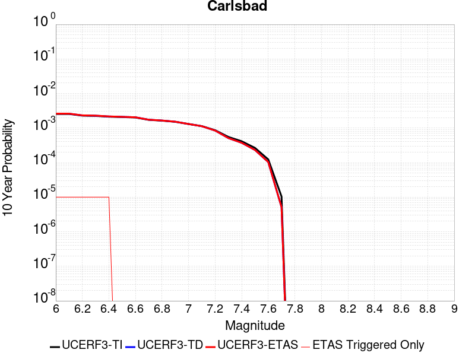 |

| Magnitude | 1 wk TI Prob | 1 wk TD Prob | 1 wk ETAS Prob | 1 wk ETAS/TD Gain | 1 wk ETAS Triggered Only | 1 mo TI Prob | 1 mo TD Prob | 1 mo ETAS Prob | 1 mo ETAS/TD Gain | 1 mo ETAS Triggered Only | 1 yr TI Prob | 1 yr TD Prob | 1 yr ETAS Prob | 1 yr ETAS/TD Gain | 1 yr ETAS Triggered Only | 10 yr TI Prob | 10 yr TD Prob | 10 yr ETAS Prob | 10 yr ETAS/TD Gain | 10 yr ETAS Triggered Only |
|-----|-----|-----|-----|-----|-----|-----|-----|-----|-----|-----|-----|-----|-----|-----|-----|-----|-----|-----|-----|-----|
| 6.0 | 4.9038536E-6 | 4.9873956E-6 | 4.9873956E-6 | 1.0 | 0.0 | 2.1016345E-5 | 2.1374379E-5 | 2.1374379E-5 | 1.0 | 0.0 | 2.5584397E-4 | 2.6020245E-4 | 2.6020245E-4 | 1.0 | 0.0 | 0.002555496 | 0.002599025 | 0.002608999 | 1.0038376 | 1.0E-5 |
| 6.1 | 4.9038536E-6 | 4.9873956E-6 | 4.9873956E-6 | 1.0 | 0.0 | 2.1016345E-5 | 2.1374379E-5 | 2.1374379E-5 | 1.0 | 0.0 | 2.5584397E-4 | 2.6020245E-4 | 2.6020245E-4 | 1.0 | 0.0 | 0.002555496 | 0.002599025 | 0.002608999 | 1.0038376 | 1.0E-5 |
| 6.2 | 4.3820614E-6 | 4.454902E-6 | 4.454902E-6 | 1.0 | 0.0 | 1.8780129E-5 | 1.90923E-5 | 1.90923E-5 | 1.0 | 0.0 | 2.2862408E-4 | 2.3242431E-4 | 2.3242431E-4 | 1.0 | 0.0 | 0.00228389 | 0.002321848 | 0.0023318247 | 1.0042969 | 1.0E-5 |
| 6.3 | 4.302872E-6 | 4.3731384E-6 | 4.3731384E-6 | 1.0 | 0.0 | 1.8440749E-5 | 1.8741888E-5 | 1.8741888E-5 | 1.0 | 0.0 | 2.24493E-4 | 2.2815894E-4 | 2.2815894E-4 | 1.0 | 0.0 | 0.0022426634 | 0.0022792823 | 0.0022892593 | 1.0043774 | 1.0E-5 |
| 6.4 | 4.0835243E-6 | 4.1477833E-6 | 4.1477833E-6 | 1.0 | 0.0 | 1.75007E-5 | 1.7776094E-5 | 1.7776094E-5 | 1.0 | 0.0 | 2.1305021E-4 | 2.1640278E-4 | 2.1640278E-4 | 1.0 | 0.0 | 0.0021284607 | 0.0021619548 | 0.002171933 | 1.0046154 | 1.0E-5 |
| 6.5 | 3.987806E-6 | 4.0490136E-6 | 4.0490136E-6 | 1.0 | 0.0 | 1.7090486E-5 | 1.7352802E-5 | 1.7352802E-5 | 1.0 | 0.0 | 2.080568E-4 | 2.1125021E-4 | 2.1125021E-4 | 1.0 | 0.0 | 0.002078621 | 0.0021105278 | 0.0021105278 | 1.0 | 0.0 |
| 6.6 | 3.8707576E-6 | 3.927613E-6 | 3.927613E-6 | 1.0 | 0.0 | 1.6588854E-5 | 1.683252E-5 | 1.683252E-5 | 1.0 | 0.0 | 2.0195059E-4 | 2.04917E-4 | 2.04917E-4 | 1.0 | 0.0 | 0.0020176715 | 0.002047314 | 0.002047314 | 1.0 | 0.0 |
| 6.7 | 3.3093434E-6 | 3.3425024E-6 | 3.3425024E-6 | 1.0 | 0.0 | 1.4182823E-5 | 1.4324932E-5 | 1.4324932E-5 | 1.0 | 0.0 | 1.7266218E-4 | 1.7439215E-4 | 1.7439215E-4 | 1.0 | 0.0 | 0.001725281 | 0.001742559 | 0.001742559 | 1.0 | 0.0 |
| 6.8 | 3.136983E-6 | 3.166559E-6 | 3.166559E-6 | 1.0 | 0.0 | 1.3444143E-5 | 1.3570897E-5 | 1.3570897E-5 | 1.0 | 0.0 | 1.6367015E-4 | 1.6521319E-4 | 1.6521319E-4 | 1.0 | 0.0 | 0.0016354966 | 0.0016509094 | 0.0016509094 | 1.0 | 0.0 |
| 6.9 | 2.9056644E-6 | 2.9268567E-6 | 2.9268567E-6 | 1.0 | 0.0 | 1.2452788E-5 | 1.2543612E-5 | 1.2543612E-5 | 1.0 | 0.0 | 1.5160214E-4 | 1.5270783E-4 | 1.5270783E-4 | 1.0 | 0.0 | 0.0015149876 | 0.0015260342 | 0.0015260342 | 1.0 | 0.0 |
| 7.0 | 2.5071035E-6 | 2.5114841E-6 | 2.5114841E-6 | 1.0 | 0.0 | 1.0744685E-5 | 1.0763459E-5 | 1.0763459E-5 | 1.0 | 0.0 | 1.308087E-4 | 1.3103726E-4 | 1.3103726E-4 | 1.0 | 0.0 | 0.0013073172 | 0.0013096032 | 0.0013096032 | 1.0 | 0.0 |
| 7.1 | 2.1786877E-6 | 2.1679596E-6 | 2.1679596E-6 | 1.0 | 0.0 | 9.3372E-6 | 9.291222E-6 | 9.291222E-6 | 1.0 | 0.0 | 1.13674476E-4 | 1.1311479E-4 | 1.1311479E-4 | 1.0 | 0.0 | 0.0011361635 | 0.001130575 | 0.001130575 | 1.0 | 0.0 |
| 7.2 | 1.6628418E-6 | 1.6214443E-6 | 1.6214443E-6 | 1.0 | 0.0 | 7.1264453E-6 | 6.949029E-6 | 6.949029E-6 | 1.0 | 0.0 | 8.676102E-5 | 8.460116E-5 | 8.460116E-5 | 1.0 | 0.0 | 8.672715E-4 | 8.456918E-4 | 8.456918E-4 | 1.0 | 0.0 |
| 7.3 | 1.0595926E-6 | 9.817132E-7 | 9.817132E-7 | 1.0 | 0.0 | 4.541103E-6 | 4.207336E-6 | 4.207336E-6 | 1.0 | 0.0 | 5.5286528E-5 | 5.122312E-5 | 5.122312E-5 | 1.0 | 0.0 | 5.527277E-4 | 5.12114E-4 | 5.12114E-4 | 1.0 | 0.0 |
| 7.4 | 7.956623E-7 | 7.174043E-7 | 7.174043E-7 | 1.0 | 0.0 | 3.4099767E-6 | 3.0745862E-6 | 3.0745862E-6 | 1.0 | 0.0 | 4.1515676E-5 | 3.743245E-5 | 3.743245E-5 | 1.0 | 0.0 | 4.150792E-4 | 3.7426216E-4 | 3.7426216E-4 | 1.0 | 0.0 |
| 7.5 | 5.1043804E-7 | 4.448478E-7 | 4.448478E-7 | 1.0 | 0.0 | 2.1875896E-6 | 1.9064893E-6 | 1.9064893E-6 | 1.0 | 0.0 | 2.663358E-5 | 2.3211265E-5 | 2.3211265E-5 | 1.0 | 0.0 | 2.6630386E-4 | 2.3208898E-4 | 2.3208898E-4 | 1.0 | 0.0 |
| 7.6 | 2.3723294E-7 | 1.9896585E-7 | 1.9896585E-7 | 1.0 | 0.0 | 1.0167122E-6 | 8.527105E-7 | 8.527105E-7 | 1.0 | 0.0 | 1.2378401E-5 | 1.0381704E-5 | 1.0381704E-5 | 1.0 | 0.0 | 1.237771E-4 | 1.0381247E-4 | 1.0381247E-4 | 1.0 | 0.0 |
| 7.7 | 1.9992152E-8 | 9.86029E-9 | 9.86029E-9 | 1.0 | 0.0 | 8.568065E-8 | 4.2258385E-8 | 4.2258385E-8 | 1.0 | 0.0 | 1.0431614E-6 | 5.1449587E-7 | 5.1449587E-7 | 1.0 | 0.0 | 1.0431565E-5 | 5.1449583E-6 | 5.1449583E-6 | 1.0 | 0.0 |

## Oak Ridge (Onshore)
*[(top)](#table-of-contents)*

| 1 Week | 1 Month | 1 Year | 10 Year |
|-----|-----|-----|-----|
|  |  |  | 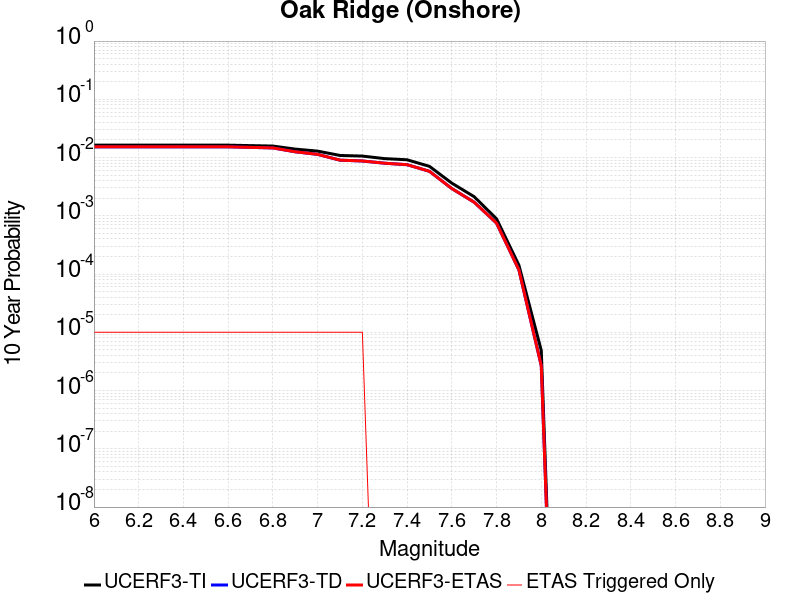 |

| Magnitude | 1 wk TI Prob | 1 wk TD Prob | 1 wk ETAS Prob | 1 wk ETAS/TD Gain | 1 wk ETAS Triggered Only | 1 mo TI Prob | 1 mo TD Prob | 1 mo ETAS Prob | 1 mo ETAS/TD Gain | 1 mo ETAS Triggered Only | 1 yr TI Prob | 1 yr TD Prob | 1 yr ETAS Prob | 1 yr ETAS/TD Gain | 1 yr ETAS Triggered Only | 10 yr TI Prob | 10 yr TD Prob | 10 yr ETAS Prob | 10 yr ETAS/TD Gain | 10 yr ETAS Triggered Only |
|-----|-----|-----|-----|-----|-----|-----|-----|-----|-----|-----|-----|-----|-----|-----|-----|-----|-----|-----|-----|-----|
| 6.0 | 3.155064E-5 | 2.9529527E-5 | 2.9529527E-5 | 1.0 | 0.0 | 1.3521002E-4 | 1.2654919E-4 | 1.2654919E-4 | 1.0 | 0.0 | 0.001644939 | 0.0015396855 | 0.0015396855 | 1.0 | 0.0 | 0.01632816 | 0.015294337 | 0.015304184 | 1.0006438 | 1.0E-5 |
| 6.1 | 3.155064E-5 | 2.9529527E-5 | 2.9529527E-5 | 1.0 | 0.0 | 1.3521002E-4 | 1.2654919E-4 | 1.2654919E-4 | 1.0 | 0.0 | 0.001644939 | 0.0015396855 | 0.0015396855 | 1.0 | 0.0 | 0.01632816 | 0.015294337 | 0.015304184 | 1.0006438 | 1.0E-5 |
| 6.2 | 3.155064E-5 | 2.9529527E-5 | 2.9529527E-5 | 1.0 | 0.0 | 1.3521002E-4 | 1.2654919E-4 | 1.2654919E-4 | 1.0 | 0.0 | 0.001644939 | 0.0015396855 | 0.0015396855 | 1.0 | 0.0 | 0.01632816 | 0.015294337 | 0.015304184 | 1.0006438 | 1.0E-5 |
| 6.3 | 3.155064E-5 | 2.9529527E-5 | 2.9529527E-5 | 1.0 | 0.0 | 1.3521002E-4 | 1.2654919E-4 | 1.2654919E-4 | 1.0 | 0.0 | 0.001644939 | 0.0015396855 | 0.0015396855 | 1.0 | 0.0 | 0.01632816 | 0.015294337 | 0.015304184 | 1.0006438 | 1.0E-5 |
| 6.4 | 3.155064E-5 | 2.9529527E-5 | 2.9529527E-5 | 1.0 | 0.0 | 1.3521002E-4 | 1.2654919E-4 | 1.2654919E-4 | 1.0 | 0.0 | 0.001644939 | 0.0015396855 | 0.0015396855 | 1.0 | 0.0 | 0.01632816 | 0.015294337 | 0.015304184 | 1.0006438 | 1.0E-5 |
| 6.5 | 3.155064E-5 | 2.9529527E-5 | 2.9529527E-5 | 1.0 | 0.0 | 1.3521002E-4 | 1.2654919E-4 | 1.2654919E-4 | 1.0 | 0.0 | 0.001644939 | 0.0015396855 | 0.0015396855 | 1.0 | 0.0 | 0.01632816 | 0.015294337 | 0.015304184 | 1.0006438 | 1.0E-5 |
| 6.6 | 3.155064E-5 | 2.9529527E-5 | 2.9529527E-5 | 1.0 | 0.0 | 1.3521002E-4 | 1.2654919E-4 | 1.2654919E-4 | 1.0 | 0.0 | 0.001644939 | 0.0015396855 | 0.0015396855 | 1.0 | 0.0 | 0.01632816 | 0.015294337 | 0.015304184 | 1.0006438 | 1.0E-5 |
| 6.7 | 3.098897E-5 | 2.8867666E-5 | 2.8867666E-5 | 1.0 | 0.0 | 1.328031E-4 | 1.2371292E-4 | 1.2371292E-4 | 1.0 | 0.0 | 0.0016156785 | 0.0015052018 | 0.0015052018 | 1.0 | 0.0 | 0.016039822 | 0.01495416 | 0.01496401 | 1.0006588 | 1.0E-5 |
| 6.8 | 3.0449872E-5 | 2.824281E-5 | 2.824281E-5 | 1.0 | 0.0 | 1.3049292E-4 | 1.2103521E-4 | 1.2103521E-4 | 1.0 | 0.0 | 0.0015875935 | 0.0014726447 | 0.0014726447 | 1.0 | 0.0 | 0.015762992 | 0.014632881 | 0.014642735 | 1.0006734 | 1.0E-5 |
| 6.9 | 2.697928E-5 | 2.4222873E-5 | 2.4222873E-5 | 1.0 | 0.0 | 1.15620365E-4 | 1.0380831E-4 | 1.0380831E-4 | 1.0 | 0.0 | 0.0014067689 | 0.0012631549 | 0.0012631549 | 1.0 | 0.0 | 0.0139789665 | 0.012562118 | 0.012571991 | 1.0007861 | 1.0E-5 |
| 7.0 | 2.4893961E-5 | 2.1864958E-5 | 2.1864958E-5 | 1.0 | 0.0 | 1.0668404E-4 | 9.37037E-5 | 9.37037E-5 | 1.0 | 0.0 | 0.0012981043 | 0.0011402632 | 0.0011402632 | 1.0 | 0.0 | 0.012905477 | 0.011346059 | 0.011355946 | 1.0008714 | 1.0E-5 |
| 7.1 | 2.0945363E-5 | 1.7357057E-5 | 1.7357057E-5 | 1.0 | 0.0 | 8.976275E-5 | 7.4385294E-5 | 7.4385294E-5 | 1.0 | 0.0 | 0.0010923136 | 9.052694E-4 | 9.052694E-4 | 1.0 | 0.0 | 0.0108696 | 0.0090164 | 0.00902631 | 1.0010991 | 1.0E-5 |
| 7.2 | 2.0439404E-5 | 1.6811955E-5 | 1.6811955E-5 | 1.0 | 0.0 | 8.7594504E-5 | 7.2049275E-5 | 7.2049275E-5 | 1.0 | 0.0 | 0.0010659413 | 8.7685155E-4 | 8.7685155E-4 | 1.0 | 0.0 | 0.010608427 | 0.008734483 | 0.008744396 | 1.0011349 | 1.0E-5 |
| 7.3 | 1.8463334E-5 | 1.5382886E-5 | 1.5382886E-5 | 1.0 | 0.0 | 7.912617E-5 | 6.5925014E-5 | 6.5925014E-5 | 1.0 | 0.0 | 9.6293533E-4 | 8.023458E-4 | 8.023458E-4 | 1.0 | 0.0 | 0.009587734 | 0.007995001 | 0.007995001 | 1.0 | 0.0 |
| 7.4 | 1.763139E-5 | 1.4517755E-5 | 1.4517755E-5 | 1.0 | 0.0 | 7.556091E-5 | 6.2217485E-5 | 6.2217485E-5 | 1.0 | 0.0 | 9.1956573E-4 | 7.572386E-4 | 7.572386E-4 | 1.0 | 0.0 | 0.009157699 | 0.007547035 | 0.007547035 | 1.0 | 0.0 |
| 7.5 | 1.3594944E-5 | 1.1163885E-5 | 1.1163885E-5 | 1.0 | 0.0 | 5.8262744E-5 | 4.7844354E-5 | 4.7844354E-5 | 1.0 | 0.0 | 7.0911803E-4 | 5.823519E-4 | 5.823519E-4 | 1.0 | 0.0 | 0.007068595 | 0.0058084223 | 0.0058084223 | 1.0 | 0.0 |
| 7.6 | 6.9889534E-6 | 5.636935E-6 | 5.636935E-6 | 1.0 | 0.0 | 2.9952313E-5 | 2.4158073E-5 | 2.4158073E-5 | 1.0 | 0.0 | 3.646084E-4 | 2.9408524E-4 | 2.9408524E-4 | 1.0 | 0.0 | 0.0036401073 | 0.0029370047 | 0.0029370047 | 1.0 | 0.0 |
| 7.7 | 4.0824193E-6 | 3.2833914E-6 | 3.2833914E-6 | 1.0 | 0.0 | 1.7495966E-5 | 1.4071602E-5 | 1.4071602E-5 | 1.0 | 0.0 | 2.1299256E-4 | 1.7130842E-4 | 1.7130842E-4 | 1.0 | 0.0 | 0.0021278851 | 0.0017117771 | 0.0017117771 | 1.0 | 0.0 |
| 7.8 | 1.7023609E-6 | 1.4371045E-6 | 1.4371045E-6 | 1.0 | 0.0 | 7.295812E-6 | 6.159005E-6 | 6.159005E-6 | 1.0 | 0.0 | 8.882289E-5 | 7.4983334E-5 | 7.4983334E-5 | 1.0 | 0.0 | 8.8787393E-4 | 7.495831E-4 | 7.495831E-4 | 1.0 | 0.0 |
| 7.9 | 2.721225E-7 | 2.2617681E-7 | 2.2617681E-7 | 1.0 | 0.0 | 1.1662388E-6 | 9.693289E-7 | 9.693289E-7 | 1.0 | 0.0 | 1.4198865E-5 | 1.1801518E-5 | 1.1801518E-5 | 1.0 | 0.0 | 1.4197957E-4 | 1.18009186E-4 | 1.18009186E-4 | 1.0 | 0.0 |
| 8.0 | 9.364255E-9 | 5.1215614E-9 | 5.1215614E-9 | 1.0 | 0.0 | 4.0132523E-8 | 2.1949548E-8 | 2.1949548E-8 | 1.0 | 0.0 | 4.8861335E-7 | 2.6723572E-7 | 2.6723572E-7 | 1.0 | 0.0 | 4.8861225E-6 | 2.6723544E-6 | 2.6723544E-6 | 1.0 | 0.0 |

## La Panza 2011
*[(top)](#table-of-contents)*

| 1 Week | 1 Month | 1 Year | 10 Year |
|-----|-----|-----|-----|
|  |  |  |  |

| Magnitude | 1 wk TI Prob | 1 wk TD Prob | 1 wk ETAS Prob | 1 wk ETAS/TD Gain | 1 wk ETAS Triggered Only | 1 mo TI Prob | 1 mo TD Prob | 1 mo ETAS Prob | 1 mo ETAS/TD Gain | 1 mo ETAS Triggered Only | 1 yr TI Prob | 1 yr TD Prob | 1 yr ETAS Prob | 1 yr ETAS/TD Gain | 1 yr ETAS Triggered Only | 10 yr TI Prob | 10 yr TD Prob | 10 yr ETAS Prob | 10 yr ETAS/TD Gain | 10 yr ETAS Triggered Only |
|-----|-----|-----|-----|-----|-----|-----|-----|-----|-----|-----|-----|-----|-----|-----|-----|-----|-----|-----|-----|-----|
| 6.0 | 4.6754544E-6 | 4.717672E-6 | 4.717672E-6 | 1.0 | 0.0 | 2.0037509E-5 | 2.0218447E-5 | 2.0218447E-5 | 1.0 | 0.0 | 2.4392935E-4 | 2.4613377E-4 | 2.4613377E-4 | 1.0 | 0.0 | 0.0024366176 | 0.002458806 | 0.0024687813 | 1.004057 | 1.0E-5 |
| 6.1 | 4.6754544E-6 | 4.717672E-6 | 4.717672E-6 | 1.0 | 0.0 | 2.0037509E-5 | 2.0218447E-5 | 2.0218447E-5 | 1.0 | 0.0 | 2.4392935E-4 | 2.4613377E-4 | 2.4613377E-4 | 1.0 | 0.0 | 0.0024366176 | 0.002458806 | 0.0024687813 | 1.004057 | 1.0E-5 |
| 6.2 | 4.6754544E-6 | 4.717672E-6 | 4.717672E-6 | 1.0 | 0.0 | 2.0037509E-5 | 2.0218447E-5 | 2.0218447E-5 | 1.0 | 0.0 | 2.4392935E-4 | 2.4613377E-4 | 2.4613377E-4 | 1.0 | 0.0 | 0.0024366176 | 0.002458806 | 0.0024687813 | 1.004057 | 1.0E-5 |
| 6.3 | 4.6754544E-6 | 4.717672E-6 | 4.717672E-6 | 1.0 | 0.0 | 2.0037509E-5 | 2.0218447E-5 | 2.0218447E-5 | 1.0 | 0.0 | 2.4392935E-4 | 2.4613377E-4 | 2.4613377E-4 | 1.0 | 0.0 | 0.0024366176 | 0.002458806 | 0.0024687813 | 1.004057 | 1.0E-5 |
| 6.4 | 4.6754544E-6 | 4.717672E-6 | 4.717672E-6 | 1.0 | 0.0 | 2.0037509E-5 | 2.0218447E-5 | 2.0218447E-5 | 1.0 | 0.0 | 2.4392935E-4 | 2.4613377E-4 | 2.4613377E-4 | 1.0 | 0.0 | 0.0024366176 | 0.002458806 | 0.0024687813 | 1.004057 | 1.0E-5 |
| 6.5 | 2.485343E-6 | 2.5006693E-6 | 2.5006693E-6 | 1.0 | 0.0 | 1.0651426E-5 | 1.0717112E-5 | 1.0717112E-5 | 1.0 | 0.0 | 1.296734E-4 | 1.3047342E-4 | 1.3047342E-4 | 1.0 | 0.0 | 0.0012959775 | 0.0013040066 | 0.0013139935 | 1.0076587 | 1.0E-5 |
| 6.6 | 2.485343E-6 | 2.5006693E-6 | 2.5006693E-6 | 1.0 | 0.0 | 1.0651426E-5 | 1.0717112E-5 | 1.0717112E-5 | 1.0 | 0.0 | 1.296734E-4 | 1.3047342E-4 | 1.3047342E-4 | 1.0 | 0.0 | 0.0012959775 | 0.0013040066 | 0.0013139935 | 1.0076587 | 1.0E-5 |
| 6.7 | 1.5108508E-6 | 1.5147016E-6 | 1.5147016E-6 | 1.0 | 0.0 | 6.4750584E-6 | 6.4915625E-6 | 6.4915625E-6 | 1.0 | 0.0 | 7.8830984E-5 | 7.903202E-5 | 7.903202E-5 | 1.0 | 0.0 | 7.880303E-4 | 7.9004996E-4 | 8.00042E-4 | 1.0126474 | 1.0E-5 |
| 6.8 | 1.3865837E-6 | 1.3885733E-6 | 1.3885733E-6 | 1.0 | 0.0 | 5.942488E-6 | 5.9510153E-6 | 5.9510153E-6 | 1.0 | 0.0 | 7.234739E-5 | 7.24513E-5 | 7.24513E-5 | 1.0 | 0.0 | 7.232384E-4 | 7.2428666E-4 | 7.342794E-4 | 1.0137967 | 1.0E-5 |
| 6.9 | 9.826583E-7 | 9.796892E-7 | 9.796892E-7 | 1.0 | 0.0 | 4.2113857E-6 | 4.198661E-6 | 4.198661E-6 | 1.0 | 0.0 | 5.1272415E-5 | 5.1117553E-5 | 5.1117553E-5 | 1.0 | 0.0 | 5.126059E-4 | 5.110633E-4 | 5.210582E-4 | 1.019557 | 1.0E-5 |
| 7.0 | 6.7797646E-7 | 6.710798E-7 | 6.710798E-7 | 1.0 | 0.0 | 2.9056102E-6 | 2.8760535E-6 | 2.8760535E-6 | 1.0 | 0.0 | 3.537523E-5 | 3.501542E-5 | 3.501542E-5 | 1.0 | 0.0 | 3.5369597E-4 | 3.501021E-4 | 3.501021E-4 | 1.0 | 0.0 |
| 7.1 | 3.4979826E-7 | 3.3879496E-7 | 3.3879496E-7 | 1.0 | 0.0 | 1.4991346E-6 | 1.4519776E-6 | 1.4519776E-6 | 1.0 | 0.0 | 1.825181E-5 | 1.7677696E-5 | 1.7677696E-5 | 1.0 | 0.0 | 1.825031E-4 | 1.7676406E-4 | 1.7676406E-4 | 1.0 | 0.0 |
| 7.2 | 2.5088332E-7 | 2.3837433E-7 | 2.3837433E-7 | 1.0 | 0.0 | 1.0752137E-6 | 1.0216039E-6 | 1.0216039E-6 | 1.0 | 0.0 | 1.3090649E-5 | 1.2437966E-5 | 1.2437966E-5 | 1.0 | 0.0 | 1.3089878E-4 | 1.2437355E-4 | 1.2437355E-4 | 1.0 | 0.0 |
| 7.3 | 1.0159086E-7 | 8.650015E-8 | 8.650015E-8 | 1.0 | 0.0 | 4.3538932E-7 | 3.7071487E-7 | 3.7071487E-7 | 1.0 | 0.0 | 5.300852E-6 | 4.5134448E-6 | 4.5134448E-6 | 1.0 | 0.0 | 5.3007258E-5 | 4.513357E-5 | 4.513357E-5 | 1.0 | 0.0 |
| 7.4 | 3.5006252E-8 | 1.942112E-8 | 1.942112E-8 | 1.0 | 0.0 | 1.5002678E-7 | 8.3233374E-8 | 8.3233374E-8 | 1.0 | 0.0 | 1.8265745E-6 | 1.0133658E-6 | 1.0133658E-6 | 1.0 | 0.0 | 1.8265595E-5 | 1.01336145E-5 | 1.01336145E-5 | 1.0 | 0.0 |
| 7.5 | 2.592274E-8 | 1.0251418E-8 | 1.0251418E-8 | 1.0 | 0.0 | 1.1109746E-7 | 4.3934648E-8 | 4.3934648E-8 | 1.0 | 0.0 | 1.3526106E-6 | 5.349042E-7 | 5.349042E-7 | 1.0 | 0.0 | 1.3526024E-5 | 5.3490303E-6 | 5.3490303E-6 | 1.0 | 0.0 |
| 7.6 | 1.9016717E-8 | 5.252449E-9 | 5.252449E-9 | 1.0 | 0.0 | 8.150022E-8 | 2.2510497E-8 | 2.2510497E-8 | 1.0 | 0.0 | 9.922647E-7 | 2.7406526E-7 | 2.7406526E-7 | 1.0 | 0.0 | 9.922603E-6 | 2.7406493E-6 | 2.7406493E-6 | 1.0 | 0.0 |
| 7.7 | 1.17738495E-8 | 1.2428653E-9 | 1.2428653E-9 | 1.0 | 0.0 | 5.0459356E-8 | 5.326565E-9 | 5.326565E-9 | 1.0 | 0.0 | 6.1434247E-7 | 6.485092E-8 | 6.485092E-8 | 1.0 | 0.0 | 6.143408E-6 | 6.4850906E-7 | 6.4850906E-7 | 1.0 | 0.0 |
| 7.8 | 5.489079E-9 | 2.0186508E-10 | 2.0186508E-10 | 1.0 | 0.0 | 2.3524624E-8 | 8.651371E-10 | 8.651371E-10 | 1.0 | 0.0 | 2.8641225E-7 | 1.0533043E-8 | 1.0533043E-8 | 1.0 | 0.0 | 2.8641189E-6 | 1.0533042E-7 | 1.0533042E-7 | 1.0 | 0.0 |
| 7.9 | 2.5081048E-9 | 6.7113426E-11 | 6.7113426E-11 | 1.0 | 0.0 | 1.0749021E-8 | 2.8763014E-10 | 2.8763014E-10 | 1.0 | 0.0 | 1.3086932E-7 | 3.5018966E-9 | 3.5018966E-9 | 1.0 | 0.0 | 1.3086925E-6 | 3.5018967E-8 | 3.5018967E-8 | 1.0 | 0.0 |

## Owens Valley Keough Hot Springs
*[(top)](#table-of-contents)*

| 1 Week | 1 Month | 1 Year | 10 Year |
|-----|-----|-----|-----|
|  |  |  |  |

| Magnitude | 1 wk TI Prob | 1 wk TD Prob | 1 wk ETAS Prob | 1 wk ETAS/TD Gain | 1 wk ETAS Triggered Only | 1 mo TI Prob | 1 mo TD Prob | 1 mo ETAS Prob | 1 mo ETAS/TD Gain | 1 mo ETAS Triggered Only | 1 yr TI Prob | 1 yr TD Prob | 1 yr ETAS Prob | 1 yr ETAS/TD Gain | 1 yr ETAS Triggered Only | 10 yr TI Prob | 10 yr TD Prob | 10 yr ETAS Prob | 10 yr ETAS/TD Gain | 10 yr ETAS Triggered Only |
|-----|-----|-----|-----|-----|-----|-----|-----|-----|-----|-----|-----|-----|-----|-----|-----|-----|-----|-----|-----|-----|
| 6.0 | 1.5708529E-5 | 4.951135E-6 | 4.951135E-6 | 1.0 | 0.0 | 6.7320536E-5 | 2.1219006E-5 | 2.1219006E-5 | 1.0 | 0.0 | 8.193192E-4 | 2.583159E-4 | 2.583159E-4 | 1.0 | 0.0 | 0.008163051 | 0.00258083 | 0.0025908041 | 1.0038648 | 1.0E-5 |
| 6.1 | 1.5708529E-5 | 4.951135E-6 | 4.951135E-6 | 1.0 | 0.0 | 6.7320536E-5 | 2.1219006E-5 | 2.1219006E-5 | 1.0 | 0.0 | 8.193192E-4 | 2.583159E-4 | 2.583159E-4 | 1.0 | 0.0 | 0.008163051 | 0.00258083 | 0.0025908041 | 1.0038648 | 1.0E-5 |
| 6.2 | 1.5708529E-5 | 4.951135E-6 | 4.951135E-6 | 1.0 | 0.0 | 6.7320536E-5 | 2.1219006E-5 | 2.1219006E-5 | 1.0 | 0.0 | 8.193192E-4 | 2.583159E-4 | 2.583159E-4 | 1.0 | 0.0 | 0.008163051 | 0.00258083 | 0.0025908041 | 1.0038648 | 1.0E-5 |
| 6.3 | 1.5708529E-5 | 4.951135E-6 | 4.951135E-6 | 1.0 | 0.0 | 6.7320536E-5 | 2.1219006E-5 | 2.1219006E-5 | 1.0 | 0.0 | 8.193192E-4 | 2.583159E-4 | 2.583159E-4 | 1.0 | 0.0 | 0.008163051 | 0.00258083 | 0.0025908041 | 1.0038648 | 1.0E-5 |
| 6.4 | 1.4622509E-5 | 3.726917E-6 | 3.726917E-6 | 1.0 | 0.0 | 6.266639E-5 | 1.5972422E-5 | 1.5972422E-5 | 1.0 | 0.0 | 7.626962E-4 | 1.9445019E-4 | 1.9445019E-4 | 1.0 | 0.0 | 0.007600839 | 0.001943295 | 0.001943295 | 1.0 | 0.0 |
| 6.5 | 1.3335527E-5 | 2.2780168E-6 | 2.2780168E-6 | 1.0 | 0.0 | 5.7151006E-5 | 9.762897E-6 | 9.762897E-6 | 1.0 | 0.0 | 6.955913E-4 | 1.1885747E-4 | 1.1885747E-4 | 1.0 | 0.0 | 0.0069341804 | 0.0011881763 | 0.0011881763 | 1.0 | 0.0 |
| 6.6 | 1.3332855E-5 | 2.275166E-6 | 2.275166E-6 | 1.0 | 0.0 | 5.7139558E-5 | 9.750679E-6 | 9.750679E-6 | 1.0 | 0.0 | 6.9545204E-4 | 1.1870873E-4 | 1.1870873E-4 | 1.0 | 0.0 | 0.0069327964 | 0.0011866905 | 0.0011866905 | 1.0 | 0.0 |
| 6.7 | 1.3318214E-5 | 2.264395E-6 | 2.264395E-6 | 1.0 | 0.0 | 5.707681E-5 | 9.704519E-6 | 9.704519E-6 | 1.0 | 0.0 | 6.946886E-4 | 1.1814679E-4 | 1.1814679E-4 | 1.0 | 0.0 | 0.0069252094 | 0.001181077 | 0.001181077 | 1.0 | 0.0 |
| 6.8 | 1.2441338E-5 | 1.6780228E-6 | 1.6780228E-6 | 1.0 | 0.0 | 5.331893E-5 | 7.1915083E-6 | 7.1915083E-6 | 1.0 | 0.0 | 6.489646E-4 | 8.7553395E-5 | 8.7553395E-5 | 1.0 | 0.0 | 0.0064707273 | 8.753886E-4 | 8.753886E-4 | 1.0 | 0.0 |
| 6.9 | 1.1130476E-5 | 1.0305113E-6 | 1.0305113E-6 | 1.0 | 0.0 | 4.7701167E-5 | 4.4164694E-6 | 4.4164694E-6 | 1.0 | 0.0 | 5.806069E-4 | 5.3769203E-5 | 5.3769203E-5 | 1.0 | 0.0 | 0.0057909233 | 5.377308E-4 | 5.377308E-4 | 1.0 | 0.0 |
| 7.0 | 1.0986073E-5 | 9.580568E-7 | 9.580568E-7 | 1.0 | 0.0 | 4.7082318E-5 | 4.1059516E-6 | 4.1059516E-6 | 1.0 | 0.0 | 5.730765E-4 | 4.9988827E-5 | 4.9988827E-5 | 1.0 | 0.0 | 0.0057160086 | 4.9994385E-4 | 4.9994385E-4 | 1.0 | 0.0 |
| 7.1 | 1.0451338E-5 | 8.0011125E-7 | 8.0011125E-7 | 1.0 | 0.0 | 4.4790682E-5 | 3.4290438E-6 | 3.4290438E-6 | 1.0 | 0.0 | 5.451901E-4 | 4.1747815E-5 | 4.1747815E-5 | 1.0 | 0.0 | 0.005438545 | 4.1756374E-4 | 4.1756374E-4 | 1.0 | 0.0 |
| 7.2 | 9.989061E-6 | 6.545603E-7 | 6.545603E-7 | 1.0 | 0.0 | 4.280956E-5 | 2.8052555E-6 | 2.8052555E-6 | 1.0 | 0.0 | 5.2108173E-4 | 3.4153454E-5 | 3.4153454E-5 | 1.0 | 0.0 | 0.0051986156 | 3.4164122E-4 | 3.4164122E-4 | 1.0 | 0.0 |
| 7.3 | 9.465365E-6 | 5.460636E-7 | 5.460636E-7 | 1.0 | 0.0 | 4.056522E-5 | 2.3402704E-6 | 2.3402704E-6 | 1.0 | 0.0 | 4.937696E-4 | 2.849242E-5 | 2.849242E-5 | 1.0 | 0.0 | 0.0049267393 | 2.8504184E-4 | 2.8504184E-4 | 1.0 | 0.0 |
| 7.4 | 6.3824805E-6 | 4.0168445E-7 | 4.0168445E-7 | 1.0 | 0.0 | 2.73532E-5 | 1.7215036E-6 | 1.7215036E-6 | 1.0 | 0.0 | 3.3297433E-4 | 2.0959107E-5 | 2.0959107E-5 | 1.0 | 0.0 | 0.0033247585 | 2.096834E-4 | 2.096834E-4 | 1.0 | 0.0 |
| 7.5 | 1.6192645E-6 | 2.51651E-7 | 2.51651E-7 | 1.0 | 0.0 | 6.9396865E-6 | 1.0785038E-6 | 1.0785038E-6 | 1.0 | 0.0 | 8.448741E-5 | 1.3130706E-5 | 1.3130706E-5 | 1.0 | 0.0 | 8.4455294E-4 | 1.3129943E-4 | 1.3129943E-4 | 1.0 | 0.0 |
| 7.6 | 5.7062545E-7 | 1.07936074E-7 | 1.07936074E-7 | 1.0 | 0.0 | 2.4455355E-6 | 4.625831E-7 | 4.625831E-7 | 1.0 | 0.0 | 2.9773988E-5 | 5.6319354E-6 | 5.6319354E-6 | 1.0 | 0.0 | 2.977E-4 | 5.6318007E-5 | 5.6318007E-5 | 1.0 | 0.0 |
| 7.7 | 2.5988817E-7 | 4.5459043E-8 | 4.5459043E-8 | 1.0 | 0.0 | 1.113806E-6 | 1.9482447E-7 | 1.9482447E-7 | 1.0 | 0.0 | 1.3560503E-5 | 2.3719856E-6 | 2.3719856E-6 | 1.0 | 0.0 | 1.3559677E-4 | 2.3719647E-5 | 2.3719647E-5 | 1.0 | 0.0 |

## Sisar
*[(top)](#table-of-contents)*

| 1 Week | 1 Month | 1 Year | 10 Year |
|-----|-----|-----|-----|
|  |  |  |  |

| Magnitude | 1 wk TI Prob | 1 wk TD Prob | 1 wk ETAS Prob | 1 wk ETAS/TD Gain | 1 wk ETAS Triggered Only | 1 mo TI Prob | 1 mo TD Prob | 1 mo ETAS Prob | 1 mo ETAS/TD Gain | 1 mo ETAS Triggered Only | 1 yr TI Prob | 1 yr TD Prob | 1 yr ETAS Prob | 1 yr ETAS/TD Gain | 1 yr ETAS Triggered Only | 10 yr TI Prob | 10 yr TD Prob | 10 yr ETAS Prob | 10 yr ETAS/TD Gain | 10 yr ETAS Triggered Only |
|-----|-----|-----|-----|-----|-----|-----|-----|-----|-----|-----|-----|-----|-----|-----|-----|-----|-----|-----|-----|-----|
| 6.0 | 4.544193E-6 | 3.8397884E-6 | 3.8397884E-6 | 1.0 | 0.0 | 1.9474966E-5 | 1.6456135E-5 | 1.6456135E-5 | 1.0 | 0.0 | 2.3708193E-4 | 2.0033536E-4 | 2.0033536E-4 | 1.0 | 0.0 | 0.0023682916 | 0.0020015815 | 0.0020115613 | 1.004986 | 1.0E-5 |
| 6.1 | 4.544193E-6 | 3.8397884E-6 | 3.8397884E-6 | 1.0 | 0.0 | 1.9474966E-5 | 1.6456135E-5 | 1.6456135E-5 | 1.0 | 0.0 | 2.3708193E-4 | 2.0033536E-4 | 2.0033536E-4 | 1.0 | 0.0 | 0.0023682916 | 0.0020015815 | 0.0020115613 | 1.004986 | 1.0E-5 |
| 6.2 | 4.544193E-6 | 3.8397884E-6 | 3.8397884E-6 | 1.0 | 0.0 | 1.9474966E-5 | 1.6456135E-5 | 1.6456135E-5 | 1.0 | 0.0 | 2.3708193E-4 | 2.0033536E-4 | 2.0033536E-4 | 1.0 | 0.0 | 0.0023682916 | 0.0020015815 | 0.0020115613 | 1.004986 | 1.0E-5 |
| 6.3 | 4.544193E-6 | 3.8397884E-6 | 3.8397884E-6 | 1.0 | 0.0 | 1.9474966E-5 | 1.6456135E-5 | 1.6456135E-5 | 1.0 | 0.0 | 2.3708193E-4 | 2.0033536E-4 | 2.0033536E-4 | 1.0 | 0.0 | 0.0023682916 | 0.0020015815 | 0.0020115613 | 1.004986 | 1.0E-5 |
| 6.4 | 4.544193E-6 | 3.8397884E-6 | 3.8397884E-6 | 1.0 | 0.0 | 1.9474966E-5 | 1.6456135E-5 | 1.6456135E-5 | 1.0 | 0.0 | 2.3708193E-4 | 2.0033536E-4 | 2.0033536E-4 | 1.0 | 0.0 | 0.0023682916 | 0.0020015815 | 0.0020115613 | 1.004986 | 1.0E-5 |
| 6.5 | 4.544193E-6 | 3.8397884E-6 | 3.8397884E-6 | 1.0 | 0.0 | 1.9474966E-5 | 1.6456135E-5 | 1.6456135E-5 | 1.0 | 0.0 | 2.3708193E-4 | 2.0033536E-4 | 2.0033536E-4 | 1.0 | 0.0 | 0.0023682916 | 0.0020015815 | 0.0020115613 | 1.004986 | 1.0E-5 |
| 6.6 | 4.544193E-6 | 3.8397884E-6 | 3.8397884E-6 | 1.0 | 0.0 | 1.9474966E-5 | 1.6456135E-5 | 1.6456135E-5 | 1.0 | 0.0 | 2.3708193E-4 | 2.0033536E-4 | 2.0033536E-4 | 1.0 | 0.0 | 0.0023682916 | 0.0020015815 | 0.0020115613 | 1.004986 | 1.0E-5 |
| 6.7 | 4.544193E-6 | 3.8397884E-6 | 3.8397884E-6 | 1.0 | 0.0 | 1.9474966E-5 | 1.6456135E-5 | 1.6456135E-5 | 1.0 | 0.0 | 2.3708193E-4 | 2.0033536E-4 | 2.0033536E-4 | 1.0 | 0.0 | 0.0023682916 | 0.0020015815 | 0.0020115613 | 1.004986 | 1.0E-5 |
| 6.8 | 4.544193E-6 | 3.8397884E-6 | 3.8397884E-6 | 1.0 | 0.0 | 1.9474966E-5 | 1.6456135E-5 | 1.6456135E-5 | 1.0 | 0.0 | 2.3708193E-4 | 2.0033536E-4 | 2.0033536E-4 | 1.0 | 0.0 | 0.0023682916 | 0.0020015815 | 0.0020115613 | 1.004986 | 1.0E-5 |
| 6.9 | 4.542225E-6 | 3.8377507E-6 | 3.8377507E-6 | 1.0 | 0.0 | 1.9466532E-5 | 1.64474E-5 | 1.64474E-5 | 1.0 | 0.0 | 2.3697925E-4 | 2.0022903E-4 | 2.0022903E-4 | 1.0 | 0.0 | 0.002367267 | 0.00200052 | 0.0020105 | 1.0049887 | 1.0E-5 |
| 7.0 | 4.5278484E-6 | 3.822814E-6 | 3.822814E-6 | 1.0 | 0.0 | 1.940492E-5 | 1.6383388E-5 | 1.6383388E-5 | 1.0 | 0.0 | 2.3622929E-4 | 1.9944983E-4 | 1.9944983E-4 | 1.0 | 0.0 | 0.0023597833 | 0.001992742 | 0.0020027221 | 1.0050082 | 1.0E-5 |
| 7.1 | 4.5132488E-6 | 3.8076014E-6 | 3.8076014E-6 | 1.0 | 0.0 | 1.9342351E-5 | 1.6318192E-5 | 1.6318192E-5 | 1.0 | 0.0 | 2.3546767E-4 | 1.986562E-4 | 1.986562E-4 | 1.0 | 0.0 | 0.0023521832 | 0.00198482 | 0.0019948 | 1.0050282 | 1.0E-5 |
| 7.2 | 4.448859E-6 | 3.74006E-6 | 3.74006E-6 | 1.0 | 0.0 | 1.9066398E-5 | 1.6028733E-5 | 1.6028733E-5 | 1.0 | 0.0 | 2.3210866E-4 | 1.9513267E-4 | 1.9513267E-4 | 1.0 | 0.0 | 0.0023186638 | 0.001949647 | 0.0019596275 | 1.0051191 | 1.0E-5 |
| 7.3 | 4.3424366E-6 | 3.6338909E-6 | 3.6338909E-6 | 1.0 | 0.0 | 1.861031E-5 | 1.5573727E-5 | 1.5573727E-5 | 1.0 | 0.0 | 2.2655698E-4 | 1.8959396E-4 | 1.8959396E-4 | 1.0 | 0.0 | 0.0022632615 | 0.0018943556 | 0.0019043366 | 1.0052688 | 1.0E-5 |
| 7.4 | 4.218641E-6 | 3.5332403E-6 | 3.5332403E-6 | 1.0 | 0.0 | 1.8079765E-5 | 1.5142372E-5 | 1.5142372E-5 | 1.0 | 0.0 | 2.2009891E-4 | 1.8434311E-4 | 1.8434311E-4 | 1.0 | 0.0 | 0.0021988105 | 0.0018419353 | 0.0018519169 | 1.005419 | 1.0E-5 |
| 7.5 | 3.983779E-6 | 3.3480019E-6 | 3.3480019E-6 | 1.0 | 0.0 | 1.7073227E-5 | 1.4348502E-5 | 1.4348502E-5 | 1.0 | 0.0 | 2.0784672E-4 | 1.7467934E-4 | 1.7467934E-4 | 1.0 | 0.0 | 0.0020765243 | 0.0017454535 | 0.001755436 | 1.0057192 | 1.0E-5 |
| 7.6 | 2.777393E-6 | 2.3523785E-6 | 2.3523785E-6 | 1.0 | 0.0 | 1.1903058E-5 | 1.0081583E-5 | 1.0081583E-5 | 1.0 | 0.0 | 1.449101E-4 | 1.2273644E-4 | 1.2273644E-4 | 1.0 | 0.0 | 0.0014481564 | 0.0012266943 | 0.0012366821 | 1.008142 | 1.0E-5 |
| 7.7 | 1.9028433E-6 | 1.5939673E-6 | 1.5939673E-6 | 1.0 | 0.0 | 8.155017E-6 | 6.831271E-6 | 6.831271E-6 | 1.0 | 0.0 | 9.928281E-5 | 8.31676E-5 | 8.31676E-5 | 1.0 | 0.0 | 9.923846E-4 | 8.313695E-4 | 8.413612E-4 | 1.0120183 | 1.0E-5 |
| 7.8 | 4.9095956E-7 | 4.3585268E-7 | 4.3585268E-7 | 1.0 | 0.0 | 2.1041105E-6 | 1.8679387E-6 | 1.8679387E-6 | 1.0 | 0.0 | 2.5617246E-5 | 2.2741919E-5 | 2.2741919E-5 | 1.0 | 0.0 | 2.5614293E-4 | 2.2739609E-4 | 2.3739382E-4 | 1.0439662 | 1.0E-5 |
| 7.9 | 1.16657894E-7 | 1.03358666E-7 | 1.03358666E-7 | 1.0 | 0.0 | 4.999623E-7 | 4.4296564E-7 | 4.4296564E-7 | 1.0 | 0.0 | 6.087024E-6 | 5.3930935E-6 | 5.3930935E-6 | 1.0 | 0.0 | 6.0868573E-5 | 5.3929656E-5 | 5.3929656E-5 | 1.0 | 0.0 |
| 8.0 | 2.5100346E-9 | 1.706956E-9 | 1.706956E-9 | 1.0 | 0.0 | 1.0757291E-8 | 7.315526E-9 | 7.315526E-9 | 1.0 | 0.0 | 1.3097001E-7 | 8.9066525E-8 | 8.9066525E-8 | 1.0 | 0.0 | 1.3096993E-6 | 8.90665E-7 | 8.90665E-7 | 1.0 | 0.0 |

## Puente Hills
*[(top)](#table-of-contents)*

| 1 Week | 1 Month | 1 Year | 10 Year |
|-----|-----|-----|-----|
|  |  | 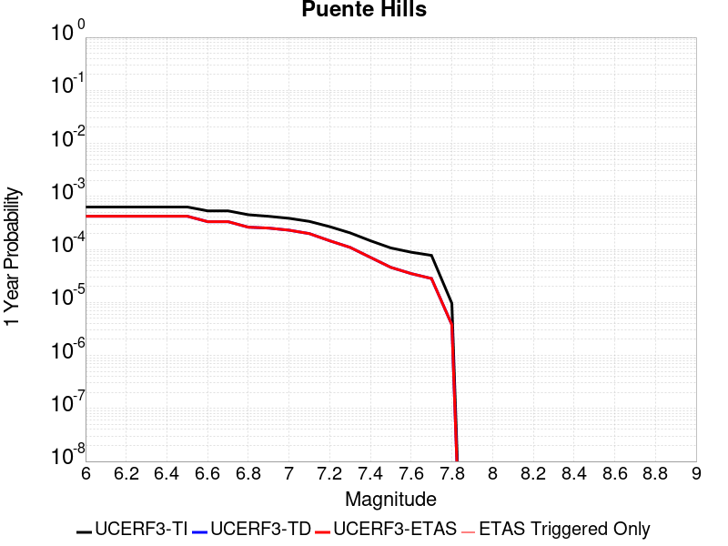 |  |

| Magnitude | 1 wk TI Prob | 1 wk TD Prob | 1 wk ETAS Prob | 1 wk ETAS/TD Gain | 1 wk ETAS Triggered Only | 1 mo TI Prob | 1 mo TD Prob | 1 mo ETAS Prob | 1 mo ETAS/TD Gain | 1 mo ETAS Triggered Only | 1 yr TI Prob | 1 yr TD Prob | 1 yr ETAS Prob | 1 yr ETAS/TD Gain | 1 yr ETAS Triggered Only | 10 yr TI Prob | 10 yr TD Prob | 10 yr ETAS Prob | 10 yr ETAS/TD Gain | 10 yr ETAS Triggered Only |
|-----|-----|-----|-----|-----|-----|-----|-----|-----|-----|-----|-----|-----|-----|-----|-----|-----|-----|-----|-----|-----|
| 6.0 | 1.2101656E-5 | 8.099034E-6 | 8.099034E-6 | 1.0 | 0.0 | 5.1863204E-5 | 3.4709716E-5 | 3.4709716E-5 | 1.0 | 0.0 | 6.312516E-4 | 4.225145E-4 | 4.225145E-4 | 1.0 | 0.0 | 0.0062946146 | 0.004217672 | 0.00422763 | 1.0023609 | 1.0E-5 |
| 6.1 | 1.2101656E-5 | 8.099034E-6 | 8.099034E-6 | 1.0 | 0.0 | 5.1863204E-5 | 3.4709716E-5 | 3.4709716E-5 | 1.0 | 0.0 | 6.312516E-4 | 4.225145E-4 | 4.225145E-4 | 1.0 | 0.0 | 0.0062946146 | 0.004217672 | 0.00422763 | 1.0023609 | 1.0E-5 |
| 6.2 | 1.2101656E-5 | 8.099034E-6 | 8.099034E-6 | 1.0 | 0.0 | 5.1863204E-5 | 3.4709716E-5 | 3.4709716E-5 | 1.0 | 0.0 | 6.312516E-4 | 4.225145E-4 | 4.225145E-4 | 1.0 | 0.0 | 0.0062946146 | 0.004217672 | 0.00422763 | 1.0023609 | 1.0E-5 |
| 6.3 | 1.2101656E-5 | 8.099034E-6 | 8.099034E-6 | 1.0 | 0.0 | 5.1863204E-5 | 3.4709716E-5 | 3.4709716E-5 | 1.0 | 0.0 | 6.312516E-4 | 4.225145E-4 | 4.225145E-4 | 1.0 | 0.0 | 0.0062946146 | 0.004217672 | 0.00422763 | 1.0023609 | 1.0E-5 |
| 6.4 | 1.2101656E-5 | 8.099034E-6 | 8.099034E-6 | 1.0 | 0.0 | 5.1863204E-5 | 3.4709716E-5 | 3.4709716E-5 | 1.0 | 0.0 | 6.312516E-4 | 4.225145E-4 | 4.225145E-4 | 1.0 | 0.0 | 0.0062946146 | 0.004217672 | 0.00422763 | 1.0023609 | 1.0E-5 |
| 6.5 | 1.2101656E-5 | 8.099034E-6 | 8.099034E-6 | 1.0 | 0.0 | 5.1863204E-5 | 3.4709716E-5 | 3.4709716E-5 | 1.0 | 0.0 | 6.312516E-4 | 4.225145E-4 | 4.225145E-4 | 1.0 | 0.0 | 0.0062946146 | 0.004217672 | 0.00422763 | 1.0023609 | 1.0E-5 |
| 6.6 | 1.0222488E-5 | 6.399609E-6 | 6.399609E-6 | 1.0 | 0.0 | 4.3809923E-5 | 2.7426622E-5 | 2.7426622E-5 | 1.0 | 0.0 | 5.332553E-4 | 3.338704E-4 | 3.338704E-4 | 1.0 | 0.0 | 0.0053197746 | 0.0033339334 | 0.0033439 | 1.0029894 | 1.0E-5 |
| 6.7 | 1.0222488E-5 | 6.399609E-6 | 6.399609E-6 | 1.0 | 0.0 | 4.3809923E-5 | 2.7426622E-5 | 2.7426622E-5 | 1.0 | 0.0 | 5.332553E-4 | 3.338704E-4 | 3.338704E-4 | 1.0 | 0.0 | 0.0053197746 | 0.0033339334 | 0.0033439 | 1.0029894 | 1.0E-5 |
| 6.8 | 8.6367845E-6 | 5.0285994E-6 | 5.0285994E-6 | 1.0 | 0.0 | 3.7014266E-5 | 2.1550964E-5 | 2.1550964E-5 | 1.0 | 0.0 | 4.505555E-4 | 2.6235197E-4 | 2.6235197E-4 | 1.0 | 0.0 | 0.004496431 | 0.0026204786 | 0.0026204786 | 1.0 | 0.0 |
| 6.9 | 8.066481E-6 | 4.8364727E-6 | 4.8364727E-6 | 1.0 | 0.0 | 3.4570177E-5 | 2.0727579E-5 | 2.0727579E-5 | 1.0 | 0.0 | 4.2081063E-4 | 2.5232957E-4 | 2.5232957E-4 | 1.0 | 0.0 | 0.0042001465 | 0.0025204846 | 0.0025204846 | 1.0 | 0.0 |
| 7.0 | 7.393828E-6 | 4.417672E-6 | 4.417672E-6 | 1.0 | 0.0 | 3.168745E-5 | 1.8932744E-5 | 1.8932744E-5 | 1.0 | 0.0 | 3.857264E-4 | 2.3048223E-4 | 2.3048223E-4 | 1.0 | 0.0 | 0.0038505755 | 0.0023024774 | 0.0023024774 | 1.0 | 0.0 |
| 7.1 | 6.4660953E-6 | 3.804764E-6 | 3.804764E-6 | 1.0 | 0.0 | 2.7711543E-5 | 1.6306032E-5 | 1.6306032E-5 | 1.0 | 0.0 | 3.373358E-4 | 1.985082E-4 | 1.985082E-4 | 1.0 | 0.0 | 0.0033682417 | 0.0019833448 | 0.0019833448 | 1.0 | 0.0 |
| 7.2 | 5.143232E-6 | 2.7867773E-6 | 2.7867773E-6 | 1.0 | 0.0 | 2.2042237E-5 | 1.1943277E-5 | 1.1943277E-5 | 1.0 | 0.0 | 2.6833118E-4 | 1.4539978E-4 | 1.4539978E-4 | 1.0 | 0.0 | 0.002680074 | 0.0014530563 | 0.0014530563 | 1.0 | 0.0 |
| 7.3 | 3.928255E-6 | 2.091583E-6 | 2.091583E-6 | 1.0 | 0.0 | 1.683527E-5 | 8.963896E-6 | 8.963896E-6 | 1.0 | 0.0 | 2.0495013E-4 | 1.0913004E-4 | 1.0913004E-4 | 1.0 | 0.0 | 0.002047612 | 0.001090771 | 0.001090771 | 1.0 | 0.0 |
| 7.4 | 2.7894434E-6 | 1.3548495E-6 | 1.3548495E-6 | 1.0 | 0.0 | 1.1954703E-5 | 5.806485E-6 | 5.806485E-6 | 1.0 | 0.0 | 1.4553878E-4 | 7.0691705E-5 | 7.0691705E-5 | 1.0 | 0.0 | 0.001454435 | 7.066966E-4 | 7.066966E-4 | 1.0 | 0.0 |
| 7.5 | 2.041735E-6 | 8.7886445E-7 | 8.7886445E-7 | 1.0 | 0.0 | 8.750263E-6 | 3.7665568E-6 | 3.7665568E-6 | 1.0 | 0.0 | 1.06529245E-4 | 4.5856897E-5 | 4.5856897E-5 | 1.0 | 0.0 | 0.0010647819 | 4.584777E-4 | 4.584777E-4 | 1.0 | 0.0 |
| 7.6 | 1.6959062E-6 | 6.6996864E-7 | 6.6996864E-7 | 1.0 | 0.0 | 7.268149E-6 | 2.8712911E-6 | 2.8712911E-6 | 1.0 | 0.0 | 8.848612E-5 | 3.495744E-5 | 3.495744E-5 | 1.0 | 0.0 | 8.84509E-4 | 3.4952228E-4 | 3.4952228E-4 | 1.0 | 0.0 |
| 7.7 | 1.4767965E-6 | 5.4083074E-7 | 5.4083074E-7 | 1.0 | 0.0 | 6.3291122E-6 | 2.317844E-6 | 2.317844E-6 | 1.0 | 0.0 | 7.705422E-5 | 2.8219412E-5 | 2.8219412E-5 | 1.0 | 0.0 | 7.702751E-4 | 2.8216085E-4 | 2.8216085E-4 | 1.0 | 0.0 |
| 7.8 | 1.8432911E-7 | 7.282764E-8 | 7.282764E-8 | 1.0 | 0.0 | 7.8998164E-7 | 3.1211843E-7 | 3.1211843E-7 | 1.0 | 0.0 | 9.617985E-6 | 3.8000387E-6 | 3.8000387E-6 | 1.0 | 0.0 | 9.617568E-5 | 3.8000064E-5 | 3.8000064E-5 | 1.0 | 0.0 |

## Pilarcitos 2011 CFM
*[(top)](#table-of-contents)*

| 1 Week | 1 Month | 1 Year | 10 Year |
|-----|-----|-----|-----|
|  |  |  |  |

| Magnitude | 1 wk TI Prob | 1 wk TD Prob | 1 wk ETAS Prob | 1 wk ETAS/TD Gain | 1 wk ETAS Triggered Only | 1 mo TI Prob | 1 mo TD Prob | 1 mo ETAS Prob | 1 mo ETAS/TD Gain | 1 mo ETAS Triggered Only | 1 yr TI Prob | 1 yr TD Prob | 1 yr ETAS Prob | 1 yr ETAS/TD Gain | 1 yr ETAS Triggered Only | 10 yr TI Prob | 10 yr TD Prob | 10 yr ETAS Prob | 10 yr ETAS/TD Gain | 10 yr ETAS Triggered Only |
|-----|-----|-----|-----|-----|-----|-----|-----|-----|-----|-----|-----|-----|-----|-----|-----|-----|-----|-----|-----|-----|
| 6.0 | 4.9150476E-6 | 3.2041412E-6 | 3.2041412E-6 | 1.0 | 0.0 | 2.1064321E-5 | 1.3731963E-5 | 1.3731963E-5 | 1.0 | 0.0 | 2.564279E-4 | 1.6717413E-4 | 1.6717413E-4 | 1.0 | 0.0 | 0.0025613222 | 0.001682975 | 0.0016929582 | 1.0059319 | 1.0E-5 |
| 6.1 | 4.9150476E-6 | 3.2041412E-6 | 3.2041412E-6 | 1.0 | 0.0 | 2.1064321E-5 | 1.3731963E-5 | 1.3731963E-5 | 1.0 | 0.0 | 2.564279E-4 | 1.6717413E-4 | 1.6717413E-4 | 1.0 | 0.0 | 0.0025613222 | 0.001682975 | 0.0016929582 | 1.0059319 | 1.0E-5 |
| 6.2 | 4.162343E-6 | 2.4325211E-6 | 2.4325211E-6 | 1.0 | 0.0 | 1.783849E-5 | 1.0425049E-5 | 1.0425049E-5 | 1.0 | 0.0 | 2.1716199E-4 | 1.2691766E-4 | 1.2691766E-4 | 1.0 | 0.0 | 0.002169499 | 0.0012809249 | 0.001290912 | 1.0077969 | 1.0E-5 |
| 6.3 | 4.162343E-6 | 2.4325211E-6 | 2.4325211E-6 | 1.0 | 0.0 | 1.783849E-5 | 1.0425049E-5 | 1.0425049E-5 | 1.0 | 0.0 | 2.1716199E-4 | 1.2691766E-4 | 1.2691766E-4 | 1.0 | 0.0 | 0.002169499 | 0.0012809249 | 0.001290912 | 1.0077969 | 1.0E-5 |
| 6.4 | 3.8768926E-6 | 2.1399367E-6 | 2.1399367E-6 | 1.0 | 0.0 | 1.6615148E-5 | 9.171125E-6 | 9.171125E-6 | 1.0 | 0.0 | 2.0227065E-4 | 1.1165277E-4 | 1.1165277E-4 | 1.0 | 0.0 | 0.0020208664 | 0.001128438 | 0.0011384267 | 1.0088518 | 1.0E-5 |
| 6.5 | 3.7137002E-6 | 1.973292E-6 | 1.973292E-6 | 1.0 | 0.0 | 1.591576E-5 | 8.456938E-6 | 8.456938E-6 | 1.0 | 0.0 | 1.9375715E-4 | 1.02958395E-4 | 1.02958395E-4 | 1.0 | 0.0 | 0.001935883 | 0.0010415782 | 0.0010515678 | 1.0095909 | 1.0E-5 |
| 6.6 | 3.5048733E-6 | 1.7582428E-6 | 1.7582428E-6 | 1.0 | 0.0 | 1.5020799E-5 | 7.5353046E-6 | 7.5353046E-6 | 1.0 | 0.0 | 1.8286289E-4 | 9.173849E-5 | 9.173849E-5 | 1.0 | 0.0 | 0.0018271249 | 9.2947803E-4 | 9.3946874E-4 | 1.0107487 | 1.0E-5 |
| 6.7 | 3.3908584E-6 | 1.6419306E-6 | 1.6419306E-6 | 1.0 | 0.0 | 1.453217E-5 | 7.0368264E-6 | 7.0368264E-6 | 1.0 | 0.0 | 1.7691481E-4 | 8.567001E-5 | 8.567001E-5 | 1.0 | 0.0 | 0.0017677402 | 8.6884195E-4 | 8.7883323E-4 | 1.0114995 | 1.0E-5 |
| 6.8 | 3.2451449E-6 | 1.4951464E-6 | 1.4951464E-6 | 1.0 | 0.0 | 1.3907689E-5 | 6.4077544E-6 | 6.4077544E-6 | 1.0 | 0.0 | 1.6931296E-4 | 7.8011624E-5 | 7.8011624E-5 | 1.0 | 0.0 | 0.0016918402 | 7.9231476E-4 | 7.9231476E-4 | 1.0 | 0.0 |
| 6.9 | 3.1239128E-6 | 1.3716673E-6 | 1.3716673E-6 | 1.0 | 0.0 | 1.3388129E-5 | 5.8785604E-6 | 5.8785604E-6 | 1.0 | 0.0 | 1.6298829E-4 | 7.156913E-5 | 7.156913E-5 | 1.0 | 0.0 | 0.001628688 | 7.2793366E-4 | 7.2793366E-4 | 1.0 | 0.0 |
| 7.0 | 2.9940109E-6 | 1.2429736E-6 | 1.2429736E-6 | 1.0 | 0.0 | 1.2831412E-5 | 5.3270187E-6 | 5.3270187E-6 | 1.0 | 0.0 | 1.5621124E-4 | 6.4854525E-5 | 6.4854525E-5 | 1.0 | 0.0 | 0.0015610148 | 6.60829E-4 | 6.60829E-4 | 1.0 | 0.0 |
| 7.1 | 2.7471217E-6 | 1.1546549E-6 | 1.1546549E-6 | 1.0 | 0.0 | 1.1773326E-5 | 4.9485116E-6 | 4.9485116E-6 | 1.0 | 0.0 | 1.4333082E-4 | 6.024646E-5 | 6.024646E-5 | 1.0 | 0.0 | 0.001432384 | 6.1472243E-4 | 6.1472243E-4 | 1.0 | 0.0 |
| 7.2 | 2.592675E-6 | 1.0206791E-6 | 1.0206791E-6 | 1.0 | 0.0 | 1.1111417E-5 | 4.374331E-6 | 4.374331E-6 | 1.0 | 0.0 | 1.3527309E-4 | 5.3256183E-5 | 5.3256183E-5 | 1.0 | 0.0 | 0.0013519078 | 5.4485607E-4 | 5.4485607E-4 | 1.0 | 0.0 |
| 7.3 | 2.4518663E-6 | 9.116149E-7 | 9.116149E-7 | 1.0 | 0.0 | 1.0507956E-5 | 3.906915E-6 | 3.906915E-6 | 1.0 | 0.0 | 1.2792686E-4 | 4.7565652E-5 | 4.7565652E-5 | 1.0 | 0.0 | 0.0012785323 | 4.879753E-4 | 4.879753E-4 | 1.0 | 0.0 |
| 7.4 | 2.3349535E-6 | 8.737643E-7 | 8.737643E-7 | 1.0 | 0.0 | 1.0006905E-5 | 3.7446987E-6 | 3.7446987E-6 | 1.0 | 0.0 | 1.2182725E-4 | 4.5590754E-5 | 4.5590754E-5 | 1.0 | 0.0 | 0.0012176048 | 4.6821113E-4 | 4.6821113E-4 | 1.0 | 0.0 |
| 7.5 | 2.1358665E-6 | 8.25749E-7 | 8.25749E-7 | 1.0 | 0.0 | 9.15368E-6 | 3.5389194E-6 | 3.5389194E-6 | 1.0 | 0.0 | 1.11440364E-4 | 4.3085493E-5 | 4.3085493E-5 | 1.0 | 0.0 | 0.0011138449 | 4.4307357E-4 | 4.4307357E-4 | 1.0 | 0.0 |
| 7.6 | 1.6445446E-6 | 6.797565E-7 | 6.797565E-7 | 1.0 | 0.0 | 7.048029E-6 | 2.9132389E-6 | 2.9132389E-6 | 1.0 | 0.0 | 8.580638E-5 | 3.5468107E-5 | 3.5468107E-5 | 1.0 | 0.0 | 8.5773255E-4 | 3.668577E-4 | 3.668577E-4 | 1.0 | 0.0 |
| 7.7 | 1.3650961E-6 | 5.7893163E-7 | 5.7893163E-7 | 1.0 | 0.0 | 5.850399E-6 | 2.4811332E-6 | 2.4811332E-6 | 1.0 | 0.0 | 7.122628E-5 | 3.0207379E-5 | 3.0207379E-5 | 1.0 | 0.0 | 7.120345E-4 | 3.141479E-4 | 3.141479E-4 | 1.0 | 0.0 |
| 7.8 | 1.0500993E-6 | 5.5042705E-7 | 5.5042705E-7 | 1.0 | 0.0 | 4.5004176E-6 | 2.358971E-6 | 2.358971E-6 | 1.0 | 0.0 | 5.4791206E-5 | 2.8720093E-5 | 2.8720093E-5 | 1.0 | 0.0 | 5.47777E-4 | 2.9914535E-4 | 2.9914535E-4 | 1.0 | 0.0 |
| 7.9 | 5.856431E-7 | 5.144729E-7 | 5.144729E-7 | 1.0 | 0.0 | 2.5098966E-6 | 2.2048819E-6 | 2.2048819E-6 | 1.0 | 0.0 | 3.0557563E-5 | 2.6844107E-5 | 2.6844107E-5 | 1.0 | 0.0 | 3.055336E-4 | 2.7964477E-4 | 2.7964477E-4 | 1.0 | 0.0 |
| 8.0 | 4.4768265E-7 | 4.8502153E-7 | 4.8502153E-7 | 1.0 | 0.0 | 1.9186384E-6 | 2.0786622E-6 | 2.0786622E-6 | 1.0 | 0.0 | 2.3359173E-5 | 2.5307418E-5 | 2.5307418E-5 | 1.0 | 0.0 | 2.3356717E-4 | 2.637443E-4 | 2.637443E-4 | 1.0 | 0.0 |
| 8.1 | 2.6692538E-7 | 3.3670952E-7 | 3.3670952E-7 | 1.0 | 0.0 | 1.1439654E-6 | 1.44304E-6 | 1.44304E-6 | 1.0 | 0.0 | 1.392769E-5 | 1.7568871E-5 | 1.7568871E-5 | 1.0 | 0.0 | 1.3926817E-4 | 1.8305215E-4 | 1.8305215E-4 | 1.0 | 0.0 |
| 8.2 | 1.3198862E-8 | 1.0859412E-8 | 1.0859412E-8 | 1.0 | 0.0 | 5.656655E-8 | 4.6540336E-8 | 4.6540336E-8 | 1.0 | 0.0 | 6.886975E-7 | 5.666285E-7 | 5.666285E-7 | 1.0 | 0.0 | 6.8869535E-6 | 5.8986748E-6 | 5.8986748E-6 | 1.0 | 0.0 |

## North Frontal  (West)
*[(top)](#table-of-contents)*

| 1 Week | 1 Month | 1 Year | 10 Year |
|-----|-----|-----|-----|
|  |  |  |  |

| Magnitude | 1 wk TI Prob | 1 wk TD Prob | 1 wk ETAS Prob | 1 wk ETAS/TD Gain | 1 wk ETAS Triggered Only | 1 mo TI Prob | 1 mo TD Prob | 1 mo ETAS Prob | 1 mo ETAS/TD Gain | 1 mo ETAS Triggered Only | 1 yr TI Prob | 1 yr TD Prob | 1 yr ETAS Prob | 1 yr ETAS/TD Gain | 1 yr ETAS Triggered Only | 10 yr TI Prob | 10 yr TD Prob | 10 yr ETAS Prob | 10 yr ETAS/TD Gain | 10 yr ETAS Triggered Only |
|-----|-----|-----|-----|-----|-----|-----|-----|-----|-----|-----|-----|-----|-----|-----|-----|-----|-----|-----|-----|-----|
| 6.0 | 4.7316266E-6 | 4.8527495E-6 | 4.8527495E-6 | 1.0 | 0.0 | 2.0278241E-5 | 2.079734E-5 | 2.079734E-5 | 1.0 | 0.0 | 2.4685962E-4 | 2.5317966E-4 | 2.5317966E-4 | 1.0 | 0.0 | 0.0024658558 | 0.0025290584 | 0.002539033 | 1.003944 | 1.0E-5 |
| 6.1 | 4.7316266E-6 | 4.8527495E-6 | 4.8527495E-6 | 1.0 | 0.0 | 2.0278241E-5 | 2.079734E-5 | 2.079734E-5 | 1.0 | 0.0 | 2.4685962E-4 | 2.5317966E-4 | 2.5317966E-4 | 1.0 | 0.0 | 0.0024658558 | 0.0025290584 | 0.002539033 | 1.003944 | 1.0E-5 |
| 6.2 | 4.7316266E-6 | 4.8527495E-6 | 4.8527495E-6 | 1.0 | 0.0 | 2.0278241E-5 | 2.079734E-5 | 2.079734E-5 | 1.0 | 0.0 | 2.4685962E-4 | 2.5317966E-4 | 2.5317966E-4 | 1.0 | 0.0 | 0.0024658558 | 0.0025290584 | 0.002539033 | 1.003944 | 1.0E-5 |
| 6.3 | 4.7316266E-6 | 4.8527495E-6 | 4.8527495E-6 | 1.0 | 0.0 | 2.0278241E-5 | 2.079734E-5 | 2.079734E-5 | 1.0 | 0.0 | 2.4685962E-4 | 2.5317966E-4 | 2.5317966E-4 | 1.0 | 0.0 | 0.0024658558 | 0.0025290584 | 0.002539033 | 1.003944 | 1.0E-5 |
| 6.4 | 4.7316266E-6 | 4.8527495E-6 | 4.8527495E-6 | 1.0 | 0.0 | 2.0278241E-5 | 2.079734E-5 | 2.079734E-5 | 1.0 | 0.0 | 2.4685962E-4 | 2.5317966E-4 | 2.5317966E-4 | 1.0 | 0.0 | 0.0024658558 | 0.0025290584 | 0.002539033 | 1.003944 | 1.0E-5 |
| 6.5 | 4.7316266E-6 | 4.8527495E-6 | 4.8527495E-6 | 1.0 | 0.0 | 2.0278241E-5 | 2.079734E-5 | 2.079734E-5 | 1.0 | 0.0 | 2.4685962E-4 | 2.5317966E-4 | 2.5317966E-4 | 1.0 | 0.0 | 0.0024658558 | 0.0025290584 | 0.002539033 | 1.003944 | 1.0E-5 |
| 6.6 | 4.7316266E-6 | 4.8527495E-6 | 4.8527495E-6 | 1.0 | 0.0 | 2.0278241E-5 | 2.079734E-5 | 2.079734E-5 | 1.0 | 0.0 | 2.4685962E-4 | 2.5317966E-4 | 2.5317966E-4 | 1.0 | 0.0 | 0.0024658558 | 0.0025290584 | 0.002539033 | 1.003944 | 1.0E-5 |
| 6.7 | 3.5382777E-6 | 3.6309473E-6 | 3.6309473E-6 | 1.0 | 0.0 | 1.516396E-5 | 1.5561114E-5 | 1.5561114E-5 | 1.0 | 0.0 | 1.8460557E-4 | 1.8944086E-4 | 1.8944086E-4 | 1.0 | 0.0 | 0.0018445229 | 0.0018928708 | 0.0019028519 | 1.005273 | 1.0E-5 |
| 6.8 | 3.5382777E-6 | 3.6309473E-6 | 3.6309473E-6 | 1.0 | 0.0 | 1.516396E-5 | 1.5561114E-5 | 1.5561114E-5 | 1.0 | 0.0 | 1.8460557E-4 | 1.8944086E-4 | 1.8944086E-4 | 1.0 | 0.0 | 0.0018445229 | 0.0018928708 | 0.0019028519 | 1.005273 | 1.0E-5 |
| 6.9 | 3.0428037E-6 | 3.122815E-6 | 3.122815E-6 | 1.0 | 0.0 | 1.30405215E-5 | 1.3383428E-5 | 1.3383428E-5 | 1.0 | 0.0 | 1.5875678E-4 | 1.6293173E-4 | 1.6293173E-4 | 1.0 | 0.0 | 0.0015864341 | 0.0016281899 | 0.0016381736 | 1.0061318 | 1.0E-5 |
| 7.0 | 2.538778E-6 | 2.606138E-6 | 2.606138E-6 | 1.0 | 0.0 | 1.0880432E-5 | 1.1169117E-5 | 1.1169117E-5 | 1.0 | 0.0 | 1.324612E-4 | 1.3597599E-4 | 1.3597599E-4 | 1.0 | 0.0 | 0.0013238228 | 0.0013589747 | 0.0013689611 | 1.0073485 | 1.0E-5 |
| 7.1 | 2.2418935E-6 | 2.3012503E-6 | 2.3012503E-6 | 1.0 | 0.0 | 9.60808E-6 | 9.862467E-6 | 9.862467E-6 | 1.0 | 0.0 | 1.1697209E-4 | 1.20069366E-4 | 1.20069366E-4 | 1.0 | 0.0 | 0.0011691054 | 0.0012000889 | 0.0012100769 | 1.0083227 | 1.0E-5 |
| 7.2 | 1.6526745E-6 | 1.6925176E-6 | 1.6925176E-6 | 1.0 | 0.0 | 7.082872E-6 | 7.253628E-6 | 7.253628E-6 | 1.0 | 0.0 | 8.623055E-5 | 8.83096E-5 | 8.83096E-5 | 1.0 | 0.0 | 8.61971E-4 | 8.827701E-4 | 8.927613E-4 | 1.011318 | 1.0E-5 |
| 7.3 | 1.0246019E-6 | 1.0442475E-6 | 1.0442475E-6 | 1.0 | 0.0 | 4.391144E-6 | 4.475339E-6 | 4.475339E-6 | 1.0 | 0.0 | 5.3460866E-5 | 5.448601E-5 | 5.448601E-5 | 1.0 | 0.0 | 5.344801E-4 | 5.44738E-4 | 5.5473257E-4 | 1.0183475 | 1.0E-5 |
| 7.4 | 8.9045164E-7 | 9.056749E-7 | 9.056749E-7 | 1.0 | 0.0 | 3.8162157E-6 | 3.8814587E-6 | 3.8814587E-6 | 1.0 | 0.0 | 4.646144E-5 | 4.7255842E-5 | 4.7255842E-5 | 1.0 | 0.0 | 4.6451724E-4 | 4.7246882E-4 | 4.824641E-4 | 1.0211555 | 1.0E-5 |
| 7.5 | 6.3357E-7 | 6.402844E-7 | 6.402844E-7 | 1.0 | 0.0 | 2.7152971E-6 | 2.7440733E-6 | 2.7440733E-6 | 1.0 | 0.0 | 3.305824E-5 | 3.3408647E-5 | 3.3408647E-5 | 1.0 | 0.0 | 3.3053322E-4 | 3.3404282E-4 | 3.440395E-4 | 1.0299263 | 1.0E-5 |
| 7.6 | 2.5087024E-7 | 2.4361762E-7 | 2.4361762E-7 | 1.0 | 0.0 | 1.0751578E-6 | 1.0440752E-6 | 1.0440752E-6 | 1.0 | 0.0 | 1.3089967E-5 | 1.2711564E-5 | 1.2711564E-5 | 1.0 | 0.0 | 1.3089196E-4 | 1.2711043E-4 | 1.3710915E-4 | 1.0786618 | 1.0E-5 |
| 7.7 | 3.282987E-8 | 2.2875922E-8 | 2.2875922E-8 | 1.0 | 0.0 | 1.4069944E-7 | 9.803966E-8 | 9.803966E-8 | 1.0 | 0.0 | 1.7130144E-6 | 1.1936323E-6 | 1.1936323E-6 | 1.0 | 0.0 | 1.7130013E-5 | 1.1936268E-5 | 1.1936268E-5 | 1.0 | 0.0 |
| 7.8 | 8.77499E-9 | 5.6819336E-9 | 5.6819336E-9 | 1.0 | 0.0 | 3.7607098E-8 | 2.4351143E-8 | 2.4351143E-8 | 1.0 | 0.0 | 4.578663E-7 | 2.9647515E-7 | 2.9647515E-7 | 1.0 | 0.0 | 4.5786537E-6 | 2.964749E-6 | 2.964749E-6 | 1.0 | 0.0 |

## San Jacinto (Clark) rev
*[(top)](#table-of-contents)*

| 1 Week | 1 Month | 1 Year | 10 Year |
|-----|-----|-----|-----|
|  |  |  |  |

| Magnitude | 1 wk TI Prob | 1 wk TD Prob | 1 wk ETAS Prob | 1 wk ETAS/TD Gain | 1 wk ETAS Triggered Only | 1 mo TI Prob | 1 mo TD Prob | 1 mo ETAS Prob | 1 mo ETAS/TD Gain | 1 mo ETAS Triggered Only | 1 yr TI Prob | 1 yr TD Prob | 1 yr ETAS Prob | 1 yr ETAS/TD Gain | 1 yr ETAS Triggered Only | 10 yr TI Prob | 10 yr TD Prob | 10 yr ETAS Prob | 10 yr ETAS/TD Gain | 10 yr ETAS Triggered Only |
|-----|-----|-----|-----|-----|-----|-----|-----|-----|-----|-----|-----|-----|-----|-----|-----|-----|-----|-----|-----|-----|
| 6.0 | 4.482615E-5 | 2.1191718E-5 | 2.1191718E-5 | 1.0 | 0.0 | 1.9209793E-4 | 9.081853E-5 | 9.081853E-5 | 1.0 | 0.0 | 0.0023362834 | 0.0011051641 | 0.001115153 | 1.0090384 | 1.0E-5 | 0.02311874 | 0.011545315 | 0.0115551995 | 1.0008562 | 1.0E-5 |
| 6.1 | 4.482615E-5 | 2.1191718E-5 | 2.1191718E-5 | 1.0 | 0.0 | 1.9209793E-4 | 9.081853E-5 | 9.081853E-5 | 1.0 | 0.0 | 0.0023362834 | 0.0011051641 | 0.001115153 | 1.0090384 | 1.0E-5 | 0.02311874 | 0.011545315 | 0.0115551995 | 1.0008562 | 1.0E-5 |
| 6.2 | 4.482615E-5 | 2.1191718E-5 | 2.1191718E-5 | 1.0 | 0.0 | 1.9209793E-4 | 9.081853E-5 | 9.081853E-5 | 1.0 | 0.0 | 0.0023362834 | 0.0011051641 | 0.001115153 | 1.0090384 | 1.0E-5 | 0.02311874 | 0.011545315 | 0.0115551995 | 1.0008562 | 1.0E-5 |
| 6.3 | 4.482615E-5 | 2.1191718E-5 | 2.1191718E-5 | 1.0 | 0.0 | 1.9209793E-4 | 9.081853E-5 | 9.081853E-5 | 1.0 | 0.0 | 0.0023362834 | 0.0011051641 | 0.001115153 | 1.0090384 | 1.0E-5 | 0.02311874 | 0.011545315 | 0.0115551995 | 1.0008562 | 1.0E-5 |
| 6.4 | 4.482615E-5 | 2.1191718E-5 | 2.1191718E-5 | 1.0 | 0.0 | 1.9209793E-4 | 9.081853E-5 | 9.081853E-5 | 1.0 | 0.0 | 0.0023362834 | 0.0011051641 | 0.001115153 | 1.0090384 | 1.0E-5 | 0.02311874 | 0.011545315 | 0.0115551995 | 1.0008562 | 1.0E-5 |
| 6.5 | 3.7294863E-5 | 1.7390303E-5 | 1.7390303E-5 | 1.0 | 0.0 | 1.5982533E-4 | 7.4527765E-5 | 7.4527765E-5 | 1.0 | 0.0 | 0.0019441366 | 9.070023E-4 | 9.1699325E-4 | 1.0110153 | 1.0E-5 | 0.01927216 | 0.009527762 | 0.009537667 | 1.0010395 | 1.0E-5 |
| 6.6 | 3.7294863E-5 | 1.7390303E-5 | 1.7390303E-5 | 1.0 | 0.0 | 1.5982533E-4 | 7.4527765E-5 | 7.4527765E-5 | 1.0 | 0.0 | 0.0019441366 | 9.070023E-4 | 9.1699325E-4 | 1.0110153 | 1.0E-5 | 0.01927216 | 0.009527762 | 0.009537667 | 1.0010395 | 1.0E-5 |
| 6.7 | 3.6039248E-5 | 1.663832E-5 | 1.663832E-5 | 1.0 | 0.0 | 1.5444479E-4 | 7.1305156E-5 | 7.1305156E-5 | 1.0 | 0.0 | 0.0018787434 | 8.677987E-4 | 8.7779004E-4 | 1.0115134 | 1.0E-5 | 0.01862939 | 0.009127249 | 0.009137157 | 1.0010856 | 1.0E-5 |
| 6.8 | 3.5031844E-5 | 1.6266758E-5 | 1.6266758E-5 | 1.0 | 0.0 | 1.5012783E-4 | 6.971284E-5 | 6.971284E-5 | 1.0 | 0.0 | 0.0018262739 | 8.484275E-4 | 8.5841893E-4 | 1.0117766 | 1.0E-5 | 0.01811338 | 0.008926392 | 0.008936303 | 1.0011103 | 1.0E-5 |
| 6.9 | 3.435112E-5 | 1.609673E-5 | 1.609673E-5 | 1.0 | 0.0 | 1.4721078E-4 | 6.898418E-5 | 6.898418E-5 | 1.0 | 0.0 | 0.0017908178 | 8.395629E-4 | 8.495545E-4 | 1.0119009 | 1.0E-5 | 0.017764548 | 0.008834177 | 0.008844088 | 1.001122 | 1.0E-5 |
| 7.0 | 2.8959772E-5 | 1.4369085E-5 | 1.4369085E-5 | 1.0 | 0.0 | 1.241074E-4 | 6.158036E-5 | 6.158036E-5 | 1.0 | 0.0 | 0.0015099603 | 7.4948574E-4 | 7.5947825E-4 | 1.0133325 | 1.0E-5 | 0.014997416 | 0.007885363 | 0.007895284 | 1.0012581 | 1.0E-5 |
| 7.1 | 2.6002877E-5 | 1.2858783E-5 | 1.2858783E-5 | 1.0 | 0.0 | 1.11436144E-4 | 5.5107917E-5 | 5.5107917E-5 | 1.0 | 0.0 | 0.0013558907 | 6.707345E-4 | 6.8072777E-4 | 1.014899 | 1.0E-5 | 0.013476475 | 0.007061323 | 0.0070712524 | 1.0014062 | 1.0E-5 |
| 7.2 | 2.2544838E-5 | 1.1290127E-5 | 1.1290127E-5 | 1.0 | 0.0 | 9.661716E-5 | 4.8385373E-5 | 4.8385373E-5 | 1.0 | 0.0 | 0.001175679 | 5.889341E-4 | 5.9892825E-4 | 1.0169698 | 1.0E-5 | 0.011694785 | 0.0062048775 | 0.006214815 | 1.0016016 | 1.0E-5 |
| 7.3 | 1.75334E-5 | 1.0837388E-5 | 1.0837388E-5 | 1.0 | 0.0 | 7.514098E-5 | 4.644513E-5 | 4.644513E-5 | 1.0 | 0.0 | 9.144575E-4 | 5.653241E-4 | 5.7531847E-4 | 1.017679 | 1.0E-5 | 0.009107036 | 0.005947213 | 0.0059571536 | 1.0016714 | 1.0E-5 |
| 7.4 | 1.5924552E-5 | 1.0636858E-5 | 1.0636858E-5 | 1.0 | 0.0 | 6.82463E-5 | 4.5585744E-5 | 4.5585744E-5 | 1.0 | 0.0 | 8.305819E-4 | 5.548665E-4 | 5.6486094E-4 | 1.0180124 | 1.0E-5 | 0.008274844 | 0.005834334 | 0.005844276 | 1.001704 | 1.0E-5 |
| 7.5 | 1.3428931E-5 | 9.8756445E-6 | 9.8756445E-6 | 1.0 | 0.0 | 5.7551293E-5 | 4.232351E-5 | 4.232351E-5 | 1.0 | 0.0 | 7.004617E-4 | 5.15168E-4 | 5.2516285E-4 | 1.0194012 | 1.0E-5 | 0.006982579 | 0.005418992 | 0.005428938 | 1.0018353 | 1.0E-5 |
| 7.6 | 1.0688787E-5 | 8.632028E-6 | 8.632028E-6 | 1.0 | 0.0 | 4.5808283E-5 | 3.6993883E-5 | 3.6993883E-5 | 1.0 | 0.0 | 5.5757316E-4 | 4.503079E-4 | 4.603034E-4 | 1.022197 | 1.0E-5 | 0.005561762 | 0.0047506006 | 0.0047605527 | 1.002095 | 1.0E-5 |
| 7.7 | 8.81236E-6 | 7.484666E-6 | 7.484666E-6 | 1.0 | 0.0 | 3.776671E-5 | 3.2076747E-5 | 3.2076747E-5 | 1.0 | 0.0 | 4.597127E-4 | 3.9046461E-4 | 4.0046073E-4 | 1.0256006 | 1.0E-5 | 0.0045876284 | 0.004143442 | 0.0041534 | 1.0024035 | 1.0E-5 |
| 7.8 | 7.780431E-6 | 6.7123256E-6 | 6.7123256E-6 | 1.0 | 0.0 | 3.3344273E-5 | 2.8766794E-5 | 2.8766794E-5 | 1.0 | 0.0 | 4.0589093E-4 | 3.5017962E-4 | 3.601761E-4 | 1.0285468 | 1.0E-5 | 0.0040515037 | 0.003731095 | 0.0037410576 | 1.0026702 | 1.0E-5 |
| 7.9 | 6.5437994E-6 | 5.7950524E-6 | 5.7950524E-6 | 1.0 | 0.0 | 2.8044553E-5 | 2.4835703E-5 | 2.4835703E-5 | 1.0 | 0.0 | 3.4138895E-4 | 3.023329E-4 | 3.1232988E-4 | 1.0330662 | 1.0E-5 | 0.0034086495 | 0.0032424044 | 0.0032523721 | 1.0030742 | 1.0E-5 |
| 8.0 | 5.4488164E-6 | 4.8263623E-6 | 4.8263623E-6 | 1.0 | 0.0 | 2.3351862E-5 | 2.0684245E-5 | 2.0684245E-5 | 1.0 | 0.0 | 2.8427184E-4 | 2.5180174E-4 | 2.6179923E-4 | 1.0397037 | 1.0E-5 | 0.0028390845 | 0.0027179152 | 0.002727888 | 1.0036693 | 1.0E-5 |
| 8.1 | 2.8397242E-6 | 1.3719867E-6 | 1.3719867E-6 | 1.0 | 0.0 | 1.217019E-5 | 5.87993E-6 | 5.87993E-6 | 1.0 | 0.0 | 1.4816198E-4 | 7.1585804E-5 | 8.158509E-5 | 1.1396825 | 1.0E-5 | 0.0014806325 | 8.143387E-4 | 8.2433055E-4 | 1.0122699 | 1.0E-5 |
| 8.2 | 2.030244E-6 | 6.3457173E-7 | 6.3457173E-7 | 1.0 | 0.0 | 8.701017E-6 | 2.7195904E-6 | 2.7195904E-6 | 1.0 | 0.0 | 1.05929736E-4 | 3.3110515E-5 | 3.3110515E-5 | 1.0 | 0.0 | 0.0010587925 | 3.9645724E-4 | 3.9645724E-4 | 1.0 | 0.0 |
| 8.3 | 1.0659804E-6 | 2.9379942E-7 | 2.9379942E-7 | 1.0 | 0.0 | 4.568479E-6 | 1.2591397E-6 | 1.2591397E-6 | 1.0 | 0.0 | 5.5619817E-5 | 1.5329922E-5 | 1.5329922E-5 | 1.0 | 0.0 | 5.5605895E-4 | 1.8644381E-4 | 1.8644381E-4 | 1.0 | 0.0 |

## Mendocino
*[(top)](#table-of-contents)*

| 1 Week | 1 Month | 1 Year | 10 Year |
|-----|-----|-----|-----|
|  | 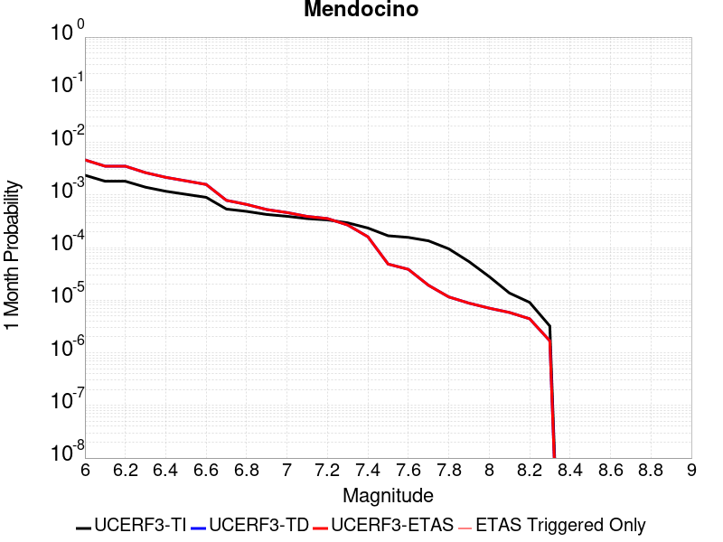 |  |  |

| Magnitude | 1 wk TI Prob | 1 wk TD Prob | 1 wk ETAS Prob | 1 wk ETAS/TD Gain | 1 wk ETAS Triggered Only | 1 mo TI Prob | 1 mo TD Prob | 1 mo ETAS Prob | 1 mo ETAS/TD Gain | 1 mo ETAS Triggered Only | 1 yr TI Prob | 1 yr TD Prob | 1 yr ETAS Prob | 1 yr ETAS/TD Gain | 1 yr ETAS Triggered Only | 10 yr TI Prob | 10 yr TD Prob | 10 yr ETAS Prob | 10 yr ETAS/TD Gain | 10 yr ETAS Triggered Only |
|-----|-----|-----|-----|-----|-----|-----|-----|-----|-----|-----|-----|-----|-----|-----|-----|-----|-----|-----|-----|-----|
| 6.0 | 5.5409013E-4 | 0.0010842695 | 0.0010842695 | 1.0 | 0.0 | 0.0023725112 | 0.0046364763 | 0.0046364763 | 1.0 | 0.0 | 0.028505474 | 0.054686487 | 0.054686487 | 1.0 | 0.0 | 0.25113493 | 0.41193637 | 0.41194227 | 1.0000143 | 1.0E-5 |
| 6.1 | 4.2515888E-4 | 8.2302367E-4 | 8.2302367E-4 | 1.0 | 0.0 | 0.0018208373 | 0.0035207777 | 0.0035207777 | 1.0 | 0.0 | 0.021944538 | 0.04175881 | 0.04175881 | 1.0 | 0.0 | 0.19899574 | 0.33000538 | 0.33001208 | 1.0000203 | 1.0E-5 |
| 6.2 | 4.2515888E-4 | 8.2302367E-4 | 8.2302367E-4 | 1.0 | 0.0 | 0.0018208373 | 0.0035207777 | 0.0035207777 | 1.0 | 0.0 | 0.021944538 | 0.04175881 | 0.04175881 | 1.0 | 0.0 | 0.19899574 | 0.33000538 | 0.33001208 | 1.0000203 | 1.0E-5 |
| 6.3 | 3.2773745E-4 | 6.1945E-4 | 6.1945E-4 | 1.0 | 0.0 | 0.0014038329 | 0.0026509117 | 0.0026509117 | 1.0 | 0.0 | 0.016958237 | 0.031600025 | 0.031600025 | 1.0 | 0.0 | 0.1572094 | 0.26082787 | 0.26083526 | 1.0000284 | 1.0E-5 |
| 6.4 | 2.7417165E-4 | 5.0487084E-4 | 5.0487084E-4 | 1.0 | 0.0 | 0.0011744922 | 0.0021610667 | 0.0021610667 | 1.0 | 0.0 | 0.014205975 | 0.025845023 | 0.025845023 | 1.0 | 0.0 | 0.13331394 | 0.21953028 | 0.2195381 | 1.0000355 | 1.0E-5 |
| 6.5 | 2.3984899E-4 | 4.3244875E-4 | 4.3244875E-4 | 1.0 | 0.0 | 0.0010275192 | 0.0018513233 | 0.0018513233 | 1.0 | 0.0 | 0.012438473 | 0.022187592 | 0.022187592 | 1.0 | 0.0 | 0.11764851 | 0.19208732 | 0.1920954 | 1.0000421 | 1.0E-5 |
| 6.6 | 2.1023539E-4 | 3.694396E-4 | 3.694396E-4 | 1.0 | 0.0 | 9.0069766E-4 | 0.0015818136 | 0.0015818136 | 1.0 | 0.0 | 0.010910975 | 0.018996473 | 0.018996473 | 1.0 | 0.0 | 0.10390546 | 0.16754363 | 0.16755196 | 1.0000497 | 1.0E-5 |
| 6.7 | 1.2592976E-4 | 1.8436273E-4 | 1.8436273E-4 | 1.0 | 0.0 | 5.395873E-4 | 7.8983034E-4 | 7.8983034E-4 | 1.0 | 0.0 | 0.006549705 | 0.009562257 | 0.009562257 | 1.0 | 0.0 | 0.063599944 | 0.09102063 | 0.09102972 | 1.0000999 | 1.0E-5 |
| 6.8 | 1.13663555E-4 | 1.5411148E-4 | 1.5411148E-4 | 1.0 | 0.0 | 4.8703855E-4 | 6.602942E-4 | 6.602942E-4 | 1.0 | 0.0 | 0.0059135845 | 0.008005299 | 0.008005299 | 1.0 | 0.0 | 0.057586733 | 0.077442236 | 0.07745146 | 1.0001191 | 1.0E-5 |
| 6.9 | 9.926894E-5 | 1.2309328E-4 | 1.2309328E-4 | 1.0 | 0.0 | 4.2536893E-4 | 5.27432E-4 | 5.27432E-4 | 1.0 | 0.0 | 0.0051665753 | 0.006401609 | 0.006401609 | 1.0 | 0.0 | 0.050480947 | 0.06290652 | 0.06291589 | 1.000149 | 1.0E-5 |
| 7.0 | 9.168125E-5 | 1.0792727E-4 | 1.0792727E-4 | 1.0 | 0.0 | 3.9286047E-4 | 4.6246313E-4 | 4.6246313E-4 | 1.0 | 0.0 | 0.004772591 | 0.005615582 | 0.005615582 | 1.0 | 0.0 | 0.04671385 | 0.055666428 | 0.05567587 | 1.0001696 | 1.0E-5 |
| 7.1 | 8.2854116E-5 | 9.113364E-5 | 9.113364E-5 | 1.0 | 0.0 | 3.5504074E-4 | 3.9051482E-4 | 3.9051482E-4 | 1.0 | 0.0 | 0.004314056 | 0.0047442196 | 0.0047442196 | 1.0 | 0.0 | 0.042312626 | 0.04752386 | 0.04753338 | 1.0002004 | 1.0E-5 |
| 7.2 | 7.8255274E-5 | 8.308425E-5 | 8.308425E-5 | 1.0 | 0.0 | 3.3533663E-4 | 3.5602757E-4 | 3.5602757E-4 | 1.0 | 0.0 | 0.0040750825 | 0.004326168 | 0.004326168 | 1.0 | 0.0 | 0.040011603 | 0.043567497 | 0.043577064 | 1.0002196 | 1.0E-5 |
| 7.3 | 6.887904E-5 | 6.265624E-5 | 6.265624E-5 | 1.0 | 0.0 | 2.9516246E-4 | 2.6849963E-4 | 2.6849963E-4 | 1.0 | 0.0 | 0.0035876823 | 0.0032641802 | 0.0032641802 | 1.0 | 0.0 | 0.035303112 | 0.033388566 | 0.033398233 | 1.0002896 | 1.0E-5 |
| 7.4 | 5.4898497E-5 | 3.7446447E-5 | 3.7446447E-5 | 1.0 | 0.0 | 2.3525805E-4 | 1.6047522E-4 | 1.6047522E-4 | 1.0 | 0.0 | 0.0028605047 | 0.0019520913 | 0.0019520913 | 1.0 | 0.0 | 0.02823963 | 0.020442199 | 0.020451995 | 1.0004792 | 1.0E-5 |
| 7.5 | 3.9103943E-5 | 1.13311135E-5 | 1.13311135E-5 | 1.0 | 0.0 | 1.6757756E-4 | 4.856102E-5 | 4.856102E-5 | 1.0 | 0.0 | 0.0020383475 | 5.910717E-4 | 5.910717E-4 | 1.0 | 0.0 | 0.020197518 | 0.0066394266 | 0.00664936 | 1.0014962 | 1.0E-5 |
| 7.6 | 3.641042E-5 | 9.005199E-6 | 9.005199E-6 | 1.0 | 0.0 | 1.5603533E-4 | 3.8593145E-5 | 3.8593145E-5 | 1.0 | 0.0 | 0.0018980748 | 4.6977162E-4 | 4.6977162E-4 | 1.0 | 0.0 | 0.018819444 | 0.005361907 | 0.0053718537 | 1.001855 | 1.0E-5 |
| 7.7 | 3.1318774E-5 | 4.4712315E-6 | 4.4712315E-6 | 1.0 | 0.0 | 1.342164E-4 | 1.9162282E-5 | 1.9162282E-5 | 1.0 | 0.0 | 0.0016328598 | 2.3327598E-4 | 2.3327598E-4 | 1.0 | 0.0 | 0.016209139 | 0.002875787 | 0.0028857582 | 1.0034673 | 1.0E-5 |
| 7.8 | 2.209241E-5 | 2.6924738E-6 | 2.6924738E-6 | 1.0 | 0.0 | 9.467832E-5 | 1.1539122E-5 | 1.1539122E-5 | 1.0 | 0.0 | 0.001152099 | 1.4047978E-4 | 1.4047978E-4 | 1.0 | 0.0 | 0.011461443 | 0.0017445653 | 0.0017545479 | 1.005722 | 1.0E-5 |
| 7.9 | 1.2640477E-5 | 2.0508048E-6 | 2.0508048E-6 | 1.0 | 0.0 | 5.4172346E-5 | 8.789133E-6 | 8.789133E-6 | 1.0 | 0.0 | 6.593487E-4 | 1.07002474E-4 | 1.07002474E-4 | 1.0 | 0.0 | 0.006573958 | 0.001303198 | 0.0013131851 | 1.0076635 | 1.0E-5 |
| 8.0 | 6.5548907E-6 | 1.6453664E-6 | 1.6453664E-6 | 1.0 | 0.0 | 2.8092087E-5 | 7.0515516E-6 | 7.0515516E-6 | 1.0 | 0.0 | 3.4196748E-4 | 8.584928E-5 | 8.584928E-5 | 1.0 | 0.0 | 0.0034144172 | 0.0010349348 | 0.0010449244 | 1.0096525 | 1.0E-5 |
| 8.1 | 3.1916707E-6 | 1.3641907E-6 | 1.3641907E-6 | 1.0 | 0.0 | 1.3678517E-5 | 5.8465184E-6 | 5.8465184E-6 | 1.0 | 0.0 | 1.6652321E-4 | 7.1179056E-5 | 7.1179056E-5 | 1.0 | 0.0 | 0.0016639848 | 8.661624E-4 | 8.7615376E-4 | 1.0115352 | 1.0E-5 |
| 8.2 | 2.1193785E-6 | 1.034535E-6 | 1.034535E-6 | 1.0 | 0.0 | 9.083019E-6 | 4.433714E-6 | 4.433714E-6 | 1.0 | 0.0 | 1.1058014E-4 | 5.397915E-5 | 5.397915E-5 | 1.0 | 0.0 | 0.0011052513 | 6.5282214E-4 | 6.5282214E-4 | 1.0 | 0.0 |
| 8.3 | 7.536878E-7 | 3.9417614E-7 | 3.9417614E-7 | 1.0 | 0.0 | 3.2300866E-6 | 1.6893252E-6 | 1.6893252E-6 | 1.0 | 0.0 | 3.9325594E-5 | 2.0567355E-5 | 2.0567355E-5 | 1.0 | 0.0 | 3.9318635E-4 | 2.4212114E-4 | 2.4212114E-4 | 1.0 | 0.0 |

## Bullion Mountains
*[(top)](#table-of-contents)*

| 1 Week | 1 Month | 1 Year | 10 Year |
|-----|-----|-----|-----|
|  |  |  |  |

| Magnitude | 1 wk TI Prob | 1 wk TD Prob | 1 wk ETAS Prob | 1 wk ETAS/TD Gain | 1 wk ETAS Triggered Only | 1 mo TI Prob | 1 mo TD Prob | 1 mo ETAS Prob | 1 mo ETAS/TD Gain | 1 mo ETAS Triggered Only | 1 yr TI Prob | 1 yr TD Prob | 1 yr ETAS Prob | 1 yr ETAS/TD Gain | 1 yr ETAS Triggered Only | 10 yr TI Prob | 10 yr TD Prob | 10 yr ETAS Prob | 10 yr ETAS/TD Gain | 10 yr ETAS Triggered Only |
|-----|-----|-----|-----|-----|-----|-----|-----|-----|-----|-----|-----|-----|-----|-----|-----|-----|-----|-----|-----|-----|
| 6.0 | 1.6420427E-5 | 1.4692933E-5 | 1.4692933E-5 | 1.0 | 0.0 | 7.037136E-5 | 6.296841E-5 | 6.296841E-5 | 1.0 | 0.0 | 8.5643446E-4 | 7.664091E-4 | 7.7640143E-4 | 1.0130379 | 1.0E-5 | 0.008531413 | 0.0076414533 | 0.007651377 | 1.0012987 | 1.0E-5 |
| 6.1 | 1.6420427E-5 | 1.4692933E-5 | 1.4692933E-5 | 1.0 | 0.0 | 7.037136E-5 | 6.296841E-5 | 6.296841E-5 | 1.0 | 0.0 | 8.5643446E-4 | 7.664091E-4 | 7.7640143E-4 | 1.0130379 | 1.0E-5 | 0.008531413 | 0.0076414533 | 0.007651377 | 1.0012987 | 1.0E-5 |
| 6.2 | 1.6420427E-5 | 1.4692933E-5 | 1.4692933E-5 | 1.0 | 0.0 | 7.037136E-5 | 6.296841E-5 | 6.296841E-5 | 1.0 | 0.0 | 8.5643446E-4 | 7.664091E-4 | 7.7640143E-4 | 1.0130379 | 1.0E-5 | 0.008531413 | 0.0076414533 | 0.007651377 | 1.0012987 | 1.0E-5 |
| 6.3 | 1.2046778E-5 | 9.862912E-6 | 9.862912E-6 | 1.0 | 0.0 | 5.1628023E-5 | 4.2269065E-5 | 4.2269065E-5 | 1.0 | 0.0 | 6.283899E-4 | 5.1452755E-4 | 5.245224E-4 | 1.0194253 | 1.0E-5 | 0.0062661595 | 0.005135644 | 0.005145593 | 1.0019372 | 1.0E-5 |
| 6.4 | 1.2046778E-5 | 9.862912E-6 | 9.862912E-6 | 1.0 | 0.0 | 5.1628023E-5 | 4.2269065E-5 | 4.2269065E-5 | 1.0 | 0.0 | 6.283899E-4 | 5.1452755E-4 | 5.245224E-4 | 1.0194253 | 1.0E-5 | 0.0062661595 | 0.005135644 | 0.005145593 | 1.0019372 | 1.0E-5 |
| 6.5 | 1.0244343E-5 | 7.879929E-6 | 7.879929E-6 | 1.0 | 0.0 | 4.390359E-5 | 3.3770804E-5 | 3.3770804E-5 | 1.0 | 0.0 | 5.343951E-4 | 4.1110266E-4 | 4.2109855E-4 | 1.0243149 | 1.0E-5 | 0.005331118 | 0.004105453 | 0.004115412 | 1.0024258 | 1.0E-5 |
| 6.6 | 9.605408E-6 | 7.177931E-6 | 7.177931E-6 | 1.0 | 0.0 | 4.1165385E-5 | 3.0762312E-5 | 3.0762312E-5 | 1.0 | 0.0 | 5.010733E-4 | 3.7448714E-4 | 3.844834E-4 | 1.0266932 | 1.0E-5 | 0.00499945 | 0.0037405582 | 0.0037505208 | 1.0026634 | 1.0E-5 |
| 6.7 | 8.60418E-6 | 6.1243827E-6 | 6.1243827E-6 | 1.0 | 0.0 | 3.687454E-5 | 2.62472E-5 | 2.62472E-5 | 1.0 | 0.0 | 4.48855E-4 | 3.195323E-4 | 3.295291E-4 | 1.0312858 | 1.0E-5 | 0.004479495 | 0.0031926408 | 0.003202609 | 1.0031222 | 1.0E-5 |
| 6.8 | 5.187994E-6 | 2.5633894E-6 | 2.5633894E-6 | 1.0 | 0.0 | 2.223407E-5 | 1.098593E-5 | 1.098593E-5 | 1.0 | 0.0 | 2.7066618E-4 | 1.3374949E-4 | 1.4374816E-4 | 1.0747566 | 1.0E-5 | 0.0027033675 | 0.0013370815 | 0.0013470682 | 1.0074689 | 1.0E-5 |
| 6.9 | 4.5302368E-6 | 2.344526E-6 | 2.344526E-6 | 1.0 | 0.0 | 1.9415156E-5 | 1.0047952E-5 | 1.0047952E-5 | 1.0 | 0.0 | 2.3635388E-4 | 1.2233092E-4 | 1.3232969E-4 | 1.0817355 | 1.0E-5 | 0.0023610266 | 0.0012230249 | 0.0012330128 | 1.0081664 | 1.0E-5 |
| 7.0 | 3.431668E-6 | 1.6884097E-6 | 1.6884097E-6 | 1.0 | 0.0 | 1.4707065E-5 | 7.2360417E-6 | 7.2360417E-6 | 1.0 | 0.0 | 1.7904381E-4 | 8.809881E-5 | 9.8097924E-5 | 1.1134989 | 1.0E-5 | 0.0017889962 | 8.809881E-4 | 8.9097925E-4 | 1.0113409 | 1.0E-5 |

## Pitas Point (Lower)-Montalvo
*[(top)](#table-of-contents)*

| 1 Week | 1 Month | 1 Year | 10 Year |
|-----|-----|-----|-----|
|  |  |  |  |

| Magnitude | 1 wk TI Prob | 1 wk TD Prob | 1 wk ETAS Prob | 1 wk ETAS/TD Gain | 1 wk ETAS Triggered Only | 1 mo TI Prob | 1 mo TD Prob | 1 mo ETAS Prob | 1 mo ETAS/TD Gain | 1 mo ETAS Triggered Only | 1 yr TI Prob | 1 yr TD Prob | 1 yr ETAS Prob | 1 yr ETAS/TD Gain | 1 yr ETAS Triggered Only | 10 yr TI Prob | 10 yr TD Prob | 10 yr ETAS Prob | 10 yr ETAS/TD Gain | 10 yr ETAS Triggered Only |
|-----|-----|-----|-----|-----|-----|-----|-----|-----|-----|-----|-----|-----|-----|-----|-----|-----|-----|-----|-----|-----|
| 6.0 | 5.2543637E-6 | 4.8380684E-6 | 4.8380684E-6 | 1.0 | 0.0 | 2.2518509E-5 | 2.0734415E-5 | 2.0734415E-5 | 1.0 | 0.0 | 2.7412834E-4 | 2.5241257E-4 | 2.5241257E-4 | 1.0 | 0.0 | 0.0027379042 | 0.0025212914 | 0.002531266 | 1.0039562 | 1.0E-5 |
| 6.1 | 5.2543637E-6 | 4.8380684E-6 | 4.8380684E-6 | 1.0 | 0.0 | 2.2518509E-5 | 2.0734415E-5 | 2.0734415E-5 | 1.0 | 0.0 | 2.7412834E-4 | 2.5241257E-4 | 2.5241257E-4 | 1.0 | 0.0 | 0.0027379042 | 0.0025212914 | 0.002531266 | 1.0039562 | 1.0E-5 |
| 6.2 | 5.2543637E-6 | 4.8380684E-6 | 4.8380684E-6 | 1.0 | 0.0 | 2.2518509E-5 | 2.0734415E-5 | 2.0734415E-5 | 1.0 | 0.0 | 2.7412834E-4 | 2.5241257E-4 | 2.5241257E-4 | 1.0 | 0.0 | 0.0027379042 | 0.0025212914 | 0.002531266 | 1.0039562 | 1.0E-5 |
| 6.3 | 5.2543637E-6 | 4.8380684E-6 | 4.8380684E-6 | 1.0 | 0.0 | 2.2518509E-5 | 2.0734415E-5 | 2.0734415E-5 | 1.0 | 0.0 | 2.7412834E-4 | 2.5241257E-4 | 2.5241257E-4 | 1.0 | 0.0 | 0.0027379042 | 0.0025212914 | 0.002531266 | 1.0039562 | 1.0E-5 |
| 6.4 | 5.2543637E-6 | 4.8380684E-6 | 4.8380684E-6 | 1.0 | 0.0 | 2.2518509E-5 | 2.0734415E-5 | 2.0734415E-5 | 1.0 | 0.0 | 2.7412834E-4 | 2.5241257E-4 | 2.5241257E-4 | 1.0 | 0.0 | 0.0027379042 | 0.0025212914 | 0.002531266 | 1.0039562 | 1.0E-5 |
| 6.5 | 5.2543637E-6 | 4.8380684E-6 | 4.8380684E-6 | 1.0 | 0.0 | 2.2518509E-5 | 2.0734415E-5 | 2.0734415E-5 | 1.0 | 0.0 | 2.7412834E-4 | 2.5241257E-4 | 2.5241257E-4 | 1.0 | 0.0 | 0.0027379042 | 0.0025212914 | 0.002531266 | 1.0039562 | 1.0E-5 |
| 6.6 | 5.2543637E-6 | 4.8380684E-6 | 4.8380684E-6 | 1.0 | 0.0 | 2.2518509E-5 | 2.0734415E-5 | 2.0734415E-5 | 1.0 | 0.0 | 2.7412834E-4 | 2.5241257E-4 | 2.5241257E-4 | 1.0 | 0.0 | 0.0027379042 | 0.0025212914 | 0.002531266 | 1.0039562 | 1.0E-5 |
| 6.7 | 5.2543637E-6 | 4.8380684E-6 | 4.8380684E-6 | 1.0 | 0.0 | 2.2518509E-5 | 2.0734415E-5 | 2.0734415E-5 | 1.0 | 0.0 | 2.7412834E-4 | 2.5241257E-4 | 2.5241257E-4 | 1.0 | 0.0 | 0.0027379042 | 0.0025212914 | 0.002531266 | 1.0039562 | 1.0E-5 |
| 6.8 | 5.2543637E-6 | 4.8380684E-6 | 4.8380684E-6 | 1.0 | 0.0 | 2.2518509E-5 | 2.0734415E-5 | 2.0734415E-5 | 1.0 | 0.0 | 2.7412834E-4 | 2.5241257E-4 | 2.5241257E-4 | 1.0 | 0.0 | 0.0027379042 | 0.0025212914 | 0.002531266 | 1.0039562 | 1.0E-5 |
| 6.9 | 5.2543637E-6 | 4.8380684E-6 | 4.8380684E-6 | 1.0 | 0.0 | 2.2518509E-5 | 2.0734415E-5 | 2.0734415E-5 | 1.0 | 0.0 | 2.7412834E-4 | 2.5241257E-4 | 2.5241257E-4 | 1.0 | 0.0 | 0.0027379042 | 0.0025212914 | 0.002531266 | 1.0039562 | 1.0E-5 |
| 7.0 | 5.2543637E-6 | 4.8380684E-6 | 4.8380684E-6 | 1.0 | 0.0 | 2.2518509E-5 | 2.0734415E-5 | 2.0734415E-5 | 1.0 | 0.0 | 2.7412834E-4 | 2.5241257E-4 | 2.5241257E-4 | 1.0 | 0.0 | 0.0027379042 | 0.0025212914 | 0.002531266 | 1.0039562 | 1.0E-5 |
| 7.1 | 5.2543637E-6 | 4.8380684E-6 | 4.8380684E-6 | 1.0 | 0.0 | 2.2518509E-5 | 2.0734415E-5 | 2.0734415E-5 | 1.0 | 0.0 | 2.7412834E-4 | 2.5241257E-4 | 2.5241257E-4 | 1.0 | 0.0 | 0.0027379042 | 0.0025212914 | 0.002531266 | 1.0039562 | 1.0E-5 |
| 7.2 | 5.2458695E-6 | 4.829222E-6 | 4.829222E-6 | 1.0 | 0.0 | 2.2482105E-5 | 2.0696503E-5 | 2.0696503E-5 | 1.0 | 0.0 | 2.7368523E-4 | 2.519511E-4 | 2.519511E-4 | 1.0 | 0.0 | 0.0027334841 | 0.002516687 | 0.0025266618 | 1.0039635 | 1.0E-5 |
| 7.3 | 5.22665E-6 | 4.8091388E-6 | 4.8091388E-6 | 1.0 | 0.0 | 2.2399736E-5 | 2.0610434E-5 | 2.0610434E-5 | 1.0 | 0.0 | 2.7268266E-4 | 2.5090345E-4 | 2.5090345E-4 | 1.0 | 0.0 | 0.002723483 | 0.0025062342 | 0.0025162091 | 1.00398 | 1.0E-5 |
| 7.4 | 5.210642E-6 | 4.7923504E-6 | 4.7923504E-6 | 1.0 | 0.0 | 2.233113E-5 | 2.0538486E-5 | 2.0538486E-5 | 1.0 | 0.0 | 2.718476E-4 | 2.500277E-4 | 2.500277E-4 | 1.0 | 0.0 | 0.002715153 | 0.0024974963 | 0.0025074712 | 1.003994 | 1.0E-5 |
| 7.5 | 5.1226016E-6 | 4.700235E-6 | 4.700235E-6 | 1.0 | 0.0 | 2.1953823E-5 | 2.014371E-5 | 2.014371E-5 | 1.0 | 0.0 | 2.67255E-4 | 2.4522239E-4 | 2.4522239E-4 | 1.0 | 0.0 | 0.0026693381 | 0.0024495495 | 0.0024595251 | 1.0040724 | 1.0E-5 |
| 7.6 | 4.8796987E-6 | 4.4451276E-6 | 4.4451276E-6 | 1.0 | 0.0 | 2.0912828E-5 | 1.905041E-5 | 1.905041E-5 | 1.0 | 0.0 | 2.5458392E-4 | 2.3191435E-4 | 2.3191435E-4 | 1.0 | 0.0 | 0.0025429246 | 0.002316754 | 0.0023267309 | 1.0043064 | 1.0E-5 |
| 7.7 | 4.0834398E-6 | 3.6092747E-6 | 3.6092747E-6 | 1.0 | 0.0 | 1.7500339E-5 | 1.546823E-5 | 1.546823E-5 | 1.0 | 0.0 | 2.1304579E-4 | 1.8830966E-4 | 1.8830966E-4 | 1.0 | 0.0 | 0.0021284167 | 0.0018815246 | 0.0018915058 | 1.0053048 | 1.0E-5 |
| 7.8 | 2.5445438E-6 | 2.1213307E-6 | 2.1213307E-6 | 1.0 | 0.0 | 1.0905142E-5 | 9.091385E-6 | 9.091385E-6 | 1.0 | 0.0 | 1.3276201E-4 | 1.1068204E-4 | 1.1068204E-4 | 1.0 | 0.0 | 0.0013268272 | 0.0011062738 | 0.0011162627 | 1.0090294 | 1.0E-5 |
| 7.9 | 4.1677114E-7 | 3.3295146E-7 | 3.3295146E-7 | 1.0 | 0.0 | 1.7861609E-6 | 1.4269341E-6 | 1.4269341E-6 | 1.0 | 0.0 | 2.1746291E-5 | 1.7372788E-5 | 1.7372788E-5 | 1.0 | 0.0 | 2.1744163E-4 | 1.7371461E-4 | 1.7371461E-4 | 1.0 | 0.0 |
| 8.0 | 7.791402E-9 | 5.6839005E-9 | 5.6839005E-9 | 1.0 | 0.0 | 3.3391725E-8 | 2.4359574E-8 | 2.4359574E-8 | 1.0 | 0.0 | 4.0654416E-7 | 2.9657778E-7 | 2.9657778E-7 | 1.0 | 0.0 | 4.065434E-6 | 2.965776E-6 | 2.965776E-6 | 1.0 | 0.0 |

## Raymond
*[(top)](#table-of-contents)*

| 1 Week | 1 Month | 1 Year | 10 Year |
|-----|-----|-----|-----|
|  |  |  |  |

| Magnitude | 1 wk TI Prob | 1 wk TD Prob | 1 wk ETAS Prob | 1 wk ETAS/TD Gain | 1 wk ETAS Triggered Only | 1 mo TI Prob | 1 mo TD Prob | 1 mo ETAS Prob | 1 mo ETAS/TD Gain | 1 mo ETAS Triggered Only | 1 yr TI Prob | 1 yr TD Prob | 1 yr ETAS Prob | 1 yr ETAS/TD Gain | 1 yr ETAS Triggered Only | 10 yr TI Prob | 10 yr TD Prob | 10 yr ETAS Prob | 10 yr ETAS/TD Gain | 10 yr ETAS Triggered Only |
|-----|-----|-----|-----|-----|-----|-----|-----|-----|-----|-----|-----|-----|-----|-----|-----|-----|-----|-----|-----|-----|
| 6.0 | 1.5157413E-5 | 1.5811209E-5 | 1.5811209E-5 | 1.0 | 0.0 | 6.4958724E-5 | 6.776071E-5 | 6.776071E-5 | 1.0 | 0.0 | 7.905855E-4 | 8.2469947E-4 | 8.2469947E-4 | 1.0 | 0.0 | 0.007877788 | 0.008218907 | 0.0082288245 | 1.0012068 | 1.0E-5 |
| 6.1 | 1.5157413E-5 | 1.5811209E-5 | 1.5811209E-5 | 1.0 | 0.0 | 6.4958724E-5 | 6.776071E-5 | 6.776071E-5 | 1.0 | 0.0 | 7.905855E-4 | 8.2469947E-4 | 8.2469947E-4 | 1.0 | 0.0 | 0.007877788 | 0.008218907 | 0.0082288245 | 1.0012068 | 1.0E-5 |
| 6.2 | 1.5157413E-5 | 1.5811209E-5 | 1.5811209E-5 | 1.0 | 0.0 | 6.4958724E-5 | 6.776071E-5 | 6.776071E-5 | 1.0 | 0.0 | 7.905855E-4 | 8.2469947E-4 | 8.2469947E-4 | 1.0 | 0.0 | 0.007877788 | 0.008218907 | 0.0082288245 | 1.0012068 | 1.0E-5 |
| 6.3 | 1.5157413E-5 | 1.5811209E-5 | 1.5811209E-5 | 1.0 | 0.0 | 6.4958724E-5 | 6.776071E-5 | 6.776071E-5 | 1.0 | 0.0 | 7.905855E-4 | 8.2469947E-4 | 8.2469947E-4 | 1.0 | 0.0 | 0.007877788 | 0.008218907 | 0.0082288245 | 1.0012068 | 1.0E-5 |
| 6.4 | 1.3941944E-5 | 1.445569E-5 | 1.445569E-5 | 1.0 | 0.0 | 5.9749822E-5 | 6.1951614E-5 | 6.1951614E-5 | 1.0 | 0.0 | 7.2721124E-4 | 7.540232E-4 | 7.540232E-4 | 1.0 | 0.0 | 0.007248361 | 0.0075169806 | 0.0075169806 | 1.0 | 0.0 |
| 6.5 | 1.3941944E-5 | 1.445569E-5 | 1.445569E-5 | 1.0 | 0.0 | 5.9749822E-5 | 6.1951614E-5 | 6.1951614E-5 | 1.0 | 0.0 | 7.2721124E-4 | 7.540232E-4 | 7.540232E-4 | 1.0 | 0.0 | 0.007248361 | 0.0075169806 | 0.0075169806 | 1.0 | 0.0 |
| 6.6 | 1.0542609E-5 | 1.0671884E-5 | 1.0671884E-5 | 1.0 | 0.0 | 4.5181827E-5 | 4.5735876E-5 | 4.5735876E-5 | 1.0 | 0.0 | 5.499499E-4 | 5.566975E-4 | 5.566975E-4 | 1.0 | 0.0 | 0.005485909 | 0.005553589 | 0.005553589 | 1.0 | 0.0 |
| 6.7 | 1.0542609E-5 | 1.0671884E-5 | 1.0671884E-5 | 1.0 | 0.0 | 4.5181827E-5 | 4.5735876E-5 | 4.5735876E-5 | 1.0 | 0.0 | 5.499499E-4 | 5.566975E-4 | 5.566975E-4 | 1.0 | 0.0 | 0.005485909 | 0.005553589 | 0.005553589 | 1.0 | 0.0 |
| 6.8 | 1.0079132E-5 | 1.01774E-5 | 1.01774E-5 | 1.0 | 0.0 | 4.3195567E-5 | 4.361673E-5 | 4.361673E-5 | 1.0 | 0.0 | 5.257791E-4 | 5.3090963E-4 | 5.3090963E-4 | 1.0 | 0.0 | 0.0052453685 | 0.005296961 | 0.005296961 | 1.0 | 0.0 |
| 6.9 | 7.721598E-6 | 7.5494972E-6 | 7.5494972E-6 | 1.0 | 0.0 | 3.3092143E-5 | 3.2354594E-5 | 3.2354594E-5 | 1.0 | 0.0 | 4.0282236E-4 | 3.9384718E-4 | 3.9384718E-4 | 1.0 | 0.0 | 0.0040209293 | 0.003931624 | 0.003931624 | 1.0 | 0.0 |
| 7.0 | 7.137566E-6 | 6.911867E-6 | 6.911867E-6 | 1.0 | 0.0 | 3.058921E-5 | 2.9621957E-5 | 2.9621957E-5 | 1.0 | 0.0 | 3.7236E-4 | 3.6058872E-4 | 3.6058872E-4 | 1.0 | 0.0 | 0.0037173668 | 0.0036001527 | 0.0036001527 | 1.0 | 0.0 |
| 7.1 | 5.654976E-6 | 5.3000267E-6 | 5.3000267E-6 | 1.0 | 0.0 | 2.4235387E-5 | 2.2714205E-5 | 2.2714205E-5 | 1.0 | 0.0 | 2.9502588E-4 | 2.7651055E-4 | 2.7651055E-4 | 1.0 | 0.0 | 0.0029463451 | 0.0027616941 | 0.0027616941 | 1.0 | 0.0 |
| 7.2 | 4.9358455E-6 | 4.5271095E-6 | 4.5271095E-6 | 1.0 | 0.0 | 2.1153453E-5 | 1.9401756E-5 | 1.9401756E-5 | 1.0 | 0.0 | 2.5751285E-4 | 2.361909E-4 | 2.361909E-4 | 1.0 | 0.0 | 0.0025721465 | 0.002359419 | 0.002359419 | 1.0 | 0.0 |
| 7.3 | 4.2368597E-6 | 3.806038E-6 | 3.806038E-6 | 1.0 | 0.0 | 1.8157843E-5 | 1.631149E-5 | 1.631149E-5 | 1.0 | 0.0 | 2.2104931E-4 | 1.985744E-4 | 1.985744E-4 | 1.0 | 0.0 | 0.0022082955 | 0.0019839865 | 0.0019839865 | 1.0 | 0.0 |
| 7.4 | 3.4999923E-6 | 3.0441297E-6 | 3.0441297E-6 | 1.0 | 0.0 | 1.49998805E-5 | 1.3046205E-5 | 1.3046205E-5 | 1.0 | 0.0 | 1.8260824E-4 | 1.5882605E-4 | 1.5882605E-4 | 1.0 | 0.0 | 0.0018245826 | 0.0015871392 | 0.0015871392 | 1.0 | 0.0 |
| 7.5 | 2.738017E-6 | 2.3022947E-6 | 2.3022947E-6 | 1.0 | 0.0 | 1.1734306E-5 | 9.866941E-6 | 9.866941E-6 | 1.0 | 0.0 | 1.428558E-4 | 1.2012344E-4 | 1.2012344E-4 | 1.0 | 0.0 | 0.0014276401 | 0.0012005976 | 0.0012005976 | 1.0 | 0.0 |
| 7.6 | 1.8186392E-6 | 1.4424808E-6 | 1.4424808E-6 | 1.0 | 0.0 | 7.794145E-6 | 6.182046E-6 | 6.182046E-6 | 1.0 | 0.0 | 9.488958E-5 | 7.526385E-5 | 7.526385E-5 | 1.0 | 0.0 | 9.4849075E-4 | 7.523932E-4 | 7.523932E-4 | 1.0 | 0.0 |
| 7.7 | 1.0660348E-6 | 7.64514E-7 | 7.64514E-7 | 1.0 | 0.0 | 4.5687125E-6 | 3.2764847E-6 | 3.2764847E-6 | 1.0 | 0.0 | 5.5622655E-5 | 3.989049E-5 | 3.989049E-5 | 1.0 | 0.0 | 5.5608735E-4 | 3.9884052E-4 | 3.9884052E-4 | 1.0 | 0.0 |
| 7.8 | 6.913602E-7 | 4.3215485E-7 | 4.3215485E-7 | 1.0 | 0.0 | 2.962969E-6 | 1.8520909E-6 | 1.8520909E-6 | 1.0 | 0.0 | 3.607355E-5 | 2.254898E-5 | 2.254898E-5 | 1.0 | 0.0 | 3.6067693E-4 | 2.2547293E-4 | 2.2547293E-4 | 1.0 | 0.0 |
| 7.9 | 7.425201E-8 | 5.3234693E-8 | 5.3234693E-8 | 1.0 | 0.0 | 3.1822285E-7 | 2.2814866E-7 | 2.2814866E-7 | 1.0 | 0.0 | 3.874356E-6 | 2.7777078E-6 | 2.7777078E-6 | 1.0 | 0.0 | 3.8742884E-5 | 2.7776861E-5 | 2.7776861E-5 | 1.0 | 0.0 |

## Contra Costa (Lafayette) 2011 CFM
*[(top)](#table-of-contents)*

| 1 Week | 1 Month | 1 Year | 10 Year |
|-----|-----|-----|-----|
|  |  | 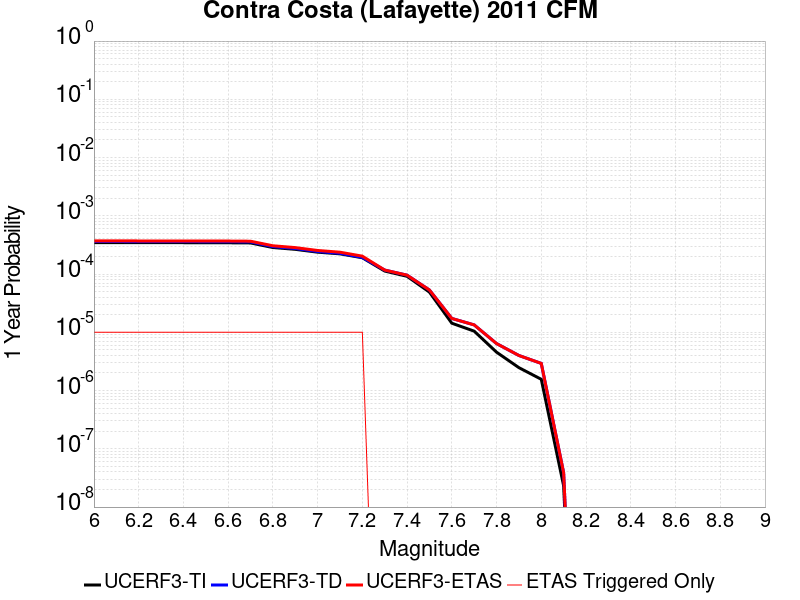 |  |

| Magnitude | 1 wk TI Prob | 1 wk TD Prob | 1 wk ETAS Prob | 1 wk ETAS/TD Gain | 1 wk ETAS Triggered Only | 1 mo TI Prob | 1 mo TD Prob | 1 mo ETAS Prob | 1 mo ETAS/TD Gain | 1 mo ETAS Triggered Only | 1 yr TI Prob | 1 yr TD Prob | 1 yr ETAS Prob | 1 yr ETAS/TD Gain | 1 yr ETAS Triggered Only | 10 yr TI Prob | 10 yr TD Prob | 10 yr ETAS Prob | 10 yr ETAS/TD Gain | 10 yr ETAS Triggered Only |
|-----|-----|-----|-----|-----|-----|-----|-----|-----|-----|-----|-----|-----|-----|-----|-----|-----|-----|-----|-----|-----|
| 6.0 | 6.655419E-6 | 6.9375023E-6 | 6.9375023E-6 | 1.0 | 0.0 | 2.8522913E-5 | 2.9731826E-5 | 2.9731826E-5 | 1.0 | 0.0 | 3.472111E-4 | 3.6192682E-4 | 3.719232E-4 | 1.0276198 | 1.0E-5 | 0.0034666911 | 0.0036182925 | 0.0036282563 | 1.0027537 | 1.0E-5 |
| 6.1 | 6.655419E-6 | 6.9375023E-6 | 6.9375023E-6 | 1.0 | 0.0 | 2.8522913E-5 | 2.9731826E-5 | 2.9731826E-5 | 1.0 | 0.0 | 3.472111E-4 | 3.6192682E-4 | 3.719232E-4 | 1.0276198 | 1.0E-5 | 0.0034666911 | 0.0036182925 | 0.0036282563 | 1.0027537 | 1.0E-5 |
| 6.2 | 6.6254133E-6 | 6.9059106E-6 | 6.9059106E-6 | 1.0 | 0.0 | 2.839432E-5 | 2.9596435E-5 | 2.9596435E-5 | 1.0 | 0.0 | 3.45646E-4 | 3.60279E-4 | 3.702754E-4 | 1.0277463 | 1.0E-5 | 0.003451089 | 0.0036018675 | 0.0036118315 | 1.0027664 | 1.0E-5 |
| 6.3 | 6.6254133E-6 | 6.9059106E-6 | 6.9059106E-6 | 1.0 | 0.0 | 2.839432E-5 | 2.9596435E-5 | 2.9596435E-5 | 1.0 | 0.0 | 3.45646E-4 | 3.60279E-4 | 3.702754E-4 | 1.0277463 | 1.0E-5 | 0.003451089 | 0.0036018675 | 0.0036118315 | 1.0027664 | 1.0E-5 |
| 6.4 | 6.6254133E-6 | 6.9059106E-6 | 6.9059106E-6 | 1.0 | 0.0 | 2.839432E-5 | 2.9596435E-5 | 2.9596435E-5 | 1.0 | 0.0 | 3.45646E-4 | 3.60279E-4 | 3.702754E-4 | 1.0277463 | 1.0E-5 | 0.003451089 | 0.0036018675 | 0.0036118315 | 1.0027664 | 1.0E-5 |
| 6.5 | 6.606445E-6 | 6.8854583E-6 | 6.8854583E-6 | 1.0 | 0.0 | 2.8313027E-5 | 2.9508785E-5 | 2.9508785E-5 | 1.0 | 0.0 | 3.4465658E-4 | 3.592122E-4 | 3.692086E-4 | 1.0278287 | 1.0E-5 | 0.0034412253 | 0.003591234 | 0.003601198 | 1.0027746 | 1.0E-5 |
| 6.6 | 6.59966E-6 | 6.877996E-6 | 6.877996E-6 | 1.0 | 0.0 | 2.828395E-5 | 2.9476803E-5 | 2.9476803E-5 | 1.0 | 0.0 | 3.4430268E-4 | 3.5882296E-4 | 3.6881937E-4 | 1.0278589 | 1.0E-5 | 0.0034376972 | 0.0035873542 | 0.0035973184 | 1.0027776 | 1.0E-5 |
| 6.7 | 6.5570975E-6 | 6.8319846E-6 | 6.8319846E-6 | 1.0 | 0.0 | 2.8101544E-5 | 2.9279618E-5 | 2.9279618E-5 | 1.0 | 0.0 | 3.4208258E-4 | 3.56423E-4 | 3.6641944E-4 | 1.0280466 | 1.0E-5 | 0.0034155648 | 0.003563432 | 0.0035733962 | 1.0027963 | 1.0E-5 |
| 6.8 | 5.472255E-6 | 5.6749436E-6 | 5.6749436E-6 | 1.0 | 0.0 | 2.345231E-5 | 2.4320963E-5 | 2.4320963E-5 | 1.0 | 0.0 | 2.8549446E-4 | 2.9606794E-4 | 3.06065E-4 | 1.033766 | 1.0E-5 | 0.0028512797 | 0.0029615057 | 0.0029714762 | 1.0033667 | 1.0E-5 |
| 6.9 | 5.092346E-6 | 5.265289E-6 | 5.265289E-6 | 1.0 | 0.0 | 2.1824157E-5 | 2.2565331E-5 | 2.2565331E-5 | 1.0 | 0.0 | 2.656767E-4 | 2.7469863E-4 | 2.8469588E-4 | 1.0363935 | 1.0E-5 | 0.002653593 | 0.0027483534 | 0.002758326 | 1.0036285 | 1.0E-5 |
| 7.0 | 4.5525762E-6 | 4.6785885E-6 | 4.6785885E-6 | 1.0 | 0.0 | 1.9510895E-5 | 2.005094E-5 | 2.005094E-5 | 1.0 | 0.0 | 2.3751926E-4 | 2.4409314E-4 | 2.540907E-4 | 1.0409579 | 1.0E-5 | 0.0023726553 | 0.0024430032 | 0.0024529789 | 1.0040833 | 1.0E-5 |
| 7.1 | 4.261504E-6 | 4.35774E-6 | 4.35774E-6 | 1.0 | 0.0 | 1.826346E-5 | 1.8675897E-5 | 1.8675897E-5 | 1.0 | 0.0 | 2.2233493E-4 | 2.2735559E-4 | 2.373533E-4 | 1.0439739 | 1.0E-5 | 0.002221126 | 0.002275974 | 0.0022859513 | 1.0043837 | 1.0E-5 |
| 7.2 | 3.654114E-6 | 3.6984209E-6 | 3.6984209E-6 | 1.0 | 0.0 | 1.5660395E-5 | 1.585028E-5 | 1.585028E-5 | 1.0 | 0.0 | 1.9064861E-4 | 1.9296032E-4 | 2.0295838E-4 | 1.0518141 | 1.0E-5 | 0.0019048514 | 0.00193262 | 0.0019426006 | 1.0051643 | 1.0E-5 |
| 7.3 | 2.1595129E-6 | 2.2452418E-6 | 2.2452418E-6 | 1.0 | 0.0 | 9.255023E-6 | 9.62243E-6 | 9.62243E-6 | 1.0 | 0.0 | 1.1267407E-4 | 1.1714683E-4 | 1.1714683E-4 | 1.0 | 0.0 | 0.0011261696 | 0.0011755638 | 0.0011755638 | 1.0 | 0.0 |
| 7.4 | 1.7532738E-6 | 1.834373E-6 | 1.834373E-6 | 1.0 | 0.0 | 7.5140088E-6 | 7.861575E-6 | 7.861575E-6 | 1.0 | 0.0 | 9.147922E-5 | 9.5710515E-5 | 9.5710515E-5 | 1.0 | 0.0 | 9.144157E-4 | 9.6116145E-4 | 9.6116145E-4 | 1.0 | 0.0 |
| 7.5 | 9.387875E-7 | 1.0200912E-6 | 1.0200912E-6 | 1.0 | 0.0 | 4.0233685E-6 | 4.371812E-6 | 4.371812E-6 | 1.0 | 0.0 | 4.8983413E-5 | 5.3225525E-5 | 5.3225525E-5 | 1.0 | 0.0 | 4.897262E-4 | 5.3627975E-4 | 5.3627975E-4 | 1.0 | 0.0 |
| 7.6 | 2.7471893E-7 | 3.3163536E-7 | 3.3163536E-7 | 1.0 | 0.0 | 1.1773664E-6 | 1.4212936E-6 | 1.4212936E-6 | 1.0 | 0.0 | 1.433434E-5 | 1.7304113E-5 | 1.7304113E-5 | 1.0 | 0.0 | 1.4333417E-4 | 1.7699305E-4 | 1.7699305E-4 | 1.0 | 0.0 |
| 7.7 | 2.0057985E-7 | 2.569393E-7 | 2.569393E-7 | 1.0 | 0.0 | 8.596276E-7 | 1.1011679E-6 | 1.1011679E-6 | 1.0 | 0.0 | 1.0465916E-5 | 1.3406638E-5 | 1.3406638E-5 | 1.0 | 0.0 | 1.0465423E-4 | 1.379805E-4 | 1.379805E-4 | 1.0 | 0.0 |
| 7.8 | 8.7403905E-8 | 1.2287957E-7 | 1.2287957E-7 | 1.0 | 0.0 | 3.745881E-7 | 5.2662665E-7 | 5.2662665E-7 | 1.0 | 0.0 | 4.5606007E-6 | 6.4116603E-6 | 6.4116603E-6 | 1.0 | 0.0 | 4.560507E-5 | 6.63799E-5 | 6.63799E-5 | 1.0 | 0.0 |
| 7.9 | 4.740233E-8 | 7.665964E-8 | 7.665964E-8 | 1.0 | 0.0 | 2.0315284E-7 | 3.285413E-7 | 3.285413E-7 | 1.0 | 0.0 | 2.473383E-6 | 3.9999827E-6 | 3.9999827E-6 | 1.0 | 0.0 | 2.4733554E-5 | 4.1536958E-5 | 4.1536958E-5 | 1.0 | 0.0 |
| 8.0 | 2.99164E-8 | 5.604893E-8 | 5.604893E-8 | 1.0 | 0.0 | 1.2821314E-7 | 2.402097E-7 | 2.402097E-7 | 1.0 | 0.0 | 1.5609938E-6 | 2.9245489E-6 | 2.9245489E-6 | 1.0 | 0.0 | 1.5609829E-5 | 3.0269766E-5 | 3.0269766E-5 | 1.0 | 0.0 |
| 8.1 | 4.431212E-10 | 7.4392104E-10 | 7.4392104E-10 | 1.0 | 0.0 | 1.899091E-9 | 3.1882321E-9 | 3.1882321E-9 | 1.0 | 0.0 | 2.3121432E-8 | 3.8816726E-8 | 3.8816726E-8 | 1.0 | 0.0 | 2.312143E-7 | 3.9698105E-7 | 3.9698105E-7 | 1.0 | 0.0 |

## Kern Canyon (Lake Isabella) 2011
*[(top)](#table-of-contents)*

| 1 Week | 1 Month | 1 Year | 10 Year |
|-----|-----|-----|-----|
|  |  |  |  |

| Magnitude | 1 wk TI Prob | 1 wk TD Prob | 1 wk ETAS Prob | 1 wk ETAS/TD Gain | 1 wk ETAS Triggered Only | 1 mo TI Prob | 1 mo TD Prob | 1 mo ETAS Prob | 1 mo ETAS/TD Gain | 1 mo ETAS Triggered Only | 1 yr TI Prob | 1 yr TD Prob | 1 yr ETAS Prob | 1 yr ETAS/TD Gain | 1 yr ETAS Triggered Only | 10 yr TI Prob | 10 yr TD Prob | 10 yr ETAS Prob | 10 yr ETAS/TD Gain | 10 yr ETAS Triggered Only |
|-----|-----|-----|-----|-----|-----|-----|-----|-----|-----|-----|-----|-----|-----|-----|-----|-----|-----|-----|-----|-----|
| 6.0 | 4.2387383E-6 | 4.0016826E-6 | 4.0016826E-6 | 1.0 | 0.0 | 1.8165894E-5 | 1.7149967E-5 | 1.7149967E-5 | 1.0 | 0.0 | 2.2114732E-4 | 2.087827E-4 | 2.1878061E-4 | 1.0478867 | 1.0E-5 | 0.0022092736 | 0.0020860494 | 0.0020960285 | 1.0047837 | 1.0E-5 |
| 6.1 | 4.2387383E-6 | 4.0016826E-6 | 4.0016826E-6 | 1.0 | 0.0 | 1.8165894E-5 | 1.7149967E-5 | 1.7149967E-5 | 1.0 | 0.0 | 2.2114732E-4 | 2.087827E-4 | 2.1878061E-4 | 1.0478867 | 1.0E-5 | 0.0022092736 | 0.0020860494 | 0.0020960285 | 1.0047837 | 1.0E-5 |
| 6.2 | 4.2387383E-6 | 4.0016826E-6 | 4.0016826E-6 | 1.0 | 0.0 | 1.8165894E-5 | 1.7149967E-5 | 1.7149967E-5 | 1.0 | 0.0 | 2.2114732E-4 | 2.087827E-4 | 2.1878061E-4 | 1.0478867 | 1.0E-5 | 0.0022092736 | 0.0020860494 | 0.0020960285 | 1.0047837 | 1.0E-5 |
| 6.3 | 4.2387383E-6 | 4.0016826E-6 | 4.0016826E-6 | 1.0 | 0.0 | 1.8165894E-5 | 1.7149967E-5 | 1.7149967E-5 | 1.0 | 0.0 | 2.2114732E-4 | 2.087827E-4 | 2.1878061E-4 | 1.0478867 | 1.0E-5 | 0.0022092736 | 0.0020860494 | 0.0020960285 | 1.0047837 | 1.0E-5 |
| 6.4 | 4.2387383E-6 | 4.0016826E-6 | 4.0016826E-6 | 1.0 | 0.0 | 1.8165894E-5 | 1.7149967E-5 | 1.7149967E-5 | 1.0 | 0.0 | 2.2114732E-4 | 2.087827E-4 | 2.1878061E-4 | 1.0478867 | 1.0E-5 | 0.0022092736 | 0.0020860494 | 0.0020960285 | 1.0047837 | 1.0E-5 |
| 6.5 | 2.7857532E-6 | 2.5178942E-6 | 2.5178942E-6 | 1.0 | 0.0 | 1.1938888E-5 | 1.0790933E-5 | 1.0790933E-5 | 1.0 | 0.0 | 1.4534626E-4 | 1.3137201E-4 | 1.3137201E-4 | 1.0 | 0.0 | 0.0014525123 | 0.0013129762 | 0.0013129762 | 1.0 | 0.0 |
| 6.6 | 2.2233348E-6 | 1.9441447E-6 | 1.9441447E-6 | 1.0 | 0.0 | 9.528543E-6 | 8.332023E-6 | 8.332023E-6 | 1.0 | 0.0 | 1.1600384E-4 | 1.0143774E-4 | 1.0143774E-4 | 1.0 | 0.0 | 0.001159433 | 0.0010139231 | 0.0010139231 | 1.0 | 0.0 |
| 6.7 | 2.1635126E-6 | 1.8835244E-6 | 1.8835244E-6 | 1.0 | 0.0 | 9.272164E-6 | 8.072223E-6 | 8.072223E-6 | 1.0 | 0.0 | 1.1288274E-4 | 9.827496E-5 | 9.827496E-5 | 1.0 | 0.0 | 0.0011282542 | 9.823232E-4 | 9.823232E-4 | 1.0 | 0.0 |
| 6.8 | 1.8685711E-6 | 1.5831604E-6 | 1.5831604E-6 | 1.0 | 0.0 | 8.008137E-6 | 6.7849555E-6 | 6.7849555E-6 | 1.0 | 0.0 | 9.74947E-5 | 8.260376E-5 | 8.260376E-5 | 1.0 | 0.0 | 9.745194E-4 | 8.2573545E-4 | 8.2573545E-4 | 1.0 | 0.0 |
| 6.9 | 1.5815071E-6 | 1.3065078E-6 | 1.3065078E-6 | 1.0 | 0.0 | 6.77787E-6 | 5.5993073E-6 | 5.5993073E-6 | 1.0 | 0.0 | 8.251744E-5 | 6.816946E-5 | 6.816946E-5 | 1.0 | 0.0 | 8.248681E-4 | 6.8148813E-4 | 6.8148813E-4 | 1.0 | 0.0 |
| 7.0 | 1.3772564E-6 | 1.1210848E-6 | 1.1210848E-6 | 1.0 | 0.0 | 5.9025137E-6 | 4.8046404E-6 | 4.8046404E-6 | 1.0 | 0.0 | 7.186073E-5 | 5.8494945E-5 | 5.8494945E-5 | 1.0 | 0.0 | 7.18375E-4 | 5.847975E-4 | 5.847975E-4 | 1.0 | 0.0 |
| 7.1 | 1.0916998E-6 | 8.7638756E-7 | 8.7638756E-7 | 1.0 | 0.0 | 4.678705E-6 | 3.7559414E-6 | 3.7559414E-6 | 1.0 | 0.0 | 5.6961744E-5 | 4.572764E-5 | 4.572764E-5 | 1.0 | 0.0 | 5.6947145E-4 | 4.5718366E-4 | 4.5718366E-4 | 1.0 | 0.0 |
| 7.2 | 7.6277024E-7 | 5.9015247E-7 | 5.9015247E-7 | 1.0 | 0.0 | 3.2690114E-6 | 2.5292225E-6 | 2.5292225E-6 | 1.0 | 0.0 | 3.9799485E-5 | 3.0792857E-5 | 3.0792857E-5 | 1.0 | 0.0 | 3.9792358E-4 | 3.0788648E-4 | 3.0788648E-4 | 1.0 | 0.0 |
| 7.3 | 5.3265916E-7 | 4.3824897E-7 | 4.3824897E-7 | 1.0 | 0.0 | 2.282823E-6 | 1.8782085E-6 | 1.8782085E-6 | 1.0 | 0.0 | 2.7793016E-5 | 2.2866952E-5 | 2.2866952E-5 | 1.0 | 0.0 | 2.778954E-4 | 2.2864637E-4 | 2.2864637E-4 | 1.0 | 0.0 |
| 7.4 | 3.4946007E-7 | 3.0066073E-7 | 3.0066073E-7 | 1.0 | 0.0 | 1.497685E-6 | 1.2885454E-6 | 1.2885454E-6 | 1.0 | 0.0 | 1.8234163E-5 | 1.5687929E-5 | 1.5687929E-5 | 1.0 | 0.0 | 1.8232666E-4 | 1.5686844E-4 | 1.5686844E-4 | 1.0 | 0.0 |
| 7.5 | 1.8317026E-7 | 1.4244999E-7 | 1.4244999E-7 | 1.0 | 0.0 | 7.850152E-7 | 6.104998E-7 | 6.104998E-7 | 1.0 | 0.0 | 9.557518E-6 | 7.432811E-6 | 7.432811E-6 | 1.0 | 0.0 | 9.5571064E-5 | 7.43257E-5 | 7.43257E-5 | 1.0 | 0.0 |
| 7.6 | 2.572245E-8 | 1.7353019E-8 | 1.7353019E-8 | 1.0 | 0.0 | 1.10239064E-7 | 7.437008E-8 | 7.437008E-8 | 1.0 | 0.0 | 1.3421597E-6 | 9.054554E-7 | 9.054554E-7 | 1.0 | 0.0 | 1.3421517E-5 | 9.054523E-6 | 9.054523E-6 | 1.0 | 0.0 |

## Homestead Valley 2011
*[(top)](#table-of-contents)*

| 1 Week | 1 Month | 1 Year | 10 Year |
|-----|-----|-----|-----|
|  |  |  |  |

| Magnitude | 1 wk TI Prob | 1 wk TD Prob | 1 wk ETAS Prob | 1 wk ETAS/TD Gain | 1 wk ETAS Triggered Only | 1 mo TI Prob | 1 mo TD Prob | 1 mo ETAS Prob | 1 mo ETAS/TD Gain | 1 mo ETAS Triggered Only | 1 yr TI Prob | 1 yr TD Prob | 1 yr ETAS Prob | 1 yr ETAS/TD Gain | 1 yr ETAS Triggered Only | 10 yr TI Prob | 10 yr TD Prob | 10 yr ETAS Prob | 10 yr ETAS/TD Gain | 10 yr ETAS Triggered Only |
|-----|-----|-----|-----|-----|-----|-----|-----|-----|-----|-----|-----|-----|-----|-----|-----|-----|-----|-----|-----|-----|
| 6.0 | 1.539795E-5 | 6.2866297E-6 | 6.2866297E-6 | 1.0 | 0.0 | 6.5989545E-5 | 2.6942538E-5 | 2.6942538E-5 | 1.0 | 0.0 | 8.0312655E-4 | 3.2799662E-4 | 3.2799662E-4 | 1.0 | 0.0 | 0.008002302 | 0.0032771465 | 0.0032871137 | 1.0030414 | 1.0E-5 |
| 6.1 | 1.539795E-5 | 6.2866297E-6 | 6.2866297E-6 | 1.0 | 0.0 | 6.5989545E-5 | 2.6942538E-5 | 2.6942538E-5 | 1.0 | 0.0 | 8.0312655E-4 | 3.2799662E-4 | 3.2799662E-4 | 1.0 | 0.0 | 0.008002302 | 0.0032771465 | 0.0032871137 | 1.0030414 | 1.0E-5 |
| 6.2 | 1.539795E-5 | 6.2866297E-6 | 6.2866297E-6 | 1.0 | 0.0 | 6.5989545E-5 | 2.6942538E-5 | 2.6942538E-5 | 1.0 | 0.0 | 8.0312655E-4 | 3.2799662E-4 | 3.2799662E-4 | 1.0 | 0.0 | 0.008002302 | 0.0032771465 | 0.0032871137 | 1.0030414 | 1.0E-5 |
| 6.3 | 1.539795E-5 | 6.2866297E-6 | 6.2866297E-6 | 1.0 | 0.0 | 6.5989545E-5 | 2.6942538E-5 | 2.6942538E-5 | 1.0 | 0.0 | 8.0312655E-4 | 3.2799662E-4 | 3.2799662E-4 | 1.0 | 0.0 | 0.008002302 | 0.0032771465 | 0.0032871137 | 1.0030414 | 1.0E-5 |
| 6.4 | 1.539795E-5 | 6.2866297E-6 | 6.2866297E-6 | 1.0 | 0.0 | 6.5989545E-5 | 2.6942538E-5 | 2.6942538E-5 | 1.0 | 0.0 | 8.0312655E-4 | 3.2799662E-4 | 3.2799662E-4 | 1.0 | 0.0 | 0.008002302 | 0.0032771465 | 0.0032871137 | 1.0030414 | 1.0E-5 |
| 6.5 | 1.0265258E-5 | 2.878717E-6 | 2.878717E-6 | 1.0 | 0.0 | 4.3993223E-5 | 1.2337339E-5 | 1.2337339E-5 | 1.0 | 0.0 | 5.3548586E-4 | 1.502037E-4 | 1.502037E-4 | 1.0 | 0.0 | 0.005341973 | 0.0015017039 | 0.0015116888 | 1.0066491 | 1.0E-5 |
| 6.6 | 6.664671E-6 | 5.3441516E-7 | 5.3441516E-7 | 1.0 | 0.0 | 2.8562565E-5 | 2.2903494E-6 | 2.2903494E-6 | 1.0 | 0.0 | 3.476937E-4 | 2.7884764E-5 | 2.7884764E-5 | 1.0 | 0.0 | 0.003471502 | 2.7882427E-4 | 2.888215E-4 | 1.0358549 | 1.0E-5 |
| 6.7 | 6.5954046E-6 | 5.3441516E-7 | 5.3441516E-7 | 1.0 | 0.0 | 2.8265715E-5 | 2.2903494E-6 | 2.2903494E-6 | 1.0 | 0.0 | 3.4408073E-4 | 2.7884764E-5 | 2.7884764E-5 | 1.0 | 0.0 | 0.0034354846 | 2.7882427E-4 | 2.888215E-4 | 1.0358549 | 1.0E-5 |
| 6.8 | 4.648189E-6 | 2.3260165E-7 | 2.3260165E-7 | 1.0 | 0.0 | 1.9920659E-5 | 9.968638E-7 | 9.968638E-7 | 1.0 | 0.0 | 2.4250703E-4 | 1.2136755E-5 | 1.2136755E-5 | 1.0 | 0.0 | 0.0024224254 | 1.21361394E-4 | 1.3136018E-4 | 1.0823885 | 1.0E-5 |
| 6.9 | 4.1428534E-6 | 1.9345704E-7 | 1.9345704E-7 | 1.0 | 0.0 | 1.7754966E-5 | 8.2910134E-7 | 8.2910134E-7 | 1.0 | 0.0 | 2.1614527E-4 | 1.0094265E-5 | 1.0094265E-5 | 1.0 | 0.0 | 0.0021593515 | 1.0093836E-4 | 1.10937355E-4 | 1.0990604 | 1.0E-5 |
| 7.0 | 3.0673707E-6 | 1.5367266E-7 | 1.5367266E-7 | 1.0 | 0.0 | 1.3145808E-5 | 6.5859695E-7 | 6.5859695E-7 | 1.0 | 0.0 | 1.6003846E-4 | 8.018389E-6 | 8.018389E-6 | 1.0 | 0.0 | 0.0015992324 | 8.0181104E-5 | 9.01803E-5 | 1.1247077 | 1.0E-5 |
| 7.1 | 2.340854E-6 | 1.4687458E-7 | 1.4687458E-7 | 1.0 | 0.0 | 1.0032193E-5 | 6.2946236E-7 | 6.2946236E-7 | 1.0 | 0.0 | 1.221351E-4 | 7.663678E-6 | 7.663678E-6 | 1.0 | 0.0 | 0.00122068 | 7.663424E-5 | 8.6633474E-5 | 1.1304799 | 1.0E-5 |
| 7.2 | 1.3754182E-6 | 1.3922599E-7 | 1.3922599E-7 | 1.0 | 0.0 | 5.8946357E-6 | 5.9668264E-7 | 5.9668264E-7 | 1.0 | 0.0 | 7.176483E-5 | 7.264588E-6 | 7.264588E-6 | 1.0 | 0.0 | 7.174166E-4 | 7.26436E-5 | 8.264287E-5 | 1.1376483 | 1.0E-5 |
| 7.3 | 1.2573237E-6 | 1.3827123E-7 | 1.3827123E-7 | 1.0 | 0.0 | 5.388519E-6 | 5.925909E-7 | 5.925909E-7 | 1.0 | 0.0 | 6.560324E-5 | 7.2147714E-6 | 7.2147714E-6 | 1.0 | 0.0 | 6.558388E-4 | 7.214546E-5 | 8.214474E-5 | 1.1385988 | 1.0E-5 |
| 7.4 | 1.0994207E-6 | 1.3106173E-7 | 1.3106173E-7 | 1.0 | 0.0 | 4.7117946E-6 | 5.6169296E-7 | 5.6169296E-7 | 1.0 | 0.0 | 5.736459E-5 | 6.8385916E-6 | 6.8385916E-6 | 1.0 | 0.0 | 5.734978E-4 | 6.83839E-5 | 7.838322E-5 | 1.1462232 | 1.0E-5 |
| 7.5 | 5.5569126E-7 | 6.77287E-8 | 6.77287E-8 | 1.0 | 0.0 | 2.3815317E-6 | 2.9026583E-7 | 2.9026583E-7 | 1.0 | 0.0 | 2.8994764E-5 | 3.5339813E-6 | 3.5339813E-6 | 1.0 | 0.0 | 2.899098E-4 | 3.5339315E-5 | 4.5338962E-5 | 1.282961 | 1.0E-5 |

## Quien Sabe 2011 CFM
*[(top)](#table-of-contents)*

| 1 Week | 1 Month | 1 Year | 10 Year |
|-----|-----|-----|-----|
|  |  | 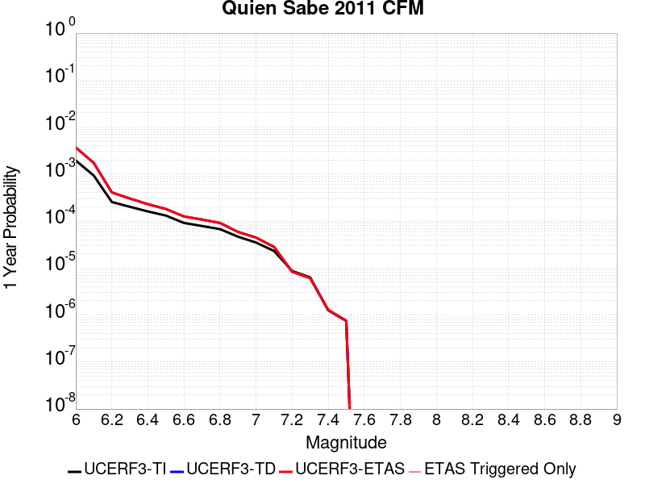 | 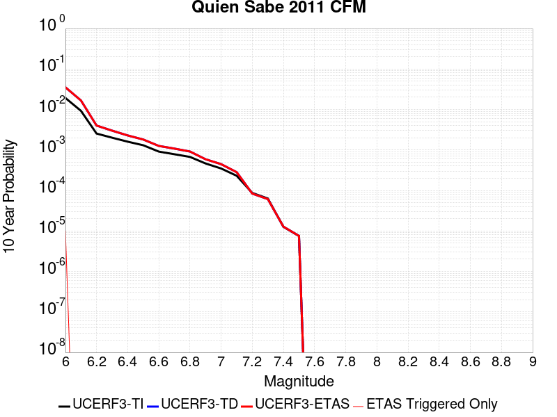 |

| Magnitude | 1 wk TI Prob | 1 wk TD Prob | 1 wk ETAS Prob | 1 wk ETAS/TD Gain | 1 wk ETAS Triggered Only | 1 mo TI Prob | 1 mo TD Prob | 1 mo ETAS Prob | 1 mo ETAS/TD Gain | 1 mo ETAS Triggered Only | 1 yr TI Prob | 1 yr TD Prob | 1 yr ETAS Prob | 1 yr ETAS/TD Gain | 1 yr ETAS Triggered Only | 10 yr TI Prob | 10 yr TD Prob | 10 yr ETAS Prob | 10 yr ETAS/TD Gain | 10 yr ETAS Triggered Only |
|-----|-----|-----|-----|-----|-----|-----|-----|-----|-----|-----|-----|-----|-----|-----|-----|-----|-----|-----|-----|-----|
| 6.0 | 3.729899E-5 | 7.095218E-5 | 7.095218E-5 | 1.0 | 0.0 | 1.5984301E-4 | 3.04012E-4 | 3.04012E-4 | 1.0 | 0.0 | 0.0019443515 | 0.0036857054 | 0.0036857054 | 1.0 | 0.0 | 0.019274272 | 0.035355605 | 0.035365254 | 1.0002729 | 1.0E-5 |
| 6.1 | 1.7825725E-5 | 3.3215478E-5 | 3.3215478E-5 | 1.0 | 0.0 | 7.639373E-5 | 1.4231203E-4 | 1.4231203E-4 | 1.0 | 0.0 | 9.296967E-4 | 0.0017269313 | 0.0017269313 | 1.0 | 0.0 | 0.009258169 | 0.01670198 | 0.01670198 | 1.0 | 0.0 |
| 6.2 | 4.8865336E-6 | 7.808843E-6 | 7.808843E-6 | 1.0 | 0.0 | 2.0942118E-5 | 3.3465018E-5 | 3.3465018E-5 | 1.0 | 0.0 | 2.5494045E-4 | 4.0701387E-4 | 4.0701387E-4 | 1.0 | 0.0 | 0.0025464818 | 0.004014794 | 0.004014794 | 1.0 | 0.0 |
| 6.3 | 3.858491E-6 | 5.791181E-6 | 5.791181E-6 | 1.0 | 0.0 | 1.6536285E-5 | 2.4819137E-5 | 2.4819137E-5 | 1.0 | 0.0 | 2.0131067E-4 | 3.021358E-4 | 3.021358E-4 | 1.0 | 0.0 | 0.002011284 | 0.0030031302 | 0.0030031302 | 1.0 | 0.0 |
| 6.4 | 3.0771805E-6 | 4.3863315E-6 | 4.3863315E-6 | 1.0 | 0.0 | 1.318785E-5 | 1.8798442E-5 | 1.8798442E-5 | 1.0 | 0.0 | 1.6055023E-4 | 2.2884943E-4 | 2.2884943E-4 | 1.0 | 0.0 | 0.001604343 | 0.002287461 | 0.002287461 | 1.0 | 0.0 |
| 6.5 | 2.5081235E-6 | 3.464876E-6 | 3.464876E-6 | 1.0 | 0.0 | 1.0749056E-5 | 1.4849393E-5 | 1.4849393E-5 | 1.0 | 0.0 | 1.308619E-4 | 1.8077783E-4 | 1.8077783E-4 | 1.0 | 0.0 | 0.0013078486 | 0.0018132196 | 0.0018132196 | 1.0 | 0.0 |
| 6.6 | 1.7505364E-6 | 2.403353E-6 | 2.403353E-6 | 1.0 | 0.0 | 7.502277E-6 | 1.03000475E-5 | 1.03000475E-5 | 1.0 | 0.0 | 9.13364E-5 | 1.2539657E-4 | 1.2539657E-4 | 1.0 | 0.0 | 9.129886E-4 | 0.0012587609 | 0.0012587609 | 1.0 | 0.0 |
| 6.7 | 1.505737E-6 | 2.0646755E-6 | 2.0646755E-6 | 1.0 | 0.0 | 6.4531428E-6 | 8.848583E-6 | 8.848583E-6 | 1.0 | 0.0 | 7.8564175E-5 | 1.07726766E-4 | 1.07726766E-4 | 1.0 | 0.0 | 7.853641E-4 | 0.001082237 | 0.001082237 | 1.0 | 0.0 |
| 6.8 | 1.2924105E-6 | 1.7492418E-6 | 1.7492418E-6 | 1.0 | 0.0 | 5.5388905E-6 | 7.4967325E-6 | 7.4967325E-6 | 1.0 | 0.0 | 6.74339E-5 | 9.126944E-5 | 9.126944E-5 | 1.0 | 0.0 | 6.741344E-4 | 9.164543E-4 | 9.164543E-4 | 1.0 | 0.0 |
| 6.9 | 8.9075286E-7 | 1.1253309E-6 | 1.1253309E-6 | 1.0 | 0.0 | 3.8175067E-6 | 4.822839E-6 | 4.822839E-6 | 1.0 | 0.0 | 4.6477155E-5 | 5.8716705E-5 | 5.8716705E-5 | 1.0 | 0.0 | 4.6467435E-4 | 5.9053226E-4 | 5.9053226E-4 | 1.0 | 0.0 |
| 7.0 | 6.6891175E-7 | 8.5191124E-7 | 8.5191124E-7 | 1.0 | 0.0 | 2.8667614E-6 | 3.6510442E-6 | 3.6510442E-6 | 1.0 | 0.0 | 3.4902263E-5 | 4.4450753E-5 | 4.4450753E-5 | 1.0 | 0.0 | 3.4896782E-4 | 4.4686778E-4 | 4.4686778E-4 | 1.0 | 0.0 |
| 7.1 | 4.4205015E-7 | 5.3935804E-7 | 5.3935804E-7 | 1.0 | 0.0 | 1.8944993E-6 | 2.3115333E-6 | 2.3115333E-6 | 1.0 | 0.0 | 2.3065284E-5 | 2.8142726E-5 | 2.8142726E-5 | 1.0 | 0.0 | 2.3062891E-4 | 2.8280797E-4 | 2.8280797E-4 | 1.0 | 0.0 |
| 7.2 | 1.6620965E-7 | 1.5997311E-7 | 1.5997311E-7 | 1.0 | 0.0 | 7.123269E-7 | 6.8559893E-7 | 6.8559893E-7 | 1.0 | 0.0 | 8.672545E-6 | 8.347139E-6 | 8.347139E-6 | 1.0 | 0.0 | 8.6722066E-5 | 8.364434E-5 | 8.364434E-5 | 1.0 | 0.0 |
| 7.3 | 1.2142488E-7 | 1.1729005E-7 | 1.1729005E-7 | 1.0 | 0.0 | 5.2039223E-7 | 5.026716E-7 | 5.026716E-7 | 1.0 | 0.0 | 6.335757E-6 | 6.1200126E-6 | 6.1200126E-6 | 1.0 | 0.0 | 6.3355765E-5 | 6.121746E-5 | 6.121746E-5 | 1.0 | 0.0 |
| 7.4 | 2.4192937E-8 | 2.4548772E-8 | 2.4548772E-8 | 1.0 | 0.0 | 1.0368401E-7 | 1.0520902E-7 | 1.0520902E-7 | 1.0 | 0.0 | 1.2623522E-6 | 1.2809192E-6 | 1.2809192E-6 | 1.0 | 0.0 | 1.2623449E-5 | 1.2769277E-5 | 1.2769277E-5 | 1.0 | 0.0 |
| 7.5 | 1.4432802E-8 | 1.4509316E-8 | 1.4509316E-8 | 1.0 | 0.0 | 6.185486E-8 | 6.2182785E-8 | 6.2182785E-8 | 1.0 | 0.0 | 7.530827E-7 | 7.570752E-7 | 7.570752E-7 | 1.0 | 0.0 | 7.530801E-6 | 7.5291196E-6 | 7.5291196E-6 | 1.0 | 0.0 |

## Hartley Springs 2011 CFM
*[(top)](#table-of-contents)*

| 1 Week | 1 Month | 1 Year | 10 Year |
|-----|-----|-----|-----|
|  |  | 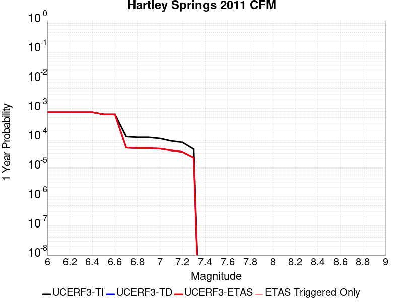 |  |

| Magnitude | 1 wk TI Prob | 1 wk TD Prob | 1 wk ETAS Prob | 1 wk ETAS/TD Gain | 1 wk ETAS Triggered Only | 1 mo TI Prob | 1 mo TD Prob | 1 mo ETAS Prob | 1 mo ETAS/TD Gain | 1 mo ETAS Triggered Only | 1 yr TI Prob | 1 yr TD Prob | 1 yr ETAS Prob | 1 yr ETAS/TD Gain | 1 yr ETAS Triggered Only | 10 yr TI Prob | 10 yr TD Prob | 10 yr ETAS Prob | 10 yr ETAS/TD Gain | 10 yr ETAS Triggered Only |
|-----|-----|-----|-----|-----|-----|-----|-----|-----|-----|-----|-----|-----|-----|-----|-----|-----|-----|-----|-----|-----|
| 6.0 | 1.4352418E-5 | 1.4435592E-5 | 1.4435592E-5 | 1.0 | 0.0 | 6.1508916E-5 | 6.186628E-5 | 6.186628E-5 | 1.0 | 0.0 | 7.486137E-4 | 7.5312605E-4 | 7.5312605E-4 | 1.0 | 0.0 | 0.007460968 | 0.0075218603 | 0.0075317854 | 1.0013194 | 1.0E-5 |
| 6.1 | 1.4352418E-5 | 1.4435592E-5 | 1.4435592E-5 | 1.0 | 0.0 | 6.1508916E-5 | 6.186628E-5 | 6.186628E-5 | 1.0 | 0.0 | 7.486137E-4 | 7.5312605E-4 | 7.5312605E-4 | 1.0 | 0.0 | 0.007460968 | 0.0075218603 | 0.0075317854 | 1.0013194 | 1.0E-5 |
| 6.2 | 1.4352418E-5 | 1.4435592E-5 | 1.4435592E-5 | 1.0 | 0.0 | 6.1508916E-5 | 6.186628E-5 | 6.186628E-5 | 1.0 | 0.0 | 7.486137E-4 | 7.5312605E-4 | 7.5312605E-4 | 1.0 | 0.0 | 0.007460968 | 0.0075218603 | 0.0075317854 | 1.0013194 | 1.0E-5 |
| 6.3 | 1.4352418E-5 | 1.4435592E-5 | 1.4435592E-5 | 1.0 | 0.0 | 6.1508916E-5 | 6.186628E-5 | 6.186628E-5 | 1.0 | 0.0 | 7.486137E-4 | 7.5312605E-4 | 7.5312605E-4 | 1.0 | 0.0 | 0.007460968 | 0.0075218603 | 0.0075317854 | 1.0013194 | 1.0E-5 |
| 6.4 | 1.4352418E-5 | 1.4435592E-5 | 1.4435592E-5 | 1.0 | 0.0 | 6.1508916E-5 | 6.186628E-5 | 6.186628E-5 | 1.0 | 0.0 | 7.486137E-4 | 7.5312605E-4 | 7.5312605E-4 | 1.0 | 0.0 | 0.007460968 | 0.0075218603 | 0.0075317854 | 1.0013194 | 1.0E-5 |
| 6.5 | 1.2279858E-5 | 1.2134381E-5 | 1.2134381E-5 | 1.0 | 0.0 | 5.26269E-5 | 5.2004347E-5 | 5.2004347E-5 | 1.0 | 0.0 | 6.4054417E-4 | 6.331272E-4 | 6.331272E-4 | 1.0 | 0.0 | 0.0063870098 | 0.006328748 | 0.0063386844 | 1.0015701 | 1.0E-5 |
| 6.6 | 1.2279858E-5 | 1.2134381E-5 | 1.2134381E-5 | 1.0 | 0.0 | 5.26269E-5 | 5.2004347E-5 | 5.2004347E-5 | 1.0 | 0.0 | 6.4054417E-4 | 6.331272E-4 | 6.331272E-4 | 1.0 | 0.0 | 0.0063870098 | 0.006328748 | 0.0063386844 | 1.0015701 | 1.0E-5 |
| 6.7 | 2.1282601E-6 | 8.901165E-7 | 8.901165E-7 | 1.0 | 0.0 | 9.121083E-6 | 3.814781E-6 | 3.814781E-6 | 1.0 | 0.0 | 1.11043526E-4 | 4.6444227E-5 | 4.6444227E-5 | 1.0 | 0.0 | 0.0011098806 | 4.6437053E-4 | 4.6437053E-4 | 1.0 | 0.0 |
| 6.8 | 2.00516E-6 | 8.5238594E-7 | 8.5238594E-7 | 1.0 | 0.0 | 8.593515E-6 | 3.653079E-6 | 3.653079E-6 | 1.0 | 0.0 | 1.04621024E-4 | 4.4475586E-5 | 4.4475586E-5 | 1.0 | 0.0 | 0.0010457177 | 4.44692E-4 | 4.44692E-4 | 1.0 | 0.0 |
| 6.9 | 2.00516E-6 | 8.5238594E-7 | 8.5238594E-7 | 1.0 | 0.0 | 8.593515E-6 | 3.653079E-6 | 3.653079E-6 | 1.0 | 0.0 | 1.04621024E-4 | 4.4475586E-5 | 4.4475586E-5 | 1.0 | 0.0 | 0.0010457177 | 4.44692E-4 | 4.44692E-4 | 1.0 | 0.0 |
| 7.0 | 1.8366732E-6 | 8.243502E-7 | 8.243502E-7 | 1.0 | 0.0 | 7.871433E-6 | 3.5329263E-6 | 3.5329263E-6 | 1.0 | 0.0 | 9.583048E-5 | 4.3012784E-5 | 4.3012784E-5 | 1.0 | 0.0 | 9.5789164E-4 | 4.3006963E-4 | 4.3006963E-4 | 1.0 | 0.0 |
| 7.1 | 1.5097997E-6 | 7.196265E-7 | 7.196265E-7 | 1.0 | 0.0 | 6.470554E-6 | 3.0841113E-6 | 3.0841113E-6 | 1.0 | 0.0 | 7.877615E-5 | 3.754865E-5 | 3.754865E-5 | 1.0 | 0.0 | 7.874823E-4 | 3.7544678E-4 | 3.7544678E-4 | 1.0 | 0.0 |
| 7.2 | 1.3490993E-6 | 6.411233E-7 | 6.411233E-7 | 1.0 | 0.0 | 5.7818415E-6 | 2.7476697E-6 | 2.7476697E-6 | 1.0 | 0.0 | 7.0391645E-5 | 3.3452598E-5 | 3.3452598E-5 | 1.0 | 0.0 | 7.0369354E-4 | 3.344986E-4 | 3.344986E-4 | 1.0 | 0.0 |
| 7.3 | 7.900015E-7 | 4.0893696E-7 | 4.0893696E-7 | 1.0 | 0.0 | 3.3857161E-6 | 1.752587E-6 | 1.752587E-6 | 1.0 | 0.0 | 4.1220315E-5 | 2.1337746E-5 | 2.1337746E-5 | 1.0 | 0.0 | 4.121267E-4 | 2.1337747E-4 | 2.1337747E-4 | 1.0 | 0.0 |

## Great Valley 10 (Panoche)
*[(top)](#table-of-contents)*

| 1 Week | 1 Month | 1 Year | 10 Year |
|-----|-----|-----|-----|
|  |  | 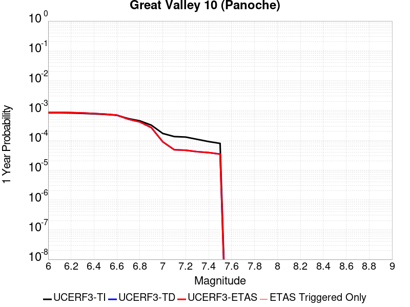 |  |

| Magnitude | 1 wk TI Prob | 1 wk TD Prob | 1 wk ETAS Prob | 1 wk ETAS/TD Gain | 1 wk ETAS Triggered Only | 1 mo TI Prob | 1 mo TD Prob | 1 mo ETAS Prob | 1 mo ETAS/TD Gain | 1 mo ETAS Triggered Only | 1 yr TI Prob | 1 yr TD Prob | 1 yr ETAS Prob | 1 yr ETAS/TD Gain | 1 yr ETAS Triggered Only | 10 yr TI Prob | 10 yr TD Prob | 10 yr ETAS Prob | 10 yr ETAS/TD Gain | 10 yr ETAS Triggered Only |
|-----|-----|-----|-----|-----|-----|-----|-----|-----|-----|-----|-----|-----|-----|-----|-----|-----|-----|-----|-----|-----|
| 6.0 | 1.6014626E-5 | 1.6576776E-5 | 1.6576776E-5 | 1.0 | 0.0 | 6.863231E-5 | 7.104141E-5 | 7.104141E-5 | 1.0 | 0.0 | 8.35278E-4 | 8.6459157E-4 | 8.6459157E-4 | 1.0 | 0.0 | 0.008321454 | 0.008612892 | 0.008622806 | 1.0011511 | 1.0E-5 |
| 6.1 | 1.6014626E-5 | 1.6576776E-5 | 1.6576776E-5 | 1.0 | 0.0 | 6.863231E-5 | 7.104141E-5 | 7.104141E-5 | 1.0 | 0.0 | 8.35278E-4 | 8.6459157E-4 | 8.6459157E-4 | 1.0 | 0.0 | 0.008321454 | 0.008612892 | 0.008622806 | 1.0011511 | 1.0E-5 |
| 6.2 | 1.56782E-5 | 1.61998E-5 | 1.61998E-5 | 1.0 | 0.0 | 6.719056E-5 | 6.9425885E-5 | 6.9425885E-5 | 1.0 | 0.0 | 8.17738E-4 | 8.4493787E-4 | 8.4493787E-4 | 1.0 | 0.0 | 0.008147354 | 0.008417855 | 0.008427771 | 1.0011779 | 1.0E-5 |
| 6.3 | 1.5263338E-5 | 1.572483E-5 | 1.572483E-5 | 1.0 | 0.0 | 6.541267E-5 | 6.7390414E-5 | 6.7390414E-5 | 1.0 | 0.0 | 7.961082E-4 | 8.201749E-4 | 8.201749E-4 | 1.0 | 0.0 | 0.007932622 | 0.008172066 | 0.008181984 | 1.0012137 | 1.0E-5 |
| 6.4 | 1.4720723E-5 | 1.51006425E-5 | 1.51006425E-5 | 1.0 | 0.0 | 6.308728E-5 | 6.471545E-5 | 6.471545E-5 | 1.0 | 0.0 | 7.67817E-4 | 7.876312E-4 | 7.876312E-4 | 1.0 | 0.0 | 0.007651695 | 0.007848966 | 0.007858887 | 1.0012641 | 1.0E-5 |
| 6.5 | 1.408264E-5 | 1.43571715E-5 | 1.43571715E-5 | 1.0 | 0.0 | 6.0352773E-5 | 6.15293E-5 | 6.15293E-5 | 1.0 | 0.0 | 7.3454727E-4 | 7.4886705E-4 | 7.4886705E-4 | 1.0 | 0.0 | 0.0073212404 | 0.007463985 | 0.0074739107 | 1.0013298 | 1.0E-5 |
| 6.6 | 1.3197086E-5 | 1.3322997E-5 | 1.3322997E-5 | 1.0 | 0.0 | 5.6557717E-5 | 5.7097328E-5 | 5.7097328E-5 | 1.0 | 0.0 | 6.8837265E-4 | 6.9494336E-4 | 6.9494336E-4 | 1.0 | 0.0 | 0.006862442 | 0.0069282353 | 0.006938166 | 1.0014334 | 1.0E-5 |
| 6.7 | 1.017583E-5 | 9.746149E-6 | 9.746149E-6 | 1.0 | 0.0 | 4.360997E-5 | 4.176855E-5 | 4.176855E-5 | 1.0 | 0.0 | 5.30822E-4 | 5.0841586E-4 | 5.0841586E-4 | 1.0 | 0.0 | 0.0052955584 | 0.00507278 | 0.00507278 | 1.0 | 0.0 |
| 6.8 | 8.557912E-6 | 7.873317E-6 | 7.873317E-6 | 1.0 | 0.0 | 3.667625E-5 | 3.3742363E-5 | 3.3742363E-5 | 1.0 | 0.0 | 4.4644187E-4 | 4.1073785E-4 | 4.1073785E-4 | 1.0 | 0.0 | 0.0044554602 | 0.004099994 | 0.004099994 | 1.0 | 0.0 |
| 6.9 | 6.14664E-6 | 5.0924546E-6 | 5.0924546E-6 | 1.0 | 0.0 | 2.6342475E-5 | 2.1824631E-5 | 2.1824631E-5 | 1.0 | 0.0 | 3.2067244E-4 | 2.6568386E-4 | 2.6568386E-4 | 1.0 | 0.0 | 0.003202101 | 0.0026538006 | 0.0026538006 | 1.0 | 0.0 |
| 7.0 | 3.2310581E-6 | 1.6952071E-6 | 1.6952071E-6 | 1.0 | 0.0 | 1.3847319E-5 | 7.2651533E-6 | 7.2651533E-6 | 1.0 | 0.0 | 1.6857806E-4 | 8.844974E-5 | 8.844974E-5 | 1.0 | 0.0 | 0.0016845023 | 8.841548E-4 | 8.841548E-4 | 1.0 | 0.0 |
| 7.1 | 2.544492E-6 | 9.189234E-7 | 9.189234E-7 | 1.0 | 0.0 | 1.090492E-5 | 3.938237E-6 | 3.938237E-6 | 1.0 | 0.0 | 1.327593E-4 | 4.7947033E-5 | 4.7947033E-5 | 1.0 | 0.0 | 0.0013268003 | 4.7937167E-4 | 4.7937167E-4 | 1.0 | 0.0 |
| 7.2 | 2.4479045E-6 | 8.8416147E-7 | 8.8416147E-7 | 1.0 | 0.0 | 1.0490977E-5 | 3.789258E-6 | 3.789258E-6 | 1.0 | 0.0 | 1.2772017E-4 | 4.613329E-5 | 4.613329E-5 | 1.0 | 0.0 | 0.0012764678 | 4.6124187E-4 | 4.6124187E-4 | 1.0 | 0.0 |
| 7.3 | 2.0559578E-6 | 7.893068E-7 | 7.893068E-7 | 1.0 | 0.0 | 8.811218E-6 | 3.3827394E-6 | 3.3827394E-6 | 1.0 | 0.0 | 1.072713E-4 | 4.118412E-5 | 4.118412E-5 | 1.0 | 0.0 | 0.0010721954 | 4.1176952E-4 | 4.1176952E-4 | 1.0 | 0.0 |
| 7.4 | 1.727687E-6 | 7.388043E-7 | 7.388043E-7 | 1.0 | 0.0 | 7.404352E-6 | 3.1663005E-6 | 3.1663005E-6 | 1.0 | 0.0 | 9.0144255E-5 | 3.8549075E-5 | 3.8549075E-5 | 1.0 | 0.0 | 9.0107694E-4 | 3.854285E-4 | 3.854285E-4 | 1.0 | 0.0 |
| 7.5 | 1.5002679E-6 | 6.546404E-7 | 6.546404E-7 | 1.0 | 0.0 | 6.4297037E-6 | 2.805599E-6 | 2.805599E-6 | 1.0 | 0.0 | 7.827883E-5 | 3.4157674E-5 | 3.4157674E-5 | 1.0 | 0.0 | 7.825126E-4 | 3.415284E-4 | 3.415284E-4 | 1.0 | 0.0 |

## Davis Creek
*[(top)](#table-of-contents)*

| 1 Week | 1 Month | 1 Year | 10 Year |
|-----|-----|-----|-----|
|  |  |  |  |

| Magnitude | 1 wk TI Prob | 1 wk TD Prob | 1 wk ETAS Prob | 1 wk ETAS/TD Gain | 1 wk ETAS Triggered Only | 1 mo TI Prob | 1 mo TD Prob | 1 mo ETAS Prob | 1 mo ETAS/TD Gain | 1 mo ETAS Triggered Only | 1 yr TI Prob | 1 yr TD Prob | 1 yr ETAS Prob | 1 yr ETAS/TD Gain | 1 yr ETAS Triggered Only | 10 yr TI Prob | 10 yr TD Prob | 10 yr ETAS Prob | 10 yr ETAS/TD Gain | 10 yr ETAS Triggered Only |
|-----|-----|-----|-----|-----|-----|-----|-----|-----|-----|-----|-----|-----|-----|-----|-----|-----|-----|-----|-----|-----|
| 6.0 | 2.331472E-5 | 2.541843E-5 | 2.541843E-5 | 1.0 | 0.0 | 9.99164E-5 | 1.08932254E-4 | 1.08932254E-4 | 1.0 | 0.0 | 0.0012158032 | 0.0013255618 | 0.0013255618 | 1.0 | 0.0 | 0.01209173 | 0.013188332 | 0.0131982 | 1.0007483 | 1.0E-5 |
| 6.1 | 1.0407654E-5 | 1.1317512E-5 | 1.1317512E-5 | 1.0 | 0.0 | 4.4603472E-5 | 4.8502872E-5 | 4.8502872E-5 | 1.0 | 0.0 | 5.4291193E-4 | 5.903896E-4 | 5.903896E-4 | 1.0 | 0.0 | 0.0054158745 | 0.005890884 | 0.005890884 | 1.0 | 0.0 |
| 6.2 | 1.0407654E-5 | 1.1317512E-5 | 1.1317512E-5 | 1.0 | 0.0 | 4.4603472E-5 | 4.8502872E-5 | 4.8502872E-5 | 1.0 | 0.0 | 5.4291193E-4 | 5.903896E-4 | 5.903896E-4 | 1.0 | 0.0 | 0.0054158745 | 0.005890884 | 0.005890884 | 1.0 | 0.0 |
| 6.3 | 5.1323277E-6 | 5.568808E-6 | 5.568808E-6 | 1.0 | 0.0 | 2.1995505E-5 | 2.3866149E-5 | 2.3866149E-5 | 1.0 | 0.0 | 2.6776237E-4 | 2.9054025E-4 | 2.9054025E-4 | 1.0 | 0.0 | 0.0026743996 | 0.0029024503 | 0.0029024503 | 1.0 | 0.0 |
| 6.4 | 2.4985154E-6 | 2.7046572E-6 | 2.7046572E-6 | 1.0 | 0.0 | 1.07078795E-5 | 1.1591356E-5 | 1.1591356E-5 | 1.0 | 0.0 | 1.3036063E-4 | 1.4111924E-4 | 1.4111924E-4 | 1.0 | 0.0 | 0.0013028418 | 0.001410651 | 0.001410651 | 1.0 | 0.0 |
| 6.5 | 2.4846438E-6 | 2.6905911E-6 | 2.6905911E-6 | 1.0 | 0.0 | 1.064843E-5 | 1.1531074E-5 | 1.1531074E-5 | 1.0 | 0.0 | 1.2963692E-4 | 1.403854E-4 | 1.403854E-4 | 1.0 | 0.0 | 0.0012956132 | 0.001403322 | 0.001403322 | 1.0 | 0.0 |
| 6.6 | 2.072566E-7 | 2.1018245E-7 | 2.1018245E-7 | 1.0 | 0.0 | 8.882423E-7 | 9.0078163E-7 | 9.0078163E-7 | 1.0 | 0.0 | 1.0814296E-5 | 1.0966963E-5 | 1.0966963E-5 | 1.0 | 0.0 | 1.081377E-4 | 1.096644E-4 | 1.096644E-4 | 1.0 | 0.0 |
| 6.7 | 1.7544528E-7 | 1.7790958E-7 | 1.7790958E-7 | 1.0 | 0.0 | 7.5190815E-7 | 7.624694E-7 | 7.624694E-7 | 1.0 | 0.0 | 9.154443E-6 | 9.283027E-6 | 9.283027E-6 | 1.0 | 0.0 | 9.1540656E-5 | 9.282655E-5 | 9.282655E-5 | 1.0 | 0.0 |
| 6.8 | 1.2320395E-7 | 1.2481225E-7 | 1.2481225E-7 | 1.0 | 0.0 | 5.280168E-7 | 5.349095E-7 | 5.349095E-7 | 1.0 | 0.0 | 6.428586E-6 | 6.5125046E-6 | 6.5125046E-6 | 1.0 | 0.0 | 6.4284E-5 | 6.5123255E-5 | 6.5123255E-5 | 1.0 | 0.0 |
| 6.9 | 6.399997E-8 | 6.486104E-8 | 6.486104E-8 | 1.0 | 0.0 | 2.7428555E-7 | 2.7797586E-7 | 2.7797586E-7 | 1.0 | 0.0 | 3.3394215E-6 | 3.3843514E-6 | 3.3843514E-6 | 1.0 | 0.0 | 3.3393713E-5 | 3.3843065E-5 | 3.3843065E-5 | 1.0 | 0.0 |
| 7.0 | 6.4455685E-9 | 6.5353123E-9 | 6.5353123E-9 | 1.0 | 0.0 | 2.7623864E-8 | 2.800848E-8 | 2.800848E-8 | 1.0 | 0.0 | 3.3632048E-7 | 3.4100327E-7 | 3.4100327E-7 | 1.0 | 0.0 | 3.3631998E-6 | 3.4100326E-6 | 3.4100326E-6 | 1.0 | 0.0 |

## San Andreas (Peninsula) 2011 CFM
*[(top)](#table-of-contents)*

| 1 Week | 1 Month | 1 Year | 10 Year |
|-----|-----|-----|-----|
|  |  |  |  |

| Magnitude | 1 wk TI Prob | 1 wk TD Prob | 1 wk ETAS Prob | 1 wk ETAS/TD Gain | 1 wk ETAS Triggered Only | 1 mo TI Prob | 1 mo TD Prob | 1 mo ETAS Prob | 1 mo ETAS/TD Gain | 1 mo ETAS Triggered Only | 1 yr TI Prob | 1 yr TD Prob | 1 yr ETAS Prob | 1 yr ETAS/TD Gain | 1 yr ETAS Triggered Only | 10 yr TI Prob | 10 yr TD Prob | 10 yr ETAS Prob | 10 yr ETAS/TD Gain | 10 yr ETAS Triggered Only |
|-----|-----|-----|-----|-----|-----|-----|-----|-----|-----|-----|-----|-----|-----|-----|-----|-----|-----|-----|-----|-----|
| 6.0 | 8.6200685E-5 | 2.5328161E-5 | 2.5328161E-5 | 1.0 | 0.0 | 3.6937918E-4 | 1.0854476E-4 | 1.0854476E-4 | 1.0 | 0.0 | 0.0044879215 | 0.0013207329 | 0.0013207329 | 1.0 | 0.0 | 0.043983612 | 0.0148354955 | 0.014845347 | 1.0006641 | 1.0E-5 |
| 6.1 | 8.6200685E-5 | 2.5328161E-5 | 2.5328161E-5 | 1.0 | 0.0 | 3.6937918E-4 | 1.0854476E-4 | 1.0854476E-4 | 1.0 | 0.0 | 0.0044879215 | 0.0013207329 | 0.0013207329 | 1.0 | 0.0 | 0.043983612 | 0.0148354955 | 0.014845347 | 1.0006641 | 1.0E-5 |
| 6.2 | 8.6200685E-5 | 2.5328161E-5 | 2.5328161E-5 | 1.0 | 0.0 | 3.6937918E-4 | 1.0854476E-4 | 1.0854476E-4 | 1.0 | 0.0 | 0.0044879215 | 0.0013207329 | 0.0013207329 | 1.0 | 0.0 | 0.043983612 | 0.0148354955 | 0.014845347 | 1.0006641 | 1.0E-5 |
| 6.3 | 8.551163E-5 | 2.50194E-5 | 2.50194E-5 | 1.0 | 0.0 | 3.6642692E-4 | 1.07221604E-4 | 1.07221604E-4 | 1.0 | 0.0 | 0.004452125 | 0.001304643 | 0.001304643 | 1.0 | 0.0 | 0.043639794 | 0.014662212 | 0.014672065 | 1.000672 | 1.0E-5 |
| 6.4 | 8.551163E-5 | 2.50194E-5 | 2.50194E-5 | 1.0 | 0.0 | 3.6642692E-4 | 1.07221604E-4 | 1.07221604E-4 | 1.0 | 0.0 | 0.004452125 | 0.001304643 | 0.001304643 | 1.0 | 0.0 | 0.043639794 | 0.014662212 | 0.014672065 | 1.000672 | 1.0E-5 |
| 6.5 | 8.511146E-5 | 2.4840549E-5 | 2.4840549E-5 | 1.0 | 0.0 | 3.647124E-4 | 1.0645516E-4 | 1.0645516E-4 | 1.0 | 0.0 | 0.004431336 | 0.0012953227 | 0.0012953227 | 1.0 | 0.0 | 0.04344007 | 0.014561708 | 0.014571562 | 1.0006768 | 1.0E-5 |
| 6.6 | 8.4985084E-5 | 2.477102E-5 | 2.477102E-5 | 1.0 | 0.0 | 3.6417096E-4 | 1.061572E-4 | 1.061572E-4 | 1.0 | 0.0 | 0.0044247704 | 0.0012916992 | 0.0012916992 | 1.0 | 0.0 | 0.043376986 | 0.014524049 | 0.014533904 | 1.0006785 | 1.0E-5 |
| 6.7 | 8.462618E-5 | 2.4599261E-5 | 2.4599261E-5 | 1.0 | 0.0 | 3.6263323E-4 | 1.0542115E-4 | 1.0542115E-4 | 1.0 | 0.0 | 0.004406125 | 0.0012827484 | 0.0012827484 | 1.0 | 0.0 | 0.043197807 | 0.014428631 | 0.014438488 | 1.0006831 | 1.0E-5 |
| 6.8 | 8.42337E-5 | 2.4494844E-5 | 2.4494844E-5 | 1.0 | 0.0 | 3.6095164E-4 | 1.0497369E-4 | 1.0497369E-4 | 1.0 | 0.0 | 0.004385734 | 0.001277307 | 0.001277307 | 1.0 | 0.0 | 0.043001823 | 0.014369269 | 0.014379125 | 1.0006859 | 1.0E-5 |
| 6.9 | 8.365989E-5 | 2.4299145E-5 | 2.4299145E-5 | 1.0 | 0.0 | 3.5849313E-4 | 1.0413504E-4 | 1.0413504E-4 | 1.0 | 0.0 | 0.004355922 | 0.0012671084 | 0.0012671084 | 1.0 | 0.0 | 0.04271523 | 0.014261526 | 0.014271384 | 1.0006912 | 1.0E-5 |
| 7.0 | 8.30936E-5 | 2.4060333E-5 | 2.4060333E-5 | 1.0 | 0.0 | 3.560668E-4 | 1.0311165E-4 | 1.0311165E-4 | 1.0 | 0.0 | 0.004326499 | 0.001254663 | 0.001254663 | 1.0 | 0.0 | 0.042432297 | 0.014132385 | 0.014142243 | 1.0006976 | 1.0E-5 |
| 7.1 | 8.041264E-5 | 2.3746046E-5 | 2.3746046E-5 | 1.0 | 0.0 | 3.4458007E-4 | 1.0176481E-4 | 1.0176481E-4 | 1.0 | 0.0 | 0.0041871946 | 0.0012382839 | 0.0012382839 | 1.0 | 0.0 | 0.041091725 | 0.013954801 | 0.013964661 | 1.0007066 | 1.0E-5 |
| 7.2 | 7.8427016E-5 | 2.3168865E-5 | 2.3168865E-5 | 1.0 | 0.0 | 3.3607247E-4 | 9.9291356E-5 | 9.9291356E-5 | 1.0 | 0.0 | 0.004084008 | 0.0012082035 | 0.0012082035 | 1.0 | 0.0 | 0.040097635 | 0.013638308 | 0.013648172 | 1.0007232 | 1.0E-5 |
| 7.3 | 7.721087E-5 | 2.2953374E-5 | 2.2953374E-5 | 1.0 | 0.0 | 3.3086175E-4 | 9.83679E-5 | 9.83679E-5 | 1.0 | 0.0 | 0.004020803 | 0.0011969728 | 0.0011969728 | 1.0 | 0.0 | 0.03948827 | 0.013521875 | 0.013531741 | 1.0007296 | 1.0E-5 |
| 7.4 | 7.3536525E-5 | 2.1059372E-5 | 2.1059372E-5 | 1.0 | 0.0 | 3.1511846E-4 | 9.0251335E-5 | 9.0251335E-5 | 1.0 | 0.0 | 0.0038298194 | 0.0010982574 | 0.0010982574 | 1.0 | 0.0 | 0.037644852 | 0.012473098 | 0.012482974 | 1.0007917 | 1.0E-5 |
| 7.5 | 6.806207E-5 | 1.885083E-5 | 1.885083E-5 | 1.0 | 0.0 | 2.9166197E-4 | 8.078678E-5 | 8.078678E-5 | 1.0 | 0.0 | 0.0035452035 | 9.831362E-4 | 9.831362E-4 | 1.0 | 0.0 | 0.034891766 | 0.011218435 | 0.011228323 | 1.0008814 | 1.0E-5 |
| 7.6 | 5.6731416E-5 | 1.4231111E-5 | 1.4231111E-5 | 1.0 | 0.0 | 2.43112E-4 | 6.098905E-5 | 6.098905E-5 | 1.0 | 0.0 | 0.0029558712 | 7.4228883E-4 | 7.4228883E-4 | 1.0 | 0.0 | 0.02916862 | 0.008515661 | 0.0085255755 | 1.0011643 | 1.0E-5 |
| 7.7 | 4.946994E-5 | 1.329465E-5 | 1.329465E-5 | 1.0 | 0.0 | 2.1199681E-4 | 5.6975827E-5 | 5.6975827E-5 | 1.0 | 0.0 | 0.002578006 | 6.9346005E-4 | 6.9346005E-4 | 1.0 | 0.0 | 0.02548303 | 0.007935429 | 0.00794535 | 1.0012501 | 1.0E-5 |
| 7.8 | 3.9718198E-5 | 1.3029107E-5 | 1.3029107E-5 | 1.0 | 0.0 | 1.7020974E-4 | 5.5837834E-5 | 5.5837834E-5 | 1.0 | 0.0 | 0.0020703338 | 6.7961373E-4 | 6.7961373E-4 | 1.0 | 0.0 | 0.020511515 | 0.0077446876 | 0.0077546104 | 1.0012813 | 1.0E-5 |
| 7.9 | 2.4115114E-5 | 1.222725E-5 | 1.222725E-5 | 1.0 | 0.0 | 1.0334639E-4 | 5.2401447E-5 | 5.2401447E-5 | 1.0 | 0.0 | 0.001257516 | 6.37801E-4 | 6.37801E-4 | 1.0 | 0.0 | 0.012504238 | 0.0071820016 | 0.00719193 | 1.0013824 | 1.0E-5 |
| 8.0 | 1.7756569E-5 | 1.14478835E-5 | 1.14478835E-5 | 1.0 | 0.0 | 7.6097356E-5 | 4.9061437E-5 | 4.9061437E-5 | 1.0 | 0.0 | 9.260915E-4 | 5.9715944E-4 | 5.9715944E-4 | 1.0 | 0.0 | 0.009222416 | 0.006680186 | 0.0066901194 | 1.001487 | 1.0E-5 |
| 8.1 | 1.3159258E-5 | 9.778385E-6 | 9.778385E-6 | 1.0 | 0.0 | 5.6395602E-5 | 4.1906693E-5 | 4.1906693E-5 | 1.0 | 0.0 | 6.864001E-4 | 5.100947E-4 | 5.100947E-4 | 1.0 | 0.0 | 0.0068428386 | 0.0057069915 | 0.0057169343 | 1.0017422 | 1.0E-5 |
| 8.2 | 8.635426E-6 | 5.486047E-6 | 5.486047E-6 | 1.0 | 0.0 | 3.700844E-5 | 2.3511418E-5 | 2.3511418E-5 | 1.0 | 0.0 | 4.5048463E-4 | 2.86214E-4 | 2.86214E-4 | 1.0 | 0.0 | 0.004495725 | 0.003255006 | 0.003255006 | 1.0 | 0.0 |
| 8.3 | 1.983087E-6 | 7.690063E-7 | 7.690063E-7 | 1.0 | 0.0 | 8.498917E-6 | 3.295737E-6 | 3.295737E-6 | 1.0 | 0.0 | 1.034694E-4 | 4.012488E-5 | 4.012488E-5 | 1.0 | 0.0 | 0.0010342124 | 4.737206E-4 | 4.737206E-4 | 1.0 | 0.0 |

## Johnson Valley (No) 2011 rev
*[(top)](#table-of-contents)*

| 1 Week | 1 Month | 1 Year | 10 Year |
|-----|-----|-----|-----|
|  |  | 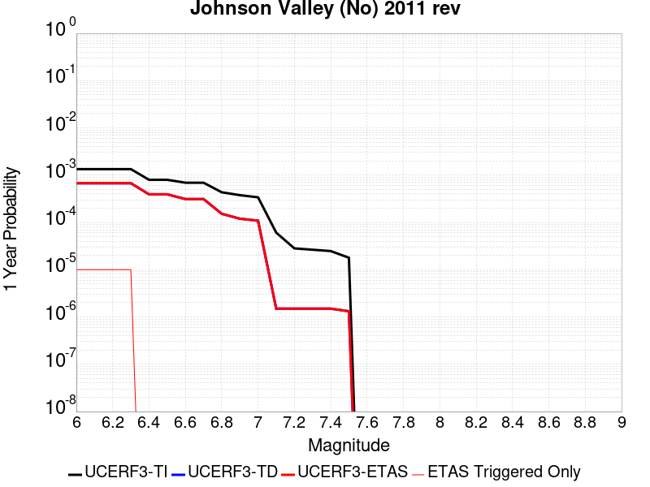 |  |

| Magnitude | 1 wk TI Prob | 1 wk TD Prob | 1 wk ETAS Prob | 1 wk ETAS/TD Gain | 1 wk ETAS Triggered Only | 1 mo TI Prob | 1 mo TD Prob | 1 mo ETAS Prob | 1 mo ETAS/TD Gain | 1 mo ETAS Triggered Only | 1 yr TI Prob | 1 yr TD Prob | 1 yr ETAS Prob | 1 yr ETAS/TD Gain | 1 yr ETAS Triggered Only | 10 yr TI Prob | 10 yr TD Prob | 10 yr ETAS Prob | 10 yr ETAS/TD Gain | 10 yr ETAS Triggered Only |
|-----|-----|-----|-----|-----|-----|-----|-----|-----|-----|-----|-----|-----|-----|-----|-----|-----|-----|-----|-----|-----|
| 6.0 | 2.577707E-5 | 1.2901752E-5 | 1.2901752E-5 | 1.0 | 0.0 | 1.1046848E-4 | 5.5292276E-5 | 5.5292276E-5 | 1.0 | 0.0 | 0.0013441239 | 6.730152E-4 | 6.8300846E-4 | 1.0148485 | 1.0E-5 | 0.013360229 | 0.0067136795 | 0.006723612 | 1.0014795 | 1.0E-5 |
| 6.1 | 2.577707E-5 | 1.2901752E-5 | 1.2901752E-5 | 1.0 | 0.0 | 1.1046848E-4 | 5.5292276E-5 | 5.5292276E-5 | 1.0 | 0.0 | 0.0013441239 | 6.730152E-4 | 6.8300846E-4 | 1.0148485 | 1.0E-5 | 0.013360229 | 0.0067136795 | 0.006723612 | 1.0014795 | 1.0E-5 |
| 6.2 | 2.577707E-5 | 1.2901752E-5 | 1.2901752E-5 | 1.0 | 0.0 | 1.1046848E-4 | 5.5292276E-5 | 5.5292276E-5 | 1.0 | 0.0 | 0.0013441239 | 6.730152E-4 | 6.8300846E-4 | 1.0148485 | 1.0E-5 | 0.013360229 | 0.0067136795 | 0.006723612 | 1.0014795 | 1.0E-5 |
| 6.3 | 2.577707E-5 | 1.2901752E-5 | 1.2901752E-5 | 1.0 | 0.0 | 1.1046848E-4 | 5.5292276E-5 | 5.5292276E-5 | 1.0 | 0.0 | 0.0013441239 | 6.730152E-4 | 6.8300846E-4 | 1.0148485 | 1.0E-5 | 0.013360229 | 0.0067136795 | 0.006723612 | 1.0014795 | 1.0E-5 |
| 6.4 | 1.5296591E-5 | 7.53722E-6 | 7.53722E-6 | 1.0 | 0.0 | 6.555518E-5 | 3.2302076E-5 | 3.2302076E-5 | 1.0 | 0.0 | 7.97842E-4 | 3.9322558E-4 | 3.9322558E-4 | 1.0 | 0.0 | 0.007949836 | 0.003927139 | 0.003927139 | 1.0 | 0.0 |
| 6.5 | 1.5296591E-5 | 7.53722E-6 | 7.53722E-6 | 1.0 | 0.0 | 6.555518E-5 | 3.2302076E-5 | 3.2302076E-5 | 1.0 | 0.0 | 7.97842E-4 | 3.9322558E-4 | 3.9322558E-4 | 1.0 | 0.0 | 0.007949836 | 0.003927139 | 0.003927139 | 1.0 | 0.0 |
| 6.6 | 1.3289383E-5 | 5.9921053E-6 | 5.9921053E-6 | 1.0 | 0.0 | 5.6953253E-5 | 2.5680294E-5 | 2.5680294E-5 | 1.0 | 0.0 | 6.9318525E-4 | 3.1262968E-4 | 3.1262968E-4 | 1.0 | 0.0 | 0.0069102696 | 0.0031235635 | 0.0031235635 | 1.0 | 0.0 |
| 6.7 | 1.3289383E-5 | 5.9921053E-6 | 5.9921053E-6 | 1.0 | 0.0 | 5.6953253E-5 | 2.5680294E-5 | 2.5680294E-5 | 1.0 | 0.0 | 6.9318525E-4 | 3.1262968E-4 | 3.1262968E-4 | 1.0 | 0.0 | 0.0069102696 | 0.0031235635 | 0.0031235635 | 1.0 | 0.0 |
| 6.8 | 8.330789E-6 | 2.9214655E-6 | 2.9214655E-6 | 1.0 | 0.0 | 3.570289E-5 | 1.2520538E-5 | 1.2520538E-5 | 1.0 | 0.0 | 4.34596E-4 | 1.524326E-4 | 1.524326E-4 | 1.0 | 0.0 | 0.0043374705 | 0.0015238405 | 0.0015238405 | 1.0 | 0.0 |
| 6.9 | 7.2359003E-6 | 2.3014777E-6 | 2.3014777E-6 | 1.0 | 0.0 | 3.1010633E-5 | 9.863469E-6 | 9.863469E-6 | 1.0 | 0.0 | 3.7748902E-4 | 1.2008645E-4 | 1.2008645E-4 | 1.0 | 0.0 | 0.0037684843 | 0.0012007385 | 0.0012007385 | 1.0 | 0.0 |
| 7.0 | 6.5149957E-6 | 2.0886475E-6 | 2.0886475E-6 | 1.0 | 0.0 | 2.792111E-5 | 8.951346E-6 | 8.951346E-6 | 1.0 | 0.0 | 3.398865E-4 | 1.0898248E-4 | 1.0898248E-4 | 1.0 | 0.0 | 0.003393671 | 0.0010898102 | 0.0010898102 | 1.0 | 0.0 |
| 7.1 | 1.1662233E-6 | 2.8800763E-8 | 2.8800763E-8 | 1.0 | 0.0 | 4.9980904E-6 | 1.2343183E-7 | 1.2343183E-7 | 1.0 | 0.0 | 6.0850052E-5 | 1.5027817E-6 | 1.5027817E-6 | 1.0 | 0.0 | 6.083339E-4 | 1.5027732E-5 | 1.5027732E-5 | 1.0 | 0.0 |
| 7.2 | 5.413881E-7 | 2.8800763E-8 | 2.8800763E-8 | 1.0 | 0.0 | 2.3202326E-6 | 1.2343183E-7 | 1.2343183E-7 | 1.0 | 0.0 | 2.8248465E-5 | 1.5027817E-6 | 1.5027817E-6 | 1.0 | 0.0 | 2.8244875E-4 | 1.5027732E-5 | 1.5027732E-5 | 1.0 | 0.0 |
| 7.3 | 5.076821E-7 | 2.8800763E-8 | 2.8800763E-8 | 1.0 | 0.0 | 2.1757785E-6 | 1.2343183E-7 | 1.2343183E-7 | 1.0 | 0.0 | 2.648978E-5 | 1.5027817E-6 | 1.5027817E-6 | 1.0 | 0.0 | 2.6486625E-4 | 1.5027732E-5 | 1.5027732E-5 | 1.0 | 0.0 |
| 7.4 | 4.7568687E-7 | 2.87827E-8 | 2.87827E-8 | 1.0 | 0.0 | 2.0386565E-6 | 1.2335443E-7 | 1.2335443E-7 | 1.0 | 0.0 | 2.482036E-5 | 1.5018393E-6 | 1.5018393E-6 | 1.0 | 0.0 | 2.4817587E-4 | 1.5018308E-5 | 1.5018308E-5 | 1.0 | 0.0 |
| 7.5 | 3.435626E-7 | 2.5356895E-8 | 2.5356895E-8 | 1.0 | 0.0 | 1.4724103E-6 | 1.086724E-7 | 1.086724E-7 | 1.0 | 0.0 | 1.7926448E-5 | 1.3230859E-6 | 1.3230859E-6 | 1.0 | 0.0 | 1.7925001E-4 | 1.3230796E-5 | 1.3230796E-5 | 1.0 | 0.0 |

## Shoreline
*[(top)](#table-of-contents)*

| 1 Week | 1 Month | 1 Year | 10 Year |
|-----|-----|-----|-----|
| 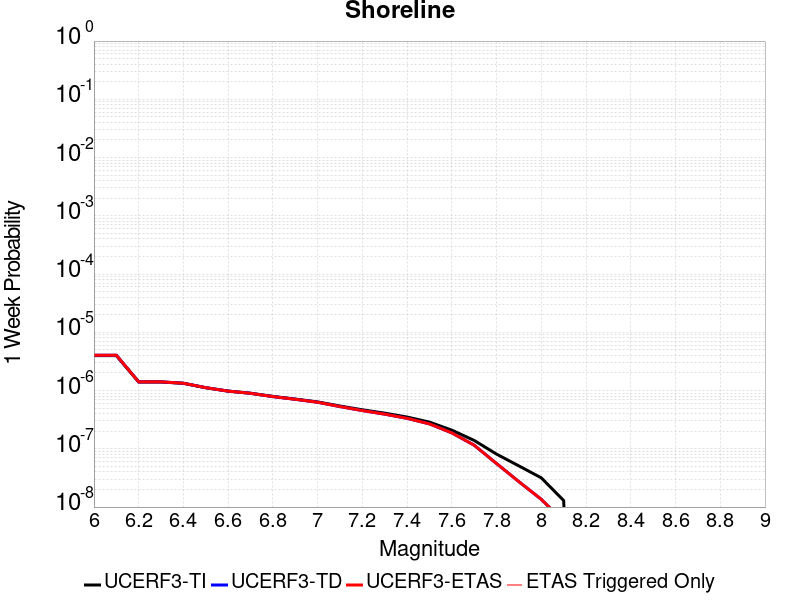 |  |  | 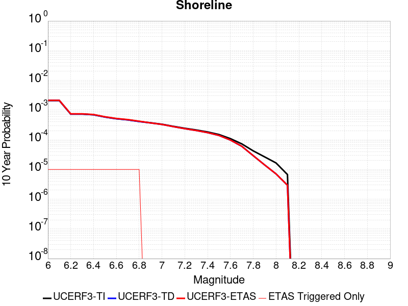 |

| Magnitude | 1 wk TI Prob | 1 wk TD Prob | 1 wk ETAS Prob | 1 wk ETAS/TD Gain | 1 wk ETAS Triggered Only | 1 mo TI Prob | 1 mo TD Prob | 1 mo ETAS Prob | 1 mo ETAS/TD Gain | 1 mo ETAS Triggered Only | 1 yr TI Prob | 1 yr TD Prob | 1 yr ETAS Prob | 1 yr ETAS/TD Gain | 1 yr ETAS Triggered Only | 10 yr TI Prob | 10 yr TD Prob | 10 yr ETAS Prob | 10 yr ETAS/TD Gain | 10 yr ETAS Triggered Only |
|-----|-----|-----|-----|-----|-----|-----|-----|-----|-----|-----|-----|-----|-----|-----|-----|-----|-----|-----|-----|-----|
| 6.0 | 3.9888673E-6 | 4.047993E-6 | 4.047993E-6 | 1.0 | 0.0 | 1.7095033E-5 | 1.7348459E-5 | 1.7348459E-5 | 1.0 | 0.0 | 2.0811215E-4 | 2.112026E-4 | 2.112026E-4 | 1.0 | 0.0 | 0.0020791737 | 0.0021105676 | 0.0021205465 | 1.0047281 | 1.0E-5 |
| 6.1 | 3.9888673E-6 | 4.047993E-6 | 4.047993E-6 | 1.0 | 0.0 | 1.7095033E-5 | 1.7348459E-5 | 1.7348459E-5 | 1.0 | 0.0 | 2.0811215E-4 | 2.112026E-4 | 2.112026E-4 | 1.0 | 0.0 | 0.0020791737 | 0.0021105676 | 0.0021205465 | 1.0047281 | 1.0E-5 |
| 6.2 | 1.4039653E-6 | 1.4101246E-6 | 1.4101246E-6 | 1.0 | 0.0 | 6.0169805E-6 | 6.0433777E-6 | 6.0433777E-6 | 1.0 | 0.0 | 7.325427E-5 | 7.35757E-5 | 7.35757E-5 | 1.0 | 0.0 | 7.3230127E-4 | 7.355194E-4 | 7.45512E-4 | 1.0135858 | 1.0E-5 |
| 6.3 | 1.4039653E-6 | 1.4101246E-6 | 1.4101246E-6 | 1.0 | 0.0 | 6.0169805E-6 | 6.0433777E-6 | 6.0433777E-6 | 1.0 | 0.0 | 7.325427E-5 | 7.35757E-5 | 7.35757E-5 | 1.0 | 0.0 | 7.3230127E-4 | 7.355194E-4 | 7.45512E-4 | 1.0135858 | 1.0E-5 |
| 6.4 | 1.3314152E-6 | 1.3361953E-6 | 1.3361953E-6 | 1.0 | 0.0 | 5.7060524E-6 | 5.726539E-6 | 5.726539E-6 | 1.0 | 0.0 | 6.946897E-5 | 6.971844E-5 | 6.971844E-5 | 1.0 | 0.0 | 6.9447263E-4 | 6.96971E-4 | 7.0696406E-4 | 1.0143378 | 1.0E-5 |
| 6.5 | 1.1187026E-6 | 1.1203971E-6 | 1.1203971E-6 | 1.0 | 0.0 | 4.794431E-6 | 4.801693E-6 | 4.801693E-6 | 1.0 | 0.0 | 5.8370628E-5 | 5.845907E-5 | 5.845907E-5 | 1.0 | 0.0 | 5.83553E-4 | 5.8443943E-4 | 5.944336E-4 | 1.0171005 | 1.0E-5 |
| 6.6 | 9.793089E-7 | 9.785238E-7 | 9.785238E-7 | 1.0 | 0.0 | 4.1970316E-6 | 4.1936664E-6 | 4.1936664E-6 | 1.0 | 0.0 | 5.1097657E-5 | 5.1056704E-5 | 5.1056704E-5 | 1.0 | 0.0 | 5.108591E-4 | 5.1045103E-4 | 5.2044593E-4 | 1.0195805 | 1.0E-5 |
| 6.7 | 8.995986E-7 | 8.9731094E-7 | 8.9731094E-7 | 1.0 | 0.0 | 3.8554167E-6 | 3.845613E-6 | 3.845613E-6 | 1.0 | 0.0 | 4.693869E-5 | 4.681934E-5 | 4.681934E-5 | 1.0 | 0.0 | 4.6928777E-4 | 4.680957E-4 | 4.78091E-4 | 1.0213531 | 1.0E-5 |
| 6.8 | 7.931612E-7 | 7.880697E-7 | 7.880697E-7 | 1.0 | 0.0 | 3.3992578E-6 | 3.3774372E-6 | 3.3774372E-6 | 1.0 | 0.0 | 4.1385178E-5 | 4.111953E-5 | 4.111953E-5 | 1.0 | 0.0 | 4.1377472E-4 | 4.1111975E-4 | 4.2111563E-4 | 1.0243138 | 1.0E-5 |
| 6.9 | 7.1465956E-7 | 7.078291E-7 | 7.078291E-7 | 1.0 | 0.0 | 3.062823E-6 | 3.0335495E-6 | 3.0335495E-6 | 1.0 | 0.0 | 3.7289232E-5 | 3.6932845E-5 | 3.6932845E-5 | 1.0 | 0.0 | 3.7282976E-4 | 3.6926742E-4 | 3.6926742E-4 | 1.0 | 0.0 |
| 7.0 | 6.389046E-7 | 6.2997316E-7 | 6.2997316E-7 | 1.0 | 0.0 | 2.7381598E-6 | 2.699882E-6 | 2.699882E-6 | 1.0 | 0.0 | 3.3336586E-5 | 3.2870572E-5 | 3.2870572E-5 | 1.0 | 0.0 | 3.3331584E-4 | 3.2865733E-4 | 3.2865733E-4 | 1.0 | 0.0 |
| 7.1 | 5.4300875E-7 | 5.311388E-7 | 5.311388E-7 | 1.0 | 0.0 | 2.3271782E-6 | 2.2763072E-6 | 2.2763072E-6 | 1.0 | 0.0 | 2.8333026E-5 | 2.771369E-5 | 2.771369E-5 | 1.0 | 0.0 | 2.8329415E-4 | 2.7710243E-4 | 2.7710243E-4 | 1.0 | 0.0 |
| 7.2 | 4.6768855E-7 | 4.53514E-7 | 4.53514E-7 | 1.0 | 0.0 | 2.0043778E-6 | 1.94363E-6 | 1.94363E-6 | 1.0 | 0.0 | 2.4403027E-5 | 2.3663437E-5 | 2.3663437E-5 | 1.0 | 0.0 | 2.4400349E-4 | 2.3660924E-4 | 2.3660924E-4 | 1.0 | 0.0 |
| 7.3 | 4.0966103E-7 | 3.938802E-7 | 3.938802E-7 | 1.0 | 0.0 | 1.7556889E-6 | 1.688057E-6 | 1.688057E-6 | 1.0 | 0.0 | 2.1375303E-5 | 2.0551899E-5 | 2.0551899E-5 | 1.0 | 0.0 | 2.1373246E-4 | 2.0550002E-4 | 2.0550002E-4 | 1.0 | 0.0 |
| 7.4 | 3.5105785E-7 | 3.3366243E-7 | 3.3366243E-7 | 1.0 | 0.0 | 1.5045327E-6 | 1.429981E-6 | 1.429981E-6 | 1.0 | 0.0 | 1.8317533E-5 | 1.740988E-5 | 1.740988E-5 | 1.0 | 0.0 | 1.8316023E-4 | 1.7408519E-4 | 1.7408519E-4 | 1.0 | 0.0 |
| 7.5 | 2.8737534E-7 | 2.6822212E-7 | 2.6822212E-7 | 1.0 | 0.0 | 1.2316079E-6 | 1.1495229E-6 | 1.1495229E-6 | 1.0 | 0.0 | 1.4994724E-5 | 1.3995351E-5 | 1.3995351E-5 | 1.0 | 0.0 | 1.4993713E-4 | 1.3994472E-4 | 1.3994472E-4 | 1.0 | 0.0 |
| 7.6 | 2.0924051E-7 | 1.8781036E-7 | 1.8781036E-7 | 1.0 | 0.0 | 8.967448E-7 | 8.049012E-7 | 8.049012E-7 | 1.0 | 0.0 | 1.0917813E-5 | 9.799629E-6 | 9.799629E-6 | 1.0 | 0.0 | 1.0917276E-4 | 9.799198E-5 | 9.799198E-5 | 1.0 | 0.0 |
| 7.7 | 1.392265E-7 | 1.1545308E-7 | 1.1545308E-7 | 1.0 | 0.0 | 5.9668486E-7 | 4.947988E-7 | 4.947988E-7 | 1.0 | 0.0 | 7.2646135E-6 | 6.0241587E-6 | 6.0241587E-6 | 1.0 | 0.0 | 7.2643765E-5 | 6.023996E-5 | 6.023996E-5 | 1.0 | 0.0 |
| 7.8 | 8.1080074E-8 | 5.5884875E-8 | 5.5884875E-8 | 1.0 | 0.0 | 3.4748598E-7 | 2.395066E-7 | 2.395066E-7 | 1.0 | 0.0 | 4.2306337E-6 | 2.9159887E-6 | 2.9159887E-6 | 1.0 | 0.0 | 4.230553E-5 | 2.9159506E-5 | 2.9159506E-5 | 1.0 | 0.0 |
| 7.9 | 5.0859036E-8 | 2.7260144E-8 | 2.7260144E-8 | 1.0 | 0.0 | 2.1796728E-7 | 1.16829185E-7 | 1.16829185E-7 | 1.0 | 0.0 | 2.6537484E-6 | 1.4223943E-6 | 1.4223943E-6 | 1.0 | 0.0 | 2.6537167E-5 | 1.4223852E-5 | 1.4223852E-5 | 1.0 | 0.0 |
| 8.0 | 3.1760536E-8 | 1.3588705E-8 | 1.3588705E-8 | 1.0 | 0.0 | 1.3611657E-7 | 5.8237305E-8 | 5.8237305E-8 | 1.0 | 0.0 | 1.6572179E-6 | 7.0903894E-7 | 7.0903894E-7 | 1.0 | 0.0 | 1.6572056E-5 | 7.0903675E-6 | 7.0903675E-6 | 1.0 | 0.0 |
| 8.1 | 1.2947896E-8 | 5.6678724E-9 | 5.6678724E-9 | 1.0 | 0.0 | 5.5490982E-8 | 2.4290882E-8 | 2.4290882E-8 | 1.0 | 0.0 | 6.756025E-7 | 2.9574144E-7 | 2.9574144E-7 | 1.0 | 0.0 | 6.7560045E-6 | 2.9574107E-6 | 2.9574107E-6 | 1.0 | 0.0 |

## Fish Slough 2011 CFM
*[(top)](#table-of-contents)*

| 1 Week | 1 Month | 1 Year | 10 Year |
|-----|-----|-----|-----|
|  |  | 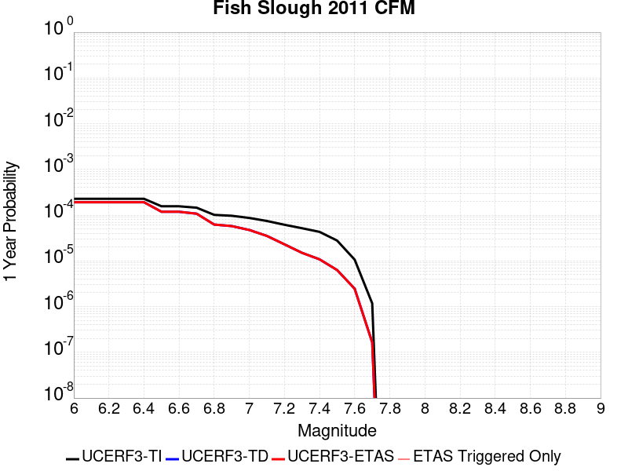 |  |

| Magnitude | 1 wk TI Prob | 1 wk TD Prob | 1 wk ETAS Prob | 1 wk ETAS/TD Gain | 1 wk ETAS Triggered Only | 1 mo TI Prob | 1 mo TD Prob | 1 mo ETAS Prob | 1 mo ETAS/TD Gain | 1 mo ETAS Triggered Only | 1 yr TI Prob | 1 yr TD Prob | 1 yr ETAS Prob | 1 yr ETAS/TD Gain | 1 yr ETAS Triggered Only | 10 yr TI Prob | 10 yr TD Prob | 10 yr ETAS Prob | 10 yr ETAS/TD Gain | 10 yr ETAS Triggered Only |
|-----|-----|-----|-----|-----|-----|-----|-----|-----|-----|-----|-----|-----|-----|-----|-----|-----|-----|-----|-----|-----|
| 6.0 | 4.3629925E-6 | 3.6773667E-6 | 3.6773667E-6 | 1.0 | 0.0 | 1.8698405E-5 | 1.5760059E-5 | 1.5760059E-5 | 1.0 | 0.0 | 2.276293E-4 | 1.9186396E-4 | 1.9186396E-4 | 1.0 | 0.0 | 0.0022739628 | 0.001917192 | 0.0019271729 | 1.005206 | 1.0E-5 |
| 6.1 | 4.3629925E-6 | 3.6773667E-6 | 3.6773667E-6 | 1.0 | 0.0 | 1.8698405E-5 | 1.5760059E-5 | 1.5760059E-5 | 1.0 | 0.0 | 2.276293E-4 | 1.9186396E-4 | 1.9186396E-4 | 1.0 | 0.0 | 0.0022739628 | 0.001917192 | 0.0019271729 | 1.005206 | 1.0E-5 |
| 6.2 | 4.3629925E-6 | 3.6773667E-6 | 3.6773667E-6 | 1.0 | 0.0 | 1.8698405E-5 | 1.5760059E-5 | 1.5760059E-5 | 1.0 | 0.0 | 2.276293E-4 | 1.9186396E-4 | 1.9186396E-4 | 1.0 | 0.0 | 0.0022739628 | 0.001917192 | 0.0019271729 | 1.005206 | 1.0E-5 |
| 6.3 | 4.3629925E-6 | 3.6773667E-6 | 3.6773667E-6 | 1.0 | 0.0 | 1.8698405E-5 | 1.5760059E-5 | 1.5760059E-5 | 1.0 | 0.0 | 2.276293E-4 | 1.9186396E-4 | 1.9186396E-4 | 1.0 | 0.0 | 0.0022739628 | 0.001917192 | 0.0019271729 | 1.005206 | 1.0E-5 |
| 6.4 | 4.3629925E-6 | 3.6773667E-6 | 3.6773667E-6 | 1.0 | 0.0 | 1.8698405E-5 | 1.5760059E-5 | 1.5760059E-5 | 1.0 | 0.0 | 2.276293E-4 | 1.9186396E-4 | 1.9186396E-4 | 1.0 | 0.0 | 0.0022739628 | 0.001917192 | 0.0019271729 | 1.005206 | 1.0E-5 |
| 6.5 | 2.991715E-6 | 2.2704673E-6 | 2.2704673E-6 | 1.0 | 0.0 | 1.2821573E-5 | 9.730543E-6 | 9.730543E-6 | 1.0 | 0.0 | 1.5609147E-4 | 1.1846384E-4 | 1.1846384E-4 | 1.0 | 0.0 | 0.0015598187 | 0.001184097 | 0.0011940852 | 1.0084352 | 1.0E-5 |
| 6.6 | 2.991715E-6 | 2.2704673E-6 | 2.2704673E-6 | 1.0 | 0.0 | 1.2821573E-5 | 9.730543E-6 | 9.730543E-6 | 1.0 | 0.0 | 1.5609147E-4 | 1.1846384E-4 | 1.1846384E-4 | 1.0 | 0.0 | 0.0015598187 | 0.001184097 | 0.0011940852 | 1.0084352 | 1.0E-5 |
| 6.7 | 2.7890346E-6 | 2.0622597E-6 | 2.0622597E-6 | 1.0 | 0.0 | 1.1952951E-5 | 8.838231E-6 | 8.838231E-6 | 1.0 | 0.0 | 1.4551746E-4 | 1.0760105E-4 | 1.0760105E-4 | 1.0 | 0.0 | 0.0014542221 | 0.0010755778 | 0.001085567 | 1.0092874 | 1.0E-5 |
| 6.8 | 1.9416723E-6 | 1.1926174E-6 | 1.1926174E-6 | 1.0 | 0.0 | 8.321425E-6 | 5.111208E-6 | 5.111208E-6 | 1.0 | 0.0 | 1.01308644E-4 | 6.222722E-5 | 6.222722E-5 | 1.0 | 0.0 | 0.0010126247 | 6.2210206E-4 | 6.2210206E-4 | 1.0 | 0.0 |
| 6.9 | 1.8567416E-6 | 1.1047574E-6 | 1.1047574E-6 | 1.0 | 0.0 | 7.957439E-6 | 4.734666E-6 | 4.734666E-6 | 1.0 | 0.0 | 9.687752E-5 | 5.7643076E-5 | 5.7643076E-5 | 1.0 | 0.0 | 9.6835295E-4 | 5.7628506E-4 | 5.7628506E-4 | 1.0 | 0.0 |
| 7.0 | 1.6634067E-6 | 9.0745414E-7 | 9.0745414E-7 | 1.0 | 0.0 | 7.1288664E-6 | 3.8890835E-6 | 3.8890835E-6 | 1.0 | 0.0 | 8.679049E-5 | 4.7348592E-5 | 4.7348592E-5 | 1.0 | 0.0 | 8.6756604E-4 | 4.7338792E-4 | 4.7338792E-4 | 1.0 | 0.0 |
| 7.1 | 1.4281054E-6 | 6.7371394E-7 | 6.7371394E-7 | 1.0 | 0.0 | 6.1204373E-6 | 2.8873424E-6 | 2.8873424E-6 | 1.0 | 0.0 | 7.451377E-5 | 3.5152843E-5 | 3.5152843E-5 | 1.0 | 0.0 | 7.44888E-4 | 3.5147462E-4 | 3.5147462E-4 | 1.0 | 0.0 |
| 7.2 | 1.1810387E-6 | 4.4087977E-7 | 4.4087977E-7 | 1.0 | 0.0 | 5.0615845E-6 | 1.8894834E-6 | 1.8894834E-6 | 1.0 | 0.0 | 6.1623046E-5 | 2.3004228E-5 | 2.3004228E-5 | 1.0 | 0.0 | 6.160596E-4 | 2.3001936E-4 | 2.3001936E-4 | 1.0 | 0.0 |
| 7.3 | 9.918052E-7 | 2.8737298E-7 | 2.8737298E-7 | 1.0 | 0.0 | 4.2505867E-6 | 1.2315979E-6 | 1.2315979E-6 | 1.0 | 0.0 | 5.1749663E-5 | 1.4994602E-5 | 1.4994602E-5 | 1.0 | 0.0 | 5.173762E-4 | 1.4993602E-4 | 1.4993602E-4 | 1.0 | 0.0 |
| 7.4 | 8.25252E-7 | 2.0697927E-7 | 2.0697927E-7 | 1.0 | 0.0 | 3.5367896E-6 | 8.8705366E-7 | 8.8705366E-7 | 1.0 | 0.0 | 4.3059565E-5 | 1.0799826E-5 | 1.0799826E-5 | 1.0 | 0.0 | 4.305122E-4 | 1.0799307E-4 | 1.0799307E-4 | 1.0 | 0.0 |
| 7.5 | 5.3248567E-7 | 1.2074864E-7 | 1.2074864E-7 | 1.0 | 0.0 | 2.2820795E-6 | 5.174941E-7 | 5.174941E-7 | 1.0 | 0.0 | 2.7783964E-5 | 6.3004727E-6 | 6.3004727E-6 | 1.0 | 0.0 | 2.778049E-4 | 6.3002975E-5 | 6.3002975E-5 | 1.0 | 0.0 |
| 7.6 | 2.037542E-7 | 4.7137256E-8 | 4.7137256E-8 | 1.0 | 0.0 | 8.73232E-7 | 2.0201679E-7 | 2.0201679E-7 | 1.0 | 0.0 | 1.0631547E-5 | 2.459552E-6 | 2.459552E-6 | 1.0 | 0.0 | 1.0631039E-4 | 2.4595267E-5 | 2.4595267E-5 | 1.0 | 0.0 |
| 7.7 | 2.2501226E-8 | 3.1516505E-9 | 3.1516505E-9 | 1.0 | 0.0 | 9.6433816E-8 | 1.3507073E-8 | 1.3507073E-8 | 1.0 | 0.0 | 1.1740811E-6 | 1.6444861E-7 | 1.6444861E-7 | 1.0 | 0.0 | 1.1740749E-5 | 1.644485E-6 | 1.644485E-6 | 1.0 | 0.0 |

## Greenville (No) 2011 CFM
*[(top)](#table-of-contents)*

| 1 Week | 1 Month | 1 Year | 10 Year |
|-----|-----|-----|-----|
|  |  |  |  |

| Magnitude | 1 wk TI Prob | 1 wk TD Prob | 1 wk ETAS Prob | 1 wk ETAS/TD Gain | 1 wk ETAS Triggered Only | 1 mo TI Prob | 1 mo TD Prob | 1 mo ETAS Prob | 1 mo ETAS/TD Gain | 1 mo ETAS Triggered Only | 1 yr TI Prob | 1 yr TD Prob | 1 yr ETAS Prob | 1 yr ETAS/TD Gain | 1 yr ETAS Triggered Only | 10 yr TI Prob | 10 yr TD Prob | 10 yr ETAS Prob | 10 yr ETAS/TD Gain | 10 yr ETAS Triggered Only |
|-----|-----|-----|-----|-----|-----|-----|-----|-----|-----|-----|-----|-----|-----|-----|-----|-----|-----|-----|-----|-----|
| 6.0 | 3.286654E-5 | 4.0370527E-5 | 4.0370527E-5 | 1.0 | 0.0 | 1.4084899E-4 | 1.7300528E-4 | 1.7300528E-4 | 1.0 | 0.0 | 0.0017134876 | 0.0021043422 | 0.002114321 | 1.004742 | 1.0E-5 | 0.017003356 | 0.020849675 | 0.020859465 | 1.0004696 | 1.0E-5 |
| 6.1 | 3.286654E-5 | 4.0370527E-5 | 4.0370527E-5 | 1.0 | 0.0 | 1.4084899E-4 | 1.7300528E-4 | 1.7300528E-4 | 1.0 | 0.0 | 0.0017134876 | 0.0021043422 | 0.002114321 | 1.004742 | 1.0E-5 | 0.017003356 | 0.020849675 | 0.020859465 | 1.0004696 | 1.0E-5 |
| 6.2 | 3.1697953E-5 | 3.8933256E-5 | 3.8933256E-5 | 1.0 | 0.0 | 1.358413E-4 | 1.6684635E-4 | 1.6684635E-4 | 1.0 | 0.0 | 0.0016526132 | 0.0020294986 | 0.0020394784 | 1.0049174 | 1.0E-5 | 0.01640377 | 0.020114979 | 0.020124778 | 1.0004871 | 1.0E-5 |
| 6.3 | 3.1363317E-5 | 3.8522077E-5 | 3.8522077E-5 | 1.0 | 0.0 | 1.344073E-4 | 1.6508439E-4 | 1.6508439E-4 | 1.0 | 0.0 | 0.0016351803 | 0.0020080865 | 0.0020180666 | 1.0049698 | 1.0E-5 | 0.016232004 | 0.019904722 | 0.019914523 | 1.0004923 | 1.0E-5 |
| 6.4 | 3.0228604E-5 | 3.7129033E-5 | 3.7129033E-5 | 1.0 | 0.0 | 1.2954473E-4 | 1.5911493E-4 | 1.5911493E-4 | 1.0 | 0.0 | 0.0015760659 | 0.0019355395 | 0.0019455202 | 1.0051565 | 1.0E-5 | 0.015649348 | 0.019191978 | 0.019201785 | 1.000511 | 1.0E-5 |
| 6.5 | 2.9537814E-5 | 3.6284382E-5 | 3.6284382E-5 | 1.0 | 0.0 | 1.2658449E-4 | 1.5549544E-4 | 1.5549544E-4 | 1.0 | 0.0 | 0.0015400766 | 0.0018915493 | 0.0019015304 | 1.0052767 | 1.0E-5 | 0.01529447 | 0.01875959 | 0.018769402 | 1.0005231 | 1.0E-5 |
| 6.6 | 2.7345395E-5 | 3.3593384E-5 | 3.3593384E-5 | 1.0 | 0.0 | 1.1718928E-4 | 1.4396387E-4 | 1.4396387E-4 | 1.0 | 0.0 | 0.0014258457 | 0.001751382 | 0.0017613645 | 1.0056998 | 1.0E-5 | 0.014167317 | 0.01738025 | 0.017390076 | 1.0005654 | 1.0E-5 |
| 6.7 | 2.5615784E-5 | 3.15701E-5 | 3.15701E-5 | 1.0 | 0.0 | 1.09777306E-4 | 1.3529358E-4 | 1.3529358E-4 | 1.0 | 0.0 | 0.0013357193 | 0.0016459854 | 0.001655969 | 1.0060654 | 1.0E-5 | 0.013277191 | 0.01634225 | 0.016352087 | 1.0006019 | 1.0E-5 |
| 6.8 | 2.0059057E-5 | 2.471423E-5 | 2.471423E-5 | 1.0 | 0.0 | 8.596455E-5 | 1.05913925E-4 | 1.05913925E-4 | 1.0 | 0.0 | 0.0010461159 | 0.0012887556 | 0.0012987426 | 1.0077494 | 1.0E-5 | 0.0104120495 | 0.012815477 | 0.012825348 | 1.0007703 | 1.0E-5 |
| 6.9 | 1.6321746E-5 | 2.0186315E-5 | 2.0186315E-5 | 1.0 | 0.0 | 6.9948466E-5 | 8.650998E-5 | 8.650998E-5 | 1.0 | 0.0 | 8.5128983E-4 | 0.0010527625 | 0.001062752 | 1.0094888 | 1.0E-5 | 0.008480361 | 0.010479924 | 0.01048982 | 1.0009443 | 1.0E-5 |
| 7.0 | 1.22527645E-5 | 1.5136794E-5 | 1.5136794E-5 | 1.0 | 0.0 | 5.2510793E-5 | 6.4870386E-5 | 6.4870386E-5 | 1.0 | 0.0 | 6.3913135E-4 | 7.89515E-4 | 7.89515E-4 | 1.0 | 0.0 | 0.0063729626 | 0.007868196 | 0.007868196 | 1.0 | 0.0 |
| 7.1 | 8.996482E-6 | 1.1165758E-5 | 1.1165758E-5 | 1.0 | 0.0 | 3.8555783E-5 | 4.785238E-5 | 4.785238E-5 | 1.0 | 0.0 | 4.6931554E-4 | 5.824482E-4 | 5.824482E-4 | 1.0 | 0.0 | 0.004683256 | 0.005810058 | 0.005810058 | 1.0 | 0.0 |
| 7.2 | 6.0273087E-6 | 7.5700486E-6 | 7.5700486E-6 | 1.0 | 0.0 | 2.5831067E-5 | 3.2442666E-5 | 3.2442666E-5 | 1.0 | 0.0 | 3.1444785E-4 | 3.9491858E-4 | 3.9491858E-4 | 1.0 | 0.0 | 0.0031400328 | 0.0039427704 | 0.0039427704 | 1.0 | 0.0 |
| 7.3 | 3.1209995E-6 | 3.9667148E-6 | 3.9667148E-6 | 1.0 | 0.0 | 1.3375643E-5 | 1.7000097E-5 | 1.7000097E-5 | 1.0 | 0.0 | 1.6283628E-4 | 2.0695668E-4 | 2.0695668E-4 | 1.0 | 0.0 | 0.0016271701 | 0.0020679291 | 0.0020679291 | 1.0 | 0.0 |
| 7.4 | 2.0254208E-6 | 2.6098658E-6 | 2.6098658E-6 | 1.0 | 0.0 | 8.680347E-6 | 1.1185091E-5 | 1.1185091E-5 | 1.0 | 0.0 | 1.0567809E-4 | 1.3617004E-4 | 1.3617004E-4 | 1.0 | 0.0 | 0.0010562785 | 0.0013611894 | 0.0013611894 | 1.0 | 0.0 |
| 7.5 | 1.6763418E-6 | 2.1735425E-6 | 2.1735425E-6 | 1.0 | 0.0 | 7.184302E-6 | 9.315149E-6 | 9.315149E-6 | 1.0 | 0.0 | 8.746537E-5 | 1.13406095E-4 | 1.13406095E-4 | 1.0 | 0.0 | 8.743095E-4 | 0.0011337879 | 0.0011337879 | 1.0 | 0.0 |
| 7.6 | 1.1935462E-6 | 1.546016E-6 | 1.546016E-6 | 1.0 | 0.0 | 5.115188E-6 | 6.6257667E-6 | 6.6257667E-6 | 1.0 | 0.0 | 6.2275634E-5 | 8.066577E-5 | 8.066577E-5 | 1.0 | 0.0 | 6.2258187E-4 | 8.0658693E-4 | 8.0658693E-4 | 1.0 | 0.0 |
| 7.7 | 3.0464201E-7 | 3.9849502E-7 | 3.9849502E-7 | 1.0 | 0.0 | 1.3056081E-6 | 1.7078347E-6 | 1.7078347E-6 | 1.0 | 0.0 | 1.589566E-5 | 2.0792695E-5 | 2.0792695E-5 | 1.0 | 0.0 | 1.5894524E-4 | 2.0790711E-4 | 2.0790711E-4 | 1.0 | 0.0 |

## Hosgri (Extension)
*[(top)](#table-of-contents)*

| 1 Week | 1 Month | 1 Year | 10 Year |
|-----|-----|-----|-----|
|  |  |  |  |

| Magnitude | 1 wk TI Prob | 1 wk TD Prob | 1 wk ETAS Prob | 1 wk ETAS/TD Gain | 1 wk ETAS Triggered Only | 1 mo TI Prob | 1 mo TD Prob | 1 mo ETAS Prob | 1 mo ETAS/TD Gain | 1 mo ETAS Triggered Only | 1 yr TI Prob | 1 yr TD Prob | 1 yr ETAS Prob | 1 yr ETAS/TD Gain | 1 yr ETAS Triggered Only | 10 yr TI Prob | 10 yr TD Prob | 10 yr ETAS Prob | 10 yr ETAS/TD Gain | 10 yr ETAS Triggered Only |
|-----|-----|-----|-----|-----|-----|-----|-----|-----|-----|-----|-----|-----|-----|-----|-----|-----|-----|-----|-----|-----|
| 6.0 | 1.1369135E-5 | 1.2083579E-5 | 1.2083579E-5 | 1.0 | 0.0 | 4.8723956E-5 | 5.178587E-5 | 5.178587E-5 | 1.0 | 0.0 | 5.9305265E-4 | 6.303333E-4 | 6.303333E-4 | 1.0 | 0.0 | 0.005914725 | 0.0062877033 | 0.0062976405 | 1.0015804 | 1.0E-5 |
| 6.1 | 6.934979E-6 | 7.324878E-6 | 7.324878E-6 | 1.0 | 0.0 | 2.9721E-5 | 3.139198E-5 | 3.139198E-5 | 1.0 | 0.0 | 3.617931E-4 | 3.8213446E-4 | 3.8213446E-4 | 1.0 | 0.0 | 0.0036120464 | 0.0038151864 | 0.0038151864 | 1.0 | 0.0 |
| 6.2 | 6.934979E-6 | 7.324878E-6 | 7.324878E-6 | 1.0 | 0.0 | 2.9721E-5 | 3.139198E-5 | 3.139198E-5 | 1.0 | 0.0 | 3.617931E-4 | 3.8213446E-4 | 3.8213446E-4 | 1.0 | 0.0 | 0.0036120464 | 0.0038151864 | 0.0038151864 | 1.0 | 0.0 |
| 6.3 | 4.5484676E-6 | 4.769557E-6 | 4.769557E-6 | 1.0 | 0.0 | 1.9493287E-5 | 2.0440802E-5 | 2.0440802E-5 | 1.0 | 0.0 | 2.3730492E-4 | 2.4883877E-4 | 2.4883877E-4 | 1.0 | 0.0 | 0.0023705168 | 0.0024856438 | 0.0024856438 | 1.0 | 0.0 |
| 6.4 | 4.218095E-6 | 4.417076E-6 | 4.417076E-6 | 1.0 | 0.0 | 1.8077424E-5 | 1.893019E-5 | 1.893019E-5 | 1.0 | 0.0 | 2.2007042E-4 | 2.3045103E-4 | 2.3045103E-4 | 1.0 | 0.0 | 0.002198526 | 0.002302154 | 0.002302154 | 1.0 | 0.0 |
| 6.5 | 3.717374E-6 | 3.884074E-6 | 3.884074E-6 | 1.0 | 0.0 | 1.5931506E-5 | 1.6645927E-5 | 1.6645927E-5 | 1.0 | 0.0 | 1.9394881E-4 | 2.0264549E-4 | 2.0264549E-4 | 1.0 | 0.0 | 0.0019377962 | 0.002024626 | 0.002024626 | 1.0 | 0.0 |
| 6.6 | 3.4605036E-6 | 3.6084919E-6 | 3.6084919E-6 | 1.0 | 0.0 | 1.4830645E-5 | 1.5464873E-5 | 1.5464873E-5 | 1.0 | 0.0 | 1.8054814E-4 | 1.882687E-4 | 1.882687E-4 | 1.0 | 0.0 | 0.0018040152 | 0.0018811069 | 0.0018811069 | 1.0 | 0.0 |
| 6.7 | 3.123439E-6 | 3.2467403E-6 | 3.2467403E-6 | 1.0 | 0.0 | 1.33860985E-5 | 1.3914528E-5 | 1.3914528E-5 | 1.0 | 0.0 | 1.6296357E-4 | 1.6939631E-4 | 1.6939631E-4 | 1.0 | 0.0 | 0.001628441 | 0.0016926829 | 0.0016926829 | 1.0 | 0.0 |
| 6.8 | 2.8290783E-6 | 2.9306998E-6 | 2.9306998E-6 | 1.0 | 0.0 | 1.2124565E-5 | 1.2560082E-5 | 1.2560082E-5 | 1.0 | 0.0 | 1.4760658E-4 | 1.5290834E-4 | 1.5290834E-4 | 1.0 | 0.0 | 0.0014750857 | 0.00152804 | 0.00152804 | 1.0 | 0.0 |
| 6.9 | 2.454112E-6 | 2.5284635E-6 | 2.5284635E-6 | 1.0 | 0.0 | 1.0517581E-5 | 1.08362265E-5 | 1.08362265E-5 | 1.0 | 0.0 | 1.2804402E-4 | 1.3192314E-4 | 1.3192314E-4 | 1.0 | 0.0 | 0.0012797028 | 0.0013184543 | 0.0013184543 | 1.0 | 0.0 |
| 7.0 | 2.1008145E-6 | 2.1499998E-6 | 2.1499998E-6 | 1.0 | 0.0 | 9.003459E-6 | 9.214253E-6 | 9.214253E-6 | 1.0 | 0.0 | 1.096116E-4 | 1.1217779E-4 | 1.1217779E-4 | 1.0 | 0.0 | 0.0010955755 | 0.0011212154 | 0.0011212154 | 1.0 | 0.0 |
| 7.1 | 1.744384E-6 | 1.7687507E-6 | 1.7687507E-6 | 1.0 | 0.0 | 7.47591E-6 | 7.580338E-6 | 7.580338E-6 | 1.0 | 0.0 | 9.1015405E-5 | 9.2286726E-5 | 9.2286726E-5 | 1.0 | 0.0 | 9.097813E-4 | 9.224857E-4 | 9.224857E-4 | 1.0 | 0.0 |
| 7.2 | 1.5456587E-6 | 1.556396E-6 | 1.556396E-6 | 1.0 | 0.0 | 6.6242346E-6 | 6.6702514E-6 | 6.6702514E-6 | 1.0 | 0.0 | 8.064707E-5 | 8.12073E-5 | 8.12073E-5 | 1.0 | 0.0 | 8.0617814E-4 | 8.117775E-4 | 8.117775E-4 | 1.0 | 0.0 |
| 7.3 | 1.3775123E-6 | 1.3767094E-6 | 1.3767094E-6 | 1.0 | 0.0 | 5.9036106E-6 | 5.90017E-6 | 5.90017E-6 | 1.0 | 0.0 | 7.187409E-5 | 7.183221E-5 | 7.183221E-5 | 1.0 | 0.0 | 7.185085E-4 | 7.180909E-4 | 7.180909E-4 | 1.0 | 0.0 |
| 7.4 | 1.214491E-6 | 1.2024409E-6 | 1.2024409E-6 | 1.0 | 0.0 | 5.2049513E-6 | 5.153308E-6 | 5.153308E-6 | 1.0 | 0.0 | 6.336844E-5 | 6.2739724E-5 | 6.2739724E-5 | 1.0 | 0.0 | 6.335037E-4 | 6.2722096E-4 | 6.2722096E-4 | 1.0 | 0.0 |
| 7.5 | 1.0101123E-6 | 9.843116E-7 | 9.843116E-7 | 1.0 | 0.0 | 4.3290456E-6 | 4.2184715E-6 | 4.2184715E-6 | 1.0 | 0.0 | 5.2704854E-5 | 5.1358686E-5 | 5.1358686E-5 | 1.0 | 0.0 | 5.2692357E-4 | 5.1346875E-4 | 5.1346875E-4 | 1.0 | 0.0 |
| 7.6 | 8.1558215E-7 | 7.7667625E-7 | 7.7667625E-7 | 1.0 | 0.0 | 3.4953473E-6 | 3.3286083E-6 | 3.3286083E-6 | 1.0 | 0.0 | 4.255502E-5 | 4.0525058E-5 | 4.0525058E-5 | 1.0 | 0.0 | 4.2546875E-4 | 4.051771E-4 | 4.051771E-4 | 1.0 | 0.0 |
| 7.7 | 4.757816E-7 | 4.1315505E-7 | 4.1315505E-7 | 1.0 | 0.0 | 2.0390623E-6 | 1.7706633E-6 | 1.7706633E-6 | 1.0 | 0.0 | 2.4825302E-5 | 2.1557613E-5 | 2.1557613E-5 | 1.0 | 0.0 | 2.482253E-4 | 2.1555535E-4 | 2.1555535E-4 | 1.0 | 0.0 |
| 7.8 | 2.782787E-7 | 2.0053476E-7 | 2.0053476E-7 | 1.0 | 0.0 | 1.1926223E-6 | 8.5943435E-7 | 8.5943435E-7 | 1.0 | 0.0 | 1.452008E-5 | 1.0463564E-5 | 1.0463564E-5 | 1.0 | 0.0 | 1.4519131E-4 | 1.04630744E-4 | 1.04630744E-4 | 1.0 | 0.0 |
| 7.9 | 1.6948086E-7 | 9.2492506E-8 | 9.2492506E-8 | 1.0 | 0.0 | 7.2634634E-7 | 3.963964E-7 | 3.963964E-7 | 1.0 | 0.0 | 8.843231E-6 | 4.8261154E-6 | 4.8261154E-6 | 1.0 | 0.0 | 8.842879E-5 | 4.826011E-5 | 4.826011E-5 | 1.0 | 0.0 |
| 8.0 | 1.0225492E-7 | 4.4773795E-8 | 4.4773795E-8 | 1.0 | 0.0 | 4.382353E-7 | 1.9188768E-7 | 1.9188768E-7 | 1.0 | 0.0 | 5.335502E-6 | 2.33623E-6 | 2.33623E-6 | 1.0 | 0.0 | 5.335374E-5 | 2.3362058E-5 | 2.3362058E-5 | 1.0 | 0.0 |
| 8.1 | 1.43711345E-8 | 5.792936E-9 | 5.792936E-9 | 1.0 | 0.0 | 6.1590576E-8 | 2.4826868E-8 | 2.4826868E-8 | 1.0 | 0.0 | 7.4986497E-7 | 3.0226707E-7 | 3.0226707E-7 | 1.0 | 0.0 | 7.4986247E-6 | 3.0226672E-6 | 3.0226672E-6 | 1.0 | 0.0 |

## San Gabriel
*[(top)](#table-of-contents)*

| 1 Week | 1 Month | 1 Year | 10 Year |
|-----|-----|-----|-----|
|  |  |  |  |

| Magnitude | 1 wk TI Prob | 1 wk TD Prob | 1 wk ETAS Prob | 1 wk ETAS/TD Gain | 1 wk ETAS Triggered Only | 1 mo TI Prob | 1 mo TD Prob | 1 mo ETAS Prob | 1 mo ETAS/TD Gain | 1 mo ETAS Triggered Only | 1 yr TI Prob | 1 yr TD Prob | 1 yr ETAS Prob | 1 yr ETAS/TD Gain | 1 yr ETAS Triggered Only | 10 yr TI Prob | 10 yr TD Prob | 10 yr ETAS Prob | 10 yr ETAS/TD Gain | 10 yr ETAS Triggered Only |
|-----|-----|-----|-----|-----|-----|-----|-----|-----|-----|-----|-----|-----|-----|-----|-----|-----|-----|-----|-----|-----|
| 6.0 | 1.083775E-5 | 1.1993788E-5 | 1.1993788E-5 | 1.0 | 0.0 | 4.6446676E-5 | 5.1400995E-5 | 5.1400995E-5 | 1.0 | 0.0 | 5.653415E-4 | 6.2563876E-4 | 6.2563876E-4 | 1.0 | 0.0 | 0.0056390543 | 0.0062508797 | 0.0062608174 | 1.0015898 | 1.0E-5 |
| 6.1 | 1.083775E-5 | 1.1993788E-5 | 1.1993788E-5 | 1.0 | 0.0 | 4.6446676E-5 | 5.1400995E-5 | 5.1400995E-5 | 1.0 | 0.0 | 5.653415E-4 | 6.2563876E-4 | 6.2563876E-4 | 1.0 | 0.0 | 0.0056390543 | 0.0062508797 | 0.0062608174 | 1.0015898 | 1.0E-5 |
| 6.2 | 1.083775E-5 | 1.1993788E-5 | 1.1993788E-5 | 1.0 | 0.0 | 4.6446676E-5 | 5.1400995E-5 | 5.1400995E-5 | 1.0 | 0.0 | 5.653415E-4 | 6.2563876E-4 | 6.2563876E-4 | 1.0 | 0.0 | 0.0056390543 | 0.0062508797 | 0.0062608174 | 1.0015898 | 1.0E-5 |
| 6.3 | 1.083775E-5 | 1.1993788E-5 | 1.1993788E-5 | 1.0 | 0.0 | 4.6446676E-5 | 5.1400995E-5 | 5.1400995E-5 | 1.0 | 0.0 | 5.653415E-4 | 6.2563876E-4 | 6.2563876E-4 | 1.0 | 0.0 | 0.0056390543 | 0.0062508797 | 0.0062608174 | 1.0015898 | 1.0E-5 |
| 6.4 | 1.083775E-5 | 1.1993788E-5 | 1.1993788E-5 | 1.0 | 0.0 | 4.6446676E-5 | 5.1400995E-5 | 5.1400995E-5 | 1.0 | 0.0 | 5.653415E-4 | 6.2563876E-4 | 6.2563876E-4 | 1.0 | 0.0 | 0.0056390543 | 0.0062508797 | 0.0062608174 | 1.0015898 | 1.0E-5 |
| 6.5 | 6.7317824E-6 | 7.725454E-6 | 7.725454E-6 | 1.0 | 0.0 | 2.8850178E-5 | 3.3108678E-5 | 3.3108678E-5 | 1.0 | 0.0 | 3.511943E-4 | 4.0302463E-4 | 4.0302463E-4 | 1.0 | 0.0 | 0.003506398 | 0.0040340438 | 0.0040440033 | 1.002469 | 1.0E-5 |
| 6.6 | 6.7317824E-6 | 7.725454E-6 | 7.725454E-6 | 1.0 | 0.0 | 2.8850178E-5 | 3.3108678E-5 | 3.3108678E-5 | 1.0 | 0.0 | 3.511943E-4 | 4.0302463E-4 | 4.0302463E-4 | 1.0 | 0.0 | 0.003506398 | 0.0040340438 | 0.0040440033 | 1.002469 | 1.0E-5 |
| 6.7 | 6.274881E-6 | 7.254367E-6 | 7.254367E-6 | 1.0 | 0.0 | 2.6892068E-5 | 3.108978E-5 | 3.108978E-5 | 1.0 | 0.0 | 3.2736175E-4 | 3.784533E-4 | 3.784533E-4 | 1.0 | 0.0 | 0.0032687993 | 0.0037891874 | 0.0037991495 | 1.002629 | 1.0E-5 |
| 6.8 | 5.996209E-6 | 6.9670828E-6 | 6.9670828E-6 | 1.0 | 0.0 | 2.5697784E-5 | 2.985859E-5 | 2.985859E-5 | 1.0 | 0.0 | 3.128256E-4 | 3.6346863E-4 | 3.6346863E-4 | 1.0 | 0.0 | 0.003123856 | 0.0036398387 | 0.0036498022 | 1.0027374 | 1.0E-5 |
| 6.9 | 5.686331E-6 | 6.632093E-6 | 6.632093E-6 | 1.0 | 0.0 | 2.4369761E-5 | 2.8422952E-5 | 2.8422952E-5 | 1.0 | 0.0 | 2.9666146E-4 | 3.4599542E-4 | 3.4599542E-4 | 1.0 | 0.0 | 0.0029626573 | 0.0034656627 | 0.003475628 | 1.0028754 | 1.0E-5 |
| 7.0 | 5.2329838E-6 | 6.1559535E-6 | 6.1559535E-6 | 1.0 | 0.0 | 2.242688E-5 | 2.6382395E-5 | 2.6382395E-5 | 1.0 | 0.0 | 2.7301308E-4 | 3.2115908E-4 | 3.2115908E-4 | 1.0 | 0.0 | 0.002726779 | 0.0032180331 | 0.0032280008 | 1.0030975 | 1.0E-5 |
| 7.1 | 5.135671E-6 | 6.046056E-6 | 6.046056E-6 | 1.0 | 0.0 | 2.2009834E-5 | 2.5911417E-5 | 2.5911417E-5 | 1.0 | 0.0 | 2.6793676E-4 | 3.154266E-4 | 3.154266E-4 | 1.0 | 0.0 | 0.0026761394 | 0.0031608723 | 0.0031708407 | 1.0031537 | 1.0E-5 |
| 7.2 | 4.989062E-6 | 5.8793967E-6 | 5.8793967E-6 | 1.0 | 0.0 | 2.1381518E-5 | 2.5197176E-5 | 2.5197176E-5 | 1.0 | 0.0 | 2.6028889E-4 | 3.0673319E-4 | 3.0673319E-4 | 1.0 | 0.0 | 0.0025998424 | 0.0030741817 | 0.0030841508 | 1.0032429 | 1.0E-5 |
| 7.3 | 4.8219395E-6 | 5.7109164E-6 | 5.7109164E-6 | 1.0 | 0.0 | 2.0665291E-5 | 2.447513E-5 | 2.447513E-5 | 1.0 | 0.0 | 2.5157086E-4 | 2.979447E-4 | 2.979447E-4 | 1.0 | 0.0 | 0.0025128627 | 0.0029865364 | 0.0029965066 | 1.0033383 | 1.0E-5 |
| 7.4 | 4.7118383E-6 | 5.5994446E-6 | 5.5994446E-6 | 1.0 | 0.0 | 2.0193436E-5 | 2.3997403E-5 | 2.3997403E-5 | 1.0 | 0.0 | 2.4582737E-4 | 2.9212996E-4 | 2.9212996E-4 | 1.0 | 0.0 | 0.002455556 | 0.0029285424 | 0.0029385132 | 1.0034046 | 1.0E-5 |
| 7.5 | 4.5506545E-6 | 5.4447687E-6 | 5.4447687E-6 | 1.0 | 0.0 | 1.9502659E-5 | 2.333452E-5 | 2.333452E-5 | 1.0 | 0.0 | 2.37419E-4 | 2.8406148E-4 | 2.8406148E-4 | 1.0 | 0.0 | 0.002371655 | 0.0028480662 | 0.0028580376 | 1.0035012 | 1.0E-5 |
| 7.6 | 4.343636E-6 | 5.2375767E-6 | 5.2375767E-6 | 1.0 | 0.0 | 1.861545E-5 | 2.244657E-5 | 2.244657E-5 | 1.0 | 0.0 | 2.2661954E-4 | 2.7325345E-4 | 2.7325345E-4 | 1.0 | 0.0 | 0.0022638857 | 0.0027402486 | 0.0027502212 | 1.0036393 | 1.0E-5 |
| 7.7 | 2.936235E-6 | 2.749426E-6 | 2.749426E-6 | 1.0 | 0.0 | 1.2583803E-5 | 1.17832005E-5 | 1.17832005E-5 | 1.0 | 0.0 | 1.5319703E-4 | 1.4345106E-4 | 1.4345106E-4 | 1.0 | 0.0 | 0.0015309147 | 0.0014409109 | 0.0014508964 | 1.0069301 | 1.0E-5 |
| 7.8 | 1.4541639E-6 | 9.144744E-7 | 9.144744E-7 | 1.0 | 0.0 | 6.232116E-6 | 3.91917E-6 | 3.91917E-6 | 1.0 | 0.0 | 7.587337E-5 | 4.7714853E-5 | 4.7714853E-5 | 1.0 | 0.0 | 7.584747E-4 | 4.819727E-4 | 4.819727E-4 | 1.0 | 0.0 |
| 7.9 | 8.098958E-7 | 2.4252918E-7 | 2.4252918E-7 | 1.0 | 0.0 | 3.4709774E-6 | 1.0394103E-6 | 1.0394103E-6 | 1.0 | 0.0 | 4.225833E-5 | 1.2654747E-5 | 1.2654747E-5 | 1.0 | 0.0 | 4.2250296E-4 | 1.2963027E-4 | 1.2963027E-4 | 1.0 | 0.0 |
| 8.0 | 5.2473234E-7 | 7.7131155E-8 | 7.7131155E-8 | 1.0 | 0.0 | 2.248851E-6 | 3.3056207E-7 | 3.3056207E-7 | 1.0 | 0.0 | 2.7379416E-5 | 4.0245855E-6 | 4.0245855E-6 | 1.0 | 0.0 | 2.7376044E-4 | 4.2375388E-5 | 4.2375388E-5 | 1.0 | 0.0 |
| 8.1 | 3.3162388E-7 | 4.1683297E-8 | 4.1683297E-8 | 1.0 | 0.0 | 1.4212444E-6 | 1.786427E-7 | 1.786427E-7 | 1.0 | 0.0 | 1.7303513E-5 | 2.1749727E-6 | 2.1749727E-6 | 1.0 | 0.0 | 1.7302166E-4 | 2.30667E-5 | 2.30667E-5 | 1.0 | 0.0 |
| 8.2 | 1.0235345E-7 | 1.4101387E-8 | 1.4101387E-8 | 1.0 | 0.0 | 4.3865757E-7 | 6.0434516E-8 | 6.0434516E-8 | 1.0 | 0.0 | 5.340643E-6 | 7.3578997E-7 | 7.3578997E-7 | 1.0 | 0.0 | 5.3405143E-5 | 7.959129E-6 | 7.959129E-6 | 1.0 | 0.0 |

## Morales (West)
*[(top)](#table-of-contents)*

| 1 Week | 1 Month | 1 Year | 10 Year |
|-----|-----|-----|-----|
|  |  | 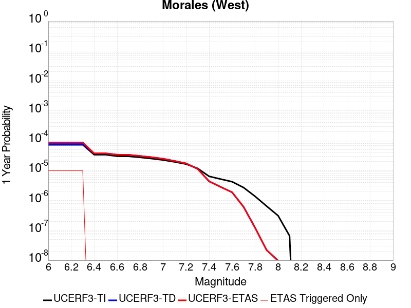 |  |

| Magnitude | 1 wk TI Prob | 1 wk TD Prob | 1 wk ETAS Prob | 1 wk ETAS/TD Gain | 1 wk ETAS Triggered Only | 1 mo TI Prob | 1 mo TD Prob | 1 mo ETAS Prob | 1 mo ETAS/TD Gain | 1 mo ETAS Triggered Only | 1 yr TI Prob | 1 yr TD Prob | 1 yr ETAS Prob | 1 yr ETAS/TD Gain | 1 yr ETAS Triggered Only | 10 yr TI Prob | 10 yr TD Prob | 10 yr ETAS Prob | 10 yr ETAS/TD Gain | 10 yr ETAS Triggered Only |
|-----|-----|-----|-----|-----|-----|-----|-----|-----|-----|-----|-----|-----|-----|-----|-----|-----|-----|-----|-----|-----|
| 6.0 | 1.4027072E-6 | 1.4795005E-6 | 1.4795005E-6 | 1.0 | 0.0 | 6.0115885E-6 | 6.340705E-6 | 6.340705E-6 | 1.0 | 0.0 | 7.318863E-5 | 7.719605E-5 | 8.719527E-5 | 1.1295303 | 1.0E-5 | 7.316453E-4 | 7.717609E-4 | 7.8175316E-4 | 1.0129474 | 1.0E-5 |
| 6.1 | 1.4027072E-6 | 1.4795005E-6 | 1.4795005E-6 | 1.0 | 0.0 | 6.0115885E-6 | 6.340705E-6 | 6.340705E-6 | 1.0 | 0.0 | 7.318863E-5 | 7.719605E-5 | 8.719527E-5 | 1.1295303 | 1.0E-5 | 7.316453E-4 | 7.717609E-4 | 7.8175316E-4 | 1.0129474 | 1.0E-5 |
| 6.2 | 1.4027072E-6 | 1.4795005E-6 | 1.4795005E-6 | 1.0 | 0.0 | 6.0115885E-6 | 6.340705E-6 | 6.340705E-6 | 1.0 | 0.0 | 7.318863E-5 | 7.719605E-5 | 8.719527E-5 | 1.1295303 | 1.0E-5 | 7.316453E-4 | 7.717609E-4 | 7.8175316E-4 | 1.0129474 | 1.0E-5 |
| 6.3 | 1.4027072E-6 | 1.4795005E-6 | 1.4795005E-6 | 1.0 | 0.0 | 6.0115885E-6 | 6.340705E-6 | 6.340705E-6 | 1.0 | 0.0 | 7.318863E-5 | 7.719605E-5 | 8.719527E-5 | 1.1295303 | 1.0E-5 | 7.316453E-4 | 7.717609E-4 | 7.8175316E-4 | 1.0129474 | 1.0E-5 |
| 6.4 | 6.504502E-7 | 7.207276E-7 | 7.207276E-7 | 1.0 | 0.0 | 2.7876408E-6 | 3.0888289E-6 | 3.0888289E-6 | 1.0 | 0.0 | 3.3939E-5 | 3.7605856E-5 | 3.7605856E-5 | 1.0 | 0.0 | 3.3933815E-4 | 3.759961E-4 | 3.759961E-4 | 1.0 | 0.0 |
| 6.5 | 6.504502E-7 | 7.207276E-7 | 7.207276E-7 | 1.0 | 0.0 | 2.7876408E-6 | 3.0888289E-6 | 3.0888289E-6 | 1.0 | 0.0 | 3.3939E-5 | 3.7605856E-5 | 3.7605856E-5 | 1.0 | 0.0 | 3.3933815E-4 | 3.759961E-4 | 3.759961E-4 | 1.0 | 0.0 |
| 6.6 | 5.8056526E-7 | 6.5035334E-7 | 6.5035334E-7 | 1.0 | 0.0 | 2.4881344E-6 | 2.7872256E-6 | 2.7872256E-6 | 1.0 | 0.0 | 3.0292615E-5 | 3.393395E-5 | 3.393395E-5 | 1.0 | 0.0 | 3.0288487E-4 | 3.392883E-4 | 3.392883E-4 | 1.0 | 0.0 |
| 6.7 | 5.741448E-7 | 6.4388445E-7 | 6.4388445E-7 | 1.0 | 0.0 | 2.4606184E-6 | 2.7595017E-6 | 2.7595017E-6 | 1.0 | 0.0 | 2.9957617E-5 | 3.359642E-5 | 3.359642E-5 | 1.0 | 0.0 | 2.9953578E-4 | 3.3591405E-4 | 3.3591405E-4 | 1.0 | 0.0 |
| 6.8 | 5.299428E-7 | 5.8941583E-7 | 5.8941583E-7 | 1.0 | 0.0 | 2.2711813E-6 | 2.5260654E-6 | 2.5260654E-6 | 1.0 | 0.0 | 2.7651282E-5 | 3.0754418E-5 | 3.0754418E-5 | 1.0 | 0.0 | 2.7647841E-4 | 3.0750208E-4 | 3.0750208E-4 | 1.0 | 0.0 |
| 6.9 | 4.82394E-7 | 5.344846E-7 | 5.344846E-7 | 1.0 | 0.0 | 2.0674013E-6 | 2.2906463E-6 | 2.2906463E-6 | 1.0 | 0.0 | 2.517032E-5 | 2.7888267E-5 | 2.7888267E-5 | 1.0 | 0.0 | 2.516747E-4 | 2.7884808E-4 | 2.7884808E-4 | 1.0 | 0.0 |
| 7.0 | 4.3264512E-7 | 4.762917E-7 | 4.762917E-7 | 1.0 | 0.0 | 1.8541921E-6 | 2.0412485E-6 | 2.0412485E-6 | 1.0 | 0.0 | 2.2574555E-5 | 2.485192E-5 | 2.485192E-5 | 1.0 | 0.0 | 2.2572262E-4 | 2.4849176E-4 | 2.4849176E-4 | 1.0 | 0.0 |
| 7.1 | 3.7388565E-7 | 4.0032145E-7 | 4.0032145E-7 | 1.0 | 0.0 | 1.6023661E-6 | 1.7156622E-6 | 1.7156622E-6 | 1.0 | 0.0 | 1.9508632E-5 | 2.088799E-5 | 2.088799E-5 | 1.0 | 0.0 | 1.950692E-4 | 2.088605E-4 | 2.088605E-4 | 1.0 | 0.0 |
| 7.2 | 3.1592543E-7 | 3.322619E-7 | 3.322619E-7 | 1.0 | 0.0 | 1.3539654E-6 | 1.4239787E-6 | 1.4239787E-6 | 1.0 | 0.0 | 1.6484404E-5 | 1.7336804E-5 | 1.7336804E-5 | 1.0 | 0.0 | 1.6483181E-4 | 1.733547E-4 | 1.733547E-4 | 1.0 | 0.0 |
| 7.3 | 2.2677783E-7 | 2.1815828E-7 | 2.1815828E-7 | 1.0 | 0.0 | 9.719047E-7 | 9.349637E-7 | 9.349637E-7 | 1.0 | 0.0 | 1.1832874E-5 | 1.1383124E-5 | 1.1383124E-5 | 1.0 | 0.0 | 1.18322445E-4 | 1.1382546E-4 | 1.1382546E-4 | 1.0 | 0.0 |
| 7.4 | 1.2295531E-7 | 8.360315E-8 | 8.360315E-8 | 1.0 | 0.0 | 5.269512E-7 | 3.5829916E-7 | 3.5829916E-7 | 1.0 | 0.0 | 6.4156125E-6 | 4.3622836E-6 | 4.3622836E-6 | 1.0 | 0.0 | 6.415427E-5 | 4.362199E-5 | 4.362199E-5 | 1.0 | 0.0 |
| 7.5 | 9.9632544E-8 | 5.4497065E-8 | 5.4497065E-8 | 1.0 | 0.0 | 4.2699656E-7 | 2.3355884E-7 | 2.3355884E-7 | 1.0 | 0.0 | 5.198671E-6 | 2.843575E-6 | 2.843575E-6 | 1.0 | 0.0 | 5.198549E-5 | 2.8435392E-5 | 2.8435392E-5 | 1.0 | 0.0 |
| 7.6 | 8.125894E-8 | 3.5998333E-8 | 3.5998333E-8 | 1.0 | 0.0 | 3.4825257E-7 | 1.5427855E-7 | 1.5427855E-7 | 1.0 | 0.0 | 4.2399665E-6 | 1.8783398E-6 | 1.8783398E-6 | 1.0 | 0.0 | 4.2398857E-5 | 1.8783245E-5 | 1.8783245E-5 | 1.0 | 0.0 |
| 7.7 | 5.1810765E-8 | 1.1667915E-8 | 1.1667915E-8 | 1.0 | 0.0 | 2.2204613E-7 | 5.0005347E-8 | 5.0005347E-8 | 1.0 | 0.0 | 2.7034082E-6 | 6.0881496E-7 | 6.0881496E-7 | 1.0 | 0.0 | 2.7033753E-5 | 6.0881366E-6 | 6.0881366E-6 | 1.0 | 0.0 |
| 7.8 | 2.6315043E-8 | 2.3458901E-9 | 2.3458901E-9 | 1.0 | 0.0 | 1.1277875E-7 | 1.0053814E-8 | 1.0053814E-8 | 1.0 | 0.0 | 1.3730804E-6 | 1.2240518E-7 | 1.2240518E-7 | 1.0 | 0.0 | 1.3730719E-5 | 1.2240552E-6 | 1.2240552E-6 | 1.0 | 0.0 |
| 7.9 | 1.24281545E-8 | 4.2257364E-10 | 4.2257364E-10 | 1.0 | 0.0 | 5.3263516E-8 | 1.8110331E-9 | 1.8110331E-9 | 1.0 | 0.0 | 6.4848314E-7 | 2.2049328E-8 | 2.2049328E-8 | 1.0 | 0.0 | 6.4848123E-6 | 2.2049726E-7 | 2.2049726E-7 | 1.0 | 0.0 |
| 8.0 | 5.954214E-9 | 1.8596458E-10 | 1.8596458E-10 | 1.0 | 0.0 | 2.551806E-8 | 7.969915E-10 | 7.969915E-10 | 1.0 | 0.0 | 3.1068234E-7 | 9.703375E-9 | 9.703375E-9 | 1.0 | 0.0 | 3.1068191E-6 | 9.703775E-8 | 9.703775E-8 | 1.0 | 0.0 |
| 8.1 | 1.2586262E-9 | 8.382861E-11 | 8.382861E-11 | 1.0 | 0.0 | 5.3941123E-9 | 3.5926528E-10 | 3.5926528E-10 | 1.0 | 0.0 | 6.567332E-8 | 4.374056E-9 | 4.374056E-9 | 1.0 | 0.0 | 6.56733E-7 | 4.3744556E-8 | 4.3744556E-8 | 1.0 | 0.0 |

