# Parent Section Magnitude-Probability Distributions

Only fault sections with at least one triggered aftershock are plotted. Sections are sorted by total supraseismogenic trigger rate (decreasing)

## Table Of Contents

* [Garlock (Central)](#garlock-central)
* [Tank Canyon](#tank-canyon)
* [Little Lake](#little-lake)
* [Owl Lake](#owl-lake)
* [Garlock (East)](#garlock-east)
* [Airport Lake](#airport-lake)
* [Panamint Valley](#panamint-valley)
* [Ash Hill](#ash-hill)
* [Hunter Mountain-Saline Valley](#hunter-mountain-saline-valley)
* [Blackwater](#blackwater)
* [McLean Lake](#mclean-lake)
* [Garlock (West)](#garlock-west)
* [Death Valley (So)](#death-valley-so)
* [Coyote Canyon](#coyote-canyon)
* [So Sierra Nevada](#so-sierra-nevada)
* [Gravel Hills-Harper Lk](#gravel-hills-harper-lk)
* [Goldstone Lake](#goldstone-lake)
* [Nelson Lake](#nelson-lake)
* [San Andreas (Mojave S)](#san-andreas-mojave-s)
* [Death Valley (Black Mtns Frontal)](#death-valley-black-mtns-frontal)
* [San Andreas (Mojave N)](#san-andreas-mojave-n)
* [Towne Pass](#towne-pass)
* [Garlic Springs](#garlic-springs)
* [Bicycle Lake](#bicycle-lake)
* [Death Valley (No)](#death-valley-no)
* [Death Valley (Fish Lake Valley)](#death-valley-fish-lake-valley)
* [Lenwood-Lockhart-Old Woman Springs](#lenwood-lockhart-old-woman-springs)
* [Calico-Hidalgo](#calico-hidalgo)
* [San Andreas (Cholame) rev](#san-andreas-cholame-rev)
* [San Andreas (San Bernardino N)](#san-andreas-san-bernardino-n)
* [Paradise](#paradise)
* [San Andreas (Parkfield)](#san-andreas-parkfield)
* [Oceanic - West Huasna](#oceanic---west-huasna)
* [Pittville 2011 CFM](#pittville-2011-cfm)
* [Mono Lake 2011 CFM](#mono-lake-2011-cfm)
* [San Andreas (Big Bend)](#san-andreas-big-bend)
* [Owens Valley Keough Hot Springs](#owens-valley-keough-hot-springs)
* [Helendale-So Lockhart](#helendale-so-lockhart)
* [San Andreas (Carrizo) rev](#san-andreas-carrizo-rev)
* [Chino alt 1](#chino-alt-1)
* [Davis Creek](#davis-creek)
* [Blue Cut](#blue-cut)
* [San Clemente](#san-clemente)
* [San Andreas (Creeping Section) 2011 CFM](#san-andreas-creeping-section-2011-cfm)
* [Ludlow](#ludlow)
* [Kern Canyon (North Kern) 2011](#kern-canyon-north-kern-2011)
* [Los Osos 2011](#los-osos-2011)
* [San Luis Range - Oceano 2011 CFM](#san-luis-range---oceano-2011-cfm)
* [Mission Ridge-Arroyo Parida-Santa Ana](#mission-ridge-arroyo-parida-santa-ana)
* [Sierra Nevada  (No Extension)](#sierra-nevada--no-extension)
* [San Andreas (San Bernardino S)](#san-andreas-san-bernardino-s)
* [Cleghorn](#cleghorn)

## Garlock (Central)
*[(top)](#table-of-contents)*

| 1 Week | 1 Month | 1 Year | 10 Year |
|-----|-----|-----|-----|
|  |  | 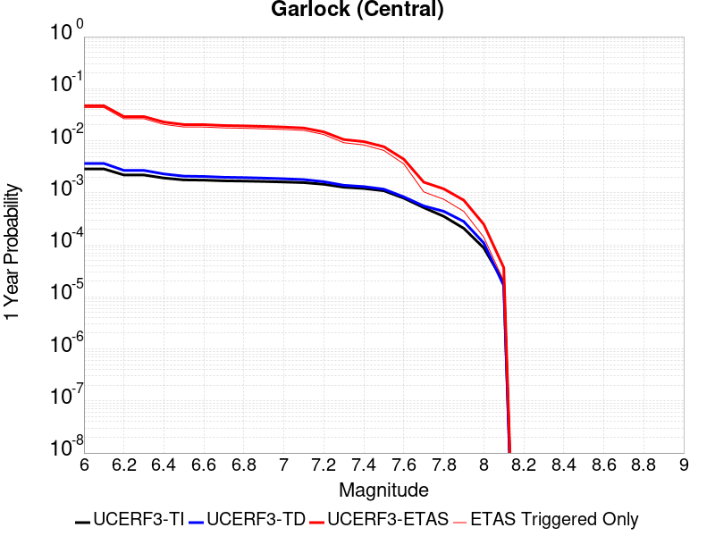 |  |

| Magnitude | 1 wk TI Prob | 1 wk TD Prob | 1 wk ETAS Prob | 1 wk ETAS/TD Gain | 1 wk ETAS Triggered Only | 1 mo TI Prob | 1 mo TD Prob | 1 mo ETAS Prob | 1 mo ETAS/TD Gain | 1 mo ETAS Triggered Only | 1 yr TI Prob | 1 yr TD Prob | 1 yr ETAS Prob | 1 yr ETAS/TD Gain | 1 yr ETAS Triggered Only | 10 yr TI Prob | 10 yr TD Prob | 10 yr ETAS Prob | 10 yr ETAS/TD Gain | 10 yr ETAS Triggered Only |
|-----|-----|-----|-----|-----|-----|-----|-----|-----|-----|-----|-----|-----|-----|-----|-----|-----|-----|-----|-----|-----|
| 6.0 | 5.5131142E-5 | 7.027124E-5 | 0.001969965 | 28.03373 | 0.0018998273 | 2.3625491E-4 | 3.0112805E-4 | 0.011696659 | 38.842808 | 0.011398964 | 0.0028726095 | 0.0036601364 | 0.04444296 | 12.142432 | 0.040932644 | 0.028357591 | 0.036092084 | 0.106345825 | 2.9465137 | 0.072884284 |
| 6.1 | 5.5131142E-5 | 7.027124E-5 | 0.001969965 | 28.03373 | 0.0018998273 | 2.3625491E-4 | 3.0112805E-4 | 0.011696659 | 38.842808 | 0.011398964 | 0.0028726095 | 0.0036601364 | 0.04444296 | 12.142432 | 0.040932644 | 0.028357591 | 0.036092084 | 0.106345825 | 2.9465137 | 0.072884284 |
| 6.2 | 4.216245E-5 | 5.1683597E-5 | 0.0010878994 | 21.049221 | 0.0010362695 | 1.806837E-4 | 2.214825E-4 | 0.007128415 | 32.185005 | 0.006908463 | 0.0021976046 | 0.0026932466 | 0.029735934 | 11.040925 | 0.027115718 | 0.021759989 | 0.026701005 | 0.0719199 | 2.693528 | 0.046459414 |
| 6.3 | 4.216245E-5 | 5.1683597E-5 | 0.0010878994 | 21.049221 | 0.0010362695 | 1.806837E-4 | 2.214825E-4 | 0.007128415 | 32.185005 | 0.006908463 | 0.0021976046 | 0.0026932466 | 0.029735934 | 11.040925 | 0.027115718 | 0.021759989 | 0.026701005 | 0.0719199 | 2.693528 | 0.046459414 |
| 6.4 | 3.6858168E-5 | 4.4131746E-5 | 0.0010803555 | 24.480234 | 0.0010362695 | 1.5795401E-4 | 1.8912248E-4 | 0.006405563 | 33.86992 | 0.0062176166 | 0.0019213937 | 0.00230016 | 0.023839448 | 10.364257 | 0.021588946 | 0.019048655 | 0.022859743 | 0.058300063 | 2.5503376 | 0.03626943 |
| 6.5 | 3.39199E-5 | 4.0038896E-5 | 9.035622E-4 | 22.56711 | 8.6355786E-4 | 1.453629E-4 | 1.715841E-4 | 0.005697406 | 33.204742 | 0.0055267704 | 0.0017683565 | 0.0020870569 | 0.020356275 | 9.75358 | 0.018307427 | 0.017543508 | 0.020770492 | 0.051381983 | 2.473797 | 0.031260796 |
| 6.6 | 3.3571985E-5 | 3.9493032E-5 | 9.030168E-4 | 22.865217 | 8.6355786E-4 | 1.4387199E-4 | 1.6924499E-4 | 0.00569508 | 33.649918 | 0.0055267704 | 0.0017502342 | 0.0020586322 | 0.020156015 | 9.790975 | 0.018134715 | 0.017365133 | 0.020491783 | 0.050942816 | 2.486012 | 0.031088082 |
| 6.7 | 3.2580007E-5 | 3.8109323E-5 | 9.016343E-4 | 23.659151 | 8.6355786E-4 | 1.3962112E-4 | 1.6331558E-4 | 0.0056891833 | 34.83552 | 0.0055267704 | 0.0016985617 | 0.0019865753 | 0.019395791 | 9.763431 | 0.01744387 | 0.016856372 | 0.019784356 | 0.048564434 | 2.4546888 | 0.029360967 |
| 6.8 | 3.2185937E-5 | 3.7536465E-5 | 9.010619E-4 | 24.004974 | 8.6355786E-4 | 1.3793244E-4 | 1.6086077E-4 | 0.0055140583 | 34.278454 | 0.005354059 | 0.0016780337 | 0.001956742 | 0.01902173 | 9.721123 | 0.017098445 | 0.016654192 | 0.01949112 | 0.047771774 | 2.4509506 | 0.028842833 |
| 6.9 | 3.165394E-5 | 3.6740938E-5 | 9.0026704E-4 | 24.503105 | 8.6355786E-4 | 1.3565269E-4 | 1.5745178E-4 | 0.0055106673 | 34.99908 | 0.005354059 | 0.0016503202 | 0.0019153113 | 0.018636247 | 9.73014 | 0.016753022 | 0.01638118 | 0.0190837 | 0.046529025 | 2.4381554 | 0.027979275 |
| 7.0 | 3.0903822E-5 | 3.564605E-5 | 8.9917314E-4 | 25.225042 | 8.6355786E-4 | 1.3243823E-4 | 1.5275997E-4 | 0.0053333156 | 34.913048 | 0.005181347 | 0.0016112428 | 0.0018582871 | 0.018063005 | 9.720244 | 0.016234888 | 0.015996104 | 0.018522795 | 0.045475278 | 2.455098 | 0.02746114 |
| 7.1 | 3.0069863E-5 | 3.441218E-5 | 8.979403E-4 | 26.093676 | 8.6355786E-4 | 1.2886449E-4 | 1.4747256E-4 | 0.0051553696 | 34.95816 | 0.0050086356 | 0.0015677959 | 0.0017940209 | 0.017482577 | 9.744913 | 0.015716754 | 0.01556781 | 0.017890377 | 0.044012118 | 2.4601002 | 0.026597582 |
| 7.2 | 2.7957109E-5 | 3.1301115E-5 | 8.9483196E-4 | 28.587862 | 8.6355786E-4 | 1.1981068E-4 | 1.3414085E-4 | 0.0047967276 | 35.758892 | 0.004663212 | 0.0014577188 | 0.0016319609 | 0.014736619 | 9.030007 | 0.013126079 | 0.014481937 | 0.016293783 | 0.03770086 | 2.3138187 | 0.021761658 |
| 7.3 | 2.4519275E-5 | 2.6733265E-5 | 3.721472E-4 | 13.920753 | 3.4542315E-4 | 1.0507837E-4 | 1.1456619E-4 | 0.0025322512 | 22.102953 | 0.002417962 | 0.0012785783 | 0.0013939656 | 0.009845036 | 7.06261 | 0.008462867 | 0.012712469 | 0.013937555 | 0.027561907 | 1.9775281 | 0.013816926 |
| 7.4 | 2.3225532E-5 | 2.5217494E-5 | 3.7063193E-4 | 14.697413 | 3.4542315E-4 | 9.95342E-5 | 1.0807058E-4 | 0.0025257713 | 23.371498 | 0.002417962 | 0.0012111551 | 0.0013149795 | 0.008904296 | 6.771433 | 0.007599309 | 0.012045753 | 0.01315504 | 0.02474493 | 1.8810227 | 0.0117443865 |
| 7.5 | 2.097765E-5 | 2.250088E-5 | 3.6791625E-4 | 16.351192 | 3.4542315E-4 | 8.9901114E-5 | 9.6428856E-5 | 0.001823378 | 18.90905 | 0.0017271157 | 0.0010939965 | 0.0011734008 | 0.006693686 | 5.7045183 | 0.0055267704 | 0.010886264 | 0.01174923 | 0.02045403 | 1.7408825 | 0.008808291 |
| 7.6 | 1.511254E-5 | 1.6007341E-5 | 1.6007341E-5 | 1.0 | 0.0 | 6.476642E-5 | 6.860113E-5 | 4.140006E-4 | 6.0348945 | 3.4542315E-4 | 7.882459E-4 | 8.3490653E-4 | 0.0035959845 | 4.30705 | 0.0027633852 | 0.007854558 | 0.00839184 | 0.012502134 | 1.4897963 | 0.004145078 |
| 7.7 | 9.934069E-6 | 1.0693656E-5 | 1.0693656E-5 | 1.0 | 0.0 | 4.2573887E-5 | 4.582915E-5 | 4.582915E-5 | 1.0 | 0.0 | 5.182138E-4 | 5.578274E-4 | 9.0305787E-4 | 1.618884 | 3.4542315E-4 | 0.00517007 | 0.005635394 | 0.0064940853 | 1.1523747 | 8.6355786E-4 |
| 7.8 | 6.7562896E-6 | 8.440562E-6 | 8.440562E-6 | 1.0 | 0.0 | 2.8955206E-5 | 3.6173336E-5 | 3.6173336E-5 | 1.0 | 0.0 | 3.5247262E-4 | 4.4032154E-4 | 7.855926E-4 | 1.7841339 | 3.4542315E-4 | 0.0035191406 | 0.0044529405 | 0.0051407106 | 1.154453 | 6.908463E-4 |
| 7.9 | 3.975453E-6 | 5.3784297E-6 | 5.3784297E-6 | 1.0 | 0.0 | 1.7037546E-5 | 2.305021E-5 | 2.305021E-5 | 1.0 | 0.0 | 2.0741238E-4 | 2.8060027E-4 | 2.8060027E-4 | 1.0 | 0.0 | 0.002072189 | 0.0028374717 | 0.0030096932 | 1.0606954 | 1.7271157E-4 |
| 8.0 | 1.6729537E-6 | 2.0800776E-6 | 2.0800776E-6 | 1.0 | 0.0 | 7.169782E-6 | 8.914588E-6 | 8.914588E-6 | 1.0 | 0.0 | 8.7288594E-5 | 1.0852974E-4 | 1.0852974E-4 | 1.0 | 0.0 | 8.7254314E-4 | 0.0010982669 | 0.0010982669 | 1.0 | 0.0 |
| 8.1 | 3.6733252E-7 | 3.1526864E-7 | 3.1526864E-7 | 1.0 | 0.0 | 1.5742813E-6 | 1.3511507E-6 | 1.3511507E-6 | 1.0 | 0.0 | 1.9166706E-5 | 1.645015E-5 | 1.645015E-5 | 1.0 | 0.0 | 1.9165053E-4 | 1.6658098E-4 | 1.6658098E-4 | 1.0 | 0.0 |

## Tank Canyon
*[(top)](#table-of-contents)*

| 1 Week | 1 Month | 1 Year | 10 Year |
|-----|-----|-----|-----|
|  |  |  |  |

| Magnitude | 1 wk TI Prob | 1 wk TD Prob | 1 wk ETAS Prob | 1 wk ETAS/TD Gain | 1 wk ETAS Triggered Only | 1 mo TI Prob | 1 mo TD Prob | 1 mo ETAS Prob | 1 mo ETAS/TD Gain | 1 mo ETAS Triggered Only | 1 yr TI Prob | 1 yr TD Prob | 1 yr ETAS Prob | 1 yr ETAS/TD Gain | 1 yr ETAS Triggered Only | 10 yr TI Prob | 10 yr TD Prob | 10 yr ETAS Prob | 10 yr ETAS/TD Gain | 10 yr ETAS Triggered Only |
|-----|-----|-----|-----|-----|-----|-----|-----|-----|-----|-----|-----|-----|-----|-----|-----|-----|-----|-----|-----|-----|
| 6.0 | 4.8284557E-5 | 5.7970923E-5 | 0.0010941803 | 18.87464 | 0.0010362695 | 2.0691741E-4 | 2.48427E-4 | 0.005946493 | 23.93658 | 0.005699482 | 0.0025163088 | 0.0030210684 | 0.026783261 | 8.865493 | 0.023834197 | 0.02488006 | 0.029866708 | 0.07711672 | 2.5820296 | 0.04870466 |
| 6.1 | 1.7796336E-5 | 2.0875108E-5 | 7.11707E-4 | 34.09357 | 6.908463E-4 | 7.626778E-5 | 8.946191E-5 | 0.0018164231 | 20.303873 | 0.0017271157 | 9.281647E-4 | 0.0010886913 | 0.0074720625 | 6.8633432 | 0.006390328 | 0.009242975 | 0.010837668 | 0.02518821 | 2.3241355 | 0.014507772 |
| 6.2 | 1.7796336E-5 | 2.0875108E-5 | 7.11707E-4 | 34.09357 | 6.908463E-4 | 7.626778E-5 | 8.946191E-5 | 0.0018164231 | 20.303873 | 0.0017271157 | 9.281647E-4 | 0.0010886913 | 0.0074720625 | 6.8633432 | 0.006390328 | 0.009242975 | 0.010837668 | 0.02518821 | 2.3241355 | 0.014507772 |
| 6.3 | 1.3515912E-5 | 1.5760828E-5 | 3.6117854E-4 | 22.916214 | 3.4542315E-4 | 5.792405E-5 | 6.7544795E-5 | 0.0012764442 | 18.897743 | 0.001208981 | 7.049971E-4 | 8.220716E-4 | 0.0056540202 | 6.8777704 | 0.004835924 | 0.007027647 | 0.008192917 | 0.018299414 | 2.233565 | 0.010189983 |
| 6.4 | 1.0870146E-5 | 1.2618972E-5 | 1.8532836E-4 | 14.686487 | 1.7271157E-4 | 4.658551E-5 | 5.4080287E-5 | 0.0010902936 | 20.160648 | 0.0010362695 | 5.67031E-4 | 6.582465E-4 | 0.0044554 | 6.768589 | 0.0037996545 | 0.005655863 | 0.006564983 | 0.014457558 | 2.2022233 | 0.007944732 |
| 6.5 | 7.964826E-6 | 9.196723E-6 | 9.196723E-6 | 1.0 | 0.0 | 3.4134522E-5 | 3.9413993E-5 | 7.3023303E-4 | 18.527254 | 6.908463E-4 | 4.1550855E-4 | 4.797704E-4 | 0.0028965722 | 6.0374136 | 0.002417962 | 0.0041473247 | 0.0047886474 | 0.009601414 | 2.0050366 | 0.004835924 |
| 6.6 | 6.6317E-6 | 7.612777E-6 | 7.612777E-6 | 1.0 | 0.0 | 2.8421264E-5 | 3.262583E-5 | 3.7803772E-4 | 11.587068 | 3.4542315E-4 | 3.4597394E-4 | 3.9715623E-4 | 0.001950943 | 4.912281 | 0.0015544042 | 0.0034543579 | 0.003965616 | 0.007750203 | 1.9543501 | 0.0037996545 |
| 6.7 | 4.793663E-6 | 5.4310603E-6 | 5.4310603E-6 | 1.0 | 0.0 | 2.0544108E-5 | 2.327579E-5 | 2.327579E-5 | 1.0 | 0.0 | 2.500958E-4 | 2.8335027E-4 | 6.2867557E-4 | 2.218722 | 3.4542315E-4 | 0.0024981452 | 0.0028305824 | 0.004725032 | 1.6692791 | 0.0018998273 |
| 6.8 | 4.382823E-6 | 4.9694927E-6 | 4.9694927E-6 | 1.0 | 0.0 | 1.8783392E-5 | 2.1297676E-5 | 2.1297676E-5 | 1.0 | 0.0 | 2.286638E-4 | 2.592726E-4 | 6.046062E-4 | 2.3319323 | 3.4542315E-4 | 0.0022842865 | 0.0025903755 | 0.0044852816 | 1.7315179 | 0.0018998273 |
| 6.9 | 2.729601E-6 | 3.0736521E-6 | 3.0736521E-6 | 1.0 | 0.0 | 1.1698237E-5 | 1.3172735E-5 | 1.3172735E-5 | 1.0 | 0.0 | 1.4241673E-4 | 1.6036748E-4 | 5.057352E-4 | 3.1536024 | 3.4542315E-4 | 0.001423255 | 0.0016026833 | 0.0031545963 | 1.9683217 | 0.0015544042 |
| 7.0 | 1.8987357E-6 | 2.1269989E-6 | 2.1269989E-6 | 1.0 | 0.0 | 8.137413E-6 | 9.115682E-6 | 9.115682E-6 | 1.0 | 0.0 | 9.90685E-5 | 1.1097847E-4 | 2.8367087E-4 | 2.5560892 | 1.7271157E-4 | 9.902435E-4 | 0.0011092991 | 0.0017993791 | 1.6220864 | 6.908463E-4 |
| 7.1 | 1.4928986E-6 | 1.6641684E-6 | 1.6641684E-6 | 1.0 | 0.0 | 6.398121E-6 | 7.1321338E-6 | 7.1321338E-6 | 1.0 | 0.0 | 7.789434E-5 | 8.683086E-5 | 2.5952744E-4 | 2.9888847 | 1.7271157E-4 | 7.786704E-4 | 8.680272E-4 | 0.0013857122 | 1.5963925 | 5.1813474E-4 |
| 7.2 | 1.069082E-6 | 1.1828834E-6 | 1.1828834E-6 | 1.0 | 0.0 | 4.581772E-6 | 5.0694935E-6 | 5.0694935E-6 | 1.0 | 0.0 | 5.5781646E-5 | 6.171987E-5 | 2.3442078E-4 | 3.7981415 | 1.7271157E-4 | 5.576765E-4 | 6.170795E-4 | 9.622895E-4 | 1.5594255 | 3.4542315E-4 |
| 7.3 | 8.776551E-7 | 9.770195E-7 | 9.770195E-7 | 1.0 | 0.0 | 3.7613736E-6 | 4.1872227E-6 | 4.1872227E-6 | 1.0 | 0.0 | 4.579376E-5 | 5.0978764E-5 | 2.2368153E-4 | 4.3877397 | 1.7271157E-4 | 4.5784327E-4 | 5.097217E-4 | 8.549688E-4 | 1.6773247 | 3.4542315E-4 |
| 7.4 | 7.55721E-7 | 8.510402E-7 | 8.510402E-7 | 1.0 | 0.0 | 3.2388E-6 | 3.647313E-6 | 3.647313E-6 | 1.0 | 0.0 | 3.9431678E-5 | 4.440565E-5 | 2.1710955E-4 | 4.8892326 | 1.7271157E-4 | 3.942468E-4 | 4.440186E-4 | 6.166535E-4 | 1.388801 | 1.7271157E-4 |
| 7.5 | 5.587665E-7 | 6.305733E-7 | 6.305733E-7 | 1.0 | 0.0 | 2.3947114E-6 | 2.702457E-6 | 2.702457E-6 | 1.0 | 0.0 | 2.915522E-5 | 3.2902415E-5 | 2.056083E-4 | 6.249034 | 1.7271157E-4 | 2.9151395E-4 | 3.2902416E-4 | 5.016789E-4 | 1.524748 | 1.7271157E-4 |

## Little Lake
*[(top)](#table-of-contents)*

| 1 Week | 1 Month | 1 Year | 10 Year |
|-----|-----|-----|-----|
|  |  |  |  |

| Magnitude | 1 wk TI Prob | 1 wk TD Prob | 1 wk ETAS Prob | 1 wk ETAS/TD Gain | 1 wk ETAS Triggered Only | 1 mo TI Prob | 1 mo TD Prob | 1 mo ETAS Prob | 1 mo ETAS/TD Gain | 1 mo ETAS Triggered Only | 1 yr TI Prob | 1 yr TD Prob | 1 yr ETAS Prob | 1 yr ETAS/TD Gain | 1 yr ETAS Triggered Only | 10 yr TI Prob | 10 yr TD Prob | 10 yr ETAS Prob | 10 yr ETAS/TD Gain | 10 yr ETAS Triggered Only |
|-----|-----|-----|-----|-----|-----|-----|-----|-----|-----|-----|-----|-----|-----|-----|-----|-----|-----|-----|-----|-----|
| 6.0 | 2.8424427E-5 | 3.1207477E-5 | 2.0391366E-4 | 6.534128 | 1.7271157E-4 | 1.2181328E-4 | 1.3374022E-4 | 0.001515248 | 11.329785 | 0.0013816926 | 0.0014820677 | 0.0016272042 | 0.01318005 | 8.099813 | 0.011571676 | 0.014722223 | 0.016166303 | 0.039275352 | 2.4294577 | 0.023488773 |
| 6.1 | 2.8424427E-5 | 3.1207477E-5 | 2.0391366E-4 | 6.534128 | 1.7271157E-4 | 1.2181328E-4 | 1.3374022E-4 | 0.001515248 | 11.329785 | 0.0013816926 | 0.0014820677 | 0.0016272042 | 0.01318005 | 8.099813 | 0.011571676 | 0.014722223 | 0.016166303 | 0.039275352 | 2.4294577 | 0.023488773 |
| 6.2 | 2.8424427E-5 | 3.1207477E-5 | 2.0391366E-4 | 6.534128 | 1.7271157E-4 | 1.2181328E-4 | 1.3374022E-4 | 0.001515248 | 11.329785 | 0.0013816926 | 0.0014820677 | 0.0016272042 | 0.01318005 | 8.099813 | 0.011571676 | 0.014722223 | 0.016166303 | 0.039275352 | 2.4294577 | 0.023488773 |
| 6.3 | 1.48860645E-5 | 1.6082206E-5 | 1.6082206E-5 | 1.0 | 0.0 | 6.379586E-5 | 6.8922076E-5 | 7.5972074E-4 | 11.022894 | 6.908463E-4 | 7.7643775E-4 | 8.388314E-4 | 0.006706099 | 7.994573 | 0.0058721933 | 0.007737305 | 0.00835947 | 0.0230885 | 2.7619574 | 0.014853195 |
| 6.4 | 1.48860645E-5 | 1.6082206E-5 | 1.6082206E-5 | 1.0 | 0.0 | 6.379586E-5 | 6.8922076E-5 | 7.5972074E-4 | 11.022894 | 6.908463E-4 | 7.7643775E-4 | 8.388314E-4 | 0.006706099 | 7.994573 | 0.0058721933 | 0.007737305 | 0.00835947 | 0.0230885 | 2.7619574 | 0.014853195 |
| 6.5 | 1.2797581E-5 | 1.3766247E-5 | 1.3766247E-5 | 1.0 | 0.0 | 5.4845623E-5 | 5.899701E-5 | 7.4980257E-4 | 12.709162 | 6.908463E-4 | 6.675408E-4 | 7.180776E-4 | 0.0065860543 | 9.171786 | 0.0058721933 | 0.006655392 | 0.007160124 | 0.021049593 | 2.9398365 | 0.013989638 |
| 6.6 | 9.661896E-6 | 1.0289519E-5 | 1.0289519E-5 | 1.0 | 0.0 | 4.1407468E-5 | 4.4097287E-5 | 5.6220917E-4 | 12.749291 | 5.1813474E-4 | 5.040193E-4 | 5.3676846E-4 | 0.00485224 | 9.039727 | 0.0043177893 | 0.005028777 | 0.0053563244 | 0.016350659 | 3.0525892 | 0.011053541 |
| 6.7 | 7.767871E-6 | 8.200053E-6 | 8.200053E-6 | 1.0 | 0.0 | 3.329045E-5 | 3.514269E-5 | 5.532592E-4 | 15.743222 | 5.1813474E-4 | 4.0523586E-4 | 4.27792E-4 | 0.0043984586 | 10.28177 | 0.003972366 | 0.004044977 | 0.004271037 | 0.014245524 | 3.3353784 | 0.010017271 |
| 6.8 | 6.4235196E-6 | 6.736042E-6 | 6.736042E-6 | 1.0 | 0.0 | 2.752908E-5 | 2.8868506E-5 | 5.469883E-4 | 18.947578 | 5.1813474E-4 | 3.35115E-4 | 3.514302E-4 | 0.003459146 | 9.843053 | 0.0031088083 | 0.003346101 | 0.0035100048 | 0.011426851 | 3.2555087 | 0.007944732 |
| 6.9 | 3.1283696E-6 | 3.1122859E-6 | 3.1122859E-6 | 1.0 | 0.0 | 1.3407229E-5 | 1.3338308E-5 | 3.5875684E-4 | 26.896729 | 3.4542315E-4 | 1.6322079E-4 | 1.6238331E-4 | 0.002407269 | 14.82461 | 0.0022452504 | 0.0016310095 | 0.0016227949 | 0.0071405964 | 4.400184 | 0.0055267704 |
| 7.0 | 2.290603E-6 | 2.2287613E-6 | 2.2287613E-6 | 1.0 | 0.0 | 9.816834E-6 | 9.551805E-6 | 3.5497165E-4 | 37.16278 | 3.4542315E-4 | 1.19513395E-4 | 1.1628806E-4 | 0.001152437 | 9.910192 | 0.0010362695 | 0.0011944914 | 0.0011623743 | 0.0037500365 | 3.2261868 | 0.0025906735 |
| 7.1 | 1.293693E-6 | 1.1777322E-6 | 1.1777322E-6 | 1.0 | 0.0 | 5.5443866E-6 | 5.0474177E-6 | 3.5046882E-4 | 69.435265 | 3.4542315E-4 | 6.750081E-5 | 6.1451276E-5 | 9.2495605E-4 | 15.051861 | 8.6355786E-4 | 6.7480316E-4 | 6.144114E-4 | 0.001995255 | 3.2474253 | 0.0013816926 |
| 7.2 | 4.715842E-7 | 3.09202E-7 | 3.09202E-7 | 1.0 | 0.0 | 2.0210737E-6 | 1.3251507E-6 | 1.3251507E-6 | 1.0 | 0.0 | 2.4606294E-5 | 1.6133596E-5 | 1.6133596E-5 | 1.0 | 0.0 | 2.460357E-4 | 1.6132479E-4 | 1.6132479E-4 | 1.0 | 0.0 |
| 7.3 | 3.9430947E-7 | 2.3099639E-7 | 2.3099639E-7 | 1.0 | 0.0 | 1.6898966E-6 | 9.899842E-7 | 9.899842E-7 | 1.0 | 0.0 | 2.0574296E-5 | 1.2052991E-5 | 1.2052991E-5 | 1.0 | 0.0 | 2.0572392E-4 | 1.20523444E-4 | 1.20523444E-4 | 1.0 | 0.0 |
| 7.4 | 3.547123E-7 | 1.9681133E-7 | 1.9681133E-7 | 1.0 | 0.0 | 1.5201948E-6 | 8.4347687E-7 | 8.4347687E-7 | 1.0 | 0.0 | 1.8508214E-5 | 1.0269283E-5 | 1.0269283E-5 | 1.0 | 0.0 | 1.8506673E-4 | 1.02688144E-4 | 1.02688144E-4 | 1.0 | 0.0 |
| 7.5 | 2.6354266E-7 | 1.4424535E-7 | 1.4424535E-7 | 1.0 | 0.0 | 1.129468E-6 | 6.1819424E-7 | 6.1819424E-7 | 1.0 | 0.0 | 1.3751187E-5 | 7.5264893E-6 | 7.5264893E-6 | 1.0 | 0.0 | 1.3750336E-4 | 7.52624E-5 | 7.52624E-5 | 1.0 | 0.0 |
| 7.6 | 1.269913E-7 | 7.573149E-8 | 7.573149E-8 | 1.0 | 0.0 | 5.4424834E-7 | 3.245635E-7 | 3.245635E-7 | 1.0 | 0.0 | 6.6262032E-6 | 3.951554E-6 | 3.951554E-6 | 1.0 | 0.0 | 6.626006E-5 | 3.951487E-5 | 3.951487E-5 | 1.0 | 0.0 |

## Owl Lake
*[(top)](#table-of-contents)*

| 1 Week | 1 Month | 1 Year | 10 Year |
|-----|-----|-----|-----|
|  |  |  |  |

| Magnitude | 1 wk TI Prob | 1 wk TD Prob | 1 wk ETAS Prob | 1 wk ETAS/TD Gain | 1 wk ETAS Triggered Only | 1 mo TI Prob | 1 mo TD Prob | 1 mo ETAS Prob | 1 mo ETAS/TD Gain | 1 mo ETAS Triggered Only | 1 yr TI Prob | 1 yr TD Prob | 1 yr ETAS Prob | 1 yr ETAS/TD Gain | 1 yr ETAS Triggered Only | 10 yr TI Prob | 10 yr TD Prob | 10 yr ETAS Prob | 10 yr ETAS/TD Gain | 10 yr ETAS Triggered Only |
|-----|-----|-----|-----|-----|-----|-----|-----|-----|-----|-----|-----|-----|-----|-----|-----|-----|-----|-----|-----|-----|
| 6.0 | 5.0320643E-5 | 6.637151E-5 | 7.5717195E-4 | 11.408087 | 6.908463E-4 | 2.1564208E-4 | 2.844246E-4 | 0.0030470237 | 10.71294 | 0.0027633852 | 0.0026222812 | 0.0034584238 | 0.014129508 | 4.085534 | 0.010708118 | 0.02591553 | 0.034147043 | 0.053997908 | 1.5813347 | 0.020552676 |
| 6.1 | 5.0320643E-5 | 6.637151E-5 | 7.5717195E-4 | 11.408087 | 6.908463E-4 | 2.1564208E-4 | 2.844246E-4 | 0.0030470237 | 10.71294 | 0.0027633852 | 0.0026222812 | 0.0034584238 | 0.014129508 | 4.085534 | 0.010708118 | 0.02591553 | 0.034147043 | 0.053997908 | 1.5813347 | 0.020552676 |
| 6.2 | 2.4125871E-5 | 3.098766E-5 | 3.764001E-4 | 12.146774 | 3.4542315E-4 | 1.0339249E-4 | 1.3279865E-4 | 0.0023777508 | 17.904932 | 0.0022452504 | 0.0012580766 | 0.0016157742 | 0.009892534 | 6.1224732 | 0.008290156 | 0.012509781 | 0.016073797 | 0.031707857 | 1.9726427 | 0.015889464 |
| 6.3 | 1.7433485E-5 | 2.2360802E-5 | 3.6777623E-4 | 16.447363 | 3.4542315E-4 | 7.471279E-5 | 9.582938E-5 | 0.0019954746 | 20.823202 | 0.0018998273 | 9.0924866E-4 | 0.0011662478 | 0.008584185 | 7.3605146 | 0.0074265976 | 0.009055373 | 0.01163159 | 0.025629207 | 2.203414 | 0.014162349 |
| 6.4 | 1.7433485E-5 | 2.2360802E-5 | 3.6777623E-4 | 16.447363 | 3.4542315E-4 | 7.471279E-5 | 9.582938E-5 | 0.0019954746 | 20.823202 | 0.0018998273 | 9.0924866E-4 | 0.0011662478 | 0.008584185 | 7.3605146 | 0.0074265976 | 0.009055373 | 0.01163159 | 0.025629207 | 2.203414 | 0.014162349 |
| 6.5 | 1.5182742E-5 | 1.9433977E-5 | 3.6485042E-4 | 18.773842 | 3.4542315E-4 | 6.506727E-5 | 8.3286664E-5 | 0.0018102585 | 21.735275 | 0.0017271157 | 7.919061E-4 | 0.0010136948 | 0.008260228 | 8.148634 | 0.007253886 | 0.0078909 | 0.0101209 | 0.02345606 | 2.3175862 | 0.013471503 |
| 6.6 | 6.7271576E-6 | 8.550545E-6 | 3.5397074E-4 | 41.397446 | 3.4542315E-4 | 2.8830356E-5 | 3.6644713E-5 | 0.0015909919 | 43.416687 | 0.0015544042 | 3.5095305E-4 | 4.460637E-4 | 0.0061430032 | 13.771584 | 0.005699482 | 0.0035039932 | 0.0044694655 | 0.015301663 | 3.4236002 | 0.010880829 |
| 6.7 | 6.682835E-6 | 8.482986E-6 | 3.539032E-4 | 41.719177 | 3.4542315E-4 | 2.8640408E-5 | 3.635518E-5 | 0.0015907028 | 43.7545 | 0.0015544042 | 3.4864116E-4 | 4.4254007E-4 | 0.0061394996 | 13.873319 | 0.005699482 | 0.003480947 | 0.004434389 | 0.0150950225 | 3.4040816 | 0.010708118 |
| 6.8 | 6.5774975E-6 | 8.329444E-6 | 3.5374973E-4 | 42.469784 | 3.4542315E-4 | 2.8188972E-5 | 3.569716E-5 | 0.0015900459 | 44.542637 | 0.0015544042 | 3.4314668E-4 | 4.3453192E-4 | 0.0061315373 | 14.110671 | 0.005699482 | 0.0034261728 | 0.004354527 | 0.015016016 | 3.4483688 | 0.010708118 |
| 6.9 | 6.363419E-6 | 8.002579E-6 | 3.5342295E-4 | 44.16363 | 3.4542315E-4 | 2.727151E-5 | 3.429635E-5 | 0.0015886471 | 46.321175 | 0.0015544042 | 3.3198006E-4 | 4.1748365E-4 | 0.0061145863 | 14.646289 | 0.005699482 | 0.0033148455 | 0.0041844994 | 0.0148478085 | 3.548288 | 0.010708118 |
| 7.0 | 6.1342453E-6 | 7.63473E-6 | 3.5305525E-4 | 46.24332 | 3.4542315E-4 | 2.6289357E-5 | 3.271989E-5 | 0.0015870732 | 48.504845 | 0.0015544042 | 3.2002592E-4 | 3.9829736E-4 | 0.006095509 | 15.303916 | 0.005699482 | 0.0031956544 | 0.0039931675 | 0.014658526 | 3.6709018 | 0.010708118 |
| 7.1 | 5.842926E-6 | 7.14521E-6 | 3.525659E-4 | 49.342968 | 3.4542315E-4 | 2.504087E-5 | 3.0622E-5 | 0.0015849785 | 51.75947 | 0.0015544042 | 3.0482994E-4 | 3.7276448E-4 | 0.0058974745 | 15.820913 | 0.0055267704 | 0.0030441214 | 0.0037385917 | 0.01423461 | 3.8074791 | 0.010535406 |
| 7.2 | 4.77173E-6 | 5.361204E-6 | 3.507825E-4 | 65.429794 | 3.4542315E-4 | 2.045011E-5 | 2.297641E-5 | 0.0014046372 | 61.13389 | 0.0013816926 | 2.4895166E-4 | 2.7970594E-4 | 0.0045962874 | 16.432571 | 0.0043177893 | 0.0024867293 | 0.0028100624 | 0.010388017 | 3.696721 | 0.007599309 |
| 7.3 | 3.0494948E-6 | 2.7124704E-6 | 1.7542357E-4 | 64.67299 | 1.7271157E-4 | 1.3069198E-5 | 1.1624823E-5 | 1.8433439E-4 | 15.856963 | 1.7271157E-4 | 1.5910587E-4 | 1.4152318E-4 | 0.001177646 | 8.321223 | 0.0010362695 | 0.0015899199 | 0.0014242887 | 0.0031489446 | 2.210889 | 0.0017271157 |
| 7.4 | 2.7263884E-6 | 2.3075613E-6 | 1.7501874E-4 | 75.84576 | 1.7271157E-4 | 1.1684469E-5 | 9.889511E-6 | 1.8259937E-4 | 18.463943 | 1.7271157E-4 | 1.4224913E-4 | 1.2039825E-4 | 6.384706E-4 | 5.302989 | 5.1813474E-4 | 0.0014215811 | 0.0012122075 | 0.0019022163 | 1.5692167 | 6.908463E-4 |
| 7.5 | 2.6090431E-6 | 2.1674637E-6 | 1.7487866E-4 | 80.683556 | 1.7271157E-4 | 1.1181565E-5 | 9.289097E-6 | 1.8199906E-4 | 19.592762 | 1.7271157E-4 | 1.3612706E-4 | 1.1308899E-4 | 4.5847305E-4 | 4.0540915 | 3.4542315E-4 | 0.001360437 | 0.0011389464 | 0.001656491 | 1.4544065 | 5.1813474E-4 |
| 7.6 | 2.3008756E-6 | 1.8745708E-6 | 1.8745708E-6 | 1.0 | 0.0 | 9.860858E-6 | 8.0338505E-6 | 8.0338505E-6 | 1.0 | 0.0 | 1.20049335E-4 | 9.7807824E-5 | 2.705025E-4 | 2.7656531 | 1.7271157E-4 | 0.001199845 | 9.85921E-4 | 0.0013310036 | 1.3500104 | 3.4542315E-4 |
| 7.7 | 1.7184348E-6 | 1.343562E-6 | 1.343562E-6 | 1.0 | 0.0 | 7.3646997E-6 | 5.7581105E-6 | 5.7581105E-6 | 1.0 | 0.0 | 8.966153E-5 | 7.010278E-5 | 7.010278E-5 | 1.0 | 0.0 | 8.962536E-4 | 7.086945E-4 | 8.812837E-4 | 1.2435311 | 1.7271157E-4 |
| 7.8 | 8.4612907E-7 | 8.4176E-7 | 8.4176E-7 | 1.0 | 0.0 | 3.6262625E-6 | 3.607538E-6 | 3.607538E-6 | 1.0 | 0.0 | 4.4148852E-5 | 4.392091E-5 | 4.392091E-5 | 1.0 | 0.0 | 4.414008E-4 | 4.4459777E-4 | 4.4459777E-4 | 1.0 | 0.0 |
| 7.9 | 2.716738E-7 | 3.7732943E-7 | 3.7732943E-7 | 1.0 | 0.0 | 1.1643157E-6 | 1.6171252E-6 | 1.6171252E-6 | 1.0 | 0.0 | 1.4175452E-5 | 1.9688332E-5 | 1.9688332E-5 | 1.0 | 0.0 | 1.4174548E-4 | 1.9863734E-4 | 1.9863734E-4 | 1.0 | 0.0 |
| 8.0 | 2.1995428E-8 | 3.389418E-8 | 3.389418E-8 | 1.0 | 0.0 | 9.426611E-8 | 1.4526077E-7 | 1.4526077E-7 | 1.0 | 0.0 | 1.1476893E-6 | 1.768549E-6 | 1.768549E-6 | 1.0 | 0.0 | 1.14768345E-5 | 1.798665E-5 | 1.798665E-5 | 1.0 | 0.0 |

## Garlock (East)
*[(top)](#table-of-contents)*

| 1 Week | 1 Month | 1 Year | 10 Year |
|-----|-----|-----|-----|
|  |  |  |  |

| Magnitude | 1 wk TI Prob | 1 wk TD Prob | 1 wk ETAS Prob | 1 wk ETAS/TD Gain | 1 wk ETAS Triggered Only | 1 mo TI Prob | 1 mo TD Prob | 1 mo ETAS Prob | 1 mo ETAS/TD Gain | 1 mo ETAS Triggered Only | 1 yr TI Prob | 1 yr TD Prob | 1 yr ETAS Prob | 1 yr ETAS/TD Gain | 1 yr ETAS Triggered Only | 10 yr TI Prob | 10 yr TD Prob | 10 yr ETAS Prob | 10 yr ETAS/TD Gain | 10 yr ETAS Triggered Only |
|-----|-----|-----|-----|-----|-----|-----|-----|-----|-----|-----|-----|-----|-----|-----|-----|-----|-----|-----|-----|-----|
| 6.0 | 4.5092507E-5 | 6.2917425E-5 | 2.3561814E-4 | 3.7448788 | 1.7271157E-4 | 1.9323928E-4 | 2.6962077E-4 | 0.0019962708 | 7.4039955 | 0.0017271157 | 0.0023501497 | 0.0032781374 | 0.010508244 | 3.2055533 | 0.007253886 | 0.023254504 | 0.03235903 | 0.04556173 | 1.4080067 | 0.013644214 |
| 6.1 | 4.5092507E-5 | 6.2917425E-5 | 2.3561814E-4 | 3.7448788 | 1.7271157E-4 | 1.9323928E-4 | 2.6962077E-4 | 0.0019962708 | 7.4039955 | 0.0017271157 | 0.0023501497 | 0.0032781374 | 0.010508244 | 3.2055533 | 0.007253886 | 0.023254504 | 0.03235903 | 0.04556173 | 1.4080067 | 0.013644214 |
| 6.2 | 2.6674514E-5 | 3.452091E-5 | 2.0722652E-4 | 6.002928 | 1.7271157E-4 | 1.1431433E-4 | 1.4793854E-4 | 0.0015294267 | 10.338257 | 0.0013816926 | 0.0013908884 | 0.0017996968 | 0.00714412 | 3.969624 | 0.005354059 | 0.01382215 | 0.017896036 | 0.027055554 | 1.5118183 | 0.009326424 |
| 6.3 | 2.6674514E-5 | 3.452091E-5 | 2.0722652E-4 | 6.002928 | 1.7271157E-4 | 1.1431433E-4 | 1.4793854E-4 | 0.0015294267 | 10.338257 | 0.0013816926 | 0.0013908884 | 0.0017996968 | 0.00714412 | 3.969624 | 0.005354059 | 0.01382215 | 0.017896036 | 0.027055554 | 1.5118183 | 0.009326424 |
| 6.4 | 2.5312667E-5 | 3.234991E-5 | 2.050559E-4 | 6.338685 | 1.7271157E-4 | 1.0847834E-4 | 1.3863528E-4 | 0.0015201363 | 10.965004 | 0.0013816926 | 0.0013199237 | 0.0016866071 | 0.0068592154 | 4.066872 | 0.005181347 | 0.013121112 | 0.016783953 | 0.02578403 | 1.5362312 | 0.0091537135 |
| 6.5 | 2.5312667E-5 | 3.234991E-5 | 2.050559E-4 | 6.338685 | 1.7271157E-4 | 1.0847834E-4 | 1.3863528E-4 | 0.0015201363 | 10.965004 | 0.0013816926 | 0.0013199237 | 0.0016866071 | 0.0068592154 | 4.066872 | 0.005181347 | 0.013121112 | 0.016783953 | 0.02578403 | 1.5362312 | 0.0091537135 |
| 6.6 | 2.246556E-5 | 2.8144346E-5 | 2.0085106E-4 | 7.1364617 | 1.7271157E-4 | 9.627742E-5 | 1.20613186E-4 | 0.0015021391 | 12.454186 | 0.0013816926 | 0.0011715472 | 0.0014674999 | 0.0064687855 | 4.408031 | 0.0050086356 | 0.011653901 | 0.0146240825 | 0.023303559 | 1.5935057 | 0.008808291 |
| 6.7 | 2.2241198E-5 | 2.781406E-5 | 2.0052082E-4 | 7.2093334 | 1.7271157E-4 | 9.531594E-5 | 1.1919779E-4 | 0.0015007256 | 12.590213 | 0.0013816926 | 0.0011598538 | 0.0014502906 | 0.006451662 | 4.4485307 | 0.0050086356 | 0.011538187 | 0.014454261 | 0.023135234 | 1.6005822 | 0.008808291 |
| 6.8 | 1.9528685E-5 | 2.3908038E-5 | 1.9661548E-4 | 8.223824 | 1.7271157E-4 | 8.369167E-5 | 1.0245911E-4 | 0.0014840101 | 14.483926 | 0.0013816926 | 0.0010184698 | 0.0012467455 | 0.0060766404 | 4.8740025 | 0.004835924 | 0.010138147 | 0.012441495 | 0.020628508 | 1.658041 | 0.008290156 |
| 6.9 | 1.3318621E-5 | 1.5207374E-5 | 1.8791632E-4 | 12.35692 | 1.7271157E-4 | 5.7078556E-5 | 6.517287E-5 | 0.0014467754 | 22.199045 | 0.0013816926 | 6.9470983E-4 | 7.931965E-4 | 0.005107561 | 6.439213 | 0.0043177893 | 0.0069254204 | 0.007944281 | 0.01514054 | 1.9058415 | 0.007253886 |
| 7.0 | 1.1760853E-5 | 1.3115987E-5 | 1.858253E-4 | 14.167847 | 1.7271157E-4 | 5.0402683E-5 | 5.621019E-5 | 0.0014378252 | 25.57944 | 0.0013816926 | 6.134799E-4 | 6.841492E-4 | 0.0049989843 | 7.3068633 | 0.0043177893 | 0.0061178906 | 0.006860767 | 0.013721832 | 2.0000436 | 0.006908463 |
| 7.1 | 1.0064758E-5 | 1.0910848E-5 | 1.8362053E-4 | 16.829172 | 1.7271157E-4 | 4.3133965E-5 | 4.675996E-5 | 0.001428388 | 30.547245 | 0.0013816926 | 5.2502943E-4 | 5.691573E-4 | 0.004884489 | 8.581966 | 0.0043177893 | 0.005237907 | 0.005717105 | 0.012586071 | 2.2014763 | 0.006908463 |
| 7.2 | 9.768808E-6 | 1.0506669E-5 | 1.8321643E-4 | 17.438107 | 1.7271157E-4 | 4.186565E-5 | 4.5027828E-5 | 0.0014266581 | 31.683924 | 0.0013816926 | 5.095951E-4 | 5.480794E-4 | 0.004863502 | 8.873718 | 0.0043177893 | 0.0050842804 | 0.0055073434 | 0.012377759 | 2.247501 | 0.006908463 |
| 7.3 | 9.344516E-6 | 9.95218E-6 | 9.95218E-6 | 1.0 | 0.0 | 4.004731E-5 | 4.2651525E-5 | 9.0617256E-4 | 21.245958 | 8.6355786E-4 | 4.8746695E-4 | 5.1916204E-4 | 0.004144222 | 7.982521 | 0.003626943 | 0.0048639905 | 0.0052189473 | 0.011060494 | 2.119296 | 0.0058721933 |
| 7.4 | 9.023491E-6 | 9.498219E-6 | 9.498219E-6 | 1.0 | 0.0 | 3.867153E-5 | 4.0706036E-5 | 9.042288E-4 | 22.213629 | 8.6355786E-4 | 4.7072413E-4 | 4.9548666E-4 | 0.0037753806 | 7.6195407 | 0.0032815197 | 0.004697283 | 0.004982321 | 0.0097941505 | 1.9657807 | 0.004835924 |
| 7.5 | 7.081253E-6 | 7.0943947E-6 | 7.0943947E-6 | 1.0 | 0.0 | 3.0347876E-5 | 3.0404199E-5 | 2.0311053E-4 | 6.680344 | 1.7271157E-4 | 3.6942272E-4 | 3.70109E-4 | 0.0019239378 | 5.198301 | 0.0015544042 | 0.003688092 | 0.00372781 | 0.0059646904 | 1.6000522 | 0.0022452504 |
| 7.6 | 6.116396E-6 | 5.9656345E-6 | 5.9656345E-6 | 1.0 | 0.0 | 2.6212863E-5 | 2.5566756E-5 | 2.5566756E-5 | 1.0 | 0.0 | 3.1909486E-4 | 3.1123104E-4 | 0.0015198358 | 4.8833036 | 0.001208981 | 0.0031863707 | 0.0031390795 | 0.0048607737 | 1.548471 | 0.0017271157 |
| 7.7 | 4.797145E-6 | 4.763327E-6 | 4.763327E-6 | 1.0 | 0.0 | 2.055903E-5 | 2.04141E-5 | 2.04141E-5 | 1.0 | 0.0 | 2.5027743E-4 | 2.4851345E-4 | 5.9385074E-4 | 2.3896122 | 3.4542315E-4 | 0.0024999576 | 0.0025124948 | 0.0032016053 | 1.2742734 | 6.908463E-4 |
| 7.8 | 3.4028885E-6 | 3.9838537E-6 | 3.9838537E-6 | 1.0 | 0.0 | 1.4583726E-5 | 1.7073547E-5 | 1.7073547E-5 | 1.0 | 0.0 | 1.775424E-4 | 2.0785068E-4 | 5.5320206E-4 | 2.6615357 | 3.4542315E-4 | 0.0017740062 | 0.0021040295 | 0.0027934222 | 1.3276535 | 6.908463E-4 |
| 7.9 | 2.5928412E-6 | 3.3770064E-6 | 3.3770064E-6 | 1.0 | 0.0 | 1.1112129E-5 | 1.4472805E-5 | 1.4472805E-5 | 1.0 | 0.0 | 1.3528178E-4 | 1.7619222E-4 | 1.7619222E-4 | 1.0 | 0.0 | 0.0013519945 | 0.0017836117 | 0.0019560151 | 1.0966598 | 1.7271157E-4 |
| 8.0 | 1.3743648E-6 | 1.6755408E-6 | 1.6755408E-6 | 1.0 | 0.0 | 5.8901214E-6 | 7.1808695E-6 | 7.1808695E-6 | 1.0 | 0.0 | 7.1709874E-5 | 8.742361E-5 | 8.742361E-5 | 1.0 | 0.0 | 7.1686733E-4 | 8.847989E-4 | 8.847989E-4 | 1.0 | 0.0 |
| 8.1 | 3.6733252E-7 | 3.1526864E-7 | 3.1526864E-7 | 1.0 | 0.0 | 1.5742813E-6 | 1.3511507E-6 | 1.3511507E-6 | 1.0 | 0.0 | 1.9166706E-5 | 1.645015E-5 | 1.645015E-5 | 1.0 | 0.0 | 1.9165053E-4 | 1.6658098E-4 | 1.6658098E-4 | 1.0 | 0.0 |

## Airport Lake
*[(top)](#table-of-contents)*

| 1 Week | 1 Month | 1 Year | 10 Year |
|-----|-----|-----|-----|
|  |  |  |  |

| Magnitude | 1 wk TI Prob | 1 wk TD Prob | 1 wk ETAS Prob | 1 wk ETAS/TD Gain | 1 wk ETAS Triggered Only | 1 mo TI Prob | 1 mo TD Prob | 1 mo ETAS Prob | 1 mo ETAS/TD Gain | 1 mo ETAS Triggered Only | 1 yr TI Prob | 1 yr TD Prob | 1 yr ETAS Prob | 1 yr ETAS/TD Gain | 1 yr ETAS Triggered Only | 10 yr TI Prob | 10 yr TD Prob | 10 yr ETAS Prob | 10 yr ETAS/TD Gain | 10 yr ETAS Triggered Only |
|-----|-----|-----|-----|-----|-----|-----|-----|-----|-----|-----|-----|-----|-----|-----|-----|-----|-----|-----|-----|-----|
| 6.0 | 1.2387061E-5 | 1.3103559E-5 | 7.039408E-4 | 53.721344 | 6.908463E-4 | 5.3086325E-5 | 5.615706E-5 | 0.001610474 | 28.67803 | 0.0015544042 | 6.461343E-4 | 6.8352616E-4 | 0.008277641 | 12.110204 | 0.007599309 | 0.0064425888 | 0.006817048 | 0.02328433 | 3.4156032 | 0.016580312 |
| 6.1 | 1.2387061E-5 | 1.3103559E-5 | 7.039408E-4 | 53.721344 | 6.908463E-4 | 5.3086325E-5 | 5.615706E-5 | 0.001610474 | 28.67803 | 0.0015544042 | 6.461343E-4 | 6.8352616E-4 | 0.008277641 | 12.110204 | 0.007599309 | 0.0064425888 | 0.006817048 | 0.02328433 | 3.4156032 | 0.016580312 |
| 6.2 | 1.2387061E-5 | 1.3103559E-5 | 7.039408E-4 | 53.721344 | 6.908463E-4 | 5.3086325E-5 | 5.615706E-5 | 0.001610474 | 28.67803 | 0.0015544042 | 6.461343E-4 | 6.8352616E-4 | 0.008277641 | 12.110204 | 0.007599309 | 0.0064425888 | 0.006817048 | 0.02328433 | 3.4156032 | 0.016580312 |
| 6.3 | 1.2387061E-5 | 1.3103559E-5 | 7.039408E-4 | 53.721344 | 6.908463E-4 | 5.3086325E-5 | 5.615706E-5 | 0.001610474 | 28.67803 | 0.0015544042 | 6.461343E-4 | 6.8352616E-4 | 0.008277641 | 12.110204 | 0.007599309 | 0.0064425888 | 0.006817048 | 0.02328433 | 3.4156032 | 0.016580312 |
| 6.4 | 1.2387061E-5 | 1.3103559E-5 | 7.039408E-4 | 53.721344 | 6.908463E-4 | 5.3086325E-5 | 5.615706E-5 | 0.001610474 | 28.67803 | 0.0015544042 | 6.461343E-4 | 6.8352616E-4 | 0.008277641 | 12.110204 | 0.007599309 | 0.0064425888 | 0.006817048 | 0.02328433 | 3.4156032 | 0.016580312 |
| 6.5 | 6.9922594E-6 | 7.385145E-6 | 1.8009543E-4 | 24.386175 | 1.7271157E-4 | 2.996648E-5 | 3.165027E-5 | 0.001067887 | 33.740215 | 0.0010362695 | 3.6478083E-4 | 3.8527933E-4 | 0.00590992 | 15.3393135 | 0.0055267704 | 0.003641826 | 0.003846651 | 0.015889956 | 4.1308546 | 0.01208981 |
| 6.6 | 6.9922594E-6 | 7.385145E-6 | 1.8009543E-4 | 24.386175 | 1.7271157E-4 | 2.996648E-5 | 3.165027E-5 | 0.001067887 | 33.740215 | 0.0010362695 | 3.6478083E-4 | 3.8527933E-4 | 0.00590992 | 15.3393135 | 0.0055267704 | 0.003641826 | 0.003846651 | 0.015889956 | 4.1308546 | 0.01208981 |
| 6.7 | 5.477277E-6 | 5.7862417E-6 | 1.7849682E-4 | 30.84849 | 1.7271157E-4 | 2.3473833E-5 | 2.4797964E-5 | 0.0010610417 | 42.787453 | 0.0010362695 | 2.8575645E-4 | 3.0187727E-4 | 0.0051363413 | 17.014668 | 0.004835924 | 0.0028538927 | 0.003015056 | 0.013518697 | 4.48373 | 0.010535406 |
| 6.8 | 3.9950432E-6 | 4.2192128E-6 | 4.2192128E-6 | 1.0 | 0.0 | 1.7121502E-5 | 1.808223E-5 | 7.0891605E-4 | 39.20512 | 6.908463E-4 | 2.0843433E-4 | 2.2013167E-4 | 0.0029829084 | 13.550566 | 0.0027633852 | 0.0020823893 | 0.0021994072 | 0.0090926755 | 4.1341486 | 0.006908463 |
| 6.9 | 2.95695E-6 | 3.1231173E-6 | 3.1231173E-6 | 1.0 | 0.0 | 1.2672582E-5 | 1.33847325E-5 | 5.315125E-4 | 39.710358 | 5.1813474E-4 | 1.5427776E-4 | 1.629492E-4 | 0.0025805172 | 15.836329 | 0.002417962 | 0.001541707 | 0.0016285196 | 0.0076635806 | 4.705857 | 0.006044905 |
| 7.0 | 1.456072E-6 | 1.5408596E-6 | 1.5408596E-6 | 1.0 | 0.0 | 6.2402937E-6 | 6.603673E-6 | 3.5202454E-4 | 53.307384 | 3.4542315E-4 | 7.597293E-5 | 8.039776E-5 | 9.438862E-4 | 11.740205 | 8.6355786E-4 | 7.594696E-4 | 8.0378563E-4 | 0.0030472314 | 3.7910995 | 0.0022452504 |
| 7.1 | 6.995192E-7 | 7.409207E-7 | 7.409207E-7 | 1.0 | 0.0 | 2.997936E-6 | 3.1753743E-6 | 3.4859742E-4 | 109.78152 | 3.4542315E-4 | 3.649926E-5 | 3.8660182E-5 | 9.0218463E-4 | 23.336275 | 8.6355786E-4 | 3.6493264E-4 | 3.8660184E-4 | 0.0017677603 | 4.5725603 | 0.0013816926 |

## Panamint Valley
*[(top)](#table-of-contents)*

| 1 Week | 1 Month | 1 Year | 10 Year |
|-----|-----|-----|-----|
|  |  |  |  |

| Magnitude | 1 wk TI Prob | 1 wk TD Prob | 1 wk ETAS Prob | 1 wk ETAS/TD Gain | 1 wk ETAS Triggered Only | 1 mo TI Prob | 1 mo TD Prob | 1 mo ETAS Prob | 1 mo ETAS/TD Gain | 1 mo ETAS Triggered Only | 1 yr TI Prob | 1 yr TD Prob | 1 yr ETAS Prob | 1 yr ETAS/TD Gain | 1 yr ETAS Triggered Only | 10 yr TI Prob | 10 yr TD Prob | 10 yr ETAS Prob | 10 yr ETAS/TD Gain | 10 yr ETAS Triggered Only |
|-----|-----|-----|-----|-----|-----|-----|-----|-----|-----|-----|-----|-----|-----|-----|-----|-----|-----|-----|-----|-----|
| 6.0 | 3.0211835E-5 | 3.39879E-5 | 5.52105E-4 | 16.244164 | 5.1813474E-4 | 1.2947287E-4 | 1.4565447E-4 | 0.0027359508 | 18.783844 | 0.0025906735 | 0.0015751923 | 0.0017719301 | 0.009357774 | 5.281119 | 0.007599309 | 0.015640736 | 0.017584875 | 0.032346554 | 1.8394531 | 0.015025907 |
| 6.1 | 3.0211835E-5 | 3.39879E-5 | 5.52105E-4 | 16.244164 | 5.1813474E-4 | 1.2947287E-4 | 1.4565447E-4 | 0.0027359508 | 18.783844 | 0.0025906735 | 0.0015751923 | 0.0017719301 | 0.009357774 | 5.281119 | 0.007599309 | 0.015640736 | 0.017584875 | 0.032346554 | 1.8394531 | 0.015025907 |
| 6.2 | 3.0211835E-5 | 3.39879E-5 | 5.52105E-4 | 16.244164 | 5.1813474E-4 | 1.2947287E-4 | 1.4565447E-4 | 0.0027359508 | 18.783844 | 0.0025906735 | 0.0015751923 | 0.0017719301 | 0.009357774 | 5.281119 | 0.007599309 | 0.015640736 | 0.017584875 | 0.032346554 | 1.8394531 | 0.015025907 |
| 6.3 | 2.8573924E-5 | 3.210589E-5 | 5.50224E-4 | 17.137789 | 5.1813474E-4 | 1.2245393E-4 | 1.3758958E-4 | 0.0027279067 | 19.826405 | 0.0025906735 | 0.001489857 | 0.0016738938 | 0.00908806 | 5.429293 | 0.0074265976 | 0.01479908 | 0.01661945 | 0.03088611 | 1.8584316 | 0.014507772 |
| 6.4 | 2.8573924E-5 | 3.210589E-5 | 5.50224E-4 | 17.137789 | 5.1813474E-4 | 1.2245393E-4 | 1.3758958E-4 | 0.0027279067 | 19.826405 | 0.0025906735 | 0.001489857 | 0.0016738938 | 0.00908806 | 5.429293 | 0.0074265976 | 0.01479908 | 0.01661945 | 0.03088611 | 1.8584316 | 0.014507772 |
| 6.5 | 2.7468774E-5 | 3.0831525E-5 | 5.489503E-4 | 17.804836 | 5.1813474E-4 | 1.1771801E-4 | 1.3212857E-4 | 0.0027224598 | 20.604628 | 0.0025906735 | 0.0014322745 | 0.0016075056 | 0.008849731 | 5.5052567 | 0.007253886 | 0.014230782 | 0.015965264 | 0.029731553 | 1.8622651 | 0.013989638 |
| 6.6 | 2.6135967E-5 | 2.9255436E-5 | 5.47375E-4 | 18.710197 | 5.1813474E-4 | 1.1200648E-4 | 1.2537456E-4 | 0.0027157234 | 21.66088 | 0.0025906735 | 0.0013628257 | 0.001525393 | 0.008595766 | 5.6351156 | 0.0070811743 | 0.013544982 | 0.015155562 | 0.02859299 | 1.8866334 | 0.013644214 |
| 6.7 | 2.4498746E-5 | 2.7344193E-5 | 5.4546475E-4 | 19.948103 | 5.1813474E-4 | 1.04990395E-4 | 1.17184274E-4 | 0.0027075543 | 23.105099 | 0.0025906735 | 0.0012775084 | 0.0014258098 | 0.007979492 | 5.5964627 | 0.0065630395 | 0.012701893 | 0.014172745 | 0.026772264 | 1.8889964 | 0.012780656 |
| 6.8 | 2.2244329E-5 | 2.4938103E-5 | 3.7035265E-4 | 14.850875 | 3.4542315E-4 | 9.532935E-5 | 1.06873325E-4 | 0.0025245768 | 23.622143 | 0.002417962 | 0.0011600169 | 0.0013004278 | 0.007509959 | 5.7749906 | 0.0062176166 | 0.011539802 | 0.012933899 | 0.025037818 | 1.9358292 | 0.012262521 |
| 6.9 | 1.9902658E-5 | 2.2292743E-5 | 3.6770818E-4 | 16.494524 | 3.4542315E-4 | 8.529431E-5 | 9.553693E-5 | 0.002340573 | 24.499142 | 0.0022452504 | 0.0010379635 | 0.00116256 | 0.007027927 | 6.0452166 | 0.0058721933 | 0.010331288 | 0.011569886 | 0.022836965 | 1.9738281 | 0.011398964 |
| 7.0 | 1.8353881E-5 | 2.0568525E-5 | 3.6598457E-4 | 17.793428 | 3.4542315E-4 | 7.865712E-5 | 8.814794E-5 | 0.0023332005 | 26.469143 | 0.0022452504 | 9.5722964E-4 | 0.0010726905 | 0.0067660585 | 6.307559 | 0.005699482 | 0.009531168 | 0.010680057 | 0.020932076 | 1.9599218 | 0.010362694 |
| 7.1 | 1.7667631E-5 | 1.9774876E-5 | 3.651912E-4 | 18.467434 | 3.4542315E-4 | 7.571623E-5 | 8.474681E-5 | 0.002329807 | 27.49138 | 0.0022452504 | 9.2145515E-4 | 0.0010313216 | 0.0067249257 | 6.520687 | 0.005699482 | 0.009176437 | 0.010270242 | 0.020184632 | 1.9653513 | 0.010017271 |
| 7.2 | 1.6381597E-5 | 1.8160366E-5 | 3.6357724E-4 | 20.020369 | 3.4542315E-4 | 7.020495E-5 | 7.782792E-5 | 0.0021502054 | 27.62769 | 0.002072539 | 8.544101E-4 | 9.471603E-4 | 0.005605956 | 5.9186983 | 0.004663212 | 0.008511325 | 0.0094358865 | 0.017305654 | 1.8340251 | 0.007944732 |
| 7.3 | 1.4520491E-5 | 1.5968182E-5 | 1.8867699E-4 | 11.815809 | 1.7271157E-4 | 6.222919E-5 | 6.8433365E-5 | 0.0016227311 | 23.712574 | 0.0015544042 | 7.57377E-4 | 8.328739E-4 | 0.004801932 | 5.7654963 | 0.003972366 | 0.0075480095 | 0.008300635 | 0.015151753 | 1.8253728 | 0.006908463 |
| 7.4 | 1.2852287E-5 | 1.4146948E-5 | 1.8685608E-4 | 13.208225 | 1.7271157E-4 | 5.5080065E-5 | 6.0628456E-5 | 0.0016149384 | 26.636639 | 0.0015544042 | 6.7039346E-4 | 7.379173E-4 | 0.0047073523 | 6.379241 | 0.003972366 | 0.0066837464 | 0.0073575918 | 0.013872343 | 1.8854462 | 0.0065630395 |
| 7.5 | 1.1637851E-5 | 1.2838205E-5 | 1.8554756E-4 | 14.4527645 | 1.7271157E-4 | 4.987555E-5 | 5.5019806E-5 | 0.0014366363 | 26.111258 | 0.0013816926 | 6.070656E-4 | 6.6967594E-4 | 0.004466786 | 6.6700706 | 0.0037996545 | 0.006054099 | 0.006679477 | 0.012855563 | 1.9246361 | 0.0062176166 |
| 7.6 | 3.0068115E-6 | 3.3335807E-6 | 3.3335807E-6 | 1.0 | 0.0 | 1.2886271E-5 | 1.4286737E-5 | 3.5970495E-4 | 25.177544 | 3.4542315E-4 | 1.5687906E-4 | 1.7393442E-4 | 0.0015553867 | 8.942374 | 0.0013816926 | 0.0015676835 | 0.0017394236 | 0.0038083575 | 2.1894364 | 0.002072539 |

## Ash Hill
*[(top)](#table-of-contents)*

| 1 Week | 1 Month | 1 Year | 10 Year |
|-----|-----|-----|-----|
|  |  |  |  |

| Magnitude | 1 wk TI Prob | 1 wk TD Prob | 1 wk ETAS Prob | 1 wk ETAS/TD Gain | 1 wk ETAS Triggered Only | 1 mo TI Prob | 1 mo TD Prob | 1 mo ETAS Prob | 1 mo ETAS/TD Gain | 1 mo ETAS Triggered Only | 1 yr TI Prob | 1 yr TD Prob | 1 yr ETAS Prob | 1 yr ETAS/TD Gain | 1 yr ETAS Triggered Only | 10 yr TI Prob | 10 yr TD Prob | 10 yr ETAS Prob | 10 yr ETAS/TD Gain | 10 yr ETAS Triggered Only |
|-----|-----|-----|-----|-----|-----|-----|-----|-----|-----|-----|-----|-----|-----|-----|-----|-----|-----|-----|-----|-----|
| 6.0 | 2.1545662E-5 | 2.3195389E-5 | 2.3195389E-5 | 1.0 | 0.0 | 9.2335285E-5 | 9.940547E-5 | 4.4479428E-4 | 4.474545 | 3.4542315E-4 | 0.0011236023 | 0.0012096697 | 0.0050047277 | 4.137268 | 0.0037996545 | 0.011179381 | 0.012038835 | 0.018864129 | 1.5669397 | 0.006908463 |
| 6.1 | 2.1545662E-5 | 2.3195389E-5 | 2.3195389E-5 | 1.0 | 0.0 | 9.2335285E-5 | 9.940547E-5 | 4.4479428E-4 | 4.474545 | 3.4542315E-4 | 0.0011236023 | 0.0012096697 | 0.0050047277 | 4.137268 | 0.0037996545 | 0.011179381 | 0.012038835 | 0.018864129 | 1.5669397 | 0.006908463 |
| 6.2 | 2.1545662E-5 | 2.3195389E-5 | 2.3195389E-5 | 1.0 | 0.0 | 9.2335285E-5 | 9.940547E-5 | 4.4479428E-4 | 4.474545 | 3.4542315E-4 | 0.0011236023 | 0.0012096697 | 0.0050047277 | 4.137268 | 0.0037996545 | 0.011179381 | 0.012038835 | 0.018864129 | 1.5669397 | 0.006908463 |
| 6.3 | 1.0025529E-5 | 1.0747344E-5 | 1.0747344E-5 | 1.0 | 0.0 | 4.2965847E-5 | 4.605931E-5 | 2.1876293E-4 | 4.749592 | 1.7271157E-4 | 5.229836E-4 | 5.6064106E-4 | 0.001941559 | 3.4631054 | 0.0013816926 | 0.005217545 | 0.0055935793 | 0.007998017 | 1.4298565 | 0.002417962 |
| 6.4 | 1.0025529E-5 | 1.0747344E-5 | 1.0747344E-5 | 1.0 | 0.0 | 4.2965847E-5 | 4.605931E-5 | 2.1876293E-4 | 4.749592 | 1.7271157E-4 | 5.229836E-4 | 5.6064106E-4 | 0.001941559 | 3.4631054 | 0.0013816926 | 0.005217545 | 0.0055935793 | 0.007998017 | 1.4298565 | 0.002417962 |
| 6.5 | 6.9617327E-6 | 7.4569152E-6 | 7.4569152E-6 | 1.0 | 0.0 | 2.9835655E-5 | 3.1957865E-5 | 3.1957865E-5 | 1.0 | 0.0 | 3.6318856E-4 | 3.8902622E-4 | 0.0012522482 | 3.21893 | 8.6355786E-4 | 0.0036259557 | 0.0038843066 | 0.0056047137 | 1.4429122 | 0.0017271157 |
| 6.6 | 4.9919777E-6 | 5.34689E-6 | 5.34689E-6 | 1.0 | 0.0 | 2.1394015E-5 | 2.291508E-5 | 2.291508E-5 | 1.0 | 0.0 | 2.60441E-4 | 2.7896208E-4 | 7.969522E-4 | 2.856848 | 5.1813474E-4 | 0.0026013597 | 0.0027867774 | 0.003820159 | 1.370816 | 0.0010362695 |
| 6.7 | 3.6630722E-6 | 3.9247725E-6 | 3.9247725E-6 | 1.0 | 0.0 | 1.5698786E-5 | 1.6820377E-5 | 1.6820377E-5 | 1.0 | 0.0 | 1.9111596E-4 | 2.0477458E-4 | 3.7745078E-4 | 1.8432502 | 1.7271157E-4 | 0.0019095168 | 0.002046422 | 0.0023911383 | 1.1684483 | 3.4542315E-4 |
| 6.8 | 2.5599613E-6 | 2.7450303E-6 | 2.7450303E-6 | 1.0 | 0.0 | 1.0971216E-5 | 1.176439E-5 | 1.176439E-5 | 1.0 | 0.0 | 1.3356637E-4 | 1.4322698E-4 | 3.159138E-4 | 2.2056863 | 1.7271157E-4 | 0.0013348613 | 0.0014318317 | 0.0017767603 | 1.2409002 | 3.4542315E-4 |
| 6.9 | 1.7684905E-6 | 1.8969438E-6 | 1.8969438E-6 | 1.0 | 0.0 | 7.579223E-6 | 8.129759E-6 | 8.129759E-6 | 1.0 | 0.0 | 9.2273134E-5 | 9.897981E-5 | 9.897981E-5 | 1.0 | 0.0 | 9.223483E-4 | 9.897981E-4 | 0.0011623388 | 1.174319 | 1.7271157E-4 |

## Hunter Mountain-Saline Valley
*[(top)](#table-of-contents)*

| 1 Week | 1 Month | 1 Year | 10 Year |
|-----|-----|-----|-----|
|  |  |  |  |

| Magnitude | 1 wk TI Prob | 1 wk TD Prob | 1 wk ETAS Prob | 1 wk ETAS/TD Gain | 1 wk ETAS Triggered Only | 1 mo TI Prob | 1 mo TD Prob | 1 mo ETAS Prob | 1 mo ETAS/TD Gain | 1 mo ETAS Triggered Only | 1 yr TI Prob | 1 yr TD Prob | 1 yr ETAS Prob | 1 yr ETAS/TD Gain | 1 yr ETAS Triggered Only | 10 yr TI Prob | 10 yr TD Prob | 10 yr ETAS Prob | 10 yr ETAS/TD Gain | 10 yr ETAS Triggered Only |
|-----|-----|-----|-----|-----|-----|-----|-----|-----|-----|-----|-----|-----|-----|-----|-----|-----|-----|-----|-----|-----|
| 6.0 | 4.5103672E-5 | 5.4576634E-5 | 2.2727878E-4 | 4.1643972 | 1.7271157E-4 | 1.9328714E-4 | 2.3387549E-4 | 0.0017879161 | 7.644735 | 0.0015544042 | 0.002350731 | 0.002843864 | 0.0068049333 | 2.3928478 | 0.003972366 | 0.023260195 | 0.028095365 | 0.03480973 | 1.2389848 | 0.006908463 |
| 6.1 | 4.5103672E-5 | 5.4576634E-5 | 2.2727878E-4 | 4.1643972 | 1.7271157E-4 | 1.9328714E-4 | 2.3387549E-4 | 0.0017879161 | 7.644735 | 0.0015544042 | 0.002350731 | 0.002843864 | 0.0068049333 | 2.3928478 | 0.003972366 | 0.023260195 | 0.028095365 | 0.03480973 | 1.2389848 | 0.006908463 |
| 6.2 | 3.9363465E-5 | 4.706859E-5 | 2.1977203E-4 | 4.6691866 | 1.7271157E-4 | 1.6868966E-4 | 2.017032E-4 | 0.0017557938 | 8.704839 | 0.0015544042 | 0.002051862 | 0.0024531104 | 0.006415732 | 2.6153457 | 0.003972366 | 0.020330196 | 0.024276383 | 0.031017134 | 1.277667 | 0.006908463 |
| 6.3 | 3.9363465E-5 | 4.706859E-5 | 2.1977203E-4 | 4.6691866 | 1.7271157E-4 | 1.6868966E-4 | 2.017032E-4 | 0.0017557938 | 8.704839 | 0.0015544042 | 0.002051862 | 0.0024531104 | 0.006415732 | 2.6153457 | 0.003972366 | 0.020330196 | 0.024276383 | 0.031017134 | 1.277667 | 0.006908463 |
| 6.4 | 3.2311684E-5 | 3.7955346E-5 | 2.1066036E-4 | 5.5502157 | 1.7271157E-4 | 1.384713E-4 | 1.6265604E-4 | 0.0017168074 | 10.554833 | 0.0015544042 | 0.0016845843 | 0.0019786113 | 0.0059431177 | 3.0036814 | 0.003972366 | 0.016718714 | 0.019618697 | 0.026391625 | 1.3452282 | 0.006908463 |
| 6.5 | 3.2311684E-5 | 3.7955346E-5 | 2.1066036E-4 | 5.5502157 | 1.7271157E-4 | 1.384713E-4 | 1.6265604E-4 | 0.0017168074 | 10.554833 | 0.0015544042 | 0.0016845843 | 0.0019786113 | 0.0059431177 | 3.0036814 | 0.003972366 | 0.016718714 | 0.019618697 | 0.026391625 | 1.3452282 | 0.006908463 |
| 6.6 | 2.9305844E-5 | 3.4185676E-5 | 2.0689135E-4 | 6.051989 | 1.7271157E-4 | 1.2559042E-4 | 1.4650216E-4 | 0.0017006786 | 11.608556 | 0.0015544042 | 0.0015279909 | 0.0017822674 | 0.0057475534 | 3.224855 | 0.003972366 | 0.015175272 | 0.017687662 | 0.02447393 | 1.3836725 | 0.006908463 |
| 6.7 | 2.7826512E-5 | 3.234788E-5 | 2.0505388E-4 | 6.33902 | 1.7271157E-4 | 1.19251024E-4 | 1.3862675E-4 | 0.0016928155 | 12.211318 | 0.0015544042 | 0.0014509142 | 0.0016865344 | 0.005652201 | 3.35137 | 0.003972366 | 0.014414776 | 0.01674504 | 0.02353782 | 1.4056593 | 0.006908463 |
| 6.8 | 2.3389874E-5 | 2.686964E-5 | 1.9957656E-4 | 7.4275866 | 1.7271157E-4 | 1.0023846E-4 | 1.1515078E-4 | 0.0016693759 | 14.497304 | 0.0015544042 | 0.00121972 | 0.0014011064 | 0.0053679068 | 3.8311915 | 0.003972366 | 0.01213047 | 0.013928941 | 0.020741176 | 1.4890705 | 0.006908463 |
| 6.9 | 2.069209E-5 | 2.3572567E-5 | 1.9628007E-4 | 8.326631 | 1.7271157E-4 | 8.867737E-5 | 1.01021586E-4 | 0.0016552687 | 16.385298 | 0.0015544042 | 0.0010791123 | 0.00122928 | 0.005196763 | 4.227485 | 0.003972366 | 0.010738871 | 0.012229833 | 0.019053806 | 1.5579777 | 0.006908463 |
| 7.0 | 1.7462342E-5 | 1.9635625E-5 | 1.9234381E-4 | 9.795654 | 1.7271157E-4 | 7.483646E-5 | 8.4150095E-5 | 0.0016384234 | 19.470251 | 0.0015544042 | 9.1075303E-4 | 0.0010240684 | 0.004992367 | 4.875032 | 0.003972366 | 0.009070295 | 0.010197128 | 0.017035145 | 1.6705825 | 0.006908463 |
| 7.1 | 1.4807709E-5 | 1.6443486E-5 | 1.8915221E-4 | 11.50317 | 1.7271157E-4 | 6.3460066E-5 | 7.0470276E-5 | 0.0016247649 | 23.056032 | 0.0015544042 | 7.723524E-4 | 8.576544E-4 | 0.0048266137 | 5.627691 | 0.003972366 | 0.007696735 | 0.008546432 | 0.015395852 | 1.8014363 | 0.006908463 |
| 7.2 | 1.4180048E-5 | 1.5700001E-5 | 1.8840886E-4 | 12.000564 | 1.7271157E-4 | 6.077022E-5 | 6.7284076E-5 | 0.0016215836 | 24.100557 | 0.0015544042 | 7.396263E-4 | 8.188919E-4 | 0.0047880053 | 5.8469315 | 0.003972366 | 0.0073716943 | 0.008161696 | 0.015013774 | 1.839541 | 0.006908463 |
| 7.3 | 1.3730402E-5 | 1.5173691E-5 | 1.8788264E-4 | 12.382132 | 1.7271157E-4 | 5.8843252E-5 | 6.502858E-5 | 0.0016193317 | 24.901846 | 0.0015544042 | 7.161811E-4 | 7.914514E-4 | 0.0047606737 | 6.015118 | 0.003972366 | 0.007138774 | 0.007889261 | 0.014743221 | 1.8687708 | 0.006908463 |
| 7.4 | 1.2810095E-5 | 1.4110805E-5 | 1.8681993E-4 | 13.239496 | 1.7271157E-4 | 5.489925E-5 | 6.0473565E-5 | 0.0016147837 | 26.702307 | 0.0015544042 | 6.681934E-4 | 7.360327E-4 | 0.004705475 | 6.393024 | 0.003972366 | 0.006661878 | 0.0073388456 | 0.01385372 | 1.8877246 | 0.0065630395 |
| 7.5 | 1.1595659E-5 | 1.2802062E-5 | 1.8551142E-4 | 14.490746 | 1.7271157E-4 | 4.9694736E-5 | 5.486491E-5 | 0.0014364817 | 26.182156 | 0.0013816926 | 6.0486543E-4 | 6.677913E-4 | 0.0044649085 | 6.686084 | 0.0037996545 | 0.006032217 | 0.006660718 | 0.012836921 | 1.9272578 | 0.0062176166 |
| 7.6 | 2.997694E-6 | 3.325705E-6 | 3.325705E-6 | 1.0 | 0.0 | 1.28471975E-5 | 1.4252984E-5 | 3.596712E-4 | 25.234798 | 3.4542315E-4 | 1.564034E-4 | 1.7352356E-4 | 0.0015549763 | 8.961184 | 0.0013816926 | 0.0015629337 | 0.0017353174 | 0.0038042597 | 2.192256 | 0.002072539 |

## Blackwater
*[(top)](#table-of-contents)*

| 1 Week | 1 Month | 1 Year | 10 Year |
|-----|-----|-----|-----|
|  |  |  |  |

| Magnitude | 1 wk TI Prob | 1 wk TD Prob | 1 wk ETAS Prob | 1 wk ETAS/TD Gain | 1 wk ETAS Triggered Only | 1 mo TI Prob | 1 mo TD Prob | 1 mo ETAS Prob | 1 mo ETAS/TD Gain | 1 mo ETAS Triggered Only | 1 yr TI Prob | 1 yr TD Prob | 1 yr ETAS Prob | 1 yr ETAS/TD Gain | 1 yr ETAS Triggered Only | 10 yr TI Prob | 10 yr TD Prob | 10 yr ETAS Prob | 10 yr ETAS/TD Gain | 10 yr ETAS Triggered Only |
|-----|-----|-----|-----|-----|-----|-----|-----|-----|-----|-----|-----|-----|-----|-----|-----|-----|-----|-----|-----|-----|
| 6.0 | 3.0708583E-5 | 3.3097214E-5 | 3.3097214E-5 | 1.0 | 0.0 | 1.3160157E-4 | 1.4183826E-4 | 3.1452533E-4 | 2.2174928 | 1.7271157E-4 | 0.0016010714 | 0.0017256497 | 0.004139439 | 2.3987713 | 0.002417962 | 0.015895851 | 0.017136335 | 0.022228893 | 1.297179 | 0.005181347 |
| 6.1 | 3.0708583E-5 | 3.3097214E-5 | 3.3097214E-5 | 1.0 | 0.0 | 1.3160157E-4 | 1.4183826E-4 | 3.1452533E-4 | 2.2174928 | 1.7271157E-4 | 0.0016010714 | 0.0017256497 | 0.004139439 | 2.3987713 | 0.002417962 | 0.015895851 | 0.017136335 | 0.022228893 | 1.297179 | 0.005181347 |
| 6.2 | 1.1707779E-5 | 1.2545598E-5 | 1.2545598E-5 | 1.0 | 0.0 | 5.017523E-5 | 5.3765798E-5 | 5.3765798E-5 | 1.0 | 0.0 | 6.107122E-4 | 6.5441156E-4 | 0.0016900029 | 2.582477 | 0.0010362695 | 0.006090366 | 0.0065258164 | 0.008413246 | 1.289225 | 0.0018998273 |
| 6.3 | 1.1707779E-5 | 1.2545598E-5 | 1.2545598E-5 | 1.0 | 0.0 | 5.017523E-5 | 5.3765798E-5 | 5.3765798E-5 | 1.0 | 0.0 | 6.107122E-4 | 6.5441156E-4 | 0.0016900029 | 2.582477 | 0.0010362695 | 0.006090366 | 0.0065258164 | 0.008413246 | 1.289225 | 0.0018998273 |
| 6.4 | 7.929244E-6 | 8.4804105E-6 | 8.4804105E-6 | 1.0 | 0.0 | 3.3982033E-5 | 3.6344132E-5 | 3.6344132E-5 | 1.0 | 0.0 | 4.136527E-4 | 4.4240404E-4 | 0.0013055798 | 2.951103 | 8.6355786E-4 | 0.0041288356 | 0.0044156383 | 0.00579123 | 1.3115273 | 0.0013816926 |
| 6.5 | 5.8832115E-6 | 6.286219E-6 | 6.286219E-6 | 1.0 | 0.0 | 2.521352E-5 | 2.6940676E-5 | 2.6940676E-5 | 1.0 | 0.0 | 3.0693135E-4 | 3.279559E-4 | 0.0010185756 | 3.105831 | 6.908463E-4 | 0.0030650778 | 0.0032749726 | 0.004479994 | 1.3679487 | 0.001208981 |
| 6.6 | 5.8832115E-6 | 6.286219E-6 | 6.286219E-6 | 1.0 | 0.0 | 2.521352E-5 | 2.6940676E-5 | 2.6940676E-5 | 1.0 | 0.0 | 3.0693135E-4 | 3.279559E-4 | 0.0010185756 | 3.105831 | 6.908463E-4 | 0.0030650778 | 0.0032749726 | 0.004479994 | 1.3679487 | 0.001208981 |
| 6.7 | 3.0715053E-6 | 3.2815851E-6 | 3.2815851E-6 | 1.0 | 0.0 | 1.3163528E-5 | 1.4063868E-5 | 1.4063868E-5 | 1.0 | 0.0 | 1.6025416E-4 | 1.7121529E-4 | 5.165793E-4 | 3.017133 | 3.4542315E-4 | 0.0016013865 | 0.0017109484 | 0.0022281967 | 1.3023167 | 5.1813474E-4 |
| 6.8 | 2.2722281E-6 | 2.4288424E-6 | 2.4288424E-6 | 1.0 | 0.0 | 9.738084E-6 | 1.0409289E-5 | 1.0409289E-5 | 1.0 | 0.0 | 1.1855473E-4 | 1.2672663E-4 | 4.72106E-4 | 3.725389 | 3.4542315E-4 | 0.001184915 | 0.0012666339 | 0.0017841123 | 1.4085462 | 5.1813474E-4 |
| 6.9 | 9.952399E-7 | 1.0653887E-6 | 1.0653887E-6 | 1.0 | 0.0 | 4.265307E-6 | 4.5659463E-6 | 4.5659463E-6 | 1.0 | 0.0 | 5.1928873E-5 | 5.5589495E-5 | 5.5589495E-5 | 1.0 | 0.0 | 5.191674E-4 | 5.558065E-4 | 7.284221E-4 | 1.3105677 | 1.7271157E-4 |
| 7.0 | 4.7385504E-7 | 5.075751E-7 | 5.075751E-7 | 1.0 | 0.0 | 2.0308057E-6 | 2.175322E-6 | 2.175322E-6 | 1.0 | 0.0 | 2.4724779E-5 | 2.6484544E-5 | 2.6484544E-5 | 1.0 | 0.0 | 2.4722028E-4 | 2.6484544E-4 | 2.6484544E-4 | 1.0 | 0.0 |

## McLean Lake
*[(top)](#table-of-contents)*

| 1 Week | 1 Month | 1 Year | 10 Year |
|-----|-----|-----|-----|
|  |  |  |  |

| Magnitude | 1 wk TI Prob | 1 wk TD Prob | 1 wk ETAS Prob | 1 wk ETAS/TD Gain | 1 wk ETAS Triggered Only | 1 mo TI Prob | 1 mo TD Prob | 1 mo ETAS Prob | 1 mo ETAS/TD Gain | 1 mo ETAS Triggered Only | 1 yr TI Prob | 1 yr TD Prob | 1 yr ETAS Prob | 1 yr ETAS/TD Gain | 1 yr ETAS Triggered Only | 10 yr TI Prob | 10 yr TD Prob | 10 yr ETAS Prob | 10 yr ETAS/TD Gain | 10 yr ETAS Triggered Only |
|-----|-----|-----|-----|-----|-----|-----|-----|-----|-----|-----|-----|-----|-----|-----|-----|-----|-----|-----|-----|-----|
| 6.0 | 1.7360222E-5 | 1.8502275E-5 | 1.8502275E-5 | 1.0 | 0.0 | 7.439883E-5 | 7.929332E-5 | 2.519912E-4 | 3.1779623 | 1.7271157E-4 | 9.0542925E-4 | 9.6501724E-4 | 0.002863011 | 2.9667978 | 0.0018998273 | 0.009017491 | 0.009613109 | 0.013376237 | 1.3914579 | 0.0037996545 |
| 6.1 | 9.062689E-6 | 9.592492E-6 | 9.592492E-6 | 1.0 | 0.0 | 3.8839516E-5 | 4.1110077E-5 | 2.1381455E-4 | 5.201025 | 1.7271157E-4 | 4.727685E-4 | 5.0040917E-4 | 0.0010182846 | 2.034904 | 5.1813474E-4 | 0.0047176396 | 0.0049937065 | 0.0070558954 | 1.4129577 | 0.002072539 |
| 6.2 | 9.062689E-6 | 9.592492E-6 | 9.592492E-6 | 1.0 | 0.0 | 3.8839516E-5 | 4.1110077E-5 | 2.1381455E-4 | 5.201025 | 1.7271157E-4 | 4.727685E-4 | 5.0040917E-4 | 0.0010182846 | 2.034904 | 5.1813474E-4 | 0.0047176396 | 0.0049937065 | 0.0070558954 | 1.4129577 | 0.002072539 |
| 6.3 | 7.2575485E-6 | 7.66794E-6 | 7.66794E-6 | 1.0 | 0.0 | 3.110341E-5 | 3.2862223E-5 | 2.0556813E-4 | 6.2554536 | 1.7271157E-4 | 3.786182E-4 | 4.0003125E-4 | 5.7267374E-4 | 1.4315724 | 1.7271157E-4 | 0.0037797375 | 0.003993816 | 0.0053699906 | 1.3445762 | 0.0013816926 |
| 6.4 | 7.2575485E-6 | 7.66794E-6 | 7.66794E-6 | 1.0 | 0.0 | 3.110341E-5 | 3.2862223E-5 | 2.0556813E-4 | 6.2554536 | 1.7271157E-4 | 3.786182E-4 | 4.0003125E-4 | 5.7267374E-4 | 1.4315724 | 1.7271157E-4 | 0.0037797375 | 0.003993816 | 0.0053699906 | 1.3445762 | 0.0013816926 |
| 6.5 | 6.06582E-6 | 6.4040664E-6 | 6.4040664E-6 | 1.0 | 0.0 | 2.5996113E-5 | 2.7445747E-5 | 2.0015257E-4 | 7.2926626 | 1.7271157E-4 | 3.164567E-4 | 3.3410723E-4 | 5.067611E-4 | 1.5167619 | 1.7271157E-4 | 0.0031600643 | 0.0033366878 | 0.004541635 | 1.3611207 | 0.001208981 |
| 6.6 | 5.598744E-6 | 5.910437E-6 | 5.910437E-6 | 1.0 | 0.0 | 2.3994397E-5 | 2.5330233E-5 | 1.9803744E-4 | 7.8182235 | 1.7271157E-4 | 2.9209262E-4 | 3.0835834E-4 | 4.8101667E-4 | 1.5599275 | 1.7271157E-4 | 0.0029170897 | 0.003079934 | 0.004285191 | 1.3913257 | 0.001208981 |
| 6.7 | 5.246996E-6 | 5.5393257E-6 | 5.5393257E-6 | 1.0 | 0.0 | 2.2486933E-5 | 2.3739787E-5 | 1.9644726E-4 | 8.275022 | 1.7271157E-4 | 2.73744E-4 | 2.8899993E-4 | 4.6166158E-4 | 1.5974454 | 1.7271157E-4 | 0.0027340704 | 0.0028868648 | 0.0040923557 | 1.4175779 | 0.001208981 |
| 6.8 | 4.02324E-6 | 4.2470297E-6 | 4.2470297E-6 | 1.0 | 0.0 | 1.7242342E-5 | 1.8201463E-5 | 1.909099E-4 | 10.488711 | 1.7271157E-4 | 2.099053E-4 | 2.2158623E-4 | 3.9425952E-4 | 1.77926 | 1.7271157E-4 | 0.0020970714 | 0.0022142373 | 0.0032482122 | 1.4669666 | 0.0010362695 |
| 6.9 | 6.835972E-7 | 7.140097E-7 | 7.140097E-7 | 1.0 | 0.0 | 2.9296991E-6 | 3.0600397E-6 | 3.0600397E-6 | 1.0 | 0.0 | 3.56685E-5 | 3.7255664E-5 | 3.7255664E-5 | 1.0 | 0.0 | 3.5662777E-4 | 3.7252545E-4 | 3.7252545E-4 | 1.0 | 0.0 |

## Garlock (West)
*[(top)](#table-of-contents)*

| 1 Week | 1 Month | 1 Year | 10 Year |
|-----|-----|-----|-----|
|  |  |  |  |

| Magnitude | 1 wk TI Prob | 1 wk TD Prob | 1 wk ETAS Prob | 1 wk ETAS/TD Gain | 1 wk ETAS Triggered Only | 1 mo TI Prob | 1 mo TD Prob | 1 mo ETAS Prob | 1 mo ETAS/TD Gain | 1 mo ETAS Triggered Only | 1 yr TI Prob | 1 yr TD Prob | 1 yr ETAS Prob | 1 yr ETAS/TD Gain | 1 yr ETAS Triggered Only | 10 yr TI Prob | 10 yr TD Prob | 10 yr ETAS Prob | 10 yr ETAS/TD Gain | 10 yr ETAS Triggered Only |
|-----|-----|-----|-----|-----|-----|-----|-----|-----|-----|-----|-----|-----|-----|-----|-----|-----|-----|-----|-----|-----|
| 6.0 | 2.5181727E-5 | 2.5216661E-5 | 1.9792387E-4 | 7.8489327 | 1.7271157E-4 | 1.0791722E-4 | 1.08066946E-4 | 4.5345275E-4 | 4.196036 | 3.4542315E-4 | 0.0013131002 | 0.0013149243 | 0.0037297069 | 2.8364422 | 0.002417962 | 0.013053683 | 0.013151911 | 0.016731152 | 1.2721461 | 0.003626943 |
| 6.1 | 2.5077732E-5 | 2.5117724E-5 | 1.9782496E-4 | 7.8759108 | 1.7271157E-4 | 1.0747157E-4 | 1.0764297E-4 | 4.5302892E-4 | 4.2086253 | 3.4542315E-4 | 0.001307681 | 0.0013097686 | 0.0037245636 | 2.8436806 | 0.002417962 | 0.013000126 | 0.013100963 | 0.01668039 | 1.2732186 | 0.003626943 |
| 6.2 | 2.494612E-5 | 2.4999388E-5 | 1.9770664E-4 | 7.908459 | 1.7271157E-4 | 1.0690756E-4 | 1.0713586E-4 | 4.5252198E-4 | 4.2238145 | 3.4542315E-4 | 0.0013008224 | 0.001303602 | 0.003718412 | 2.8524134 | 0.002417962 | 0.012932341 | 0.013040021 | 0.01661967 | 1.2745124 | 0.003626943 |
| 6.3 | 2.4733758E-5 | 2.4818735E-5 | 1.9752602E-4 | 7.9587464 | 1.7271157E-4 | 1.0599751E-4 | 1.0636169E-4 | 4.5174808E-4 | 4.247282 | 3.4542315E-4 | 0.0012897556 | 0.0012941877 | 0.0037090203 | 2.865906 | 0.002417962 | 0.012822957 | 0.01294698 | 0.016526965 | 1.2765112 | 0.003626943 |
| 6.4 | 2.3237335E-5 | 2.3197908E-5 | 1.9590548E-4 | 8.444963 | 1.7271157E-4 | 9.958477E-5 | 9.941583E-5 | 4.4480464E-4 | 4.474183 | 3.4542315E-4 | 0.0012117702 | 0.0012097185 | 0.0036247554 | 2.9963627 | 0.002417962 | 0.012051838 | 0.012111766 | 0.01569478 | 1.2958292 | 0.003626943 |
| 6.5 | 2.2732203E-5 | 2.3012379E-5 | 1.9571997E-4 | 8.504987 | 1.7271157E-4 | 9.742009E-5 | 9.862077E-5 | 4.4400984E-4 | 4.5021944 | 3.4542315E-4 | 0.0011854442 | 0.0012000492 | 0.0036151095 | 3.0124676 | 0.002417962 | 0.011791403 | 0.012016123 | 0.015599485 | 1.2982128 | 0.003626943 |
| 6.6 | 2.1319436E-5 | 2.1792415E-5 | 1.9450023E-4 | 8.925134 | 1.7271157E-4 | 9.136581E-5 | 9.339274E-5 | 4.387836E-4 | 4.6982627 | 3.4542315E-4 | 0.001111811 | 0.0011364657 | 0.00355168 | 3.1251974 | 0.002417962 | 0.011062649 | 0.011386949 | 0.014972592 | 1.3148906 | 0.003626943 |
| 6.7 | 1.970802E-5 | 2.0412112E-5 | 1.9312016E-4 | 9.461058 | 1.7271157E-4 | 8.446021E-5 | 8.747755E-5 | 4.3287047E-4 | 4.948361 | 3.4542315E-4 | 0.001027818 | 0.0010645206 | 0.0034799087 | 3.2689915 | 0.002417962 | 0.010230771 | 0.01067459 | 0.014262818 | 1.3361466 | 0.003626943 |
| 6.8 | 1.8744462E-5 | 1.9919653E-5 | 1.9262778E-4 | 9.6702385 | 1.7271157E-4 | 8.033094E-5 | 8.536715E-5 | 4.3076082E-4 | 5.0459785 | 3.4542315E-4 | 9.775903E-4 | 0.0010388512 | 0.0034543013 | 3.3251164 | 0.002417962 | 0.009733009 | 0.010420324 | 0.014009473 | 1.3444374 | 0.003626943 |
| 6.9 | 1.7559682E-5 | 1.8971898E-5 | 1.9168018E-4 | 10.103375 | 1.7271157E-4 | 7.5253614E-5 | 8.13056E-5 | 4.2670066E-4 | 5.248109 | 3.4542315E-4 | 9.158276E-4 | 9.894476E-4 | 0.003405017 | 3.4413314 | 0.002417962 | 0.0091206245 | 0.009930745 | 0.013521669 | 1.3615967 | 0.003626943 |
| 7.0 | 1.6794445E-5 | 1.8234585E-5 | 1.90943E-4 | 10.471476 | 1.7271157E-4 | 7.197421E-5 | 7.814589E-5 | 4.2354205E-4 | 5.419889 | 3.4542315E-4 | 8.759337E-4 | 9.5101225E-4 | 0.0033666748 | 3.540096 | 0.002417962 | 0.008724891 | 0.009549588 | 0.012970833 | 1.358261 | 0.0034542314 |
| 7.1 | 1.6337795E-5 | 1.7735292E-5 | 1.904438E-4 | 10.738126 | 1.7271157E-4 | 7.0017246E-5 | 7.600619E-5 | 4.2140306E-4 | 5.544326 | 3.4542315E-4 | 8.521265E-4 | 9.249838E-4 | 0.0033407093 | 3.6116407 | 0.002417962 | 0.008488664 | 0.009291395 | 0.012713531 | 1.3683125 | 0.0034542314 |
| 7.2 | 1.5780008E-5 | 1.7183862E-5 | 1.8989247E-4 | 11.050629 | 1.7271157E-4 | 6.762685E-5 | 7.364305E-5 | 4.1904076E-4 | 5.6901603 | 3.4542315E-4 | 8.2304585E-4 | 8.962366E-4 | 0.0033120315 | 3.695488 | 0.002417962 | 0.008200042 | 0.009006202 | 0.012429324 | 1.380085 | 0.0034542314 |
| 7.3 | 1.5058865E-5 | 1.6636799E-5 | 1.8934549E-4 | 11.381125 | 1.7271157E-4 | 6.45364E-5 | 7.129862E-5 | 4.1669715E-4 | 5.8443923 | 3.4542315E-4 | 7.854473E-4 | 8.6771627E-4 | 0.00328358 | 3.7841635 | 0.002417962 | 0.00782677 | 0.008722834 | 0.012146935 | 1.3925445 | 0.0034542314 |
| 7.4 | 1.4887923E-5 | 1.647271E-5 | 1.8918143E-4 | 11.484536 | 1.7271157E-4 | 6.380382E-5 | 7.059543E-5 | 4.1599417E-4 | 5.8926506 | 3.4542315E-4 | 7.7653467E-4 | 8.591616E-4 | 0.0032750461 | 3.8119094 | 0.002417962 | 0.0077382675 | 0.008637666 | 0.012062061 | 1.3964491 | 0.0034542314 |
| 7.5 | 1.4509299E-5 | 1.6064607E-5 | 1.8877341E-4 | 11.750889 | 1.7271157E-4 | 6.218123E-5 | 6.884651E-5 | 4.1424588E-4 | 6.016948 | 3.4542315E-4 | 7.567935E-4 | 8.37885E-4 | 0.0029086873 | 3.4714634 | 0.002072539 | 0.0075422134 | 0.008425911 | 0.011337268 | 1.3455243 | 0.0029360966 |
| 7.6 | 1.2756717E-5 | 1.4067994E-5 | 1.4067994E-5 | 1.0 | 0.0 | 5.4670498E-5 | 6.029001E-5 | 6.029001E-5 | 1.0 | 0.0 | 6.6541E-4 | 7.3378434E-4 | 0.0021144631 | 2.8815866 | 0.0013816926 | 0.006634211 | 0.0073905406 | 0.009447763 | 1.2783587 | 0.002072539 |
| 7.7 | 1.0328985E-5 | 1.147664E-5 | 1.147664E-5 | 1.0 | 0.0 | 4.4266326E-5 | 4.9184677E-5 | 4.9184677E-5 | 1.0 | 0.0 | 5.388092E-4 | 5.986593E-4 | 9.4387564E-4 | 1.5766491 | 3.4542315E-4 | 0.0053750467 | 0.006046838 | 0.0069051743 | 1.1419479 | 8.6355786E-4 |
| 7.8 | 7.0306583E-6 | 8.912468E-6 | 8.912468E-6 | 1.0 | 0.0 | 3.0131043E-5 | 3.8195732E-5 | 3.8195732E-5 | 1.0 | 0.0 | 3.667837E-4 | 4.6493395E-4 | 8.101965E-4 | 1.7426056 | 3.4542315E-4 | 0.003661789 | 0.0047019436 | 0.0053895414 | 1.146237 | 6.908463E-4 |
| 7.9 | 4.060633E-6 | 5.4729326E-6 | 5.4729326E-6 | 1.0 | 0.0 | 1.7402595E-5 | 2.3455215E-5 | 2.3455215E-5 | 1.0 | 0.0 | 2.11856E-4 | 2.8552994E-4 | 2.8552994E-4 | 1.0 | 0.0 | 0.0021165414 | 0.0028881172 | 0.00306033 | 1.059628 | 1.7271157E-4 |
| 8.0 | 1.6729537E-6 | 2.0800776E-6 | 2.0800776E-6 | 1.0 | 0.0 | 7.169782E-6 | 8.914588E-6 | 8.914588E-6 | 1.0 | 0.0 | 8.7288594E-5 | 1.0852974E-4 | 1.0852974E-4 | 1.0 | 0.0 | 8.7254314E-4 | 0.0010982669 | 0.0010982669 | 1.0 | 0.0 |
| 8.1 | 3.6733252E-7 | 3.1526864E-7 | 3.1526864E-7 | 1.0 | 0.0 | 1.5742813E-6 | 1.3511507E-6 | 1.3511507E-6 | 1.0 | 0.0 | 1.9166706E-5 | 1.645015E-5 | 1.645015E-5 | 1.0 | 0.0 | 1.9165053E-4 | 1.6658098E-4 | 1.6658098E-4 | 1.0 | 0.0 |

## Death Valley (So)
*[(top)](#table-of-contents)*

| 1 Week | 1 Month | 1 Year | 10 Year |
|-----|-----|-----|-----|
|  |  |  |  |

| Magnitude | 1 wk TI Prob | 1 wk TD Prob | 1 wk ETAS Prob | 1 wk ETAS/TD Gain | 1 wk ETAS Triggered Only | 1 mo TI Prob | 1 mo TD Prob | 1 mo ETAS Prob | 1 mo ETAS/TD Gain | 1 mo ETAS Triggered Only | 1 yr TI Prob | 1 yr TD Prob | 1 yr ETAS Prob | 1 yr ETAS/TD Gain | 1 yr ETAS Triggered Only | 10 yr TI Prob | 10 yr TD Prob | 10 yr ETAS Prob | 10 yr ETAS/TD Gain | 10 yr ETAS Triggered Only |
|-----|-----|-----|-----|-----|-----|-----|-----|-----|-----|-----|-----|-----|-----|-----|-----|-----|-----|-----|-----|-----|
| 6.0 | 2.0684236E-5 | 2.562036E-5 | 2.562036E-5 | 1.0 | 0.0 | 8.864371E-5 | 1.0979702E-4 | 4.5518225E-4 | 4.1456704 | 3.4542315E-4 | 0.0010787029 | 0.0013359758 | 0.0030607842 | 2.2910476 | 0.0017271157 | 0.010734817 | 0.013282726 | 0.016520659 | 1.2437701 | 0.0032815197 |
| 6.1 | 2.0684236E-5 | 2.562036E-5 | 2.562036E-5 | 1.0 | 0.0 | 8.864371E-5 | 1.0979702E-4 | 4.5518225E-4 | 4.1456704 | 3.4542315E-4 | 0.0010787029 | 0.0013359758 | 0.0030607842 | 2.2910476 | 0.0017271157 | 0.010734817 | 0.013282726 | 0.016520659 | 1.2437701 | 0.0032815197 |
| 6.2 | 2.0684236E-5 | 2.562036E-5 | 2.562036E-5 | 1.0 | 0.0 | 8.864371E-5 | 1.0979702E-4 | 4.5518225E-4 | 4.1456704 | 3.4542315E-4 | 0.0010787029 | 0.0013359758 | 0.0030607842 | 2.2910476 | 0.0017271157 | 0.010734817 | 0.013282726 | 0.016520659 | 1.2437701 | 0.0032815197 |
| 6.3 | 2.0240292E-5 | 2.5120411E-5 | 2.5120411E-5 | 1.0 | 0.0 | 8.6741224E-5 | 1.0765456E-4 | 4.5304053E-4 | 4.20828 | 3.4542315E-4 | 0.0010555626 | 0.0013099229 | 0.0030347763 | 2.3167593 | 0.0017271157 | 0.010505628 | 0.013025268 | 0.016264046 | 1.2486534 | 0.0032815197 |
| 6.4 | 2.0240292E-5 | 2.5120411E-5 | 2.5120411E-5 | 1.0 | 0.0 | 8.6741224E-5 | 1.0765456E-4 | 4.5304053E-4 | 4.20828 | 3.4542315E-4 | 0.0010555626 | 0.0013099229 | 0.0030347763 | 2.3167593 | 0.0017271157 | 0.010505628 | 0.013025268 | 0.016264046 | 1.2486534 | 0.0032815197 |
| 6.5 | 1.9962767E-5 | 2.4809646E-5 | 2.4809646E-5 | 1.0 | 0.0 | 8.55519E-5 | 1.0632281E-4 | 4.5170923E-4 | 4.2484694 | 3.4542315E-4 | 0.0010410968 | 0.0012937282 | 0.0030186095 | 2.333264 | 0.0017271157 | 0.010362327 | 0.012865204 | 0.015934017 | 1.2385359 | 0.0031088083 |
| 6.6 | 1.8937297E-5 | 2.331338E-5 | 2.331338E-5 | 1.0 | 0.0 | 8.115732E-5 | 9.991074E-5 | 2.7260504E-4 | 2.728486 | 1.7271157E-4 | 9.876423E-4 | 0.0012157491 | 0.0027682635 | 2.2770023 | 0.0015544042 | 0.009832645 | 0.012094032 | 0.014823996 | 1.2257283 | 0.0027633852 |
| 6.7 | 1.8621096E-5 | 2.2913995E-5 | 2.2913995E-5 | 1.0 | 0.0 | 7.980225E-5 | 9.819922E-5 | 2.7089383E-4 | 2.7586148 | 1.7271157E-4 | 9.711593E-4 | 0.0011949344 | 0.002747481 | 2.2992737 | 0.0015544042 | 0.009669261 | 0.011888134 | 0.014618668 | 1.2296857 | 0.0027633852 |
| 6.8 | 1.7830353E-5 | 2.1807928E-5 | 2.1807928E-5 | 1.0 | 0.0 | 7.641356E-5 | 9.3459275E-5 | 2.661547E-4 | 2.8478148 | 1.7271157E-4 | 9.29938E-4 | 0.0011372868 | 0.0026899232 | 2.365211 | 0.0015544042 | 0.009260561 | 0.011317508 | 0.013708104 | 1.2112299 | 0.002417962 |
| 6.9 | 1.3135183E-5 | 1.530519E-5 | 1.530519E-5 | 1.0 | 0.0 | 5.6292425E-5 | 6.559206E-5 | 2.382923E-4 | 3.6329443 | 1.7271157E-4 | 6.8514474E-4 | 7.9829723E-4 | 0.0013160183 | 1.6485318 | 5.1813474E-4 | 0.006830362 | 0.007955303 | 0.009326004 | 1.1723002 | 0.0013816926 |
| 7.0 | 1.1507512E-5 | 1.3155178E-5 | 1.3155178E-5 | 1.0 | 0.0 | 4.9316975E-5 | 5.6378147E-5 | 2.2907997E-4 | 4.0632763 | 1.7271157E-4 | 6.002687E-4 | 6.861935E-4 | 0.0012039727 | 1.7545673 | 5.1813474E-4 | 0.0059864987 | 0.0068414486 | 0.0078706285 | 1.1504331 | 0.0010362695 |
| 7.1 | 9.715903E-6 | 1.08659815E-5 | 1.08659815E-5 | 1.0 | 0.0 | 4.1638916E-5 | 4.6567682E-5 | 2.1927121E-4 | 4.7086563 | 1.7271157E-4 | 5.068359E-4 | 5.6681834E-4 | 0.0010846594 | 1.9135926 | 5.1813474E-4 | 0.0050568148 | 0.0056541795 | 0.0065128547 | 1.1518656 | 8.6355786E-4 |
| 7.2 | 9.233269E-6 | 1.0286961E-5 | 1.0286961E-5 | 1.0 | 0.0 | 3.9570554E-5 | 4.4086253E-5 | 2.1679021E-4 | 4.9174104 | 1.7271157E-4 | 4.81665E-4 | 5.366222E-4 | 8.8186E-4 | 1.6433536 | 3.4542315E-4 | 0.0048062233 | 0.0053536952 | 0.006040843 | 1.1283501 | 6.908463E-4 |
| 7.3 | 8.8041315E-6 | 9.80876E-6 | 9.80876E-6 | 1.0 | 0.0 | 3.7731446E-5 | 4.203689E-5 | 2.147412E-4 | 5.108399 | 1.7271157E-4 | 4.592835E-4 | 5.116832E-4 | 8.569296E-4 | 1.674727 | 3.4542315E-4 | 0.0045833546 | 0.005105477 | 0.005792796 | 1.1346239 | 6.908463E-4 |
| 7.4 | 8.708749E-6 | 9.707768E-6 | 9.707768E-6 | 1.0 | 0.0 | 3.7322676E-5 | 4.1604082E-5 | 2.1430847E-4 | 5.1511407 | 1.7271157E-4 | 4.5430884E-4 | 5.0641614E-4 | 8.516644E-4 | 1.681748 | 3.4542315E-4 | 0.004533812 | 0.0050530476 | 0.005740403 | 1.1360279 | 6.908463E-4 |
| 7.5 | 8.612678E-6 | 9.605406E-6 | 9.605406E-6 | 1.0 | 0.0 | 3.6910955E-5 | 4.1165404E-5 | 2.1386986E-4 | 5.195379 | 1.7271157E-4 | 4.492982E-4 | 5.0107774E-4 | 8.463278E-4 | 1.689015 | 3.4542315E-4 | 0.004483909 | 0.004999905 | 0.005687297 | 1.1374811 | 6.908463E-4 |
| 7.6 | 8.319024E-6 | 9.28449E-6 | 9.28449E-6 | 1.0 | 0.0 | 3.5652476E-5 | 3.9790088E-5 | 2.124948E-4 | 5.340395 | 1.7271157E-4 | 4.3398244E-4 | 4.8434082E-4 | 8.2959665E-4 | 1.7128365 | 3.4542315E-4 | 0.0043313587 | 0.0048332764 | 0.0055207834 | 1.1422446 | 6.908463E-4 |
| 7.7 | 7.4718328E-6 | 8.345689E-6 | 8.345689E-6 | 1.0 | 0.0 | 3.2021748E-5 | 3.576677E-5 | 2.0847216E-4 | 5.828655 | 1.7271157E-4 | 3.8979502E-4 | 4.3537747E-4 | 7.8065024E-4 | 1.7930423 | 3.4542315E-4 | 0.00389112 | 0.0043456503 | 0.0050334944 | 1.1582834 | 6.908463E-4 |
| 7.8 | 3.4586725E-7 | 3.648368E-7 | 3.648368E-7 | 1.0 | 0.0 | 1.4822873E-6 | 1.5635853E-6 | 1.5635853E-6 | 1.0 | 0.0 | 1.80467E-5 | 1.903649E-5 | 1.903649E-5 | 1.0 | 0.0 | 1.8045233E-4 | 1.9034903E-4 | 1.9034903E-4 | 1.0 | 0.0 |
| 7.9 | 2.5591178E-9 | 2.6697329E-9 | 2.6697329E-9 | 1.0 | 0.0 | 1.0967647E-8 | 1.14417125E-8 | 1.14417125E-8 | 1.0 | 0.0 | 1.335311E-7 | 1.3930286E-7 | 1.3930286E-7 | 1.0 | 0.0 | 1.3353102E-6 | 1.3930285E-6 | 1.3930285E-6 | 1.0 | 0.0 |

## Coyote Canyon
*[(top)](#table-of-contents)*

| 1 Week | 1 Month | 1 Year | 10 Year |
|-----|-----|-----|-----|
|  |  |  |  |

| Magnitude | 1 wk TI Prob | 1 wk TD Prob | 1 wk ETAS Prob | 1 wk ETAS/TD Gain | 1 wk ETAS Triggered Only | 1 mo TI Prob | 1 mo TD Prob | 1 mo ETAS Prob | 1 mo ETAS/TD Gain | 1 mo ETAS Triggered Only | 1 yr TI Prob | 1 yr TD Prob | 1 yr ETAS Prob | 1 yr ETAS/TD Gain | 1 yr ETAS Triggered Only | 10 yr TI Prob | 10 yr TD Prob | 10 yr ETAS Prob | 10 yr ETAS/TD Gain | 10 yr ETAS Triggered Only |
|-----|-----|-----|-----|-----|-----|-----|-----|-----|-----|-----|-----|-----|-----|-----|-----|-----|-----|-----|-----|-----|
| 6.0 | 3.5090034E-5 | 4.0367544E-5 | 2.1307214E-4 | 5.278303 | 1.7271157E-4 | 1.503772E-4 | 1.7299375E-4 | 5.1835715E-4 | 2.9963923 | 3.4542315E-4 | 0.0018293047 | 0.0021044204 | 0.0034832053 | 1.6551851 | 0.0013816926 | 0.018143194 | 0.020870851 | 0.023407456 | 1.1215382 | 0.0025906735 |
| 6.1 | 3.5090034E-5 | 4.0367544E-5 | 2.1307214E-4 | 5.278303 | 1.7271157E-4 | 1.503772E-4 | 1.7299375E-4 | 5.1835715E-4 | 2.9963923 | 3.4542315E-4 | 0.0018293047 | 0.0021044204 | 0.0034832053 | 1.6551851 | 0.0013816926 | 0.018143194 | 0.020870851 | 0.023407456 | 1.1215382 | 0.0025906735 |
| 6.2 | 1.841879E-5 | 2.1061396E-5 | 2.1061396E-5 | 1.0 | 0.0 | 7.8935285E-5 | 9.026058E-5 | 9.026058E-5 | 1.0 | 0.0 | 9.606133E-4 | 0.0010984705 | 0.0014435143 | 1.3141129 | 3.4542315E-4 | 0.0095647145 | 0.010940496 | 0.012477894 | 1.1405237 | 0.0015544042 |
| 6.3 | 1.841879E-5 | 2.1061396E-5 | 2.1061396E-5 | 1.0 | 0.0 | 7.8935285E-5 | 9.026058E-5 | 9.026058E-5 | 1.0 | 0.0 | 9.606133E-4 | 0.0010984705 | 0.0014435143 | 1.3141129 | 3.4542315E-4 | 0.0095647145 | 0.010940496 | 0.012477894 | 1.1405237 | 0.0015544042 |
| 6.4 | 1.712201E-5 | 1.9566693E-5 | 1.9566693E-5 | 1.0 | 0.0 | 7.337798E-5 | 8.385513E-5 | 8.385513E-5 | 1.0 | 0.0 | 8.930107E-4 | 0.0010205585 | 0.0013656291 | 1.3381194 | 3.4542315E-4 | 0.008894307 | 0.010168637 | 0.01153628 | 1.1344962 | 0.0013816926 |
| 6.5 | 1.4744935E-5 | 1.683824E-5 | 1.683824E-5 | 1.0 | 0.0 | 6.3191044E-5 | 7.216242E-5 | 7.216242E-5 | 1.0 | 0.0 | 7.6907943E-4 | 8.7831676E-4 | 0.0010508767 | 1.1964666 | 1.7271157E-4 | 0.007664232 | 0.008757652 | 0.009784846 | 1.1172911 | 0.0010362695 |
| 6.6 | 1.2017839E-5 | 1.3725124E-5 | 1.3725124E-5 | 1.0 | 0.0 | 5.150401E-5 | 5.882113E-5 | 5.882113E-5 | 1.0 | 0.0 | 6.268809E-4 | 7.1600056E-4 | 7.1600056E-4 | 1.0 | 0.0 | 0.0062511545 | 0.007145631 | 0.008003018 | 1.1199876 | 8.6355786E-4 |
| 6.7 | 1.00956095E-5 | 1.1534388E-5 | 1.1534388E-5 | 1.0 | 0.0 | 4.326618E-5 | 4.943265E-5 | 4.943265E-5 | 1.0 | 0.0 | 5.266384E-4 | 6.0176325E-4 | 6.0176325E-4 | 1.0 | 0.0 | 0.005253921 | 0.006009866 | 0.006524887 | 1.0856959 | 5.1813474E-4 |

## So Sierra Nevada
*[(top)](#table-of-contents)*

| 1 Week | 1 Month | 1 Year | 10 Year |
|-----|-----|-----|-----|
|  |  |  |  |

| Magnitude | 1 wk TI Prob | 1 wk TD Prob | 1 wk ETAS Prob | 1 wk ETAS/TD Gain | 1 wk ETAS Triggered Only | 1 mo TI Prob | 1 mo TD Prob | 1 mo ETAS Prob | 1 mo ETAS/TD Gain | 1 mo ETAS Triggered Only | 1 yr TI Prob | 1 yr TD Prob | 1 yr ETAS Prob | 1 yr ETAS/TD Gain | 1 yr ETAS Triggered Only | 10 yr TI Prob | 10 yr TD Prob | 10 yr ETAS Prob | 10 yr ETAS/TD Gain | 10 yr ETAS Triggered Only |
|-----|-----|-----|-----|-----|-----|-----|-----|-----|-----|-----|-----|-----|-----|-----|-----|-----|-----|-----|-----|-----|
| 6.0 | 1.15488665E-5 | 1.1079958E-5 | 1.1079958E-5 | 1.0 | 0.0 | 4.9494203E-5 | 4.7484744E-5 | 2.2018811E-4 | 4.6370287 | 1.7271157E-4 | 6.024253E-4 | 5.779862E-4 | 0.0016136566 | 2.7918603 | 0.0010362695 | 0.006007948 | 0.0057660984 | 0.008513549 | 1.4764836 | 0.0027633852 |
| 6.1 | 1.15488665E-5 | 1.1079958E-5 | 1.1079958E-5 | 1.0 | 0.0 | 4.9494203E-5 | 4.7484744E-5 | 2.2018811E-4 | 4.6370287 | 1.7271157E-4 | 6.024253E-4 | 5.779862E-4 | 0.0016136566 | 2.7918603 | 0.0010362695 | 0.006007948 | 0.0057660984 | 0.008513549 | 1.4764836 | 0.0027633852 |
| 6.2 | 1.15488665E-5 | 1.1079958E-5 | 1.1079958E-5 | 1.0 | 0.0 | 4.9494203E-5 | 4.7484744E-5 | 2.2018811E-4 | 4.6370287 | 1.7271157E-4 | 6.024253E-4 | 5.779862E-4 | 0.0016136566 | 2.7918603 | 0.0010362695 | 0.006007948 | 0.0057660984 | 0.008513549 | 1.4764836 | 0.0027633852 |
| 6.3 | 1.15488665E-5 | 1.1079958E-5 | 1.1079958E-5 | 1.0 | 0.0 | 4.9494203E-5 | 4.7484744E-5 | 2.2018811E-4 | 4.6370287 | 1.7271157E-4 | 6.024253E-4 | 5.779862E-4 | 0.0016136566 | 2.7918603 | 0.0010362695 | 0.006007948 | 0.0057660984 | 0.008513549 | 1.4764836 | 0.0027633852 |
| 6.4 | 1.15488665E-5 | 1.1079958E-5 | 1.1079958E-5 | 1.0 | 0.0 | 4.9494203E-5 | 4.7484744E-5 | 2.2018811E-4 | 4.6370287 | 1.7271157E-4 | 6.024253E-4 | 5.779862E-4 | 0.0016136566 | 2.7918603 | 0.0010362695 | 0.006007948 | 0.0057660984 | 0.008513549 | 1.4764836 | 0.0027633852 |
| 6.5 | 1.15488665E-5 | 1.1079958E-5 | 1.1079958E-5 | 1.0 | 0.0 | 4.9494203E-5 | 4.7484744E-5 | 2.2018811E-4 | 4.6370287 | 1.7271157E-4 | 6.024253E-4 | 5.779862E-4 | 0.0016136566 | 2.7918603 | 0.0010362695 | 0.006007948 | 0.0057660984 | 0.008513549 | 1.4764836 | 0.0027633852 |
| 6.6 | 7.587044E-6 | 6.9358503E-6 | 6.9358503E-6 | 1.0 | 0.0 | 3.2515498E-5 | 2.972475E-5 | 2.972475E-5 | 1.0 | 0.0 | 3.9580427E-4 | 3.6184167E-4 | 0.0010524379 | 2.9085593 | 6.908463E-4 | 0.003951 | 0.0036128166 | 0.00550578 | 1.5239578 | 0.0018998273 |
| 6.7 | 7.587044E-6 | 6.9358503E-6 | 6.9358503E-6 | 1.0 | 0.0 | 3.2515498E-5 | 2.972475E-5 | 2.972475E-5 | 1.0 | 0.0 | 3.9580427E-4 | 3.6184167E-4 | 0.0010524379 | 2.9085593 | 6.908463E-4 | 0.003951 | 0.0036128166 | 0.00550578 | 1.5239578 | 0.0018998273 |
| 6.8 | 5.9026956E-6 | 5.179568E-6 | 5.179568E-6 | 1.0 | 0.0 | 2.5297022E-5 | 2.2197966E-5 | 2.2197966E-5 | 1.0 | 0.0 | 3.0794772E-4 | 2.7022787E-4 | 7.882226E-4 | 2.916881 | 5.1813474E-4 | 0.0030752132 | 0.0026991093 | 0.003904827 | 1.4467095 | 0.001208981 |
| 6.9 | 5.0118915E-6 | 4.2525808E-6 | 4.2525808E-6 | 1.0 | 0.0 | 2.1479358E-5 | 1.8225222E-5 | 1.8225222E-5 | 1.0 | 0.0 | 2.614798E-4 | 2.2187021E-4 | 5.672167E-4 | 2.5565248 | 3.4542315E-4 | 0.0026117235 | 0.0022165596 | 0.0030782034 | 1.3887303 | 8.6355786E-4 |
| 7.0 | 4.4924795E-6 | 3.7140621E-6 | 3.7140621E-6 | 1.0 | 0.0 | 1.925334E-5 | 1.5917316E-5 | 1.5917316E-5 | 1.0 | 0.0 | 2.3438422E-4 | 1.9377672E-4 | 5.391329E-4 | 2.7822378 | 3.4542315E-4 | 0.0023413717 | 0.0019361405 | 0.002625649 | 1.3561254 | 6.908463E-4 |
| 7.1 | 3.9118436E-6 | 3.1121094E-6 | 3.1121094E-6 | 1.0 | 0.0 | 1.6764936E-5 | 1.3337547E-5 | 1.3337547E-5 | 1.0 | 0.0 | 2.0409399E-4 | 1.6237311E-4 | 5.077402E-4 | 3.1269968 | 3.4542315E-4 | 0.0020390663 | 0.0016226007 | 0.0019674634 | 1.2125369 | 3.4542315E-4 |
| 7.2 | 3.4200818E-6 | 2.605576E-6 | 2.605576E-6 | 1.0 | 0.0 | 1.4657411E-5 | 1.116671E-5 | 1.116671E-5 | 1.0 | 0.0 | 1.7843937E-4 | 1.3594671E-4 | 3.086348E-4 | 2.2702632 | 1.7271157E-4 | 0.0017829615 | 0.0013586852 | 0.0015311621 | 1.126944 | 1.7271157E-4 |
| 7.3 | 2.6593618E-6 | 1.8285265E-6 | 1.8285265E-6 | 1.0 | 0.0 | 1.13972155E-5 | 7.83652E-6 | 7.83652E-6 | 1.0 | 0.0 | 1.3875226E-4 | 9.5405754E-5 | 2.6810085E-4 | 2.810112 | 1.7271157E-4 | 0.0013866565 | 9.536769E-4 | 0.0011262237 | 1.180928 | 1.7271157E-4 |
| 7.4 | 2.2577992E-6 | 1.436535E-6 | 1.436535E-6 | 1.0 | 0.0 | 9.676246E-6 | 6.156565E-6 | 6.156565E-6 | 1.0 | 0.0 | 1.1780193E-4 | 7.495386E-5 | 2.476525E-4 | 3.304066 | 1.7271157E-4 | 0.001177395 | 7.493108E-4 | 9.21893E-4 | 1.2303212 | 1.7271157E-4 |
| 7.5 | 1.489319E-6 | 7.354697E-7 | 7.354697E-7 | 1.0 | 0.0 | 6.3827797E-6 | 3.1520092E-6 | 3.1520092E-6 | 1.0 | 0.0 | 7.770758E-5 | 3.837504E-5 | 3.837504E-5 | 1.0 | 0.0 | 7.7680405E-4 | 3.836846E-4 | 3.836846E-4 | 1.0 | 0.0 |
| 7.6 | 1.0680322E-6 | 4.6602182E-7 | 4.6602182E-7 | 1.0 | 0.0 | 4.577273E-6 | 1.997235E-6 | 1.997235E-6 | 1.0 | 0.0 | 5.5726876E-5 | 2.4316065E-5 | 2.4316065E-5 | 1.0 | 0.0 | 5.5712904E-4 | 2.431343E-4 | 2.431343E-4 | 1.0 | 0.0 |
| 7.7 | 5.509146E-7 | 1.558334E-7 | 1.558334E-7 | 1.0 | 0.0 | 2.3610605E-6 | 6.678573E-7 | 6.678573E-7 | 1.0 | 0.0 | 2.8745531E-5 | 8.131134E-6 | 8.131134E-6 | 1.0 | 0.0 | 2.8741814E-4 | 8.130848E-5 | 8.130848E-5 | 1.0 | 0.0 |

## Gravel Hills-Harper Lk
*[(top)](#table-of-contents)*

| 1 Week | 1 Month | 1 Year | 10 Year |
|-----|-----|-----|-----|
|  |  |  |  |

| Magnitude | 1 wk TI Prob | 1 wk TD Prob | 1 wk ETAS Prob | 1 wk ETAS/TD Gain | 1 wk ETAS Triggered Only | 1 mo TI Prob | 1 mo TD Prob | 1 mo ETAS Prob | 1 mo ETAS/TD Gain | 1 mo ETAS Triggered Only | 1 yr TI Prob | 1 yr TD Prob | 1 yr ETAS Prob | 1 yr ETAS/TD Gain | 1 yr ETAS Triggered Only | 10 yr TI Prob | 10 yr TD Prob | 10 yr ETAS Prob | 10 yr ETAS/TD Gain | 10 yr ETAS Triggered Only |
|-----|-----|-----|-----|-----|-----|-----|-----|-----|-----|-----|-----|-----|-----|-----|-----|-----|-----|-----|-----|-----|
| 6.0 | 3.0679566E-5 | 3.1466803E-5 | 2.0417295E-4 | 6.4885187 | 1.7271157E-4 | 1.3147724E-4 | 1.3485197E-4 | 4.8022854E-4 | 3.5611532 | 3.4542315E-4 | 0.0015995599 | 0.0016408027 | 0.0028478 | 1.735614 | 0.001208981 | 0.015880952 | 0.01630845 | 0.018856872 | 1.1562641 | 0.0025906735 |
| 6.1 | 3.0679566E-5 | 3.1466803E-5 | 2.0417295E-4 | 6.4885187 | 1.7271157E-4 | 1.3147724E-4 | 1.3485197E-4 | 4.8022854E-4 | 3.5611532 | 3.4542315E-4 | 0.0015995599 | 0.0016408027 | 0.0028478 | 1.735614 | 0.001208981 | 0.015880952 | 0.01630845 | 0.018856872 | 1.1562641 | 0.0025906735 |
| 6.2 | 1.514536E-5 | 1.363595E-5 | 1.363595E-5 | 1.0 | 0.0 | 6.490707E-5 | 5.8438545E-5 | 2.3114002E-4 | 3.9552667 | 1.7271157E-4 | 7.8995706E-4 | 7.112689E-4 | 0.0012290351 | 1.7279471 | 5.1813474E-4 | 0.007871548 | 0.007091126 | 0.0077770734 | 1.0967332 | 6.908463E-4 |
| 6.3 | 1.514536E-5 | 1.363595E-5 | 1.363595E-5 | 1.0 | 0.0 | 6.490707E-5 | 5.8438545E-5 | 2.3114002E-4 | 3.9552667 | 1.7271157E-4 | 7.8995706E-4 | 7.112689E-4 | 0.0012290351 | 1.7279471 | 5.1813474E-4 | 0.007871548 | 0.007091126 | 0.0077770734 | 1.0967332 | 6.908463E-4 |
| 6.4 | 1.2532521E-5 | 1.0690234E-5 | 1.0690234E-5 | 1.0 | 0.0 | 5.37097E-5 | 4.5814515E-5 | 2.1851818E-4 | 4.7696276 | 1.7271157E-4 | 6.537194E-4 | 5.576548E-4 | 7.3027005E-4 | 1.3095378 | 1.7271157E-4 | 0.0065179965 | 0.0055631446 | 0.0057348954 | 1.030873 | 1.7271157E-4 |
| 6.5 | 1.1094058E-5 | 9.084107E-6 | 9.084107E-6 | 1.0 | 0.0 | 4.7545094E-5 | 3.8931328E-5 | 3.8931328E-5 | 1.0 | 0.0 | 5.787078E-4 | 4.7388987E-4 | 4.7388987E-4 | 1.0 | 0.0 | 0.0057720304 | 0.004729201 | 0.004729201 | 1.0 | 0.0 |
| 6.6 | 9.688328E-6 | 7.5320527E-6 | 7.5320527E-6 | 1.0 | 0.0 | 4.1520743E-5 | 3.227984E-5 | 3.227984E-5 | 1.0 | 0.0 | 5.053978E-4 | 3.9293873E-4 | 3.9293873E-4 | 1.0 | 0.0 | 0.0050424994 | 0.003922696 | 0.003922696 | 1.0 | 0.0 |
| 6.7 | 8.974824E-6 | 6.7497303E-6 | 6.7497303E-6 | 1.0 | 0.0 | 3.8462964E-5 | 2.8927108E-5 | 2.8927108E-5 | 1.0 | 0.0 | 4.6818596E-4 | 3.5213283E-4 | 3.5213283E-4 | 1.0 | 0.0 | 0.004672008 | 0.0035159695 | 0.0035159695 | 1.0 | 0.0 |
| 6.8 | 7.4780046E-6 | 5.1164316E-6 | 5.1164316E-6 | 1.0 | 0.0 | 3.20482E-5 | 2.1927388E-5 | 2.1927388E-5 | 1.0 | 0.0 | 3.9011694E-4 | 2.6693463E-4 | 2.6693463E-4 | 1.0 | 0.0 | 0.0038943281 | 0.0026662783 | 0.0026662783 | 1.0 | 0.0 |
| 6.9 | 6.3409307E-6 | 3.907683E-6 | 3.907683E-6 | 1.0 | 0.0 | 2.7175134E-5 | 1.674711E-5 | 1.674711E-5 | 1.0 | 0.0 | 3.3080703E-4 | 2.0387798E-4 | 2.0387798E-4 | 1.0 | 0.0 | 0.0033031502 | 0.0020370076 | 0.0020370076 | 1.0 | 0.0 |
| 7.0 | 5.1239335E-6 | 2.6059872E-6 | 2.6059872E-6 | 1.0 | 0.0 | 2.195953E-5 | 1.116847E-5 | 1.116847E-5 | 1.0 | 0.0 | 2.6732447E-4 | 1.3596789E-4 | 1.3596789E-4 | 1.0 | 0.0 | 0.0026700313 | 0.0013588723 | 0.0013588723 | 1.0 | 0.0 |
| 7.1 | 4.438899E-6 | 2.0985822E-6 | 2.0985822E-6 | 1.0 | 0.0 | 1.9023713E-5 | 8.993894E-6 | 8.993894E-6 | 1.0 | 0.0 | 2.315891E-4 | 1.0949538E-4 | 1.0949538E-4 | 1.0 | 0.0 | 0.002313479 | 0.0010944362 | 0.0010944362 | 1.0 | 0.0 |
| 7.2 | 3.50367E-6 | 1.2616524E-6 | 1.2616524E-6 | 1.0 | 0.0 | 1.5015643E-5 | 5.407071E-6 | 5.407071E-6 | 1.0 | 0.0 | 1.8280011E-4 | 6.582918E-5 | 6.582918E-5 | 1.0 | 0.0 | 0.0018264982 | 6.5810507E-4 | 6.5810507E-4 | 1.0 | 0.0 |
| 7.3 | 2.561638E-6 | 7.11978E-7 | 7.11978E-7 | 1.0 | 0.0 | 1.0978401E-5 | 3.0513306E-6 | 3.0513306E-6 | 1.0 | 0.0 | 1.3365384E-4 | 3.7149337E-5 | 3.7149337E-5 | 1.0 | 0.0 | 0.0013357349 | 3.7143327E-4 | 3.7143327E-4 | 1.0 | 0.0 |
| 7.4 | 2.0368864E-6 | 5.3053367E-7 | 5.3053367E-7 | 1.0 | 0.0 | 8.729483E-6 | 2.2737138E-6 | 2.2737138E-6 | 1.0 | 0.0 | 1.06276275E-4 | 2.768212E-5 | 2.768212E-5 | 1.0 | 0.0 | 0.0010622547 | 2.7678726E-4 | 2.7678726E-4 | 1.0 | 0.0 |
| 7.5 | 1.1681728E-6 | 3.6033393E-7 | 3.6033393E-7 | 1.0 | 0.0 | 5.0064455E-6 | 1.5442874E-6 | 1.5442874E-6 | 1.0 | 0.0 | 6.0951766E-5 | 1.8801542E-5 | 1.8801542E-5 | 1.0 | 0.0 | 6.093505E-4 | 1.8799998E-4 | 1.8799998E-4 | 1.0 | 0.0 |
| 7.6 | 1.3154387E-7 | 7.12009E-8 | 7.12009E-8 | 1.0 | 0.0 | 5.6375933E-7 | 3.051467E-7 | 3.051467E-7 | 1.0 | 0.0 | 6.863748E-6 | 3.7151563E-6 | 3.7151563E-6 | 1.0 | 0.0 | 6.863536E-5 | 3.7151098E-5 | 3.7151098E-5 | 1.0 | 0.0 |

## Goldstone Lake
*[(top)](#table-of-contents)*

| 1 Week | 1 Month | 1 Year | 10 Year |
|-----|-----|-----|-----|
|  |  |  |  |

| Magnitude | 1 wk TI Prob | 1 wk TD Prob | 1 wk ETAS Prob | 1 wk ETAS/TD Gain | 1 wk ETAS Triggered Only | 1 mo TI Prob | 1 mo TD Prob | 1 mo ETAS Prob | 1 mo ETAS/TD Gain | 1 mo ETAS Triggered Only | 1 yr TI Prob | 1 yr TD Prob | 1 yr ETAS Prob | 1 yr ETAS/TD Gain | 1 yr ETAS Triggered Only | 10 yr TI Prob | 10 yr TD Prob | 10 yr ETAS Prob | 10 yr ETAS/TD Gain | 10 yr ETAS Triggered Only |
|-----|-----|-----|-----|-----|-----|-----|-----|-----|-----|-----|-----|-----|-----|-----|-----|-----|-----|-----|-----|-----|
| 6.0 | 2.671352E-5 | 3.0378242E-5 | 3.0378242E-5 | 1.0 | 0.0 | 1.1448149E-4 | 1.3018708E-4 | 3.0287617E-4 | 2.3264687 | 1.7271157E-4 | 0.001392921 | 0.0015840717 | 0.0029635755 | 1.8708595 | 0.0013816926 | 0.013842222 | 0.015747305 | 0.0179572 | 1.1403347 | 0.0022452504 |
| 6.1 | 2.671352E-5 | 3.0378242E-5 | 3.0378242E-5 | 1.0 | 0.0 | 1.1448149E-4 | 1.3018708E-4 | 3.0287617E-4 | 2.3264687 | 1.7271157E-4 | 0.001392921 | 0.0015840717 | 0.0029635755 | 1.8708595 | 0.0013816926 | 0.013842222 | 0.015747305 | 0.0179572 | 1.1403347 | 0.0022452504 |
| 6.2 | 1.4197047E-5 | 1.6097329E-5 | 1.6097329E-5 | 1.0 | 0.0 | 6.0843064E-5 | 6.898728E-5 | 2.4168694E-4 | 3.5033548 | 1.7271157E-4 | 7.4051257E-4 | 8.396952E-4 | 0.001702528 | 2.0275548 | 8.6355786E-4 | 0.007380498 | 0.008374922 | 0.009745043 | 1.1635981 | 0.0013816926 |
| 6.3 | 1.4197047E-5 | 1.6097329E-5 | 1.6097329E-5 | 1.0 | 0.0 | 6.0843064E-5 | 6.898728E-5 | 2.4168694E-4 | 3.5033548 | 1.7271157E-4 | 7.4051257E-4 | 8.396952E-4 | 0.001702528 | 2.0275548 | 8.6355786E-4 | 0.007380498 | 0.008374922 | 0.009745043 | 1.1635981 | 0.0013816926 |
| 6.4 | 1.3238931E-5 | 1.5009467E-5 | 1.5009467E-5 | 1.0 | 0.0 | 5.6737044E-5 | 6.432525E-5 | 2.3702571E-4 | 3.6848004 | 1.7271157E-4 | 6.9055456E-4 | 7.829765E-4 | 0.0014732819 | 1.8816425 | 6.908463E-4 | 0.006884126 | 0.007811806 | 0.009011343 | 1.1535543 | 0.001208981 |
| 6.5 | 1.3238931E-5 | 1.5009467E-5 | 1.5009467E-5 | 1.0 | 0.0 | 5.6737044E-5 | 6.432525E-5 | 2.3702571E-4 | 3.6848004 | 1.7271157E-4 | 6.9055456E-4 | 7.829765E-4 | 0.0014732819 | 1.8816425 | 6.908463E-4 | 0.006884126 | 0.007811806 | 0.009011343 | 1.1535543 | 0.001208981 |
| 6.6 | 1.1328278E-5 | 1.2856027E-5 | 1.2856027E-5 | 1.0 | 0.0 | 4.8548856E-5 | 5.5096636E-5 | 2.277987E-4 | 4.13453 | 1.7271157E-4 | 5.90922E-4 | 6.706908E-4 | 0.0013610737 | 2.029361 | 6.908463E-4 | 0.0058935313 | 0.0066960566 | 0.007896942 | 1.1793423 | 0.001208981 |
| 6.7 | 8.651175E-6 | 9.825214E-6 | 9.825214E-6 | 1.0 | 0.0 | 3.707594E-5 | 4.2107888E-5 | 2.1481219E-4 | 5.1014714 | 1.7271157E-4 | 4.5130608E-4 | 5.1263353E-4 | 0.0012031257 | 2.3469508 | 6.908463E-4 | 0.0045039062 | 0.0051233894 | 0.006326176 | 1.2347639 | 0.001208981 |
| 6.8 | 1.0215377E-6 | 1.1755062E-6 | 1.1755062E-6 | 1.0 | 0.0 | 4.378012E-6 | 5.037875E-6 | 5.037875E-6 | 1.0 | 0.0 | 5.3300988E-5 | 6.133451E-5 | 6.133451E-5 | 1.0 | 0.0 | 5.3288206E-4 | 6.131871E-4 | 6.131871E-4 | 1.0 | 0.0 |
| 6.9 | 7.9360774E-7 | 9.2836456E-7 | 9.2836456E-7 | 1.0 | 0.0 | 3.4011714E-6 | 3.9786996E-6 | 3.9786996E-6 | 1.0 | 0.0 | 4.1408475E-5 | 4.8439662E-5 | 4.8439662E-5 | 1.0 | 0.0 | 4.140076E-4 | 4.8429804E-4 | 4.8429804E-4 | 1.0 | 0.0 |
| 7.0 | 7.4382757E-7 | 8.747556E-7 | 8.747556E-7 | 1.0 | 0.0 | 3.1878285E-6 | 3.7489476E-6 | 3.7489476E-6 | 1.0 | 0.0 | 3.8811122E-5 | 4.5642548E-5 | 4.5642548E-5 | 1.0 | 0.0 | 3.8804344E-4 | 4.5633837E-4 | 4.5633837E-4 | 1.0 | 0.0 |
| 7.1 | 6.4709513E-7 | 7.7114885E-7 | 7.7114885E-7 | 1.0 | 0.0 | 2.773262E-6 | 3.3049198E-6 | 3.3049198E-6 | 1.0 | 0.0 | 3.376394E-5 | 4.0236715E-5 | 4.0236715E-5 | 1.0 | 0.0 | 3.375881E-4 | 4.0230027E-4 | 4.0230027E-4 | 1.0 | 0.0 |
| 7.2 | 6.356704E-7 | 7.588543E-7 | 7.588543E-7 | 1.0 | 0.0 | 2.7242988E-6 | 3.2522291E-6 | 3.2522291E-6 | 1.0 | 0.0 | 3.3167835E-5 | 3.959523E-5 | 3.959523E-5 | 1.0 | 0.0 | 3.3162883E-4 | 3.9588768E-4 | 3.9588768E-4 | 1.0 | 0.0 |
| 7.3 | 5.7695723E-7 | 6.8967347E-7 | 6.8967347E-7 | 1.0 | 0.0 | 2.4726714E-6 | 2.9557402E-6 | 2.9557402E-6 | 1.0 | 0.0 | 3.0104358E-5 | 3.5985602E-5 | 3.5985602E-5 | 1.0 | 0.0 | 3.0100282E-4 | 3.5980347E-4 | 3.5980347E-4 | 1.0 | 0.0 |
| 7.4 | 5.209647E-7 | 6.1936566E-7 | 6.1936566E-7 | 1.0 | 0.0 | 2.232704E-6 | 2.654422E-6 | 2.654422E-6 | 1.0 | 0.0 | 2.718283E-5 | 3.2317163E-5 | 3.2317163E-5 | 1.0 | 0.0 | 2.7179506E-4 | 3.231302E-4 | 3.231302E-4 | 1.0 | 0.0 |
| 7.5 | 4.512955E-7 | 5.3490027E-7 | 5.3490027E-7 | 1.0 | 0.0 | 1.934122E-6 | 2.292428E-6 | 2.292428E-6 | 1.0 | 0.0 | 2.3547682E-5 | 2.7910008E-5 | 2.7910008E-5 | 1.0 | 0.0 | 2.3545188E-4 | 2.7907031E-4 | 2.7907031E-4 | 1.0 | 0.0 |
| 7.6 | 2.21172E-7 | 2.6040124E-7 | 2.6040124E-7 | 1.0 | 0.0 | 9.478797E-7 | 1.116005E-6 | 1.116005E-6 | 1.0 | 0.0 | 1.1540374E-5 | 1.3587305E-5 | 1.3587305E-5 | 1.0 | 0.0 | 1.1539775E-4 | 1.3586757E-4 | 1.3586757E-4 | 1.0 | 0.0 |

## Nelson Lake
*[(top)](#table-of-contents)*

| 1 Week | 1 Month | 1 Year | 10 Year |
|-----|-----|-----|-----|
|  |  |  |  |

| Magnitude | 1 wk TI Prob | 1 wk TD Prob | 1 wk ETAS Prob | 1 wk ETAS/TD Gain | 1 wk ETAS Triggered Only | 1 mo TI Prob | 1 mo TD Prob | 1 mo ETAS Prob | 1 mo ETAS/TD Gain | 1 mo ETAS Triggered Only | 1 yr TI Prob | 1 yr TD Prob | 1 yr ETAS Prob | 1 yr ETAS/TD Gain | 1 yr ETAS Triggered Only | 10 yr TI Prob | 10 yr TD Prob | 10 yr ETAS Prob | 10 yr ETAS/TD Gain | 10 yr ETAS Triggered Only |
|-----|-----|-----|-----|-----|-----|-----|-----|-----|-----|-----|-----|-----|-----|-----|-----|-----|-----|-----|-----|-----|
| 6.0 | 9.913453E-6 | 1.0192408E-5 | 1.0192408E-5 | 1.0 | 0.0 | 4.2485535E-5 | 4.3681073E-5 | 3.8908914E-4 | 8.907499 | 3.4542315E-4 | 5.1713863E-4 | 5.3169765E-4 | 0.0012221766 | 2.298631 | 6.908463E-4 | 0.0051593683 | 0.0053052832 | 0.0068514408 | 1.2914374 | 0.0015544042 |
| 6.1 | 9.913453E-6 | 1.0192408E-5 | 1.0192408E-5 | 1.0 | 0.0 | 4.2485535E-5 | 4.3681073E-5 | 3.8908914E-4 | 8.907499 | 3.4542315E-4 | 5.1713863E-4 | 5.3169765E-4 | 0.0012221766 | 2.298631 | 6.908463E-4 | 0.0051593683 | 0.0053052832 | 0.0068514408 | 1.2914374 | 0.0015544042 |
| 6.2 | 4.5596407E-6 | 4.696388E-6 | 4.696388E-6 | 1.0 | 0.0 | 1.954117E-5 | 2.0127229E-5 | 1.9283533E-4 | 9.580818 | 1.7271157E-4 | 2.3788778E-4 | 2.4502273E-4 | 5.9036125E-4 | 2.4094143 | 3.4542315E-4 | 0.0023763329 | 0.0024476517 | 0.0034813848 | 1.4223366 | 0.0010362695 |
| 6.3 | 4.5596407E-6 | 4.696388E-6 | 4.696388E-6 | 1.0 | 0.0 | 1.954117E-5 | 2.0127229E-5 | 1.9283533E-4 | 9.580818 | 1.7271157E-4 | 2.3788778E-4 | 2.4502273E-4 | 5.9036125E-4 | 2.4094143 | 3.4542315E-4 | 0.0023763329 | 0.0024476517 | 0.0034813848 | 1.4223366 | 0.0010362695 |
| 6.4 | 3.4025713E-6 | 3.509956E-6 | 3.509956E-6 | 1.0 | 0.0 | 1.4582367E-5 | 1.5042587E-5 | 1.8775156E-4 | 12.481335 | 1.7271157E-4 | 1.7752586E-4 | 1.8312894E-4 | 5.2848883E-4 | 2.8858836 | 3.4542315E-4 | 0.001773841 | 0.0018298633 | 0.0025194455 | 1.3768489 | 6.908463E-4 |
| 6.5 | 2.8352947E-6 | 2.927907E-6 | 2.927907E-6 | 1.0 | 0.0 | 1.2151207E-5 | 1.25481165E-5 | 1.8525752E-4 | 14.763771 | 1.7271157E-4 | 1.479309E-4 | 1.5276336E-4 | 4.981337E-4 | 3.2608194 | 3.4542315E-4 | 0.0014783246 | 0.0015266574 | 0.002216449 | 1.4518313 | 6.908463E-4 |
| 6.6 | 2.251518E-6 | 2.3291102E-6 | 2.3291102E-6 | 1.0 | 0.0 | 9.649328E-6 | 9.981866E-6 | 1.8269171E-4 | 18.30236 | 1.7271157E-4 | 1.1747423E-4 | 1.2152307E-4 | 4.6690425E-4 | 3.8421037 | 3.4542315E-4 | 0.0011741214 | 0.001214628 | 0.0015596315 | 1.2840406 | 3.4542315E-4 |
| 6.7 | 1.8911853E-6 | 1.959177E-6 | 1.959177E-6 | 1.0 | 0.0 | 8.105055E-6 | 8.39645E-6 | 1.8110657E-4 | 21.569424 | 1.7271157E-4 | 9.867457E-5 | 1.0222256E-4 | 2.7491647E-4 | 2.6893914 | 1.7271157E-4 | 9.863076E-4 | 0.0010218129 | 0.001194348 | 1.168852 | 1.7271157E-4 |
| 6.8 | 1.4874814E-6 | 1.5438616E-6 | 1.5438616E-6 | 1.0 | 0.0 | 6.374905E-6 | 6.6165358E-6 | 1.7932696E-4 | 27.102848 | 1.7271157E-4 | 7.76117E-5 | 8.0553866E-5 | 2.5325152E-4 | 3.143878 | 1.7271157E-4 | 7.75846E-4 | 8.0529775E-4 | 9.778702E-4 | 1.2142965 | 1.7271157E-4 |
| 6.9 | 6.835972E-7 | 7.140097E-7 | 7.140097E-7 | 1.0 | 0.0 | 2.9296991E-6 | 3.0600397E-6 | 3.0600397E-6 | 1.0 | 0.0 | 3.56685E-5 | 3.7255664E-5 | 3.7255664E-5 | 1.0 | 0.0 | 3.5662777E-4 | 3.7252545E-4 | 3.7252545E-4 | 1.0 | 0.0 |

## San Andreas (Mojave S)
*[(top)](#table-of-contents)*

| 1 Week | 1 Month | 1 Year | 10 Year |
|-----|-----|-----|-----|
|  |  |  |  |

| Magnitude | 1 wk TI Prob | 1 wk TD Prob | 1 wk ETAS Prob | 1 wk ETAS/TD Gain | 1 wk ETAS Triggered Only | 1 mo TI Prob | 1 mo TD Prob | 1 mo ETAS Prob | 1 mo ETAS/TD Gain | 1 mo ETAS Triggered Only | 1 yr TI Prob | 1 yr TD Prob | 1 yr ETAS Prob | 1 yr ETAS/TD Gain | 1 yr ETAS Triggered Only | 10 yr TI Prob | 10 yr TD Prob | 10 yr ETAS Prob | 10 yr ETAS/TD Gain | 10 yr ETAS Triggered Only |
|-----|-----|-----|-----|-----|-----|-----|-----|-----|-----|-----|-----|-----|-----|-----|-----|-----|-----|-----|-----|-----|
| 6.0 | 3.1064058E-4 | 6.7499664E-4 | 6.7499664E-4 | 1.0 | 0.0 | 0.0013306376 | 0.0028897638 | 0.0030619763 | 1.0595939 | 1.7271157E-4 | 0.016080605 | 0.034641396 | 0.03547504 | 1.0240649 | 8.6355786E-4 | 0.1496549 | 0.2867374 | 0.28784612 | 1.0038666 | 0.0015544042 |
| 6.1 | 3.1064058E-4 | 6.7499664E-4 | 6.7499664E-4 | 1.0 | 0.0 | 0.0013306376 | 0.0028897638 | 0.0030619763 | 1.0595939 | 1.7271157E-4 | 0.016080605 | 0.034641396 | 0.03547504 | 1.0240649 | 8.6355786E-4 | 0.1496549 | 0.2867374 | 0.28784612 | 1.0038666 | 0.0015544042 |
| 6.2 | 3.1064058E-4 | 6.7499664E-4 | 6.7499664E-4 | 1.0 | 0.0 | 0.0013306376 | 0.0028897638 | 0.0030619763 | 1.0595939 | 1.7271157E-4 | 0.016080605 | 0.034641396 | 0.03547504 | 1.0240649 | 8.6355786E-4 | 0.1496549 | 0.2867374 | 0.28784612 | 1.0038666 | 0.0015544042 |
| 6.3 | 3.1064058E-4 | 6.7499664E-4 | 6.7499664E-4 | 1.0 | 0.0 | 0.0013306376 | 0.0028897638 | 0.0030619763 | 1.0595939 | 1.7271157E-4 | 0.016080605 | 0.034641396 | 0.03547504 | 1.0240649 | 8.6355786E-4 | 0.1496549 | 0.2867374 | 0.28784612 | 1.0038666 | 0.0015544042 |
| 6.4 | 1.9872203E-4 | 4.3216298E-4 | 4.3216298E-4 | 1.0 | 0.0 | 8.5138786E-4 | 0.0018508406 | 0.0020232326 | 1.0931425 | 1.7271157E-4 | 0.010316478 | 0.022307295 | 0.02315159 | 1.0378484 | 8.6355786E-4 | 0.098504856 | 0.19713911 | 0.19824843 | 1.005627 | 0.0013816926 |
| 6.5 | 1.291105E-4 | 2.8787713E-4 | 2.8787713E-4 | 1.0 | 0.0 | 5.5321335E-4 | 0.0012331787 | 0.0014056772 | 1.1398813 | 1.7271157E-4 | 0.006714592 | 0.014911419 | 0.0157621 | 1.0570489 | 8.6355786E-4 | 0.065152965 | 0.13817947 | 0.13937025 | 1.0086175 | 0.0013816926 |
| 6.6 | 1.291105E-4 | 2.8787713E-4 | 2.8787713E-4 | 1.0 | 0.0 | 5.5321335E-4 | 0.0012331787 | 0.0014056772 | 1.1398813 | 1.7271157E-4 | 0.006714592 | 0.014911419 | 0.0157621 | 1.0570489 | 8.6355786E-4 | 0.065152965 | 0.13817947 | 0.13937025 | 1.0086175 | 0.0013816926 |
| 6.7 | 1.08001186E-4 | 2.4368397E-4 | 2.4368397E-4 | 1.0 | 0.0 | 4.6278012E-4 | 0.0010439424 | 0.0010439424 | 1.0 | 0.0 | 0.0056198016 | 0.012636229 | 0.013147816 | 1.0404857 | 5.1813474E-4 | 0.054797906 | 0.119323194 | 0.120235816 | 1.0076483 | 0.0010362695 |
| 6.8 | 1.0624356E-4 | 2.3885963E-4 | 2.3885963E-4 | 1.0 | 0.0 | 4.5525006E-4 | 0.001023283 | 0.001023283 | 1.0 | 0.0 | 0.0055285925 | 0.012387579 | 0.012899295 | 1.0413089 | 5.1813474E-4 | 0.053930566 | 0.11727233 | 0.11818708 | 1.0078002 | 0.0010362695 |
| 6.9 | 1.0393785E-4 | 2.3256175E-4 | 2.3256175E-4 | 1.0 | 0.0 | 4.4537184E-4 | 9.963129E-4 | 9.963129E-4 | 1.0 | 0.0 | 0.0054089287 | 0.012062895 | 0.012574779 | 1.0424347 | 5.1813474E-4 | 0.05279156 | 0.114569746 | 0.11548729 | 1.0080086 | 0.0010362695 |
| 7.0 | 1.0155622E-4 | 2.262555E-4 | 2.262555E-4 | 1.0 | 0.0 | 4.3516833E-4 | 9.693065E-4 | 9.693065E-4 | 1.0 | 0.0 | 0.005285311 | 0.011737675 | 0.012249728 | 1.0436248 | 5.1813474E-4 | 0.05161361 | 0.11182977 | 0.11275016 | 1.0082302 | 0.0010362695 |
| 7.1 | 9.885595E-5 | 2.191377E-4 | 2.191377E-4 | 1.0 | 0.0 | 4.2359953E-4 | 9.388239E-4 | 9.388239E-4 | 1.0 | 0.0 | 0.0051451353 | 0.011370476 | 0.01188272 | 1.0450503 | 5.1813474E-4 | 0.05027629 | 0.10871404 | 0.10963765 | 1.0084958 | 0.0010362695 |
| 7.2 | 9.6411415E-5 | 2.1276584E-4 | 2.1276584E-4 | 1.0 | 0.0 | 4.1312634E-4 | 9.115353E-4 | 9.115353E-4 | 1.0 | 0.0 | 0.005018219 | 0.0110416515 | 0.011554065 | 1.0464073 | 5.1813474E-4 | 0.049064007 | 0.10590357 | 0.1068301 | 1.0087488 | 0.0010362695 |
| 7.3 | 9.1180635E-5 | 1.950402E-4 | 1.950402E-4 | 1.0 | 0.0 | 3.907156E-4 | 8.356189E-4 | 8.356189E-4 | 1.0 | 0.0 | 0.004746591 | 0.010126315 | 0.010639203 | 1.050649 | 5.1813474E-4 | 0.046464786 | 0.09809433 | 0.099028945 | 1.0095277 | 0.0010362695 |
| 7.4 | 8.887388E-5 | 1.8752231E-4 | 1.8752231E-4 | 1.0 | 0.0 | 3.8083247E-4 | 8.0341956E-4 | 8.0341956E-4 | 1.0 | 0.0 | 0.0046267817 | 0.00973786 | 0.010250949 | 1.0526901 | 5.1813474E-4 | 0.045316286 | 0.09472819 | 0.09566629 | 1.0099031 | 0.0010362695 |
| 7.5 | 8.6750515E-5 | 1.8083451E-4 | 1.8083451E-4 | 1.0 | 0.0 | 3.7173493E-4 | 7.7477493E-4 | 7.7477493E-4 | 1.0 | 0.0 | 0.004516484 | 0.009392173 | 0.009905441 | 1.0546485 | 5.1813474E-4 | 0.04425787 | 0.09169095 | 0.092632204 | 1.0102655 | 0.0010362695 |
| 7.6 | 8.453092E-5 | 1.747065E-4 | 1.747065E-4 | 1.0 | 0.0 | 3.6222505E-4 | 7.485273E-4 | 7.485273E-4 | 1.0 | 0.0 | 0.0044011753 | 0.009075315 | 0.009588747 | 1.0565746 | 5.1813474E-4 | 0.04315024 | 0.08884873 | 0.08979293 | 1.010627 | 0.0010362695 |
| 7.7 | 8.259102E-5 | 1.6992437E-4 | 1.6992437E-4 | 1.0 | 0.0 | 3.539135E-4 | 7.280441E-4 | 7.280441E-4 | 1.0 | 0.0 | 0.004300386 | 0.008827981 | 0.009341541 | 1.0581741 | 5.1813474E-4 | 0.042181134 | 0.08659836 | 0.08754489 | 1.0109301 | 0.0010362695 |
| 7.8 | 7.444844E-5 | 1.531194E-4 | 1.531194E-4 | 1.0 | 0.0 | 3.1902574E-4 | 6.56061E-4 | 6.56061E-4 | 1.0 | 0.0 | 0.0038772223 | 0.007958339 | 0.0084723495 | 1.0645877 | 5.1813474E-4 | 0.03810269 | 0.07841811 | 0.079213955 | 1.0101486 | 8.6355786E-4 |
| 7.9 | 5.2586525E-5 | 1.0025827E-4 | 1.0025827E-4 | 1.0 | 0.0 | 2.2535135E-4 | 4.2960755E-4 | 4.2960755E-4 | 1.0 | 0.0 | 0.0027402006 | 0.005217939 | 0.0053897495 | 1.0329269 | 1.7271157E-4 | 0.027066574 | 0.052290585 | 0.052617945 | 1.0062604 | 3.4542315E-4 |
| 8.0 | 3.379877E-5 | 5.418614E-5 | 5.418614E-5 | 1.0 | 0.0 | 1.4484383E-4 | 2.3220567E-4 | 2.3220567E-4 | 1.0 | 0.0 | 0.0017620471 | 0.0028234406 | 0.0028234406 | 1.0 | 0.0 | 0.017481409 | 0.028889727 | 0.028889727 | 1.0 | 0.0 |
| 8.1 | 1.8668277E-5 | 1.936222E-5 | 1.936222E-5 | 1.0 | 0.0 | 8.000444E-5 | 8.29783E-5 | 8.29783E-5 | 1.0 | 0.0 | 9.736188E-4 | 0.0010097933 | 0.0010097933 | 1.0 | 0.0 | 0.009693642 | 0.010826511 | 0.010826511 | 1.0 | 0.0 |
| 8.2 | 8.541571E-6 | 5.4811067E-6 | 5.4811067E-6 | 1.0 | 0.0 | 3.660622E-5 | 2.3490245E-5 | 2.3490245E-5 | 1.0 | 0.0 | 4.455896E-4 | 2.8595628E-4 | 2.8595628E-4 | 1.0 | 0.0 | 0.0044469717 | 0.0032518986 | 0.0032518986 | 1.0 | 0.0 |
| 8.3 | 1.983087E-6 | 7.693574E-7 | 7.693574E-7 | 1.0 | 0.0 | 8.498917E-6 | 3.297242E-6 | 3.297242E-6 | 1.0 | 0.0 | 1.034694E-4 | 4.01432E-5 | 4.01432E-5 | 1.0 | 0.0 | 0.0010342124 | 4.7390026E-4 | 4.7390026E-4 | 1.0 | 0.0 |

## Death Valley (Black Mtns Frontal)
*[(top)](#table-of-contents)*

| 1 Week | 1 Month | 1 Year | 10 Year |
|-----|-----|-----|-----|
|  |  |  |  |

| Magnitude | 1 wk TI Prob | 1 wk TD Prob | 1 wk ETAS Prob | 1 wk ETAS/TD Gain | 1 wk ETAS Triggered Only | 1 mo TI Prob | 1 mo TD Prob | 1 mo ETAS Prob | 1 mo ETAS/TD Gain | 1 mo ETAS Triggered Only | 1 yr TI Prob | 1 yr TD Prob | 1 yr ETAS Prob | 1 yr ETAS/TD Gain | 1 yr ETAS Triggered Only | 10 yr TI Prob | 10 yr TD Prob | 10 yr ETAS Prob | 10 yr ETAS/TD Gain | 10 yr ETAS Triggered Only |
|-----|-----|-----|-----|-----|-----|-----|-----|-----|-----|-----|-----|-----|-----|-----|-----|-----|-----|-----|-----|-----|
| 6.0 | 1.6707214E-5 | 1.8671435E-5 | 1.8671435E-5 | 1.0 | 0.0 | 7.160038E-5 | 8.001803E-5 | 4.2541354E-4 | 5.316471 | 3.4542315E-4 | 8.71386E-4 | 9.737917E-4 | 0.0018365086 | 1.8859358 | 8.6355786E-4 | 0.00867977 | 0.0096961 | 0.011064395 | 1.1411182 | 0.0013816926 |
| 6.1 | 1.6707214E-5 | 1.8671435E-5 | 1.8671435E-5 | 1.0 | 0.0 | 7.160038E-5 | 8.001803E-5 | 4.2541354E-4 | 5.316471 | 3.4542315E-4 | 8.71386E-4 | 9.737917E-4 | 0.0018365086 | 1.8859358 | 8.6355786E-4 | 0.00867977 | 0.0096961 | 0.011064395 | 1.1411182 | 0.0013816926 |
| 6.2 | 1.6707214E-5 | 1.8671435E-5 | 1.8671435E-5 | 1.0 | 0.0 | 7.160038E-5 | 8.001803E-5 | 4.2541354E-4 | 5.316471 | 3.4542315E-4 | 8.71386E-4 | 9.737917E-4 | 0.0018365086 | 1.8859358 | 8.6355786E-4 | 0.00867977 | 0.0096961 | 0.011064395 | 1.1411182 | 0.0013816926 |
| 6.3 | 1.6707214E-5 | 1.8671435E-5 | 1.8671435E-5 | 1.0 | 0.0 | 7.160038E-5 | 8.001803E-5 | 4.2541354E-4 | 5.316471 | 3.4542315E-4 | 8.71386E-4 | 9.737917E-4 | 0.0018365086 | 1.8859358 | 8.6355786E-4 | 0.00867977 | 0.0096961 | 0.011064395 | 1.1411182 | 0.0013816926 |
| 6.4 | 1.5515609E-5 | 1.7339296E-5 | 1.7339296E-5 | 1.0 | 0.0 | 6.649377E-5 | 7.430919E-5 | 4.1970666E-4 | 5.6481123 | 3.4542315E-4 | 8.0926094E-4 | 9.04345E-4 | 0.001767122 | 1.9540352 | 8.6355786E-4 | 0.008063202 | 0.009007333 | 0.01037658 | 1.1520147 | 0.0013816926 |
| 6.5 | 1.5515609E-5 | 1.7339296E-5 | 1.7339296E-5 | 1.0 | 0.0 | 6.649377E-5 | 7.430919E-5 | 4.1970666E-4 | 5.6481123 | 3.4542315E-4 | 8.0926094E-4 | 9.04345E-4 | 0.001767122 | 1.9540352 | 8.6355786E-4 | 0.008063202 | 0.009007333 | 0.01037658 | 1.1520147 | 0.0013816926 |
| 6.6 | 1.5041828E-5 | 1.6810196E-5 | 1.6810196E-5 | 1.0 | 0.0 | 6.4463384E-5 | 7.204174E-5 | 2.4474086E-4 | 3.3972094 | 1.7271157E-4 | 7.8455906E-4 | 8.767611E-4 | 0.0015670017 | 1.7872618 | 6.908463E-4 | 0.00781795 | 0.008733676 | 0.009932098 | 1.1372185 | 0.001208981 |
| 6.7 | 1.4634985E-5 | 1.635704E-5 | 1.635704E-5 | 1.0 | 0.0 | 6.271985E-5 | 7.009975E-5 | 2.4279921E-4 | 3.4636247 | 1.7271157E-4 | 7.6334673E-4 | 8.53136E-4 | 0.0015433929 | 1.8090819 | 6.908463E-4 | 0.007607299 | 0.008499245 | 0.00969795 | 1.1410367 | 0.001208981 |
| 6.8 | 1.4209158E-5 | 1.5883043E-5 | 1.5883043E-5 | 1.0 | 0.0 | 6.089497E-5 | 6.806844E-5 | 2.4076825E-4 | 3.5371497 | 1.7271157E-4 | 7.4114406E-4 | 8.2842377E-4 | 0.0015186977 | 1.8332378 | 6.908463E-4 | 0.007386771 | 0.008253971 | 0.0094529735 | 1.1452637 | 0.001208981 |
| 6.9 | 1.3780098E-5 | 1.540556E-5 | 1.540556E-5 | 1.0 | 0.0 | 5.9056227E-5 | 6.6022185E-5 | 2.3872235E-4 | 3.61579 | 1.7271157E-4 | 7.1877235E-4 | 8.0352917E-4 | 0.0014938203 | 1.8590742 | 6.908463E-4 | 0.0071645193 | 0.0080068335 | 0.009206134 | 1.1497847 | 0.001208981 |
| 7.0 | 1.3585064E-5 | 1.5189109E-5 | 1.5189109E-5 | 1.0 | 0.0 | 5.8220405E-5 | 6.509459E-5 | 2.3779491E-4 | 3.6530674 | 1.7271157E-4 | 7.086029E-4 | 7.922439E-4 | 0.0014825428 | 1.8713213 | 6.908463E-4 | 0.007063476 | 0.007894788 | 0.009094224 | 1.1519276 | 0.001208981 |
| 7.1 | 1.3398601E-5 | 1.4982282E-5 | 1.4982282E-5 | 1.0 | 0.0 | 5.742131E-5 | 6.420823E-5 | 2.3690872E-4 | 3.689694 | 1.7271157E-4 | 6.9888023E-4 | 7.8146026E-4 | 0.0014717666 | 1.8833545 | 6.908463E-4 | 0.0069668638 | 0.007787712 | 0.008815911 | 1.1320285 | 0.0010362695 |
| 7.2 | 1.3126312E-5 | 1.4680485E-5 | 1.4680485E-5 | 1.0 | 0.0 | 5.6254412E-5 | 6.291488E-5 | 2.3561559E-4 | 3.7449899 | 1.7271157E-4 | 6.846822E-4 | 7.6572486E-4 | 0.0012834629 | 1.6761409 | 5.1813474E-4 | 0.006825765 | 0.007631449 | 0.008488417 | 1.1122942 | 8.6355786E-4 |
| 7.3 | 1.2922429E-5 | 1.4454699E-5 | 1.4454699E-5 | 1.0 | 0.0 | 5.5380664E-5 | 6.194727E-5 | 2.3464815E-4 | 3.7878687 | 1.7271157E-4 | 6.74051E-4 | 7.539525E-4 | 0.0012716965 | 1.6867064 | 5.1813474E-4 | 0.006720101 | 0.007514527 | 0.008371595 | 1.1140549 | 8.6355786E-4 |
| 7.4 | 1.2768878E-5 | 1.4284673E-5 | 1.4284673E-5 | 1.0 | 0.0 | 5.4722615E-5 | 6.121862E-5 | 2.3391962E-4 | 3.8210533 | 1.7271157E-4 | 6.660441E-4 | 7.450873E-4 | 0.0012628359 | 1.6948832 | 5.1813474E-4 | 0.0066405144 | 0.007426471 | 0.008283615 | 1.1154175 | 8.6355786E-4 |
| 7.5 | 1.2521929E-5 | 1.4012902E-5 | 1.4012902E-5 | 1.0 | 0.0 | 5.366431E-5 | 6.0053942E-5 | 2.3275515E-4 | 3.8757677 | 1.7271157E-4 | 6.531671E-4 | 7.309169E-4 | 0.001248673 | 1.7083651 | 5.1813474E-4 | 0.006512506 | 0.0072857053 | 0.008142971 | 1.1176641 | 8.6355786E-4 |
| 7.6 | 1.1301089E-5 | 1.2648951E-5 | 1.2648951E-5 | 1.0 | 0.0 | 4.8432343E-5 | 5.4208693E-5 | 2.2691091E-4 | 4.1858764 | 1.7271157E-4 | 5.895042E-4 | 6.597963E-4 | 0.0010049916 | 1.5231845 | 3.4542315E-4 | 0.0058794282 | 0.006578926 | 0.0072652274 | 1.1043181 | 6.908463E-4 |
| 7.7 | 9.189108E-6 | 1.02840095E-5 | 1.02840095E-5 | 1.0 | 0.0 | 3.93813E-5 | 4.407361E-5 | 2.1677757E-4 | 4.9185343 | 1.7271157E-4 | 4.7936183E-4 | 5.3646916E-4 | 8.81707E-4 | 1.6435372 | 3.4542315E-4 | 0.004783291 | 0.005352252 | 0.006039401 | 1.128385 | 6.908463E-4 |
| 7.8 | 3.4586725E-7 | 3.648368E-7 | 3.648368E-7 | 1.0 | 0.0 | 1.4822873E-6 | 1.5635853E-6 | 1.5635853E-6 | 1.0 | 0.0 | 1.80467E-5 | 1.903649E-5 | 1.903649E-5 | 1.0 | 0.0 | 1.8045233E-4 | 1.9034903E-4 | 1.9034903E-4 | 1.0 | 0.0 |
| 7.9 | 2.5591178E-9 | 2.6697329E-9 | 2.6697329E-9 | 1.0 | 0.0 | 1.0967647E-8 | 1.14417125E-8 | 1.14417125E-8 | 1.0 | 0.0 | 1.335311E-7 | 1.3930286E-7 | 1.3930286E-7 | 1.0 | 0.0 | 1.3353102E-6 | 1.3930285E-6 | 1.3930285E-6 | 1.0 | 0.0 |

## San Andreas (Mojave N)
*[(top)](#table-of-contents)*

| 1 Week | 1 Month | 1 Year | 10 Year |
|-----|-----|-----|-----|
|  |  |  |  |

| Magnitude | 1 wk TI Prob | 1 wk TD Prob | 1 wk ETAS Prob | 1 wk ETAS/TD Gain | 1 wk ETAS Triggered Only | 1 mo TI Prob | 1 mo TD Prob | 1 mo ETAS Prob | 1 mo ETAS/TD Gain | 1 mo ETAS Triggered Only | 1 yr TI Prob | 1 yr TD Prob | 1 yr ETAS Prob | 1 yr ETAS/TD Gain | 1 yr ETAS Triggered Only | 10 yr TI Prob | 10 yr TD Prob | 10 yr ETAS Prob | 10 yr ETAS/TD Gain | 10 yr ETAS Triggered Only |
|-----|-----|-----|-----|-----|-----|-----|-----|-----|-----|-----|-----|-----|-----|-----|-----|-----|-----|-----|-----|-----|
| 6.0 | 9.877682E-5 | 1.9435467E-4 | 1.9435467E-4 | 1.0 | 0.0 | 4.2326056E-4 | 8.326828E-4 | 8.326828E-4 | 1.0 | 0.0 | 0.0051410277 | 0.010090916 | 0.010774791 | 1.0677713 | 6.908463E-4 | 0.05023708 | 0.09846656 | 0.0997122 | 1.0126504 | 0.0013816926 |
| 6.1 | 9.877682E-5 | 1.9435467E-4 | 1.9435467E-4 | 1.0 | 0.0 | 4.2326056E-4 | 8.326828E-4 | 8.326828E-4 | 1.0 | 0.0 | 0.0051410277 | 0.010090916 | 0.010774791 | 1.0677713 | 6.908463E-4 | 0.05023708 | 0.09846656 | 0.0997122 | 1.0126504 | 0.0013816926 |
| 6.2 | 9.877682E-5 | 1.9435467E-4 | 1.9435467E-4 | 1.0 | 0.0 | 4.2326056E-4 | 8.326828E-4 | 8.326828E-4 | 1.0 | 0.0 | 0.0051410277 | 0.010090916 | 0.010774791 | 1.0677713 | 6.908463E-4 | 0.05023708 | 0.09846656 | 0.0997122 | 1.0126504 | 0.0013816926 |
| 6.3 | 9.877682E-5 | 1.9435467E-4 | 1.9435467E-4 | 1.0 | 0.0 | 4.2326056E-4 | 8.326828E-4 | 8.326828E-4 | 1.0 | 0.0 | 0.0051410277 | 0.010090916 | 0.010774791 | 1.0677713 | 6.908463E-4 | 0.05023708 | 0.09846656 | 0.0997122 | 1.0126504 | 0.0013816926 |
| 6.4 | 9.877682E-5 | 1.9435467E-4 | 1.9435467E-4 | 1.0 | 0.0 | 4.2326056E-4 | 8.326828E-4 | 8.326828E-4 | 1.0 | 0.0 | 0.0051410277 | 0.010090916 | 0.010774791 | 1.0677713 | 6.908463E-4 | 0.05023708 | 0.09846656 | 0.0997122 | 1.0126504 | 0.0013816926 |
| 6.5 | 9.861474E-5 | 1.9409222E-4 | 1.9409222E-4 | 1.0 | 0.0 | 4.2256617E-4 | 8.3155883E-4 | 8.3155883E-4 | 1.0 | 0.0 | 0.0051326132 | 0.010077358 | 0.010761242 | 1.0678635 | 6.908463E-4 | 0.050156746 | 0.09834433 | 0.099590145 | 1.0126679 | 0.0013816926 |
| 6.6 | 9.861474E-5 | 1.9409222E-4 | 1.9409222E-4 | 1.0 | 0.0 | 4.2256617E-4 | 8.3155883E-4 | 8.3155883E-4 | 1.0 | 0.0 | 0.0051326132 | 0.010077358 | 0.010761242 | 1.0678635 | 6.908463E-4 | 0.050156746 | 0.09834433 | 0.099590145 | 1.0126679 | 0.0013816926 |
| 6.7 | 9.8552715E-5 | 1.9399171E-4 | 1.9399171E-4 | 1.0 | 0.0 | 4.223004E-4 | 8.3112833E-4 | 8.3112833E-4 | 1.0 | 0.0 | 0.0051293927 | 0.010072165 | 0.010756053 | 1.0678988 | 6.908463E-4 | 0.050125998 | 0.09829751 | 0.099543385 | 1.0126746 | 0.0013816926 |
| 6.8 | 9.8464974E-5 | 1.9384324E-4 | 1.9384324E-4 | 1.0 | 0.0 | 4.219245E-4 | 8.304924E-4 | 8.304924E-4 | 1.0 | 0.0 | 0.0051248376 | 0.010064495 | 0.010748388 | 1.0679511 | 6.908463E-4 | 0.05008251 | 0.0982275 | 0.09947348 | 1.0126846 | 0.0013816926 |
| 6.9 | 9.825824E-5 | 1.9352314E-4 | 1.9352314E-4 | 1.0 | 0.0 | 4.2103877E-4 | 8.2912145E-4 | 8.2912145E-4 | 1.0 | 0.0 | 0.0051141046 | 0.010047957 | 0.010731862 | 1.0680641 | 6.908463E-4 | 0.049980022 | 0.098076545 | 0.09932272 | 1.0127062 | 0.0013816926 |
| 7.0 | 9.781462E-5 | 1.928364E-4 | 1.928364E-4 | 1.0 | 0.0 | 4.1913814E-4 | 8.2618016E-4 | 8.2618016E-4 | 1.0 | 0.0 | 0.005091073 | 0.010012477 | 0.010696406 | 1.0683076 | 6.908463E-4 | 0.04976007 | 0.0977528 | 0.098843604 | 1.0111587 | 0.001208981 |
| 7.1 | 9.7121134E-5 | 1.9185297E-4 | 1.9185297E-4 | 1.0 | 0.0 | 4.1616702E-4 | 8.2196813E-4 | 8.2196813E-4 | 1.0 | 0.0 | 0.005055068 | 0.009961666 | 0.01064563 | 1.0686597 | 6.908463E-4 | 0.04941613 | 0.09728914 | 0.0983805 | 1.0112177 | 0.001208981 |
| 7.2 | 9.663819E-5 | 1.9116043E-4 | 1.9116043E-4 | 1.0 | 0.0 | 4.1409794E-4 | 8.19002E-4 | 8.19002E-4 | 1.0 | 0.0 | 0.0050299936 | 0.009925882 | 0.010609871 | 1.0689096 | 6.908463E-4 | 0.049176537 | 0.09696228 | 0.09805404 | 1.0112596 | 0.001208981 |
| 7.3 | 9.6277574E-5 | 1.9068507E-4 | 1.9068507E-4 | 1.0 | 0.0 | 4.125529E-4 | 8.16966E-4 | 8.16966E-4 | 1.0 | 0.0 | 0.0050112694 | 0.00990132 | 0.010585326 | 1.0690823 | 6.908463E-4 | 0.04899759 | 0.09673555 | 0.09782758 | 1.0112888 | 0.001208981 |
| 7.4 | 9.593308E-5 | 1.9008234E-4 | 1.9008234E-4 | 1.0 | 0.0 | 4.1107697E-4 | 8.1438443E-4 | 8.1438443E-4 | 1.0 | 0.0 | 0.0049933824 | 0.009870174 | 0.010554202 | 1.0693024 | 6.908463E-4 | 0.04882661 | 0.09645354 | 0.097545914 | 1.0113254 | 0.001208981 |
| 7.5 | 9.561707E-5 | 1.8954265E-4 | 1.8954265E-4 | 1.0 | 0.0 | 4.0972308E-4 | 8.12073E-4 | 8.12073E-4 | 1.0 | 0.0 | 0.0049769743 | 0.009842287 | 0.010526334 | 1.0695008 | 6.908463E-4 | 0.048669744 | 0.09619955 | 0.09729223 | 1.0113585 | 0.001208981 |
| 7.6 | 9.418194E-5 | 1.8606246E-4 | 1.8606246E-4 | 1.0 | 0.0 | 4.0357444E-4 | 7.97167E-4 | 7.97167E-4 | 1.0 | 0.0 | 0.004902454 | 0.00966243 | 0.010346601 | 1.0708073 | 6.908463E-4 | 0.047957025 | 0.09458092 | 0.09567556 | 1.0115736 | 0.001208981 |
| 7.7 | 8.202141E-5 | 1.6052493E-4 | 1.6052493E-4 | 1.0 | 0.0 | 3.51473E-4 | 6.877826E-4 | 6.877826E-4 | 1.0 | 0.0 | 0.00427079 | 0.00834166 | 0.008855472 | 1.0615959 | 5.1813474E-4 | 0.04189639 | 0.082371704 | 0.083322614 | 1.0115441 | 0.0010362695 |
| 7.8 | 7.2859846E-5 | 1.4544492E-4 | 1.4544492E-4 | 1.0 | 0.0 | 3.1221908E-4 | 6.231865E-4 | 6.231865E-4 | 1.0 | 0.0 | 0.003794643 | 0.0075609423 | 0.00807516 | 1.0680096 | 5.1813474E-4 | 0.037304975 | 0.07485102 | 0.07564994 | 1.0106735 | 8.6355786E-4 |
| 7.9 | 5.3874453E-5 | 1.0065284E-4 | 1.0065284E-4 | 1.0 | 0.0 | 2.3087008E-4 | 4.3129802E-4 | 4.3129802E-4 | 1.0 | 0.0 | 0.0028072202 | 0.0052384217 | 0.0054102284 | 1.0327975 | 1.7271157E-4 | 0.02772022 | 0.05251603 | 0.05284331 | 1.006232 | 3.4542315E-4 |
| 8.0 | 3.468538E-5 | 5.4373286E-5 | 5.4373286E-5 | 1.0 | 0.0 | 1.4864317E-4 | 2.3300757E-4 | 2.3300757E-4 | 1.0 | 0.0 | 0.0018082283 | 0.0028331785 | 0.0028331785 | 1.0 | 0.0 | 0.017935853 | 0.02900292 | 0.02900292 | 1.0 | 0.0 |
| 8.1 | 1.9152367E-5 | 1.9455974E-5 | 1.9455974E-5 | 1.0 | 0.0 | 8.207899E-5 | 8.338009E-5 | 8.338009E-5 | 1.0 | 0.0 | 9.988535E-4 | 0.0010146805 | 0.0010146805 | 1.0 | 0.0 | 0.009943757 | 0.010884172 | 0.010884172 | 1.0 | 0.0 |
| 8.2 | 8.643924E-6 | 5.49522E-6 | 5.49522E-6 | 1.0 | 0.0 | 3.704486E-5 | 2.355073E-5 | 2.355073E-5 | 1.0 | 0.0 | 4.5092785E-4 | 2.866925E-4 | 2.866925E-4 | 1.0 | 0.0 | 0.0045001395 | 0.0032598388 | 0.0032598388 | 1.0 | 0.0 |
| 8.3 | 1.983087E-6 | 7.693574E-7 | 7.693574E-7 | 1.0 | 0.0 | 8.498917E-6 | 3.297242E-6 | 3.297242E-6 | 1.0 | 0.0 | 1.034694E-4 | 4.01432E-5 | 4.01432E-5 | 1.0 | 0.0 | 0.0010342124 | 4.7390026E-4 | 4.7390026E-4 | 1.0 | 0.0 |

## Towne Pass
*[(top)](#table-of-contents)*

| 1 Week | 1 Month | 1 Year | 10 Year |
|-----|-----|-----|-----|
|  | 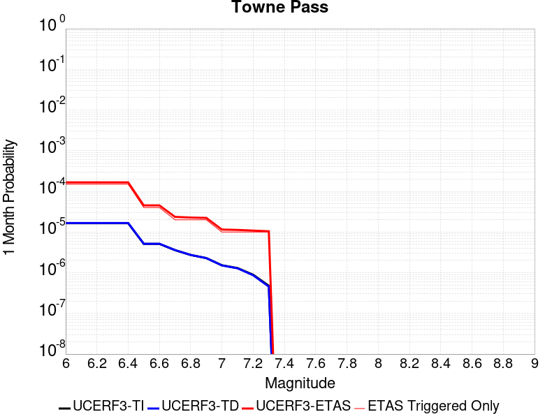 |  |  |

| Magnitude | 1 wk TI Prob | 1 wk TD Prob | 1 wk ETAS Prob | 1 wk ETAS/TD Gain | 1 wk ETAS Triggered Only | 1 mo TI Prob | 1 mo TD Prob | 1 mo ETAS Prob | 1 mo ETAS/TD Gain | 1 mo ETAS Triggered Only | 1 yr TI Prob | 1 yr TD Prob | 1 yr ETAS Prob | 1 yr ETAS/TD Gain | 1 yr ETAS Triggered Only | 10 yr TI Prob | 10 yr TD Prob | 10 yr ETAS Prob | 10 yr ETAS/TD Gain | 10 yr ETAS Triggered Only |
|-----|-----|-----|-----|-----|-----|-----|-----|-----|-----|-----|-----|-----|-----|-----|-----|-----|-----|-----|-----|-----|
| 6.0 | 3.849728E-6 | 3.8945745E-6 | 3.8945745E-6 | 1.0 | 0.0 | 1.649873E-5 | 1.669095E-5 | 1.8939964E-4 | 11.347445 | 1.7271157E-4 | 2.0085352E-4 | 2.0319775E-4 | 8.9390366E-4 | 4.399181 | 6.908463E-4 | 0.0020067208 | 0.0020305486 | 0.0032370747 | 1.5941873 | 0.001208981 |
| 6.1 | 3.849728E-6 | 3.8945745E-6 | 3.8945745E-6 | 1.0 | 0.0 | 1.649873E-5 | 1.669095E-5 | 1.8939964E-4 | 11.347445 | 1.7271157E-4 | 2.0085352E-4 | 2.0319775E-4 | 8.9390366E-4 | 4.399181 | 6.908463E-4 | 0.0020067208 | 0.0020305486 | 0.0032370747 | 1.5941873 | 0.001208981 |
| 6.2 | 3.849728E-6 | 3.8945745E-6 | 3.8945745E-6 | 1.0 | 0.0 | 1.649873E-5 | 1.669095E-5 | 1.8939964E-4 | 11.347445 | 1.7271157E-4 | 2.0085352E-4 | 2.0319775E-4 | 8.9390366E-4 | 4.399181 | 6.908463E-4 | 0.0020067208 | 0.0020305486 | 0.0032370747 | 1.5941873 | 0.001208981 |
| 6.3 | 3.849728E-6 | 3.8945745E-6 | 3.8945745E-6 | 1.0 | 0.0 | 1.649873E-5 | 1.669095E-5 | 1.8939964E-4 | 11.347445 | 1.7271157E-4 | 2.0085352E-4 | 2.0319775E-4 | 8.9390366E-4 | 4.399181 | 6.908463E-4 | 0.0020067208 | 0.0020305486 | 0.0032370747 | 1.5941873 | 0.001208981 |
| 6.4 | 3.849728E-6 | 3.8945745E-6 | 3.8945745E-6 | 1.0 | 0.0 | 1.649873E-5 | 1.669095E-5 | 1.8939964E-4 | 11.347445 | 1.7271157E-4 | 2.0085352E-4 | 2.0319775E-4 | 8.9390366E-4 | 4.399181 | 6.908463E-4 | 0.0020067208 | 0.0020305486 | 0.0032370747 | 1.5941873 | 0.001208981 |
| 6.5 | 1.1953545E-6 | 1.203065E-6 | 1.203065E-6 | 1.0 | 0.0 | 5.1229376E-6 | 5.1559837E-6 | 5.1559837E-6 | 1.0 | 0.0 | 6.236998E-5 | 6.277241E-5 | 2.3547314E-4 | 3.7512205 | 1.7271157E-4 | 6.235248E-4 | 6.275585E-4 | 9.7276486E-4 | 1.5500784 | 3.4542315E-4 |
| 6.6 | 1.1953545E-6 | 1.203065E-6 | 1.203065E-6 | 1.0 | 0.0 | 5.1229376E-6 | 5.1559837E-6 | 5.1559837E-6 | 1.0 | 0.0 | 6.236998E-5 | 6.277241E-5 | 2.3547314E-4 | 3.7512205 | 1.7271157E-4 | 6.235248E-4 | 6.275585E-4 | 9.7276486E-4 | 1.5500784 | 3.4542315E-4 |
| 6.7 | 8.375951E-7 | 8.410778E-7 | 8.410778E-7 | 1.0 | 0.0 | 3.5896885E-6 | 3.6046144E-6 | 3.6046144E-6 | 1.0 | 0.0 | 4.370358E-5 | 4.3885353E-5 | 2.1658935E-4 | 4.9353447 | 1.7271157E-4 | 4.3694986E-4 | 4.387726E-4 | 7.8404415E-4 | 1.7869033 | 3.4542315E-4 |
| 6.8 | 6.38041E-7 | 6.3922516E-7 | 6.3922516E-7 | 1.0 | 0.0 | 2.7344586E-6 | 2.7395338E-6 | 2.7395338E-6 | 1.0 | 0.0 | 3.3291526E-5 | 3.335335E-5 | 2.0605917E-4 | 6.178065 | 1.7271157E-4 | 3.3286537E-4 | 3.3348726E-4 | 5.061412E-4 | 1.5177228 | 1.7271157E-4 |
| 6.9 | 5.3460053E-7 | 5.3454215E-7 | 5.3454215E-7 | 1.0 | 0.0 | 2.2911431E-6 | 2.290893E-6 | 2.290893E-6 | 1.0 | 0.0 | 2.789431E-5 | 2.78913E-5 | 2.0059805E-4 | 7.1921372 | 1.7271157E-4 | 2.789081E-4 | 2.788813E-4 | 4.5154474E-4 | 1.6191286 | 1.7271157E-4 |
| 7.0 | 3.557783E-7 | 3.5324976E-7 | 3.5324976E-7 | 1.0 | 0.0 | 1.5247632E-6 | 1.5139268E-6 | 1.5139268E-6 | 1.0 | 0.0 | 1.8563835E-5 | 1.843191E-5 | 1.911403E-4 | 10.370075 | 1.7271157E-4 | 1.8562283E-4 | 1.8430466E-4 | 3.569844E-4 | 1.9369255 | 1.7271157E-4 |
| 7.1 | 3.037942E-7 | 3.0002903E-7 | 3.0002903E-7 | 1.0 | 0.0 | 1.3019744E-6 | 1.285838E-6 | 1.285838E-6 | 1.0 | 0.0 | 1.5851423E-5 | 1.5654974E-5 | 1.8836385E-4 | 12.032205 | 1.7271157E-4 | 1.5850292E-4 | 1.5653945E-4 | 3.2922399E-4 | 2.1031375 | 1.7271157E-4 |
| 7.2 | 2.0808248E-7 | 2.0218252E-7 | 2.0218252E-7 | 1.0 | 0.0 | 8.917818E-7 | 8.6649624E-7 | 8.6649624E-7 | 1.0 | 0.0 | 1.0857389E-5 | 1.0549546E-5 | 1.0549546E-5 | 1.0 | 0.0 | 1.0856859E-4 | 1.0549091E-4 | 1.0549091E-4 | 1.0 | 0.0 |
| 7.3 | 1.1162073E-7 | 1.0637251E-7 | 1.0637251E-7 | 1.0 | 0.0 | 4.7837443E-7 | 4.5588212E-7 | 4.5588212E-7 | 1.0 | 0.0 | 5.8241935E-6 | 5.5503524E-6 | 5.5503524E-6 | 1.0 | 0.0 | 5.8240406E-5 | 5.550234E-5 | 5.550234E-5 | 1.0 | 0.0 |

## Garlic Springs
*[(top)](#table-of-contents)*

| 1 Week | 1 Month | 1 Year | 10 Year |
|-----|-----|-----|-----|
|  |  |  |  |

| Magnitude | 1 wk TI Prob | 1 wk TD Prob | 1 wk ETAS Prob | 1 wk ETAS/TD Gain | 1 wk ETAS Triggered Only | 1 mo TI Prob | 1 mo TD Prob | 1 mo ETAS Prob | 1 mo ETAS/TD Gain | 1 mo ETAS Triggered Only | 1 yr TI Prob | 1 yr TD Prob | 1 yr ETAS Prob | 1 yr ETAS/TD Gain | 1 yr ETAS Triggered Only | 10 yr TI Prob | 10 yr TD Prob | 10 yr ETAS Prob | 10 yr ETAS/TD Gain | 10 yr ETAS Triggered Only |
|-----|-----|-----|-----|-----|-----|-----|-----|-----|-----|-----|-----|-----|-----|-----|-----|-----|-----|-----|-----|-----|
| 6.0 | 1.6760017E-5 | 1.8778032E-5 | 1.8778032E-5 | 1.0 | 0.0 | 7.182667E-5 | 8.047546E-5 | 8.047546E-5 | 1.0 | 0.0 | 8.7413884E-4 | 9.794658E-4 | 0.0016696353 | 1.7046388 | 6.908463E-4 | 0.008707083 | 0.009763034 | 0.010960212 | 1.1226236 | 0.001208981 |
| 6.1 | 9.852767E-6 | 1.097425E-5 | 1.097425E-5 | 1.0 | 0.0 | 4.222546E-5 | 4.703205E-5 | 4.703205E-5 | 1.0 | 0.0 | 5.139737E-4 | 5.7253573E-4 | 9.177611E-4 | 1.6029761 | 3.4542315E-4 | 0.005127866 | 0.005717566 | 0.0060610143 | 1.060069 | 3.4542315E-4 |
| 6.2 | 9.852767E-6 | 1.097425E-5 | 1.097425E-5 | 1.0 | 0.0 | 4.222546E-5 | 4.703205E-5 | 4.703205E-5 | 1.0 | 0.0 | 5.139737E-4 | 5.7253573E-4 | 9.177611E-4 | 1.6029761 | 3.4542315E-4 | 0.005127866 | 0.005717566 | 0.0060610143 | 1.060069 | 3.4542315E-4 |
| 6.3 | 4.3167724E-6 | 4.7782996E-6 | 4.7782996E-6 | 1.0 | 0.0 | 1.8500323E-5 | 2.0478396E-5 | 2.0478396E-5 | 1.0 | 0.0 | 2.2521814E-4 | 2.4931898E-4 | 2.4931898E-4 | 1.0 | 0.0 | 0.0022499003 | 0.002492651 | 0.002492651 | 1.0 | 0.0 |
| 6.4 | 4.3167724E-6 | 4.7782996E-6 | 4.7782996E-6 | 1.0 | 0.0 | 1.8500323E-5 | 2.0478396E-5 | 2.0478396E-5 | 1.0 | 0.0 | 2.2521814E-4 | 2.4931898E-4 | 2.4931898E-4 | 1.0 | 0.0 | 0.0022499003 | 0.002492651 | 0.002492651 | 1.0 | 0.0 |
| 6.5 | 4.3167724E-6 | 4.7782996E-6 | 4.7782996E-6 | 1.0 | 0.0 | 1.8500323E-5 | 2.0478396E-5 | 2.0478396E-5 | 1.0 | 0.0 | 2.2521814E-4 | 2.4931898E-4 | 2.4931898E-4 | 1.0 | 0.0 | 0.0022499003 | 0.002492651 | 0.002492651 | 1.0 | 0.0 |
| 6.6 | 4.301311E-6 | 4.761167E-6 | 4.761167E-6 | 1.0 | 0.0 | 1.8434059E-5 | 2.0404972E-5 | 2.0404972E-5 | 1.0 | 0.0 | 2.2441156E-4 | 2.4842523E-4 | 2.4842523E-4 | 1.0 | 0.0 | 0.0022418506 | 0.002483734 | 0.002483734 | 1.0 | 0.0 |
| 6.7 | 3.8599724E-6 | 4.2713013E-6 | 4.2713013E-6 | 1.0 | 0.0 | 1.6542634E-5 | 1.8305576E-5 | 1.8305576E-5 | 1.0 | 0.0 | 2.0138794E-4 | 2.228704E-4 | 2.228704E-4 | 1.0 | 0.0 | 0.0020120554 | 0.0022287038 | 0.0022287038 | 1.0 | 0.0 |

## Bicycle Lake
*[(top)](#table-of-contents)*

| 1 Week | 1 Month | 1 Year | 10 Year |
|-----|-----|-----|-----|
|  |  |  |  |

| Magnitude | 1 wk TI Prob | 1 wk TD Prob | 1 wk ETAS Prob | 1 wk ETAS/TD Gain | 1 wk ETAS Triggered Only | 1 mo TI Prob | 1 mo TD Prob | 1 mo ETAS Prob | 1 mo ETAS/TD Gain | 1 mo ETAS Triggered Only | 1 yr TI Prob | 1 yr TD Prob | 1 yr ETAS Prob | 1 yr ETAS/TD Gain | 1 yr ETAS Triggered Only | 10 yr TI Prob | 10 yr TD Prob | 10 yr ETAS Prob | 10 yr ETAS/TD Gain | 10 yr ETAS Triggered Only |
|-----|-----|-----|-----|-----|-----|-----|-----|-----|-----|-----|-----|-----|-----|-----|-----|-----|-----|-----|-----|-----|
| 6.0 | 1.9621975E-5 | 2.2098558E-5 | 2.2098558E-5 | 1.0 | 0.0 | 8.4091465E-5 | 9.470543E-5 | 9.470543E-5 | 1.0 | 0.0 | 0.0010233327 | 0.0011525637 | 0.0016701012 | 1.4490316 | 5.1813474E-4 | 0.01018633 | 0.011479173 | 0.012674276 | 1.1041105 | 0.001208981 |
| 6.1 | 1.9621975E-5 | 2.2098558E-5 | 2.2098558E-5 | 1.0 | 0.0 | 8.4091465E-5 | 9.470543E-5 | 9.470543E-5 | 1.0 | 0.0 | 0.0010233327 | 0.0011525637 | 0.0016701012 | 1.4490316 | 5.1813474E-4 | 0.01018633 | 0.011479173 | 0.012674276 | 1.1041105 | 0.001208981 |
| 6.2 | 9.9971285E-6 | 1.1256391E-5 | 1.1256391E-5 | 1.0 | 0.0 | 4.2844134E-5 | 4.824108E-5 | 4.824108E-5 | 1.0 | 0.0 | 5.2150246E-4 | 5.8722886E-4 | 7.59839E-4 | 1.2939402 | 1.7271157E-4 | 0.0052028033 | 0.0058618775 | 0.006720373 | 1.1464541 | 8.6355786E-4 |
| 6.3 | 9.589428E-6 | 1.0799068E-5 | 1.0799068E-5 | 1.0 | 0.0 | 4.10969E-5 | 4.628119E-5 | 4.628119E-5 | 1.0 | 0.0 | 5.002399E-4 | 5.633797E-4 | 7.3599396E-4 | 1.3063906 | 1.7271157E-4 | 0.0049911533 | 0.0056246053 | 0.0063115656 | 1.1221349 | 6.908463E-4 |
| 6.4 | 9.589428E-6 | 1.0799068E-5 | 1.0799068E-5 | 1.0 | 0.0 | 4.10969E-5 | 4.628119E-5 | 4.628119E-5 | 1.0 | 0.0 | 5.002399E-4 | 5.633797E-4 | 7.3599396E-4 | 1.3063906 | 1.7271157E-4 | 0.0049911533 | 0.0056246053 | 0.0063115656 | 1.1221349 | 6.908463E-4 |
| 6.5 | 5.557707E-6 | 6.286038E-6 | 6.286038E-6 | 1.0 | 0.0 | 2.3818526E-5 | 2.6940037E-5 | 2.6940037E-5 | 1.0 | 0.0 | 2.8995197E-4 | 3.2797246E-4 | 3.2797246E-4 | 1.0 | 0.0 | 0.0028957394 | 0.0032775209 | 0.003621812 | 1.1050462 | 3.4542315E-4 |
| 6.6 | 4.8742945E-6 | 5.5136734E-6 | 5.5136734E-6 | 1.0 | 0.0 | 2.0889667E-5 | 2.3629962E-5 | 2.3629962E-5 | 1.0 | 0.0 | 2.54302E-4 | 2.87683E-4 | 2.87683E-4 | 1.0 | 0.0 | 0.002540112 | 0.0028756752 | 0.0032201048 | 1.1197735 | 3.4542315E-4 |
| 6.7 | 3.991108E-6 | 4.5162255E-6 | 4.5162255E-6 | 1.0 | 0.0 | 1.7104636E-5 | 1.9355251E-5 | 1.9355251E-5 | 1.0 | 0.0 | 2.0822904E-4 | 2.3565018E-4 | 2.3565018E-4 | 1.0 | 0.0 | 0.0020803404 | 0.0023565018 | 0.0025288064 | 1.0731188 | 1.7271157E-4 |

## Death Valley (No)
*[(top)](#table-of-contents)*

| 1 Week | 1 Month | 1 Year | 10 Year |
|-----|-----|-----|-----|
| 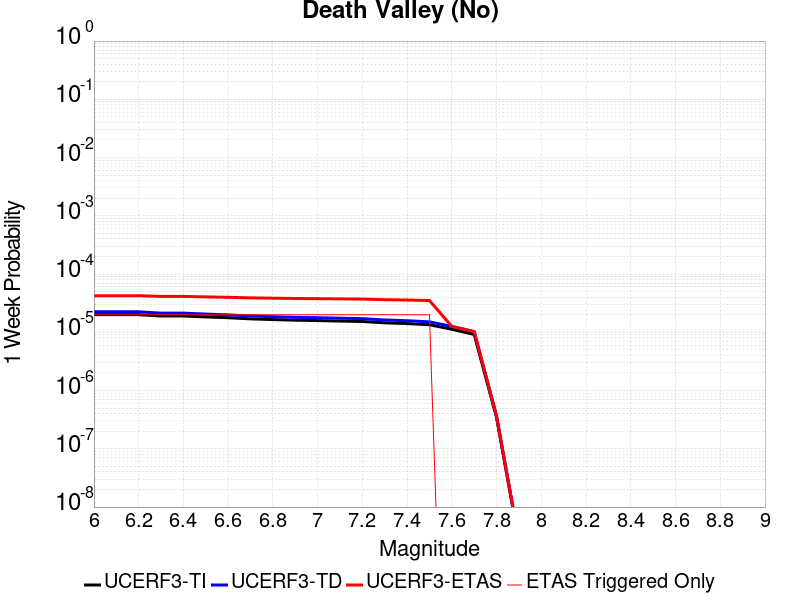 | 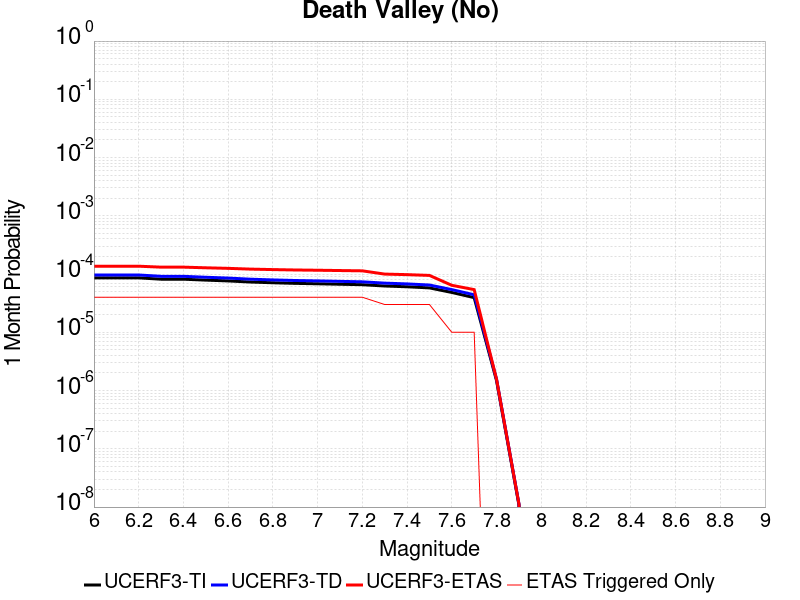 | 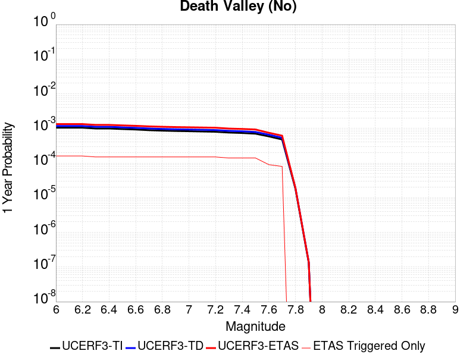 |  |

| Magnitude | 1 wk TI Prob | 1 wk TD Prob | 1 wk ETAS Prob | 1 wk ETAS/TD Gain | 1 wk ETAS Triggered Only | 1 mo TI Prob | 1 mo TD Prob | 1 mo ETAS Prob | 1 mo ETAS/TD Gain | 1 mo ETAS Triggered Only | 1 yr TI Prob | 1 yr TD Prob | 1 yr ETAS Prob | 1 yr ETAS/TD Gain | 1 yr ETAS Triggered Only | 10 yr TI Prob | 10 yr TD Prob | 10 yr ETAS Prob | 10 yr ETAS/TD Gain | 10 yr ETAS Triggered Only |
|-----|-----|-----|-----|-----|-----|-----|-----|-----|-----|-----|-----|-----|-----|-----|-----|-----|-----|-----|-----|-----|
| 6.0 | 2.0074807E-5 | 2.2501532E-5 | 2.2501532E-5 | 1.0 | 0.0 | 8.603206E-5 | 9.643161E-5 | 2.6912653E-4 | 2.7908537 | 1.7271157E-4 | 0.001046937 | 0.00117343 | 0.0016909568 | 1.4410375 | 5.1813474E-4 | 0.010420183 | 0.011673254 | 0.012526731 | 1.0731139 | 8.6355786E-4 |
| 6.1 | 2.0074807E-5 | 2.2501532E-5 | 2.2501532E-5 | 1.0 | 0.0 | 8.603206E-5 | 9.643161E-5 | 2.6912653E-4 | 2.7908537 | 1.7271157E-4 | 0.001046937 | 0.00117343 | 0.0016909568 | 1.4410375 | 5.1813474E-4 | 0.010420183 | 0.011673254 | 0.012526731 | 1.0731139 | 8.6355786E-4 |
| 6.2 | 2.0074807E-5 | 2.2501532E-5 | 2.2501532E-5 | 1.0 | 0.0 | 8.603206E-5 | 9.643161E-5 | 2.6912653E-4 | 2.7908537 | 1.7271157E-4 | 0.001046937 | 0.00117343 | 0.0016909568 | 1.4410375 | 5.1813474E-4 | 0.010420183 | 0.011673254 | 0.012526731 | 1.0731139 | 8.6355786E-4 |
| 6.3 | 1.9050609E-5 | 2.1338312E-5 | 2.1338312E-5 | 1.0 | 0.0 | 8.164292E-5 | 9.1446746E-5 | 2.6414252E-4 | 2.8884847 | 1.7271157E-4 | 9.935491E-4 | 0.0011128022 | 0.0016303604 | 1.4650944 | 5.1813474E-4 | 0.009891188 | 0.011073124 | 0.0119271185 | 1.0771233 | 8.6355786E-4 |
| 6.4 | 1.9050609E-5 | 2.1338312E-5 | 2.1338312E-5 | 1.0 | 0.0 | 8.164292E-5 | 9.1446746E-5 | 2.6414252E-4 | 2.8884847 | 1.7271157E-4 | 9.935491E-4 | 0.0011128022 | 0.0016303604 | 1.4650944 | 5.1813474E-4 | 0.009891188 | 0.011073124 | 0.0119271185 | 1.0771233 | 8.6355786E-4 |
| 6.5 | 1.8367004E-5 | 2.0562318E-5 | 2.0562318E-5 | 1.0 | 0.0 | 7.8713354E-5 | 8.8121276E-5 | 2.6081764E-4 | 2.9597576 | 1.7271157E-4 | 9.5791375E-4 | 0.0010723551 | 0.0015899342 | 1.4826565 | 5.1813474E-4 | 0.009537951 | 0.010672592 | 0.011526933 | 1.08005 | 8.6355786E-4 |
| 6.6 | 1.779439E-5 | 1.9912191E-5 | 1.9912191E-5 | 1.0 | 0.0 | 7.625944E-5 | 8.53352E-5 | 2.5803203E-4 | 3.0237467 | 1.7271157E-4 | 9.280632E-4 | 0.0010384673 | 0.001556064 | 1.4984236 | 5.1813474E-4 | 0.009241969 | 0.010336905 | 0.011191537 | 1.0826777 | 8.6355786E-4 |
| 6.7 | 1.7025437E-5 | 1.904463E-5 | 1.904463E-5 | 1.0 | 0.0 | 7.296412E-5 | 8.161732E-5 | 2.543148E-4 | 3.1159415 | 1.7271157E-4 | 8.87976E-4 | 9.93244E-4 | 0.0015108641 | 1.5211409 | 5.1813474E-4 | 0.008844362 | 0.009888767 | 0.010743786 | 1.0864636 | 8.6355786E-4 |
| 6.8 | 1.6545107E-5 | 1.851372E-5 | 1.851372E-5 | 1.0 | 0.0 | 7.090568E-5 | 7.934213E-5 | 2.5204E-4 | 3.1766226 | 1.7271157E-4 | 8.629347E-4 | 9.6556847E-4 | 0.0014832029 | 1.5360929 | 5.1813474E-4 | 0.008595915 | 0.009614435 | 0.010469691 | 1.0889553 | 8.6355786E-4 |
| 6.9 | 1.615478E-5 | 1.8088747E-5 | 1.8088747E-5 | 1.0 | 0.0 | 6.9232934E-5 | 7.7520934E-5 | 2.502191E-4 | 3.227762 | 1.7271157E-4 | 8.4258494E-4 | 9.4341475E-4 | 0.0014610606 | 1.5486939 | 5.1813474E-4 | 0.008393973 | 0.009394792 | 0.010250237 | 1.0910553 | 8.6355786E-4 |
| 7.0 | 1.5894311E-5 | 1.780669E-5 | 1.780669E-5 | 1.0 | 0.0 | 6.81167E-5 | 7.6312186E-5 | 2.4901057E-4 | 3.2630513 | 1.7271157E-4 | 8.2900526E-4 | 9.287109E-4 | 0.0014463644 | 1.5573893 | 5.1813474E-4 | 0.008259195 | 0.009248987 | 0.0101045575 | 1.0925043 | 8.6355786E-4 |
| 7.1 | 1.5602263E-5 | 1.7484625E-5 | 1.7484625E-5 | 1.0 | 0.0 | 6.6865134E-5 | 7.493199E-5 | 2.476306E-4 | 3.3047383 | 1.7271157E-4 | 8.137789E-4 | 9.119212E-4 | 0.0014295834 | 1.5676612 | 5.1813474E-4 | 0.008108052 | 0.009082474 | 0.009938189 | 1.094216 | 8.6355786E-4 |
| 7.2 | 1.5323829E-5 | 1.7171731E-5 | 1.7171731E-5 | 1.0 | 0.0 | 6.56719E-5 | 7.3591094E-5 | 2.4628994E-4 | 3.346736 | 1.7271157E-4 | 7.99262E-4 | 8.956093E-4 | 0.00141328 | 1.5780095 | 5.1813474E-4 | 0.007963934 | 0.008920676 | 0.009776531 | 1.0959405 | 8.6355786E-4 |
| 7.3 | 1.4556212E-5 | 1.6303497E-5 | 1.6303497E-5 | 1.0 | 0.0 | 6.238227E-5 | 6.9870286E-5 | 2.4256979E-4 | 3.471716 | 1.7271157E-4 | 7.592395E-4 | 8.503446E-4 | 0.0013680387 | 1.6088051 | 5.1813474E-4 | 0.0075665074 | 0.008471553 | 0.009327795 | 1.1010727 | 8.6355786E-4 |
| 7.4 | 1.411725E-5 | 1.5808968E-5 | 1.5808968E-5 | 1.0 | 0.0 | 6.0501097E-5 | 6.775099E-5 | 2.4045086E-4 | 3.5490382 | 1.7271157E-4 | 7.363519E-4 | 8.24562E-4 | 0.0013422695 | 1.6278576 | 5.1813474E-4 | 0.0073391674 | 0.00821566 | 0.009072123 | 1.1042477 | 8.6355786E-4 |
| 7.5 | 1.3503312E-5 | 1.5127256E-5 | 1.5127256E-5 | 1.0 | 0.0 | 5.7870053E-5 | 6.4829524E-5 | 2.375299E-4 | 3.6639156 | 1.7271157E-4 | 7.043401E-4 | 7.890194E-4 | 0.0013067453 | 1.6561637 | 5.1813474E-4 | 0.007021119 | 0.007862805 | 0.008719573 | 1.1089647 | 8.6355786E-4 |
| 7.6 | 1.1279839E-5 | 1.2627129E-5 | 1.2627129E-5 | 1.0 | 0.0 | 4.834127E-5 | 5.4115175E-5 | 2.268174E-4 | 4.1913824 | 1.7271157E-4 | 5.88396E-4 | 6.586584E-4 | 0.001003854 | 1.524089 | 3.4542315E-4 | 0.005868405 | 0.006567614 | 0.0072539235 | 1.104499 | 6.908463E-4 |
| 7.7 | 9.189108E-6 | 1.02840095E-5 | 1.02840095E-5 | 1.0 | 0.0 | 3.93813E-5 | 4.407361E-5 | 2.1677757E-4 | 4.9185343 | 1.7271157E-4 | 4.7936183E-4 | 5.3646916E-4 | 8.81707E-4 | 1.6435372 | 3.4542315E-4 | 0.004783291 | 0.005352252 | 0.006039401 | 1.128385 | 6.908463E-4 |
| 7.8 | 3.4586725E-7 | 3.648368E-7 | 3.648368E-7 | 1.0 | 0.0 | 1.4822873E-6 | 1.5635853E-6 | 1.5635853E-6 | 1.0 | 0.0 | 1.80467E-5 | 1.903649E-5 | 1.903649E-5 | 1.0 | 0.0 | 1.8045233E-4 | 1.9034903E-4 | 1.9034903E-4 | 1.0 | 0.0 |
| 7.9 | 2.5591178E-9 | 2.6697329E-9 | 2.6697329E-9 | 1.0 | 0.0 | 1.0967647E-8 | 1.14417125E-8 | 1.14417125E-8 | 1.0 | 0.0 | 1.335311E-7 | 1.3930286E-7 | 1.3930286E-7 | 1.0 | 0.0 | 1.3353102E-6 | 1.3930285E-6 | 1.3930285E-6 | 1.0 | 0.0 |

## Death Valley (Fish Lake Valley)
*[(top)](#table-of-contents)*

| 1 Week | 1 Month | 1 Year | 10 Year |
|-----|-----|-----|-----|
|  |  |  |  |

| Magnitude | 1 wk TI Prob | 1 wk TD Prob | 1 wk ETAS Prob | 1 wk ETAS/TD Gain | 1 wk ETAS Triggered Only | 1 mo TI Prob | 1 mo TD Prob | 1 mo ETAS Prob | 1 mo ETAS/TD Gain | 1 mo ETAS Triggered Only | 1 yr TI Prob | 1 yr TD Prob | 1 yr ETAS Prob | 1 yr ETAS/TD Gain | 1 yr ETAS Triggered Only | 10 yr TI Prob | 10 yr TD Prob | 10 yr ETAS Prob | 10 yr ETAS/TD Gain | 10 yr ETAS Triggered Only |
|-----|-----|-----|-----|-----|-----|-----|-----|-----|-----|-----|-----|-----|-----|-----|-----|-----|-----|-----|-----|-----|
| 6.0 | 3.872328E-5 | 4.727316E-5 | 4.727316E-5 | 1.0 | 0.0 | 1.6594635E-4 | 2.0258522E-4 | 3.752618E-4 | 1.8523651 | 1.7271157E-4 | 0.0020185246 | 0.0024638134 | 0.0028083853 | 1.1398531 | 3.4542315E-4 | 0.02000288 | 0.024390986 | 0.02506498 | 1.027633 | 6.908463E-4 |
| 6.1 | 3.872328E-5 | 4.727316E-5 | 4.727316E-5 | 1.0 | 0.0 | 1.6594635E-4 | 2.0258522E-4 | 3.752618E-4 | 1.8523651 | 1.7271157E-4 | 0.0020185246 | 0.0024638134 | 0.0028083853 | 1.1398531 | 3.4542315E-4 | 0.02000288 | 0.024390986 | 0.02506498 | 1.027633 | 6.908463E-4 |
| 6.2 | 3.872328E-5 | 4.727316E-5 | 4.727316E-5 | 1.0 | 0.0 | 1.6594635E-4 | 2.0258522E-4 | 3.752618E-4 | 1.8523651 | 1.7271157E-4 | 0.0020185246 | 0.0024638134 | 0.0028083853 | 1.1398531 | 3.4542315E-4 | 0.02000288 | 0.024390986 | 0.02506498 | 1.027633 | 6.908463E-4 |
| 6.3 | 2.8356371E-5 | 3.361322E-5 | 3.361322E-5 | 1.0 | 0.0 | 1.2152165E-4 | 1.4404916E-4 | 3.1673585E-4 | 2.198804 | 1.7271157E-4 | 0.0014785219 | 0.0017524667 | 0.0020972844 | 1.1967614 | 3.4542315E-4 | 0.014687235 | 0.017393492 | 0.018072322 | 1.0390278 | 6.908463E-4 |
| 6.4 | 2.8356371E-5 | 3.361322E-5 | 3.361322E-5 | 1.0 | 0.0 | 1.2152165E-4 | 1.4404916E-4 | 3.1673585E-4 | 2.198804 | 1.7271157E-4 | 0.0014785219 | 0.0017524667 | 0.0020972844 | 1.1967614 | 3.4542315E-4 | 0.014687235 | 0.017393492 | 0.018072322 | 1.0390278 | 6.908463E-4 |
| 6.5 | 2.4448687E-5 | 2.8610175E-5 | 2.8610175E-5 | 1.0 | 0.0 | 1.0477588E-4 | 1.2260956E-4 | 2.9529995E-4 | 2.4084578 | 1.7271157E-4 | 0.0012748998 | 0.0014917998 | 0.0018367076 | 1.2312025 | 3.4542315E-4 | 0.012676105 | 0.014822718 | 0.015503325 | 1.0459164 | 6.908463E-4 |
| 6.6 | 2.1298161E-5 | 2.4662175E-5 | 2.4662175E-5 | 1.0 | 0.0 | 9.127464E-5 | 1.05690946E-4 | 2.7838425E-4 | 2.6339462 | 1.7271157E-4 | 0.0011107022 | 0.0012860615 | 0.0016310405 | 1.2682445 | 3.4542315E-4 | 0.011051672 | 0.012789601 | 0.013471612 | 1.0533254 | 6.908463E-4 |
| 6.7 | 1.8959729E-5 | 2.1782762E-5 | 2.1782762E-5 | 1.0 | 0.0 | 8.125345E-5 | 9.3351504E-5 | 2.6604696E-4 | 2.8499482 | 1.7271157E-4 | 9.888117E-4 | 0.0011359875 | 0.0014810183 | 1.3037276 | 3.4542315E-4 | 0.009844234 | 0.011304467 | 0.011987504 | 1.0604218 | 6.908463E-4 |
| 6.8 | 1.6691629E-5 | 1.901977E-5 | 1.901977E-5 | 1.0 | 0.0 | 7.153359E-5 | 8.151084E-5 | 2.5420834E-4 | 3.1187057 | 1.7271157E-4 | 8.7057345E-4 | 9.919596E-4 | 0.0013370401 | 1.3478776 | 3.4542315E-4 | 0.008671708 | 0.009877076 | 0.010561099 | 1.0692536 | 6.908463E-4 |
| 6.9 | 1.450505E-5 | 1.6390675E-5 | 1.6390675E-5 | 1.0 | 0.0 | 6.216302E-5 | 7.024391E-5 | 2.4294335E-4 | 3.4585683 | 1.7271157E-4 | 7.5657194E-4 | 8.5489283E-4 | 0.0012000207 | 1.4037089 | 3.4542315E-4 | 0.007540013 | 0.008516973 | 0.0092019355 | 1.0804232 | 6.908463E-4 |
| 7.0 | 1.2940855E-5 | 1.4538927E-5 | 1.4538927E-5 | 1.0 | 0.0 | 5.545963E-5 | 6.230823E-5 | 2.3500904E-4 | 3.7717175 | 1.7271157E-4 | 6.750118E-4 | 7.583444E-4 | 0.0011035056 | 1.455151 | 3.4542315E-4 | 0.006729651 | 0.007558184 | 0.008243809 | 1.0907129 | 6.908463E-4 |
| 7.1 | 1.2544658E-5 | 1.4079123E-5 | 1.4079123E-5 | 1.0 | 0.0 | 5.3761712E-5 | 6.0337734E-5 | 2.3303888E-4 | 3.8622413 | 1.7271157E-4 | 6.5435225E-4 | 7.343699E-4 | 0.0010795394 | 1.4700212 | 3.4542315E-4 | 0.006524288 | 0.007320025 | 0.008005815 | 1.0936867 | 6.908463E-4 |
| 7.2 | 1.2489416E-5 | 1.4016585E-5 | 1.4016585E-5 | 1.0 | 0.0 | 5.3524967E-5 | 6.0069728E-5 | 2.3277092E-4 | 3.8750122 | 1.7271157E-4 | 6.514716E-4 | 7.311091E-4 | 0.0010762798 | 1.4721191 | 3.4542315E-4 | 0.006495651 | 0.0072876317 | 0.007973444 | 1.0941062 | 6.908463E-4 |
| 7.3 | 1.2368307E-5 | 1.38807145E-5 | 1.38807145E-5 | 1.0 | 0.0 | 5.3005948E-5 | 5.948745E-5 | 2.3218874E-4 | 3.903155 | 1.7271157E-4 | 6.451563E-4 | 7.2402466E-4 | 0.0010691977 | 1.4767421 | 3.4542315E-4 | 0.0064328653 | 0.0072172494 | 0.007903109 | 1.0950307 | 6.908463E-4 |
| 7.4 | 1.2161707E-5 | 1.3648755E-5 | 1.3648755E-5 | 1.0 | 0.0 | 5.212056E-5 | 5.8493384E-5 | 2.3119485E-4 | 3.9524958 | 1.7271157E-4 | 6.3438306E-4 | 7.1192987E-4 | 0.0010571071 | 1.4848473 | 3.4542315E-4 | 0.006325751 | 0.0070970803 | 0.0077830236 | 1.0966514 | 6.908463E-4 |
| 7.5 | 1.1707948E-5 | 1.3146373E-5 | 1.3146373E-5 | 1.0 | 0.0 | 5.0175953E-5 | 5.6340414E-5 | 2.2904226E-4 | 4.065328 | 1.7271157E-4 | 6.10721E-4 | 6.857342E-4 | 0.0010309205 | 1.503382 | 3.4542315E-4 | 0.0060904534 | 0.006836766 | 0.007522889 | 1.1003579 | 6.908463E-4 |
| 7.6 | 1.0319538E-5 | 1.1580373E-5 | 1.1580373E-5 | 1.0 | 0.0 | 4.4225842E-5 | 4.9629256E-5 | 2.2233225E-4 | 4.4798627 | 1.7271157E-4 | 5.383166E-4 | 6.0407387E-4 | 9.4928837E-4 | 1.5714773 | 3.4542315E-4 | 0.0053701443 | 0.00602485 | 0.006711534 | 1.1139753 | 6.908463E-4 |
| 7.7 | 8.937764E-6 | 1.0023426E-5 | 1.0023426E-5 | 1.0 | 0.0 | 3.830414E-5 | 4.295686E-5 | 2.1566101E-4 | 5.020409 | 1.7271157E-4 | 4.6625308E-4 | 5.228793E-4 | 8.681218E-4 | 1.6602719 | 3.4542315E-4 | 0.0046527605 | 0.005217 | 0.005904242 | 1.1317313 | 6.908463E-4 |
| 7.8 | 3.108007E-7 | 3.2847535E-7 | 3.2847535E-7 | 1.0 | 0.0 | 1.3320023E-6 | 1.4077508E-6 | 1.4077508E-6 | 1.0 | 0.0 | 1.6217007E-5 | 1.7139235E-5 | 1.7139235E-5 | 1.0 | 0.0 | 1.6215823E-4 | 1.713795E-4 | 1.713795E-4 | 1.0 | 0.0 |
| 7.9 | 2.5591178E-9 | 2.6697329E-9 | 2.6697329E-9 | 1.0 | 0.0 | 1.0967647E-8 | 1.14417125E-8 | 1.14417125E-8 | 1.0 | 0.0 | 1.335311E-7 | 1.3930286E-7 | 1.3930286E-7 | 1.0 | 0.0 | 1.3353102E-6 | 1.3930285E-6 | 1.3930285E-6 | 1.0 | 0.0 |

## Lenwood-Lockhart-Old Woman Springs
*[(top)](#table-of-contents)*

| 1 Week | 1 Month | 1 Year | 10 Year |
|-----|-----|-----|-----|
|  |  | 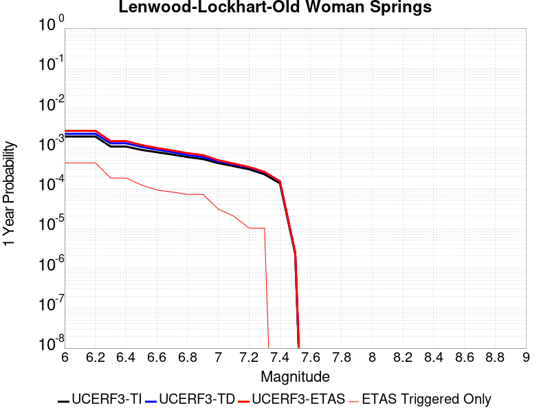 |  |

| Magnitude | 1 wk TI Prob | 1 wk TD Prob | 1 wk ETAS Prob | 1 wk ETAS/TD Gain | 1 wk ETAS Triggered Only | 1 mo TI Prob | 1 mo TD Prob | 1 mo ETAS Prob | 1 mo ETAS/TD Gain | 1 mo ETAS Triggered Only | 1 yr TI Prob | 1 yr TD Prob | 1 yr ETAS Prob | 1 yr ETAS/TD Gain | 1 yr ETAS Triggered Only | 10 yr TI Prob | 10 yr TD Prob | 10 yr ETAS Prob | 10 yr ETAS/TD Gain | 10 yr ETAS Triggered Only |
|-----|-----|-----|-----|-----|-----|-----|-----|-----|-----|-----|-----|-----|-----|-----|-----|-----|-----|-----|-----|-----|
| 6.0 | 3.744542E-5 | 4.3964304E-5 | 4.3964304E-5 | 1.0 | 0.0 | 1.604705E-4 | 1.8840581E-4 | 1.8840581E-4 | 1.0 | 0.0 | 0.0019519776 | 0.0022915998 | 0.0026362315 | 1.1503891 | 3.4542315E-4 | 0.019349206 | 0.0226977 | 0.023204075 | 1.0223095 | 5.1813474E-4 |
| 6.1 | 3.744542E-5 | 4.3964304E-5 | 4.3964304E-5 | 1.0 | 0.0 | 1.604705E-4 | 1.8840581E-4 | 1.8840581E-4 | 1.0 | 0.0 | 0.0019519776 | 0.0022915998 | 0.0026362315 | 1.1503891 | 3.4542315E-4 | 0.019349206 | 0.0226977 | 0.023204075 | 1.0223095 | 5.1813474E-4 |
| 6.2 | 3.744542E-5 | 4.3964304E-5 | 4.3964304E-5 | 1.0 | 0.0 | 1.604705E-4 | 1.8840581E-4 | 1.8840581E-4 | 1.0 | 0.0 | 0.0019519776 | 0.0022915998 | 0.0026362315 | 1.1503891 | 3.4542315E-4 | 0.019349206 | 0.0226977 | 0.023204075 | 1.0223095 | 5.1813474E-4 |
| 6.3 | 2.1079984E-5 | 2.5354084E-5 | 2.5354084E-5 | 1.0 | 0.0 | 9.0339665E-5 | 1.0865595E-4 | 1.0865595E-4 | 1.0 | 0.0 | 0.0010993304 | 0.0013221033 | 0.0016670699 | 1.2609224 | 3.4542315E-4 | 0.010939079 | 0.013144593 | 0.013485475 | 1.0259333 | 3.4542315E-4 |
| 6.4 | 2.1079984E-5 | 2.5354084E-5 | 2.5354084E-5 | 1.0 | 0.0 | 9.0339665E-5 | 1.0865595E-4 | 1.0865595E-4 | 1.0 | 0.0 | 0.0010993304 | 0.0013221033 | 0.0016670699 | 1.2609224 | 3.4542315E-4 | 0.010939079 | 0.013144593 | 0.013485475 | 1.0259333 | 3.4542315E-4 |
| 6.5 | 1.7397282E-5 | 2.0662914E-5 | 2.0662914E-5 | 1.0 | 0.0 | 7.455765E-5 | 8.8552406E-5 | 8.8552406E-5 | 1.0 | 0.0 | 9.073613E-4 | 0.001077604 | 0.001422655 | 1.320202 | 3.4542315E-4 | 0.009036654 | 0.010725081 | 0.011066799 | 1.0318617 | 3.4542315E-4 |
| 6.6 | 1.52050325E-5 | 1.7680117E-5 | 1.7680117E-5 | 1.0 | 0.0 | 6.51628E-5 | 7.576977E-5 | 7.576977E-5 | 1.0 | 0.0 | 7.9306826E-4 | 9.221144E-4 | 0.0012672191 | 1.3742536 | 3.4542315E-4 | 0.007902439 | 0.009183745 | 0.009525996 | 1.037267 | 3.4542315E-4 |
| 6.7 | 1.332523E-5 | 1.5264359E-5 | 1.5264359E-5 | 1.0 | 0.0 | 5.7106878E-5 | 6.541707E-5 | 6.541707E-5 | 1.0 | 0.0 | 6.950544E-4 | 7.9616765E-4 | 0.0011413158 | 1.4335119 | 3.4542315E-4 | 0.006928845 | 0.007933783 | 0.008276465 | 1.0431929 | 3.4542315E-4 |
| 6.8 | 1.1525329E-5 | 1.3031262E-5 | 1.3031262E-5 | 1.0 | 0.0 | 4.9393333E-5 | 5.5847093E-5 | 5.5847093E-5 | 1.0 | 0.0 | 6.011979E-4 | 6.797305E-4 | 8.5232465E-4 | 1.2539155 | 1.7271157E-4 | 0.00599574 | 0.0067769657 | 0.006948507 | 1.0253124 | 1.7271157E-4 |
| 6.9 | 1.0253909E-5 | 1.1514676E-5 | 1.1514676E-5 | 1.0 | 0.0 | 4.3944583E-5 | 4.93477E-5 | 4.93477E-5 | 1.0 | 0.0 | 5.3489394E-4 | 6.006462E-4 | 7.73254E-4 | 1.2873702 | 1.7271157E-4 | 0.0053360825 | 0.005990607 | 0.0061622844 | 1.0286577 | 1.7271157E-4 |
| 7.0 | 8.104563E-6 | 8.991446E-6 | 8.991446E-6 | 1.0 | 0.0 | 3.4733377E-5 | 3.8534214E-5 | 3.8534214E-5 | 1.0 | 0.0 | 4.2279682E-4 | 4.6905546E-4 | 6.41686E-4 | 1.3680387 | 1.7271157E-4 | 0.0042199334 | 0.004680902 | 0.0048528053 | 1.0367243 | 1.7271157E-4 |
| 7.1 | 6.7986157E-6 | 7.515946E-6 | 7.515946E-6 | 1.0 | 0.0 | 2.91366E-5 | 3.221081E-5 | 3.221081E-5 | 1.0 | 0.0 | 3.5468035E-4 | 3.9209818E-4 | 5.647421E-4 | 1.4403077 | 1.7271157E-4 | 0.003541148 | 0.0039142803 | 0.0040863156 | 1.0439508 | 1.7271157E-4 |
| 7.2 | 5.6893327E-6 | 6.280115E-6 | 6.280115E-6 | 1.0 | 0.0 | 2.4382627E-5 | 2.6914513E-5 | 2.6914513E-5 | 1.0 | 0.0 | 2.9681803E-4 | 3.2763692E-4 | 5.002919E-4 | 1.5269705 | 1.7271157E-4 | 0.002964219 | 0.0032717374 | 0.003443884 | 1.0526162 | 1.7271157E-4 |
| 7.3 | 4.253348E-6 | 4.7069766E-6 | 4.7069766E-6 | 1.0 | 0.0 | 1.8228506E-5 | 2.0172612E-5 | 2.0172612E-5 | 1.0 | 0.0 | 2.2190946E-4 | 2.455757E-4 | 4.1824486E-4 | 1.7031199 | 1.7271157E-4 | 0.00221688 | 0.0024532243 | 0.0026255122 | 1.0702292 | 1.7271157E-4 |
| 7.4 | 2.5448119E-6 | 2.8520785E-6 | 2.8520785E-6 | 1.0 | 0.0 | 1.0906291E-5 | 1.2223146E-5 | 1.2223146E-5 | 1.0 | 0.0 | 1.3277601E-4 | 1.4880829E-4 | 1.4880829E-4 | 1.0 | 0.0 | 0.001326967 | 0.0014872487 | 0.0014872487 | 1.0 | 0.0 |
| 7.5 | 4.3706837E-8 | 4.5630156E-8 | 4.5630156E-8 | 1.0 | 0.0 | 1.8731501E-7 | 1.955578E-7 | 1.955578E-7 | 1.0 | 0.0 | 2.2805577E-6 | 2.380914E-6 | 2.380914E-6 | 1.0 | 0.0 | 2.2805343E-5 | 2.3808941E-5 | 2.3808941E-5 | 1.0 | 0.0 |

## Calico-Hidalgo
*[(top)](#table-of-contents)*

| 1 Week | 1 Month | 1 Year | 10 Year |
|-----|-----|-----|-----|
|  |  |  |  |

| Magnitude | 1 wk TI Prob | 1 wk TD Prob | 1 wk ETAS Prob | 1 wk ETAS/TD Gain | 1 wk ETAS Triggered Only | 1 mo TI Prob | 1 mo TD Prob | 1 mo ETAS Prob | 1 mo ETAS/TD Gain | 1 mo ETAS Triggered Only | 1 yr TI Prob | 1 yr TD Prob | 1 yr ETAS Prob | 1 yr ETAS/TD Gain | 1 yr ETAS Triggered Only | 10 yr TI Prob | 10 yr TD Prob | 10 yr ETAS Prob | 10 yr ETAS/TD Gain | 10 yr ETAS Triggered Only |
|-----|-----|-----|-----|-----|-----|-----|-----|-----|-----|-----|-----|-----|-----|-----|-----|-----|-----|-----|-----|-----|
| 6.0 | 4.0906612E-5 | 5.0707546E-5 | 5.0707546E-5 | 1.0 | 0.0 | 1.7530227E-4 | 2.1730224E-4 | 2.1730224E-4 | 1.0 | 0.0 | 0.0021322158 | 0.0026428488 | 0.0026428488 | 1.0 | 0.0 | 0.02111873 | 0.026154567 | 0.026490955 | 1.0128616 | 3.4542315E-4 |
| 6.1 | 4.0906612E-5 | 5.0707546E-5 | 5.0707546E-5 | 1.0 | 0.0 | 1.7530227E-4 | 2.1730224E-4 | 2.1730224E-4 | 1.0 | 0.0 | 0.0021322158 | 0.0026428488 | 0.0026428488 | 1.0 | 0.0 | 0.02111873 | 0.026154567 | 0.026490955 | 1.0128616 | 3.4542315E-4 |
| 6.2 | 4.0906612E-5 | 5.0707546E-5 | 5.0707546E-5 | 1.0 | 0.0 | 1.7530227E-4 | 2.1730224E-4 | 2.1730224E-4 | 1.0 | 0.0 | 0.0021322158 | 0.0026428488 | 0.0026428488 | 1.0 | 0.0 | 0.02111873 | 0.026154567 | 0.026490955 | 1.0128616 | 3.4542315E-4 |
| 6.3 | 2.4242801E-5 | 3.0092122E-5 | 3.0092122E-5 | 1.0 | 0.0 | 1.0389358E-4 | 1.2896005E-4 | 1.2896005E-4 | 1.0 | 0.0 | 0.0012641704 | 0.0015689905 | 0.0015689905 | 1.0 | 0.0 | 0.01257003 | 0.015582806 | 0.015752826 | 1.0109107 | 1.7271157E-4 |
| 6.4 | 2.4242801E-5 | 3.0092122E-5 | 3.0092122E-5 | 1.0 | 0.0 | 1.0389358E-4 | 1.2896005E-4 | 1.2896005E-4 | 1.0 | 0.0 | 0.0012641704 | 0.0015689905 | 0.0015689905 | 1.0 | 0.0 | 0.01257003 | 0.015582806 | 0.015752826 | 1.0109107 | 1.7271157E-4 |
| 6.5 | 2.0286952E-5 | 2.5316727E-5 | 2.5316727E-5 | 1.0 | 0.0 | 8.694118E-5 | 1.0849584E-4 | 1.0849584E-4 | 1.0 | 0.0 | 0.0010579949 | 0.0013201536 | 0.0013201536 | 1.0 | 0.0 | 0.010529719 | 0.013125047 | 0.013295492 | 1.0129862 | 1.7271157E-4 |
| 6.6 | 2.0269223E-5 | 2.5297675E-5 | 2.5297675E-5 | 1.0 | 0.0 | 8.6865206E-5 | 1.084142E-4 | 1.084142E-4 | 1.0 | 0.0 | 0.0010570707 | 0.0013191608 | 0.0013191608 | 1.0 | 0.0 | 0.010520565 | 0.013115237 | 0.013285683 | 1.0129961 | 1.7271157E-4 |
| 6.7 | 1.799852E-5 | 2.25414E-5 | 2.25414E-5 | 1.0 | 0.0 | 7.713423E-5 | 9.660251E-5 | 9.660251E-5 | 1.0 | 0.0 | 9.3870464E-4 | 0.0011755156 | 0.0011755156 | 1.0 | 0.0 | 0.009347493 | 0.011694587 | 0.011865279 | 1.0145957 | 1.7271157E-4 |
| 6.8 | 1.7458793E-5 | 2.1842892E-5 | 2.1842892E-5 | 1.0 | 0.0 | 7.4821255E-5 | 9.360912E-5 | 9.360912E-5 | 1.0 | 0.0 | 9.10568E-4 | 0.0011391096 | 0.0011391096 | 1.0 | 0.0 | 0.009068459 | 0.011334292 | 0.011505046 | 1.0150653 | 1.7271157E-4 |
| 6.9 | 1.542884E-5 | 1.9026567E-5 | 1.9026567E-5 | 1.0 | 0.0 | 6.612192E-5 | 8.1539954E-5 | 8.1539954E-5 | 1.0 | 0.0 | 8.04737E-4 | 9.923099E-4 | 9.923099E-4 | 1.0 | 0.0 | 0.008018291 | 0.009880188 | 0.010051194 | 1.0173079 | 1.7271157E-4 |
| 7.0 | 1.468253E-5 | 1.803119E-5 | 1.803119E-5 | 1.0 | 0.0 | 6.292361E-5 | 7.7274315E-5 | 7.7274315E-5 | 1.0 | 0.0 | 7.658257E-4 | 9.404217E-4 | 9.404217E-4 | 1.0 | 0.0 | 0.0076319184 | 0.009365788 | 0.009536881 | 1.018268 | 1.7271157E-4 |
| 7.1 | 1.3139281E-5 | 1.620145E-5 | 1.620145E-5 | 1.0 | 0.0 | 5.6309986E-5 | 6.943301E-5 | 6.943301E-5 | 1.0 | 0.0 | 6.853584E-4 | 8.450316E-4 | 8.450316E-4 | 1.0 | 0.0 | 0.0068324856 | 0.008419481 | 0.008590738 | 1.0203406 | 1.7271157E-4 |
| 7.2 | 1.1127404E-5 | 1.3867019E-5 | 1.3867019E-5 | 1.0 | 0.0 | 4.7688E-5 | 5.942879E-5 | 5.942879E-5 | 1.0 | 0.0 | 5.8044674E-4 | 7.233162E-4 | 7.233162E-4 | 1.0 | 0.0 | 0.0057893298 | 0.0072107273 | 0.0073821936 | 1.0237793 | 1.7271157E-4 |
| 7.3 | 9.808154E-6 | 1.217656E-5 | 1.217656E-5 | 1.0 | 0.0 | 4.2034266E-5 | 5.218427E-5 | 5.218427E-5 | 1.0 | 0.0 | 5.11647E-4 | 6.3516904E-4 | 6.3516904E-4 | 1.0 | 0.0 | 0.0051047057 | 0.0063346117 | 0.0065062293 | 1.027092 | 1.7271157E-4 |
| 7.4 | 7.942452E-6 | 9.7924E-6 | 9.7924E-6 | 1.0 | 0.0 | 3.4038632E-5 | 4.196681E-5 | 4.196681E-5 | 1.0 | 0.0 | 4.1434157E-4 | 5.108356E-4 | 5.108356E-4 | 1.0 | 0.0 | 0.0041356985 | 0.0050975545 | 0.005269386 | 1.0337086 | 1.7271157E-4 |
| 7.5 | 4.7121216E-6 | 5.772976E-6 | 5.772976E-6 | 1.0 | 0.0 | 2.019465E-5 | 2.4741134E-5 | 2.4741134E-5 | 1.0 | 0.0 | 2.4584212E-4 | 3.011893E-4 | 3.011893E-4 | 1.0 | 0.0 | 0.0024557032 | 0.0030085635 | 0.0031807555 | 1.0572339 | 1.7271157E-4 |
| 7.6 | 2.21172E-7 | 2.6040124E-7 | 2.6040124E-7 | 1.0 | 0.0 | 9.478797E-7 | 1.116005E-6 | 1.116005E-6 | 1.0 | 0.0 | 1.1540374E-5 | 1.3587305E-5 | 1.3587305E-5 | 1.0 | 0.0 | 1.1539775E-4 | 1.3586757E-4 | 1.3586757E-4 | 1.0 | 0.0 |

## San Andreas (Cholame) rev
*[(top)](#table-of-contents)*

| 1 Week | 1 Month | 1 Year | 10 Year |
|-----|-----|-----|-----|
| 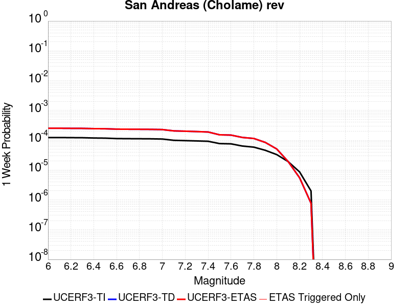 |  |  |  |

| Magnitude | 1 wk TI Prob | 1 wk TD Prob | 1 wk ETAS Prob | 1 wk ETAS/TD Gain | 1 wk ETAS Triggered Only | 1 mo TI Prob | 1 mo TD Prob | 1 mo ETAS Prob | 1 mo ETAS/TD Gain | 1 mo ETAS Triggered Only | 1 yr TI Prob | 1 yr TD Prob | 1 yr ETAS Prob | 1 yr ETAS/TD Gain | 1 yr ETAS Triggered Only | 10 yr TI Prob | 10 yr TD Prob | 10 yr ETAS Prob | 10 yr ETAS/TD Gain | 10 yr ETAS Triggered Only |
|-----|-----|-----|-----|-----|-----|-----|-----|-----|-----|-----|-----|-----|-----|-----|-----|-----|-----|-----|-----|-----|
| 6.0 | 1.2302514E-4 | 2.5242948E-4 | 2.5242948E-4 | 1.0 | 0.0 | 5.27144E-4 | 0.0010813937 | 0.0010813937 | 1.0 | 0.0 | 0.0063991086 | 0.013086997 | 0.013427899 | 1.0260489 | 3.4542315E-4 | 0.06217949 | 0.1245517 | 0.124854095 | 1.0024279 | 3.4542315E-4 |
| 6.1 | 1.2302514E-4 | 2.5242948E-4 | 2.5242948E-4 | 1.0 | 0.0 | 5.27144E-4 | 0.0010813937 | 0.0010813937 | 1.0 | 0.0 | 0.0063991086 | 0.013086997 | 0.013427899 | 1.0260489 | 3.4542315E-4 | 0.06217949 | 0.1245517 | 0.124854095 | 1.0024279 | 3.4542315E-4 |
| 6.2 | 1.2203569E-4 | 2.5059693E-4 | 2.5059693E-4 | 1.0 | 0.0 | 5.2290526E-4 | 0.0010735465 | 0.0010735465 | 1.0 | 0.0 | 0.006347804 | 0.0129926 | 0.013333536 | 1.0262407 | 3.4542315E-4 | 0.061695136 | 0.12373783 | 0.124040514 | 1.0024462 | 3.4542315E-4 |
| 6.3 | 1.2142645E-4 | 2.4945638E-4 | 2.4945638E-4 | 1.0 | 0.0 | 5.202953E-4 | 0.0010686623 | 0.0010686623 | 1.0 | 0.0 | 0.006316212 | 0.012933843 | 0.013274799 | 1.0263615 | 3.4542315E-4 | 0.06139677 | 0.123231925 | 0.12353478 | 1.0024576 | 3.4542315E-4 |
| 6.4 | 1.1865206E-4 | 2.4450937E-4 | 2.4450937E-4 | 1.0 | 0.0 | 5.0840975E-4 | 0.001047478 | 0.001047478 | 1.0 | 0.0 | 0.006172335 | 0.012678952 | 0.012849473 | 1.0134492 | 1.7271157E-4 | 0.060036868 | 0.121024184 | 0.12117599 | 1.0012543 | 1.7271157E-4 |
| 6.5 | 1.17443946E-4 | 2.4244092E-4 | 2.4244092E-4 | 1.0 | 0.0 | 5.032341E-4 | 0.0010386204 | 0.0010386204 | 1.0 | 0.0 | 0.006109677 | 0.012572356 | 0.012742896 | 1.0135647 | 1.7271157E-4 | 0.059444077 | 0.12009794 | 0.12024991 | 1.0012654 | 1.7271157E-4 |
| 6.6 | 1.13579066E-4 | 2.3552658E-4 | 2.3552658E-4 | 1.0 | 0.0 | 4.866766E-4 | 0.0010090107 | 0.0010090107 | 1.0 | 0.0 | 0.0059092017 | 0.012215953 | 0.012386555 | 1.0139655 | 1.7271157E-4 | 0.057545185 | 0.11701085 | 0.11716335 | 1.0013033 | 1.7271157E-4 |
| 6.7 | 1.1271412E-4 | 2.339688E-4 | 2.339688E-4 | 1.0 | 0.0 | 4.829711E-4 | 0.0010023396 | 0.0010023396 | 1.0 | 0.0 | 0.005864331 | 0.012135641 | 0.012306257 | 1.0140591 | 1.7271157E-4 | 0.057119697 | 0.116314195 | 0.11646681 | 1.0013121 | 1.7271157E-4 |
| 6.8 | 1.1217975E-4 | 2.3285215E-4 | 2.3285215E-4 | 1.0 | 0.0 | 4.8068175E-4 | 9.975577E-4 | 9.975577E-4 | 1.0 | 0.0 | 0.005836608 | 0.012078067 | 0.012248693 | 1.0141269 | 1.7271157E-4 | 0.056856725 | 0.11581219 | 0.1159649 | 1.0013186 | 1.7271157E-4 |
| 6.9 | 1.1146753E-4 | 2.3133864E-4 | 2.3133864E-4 | 1.0 | 0.0 | 4.7763053E-4 | 9.910761E-4 | 9.910761E-4 | 1.0 | 0.0 | 0.0057996577 | 0.012000027 | 0.012170666 | 1.0142199 | 1.7271157E-4 | 0.056506127 | 0.11513234 | 0.115285166 | 1.0013274 | 1.7271157E-4 |
| 7.0 | 1.0965793E-4 | 2.2756905E-4 | 2.2756905E-4 | 1.0 | 0.0 | 4.698779E-4 | 9.7493286E-4 | 9.7493286E-4 | 1.0 | 0.0 | 0.005705768 | 0.01180563 | 0.011976303 | 1.0144569 | 1.7271157E-4 | 0.055614736 | 0.11343304 | 0.11358616 | 1.0013499 | 1.7271157E-4 |
| 7.1 | 9.927982E-5 | 2.0574623E-4 | 2.0574623E-4 | 1.0 | 0.0 | 4.2541555E-4 | 8.814726E-4 | 8.814726E-4 | 1.0 | 0.0 | 0.0051671406 | 0.0106794145 | 0.010850281 | 1.0159997 | 1.7271157E-4 | 0.05048634 | 0.10352388 | 0.10367871 | 1.0014956 | 1.7271157E-4 |
| 7.2 | 9.696786E-5 | 2.0078626E-4 | 2.0078626E-4 | 1.0 | 0.0 | 4.1551032E-4 | 8.602298E-4 | 8.602298E-4 | 1.0 | 0.0 | 0.00504711 | 0.010423285 | 0.010594197 | 1.0163971 | 1.7271157E-4 | 0.04934009 | 0.10126121 | 0.10141643 | 1.0015329 | 1.7271157E-4 |
| 7.3 | 9.4727984E-5 | 1.9507346E-4 | 1.9507346E-4 | 1.0 | 0.0 | 4.0591392E-4 | 8.357622E-4 | 8.357622E-4 | 1.0 | 0.0 | 0.0049308087 | 0.010128201 | 0.010299163 | 1.0168798 | 1.7271157E-4 | 0.048228268 | 0.09863034 | 0.09878601 | 1.0015783 | 1.7271157E-4 |
| 7.4 | 9.220358E-5 | 1.8877286E-4 | 1.8877286E-4 | 1.0 | 0.0 | 3.9509835E-4 | 8.0877665E-4 | 8.0877665E-4 | 1.0 | 0.0 | 0.004799717 | 0.009802646 | 0.009973665 | 1.0174462 | 1.7271157E-4 | 0.046973653 | 0.09570612 | 0.09586231 | 1.0016319 | 1.7271157E-4 |
| 7.5 | 7.71631E-5 | 1.520787E-4 | 1.520787E-4 | 1.0 | 0.0 | 3.306571E-4 | 6.516032E-4 | 6.516032E-4 | 1.0 | 0.0 | 0.0040183207 | 0.007904484 | 0.0080758305 | 1.0216771 | 1.7271157E-4 | 0.03946433 | 0.078419134 | 0.0785783 | 1.0020297 | 1.7271157E-4 |
| 7.6 | 7.5634416E-5 | 1.4866945E-4 | 1.4866945E-4 | 1.0 | 0.0 | 3.241072E-4 | 6.369994E-4 | 6.369994E-4 | 1.0 | 0.0 | 0.0039388672 | 0.007727957 | 0.007899334 | 1.0221763 | 1.7271157E-4 | 0.038697794 | 0.07678112 | 0.07694057 | 1.0020767 | 1.7271157E-4 |
| 7.7 | 6.3783E-5 | 1.2385153E-4 | 1.2385153E-4 | 1.0 | 0.0 | 2.7332708E-4 | 5.3068437E-4 | 5.3068437E-4 | 1.0 | 0.0 | 0.0033226798 | 0.0064419676 | 0.0066135665 | 1.0266377 | 1.7271157E-4 | 0.032734364 | 0.064660996 | 0.06482254 | 1.0024983 | 1.7271157E-4 |
| 7.8 | 5.863422E-5 | 1.1440121E-4 | 1.1440121E-4 | 1.0 | 0.0 | 2.512653E-4 | 4.9019884E-4 | 4.9019884E-4 | 1.0 | 0.0 | 0.003054864 | 0.00595186 | 0.0061235433 | 1.0288454 | 1.7271157E-4 | 0.030132094 | 0.059769355 | 0.059931744 | 1.0027169 | 1.7271157E-4 |
| 7.9 | 4.595283E-5 | 8.443828E-5 | 8.443828E-5 | 1.0 | 0.0 | 1.9692584E-4 | 3.6182816E-4 | 3.6182816E-4 | 1.0 | 0.0 | 0.0023949358 | 0.0043963664 | 0.004568319 | 1.0391123 | 1.7271157E-4 | 0.023692891 | 0.04444455 | 0.044609584 | 1.0037133 | 1.7271157E-4 |
| 8.0 | 3.2950178E-5 | 5.0881976E-5 | 5.0881976E-5 | 1.0 | 0.0 | 1.412074E-4 | 2.180474E-4 | 2.180474E-4 | 1.0 | 0.0 | 0.0017178444 | 0.0026514968 | 0.0026514968 | 1.0 | 0.0 | 0.017046256 | 0.027233804 | 0.027233804 | 1.0 | 0.0 |
| 8.1 | 1.9177472E-5 | 1.9238712E-5 | 1.9238712E-5 | 1.0 | 0.0 | 8.218658E-5 | 8.244903E-5 | 8.244903E-5 | 1.0 | 0.0 | 0.0010001622 | 0.0010033553 | 0.0010033553 | 1.0 | 0.0 | 0.009956728 | 0.010786239 | 0.010786239 | 1.0 | 0.0 |
| 8.2 | 8.643924E-6 | 5.49522E-6 | 5.49522E-6 | 1.0 | 0.0 | 3.704486E-5 | 2.355073E-5 | 2.355073E-5 | 1.0 | 0.0 | 4.5092785E-4 | 2.866925E-4 | 2.866925E-4 | 1.0 | 0.0 | 0.0045001395 | 0.0032598388 | 0.0032598388 | 1.0 | 0.0 |
| 8.3 | 1.983087E-6 | 7.693574E-7 | 7.693574E-7 | 1.0 | 0.0 | 8.498917E-6 | 3.297242E-6 | 3.297242E-6 | 1.0 | 0.0 | 1.034694E-4 | 4.01432E-5 | 4.01432E-5 | 1.0 | 0.0 | 0.0010342124 | 4.7390026E-4 | 4.7390026E-4 | 1.0 | 0.0 |

## San Andreas (San Bernardino N)
*[(top)](#table-of-contents)*

| 1 Week | 1 Month | 1 Year | 10 Year |
|-----|-----|-----|-----|
|  |  |  |  |

| Magnitude | 1 wk TI Prob | 1 wk TD Prob | 1 wk ETAS Prob | 1 wk ETAS/TD Gain | 1 wk ETAS Triggered Only | 1 mo TI Prob | 1 mo TD Prob | 1 mo ETAS Prob | 1 mo ETAS/TD Gain | 1 mo ETAS Triggered Only | 1 yr TI Prob | 1 yr TD Prob | 1 yr ETAS Prob | 1 yr ETAS/TD Gain | 1 yr ETAS Triggered Only | 10 yr TI Prob | 10 yr TD Prob | 10 yr ETAS Prob | 10 yr ETAS/TD Gain | 10 yr ETAS Triggered Only |
|-----|-----|-----|-----|-----|-----|-----|-----|-----|-----|-----|-----|-----|-----|-----|-----|-----|-----|-----|-----|-----|
| 6.0 | 1.4273766E-4 | 3.1635934E-4 | 3.1635934E-4 | 1.0 | 0.0 | 6.115894E-4 | 0.0013551271 | 0.0013551271 | 1.0 | 0.0 | 0.0074207084 | 0.016375363 | 0.016545245 | 1.0103743 | 1.7271157E-4 | 0.07177748 | 0.15038711 | 0.15068059 | 1.0019515 | 3.4542315E-4 |
| 6.1 | 1.4273766E-4 | 3.1635934E-4 | 3.1635934E-4 | 1.0 | 0.0 | 6.115894E-4 | 0.0013551271 | 0.0013551271 | 1.0 | 0.0 | 0.0074207084 | 0.016375363 | 0.016545245 | 1.0103743 | 1.7271157E-4 | 0.07177748 | 0.15038711 | 0.15068059 | 1.0019515 | 3.4542315E-4 |
| 6.2 | 1.4273766E-4 | 3.1635934E-4 | 3.1635934E-4 | 1.0 | 0.0 | 6.115894E-4 | 0.0013551271 | 0.0013551271 | 1.0 | 0.0 | 0.0074207084 | 0.016375363 | 0.016545245 | 1.0103743 | 1.7271157E-4 | 0.07177748 | 0.15038711 | 0.15068059 | 1.0019515 | 3.4542315E-4 |
| 6.3 | 1.3730655E-4 | 3.0540637E-4 | 3.0540637E-4 | 1.0 | 0.0 | 5.883239E-4 | 0.0013082335 | 0.0013082335 | 1.0 | 0.0 | 0.0071393442 | 0.015812824 | 0.015982803 | 1.0107496 | 1.7271157E-4 | 0.06914291 | 0.14568701 | 0.14598212 | 1.0020256 | 3.4542315E-4 |
| 6.4 | 1.3730655E-4 | 3.0540637E-4 | 3.0540637E-4 | 1.0 | 0.0 | 5.883239E-4 | 0.0013082335 | 0.0013082335 | 1.0 | 0.0 | 0.0071393442 | 0.015812824 | 0.015982803 | 1.0107496 | 1.7271157E-4 | 0.06914291 | 0.14568701 | 0.14598212 | 1.0020256 | 3.4542315E-4 |
| 6.5 | 1.2942807E-4 | 2.8954886E-4 | 2.8954886E-4 | 1.0 | 0.0 | 5.545738E-4 | 0.0012403387 | 0.0012403387 | 1.0 | 0.0 | 0.0067310524 | 0.014997809 | 0.015167931 | 1.0113431 | 1.7271157E-4 | 0.06530788 | 0.13882978 | 0.13912725 | 1.0021427 | 3.4542315E-4 |
| 6.6 | 1.1125901E-4 | 2.5393223E-4 | 2.5393223E-4 | 1.0 | 0.0 | 4.767372E-4 | 0.0010878295 | 0.0010878295 | 1.0 | 0.0 | 0.005788839 | 0.013164529 | 0.013334966 | 1.0129467 | 1.7271157E-4 | 0.056403454 | 0.12311955 | 0.12342244 | 1.0024601 | 3.4542315E-4 |
| 6.7 | 1.02209575E-4 | 2.3527986E-4 | 2.3527986E-4 | 1.0 | 0.0 | 4.3796748E-4 | 0.001007954 | 0.001007954 | 1.0 | 0.0 | 0.0053192247 | 0.012203212 | 0.012373816 | 1.0139803 | 1.7271157E-4 | 0.051936906 | 0.11491149 | 0.11521722 | 1.0026605 | 3.4542315E-4 |
| 6.8 | 9.610582E-5 | 2.2053412E-4 | 2.2053412E-4 | 1.0 | 0.0 | 4.1181705E-4 | 9.448046E-4 | 9.448046E-4 | 1.0 | 0.0 | 0.0050023515 | 0.011442591 | 0.011613327 | 1.0149211 | 1.7271157E-4 | 0.048912346 | 0.10831282 | 0.10862083 | 1.0028437 | 3.4542315E-4 |
| 6.9 | 9.3877505E-5 | 2.150883E-4 | 2.150883E-4 | 1.0 | 0.0 | 4.0227012E-4 | 9.2148193E-4 | 9.2148193E-4 | 1.0 | 0.0 | 0.0048866454 | 0.011161577 | 0.011332361 | 1.015301 | 1.7271157E-4 | 0.04780577 | 0.1059029 | 0.106211744 | 1.0029162 | 3.4542315E-4 |
| 7.0 | 9.1019785E-5 | 2.0835544E-4 | 2.0835544E-4 | 1.0 | 0.0 | 3.900265E-4 | 8.926469E-4 | 8.926469E-4 | 1.0 | 0.0 | 0.0047382377 | 0.010814046 | 0.010984889 | 1.0157983 | 1.7271157E-4 | 0.046384744 | 0.10287278 | 0.10318267 | 1.0030123 | 3.4542315E-4 |
| 7.1 | 8.771155E-5 | 2.0009889E-4 | 2.0009889E-4 | 1.0 | 0.0 | 3.758525E-4 | 8.5728534E-4 | 8.5728534E-4 | 1.0 | 0.0 | 0.0045664064 | 0.010387696 | 0.010558614 | 1.0164539 | 1.7271157E-4 | 0.044737056 | 0.09918398 | 0.09949514 | 1.0031372 | 3.4542315E-4 |
| 7.2 | 8.0830236E-5 | 1.8415037E-4 | 1.8415037E-4 | 1.0 | 0.0 | 3.4636928E-4 | 7.8897737E-4 | 7.8897737E-4 | 1.0 | 0.0 | 0.0042088944 | 0.009563598 | 0.009734658 | 1.0178865 | 1.7271157E-4 | 0.041300658 | 0.09191379 | 0.09222746 | 1.0034127 | 3.4542315E-4 |
| 7.3 | 7.7668235E-5 | 1.7358093E-4 | 1.7358093E-4 | 1.0 | 0.0 | 3.328214E-4 | 7.437063E-4 | 7.437063E-4 | 1.0 | 0.0 | 0.0040445733 | 0.009017113 | 0.0091882665 | 1.0189811 | 1.7271157E-4 | 0.03971748 | 0.08717959 | 0.087494895 | 1.0036168 | 3.4542315E-4 |
| 7.4 | 7.520177E-5 | 1.657783E-4 | 1.657783E-4 | 1.0 | 0.0 | 3.2225347E-4 | 7.1028504E-4 | 7.1028504E-4 | 1.0 | 0.0 | 0.0039163795 | 0.008613498 | 0.008784723 | 1.0198785 | 1.7271157E-4 | 0.038480744 | 0.08363466 | 0.0839512 | 1.0037848 | 3.4542315E-4 |
| 7.5 | 7.274697E-5 | 1.5865144E-4 | 1.5865144E-4 | 1.0 | 0.0 | 3.1173544E-4 | 6.797576E-4 | 6.797576E-4 | 1.0 | 0.0 | 0.003788775 | 0.008244702 | 0.00841599 | 1.0207754 | 1.7271157E-4 | 0.03724827 | 0.08035038 | 0.08066805 | 1.0039536 | 3.4542315E-4 |
| 7.6 | 7.1185845E-5 | 1.5434787E-4 | 1.5434787E-4 | 1.0 | 0.0 | 3.0504653E-4 | 6.6132325E-4 | 6.6132325E-4 | 1.0 | 0.0 | 0.0037076178 | 0.008021939 | 0.008193265 | 1.0213572 | 1.7271157E-4 | 0.036463667 | 0.078339346 | 0.07865771 | 1.0040638 | 3.4542315E-4 |
| 7.7 | 6.709961E-5 | 1.4343053E-4 | 1.4343053E-4 | 1.0 | 0.0 | 2.8753807E-4 | 6.1455753E-4 | 6.1455753E-4 | 1.0 | 0.0 | 0.003495157 | 0.007456607 | 0.007628031 | 1.0229895 | 1.7271157E-4 | 0.034406938 | 0.07316601 | 0.073486164 | 1.0043757 | 3.4542315E-4 |
| 7.8 | 6.300812E-5 | 1.3225875E-4 | 1.3225875E-4 | 1.0 | 0.0 | 2.7000686E-4 | 5.6670007E-4 | 5.6670007E-4 | 1.0 | 0.0 | 0.0032823787 | 0.0068777753 | 0.007049299 | 1.0249388 | 1.7271157E-4 | 0.032343175 | 0.06781986 | 0.068141855 | 1.0047479 | 3.4542315E-4 |
| 7.9 | 4.983037E-5 | 9.7419856E-5 | 9.7419856E-5 | 1.0 | 0.0 | 2.1354125E-4 | 4.1744686E-4 | 4.1744686E-4 | 1.0 | 0.0 | 0.0025967648 | 0.005070582 | 0.0052424176 | 1.0338888 | 1.7271157E-4 | 0.025666296 | 0.050735 | 0.051062897 | 1.0064629 | 3.4542315E-4 |
| 8.0 | 3.2211527E-5 | 5.341288E-5 | 5.341288E-5 | 1.0 | 0.0 | 1.380421E-4 | 2.2889227E-4 | 2.2889227E-4 | 1.0 | 0.0 | 0.0016793669 | 0.002783204 | 0.002783204 | 1.0 | 0.0 | 0.016667323 | 0.028414162 | 0.028414162 | 1.0 | 0.0 |
| 8.1 | 1.743376E-5 | 1.8874636E-5 | 1.8874636E-5 | 1.0 | 0.0 | 7.471398E-5 | 8.088879E-5 | 8.088879E-5 | 1.0 | 0.0 | 9.0926304E-4 | 9.843768E-4 | 9.843768E-4 | 1.0 | 0.0 | 0.009055517 | 0.010510205 | 0.010510205 | 1.0 | 0.0 |
| 8.2 | 7.831616E-6 | 5.1737816E-6 | 5.1737816E-6 | 1.0 | 0.0 | 3.3563636E-5 | 2.217316E-5 | 2.217316E-5 | 1.0 | 0.0 | 4.0856065E-4 | 2.6992487E-4 | 2.6992487E-4 | 1.0 | 0.0 | 0.004078103 | 0.0030519657 | 0.0030519657 | 1.0 | 0.0 |
| 8.3 | 1.983087E-6 | 7.693574E-7 | 7.693574E-7 | 1.0 | 0.0 | 8.498917E-6 | 3.297242E-6 | 3.297242E-6 | 1.0 | 0.0 | 1.034694E-4 | 4.01432E-5 | 4.01432E-5 | 1.0 | 0.0 | 0.0010342124 | 4.7390026E-4 | 4.7390026E-4 | 1.0 | 0.0 |

## Paradise
*[(top)](#table-of-contents)*

| 1 Week | 1 Month | 1 Year | 10 Year |
|-----|-----|-----|-----|
|  | 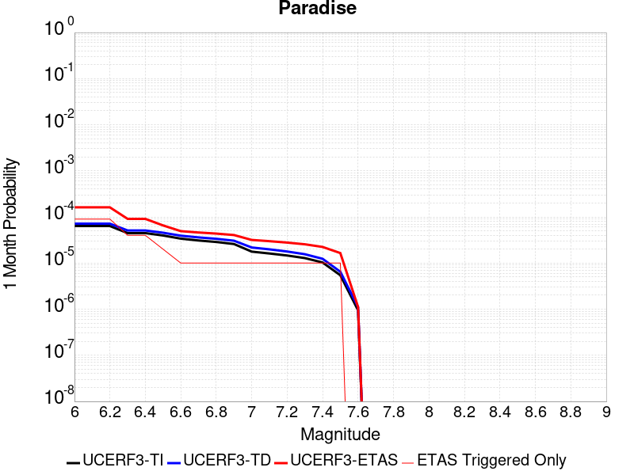 |  |  |

| Magnitude | 1 wk TI Prob | 1 wk TD Prob | 1 wk ETAS Prob | 1 wk ETAS/TD Gain | 1 wk ETAS Triggered Only | 1 mo TI Prob | 1 mo TD Prob | 1 mo ETAS Prob | 1 mo ETAS/TD Gain | 1 mo ETAS Triggered Only | 1 yr TI Prob | 1 yr TD Prob | 1 yr ETAS Prob | 1 yr ETAS/TD Gain | 1 yr ETAS Triggered Only | 10 yr TI Prob | 10 yr TD Prob | 10 yr ETAS Prob | 10 yr ETAS/TD Gain | 10 yr ETAS Triggered Only |
|-----|-----|-----|-----|-----|-----|-----|-----|-----|-----|-----|-----|-----|-----|-----|-----|-----|-----|-----|-----|-----|
| 6.0 | 1.4851273E-5 | 1.6695341E-5 | 1.6695341E-5 | 1.0 | 0.0 | 6.364676E-5 | 7.154963E-5 | 7.154963E-5 | 1.0 | 0.0 | 7.7462377E-4 | 8.707922E-4 | 0.0010433533 | 1.1981658 | 1.7271157E-4 | 0.0077192914 | 0.008676181 | 0.0090186065 | 1.0394673 | 3.4542315E-4 |
| 6.1 | 1.4851273E-5 | 1.6695341E-5 | 1.6695341E-5 | 1.0 | 0.0 | 6.364676E-5 | 7.154963E-5 | 7.154963E-5 | 1.0 | 0.0 | 7.7462377E-4 | 8.707922E-4 | 0.0010433533 | 1.1981658 | 1.7271157E-4 | 0.0077192914 | 0.008676181 | 0.0090186065 | 1.0394673 | 3.4542315E-4 |
| 6.2 | 1.4851273E-5 | 1.6695341E-5 | 1.6695341E-5 | 1.0 | 0.0 | 6.364676E-5 | 7.154963E-5 | 7.154963E-5 | 1.0 | 0.0 | 7.7462377E-4 | 8.707922E-4 | 0.0010433533 | 1.1981658 | 1.7271157E-4 | 0.0077192914 | 0.008676181 | 0.0090186065 | 1.0394673 | 3.4542315E-4 |
| 6.3 | 1.0426831E-5 | 1.1889049E-5 | 1.1889049E-5 | 1.0 | 0.0 | 4.4685654E-5 | 5.095211E-5 | 5.095211E-5 | 1.0 | 0.0 | 5.43912E-4 | 6.2017125E-4 | 7.9277577E-4 | 1.2783175 | 1.7271157E-4 | 0.0054258266 | 0.0061850143 | 0.0065283007 | 1.055503 | 3.4542315E-4 |
| 6.4 | 1.0426831E-5 | 1.1889049E-5 | 1.1889049E-5 | 1.0 | 0.0 | 4.4685654E-5 | 5.095211E-5 | 5.095211E-5 | 1.0 | 0.0 | 5.43912E-4 | 6.2017125E-4 | 7.9277577E-4 | 1.2783175 | 1.7271157E-4 | 0.0054258266 | 0.0061850143 | 0.0065283007 | 1.055503 | 3.4542315E-4 |
| 6.5 | 9.25027E-6 | 1.0620336E-5 | 1.0620336E-5 | 1.0 | 0.0 | 3.964341E-5 | 4.551496E-5 | 4.551496E-5 | 1.0 | 0.0 | 4.8255164E-4 | 5.5400864E-4 | 7.266245E-4 | 1.3115761 | 1.7271157E-4 | 0.0048150513 | 0.0055267746 | 0.0058702887 | 1.0621545 | 3.4542315E-4 |
| 6.6 | 7.904275E-6 | 9.159836E-6 | 9.159836E-6 | 1.0 | 0.0 | 3.3875025E-5 | 3.925587E-5 | 3.925587E-5 | 1.0 | 0.0 | 4.1235037E-4 | 4.7783932E-4 | 4.7783932E-4 | 1.0 | 0.0 | 0.0041158604 | 0.0047685155 | 0.0049404036 | 1.0360464 | 1.7271157E-4 |
| 6.7 | 7.2061953E-6 | 8.407527E-6 | 8.407527E-6 | 1.0 | 0.0 | 3.088333E-5 | 3.6031786E-5 | 3.6031786E-5 | 1.0 | 0.0 | 3.7593965E-4 | 4.3860235E-4 | 4.3860235E-4 | 1.0 | 0.0 | 0.003753043 | 0.0043777362 | 0.0045496915 | 1.0392796 | 1.7271157E-4 |
| 6.8 | 6.6948724E-6 | 7.842423E-6 | 7.842423E-6 | 1.0 | 0.0 | 2.8691995E-5 | 3.3609973E-5 | 3.3609973E-5 | 1.0 | 0.0 | 3.4926904E-4 | 4.0912814E-4 | 4.0912814E-4 | 1.0 | 0.0 | 0.003487206 | 0.004084107 | 0.004256113 | 1.042116 | 1.7271157E-4 |
| 6.9 | 6.0421025E-6 | 7.1308505E-6 | 7.1308505E-6 | 1.0 | 0.0 | 2.5894467E-5 | 3.0560448E-5 | 3.0560448E-5 | 1.0 | 0.0 | 3.1521954E-4 | 3.7201334E-4 | 3.7201334E-4 | 1.0 | 0.0 | 0.0031477278 | 0.003714244 | 0.003886314 | 1.0463271 | 1.7271157E-4 |
| 7.0 | 4.134091E-6 | 5.080469E-6 | 5.080469E-6 | 1.0 | 0.0 | 1.7717413E-5 | 2.1773263E-5 | 2.1773263E-5 | 1.0 | 0.0 | 2.1568815E-4 | 2.6505877E-4 | 2.6505877E-4 | 1.0 | 0.0 | 0.0021547892 | 0.0026475794 | 0.0028198338 | 1.0650611 | 1.7271157E-4 |
| 7.1 | 3.7674888E-6 | 4.6320133E-6 | 4.6320133E-6 | 1.0 | 0.0 | 1.6146281E-5 | 1.9851343E-5 | 1.9851343E-5 | 1.0 | 0.0 | 1.9656324E-4 | 2.4166482E-4 | 2.4166482E-4 | 1.0 | 0.0 | 0.0019638946 | 0.002414171 | 0.0025864653 | 1.071368 | 1.7271157E-4 |
| 7.2 | 3.4065345E-6 | 4.1568514E-6 | 4.1568514E-6 | 1.0 | 0.0 | 1.4599351E-5 | 1.7814966E-5 | 1.7814966E-5 | 1.0 | 0.0 | 1.777326E-4 | 2.1687712E-4 | 2.1687712E-4 | 1.0 | 0.0 | 0.0017759053 | 0.0021668028 | 0.00233914 | 1.0795354 | 1.7271157E-4 |
| 7.3 | 2.9934936E-6 | 3.629423E-6 | 3.629423E-6 | 1.0 | 0.0 | 1.2829195E-5 | 1.5554586E-5 | 1.5554586E-5 | 1.0 | 0.0 | 1.5618425E-4 | 1.893621E-4 | 1.893621E-4 | 1.0 | 0.0 | 0.0015607453 | 0.0018921527 | 0.0020645375 | 1.0911051 | 1.7271157E-4 |
| 7.4 | 2.4049796E-6 | 2.889062E-6 | 2.889062E-6 | 1.0 | 0.0 | 1.0307015E-5 | 1.23816435E-5 | 1.23816435E-5 | 1.0 | 0.0 | 1.2548068E-4 | 1.5073753E-4 | 1.5073753E-4 | 1.0 | 0.0 | 0.0012540985 | 0.0015064942 | 0.0016789456 | 1.114472 | 1.7271157E-4 |
| 7.5 | 1.2710091E-6 | 1.5135054E-6 | 1.5135054E-6 | 1.0 | 0.0 | 5.44717E-6 | 6.4864425E-6 | 6.4864425E-6 | 1.0 | 0.0 | 6.631728E-5 | 7.897083E-5 | 7.897083E-5 | 1.0 | 0.0 | 6.6297496E-4 | 7.8955025E-4 | 9.621255E-4 | 1.218574 | 1.7271157E-4 |
| 7.6 | 2.21172E-7 | 2.6040124E-7 | 2.6040124E-7 | 1.0 | 0.0 | 9.478797E-7 | 1.116005E-6 | 1.116005E-6 | 1.0 | 0.0 | 1.1540374E-5 | 1.3587305E-5 | 1.3587305E-5 | 1.0 | 0.0 | 1.1539775E-4 | 1.3586757E-4 | 1.3586757E-4 | 1.0 | 0.0 |

## San Andreas (Parkfield)
*[(top)](#table-of-contents)*

| 1 Week | 1 Month | 1 Year | 10 Year |
|-----|-----|-----|-----|
|  |  |  |  |

| Magnitude | 1 wk TI Prob | 1 wk TD Prob | 1 wk ETAS Prob | 1 wk ETAS/TD Gain | 1 wk ETAS Triggered Only | 1 mo TI Prob | 1 mo TD Prob | 1 mo ETAS Prob | 1 mo ETAS/TD Gain | 1 mo ETAS Triggered Only | 1 yr TI Prob | 1 yr TD Prob | 1 yr ETAS Prob | 1 yr ETAS/TD Gain | 1 yr ETAS Triggered Only | 10 yr TI Prob | 10 yr TD Prob | 10 yr ETAS Prob | 10 yr ETAS/TD Gain | 10 yr ETAS Triggered Only |
|-----|-----|-----|-----|-----|-----|-----|-----|-----|-----|-----|-----|-----|-----|-----|-----|-----|-----|-----|-----|-----|
| 6.0 | 5.556969E-4 | 7.819087E-4 | 7.819087E-4 | 1.0 | 0.0 | 0.0023793848 | 0.0033472886 | 0.0033472886 | 1.0 | 0.0 | 0.028586963 | 0.040385824 | 0.040717296 | 1.0082077 | 3.4542315E-4 | 0.25176284 | 0.33777508 | 0.33800384 | 1.0006772 | 3.4542315E-4 |
| 6.1 | 1.925858E-4 | 3.0390357E-4 | 3.0390357E-4 | 1.0 | 0.0 | 8.2510663E-4 | 0.0013018888 | 0.0013018888 | 1.0 | 0.0 | 0.0099994885 | 0.015834767 | 0.01617472 | 1.0214688 | 3.4542315E-4 | 0.095613256 | 0.14999957 | 0.15029319 | 1.0019574 | 3.4542315E-4 |
| 6.2 | 9.4306815E-5 | 1.8273306E-4 | 1.8273306E-4 | 1.0 | 0.0 | 4.0410945E-4 | 7.829079E-4 | 7.829079E-4 | 1.0 | 0.0 | 0.0049089384 | 0.009490452 | 0.009832597 | 1.0360515 | 3.4542315E-4 | 0.048019063 | 0.09198628 | 0.09229993 | 1.0034097 | 3.4542315E-4 |
| 6.3 | 9.283051E-5 | 1.7969737E-4 | 1.7969737E-4 | 1.0 | 0.0 | 3.9778434E-4 | 7.6990545E-4 | 7.6990545E-4 | 1.0 | 0.0 | 0.0048322747 | 0.009333515 | 0.009675714 | 1.0366635 | 3.4542315E-4 | 0.047285385 | 0.09063911 | 0.09095322 | 1.0034655 | 3.4542315E-4 |
| 6.4 | 9.138826E-5 | 1.7731739E-4 | 1.7731739E-4 | 1.0 | 0.0 | 3.916052E-4 | 7.5971155E-4 | 7.5971155E-4 | 1.0 | 0.0 | 0.0047573745 | 0.00921046 | 0.009381581 | 1.018579 | 1.7271157E-4 | 0.046568092 | 0.0895407 | 0.08969794 | 1.0017562 | 1.7271157E-4 |
| 6.5 | 9.000255E-5 | 1.7489606E-4 | 1.7489606E-4 | 1.0 | 0.0 | 3.8566816E-4 | 7.493404E-4 | 7.493404E-4 | 1.0 | 0.0 | 0.0046854047 | 0.009085262 | 0.009256404 | 1.0188373 | 1.7271157E-4 | 0.045878403 | 0.08842592 | 0.08858336 | 1.0017805 | 1.7271157E-4 |
| 6.6 | 8.8109264E-5 | 1.7170387E-4 | 1.7170387E-4 | 1.0 | 0.0 | 3.7755648E-4 | 7.3566736E-4 | 7.3566736E-4 | 1.0 | 0.0 | 0.0045870654 | 0.0089201825 | 0.009091353 | 1.0191891 | 1.7271157E-4 | 0.04493529 | 0.08695624 | 0.08711393 | 1.0018135 | 1.7271157E-4 |
| 6.7 | 8.738073E-5 | 1.7037381E-4 | 1.7037381E-4 | 1.0 | 0.0 | 3.7443507E-4 | 7.2997034E-4 | 7.2997034E-4 | 1.0 | 0.0 | 0.0045492216 | 0.0088514285 | 0.009022611 | 1.0193396 | 1.7271157E-4 | 0.04457213 | 0.08635636 | 0.08651415 | 1.0018272 | 1.7271157E-4 |
| 6.8 | 8.710195E-5 | 1.6982816E-4 | 1.6982816E-4 | 1.0 | 0.0 | 3.7324068E-4 | 7.2763313E-4 | 7.2763313E-4 | 1.0 | 0.0 | 0.0045347405 | 0.008823211 | 0.0089944 | 1.019402 | 1.7271157E-4 | 0.04443313 | 0.08610373 | 0.08626157 | 1.0018332 | 1.7271157E-4 |
| 6.9 | 8.6801556E-5 | 1.6923707E-4 | 1.6923707E-4 | 1.0 | 0.0 | 3.7195362E-4 | 7.251013E-4 | 7.251013E-4 | 1.0 | 0.0 | 0.0045191357 | 0.008792636 | 0.008963829 | 1.0194701 | 1.7271157E-4 | 0.044283327 | 0.08582957 | 0.085987456 | 1.0018395 | 1.7271157E-4 |
| 7.0 | 8.5571606E-5 | 1.6676294E-4 | 1.6676294E-4 | 1.0 | 0.0 | 3.6668387E-4 | 7.145037E-4 | 7.145037E-4 | 1.0 | 0.0 | 0.004455241 | 0.008664643 | 0.008835859 | 1.0197603 | 1.7271157E-4 | 0.043669727 | 0.08467713 | 0.08483522 | 1.0018669 | 1.7271157E-4 |
| 7.1 | 7.82589E-5 | 1.5156237E-4 | 1.5156237E-4 | 1.0 | 0.0 | 3.3535215E-4 | 6.493921E-4 | 6.493921E-4 | 1.0 | 0.0 | 0.0040752706 | 0.007877857 | 0.008049209 | 1.0217509 | 1.7271157E-4 | 0.040013418 | 0.077585794 | 0.07774511 | 1.0020534 | 1.7271157E-4 |
| 7.2 | 7.690929E-5 | 1.489332E-4 | 1.489332E-4 | 1.0 | 0.0 | 3.2956956E-4 | 6.381298E-4 | 6.381298E-4 | 1.0 | 0.0 | 0.004005129 | 0.007741721 | 0.007913096 | 1.0221364 | 1.7271157E-4 | 0.0393371 | 0.076358445 | 0.07651797 | 1.0020891 | 1.7271157E-4 |
| 7.3 | 7.5543794E-5 | 1.4589565E-4 | 1.4589565E-4 | 1.0 | 0.0 | 3.2371894E-4 | 6.25118E-4 | 6.25118E-4 | 1.0 | 0.0 | 0.003934157 | 0.0075844154 | 0.007755817 | 1.0225992 | 1.7271157E-4 | 0.038652334 | 0.07492032 | 0.07508009 | 1.0021325 | 1.7271157E-4 |
| 7.4 | 7.4214564E-5 | 1.4290171E-4 | 1.4290171E-4 | 1.0 | 0.0 | 3.1802364E-4 | 6.122929E-4 | 6.122929E-4 | 1.0 | 0.0 | 0.003865065 | 0.007429345 | 0.007600773 | 1.0230745 | 1.7271157E-4 | 0.03798529 | 0.07349284 | 0.073652856 | 1.0021774 | 1.7271157E-4 |
| 7.5 | 6.149578E-5 | 1.1214155E-4 | 1.1214155E-4 | 1.0 | 0.0 | 2.6352672E-4 | 4.8051824E-4 | 4.8051824E-4 | 1.0 | 0.0 | 0.0032037178 | 0.005834648 | 0.006006352 | 1.0294284 | 1.7271157E-4 | 0.03157923 | 0.058665328 | 0.058827907 | 1.0027713 | 1.7271157E-4 |
| 7.6 | 6.0643448E-5 | 1.10425855E-4 | 1.10425855E-4 | 1.0 | 0.0 | 2.598746E-4 | 4.7316792E-4 | 4.7316792E-4 | 1.0 | 0.0 | 0.0031593828 | 0.0057456335 | 0.005917353 | 1.029887 | 1.7271157E-4 | 0.031148417 | 0.05782546 | 0.057988185 | 1.002814 | 1.7271157E-4 |
| 7.7 | 5.1652263E-5 | 9.1955124E-5 | 9.1955124E-5 | 1.0 | 0.0 | 2.2134806E-4 | 3.9403388E-4 | 3.9403388E-4 | 1.0 | 0.0 | 0.002691582 | 0.00478682 | 0.004958705 | 1.035908 | 1.7271157E-4 | 0.026592141 | 0.048633553 | 0.048797864 | 1.0033786 | 1.7271157E-4 |
| 7.8 | 4.8090482E-5 | 8.578783E-5 | 8.578783E-5 | 1.0 | 0.0 | 2.060858E-4 | 3.6761034E-4 | 3.6761034E-4 | 1.0 | 0.0 | 0.0025062072 | 0.004466479 | 0.0046384195 | 1.0384957 | 1.7271157E-4 | 0.024781305 | 0.045392275 | 0.045557145 | 1.0036322 | 1.7271157E-4 |
| 7.9 | 3.970278E-5 | 6.7652974E-5 | 6.7652974E-5 | 1.0 | 0.0 | 1.7014367E-4 | 2.899091E-4 | 2.899091E-4 | 1.0 | 0.0 | 0.002069531 | 0.0035239344 | 0.0036960372 | 1.0488383 | 1.7271157E-4 | 0.020503636 | 0.035952512 | 0.036119014 | 1.0046312 | 1.7271157E-4 |
| 8.0 | 2.8982335E-5 | 4.079188E-5 | 4.079188E-5 | 1.0 | 0.0 | 1.2420409E-4 | 1.7481064E-4 | 1.7481064E-4 | 1.0 | 0.0 | 0.0015111357 | 0.0021262432 | 0.0021262432 | 1.0 | 0.0 | 0.015009012 | 0.022057572 | 0.022057572 | 1.0 | 0.0 |
| 8.1 | 1.8836186E-5 | 1.8733741E-5 | 1.8733741E-5 | 1.0 | 0.0 | 8.0724014E-5 | 8.028499E-5 | 8.028499E-5 | 1.0 | 0.0 | 9.823717E-4 | 9.77032E-4 | 9.77032E-4 | 1.0 | 0.0 | 0.009780403 | 0.010515724 | 0.010515724 | 1.0 | 0.0 |
| 8.2 | 8.643924E-6 | 5.49522E-6 | 5.49522E-6 | 1.0 | 0.0 | 3.704486E-5 | 2.355073E-5 | 2.355073E-5 | 1.0 | 0.0 | 4.5092785E-4 | 2.866925E-4 | 2.866925E-4 | 1.0 | 0.0 | 0.0045001395 | 0.0032598388 | 0.0032598388 | 1.0 | 0.0 |
| 8.3 | 1.983087E-6 | 7.693574E-7 | 7.693574E-7 | 1.0 | 0.0 | 8.498917E-6 | 3.297242E-6 | 3.297242E-6 | 1.0 | 0.0 | 1.034694E-4 | 4.01432E-5 | 4.01432E-5 | 1.0 | 0.0 | 0.0010342124 | 4.7390026E-4 | 4.7390026E-4 | 1.0 | 0.0 |

## Oceanic - West Huasna
*[(top)](#table-of-contents)*

| 1 Week | 1 Month | 1 Year | 10 Year |
|-----|-----|-----|-----|
|  |  |  |  |

| Magnitude | 1 wk TI Prob | 1 wk TD Prob | 1 wk ETAS Prob | 1 wk ETAS/TD Gain | 1 wk ETAS Triggered Only | 1 mo TI Prob | 1 mo TD Prob | 1 mo ETAS Prob | 1 mo ETAS/TD Gain | 1 mo ETAS Triggered Only | 1 yr TI Prob | 1 yr TD Prob | 1 yr ETAS Prob | 1 yr ETAS/TD Gain | 1 yr ETAS Triggered Only | 10 yr TI Prob | 10 yr TD Prob | 10 yr ETAS Prob | 10 yr ETAS/TD Gain | 10 yr ETAS Triggered Only |
|-----|-----|-----|-----|-----|-----|-----|-----|-----|-----|-----|-----|-----|-----|-----|-----|-----|-----|-----|-----|-----|
| 6.0 | 3.195567E-5 | 2.792801E-5 | 2.792801E-5 | 1.0 | 0.0 | 1.3694567E-4 | 1.1968623E-4 | 1.1968623E-4 | 1.0 | 0.0 | 0.0016660384 | 0.0014562489 | 0.0014562489 | 1.0 | 0.0 | 0.016536033 | 0.014471616 | 0.014641828 | 1.0117618 | 1.7271157E-4 |
| 6.1 | 2.1156782E-5 | 1.7574157E-5 | 1.7574157E-5 | 1.0 | 0.0 | 9.066878E-5 | 7.53157E-5 | 7.53157E-5 | 1.0 | 0.0 | 0.0011033333 | 9.1659225E-4 | 9.1659225E-4 | 1.0 | 0.0 | 0.010978713 | 0.009129126 | 0.00930026 | 1.018746 | 1.7271157E-4 |
| 6.2 | 1.6195117E-5 | 1.332762E-5 | 1.332762E-5 | 1.0 | 0.0 | 6.9405796E-5 | 5.7117133E-5 | 5.7117133E-5 | 1.0 | 0.0 | 8.44688E-4 | 6.9518184E-4 | 6.9518184E-4 | 1.0 | 0.0 | 0.008414844 | 0.006930365 | 0.00710188 | 1.0247483 | 1.7271157E-4 |
| 6.3 | 1.3559345E-5 | 1.1179509E-5 | 1.1179509E-5 | 1.0 | 0.0 | 5.811018E-5 | 4.7911308E-5 | 4.7911308E-5 | 1.0 | 0.0 | 7.072618E-4 | 5.83165E-4 | 5.83165E-4 | 1.0 | 0.0 | 0.0070501505 | 0.0058164652 | 0.0059881723 | 1.0295209 | 1.7271157E-4 |
| 6.4 | 1.2120619E-5 | 1.0001292E-5 | 1.0001292E-5 | 1.0 | 0.0 | 5.1944477E-5 | 4.286198E-5 | 4.286198E-5 | 1.0 | 0.0 | 6.322405E-4 | 5.2172015E-4 | 5.2172015E-4 | 1.0 | 0.0 | 0.006304447 | 0.005205021 | 0.0053768335 | 1.033009 | 1.7271157E-4 |
| 6.5 | 1.13511915E-5 | 9.3677645E-6 | 9.3677645E-6 | 1.0 | 0.0 | 4.8647056E-5 | 4.0146948E-5 | 4.0146948E-5 | 1.0 | 0.0 | 5.9211696E-4 | 4.886799E-4 | 4.886799E-4 | 1.0 | 0.0 | 0.0059054173 | 0.004876112 | 0.0050479816 | 1.0352472 | 1.7271157E-4 |
| 6.6 | 9.850605E-6 | 8.135666E-6 | 8.135666E-6 | 1.0 | 0.0 | 4.2216197E-5 | 3.4866673E-5 | 3.4866673E-5 | 1.0 | 0.0 | 5.1386096E-4 | 4.2441927E-4 | 4.2441927E-4 | 1.0 | 0.0 | 0.0051267436 | 0.0042361193 | 0.004408099 | 1.0405985 | 1.7271157E-4 |
| 6.7 | 8.8558645E-6 | 7.3186534E-6 | 7.3186534E-6 | 1.0 | 0.0 | 3.7953152E-5 | 3.136528E-5 | 3.136528E-5 | 1.0 | 0.0 | 4.6198163E-4 | 3.8180556E-4 | 3.8180556E-4 | 1.0 | 0.0 | 0.004610224 | 0.0038115215 | 0.0038115215 | 1.0 | 0.0 |
| 6.8 | 7.67136E-6 | 6.3919483E-6 | 6.3919483E-6 | 1.0 | 0.0 | 3.2876844E-5 | 2.7393779E-5 | 2.7393779E-5 | 1.0 | 0.0 | 4.0020206E-4 | 3.3346837E-4 | 3.3346837E-4 | 1.0 | 0.0 | 0.003994821 | 0.0033297008 | 0.0033297008 | 1.0 | 0.0 |
| 6.9 | 6.534529E-6 | 5.4584953E-6 | 5.4584953E-6 | 1.0 | 0.0 | 2.8004823E-5 | 2.3393342E-5 | 2.3393342E-5 | 1.0 | 0.0 | 3.4090536E-4 | 2.8477685E-4 | 2.8477685E-4 | 1.0 | 0.0 | 0.0034038287 | 0.002844136 | 0.002844136 | 1.0 | 0.0 |
| 7.0 | 5.460525E-6 | 4.570095E-6 | 4.570095E-6 | 1.0 | 0.0 | 2.3402039E-5 | 1.9585976E-5 | 1.9585976E-5 | 1.0 | 0.0 | 2.8488258E-4 | 2.3843326E-4 | 2.3843326E-4 | 1.0 | 0.0 | 0.0028451765 | 0.0023817883 | 0.0023817883 | 1.0 | 0.0 |
| 7.1 | 4.4825083E-6 | 3.7525715E-6 | 3.7525715E-6 | 1.0 | 0.0 | 1.9210609E-5 | 1.6082351E-5 | 1.6082351E-5 | 1.0 | 0.0 | 2.3386406E-4 | 1.9578513E-4 | 1.9578513E-4 | 1.0 | 0.0 | 0.002336181 | 0.0019561385 | 0.0019561385 | 1.0 | 0.0 |
| 7.2 | 2.821708E-6 | 2.4250364E-6 | 2.4250364E-6 | 1.0 | 0.0 | 1.2092979E-5 | 1.03929715E-5 | 1.03929715E-5 | 1.0 | 0.0 | 1.4722206E-4 | 1.265271E-4 | 1.265271E-4 | 1.0 | 0.0 | 0.0014712457 | 0.001264553 | 0.001264553 | 1.0 | 0.0 |
| 7.3 | 2.0644757E-6 | 1.7688327E-6 | 1.7688327E-6 | 1.0 | 0.0 | 8.847723E-6 | 7.5806893E-6 | 7.5806893E-6 | 1.0 | 0.0 | 1.0771569E-4 | 9.229099E-5 | 9.229099E-5 | 1.0 | 0.0 | 0.001076635 | 9.225283E-4 | 9.225283E-4 | 1.0 | 0.0 |
| 7.4 | 1.6980367E-6 | 1.4380759E-6 | 1.4380759E-6 | 1.0 | 0.0 | 7.27728E-6 | 6.1631677E-6 | 6.1631677E-6 | 1.0 | 0.0 | 8.8597284E-5 | 7.503398E-5 | 7.503398E-5 | 1.0 | 0.0 | 8.8561967E-4 | 7.500881E-4 | 7.500881E-4 | 1.0 | 0.0 |
| 7.5 | 1.3637683E-6 | 1.130346E-6 | 1.130346E-6 | 1.0 | 0.0 | 5.844708E-6 | 4.844331E-6 | 4.844331E-6 | 1.0 | 0.0 | 7.1156996E-5 | 5.897814E-5 | 5.897814E-5 | 1.0 | 0.0 | 7.1134215E-4 | 5.896264E-4 | 5.896264E-4 | 1.0 | 0.0 |
| 7.6 | 9.802994E-7 | 7.6780117E-7 | 7.6780117E-7 | 1.0 | 0.0 | 4.2012766E-6 | 3.290572E-6 | 3.290572E-6 | 1.0 | 0.0 | 5.1149345E-5 | 4.006198E-5 | 4.006198E-5 | 1.0 | 0.0 | 5.113757E-4 | 4.00549E-4 | 4.00549E-4 | 1.0 | 0.0 |
| 7.7 | 5.986191E-7 | 4.005761E-7 | 4.005761E-7 | 1.0 | 0.0 | 2.5655079E-6 | 1.7167536E-6 | 1.7167536E-6 | 1.0 | 0.0 | 3.1234613E-5 | 2.0901274E-5 | 2.0901274E-5 | 1.0 | 0.0 | 3.123022E-4 | 2.0899443E-4 | 2.0899443E-4 | 1.0 | 0.0 |
| 7.8 | 2.9189815E-7 | 1.529205E-7 | 1.529205E-7 | 1.0 | 0.0 | 1.2509914E-6 | 6.553734E-7 | 6.553734E-7 | 1.0 | 0.0 | 1.5230714E-5 | 7.9791425E-6 | 7.9791425E-6 | 1.0 | 0.0 | 1.522967E-4 | 7.978987E-5 | 7.978987E-5 | 1.0 | 0.0 |
| 7.9 | 1.2057845E-7 | 4.6247223E-8 | 4.6247223E-8 | 1.0 | 0.0 | 5.1676466E-7 | 1.9820237E-7 | 1.9820237E-7 | 1.0 | 0.0 | 6.2915915E-6 | 2.4131111E-6 | 2.4131111E-6 | 1.0 | 0.0 | 6.2914136E-5 | 2.4132154E-5 | 2.4132154E-5 | 1.0 | 0.0 |
| 8.0 | 3.3806387E-9 | 9.024813E-10 | 9.024813E-10 | 1.0 | 0.0 | 1.4488451E-8 | 3.8677777E-9 | 3.8677777E-9 | 1.0 | 0.0 | 1.7639688E-7 | 4.7090193E-8 | 4.7090193E-8 | 1.0 | 0.0 | 1.7639674E-6 | 4.7199646E-7 | 4.7199646E-7 | 1.0 | 0.0 |

## Pittville 2011 CFM
*[(top)](#table-of-contents)*

| 1 Week | 1 Month | 1 Year | 10 Year |
|-----|-----|-----|-----|
|  |  |  |  |

| Magnitude | 1 wk TI Prob | 1 wk TD Prob | 1 wk ETAS Prob | 1 wk ETAS/TD Gain | 1 wk ETAS Triggered Only | 1 mo TI Prob | 1 mo TD Prob | 1 mo ETAS Prob | 1 mo ETAS/TD Gain | 1 mo ETAS Triggered Only | 1 yr TI Prob | 1 yr TD Prob | 1 yr ETAS Prob | 1 yr ETAS/TD Gain | 1 yr ETAS Triggered Only | 10 yr TI Prob | 10 yr TD Prob | 10 yr ETAS Prob | 10 yr ETAS/TD Gain | 10 yr ETAS Triggered Only |
|-----|-----|-----|-----|-----|-----|-----|-----|-----|-----|-----|-----|-----|-----|-----|-----|-----|-----|-----|-----|-----|
| 6.0 | 2.5031832E-5 | 2.7058131E-5 | 2.7058131E-5 | 1.0 | 0.0 | 1.0727487E-4 | 1.15958814E-4 | 1.15958814E-4 | 1.0 | 0.0 | 0.001305289 | 0.0014109816 | 0.0015834495 | 1.1222326 | 1.7271157E-4 | 0.012976485 | 0.014030014 | 0.014200303 | 1.0121374 | 1.7271157E-4 |
| 6.1 | 1.2540113E-5 | 1.3513622E-5 | 1.3513622E-5 | 1.0 | 0.0 | 5.3742235E-5 | 5.7914367E-5 | 5.7914367E-5 | 1.0 | 0.0 | 6.541153E-4 | 7.0490176E-4 | 7.0490176E-4 | 1.0 | 0.0 | 0.0065219323 | 0.0070288926 | 0.00720039 | 1.0243989 | 1.7271157E-4 |
| 6.2 | 6.603218E-6 | 7.107477E-6 | 7.107477E-6 | 1.0 | 0.0 | 2.8299199E-5 | 3.0460296E-5 | 3.0460296E-5 | 1.0 | 0.0 | 3.4448825E-4 | 3.707975E-4 | 3.707975E-4 | 1.0 | 0.0 | 0.0034395473 | 0.003702429 | 0.003874501 | 1.0464754 | 1.7271157E-4 |
| 6.3 | 6.603218E-6 | 7.107477E-6 | 7.107477E-6 | 1.0 | 0.0 | 2.8299199E-5 | 3.0460296E-5 | 3.0460296E-5 | 1.0 | 0.0 | 3.4448825E-4 | 3.707975E-4 | 3.707975E-4 | 1.0 | 0.0 | 0.0034395473 | 0.003702429 | 0.003874501 | 1.0464754 | 1.7271157E-4 |
| 6.4 | 3.9389015E-6 | 4.2393463E-6 | 4.2393463E-6 | 1.0 | 0.0 | 1.6880897E-5 | 1.816852E-5 | 1.816852E-5 | 1.0 | 0.0 | 2.0550552E-4 | 2.2118236E-4 | 2.2118236E-4 | 1.0 | 0.0 | 0.0020531558 | 0.0022099272 | 0.0022099272 | 1.0 | 0.0 |
| 6.5 | 2.4533072E-6 | 2.6413759E-6 | 2.6413759E-6 | 1.0 | 0.0 | 1.0514132E-5 | 1.1320145E-5 | 1.1320145E-5 | 1.0 | 0.0 | 1.2800204E-4 | 1.3781598E-4 | 1.3781598E-4 | 1.0 | 0.0 | 0.0012792832 | 0.0013774954 | 0.0013774954 | 1.0 | 0.0 |
| 6.6 | 1.3482367E-6 | 1.453053E-6 | 1.453053E-6 | 1.0 | 0.0 | 5.778144E-6 | 6.2273616E-6 | 6.2273616E-6 | 1.0 | 0.0 | 7.0346636E-5 | 7.581662E-5 | 7.581662E-5 | 1.0 | 0.0 | 7.032437E-4 | 7.5801864E-4 | 7.5801864E-4 | 1.0 | 0.0 |

## Mono Lake 2011 CFM
*[(top)](#table-of-contents)*

| 1 Week | 1 Month | 1 Year | 10 Year |
|-----|-----|-----|-----|
|  |  |  |  |

| Magnitude | 1 wk TI Prob | 1 wk TD Prob | 1 wk ETAS Prob | 1 wk ETAS/TD Gain | 1 wk ETAS Triggered Only | 1 mo TI Prob | 1 mo TD Prob | 1 mo ETAS Prob | 1 mo ETAS/TD Gain | 1 mo ETAS Triggered Only | 1 yr TI Prob | 1 yr TD Prob | 1 yr ETAS Prob | 1 yr ETAS/TD Gain | 1 yr ETAS Triggered Only | 10 yr TI Prob | 10 yr TD Prob | 10 yr ETAS Prob | 10 yr ETAS/TD Gain | 10 yr ETAS Triggered Only |
|-----|-----|-----|-----|-----|-----|-----|-----|-----|-----|-----|-----|-----|-----|-----|-----|-----|-----|-----|-----|-----|
| 6.0 | 2.0341662E-5 | 2.3830333E-5 | 2.3830333E-5 | 1.0 | 0.0 | 8.717564E-5 | 1.02129E-4 | 1.02129E-4 | 1.0 | 0.0 | 0.0010608466 | 0.0012432429 | 0.0012432429 | 1.0 | 0.0 | 0.010557966 | 0.012414961 | 0.012585528 | 1.0137389 | 1.7271157E-4 |
| 6.1 | 2.0341662E-5 | 2.3830333E-5 | 2.3830333E-5 | 1.0 | 0.0 | 8.717564E-5 | 1.02129E-4 | 1.02129E-4 | 1.0 | 0.0 | 0.0010608466 | 0.0012432429 | 0.0012432429 | 1.0 | 0.0 | 0.010557966 | 0.012414961 | 0.012585528 | 1.0137389 | 1.7271157E-4 |
| 6.2 | 2.0341662E-5 | 2.3830333E-5 | 2.3830333E-5 | 1.0 | 0.0 | 8.717564E-5 | 1.02129E-4 | 1.02129E-4 | 1.0 | 0.0 | 0.0010608466 | 0.0012432429 | 0.0012432429 | 1.0 | 0.0 | 0.010557966 | 0.012414961 | 0.012585528 | 1.0137389 | 1.7271157E-4 |
| 6.3 | 2.0341662E-5 | 2.3830333E-5 | 2.3830333E-5 | 1.0 | 0.0 | 8.717564E-5 | 1.02129E-4 | 1.02129E-4 | 1.0 | 0.0 | 0.0010608466 | 0.0012432429 | 0.0012432429 | 1.0 | 0.0 | 0.010557966 | 0.012414961 | 0.012585528 | 1.0137389 | 1.7271157E-4 |
| 6.4 | 1.749821E-5 | 2.0492844E-5 | 2.0492844E-5 | 1.0 | 0.0 | 7.499018E-5 | 8.782648E-5 | 8.782648E-5 | 1.0 | 0.0 | 9.1262296E-4 | 0.0010692873 | 0.0010692873 | 1.0 | 0.0 | 0.009088841 | 0.010692834 | 0.010863699 | 1.0159794 | 1.7271157E-4 |
| 6.5 | 1.749821E-5 | 2.0492844E-5 | 2.0492844E-5 | 1.0 | 0.0 | 7.499018E-5 | 8.782648E-5 | 8.782648E-5 | 1.0 | 0.0 | 9.1262296E-4 | 0.0010692873 | 0.0010692873 | 1.0 | 0.0 | 0.009088841 | 0.010692834 | 0.010863699 | 1.0159794 | 1.7271157E-4 |

## San Andreas (Big Bend)
*[(top)](#table-of-contents)*

| 1 Week | 1 Month | 1 Year | 10 Year |
|-----|-----|-----|-----|
|  |  |  |  |

| Magnitude | 1 wk TI Prob | 1 wk TD Prob | 1 wk ETAS Prob | 1 wk ETAS/TD Gain | 1 wk ETAS Triggered Only | 1 mo TI Prob | 1 mo TD Prob | 1 mo ETAS Prob | 1 mo ETAS/TD Gain | 1 mo ETAS Triggered Only | 1 yr TI Prob | 1 yr TD Prob | 1 yr ETAS Prob | 1 yr ETAS/TD Gain | 1 yr ETAS Triggered Only | 10 yr TI Prob | 10 yr TD Prob | 10 yr ETAS Prob | 10 yr ETAS/TD Gain | 10 yr ETAS Triggered Only |
|-----|-----|-----|-----|-----|-----|-----|-----|-----|-----|-----|-----|-----|-----|-----|-----|-----|-----|-----|-----|-----|
| 6.0 | 1.0179969E-4 | 2.0106303E-4 | 2.0106303E-4 | 1.0 | 0.0 | 4.362114E-4 | 8.614151E-4 | 8.614151E-4 | 1.0 | 0.0 | 0.0052979486 | 0.010437581 | 0.01060849 | 1.0163743 | 1.7271157E-4 | 0.051734097 | 0.10159716 | 0.101752326 | 1.0015273 | 1.7271157E-4 |
| 6.1 | 1.0179969E-4 | 2.0106303E-4 | 2.0106303E-4 | 1.0 | 0.0 | 4.362114E-4 | 8.614151E-4 | 8.614151E-4 | 1.0 | 0.0 | 0.0052979486 | 0.010437581 | 0.01060849 | 1.0163743 | 1.7271157E-4 | 0.051734097 | 0.10159716 | 0.101752326 | 1.0015273 | 1.7271157E-4 |
| 6.2 | 1.0179969E-4 | 2.0106303E-4 | 2.0106303E-4 | 1.0 | 0.0 | 4.362114E-4 | 8.614151E-4 | 8.614151E-4 | 1.0 | 0.0 | 0.0052979486 | 0.010437581 | 0.01060849 | 1.0163743 | 1.7271157E-4 | 0.051734097 | 0.10159716 | 0.101752326 | 1.0015273 | 1.7271157E-4 |
| 6.3 | 1.0179969E-4 | 2.0106303E-4 | 2.0106303E-4 | 1.0 | 0.0 | 4.362114E-4 | 8.614151E-4 | 8.614151E-4 | 1.0 | 0.0 | 0.0052979486 | 0.010437581 | 0.01060849 | 1.0163743 | 1.7271157E-4 | 0.051734097 | 0.10159716 | 0.101752326 | 1.0015273 | 1.7271157E-4 |
| 6.4 | 9.1639464E-5 | 1.8462905E-4 | 1.8462905E-4 | 1.0 | 0.0 | 3.9268145E-4 | 7.910276E-4 | 7.910276E-4 | 1.0 | 0.0 | 0.0047704205 | 0.009588352 | 0.0097594075 | 1.0178399 | 1.7271157E-4 | 0.046693064 | 0.093921766 | 0.09407825 | 1.0016662 | 1.7271157E-4 |
| 6.5 | 9.1639464E-5 | 1.8462905E-4 | 1.8462905E-4 | 1.0 | 0.0 | 3.9268145E-4 | 7.910276E-4 | 7.910276E-4 | 1.0 | 0.0 | 0.0047704205 | 0.009588352 | 0.0097594075 | 1.0178399 | 1.7271157E-4 | 0.046693064 | 0.093921766 | 0.09407825 | 1.0016662 | 1.7271157E-4 |
| 6.6 | 9.042622E-5 | 1.826988E-4 | 1.826988E-4 | 1.0 | 0.0 | 3.8748336E-4 | 7.827601E-4 | 7.827601E-4 | 1.0 | 0.0 | 0.0047074095 | 0.009488574 | 0.009659647 | 1.0180293 | 1.7271157E-4 | 0.046089325 | 0.093015574 | 0.093172215 | 1.0016841 | 1.7271157E-4 |
| 6.7 | 8.9836685E-5 | 1.8184188E-4 | 1.8184188E-4 | 1.0 | 0.0 | 3.8495753E-4 | 7.790898E-4 | 7.790898E-4 | 1.0 | 0.0 | 0.00467679 | 0.009444275 | 0.009615356 | 1.0181147 | 1.7271157E-4 | 0.045795817 | 0.09260978 | 0.09276649 | 1.0016922 | 1.7271157E-4 |
| 6.8 | 8.9471854E-5 | 1.8130938E-4 | 1.8130938E-4 | 1.0 | 0.0 | 3.8339442E-4 | 7.7680906E-4 | 7.7680906E-4 | 1.0 | 0.0 | 0.004657841 | 0.009416748 | 0.009587833 | 1.0181682 | 1.7271157E-4 | 0.04561414 | 0.09235688 | 0.09251364 | 1.0016973 | 1.7271157E-4 |
| 6.9 | 8.858234E-5 | 1.8012857E-4 | 1.8012857E-4 | 1.0 | 0.0 | 3.7958333E-4 | 7.717514E-4 | 7.717514E-4 | 1.0 | 0.0 | 0.004611638 | 0.009355701 | 0.009526797 | 1.0182879 | 1.7271157E-4 | 0.04517103 | 0.09179684 | 0.091953695 | 1.0017087 | 1.7271157E-4 |
| 7.0 | 8.7433385E-5 | 1.7851574E-4 | 1.7851574E-4 | 1.0 | 0.0 | 3.746607E-4 | 7.648433E-4 | 7.648433E-4 | 1.0 | 0.0 | 0.004551957 | 0.009272313 | 0.009443423 | 1.0184538 | 1.7271157E-4 | 0.044598386 | 0.091031015 | 0.091188006 | 1.0017246 | 1.7271157E-4 |
| 7.1 | 8.684964E-5 | 1.7763473E-4 | 1.7763473E-4 | 1.0 | 0.0 | 3.7215967E-4 | 7.610698E-4 | 7.610698E-4 | 1.0 | 0.0 | 0.0045216335 | 0.009226761 | 0.009397879 | 1.0185459 | 1.7271157E-4 | 0.04430731 | 0.09061238 | 0.09076945 | 1.0017333 | 1.7271157E-4 |
| 7.2 | 8.606521E-5 | 1.7654036E-4 | 1.7654036E-4 | 1.0 | 0.0 | 3.6879873E-4 | 7.5638236E-4 | 7.5638236E-4 | 1.0 | 0.0 | 0.0044808835 | 0.009170174 | 0.009341301 | 1.0186614 | 1.7271157E-4 | 0.043916024 | 0.09009273 | 0.09024988 | 1.0017444 | 1.7271157E-4 |
| 7.3 | 8.568266E-5 | 1.7595981E-4 | 1.7595981E-4 | 1.0 | 0.0 | 3.6715972E-4 | 7.5389567E-4 | 7.5389567E-4 | 1.0 | 0.0 | 0.0044610105 | 0.0091401525 | 0.009311286 | 1.0187232 | 1.7271157E-4 | 0.043725148 | 0.08981366 | 0.08997086 | 1.0017502 | 1.7271157E-4 |
| 7.4 | 8.5432206E-5 | 1.7558529E-4 | 1.7558529E-4 | 1.0 | 0.0 | 3.6608664E-4 | 7.522915E-4 | 7.522915E-4 | 1.0 | 0.0 | 0.004447999 | 0.009120786 | 0.009291922 | 1.0187633 | 1.7271157E-4 | 0.043600157 | 0.08963369 | 0.08979092 | 1.0017542 | 1.7271157E-4 |
| 7.5 | 8.4791965E-5 | 1.742772E-4 | 1.742772E-4 | 1.0 | 0.0 | 3.633435E-4 | 7.466887E-4 | 7.466887E-4 | 1.0 | 0.0 | 0.0044147377 | 0.00905314 | 0.009224288 | 1.0189048 | 1.7271157E-4 | 0.043280575 | 0.08901084 | 0.08916818 | 1.0017676 | 1.7271157E-4 |
| 7.6 | 8.241105E-5 | 1.6872598E-4 | 1.6872598E-4 | 1.0 | 0.0 | 3.531424E-4 | 7.229111E-4 | 7.229111E-4 | 1.0 | 0.0 | 0.0042910352 | 0.008766012 | 0.00893721 | 1.0195297 | 1.7271157E-4 | 0.042091176 | 0.086385906 | 0.0865437 | 1.0018266 | 1.7271157E-4 |
| 7.7 | 7.00432E-5 | 1.4233537E-4 | 1.4233537E-4 | 1.0 | 0.0 | 3.001506E-4 | 6.0986617E-4 | 6.0986617E-4 | 1.0 | 0.0 | 0.0036482112 | 0.0073998813 | 0.0075713145 | 1.023167 | 1.7271157E-4 | 0.035888977 | 0.07364825 | 0.073808245 | 1.0021724 | 1.7271157E-4 |
| 7.8 | 6.415362E-5 | 1.2995097E-4 | 1.2995097E-4 | 1.0 | 0.0 | 2.749151E-4 | 5.568139E-4 | 5.568139E-4 | 1.0 | 0.0 | 0.0033419547 | 0.006758167 | 0.0069297114 | 1.0253832 | 1.7271157E-4 | 0.03292141 | 0.06737108 | 0.06753215 | 1.0023909 | 1.7271157E-4 |
| 7.9 | 4.939911E-5 | 9.359872E-5 | 9.359872E-5 | 1.0 | 0.0 | 2.116933E-4 | 4.0107573E-4 | 4.0107573E-4 | 1.0 | 0.0 | 0.0025743195 | 0.0048721726 | 0.005044043 | 1.0352758 | 1.7271157E-4 | 0.025447013 | 0.04900208 | 0.04916633 | 1.0033518 | 1.7271157E-4 |
| 8.0 | 3.344983E-5 | 5.2337946E-5 | 5.2337946E-5 | 1.0 | 0.0 | 1.4334853E-4 | 2.2428621E-4 | 2.2428621E-4 | 1.0 | 0.0 | 0.0017438711 | 0.0027272669 | 0.0027272669 | 1.0 | 0.0 | 0.017302496 | 0.027976755 | 0.027976755 | 1.0 | 0.0 |
| 8.1 | 1.9104898E-5 | 1.9226556E-5 | 1.9226556E-5 | 1.0 | 0.0 | 8.1875565E-5 | 8.2396924E-5 | 8.2396924E-5 | 1.0 | 0.0 | 9.963791E-4 | 0.0010027215 | 0.0010027215 | 1.0 | 0.0 | 0.009919235 | 0.01077785 | 0.01077785 | 1.0 | 0.0 |
| 8.2 | 8.643924E-6 | 5.49522E-6 | 5.49522E-6 | 1.0 | 0.0 | 3.704486E-5 | 2.355073E-5 | 2.355073E-5 | 1.0 | 0.0 | 4.5092785E-4 | 2.866925E-4 | 2.866925E-4 | 1.0 | 0.0 | 0.0045001395 | 0.0032598388 | 0.0032598388 | 1.0 | 0.0 |
| 8.3 | 1.983087E-6 | 7.693574E-7 | 7.693574E-7 | 1.0 | 0.0 | 8.498917E-6 | 3.297242E-6 | 3.297242E-6 | 1.0 | 0.0 | 1.034694E-4 | 4.01432E-5 | 4.01432E-5 | 1.0 | 0.0 | 0.0010342124 | 4.7390026E-4 | 4.7390026E-4 | 1.0 | 0.0 |

## Owens Valley Keough Hot Springs
*[(top)](#table-of-contents)*

| 1 Week | 1 Month | 1 Year | 10 Year |
|-----|-----|-----|-----|
|  |  |  |  |

| Magnitude | 1 wk TI Prob | 1 wk TD Prob | 1 wk ETAS Prob | 1 wk ETAS/TD Gain | 1 wk ETAS Triggered Only | 1 mo TI Prob | 1 mo TD Prob | 1 mo ETAS Prob | 1 mo ETAS/TD Gain | 1 mo ETAS Triggered Only | 1 yr TI Prob | 1 yr TD Prob | 1 yr ETAS Prob | 1 yr ETAS/TD Gain | 1 yr ETAS Triggered Only | 10 yr TI Prob | 10 yr TD Prob | 10 yr ETAS Prob | 10 yr ETAS/TD Gain | 10 yr ETAS Triggered Only |
|-----|-----|-----|-----|-----|-----|-----|-----|-----|-----|-----|-----|-----|-----|-----|-----|-----|-----|-----|-----|-----|
| 6.0 | 1.5708529E-5 | 4.95133E-6 | 4.95133E-6 | 1.0 | 0.0 | 6.7320536E-5 | 2.1219843E-5 | 2.1219843E-5 | 1.0 | 0.0 | 8.193192E-4 | 2.5832606E-4 | 2.5832606E-4 | 1.0 | 0.0 | 0.008163051 | 0.002580917 | 0.0027531828 | 1.066746 | 1.7271157E-4 |
| 6.1 | 1.5708529E-5 | 4.95133E-6 | 4.95133E-6 | 1.0 | 0.0 | 6.7320536E-5 | 2.1219843E-5 | 2.1219843E-5 | 1.0 | 0.0 | 8.193192E-4 | 2.5832606E-4 | 2.5832606E-4 | 1.0 | 0.0 | 0.008163051 | 0.002580917 | 0.0027531828 | 1.066746 | 1.7271157E-4 |
| 6.2 | 1.5708529E-5 | 4.95133E-6 | 4.95133E-6 | 1.0 | 0.0 | 6.7320536E-5 | 2.1219843E-5 | 2.1219843E-5 | 1.0 | 0.0 | 8.193192E-4 | 2.5832606E-4 | 2.5832606E-4 | 1.0 | 0.0 | 0.008163051 | 0.002580917 | 0.0027531828 | 1.066746 | 1.7271157E-4 |
| 6.3 | 1.5708529E-5 | 4.95133E-6 | 4.95133E-6 | 1.0 | 0.0 | 6.7320536E-5 | 2.1219843E-5 | 2.1219843E-5 | 1.0 | 0.0 | 8.193192E-4 | 2.5832606E-4 | 2.5832606E-4 | 1.0 | 0.0 | 0.008163051 | 0.002580917 | 0.0027531828 | 1.066746 | 1.7271157E-4 |
| 6.4 | 1.4622509E-5 | 3.727112E-6 | 3.727112E-6 | 1.0 | 0.0 | 6.266639E-5 | 1.5973259E-5 | 1.5973259E-5 | 1.0 | 0.0 | 7.626962E-4 | 1.9446037E-4 | 1.9446037E-4 | 1.0 | 0.0 | 0.007600839 | 0.0019433822 | 0.0019433822 | 1.0 | 0.0 |
| 6.5 | 1.3335527E-5 | 2.2782122E-6 | 2.2782122E-6 | 1.0 | 0.0 | 5.7151006E-5 | 9.763733E-6 | 9.763733E-6 | 1.0 | 0.0 | 6.955913E-4 | 1.18867654E-4 | 1.18867654E-4 | 1.0 | 0.0 | 0.0069341804 | 0.0011882635 | 0.0011882635 | 1.0 | 0.0 |
| 6.6 | 1.3332855E-5 | 2.275361E-6 | 2.275361E-6 | 1.0 | 0.0 | 5.7139558E-5 | 9.751515E-6 | 9.751515E-6 | 1.0 | 0.0 | 6.9545204E-4 | 1.1871891E-4 | 1.1871891E-4 | 1.0 | 0.0 | 0.0069327964 | 0.0011867777 | 0.0011867777 | 1.0 | 0.0 |
| 6.7 | 1.3318214E-5 | 2.2645902E-6 | 2.2645902E-6 | 1.0 | 0.0 | 5.707681E-5 | 9.7053535E-6 | 9.7053535E-6 | 1.0 | 0.0 | 6.946886E-4 | 1.1815696E-4 | 1.1815696E-4 | 1.0 | 0.0 | 0.0069252094 | 0.0011811642 | 0.0011811642 | 1.0 | 0.0 |
| 6.8 | 1.2441338E-5 | 1.6782068E-6 | 1.6782068E-6 | 1.0 | 0.0 | 5.331893E-5 | 7.192297E-6 | 7.192297E-6 | 1.0 | 0.0 | 6.489646E-4 | 8.756299E-5 | 8.756299E-5 | 1.0 | 0.0 | 0.0064707273 | 8.754701E-4 | 8.754701E-4 | 1.0 | 0.0 |
| 6.9 | 1.1130476E-5 | 1.0306736E-6 | 1.0306736E-6 | 1.0 | 0.0 | 4.7701167E-5 | 4.417165E-6 | 4.417165E-6 | 1.0 | 0.0 | 5.806069E-4 | 5.3777672E-5 | 5.3777672E-5 | 1.0 | 0.0 | 0.0057909233 | 5.3780153E-4 | 5.3780153E-4 | 1.0 | 0.0 |
| 7.0 | 1.0986073E-5 | 9.582163E-7 | 9.582163E-7 | 1.0 | 0.0 | 4.7082318E-5 | 4.106635E-6 | 4.106635E-6 | 1.0 | 0.0 | 5.730765E-4 | 4.999715E-5 | 4.999715E-5 | 1.0 | 0.0 | 0.0057160086 | 5.0001295E-4 | 5.0001295E-4 | 1.0 | 0.0 |
| 7.1 | 1.0451338E-5 | 8.002528E-7 | 8.002528E-7 | 1.0 | 0.0 | 4.4790682E-5 | 3.4296504E-6 | 3.4296504E-6 | 1.0 | 0.0 | 5.451901E-4 | 4.1755196E-5 | 4.1755196E-5 | 1.0 | 0.0 | 0.005438545 | 4.1762355E-4 | 4.1762355E-4 | 1.0 | 0.0 |
| 7.2 | 9.989061E-6 | 6.546888E-7 | 6.546888E-7 | 1.0 | 0.0 | 4.280956E-5 | 2.805806E-6 | 2.805806E-6 | 1.0 | 0.0 | 5.2108173E-4 | 3.4160155E-5 | 3.4160155E-5 | 1.0 | 0.0 | 0.0051986156 | 3.416869E-4 | 3.416869E-4 | 1.0 | 0.0 |
| 7.3 | 9.465365E-6 | 5.4618476E-7 | 5.4618476E-7 | 1.0 | 0.0 | 4.056522E-5 | 2.3407897E-6 | 2.3407897E-6 | 1.0 | 0.0 | 4.937696E-4 | 2.8498745E-5 | 2.8498745E-5 | 1.0 | 0.0 | 0.0049267393 | 2.8508386E-4 | 2.8508386E-4 | 1.0 | 0.0 |
| 7.4 | 6.3824805E-6 | 4.0178227E-7 | 4.0178227E-7 | 1.0 | 0.0 | 2.73532E-5 | 1.7219229E-6 | 1.7219229E-6 | 1.0 | 0.0 | 3.3297433E-4 | 2.0964211E-5 | 2.0964211E-5 | 1.0 | 0.0 | 0.0033247585 | 2.0971506E-4 | 2.0971506E-4 | 1.0 | 0.0 |
| 7.5 | 1.6192645E-6 | 2.5170255E-7 | 2.5170255E-7 | 1.0 | 0.0 | 6.9396865E-6 | 1.0787247E-6 | 1.0787247E-6 | 1.0 | 0.0 | 8.448741E-5 | 1.3133395E-5 | 1.3133395E-5 | 1.0 | 0.0 | 8.4455294E-4 | 1.3132632E-4 | 1.3132632E-4 | 1.0 | 0.0 |
| 7.6 | 5.7062545E-7 | 1.07960254E-7 | 1.07960254E-7 | 1.0 | 0.0 | 2.4455355E-6 | 4.6268673E-7 | 4.6268673E-7 | 1.0 | 0.0 | 2.9773988E-5 | 5.6331974E-6 | 5.6331974E-6 | 1.0 | 0.0 | 2.977E-4 | 5.6330628E-5 | 5.6330628E-5 | 1.0 | 0.0 |
| 7.7 | 2.5988817E-7 | 4.547274E-8 | 4.547274E-8 | 1.0 | 0.0 | 1.113806E-6 | 1.9488314E-7 | 1.9488314E-7 | 1.0 | 0.0 | 1.3560503E-5 | 2.3727002E-6 | 2.3727002E-6 | 1.0 | 0.0 | 1.3559677E-4 | 2.3726792E-5 | 2.3726792E-5 | 1.0 | 0.0 |

## Helendale-So Lockhart
*[(top)](#table-of-contents)*

| 1 Week | 1 Month | 1 Year | 10 Year |
|-----|-----|-----|-----|
|  |  |  |  |

| Magnitude | 1 wk TI Prob | 1 wk TD Prob | 1 wk ETAS Prob | 1 wk ETAS/TD Gain | 1 wk ETAS Triggered Only | 1 mo TI Prob | 1 mo TD Prob | 1 mo ETAS Prob | 1 mo ETAS/TD Gain | 1 mo ETAS Triggered Only | 1 yr TI Prob | 1 yr TD Prob | 1 yr ETAS Prob | 1 yr ETAS/TD Gain | 1 yr ETAS Triggered Only | 10 yr TI Prob | 10 yr TD Prob | 10 yr ETAS Prob | 10 yr ETAS/TD Gain | 10 yr ETAS Triggered Only |
|-----|-----|-----|-----|-----|-----|-----|-----|-----|-----|-----|-----|-----|-----|-----|-----|-----|-----|-----|-----|-----|
| 6.0 | 1.7296055E-5 | 1.810418E-5 | 1.810418E-5 | 1.0 | 0.0 | 7.412385E-5 | 7.7587145E-5 | 7.7587145E-5 | 1.0 | 0.0 | 9.0208417E-4 | 9.442349E-4 | 0.0011167834 | 1.1827389 | 1.7271157E-4 | 0.008984311 | 0.009404349 | 0.009575436 | 1.0181924 | 1.7271157E-4 |
| 6.1 | 1.7296055E-5 | 1.810418E-5 | 1.810418E-5 | 1.0 | 0.0 | 7.412385E-5 | 7.7587145E-5 | 7.7587145E-5 | 1.0 | 0.0 | 9.0208417E-4 | 9.442349E-4 | 0.0011167834 | 1.1827389 | 1.7271157E-4 | 0.008984311 | 0.009404349 | 0.009575436 | 1.0181924 | 1.7271157E-4 |
| 6.2 | 1.7296055E-5 | 1.810418E-5 | 1.810418E-5 | 1.0 | 0.0 | 7.412385E-5 | 7.7587145E-5 | 7.7587145E-5 | 1.0 | 0.0 | 9.0208417E-4 | 9.442349E-4 | 0.0011167834 | 1.1827389 | 1.7271157E-4 | 0.008984311 | 0.009404349 | 0.009575436 | 1.0181924 | 1.7271157E-4 |
| 6.3 | 1.0669118E-5 | 1.1135683E-5 | 1.1135683E-5 | 1.0 | 0.0 | 4.5723988E-5 | 4.7723497E-5 | 4.7723497E-5 | 1.0 | 0.0 | 5.5654737E-4 | 5.808815E-4 | 7.5349276E-4 | 1.297154 | 1.7271157E-4 | 0.0055515557 | 0.0057939277 | 0.0059656384 | 1.0296364 | 1.7271157E-4 |
| 6.4 | 1.0669118E-5 | 1.1135683E-5 | 1.1135683E-5 | 1.0 | 0.0 | 4.5723988E-5 | 4.7723497E-5 | 4.7723497E-5 | 1.0 | 0.0 | 5.5654737E-4 | 5.808815E-4 | 7.5349276E-4 | 1.297154 | 1.7271157E-4 | 0.0055515557 | 0.0057939277 | 0.0059656384 | 1.0296364 | 1.7271157E-4 |
| 6.5 | 8.790038E-6 | 9.170408E-6 | 9.170408E-6 | 1.0 | 0.0 | 3.767105E-5 | 3.930116E-5 | 3.930116E-5 | 1.0 | 0.0 | 4.585485E-4 | 4.7838816E-4 | 6.510171E-4 | 1.3608553 | 1.7271157E-4 | 0.0045760344 | 0.0047737476 | 0.004945635 | 1.0360067 | 1.7271157E-4 |
| 6.6 | 7.396949E-6 | 7.715714E-6 | 7.715714E-6 | 1.0 | 0.0 | 3.1700827E-5 | 3.306693E-5 | 3.306693E-5 | 1.0 | 0.0 | 3.858892E-4 | 4.025165E-4 | 5.7515857E-4 | 1.4289068 | 1.7271157E-4 | 0.003852198 | 0.0040179817 | 0.0041899993 | 1.042812 | 1.7271157E-4 |
| 6.7 | 6.4600285E-6 | 6.738185E-6 | 6.738185E-6 | 1.0 | 0.0 | 2.7685543E-5 | 2.8877621E-5 | 2.8877621E-5 | 1.0 | 0.0 | 3.3701936E-4 | 3.515291E-4 | 5.2417995E-4 | 1.4911424 | 1.7271157E-4 | 0.0033650869 | 0.003509812 | 0.0036819174 | 1.0490355 | 1.7271157E-4 |
| 6.8 | 5.600104E-6 | 5.8361397E-6 | 5.8361397E-6 | 1.0 | 0.0 | 2.4000226E-5 | 2.5011792E-5 | 2.5011792E-5 | 1.0 | 0.0 | 2.9216358E-4 | 3.0447662E-4 | 3.0447662E-4 | 1.0 | 0.0 | 0.0029177975 | 0.003040656 | 0.003040656 | 1.0 | 0.0 |
| 6.9 | 4.839122E-6 | 5.03962E-6 | 5.03962E-6 | 1.0 | 0.0 | 2.0738931E-5 | 2.1598196E-5 | 2.1598196E-5 | 1.0 | 0.0 | 2.5246723E-4 | 2.6292677E-4 | 2.6292677E-4 | 1.0 | 0.0 | 0.002521806 | 0.0026262044 | 0.0026262044 | 1.0 | 0.0 |
| 7.0 | 3.6937633E-6 | 3.8452918E-6 | 3.8452918E-6 | 1.0 | 0.0 | 1.5830317E-5 | 1.6479718E-5 | 1.6479718E-5 | 1.0 | 0.0 | 1.9271708E-4 | 2.0062242E-4 | 2.0062242E-4 | 1.0 | 0.0 | 0.0019255003 | 0.0020044446 | 0.0020044446 | 1.0 | 0.0 |
| 7.1 | 2.7858857E-6 | 2.8979157E-6 | 2.8979157E-6 | 1.0 | 0.0 | 1.1939455E-5 | 1.241958E-5 | 1.241958E-5 | 1.0 | 0.0 | 1.4535317E-4 | 1.5119811E-4 | 1.5119811E-4 | 1.0 | 0.0 | 0.0014525814 | 0.0015109739 | 0.0015109739 | 1.0 | 0.0 |
| 7.2 | 2.1672065E-6 | 2.2540607E-6 | 2.2540607E-6 | 1.0 | 0.0 | 9.2879945E-6 | 9.660225E-6 | 9.660225E-6 | 1.0 | 0.0 | 1.1307546E-4 | 1.1760708E-4 | 1.1760708E-4 | 1.0 | 0.0 | 0.0011301794 | 0.0011754666 | 0.0011754666 | 1.0 | 0.0 |
| 7.3 | 1.4823496E-6 | 1.5422432E-6 | 1.5422432E-6 | 1.0 | 0.0 | 6.3529114E-6 | 6.609598E-6 | 6.609598E-6 | 1.0 | 0.0 | 7.734395E-5 | 8.0469035E-5 | 8.0469035E-5 | 1.0 | 0.0 | 7.731704E-4 | 8.044141E-4 | 8.044141E-4 | 1.0 | 0.0 |
| 7.4 | 4.2321457E-7 | 4.4109754E-7 | 4.4109754E-7 | 1.0 | 0.0 | 1.8137755E-6 | 1.8904169E-6 | 1.8904169E-6 | 1.0 | 0.0 | 2.2082493E-5 | 2.301563E-5 | 2.301563E-5 | 1.0 | 0.0 | 2.2080299E-4 | 2.3013698E-4 | 2.3013698E-4 | 1.0 | 0.0 |
| 7.5 | 5.6942316E-8 | 5.9417015E-8 | 5.9417015E-8 | 1.0 | 0.0 | 2.440385E-7 | 2.5464433E-7 | 2.5464433E-7 | 1.0 | 0.0 | 2.9711643E-6 | 3.100291E-6 | 3.100291E-6 | 1.0 | 0.0 | 2.9711247E-5 | 3.1002557E-5 | 3.1002557E-5 | 1.0 | 0.0 |

## San Andreas (Carrizo) rev
*[(top)](#table-of-contents)*

| 1 Week | 1 Month | 1 Year | 10 Year |
|-----|-----|-----|-----|
|  |  |  |  |

| Magnitude | 1 wk TI Prob | 1 wk TD Prob | 1 wk ETAS Prob | 1 wk ETAS/TD Gain | 1 wk ETAS Triggered Only | 1 mo TI Prob | 1 mo TD Prob | 1 mo ETAS Prob | 1 mo ETAS/TD Gain | 1 mo ETAS Triggered Only | 1 yr TI Prob | 1 yr TD Prob | 1 yr ETAS Prob | 1 yr ETAS/TD Gain | 1 yr ETAS Triggered Only | 10 yr TI Prob | 10 yr TD Prob | 10 yr ETAS Prob | 10 yr ETAS/TD Gain | 10 yr ETAS Triggered Only |
|-----|-----|-----|-----|-----|-----|-----|-----|-----|-----|-----|-----|-----|-----|-----|-----|-----|-----|-----|-----|-----|
| 6.0 | 1.1674632E-4 | 2.4361293E-4 | 2.4361293E-4 | 1.0 | 0.0 | 5.002454E-4 | 0.0010436393 | 0.0010436393 | 1.0 | 0.0 | 0.006073493 | 0.012632766 | 0.012803296 | 1.013499 | 1.7271157E-4 | 0.0591016 | 0.12077509 | 0.12092694 | 1.0012573 | 1.7271157E-4 |
| 6.1 | 1.1674632E-4 | 2.4361293E-4 | 2.4361293E-4 | 1.0 | 0.0 | 5.002454E-4 | 0.0010436393 | 0.0010436393 | 1.0 | 0.0 | 0.006073493 | 0.012632766 | 0.012803296 | 1.013499 | 1.7271157E-4 | 0.0591016 | 0.12077509 | 0.12092694 | 1.0012573 | 1.7271157E-4 |
| 6.2 | 1.1674632E-4 | 2.4361293E-4 | 2.4361293E-4 | 1.0 | 0.0 | 5.002454E-4 | 0.0010436393 | 0.0010436393 | 1.0 | 0.0 | 0.006073493 | 0.012632766 | 0.012803296 | 1.013499 | 1.7271157E-4 | 0.0591016 | 0.12077509 | 0.12092694 | 1.0012573 | 1.7271157E-4 |
| 6.3 | 1.1674632E-4 | 2.4361293E-4 | 2.4361293E-4 | 1.0 | 0.0 | 5.002454E-4 | 0.0010436393 | 0.0010436393 | 1.0 | 0.0 | 0.006073493 | 0.012632766 | 0.012803296 | 1.013499 | 1.7271157E-4 | 0.0591016 | 0.12077509 | 0.12092694 | 1.0012573 | 1.7271157E-4 |
| 6.4 | 1.1674632E-4 | 2.4361293E-4 | 2.4361293E-4 | 1.0 | 0.0 | 5.002454E-4 | 0.0010436393 | 0.0010436393 | 1.0 | 0.0 | 0.006073493 | 0.012632766 | 0.012803296 | 1.013499 | 1.7271157E-4 | 0.0591016 | 0.12077509 | 0.12092694 | 1.0012573 | 1.7271157E-4 |
| 6.5 | 1.13136164E-4 | 2.3681132E-4 | 2.3681132E-4 | 1.0 | 0.0 | 4.847792E-4 | 0.0010145125 | 0.0010145125 | 1.0 | 0.0 | 0.0058862255 | 0.012282185 | 0.012452776 | 1.0138892 | 1.7271157E-4 | 0.057327334 | 0.1177463 | 0.11789867 | 1.0012941 | 1.7271157E-4 |
| 6.6 | 1.13136164E-4 | 2.3681132E-4 | 2.3681132E-4 | 1.0 | 0.0 | 4.847792E-4 | 0.0010145125 | 0.0010145125 | 1.0 | 0.0 | 0.0058862255 | 0.012282185 | 0.012452776 | 1.0138892 | 1.7271157E-4 | 0.057327334 | 0.1177463 | 0.11789867 | 1.0012941 | 1.7271157E-4 |
| 6.7 | 1.1149675E-4 | 2.3372276E-4 | 2.3372276E-4 | 1.0 | 0.0 | 4.777557E-4 | 0.001001286 | 0.001001286 | 1.0 | 0.0 | 0.0058011734 | 0.012122953 | 0.012293572 | 1.014074 | 1.7271157E-4 | 0.05652051 | 0.116367765 | 0.116520375 | 1.0013114 | 1.7271157E-4 |
| 6.8 | 1.1103589E-4 | 2.3274389E-4 | 2.3274389E-4 | 1.0 | 0.0 | 4.7578133E-4 | 9.97094E-4 | 9.97094E-4 | 1.0 | 0.0 | 0.005777263 | 0.012072483 | 0.01224311 | 1.0141335 | 1.7271157E-4 | 0.056293584 | 0.115927964 | 0.11608065 | 1.0013171 | 1.7271157E-4 |
| 6.9 | 1.1053259E-4 | 2.316672E-4 | 2.316672E-4 | 1.0 | 0.0 | 4.7362508E-4 | 9.924831E-4 | 9.924831E-4 | 1.0 | 0.0 | 0.0057511497 | 0.012016967 | 0.012187603 | 1.0141996 | 1.7271157E-4 | 0.05604569 | 0.11544405 | 0.115596816 | 1.0013233 | 1.7271157E-4 |
| 7.0 | 1.1005377E-4 | 2.3067516E-4 | 2.3067516E-4 | 1.0 | 0.0 | 4.7157376E-4 | 9.882348E-4 | 9.882348E-4 | 1.0 | 0.0 | 0.0057263062 | 0.011965811 | 0.012136457 | 1.014261 | 1.7271157E-4 | 0.055809796 | 0.11499625 | 0.115149096 | 1.0013292 | 1.7271157E-4 |
| 7.1 | 1.0308142E-4 | 2.1576507E-4 | 2.1576507E-4 | 1.0 | 0.0 | 4.417027E-4 | 9.2438085E-4 | 9.2438085E-4 | 1.0 | 0.0 | 0.0053644776 | 0.011196577 | 0.011367355 | 1.0152527 | 1.7271157E-4 | 0.052368138 | 0.10825095 | 0.108404964 | 1.0014228 | 1.7271157E-4 |
| 7.2 | 1.0027479E-4 | 2.098411E-4 | 2.098411E-4 | 1.0 | 0.0 | 4.296783E-4 | 8.9901005E-4 | 8.9901005E-4 | 1.0 | 0.0 | 0.0052187922 | 0.010890815 | 0.011061646 | 1.0156858 | 1.7271157E-4 | 0.050979212 | 0.105554216 | 0.105708696 | 1.0014635 | 1.7271157E-4 |
| 7.3 | 9.816942E-5 | 2.0458816E-4 | 2.0458816E-4 | 1.0 | 0.0 | 4.2065824E-4 | 8.765127E-4 | 8.765127E-4 | 1.0 | 0.0 | 0.005109493 | 0.010619612 | 0.01079049 | 1.0160908 | 1.7271157E-4 | 0.049935985 | 0.10313633 | 0.10329123 | 1.0015019 | 1.7271157E-4 |
| 7.4 | 9.5634205E-5 | 1.9827684E-4 | 1.9827684E-4 | 1.0 | 0.0 | 4.0979648E-4 | 8.494821E-4 | 8.494821E-4 | 1.0 | 0.0 | 0.0049778637 | 0.010293663 | 0.010464597 | 1.0166057 | 1.7271157E-4 | 0.048678253 | 0.100220494 | 0.1003759 | 1.0015506 | 1.7271157E-4 |
| 7.5 | 8.052417E-5 | 1.6143978E-4 | 1.6143978E-4 | 1.0 | 0.0 | 3.4505792E-4 | 6.917014E-4 | 6.917014E-4 | 1.0 | 0.0 | 0.0041929903 | 0.008389029 | 0.0085602915 | 1.0204151 | 1.7271157E-4 | 0.04114753 | 0.08295002 | 0.0831084 | 1.0019094 | 1.7271157E-4 |
| 7.6 | 7.897024E-5 | 1.579682E-4 | 1.579682E-4 | 1.0 | 0.0 | 3.384E-4 | 6.768311E-4 | 6.768311E-4 | 1.0 | 0.0 | 0.0041122385 | 0.00820936 | 0.008380654 | 1.0208657 | 1.7271157E-4 | 0.040369697 | 0.081289805 | 0.08144848 | 1.0019519 | 1.7271157E-4 |
| 7.7 | 6.707427E-5 | 1.3303987E-4 | 1.3303987E-4 | 1.0 | 0.0 | 2.8742946E-4 | 5.700463E-4 | 5.700463E-4 | 1.0 | 0.0 | 0.003493839 | 0.0069182604 | 0.0070897774 | 1.0247918 | 1.7271157E-4 | 0.034394164 | 0.06917457 | 0.069335334 | 1.002324 | 1.7271157E-4 |
| 7.8 | 6.147705E-5 | 1.2222702E-4 | 1.2222702E-4 | 1.0 | 0.0 | 2.6344648E-4 | 5.23725E-4 | 5.23725E-4 | 1.0 | 0.0 | 0.0032027436 | 0.0063577346 | 0.0065293484 | 1.0269929 | 1.7271157E-4 | 0.031569764 | 0.06362964 | 0.063791364 | 1.0025417 | 1.7271157E-4 |
| 7.9 | 4.7636717E-5 | 8.8979046E-5 | 8.8979046E-5 | 1.0 | 0.0 | 2.0414138E-4 | 3.8128305E-4 | 3.8128305E-4 | 1.0 | 0.0 | 0.0024825884 | 0.004632248 | 0.0048041595 | 1.0371119 | 1.7271157E-4 | 0.024550365 | 0.046713326 | 0.04687797 | 1.0035245 | 1.7271157E-4 |
| 8.0 | 3.3554235E-5 | 5.224805E-5 | 5.224805E-5 | 1.0 | 0.0 | 1.4379594E-4 | 2.23901E-4 | 2.23901E-4 | 1.0 | 0.0 | 0.0017493097 | 0.0027225888 | 0.0027225888 | 1.0 | 0.0 | 0.017356034 | 0.027935574 | 0.027935574 | 1.0 | 0.0 |
| 8.1 | 1.9175432E-5 | 1.9238541E-5 | 1.9238541E-5 | 1.0 | 0.0 | 8.217783E-5 | 8.244829E-5 | 8.244829E-5 | 1.0 | 0.0 | 0.0010000558 | 0.0010033463 | 0.0010033463 | 1.0 | 0.0 | 0.009955673 | 0.010786123 | 0.010786123 | 1.0 | 0.0 |
| 8.2 | 8.643924E-6 | 5.49522E-6 | 5.49522E-6 | 1.0 | 0.0 | 3.704486E-5 | 2.355073E-5 | 2.355073E-5 | 1.0 | 0.0 | 4.5092785E-4 | 2.866925E-4 | 2.866925E-4 | 1.0 | 0.0 | 0.0045001395 | 0.0032598388 | 0.0032598388 | 1.0 | 0.0 |
| 8.3 | 1.983087E-6 | 7.693574E-7 | 7.693574E-7 | 1.0 | 0.0 | 8.498917E-6 | 3.297242E-6 | 3.297242E-6 | 1.0 | 0.0 | 1.034694E-4 | 4.01432E-5 | 4.01432E-5 | 1.0 | 0.0 | 0.0010342124 | 4.7390026E-4 | 4.7390026E-4 | 1.0 | 0.0 |

## Chino alt 1
*[(top)](#table-of-contents)*

| 1 Week | 1 Month | 1 Year | 10 Year |
|-----|-----|-----|-----|
|  |  |  |  |

| Magnitude | 1 wk TI Prob | 1 wk TD Prob | 1 wk ETAS Prob | 1 wk ETAS/TD Gain | 1 wk ETAS Triggered Only | 1 mo TI Prob | 1 mo TD Prob | 1 mo ETAS Prob | 1 mo ETAS/TD Gain | 1 mo ETAS Triggered Only | 1 yr TI Prob | 1 yr TD Prob | 1 yr ETAS Prob | 1 yr ETAS/TD Gain | 1 yr ETAS Triggered Only | 10 yr TI Prob | 10 yr TD Prob | 10 yr ETAS Prob | 10 yr ETAS/TD Gain | 10 yr ETAS Triggered Only |
|-----|-----|-----|-----|-----|-----|-----|-----|-----|-----|-----|-----|-----|-----|-----|-----|-----|-----|-----|-----|-----|
| 6.0 | 3.939946E-5 | 4.8955757E-5 | 4.8955757E-5 | 1.0 | 0.0 | 1.6884391E-4 | 2.0979645E-4 | 2.0979645E-4 | 1.0 | 0.0 | 0.0020537362 | 0.0025517642 | 0.0025517642 | 1.0 | 0.0 | 0.020348595 | 0.025281483 | 0.02544983 | 1.0066588 | 1.7271157E-4 |
| 6.1 | 2.1505624E-5 | 2.6883481E-5 | 2.6883481E-5 | 1.0 | 0.0 | 9.2163704E-5 | 1.1521046E-4 | 1.1521046E-4 | 1.0 | 0.0 | 0.0011215154 | 0.0014018962 | 0.0014018962 | 1.0 | 0.0 | 0.011158722 | 0.013947416 | 0.013947416 | 1.0 | 0.0 |
| 6.2 | 2.1505624E-5 | 2.6883481E-5 | 2.6883481E-5 | 1.0 | 0.0 | 9.2163704E-5 | 1.1521046E-4 | 1.1521046E-4 | 1.0 | 0.0 | 0.0011215154 | 0.0014018962 | 0.0014018962 | 1.0 | 0.0 | 0.011158722 | 0.013947416 | 0.013947416 | 1.0 | 0.0 |
| 6.3 | 1.4290785E-5 | 1.816862E-5 | 1.816862E-5 | 1.0 | 0.0 | 6.1244784E-5 | 7.786344E-5 | 7.786344E-5 | 1.0 | 0.0 | 7.454001E-4 | 9.4762055E-4 | 9.4762055E-4 | 1.0 | 0.0 | 0.007429048 | 0.009446246 | 0.009446246 | 1.0 | 0.0 |
| 6.4 | 1.4290785E-5 | 1.816862E-5 | 1.816862E-5 | 1.0 | 0.0 | 6.1244784E-5 | 7.786344E-5 | 7.786344E-5 | 1.0 | 0.0 | 7.454001E-4 | 9.4762055E-4 | 9.4762055E-4 | 1.0 | 0.0 | 0.007429048 | 0.009446246 | 0.009446246 | 1.0 | 0.0 |
| 6.5 | 1.3017944E-5 | 1.665543E-5 | 1.665543E-5 | 1.0 | 0.0 | 5.5789995E-5 | 7.13787E-5 | 7.13787E-5 | 1.0 | 0.0 | 6.790315E-4 | 8.6873304E-4 | 8.6873304E-4 | 1.0 | 0.0 | 0.0067696036 | 0.00866366 | 0.00866366 | 1.0 | 0.0 |
| 6.6 | 9.470016E-6 | 1.2041898E-5 | 1.2041898E-5 | 1.0 | 0.0 | 4.058515E-5 | 5.1607305E-5 | 5.1607305E-5 | 1.0 | 0.0 | 4.940122E-4 | 6.281718E-4 | 6.281718E-4 | 1.0 | 0.0 | 0.004929154 | 0.006273171 | 0.006273171 | 1.0 | 0.0 |
| 6.7 | 8.314155E-6 | 1.0409905E-5 | 1.0409905E-5 | 1.0 | 0.0 | 3.5631605E-5 | 4.46133E-5 | 4.46133E-5 | 1.0 | 0.0 | 4.3372845E-4 | 5.430638E-4 | 5.430638E-4 | 1.0 | 0.0 | 0.004328829 | 0.005426893 | 0.005426893 | 1.0 | 0.0 |
| 6.8 | 3.4856364E-6 | 3.8139801E-6 | 3.8139801E-6 | 1.0 | 0.0 | 1.4938357E-5 | 1.6345539E-5 | 1.6345539E-5 | 1.0 | 0.0 | 1.8185932E-4 | 1.9899083E-4 | 1.9899083E-4 | 1.0 | 0.0 | 0.0018171056 | 0.001989803 | 0.001989803 | 1.0 | 0.0 |
| 6.9 | 2.2645952E-6 | 2.1532328E-6 | 2.1532328E-6 | 1.0 | 0.0 | 9.705372E-6 | 9.228109E-6 | 9.228109E-6 | 1.0 | 0.0 | 1.18156495E-4 | 1.1234665E-4 | 1.1234665E-4 | 1.0 | 0.0 | 0.0011809369 | 0.0011235146 | 0.0011235146 | 1.0 | 0.0 |
| 7.0 | 1.7864003E-6 | 1.5433379E-6 | 1.5433379E-6 | 1.0 | 0.0 | 7.655979E-6 | 6.6142893E-6 | 6.6142893E-6 | 1.0 | 0.0 | 9.3207556E-5 | 8.052605E-5 | 8.052605E-5 | 1.0 | 0.0 | 9.316847E-4 | 8.054159E-4 | 8.054159E-4 | 1.0 | 0.0 |
| 7.1 | 1.7315456E-6 | 1.4736019E-6 | 1.4736019E-6 | 1.0 | 0.0 | 7.420889E-6 | 6.3154216E-6 | 6.3154216E-6 | 1.0 | 0.0 | 9.034557E-5 | 7.6887605E-5 | 7.6887605E-5 | 1.0 | 0.0 | 9.0308854E-4 | 7.690479E-4 | 7.690479E-4 | 1.0 | 0.0 |
| 7.2 | 1.6008337E-6 | 1.3576367E-6 | 1.3576367E-6 | 1.0 | 0.0 | 6.860698E-6 | 5.8184305E-6 | 5.8184305E-6 | 1.0 | 0.0 | 8.352579E-5 | 7.0837144E-5 | 7.0837144E-5 | 1.0 | 0.0 | 8.34944E-4 | 7.085699E-4 | 7.085699E-4 | 1.0 | 0.0 |
| 7.3 | 1.3320939E-6 | 1.1219545E-6 | 1.1219545E-6 | 1.0 | 0.0 | 5.7089615E-6 | 4.8083675E-6 | 4.8083675E-6 | 1.0 | 0.0 | 6.9504385E-5 | 5.854035E-5 | 5.854035E-5 | 1.0 | 0.0 | 6.9482654E-4 | 5.8539386E-4 | 5.8539386E-4 | 1.0 | 0.0 |
| 7.4 | 1.114294E-6 | 9.2384767E-7 | 9.2384767E-7 | 1.0 | 0.0 | 4.775537E-6 | 3.9593415E-6 | 3.9593415E-6 | 1.0 | 0.0 | 5.8140613E-5 | 4.820395E-5 | 4.820395E-5 | 1.0 | 0.0 | 5.81254E-4 | 4.8195178E-4 | 4.8195178E-4 | 1.0 | 0.0 |
| 7.5 | 9.354081E-7 | 7.62451E-7 | 7.62451E-7 | 1.0 | 0.0 | 4.0088858E-6 | 3.2676433E-6 | 3.2676433E-6 | 1.0 | 0.0 | 4.8807087E-5 | 3.9782866E-5 | 3.9782866E-5 | 1.0 | 0.0 | 4.879637E-4 | 3.9776083E-4 | 3.9776083E-4 | 1.0 | 0.0 |
| 7.6 | 8.521771E-7 | 6.881667E-7 | 6.881667E-7 | 1.0 | 0.0 | 3.6521824E-6 | 2.9492828E-6 | 2.9492828E-6 | 1.0 | 0.0 | 4.4464414E-5 | 3.590696E-5 | 3.590696E-5 | 1.0 | 0.0 | 4.4455516E-4 | 3.5901475E-4 | 3.5901475E-4 | 1.0 | 0.0 |
| 7.7 | 2.1803626E-7 | 1.4189133E-7 | 1.4189133E-7 | 1.0 | 0.0 | 9.344408E-7 | 6.0810567E-7 | 6.0810567E-7 | 1.0 | 0.0 | 1.1376757E-5 | 7.4036707E-6 | 7.4036707E-6 | 1.0 | 0.0 | 1.13761744E-4 | 7.4035204E-5 | 7.4035204E-5 | 1.0 | 0.0 |

## Davis Creek
*[(top)](#table-of-contents)*

| 1 Week | 1 Month | 1 Year | 10 Year |
|-----|-----|-----|-----|
| 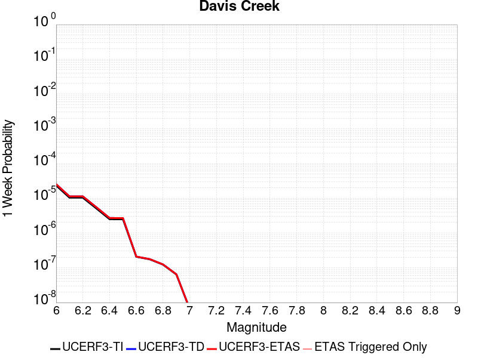 |  |  |  |

| Magnitude | 1 wk TI Prob | 1 wk TD Prob | 1 wk ETAS Prob | 1 wk ETAS/TD Gain | 1 wk ETAS Triggered Only | 1 mo TI Prob | 1 mo TD Prob | 1 mo ETAS Prob | 1 mo ETAS/TD Gain | 1 mo ETAS Triggered Only | 1 yr TI Prob | 1 yr TD Prob | 1 yr ETAS Prob | 1 yr ETAS/TD Gain | 1 yr ETAS Triggered Only | 10 yr TI Prob | 10 yr TD Prob | 10 yr ETAS Prob | 10 yr ETAS/TD Gain | 10 yr ETAS Triggered Only |
|-----|-----|-----|-----|-----|-----|-----|-----|-----|-----|-----|-----|-----|-----|-----|-----|-----|-----|-----|-----|-----|
| 6.0 | 2.331472E-5 | 2.541843E-5 | 2.541843E-5 | 1.0 | 0.0 | 9.99164E-5 | 1.08932254E-4 | 1.08932254E-4 | 1.0 | 0.0 | 0.0012158032 | 0.0013255618 | 0.0013255618 | 1.0 | 0.0 | 0.01209173 | 0.013188332 | 0.013358765 | 1.0129231 | 1.7271157E-4 |
| 6.1 | 1.0407654E-5 | 1.1317512E-5 | 1.1317512E-5 | 1.0 | 0.0 | 4.4603472E-5 | 4.8502872E-5 | 4.8502872E-5 | 1.0 | 0.0 | 5.4291193E-4 | 5.903896E-4 | 5.903896E-4 | 1.0 | 0.0 | 0.0054158745 | 0.005890884 | 0.005890884 | 1.0 | 0.0 |
| 6.2 | 1.0407654E-5 | 1.1317512E-5 | 1.1317512E-5 | 1.0 | 0.0 | 4.4603472E-5 | 4.8502872E-5 | 4.8502872E-5 | 1.0 | 0.0 | 5.4291193E-4 | 5.903896E-4 | 5.903896E-4 | 1.0 | 0.0 | 0.0054158745 | 0.005890884 | 0.005890884 | 1.0 | 0.0 |
| 6.3 | 5.1323277E-6 | 5.568808E-6 | 5.568808E-6 | 1.0 | 0.0 | 2.1995505E-5 | 2.3866149E-5 | 2.3866149E-5 | 1.0 | 0.0 | 2.6776237E-4 | 2.9054025E-4 | 2.9054025E-4 | 1.0 | 0.0 | 0.0026743996 | 0.0029024503 | 0.0029024503 | 1.0 | 0.0 |
| 6.4 | 2.4985154E-6 | 2.7046572E-6 | 2.7046572E-6 | 1.0 | 0.0 | 1.07078795E-5 | 1.1591356E-5 | 1.1591356E-5 | 1.0 | 0.0 | 1.3036063E-4 | 1.4111924E-4 | 1.4111924E-4 | 1.0 | 0.0 | 0.0013028418 | 0.001410651 | 0.001410651 | 1.0 | 0.0 |
| 6.5 | 2.4846438E-6 | 2.6905911E-6 | 2.6905911E-6 | 1.0 | 0.0 | 1.064843E-5 | 1.1531074E-5 | 1.1531074E-5 | 1.0 | 0.0 | 1.2963692E-4 | 1.403854E-4 | 1.403854E-4 | 1.0 | 0.0 | 0.0012956132 | 0.001403322 | 0.001403322 | 1.0 | 0.0 |
| 6.6 | 2.072566E-7 | 2.1018245E-7 | 2.1018245E-7 | 1.0 | 0.0 | 8.882423E-7 | 9.0078163E-7 | 9.0078163E-7 | 1.0 | 0.0 | 1.0814296E-5 | 1.0966963E-5 | 1.0966963E-5 | 1.0 | 0.0 | 1.081377E-4 | 1.096644E-4 | 1.096644E-4 | 1.0 | 0.0 |
| 6.7 | 1.7544528E-7 | 1.7790958E-7 | 1.7790958E-7 | 1.0 | 0.0 | 7.5190815E-7 | 7.624694E-7 | 7.624694E-7 | 1.0 | 0.0 | 9.154443E-6 | 9.283027E-6 | 9.283027E-6 | 1.0 | 0.0 | 9.1540656E-5 | 9.282655E-5 | 9.282655E-5 | 1.0 | 0.0 |
| 6.8 | 1.2320395E-7 | 1.2481225E-7 | 1.2481225E-7 | 1.0 | 0.0 | 5.280168E-7 | 5.349095E-7 | 5.349095E-7 | 1.0 | 0.0 | 6.428586E-6 | 6.5125046E-6 | 6.5125046E-6 | 1.0 | 0.0 | 6.4284E-5 | 6.5123255E-5 | 6.5123255E-5 | 1.0 | 0.0 |
| 6.9 | 6.399997E-8 | 6.486104E-8 | 6.486104E-8 | 1.0 | 0.0 | 2.7428555E-7 | 2.7797586E-7 | 2.7797586E-7 | 1.0 | 0.0 | 3.3394215E-6 | 3.3843514E-6 | 3.3843514E-6 | 1.0 | 0.0 | 3.3393713E-5 | 3.3843065E-5 | 3.3843065E-5 | 1.0 | 0.0 |
| 7.0 | 6.4455685E-9 | 6.5353123E-9 | 6.5353123E-9 | 1.0 | 0.0 | 2.7623864E-8 | 2.800848E-8 | 2.800848E-8 | 1.0 | 0.0 | 3.3632048E-7 | 3.4100327E-7 | 3.4100327E-7 | 1.0 | 0.0 | 3.3631998E-6 | 3.4100326E-6 | 3.4100326E-6 | 1.0 | 0.0 |

## Blue Cut
*[(top)](#table-of-contents)*

| 1 Week | 1 Month | 1 Year | 10 Year |
|-----|-----|-----|-----|
|  |  |  |  |

| Magnitude | 1 wk TI Prob | 1 wk TD Prob | 1 wk ETAS Prob | 1 wk ETAS/TD Gain | 1 wk ETAS Triggered Only | 1 mo TI Prob | 1 mo TD Prob | 1 mo ETAS Prob | 1 mo ETAS/TD Gain | 1 mo ETAS Triggered Only | 1 yr TI Prob | 1 yr TD Prob | 1 yr ETAS Prob | 1 yr ETAS/TD Gain | 1 yr ETAS Triggered Only | 10 yr TI Prob | 10 yr TD Prob | 10 yr ETAS Prob | 10 yr ETAS/TD Gain | 10 yr ETAS Triggered Only |
|-----|-----|-----|-----|-----|-----|-----|-----|-----|-----|-----|-----|-----|-----|-----|-----|-----|-----|-----|-----|-----|
| 6.0 | 2.1227985E-5 | 2.2720424E-5 | 2.2720424E-5 | 1.0 | 0.0 | 9.097391E-5 | 9.7369935E-5 | 9.7369935E-5 | 1.0 | 0.0 | 0.0011070445 | 0.0011848924 | 0.0013573993 | 1.1455886 | 1.7271157E-4 | 0.011015458 | 0.01179159 | 0.011962265 | 1.0144743 | 1.7271157E-4 |
| 6.1 | 2.1227985E-5 | 2.2720424E-5 | 2.2720424E-5 | 1.0 | 0.0 | 9.097391E-5 | 9.7369935E-5 | 9.7369935E-5 | 1.0 | 0.0 | 0.0011070445 | 0.0011848924 | 0.0013573993 | 1.1455886 | 1.7271157E-4 | 0.011015458 | 0.01179159 | 0.011962265 | 1.0144743 | 1.7271157E-4 |
| 6.2 | 2.1227985E-5 | 2.2720424E-5 | 2.2720424E-5 | 1.0 | 0.0 | 9.097391E-5 | 9.7369935E-5 | 9.7369935E-5 | 1.0 | 0.0 | 0.0011070445 | 0.0011848924 | 0.0013573993 | 1.1455886 | 1.7271157E-4 | 0.011015458 | 0.01179159 | 0.011962265 | 1.0144743 | 1.7271157E-4 |
| 6.3 | 1.1613981E-5 | 1.2353959E-5 | 1.2353959E-5 | 1.0 | 0.0 | 4.9773254E-5 | 5.2944535E-5 | 5.2944535E-5 | 1.0 | 0.0 | 6.0582085E-4 | 6.4442155E-4 | 6.4442155E-4 | 1.0 | 0.0 | 0.0060417196 | 0.006426776 | 0.006426776 | 1.0 | 0.0 |
| 6.4 | 1.1613981E-5 | 1.2353959E-5 | 1.2353959E-5 | 1.0 | 0.0 | 4.9773254E-5 | 5.2944535E-5 | 5.2944535E-5 | 1.0 | 0.0 | 6.0582085E-4 | 6.4442155E-4 | 6.4442155E-4 | 1.0 | 0.0 | 0.0060417196 | 0.006426776 | 0.006426776 | 1.0 | 0.0 |
| 6.5 | 8.931326E-6 | 9.48191E-6 | 9.48191E-6 | 1.0 | 0.0 | 3.8276554E-5 | 4.0636176E-5 | 4.0636176E-5 | 1.0 | 0.0 | 4.6591737E-4 | 4.9464224E-4 | 4.9464224E-4 | 1.0 | 0.0 | 0.0046494175 | 0.004936322 | 0.004936322 | 1.0 | 0.0 |
| 6.6 | 7.345353E-6 | 7.79053E-6 | 7.79053E-6 | 1.0 | 0.0 | 3.1479703E-5 | 3.33876E-5 | 3.33876E-5 | 1.0 | 0.0 | 3.83198E-4 | 4.0642623E-4 | 4.0642623E-4 | 1.0 | 0.0 | 0.0038253788 | 0.004057621 | 0.004057621 | 1.0 | 0.0 |
| 6.7 | 6.2775666E-6 | 6.655361E-6 | 6.655361E-6 | 1.0 | 0.0 | 2.690358E-5 | 2.8522707E-5 | 2.8522707E-5 | 1.0 | 0.0 | 3.2750185E-4 | 3.4721615E-4 | 3.4721615E-4 | 1.0 | 0.0 | 0.0032701963 | 0.0034674776 | 0.0034674776 | 1.0 | 0.0 |
| 6.8 | 5.5234095E-6 | 5.855298E-6 | 5.855298E-6 | 1.0 | 0.0 | 2.367154E-5 | 2.5093934E-5 | 2.5093934E-5 | 1.0 | 0.0 | 2.8816288E-4 | 3.054831E-4 | 3.054831E-4 | 1.0 | 0.0 | 0.002877895 | 0.0030513476 | 0.0030513476 | 1.0 | 0.0 |
| 6.9 | 4.7780054E-6 | 5.065582E-6 | 5.065582E-6 | 1.0 | 0.0 | 2.0477004E-5 | 2.1709497E-5 | 2.1709497E-5 | 1.0 | 0.0 | 2.4927902E-4 | 2.642881E-4 | 2.642881E-4 | 1.0 | 0.0 | 0.0024899957 | 0.0026404303 | 0.0026404303 | 1.0 | 0.0 |
| 7.0 | 3.883171E-6 | 4.1186195E-6 | 4.1186195E-6 | 1.0 | 0.0 | 1.6642054E-5 | 1.7651146E-5 | 1.7651146E-5 | 1.0 | 0.0 | 2.0259817E-4 | 2.148884E-4 | 2.148884E-4 | 1.0 | 0.0 | 0.0020241356 | 0.0021474818 | 0.0021474818 | 1.0 | 0.0 |
| 7.1 | 2.8358215E-6 | 3.0098138E-6 | 3.0098138E-6 | 1.0 | 0.0 | 1.2153464E-5 | 1.2899175E-5 | 1.2899175E-5 | 1.0 | 0.0 | 1.4795837E-4 | 1.5704273E-4 | 1.5704273E-4 | 1.0 | 0.0 | 0.001478599 | 0.0015699627 | 0.0015699627 | 1.0 | 0.0 |

## San Clemente
*[(top)](#table-of-contents)*

| 1 Week | 1 Month | 1 Year | 10 Year |
|-----|-----|-----|-----|
|  |  |  |  |

| Magnitude | 1 wk TI Prob | 1 wk TD Prob | 1 wk ETAS Prob | 1 wk ETAS/TD Gain | 1 wk ETAS Triggered Only | 1 mo TI Prob | 1 mo TD Prob | 1 mo ETAS Prob | 1 mo ETAS/TD Gain | 1 mo ETAS Triggered Only | 1 yr TI Prob | 1 yr TD Prob | 1 yr ETAS Prob | 1 yr ETAS/TD Gain | 1 yr ETAS Triggered Only | 10 yr TI Prob | 10 yr TD Prob | 10 yr ETAS Prob | 10 yr ETAS/TD Gain | 10 yr ETAS Triggered Only |
|-----|-----|-----|-----|-----|-----|-----|-----|-----|-----|-----|-----|-----|-----|-----|-----|-----|-----|-----|-----|-----|
| 6.0 | 6.681379E-5 | 8.164408E-5 | 8.164408E-5 | 1.0 | 0.0 | 2.8631336E-4 | 3.4985956E-4 | 3.4985956E-4 | 1.0 | 0.0 | 0.003480294 | 0.0042518 | 0.0042518 | 1.0 | 0.0 | 0.03426291 | 0.04176052 | 0.04192602 | 1.003963 | 1.7271157E-4 |
| 6.1 | 6.681379E-5 | 8.164408E-5 | 8.164408E-5 | 1.0 | 0.0 | 2.8631336E-4 | 3.4985956E-4 | 3.4985956E-4 | 1.0 | 0.0 | 0.003480294 | 0.0042518 | 0.0042518 | 1.0 | 0.0 | 0.03426291 | 0.04176052 | 0.04192602 | 1.003963 | 1.7271157E-4 |
| 6.2 | 3.9400576E-5 | 4.645645E-5 | 4.645645E-5 | 1.0 | 0.0 | 1.6884868E-4 | 1.9908424E-4 | 1.9908424E-4 | 1.0 | 0.0 | 0.0020537945 | 0.0024212173 | 0.0024212173 | 1.0 | 0.0 | 0.020349167 | 0.02395512 | 0.02395512 | 1.0 | 0.0 |
| 6.3 | 3.2590255E-5 | 3.79324E-5 | 3.79324E-5 | 1.0 | 0.0 | 1.3966505E-4 | 1.625575E-4 | 1.625575E-4 | 1.0 | 0.0 | 0.0016990956 | 0.001977371 | 0.001977371 | 1.0 | 0.0 | 0.01686163 | 0.019601561 | 0.019601561 | 1.0 | 0.0 |
| 6.4 | 2.9454652E-5 | 3.4100634E-5 | 3.4100634E-5 | 1.0 | 0.0 | 1.2622811E-4 | 1.4613755E-4 | 1.4613755E-4 | 1.0 | 0.0 | 0.0015357438 | 0.0017777971 | 0.0017777971 | 1.0 | 0.0 | 0.015251739 | 0.017638927 | 0.017638927 | 1.0 | 0.0 |
| 6.5 | 2.790836E-5 | 3.2250126E-5 | 3.2250126E-5 | 1.0 | 0.0 | 1.1960178E-4 | 1.3820764E-4 | 1.3820764E-4 | 1.0 | 0.0 | 0.001455179 | 0.0016814041 | 0.0016814041 | 1.0 | 0.0 | 0.014456868 | 0.016689846 | 0.016689846 | 1.0 | 0.0 |
| 6.6 | 2.2492153E-5 | 2.5764699E-5 | 2.5764699E-5 | 1.0 | 0.0 | 9.639138E-5 | 1.10415545E-4 | 1.10415545E-4 | 1.0 | 0.0 | 0.0011729331 | 0.0013434946 | 0.0013434946 | 1.0 | 0.0 | 0.011667615 | 0.013355441 | 0.013355441 | 1.0 | 0.0 |
| 6.7 | 1.9862755E-5 | 2.2668124E-5 | 2.2668124E-5 | 1.0 | 0.0 | 8.512331E-5 | 9.7145545E-5 | 9.7145545E-5 | 1.0 | 0.0 | 0.0010358836 | 0.0011821166 | 0.0011821166 | 1.0 | 0.0 | 0.010310682 | 0.011759577 | 0.011759577 | 1.0 | 0.0 |
| 6.8 | 1.6697575E-5 | 1.8979084E-5 | 1.8979084E-5 | 1.0 | 0.0 | 7.155907E-5 | 8.133645E-5 | 8.133645E-5 | 1.0 | 0.0 | 8.7088346E-4 | 9.898308E-4 | 9.898308E-4 | 1.0 | 0.0 | 0.008674784 | 0.009855248 | 0.009855248 | 1.0 | 0.0 |
| 6.9 | 1.5218415E-5 | 1.7270635E-5 | 1.7270635E-5 | 1.0 | 0.0 | 6.522015E-5 | 7.401496E-5 | 7.401496E-5 | 1.0 | 0.0 | 7.93766E-4 | 9.007684E-4 | 9.007684E-4 | 1.0 | 0.0 | 0.007909367 | 0.00897212 | 0.00897212 | 1.0 | 0.0 |
| 7.0 | 1.2392958E-5 | 1.4034001E-5 | 1.4034001E-5 | 1.0 | 0.0 | 5.3111595E-5 | 6.0144375E-5 | 6.0144375E-5 | 1.0 | 0.0 | 6.4644177E-4 | 7.320193E-4 | 7.320193E-4 | 1.0 | 0.0 | 0.0064456454 | 0.007296867 | 0.007296867 | 1.0 | 0.0 |
| 7.1 | 1.0934128E-5 | 1.2376004E-5 | 1.2376004E-5 | 1.0 | 0.0 | 4.6859706E-5 | 5.3038977E-5 | 5.3038977E-5 | 1.0 | 0.0 | 5.7036756E-4 | 6.4556557E-4 | 6.4556557E-4 | 1.0 | 0.0 | 0.0056890585 | 0.0064376486 | 0.0064376486 | 1.0 | 0.0 |
| 7.2 | 9.5798805E-6 | 1.0845695E-5 | 1.0845695E-5 | 1.0 | 0.0 | 4.1055984E-5 | 4.6480764E-5 | 4.6480764E-5 | 1.0 | 0.0 | 4.9974193E-4 | 5.6576356E-4 | 5.6576356E-4 | 1.0 | 0.0 | 0.0049861963 | 0.005643956 | 0.005643956 | 1.0 | 0.0 |
| 7.3 | 8.0167365E-6 | 9.084559E-6 | 9.084559E-6 | 1.0 | 0.0 | 3.4356988E-5 | 3.893328E-5 | 3.893328E-5 | 1.0 | 0.0 | 4.1821605E-4 | 4.7391668E-4 | 4.7391668E-4 | 1.0 | 0.0 | 0.0041742986 | 0.004729763 | 0.004729763 | 1.0 | 0.0 |
| 7.4 | 2.9581017E-6 | 3.362623E-6 | 3.362623E-6 | 1.0 | 0.0 | 1.2677518E-5 | 1.441119E-5 | 1.441119E-5 | 1.0 | 0.0 | 1.5433785E-4 | 1.7544716E-4 | 1.7544716E-4 | 1.0 | 0.0 | 0.001542307 | 0.0017535817 | 0.0017535817 | 1.0 | 0.0 |

## San Andreas (Creeping Section) 2011 CFM
*[(top)](#table-of-contents)*

| 1 Week | 1 Month | 1 Year | 10 Year |
|-----|-----|-----|-----|
|  |  |  | 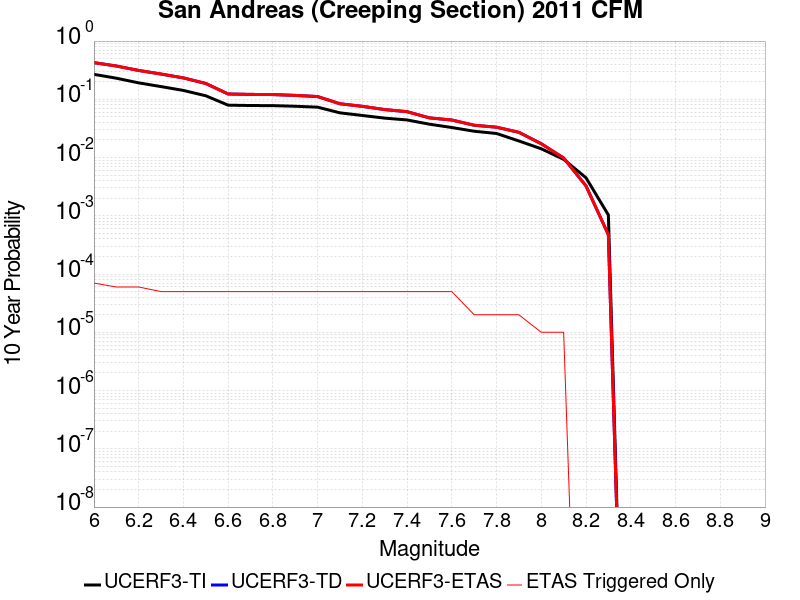 |

| Magnitude | 1 wk TI Prob | 1 wk TD Prob | 1 wk ETAS Prob | 1 wk ETAS/TD Gain | 1 wk ETAS Triggered Only | 1 mo TI Prob | 1 mo TD Prob | 1 mo ETAS Prob | 1 mo ETAS/TD Gain | 1 mo ETAS Triggered Only | 1 yr TI Prob | 1 yr TD Prob | 1 yr ETAS Prob | 1 yr ETAS/TD Gain | 1 yr ETAS Triggered Only | 10 yr TI Prob | 10 yr TD Prob | 10 yr ETAS Prob | 10 yr ETAS/TD Gain | 10 yr ETAS Triggered Only |
|-----|-----|-----|-----|-----|-----|-----|-----|-----|-----|-----|-----|-----|-----|-----|-----|-----|-----|-----|-----|-----|
| 6.0 | 5.986481E-4 | 0.0012277901 | 0.0012277901 | 1.0 | 0.0 | 0.0025631124 | 0.0052455855 | 0.0052455855 | 1.0 | 0.0 | 0.030762846 | 0.061229862 | 0.061391998 | 1.002648 | 1.7271157E-4 | 0.26835477 | 0.42607152 | 0.42617065 | 1.0002327 | 1.7271157E-4 |
| 6.1 | 5.015945E-4 | 0.0010218644 | 0.0010218644 | 1.0 | 0.0 | 0.00214792 | 0.0043676887 | 0.0043676887 | 1.0 | 0.0 | 0.025839351 | 0.051269703 | 0.05143356 | 1.003196 | 1.7271157E-4 | 0.23032776 | 0.37298882 | 0.3730971 | 1.0002904 | 1.7271157E-4 |
| 6.2 | 4.073338E-4 | 8.109829E-4 | 8.109829E-4 | 1.0 | 0.0 | 0.0017445484 | 0.0034675654 | 0.0034675654 | 1.0 | 0.0 | 0.021034058 | 0.040954083 | 0.04111972 | 1.0040445 | 1.7271157E-4 | 0.19150782 | 0.31317768 | 0.3132963 | 1.0003787 | 1.7271157E-4 |
| 6.3 | 3.464099E-4 | 6.7405414E-4 | 6.7405414E-4 | 1.0 | 0.0 | 0.0014837692 | 0.0028840431 | 0.0028840431 | 1.0 | 0.0 | 0.017915873 | 0.034210727 | 0.03437753 | 1.0048758 | 1.7271157E-4 | 0.16538359 | 0.27146977 | 0.2715956 | 1.0004635 | 1.7271157E-4 |
| 6.4 | 2.935057E-4 | 5.543318E-4 | 5.543318E-4 | 1.0 | 0.0 | 0.0012572751 | 0.0023728115 | 0.0023728115 | 1.0 | 0.0 | 0.015200248 | 0.028285956 | 0.028453782 | 1.0059332 | 1.7271157E-4 | 0.14201577 | 0.23314685 | 0.23327929 | 1.000568 | 1.7271157E-4 |
| 6.5 | 2.3409708E-4 | 4.2106997E-4 | 4.2106997E-4 | 1.0 | 0.0 | 0.0010028875 | 0.001803265 | 0.001803265 | 1.0 | 0.0 | 0.012141965 | 0.02160988 | 0.02177886 | 1.0078195 | 1.7271157E-4 | 0.11499573 | 0.18699536 | 0.18713577 | 1.0007509 | 1.7271157E-4 |
| 6.6 | 1.5842178E-4 | 2.5115322E-4 | 2.5115322E-4 | 1.0 | 0.0 | 6.7877385E-4 | 0.0010759257 | 0.0010759257 | 1.0 | 0.0 | 0.0082328 | 0.013019121 | 0.013189585 | 1.0130932 | 1.7271157E-4 | 0.07934396 | 0.12333139 | 0.12348281 | 1.0012276 | 1.7271157E-4 |
| 6.7 | 1.5616413E-4 | 2.4651614E-4 | 2.4651614E-4 | 1.0 | 0.0 | 6.691031E-4 | 0.0010560687 | 0.0010560687 | 1.0 | 0.0 | 0.0081159435 | 0.012780937 | 0.012951441 | 1.0133405 | 1.7271157E-4 | 0.0782586 | 0.12135857 | 0.12151033 | 1.0012504 | 1.7271157E-4 |
| 6.8 | 1.5538467E-4 | 2.4475376E-4 | 2.4475376E-4 | 1.0 | 0.0 | 6.6576427E-4 | 0.0010485224 | 0.0010485224 | 1.0 | 0.0 | 0.008075596 | 0.0126902815 | 0.012860801 | 1.013437 | 1.7271157E-4 | 0.07788358 | 0.12058931 | 0.120741196 | 1.0012596 | 1.7271157E-4 |
| 6.9 | 1.5153569E-4 | 2.3584193E-4 | 2.3584193E-4 | 1.0 | 0.0 | 6.49277E-4 | 0.0010103616 | 0.0010103616 | 1.0 | 0.0 | 0.007876333 | 0.0122323 | 0.0124029 | 1.0139467 | 1.7271157E-4 | 0.07602952 | 0.11665895 | 0.116811514 | 1.0013077 | 1.7271157E-4 |
| 7.0 | 1.4588932E-4 | 2.2441045E-4 | 2.2441045E-4 | 1.0 | 0.0 | 6.250901E-4 | 9.6140656E-4 | 9.6140656E-4 | 1.0 | 0.0 | 0.0075839474 | 0.011642803 | 0.011813504 | 1.0146614 | 1.7271157E-4 | 0.073302895 | 0.11150479 | 0.111658245 | 1.0013762 | 1.7271157E-4 |
| 7.1 | 1.1565079E-4 | 1.6318668E-4 | 1.6318668E-4 | 1.0 | 0.0 | 4.955521E-4 | 6.991849E-4 | 6.991849E-4 | 1.0 | 0.0 | 0.006016669 | 0.008479553 | 0.0086508 | 1.0201952 | 1.7271157E-4 | 0.058563538 | 0.08383247 | 0.0839907 | 1.0018874 | 1.7271157E-4 |
| 7.2 | 1.0393792E-4 | 1.4650424E-4 | 1.4650424E-4 | 1.0 | 0.0 | 4.4537216E-4 | 6.2772504E-4 | 6.2772504E-4 | 1.0 | 0.0 | 0.005408933 | 0.007615941 | 0.0077873375 | 1.0225049 | 1.7271157E-4 | 0.052791595 | 0.075774014 | 0.075933635 | 1.0021065 | 1.7271157E-4 |
| 7.3 | 9.332884E-5 | 1.2811116E-4 | 1.2811116E-4 | 1.0 | 0.0 | 3.999194E-4 | 5.4893293E-4 | 5.4893293E-4 | 1.0 | 0.0 | 0.0048581534 | 0.006662914 | 0.006834475 | 1.0257486 | 1.7271157E-4 | 0.047533102 | 0.06662133 | 0.06678254 | 1.0024197 | 1.7271157E-4 |
| 7.4 | 8.670252E-5 | 1.17293064E-4 | 1.17293064E-4 | 1.0 | 0.0 | 3.715293E-4 | 5.0258834E-4 | 5.0258834E-4 | 1.0 | 0.0 | 0.004513991 | 0.006101966 | 0.0062736236 | 1.0281315 | 1.7271157E-4 | 0.044233937 | 0.06127167 | 0.0614338 | 1.0026461 | 1.7271157E-4 |
| 7.5 | 7.3036405E-5 | 9.027501E-5 | 9.027501E-5 | 1.0 | 0.0 | 3.129756E-4 | 3.8683563E-4 | 3.8683563E-4 | 1.0 | 0.0 | 0.0038038217 | 0.0046995743 | 0.004871474 | 1.0365777 | 1.7271157E-4 | 0.03739367 | 0.047980286 | 0.048144713 | 1.0034269 | 1.7271157E-4 |
| 7.6 | 6.3935775E-5 | 8.298733E-5 | 8.298733E-5 | 1.0 | 0.0 | 2.7398168E-4 | 3.5561158E-4 | 3.5561158E-4 | 1.0 | 0.0 | 0.0033306254 | 0.0043209945 | 0.00449296 | 1.0397977 | 1.7271157E-4 | 0.032811474 | 0.04407886 | 0.044243958 | 1.0037456 | 1.7271157E-4 |
| 7.7 | 5.5050095E-5 | 6.6780485E-5 | 6.6780485E-5 | 1.0 | 0.0 | 2.3590765E-4 | 2.861707E-4 | 2.861707E-4 | 1.0 | 0.0 | 0.0028683927 | 0.003478566 | 0.003650677 | 1.0494775 | 1.7271157E-4 | 0.0283165 | 0.035874426 | 0.036040943 | 1.0046417 | 1.7271157E-4 |
| 7.8 | 5.027131E-5 | 6.177649E-5 | 6.177649E-5 | 1.0 | 0.0 | 2.1543067E-4 | 2.6472952E-4 | 2.6472952E-4 | 1.0 | 0.0 | 0.0026197135 | 0.0032183218 | 0.0033904775 | 1.0534924 | 1.7271157E-4 | 0.025890453 | 0.033198178 | 0.033365157 | 1.0050297 | 1.7271157E-4 |
| 7.9 | 3.7271806E-5 | 5.034326E-5 | 5.034326E-5 | 1.0 | 0.0 | 1.5972654E-4 | 2.15739E-4 | 2.15739E-4 | 1.0 | 0.0 | 0.0019429359 | 0.0026234603 | 0.0027957188 | 1.0656608 | 1.7271157E-4 | 0.019260362 | 0.027125074 | 0.0272931 | 1.0061945 | 1.7271157E-4 |
| 8.0 | 2.7310243E-5 | 3.1506686E-5 | 3.1506686E-5 | 1.0 | 0.0 | 1.17038646E-4 | 1.3502168E-4 | 1.3502168E-4 | 1.0 | 0.0 | 0.0014240141 | 0.0016426502 | 0.0016426502 | 1.0 | 0.0 | 0.014149235 | 0.017253635 | 0.017253635 | 1.0 | 0.0 |
| 8.1 | 1.7940547E-5 | 1.7450684E-5 | 1.7450684E-5 | 1.0 | 0.0 | 7.688579E-5 | 7.4786505E-5 | 7.4786505E-5 | 1.0 | 0.0 | 9.3568244E-4 | 9.1014587E-4 | 9.1014587E-4 | 1.0 | 0.0 | 0.009317525 | 0.009825298 | 0.009825298 | 1.0 | 0.0 |
| 8.2 | 8.643924E-6 | 5.49522E-6 | 5.49522E-6 | 1.0 | 0.0 | 3.704486E-5 | 2.355073E-5 | 2.355073E-5 | 1.0 | 0.0 | 4.5092785E-4 | 2.866925E-4 | 2.866925E-4 | 1.0 | 0.0 | 0.0045001395 | 0.0032598388 | 0.0032598388 | 1.0 | 0.0 |
| 8.3 | 1.983087E-6 | 7.693574E-7 | 7.693574E-7 | 1.0 | 0.0 | 8.498917E-6 | 3.297242E-6 | 3.297242E-6 | 1.0 | 0.0 | 1.034694E-4 | 4.01432E-5 | 4.01432E-5 | 1.0 | 0.0 | 0.0010342124 | 4.7390026E-4 | 4.7390026E-4 | 1.0 | 0.0 |

## Ludlow
*[(top)](#table-of-contents)*

| 1 Week | 1 Month | 1 Year | 10 Year |
|-----|-----|-----|-----|
|  |  |  |  |

| Magnitude | 1 wk TI Prob | 1 wk TD Prob | 1 wk ETAS Prob | 1 wk ETAS/TD Gain | 1 wk ETAS Triggered Only | 1 mo TI Prob | 1 mo TD Prob | 1 mo ETAS Prob | 1 mo ETAS/TD Gain | 1 mo ETAS Triggered Only | 1 yr TI Prob | 1 yr TD Prob | 1 yr ETAS Prob | 1 yr ETAS/TD Gain | 1 yr ETAS Triggered Only | 10 yr TI Prob | 10 yr TD Prob | 10 yr ETAS Prob | 10 yr ETAS/TD Gain | 10 yr ETAS Triggered Only |
|-----|-----|-----|-----|-----|-----|-----|-----|-----|-----|-----|-----|-----|-----|-----|-----|-----|-----|-----|-----|-----|
| 6.0 | 2.2407607E-5 | 2.3657954E-5 | 2.3657954E-5 | 1.0 | 0.0 | 9.602906E-5 | 1.0138754E-4 | 1.0138754E-4 | 1.0 | 0.0 | 0.0011685267 | 0.0012337384 | 0.0012337384 | 1.0 | 0.0 | 0.011624013 | 0.012273403 | 0.012443995 | 1.0138993 | 1.7271157E-4 |
| 6.1 | 2.2407607E-5 | 2.3657954E-5 | 2.3657954E-5 | 1.0 | 0.0 | 9.602906E-5 | 1.0138754E-4 | 1.0138754E-4 | 1.0 | 0.0 | 0.0011685267 | 0.0012337384 | 0.0012337384 | 1.0 | 0.0 | 0.011624013 | 0.012273403 | 0.012443995 | 1.0138993 | 1.7271157E-4 |
| 6.2 | 1.0781252E-5 | 1.1365991E-5 | 1.1365991E-5 | 1.0 | 0.0 | 4.620455E-5 | 4.8710503E-5 | 4.8710503E-5 | 1.0 | 0.0 | 5.623952E-4 | 5.92893E-4 | 5.92893E-4 | 1.0 | 0.0 | 0.00560974 | 0.005913531 | 0.006085221 | 1.0290334 | 1.7271157E-4 |
| 6.3 | 1.0781252E-5 | 1.1365991E-5 | 1.1365991E-5 | 1.0 | 0.0 | 4.620455E-5 | 4.8710503E-5 | 4.8710503E-5 | 1.0 | 0.0 | 5.623952E-4 | 5.92893E-4 | 5.92893E-4 | 1.0 | 0.0 | 0.00560974 | 0.005913531 | 0.006085221 | 1.0290334 | 1.7271157E-4 |
| 6.4 | 7.814439E-6 | 8.237966E-6 | 8.237966E-6 | 1.0 | 0.0 | 3.3490025E-5 | 3.5305096E-5 | 3.5305096E-5 | 1.0 | 0.0 | 4.0766477E-4 | 4.2975618E-4 | 4.2975618E-4 | 1.0 | 0.0 | 0.0040691774 | 0.0042893975 | 0.0042893975 | 1.0 | 0.0 |
| 6.5 | 6.4986366E-6 | 6.8511167E-6 | 6.8511167E-6 | 1.0 | 0.0 | 2.7851002E-5 | 2.9361603E-5 | 2.9361603E-5 | 1.0 | 0.0 | 3.390332E-4 | 3.574198E-4 | 3.574198E-4 | 1.0 | 0.0 | 0.003385164 | 0.003568546 | 0.003568546 | 1.0 | 0.0 |
| 6.6 | 5.582177E-6 | 5.8861756E-6 | 5.8861756E-6 | 1.0 | 0.0 | 2.3923398E-5 | 2.5226227E-5 | 2.5226227E-5 | 1.0 | 0.0 | 2.9122844E-4 | 3.0708674E-4 | 3.0708674E-4 | 1.0 | 0.0 | 0.0029084706 | 0.0030666974 | 0.0030666974 | 1.0 | 0.0 |
| 6.7 | 4.6858763E-6 | 4.94057E-6 | 4.94057E-6 | 1.0 | 0.0 | 2.0082172E-5 | 2.1173702E-5 | 2.1173702E-5 | 1.0 | 0.0 | 2.4447302E-4 | 2.5775988E-4 | 2.5775988E-4 | 1.0 | 0.0 | 0.0024420423 | 0.0025746655 | 0.0025746655 | 1.0 | 0.0 |
| 6.8 | 3.5584908E-6 | 3.7521265E-6 | 3.7521265E-6 | 1.0 | 0.0 | 1.5250586E-5 | 1.6080447E-5 | 1.6080447E-5 | 1.0 | 0.0 | 1.8566006E-4 | 1.9576224E-4 | 1.9576224E-4 | 1.0 | 0.0 | 0.0018550502 | 0.0019559392 | 0.0019559392 | 1.0 | 0.0 |
| 6.9 | 2.532834E-6 | 2.6710807E-6 | 2.6710807E-6 | 1.0 | 0.0 | 1.0854958E-5 | 1.1447441E-5 | 1.1447441E-5 | 1.0 | 0.0 | 1.3215111E-4 | 1.3936395E-4 | 1.3936395E-4 | 1.0 | 0.0 | 0.0013207254 | 0.0013927931 | 0.0013927931 | 1.0 | 0.0 |
| 7.0 | 1.7083285E-6 | 1.8019963E-6 | 1.8019963E-6 | 1.0 | 0.0 | 7.3213873E-6 | 7.722819E-6 | 7.722819E-6 | 1.0 | 0.0 | 8.913424E-5 | 9.402143E-5 | 9.402143E-5 | 1.0 | 0.0 | 8.9098496E-4 | 9.3983306E-4 | 9.3983306E-4 | 1.0 | 0.0 |
| 7.1 | 1.0905424E-6 | 1.1497951E-6 | 1.1497951E-6 | 1.0 | 0.0 | 4.6737446E-6 | 4.9276846E-6 | 4.9276846E-6 | 1.0 | 0.0 | 5.6901354E-5 | 5.9993006E-5 | 5.9993006E-5 | 1.0 | 0.0 | 5.6886784E-4 | 5.997779E-4 | 5.997779E-4 | 1.0 | 0.0 |
| 7.2 | 6.06668E-7 | 6.387457E-7 | 6.387457E-7 | 1.0 | 0.0 | 2.600003E-6 | 2.737479E-6 | 2.737479E-6 | 1.0 | 0.0 | 3.1654577E-5 | 3.3328364E-5 | 3.3328364E-5 | 1.0 | 0.0 | 3.1650066E-4 | 3.3324052E-4 | 3.3324052E-4 | 1.0 | 0.0 |

## Kern Canyon (North Kern) 2011
*[(top)](#table-of-contents)*

| 1 Week | 1 Month | 1 Year | 10 Year |
|-----|-----|-----|-----|
|  |  |  |  |

| Magnitude | 1 wk TI Prob | 1 wk TD Prob | 1 wk ETAS Prob | 1 wk ETAS/TD Gain | 1 wk ETAS Triggered Only | 1 mo TI Prob | 1 mo TD Prob | 1 mo ETAS Prob | 1 mo ETAS/TD Gain | 1 mo ETAS Triggered Only | 1 yr TI Prob | 1 yr TD Prob | 1 yr ETAS Prob | 1 yr ETAS/TD Gain | 1 yr ETAS Triggered Only | 10 yr TI Prob | 10 yr TD Prob | 10 yr ETAS Prob | 10 yr ETAS/TD Gain | 10 yr ETAS Triggered Only |
|-----|-----|-----|-----|-----|-----|-----|-----|-----|-----|-----|-----|-----|-----|-----|-----|-----|-----|-----|-----|-----|
| 6.0 | 6.6264497E-6 | 6.7574156E-6 | 6.7574156E-6 | 1.0 | 0.0 | 2.8398761E-5 | 2.8960078E-5 | 2.8960078E-5 | 1.0 | 0.0 | 3.4570007E-4 | 3.525399E-4 | 3.525399E-4 | 1.0 | 0.0 | 0.0034516277 | 0.003520595 | 0.0036926984 | 1.0488847 | 1.7271157E-4 |
| 6.1 | 6.6264497E-6 | 6.7574156E-6 | 6.7574156E-6 | 1.0 | 0.0 | 2.8398761E-5 | 2.8960078E-5 | 2.8960078E-5 | 1.0 | 0.0 | 3.4570007E-4 | 3.525399E-4 | 3.525399E-4 | 1.0 | 0.0 | 0.0034516277 | 0.003520595 | 0.0036926984 | 1.0488847 | 1.7271157E-4 |
| 6.2 | 6.6264497E-6 | 6.7574156E-6 | 6.7574156E-6 | 1.0 | 0.0 | 2.8398761E-5 | 2.8960078E-5 | 2.8960078E-5 | 1.0 | 0.0 | 3.4570007E-4 | 3.525399E-4 | 3.525399E-4 | 1.0 | 0.0 | 0.0034516277 | 0.003520595 | 0.0036926984 | 1.0488847 | 1.7271157E-4 |
| 6.3 | 6.6264497E-6 | 6.7574156E-6 | 6.7574156E-6 | 1.0 | 0.0 | 2.8398761E-5 | 2.8960078E-5 | 2.8960078E-5 | 1.0 | 0.0 | 3.4570007E-4 | 3.525399E-4 | 3.525399E-4 | 1.0 | 0.0 | 0.0034516277 | 0.003520595 | 0.0036926984 | 1.0488847 | 1.7271157E-4 |
| 6.4 | 6.6264497E-6 | 6.7574156E-6 | 6.7574156E-6 | 1.0 | 0.0 | 2.8398761E-5 | 2.8960078E-5 | 2.8960078E-5 | 1.0 | 0.0 | 3.4570007E-4 | 3.525399E-4 | 3.525399E-4 | 1.0 | 0.0 | 0.0034516277 | 0.003520595 | 0.0036926984 | 1.0488847 | 1.7271157E-4 |
| 6.5 | 3.2162225E-6 | 3.2571281E-6 | 3.2571281E-6 | 1.0 | 0.0 | 1.3783738E-5 | 1.395905E-5 | 1.395905E-5 | 1.0 | 0.0 | 1.6780409E-4 | 1.69939E-4 | 1.69939E-4 | 1.0 | 0.0 | 0.0016767744 | 0.0016981701 | 0.0016981701 | 1.0 | 0.0 |
| 6.6 | 3.2162225E-6 | 3.2571281E-6 | 3.2571281E-6 | 1.0 | 0.0 | 1.3783738E-5 | 1.395905E-5 | 1.395905E-5 | 1.0 | 0.0 | 1.6780409E-4 | 1.69939E-4 | 1.69939E-4 | 1.0 | 0.0 | 0.0016767744 | 0.0016981701 | 0.0016981701 | 1.0 | 0.0 |
| 6.7 | 2.1908265E-6 | 2.2071454E-6 | 2.2071454E-6 | 1.0 | 0.0 | 9.389223E-6 | 9.459161E-6 | 9.459161E-6 | 1.0 | 0.0 | 1.1430779E-4 | 1.15159404E-4 | 1.15159404E-4 | 1.0 | 0.0 | 0.0011424901 | 0.0011510167 | 0.0011510167 | 1.0 | 0.0 |
| 6.8 | 1.7303895E-6 | 1.7365707E-6 | 1.7365707E-6 | 1.0 | 0.0 | 7.415934E-6 | 7.442425E-6 | 7.442425E-6 | 1.0 | 0.0 | 9.028525E-5 | 9.060786E-5 | 9.060786E-5 | 1.0 | 0.0 | 9.024858E-4 | 9.057189E-4 | 9.057189E-4 | 1.0 | 0.0 |
| 6.9 | 1.3700314E-6 | 1.368876E-6 | 1.368876E-6 | 1.0 | 0.0 | 5.87155E-6 | 5.8665987E-6 | 5.8665987E-6 | 1.0 | 0.0 | 7.148377E-5 | 7.142354E-5 | 7.142354E-5 | 1.0 | 0.0 | 7.146078E-4 | 7.1401044E-4 | 7.1401044E-4 | 1.0 | 0.0 |
| 7.0 | 1.1467797E-6 | 1.141392E-6 | 1.141392E-6 | 1.0 | 0.0 | 4.9147607E-6 | 4.891671E-6 | 4.891671E-6 | 1.0 | 0.0 | 5.983557E-5 | 5.95545E-5 | 5.95545E-5 | 1.0 | 0.0 | 5.981946E-4 | 5.953885E-4 | 5.953885E-4 | 1.0 | 0.0 |
| 7.1 | 9.3952065E-7 | 9.3027853E-7 | 9.3027853E-7 | 1.0 | 0.0 | 4.026511E-6 | 3.986902E-6 | 3.986902E-6 | 1.0 | 0.0 | 4.9021666E-5 | 4.8539467E-5 | 4.8539467E-5 | 1.0 | 0.0 | 4.901085E-4 | 4.8529042E-4 | 4.8529042E-4 | 1.0 | 0.0 |
| 7.2 | 6.858055E-7 | 6.71937E-7 | 6.71937E-7 | 1.0 | 0.0 | 2.939163E-6 | 2.879727E-6 | 2.879727E-6 | 1.0 | 0.0 | 3.5783723E-5 | 3.506012E-5 | 3.506012E-5 | 1.0 | 0.0 | 3.5777962E-4 | 3.5054676E-4 | 3.5054676E-4 | 1.0 | 0.0 |
| 7.3 | 5.1101983E-7 | 4.939352E-7 | 4.939352E-7 | 1.0 | 0.0 | 2.1900833E-6 | 2.1168635E-6 | 2.1168635E-6 | 1.0 | 0.0 | 2.6663936E-5 | 2.5772513E-5 | 2.5772513E-5 | 1.0 | 0.0 | 2.6660739E-4 | 2.5769573E-4 | 2.5769573E-4 | 1.0 | 0.0 |
| 7.4 | 3.4999414E-7 | 3.299627E-7 | 3.299627E-7 | 1.0 | 0.0 | 1.499974E-6 | 1.4141251E-6 | 1.4141251E-6 | 1.0 | 0.0 | 1.8262032E-5 | 1.721684E-5 | 1.721684E-5 | 1.0 | 0.0 | 1.826053E-4 | 1.721553E-4 | 1.721553E-4 | 1.0 | 0.0 |
| 7.5 | 1.7021522E-7 | 1.475023E-7 | 1.475023E-7 | 1.0 | 0.0 | 7.2949354E-7 | 6.321526E-7 | 6.321526E-7 | 1.0 | 0.0 | 8.881548E-6 | 7.696432E-6 | 7.696432E-6 | 1.0 | 0.0 | 8.8811925E-5 | 7.6961725E-5 | 7.6961725E-5 | 1.0 | 0.0 |
| 7.6 | 2.572245E-8 | 1.7352884E-8 | 1.7352884E-8 | 1.0 | 0.0 | 1.10239064E-7 | 7.43695E-8 | 7.43695E-8 | 1.0 | 0.0 | 1.3421597E-6 | 9.0544836E-7 | 9.0544836E-7 | 1.0 | 0.0 | 1.3421517E-5 | 9.054452E-6 | 9.054452E-6 | 1.0 | 0.0 |

## Los Osos 2011
*[(top)](#table-of-contents)*

| 1 Week | 1 Month | 1 Year | 10 Year |
|-----|-----|-----|-----|
|  |  |  |  |

| Magnitude | 1 wk TI Prob | 1 wk TD Prob | 1 wk ETAS Prob | 1 wk ETAS/TD Gain | 1 wk ETAS Triggered Only | 1 mo TI Prob | 1 mo TD Prob | 1 mo ETAS Prob | 1 mo ETAS/TD Gain | 1 mo ETAS Triggered Only | 1 yr TI Prob | 1 yr TD Prob | 1 yr ETAS Prob | 1 yr ETAS/TD Gain | 1 yr ETAS Triggered Only | 10 yr TI Prob | 10 yr TD Prob | 10 yr ETAS Prob | 10 yr ETAS/TD Gain | 10 yr ETAS Triggered Only |
|-----|-----|-----|-----|-----|-----|-----|-----|-----|-----|-----|-----|-----|-----|-----|-----|-----|-----|-----|-----|-----|
| 6.0 | 4.8871775E-6 | 4.981565E-6 | 4.981565E-6 | 1.0 | 0.0 | 2.0944879E-5 | 2.1349404E-5 | 2.1349404E-5 | 1.0 | 0.0 | 2.5497406E-4 | 2.599008E-4 | 2.599008E-4 | 1.0 | 0.0 | 0.002546817 | 0.0025962426 | 0.0027685058 | 1.0663509 | 1.7271157E-4 |
| 6.1 | 4.8871775E-6 | 4.981565E-6 | 4.981565E-6 | 1.0 | 0.0 | 2.0944879E-5 | 2.1349404E-5 | 2.1349404E-5 | 1.0 | 0.0 | 2.5497406E-4 | 2.599008E-4 | 2.599008E-4 | 1.0 | 0.0 | 0.002546817 | 0.0025962426 | 0.0027685058 | 1.0663509 | 1.7271157E-4 |
| 6.2 | 4.8871775E-6 | 4.981565E-6 | 4.981565E-6 | 1.0 | 0.0 | 2.0944879E-5 | 2.1349404E-5 | 2.1349404E-5 | 1.0 | 0.0 | 2.5497406E-4 | 2.599008E-4 | 2.599008E-4 | 1.0 | 0.0 | 0.002546817 | 0.0025962426 | 0.0027685058 | 1.0663509 | 1.7271157E-4 |
| 6.3 | 4.8871775E-6 | 4.981565E-6 | 4.981565E-6 | 1.0 | 0.0 | 2.0944879E-5 | 2.1349404E-5 | 2.1349404E-5 | 1.0 | 0.0 | 2.5497406E-4 | 2.599008E-4 | 2.599008E-4 | 1.0 | 0.0 | 0.002546817 | 0.0025962426 | 0.0027685058 | 1.0663509 | 1.7271157E-4 |
| 6.4 | 4.8871775E-6 | 4.981565E-6 | 4.981565E-6 | 1.0 | 0.0 | 2.0944879E-5 | 2.1349404E-5 | 2.1349404E-5 | 1.0 | 0.0 | 2.5497406E-4 | 2.599008E-4 | 2.599008E-4 | 1.0 | 0.0 | 0.002546817 | 0.0025962426 | 0.0027685058 | 1.0663509 | 1.7271157E-4 |
| 6.5 | 3.1724062E-6 | 3.2234527E-6 | 3.2234527E-6 | 1.0 | 0.0 | 1.3595956E-5 | 1.3814725E-5 | 1.3814725E-5 | 1.0 | 0.0 | 1.6551818E-4 | 1.6818143E-4 | 1.6818143E-4 | 1.0 | 0.0 | 0.0016539496 | 0.0016805549 | 0.0018529763 | 1.1025978 | 1.7271157E-4 |
| 6.6 | 3.1022591E-6 | 3.151161E-6 | 3.151161E-6 | 1.0 | 0.0 | 1.3295328E-5 | 1.3504907E-5 | 1.3504907E-5 | 1.0 | 0.0 | 1.618586E-4 | 1.6440995E-4 | 1.6440995E-4 | 1.0 | 0.0 | 0.0016174077 | 0.0016428961 | 0.0018153238 | 1.1049535 | 1.7271157E-4 |
| 6.7 | 2.611518E-6 | 2.6492337E-6 | 2.6492337E-6 | 1.0 | 0.0 | 1.1192172E-5 | 1.135381E-5 | 1.135381E-5 | 1.0 | 0.0 | 1.3625617E-4 | 1.3822391E-4 | 1.3822391E-4 | 1.0 | 0.0 | 0.0013617266 | 0.0013813839 | 0.0013813839 | 1.0 | 0.0 |
| 6.8 | 2.4780884E-6 | 2.5122079E-6 | 2.5122079E-6 | 1.0 | 0.0 | 1.0620336E-5 | 1.0766561E-5 | 1.0766561E-5 | 1.0 | 0.0 | 1.2929492E-4 | 1.3107504E-4 | 1.3107504E-4 | 1.0 | 0.0 | 0.0012921972 | 0.0013099813 | 0.0013099813 | 1.0 | 0.0 |
| 6.9 | 2.1376322E-6 | 2.1635497E-6 | 2.1635497E-6 | 1.0 | 0.0 | 9.161248E-6 | 9.272323E-6 | 9.272323E-6 | 1.0 | 0.0 | 1.1153249E-4 | 1.128847E-4 | 1.128847E-4 | 1.0 | 0.0 | 0.0011147653 | 0.0011282755 | 0.0011282755 | 1.0 | 0.0 |
| 7.0 | 1.9282882E-6 | 1.9495E-6 | 1.9495E-6 | 1.0 | 0.0 | 8.264066E-6 | 8.354974E-6 | 8.354974E-6 | 1.0 | 0.0 | 1.0061036E-4 | 1.01717065E-4 | 1.01717065E-4 | 1.0 | 0.0 | 0.0010056482 | 0.0010167065 | 0.0010167065 | 1.0 | 0.0 |
| 7.1 | 1.6353226E-6 | 1.6501499E-6 | 1.6501499E-6 | 1.0 | 0.0 | 7.0085066E-6 | 7.0720516E-6 | 7.0720516E-6 | 1.0 | 0.0 | 8.532523E-5 | 8.609884E-5 | 8.609884E-5 | 1.0 | 0.0 | 8.529247E-4 | 8.606555E-4 | 8.606555E-4 | 1.0 | 0.0 |
| 7.2 | 1.4446276E-6 | 1.45537E-6 | 1.45537E-6 | 1.0 | 0.0 | 6.191247E-6 | 6.237285E-6 | 6.237285E-6 | 1.0 | 0.0 | 7.537582E-5 | 7.59363E-5 | 7.59363E-5 | 1.0 | 0.0 | 7.535026E-4 | 7.5910415E-4 | 7.5910415E-4 | 1.0 | 0.0 |
| 7.3 | 1.2014582E-6 | 1.2069403E-6 | 1.2069403E-6 | 1.0 | 0.0 | 5.149096E-6 | 5.172591E-6 | 5.172591E-6 | 1.0 | 0.0 | 6.268844E-5 | 6.2974475E-5 | 6.2974475E-5 | 1.0 | 0.0 | 6.267076E-4 | 6.295667E-4 | 6.295667E-4 | 1.0 | 0.0 |
| 7.4 | 9.707733E-7 | 9.710075E-7 | 9.710075E-7 | 1.0 | 0.0 | 4.16045E-6 | 4.161454E-6 | 4.161454E-6 | 1.0 | 0.0 | 5.0652303E-5 | 5.0664526E-5 | 5.0664526E-5 | 1.0 | 0.0 | 5.064076E-4 | 5.0653E-4 | 5.0653E-4 | 1.0 | 0.0 |
| 7.5 | 7.174908E-7 | 7.1151817E-7 | 7.1151817E-7 | 1.0 | 0.0 | 3.074957E-6 | 3.04936E-6 | 3.04936E-6 | 1.0 | 0.0 | 3.743696E-5 | 3.7125326E-5 | 3.7125326E-5 | 1.0 | 0.0 | 3.7430652E-4 | 3.7119142E-4 | 3.7119142E-4 | 1.0 | 0.0 |
| 7.6 | 4.5535776E-7 | 4.4210202E-7 | 4.4210202E-7 | 1.0 | 0.0 | 1.9515319E-6 | 1.8947215E-6 | 1.8947215E-6 | 1.0 | 0.0 | 2.3759641E-5 | 2.306799E-5 | 2.306799E-5 | 1.0 | 0.0 | 2.37571E-4 | 2.3065606E-4 | 2.3065606E-4 | 1.0 | 0.0 |
| 7.7 | 2.1173553E-7 | 1.9062645E-7 | 1.9062645E-7 | 1.0 | 0.0 | 9.0743765E-7 | 8.1697027E-7 | 8.1697027E-7 | 1.0 | 0.0 | 1.1047998E-5 | 9.946568E-6 | 9.946568E-6 | 1.0 | 0.0 | 1.1047449E-4 | 9.946126E-5 | 9.946126E-5 | 1.0 | 0.0 |
| 7.8 | 9.873608E-8 | 7.369176E-8 | 7.369176E-8 | 1.0 | 0.0 | 4.2315455E-7 | 3.1582178E-7 | 3.1582178E-7 | 1.0 | 0.0 | 5.1518946E-6 | 3.845123E-6 | 3.845123E-6 | 1.0 | 0.0 | 5.1517753E-5 | 3.8450573E-5 | 3.8450573E-5 | 1.0 | 0.0 |
| 7.9 | 5.4399106E-8 | 3.189444E-8 | 3.189444E-8 | 1.0 | 0.0 | 2.33139E-7 | 1.3669045E-7 | 1.3669045E-7 | 1.0 | 0.0 | 2.8384638E-6 | 1.664205E-6 | 1.664205E-6 | 1.0 | 0.0 | 2.8384275E-5 | 1.6641927E-5 | 1.6641927E-5 | 1.0 | 0.0 |
| 8.0 | 1.817203E-8 | 8.426773E-9 | 8.426773E-9 | 1.0 | 0.0 | 7.7880124E-8 | 3.6114738E-8 | 3.6114738E-8 | 1.0 | 0.0 | 9.481901E-7 | 4.3969686E-7 | 4.3969686E-7 | 1.0 | 0.0 | 9.481861E-6 | 4.3969603E-6 | 4.3969603E-6 | 1.0 | 0.0 |

## San Luis Range - Oceano 2011 CFM
*[(top)](#table-of-contents)*

| 1 Week | 1 Month | 1 Year | 10 Year |
|-----|-----|-----|-----|
|  |  |  |  |

| Magnitude | 1 wk TI Prob | 1 wk TD Prob | 1 wk ETAS Prob | 1 wk ETAS/TD Gain | 1 wk ETAS Triggered Only | 1 mo TI Prob | 1 mo TD Prob | 1 mo ETAS Prob | 1 mo ETAS/TD Gain | 1 mo ETAS Triggered Only | 1 yr TI Prob | 1 yr TD Prob | 1 yr ETAS Prob | 1 yr ETAS/TD Gain | 1 yr ETAS Triggered Only | 10 yr TI Prob | 10 yr TD Prob | 10 yr ETAS Prob | 10 yr ETAS/TD Gain | 10 yr ETAS Triggered Only |
|-----|-----|-----|-----|-----|-----|-----|-----|-----|-----|-----|-----|-----|-----|-----|-----|-----|-----|-----|-----|-----|
| 6.0 | 1.6025788E-6 | 1.6201284E-6 | 1.6201284E-6 | 1.0 | 0.0 | 6.8681766E-6 | 6.9433913E-6 | 6.9433913E-6 | 1.0 | 0.0 | 8.361684E-5 | 8.453293E-5 | 8.453293E-5 | 1.0 | 0.0 | 8.3585386E-4 | 8.450485E-4 | 0.0010176142 | 1.2042079 | 1.7271157E-4 |
| 6.1 | 1.6025788E-6 | 1.6201284E-6 | 1.6201284E-6 | 1.0 | 0.0 | 6.8681766E-6 | 6.9433913E-6 | 6.9433913E-6 | 1.0 | 0.0 | 8.361684E-5 | 8.453293E-5 | 8.453293E-5 | 1.0 | 0.0 | 8.3585386E-4 | 8.450485E-4 | 0.0010176142 | 1.2042079 | 1.7271157E-4 |
| 6.2 | 1.6025788E-6 | 1.6201284E-6 | 1.6201284E-6 | 1.0 | 0.0 | 6.8681766E-6 | 6.9433913E-6 | 6.9433913E-6 | 1.0 | 0.0 | 8.361684E-5 | 8.453293E-5 | 8.453293E-5 | 1.0 | 0.0 | 8.3585386E-4 | 8.450485E-4 | 0.0010176142 | 1.2042079 | 1.7271157E-4 |
| 6.3 | 1.6025788E-6 | 1.6201284E-6 | 1.6201284E-6 | 1.0 | 0.0 | 6.8681766E-6 | 6.9433913E-6 | 6.9433913E-6 | 1.0 | 0.0 | 8.361684E-5 | 8.453293E-5 | 8.453293E-5 | 1.0 | 0.0 | 8.3585386E-4 | 8.450485E-4 | 0.0010176142 | 1.2042079 | 1.7271157E-4 |
| 6.4 | 1.1621186E-6 | 1.1749963E-6 | 1.1749963E-6 | 1.0 | 0.0 | 4.980499E-6 | 5.0356903E-6 | 5.0356903E-6 | 1.0 | 0.0 | 6.0635884E-5 | 6.130808E-5 | 6.130808E-5 | 1.0 | 0.0 | 6.0619344E-4 | 6.1293825E-4 | 7.8554393E-4 | 1.2816038 | 1.7271157E-4 |
| 6.5 | 1.1621186E-6 | 1.1749963E-6 | 1.1749963E-6 | 1.0 | 0.0 | 4.980499E-6 | 5.0356903E-6 | 5.0356903E-6 | 1.0 | 0.0 | 6.0635884E-5 | 6.130808E-5 | 6.130808E-5 | 1.0 | 0.0 | 6.0619344E-4 | 6.1293825E-4 | 7.8554393E-4 | 1.2816038 | 1.7271157E-4 |
| 6.6 | 7.164729E-7 | 7.2486233E-7 | 7.2486233E-7 | 1.0 | 0.0 | 3.0705946E-6 | 3.1065492E-6 | 3.1065492E-6 | 1.0 | 0.0 | 3.738385E-5 | 3.78216E-5 | 3.78216E-5 | 1.0 | 0.0 | 3.737756E-4 | 3.7815337E-4 | 3.7815337E-4 | 1.0 | 0.0 |
| 6.7 | 7.164729E-7 | 7.2486233E-7 | 7.2486233E-7 | 1.0 | 0.0 | 3.0705946E-6 | 3.1065492E-6 | 3.1065492E-6 | 1.0 | 0.0 | 3.738385E-5 | 3.78216E-5 | 3.78216E-5 | 1.0 | 0.0 | 3.737756E-4 | 3.7815337E-4 | 3.7815337E-4 | 1.0 | 0.0 |
| 6.8 | 6.700177E-7 | 6.777481E-7 | 6.777481E-7 | 1.0 | 0.0 | 2.8715012E-6 | 2.9046316E-6 | 2.9046316E-6 | 1.0 | 0.0 | 3.495997E-5 | 3.5363333E-5 | 3.5363333E-5 | 1.0 | 0.0 | 3.495447E-4 | 3.535787E-4 | 3.535787E-4 | 1.0 | 0.0 |
| 6.9 | 5.657865E-7 | 5.721821E-7 | 5.721821E-7 | 1.0 | 0.0 | 2.424797E-6 | 2.4522067E-6 | 2.4522067E-6 | 1.0 | 0.0 | 2.9521503E-5 | 2.9855219E-5 | 2.9855219E-5 | 1.0 | 0.0 | 2.9517582E-4 | 2.9851313E-4 | 2.9851313E-4 | 1.0 | 0.0 |
| 7.0 | 4.608413E-7 | 4.6601969E-7 | 4.6601969E-7 | 1.0 | 0.0 | 1.9750328E-6 | 1.9972258E-6 | 1.9972258E-6 | 1.0 | 0.0 | 2.4045758E-5 | 2.4315956E-5 | 2.4315956E-5 | 1.0 | 0.0 | 2.4043156E-4 | 2.4313324E-4 | 2.4313324E-4 | 1.0 | 0.0 |
| 7.1 | 3.9177846E-7 | 3.962184E-7 | 3.962184E-7 | 1.0 | 0.0 | 1.6790494E-6 | 1.6980779E-6 | 1.6980779E-6 | 1.0 | 0.0 | 2.0442236E-5 | 2.0673902E-5 | 2.0673902E-5 | 1.0 | 0.0 | 2.0440355E-4 | 2.0671995E-4 | 2.0671995E-4 | 1.0 | 0.0 |
| 7.2 | 3.3974752E-7 | 3.436674E-7 | 3.436674E-7 | 1.0 | 0.0 | 1.45606E-6 | 1.4728595E-6 | 1.4728595E-6 | 1.0 | 0.0 | 1.7727387E-5 | 1.7931918E-5 | 1.7931918E-5 | 1.0 | 0.0 | 1.7725973E-4 | 1.7930481E-4 | 1.7930481E-4 | 1.0 | 0.0 |
| 7.3 | 2.8900928E-7 | 2.9234198E-7 | 2.9234198E-7 | 1.0 | 0.0 | 1.2386106E-6 | 1.2528936E-6 | 1.2528936E-6 | 1.0 | 0.0 | 1.5079979E-5 | 1.5253873E-5 | 1.5253873E-5 | 1.0 | 0.0 | 1.5078956E-4 | 1.5252834E-4 | 1.5252834E-4 | 1.0 | 0.0 |
| 7.4 | 2.1881527E-7 | 2.2139733E-7 | 2.2139733E-7 | 1.0 | 0.0 | 9.3777936E-7 | 9.4884535E-7 | 9.4884535E-7 | 1.0 | 0.0 | 1.14174045E-5 | 1.1552132E-5 | 1.1552132E-5 | 1.0 | 0.0 | 1.1416818E-4 | 1.15515366E-4 | 1.15515366E-4 | 1.0 | 0.0 |
| 7.5 | 1.356398E-7 | 1.3718723E-7 | 1.3718723E-7 | 1.0 | 0.0 | 5.813133E-7 | 5.879451E-7 | 5.879451E-7 | 1.0 | 0.0 | 7.0774663E-6 | 7.1582085E-6 | 7.1582085E-6 | 1.0 | 0.0 | 7.077241E-5 | 7.157981E-5 | 7.157981E-5 | 1.0 | 0.0 |
| 7.6 | 5.9269272E-8 | 6.0014045E-8 | 6.0014045E-8 | 1.0 | 0.0 | 2.5401116E-7 | 2.5720303E-7 | 2.5720303E-7 | 1.0 | 0.0 | 3.0925814E-6 | 3.1314426E-6 | 3.1314426E-6 | 1.0 | 0.0 | 3.0925385E-5 | 3.1313997E-5 | 3.1313997E-5 | 1.0 | 0.0 |
| 7.7 | 5.946232E-9 | 6.0369776E-9 | 6.0369776E-9 | 1.0 | 0.0 | 2.5483851E-8 | 2.587276E-8 | 2.587276E-8 | 1.0 | 0.0 | 3.1026585E-7 | 3.1500082E-7 | 3.1500082E-7 | 1.0 | 0.0 | 3.102654E-6 | 3.1500044E-6 | 3.1500044E-6 | 1.0 | 0.0 |

## Mission Ridge-Arroyo Parida-Santa Ana
*[(top)](#table-of-contents)*

| 1 Week | 1 Month | 1 Year | 10 Year |
|-----|-----|-----|-----|
|  |  |  | 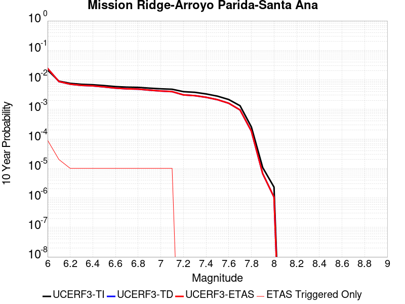 |

| Magnitude | 1 wk TI Prob | 1 wk TD Prob | 1 wk ETAS Prob | 1 wk ETAS/TD Gain | 1 wk ETAS Triggered Only | 1 mo TI Prob | 1 mo TD Prob | 1 mo ETAS Prob | 1 mo ETAS/TD Gain | 1 mo ETAS Triggered Only | 1 yr TI Prob | 1 yr TD Prob | 1 yr ETAS Prob | 1 yr ETAS/TD Gain | 1 yr ETAS Triggered Only | 10 yr TI Prob | 10 yr TD Prob | 10 yr ETAS Prob | 10 yr ETAS/TD Gain | 10 yr ETAS Triggered Only |
|-----|-----|-----|-----|-----|-----|-----|-----|-----|-----|-----|-----|-----|-----|-----|-----|-----|-----|-----|-----|-----|
| 6.0 | 4.169034E-5 | 4.71435E-5 | 4.71435E-5 | 1.0 | 0.0 | 1.7866064E-4 | 2.0203278E-4 | 2.0203278E-4 | 1.0 | 0.0 | 0.0021730233 | 0.0024577067 | 0.0024577067 | 1.0 | 0.0 | 0.021518968 | 0.024387252 | 0.02455575 | 1.0069094 | 1.7271157E-4 |
| 6.1 | 1.73813E-5 | 1.6855427E-5 | 1.6855427E-5 | 1.0 | 0.0 | 7.4489166E-5 | 7.2235605E-5 | 7.2235605E-5 | 1.0 | 0.0 | 9.065282E-4 | 8.791244E-4 | 8.791244E-4 | 1.0 | 0.0 | 0.009028391 | 0.008757609 | 0.008757609 | 1.0 | 0.0 |
| 6.2 | 1.4622182E-5 | 1.3674228E-5 | 1.3674228E-5 | 1.0 | 0.0 | 6.2664985E-5 | 5.8602538E-5 | 5.8602538E-5 | 1.0 | 0.0 | 7.6267915E-4 | 7.1325625E-4 | 7.1325625E-4 | 1.0 | 0.0 | 0.007600669 | 0.0071101133 | 0.0071101133 | 1.0 | 0.0 |
| 6.3 | 1.3552434E-5 | 1.2483067E-5 | 1.2483067E-5 | 1.0 | 0.0 | 5.8080568E-5 | 5.3497777E-5 | 5.3497777E-5 | 1.0 | 0.0 | 7.069015E-4 | 6.5114396E-4 | 6.5114396E-4 | 1.0 | 0.0 | 0.00704657 | 0.0064927237 | 0.0064927237 | 1.0 | 0.0 |
| 6.4 | 1.30977305E-5 | 1.1979993E-5 | 1.1979993E-5 | 1.0 | 0.0 | 5.613192E-5 | 5.1341834E-5 | 5.1341834E-5 | 1.0 | 0.0 | 6.831918E-4 | 6.249106E-4 | 6.249106E-4 | 1.0 | 0.0 | 0.006810953 | 0.0062318784 | 0.0062318784 | 1.0 | 0.0 |
| 6.5 | 1.225205E-5 | 1.104959E-5 | 1.104959E-5 | 1.0 | 0.0 | 5.2507727E-5 | 4.7354544E-5 | 4.7354544E-5 | 1.0 | 0.0 | 6.3909404E-4 | 5.7639176E-4 | 5.7639176E-4 | 1.0 | 0.0 | 0.006372592 | 0.005749278 | 0.005749278 | 1.0 | 0.0 |
| 6.6 | 1.1352241E-5 | 1.0064273E-5 | 1.0064273E-5 | 1.0 | 0.0 | 4.8651553E-5 | 4.3131895E-5 | 4.3131895E-5 | 1.0 | 0.0 | 5.921717E-4 | 5.2500644E-4 | 5.2500644E-4 | 1.0 | 0.0 | 0.0059059616 | 0.005237907 | 0.005237907 | 1.0 | 0.0 |
| 6.7 | 1.0864116E-5 | 9.517729E-6 | 9.517729E-6 | 1.0 | 0.0 | 4.6559664E-5 | 4.0789644E-5 | 4.0789644E-5 | 1.0 | 0.0 | 5.667165E-4 | 4.9650273E-4 | 4.9650273E-4 | 1.0 | 0.0 | 0.005652734 | 0.0049541686 | 0.0049541686 | 1.0 | 0.0 |
| 6.8 | 1.0666365E-5 | 9.30047E-6 | 9.30047E-6 | 1.0 | 0.0 | 4.571219E-5 | 3.9858558E-5 | 3.9858558E-5 | 1.0 | 0.0 | 5.564038E-4 | 4.851719E-4 | 4.851719E-4 | 1.0 | 0.0 | 0.005550127 | 0.004841359 | 0.004841359 | 1.0 | 0.0 |
| 6.9 | 1.0038665E-5 | 8.592689E-6 | 8.592689E-6 | 1.0 | 0.0 | 4.302214E-5 | 3.68253E-5 | 3.68253E-5 | 1.0 | 0.0 | 5.236687E-4 | 4.4825758E-4 | 4.4825758E-4 | 1.0 | 0.0 | 0.005224364 | 0.004473745 | 0.004473745 | 1.0 | 0.0 |
| 7.0 | 9.5379955E-6 | 8.025674E-6 | 8.025674E-6 | 1.0 | 0.0 | 4.0876483E-5 | 3.4395303E-5 | 3.4395303E-5 | 1.0 | 0.0 | 4.975576E-4 | 4.1868407E-4 | 4.1868407E-4 | 1.0 | 0.0 | 0.00496445 | 0.004179152 | 0.004179152 | 1.0 | 0.0 |
| 7.1 | 9.207389E-6 | 7.652948E-6 | 7.652948E-6 | 1.0 | 0.0 | 3.945964E-5 | 3.2797943E-5 | 3.2797943E-5 | 1.0 | 0.0 | 4.803152E-4 | 3.992435E-4 | 3.992435E-4 | 1.0 | 0.0 | 0.004792784 | 0.003985459 | 0.003985459 | 1.0 | 0.0 |
| 7.2 | 7.638091E-6 | 5.9315435E-6 | 5.9315435E-6 | 1.0 | 0.0 | 3.2734264E-5 | 2.5420655E-5 | 2.5420655E-5 | 1.0 | 0.0 | 3.984668E-4 | 3.0945282E-4 | 3.0945282E-4 | 1.0 | 0.0 | 0.0039775306 | 0.0030902762 | 0.0030902762 | 1.0 | 0.0 |
| 7.3 | 7.2500147E-6 | 5.5965506E-6 | 5.5965506E-6 | 1.0 | 0.0 | 3.1071122E-5 | 2.3985E-5 | 2.3985E-5 | 1.0 | 0.0 | 3.7822526E-4 | 2.9197853E-4 | 2.9197853E-4 | 1.0 | 0.0 | 0.0037758215 | 0.0029160045 | 0.0029160045 | 1.0 | 0.0 |
| 7.4 | 6.3899715E-6 | 4.918836E-6 | 4.918836E-6 | 1.0 | 0.0 | 2.7385306E-5 | 2.1080557E-5 | 2.1080557E-5 | 1.0 | 0.0 | 3.3336508E-4 | 2.5662576E-4 | 2.5662576E-4 | 1.0 | 0.0 | 0.0033286542 | 0.0025633385 | 0.0025633385 | 1.0 | 0.0 |
| 7.5 | 5.379025E-6 | 4.0841346E-6 | 4.0841346E-6 | 1.0 | 0.0 | 2.305276E-5 | 1.7503316E-5 | 1.7503316E-5 | 1.0 | 0.0 | 2.806312E-4 | 2.1308215E-4 | 2.1308215E-4 | 1.0 | 0.0 | 0.0028027708 | 0.0021287897 | 0.0021287897 | 1.0 | 0.0 |
| 7.6 | 4.1270696E-6 | 3.0885622E-6 | 3.0885622E-6 | 1.0 | 0.0 | 1.768732E-5 | 1.3236629E-5 | 1.3236629E-5 | 1.0 | 0.0 | 2.1532185E-4 | 1.6114411E-4 | 1.6114411E-4 | 1.0 | 0.0 | 0.0021511333 | 0.0016102807 | 0.0016102807 | 1.0 | 0.0 |
| 7.7 | 2.5406805E-6 | 1.8283382E-6 | 1.8283382E-6 | 1.0 | 0.0 | 1.0888585E-5 | 7.8357125E-6 | 7.8357125E-6 | 1.0 | 0.0 | 1.3256045E-4 | 9.539568E-5 | 9.539568E-5 | 1.0 | 0.0 | 0.0013248142 | 9.535535E-4 | 9.535535E-4 | 1.0 | 0.0 |
| 7.8 | 4.8608285E-7 | 3.5100658E-7 | 3.5100658E-7 | 1.0 | 0.0 | 2.0832106E-6 | 1.504313E-6 | 1.504313E-6 | 1.0 | 0.0 | 2.5362791E-5 | 1.8314859E-5 | 1.8314859E-5 | 1.0 | 0.0 | 2.5359896E-4 | 1.8313361E-4 | 1.8313361E-4 | 1.0 | 0.0 |
| 7.9 | 2.0472514E-8 | 1.2690024E-8 | 1.2690024E-8 | 1.0 | 0.0 | 8.7739345E-8 | 5.438582E-8 | 5.438582E-8 | 1.0 | 0.0 | 1.068226E-6 | 6.621471E-7 | 6.621471E-7 | 1.0 | 0.0 | 1.0682209E-5 | 6.6214525E-6 | 6.6214525E-6 | 1.0 | 0.0 |
| 8.0 | 4.443582E-9 | 2.0326807E-9 | 2.0326807E-9 | 1.0 | 0.0 | 1.9043922E-8 | 8.711488E-9 | 8.711488E-9 | 1.0 | 0.0 | 2.3185973E-7 | 1.06062366E-7 | 1.06062366E-7 | 1.0 | 0.0 | 2.3185949E-6 | 1.0606232E-6 | 1.0606232E-6 | 1.0 | 0.0 |

## Sierra Nevada  (No Extension)
*[(top)](#table-of-contents)*

| 1 Week | 1 Month | 1 Year | 10 Year |
|-----|-----|-----|-----|
|  |  |  |  |

| Magnitude | 1 wk TI Prob | 1 wk TD Prob | 1 wk ETAS Prob | 1 wk ETAS/TD Gain | 1 wk ETAS Triggered Only | 1 mo TI Prob | 1 mo TD Prob | 1 mo ETAS Prob | 1 mo ETAS/TD Gain | 1 mo ETAS Triggered Only | 1 yr TI Prob | 1 yr TD Prob | 1 yr ETAS Prob | 1 yr ETAS/TD Gain | 1 yr ETAS Triggered Only | 10 yr TI Prob | 10 yr TD Prob | 10 yr ETAS Prob | 10 yr ETAS/TD Gain | 10 yr ETAS Triggered Only |
|-----|-----|-----|-----|-----|-----|-----|-----|-----|-----|-----|-----|-----|-----|-----|-----|-----|-----|-----|-----|-----|
| 6.0 | 7.7690465E-6 | 6.976568E-6 | 6.976568E-6 | 1.0 | 0.0 | 3.329549E-5 | 2.9899435E-5 | 2.9899435E-5 | 1.0 | 0.0 | 4.0529718E-4 | 3.6400068E-4 | 3.6400068E-4 | 1.0 | 0.0 | 0.004045588 | 0.0036375606 | 0.0038096441 | 1.0473074 | 1.7271157E-4 |
| 6.1 | 7.7690465E-6 | 6.976568E-6 | 6.976568E-6 | 1.0 | 0.0 | 3.329549E-5 | 2.9899435E-5 | 2.9899435E-5 | 1.0 | 0.0 | 4.0529718E-4 | 3.6400068E-4 | 3.6400068E-4 | 1.0 | 0.0 | 0.004045588 | 0.0036375606 | 0.0038096441 | 1.0473074 | 1.7271157E-4 |
| 6.2 | 7.7690465E-6 | 6.976568E-6 | 6.976568E-6 | 1.0 | 0.0 | 3.329549E-5 | 2.9899435E-5 | 2.9899435E-5 | 1.0 | 0.0 | 4.0529718E-4 | 3.6400068E-4 | 3.6400068E-4 | 1.0 | 0.0 | 0.004045588 | 0.0036375606 | 0.0038096441 | 1.0473074 | 1.7271157E-4 |
| 6.3 | 7.7690465E-6 | 6.976568E-6 | 6.976568E-6 | 1.0 | 0.0 | 3.329549E-5 | 2.9899435E-5 | 2.9899435E-5 | 1.0 | 0.0 | 4.0529718E-4 | 3.6400068E-4 | 3.6400068E-4 | 1.0 | 0.0 | 0.004045588 | 0.0036375606 | 0.0038096441 | 1.0473074 | 1.7271157E-4 |
| 6.4 | 7.7690465E-6 | 6.976568E-6 | 6.976568E-6 | 1.0 | 0.0 | 3.329549E-5 | 2.9899435E-5 | 2.9899435E-5 | 1.0 | 0.0 | 4.0529718E-4 | 3.6400068E-4 | 3.6400068E-4 | 1.0 | 0.0 | 0.004045588 | 0.0036375606 | 0.0038096441 | 1.0473074 | 1.7271157E-4 |
| 6.5 | 7.7690465E-6 | 6.976568E-6 | 6.976568E-6 | 1.0 | 0.0 | 3.329549E-5 | 2.9899435E-5 | 2.9899435E-5 | 1.0 | 0.0 | 4.0529718E-4 | 3.6400068E-4 | 3.6400068E-4 | 1.0 | 0.0 | 0.004045588 | 0.0036375606 | 0.0038096441 | 1.0473074 | 1.7271157E-4 |
| 6.6 | 2.653E-6 | 1.6149635E-6 | 1.6149635E-6 | 1.0 | 0.0 | 1.136995E-5 | 6.9212538E-6 | 6.9212538E-6 | 1.0 | 0.0 | 1.3842035E-4 | 8.426304E-5 | 8.426304E-5 | 1.0 | 0.0 | 0.0013833415 | 8.4231433E-4 | 8.4231433E-4 | 1.0 | 0.0 |
| 6.7 | 2.5902466E-6 | 1.5502959E-6 | 1.5502959E-6 | 1.0 | 0.0 | 1.11010095E-5 | 6.644109E-6 | 6.644109E-6 | 1.0 | 0.0 | 1.351464E-4 | 8.0889055E-5 | 8.0889055E-5 | 1.0 | 0.0 | 0.0013506424 | 8.0859906E-4 | 8.0859906E-4 | 1.0 | 0.0 |
| 6.8 | 2.5853892E-6 | 1.5470957E-6 | 1.5470957E-6 | 1.0 | 0.0 | 1.1080193E-5 | 6.6303933E-6 | 6.6303933E-6 | 1.0 | 0.0 | 1.34893E-4 | 8.072208E-5 | 8.072208E-5 | 1.0 | 0.0 | 0.0013481114 | 8.069306E-4 | 8.069306E-4 | 1.0 | 0.0 |
| 6.9 | 2.458257E-6 | 1.4221675E-6 | 1.4221675E-6 | 1.0 | 0.0 | 1.0535345E-5 | 6.0949897E-6 | 6.0949897E-6 | 1.0 | 0.0 | 1.2826028E-4 | 7.420399E-5 | 7.420399E-5 | 1.0 | 0.0 | 0.0012818627 | 7.4179407E-4 | 7.4179407E-4 | 1.0 | 0.0 |
| 7.0 | 2.4341468E-6 | 1.3991308E-6 | 1.3991308E-6 | 1.0 | 0.0 | 1.0432016E-5 | 5.9962613E-6 | 5.9962613E-6 | 1.0 | 0.0 | 1.270024E-4 | 7.3002055E-5 | 7.3002055E-5 | 1.0 | 0.0 | 0.0012692984 | 7.297827E-4 | 7.297827E-4 | 1.0 | 0.0 |
| 7.1 | 2.3652476E-6 | 1.334079E-6 | 1.334079E-6 | 1.0 | 0.0 | 1.0136736E-5 | 5.717469E-6 | 5.717469E-6 | 1.0 | 0.0 | 1.2340778E-4 | 6.960797E-5 | 6.960797E-5 | 1.0 | 0.0 | 0.0012333926 | 6.9586345E-4 | 6.9586345E-4 | 1.0 | 0.0 |
| 7.2 | 2.272158E-6 | 1.2503832E-6 | 1.2503832E-6 | 1.0 | 0.0 | 9.737784E-6 | 5.358774E-6 | 5.358774E-6 | 1.0 | 0.0 | 1.1855107E-4 | 6.524114E-5 | 6.524114E-5 | 1.0 | 0.0 | 0.0011848784 | 6.522214E-4 | 6.522214E-4 | 1.0 | 0.0 |
| 7.3 | 2.1382127E-6 | 1.1420682E-6 | 1.1420682E-6 | 1.0 | 0.0 | 9.163737E-6 | 4.894569E-6 | 4.894569E-6 | 1.0 | 0.0 | 1.1156279E-4 | 5.9589758E-5 | 5.9589758E-5 | 1.0 | 0.0 | 0.001115068 | 5.95739E-4 | 5.95739E-4 | 1.0 | 0.0 |
| 7.4 | 1.9048055E-6 | 9.57617E-7 | 9.57617E-7 | 1.0 | 0.0 | 8.163426E-6 | 4.104066E-6 | 4.104066E-6 | 1.0 | 0.0 | 9.9385186E-5 | 4.9965867E-5 | 4.9965867E-5 | 1.0 | 0.0 | 9.934074E-4 | 4.99547E-4 | 4.99547E-4 | 1.0 | 0.0 |
| 7.5 | 1.5373403E-6 | 7.560832E-7 | 7.560832E-7 | 1.0 | 0.0 | 6.5885843E-6 | 3.2403525E-6 | 3.2403525E-6 | 1.0 | 0.0 | 8.021306E-5 | 3.9450584E-5 | 3.9450584E-5 | 1.0 | 0.0 | 8.0184115E-4 | 3.9443627E-4 | 3.9443627E-4 | 1.0 | 0.0 |
| 7.6 | 1.0680322E-6 | 4.6602182E-7 | 4.6602182E-7 | 1.0 | 0.0 | 4.577273E-6 | 1.997235E-6 | 1.997235E-6 | 1.0 | 0.0 | 5.5726876E-5 | 2.4316065E-5 | 2.4316065E-5 | 1.0 | 0.0 | 5.5712904E-4 | 2.431343E-4 | 2.431343E-4 | 1.0 | 0.0 |
| 7.7 | 5.509146E-7 | 1.558334E-7 | 1.558334E-7 | 1.0 | 0.0 | 2.3610605E-6 | 6.678573E-7 | 6.678573E-7 | 1.0 | 0.0 | 2.8745531E-5 | 8.131134E-6 | 8.131134E-6 | 1.0 | 0.0 | 2.8741814E-4 | 8.130848E-5 | 8.130848E-5 | 1.0 | 0.0 |

## San Andreas (San Bernardino S)
*[(top)](#table-of-contents)*

| 1 Week | 1 Month | 1 Year | 10 Year |
|-----|-----|-----|-----|
|  |  |  |  |

| Magnitude | 1 wk TI Prob | 1 wk TD Prob | 1 wk ETAS Prob | 1 wk ETAS/TD Gain | 1 wk ETAS Triggered Only | 1 mo TI Prob | 1 mo TD Prob | 1 mo ETAS Prob | 1 mo ETAS/TD Gain | 1 mo ETAS Triggered Only | 1 yr TI Prob | 1 yr TD Prob | 1 yr ETAS Prob | 1 yr ETAS/TD Gain | 1 yr ETAS Triggered Only | 10 yr TI Prob | 10 yr TD Prob | 10 yr ETAS Prob | 10 yr ETAS/TD Gain | 10 yr ETAS Triggered Only |
|-----|-----|-----|-----|-----|-----|-----|-----|-----|-----|-----|-----|-----|-----|-----|-----|-----|-----|-----|-----|-----|
| 6.0 | 1.2336002E-4 | 3.0023555E-4 | 3.0023555E-4 | 1.0 | 0.0 | 5.2857865E-4 | 0.0012861154 | 0.0012861154 | 1.0 | 0.0 | 0.006416472 | 0.015550992 | 0.015550992 | 1.0 | 0.0 | 0.06234337 | 0.14291383 | 0.14306186 | 1.0010358 | 1.7271157E-4 |
| 6.1 | 1.2336002E-4 | 3.0023555E-4 | 3.0023555E-4 | 1.0 | 0.0 | 5.2857865E-4 | 0.0012861154 | 0.0012861154 | 1.0 | 0.0 | 0.006416472 | 0.015550992 | 0.015550992 | 1.0 | 0.0 | 0.06234337 | 0.14291383 | 0.14306186 | 1.0010358 | 1.7271157E-4 |
| 6.2 | 1.2336002E-4 | 3.0023555E-4 | 3.0023555E-4 | 1.0 | 0.0 | 5.2857865E-4 | 0.0012861154 | 0.0012861154 | 1.0 | 0.0 | 0.006416472 | 0.015550992 | 0.015550992 | 1.0 | 0.0 | 0.06234337 | 0.14291383 | 0.14306186 | 1.0010358 | 1.7271157E-4 |
| 6.3 | 1.1712257E-4 | 2.8811657E-4 | 2.8811657E-4 | 1.0 | 0.0 | 5.018573E-4 | 0.0012342266 | 0.0012342266 | 1.0 | 0.0 | 0.006093008 | 0.0149280215 | 0.0149280215 | 1.0 | 0.0 | 0.059286322 | 0.13762207 | 0.13777101 | 1.0010823 | 1.7271157E-4 |
| 6.4 | 1.1712257E-4 | 2.8811657E-4 | 2.8811657E-4 | 1.0 | 0.0 | 5.018573E-4 | 0.0012342266 | 0.0012342266 | 1.0 | 0.0 | 0.006093008 | 0.0149280215 | 0.0149280215 | 1.0 | 0.0 | 0.059286322 | 0.13762207 | 0.13777101 | 1.0010823 | 1.7271157E-4 |
| 6.5 | 1.0689076E-4 | 2.682418E-4 | 2.682418E-4 | 1.0 | 0.0 | 4.5802278E-4 | 0.001149126 | 0.001149126 | 1.0 | 0.0 | 0.0055621783 | 0.013905481 | 0.013905481 | 1.0 | 0.0 | 0.05425003 | 0.12886871 | 0.12901917 | 1.0011675 | 1.7271157E-4 |
| 6.6 | 9.7648895E-5 | 2.506867E-4 | 2.506867E-4 | 1.0 | 0.0 | 4.1842813E-4 | 0.0010739529 | 0.0010739529 | 1.0 | 0.0 | 0.005082469 | 0.0130013535 | 0.0130013535 | 1.0 | 0.0 | 0.049677886 | 0.12102797 | 0.121179774 | 1.0012543 | 1.7271157E-4 |
| 6.7 | 8.757013E-5 | 2.3139146E-4 | 2.3139146E-4 | 1.0 | 0.0 | 3.7524657E-4 | 9.913231E-4 | 9.913231E-4 | 1.0 | 0.0 | 0.00455906 | 0.012006655 | 0.012006655 | 1.0 | 0.0 | 0.04466656 | 0.112335846 | 0.11248915 | 1.0013647 | 1.7271157E-4 |
| 6.8 | 8.562978E-5 | 2.2698891E-4 | 2.2698891E-4 | 1.0 | 0.0 | 3.6693315E-4 | 9.7246916E-4 | 9.7246916E-4 | 1.0 | 0.0 | 0.004458263 | 0.011779605 | 0.011779605 | 1.0 | 0.0 | 0.043698758 | 0.11034572 | 0.110499375 | 1.0013925 | 1.7271157E-4 |
| 6.9 | 6.124075E-5 | 1.7082063E-4 | 1.7082063E-4 | 1.0 | 0.0 | 2.6243398E-4 | 7.318838E-4 | 7.318838E-4 | 1.0 | 0.0 | 0.0031904527 | 0.008874487 | 0.008874487 | 1.0 | 0.0 | 0.031450346 | 0.08425208 | 0.08441024 | 1.0018772 | 1.7271157E-4 |
| 7.0 | 5.8598747E-5 | 1.6510907E-4 | 1.6510907E-4 | 1.0 | 0.0 | 2.5111332E-4 | 7.0741924E-4 | 7.0741924E-4 | 1.0 | 0.0 | 0.0030530186 | 0.008579012 | 0.008579012 | 1.0 | 0.0 | 0.03011414 | 0.08156926 | 0.081727885 | 1.0019447 | 1.7271157E-4 |
| 7.1 | 5.613814E-5 | 1.5929298E-4 | 1.5929298E-4 | 1.0 | 0.0 | 2.4056983E-4 | 6.825063E-4 | 6.825063E-4 | 1.0 | 0.0 | 0.0029250039 | 0.0082780365 | 0.0082780365 | 1.0 | 0.0 | 0.028868021 | 0.078867756 | 0.07902685 | 1.0020171 | 1.7271157E-4 |
| 7.2 | 4.991222E-5 | 1.4535384E-4 | 1.4535384E-4 | 1.0 | 0.0 | 2.1389198E-4 | 6.227967E-4 | 6.227967E-4 | 1.0 | 0.0 | 0.002601025 | 0.0075562913 | 0.0075562913 | 1.0 | 0.0 | 0.025707912 | 0.072320335 | 0.07248055 | 1.0022154 | 1.7271157E-4 |
| 7.3 | 4.7410045E-5 | 1.3729246E-4 | 1.3729246E-4 | 1.0 | 0.0 | 2.0317009E-4 | 5.882639E-4 | 5.882639E-4 | 1.0 | 0.0 | 0.0024707897 | 0.0071386793 | 0.0071386793 | 1.0 | 0.0 | 0.024434982 | 0.06860168 | 0.06876255 | 1.0023448 | 1.7271157E-4 |
| 7.4 | 4.5556746E-5 | 1.313689E-4 | 1.313689E-4 | 1.0 | 0.0 | 1.952286E-4 | 5.628884E-4 | 5.628884E-4 | 1.0 | 0.0 | 0.002374317 | 0.006831711 | 0.006831711 | 1.0 | 0.0 | 0.023491086 | 0.06585319 | 0.06601453 | 1.00245 | 1.7271157E-4 |
| 7.5 | 4.3084514E-5 | 1.2371907E-4 | 1.2371907E-4 | 1.0 | 0.0 | 1.8463485E-4 | 5.3011713E-4 | 5.3011713E-4 | 1.0 | 0.0 | 0.0022456115 | 0.0064351484 | 0.0064351484 | 1.0 | 0.0 | 0.022230545 | 0.062252887 | 0.062414847 | 1.0026016 | 1.7271157E-4 |
| 7.6 | 3.408608E-5 | 9.8489814E-5 | 9.8489814E-5 | 1.0 | 0.0 | 1.4607502E-4 | 4.2203104E-4 | 4.2203104E-4 | 1.0 | 0.0 | 0.0017770125 | 0.005126148 | 0.005126148 | 1.0 | 0.0 | 0.017628696 | 0.050079897 | 0.05024396 | 1.003276 | 1.7271157E-4 |
| 7.7 | 2.8315713E-5 | 8.261325E-5 | 8.261325E-5 | 1.0 | 0.0 | 1.2134742E-4 | 3.5400878E-4 | 3.5400878E-4 | 1.0 | 0.0 | 0.0014764034 | 0.004301548 | 0.004301548 | 1.0 | 0.0 | 0.01466633 | 0.042327844 | 0.042493243 | 1.0039076 | 1.7271157E-4 |
| 7.8 | 2.6222975E-5 | 7.4749165E-5 | 7.4749165E-5 | 1.0 | 0.0 | 1.1237934E-4 | 3.2031426E-4 | 3.2031426E-4 | 1.0 | 0.0 | 0.0013673597 | 0.0038928585 | 0.0038928585 | 1.0 | 0.0 | 0.013589768 | 0.038489804 | 0.03865587 | 1.0043145 | 1.7271157E-4 |
| 7.9 | 2.1469694E-5 | 5.7977377E-5 | 5.7977377E-5 | 1.0 | 0.0 | 9.200973E-5 | 2.4845081E-4 | 2.4845081E-4 | 1.0 | 0.0 | 0.0011196428 | 0.003020696 | 0.003020696 | 1.0 | 0.0 | 0.011140184 | 0.030197 | 0.030364497 | 1.0055468 | 1.7271157E-4 |
| 8.0 | 1.2420249E-5 | 3.1373827E-5 | 3.1373827E-5 | 1.0 | 0.0 | 5.322855E-5 | 1.3445233E-4 | 1.3445233E-4 | 1.0 | 0.0 | 6.478649E-4 | 0.001635729 | 0.001635729 | 1.0 | 0.0 | 0.0064597935 | 0.016548108 | 0.016548108 | 1.0 | 0.0 |
| 8.1 | 4.9197724E-6 | 7.842378E-6 | 7.842378E-6 | 1.0 | 0.0 | 2.1084568E-5 | 3.360976E-5 | 3.360976E-5 | 1.0 | 0.0 | 2.566744E-4 | 4.0912212E-4 | 4.0912212E-4 | 1.0 | 0.0 | 0.002563781 | 0.004394436 | 0.004394436 | 1.0 | 0.0 |
| 8.2 | 2.5634774E-6 | 2.9160003E-6 | 2.9160003E-6 | 1.0 | 0.0 | 1.0986286E-5 | 1.2497085E-5 | 1.2497085E-5 | 1.0 | 0.0 | 1.3374983E-4 | 1.5214144E-4 | 1.5214144E-4 | 1.0 | 0.0 | 0.0013366934 | 0.0017098442 | 0.0017098442 | 1.0 | 0.0 |
| 8.3 | 5.2850464E-7 | 3.2211614E-7 | 3.2211614E-7 | 1.0 | 0.0 | 2.2650179E-6 | 1.380497E-6 | 1.380497E-6 | 1.0 | 0.0 | 2.7576245E-5 | 1.6807435E-5 | 1.6807435E-5 | 1.0 | 0.0 | 2.7572823E-4 | 1.9939634E-4 | 1.9939634E-4 | 1.0 | 0.0 |

## Cleghorn
*[(top)](#table-of-contents)*

| 1 Week | 1 Month | 1 Year | 10 Year |
|-----|-----|-----|-----|
|  |  |  |  |

| Magnitude | 1 wk TI Prob | 1 wk TD Prob | 1 wk ETAS Prob | 1 wk ETAS/TD Gain | 1 wk ETAS Triggered Only | 1 mo TI Prob | 1 mo TD Prob | 1 mo ETAS Prob | 1 mo ETAS/TD Gain | 1 mo ETAS Triggered Only | 1 yr TI Prob | 1 yr TD Prob | 1 yr ETAS Prob | 1 yr ETAS/TD Gain | 1 yr ETAS Triggered Only | 10 yr TI Prob | 10 yr TD Prob | 10 yr ETAS Prob | 10 yr ETAS/TD Gain | 10 yr ETAS Triggered Only |
|-----|-----|-----|-----|-----|-----|-----|-----|-----|-----|-----|-----|-----|-----|-----|-----|-----|-----|-----|-----|-----|
| 6.0 | 7.9267165E-6 | 9.838367E-6 | 9.838367E-6 | 1.0 | 0.0 | 3.39712E-5 | 4.216381E-5 | 4.216381E-5 | 1.0 | 0.0 | 4.1352084E-4 | 5.1323406E-4 | 6.85857E-4 | 1.3363434 | 1.7271157E-4 | 0.004127522 | 0.005135526 | 0.0053073503 | 1.033458 | 1.7271157E-4 |
| 6.1 | 7.9267165E-6 | 9.838367E-6 | 9.838367E-6 | 1.0 | 0.0 | 3.39712E-5 | 4.216381E-5 | 4.216381E-5 | 1.0 | 0.0 | 4.1352084E-4 | 5.1323406E-4 | 6.85857E-4 | 1.3363434 | 1.7271157E-4 | 0.004127522 | 0.005135526 | 0.0053073503 | 1.033458 | 1.7271157E-4 |
| 6.2 | 7.9267165E-6 | 9.838367E-6 | 9.838367E-6 | 1.0 | 0.0 | 3.39712E-5 | 4.216381E-5 | 4.216381E-5 | 1.0 | 0.0 | 4.1352084E-4 | 5.1323406E-4 | 6.85857E-4 | 1.3363434 | 1.7271157E-4 | 0.004127522 | 0.005135526 | 0.0053073503 | 1.033458 | 1.7271157E-4 |
| 6.3 | 7.9267165E-6 | 9.838367E-6 | 9.838367E-6 | 1.0 | 0.0 | 3.39712E-5 | 4.216381E-5 | 4.216381E-5 | 1.0 | 0.0 | 4.1352084E-4 | 5.1323406E-4 | 6.85857E-4 | 1.3363434 | 1.7271157E-4 | 0.004127522 | 0.005135526 | 0.0053073503 | 1.033458 | 1.7271157E-4 |
| 6.4 | 4.3445207E-6 | 6.0981406E-6 | 6.0981406E-6 | 1.0 | 0.0 | 1.8619241E-5 | 2.6134632E-5 | 2.6134632E-5 | 1.0 | 0.0 | 2.2666567E-4 | 3.181437E-4 | 4.908003E-4 | 1.5427002 | 1.7271157E-4 | 0.0022643462 | 0.003190997 | 0.0033631574 | 1.053952 | 1.7271157E-4 |
| 6.5 | 4.3445207E-6 | 6.0981406E-6 | 6.0981406E-6 | 1.0 | 0.0 | 1.8619241E-5 | 2.6134632E-5 | 2.6134632E-5 | 1.0 | 0.0 | 2.2666567E-4 | 3.181437E-4 | 4.908003E-4 | 1.5427002 | 1.7271157E-4 | 0.0022643462 | 0.003190997 | 0.0033631574 | 1.053952 | 1.7271157E-4 |
| 6.6 | 4.040109E-6 | 5.780541E-6 | 5.780541E-6 | 1.0 | 0.0 | 1.7314638E-5 | 2.4773517E-5 | 2.4773517E-5 | 1.0 | 0.0 | 2.1078532E-4 | 3.0157674E-4 | 4.7423624E-4 | 1.5725225 | 1.7271157E-4 | 0.002105855 | 0.0030257835 | 0.0031979724 | 1.0569073 | 1.7271157E-4 |
| 6.7 | 3.3632055E-6 | 5.074022E-6 | 5.074022E-6 | 1.0 | 0.0 | 1.4413658E-5 | 2.1745627E-5 | 2.1745627E-5 | 1.0 | 0.0 | 1.7547216E-4 | 2.6472117E-4 | 4.3738703E-4 | 1.6522555 | 1.7271157E-4 | 0.0017533366 | 0.0026581106 | 0.002830363 | 1.0648026 | 1.7271157E-4 |
| 6.8 | 3.2902772E-6 | 4.9959262E-6 | 4.9959262E-6 | 1.0 | 0.0 | 1.4101111E-5 | 2.1410939E-5 | 2.1410939E-5 | 1.0 | 0.0 | 1.716675E-4 | 2.606473E-4 | 4.3331386E-4 | 1.6624528 | 1.7271157E-4 | 0.0017153495 | 0.0026174681 | 0.0027897276 | 1.0658115 | 1.7271157E-4 |
| 6.9 | 3.031547E-6 | 4.6974637E-6 | 4.6974637E-6 | 1.0 | 0.0 | 1.299228E-5 | 2.0131833E-5 | 2.0131833E-5 | 1.0 | 0.0 | 1.5816953E-4 | 2.4507777E-4 | 4.17747E-4 | 1.7045488 | 1.7271157E-4 | 0.00158057 | 0.002462125 | 0.0026344112 | 1.0699747 | 1.7271157E-4 |
| 7.0 | 2.8259715E-6 | 4.3764653E-6 | 4.3764653E-6 | 1.0 | 0.0 | 1.211125E-5 | 1.8756145E-5 | 1.8756145E-5 | 1.0 | 0.0 | 1.4744449E-4 | 2.2833238E-4 | 4.010045E-4 | 1.7562314 | 1.7271157E-4 | 0.001473467 | 0.0022950263 | 0.0024673415 | 1.0750821 | 1.7271157E-4 |
| 7.1 | 2.5962665E-6 | 4.071453E-6 | 4.071453E-6 | 1.0 | 0.0 | 1.1126809E-5 | 1.7448969E-5 | 1.7448969E-5 | 1.0 | 0.0 | 1.3546048E-4 | 2.124207E-4 | 3.850956E-4 | 1.812891 | 1.7271157E-4 | 0.0013537793 | 0.0021362302 | 0.0023085729 | 1.0806761 | 1.7271157E-4 |
| 7.2 | 2.3247253E-6 | 3.6817423E-6 | 3.6817423E-6 | 1.0 | 0.0 | 9.96307E-6 | 1.5778802E-5 | 1.5778802E-5 | 1.0 | 0.0 | 1.21293626E-4 | 1.9209016E-4 | 3.6476855E-4 | 1.8989445 | 1.7271157E-4 | 0.0012122744 | 0.0019333162 | 0.0021056938 | 1.0891616 | 1.7271157E-4 |
| 7.3 | 2.056928E-6 | 3.2399425E-6 | 3.2399425E-6 | 1.0 | 0.0 | 8.815376E-6 | 1.3885395E-5 | 1.3885395E-5 | 1.0 | 0.0 | 1.0732192E-4 | 1.6904173E-4 | 3.417241E-4 | 2.021537 | 1.7271157E-4 | 0.001072701 | 0.0017032728 | 0.0018756903 | 1.1012272 | 1.7271157E-4 |
| 7.4 | 1.8055999E-6 | 2.8298966E-6 | 2.8298966E-6 | 1.0 | 0.0 | 7.738263E-6 | 1.2128073E-5 | 1.2128073E-5 | 1.0 | 0.0 | 9.4209274E-5 | 1.4764942E-4 | 3.203355E-4 | 2.1695683 | 1.7271157E-4 | 9.4169343E-4 | 0.0014897923 | 0.0016622465 | 1.1157572 | 1.7271157E-4 |
| 7.5 | 1.4683443E-6 | 2.4289393E-6 | 2.4289393E-6 | 1.0 | 0.0 | 6.292889E-6 | 1.0409699E-5 | 1.0409699E-5 | 1.0 | 0.0 | 7.661323E-5 | 1.2673081E-4 | 2.994205E-4 | 2.3626497 | 1.7271157E-4 | 7.658682E-4 | 0.0012809072 | 0.0014533976 | 1.1346626 | 1.7271157E-4 |
| 7.6 | 9.804088E-7 | 1.9043657E-6 | 1.9043657E-6 | 1.0 | 0.0 | 4.201745E-6 | 8.161543E-6 | 8.161543E-6 | 1.0 | 0.0 | 5.1155046E-5 | 9.9362296E-5 | 2.720567E-4 | 2.7380276 | 1.7271157E-4 | 5.114327E-4 | 0.0010075356 | 0.0011800731 | 1.1712471 | 1.7271157E-4 |
| 7.7 | 7.3434086E-7 | 1.6324341E-6 | 1.6324341E-6 | 1.0 | 0.0 | 3.1471714E-6 | 6.9961275E-6 | 6.9961275E-6 | 1.0 | 0.0 | 3.831614E-5 | 8.517455E-5 | 2.578714E-4 | 3.0275643 | 1.7271157E-4 | 3.8309532E-4 | 8.6581067E-4 | 0.0010383726 | 1.1993068 | 1.7271157E-4 |
| 7.8 | 6.434184E-7 | 1.5257981E-6 | 1.5257981E-6 | 1.0 | 0.0 | 2.7575045E-6 | 6.5391187E-6 | 6.5391187E-6 | 1.0 | 0.0 | 3.35721E-5 | 7.961089E-5 | 2.523087E-4 | 3.169274 | 1.7271157E-4 | 3.3567028E-4 | 8.098763E-4 | 9.82448E-4 | 1.213084 | 1.7271157E-4 |
| 7.9 | 3.4943926E-7 | 7.594313E-7 | 7.594313E-7 | 1.0 | 0.0 | 1.497596E-6 | 3.2547016E-6 | 3.2547016E-6 | 1.0 | 0.0 | 1.8233079E-5 | 3.962528E-5 | 2.1233001E-4 | 5.358448 | 1.7271157E-4 | 1.8231584E-4 | 4.050159E-4 | 5.776575E-4 | 1.4262589 | 1.7271157E-4 |
| 8.0 | 6.717524E-8 | 5.8598772E-8 | 5.8598772E-8 | 1.0 | 0.0 | 2.8789387E-7 | 2.5113755E-7 | 2.5113755E-7 | 1.0 | 0.0 | 3.505102E-6 | 3.0575957E-6 | 3.0575957E-6 | 1.0 | 0.0 | 3.5050467E-5 | 3.28481E-5 | 3.28481E-5 | 1.0 | 0.0 |
| 8.1 | 3.1984914E-8 | 1.3024658E-8 | 1.3024658E-8 | 1.0 | 0.0 | 1.370782E-7 | 5.5819964E-8 | 5.5819964E-8 | 1.0 | 0.0 | 1.6689258E-6 | 6.7960787E-7 | 6.7960787E-7 | 1.0 | 0.0 | 1.6689133E-5 | 7.7832365E-6 | 7.7832365E-6 | 1.0 | 0.0 |
| 8.2 | 1.21887656E-8 | 3.6706735E-9 | 3.6706735E-9 | 1.0 | 0.0 | 5.2237567E-8 | 1.5731459E-8 | 1.5731459E-8 | 1.0 | 0.0 | 6.359922E-7 | 1.9153049E-7 | 1.9153049E-7 | 1.0 | 0.0 | 6.3599036E-6 | 2.2593056E-6 | 2.2593056E-6 | 1.0 | 0.0 |

