# Parent Section Magnitude-Probability Distributions

Only fault sections with at least one triggered aftershock are plotted. Sections are sorted by total supraseismogenic trigger rate (decreasing)

## Table Of Contents

* [Garlock (Central)](#garlock-central)
* [Tank Canyon](#tank-canyon)
* [Little Lake](#little-lake)
* [Airport Lake](#airport-lake)
* [Owl Lake](#owl-lake)
* [Panamint Valley](#panamint-valley)
* [Garlock (East)](#garlock-east)
* [Ash Hill](#ash-hill)
* [Hunter Mountain-Saline Valley](#hunter-mountain-saline-valley)
* [Blackwater](#blackwater)
* [Garlock (West)](#garlock-west)
* [McLean Lake](#mclean-lake)
* [Gravel Hills-Harper Lk](#gravel-hills-harper-lk)
* [Goldstone Lake](#goldstone-lake)
* [San Andreas (Mojave S)](#san-andreas-mojave-s)
* [San Andreas (Mojave N)](#san-andreas-mojave-n)
* [So Sierra Nevada](#so-sierra-nevada)
* [Death Valley (So)](#death-valley-so)
* [Coyote Canyon](#coyote-canyon)
* [Nelson Lake](#nelson-lake)
* [Lenwood-Lockhart-Old Woman Springs](#lenwood-lockhart-old-woman-springs)
* [Towne Pass](#towne-pass)
* [San Andreas (San Bernardino N)](#san-andreas-san-bernardino-n)
* [Paradise](#paradise)
* [Bicycle Lake](#bicycle-lake)
* [San Andreas (San Bernardino S)](#san-andreas-san-bernardino-s)
* [Garlic Springs](#garlic-springs)
* [San Andreas (Big Bend)](#san-andreas-big-bend)
* [Death Valley (Black Mtns Frontal)](#death-valley-black-mtns-frontal)
* [Coyote Lake](#coyote-lake)
* [Helendale-So Lockhart](#helendale-so-lockhart)
* [Death Valley (No)](#death-valley-no)
* [San Andreas (San Gorgonio Pass-Garnet HIll)](#san-andreas-san-gorgonio-pass-garnet-hill)
* [San Andreas (North Branch Mill Creek)](#san-andreas-north-branch-mill-creek)
* [Elsinore (Glen Ivy) rev](#elsinore-glen-ivy-rev)
* [San Andreas (Parkfield)](#san-andreas-parkfield)
* [San Andreas (Coachella) rev](#san-andreas-coachella-rev)
* [San Andreas (Carrizo) rev](#san-andreas-carrizo-rev)
* [Death Valley (Fish Lake Valley)](#death-valley-fish-lake-valley)
* [San Andreas (Cholame) rev](#san-andreas-cholame-rev)
* [Cady](#cady)
* [Red Pass](#red-pass)
* [Sierra Nevada  (No Extension)](#sierra-nevada--no-extension)
* [Mission Ridge-Arroyo Parida-Santa Ana](#mission-ridge-arroyo-parida-santa-ana)
* [Santa Ynez (East)](#santa-ynez-east)
* [San Andreas (Creeping Section) 2011 CFM](#san-andreas-creeping-section-2011-cfm)
* [Mission Creek](#mission-creek)
* [San Jacinto (San Bernardino)](#san-jacinto-san-bernardino)
* [Lake Isabella (Seismicity)](#lake-isabella-seismicity)
* [Ludlow](#ludlow)
* [Pinto Mtn](#pinto-mtn)
* [Manix-Afton Hills](#manix-afton-hills)
* [Owens Valley](#owens-valley)
* [Chino alt 1](#chino-alt-1)
* [Big Pine (East)](#big-pine-east)
* [Cleghorn Pass](#cleghorn-pass)
* [Ortigalita (North)](#ortigalita-north)
* [Santa Ynez (West)](#santa-ynez-west)
* [Elysian Park (Upper)](#elysian-park-upper)
* [Pine Mtn](#pine-mtn)
* [Calico-Hidalgo](#calico-hidalgo)
* [Pisgah-Bullion Mtn-Mesquite Lk](#pisgah-bullion-mtn-mesquite-lk)
* [Cleghorn Lake](#cleghorn-lake)
* [White Mountains](#white-mountains)
* [San Jacinto (San Jacinto Valley) rev](#san-jacinto-san-jacinto-valley-rev)
* [Scodie Lineament](#scodie-lineament)
* [Monte Vista - Shannon 2011 CFM](#monte-vista---shannon-2011-cfm)
* [Cleghorn](#cleghorn)
* [Big Pine (Central)](#big-pine-central)
* [San Cayetano](#san-cayetano)
* [Raymond](#raymond)
* [Kern Canyon (North Kern) 2011](#kern-canyon-north-kern-2011)
* [Elsinore (Stepovers Combined)](#elsinore-stepovers-combined)
* [Camp Rock 2011](#camp-rock-2011)
* [Oceanic - West Huasna](#oceanic---west-huasna)
* [Calaveras (Central) 2011 CFM](#calaveras-central-2011-cfm)
* [Baker](#baker)
* [San Juan](#san-juan)
* [Elsinore (Temecula) rev](#elsinore-temecula-rev)
* [Homestead Valley 2011](#homestead-valley-2011)
* [Santa Cruz Island](#santa-cruz-island)
* [San Jacinto (Stepovers Combined)](#san-jacinto-stepovers-combined)
* [Santa Rosa Island](#santa-rosa-island)
* [Channel Islands Thrust](#channel-islands-thrust)
* [San Clemente](#san-clemente)
* [Great Valley 09 (Laguna Seca)](#great-valley-09-laguna-seca)
* [Lost Hills](#lost-hills)
* [Newport-Inglewood alt 1](#newport-inglewood-alt-1)
* [Kern Canyon (Lake Isabella) 2011](#kern-canyon-lake-isabella-2011)
* [Independence rev 2011](#independence-rev-2011)
* [Kern Canyon (South Kern) 2011](#kern-canyon-south-kern-2011)
* [White Wolf (Extension)](#white-wolf-extension)
* [Whittier alt 1](#whittier-alt-1)
* [Monterey Bay-Tularcitos](#monterey-bay-tularcitos)
* [Walker Spring 2011 CFM](#walker-spring-2011-cfm)
* [San Diego Trough south](#san-diego-trough-south)
* [Tin Mountain](#tin-mountain)
* [Emerson-Copper Mtn 2011](#emerson-copper-mtn-2011)
* [Oceanside alt1](#oceanside-alt1)
* [North Tahoe 2011 CFM](#north-tahoe-2011-cfm)
* [Santa Cruz Catalina Ridge alt1](#santa-cruz-catalina-ridge-alt1)
* [Cerro Prieto](#cerro-prieto)
* [Johnson Valley (No) 2011 rev](#johnson-valley-no-2011-rev)
* [Palos Verdes](#palos-verdes)
* [Cucamonga](#cucamonga)
* [San Jacinto (Lytle Creek connector)](#san-jacinto-lytle-creek-connector)
* [San Gabriel](#san-gabriel)
* [Verdugo](#verdugo)
* [Hayward (So) 2011 CFM](#hayward-so-2011-cfm)
* [San Jacinto (Anza) rev](#san-jacinto-anza-rev)
* [Cedar Mtn-Mahogany Mtn](#cedar-mtn-mahogany-mtn)
* [Robinson Creek](#robinson-creek)
* [Deep Springs](#deep-springs)
* [Rose Canyon](#rose-canyon)
* [Red Mountain](#red-mountain)
* [Coronado Bank alt1](#coronado-bank-alt1)
* [Santa Ynez River](#santa-ynez-river)
* [Calaveras (So) - Paicines extension 2011 CFM](#calaveras-so---paicines-extension-2011-cfm)
* [Del Valle](#del-valle)
* [Elsinore (Julian)](#elsinore-julian)
* [North Frontal  (East)](#north-frontal--east)
* [Hosgri](#hosgri)
* [San Diego Trough north alt1](#san-diego-trough-north-alt1)
* [Bullion Mountains](#bullion-mountains)
* [Great Valley 03a Dunnigan Hills](#great-valley-03a-dunnigan-hills)
* [Calaveras (So) 2011 CFM](#calaveras-so-2011-cfm)
* [Great Valley 07 (Orestimba)](#great-valley-07-orestimba)
* [San Joaquin Hills](#san-joaquin-hills)
* [San Gabriel (Extension)](#san-gabriel-extension)
* [Northridge](#northridge)
* [Dry Mountain](#dry-mountain)
* [Imperial](#imperial)
* [Hosgri (Extension)](#hosgri-extension)
* [Brawley (Seismic Zone) alt 1](#brawley-seismic-zone-alt-1)
* [Blue Cut](#blue-cut)
* [Likely 2011 CFM](#likely-2011-cfm)
* [Big Lagoon - Bald Mtn 2011 CFM](#big-lagoon---bald-mtn-2011-cfm)
* [Los Osos 2011](#los-osos-2011)

## Garlock (Central)
*[(top)](#table-of-contents)*

| 1 Week | 1 Month | 1 Year | 10 Year |
|-----|-----|-----|-----|
|  |  |  |  |

| Magnitude | 1 wk TI Prob | 1 wk TD Prob | 1 wk ETAS Prob | 1 wk ETAS/TD Gain | 1 wk ETAS Triggered Only | 1 mo TI Prob | 1 mo TD Prob | 1 mo ETAS Prob | 1 mo ETAS/TD Gain | 1 mo ETAS Triggered Only | 1 yr TI Prob | 1 yr TD Prob | 1 yr ETAS Prob | 1 yr ETAS/TD Gain | 1 yr ETAS Triggered Only | 10 yr TI Prob | 10 yr TD Prob | 10 yr ETAS Prob | 10 yr ETAS/TD Gain | 10 yr ETAS Triggered Only |
|-----|-----|-----|-----|-----|-----|-----|-----|-----|-----|-----|-----|-----|-----|-----|-----|-----|-----|-----|-----|-----|
| 6.0 | 5.5131142E-5 | 7.030346E-5 | 0.001171309 | 16.66076 | 0.001101083 | 2.3625491E-4 | 3.0126612E-4 | 0.0045238202 | 15.016027 | 0.004223827 | 0.0028726095 | 0.0036618116 | 0.024523767 | 6.697168 | 0.020938627 | 0.028357591 | 0.036108248 | 0.07965736 | 2.2060711 | 0.045180507 |
| 6.1 | 5.5131142E-5 | 7.030346E-5 | 0.001171309 | 16.66076 | 0.001101083 | 2.3625491E-4 | 3.0126612E-4 | 0.0045238202 | 15.016027 | 0.004223827 | 0.0028726095 | 0.0036618116 | 0.024523767 | 6.697168 | 0.020938627 | 0.028357591 | 0.036108248 | 0.07965736 | 2.2060711 | 0.045180507 |
| 6.2 | 4.216245E-5 | 5.171291E-5 | 7.195484E-4 | 13.91429 | 6.6787004E-4 | 1.806837E-4 | 2.216081E-4 | 0.0028564031 | 12.889435 | 0.002635379 | 0.0021976046 | 0.002694772 | 0.015314103 | 5.6828938 | 0.01265343 | 0.021759989 | 0.026715888 | 0.053876486 | 2.016646 | 0.027906137 |
| 6.3 | 4.216245E-5 | 5.171291E-5 | 7.195484E-4 | 13.91429 | 6.6787004E-4 | 1.806837E-4 | 2.216081E-4 | 0.0028564031 | 12.889435 | 0.002635379 | 0.0021976046 | 0.002694772 | 0.015314103 | 5.6828938 | 0.01265343 | 0.021759989 | 0.026715888 | 0.053876486 | 2.016646 | 0.027906137 |
| 6.4 | 3.6858168E-5 | 4.4159933E-5 | 5.8565225E-4 | 13.2620735 | 5.4151623E-4 | 1.5795401E-4 | 1.8924326E-4 | 0.0022466155 | 11.871574 | 0.0020577617 | 0.0019213937 | 0.0023016273 | 0.012188566 | 5.2956295 | 0.009909747 | 0.019048655 | 0.022874098 | 0.04449786 | 1.9453382 | 0.022129964 |
| 6.5 | 3.39199E-5 | 4.0066592E-5 | 5.6351133E-4 | 14.064368 | 5.234657E-4 | 1.453629E-4 | 1.7170279E-4 | 0.0020666842 | 12.036405 | 0.0018953069 | 0.0017683565 | 0.002088499 | 0.010932805 | 5.2347665 | 0.008862816 | 0.017543508 | 0.020784631 | 0.040227536 | 1.9354461 | 0.019855596 |
| 6.6 | 3.3571985E-5 | 3.9520663E-5 | 5.629657E-4 | 14.244844 | 5.234657E-4 | 1.4387199E-4 | 1.693634E-4 | 0.0020643494 | 12.188875 | 0.0018953069 | 0.0017502342 | 0.0020600709 | 0.010868602 | 5.275839 | 0.008826715 | 0.017365133 | 0.020505892 | 0.03990129 | 1.9458451 | 0.019801443 |
| 6.7 | 3.2580007E-5 | 3.8136786E-5 | 5.4353266E-4 | 14.252189 | 5.0541514E-4 | 1.3962112E-4 | 1.6343324E-4 | 0.0019320972 | 11.821935 | 0.001768953 | 0.0016985617 | 0.0019880054 | 0.010418865 | 5.240864 | 0.008447654 | 0.016856372 | 0.019798387 | 0.038305443 | 1.934776 | 0.018880866 |
| 6.8 | 3.2185937E-5 | 3.756383E-5 | 5.4296E-4 | 14.45433 | 5.0541514E-4 | 1.3793244E-4 | 1.6097803E-4 | 0.0018755035 | 11.65068 | 0.0017148014 | 0.0016780337 | 0.0019581672 | 0.010209126 | 5.2136135 | 0.008267148 | 0.016654192 | 0.019505108 | 0.03768143 | 1.931875 | 0.018537907 |
| 6.9 | 3.165394E-5 | 3.6768135E-5 | 5.241148E-4 | 14.254595 | 4.8736462E-4 | 1.3565269E-4 | 1.5756831E-4 | 0.0018179565 | 11.537576 | 0.0016606498 | 0.0016503202 | 0.0019167277 | 0.009969855 | 5.2014976 | 0.008068592 | 0.01638118 | 0.019097608 | 0.03682113 | 1.9280496 | 0.018068591 |
| 7.0 | 3.0903822E-5 | 3.567306E-5 | 5.049704E-4 | 14.155512 | 4.6931408E-4 | 1.3243823E-4 | 1.528757E-4 | 0.0017952239 | 11.74303 | 0.0016425992 | 0.0016112428 | 0.0018596939 | 0.009751128 | 5.243405 | 0.007906137 | 0.015996104 | 0.018536618 | 0.03588053 | 1.9356567 | 0.01767148 |
| 7.1 | 3.0069863E-5 | 3.4438974E-5 | 4.4958713E-4 | 13.054604 | 4.1516245E-4 | 1.2886449E-4 | 1.4758737E-4 | 0.0016997048 | 11.516602 | 0.0015523466 | 0.0015677959 | 0.0017954163 | 0.009272941 | 5.1647863 | 0.007490975 | 0.01556781 | 0.017904095 | 0.034621 | 1.9336916 | 0.01702166 |
| 7.2 | 2.7957109E-5 | 3.1327345E-5 | 3.9232685E-4 | 12.523464 | 3.6101084E-4 | 1.1981068E-4 | 1.3425325E-4 | 0.0014337178 | 10.679204 | 0.001299639 | 0.0014577188 | 0.0016333273 | 0.008102887 | 4.96097 | 0.0064801443 | 0.014481937 | 0.01630724 | 0.030707506 | 1.8830597 | 0.014638989 |
| 7.3 | 2.4519275E-5 | 2.6758007E-5 | 2.7945882E-4 | 10.443933 | 2.5270757E-4 | 1.0507837E-4 | 1.1467221E-4 | 0.0010170958 | 8.869593 | 9.0252707E-4 | 0.0012785783 | 0.0013952547 | 0.0059736953 | 4.281437 | 0.0045848377 | 0.012712469 | 0.013950279 | 0.02416675 | 1.7323489 | 0.010361011 |
| 7.4 | 2.3225532E-5 | 2.5241763E-5 | 2.5989287E-4 | 10.296146 | 2.3465704E-4 | 9.95342E-5 | 1.0817458E-4 | 9.564583E-4 | 8.841803 | 8.4837544E-4 | 0.0012111551 | 0.0013162442 | 0.0055885916 | 4.245862 | 0.0042779786 | 0.012045753 | 0.013167532 | 0.022465846 | 1.7061546 | 0.009422382 |
| 7.5 | 2.097765E-5 | 2.2523991E-5 | 2.0302534E-4 | 9.013738 | 1.8050542E-4 | 8.9901114E-5 | 9.652788E-5 | 7.4628467E-4 | 7.731286 | 6.498195E-4 | 0.0010939965 | 0.0011746052 | 0.0046362383 | 3.947061 | 0.003465704 | 0.010886264 | 0.011761144 | 0.019199692 | 1.6324681 | 0.0075270757 |
| 7.6 | 1.511254E-5 | 1.6028844E-5 | 1.062801E-4 | 6.6305537 | 9.025271E-5 | 6.476642E-5 | 6.8693276E-5 | 4.477286E-4 | 6.5177937 | 3.7906138E-4 | 7.882459E-4 | 8.360276E-4 | 0.0026576081 | 3.178852 | 0.0018231047 | 0.007854558 | 0.008402963 | 0.012680791 | 1.5090858 | 0.0043140794 |
| 7.7 | 9.934069E-6 | 1.0713725E-5 | 6.486477E-5 | 6.054362 | 5.4151624E-5 | 4.2573887E-5 | 4.5915156E-5 | 1.7226314E-4 | 3.7517707 | 1.2635379E-4 | 5.182138E-4 | 5.5887405E-4 | 0.0012444113 | 2.22664 | 6.859206E-4 | 0.00517007 | 0.005645804 | 0.007063746 | 1.2511497 | 0.0014259928 |
| 7.8 | 6.7562896E-6 | 8.457193E-6 | 2.6507581E-5 | 3.134324 | 1.8050541E-5 | 2.8955206E-5 | 3.6244608E-5 | 9.039427E-5 | 2.494006 | 5.4151624E-5 | 3.5247262E-4 | 4.4118892E-4 | 9.283385E-4 | 2.1041746 | 4.8736462E-4 | 0.0035191406 | 0.0044615716 | 0.005503832 | 1.2336084 | 0.0010469314 |
| 7.9 | 3.975453E-6 | 5.388423E-6 | 5.388423E-6 | 1.0 | 0.0 | 1.7037546E-5 | 2.3093036E-5 | 5.9193284E-5 | 2.5632527 | 3.6101083E-5 | 2.0741238E-4 | 2.8112152E-4 | 6.239854E-4 | 2.2196286 | 3.429603E-4 | 0.002072189 | 0.0028426636 | 0.0035266343 | 1.240609 | 6.859206E-4 |
| 8.0 | 1.6729537E-6 | 2.0832838E-6 | 2.0832838E-6 | 1.0 | 0.0 | 7.169782E-6 | 8.928329E-6 | 2.6978709E-5 | 3.0216975 | 1.8050541E-5 | 8.7288594E-5 | 1.0869702E-4 | 2.169885E-4 | 1.9962691 | 1.0830325E-4 | 8.7254314E-4 | 0.0010999342 | 0.0013163025 | 1.1967101 | 2.166065E-4 |
| 8.1 | 3.6733252E-7 | 3.1573026E-7 | 3.1573026E-7 | 1.0 | 0.0 | 1.5742813E-6 | 1.353129E-6 | 1.353129E-6 | 1.0 | 0.0 | 1.9166706E-5 | 1.6474238E-5 | 1.6474238E-5 | 1.0 | 0.0 | 1.9165053E-4 | 1.6682294E-4 | 1.6682294E-4 | 1.0 | 0.0 |

## Tank Canyon
*[(top)](#table-of-contents)*

| 1 Week | 1 Month | 1 Year | 10 Year |
|-----|-----|-----|-----|
|  |  |  |  |

| Magnitude | 1 wk TI Prob | 1 wk TD Prob | 1 wk ETAS Prob | 1 wk ETAS/TD Gain | 1 wk ETAS Triggered Only | 1 mo TI Prob | 1 mo TD Prob | 1 mo ETAS Prob | 1 mo ETAS/TD Gain | 1 mo ETAS Triggered Only | 1 yr TI Prob | 1 yr TD Prob | 1 yr ETAS Prob | 1 yr ETAS/TD Gain | 1 yr ETAS Triggered Only | 10 yr TI Prob | 10 yr TD Prob | 10 yr ETAS Prob | 10 yr ETAS/TD Gain | 10 yr ETAS Triggered Only |
|-----|-----|-----|-----|-----|-----|-----|-----|-----|-----|-----|-----|-----|-----|-----|-----|-----|-----|-----|-----|-----|
| 6.0 | 4.8284557E-5 | 5.797855E-5 | 5.272654E-4 | 9.094147 | 4.6931408E-4 | 2.0691741E-4 | 2.484597E-4 | 0.0027749075 | 11.168443 | 0.0025270758 | 0.0025163088 | 0.0030214537 | 0.016806392 | 5.5623527 | 0.013826715 | 0.02488006 | 0.029870547 | 0.06126842 | 2.0511315 | 0.03236462 |
| 6.1 | 1.7796336E-5 | 2.087735E-5 | 1.8332884E-4 | 8.78123 | 1.6245487E-4 | 7.626778E-5 | 8.947152E-5 | 8.114286E-4 | 9.069127 | 7.220217E-4 | 9.281647E-4 | 0.0010888077 | 0.006299734 | 5.7859015 | 0.0052166064 | 0.009242975 | 0.010838823 | 0.023033716 | 2.1251123 | 0.0123285195 |
| 6.2 | 1.7796336E-5 | 2.087735E-5 | 1.8332884E-4 | 8.78123 | 1.6245487E-4 | 7.626778E-5 | 8.947152E-5 | 8.114286E-4 | 9.069127 | 7.220217E-4 | 9.281647E-4 | 0.0010888077 | 0.006299734 | 5.7859015 | 0.0052166064 | 0.009242975 | 0.010838823 | 0.023033716 | 2.1251123 | 0.0123285195 |
| 6.3 | 1.3515912E-5 | 1.5762409E-5 | 1.4211421E-4 | 9.016021 | 1.2635379E-4 | 5.792405E-5 | 6.755156E-5 | 6.631792E-4 | 9.817377 | 5.9566787E-4 | 7.049971E-4 | 8.2215393E-4 | 0.004465366 | 5.431301 | 0.0036462094 | 0.007027647 | 0.008193734 | 0.016876515 | 2.0596855 | 0.008754512 |
| 6.4 | 1.0870146E-5 | 1.262016E-5 | 8.482141E-5 | 6.7211046 | 7.2202165E-5 | 4.658551E-5 | 5.408538E-5 | 4.5117582E-4 | 8.341918 | 3.971119E-4 | 5.67031E-4 | 6.5830845E-4 | 0.0035264553 | 5.356843 | 0.002870036 | 0.005655863 | 0.006565599 | 0.013415634 | 2.0433223 | 0.006895307 |
| 6.5 | 7.964826E-6 | 9.197511E-6 | 6.3348634E-5 | 6.887585 | 5.4151624E-5 | 3.4134522E-5 | 3.9417366E-5 | 3.1016482E-4 | 7.8687353 | 2.7075812E-4 | 4.1550855E-4 | 4.7981142E-4 | 0.0021937902 | 4.572192 | 0.0017148014 | 0.0041473247 | 0.004789056 | 0.009046547 | 1.8890042 | 0.0042779786 |
| 6.6 | 6.6317E-6 | 7.613375E-6 | 4.3714183E-5 | 5.741761 | 3.6101083E-5 | 2.8421264E-5 | 3.2628395E-5 | 2.672778E-4 | 8.19157 | 2.3465704E-4 | 3.4597394E-4 | 3.9718742E-4 | 0.0016241367 | 4.089094 | 0.0012274368 | 0.0034543579 | 0.003965927 | 0.0072560757 | 1.8296039 | 0.0033032491 |
| 6.7 | 4.793663E-6 | 5.4314037E-6 | 4.153229E-5 | 7.6466956 | 3.6101083E-5 | 2.0544108E-5 | 2.3277262E-5 | 1.6767823E-4 | 7.2035203 | 1.4440433E-4 | 2.500958E-4 | 2.833682E-4 | 8.6082186E-4 | 3.037821 | 5.776173E-4 | 0.0024981452 | 0.002830761 | 0.0045587076 | 1.6104177 | 0.001732852 |
| 6.8 | 4.382823E-6 | 4.9697874E-6 | 4.1070693E-5 | 8.264074 | 3.6101083E-5 | 1.8783392E-5 | 2.1298938E-5 | 1.4765003E-4 | 6.932272 | 1.2635379E-4 | 2.286638E-4 | 2.59288E-4 | 7.645721E-4 | 2.9487371 | 5.0541514E-4 | 0.0022842865 | 0.0025905287 | 0.004102846 | 1.5837873 | 0.0015162455 |
| 6.9 | 2.729601E-6 | 3.0737901E-6 | 2.1124277E-5 | 6.8723874 | 1.8050541E-5 | 1.1698237E-5 | 1.3173327E-5 | 8.5374544E-5 | 6.4808645 | 7.2202165E-5 | 1.4241673E-4 | 1.6037466E-4 | 3.7694644E-4 | 2.3504112 | 2.166065E-4 | 0.001423255 | 0.0016027552 | 0.0022875764 | 1.4272774 | 6.859206E-4 |
| 7.0 | 1.8987357E-6 | 2.1270737E-6 | 2.0177577E-5 | 9.486073 | 1.8050541E-5 | 8.137413E-6 | 9.116003E-6 | 6.3267136E-5 | 6.9402275 | 5.4151624E-5 | 9.90685E-5 | 1.1098238E-4 | 2.3732215E-4 | 2.138377 | 1.2635379E-4 | 9.902435E-4 | 0.0011093382 | 0.0014699486 | 1.325068 | 3.6101084E-4 |
| 7.1 | 1.4928986E-6 | 1.6642198E-6 | 1.9714731E-5 | 11.8462305 | 1.8050541E-5 | 6.398121E-6 | 7.1323543E-6 | 2.5182768E-5 | 3.5307791 | 1.8050541E-5 | 7.789434E-5 | 8.683354E-5 | 1.4098047E-4 | 1.6235715 | 5.4151624E-5 | 7.786704E-4 | 8.6805405E-4 | 0.0010844725 | 1.2493145 | 2.166065E-4 |
| 7.2 | 1.069082E-6 | 1.182916E-6 | 1.182916E-6 | 1.0 | 0.0 | 4.581772E-6 | 5.069633E-6 | 5.069633E-6 | 1.0 | 0.0 | 5.5781646E-5 | 6.172157E-5 | 7.9770994E-5 | 1.292433 | 1.8050541E-5 | 5.576765E-4 | 6.1709655E-4 | 7.2533294E-4 | 1.1753962 | 1.0830325E-4 |
| 7.3 | 8.776551E-7 | 9.770432E-7 | 9.770432E-7 | 1.0 | 0.0 | 3.7613736E-6 | 4.1873245E-6 | 4.1873245E-6 | 1.0 | 0.0 | 4.579376E-5 | 5.0980005E-5 | 6.902962E-5 | 1.354053 | 1.8050541E-5 | 4.5784327E-4 | 5.097341E-4 | 6.179821E-4 | 1.2123618 | 1.0830325E-4 |
| 7.4 | 7.55721E-7 | 8.510599E-7 | 8.510599E-7 | 1.0 | 0.0 | 3.2388E-6 | 3.6473975E-6 | 3.6473975E-6 | 1.0 | 0.0 | 3.9431678E-5 | 4.440668E-5 | 6.245642E-5 | 1.4064646 | 1.8050541E-5 | 3.942468E-4 | 4.440289E-4 | 5.5228407E-4 | 1.2438021 | 1.0830325E-4 |
| 7.5 | 5.587665E-7 | 6.3058764E-7 | 6.3058764E-7 | 1.0 | 0.0 | 2.3947114E-6 | 2.7025183E-6 | 2.7025183E-6 | 1.0 | 0.0 | 2.915522E-5 | 3.290316E-5 | 5.095311E-5 | 1.5485779 | 1.8050541E-5 | 2.9151395E-4 | 3.290316E-4 | 4.1925462E-4 | 1.2742077 | 9.025271E-5 |

## Little Lake
*[(top)](#table-of-contents)*

| 1 Week | 1 Month | 1 Year | 10 Year |
|-----|-----|-----|-----|
|  |  |  |  |

| Magnitude | 1 wk TI Prob | 1 wk TD Prob | 1 wk ETAS Prob | 1 wk ETAS/TD Gain | 1 wk ETAS Triggered Only | 1 mo TI Prob | 1 mo TD Prob | 1 mo ETAS Prob | 1 mo ETAS/TD Gain | 1 mo ETAS Triggered Only | 1 yr TI Prob | 1 yr TD Prob | 1 yr ETAS Prob | 1 yr ETAS/TD Gain | 1 yr ETAS Triggered Only | 10 yr TI Prob | 10 yr TD Prob | 10 yr ETAS Prob | 10 yr ETAS/TD Gain | 10 yr ETAS Triggered Only |
|-----|-----|-----|-----|-----|-----|-----|-----|-----|-----|-----|-----|-----|-----|-----|-----|-----|-----|-----|-----|-----|
| 6.0 | 2.8424427E-5 | 3.120967E-5 | 5.90759E-4 | 18.928715 | 5.595668E-4 | 1.2181328E-4 | 1.3374964E-4 | 0.0019566105 | 14.628903 | 0.0018231047 | 0.0014820677 | 0.0016273187 | 0.011737194 | 7.212597 | 0.010126354 | 0.014722223 | 0.016167434 | 0.03660771 | 2.264287 | 0.020776173 |
| 6.1 | 2.8424427E-5 | 3.120967E-5 | 5.90759E-4 | 18.928715 | 5.595668E-4 | 1.2181328E-4 | 1.3374964E-4 | 0.0019566105 | 14.628903 | 0.0018231047 | 0.0014820677 | 0.0016273187 | 0.011737194 | 7.212597 | 0.010126354 | 0.014722223 | 0.016167434 | 0.03660771 | 2.264287 | 0.020776173 |
| 6.2 | 2.8424427E-5 | 3.120967E-5 | 5.90759E-4 | 18.928715 | 5.595668E-4 | 1.2181328E-4 | 1.3374964E-4 | 0.0019566105 | 14.628903 | 0.0018231047 | 0.0014820677 | 0.0016273187 | 0.011737194 | 7.212597 | 0.010126354 | 0.014722223 | 0.016167434 | 0.03660771 | 2.264287 | 0.020776173 |
| 6.3 | 1.48860645E-5 | 1.6083226E-5 | 4.1318874E-4 | 25.690664 | 3.971119E-4 | 6.379586E-5 | 6.892645E-5 | 0.0012962787 | 18.806696 | 0.0012274368 | 7.7643775E-4 | 8.388846E-4 | 0.00763823 | 9.105222 | 0.0068050544 | 0.007737305 | 0.008359998 | 0.022053223 | 2.6379457 | 0.013808664 |
| 6.4 | 1.48860645E-5 | 1.6083226E-5 | 4.1318874E-4 | 25.690664 | 3.971119E-4 | 6.379586E-5 | 6.892645E-5 | 0.0012962787 | 18.806696 | 0.0012274368 | 7.7643775E-4 | 8.388846E-4 | 0.00763823 | 9.105222 | 0.0068050544 | 0.007737305 | 0.008359998 | 0.022053223 | 2.6379457 | 0.013808664 |
| 6.5 | 1.2797581E-5 | 1.37670995E-5 | 3.7477296E-4 | 27.22236 | 3.6101084E-4 | 5.4845623E-5 | 5.9000668E-5 | 0.0011600187 | 19.661112 | 0.001101083 | 6.675408E-4 | 7.1812206E-4 | 0.006724636 | 9.364196 | 0.0060108304 | 0.006655392 | 0.007160566 | 0.0193112 | 2.6968818 | 0.012238267 |
| 6.6 | 9.661896E-6 | 1.0290121E-5 | 3.5324687E-4 | 34.32874 | 3.429603E-4 | 4.1407468E-5 | 4.4099866E-5 | 0.0010007364 | 22.692505 | 9.566787E-4 | 5.040193E-4 | 5.3679984E-4 | 0.0058408105 | 10.880797 | 0.005306859 | 0.005028777 | 0.0053566373 | 0.015751917 | 2.9406354 | 0.010451264 |
| 6.7 | 7.767871E-6 | 8.200513E-6 | 3.331076E-4 | 40.62034 | 3.2490975E-4 | 3.329045E-5 | 3.5144658E-5 | 9.015402E-4 | 25.652267 | 8.66426E-4 | 4.0523586E-4 | 4.2781595E-4 | 0.0051911203 | 12.134004 | 0.004765343 | 0.004044977 | 0.0042712754 | 0.013473678 | 3.154486 | 0.009241877 |
| 6.8 | 6.4235196E-6 | 6.7364144E-6 | 2.774927E-4 | 41.19294 | 2.7075812E-4 | 2.752908E-5 | 2.88701E-5 | 6.606208E-4 | 22.882526 | 6.3176895E-4 | 3.35115E-4 | 3.5144962E-4 | 0.0040144217 | 11.422467 | 0.00366426 | 0.003346101 | 0.0035101986 | 0.010597148 | 3.0189595 | 0.0071119135 |
| 6.9 | 3.1283696E-6 | 3.1124175E-6 | 1.6556679E-4 | 53.19556 | 1.6245487E-4 | 1.3407229E-5 | 1.3338872E-5 | 3.923952E-4 | 29.41742 | 3.7906138E-4 | 1.6322079E-4 | 1.6239018E-4 | 0.0023100558 | 14.225342 | 0.0021480145 | 0.0016310095 | 0.0016228635 | 0.005893899 | 3.63179 | 0.0042779786 |
| 7.0 | 2.290603E-6 | 2.228861E-6 | 9.2481365E-5 | 41.49266 | 9.025271E-5 | 9.816834E-6 | 9.552232E-6 | 2.2615666E-4 | 23.675793 | 2.166065E-4 | 1.19513395E-4 | 1.1629326E-4 | 0.0015601687 | 13.415813 | 0.0014440434 | 0.0011944914 | 0.0011624262 | 0.0038488305 | 3.311032 | 0.0026895306 |
| 7.1 | 1.293693E-6 | 1.177794E-6 | 3.7278834E-5 | 31.651403 | 3.6101083E-5 | 5.5443866E-6 | 5.047683E-6 | 1.1335038E-4 | 22.455925 | 1.0830325E-4 | 6.750081E-5 | 6.1454506E-5 | 7.292835E-4 | 11.867047 | 6.6787004E-4 | 6.7480316E-4 | 6.1444356E-4 | 0.0020215206 | 3.290002 | 0.0014079423 |
| 7.2 | 4.715842E-7 | 3.0923127E-7 | 3.0923127E-7 | 1.0 | 0.0 | 2.0210737E-6 | 1.3252761E-6 | 1.3252761E-6 | 1.0 | 0.0 | 2.4606294E-5 | 1.6135124E-5 | 5.2235624E-5 | 3.237386 | 3.6101083E-5 | 2.460357E-4 | 1.6134007E-4 | 2.3353058E-4 | 1.4474432 | 7.2202165E-5 |
| 7.3 | 3.9430947E-7 | 2.3102328E-7 | 2.3102328E-7 | 1.0 | 0.0 | 1.6898966E-6 | 9.900994E-7 | 9.900994E-7 | 1.0 | 0.0 | 2.0574296E-5 | 1.2054395E-5 | 4.815504E-5 | 3.9948123 | 3.6101083E-5 | 2.0572392E-4 | 1.2053748E-4 | 1.9273093E-4 | 1.5989296 | 7.2202165E-5 |
| 7.4 | 3.547123E-7 | 1.968363E-7 | 1.968363E-7 | 1.0 | 0.0 | 1.5201948E-6 | 8.4358385E-7 | 8.4358385E-7 | 1.0 | 0.0 | 1.8508214E-5 | 1.0270585E-5 | 4.6371297E-5 | 4.5149612 | 3.6101083E-5 | 1.8506673E-4 | 1.02701175E-4 | 1.7489593E-4 | 1.7029593 | 7.2202165E-5 |
| 7.5 | 2.6354266E-7 | 1.4426281E-7 | 1.4426281E-7 | 1.0 | 0.0 | 1.129468E-6 | 6.182691E-7 | 6.182691E-7 | 1.0 | 0.0 | 1.3751187E-5 | 7.5274006E-6 | 4.3628213E-5 | 5.79592 | 3.6101083E-5 | 1.3750336E-4 | 7.5271506E-5 | 1.2941906E-4 | 1.7193631 | 5.4151624E-5 |
| 7.6 | 1.269913E-7 | 7.57389E-8 | 7.57389E-8 | 1.0 | 0.0 | 5.4424834E-7 | 3.2459528E-7 | 3.2459528E-7 | 1.0 | 0.0 | 6.6262032E-6 | 3.9519405E-6 | 4.005288E-5 | 10.134991 | 3.6101083E-5 | 6.626006E-5 | 3.9518738E-5 | 7.5618394E-5 | 1.913482 | 3.6101083E-5 |

## Airport Lake
*[(top)](#table-of-contents)*

| 1 Week | 1 Month | 1 Year | 10 Year |
|-----|-----|-----|-----|
|  |  |  |  |

| Magnitude | 1 wk TI Prob | 1 wk TD Prob | 1 wk ETAS Prob | 1 wk ETAS/TD Gain | 1 wk ETAS Triggered Only | 1 mo TI Prob | 1 mo TD Prob | 1 mo ETAS Prob | 1 mo ETAS/TD Gain | 1 mo ETAS Triggered Only | 1 yr TI Prob | 1 yr TD Prob | 1 yr ETAS Prob | 1 yr ETAS/TD Gain | 1 yr ETAS Triggered Only | 10 yr TI Prob | 10 yr TD Prob | 10 yr ETAS Prob | 10 yr ETAS/TD Gain | 10 yr ETAS Triggered Only |
|-----|-----|-----|-----|-----|-----|-----|-----|-----|-----|-----|-----|-----|-----|-----|-----|-----|-----|-----|-----|-----|
| 6.0 | 1.2387061E-5 | 1.31040615E-5 | 5.004623E-4 | 38.191387 | 4.8736462E-4 | 5.3086325E-5 | 5.6159213E-5 | 0.001590369 | 28.318933 | 0.0015342961 | 6.461343E-4 | 6.8355235E-4 | 0.009089355 | 13.297233 | 0.008411553 | 0.0064425888 | 0.0068173087 | 0.023830492 | 3.4955866 | 0.017129963 |
| 6.1 | 1.2387061E-5 | 1.31040615E-5 | 5.004623E-4 | 38.191387 | 4.8736462E-4 | 5.3086325E-5 | 5.6159213E-5 | 0.001590369 | 28.318933 | 0.0015342961 | 6.461343E-4 | 6.8355235E-4 | 0.009089355 | 13.297233 | 0.008411553 | 0.0064425888 | 0.0068173087 | 0.023830492 | 3.4955866 | 0.017129963 |
| 6.2 | 1.2387061E-5 | 1.31040615E-5 | 5.004623E-4 | 38.191387 | 4.8736462E-4 | 5.3086325E-5 | 5.6159213E-5 | 0.001590369 | 28.318933 | 0.0015342961 | 6.461343E-4 | 6.8355235E-4 | 0.009089355 | 13.297233 | 0.008411553 | 0.0064425888 | 0.0068173087 | 0.023830492 | 3.4955866 | 0.017129963 |
| 6.3 | 1.2387061E-5 | 1.31040615E-5 | 5.004623E-4 | 38.191387 | 4.8736462E-4 | 5.3086325E-5 | 5.6159213E-5 | 0.001590369 | 28.318933 | 0.0015342961 | 6.461343E-4 | 6.8355235E-4 | 0.009089355 | 13.297233 | 0.008411553 | 0.0064425888 | 0.0068173087 | 0.023830492 | 3.4955866 | 0.017129963 |
| 6.4 | 1.2387061E-5 | 1.31040615E-5 | 5.004623E-4 | 38.191387 | 4.8736462E-4 | 5.3086325E-5 | 5.6159213E-5 | 0.001590369 | 28.318933 | 0.0015342961 | 6.461343E-4 | 6.8355235E-4 | 0.009089355 | 13.297233 | 0.008411553 | 0.0064425888 | 0.0068173087 | 0.023830492 | 3.4955866 | 0.017129963 |
| 6.5 | 6.9922594E-6 | 7.3854203E-6 | 3.3229278E-4 | 44.993076 | 3.2490975E-4 | 2.996648E-5 | 3.165145E-5 | 0.0010424497 | 32.935295 | 0.0010108303 | 3.6478083E-4 | 3.8529368E-4 | 0.006664462 | 17.297096 | 0.006281588 | 0.003641826 | 0.0038467941 | 0.016379625 | 4.2579937 | 0.012581227 |
| 6.6 | 6.9922594E-6 | 7.3854203E-6 | 3.3229278E-4 | 44.993076 | 3.2490975E-4 | 2.996648E-5 | 3.165145E-5 | 0.0010424497 | 32.935295 | 0.0010108303 | 3.6478083E-4 | 3.8529368E-4 | 0.006664462 | 17.297096 | 0.006281588 | 0.003641826 | 0.0038467941 | 0.016379625 | 4.2579937 | 0.012581227 |
| 6.7 | 5.477277E-6 | 5.786458E-6 | 3.306943E-4 | 57.1497 | 3.2490975E-4 | 2.3473833E-5 | 2.4798892E-5 | 9.814539E-4 | 39.576523 | 9.566787E-4 | 2.8575645E-4 | 3.0188856E-4 | 0.005661281 | 18.752884 | 0.005361011 | 0.0028538927 | 0.0030151685 | 0.0137048615 | 4.5453053 | 0.010722022 |
| 6.8 | 3.9950432E-6 | 4.2193697E-6 | 2.7497634E-4 | 65.170006 | 2.7075812E-4 | 1.7121502E-5 | 1.8082903E-5 | 6.6789065E-4 | 36.934925 | 6.498195E-4 | 2.0843433E-4 | 2.2013985E-4 | 0.0042084316 | 19.11708 | 0.00398917 | 0.0020823893 | 0.002199489 | 0.010088237 | 4.586628 | 0.007906137 |
| 6.9 | 2.95695E-6 | 3.1232337E-6 | 1.655776E-4 | 53.014797 | 1.6245487E-4 | 1.2672582E-5 | 1.3385232E-5 | 4.8269302E-4 | 36.06161 | 4.6931408E-4 | 1.5427776E-4 | 1.6295527E-4 | 0.0029783808 | 18.27729 | 0.0028158845 | 0.001541707 | 0.0016285803 | 0.0071610715 | 4.3971252 | 0.0055415165 |
| 7.0 | 1.456072E-6 | 1.540919E-6 | 9.179349E-5 | 59.57061 | 9.025271E-5 | 6.2402937E-6 | 6.603928E-6 | 2.2320899E-4 | 33.79943 | 2.166065E-4 | 7.597293E-5 | 8.040086E-5 | 0.0014701808 | 18.285635 | 0.0013898917 | 7.594696E-4 | 8.0381666E-4 | 0.0033288612 | 4.141319 | 0.0025270758 |
| 7.1 | 6.995192E-7 | 7.4094976E-7 | 3.6842008E-5 | 49.72268 | 3.6101083E-5 | 2.997936E-6 | 3.175499E-6 | 1.114784E-4 | 35.105793 | 1.0830325E-4 | 3.649926E-5 | 3.86617E-5 | 6.5235636E-4 | 16.873453 | 6.137184E-4 | 3.6493264E-4 | 3.86617E-4 | 0.0017037971 | 4.406938 | 0.0013176895 |

## Owl Lake
*[(top)](#table-of-contents)*

| 1 Week | 1 Month | 1 Year | 10 Year |
|-----|-----|-----|-----|
|  |  |  |  |

| Magnitude | 1 wk TI Prob | 1 wk TD Prob | 1 wk ETAS Prob | 1 wk ETAS/TD Gain | 1 wk ETAS Triggered Only | 1 mo TI Prob | 1 mo TD Prob | 1 mo ETAS Prob | 1 mo ETAS/TD Gain | 1 mo ETAS Triggered Only | 1 yr TI Prob | 1 yr TD Prob | 1 yr ETAS Prob | 1 yr ETAS/TD Gain | 1 yr ETAS Triggered Only | 10 yr TI Prob | 10 yr TD Prob | 10 yr ETAS Prob | 10 yr ETAS/TD Gain | 10 yr ETAS Triggered Only |
|-----|-----|-----|-----|-----|-----|-----|-----|-----|-----|-----|-----|-----|-----|-----|-----|-----|-----|-----|-----|-----|
| 6.0 | 5.0320643E-5 | 6.638835E-5 | 2.6493112E-4 | 3.9906268 | 1.9855595E-4 | 2.1564208E-4 | 2.8449675E-4 | 0.001186767 | 4.1714606 | 9.0252707E-4 | 0.0026222812 | 0.003459287 | 0.008585895 | 2.4819841 | 0.0051444042 | 0.02591553 | 0.034155022 | 0.046690088 | 1.367005 | 0.01297834 |
| 6.1 | 5.0320643E-5 | 6.638835E-5 | 2.6493112E-4 | 3.9906268 | 1.9855595E-4 | 2.1564208E-4 | 2.8449675E-4 | 0.001186767 | 4.1714606 | 9.0252707E-4 | 0.0026222812 | 0.003459287 | 0.008585895 | 2.4819841 | 0.0051444042 | 0.02591553 | 0.034155022 | 0.046690088 | 1.367005 | 0.01297834 |
| 6.2 | 2.4125871E-5 | 3.0996074E-5 | 1.9344591E-4 | 6.240981 | 1.6245487E-4 | 1.0339249E-4 | 1.3283471E-4 | 9.2695304E-4 | 6.978244 | 7.942238E-4 | 0.0012580766 | 0.0016162007 | 0.0054187095 | 3.3527453 | 0.0038086642 | 0.012509781 | 0.01607803 | 0.02536668 | 1.577723 | 0.009440433 |
| 6.3 | 1.7433485E-5 | 2.2367552E-5 | 1.6676866E-4 | 7.4558296 | 1.4440433E-4 | 7.471279E-5 | 9.585831E-5 | 8.3585957E-4 | 8.71974 | 7.400722E-4 | 9.0924866E-4 | 0.0011665969 | 0.0046102284 | 3.9518607 | 0.0034476535 | 0.009055373 | 0.011635026 | 0.019698942 | 1.6930724 | 0.008158845 |
| 6.4 | 1.7433485E-5 | 2.2367552E-5 | 1.6676866E-4 | 7.4558296 | 1.4440433E-4 | 7.471279E-5 | 9.585831E-5 | 8.3585957E-4 | 8.71974 | 7.400722E-4 | 9.0924866E-4 | 0.0011665969 | 0.0046102284 | 3.9518607 | 0.0034476535 | 0.009055373 | 0.011635026 | 0.019698942 | 1.6930724 | 0.008158845 |
| 6.5 | 1.5182742E-5 | 1.9440155E-5 | 1.6384167E-4 | 8.428003 | 1.4440433E-4 | 6.506727E-5 | 8.331314E-5 | 8.233237E-4 | 9.882278 | 7.400722E-4 | 7.919061E-4 | 0.0010140169 | 0.0043139164 | 4.254285 | 0.0033032491 | 0.0078909 | 0.010124061 | 0.017878685 | 1.7659597 | 0.007833935 |
| 6.6 | 6.7271576E-6 | 8.5546635E-6 | 1.5295776E-4 | 17.880045 | 1.4440433E-4 | 2.8830356E-5 | 3.6662357E-5 | 5.962086E-4 | 16.262146 | 5.595668E-4 | 3.5095305E-4 | 4.4627846E-4 | 0.0029722266 | 6.6600266 | 0.0025270758 | 0.0035039932 | 0.004471603 | 0.010491495 | 2.3462493 | 0.0060469313 |
| 6.7 | 6.682835E-6 | 8.487097E-6 | 1.528902E-4 | 18.014427 | 1.4440433E-4 | 2.8640408E-5 | 3.63728E-5 | 5.959192E-4 | 16.38365 | 5.595668E-4 | 3.4864116E-4 | 4.427545E-4 | 0.0029687115 | 6.705096 | 0.0025270758 | 0.003480947 | 0.004436523 | 0.010456627 | 2.356942 | 0.0060469313 |
| 6.8 | 6.5774975E-6 | 8.333537E-6 | 1.5273667E-4 | 18.327951 | 1.4440433E-4 | 2.8188972E-5 | 3.57147E-5 | 5.952615E-4 | 16.667128 | 5.595668E-4 | 3.4314668E-4 | 4.3474537E-4 | 0.00294268 | 6.7687435 | 0.0025090252 | 0.0034261728 | 0.0043566516 | 0.010341295 | 2.3736794 | 0.0060108304 |
| 6.9 | 6.363419E-6 | 8.006623E-6 | 1.524098E-4 | 19.035467 | 1.4440433E-4 | 2.727151E-5 | 3.4313678E-5 | 5.7581137E-4 | 16.780811 | 5.4151623E-4 | 3.3198006E-4 | 4.1769454E-4 | 0.002889586 | 6.91794 | 0.0024729243 | 0.0033148455 | 0.004186599 | 0.010136315 | 2.4211335 | 0.005974729 |
| 7.0 | 6.1342453E-6 | 7.63871E-6 | 1.5204193E-4 | 19.904139 | 1.4440433E-4 | 2.6289357E-5 | 3.2736945E-5 | 5.7423546E-4 | 17.5409 | 5.4151623E-4 | 3.2002592E-4 | 3.9850493E-4 | 0.0028704437 | 7.2030315 | 0.0024729243 | 0.0031956544 | 0.003995235 | 0.009928116 | 2.4849892 | 0.0059566787 |
| 7.1 | 5.842926E-6 | 7.1490963E-6 | 1.3350198E-4 | 18.673965 | 1.2635379E-4 | 2.504087E-5 | 3.0638654E-5 | 5.540883E-4 | 18.084616 | 5.234657E-4 | 3.0482994E-4 | 3.729672E-4 | 0.0026464872 | 7.0957637 | 0.0022743682 | 0.0030441214 | 0.0037406117 | 0.009351314 | 2.4999425 | 0.005631769 |
| 7.2 | 4.77173E-6 | 5.3647427E-6 | 9.561697E-5 | 17.823215 | 9.025271E-5 | 2.045011E-5 | 2.2991573E-5 | 3.6594397E-4 | 15.916439 | 3.429603E-4 | 2.4895166E-4 | 2.7989052E-4 | 0.00192203 | 6.8670783 | 0.0016425992 | 0.0024867293 | 0.0028119055 | 0.006789858 | 2.4146821 | 0.00398917 |
| 7.3 | 3.0494948E-6 | 2.7151173E-6 | 2.076561E-5 | 7.6481447 | 1.8050541E-5 | 1.3069198E-5 | 1.1636166E-5 | 1.01887825E-4 | 8.756134 | 9.025271E-5 | 1.5910587E-4 | 1.4166126E-4 | 5.567649E-4 | 3.930255 | 4.1516245E-4 | 0.0015899199 | 0.0014256698 | 0.0024530836 | 1.7206537 | 0.0010288808 |
| 7.4 | 2.7263884E-6 | 2.310055E-6 | 2.310055E-6 | 1.0 | 0.0 | 1.1684469E-5 | 9.900198E-6 | 8.210165E-5 | 8.29293 | 7.2202165E-5 | 1.4224913E-4 | 1.2052835E-4 | 4.634473E-4 | 3.8451312 | 3.429603E-4 | 0.0014215811 | 0.0012135091 | 0.0019346547 | 1.5942646 | 7.220217E-4 |
| 7.5 | 2.6090431E-6 | 2.1699022E-6 | 2.1699022E-6 | 1.0 | 0.0 | 1.1181565E-5 | 9.299549E-6 | 8.150104E-5 | 8.763978 | 7.2202165E-5 | 1.3612706E-4 | 1.13216214E-4 | 4.0199218E-4 | 3.550659 | 2.8880866E-4 | 0.001360437 | 0.0011402194 | 0.0017892979 | 1.5692576 | 6.498195E-4 |
| 7.6 | 2.3008756E-6 | 1.8767943E-6 | 1.8767943E-6 | 1.0 | 0.0 | 9.860858E-6 | 8.043379E-6 | 6.2194566E-5 | 7.732393 | 5.4151624E-5 | 1.20049335E-4 | 9.7923825E-5 | 3.1450912E-4 | 3.2117732 | 2.166065E-4 | 0.001199845 | 9.870818E-4 | 0.0014739654 | 1.4932555 | 4.8736462E-4 |
| 7.7 | 1.7184348E-6 | 1.3456197E-6 | 1.3456197E-6 | 1.0 | 0.0 | 7.3646997E-6 | 5.766929E-6 | 2.3817367E-5 | 4.129991 | 1.8050541E-5 | 8.966153E-5 | 7.021014E-5 | 1.9655506E-4 | 2.7995253 | 1.2635379E-4 | 8.962536E-4 | 7.097706E-4 | 9.6229883E-4 | 1.3557885 | 2.5270757E-4 |
| 7.8 | 8.4612907E-7 | 8.4322903E-7 | 8.4322903E-7 | 1.0 | 0.0 | 3.6262625E-6 | 3.6138338E-6 | 3.6138338E-6 | 1.0 | 0.0 | 4.4148852E-5 | 4.399756E-5 | 9.8146804E-5 | 2.230733 | 5.4151624E-5 | 4.414008E-4 | 4.453657E-4 | 5.716632E-4 | 1.2835816 | 1.2635379E-4 |
| 7.9 | 2.716738E-7 | 3.7797844E-7 | 3.7797844E-7 | 1.0 | 0.0 | 1.1643157E-6 | 1.6199067E-6 | 1.6199067E-6 | 1.0 | 0.0 | 1.4175452E-5 | 1.9722196E-5 | 5.5822566E-5 | 2.8304439 | 3.6101083E-5 | 1.4174548E-4 | 1.9897571E-4 | 2.7116353E-4 | 1.362797 | 7.2202165E-5 |
| 8.0 | 2.1995428E-8 | 3.3950972E-8 | 3.3950972E-8 | 1.0 | 0.0 | 9.426611E-8 | 1.4550416E-7 | 1.4550416E-7 | 1.0 | 0.0 | 1.1476893E-6 | 1.7715123E-6 | 1.7715123E-6 | 1.0 | 0.0 | 1.14768345E-5 | 1.8016213E-5 | 1.8016213E-5 | 1.0 | 0.0 |

## Panamint Valley
*[(top)](#table-of-contents)*

| 1 Week | 1 Month | 1 Year | 10 Year |
|-----|-----|-----|-----|
| 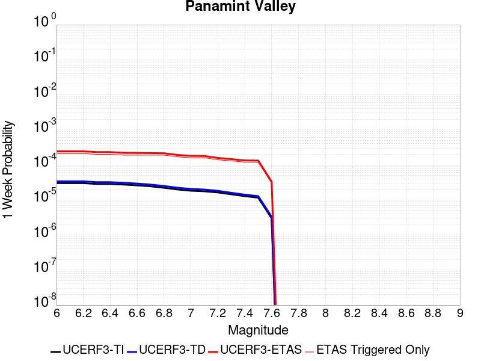 | 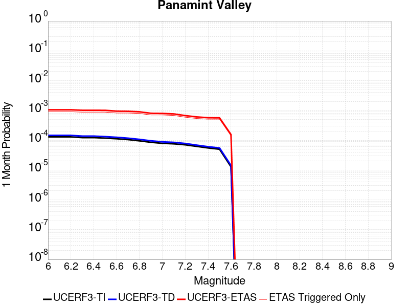 | 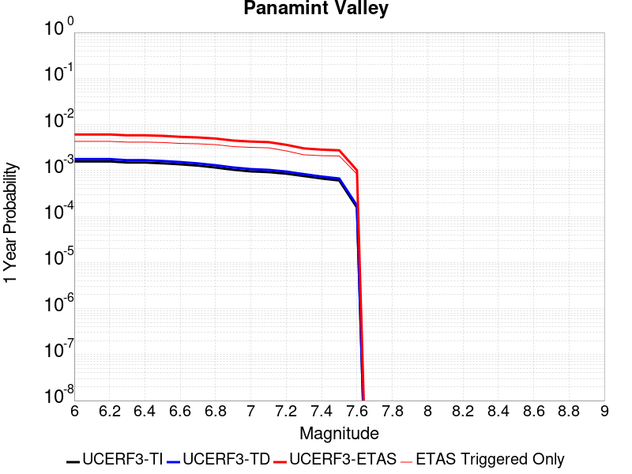 | 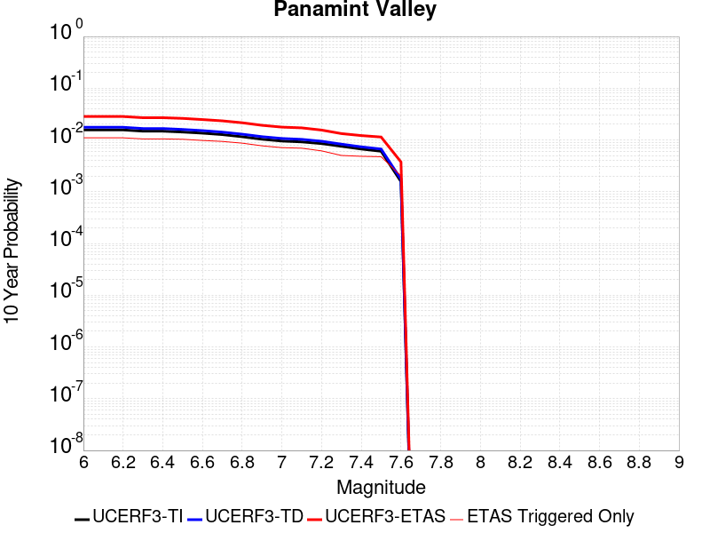 |

| Magnitude | 1 wk TI Prob | 1 wk TD Prob | 1 wk ETAS Prob | 1 wk ETAS/TD Gain | 1 wk ETAS Triggered Only | 1 mo TI Prob | 1 mo TD Prob | 1 mo ETAS Prob | 1 mo ETAS/TD Gain | 1 mo ETAS Triggered Only | 1 yr TI Prob | 1 yr TD Prob | 1 yr ETAS Prob | 1 yr ETAS/TD Gain | 1 yr ETAS Triggered Only | 10 yr TI Prob | 10 yr TD Prob | 10 yr ETAS Prob | 10 yr ETAS/TD Gain | 10 yr ETAS Triggered Only |
|-----|-----|-----|-----|-----|-----|-----|-----|-----|-----|-----|-----|-----|-----|-----|-----|-----|-----|-----|-----|-----|
| 6.0 | 3.0211835E-5 | 3.3991946E-5 | 2.6864102E-4 | 7.903078 | 2.3465704E-4 | 1.2947287E-4 | 1.456718E-4 | 0.0010480674 | 7.194717 | 9.0252707E-4 | 0.0015751923 | 0.001772141 | 0.006042538 | 3.409739 | 0.0042779786 | 0.015640736 | 0.017586948 | 0.0283864 | 1.6140605 | 0.010992779 |
| 6.1 | 3.0211835E-5 | 3.3991946E-5 | 2.6864102E-4 | 7.903078 | 2.3465704E-4 | 1.2947287E-4 | 1.456718E-4 | 0.0010480674 | 7.194717 | 9.0252707E-4 | 0.0015751923 | 0.001772141 | 0.006042538 | 3.409739 | 0.0042779786 | 0.015640736 | 0.017586948 | 0.0283864 | 1.6140605 | 0.010992779 |
| 6.2 | 3.0211835E-5 | 3.3991946E-5 | 2.6864102E-4 | 7.903078 | 2.3465704E-4 | 1.2947287E-4 | 1.456718E-4 | 0.0010480674 | 7.194717 | 9.0252707E-4 | 0.0015751923 | 0.001772141 | 0.006042538 | 3.409739 | 0.0042779786 | 0.015640736 | 0.017586948 | 0.0283864 | 1.6140605 | 0.010992779 |
| 6.3 | 2.8573924E-5 | 3.2109718E-5 | 2.4870926E-4 | 7.7456074 | 2.166065E-4 | 1.2245393E-4 | 1.3760598E-4 | 0.0010039128 | 7.295561 | 8.66426E-4 | 0.001489857 | 0.0016740931 | 0.0058007473 | 3.4650087 | 0.004133574 | 0.01479908 | 0.016621413 | 0.026934462 | 1.6204678 | 0.010487365 |
| 6.4 | 2.8573924E-5 | 3.2109718E-5 | 2.4870926E-4 | 7.7456074 | 2.166065E-4 | 1.2245393E-4 | 1.3760598E-4 | 0.0010039128 | 7.295561 | 8.66426E-4 | 0.001489857 | 0.0016740931 | 0.0058007473 | 3.4650087 | 0.004133574 | 0.01479908 | 0.016621413 | 0.026934462 | 1.6204678 | 0.010487365 |
| 6.5 | 2.7468774E-5 | 3.08352E-5 | 2.47435E-4 | 8.024434 | 2.166065E-4 | 1.1771801E-4 | 1.3214431E-4 | 9.804077E-4 | 7.4192195 | 8.4837544E-4 | 0.0014322745 | 0.001607697 | 0.005680561 | 3.5333529 | 0.0040794224 | 0.014230782 | 0.01596715 | 0.0261272 | 1.6363096 | 0.010324909 |
| 6.6 | 2.6135967E-5 | 2.925894E-5 | 2.458591E-4 | 8.402871 | 2.166065E-4 | 1.1200648E-4 | 1.2538958E-4 | 9.195138E-4 | 7.3332553 | 7.942238E-4 | 0.0013628257 | 0.0015255756 | 0.0054005217 | 3.5399895 | 0.0038808663 | 0.013544982 | 0.015157362 | 0.024792466 | 1.6356715 | 0.009783394 |
| 6.7 | 2.4498746E-5 | 2.7347574E-5 | 2.4394815E-4 | 8.920284 | 2.166065E-4 | 1.04990395E-4 | 1.1719877E-4 | 9.113295E-4 | 7.775931 | 7.942238E-4 | 0.0012775084 | 0.0014259861 | 0.005247244 | 3.6797302 | 0.0038267148 | 0.012701893 | 0.014174485 | 0.023409925 | 1.651554 | 0.009368231 |
| 6.8 | 2.2244329E-5 | 2.494126E-5 | 2.4154235E-4 | 9.684448 | 2.166065E-4 | 9.532935E-5 | 1.0688686E-4 | 8.8297715E-4 | 8.260859 | 7.761733E-4 | 0.0011600169 | 0.0013005924 | 0.0049060057 | 3.7721312 | 0.0036101083 | 0.011539802 | 0.012935525 | 0.021505525 | 1.6625166 | 0.008682311 |
| 6.9 | 1.9902658E-5 | 2.229565E-5 | 2.2084719E-4 | 9.905394 | 1.9855595E-4 | 8.529431E-5 | 9.554939E-5 | 8.1750203E-4 | 8.555806 | 7.220217E-4 | 0.0010379635 | 0.0011627114 | 0.00444409 | 3.8221781 | 0.0032851985 | 0.010331288 | 0.011571384 | 0.019189777 | 1.6583823 | 0.0077075814 |
| 7.0 | 1.8353881E-5 | 2.0571259E-5 | 2.1912313E-4 | 10.651907 | 1.9855595E-4 | 7.865712E-5 | 8.815966E-5 | 7.920687E-4 | 8.984481 | 7.0397113E-4 | 9.5722964E-4 | 0.001072833 | 0.004228289 | 3.9412367 | 0.0031588448 | 0.009531168 | 0.010681467 | 0.017717415 | 1.6587061 | 0.0071119135 |
| 7.1 | 1.7667631E-5 | 1.9777548E-5 | 2.1832957E-4 | 11.039264 | 1.9855595E-4 | 7.571623E-5 | 8.475826E-5 | 7.525717E-4 | 8.879036 | 6.6787004E-4 | 9.2145515E-4 | 0.0010314609 | 0.00411492 | 3.9894092 | 0.0030866426 | 0.009176437 | 0.010271622 | 0.017131833 | 1.66788 | 0.006931408 |
| 7.2 | 1.6381597E-5 | 1.8162855E-5 | 1.9866499E-4 | 10.937983 | 1.8050542E-4 | 7.020495E-5 | 7.783859E-5 | 6.915092E-4 | 8.883887 | 6.137184E-4 | 8.544101E-4 | 9.4729004E-4 | 0.0036523065 | 3.8555312 | 0.0027075813 | 0.008511325 | 0.009437174 | 0.01553432 | 1.6460776 | 0.0061552348 |
| 7.3 | 1.4520491E-5 | 1.5970241E-5 | 1.7842252E-4 | 11.172187 | 1.6245487E-4 | 6.222919E-5 | 6.844219E-5 | 5.918721E-4 | 8.647766 | 5.234657E-4 | 7.57377E-4 | 8.329813E-4 | 0.003033313 | 3.6415138 | 0.002202166 | 0.0075480095 | 0.008301701 | 0.013278094 | 1.5994425 | 0.0050180503 |
| 7.4 | 1.2852287E-5 | 1.4148768E-5 | 1.7660134E-4 | 12.481747 | 1.6245487E-4 | 5.5080065E-5 | 6.0636256E-5 | 5.660208E-4 | 9.334692 | 5.0541514E-4 | 6.7039346E-4 | 7.380122E-4 | 0.0028664041 | 3.8839524 | 0.0021299638 | 0.0066837464 | 0.007358535 | 0.012160483 | 1.6525685 | 0.004837545 |
| 7.5 | 1.1637851E-5 | 1.2839965E-5 | 1.7529275E-4 | 13.652121 | 1.6245487E-4 | 4.987555E-5 | 5.5027347E-5 | 5.604147E-4 | 10.184294 | 5.0541514E-4 | 6.070656E-4 | 6.6976773E-4 | 0.0027802666 | 4.1510906 | 0.0021119134 | 0.006054099 | 0.00668039 | 0.0113959685 | 1.7058837 | 0.0047472925 |
| 7.6 | 3.0068115E-6 | 3.3342671E-6 | 3.943523E-5 | 11.827255 | 3.6101083E-5 | 1.2886271E-5 | 1.4289679E-5 | 1.9479252E-4 | 13.631693 | 1.8050542E-4 | 1.5687906E-4 | 1.7397024E-4 | 9.861033E-4 | 5.66823 | 8.1227435E-4 | 0.0015676835 | 0.0017397817 | 0.0037579252 | 2.159998 | 0.0020216606 |

## Garlock (East)
*[(top)](#table-of-contents)*

| 1 Week | 1 Month | 1 Year | 10 Year |
|-----|-----|-----|-----|
| 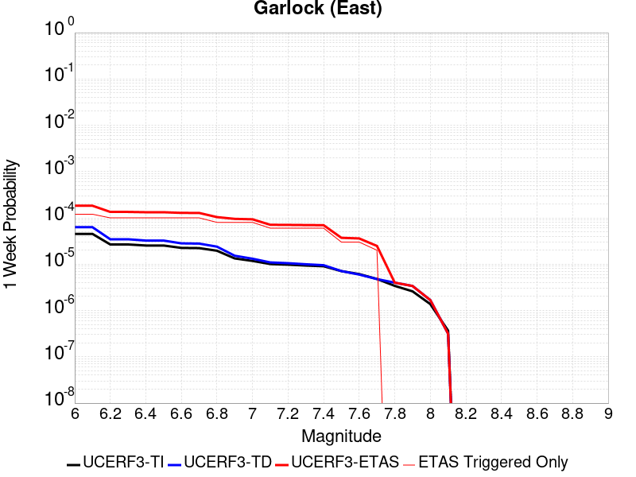 | 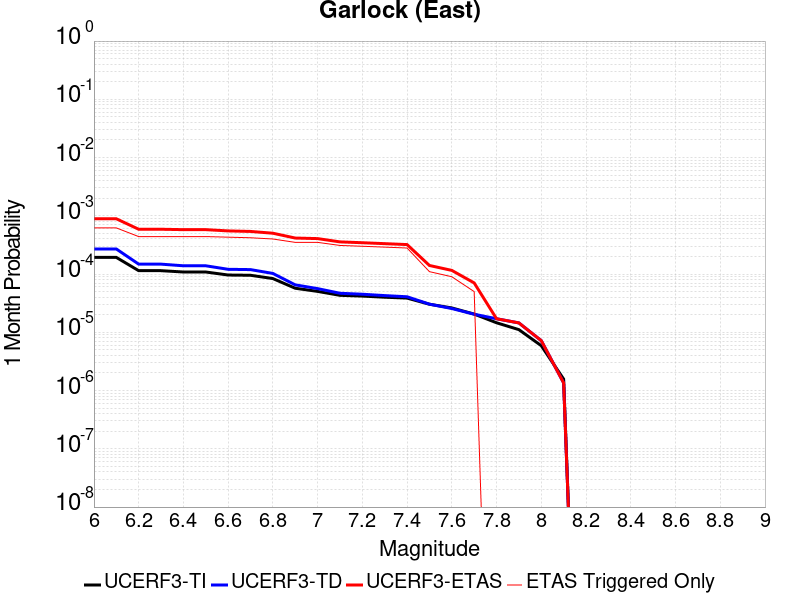 | 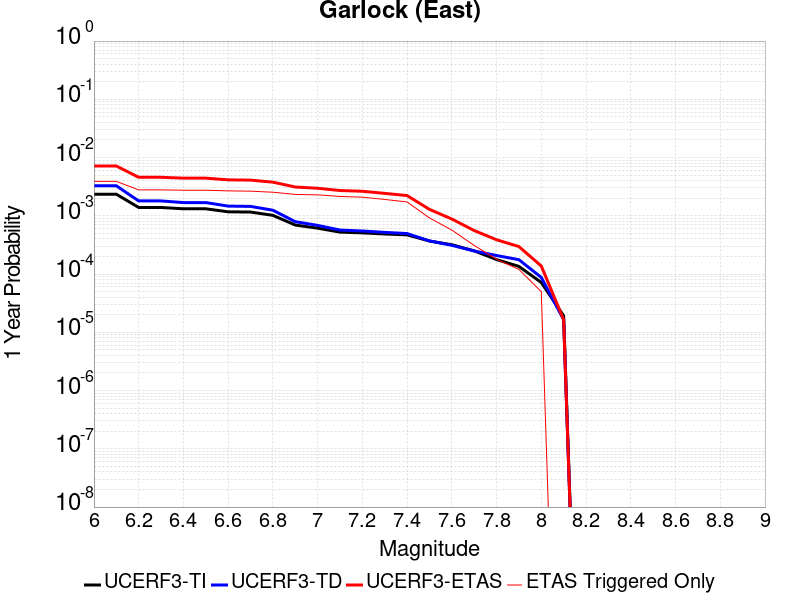 | 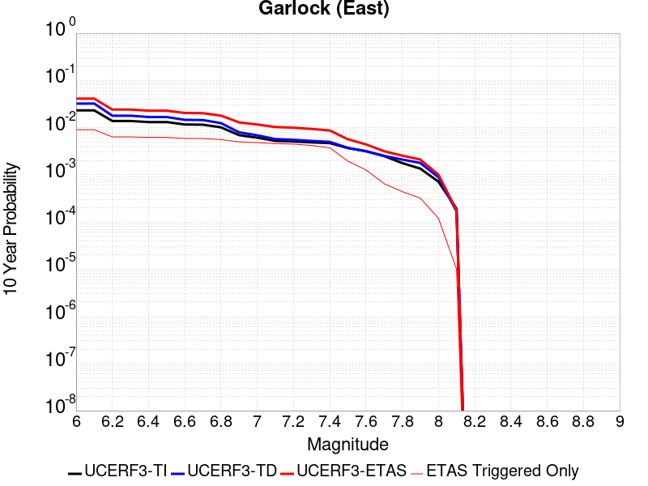 |

| Magnitude | 1 wk TI Prob | 1 wk TD Prob | 1 wk ETAS Prob | 1 wk ETAS/TD Gain | 1 wk ETAS Triggered Only | 1 mo TI Prob | 1 mo TD Prob | 1 mo ETAS Prob | 1 mo ETAS/TD Gain | 1 mo ETAS Triggered Only | 1 yr TI Prob | 1 yr TD Prob | 1 yr ETAS Prob | 1 yr ETAS/TD Gain | 1 yr ETAS Triggered Only | 10 yr TI Prob | 10 yr TD Prob | 10 yr ETAS Prob | 10 yr ETAS/TD Gain | 10 yr ETAS Triggered Only |
|-----|-----|-----|-----|-----|-----|-----|-----|-----|-----|-----|-----|-----|-----|-----|-----|-----|-----|-----|-----|-----|
| 6.0 | 4.5092507E-5 | 6.293518E-5 | 1.8928101E-4 | 3.0075552 | 1.2635379E-4 | 1.9323928E-4 | 2.6969681E-4 | 9.373867E-4 | 3.4757056 | 6.6787004E-4 | 0.0023501497 | 0.0032790608 | 0.007075236 | 2.157702 | 0.0038086642 | 0.023254504 | 0.032368027 | 0.0410837 | 1.269268 | 0.00900722 |
| 6.1 | 4.5092507E-5 | 6.293518E-5 | 1.8928101E-4 | 3.0075552 | 1.2635379E-4 | 1.9323928E-4 | 2.6969681E-4 | 9.373867E-4 | 3.4757056 | 6.6787004E-4 | 0.0023501497 | 0.0032790608 | 0.007075236 | 2.157702 | 0.0038086642 | 0.023254504 | 0.032368027 | 0.0410837 | 1.269268 | 0.00900722 |
| 6.2 | 2.6674514E-5 | 3.453498E-5 | 1.4283448E-4 | 4.1359367 | 1.0830325E-4 | 1.1431433E-4 | 1.4799884E-4 | 6.3529133E-4 | 4.2925425 | 4.8736462E-4 | 0.0013908884 | 0.0018004298 | 0.0045211543 | 2.5111527 | 0.0027256317 | 0.01382215 | 0.017903222 | 0.024231896 | 1.3534936 | 0.0064440435 |
| 6.3 | 2.6674514E-5 | 3.453498E-5 | 1.4283448E-4 | 4.1359367 | 1.0830325E-4 | 1.1431433E-4 | 1.4799884E-4 | 6.3529133E-4 | 4.2925425 | 4.8736462E-4 | 0.0013908884 | 0.0018004298 | 0.0045211543 | 2.5111527 | 0.0027256317 | 0.01382215 | 0.017903222 | 0.024231896 | 1.3534936 | 0.0064440435 |
| 6.4 | 2.5312667E-5 | 3.2363667E-5 | 1.4066341E-4 | 4.3463373 | 1.0830325E-4 | 1.0847834E-4 | 1.3869423E-4 | 6.2599126E-4 | 4.513463 | 4.8736462E-4 | 0.0013199237 | 0.0016873238 | 0.0043542963 | 2.5805933 | 0.0026714802 | 0.013121112 | 0.016790988 | 0.022949355 | 1.3667662 | 0.006263538 |
| 6.5 | 2.5312667E-5 | 3.2363667E-5 | 1.4066341E-4 | 4.3463373 | 1.0830325E-4 | 1.0847834E-4 | 1.3869423E-4 | 6.2599126E-4 | 4.513463 | 4.8736462E-4 | 0.0013199237 | 0.0016873238 | 0.0043542963 | 2.5805933 | 0.0026714802 | 0.013121112 | 0.016790988 | 0.022949355 | 1.3667662 | 0.006263538 |
| 6.6 | 2.246556E-5 | 2.815759E-5 | 1.3645779E-4 | 4.8462167 | 1.0830325E-4 | 9.627742E-5 | 1.2066994E-4 | 5.8992737E-4 | 4.888768 | 4.6931408E-4 | 0.0011715472 | 0.00146819 | 0.004081676 | 2.7800732 | 0.0026173284 | 0.011653901 | 0.014630876 | 0.020482616 | 1.3999584 | 0.005938628 |
| 6.7 | 2.2241198E-5 | 2.7827266E-5 | 1.361275E-4 | 4.891875 | 1.0830325E-4 | 9.531594E-5 | 1.19254386E-4 | 5.885125E-4 | 4.9349337 | 4.6931408E-4 | 0.0011598538 | 0.0014509787 | 0.0040464853 | 2.7887971 | 0.002599278 | 0.011538187 | 0.014461035 | 0.020295994 | 1.4034953 | 0.005920578 |
| 6.8 | 1.9528685E-5 | 2.3920378E-5 | 1.1417093E-4 | 4.7729564 | 9.025271E-5 | 8.369167E-5 | 1.0251199E-4 | 5.5372925E-4 | 5.4016047 | 4.5126354E-4 | 0.0010184698 | 0.0012473885 | 0.0037532842 | 3.0089133 | 0.0025090252 | 0.010138147 | 0.012447845 | 0.018027337 | 1.4482294 | 0.0056498195 |
| 6.9 | 1.3318621E-5 | 1.5218018E-5 | 1.0546935E-4 | 6.9305577 | 9.025271E-5 | 5.7078556E-5 | 6.521848E-5 | 4.6230448E-4 | 7.0885506 | 3.971119E-4 | 6.9470983E-4 | 7.9375145E-4 | 0.0031384593 | 3.9539573 | 0.0023465704 | 0.0069254204 | 0.007949786 | 0.012999573 | 1.6352103 | 0.0050902525 |
| 7.0 | 1.1760853E-5 | 1.3126264E-5 | 1.0337779E-4 | 7.875644 | 9.025271E-5 | 5.0402683E-5 | 5.6254234E-5 | 4.5334382E-4 | 8.058839 | 3.971119E-4 | 6.134799E-4 | 6.846851E-4 | 0.0029935725 | 4.3721886 | 0.0023104693 | 0.0061178906 | 0.0068660895 | 0.011724199 | 1.7075512 | 0.004891697 |
| 7.1 | 1.0064758E-5 | 1.0920776E-5 | 8.3122155E-5 | 7.611378 | 7.2202165E-5 | 4.3133965E-5 | 4.6802506E-5 | 3.8974674E-4 | 8.327476 | 3.429603E-4 | 5.2502943E-4 | 5.6967506E-4 | 0.0026984257 | 4.73678 | 0.0021299638 | 0.005237907 | 0.005722252 | 0.010298802 | 1.7997811 | 0.004602888 |
| 7.2 | 9.768808E-6 | 1.0516529E-5 | 8.271793E-5 | 7.865517 | 7.2202165E-5 | 4.186565E-5 | 4.507008E-5 | 3.699652E-4 | 8.208665 | 3.2490975E-4 | 5.095951E-4 | 5.485935E-4 | 0.0026052264 | 4.748919 | 0.0020577617 | 0.0050842804 | 0.005512456 | 0.009982265 | 1.8108561 | 0.0044945846 |
| 7.3 | 9.344516E-6 | 9.961853E-6 | 8.21633E-5 | 8.247793 | 7.2202165E-5 | 4.004731E-5 | 4.2692976E-5 | 3.4953907E-4 | 8.187274 | 3.068592E-4 | 4.8746695E-4 | 5.196665E-4 | 0.002377906 | 4.575831 | 0.0018592058 | 0.0048639905 | 0.005223965 | 0.009389814 | 1.7974497 | 0.0041877255 |
| 7.4 | 9.023491E-6 | 9.507697E-6 | 8.170918E-5 | 8.594004 | 7.2202165E-5 | 3.867153E-5 | 4.0746654E-5 | 3.2954355E-4 | 8.087623 | 2.8880866E-4 | 4.7072413E-4 | 4.9598096E-4 | 0.0021738487 | 4.382928 | 0.0016787003 | 0.004697283 | 0.0049872394 | 0.008723027 | 1.7490693 | 0.0037545126 |
| 7.5 | 7.081253E-6 | 7.1028044E-6 | 4.3203632E-5 | 6.082616 | 3.6101083E-5 | 3.0347876E-5 | 3.0440238E-5 | 1.3874019E-4 | 4.5577893 | 1.0830325E-4 | 3.6942272E-4 | 3.705476E-4 | 0.0013268718 | 3.5808403 | 9.566787E-4 | 0.003688092 | 0.0037321814 | 0.0057103303 | 1.5300249 | 0.0019855595 |
| 7.6 | 6.116396E-6 | 5.9736276E-6 | 4.2074495E-5 | 7.0433745 | 3.6101083E-5 | 2.6212863E-5 | 2.560101E-5 | 1.15851406E-4 | 4.525267 | 9.025271E-5 | 3.1909486E-4 | 3.1164798E-4 | 8.710404E-4 | 2.7949495 | 5.595668E-4 | 0.0031863707 | 0.0031432372 | 0.0044747787 | 1.423621 | 0.0013357401 |
| 7.7 | 4.797145E-6 | 4.7708904E-6 | 4.08718E-5 | 8.566913 | 3.6101083E-5 | 2.055903E-5 | 2.0446512E-5 | 7.459703E-5 | 3.6483986 | 5.4151624E-5 | 2.5027743E-4 | 2.4890798E-4 | 5.7373685E-4 | 2.3050158 | 3.2490975E-4 | 0.0024999576 | 0.002516431 | 0.0032366358 | 1.2862009 | 7.220217E-4 |
| 7.8 | 3.4028885E-6 | 3.990599E-6 | 3.990599E-6 | 1.0 | 0.0 | 1.4583726E-5 | 1.7102455E-5 | 1.7102455E-5 | 1.0 | 0.0 | 1.775424E-4 | 2.0820257E-4 | 4.2476397E-4 | 2.0401475 | 2.166065E-4 | 0.0017740062 | 0.0021075394 | 0.002593877 | 1.2307608 | 4.8736462E-4 |
| 7.9 | 2.5928412E-6 | 3.3827075E-6 | 3.3827075E-6 | 1.0 | 0.0 | 1.1112129E-5 | 1.4497237E-5 | 1.4497237E-5 | 1.0 | 0.0 | 1.3528178E-4 | 1.7648963E-4 | 3.3891582E-4 | 1.9203159 | 1.6245487E-4 | 0.0013519945 | 0.0017865765 | 0.0021469423 | 1.2017075 | 3.6101084E-4 |
| 8.0 | 1.3743648E-6 | 1.6781254E-6 | 1.6781254E-6 | 1.0 | 0.0 | 5.8901214E-6 | 7.191946E-6 | 7.191946E-6 | 1.0 | 0.0 | 7.1709874E-5 | 8.755846E-5 | 1.597543E-4 | 1.8245445 | 7.2202165E-5 | 7.1686733E-4 | 8.8614394E-4 | 0.0010304203 | 1.1628137 | 1.4440433E-4 |
| 8.1 | 3.6733252E-7 | 3.1573026E-7 | 3.1573026E-7 | 1.0 | 0.0 | 1.5742813E-6 | 1.353129E-6 | 1.353129E-6 | 1.0 | 0.0 | 1.9166706E-5 | 1.6474238E-5 | 1.6474238E-5 | 1.0 | 0.0 | 1.9165053E-4 | 1.6682294E-4 | 1.6682294E-4 | 1.0 | 0.0 |

## Ash Hill
*[(top)](#table-of-contents)*

| 1 Week | 1 Month | 1 Year | 10 Year |
|-----|-----|-----|-----|
| 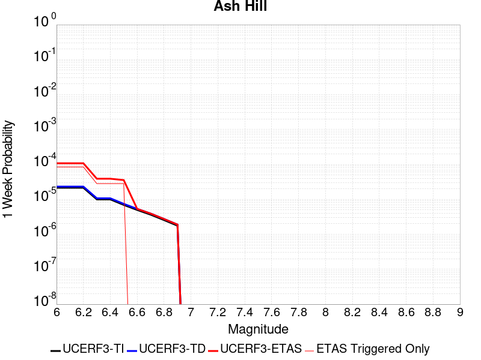 | 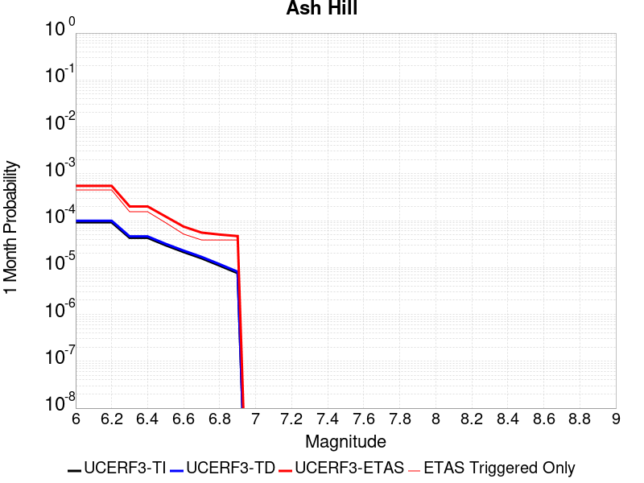 | 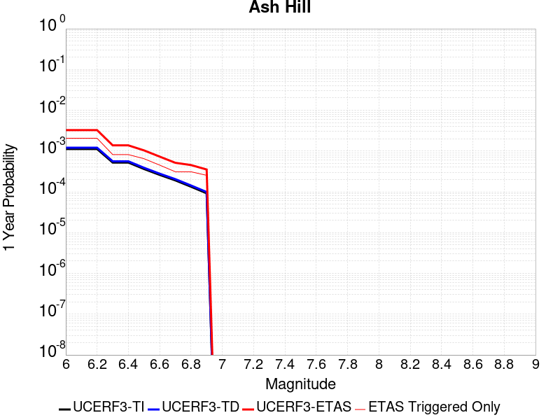 | 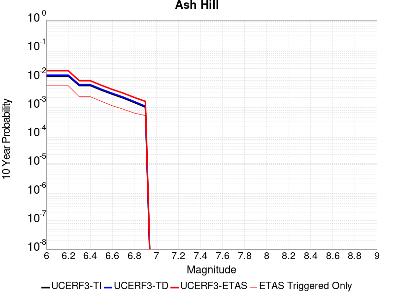 |

| Magnitude | 1 wk TI Prob | 1 wk TD Prob | 1 wk ETAS Prob | 1 wk ETAS/TD Gain | 1 wk ETAS Triggered Only | 1 mo TI Prob | 1 mo TD Prob | 1 mo ETAS Prob | 1 mo ETAS/TD Gain | 1 mo ETAS Triggered Only | 1 yr TI Prob | 1 yr TD Prob | 1 yr ETAS Prob | 1 yr ETAS/TD Gain | 1 yr ETAS Triggered Only | 10 yr TI Prob | 10 yr TD Prob | 10 yr ETAS Prob | 10 yr ETAS/TD Gain | 10 yr ETAS Triggered Only |
|-----|-----|-----|-----|-----|-----|-----|-----|-----|-----|-----|-----|-----|-----|-----|-----|-----|-----|-----|-----|-----|
| 6.0 | 2.1545662E-5 | 2.3196568E-5 | 7.734694E-5 | 3.334413 | 5.4151624E-5 | 9.2335285E-5 | 9.941052E-5 | 4.9648294E-4 | 4.99427 | 3.971119E-4 | 0.0011236023 | 0.0012097311 | 0.0034993766 | 2.8926897 | 0.0022924189 | 0.011179381 | 0.0120394435 | 0.017246744 | 1.4325202 | 0.005270758 |
| 6.1 | 2.1545662E-5 | 2.3196568E-5 | 7.734694E-5 | 3.334413 | 5.4151624E-5 | 9.2335285E-5 | 9.941052E-5 | 4.9648294E-4 | 4.99427 | 3.971119E-4 | 0.0011236023 | 0.0012097311 | 0.0034993766 | 2.8926897 | 0.0022924189 | 0.011179381 | 0.0120394435 | 0.017246744 | 1.4325202 | 0.005270758 |
| 6.2 | 2.1545662E-5 | 2.3196568E-5 | 7.734694E-5 | 3.334413 | 5.4151624E-5 | 9.2335285E-5 | 9.941052E-5 | 4.9648294E-4 | 4.99427 | 3.971119E-4 | 0.0011236023 | 0.0012097311 | 0.0034993766 | 2.8926897 | 0.0022924189 | 0.011179381 | 0.0120394435 | 0.017246744 | 1.4325202 | 0.005270758 |
| 6.3 | 1.0025529E-5 | 1.0747857E-5 | 2.8798206E-5 | 2.679437 | 1.8050541E-5 | 4.2965847E-5 | 4.606151E-5 | 1.9045919E-4 | 4.134888 | 1.4440433E-4 | 5.229836E-4 | 5.606678E-4 | 0.0015348506 | 2.73754 | 9.7472925E-4 | 0.005217545 | 0.0055938456 | 0.00794524 | 1.4203537 | 0.002364621 |
| 6.4 | 1.0025529E-5 | 1.0747857E-5 | 2.8798206E-5 | 2.679437 | 1.8050541E-5 | 4.2965847E-5 | 4.606151E-5 | 1.9045919E-4 | 4.134888 | 1.4440433E-4 | 5.229836E-4 | 5.606678E-4 | 0.0015348506 | 2.73754 | 9.7472925E-4 | 0.005217545 | 0.0055938456 | 0.00794524 | 1.4203537 | 0.002364621 |
| 6.5 | 6.9617327E-6 | 7.4572667E-6 | 2.5507674E-5 | 3.4205124 | 1.8050541E-5 | 2.9835655E-5 | 3.195937E-5 | 1.4025916E-4 | 4.3886704 | 1.0830325E-4 | 3.6318856E-4 | 3.8904455E-4 | 0.0010927418 | 2.808783 | 7.0397113E-4 | 0.0036259557 | 0.0038844894 | 0.0055566686 | 1.430476 | 0.0016787003 |
| 6.6 | 4.9919777E-6 | 5.3471417E-6 | 5.3471417E-6 | 1.0 | 0.0 | 2.1394015E-5 | 2.2916158E-5 | 7.706654E-5 | 3.3629782 | 5.4151624E-5 | 2.60441E-4 | 2.789752E-4 | 7.481584E-4 | 2.6818094 | 4.6931408E-4 | 0.0026013597 | 0.0027869088 | 0.003956924 | 1.4198256 | 0.0011732852 |
| 6.7 | 3.6630722E-6 | 3.924958E-6 | 3.924958E-6 | 1.0 | 0.0 | 1.5698786E-5 | 1.6821174E-5 | 5.292165E-5 | 3.146133 | 3.6101083E-5 | 1.9111596E-4 | 2.0478427E-4 | 5.476743E-4 | 2.6743963 | 3.429603E-4 | 0.0019095168 | 0.0020465187 | 0.0029652126 | 1.4489056 | 9.205776E-4 |
| 6.8 | 2.5599613E-6 | 2.7451617E-6 | 2.7451617E-6 | 1.0 | 0.0 | 1.0971216E-5 | 1.1764954E-5 | 4.786561E-5 | 4.068491 | 3.6101083E-5 | 1.3356637E-4 | 1.4323385E-4 | 3.9590523E-4 | 2.764048 | 2.5270757E-4 | 0.0013348613 | 0.0014319003 | 0.0020988141 | 1.4657543 | 6.6787004E-4 |
| 6.9 | 1.7684905E-6 | 1.8970351E-6 | 1.8970351E-6 | 1.0 | 0.0 | 7.579223E-6 | 8.1301505E-6 | 4.423094E-5 | 5.4403596 | 3.6101083E-5 | 9.2273134E-5 | 9.898458E-5 | 2.975209E-4 | 3.0057297 | 1.9855595E-4 | 9.223483E-4 | 9.898458E-4 | 0.0015308261 | 1.5465298 | 5.4151623E-4 |

## Hunter Mountain-Saline Valley
*[(top)](#table-of-contents)*

| 1 Week | 1 Month | 1 Year | 10 Year |
|-----|-----|-----|-----|
| 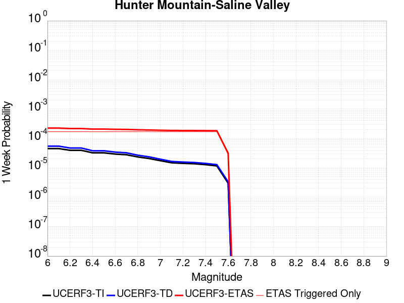 | 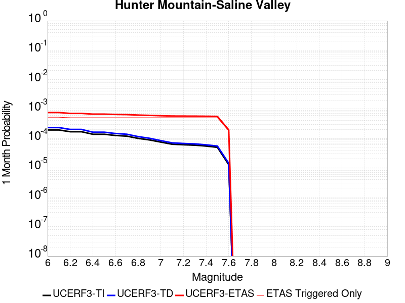 | 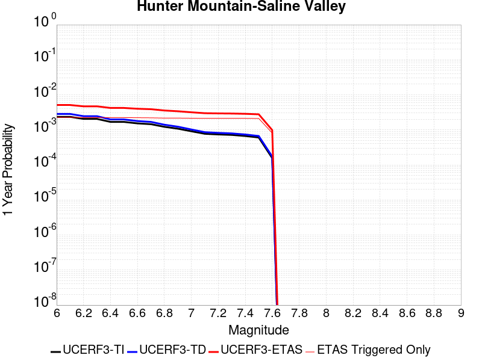 | 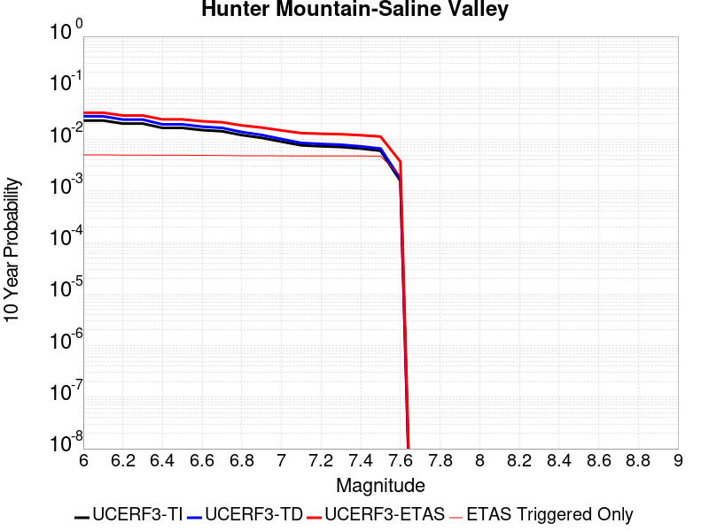 |

| Magnitude | 1 wk TI Prob | 1 wk TD Prob | 1 wk ETAS Prob | 1 wk ETAS/TD Gain | 1 wk ETAS Triggered Only | 1 mo TI Prob | 1 mo TD Prob | 1 mo ETAS Prob | 1 mo ETAS/TD Gain | 1 mo ETAS Triggered Only | 1 yr TI Prob | 1 yr TD Prob | 1 yr ETAS Prob | 1 yr ETAS/TD Gain | 1 yr ETAS Triggered Only | 10 yr TI Prob | 10 yr TD Prob | 10 yr ETAS Prob | 10 yr ETAS/TD Gain | 10 yr ETAS Triggered Only |
|-----|-----|-----|-----|-----|-----|-----|-----|-----|-----|-----|-----|-----|-----|-----|-----|-----|-----|-----|-----|-----|
| 6.0 | 4.5103672E-5 | 5.458393E-5 | 2.1702994E-4 | 3.9760776 | 1.6245487E-4 | 1.9328714E-4 | 2.3391136E-4 | 7.572546E-4 | 3.2373571 | 5.234657E-4 | 0.002350731 | 0.0028443045 | 0.005112204 | 1.7973475 | 0.0022743682 | 0.023260195 | 0.028099684 | 0.03302936 | 1.1754352 | 0.005072202 |
| 6.1 | 4.5103672E-5 | 5.458393E-5 | 2.1702994E-4 | 3.9760776 | 1.6245487E-4 | 1.9328714E-4 | 2.3391136E-4 | 7.572546E-4 | 3.2373571 | 5.234657E-4 | 0.002350731 | 0.0028443045 | 0.005112204 | 1.7973475 | 0.0022743682 | 0.023260195 | 0.028099684 | 0.03302936 | 1.1754352 | 0.005072202 |
| 6.2 | 3.9363465E-5 | 4.707434E-5 | 2.0952156E-4 | 4.4508657 | 1.6245487E-4 | 1.6868966E-4 | 2.0173244E-4 | 7.0704566E-4 | 3.5048683 | 5.0541514E-4 | 0.002051862 | 0.0024534813 | 0.004686257 | 1.9100438 | 0.002238267 | 0.020330196 | 0.02427998 | 0.029193806 | 1.2023817 | 0.005036101 |
| 6.3 | 3.9363465E-5 | 4.707434E-5 | 2.0952156E-4 | 4.4508657 | 1.6245487E-4 | 1.6868966E-4 | 2.0173244E-4 | 7.0704566E-4 | 3.5048683 | 5.0541514E-4 | 0.002051862 | 0.0024534813 | 0.004686257 | 1.9100438 | 0.002238267 | 0.020330196 | 0.02427998 | 0.029193806 | 1.2023817 | 0.005036101 |
| 6.4 | 3.2311684E-5 | 3.796072E-5 | 2.0040943E-4 | 5.27939 | 1.6245487E-4 | 1.384713E-4 | 1.6267906E-4 | 6.68012E-4 | 4.1063185 | 5.0541514E-4 | 0.0016845843 | 0.001978891 | 0.0042127287 | 2.128833 | 0.002238267 | 0.016718714 | 0.019621437 | 0.024541028 | 1.2507253 | 0.0050180503 |
| 6.5 | 3.2311684E-5 | 3.796072E-5 | 2.0040943E-4 | 5.27939 | 1.6245487E-4 | 1.384713E-4 | 1.6267906E-4 | 6.68012E-4 | 4.1063185 | 5.0541514E-4 | 0.0016845843 | 0.001978891 | 0.0042127287 | 2.128833 | 0.002238267 | 0.016718714 | 0.019621437 | 0.024541028 | 1.2507253 | 0.0050180503 |
| 6.6 | 2.9305844E-5 | 3.419041E-5 | 1.9663972E-4 | 5.7513123 | 1.6245487E-4 | 1.2559042E-4 | 1.4652245E-4 | 6.518636E-4 | 4.448899 | 5.0541514E-4 | 0.0015279909 | 0.0017825139 | 0.0039987727 | 2.2433333 | 0.0022202167 | 0.015175272 | 0.017690089 | 0.022583906 | 1.2766418 | 0.0049819495 |
| 6.7 | 2.7826512E-5 | 3.235232E-5 | 1.9480193E-4 | 6.0212665 | 1.6245487E-4 | 1.19251024E-4 | 1.3864577E-4 | 6.439909E-4 | 4.6448646 | 5.0541514E-4 | 0.0014509142 | 0.0016867656 | 0.003885217 | 2.3033533 | 0.002202166 | 0.014414776 | 0.016747318 | 0.021628086 | 1.2914357 | 0.004963899 |
| 6.8 | 2.3389874E-5 | 2.6873224E-5 | 1.8932373E-4 | 7.0450697 | 1.6245487E-4 | 1.0023846E-4 | 1.1516614E-4 | 6.205231E-4 | 5.3880687 | 5.0541514E-4 | 0.00121972 | 0.0014012932 | 0.0035643228 | 2.5435953 | 0.002166065 | 0.01213047 | 0.013930786 | 0.018772138 | 1.3475289 | 0.0049097473 |
| 6.9 | 2.069209E-5 | 2.3575667E-5 | 1.8602671E-4 | 7.8906236 | 1.6245487E-4 | 8.867737E-5 | 1.01034864E-4 | 6.06399E-4 | 6.0018783 | 5.0541514E-4 | 0.0010791123 | 0.0012294415 | 0.0033928433 | 2.7596624 | 0.002166065 | 0.010738871 | 0.012231431 | 0.017081125 | 1.3964944 | 0.0049097473 |
| 7.0 | 1.7462342E-5 | 1.9638152E-5 | 1.8208983E-4 | 9.272249 | 1.6245487E-4 | 7.483646E-5 | 8.416092E-5 | 5.8953353E-4 | 7.004837 | 5.0541514E-4 | 9.1075303E-4 | 0.0010242002 | 0.0031700146 | 3.0951123 | 0.0021480145 | 0.009070295 | 0.010198434 | 0.015040243 | 1.47476 | 0.004891697 |
| 7.1 | 1.4807709E-5 | 1.6445585E-5 | 1.7889778E-4 | 10.878165 | 1.6245487E-4 | 6.3460066E-5 | 7.047926E-5 | 5.758588E-4 | 8.170613 | 5.0541514E-4 | 7.723524E-4 | 8.5776375E-4 | 0.0029859007 | 3.4810293 | 0.0021299638 | 0.007696735 | 0.0085475175 | 0.013343714 | 1.5611215 | 0.004837545 |
| 7.2 | 1.4180048E-5 | 1.5702008E-5 | 1.7815433E-4 | 11.345959 | 1.6245487E-4 | 6.077022E-5 | 6.7292676E-5 | 5.726738E-4 | 8.510196 | 5.0541514E-4 | 7.396263E-4 | 8.189966E-4 | 0.0029472162 | 3.5985694 | 0.0021299638 | 0.0073716943 | 0.008162735 | 0.0129607925 | 1.5878001 | 0.004837545 |
| 7.3 | 1.3730402E-5 | 1.5175639E-5 | 1.7762804E-4 | 11.704815 | 1.6245487E-4 | 5.8843252E-5 | 6.5036926E-5 | 5.704192E-4 | 8.770699 | 5.0541514E-4 | 7.161811E-4 | 7.9155294E-4 | 0.0029198308 | 3.6887372 | 0.0021299638 | 0.007138774 | 0.007890269 | 0.012689645 | 1.608265 | 0.004837545 |
| 7.4 | 1.2810095E-5 | 1.4112613E-5 | 1.765652E-4 | 12.511163 | 1.6245487E-4 | 5.489925E-5 | 6.048131E-5 | 5.658659E-4 | 9.356046 | 5.0541514E-4 | 6.681934E-4 | 7.36127E-4 | 0.002864523 | 3.8913434 | 0.0021299638 | 0.006661878 | 0.007339783 | 0.012141822 | 1.654248 | 0.004837545 |
| 7.5 | 1.1595659E-5 | 1.2803809E-5 | 1.752566E-4 | 13.687849 | 1.6245487E-4 | 4.9694736E-5 | 5.4872402E-5 | 5.6025985E-4 | 10.21023 | 5.0541514E-4 | 6.0486543E-4 | 6.678824E-4 | 0.0027783853 | 4.1599917 | 0.0021119134 | 0.006032217 | 0.0066616246 | 0.011377293 | 1.7078855 | 0.0047472925 |
| 7.6 | 2.997694E-6 | 3.326389E-6 | 3.9427352E-5 | 11.852899 | 3.6101083E-5 | 1.28471975E-5 | 1.42559165E-5 | 1.9475876E-4 | 13.661609 | 1.8050542E-4 | 1.564034E-4 | 1.7355924E-4 | 9.856926E-4 | 5.6792865 | 8.1227435E-4 | 0.0015629337 | 0.0017356742 | 0.003753826 | 2.162748 | 0.0020216606 |

## Blackwater
*[(top)](#table-of-contents)*

| 1 Week | 1 Month | 1 Year | 10 Year |
|-----|-----|-----|-----|
| 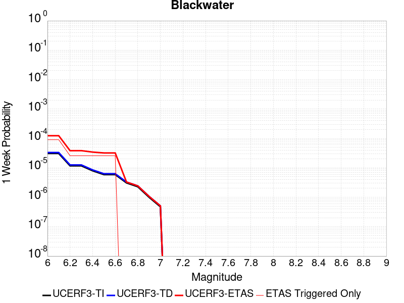 | 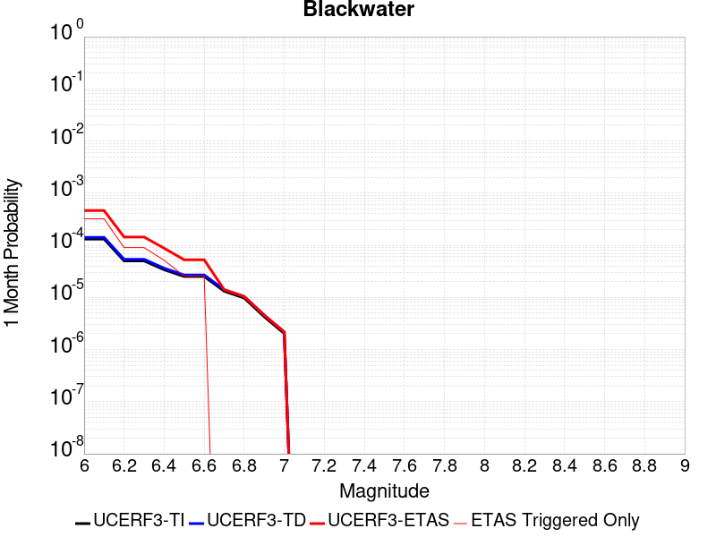 | 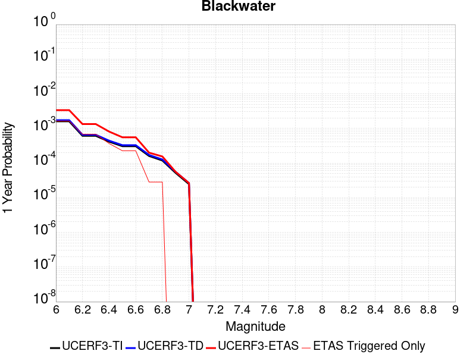 | 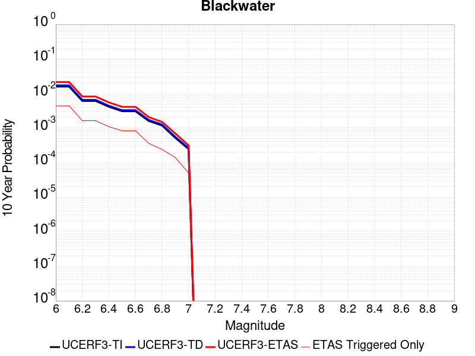 |

| Magnitude | 1 wk TI Prob | 1 wk TD Prob | 1 wk ETAS Prob | 1 wk ETAS/TD Gain | 1 wk ETAS Triggered Only | 1 mo TI Prob | 1 mo TD Prob | 1 mo ETAS Prob | 1 mo ETAS/TD Gain | 1 mo ETAS Triggered Only | 1 yr TI Prob | 1 yr TD Prob | 1 yr ETAS Prob | 1 yr ETAS/TD Gain | 1 yr ETAS Triggered Only | 10 yr TI Prob | 10 yr TD Prob | 10 yr ETAS Prob | 10 yr ETAS/TD Gain | 10 yr ETAS Triggered Only |
|-----|-----|-----|-----|-----|-----|-----|-----|-----|-----|-----|-----|-----|-----|-----|-----|-----|-----|-----|-----|-----|
| 6.0 | 3.0708583E-5 | 3.3098924E-5 | 1.2334864E-4 | 3.7266662 | 9.025271E-5 | 1.3160157E-4 | 1.418456E-4 | 5.028052E-4 | 3.5447364 | 3.6101084E-4 | 0.0016010714 | 0.0017257388 | 0.0033294645 | 1.9292982 | 0.0016064981 | 0.015895851 | 0.017137215 | 0.021146726 | 1.2339653 | 0.0040794224 |
| 6.1 | 3.0708583E-5 | 3.3098924E-5 | 1.2334864E-4 | 3.7266662 | 9.025271E-5 | 1.3160157E-4 | 1.418456E-4 | 5.028052E-4 | 3.5447364 | 3.6101084E-4 | 0.0016010714 | 0.0017257388 | 0.0033294645 | 1.9292982 | 0.0016064981 | 0.015895851 | 0.017137215 | 0.021146726 | 1.2339653 | 0.0040794224 |
| 6.2 | 1.1707779E-5 | 1.2546194E-5 | 4.8646823E-5 | 3.8774168 | 3.6101083E-5 | 5.017523E-5 | 5.3768348E-5 | 1.6206577E-4 | 3.0141482 | 1.0830325E-4 | 6.107122E-4 | 6.5444264E-4 | 0.0013399143 | 2.0474129 | 6.859206E-4 | 0.006090366 | 0.006526125 | 0.008032476 | 1.2308185 | 0.0015162455 |
| 6.3 | 1.1707779E-5 | 1.2546194E-5 | 4.8646823E-5 | 3.8774168 | 3.6101083E-5 | 5.017523E-5 | 5.3768348E-5 | 1.6206577E-4 | 3.0141482 | 1.0830325E-4 | 6.107122E-4 | 6.5444264E-4 | 0.0013399143 | 2.0474129 | 6.859206E-4 | 0.006090366 | 0.006526125 | 0.008032476 | 1.2308185 | 0.0015162455 |
| 6.4 | 7.929244E-6 | 8.480802E-6 | 4.458158E-5 | 5.256765 | 3.6101083E-5 | 3.3982033E-5 | 3.634581E-5 | 9.0495465E-5 | 2.489846 | 5.4151624E-5 | 4.136527E-4 | 4.424244E-4 | 8.934883E-4 | 2.0195277 | 4.5126354E-4 | 0.0041288356 | 0.0044158413 | 0.0053682956 | 1.2156903 | 9.566787E-4 |
| 6.5 | 5.8832115E-6 | 6.2865047E-6 | 4.238736E-5 | 6.742596 | 3.6101083E-5 | 2.521352E-5 | 2.69419E-5 | 6.304201E-5 | 2.3399246 | 3.6101083E-5 | 3.0693135E-4 | 3.279708E-4 | 6.52774E-4 | 1.9903418 | 3.2490975E-4 | 0.0030650778 | 0.003275121 | 0.003994778 | 1.2197344 | 7.220217E-4 |
| 6.6 | 5.8832115E-6 | 6.2865047E-6 | 4.238736E-5 | 6.742596 | 3.6101083E-5 | 2.521352E-5 | 2.69419E-5 | 6.304201E-5 | 2.3399246 | 3.6101083E-5 | 3.0693135E-4 | 3.279708E-4 | 6.52774E-4 | 1.9903418 | 3.2490975E-4 | 0.0030650778 | 0.003275121 | 0.003994778 | 1.2197344 | 7.220217E-4 |
| 6.7 | 3.0715053E-6 | 3.281734E-6 | 3.281734E-6 | 1.0 | 0.0 | 1.3163528E-5 | 1.4064505E-5 | 1.4064505E-5 | 1.0 | 0.0 | 1.6025416E-4 | 1.7122306E-4 | 2.975552E-4 | 1.737822 | 1.2635379E-4 | 0.0016013865 | 0.001711026 | 0.0019993405 | 1.1685039 | 2.8880866E-4 |
| 6.8 | 2.2722281E-6 | 2.4289534E-6 | 2.4289534E-6 | 1.0 | 0.0 | 9.738084E-6 | 1.04097635E-5 | 1.04097635E-5 | 1.0 | 0.0 | 1.1855473E-4 | 1.2673243E-4 | 2.169737E-4 | 1.7120614 | 9.025271E-5 | 0.001184915 | 0.0012666917 | 0.0014649961 | 1.156553 | 1.9855595E-4 |
| 6.9 | 9.952399E-7 | 1.0654385E-6 | 1.0654385E-6 | 1.0 | 0.0 | 4.265307E-6 | 4.5661595E-6 | 4.5661595E-6 | 1.0 | 0.0 | 5.1928873E-5 | 5.5592092E-5 | 9.169117E-5 | 1.6493564 | 3.6101083E-5 | 5.191674E-4 | 5.5583246E-4 | 6.82116E-4 | 1.2271972 | 1.2635379E-4 |
| 7.0 | 4.7385504E-7 | 5.0759905E-7 | 5.0759905E-7 | 1.0 | 0.0 | 2.0308057E-6 | 2.1754245E-6 | 2.1754245E-6 | 1.0 | 0.0 | 2.4724779E-5 | 2.6485792E-5 | 4.4535856E-5 | 1.6814998 | 1.8050541E-5 | 2.4722028E-4 | 2.6485792E-4 | 3.3704095E-4 | 1.272535 | 7.2202165E-5 |

## Garlock (West)
*[(top)](#table-of-contents)*

| 1 Week | 1 Month | 1 Year | 10 Year |
|-----|-----|-----|-----|
| 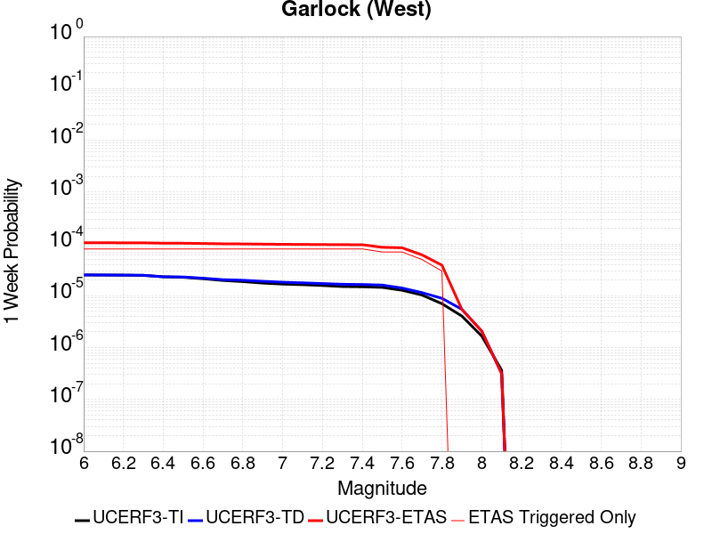 | 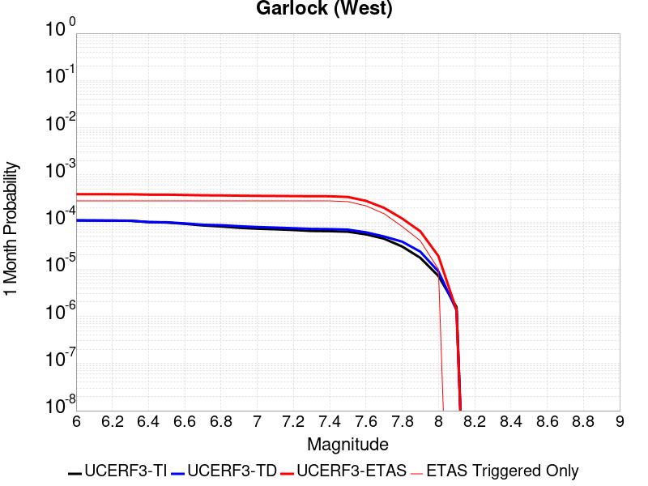 | 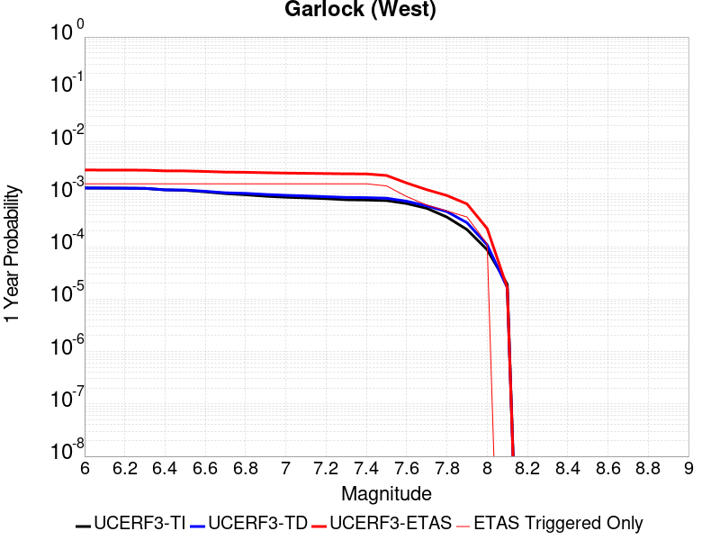 | 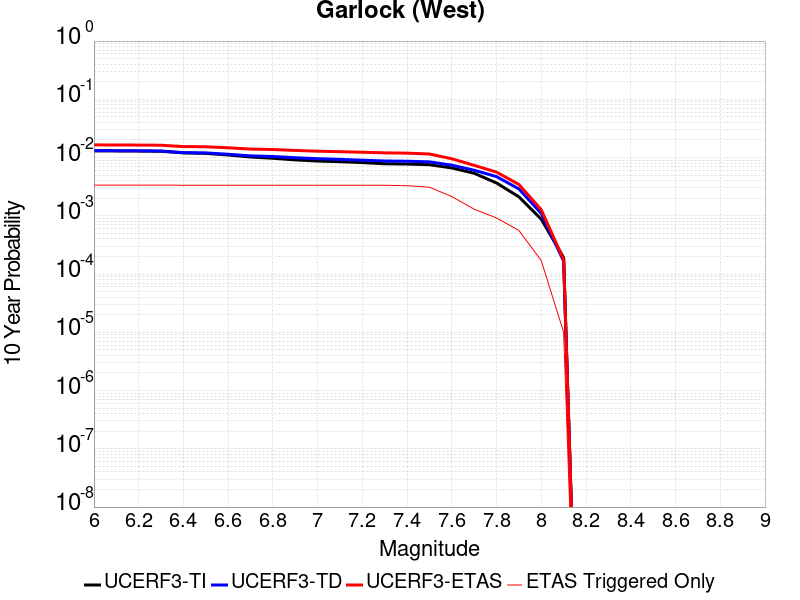 |

| Magnitude | 1 wk TI Prob | 1 wk TD Prob | 1 wk ETAS Prob | 1 wk ETAS/TD Gain | 1 wk ETAS Triggered Only | 1 mo TI Prob | 1 mo TD Prob | 1 mo ETAS Prob | 1 mo ETAS/TD Gain | 1 mo ETAS Triggered Only | 1 yr TI Prob | 1 yr TD Prob | 1 yr ETAS Prob | 1 yr ETAS/TD Gain | 1 yr ETAS Triggered Only | 10 yr TI Prob | 10 yr TD Prob | 10 yr ETAS Prob | 10 yr ETAS/TD Gain | 10 yr ETAS Triggered Only |
|-----|-----|-----|-----|-----|-----|-----|-----|-----|-----|-----|-----|-----|-----|-----|-----|-----|-----|-----|-----|-----|
| 6.0 | 2.5181727E-5 | 2.5242587E-5 | 9.744293E-5 | 3.8602593 | 7.2202165E-5 | 1.0791722E-4 | 1.0817804E-4 | 3.6085828E-4 | 3.335781 | 2.5270757E-4 | 0.0013131002 | 0.0013162754 | 0.0029747393 | 2.2599673 | 0.0016606498 | 0.013053683 | 0.013165218 | 0.016603108 | 1.2611343 | 0.0034837546 |
| 6.1 | 2.5077732E-5 | 2.514364E-5 | 9.734399E-5 | 3.8715155 | 7.2202165E-5 | 1.0747157E-4 | 1.0775402E-4 | 3.6043438E-4 | 3.3449738 | 2.5270757E-4 | 0.001307681 | 0.0013111192 | 0.0029695916 | 2.2649288 | 0.0016606498 | 0.013000126 | 0.013114265 | 0.016552333 | 1.2621624 | 0.0034837546 |
| 6.2 | 2.494612E-5 | 2.5025287E-5 | 9.7225646E-5 | 3.885096 | 7.2202165E-5 | 1.0690756E-4 | 1.0724684E-4 | 3.599273E-4 | 3.3560646 | 2.5270757E-4 | 0.0013008224 | 0.0013049516 | 0.0029634344 | 2.2709153 | 0.0016606498 | 0.012932341 | 0.013053315 | 0.016491596 | 1.2634028 | 0.0034837546 |
| 6.3 | 2.4733758E-5 | 2.4844605E-5 | 9.704498E-5 | 3.9060786 | 7.2202165E-5 | 1.0599751E-4 | 1.0647255E-4 | 3.5915323E-4 | 3.3732002 | 2.5270757E-4 | 0.0012897556 | 0.0012955358 | 0.0029540341 | 2.280164 | 0.0016606498 | 0.012822957 | 0.012960261 | 0.016398864 | 1.2653191 | 0.0034837546 |
| 6.4 | 2.3237335E-5 | 2.3223603E-5 | 9.542409E-5 | 4.1089272 | 7.2202165E-5 | 9.958477E-5 | 9.952595E-5 | 3.522084E-4 | 3.5388598 | 2.5270757E-4 | 0.0012117702 | 0.0012110576 | 0.0028696964 | 2.3695786 | 0.0016606498 | 0.012051838 | 0.012124969 | 0.015548651 | 1.2823663 | 0.003465704 |
| 6.5 | 2.2732203E-5 | 2.3037954E-5 | 9.523846E-5 | 4.1339808 | 7.2202165E-5 | 9.742009E-5 | 9.8730365E-5 | 3.51413E-4 | 3.5593204 | 2.5270757E-4 | 0.0011854442 | 0.0012013821 | 0.002860037 | 2.3806221 | 0.0016606498 | 0.011791403 | 0.012029265 | 0.015453279 | 1.2846403 | 0.003465704 |
| 6.6 | 2.1319436E-5 | 2.1817785E-5 | 9.4018375E-5 | 4.309254 | 7.2202165E-5 | 9.136581E-5 | 9.3501454E-5 | 3.461854E-4 | 3.7024603 | 2.5270757E-4 | 0.001111811 | 0.0011377881 | 0.0027965484 | 2.4578817 | 0.0016606498 | 0.011062649 | 0.011399993 | 0.014826188 | 1.3005437 | 0.003465704 |
| 6.7 | 1.970802E-5 | 2.043723E-5 | 9.263792E-5 | 4.532802 | 7.2202165E-5 | 8.446021E-5 | 8.75852E-5 | 3.4027064E-4 | 3.8850245 | 2.5270757E-4 | 0.001027818 | 0.0010658298 | 0.0027247097 | 2.556421 | 0.0016606498 | 0.010230771 | 0.010687514 | 0.014116178 | 1.3208103 | 0.003465704 |
| 6.8 | 1.8744462E-5 | 1.9944637E-5 | 9.214536E-5 | 4.620057 | 7.2202165E-5 | 8.033094E-5 | 8.5474225E-5 | 3.381602E-4 | 3.9562829 | 2.5270757E-4 | 9.775903E-4 | 0.0010401536 | 0.002699076 | 2.5948822 | 0.0016606498 | 0.009733009 | 0.010433181 | 0.013862727 | 1.3287152 | 0.003465704 |
| 6.9 | 1.7559682E-5 | 1.8996725E-5 | 9.119752E-5 | 4.800697 | 7.2202165E-5 | 7.5253614E-5 | 8.1412E-5 | 3.3409902E-4 | 4.1038055 | 2.5270757E-4 | 9.158276E-4 | 9.907419E-4 | 0.0026497464 | 2.6745074 | 0.0016606498 | 0.0091206245 | 0.009943527 | 0.013356899 | 1.3432758 | 0.0034476535 |
| 7.0 | 1.6794445E-5 | 1.8259243E-5 | 9.046009E-5 | 4.9542084 | 7.2202165E-5 | 7.197421E-5 | 7.8251556E-5 | 3.3093937E-4 | 4.2291727 | 2.5270757E-4 | 8.759337E-4 | 9.522977E-4 | 0.002611366 | 2.7421741 | 0.0016606498 | 0.008724891 | 0.009562288 | 0.012976975 | 1.3570992 | 0.0034476535 |
| 7.1 | 1.6337795E-5 | 1.7759825E-5 | 8.996071E-5 | 5.065405 | 7.2202165E-5 | 7.0017246E-5 | 7.6111326E-5 | 3.2879968E-4 | 4.3199835 | 2.5270757E-4 | 8.521265E-4 | 9.2626276E-4 | 0.0025853743 | 2.791189 | 0.0016606498 | 0.008488664 | 0.0093040345 | 0.012719611 | 1.367107 | 0.0034476535 |
| 7.2 | 1.5780008E-5 | 1.7208306E-5 | 8.940923E-5 | 5.195702 | 7.2202165E-5 | 6.762685E-5 | 7.3747804E-5 | 3.2643674E-4 | 4.426393 | 2.5270757E-4 | 8.2304585E-4 | 8.975109E-4 | 0.0025566702 | 2.848623 | 0.0016606498 | 0.008200042 | 0.009018799 | 0.01243536 | 1.3788264 | 0.0034476535 |
| 7.3 | 1.5058865E-5 | 1.666107E-5 | 8.8862034E-5 | 5.333513 | 7.2202165E-5 | 6.45364E-5 | 7.140264E-5 | 3.2409217E-4 | 4.5389385 | 2.5270757E-4 | 7.854473E-4 | 8.689816E-4 | 0.0025281883 | 2.9093692 | 0.0016606498 | 0.00782677 | 0.008735347 | 0.012152883 | 1.3912308 | 0.0034476535 |
| 7.4 | 1.4887923E-5 | 1.649691E-5 | 8.869788E-5 | 5.3766365 | 7.2202165E-5 | 6.380382E-5 | 7.069913E-5 | 3.2338884E-4 | 4.574156 | 2.5270757E-4 | 7.7653467E-4 | 8.604232E-4 | 0.002519644 | 2.9283779 | 0.0016606498 | 0.0077382675 | 0.008650142 | 0.012014289 | 1.3889124 | 0.0033935017 |
| 7.5 | 1.4509299E-5 | 1.6088617E-5 | 7.023937E-5 | 4.3657804 | 5.4151624E-5 | 6.218123E-5 | 6.8949405E-5 | 3.0359026E-4 | 4.4030876 | 2.3465704E-4 | 7.567935E-4 | 8.391369E-4 | 0.0023721454 | 2.8268874 | 0.0015342961 | 0.0075422134 | 0.008438292 | 0.011606278 | 1.3754297 | 0.0031949459 |
| 7.6 | 1.2756717E-5 | 1.409099E-5 | 6.8241854E-5 | 4.842942 | 5.4151624E-5 | 5.4670498E-5 | 6.0388564E-5 | 2.5893253E-4 | 4.2877746 | 1.9855595E-4 | 6.6541E-4 | 7.349834E-4 | 0.0017450708 | 2.3742995 | 0.0010108303 | 0.006634211 | 0.0074024172 | 0.0096778665 | 1.3073927 | 0.0022924189 |
| 7.7 | 1.0328985E-5 | 1.1498308E-5 | 6.564931E-5 | 5.7094755 | 5.4151624E-5 | 4.4266326E-5 | 4.9277533E-5 | 1.756251E-4 | 3.5639994 | 1.2635379E-4 | 5.388092E-4 | 5.997892E-4 | 0.0012852984 | 2.1429167 | 6.859206E-4 | 0.0053750467 | 0.0060580582 | 0.007475412 | 1.2339618 | 0.0014259928 |
| 7.8 | 7.0306583E-6 | 8.930057E-6 | 2.6980437E-5 | 3.0213063 | 1.8050541E-5 | 3.0131043E-5 | 3.8271115E-5 | 9.242067E-5 | 2.4148936 | 5.4151624E-5 | 3.667837E-4 | 4.6585136E-4 | 9.529889E-4 | 2.0456932 | 4.8736462E-4 | 0.003661789 | 0.0047110664 | 0.0057530655 | 1.2211812 | 0.0010469314 |
| 7.9 | 4.060633E-6 | 5.483139E-6 | 5.483139E-6 | 1.0 | 0.0 | 1.7402595E-5 | 2.3498957E-5 | 5.959919E-5 | 2.5362484 | 3.6101083E-5 | 2.11856E-4 | 2.8606234E-4 | 6.289245E-4 | 2.1985576 | 3.429603E-4 | 0.0021165414 | 0.0028934209 | 0.0035773567 | 1.2363763 | 6.859206E-4 |
| 8.0 | 1.6729537E-6 | 2.0832838E-6 | 2.0832838E-6 | 1.0 | 0.0 | 7.169782E-6 | 8.928329E-6 | 2.6978709E-5 | 3.0216975 | 1.8050541E-5 | 8.7288594E-5 | 1.0869702E-4 | 2.169885E-4 | 1.9962691 | 1.0830325E-4 | 8.7254314E-4 | 0.0010999342 | 0.0013163025 | 1.1967101 | 2.166065E-4 |
| 8.1 | 3.6733252E-7 | 3.1573026E-7 | 3.1573026E-7 | 1.0 | 0.0 | 1.5742813E-6 | 1.353129E-6 | 1.353129E-6 | 1.0 | 0.0 | 1.9166706E-5 | 1.6474238E-5 | 1.6474238E-5 | 1.0 | 0.0 | 1.9165053E-4 | 1.6682294E-4 | 1.6682294E-4 | 1.0 | 0.0 |

## McLean Lake
*[(top)](#table-of-contents)*

| 1 Week | 1 Month | 1 Year | 10 Year |
|-----|-----|-----|-----|
| 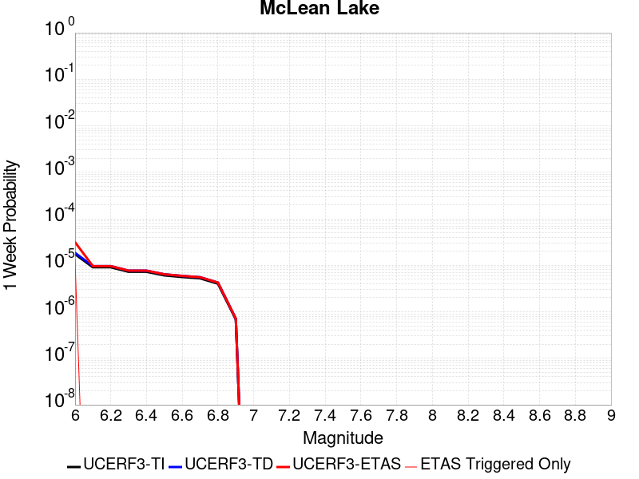 | 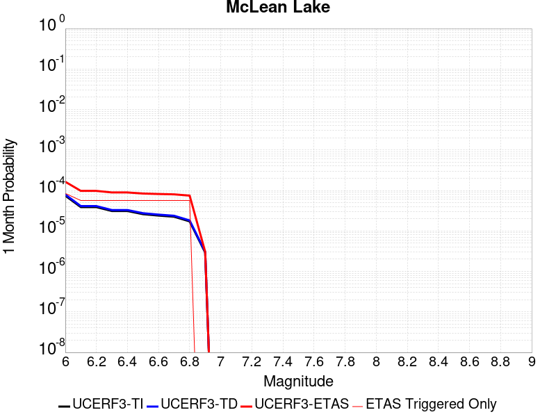 | 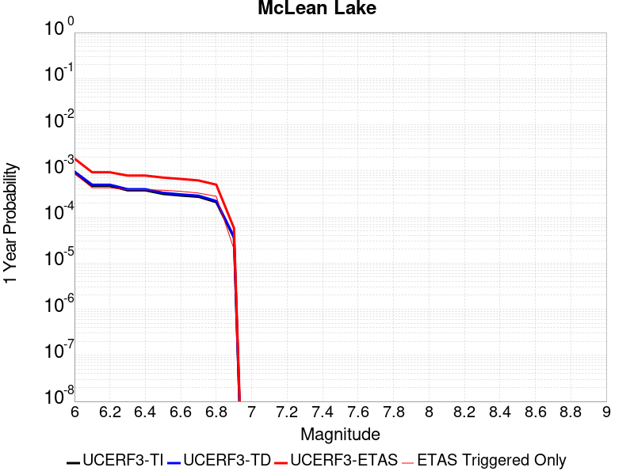 | 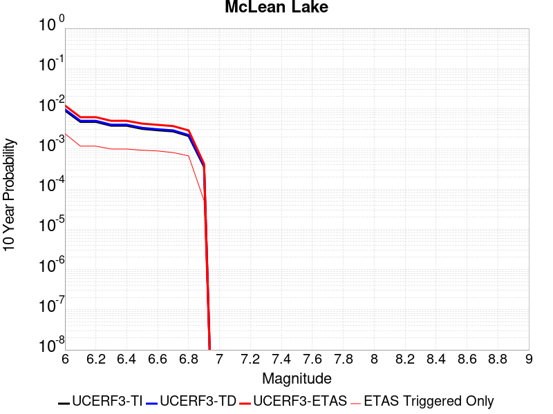 |

| Magnitude | 1 wk TI Prob | 1 wk TD Prob | 1 wk ETAS Prob | 1 wk ETAS/TD Gain | 1 wk ETAS Triggered Only | 1 mo TI Prob | 1 mo TD Prob | 1 mo ETAS Prob | 1 mo ETAS/TD Gain | 1 mo ETAS Triggered Only | 1 yr TI Prob | 1 yr TD Prob | 1 yr ETAS Prob | 1 yr ETAS/TD Gain | 1 yr ETAS Triggered Only | 10 yr TI Prob | 10 yr TD Prob | 10 yr ETAS Prob | 10 yr ETAS/TD Gain | 10 yr ETAS Triggered Only |
|-----|-----|-----|-----|-----|-----|-----|-----|-----|-----|-----|-----|-----|-----|-----|-----|-----|-----|-----|-----|-----|
| 6.0 | 1.7360222E-5 | 1.8503082E-5 | 3.655329E-5 | 1.9755243 | 1.8050541E-5 | 7.439883E-5 | 7.929679E-5 | 1.3344412E-4 | 1.6828439 | 5.4151624E-5 | 9.0542925E-4 | 9.650594E-4 | 0.0019749142 | 2.0464172 | 0.0010108303 | 0.009017491 | 0.009613527 | 0.012098432 | 1.2584801 | 0.0025090252 |
| 6.1 | 9.062689E-6 | 9.5928635E-6 | 9.5928635E-6 | 1.0 | 0.0 | 3.8839516E-5 | 4.1111674E-5 | 7.721127E-5 | 1.8780863 | 3.6101083E-5 | 4.727685E-4 | 5.0042855E-4 | 0.0010236322 | 2.0455115 | 5.234657E-4 | 0.0047176396 | 0.0049938997 | 0.006233167 | 1.2481563 | 0.0012454874 |
| 6.2 | 9.062689E-6 | 9.5928635E-6 | 9.5928635E-6 | 1.0 | 0.0 | 3.8839516E-5 | 4.1111674E-5 | 7.721127E-5 | 1.8780863 | 3.6101083E-5 | 4.727685E-4 | 5.0042855E-4 | 0.0010236322 | 2.0455115 | 5.234657E-4 | 0.0047176396 | 0.0049938997 | 0.006233167 | 1.2481563 | 0.0012454874 |
| 6.3 | 7.2575485E-6 | 7.668227E-6 | 7.668227E-6 | 1.0 | 0.0 | 3.110341E-5 | 3.2863456E-5 | 6.896335E-5 | 2.0984814 | 3.6101083E-5 | 3.786182E-4 | 4.0004626E-4 | 8.5112924E-4 | 2.127577 | 4.5126354E-4 | 0.0037797375 | 0.003993966 | 0.0050546946 | 1.2655828 | 0.0010649819 |
| 6.4 | 7.2575485E-6 | 7.668227E-6 | 7.668227E-6 | 1.0 | 0.0 | 3.110341E-5 | 3.2863456E-5 | 6.896335E-5 | 2.0984814 | 3.6101083E-5 | 3.786182E-4 | 4.0004626E-4 | 8.5112924E-4 | 2.127577 | 4.5126354E-4 | 0.0037797375 | 0.003993966 | 0.0050546946 | 1.2655828 | 0.0010649819 |
| 6.5 | 6.06582E-6 | 6.4043033E-6 | 6.4043033E-6 | 1.0 | 0.0 | 2.5996113E-5 | 2.7446762E-5 | 6.354685E-5 | 2.3152769 | 3.6101083E-5 | 3.164567E-4 | 3.3411957E-4 | 7.8523235E-4 | 2.3501537 | 4.5126354E-4 | 0.0031600643 | 0.003336811 | 0.0043442682 | 1.3019222 | 0.0010108303 |
| 6.6 | 5.598744E-6 | 5.910655E-6 | 5.910655E-6 | 1.0 | 0.0 | 2.3994397E-5 | 2.5331168E-5 | 6.143134E-5 | 2.4251285 | 3.6101083E-5 | 2.9209262E-4 | 3.0836972E-4 | 7.5949414E-4 | 2.4629333 | 4.5126354E-4 | 0.0029170897 | 0.0030800477 | 0.0040697698 | 1.3213333 | 9.927797E-4 |
| 6.7 | 5.246996E-6 | 5.5395303E-6 | 5.5395303E-6 | 1.0 | 0.0 | 2.2486933E-5 | 2.3740666E-5 | 5.984089E-5 | 2.5206072 | 3.6101083E-5 | 2.73744E-4 | 2.890106E-4 | 7.040531E-4 | 2.4360805 | 4.1516245E-4 | 0.0027340704 | 0.0028869715 | 0.0037868929 | 1.3117182 | 9.0252707E-4 |
| 6.8 | 4.02324E-6 | 4.2471866E-6 | 4.2471866E-6 | 1.0 | 0.0 | 1.7242342E-5 | 1.8202134E-5 | 5.430256E-5 | 2.9833074 | 3.6101083E-5 | 2.099053E-4 | 2.2159441E-4 | 5.644787E-4 | 2.547351 | 3.429603E-4 | 0.0020970714 | 0.0022143188 | 0.0029167312 | 1.3172137 | 7.0397113E-4 |
| 6.9 | 6.835972E-7 | 7.140307E-7 | 7.140307E-7 | 1.0 | 0.0 | 2.9296991E-6 | 3.0601298E-6 | 3.0601298E-6 | 1.0 | 0.0 | 3.56685E-5 | 3.7256763E-5 | 3.7256763E-5 | 1.0 | 0.0 | 3.5662777E-4 | 3.7253642E-4 | 4.0862407E-4 | 1.0968701 | 3.6101083E-5 |

## Gravel Hills-Harper Lk
*[(top)](#table-of-contents)*

| 1 Week | 1 Month | 1 Year | 10 Year |
|-----|-----|-----|-----|
| 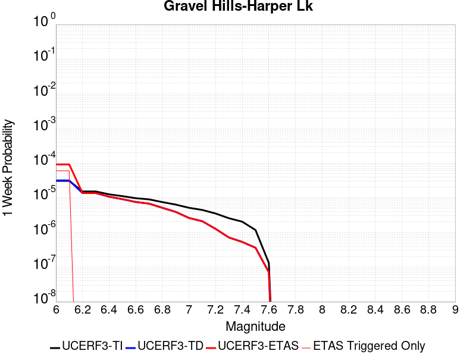 | 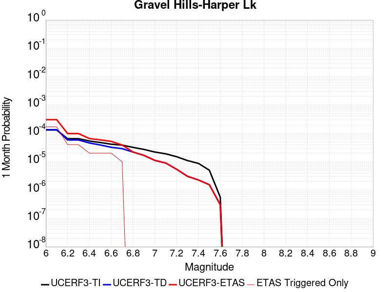 | 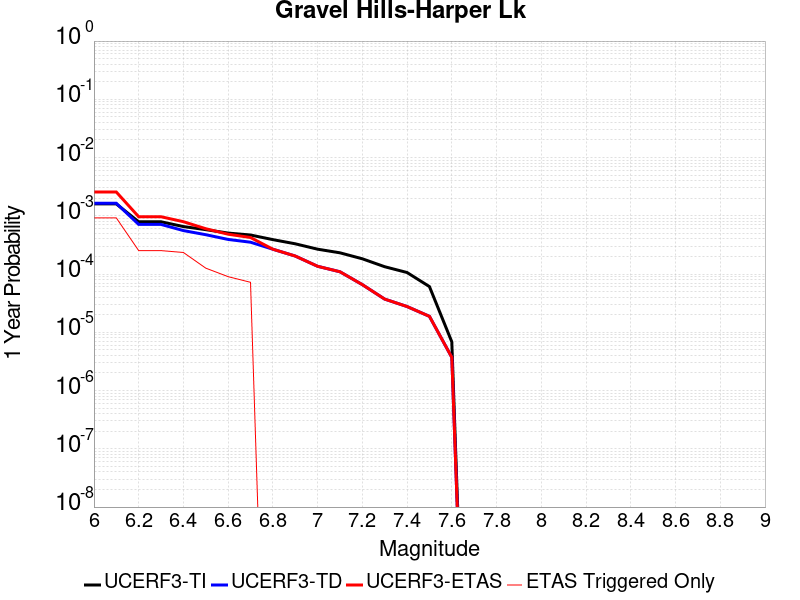 | 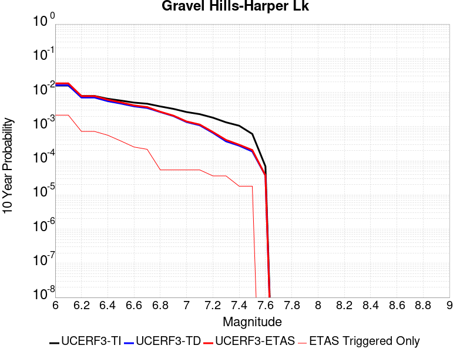 |

| Magnitude | 1 wk TI Prob | 1 wk TD Prob | 1 wk ETAS Prob | 1 wk ETAS/TD Gain | 1 wk ETAS Triggered Only | 1 mo TI Prob | 1 mo TD Prob | 1 mo ETAS Prob | 1 mo ETAS/TD Gain | 1 mo ETAS Triggered Only | 1 yr TI Prob | 1 yr TD Prob | 1 yr ETAS Prob | 1 yr ETAS/TD Gain | 1 yr ETAS Triggered Only | 10 yr TI Prob | 10 yr TD Prob | 10 yr ETAS Prob | 10 yr ETAS/TD Gain | 10 yr ETAS Triggered Only |
|-----|-----|-----|-----|-----|-----|-----|-----|-----|-----|-----|-----|-----|-----|-----|-----|-----|-----|-----|-----|-----|
| 6.0 | 3.0679566E-5 | 3.1469495E-5 | 1.21719364E-4 | 3.8678524 | 9.025271E-5 | 1.3147724E-4 | 1.3486351E-4 | 3.1534457E-4 | 2.33825 | 1.8050542E-4 | 0.0015995599 | 0.0016409428 | 0.0025600097 | 1.5600847 | 9.205776E-4 | 0.015880952 | 0.016309835 | 0.018440573 | 1.1306412 | 0.002166065 |
| 6.1 | 3.0679566E-5 | 3.1469495E-5 | 1.21719364E-4 | 3.8678524 | 9.025271E-5 | 1.3147724E-4 | 1.3486351E-4 | 3.1534457E-4 | 2.33825 | 1.8050542E-4 | 0.0015995599 | 0.0016409428 | 0.0025600097 | 1.5600847 | 9.205776E-4 | 0.015880952 | 0.016309835 | 0.018440573 | 1.1306412 | 0.002166065 |
| 6.2 | 1.514536E-5 | 1.3636876E-5 | 1.3636876E-5 | 1.0 | 0.0 | 6.490707E-5 | 5.8442514E-5 | 9.454149E-5 | 1.6176834 | 3.6101083E-5 | 7.8995706E-4 | 7.113172E-4 | 9.63845E-4 | 1.3550143 | 2.5270757E-4 | 0.007871548 | 0.0070916056 | 0.007808507 | 1.1010915 | 7.220217E-4 |
| 6.3 | 1.514536E-5 | 1.3636876E-5 | 1.3636876E-5 | 1.0 | 0.0 | 6.490707E-5 | 5.8442514E-5 | 9.454149E-5 | 1.6176834 | 3.6101083E-5 | 7.8995706E-4 | 7.113172E-4 | 9.63845E-4 | 1.3550143 | 2.5270757E-4 | 0.007871548 | 0.0070916056 | 0.007808507 | 1.1010915 | 7.220217E-4 |
| 6.4 | 1.2532521E-5 | 1.0690909E-5 | 1.0690909E-5 | 1.0 | 0.0 | 5.37097E-5 | 4.581741E-5 | 6.3867126E-5 | 1.3939488 | 1.8050541E-5 | 6.537194E-4 | 5.5769004E-4 | 7.922162E-4 | 1.4205314 | 2.3465704E-4 | 0.0065179965 | 0.005563495 | 0.0061199493 | 1.1000187 | 5.595668E-4 |
| 6.5 | 1.1094058E-5 | 9.084658E-6 | 9.084658E-6 | 1.0 | 0.0 | 4.7545094E-5 | 3.893369E-5 | 5.698353E-5 | 1.4636046 | 1.8050541E-5 | 5.787078E-4 | 4.7391863E-4 | 6.0021254E-4 | 1.2664886 | 1.2635379E-4 | 0.0057720304 | 0.004729487 | 0.0051067555 | 1.0797695 | 3.7906138E-4 |
| 6.6 | 9.688328E-6 | 7.532496E-6 | 7.532496E-6 | 1.0 | 0.0 | 4.1520743E-5 | 3.2281743E-5 | 5.03317E-5 | 1.5591383 | 1.8050541E-5 | 5.053978E-4 | 3.9296187E-4 | 4.8317912E-4 | 1.2295827 | 9.025271E-5 | 0.0050424994 | 0.0039229267 | 0.004174643 | 1.0641654 | 2.5270757E-4 |
| 6.7 | 8.974824E-6 | 6.7501237E-6 | 6.7501237E-6 | 1.0 | 0.0 | 3.8462964E-5 | 2.8928795E-5 | 4.6978814E-5 | 1.6239465 | 1.8050541E-5 | 4.6818596E-4 | 3.5215335E-4 | 4.243301E-4 | 1.2049583 | 7.2202165E-5 | 0.004672008 | 0.0035161742 | 0.003732019 | 1.0613862 | 2.166065E-4 |
| 6.8 | 7.4780046E-6 | 5.1167262E-6 | 5.1167262E-6 | 1.0 | 0.0 | 3.20482E-5 | 2.192865E-5 | 2.192865E-5 | 1.0 | 0.0 | 3.9011694E-4 | 2.6695E-4 | 2.6695E-4 | 1.0 | 0.0 | 0.0038943281 | 0.0026664315 | 0.0027204386 | 1.0202545 | 5.4151624E-5 |
| 6.9 | 6.3409307E-6 | 3.9079123E-6 | 3.9079123E-6 | 1.0 | 0.0 | 2.7175134E-5 | 1.6748092E-5 | 1.6748092E-5 | 1.0 | 0.0 | 3.3080703E-4 | 2.0388994E-4 | 2.0388994E-4 | 1.0 | 0.0 | 0.0033031502 | 0.002037127 | 0.0020911682 | 1.0265282 | 5.4151624E-5 |
| 7.0 | 5.1239335E-6 | 2.606147E-6 | 2.606147E-6 | 1.0 | 0.0 | 2.195953E-5 | 1.1169155E-5 | 1.1169155E-5 | 1.0 | 0.0 | 2.6732447E-4 | 1.3597624E-4 | 1.3597624E-4 | 1.0 | 0.0 | 0.0026700313 | 0.0013589556 | 0.0014130337 | 1.0397938 | 5.4151624E-5 |
| 7.1 | 4.438899E-6 | 2.0987156E-6 | 2.0987156E-6 | 1.0 | 0.0 | 1.9023713E-5 | 8.994466E-6 | 8.994466E-6 | 1.0 | 0.0 | 2.315891E-4 | 1.0950234E-4 | 1.0950234E-4 | 1.0 | 0.0 | 0.002313479 | 0.0010945058 | 0.001148598 | 1.0494217 | 5.4151624E-5 |
| 7.2 | 3.50367E-6 | 1.2617501E-6 | 1.2617501E-6 | 1.0 | 0.0 | 1.5015643E-5 | 5.4074894E-6 | 5.4074894E-6 | 1.0 | 0.0 | 1.8280011E-4 | 6.5834276E-5 | 6.5834276E-5 | 1.0 | 0.0 | 0.0018264982 | 6.5815594E-4 | 6.942333E-4 | 1.0548158 | 3.6101083E-5 |
| 7.3 | 2.561638E-6 | 7.1205216E-7 | 7.1205216E-7 | 1.0 | 0.0 | 1.0978401E-5 | 3.0516487E-6 | 3.0516487E-6 | 1.0 | 0.0 | 1.3365384E-4 | 3.715321E-5 | 3.715321E-5 | 1.0 | 0.0 | 0.0013357349 | 3.7147198E-4 | 4.0755965E-4 | 1.0971478 | 3.6101083E-5 |
| 7.4 | 2.0368864E-6 | 5.3059273E-7 | 5.3059273E-7 | 1.0 | 0.0 | 8.729483E-6 | 2.2739669E-6 | 2.2739669E-6 | 1.0 | 0.0 | 1.06276275E-4 | 2.76852E-5 | 2.76852E-5 | 1.0 | 0.0 | 0.0010622547 | 2.7681806E-4 | 2.948636E-4 | 1.0651892 | 1.8050541E-5 |
| 7.5 | 1.1681728E-6 | 3.6036903E-7 | 3.6036903E-7 | 1.0 | 0.0 | 5.0064455E-6 | 1.5444379E-6 | 1.5444379E-6 | 1.0 | 0.0 | 6.0951766E-5 | 1.8803374E-5 | 1.8803374E-5 | 1.0 | 0.0 | 6.093505E-4 | 1.8801828E-4 | 2.0606544E-4 | 1.0959861 | 1.8050541E-5 |
| 7.6 | 1.3154387E-7 | 7.12053E-8 | 7.12053E-8 | 1.0 | 0.0 | 5.6375933E-7 | 3.0516554E-7 | 3.0516554E-7 | 1.0 | 0.0 | 6.863748E-6 | 3.7153857E-6 | 3.7153857E-6 | 1.0 | 0.0 | 6.863536E-5 | 3.7153393E-5 | 3.7153393E-5 | 1.0 | 0.0 |

## Goldstone Lake
*[(top)](#table-of-contents)*

| 1 Week | 1 Month | 1 Year | 10 Year |
|-----|-----|-----|-----|
| 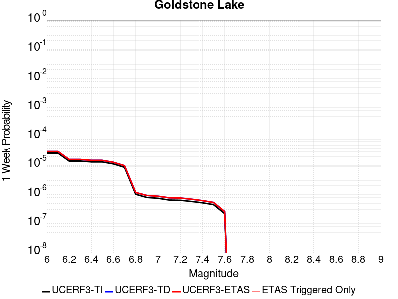 |  | 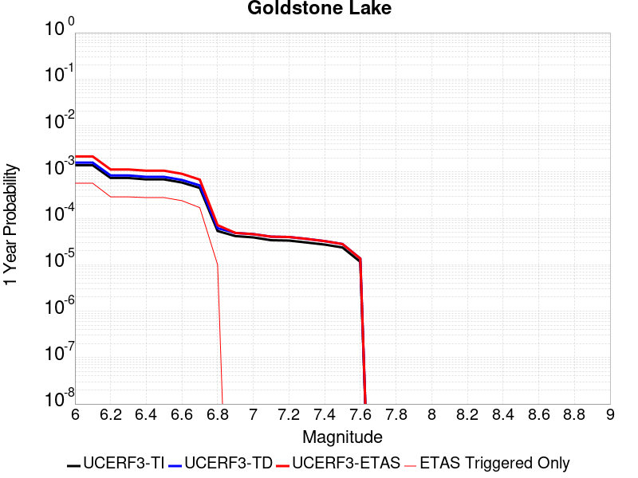 | 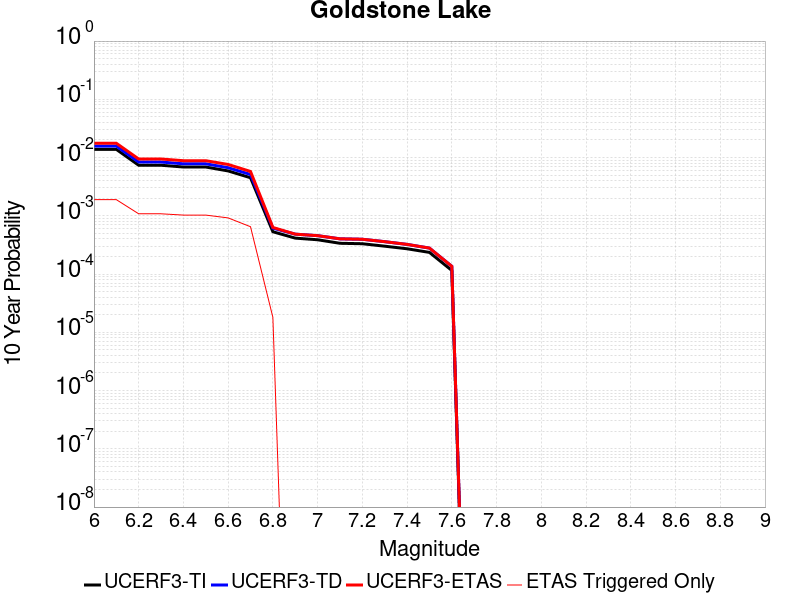 |

| Magnitude | 1 wk TI Prob | 1 wk TD Prob | 1 wk ETAS Prob | 1 wk ETAS/TD Gain | 1 wk ETAS Triggered Only | 1 mo TI Prob | 1 mo TD Prob | 1 mo ETAS Prob | 1 mo ETAS/TD Gain | 1 mo ETAS Triggered Only | 1 yr TI Prob | 1 yr TD Prob | 1 yr ETAS Prob | 1 yr ETAS/TD Gain | 1 yr ETAS Triggered Only | 10 yr TI Prob | 10 yr TD Prob | 10 yr ETAS Prob | 10 yr ETAS/TD Gain | 10 yr ETAS Triggered Only |
|-----|-----|-----|-----|-----|-----|-----|-----|-----|-----|-----|-----|-----|-----|-----|-----|-----|-----|-----|-----|-----|
| 6.0 | 2.671352E-5 | 3.0380934E-5 | 3.0380934E-5 | 1.0 | 0.0 | 1.1448149E-4 | 1.3019862E-4 | 1.8434318E-4 | 1.4158614 | 5.4151624E-5 | 0.001392921 | 0.001584212 | 0.002178936 | 1.375407 | 5.9566787E-4 | 0.013842222 | 0.01574869 | 0.017614149 | 1.1184516 | 0.0018953069 |
| 6.1 | 2.671352E-5 | 3.0380934E-5 | 3.0380934E-5 | 1.0 | 0.0 | 1.1448149E-4 | 1.3019862E-4 | 1.8434318E-4 | 1.4158614 | 5.4151624E-5 | 0.001392921 | 0.001584212 | 0.002178936 | 1.375407 | 5.9566787E-4 | 0.013842222 | 0.01574869 | 0.017614149 | 1.1184516 | 0.0018953069 |
| 6.2 | 1.4197047E-5 | 1.6098686E-5 | 1.6098686E-5 | 1.0 | 0.0 | 6.0843064E-5 | 6.89931E-5 | 1.0509169E-4 | 1.5232203 | 3.6101083E-5 | 7.4051257E-4 | 8.3976594E-4 | 0.0011463674 | 1.3651036 | 3.068592E-4 | 0.007380498 | 0.008375625 | 0.009449587 | 1.1282246 | 0.0010830325 |
| 6.3 | 1.4197047E-5 | 1.6098686E-5 | 1.6098686E-5 | 1.0 | 0.0 | 6.0843064E-5 | 6.89931E-5 | 1.0509169E-4 | 1.5232203 | 3.6101083E-5 | 7.4051257E-4 | 8.3976594E-4 | 0.0011463674 | 1.3651036 | 3.068592E-4 | 0.007380498 | 0.008375625 | 0.009449587 | 1.1282246 | 0.0010830325 |
| 6.4 | 1.3238931E-5 | 1.5010725E-5 | 1.5010725E-5 | 1.0 | 0.0 | 5.6737044E-5 | 6.433064E-5 | 1.004294E-4 | 1.5611441 | 3.6101083E-5 | 6.9055456E-4 | 7.8304217E-4 | 0.0010896611 | 1.3915739 | 3.068592E-4 | 0.006884126 | 0.0078124595 | 0.008833302 | 1.1306685 | 0.0010288808 |
| 6.5 | 1.3238931E-5 | 1.5010725E-5 | 1.5010725E-5 | 1.0 | 0.0 | 5.6737044E-5 | 6.433064E-5 | 1.004294E-4 | 1.5611441 | 3.6101083E-5 | 6.9055456E-4 | 7.8304217E-4 | 0.0010896611 | 1.3915739 | 3.068592E-4 | 0.006884126 | 0.0078124595 | 0.008833302 | 1.1306685 | 0.0010288808 |
| 6.6 | 1.1328278E-5 | 1.2857105E-5 | 1.2857105E-5 | 1.0 | 0.0 | 4.8548856E-5 | 5.5101253E-5 | 7.31508E-5 | 1.3275706 | 1.8050541E-5 | 5.90922E-4 | 6.7074696E-4 | 9.4132347E-4 | 1.4033958 | 2.7075812E-4 | 0.0058935313 | 0.0066966168 | 0.0076110293 | 1.1365485 | 9.205776E-4 |
| 6.7 | 8.651175E-6 | 9.826025E-6 | 9.826025E-6 | 1.0 | 0.0 | 3.707594E-5 | 4.211137E-5 | 6.016115E-5 | 1.4286202 | 1.8050541E-5 | 4.5130608E-4 | 5.1267585E-4 | 6.9308875E-4 | 1.3519044 | 1.8050542E-4 | 0.0045039062 | 0.0051238127 | 0.0057703024 | 1.1261736 | 6.498195E-4 |
| 6.8 | 1.0215377E-6 | 1.1755512E-6 | 1.1755512E-6 | 1.0 | 0.0 | 4.378012E-6 | 5.0380677E-6 | 5.0380677E-6 | 1.0 | 0.0 | 5.3300988E-5 | 6.133686E-5 | 7.938629E-5 | 1.2942673 | 1.8050541E-5 | 5.3288206E-4 | 6.1321055E-4 | 6.3125003E-4 | 1.0294181 | 1.8050541E-5 |
| 6.9 | 7.9360774E-7 | 9.2839576E-7 | 9.2839576E-7 | 1.0 | 0.0 | 3.4011714E-6 | 3.9788333E-6 | 3.9788333E-6 | 1.0 | 0.0 | 4.1408475E-5 | 4.844129E-5 | 4.844129E-5 | 1.0 | 0.0 | 4.140076E-4 | 4.843143E-4 | 4.843143E-4 | 1.0 | 0.0 |
| 7.0 | 7.4382757E-7 | 8.7478406E-7 | 8.7478406E-7 | 1.0 | 0.0 | 3.1878285E-6 | 3.7490695E-6 | 3.7490695E-6 | 1.0 | 0.0 | 3.8811122E-5 | 4.5644032E-5 | 4.5644032E-5 | 1.0 | 0.0 | 3.8804344E-4 | 4.563532E-4 | 4.563532E-4 | 1.0 | 0.0 |
| 7.1 | 6.4709513E-7 | 7.711724E-7 | 7.711724E-7 | 1.0 | 0.0 | 2.773262E-6 | 3.3050208E-6 | 3.3050208E-6 | 1.0 | 0.0 | 3.376394E-5 | 4.0237945E-5 | 4.0237945E-5 | 1.0 | 0.0 | 3.375881E-4 | 4.0231255E-4 | 4.0231255E-4 | 1.0 | 0.0 |
| 7.2 | 6.356704E-7 | 7.5887726E-7 | 7.5887726E-7 | 1.0 | 0.0 | 2.7242988E-6 | 3.2523274E-6 | 3.2523274E-6 | 1.0 | 0.0 | 3.3167835E-5 | 3.9596427E-5 | 3.9596427E-5 | 1.0 | 0.0 | 3.3162883E-4 | 3.9589964E-4 | 3.9589964E-4 | 1.0 | 0.0 |
| 7.3 | 5.7695723E-7 | 6.896946E-7 | 6.896946E-7 | 1.0 | 0.0 | 2.4726714E-6 | 2.955831E-6 | 2.955831E-6 | 1.0 | 0.0 | 3.0104358E-5 | 3.5986708E-5 | 3.5986708E-5 | 1.0 | 0.0 | 3.0100282E-4 | 3.5981453E-4 | 3.5981453E-4 | 1.0 | 0.0 |
| 7.4 | 5.209647E-7 | 6.193835E-7 | 6.193835E-7 | 1.0 | 0.0 | 2.232704E-6 | 2.6544983E-6 | 2.6544983E-6 | 1.0 | 0.0 | 2.718283E-5 | 3.2318094E-5 | 3.2318094E-5 | 1.0 | 0.0 | 2.7179506E-4 | 3.231395E-4 | 3.231395E-4 | 1.0 | 0.0 |
| 7.5 | 4.512955E-7 | 5.34915E-7 | 5.34915E-7 | 1.0 | 0.0 | 1.934122E-6 | 2.292491E-6 | 2.292491E-6 | 1.0 | 0.0 | 2.3547682E-5 | 2.7910775E-5 | 2.7910775E-5 | 1.0 | 0.0 | 2.3545188E-4 | 2.79078E-4 | 2.79078E-4 | 1.0 | 0.0 |
| 7.6 | 2.21172E-7 | 2.6040772E-7 | 2.6040772E-7 | 1.0 | 0.0 | 9.478797E-7 | 1.1160328E-6 | 1.1160328E-6 | 1.0 | 0.0 | 1.1540374E-5 | 1.3587643E-5 | 1.3587643E-5 | 1.0 | 0.0 | 1.1539775E-4 | 1.3587093E-4 | 1.3587093E-4 | 1.0 | 0.0 |

## San Andreas (Mojave S)
*[(top)](#table-of-contents)*

| 1 Week | 1 Month | 1 Year | 10 Year |
|-----|-----|-----|-----|
|  | 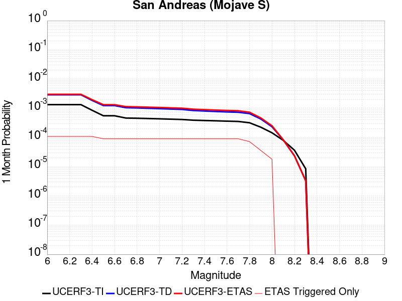 | 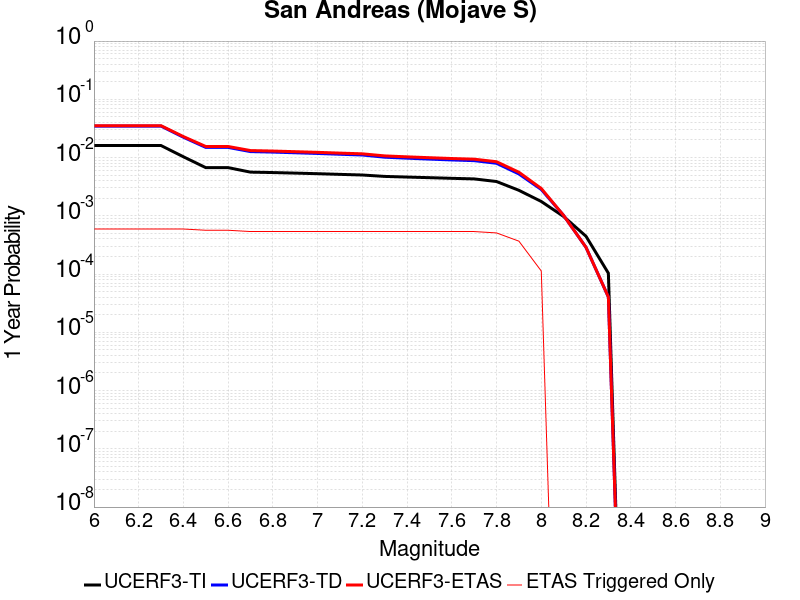 | 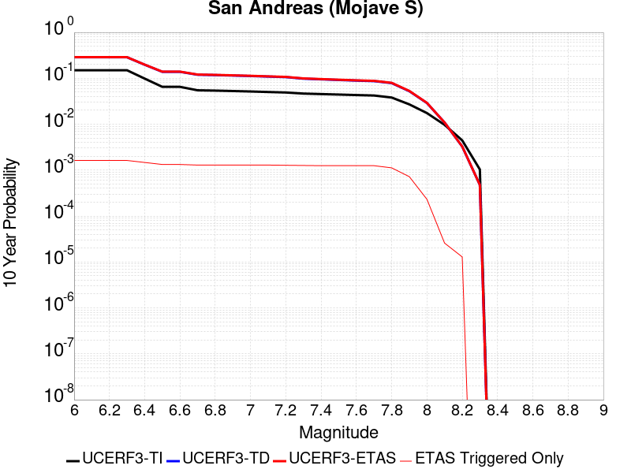 |

| Magnitude | 1 wk TI Prob | 1 wk TD Prob | 1 wk ETAS Prob | 1 wk ETAS/TD Gain | 1 wk ETAS Triggered Only | 1 mo TI Prob | 1 mo TD Prob | 1 mo ETAS Prob | 1 mo ETAS/TD Gain | 1 mo ETAS Triggered Only | 1 yr TI Prob | 1 yr TD Prob | 1 yr ETAS Prob | 1 yr ETAS/TD Gain | 1 yr ETAS Triggered Only | 10 yr TI Prob | 10 yr TD Prob | 10 yr ETAS Prob | 10 yr ETAS/TD Gain | 10 yr ETAS Triggered Only |
|-----|-----|-----|-----|-----|-----|-----|-----|-----|-----|-----|-----|-----|-----|-----|-----|-----|-----|-----|-----|-----|
| 6.0 | 3.1064058E-4 | 6.754822E-4 | 6.935206E-4 | 1.0267044 | 1.8050541E-5 | 0.0013306376 | 0.0028918404 | 0.0029998305 | 1.037343 | 1.0830325E-4 | 0.016080605 | 0.034666 | 0.035328142 | 1.0191007 | 6.859206E-4 | 0.1496549 | 0.2869046 | 0.28807595 | 1.0040827 | 0.0016425992 |
| 6.1 | 3.1064058E-4 | 6.754822E-4 | 6.935206E-4 | 1.0267044 | 1.8050541E-5 | 0.0013306376 | 0.0028918404 | 0.0029998305 | 1.037343 | 1.0830325E-4 | 0.016080605 | 0.034666 | 0.035328142 | 1.0191007 | 6.859206E-4 | 0.1496549 | 0.2869046 | 0.28807595 | 1.0040827 | 0.0016425992 |
| 6.2 | 3.1064058E-4 | 6.754822E-4 | 6.935206E-4 | 1.0267044 | 1.8050541E-5 | 0.0013306376 | 0.0028918404 | 0.0029998305 | 1.037343 | 1.0830325E-4 | 0.016080605 | 0.034666 | 0.035328142 | 1.0191007 | 6.859206E-4 | 0.1496549 | 0.2869046 | 0.28807595 | 1.0040827 | 0.0016425992 |
| 6.3 | 3.1064058E-4 | 6.754822E-4 | 6.935206E-4 | 1.0267044 | 1.8050541E-5 | 0.0013306376 | 0.0028918404 | 0.0029998305 | 1.037343 | 1.0830325E-4 | 0.016080605 | 0.034666 | 0.035328142 | 1.0191007 | 6.859206E-4 | 0.1496549 | 0.2869046 | 0.28807595 | 1.0040827 | 0.0016425992 |
| 6.4 | 1.9872203E-4 | 4.32625E-4 | 4.5066772E-4 | 1.0417053 | 1.8050541E-5 | 8.5138786E-4 | 0.001852818 | 0.0019609204 | 1.058345 | 1.0830325E-4 | 0.010316478 | 0.022330876 | 0.023001479 | 1.0300304 | 6.859206E-4 | 0.098504856 | 0.19731723 | 0.19854878 | 1.0062414 | 0.0015342961 |
| 6.5 | 1.291105E-4 | 2.8831547E-4 | 3.063608E-4 | 1.0625888 | 1.8050541E-5 | 5.5321335E-4 | 0.0012350554 | 0.0013251966 | 1.0729855 | 9.025271E-5 | 0.006714592 | 0.014933955 | 0.01555629 | 1.0416725 | 6.3176895E-4 | 0.065152965 | 0.13836113 | 0.1395587 | 1.0086555 | 0.0013898917 |
| 6.6 | 1.291105E-4 | 2.8831547E-4 | 3.063608E-4 | 1.0625888 | 1.8050541E-5 | 5.5321335E-4 | 0.0012350554 | 0.0013251966 | 1.0729855 | 9.025271E-5 | 0.006714592 | 0.014933955 | 0.01555629 | 1.0416725 | 6.3176895E-4 | 0.065152965 | 0.13836113 | 0.1395587 | 1.0086555 | 0.0013898917 |
| 6.7 | 1.08001186E-4 | 2.441156E-4 | 2.6216172E-4 | 1.0739245 | 1.8050541E-5 | 4.6278012E-4 | 0.0010457909 | 0.0011359492 | 1.0862106 | 9.025271E-5 | 0.0056198016 | 0.012658471 | 0.013264421 | 1.0478691 | 6.137184E-4 | 0.054797906 | 0.1195067 | 0.120698705 | 1.0099744 | 0.0013537906 |
| 6.8 | 1.0624356E-4 | 2.3929002E-4 | 2.5733624E-4 | 1.0754157 | 1.8050541E-5 | 4.5525006E-4 | 0.0010251261 | 0.0011152864 | 1.0879503 | 9.025271E-5 | 0.0055285925 | 0.012409763 | 0.013015865 | 1.0488408 | 6.137184E-4 | 0.053930566 | 0.11745576 | 0.11865054 | 1.0101721 | 0.0013537906 |
| 6.9 | 1.0393785E-4 | 2.3299051E-4 | 2.5103684E-4 | 1.0774553 | 1.8050541E-5 | 4.4537184E-4 | 9.98149E-4 | 0.0010883117 | 1.0903298 | 9.025271E-5 | 0.0054089287 | 0.012085002 | 0.012691303 | 1.0501697 | 6.137184E-4 | 0.05279156 | 0.11475311 | 0.11595155 | 1.0104437 | 0.0013537906 |
| 7.0 | 1.0155622E-4 | 2.266824E-4 | 2.4472884E-4 | 1.0796112 | 1.8050541E-5 | 4.3516833E-4 | 9.711347E-4 | 0.0010612997 | 1.0928451 | 9.025271E-5 | 0.005285311 | 0.011759693 | 0.012366194 | 1.0515746 | 6.137184E-4 | 0.05161361 | 0.11201292 | 0.11321507 | 1.0107322 | 0.0013537906 |
| 7.1 | 9.885595E-5 | 2.1956247E-4 | 2.3760906E-4 | 1.0821934 | 1.8050541E-5 | 4.2359953E-4 | 9.40643E-4 | 0.0010308109 | 1.0958576 | 9.025271E-5 | 0.0051451353 | 0.011392393 | 0.01199912 | 1.0532572 | 6.137184E-4 | 0.05027629 | 0.108897015 | 0.11010338 | 1.011078 | 0.0013537906 |
| 7.2 | 9.6411415E-5 | 2.1318863E-4 | 2.3123532E-4 | 1.0846514 | 1.8050541E-5 | 4.1312634E-4 | 9.133459E-4 | 0.0010035161 | 1.0987252 | 9.025271E-5 | 0.005018219 | 0.011063472 | 0.011670401 | 1.0548588 | 6.137184E-4 | 0.049064007 | 0.10608634 | 0.10729652 | 1.0114074 | 0.0013537906 |
| 7.3 | 9.1180635E-5 | 1.954517E-4 | 2.1349872E-4 | 1.0923349 | 1.8050541E-5 | 3.907156E-4 | 8.3738135E-4 | 9.2755846E-4 | 1.1076895 | 9.025271E-5 | 0.004746591 | 0.010147573 | 0.010755064 | 1.0598656 | 6.137184E-4 | 0.046464786 | 0.09827431 | 0.09947879 | 1.0122563 | 0.0013357401 |
| 7.4 | 8.887388E-5 | 1.879291E-4 | 2.0597623E-4 | 1.0960317 | 1.8050541E-5 | 3.8083247E-4 | 8.0516184E-4 | 8.953419E-4 | 1.1120024 | 9.025271E-5 | 0.0046267817 | 0.009758882 | 0.010366612 | 1.0622745 | 6.137184E-4 | 0.045316286 | 0.09490697 | 0.0960996 | 1.0125663 | 0.0013176895 |
| 7.5 | 8.6750515E-5 | 1.8123702E-4 | 1.9928429E-4 | 1.0995783 | 1.8050541E-5 | 3.7173493E-4 | 7.76499E-4 | 8.6668157E-4 | 1.11614 | 9.025271E-5 | 0.004516484 | 0.009412982 | 0.010020923 | 1.0645854 | 6.137184E-4 | 0.04425787 | 0.091868594 | 0.093065225 | 1.0130255 | 0.0013176895 |
| 7.6 | 8.453092E-5 | 1.7510384E-4 | 1.9315122E-4 | 1.1030667 | 1.8050541E-5 | 3.6222505E-4 | 7.502293E-4 | 8.4041426E-4 | 1.1202099 | 9.025271E-5 | 0.0044011753 | 0.0090958625 | 0.009703999 | 1.0668585 | 6.137184E-4 | 0.04315024 | 0.089024775 | 0.09022516 | 1.0134836 | 0.0013176895 |
| 7.7 | 8.259102E-5 | 1.7031733E-4 | 1.883648E-4 | 1.1059638 | 1.8050541E-5 | 3.539135E-4 | 7.2972727E-4 | 8.199141E-4 | 1.1235898 | 9.025271E-5 | 0.004300386 | 0.008848307 | 0.009456595 | 1.0687462 | 6.137184E-4 | 0.042181134 | 0.08677291 | 0.08797626 | 1.0138679 | 0.0013176895 |
| 7.8 | 7.444844E-5 | 1.5347762E-4 | 1.7152539E-4 | 1.1175922 | 1.8050541E-5 | 3.1902574E-4 | 6.5759546E-4 | 7.2975014E-4 | 1.109725 | 7.2202165E-5 | 0.0038772223 | 0.007976884 | 0.008531987 | 1.069589 | 5.595668E-4 | 0.03810269 | 0.07857876 | 0.07967648 | 1.0139697 | 0.0011913357 |
| 7.9 | 5.2586525E-5 | 1.0050359E-4 | 1.0050359E-4 | 1.0 | 0.0 | 2.2535135E-4 | 4.3065855E-4 | 4.667441E-4 | 1.0837915 | 3.6101083E-5 | 0.0027402006 | 0.0052306736 | 0.005589796 | 1.068657 | 3.6101084E-4 | 0.027066574 | 0.05240521 | 0.053106498 | 1.0133821 | 7.400722E-4 |
| 8.0 | 3.379877E-5 | 5.4328717E-5 | 5.4328717E-5 | 1.0 | 0.0 | 1.4484383E-4 | 2.3281659E-4 | 2.508629E-4 | 1.0775131 | 1.8050541E-5 | 0.0017620471 | 0.0028308593 | 0.002938856 | 1.0381498 | 1.0830325E-4 | 0.017481409 | 0.028959664 | 0.029187525 | 1.0078683 | 2.3465704E-4 |
| 8.1 | 1.8668277E-5 | 1.9431174E-5 | 1.9431174E-5 | 1.0 | 0.0 | 8.000444E-5 | 8.327381E-5 | 8.327381E-5 | 1.0 | 0.0 | 9.736188E-4 | 0.0010133877 | 0.0010133877 | 1.0 | 0.0 | 0.009693642 | 0.010862639 | 0.010862639 | 1.0 | 0.0 |
| 8.2 | 8.541571E-6 | 5.507532E-6 | 5.507532E-6 | 1.0 | 0.0 | 3.660622E-5 | 2.3603496E-5 | 2.3603496E-5 | 1.0 | 0.0 | 4.455896E-4 | 2.8733475E-4 | 2.8733475E-4 | 1.0 | 0.0 | 0.0044469717 | 0.0032663587 | 0.0032663587 | 1.0 | 0.0 |
| 8.3 | 1.983087E-6 | 7.740189E-7 | 7.740189E-7 | 1.0 | 0.0 | 8.498917E-6 | 3.3172198E-6 | 3.3172198E-6 | 1.0 | 0.0 | 1.034694E-4 | 4.0386418E-5 | 4.0386418E-5 | 1.0 | 0.0 | 0.0010342124 | 4.7657243E-4 | 4.7657243E-4 | 1.0 | 0.0 |

## San Andreas (Mojave N)
*[(top)](#table-of-contents)*

| 1 Week | 1 Month | 1 Year | 10 Year |
|-----|-----|-----|-----|
| 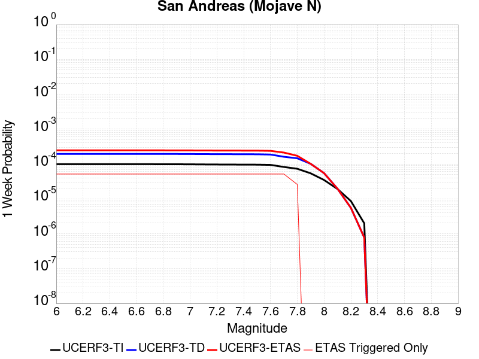 | 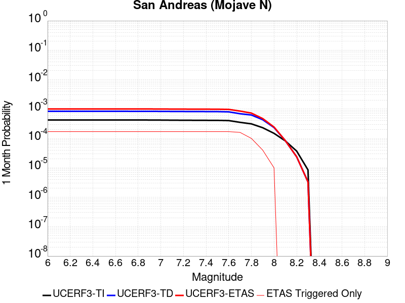 | 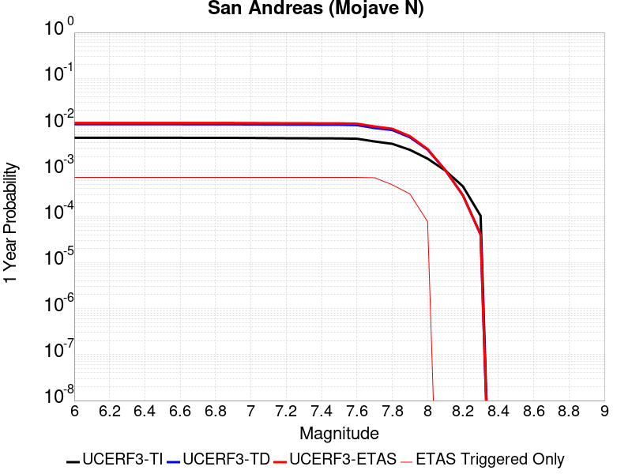 | 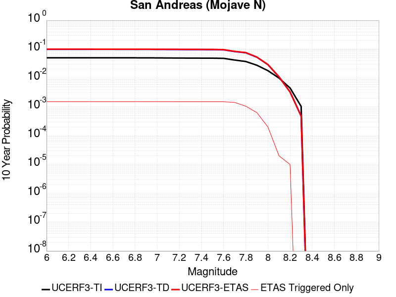 |

| Magnitude | 1 wk TI Prob | 1 wk TD Prob | 1 wk ETAS Prob | 1 wk ETAS/TD Gain | 1 wk ETAS Triggered Only | 1 mo TI Prob | 1 mo TD Prob | 1 mo ETAS Prob | 1 mo ETAS/TD Gain | 1 mo ETAS Triggered Only | 1 yr TI Prob | 1 yr TD Prob | 1 yr ETAS Prob | 1 yr ETAS/TD Gain | 1 yr ETAS Triggered Only | 10 yr TI Prob | 10 yr TD Prob | 10 yr ETAS Prob | 10 yr ETAS/TD Gain | 10 yr ETAS Triggered Only |
|-----|-----|-----|-----|-----|-----|-----|-----|-----|-----|-----|-----|-----|-----|-----|-----|-----|-----|-----|-----|-----|
| 6.0 | 9.877682E-5 | 1.947917E-4 | 2.4893277E-4 | 1.2779435 | 5.4151624E-5 | 4.2326056E-4 | 8.3455467E-4 | 9.96874E-4 | 1.1944981 | 1.6245487E-4 | 0.0051410277 | 0.0101134945 | 0.010881818 | 1.0759702 | 7.761733E-4 | 0.05023708 | 0.09865823 | 0.10015503 | 1.0151716 | 0.0016606498 |
| 6.1 | 9.877682E-5 | 1.947917E-4 | 2.4893277E-4 | 1.2779435 | 5.4151624E-5 | 4.2326056E-4 | 8.3455467E-4 | 9.96874E-4 | 1.1944981 | 1.6245487E-4 | 0.0051410277 | 0.0101134945 | 0.010881818 | 1.0759702 | 7.761733E-4 | 0.05023708 | 0.09865823 | 0.10015503 | 1.0151716 | 0.0016606498 |
| 6.2 | 9.877682E-5 | 1.947917E-4 | 2.4893277E-4 | 1.2779435 | 5.4151624E-5 | 4.2326056E-4 | 8.3455467E-4 | 9.96874E-4 | 1.1944981 | 1.6245487E-4 | 0.0051410277 | 0.0101134945 | 0.010881818 | 1.0759702 | 7.761733E-4 | 0.05023708 | 0.09865823 | 0.10015503 | 1.0151716 | 0.0016606498 |
| 6.3 | 9.877682E-5 | 1.947917E-4 | 2.4893277E-4 | 1.2779435 | 5.4151624E-5 | 4.2326056E-4 | 8.3455467E-4 | 9.96874E-4 | 1.1944981 | 1.6245487E-4 | 0.0051410277 | 0.0101134945 | 0.010881818 | 1.0759702 | 7.761733E-4 | 0.05023708 | 0.09865823 | 0.10015503 | 1.0151716 | 0.0016606498 |
| 6.4 | 9.877682E-5 | 1.947917E-4 | 2.4893277E-4 | 1.2779435 | 5.4151624E-5 | 4.2326056E-4 | 8.3455467E-4 | 9.96874E-4 | 1.1944981 | 1.6245487E-4 | 0.0051410277 | 0.0101134945 | 0.010881818 | 1.0759702 | 7.761733E-4 | 0.05023708 | 0.09865823 | 0.10015503 | 1.0151716 | 0.0016606498 |
| 6.5 | 9.861474E-5 | 1.9452913E-4 | 2.4867023E-4 | 1.2783186 | 5.4151624E-5 | 4.2256617E-4 | 8.334301E-4 | 9.957496E-4 | 1.1947608 | 1.6245487E-4 | 0.0051326132 | 0.01009993 | 0.010868263 | 1.0760732 | 7.761733E-4 | 0.050156746 | 0.09853596 | 0.10003298 | 1.0151926 | 0.0016606498 |
| 6.6 | 9.861474E-5 | 1.9452913E-4 | 2.4867023E-4 | 1.2783186 | 5.4151624E-5 | 4.2256617E-4 | 8.334301E-4 | 9.957496E-4 | 1.1947608 | 1.6245487E-4 | 0.0051326132 | 0.01009993 | 0.010868263 | 1.0760732 | 7.761733E-4 | 0.050156746 | 0.09853596 | 0.10003298 | 1.0151926 | 0.0016606498 |
| 6.7 | 9.8552715E-5 | 1.9442856E-4 | 2.4856968E-4 | 1.2784626 | 5.4151624E-5 | 4.223004E-4 | 8.3299936E-4 | 9.953189E-4 | 1.1948615 | 1.6245487E-4 | 0.0051293927 | 0.010094734 | 0.010863072 | 1.0761127 | 7.761733E-4 | 0.050125998 | 0.09848913 | 0.099986225 | 1.0152006 | 0.0016606498 |
| 6.8 | 9.8464974E-5 | 1.9427997E-4 | 2.4842107E-4 | 1.2786757 | 5.4151624E-5 | 4.219245E-4 | 8.323629E-4 | 9.946825E-4 | 1.1950107 | 1.6245487E-4 | 0.0051248376 | 0.010087057 | 0.010855401 | 1.0761713 | 7.761733E-4 | 0.05008251 | 0.098419085 | 0.099916294 | 1.0152127 | 0.0016606498 |
| 6.9 | 9.825824E-5 | 1.9395964E-4 | 2.4810075E-4 | 1.2791361 | 5.4151624E-5 | 4.2103877E-4 | 8.3099096E-4 | 9.933108E-4 | 1.1953329 | 1.6245487E-4 | 0.0051141046 | 0.010070508 | 0.010838865 | 1.0762978 | 7.761733E-4 | 0.049980022 | 0.09826805 | 0.09976551 | 1.0152385 | 0.0016606498 |
| 7.0 | 9.781462E-5 | 1.932724E-4 | 2.4741355E-4 | 1.2801287 | 5.4151624E-5 | 4.1913814E-4 | 8.280475E-4 | 9.903678E-4 | 1.1960279 | 1.6245487E-4 | 0.005091073 | 0.010035003 | 0.010803387 | 1.0765704 | 7.761733E-4 | 0.04976007 | 0.09794415 | 0.09944215 | 1.0152944 | 0.0016606498 |
| 7.1 | 9.7121134E-5 | 1.9228828E-4 | 2.464295E-4 | 1.2815627 | 5.4151624E-5 | 4.1616702E-4 | 8.238326E-4 | 9.861536E-4 | 1.1970316 | 1.6245487E-4 | 0.005055068 | 0.009984157 | 0.010752581 | 1.0769644 | 7.761733E-4 | 0.04941613 | 0.09748027 | 0.09897904 | 1.0153751 | 0.0016606498 |
| 7.2 | 9.663819E-5 | 1.9159526E-4 | 2.457365E-4 | 1.2825813 | 5.4151624E-5 | 4.1409794E-4 | 8.2086434E-4 | 9.831858E-4 | 1.1977446 | 1.6245487E-4 | 0.0050299936 | 0.00994835 | 0.010716801 | 1.0772442 | 7.761733E-4 | 0.049176537 | 0.097153254 | 0.09863627 | 1.0152647 | 0.0016425992 |
| 7.3 | 9.6277574E-5 | 1.9111928E-4 | 2.4526057E-4 | 1.2832853 | 5.4151624E-5 | 4.125529E-4 | 8.188257E-4 | 9.811475E-4 | 1.1982374 | 1.6245487E-4 | 0.0050112694 | 0.009923755 | 0.010692227 | 1.0774375 | 7.761733E-4 | 0.04899759 | 0.096926294 | 0.09840968 | 1.0153043 | 0.0016425992 |
| 7.4 | 9.593308E-5 | 1.9051587E-4 | 2.446572E-4 | 1.2841827 | 5.4151624E-5 | 4.1107697E-4 | 8.162413E-4 | 9.785636E-4 | 1.1988655 | 1.6245487E-4 | 0.0049933824 | 0.009892576 | 0.010661072 | 1.077684 | 7.761733E-4 | 0.04882661 | 0.09664405 | 0.0981279 | 1.0153538 | 0.0016425992 |
| 7.5 | 9.561707E-5 | 1.8997559E-4 | 2.4411692E-4 | 1.284991 | 5.4151624E-5 | 4.0972308E-4 | 8.139272E-4 | 9.7624987E-4 | 1.1994314 | 1.6245487E-4 | 0.0049769743 | 0.009864658 | 0.010633174 | 1.077906 | 7.761733E-4 | 0.048669744 | 0.096389845 | 0.09787411 | 1.0153986 | 0.0016425992 |
| 7.6 | 9.418194E-5 | 1.8649177E-4 | 2.4063331E-4 | 1.2903159 | 5.4151624E-5 | 4.0357444E-4 | 7.9900585E-4 | 9.613309E-4 | 1.2031589 | 1.6245487E-4 | 0.004902454 | 0.009684619 | 0.010453275 | 1.0793688 | 7.761733E-4 | 0.047957025 | 0.09477006 | 0.096256986 | 1.0156898 | 0.0016425992 |
| 7.7 | 8.202141E-5 | 1.609174E-4 | 2.1506031E-4 | 1.3364639 | 5.4151624E-5 | 3.51473E-4 | 6.894638E-4 | 8.337686E-4 | 1.2093 | 1.4440433E-4 | 0.00427079 | 0.008361971 | 0.009113754 | 1.089905 | 7.5812277E-4 | 0.04189639 | 0.08254756 | 0.083988324 | 1.0174538 | 0.001570397 |
| 7.8 | 7.2859846E-5 | 1.4579813E-4 | 1.6384604E-4 | 1.1237869 | 1.8050541E-5 | 3.1221908E-4 | 6.246995E-4 | 6.968566E-4 | 1.1155069 | 7.2202165E-5 | 0.003794643 | 0.007579235 | 0.008134561 | 1.0732694 | 5.595668E-4 | 0.037304975 | 0.0750105 | 0.07611248 | 1.0146909 | 0.0011913357 |
| 7.9 | 5.3874453E-5 | 1.0090101E-4 | 1.0090101E-4 | 1.0 | 0.0 | 2.3087008E-4 | 4.3236124E-4 | 4.684467E-4 | 1.0834614 | 3.6101083E-5 | 0.0028072202 | 0.0052513042 | 0.005610419 | 1.0683858 | 3.6101084E-4 | 0.02772022 | 0.052632168 | 0.05333329 | 1.0133212 | 7.400722E-4 |
| 8.0 | 3.468538E-5 | 5.4517528E-5 | 5.4517528E-5 | 1.0 | 0.0 | 1.4864317E-4 | 2.3362563E-4 | 2.5167197E-4 | 1.0772446 | 1.8050541E-5 | 0.0018082283 | 0.0028406838 | 0.0029486795 | 1.0380175 | 1.0830325E-4 | 0.017935853 | 0.0290738 | 0.029301636 | 1.0078365 | 2.3465704E-4 |
| 8.1 | 1.9152367E-5 | 1.9525945E-5 | 1.9525945E-5 | 1.0 | 0.0 | 8.207899E-5 | 8.3679945E-5 | 8.3679945E-5 | 1.0 | 0.0 | 9.988535E-4 | 0.0010183278 | 0.0010183278 | 1.0 | 0.0 | 0.009943757 | 0.01092089 | 0.01092089 | 1.0 | 0.0 |
| 8.2 | 8.643924E-6 | 5.521735E-6 | 5.521735E-6 | 1.0 | 0.0 | 3.704486E-5 | 2.3664365E-5 | 2.3664365E-5 | 1.0 | 0.0 | 4.5092785E-4 | 2.8807562E-4 | 2.8807562E-4 | 1.0 | 0.0 | 0.0045001395 | 0.0032743483 | 0.0032743483 | 1.0 | 0.0 |
| 8.3 | 1.983087E-6 | 7.740189E-7 | 7.740189E-7 | 1.0 | 0.0 | 8.498917E-6 | 3.3172198E-6 | 3.3172198E-6 | 1.0 | 0.0 | 1.034694E-4 | 4.0386418E-5 | 4.0386418E-5 | 1.0 | 0.0 | 0.0010342124 | 4.7657243E-4 | 4.7657243E-4 | 1.0 | 0.0 |

## So Sierra Nevada
*[(top)](#table-of-contents)*

| 1 Week | 1 Month | 1 Year | 10 Year |
|-----|-----|-----|-----|
| 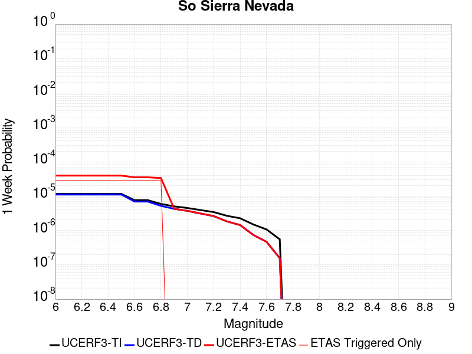 | 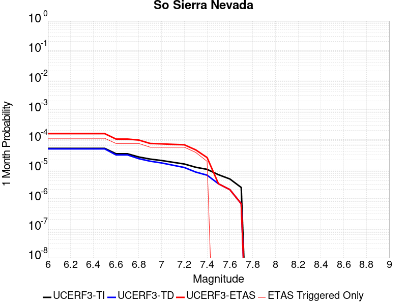 | 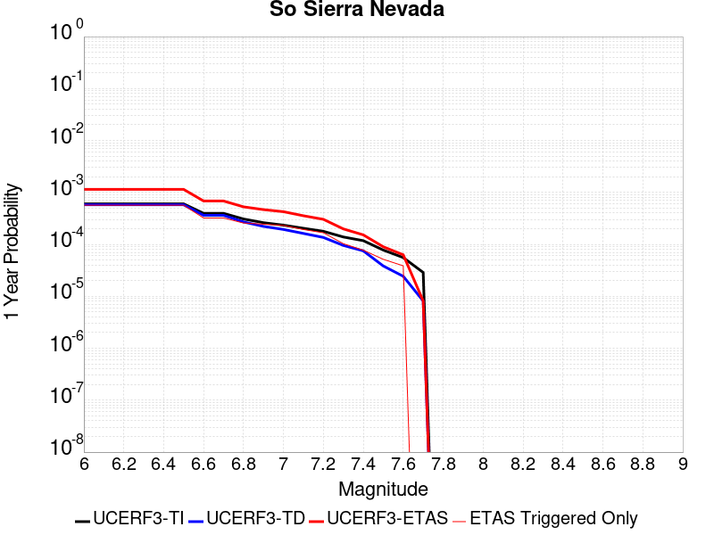 | 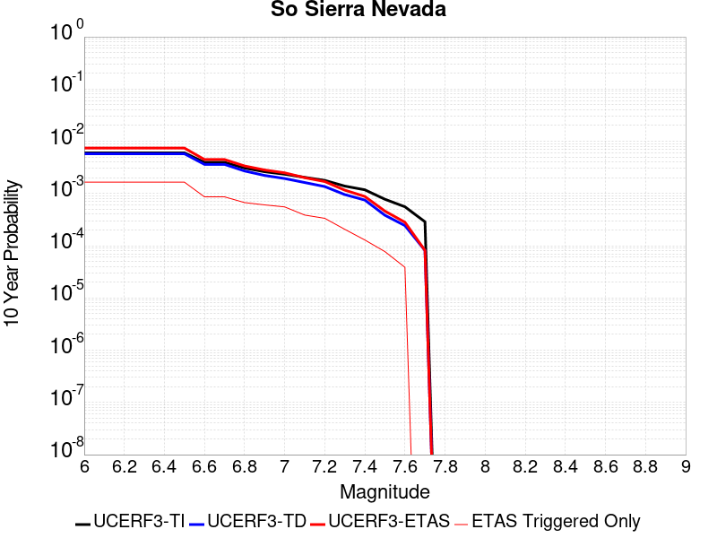 |

| Magnitude | 1 wk TI Prob | 1 wk TD Prob | 1 wk ETAS Prob | 1 wk ETAS/TD Gain | 1 wk ETAS Triggered Only | 1 mo TI Prob | 1 mo TD Prob | 1 mo ETAS Prob | 1 mo ETAS/TD Gain | 1 mo ETAS Triggered Only | 1 yr TI Prob | 1 yr TD Prob | 1 yr ETAS Prob | 1 yr ETAS/TD Gain | 1 yr ETAS Triggered Only | 10 yr TI Prob | 10 yr TD Prob | 10 yr ETAS Prob | 10 yr ETAS/TD Gain | 10 yr ETAS Triggered Only |
|-----|-----|-----|-----|-----|-----|-----|-----|-----|-----|-----|-----|-----|-----|-----|-----|-----|-----|-----|-----|-----|
| 6.0 | 1.15488665E-5 | 1.1080354E-5 | 2.9130695E-5 | 2.62904 | 1.8050541E-5 | 4.9494203E-5 | 4.748644E-5 | 1.5578455E-4 | 3.2806113 | 1.0830325E-4 | 6.024253E-4 | 5.780068E-4 | 0.0011552903 | 1.9987485 | 5.776173E-4 | 0.006007948 | 0.0057663037 | 0.007435324 | 1.2894437 | 0.0016787003 |
| 6.1 | 1.15488665E-5 | 1.1080354E-5 | 2.9130695E-5 | 2.62904 | 1.8050541E-5 | 4.9494203E-5 | 4.748644E-5 | 1.5578455E-4 | 3.2806113 | 1.0830325E-4 | 6.024253E-4 | 5.780068E-4 | 0.0011552903 | 1.9987485 | 5.776173E-4 | 0.006007948 | 0.0057663037 | 0.007435324 | 1.2894437 | 0.0016787003 |
| 6.2 | 1.15488665E-5 | 1.1080354E-5 | 2.9130695E-5 | 2.62904 | 1.8050541E-5 | 4.9494203E-5 | 4.748644E-5 | 1.5578455E-4 | 3.2806113 | 1.0830325E-4 | 6.024253E-4 | 5.780068E-4 | 0.0011552903 | 1.9987485 | 5.776173E-4 | 0.006007948 | 0.0057663037 | 0.007435324 | 1.2894437 | 0.0016787003 |
| 6.3 | 1.15488665E-5 | 1.1080354E-5 | 2.9130695E-5 | 2.62904 | 1.8050541E-5 | 4.9494203E-5 | 4.748644E-5 | 1.5578455E-4 | 3.2806113 | 1.0830325E-4 | 6.024253E-4 | 5.780068E-4 | 0.0011552903 | 1.9987485 | 5.776173E-4 | 0.006007948 | 0.0057663037 | 0.007435324 | 1.2894437 | 0.0016787003 |
| 6.4 | 1.15488665E-5 | 1.1080354E-5 | 2.9130695E-5 | 2.62904 | 1.8050541E-5 | 4.9494203E-5 | 4.748644E-5 | 1.5578455E-4 | 3.2806113 | 1.0830325E-4 | 6.024253E-4 | 5.780068E-4 | 0.0011552903 | 1.9987485 | 5.776173E-4 | 0.006007948 | 0.0057663037 | 0.007435324 | 1.2894437 | 0.0016787003 |
| 6.5 | 1.15488665E-5 | 1.1080354E-5 | 2.9130695E-5 | 2.62904 | 1.8050541E-5 | 4.9494203E-5 | 4.748644E-5 | 1.5578455E-4 | 3.2806113 | 1.0830325E-4 | 6.024253E-4 | 5.780068E-4 | 0.0011552903 | 1.9987485 | 5.776173E-4 | 0.006007948 | 0.0057663037 | 0.007435324 | 1.2894437 | 0.0016787003 |
| 6.6 | 7.587044E-6 | 6.936119E-6 | 2.4986535E-5 | 3.6023798 | 1.8050541E-5 | 3.2515498E-5 | 2.9725903E-5 | 1.0192592E-4 | 3.4288588 | 7.2202165E-5 | 3.9580427E-4 | 3.618557E-4 | 6.6860387E-4 | 1.8477086 | 3.068592E-4 | 0.003951 | 0.0036129565 | 0.0045122225 | 1.2489004 | 9.0252707E-4 |
| 6.7 | 7.587044E-6 | 6.936119E-6 | 2.4986535E-5 | 3.6023798 | 1.8050541E-5 | 3.2515498E-5 | 2.9725903E-5 | 1.0192592E-4 | 3.4288588 | 7.2202165E-5 | 3.9580427E-4 | 3.618557E-4 | 6.6860387E-4 | 1.8477086 | 3.068592E-4 | 0.003951 | 0.0036129565 | 0.0045122225 | 1.2489004 | 9.0252707E-4 |
| 6.8 | 5.9026956E-6 | 5.179787E-6 | 2.3230235E-5 | 4.4847856 | 1.8050541E-5 | 2.5297022E-5 | 2.2198905E-5 | 9.439947E-5 | 4.252438 | 7.2202165E-5 | 3.0794772E-4 | 2.702393E-4 | 4.8678726E-4 | 1.8013192 | 2.166065E-4 | 0.0030752132 | 0.002699223 | 0.0033472886 | 1.2400934 | 6.498195E-4 |
| 6.9 | 5.0118915E-6 | 4.2527745E-6 | 4.2527745E-6 | 1.0 | 0.0 | 2.1479358E-5 | 1.8226054E-5 | 7.237669E-5 | 3.9710567 | 5.4151624E-5 | 2.614798E-4 | 2.2188034E-4 | 4.2039223E-4 | 1.89468 | 1.9855595E-4 | 0.0026117235 | 0.0022166607 | 0.0027749871 | 1.2518773 | 5.595668E-4 |
| 7.0 | 4.4924795E-6 | 3.714243E-6 | 3.714243E-6 | 1.0 | 0.0 | 1.925334E-5 | 1.591809E-5 | 7.0068854E-5 | 4.401838 | 5.4151624E-5 | 2.3438422E-4 | 1.9378615E-4 | 3.7425658E-4 | 1.9312866 | 1.8050542E-4 | 0.0023413717 | 0.0019362347 | 0.0024226557 | 1.2512201 | 4.8736462E-4 |
| 7.1 | 3.9118436E-6 | 3.1122743E-6 | 3.1122743E-6 | 1.0 | 0.0 | 1.6764936E-5 | 1.3338254E-5 | 6.7489156E-5 | 5.0598197 | 5.4151624E-5 | 2.0409399E-4 | 1.6238171E-4 | 3.248102E-4 | 2.0002882 | 1.6245487E-4 | 0.0020390663 | 0.0016226866 | 0.0019831117 | 1.2221162 | 3.6101084E-4 |
| 7.2 | 3.4200818E-6 | 2.605728E-6 | 2.605728E-6 | 1.0 | 0.0 | 1.4657411E-5 | 1.1167361E-5 | 6.531838E-5 | 5.8490434 | 5.4151624E-5 | 1.7843937E-4 | 1.3595464E-4 | 2.6229126E-4 | 1.9292556 | 1.2635379E-4 | 0.0017829615 | 0.0013587645 | 0.0016471806 | 1.2122636 | 2.8880866E-4 |
| 7.3 | 2.6593618E-6 | 1.8286594E-6 | 1.8286594E-6 | 1.0 | 0.0 | 1.13972155E-5 | 7.8370895E-6 | 4.393789E-5 | 5.606404 | 3.6101083E-5 | 1.3875226E-4 | 9.541268E-5 | 1.8565678E-4 | 1.9458292 | 9.025271E-5 | 0.0013866565 | 9.537461E-4 | 0.0011521127 | 1.2079868 | 1.9855595E-4 |
| 7.4 | 2.2577992E-6 | 1.436656E-6 | 1.436656E-6 | 1.0 | 0.0 | 9.676246E-6 | 6.1570845E-6 | 2.4207515E-5 | 3.9316523 | 1.8050541E-5 | 1.1780193E-4 | 7.4960175E-5 | 1.4715693E-4 | 1.9631348 | 7.2202165E-5 | 0.001177395 | 7.49374E-4 | 8.936701E-4 | 1.1925555 | 1.4440433E-4 |
| 7.5 | 1.489319E-6 | 7.355648E-7 | 7.355648E-7 | 1.0 | 0.0 | 6.3827797E-6 | 3.1524169E-6 | 3.1524169E-6 | 1.0 | 0.0 | 7.770758E-5 | 3.8380003E-5 | 7.44797E-5 | 1.9405861 | 3.6101083E-5 | 7.7680405E-4 | 3.8373418E-4 | 4.5590865E-4 | 1.1880845 | 7.2202165E-5 |
| 7.6 | 1.0680322E-6 | 4.6609216E-7 | 4.6609216E-7 | 1.0 | 0.0 | 4.577273E-6 | 1.9975362E-6 | 1.9975362E-6 | 1.0 | 0.0 | 5.5726876E-5 | 2.4319736E-5 | 6.041994E-5 | 2.4843996 | 3.6101083E-5 | 5.5712904E-4 | 2.43171E-4 | 2.792633E-4 | 1.1484236 | 3.6101083E-5 |
| 7.7 | 5.509146E-7 | 1.558691E-7 | 1.558691E-7 | 1.0 | 0.0 | 2.3610605E-6 | 6.680103E-7 | 6.680103E-7 | 1.0 | 0.0 | 2.8745531E-5 | 8.132996E-6 | 8.132996E-6 | 1.0 | 0.0 | 2.8741814E-4 | 8.1327096E-5 | 8.1327096E-5 | 1.0 | 0.0 |

## Death Valley (So)
*[(top)](#table-of-contents)*

| 1 Week | 1 Month | 1 Year | 10 Year |
|-----|-----|-----|-----|
| 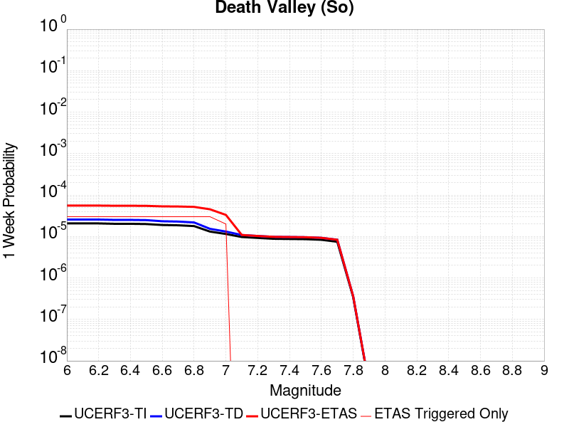 | 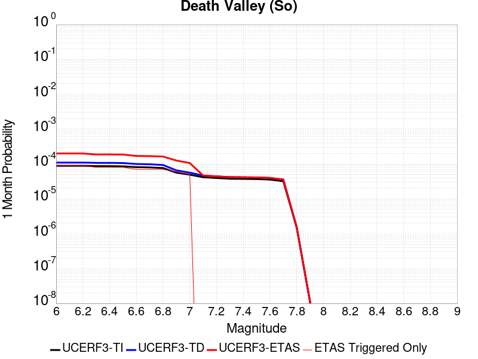 | 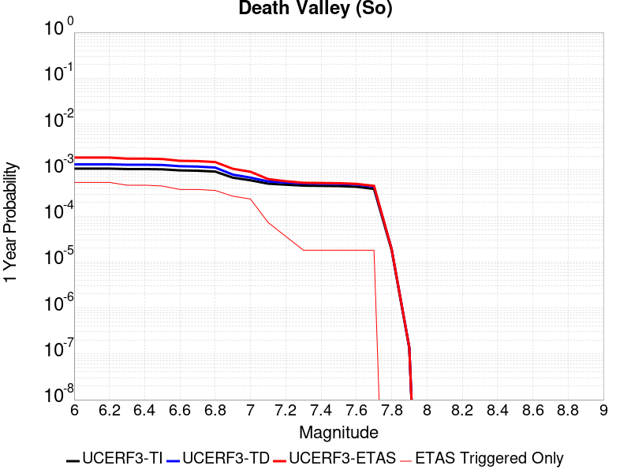 | 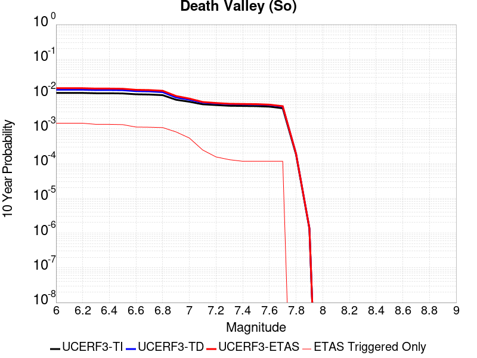 |

| Magnitude | 1 wk TI Prob | 1 wk TD Prob | 1 wk ETAS Prob | 1 wk ETAS/TD Gain | 1 wk ETAS Triggered Only | 1 mo TI Prob | 1 mo TD Prob | 1 mo ETAS Prob | 1 mo ETAS/TD Gain | 1 mo ETAS Triggered Only | 1 yr TI Prob | 1 yr TD Prob | 1 yr ETAS Prob | 1 yr ETAS/TD Gain | 1 yr ETAS Triggered Only | 10 yr TI Prob | 10 yr TD Prob | 10 yr ETAS Prob | 10 yr ETAS/TD Gain | 10 yr ETAS Triggered Only |
|-----|-----|-----|-----|-----|-----|-----|-----|-----|-----|-----|-----|-----|-----|-----|-----|-----|-----|-----|-----|-----|
| 6.0 | 2.0684236E-5 | 2.562359E-5 | 4.367367E-5 | 1.704432 | 1.8050541E-5 | 8.864371E-5 | 1.0981086E-4 | 2.0005366E-4 | 1.821802 | 9.025271E-5 | 0.0010787029 | 0.0013361443 | 0.0018769369 | 1.4047413 | 5.4151623E-4 | 0.010734817 | 0.013284387 | 0.014727058 | 1.108599 | 0.0014620939 |
| 6.1 | 2.0684236E-5 | 2.562359E-5 | 4.367367E-5 | 1.704432 | 1.8050541E-5 | 8.864371E-5 | 1.0981086E-4 | 2.0005366E-4 | 1.821802 | 9.025271E-5 | 0.0010787029 | 0.0013361443 | 0.0018769369 | 1.4047413 | 5.4151623E-4 | 0.010734817 | 0.013284387 | 0.014727058 | 1.108599 | 0.0014620939 |
| 6.2 | 2.0684236E-5 | 2.562359E-5 | 4.367367E-5 | 1.704432 | 1.8050541E-5 | 8.864371E-5 | 1.0981086E-4 | 2.0005366E-4 | 1.821802 | 9.025271E-5 | 0.0010787029 | 0.0013361443 | 0.0018769369 | 1.4047413 | 5.4151623E-4 | 0.010734817 | 0.013284387 | 0.014727058 | 1.108599 | 0.0014620939 |
| 6.3 | 2.0240292E-5 | 2.51236E-5 | 4.3173688E-5 | 1.7184515 | 1.8050541E-5 | 8.6741224E-5 | 1.07668224E-4 | 1.7986262E-4 | 1.6705265 | 7.2202165E-5 | 0.0010555626 | 0.0013100891 | 0.0017787884 | 1.3577614 | 4.6931408E-4 | 0.010505628 | 0.013026908 | 0.014345248 | 1.1012013 | 0.0013357401 |
| 6.4 | 2.0240292E-5 | 2.51236E-5 | 4.3173688E-5 | 1.7184515 | 1.8050541E-5 | 8.6741224E-5 | 1.07668224E-4 | 1.7986262E-4 | 1.6705265 | 7.2202165E-5 | 0.0010555626 | 0.0013100891 | 0.0017787884 | 1.3577614 | 4.6931408E-4 | 0.010505628 | 0.013026908 | 0.014345248 | 1.1012013 | 0.0013357401 |
| 6.5 | 1.9962767E-5 | 2.4812809E-5 | 4.2862903E-5 | 1.7274506 | 1.8050541E-5 | 8.55519E-5 | 1.0633637E-4 | 1.7853086E-4 | 1.6789256 | 7.2202165E-5 | 0.0010410968 | 0.0012938931 | 0.0017445728 | 1.3483129 | 4.5126354E-4 | 0.010362327 | 0.012866832 | 0.01414975 | 1.0997072 | 0.001299639 |
| 6.6 | 1.8937297E-5 | 2.33164E-5 | 4.136652E-5 | 1.7741385 | 1.8050541E-5 | 8.115732E-5 | 9.992368E-5 | 1.5406989E-4 | 1.5418757 | 5.4151624E-5 | 9.876423E-4 | 0.0012159063 | 0.0015945069 | 1.311373 | 3.7906138E-4 | 0.009832645 | 0.012095587 | 0.013183353 | 1.0899307 | 0.001101083 |
| 6.7 | 1.8621096E-5 | 2.2916982E-5 | 4.096711E-5 | 1.7876312 | 1.8050541E-5 | 7.980225E-5 | 9.821202E-5 | 1.5235832E-4 | 1.5513206 | 5.4151624E-5 | 9.711593E-4 | 0.0011950899 | 0.0015736984 | 1.3168032 | 3.7906138E-4 | 0.009669261 | 0.011889673 | 0.012977664 | 1.0915073 | 0.001101083 |
| 6.8 | 1.7830353E-5 | 2.1810727E-5 | 3.9860875E-5 | 1.8275813 | 1.8050541E-5 | 7.641356E-5 | 9.347127E-5 | 1.4761783E-4 | 1.5792856 | 5.4151624E-5 | 9.29938E-4 | 0.0011374326 | 0.0014980328 | 1.31703 | 3.6101084E-4 | 0.009260561 | 0.011318952 | 0.012389725 | 1.0946001 | 0.0010830325 |
| 6.9 | 1.3135183E-5 | 1.5306772E-5 | 3.335704E-5 | 2.179234 | 1.8050541E-5 | 5.6292425E-5 | 6.559884E-5 | 1.1974691E-4 | 1.8254426 | 5.4151624E-5 | 6.8514474E-4 | 7.983797E-4 | 0.0010689216 | 1.3388637 | 2.7075812E-4 | 0.006830362 | 0.007956122 | 0.0087440265 | 1.0990313 | 7.942238E-4 |
| 7.0 | 1.1507512E-5 | 1.31564E-5 | 3.1206706E-5 | 2.371979 | 1.8050541E-5 | 4.9316975E-5 | 5.638339E-5 | 1.1053196E-4 | 1.9603639 | 5.4151624E-5 | 6.002687E-4 | 6.862573E-4 | 9.2075334E-4 | 1.3417027 | 2.3465704E-4 | 0.0059864987 | 0.006842083 | 0.0073619667 | 1.0759833 | 5.234657E-4 |
| 7.1 | 9.715903E-6 | 1.086686E-5 | 1.086686E-5 | 1.0 | 0.0 | 4.1638916E-5 | 4.657145E-5 | 4.657145E-5 | 1.0 | 0.0 | 5.068359E-4 | 5.6686415E-4 | 6.390254E-4 | 1.127299 | 7.2202165E-5 | 0.0050568148 | 0.005654636 | 0.005870017 | 1.0380894 | 2.166065E-4 |
| 7.2 | 9.233269E-6 | 1.0287774E-5 | 1.0287774E-5 | 1.0 | 0.0 | 3.9570554E-5 | 4.408974E-5 | 4.408974E-5 | 1.0 | 0.0 | 4.81665E-4 | 5.366646E-4 | 5.727463E-4 | 1.0672332 | 3.6101083E-5 | 0.0048062233 | 0.0053541176 | 0.005497749 | 1.0268263 | 1.4440433E-4 |
| 7.3 | 8.8041315E-6 | 9.809506E-6 | 9.809506E-6 | 1.0 | 0.0 | 3.7731446E-5 | 4.2040087E-5 | 4.2040087E-5 | 1.0 | 0.0 | 4.592835E-4 | 5.1172206E-4 | 5.2976335E-4 | 1.035256 | 1.8050541E-5 | 0.0045833546 | 0.005105864 | 0.005231573 | 1.0246204 | 1.2635379E-4 |
| 7.4 | 8.708749E-6 | 9.708509E-6 | 9.708509E-6 | 1.0 | 0.0 | 3.7322676E-5 | 4.1607258E-5 | 4.1607258E-5 | 1.0 | 0.0 | 4.5430884E-4 | 5.0645485E-4 | 5.2449625E-4 | 1.035623 | 1.8050541E-5 | 0.004533812 | 0.0050534327 | 0.0051611885 | 1.0213233 | 1.0830325E-4 |
| 7.5 | 8.612678E-6 | 9.606144E-6 | 9.606144E-6 | 1.0 | 0.0 | 3.6910955E-5 | 4.116856E-5 | 4.116856E-5 | 1.0 | 0.0 | 4.492982E-4 | 5.0111616E-4 | 5.191577E-4 | 1.0360026 | 1.8050541E-5 | 0.004483909 | 0.0050002877 | 0.005108049 | 1.0215511 | 1.0830325E-4 |
| 7.6 | 8.319024E-6 | 9.285207E-6 | 9.285207E-6 | 1.0 | 0.0 | 3.5652476E-5 | 3.979316E-5 | 3.979316E-5 | 1.0 | 0.0 | 4.3398244E-4 | 4.8437822E-4 | 5.0242E-4 | 1.0372473 | 1.8050541E-5 | 0.0043313587 | 0.0048336484 | 0.004941428 | 1.0222979 | 1.0830325E-4 |
| 7.7 | 7.4718328E-6 | 8.346338E-6 | 8.346338E-6 | 1.0 | 0.0 | 3.2021748E-5 | 3.5769554E-5 | 3.5769554E-5 | 1.0 | 0.0 | 3.8979502E-4 | 4.3541135E-4 | 4.5345403E-4 | 1.0414382 | 1.8050541E-5 | 0.00389112 | 0.004345988 | 0.00445382 | 1.024812 | 1.0830325E-4 |
| 7.8 | 3.4586725E-7 | 3.6485014E-7 | 3.6485014E-7 | 1.0 | 0.0 | 1.4822873E-6 | 1.5636425E-6 | 1.5636425E-6 | 1.0 | 0.0 | 1.80467E-5 | 1.9037187E-5 | 1.9037187E-5 | 1.0 | 0.0 | 1.8045233E-4 | 1.9035599E-4 | 1.9035599E-4 | 1.0 | 0.0 |
| 7.9 | 2.5591178E-9 | 2.6698093E-9 | 2.6698093E-9 | 1.0 | 0.0 | 1.0967647E-8 | 1.144204E-8 | 1.144204E-8 | 1.0 | 0.0 | 1.335311E-7 | 1.3930685E-7 | 1.3930685E-7 | 1.0 | 0.0 | 1.3353102E-6 | 1.3930684E-6 | 1.3930684E-6 | 1.0 | 0.0 |

## Coyote Canyon
*[(top)](#table-of-contents)*

| 1 Week | 1 Month | 1 Year | 10 Year |
|-----|-----|-----|-----|
| 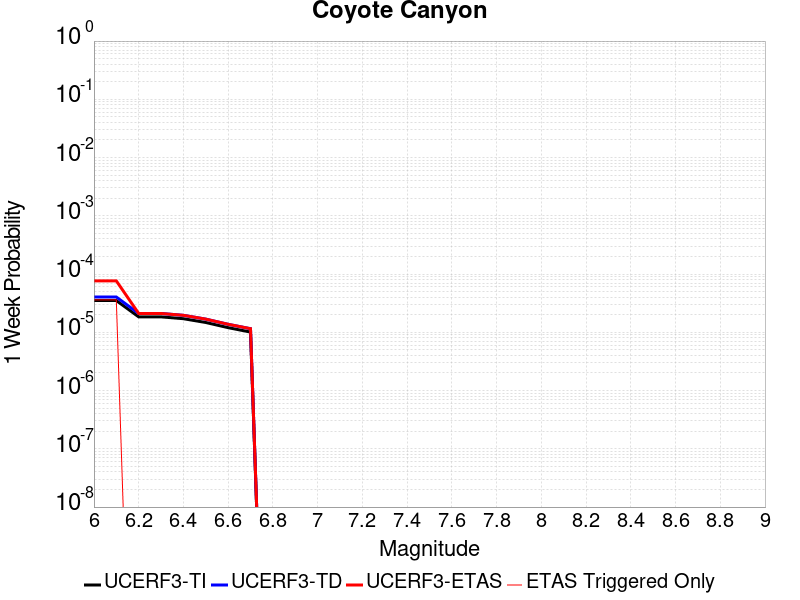 | 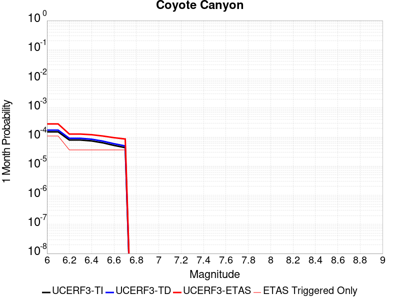 | 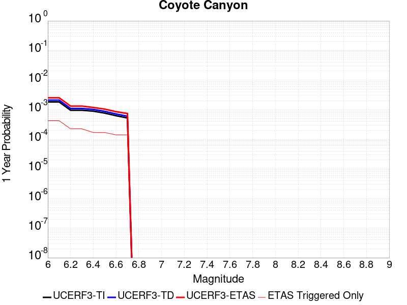 | 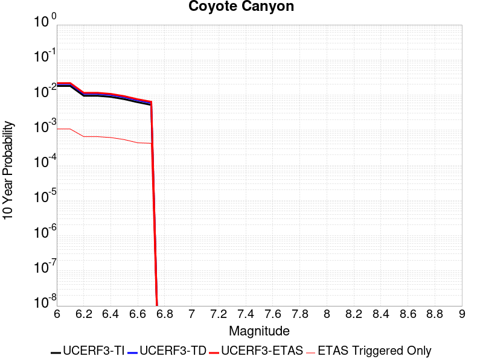 |

| Magnitude | 1 wk TI Prob | 1 wk TD Prob | 1 wk ETAS Prob | 1 wk ETAS/TD Gain | 1 wk ETAS Triggered Only | 1 mo TI Prob | 1 mo TD Prob | 1 mo ETAS Prob | 1 mo ETAS/TD Gain | 1 mo ETAS Triggered Only | 1 yr TI Prob | 1 yr TD Prob | 1 yr ETAS Prob | 1 yr ETAS/TD Gain | 1 yr ETAS Triggered Only | 10 yr TI Prob | 10 yr TD Prob | 10 yr ETAS Prob | 10 yr ETAS/TD Gain | 10 yr ETAS Triggered Only |
|-----|-----|-----|-----|-----|-----|-----|-----|-----|-----|-----|-----|-----|-----|-----|-----|-----|-----|-----|-----|-----|
| 6.0 | 3.5090034E-5 | 4.0371557E-5 | 7.647118E-5 | 1.8941846 | 3.6101083E-5 | 1.503772E-4 | 1.730109E-4 | 2.8129542E-4 | 1.6258826 | 1.0830325E-4 | 0.0018293047 | 0.00210463 | 0.0025009064 | 1.1882877 | 3.971119E-4 | 0.018143194 | 0.020872915 | 0.022004036 | 1.0541909 | 0.0011552346 |
| 6.1 | 3.5090034E-5 | 4.0371557E-5 | 7.647118E-5 | 1.8941846 | 3.6101083E-5 | 1.503772E-4 | 1.730109E-4 | 2.8129542E-4 | 1.6258826 | 1.0830325E-4 | 0.0018293047 | 0.00210463 | 0.0025009064 | 1.1882877 | 3.971119E-4 | 0.018143194 | 0.020872915 | 0.022004036 | 1.0541909 | 0.0011552346 |
| 6.2 | 1.841879E-5 | 2.10634E-5 | 2.10634E-5 | 1.0 | 0.0 | 7.8935285E-5 | 9.026916E-5 | 1.2636698E-4 | 1.399891 | 3.6101083E-5 | 9.606133E-4 | 0.001098575 | 0.0013149435 | 1.1969538 | 2.166065E-4 | 0.0095647145 | 0.0109415315 | 0.0116378 | 1.0636353 | 7.0397113E-4 |
| 6.3 | 1.841879E-5 | 2.10634E-5 | 2.10634E-5 | 1.0 | 0.0 | 7.8935285E-5 | 9.026916E-5 | 1.2636698E-4 | 1.399891 | 3.6101083E-5 | 9.606133E-4 | 0.001098575 | 0.0013149435 | 1.1969538 | 2.166065E-4 | 0.0095647145 | 0.0109415315 | 0.0116378 | 1.0636353 | 7.0397113E-4 |
| 6.4 | 1.712201E-5 | 1.9568546E-5 | 1.9568546E-5 | 1.0 | 0.0 | 7.337798E-5 | 8.3863066E-5 | 1.1996112E-4 | 1.4304404 | 3.6101083E-5 | 8.930107E-4 | 0.0010206552 | 0.0012009763 | 1.176672 | 1.8050542E-4 | 0.008894307 | 0.010169596 | 0.010830674 | 1.0650053 | 6.6787004E-4 |
| 6.5 | 1.4744935E-5 | 1.6839824E-5 | 1.6839824E-5 | 1.0 | 0.0 | 6.3191044E-5 | 7.2169205E-5 | 1.0826768E-4 | 1.5001923 | 3.6101083E-5 | 7.6907943E-4 | 8.783994E-4 | 0.0010587462 | 1.2053131 | 1.8050542E-4 | 0.007664232 | 0.008758473 | 0.009384709 | 1.0715005 | 6.3176895E-4 |
| 6.6 | 1.2017839E-5 | 1.3726416E-5 | 1.3726416E-5 | 1.0 | 0.0 | 5.150401E-5 | 5.882667E-5 | 9.492563E-5 | 1.6136495 | 3.6101083E-5 | 6.268809E-4 | 7.1606797E-4 | 8.603689E-4 | 1.2015185 | 1.4440433E-4 | 0.0062511545 | 0.0071463026 | 0.0076660276 | 1.0727264 | 5.234657E-4 |
| 6.7 | 1.00956095E-5 | 1.1535479E-5 | 1.1535479E-5 | 1.0 | 0.0 | 4.326618E-5 | 4.943732E-5 | 8.5536616E-5 | 1.7302034 | 3.6101083E-5 | 5.266384E-4 | 6.018201E-4 | 7.461376E-4 | 1.2398016 | 1.4440433E-4 | 0.005253921 | 0.006010433 | 0.006512811 | 1.0835842 | 5.0541514E-4 |

## Nelson Lake
*[(top)](#table-of-contents)*

| 1 Week | 1 Month | 1 Year | 10 Year |
|-----|-----|-----|-----|
| 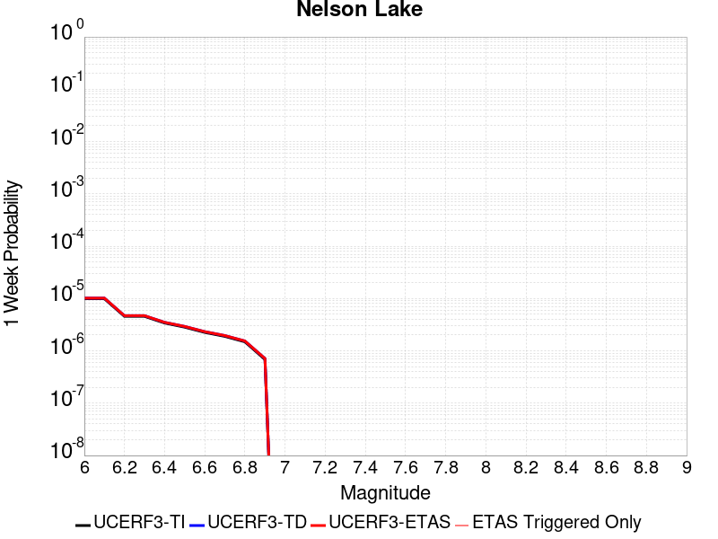 | 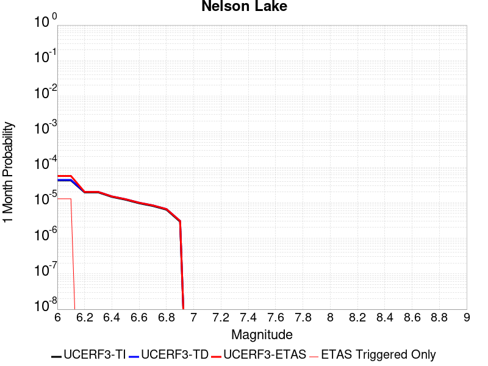 | 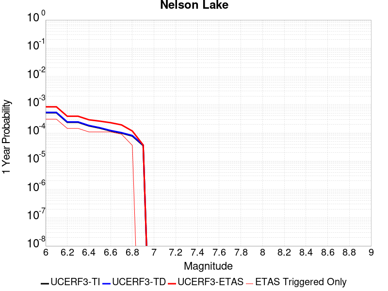 | 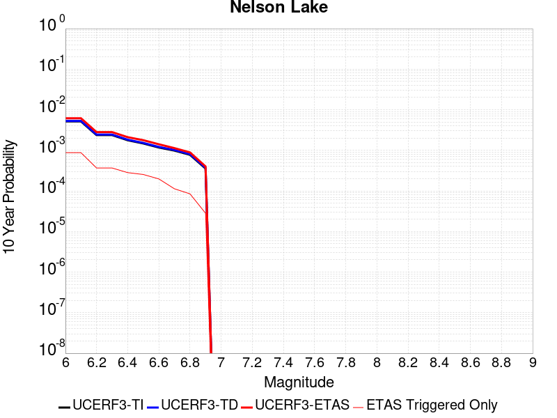 |

| Magnitude | 1 wk TI Prob | 1 wk TD Prob | 1 wk ETAS Prob | 1 wk ETAS/TD Gain | 1 wk ETAS Triggered Only | 1 mo TI Prob | 1 mo TD Prob | 1 mo ETAS Prob | 1 mo ETAS/TD Gain | 1 mo ETAS Triggered Only | 1 yr TI Prob | 1 yr TD Prob | 1 yr ETAS Prob | 1 yr ETAS/TD Gain | 1 yr ETAS Triggered Only | 10 yr TI Prob | 10 yr TD Prob | 10 yr ETAS Prob | 10 yr ETAS/TD Gain | 10 yr ETAS Triggered Only |
|-----|-----|-----|-----|-----|-----|-----|-----|-----|-----|-----|-----|-----|-----|-----|-----|-----|-----|-----|-----|-----|
| 6.0 | 9.913453E-6 | 1.0192598E-5 | 1.0192598E-5 | 1.0 | 0.0 | 4.2485535E-5 | 4.368189E-5 | 4.368189E-5 | 1.0 | 0.0 | 5.1713863E-4 | 5.3170754E-4 | 8.384036E-4 | 1.5768133 | 3.068592E-4 | 0.0051593683 | 0.005305382 | 0.0064724423 | 1.2199767 | 0.0011732852 |
| 6.1 | 9.913453E-6 | 1.0192598E-5 | 1.0192598E-5 | 1.0 | 0.0 | 4.2485535E-5 | 4.368189E-5 | 4.368189E-5 | 1.0 | 0.0 | 5.1713863E-4 | 5.3170754E-4 | 8.384036E-4 | 1.5768133 | 3.068592E-4 | 0.0051593683 | 0.005305382 | 0.0064724423 | 1.2199767 | 0.0011732852 |
| 6.2 | 4.5596407E-6 | 4.6964815E-6 | 4.6964815E-6 | 1.0 | 0.0 | 1.954117E-5 | 2.0127629E-5 | 2.0127629E-5 | 1.0 | 0.0 | 2.3788778E-4 | 2.450276E-4 | 3.8939656E-4 | 1.5891947 | 1.4440433E-4 | 0.0023763329 | 0.0024477004 | 0.0029518786 | 1.2059803 | 5.0541514E-4 |
| 6.3 | 4.5596407E-6 | 4.6964815E-6 | 4.6964815E-6 | 1.0 | 0.0 | 1.954117E-5 | 2.0127629E-5 | 2.0127629E-5 | 1.0 | 0.0 | 2.3788778E-4 | 2.450276E-4 | 3.8939656E-4 | 1.5891947 | 1.4440433E-4 | 0.0023763329 | 0.0024477004 | 0.0029518786 | 1.2059803 | 5.0541514E-4 |
| 6.4 | 3.4025713E-6 | 3.5100297E-6 | 3.5100297E-6 | 1.0 | 0.0 | 1.4582367E-5 | 1.5042902E-5 | 1.5042902E-5 | 1.0 | 0.0 | 1.7752586E-4 | 1.8313278E-4 | 2.914162E-4 | 1.5912837 | 1.0830325E-4 | 0.001773841 | 0.0018299016 | 0.0021902518 | 1.1969233 | 3.6101084E-4 |
| 6.5 | 2.8352947E-6 | 2.9279704E-6 | 2.9279704E-6 | 1.0 | 0.0 | 1.2151207E-5 | 1.2548388E-5 | 1.2548388E-5 | 1.0 | 0.0 | 1.479309E-4 | 1.5276668E-4 | 2.6105338E-4 | 1.7088373 | 1.0830325E-4 | 0.0014783246 | 0.0015266904 | 0.0018511041 | 1.2124947 | 3.2490975E-4 |
| 6.6 | 2.251518E-6 | 2.3291636E-6 | 2.3291636E-6 | 1.0 | 0.0 | 9.649328E-6 | 9.9820945E-6 | 9.9820945E-6 | 1.0 | 0.0 | 1.1747423E-4 | 1.2152585E-4 | 2.2981594E-4 | 1.8910868 | 1.0830325E-4 | 0.0011741214 | 0.0012146557 | 0.001485085 | 1.2226386 | 2.7075812E-4 |
| 6.7 | 1.8911853E-6 | 1.959224E-6 | 1.959224E-6 | 1.0 | 0.0 | 8.105055E-6 | 8.39665E-6 | 8.39665E-6 | 1.0 | 0.0 | 9.867457E-5 | 1.0222501E-4 | 1.9246849E-4 | 1.8827926 | 9.025271E-5 | 9.863076E-4 | 0.0010218373 | 0.0012021583 | 1.1764674 | 1.8050542E-4 |
| 6.8 | 1.4874814E-6 | 1.5439005E-6 | 1.5439005E-6 | 1.0 | 0.0 | 6.374905E-6 | 6.616702E-6 | 6.616702E-6 | 1.0 | 0.0 | 7.76117E-5 | 8.0555896E-5 | 1.1665407E-4 | 1.4481134 | 3.6101083E-5 | 7.75846E-4 | 8.05318E-4 | 9.13534E-4 | 1.1343768 | 1.0830325E-4 |
| 6.9 | 6.835972E-7 | 7.140307E-7 | 7.140307E-7 | 1.0 | 0.0 | 2.9296991E-6 | 3.0601298E-6 | 3.0601298E-6 | 1.0 | 0.0 | 3.56685E-5 | 3.7256763E-5 | 3.7256763E-5 | 1.0 | 0.0 | 3.5662777E-4 | 3.7253642E-4 | 4.0862407E-4 | 1.0968701 | 3.6101083E-5 |

## Lenwood-Lockhart-Old Woman Springs
*[(top)](#table-of-contents)*

| 1 Week | 1 Month | 1 Year | 10 Year |
|-----|-----|-----|-----|
| 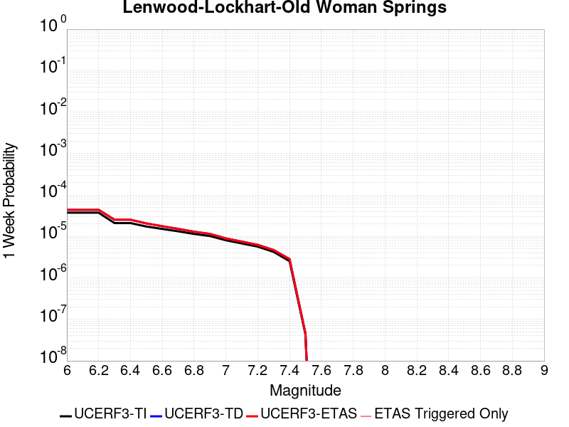 | 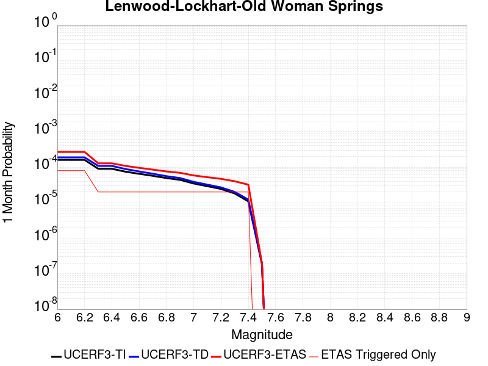 | 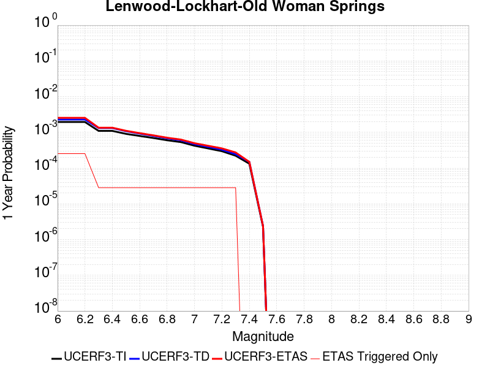 | 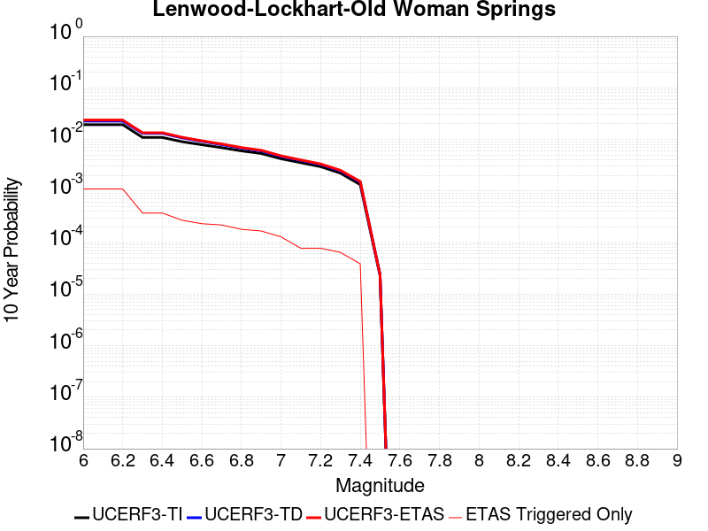 |

| Magnitude | 1 wk TI Prob | 1 wk TD Prob | 1 wk ETAS Prob | 1 wk ETAS/TD Gain | 1 wk ETAS Triggered Only | 1 mo TI Prob | 1 mo TD Prob | 1 mo ETAS Prob | 1 mo ETAS/TD Gain | 1 mo ETAS Triggered Only | 1 yr TI Prob | 1 yr TD Prob | 1 yr ETAS Prob | 1 yr ETAS/TD Gain | 1 yr ETAS Triggered Only | 10 yr TI Prob | 10 yr TD Prob | 10 yr ETAS Prob | 10 yr ETAS/TD Gain | 10 yr ETAS Triggered Only |
|-----|-----|-----|-----|-----|-----|-----|-----|-----|-----|-----|-----|-----|-----|-----|-----|-----|-----|-----|-----|-----|
| 6.0 | 3.744542E-5 | 4.396654E-5 | 4.396654E-5 | 1.0 | 0.0 | 1.604705E-4 | 1.8841539E-4 | 2.2450967E-4 | 1.1915675 | 3.6101083E-5 | 0.0019519776 | 0.0022917162 | 0.0026518996 | 1.1571676 | 3.6101084E-4 | 0.019349206 | 0.022698842 | 0.02373965 | 1.0458529 | 0.0010649819 |
| 6.1 | 3.744542E-5 | 4.396654E-5 | 4.396654E-5 | 1.0 | 0.0 | 1.604705E-4 | 1.8841539E-4 | 2.2450967E-4 | 1.1915675 | 3.6101083E-5 | 0.0019519776 | 0.0022917162 | 0.0026518996 | 1.1571676 | 3.6101084E-4 | 0.019349206 | 0.022698842 | 0.02373965 | 1.0458529 | 0.0010649819 |
| 6.2 | 3.744542E-5 | 4.396654E-5 | 4.396654E-5 | 1.0 | 0.0 | 1.604705E-4 | 1.8841539E-4 | 2.2450967E-4 | 1.1915675 | 3.6101083E-5 | 0.0019519776 | 0.0022917162 | 0.0026518996 | 1.1571676 | 3.6101084E-4 | 0.019349206 | 0.022698842 | 0.02373965 | 1.0458529 | 0.0010649819 |
| 6.3 | 2.1079984E-5 | 2.5354899E-5 | 2.5354899E-5 | 1.0 | 0.0 | 9.0339665E-5 | 1.08659435E-4 | 1.08659435E-4 | 1.0 | 0.0 | 0.0010993304 | 0.0013221457 | 0.0014122791 | 1.0681721 | 9.025271E-5 | 0.010939079 | 0.013145012 | 0.013519091 | 1.0284579 | 3.7906138E-4 |
| 6.4 | 2.1079984E-5 | 2.5354899E-5 | 2.5354899E-5 | 1.0 | 0.0 | 9.0339665E-5 | 1.08659435E-4 | 1.08659435E-4 | 1.0 | 0.0 | 0.0010993304 | 0.0013221457 | 0.0014122791 | 1.0681721 | 9.025271E-5 | 0.010939079 | 0.013145012 | 0.013519091 | 1.0284579 | 3.7906138E-4 |
| 6.5 | 1.7397282E-5 | 2.0663541E-5 | 2.0663541E-5 | 1.0 | 0.0 | 7.455765E-5 | 8.85551E-5 | 8.85551E-5 | 1.0 | 0.0 | 9.073613E-4 | 0.0010776368 | 0.0011497611 | 1.0669283 | 7.2202165E-5 | 0.009036654 | 0.010725406 | 0.01099326 | 1.0249738 | 2.7075812E-4 |
| 6.6 | 1.52050325E-5 | 1.7680644E-5 | 1.7680644E-5 | 1.0 | 0.0 | 6.51628E-5 | 7.577203E-5 | 7.577203E-5 | 1.0 | 0.0 | 7.9306826E-4 | 9.2214195E-4 | 9.942775E-4 | 1.0782261 | 7.2202165E-5 | 0.007902439 | 0.009184018 | 0.009398635 | 1.0233686 | 2.166065E-4 |
| 6.7 | 1.332523E-5 | 1.5264803E-5 | 1.5264803E-5 | 1.0 | 0.0 | 5.7106878E-5 | 6.541897E-5 | 6.541897E-5 | 1.0 | 0.0 | 6.950544E-4 | 7.961908E-4 | 8.502993E-4 | 1.0679592 | 5.4151624E-5 | 0.006928845 | 0.007934013 | 0.008130994 | 1.0248274 | 1.9855595E-4 |
| 6.8 | 1.1525329E-5 | 1.3031616E-5 | 1.3031616E-5 | 1.0 | 0.0 | 4.9393333E-5 | 5.584861E-5 | 5.584861E-5 | 1.0 | 0.0 | 6.011979E-4 | 6.7974895E-4 | 7.3386374E-4 | 1.07961 | 5.4151624E-5 | 0.00599574 | 0.006777149 | 0.0069205747 | 1.0211631 | 1.4440433E-4 |
| 6.9 | 1.0253909E-5 | 1.1514972E-5 | 1.1514972E-5 | 1.0 | 0.0 | 4.3944583E-5 | 4.9348968E-5 | 4.9348968E-5 | 1.0 | 0.0 | 5.3489394E-4 | 6.006617E-4 | 6.547808E-4 | 1.0900991 | 5.4151624E-5 | 0.0053360825 | 0.005990761 | 0.0061163576 | 1.0209651 | 1.2635379E-4 |
| 7.0 | 8.104563E-6 | 8.991655E-6 | 8.991655E-6 | 1.0 | 0.0 | 3.4733377E-5 | 3.853511E-5 | 3.853511E-5 | 1.0 | 0.0 | 4.2279682E-4 | 4.6906635E-4 | 5.0515047E-4 | 1.0769277 | 3.6101083E-5 | 0.0042199334 | 0.0046810107 | 0.004770841 | 1.0191903 | 9.025271E-5 |
| 7.1 | 6.7986157E-6 | 7.516109E-6 | 7.516109E-6 | 1.0 | 0.0 | 2.91366E-5 | 3.221151E-5 | 3.221151E-5 | 1.0 | 0.0 | 3.5468035E-4 | 3.9210668E-4 | 4.281936E-4 | 1.0920334 | 3.6101083E-5 | 0.003541148 | 0.0039143646 | 0.0039862846 | 1.0183733 | 7.2202165E-5 |
| 7.2 | 5.6893327E-6 | 6.280242E-6 | 6.280242E-6 | 1.0 | 0.0 | 2.4382627E-5 | 2.6915057E-5 | 2.6915057E-5 | 1.0 | 0.0 | 2.9681803E-4 | 3.2764353E-4 | 3.6373278E-4 | 1.110148 | 3.6101083E-5 | 0.002964219 | 0.0032718033 | 0.0033437693 | 1.0219958 | 7.2202165E-5 |
| 7.3 | 4.253348E-6 | 4.7070594E-6 | 4.7070594E-6 | 1.0 | 0.0 | 1.8228506E-5 | 2.0172965E-5 | 2.0172965E-5 | 1.0 | 0.0 | 2.2190946E-4 | 2.4558E-4 | 2.8167223E-4 | 1.1469673 | 3.6101083E-5 | 0.00221688 | 0.0024532673 | 0.0025072861 | 1.0220191 | 5.4151624E-5 |
| 7.4 | 2.5448119E-6 | 2.8521206E-6 | 2.8521206E-6 | 1.0 | 0.0 | 1.0906291E-5 | 1.2223326E-5 | 1.2223326E-5 | 1.0 | 0.0 | 1.3277601E-4 | 1.4881049E-4 | 1.6685834E-4 | 1.1212808 | 1.8050541E-5 | 0.001326967 | 0.0014872706 | 0.0015052942 | 1.0121187 | 1.8050541E-5 |
| 7.5 | 4.3706837E-8 | 4.5631488E-8 | 4.5631488E-8 | 1.0 | 0.0 | 1.8731501E-7 | 1.955635E-7 | 1.955635E-7 | 1.0 | 0.0 | 2.2805577E-6 | 2.3809837E-6 | 2.3809837E-6 | 1.0 | 0.0 | 2.2805343E-5 | 2.3809636E-5 | 2.3809636E-5 | 1.0 | 0.0 |

## Towne Pass
*[(top)](#table-of-contents)*

| 1 Week | 1 Month | 1 Year | 10 Year |
|-----|-----|-----|-----|
| 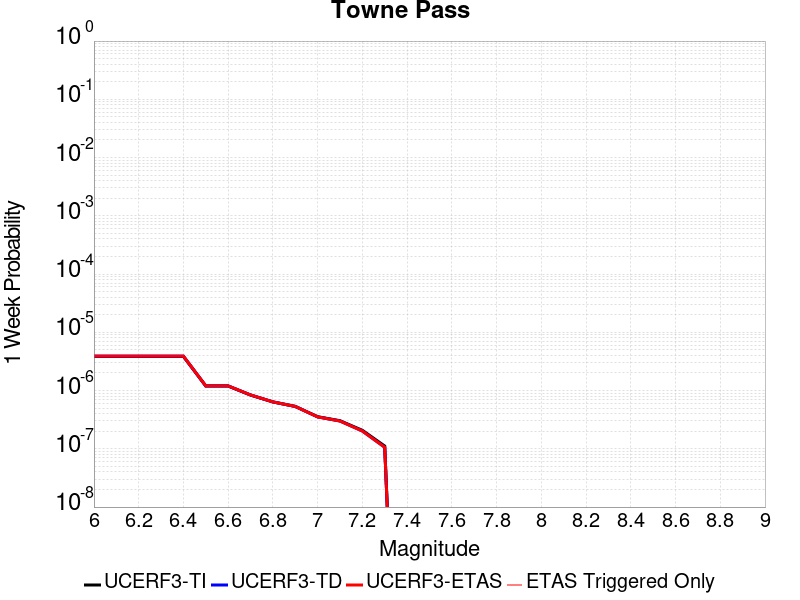 | 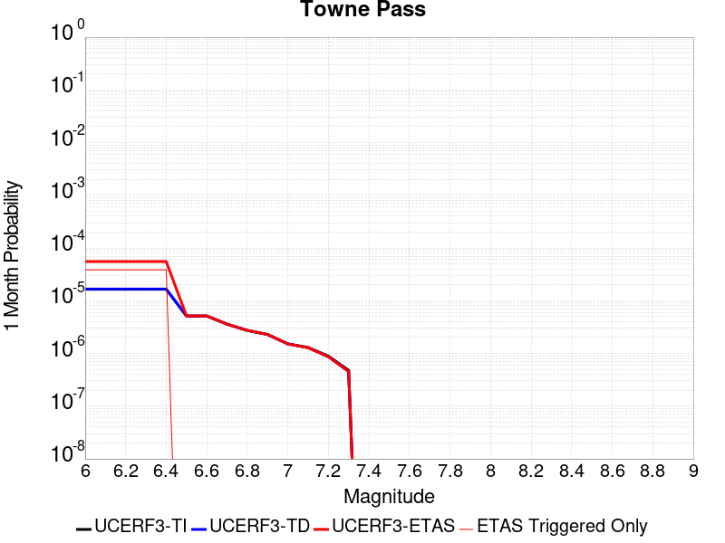 | 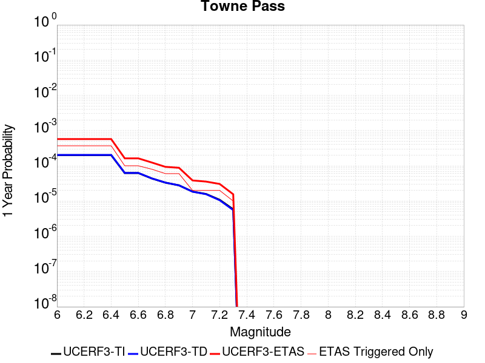 | 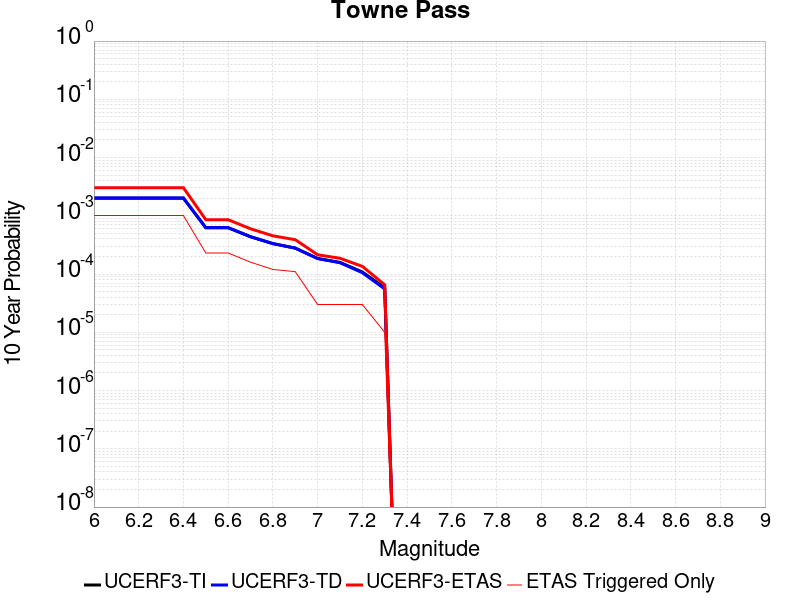 |

| Magnitude | 1 wk TI Prob | 1 wk TD Prob | 1 wk ETAS Prob | 1 wk ETAS/TD Gain | 1 wk ETAS Triggered Only | 1 mo TI Prob | 1 mo TD Prob | 1 mo ETAS Prob | 1 mo ETAS/TD Gain | 1 mo ETAS Triggered Only | 1 yr TI Prob | 1 yr TD Prob | 1 yr ETAS Prob | 1 yr ETAS/TD Gain | 1 yr ETAS Triggered Only | 10 yr TI Prob | 10 yr TD Prob | 10 yr ETAS Prob | 10 yr ETAS/TD Gain | 10 yr ETAS Triggered Only |
|-----|-----|-----|-----|-----|-----|-----|-----|-----|-----|-----|-----|-----|-----|-----|-----|-----|-----|-----|-----|-----|
| 6.0 | 3.849728E-6 | 3.8946155E-6 | 2.1945087E-5 | 5.6347246 | 1.8050541E-5 | 1.649873E-5 | 1.6691127E-5 | 5.279161E-5 | 3.1628544 | 3.6101083E-5 | 2.0085352E-4 | 2.031999E-4 | 5.8218424E-4 | 2.8650813 | 3.7906138E-4 | 0.0020067208 | 0.00203057 | 0.003039348 | 1.4967953 | 0.0010108303 |
| 6.1 | 3.849728E-6 | 3.8946155E-6 | 2.1945087E-5 | 5.6347246 | 1.8050541E-5 | 1.649873E-5 | 1.6691127E-5 | 5.279161E-5 | 3.1628544 | 3.6101083E-5 | 2.0085352E-4 | 2.031999E-4 | 5.8218424E-4 | 2.8650813 | 3.7906138E-4 | 0.0020067208 | 0.00203057 | 0.003039348 | 1.4967953 | 0.0010108303 |
| 6.2 | 3.849728E-6 | 3.8946155E-6 | 2.1945087E-5 | 5.6347246 | 1.8050541E-5 | 1.649873E-5 | 1.6691127E-5 | 5.279161E-5 | 3.1628544 | 3.6101083E-5 | 2.0085352E-4 | 2.031999E-4 | 5.8218424E-4 | 2.8650813 | 3.7906138E-4 | 0.0020067208 | 0.00203057 | 0.003039348 | 1.4967953 | 0.0010108303 |
| 6.3 | 3.849728E-6 | 3.8946155E-6 | 2.1945087E-5 | 5.6347246 | 1.8050541E-5 | 1.649873E-5 | 1.6691127E-5 | 5.279161E-5 | 3.1628544 | 3.6101083E-5 | 2.0085352E-4 | 2.031999E-4 | 5.8218424E-4 | 2.8650813 | 3.7906138E-4 | 0.0020067208 | 0.00203057 | 0.003039348 | 1.4967953 | 0.0010108303 |
| 6.4 | 3.849728E-6 | 3.8946155E-6 | 2.1945087E-5 | 5.6347246 | 1.8050541E-5 | 1.649873E-5 | 1.6691127E-5 | 5.279161E-5 | 3.1628544 | 3.6101083E-5 | 2.0085352E-4 | 2.031999E-4 | 5.8218424E-4 | 2.8650813 | 3.7906138E-4 | 0.0020067208 | 0.00203057 | 0.003039348 | 1.4967953 | 0.0010108303 |
| 6.5 | 1.1953545E-6 | 1.2030813E-6 | 1.2030813E-6 | 1.0 | 0.0 | 5.1229376E-6 | 5.1560532E-6 | 5.1560532E-6 | 1.0 | 0.0 | 6.236998E-5 | 6.277326E-5 | 1.1692148E-4 | 1.8626002 | 5.4151624E-5 | 6.235248E-4 | 6.27567E-4 | 7.538415E-4 | 1.2012128 | 1.2635379E-4 |
| 6.6 | 1.1953545E-6 | 1.2030813E-6 | 1.2030813E-6 | 1.0 | 0.0 | 5.1229376E-6 | 5.1560532E-6 | 5.1560532E-6 | 1.0 | 0.0 | 6.236998E-5 | 6.277326E-5 | 1.1692148E-4 | 1.8626002 | 5.4151624E-5 | 6.235248E-4 | 6.27567E-4 | 7.538415E-4 | 1.2012128 | 1.2635379E-4 |
| 6.7 | 8.375951E-7 | 8.410912E-7 | 8.410912E-7 | 1.0 | 0.0 | 3.5896885E-6 | 3.604672E-6 | 3.604672E-6 | 1.0 | 0.0 | 4.370358E-5 | 4.3886055E-5 | 7.9985555E-5 | 1.8225733 | 3.6101083E-5 | 4.3694986E-4 | 4.387796E-4 | 4.929075E-4 | 1.12336 | 5.4151624E-5 |
| 6.8 | 6.38041E-7 | 6.3923704E-7 | 6.3923704E-7 | 1.0 | 0.0 | 2.7344586E-6 | 2.7395847E-6 | 2.7395847E-6 | 1.0 | 0.0 | 3.3291526E-5 | 3.3353972E-5 | 6.945385E-5 | 2.0823262 | 3.6101083E-5 | 3.3286537E-4 | 3.3349346E-4 | 3.8762702E-4 | 1.1623228 | 5.4151624E-5 |
| 6.9 | 5.3460053E-7 | 5.345532E-7 | 5.345532E-7 | 1.0 | 0.0 | 2.2911431E-6 | 2.2909405E-6 | 2.2909405E-6 | 1.0 | 0.0 | 2.789431E-5 | 2.7891876E-5 | 6.399195E-5 | 2.2942865 | 3.6101083E-5 | 2.789081E-4 | 2.7888708E-4 | 3.330236E-4 | 1.1941162 | 5.4151624E-5 |
| 7.0 | 3.557783E-7 | 3.5325917E-7 | 3.5325917E-7 | 1.0 | 0.0 | 1.5247632E-6 | 1.5139669E-6 | 1.5139669E-6 | 1.0 | 0.0 | 1.8563835E-5 | 1.84324E-5 | 3.648261E-5 | 1.9792652 | 1.8050541E-5 | 1.8562283E-4 | 1.8430957E-4 | 2.0235678E-4 | 1.0979179 | 1.8050541E-5 |
| 7.1 | 3.037942E-7 | 3.0003756E-7 | 3.0003756E-7 | 1.0 | 0.0 | 1.3019744E-6 | 1.2858746E-6 | 1.2858746E-6 | 1.0 | 0.0 | 1.5851423E-5 | 1.565542E-5 | 3.3705677E-5 | 2.152972 | 1.8050541E-5 | 1.5850292E-4 | 1.5654392E-4 | 1.7459164E-4 | 1.1152885 | 1.8050541E-5 |
| 7.2 | 2.0808248E-7 | 2.0218955E-7 | 2.0218955E-7 | 1.0 | 0.0 | 8.917818E-7 | 8.6652636E-7 | 8.6652636E-7 | 1.0 | 0.0 | 1.0857389E-5 | 1.0549912E-5 | 2.8600263E-5 | 2.710948 | 1.8050541E-5 | 1.0856859E-4 | 1.05494575E-4 | 1.2354321E-4 | 1.171086 | 1.8050541E-5 |
| 7.3 | 1.1162073E-7 | 1.0637697E-7 | 1.0637697E-7 | 1.0 | 0.0 | 4.7837443E-7 | 4.5590124E-7 | 4.5590124E-7 | 1.0 | 0.0 | 5.8241935E-6 | 5.5505857E-6 | 5.5505857E-6 | 1.0 | 0.0 | 5.8240406E-5 | 5.5504668E-5 | 5.5504668E-5 | 1.0 | 0.0 |

## San Andreas (San Bernardino N)
*[(top)](#table-of-contents)*

| 1 Week | 1 Month | 1 Year | 10 Year |
|-----|-----|-----|-----|
| 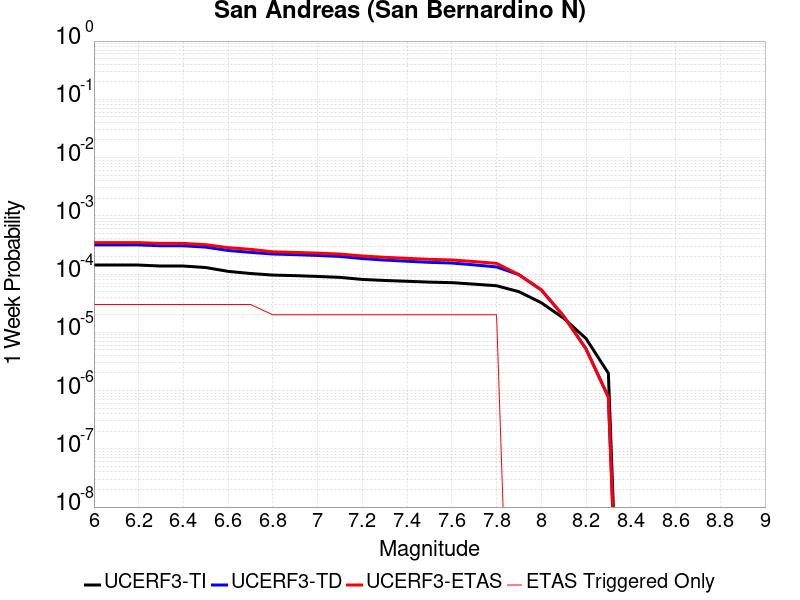 | 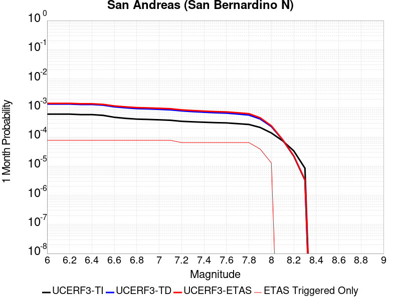 | 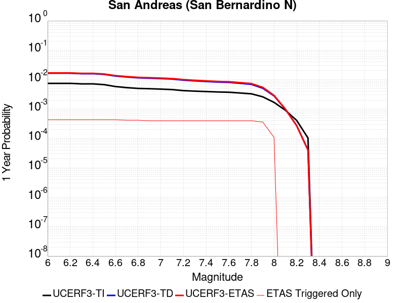 | 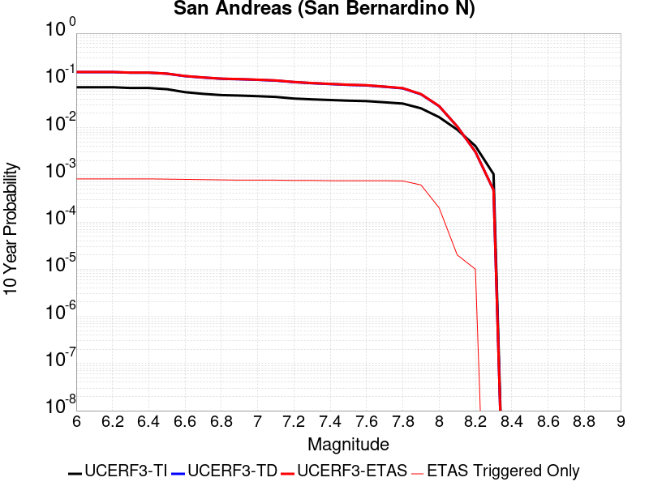 |

| Magnitude | 1 wk TI Prob | 1 wk TD Prob | 1 wk ETAS Prob | 1 wk ETAS/TD Gain | 1 wk ETAS Triggered Only | 1 mo TI Prob | 1 mo TD Prob | 1 mo ETAS Prob | 1 mo ETAS/TD Gain | 1 mo ETAS Triggered Only | 1 yr TI Prob | 1 yr TD Prob | 1 yr ETAS Prob | 1 yr ETAS/TD Gain | 1 yr ETAS Triggered Only | 10 yr TI Prob | 10 yr TD Prob | 10 yr ETAS Prob | 10 yr ETAS/TD Gain | 10 yr ETAS Triggered Only |
|-----|-----|-----|-----|-----|-----|-----|-----|-----|-----|-----|-----|-----|-----|-----|-----|-----|-----|-----|-----|-----|
| 6.0 | 1.4273766E-4 | 3.1672686E-4 | 3.347717E-4 | 1.0569729 | 1.8050541E-5 | 6.115894E-4 | 0.0013567007 | 0.0014107788 | 1.03986 | 5.4151624E-5 | 0.0074207084 | 0.016394231 | 0.016820343 | 1.0259916 | 4.33213E-4 | 0.07177748 | 0.1505373 | 0.15133463 | 1.0052966 | 9.3862816E-4 |
| 6.1 | 1.4273766E-4 | 3.1672686E-4 | 3.347717E-4 | 1.0569729 | 1.8050541E-5 | 6.115894E-4 | 0.0013567007 | 0.0014107788 | 1.03986 | 5.4151624E-5 | 0.0074207084 | 0.016394231 | 0.016820343 | 1.0259916 | 4.33213E-4 | 0.07177748 | 0.1505373 | 0.15133463 | 1.0052966 | 9.3862816E-4 |
| 6.2 | 1.4273766E-4 | 3.1672686E-4 | 3.347717E-4 | 1.0569729 | 1.8050541E-5 | 6.115894E-4 | 0.0013567007 | 0.0014107788 | 1.03986 | 5.4151624E-5 | 0.0074207084 | 0.016394231 | 0.016820343 | 1.0259916 | 4.33213E-4 | 0.07177748 | 0.1505373 | 0.15133463 | 1.0052966 | 9.3862816E-4 |
| 6.3 | 1.3730655E-4 | 3.0577203E-4 | 3.2381705E-4 | 1.0590147 | 1.8050541E-5 | 5.883239E-4 | 0.001309799 | 0.0013638798 | 1.0412893 | 5.4151624E-5 | 0.0071393442 | 0.015831606 | 0.016257962 | 1.0269306 | 4.33213E-4 | 0.06914291 | 0.14583726 | 0.146639 | 1.0054975 | 9.3862816E-4 |
| 6.4 | 1.3730655E-4 | 3.0577203E-4 | 3.2381705E-4 | 1.0590147 | 1.8050541E-5 | 5.883239E-4 | 0.001309799 | 0.0013638798 | 1.0412893 | 5.4151624E-5 | 0.0071393442 | 0.015831606 | 0.016257962 | 1.0269306 | 4.33213E-4 | 0.06914291 | 0.14583726 | 0.146639 | 1.0054975 | 9.3862816E-4 |
| 6.5 | 1.2942807E-4 | 2.8991175E-4 | 3.0795706E-4 | 1.0622442 | 1.8050541E-5 | 5.545738E-4 | 0.0012418925 | 0.0012959768 | 1.04355 | 5.4151624E-5 | 0.0067310524 | 0.015016467 | 0.015443175 | 1.028416 | 4.33213E-4 | 0.06530788 | 0.1389802 | 0.13977283 | 1.0057032 | 9.205776E-4 |
| 6.6 | 1.1125901E-4 | 2.5428797E-4 | 2.723339E-4 | 1.0709666 | 1.8050541E-5 | 4.767372E-4 | 0.0010893528 | 0.0011434454 | 1.0496558 | 5.4151624E-5 | 0.005788839 | 0.013182851 | 0.013610352 | 1.0324286 | 4.33213E-4 | 0.056403454 | 0.12326987 | 0.12407697 | 1.0065475 | 9.205776E-4 |
| 6.7 | 1.02209575E-4 | 2.3563286E-4 | 2.5367914E-4 | 1.0765865 | 1.8050541E-5 | 4.3796748E-4 | 0.0010094657 | 0.0010635627 | 1.0535897 | 5.4151624E-5 | 0.0053192247 | 0.012221411 | 0.012631499 | 1.0335549 | 4.1516245E-4 | 0.051936906 | 0.11506217 | 0.11586085 | 1.0069413 | 9.0252707E-4 |
| 6.8 | 9.610582E-5 | 2.208822E-4 | 2.3892874E-4 | 1.0817021 | 1.8050541E-5 | 4.1181705E-4 | 9.462952E-4 | 0.0010003956 | 1.0571707 | 5.4151624E-5 | 0.0050023515 | 0.011460549 | 0.011870954 | 1.0358102 | 4.1516245E-4 | 0.048912346 | 0.108462594 | 0.10926723 | 1.0074185 | 9.0252707E-4 |
| 6.9 | 9.3877505E-5 | 2.1543486E-4 | 2.3348152E-4 | 1.0837685 | 1.8050541E-5 | 4.0227012E-4 | 9.229662E-4 | 9.770679E-4 | 1.0586171 | 5.4151624E-5 | 0.0048866454 | 0.011179463 | 0.011572136 | 1.0351244 | 3.971119E-4 | 0.04780577 | 0.10605249 | 0.106843166 | 1.0074555 | 8.844765E-4 |
| 7.0 | 9.1019785E-5 | 2.086998E-4 | 2.2674658E-4 | 1.0864724 | 1.8050541E-5 | 3.900265E-4 | 8.941217E-4 | 9.482249E-4 | 1.0605099 | 5.4151624E-5 | 0.0047382377 | 0.010831823 | 0.011224633 | 1.0362645 | 3.971119E-4 | 0.046384744 | 0.10302189 | 0.10381524 | 1.0077008 | 8.844765E-4 |
| 7.1 | 8.771155E-5 | 2.0044067E-4 | 2.1848759E-4 | 1.0900363 | 1.8050541E-5 | 3.758525E-4 | 8.5874915E-4 | 9.128543E-4 | 1.0630046 | 5.4151624E-5 | 0.0045664064 | 0.010405348 | 0.010798328 | 1.037767 | 3.971119E-4 | 0.044737056 | 0.099332705 | 0.10012932 | 1.0080197 | 8.844765E-4 |
| 7.2 | 8.0830236E-5 | 1.8448672E-4 | 2.0253393E-4 | 1.0978239 | 1.8050541E-5 | 3.4636928E-4 | 7.9041795E-4 | 8.445268E-4 | 1.0684559 | 5.4151624E-5 | 0.0042088944 | 0.009580984 | 0.009974291 | 1.0410508 | 3.971119E-4 | 0.041300658 | 0.09206129 | 0.09286434 | 1.008723 | 8.844765E-4 |
| 7.3 | 7.7668235E-5 | 1.7391147E-4 | 1.9195887E-4 | 1.1037735 | 1.8050541E-5 | 3.328214E-4 | 7.4512203E-4 | 7.9923327E-4 | 1.0726207 | 5.4151624E-5 | 0.0040445733 | 0.009034205 | 0.00942773 | 1.0435593 | 3.971119E-4 | 0.03971748 | 0.087325655 | 0.088132896 | 1.009244 | 8.844765E-4 |
| 7.4 | 7.520177E-5 | 1.6610422E-4 | 1.8415177E-4 | 1.1086519 | 1.8050541E-5 | 3.2225347E-4 | 7.116811E-4 | 7.657942E-4 | 1.0760356 | 5.4151624E-5 | 0.0039163795 | 0.0086303605 | 0.009024045 | 1.0456163 | 3.971119E-4 | 0.038480744 | 0.08377945 | 0.084573284 | 1.0094754 | 8.66426E-4 |
| 7.5 | 7.274697E-5 | 1.5897314E-4 | 1.7702082E-4 | 1.1135266 | 1.8050541E-5 | 3.1173544E-4 | 6.811356E-4 | 7.3525036E-4 | 1.0794479 | 5.4151624E-5 | 0.003788775 | 0.008261351 | 0.008655182 | 1.0476716 | 3.971119E-4 | 0.03724827 | 0.08049393 | 0.08129061 | 1.0098975 | 8.66426E-4 |
| 7.6 | 7.1185845E-5 | 1.5466686E-4 | 1.7271462E-4 | 1.1166879 | 1.8050541E-5 | 3.0504653E-4 | 6.626897E-4 | 7.168054E-4 | 1.0816607 | 5.4151624E-5 | 0.0037076178 | 0.008038452 | 0.008432372 | 1.0490044 | 3.971119E-4 | 0.036463667 | 0.07848207 | 0.079280496 | 1.0101733 | 8.66426E-4 |
| 7.7 | 6.709961E-5 | 1.4374187E-4 | 1.6178982E-4 | 1.125558 | 1.8050541E-5 | 2.8753807E-4 | 6.158912E-4 | 6.7000947E-4 | 1.0878699 | 5.4151624E-5 | 0.003495157 | 0.0074727335 | 0.007866878 | 1.0527444 | 3.971119E-4 | 0.034406938 | 0.073306195 | 0.07410911 | 1.0109528 | 8.66426E-4 |
| 7.8 | 6.300812E-5 | 1.3255418E-4 | 1.5060233E-4 | 1.1361568 | 1.8050541E-5 | 2.7000686E-4 | 5.679657E-4 | 6.220865E-4 | 1.095289 | 5.4151624E-5 | 0.0032823787 | 0.0068930862 | 0.007287461 | 1.0572131 | 3.971119E-4 | 0.032343175 | 0.06795385 | 0.0687614 | 1.0118837 | 8.66426E-4 |
| 7.9 | 4.983037E-5 | 9.765295E-5 | 9.765295E-5 | 1.0 | 0.0 | 2.1354125E-4 | 4.1844553E-4 | 4.545315E-4 | 1.0862381 | 3.6101083E-5 | 0.0025967648 | 0.0050826836 | 0.00544186 | 1.0706666 | 3.6101084E-4 | 0.025666296 | 0.05084365 | 0.051546093 | 1.0138158 | 7.400722E-4 |
| 8.0 | 3.2211527E-5 | 5.354985E-5 | 5.354985E-5 | 1.0 | 0.0 | 1.380421E-4 | 2.2947918E-4 | 2.4752558E-4 | 1.0786407 | 1.8050541E-5 | 0.0016793669 | 0.0027903311 | 0.0028983322 | 1.0387055 | 1.0830325E-4 | 0.016667323 | 0.02848099 | 0.028708965 | 1.0080044 | 2.3465704E-4 |
| 8.1 | 1.743376E-5 | 1.8939318E-5 | 1.8939318E-5 | 1.0 | 0.0 | 7.471398E-5 | 8.116598E-5 | 8.116598E-5 | 1.0 | 0.0 | 9.0926304E-4 | 9.877485E-4 | 9.877485E-4 | 1.0 | 0.0 | 0.009055517 | 0.010543858 | 0.010543858 | 1.0 | 0.0 |
| 8.2 | 7.831616E-6 | 5.197699E-6 | 5.197699E-6 | 1.0 | 0.0 | 3.3563636E-5 | 2.2275663E-5 | 2.2275663E-5 | 1.0 | 0.0 | 4.0856065E-4 | 2.7117252E-4 | 2.7117252E-4 | 1.0 | 0.0 | 0.004078103 | 0.003064977 | 0.003064977 | 1.0 | 0.0 |
| 8.3 | 1.983087E-6 | 7.740189E-7 | 7.740189E-7 | 1.0 | 0.0 | 8.498917E-6 | 3.3172198E-6 | 3.3172198E-6 | 1.0 | 0.0 | 1.034694E-4 | 4.0386418E-5 | 4.0386418E-5 | 1.0 | 0.0 | 0.0010342124 | 4.7657243E-4 | 4.7657243E-4 | 1.0 | 0.0 |

## Paradise
*[(top)](#table-of-contents)*

| 1 Week | 1 Month | 1 Year | 10 Year |
|-----|-----|-----|-----|
| 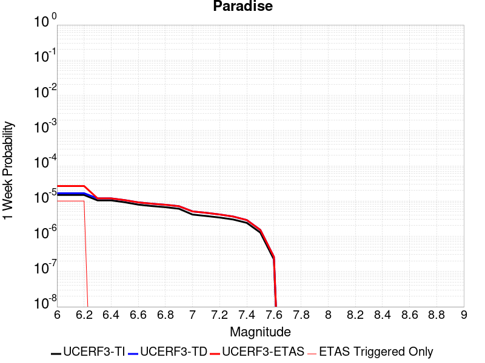 | 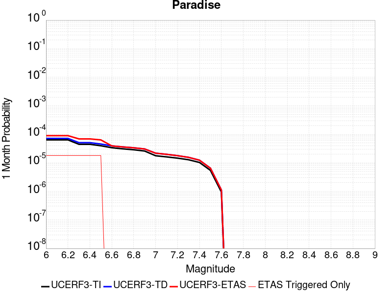 | 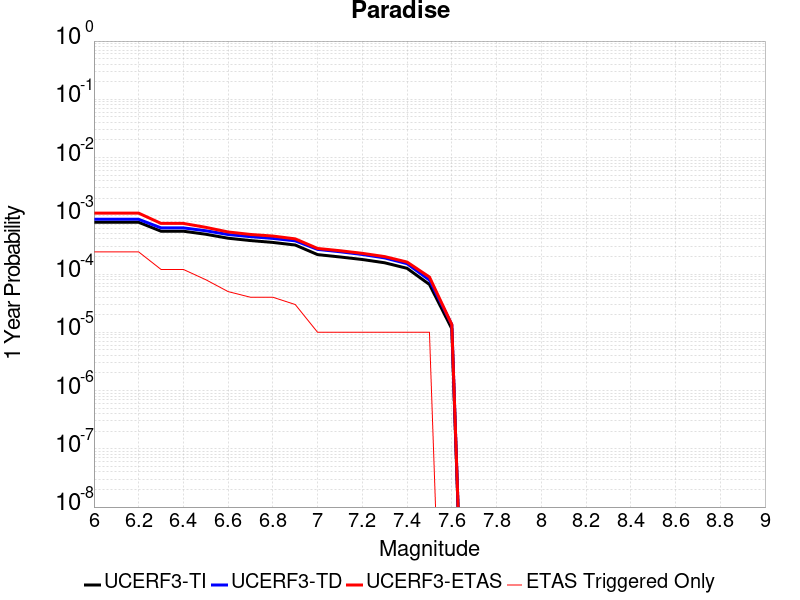 | 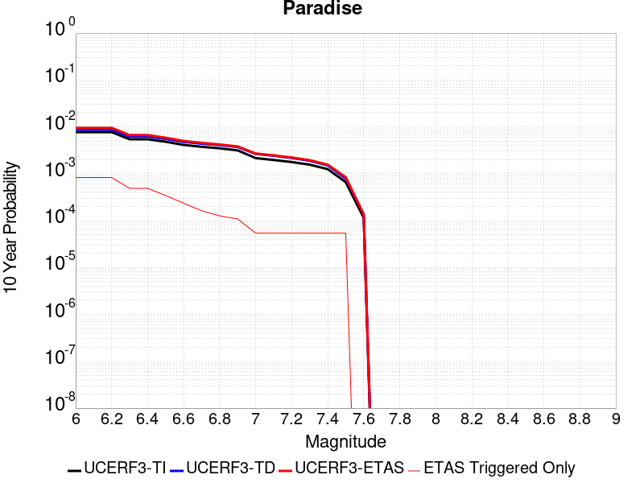 |

| Magnitude | 1 wk TI Prob | 1 wk TD Prob | 1 wk ETAS Prob | 1 wk ETAS/TD Gain | 1 wk ETAS Triggered Only | 1 mo TI Prob | 1 mo TD Prob | 1 mo ETAS Prob | 1 mo ETAS/TD Gain | 1 mo ETAS Triggered Only | 1 yr TI Prob | 1 yr TD Prob | 1 yr ETAS Prob | 1 yr ETAS/TD Gain | 1 yr ETAS Triggered Only | 10 yr TI Prob | 10 yr TD Prob | 10 yr ETAS Prob | 10 yr ETAS/TD Gain | 10 yr ETAS Triggered Only |
|-----|-----|-----|-----|-----|-----|-----|-----|-----|-----|-----|-----|-----|-----|-----|-----|-----|-----|-----|-----|-----|
| 6.0 | 1.4851273E-5 | 1.6696153E-5 | 1.6696153E-5 | 1.0 | 0.0 | 6.364676E-5 | 7.155311E-5 | 8.960236E-5 | 1.2522497 | 1.8050541E-5 | 7.7462377E-4 | 8.7083457E-4 | 0.0011052872 | 1.2692276 | 2.3465704E-4 | 0.0077192914 | 0.008676601 | 0.009499721 | 1.0948668 | 8.303249E-4 |
| 6.1 | 1.4851273E-5 | 1.6696153E-5 | 1.6696153E-5 | 1.0 | 0.0 | 6.364676E-5 | 7.155311E-5 | 8.960236E-5 | 1.2522497 | 1.8050541E-5 | 7.7462377E-4 | 8.7083457E-4 | 0.0011052872 | 1.2692276 | 2.3465704E-4 | 0.0077192914 | 0.008676601 | 0.009499721 | 1.0948668 | 8.303249E-4 |
| 6.2 | 1.4851273E-5 | 1.6696153E-5 | 1.6696153E-5 | 1.0 | 0.0 | 6.364676E-5 | 7.155311E-5 | 8.960236E-5 | 1.2522497 | 1.8050541E-5 | 7.7462377E-4 | 8.7083457E-4 | 0.0011052872 | 1.2692276 | 2.3465704E-4 | 0.0077192914 | 0.008676601 | 0.009499721 | 1.0948668 | 8.303249E-4 |
| 6.3 | 1.0426831E-5 | 1.1889586E-5 | 1.1889586E-5 | 1.0 | 0.0 | 4.4685654E-5 | 5.0954408E-5 | 6.9004025E-5 | 1.3542309 | 1.8050541E-5 | 5.43912E-4 | 6.2019925E-4 | 8.005927E-4 | 1.2908638 | 1.8050542E-4 | 0.0054258266 | 0.0061852923 | 0.0066696424 | 1.0783068 | 4.8736462E-4 |
| 6.4 | 1.0426831E-5 | 1.1889586E-5 | 1.1889586E-5 | 1.0 | 0.0 | 4.4685654E-5 | 5.0954408E-5 | 6.9004025E-5 | 1.3542309 | 1.8050541E-5 | 5.43912E-4 | 6.2019925E-4 | 8.005927E-4 | 1.2908638 | 1.8050542E-4 | 0.0054258266 | 0.0061852923 | 0.0066696424 | 1.0783068 | 4.8736462E-4 |
| 6.5 | 9.25027E-6 | 1.0620806E-5 | 1.0620806E-5 | 1.0 | 0.0 | 3.964341E-5 | 4.5516976E-5 | 6.3566695E-5 | 1.3965492 | 1.8050541E-5 | 4.8255164E-4 | 5.540332E-4 | 6.80317E-4 | 1.2279354 | 1.2635379E-4 | 0.0048150513 | 0.005527019 | 0.005868084 | 1.0617086 | 3.429603E-4 |
| 6.6 | 7.904275E-6 | 9.160223E-6 | 9.160223E-6 | 1.0 | 0.0 | 3.3875025E-5 | 3.925753E-5 | 3.925753E-5 | 1.0 | 0.0 | 4.1235037E-4 | 4.7785955E-4 | 5.5002724E-4 | 1.1510228 | 7.2202165E-5 | 0.0041158604 | 0.004768717 | 0.005002255 | 1.048973 | 2.3465704E-4 |
| 6.7 | 7.2061953E-6 | 8.4078765E-6 | 8.4078765E-6 | 1.0 | 0.0 | 3.088333E-5 | 3.603328E-5 | 3.603328E-5 | 1.0 | 0.0 | 3.7593965E-4 | 4.3862054E-4 | 5.10791E-4 | 1.1645397 | 7.2202165E-5 | 0.003753043 | 0.0043779174 | 0.004539661 | 1.0369453 | 1.6245487E-4 |
| 6.8 | 6.6948724E-6 | 7.842745E-6 | 7.842745E-6 | 1.0 | 0.0 | 2.8691995E-5 | 3.361135E-5 | 3.361135E-5 | 1.0 | 0.0 | 3.4926904E-4 | 4.0914494E-4 | 4.8131755E-4 | 1.1763986 | 7.2202165E-5 | 0.003487206 | 0.004084274 | 0.0042101117 | 1.0308104 | 1.2635379E-4 |
| 6.9 | 6.0421025E-6 | 7.1311374E-6 | 7.1311374E-6 | 1.0 | 0.0 | 2.5894467E-5 | 3.0561678E-5 | 3.0561678E-5 | 1.0 | 0.0 | 3.1521954E-4 | 3.720283E-4 | 4.261598E-4 | 1.1455036 | 5.4151624E-5 | 0.0031477278 | 0.0037143934 | 0.0038222943 | 1.0290494 | 1.0830325E-4 |
| 7.0 | 4.134091E-6 | 5.080668E-6 | 5.080668E-6 | 1.0 | 0.0 | 1.7717413E-5 | 2.177412E-5 | 2.177412E-5 | 1.0 | 0.0 | 2.1568815E-4 | 2.650692E-4 | 2.8311496E-4 | 1.0680795 | 1.8050541E-5 | 0.0021547892 | 0.0026476833 | 0.0027016916 | 1.0203983 | 5.4151624E-5 |
| 7.1 | 3.7674888E-6 | 4.632193E-6 | 4.632193E-6 | 1.0 | 0.0 | 1.6146281E-5 | 1.9852114E-5 | 1.9852114E-5 | 1.0 | 0.0 | 1.9656324E-4 | 2.4167419E-4 | 2.5972037E-4 | 1.0746715 | 1.8050541E-5 | 0.0019638946 | 0.0024142643 | 0.0024682852 | 1.0223757 | 5.4151624E-5 |
| 7.2 | 3.4065345E-6 | 4.157012E-6 | 4.157012E-6 | 1.0 | 0.0 | 1.4599351E-5 | 1.7815653E-5 | 1.7815653E-5 | 1.0 | 0.0 | 1.777326E-4 | 2.1688548E-4 | 2.3493211E-4 | 1.0832081 | 1.8050541E-5 | 0.0017759053 | 0.0021668863 | 0.0022209208 | 1.0249363 | 5.4151624E-5 |
| 7.3 | 2.9934936E-6 | 3.6295557E-6 | 3.6295557E-6 | 1.0 | 0.0 | 1.2829195E-5 | 1.5555153E-5 | 1.5555153E-5 | 1.0 | 0.0 | 1.5618425E-4 | 1.8936902E-4 | 2.0741615E-4 | 1.0953014 | 1.8050541E-5 | 0.0015607453 | 0.0018922219 | 0.001946271 | 1.0285639 | 5.4151624E-5 |
| 7.4 | 2.4049796E-6 | 2.8891593E-6 | 2.8891593E-6 | 1.0 | 0.0 | 1.0307015E-5 | 1.2382061E-5 | 1.2382061E-5 | 1.0 | 0.0 | 1.2548068E-4 | 1.507426E-4 | 1.6879043E-4 | 1.1197261 | 1.8050541E-5 | 0.0012540985 | 0.001506545 | 0.001560615 | 1.0358901 | 5.4151624E-5 |
| 7.5 | 1.2710091E-6 | 1.5135519E-6 | 1.5135519E-6 | 1.0 | 0.0 | 5.44717E-6 | 6.4866417E-6 | 6.4866417E-6 | 1.0 | 0.0 | 6.631728E-5 | 7.897325E-5 | 9.702237E-5 | 1.2285472 | 1.8050541E-5 | 6.6297496E-4 | 7.895745E-4 | 8.436834E-4 | 1.0685291 | 5.4151624E-5 |
| 7.6 | 2.21172E-7 | 2.6040772E-7 | 2.6040772E-7 | 1.0 | 0.0 | 9.478797E-7 | 1.1160328E-6 | 1.1160328E-6 | 1.0 | 0.0 | 1.1540374E-5 | 1.3587643E-5 | 1.3587643E-5 | 1.0 | 0.0 | 1.1539775E-4 | 1.3587093E-4 | 1.3587093E-4 | 1.0 | 0.0 |

## Bicycle Lake
*[(top)](#table-of-contents)*

| 1 Week | 1 Month | 1 Year | 10 Year |
|-----|-----|-----|-----|
| 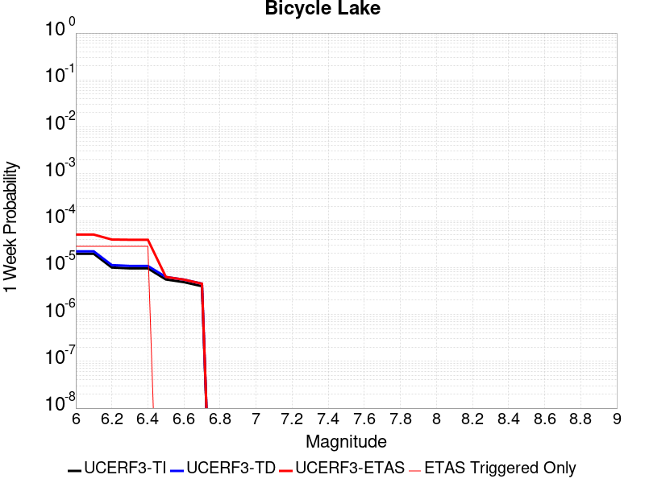 | 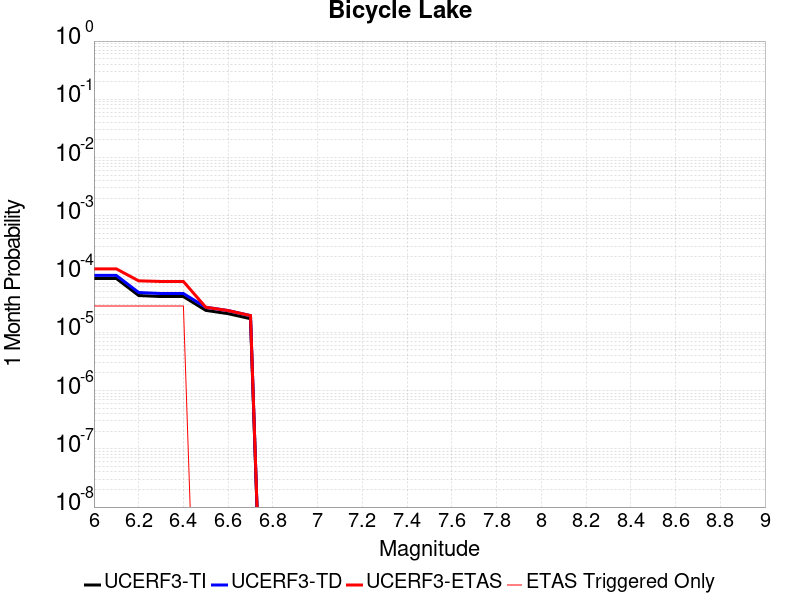 | 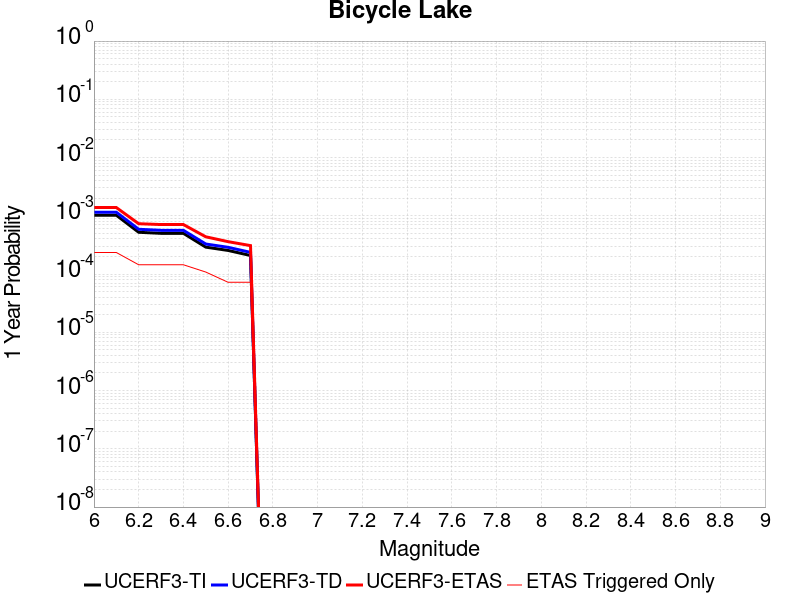 | 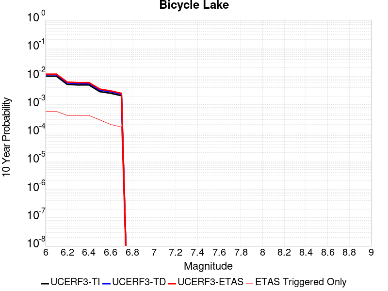 |

| Magnitude | 1 wk TI Prob | 1 wk TD Prob | 1 wk ETAS Prob | 1 wk ETAS/TD Gain | 1 wk ETAS Triggered Only | 1 mo TI Prob | 1 mo TD Prob | 1 mo ETAS Prob | 1 mo ETAS/TD Gain | 1 mo ETAS Triggered Only | 1 yr TI Prob | 1 yr TD Prob | 1 yr ETAS Prob | 1 yr ETAS/TD Gain | 1 yr ETAS Triggered Only | 10 yr TI Prob | 10 yr TD Prob | 10 yr ETAS Prob | 10 yr ETAS/TD Gain | 10 yr ETAS Triggered Only |
|-----|-----|-----|-----|-----|-----|-----|-----|-----|-----|-----|-----|-----|-----|-----|-----|-----|-----|-----|-----|-----|
| 6.0 | 1.9621975E-5 | 2.2100408E-5 | 4.015055E-5 | 1.8167335 | 1.8050541E-5 | 8.4091465E-5 | 9.471335E-5 | 1.4885985E-4 | 1.571688 | 5.4151624E-5 | 0.0010233327 | 0.0011526601 | 0.0013870467 | 1.203344 | 2.3465704E-4 | 0.01018633 | 0.01148013 | 0.012051116 | 1.0497369 | 5.776173E-4 |
| 6.1 | 1.9621975E-5 | 2.2100408E-5 | 4.015055E-5 | 1.8167335 | 1.8050541E-5 | 8.4091465E-5 | 9.471335E-5 | 1.4885985E-4 | 1.571688 | 5.4151624E-5 | 0.0010233327 | 0.0011526601 | 0.0013870467 | 1.203344 | 2.3465704E-4 | 0.01018633 | 0.01148013 | 0.012051116 | 1.0497369 | 5.776173E-4 |
| 6.2 | 9.9971285E-6 | 1.1257332E-5 | 2.930767E-5 | 2.6034296 | 1.8050541E-5 | 4.2844134E-5 | 4.8245107E-5 | 8.434445E-5 | 1.7482488 | 3.6101083E-5 | 5.2150246E-4 | 5.872779E-4 | 7.315974E-4 | 1.2457432 | 1.4440433E-4 | 0.0052028033 | 0.005862366 | 0.0062750946 | 1.0704031 | 4.1516245E-4 |
| 6.3 | 9.589428E-6 | 1.0799971E-5 | 2.8850318E-5 | 2.6713328 | 1.8050541E-5 | 4.10969E-5 | 4.6285062E-5 | 8.2384475E-5 | 1.7799366 | 3.6101083E-5 | 5.002399E-4 | 5.634268E-4 | 7.077498E-4 | 1.2561522 | 1.4440433E-4 | 0.0049911533 | 0.0056250747 | 0.0060379016 | 1.0733905 | 4.1516245E-4 |
| 6.4 | 9.589428E-6 | 1.0799971E-5 | 2.8850318E-5 | 2.6713328 | 1.8050541E-5 | 4.10969E-5 | 4.6285062E-5 | 8.2384475E-5 | 1.7799366 | 3.6101083E-5 | 5.002399E-4 | 5.634268E-4 | 7.077498E-4 | 1.2561522 | 1.4440433E-4 | 0.0049911533 | 0.0056250747 | 0.0060379016 | 1.0733905 | 4.1516245E-4 |
| 6.5 | 5.557707E-6 | 6.2865843E-6 | 6.2865843E-6 | 1.0 | 0.0 | 2.3818526E-5 | 2.6942376E-5 | 4.4992434E-5 | 1.6699504 | 1.8050541E-5 | 2.8995197E-4 | 3.2800096E-4 | 4.362687E-4 | 1.3300836 | 1.0830325E-4 | 0.0028957394 | 0.0032778054 | 0.0035656674 | 1.0878216 | 2.8880866E-4 |
| 6.6 | 4.8742945E-6 | 5.5141527E-6 | 5.5141527E-6 | 1.0 | 0.0 | 2.0889667E-5 | 2.3632016E-5 | 4.168213E-5 | 1.7637992 | 1.8050541E-5 | 2.54302E-4 | 2.87708E-4 | 3.598894E-4 | 1.2508842 | 7.2202165E-5 | 0.002540112 | 0.002875925 | 0.00307391 | 1.0688422 | 1.9855595E-4 |
| 6.7 | 3.991108E-6 | 4.5166194E-6 | 4.5166194E-6 | 1.0 | 0.0 | 1.7104636E-5 | 1.935694E-5 | 3.740713E-5 | 1.932492 | 1.8050541E-5 | 2.0822904E-4 | 2.3567074E-4 | 3.078559E-4 | 1.3062966 | 7.2202165E-5 | 0.0020803404 | 0.0023567074 | 0.0025187794 | 1.0687705 | 1.6245487E-4 |

## San Andreas (San Bernardino S)
*[(top)](#table-of-contents)*

| 1 Week | 1 Month | 1 Year | 10 Year |
|-----|-----|-----|-----|
| 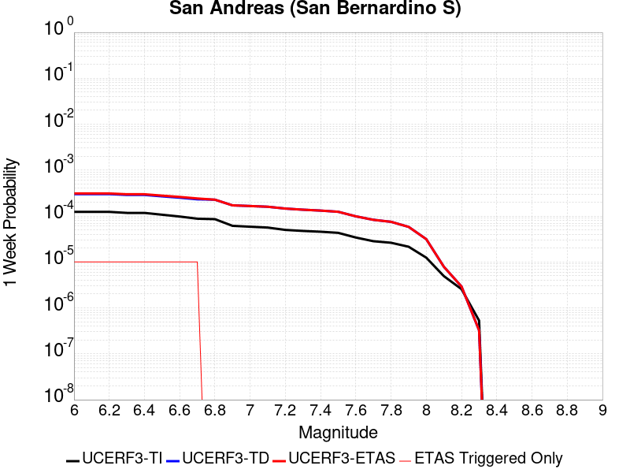 | 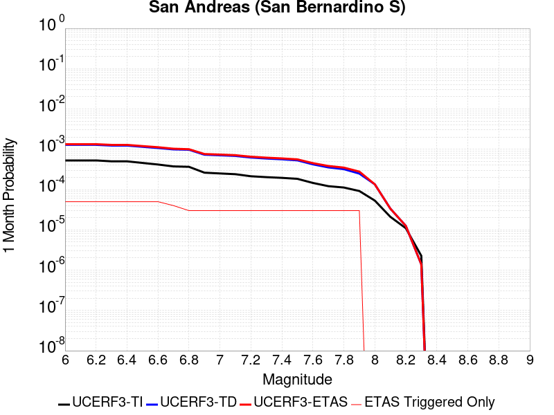 | 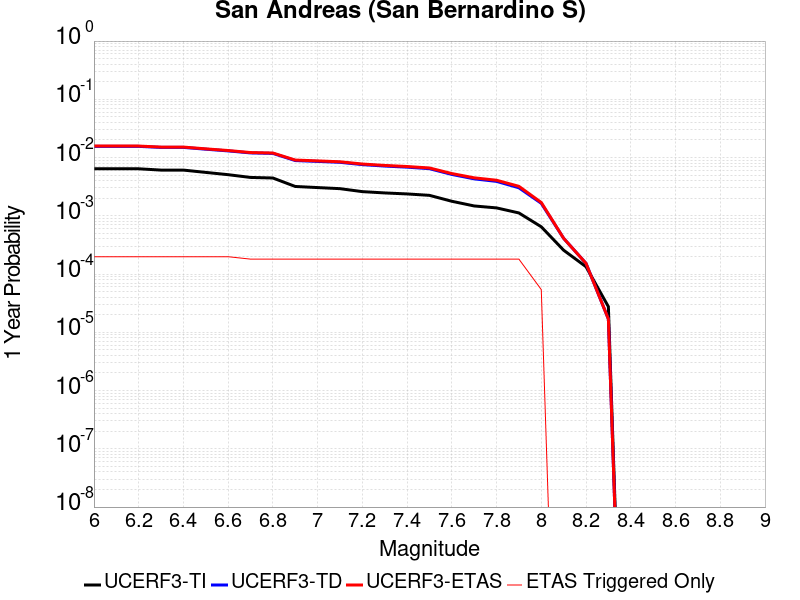 |  |

| Magnitude | 1 wk TI Prob | 1 wk TD Prob | 1 wk ETAS Prob | 1 wk ETAS/TD Gain | 1 wk ETAS Triggered Only | 1 mo TI Prob | 1 mo TD Prob | 1 mo ETAS Prob | 1 mo ETAS/TD Gain | 1 mo ETAS Triggered Only | 1 yr TI Prob | 1 yr TD Prob | 1 yr ETAS Prob | 1 yr ETAS/TD Gain | 1 yr ETAS Triggered Only | 10 yr TI Prob | 10 yr TD Prob | 10 yr ETAS Prob | 10 yr ETAS/TD Gain | 10 yr ETAS Triggered Only |
|-----|-----|-----|-----|-----|-----|-----|-----|-----|-----|-----|-----|-----|-----|-----|-----|-----|-----|-----|-----|-----|
| 6.0 | 1.2336002E-4 | 3.0048014E-4 | 3.0048014E-4 | 1.0 | 0.0 | 5.2857865E-4 | 0.0012871625 | 0.0013232172 | 1.028011 | 3.6101083E-5 | 0.006416472 | 0.015563563 | 0.015759028 | 1.0125592 | 1.9855595E-4 | 0.06234337 | 0.14301057 | 0.14347464 | 1.003245 | 5.4151623E-4 |
| 6.1 | 1.2336002E-4 | 3.0048014E-4 | 3.0048014E-4 | 1.0 | 0.0 | 5.2857865E-4 | 0.0012871625 | 0.0013232172 | 1.028011 | 3.6101083E-5 | 0.006416472 | 0.015563563 | 0.015759028 | 1.0125592 | 1.9855595E-4 | 0.06234337 | 0.14301057 | 0.14347464 | 1.003245 | 5.4151623E-4 |
| 6.2 | 1.2336002E-4 | 3.0048014E-4 | 3.0048014E-4 | 1.0 | 0.0 | 5.2857865E-4 | 0.0012871625 | 0.0013232172 | 1.028011 | 3.6101083E-5 | 0.006416472 | 0.015563563 | 0.015759028 | 1.0125592 | 1.9855595E-4 | 0.06234337 | 0.14301057 | 0.14347464 | 1.003245 | 5.4151623E-4 |
| 6.3 | 1.1712257E-4 | 2.883585E-4 | 2.883585E-4 | 1.0 | 0.0 | 5.018573E-4 | 0.0012352626 | 0.0012713191 | 1.0291893 | 3.6101083E-5 | 0.006093008 | 0.014940465 | 0.015136055 | 1.0130912 | 1.9855595E-4 | 0.059286322 | 0.13771854 | 0.13818549 | 1.0033906 | 5.4151623E-4 |
| 6.4 | 1.1712257E-4 | 2.883585E-4 | 2.883585E-4 | 1.0 | 0.0 | 5.018573E-4 | 0.0012352626 | 0.0012713191 | 1.0291893 | 3.6101083E-5 | 0.006093008 | 0.014940465 | 0.015136055 | 1.0130912 | 1.9855595E-4 | 0.059286322 | 0.13771854 | 0.13818549 | 1.0033906 | 5.4151623E-4 |
| 6.5 | 1.0689076E-4 | 2.6847952E-4 | 2.6847952E-4 | 1.0 | 0.0 | 4.5802278E-4 | 0.0011501439 | 0.0011862034 | 1.0313522 | 3.6101083E-5 | 0.0055621783 | 0.013917719 | 0.014113512 | 1.0140679 | 1.9855595E-4 | 0.05425003 | 0.12896419 | 0.12942015 | 1.0035355 | 5.234657E-4 |
| 6.6 | 9.7648895E-5 | 2.5092025E-4 | 2.5092025E-4 | 1.0 | 0.0 | 4.1842813E-4 | 0.001074953 | 0.0011110152 | 1.0335478 | 3.6101083E-5 | 0.005082469 | 0.013013388 | 0.01320936 | 1.0150592 | 1.9855595E-4 | 0.049677886 | 0.121122554 | 0.12158262 | 1.0037984 | 5.234657E-4 |
| 6.7 | 8.757013E-5 | 2.3162096E-4 | 2.3162096E-4 | 1.0 | 0.0 | 3.7524657E-4 | 9.923059E-4 | 0.0010103385 | 1.0181725 | 1.8050541E-5 | 0.00455906 | 0.012018492 | 0.012196829 | 1.0148385 | 1.8050542E-4 | 0.04466656 | 0.11242989 | 0.11284644 | 1.003705 | 4.6931408E-4 |
| 6.8 | 8.562978E-5 | 2.272167E-4 | 2.272167E-4 | 1.0 | 0.0 | 3.6693315E-4 | 9.734447E-4 | 9.914777E-4 | 1.0185249 | 1.8050541E-5 | 0.004458263 | 0.011791358 | 0.011969735 | 1.0151278 | 1.8050542E-4 | 0.043698758 | 0.110439226 | 0.11085671 | 1.0037802 | 4.6931408E-4 |
| 6.9 | 6.124075E-5 | 1.7102591E-4 | 1.7102591E-4 | 1.0 | 0.0 | 2.6243398E-4 | 7.327631E-4 | 7.508004E-4 | 1.0246155 | 1.8050541E-5 | 0.0031904527 | 0.008885105 | 0.009064007 | 1.020135 | 1.8050542E-4 | 0.031450346 | 0.08433968 | 0.084736355 | 1.0047033 | 4.33213E-4 |
| 7.0 | 5.8598747E-5 | 1.653122E-4 | 1.653122E-4 | 1.0 | 0.0 | 2.5111332E-4 | 7.0828927E-4 | 7.2632707E-4 | 1.0254667 | 1.8050541E-5 | 0.0030530186 | 0.008589522 | 0.008768477 | 1.0208341 | 1.8050542E-4 | 0.03011414 | 0.081656136 | 0.082053974 | 1.0048721 | 4.33213E-4 |
| 7.1 | 5.613814E-5 | 1.5949405E-4 | 1.5949405E-4 | 1.0 | 0.0 | 2.4056983E-4 | 6.8336766E-4 | 7.0140586E-4 | 1.026396 | 1.8050541E-5 | 0.0029250039 | 0.008288444 | 0.0084674535 | 1.0215975 | 1.8050542E-4 | 0.028868021 | 0.078954056 | 0.079353064 | 1.0050536 | 4.33213E-4 |
| 7.2 | 4.991222E-5 | 1.455501E-4 | 1.455501E-4 | 1.0 | 0.0 | 2.1389198E-4 | 6.2363746E-4 | 6.416767E-4 | 1.0289259 | 1.8050541E-5 | 0.002601025 | 0.007566456 | 0.0077455956 | 1.0236754 | 1.8050542E-4 | 0.025707912 | 0.07240498 | 0.07280683 | 1.00555 | 4.33213E-4 |
| 7.3 | 4.7410045E-5 | 1.3748443E-4 | 1.3748443E-4 | 1.0 | 0.0 | 2.0317009E-4 | 5.8908627E-4 | 6.0712616E-4 | 1.0306236 | 1.8050541E-5 | 0.0024707897 | 0.007148626 | 0.0073278407 | 1.0250698 | 1.8050542E-4 | 0.024434982 | 0.068684995 | 0.06908846 | 1.005874 | 4.33213E-4 |
| 7.4 | 4.5556746E-5 | 1.3155756E-4 | 1.3155756E-4 | 1.0 | 0.0 | 1.952286E-4 | 5.636966E-4 | 5.8173697E-4 | 1.0320036 | 1.8050541E-5 | 0.002374317 | 0.0068414886 | 0.0070207594 | 1.0262034 | 1.8050542E-4 | 0.023491086 | 0.065935396 | 0.06632318 | 1.0058813 | 4.1516245E-4 |
| 7.5 | 4.3084514E-5 | 1.2390377E-4 | 1.2390377E-4 | 1.0 | 0.0 | 1.8463485E-4 | 5.3090835E-4 | 5.4894935E-4 | 1.0339813 | 1.8050541E-5 | 0.0022456115 | 0.0064447243 | 0.0066240663 | 1.0278277 | 1.8050542E-4 | 0.022230545 | 0.06233372 | 0.062723 | 1.0062451 | 4.1516245E-4 |
| 7.6 | 3.408608E-5 | 9.865953E-5 | 9.865953E-5 | 1.0 | 0.0 | 1.4607502E-4 | 4.2275817E-4 | 4.4080106E-4 | 1.0426791 | 1.8050541E-5 | 0.0017770125 | 0.0051349592 | 0.005314538 | 1.0349717 | 1.8050542E-4 | 0.017628696 | 0.05015513 | 0.05054947 | 1.0078624 | 4.1516245E-4 |
| 7.7 | 2.8315713E-5 | 8.277278E-5 | 8.277278E-5 | 1.0 | 0.0 | 1.2134742E-4 | 3.5469225E-4 | 3.727364E-4 | 1.0508727 | 1.8050541E-5 | 0.0014764034 | 0.004309837 | 0.0044895643 | 1.0417017 | 1.8050542E-4 | 0.01466633 | 0.042399134 | 0.042796694 | 1.0093766 | 4.1516245E-4 |
| 7.8 | 2.6222975E-5 | 7.489847E-5 | 7.489847E-5 | 1.0 | 0.0 | 1.1237934E-4 | 3.2095396E-4 | 3.389987E-4 | 1.0562222 | 1.8050541E-5 | 0.0013673597 | 0.003900619 | 0.0040804204 | 1.0460956 | 1.8050542E-4 | 0.013589768 | 0.038556878 | 0.03895603 | 1.0103524 | 4.1516245E-4 |
| 7.9 | 2.1469694E-5 | 5.81016E-5 | 5.81016E-5 | 1.0 | 0.0 | 9.200973E-5 | 2.489831E-4 | 2.6702916E-4 | 1.072479 | 1.8050541E-5 | 0.0011196428 | 0.0030271586 | 0.0032071176 | 1.0594481 | 1.8050542E-4 | 0.011140184 | 0.030253537 | 0.03062113 | 1.0121504 | 3.7906138E-4 |
| 8.0 | 1.2420249E-5 | 3.144248E-5 | 3.144248E-5 | 1.0 | 0.0 | 5.322855E-5 | 1.3474653E-4 | 1.3474653E-4 | 1.0 | 0.0 | 6.478649E-4 | 0.0016393055 | 0.0016933683 | 1.0329791 | 5.4151624E-5 | 0.0064597935 | 0.016580172 | 0.016739933 | 1.0096357 | 1.6245487E-4 |
| 8.1 | 4.9197724E-6 | 7.8677E-6 | 7.8677E-6 | 1.0 | 0.0 | 2.1084568E-5 | 3.371828E-5 | 3.371828E-5 | 1.0 | 0.0 | 2.566744E-4 | 4.1044285E-4 | 4.1044285E-4 | 1.0 | 0.0 | 0.002563781 | 0.0044071823 | 0.0044071823 | 1.0 | 0.0 |
| 8.2 | 2.5634774E-6 | 2.9279468E-6 | 2.9279468E-6 | 1.0 | 0.0 | 1.0986286E-5 | 1.2548283E-5 | 1.2548283E-5 | 1.0 | 0.0 | 1.3374983E-4 | 1.5276468E-4 | 1.5276468E-4 | 1.0 | 0.0 | 0.0013366934 | 0.0017161317 | 0.0017161317 | 1.0 | 0.0 |
| 8.3 | 5.2850464E-7 | 3.241039E-7 | 3.241039E-7 | 1.0 | 0.0 | 2.2650179E-6 | 1.389016E-6 | 1.389016E-6 | 1.0 | 0.0 | 2.7576245E-5 | 1.6911152E-5 | 1.6911152E-5 | 1.0 | 0.0 | 2.7572823E-4 | 2.005205E-4 | 2.005205E-4 | 1.0 | 0.0 |

## Garlic Springs
*[(top)](#table-of-contents)*

| 1 Week | 1 Month | 1 Year | 10 Year |
|-----|-----|-----|-----|
| 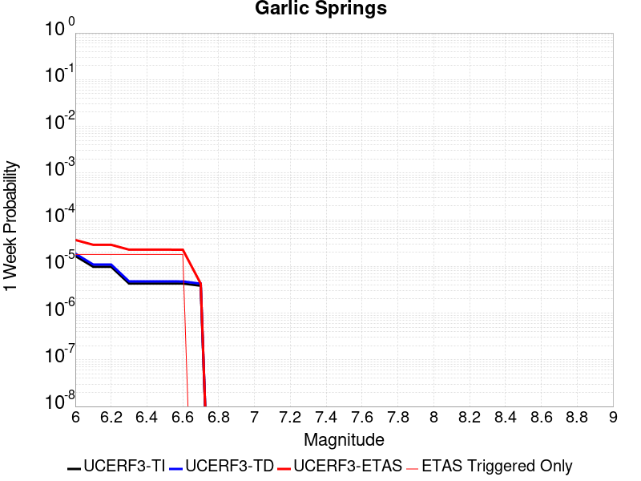 | 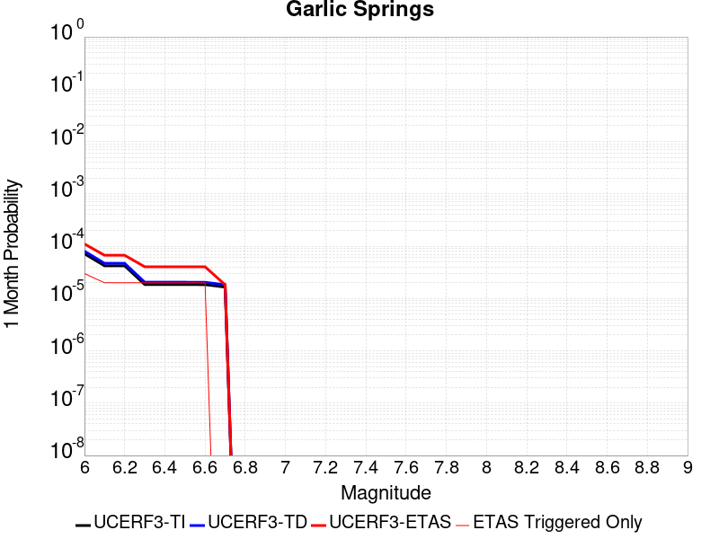 | 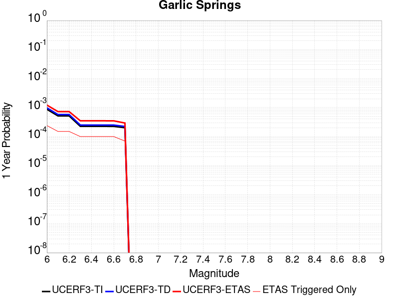 | 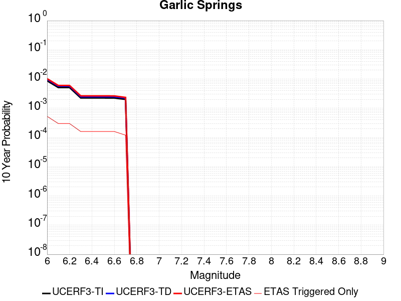 |

| Magnitude | 1 wk TI Prob | 1 wk TD Prob | 1 wk ETAS Prob | 1 wk ETAS/TD Gain | 1 wk ETAS Triggered Only | 1 mo TI Prob | 1 mo TD Prob | 1 mo ETAS Prob | 1 mo ETAS/TD Gain | 1 mo ETAS Triggered Only | 1 yr TI Prob | 1 yr TD Prob | 1 yr ETAS Prob | 1 yr ETAS/TD Gain | 1 yr ETAS Triggered Only | 10 yr TI Prob | 10 yr TD Prob | 10 yr ETAS Prob | 10 yr ETAS/TD Gain | 10 yr ETAS Triggered Only |
|-----|-----|-----|-----|-----|-----|-----|-----|-----|-----|-----|-----|-----|-----|-----|-----|-----|-----|-----|-----|-----|
| 6.0 | 1.6760017E-5 | 1.8779532E-5 | 3.6829733E-5 | 1.9611636 | 1.8050541E-5 | 7.182667E-5 | 8.0481885E-5 | 1.16580064E-4 | 1.4485254 | 3.6101083E-5 | 8.7413884E-4 | 9.795439E-4 | 0.001232004 | 1.2577323 | 2.5270757E-4 | 0.008707083 | 0.009763812 | 0.010282166 | 1.0530894 | 5.234657E-4 |
| 6.1 | 9.852767E-6 | 1.0975077E-5 | 2.9025421E-5 | 2.6446667 | 1.8050541E-5 | 4.222546E-5 | 4.70356E-5 | 6.508529E-5 | 1.3837453 | 1.8050541E-5 | 5.139737E-4 | 5.725789E-4 | 7.3494075E-4 | 1.2835624 | 1.6245487E-4 | 0.005127866 | 0.005717997 | 0.0060410486 | 1.0564973 | 3.2490975E-4 |
| 6.2 | 9.852767E-6 | 1.0975077E-5 | 2.9025421E-5 | 2.6446667 | 1.8050541E-5 | 4.222546E-5 | 4.70356E-5 | 6.508529E-5 | 1.3837453 | 1.8050541E-5 | 5.139737E-4 | 5.725789E-4 | 7.3494075E-4 | 1.2835624 | 1.6245487E-4 | 0.005127866 | 0.005717997 | 0.0060410486 | 1.0564973 | 3.2490975E-4 |
| 6.3 | 4.3167724E-6 | 4.778638E-6 | 2.2829094E-5 | 4.7773223 | 1.8050541E-5 | 1.8500323E-5 | 2.0479847E-5 | 3.853002E-5 | 1.8813627 | 1.8050541E-5 | 2.2521814E-4 | 2.4933665E-4 | 3.3956685E-4 | 1.361881 | 9.025271E-5 | 0.0022499003 | 0.0024928278 | 0.0026368722 | 1.0577835 | 1.4440433E-4 |
| 6.4 | 4.3167724E-6 | 4.778638E-6 | 2.2829094E-5 | 4.7773223 | 1.8050541E-5 | 1.8500323E-5 | 2.0479847E-5 | 3.853002E-5 | 1.8813627 | 1.8050541E-5 | 2.2521814E-4 | 2.4933665E-4 | 3.3956685E-4 | 1.361881 | 9.025271E-5 | 0.0022499003 | 0.0024928278 | 0.0026368722 | 1.0577835 | 1.4440433E-4 |
| 6.5 | 4.3167724E-6 | 4.778638E-6 | 2.2829094E-5 | 4.7773223 | 1.8050541E-5 | 1.8500323E-5 | 2.0479847E-5 | 3.853002E-5 | 1.8813627 | 1.8050541E-5 | 2.2521814E-4 | 2.4933665E-4 | 3.3956685E-4 | 1.361881 | 9.025271E-5 | 0.0022499003 | 0.0024928278 | 0.0026368722 | 1.0577835 | 1.4440433E-4 |
| 6.6 | 4.301311E-6 | 4.7615044E-6 | 2.281196E-5 | 4.7909145 | 1.8050541E-5 | 1.8434059E-5 | 2.0406416E-5 | 3.845659E-5 | 1.8845341 | 1.8050541E-5 | 2.2441156E-4 | 2.4844284E-4 | 3.3867313E-4 | 1.3631833 | 9.025271E-5 | 0.0022418506 | 0.0024839097 | 0.0026279555 | 1.0579915 | 1.4440433E-4 |
| 6.7 | 3.8599724E-6 | 4.271603E-6 | 4.271603E-6 | 1.0 | 0.0 | 1.6542634E-5 | 1.830687E-5 | 1.830687E-5 | 1.0 | 0.0 | 2.0138794E-4 | 2.2288613E-4 | 2.7702568E-4 | 1.2429023 | 5.4151624E-5 | 0.0020120554 | 0.0022288614 | 0.0023369233 | 1.048483 | 1.0830325E-4 |

## San Andreas (Big Bend)
*[(top)](#table-of-contents)*

| 1 Week | 1 Month | 1 Year | 10 Year |
|-----|-----|-----|-----|
| 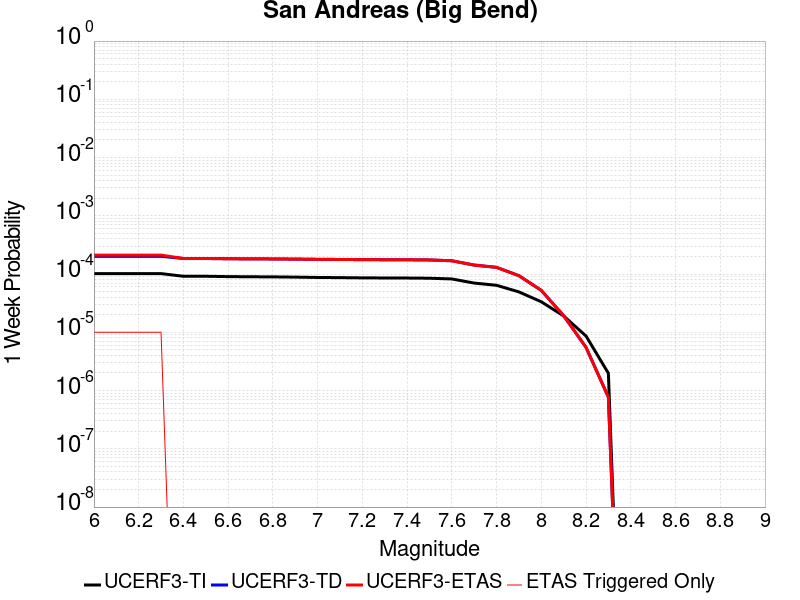 |  | 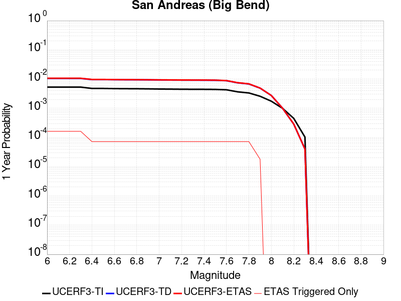 | 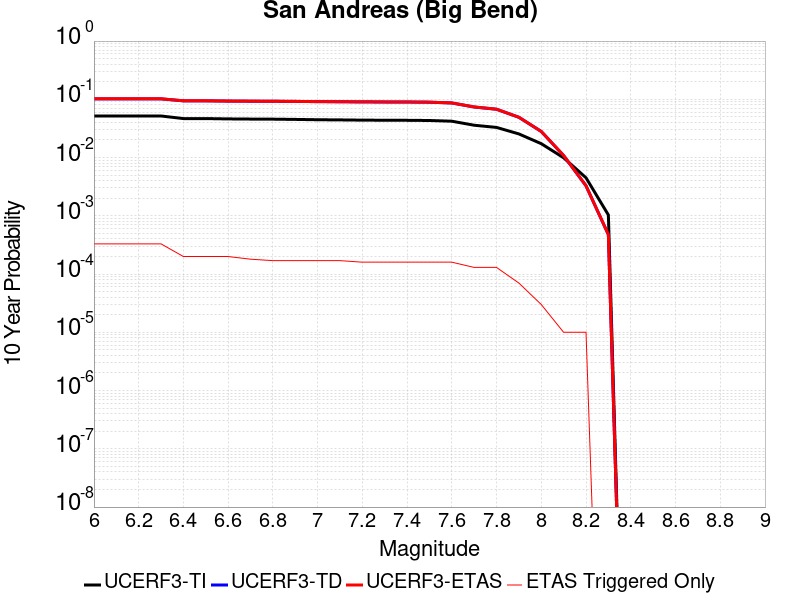 |

| Magnitude | 1 wk TI Prob | 1 wk TD Prob | 1 wk ETAS Prob | 1 wk ETAS/TD Gain | 1 wk ETAS Triggered Only | 1 mo TI Prob | 1 mo TD Prob | 1 mo ETAS Prob | 1 mo ETAS/TD Gain | 1 mo ETAS Triggered Only | 1 yr TI Prob | 1 yr TD Prob | 1 yr ETAS Prob | 1 yr ETAS/TD Gain | 1 yr ETAS Triggered Only | 10 yr TI Prob | 10 yr TD Prob | 10 yr ETAS Prob | 10 yr ETAS/TD Gain | 10 yr ETAS Triggered Only |
|-----|-----|-----|-----|-----|-----|-----|-----|-----|-----|-----|-----|-----|-----|-----|-----|-----|-----|-----|-----|-----|
| 6.0 | 1.0179969E-4 | 2.0149001E-4 | 2.0149001E-4 | 1.0 | 0.0 | 4.362114E-4 | 8.632439E-4 | 8.8127883E-4 | 1.020892 | 1.8050541E-5 | 0.0052979486 | 0.010459632 | 0.010620387 | 1.0153692 | 1.6245487E-4 | 0.051734097 | 0.10178319 | 0.10212368 | 1.0033451 | 3.7906138E-4 |
| 6.1 | 1.0179969E-4 | 2.0149001E-4 | 2.0149001E-4 | 1.0 | 0.0 | 4.362114E-4 | 8.632439E-4 | 8.8127883E-4 | 1.020892 | 1.8050541E-5 | 0.0052979486 | 0.010459632 | 0.010620387 | 1.0153692 | 1.6245487E-4 | 0.051734097 | 0.10178319 | 0.10212368 | 1.0033451 | 3.7906138E-4 |
| 6.2 | 1.0179969E-4 | 2.0149001E-4 | 2.0149001E-4 | 1.0 | 0.0 | 4.362114E-4 | 8.632439E-4 | 8.8127883E-4 | 1.020892 | 1.8050541E-5 | 0.0052979486 | 0.010459632 | 0.010620387 | 1.0153692 | 1.6245487E-4 | 0.051734097 | 0.10178319 | 0.10212368 | 1.0033451 | 3.7906138E-4 |
| 6.3 | 1.0179969E-4 | 2.0149001E-4 | 2.0149001E-4 | 1.0 | 0.0 | 4.362114E-4 | 8.632439E-4 | 8.8127883E-4 | 1.020892 | 1.8050541E-5 | 0.0052979486 | 0.010459632 | 0.010620387 | 1.0153692 | 1.6245487E-4 | 0.051734097 | 0.10178319 | 0.10212368 | 1.0033451 | 3.7906138E-4 |
| 6.4 | 9.1639464E-5 | 1.8504764E-4 | 1.8504764E-4 | 1.0 | 0.0 | 3.9268145E-4 | 7.928205E-4 | 8.108567E-4 | 1.0227494 | 1.8050541E-5 | 0.0047704205 | 0.009609988 | 0.009681496 | 1.007441 | 7.2202165E-5 | 0.046693064 | 0.09410575 | 0.094301976 | 1.0020851 | 2.166065E-4 |
| 6.5 | 9.1639464E-5 | 1.8504764E-4 | 1.8504764E-4 | 1.0 | 0.0 | 3.9268145E-4 | 7.928205E-4 | 8.108567E-4 | 1.0227494 | 1.8050541E-5 | 0.0047704205 | 0.009609988 | 0.009681496 | 1.007441 | 7.2202165E-5 | 0.046693064 | 0.09410575 | 0.094301976 | 1.0020851 | 2.166065E-4 |
| 6.6 | 9.042622E-5 | 1.8311635E-4 | 1.8311635E-4 | 1.0 | 0.0 | 3.8748336E-4 | 7.845485E-4 | 8.025849E-4 | 1.0229895 | 1.8050541E-5 | 0.0047074095 | 0.009510159 | 0.009581674 | 1.00752 | 7.2202165E-5 | 0.046089325 | 0.09319933 | 0.09339575 | 1.0021075 | 2.166065E-4 |
| 6.7 | 8.9836685E-5 | 1.8225907E-4 | 1.8225907E-4 | 1.0 | 0.0 | 3.8495753E-4 | 7.808767E-4 | 7.989131E-4 | 1.0230976 | 1.8050541E-5 | 0.00467679 | 0.0094658425 | 0.009537361 | 1.0075555 | 7.2202165E-5 | 0.045795817 | 0.09279344 | 0.092973575 | 1.0019412 | 1.9855595E-4 |
| 6.8 | 8.9471854E-5 | 1.8172618E-4 | 1.8172618E-4 | 1.0 | 0.0 | 3.8339442E-4 | 7.785942E-4 | 7.9663075E-4 | 1.0231655 | 1.8050541E-5 | 0.004657841 | 0.009438294 | 0.009509815 | 1.0075777 | 7.2202165E-5 | 0.04561414 | 0.09254042 | 0.09270422 | 1.00177 | 1.8050542E-4 |
| 6.9 | 8.858234E-5 | 1.805447E-4 | 1.805447E-4 | 1.0 | 0.0 | 3.7958333E-4 | 7.735337E-4 | 7.915703E-4 | 1.0233171 | 1.8050541E-5 | 0.004611638 | 0.009377214 | 0.009448739 | 1.0076275 | 7.2202165E-5 | 0.04517103 | 0.09198018 | 0.09214408 | 1.001782 | 1.8050542E-4 |
| 7.0 | 8.7433385E-5 | 1.789308E-4 | 1.789308E-4 | 1.0 | 0.0 | 3.746607E-4 | 7.666211E-4 | 7.8465784E-4 | 1.0235275 | 1.8050541E-5 | 0.004551957 | 0.009293774 | 0.009365305 | 1.0076966 | 7.2202165E-5 | 0.044598386 | 0.09121402 | 0.09137806 | 1.0017984 | 1.8050542E-4 |
| 7.1 | 8.684964E-5 | 1.7804916E-4 | 1.7804916E-4 | 1.0 | 0.0 | 3.7215967E-4 | 7.6284487E-4 | 7.808816E-4 | 1.0236441 | 1.8050541E-5 | 0.0045216335 | 0.009248189 | 0.009319724 | 1.007735 | 7.2202165E-5 | 0.04430731 | 0.090795174 | 0.09095929 | 1.0018076 | 1.8050542E-4 |
| 7.2 | 8.606521E-5 | 1.7695411E-4 | 1.7695411E-4 | 1.0 | 0.0 | 3.6879873E-4 | 7.5815455E-4 | 7.761914E-4 | 1.0237905 | 1.8050541E-5 | 0.0044808835 | 0.009191568 | 0.009263107 | 1.007783 | 7.2202165E-5 | 0.043916024 | 0.090275325 | 0.090423115 | 1.0016371 | 1.6245487E-4 |
| 7.3 | 8.568266E-5 | 1.7637278E-4 | 1.7637278E-4 | 1.0 | 0.0 | 3.6715972E-4 | 7.5566454E-4 | 7.7370147E-4 | 1.0238689 | 1.8050541E-5 | 0.0044610105 | 0.009161508 | 0.009233048 | 1.0078088 | 7.2202165E-5 | 0.043725148 | 0.08999596 | 0.09014379 | 1.0016427 | 1.6245487E-4 |
| 7.4 | 8.5432206E-5 | 1.7599776E-4 | 1.7599776E-4 | 1.0 | 0.0 | 3.6608664E-4 | 7.5405824E-4 | 7.7209517E-4 | 1.0239198 | 1.8050541E-5 | 0.004447999 | 0.009142115 | 0.009213657 | 1.0078255 | 7.2202165E-5 | 0.043600157 | 0.089815795 | 0.08996366 | 1.0016463 | 1.6245487E-4 |
| 7.5 | 8.4791965E-5 | 1.7468796E-4 | 1.7468796E-4 | 1.0 | 0.0 | 3.633435E-4 | 7.484481E-4 | 7.664851E-4 | 1.0240992 | 1.8050541E-5 | 0.0044147377 | 0.0090743825 | 0.0091459295 | 1.0078845 | 7.2202165E-5 | 0.043280575 | 0.08919236 | 0.08934032 | 1.0016589 | 1.6245487E-4 |
| 7.6 | 8.241105E-5 | 1.6912988E-4 | 1.6912988E-4 | 1.0 | 0.0 | 3.531424E-4 | 7.2464114E-4 | 7.4267865E-4 | 1.0248916 | 1.8050541E-5 | 0.0042910352 | 0.0087869065 | 0.008858474 | 1.0081449 | 7.2202165E-5 | 0.042091176 | 0.086565085 | 0.08671348 | 1.0017142 | 1.6245487E-4 |
| 7.7 | 7.00432E-5 | 1.4270001E-4 | 1.4270001E-4 | 1.0 | 0.0 | 3.001506E-4 | 6.114282E-4 | 6.2946766E-4 | 1.029504 | 1.8050541E-5 | 0.0036482112 | 0.0074187694 | 0.007490436 | 1.0096601 | 7.2202165E-5 | 0.035888977 | 0.07381293 | 0.07394668 | 1.001812 | 1.4440433E-4 |
| 7.8 | 6.415362E-5 | 1.3028014E-4 | 1.3028014E-4 | 1.0 | 0.0 | 2.749151E-4 | 5.58224E-4 | 5.7626446E-4 | 1.0323176 | 1.8050541E-5 | 0.0033419547 | 0.0067752283 | 0.006846941 | 1.0105846 | 7.2202165E-5 | 0.03292141 | 0.067520775 | 0.06765543 | 1.0019943 | 1.4440433E-4 |
| 7.9 | 4.939911E-5 | 9.38357E-5 | 9.38357E-5 | 1.0 | 0.0 | 2.116933E-4 | 4.02091E-4 | 4.02091E-4 | 1.0 | 0.0 | 0.0025743195 | 0.0048844786 | 0.004902441 | 1.0036775 | 1.8050541E-5 | 0.025447013 | 0.049113307 | 0.049164798 | 1.0010484 | 5.4151624E-5 |
| 8.0 | 3.344983E-5 | 5.2480515E-5 | 5.2480515E-5 | 1.0 | 0.0 | 1.4334853E-4 | 2.248971E-4 | 2.248971E-4 | 1.0 | 0.0 | 0.0017438711 | 0.002734686 | 0.002734686 | 1.0 | 0.0 | 0.017302496 | 0.028047016 | 0.02806456 | 1.0006255 | 1.8050541E-5 |
| 8.1 | 1.9104898E-5 | 1.9297438E-5 | 1.9297438E-5 | 1.0 | 0.0 | 8.1875565E-5 | 8.270069E-5 | 8.270069E-5 | 1.0 | 0.0 | 9.963791E-4 | 0.0010064164 | 0.0010064164 | 1.0 | 0.0 | 0.009919235 | 0.010815165 | 0.010815165 | 1.0 | 0.0 |
| 8.2 | 8.643924E-6 | 5.521735E-6 | 5.521735E-6 | 1.0 | 0.0 | 3.704486E-5 | 2.3664365E-5 | 2.3664365E-5 | 1.0 | 0.0 | 4.5092785E-4 | 2.8807562E-4 | 2.8807562E-4 | 1.0 | 0.0 | 0.0045001395 | 0.0032743483 | 0.0032743483 | 1.0 | 0.0 |
| 8.3 | 1.983087E-6 | 7.740189E-7 | 7.740189E-7 | 1.0 | 0.0 | 8.498917E-6 | 3.3172198E-6 | 3.3172198E-6 | 1.0 | 0.0 | 1.034694E-4 | 4.0386418E-5 | 4.0386418E-5 | 1.0 | 0.0 | 0.0010342124 | 4.7657243E-4 | 4.7657243E-4 | 1.0 | 0.0 |

## Death Valley (Black Mtns Frontal)
*[(top)](#table-of-contents)*

| 1 Week | 1 Month | 1 Year | 10 Year |
|-----|-----|-----|-----|
| 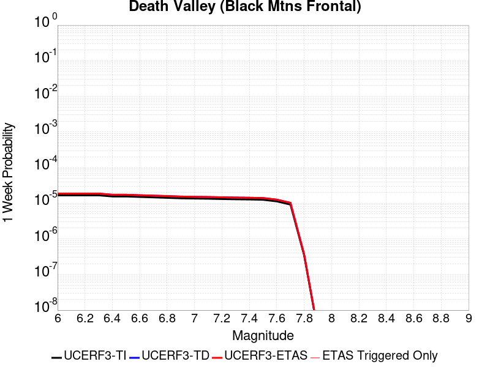 | 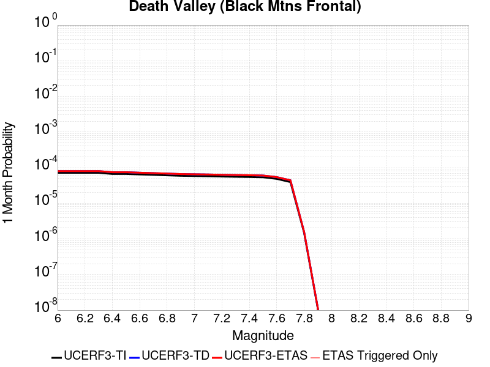 | 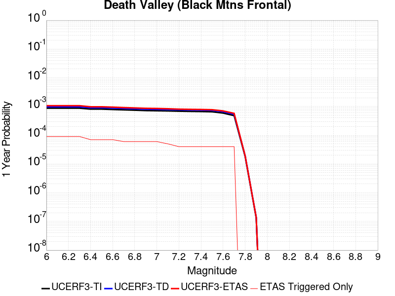 | 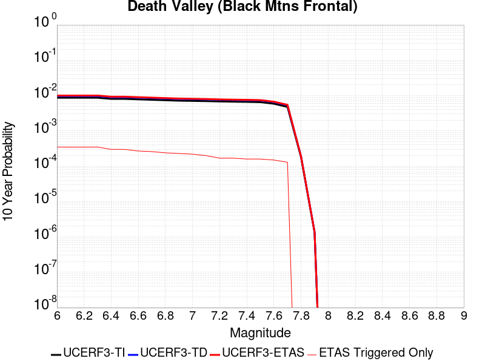 |

| Magnitude | 1 wk TI Prob | 1 wk TD Prob | 1 wk ETAS Prob | 1 wk ETAS/TD Gain | 1 wk ETAS Triggered Only | 1 mo TI Prob | 1 mo TD Prob | 1 mo ETAS Prob | 1 mo ETAS/TD Gain | 1 mo ETAS Triggered Only | 1 yr TI Prob | 1 yr TD Prob | 1 yr ETAS Prob | 1 yr ETAS/TD Gain | 1 yr ETAS Triggered Only | 10 yr TI Prob | 10 yr TD Prob | 10 yr ETAS Prob | 10 yr ETAS/TD Gain | 10 yr ETAS Triggered Only |
|-----|-----|-----|-----|-----|-----|-----|-----|-----|-----|-----|-----|-----|-----|-----|-----|-----|-----|-----|-----|-----|
| 6.0 | 1.6707214E-5 | 1.8672894E-5 | 1.8672894E-5 | 1.0 | 0.0 | 7.160038E-5 | 8.002428E-5 | 8.002428E-5 | 1.0 | 0.0 | 8.71386E-4 | 9.738677E-4 | 0.0010459996 | 1.0740674 | 7.2202165E-5 | 0.00867977 | 0.009696854 | 0.010054364 | 1.0368687 | 3.6101084E-4 |
| 6.1 | 1.6707214E-5 | 1.8672894E-5 | 1.8672894E-5 | 1.0 | 0.0 | 7.160038E-5 | 8.002428E-5 | 8.002428E-5 | 1.0 | 0.0 | 8.71386E-4 | 9.738677E-4 | 0.0010459996 | 1.0740674 | 7.2202165E-5 | 0.00867977 | 0.009696854 | 0.010054364 | 1.0368687 | 3.6101084E-4 |
| 6.2 | 1.6707214E-5 | 1.8672894E-5 | 1.8672894E-5 | 1.0 | 0.0 | 7.160038E-5 | 8.002428E-5 | 8.002428E-5 | 1.0 | 0.0 | 8.71386E-4 | 9.738677E-4 | 0.0010459996 | 1.0740674 | 7.2202165E-5 | 0.00867977 | 0.009696854 | 0.010054364 | 1.0368687 | 3.6101084E-4 |
| 6.3 | 1.6707214E-5 | 1.8672894E-5 | 1.8672894E-5 | 1.0 | 0.0 | 7.160038E-5 | 8.002428E-5 | 8.002428E-5 | 1.0 | 0.0 | 8.71386E-4 | 9.738677E-4 | 0.0010459996 | 1.0740674 | 7.2202165E-5 | 0.00867977 | 0.009696854 | 0.010054364 | 1.0368687 | 3.6101084E-4 |
| 6.4 | 1.5515609E-5 | 1.7340652E-5 | 1.7340652E-5 | 1.0 | 0.0 | 6.649377E-5 | 7.4314994E-5 | 7.4314994E-5 | 1.0 | 0.0 | 8.0926094E-4 | 9.044156E-4 | 9.4048405E-4 | 1.0398804 | 3.6101083E-5 | 0.008063202 | 0.009008034 | 0.009330017 | 1.035744 | 3.2490975E-4 |
| 6.5 | 1.5515609E-5 | 1.7340652E-5 | 1.7340652E-5 | 1.0 | 0.0 | 6.649377E-5 | 7.4314994E-5 | 7.4314994E-5 | 1.0 | 0.0 | 8.0926094E-4 | 9.044156E-4 | 9.4048405E-4 | 1.0398804 | 3.6101083E-5 | 0.008063202 | 0.009008034 | 0.009330017 | 1.035744 | 3.2490975E-4 |
| 6.6 | 1.5041828E-5 | 1.681151E-5 | 1.681151E-5 | 1.0 | 0.0 | 6.4463384E-5 | 7.204737E-5 | 7.204737E-5 | 1.0 | 0.0 | 7.8455906E-4 | 8.768296E-4 | 9.1289904E-4 | 1.0411361 | 3.6101083E-5 | 0.00781795 | 0.008734356 | 0.009038535 | 1.0348256 | 3.068592E-4 |
| 6.7 | 1.4634985E-5 | 1.6358319E-5 | 1.6358319E-5 | 1.0 | 0.0 | 6.271985E-5 | 7.0105234E-5 | 7.0105234E-5 | 1.0 | 0.0 | 7.6334673E-4 | 8.532027E-4 | 8.89273E-4 | 1.0422764 | 3.6101083E-5 | 0.007607299 | 0.008499907 | 0.008804158 | 1.0357946 | 3.068592E-4 |
| 6.8 | 1.4209158E-5 | 1.5884287E-5 | 1.5884287E-5 | 1.0 | 0.0 | 6.089497E-5 | 6.807377E-5 | 6.807377E-5 | 1.0 | 0.0 | 7.4114406E-4 | 8.284886E-4 | 8.645598E-4 | 1.0435386 | 3.6101083E-5 | 0.007386771 | 0.008254616 | 0.008523138 | 1.0325301 | 2.7075812E-4 |
| 6.9 | 1.3780098E-5 | 1.5406767E-5 | 1.5406767E-5 | 1.0 | 0.0 | 5.9056227E-5 | 6.6027365E-5 | 6.6027365E-5 | 1.0 | 0.0 | 7.1877235E-4 | 8.0359215E-4 | 8.396642E-4 | 1.0448885 | 3.6101083E-5 | 0.0071645193 | 0.008007458 | 0.0082581425 | 1.0313063 | 2.5270757E-4 |
| 7.0 | 1.3585064E-5 | 1.5190302E-5 | 1.5190302E-5 | 1.0 | 0.0 | 5.8220405E-5 | 6.50997E-5 | 6.50997E-5 | 1.0 | 0.0 | 7.086029E-4 | 7.923061E-4 | 8.283786E-4 | 1.0455284 | 3.6101083E-5 | 0.007063476 | 0.007895405 | 0.008146117 | 1.0317543 | 2.5270757E-4 |
| 7.1 | 1.3398601E-5 | 1.4983459E-5 | 1.4983459E-5 | 1.0 | 0.0 | 5.742131E-5 | 6.421327E-5 | 6.421327E-5 | 1.0 | 0.0 | 6.9888023E-4 | 7.8152167E-4 | 8.175945E-4 | 1.0461572 | 3.6101083E-5 | 0.0069668638 | 0.0077883215 | 0.008021151 | 1.0298947 | 2.3465704E-4 |
| 7.2 | 1.3126312E-5 | 1.4681641E-5 | 1.4681641E-5 | 1.0 | 0.0 | 5.6254412E-5 | 6.291983E-5 | 6.291983E-5 | 1.0 | 0.0 | 6.846822E-4 | 7.6578517E-4 | 8.018586E-4 | 1.0471065 | 3.6101083E-5 | 0.006825765 | 0.0076320474 | 0.007847001 | 1.0281646 | 2.166065E-4 |
| 7.3 | 1.2922429E-5 | 1.445584E-5 | 1.445584E-5 | 1.0 | 0.0 | 5.5380664E-5 | 6.195216E-5 | 6.195216E-5 | 1.0 | 0.0 | 6.74051E-4 | 7.540119E-4 | 7.900858E-4 | 1.0478425 | 3.6101083E-5 | 0.006720101 | 0.0075151175 | 0.007730096 | 1.0286062 | 2.166065E-4 |
| 7.4 | 1.2768878E-5 | 1.4285801E-5 | 1.4285801E-5 | 1.0 | 0.0 | 5.4722615E-5 | 6.122346E-5 | 6.122346E-5 | 1.0 | 0.0 | 6.660441E-4 | 7.4514607E-4 | 7.8122027E-4 | 1.0484122 | 3.6101083E-5 | 0.0066405144 | 0.007427055 | 0.0076241363 | 1.0265356 | 1.9855595E-4 |
| 7.5 | 1.2521929E-5 | 1.4014012E-5 | 1.4014012E-5 | 1.0 | 0.0 | 5.366431E-5 | 6.0058697E-5 | 6.0058697E-5 | 1.0 | 0.0 | 6.531671E-4 | 7.309748E-4 | 7.6704944E-4 | 1.0493515 | 3.6101083E-5 | 0.006512506 | 0.0072862804 | 0.007483389 | 1.0270522 | 1.9855595E-4 |
| 7.6 | 1.1301089E-5 | 1.26499535E-5 | 1.26499535E-5 | 1.0 | 0.0 | 4.8432343E-5 | 5.4212993E-5 | 5.4212993E-5 | 1.0 | 0.0 | 5.895042E-4 | 6.598486E-4 | 6.9592585E-4 | 1.0546751 | 3.6101083E-5 | 0.0058794282 | 0.006579446 | 0.006758764 | 1.0272542 | 1.8050542E-4 |
| 7.7 | 9.189108E-6 | 1.0284824E-5 | 1.0284824E-5 | 1.0 | 0.0 | 3.93813E-5 | 4.4077104E-5 | 4.4077104E-5 | 1.0 | 0.0 | 4.7936183E-4 | 5.3651165E-4 | 5.7259336E-4 | 1.0672524 | 3.6101083E-5 | 0.004783291 | 0.005352675 | 0.0054963063 | 1.0268335 | 1.4440433E-4 |
| 7.8 | 3.4586725E-7 | 3.6485014E-7 | 3.6485014E-7 | 1.0 | 0.0 | 1.4822873E-6 | 1.5636425E-6 | 1.5636425E-6 | 1.0 | 0.0 | 1.80467E-5 | 1.9037187E-5 | 1.9037187E-5 | 1.0 | 0.0 | 1.8045233E-4 | 1.9035599E-4 | 1.9035599E-4 | 1.0 | 0.0 |
| 7.9 | 2.5591178E-9 | 2.6698093E-9 | 2.6698093E-9 | 1.0 | 0.0 | 1.0967647E-8 | 1.144204E-8 | 1.144204E-8 | 1.0 | 0.0 | 1.335311E-7 | 1.3930685E-7 | 1.3930685E-7 | 1.0 | 0.0 | 1.3353102E-6 | 1.3930684E-6 | 1.3930684E-6 | 1.0 | 0.0 |

## Coyote Lake
*[(top)](#table-of-contents)*

| 1 Week | 1 Month | 1 Year | 10 Year |
|-----|-----|-----|-----|
| 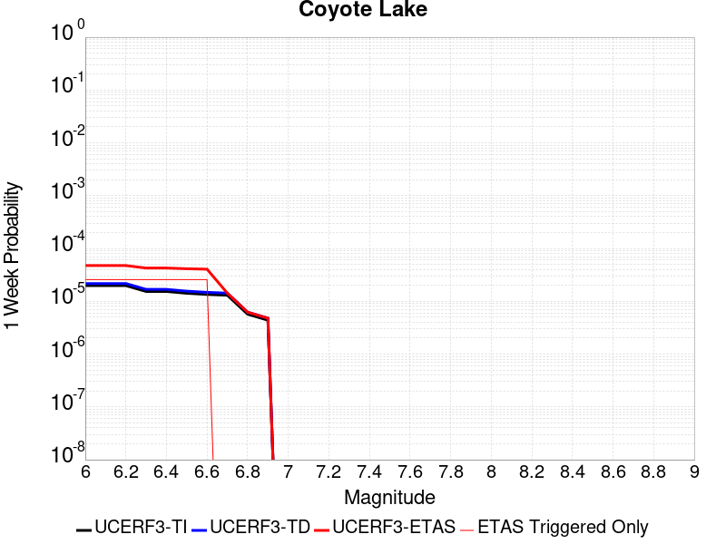 | 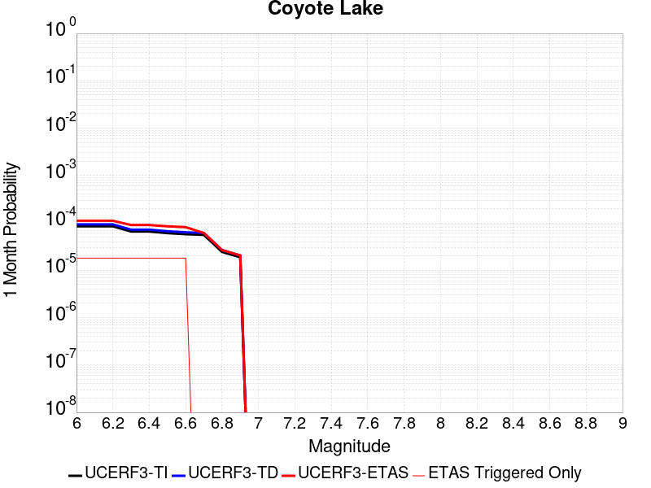 | 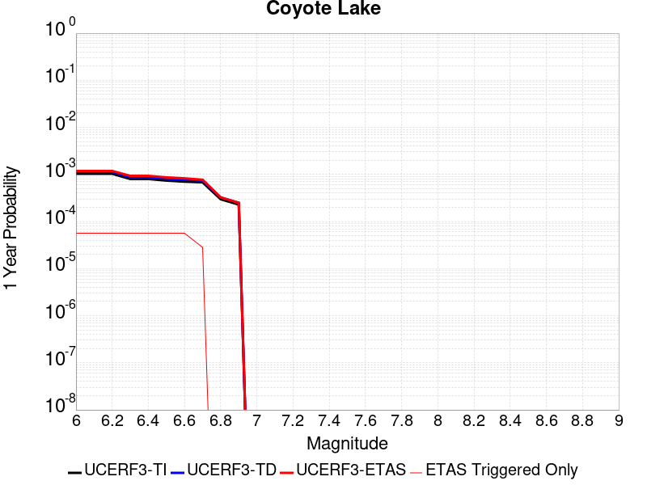 | 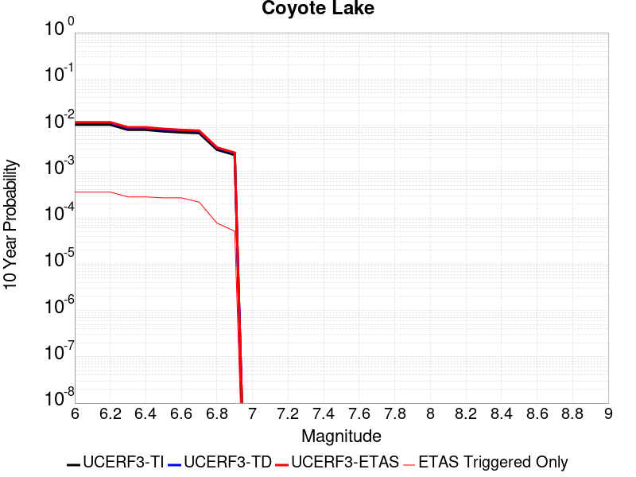 |

| Magnitude | 1 wk TI Prob | 1 wk TD Prob | 1 wk ETAS Prob | 1 wk ETAS/TD Gain | 1 wk ETAS Triggered Only | 1 mo TI Prob | 1 mo TD Prob | 1 mo ETAS Prob | 1 mo ETAS/TD Gain | 1 mo ETAS Triggered Only | 1 yr TI Prob | 1 yr TD Prob | 1 yr ETAS Prob | 1 yr ETAS/TD Gain | 1 yr ETAS Triggered Only | 10 yr TI Prob | 10 yr TD Prob | 10 yr ETAS Prob | 10 yr ETAS/TD Gain | 10 yr ETAS Triggered Only |
|-----|-----|-----|-----|-----|-----|-----|-----|-----|-----|-----|-----|-----|-----|-----|-----|-----|-----|-----|-----|-----|
| 6.0 | 1.980352E-5 | 2.1709237E-5 | 3.9759387E-5 | 1.8314502 | 1.8050541E-5 | 8.486947E-5 | 9.303667E-5 | 1.1108553E-4 | 1.1939973 | 1.8050541E-5 | 0.0010327959 | 0.0011322049 | 0.0012584156 | 1.1114734 | 1.2635379E-4 | 0.010280091 | 0.011271545 | 0.011592792 | 1.0285008 | 3.2490975E-4 |
| 6.1 | 1.980352E-5 | 2.1709237E-5 | 3.9759387E-5 | 1.8314502 | 1.8050541E-5 | 8.486947E-5 | 9.303667E-5 | 1.1108553E-4 | 1.1939973 | 1.8050541E-5 | 0.0010327959 | 0.0011322049 | 0.0012584156 | 1.1114734 | 1.2635379E-4 | 0.010280091 | 0.011271545 | 0.011592792 | 1.0285008 | 3.2490975E-4 |
| 6.2 | 1.980352E-5 | 2.1709237E-5 | 3.9759387E-5 | 1.8314502 | 1.8050541E-5 | 8.486947E-5 | 9.303667E-5 | 1.1108553E-4 | 1.1939973 | 1.8050541E-5 | 0.0010327959 | 0.0011322049 | 0.0012584156 | 1.1114734 | 1.2635379E-4 | 0.010280091 | 0.011271545 | 0.011592792 | 1.0285008 | 3.2490975E-4 |
| 6.3 | 1.5344787E-5 | 1.6822602E-5 | 3.487284E-5 | 2.0729754 | 1.8050541E-5 | 6.576172E-5 | 7.2095216E-5 | 9.014446E-5 | 1.2503529 | 1.8050541E-5 | 8.003548E-4 | 8.77467E-4 | 9.856753E-4 | 1.1233188 | 1.0830325E-4 | 0.007974784 | 0.00874607 | 0.008978675 | 1.0265954 | 2.3465704E-4 |
| 6.4 | 1.5344787E-5 | 1.6822602E-5 | 3.487284E-5 | 2.0729754 | 1.8050541E-5 | 6.576172E-5 | 7.2095216E-5 | 9.014446E-5 | 1.2503529 | 1.8050541E-5 | 8.003548E-4 | 8.77467E-4 | 9.856753E-4 | 1.1233188 | 1.0830325E-4 | 0.007974784 | 0.00874607 | 0.008978675 | 1.0265954 | 2.3465704E-4 |
| 6.5 | 1.4189697E-5 | 1.5559779E-5 | 3.361004E-5 | 2.160059 | 1.8050541E-5 | 6.081157E-5 | 6.66834E-5 | 8.473274E-5 | 1.2706721 | 1.8050541E-5 | 7.401293E-4 | 8.116283E-4 | 9.0180774E-4 | 1.1111093 | 9.025271E-5 | 0.0073766913 | 0.008092585 | 0.008307438 | 1.0265495 | 2.166065E-4 |
| 6.6 | 1.3469301E-5 | 1.4773283E-5 | 3.282356E-5 | 2.2218187 | 1.8050541E-5 | 5.7724297E-5 | 6.331287E-5 | 8.136227E-5 | 1.2850826 | 1.8050541E-5 | 7.025667E-4 | 7.706216E-4 | 8.6080475E-4 | 1.1170266 | 9.025271E-5 | 0.0070034964 | 0.0076853987 | 0.0079003405 | 1.0279676 | 2.166065E-4 |
| 6.7 | 1.3027966E-5 | 1.4283386E-5 | 1.4283386E-5 | 1.0 | 0.0 | 5.5832945E-5 | 6.121342E-5 | 6.121342E-5 | 1.0 | 0.0 | 6.7955407E-4 | 7.4507826E-4 | 7.991895E-4 | 1.0726249 | 5.4151624E-5 | 0.006774798 | 0.0074316803 | 0.0076108444 | 1.0241082 | 1.8050542E-4 |
| 6.8 | 5.695434E-6 | 6.225108E-6 | 6.225108E-6 | 1.0 | 0.0 | 2.4408775E-5 | 2.667893E-5 | 2.667893E-5 | 1.0 | 0.0 | 2.971363E-4 | 3.2479755E-4 | 3.2479755E-4 | 1.0 | 0.0 | 0.0029673933 | 0.00324617 | 0.003300146 | 1.0166276 | 5.4151624E-5 |
| 6.9 | 4.385688E-6 | 4.793587E-6 | 4.793587E-6 | 1.0 | 0.0 | 1.879567E-5 | 2.0543943E-5 | 2.0543943E-5 | 1.0 | 0.0 | 2.2881327E-4 | 2.501225E-4 | 2.501225E-4 | 1.0 | 0.0 | 0.002285778 | 0.002501225 | 0.0025372359 | 1.0143973 | 3.6101083E-5 |

## Helendale-So Lockhart
*[(top)](#table-of-contents)*

| 1 Week | 1 Month | 1 Year | 10 Year |
|-----|-----|-----|-----|
| 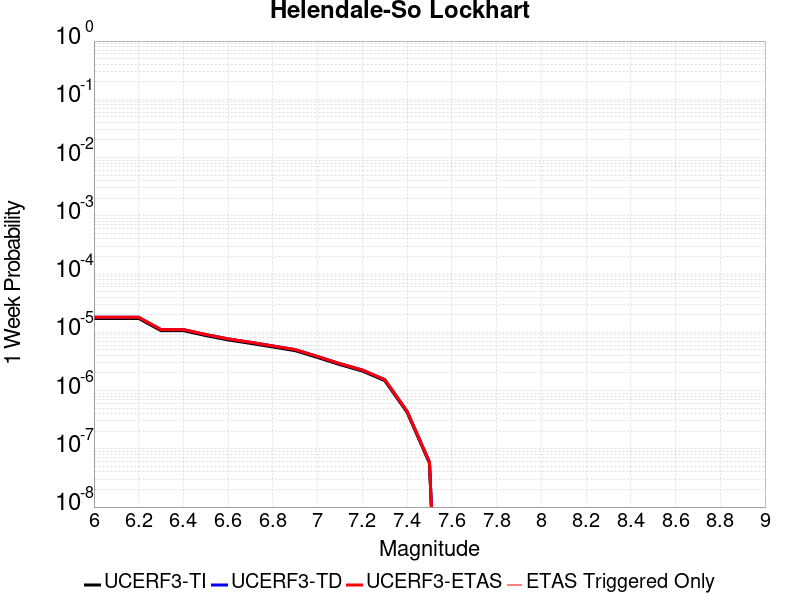 | 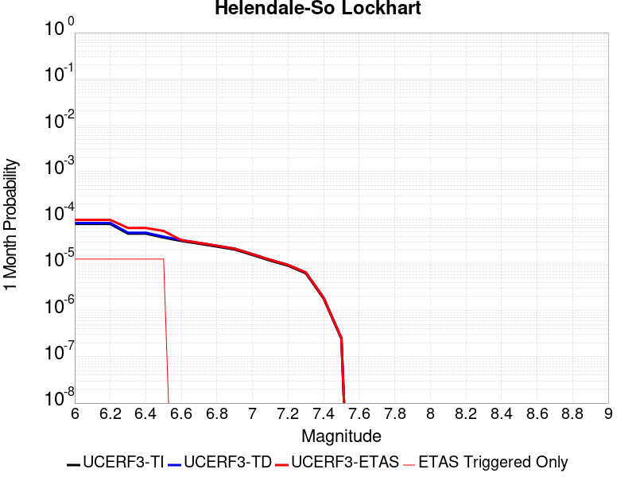 | 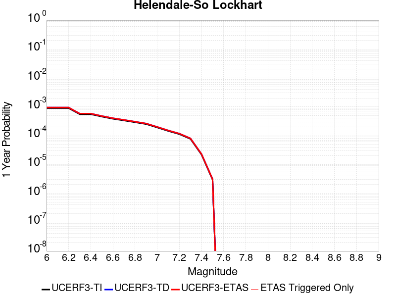 |  |

| Magnitude | 1 wk TI Prob | 1 wk TD Prob | 1 wk ETAS Prob | 1 wk ETAS/TD Gain | 1 wk ETAS Triggered Only | 1 mo TI Prob | 1 mo TD Prob | 1 mo ETAS Prob | 1 mo ETAS/TD Gain | 1 mo ETAS Triggered Only | 1 yr TI Prob | 1 yr TD Prob | 1 yr ETAS Prob | 1 yr ETAS/TD Gain | 1 yr ETAS Triggered Only | 10 yr TI Prob | 10 yr TD Prob | 10 yr ETAS Prob | 10 yr ETAS/TD Gain | 10 yr ETAS Triggered Only |
|-----|-----|-----|-----|-----|-----|-----|-----|-----|-----|-----|-----|-----|-----|-----|-----|-----|-----|-----|-----|-----|
| 6.0 | 1.7296055E-5 | 1.810474E-5 | 1.810474E-5 | 1.0 | 0.0 | 7.412385E-5 | 7.758955E-5 | 7.758955E-5 | 1.0 | 0.0 | 9.0208417E-4 | 9.442642E-4 | 9.983646E-4 | 1.0572938 | 5.4151624E-5 | 0.008984311 | 0.00940464 | 0.00965497 | 1.0266178 | 2.5270757E-4 |
| 6.1 | 1.7296055E-5 | 1.810474E-5 | 1.810474E-5 | 1.0 | 0.0 | 7.412385E-5 | 7.758955E-5 | 7.758955E-5 | 1.0 | 0.0 | 9.0208417E-4 | 9.442642E-4 | 9.983646E-4 | 1.0572938 | 5.4151624E-5 | 0.008984311 | 0.00940464 | 0.00965497 | 1.0266178 | 2.5270757E-4 |
| 6.2 | 1.7296055E-5 | 1.810474E-5 | 1.810474E-5 | 1.0 | 0.0 | 7.412385E-5 | 7.758955E-5 | 7.758955E-5 | 1.0 | 0.0 | 9.0208417E-4 | 9.442642E-4 | 9.983646E-4 | 1.0572938 | 5.4151624E-5 | 0.008984311 | 0.00940464 | 0.00965497 | 1.0266178 | 2.5270757E-4 |
| 6.3 | 1.0669118E-5 | 1.1136006E-5 | 1.1136006E-5 | 1.0 | 0.0 | 4.5723988E-5 | 4.7724883E-5 | 4.7724883E-5 | 1.0 | 0.0 | 5.5654737E-4 | 5.8089837E-4 | 6.350185E-4 | 1.0931664 | 5.4151624E-5 | 0.0055515557 | 0.0057940953 | 0.005955609 | 1.0278755 | 1.6245487E-4 |
| 6.4 | 1.0669118E-5 | 1.1136006E-5 | 1.1136006E-5 | 1.0 | 0.0 | 4.5723988E-5 | 4.7724883E-5 | 4.7724883E-5 | 1.0 | 0.0 | 5.5654737E-4 | 5.8089837E-4 | 6.350185E-4 | 1.0931664 | 5.4151624E-5 | 0.0055515557 | 0.0057940953 | 0.005955609 | 1.0278755 | 1.6245487E-4 |
| 6.5 | 8.790038E-6 | 9.170671E-6 | 9.170671E-6 | 1.0 | 0.0 | 3.767105E-5 | 3.9302293E-5 | 3.9302293E-5 | 1.0 | 0.0 | 4.585485E-4 | 4.784019E-4 | 5.325276E-4 | 1.1131386 | 5.4151624E-5 | 0.0045760344 | 0.0047738845 | 0.0049175997 | 1.0301044 | 1.4440433E-4 |
| 6.6 | 7.396949E-6 | 7.715934E-6 | 7.715934E-6 | 1.0 | 0.0 | 3.1700827E-5 | 3.3067878E-5 | 3.3067878E-5 | 1.0 | 0.0 | 3.858892E-4 | 4.0252804E-4 | 4.5665787E-4 | 1.1344746 | 5.4151624E-5 | 0.003852198 | 0.0040180963 | 0.004143942 | 1.0313199 | 1.2635379E-4 |
| 6.7 | 6.4600285E-6 | 6.7383776E-6 | 6.7383776E-6 | 1.0 | 0.0 | 2.7685543E-5 | 2.8878447E-5 | 2.8878447E-5 | 1.0 | 0.0 | 3.3701936E-4 | 3.5153914E-4 | 4.0567172E-4 | 1.1539874 | 5.4151624E-5 | 0.0033650869 | 0.0035099122 | 0.0036358226 | 1.0358728 | 1.2635379E-4 |
| 6.8 | 5.600104E-6 | 5.836303E-6 | 5.836303E-6 | 1.0 | 0.0 | 2.4000226E-5 | 2.5012492E-5 | 2.5012492E-5 | 1.0 | 0.0 | 2.9216358E-4 | 3.0448512E-4 | 3.405752E-4 | 1.1185282 | 3.6101083E-5 | 0.0029177975 | 0.003040741 | 0.003130719 | 1.0295908 | 9.025271E-5 |
| 6.9 | 4.839122E-6 | 5.0397584E-6 | 5.0397584E-6 | 1.0 | 0.0 | 2.0738931E-5 | 2.159879E-5 | 2.159879E-5 | 1.0 | 0.0 | 2.5246723E-4 | 2.62934E-4 | 2.809798E-4 | 1.0686324 | 1.8050541E-5 | 0.002521806 | 0.0026262766 | 0.0026802858 | 1.020565 | 5.4151624E-5 |
| 7.0 | 3.6937633E-6 | 3.8453963E-6 | 3.8453963E-6 | 1.0 | 0.0 | 1.5830317E-5 | 1.6480168E-5 | 1.6480168E-5 | 1.0 | 0.0 | 1.9271708E-4 | 2.0062788E-4 | 2.186748E-4 | 1.0899522 | 1.8050541E-5 | 0.0019255003 | 0.002004499 | 0.002058542 | 1.0269608 | 5.4151624E-5 |
| 7.1 | 2.7858857E-6 | 2.8979928E-6 | 2.8979928E-6 | 1.0 | 0.0 | 1.1939455E-5 | 1.2419911E-5 | 1.2419911E-5 | 1.0 | 0.0 | 1.4535317E-4 | 1.5120214E-4 | 1.6924995E-4 | 1.1193621 | 1.8050541E-5 | 0.0014525814 | 0.0015110142 | 0.0015470608 | 1.0238558 | 3.6101083E-5 |
| 7.2 | 2.1672065E-6 | 2.2541205E-6 | 2.2541205E-6 | 1.0 | 0.0 | 9.2879945E-6 | 9.660482E-6 | 9.660482E-6 | 1.0 | 0.0 | 1.1307546E-4 | 1.176102E-4 | 1.3565863E-4 | 1.1534597 | 1.8050541E-5 | 0.0011301794 | 0.0011754978 | 0.0012115565 | 1.0306752 | 3.6101083E-5 |
| 7.3 | 1.4823496E-6 | 1.5422845E-6 | 1.5422845E-6 | 1.0 | 0.0 | 6.3529114E-6 | 6.609775E-6 | 6.609775E-6 | 1.0 | 0.0 | 7.734395E-5 | 8.0471196E-5 | 9.852028E-5 | 1.2242925 | 1.8050541E-5 | 7.731704E-4 | 8.0443564E-4 | 8.405077E-4 | 1.0448414 | 3.6101083E-5 |
| 7.4 | 4.2321457E-7 | 4.411099E-7 | 4.411099E-7 | 1.0 | 0.0 | 1.8137755E-6 | 1.8904699E-6 | 1.8904699E-6 | 1.0 | 0.0 | 2.2082493E-5 | 2.3016273E-5 | 4.10664E-5 | 1.7842332 | 1.8050541E-5 | 2.2080299E-4 | 2.3014343E-4 | 2.481898E-4 | 1.0784136 | 1.8050541E-5 |
| 7.5 | 5.6942316E-8 | 5.9418728E-8 | 5.9418728E-8 | 1.0 | 0.0 | 2.440385E-7 | 2.5465167E-7 | 2.5465167E-7 | 1.0 | 0.0 | 2.9711643E-6 | 3.1003804E-6 | 3.1003804E-6 | 1.0 | 0.0 | 2.9711247E-5 | 3.100345E-5 | 3.100345E-5 | 1.0 | 0.0 |

## Death Valley (No)
*[(top)](#table-of-contents)*

| 1 Week | 1 Month | 1 Year | 10 Year |
|-----|-----|-----|-----|
| 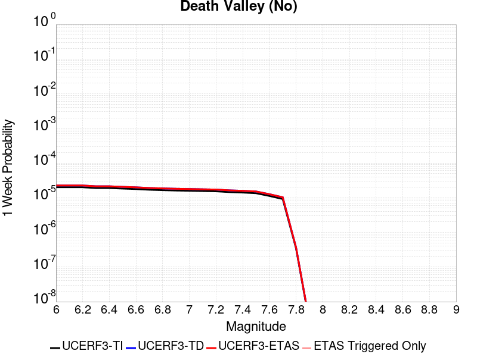 | 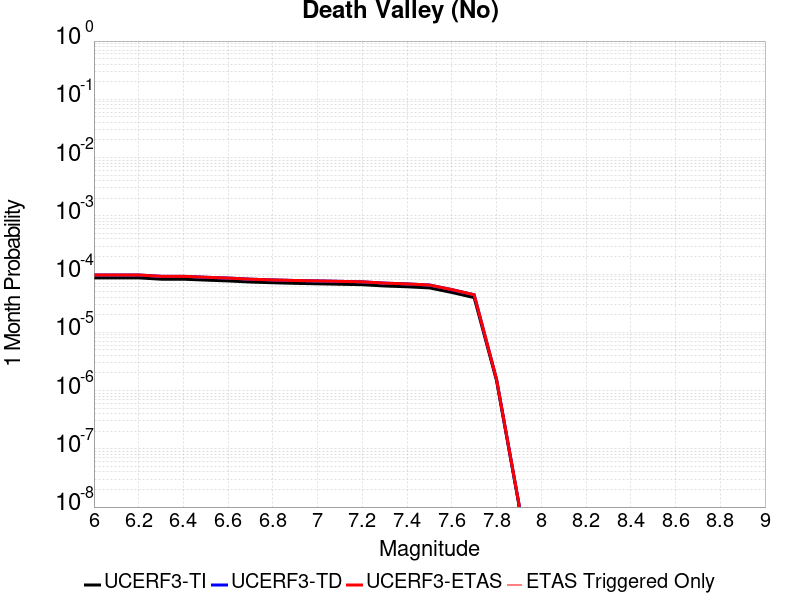 | 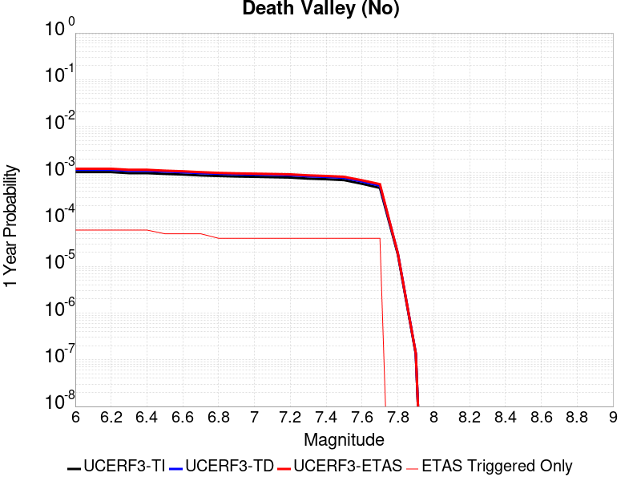 | 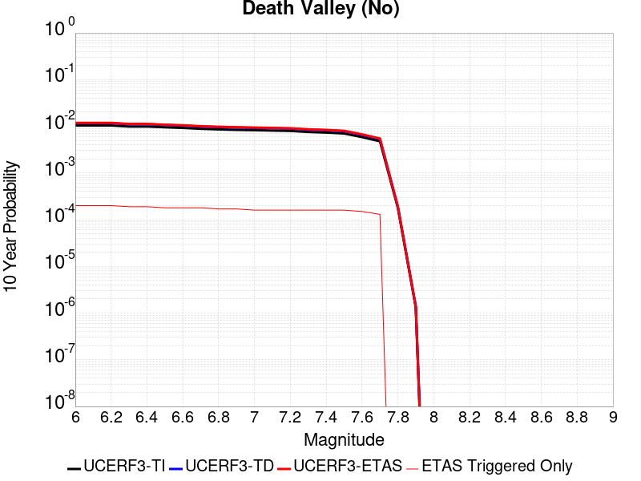 |

| Magnitude | 1 wk TI Prob | 1 wk TD Prob | 1 wk ETAS Prob | 1 wk ETAS/TD Gain | 1 wk ETAS Triggered Only | 1 mo TI Prob | 1 mo TD Prob | 1 mo ETAS Prob | 1 mo ETAS/TD Gain | 1 mo ETAS Triggered Only | 1 yr TI Prob | 1 yr TD Prob | 1 yr ETAS Prob | 1 yr ETAS/TD Gain | 1 yr ETAS Triggered Only | 10 yr TI Prob | 10 yr TD Prob | 10 yr ETAS Prob | 10 yr ETAS/TD Gain | 10 yr ETAS Triggered Only |
|-----|-----|-----|-----|-----|-----|-----|-----|-----|-----|-----|-----|-----|-----|-----|-----|-----|-----|-----|-----|-----|
| 6.0 | 2.0074807E-5 | 2.2503344E-5 | 2.2503344E-5 | 1.0 | 0.0 | 8.603206E-5 | 9.643938E-5 | 9.643938E-5 | 1.0 | 0.0 | 0.001046937 | 0.0011735244 | 0.0012456418 | 1.0614537 | 7.2202165E-5 | 0.010420183 | 0.011674188 | 0.0119239455 | 1.021394 | 2.5270757E-4 |
| 6.1 | 2.0074807E-5 | 2.2503344E-5 | 2.2503344E-5 | 1.0 | 0.0 | 8.603206E-5 | 9.643938E-5 | 9.643938E-5 | 1.0 | 0.0 | 0.001046937 | 0.0011735244 | 0.0012456418 | 1.0614537 | 7.2202165E-5 | 0.010420183 | 0.011674188 | 0.0119239455 | 1.021394 | 2.5270757E-4 |
| 6.2 | 2.0074807E-5 | 2.2503344E-5 | 2.2503344E-5 | 1.0 | 0.0 | 8.603206E-5 | 9.643938E-5 | 9.643938E-5 | 1.0 | 0.0 | 0.001046937 | 0.0011735244 | 0.0012456418 | 1.0614537 | 7.2202165E-5 | 0.010420183 | 0.011674188 | 0.0119239455 | 1.021394 | 2.5270757E-4 |
| 6.3 | 1.9050609E-5 | 2.134002E-5 | 2.134002E-5 | 1.0 | 0.0 | 8.164292E-5 | 9.145406E-5 | 9.145406E-5 | 1.0 | 0.0 | 9.935491E-4 | 0.0011128911 | 0.001185013 | 1.0648059 | 7.2202165E-5 | 0.009891188 | 0.011074004 | 0.011306062 | 1.0209552 | 2.3465704E-4 |
| 6.4 | 1.9050609E-5 | 2.134002E-5 | 2.134002E-5 | 1.0 | 0.0 | 8.164292E-5 | 9.145406E-5 | 9.145406E-5 | 1.0 | 0.0 | 9.935491E-4 | 0.0011128911 | 0.001185013 | 1.0648059 | 7.2202165E-5 | 0.009891188 | 0.011074004 | 0.011306062 | 1.0209552 | 2.3465704E-4 |
| 6.5 | 1.8367004E-5 | 2.0563955E-5 | 2.0563955E-5 | 1.0 | 0.0 | 7.8713354E-5 | 8.81283E-5 | 8.81283E-5 | 1.0 | 0.0 | 9.5791375E-4 | 0.0010724404 | 0.001126534 | 1.0504397 | 5.4151624E-5 | 0.009537951 | 0.010673437 | 0.010887732 | 1.0200773 | 2.166065E-4 |
| 6.6 | 1.779439E-5 | 1.991377E-5 | 1.991377E-5 | 1.0 | 0.0 | 7.625944E-5 | 8.534197E-5 | 8.534197E-5 | 1.0 | 0.0 | 9.280632E-4 | 0.0010385496 | 0.001092645 | 1.0520874 | 5.4151624E-5 | 0.009241969 | 0.010337721 | 0.010552088 | 1.0207365 | 2.166065E-4 |
| 6.7 | 1.7025437E-5 | 1.9046134E-5 | 1.9046134E-5 | 1.0 | 0.0 | 7.296412E-5 | 8.1623766E-5 | 8.1623766E-5 | 1.0 | 0.0 | 8.87976E-4 | 9.933225E-4 | 0.0010474203 | 1.0544615 | 5.4151624E-5 | 0.008844362 | 0.009889545 | 0.010104009 | 1.021686 | 2.166065E-4 |
| 6.8 | 1.6545107E-5 | 1.8515186E-5 | 1.8515186E-5 | 1.0 | 0.0 | 7.090568E-5 | 7.9348414E-5 | 7.9348414E-5 | 1.0 | 0.0 | 8.629347E-4 | 9.656449E-4 | 0.0010017111 | 1.0373493 | 3.6101083E-5 | 0.008595915 | 0.009615193 | 0.00981184 | 1.0204517 | 1.9855595E-4 |
| 6.9 | 1.615478E-5 | 1.8090188E-5 | 1.8090188E-5 | 1.0 | 0.0 | 6.9232934E-5 | 7.752711E-5 | 7.752711E-5 | 1.0 | 0.0 | 8.4258494E-4 | 9.434899E-4 | 9.795569E-4 | 1.0382272 | 3.6101083E-5 | 0.008393973 | 0.009395537 | 0.009592227 | 1.0209345 | 1.9855595E-4 |
| 7.0 | 1.5894311E-5 | 1.7808115E-5 | 1.7808115E-5 | 1.0 | 0.0 | 6.81167E-5 | 7.63183E-5 | 7.63183E-5 | 1.0 | 0.0 | 8.2900526E-4 | 9.2878524E-4 | 9.648528E-4 | 1.038833 | 3.6101083E-5 | 0.008259195 | 0.0092497235 | 0.009446443 | 1.0212677 | 1.9855595E-4 |
| 7.1 | 1.5602263E-5 | 1.7486029E-5 | 1.7486029E-5 | 1.0 | 0.0 | 6.6865134E-5 | 7.4938005E-5 | 7.4938005E-5 | 1.0 | 0.0 | 8.137789E-4 | 9.119944E-4 | 9.480625E-4 | 1.0395486 | 3.6101083E-5 | 0.008108052 | 0.009083199 | 0.009279952 | 1.0216612 | 1.9855595E-4 |
| 7.2 | 1.5323829E-5 | 1.7173108E-5 | 1.7173108E-5 | 1.0 | 0.0 | 6.56719E-5 | 7.3596995E-5 | 7.3596995E-5 | 1.0 | 0.0 | 7.99262E-4 | 8.9568115E-4 | 9.317499E-4 | 1.0402696 | 3.6101083E-5 | 0.007963934 | 0.008921389 | 0.009118173 | 1.0220577 | 1.9855595E-4 |
| 7.3 | 1.4556212E-5 | 1.6304797E-5 | 1.6304797E-5 | 1.0 | 0.0 | 6.238227E-5 | 6.987587E-5 | 6.987587E-5 | 1.0 | 0.0 | 7.592395E-4 | 8.5041247E-4 | 8.864829E-4 | 1.0424151 | 3.6101083E-5 | 0.0075665074 | 0.008472227 | 0.008669101 | 1.0232376 | 1.9855595E-4 |
| 7.4 | 1.411725E-5 | 1.5810228E-5 | 1.5810228E-5 | 1.0 | 0.0 | 6.0501097E-5 | 6.7756395E-5 | 6.7756395E-5 | 1.0 | 0.0 | 7.363519E-4 | 8.246277E-4 | 8.60699E-4 | 1.0437425 | 3.6101083E-5 | 0.0073391674 | 0.008216312 | 0.008413237 | 1.0239675 | 1.9855595E-4 |
| 7.5 | 1.3503312E-5 | 1.5128466E-5 | 1.5128466E-5 | 1.0 | 0.0 | 5.7870053E-5 | 6.4834705E-5 | 6.4834705E-5 | 1.0 | 0.0 | 7.043401E-4 | 7.8908243E-4 | 8.2515506E-4 | 1.0457146 | 3.6101083E-5 | 0.007021119 | 0.007863431 | 0.008060426 | 1.025052 | 1.9855595E-4 |
| 7.6 | 1.1279839E-5 | 1.2628131E-5 | 1.2628131E-5 | 1.0 | 0.0 | 4.834127E-5 | 5.411947E-5 | 5.411947E-5 | 1.0 | 0.0 | 5.88396E-4 | 6.5871066E-4 | 6.9478794E-4 | 1.0547695 | 3.6101083E-5 | 0.005868405 | 0.0065681343 | 0.006747454 | 1.0273014 | 1.8050542E-4 |
| 7.7 | 9.189108E-6 | 1.0284824E-5 | 1.0284824E-5 | 1.0 | 0.0 | 3.93813E-5 | 4.4077104E-5 | 4.4077104E-5 | 1.0 | 0.0 | 4.7936183E-4 | 5.3651165E-4 | 5.7259336E-4 | 1.0672524 | 3.6101083E-5 | 0.004783291 | 0.005352675 | 0.0054963063 | 1.0268335 | 1.4440433E-4 |
| 7.8 | 3.4586725E-7 | 3.6485014E-7 | 3.6485014E-7 | 1.0 | 0.0 | 1.4822873E-6 | 1.5636425E-6 | 1.5636425E-6 | 1.0 | 0.0 | 1.80467E-5 | 1.9037187E-5 | 1.9037187E-5 | 1.0 | 0.0 | 1.8045233E-4 | 1.9035599E-4 | 1.9035599E-4 | 1.0 | 0.0 |
| 7.9 | 2.5591178E-9 | 2.6698093E-9 | 2.6698093E-9 | 1.0 | 0.0 | 1.0967647E-8 | 1.144204E-8 | 1.144204E-8 | 1.0 | 0.0 | 1.335311E-7 | 1.3930685E-7 | 1.3930685E-7 | 1.0 | 0.0 | 1.3353102E-6 | 1.3930684E-6 | 1.3930684E-6 | 1.0 | 0.0 |

## San Andreas (San Gorgonio Pass-Garnet HIll)
*[(top)](#table-of-contents)*

| 1 Week | 1 Month | 1 Year | 10 Year |
|-----|-----|-----|-----|
| 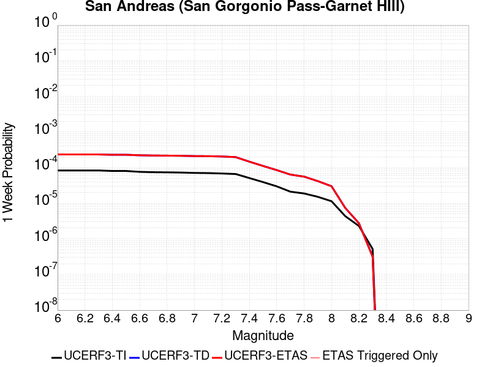 | 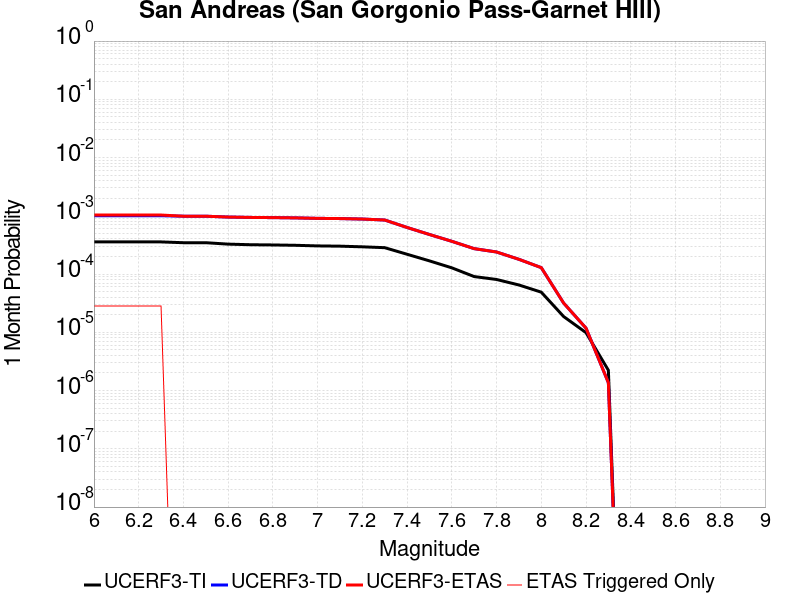 |  | 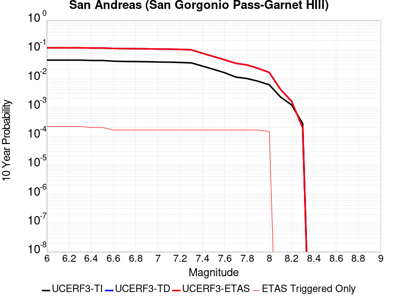 |

| Magnitude | 1 wk TI Prob | 1 wk TD Prob | 1 wk ETAS Prob | 1 wk ETAS/TD Gain | 1 wk ETAS Triggered Only | 1 mo TI Prob | 1 mo TD Prob | 1 mo ETAS Prob | 1 mo ETAS/TD Gain | 1 mo ETAS Triggered Only | 1 yr TI Prob | 1 yr TD Prob | 1 yr ETAS Prob | 1 yr ETAS/TD Gain | 1 yr ETAS Triggered Only | 10 yr TI Prob | 10 yr TD Prob | 10 yr ETAS Prob | 10 yr ETAS/TD Gain | 10 yr ETAS Triggered Only |
|-----|-----|-----|-----|-----|-----|-----|-----|-----|-----|-----|-----|-----|-----|-----|-----|-----|-----|-----|-----|-----|
| 6.0 | 8.31567E-5 | 2.341848E-4 | 2.341848E-4 | 1.0 | 0.0 | 3.5633717E-4 | 0.0010032654 | 0.0010212978 | 1.0179738 | 1.8050541E-5 | 0.004329778 | 0.012146278 | 0.012235435 | 1.0073402 | 9.025271E-5 | 0.042463828 | 0.11272492 | 0.11291711 | 1.0017049 | 2.166065E-4 |
| 6.1 | 8.31567E-5 | 2.341848E-4 | 2.341848E-4 | 1.0 | 0.0 | 3.5633717E-4 | 0.0010032654 | 0.0010212978 | 1.0179738 | 1.8050541E-5 | 0.004329778 | 0.012146278 | 0.012235435 | 1.0073402 | 9.025271E-5 | 0.042463828 | 0.11272492 | 0.11291711 | 1.0017049 | 2.166065E-4 |
| 6.2 | 8.31567E-5 | 2.341848E-4 | 2.341848E-4 | 1.0 | 0.0 | 3.5633717E-4 | 0.0010032654 | 0.0010212978 | 1.0179738 | 1.8050541E-5 | 0.004329778 | 0.012146278 | 0.012235435 | 1.0073402 | 9.025271E-5 | 0.042463828 | 0.11272492 | 0.11291711 | 1.0017049 | 2.166065E-4 |
| 6.3 | 8.31567E-5 | 2.341848E-4 | 2.341848E-4 | 1.0 | 0.0 | 3.5633717E-4 | 0.0010032654 | 0.0010212978 | 1.0179738 | 1.8050541E-5 | 0.004329778 | 0.012146278 | 0.012235435 | 1.0073402 | 9.025271E-5 | 0.042463828 | 0.11272492 | 0.11291711 | 1.0017049 | 2.166065E-4 |
| 6.4 | 8.059055E-5 | 2.2976386E-4 | 2.2976386E-4 | 1.0 | 0.0 | 3.4534236E-4 | 9.843331E-4 | 9.843331E-4 | 1.0 | 0.0 | 0.0041964394 | 0.011918315 | 0.011971821 | 1.0044894 | 5.4151624E-5 | 0.041180745 | 0.11070554 | 0.11088211 | 1.001595 | 1.9855595E-4 |
| 6.5 | 8.059055E-5 | 2.2976386E-4 | 2.2976386E-4 | 1.0 | 0.0 | 3.4534236E-4 | 9.843331E-4 | 9.843331E-4 | 1.0 | 0.0 | 0.0041964394 | 0.011918315 | 0.011971821 | 1.0044894 | 5.4151624E-5 | 0.041180745 | 0.11070554 | 0.11088211 | 1.001595 | 1.9855595E-4 |
| 6.6 | 7.619237E-5 | 2.2220163E-4 | 2.2220163E-4 | 1.0 | 0.0 | 3.2649786E-4 | 9.5194747E-4 | 9.5194747E-4 | 1.0 | 0.0 | 0.0039678677 | 0.011528923 | 0.011582451 | 1.0046428 | 5.4151624E-5 | 0.03897764 | 0.10724146 | 0.10738649 | 1.0013524 | 1.6245487E-4 |
| 6.7 | 7.440636E-5 | 2.1895909E-4 | 2.1895909E-4 | 1.0 | 0.0 | 3.188454E-4 | 9.3806087E-4 | 9.3806087E-4 | 1.0 | 0.0 | 0.0038750346 | 0.011361623 | 0.011415159 | 1.004712 | 5.4151624E-5 | 0.038081564 | 0.1057498 | 0.10589508 | 1.0013738 | 1.6245487E-4 |
| 6.8 | 7.3735864E-5 | 2.1743034E-4 | 2.1743034E-4 | 1.0 | 0.0 | 3.1597257E-4 | 9.3151384E-4 | 9.3151384E-4 | 1.0 | 0.0 | 0.0038401815 | 0.011282741 | 0.011336281 | 1.0047454 | 5.4151624E-5 | 0.03774495 | 0.10505127 | 0.105196655 | 1.001384 | 1.6245487E-4 |
| 6.9 | 7.27575E-5 | 2.1511951E-4 | 2.1511951E-4 | 1.0 | 0.0 | 3.117806E-4 | 9.216173E-4 | 9.216173E-4 | 1.0 | 0.0 | 0.003789323 | 0.011163492 | 0.011217038 | 1.0047966 | 5.4151624E-5 | 0.037253562 | 0.103999116 | 0.10414467 | 1.0013996 | 1.6245487E-4 |
| 7.0 | 7.102591E-5 | 2.1095842E-4 | 2.1095842E-4 | 1.0 | 0.0 | 3.0436125E-4 | 9.037965E-4 | 9.037965E-4 | 1.0 | 0.0 | 0.003699303 | 0.010948721 | 0.011002281 | 1.0048918 | 5.4151624E-5 | 0.03638325 | 0.10210097 | 0.10224684 | 1.0014287 | 1.6245487E-4 |
| 7.1 | 7.028513E-5 | 2.093142E-4 | 2.093142E-4 | 1.0 | 0.0 | 3.0118722E-4 | 8.967547E-4 | 8.967547E-4 | 1.0 | 0.0 | 0.0036607897 | 0.010863845 | 0.010917408 | 1.0049304 | 5.4151624E-5 | 0.036010686 | 0.101343825 | 0.10148982 | 1.0014405 | 1.6245487E-4 |
| 7.2 | 6.8498244E-5 | 2.0539125E-4 | 2.0539125E-4 | 1.0 | 0.0 | 2.9353087E-4 | 8.7995344E-4 | 8.7995344E-4 | 1.0 | 0.0 | 0.003567883 | 0.010661308 | 0.010714882 | 1.0050251 | 5.4151624E-5 | 0.035111405 | 0.09953542 | 0.099681705 | 1.0014697 | 1.6245487E-4 |
| 7.3 | 6.622592E-5 | 1.9765973E-4 | 1.9765973E-4 | 1.0 | 0.0 | 2.8379448E-4 | 8.4684027E-4 | 8.4684027E-4 | 1.0 | 0.0 | 0.0034497243 | 0.010262022 | 0.010315618 | 1.0052228 | 5.4151624E-5 | 0.033966612 | 0.09603059 | 0.09617745 | 1.0015292 | 1.6245487E-4 |
| 7.4 | 5.1050705E-5 | 1.4718328E-4 | 1.4718328E-4 | 1.0 | 0.0 | 2.1877038E-4 | 6.306339E-4 | 6.306339E-4 | 1.0 | 0.0 | 0.002660276 | 0.007651131 | 0.0077048684 | 1.0070235 | 5.4151624E-5 | 0.02628654 | 0.07298964 | 0.07314024 | 1.0020633 | 1.6245487E-4 |
| 7.5 | 3.9302922E-5 | 1.1155338E-4 | 1.1155338E-4 | 1.0 | 0.0 | 1.6843023E-4 | 4.7799866E-4 | 4.7799866E-4 | 1.0 | 0.0 | 0.0020487092 | 0.005804174 | 0.0058580115 | 1.0092757 | 5.4151624E-5 | 0.020299247 | 0.056122124 | 0.05627546 | 1.0027322 | 1.6245487E-4 |
| 7.6 | 2.9851626E-5 | 8.517681E-5 | 8.517681E-5 | 1.0 | 0.0 | 1.2792926E-4 | 3.6499253E-4 | 3.6499253E-4 | 1.0 | 0.0 | 0.0015564259 | 0.004434755 | 0.0044886665 | 1.0121566 | 5.4151624E-5 | 0.0154556995 | 0.043295383 | 0.043450803 | 1.0035897 | 1.6245487E-4 |
| 7.7 | 2.1135214E-5 | 6.373086E-5 | 6.373086E-5 | 1.0 | 0.0 | 9.0576345E-5 | 2.731037E-4 | 2.731037E-4 | 1.0 | 0.0 | 0.0011022091 | 0.0033199736 | 0.0033739454 | 1.0162567 | 5.4151624E-5 | 0.010967582 | 0.03267358 | 0.032830723 | 1.0048096 | 1.6245487E-4 |
| 7.8 | 1.883379E-5 | 5.5825578E-5 | 5.5825578E-5 | 1.0 | 0.0 | 8.0713755E-5 | 2.3923055E-4 | 2.3923055E-4 | 1.0 | 0.0 | 9.822468E-4 | 0.0029087448 | 0.002962739 | 1.0185627 | 5.4151624E-5 | 0.0097791655 | 0.028779162 | 0.028936941 | 1.0054824 | 1.6245487E-4 |
| 7.9 | 1.5156185E-5 | 4.181044E-5 | 4.181044E-5 | 1.0 | 0.0 | 6.495346E-5 | 1.7917529E-4 | 1.7917529E-4 | 1.0 | 0.0 | 7.9052144E-4 | 0.002179278 | 0.0022333118 | 1.0247942 | 5.4151624E-5 | 0.007877152 | 0.021829262 | 0.021988172 | 1.0072796 | 1.6245487E-4 |
| 8.0 | 1.1405907E-5 | 3.0088377E-5 | 3.0088377E-5 | 1.0 | 0.0 | 4.8881542E-5 | 1.2894382E-4 | 1.2894382E-4 | 1.0 | 0.0 | 5.9497025E-4 | 0.0015687615 | 0.0016228282 | 1.0344646 | 5.4151624E-5 | 0.005933798 | 0.015825858 | 0.015967976 | 1.0089802 | 1.4440433E-4 |
| 8.1 | 4.3511436E-6 | 7.410379E-6 | 7.410379E-6 | 1.0 | 0.0 | 1.8647626E-5 | 3.1758384E-5 | 3.1758384E-5 | 1.0 | 0.0 | 2.2701119E-4 | 3.8658985E-4 | 3.8658985E-4 | 1.0 | 0.0 | 0.0022677942 | 0.004136883 | 0.004136883 | 1.0 | 0.0 |
| 8.2 | 2.3042528E-6 | 2.7523358E-6 | 2.7523358E-6 | 1.0 | 0.0 | 9.875332E-6 | 1.1795672E-5 | 1.1795672E-5 | 1.0 | 0.0 | 1.2022553E-4 | 1.436029E-4 | 1.436029E-4 | 1.0 | 0.0 | 0.0012016051 | 0.0016081226 | 0.0016081226 | 1.0 | 0.0 |
| 8.3 | 5.202968E-7 | 3.19155E-7 | 3.19155E-7 | 1.0 | 0.0 | 2.2298414E-6 | 1.3678064E-6 | 1.3678064E-6 | 1.0 | 0.0 | 2.714798E-5 | 1.6652928E-5 | 1.6652928E-5 | 1.0 | 0.0 | 2.7144665E-4 | 1.9742314E-4 | 1.9742314E-4 | 1.0 | 0.0 |

## San Andreas (North Branch Mill Creek)
*[(top)](#table-of-contents)*

| 1 Week | 1 Month | 1 Year | 10 Year |
|-----|-----|-----|-----|
| 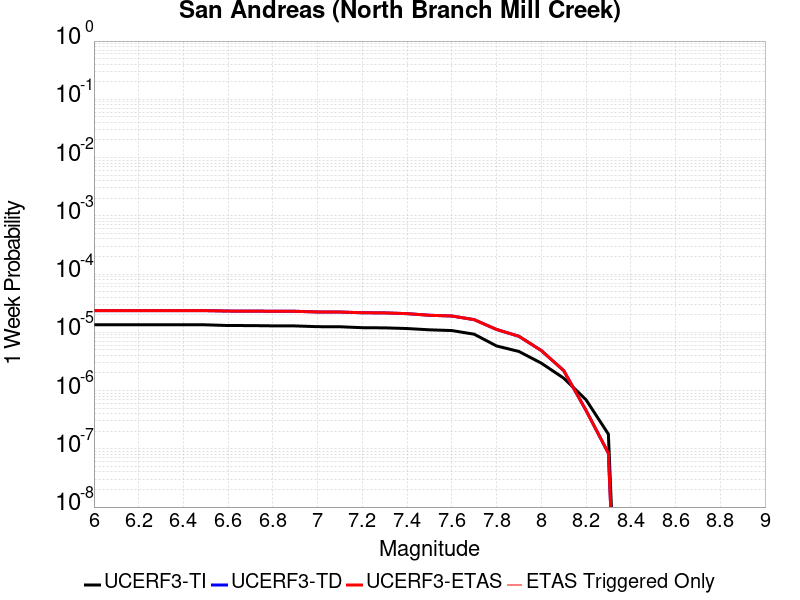 | 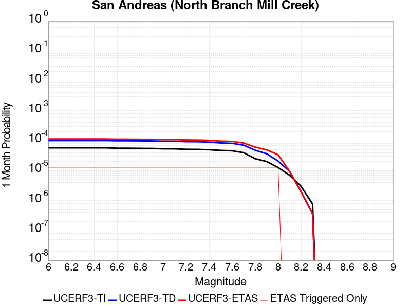 | 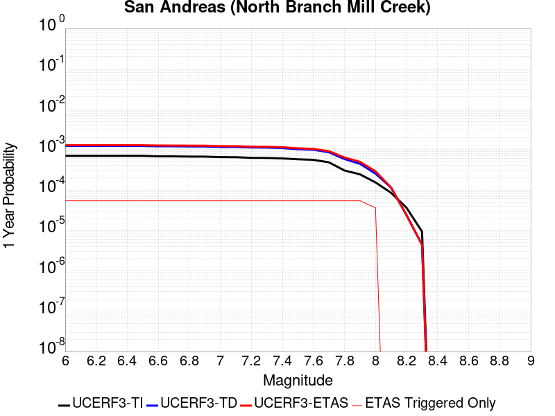 |  |

| Magnitude | 1 wk TI Prob | 1 wk TD Prob | 1 wk ETAS Prob | 1 wk ETAS/TD Gain | 1 wk ETAS Triggered Only | 1 mo TI Prob | 1 mo TD Prob | 1 mo ETAS Prob | 1 mo ETAS/TD Gain | 1 mo ETAS Triggered Only | 1 yr TI Prob | 1 yr TD Prob | 1 yr ETAS Prob | 1 yr ETAS/TD Gain | 1 yr ETAS Triggered Only | 10 yr TI Prob | 10 yr TD Prob | 10 yr ETAS Prob | 10 yr ETAS/TD Gain | 10 yr ETAS Triggered Only |
|-----|-----|-----|-----|-----|-----|-----|-----|-----|-----|-----|-----|-----|-----|-----|-----|-----|-----|-----|-----|-----|
| 6.0 | 1.3461156E-5 | 2.3561888E-5 | 2.3561888E-5 | 1.0 | 0.0 | 5.7689394E-5 | 1.0097563E-4 | 1.1902435E-4 | 1.1787434 | 1.8050541E-5 | 7.02142E-4 | 0.0012286883 | 0.0012827733 | 1.0440185 | 5.4151624E-5 | 0.0069992766 | 0.01226131 | 0.01249309 | 1.0189034 | 2.3465704E-4 |
| 6.1 | 1.3461156E-5 | 2.3561888E-5 | 2.3561888E-5 | 1.0 | 0.0 | 5.7689394E-5 | 1.0097563E-4 | 1.1902435E-4 | 1.1787434 | 1.8050541E-5 | 7.02142E-4 | 0.0012286883 | 0.0012827733 | 1.0440185 | 5.4151624E-5 | 0.0069992766 | 0.01226131 | 0.01249309 | 1.0189034 | 2.3465704E-4 |
| 6.2 | 1.3461156E-5 | 2.3561888E-5 | 2.3561888E-5 | 1.0 | 0.0 | 5.7689394E-5 | 1.0097563E-4 | 1.1902435E-4 | 1.1787434 | 1.8050541E-5 | 7.02142E-4 | 0.0012286883 | 0.0012827733 | 1.0440185 | 5.4151624E-5 | 0.0069992766 | 0.01226131 | 0.01249309 | 1.0189034 | 2.3465704E-4 |
| 6.3 | 1.3461156E-5 | 2.3561888E-5 | 2.3561888E-5 | 1.0 | 0.0 | 5.7689394E-5 | 1.0097563E-4 | 1.1902435E-4 | 1.1787434 | 1.8050541E-5 | 7.02142E-4 | 0.0012286883 | 0.0012827733 | 1.0440185 | 5.4151624E-5 | 0.0069992766 | 0.01226131 | 0.01249309 | 1.0189034 | 2.3465704E-4 |
| 6.4 | 1.3461156E-5 | 2.3561888E-5 | 2.3561888E-5 | 1.0 | 0.0 | 5.7689394E-5 | 1.0097563E-4 | 1.1902435E-4 | 1.1787434 | 1.8050541E-5 | 7.02142E-4 | 0.0012286883 | 0.0012827733 | 1.0440185 | 5.4151624E-5 | 0.0069992766 | 0.01226131 | 0.01249309 | 1.0189034 | 2.3465704E-4 |
| 6.5 | 1.3450706E-5 | 2.3550847E-5 | 2.3550847E-5 | 1.0 | 0.0 | 5.764461E-5 | 1.00928315E-4 | 1.18977034E-4 | 1.1788272 | 1.8050541E-5 | 7.0159714E-4 | 0.0012281128 | 0.001282198 | 1.0440392 | 5.4151624E-5 | 0.006993862 | 0.012255619 | 0.012487401 | 1.0189122 | 2.3465704E-4 |
| 6.6 | 1.3074523E-5 | 2.3165107E-5 | 2.3165107E-5 | 1.0 | 0.0 | 5.6032466E-5 | 9.927527E-5 | 1.1732402E-4 | 1.1818051 | 1.8050541E-5 | 6.8198174E-4 | 0.0012080094 | 0.0012620956 | 1.044773 | 5.4151624E-5 | 0.006798926 | 0.012056779 | 0.012270775 | 1.017749 | 2.166065E-4 |
| 6.7 | 1.3050216E-5 | 2.31404E-5 | 2.31404E-5 | 1.0 | 0.0 | 5.59283E-5 | 9.916939E-5 | 1.17218144E-4 | 1.1819992 | 1.8050541E-5 | 6.8071426E-4 | 0.0012067218 | 0.0012608081 | 1.0448208 | 5.4151624E-5 | 0.0067863287 | 0.012044042 | 0.01225804 | 1.0177679 | 2.166065E-4 |
| 6.8 | 1.29049395E-5 | 2.2988796E-5 | 2.2988796E-5 | 1.0 | 0.0 | 5.530571E-5 | 9.851971E-5 | 1.1656847E-4 | 1.1831995 | 1.8050541E-5 | 6.73139E-4 | 0.0011988207 | 0.0012529073 | 1.0451165 | 5.4151624E-5 | 0.0067110364 | 0.011965883 | 0.012179898 | 1.0178854 | 2.166065E-4 |
| 6.9 | 1.2867369E-5 | 2.294819E-5 | 2.294819E-5 | 1.0 | 0.0 | 5.51447E-5 | 9.834569E-5 | 1.1639446E-4 | 1.1835237 | 1.8050541E-5 | 6.711799E-4 | 0.0011967043 | 0.0012507912 | 1.0451965 | 5.4151624E-5 | 0.006691564 | 0.011944949 | 0.012158968 | 1.0179172 | 2.166065E-4 |
| 7.0 | 1.2495996E-5 | 2.2347842E-5 | 2.2347842E-5 | 1.0 | 0.0 | 5.3553173E-5 | 9.5772964E-5 | 1.1382178E-4 | 1.1884542 | 1.8050541E-5 | 6.518148E-4 | 0.0011654149 | 0.0012195035 | 1.0464114 | 5.4151624E-5 | 0.0064990623 | 0.011635342 | 0.011849428 | 1.0183996 | 2.166065E-4 |
| 7.1 | 1.2452067E-5 | 2.2292896E-5 | 2.2292896E-5 | 1.0 | 0.0 | 5.3364907E-5 | 9.553749E-5 | 1.1358631E-4 | 1.1889187 | 1.8050541E-5 | 6.4952404E-4 | 0.0011625512 | 0.0012166399 | 1.0465258 | 5.4151624E-5 | 0.0064762887 | 0.011607004 | 0.011821097 | 1.0184451 | 2.166065E-4 |
| 7.2 | 1.2002777E-5 | 2.1671129E-5 | 2.1671129E-5 | 1.0 | 0.0 | 5.143946E-5 | 9.287298E-5 | 1.1092184E-4 | 1.1943393 | 1.8050541E-5 | 6.2609545E-4 | 0.0011301446 | 0.0011842351 | 1.0478615 | 5.4151624E-5 | 0.006243344 | 0.011286267 | 0.011500428 | 1.0189754 | 2.166065E-4 |
| 7.3 | 1.1923425E-5 | 2.154089E-5 | 2.154089E-5 | 1.0 | 0.0 | 5.109939E-5 | 9.2314855E-5 | 1.1036373E-4 | 1.1955143 | 1.8050541E-5 | 6.219575E-4 | 0.0011233565 | 0.0011774473 | 1.048151 | 5.4151624E-5 | 0.0062021962 | 0.0112191 | 0.011433276 | 1.0190903 | 2.166065E-4 |
| 7.4 | 1.16105175E-5 | 2.0914275E-5 | 2.0914275E-5 | 1.0 | 0.0 | 4.975841E-5 | 8.962954E-5 | 1.0767846E-4 | 1.2013725 | 1.8050541E-5 | 6.0564023E-4 | 0.0010906958 | 0.0011447885 | 1.0495945 | 5.4151624E-5 | 0.006039923 | 0.0108964145 | 0.011110662 | 1.0196621 | 2.166065E-4 |
| 7.5 | 1.1037265E-5 | 1.9612295E-5 | 1.9612295E-5 | 1.0 | 0.0 | 4.7301706E-5 | 8.404999E-5 | 1.0209902E-4 | 1.2147416 | 1.8050541E-5 | 5.757461E-4 | 0.0010228305 | 0.0010769267 | 1.0528888 | 5.4151624E-5 | 0.005742567 | 0.010224857 | 0.010439249 | 1.0209677 | 2.166065E-4 |
| 7.6 | 1.0720915E-5 | 1.9053477E-5 | 1.9053477E-5 | 1.0 | 0.0 | 4.5945973E-5 | 8.165521E-5 | 9.970428E-5 | 1.22104 | 1.8050541E-5 | 5.592486E-4 | 9.93701E-4 | 0.0010477988 | 1.0544407 | 5.4151624E-5 | 0.005578433 | 0.009936214 | 0.010150668 | 1.0215831 | 2.166065E-4 |
| 7.7 | 9.276279E-6 | 1.6496559E-5 | 1.6496559E-5 | 1.0 | 0.0 | 3.9754876E-5 | 7.069763E-5 | 8.87469E-5 | 1.2553023 | 1.8050541E-5 | 4.839081E-4 | 8.604054E-4 | 9.1451046E-4 | 1.0628831 | 5.4151624E-5 | 0.0048285574 | 0.0086142495 | 0.00882899 | 1.0249286 | 2.166065E-4 |
| 7.8 | 5.8346777E-6 | 1.1199562E-5 | 1.1199562E-5 | 1.0 | 0.0 | 2.5005522E-5 | 4.799724E-5 | 6.6046916E-5 | 1.3760566 | 1.8050541E-5 | 3.043997E-4 | 5.8420986E-4 | 6.3832983E-4 | 1.0926379 | 5.4151624E-5 | 0.0030398308 | 0.00586984 | 0.0060672304 | 1.0336279 | 1.9855595E-4 |
| 7.9 | 4.690204E-6 | 8.5462325E-6 | 8.5462325E-6 | 1.0 | 0.0 | 2.0100719E-5 | 3.6626196E-5 | 5.4676075E-5 | 1.4928135 | 1.8050541E-5 | 2.4469878E-4 | 4.458328E-4 | 4.9996027E-4 | 1.1214076 | 5.4151624E-5 | 0.002444295 | 0.004489867 | 0.0046875314 | 1.0440246 | 1.9855595E-4 |
| 8.0 | 2.9570454E-6 | 4.8696556E-6 | 4.8696556E-6 | 1.0 | 0.0 | 1.267299E-5 | 2.0869786E-5 | 3.891995E-5 | 1.8648946 | 1.8050541E-5 | 1.5428272E-4 | 2.5406005E-4 | 2.9015195E-4 | 1.1420605 | 3.6101083E-5 | 0.0015417566 | 0.002561455 | 0.0026154679 | 1.0210868 | 5.4151624E-5 |
| 8.1 | 1.6376824E-6 | 2.2087968E-6 | 2.2087968E-6 | 1.0 | 0.0 | 7.01862E-6 | 9.466237E-6 | 9.466237E-6 | 1.0 | 0.0 | 8.544835E-5 | 1.15245355E-4 | 1.15245355E-4 | 1.0 | 0.0 | 8.54155E-4 | 0.001166886 | 0.001166886 | 1.0 | 0.0 |
| 8.2 | 6.9631557E-7 | 4.573257E-7 | 4.573257E-7 | 1.0 | 0.0 | 2.984206E-6 | 1.9599659E-6 | 1.9599659E-6 | 1.0 | 0.0 | 3.63321E-5 | 2.3862323E-5 | 2.3862323E-5 | 1.0 | 0.0 | 3.6326164E-4 | 2.4713352E-4 | 2.4713352E-4 | 1.0 | 0.0 |
| 8.3 | 1.7876137E-7 | 8.4359215E-8 | 8.4359215E-8 | 1.0 | 0.0 | 7.661199E-7 | 3.6153943E-7 | 3.6153943E-7 | 1.0 | 0.0 | 9.32747E-6 | 4.4017343E-6 | 4.4017343E-6 | 1.0 | 0.0 | 9.3270784E-5 | 4.622226E-5 | 4.622226E-5 | 1.0 | 0.0 |

## Elsinore (Glen Ivy) rev
*[(top)](#table-of-contents)*

| 1 Week | 1 Month | 1 Year | 10 Year |
|-----|-----|-----|-----|
| 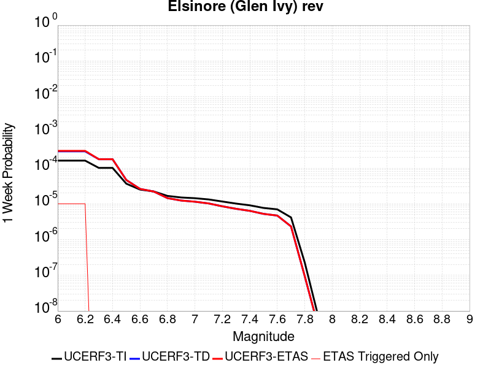 | 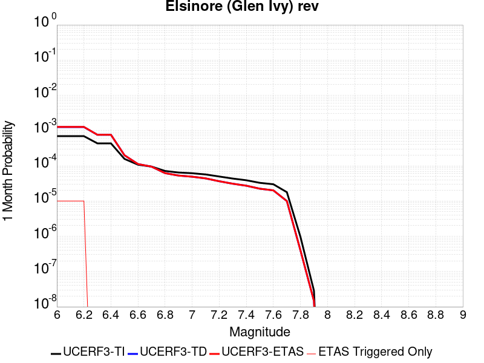 | 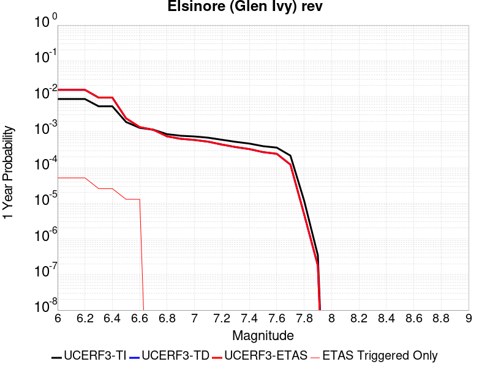 | 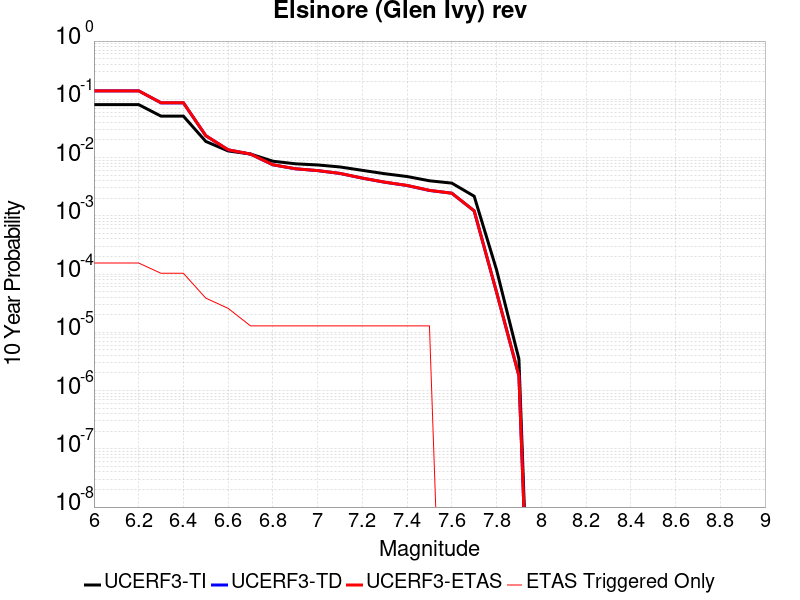 |

| Magnitude | 1 wk TI Prob | 1 wk TD Prob | 1 wk ETAS Prob | 1 wk ETAS/TD Gain | 1 wk ETAS Triggered Only | 1 mo TI Prob | 1 mo TD Prob | 1 mo ETAS Prob | 1 mo ETAS/TD Gain | 1 mo ETAS Triggered Only | 1 yr TI Prob | 1 yr TD Prob | 1 yr ETAS Prob | 1 yr ETAS/TD Gain | 1 yr ETAS Triggered Only | 10 yr TI Prob | 10 yr TD Prob | 10 yr ETAS Prob | 10 yr ETAS/TD Gain | 10 yr ETAS Triggered Only |
|-----|-----|-----|-----|-----|-----|-----|-----|-----|-----|-----|-----|-----|-----|-----|-----|-----|-----|-----|-----|-----|
| 6.0 | 1.6204086E-4 | 2.9372526E-4 | 2.9372526E-4 | 1.0 | 0.0 | 6.94276E-4 | 0.0012583701 | 0.0012583701 | 1.0 | 0.0 | 0.008420097 | 0.015239315 | 0.015310417 | 1.0046657 | 7.2202165E-5 | 0.081081145 | 0.1397225 | 0.13989331 | 1.0012225 | 1.9855595E-4 |
| 6.1 | 1.6204086E-4 | 2.9372526E-4 | 2.9372526E-4 | 1.0 | 0.0 | 6.94276E-4 | 0.0012583701 | 0.0012583701 | 1.0 | 0.0 | 0.008420097 | 0.015239315 | 0.015310417 | 1.0046657 | 7.2202165E-5 | 0.081081145 | 0.1397225 | 0.13989331 | 1.0012225 | 1.9855595E-4 |
| 6.2 | 1.6204086E-4 | 2.9372526E-4 | 2.9372526E-4 | 1.0 | 0.0 | 6.94276E-4 | 0.0012583701 | 0.0012583701 | 1.0 | 0.0 | 0.008420097 | 0.015239315 | 0.015310417 | 1.0046657 | 7.2202165E-5 | 0.081081145 | 0.1397225 | 0.13989331 | 1.0012225 | 1.9855595E-4 |
| 6.3 | 1.0111737E-4 | 1.7706843E-4 | 1.7706843E-4 | 1.0 | 0.0 | 4.332882E-4 | 7.587607E-4 | 7.587607E-4 | 1.0 | 0.0 | 0.005262531 | 0.009219478 | 0.009255246 | 1.0038797 | 3.6101083E-5 | 0.0513964 | 0.08703453 | 0.08716637 | 1.0015148 | 1.4440433E-4 |
| 6.4 | 1.0111737E-4 | 1.7706843E-4 | 1.7706843E-4 | 1.0 | 0.0 | 4.332882E-4 | 7.587607E-4 | 7.587607E-4 | 1.0 | 0.0 | 0.005262531 | 0.009219478 | 0.009255246 | 1.0038797 | 3.6101083E-5 | 0.0513964 | 0.08703453 | 0.08716637 | 1.0015148 | 1.4440433E-4 |
| 6.5 | 3.6624708E-5 | 4.64082E-5 | 4.64082E-5 | 1.0 | 0.0 | 1.569536E-4 | 1.9887918E-4 | 1.9887918E-4 | 1.0 | 0.0 | 0.001909235 | 0.0024190284 | 0.002437035 | 1.0074439 | 1.8050541E-5 | 0.01892915 | 0.023748467 | 0.023801332 | 1.0022261 | 5.4151624E-5 |
| 6.6 | 2.5051324E-5 | 2.6159752E-5 | 2.6159752E-5 | 1.0 | 0.0 | 1.073584E-4 | 1.1210866E-4 | 1.1210866E-4 | 1.0 | 0.0 | 0.0013063047 | 0.0013641128 | 0.0013821388 | 1.0132143 | 1.8050541E-5 | 0.012986525 | 0.013570773 | 0.013606384 | 1.0026242 | 3.6101083E-5 |
| 6.7 | 2.2189772E-5 | 2.2083259E-5 | 2.2083259E-5 | 1.0 | 0.0 | 9.509556E-5 | 9.463931E-5 | 9.463931E-5 | 1.0 | 0.0 | 0.0011571734 | 0.001151661 | 0.001151661 | 1.0 | 0.0 | 0.011511663 | 0.011470764 | 0.011488608 | 1.0015556 | 1.8050541E-5 |
| 6.8 | 1.6654378E-5 | 1.4444145E-5 | 1.4444145E-5 | 1.0 | 0.0 | 7.137396E-5 | 6.1902036E-5 | 6.1902036E-5 | 1.0 | 0.0 | 8.686314E-4 | 7.534019E-4 | 7.534019E-4 | 1.0 | 0.0 | 0.008652439 | 0.007513812 | 0.0075317267 | 1.0023843 | 1.8050541E-5 |
| 6.9 | 1.5042909E-5 | 1.2337672E-5 | 1.2337672E-5 | 1.0 | 0.0 | 6.446802E-5 | 5.2874686E-5 | 5.2874686E-5 | 1.0 | 0.0 | 7.8461546E-4 | 6.435623E-4 | 6.435623E-4 | 1.0 | 0.0 | 0.007818509 | 0.006421208 | 0.0064391424 | 1.0027931 | 1.8050541E-5 |
| 7.0 | 1.4361385E-5 | 1.14566765E-5 | 1.14566765E-5 | 1.0 | 0.0 | 6.154734E-5 | 4.9099133E-5 | 4.9099133E-5 | 1.0 | 0.0 | 7.490812E-4 | 5.976209E-4 | 5.976209E-4 | 1.0 | 0.0 | 0.007465612 | 0.0059641283 | 0.005982071 | 1.0030085 | 1.8050541E-5 |
| 7.1 | 1.3265571E-5 | 1.0249703E-5 | 1.0249703E-5 | 1.0 | 0.0 | 5.6851208E-5 | 4.392657E-5 | 4.392657E-5 | 1.0 | 0.0 | 6.919436E-4 | 5.3467735E-4 | 5.3467735E-4 | 1.0 | 0.0 | 0.006897931 | 0.005337265 | 0.0053552194 | 1.003364 | 1.8050541E-5 |
| 7.2 | 1.1596403E-5 | 8.509111E-6 | 8.509111E-6 | 1.0 | 0.0 | 4.9697923E-5 | 3.6467114E-5 | 3.6467114E-5 | 1.0 | 0.0 | 6.049042E-4 | 4.4389837E-4 | 4.4389837E-4 | 1.0 | 0.0 | 0.006032603 | 0.004431532 | 0.004449503 | 1.0040551 | 1.8050541E-5 |
| 7.3 | 1.0150827E-5 | 7.2422313E-6 | 7.2422313E-6 | 1.0 | 0.0 | 4.3502816E-5 | 3.1037773E-5 | 3.1037773E-5 | 1.0 | 0.0 | 5.2951806E-4 | 3.778208E-4 | 3.778208E-4 | 1.0 | 0.0 | 0.005282581 | 0.0037721714 | 0.003790154 | 1.0047672 | 1.8050541E-5 |
| 7.4 | 9.080705E-6 | 6.3555945E-6 | 6.3555945E-6 | 1.0 | 0.0 | 3.8916725E-5 | 2.7237986E-5 | 2.7237986E-5 | 1.0 | 0.0 | 4.7370812E-4 | 3.315734E-4 | 3.315734E-4 | 1.0 | 0.0 | 0.004726996 | 0.0033109377 | 0.0033289285 | 1.0054338 | 1.8050541E-5 |
| 7.5 | 7.671649E-6 | 5.228264E-6 | 5.228264E-6 | 1.0 | 0.0 | 3.287808E-5 | 2.240666E-5 | 2.240666E-5 | 1.0 | 0.0 | 4.0021708E-4 | 2.727682E-4 | 2.727682E-4 | 1.0 | 0.0 | 0.0039949706 | 0.0027244592 | 0.0027424605 | 1.0066073 | 1.8050541E-5 |
| 7.6 | 6.990086E-6 | 4.689975E-6 | 4.689975E-6 | 1.0 | 0.0 | 2.9957167E-5 | 2.0099744E-5 | 2.0099744E-5 | 1.0 | 0.0 | 3.6466747E-4 | 2.4468807E-4 | 2.4468807E-4 | 1.0 | 0.0 | 0.0036406964 | 0.002444303 | 0.002444303 | 1.0 | 0.0 |
| 7.7 | 4.163505E-6 | 2.3307468E-6 | 2.3307468E-6 | 1.0 | 0.0 | 1.7843471E-5 | 9.98888E-6 | 9.98888E-6 | 1.0 | 0.0 | 2.172226E-4 | 1.2160858E-4 | 1.2160858E-4 | 1.0 | 0.0 | 0.0021701038 | 0.0012154934 | 0.0012154934 | 1.0 | 0.0 |
| 7.8 | 2.2692414E-7 | 9.3897555E-8 | 9.3897555E-8 | 1.0 | 0.0 | 9.725317E-7 | 4.0241804E-7 | 4.0241804E-7 | 1.0 | 0.0 | 1.1840509E-5 | 4.899432E-6 | 4.899432E-6 | 1.0 | 0.0 | 1.1839878E-4 | 4.8993566E-5 | 4.8993566E-5 | 1.0 | 0.0 |
| 7.9 | 6.676829E-9 | 3.440971E-9 | 3.440971E-9 | 1.0 | 0.0 | 2.861498E-8 | 1.4747019E-8 | 1.4747019E-8 | 1.0 | 0.0 | 3.4838732E-7 | 1.7954494E-7 | 1.7954494E-7 | 1.0 | 0.0 | 3.4838679E-6 | 1.795448E-6 | 1.795448E-6 | 1.0 | 0.0 |

## San Andreas (Parkfield)
*[(top)](#table-of-contents)*

| 1 Week | 1 Month | 1 Year | 10 Year |
|-----|-----|-----|-----|
| 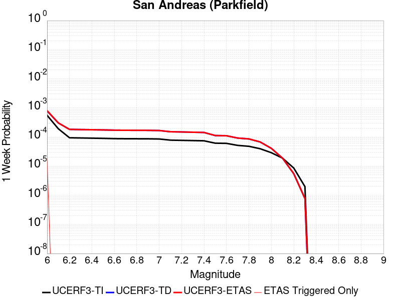 | 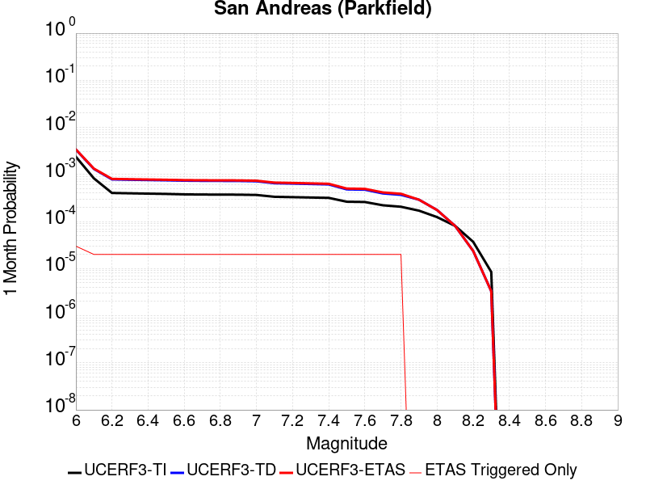 | 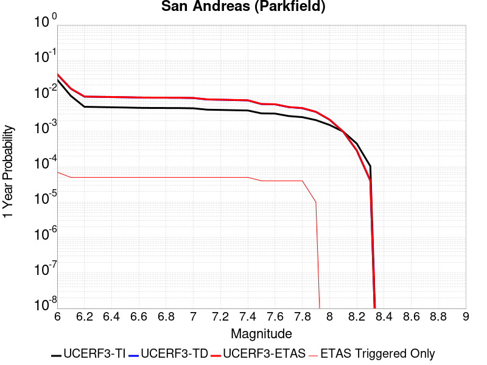 | 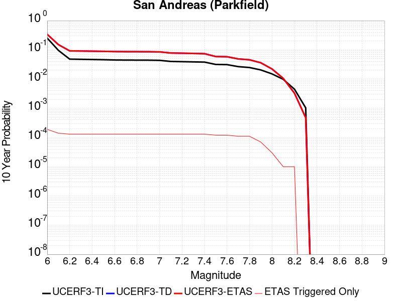 |

| Magnitude | 1 wk TI Prob | 1 wk TD Prob | 1 wk ETAS Prob | 1 wk ETAS/TD Gain | 1 wk ETAS Triggered Only | 1 mo TI Prob | 1 mo TD Prob | 1 mo ETAS Prob | 1 mo ETAS/TD Gain | 1 mo ETAS Triggered Only | 1 yr TI Prob | 1 yr TD Prob | 1 yr ETAS Prob | 1 yr ETAS/TD Gain | 1 yr ETAS Triggered Only | 10 yr TI Prob | 10 yr TD Prob | 10 yr ETAS Prob | 10 yr ETAS/TD Gain | 10 yr ETAS Triggered Only |
|-----|-----|-----|-----|-----|-----|-----|-----|-----|-----|-----|-----|-----|-----|-----|-----|-----|-----|-----|-----|-----|
| 6.0 | 5.556969E-4 | 7.869627E-4 | 8.04999E-4 | 1.0229189 | 1.8050541E-5 | 0.0023793848 | 0.0033689018 | 0.0034048813 | 1.0106798 | 3.6101083E-5 | 0.028586963 | 0.04062529 | 0.040711876 | 1.0021313 | 9.025271E-5 | 0.25176284 | 0.33853093 | 0.33866227 | 1.0003879 | 1.9855595E-4 |
| 6.1 | 1.925858E-4 | 3.053191E-4 | 3.053191E-4 | 1.0 | 0.0 | 8.2510663E-4 | 0.0013079509 | 0.001325978 | 1.0137826 | 1.8050541E-5 | 0.0099994885 | 0.015904427 | 0.015957717 | 1.0033506 | 5.4151624E-5 | 0.095613256 | 0.15034387 | 0.15045121 | 1.0007141 | 1.2635379E-4 |
| 6.2 | 9.4306815E-5 | 1.8311695E-4 | 1.8311695E-4 | 1.0 | 0.0 | 4.0410945E-4 | 7.8455213E-4 | 8.025885E-4 | 1.0229894 | 1.8050541E-5 | 0.0049089384 | 0.009510296 | 0.009563933 | 1.0056398 | 5.4151624E-5 | 0.048019063 | 0.09215293 | 0.09226764 | 1.0012448 | 1.2635379E-4 |
| 6.3 | 9.283051E-5 | 1.8007982E-4 | 1.8007982E-4 | 1.0 | 0.0 | 3.9778434E-4 | 7.715436E-4 | 7.895802E-4 | 1.0233773 | 1.8050541E-5 | 0.0048322747 | 0.009353288 | 0.009406934 | 1.0057354 | 5.4151624E-5 | 0.047285385 | 0.09080551 | 0.09092039 | 1.0012652 | 1.2635379E-4 |
| 6.4 | 9.138826E-5 | 1.7769715E-4 | 1.7769715E-4 | 1.0 | 0.0 | 3.916052E-4 | 7.6133816E-4 | 7.7937497E-4 | 1.0236909 | 1.8050541E-5 | 0.0047573745 | 0.009230097 | 0.009283748 | 1.0058126 | 5.4151624E-5 | 0.046568092 | 0.08970623 | 0.08982124 | 1.0012822 | 1.2635379E-4 |
| 6.5 | 9.000255E-5 | 1.752734E-4 | 1.752734E-4 | 1.0 | 0.0 | 3.8566816E-4 | 7.5095665E-4 | 7.6899363E-4 | 1.0240186 | 1.8050541E-5 | 0.0046854047 | 0.009104776 | 0.009158434 | 1.0058935 | 5.4151624E-5 | 0.045878403 | 0.088590704 | 0.08870587 | 1.0012999 | 1.2635379E-4 |
| 6.6 | 8.8109264E-5 | 1.720762E-4 | 1.720762E-4 | 1.0 | 0.0 | 3.7755648E-4 | 7.3726213E-4 | 7.552994E-4 | 1.0244652 | 1.8050541E-5 | 0.0045870654 | 0.00893944 | 0.008993108 | 1.0060035 | 5.4151624E-5 | 0.04493529 | 0.08711937 | 0.08723472 | 1.001324 | 1.2635379E-4 |
| 6.7 | 8.738073E-5 | 1.7074504E-4 | 1.7074504E-4 | 1.0 | 0.0 | 3.7443507E-4 | 7.315604E-4 | 7.4959773E-4 | 1.0246559 | 1.8050541E-5 | 0.0045492216 | 0.0088706305 | 0.008924302 | 1.0060505 | 5.4151624E-5 | 0.04457213 | 0.08651916 | 0.086634584 | 1.0013341 | 1.2635379E-4 |
| 6.8 | 8.710195E-5 | 1.701985E-4 | 1.701985E-4 | 1.0 | 0.0 | 3.7324068E-4 | 7.292194E-4 | 7.472568E-4 | 1.0247352 | 1.8050541E-5 | 0.0045347405 | 0.008842369 | 0.008896042 | 1.0060699 | 5.4151624E-5 | 0.04443313 | 0.08626623 | 0.08638168 | 1.0013384 | 1.2635379E-4 |
| 6.9 | 8.6801556E-5 | 1.6960665E-4 | 1.6960665E-4 | 1.0 | 0.0 | 3.7195362E-4 | 7.266843E-4 | 7.4472174E-4 | 1.0248215 | 1.8050541E-5 | 0.0045191357 | 0.008811754 | 0.008865428 | 1.0060912 | 5.4151624E-5 | 0.044283327 | 0.08599181 | 0.0861073 | 1.001343 | 1.2635379E-4 |
| 7.0 | 8.5571606E-5 | 1.6712933E-4 | 1.6712933E-4 | 1.0 | 0.0 | 3.6668387E-4 | 7.160731E-4 | 7.341107E-4 | 1.0251896 | 1.8050541E-5 | 0.004455241 | 0.008683599 | 0.00873728 | 1.006182 | 5.4151624E-5 | 0.043669727 | 0.084838286 | 0.08495392 | 1.001363 | 1.2635379E-4 |
| 7.1 | 7.82589E-5 | 1.519154E-4 | 1.519154E-4 | 1.0 | 0.0 | 3.3535215E-4 | 6.5090426E-4 | 6.6894304E-4 | 1.0277134 | 1.8050541E-5 | 0.0040752706 | 0.007896136 | 0.00794986 | 1.0068039 | 5.4151624E-5 | 0.040013418 | 0.077742785 | 0.07785932 | 1.0014989 | 1.2635379E-4 |
| 7.2 | 7.690929E-5 | 1.4928405E-4 | 1.4928405E-4 | 1.0 | 0.0 | 3.2956956E-4 | 6.396327E-4 | 6.5767166E-4 | 1.0282022 | 1.8050541E-5 | 0.004005129 | 0.007759889 | 0.00781362 | 1.0069243 | 5.4151624E-5 | 0.0393371 | 0.07651479 | 0.07663147 | 1.001525 | 1.2635379E-4 |
| 7.3 | 7.5543794E-5 | 1.4624234E-4 | 1.4624234E-4 | 1.0 | 0.0 | 3.2371894E-4 | 6.26603E-4 | 6.446423E-4 | 1.0287889 | 1.8050541E-5 | 0.003934157 | 0.0076023703 | 0.00765611 | 1.0070689 | 5.4151624E-5 | 0.038652334 | 0.075075194 | 0.075192064 | 1.0015566 | 1.2635379E-4 |
| 7.4 | 7.4214564E-5 | 1.4324374E-4 | 1.4324374E-4 | 1.0 | 0.0 | 3.1802364E-4 | 6.13758E-4 | 6.317975E-4 | 1.0293918 | 1.8050541E-5 | 0.003865065 | 0.007447061 | 0.0075008096 | 1.0072174 | 5.4151624E-5 | 0.03798529 | 0.07364604 | 0.07376309 | 1.0015893 | 1.2635379E-4 |
| 7.5 | 6.149578E-5 | 1.1243662E-4 | 1.1243662E-4 | 1.0 | 0.0 | 2.6352672E-4 | 4.817823E-4 | 4.998242E-4 | 1.0374482 | 1.8050541E-5 | 0.0032037178 | 0.005849956 | 0.0059037907 | 1.0092026 | 5.4151624E-5 | 0.03157923 | 0.058801334 | 0.058920257 | 1.0020225 | 1.2635379E-4 |
| 7.6 | 6.0643448E-5 | 1.1071807E-4 | 1.1071807E-4 | 1.0 | 0.0 | 2.598746E-4 | 4.7441985E-4 | 4.9246184E-4 | 1.0380296 | 1.8050541E-5 | 0.0031593828 | 0.0057607954 | 0.005814635 | 1.0093459 | 5.4151624E-5 | 0.031148417 | 0.057960365 | 0.058079395 | 1.0020536 | 1.2635379E-4 |
| 7.7 | 5.1652263E-5 | 9.221779E-5 | 9.221779E-5 | 1.0 | 0.0 | 2.2134806E-4 | 3.9515927E-4 | 4.1320268E-4 | 1.0456611 | 1.8050541E-5 | 0.002691582 | 0.004800461 | 0.004854353 | 1.0112263 | 5.4151624E-5 | 0.026592141 | 0.04875667 | 0.048859693 | 1.002113 | 1.0830325E-4 |
| 7.8 | 4.8090482E-5 | 8.602998E-5 | 8.602998E-5 | 1.0 | 0.0 | 2.060858E-4 | 3.686478E-4 | 3.866917E-4 | 1.0489461 | 1.8050541E-5 | 0.0025062072 | 0.0044790586 | 0.0045329677 | 1.0120358 | 5.4151624E-5 | 0.024781305 | 0.045506172 | 0.045609545 | 1.0022717 | 1.0830325E-4 |
| 7.9 | 3.970278E-5 | 6.784206E-5 | 6.784206E-5 | 1.0 | 0.0 | 1.7014367E-4 | 2.9071933E-4 | 2.9071933E-4 | 1.0 | 0.0 | 0.002069531 | 0.0035337668 | 0.0035517537 | 1.00509 | 1.8050541E-5 | 0.020503636 | 0.036043275 | 0.036095474 | 1.0014483 | 5.4151624E-5 |
| 8.0 | 2.8982335E-5 | 4.09131E-5 | 4.09131E-5 | 1.0 | 0.0 | 1.2420409E-4 | 1.7533007E-4 | 1.7533007E-4 | 1.0 | 0.0 | 0.0015111357 | 0.002132555 | 0.002132555 | 1.0 | 0.0 | 0.015009012 | 0.022118304 | 0.022135956 | 1.000798 | 1.8050541E-5 |
| 8.1 | 1.8836186E-5 | 1.8803577E-5 | 1.8803577E-5 | 1.0 | 0.0 | 8.0724014E-5 | 8.058428E-5 | 8.058428E-5 | 1.0 | 0.0 | 9.823717E-4 | 9.806725E-4 | 9.806725E-4 | 1.0 | 0.0 | 0.009780403 | 0.010552526 | 0.010552526 | 1.0 | 0.0 |
| 8.2 | 8.643924E-6 | 5.521735E-6 | 5.521735E-6 | 1.0 | 0.0 | 3.704486E-5 | 2.3664365E-5 | 2.3664365E-5 | 1.0 | 0.0 | 4.5092785E-4 | 2.8807562E-4 | 2.8807562E-4 | 1.0 | 0.0 | 0.0045001395 | 0.0032743483 | 0.0032743483 | 1.0 | 0.0 |
| 8.3 | 1.983087E-6 | 7.740189E-7 | 7.740189E-7 | 1.0 | 0.0 | 8.498917E-6 | 3.3172198E-6 | 3.3172198E-6 | 1.0 | 0.0 | 1.034694E-4 | 4.0386418E-5 | 4.0386418E-5 | 1.0 | 0.0 | 0.0010342124 | 4.7657243E-4 | 4.7657243E-4 | 1.0 | 0.0 |

## San Andreas (Coachella) rev
*[(top)](#table-of-contents)*

| 1 Week | 1 Month | 1 Year | 10 Year |
|-----|-----|-----|-----|
| 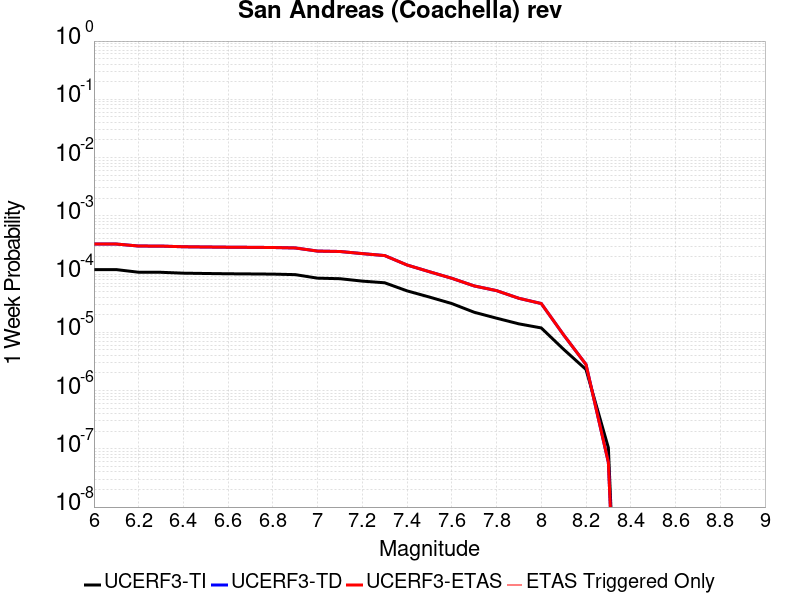 | 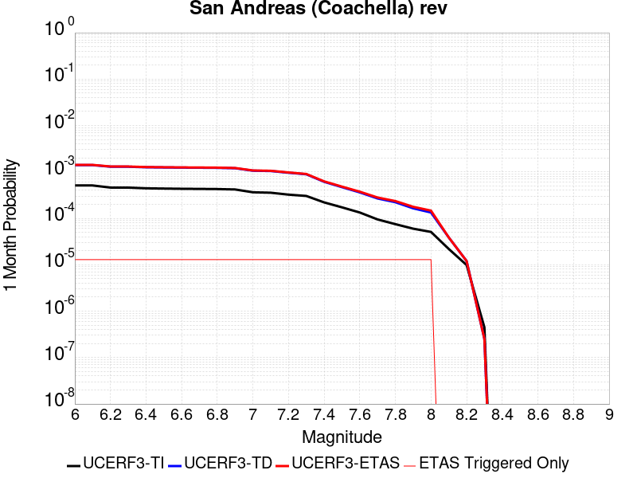 | 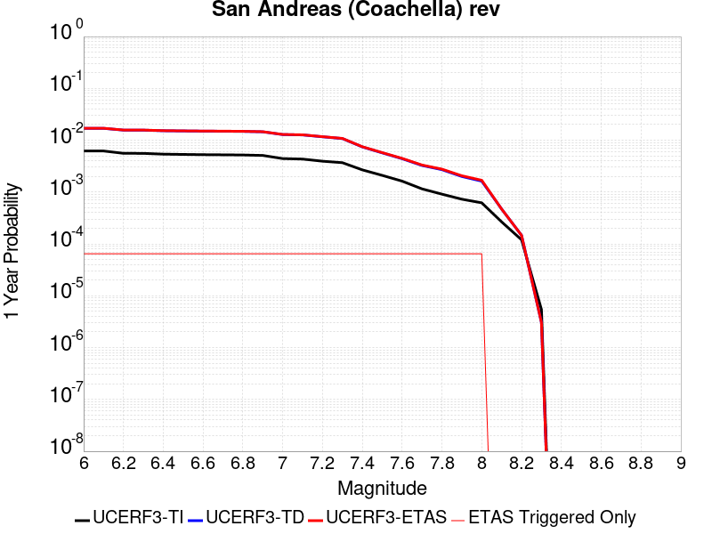 | 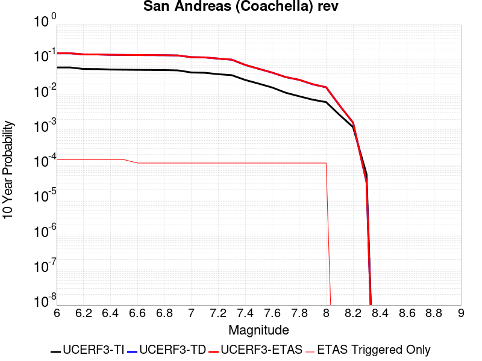 |

| Magnitude | 1 wk TI Prob | 1 wk TD Prob | 1 wk ETAS Prob | 1 wk ETAS/TD Gain | 1 wk ETAS Triggered Only | 1 mo TI Prob | 1 mo TD Prob | 1 mo ETAS Prob | 1 mo ETAS/TD Gain | 1 mo ETAS Triggered Only | 1 yr TI Prob | 1 yr TD Prob | 1 yr ETAS Prob | 1 yr ETAS/TD Gain | 1 yr ETAS Triggered Only | 10 yr TI Prob | 10 yr TD Prob | 10 yr ETAS Prob | 10 yr ETAS/TD Gain | 10 yr ETAS Triggered Only |
|-----|-----|-----|-----|-----|-----|-----|-----|-----|-----|-----|-----|-----|-----|-----|-----|-----|-----|-----|-----|-----|
| 6.0 | 1.1925945E-4 | 3.2769082E-4 | 3.2769082E-4 | 1.0 | 0.0 | 5.110118E-4 | 0.001403638 | 0.0014216633 | 1.0128418 | 1.8050541E-5 | 0.0062038354 | 0.016956726 | 0.01704545 | 1.0052323 | 9.025271E-5 | 0.060334753 | 0.15280788 | 0.1529761 | 1.0011008 | 1.9855595E-4 |
| 6.1 | 1.1925945E-4 | 3.2769082E-4 | 3.2769082E-4 | 1.0 | 0.0 | 5.110118E-4 | 0.001403638 | 0.0014216633 | 1.0128418 | 1.8050541E-5 | 0.0062038354 | 0.016956726 | 0.01704545 | 1.0052323 | 9.025271E-5 | 0.060334753 | 0.15280788 | 0.1529761 | 1.0011008 | 1.9855595E-4 |
| 6.2 | 1.07432395E-4 | 3.0269552E-4 | 3.0269552E-4 | 1.0 | 0.0 | 4.603433E-4 | 0.0012966256 | 0.0013146527 | 1.0139031 | 1.8050541E-5 | 0.005590286 | 0.01567325 | 0.015762089 | 1.0056682 | 9.025271E-5 | 0.05451731 | 0.14197943 | 0.14214979 | 1.0012 | 1.9855595E-4 |
| 6.3 | 1.0718766E-4 | 3.0214855E-4 | 3.0214855E-4 | 1.0 | 0.0 | 4.592948E-4 | 0.0012942838 | 0.0013123109 | 1.0139283 | 1.8050541E-5 | 0.005577586 | 0.015645148 | 0.015733989 | 1.0056785 | 9.025271E-5 | 0.054396555 | 0.14174773 | 0.14191814 | 1.0012022 | 1.9855595E-4 |
| 6.4 | 1.0355944E-4 | 2.9422887E-4 | 2.9422887E-4 | 1.0 | 0.0 | 4.4375064E-4 | 0.0012603754 | 0.0012784032 | 1.0143036 | 1.8050541E-5 | 0.0053892885 | 0.01523816 | 0.015327037 | 1.0058326 | 9.025271E-5 | 0.052604496 | 0.13830812 | 0.13847922 | 1.001237 | 1.9855595E-4 |
| 6.5 | 1.0227914E-4 | 2.91423E-4 | 2.91423E-4 | 1.0 | 0.0 | 4.382655E-4 | 0.0012483618 | 0.0012663899 | 1.0144414 | 1.8050541E-5 | 0.0053228354 | 0.015093931 | 0.015182821 | 1.0058892 | 9.025271E-5 | 0.051971316 | 0.13708745 | 0.13725878 | 1.0012498 | 1.9855595E-4 |
| 6.6 | 1.0116757E-4 | 2.8908032E-4 | 2.8908032E-4 | 1.0 | 0.0 | 4.3350324E-4 | 0.0012383313 | 0.0012563595 | 1.0145584 | 1.8050541E-5 | 0.0052651367 | 0.014973494 | 0.0150623955 | 1.0059372 | 9.025271E-5 | 0.051421247 | 0.13606574 | 0.13622168 | 1.0011461 | 1.8050542E-4 |
| 6.7 | 1.0050676E-4 | 2.8766584E-4 | 2.8766584E-4 | 1.0 | 0.0 | 4.3067214E-4 | 0.001232275 | 0.0012503034 | 1.0146301 | 1.8050541E-5 | 0.005230834 | 0.014900769 | 0.014989677 | 1.0059667 | 9.025271E-5 | 0.051094085 | 0.13545051 | 0.13560657 | 1.0011522 | 1.8050542E-4 |
| 6.8 | 9.976819E-5 | 2.857019E-4 | 2.857019E-4 | 1.0 | 0.0 | 4.2750788E-4 | 0.0012238661 | 0.0012418947 | 1.0147307 | 1.8050541E-5 | 0.0051924936 | 0.014799787 | 0.014888704 | 1.006008 | 9.025271E-5 | 0.050728295 | 0.13460217 | 0.13475838 | 1.0011605 | 1.8050542E-4 |
| 6.9 | 9.77719E-5 | 2.806683E-4 | 2.806683E-4 | 1.0 | 0.0 | 4.1895514E-4 | 0.0012023135 | 0.0012203424 | 1.0149951 | 1.8050541E-5 | 0.0050888555 | 0.014540915 | 0.014629856 | 1.0061165 | 9.025271E-5 | 0.049738888 | 0.13243006 | 0.13258666 | 1.0011826 | 1.8050542E-4 |
| 7.0 | 8.500761E-5 | 2.4799266E-4 | 2.4799266E-4 | 1.0 | 0.0 | 3.6426744E-4 | 0.001062396 | 0.0010804274 | 1.0169723 | 1.8050541E-5 | 0.0044259406 | 0.012858736 | 0.0129478285 | 1.0069286 | 9.025271E-5 | 0.04338823 | 0.11828246 | 0.11844161 | 1.0013455 | 1.8050542E-4 |
| 7.1 | 8.319876E-5 | 2.4401587E-4 | 2.4401587E-4 | 1.0 | 0.0 | 3.5651738E-4 | 0.0010453664 | 0.0010633981 | 1.0172491 | 1.8050541E-5 | 0.004331963 | 0.012653829 | 0.0127429385 | 1.0070422 | 9.025271E-5 | 0.042484846 | 0.11650134 | 0.11666081 | 1.0013689 | 1.8050542E-4 |
| 7.2 | 7.563917E-5 | 2.244892E-4 | 2.244892E-4 | 1.0 | 0.0 | 3.2412758E-4 | 9.6174487E-4 | 9.79778E-4 | 1.0187504 | 1.8050541E-5 | 0.0039391145 | 0.01164707 | 0.011736272 | 1.0076587 | 9.025271E-5 | 0.03870018 | 0.10790468 | 0.10806571 | 1.0014923 | 1.8050542E-4 |
| 7.3 | 7.082985E-5 | 2.0763706E-4 | 2.0763706E-4 | 1.0 | 0.0 | 3.0352117E-4 | 8.895725E-4 | 9.07607E-4 | 1.0202732 | 1.8050541E-5 | 0.0036891096 | 0.010777389 | 0.010866668 | 1.008284 | 9.025271E-5 | 0.03628465 | 0.10042321 | 0.10058559 | 1.001617 | 1.8050542E-4 |
| 7.4 | 5.146215E-5 | 1.430139E-4 | 1.430139E-4 | 1.0 | 0.0 | 2.2053342E-4 | 6.1277364E-4 | 6.3081307E-4 | 1.0294391 | 1.8050541E-5 | 0.0026816884 | 0.0074351877 | 0.0075247693 | 1.0120484 | 9.025271E-5 | 0.02649557 | 0.070969924 | 0.07113762 | 1.0023628 | 1.8050542E-4 |
| 7.5 | 4.0285166E-5 | 1.0965544E-4 | 1.0965544E-4 | 1.0 | 0.0 | 1.7263928E-4 | 4.6986755E-4 | 4.8790962E-4 | 1.0383981 | 1.8050541E-5 | 0.002099857 | 0.005705702 | 0.0057954397 | 1.0157278 | 9.025271E-5 | 0.020801254 | 0.05511772 | 0.055288274 | 1.0030944 | 1.8050542E-4 |
| 7.6 | 3.1168736E-5 | 8.460196E-5 | 8.460196E-5 | 1.0 | 0.0 | 1.3357346E-4 | 3.625296E-4 | 3.805736E-4 | 1.0497725 | 1.8050541E-5 | 0.0016250437 | 0.0044048917 | 0.0044947467 | 1.020399 | 9.025271E-5 | 0.016132116 | 0.042905994 | 0.043078754 | 1.0040265 | 1.8050542E-4 |
| 7.7 | 2.2100989E-5 | 6.2574756E-5 | 6.2574756E-5 | 1.0 | 0.0 | 9.4715084E-5 | 2.6814998E-4 | 2.861957E-4 | 1.0672971 | 1.8050541E-5 | 0.001152546 | 0.003259845 | 0.0033498036 | 1.027596 | 9.025271E-5 | 0.011465867 | 0.0319852 | 0.032159932 | 1.0054629 | 1.8050542E-4 |
| 7.8 | 1.7484861E-5 | 5.1962634E-5 | 5.1962634E-5 | 1.0 | 0.0 | 7.493296E-5 | 2.22678E-4 | 2.4072452E-4 | 1.0810431 | 1.8050541E-5 | 9.1192697E-4 | 0.002707737 | 0.0027977454 | 1.0332412 | 9.025271E-5 | 0.009081938 | 0.026716126 | 0.02687424 | 1.0059184 | 1.6245487E-4 |
| 7.9 | 1.3967285E-5 | 3.8359336E-5 | 3.8359336E-5 | 1.0 | 0.0 | 5.985842E-5 | 1.643868E-4 | 1.8243436E-4 | 1.1097872 | 1.8050541E-5 | 7.2853256E-4 | 0.0019995733 | 0.0020896455 | 1.0450457 | 9.025271E-5 | 0.0072614877 | 0.01997267 | 0.02013188 | 1.0079714 | 1.6245487E-4 |
| 8.0 | 1.1887396E-5 | 3.1182717E-5 | 3.1182717E-5 | 1.0 | 0.0 | 5.094499E-5 | 1.3363337E-4 | 1.516815E-4 | 1.1350571 | 1.8050541E-5 | 6.200787E-4 | 0.001625773 | 0.001715879 | 1.0554235 | 9.025271E-5 | 0.006183513 | 0.016334025 | 0.016493825 | 1.0097834 | 1.6245487E-4 |
| 8.1 | 5.100864E-6 | 9.021042E-6 | 9.021042E-6 | 1.0 | 0.0 | 2.1860664E-5 | 3.8661037E-5 | 3.8661037E-5 | 1.0 | 0.0 | 2.6612106E-4 | 4.7059663E-4 | 4.7059663E-4 | 1.0 | 0.0 | 0.002658026 | 0.004941467 | 0.004941467 | 1.0 | 0.0 |
| 8.2 | 2.3004484E-6 | 2.8055765E-6 | 2.8055765E-6 | 1.0 | 0.0 | 9.859027E-6 | 1.2023844E-5 | 1.2023844E-5 | 1.0 | 0.0 | 1.2002704E-4 | 1.463805E-4 | 1.463805E-4 | 1.0 | 0.0 | 0.0011996223 | 0.0016072661 | 0.0016072661 | 1.0 | 0.0 |
| 8.3 | 1.0424446E-7 | 5.8685373E-8 | 5.8685373E-8 | 1.0 | 0.0 | 4.4676187E-7 | 2.515087E-7 | 2.515087E-7 | 1.0 | 0.0 | 5.439312E-6 | 3.0621147E-6 | 3.0621147E-6 | 1.0 | 0.0 | 5.4391792E-5 | 3.2187003E-5 | 3.2187003E-5 | 1.0 | 0.0 |

## San Andreas (Carrizo) rev
*[(top)](#table-of-contents)*

| 1 Week | 1 Month | 1 Year | 10 Year |
|-----|-----|-----|-----|
| 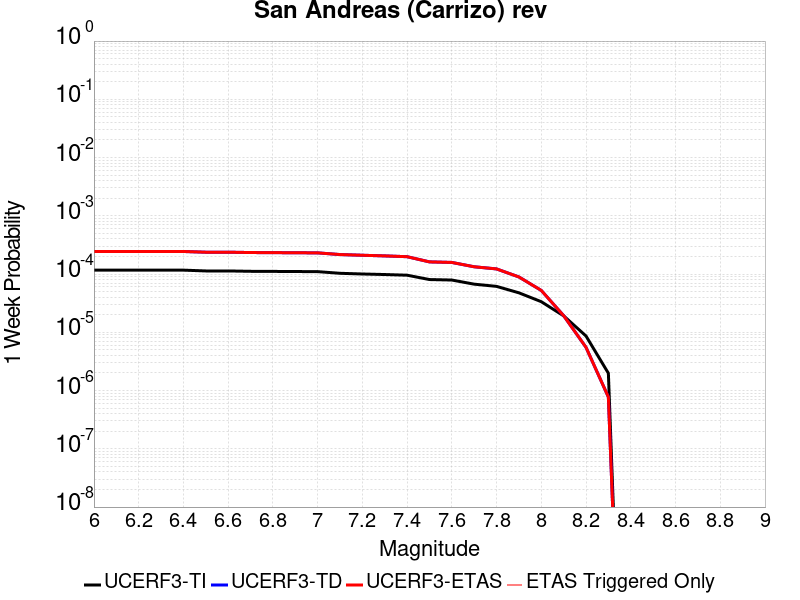 | 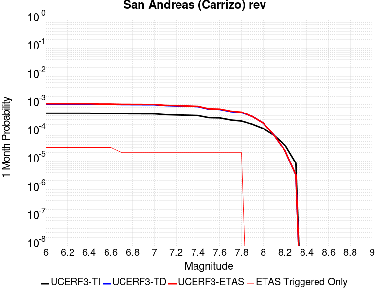 | 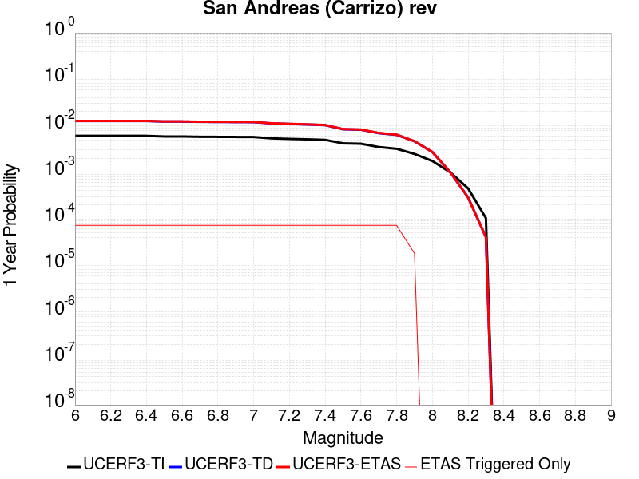 | 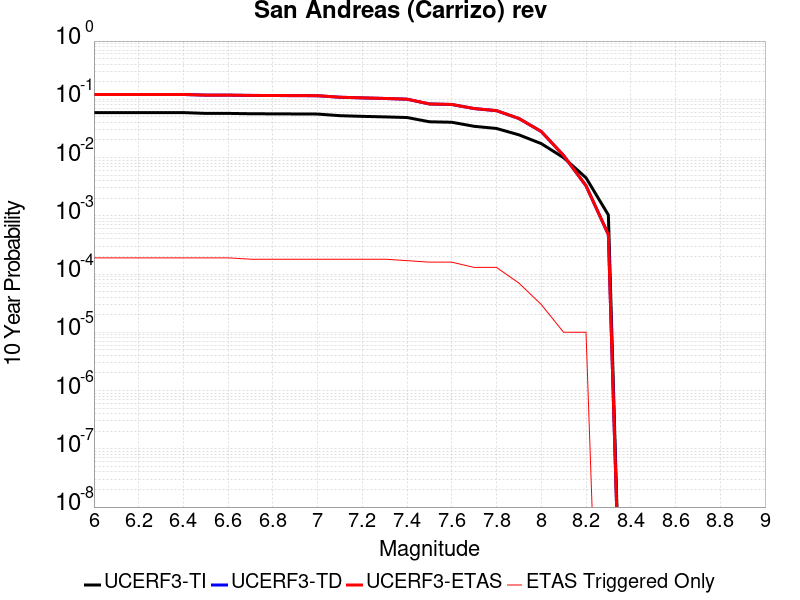 |

| Magnitude | 1 wk TI Prob | 1 wk TD Prob | 1 wk ETAS Prob | 1 wk ETAS/TD Gain | 1 wk ETAS Triggered Only | 1 mo TI Prob | 1 mo TD Prob | 1 mo ETAS Prob | 1 mo ETAS/TD Gain | 1 mo ETAS Triggered Only | 1 yr TI Prob | 1 yr TD Prob | 1 yr ETAS Prob | 1 yr ETAS/TD Gain | 1 yr ETAS Triggered Only | 10 yr TI Prob | 10 yr TD Prob | 10 yr ETAS Prob | 10 yr ETAS/TD Gain | 10 yr ETAS Triggered Only |
|-----|-----|-----|-----|-----|-----|-----|-----|-----|-----|-----|-----|-----|-----|-----|-----|-----|-----|-----|-----|-----|
| 6.0 | 1.1674632E-4 | 2.4409275E-4 | 2.4409275E-4 | 1.0 | 0.0 | 5.002454E-4 | 0.001045694 | 0.0010637257 | 1.0172437 | 1.8050541E-5 | 0.006073493 | 0.0126574915 | 0.0127287805 | 1.005632 | 7.2202165E-5 | 0.0591016 | 0.12097711 | 0.121135786 | 1.0013115 | 1.8050542E-4 |
| 6.1 | 1.1674632E-4 | 2.4409275E-4 | 2.4409275E-4 | 1.0 | 0.0 | 5.002454E-4 | 0.001045694 | 0.0010637257 | 1.0172437 | 1.8050541E-5 | 0.006073493 | 0.0126574915 | 0.0127287805 | 1.005632 | 7.2202165E-5 | 0.0591016 | 0.12097711 | 0.121135786 | 1.0013115 | 1.8050542E-4 |
| 6.2 | 1.1674632E-4 | 2.4409275E-4 | 2.4409275E-4 | 1.0 | 0.0 | 5.002454E-4 | 0.001045694 | 0.0010637257 | 1.0172437 | 1.8050541E-5 | 0.006073493 | 0.0126574915 | 0.0127287805 | 1.005632 | 7.2202165E-5 | 0.0591016 | 0.12097711 | 0.121135786 | 1.0013115 | 1.8050542E-4 |
| 6.3 | 1.1674632E-4 | 2.4409275E-4 | 2.4409275E-4 | 1.0 | 0.0 | 5.002454E-4 | 0.001045694 | 0.0010637257 | 1.0172437 | 1.8050541E-5 | 0.006073493 | 0.0126574915 | 0.0127287805 | 1.005632 | 7.2202165E-5 | 0.0591016 | 0.12097711 | 0.121135786 | 1.0013115 | 1.8050542E-4 |
| 6.4 | 1.1674632E-4 | 2.4409275E-4 | 2.4409275E-4 | 1.0 | 0.0 | 5.002454E-4 | 0.001045694 | 0.0010637257 | 1.0172437 | 1.8050541E-5 | 0.006073493 | 0.0126574915 | 0.0127287805 | 1.005632 | 7.2202165E-5 | 0.0591016 | 0.12097711 | 0.121135786 | 1.0013115 | 1.8050542E-4 |
| 6.5 | 1.13136164E-4 | 2.3728899E-4 | 2.3728899E-4 | 1.0 | 0.0 | 4.847792E-4 | 0.001016558 | 0.0010345902 | 1.0177385 | 1.8050541E-5 | 0.0058862255 | 0.012306809 | 0.012378124 | 1.0057946 | 7.2202165E-5 | 0.057327334 | 0.117948115 | 0.11810733 | 1.0013499 | 1.8050542E-4 |
| 6.6 | 1.13136164E-4 | 2.3728899E-4 | 2.3728899E-4 | 1.0 | 0.0 | 4.847792E-4 | 0.001016558 | 0.0010345902 | 1.0177385 | 1.8050541E-5 | 0.0058862255 | 0.012306809 | 0.012378124 | 1.0057946 | 7.2202165E-5 | 0.057327334 | 0.117948115 | 0.11810733 | 1.0013499 | 1.8050542E-4 |
| 6.7 | 1.1149675E-4 | 2.3419947E-4 | 2.3419947E-4 | 1.0 | 0.0 | 4.777557E-4 | 0.0010033274 | 0.0010213598 | 1.0179726 | 1.8050541E-5 | 0.0058011734 | 0.012147532 | 0.012218857 | 1.0058715 | 7.2202165E-5 | 0.05652051 | 0.11656947 | 0.11672893 | 1.0013679 | 1.8050542E-4 |
| 6.8 | 1.1103589E-4 | 2.3322001E-4 | 2.3322001E-4 | 1.0 | 0.0 | 4.7578133E-4 | 9.99133E-4 | 0.0010171655 | 1.0180482 | 1.8050541E-5 | 0.005777263 | 0.012097033 | 0.012168361 | 1.0058963 | 7.2202165E-5 | 0.056293584 | 0.11612954 | 0.11628909 | 1.0013739 | 1.8050542E-4 |
| 6.9 | 1.1053259E-4 | 2.3214269E-4 | 2.3214269E-4 | 1.0 | 0.0 | 4.7362508E-4 | 9.945194E-4 | 0.001012552 | 1.018132 | 1.8050541E-5 | 0.0057511497 | 0.012041485 | 0.012112818 | 1.0059239 | 7.2202165E-5 | 0.05604569 | 0.11564548 | 0.11580511 | 1.0013803 | 1.8050542E-4 |
| 7.0 | 1.1005377E-4 | 2.3115004E-4 | 2.3115004E-4 | 1.0 | 0.0 | 4.7157376E-4 | 9.902684E-4 | 0.001008301 | 1.0182099 | 1.8050541E-5 | 0.0057263062 | 0.0119903 | 0.012061637 | 1.0059495 | 7.2202165E-5 | 0.055809796 | 0.11519755 | 0.11535726 | 1.0013864 | 1.8050542E-4 |
| 7.1 | 1.0308142E-4 | 2.1623104E-4 | 2.1623104E-4 | 1.0 | 0.0 | 4.417027E-4 | 9.263764E-4 | 9.444102E-4 | 1.019467 | 1.8050541E-5 | 0.0053644776 | 0.011220624 | 0.011292015 | 1.0063626 | 7.2202165E-5 | 0.052368138 | 0.1084502 | 0.10861113 | 1.0014839 | 1.8050542E-4 |
| 7.2 | 1.0027479E-4 | 2.1030338E-4 | 2.1030338E-4 | 1.0 | 0.0 | 4.296783E-4 | 9.0098986E-4 | 9.1902417E-4 | 1.0200161 | 1.8050541E-5 | 0.0052187922 | 0.010914679 | 0.0109860925 | 1.0065429 | 7.2202165E-5 | 0.050979212 | 0.1057526 | 0.10591402 | 1.0015264 | 1.8050542E-4 |
| 7.3 | 9.816942E-5 | 2.0504398E-4 | 2.0504398E-4 | 1.0 | 0.0 | 4.2065824E-4 | 8.7846495E-4 | 8.9649967E-4 | 1.0205297 | 1.8050541E-5 | 0.005109493 | 0.01064315 | 0.010714583 | 1.0067117 | 7.2202165E-5 | 0.049935985 | 0.10333266 | 0.10349452 | 1.0015663 | 1.8050542E-4 |
| 7.4 | 9.5634205E-5 | 1.9872433E-4 | 1.9872433E-4 | 1.0 | 0.0 | 4.0979648E-4 | 8.513987E-4 | 8.6943386E-4 | 1.021183 | 1.8050541E-5 | 0.0049778637 | 0.010316777 | 0.010388234 | 1.0069263 | 7.2202165E-5 | 0.048678253 | 0.10041413 | 0.10056027 | 1.0014554 | 1.6245487E-4 |
| 7.5 | 8.052417E-5 | 1.6183348E-4 | 1.6183348E-4 | 1.0 | 0.0 | 3.4505792E-4 | 6.933879E-4 | 7.114259E-4 | 1.0260143 | 1.8050541E-5 | 0.0041929903 | 0.008409402 | 0.008480998 | 1.0085137 | 7.2202165E-5 | 0.04114753 | 0.08312542 | 0.08327437 | 1.0017918 | 1.6245487E-4 |
| 7.6 | 7.897024E-5 | 1.5835688E-4 | 1.5835688E-4 | 1.0 | 0.0 | 3.384E-4 | 6.7849597E-4 | 6.965343E-4 | 1.0265857 | 1.8050541E-5 | 0.0041122385 | 0.008229477 | 0.008301085 | 1.0087014 | 7.2202165E-5 | 0.040369697 | 0.08146342 | 0.08161264 | 1.0018318 | 1.6245487E-4 |
| 7.7 | 6.707427E-5 | 1.333903E-4 | 1.333903E-4 | 1.0 | 0.0 | 2.8742946E-4 | 5.715475E-4 | 5.895877E-4 | 1.0315639 | 1.8050541E-5 | 0.003493839 | 0.0069364216 | 0.007008123 | 1.0103369 | 7.2202165E-5 | 0.034394164 | 0.06933385 | 0.069468245 | 1.0019383 | 1.4440433E-4 |
| 7.8 | 6.147705E-5 | 1.2254453E-4 | 1.2254453E-4 | 1.0 | 0.0 | 2.6344648E-4 | 5.250852E-4 | 5.4312625E-4 | 1.0343584 | 1.8050541E-5 | 0.0032027436 | 0.0063741985 | 0.00644594 | 1.011255 | 7.2202165E-5 | 0.031569764 | 0.06377484 | 0.06391004 | 1.0021199 | 1.4440433E-4 |
| 7.9 | 4.7636717E-5 | 8.920885E-5 | 8.920885E-5 | 1.0 | 0.0 | 2.0414138E-4 | 3.8226764E-4 | 3.8226764E-4 | 1.0 | 0.0 | 0.0024825884 | 0.0046441844 | 0.004662151 | 1.0038687 | 1.8050541E-5 | 0.024550365 | 0.04682162 | 0.046873238 | 1.0011024 | 5.4151624E-5 |
| 8.0 | 3.3554235E-5 | 5.2390806E-5 | 5.2390806E-5 | 1.0 | 0.0 | 1.4379594E-4 | 2.245127E-4 | 2.245127E-4 | 1.0 | 0.0 | 0.0017493097 | 0.0027300175 | 0.0027300175 | 1.0 | 0.0 | 0.017356034 | 0.02800598 | 0.028023524 | 1.0006264 | 1.8050541E-5 |
| 8.1 | 1.9175432E-5 | 1.9309582E-5 | 1.9309582E-5 | 1.0 | 0.0 | 8.217783E-5 | 8.275273E-5 | 8.275273E-5 | 1.0 | 0.0 | 0.0010000558 | 0.0010070495 | 0.0010070495 | 1.0 | 0.0 | 0.009955673 | 0.010823535 | 0.010823535 | 1.0 | 0.0 |
| 8.2 | 8.643924E-6 | 5.521735E-6 | 5.521735E-6 | 1.0 | 0.0 | 3.704486E-5 | 2.3664365E-5 | 2.3664365E-5 | 1.0 | 0.0 | 4.5092785E-4 | 2.8807562E-4 | 2.8807562E-4 | 1.0 | 0.0 | 0.0045001395 | 0.0032743483 | 0.0032743483 | 1.0 | 0.0 |
| 8.3 | 1.983087E-6 | 7.740189E-7 | 7.740189E-7 | 1.0 | 0.0 | 8.498917E-6 | 3.3172198E-6 | 3.3172198E-6 | 1.0 | 0.0 | 1.034694E-4 | 4.0386418E-5 | 4.0386418E-5 | 1.0 | 0.0 | 0.0010342124 | 4.7657243E-4 | 4.7657243E-4 | 1.0 | 0.0 |

## Death Valley (Fish Lake Valley)
*[(top)](#table-of-contents)*

| 1 Week | 1 Month | 1 Year | 10 Year |
|-----|-----|-----|-----|
| 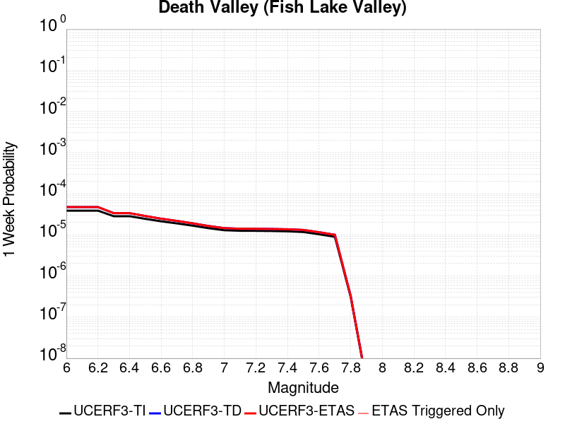 | 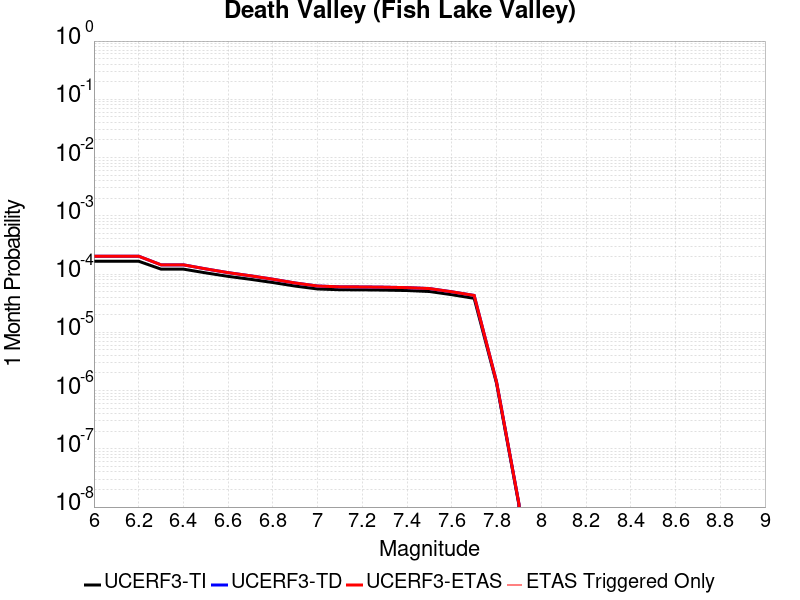 | 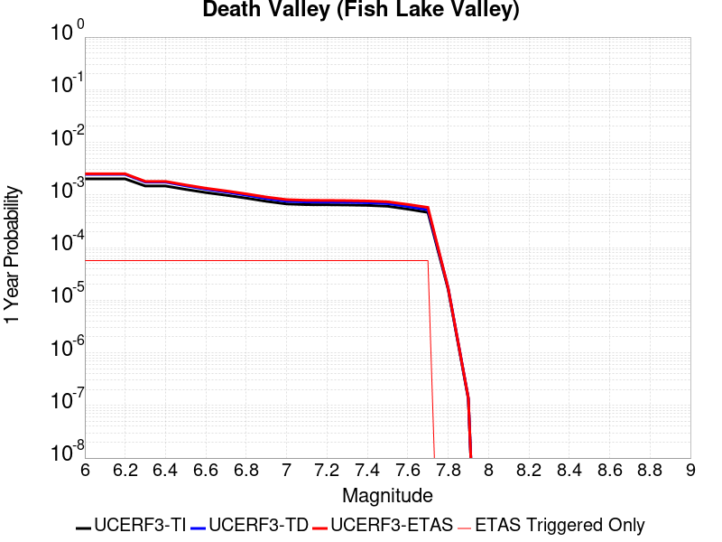 | 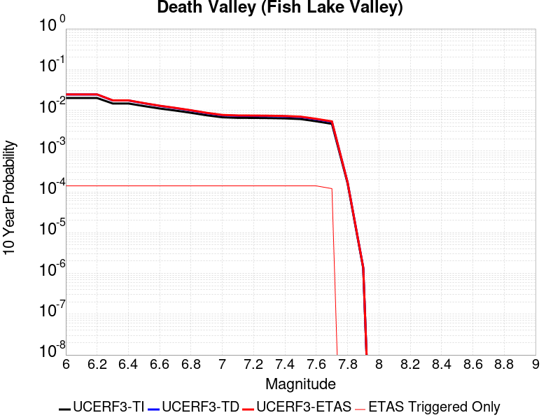 |

| Magnitude | 1 wk TI Prob | 1 wk TD Prob | 1 wk ETAS Prob | 1 wk ETAS/TD Gain | 1 wk ETAS Triggered Only | 1 mo TI Prob | 1 mo TD Prob | 1 mo ETAS Prob | 1 mo ETAS/TD Gain | 1 mo ETAS Triggered Only | 1 yr TI Prob | 1 yr TD Prob | 1 yr ETAS Prob | 1 yr ETAS/TD Gain | 1 yr ETAS Triggered Only | 10 yr TI Prob | 10 yr TD Prob | 10 yr ETAS Prob | 10 yr ETAS/TD Gain | 10 yr ETAS Triggered Only |
|-----|-----|-----|-----|-----|-----|-----|-----|-----|-----|-----|-----|-----|-----|-----|-----|-----|-----|-----|-----|-----|
| 6.0 | 3.872328E-5 | 4.728027E-5 | 4.728027E-5 | 1.0 | 0.0 | 1.6594635E-4 | 2.0261569E-4 | 2.0261569E-4 | 1.0 | 0.0 | 0.0020185246 | 0.0024641627 | 0.0025001748 | 1.0146143 | 3.6101083E-5 | 0.02000288 | 0.024394492 | 0.024570595 | 1.007219 | 1.8050542E-4 |
| 6.1 | 3.872328E-5 | 4.728027E-5 | 4.728027E-5 | 1.0 | 0.0 | 1.6594635E-4 | 2.0261569E-4 | 2.0261569E-4 | 1.0 | 0.0 | 0.0020185246 | 0.0024641627 | 0.0025001748 | 1.0146143 | 3.6101083E-5 | 0.02000288 | 0.024394492 | 0.024570595 | 1.007219 | 1.8050542E-4 |
| 6.2 | 3.872328E-5 | 4.728027E-5 | 4.728027E-5 | 1.0 | 0.0 | 1.6594635E-4 | 2.0261569E-4 | 2.0261569E-4 | 1.0 | 0.0 | 0.0020185246 | 0.0024641627 | 0.0025001748 | 1.0146143 | 3.6101083E-5 | 0.02000288 | 0.024394492 | 0.024570595 | 1.007219 | 1.8050542E-4 |
| 6.3 | 2.8356371E-5 | 3.3617434E-5 | 3.3617434E-5 | 1.0 | 0.0 | 1.2152165E-4 | 1.4406722E-4 | 1.4406722E-4 | 1.0 | 0.0 | 0.0014785219 | 0.0017526862 | 0.001788724 | 1.0205615 | 3.6101083E-5 | 0.014687235 | 0.01739563 | 0.017572997 | 1.010196 | 1.8050542E-4 |
| 6.4 | 2.8356371E-5 | 3.3617434E-5 | 3.3617434E-5 | 1.0 | 0.0 | 1.2152165E-4 | 1.4406722E-4 | 1.4406722E-4 | 1.0 | 0.0 | 0.0014785219 | 0.0017526862 | 0.001788724 | 1.0205615 | 3.6101083E-5 | 0.014687235 | 0.01739563 | 0.017572997 | 1.010196 | 1.8050542E-4 |
| 6.5 | 2.4448687E-5 | 2.8613456E-5 | 2.8613456E-5 | 1.0 | 0.0 | 1.0477588E-4 | 1.2262362E-4 | 1.2262362E-4 | 1.0 | 0.0 | 0.0012748998 | 0.0014919707 | 0.0015280179 | 1.0241609 | 3.6101083E-5 | 0.012676105 | 0.014824396 | 0.0150022255 | 1.0119958 | 1.8050542E-4 |
| 6.6 | 2.1298161E-5 | 2.466479E-5 | 2.466479E-5 | 1.0 | 0.0 | 9.127464E-5 | 1.0570215E-4 | 1.0570215E-4 | 1.0 | 0.0 | 0.0011107022 | 0.0012861978 | 0.0013222524 | 1.028032 | 3.6101083E-5 | 0.011051672 | 0.012790946 | 0.012969143 | 1.0139315 | 1.8050542E-4 |
| 6.7 | 1.8959729E-5 | 2.1784936E-5 | 2.1784936E-5 | 1.0 | 0.0 | 8.125345E-5 | 9.336081E-5 | 9.336081E-5 | 1.0 | 0.0 | 9.888117E-4 | 0.0011361007 | 0.0011721607 | 1.0317402 | 3.6101083E-5 | 0.009844234 | 0.011305587 | 0.011484052 | 1.0157856 | 1.8050542E-4 |
| 6.8 | 1.6691629E-5 | 1.9021541E-5 | 1.9021541E-5 | 1.0 | 0.0 | 7.153359E-5 | 8.151844E-5 | 8.151844E-5 | 1.0 | 0.0 | 8.7057345E-4 | 9.920519E-4 | 0.0010281173 | 1.0363542 | 3.6101083E-5 | 0.008671708 | 0.009877992 | 0.0100567145 | 1.018093 | 1.8050542E-4 |
| 6.9 | 1.450505E-5 | 1.6392094E-5 | 1.6392094E-5 | 1.0 | 0.0 | 6.216302E-5 | 7.024999E-5 | 7.024999E-5 | 1.0 | 0.0 | 7.5657194E-4 | 8.549668E-4 | 8.91037E-4 | 1.042189 | 3.6101083E-5 | 0.007540013 | 0.008517708 | 0.008696675 | 1.0210112 | 1.8050542E-4 |
| 7.0 | 1.2940855E-5 | 1.454012E-5 | 1.454012E-5 | 1.0 | 0.0 | 5.545963E-5 | 6.2313346E-5 | 6.2313346E-5 | 1.0 | 0.0 | 6.750118E-4 | 7.5840665E-4 | 7.944804E-4 | 1.0475651 | 3.6101083E-5 | 0.006729651 | 0.007558802 | 0.0077379434 | 1.0236996 | 1.8050542E-4 |
| 7.1 | 1.2544658E-5 | 1.4080268E-5 | 1.4080268E-5 | 1.0 | 0.0 | 5.3761712E-5 | 6.0342638E-5 | 6.0342638E-5 | 1.0 | 0.0 | 6.5435225E-4 | 7.344296E-4 | 7.705042E-4 | 1.0491191 | 3.6101083E-5 | 0.006524288 | 0.007320618 | 0.007499802 | 1.0244766 | 1.8050542E-4 |
| 7.2 | 1.2489416E-5 | 1.4017724E-5 | 1.4017724E-5 | 1.0 | 0.0 | 5.3524967E-5 | 6.007461E-5 | 6.007461E-5 | 1.0 | 0.0 | 6.514716E-4 | 7.311685E-4 | 7.672432E-4 | 1.0493385 | 3.6101083E-5 | 0.006495651 | 0.0072882217 | 0.0074674115 | 1.0245862 | 1.8050542E-4 |
| 7.3 | 1.2368307E-5 | 1.3881842E-5 | 1.3881842E-5 | 1.0 | 0.0 | 5.3005948E-5 | 5.9492286E-5 | 5.9492286E-5 | 1.0 | 0.0 | 6.451563E-4 | 7.2408345E-4 | 7.601584E-4 | 1.0498215 | 3.6101083E-5 | 0.0064328653 | 0.007217834 | 0.007397036 | 1.0248277 | 1.8050542E-4 |
| 7.4 | 1.2161707E-5 | 1.3649864E-5 | 1.3649864E-5 | 1.0 | 0.0 | 5.212056E-5 | 5.8498135E-5 | 5.8498135E-5 | 1.0 | 0.0 | 6.3438306E-4 | 7.1198767E-4 | 7.4806303E-4 | 1.0506686 | 3.6101083E-5 | 0.006325751 | 0.0070976545 | 0.0072768787 | 1.0252512 | 1.8050542E-4 |
| 7.5 | 1.1707948E-5 | 1.3147445E-5 | 1.3147445E-5 | 1.0 | 0.0 | 5.0175953E-5 | 5.634501E-5 | 5.634501E-5 | 1.0 | 0.0 | 6.10721E-4 | 6.8579015E-4 | 7.218665E-4 | 1.0526055 | 3.6101083E-5 | 0.0060904534 | 0.006837322 | 0.007016593 | 1.0262195 | 1.8050542E-4 |
| 7.6 | 1.0319538E-5 | 1.1581313E-5 | 1.1581313E-5 | 1.0 | 0.0 | 4.4225842E-5 | 4.9633283E-5 | 4.9633283E-5 | 1.0 | 0.0 | 5.383166E-4 | 6.041228E-4 | 6.402021E-4 | 1.0597217 | 3.6101083E-5 | 0.0053701443 | 0.006025337 | 0.006204755 | 1.0297772 | 1.8050542E-4 |
| 7.7 | 8.937764E-6 | 1.0024234E-5 | 1.0024234E-5 | 1.0 | 0.0 | 3.830414E-5 | 4.2960324E-5 | 4.2960324E-5 | 1.0 | 0.0 | 4.6625308E-4 | 5.2292144E-4 | 5.590037E-4 | 1.0690012 | 3.6101083E-5 | 0.0046527605 | 0.0052174195 | 0.0053610704 | 1.0275329 | 1.4440433E-4 |
| 7.8 | 3.108007E-7 | 3.284878E-7 | 3.284878E-7 | 1.0 | 0.0 | 1.3320023E-6 | 1.4078041E-6 | 1.4078041E-6 | 1.0 | 0.0 | 1.6217007E-5 | 1.7139884E-5 | 1.7139884E-5 | 1.0 | 0.0 | 1.6215823E-4 | 1.71386E-4 | 1.71386E-4 | 1.0 | 0.0 |
| 7.9 | 2.5591178E-9 | 2.6698093E-9 | 2.6698093E-9 | 1.0 | 0.0 | 1.0967647E-8 | 1.144204E-8 | 1.144204E-8 | 1.0 | 0.0 | 1.335311E-7 | 1.3930685E-7 | 1.3930685E-7 | 1.0 | 0.0 | 1.3353102E-6 | 1.3930684E-6 | 1.3930684E-6 | 1.0 | 0.0 |

## San Andreas (Cholame) rev
*[(top)](#table-of-contents)*

| 1 Week | 1 Month | 1 Year | 10 Year |
|-----|-----|-----|-----|
| 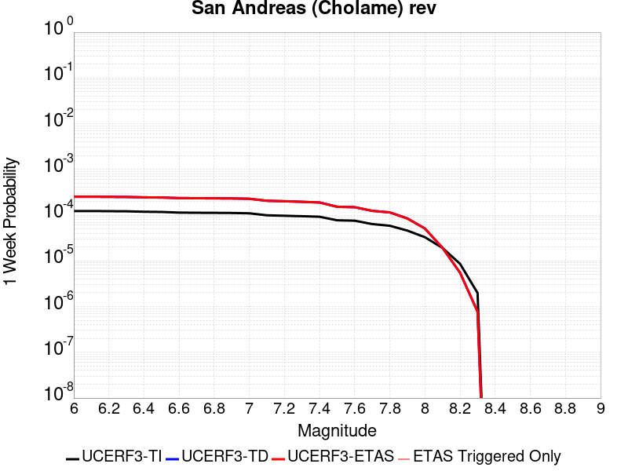 |  | 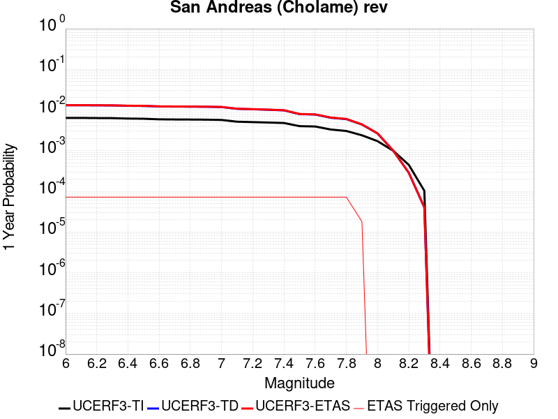 | 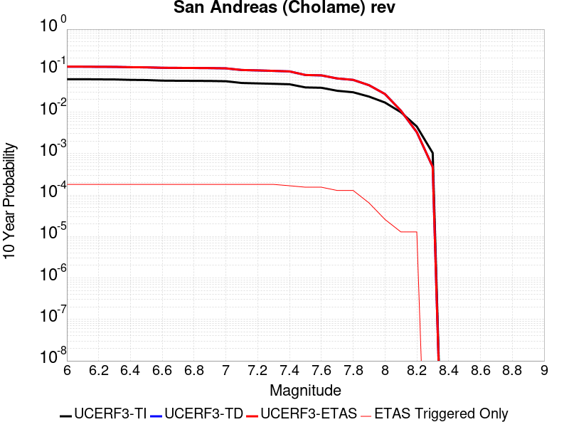 |

| Magnitude | 1 wk TI Prob | 1 wk TD Prob | 1 wk ETAS Prob | 1 wk ETAS/TD Gain | 1 wk ETAS Triggered Only | 1 mo TI Prob | 1 mo TD Prob | 1 mo ETAS Prob | 1 mo ETAS/TD Gain | 1 mo ETAS Triggered Only | 1 yr TI Prob | 1 yr TD Prob | 1 yr ETAS Prob | 1 yr ETAS/TD Gain | 1 yr ETAS Triggered Only | 10 yr TI Prob | 10 yr TD Prob | 10 yr ETAS Prob | 10 yr ETAS/TD Gain | 10 yr ETAS Triggered Only |
|-----|-----|-----|-----|-----|-----|-----|-----|-----|-----|-----|-----|-----|-----|-----|-----|-----|-----|-----|-----|-----|
| 6.0 | 1.2302514E-4 | 2.529144E-4 | 2.529144E-4 | 1.0 | 0.0 | 5.27144E-4 | 0.0010834703 | 0.0011015013 | 1.0166419 | 1.8050541E-5 | 0.0063991086 | 0.013111976 | 0.013183231 | 1.0054344 | 7.2202165E-5 | 0.06217949 | 0.12475391 | 0.1249119 | 1.0012664 | 1.8050542E-4 |
| 6.1 | 1.2302514E-4 | 2.529144E-4 | 2.529144E-4 | 1.0 | 0.0 | 5.27144E-4 | 0.0010834703 | 0.0011015013 | 1.0166419 | 1.8050541E-5 | 0.0063991086 | 0.013111976 | 0.013183231 | 1.0054344 | 7.2202165E-5 | 0.06217949 | 0.12475391 | 0.1249119 | 1.0012664 | 1.8050542E-4 |
| 6.2 | 1.2203569E-4 | 2.5108125E-4 | 2.5108125E-4 | 1.0 | 0.0 | 5.2290526E-4 | 0.0010756204 | 0.0010936515 | 1.0167634 | 1.8050541E-5 | 0.006347804 | 0.013017549 | 0.013088811 | 1.0054743 | 7.2202165E-5 | 0.061695136 | 0.12394 | 0.12409814 | 1.0012759 | 1.8050542E-4 |
| 6.3 | 1.2142645E-4 | 2.4994032E-4 | 2.4994032E-4 | 1.0 | 0.0 | 5.202953E-4 | 0.0010707347 | 0.0010887659 | 1.01684 | 1.8050541E-5 | 0.006316212 | 0.012958774 | 0.013030041 | 1.0054995 | 7.2202165E-5 | 0.06139677 | 0.12343407 | 0.12359229 | 1.0012819 | 1.8050542E-4 |
| 6.4 | 1.1865206E-4 | 2.449903E-4 | 2.449903E-4 | 1.0 | 0.0 | 5.0840975E-4 | 0.0010495376 | 0.0010675691 | 1.0171806 | 1.8050541E-5 | 0.006172335 | 0.012703734 | 0.01277502 | 1.0056113 | 7.2202165E-5 | 0.060036868 | 0.12122564 | 0.12138426 | 1.0013084 | 1.8050542E-4 |
| 6.5 | 1.17443946E-4 | 2.4291979E-4 | 2.4291979E-4 | 1.0 | 0.0 | 5.032341E-4 | 0.001040671 | 0.0010587028 | 1.0173271 | 1.8050541E-5 | 0.006109677 | 0.012597035 | 0.012668327 | 1.0056595 | 7.2202165E-5 | 0.059444077 | 0.12029885 | 0.120457634 | 1.00132 | 1.8050542E-4 |
| 6.6 | 1.13579066E-4 | 2.3599961E-4 | 2.3599961E-4 | 1.0 | 0.0 | 4.866766E-4 | 0.0010110363 | 0.0010290687 | 1.0178355 | 1.8050541E-5 | 0.0059092017 | 0.01224034 | 0.012311658 | 1.0058265 | 7.2202165E-5 | 0.057545185 | 0.11721029 | 0.11736964 | 1.0013595 | 1.8050542E-4 |
| 6.7 | 1.1271412E-4 | 2.3444067E-4 | 2.3444067E-4 | 1.0 | 0.0 | 4.829711E-4 | 0.0010043604 | 0.0010223928 | 1.0179541 | 1.8050541E-5 | 0.005864331 | 0.01215997 | 0.012231293 | 1.0058655 | 7.2202165E-5 | 0.057119697 | 0.11651334 | 0.116672814 | 1.0013688 | 1.8050542E-4 |
| 6.8 | 1.1217975E-4 | 2.333228E-4 | 2.333228E-4 | 1.0 | 0.0 | 4.8068175E-4 | 9.995732E-4 | 0.0010176057 | 1.0180402 | 1.8050541E-5 | 0.005836608 | 0.012102335 | 0.012173663 | 1.0058938 | 7.2202165E-5 | 0.056856725 | 0.11601099 | 0.116170555 | 1.0013754 | 1.8050542E-4 |
| 6.9 | 1.1146753E-4 | 2.3180798E-4 | 2.3180798E-4 | 1.0 | 0.0 | 4.7763053E-4 | 9.93086E-4 | 0.0010111186 | 1.0181582 | 1.8050541E-5 | 0.0057996577 | 0.012024229 | 0.012095563 | 1.0059326 | 7.2202165E-5 | 0.056506127 | 0.11533079 | 0.11549048 | 1.0013846 | 1.8050542E-4 |
| 7.0 | 1.0965793E-4 | 2.280346E-4 | 2.280346E-4 | 1.0 | 0.0 | 4.698779E-4 | 9.769265E-4 | 9.949595E-4 | 1.0184588 | 1.8050541E-5 | 0.005705768 | 0.011829641 | 0.011900988 | 1.0060313 | 7.2202165E-5 | 0.055614736 | 0.11363039 | 0.113790385 | 1.001408 | 1.8050542E-4 |
| 7.1 | 9.927982E-5 | 2.0619403E-4 | 2.0619403E-4 | 1.0 | 0.0 | 4.2541555E-4 | 8.833905E-4 | 9.014251E-4 | 1.0204152 | 1.8050541E-5 | 0.0051671406 | 0.0107025355 | 0.010773965 | 1.006674 | 7.2202165E-5 | 0.05048634 | 0.10371644 | 0.10387822 | 1.0015599 | 1.8050542E-4 |
| 7.2 | 9.696786E-5 | 2.012308E-4 | 2.012308E-4 | 1.0 | 0.0 | 4.1551032E-4 | 8.621337E-4 | 8.801687E-4 | 1.020919 | 1.8050541E-5 | 0.00504711 | 0.010446244 | 0.010517692 | 1.0068396 | 7.2202165E-5 | 0.04934009 | 0.10145297 | 0.10161516 | 1.0015987 | 1.8050542E-4 |
| 7.3 | 9.4727984E-5 | 1.9551098E-4 | 1.9551098E-4 | 1.0 | 0.0 | 4.0591392E-4 | 8.376361E-4 | 8.5567153E-4 | 1.0215313 | 1.8050541E-5 | 0.0049308087 | 0.010150803 | 0.010222273 | 1.0070407 | 7.2202165E-5 | 0.048228268 | 0.09881986 | 0.09898253 | 1.0016462 | 1.8050542E-4 |
| 7.4 | 9.220358E-5 | 1.8920207E-4 | 1.8920207E-4 | 1.0 | 0.0 | 3.9509835E-4 | 8.1061496E-4 | 8.2865084E-4 | 1.0222497 | 1.8050541E-5 | 0.004799717 | 0.009824826 | 0.009896319 | 1.0072768 | 7.2202165E-5 | 0.046973653 | 0.09589291 | 0.09603979 | 1.0015317 | 1.6245487E-4 |
| 7.5 | 7.71631E-5 | 1.5245432E-4 | 1.5245432E-4 | 1.0 | 0.0 | 3.306571E-4 | 6.532122E-4 | 6.71251E-4 | 1.0276154 | 1.8050541E-5 | 0.0040183207 | 0.007923931 | 0.007995561 | 1.0090398 | 7.2202165E-5 | 0.03946433 | 0.078587525 | 0.078737214 | 1.0019047 | 1.6245487E-4 |
| 7.6 | 7.5634416E-5 | 1.4904009E-4 | 1.4904009E-4 | 1.0 | 0.0 | 3.241072E-4 | 6.3858705E-4 | 6.5662607E-4 | 1.0282483 | 1.8050541E-5 | 0.0039388672 | 0.007747149 | 0.007818792 | 1.0092477 | 7.2202165E-5 | 0.038697794 | 0.07694771 | 0.07709766 | 1.0019488 | 1.6245487E-4 |
| 7.7 | 6.3783E-5 | 1.2418408E-4 | 1.2418408E-4 | 1.0 | 0.0 | 2.7332708E-4 | 5.3210894E-4 | 5.501499E-4 | 1.0339046 | 1.8050541E-5 | 0.0033226798 | 0.0064592096 | 0.006530945 | 1.011106 | 7.2202165E-5 | 0.032734364 | 0.06481314 | 0.06494819 | 1.0020837 | 1.4440433E-4 |
| 7.8 | 5.863422E-5 | 1.1470383E-4 | 1.1470383E-4 | 1.0 | 0.0 | 2.512653E-4 | 4.9149524E-4 | 5.0953694E-4 | 1.0367078 | 1.8050541E-5 | 0.003054864 | 0.0059675574 | 0.006039329 | 1.0120269 | 7.2202165E-5 | 0.030132094 | 0.059908487 | 0.06004424 | 1.002266 | 1.4440433E-4 |
| 7.9 | 4.595283E-5 | 8.4660125E-5 | 8.4660125E-5 | 1.0 | 0.0 | 1.9692584E-4 | 3.6277866E-4 | 3.6277866E-4 | 1.0 | 0.0 | 0.0023949358 | 0.004407892 | 0.004425863 | 1.004077 | 1.8050541E-5 | 0.023692891 | 0.044549488 | 0.044601228 | 1.0011613 | 5.4151624E-5 |
| 8.0 | 3.2950178E-5 | 5.1022096E-5 | 5.1022096E-5 | 1.0 | 0.0 | 1.412074E-4 | 2.1864781E-4 | 2.1864781E-4 | 1.0 | 0.0 | 0.0017178444 | 0.002658789 | 0.002658789 | 1.0 | 0.0 | 0.017046256 | 0.02730302 | 0.027320577 | 1.000643 | 1.8050541E-5 |
| 8.1 | 1.9177472E-5 | 1.9309755E-5 | 1.9309755E-5 | 1.0 | 0.0 | 8.218658E-5 | 8.275347E-5 | 8.275347E-5 | 1.0 | 0.0 | 0.0010001622 | 0.0010070584 | 0.0010070584 | 1.0 | 0.0 | 0.009956728 | 0.010823652 | 0.010823652 | 1.0 | 0.0 |
| 8.2 | 8.643924E-6 | 5.521735E-6 | 5.521735E-6 | 1.0 | 0.0 | 3.704486E-5 | 2.3664365E-5 | 2.3664365E-5 | 1.0 | 0.0 | 4.5092785E-4 | 2.8807562E-4 | 2.8807562E-4 | 1.0 | 0.0 | 0.0045001395 | 0.0032743483 | 0.0032743483 | 1.0 | 0.0 |
| 8.3 | 1.983087E-6 | 7.740189E-7 | 7.740189E-7 | 1.0 | 0.0 | 8.498917E-6 | 3.3172198E-6 | 3.3172198E-6 | 1.0 | 0.0 | 1.034694E-4 | 4.0386418E-5 | 4.0386418E-5 | 1.0 | 0.0 | 0.0010342124 | 4.7657243E-4 | 4.7657243E-4 | 1.0 | 0.0 |

## Cady
*[(top)](#table-of-contents)*

| 1 Week | 1 Month | 1 Year | 10 Year |
|-----|-----|-----|-----|
| 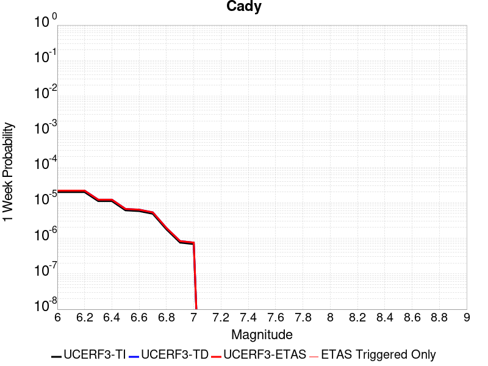 | 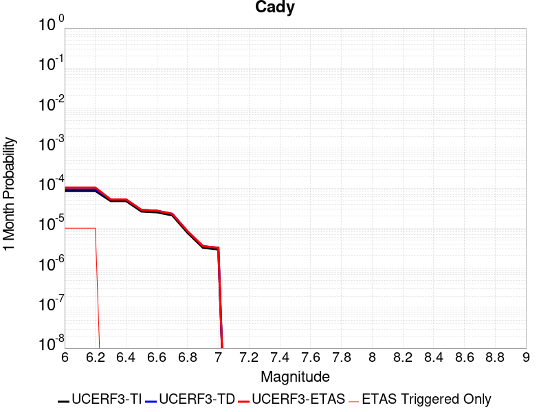 | 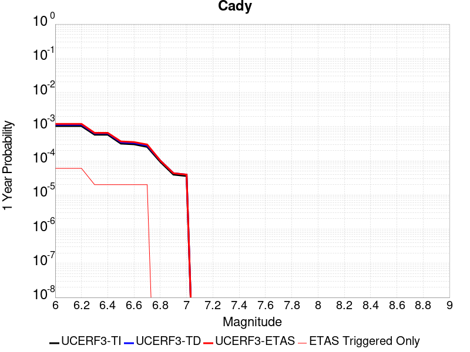 | 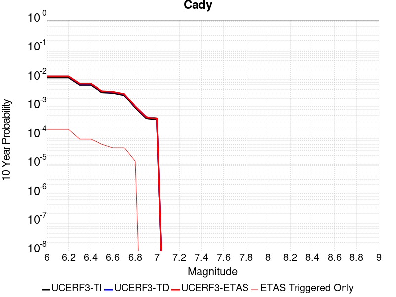 |

| Magnitude | 1 wk TI Prob | 1 wk TD Prob | 1 wk ETAS Prob | 1 wk ETAS/TD Gain | 1 wk ETAS Triggered Only | 1 mo TI Prob | 1 mo TD Prob | 1 mo ETAS Prob | 1 mo ETAS/TD Gain | 1 mo ETAS Triggered Only | 1 yr TI Prob | 1 yr TD Prob | 1 yr ETAS Prob | 1 yr ETAS/TD Gain | 1 yr ETAS Triggered Only | 10 yr TI Prob | 10 yr TD Prob | 10 yr ETAS Prob | 10 yr ETAS/TD Gain | 10 yr ETAS Triggered Only |
|-----|-----|-----|-----|-----|-----|-----|-----|-----|-----|-----|-----|-----|-----|-----|-----|-----|-----|-----|-----|-----|
| 6.0 | 1.9892565E-5 | 2.186131E-5 | 2.186131E-5 | 1.0 | 0.0 | 8.525106E-5 | 9.3688475E-5 | 9.3688475E-5 | 1.0 | 0.0 | 0.0010374374 | 0.0011401513 | 0.0011942411 | 1.047441 | 5.4151624E-5 | 0.010326075 | 0.011352034 | 0.011512645 | 1.0141482 | 1.6245487E-4 |
| 6.1 | 1.9892565E-5 | 2.186131E-5 | 2.186131E-5 | 1.0 | 0.0 | 8.525106E-5 | 9.3688475E-5 | 9.3688475E-5 | 1.0 | 0.0 | 0.0010374374 | 0.0011401513 | 0.0011942411 | 1.047441 | 5.4151624E-5 | 0.010326075 | 0.011352034 | 0.011512645 | 1.0141482 | 1.6245487E-4 |
| 6.2 | 1.9892565E-5 | 2.186131E-5 | 2.186131E-5 | 1.0 | 0.0 | 8.525106E-5 | 9.3688475E-5 | 9.3688475E-5 | 1.0 | 0.0 | 0.0010374374 | 0.0011401513 | 0.0011942411 | 1.047441 | 5.4151624E-5 | 0.010326075 | 0.011352034 | 0.011512645 | 1.0141482 | 1.6245487E-4 |
| 6.3 | 1.1117327E-5 | 1.2177969E-5 | 1.2177969E-5 | 1.0 | 0.0 | 4.764482E-5 | 5.219043E-5 | 5.219043E-5 | 1.0 | 0.0 | 5.7992124E-4 | 6.3526473E-4 | 6.3526473E-4 | 1.0 | 0.0 | 0.0057841022 | 0.0063375947 | 0.006409339 | 1.0113205 | 7.2202165E-5 |
| 6.4 | 1.1117327E-5 | 1.2177969E-5 | 1.2177969E-5 | 1.0 | 0.0 | 4.764482E-5 | 5.219043E-5 | 5.219043E-5 | 1.0 | 0.0 | 5.7992124E-4 | 6.3526473E-4 | 6.3526473E-4 | 1.0 | 0.0 | 0.0057841022 | 0.0063375947 | 0.006409339 | 1.0113205 | 7.2202165E-5 |
| 6.5 | 6.103093E-6 | 6.672764E-6 | 6.672764E-6 | 1.0 | 0.0 | 2.615585E-5 | 2.8597316E-5 | 2.8597316E-5 | 1.0 | 0.0 | 3.1840094E-4 | 3.4812925E-4 | 3.4812925E-4 | 1.0 | 0.0 | 0.0031794512 | 0.0034770733 | 0.0035130489 | 1.0103465 | 3.6101083E-5 |
| 6.6 | 5.817237E-6 | 6.3663756E-6 | 6.3663756E-6 | 1.0 | 0.0 | 2.4930776E-5 | 2.7284252E-5 | 2.7284252E-5 | 1.0 | 0.0 | 3.034899E-4 | 3.3214758E-4 | 3.3214758E-4 | 1.0 | 0.0 | 0.0030307577 | 0.0033177338 | 0.0033357244 | 1.0054226 | 1.8050541E-5 |
| 6.7 | 4.8846314E-6 | 5.3411636E-6 | 5.3411636E-6 | 1.0 | 0.0 | 2.0933967E-5 | 2.2890566E-5 | 2.2890566E-5 | 1.0 | 0.0 | 2.5484123E-4 | 2.786688E-4 | 2.786688E-4 | 1.0 | 0.0 | 0.0025454918 | 0.0027843493 | 0.0028023496 | 1.0064648 | 1.8050541E-5 |
| 6.8 | 1.7788773E-6 | 1.9401177E-6 | 1.9401177E-6 | 1.0 | 0.0 | 7.6237375E-6 | 8.3147725E-6 | 8.3147725E-6 | 1.0 | 0.0 | 9.281505E-5 | 1.01229234E-4 | 1.01229234E-4 | 1.0 | 0.0 | 9.2776294E-4 | 0.0010119858 | 0.0010300181 | 1.0178187 | 1.8050541E-5 |
| 6.9 | 7.5455404E-7 | 8.2980785E-7 | 8.2980785E-7 | 1.0 | 0.0 | 3.233799E-6 | 3.5563164E-6 | 3.5563164E-6 | 1.0 | 0.0 | 3.937079E-5 | 4.329763E-5 | 4.329763E-5 | 1.0 | 0.0 | 3.9363815E-4 | 4.329249E-4 | 4.329249E-4 | 1.0 | 0.0 |
| 7.0 | 6.8578805E-7 | 7.542714E-7 | 7.542714E-7 | 1.0 | 0.0 | 2.9390883E-6 | 3.2325895E-6 | 3.2325895E-6 | 1.0 | 0.0 | 3.578281E-5 | 3.9356397E-5 | 3.9356397E-5 | 1.0 | 0.0 | 3.577705E-4 | 3.9352677E-4 | 3.9352677E-4 | 1.0 | 0.0 |

## Red Pass
*[(top)](#table-of-contents)*

| 1 Week | 1 Month | 1 Year | 10 Year |
|-----|-----|-----|-----|
|  | 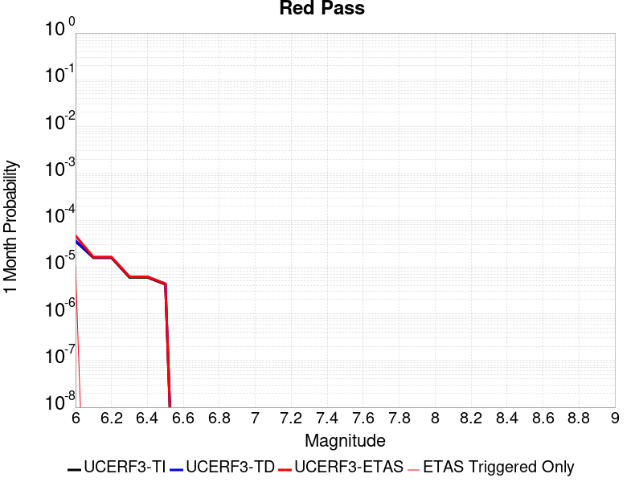 | 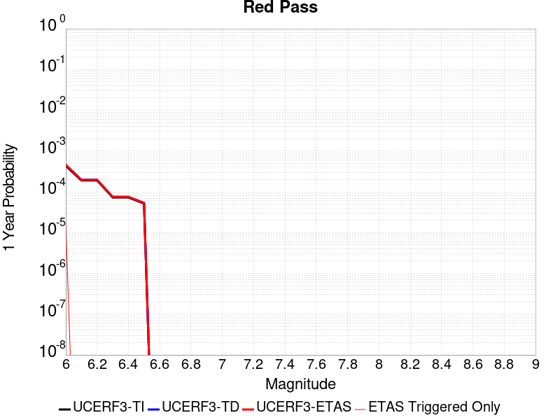 | 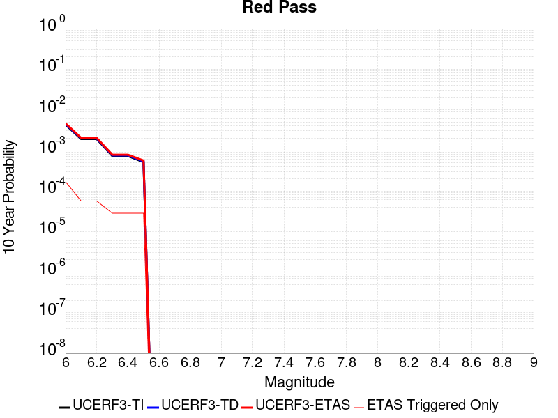 |

| Magnitude | 1 wk TI Prob | 1 wk TD Prob | 1 wk ETAS Prob | 1 wk ETAS/TD Gain | 1 wk ETAS Triggered Only | 1 mo TI Prob | 1 mo TD Prob | 1 mo ETAS Prob | 1 mo ETAS/TD Gain | 1 mo ETAS Triggered Only | 1 yr TI Prob | 1 yr TD Prob | 1 yr ETAS Prob | 1 yr ETAS/TD Gain | 1 yr ETAS Triggered Only | 10 yr TI Prob | 10 yr TD Prob | 10 yr ETAS Prob | 10 yr ETAS/TD Gain | 10 yr ETAS Triggered Only |
|-----|-----|-----|-----|-----|-----|-----|-----|-----|-----|-----|-----|-----|-----|-----|-----|-----|-----|-----|-----|-----|
| 6.0 | 8.258278E-6 | 8.551627E-6 | 8.551627E-6 | 1.0 | 0.0 | 3.539214E-5 | 3.6649417E-5 | 5.4699296E-5 | 1.4925011 | 1.8050541E-5 | 4.308141E-4 | 4.4613317E-4 | 4.6417565E-4 | 1.040442 | 1.8050541E-5 | 0.0042997985 | 0.004454133 | 0.004579924 | 1.0282414 | 1.2635379E-4 |
| 6.1 | 3.649988E-6 | 3.7754708E-6 | 3.7754708E-6 | 1.0 | 0.0 | 1.5642712E-5 | 1.6180516E-5 | 1.6180516E-5 | 1.0 | 0.0 | 1.9043336E-4 | 1.9698474E-4 | 1.9698474E-4 | 1.0 | 0.0 | 0.0019027026 | 0.0019685687 | 0.0020045987 | 1.0183027 | 3.6101083E-5 |
| 6.2 | 3.649988E-6 | 3.7754708E-6 | 3.7754708E-6 | 1.0 | 0.0 | 1.5642712E-5 | 1.6180516E-5 | 1.6180516E-5 | 1.0 | 0.0 | 1.9043336E-4 | 1.9698474E-4 | 1.9698474E-4 | 1.0 | 0.0 | 0.0019027026 | 0.0019685687 | 0.0020045987 | 1.0183027 | 3.6101083E-5 |
| 6.3 | 1.3924937E-6 | 1.4411767E-6 | 1.4411767E-6 | 1.0 | 0.0 | 5.9678164E-6 | 6.176465E-6 | 6.176465E-6 | 1.0 | 0.0 | 7.265574E-5 | 7.5197284E-5 | 7.5197284E-5 | 1.0 | 0.0 | 7.263199E-4 | 7.518571E-4 | 7.698941E-4 | 1.0239899 | 1.8050541E-5 |
| 6.4 | 1.3924937E-6 | 1.4411767E-6 | 1.4411767E-6 | 1.0 | 0.0 | 5.9678164E-6 | 6.176465E-6 | 6.176465E-6 | 1.0 | 0.0 | 7.265574E-5 | 7.5197284E-5 | 7.5197284E-5 | 1.0 | 0.0 | 7.263199E-4 | 7.518571E-4 | 7.698941E-4 | 1.0239899 | 1.8050541E-5 |
| 6.5 | 9.876812E-7 | 1.0222338E-6 | 1.0222338E-6 | 1.0 | 0.0 | 4.2329125E-6 | 4.3810023E-6 | 4.3810023E-6 | 1.0 | 0.0 | 5.153449E-5 | 5.3338703E-5 | 5.3338703E-5 | 1.0 | 0.0 | 5.1522546E-4 | 5.33387E-4 | 5.5142795E-4 | 1.0338233 | 1.8050541E-5 |

## Sierra Nevada  (No Extension)
*[(top)](#table-of-contents)*

| 1 Week | 1 Month | 1 Year | 10 Year |
|-----|-----|-----|-----|
| 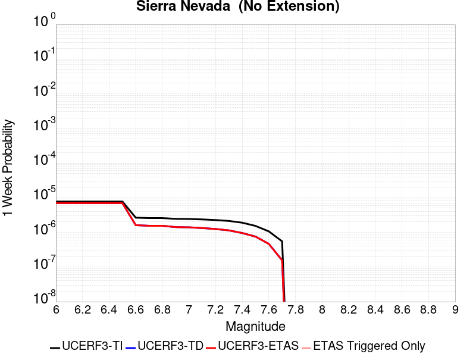 | 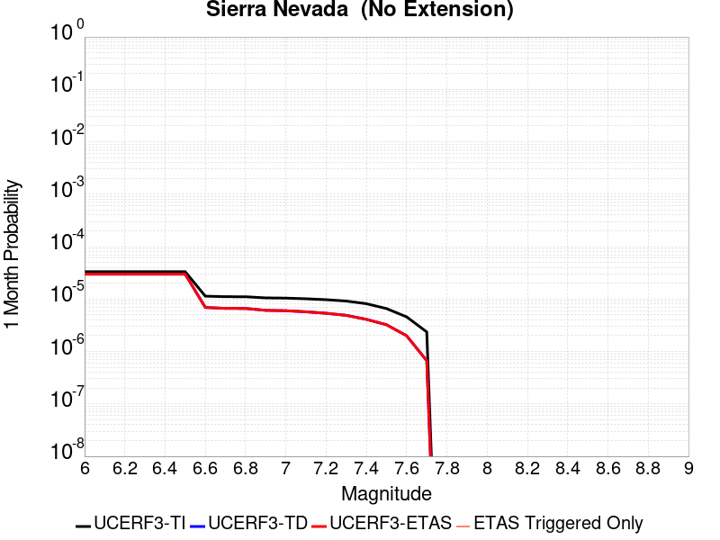 | 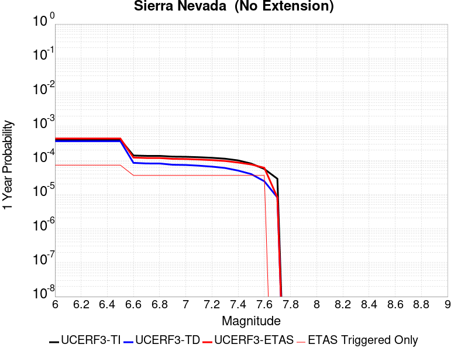 | 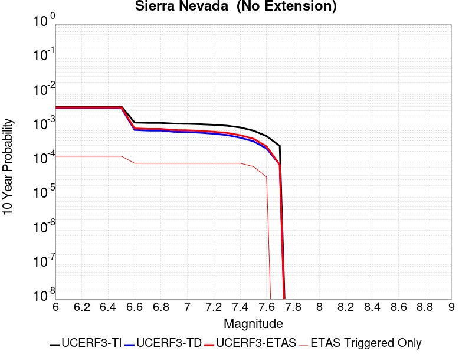 |

| Magnitude | 1 wk TI Prob | 1 wk TD Prob | 1 wk ETAS Prob | 1 wk ETAS/TD Gain | 1 wk ETAS Triggered Only | 1 mo TI Prob | 1 mo TD Prob | 1 mo ETAS Prob | 1 mo ETAS/TD Gain | 1 mo ETAS Triggered Only | 1 yr TI Prob | 1 yr TD Prob | 1 yr ETAS Prob | 1 yr ETAS/TD Gain | 1 yr ETAS Triggered Only | 10 yr TI Prob | 10 yr TD Prob | 10 yr ETAS Prob | 10 yr ETAS/TD Gain | 10 yr ETAS Triggered Only |
|-----|-----|-----|-----|-----|-----|-----|-----|-----|-----|-----|-----|-----|-----|-----|-----|-----|-----|-----|-----|-----|
| 6.0 | 7.7690465E-6 | 6.9768753E-6 | 6.9768753E-6 | 1.0 | 0.0 | 3.329549E-5 | 2.9900753E-5 | 2.9900753E-5 | 1.0 | 0.0 | 4.0529718E-4 | 3.640167E-4 | 4.3619258E-4 | 1.1982763 | 7.2202165E-5 | 0.004045588 | 0.0036377208 | 0.0037816 | 1.039552 | 1.4440433E-4 |
| 6.1 | 7.7690465E-6 | 6.9768753E-6 | 6.9768753E-6 | 1.0 | 0.0 | 3.329549E-5 | 2.9900753E-5 | 2.9900753E-5 | 1.0 | 0.0 | 4.0529718E-4 | 3.640167E-4 | 4.3619258E-4 | 1.1982763 | 7.2202165E-5 | 0.004045588 | 0.0036377208 | 0.0037816 | 1.039552 | 1.4440433E-4 |
| 6.2 | 7.7690465E-6 | 6.9768753E-6 | 6.9768753E-6 | 1.0 | 0.0 | 3.329549E-5 | 2.9900753E-5 | 2.9900753E-5 | 1.0 | 0.0 | 4.0529718E-4 | 3.640167E-4 | 4.3619258E-4 | 1.1982763 | 7.2202165E-5 | 0.004045588 | 0.0036377208 | 0.0037816 | 1.039552 | 1.4440433E-4 |
| 6.3 | 7.7690465E-6 | 6.9768753E-6 | 6.9768753E-6 | 1.0 | 0.0 | 3.329549E-5 | 2.9900753E-5 | 2.9900753E-5 | 1.0 | 0.0 | 4.0529718E-4 | 3.640167E-4 | 4.3619258E-4 | 1.1982763 | 7.2202165E-5 | 0.004045588 | 0.0036377208 | 0.0037816 | 1.039552 | 1.4440433E-4 |
| 6.4 | 7.7690465E-6 | 6.9768753E-6 | 6.9768753E-6 | 1.0 | 0.0 | 3.329549E-5 | 2.9900753E-5 | 2.9900753E-5 | 1.0 | 0.0 | 4.0529718E-4 | 3.640167E-4 | 4.3619258E-4 | 1.1982763 | 7.2202165E-5 | 0.004045588 | 0.0036377208 | 0.0037816 | 1.039552 | 1.4440433E-4 |
| 6.5 | 7.7690465E-6 | 6.9768753E-6 | 6.9768753E-6 | 1.0 | 0.0 | 3.329549E-5 | 2.9900753E-5 | 2.9900753E-5 | 1.0 | 0.0 | 4.0529718E-4 | 3.640167E-4 | 4.3619258E-4 | 1.1982763 | 7.2202165E-5 | 0.004045588 | 0.0036377208 | 0.0037816 | 1.039552 | 1.4440433E-4 |
| 6.6 | 2.653E-6 | 1.6151004E-6 | 1.6151004E-6 | 1.0 | 0.0 | 1.136995E-5 | 6.9218404E-6 | 6.9218404E-6 | 1.0 | 0.0 | 1.3842035E-4 | 8.4270185E-5 | 1.20368226E-4 | 1.4283608 | 3.6101083E-5 | 0.0013833415 | 8.423857E-4 | 9.325624E-4 | 1.1070491 | 9.025271E-5 |
| 6.7 | 2.5902466E-6 | 1.5504315E-6 | 1.5504315E-6 | 1.0 | 0.0 | 1.11010095E-5 | 6.64469E-6 | 6.64469E-6 | 1.0 | 0.0 | 1.351464E-4 | 8.089613E-5 | 1.1699429E-4 | 1.4462286 | 3.6101083E-5 | 0.0013506424 | 8.086698E-4 | 8.9884945E-4 | 1.1115161 | 9.025271E-5 |
| 6.8 | 2.5853892E-6 | 1.5472307E-6 | 1.5472307E-6 | 1.0 | 0.0 | 1.1080193E-5 | 6.6309717E-6 | 6.6309717E-6 | 1.0 | 0.0 | 1.34893E-4 | 8.072912E-5 | 1.1682729E-4 | 1.4471518 | 3.6101083E-5 | 0.0013481114 | 8.070009E-4 | 8.971808E-4 | 1.1117469 | 9.025271E-5 |
| 6.9 | 2.458257E-6 | 1.4222994E-6 | 1.4222994E-6 | 1.0 | 0.0 | 1.0535345E-5 | 6.095555E-6 | 6.095555E-6 | 1.0 | 0.0 | 1.2826028E-4 | 7.4210875E-5 | 1.1030928E-4 | 1.4864302 | 3.6101083E-5 | 0.0012818627 | 7.4186287E-4 | 8.3204865E-4 | 1.1215667 | 9.025271E-5 |
| 7.0 | 2.4341468E-6 | 1.3992621E-6 | 1.3992621E-6 | 1.0 | 0.0 | 1.0432016E-5 | 5.9968243E-6 | 5.9968243E-6 | 1.0 | 0.0 | 1.270024E-4 | 7.300891E-5 | 1.0910735E-4 | 1.494439 | 3.6101083E-5 | 0.0012692984 | 7.2985113E-4 | 8.2003797E-4 | 1.1235688 | 9.025271E-5 |
| 7.1 | 2.3652476E-6 | 1.3342084E-6 | 1.3342084E-6 | 1.0 | 0.0 | 1.0136736E-5 | 5.7180237E-6 | 5.7180237E-6 | 1.0 | 0.0 | 1.2340778E-4 | 6.961473E-5 | 1.057133E-4 | 1.5185479 | 3.6101083E-5 | 0.0012333926 | 6.959309E-4 | 7.861208E-4 | 1.129596 | 9.025271E-5 |
| 7.2 | 2.272158E-6 | 1.2505096E-6 | 1.2505096E-6 | 1.0 | 0.0 | 9.737784E-6 | 5.359316E-6 | 5.359316E-6 | 1.0 | 0.0 | 1.1855107E-4 | 6.524773E-5 | 1.01346464E-4 | 1.5532564 | 3.6101083E-5 | 0.0011848784 | 6.522873E-4 | 7.424811E-4 | 1.1382732 | 9.025271E-5 |
| 7.3 | 2.1382127E-6 | 1.1421906E-6 | 1.1421906E-6 | 1.0 | 0.0 | 9.163737E-6 | 4.8950933E-6 | 4.8950933E-6 | 1.0 | 0.0 | 1.1156279E-4 | 5.9596146E-5 | 9.5695075E-5 | 1.605726 | 3.6101083E-5 | 0.001115068 | 5.958028E-4 | 6.8600173E-4 | 1.1513906 | 9.025271E-5 |
| 7.4 | 1.9048055E-6 | 9.577328E-7 | 9.577328E-7 | 1.0 | 0.0 | 8.163426E-6 | 4.104563E-6 | 4.104563E-6 | 1.0 | 0.0 | 9.9385186E-5 | 4.9971914E-5 | 8.6071195E-5 | 1.7223914 | 3.6101083E-5 | 9.934074E-4 | 4.996075E-4 | 5.898151E-4 | 1.180557 | 9.025271E-5 |
| 7.5 | 1.5373403E-6 | 7.561819E-7 | 7.561819E-7 | 1.0 | 0.0 | 6.5885843E-6 | 3.2407756E-6 | 3.2407756E-6 | 1.0 | 0.0 | 8.021306E-5 | 3.9455732E-5 | 7.555539E-5 | 1.9149407 | 3.6101083E-5 | 8.0184115E-4 | 3.9448775E-4 | 4.6666144E-4 | 1.1829555 | 7.2202165E-5 |
| 7.6 | 1.0680322E-6 | 4.6609216E-7 | 4.6609216E-7 | 1.0 | 0.0 | 4.577273E-6 | 1.9975362E-6 | 1.9975362E-6 | 1.0 | 0.0 | 5.5726876E-5 | 2.4319736E-5 | 6.041994E-5 | 2.4843996 | 3.6101083E-5 | 5.5712904E-4 | 2.43171E-4 | 2.792633E-4 | 1.1484236 | 3.6101083E-5 |
| 7.7 | 5.509146E-7 | 1.558691E-7 | 1.558691E-7 | 1.0 | 0.0 | 2.3610605E-6 | 6.680103E-7 | 6.680103E-7 | 1.0 | 0.0 | 2.8745531E-5 | 8.132996E-6 | 8.132996E-6 | 1.0 | 0.0 | 2.8741814E-4 | 8.1327096E-5 | 8.1327096E-5 | 1.0 | 0.0 |

## Mission Ridge-Arroyo Parida-Santa Ana
*[(top)](#table-of-contents)*

| 1 Week | 1 Month | 1 Year | 10 Year |
|-----|-----|-----|-----|
| 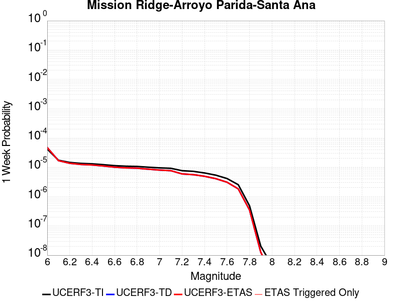 | 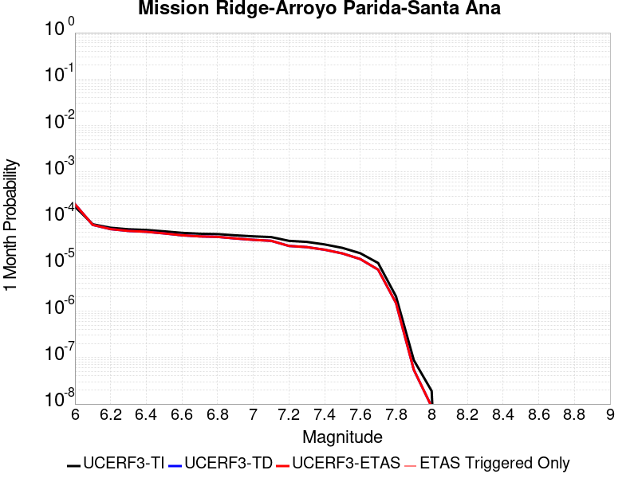 | 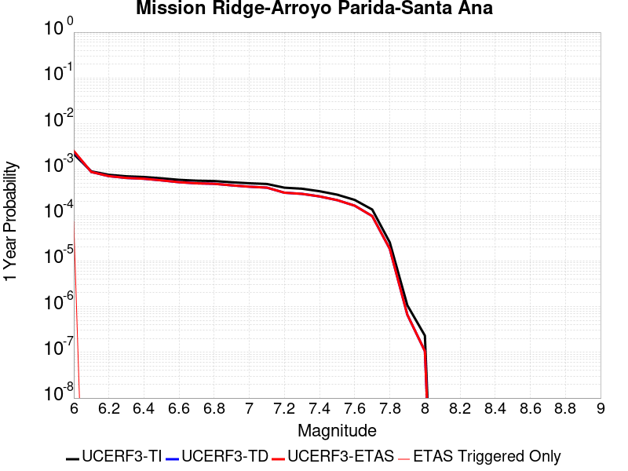 | 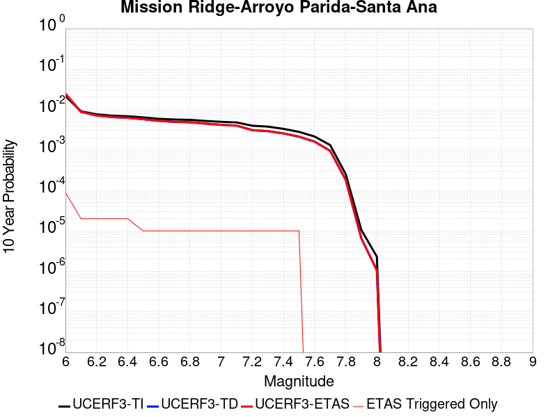 |

| Magnitude | 1 wk TI Prob | 1 wk TD Prob | 1 wk ETAS Prob | 1 wk ETAS/TD Gain | 1 wk ETAS Triggered Only | 1 mo TI Prob | 1 mo TD Prob | 1 mo ETAS Prob | 1 mo ETAS/TD Gain | 1 mo ETAS Triggered Only | 1 yr TI Prob | 1 yr TD Prob | 1 yr ETAS Prob | 1 yr ETAS/TD Gain | 1 yr ETAS Triggered Only | 10 yr TI Prob | 10 yr TD Prob | 10 yr ETAS Prob | 10 yr ETAS/TD Gain | 10 yr ETAS Triggered Only |
|-----|-----|-----|-----|-----|-----|-----|-----|-----|-----|-----|-----|-----|-----|-----|-----|-----|-----|-----|-----|-----|
| 6.0 | 4.169034E-5 | 4.7150217E-5 | 4.7150217E-5 | 1.0 | 0.0 | 1.7866064E-4 | 2.0206158E-4 | 2.2010847E-4 | 1.0893139 | 1.8050541E-5 | 0.0021730233 | 0.0024580369 | 0.0025300614 | 1.0293018 | 7.2202165E-5 | 0.021518968 | 0.024390634 | 0.024513906 | 1.0050541 | 1.2635379E-4 |
| 6.1 | 1.73813E-5 | 1.6857097E-5 | 1.6857097E-5 | 1.0 | 0.0 | 7.4489166E-5 | 7.2242765E-5 | 7.2242765E-5 | 1.0 | 0.0 | 9.065282E-4 | 8.792115E-4 | 8.792115E-4 | 1.0 | 0.0 | 0.009028391 | 0.008758473 | 0.008794258 | 1.0040858 | 3.6101083E-5 |
| 6.2 | 1.4622182E-5 | 1.3675572E-5 | 1.3675572E-5 | 1.0 | 0.0 | 6.2664985E-5 | 5.8608297E-5 | 5.8608297E-5 | 1.0 | 0.0 | 7.6267915E-4 | 7.1332627E-4 | 7.1332627E-4 | 1.0 | 0.0 | 0.007600669 | 0.0071108094 | 0.0071466537 | 1.0050409 | 3.6101083E-5 |
| 6.3 | 1.3552434E-5 | 1.248432E-5 | 1.248432E-5 | 1.0 | 0.0 | 5.8080568E-5 | 5.3503147E-5 | 5.3503147E-5 | 1.0 | 0.0 | 7.069015E-4 | 6.5120927E-4 | 6.5120927E-4 | 1.0 | 0.0 | 0.00704657 | 0.0064933733 | 0.00652924 | 1.0055236 | 3.6101083E-5 |
| 6.4 | 1.30977305E-5 | 1.198121E-5 | 1.198121E-5 | 1.0 | 0.0 | 5.613192E-5 | 5.134705E-5 | 5.134705E-5 | 1.0 | 0.0 | 6.831918E-4 | 6.24974E-4 | 6.24974E-4 | 1.0 | 0.0 | 0.006810953 | 0.00623251 | 0.006268386 | 1.0057563 | 3.6101083E-5 |
| 6.5 | 1.225205E-5 | 1.1050746E-5 | 1.1050746E-5 | 1.0 | 0.0 | 5.2507727E-5 | 4.7359496E-5 | 4.7359496E-5 | 1.0 | 0.0 | 6.3909404E-4 | 5.76452E-4 | 5.76452E-4 | 1.0 | 0.0 | 0.006372592 | 0.005749877 | 0.0057678237 | 1.0031213 | 1.8050541E-5 |
| 6.6 | 1.1352241E-5 | 1.0065366E-5 | 1.0065366E-5 | 1.0 | 0.0 | 4.8651553E-5 | 4.313658E-5 | 4.313658E-5 | 1.0 | 0.0 | 5.921717E-4 | 5.250634E-4 | 5.250634E-4 | 1.0 | 0.0 | 0.0059059616 | 0.005238475 | 0.0052564307 | 1.0034277 | 1.8050541E-5 |
| 6.7 | 1.0864116E-5 | 9.518779E-6 | 9.518779E-6 | 1.0 | 0.0 | 4.6559664E-5 | 4.079414E-5 | 4.079414E-5 | 1.0 | 0.0 | 5.667165E-4 | 4.9655745E-4 | 4.9655745E-4 | 1.0 | 0.0 | 0.005652734 | 0.0049547134 | 0.0049726744 | 1.003625 | 1.8050541E-5 |
| 6.8 | 1.0666365E-5 | 9.301504E-6 | 9.301504E-6 | 1.0 | 0.0 | 4.571219E-5 | 3.9862993E-5 | 3.9862993E-5 | 1.0 | 0.0 | 5.564038E-4 | 4.8522587E-4 | 4.8522587E-4 | 1.0 | 0.0 | 0.005550127 | 0.0048418962 | 0.0048598596 | 1.0037099 | 1.8050541E-5 |
| 6.9 | 1.0038665E-5 | 8.593664E-6 | 8.593664E-6 | 1.0 | 0.0 | 4.302214E-5 | 3.6829475E-5 | 3.6829475E-5 | 1.0 | 0.0 | 5.236687E-4 | 4.4830842E-4 | 4.4830842E-4 | 1.0 | 0.0 | 0.005224364 | 0.004474251 | 0.004492221 | 1.0040163 | 1.8050541E-5 |
| 7.0 | 9.5379955E-6 | 8.026596E-6 | 8.026596E-6 | 1.0 | 0.0 | 4.0876483E-5 | 3.4399254E-5 | 3.4399254E-5 | 1.0 | 0.0 | 4.975576E-4 | 4.1873218E-4 | 4.1873218E-4 | 1.0 | 0.0 | 0.00496445 | 0.0041796314 | 0.0041976064 | 1.0043006 | 1.8050541E-5 |
| 7.1 | 9.207389E-6 | 7.6538345E-6 | 7.6538345E-6 | 1.0 | 0.0 | 3.945964E-5 | 3.2801745E-5 | 3.2801745E-5 | 1.0 | 0.0 | 4.803152E-4 | 3.9928974E-4 | 3.9928974E-4 | 1.0 | 0.0 | 0.004792784 | 0.0039859195 | 0.0040038982 | 1.0045105 | 1.8050541E-5 |
| 7.2 | 7.638091E-6 | 5.932246E-6 | 5.932246E-6 | 1.0 | 0.0 | 3.2734264E-5 | 2.5423666E-5 | 2.5423666E-5 | 1.0 | 0.0 | 3.984668E-4 | 3.094895E-4 | 3.094895E-4 | 1.0 | 0.0 | 0.0039775306 | 0.0030906415 | 0.0031086362 | 1.0058223 | 1.8050541E-5 |
| 7.3 | 7.2500147E-6 | 5.597219E-6 | 5.597219E-6 | 1.0 | 0.0 | 3.1071122E-5 | 2.3987863E-5 | 2.3987863E-5 | 1.0 | 0.0 | 3.7822526E-4 | 2.920134E-4 | 2.920134E-4 | 1.0 | 0.0 | 0.0037758215 | 0.0029163521 | 0.0029343502 | 1.0061713 | 1.8050541E-5 |
| 7.4 | 6.3899715E-6 | 4.9194296E-6 | 4.9194296E-6 | 1.0 | 0.0 | 2.7385306E-5 | 2.10831E-5 | 2.10831E-5 | 1.0 | 0.0 | 3.3336508E-4 | 2.5665673E-4 | 2.5665673E-4 | 1.0 | 0.0 | 0.0033286542 | 0.0025636475 | 0.0025816518 | 1.0070229 | 1.8050541E-5 |
| 7.5 | 5.379025E-6 | 4.08461E-6 | 4.08461E-6 | 1.0 | 0.0 | 2.305276E-5 | 1.7505354E-5 | 1.7505354E-5 | 1.0 | 0.0 | 2.806312E-4 | 2.1310695E-4 | 2.1310695E-4 | 1.0 | 0.0 | 0.0028027708 | 0.0021290372 | 0.0021470494 | 1.0084602 | 1.8050541E-5 |
| 7.6 | 4.1270696E-6 | 3.0888339E-6 | 3.0888339E-6 | 1.0 | 0.0 | 1.768732E-5 | 1.3237793E-5 | 1.3237793E-5 | 1.0 | 0.0 | 2.1532185E-4 | 1.6115828E-4 | 1.6115828E-4 | 1.0 | 0.0 | 0.0021511333 | 0.0016104223 | 0.0016104223 | 1.0 | 0.0 |
| 7.7 | 2.5406805E-6 | 1.8284892E-6 | 1.8284892E-6 | 1.0 | 0.0 | 1.0888585E-5 | 7.836359E-6 | 7.836359E-6 | 1.0 | 0.0 | 1.3256045E-4 | 9.540356E-5 | 9.540356E-5 | 1.0 | 0.0 | 0.0013248142 | 9.536322E-4 | 9.536322E-4 | 1.0 | 0.0 |
| 7.8 | 4.8608285E-7 | 3.5102812E-7 | 3.5102812E-7 | 1.0 | 0.0 | 2.0832106E-6 | 1.5044053E-6 | 1.5044053E-6 | 1.0 | 0.0 | 2.5362791E-5 | 1.8315983E-5 | 1.8315983E-5 | 1.0 | 0.0 | 2.5359896E-4 | 1.8314485E-4 | 1.8314485E-4 | 1.0 | 0.0 |
| 7.9 | 2.0472514E-8 | 1.2691576E-8 | 1.2691576E-8 | 1.0 | 0.0 | 8.7739345E-8 | 5.4392466E-8 | 5.4392466E-8 | 1.0 | 0.0 | 1.068226E-6 | 6.622281E-7 | 6.622281E-7 | 1.0 | 0.0 | 1.0682209E-5 | 6.622262E-6 | 6.622262E-6 | 1.0 | 0.0 |
| 8.0 | 4.443582E-9 | 2.0333801E-9 | 2.0333801E-9 | 1.0 | 0.0 | 1.9043922E-8 | 8.714487E-9 | 8.714487E-9 | 1.0 | 0.0 | 2.3185973E-7 | 1.0609887E-7 | 1.0609887E-7 | 1.0 | 0.0 | 2.3185949E-6 | 1.0609883E-6 | 1.0609883E-6 | 1.0 | 0.0 |

## Santa Ynez (East)
*[(top)](#table-of-contents)*

| 1 Week | 1 Month | 1 Year | 10 Year |
|-----|-----|-----|-----|
| 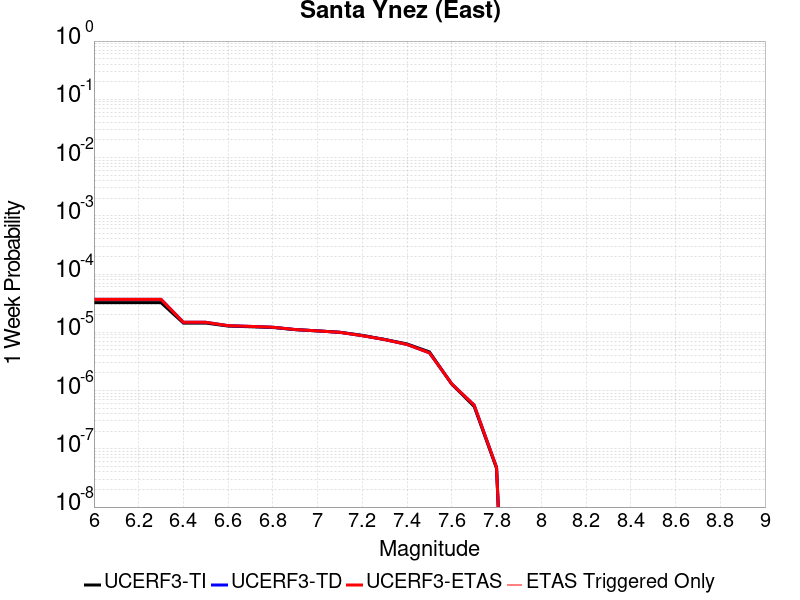 | 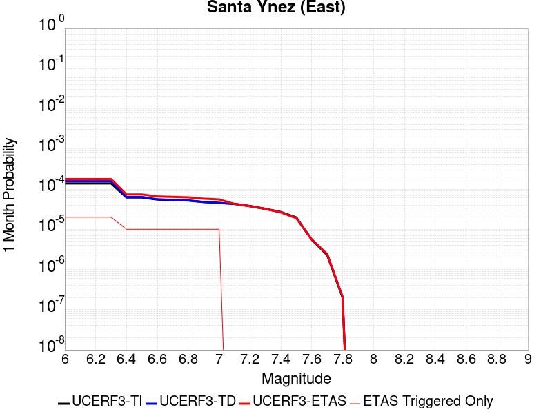 | 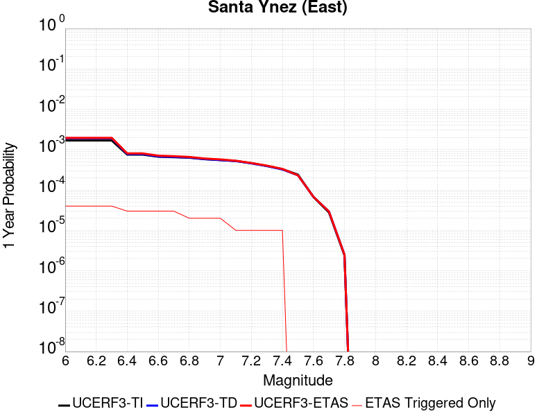 | 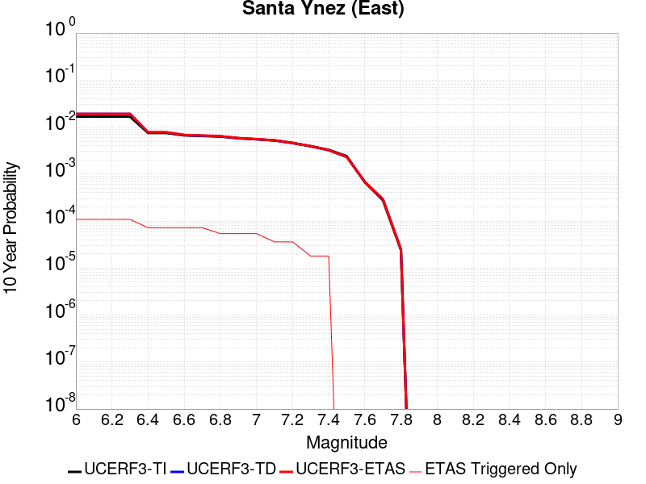 |

| Magnitude | 1 wk TI Prob | 1 wk TD Prob | 1 wk ETAS Prob | 1 wk ETAS/TD Gain | 1 wk ETAS Triggered Only | 1 mo TI Prob | 1 mo TD Prob | 1 mo ETAS Prob | 1 mo ETAS/TD Gain | 1 mo ETAS Triggered Only | 1 yr TI Prob | 1 yr TD Prob | 1 yr ETAS Prob | 1 yr ETAS/TD Gain | 1 yr ETAS Triggered Only | 10 yr TI Prob | 10 yr TD Prob | 10 yr ETAS Prob | 10 yr ETAS/TD Gain | 10 yr ETAS Triggered Only |
|-----|-----|-----|-----|-----|-----|-----|-----|-----|-----|-----|-----|-----|-----|-----|-----|-----|-----|-----|-----|-----|
| 6.0 | 3.2269712E-5 | 3.6758418E-5 | 3.6758418E-5 | 1.0 | 0.0 | 1.3829143E-4 | 1.575299E-4 | 1.7557759E-4 | 1.1145668 | 1.8050541E-5 | 0.0016823979 | 0.0019168291 | 0.001970877 | 1.0281965 | 5.4151624E-5 | 0.016697178 | 0.019060506 | 0.019166745 | 1.0055737 | 1.0830325E-4 |
| 6.1 | 3.2269712E-5 | 3.6758418E-5 | 3.6758418E-5 | 1.0 | 0.0 | 1.3829143E-4 | 1.575299E-4 | 1.7557759E-4 | 1.1145668 | 1.8050541E-5 | 0.0016823979 | 0.0019168291 | 0.001970877 | 1.0281965 | 5.4151624E-5 | 0.016697178 | 0.019060506 | 0.019166745 | 1.0055737 | 1.0830325E-4 |
| 6.2 | 3.2269712E-5 | 3.6758418E-5 | 3.6758418E-5 | 1.0 | 0.0 | 1.3829143E-4 | 1.575299E-4 | 1.7557759E-4 | 1.1145668 | 1.8050541E-5 | 0.0016823979 | 0.0019168291 | 0.001970877 | 1.0281965 | 5.4151624E-5 | 0.016697178 | 0.019060506 | 0.019166745 | 1.0055737 | 1.0830325E-4 |
| 6.3 | 3.2269712E-5 | 3.6758418E-5 | 3.6758418E-5 | 1.0 | 0.0 | 1.3829143E-4 | 1.575299E-4 | 1.7557759E-4 | 1.1145668 | 1.8050541E-5 | 0.0016823979 | 0.0019168291 | 0.001970877 | 1.0281965 | 5.4151624E-5 | 0.016697178 | 0.019060506 | 0.019166745 | 1.0055737 | 1.0830325E-4 |
| 6.4 | 1.4404779E-5 | 1.485138E-5 | 1.485138E-5 | 1.0 | 0.0 | 6.1733306E-5 | 6.364725E-5 | 8.169664E-5 | 1.2835848 | 1.8050541E-5 | 7.513438E-4 | 7.7463477E-4 | 8.2874444E-4 | 1.0698519 | 5.4151624E-5 | 0.0074880854 | 0.0077198967 | 0.007791541 | 1.0092806 | 7.2202165E-5 |
| 6.5 | 1.4404779E-5 | 1.485138E-5 | 1.485138E-5 | 1.0 | 0.0 | 6.1733306E-5 | 6.364725E-5 | 8.169664E-5 | 1.2835848 | 1.8050541E-5 | 7.513438E-4 | 7.7463477E-4 | 8.2874444E-4 | 1.0698519 | 5.4151624E-5 | 0.0074880854 | 0.0077198967 | 0.007791541 | 1.0092806 | 7.2202165E-5 |
| 6.6 | 1.280208E-5 | 1.3013623E-5 | 1.3013623E-5 | 1.0 | 0.0 | 5.4864904E-5 | 5.577149E-5 | 7.382102E-5 | 1.3236338 | 1.8050541E-5 | 6.6777546E-4 | 6.788081E-4 | 7.329229E-4 | 1.0797204 | 5.4151624E-5 | 0.006657724 | 0.006767557 | 0.0068392707 | 1.0105966 | 7.2202165E-5 |
| 6.7 | 1.2457027E-5 | 1.2630092E-5 | 1.2630092E-5 | 1.0 | 0.0 | 5.3386164E-5 | 5.4127853E-5 | 7.217742E-5 | 1.3334616 | 1.8050541E-5 | 6.497827E-4 | 6.5880903E-4 | 7.12925E-4 | 1.0821421 | 5.4151624E-5 | 0.00647886 | 0.006568757 | 0.006640485 | 1.0109196 | 7.2202165E-5 |
| 6.8 | 1.2095134E-5 | 1.2232492E-5 | 1.2232492E-5 | 1.0 | 0.0 | 5.1835254E-5 | 5.2423922E-5 | 7.0473514E-5 | 1.3443007 | 1.8050541E-5 | 6.309115E-4 | 6.3807593E-4 | 6.7415397E-4 | 1.0565419 | 3.6101083E-5 | 0.0062912325 | 0.0063626273 | 0.006416434 | 1.0084567 | 5.4151624E-5 |
| 6.9 | 1.1104036E-5 | 1.1158817E-5 | 1.1158817E-5 | 1.0 | 0.0 | 4.758786E-5 | 4.782263E-5 | 6.587231E-5 | 1.3774296 | 1.8050541E-5 | 5.7922816E-4 | 5.820862E-4 | 6.181663E-4 | 1.0619841 | 3.6101083E-5 | 0.005777207 | 0.0058057616 | 0.0058595985 | 1.009273 | 5.4151624E-5 |
| 7.0 | 1.0577444E-5 | 1.0583085E-5 | 1.0583085E-5 | 1.0 | 0.0 | 4.5331115E-5 | 4.53553E-5 | 6.340502E-5 | 1.3979628 | 1.8050541E-5 | 5.5176654E-4 | 5.5206206E-4 | 5.881432E-4 | 1.0653571 | 3.6101083E-5 | 0.0055039856 | 0.0055070445 | 0.005560898 | 1.009779 | 5.4151624E-5 |
| 7.1 | 1.0021775E-5 | 9.982334E-6 | 9.982334E-6 | 1.0 | 0.0 | 4.294976E-5 | 4.2780735E-5 | 4.2780735E-5 | 1.0 | 0.0 | 5.2278786E-4 | 5.2073214E-4 | 5.387733E-4 | 1.0346457 | 1.8050541E-5 | 0.0052155964 | 0.0051952526 | 0.005231166 | 1.0069127 | 3.6101083E-5 |
| 7.2 | 8.874109E-6 | 8.750017E-6 | 8.750017E-6 | 1.0 | 0.0 | 3.8031343E-5 | 3.7499536E-5 | 3.7499536E-5 | 1.0 | 0.0 | 4.629332E-4 | 4.5646232E-4 | 4.745046E-4 | 1.0395263 | 1.8050541E-5 | 0.0046197 | 0.0045553655 | 0.004591302 | 1.0078889 | 3.6101083E-5 |
| 7.3 | 7.5504267E-6 | 7.5061644E-6 | 7.5061644E-6 | 1.0 | 0.0 | 3.235857E-5 | 3.2168886E-5 | 3.2168886E-5 | 1.0 | 0.0 | 3.9389438E-4 | 3.9158683E-4 | 4.096303E-4 | 1.0460778 | 1.8050541E-5 | 0.0039319694 | 0.003909075 | 0.0039270553 | 1.0045996 | 1.8050541E-5 |
| 7.4 | 6.309394E-6 | 6.184063E-6 | 6.184063E-6 | 1.0 | 0.0 | 2.703998E-5 | 2.6502861E-5 | 2.6502861E-5 | 1.0 | 0.0 | 3.2916202E-4 | 3.226255E-4 | 3.4067023E-4 | 1.0559309 | 1.8050541E-5 | 0.003286749 | 0.0032216688 | 0.0032396612 | 1.0055848 | 1.8050541E-5 |
| 7.5 | 4.6103073E-6 | 4.4413287E-6 | 4.4413287E-6 | 1.0 | 0.0 | 1.975831E-5 | 1.903413E-5 | 1.903413E-5 | 1.0 | 0.0 | 2.4053088E-4 | 2.3171658E-4 | 2.3171658E-4 | 1.0 | 0.0 | 0.002402707 | 0.0023148193 | 0.0023148193 | 1.0 | 0.0 |
| 7.6 | 1.2858658E-6 | 1.3009029E-6 | 1.3009029E-6 | 1.0 | 0.0 | 5.5108417E-6 | 5.5752867E-6 | 5.5752867E-6 | 1.0 | 0.0 | 6.7092435E-5 | 6.7877074E-5 | 6.7877074E-5 | 1.0 | 0.0 | 6.707218E-4 | 6.785703E-4 | 6.785703E-4 | 1.0 | 0.0 |
| 7.7 | 5.3302307E-7 | 5.6124946E-7 | 5.6124946E-7 | 1.0 | 0.0 | 2.2843826E-6 | 2.405353E-6 | 2.405353E-6 | 1.0 | 0.0 | 2.7812002E-5 | 2.9284813E-5 | 2.9284813E-5 | 1.0 | 0.0 | 2.7808524E-4 | 2.928131E-4 | 2.928131E-4 | 1.0 | 0.0 |
| 7.8 | 4.613933E-8 | 4.8032447E-8 | 4.8032447E-8 | 1.0 | 0.0 | 1.9773998E-7 | 2.0585334E-7 | 2.0585334E-7 | 1.0 | 0.0 | 2.4074816E-6 | 2.5062616E-6 | 2.5062616E-6 | 1.0 | 0.0 | 2.4074554E-5 | 2.5062343E-5 | 2.5062343E-5 | 1.0 | 0.0 |

## San Andreas (Creeping Section) 2011 CFM
*[(top)](#table-of-contents)*

| 1 Week | 1 Month | 1 Year | 10 Year |
|-----|-----|-----|-----|
| 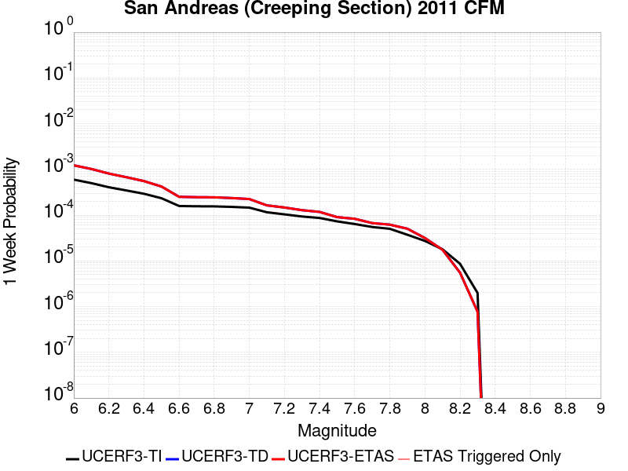 | 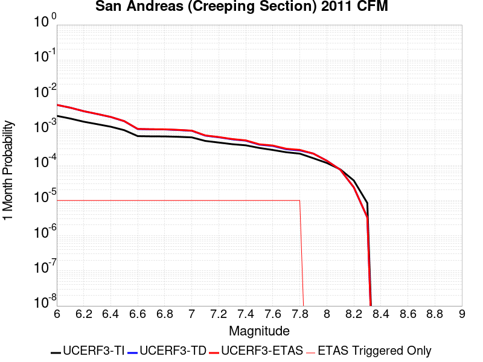 |  | 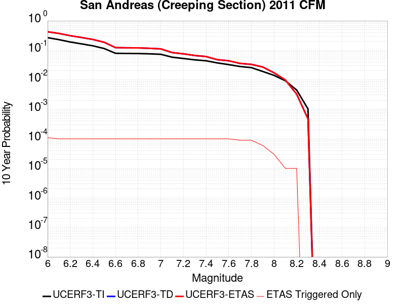 |

| Magnitude | 1 wk TI Prob | 1 wk TD Prob | 1 wk ETAS Prob | 1 wk ETAS/TD Gain | 1 wk ETAS Triggered Only | 1 mo TI Prob | 1 mo TD Prob | 1 mo ETAS Prob | 1 mo ETAS/TD Gain | 1 mo ETAS Triggered Only | 1 yr TI Prob | 1 yr TD Prob | 1 yr ETAS Prob | 1 yr ETAS/TD Gain | 1 yr ETAS Triggered Only | 10 yr TI Prob | 10 yr TD Prob | 10 yr ETAS Prob | 10 yr ETAS/TD Gain | 10 yr ETAS Triggered Only |
|-----|-----|-----|-----|-----|-----|-----|-----|-----|-----|-----|-----|-----|-----|-----|-----|-----|-----|-----|-----|-----|
| 6.0 | 5.986481E-4 | 0.0012282486 | 0.0012282486 | 1.0 | 0.0 | 0.0025631124 | 0.0052500414 | 0.0052679973 | 1.0034201 | 1.8050541E-5 | 0.030762846 | 0.061261788 | 0.061295677 | 1.0005533 | 3.6101083E-5 | 0.26835477 | 0.4262137 | 0.42627588 | 1.0001458 | 1.0830325E-4 |
| 6.1 | 5.015945E-4 | 0.0010221937 | 0.0010221937 | 1.0 | 0.0 | 0.00214792 | 0.0043714023 | 0.004389374 | 1.0041112 | 1.8050541E-5 | 0.025839351 | 0.05129577 | 0.05133002 | 1.0006677 | 3.6101083E-5 | 0.23032776 | 0.37312442 | 0.3731923 | 1.0001819 | 1.0830325E-4 |
| 6.2 | 4.073338E-4 | 8.115008E-4 | 8.115008E-4 | 1.0 | 0.0 | 0.0017445484 | 0.0034710856 | 0.0034890734 | 1.0051823 | 1.8050541E-5 | 0.021034058 | 0.04098021 | 0.04101483 | 1.0008448 | 3.6101083E-5 | 0.19150782 | 0.31332293 | 0.31339732 | 1.0002373 | 1.0830325E-4 |
| 6.3 | 3.464099E-4 | 6.7472784E-4 | 6.7472784E-4 | 1.0 | 0.0 | 0.0014837692 | 0.0028869084 | 0.0029049066 | 1.0062345 | 1.8050541E-5 | 0.017915873 | 0.034237046 | 0.03427191 | 1.0010183 | 3.6101083E-5 | 0.16538359 | 0.27162364 | 0.27170253 | 1.0002904 | 1.0830325E-4 |
| 6.4 | 2.935057E-4 | 5.554909E-4 | 5.554909E-4 | 1.0 | 0.0 | 0.0012572751 | 0.0023772188 | 0.0023952266 | 1.007575 | 1.8050541E-5 | 0.015200248 | 0.028312225 | 0.028347304 | 1.0012391 | 3.6101083E-5 | 0.14201577 | 0.23330969 | 0.23339273 | 1.000356 | 1.0830325E-4 |
| 6.5 | 2.3409708E-4 | 4.2203118E-4 | 4.2203118E-4 | 1.0 | 0.0 | 0.0010028875 | 0.0018063709 | 0.0018243887 | 1.0099747 | 1.8050541E-5 | 0.012141965 | 0.021634351 | 0.021669671 | 1.0016326 | 3.6101083E-5 | 0.11499573 | 0.18716748 | 0.18725552 | 1.0004704 | 1.0830325E-4 |
| 6.6 | 1.5842178E-4 | 2.5158413E-4 | 2.5158413E-4 | 1.0 | 0.0 | 6.7877385E-4 | 0.0010777655 | 0.0010957966 | 1.0167301 | 1.8050541E-5 | 0.0082328 | 0.013041397 | 0.013077026 | 1.002732 | 3.6101083E-5 | 0.07934396 | 0.12351464 | 0.123609565 | 1.0007685 | 1.0830325E-4 |
| 6.7 | 1.5616413E-4 | 2.4694361E-4 | 2.4694361E-4 | 1.0 | 0.0 | 6.691031E-4 | 0.0010578939 | 0.0010759253 | 1.0170447 | 1.8050541E-5 | 0.0081159435 | 0.012803153 | 0.012838792 | 1.0027837 | 3.6101083E-5 | 0.0782586 | 0.121541776 | 0.12163692 | 1.0007827 | 1.0830325E-4 |
| 6.8 | 1.5538467E-4 | 2.4518103E-4 | 2.4518103E-4 | 1.0 | 0.0 | 6.6576427E-4 | 0.0010503461 | 0.0010683776 | 1.0171673 | 1.8050541E-5 | 0.008075596 | 0.012712448 | 0.01274809 | 1.0028037 | 3.6101083E-5 | 0.07788358 | 0.12077228 | 0.120867506 | 1.0007885 | 1.0830325E-4 |
| 6.9 | 1.5153569E-4 | 2.3626802E-4 | 2.3626802E-4 | 1.0 | 0.0 | 6.49277E-4 | 0.0010121863 | 0.0010302186 | 1.0178151 | 1.8050541E-5 | 0.007876333 | 0.012254265 | 0.012289924 | 1.0029099 | 3.6101083E-5 | 0.07602952 | 0.11684114 | 0.11693679 | 1.0008186 | 1.0830325E-4 |
| 7.0 | 1.4588932E-4 | 2.2483156E-4 | 2.2483156E-4 | 1.0 | 0.0 | 6.250901E-4 | 9.6320995E-4 | 9.812431E-4 | 1.0187219 | 1.8050541E-5 | 0.0075839474 | 0.011664526 | 0.0117002055 | 1.0030588 | 3.6101083E-5 | 0.073302895 | 0.1116861 | 0.11178231 | 1.0008614 | 1.0830325E-4 |
| 7.1 | 1.1565079E-4 | 1.6355571E-4 | 1.6355571E-4 | 1.0 | 0.0 | 4.955521E-4 | 7.007656E-4 | 7.188035E-4 | 1.0257403 | 1.8050541E-5 | 0.006016669 | 0.008498649 | 0.008534443 | 1.0042118 | 3.6101083E-5 | 0.058563538 | 0.08399853 | 0.084097736 | 1.001181 | 1.0830325E-4 |
| 7.2 | 1.0393792E-4 | 1.4685676E-4 | 1.4685676E-4 | 1.0 | 0.0 | 4.4537216E-4 | 6.2923506E-4 | 6.4727425E-4 | 1.0286684 | 1.8050541E-5 | 0.005408933 | 0.007634198 | 0.0076700235 | 1.0046928 | 3.6101083E-5 | 0.052791595 | 0.07593415 | 0.076034226 | 1.001318 | 1.0830325E-4 |
| 7.3 | 9.332884E-5 | 1.2841723E-4 | 1.2841723E-4 | 1.0 | 0.0 | 3.999194E-4 | 5.502441E-4 | 5.682847E-4 | 1.0327866 | 1.8050541E-5 | 0.0048581534 | 0.00667878 | 0.0067146397 | 1.0053692 | 3.6101083E-5 | 0.047533102 | 0.066762544 | 0.06686361 | 1.001514 | 1.0830325E-4 |
| 7.4 | 8.670252E-5 | 1.17588956E-4 | 1.17588956E-4 | 1.0 | 0.0 | 3.715293E-4 | 5.0385593E-4 | 5.218974E-4 | 1.0358068 | 1.8050541E-5 | 0.004513991 | 0.006117313 | 0.0061531933 | 1.0058653 | 3.6101083E-5 | 0.044233937 | 0.06140917 | 0.061510827 | 1.0016553 | 1.0830325E-4 |
| 7.5 | 7.3036405E-5 | 9.052575E-5 | 9.052575E-5 | 1.0 | 0.0 | 3.129756E-4 | 3.8790988E-4 | 4.0595344E-4 | 1.0465147 | 1.8050541E-5 | 0.0038038217 | 0.0047125975 | 0.0047485284 | 1.0076245 | 3.6101083E-5 | 0.03739367 | 0.04810017 | 0.048203263 | 1.0021433 | 1.0830325E-4 |
| 7.6 | 6.3935775E-5 | 8.321797E-5 | 8.321797E-5 | 1.0 | 0.0 | 2.7398168E-4 | 3.565998E-4 | 3.7464392E-4 | 1.0506004 | 1.8050541E-5 | 0.0033306254 | 0.0043329783 | 0.004368923 | 1.0082957 | 3.6101083E-5 | 0.032811474 | 0.0441892 | 0.044292714 | 1.0023426 | 1.0830325E-4 |
| 7.7 | 5.5050095E-5 | 6.698587E-5 | 6.698587E-5 | 1.0 | 0.0 | 2.3590765E-4 | 2.8705073E-4 | 3.050961E-4 | 1.0628647 | 1.8050541E-5 | 0.0028683927 | 0.0034892464 | 0.0035252215 | 1.0103103 | 3.6101083E-5 | 0.0283165 | 0.0359742 | 0.03606121 | 1.0024185 | 9.025271E-5 |
| 7.8 | 5.027131E-5 | 6.196486E-5 | 6.196486E-5 | 1.0 | 0.0 | 2.1543067E-4 | 2.6553668E-4 | 2.8358243E-4 | 1.0679595 | 1.8050541E-5 | 0.0026197135 | 0.0032281198 | 0.0032641042 | 1.0111473 | 3.6101083E-5 | 0.025890453 | 0.033290002 | 0.03337725 | 1.0026208 | 9.025271E-5 |
| 7.9 | 3.7271806E-5 | 5.04958E-5 | 5.04958E-5 | 1.0 | 0.0 | 1.5972654E-4 | 2.1639263E-4 | 2.1639263E-4 | 1.0 | 0.0 | 0.0019429359 | 0.0026313993 | 0.0026313993 | 1.0 | 0.0 | 0.019260362 | 0.027200336 | 0.027235454 | 1.0012912 | 3.6101083E-5 |
| 8.0 | 2.7310243E-5 | 3.1608357E-5 | 3.1608357E-5 | 1.0 | 0.0 | 1.17038646E-4 | 1.3545736E-4 | 1.3545736E-4 | 1.0 | 0.0 | 0.0014240141 | 0.0016479467 | 0.0016479467 | 1.0 | 0.0 | 0.014149235 | 0.017305493 | 0.017323231 | 1.001025 | 1.8050541E-5 |
| 8.1 | 1.7940547E-5 | 1.751712E-5 | 1.751712E-5 | 1.0 | 0.0 | 7.688579E-5 | 7.507121E-5 | 7.507121E-5 | 1.0 | 0.0 | 9.3568244E-4 | 9.1360934E-4 | 9.1360934E-4 | 1.0 | 0.0 | 0.009317525 | 0.009860369 | 0.009860369 | 1.0 | 0.0 |
| 8.2 | 8.643924E-6 | 5.521735E-6 | 5.521735E-6 | 1.0 | 0.0 | 3.704486E-5 | 2.3664365E-5 | 2.3664365E-5 | 1.0 | 0.0 | 4.5092785E-4 | 2.8807562E-4 | 2.8807562E-4 | 1.0 | 0.0 | 0.0045001395 | 0.0032743483 | 0.0032743483 | 1.0 | 0.0 |
| 8.3 | 1.983087E-6 | 7.740189E-7 | 7.740189E-7 | 1.0 | 0.0 | 8.498917E-6 | 3.3172198E-6 | 3.3172198E-6 | 1.0 | 0.0 | 1.034694E-4 | 4.0386418E-5 | 4.0386418E-5 | 1.0 | 0.0 | 0.0010342124 | 4.7657243E-4 | 4.7657243E-4 | 1.0 | 0.0 |

## Mission Creek
*[(top)](#table-of-contents)*

| 1 Week | 1 Month | 1 Year | 10 Year |
|-----|-----|-----|-----|
| 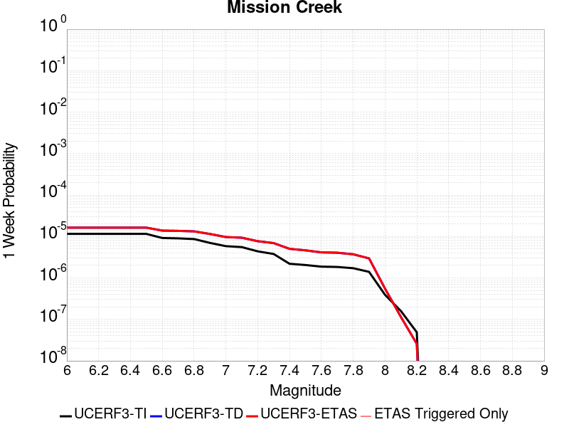 | 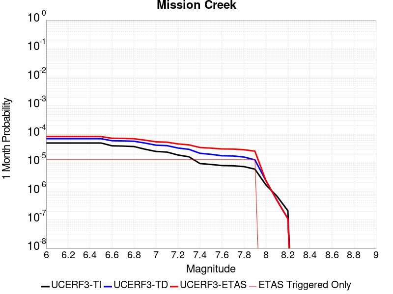 | 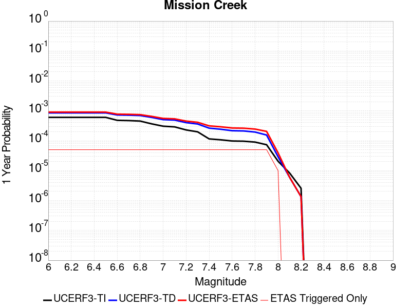 | 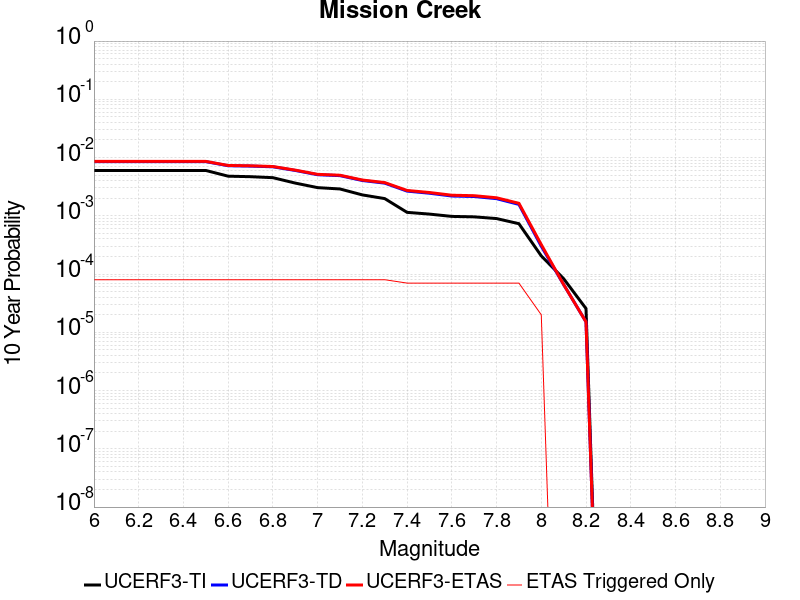 |

| Magnitude | 1 wk TI Prob | 1 wk TD Prob | 1 wk ETAS Prob | 1 wk ETAS/TD Gain | 1 wk ETAS Triggered Only | 1 mo TI Prob | 1 mo TD Prob | 1 mo ETAS Prob | 1 mo ETAS/TD Gain | 1 mo ETAS Triggered Only | 1 yr TI Prob | 1 yr TD Prob | 1 yr ETAS Prob | 1 yr ETAS/TD Gain | 1 yr ETAS Triggered Only | 10 yr TI Prob | 10 yr TD Prob | 10 yr ETAS Prob | 10 yr ETAS/TD Gain | 10 yr ETAS Triggered Only |
|-----|-----|-----|-----|-----|-----|-----|-----|-----|-----|-----|-----|-----|-----|-----|-----|-----|-----|-----|-----|-----|
| 6.0 | 1.1549387E-5 | 1.6343452E-5 | 1.6343452E-5 | 1.0 | 0.0 | 4.9496433E-5 | 7.004158E-5 | 8.809085E-5 | 1.2576938 | 1.8050541E-5 | 6.0245243E-4 | 8.524376E-4 | 9.0654305E-4 | 1.0634714 | 5.4151624E-5 | 0.006008218 | 0.008520671 | 0.008628051 | 1.0126023 | 1.0830325E-4 |
| 6.1 | 1.1549387E-5 | 1.6343452E-5 | 1.6343452E-5 | 1.0 | 0.0 | 4.9496433E-5 | 7.004158E-5 | 8.809085E-5 | 1.2576938 | 1.8050541E-5 | 6.0245243E-4 | 8.524376E-4 | 9.0654305E-4 | 1.0634714 | 5.4151624E-5 | 0.006008218 | 0.008520671 | 0.008628051 | 1.0126023 | 1.0830325E-4 |
| 6.2 | 1.1549387E-5 | 1.6343452E-5 | 1.6343452E-5 | 1.0 | 0.0 | 4.9496433E-5 | 7.004158E-5 | 8.809085E-5 | 1.2576938 | 1.8050541E-5 | 6.0245243E-4 | 8.524376E-4 | 9.0654305E-4 | 1.0634714 | 5.4151624E-5 | 0.006008218 | 0.008520671 | 0.008628051 | 1.0126023 | 1.0830325E-4 |
| 6.3 | 1.1549387E-5 | 1.6343452E-5 | 1.6343452E-5 | 1.0 | 0.0 | 4.9496433E-5 | 7.004158E-5 | 8.809085E-5 | 1.2576938 | 1.8050541E-5 | 6.0245243E-4 | 8.524376E-4 | 9.0654305E-4 | 1.0634714 | 5.4151624E-5 | 0.006008218 | 0.008520671 | 0.008628051 | 1.0126023 | 1.0830325E-4 |
| 6.4 | 1.1549387E-5 | 1.6343452E-5 | 1.6343452E-5 | 1.0 | 0.0 | 4.9496433E-5 | 7.004158E-5 | 8.809085E-5 | 1.2576938 | 1.8050541E-5 | 6.0245243E-4 | 8.524376E-4 | 9.0654305E-4 | 1.0634714 | 5.4151624E-5 | 0.006008218 | 0.008520671 | 0.008628051 | 1.0126023 | 1.0830325E-4 |
| 6.5 | 1.1549387E-5 | 1.6343452E-5 | 1.6343452E-5 | 1.0 | 0.0 | 4.9496433E-5 | 7.004158E-5 | 8.809085E-5 | 1.2576938 | 1.8050541E-5 | 6.0245243E-4 | 8.524376E-4 | 9.0654305E-4 | 1.0634714 | 5.4151624E-5 | 0.006008218 | 0.008520671 | 0.008628051 | 1.0126023 | 1.0830325E-4 |
| 6.6 | 9.202681E-6 | 1.3866566E-5 | 1.3866566E-5 | 1.0 | 0.0 | 3.9439463E-5 | 5.942684E-5 | 7.74763E-5 | 1.3037258 | 1.8050541E-5 | 4.800697E-4 | 7.232906E-4 | 7.7740307E-4 | 1.0748143 | 5.4151624E-5 | 0.004790339 | 0.007237783 | 0.0073453025 | 1.0148553 | 1.0830325E-4 |
| 6.7 | 9.019164E-6 | 1.3672222E-5 | 1.3672222E-5 | 1.0 | 0.0 | 3.8652986E-5 | 5.859397E-5 | 7.664345E-5 | 1.3080434 | 1.8050541E-5 | 4.7049852E-4 | 7.131571E-4 | 7.672701E-4 | 1.0758781 | 5.4151624E-5 | 0.004695036 | 0.0071371016 | 0.0072446316 | 1.0150664 | 1.0830325E-4 |
| 6.8 | 8.673558E-6 | 1.3294288E-5 | 1.3294288E-5 | 1.0 | 0.0 | 3.717186E-5 | 5.6974324E-5 | 7.502384E-5 | 1.3168008 | 1.8050541E-5 | 4.524734E-4 | 6.934505E-4 | 7.4756454E-4 | 1.078036 | 5.4151624E-5 | 0.0045155324 | 0.0069412687 | 0.00704882 | 1.0154945 | 1.0830325E-4 |
| 6.9 | 7.002255E-6 | 1.1498356E-5 | 1.1498356E-5 | 1.0 | 0.0 | 3.000932E-5 | 4.9277776E-5 | 6.7327426E-5 | 1.3662838 | 1.8050541E-5 | 3.653022E-4 | 5.9979863E-4 | 6.539178E-4 | 1.0902288 | 5.4151624E-5 | 0.0036470229 | 0.006010018 | 0.0061176703 | 1.0179121 | 1.0830325E-4 |
| 7.0 | 5.84644E-6 | 9.694624E-6 | 9.694624E-6 | 1.0 | 0.0 | 2.5055931E-5 | 4.154775E-5 | 5.9597543E-5 | 1.4344349 | 1.8050541E-5 | 3.0501327E-4 | 5.0573103E-4 | 5.5985525E-4 | 1.1070218 | 5.4151624E-5 | 0.0030459496 | 0.005073814 | 0.005181568 | 1.0212373 | 1.0830325E-4 |
| 7.1 | 5.54703E-6 | 9.349029E-6 | 9.349029E-6 | 1.0 | 0.0 | 2.377277E-5 | 4.0066676E-5 | 5.8116493E-5 | 1.4504945 | 1.8050541E-5 | 2.8939504E-4 | 4.8770706E-4 | 5.4183224E-4 | 1.110979 | 5.4151624E-5 | 0.0028901845 | 0.004894373 | 0.0050021466 | 1.0220199 | 1.0830325E-4 |
| 7.2 | 4.384709E-6 | 7.700271E-6 | 7.700271E-6 | 1.0 | 0.0 | 1.8791474E-5 | 3.3000764E-5 | 5.1050713E-5 | 1.5469553 | 1.8050541E-5 | 2.2876218E-4 | 4.017139E-4 | 4.5584378E-4 | 1.1347473 | 5.4151624E-5 | 0.0022852682 | 0.004037848 | 0.004145714 | 1.0267137 | 1.0830325E-4 |
| 7.3 | 3.7888456E-6 | 6.933784E-6 | 6.933784E-6 | 1.0 | 0.0 | 1.623781E-5 | 2.9715897E-5 | 4.77659E-5 | 1.6074191 | 1.8050541E-5 | 1.9767738E-4 | 3.6173433E-4 | 4.1586638E-4 | 1.1496458 | 5.4151624E-5 | 0.0019750162 | 0.0036394098 | 0.0037473189 | 1.0296502 | 1.0830325E-4 |
| 7.4 | 2.1982462E-6 | 5.0415647E-6 | 5.0415647E-6 | 1.0 | 0.0 | 9.421021E-6 | 2.160653E-5 | 3.965668E-5 | 1.8354026 | 1.8050541E-5 | 1.1469489E-4 | 2.6302793E-4 | 3.171653E-4 | 1.2058237 | 5.4151624E-5 | 0.0011463572 | 0.0026549057 | 0.0027449187 | 1.0339044 | 9.025271E-5 |
| 7.5 | 2.051923E-6 | 4.6323207E-6 | 4.6323207E-6 | 1.0 | 0.0 | 8.793926E-6 | 1.9852654E-5 | 3.7902835E-5 | 1.9092076 | 1.8050541E-5 | 1.0706078E-4 | 2.4167939E-4 | 2.958179E-4 | 1.2240098 | 5.4151624E-5 | 0.0010700922 | 0.0024423152 | 0.0025323473 | 1.0368634 | 9.025271E-5 |
| 7.6 | 1.8733427E-6 | 4.1400876E-6 | 4.1400876E-6 | 1.0 | 0.0 | 8.028587E-6 | 1.7743112E-5 | 3.5793335E-5 | 2.0173087 | 1.8050541E-5 | 9.774366E-5 | 2.1600106E-4 | 2.70141E-4 | 1.2506466 | 5.4151624E-5 | 9.770069E-4 | 0.0021865503 | 0.0022766057 | 1.0411861 | 9.025271E-5 |
| 7.7 | 1.8411953E-6 | 4.059651E-6 | 4.059651E-6 | 1.0 | 0.0 | 7.890813E-6 | 1.7398388E-5 | 3.5448615E-5 | 2.0374656 | 1.8050541E-5 | 9.606641E-5 | 2.1180487E-4 | 2.65945E-4 | 1.2556133 | 5.4151624E-5 | 9.6024893E-4 | 0.0021447786 | 0.0022348377 | 1.0419899 | 9.025271E-5 |
| 7.8 | 1.7194251E-6 | 3.7258903E-6 | 3.7258903E-6 | 1.0 | 0.0 | 7.368944E-6 | 1.5968004E-5 | 3.4018256E-5 | 2.1304014 | 1.8050541E-5 | 8.97132E-5 | 1.9439319E-4 | 2.4853428E-4 | 1.2785133 | 5.4151624E-5 | 8.967699E-4 | 0.0019701866 | 0.0020602616 | 1.0457189 | 9.025271E-5 |
| 7.9 | 1.4035052E-6 | 2.96274E-6 | 2.96274E-6 | 1.0 | 0.0 | 6.0150082E-6 | 1.26973955E-5 | 3.074771E-5 | 2.421576 | 1.8050541E-5 | 7.3230265E-5 | 1.5457989E-4 | 2.0872314E-4 | 1.3502606 | 5.4151624E-5 | 7.3206134E-4 | 0.0015695292 | 0.0016596402 | 1.0574127 | 9.025271E-5 |
| 8.0 | 3.9318823E-7 | 5.5594336E-7 | 5.5594336E-7 | 1.0 | 0.0 | 1.6850913E-6 | 2.3826121E-6 | 2.3826121E-6 | 1.0 | 0.0 | 2.0515794E-5 | 2.9007924E-5 | 2.9007924E-5 | 1.0 | 0.0 | 2.0513899E-4 | 3.006071E-4 | 3.186522E-4 | 1.0600289 | 1.8050541E-5 |
| 8.1 | 1.596793E-7 | 1.14873394E-7 | 1.14873394E-7 | 1.0 | 0.0 | 6.8433974E-7 | 4.923144E-7 | 4.923144E-7 | 1.0 | 0.0 | 8.331805E-6 | 5.9939125E-6 | 5.9939125E-6 | 1.0 | 0.0 | 8.331492E-5 | 6.608278E-5 | 6.608278E-5 | 1.0 | 0.0 |
| 8.2 | 4.9003038E-8 | 2.5717341E-8 | 2.5717341E-8 | 1.0 | 0.0 | 2.10013E-7 | 1.1021717E-7 | 1.1021717E-7 | 1.0 | 0.0 | 2.5569052E-6 | 1.3418933E-6 | 1.3418933E-6 | 1.0 | 0.0 | 2.556876E-5 | 1.51073E-5 | 1.51073E-5 | 1.0 | 0.0 |

## San Jacinto (San Bernardino)
*[(top)](#table-of-contents)*

| 1 Week | 1 Month | 1 Year | 10 Year |
|-----|-----|-----|-----|
| 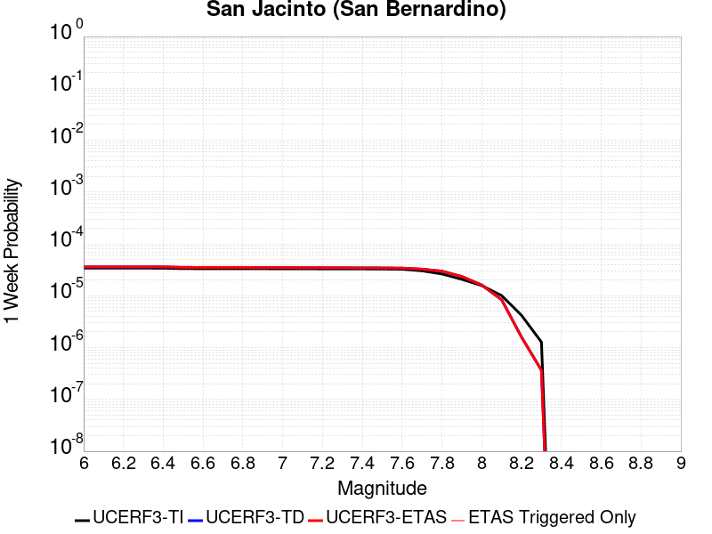 | 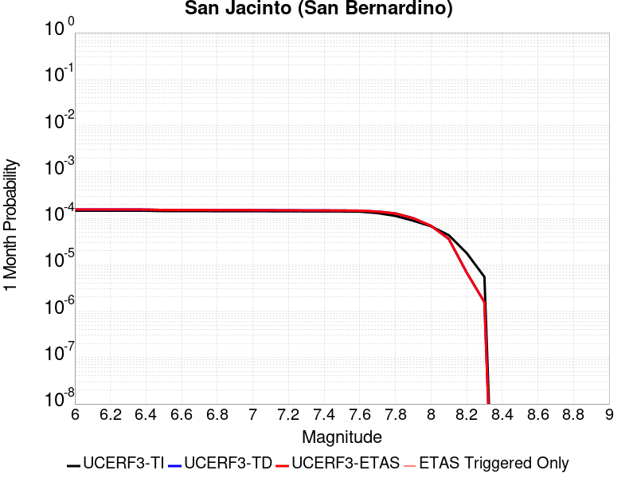 | 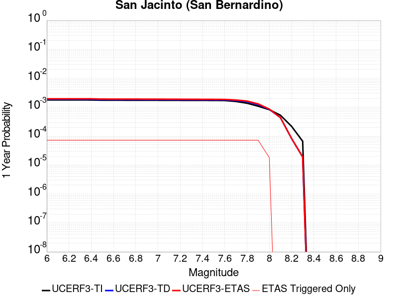 | 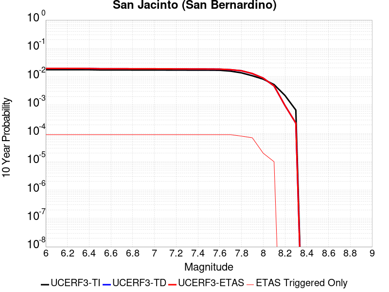 |

| Magnitude | 1 wk TI Prob | 1 wk TD Prob | 1 wk ETAS Prob | 1 wk ETAS/TD Gain | 1 wk ETAS Triggered Only | 1 mo TI Prob | 1 mo TD Prob | 1 mo ETAS Prob | 1 mo ETAS/TD Gain | 1 mo ETAS Triggered Only | 1 yr TI Prob | 1 yr TD Prob | 1 yr ETAS Prob | 1 yr ETAS/TD Gain | 1 yr ETAS Triggered Only | 10 yr TI Prob | 10 yr TD Prob | 10 yr ETAS Prob | 10 yr ETAS/TD Gain | 10 yr ETAS Triggered Only |
|-----|-----|-----|-----|-----|-----|-----|-----|-----|-----|-----|-----|-----|-----|-----|-----|-----|-----|-----|-----|-----|
| 6.0 | 3.409352E-5 | 3.613024E-5 | 3.613024E-5 | 1.0 | 0.0 | 1.461069E-4 | 1.548347E-4 | 1.548347E-4 | 1.0 | 0.0 | 0.0017774 | 0.0018834844 | 0.0019555506 | 1.0382621 | 7.2202165E-5 | 0.01763251 | 0.019423388 | 0.019529589 | 1.0054677 | 1.0830325E-4 |
| 6.1 | 3.409352E-5 | 3.613024E-5 | 3.613024E-5 | 1.0 | 0.0 | 1.461069E-4 | 1.548347E-4 | 1.548347E-4 | 1.0 | 0.0 | 0.0017774 | 0.0018834844 | 0.0019555506 | 1.0382621 | 7.2202165E-5 | 0.01763251 | 0.019423388 | 0.019529589 | 1.0054677 | 1.0830325E-4 |
| 6.2 | 3.409352E-5 | 3.613024E-5 | 3.613024E-5 | 1.0 | 0.0 | 1.461069E-4 | 1.548347E-4 | 1.548347E-4 | 1.0 | 0.0 | 0.0017774 | 0.0018834844 | 0.0019555506 | 1.0382621 | 7.2202165E-5 | 0.01763251 | 0.019423388 | 0.019529589 | 1.0054677 | 1.0830325E-4 |
| 6.3 | 3.409352E-5 | 3.613024E-5 | 3.613024E-5 | 1.0 | 0.0 | 1.461069E-4 | 1.548347E-4 | 1.548347E-4 | 1.0 | 0.0 | 0.0017774 | 0.0018834844 | 0.0019555506 | 1.0382621 | 7.2202165E-5 | 0.01763251 | 0.019423388 | 0.019529589 | 1.0054677 | 1.0830325E-4 |
| 6.4 | 3.400795E-5 | 3.602287E-5 | 3.602287E-5 | 1.0 | 0.0 | 1.4574021E-4 | 1.543746E-4 | 1.543746E-4 | 1.0 | 0.0 | 0.0017729428 | 0.0018778925 | 0.0019499591 | 1.0383763 | 7.2202165E-5 | 0.017588645 | 0.019368459 | 0.019474663 | 1.0054834 | 1.0830325E-4 |
| 6.5 | 3.341482E-5 | 3.528329E-5 | 3.528329E-5 | 1.0 | 0.0 | 1.4319851E-4 | 1.5120536E-4 | 1.5120536E-4 | 1.0 | 0.0 | 0.0017420477 | 0.0018393721 | 0.0019114414 | 1.0391815 | 7.2202165E-5 | 0.017284546 | 0.018989919 | 0.019096164 | 1.0055948 | 1.0830325E-4 |
| 6.6 | 3.3364955E-5 | 3.522049E-5 | 3.522049E-5 | 1.0 | 0.0 | 1.4298483E-4 | 1.5093623E-4 | 1.5093623E-4 | 1.0 | 0.0 | 0.0017394501 | 0.0018361012 | 0.0019081708 | 1.0392514 | 7.2202165E-5 | 0.017258976 | 0.018957775 | 0.019064026 | 1.0056045 | 1.0830325E-4 |
| 6.7 | 3.335922E-5 | 3.521026E-5 | 3.521026E-5 | 1.0 | 0.0 | 1.4296026E-4 | 1.508924E-4 | 1.508924E-4 | 1.0 | 0.0 | 0.0017391514 | 0.0018355685 | 0.001907638 | 1.0392629 | 7.2202165E-5 | 0.017256035 | 0.018952565 | 0.019058816 | 1.0056062 | 1.0830325E-4 |
| 6.8 | 3.327683E-5 | 3.5104295E-5 | 3.5104295E-5 | 1.0 | 0.0 | 1.4260718E-4 | 1.5043831E-4 | 1.5043831E-4 | 1.0 | 0.0 | 0.0017348597 | 0.0018300491 | 0.0019021191 | 1.0393815 | 7.2202165E-5 | 0.017213784 | 0.018898325 | 0.019004581 | 1.0056225 | 1.0830325E-4 |
| 6.9 | 3.3235785E-5 | 3.5045225E-5 | 3.5045225E-5 | 1.0 | 0.0 | 1.4243131E-4 | 1.5018518E-4 | 1.5018518E-4 | 1.0 | 0.0 | 0.0017327217 | 0.0018269726 | 0.0018990427 | 1.0394479 | 7.2202165E-5 | 0.017192734 | 0.018868184 | 0.018974444 | 1.0056317 | 1.0830325E-4 |
| 7.0 | 3.3197095E-5 | 3.4985133E-5 | 3.4985133E-5 | 1.0 | 0.0 | 1.422655E-4 | 1.4992767E-4 | 1.4992767E-4 | 1.0 | 0.0 | 0.0017307063 | 0.0018238425 | 0.0018959129 | 1.0395157 | 7.2202165E-5 | 0.017172894 | 0.01883755 | 0.018943815 | 1.005641 | 1.0830325E-4 |
| 7.1 | 3.3129716E-5 | 3.4865287E-5 | 3.4865287E-5 | 1.0 | 0.0 | 1.4197677E-4 | 1.494141E-4 | 1.494141E-4 | 1.0 | 0.0 | 0.0017271966 | 0.0018176003 | 0.0018896712 | 1.0396518 | 7.2202165E-5 | 0.017138338 | 0.018776607 | 0.018882878 | 1.0056597 | 1.0830325E-4 |
| 7.2 | 3.3034008E-5 | 3.473269E-5 | 3.473269E-5 | 1.0 | 0.0 | 1.4156665E-4 | 1.488459E-4 | 1.488459E-4 | 1.0 | 0.0 | 0.0017222111 | 0.0018106939 | 0.0018827653 | 1.0398033 | 7.2202165E-5 | 0.017089253 | 0.018708983 | 0.01881526 | 1.0056806 | 1.0830325E-4 |
| 7.3 | 3.2956614E-5 | 3.460036E-5 | 3.460036E-5 | 1.0 | 0.0 | 1.4123498E-4 | 1.4827885E-4 | 1.4827885E-4 | 1.0 | 0.0 | 0.0017181796 | 0.0018038015 | 0.0018758734 | 1.0399556 | 7.2202165E-5 | 0.017049557 | 0.018641695 | 0.01874798 | 1.0057014 | 1.0830325E-4 |
| 7.4 | 3.2915937E-5 | 3.4521992E-5 | 3.4521992E-5 | 1.0 | 0.0 | 1.4106068E-4 | 1.47943E-4 | 1.47943E-4 | 1.0 | 0.0 | 0.0017160608 | 0.0017997195 | 0.0018717918 | 1.0400463 | 7.2202165E-5 | 0.017028693 | 0.018601932 | 0.018708222 | 1.0057138 | 1.0830325E-4 |
| 7.5 | 3.281791E-5 | 3.4386805E-5 | 3.4386805E-5 | 1.0 | 0.0 | 1.406406E-4 | 1.473637E-4 | 1.473637E-4 | 1.0 | 0.0 | 0.0017109542 | 0.001792678 | 0.0018647508 | 1.0402039 | 7.2202165E-5 | 0.016978411 | 0.018532773 | 0.01863907 | 1.0057355 | 1.0830325E-4 |
| 7.6 | 3.2521442E-5 | 3.411148E-5 | 3.411148E-5 | 1.0 | 0.0 | 1.3937015E-4 | 1.4618388E-4 | 1.4618388E-4 | 1.0 | 0.0 | 0.0016955109 | 0.0017783372 | 0.001850411 | 1.0405288 | 7.2202165E-5 | 0.016826328 | 0.018390274 | 0.018496584 | 1.0057808 | 1.0830325E-4 |
| 7.7 | 3.0287873E-5 | 3.259386E-5 | 3.259386E-5 | 1.0 | 0.0 | 1.297987E-4 | 1.396805E-4 | 1.396805E-4 | 1.0 | 0.0 | 0.0015791537 | 0.0016992847 | 0.0017713641 | 1.0424175 | 7.2202165E-5 | 0.01567979 | 0.017600337 | 0.017706735 | 1.0060452 | 1.0830325E-4 |
| 7.8 | 2.6316151E-5 | 2.9799547E-5 | 2.9799547E-5 | 1.0 | 0.0 | 1.1277862E-4 | 1.277061E-4 | 1.277061E-4 | 1.0 | 0.0 | 0.0013722149 | 0.0015537138 | 0.0016258038 | 1.0463985 | 7.2202165E-5 | 0.013637724 | 0.016139349 | 0.016245905 | 1.0066022 | 1.0830325E-4 |
| 7.9 | 2.0761147E-5 | 2.3536848E-5 | 2.3536848E-5 | 1.0 | 0.0 | 8.897331E-5 | 1.0086831E-4 | 1.0086831E-4 | 1.0 | 0.0 | 0.0010827117 | 0.0012273806 | 0.0012994942 | 1.058754 | 7.2202165E-5 | 0.010774517 | 0.012854532 | 0.0129436245 | 1.0069308 | 9.025271E-5 |
| 8.0 | 1.5738568E-5 | 1.6122987E-5 | 1.6122987E-5 | 1.0 | 0.0 | 6.744926E-5 | 6.909669E-5 | 6.909669E-5 | 1.0 | 0.0 | 8.2088535E-4 | 8.4092823E-4 | 8.589636E-4 | 1.021447 | 1.8050541E-5 | 0.008178596 | 0.008912979 | 0.008930868 | 1.0020071 | 1.8050541E-5 |
| 8.1 | 1.0105832E-5 | 8.382995E-6 | 8.382995E-6 | 1.0 | 0.0 | 4.3309992E-5 | 3.5926627E-5 | 3.5926627E-5 | 1.0 | 0.0 | 5.2717153E-4 | 4.3731942E-4 | 4.3731942E-4 | 1.0 | 0.0 | 0.005259227 | 0.0047054533 | 0.0047054533 | 1.0 | 0.0 |
| 8.2 | 4.189207E-6 | 1.5935036E-6 | 1.5935036E-6 | 1.0 | 0.0 | 1.7953622E-5 | 6.8292834E-6 | 6.8292834E-6 | 1.0 | 0.0 | 2.1856341E-4 | 8.3143386E-5 | 8.3143386E-5 | 1.0 | 0.0 | 0.0021834858 | 9.65197E-4 | 9.65197E-4 | 1.0 | 0.0 |
| 8.3 | 1.2758221E-6 | 3.6555596E-7 | 3.6555596E-7 | 1.0 | 0.0 | 5.4677976E-6 | 1.5666675E-6 | 1.5666675E-6 | 1.0 | 0.0 | 6.65684E-5 | 1.9074014E-5 | 1.9074014E-5 | 1.0 | 0.0 | 6.6548464E-4 | 2.2989567E-4 | 2.2989567E-4 | 1.0 | 0.0 |

## Lake Isabella (Seismicity)
*[(top)](#table-of-contents)*

| 1 Week | 1 Month | 1 Year | 10 Year |
|-----|-----|-----|-----|
| 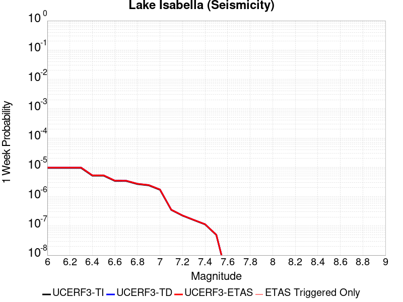 | 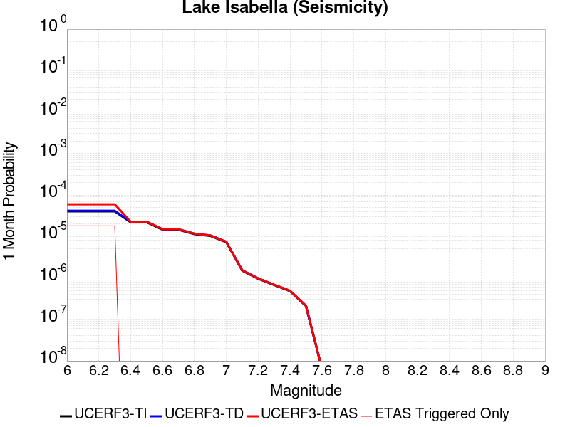 | 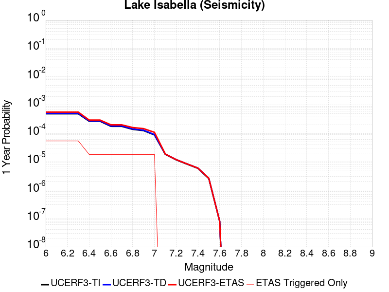 | 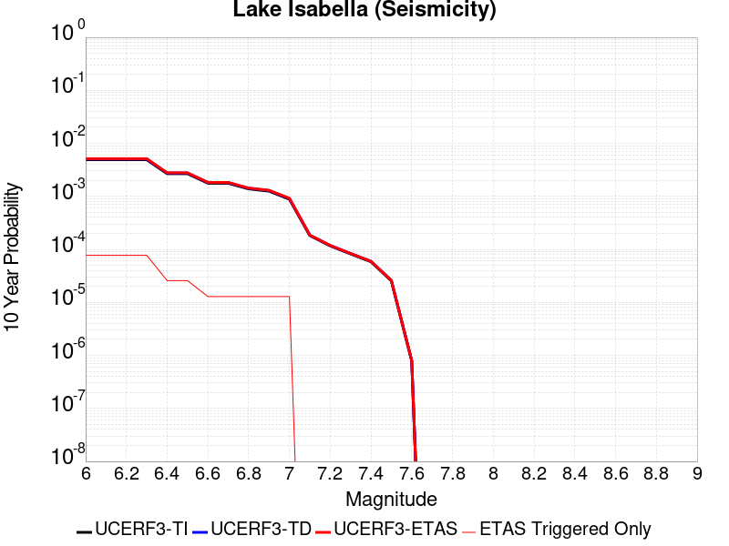 |

| Magnitude | 1 wk TI Prob | 1 wk TD Prob | 1 wk ETAS Prob | 1 wk ETAS/TD Gain | 1 wk ETAS Triggered Only | 1 mo TI Prob | 1 mo TD Prob | 1 mo ETAS Prob | 1 mo ETAS/TD Gain | 1 mo ETAS Triggered Only | 1 yr TI Prob | 1 yr TD Prob | 1 yr ETAS Prob | 1 yr ETAS/TD Gain | 1 yr ETAS Triggered Only | 10 yr TI Prob | 10 yr TD Prob | 10 yr ETAS Prob | 10 yr ETAS/TD Gain | 10 yr ETAS Triggered Only |
|-----|-----|-----|-----|-----|-----|-----|-----|-----|-----|-----|-----|-----|-----|-----|-----|-----|-----|-----|-----|-----|
| 6.0 | 9.431637E-6 | 9.742034E-6 | 9.742034E-6 | 1.0 | 0.0 | 4.0420677E-5 | 4.175098E-5 | 5.980077E-5 | 1.4323201 | 1.8050541E-5 | 4.920106E-4 | 5.082127E-4 | 5.623368E-4 | 1.106499 | 5.4151624E-5 | 0.004909227 | 0.0050717974 | 0.0051795514 | 1.0212457 | 1.0830325E-4 |
| 6.1 | 9.431637E-6 | 9.742034E-6 | 9.742034E-6 | 1.0 | 0.0 | 4.0420677E-5 | 4.175098E-5 | 5.980077E-5 | 1.4323201 | 1.8050541E-5 | 4.920106E-4 | 5.082127E-4 | 5.623368E-4 | 1.106499 | 5.4151624E-5 | 0.004909227 | 0.0050717974 | 0.0051795514 | 1.0212457 | 1.0830325E-4 |
| 6.2 | 9.431637E-6 | 9.742034E-6 | 9.742034E-6 | 1.0 | 0.0 | 4.0420677E-5 | 4.175098E-5 | 5.980077E-5 | 1.4323201 | 1.8050541E-5 | 4.920106E-4 | 5.082127E-4 | 5.623368E-4 | 1.106499 | 5.4151624E-5 | 0.004909227 | 0.0050717974 | 0.0051795514 | 1.0212457 | 1.0830325E-4 |
| 6.3 | 9.431637E-6 | 9.742034E-6 | 9.742034E-6 | 1.0 | 0.0 | 4.0420677E-5 | 4.175098E-5 | 5.980077E-5 | 1.4323201 | 1.8050541E-5 | 4.920106E-4 | 5.082127E-4 | 5.623368E-4 | 1.106499 | 5.4151624E-5 | 0.004909227 | 0.0050717974 | 0.0051795514 | 1.0212457 | 1.0830325E-4 |
| 6.4 | 5.144063E-6 | 5.300268E-6 | 5.300268E-6 | 1.0 | 0.0 | 2.2045799E-5 | 2.2715256E-5 | 2.2715256E-5 | 1.0 | 0.0 | 2.6837454E-4 | 2.765266E-4 | 2.9457215E-4 | 1.0652579 | 1.8050541E-5 | 0.0026805066 | 0.0027621656 | 0.002798167 | 1.0130337 | 3.6101083E-5 |
| 6.5 | 5.144063E-6 | 5.300268E-6 | 5.300268E-6 | 1.0 | 0.0 | 2.2045799E-5 | 2.2715256E-5 | 2.2715256E-5 | 1.0 | 0.0 | 2.6837454E-4 | 2.765266E-4 | 2.9457215E-4 | 1.0652579 | 1.8050541E-5 | 0.0026805066 | 0.0027621656 | 0.002798167 | 1.0130337 | 3.6101083E-5 |
| 6.6 | 3.4009804E-6 | 3.4989064E-6 | 3.4989064E-6 | 1.0 | 0.0 | 1.4575549E-5 | 1.4995236E-5 | 1.4995236E-5 | 1.0 | 0.0 | 1.7744285E-4 | 1.825533E-4 | 2.0060055E-4 | 1.0988601 | 1.8050541E-5 | 0.0017730123 | 0.0018241912 | 0.0018422088 | 1.0098771 | 1.8050541E-5 |
| 6.7 | 3.3880428E-6 | 3.4857728E-6 | 3.4857728E-6 | 1.0 | 0.0 | 1.4520103E-5 | 1.493895E-5 | 1.493895E-5 | 1.0 | 0.0 | 1.767679E-4 | 1.8186813E-4 | 1.9991539E-4 | 1.0992327 | 1.8050541E-5 | 0.0017662736 | 0.0018173507 | 0.0018353685 | 1.0099143 | 1.8050541E-5 |
| 6.8 | 2.6582E-6 | 2.7337928E-6 | 2.7337928E-6 | 1.0 | 0.0 | 1.1392236E-5 | 1.1716211E-5 | 1.1716211E-5 | 1.0 | 0.0 | 1.3869164E-4 | 1.4263687E-4 | 1.6068484E-4 | 1.1265309 | 1.8050541E-5 | 0.0013860512 | 0.0014255852 | 0.0014436101 | 1.0126438 | 1.8050541E-5 |
| 6.9 | 2.406011E-6 | 2.4744127E-6 | 2.4744127E-6 | 1.0 | 0.0 | 1.0311434E-5 | 1.0604591E-5 | 1.0604591E-5 | 1.0 | 0.0 | 1.2553448E-4 | 1.2910456E-4 | 1.4715276E-4 | 1.1397953 | 1.8050541E-5 | 0.0012546359 | 0.0012904252 | 0.0013084525 | 1.01397 | 1.8050541E-5 |
| 7.0 | 1.6953097E-6 | 1.7429957E-6 | 1.7429957E-6 | 1.0 | 0.0 | 7.265593E-6 | 7.469966E-6 | 7.469966E-6 | 1.0 | 0.0 | 8.8455E-5 | 9.0944086E-5 | 1.0899299E-4 | 1.1984615 | 1.8050541E-5 | 8.84198E-4 | 9.091715E-4 | 9.272056E-4 | 1.0198358 | 1.8050541E-5 |
| 7.1 | 3.5013824E-7 | 3.5715678E-7 | 3.5715678E-7 | 1.0 | 0.0 | 1.5005916E-6 | 1.5306709E-6 | 1.5306709E-6 | 1.0 | 0.0 | 1.826955E-5 | 1.8635763E-5 | 1.8635763E-5 | 1.0 | 0.0 | 1.8268047E-4 | 1.8634225E-4 | 1.8634225E-4 | 1.0 | 0.0 |
| 7.2 | 2.2321095E-7 | 2.2751097E-7 | 2.2751097E-7 | 1.0 | 0.0 | 9.56618E-7 | 9.750466E-7 | 9.750466E-7 | 1.0 | 0.0 | 1.1646762E-5 | 1.1871129E-5 | 1.1871129E-5 | 1.0 | 0.0 | 1.1646151E-4 | 1.1870505E-4 | 1.1870505E-4 | 1.0 | 0.0 |
| 7.3 | 1.5760406E-7 | 1.6061287E-7 | 1.6061287E-7 | 1.0 | 0.0 | 6.7544585E-7 | 6.883407E-7 | 6.883407E-7 | 1.0 | 0.0 | 8.223522E-6 | 8.380517E-6 | 8.380517E-6 | 1.0 | 0.0 | 8.2232174E-5 | 8.380207E-5 | 8.380207E-5 | 1.0 | 0.0 |
| 7.4 | 1.1216497E-7 | 1.1431968E-7 | 1.1431968E-7 | 1.0 | 0.0 | 4.8070694E-7 | 4.899414E-7 | 4.899414E-7 | 1.0 | 0.0 | 5.852591E-6 | 5.9650206E-6 | 5.9650206E-6 | 1.0 | 0.0 | 5.8524372E-5 | 5.964865E-5 | 5.964865E-5 | 1.0 | 0.0 |
| 7.5 | 4.885185E-8 | 4.9788877E-8 | 4.9788877E-8 | 1.0 | 0.0 | 2.0936506E-7 | 2.1338089E-7 | 2.1338089E-7 | 1.0 | 0.0 | 2.5490165E-6 | 2.5979093E-6 | 2.5979093E-6 | 1.0 | 0.0 | 2.5489873E-5 | 2.5978808E-5 | 2.5978808E-5 | 1.0 | 0.0 |
| 7.6 | 1.504641E-9 | 1.5318232E-9 | 1.5318232E-9 | 1.0 | 0.0 | 6.4484613E-9 | 6.564957E-9 | 6.564957E-9 | 1.0 | 0.0 | 7.851001E-8 | 7.992835E-8 | 7.992835E-8 | 1.0 | 0.0 | 7.8509987E-7 | 7.992835E-7 | 7.992835E-7 | 1.0 | 0.0 |

## Ludlow
*[(top)](#table-of-contents)*

| 1 Week | 1 Month | 1 Year | 10 Year |
|-----|-----|-----|-----|
| 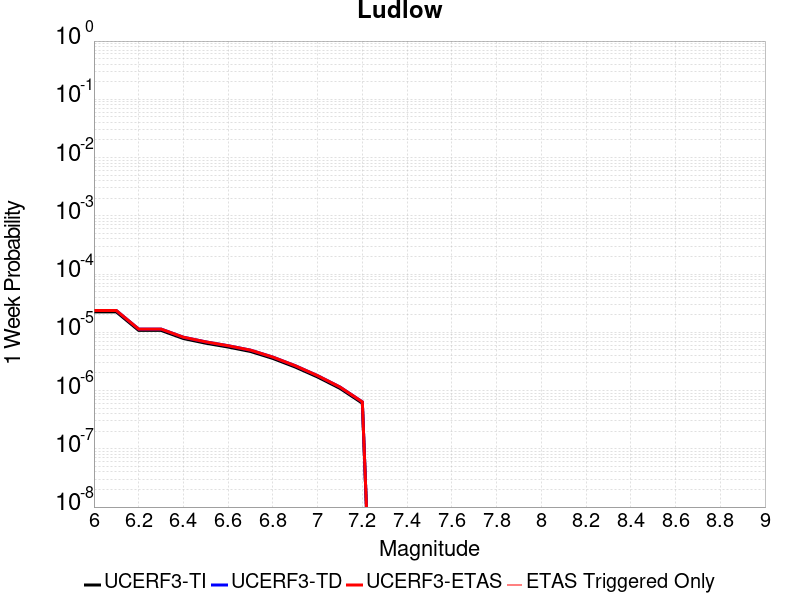 | 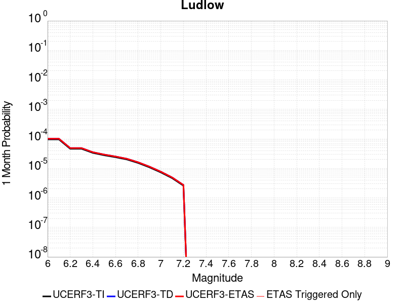 | 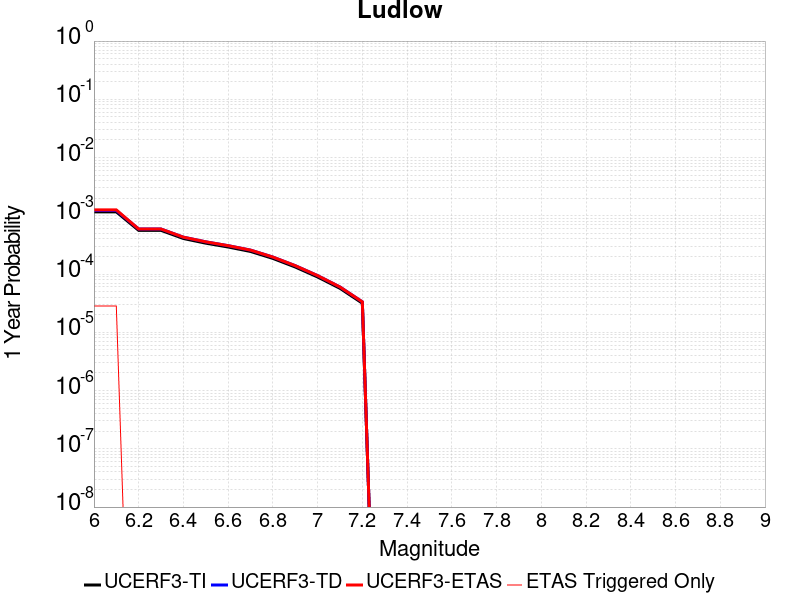 | 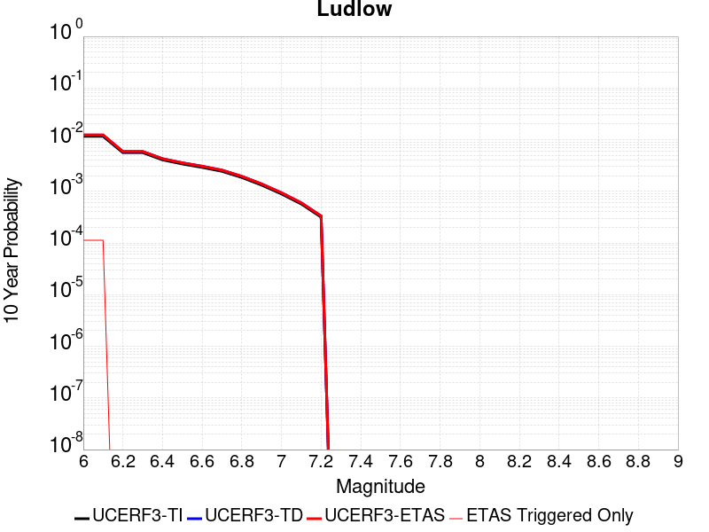 |

| Magnitude | 1 wk TI Prob | 1 wk TD Prob | 1 wk ETAS Prob | 1 wk ETAS/TD Gain | 1 wk ETAS Triggered Only | 1 mo TI Prob | 1 mo TD Prob | 1 mo ETAS Prob | 1 mo ETAS/TD Gain | 1 mo ETAS Triggered Only | 1 yr TI Prob | 1 yr TD Prob | 1 yr ETAS Prob | 1 yr ETAS/TD Gain | 1 yr ETAS Triggered Only | 10 yr TI Prob | 10 yr TD Prob | 10 yr ETAS Prob | 10 yr ETAS/TD Gain | 10 yr ETAS Triggered Only |
|-----|-----|-----|-----|-----|-----|-----|-----|-----|-----|-----|-----|-----|-----|-----|-----|-----|-----|-----|-----|-----|
| 6.0 | 2.2407607E-5 | 2.365883E-5 | 2.365883E-5 | 1.0 | 0.0 | 9.602906E-5 | 1.0139129E-4 | 1.0139129E-4 | 1.0 | 0.0 | 0.0011685267 | 0.001233784 | 0.0012518123 | 1.0146122 | 1.8050541E-5 | 0.011624013 | 0.012273855 | 0.012380829 | 1.0087156 | 1.0830325E-4 |
| 6.1 | 2.2407607E-5 | 2.365883E-5 | 2.365883E-5 | 1.0 | 0.0 | 9.602906E-5 | 1.0139129E-4 | 1.0139129E-4 | 1.0 | 0.0 | 0.0011685267 | 0.001233784 | 0.0012518123 | 1.0146122 | 1.8050541E-5 | 0.011624013 | 0.012273855 | 0.012380829 | 1.0087156 | 1.0830325E-4 |
| 6.2 | 1.0781252E-5 | 1.1366399E-5 | 1.1366399E-5 | 1.0 | 0.0 | 4.620455E-5 | 4.8712252E-5 | 4.8712252E-5 | 1.0 | 0.0 | 5.623952E-4 | 5.9291435E-4 | 5.9291435E-4 | 1.0 | 0.0 | 0.00560974 | 0.005913743 | 0.0059316866 | 1.0030342 | 1.8050541E-5 |
| 6.3 | 1.0781252E-5 | 1.1366399E-5 | 1.1366399E-5 | 1.0 | 0.0 | 4.620455E-5 | 4.8712252E-5 | 4.8712252E-5 | 1.0 | 0.0 | 5.623952E-4 | 5.9291435E-4 | 5.9291435E-4 | 1.0 | 0.0 | 0.00560974 | 0.005913743 | 0.0059316866 | 1.0030342 | 1.8050541E-5 |
| 6.4 | 7.814439E-6 | 8.238262E-6 | 8.238262E-6 | 1.0 | 0.0 | 3.3490025E-5 | 3.5306366E-5 | 3.5306366E-5 | 1.0 | 0.0 | 4.0766477E-4 | 4.2977164E-4 | 4.2977164E-4 | 1.0 | 0.0 | 0.0040691774 | 0.0042895516 | 0.0043075248 | 1.00419 | 1.8050541E-5 |
| 6.5 | 6.4986366E-6 | 6.851363E-6 | 6.851363E-6 | 1.0 | 0.0 | 2.7851002E-5 | 2.936266E-5 | 2.936266E-5 | 1.0 | 0.0 | 3.390332E-4 | 3.5743267E-4 | 3.5743267E-4 | 1.0 | 0.0 | 0.003385164 | 0.003568674 | 0.0035866601 | 1.00504 | 1.8050541E-5 |
| 6.6 | 5.582177E-6 | 5.8863884E-6 | 5.8863884E-6 | 1.0 | 0.0 | 2.3923398E-5 | 2.5227138E-5 | 2.5227138E-5 | 1.0 | 0.0 | 2.9122844E-4 | 3.0709783E-4 | 3.0709783E-4 | 1.0 | 0.0 | 0.0029084706 | 0.003066808 | 0.0030848032 | 1.0058677 | 1.8050541E-5 |
| 6.7 | 4.6858763E-6 | 4.9407477E-6 | 4.9407477E-6 | 1.0 | 0.0 | 2.0082172E-5 | 2.1174465E-5 | 2.1174465E-5 | 1.0 | 0.0 | 2.4447302E-4 | 2.5776916E-4 | 2.5776916E-4 | 1.0 | 0.0 | 0.0024420423 | 0.0025747581 | 0.0025927622 | 1.0069926 | 1.8050541E-5 |
| 6.8 | 3.5584908E-6 | 3.752262E-6 | 3.752262E-6 | 1.0 | 0.0 | 1.5250586E-5 | 1.6081027E-5 | 1.6081027E-5 | 1.0 | 0.0 | 1.8566006E-4 | 1.9576932E-4 | 1.9576932E-4 | 1.0 | 0.0 | 0.0018550502 | 0.0019560095 | 0.0019740248 | 1.0092102 | 1.8050541E-5 |
| 6.9 | 2.532834E-6 | 2.6711775E-6 | 2.6711775E-6 | 1.0 | 0.0 | 1.0854958E-5 | 1.1447854E-5 | 1.1447854E-5 | 1.0 | 0.0 | 1.3215111E-4 | 1.3936899E-4 | 1.3936899E-4 | 1.0 | 0.0 | 0.0013207254 | 0.0013928436 | 0.001410869 | 1.0129415 | 1.8050541E-5 |
| 7.0 | 1.7083285E-6 | 1.8020618E-6 | 1.8020618E-6 | 1.0 | 0.0 | 7.3213873E-6 | 7.7231E-6 | 7.7231E-6 | 1.0 | 0.0 | 8.913424E-5 | 9.402485E-5 | 9.402485E-5 | 1.0 | 0.0 | 8.9098496E-4 | 9.398672E-4 | 9.579008E-4 | 1.0191873 | 1.8050541E-5 |
| 7.1 | 1.0905424E-6 | 1.1498365E-6 | 1.1498365E-6 | 1.0 | 0.0 | 4.6737446E-6 | 4.927862E-6 | 4.927862E-6 | 1.0 | 0.0 | 5.6901354E-5 | 5.9995167E-5 | 5.9995167E-5 | 1.0 | 0.0 | 5.6886784E-4 | 5.997995E-4 | 5.997995E-4 | 1.0 | 0.0 |
| 7.2 | 6.06668E-7 | 6.3876803E-7 | 6.3876803E-7 | 1.0 | 0.0 | 2.600003E-6 | 2.737575E-6 | 2.737575E-6 | 1.0 | 0.0 | 3.1654577E-5 | 3.3329536E-5 | 3.3329536E-5 | 1.0 | 0.0 | 3.1650066E-4 | 3.332522E-4 | 3.332522E-4 | 1.0 | 0.0 |

## Pinto Mtn
*[(top)](#table-of-contents)*

| 1 Week | 1 Month | 1 Year | 10 Year |
|-----|-----|-----|-----|
| 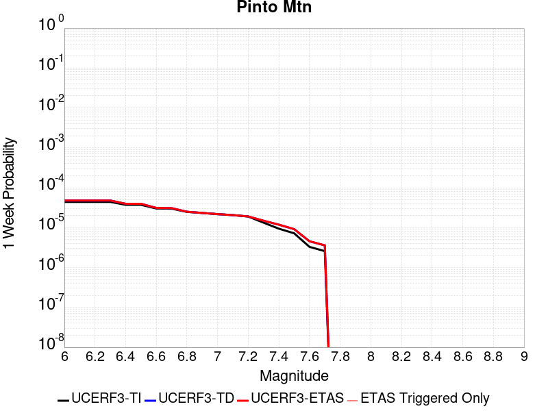 | 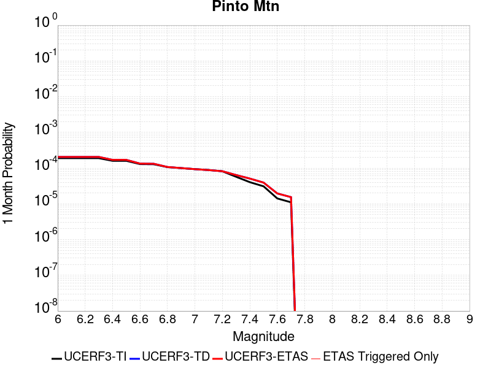 | 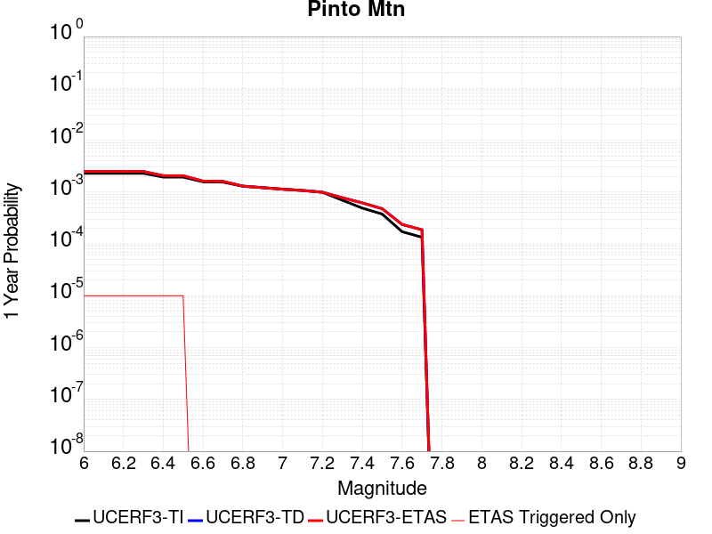 | 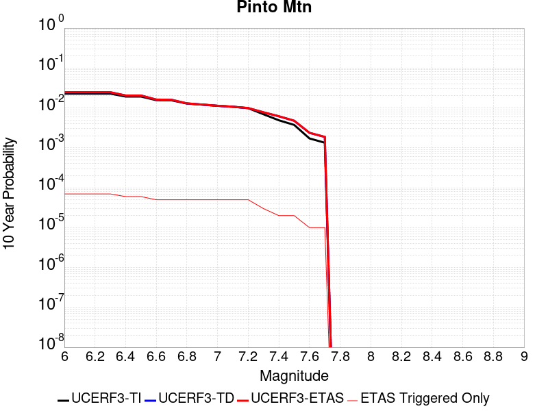 |

| Magnitude | 1 wk TI Prob | 1 wk TD Prob | 1 wk ETAS Prob | 1 wk ETAS/TD Gain | 1 wk ETAS Triggered Only | 1 mo TI Prob | 1 mo TD Prob | 1 mo ETAS Prob | 1 mo ETAS/TD Gain | 1 mo ETAS Triggered Only | 1 yr TI Prob | 1 yr TD Prob | 1 yr ETAS Prob | 1 yr ETAS/TD Gain | 1 yr ETAS Triggered Only | 10 yr TI Prob | 10 yr TD Prob | 10 yr ETAS Prob | 10 yr ETAS/TD Gain | 10 yr ETAS Triggered Only |
|-----|-----|-----|-----|-----|-----|-----|-----|-----|-----|-----|-----|-----|-----|-----|-----|-----|-----|-----|-----|-----|
| 6.0 | 4.4194956E-5 | 4.786811E-5 | 4.786811E-5 | 1.0 | 0.0 | 1.893932E-4 | 2.0513384E-4 | 2.0513384E-4 | 1.0 | 0.0 | 0.0023034236 | 0.0024948085 | 0.002512814 | 1.0072172 | 1.8050541E-5 | 0.022796938 | 0.024685524 | 0.02477355 | 1.0035658 | 9.025271E-5 |
| 6.1 | 4.4194956E-5 | 4.786811E-5 | 4.786811E-5 | 1.0 | 0.0 | 1.893932E-4 | 2.0513384E-4 | 2.0513384E-4 | 1.0 | 0.0 | 0.0023034236 | 0.0024948085 | 0.002512814 | 1.0072172 | 1.8050541E-5 | 0.022796938 | 0.024685524 | 0.02477355 | 1.0035658 | 9.025271E-5 |
| 6.2 | 4.4194956E-5 | 4.786811E-5 | 4.786811E-5 | 1.0 | 0.0 | 1.893932E-4 | 2.0513384E-4 | 2.0513384E-4 | 1.0 | 0.0 | 0.0023034236 | 0.0024948085 | 0.002512814 | 1.0072172 | 1.8050541E-5 | 0.022796938 | 0.024685524 | 0.02477355 | 1.0035658 | 9.025271E-5 |
| 6.3 | 4.4194956E-5 | 4.786811E-5 | 4.786811E-5 | 1.0 | 0.0 | 1.893932E-4 | 2.0513384E-4 | 2.0513384E-4 | 1.0 | 0.0 | 0.0023034236 | 0.0024948085 | 0.002512814 | 1.0072172 | 1.8050541E-5 | 0.022796938 | 0.024685524 | 0.02477355 | 1.0035658 | 9.025271E-5 |
| 6.4 | 3.729929E-5 | 3.961574E-5 | 3.961574E-5 | 1.0 | 0.0 | 1.5984432E-4 | 1.6977121E-4 | 1.6977121E-4 | 1.0 | 0.0 | 0.0019443673 | 0.0020650988 | 0.002083112 | 1.0087227 | 1.8050541E-5 | 0.019274427 | 0.02046911 | 0.020557515 | 1.004319 | 9.025271E-5 |
| 6.5 | 3.729929E-5 | 3.961574E-5 | 3.961574E-5 | 1.0 | 0.0 | 1.5984432E-4 | 1.6977121E-4 | 1.6977121E-4 | 1.0 | 0.0 | 0.0019443673 | 0.0020650988 | 0.002083112 | 1.0087227 | 1.8050541E-5 | 0.019274427 | 0.02046911 | 0.020557515 | 1.004319 | 9.025271E-5 |
| 6.6 | 3.0204548E-5 | 3.121601E-5 | 3.121601E-5 | 1.0 | 0.0 | 1.2944164E-4 | 1.3377622E-4 | 1.3377622E-4 | 1.0 | 0.0 | 0.0015748127 | 0.0016275434 | 0.0016275434 | 1.0 | 0.0 | 0.015636992 | 0.016160108 | 0.016231144 | 1.0043957 | 7.2202165E-5 |
| 6.7 | 2.9857754E-5 | 3.0825333E-5 | 3.0825333E-5 | 1.0 | 0.0 | 1.2795553E-4 | 1.3210207E-4 | 1.3210207E-4 | 1.0 | 0.0 | 0.0015567453 | 0.0016071908 | 0.0016071908 | 1.0 | 0.0 | 0.015458848 | 0.015959518 | 0.016030569 | 1.0044519 | 7.2202165E-5 |
| 6.8 | 2.4819734E-5 | 2.5018951E-5 | 2.5018951E-5 | 1.0 | 0.0 | 1.0636595E-4 | 1.0721979E-4 | 1.0721979E-4 | 1.0 | 0.0 | 0.0012942362 | 0.0013046409 | 0.0013046409 | 1.0 | 0.0 | 0.012867244 | 0.012972187 | 0.013043452 | 1.0054938 | 7.2202165E-5 |
| 6.9 | 2.331124E-5 | 2.3347015E-5 | 2.3347015E-5 | 1.0 | 0.0 | 9.990149E-5 | 1.0005491E-4 | 1.0005491E-4 | 1.0 | 0.0 | 0.001215622 | 0.0012175081 | 0.0012175081 | 1.0 | 0.0 | 0.012089936 | 0.012110573 | 0.012181901 | 1.0058897 | 7.2202165E-5 |
| 7.0 | 2.1818534E-5 | 2.1769963E-5 | 2.1769963E-5 | 1.0 | 0.0 | 9.3504656E-5 | 9.329662E-5 | 9.329662E-5 | 1.0 | 0.0 | 0.0011378246 | 0.0011353142 | 0.0011353142 | 1.0 | 0.0 | 0.011320163 | 0.011297246 | 0.011368633 | 1.0063189 | 7.2202165E-5 |
| 7.1 | 2.066081E-5 | 2.0549436E-5 | 2.0549436E-5 | 1.0 | 0.0 | 8.854332E-5 | 8.806615E-5 | 8.806615E-5 | 1.0 | 0.0 | 0.0010774818 | 0.0010716976 | 0.0010716976 | 1.0 | 0.0 | 0.010722724 | 0.0106673455 | 0.010738777 | 1.0066963 | 7.2202165E-5 |
| 7.2 | 1.8990233E-5 | 1.9062547E-5 | 1.9062547E-5 | 1.0 | 0.0 | 8.138417E-5 | 8.1694176E-5 | 8.1694176E-5 | 1.0 | 0.0 | 9.904018E-4 | 9.941921E-4 | 9.941921E-4 | 1.0 | 0.0 | 0.009859995 | 0.009899444 | 0.009970931 | 1.0072213 | 7.2202165E-5 |
| 7.3 | 1.3335872E-5 | 1.4914513E-5 | 1.4914513E-5 | 1.0 | 0.0 | 5.7152483E-5 | 6.391785E-5 | 6.391785E-5 | 1.0 | 0.0 | 6.956093E-4 | 7.779347E-4 | 7.779347E-4 | 1.0 | 0.0 | 0.006934359 | 0.007753415 | 0.0078071468 | 1.0069301 | 5.4151624E-5 |
| 7.4 | 9.414066E-6 | 1.186835E-5 | 1.186835E-5 | 1.0 | 0.0 | 4.0345374E-5 | 5.086342E-5 | 5.086342E-5 | 1.0 | 0.0 | 4.910942E-4 | 6.1909563E-4 | 6.1909563E-4 | 1.0 | 0.0 | 0.0049001034 | 0.0061746584 | 0.0062105367 | 1.0058105 | 3.6101083E-5 |
| 7.5 | 7.2101157E-6 | 9.165448E-6 | 9.165448E-6 | 1.0 | 0.0 | 3.090013E-5 | 3.9279945E-5 | 3.9279945E-5 | 1.0 | 0.0 | 3.7614413E-4 | 4.781362E-4 | 4.781362E-4 | 1.0 | 0.0 | 0.0037550807 | 0.0047718505 | 0.0048077796 | 1.0075294 | 3.6101083E-5 |
| 7.6 | 3.296375E-6 | 4.5525585E-6 | 4.5525585E-6 | 1.0 | 0.0 | 1.4127245E-5 | 1.9510826E-5 | 1.9510826E-5 | 1.0 | 0.0 | 1.7198564E-4 | 2.3751981E-4 | 2.3751981E-4 | 1.0 | 0.0 | 0.0017185259 | 0.0023727973 | 0.002390805 | 1.0075892 | 1.8050541E-5 |
| 7.7 | 2.5741092E-6 | 3.5910725E-6 | 3.5910725E-6 | 1.0 | 0.0 | 1.103185E-5 | 1.5390227E-5 | 1.5390227E-5 | 1.0 | 0.0 | 1.3430449E-4 | 1.8736123E-4 | 1.8736123E-4 | 1.0 | 0.0 | 0.0013422335 | 0.001872163 | 0.0018901798 | 1.0096235 | 1.8050541E-5 |

## Manix-Afton Hills
*[(top)](#table-of-contents)*

| 1 Week | 1 Month | 1 Year | 10 Year |
|-----|-----|-----|-----|
| 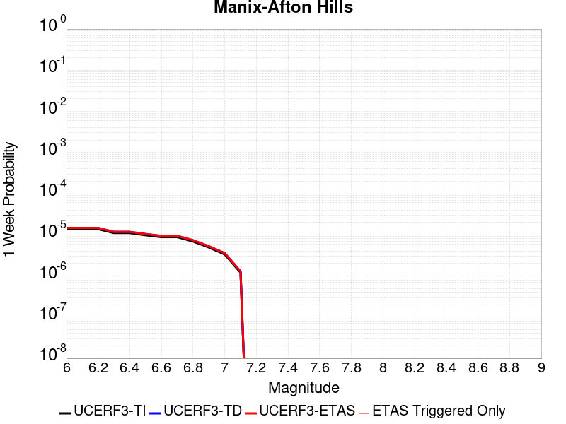 | 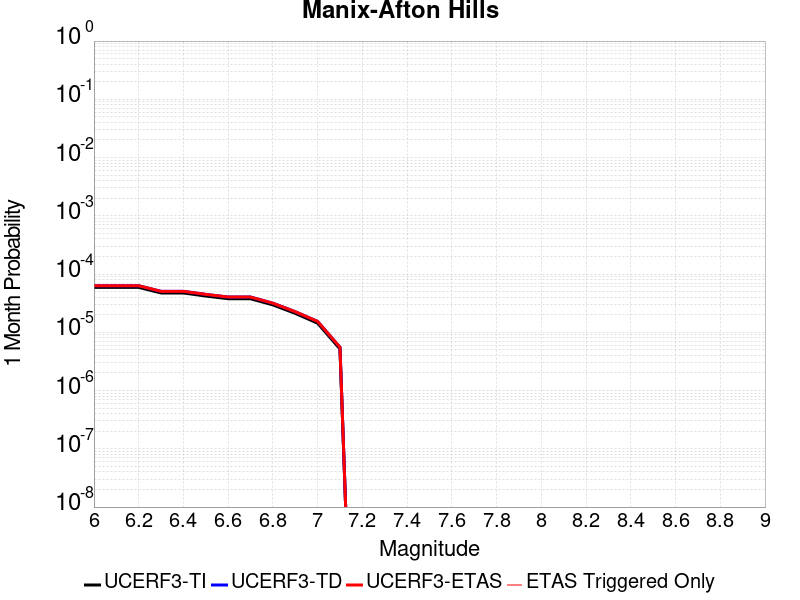 | 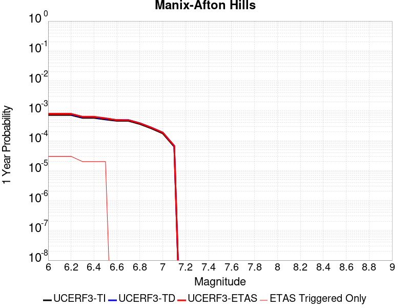 | 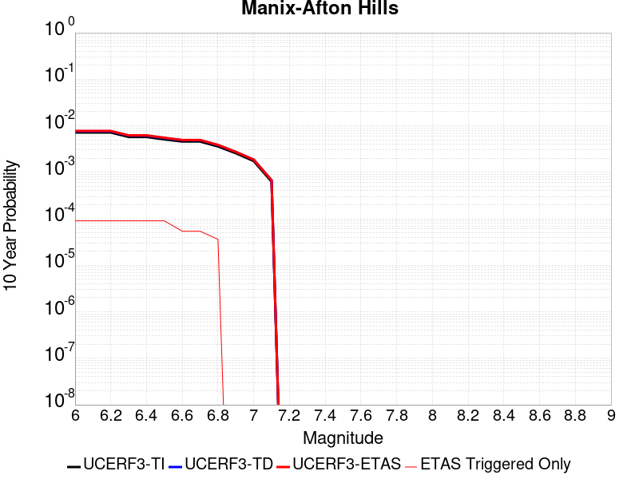 |

| Magnitude | 1 wk TI Prob | 1 wk TD Prob | 1 wk ETAS Prob | 1 wk ETAS/TD Gain | 1 wk ETAS Triggered Only | 1 mo TI Prob | 1 mo TD Prob | 1 mo ETAS Prob | 1 mo ETAS/TD Gain | 1 mo ETAS Triggered Only | 1 yr TI Prob | 1 yr TD Prob | 1 yr ETAS Prob | 1 yr ETAS/TD Gain | 1 yr ETAS Triggered Only | 10 yr TI Prob | 10 yr TD Prob | 10 yr ETAS Prob | 10 yr ETAS/TD Gain | 10 yr ETAS Triggered Only |
|-----|-----|-----|-----|-----|-----|-----|-----|-----|-----|-----|-----|-----|-----|-----|-----|-----|-----|-----|-----|-----|
| 6.0 | 1.3783202E-5 | 1.4712275E-5 | 1.4712275E-5 | 1.0 | 0.0 | 5.906953E-5 | 6.305118E-5 | 6.305118E-5 | 1.0 | 0.0 | 7.189342E-4 | 7.673952E-4 | 7.673952E-4 | 1.0 | 0.0 | 0.0071661277 | 0.0076492094 | 0.007738772 | 1.0117087 | 9.025271E-5 |
| 6.1 | 1.3783202E-5 | 1.4712275E-5 | 1.4712275E-5 | 1.0 | 0.0 | 5.906953E-5 | 6.305118E-5 | 6.305118E-5 | 1.0 | 0.0 | 7.189342E-4 | 7.673952E-4 | 7.673952E-4 | 1.0 | 0.0 | 0.0071661277 | 0.0076492094 | 0.007738772 | 1.0117087 | 9.025271E-5 |
| 6.2 | 1.3783202E-5 | 1.4712275E-5 | 1.4712275E-5 | 1.0 | 0.0 | 5.906953E-5 | 6.305118E-5 | 6.305118E-5 | 1.0 | 0.0 | 7.189342E-4 | 7.673952E-4 | 7.673952E-4 | 1.0 | 0.0 | 0.0071661277 | 0.0076492094 | 0.007738772 | 1.0117087 | 9.025271E-5 |
| 6.3 | 1.10494875E-5 | 1.1794085E-5 | 1.1794085E-5 | 1.0 | 0.0 | 4.7354086E-5 | 5.0545157E-5 | 5.0545157E-5 | 1.0 | 0.0 | 5.763835E-4 | 6.1522395E-4 | 6.1522395E-4 | 1.0 | 0.0 | 0.005748908 | 0.006136248 | 0.006225947 | 1.0146179 | 9.025271E-5 |
| 6.4 | 1.10494875E-5 | 1.1794085E-5 | 1.1794085E-5 | 1.0 | 0.0 | 4.7354086E-5 | 5.0545157E-5 | 5.0545157E-5 | 1.0 | 0.0 | 5.763835E-4 | 6.1522395E-4 | 6.1522395E-4 | 1.0 | 0.0 | 0.005748908 | 0.006136248 | 0.006225947 | 1.0146179 | 9.025271E-5 |
| 6.5 | 9.788949E-6 | 1.045517E-5 | 1.045517E-5 | 1.0 | 0.0 | 4.1951964E-5 | 4.4807155E-5 | 4.4807155E-5 | 1.0 | 0.0 | 5.1064545E-4 | 5.4539985E-4 | 5.4539985E-4 | 1.0 | 0.0 | 0.0050947363 | 0.00544154 | 0.0055313017 | 1.0164956 | 9.025271E-5 |
| 6.6 | 8.810006E-6 | 9.4144E-6 | 9.4144E-6 | 1.0 | 0.0 | 3.775662E-5 | 4.0346855E-5 | 4.0346855E-5 | 1.0 | 0.0 | 4.5958988E-4 | 4.9112114E-4 | 4.9112114E-4 | 1.0 | 0.0 | 0.0045864056 | 0.00490124 | 0.0049551264 | 1.0109944 | 5.4151624E-5 |
| 6.7 | 8.80128E-6 | 9.404879E-6 | 9.404879E-6 | 1.0 | 0.0 | 3.7719226E-5 | 4.030605E-5 | 4.030605E-5 | 1.0 | 0.0 | 4.591348E-4 | 4.906246E-4 | 4.906246E-4 | 1.0 | 0.0 | 0.004581874 | 0.004896296 | 0.004950183 | 1.0110055 | 5.4151624E-5 |
| 6.8 | 6.8994877E-6 | 7.3806914E-6 | 7.3806914E-6 | 1.0 | 0.0 | 2.9568899E-5 | 3.1631196E-5 | 3.1631196E-5 | 1.0 | 0.0 | 3.5994186E-4 | 3.8504993E-4 | 3.8504993E-4 | 1.0 | 0.0 | 0.003593594 | 0.0038446328 | 0.003880595 | 1.0093539 | 3.6101083E-5 |
| 6.9 | 4.9328037E-6 | 5.271394E-6 | 5.271394E-6 | 1.0 | 0.0 | 2.1140417E-5 | 2.2591528E-5 | 2.2591528E-5 | 1.0 | 0.0 | 2.5735417E-4 | 2.7502328E-4 | 2.7502328E-4 | 1.0 | 0.0 | 0.0025705635 | 0.0027474347 | 0.0027474347 | 1.0 | 0.0 |
| 7.0 | 3.347973E-6 | 3.5903408E-6 | 3.5903408E-6 | 1.0 | 0.0 | 1.4348378E-5 | 1.5387108E-5 | 1.5387108E-5 | 1.0 | 0.0 | 1.746775E-4 | 1.8732602E-4 | 1.8732602E-4 | 1.0 | 0.0 | 0.0017454025 | 0.0018720839 | 0.0018720839 | 1.0 | 0.0 |
| 7.1 | 1.2073567E-6 | 1.2935922E-6 | 1.2935922E-6 | 1.0 | 0.0 | 5.1743755E-6 | 5.543964E-6 | 5.543964E-6 | 1.0 | 0.0 | 6.29962E-5 | 6.7497305E-5 | 6.7497305E-5 | 1.0 | 0.0 | 6.297835E-4 | 6.749282E-4 | 6.749282E-4 | 1.0 | 0.0 |

## Owens Valley
*[(top)](#table-of-contents)*

| 1 Week | 1 Month | 1 Year | 10 Year |
|-----|-----|-----|-----|
| 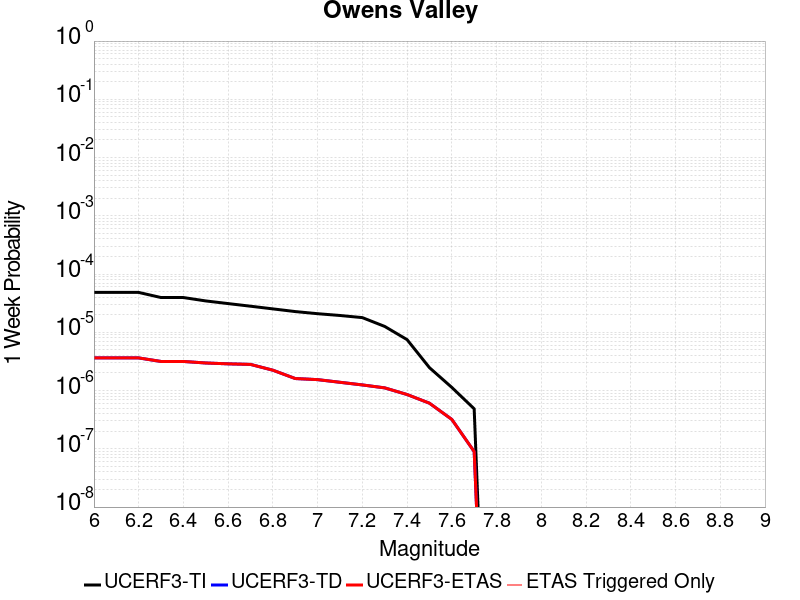 | 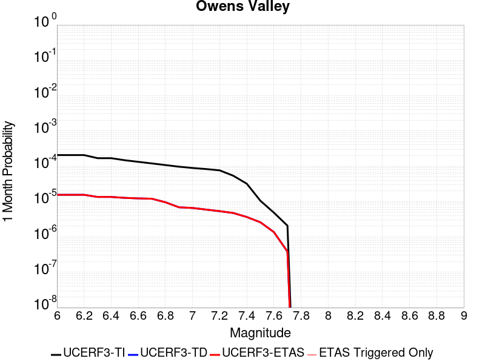 | 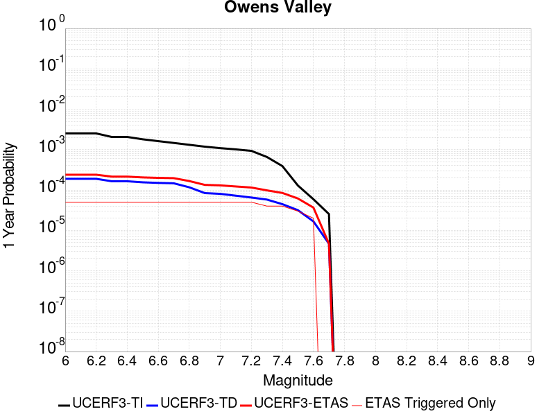 | 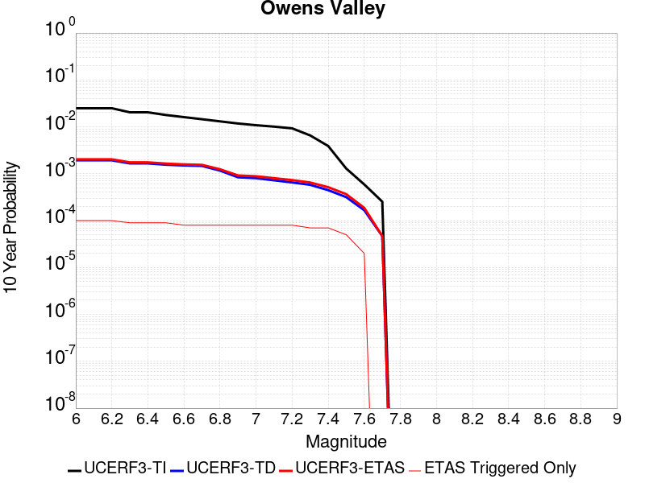 |

| Magnitude | 1 wk TI Prob | 1 wk TD Prob | 1 wk ETAS Prob | 1 wk ETAS/TD Gain | 1 wk ETAS Triggered Only | 1 mo TI Prob | 1 mo TD Prob | 1 mo ETAS Prob | 1 mo ETAS/TD Gain | 1 mo ETAS Triggered Only | 1 yr TI Prob | 1 yr TD Prob | 1 yr ETAS Prob | 1 yr ETAS/TD Gain | 1 yr ETAS Triggered Only | 10 yr TI Prob | 10 yr TD Prob | 10 yr ETAS Prob | 10 yr ETAS/TD Gain | 10 yr ETAS Triggered Only |
|-----|-----|-----|-----|-----|-----|-----|-----|-----|-----|-----|-----|-----|-----|-----|-----|-----|-----|-----|-----|-----|
| 6.0 | 4.83821E-5 | 3.6340298E-6 | 3.6340298E-6 | 1.0 | 0.0 | 2.0733538E-4 | 1.5574326E-5 | 1.5574326E-5 | 1.0 | 0.0 | 0.002521386 | 1.8960191E-4 | 2.0764903E-4 | 1.0951842 | 1.8050541E-5 | 0.024929691 | 0.0019288731 | 0.0020189518 | 1.0467001 | 9.025271E-5 |
| 6.1 | 4.83821E-5 | 3.6340298E-6 | 3.6340298E-6 | 1.0 | 0.0 | 2.0733538E-4 | 1.5574326E-5 | 1.5574326E-5 | 1.0 | 0.0 | 0.002521386 | 1.8960191E-4 | 2.0764903E-4 | 1.0951842 | 1.8050541E-5 | 0.024929691 | 0.0019288731 | 0.0020189518 | 1.0467001 | 9.025271E-5 |
| 6.2 | 4.83821E-5 | 3.6340298E-6 | 3.6340298E-6 | 1.0 | 0.0 | 2.0733538E-4 | 1.5574326E-5 | 1.5574326E-5 | 1.0 | 0.0 | 0.002521386 | 1.8960191E-4 | 2.0764903E-4 | 1.0951842 | 1.8050541E-5 | 0.024929691 | 0.0019288731 | 0.0020189518 | 1.0467001 | 9.025271E-5 |
| 6.3 | 3.953008E-5 | 3.1594443E-6 | 3.1594443E-6 | 1.0 | 0.0 | 1.6940363E-4 | 1.3540409E-5 | 1.3540409E-5 | 1.0 | 0.0 | 0.002060538 | 1.6484274E-4 | 1.8289032E-4 | 1.1094835 | 1.8050541E-5 | 0.020415364 | 0.0016613549 | 0.0017514577 | 1.0542345 | 9.025271E-5 |
| 6.4 | 3.953008E-5 | 3.1594443E-6 | 3.1594443E-6 | 1.0 | 0.0 | 1.6940363E-4 | 1.3540409E-5 | 1.3540409E-5 | 1.0 | 0.0 | 0.002060538 | 1.6484274E-4 | 1.8289032E-4 | 1.1094835 | 1.8050541E-5 | 0.020415364 | 0.0016613549 | 0.0017514577 | 1.0542345 | 9.025271E-5 |
| 6.5 | 3.457342E-5 | 2.9742205E-6 | 2.9742205E-6 | 1.0 | 0.0 | 1.4816338E-4 | 1.2746601E-5 | 1.2746601E-5 | 1.0 | 0.0 | 0.0018023965 | 1.5517951E-4 | 1.7322725E-4 | 1.1163024 | 1.8050541E-5 | 0.017878477 | 0.0015571391 | 0.0016472512 | 1.0578704 | 9.025271E-5 |
| 6.6 | 3.1127765E-5 | 2.876335E-6 | 2.876335E-6 | 1.0 | 0.0 | 1.3339789E-4 | 1.2327096E-5 | 1.2327096E-5 | 1.0 | 0.0 | 0.0016229092 | 1.5007274E-4 | 1.6812058E-4 | 1.1202606 | 1.8050541E-5 | 0.016111081 | 0.0015022376 | 0.0015743313 | 1.0479909 | 7.2202165E-5 |
| 6.7 | 2.806885E-5 | 2.811788E-6 | 2.811788E-6 | 1.0 | 0.0 | 1.2028952E-4 | 1.2050467E-5 | 1.2050467E-5 | 1.0 | 0.0 | 0.001463541 | 1.4670525E-4 | 1.6475315E-4 | 1.1230215 | 1.8050541E-5 | 0.014539397 | 0.0014664701 | 0.0015385664 | 1.0491631 | 7.2202165E-5 |
| 6.8 | 2.524524E-5 | 2.2365584E-6 | 2.2365584E-6 | 1.0 | 0.0 | 1.0818939E-4 | 9.5852165E-6 | 9.5852165E-6 | 1.0 | 0.0 | 0.0013164099 | 1.16694064E-4 | 1.347425E-4 | 1.1546645 | 1.8050541E-5 | 0.01308639 | 0.0011666018 | 0.0012387197 | 1.0618188 | 7.2202165E-5 |
| 6.9 | 2.2704568E-5 | 1.6090452E-6 | 1.6090452E-6 | 1.0 | 0.0 | 9.730166E-5 | 6.8958893E-6 | 6.8958893E-6 | 1.0 | 0.0 | 0.0011840039 | 8.395424E-5 | 1.02003265E-4 | 1.2149864 | 1.8050541E-5 | 0.011777153 | 8.394386E-4 | 9.1158017E-4 | 1.0859402 | 7.2202165E-5 |
| 7.0 | 2.0871712E-5 | 1.540374E-6 | 1.540374E-6 | 1.0 | 0.0 | 8.944713E-5 | 6.6015864E-6 | 6.6015864E-6 | 1.0 | 0.0 | 0.0010884746 | 8.037136E-5 | 9.842045E-5 | 1.2245711 | 1.8050541E-5 | 0.010831586 | 8.0359745E-4 | 8.757416E-4 | 1.0897765 | 7.2202165E-5 |
| 7.1 | 1.944928E-5 | 1.3871262E-6 | 1.3871262E-6 | 1.0 | 0.0 | 8.335139E-5 | 5.944813E-6 | 5.944813E-6 | 1.0 | 0.0 | 0.0010143308 | 7.2375704E-5 | 9.042494E-5 | 1.2493825 | 1.8050541E-5 | 0.010097133 | 7.2368147E-4 | 7.958314E-4 | 1.0996984 | 7.2202165E-5 |
| 7.2 | 1.7876306E-5 | 1.2495374E-6 | 1.2495374E-6 | 1.0 | 0.0 | 7.6610486E-5 | 5.3551494E-6 | 5.3551494E-6 | 1.0 | 0.0 | 9.3233347E-4 | 6.5197004E-5 | 8.324636E-5 | 1.2768434 | 1.8050541E-5 | 0.009284316 | 6.519179E-4 | 7.24073E-4 | 1.1106813 | 7.2202165E-5 |
| 7.3 | 1.2618672E-5 | 1.1120997E-6 | 1.1120997E-6 | 1.0 | 0.0 | 5.40789E-5 | 4.766133E-6 | 4.766133E-6 | 1.0 | 0.0 | 6.582117E-4 | 5.8026126E-5 | 7.607562E-5 | 1.311058 | 1.8050541E-5 | 0.0065626553 | 5.8024394E-4 | 6.524042E-4 | 1.124362 | 7.2202165E-5 |
| 7.4 | 7.4874442E-6 | 8.553511E-7 | 8.553511E-7 | 1.0 | 0.0 | 3.208865E-5 | 3.6657855E-6 | 3.6657855E-6 | 1.0 | 0.0 | 3.906093E-4 | 4.463003E-5 | 6.267976E-5 | 1.4044303 | 1.8050541E-5 | 0.003899234 | 4.4630433E-4 | 5.1847426E-4 | 1.1617056 | 7.2202165E-5 |
| 7.5 | 2.4734156E-6 | 6.0718537E-7 | 6.0718537E-7 | 1.0 | 0.0 | 1.060031E-5 | 2.6022205E-6 | 2.6022205E-6 | 1.0 | 0.0 | 1.2905113E-4 | 3.168158E-5 | 4.973155E-5 | 1.5697308 | 1.8050541E-5 | 0.0012897621 | 3.1677092E-4 | 3.709054E-4 | 1.1708947 | 5.4151624E-5 |
| 7.6 | 1.1328841E-6 | 3.1981372E-7 | 3.1981372E-7 | 1.0 | 0.0 | 4.8552088E-6 | 1.3706295E-6 | 1.3706295E-6 | 1.0 | 0.0 | 5.9110564E-5 | 1.6687289E-5 | 3.4737528E-5 | 2.081676 | 1.8050541E-5 | 5.9094845E-4 | 1.6686055E-4 | 1.8490807E-4 | 1.1081593 | 1.8050541E-5 |
| 7.7 | 4.8613185E-7 | 8.970946E-8 | 8.970946E-8 | 1.0 | 0.0 | 2.0834207E-6 | 3.8446908E-7 | 3.8446908E-7 | 1.0 | 0.0 | 2.536535E-5 | 4.6809014E-6 | 4.6809014E-6 | 1.0 | 0.0 | 2.5362454E-4 | 4.6808098E-5 | 4.6808098E-5 | 1.0 | 0.0 |

## Chino alt 1
*[(top)](#table-of-contents)*

| 1 Week | 1 Month | 1 Year | 10 Year |
|-----|-----|-----|-----|
| 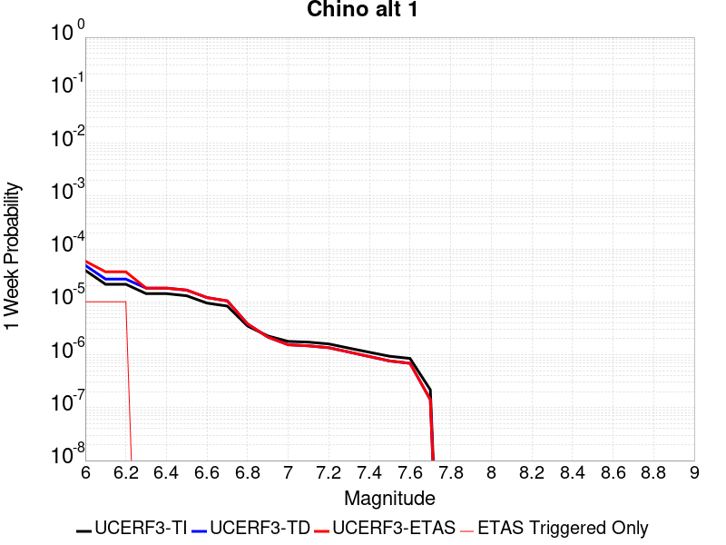 | 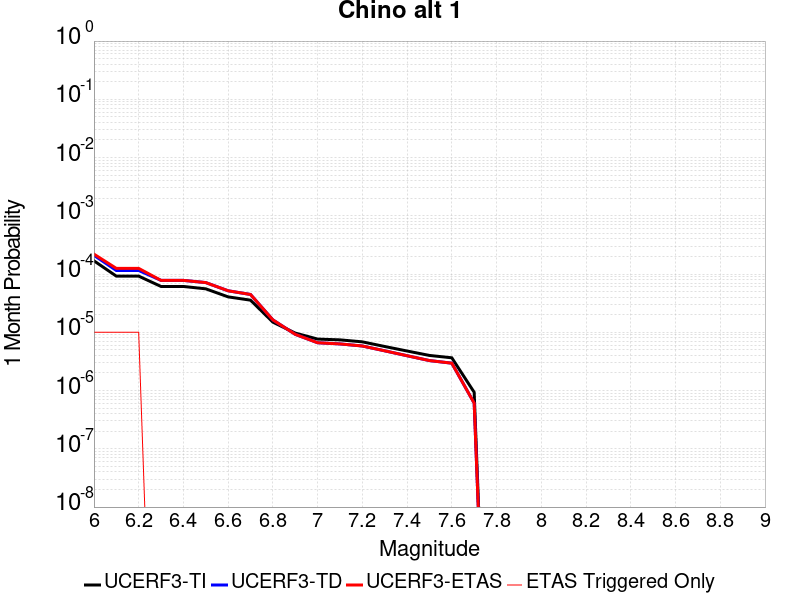 | 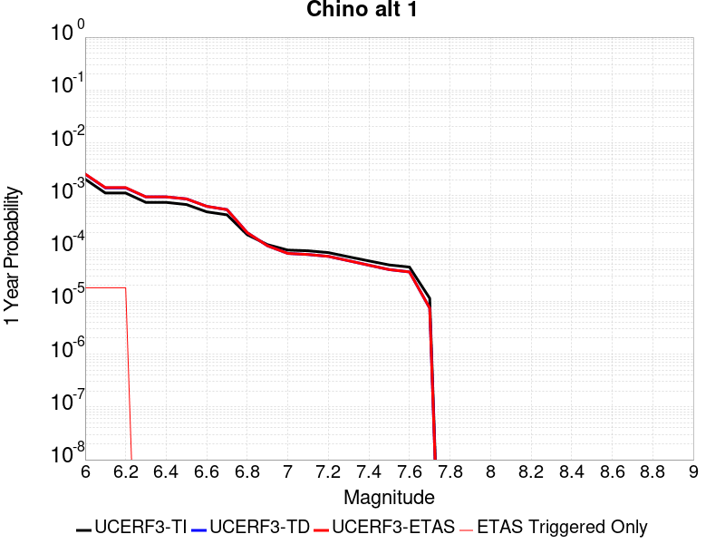 |  |

| Magnitude | 1 wk TI Prob | 1 wk TD Prob | 1 wk ETAS Prob | 1 wk ETAS/TD Gain | 1 wk ETAS Triggered Only | 1 mo TI Prob | 1 mo TD Prob | 1 mo ETAS Prob | 1 mo ETAS/TD Gain | 1 mo ETAS Triggered Only | 1 yr TI Prob | 1 yr TD Prob | 1 yr ETAS Prob | 1 yr ETAS/TD Gain | 1 yr ETAS Triggered Only | 10 yr TI Prob | 10 yr TD Prob | 10 yr ETAS Prob | 10 yr ETAS/TD Gain | 10 yr ETAS Triggered Only |
|-----|-----|-----|-----|-----|-----|-----|-----|-----|-----|-----|-----|-----|-----|-----|-----|-----|-----|-----|-----|-----|
| 6.0 | 3.939946E-5 | 4.8965434E-5 | 6.701509E-5 | 1.3686204 | 1.8050541E-5 | 1.6884391E-4 | 2.0983793E-4 | 2.2788468E-4 | 1.0860033 | 1.8050541E-5 | 0.0020537362 | 0.0025522613 | 0.002570266 | 1.0070543 | 1.8050541E-5 | 0.020348595 | 0.025286373 | 0.025374344 | 1.003479 | 9.025271E-5 |
| 6.1 | 2.1505624E-5 | 2.688973E-5 | 4.4939785E-5 | 1.6712621 | 1.8050541E-5 | 9.2163704E-5 | 1.15237235E-4 | 1.3328569E-4 | 1.15662 | 1.8050541E-5 | 0.0011215154 | 0.0014022217 | 0.001420247 | 1.0128548 | 1.8050541E-5 | 0.011158722 | 0.013950607 | 0.014004003 | 1.0038276 | 5.4151624E-5 |
| 6.2 | 2.1505624E-5 | 2.688973E-5 | 4.4939785E-5 | 1.6712621 | 1.8050541E-5 | 9.2163704E-5 | 1.15237235E-4 | 1.3328569E-4 | 1.15662 | 1.8050541E-5 | 0.0011215154 | 0.0014022217 | 0.001420247 | 1.0128548 | 1.8050541E-5 | 0.011158722 | 0.013950607 | 0.014004003 | 1.0038276 | 5.4151624E-5 |
| 6.3 | 1.4290785E-5 | 1.8173663E-5 | 1.8173663E-5 | 1.0 | 0.0 | 6.1244784E-5 | 7.788506E-5 | 7.788506E-5 | 1.0 | 0.0 | 7.454001E-4 | 9.478834E-4 | 9.478834E-4 | 1.0 | 0.0 | 0.007429048 | 0.009448829 | 0.009466709 | 1.0018923 | 1.8050541E-5 |
| 6.4 | 1.4290785E-5 | 1.8173663E-5 | 1.8173663E-5 | 1.0 | 0.0 | 6.1244784E-5 | 7.788506E-5 | 7.788506E-5 | 1.0 | 0.0 | 7.454001E-4 | 9.478834E-4 | 9.478834E-4 | 1.0 | 0.0 | 0.007429048 | 0.009448829 | 0.009466709 | 1.0018923 | 1.8050541E-5 |
| 6.5 | 1.3017944E-5 | 1.6660282E-5 | 1.6660282E-5 | 1.0 | 0.0 | 5.5789995E-5 | 7.13995E-5 | 7.13995E-5 | 1.0 | 0.0 | 6.790315E-4 | 8.68986E-4 | 8.68986E-4 | 1.0 | 0.0 | 0.0067696036 | 0.0086661475 | 0.0086661475 | 1.0 | 0.0 |
| 6.6 | 9.470016E-6 | 1.2045668E-5 | 1.2045668E-5 | 1.0 | 0.0 | 4.058515E-5 | 5.162346E-5 | 5.162346E-5 | 1.0 | 0.0 | 4.940122E-4 | 6.2836835E-4 | 6.2836835E-4 | 1.0 | 0.0 | 0.004929154 | 0.0062751123 | 0.0062751123 | 1.0 | 0.0 |
| 6.7 | 8.314155E-6 | 1.0413295E-5 | 1.0413295E-5 | 1.0 | 0.0 | 3.5631605E-5 | 4.4627825E-5 | 4.4627825E-5 | 1.0 | 0.0 | 4.3372845E-4 | 5.432406E-4 | 5.432406E-4 | 1.0 | 0.0 | 0.004328829 | 0.0054286425 | 0.0054286425 | 1.0 | 0.0 |
| 6.8 | 3.4856364E-6 | 3.815419E-6 | 3.815419E-6 | 1.0 | 0.0 | 1.4938357E-5 | 1.6351705E-5 | 1.6351705E-5 | 1.0 | 0.0 | 1.8185932E-4 | 1.990659E-4 | 1.990659E-4 | 1.0 | 0.0 | 0.0018171056 | 0.0019905514 | 0.0019905514 | 1.0 | 0.0 |
| 6.9 | 2.2645952E-6 | 2.154323E-6 | 2.154323E-6 | 1.0 | 0.0 | 9.705372E-6 | 9.232782E-6 | 9.232782E-6 | 1.0 | 0.0 | 1.18156495E-4 | 1.1240353E-4 | 1.1240353E-4 | 1.0 | 0.0 | 0.0011809369 | 0.0011240831 | 0.0011240831 | 1.0 | 0.0 |
| 7.0 | 1.7864003E-6 | 1.5443393E-6 | 1.5443393E-6 | 1.0 | 0.0 | 7.655979E-6 | 6.6185803E-6 | 6.6185803E-6 | 1.0 | 0.0 | 9.3207556E-5 | 8.05783E-5 | 8.05783E-5 | 1.0 | 0.0 | 9.316847E-4 | 8.0593803E-4 | 8.0593803E-4 | 1.0 | 0.0 |
| 7.1 | 1.7315456E-6 | 1.4745923E-6 | 1.4745923E-6 | 1.0 | 0.0 | 7.420889E-6 | 6.319666E-6 | 6.319666E-6 | 1.0 | 0.0 | 9.034557E-5 | 7.693928E-5 | 7.693928E-5 | 1.0 | 0.0 | 9.0308854E-4 | 7.695644E-4 | 7.695644E-4 | 1.0 | 0.0 |
| 7.2 | 1.6008337E-6 | 1.3586064E-6 | 1.3586064E-6 | 1.0 | 0.0 | 6.860698E-6 | 5.8225864E-6 | 5.8225864E-6 | 1.0 | 0.0 | 8.352579E-5 | 7.0887734E-5 | 7.0887734E-5 | 1.0 | 0.0 | 8.34944E-4 | 7.090756E-4 | 7.090756E-4 | 1.0 | 0.0 |
| 7.3 | 1.3320939E-6 | 1.1228705E-6 | 1.1228705E-6 | 1.0 | 0.0 | 5.7089615E-6 | 4.8122934E-6 | 4.8122934E-6 | 1.0 | 0.0 | 6.9504385E-5 | 5.8588146E-5 | 5.8588146E-5 | 1.0 | 0.0 | 6.9482654E-4 | 5.8587163E-4 | 5.8587163E-4 | 1.0 | 0.0 |
| 7.4 | 1.114294E-6 | 9.247189E-7 | 9.247189E-7 | 1.0 | 0.0 | 4.775537E-6 | 3.9630754E-6 | 3.9630754E-6 | 1.0 | 0.0 | 5.8140613E-5 | 4.824941E-5 | 4.824941E-5 | 1.0 | 0.0 | 5.81254E-4 | 4.8240615E-4 | 4.8240615E-4 | 1.0 | 0.0 |
| 7.5 | 9.354081E-7 | 7.632863E-7 | 7.632863E-7 | 1.0 | 0.0 | 4.0088858E-6 | 3.2712232E-6 | 3.2712232E-6 | 1.0 | 0.0 | 4.8807087E-5 | 3.982645E-5 | 3.982645E-5 | 1.0 | 0.0 | 4.879637E-4 | 3.981965E-4 | 3.981965E-4 | 1.0 | 0.0 |
| 7.6 | 8.521771E-7 | 6.889869E-7 | 6.889869E-7 | 1.0 | 0.0 | 3.6521824E-6 | 2.9527978E-6 | 2.9527978E-6 | 1.0 | 0.0 | 4.4464414E-5 | 3.5949754E-5 | 3.5949754E-5 | 1.0 | 0.0 | 4.4455516E-4 | 3.5944255E-4 | 3.5944255E-4 | 1.0 | 0.0 |
| 7.7 | 2.1803626E-7 | 1.4211666E-7 | 1.4211666E-7 | 1.0 | 0.0 | 9.344408E-7 | 6.090713E-7 | 6.090713E-7 | 1.0 | 0.0 | 1.1376757E-5 | 7.415428E-6 | 7.415428E-6 | 1.0 | 0.0 | 1.13761744E-4 | 7.415277E-5 | 7.415277E-5 | 1.0 | 0.0 |

## Big Pine (East)
*[(top)](#table-of-contents)*

| 1 Week | 1 Month | 1 Year | 10 Year |
|-----|-----|-----|-----|
| 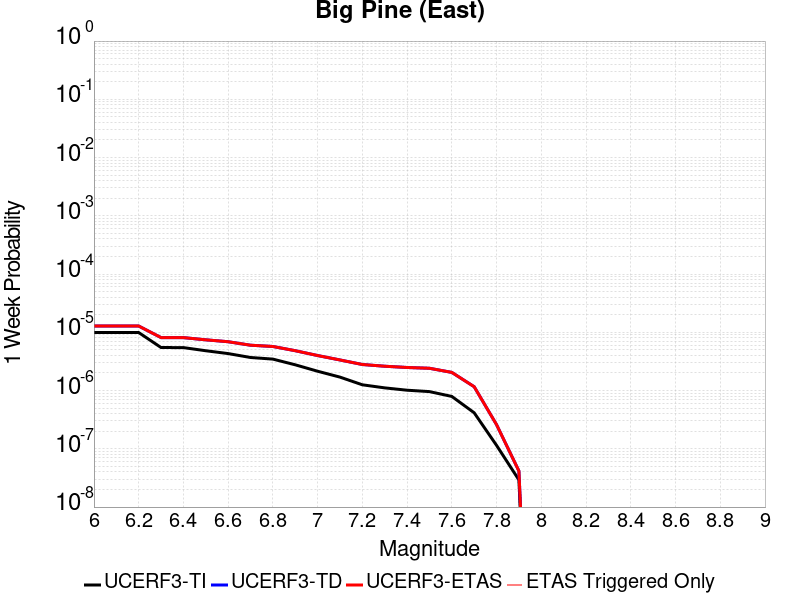 | 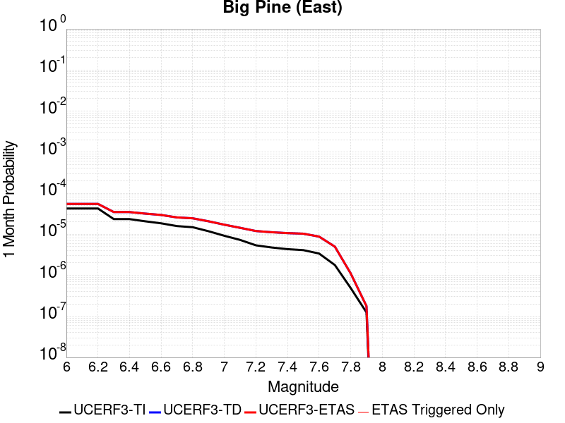 | 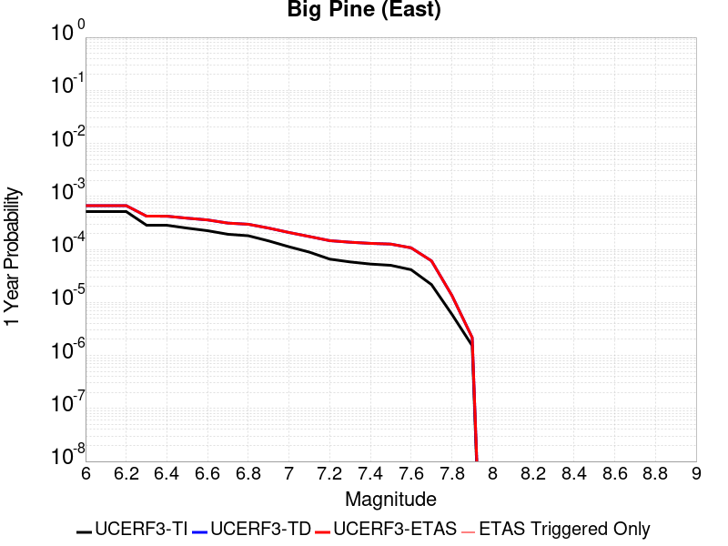 | 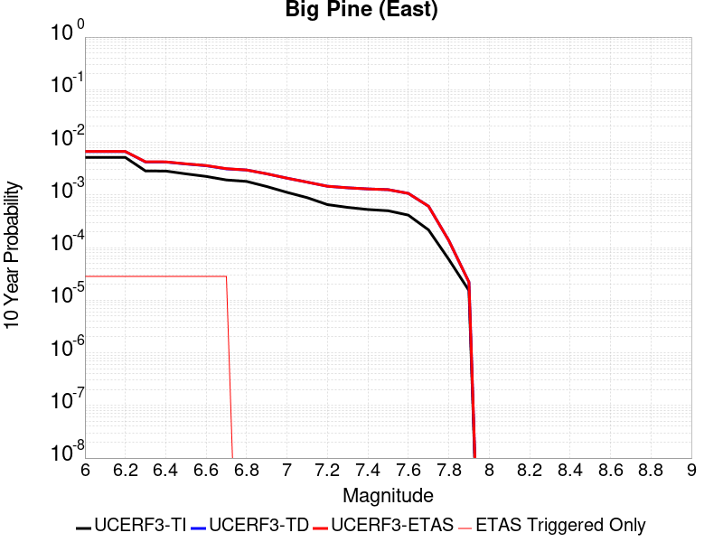 |

| Magnitude | 1 wk TI Prob | 1 wk TD Prob | 1 wk ETAS Prob | 1 wk ETAS/TD Gain | 1 wk ETAS Triggered Only | 1 mo TI Prob | 1 mo TD Prob | 1 mo ETAS Prob | 1 mo ETAS/TD Gain | 1 mo ETAS Triggered Only | 1 yr TI Prob | 1 yr TD Prob | 1 yr ETAS Prob | 1 yr ETAS/TD Gain | 1 yr ETAS Triggered Only | 10 yr TI Prob | 10 yr TD Prob | 10 yr ETAS Prob | 10 yr ETAS/TD Gain | 10 yr ETAS Triggered Only |
|-----|-----|-----|-----|-----|-----|-----|-----|-----|-----|-----|-----|-----|-----|-----|-----|-----|-----|-----|-----|-----|
| 6.0 | 9.916913E-6 | 1.2828203E-5 | 1.2828203E-5 | 1.0 | 0.0 | 4.250036E-5 | 5.4976976E-5 | 5.4976976E-5 | 1.0 | 0.0 | 5.173191E-4 | 6.6916127E-4 | 6.6916127E-4 | 1.0 | 0.0 | 0.0051611643 | 0.00667616 | 0.00676581 | 1.0134284 | 9.025271E-5 |
| 6.1 | 9.916913E-6 | 1.2828203E-5 | 1.2828203E-5 | 1.0 | 0.0 | 4.250036E-5 | 5.4976976E-5 | 5.4976976E-5 | 1.0 | 0.0 | 5.173191E-4 | 6.6916127E-4 | 6.6916127E-4 | 1.0 | 0.0 | 0.0051611643 | 0.00667616 | 0.00676581 | 1.0134284 | 9.025271E-5 |
| 6.2 | 9.916913E-6 | 1.2828203E-5 | 1.2828203E-5 | 1.0 | 0.0 | 4.250036E-5 | 5.4976976E-5 | 5.4976976E-5 | 1.0 | 0.0 | 5.173191E-4 | 6.6916127E-4 | 6.6916127E-4 | 1.0 | 0.0 | 0.0051611643 | 0.00667616 | 0.00676581 | 1.0134284 | 9.025271E-5 |
| 6.3 | 5.479711E-6 | 8.123831E-6 | 8.123831E-6 | 1.0 | 0.0 | 2.3484265E-5 | 3.4815974E-5 | 3.4815974E-5 | 1.0 | 0.0 | 2.858834E-4 | 4.2380524E-4 | 4.2380524E-4 | 1.0 | 0.0 | 0.0028551589 | 0.0042328 | 0.004304697 | 1.0169855 | 7.2202165E-5 |
| 6.4 | 5.465009E-6 | 8.108123E-6 | 8.108123E-6 | 1.0 | 0.0 | 2.3421257E-5 | 3.4748657E-5 | 3.4748657E-5 | 1.0 | 0.0 | 2.851165E-4 | 4.2298596E-4 | 4.2298596E-4 | 1.0 | 0.0 | 0.0028475097 | 0.004224639 | 0.0042965356 | 1.0170186 | 7.2202165E-5 |
| 6.5 | 4.826767E-6 | 7.4331338E-6 | 7.4331338E-6 | 1.0 | 0.0 | 2.068598E-5 | 3.1855914E-5 | 3.1855914E-5 | 1.0 | 0.0 | 2.518227E-4 | 3.8777952E-4 | 3.8777952E-4 | 1.0 | 0.0 | 0.0025153751 | 0.003873817 | 0.0039457395 | 1.0185663 | 7.2202165E-5 |
| 6.6 | 4.3146847E-6 | 6.8930344E-6 | 6.8930344E-6 | 1.0 | 0.0 | 1.8491375E-5 | 2.9541256E-5 | 2.9541256E-5 | 1.0 | 0.0 | 2.2510924E-4 | 3.596079E-4 | 3.596079E-4 | 1.0 | 0.0 | 0.0022488134 | 0.0035930157 | 0.0036649583 | 1.020023 | 7.2202165E-5 |
| 6.7 | 3.6968106E-6 | 6.005633E-6 | 6.005633E-6 | 1.0 | 0.0 | 1.5843378E-5 | 2.5738183E-5 | 2.5738183E-5 | 1.0 | 0.0 | 1.9287605E-4 | 3.1331886E-4 | 3.1331886E-4 | 1.0 | 0.0 | 0.0019270873 | 0.0031314366 | 0.0031854187 | 1.0172387 | 5.4151624E-5 |
| 6.8 | 3.4671132E-6 | 5.7120624E-6 | 5.7120624E-6 | 1.0 | 0.0 | 1.4858972E-5 | 2.4480045E-5 | 2.4480045E-5 | 1.0 | 0.0 | 1.8089297E-4 | 2.9800524E-4 | 2.9800524E-4 | 1.0 | 0.0 | 0.0018074579 | 0.002978713 | 0.0030147065 | 1.0120836 | 3.6101083E-5 |
| 6.9 | 2.7686972E-6 | 4.83435E-6 | 4.83435E-6 | 1.0 | 0.0 | 1.1865792E-5 | 2.0718482E-5 | 2.0718482E-5 | 1.0 | 0.0 | 1.4445644E-4 | 2.5221906E-4 | 2.5221906E-4 | 1.0 | 0.0 | 0.0014436257 | 0.002521917 | 0.002539922 | 1.0071394 | 1.8050541E-5 |
| 7.0 | 2.1472624E-6 | 3.9933316E-6 | 3.9933316E-6 | 1.0 | 0.0 | 9.20252E-6 | 1.711417E-5 | 1.711417E-5 | 1.0 | 0.0 | 1.12034926E-4 | 2.0834562E-4 | 2.0834562E-4 | 1.0 | 0.0 | 0.0011197845 | 0.0020840596 | 0.0021020726 | 1.0086432 | 1.8050541E-5 |
| 7.1 | 1.7018335E-6 | 3.3524213E-6 | 3.3524213E-6 | 1.0 | 0.0 | 7.293552E-6 | 1.4367443E-5 | 1.4367443E-5 | 1.0 | 0.0 | 8.879537E-5 | 1.7490993E-4 | 1.7490993E-4 | 1.0 | 0.0 | 8.87599E-4 | 0.0017502479 | 0.0017682668 | 1.010295 | 1.8050541E-5 |
| 7.2 | 1.25603E-6 | 2.801612E-6 | 2.801612E-6 | 1.0 | 0.0 | 5.3829745E-6 | 1.2006855E-5 | 1.2006855E-5 | 1.0 | 0.0 | 6.553574E-5 | 1.4617387E-4 | 1.4617387E-4 | 1.0 | 0.0 | 6.551642E-4 | 0.0014632781 | 0.0014632781 | 1.0 | 0.0 |
| 7.3 | 1.112297E-6 | 2.6170628E-6 | 2.6170628E-6 | 1.0 | 0.0 | 4.7669787E-6 | 1.1215937E-5 | 1.1215937E-5 | 1.0 | 0.0 | 5.803642E-5 | 1.3654568E-4 | 1.3654568E-4 | 1.0 | 0.0 | 5.802127E-4 | 0.0013669501 | 0.0013669501 | 1.0 | 0.0 |
| 7.4 | 1.0137181E-6 | 2.4899339E-6 | 2.4899339E-6 | 1.0 | 0.0 | 4.3444993E-6 | 1.0671102E-5 | 1.0671102E-5 | 1.0 | 0.0 | 5.2892992E-5 | 1.2991314E-4 | 1.2991314E-4 | 1.0 | 0.0 | 5.288041E-4 | 0.0013004885 | 0.0013004885 | 1.0 | 0.0 |
| 7.5 | 9.598608E-7 | 2.4133985E-6 | 2.4133985E-6 | 1.0 | 0.0 | 4.1136827E-6 | 1.0343097E-5 | 1.0343097E-5 | 1.0 | 0.0 | 5.0082934E-5 | 1.2592014E-4 | 1.2592014E-4 | 1.0 | 0.0 | 5.007165E-4 | 0.0012604133 | 0.0012604133 | 1.0 | 0.0 |
| 7.6 | 7.929459E-7 | 2.0503796E-6 | 2.0503796E-6 | 1.0 | 0.0 | 3.3983351E-6 | 8.787312E-6 | 8.787312E-6 | 1.0 | 0.0 | 4.1373947E-5 | 1.0698045E-4 | 1.0698045E-4 | 1.0 | 0.0 | 4.1366243E-4 | 0.0010713132 | 0.0010713132 | 1.0 | 0.0 |
| 7.7 | 4.155788E-7 | 1.1644736E-6 | 1.1644736E-6 | 1.0 | 0.0 | 1.7810507E-6 | 4.9905916E-6 | 4.9905916E-6 | 1.0 | 0.0 | 2.1684076E-5 | 6.07588E-5 | 6.07588E-5 | 1.0 | 0.0 | 2.1681961E-4 | 6.105491E-4 | 6.105491E-4 | 1.0 | 0.0 |
| 7.8 | 1.14666925E-7 | 2.6008183E-7 | 2.6008183E-7 | 1.0 | 0.0 | 4.914296E-7 | 1.114636E-6 | 1.114636E-6 | 1.0 | 0.0 | 5.9831386E-6 | 1.3570612E-5 | 1.3570612E-5 | 1.0 | 0.0 | 5.9829777E-5 | 1.3679237E-4 | 1.3679237E-4 | 1.0 | 0.0 |
| 7.9 | 2.9231824E-8 | 4.161188E-8 | 4.161188E-8 | 1.0 | 0.0 | 1.2527924E-7 | 1.7833662E-7 | 1.7833662E-7 | 1.0 | 0.0 | 1.5252737E-6 | 2.1712465E-6 | 2.1712465E-6 | 1.0 | 0.0 | 1.5252632E-5 | 2.2045157E-5 | 2.2045157E-5 | 1.0 | 0.0 |

## Cleghorn Pass
*[(top)](#table-of-contents)*

| 1 Week | 1 Month | 1 Year | 10 Year |
|-----|-----|-----|-----|
|  | 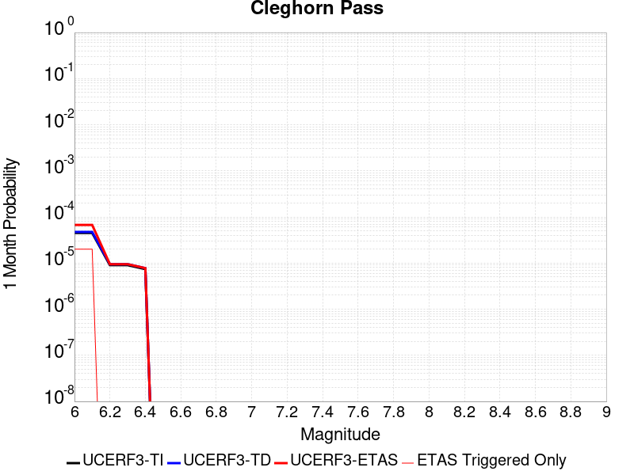 | 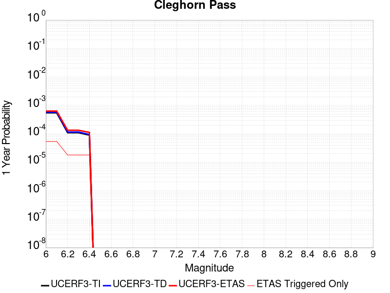 |  |

| Magnitude | 1 wk TI Prob | 1 wk TD Prob | 1 wk ETAS Prob | 1 wk ETAS/TD Gain | 1 wk ETAS Triggered Only | 1 mo TI Prob | 1 mo TD Prob | 1 mo ETAS Prob | 1 mo ETAS/TD Gain | 1 mo ETAS Triggered Only | 1 yr TI Prob | 1 yr TD Prob | 1 yr ETAS Prob | 1 yr ETAS/TD Gain | 1 yr ETAS Triggered Only | 10 yr TI Prob | 10 yr TD Prob | 10 yr ETAS Prob | 10 yr ETAS/TD Gain | 10 yr ETAS Triggered Only |
|-----|-----|-----|-----|-----|-----|-----|-----|-----|-----|-----|-----|-----|-----|-----|-----|-----|-----|-----|-----|-----|
| 6.0 | 1.0522846E-5 | 1.104129E-5 | 1.104129E-5 | 1.0 | 0.0 | 4.509713E-5 | 4.7319252E-5 | 8.341863E-5 | 1.7628897 | 3.6101083E-5 | 5.4891926E-4 | 5.7601224E-4 | 6.301327E-4 | 1.0939571 | 5.4151624E-5 | 0.0054756533 | 0.005750359 | 0.005822146 | 1.012484 | 7.2202165E-5 |
| 6.1 | 1.0522846E-5 | 1.104129E-5 | 1.104129E-5 | 1.0 | 0.0 | 4.509713E-5 | 4.7319252E-5 | 8.341863E-5 | 1.7628897 | 3.6101083E-5 | 5.4891926E-4 | 5.7601224E-4 | 6.301327E-4 | 1.0939571 | 5.4151624E-5 | 0.0054756533 | 0.005750359 | 0.005822146 | 1.012484 | 7.2202165E-5 |
| 6.2 | 2.1045846E-6 | 2.2083323E-6 | 2.2083323E-6 | 1.0 | 0.0 | 9.019617E-6 | 9.46427E-6 | 9.46427E-6 | 1.0 | 0.0 | 1.098083E-4 | 1.1522559E-4 | 1.3327405E-4 | 1.1566359 | 1.8050541E-5 | 0.0010975406 | 0.00115207 | 0.0011700997 | 1.0156499 | 1.8050541E-5 |
| 6.3 | 2.1045846E-6 | 2.2083323E-6 | 2.2083323E-6 | 1.0 | 0.0 | 9.019617E-6 | 9.46427E-6 | 9.46427E-6 | 1.0 | 0.0 | 1.098083E-4 | 1.1522559E-4 | 1.3327405E-4 | 1.1566359 | 1.8050541E-5 | 0.0010975406 | 0.00115207 | 0.0011700997 | 1.0156499 | 1.8050541E-5 |
| 6.4 | 1.7259927E-6 | 1.8109833E-6 | 1.8109833E-6 | 1.0 | 0.0 | 7.3970905E-6 | 7.761358E-6 | 7.761358E-6 | 1.0 | 0.0 | 9.005586E-5 | 9.449453E-5 | 1.1254336E-4 | 1.191004 | 1.8050541E-5 | 9.001937E-4 | 9.4494526E-4 | 9.6297875E-4 | 1.0190842 | 1.8050541E-5 |

## Ortigalita (North)
*[(top)](#table-of-contents)*

| 1 Week | 1 Month | 1 Year | 10 Year |
|-----|-----|-----|-----|
| 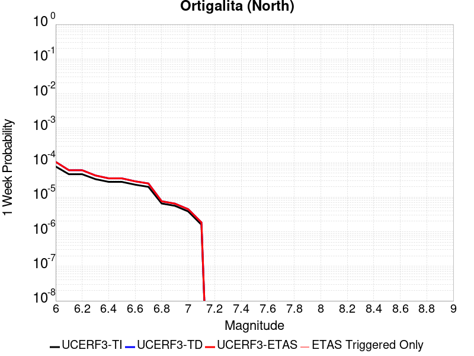 | 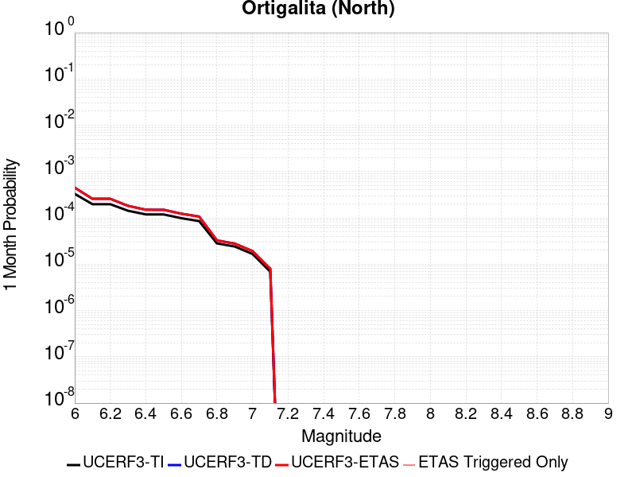 | 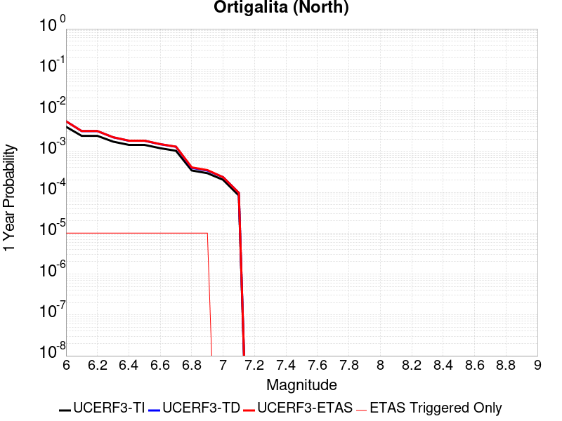 | 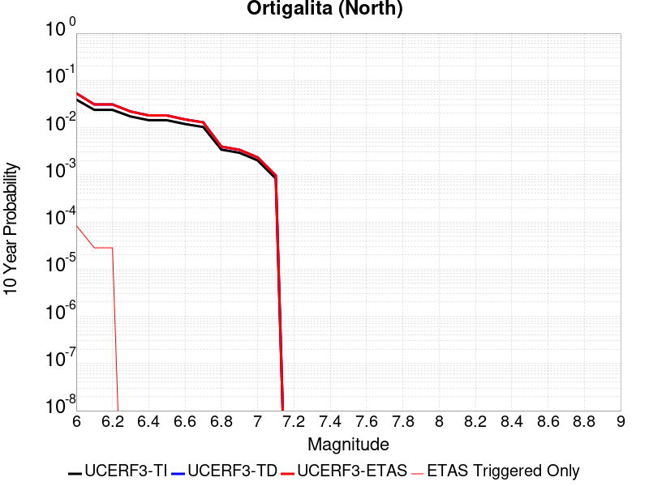 |

| Magnitude | 1 wk TI Prob | 1 wk TD Prob | 1 wk ETAS Prob | 1 wk ETAS/TD Gain | 1 wk ETAS Triggered Only | 1 mo TI Prob | 1 mo TD Prob | 1 mo ETAS Prob | 1 mo ETAS/TD Gain | 1 mo ETAS Triggered Only | 1 yr TI Prob | 1 yr TD Prob | 1 yr ETAS Prob | 1 yr ETAS/TD Gain | 1 yr ETAS Triggered Only | 10 yr TI Prob | 10 yr TD Prob | 10 yr ETAS Prob | 10 yr ETAS/TD Gain | 10 yr ETAS Triggered Only |
|-----|-----|-----|-----|-----|-----|-----|-----|-----|-----|-----|-----|-----|-----|-----|-----|-----|-----|-----|-----|-----|
| 6.0 | 7.711876E-5 | 1.0511233E-4 | 1.0511233E-4 | 1.0 | 0.0 | 3.3046713E-4 | 4.5041452E-4 | 4.5041452E-4 | 1.0 | 0.0 | 0.004016016 | 0.0054700063 | 0.0054700063 | 1.0 | 0.0 | 0.039442103 | 0.053474996 | 0.053543337 | 1.001278 | 7.2202165E-5 |
| 6.1 | 4.607858E-5 | 6.0262035E-5 | 6.0262035E-5 | 1.0 | 0.0 | 1.9746469E-4 | 2.582431E-4 | 2.582431E-4 | 1.0 | 0.0 | 0.0024014818 | 0.0031398677 | 0.0031398677 | 1.0 | 0.0 | 0.023756953 | 0.030985849 | 0.031003341 | 1.0005645 | 1.8050541E-5 |
| 6.2 | 4.607858E-5 | 6.0262035E-5 | 6.0262035E-5 | 1.0 | 0.0 | 1.9746469E-4 | 2.582431E-4 | 2.582431E-4 | 1.0 | 0.0 | 0.0024014818 | 0.0031398677 | 0.0031398677 | 1.0 | 0.0 | 0.023756953 | 0.030985849 | 0.031003341 | 1.0005645 | 1.8050541E-5 |
| 6.3 | 3.327423E-5 | 4.248961E-5 | 4.248961E-5 | 1.0 | 0.0 | 1.4259605E-4 | 1.8208736E-4 | 1.8208736E-4 | 1.0 | 0.0 | 0.0017347244 | 0.0022149412 | 0.0022149412 | 1.0 | 0.0 | 0.017212452 | 0.021952784 | 0.021952784 | 1.0 | 0.0 |
| 6.4 | 2.7732503E-5 | 3.500993E-5 | 3.500993E-5 | 1.0 | 0.0 | 1.1884817E-4 | 1.5003543E-4 | 1.5003543E-4 | 1.0 | 0.0 | 0.001446016 | 0.0018253902 | 0.0018253902 | 1.0 | 0.0 | 0.014366428 | 0.018126918 | 0.018126918 | 1.0 | 0.0 |
| 6.5 | 2.7689714E-5 | 3.4959732E-5 | 3.4959732E-5 | 1.0 | 0.0 | 1.186648E-4 | 1.4982032E-4 | 1.4982032E-4 | 1.0 | 0.0 | 0.0014437864 | 0.0018227756 | 0.0018227756 | 1.0 | 0.0 | 0.014344421 | 0.0181012 | 0.0181012 | 1.0 | 0.0 |
| 6.6 | 2.2976905E-5 | 2.872718E-5 | 2.872718E-5 | 1.0 | 0.0 | 9.846873E-5 | 1.231121E-4 | 1.231121E-4 | 1.0 | 0.0 | 0.0011981975 | 0.0014980923 | 0.0014980923 | 1.0 | 0.0 | 0.011917574 | 0.014903232 | 0.014903232 | 1.0 | 0.0 |
| 6.7 | 1.9871539E-5 | 2.491222E-5 | 2.491222E-5 | 1.0 | 0.0 | 8.516096E-5 | 1.0676369E-4 | 1.0676369E-4 | 1.0 | 0.0 | 0.0010363415 | 0.0012993217 | 0.0012993217 | 1.0 | 0.0 | 0.010315218 | 0.012940934 | 0.012940934 | 1.0 | 0.0 |
| 6.8 | 6.5640475E-6 | 7.6069355E-6 | 7.6069355E-6 | 1.0 | 0.0 | 2.813133E-5 | 3.260076E-5 | 3.260076E-5 | 1.0 | 0.0 | 3.424451E-4 | 3.9684484E-4 | 3.9684484E-4 | 1.0 | 0.0 | 0.0034191788 | 0.0039616493 | 0.0039616493 | 1.0 | 0.0 |
| 6.9 | 5.6219683E-6 | 6.503054E-6 | 6.503054E-6 | 1.0 | 0.0 | 2.4093928E-5 | 2.786995E-5 | 2.786995E-5 | 1.0 | 0.0 | 2.933041E-4 | 3.3926638E-4 | 3.3926638E-4 | 1.0 | 0.0 | 0.0029291727 | 0.0033877415 | 0.0033877415 | 1.0 | 0.0 |
| 7.0 | 3.875591E-6 | 4.4855974E-6 | 4.4855974E-6 | 1.0 | 0.0 | 1.6609569E-5 | 1.9223859E-5 | 1.9223859E-5 | 1.0 | 0.0 | 2.0220275E-4 | 2.3402747E-4 | 2.3402747E-4 | 1.0 | 0.0 | 0.0020201886 | 0.0023380185 | 0.0023380185 | 1.0 | 0.0 |
| 7.1 | 1.6017933E-6 | 1.8573955E-6 | 1.8573955E-6 | 1.0 | 0.0 | 6.8648105E-6 | 7.960248E-6 | 7.960248E-6 | 1.0 | 0.0 | 8.357586E-5 | 9.691278E-5 | 9.691278E-5 | 1.0 | 0.0 | 8.3544437E-4 | 9.688099E-4 | 9.688099E-4 | 1.0 | 0.0 |

## Santa Ynez (West)
*[(top)](#table-of-contents)*

| 1 Week | 1 Month | 1 Year | 10 Year |
|-----|-----|-----|-----|
| 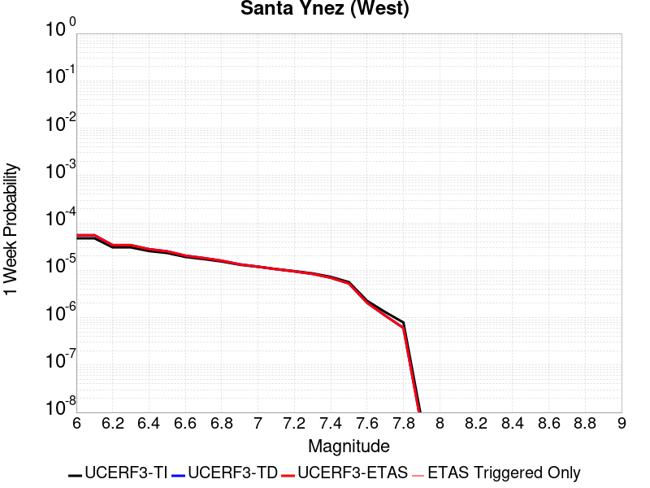 |  | 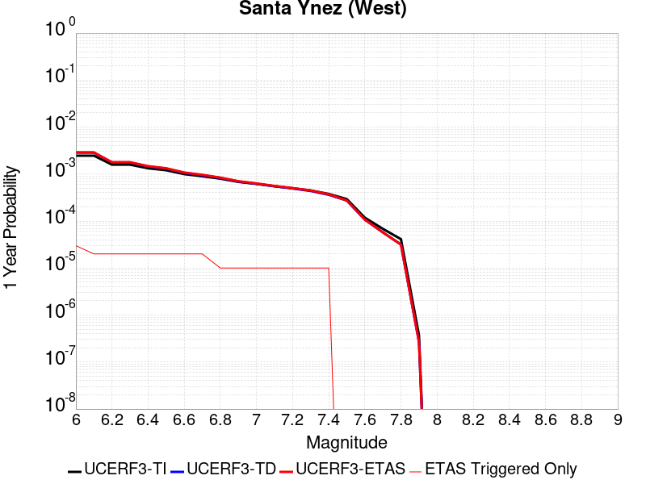 | 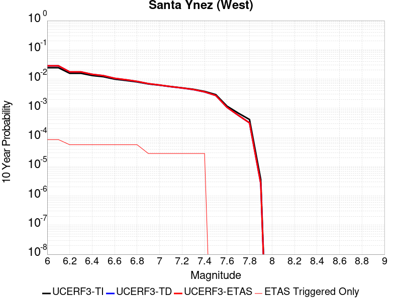 |

| Magnitude | 1 wk TI Prob | 1 wk TD Prob | 1 wk ETAS Prob | 1 wk ETAS/TD Gain | 1 wk ETAS Triggered Only | 1 mo TI Prob | 1 mo TD Prob | 1 mo ETAS Prob | 1 mo ETAS/TD Gain | 1 mo ETAS Triggered Only | 1 yr TI Prob | 1 yr TD Prob | 1 yr ETAS Prob | 1 yr ETAS/TD Gain | 1 yr ETAS Triggered Only | 10 yr TI Prob | 10 yr TD Prob | 10 yr ETAS Prob | 10 yr ETAS/TD Gain | 10 yr ETAS Triggered Only |
|-----|-----|-----|-----|-----|-----|-----|-----|-----|-----|-----|-----|-----|-----|-----|-----|-----|-----|-----|-----|-----|
| 6.0 | 4.7352758E-5 | 5.4984746E-5 | 5.4984746E-5 | 1.0 | 0.0 | 2.0292461E-4 | 2.3562447E-4 | 2.3562447E-4 | 1.0 | 0.0 | 0.0024678076 | 0.0028651587 | 0.0029011564 | 1.012564 | 3.6101083E-5 | 0.024405818 | 0.028310696 | 0.028380854 | 1.0024781 | 7.2202165E-5 |
| 6.1 | 4.7352758E-5 | 5.4984746E-5 | 5.4984746E-5 | 1.0 | 0.0 | 2.0292461E-4 | 2.3562447E-4 | 2.3562447E-4 | 1.0 | 0.0 | 0.0024678076 | 0.0028651587 | 0.0029011564 | 1.012564 | 3.6101083E-5 | 0.024405818 | 0.028310696 | 0.028380854 | 1.0024781 | 7.2202165E-5 |
| 6.2 | 3.0415853E-5 | 3.3931505E-5 | 3.3931505E-5 | 1.0 | 0.0 | 1.3034715E-4 | 1.454128E-4 | 1.454128E-4 | 1.0 | 0.0 | 0.0015858212 | 0.0017689993 | 0.0018050364 | 1.0203716 | 3.6101083E-5 | 0.015745522 | 0.017553076 | 0.017606277 | 1.0030309 | 5.4151624E-5 |
| 6.3 | 3.0415853E-5 | 3.3931505E-5 | 3.3931505E-5 | 1.0 | 0.0 | 1.3034715E-4 | 1.454128E-4 | 1.454128E-4 | 1.0 | 0.0 | 0.0015858212 | 0.0017689993 | 0.0018050364 | 1.0203716 | 3.6101083E-5 | 0.015745522 | 0.017553076 | 0.017606277 | 1.0030309 | 5.4151624E-5 |
| 6.4 | 2.5452082E-5 | 2.7917275E-5 | 2.7917275E-5 | 1.0 | 0.0 | 1.09075794E-4 | 1.1964005E-4 | 1.1964005E-4 | 1.0 | 0.0 | 0.0013271887 | 0.0014556617 | 0.0014917103 | 1.0247644 | 3.6101083E-5 | 0.013192902 | 0.01446345 | 0.014516817 | 1.0036899 | 5.4151624E-5 |
| 6.5 | 2.3143784E-5 | 2.5132416E-5 | 2.5132416E-5 | 1.0 | 0.0 | 9.9183875E-5 | 1.0770596E-4 | 1.0770596E-4 | 1.0 | 0.0 | 0.0012068948 | 0.0013105436 | 0.0013465974 | 1.0275105 | 3.6101083E-5 | 0.012003611 | 0.013029828 | 0.0130832745 | 1.0041019 | 5.4151624E-5 |
| 6.6 | 1.9118515E-5 | 2.0357447E-5 | 2.0357447E-5 | 1.0 | 0.0 | 8.193392E-5 | 8.724333E-5 | 8.724333E-5 | 1.0 | 0.0 | 9.97089E-4 | 0.0010616779 | 0.0010977407 | 1.0339677 | 3.6101083E-5 | 0.00992627 | 0.0105669685 | 0.010620548 | 1.0050704 | 5.4151624E-5 |
| 6.7 | 1.722807E-5 | 1.8149007E-5 | 1.8149007E-5 | 1.0 | 0.0 | 7.3832496E-5 | 7.777917E-5 | 7.777917E-5 | 1.0 | 0.0 | 8.985399E-4 | 9.4655564E-4 | 9.826225E-4 | 1.0381033 | 3.6101083E-5 | 0.008949154 | 0.009425885 | 0.009479526 | 1.0056908 | 5.4151624E-5 |
| 6.8 | 1.5317364E-5 | 1.5928714E-5 | 1.5928714E-5 | 1.0 | 0.0 | 6.56442E-5 | 6.8264155E-5 | 6.8264155E-5 | 1.0 | 0.0 | 7.98925E-4 | 8.308034E-4 | 8.4883894E-4 | 1.0217086 | 1.8050541E-5 | 0.007960589 | 0.008277463 | 0.008313265 | 1.0043253 | 3.6101083E-5 |
| 6.9 | 1.3071226E-5 | 1.3331365E-5 | 1.3331365E-5 | 1.0 | 0.0 | 5.6018336E-5 | 5.7133184E-5 | 5.7133184E-5 | 1.0 | 0.0 | 6.8180985E-4 | 6.953768E-4 | 7.1341475E-4 | 1.0259398 | 1.8050541E-5 | 0.0067972173 | 0.0069322693 | 0.0069501945 | 1.0025858 | 1.8050541E-5 |
| 7.0 | 1.1836986E-5 | 1.1934301E-5 | 1.1934301E-5 | 1.0 | 0.0 | 5.0728955E-5 | 5.114601E-5 | 5.114601E-5 | 1.0 | 0.0 | 6.1745E-4 | 6.2252645E-4 | 6.4056576E-4 | 1.0289775 | 1.8050541E-5 | 0.006157372 | 0.006208019 | 0.0062259575 | 1.0028895 | 1.8050541E-5 |
| 7.1 | 1.0597169E-5 | 1.05435165E-5 | 1.05435165E-5 | 1.0 | 0.0 | 4.541565E-5 | 4.5185723E-5 | 4.5185723E-5 | 1.0 | 0.0 | 5.5279525E-4 | 5.499984E-4 | 5.680391E-4 | 1.0328012 | 1.8050541E-5 | 0.0055142213 | 0.0054865032 | 0.005504455 | 1.0032719 | 1.8050541E-5 |
| 7.2 | 9.59113E-6 | 9.460359E-6 | 9.460359E-6 | 1.0 | 0.0 | 4.11042E-5 | 4.054377E-5 | 4.054377E-5 | 1.0 | 0.0 | 5.0032866E-4 | 4.935097E-4 | 5.1155133E-4 | 1.0365578 | 1.8050541E-5 | 0.004992037 | 0.0049242564 | 0.004942218 | 1.0036476 | 1.8050541E-5 |
| 7.3 | 8.586084E-6 | 8.380702E-6 | 8.380702E-6 | 1.0 | 0.0 | 3.679698E-5 | 3.5916804E-5 | 3.5916804E-5 | 1.0 | 0.0 | 4.4791115E-4 | 4.372004E-4 | 4.5524305E-4 | 1.0412686 | 1.8050541E-5 | 0.004470094 | 0.004363514 | 0.0043814857 | 1.0041187 | 1.8050541E-5 |
| 7.4 | 7.2622997E-6 | 6.952523E-6 | 6.952523E-6 | 1.0 | 0.0 | 3.112377E-5 | 2.9796192E-5 | 2.9796192E-5 | 1.0 | 0.0 | 3.78866E-4 | 3.6270922E-4 | 3.8075322E-4 | 1.0497478 | 1.8050541E-5 | 0.0037822074 | 0.0036212727 | 0.0036392577 | 1.0049665 | 1.8050541E-5 |
| 7.5 | 5.627296E-6 | 5.252115E-6 | 5.252115E-6 | 1.0 | 0.0 | 2.411676E-5 | 2.2508873E-5 | 2.2508873E-5 | 1.0 | 0.0 | 2.9358198E-4 | 2.7401178E-4 | 2.7401178E-4 | 1.0 | 0.0 | 0.0029319443 | 0.0027368113 | 0.0027368113 | 1.0 | 0.0 |
| 7.6 | 2.265244E-6 | 2.0610369E-6 | 2.0610369E-6 | 1.0 | 0.0 | 9.708152E-6 | 8.832985E-6 | 8.832985E-6 | 1.0 | 0.0 | 1.18190335E-4 | 1.07536376E-4 | 1.07536376E-4 | 1.0 | 0.0 | 0.001181275 | 0.0010748521 | 0.0010748521 | 1.0 | 0.0 |
| 7.7 | 1.3099874E-6 | 1.1017129E-6 | 1.1017129E-6 | 1.0 | 0.0 | 5.61422E-6 | 4.7216186E-6 | 4.7216186E-6 | 1.0 | 0.0 | 6.8350986E-5 | 5.7484212E-5 | 5.7484212E-5 | 1.0 | 0.0 | 6.832996E-4 | 5.746958E-4 | 5.746958E-4 | 1.0 | 0.0 |
| 7.8 | 7.903951E-7 | 6.0715837E-7 | 6.0715837E-7 | 1.0 | 0.0 | 3.3874032E-6 | 2.6021048E-6 | 2.6021048E-6 | 1.0 | 0.0 | 4.1240855E-5 | 3.1680178E-5 | 3.1680178E-5 | 1.0 | 0.0 | 4.12332E-4 | 3.1675794E-4 | 3.1675794E-4 | 1.0 | 0.0 |
| 7.9 | 7.0753297E-9 | 5.090226E-9 | 5.090226E-9 | 1.0 | 0.0 | 3.032284E-8 | 2.1815254E-8 | 2.1815254E-8 | 1.0 | 0.0 | 3.6918053E-7 | 2.656007E-7 | 2.656007E-7 | 1.0 | 0.0 | 3.691799E-6 | 2.6560049E-6 | 2.6560049E-6 | 1.0 | 0.0 |

## Elysian Park (Upper)
*[(top)](#table-of-contents)*

| 1 Week | 1 Month | 1 Year | 10 Year |
|-----|-----|-----|-----|
| 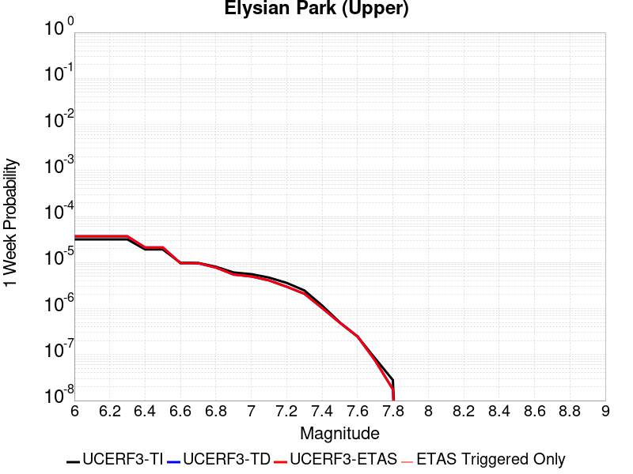 | 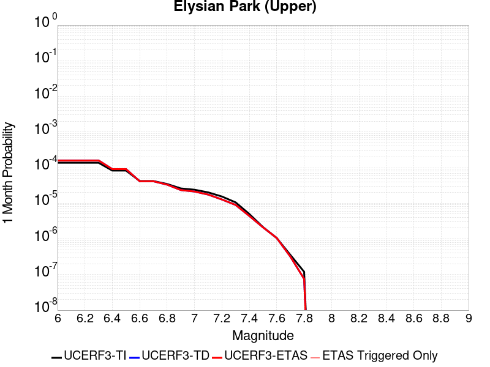 | 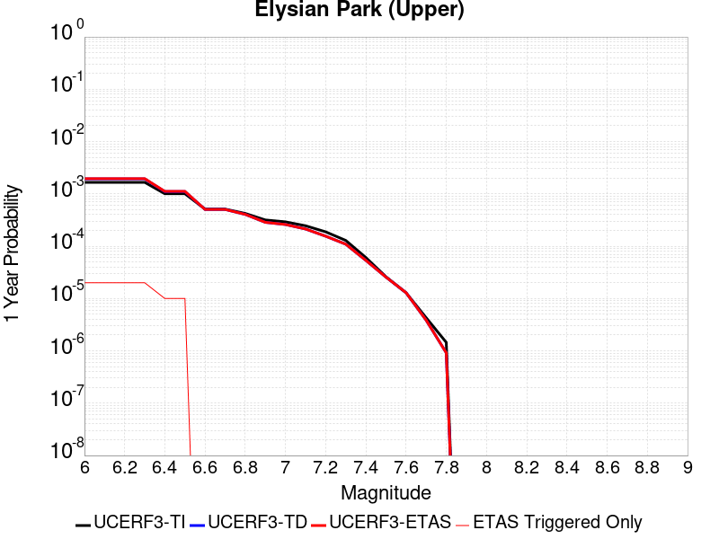 | 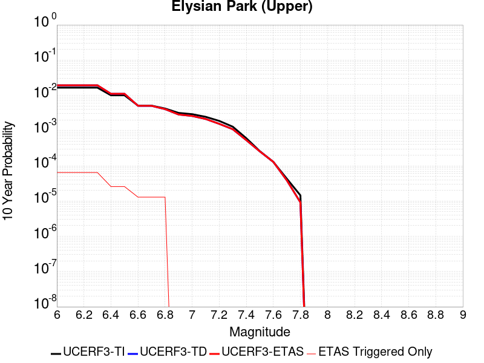 |

| Magnitude | 1 wk TI Prob | 1 wk TD Prob | 1 wk ETAS Prob | 1 wk ETAS/TD Gain | 1 wk ETAS Triggered Only | 1 mo TI Prob | 1 mo TD Prob | 1 mo ETAS Prob | 1 mo ETAS/TD Gain | 1 mo ETAS Triggered Only | 1 yr TI Prob | 1 yr TD Prob | 1 yr ETAS Prob | 1 yr ETAS/TD Gain | 1 yr ETAS Triggered Only | 10 yr TI Prob | 10 yr TD Prob | 10 yr ETAS Prob | 10 yr ETAS/TD Gain | 10 yr ETAS Triggered Only |
|-----|-----|-----|-----|-----|-----|-----|-----|-----|-----|-----|-----|-----|-----|-----|-----|-----|-----|-----|-----|-----|
| 6.0 | 3.1876025E-5 | 3.7044556E-5 | 3.7044556E-5 | 1.0 | 0.0 | 1.3660437E-4 | 1.5875546E-4 | 1.5875546E-4 | 1.0 | 0.0 | 0.0016618895 | 0.0019315657 | 0.0019495813 | 1.0093269 | 1.8050541E-5 | 0.016495159 | 0.019194385 | 0.019247497 | 1.0027671 | 5.4151624E-5 |
| 6.1 | 3.1876025E-5 | 3.7044556E-5 | 3.7044556E-5 | 1.0 | 0.0 | 1.3660437E-4 | 1.5875546E-4 | 1.5875546E-4 | 1.0 | 0.0 | 0.0016618895 | 0.0019315657 | 0.0019495813 | 1.0093269 | 1.8050541E-5 | 0.016495159 | 0.019194385 | 0.019247497 | 1.0027671 | 5.4151624E-5 |
| 6.2 | 3.1876025E-5 | 3.7044556E-5 | 3.7044556E-5 | 1.0 | 0.0 | 1.3660437E-4 | 1.5875546E-4 | 1.5875546E-4 | 1.0 | 0.0 | 0.0016618895 | 0.0019315657 | 0.0019495813 | 1.0093269 | 1.8050541E-5 | 0.016495159 | 0.019194385 | 0.019247497 | 1.0027671 | 5.4151624E-5 |
| 6.3 | 3.1876025E-5 | 3.7044556E-5 | 3.7044556E-5 | 1.0 | 0.0 | 1.3660437E-4 | 1.5875546E-4 | 1.5875546E-4 | 1.0 | 0.0 | 0.0016618895 | 0.0019315657 | 0.0019495813 | 1.0093269 | 1.8050541E-5 | 0.016495159 | 0.019194385 | 0.019247497 | 1.0027671 | 5.4151624E-5 |
| 6.4 | 1.9273462E-5 | 2.1206453E-5 | 2.1206453E-5 | 1.0 | 0.0 | 8.259794E-5 | 9.088261E-5 | 9.088261E-5 | 1.0 | 0.0 | 0.001005166 | 0.0011061076 | 0.0011061076 | 1.0 | 0.0 | 0.010006315 | 0.011022885 | 0.011040737 | 1.0016195 | 1.8050541E-5 |
| 6.5 | 1.9273462E-5 | 2.1206453E-5 | 2.1206453E-5 | 1.0 | 0.0 | 8.259794E-5 | 9.088261E-5 | 9.088261E-5 | 1.0 | 0.0 | 0.001005166 | 0.0011061076 | 0.0011061076 | 1.0 | 0.0 | 0.010006315 | 0.011022885 | 0.011040737 | 1.0016195 | 1.8050541E-5 |
| 6.6 | 9.813258E-6 | 9.666762E-6 | 9.666762E-6 | 1.0 | 0.0 | 4.205614E-5 | 4.1428364E-5 | 4.1428364E-5 | 1.0 | 0.0 | 5.119132E-4 | 5.0428085E-4 | 5.0428085E-4 | 1.0 | 0.0 | 0.005107356 | 0.005032089 | 0.005050049 | 1.003569 | 1.8050541E-5 |
| 6.7 | 9.801478E-6 | 9.654331E-6 | 9.654331E-6 | 1.0 | 0.0 | 4.2005657E-5 | 4.137509E-5 | 4.137509E-5 | 1.0 | 0.0 | 5.112989E-4 | 5.0363253E-4 | 5.0363253E-4 | 1.0 | 0.0 | 0.0051012407 | 0.0050256355 | 0.005043595 | 1.0035737 | 1.8050541E-5 |
| 6.8 | 8.102489E-6 | 7.773927E-6 | 7.773927E-6 | 1.0 | 0.0 | 3.4724493E-5 | 3.331643E-5 | 3.331643E-5 | 1.0 | 0.0 | 4.2268867E-4 | 4.0555702E-4 | 4.0555702E-4 | 1.0 | 0.0 | 0.004218856 | 0.004048663 | 0.0040666405 | 1.0044403 | 1.8050541E-5 |
| 6.9 | 6.08275E-6 | 5.4820052E-6 | 5.4820052E-6 | 1.0 | 0.0 | 2.6068668E-5 | 2.3494102E-5 | 2.3494102E-5 | 1.0 | 0.0 | 3.173398E-4 | 2.860039E-4 | 2.860039E-4 | 1.0 | 0.0 | 0.0031688702 | 0.002856436 | 0.002856436 | 1.0 | 0.0 |
| 7.0 | 5.5995934E-6 | 4.9832806E-6 | 4.9832806E-6 | 1.0 | 0.0 | 2.3998036E-5 | 2.1356747E-5 | 2.1356747E-5 | 1.0 | 0.0 | 2.9213692E-4 | 2.5998804E-4 | 2.5998804E-4 | 1.0 | 0.0 | 0.0029175316 | 0.002596906 | 0.002596906 | 1.0 | 0.0 |
| 7.1 | 4.709881E-6 | 4.087809E-6 | 4.087809E-6 | 1.0 | 0.0 | 2.0185047E-5 | 1.7519065E-5 | 1.7519065E-5 | 1.0 | 0.0 | 2.4572524E-4 | 2.1327416E-4 | 2.1327416E-4 | 1.0 | 0.0 | 0.002454537 | 0.0021307361 | 0.0021307361 | 1.0 | 0.0 |
| 7.2 | 3.6063436E-6 | 2.9782436E-6 | 2.9782436E-6 | 1.0 | 0.0 | 1.5455667E-5 | 1.276384E-5 | 1.276384E-5 | 1.0 | 0.0 | 1.881565E-4 | 1.5538877E-4 | 1.5538877E-4 | 1.0 | 0.0 | 0.0018799726 | 0.0015528124 | 0.0015528124 | 1.0 | 0.0 |
| 7.3 | 2.471135E-6 | 2.095665E-6 | 2.095665E-6 | 1.0 | 0.0 | 1.0590536E-5 | 8.981391E-6 | 8.981391E-6 | 1.0 | 0.0 | 1.2893214E-4 | 1.0934302E-4 | 1.0934302E-4 | 1.0 | 0.0 | 0.0012885736 | 0.0010928994 | 0.0010928994 | 1.0 | 0.0 |
| 7.4 | 1.163943E-6 | 1.0276177E-6 | 1.0276177E-6 | 1.0 | 0.0 | 4.988318E-6 | 4.404069E-6 | 4.404069E-6 | 1.0 | 0.0 | 6.0731076E-5 | 5.361825E-5 | 5.361825E-5 | 1.0 | 0.0 | 6.071448E-4 | 5.360561E-4 | 5.360561E-4 | 1.0 | 0.0 |
| 7.5 | 4.99459E-7 | 4.918114E-7 | 4.918114E-7 | 1.0 | 0.0 | 2.140537E-6 | 2.1077617E-6 | 2.1077617E-6 | 1.0 | 0.0 | 2.6060725E-5 | 2.5661711E-5 | 2.5661711E-5 | 1.0 | 0.0 | 2.605767E-4 | 2.5658906E-4 | 2.5658906E-4 | 1.0 | 0.0 |
| 7.6 | 2.4667852E-7 | 2.4781386E-7 | 2.4781386E-7 | 1.0 | 0.0 | 1.0571932E-6 | 1.0620589E-6 | 1.0620589E-6 | 1.0 | 0.0 | 1.2871251E-5 | 1.2930494E-5 | 1.2930494E-5 | 1.0 | 0.0 | 1.2870505E-4 | 1.292978E-4 | 1.292978E-4 | 1.0 | 0.0 |
| 7.7 | 8.2312795E-8 | 7.3881E-8 | 7.3881E-8 | 1.0 | 0.0 | 3.527691E-7 | 3.166328E-7 | 3.166328E-7 | 1.0 | 0.0 | 4.294955E-6 | 3.854999E-6 | 3.854999E-6 | 1.0 | 0.0 | 4.2948723E-5 | 3.8549435E-5 | 3.8549435E-5 | 1.0 | 0.0 |
| 7.8 | 2.7819295E-8 | 1.7577714E-8 | 1.7577714E-8 | 1.0 | 0.0 | 1.1922555E-7 | 7.5333055E-8 | 7.5333055E-8 | 1.0 | 0.0 | 1.45157E-6 | 9.1717976E-7 | 9.1717976E-7 | 1.0 | 0.0 | 1.45156055E-5 | 9.171775E-6 | 9.171775E-6 | 1.0 | 0.0 |

## Pine Mtn
*[(top)](#table-of-contents)*

| 1 Week | 1 Month | 1 Year | 10 Year |
|-----|-----|-----|-----|
| 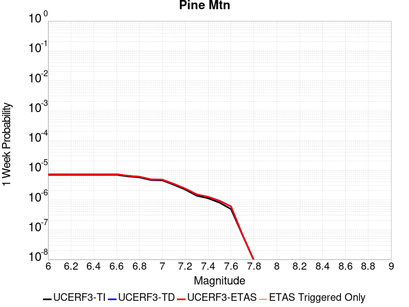 | 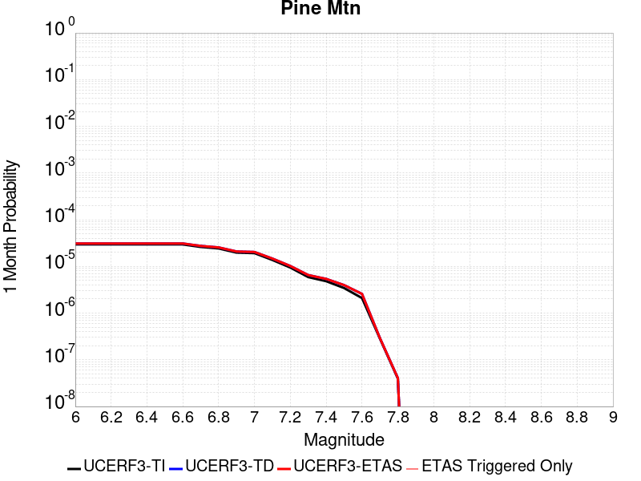 | 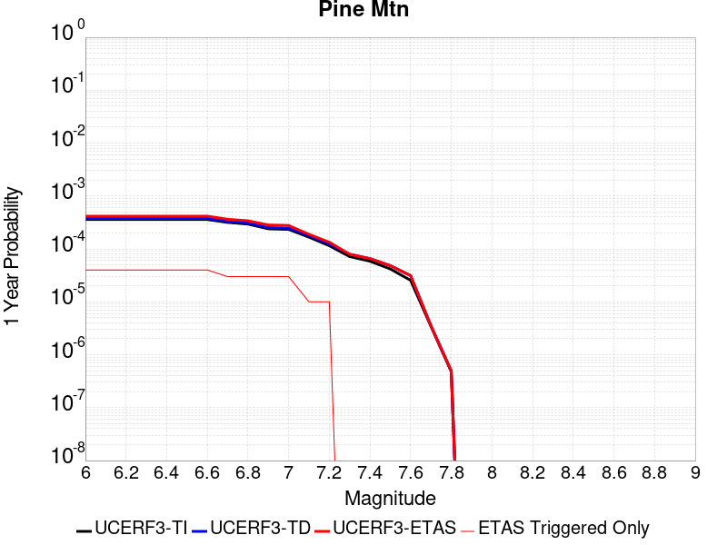 | 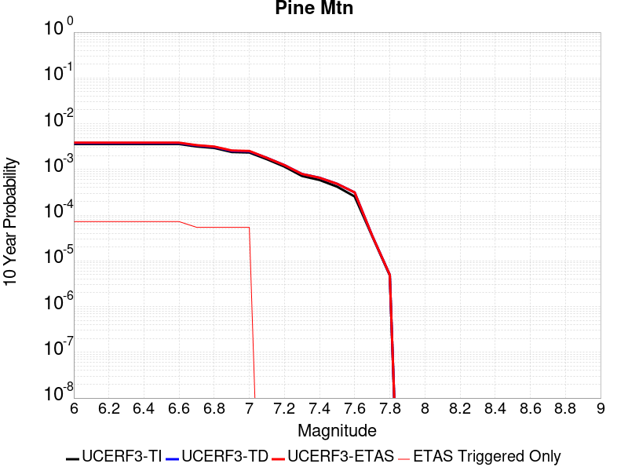 |

| Magnitude | 1 wk TI Prob | 1 wk TD Prob | 1 wk ETAS Prob | 1 wk ETAS/TD Gain | 1 wk ETAS Triggered Only | 1 mo TI Prob | 1 mo TD Prob | 1 mo ETAS Prob | 1 mo ETAS/TD Gain | 1 mo ETAS Triggered Only | 1 yr TI Prob | 1 yr TD Prob | 1 yr ETAS Prob | 1 yr ETAS/TD Gain | 1 yr ETAS Triggered Only | 10 yr TI Prob | 10 yr TD Prob | 10 yr ETAS Prob | 10 yr ETAS/TD Gain | 10 yr ETAS Triggered Only |
|-----|-----|-----|-----|-----|-----|-----|-----|-----|-----|-----|-----|-----|-----|-----|-----|-----|-----|-----|-----|-----|
| 6.0 | 6.894797E-6 | 7.2263815E-6 | 7.2263815E-6 | 1.0 | 0.0 | 2.9548795E-5 | 3.0969855E-5 | 4.901984E-5 | 1.5828242 | 1.8050541E-5 | 3.596972E-4 | 3.7699574E-4 | 4.3112694E-4 | 1.1435857 | 5.4151624E-5 | 0.0035911554 | 0.0037638594 | 0.0038357899 | 1.0191108 | 7.2202165E-5 |
| 6.1 | 6.894797E-6 | 7.2263815E-6 | 7.2263815E-6 | 1.0 | 0.0 | 2.9548795E-5 | 3.0969855E-5 | 4.901984E-5 | 1.5828242 | 1.8050541E-5 | 3.596972E-4 | 3.7699574E-4 | 4.3112694E-4 | 1.1435857 | 5.4151624E-5 | 0.0035911554 | 0.0037638594 | 0.0038357899 | 1.0191108 | 7.2202165E-5 |
| 6.2 | 6.894797E-6 | 7.2263815E-6 | 7.2263815E-6 | 1.0 | 0.0 | 2.9548795E-5 | 3.0969855E-5 | 4.901984E-5 | 1.5828242 | 1.8050541E-5 | 3.596972E-4 | 3.7699574E-4 | 4.3112694E-4 | 1.1435857 | 5.4151624E-5 | 0.0035911554 | 0.0037638594 | 0.0038357899 | 1.0191108 | 7.2202165E-5 |
| 6.3 | 6.894797E-6 | 7.2263815E-6 | 7.2263815E-6 | 1.0 | 0.0 | 2.9548795E-5 | 3.0969855E-5 | 4.901984E-5 | 1.5828242 | 1.8050541E-5 | 3.596972E-4 | 3.7699574E-4 | 4.3112694E-4 | 1.1435857 | 5.4151624E-5 | 0.0035911554 | 0.0037638594 | 0.0038357899 | 1.0191108 | 7.2202165E-5 |
| 6.4 | 6.894797E-6 | 7.2263815E-6 | 7.2263815E-6 | 1.0 | 0.0 | 2.9548795E-5 | 3.0969855E-5 | 4.901984E-5 | 1.5828242 | 1.8050541E-5 | 3.596972E-4 | 3.7699574E-4 | 4.3112694E-4 | 1.1435857 | 5.4151624E-5 | 0.0035911554 | 0.0037638594 | 0.0038357899 | 1.0191108 | 7.2202165E-5 |
| 6.5 | 6.894797E-6 | 7.2263815E-6 | 7.2263815E-6 | 1.0 | 0.0 | 2.9548795E-5 | 3.0969855E-5 | 4.901984E-5 | 1.5828242 | 1.8050541E-5 | 3.596972E-4 | 3.7699574E-4 | 4.3112694E-4 | 1.1435857 | 5.4151624E-5 | 0.0035911554 | 0.0037638594 | 0.0038357899 | 1.0191108 | 7.2202165E-5 |
| 6.6 | 6.894797E-6 | 7.2263815E-6 | 7.2263815E-6 | 1.0 | 0.0 | 2.9548795E-5 | 3.0969855E-5 | 4.901984E-5 | 1.5828242 | 1.8050541E-5 | 3.596972E-4 | 3.7699574E-4 | 4.3112694E-4 | 1.1435857 | 5.4151624E-5 | 0.0035911554 | 0.0037638594 | 0.0038357899 | 1.0191108 | 7.2202165E-5 |
| 6.7 | 6.0867933E-6 | 6.3980087E-6 | 6.3980087E-6 | 1.0 | 0.0 | 2.6085996E-5 | 2.7419761E-5 | 4.546981E-5 | 1.6582861 | 1.8050541E-5 | 3.1755073E-4 | 3.3378665E-4 | 3.6987566E-4 | 1.1081201 | 3.6101083E-5 | 0.0031709734 | 0.0033330722 | 0.0033870433 | 1.0161926 | 5.4151624E-5 |
| 6.8 | 5.6530425E-6 | 5.951475E-6 | 5.951475E-6 | 1.0 | 0.0 | 2.42271E-5 | 2.5506084E-5 | 4.3556167E-5 | 1.7076775 | 1.8050541E-5 | 2.94925E-4 | 3.104944E-4 | 3.4658425E-4 | 1.1162336 | 3.6101083E-5 | 0.002945339 | 0.0031008103 | 0.0031547942 | 1.0174096 | 5.4151624E-5 |
| 6.9 | 4.6015225E-6 | 4.8646702E-6 | 4.8646702E-6 | 1.0 | 0.0 | 1.9720663E-5 | 2.0848429E-5 | 3.8898594E-5 | 1.8657806 | 1.8050541E-5 | 2.4007261E-4 | 2.538015E-4 | 2.8989342E-4 | 1.1422054 | 3.6101083E-5 | 0.0023981342 | 0.0025352607 | 0.002589275 | 1.0213052 | 5.4151624E-5 |
| 7.0 | 4.4875965E-6 | 4.7483063E-6 | 4.7483063E-6 | 1.0 | 0.0 | 1.9232413E-5 | 2.0349733E-5 | 3.8399907E-5 | 1.886998 | 1.8050541E-5 | 2.3412947E-4 | 2.4773128E-4 | 2.8382344E-4 | 1.1456907 | 3.6101083E-5 | 0.0023388295 | 0.0024746952 | 0.0025287126 | 1.0218279 | 5.4151624E-5 |
| 7.1 | 3.203907E-6 | 3.4302004E-6 | 3.4302004E-6 | 1.0 | 0.0 | 1.3730958E-5 | 1.470078E-5 | 1.470078E-5 | 1.0 | 0.0 | 1.6716159E-4 | 1.7896797E-4 | 1.7896797E-4 | 1.0 | 0.0 | 0.0016703589 | 0.0017883045 | 0.0017883045 | 1.0 | 0.0 |
| 7.2 | 2.2060601E-6 | 2.3791285E-6 | 2.3791285E-6 | 1.0 | 0.0 | 9.4545085E-6 | 1.0196228E-5 | 1.0196228E-5 | 1.0 | 0.0 | 1.15102564E-4 | 1.2413245E-4 | 1.2413245E-4 | 1.0 | 0.0 | 0.0011504296 | 0.001240676 | 0.001240676 | 1.0 | 0.0 |
| 7.3 | 1.3765207E-6 | 1.5222299E-6 | 1.5222299E-6 | 1.0 | 0.0 | 5.899361E-6 | 6.5238264E-6 | 6.5238264E-6 | 1.0 | 0.0 | 7.182235E-5 | 7.942478E-5 | 7.942478E-5 | 1.0 | 0.0 | 7.1799144E-4 | 7.939731E-4 | 7.939731E-4 | 1.0 | 0.0 |
| 7.4 | 1.1245983E-6 | 1.2592313E-6 | 1.2592313E-6 | 1.0 | 0.0 | 4.819698E-6 | 5.396695E-6 | 5.396695E-6 | 1.0 | 0.0 | 5.8678244E-5 | 6.5702865E-5 | 6.5702865E-5 | 1.0 | 0.0 | 5.866275E-4 | 6.568427E-4 | 6.568427E-4 | 1.0 | 0.0 |
| 7.5 | 8.031682E-7 | 9.281843E-7 | 9.281843E-7 | 1.0 | 0.0 | 3.4421448E-6 | 3.977927E-6 | 3.977927E-6 | 1.0 | 0.0 | 4.1907308E-5 | 4.8430255E-5 | 4.8430255E-5 | 1.0 | 0.0 | 4.1899405E-4 | 4.8420375E-4 | 4.8420375E-4 | 1.0 | 0.0 |
| 7.6 | 4.8953444E-7 | 6.0073495E-7 | 6.0073495E-7 | 1.0 | 0.0 | 2.098003E-6 | 2.574576E-6 | 2.574576E-6 | 1.0 | 0.0 | 2.5542888E-5 | 3.1345062E-5 | 3.1345062E-5 | 1.0 | 0.0 | 2.5539953E-4 | 3.134113E-4 | 3.134113E-4 | 1.0 | 0.0 |
| 7.7 | 6.634529E-8 | 6.789016E-8 | 6.789016E-8 | 1.0 | 0.0 | 2.843369E-7 | 2.9095781E-7 | 2.9095781E-7 | 1.0 | 0.0 | 3.4617963E-6 | 3.5424061E-6 | 3.5424061E-6 | 1.0 | 0.0 | 3.4617424E-5 | 3.542354E-5 | 3.542354E-5 | 1.0 | 0.0 |
| 7.8 | 9.235578E-9 | 9.488882E-9 | 9.488882E-9 | 1.0 | 0.0 | 3.9581046E-8 | 4.0666635E-8 | 4.0666635E-8 | 1.0 | 0.0 | 4.818991E-7 | 4.951162E-7 | 4.951162E-7 | 1.0 | 0.0 | 4.8189804E-6 | 4.9511523E-6 | 4.9511523E-6 | 1.0 | 0.0 |

## Calico-Hidalgo
*[(top)](#table-of-contents)*

| 1 Week | 1 Month | 1 Year | 10 Year |
|-----|-----|-----|-----|
| 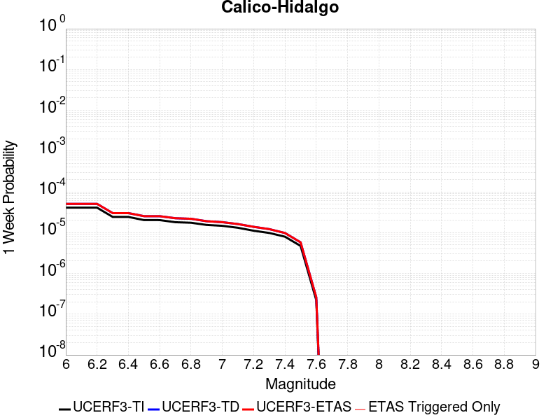 | 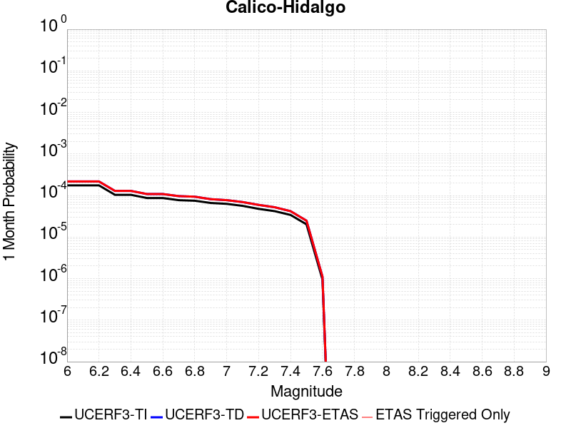 | 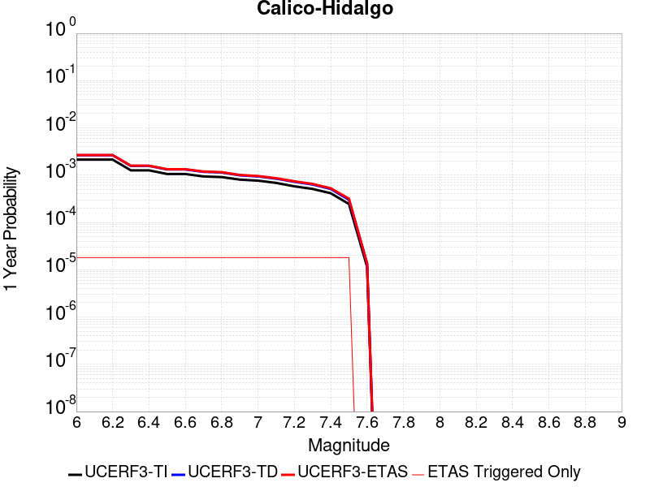 | 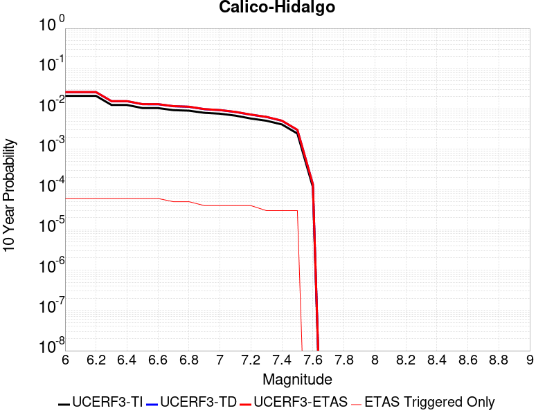 |

| Magnitude | 1 wk TI Prob | 1 wk TD Prob | 1 wk ETAS Prob | 1 wk ETAS/TD Gain | 1 wk ETAS Triggered Only | 1 mo TI Prob | 1 mo TD Prob | 1 mo ETAS Prob | 1 mo ETAS/TD Gain | 1 mo ETAS Triggered Only | 1 yr TI Prob | 1 yr TD Prob | 1 yr ETAS Prob | 1 yr ETAS/TD Gain | 1 yr ETAS Triggered Only | 10 yr TI Prob | 10 yr TD Prob | 10 yr ETAS Prob | 10 yr ETAS/TD Gain | 10 yr ETAS Triggered Only |
|-----|-----|-----|-----|-----|-----|-----|-----|-----|-----|-----|-----|-----|-----|-----|-----|-----|-----|-----|-----|-----|
| 6.0 | 4.0906612E-5 | 5.071237E-5 | 5.071237E-5 | 1.0 | 0.0 | 1.7530227E-4 | 2.1732291E-4 | 2.1732291E-4 | 1.0 | 0.0 | 0.0021322158 | 0.0026430995 | 0.0026611022 | 1.0068113 | 1.8050541E-5 | 0.02111873 | 0.026157016 | 0.026227329 | 1.0026882 | 7.2202165E-5 |
| 6.1 | 4.0906612E-5 | 5.071237E-5 | 5.071237E-5 | 1.0 | 0.0 | 1.7530227E-4 | 2.1732291E-4 | 2.1732291E-4 | 1.0 | 0.0 | 0.0021322158 | 0.0026430995 | 0.0026611022 | 1.0068113 | 1.8050541E-5 | 0.02111873 | 0.026157016 | 0.026227329 | 1.0026882 | 7.2202165E-5 |
| 6.2 | 4.0906612E-5 | 5.071237E-5 | 5.071237E-5 | 1.0 | 0.0 | 1.7530227E-4 | 2.1732291E-4 | 2.1732291E-4 | 1.0 | 0.0 | 0.0021322158 | 0.0026430995 | 0.0026611022 | 1.0068113 | 1.8050541E-5 | 0.02111873 | 0.026157016 | 0.026227329 | 1.0026882 | 7.2202165E-5 |
| 6.3 | 2.4242801E-5 | 3.009394E-5 | 3.009394E-5 | 1.0 | 0.0 | 1.0389358E-4 | 1.2896783E-4 | 1.2896783E-4 | 1.0 | 0.0 | 0.0012641704 | 0.0015690847 | 0.001587107 | 1.0114858 | 1.8050541E-5 | 0.01257003 | 0.015583739 | 0.015654815 | 1.004561 | 7.2202165E-5 |
| 6.4 | 2.4242801E-5 | 3.009394E-5 | 3.009394E-5 | 1.0 | 0.0 | 1.0389358E-4 | 1.2896783E-4 | 1.2896783E-4 | 1.0 | 0.0 | 0.0012641704 | 0.0015690847 | 0.001587107 | 1.0114858 | 1.8050541E-5 | 0.01257003 | 0.015583739 | 0.015654815 | 1.004561 | 7.2202165E-5 |
| 6.5 | 2.0286952E-5 | 2.5317962E-5 | 2.5317962E-5 | 1.0 | 0.0 | 8.694118E-5 | 1.0850114E-4 | 1.0850114E-4 | 1.0 | 0.0 | 0.0010579949 | 0.001320218 | 0.0013382448 | 1.0136544 | 1.8050541E-5 | 0.010529719 | 0.013125684 | 0.013196938 | 1.0054287 | 7.2202165E-5 |
| 6.6 | 2.0269223E-5 | 2.529891E-5 | 2.529891E-5 | 1.0 | 0.0 | 8.6865206E-5 | 1.08419496E-4 | 1.08419496E-4 | 1.0 | 0.0 | 0.0010570707 | 0.0013192252 | 0.0013372519 | 1.0136646 | 1.8050541E-5 | 0.010520565 | 0.013115873 | 0.013187128 | 1.0054327 | 7.2202165E-5 |
| 6.7 | 1.799852E-5 | 2.2542403E-5 | 2.2542403E-5 | 1.0 | 0.0 | 7.713423E-5 | 9.66068E-5 | 9.66068E-5 | 1.0 | 0.0 | 9.3870464E-4 | 0.0011755677 | 0.0011935971 | 1.0153368 | 1.8050541E-5 | 0.009347493 | 0.011695103 | 0.011766461 | 1.0061015 | 7.2202165E-5 |
| 6.8 | 1.7458793E-5 | 2.1843858E-5 | 2.1843858E-5 | 1.0 | 0.0 | 7.4821255E-5 | 9.361326E-5 | 9.361326E-5 | 1.0 | 0.0 | 9.10568E-4 | 0.0011391599 | 0.00115719 | 1.0158274 | 1.8050541E-5 | 0.009068459 | 0.01133479 | 0.011406174 | 1.0062977 | 7.2202165E-5 |
| 6.9 | 1.542884E-5 | 1.9027366E-5 | 1.9027366E-5 | 1.0 | 0.0 | 6.612192E-5 | 8.154338E-5 | 8.154338E-5 | 1.0 | 0.0 | 8.04737E-4 | 9.923516E-4 | 0.0010103843 | 1.0181717 | 1.8050541E-5 | 0.008018291 | 0.009880601 | 0.009934218 | 1.0054264 | 5.4151624E-5 |
| 7.0 | 1.468253E-5 | 1.8031931E-5 | 1.8031931E-5 | 1.0 | 0.0 | 6.292361E-5 | 7.727749E-5 | 7.727749E-5 | 1.0 | 0.0 | 7.658257E-4 | 9.404603E-4 | 9.584939E-4 | 1.0191753 | 1.8050541E-5 | 0.0076319184 | 0.0093661705 | 0.009419815 | 1.0057274 | 5.4151624E-5 |
| 7.1 | 1.3139281E-5 | 1.6202084E-5 | 1.6202084E-5 | 1.0 | 0.0 | 5.6309986E-5 | 6.943573E-5 | 6.943573E-5 | 1.0 | 0.0 | 6.853584E-4 | 8.4506464E-4 | 8.6309994E-4 | 1.0213419 | 1.8050541E-5 | 0.0068324856 | 0.008419809 | 0.008473505 | 1.0063773 | 5.4151624E-5 |
| 7.2 | 1.1127404E-5 | 1.3867547E-5 | 1.3867547E-5 | 1.0 | 0.0 | 4.7688E-5 | 5.943105E-5 | 5.943105E-5 | 1.0 | 0.0 | 5.8044674E-4 | 7.233437E-4 | 7.413812E-4 | 1.0249362 | 1.8050541E-5 | 0.0057893298 | 0.0072110007 | 0.0072647617 | 1.0074555 | 5.4151624E-5 |
| 7.3 | 9.808154E-6 | 1.217699E-5 | 1.217699E-5 | 1.0 | 0.0 | 4.2034266E-5 | 5.218612E-5 | 5.218612E-5 | 1.0 | 0.0 | 5.11647E-4 | 6.3519145E-4 | 6.532305E-4 | 1.0283995 | 1.8050541E-5 | 0.0051047057 | 0.006334835 | 0.0063886438 | 1.008494 | 5.4151624E-5 |
| 7.4 | 7.942452E-6 | 9.792722E-6 | 9.792722E-6 | 1.0 | 0.0 | 3.4038632E-5 | 4.1968186E-5 | 4.1968186E-5 | 1.0 | 0.0 | 4.1434157E-4 | 5.108524E-4 | 5.2889367E-4 | 1.0353161 | 1.8050541E-5 | 0.0041356985 | 0.0050977217 | 0.005151597 | 1.0105686 | 5.4151624E-5 |
| 7.5 | 4.7121216E-6 | 5.77315E-6 | 5.77315E-6 | 1.0 | 0.0 | 2.019465E-5 | 2.474188E-5 | 2.474188E-5 | 1.0 | 0.0 | 2.4584212E-4 | 3.011984E-4 | 3.1924353E-4 | 1.059911 | 1.8050541E-5 | 0.0024557032 | 0.0030086543 | 0.003062643 | 1.0179445 | 5.4151624E-5 |
| 7.6 | 2.21172E-7 | 2.6040772E-7 | 2.6040772E-7 | 1.0 | 0.0 | 9.478797E-7 | 1.1160328E-6 | 1.1160328E-6 | 1.0 | 0.0 | 1.1540374E-5 | 1.3587643E-5 | 1.3587643E-5 | 1.0 | 0.0 | 1.1539775E-4 | 1.3587093E-4 | 1.3587093E-4 | 1.0 | 0.0 |

## Pisgah-Bullion Mtn-Mesquite Lk
*[(top)](#table-of-contents)*

| 1 Week | 1 Month | 1 Year | 10 Year |
|-----|-----|-----|-----|
| 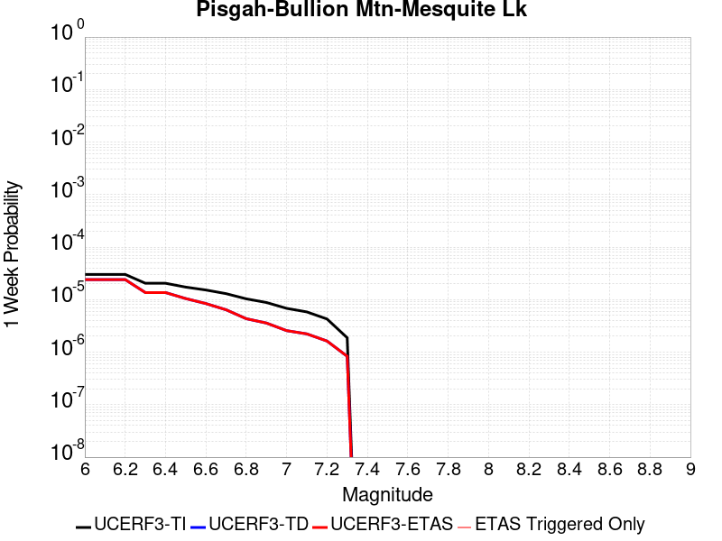 | 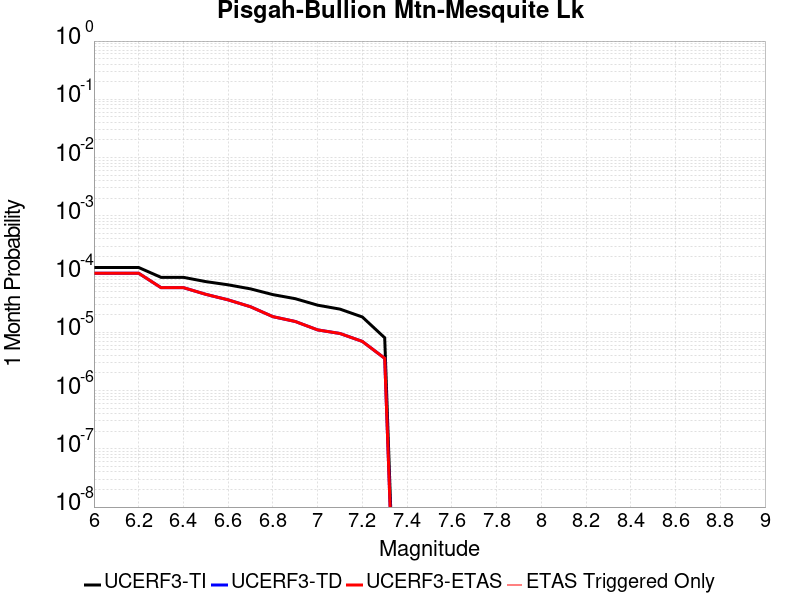 | 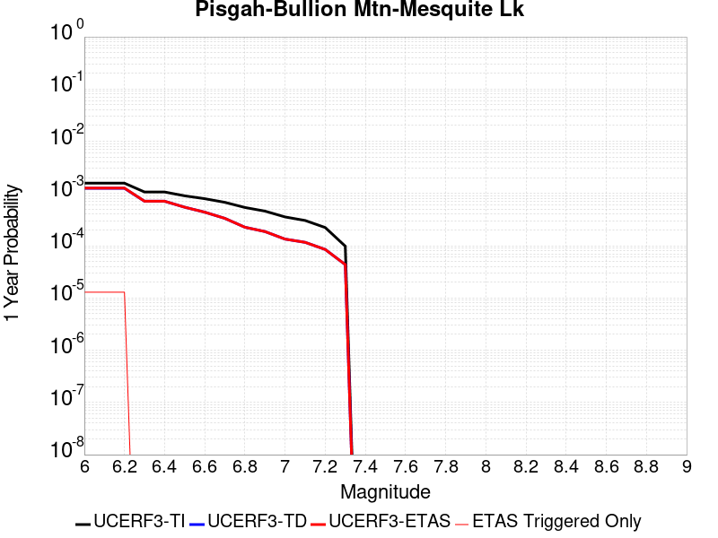 | 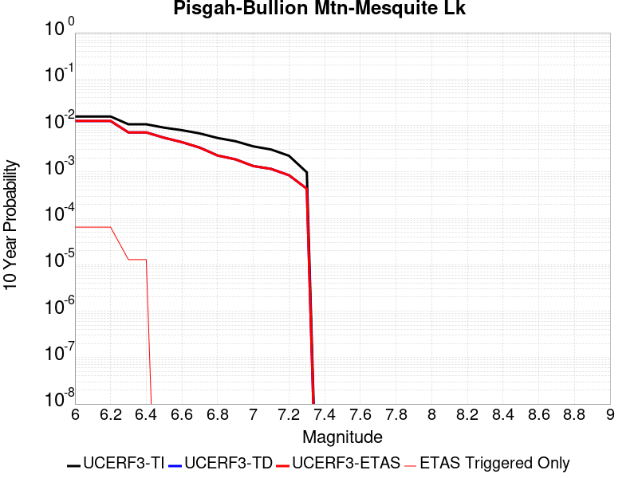 |

| Magnitude | 1 wk TI Prob | 1 wk TD Prob | 1 wk ETAS Prob | 1 wk ETAS/TD Gain | 1 wk ETAS Triggered Only | 1 mo TI Prob | 1 mo TD Prob | 1 mo ETAS Prob | 1 mo ETAS/TD Gain | 1 mo ETAS Triggered Only | 1 yr TI Prob | 1 yr TD Prob | 1 yr ETAS Prob | 1 yr ETAS/TD Gain | 1 yr ETAS Triggered Only | 10 yr TI Prob | 10 yr TD Prob | 10 yr ETAS Prob | 10 yr ETAS/TD Gain | 10 yr ETAS Triggered Only |
|-----|-----|-----|-----|-----|-----|-----|-----|-----|-----|-----|-----|-----|-----|-----|-----|-----|-----|-----|-----|-----|
| 6.0 | 3.0240792E-5 | 2.409455E-5 | 2.409455E-5 | 1.0 | 0.0 | 1.2959696E-4 | 1.0325883E-4 | 1.0325883E-4 | 1.0 | 0.0 | 0.0015767008 | 0.0012565517 | 0.0012745796 | 1.0143471 | 1.8050541E-5 | 0.015655609 | 0.012504495 | 0.012575794 | 1.0057019 | 7.2202165E-5 |
| 6.1 | 3.0240792E-5 | 2.409455E-5 | 2.409455E-5 | 1.0 | 0.0 | 1.2959696E-4 | 1.0325883E-4 | 1.0325883E-4 | 1.0 | 0.0 | 0.0015767008 | 0.0012565517 | 0.0012745796 | 1.0143471 | 1.8050541E-5 | 0.015655609 | 0.012504495 | 0.012575794 | 1.0057019 | 7.2202165E-5 |
| 6.2 | 3.0240792E-5 | 2.409455E-5 | 2.409455E-5 | 1.0 | 0.0 | 1.2959696E-4 | 1.0325883E-4 | 1.0325883E-4 | 1.0 | 0.0 | 0.0015767008 | 0.0012565517 | 0.0012745796 | 1.0143471 | 1.8050541E-5 | 0.015655609 | 0.012504495 | 0.012575794 | 1.0057019 | 7.2202165E-5 |
| 6.3 | 2.0498217E-5 | 1.3639733E-5 | 1.3639733E-5 | 1.0 | 0.0 | 8.784654E-5 | 5.8454778E-5 | 5.8454778E-5 | 1.0 | 0.0 | 0.0010690069 | 7.114708E-4 | 7.114708E-4 | 1.0 | 0.0 | 0.01063879 | 0.0070935567 | 0.0070935567 | 1.0 | 0.0 |
| 6.4 | 2.0498217E-5 | 1.3639733E-5 | 1.3639733E-5 | 1.0 | 0.0 | 8.784654E-5 | 5.8454778E-5 | 5.8454778E-5 | 1.0 | 0.0 | 0.0010690069 | 7.114708E-4 | 7.114708E-4 | 1.0 | 0.0 | 0.01063879 | 0.0070935567 | 0.0070935567 | 1.0 | 0.0 |
| 6.5 | 1.7316182E-5 | 1.0478257E-5 | 1.0478257E-5 | 1.0 | 0.0 | 7.42101E-5 | 4.4906097E-5 | 4.4906097E-5 | 1.0 | 0.0 | 9.0313336E-4 | 5.4660457E-4 | 5.4660457E-4 | 1.0 | 0.0 | 0.008994718 | 0.0054535973 | 0.0054535973 | 1.0 | 0.0 |
| 6.6 | 1.5251077E-5 | 8.415215E-6 | 8.415215E-6 | 1.0 | 0.0 | 6.536012E-5 | 3.606475E-5 | 3.606475E-5 | 1.0 | 0.0 | 7.9546886E-4 | 4.3900713E-4 | 4.3900713E-4 | 1.0 | 0.0 | 0.007926274 | 0.0043821163 | 0.0043821163 | 1.0 | 0.0 |
| 6.7 | 1.2997425E-5 | 6.412187E-6 | 6.412187E-6 | 1.0 | 0.0 | 5.570206E-5 | 2.7480539E-5 | 2.7480539E-5 | 1.0 | 0.0 | 6.7796157E-4 | 3.3452886E-4 | 3.3452886E-4 | 1.0 | 0.0 | 0.0067589693 | 0.003340713 | 0.003340713 | 1.0 | 0.0 |
| 6.8 | 1.035386E-5 | 4.333791E-6 | 4.333791E-6 | 1.0 | 0.0 | 4.437293E-5 | 1.8573262E-5 | 1.8573262E-5 | 1.0 | 0.0 | 5.401065E-4 | 2.2610689E-4 | 2.2610689E-4 | 1.0 | 0.0 | 0.0053879567 | 0.0022588552 | 0.0022588552 | 1.0 | 0.0 |
| 6.9 | 8.816252E-6 | 3.5811265E-6 | 3.5811265E-6 | 1.0 | 0.0 | 3.778339E-5 | 1.5347598E-5 | 1.5347598E-5 | 1.0 | 0.0 | 4.5991567E-4 | 1.8684157E-4 | 1.8684157E-4 | 1.0 | 0.0 | 0.00458965 | 0.0018669033 | 0.0018669033 | 1.0 | 0.0 |
| 7.0 | 6.8232207E-6 | 2.5679565E-6 | 2.5679565E-6 | 1.0 | 0.0 | 2.9242048E-5 | 1.1005483E-5 | 1.1005483E-5 | 1.0 | 0.0 | 3.5596377E-4 | 1.3398383E-4 | 1.3398383E-4 | 1.0 | 0.0 | 0.0035539411 | 0.0013390617 | 0.0013390617 | 1.0 | 0.0 |
| 7.1 | 5.837013E-6 | 2.2277006E-6 | 2.2277006E-6 | 1.0 | 0.0 | 2.501553E-5 | 9.547255E-6 | 9.547255E-6 | 1.0 | 0.0 | 3.045215E-4 | 1.16231924E-4 | 1.16231924E-4 | 1.0 | 0.0 | 0.0030410455 | 0.0011617403 | 0.0011617403 | 1.0 | 0.0 |
| 7.2 | 4.278052E-6 | 1.6277999E-6 | 1.6277999E-6 | 1.0 | 0.0 | 1.833438E-5 | 6.9762677E-6 | 6.9762677E-6 | 1.0 | 0.0 | 2.231982E-4 | 8.493298E-5 | 8.493298E-5 | 1.0 | 0.0 | 0.0022297418 | 8.4902847E-4 | 8.4902847E-4 | 1.0 | 0.0 |
| 7.3 | 1.8803692E-6 | 8.3459406E-7 | 8.3459406E-7 | 1.0 | 0.0 | 8.0587E-6 | 3.5768276E-6 | 3.5768276E-6 | 1.0 | 0.0 | 9.811026E-5 | 4.3547152E-5 | 4.3547152E-5 | 1.0 | 0.0 | 9.806695E-4 | 4.3540067E-4 | 4.3540067E-4 | 1.0 | 0.0 |

## Cleghorn Lake
*[(top)](#table-of-contents)*

| 1 Week | 1 Month | 1 Year | 10 Year |
|-----|-----|-----|-----|
| 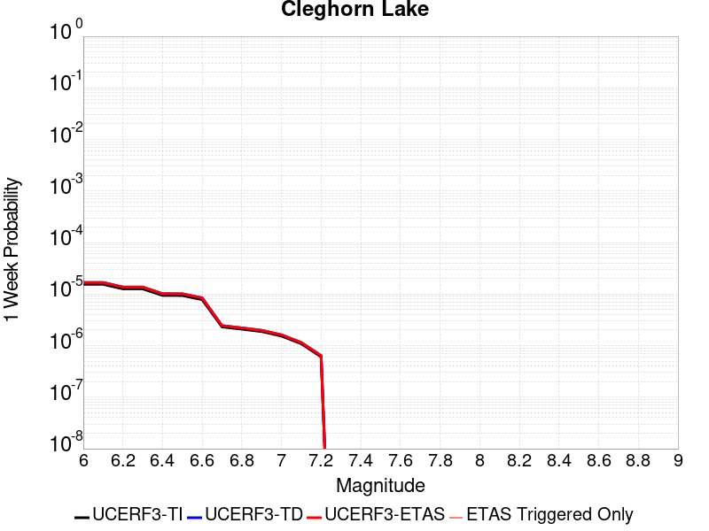 | 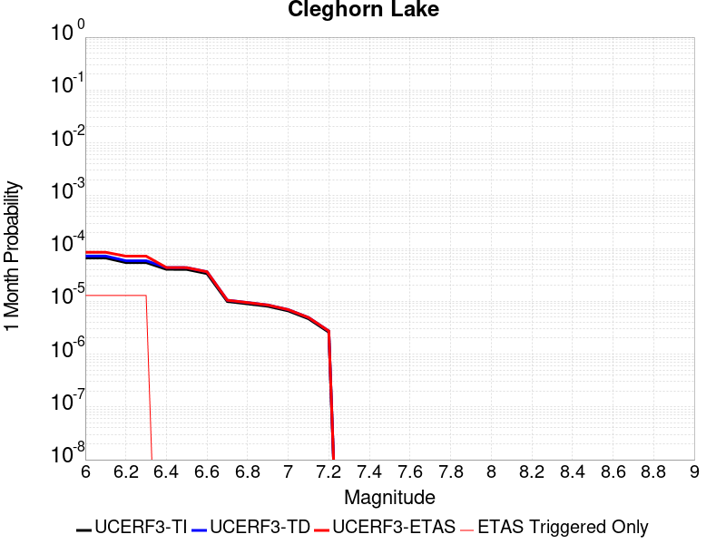 | 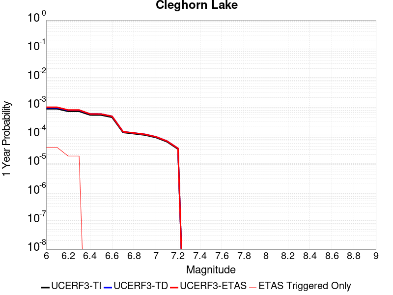 | 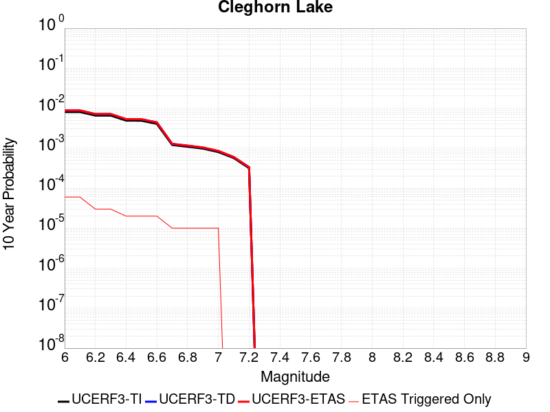 |

| Magnitude | 1 wk TI Prob | 1 wk TD Prob | 1 wk ETAS Prob | 1 wk ETAS/TD Gain | 1 wk ETAS Triggered Only | 1 mo TI Prob | 1 mo TD Prob | 1 mo ETAS Prob | 1 mo ETAS/TD Gain | 1 mo ETAS Triggered Only | 1 yr TI Prob | 1 yr TD Prob | 1 yr ETAS Prob | 1 yr ETAS/TD Gain | 1 yr ETAS Triggered Only | 10 yr TI Prob | 10 yr TD Prob | 10 yr ETAS Prob | 10 yr ETAS/TD Gain | 10 yr ETAS Triggered Only |
|-----|-----|-----|-----|-----|-----|-----|-----|-----|-----|-----|-----|-----|-----|-----|-----|-----|-----|-----|-----|-----|
| 6.0 | 1.5467183E-5 | 1.679593E-5 | 1.679593E-5 | 1.0 | 0.0 | 6.6286244E-5 | 7.198088E-5 | 9.0030124E-5 | 1.2507505 | 1.8050541E-5 | 8.067362E-4 | 8.760697E-4 | 9.121392E-4 | 1.0411719 | 3.6101083E-5 | 0.008038137 | 0.00873159 | 0.008803161 | 1.0081968 | 7.2202165E-5 |
| 6.1 | 1.5467183E-5 | 1.679593E-5 | 1.679593E-5 | 1.0 | 0.0 | 6.6286244E-5 | 7.198088E-5 | 9.0030124E-5 | 1.2507505 | 1.8050541E-5 | 8.067362E-4 | 8.760697E-4 | 9.121392E-4 | 1.0411719 | 3.6101083E-5 | 0.008038137 | 0.00873159 | 0.008803161 | 1.0081968 | 7.2202165E-5 |
| 6.2 | 1.2624631E-5 | 1.3682917E-5 | 1.3682917E-5 | 1.0 | 0.0 | 5.410444E-5 | 5.864003E-5 | 7.668951E-5 | 1.3078014 | 1.8050541E-5 | 6.585225E-4 | 7.137572E-4 | 7.3179486E-4 | 1.0252714 | 1.8050541E-5 | 0.0065657445 | 0.007119444 | 0.007155288 | 1.0050347 | 3.6101083E-5 |
| 6.3 | 1.2624631E-5 | 1.3682917E-5 | 1.3682917E-5 | 1.0 | 0.0 | 5.410444E-5 | 5.864003E-5 | 7.668951E-5 | 1.3078014 | 1.8050541E-5 | 6.585225E-4 | 7.137572E-4 | 7.3179486E-4 | 1.0252714 | 1.8050541E-5 | 0.0065657445 | 0.007119444 | 0.007155288 | 1.0050347 | 3.6101083E-5 |
| 6.4 | 9.417684E-6 | 1.0171092E-5 | 1.0171092E-5 | 1.0 | 0.0 | 4.036088E-5 | 4.35899E-5 | 4.35899E-5 | 1.0 | 0.0 | 4.912829E-4 | 5.306189E-4 | 5.306189E-4 | 1.0 | 0.0 | 0.004901982 | 0.005297556 | 0.0053155106 | 1.0033892 | 1.8050541E-5 |
| 6.5 | 9.368219E-6 | 1.0118515E-5 | 1.0118515E-5 | 1.0 | 0.0 | 4.014889E-5 | 4.3364573E-5 | 4.3364573E-5 | 1.0 | 0.0 | 4.8870314E-4 | 5.278769E-4 | 5.278769E-4 | 1.0 | 0.0 | 0.004876298 | 0.0052702664 | 0.005288222 | 1.0034069 | 1.8050541E-5 |
| 6.6 | 7.803798E-6 | 8.442658E-6 | 8.442658E-6 | 1.0 | 0.0 | 3.3444423E-5 | 3.6182544E-5 | 3.6182544E-5 | 1.0 | 0.0 | 4.0710976E-4 | 4.4047335E-4 | 4.4047335E-4 | 1.0 | 0.0 | 0.0040636472 | 0.004399921 | 0.004417892 | 1.0040845 | 1.8050541E-5 |
| 6.7 | 2.3108669E-6 | 2.4440017E-6 | 2.4440017E-6 | 1.0 | 0.0 | 9.903678E-6 | 1.0474252E-5 | 1.0474252E-5 | 1.0 | 0.0 | 1.205706E-4 | 1.2751675E-4 | 1.2751675E-4 | 1.0 | 0.0 | 0.001205052 | 0.0012744544 | 0.0012924819 | 1.0141453 | 1.8050541E-5 |
| 6.8 | 2.0882828E-6 | 2.2064312E-6 | 2.2064312E-6 | 1.0 | 0.0 | 8.949753E-6 | 9.4561E-6 | 9.4561E-6 | 1.0 | 0.0 | 1.08957785E-4 | 1.1512211E-4 | 1.1512211E-4 | 1.0 | 0.0 | 0.0010890438 | 0.0011506416 | 0.0011686713 | 1.0156693 | 1.8050541E-5 |
| 6.9 | 1.876935E-6 | 1.981182E-6 | 1.981182E-6 | 1.0 | 0.0 | 8.043982E-6 | 8.490754E-6 | 8.490754E-6 | 1.0 | 0.0 | 9.7931086E-5 | 1.0337019E-4 | 1.0337019E-4 | 1.0 | 0.0 | 9.788794E-4 | 0.0010332371 | 0.0010512689 | 1.0174519 | 1.8050541E-5 |
| 7.0 | 1.5357559E-6 | 1.6203873E-6 | 1.6203873E-6 | 1.0 | 0.0 | 6.5817944E-6 | 6.9444986E-6 | 6.9444986E-6 | 1.0 | 0.0 | 8.01304E-5 | 8.454612E-5 | 8.454612E-5 | 1.0 | 0.0 | 8.010151E-4 | 8.45152E-4 | 8.6318725E-4 | 1.0213397 | 1.8050541E-5 |
| 7.1 | 1.0905424E-6 | 1.1498365E-6 | 1.1498365E-6 | 1.0 | 0.0 | 4.6737446E-6 | 4.927862E-6 | 4.927862E-6 | 1.0 | 0.0 | 5.6901354E-5 | 5.9995167E-5 | 5.9995167E-5 | 1.0 | 0.0 | 5.6886784E-4 | 5.997995E-4 | 5.997995E-4 | 1.0 | 0.0 |
| 7.2 | 6.06668E-7 | 6.3876803E-7 | 6.3876803E-7 | 1.0 | 0.0 | 2.600003E-6 | 2.737575E-6 | 2.737575E-6 | 1.0 | 0.0 | 3.1654577E-5 | 3.3329536E-5 | 3.3329536E-5 | 1.0 | 0.0 | 3.1650066E-4 | 3.332522E-4 | 3.332522E-4 | 1.0 | 0.0 |

## White Mountains
*[(top)](#table-of-contents)*

| 1 Week | 1 Month | 1 Year | 10 Year |
|-----|-----|-----|-----|
| 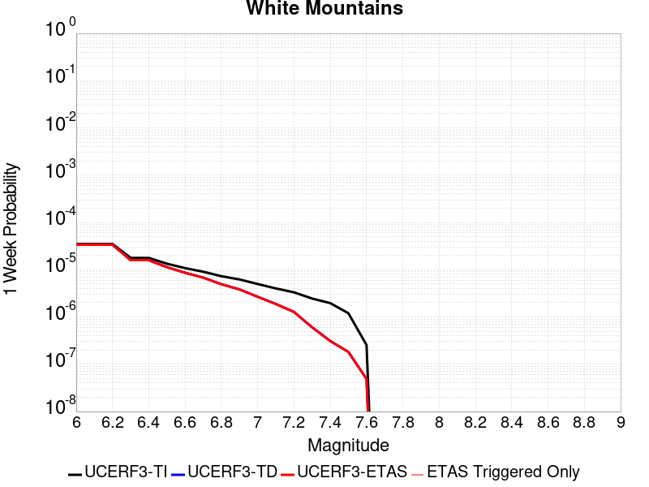 | 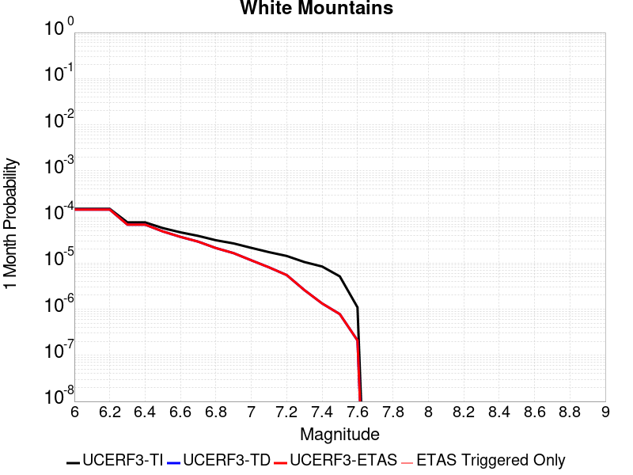 | 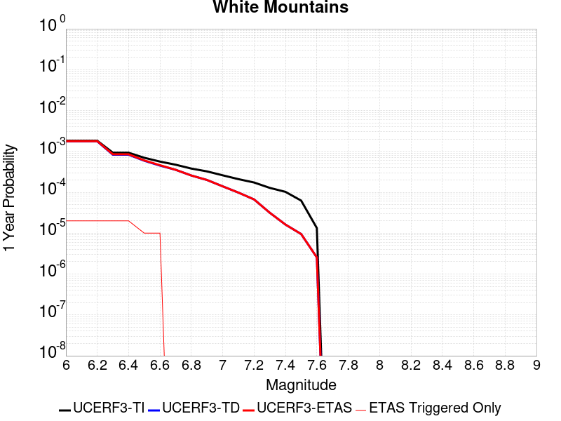 | 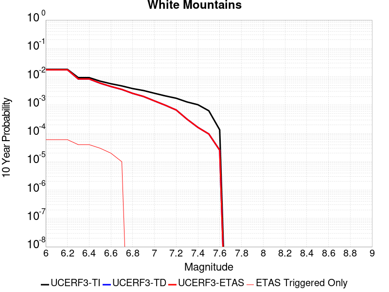 |

| Magnitude | 1 wk TI Prob | 1 wk TD Prob | 1 wk ETAS Prob | 1 wk ETAS/TD Gain | 1 wk ETAS Triggered Only | 1 mo TI Prob | 1 mo TD Prob | 1 mo ETAS Prob | 1 mo ETAS/TD Gain | 1 mo ETAS Triggered Only | 1 yr TI Prob | 1 yr TD Prob | 1 yr ETAS Prob | 1 yr ETAS/TD Gain | 1 yr ETAS Triggered Only | 10 yr TI Prob | 10 yr TD Prob | 10 yr ETAS Prob | 10 yr ETAS/TD Gain | 10 yr ETAS Triggered Only |
|-----|-----|-----|-----|-----|-----|-----|-----|-----|-----|-----|-----|-----|-----|-----|-----|-----|-----|-----|-----|-----|
| 6.0 | 3.503579E-5 | 3.3787568E-5 | 3.3787568E-5 | 1.0 | 0.0 | 1.5014476E-4 | 1.447965E-4 | 1.447965E-4 | 1.0 | 0.0 | 0.0018264796 | 0.0017615928 | 0.0017796116 | 1.0102286 | 1.8050541E-5 | 0.018115403 | 0.017488625 | 0.01754183 | 1.0030422 | 5.4151624E-5 |
| 6.1 | 3.503579E-5 | 3.3787568E-5 | 3.3787568E-5 | 1.0 | 0.0 | 1.5014476E-4 | 1.447965E-4 | 1.447965E-4 | 1.0 | 0.0 | 0.0018264796 | 0.0017615928 | 0.0017796116 | 1.0102286 | 1.8050541E-5 | 0.018115403 | 0.017488625 | 0.01754183 | 1.0030422 | 5.4151624E-5 |
| 6.2 | 3.503579E-5 | 3.3787568E-5 | 3.3787568E-5 | 1.0 | 0.0 | 1.5014476E-4 | 1.447965E-4 | 1.447965E-4 | 1.0 | 0.0 | 0.0018264796 | 0.0017615928 | 0.0017796116 | 1.0102286 | 1.8050541E-5 | 0.018115403 | 0.017488625 | 0.01754183 | 1.0030422 | 5.4151624E-5 |
| 6.3 | 1.7818425E-5 | 1.5917682E-5 | 1.5917682E-5 | 1.0 | 0.0 | 7.636245E-5 | 6.8216934E-5 | 6.8216934E-5 | 1.0 | 0.0 | 9.293162E-4 | 8.30239E-4 | 8.482745E-4 | 1.0217234 | 1.8050541E-5 | 0.009254395 | 0.008272831 | 0.008290732 | 1.0021639 | 1.8050541E-5 |
| 6.4 | 1.7818425E-5 | 1.5917682E-5 | 1.5917682E-5 | 1.0 | 0.0 | 7.636245E-5 | 6.8216934E-5 | 6.8216934E-5 | 1.0 | 0.0 | 9.293162E-4 | 8.30239E-4 | 8.482745E-4 | 1.0217234 | 1.8050541E-5 | 0.009254395 | 0.008272831 | 0.008290732 | 1.0021639 | 1.8050541E-5 |
| 6.5 | 1.3397557E-5 | 1.1337429E-5 | 1.1337429E-5 | 1.0 | 0.0 | 5.741684E-5 | 4.8588117E-5 | 4.8588117E-5 | 1.0 | 0.0 | 6.988258E-4 | 5.914067E-4 | 5.914067E-4 | 1.0 | 0.0 | 0.006966323 | 0.005899034 | 0.005899034 | 1.0 | 0.0 |
| 6.6 | 1.0818695E-5 | 8.626205E-6 | 8.626205E-6 | 1.0 | 0.0 | 4.6365014E-5 | 3.696895E-5 | 3.696895E-5 | 1.0 | 0.0 | 5.6434784E-4 | 4.5000837E-4 | 4.5000837E-4 | 1.0 | 0.0 | 0.005629168 | 0.004491408 | 0.004491408 | 1.0 | 0.0 |
| 6.7 | 9.067908E-6 | 6.8030813E-6 | 6.8030813E-6 | 1.0 | 0.0 | 3.8861883E-5 | 2.9155755E-5 | 2.9155755E-5 | 1.0 | 0.0 | 4.7304068E-4 | 3.549167E-4 | 3.549167E-4 | 1.0 | 0.0 | 0.00472035 | 0.0035438158 | 0.0035438158 | 1.0 | 0.0 |
| 6.8 | 7.295947E-6 | 4.9368487E-6 | 4.9368487E-6 | 1.0 | 0.0 | 3.126797E-5 | 2.1157757E-5 | 2.1157757E-5 | 1.0 | 0.0 | 3.8062103E-4 | 2.575664E-4 | 2.575664E-4 | 1.0 | 0.0 | 0.0037996976 | 0.0025727914 | 0.0025727914 | 1.0 | 0.0 |
| 6.9 | 6.2243444E-6 | 3.8325884E-6 | 3.8325884E-6 | 1.0 | 0.0 | 2.6675489E-5 | 1.6425278E-5 | 1.6425278E-5 | 1.0 | 0.0 | 3.2472567E-4 | 1.9995995E-4 | 1.9995995E-4 | 1.0 | 0.0 | 0.0032425157 | 0.001997853 | 0.001997853 | 1.0 | 0.0 |
| 7.0 | 4.9878413E-6 | 2.6798543E-6 | 2.6798543E-6 | 1.0 | 0.0 | 2.1376287E-5 | 1.1485041E-5 | 1.1485041E-5 | 1.0 | 0.0 | 2.602252E-4 | 1.3982167E-4 | 1.3982167E-4 | 1.0 | 0.0 | 0.002599207 | 0.0013973631 | 0.0013973631 | 1.0 | 0.0 |
| 7.1 | 4.0252844E-6 | 1.8860509E-6 | 1.8860509E-6 | 1.0 | 0.0 | 1.7251105E-5 | 8.0830505E-6 | 8.0830505E-6 | 1.0 | 0.0 | 2.1001195E-4 | 9.8406825E-5 | 9.8406825E-5 | 1.0 | 0.0 | 0.0020981359 | 9.836453E-4 | 9.836453E-4 | 1.0 | 0.0 |
| 7.2 | 3.3284066E-6 | 1.2822366E-6 | 1.2822366E-6 | 1.0 | 0.0 | 1.4264522E-5 | 5.4952884E-6 | 5.4952884E-6 | 1.0 | 0.0 | 1.736567E-4 | 6.690319E-5 | 6.690319E-5 | 1.0 | 0.0 | 0.0017352107 | 6.6884054E-4 | 6.6884054E-4 | 1.0 | 0.0 |
| 7.3 | 2.458226E-6 | 6.059675E-7 | 6.059675E-7 | 1.0 | 0.0 | 1.0535211E-5 | 2.5970012E-6 | 2.5970012E-6 | 1.0 | 0.0 | 1.2825865E-4 | 3.161807E-5 | 3.161807E-5 | 1.0 | 0.0 | 0.0012818464 | 3.1613946E-4 | 3.1613946E-4 | 1.0 | 0.0 |
| 7.4 | 1.965953E-6 | 3.1110594E-7 | 3.1110594E-7 | 1.0 | 0.0 | 8.425486E-6 | 1.3333105E-6 | 1.3333105E-6 | 1.0 | 0.0 | 1.0257547E-4 | 1.6232934E-5 | 1.6232934E-5 | 1.0 | 0.0 | 0.0010252813 | 1.6231762E-4 | 1.6231762E-4 | 1.0 | 0.0 |
| 7.5 | 1.2014192E-6 | 1.8258989E-7 | 1.8258989E-7 | 1.0 | 0.0 | 5.148929E-6 | 7.825278E-7 | 7.825278E-7 | 1.0 | 0.0 | 6.2686406E-5 | 9.527235E-6 | 9.527235E-6 | 1.0 | 0.0 | 6.266873E-4 | 9.5268355E-5 | 9.5268355E-5 | 1.0 | 0.0 |
| 7.6 | 2.5612175E-7 | 4.8985356E-8 | 4.8985356E-8 | 1.0 | 0.0 | 1.0976642E-6 | 2.0993723E-7 | 2.0993723E-7 | 1.0 | 0.0 | 1.3363979E-5 | 2.555983E-6 | 2.555983E-6 | 1.0 | 0.0 | 1.3363175E-4 | 2.5559573E-5 | 2.5559573E-5 | 1.0 | 0.0 |

## San Jacinto (San Jacinto Valley) rev
*[(top)](#table-of-contents)*

| 1 Week | 1 Month | 1 Year | 10 Year |
|-----|-----|-----|-----|
| 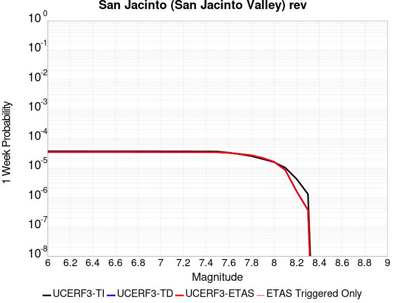 | 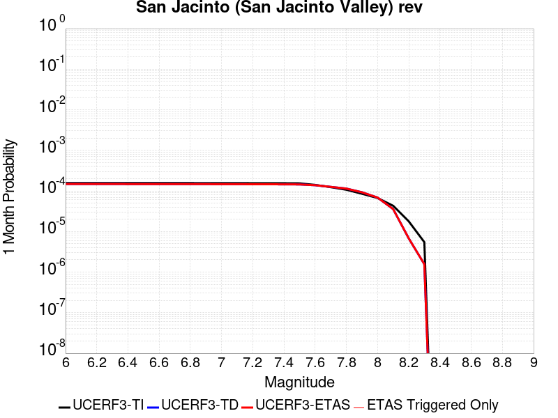 | 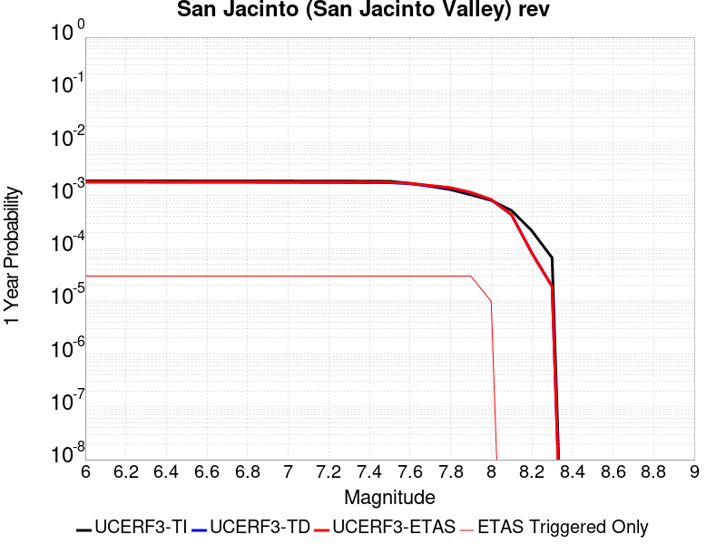 | 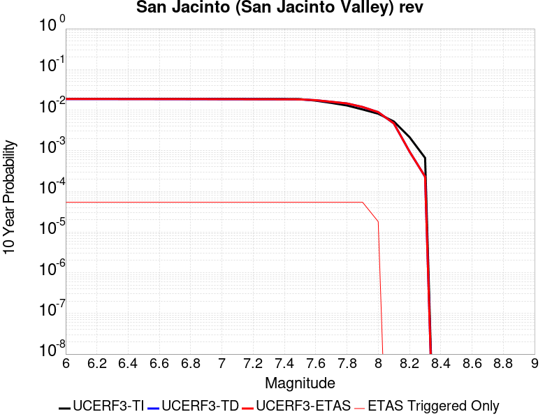 |

| Magnitude | 1 wk TI Prob | 1 wk TD Prob | 1 wk ETAS Prob | 1 wk ETAS/TD Gain | 1 wk ETAS Triggered Only | 1 mo TI Prob | 1 mo TD Prob | 1 mo ETAS Prob | 1 mo ETAS/TD Gain | 1 mo ETAS Triggered Only | 1 yr TI Prob | 1 yr TD Prob | 1 yr ETAS Prob | 1 yr ETAS/TD Gain | 1 yr ETAS Triggered Only | 10 yr TI Prob | 10 yr TD Prob | 10 yr ETAS Prob | 10 yr ETAS/TD Gain | 10 yr ETAS Triggered Only |
|-----|-----|-----|-----|-----|-----|-----|-----|-----|-----|-----|-----|-----|-----|-----|-----|-----|-----|-----|-----|-----|
| 6.0 | 3.652694E-5 | 3.4541874E-5 | 3.4541874E-5 | 1.0 | 0.0 | 1.5653463E-4 | 1.4802822E-4 | 1.4802822E-4 | 1.0 | 0.0 | 0.0019041431 | 0.0018007553 | 0.0018548094 | 1.0300175 | 5.4151624E-5 | 0.018879099 | 0.018598659 | 0.018651804 | 1.0028574 | 5.4151624E-5 |
| 6.1 | 3.652694E-5 | 3.4541874E-5 | 3.4541874E-5 | 1.0 | 0.0 | 1.5653463E-4 | 1.4802822E-4 | 1.4802822E-4 | 1.0 | 0.0 | 0.0019041431 | 0.0018007553 | 0.0018548094 | 1.0300175 | 5.4151624E-5 | 0.018879099 | 0.018598659 | 0.018651804 | 1.0028574 | 5.4151624E-5 |
| 6.2 | 3.652694E-5 | 3.4541874E-5 | 3.4541874E-5 | 1.0 | 0.0 | 1.5653463E-4 | 1.4802822E-4 | 1.4802822E-4 | 1.0 | 0.0 | 0.0019041431 | 0.0018007553 | 0.0018548094 | 1.0300175 | 5.4151624E-5 | 0.018879099 | 0.018598659 | 0.018651804 | 1.0028574 | 5.4151624E-5 |
| 6.3 | 3.652694E-5 | 3.4541874E-5 | 3.4541874E-5 | 1.0 | 0.0 | 1.5653463E-4 | 1.4802822E-4 | 1.4802822E-4 | 1.0 | 0.0 | 0.0019041431 | 0.0018007553 | 0.0018548094 | 1.0300175 | 5.4151624E-5 | 0.018879099 | 0.018598659 | 0.018651804 | 1.0028574 | 5.4151624E-5 |
| 6.4 | 3.646941E-5 | 3.4463417E-5 | 3.4463417E-5 | 1.0 | 0.0 | 1.5628811E-4 | 1.4769202E-4 | 1.4769202E-4 | 1.0 | 0.0 | 0.0019011468 | 0.0017966693 | 0.0018507236 | 1.0300858 | 5.4151624E-5 | 0.018849645 | 0.018558526 | 0.018611673 | 1.0028638 | 5.4151624E-5 |
| 6.5 | 3.646941E-5 | 3.4463417E-5 | 3.4463417E-5 | 1.0 | 0.0 | 1.5628811E-4 | 1.4769202E-4 | 1.4769202E-4 | 1.0 | 0.0 | 0.0019011468 | 0.0017966693 | 0.0018507236 | 1.0300858 | 5.4151624E-5 | 0.018849645 | 0.018558526 | 0.018611673 | 1.0028638 | 5.4151624E-5 |
| 6.6 | 3.6442503E-5 | 3.4426786E-5 | 3.4426786E-5 | 1.0 | 0.0 | 1.561728E-4 | 1.4753504E-4 | 1.4753504E-4 | 1.0 | 0.0 | 0.0018997455 | 0.0017947615 | 0.0018488159 | 1.0301179 | 5.4151624E-5 | 0.018835869 | 0.01853979 | 0.018592939 | 1.0028666 | 5.4151624E-5 |
| 6.7 | 3.6432113E-5 | 3.441235E-5 | 3.441235E-5 | 1.0 | 0.0 | 1.5612828E-4 | 1.4747318E-4 | 1.4747318E-4 | 1.0 | 0.0 | 0.0018992044 | 0.0017940099 | 0.0018480645 | 1.0301305 | 5.4151624E-5 | 0.018830549 | 0.018532412 | 0.018585559 | 1.0028678 | 5.4151624E-5 |
| 6.8 | 3.6409598E-5 | 3.438139E-5 | 3.438139E-5 | 1.0 | 0.0 | 1.560318E-4 | 1.4734051E-4 | 1.4734051E-4 | 1.0 | 0.0 | 0.0018980318 | 0.0017923975 | 0.001846452 | 1.0301577 | 5.4151624E-5 | 0.018819023 | 0.018516561 | 0.01856971 | 1.0028703 | 5.4151624E-5 |
| 6.9 | 3.638078E-5 | 3.43418E-5 | 3.43418E-5 | 1.0 | 0.0 | 1.5590832E-4 | 1.4717085E-4 | 1.4717085E-4 | 1.0 | 0.0 | 0.0018965311 | 0.0017903352 | 0.0018443898 | 1.0301925 | 5.4151624E-5 | 0.018804269 | 0.018496286 | 0.018549437 | 1.0028735 | 5.4151624E-5 |
| 7.0 | 3.6294874E-5 | 3.4223773E-5 | 3.4223773E-5 | 1.0 | 0.0 | 1.5554018E-4 | 1.4666507E-4 | 1.4666507E-4 | 1.0 | 0.0 | 0.0018920569 | 0.0017841874 | 0.0018382424 | 1.0302967 | 5.4151624E-5 | 0.018760284 | 0.018435847 | 0.018489 | 1.0028832 | 5.4151624E-5 |
| 7.1 | 3.6260717E-5 | 3.418004E-5 | 3.418004E-5 | 1.0 | 0.0 | 1.5539382E-4 | 1.4647767E-4 | 1.4647767E-4 | 1.0 | 0.0 | 0.001890278 | 0.0017819096 | 0.0018359647 | 1.0303355 | 5.4151624E-5 | 0.018742796 | 0.018413441 | 0.018466596 | 1.0028868 | 5.4151624E-5 |
| 7.2 | 3.6210204E-5 | 3.4114153E-5 | 3.4114153E-5 | 1.0 | 0.0 | 1.5517735E-4 | 1.4619534E-4 | 1.4619534E-4 | 1.0 | 0.0 | 0.001887647 | 0.0017784778 | 0.0018325332 | 1.0303942 | 5.4151624E-5 | 0.01871693 | 0.01837967 | 0.018432826 | 1.0028921 | 5.4151624E-5 |
| 7.3 | 3.6119454E-5 | 3.4002212E-5 | 3.4002212E-5 | 1.0 | 0.0 | 1.5478847E-4 | 1.4571565E-4 | 1.4571565E-4 | 1.0 | 0.0 | 0.0018829206 | 0.001772647 | 0.0018267026 | 1.0304943 | 5.4151624E-5 | 0.018670462 | 0.01832211 | 0.01837527 | 1.0029014 | 5.4151624E-5 |
| 7.4 | 3.607848E-5 | 3.3949644E-5 | 3.3949644E-5 | 1.0 | 0.0 | 1.5461289E-4 | 1.4549037E-4 | 1.4549037E-4 | 1.0 | 0.0 | 0.0018807866 | 0.0017699088 | 0.0018239646 | 1.0305415 | 5.4151624E-5 | 0.018649481 | 0.018295072 | 0.018348234 | 1.0029057 | 5.4151624E-5 |
| 7.5 | 3.5856774E-5 | 3.3758373E-5 | 3.3758373E-5 | 1.0 | 0.0 | 1.5366284E-4 | 1.4467073E-4 | 1.4467073E-4 | 1.0 | 0.0 | 0.0018692396 | 0.0017599459 | 0.0018140022 | 1.0307148 | 5.4151624E-5 | 0.018535944 | 0.018195631 | 0.018248798 | 1.0029219 | 5.4151624E-5 |
| 7.6 | 3.286655E-5 | 3.2273158E-5 | 3.2273158E-5 | 1.0 | 0.0 | 1.4084904E-4 | 1.383062E-4 | 1.383062E-4 | 1.0 | 0.0 | 0.001713488 | 0.0016825795 | 0.00173664 | 1.0321295 | 5.4151624E-5 | 0.017003361 | 0.017411046 | 0.017464256 | 1.003056 | 5.4151624E-5 |
| 7.7 | 2.8882527E-5 | 2.9363071E-5 | 2.9363071E-5 | 1.0 | 0.0 | 1.237764E-4 | 1.2583566E-4 | 1.2583566E-4 | 1.0 | 0.0 | 0.0015059357 | 0.0015309737 | 0.0015850423 | 1.0353166 | 5.4151624E-5 | 0.014957713 | 0.015896063 | 0.015949354 | 1.0033524 | 5.4151624E-5 |
| 7.8 | 2.4950225E-5 | 2.6649139E-5 | 2.6649139E-5 | 1.0 | 0.0 | 1.0692515E-4 | 1.142056E-4 | 1.142056E-4 | 1.0 | 0.0 | 0.0013010362 | 0.0013895672 | 0.0014436435 | 1.038916 | 5.4151624E-5 | 0.012934455 | 0.014474952 | 0.014528319 | 1.0036869 | 5.4151624E-5 |
| 7.9 | 1.9881603E-5 | 2.1617223E-5 | 2.1617223E-5 | 1.0 | 0.0 | 8.520408E-5 | 9.264196E-5 | 9.264196E-5 | 1.0 | 0.0 | 0.001036866 | 0.001127333 | 0.0011814235 | 1.047981 | 5.4151624E-5 | 0.010320415 | 0.0118341595 | 0.01188767 | 1.0045217 | 5.4151624E-5 |
| 8.0 | 1.563292E-5 | 1.6026019E-5 | 1.6026019E-5 | 1.0 | 0.0 | 6.6996516E-5 | 6.868113E-5 | 6.868113E-5 | 1.0 | 0.0 | 8.153773E-4 | 8.3587266E-4 | 8.5390813E-4 | 1.0215768 | 1.8050541E-5 | 0.00812392 | 0.00885717 | 0.008875061 | 1.0020199 | 1.8050541E-5 |
| 8.1 | 1.0045313E-5 | 8.3539835E-6 | 8.3539835E-6 | 1.0 | 0.0 | 4.305063E-5 | 3.5802295E-5 | 3.5802295E-5 | 1.0 | 0.0 | 5.2401534E-4 | 4.358063E-4 | 4.358063E-4 | 1.0 | 0.0 | 0.0052278144 | 0.0046871547 | 0.0046871547 | 1.0 | 0.0 |
| 8.2 | 4.1554413E-6 | 1.5804786E-6 | 1.5804786E-6 | 1.0 | 0.0 | 1.7808914E-5 | 6.7734622E-6 | 6.7734622E-6 | 1.0 | 0.0 | 2.1680194E-4 | 8.246381E-5 | 8.246381E-5 | 1.0 | 0.0 | 0.0021659054 | 9.568129E-4 | 9.568129E-4 | 1.0 | 0.0 |
| 8.3 | 1.2758221E-6 | 3.6555596E-7 | 3.6555596E-7 | 1.0 | 0.0 | 5.4677976E-6 | 1.5666675E-6 | 1.5666675E-6 | 1.0 | 0.0 | 6.65684E-5 | 1.9074014E-5 | 1.9074014E-5 | 1.0 | 0.0 | 6.6548464E-4 | 2.2989567E-4 | 2.2989567E-4 | 1.0 | 0.0 |

## Scodie Lineament
*[(top)](#table-of-contents)*

| 1 Week | 1 Month | 1 Year | 10 Year |
|-----|-----|-----|-----|
| 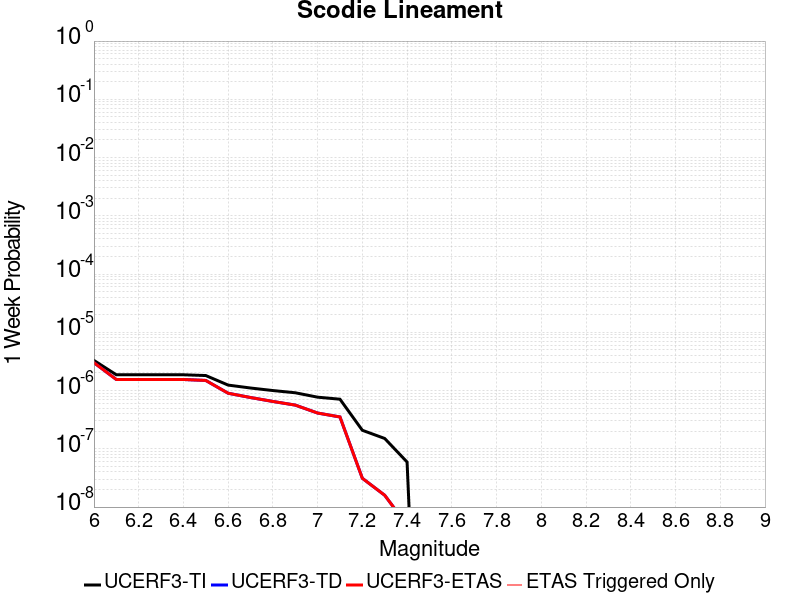 | 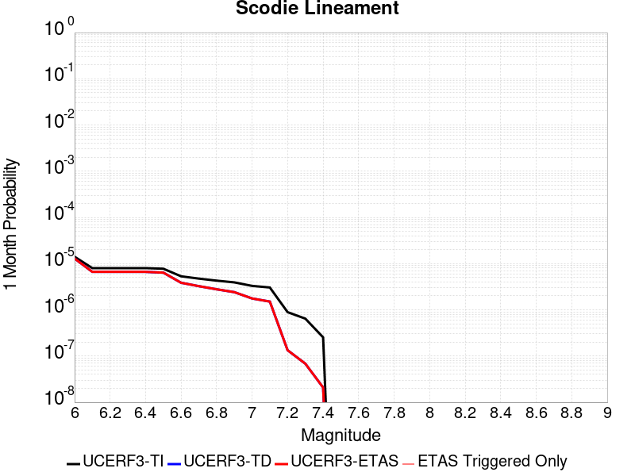 | 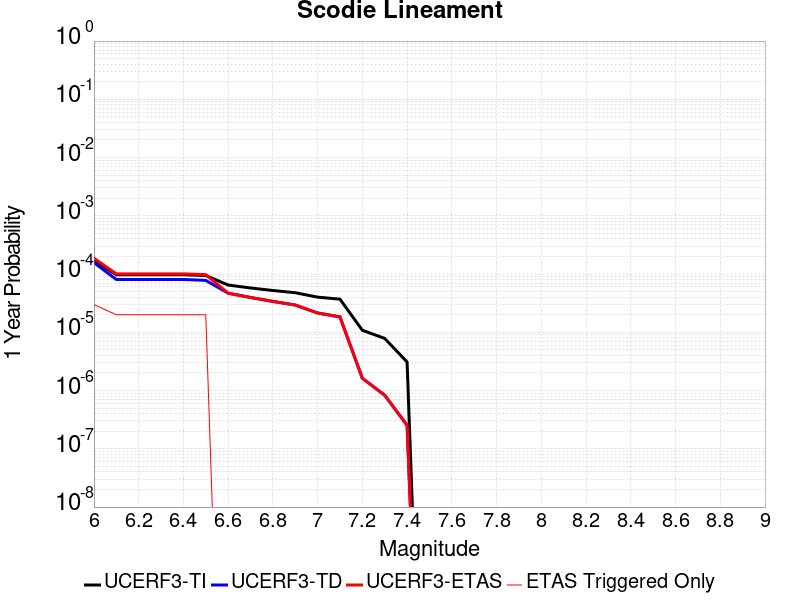 | 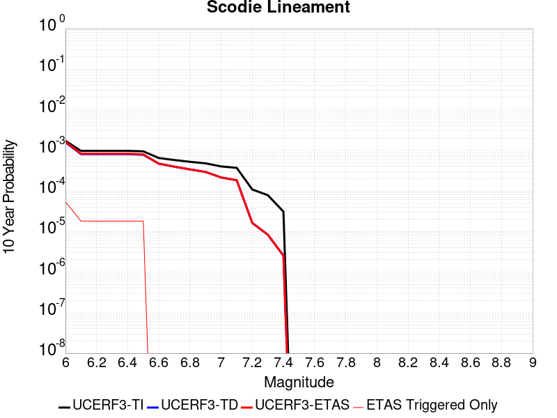 |

| Magnitude | 1 wk TI Prob | 1 wk TD Prob | 1 wk ETAS Prob | 1 wk ETAS/TD Gain | 1 wk ETAS Triggered Only | 1 mo TI Prob | 1 mo TD Prob | 1 mo ETAS Prob | 1 mo ETAS/TD Gain | 1 mo ETAS Triggered Only | 1 yr TI Prob | 1 yr TD Prob | 1 yr ETAS Prob | 1 yr ETAS/TD Gain | 1 yr ETAS Triggered Only | 10 yr TI Prob | 10 yr TD Prob | 10 yr ETAS Prob | 10 yr ETAS/TD Gain | 10 yr ETAS Triggered Only |
|-----|-----|-----|-----|-----|-----|-----|-----|-----|-----|-----|-----|-----|-----|-----|-----|-----|-----|-----|-----|-----|
| 6.0 | 3.2919327E-6 | 3.0134704E-6 | 3.0134704E-6 | 1.0 | 0.0 | 1.4108206E-5 | 1.29148275E-5 | 1.29148275E-5 | 1.0 | 0.0 | 1.7175387E-4 | 1.5722985E-4 | 1.9332526E-4 | 1.229571 | 3.6101083E-5 | 0.0017162118 | 0.0015714978 | 0.0016255642 | 1.0344045 | 5.4151624E-5 |
| 6.1 | 1.8663811E-6 | 1.5491306E-6 | 1.5491306E-6 | 1.0 | 0.0 | 7.998751E-6 | 6.639117E-6 | 6.639117E-6 | 1.0 | 0.0 | 9.738045E-5 | 8.082875E-5 | 9.8877834E-5 | 1.2233002 | 1.8050541E-5 | 9.7337784E-4 | 8.0804236E-4 | 8.260783E-4 | 1.0223205 | 1.8050541E-5 |
| 6.2 | 1.8663811E-6 | 1.5491306E-6 | 1.5491306E-6 | 1.0 | 0.0 | 7.998751E-6 | 6.639117E-6 | 6.639117E-6 | 1.0 | 0.0 | 9.738045E-5 | 8.082875E-5 | 9.8877834E-5 | 1.2233002 | 1.8050541E-5 | 9.7337784E-4 | 8.0804236E-4 | 8.260783E-4 | 1.0223205 | 1.8050541E-5 |
| 6.3 | 1.8663811E-6 | 1.5491306E-6 | 1.5491306E-6 | 1.0 | 0.0 | 7.998751E-6 | 6.639117E-6 | 6.639117E-6 | 1.0 | 0.0 | 9.738045E-5 | 8.082875E-5 | 9.8877834E-5 | 1.2233002 | 1.8050541E-5 | 9.7337784E-4 | 8.0804236E-4 | 8.260783E-4 | 1.0223205 | 1.8050541E-5 |
| 6.4 | 1.8663811E-6 | 1.5491306E-6 | 1.5491306E-6 | 1.0 | 0.0 | 7.998751E-6 | 6.639117E-6 | 6.639117E-6 | 1.0 | 0.0 | 9.738045E-5 | 8.082875E-5 | 9.8877834E-5 | 1.2233002 | 1.8050541E-5 | 9.7337784E-4 | 8.0804236E-4 | 8.260783E-4 | 1.0223205 | 1.8050541E-5 |
| 6.5 | 1.8106311E-6 | 1.4910618E-6 | 1.4910618E-6 | 1.0 | 0.0 | 7.759824E-6 | 6.3902517E-6 | 6.3902517E-6 | 1.0 | 0.0 | 9.447177E-5 | 7.7799035E-5 | 9.584817E-5 | 1.2319969 | 1.8050541E-5 | 9.4431615E-4 | 7.7776663E-4 | 7.9580315E-4 | 1.0231901 | 1.8050541E-5 |
| 6.6 | 1.2414679E-6 | 8.9980625E-7 | 8.9980625E-7 | 1.0 | 0.0 | 5.320566E-6 | 3.856307E-6 | 3.856307E-6 | 1.0 | 0.0 | 6.477596E-5 | 4.6949615E-5 | 4.6949615E-5 | 1.0 | 0.0 | 6.475708E-4 | 4.6940564E-4 | 4.6940564E-4 | 1.0 | 0.0 |
| 6.7 | 1.1062215E-6 | 7.5947526E-7 | 7.5947526E-7 | 1.0 | 0.0 | 4.7409408E-6 | 3.2548903E-6 | 3.2548903E-6 | 1.0 | 0.0 | 5.7719422E-5 | 3.962764E-5 | 3.962764E-5 | 1.0 | 0.0 | 5.770443E-4 | 3.9621274E-4 | 3.9621274E-4 | 1.0 | 0.0 |
| 6.8 | 1.0006736E-6 | 6.500791E-7 | 6.500791E-7 | 1.0 | 0.0 | 4.288594E-6 | 2.7860506E-6 | 2.7860506E-6 | 1.0 | 0.0 | 5.221238E-5 | 3.39197E-5 | 3.39197E-5 | 1.0 | 0.0 | 5.220012E-4 | 3.391513E-4 | 3.391513E-4 | 1.0 | 0.0 |
| 6.9 | 9.167364E-7 | 5.631983E-7 | 5.631983E-7 | 1.0 | 0.0 | 3.9288643E-6 | 2.413705E-6 | 2.413705E-6 | 1.0 | 0.0 | 4.7832873E-5 | 2.938652E-5 | 2.938652E-5 | 1.0 | 0.0 | 4.782258E-4 | 2.93832E-4 | 2.93832E-4 | 1.0 | 0.0 |
| 7.0 | 7.6987664E-7 | 4.1136795E-7 | 4.1136795E-7 | 1.0 | 0.0 | 3.2994672E-6 | 1.7630045E-6 | 1.7630045E-6 | 1.0 | 0.0 | 4.0170275E-5 | 2.1464408E-5 | 2.1464408E-5 | 1.0 | 0.0 | 4.0163012E-4 | 2.1462722E-4 | 2.1462722E-4 | 1.0 | 0.0 |
| 7.1 | 7.1038727E-7 | 3.5214222E-7 | 3.5214222E-7 | 1.0 | 0.0 | 3.0445133E-6 | 1.5091804E-6 | 1.5091804E-6 | 1.0 | 0.0 | 3.706632E-5 | 1.837415E-5 | 1.837415E-5 | 1.0 | 0.0 | 3.7060137E-4 | 1.8372982E-4 | 1.8372982E-4 | 1.0 | 0.0 |
| 7.2 | 2.0799602E-7 | 3.1194354E-8 | 3.1194354E-8 | 1.0 | 0.0 | 8.914113E-7 | 1.3369008E-7 | 1.3369008E-7 | 1.0 | 0.0 | 1.0852878E-5 | 1.6276756E-6 | 1.6276756E-6 | 1.0 | 0.0 | 1.08523476E-4 | 1.6276645E-5 | 1.6276645E-5 | 1.0 | 0.0 |
| 7.3 | 1.5048182E-7 | 1.5950793E-8 | 1.5950793E-8 | 1.0 | 0.0 | 6.449219E-7 | 6.8360535E-8 | 6.8360535E-8 | 1.0 | 0.0 | 7.851896E-6 | 8.322893E-7 | 8.322893E-7 | 1.0 | 0.0 | 7.851618E-5 | 8.322864E-6 | 8.322864E-6 | 1.0 | 0.0 |
| 7.4 | 5.9334678E-8 | 4.870236E-9 | 4.870236E-9 | 1.0 | 0.0 | 2.5429145E-7 | 2.0872442E-8 | 2.0872442E-8 | 1.0 | 0.0 | 3.095994E-6 | 2.5412194E-7 | 2.5412194E-7 | 1.0 | 0.0 | 3.095951E-5 | 2.5412178E-6 | 2.5412178E-6 | 1.0 | 0.0 |

## Monte Vista - Shannon 2011 CFM
*[(top)](#table-of-contents)*

| 1 Week | 1 Month | 1 Year | 10 Year |
|-----|-----|-----|-----|
| 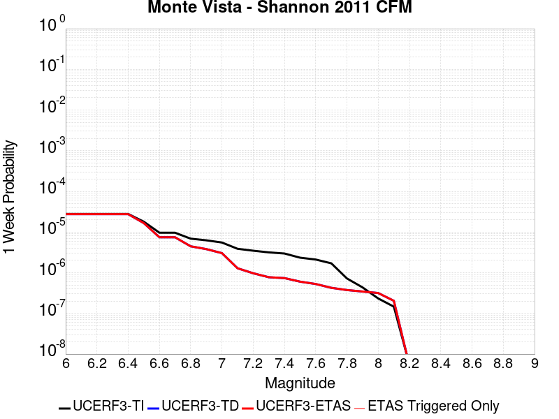 | 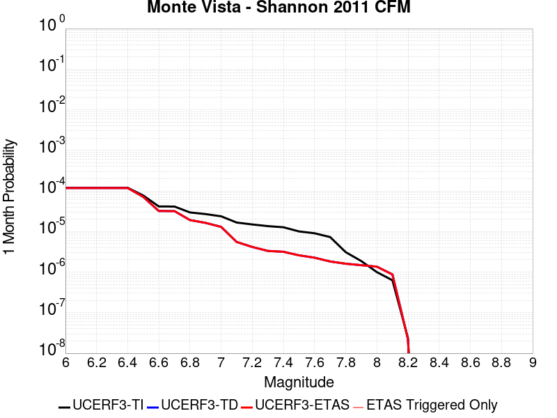 | 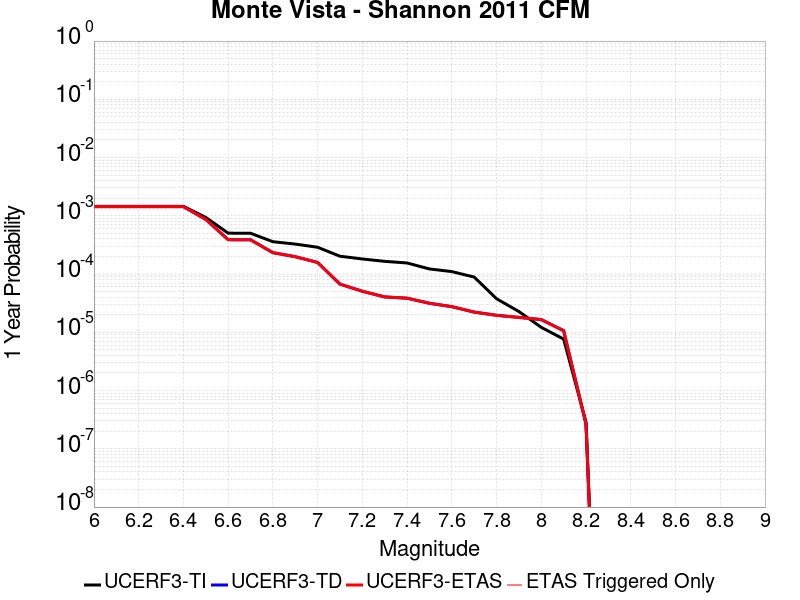 | 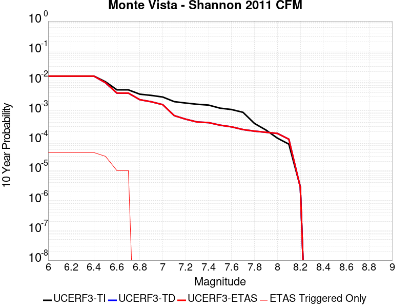 |

| Magnitude | 1 wk TI Prob | 1 wk TD Prob | 1 wk ETAS Prob | 1 wk ETAS/TD Gain | 1 wk ETAS Triggered Only | 1 mo TI Prob | 1 mo TD Prob | 1 mo ETAS Prob | 1 mo ETAS/TD Gain | 1 mo ETAS Triggered Only | 1 yr TI Prob | 1 yr TD Prob | 1 yr ETAS Prob | 1 yr ETAS/TD Gain | 1 yr ETAS Triggered Only | 10 yr TI Prob | 10 yr TD Prob | 10 yr ETAS Prob | 10 yr ETAS/TD Gain | 10 yr ETAS Triggered Only |
|-----|-----|-----|-----|-----|-----|-----|-----|-----|-----|-----|-----|-----|-----|-----|-----|-----|-----|-----|-----|-----|
| 6.0 | 2.7907707E-5 | 2.759206E-5 | 2.759206E-5 | 1.0 | 0.0 | 1.19598975E-4 | 1.18247015E-4 | 1.18247015E-4 | 1.0 | 0.0 | 0.0014551448 | 0.0014388304 | 0.0014388304 | 1.0 | 0.0 | 0.014456532 | 0.014324272 | 0.014377648 | 1.0037262 | 5.4151624E-5 |
| 6.1 | 2.7907707E-5 | 2.759206E-5 | 2.759206E-5 | 1.0 | 0.0 | 1.19598975E-4 | 1.18247015E-4 | 1.18247015E-4 | 1.0 | 0.0 | 0.0014551448 | 0.0014388304 | 0.0014388304 | 1.0 | 0.0 | 0.014456532 | 0.014324272 | 0.014377648 | 1.0037262 | 5.4151624E-5 |
| 6.2 | 2.7907707E-5 | 2.759206E-5 | 2.759206E-5 | 1.0 | 0.0 | 1.19598975E-4 | 1.18247015E-4 | 1.18247015E-4 | 1.0 | 0.0 | 0.0014551448 | 0.0014388304 | 0.0014388304 | 1.0 | 0.0 | 0.014456532 | 0.014324272 | 0.014377648 | 1.0037262 | 5.4151624E-5 |
| 6.3 | 2.7907707E-5 | 2.759206E-5 | 2.759206E-5 | 1.0 | 0.0 | 1.19598975E-4 | 1.18247015E-4 | 1.18247015E-4 | 1.0 | 0.0 | 0.0014551448 | 0.0014388304 | 0.0014388304 | 1.0 | 0.0 | 0.014456532 | 0.014324272 | 0.014377648 | 1.0037262 | 5.4151624E-5 |
| 6.4 | 2.7907707E-5 | 2.759206E-5 | 2.759206E-5 | 1.0 | 0.0 | 1.19598975E-4 | 1.18247015E-4 | 1.18247015E-4 | 1.0 | 0.0 | 0.0014551448 | 0.0014388304 | 0.0014388304 | 1.0 | 0.0 | 0.014456532 | 0.014324272 | 0.014377648 | 1.0037262 | 5.4151624E-5 |
| 6.5 | 1.7990213E-5 | 1.664638E-5 | 1.664638E-5 | 1.0 | 0.0 | 7.709863E-5 | 7.134005E-5 | 7.134005E-5 | 1.0 | 0.0 | 9.382716E-4 | 8.6828537E-4 | 8.6828537E-4 | 1.0 | 0.0 | 0.0093431985 | 0.008672339 | 0.008726021 | 1.0061901 | 5.4151624E-5 |
| 6.6 | 9.650407E-6 | 7.462531E-6 | 7.462531E-6 | 1.0 | 0.0 | 4.135823E-5 | 3.1981926E-5 | 3.1981926E-5 | 1.0 | 0.0 | 5.0342013E-4 | 3.8931824E-4 | 3.8931824E-4 | 1.0 | 0.0 | 0.005022812 | 0.0039040789 | 0.0039220587 | 1.0046054 | 1.8050541E-5 |
| 6.7 | 9.62828E-6 | 7.4404397E-6 | 7.4404397E-6 | 1.0 | 0.0 | 4.1263404E-5 | 3.188725E-5 | 3.188725E-5 | 1.0 | 0.0 | 5.022661E-4 | 3.8816596E-4 | 3.8816596E-4 | 1.0 | 0.0 | 0.0050113243 | 0.0038925966 | 0.003910577 | 1.0046191 | 1.8050541E-5 |
| 6.8 | 6.887523E-6 | 4.4666353E-6 | 4.4666353E-6 | 1.0 | 0.0 | 2.9517621E-5 | 1.9142595E-5 | 1.9142595E-5 | 1.0 | 0.0 | 3.5931775E-4 | 2.330384E-4 | 2.330384E-4 | 1.0 | 0.0 | 0.0035873733 | 0.00234513 | 0.00234513 | 1.0 | 0.0 |
| 6.9 | 6.2722347E-6 | 3.8084336E-6 | 3.8084336E-6 | 1.0 | 0.0 | 2.6880729E-5 | 1.6321768E-5 | 1.6321768E-5 | 1.0 | 0.0 | 3.2722374E-4 | 1.9870143E-4 | 1.9870143E-4 | 1.0 | 0.0 | 0.003267423 | 0.0020024136 | 0.0020024136 | 1.0 | 0.0 |
| 7.0 | 5.5320347E-6 | 3.035474E-6 | 3.035474E-6 | 1.0 | 0.0 | 2.3708504E-5 | 1.300912E-5 | 1.300912E-5 | 1.0 | 0.0 | 2.8861282E-4 | 1.5837635E-4 | 1.5837635E-4 | 1.0 | 0.0 | 0.0028823826 | 0.0015997968 | 0.0015997968 | 1.0 | 0.0 |
| 7.1 | 3.8794055E-6 | 1.2884323E-6 | 1.2884323E-6 | 1.0 | 0.0 | 1.6625918E-5 | 5.521841E-6 | 5.521841E-6 | 1.0 | 0.0 | 2.0240174E-4 | 6.7226356E-5 | 6.7226356E-5 | 1.0 | 0.0 | 0.002022175 | 6.890475E-4 | 6.890475E-4 | 1.0 | 0.0 |
| 7.2 | 3.4813652E-6 | 9.715332E-7 | 9.715332E-7 | 1.0 | 0.0 | 1.49200505E-5 | 4.1637068E-6 | 4.1637068E-6 | 1.0 | 0.0 | 1.8163648E-4 | 5.069196E-5 | 5.069196E-5 | 1.0 | 0.0 | 0.0018148809 | 5.23779E-4 | 5.23779E-4 | 1.0 | 0.0 |
| 7.3 | 3.1682148E-6 | 7.761988E-7 | 7.761988E-7 | 1.0 | 0.0 | 1.3577992E-5 | 3.326562E-6 | 3.326562E-6 | 1.0 | 0.0 | 1.6529951E-4 | 4.050014E-5 | 4.050014E-5 | 1.0 | 0.0 | 0.0016517661 | 4.2187763E-4 | 4.2187763E-4 | 1.0 | 0.0 |
| 7.4 | 2.9707667E-6 | 7.387261E-7 | 7.387261E-7 | 1.0 | 0.0 | 1.2731795E-5 | 3.1659652E-6 | 3.1659652E-6 | 1.0 | 0.0 | 1.5499859E-4 | 3.854495E-5 | 3.854495E-5 | 1.0 | 0.0 | 0.0015489052 | 4.021233E-4 | 4.021233E-4 | 1.0 | 0.0 |
| 7.5 | 2.3462758E-6 | 6.0432785E-7 | 6.0432785E-7 | 1.0 | 0.0 | 1.0055429E-5 | 2.589974E-6 | 2.589974E-6 | 1.0 | 0.0 | 1.2241797E-4 | 3.153248E-5 | 3.153248E-5 | 1.0 | 0.0 | 0.0012235056 | 3.302689E-4 | 3.302689E-4 | 1.0 | 0.0 |
| 7.6 | 2.112783E-6 | 5.2848054E-7 | 5.2848054E-7 | 1.0 | 0.0 | 9.054753E-6 | 2.2649147E-6 | 2.2649147E-6 | 1.0 | 0.0 | 1.1023604E-4 | 2.7574988E-5 | 2.7574988E-5 | 1.0 | 0.0 | 0.0011018137 | 2.902723E-4 | 2.902723E-4 | 1.0 | 0.0 |
| 7.7 | 1.7022471E-6 | 4.2604768E-7 | 4.2604768E-7 | 1.0 | 0.0 | 7.2953244E-6 | 1.8259174E-6 | 1.8259174E-6 | 1.0 | 0.0 | 8.881695E-5 | 2.2230319E-5 | 2.2230319E-5 | 1.0 | 0.0 | 8.878146E-4 | 2.3551173E-4 | 2.3551173E-4 | 1.0 | 0.0 |
| 7.8 | 7.230914E-7 | 3.754662E-7 | 3.754662E-7 | 1.0 | 0.0 | 3.0989595E-6 | 1.6091398E-6 | 1.6091398E-6 | 1.0 | 0.0 | 3.772918E-5 | 1.9591102E-5 | 1.9591102E-5 | 1.0 | 0.0 | 3.7722773E-4 | 2.0864182E-4 | 2.0864182E-4 | 1.0 | 0.0 |
| 7.9 | 4.3588446E-7 | 3.4532394E-7 | 3.4532394E-7 | 1.0 | 0.0 | 1.868075E-6 | 1.4799589E-6 | 1.4799589E-6 | 1.0 | 0.0 | 2.2743576E-5 | 1.8018352E-5 | 1.8018352E-5 | 1.0 | 0.0 | 2.2741247E-4 | 1.9113458E-4 | 1.9113458E-4 | 1.0 | 0.0 |
| 8.0 | 2.3317523E-7 | 3.1711846E-7 | 3.1711846E-7 | 1.0 | 0.0 | 9.99322E-7 | 1.3590785E-6 | 1.3590785E-6 | 1.0 | 0.0 | 1.2166677E-5 | 1.6546655E-5 | 1.6546655E-5 | 1.0 | 0.0 | 1.21660116E-4 | 1.75019E-4 | 1.75019E-4 | 1.0 | 0.0 |
| 8.1 | 1.4662456E-7 | 2.0425213E-7 | 2.0425213E-7 | 1.0 | 0.0 | 6.283908E-7 | 8.7536597E-7 | 8.7536597E-7 | 1.0 | 0.0 | 7.650631E-6 | 1.065753E-5 | 1.065753E-5 | 1.0 | 0.0 | 7.650368E-5 | 1.1192819E-4 | 1.1192819E-4 | 1.0 | 0.0 |
| 8.2 | 5.4931775E-9 | 5.1069184E-9 | 5.1069184E-9 | 1.0 | 0.0 | 2.3542189E-8 | 2.1886795E-8 | 2.1886795E-8 | 1.0 | 0.0 | 2.8662612E-7 | 2.664717E-7 | 2.664717E-7 | 1.0 | 0.0 | 2.8662573E-6 | 2.7704375E-6 | 2.7704375E-6 | 1.0 | 0.0 |

## Cleghorn
*[(top)](#table-of-contents)*

| 1 Week | 1 Month | 1 Year | 10 Year |
|-----|-----|-----|-----|
| 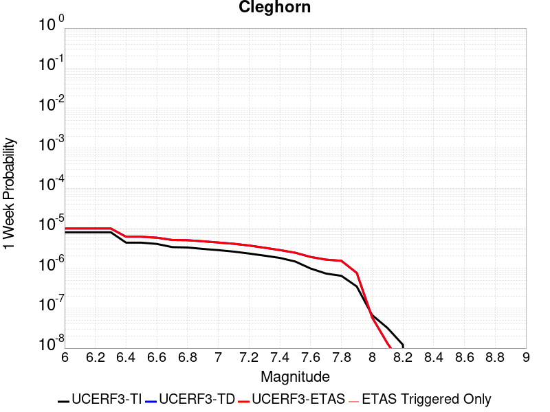 | 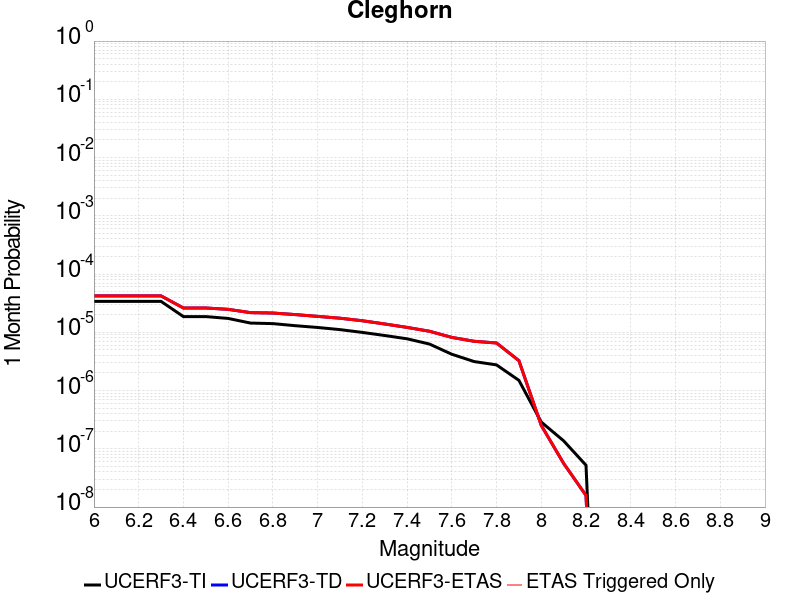 | 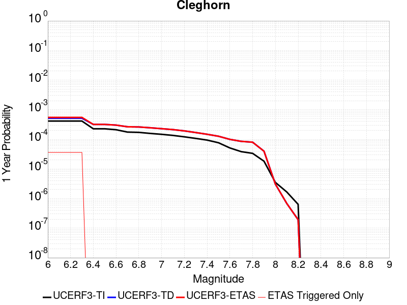 | 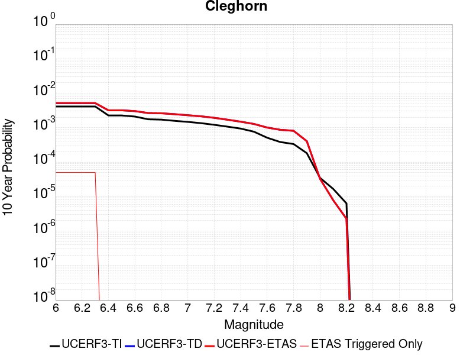 |

| Magnitude | 1 wk TI Prob | 1 wk TD Prob | 1 wk ETAS Prob | 1 wk ETAS/TD Gain | 1 wk ETAS Triggered Only | 1 mo TI Prob | 1 mo TD Prob | 1 mo ETAS Prob | 1 mo ETAS/TD Gain | 1 mo ETAS Triggered Only | 1 yr TI Prob | 1 yr TD Prob | 1 yr ETAS Prob | 1 yr ETAS/TD Gain | 1 yr ETAS Triggered Only | 10 yr TI Prob | 10 yr TD Prob | 10 yr ETAS Prob | 10 yr ETAS/TD Gain | 10 yr ETAS Triggered Only |
|-----|-----|-----|-----|-----|-----|-----|-----|-----|-----|-----|-----|-----|-----|-----|-----|-----|-----|-----|-----|-----|
| 6.0 | 7.9267165E-6 | 9.843336E-6 | 9.843336E-6 | 1.0 | 0.0 | 3.39712E-5 | 4.2185104E-5 | 4.2185104E-5 | 1.0 | 0.0 | 4.1352084E-4 | 5.134932E-4 | 5.495758E-4 | 1.0702688 | 3.6101083E-5 | 0.004127522 | 0.005138025 | 0.005191899 | 1.0104853 | 5.4151624E-5 |
| 6.1 | 7.9267165E-6 | 9.843336E-6 | 9.843336E-6 | 1.0 | 0.0 | 3.39712E-5 | 4.2185104E-5 | 4.2185104E-5 | 1.0 | 0.0 | 4.1352084E-4 | 5.134932E-4 | 5.495758E-4 | 1.0702688 | 3.6101083E-5 | 0.004127522 | 0.005138025 | 0.005191899 | 1.0104853 | 5.4151624E-5 |
| 6.2 | 7.9267165E-6 | 9.843336E-6 | 9.843336E-6 | 1.0 | 0.0 | 3.39712E-5 | 4.2185104E-5 | 4.2185104E-5 | 1.0 | 0.0 | 4.1352084E-4 | 5.134932E-4 | 5.495758E-4 | 1.0702688 | 3.6101083E-5 | 0.004127522 | 0.005138025 | 0.005191899 | 1.0104853 | 5.4151624E-5 |
| 6.3 | 7.9267165E-6 | 9.843336E-6 | 9.843336E-6 | 1.0 | 0.0 | 3.39712E-5 | 4.2185104E-5 | 4.2185104E-5 | 1.0 | 0.0 | 4.1352084E-4 | 5.134932E-4 | 5.495758E-4 | 1.0702688 | 3.6101083E-5 | 0.004127522 | 0.005138025 | 0.005191899 | 1.0104853 | 5.4151624E-5 |
| 6.4 | 4.3445207E-6 | 6.1029996E-6 | 6.1029996E-6 | 1.0 | 0.0 | 1.8619241E-5 | 2.6155456E-5 | 2.6155456E-5 | 1.0 | 0.0 | 2.2666567E-4 | 3.1839716E-4 | 3.1839716E-4 | 1.0 | 0.0 | 0.0022643462 | 0.0031934446 | 0.0031934446 | 1.0 | 0.0 |
| 6.5 | 4.3445207E-6 | 6.1029996E-6 | 6.1029996E-6 | 1.0 | 0.0 | 1.8619241E-5 | 2.6155456E-5 | 2.6155456E-5 | 1.0 | 0.0 | 2.2666567E-4 | 3.1839716E-4 | 3.1839716E-4 | 1.0 | 0.0 | 0.0022643462 | 0.0031934446 | 0.0031934446 | 1.0 | 0.0 |
| 6.6 | 4.040109E-6 | 5.785391E-6 | 5.785391E-6 | 1.0 | 0.0 | 1.7314638E-5 | 2.4794303E-5 | 2.4794303E-5 | 1.0 | 0.0 | 2.1078532E-4 | 3.0182974E-4 | 3.0182974E-4 | 1.0 | 0.0 | 0.002105855 | 0.0030282268 | 0.0030282268 | 1.0 | 0.0 |
| 6.7 | 3.3632055E-6 | 5.0788512E-6 | 5.0788512E-6 | 1.0 | 0.0 | 1.4413658E-5 | 2.1766326E-5 | 2.1766326E-5 | 1.0 | 0.0 | 1.7547216E-4 | 2.6497312E-4 | 2.6497312E-4 | 1.0 | 0.0 | 0.0017533366 | 0.0026605441 | 0.0026605441 | 1.0 | 0.0 |
| 6.8 | 3.2902772E-6 | 5.000752E-6 | 5.000752E-6 | 1.0 | 0.0 | 1.4101111E-5 | 2.143162E-5 | 2.143162E-5 | 1.0 | 0.0 | 1.716675E-4 | 2.6089905E-4 | 2.6089905E-4 | 1.0 | 0.0 | 0.0017153495 | 0.0026198998 | 0.0026198998 | 1.0 | 0.0 |
| 6.9 | 3.031547E-6 | 4.702264E-6 | 4.702264E-6 | 1.0 | 0.0 | 1.299228E-5 | 2.0152407E-5 | 2.0152407E-5 | 1.0 | 0.0 | 1.5816953E-4 | 2.453282E-4 | 2.453282E-4 | 1.0 | 0.0 | 0.00158057 | 0.0024645438 | 0.0024645438 | 1.0 | 0.0 |
| 7.0 | 2.8259715E-6 | 4.381192E-6 | 4.381192E-6 | 1.0 | 0.0 | 1.211125E-5 | 1.8776404E-5 | 1.8776404E-5 | 1.0 | 0.0 | 1.4744449E-4 | 2.2857897E-4 | 2.2857897E-4 | 1.0 | 0.0 | 0.001473467 | 0.0022974072 | 0.0022974072 | 1.0 | 0.0 |
| 7.1 | 2.5962665E-6 | 4.076137E-6 | 4.076137E-6 | 1.0 | 0.0 | 1.1126809E-5 | 1.7469043E-5 | 1.7469043E-5 | 1.0 | 0.0 | 1.3546048E-4 | 2.1266507E-4 | 2.1266507E-4 | 1.0 | 0.0 | 0.0013537793 | 0.0021385893 | 0.0021385893 | 1.0 | 0.0 |
| 7.2 | 2.3247253E-6 | 3.68636E-6 | 3.68636E-6 | 1.0 | 0.0 | 9.96307E-6 | 1.5798592E-5 | 1.5798592E-5 | 1.0 | 0.0 | 1.21293626E-4 | 1.9233106E-4 | 1.9233106E-4 | 1.0 | 0.0 | 0.0012122744 | 0.0019356412 | 0.0019356412 | 1.0 | 0.0 |
| 7.3 | 2.056928E-6 | 3.2444077E-6 | 3.2444077E-6 | 1.0 | 0.0 | 8.815376E-6 | 1.39045305E-5 | 1.39045305E-5 | 1.0 | 0.0 | 1.0732192E-4 | 1.6927467E-4 | 1.6927467E-4 | 1.0 | 0.0 | 0.001072701 | 0.001705519 | 0.001705519 | 1.0 | 0.0 |
| 7.4 | 1.8055999E-6 | 2.8341992E-6 | 2.8341992E-6 | 1.0 | 0.0 | 7.738263E-6 | 1.2146513E-5 | 1.2146513E-5 | 1.0 | 0.0 | 9.4209274E-5 | 1.478739E-4 | 1.478739E-4 | 1.0 | 0.0 | 9.4169343E-4 | 0.0014919548 | 0.0014919548 | 1.0 | 0.0 |
| 7.5 | 1.4683443E-6 | 2.4331684E-6 | 2.4331684E-6 | 1.0 | 0.0 | 6.292889E-6 | 1.0427823E-5 | 1.0427823E-5 | 1.0 | 0.0 | 7.661323E-5 | 1.2695145E-4 | 1.2695145E-4 | 1.0 | 0.0 | 7.658682E-4 | 0.0012830321 | 0.0012830321 | 1.0 | 0.0 |
| 7.6 | 9.804088E-7 | 1.9085464E-6 | 1.9085464E-6 | 1.0 | 0.0 | 4.201745E-6 | 8.179459E-6 | 8.179459E-6 | 1.0 | 0.0 | 5.1155046E-5 | 9.958041E-5 | 9.958041E-5 | 1.0 | 0.0 | 5.114327E-4 | 0.001009636 | 0.001009636 | 1.0 | 0.0 |
| 7.7 | 7.3434086E-7 | 1.6365652E-6 | 1.6365652E-6 | 1.0 | 0.0 | 3.1471714E-6 | 7.013832E-6 | 7.013832E-6 | 1.0 | 0.0 | 3.831614E-5 | 8.5390086E-5 | 8.5390086E-5 | 1.0 | 0.0 | 3.8309532E-4 | 8.678862E-4 | 8.678862E-4 | 1.0 | 0.0 |
| 7.8 | 6.434184E-7 | 1.5297832E-6 | 1.5297832E-6 | 1.0 | 0.0 | 2.7575045E-6 | 6.556197E-6 | 6.556197E-6 | 1.0 | 0.0 | 3.35721E-5 | 7.9818805E-5 | 7.9818805E-5 | 1.0 | 0.0 | 3.3567028E-4 | 8.118777E-4 | 8.118777E-4 | 1.0 | 0.0 |
| 7.9 | 3.4943926E-7 | 7.616122E-7 | 7.616122E-7 | 1.0 | 0.0 | 1.497596E-6 | 3.2640485E-6 | 3.2640485E-6 | 1.0 | 0.0 | 1.8233079E-5 | 3.9739076E-5 | 3.9739076E-5 | 1.0 | 0.0 | 1.8231584E-4 | 4.0612082E-4 | 4.0612082E-4 | 1.0 | 0.0 |
| 8.0 | 6.717524E-8 | 5.886507E-8 | 5.886507E-8 | 1.0 | 0.0 | 2.8789387E-7 | 2.5227882E-7 | 2.5227882E-7 | 1.0 | 0.0 | 3.505102E-6 | 3.0714907E-6 | 3.0714907E-6 | 1.0 | 0.0 | 3.5050467E-5 | 3.299101E-5 | 3.299101E-5 | 1.0 | 0.0 |
| 8.1 | 3.1984914E-8 | 1.3110697E-8 | 1.3110697E-8 | 1.0 | 0.0 | 1.370782E-7 | 5.6188703E-8 | 5.6188703E-8 | 1.0 | 0.0 | 1.6689258E-6 | 6.8409724E-7 | 6.8409724E-7 | 1.0 | 0.0 | 1.6689133E-5 | 7.831745E-6 | 7.831745E-6 | 1.0 | 0.0 |
| 8.2 | 1.21887656E-8 | 3.6972172E-9 | 3.6972172E-9 | 1.0 | 0.0 | 5.2237567E-8 | 1.5845217E-8 | 1.5845217E-8 | 1.0 | 0.0 | 6.359922E-7 | 1.9291551E-7 | 1.9291551E-7 | 1.0 | 0.0 | 6.3599036E-6 | 2.2746315E-6 | 2.2746315E-6 | 1.0 | 0.0 |

## Big Pine (Central)
*[(top)](#table-of-contents)*

| 1 Week | 1 Month | 1 Year | 10 Year |
|-----|-----|-----|-----|
| 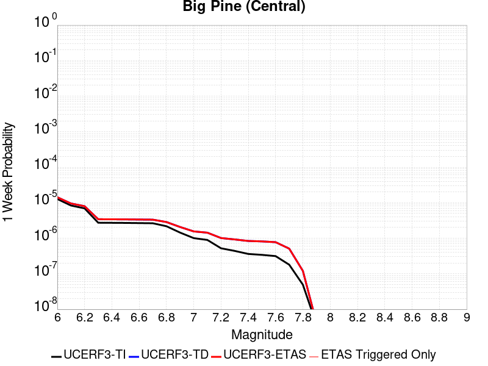 | 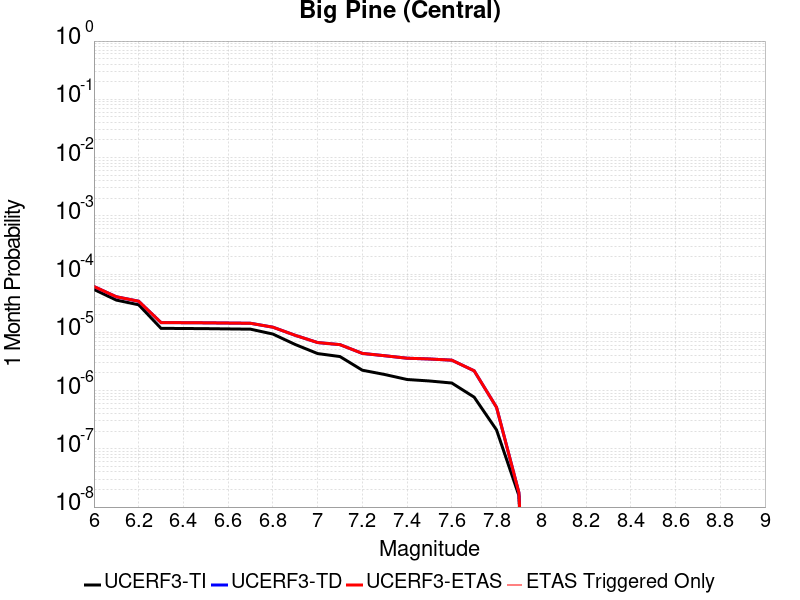 |  | 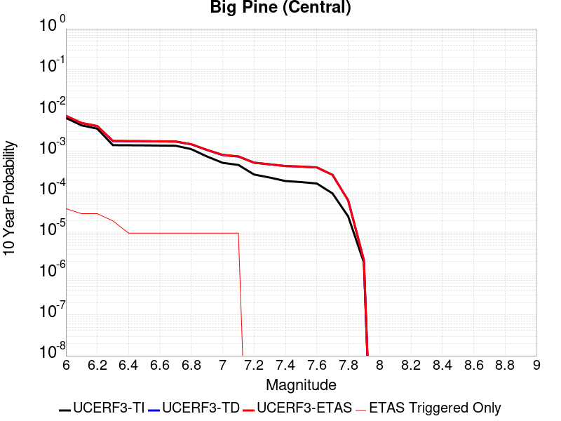 |

| Magnitude | 1 wk TI Prob | 1 wk TD Prob | 1 wk ETAS Prob | 1 wk ETAS/TD Gain | 1 wk ETAS Triggered Only | 1 mo TI Prob | 1 mo TD Prob | 1 mo ETAS Prob | 1 mo ETAS/TD Gain | 1 mo ETAS Triggered Only | 1 yr TI Prob | 1 yr TD Prob | 1 yr ETAS Prob | 1 yr ETAS/TD Gain | 1 yr ETAS Triggered Only | 10 yr TI Prob | 10 yr TD Prob | 10 yr ETAS Prob | 10 yr ETAS/TD Gain | 10 yr ETAS Triggered Only |
|-----|-----|-----|-----|-----|-----|-----|-----|-----|-----|-----|-----|-----|-----|-----|-----|-----|-----|-----|-----|-----|
| 6.0 | 1.2706755E-5 | 1.4254883E-5 | 1.4254883E-5 | 1.0 | 0.0 | 5.4456385E-5 | 6.109114E-5 | 7.914058E-5 | 1.295451 | 1.8050541E-5 | 6.628048E-4 | 7.435673E-4 | 7.7964156E-4 | 1.0485151 | 3.6101083E-5 | 0.006608314 | 0.0074157957 | 0.0074695456 | 1.007248 | 5.4151624E-5 |
| 6.1 | 8.342579E-6 | 9.51463E-6 | 9.51463E-6 | 1.0 | 0.0 | 3.5753423E-5 | 4.077647E-5 | 5.8826277E-5 | 1.4426525 | 1.8050541E-5 | 4.3521097E-4 | 4.9636216E-4 | 5.1440374E-4 | 1.0363476 | 1.8050541E-5 | 0.0043435963 | 0.0049560633 | 0.004991986 | 1.0072482 | 3.6101083E-5 |
| 6.2 | 6.923899E-6 | 7.970853E-6 | 7.970853E-6 | 1.0 | 0.0 | 2.9673516E-5 | 3.416046E-5 | 5.2210387E-5 | 1.5283865 | 1.8050541E-5 | 3.6121515E-4 | 4.158435E-4 | 4.3388654E-4 | 1.043389 | 1.8050541E-5 | 0.003606286 | 0.0041539352 | 0.004189886 | 1.0086547 | 3.6101083E-5 |
| 6.3 | 2.728396E-6 | 3.4275479E-6 | 3.4275479E-6 | 1.0 | 0.0 | 1.1693074E-5 | 1.4689414E-5 | 1.4689414E-5 | 1.0 | 0.0 | 1.4235388E-4 | 1.788298E-4 | 1.788298E-4 | 1.0 | 0.0 | 0.0014226272 | 0.001788339 | 0.0018063573 | 1.0100754 | 1.8050541E-5 |
| 6.4 | 2.7136944E-6 | 3.41184E-6 | 3.41184E-6 | 1.0 | 0.0 | 1.1630066E-5 | 1.4622095E-5 | 1.4622095E-5 | 1.0 | 0.0 | 1.4158686E-4 | 1.7801033E-4 | 1.7801033E-4 | 1.0 | 0.0 | 0.0014149669 | 0.0017801574 | 0.0017981759 | 1.0101218 | 1.8050541E-5 |
| 6.5 | 2.6971882E-6 | 3.3941838E-6 | 3.3941838E-6 | 1.0 | 0.0 | 1.1559327E-5 | 1.45464255E-5 | 1.45464255E-5 | 1.0 | 0.0 | 1.4072572E-4 | 1.7708921E-4 | 1.7708921E-4 | 1.0 | 0.0 | 0.0014063664 | 0.0017709609 | 0.0017889794 | 1.0101745 | 1.8050541E-5 |
| 6.6 | 2.669092E-6 | 3.3642018E-6 | 3.3642018E-6 | 1.0 | 0.0 | 1.1438916E-5 | 1.4417933E-5 | 1.4417933E-5 | 1.0 | 0.0 | 1.3925991E-4 | 1.7552506E-4 | 1.7552506E-4 | 1.0 | 0.0 | 0.0013917267 | 0.0017553442 | 0.001773363 | 1.0102651 | 1.8050541E-5 |
| 6.7 | 2.6408059E-6 | 3.3342253E-6 | 3.3342253E-6 | 1.0 | 0.0 | 1.1317691E-5 | 1.4289463E-5 | 1.4289463E-5 | 1.0 | 0.0 | 1.3778417E-4 | 1.7396119E-4 | 1.7396119E-4 | 1.0 | 0.0 | 0.0013769877 | 0.0017397301 | 0.0017577492 | 1.0103574 | 1.8050541E-5 |
| 6.8 | 2.1786943E-6 | 2.8576649E-6 | 2.8576649E-6 | 1.0 | 0.0 | 9.337228E-6 | 1.2247081E-5 | 1.2247081E-5 | 1.0 | 0.0 | 1.1367482E-4 | 1.4909875E-4 | 1.4909875E-4 | 1.0 | 0.0 | 0.0011361669 | 0.0014914535 | 0.0015094772 | 1.0120846 | 1.8050541E-5 |
| 6.9 | 1.4411696E-6 | 2.071588E-6 | 2.071588E-6 | 1.0 | 0.0 | 6.1764263E-6 | 8.878205E-6 | 8.878205E-6 | 1.0 | 0.0 | 7.51954E-5 | 1.0808706E-4 | 1.0808706E-4 | 1.0 | 0.0 | 7.5169955E-4 | 0.0010817667 | 0.0010997977 | 1.0166681 | 1.8050541E-5 |
| 7.0 | 1.0073411E-6 | 1.5570195E-6 | 1.5570195E-6 | 1.0 | 0.0 | 4.317169E-6 | 6.672924E-6 | 6.672924E-6 | 1.0 | 0.0 | 5.2560266E-5 | 8.1239974E-5 | 8.1239974E-5 | 1.0 | 0.0 | 5.2547833E-4 | 8.135133E-4 | 8.315492E-4 | 1.0221703 | 1.8050541E-5 |
| 7.1 | 8.947104E-7 | 1.4329687E-6 | 1.4329687E-6 | 1.0 | 0.0 | 3.834468E-6 | 6.1412807E-6 | 6.1412807E-6 | 1.0 | 0.0 | 4.6683643E-5 | 7.4767675E-5 | 7.4767675E-5 | 1.0 | 0.0 | 4.6673836E-4 | 7.488355E-4 | 7.6687254E-4 | 1.0240867 | 1.8050541E-5 |
| 7.2 | 5.215166E-7 | 1.0137056E-6 | 1.0137056E-6 | 1.0 | 0.0 | 2.2350691E-6 | 4.3444456E-6 | 4.3444456E-6 | 1.0 | 0.0 | 2.7211627E-5 | 5.2892385E-5 | 5.2892385E-5 | 1.0 | 0.0 | 2.7208295E-4 | 5.301981E-4 | 5.301981E-4 | 1.0 | 0.0 |
| 7.3 | 4.4024807E-7 | 9.2442133E-7 | 9.2442133E-7 | 1.0 | 0.0 | 1.8867761E-6 | 3.9618E-6 | 3.9618E-6 | 1.0 | 0.0 | 2.2971257E-5 | 4.8233887E-5 | 4.8233887E-5 | 1.0 | 0.0 | 2.2968883E-4 | 4.8363415E-4 | 4.8363415E-4 | 1.0 | 0.0 |
| 7.4 | 3.6130905E-7 | 8.3823835E-7 | 8.3823835E-7 | 1.0 | 0.0 | 1.5484665E-6 | 3.5924452E-6 | 3.5924452E-6 | 1.0 | 0.0 | 1.8852415E-5 | 4.3737182E-5 | 4.3737182E-5 | 1.0 | 0.0 | 1.8850817E-4 | 4.3867613E-4 | 4.3867613E-4 | 1.0 | 0.0 |
| 7.5 | 3.408184E-7 | 8.131486E-7 | 8.131486E-7 | 1.0 | 0.0 | 1.4606494E-6 | 3.4849181E-6 | 3.4849181E-6 | 1.0 | 0.0 | 1.7783263E-5 | 4.242809E-5 | 4.242809E-5 | 1.0 | 0.0 | 1.778184E-4 | 4.255689E-4 | 4.255689E-4 | 1.0 | 0.0 |
| 7.6 | 3.1428627E-7 | 7.7541114E-7 | 7.7541114E-7 | 1.0 | 0.0 | 1.3469405E-6 | 3.3231865E-6 | 3.3231865E-6 | 1.0 | 0.0 | 1.6398877E-5 | 4.0459083E-5 | 4.0459083E-5 | 1.0 | 0.0 | 1.6397667E-4 | 4.0585746E-4 | 4.0585746E-4 | 1.0 | 0.0 |
| 7.7 | 1.7972785E-7 | 5.0949603E-7 | 5.0949603E-7 | 1.0 | 0.0 | 7.70262E-7 | 2.1835526E-6 | 2.1835526E-6 | 1.0 | 0.0 | 9.377899E-6 | 2.6584441E-5 | 2.6584441E-5 | 1.0 | 0.0 | 9.377503E-5 | 2.6716106E-4 | 2.6716106E-4 | 1.0 | 0.0 |
| 7.8 | 4.9230927E-8 | 1.2021496E-7 | 1.2021496E-7 | 1.0 | 0.0 | 2.1098968E-7 | 5.152069E-7 | 5.152069E-7 | 1.0 | 0.0 | 2.5687964E-6 | 6.2726276E-6 | 6.2726276E-6 | 1.0 | 0.0 | 2.5687666E-5 | 6.316244E-5 | 6.316244E-5 | 1.0 | 0.0 |
| 7.9 | 3.6805972E-9 | 4.122571E-9 | 4.122571E-9 | 1.0 | 0.0 | 1.5773987E-8 | 1.7668162E-8 | 1.7668162E-8 | 1.0 | 0.0 | 1.9204828E-7 | 2.1510985E-7 | 2.1510985E-7 | 1.0 | 0.0 | 1.920481E-6 | 2.19912E-6 | 2.19912E-6 | 1.0 | 0.0 |

## San Cayetano
*[(top)](#table-of-contents)*

| 1 Week | 1 Month | 1 Year | 10 Year |
|-----|-----|-----|-----|
| 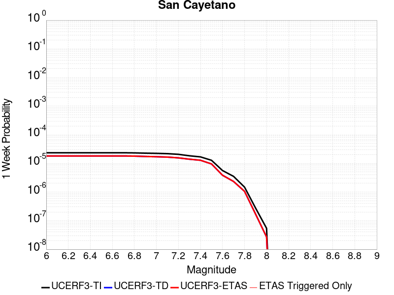 | 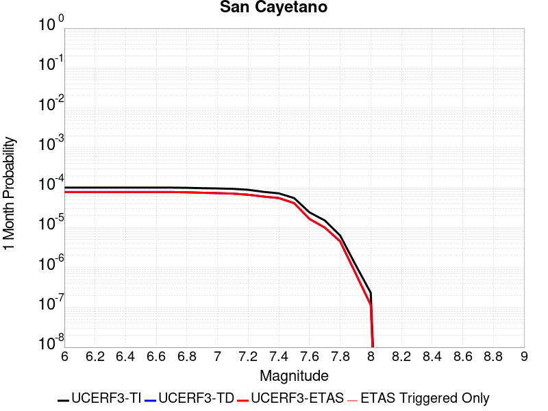 | 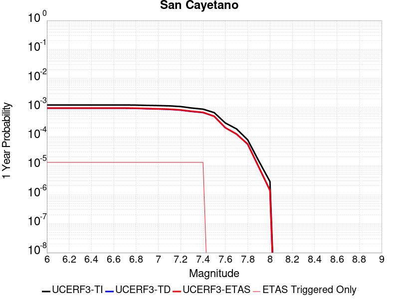 | 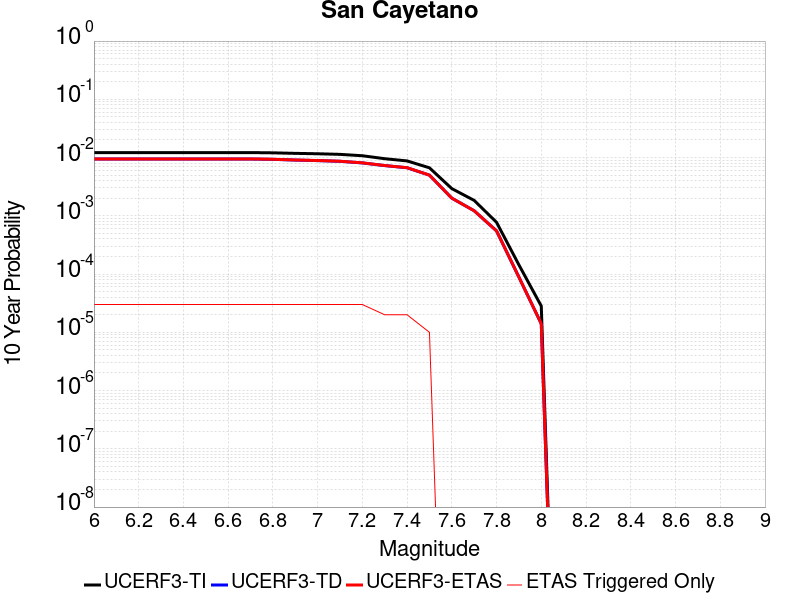 |

| Magnitude | 1 wk TI Prob | 1 wk TD Prob | 1 wk ETAS Prob | 1 wk ETAS/TD Gain | 1 wk ETAS Triggered Only | 1 mo TI Prob | 1 mo TD Prob | 1 mo ETAS Prob | 1 mo ETAS/TD Gain | 1 mo ETAS Triggered Only | 1 yr TI Prob | 1 yr TD Prob | 1 yr ETAS Prob | 1 yr ETAS/TD Gain | 1 yr ETAS Triggered Only | 10 yr TI Prob | 10 yr TD Prob | 10 yr ETAS Prob | 10 yr ETAS/TD Gain | 10 yr ETAS Triggered Only |
|-----|-----|-----|-----|-----|-----|-----|-----|-----|-----|-----|-----|-----|-----|-----|-----|-----|-----|-----|-----|-----|
| 6.0 | 2.3476267E-5 | 1.8174487E-5 | 1.8174487E-5 | 1.0 | 0.0 | 1.0060869E-4 | 7.7888355E-5 | 7.7888355E-5 | 1.0 | 0.0 | 0.0012242225 | 9.4788184E-4 | 9.659153E-4 | 1.019025 | 1.8050541E-5 | 0.012175002 | 0.0094392765 | 0.009492917 | 1.0056827 | 5.4151624E-5 |
| 6.1 | 2.3476267E-5 | 1.8174487E-5 | 1.8174487E-5 | 1.0 | 0.0 | 1.0060869E-4 | 7.7888355E-5 | 7.7888355E-5 | 1.0 | 0.0 | 0.0012242225 | 9.4788184E-4 | 9.659153E-4 | 1.019025 | 1.8050541E-5 | 0.012175002 | 0.0094392765 | 0.009492917 | 1.0056827 | 5.4151624E-5 |
| 6.2 | 2.3476267E-5 | 1.8174487E-5 | 1.8174487E-5 | 1.0 | 0.0 | 1.0060869E-4 | 7.7888355E-5 | 7.7888355E-5 | 1.0 | 0.0 | 0.0012242225 | 9.4788184E-4 | 9.659153E-4 | 1.019025 | 1.8050541E-5 | 0.012175002 | 0.0094392765 | 0.009492917 | 1.0056827 | 5.4151624E-5 |
| 6.3 | 2.3476267E-5 | 1.8174487E-5 | 1.8174487E-5 | 1.0 | 0.0 | 1.0060869E-4 | 7.7888355E-5 | 7.7888355E-5 | 1.0 | 0.0 | 0.0012242225 | 9.4788184E-4 | 9.659153E-4 | 1.019025 | 1.8050541E-5 | 0.012175002 | 0.0094392765 | 0.009492917 | 1.0056827 | 5.4151624E-5 |
| 6.4 | 2.3476267E-5 | 1.8174487E-5 | 1.8174487E-5 | 1.0 | 0.0 | 1.0060869E-4 | 7.7888355E-5 | 7.7888355E-5 | 1.0 | 0.0 | 0.0012242225 | 9.4788184E-4 | 9.659153E-4 | 1.019025 | 1.8050541E-5 | 0.012175002 | 0.0094392765 | 0.009492917 | 1.0056827 | 5.4151624E-5 |
| 6.5 | 2.3476267E-5 | 1.8174487E-5 | 1.8174487E-5 | 1.0 | 0.0 | 1.0060869E-4 | 7.7888355E-5 | 7.7888355E-5 | 1.0 | 0.0 | 0.0012242225 | 9.4788184E-4 | 9.659153E-4 | 1.019025 | 1.8050541E-5 | 0.012175002 | 0.0094392765 | 0.009492917 | 1.0056827 | 5.4151624E-5 |
| 6.6 | 2.3476267E-5 | 1.8174487E-5 | 1.8174487E-5 | 1.0 | 0.0 | 1.0060869E-4 | 7.7888355E-5 | 7.7888355E-5 | 1.0 | 0.0 | 0.0012242225 | 9.4788184E-4 | 9.659153E-4 | 1.019025 | 1.8050541E-5 | 0.012175002 | 0.0094392765 | 0.009492917 | 1.0056827 | 5.4151624E-5 |
| 6.7 | 2.3476267E-5 | 1.8174487E-5 | 1.8174487E-5 | 1.0 | 0.0 | 1.0060869E-4 | 7.7888355E-5 | 7.7888355E-5 | 1.0 | 0.0 | 0.0012242225 | 9.4788184E-4 | 9.659153E-4 | 1.019025 | 1.8050541E-5 | 0.012175002 | 0.0094392765 | 0.009492917 | 1.0056827 | 5.4151624E-5 |
| 6.8 | 2.3241924E-5 | 1.7942137E-5 | 1.7942137E-5 | 1.0 | 0.0 | 9.960445E-5 | 7.6892626E-5 | 7.6892626E-5 | 1.0 | 0.0 | 0.0012120095 | 9.3576923E-4 | 9.538029E-4 | 1.0192715 | 1.8050541E-5 | 0.012054204 | 0.009319144 | 0.009372791 | 1.0057566 | 5.4151624E-5 |
| 6.9 | 2.2761007E-5 | 1.743748E-5 | 1.743748E-5 | 1.0 | 0.0 | 9.7543525E-5 | 7.472994E-5 | 7.472994E-5 | 1.0 | 0.0 | 0.0011869454 | 9.0946065E-4 | 9.274948E-4 | 1.0198295 | 1.8050541E-5 | 0.011806256 | 0.009058218 | 0.009111879 | 1.005924 | 5.4151624E-5 |
| 7.0 | 2.240283E-5 | 1.7071166E-5 | 1.7071166E-5 | 1.0 | 0.0 | 9.600859E-5 | 7.316011E-5 | 7.316011E-5 | 1.0 | 0.0 | 0.0011682777 | 8.903637E-4 | 9.083982E-4 | 1.0202552 | 1.8050541E-5 | 0.011621549 | 0.00886878 | 0.008922451 | 1.0060517 | 5.4151624E-5 |
| 7.1 | 2.1871154E-5 | 1.6590915E-5 | 1.6590915E-5 | 1.0 | 0.0 | 9.373015E-5 | 7.1102004E-5 | 7.1102004E-5 | 1.0 | 0.0 | 0.0011405671 | 8.6532644E-4 | 8.833613E-4 | 1.0208417 | 1.8050541E-5 | 0.011347309 | 0.008620372 | 0.008674056 | 1.0062276 | 5.4151624E-5 |
| 7.2 | 2.0714133E-5 | 1.5569249E-5 | 1.5569249E-5 | 1.0 | 0.0 | 8.8771834E-5 | 6.672366E-5 | 6.672366E-5 | 1.0 | 0.0 | 0.0010802611 | 8.120611E-4 | 8.3009695E-4 | 1.02221 | 1.8050541E-5 | 0.010750249 | 0.008091711 | 0.0081454255 | 1.006638 | 5.4151624E-5 |
| 7.3 | 1.8408395E-5 | 1.3999762E-5 | 1.3999762E-5 | 1.0 | 0.0 | 7.8890735E-5 | 5.9997616E-5 | 5.9997616E-5 | 1.0 | 0.0 | 9.600714E-4 | 7.3022913E-4 | 7.482665E-4 | 1.024701 | 1.8050541E-5 | 0.009559342 | 0.007279016 | 0.0073148543 | 1.0049235 | 3.6101083E-5 |
| 7.4 | 1.6856795E-5 | 1.2852639E-5 | 1.2852639E-5 | 1.0 | 0.0 | 7.2241404E-5 | 5.508159E-5 | 5.508159E-5 | 1.0 | 0.0 | 8.7918417E-4 | 6.704149E-4 | 6.884533E-4 | 1.0269064 | 1.8050541E-5 | 0.00875714 | 0.006684604 | 0.006720464 | 1.0053645 | 3.6101083E-5 |
| 7.5 | 1.2822778E-5 | 9.579144E-6 | 9.579144E-6 | 1.0 | 0.0 | 5.495361E-5 | 4.1052837E-5 | 4.1052837E-5 | 1.0 | 0.0 | 6.688548E-4 | 4.9970526E-4 | 4.9970526E-4 | 1.0 | 0.0 | 0.006668452 | 0.004985987 | 0.0050039478 | 1.0036021 | 1.8050541E-5 |
| 7.6 | 5.6272684E-6 | 3.8555618E-6 | 3.8555618E-6 | 1.0 | 0.0 | 2.4116642E-5 | 1.6523732E-5 | 1.6523732E-5 | 1.0 | 0.0 | 2.9358055E-4 | 2.0115796E-4 | 2.0115796E-4 | 1.0 | 0.0 | 0.0029319301 | 0.0020097697 | 0.0020097697 | 1.0 | 0.0 |
| 7.7 | 3.5261346E-6 | 2.3411194E-6 | 2.3411194E-6 | 1.0 | 0.0 | 1.5111918E-5 | 1.0033331E-5 | 1.0033331E-5 | 1.0 | 0.0 | 1.8397206E-4 | 1.2214902E-4 | 1.2214902E-4 | 1.0 | 0.0 | 0.0018381984 | 0.0012208262 | 0.0012208262 | 1.0 | 0.0 |
| 7.8 | 1.4826929E-6 | 1.0565866E-6 | 1.0565866E-6 | 1.0 | 0.0 | 6.354383E-6 | 4.5282204E-6 | 4.5282204E-6 | 1.0 | 0.0 | 7.736187E-5 | 5.512971E-5 | 5.512971E-5 | 1.0 | 0.0 | 7.733494E-4 | 5.5116235E-4 | 5.5116235E-4 | 1.0 | 0.0 |
| 7.9 | 2.7568166E-7 | 1.6982086E-7 | 1.6982086E-7 | 1.0 | 0.0 | 1.1814923E-6 | 7.278035E-7 | 7.278035E-7 | 1.0 | 0.0 | 1.4384574E-5 | 8.860972E-6 | 8.860972E-6 | 1.0 | 0.0 | 1.4383643E-4 | 8.8606226E-5 | 8.8606226E-5 | 1.0 | 0.0 |
| 8.0 | 5.407832E-8 | 2.6900643E-8 | 2.6900643E-8 | 1.0 | 0.0 | 2.3176422E-7 | 1.1528847E-7 | 1.1528847E-7 | 1.0 | 0.0 | 2.8217257E-6 | 1.4036362E-6 | 1.4036362E-6 | 1.0 | 0.0 | 2.8216898E-5 | 1.4036278E-5 | 1.4036278E-5 | 1.0 | 0.0 |

## Raymond
*[(top)](#table-of-contents)*

| 1 Week | 1 Month | 1 Year | 10 Year |
|-----|-----|-----|-----|
|  | 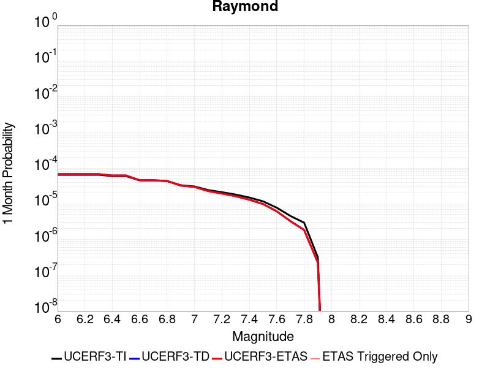 | 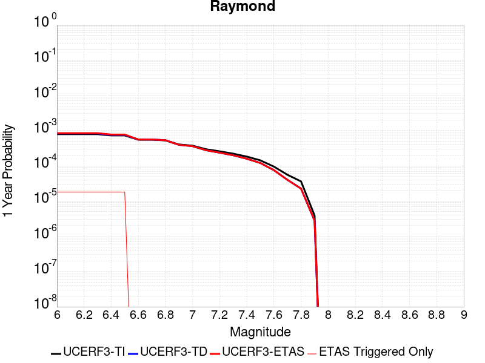 | 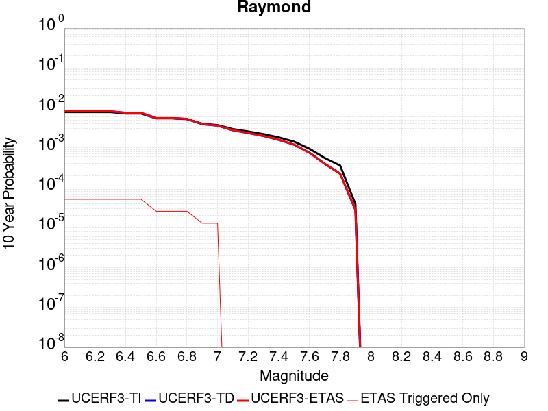 |

| Magnitude | 1 wk TI Prob | 1 wk TD Prob | 1 wk ETAS Prob | 1 wk ETAS/TD Gain | 1 wk ETAS Triggered Only | 1 mo TI Prob | 1 mo TD Prob | 1 mo ETAS Prob | 1 mo ETAS/TD Gain | 1 mo ETAS Triggered Only | 1 yr TI Prob | 1 yr TD Prob | 1 yr ETAS Prob | 1 yr ETAS/TD Gain | 1 yr ETAS Triggered Only | 10 yr TI Prob | 10 yr TD Prob | 10 yr ETAS Prob | 10 yr ETAS/TD Gain | 10 yr ETAS Triggered Only |
|-----|-----|-----|-----|-----|-----|-----|-----|-----|-----|-----|-----|-----|-----|-----|-----|-----|-----|-----|-----|-----|
| 6.0 | 1.5157413E-5 | 1.5812455E-5 | 1.5812455E-5 | 1.0 | 0.0 | 6.4958724E-5 | 6.776604E-5 | 6.776604E-5 | 1.0 | 0.0 | 7.905855E-4 | 8.247644E-4 | 8.428E-4 | 1.0218676 | 1.8050541E-5 | 0.007877788 | 0.008219553 | 0.00827326 | 1.006534 | 5.4151624E-5 |
| 6.1 | 1.5157413E-5 | 1.5812455E-5 | 1.5812455E-5 | 1.0 | 0.0 | 6.4958724E-5 | 6.776604E-5 | 6.776604E-5 | 1.0 | 0.0 | 7.905855E-4 | 8.247644E-4 | 8.428E-4 | 1.0218676 | 1.8050541E-5 | 0.007877788 | 0.008219553 | 0.00827326 | 1.006534 | 5.4151624E-5 |
| 6.2 | 1.5157413E-5 | 1.5812455E-5 | 1.5812455E-5 | 1.0 | 0.0 | 6.4958724E-5 | 6.776604E-5 | 6.776604E-5 | 1.0 | 0.0 | 7.905855E-4 | 8.247644E-4 | 8.428E-4 | 1.0218676 | 1.8050541E-5 | 0.007877788 | 0.008219553 | 0.00827326 | 1.006534 | 5.4151624E-5 |
| 6.3 | 1.5157413E-5 | 1.5812455E-5 | 1.5812455E-5 | 1.0 | 0.0 | 6.4958724E-5 | 6.776604E-5 | 6.776604E-5 | 1.0 | 0.0 | 7.905855E-4 | 8.247644E-4 | 8.428E-4 | 1.0218676 | 1.8050541E-5 | 0.007877788 | 0.008219553 | 0.00827326 | 1.006534 | 5.4151624E-5 |
| 6.4 | 1.3941944E-5 | 1.4456831E-5 | 1.4456831E-5 | 1.0 | 0.0 | 5.9749822E-5 | 6.195651E-5 | 6.195651E-5 | 1.0 | 0.0 | 7.2721124E-4 | 7.5408275E-4 | 7.721197E-4 | 1.023919 | 1.8050541E-5 | 0.007248361 | 0.007517574 | 0.0075713187 | 1.0071492 | 5.4151624E-5 |
| 6.5 | 1.3941944E-5 | 1.4456831E-5 | 1.4456831E-5 | 1.0 | 0.0 | 5.9749822E-5 | 6.195651E-5 | 6.195651E-5 | 1.0 | 0.0 | 7.2721124E-4 | 7.5408275E-4 | 7.721197E-4 | 1.023919 | 1.8050541E-5 | 0.007248361 | 0.007517574 | 0.0075713187 | 1.0071492 | 5.4151624E-5 |
| 6.6 | 1.0542609E-5 | 1.0672743E-5 | 1.0672743E-5 | 1.0 | 0.0 | 4.5181827E-5 | 4.5739554E-5 | 4.5739554E-5 | 1.0 | 0.0 | 5.499499E-4 | 5.5674225E-4 | 5.5674225E-4 | 1.0 | 0.0 | 0.005485909 | 0.0055540362 | 0.0055719865 | 1.0032319 | 1.8050541E-5 |
| 6.7 | 1.0542609E-5 | 1.0672743E-5 | 1.0672743E-5 | 1.0 | 0.0 | 4.5181827E-5 | 4.5739554E-5 | 4.5739554E-5 | 1.0 | 0.0 | 5.499499E-4 | 5.5674225E-4 | 5.5674225E-4 | 1.0 | 0.0 | 0.005485909 | 0.0055540362 | 0.0055719865 | 1.0032319 | 1.8050541E-5 |
| 6.8 | 1.0079132E-5 | 1.0178236E-5 | 1.0178236E-5 | 1.0 | 0.0 | 4.3195567E-5 | 4.362031E-5 | 4.362031E-5 | 1.0 | 0.0 | 5.257791E-4 | 5.309532E-4 | 5.309532E-4 | 1.0 | 0.0 | 0.0052453685 | 0.0052973963 | 0.0053153513 | 1.0033894 | 1.8050541E-5 |
| 6.9 | 7.721598E-6 | 7.550131E-6 | 7.550131E-6 | 1.0 | 0.0 | 3.3092143E-5 | 3.235731E-5 | 3.235731E-5 | 1.0 | 0.0 | 4.0282236E-4 | 3.9388027E-4 | 3.9388027E-4 | 1.0 | 0.0 | 0.0040209293 | 0.003931955 | 0.003931955 | 1.0 | 0.0 |
| 7.0 | 7.137566E-6 | 6.9124617E-6 | 6.9124617E-6 | 1.0 | 0.0 | 3.058921E-5 | 2.9624505E-5 | 2.9624505E-5 | 1.0 | 0.0 | 3.7236E-4 | 3.6061974E-4 | 3.6061974E-4 | 1.0 | 0.0 | 0.0037173668 | 0.0036004637 | 0.0036004637 | 1.0 | 0.0 |
| 7.1 | 5.654976E-6 | 5.3005283E-6 | 5.3005283E-6 | 1.0 | 0.0 | 2.4235387E-5 | 2.2716353E-5 | 2.2716353E-5 | 1.0 | 0.0 | 2.9502588E-4 | 2.765367E-4 | 2.765367E-4 | 1.0 | 0.0 | 0.0029463451 | 0.002761957 | 0.002761957 | 1.0 | 0.0 |
| 7.2 | 4.9358455E-6 | 4.5275683E-6 | 4.5275683E-6 | 1.0 | 0.0 | 2.1153453E-5 | 1.940372E-5 | 1.940372E-5 | 1.0 | 0.0 | 2.5751285E-4 | 2.3621482E-4 | 2.3621482E-4 | 1.0 | 0.0 | 0.0025721465 | 0.0023596594 | 0.0023596594 | 1.0 | 0.0 |
| 7.3 | 4.2368597E-6 | 3.8064613E-6 | 3.8064613E-6 | 1.0 | 0.0 | 1.8157843E-5 | 1.6313305E-5 | 1.6313305E-5 | 1.0 | 0.0 | 2.2104931E-4 | 1.9859648E-4 | 1.9859648E-4 | 1.0 | 0.0 | 0.0022082955 | 0.0019842088 | 0.0019842088 | 1.0 | 0.0 |
| 7.4 | 3.4999923E-6 | 3.0445074E-6 | 3.0445074E-6 | 1.0 | 0.0 | 1.49998805E-5 | 1.3047824E-5 | 1.3047824E-5 | 1.0 | 0.0 | 1.8260824E-4 | 1.5884575E-4 | 1.5884575E-4 | 1.0 | 0.0 | 0.0018245826 | 0.0015873378 | 0.0015873378 | 1.0 | 0.0 |
| 7.5 | 2.738017E-6 | 2.3026191E-6 | 2.3026191E-6 | 1.0 | 0.0 | 1.1734306E-5 | 9.868331E-6 | 9.868331E-6 | 1.0 | 0.0 | 1.428558E-4 | 1.2014037E-4 | 1.2014037E-4 | 1.0 | 0.0 | 0.0014276401 | 0.0012007686 | 0.0012007686 | 1.0 | 0.0 |
| 7.6 | 1.8186392E-6 | 1.442713E-6 | 1.442713E-6 | 1.0 | 0.0 | 7.794145E-6 | 6.1830415E-6 | 6.1830415E-6 | 1.0 | 0.0 | 9.488958E-5 | 7.5275966E-5 | 7.5275966E-5 | 1.0 | 0.0 | 9.4849075E-4 | 7.525162E-4 | 7.525162E-4 | 1.0 | 0.0 |
| 7.7 | 1.0660348E-6 | 7.647044E-7 | 7.647044E-7 | 1.0 | 0.0 | 4.5687125E-6 | 3.2773005E-6 | 3.2773005E-6 | 1.0 | 0.0 | 5.5622655E-5 | 3.990042E-5 | 3.990042E-5 | 1.0 | 0.0 | 5.5608735E-4 | 3.989417E-4 | 3.989417E-4 | 1.0 | 0.0 |
| 7.8 | 6.913602E-7 | 4.3231208E-7 | 4.3231208E-7 | 1.0 | 0.0 | 2.962969E-6 | 1.8527647E-6 | 1.8527647E-6 | 1.0 | 0.0 | 3.607355E-5 | 2.2557184E-5 | 2.2557184E-5 | 1.0 | 0.0 | 3.6067693E-4 | 2.255568E-4 | 2.255568E-4 | 1.0 | 0.0 |
| 7.9 | 7.425201E-8 | 5.324955E-8 | 5.324955E-8 | 1.0 | 0.0 | 3.1822285E-7 | 2.2821234E-7 | 2.2821234E-7 | 1.0 | 0.0 | 3.874356E-6 | 2.7784831E-6 | 2.7784831E-6 | 1.0 | 0.0 | 3.8742884E-5 | 2.7784614E-5 | 2.7784614E-5 | 1.0 | 0.0 |

## Kern Canyon (North Kern) 2011
*[(top)](#table-of-contents)*

| 1 Week | 1 Month | 1 Year | 10 Year |
|-----|-----|-----|-----|
| 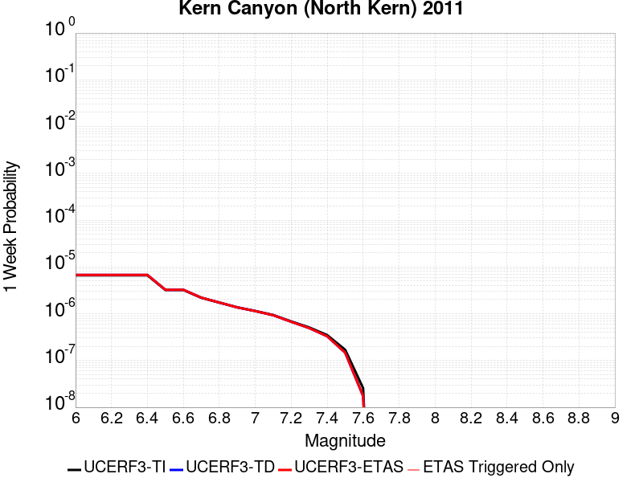 | 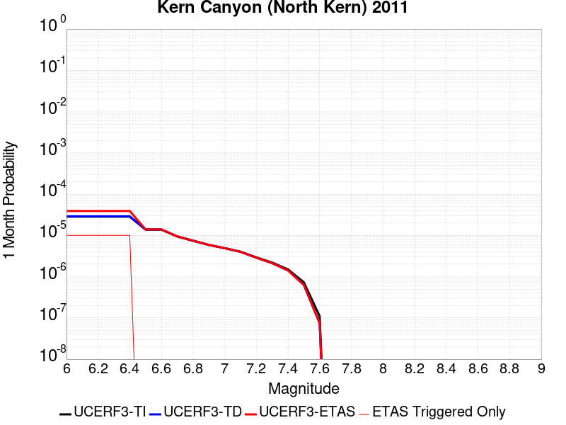 | 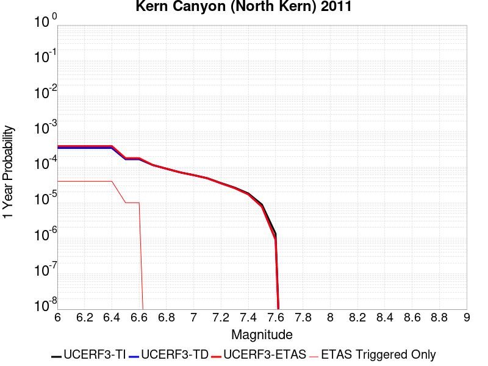 | 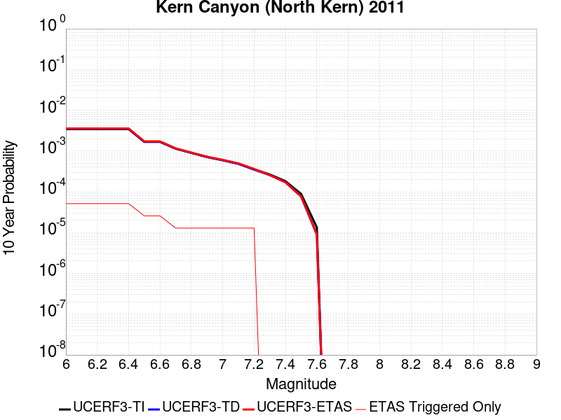 |

| Magnitude | 1 wk TI Prob | 1 wk TD Prob | 1 wk ETAS Prob | 1 wk ETAS/TD Gain | 1 wk ETAS Triggered Only | 1 mo TI Prob | 1 mo TD Prob | 1 mo ETAS Prob | 1 mo ETAS/TD Gain | 1 mo ETAS Triggered Only | 1 yr TI Prob | 1 yr TD Prob | 1 yr ETAS Prob | 1 yr ETAS/TD Gain | 1 yr ETAS Triggered Only | 10 yr TI Prob | 10 yr TD Prob | 10 yr ETAS Prob | 10 yr ETAS/TD Gain | 10 yr ETAS Triggered Only |
|-----|-----|-----|-----|-----|-----|-----|-----|-----|-----|-----|-----|-----|-----|-----|-----|-----|-----|-----|-----|-----|
| 6.0 | 6.6264497E-6 | 6.757523E-6 | 6.757523E-6 | 1.0 | 0.0 | 2.8398761E-5 | 2.8960536E-5 | 2.8960536E-5 | 1.0 | 0.0 | 3.4570007E-4 | 3.525455E-4 | 3.8863384E-4 | 1.1023651 | 3.6101083E-5 | 0.0034516277 | 0.0035206506 | 0.0035746116 | 1.015327 | 5.4151624E-5 |
| 6.1 | 6.6264497E-6 | 6.757523E-6 | 6.757523E-6 | 1.0 | 0.0 | 2.8398761E-5 | 2.8960536E-5 | 2.8960536E-5 | 1.0 | 0.0 | 3.4570007E-4 | 3.525455E-4 | 3.8863384E-4 | 1.1023651 | 3.6101083E-5 | 0.0034516277 | 0.0035206506 | 0.0035746116 | 1.015327 | 5.4151624E-5 |
| 6.2 | 6.6264497E-6 | 6.757523E-6 | 6.757523E-6 | 1.0 | 0.0 | 2.8398761E-5 | 2.8960536E-5 | 2.8960536E-5 | 1.0 | 0.0 | 3.4570007E-4 | 3.525455E-4 | 3.8863384E-4 | 1.1023651 | 3.6101083E-5 | 0.0034516277 | 0.0035206506 | 0.0035746116 | 1.015327 | 5.4151624E-5 |
| 6.3 | 6.6264497E-6 | 6.757523E-6 | 6.757523E-6 | 1.0 | 0.0 | 2.8398761E-5 | 2.8960536E-5 | 2.8960536E-5 | 1.0 | 0.0 | 3.4570007E-4 | 3.525455E-4 | 3.8863384E-4 | 1.1023651 | 3.6101083E-5 | 0.0034516277 | 0.0035206506 | 0.0035746116 | 1.015327 | 5.4151624E-5 |
| 6.4 | 6.6264497E-6 | 6.757523E-6 | 6.757523E-6 | 1.0 | 0.0 | 2.8398761E-5 | 2.8960536E-5 | 2.8960536E-5 | 1.0 | 0.0 | 3.4570007E-4 | 3.525455E-4 | 3.8863384E-4 | 1.1023651 | 3.6101083E-5 | 0.0034516277 | 0.0035206506 | 0.0035746116 | 1.015327 | 5.4151624E-5 |
| 6.5 | 3.2162225E-6 | 3.2571738E-6 | 3.2571738E-6 | 1.0 | 0.0 | 1.3783738E-5 | 1.3959247E-5 | 1.3959247E-5 | 1.0 | 0.0 | 1.6780409E-4 | 1.6994138E-4 | 1.8798886E-4 | 1.1061982 | 1.8050541E-5 | 0.0016767744 | 0.001698194 | 0.0017342337 | 1.0212225 | 3.6101083E-5 |
| 6.6 | 3.2162225E-6 | 3.2571738E-6 | 3.2571738E-6 | 1.0 | 0.0 | 1.3783738E-5 | 1.3959247E-5 | 1.3959247E-5 | 1.0 | 0.0 | 1.6780409E-4 | 1.6994138E-4 | 1.8798886E-4 | 1.1061982 | 1.8050541E-5 | 0.0016767744 | 0.001698194 | 0.0017342337 | 1.0212225 | 3.6101083E-5 |
| 6.7 | 2.1908265E-6 | 2.2071747E-6 | 2.2071747E-6 | 1.0 | 0.0 | 9.389223E-6 | 9.459287E-6 | 9.459287E-6 | 1.0 | 0.0 | 1.1430779E-4 | 1.15160925E-4 | 1.15160925E-4 | 1.0 | 0.0 | 0.0011424901 | 0.0011510318 | 0.0011690616 | 1.015664 | 1.8050541E-5 |
| 6.8 | 1.7303895E-6 | 1.7365929E-6 | 1.7365929E-6 | 1.0 | 0.0 | 7.415934E-6 | 7.4425207E-6 | 7.4425207E-6 | 1.0 | 0.0 | 9.028525E-5 | 9.060902E-5 | 9.060902E-5 | 1.0 | 0.0 | 9.024858E-4 | 9.0573047E-4 | 9.2376466E-4 | 1.0199112 | 1.8050541E-5 |
| 6.9 | 1.3700314E-6 | 1.3688933E-6 | 1.3688933E-6 | 1.0 | 0.0 | 5.87155E-6 | 5.866673E-6 | 5.866673E-6 | 1.0 | 0.0 | 7.148377E-5 | 7.1424445E-5 | 7.1424445E-5 | 1.0 | 0.0 | 7.146078E-4 | 7.1401946E-4 | 7.3205715E-4 | 1.0252621 | 1.8050541E-5 |
| 7.0 | 1.1467797E-6 | 1.1414064E-6 | 1.1414064E-6 | 1.0 | 0.0 | 4.9147607E-6 | 4.8917327E-6 | 4.8917327E-6 | 1.0 | 0.0 | 5.983557E-5 | 5.9555252E-5 | 5.9555252E-5 | 1.0 | 0.0 | 5.981946E-4 | 5.9539604E-4 | 6.1343587E-4 | 1.0302988 | 1.8050541E-5 |
| 7.1 | 9.3952065E-7 | 9.3029035E-7 | 9.3029035E-7 | 1.0 | 0.0 | 4.026511E-6 | 3.986953E-6 | 3.986953E-6 | 1.0 | 0.0 | 4.9021666E-5 | 4.8540085E-5 | 4.8540085E-5 | 1.0 | 0.0 | 4.901085E-4 | 4.852966E-4 | 5.033384E-4 | 1.0371768 | 1.8050541E-5 |
| 7.2 | 6.858055E-7 | 6.719457E-7 | 6.719457E-7 | 1.0 | 0.0 | 2.939163E-6 | 2.8797642E-6 | 2.8797642E-6 | 1.0 | 0.0 | 3.5783723E-5 | 3.5060577E-5 | 3.5060577E-5 | 1.0 | 0.0 | 3.5777962E-4 | 3.5055133E-4 | 3.6859553E-4 | 1.0514739 | 1.8050541E-5 |
| 7.3 | 5.1101983E-7 | 4.9394174E-7 | 4.9394174E-7 | 1.0 | 0.0 | 2.1900833E-6 | 2.1168917E-6 | 2.1168917E-6 | 1.0 | 0.0 | 2.6663936E-5 | 2.5772855E-5 | 2.5772855E-5 | 1.0 | 0.0 | 2.6660739E-4 | 2.5769914E-4 | 2.5769914E-4 | 1.0 | 0.0 |
| 7.4 | 3.4999414E-7 | 3.2996726E-7 | 3.2996726E-7 | 1.0 | 0.0 | 1.499974E-6 | 1.4141447E-6 | 1.4141447E-6 | 1.0 | 0.0 | 1.8262032E-5 | 1.7217077E-5 | 1.7217077E-5 | 1.0 | 0.0 | 1.826053E-4 | 1.7215767E-4 | 1.7215767E-4 | 1.0 | 0.0 |
| 7.5 | 1.7021522E-7 | 1.4750462E-7 | 1.4750462E-7 | 1.0 | 0.0 | 7.2949354E-7 | 6.3216254E-7 | 6.3216254E-7 | 1.0 | 0.0 | 8.881548E-6 | 7.6965525E-6 | 7.6965525E-6 | 1.0 | 0.0 | 8.8811925E-5 | 7.696294E-5 | 7.696294E-5 | 1.0 | 0.0 |
| 7.6 | 2.572245E-8 | 1.7353296E-8 | 1.7353296E-8 | 1.0 | 0.0 | 1.10239064E-7 | 7.4371265E-8 | 7.4371265E-8 | 1.0 | 0.0 | 1.3421597E-6 | 9.054698E-7 | 9.054698E-7 | 1.0 | 0.0 | 1.3421517E-5 | 9.054666E-6 | 9.054666E-6 | 1.0 | 0.0 |

## Elsinore (Stepovers Combined)
*[(top)](#table-of-contents)*

| 1 Week | 1 Month | 1 Year | 10 Year |
|-----|-----|-----|-----|
| 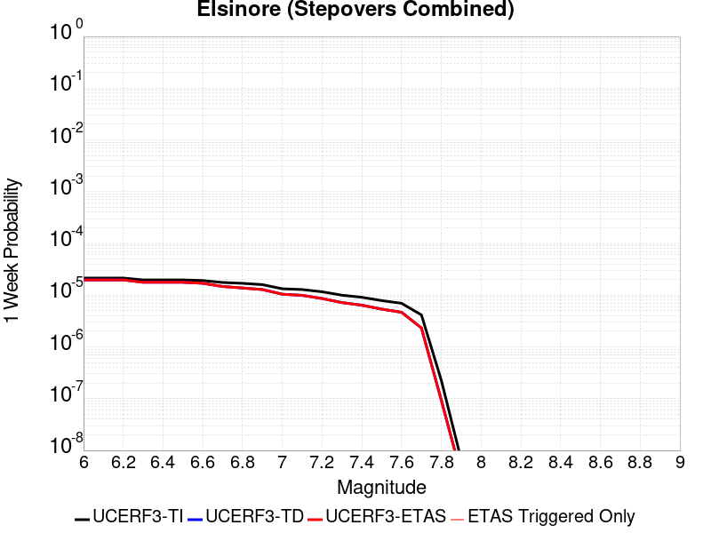 | 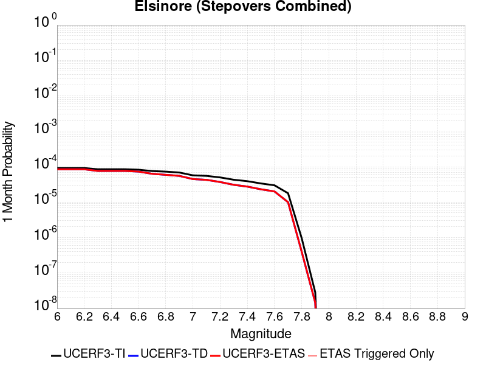 | 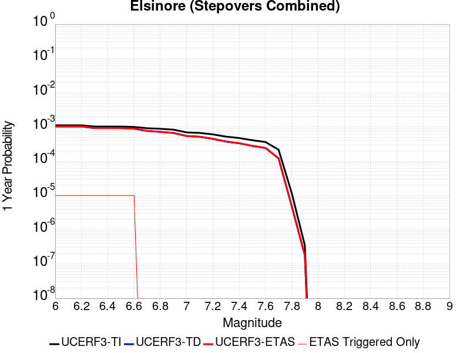 | 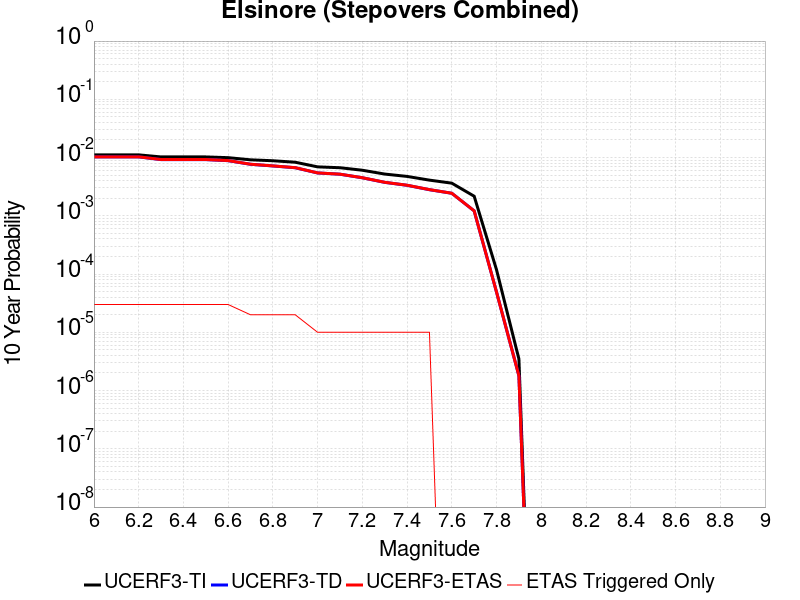 |

| Magnitude | 1 wk TI Prob | 1 wk TD Prob | 1 wk ETAS Prob | 1 wk ETAS/TD Gain | 1 wk ETAS Triggered Only | 1 mo TI Prob | 1 mo TD Prob | 1 mo ETAS Prob | 1 mo ETAS/TD Gain | 1 mo ETAS Triggered Only | 1 yr TI Prob | 1 yr TD Prob | 1 yr ETAS Prob | 1 yr ETAS/TD Gain | 1 yr ETAS Triggered Only | 10 yr TI Prob | 10 yr TD Prob | 10 yr ETAS Prob | 10 yr ETAS/TD Gain | 10 yr ETAS Triggered Only |
|-----|-----|-----|-----|-----|-----|-----|-----|-----|-----|-----|-----|-----|-----|-----|-----|-----|-----|-----|-----|-----|
| 6.0 | 2.144392E-5 | 1.9767964E-5 | 1.9767964E-5 | 1.0 | 0.0 | 9.189928E-5 | 8.471721E-5 | 8.471721E-5 | 1.0 | 0.0 | 0.0011182994 | 0.0010309657 | 0.0010489976 | 1.0174904 | 1.8050541E-5 | 0.011126885 | 0.010268909 | 0.010322505 | 1.0052192 | 5.4151624E-5 |
| 6.1 | 2.144392E-5 | 1.9767964E-5 | 1.9767964E-5 | 1.0 | 0.0 | 9.189928E-5 | 8.471721E-5 | 8.471721E-5 | 1.0 | 0.0 | 0.0011182994 | 0.0010309657 | 0.0010489976 | 1.0174904 | 1.8050541E-5 | 0.011126885 | 0.010268909 | 0.010322505 | 1.0052192 | 5.4151624E-5 |
| 6.2 | 2.144392E-5 | 1.9767964E-5 | 1.9767964E-5 | 1.0 | 0.0 | 9.189928E-5 | 8.471721E-5 | 8.471721E-5 | 1.0 | 0.0 | 0.0011182994 | 0.0010309657 | 0.0010489976 | 1.0174904 | 1.8050541E-5 | 0.011126885 | 0.010268909 | 0.010322505 | 1.0052192 | 5.4151624E-5 |
| 6.3 | 1.9751555E-5 | 1.7748758E-5 | 1.7748758E-5 | 1.0 | 0.0 | 8.4646774E-5 | 7.606398E-5 | 7.606398E-5 | 1.0 | 0.0 | 0.0010300872 | 9.257021E-4 | 9.4373594E-4 | 1.0194813 | 1.8050541E-5 | 0.010253254 | 0.009225032 | 0.009278684 | 1.0058159 | 5.4151624E-5 |
| 6.4 | 1.9751555E-5 | 1.7748758E-5 | 1.7748758E-5 | 1.0 | 0.0 | 8.4646774E-5 | 7.606398E-5 | 7.606398E-5 | 1.0 | 0.0 | 0.0010300872 | 9.257021E-4 | 9.4373594E-4 | 1.0194813 | 1.8050541E-5 | 0.010253254 | 0.009225032 | 0.009278684 | 1.0058159 | 5.4151624E-5 |
| 6.5 | 1.9751555E-5 | 1.7748758E-5 | 1.7748758E-5 | 1.0 | 0.0 | 8.4646774E-5 | 7.606398E-5 | 7.606398E-5 | 1.0 | 0.0 | 0.0010300872 | 9.257021E-4 | 9.4373594E-4 | 1.0194813 | 1.8050541E-5 | 0.010253254 | 0.009225032 | 0.009278684 | 1.0058159 | 5.4151624E-5 |
| 6.6 | 1.9188685E-5 | 1.701042E-5 | 1.701042E-5 | 1.0 | 0.0 | 8.2234634E-5 | 7.289985E-5 | 7.289985E-5 | 1.0 | 0.0 | 0.0010007467 | 8.872105E-4 | 9.05245E-4 | 1.0203272 | 1.8050541E-5 | 0.00996252 | 0.008843472 | 0.008897144 | 1.0060692 | 5.4151624E-5 |
| 6.7 | 1.7608272E-5 | 1.4738787E-5 | 1.4738787E-5 | 1.0 | 0.0 | 7.546184E-5 | 6.3164756E-5 | 6.3164756E-5 | 1.0 | 0.0 | 9.183606E-4 | 7.687693E-4 | 7.687693E-4 | 1.0 | 0.0 | 0.009145746 | 0.007668106 | 0.00770393 | 1.0046718 | 3.6101083E-5 |
| 6.8 | 1.697165E-5 | 1.3789128E-5 | 1.3789128E-5 | 1.0 | 0.0 | 7.273361E-5 | 5.9094975E-5 | 5.9094975E-5 | 1.0 | 0.0 | 8.8517193E-4 | 7.192525E-4 | 7.192525E-4 | 1.0 | 0.0 | 0.008816543 | 0.0071756644 | 0.0072115064 | 1.004995 | 3.6101083E-5 |
| 6.9 | 1.600365E-5 | 1.2852251E-5 | 1.2852251E-5 | 1.0 | 0.0 | 6.858527E-5 | 5.5079956E-5 | 5.5079956E-5 | 1.0 | 0.0 | 8.347058E-4 | 6.703999E-4 | 6.703999E-4 | 1.0 | 0.0 | 0.008315775 | 0.006689661 | 0.006725521 | 1.0053605 | 3.6101083E-5 |
| 7.0 | 1.3314581E-5 | 1.0452455E-5 | 1.0452455E-5 | 1.0 | 0.0 | 5.7061243E-5 | 4.4795484E-5 | 4.4795484E-5 | 1.0 | 0.0 | 6.944992E-4 | 5.4525124E-4 | 5.4525124E-4 | 1.0 | 0.0 | 0.006923327 | 0.005443061 | 0.005461013 | 1.0032982 | 1.8050541E-5 |
| 7.1 | 1.2865345E-5 | 9.942139E-6 | 9.942139E-6 | 1.0 | 0.0 | 5.5136024E-5 | 4.2608484E-5 | 4.2608484E-5 | 1.0 | 0.0 | 6.710743E-4 | 5.1863736E-4 | 5.1863736E-4 | 1.0 | 0.0 | 0.0066905143 | 0.0051776017 | 0.005195559 | 1.0034683 | 1.8050541E-5 |
| 7.2 | 1.1650051E-5 | 8.63785E-6 | 8.63785E-6 | 1.0 | 0.0 | 4.9927836E-5 | 3.7018843E-5 | 3.7018843E-5 | 1.0 | 0.0 | 6.0770183E-4 | 4.5061298E-4 | 4.5061298E-4 | 1.0 | 0.0 | 0.0060604266 | 0.0044984166 | 0.004516386 | 1.0039946 | 1.8050541E-5 |
| 7.3 | 1.0008533E-5 | 7.2044627E-6 | 7.2044627E-6 | 1.0 | 0.0 | 4.2893007E-5 | 3.087591E-5 | 3.087591E-5 | 1.0 | 0.0 | 5.220972E-4 | 3.7585082E-4 | 3.7585082E-4 | 1.0 | 0.0 | 0.005208723 | 0.003752539 | 0.0037705218 | 1.0047922 | 1.8050541E-5 |
| 7.4 | 9.116759E-6 | 6.4131364E-6 | 6.4131364E-6 | 1.0 | 0.0 | 3.907124E-5 | 2.7484588E-5 | 2.7484588E-5 | 1.0 | 0.0 | 4.7558855E-4 | 3.3457487E-4 | 3.3457487E-4 | 1.0 | 0.0 | 0.00474572 | 0.0033408636 | 0.0033588537 | 1.0053849 | 1.8050541E-5 |
| 7.5 | 7.870524E-6 | 5.385198E-6 | 5.385198E-6 | 1.0 | 0.0 | 3.3730383E-5 | 2.3079223E-5 | 2.3079223E-5 | 1.0 | 0.0 | 4.1059E-4 | 2.8095458E-4 | 2.8095458E-4 | 1.0 | 0.0 | 0.0040983222 | 0.0028061206 | 0.0028241205 | 1.0064145 | 1.8050541E-5 |
| 7.6 | 6.9774537E-6 | 4.680035E-6 | 4.680035E-6 | 1.0 | 0.0 | 2.990303E-5 | 2.0057145E-5 | 2.0057145E-5 | 1.0 | 0.0 | 3.640086E-4 | 2.4416955E-4 | 2.4416955E-4 | 1.0 | 0.0 | 0.003634129 | 0.0024391292 | 0.0024391292 | 1.0 | 0.0 |
| 7.7 | 4.1616954E-6 | 2.3295524E-6 | 2.3295524E-6 | 1.0 | 0.0 | 1.7835715E-5 | 9.9837625E-6 | 9.9837625E-6 | 1.0 | 0.0 | 2.171282E-4 | 1.2154627E-4 | 1.2154627E-4 | 1.0 | 0.0 | 0.0021691616 | 0.0012148711 | 0.0012148711 | 1.0 | 0.0 |
| 7.8 | 2.2692414E-7 | 9.3897555E-8 | 9.3897555E-8 | 1.0 | 0.0 | 9.725317E-7 | 4.0241804E-7 | 4.0241804E-7 | 1.0 | 0.0 | 1.1840509E-5 | 4.899432E-6 | 4.899432E-6 | 1.0 | 0.0 | 1.1839878E-4 | 4.8993566E-5 | 4.8993566E-5 | 1.0 | 0.0 |
| 7.9 | 6.676829E-9 | 3.440971E-9 | 3.440971E-9 | 1.0 | 0.0 | 2.861498E-8 | 1.4747019E-8 | 1.4747019E-8 | 1.0 | 0.0 | 3.4838732E-7 | 1.7954494E-7 | 1.7954494E-7 | 1.0 | 0.0 | 3.4838679E-6 | 1.795448E-6 | 1.795448E-6 | 1.0 | 0.0 |

## Camp Rock 2011
*[(top)](#table-of-contents)*

| 1 Week | 1 Month | 1 Year | 10 Year |
|-----|-----|-----|-----|
| 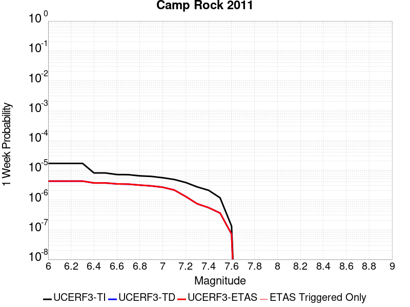 | 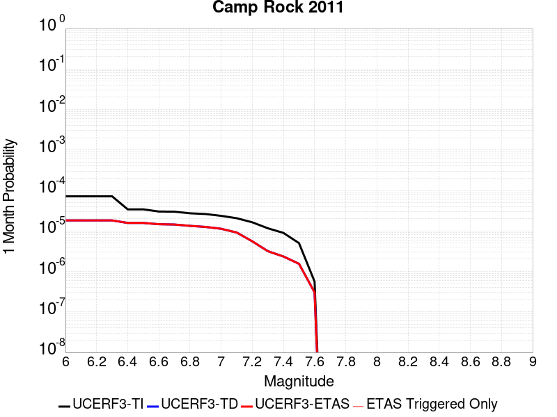 | 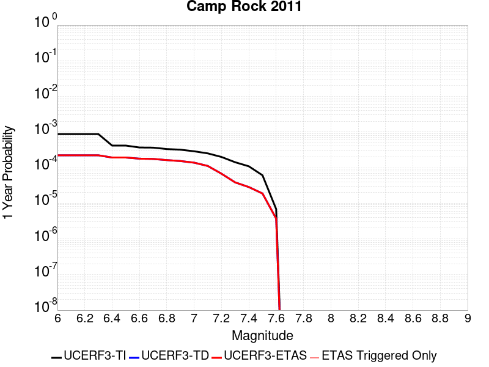 | 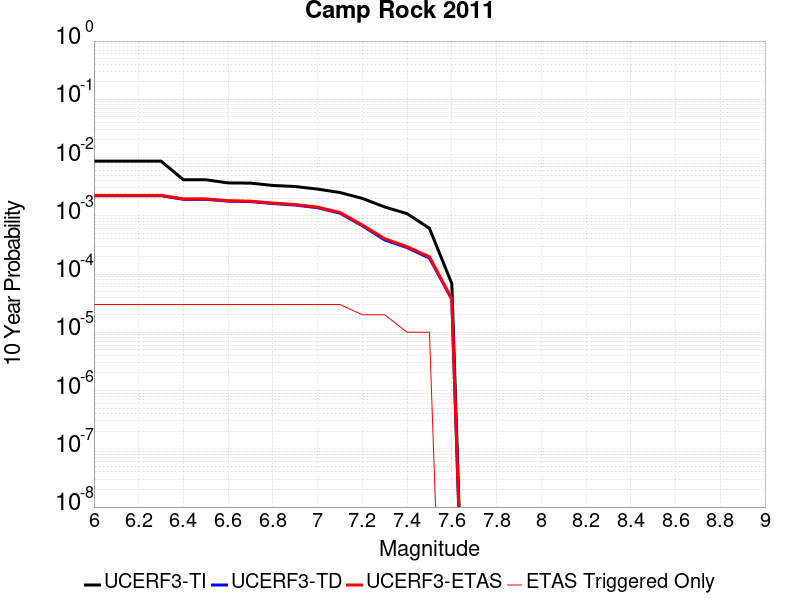 |

| Magnitude | 1 wk TI Prob | 1 wk TD Prob | 1 wk ETAS Prob | 1 wk ETAS/TD Gain | 1 wk ETAS Triggered Only | 1 mo TI Prob | 1 mo TD Prob | 1 mo ETAS Prob | 1 mo ETAS/TD Gain | 1 mo ETAS Triggered Only | 1 yr TI Prob | 1 yr TD Prob | 1 yr ETAS Prob | 1 yr ETAS/TD Gain | 1 yr ETAS Triggered Only | 10 yr TI Prob | 10 yr TD Prob | 10 yr ETAS Prob | 10 yr ETAS/TD Gain | 10 yr ETAS Triggered Only |
|-----|-----|-----|-----|-----|-----|-----|-----|-----|-----|-----|-----|-----|-----|-----|-----|-----|-----|-----|-----|-----|
| 6.0 | 1.6710783E-5 | 4.2507163E-6 | 4.2507163E-6 | 1.0 | 0.0 | 7.161568E-5 | 1.8217232E-5 | 1.8217232E-5 | 1.0 | 0.0 | 8.7157206E-4 | 2.2177275E-4 | 2.2177275E-4 | 1.0 | 0.0 | 0.008681616 | 0.002215567 | 0.0022695987 | 1.0243872 | 5.4151624E-5 |
| 6.1 | 1.6710783E-5 | 4.2507163E-6 | 4.2507163E-6 | 1.0 | 0.0 | 7.161568E-5 | 1.8217232E-5 | 1.8217232E-5 | 1.0 | 0.0 | 8.7157206E-4 | 2.2177275E-4 | 2.2177275E-4 | 1.0 | 0.0 | 0.008681616 | 0.002215567 | 0.0022695987 | 1.0243872 | 5.4151624E-5 |
| 6.2 | 1.6710783E-5 | 4.2507163E-6 | 4.2507163E-6 | 1.0 | 0.0 | 7.161568E-5 | 1.8217232E-5 | 1.8217232E-5 | 1.0 | 0.0 | 8.7157206E-4 | 2.2177275E-4 | 2.2177275E-4 | 1.0 | 0.0 | 0.008681616 | 0.002215567 | 0.0022695987 | 1.0243872 | 5.4151624E-5 |
| 6.3 | 1.6710783E-5 | 4.2507163E-6 | 4.2507163E-6 | 1.0 | 0.0 | 7.161568E-5 | 1.8217232E-5 | 1.8217232E-5 | 1.0 | 0.0 | 8.7157206E-4 | 2.2177275E-4 | 2.2177275E-4 | 1.0 | 0.0 | 0.008681616 | 0.002215567 | 0.0022695987 | 1.0243872 | 5.4151624E-5 |
| 6.4 | 7.982846E-6 | 3.68249E-6 | 3.68249E-6 | 1.0 | 0.0 | 3.421175E-5 | 1.5782007E-5 | 1.5782007E-5 | 1.0 | 0.0 | 4.1644843E-4 | 1.9212933E-4 | 1.9212933E-4 | 1.0 | 0.0 | 0.0041566887 | 0.0019196671 | 0.001973715 | 1.0281547 | 5.4151624E-5 |
| 6.5 | 7.982846E-6 | 3.68249E-6 | 3.68249E-6 | 1.0 | 0.0 | 3.421175E-5 | 1.5782007E-5 | 1.5782007E-5 | 1.0 | 0.0 | 4.1644843E-4 | 1.9212933E-4 | 1.9212933E-4 | 1.0 | 0.0 | 0.0041566887 | 0.0019196671 | 0.001973715 | 1.0281547 | 5.4151624E-5 |
| 6.6 | 7.048869E-6 | 3.4247414E-6 | 3.4247414E-6 | 1.0 | 0.0 | 3.0209088E-5 | 1.4677383E-5 | 1.4677383E-5 | 1.0 | 0.0 | 3.677336E-4 | 1.7868279E-4 | 1.7868279E-4 | 1.0 | 0.0 | 0.0036712566 | 0.0017854229 | 0.0018394778 | 1.0302757 | 5.4151624E-5 |
| 6.7 | 6.987307E-6 | 3.3627146E-6 | 3.3627146E-6 | 1.0 | 0.0 | 2.9945259E-5 | 1.4411557E-5 | 1.4411557E-5 | 1.0 | 0.0 | 3.6452254E-4 | 1.7544688E-4 | 1.7544688E-4 | 1.0 | 0.0 | 0.0036392517 | 0.0017531149 | 0.0018071715 | 1.0308347 | 5.4151624E-5 |
| 6.8 | 6.3737602E-6 | 3.1182658E-6 | 3.1182658E-6 | 1.0 | 0.0 | 2.731583E-5 | 1.3363929E-5 | 1.3363929E-5 | 1.0 | 0.0 | 3.3251947E-4 | 1.6269398E-4 | 1.6269398E-4 | 1.0 | 0.0 | 0.0033202237 | 0.0016257772 | 0.0016798408 | 1.033254 | 5.4151624E-5 |
| 6.9 | 6.112211E-6 | 2.933459E-6 | 2.933459E-6 | 1.0 | 0.0 | 2.6194928E-5 | 1.2571908E-5 | 1.2571908E-5 | 1.0 | 0.0 | 3.1887658E-4 | 1.530525E-4 | 1.530525E-4 | 1.0 | 0.0 | 0.003184194 | 0.0015294987 | 0.0015835676 | 1.0353507 | 5.4151624E-5 |
| 7.0 | 5.5140117E-6 | 2.6422256E-6 | 2.6422256E-6 | 1.0 | 0.0 | 2.3631264E-5 | 1.1323776E-5 | 1.1323776E-5 | 1.0 | 0.0 | 2.8767265E-4 | 1.378585E-4 | 1.378585E-4 | 1.0 | 0.0 | 0.0028730053 | 0.0013777551 | 0.0014318321 | 1.0392501 | 5.4151624E-5 |
| 7.1 | 4.8151105E-6 | 2.134525E-6 | 2.134525E-6 | 1.0 | 0.0 | 2.0636026E-5 | 9.147933E-6 | 9.147933E-6 | 1.0 | 0.0 | 2.5121463E-4 | 1.1137062E-4 | 1.1137062E-4 | 1.0 | 0.0 | 0.0025093083 | 0.00111317 | 0.0011672613 | 1.0485922 | 5.4151624E-5 |
| 7.2 | 3.818335E-6 | 1.2939307E-6 | 1.2939307E-6 | 1.0 | 0.0 | 1.6364189E-5 | 5.5454057E-6 | 5.5454057E-6 | 1.0 | 0.0 | 1.9921579E-4 | 6.7513305E-5 | 6.7513305E-5 | 1.0 | 0.0 | 0.0019903728 | 6.749362E-4 | 7.110129E-4 | 1.053452 | 3.6101083E-5 |
| 7.3 | 2.7166698E-6 | 7.385011E-7 | 7.385011E-7 | 1.0 | 0.0 | 1.1642818E-5 | 3.165001E-6 | 3.165001E-6 | 1.0 | 0.0 | 1.4174209E-4 | 3.8533228E-5 | 3.8533228E-5 | 1.0 | 0.0 | 0.0014165172 | 3.8526746E-4 | 4.2135463E-4 | 1.0936679 | 3.6101083E-5 |
| 7.4 | 2.0893426E-6 | 5.462964E-7 | 5.462964E-7 | 1.0 | 0.0 | 8.954295E-6 | 2.3412683E-6 | 2.3412683E-6 | 1.0 | 0.0 | 1.0901308E-4 | 2.8504573E-5 | 2.8504573E-5 | 1.0 | 0.0 | 0.0010895962 | 2.850097E-4 | 3.0305513E-4 | 1.063315 | 1.8050541E-5 |
| 7.5 | 1.1681728E-6 | 3.6036903E-7 | 3.6036903E-7 | 1.0 | 0.0 | 5.0064455E-6 | 1.5444379E-6 | 1.5444379E-6 | 1.0 | 0.0 | 6.0951766E-5 | 1.8803374E-5 | 1.8803374E-5 | 1.0 | 0.0 | 6.093505E-4 | 1.8801828E-4 | 2.0606544E-4 | 1.0959861 | 1.8050541E-5 |
| 7.6 | 1.3154387E-7 | 7.12053E-8 | 7.12053E-8 | 1.0 | 0.0 | 5.6375933E-7 | 3.0516554E-7 | 3.0516554E-7 | 1.0 | 0.0 | 6.863748E-6 | 3.7153857E-6 | 3.7153857E-6 | 1.0 | 0.0 | 6.863536E-5 | 3.7153393E-5 | 3.7153393E-5 | 1.0 | 0.0 |

## Oceanic - West Huasna
*[(top)](#table-of-contents)*

| 1 Week | 1 Month | 1 Year | 10 Year |
|-----|-----|-----|-----|
| 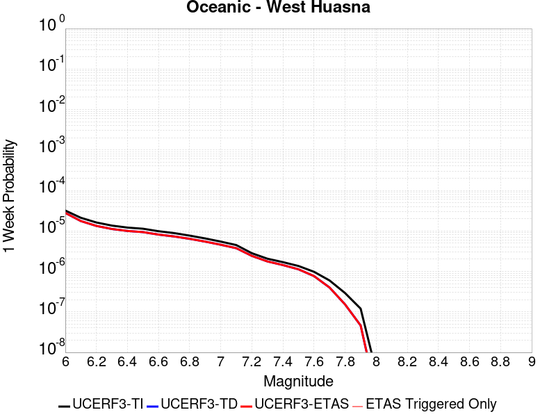 | 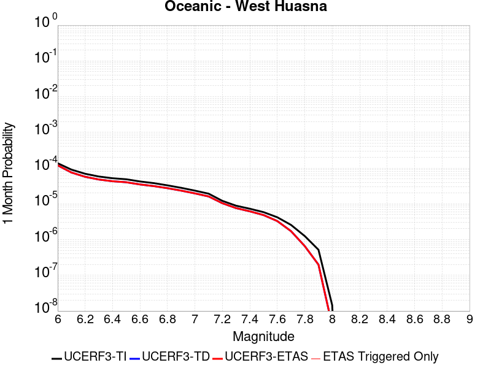 | 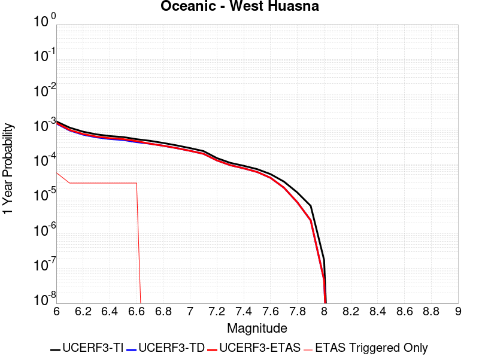 | 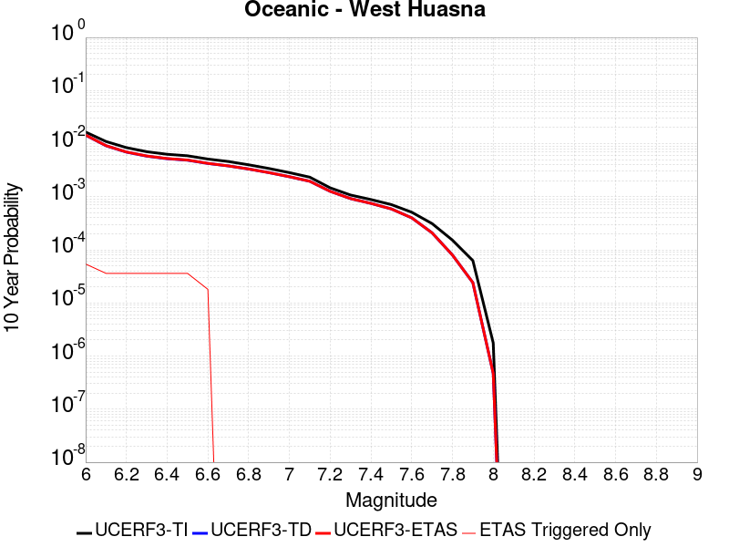 |

| Magnitude | 1 wk TI Prob | 1 wk TD Prob | 1 wk ETAS Prob | 1 wk ETAS/TD Gain | 1 wk ETAS Triggered Only | 1 mo TI Prob | 1 mo TD Prob | 1 mo ETAS Prob | 1 mo ETAS/TD Gain | 1 mo ETAS Triggered Only | 1 yr TI Prob | 1 yr TD Prob | 1 yr ETAS Prob | 1 yr ETAS/TD Gain | 1 yr ETAS Triggered Only | 10 yr TI Prob | 10 yr TD Prob | 10 yr ETAS Prob | 10 yr ETAS/TD Gain | 10 yr ETAS Triggered Only |
|-----|-----|-----|-----|-----|-----|-----|-----|-----|-----|-----|-----|-----|-----|-----|-----|-----|-----|-----|-----|-----|
| 6.0 | 3.195567E-5 | 2.7929502E-5 | 2.7929502E-5 | 1.0 | 0.0 | 1.3694567E-4 | 1.1969262E-4 | 1.1969262E-4 | 1.0 | 0.0 | 0.0016660384 | 0.0014563266 | 0.001492375 | 1.0247531 | 3.6101083E-5 | 0.016536033 | 0.014472383 | 0.014525751 | 1.0036876 | 5.4151624E-5 |
| 6.1 | 2.1156782E-5 | 1.757506E-5 | 1.757506E-5 | 1.0 | 0.0 | 9.066878E-5 | 7.531956E-5 | 7.531956E-5 | 1.0 | 0.0 | 0.0011033333 | 9.166393E-4 | 9.346733E-4 | 1.0196741 | 1.8050541E-5 | 0.010978713 | 0.009129592 | 0.009165363 | 1.0039182 | 3.6101083E-5 |
| 6.2 | 1.6195117E-5 | 1.3328266E-5 | 1.3328266E-5 | 1.0 | 0.0 | 6.9405796E-5 | 5.71199E-5 | 5.71199E-5 | 1.0 | 0.0 | 8.44688E-4 | 6.9521554E-4 | 7.132535E-4 | 1.0259459 | 1.8050541E-5 | 0.008414844 | 0.0069307 | 0.006966551 | 1.0051727 | 3.6101083E-5 |
| 6.3 | 1.3559345E-5 | 1.1180029E-5 | 1.1180029E-5 | 1.0 | 0.0 | 5.811018E-5 | 4.7913534E-5 | 4.7913534E-5 | 1.0 | 0.0 | 7.072618E-4 | 5.831921E-4 | 6.012321E-4 | 1.0309333 | 1.8050541E-5 | 0.0070501505 | 0.005816735 | 0.0058526257 | 1.0061703 | 3.6101083E-5 |
| 6.4 | 1.2120619E-5 | 1.0001748E-5 | 1.0001748E-5 | 1.0 | 0.0 | 5.1944477E-5 | 4.2863932E-5 | 4.2863932E-5 | 1.0 | 0.0 | 6.322405E-4 | 5.217439E-4 | 5.39785E-4 | 1.0345786 | 1.8050541E-5 | 0.006304447 | 0.0052052573 | 0.0052411705 | 1.0068994 | 3.6101083E-5 |
| 6.5 | 1.13511915E-5 | 9.368191E-6 | 9.368191E-6 | 1.0 | 0.0 | 4.8647056E-5 | 4.0148774E-5 | 4.0148774E-5 | 1.0 | 0.0 | 5.9211696E-4 | 4.8870215E-4 | 5.0674385E-4 | 1.0369176 | 1.8050541E-5 | 0.0059054173 | 0.0048763333 | 0.0049122586 | 1.0073673 | 3.6101083E-5 |
| 6.6 | 9.850605E-6 | 8.136037E-6 | 8.136037E-6 | 1.0 | 0.0 | 4.2216197E-5 | 3.4868262E-5 | 3.4868262E-5 | 1.0 | 0.0 | 5.1386096E-4 | 4.2443862E-4 | 4.424815E-4 | 1.04251 | 1.8050541E-5 | 0.0051267436 | 0.004236312 | 0.004254286 | 1.0042429 | 1.8050541E-5 |
| 6.7 | 8.8558645E-6 | 7.3189917E-6 | 7.3189917E-6 | 1.0 | 0.0 | 3.7953152E-5 | 3.136673E-5 | 3.136673E-5 | 1.0 | 0.0 | 4.6198163E-4 | 3.8182322E-4 | 3.8182322E-4 | 1.0 | 0.0 | 0.004610224 | 0.0038116972 | 0.0038116972 | 1.0 | 0.0 |
| 6.8 | 7.67136E-6 | 6.392251E-6 | 6.392251E-6 | 1.0 | 0.0 | 3.2876844E-5 | 2.7395075E-5 | 2.7395075E-5 | 1.0 | 0.0 | 4.0020206E-4 | 3.3348415E-4 | 3.3348415E-4 | 1.0 | 0.0 | 0.003994821 | 0.0033298582 | 0.0033298582 | 1.0 | 0.0 |
| 6.9 | 6.534529E-6 | 5.4587645E-6 | 5.4587645E-6 | 1.0 | 0.0 | 2.8004823E-5 | 2.3394496E-5 | 2.3394496E-5 | 1.0 | 0.0 | 3.4090536E-4 | 2.847909E-4 | 2.847909E-4 | 1.0 | 0.0 | 0.0034038287 | 0.0028442761 | 0.0028442761 | 1.0 | 0.0 |
| 7.0 | 5.460525E-6 | 4.5703364E-6 | 4.5703364E-6 | 1.0 | 0.0 | 2.3402039E-5 | 1.958701E-5 | 1.958701E-5 | 1.0 | 0.0 | 2.8488258E-4 | 2.3844586E-4 | 2.3844586E-4 | 1.0 | 0.0 | 0.0028451765 | 0.002381914 | 0.002381914 | 1.0 | 0.0 |
| 7.1 | 4.4825083E-6 | 3.7527946E-6 | 3.7527946E-6 | 1.0 | 0.0 | 1.9210609E-5 | 1.6083308E-5 | 1.6083308E-5 | 1.0 | 0.0 | 2.3386406E-4 | 1.9579676E-4 | 1.9579676E-4 | 1.0 | 0.0 | 0.002336181 | 0.0019562547 | 0.0019562547 | 1.0 | 0.0 |
| 7.2 | 2.821708E-6 | 2.4252274E-6 | 2.4252274E-6 | 1.0 | 0.0 | 1.2092979E-5 | 1.039379E-5 | 1.039379E-5 | 1.0 | 0.0 | 1.4722206E-4 | 1.2653705E-4 | 1.2653705E-4 | 1.0 | 0.0 | 0.0014712457 | 0.0012646525 | 0.0012646525 | 1.0 | 0.0 |
| 7.3 | 2.0644757E-6 | 1.7690093E-6 | 1.7690093E-6 | 1.0 | 0.0 | 8.847723E-6 | 7.5814464E-6 | 7.5814464E-6 | 1.0 | 0.0 | 1.0771569E-4 | 9.23002E-5 | 9.23002E-5 | 1.0 | 0.0 | 0.001076635 | 9.226204E-4 | 9.226204E-4 | 1.0 | 0.0 |
| 7.4 | 1.6980367E-6 | 1.4382099E-6 | 1.4382099E-6 | 1.0 | 0.0 | 7.27728E-6 | 6.1637425E-6 | 6.1637425E-6 | 1.0 | 0.0 | 8.8597284E-5 | 7.504098E-5 | 7.504098E-5 | 1.0 | 0.0 | 8.8561967E-4 | 7.5015804E-4 | 7.5015804E-4 | 1.0 | 0.0 |
| 7.5 | 1.3637683E-6 | 1.130474E-6 | 1.130474E-6 | 1.0 | 0.0 | 5.844708E-6 | 4.844879E-6 | 4.844879E-6 | 1.0 | 0.0 | 7.1156996E-5 | 5.898481E-5 | 5.898481E-5 | 1.0 | 0.0 | 7.1134215E-4 | 5.89693E-4 | 5.89693E-4 | 1.0 | 0.0 |
| 7.6 | 9.802994E-7 | 7.679233E-7 | 7.679233E-7 | 1.0 | 0.0 | 4.2012766E-6 | 3.2910957E-6 | 3.2910957E-6 | 1.0 | 0.0 | 5.1149345E-5 | 4.0068357E-5 | 4.0068357E-5 | 1.0 | 0.0 | 5.113757E-4 | 4.0061274E-4 | 4.0061274E-4 | 1.0 | 0.0 |
| 7.7 | 5.986191E-7 | 4.006682E-7 | 4.006682E-7 | 1.0 | 0.0 | 2.5655079E-6 | 1.7171483E-6 | 1.7171483E-6 | 1.0 | 0.0 | 3.1234613E-5 | 2.090608E-5 | 2.090608E-5 | 1.0 | 0.0 | 3.123022E-4 | 2.0904248E-4 | 2.0904248E-4 | 1.0 | 0.0 |
| 7.8 | 2.9189815E-7 | 1.5299878E-7 | 1.5299878E-7 | 1.0 | 0.0 | 1.2509914E-6 | 6.5570885E-7 | 6.5570885E-7 | 1.0 | 0.0 | 1.5230714E-5 | 7.983226E-6 | 7.983226E-6 | 1.0 | 0.0 | 1.522967E-4 | 7.983071E-5 | 7.983071E-5 | 1.0 | 0.0 |
| 7.9 | 1.2057845E-7 | 4.6290683E-8 | 4.6290683E-8 | 1.0 | 0.0 | 5.1676466E-7 | 1.9838862E-7 | 1.9838862E-7 | 1.0 | 0.0 | 6.2915915E-6 | 2.4153787E-6 | 2.4153787E-6 | 1.0 | 0.0 | 6.2914136E-5 | 2.415483E-5 | 2.415483E-5 | 1.0 | 0.0 |
| 8.0 | 3.3806387E-9 | 9.0416175E-10 | 9.0416175E-10 | 1.0 | 0.0 | 1.4488451E-8 | 3.874979E-9 | 3.874979E-9 | 1.0 | 0.0 | 1.7639688E-7 | 4.717787E-8 | 4.717787E-8 | 1.0 | 0.0 | 1.7639674E-6 | 4.7287244E-7 | 4.7287244E-7 | 1.0 | 0.0 |

## Calaveras (Central) 2011 CFM
*[(top)](#table-of-contents)*

| 1 Week | 1 Month | 1 Year | 10 Year |
|-----|-----|-----|-----|
| 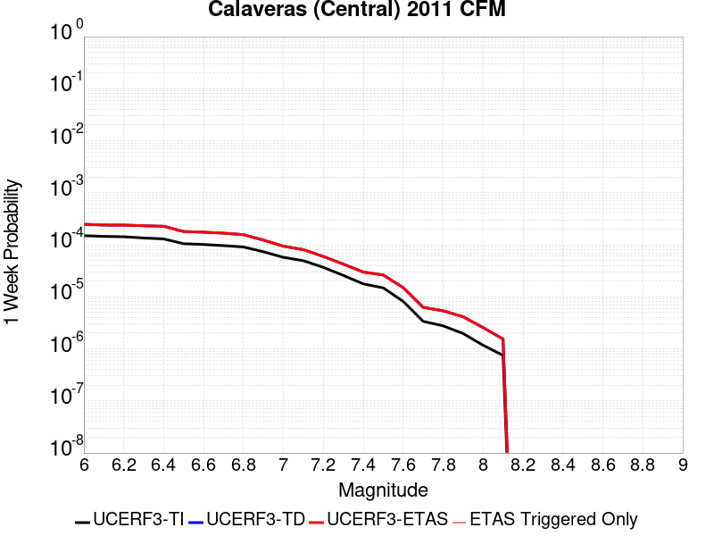 | 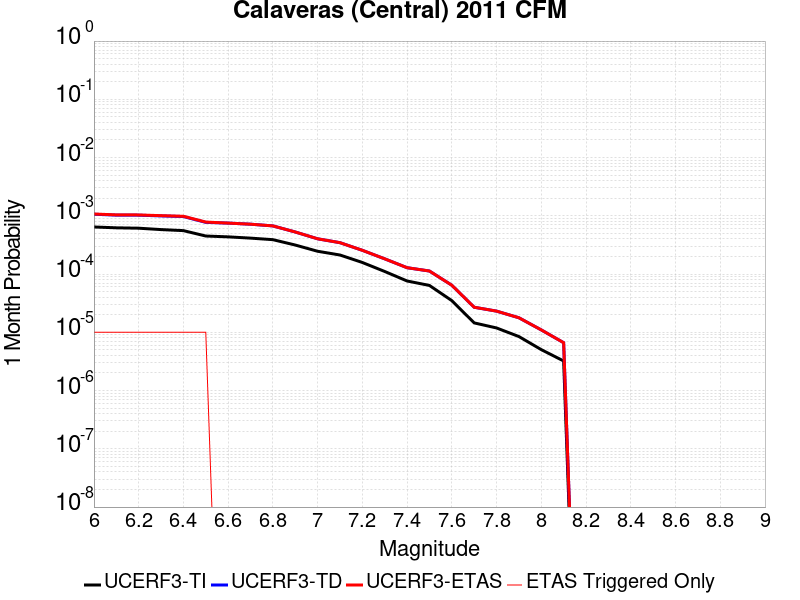 | 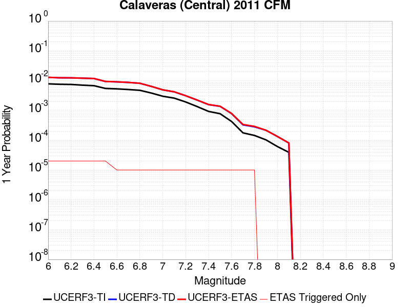 | 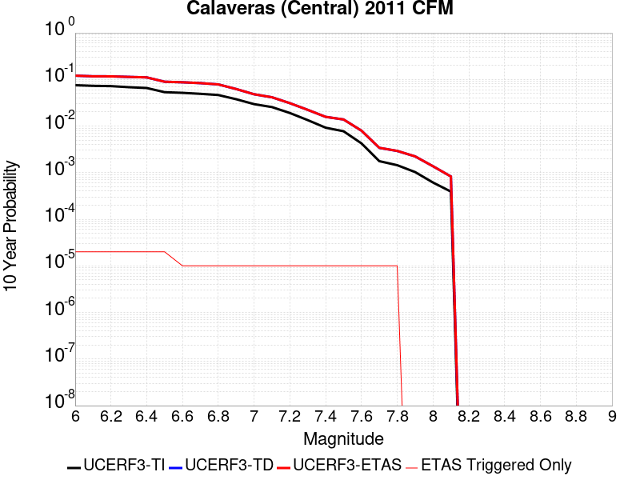 |

| Magnitude | 1 wk TI Prob | 1 wk TD Prob | 1 wk ETAS Prob | 1 wk ETAS/TD Gain | 1 wk ETAS Triggered Only | 1 mo TI Prob | 1 mo TD Prob | 1 mo ETAS Prob | 1 mo ETAS/TD Gain | 1 mo ETAS Triggered Only | 1 yr TI Prob | 1 yr TD Prob | 1 yr ETAS Prob | 1 yr ETAS/TD Gain | 1 yr ETAS Triggered Only | 10 yr TI Prob | 10 yr TD Prob | 10 yr ETAS Prob | 10 yr ETAS/TD Gain | 10 yr ETAS Triggered Only |
|-----|-----|-----|-----|-----|-----|-----|-----|-----|-----|-----|-----|-----|-----|-----|-----|-----|-----|-----|-----|-----|
| 6.0 | 1.5010907E-4 | 2.4821545E-4 | 2.4821545E-4 | 1.0 | 0.0 | 6.4316596E-4 | 0.0010633576 | 0.0010813889 | 1.016957 | 1.8050541E-5 | 0.0078024664 | 0.012866158 | 0.012901794 | 1.0027698 | 3.6101083E-5 | 0.07534136 | 0.12053921 | 0.12057096 | 1.0002635 | 3.6101083E-5 |
| 6.1 | 1.4521465E-4 | 2.3984365E-4 | 2.3984365E-4 | 1.0 | 0.0 | 6.222001E-4 | 0.0010275067 | 0.0010455387 | 1.0175493 | 1.8050541E-5 | 0.0075490056 | 0.012435283 | 0.012470935 | 1.002867 | 3.6101083E-5 | 0.07297657 | 0.11680993 | 0.11684181 | 1.000273 | 3.6101083E-5 |
| 6.2 | 1.429998E-4 | 2.3915306E-4 | 2.3915306E-4 | 1.0 | 0.0 | 6.127123E-4 | 0.0010245494 | 0.0010425814 | 1.0175999 | 1.8050541E-5 | 0.007434286 | 0.012399732 | 0.012435386 | 1.0028753 | 3.6101083E-5 | 0.07190444 | 0.11646242 | 0.11649431 | 1.0002738 | 3.6101083E-5 |
| 6.3 | 1.3536277E-4 | 2.3245251E-4 | 2.3245251E-4 | 1.0 | 0.0 | 5.799972E-4 | 9.958548E-4 | 0.0010138875 | 1.0181077 | 1.8050541E-5 | 0.0070386264 | 0.012055458 | 0.0120911235 | 1.0029585 | 3.6101083E-5 | 0.0681982 | 0.11337111 | 0.11340312 | 1.0002823 | 3.6101083E-5 |
| 6.4 | 1.2993296E-4 | 2.2667961E-4 | 2.2667961E-4 | 1.0 | 0.0 | 5.5673666E-4 | 9.7113376E-4 | 9.891668E-4 | 1.018569 | 1.8050541E-5 | 0.006757223 | 0.011757862 | 0.011793538 | 1.0030342 | 3.6101083E-5 | 0.06555412 | 0.11064592 | 0.110678025 | 1.0002902 | 3.6101083E-5 |
| 6.5 | 1.0498927E-4 | 1.8009114E-4 | 1.8009114E-4 | 1.0 | 0.0 | 4.498764E-4 | 7.715906E-4 | 7.8962726E-4 | 1.0233759 | 1.8050541E-5 | 0.005463498 | 0.00935346 | 0.0093892235 | 1.0038235 | 3.6101083E-5 | 0.053311124 | 0.08932133 | 0.08935421 | 1.0003681 | 3.6101083E-5 |
| 6.6 | 1.0157505E-4 | 1.7496222E-4 | 1.7496222E-4 | 1.0 | 0.0 | 4.35249E-4 | 7.49624E-4 | 7.49624E-4 | 1.0 | 0.0 | 0.0052862884 | 0.009088326 | 0.009106213 | 1.001968 | 1.8050541E-5 | 0.05162293 | 0.08689754 | 0.08691402 | 1.0001897 | 1.8050541E-5 |
| 6.7 | 9.660386E-5 | 1.6755128E-4 | 1.6755128E-4 | 1.0 | 0.0 | 4.1395082E-4 | 7.1788067E-4 | 7.1788067E-4 | 1.0 | 0.0 | 0.0050282106 | 0.008705045 | 0.008722939 | 1.0020555 | 1.8050541E-5 | 0.049159497 | 0.083385676 | 0.083402224 | 1.0001984 | 1.8050541E-5 |
| 6.8 | 9.089927E-5 | 1.5668369E-4 | 1.5668369E-4 | 1.0 | 0.0 | 3.8951015E-4 | 6.713299E-4 | 6.713299E-4 | 1.0 | 0.0 | 0.0047319788 | 0.008142657 | 0.00816056 | 1.0021987 | 1.8050541E-5 | 0.046324775 | 0.07827427 | 0.07829091 | 1.0002126 | 1.8050541E-5 |
| 6.9 | 7.353187E-5 | 1.2316645E-4 | 1.2316645E-4 | 1.0 | 0.0 | 3.150985E-4 | 5.2775E-4 | 5.2775E-4 | 1.0 | 0.0 | 0.0038295772 | 0.0064065475 | 0.0064244824 | 1.0027995 | 1.8050541E-5 | 0.037642512 | 0.062286846 | 0.062303774 | 1.0002718 | 1.8050541E-5 |
| 7.0 | 5.746064E-5 | 9.408542E-5 | 9.408542E-5 | 1.0 | 0.0 | 2.4623662E-4 | 4.031613E-4 | 4.031613E-4 | 1.0 | 0.0 | 0.0029938098 | 0.004897513 | 0.0049154754 | 1.0036676 | 1.8050541E-5 | 0.02953797 | 0.04808068 | 0.048097864 | 1.0003574 | 1.8050541E-5 |
| 7.1 | 4.9557195E-5 | 8.0691134E-5 | 8.0691134E-5 | 1.0 | 0.0 | 2.123707E-4 | 3.4577365E-4 | 3.4577365E-4 | 1.0 | 0.0 | 0.0025825473 | 0.004201731 | 0.0042197057 | 1.004278 | 1.8050541E-5 | 0.0255274 | 0.04145319 | 0.041470494 | 1.0004174 | 1.8050541E-5 |
| 7.2 | 3.687595E-5 | 5.9682872E-5 | 5.9682872E-5 | 1.0 | 0.0 | 1.5803022E-4 | 2.5575885E-4 | 2.5575885E-4 | 1.0 | 0.0 | 0.0019223199 | 0.0031094467 | 0.0031274413 | 1.005787 | 1.8050541E-5 | 0.01905776 | 0.030960815 | 0.030978305 | 1.0005649 | 1.8050541E-5 |
| 7.3 | 2.5846984E-5 | 4.2610645E-5 | 4.2610645E-5 | 1.0 | 0.0 | 1.1076809E-4 | 1.8260437E-4 | 1.8260437E-4 | 1.0 | 0.0 | 0.0013477671 | 0.0022209592 | 0.0022389696 | 1.0081093 | 1.8050541E-5 | 0.013396223 | 0.022243818 | 0.022261467 | 1.0007935 | 1.8050541E-5 |
| 7.4 | 1.7747854E-5 | 3.00053E-5 | 3.00053E-5 | 1.0 | 0.0 | 7.6060016E-5 | 1.2858782E-4 | 1.2858782E-4 | 1.0 | 0.0 | 9.2563726E-4 | 0.0015644353 | 0.0015824577 | 1.01152 | 1.8050541E-5 | 0.009217911 | 0.015742958 | 0.015760724 | 1.0011286 | 1.8050541E-5 |
| 7.5 | 1.4883479E-5 | 2.6308166E-5 | 2.6308166E-5 | 1.0 | 0.0 | 6.378478E-5 | 1.1274443E-4 | 1.1274443E-4 | 1.0 | 0.0 | 7.76303E-4 | 0.0013718018 | 0.0013898276 | 1.0131402 | 1.8050541E-5 | 0.0077359667 | 0.013834078 | 0.013851878 | 1.0012867 | 1.8050541E-5 |
| 7.6 | 8.166975E-6 | 1.5010342E-5 | 1.5010342E-5 | 1.0 | 0.0 | 3.5000852E-5 | 6.432846E-5 | 6.432846E-5 | 1.0 | 0.0 | 4.2605202E-4 | 7.829189E-4 | 8.009553E-4 | 1.0230374 | 1.8050541E-5 | 0.004252361 | 0.007962818 | 0.007980725 | 1.0022488 | 1.8050541E-5 |
| 7.7 | 3.3858064E-6 | 6.2840672E-6 | 6.2840672E-6 | 1.0 | 0.0 | 1.4510518E-5 | 2.6931439E-5 | 2.6931439E-5 | 1.0 | 0.0 | 1.7665124E-4 | 3.27841E-4 | 3.458856E-4 | 1.0550408 | 1.8050541E-5 | 0.0017651088 | 0.0034030818 | 0.003421071 | 1.0052861 | 1.8050541E-5 |
| 7.8 | 2.7721615E-6 | 5.3922763E-6 | 5.3922763E-6 | 1.0 | 0.0 | 1.1880637E-5 | 2.3109551E-5 | 2.3109551E-5 | 1.0 | 0.0 | 1.4463716E-4 | 2.8132251E-4 | 2.99368E-4 | 1.0641451 | 1.8050541E-5 | 0.0014454306 | 0.0029201652 | 0.002938163 | 1.0061632 | 1.8050541E-5 |
| 7.9 | 1.9736292E-6 | 4.1474327E-6 | 4.1474327E-6 | 1.0 | 0.0 | 8.4583835E-6 | 1.777459E-5 | 1.777459E-5 | 1.0 | 0.0 | 1.0297595E-4 | 2.1638419E-4 | 2.1638419E-4 | 1.0 | 0.0 | 0.0010292825 | 0.0022328692 | 0.0022328692 | 1.0 | 0.0 |
| 8.0 | 1.1767289E-6 | 2.5657139E-6 | 2.5657139E-6 | 1.0 | 0.0 | 5.0431145E-6 | 1.099587E-5 | 1.099587E-5 | 1.0 | 0.0 | 6.139818E-5 | 1.3386653E-4 | 1.3386653E-4 | 1.0 | 0.0 | 6.1381224E-4 | 0.0013715698 | 0.0013715698 | 1.0 | 0.0 |
| 8.1 | 7.5112825E-7 | 1.5478056E-6 | 1.5478056E-6 | 1.0 | 0.0 | 3.2191172E-6 | 6.633436E-6 | 6.633436E-6 | 1.0 | 0.0 | 3.9192048E-5 | 8.075911E-5 | 8.075911E-5 | 1.0 | 0.0 | 3.9185135E-4 | 8.269216E-4 | 8.269216E-4 | 1.0 | 0.0 |

## Baker
*[(top)](#table-of-contents)*

| 1 Week | 1 Month | 1 Year | 10 Year |
|-----|-----|-----|-----|
| 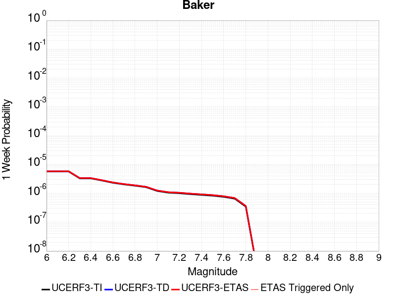 | 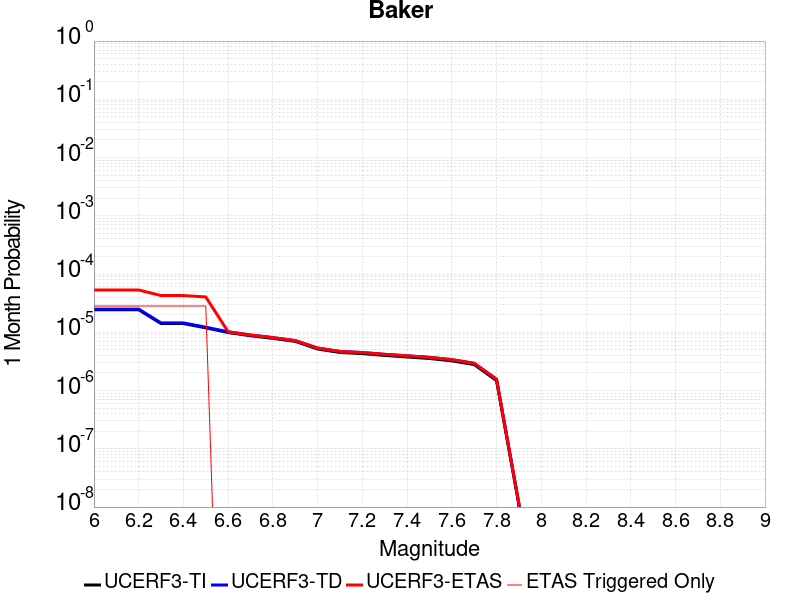 | 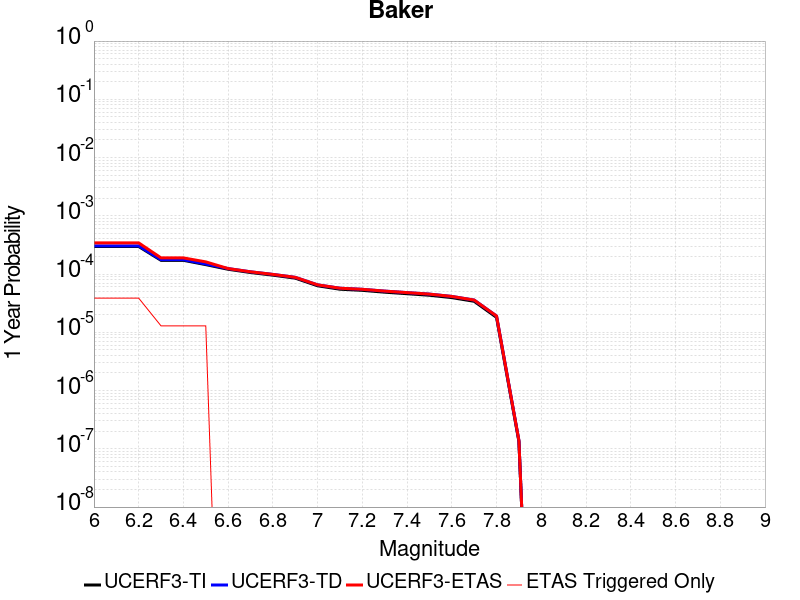 | 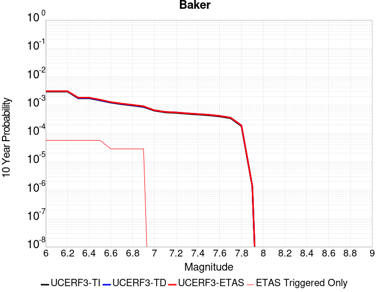 |

| Magnitude | 1 wk TI Prob | 1 wk TD Prob | 1 wk ETAS Prob | 1 wk ETAS/TD Gain | 1 wk ETAS Triggered Only | 1 mo TI Prob | 1 mo TD Prob | 1 mo ETAS Prob | 1 mo ETAS/TD Gain | 1 mo ETAS Triggered Only | 1 yr TI Prob | 1 yr TD Prob | 1 yr ETAS Prob | 1 yr ETAS/TD Gain | 1 yr ETAS Triggered Only | 10 yr TI Prob | 10 yr TD Prob | 10 yr ETAS Prob | 10 yr ETAS/TD Gain | 10 yr ETAS Triggered Only |
|-----|-----|-----|-----|-----|-----|-----|-----|-----|-----|-----|-----|-----|-----|-----|-----|-----|-----|-----|-----|-----|
| 6.0 | 5.695525E-6 | 5.8350083E-6 | 5.8350083E-6 | 1.0 | 0.0 | 2.4409164E-5 | 2.5006962E-5 | 4.305705E-5 | 1.7218026 | 1.8050541E-5 | 2.9714106E-4 | 3.0442124E-4 | 3.2246628E-4 | 1.0592766 | 1.8050541E-5 | 0.0029674405 | 0.0030404378 | 0.0030764292 | 1.0118376 | 3.6101083E-5 |
| 6.1 | 5.695525E-6 | 5.8350083E-6 | 5.8350083E-6 | 1.0 | 0.0 | 2.4409164E-5 | 2.5006962E-5 | 4.305705E-5 | 1.7218026 | 1.8050541E-5 | 2.9714106E-4 | 3.0442124E-4 | 3.2246628E-4 | 1.0592766 | 1.8050541E-5 | 0.0029674405 | 0.0030404378 | 0.0030764292 | 1.0118376 | 3.6101083E-5 |
| 6.2 | 5.695525E-6 | 5.8350083E-6 | 5.8350083E-6 | 1.0 | 0.0 | 2.4409164E-5 | 2.5006962E-5 | 4.305705E-5 | 1.7218026 | 1.8050541E-5 | 2.9714106E-4 | 3.0442124E-4 | 3.2246628E-4 | 1.0592766 | 1.8050541E-5 | 0.0029674405 | 0.0030404378 | 0.0030764292 | 1.0118376 | 3.6101083E-5 |
| 6.3 | 3.2995713E-6 | 3.383771E-6 | 3.383771E-6 | 1.0 | 0.0 | 1.4140943E-5 | 1.45017975E-5 | 3.2552078E-5 | 2.2446926 | 1.8050541E-5 | 1.7215237E-4 | 1.7654555E-4 | 1.9459291E-4 | 1.102225 | 1.8050541E-5 | 0.0017201907 | 0.0017641002 | 0.0018001376 | 1.0204282 | 3.6101083E-5 |
| 6.4 | 3.2995713E-6 | 3.383771E-6 | 3.383771E-6 | 1.0 | 0.0 | 1.4140943E-5 | 1.45017975E-5 | 3.2552078E-5 | 2.2446926 | 1.8050541E-5 | 1.7215237E-4 | 1.7654555E-4 | 1.9459291E-4 | 1.102225 | 1.8050541E-5 | 0.0017201907 | 0.0017641002 | 0.0018001376 | 1.0204282 | 3.6101083E-5 |
| 6.5 | 2.782202E-6 | 2.8559316E-6 | 2.8559316E-6 | 1.0 | 0.0 | 1.1923668E-5 | 1.2239651E-5 | 3.0289972E-5 | 2.4747415 | 1.8050541E-5 | 1.4516099E-4 | 1.4900789E-4 | 1.6705574E-4 | 1.1211201 | 1.8050541E-5 | 0.001450662 | 0.0014891125 | 0.0015251599 | 1.0242072 | 3.6101083E-5 |
| 6.6 | 2.3163404E-6 | 2.381E-6 | 2.381E-6 | 1.0 | 0.0 | 9.927136E-6 | 1.0204247E-5 | 1.0204247E-5 | 1.0 | 0.0 | 1.20856166E-4 | 1.2422983E-4 | 1.2422983E-4 | 1.0 | 0.0 | 0.0012079047 | 0.001241624 | 0.0012596522 | 1.0145198 | 1.8050541E-5 |
| 6.7 | 2.037056E-6 | 2.0965742E-6 | 2.0965742E-6 | 1.0 | 0.0 | 8.7302105E-6 | 8.985288E-6 | 8.985288E-6 | 1.0 | 0.0 | 1.0628513E-4 | 1.0939056E-4 | 1.0939056E-4 | 1.0 | 0.0 | 0.0010623431 | 0.0010933832 | 0.001111414 | 1.0164908 | 1.8050541E-5 |
| 6.8 | 1.8356744E-6 | 1.8915981E-6 | 1.8915981E-6 | 1.0 | 0.0 | 7.867153E-6 | 8.106825E-6 | 8.106825E-6 | 1.0 | 0.0 | 9.577837E-5 | 9.869626E-5 | 9.869626E-5 | 1.0 | 0.0 | 9.57371E-4 | 9.865382E-4 | 0.001004571 | 1.0182788 | 1.8050541E-5 |
| 6.9 | 1.6310546E-6 | 1.6832722E-6 | 1.6832722E-6 | 1.0 | 0.0 | 6.9902153E-6 | 7.214004E-6 | 7.214004E-6 | 1.0 | 0.0 | 8.510255E-5 | 8.782707E-5 | 8.782707E-5 | 1.0 | 0.0 | 8.5069967E-4 | 8.779349E-4 | 8.959696E-4 | 1.0205421 | 1.8050541E-5 |
| 7.0 | 1.2058036E-6 | 1.2509229E-6 | 1.2509229E-6 | 1.0 | 0.0 | 5.1677193E-6 | 5.3610875E-6 | 5.3610875E-6 | 1.0 | 0.0 | 6.291517E-5 | 6.5269305E-5 | 6.5269305E-5 | 1.0 | 0.0 | 6.289736E-4 | 6.525037E-4 | 6.525037E-4 | 1.0 | 0.0 |
| 7.1 | 1.052382E-6 | 1.0952144E-6 | 1.0952144E-6 | 1.0 | 0.0 | 4.5102006E-6 | 4.693768E-6 | 4.693768E-6 | 1.0 | 0.0 | 5.491031E-5 | 5.7145135E-5 | 5.7145135E-5 | 1.0 | 0.0 | 5.4896745E-4 | 5.713053E-4 | 5.713053E-4 | 1.0 | 0.0 |
| 7.2 | 1.0067454E-6 | 1.0488237E-6 | 1.0488237E-6 | 1.0 | 0.0 | 4.3146156E-6 | 4.494951E-6 | 4.494951E-6 | 1.0 | 0.0 | 5.252918E-5 | 5.4724664E-5 | 5.4724664E-5 | 1.0 | 0.0 | 5.251676E-4 | 5.471128E-4 | 5.471128E-4 | 1.0 | 0.0 |
| 7.3 | 9.3596316E-7 | 9.768236E-7 | 9.768236E-7 | 1.0 | 0.0 | 4.0112645E-6 | 4.18638E-6 | 4.18638E-6 | 1.0 | 0.0 | 4.8836053E-5 | 5.0967992E-5 | 5.0967992E-5 | 1.0 | 0.0 | 4.8825322E-4 | 5.0956383E-4 | 5.0956383E-4 | 1.0 | 0.0 |
| 7.4 | 8.8117395E-7 | 9.2081603E-7 | 9.2081603E-7 | 1.0 | 0.0 | 3.7764542E-6 | 3.9463484E-6 | 3.9463484E-6 | 1.0 | 0.0 | 4.5977362E-5 | 4.8045742E-5 | 4.8045742E-5 | 1.0 | 0.0 | 4.596785E-4 | 4.803543E-4 | 4.803543E-4 | 1.0 | 0.0 |
| 7.5 | 8.292386E-7 | 8.675076E-7 | 8.675076E-7 | 1.0 | 0.0 | 3.5538749E-6 | 3.7178845E-6 | 3.7178845E-6 | 1.0 | 0.0 | 4.326757E-5 | 4.526431E-5 | 4.526431E-5 | 1.0 | 0.0 | 4.3259145E-4 | 4.5255164E-4 | 4.5255164E-4 | 1.0 | 0.0 |
| 7.6 | 7.553842E-7 | 7.914924E-7 | 7.914924E-7 | 1.0 | 0.0 | 3.2373566E-6 | 3.392106E-6 | 3.392106E-6 | 1.0 | 0.0 | 3.9414106E-5 | 4.1298114E-5 | 4.1298114E-5 | 1.0 | 0.0 | 3.9407116E-4 | 4.1290512E-4 | 4.1290512E-4 | 1.0 | 0.0 |
| 7.7 | 6.5285366E-7 | 6.853205E-7 | 6.853205E-7 | 1.0 | 0.0 | 2.797941E-6 | 2.9370847E-6 | 2.9370847E-6 | 1.0 | 0.0 | 3.40644E-5 | 3.5758425E-5 | 3.5758425E-5 | 1.0 | 0.0 | 3.405918E-4 | 3.5752737E-4 | 3.5752737E-4 | 1.0 | 0.0 |
| 7.8 | 3.4586725E-7 | 3.6485014E-7 | 3.6485014E-7 | 1.0 | 0.0 | 1.4822873E-6 | 1.5636425E-6 | 1.5636425E-6 | 1.0 | 0.0 | 1.80467E-5 | 1.9037187E-5 | 1.9037187E-5 | 1.0 | 0.0 | 1.8045233E-4 | 1.9035599E-4 | 1.9035599E-4 | 1.0 | 0.0 |
| 7.9 | 2.5591178E-9 | 2.6698093E-9 | 2.6698093E-9 | 1.0 | 0.0 | 1.0967647E-8 | 1.144204E-8 | 1.144204E-8 | 1.0 | 0.0 | 1.335311E-7 | 1.3930685E-7 | 1.3930685E-7 | 1.0 | 0.0 | 1.3353102E-6 | 1.3930684E-6 | 1.3930684E-6 | 1.0 | 0.0 |

## San Juan
*[(top)](#table-of-contents)*

| 1 Week | 1 Month | 1 Year | 10 Year |
|-----|-----|-----|-----|
| 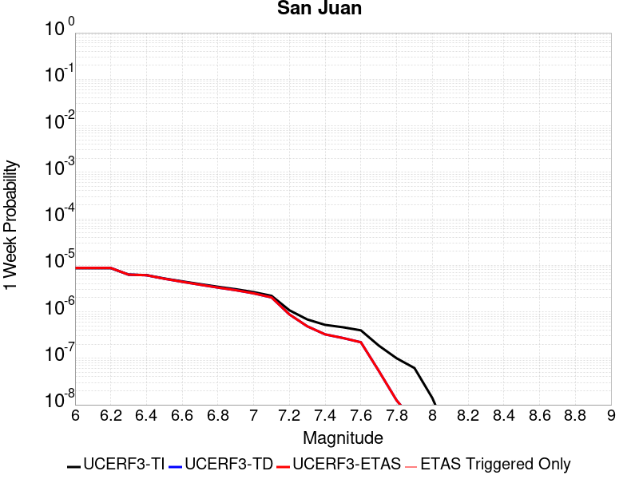 | 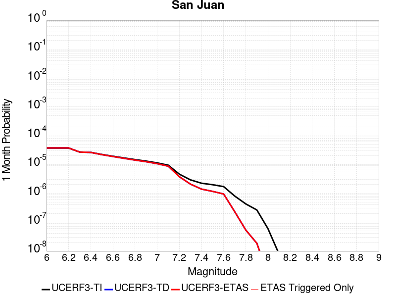 | 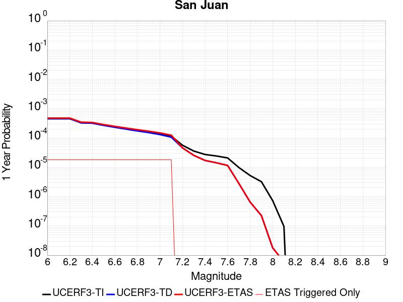 | 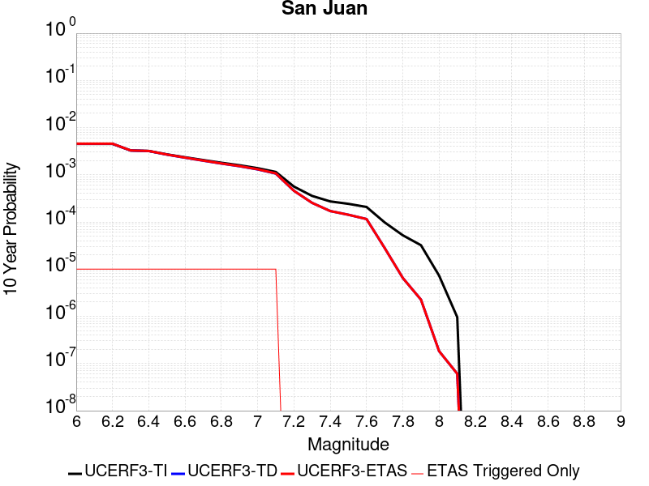 |

| Magnitude | 1 wk TI Prob | 1 wk TD Prob | 1 wk ETAS Prob | 1 wk ETAS/TD Gain | 1 wk ETAS Triggered Only | 1 mo TI Prob | 1 mo TD Prob | 1 mo ETAS Prob | 1 mo ETAS/TD Gain | 1 mo ETAS Triggered Only | 1 yr TI Prob | 1 yr TD Prob | 1 yr ETAS Prob | 1 yr ETAS/TD Gain | 1 yr ETAS Triggered Only | 10 yr TI Prob | 10 yr TD Prob | 10 yr ETAS Prob | 10 yr ETAS/TD Gain | 10 yr ETAS Triggered Only |
|-----|-----|-----|-----|-----|-----|-----|-----|-----|-----|-----|-----|-----|-----|-----|-----|-----|-----|-----|-----|-----|
| 6.0 | 8.682808E-6 | 8.752737E-6 | 8.752737E-6 | 1.0 | 0.0 | 3.72115E-5 | 3.7511214E-5 | 3.7511214E-5 | 1.0 | 0.0 | 4.5295584E-4 | 4.5660816E-4 | 4.7465047E-4 | 1.0395137 | 1.8050541E-5 | 0.004520337 | 0.004557241 | 0.004575209 | 1.0039428 | 1.8050541E-5 |
| 6.1 | 8.682808E-6 | 8.752737E-6 | 8.752737E-6 | 1.0 | 0.0 | 3.72115E-5 | 3.7511214E-5 | 3.7511214E-5 | 1.0 | 0.0 | 4.5295584E-4 | 4.5660816E-4 | 4.7465047E-4 | 1.0395137 | 1.8050541E-5 | 0.004520337 | 0.004557241 | 0.004575209 | 1.0039428 | 1.8050541E-5 |
| 6.2 | 8.682808E-6 | 8.752737E-6 | 8.752737E-6 | 1.0 | 0.0 | 3.72115E-5 | 3.7511214E-5 | 3.7511214E-5 | 1.0 | 0.0 | 4.5295584E-4 | 4.5660816E-4 | 4.7465047E-4 | 1.0395137 | 1.8050541E-5 | 0.004520337 | 0.004557241 | 0.004575209 | 1.0039428 | 1.8050541E-5 |
| 6.3 | 6.3054235E-6 | 6.2860477E-6 | 6.2860477E-6 | 1.0 | 0.0 | 2.7022963E-5 | 2.6939933E-5 | 2.6939933E-5 | 1.0 | 0.0 | 3.2895492E-4 | 3.2794572E-4 | 3.4599035E-4 | 1.0550232 | 1.8050541E-5 | 0.003284684 | 0.003274818 | 0.0032928095 | 1.0054939 | 1.8050541E-5 |
| 6.4 | 6.1490473E-6 | 6.117453E-6 | 6.117453E-6 | 1.0 | 0.0 | 2.6352795E-5 | 2.62174E-5 | 2.62174E-5 | 1.0 | 0.0 | 3.2079802E-4 | 3.1915144E-4 | 3.3719622E-4 | 1.0565399 | 1.8050541E-5 | 0.0032033534 | 0.0031871276 | 0.0032051206 | 1.0056455 | 1.8050541E-5 |
| 6.5 | 5.204848E-6 | 5.1401244E-6 | 5.1401244E-6 | 1.0 | 0.0 | 2.23063E-5 | 2.2028924E-5 | 2.2028924E-5 | 1.0 | 0.0 | 2.7154534E-4 | 2.681701E-4 | 2.862158E-4 | 1.067292 | 1.8050541E-5 | 0.0027121378 | 0.002678619 | 0.0026966212 | 1.0067207 | 1.8050541E-5 |
| 6.6 | 4.5179986E-6 | 4.4171966E-6 | 4.4171966E-6 | 1.0 | 0.0 | 1.9362706E-5 | 1.8930708E-5 | 1.8930708E-5 | 1.0 | 0.0 | 2.3571544E-4 | 2.304578E-4 | 2.4850416E-4 | 1.0783067 | 1.8050541E-5 | 0.0023546559 | 0.002302325 | 0.002320334 | 1.007822 | 1.8050541E-5 |
| 6.7 | 3.9442616E-6 | 3.821764E-6 | 3.821764E-6 | 1.0 | 0.0 | 1.6903869E-5 | 1.637889E-5 | 1.637889E-5 | 1.0 | 0.0 | 2.0578515E-4 | 1.993954E-4 | 2.1744236E-4 | 1.0905083 | 1.8050541E-5 | 0.002055947 | 0.0019922901 | 0.0020103047 | 1.0090421 | 1.8050541E-5 |
| 6.8 | 3.4536245E-6 | 3.318191E-6 | 3.318191E-6 | 1.0 | 0.0 | 1.4801163E-5 | 1.4220745E-5 | 1.4220745E-5 | 1.0 | 0.0 | 1.8018926E-4 | 1.7312441E-4 | 1.9117183E-4 | 1.1042453 | 1.8050541E-5 | 0.0018004322 | 0.0017300145 | 0.0017480338 | 1.0104157 | 1.8050541E-5 |
| 6.9 | 3.059865E-6 | 2.9138039E-6 | 2.9138039E-6 | 1.0 | 0.0 | 1.3113641E-5 | 1.2487674E-5 | 1.2487674E-5 | 1.0 | 0.0 | 1.596469E-4 | 1.520274E-4 | 1.7007519E-4 | 1.1187141 | 1.8050541E-5 | 0.0015953224 | 0.0015193488 | 0.0015373719 | 1.0118624 | 1.8050541E-5 |
| 7.0 | 2.6504351E-6 | 2.4936742E-6 | 2.4936742E-6 | 1.0 | 0.0 | 1.1358958E-5 | 1.0687134E-5 | 1.0687134E-5 | 1.0 | 0.0 | 1.3828653E-4 | 1.3010863E-4 | 1.4815683E-4 | 1.1387163 | 1.8050541E-5 | 0.0013820052 | 0.0013004367 | 0.0013184637 | 1.0138624 | 1.8050541E-5 |
| 7.1 | 2.2039317E-6 | 2.0352013E-6 | 2.0352013E-6 | 1.0 | 0.0 | 9.445387E-6 | 8.722265E-6 | 8.722265E-6 | 1.0 | 0.0 | 1.1499152E-4 | 1.06188934E-4 | 1.2423756E-4 | 1.169967 | 1.8050541E-5 | 0.0011493203 | 0.0010614921 | 0.0010795235 | 1.0169868 | 1.8050541E-5 |
| 7.2 | 1.0786707E-6 | 8.7819154E-7 | 8.7819154E-7 | 1.0 | 0.0 | 4.622866E-6 | 3.7636723E-6 | 3.7636723E-6 | 1.0 | 0.0 | 5.628194E-5 | 4.582176E-5 | 4.582176E-5 | 1.0 | 0.0 | 5.6267687E-4 | 4.5818236E-4 | 4.5818236E-4 | 1.0 | 0.0 |
| 7.3 | 6.846433E-7 | 4.876238E-7 | 4.876238E-7 | 1.0 | 0.0 | 2.9341822E-6 | 2.0898146E-6 | 2.0898146E-6 | 1.0 | 0.0 | 3.5723086E-5 | 2.5443196E-5 | 2.5443196E-5 | 1.0 | 0.0 | 3.571734E-4 | 2.5443645E-4 | 2.5443645E-4 | 1.0 | 0.0 |
| 7.4 | 5.23043E-7 | 3.2683343E-7 | 3.2683343E-7 | 1.0 | 0.0 | 2.2416111E-6 | 1.4007139E-6 | 1.4007139E-6 | 1.0 | 0.0 | 2.7291273E-5 | 1.7053559E-5 | 1.7053559E-5 | 1.0 | 0.0 | 2.7287923E-4 | 1.7055454E-4 | 1.7055454E-4 | 1.0 | 0.0 |
| 7.5 | 4.648444E-7 | 2.7282462E-7 | 2.7282462E-7 | 1.0 | 0.0 | 1.9921886E-6 | 1.1692479E-6 | 1.1692479E-6 | 1.0 | 0.0 | 2.4254627E-5 | 1.42355E-5 | 1.42355E-5 | 1.0 | 0.0 | 2.425198E-4 | 1.4237559E-4 | 1.4237559E-4 | 1.0 | 0.0 |
| 7.6 | 3.9906567E-7 | 2.2120915E-7 | 2.2120915E-7 | 1.0 | 0.0 | 1.7102802E-6 | 9.480388E-7 | 9.480388E-7 | 1.0 | 0.0 | 2.0822463E-5 | 1.1542312E-5 | 1.1542312E-5 | 1.0 | 0.0 | 2.0820512E-4 | 1.1544181E-4 | 1.1544181E-4 | 1.0 | 0.0 |
| 7.7 | 1.8784601E-7 | 5.380733E-8 | 5.380733E-8 | 1.0 | 0.0 | 8.0505407E-7 | 2.3060281E-7 | 2.3060281E-7 | 1.0 | 0.0 | 9.80149E-6 | 2.8075856E-6 | 2.8075856E-6 | 1.0 | 0.0 | 9.801057E-5 | 2.8084636E-5 | 2.8084636E-5 | 1.0 | 0.0 |
| 7.8 | 1.00154914E-7 | 1.2460803E-8 | 1.2460803E-8 | 1.0 | 0.0 | 4.2923529E-7 | 5.3403426E-8 | 5.3403426E-8 | 1.0 | 0.0 | 5.225927E-6 | 6.5018656E-7 | 6.5018656E-7 | 1.0 | 0.0 | 5.225804E-5 | 6.5078243E-6 | 6.5078243E-6 | 1.0 | 0.0 |
| 7.9 | 6.171429E-8 | 4.319987E-9 | 4.319987E-9 | 1.0 | 0.0 | 2.6448978E-7 | 1.8514225E-8 | 1.8514225E-8 | 1.0 | 0.0 | 3.2201583E-6 | 2.2541067E-7 | 2.2541067E-7 | 1.0 | 0.0 | 3.2201115E-5 | 2.2594702E-6 | 2.2594702E-6 | 1.0 | 0.0 |
| 8.0 | 1.3974572E-8 | 3.421896E-10 | 3.421896E-10 | 1.0 | 0.0 | 5.989102E-8 | 1.4665292E-9 | 1.4665292E-9 | 1.0 | 0.0 | 7.2917294E-7 | 1.7854996E-8 | 1.7854996E-8 | 1.0 | 0.0 | 7.2917055E-6 | 1.829061E-7 | 1.829061E-7 | 1.0 | 0.0 |
| 8.1 | 1.8403477E-9 | 1.1409884E-10 | 1.1409884E-10 | 1.0 | 0.0 | 7.887204E-9 | 4.889943E-10 | 4.889943E-10 | 1.0 | 0.0 | 9.602671E-8 | 5.9535097E-9 | 5.9535097E-9 | 1.0 | 0.0 | 9.602667E-7 | 6.0788004E-8 | 6.0788004E-8 | 1.0 | 0.0 |

## Elsinore (Temecula) rev
*[(top)](#table-of-contents)*

| 1 Week | 1 Month | 1 Year | 10 Year |
|-----|-----|-----|-----|
|  | 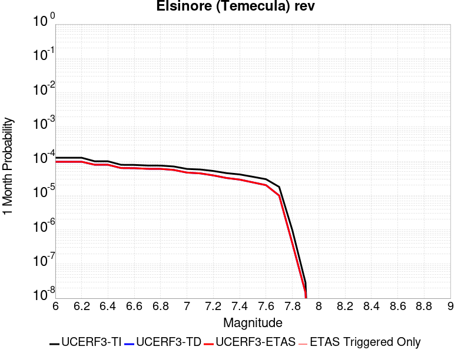 | 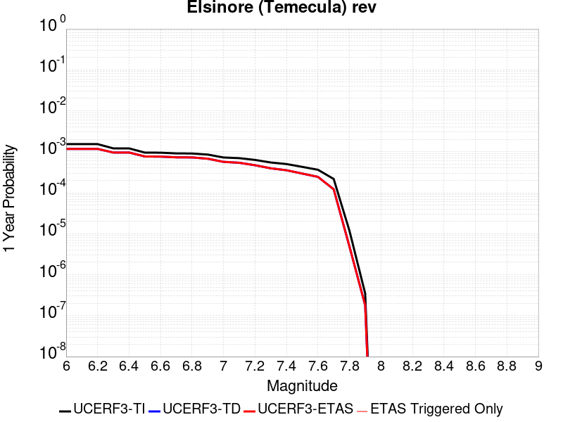 | 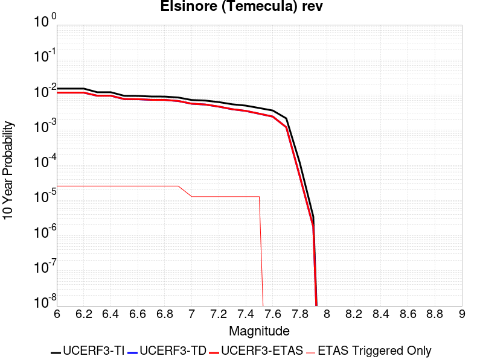 |

| Magnitude | 1 wk TI Prob | 1 wk TD Prob | 1 wk ETAS Prob | 1 wk ETAS/TD Gain | 1 wk ETAS Triggered Only | 1 mo TI Prob | 1 mo TD Prob | 1 mo ETAS Prob | 1 mo ETAS/TD Gain | 1 mo ETAS Triggered Only | 1 yr TI Prob | 1 yr TD Prob | 1 yr ETAS Prob | 1 yr ETAS/TD Gain | 1 yr ETAS Triggered Only | 10 yr TI Prob | 10 yr TD Prob | 10 yr ETAS Prob | 10 yr ETAS/TD Gain | 10 yr ETAS Triggered Only |
|-----|-----|-----|-----|-----|-----|-----|-----|-----|-----|-----|-----|-----|-----|-----|-----|-----|-----|-----|-----|-----|
| 6.0 | 2.9514995E-5 | 2.2528759E-5 | 2.2528759E-5 | 1.0 | 0.0 | 1.264867E-4 | 9.654838E-5 | 9.654838E-5 | 1.0 | 0.0 | 0.0015388876 | 0.0011748648 | 0.0011748648 | 1.0 | 0.0 | 0.015282745 | 0.011703004 | 0.011738683 | 1.0030487 | 3.6101083E-5 |
| 6.1 | 2.9514995E-5 | 2.2528759E-5 | 2.2528759E-5 | 1.0 | 0.0 | 1.264867E-4 | 9.654838E-5 | 9.654838E-5 | 1.0 | 0.0 | 0.0015388876 | 0.0011748648 | 0.0011748648 | 1.0 | 0.0 | 0.015282745 | 0.011703004 | 0.011738683 | 1.0030487 | 3.6101083E-5 |
| 6.2 | 2.9514995E-5 | 2.2528759E-5 | 2.2528759E-5 | 1.0 | 0.0 | 1.264867E-4 | 9.654838E-5 | 9.654838E-5 | 1.0 | 0.0 | 0.0015388876 | 0.0011748648 | 0.0011748648 | 1.0 | 0.0 | 0.015282745 | 0.011703004 | 0.011738683 | 1.0030487 | 3.6101083E-5 |
| 6.3 | 2.3223649E-5 | 1.84149E-5 | 1.84149E-5 | 1.0 | 0.0 | 9.952613E-5 | 7.891871E-5 | 7.891871E-5 | 1.0 | 0.0 | 0.001211057 | 9.604291E-4 | 9.604291E-4 | 1.0 | 0.0 | 0.012044783 | 0.009574224 | 0.00960998 | 1.0037346 | 3.6101083E-5 |
| 6.4 | 2.3223649E-5 | 1.84149E-5 | 1.84149E-5 | 1.0 | 0.0 | 9.952613E-5 | 7.891871E-5 | 7.891871E-5 | 1.0 | 0.0 | 0.001211057 | 9.604291E-4 | 9.604291E-4 | 1.0 | 0.0 | 0.012044783 | 0.009574224 | 0.00960998 | 1.0037346 | 3.6101083E-5 |
| 6.5 | 1.8338875E-5 | 1.47562305E-5 | 1.47562305E-5 | 1.0 | 0.0 | 7.8592806E-5 | 6.323951E-5 | 6.323951E-5 | 1.0 | 0.0 | 9.5644733E-4 | 7.6967775E-4 | 7.6967775E-4 | 1.0 | 0.0 | 0.009523412 | 0.0076770918 | 0.007712916 | 1.0046663 | 3.6101083E-5 |
| 6.6 | 1.8223333E-5 | 1.4618756E-5 | 1.4618756E-5 | 1.0 | 0.0 | 7.809766E-5 | 6.265035E-5 | 6.265035E-5 | 1.0 | 0.0 | 9.504242E-4 | 7.625099E-4 | 7.625099E-4 | 1.0 | 0.0 | 0.009463696 | 0.007605905 | 0.0076417313 | 1.0047103 | 3.6101083E-5 |
| 6.7 | 1.7512752E-5 | 1.4033018E-5 | 1.4033018E-5 | 1.0 | 0.0 | 7.505249E-5 | 6.0140166E-5 | 6.0140166E-5 | 1.0 | 0.0 | 9.13381E-4 | 7.319691E-4 | 7.319691E-4 | 1.0 | 0.0 | 0.00909636 | 0.007301931 | 0.007337768 | 1.004908 | 3.6101083E-5 |
| 6.8 | 1.7417142E-5 | 1.3956971E-5 | 1.3956971E-5 | 1.0 | 0.0 | 7.4642754E-5 | 5.981427E-5 | 5.981427E-5 | 1.0 | 0.0 | 9.083966E-4 | 7.28004E-4 | 7.28004E-4 | 1.0 | 0.0 | 0.009046922 | 0.0072624837 | 0.0072983224 | 1.0049348 | 3.6101083E-5 |
| 6.9 | 1.6402591E-5 | 1.2994194E-5 | 1.2994194E-5 | 1.0 | 0.0 | 7.0294926E-5 | 5.5688255E-5 | 5.5688255E-5 | 1.0 | 0.0 | 8.5550465E-4 | 6.7780126E-4 | 6.7780126E-4 | 1.0 | 0.0 | 0.008522186 | 0.006763064 | 0.006798921 | 1.0053018 | 3.6101083E-5 |
| 7.0 | 1.3912486E-5 | 1.088323E-5 | 1.088323E-5 | 1.0 | 0.0 | 5.9623577E-5 | 4.66416E-5 | 4.66416E-5 | 1.0 | 0.0 | 7.2567526E-4 | 5.677162E-4 | 5.677162E-4 | 1.0 | 0.0 | 0.0072331014 | 0.0056665773 | 0.0056845257 | 1.0031674 | 1.8050541E-5 |
| 7.1 | 1.3405147E-5 | 1.0332191E-5 | 1.0332191E-5 | 1.0 | 0.0 | 5.7449364E-5 | 4.428008E-5 | 4.428008E-5 | 1.0 | 0.0 | 6.9922156E-4 | 5.389792E-4 | 5.389792E-4 | 1.0 | 0.0 | 0.0069702556 | 0.0053800517 | 0.0053980052 | 1.003337 | 1.8050541E-5 |
| 7.2 | 1.21402E-5 | 9.000928E-6 | 9.000928E-6 | 1.0 | 0.0 | 5.202839E-5 | 3.8574846E-5 | 3.8574846E-5 | 1.0 | 0.0 | 6.332616E-4 | 4.6954933E-4 | 4.6954933E-4 | 1.0 | 0.0 | 0.0063146 | 0.0046869977 | 0.0047049634 | 1.0038332 | 1.8050541E-5 |
| 7.3 | 1.05047775E-5 | 7.5753433E-6 | 7.5753433E-6 | 1.0 | 0.0 | 4.5019697E-5 | 3.2465363E-5 | 3.2465363E-5 | 1.0 | 0.0 | 5.4797693E-4 | 3.9519556E-4 | 3.9519556E-4 | 1.0 | 0.0 | 0.005466277 | 0.003945317 | 0.0039632963 | 1.0045571 | 1.8050541E-5 |
| 7.4 | 9.624483E-6 | 6.7900905E-6 | 6.7900905E-6 | 1.0 | 0.0 | 4.124713E-5 | 2.910007E-5 | 2.910007E-5 | 1.0 | 0.0 | 5.0206814E-4 | 3.5423716E-4 | 3.5423716E-4 | 1.0 | 0.0 | 0.005009353 | 0.0035368789 | 0.0035548655 | 1.0050855 | 1.8050541E-5 |
| 7.5 | 8.215151E-6 | 5.6382596E-6 | 5.6382596E-6 | 1.0 | 0.0 | 3.5207315E-5 | 2.4163754E-5 | 2.4163754E-5 | 1.0 | 0.0 | 4.2856473E-4 | 2.9415527E-4 | 2.9415527E-4 | 1.0 | 0.0 | 0.004277392 | 0.002937787 | 0.0029557846 | 1.0061262 | 1.8050541E-5 |
| 7.6 | 6.975058E-6 | 4.678473E-6 | 4.678473E-6 | 1.0 | 0.0 | 2.9892764E-5 | 2.0050451E-5 | 2.0050451E-5 | 1.0 | 0.0 | 3.6388362E-4 | 2.4408806E-4 | 2.4408806E-4 | 1.0 | 0.0 | 0.0036328835 | 0.002438316 | 0.002438316 | 1.0 | 0.0 |
| 7.7 | 4.159604E-6 | 2.3282043E-6 | 2.3282043E-6 | 1.0 | 0.0 | 1.7826753E-5 | 9.9779845E-6 | 9.9779845E-6 | 1.0 | 0.0 | 2.1701909E-4 | 1.2147593E-4 | 1.2147593E-4 | 1.0 | 0.0 | 0.0021680726 | 0.0012141684 | 0.0012141684 | 1.0 | 0.0 |
| 7.8 | 2.2692414E-7 | 9.3897555E-8 | 9.3897555E-8 | 1.0 | 0.0 | 9.725317E-7 | 4.0241804E-7 | 4.0241804E-7 | 1.0 | 0.0 | 1.1840509E-5 | 4.899432E-6 | 4.899432E-6 | 1.0 | 0.0 | 1.1839878E-4 | 4.8993566E-5 | 4.8993566E-5 | 1.0 | 0.0 |
| 7.9 | 6.676829E-9 | 3.440971E-9 | 3.440971E-9 | 1.0 | 0.0 | 2.861498E-8 | 1.4747019E-8 | 1.4747019E-8 | 1.0 | 0.0 | 3.4838732E-7 | 1.7954494E-7 | 1.7954494E-7 | 1.0 | 0.0 | 3.4838679E-6 | 1.795448E-6 | 1.795448E-6 | 1.0 | 0.0 |

## Homestead Valley 2011
*[(top)](#table-of-contents)*

| 1 Week | 1 Month | 1 Year | 10 Year |
|-----|-----|-----|-----|
| 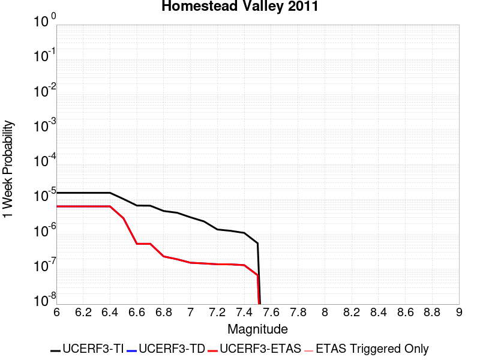 | 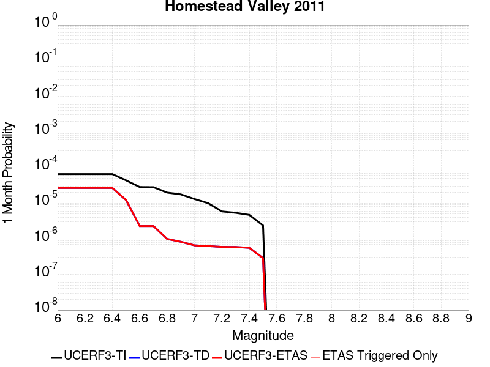 | 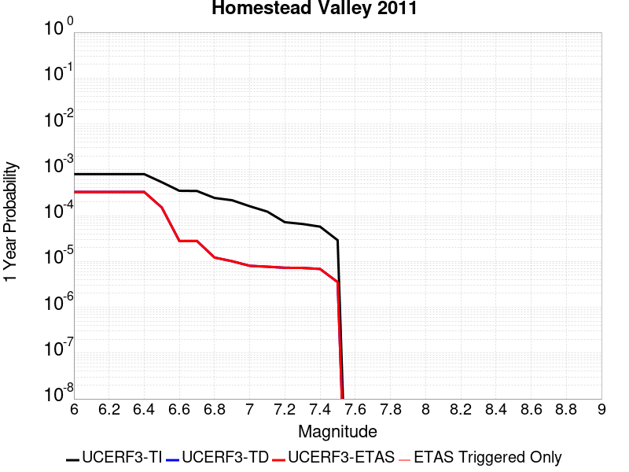 | 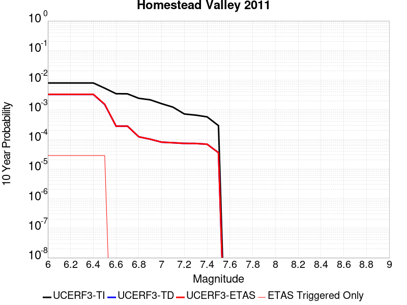 |

| Magnitude | 1 wk TI Prob | 1 wk TD Prob | 1 wk ETAS Prob | 1 wk ETAS/TD Gain | 1 wk ETAS Triggered Only | 1 mo TI Prob | 1 mo TD Prob | 1 mo ETAS Prob | 1 mo ETAS/TD Gain | 1 mo ETAS Triggered Only | 1 yr TI Prob | 1 yr TD Prob | 1 yr ETAS Prob | 1 yr ETAS/TD Gain | 1 yr ETAS Triggered Only | 10 yr TI Prob | 10 yr TD Prob | 10 yr ETAS Prob | 10 yr ETAS/TD Gain | 10 yr ETAS Triggered Only |
|-----|-----|-----|-----|-----|-----|-----|-----|-----|-----|-----|-----|-----|-----|-----|-----|-----|-----|-----|-----|-----|
| 6.0 | 1.539795E-5 | 6.2872064E-6 | 6.2872064E-6 | 1.0 | 0.0 | 6.5989545E-5 | 2.6945008E-5 | 2.6945008E-5 | 1.0 | 0.0 | 8.0312655E-4 | 3.280267E-4 | 3.280267E-4 | 1.0 | 0.0 | 0.008002302 | 0.0032774464 | 0.0033134292 | 1.0109789 | 3.6101083E-5 |
| 6.1 | 1.539795E-5 | 6.2872064E-6 | 6.2872064E-6 | 1.0 | 0.0 | 6.5989545E-5 | 2.6945008E-5 | 2.6945008E-5 | 1.0 | 0.0 | 8.0312655E-4 | 3.280267E-4 | 3.280267E-4 | 1.0 | 0.0 | 0.008002302 | 0.0032774464 | 0.0033134292 | 1.0109789 | 3.6101083E-5 |
| 6.2 | 1.539795E-5 | 6.2872064E-6 | 6.2872064E-6 | 1.0 | 0.0 | 6.5989545E-5 | 2.6945008E-5 | 2.6945008E-5 | 1.0 | 0.0 | 8.0312655E-4 | 3.280267E-4 | 3.280267E-4 | 1.0 | 0.0 | 0.008002302 | 0.0032774464 | 0.0033134292 | 1.0109789 | 3.6101083E-5 |
| 6.3 | 1.539795E-5 | 6.2872064E-6 | 6.2872064E-6 | 1.0 | 0.0 | 6.5989545E-5 | 2.6945008E-5 | 2.6945008E-5 | 1.0 | 0.0 | 8.0312655E-4 | 3.280267E-4 | 3.280267E-4 | 1.0 | 0.0 | 0.008002302 | 0.0032774464 | 0.0033134292 | 1.0109789 | 3.6101083E-5 |
| 6.4 | 1.539795E-5 | 6.2872064E-6 | 6.2872064E-6 | 1.0 | 0.0 | 6.5989545E-5 | 2.6945008E-5 | 2.6945008E-5 | 1.0 | 0.0 | 8.0312655E-4 | 3.280267E-4 | 3.280267E-4 | 1.0 | 0.0 | 0.008002302 | 0.0032774464 | 0.0033134292 | 1.0109789 | 3.6101083E-5 |
| 6.5 | 1.0265258E-5 | 2.8791396E-6 | 2.8791396E-6 | 1.0 | 0.0 | 4.3993223E-5 | 1.2339151E-5 | 1.2339151E-5 | 1.0 | 0.0 | 5.3548586E-4 | 1.5022577E-4 | 1.5022577E-4 | 1.0 | 0.0 | 0.005341973 | 0.0015019241 | 0.0015199475 | 1.0120002 | 1.8050541E-5 |
| 6.6 | 6.664671E-6 | 5.349609E-7 | 5.349609E-7 | 1.0 | 0.0 | 2.8562565E-5 | 2.2926881E-6 | 2.2926881E-6 | 1.0 | 0.0 | 3.476937E-4 | 2.791324E-5 | 2.791324E-5 | 1.0 | 0.0 | 0.003471502 | 2.79109E-4 | 2.79109E-4 | 1.0 | 0.0 |
| 6.7 | 6.5954046E-6 | 5.349609E-7 | 5.349609E-7 | 1.0 | 0.0 | 2.8265715E-5 | 2.2926881E-6 | 2.2926881E-6 | 1.0 | 0.0 | 3.4408073E-4 | 2.791324E-5 | 2.791324E-5 | 1.0 | 0.0 | 0.0034354846 | 2.79109E-4 | 2.79109E-4 | 1.0 | 0.0 |
| 6.8 | 4.648189E-6 | 2.3274426E-7 | 2.3274426E-7 | 1.0 | 0.0 | 1.9920659E-5 | 9.97475E-7 | 9.97475E-7 | 1.0 | 0.0 | 2.4250703E-4 | 1.2144195E-5 | 1.2144195E-5 | 1.0 | 0.0 | 0.0024224254 | 1.214358E-4 | 1.214358E-4 | 1.0 | 0.0 |
| 6.9 | 4.1428534E-6 | 1.9352318E-7 | 1.9352318E-7 | 1.0 | 0.0 | 1.7754966E-5 | 8.293848E-7 | 8.293848E-7 | 1.0 | 0.0 | 2.1614527E-4 | 1.0097716E-5 | 1.0097716E-5 | 1.0 | 0.0 | 0.0021593515 | 1.0097287E-4 | 1.0097287E-4 | 1.0 | 0.0 |
| 7.0 | 3.0673707E-6 | 1.5373897E-7 | 1.5373897E-7 | 1.0 | 0.0 | 1.3145808E-5 | 6.588811E-7 | 6.588811E-7 | 1.0 | 0.0 | 1.6003846E-4 | 8.021849E-6 | 8.021849E-6 | 1.0 | 0.0 | 0.0015992324 | 8.02157E-5 | 8.02157E-5 | 1.0 | 0.0 |
| 7.1 | 2.340854E-6 | 1.4693514E-7 | 1.4693514E-7 | 1.0 | 0.0 | 1.0032193E-5 | 6.2972185E-7 | 6.2972185E-7 | 1.0 | 0.0 | 1.221351E-4 | 7.6668375E-6 | 7.6668375E-6 | 1.0 | 0.0 | 0.00122068 | 7.6665834E-5 | 7.6665834E-5 | 1.0 | 0.0 |
| 7.2 | 1.3754182E-6 | 1.3927901E-7 | 1.3927901E-7 | 1.0 | 0.0 | 5.8946357E-6 | 5.969099E-7 | 5.969099E-7 | 1.0 | 0.0 | 7.176483E-5 | 7.2673547E-6 | 7.2673547E-6 | 1.0 | 0.0 | 7.174166E-4 | 7.267126E-5 | 7.267126E-5 | 1.0 | 0.0 |
| 7.3 | 1.2573237E-6 | 1.3832354E-7 | 1.3832354E-7 | 1.0 | 0.0 | 5.388519E-6 | 5.9281507E-7 | 5.9281507E-7 | 1.0 | 0.0 | 6.560324E-5 | 7.2175003E-6 | 7.2175003E-6 | 1.0 | 0.0 | 6.558388E-4 | 7.2172756E-5 | 7.2172756E-5 | 1.0 | 0.0 |
| 7.4 | 1.0994207E-6 | 1.3110976E-7 | 1.3110976E-7 | 1.0 | 0.0 | 4.7117946E-6 | 5.6189884E-7 | 5.6189884E-7 | 1.0 | 0.0 | 5.736459E-5 | 6.841098E-6 | 6.841098E-6 | 1.0 | 0.0 | 5.734978E-4 | 6.840897E-5 | 6.840897E-5 | 1.0 | 0.0 |
| 7.5 | 5.5569126E-7 | 6.7754314E-8 | 6.7754314E-8 | 1.0 | 0.0 | 2.3815317E-6 | 2.9037562E-7 | 2.9037562E-7 | 1.0 | 0.0 | 2.8994764E-5 | 3.535318E-6 | 3.535318E-6 | 1.0 | 0.0 | 2.899098E-4 | 3.535268E-5 | 3.535268E-5 | 1.0 | 0.0 |

## Santa Cruz Island
*[(top)](#table-of-contents)*

| 1 Week | 1 Month | 1 Year | 10 Year |
|-----|-----|-----|-----|
| 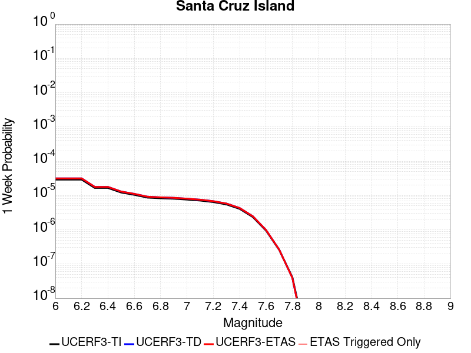 | 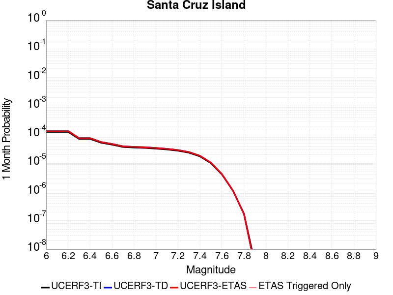 | 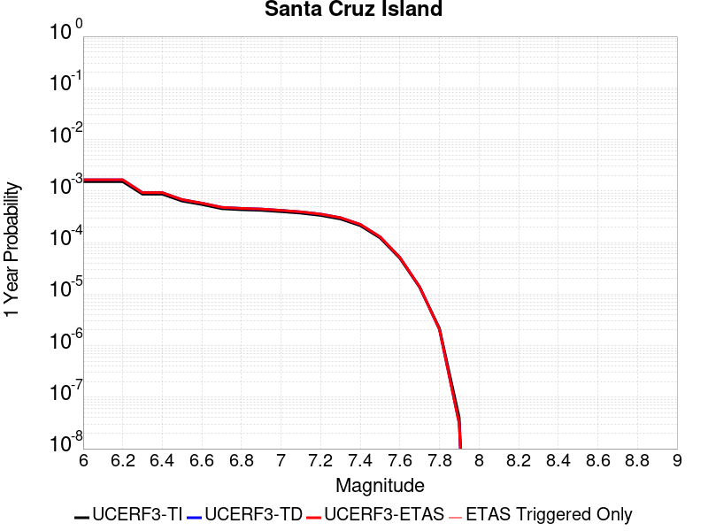 | 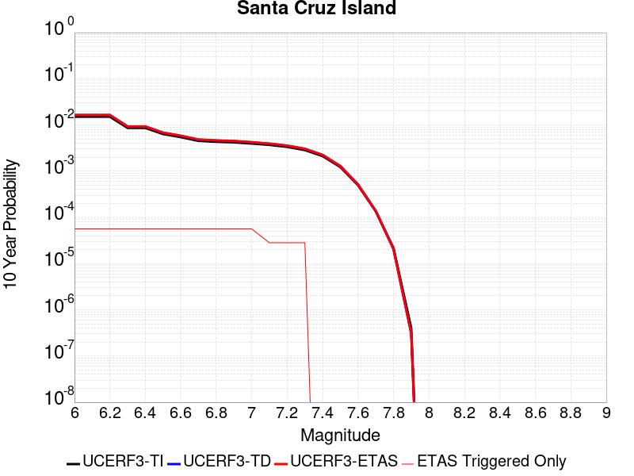 |

| Magnitude | 1 wk TI Prob | 1 wk TD Prob | 1 wk ETAS Prob | 1 wk ETAS/TD Gain | 1 wk ETAS Triggered Only | 1 mo TI Prob | 1 mo TD Prob | 1 mo ETAS Prob | 1 mo ETAS/TD Gain | 1 mo ETAS Triggered Only | 1 yr TI Prob | 1 yr TD Prob | 1 yr ETAS Prob | 1 yr ETAS/TD Gain | 1 yr ETAS Triggered Only | 10 yr TI Prob | 10 yr TD Prob | 10 yr ETAS Prob | 10 yr ETAS/TD Gain | 10 yr ETAS Triggered Only |
|-----|-----|-----|-----|-----|-----|-----|-----|-----|-----|-----|-----|-----|-----|-----|-----|-----|-----|-----|-----|-----|
| 6.0 | 2.9164563E-5 | 3.1602918E-5 | 3.1602918E-5 | 1.0 | 0.0 | 1.2498499E-4 | 1.3543482E-4 | 1.3543482E-4 | 1.0 | 0.0 | 0.0015206301 | 0.0016478079 | 0.0016478079 | 1.0 | 0.0 | 0.015102667 | 0.016369632 | 0.016405143 | 1.0021693 | 3.6101083E-5 |
| 6.1 | 2.9164563E-5 | 3.1602918E-5 | 3.1602918E-5 | 1.0 | 0.0 | 1.2498499E-4 | 1.3543482E-4 | 1.3543482E-4 | 1.0 | 0.0 | 0.0015206301 | 0.0016478079 | 0.0016478079 | 1.0 | 0.0 | 0.015102667 | 0.016369632 | 0.016405143 | 1.0021693 | 3.6101083E-5 |
| 6.2 | 2.9164563E-5 | 3.1602918E-5 | 3.1602918E-5 | 1.0 | 0.0 | 1.2498499E-4 | 1.3543482E-4 | 1.3543482E-4 | 1.0 | 0.0 | 0.0015206301 | 0.0016478079 | 0.0016478079 | 1.0 | 0.0 | 0.015102667 | 0.016369632 | 0.016405143 | 1.0021693 | 3.6101083E-5 |
| 6.3 | 1.6635553E-5 | 1.7805865E-5 | 1.7805865E-5 | 1.0 | 0.0 | 7.1293274E-5 | 7.630872E-5 | 7.630872E-5 | 1.0 | 0.0 | 8.6765E-4 | 9.2868094E-4 | 9.2868094E-4 | 1.0 | 0.0 | 0.008642701 | 0.0092498725 | 0.00928564 | 1.0038668 | 3.6101083E-5 |
| 6.4 | 1.6635553E-5 | 1.7805865E-5 | 1.7805865E-5 | 1.0 | 0.0 | 7.1293274E-5 | 7.630872E-5 | 7.630872E-5 | 1.0 | 0.0 | 8.6765E-4 | 9.2868094E-4 | 9.2868094E-4 | 1.0 | 0.0 | 0.008642701 | 0.0092498725 | 0.00928564 | 1.0038668 | 3.6101083E-5 |
| 6.5 | 1.2238748E-5 | 1.304403E-5 | 1.304403E-5 | 1.0 | 0.0 | 5.2450723E-5 | 5.590181E-5 | 5.590181E-5 | 1.0 | 0.0 | 6.3840044E-4 | 6.803957E-4 | 6.803957E-4 | 1.0 | 0.0 | 0.0063656955 | 0.006783524 | 0.0068193804 | 1.0052857 | 3.6101083E-5 |
| 6.6 | 1.0489767E-5 | 1.1157494E-5 | 1.1157494E-5 | 1.0 | 0.0 | 4.495537E-5 | 4.7816968E-5 | 4.7816968E-5 | 1.0 | 0.0 | 5.4719415E-4 | 5.820183E-4 | 5.820183E-4 | 1.0 | 0.0 | 0.005458487 | 0.005805181 | 0.0058410726 | 1.0061827 | 3.6101083E-5 |
| 6.7 | 8.699222E-6 | 9.237475E-6 | 9.237475E-6 | 1.0 | 0.0 | 3.7281847E-5 | 3.958858E-5 | 3.958858E-5 | 1.0 | 0.0 | 4.5381195E-4 | 4.818849E-4 | 4.818849E-4 | 1.0 | 0.0 | 0.0045288634 | 0.0048084673 | 0.004844395 | 1.0074717 | 3.6101083E-5 |
| 6.8 | 8.307732E-6 | 8.81756E-6 | 8.81756E-6 | 1.0 | 0.0 | 3.560408E-5 | 3.7789E-5 | 3.7789E-5 | 1.0 | 0.0 | 4.3339343E-4 | 4.5998435E-4 | 4.5998435E-4 | 1.0 | 0.0 | 0.004325492 | 0.004590376 | 0.0046263114 | 1.0078284 | 3.6101083E-5 |
| 6.9 | 8.073121E-6 | 8.565573E-6 | 8.565573E-6 | 1.0 | 0.0 | 3.459863E-5 | 3.6709083E-5 | 3.6709083E-5 | 1.0 | 0.0 | 4.2115687E-4 | 4.4684185E-4 | 4.4684185E-4 | 1.0 | 0.0 | 0.004203596 | 0.0044594854 | 0.004495425 | 1.0080593 | 3.6101083E-5 |
| 7.0 | 7.617019E-6 | 8.075253E-6 | 8.075253E-6 | 1.0 | 0.0 | 3.264396E-5 | 3.4607772E-5 | 3.4607772E-5 | 1.0 | 0.0 | 3.9736772E-4 | 4.2126857E-4 | 4.2126857E-4 | 1.0 | 0.0 | 0.003966579 | 0.0042047473 | 0.004240697 | 1.0085497 | 3.6101083E-5 |
| 7.1 | 7.1224836E-6 | 7.546333E-6 | 7.546333E-6 | 1.0 | 0.0 | 3.052457E-5 | 3.2341028E-5 | 3.2341028E-5 | 1.0 | 0.0 | 3.715733E-4 | 3.9368126E-4 | 3.9368126E-4 | 1.0 | 0.0 | 0.003709526 | 0.0039298814 | 0.003947861 | 1.0045751 | 1.8050541E-5 |
| 7.2 | 6.441115E-6 | 6.827882E-6 | 6.827882E-6 | 1.0 | 0.0 | 2.7604487E-5 | 2.9262023E-5 | 2.9262023E-5 | 1.0 | 0.0 | 3.360328E-4 | 3.5620714E-4 | 3.5620714E-4 | 1.0 | 0.0 | 0.0033552512 | 0.00355639 | 0.0035743765 | 1.0050575 | 1.8050541E-5 |
| 7.3 | 5.494274E-6 | 5.8204155E-6 | 5.8204155E-6 | 1.0 | 0.0 | 2.3546674E-5 | 2.49444E-5 | 2.49444E-5 | 1.0 | 0.0 | 2.8664304E-4 | 3.0365595E-4 | 3.0365595E-4 | 1.0 | 0.0 | 0.002862736 | 0.0030324336 | 0.0030504293 | 1.0059345 | 1.8050541E-5 |
| 7.4 | 4.0802624E-6 | 4.312558E-6 | 4.312558E-6 | 1.0 | 0.0 | 1.7486722E-5 | 1.848226E-5 | 1.848226E-5 | 1.0 | 0.0 | 2.1288003E-4 | 2.2499835E-4 | 2.2499835E-4 | 1.0 | 0.0 | 0.0021267622 | 0.0022477144 | 0.0022477144 | 1.0 | 0.0 |
| 7.5 | 2.3584746E-6 | 2.4754643E-6 | 2.4754643E-6 | 1.0 | 0.0 | 1.0107709E-5 | 1.0609089E-5 | 1.0609089E-5 | 1.0 | 0.0 | 1.2305441E-4 | 1.2915806E-4 | 1.2915806E-4 | 1.0 | 0.0 | 0.0012298629 | 0.001290835 | 0.001290835 | 1.0 | 0.0 |
| 7.6 | 9.4981914E-7 | 9.86145E-7 | 9.86145E-7 | 1.0 | 0.0 | 4.0706473E-6 | 4.226329E-6 | 4.226329E-6 | 1.0 | 0.0 | 4.9559E-5 | 5.1454354E-5 | 5.1454354E-5 | 1.0 | 0.0 | 4.954795E-4 | 5.144257E-4 | 5.144257E-4 | 1.0 | 0.0 |
| 7.7 | 2.6013532E-7 | 2.6417646E-7 | 2.6417646E-7 | 1.0 | 0.0 | 1.1148652E-6 | 1.1321843E-6 | 1.1321843E-6 | 1.0 | 0.0 | 1.3573399E-5 | 1.3784257E-5 | 1.3784257E-5 | 1.0 | 0.0 | 1.357257E-4 | 1.378341E-4 | 1.378341E-4 | 1.0 | 0.0 |
| 7.8 | 4.1522263E-8 | 3.965795E-8 | 3.965795E-8 | 1.0 | 0.0 | 1.7795254E-7 | 1.6996263E-7 | 1.6996263E-7 | 1.0 | 0.0 | 2.16657E-6 | 2.0692933E-6 | 2.0692933E-6 | 1.0 | 0.0 | 2.1665488E-5 | 2.0692762E-5 | 2.0692762E-5 | 1.0 | 0.0 |
| 7.9 | 7.7242046E-10 | 5.947104E-10 | 5.947104E-10 | 1.0 | 0.0 | 3.3103735E-9 | 2.548759E-9 | 2.548759E-9 | 1.0 | 0.0 | 4.0303796E-8 | 3.103114E-8 | 3.103114E-8 | 1.0 | 0.0 | 4.030379E-7 | 3.1031138E-7 | 3.1031138E-7 | 1.0 | 0.0 |

## San Jacinto (Stepovers Combined)
*[(top)](#table-of-contents)*

| 1 Week | 1 Month | 1 Year | 10 Year |
|-----|-----|-----|-----|
| 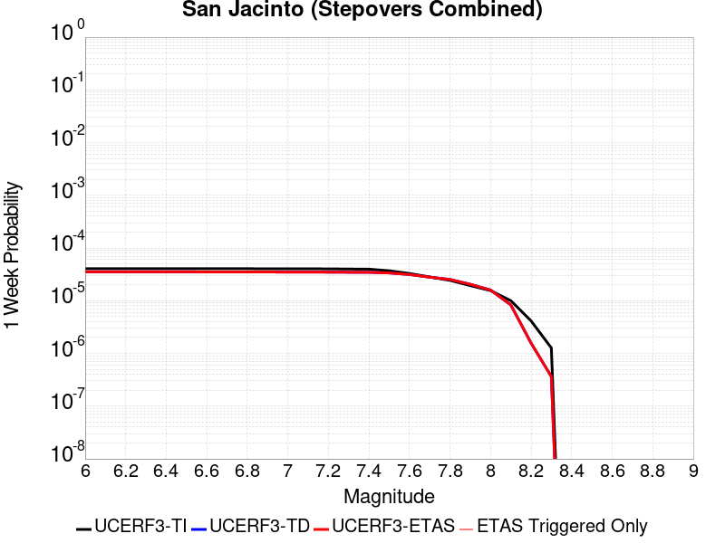 | 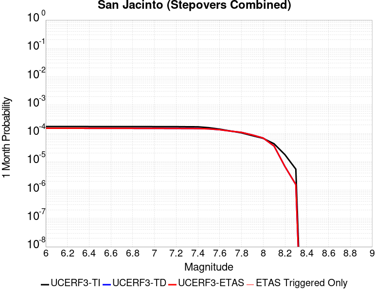 | 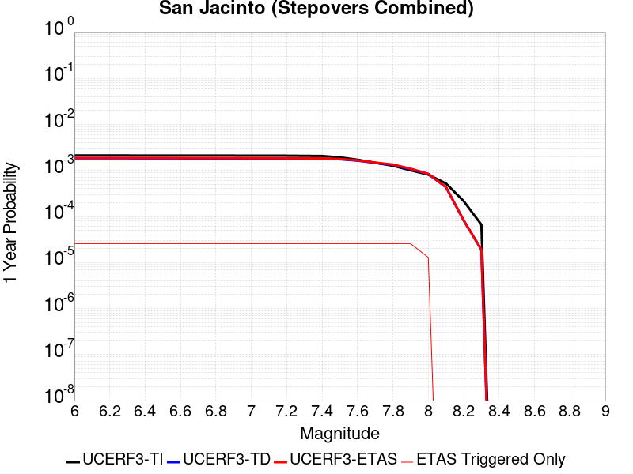 | 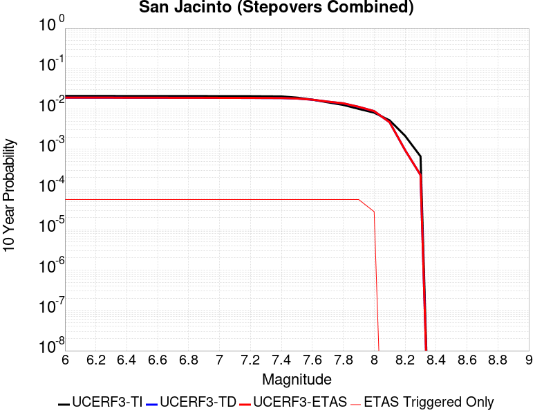 |

| Magnitude | 1 wk TI Prob | 1 wk TD Prob | 1 wk ETAS Prob | 1 wk ETAS/TD Gain | 1 wk ETAS Triggered Only | 1 mo TI Prob | 1 mo TD Prob | 1 mo ETAS Prob | 1 mo ETAS/TD Gain | 1 mo ETAS Triggered Only | 1 yr TI Prob | 1 yr TD Prob | 1 yr ETAS Prob | 1 yr ETAS/TD Gain | 1 yr ETAS Triggered Only | 10 yr TI Prob | 10 yr TD Prob | 10 yr ETAS Prob | 10 yr ETAS/TD Gain | 10 yr ETAS Triggered Only |
|-----|-----|-----|-----|-----|-----|-----|-----|-----|-----|-----|-----|-----|-----|-----|-----|-----|-----|-----|-----|-----|
| 6.0 | 4.0667746E-5 | 3.541024E-5 | 3.541024E-5 | 1.0 | 0.0 | 1.742787E-4 | 1.5174934E-4 | 1.5174934E-4 | 1.0 | 0.0 | 0.0021197782 | 0.001845985 | 0.0018820193 | 1.0195204 | 3.6101083E-5 | 0.020996714 | 0.019058116 | 0.01909353 | 1.0018581 | 3.6101083E-5 |
| 6.1 | 4.0667746E-5 | 3.541024E-5 | 3.541024E-5 | 1.0 | 0.0 | 1.742787E-4 | 1.5174934E-4 | 1.5174934E-4 | 1.0 | 0.0 | 0.0021197782 | 0.001845985 | 0.0018820193 | 1.0195204 | 3.6101083E-5 | 0.020996714 | 0.019058116 | 0.01909353 | 1.0018581 | 3.6101083E-5 |
| 6.2 | 4.0667746E-5 | 3.541024E-5 | 3.541024E-5 | 1.0 | 0.0 | 1.742787E-4 | 1.5174934E-4 | 1.5174934E-4 | 1.0 | 0.0 | 0.0021197782 | 0.001845985 | 0.0018820193 | 1.0195204 | 3.6101083E-5 | 0.020996714 | 0.019058116 | 0.01909353 | 1.0018581 | 3.6101083E-5 |
| 6.3 | 4.0667746E-5 | 3.541024E-5 | 3.541024E-5 | 1.0 | 0.0 | 1.742787E-4 | 1.5174934E-4 | 1.5174934E-4 | 1.0 | 0.0 | 0.0021197782 | 0.001845985 | 0.0018820193 | 1.0195204 | 3.6101083E-5 | 0.020996714 | 0.019058116 | 0.01909353 | 1.0018581 | 3.6101083E-5 |
| 6.4 | 4.0577226E-5 | 3.5282108E-5 | 3.5282108E-5 | 1.0 | 0.0 | 1.738908E-4 | 1.5120028E-4 | 1.5120028E-4 | 1.0 | 0.0 | 0.0021150648 | 0.0018393116 | 0.0018753463 | 1.0195915 | 3.6101083E-5 | 0.020950472 | 0.018992662 | 0.019028077 | 1.0018647 | 3.6101083E-5 |
| 6.5 | 4.0577226E-5 | 3.5282108E-5 | 3.5282108E-5 | 1.0 | 0.0 | 1.738908E-4 | 1.5120028E-4 | 1.5120028E-4 | 1.0 | 0.0 | 0.0021150648 | 0.0018393116 | 0.0018753463 | 1.0195915 | 3.6101083E-5 | 0.020950472 | 0.018992662 | 0.019028077 | 1.0018647 | 3.6101083E-5 |
| 6.6 | 4.053861E-5 | 3.5227426E-5 | 3.5227426E-5 | 1.0 | 0.0 | 1.7372532E-4 | 1.5096596E-4 | 1.5096596E-4 | 1.0 | 0.0 | 0.0021130538 | 0.0018364636 | 0.0018724984 | 1.0196218 | 3.6101083E-5 | 0.020930743 | 0.01896473 | 0.019000147 | 1.0018675 | 3.6101083E-5 |
| 6.7 | 4.0516545E-5 | 3.5196477E-5 | 3.5196477E-5 | 1.0 | 0.0 | 1.7363077E-4 | 1.5083334E-4 | 1.5083334E-4 | 1.0 | 0.0 | 0.002111905 | 0.0018348524 | 0.0018708872 | 1.0196391 | 3.6101083E-5 | 0.020919468 | 0.018948922 | 0.018984338 | 1.0018691 | 3.6101083E-5 |
| 6.8 | 4.049434E-5 | 3.516803E-5 | 3.516803E-5 | 1.0 | 0.0 | 1.7353562E-4 | 1.5071144E-4 | 1.5071144E-4 | 1.0 | 0.0 | 0.0021107488 | 0.0018333707 | 0.0018694055 | 1.019655 | 3.6101083E-5 | 0.020908125 | 0.01893433 | 0.018969746 | 1.0018705 | 3.6101083E-5 |
| 6.9 | 4.046386E-5 | 3.513057E-5 | 3.513057E-5 | 1.0 | 0.0 | 1.73405E-4 | 1.5055091E-4 | 1.5055091E-4 | 1.0 | 0.0 | 0.0021091616 | 0.0018314196 | 0.0018674546 | 1.019676 | 3.6101083E-5 | 0.020892553 | 0.018915094 | 0.018950513 | 1.0018725 | 3.6101083E-5 |
| 7.0 | 4.036382E-5 | 3.501108E-5 | 3.501108E-5 | 1.0 | 0.0 | 1.7297632E-4 | 1.5003888E-4 | 1.5003888E-4 | 1.0 | 0.0 | 0.0021039525 | 0.001825196 | 0.0018612312 | 1.0197432 | 3.6101083E-5 | 0.02084144 | 0.01885368 | 0.0188891 | 1.0018787 | 3.6101083E-5 |
| 7.1 | 4.0343282E-5 | 3.498953E-5 | 3.498953E-5 | 1.0 | 0.0 | 1.7288832E-4 | 1.4994653E-4 | 1.4994653E-4 | 1.0 | 0.0 | 0.002102883 | 0.0018240736 | 0.0018601088 | 1.0197554 | 3.6101083E-5 | 0.020830948 | 0.01884255 | 0.018877972 | 1.0018798 | 3.6101083E-5 |
| 7.2 | 4.0257353E-5 | 3.4893892E-5 | 3.4893892E-5 | 1.0 | 0.0 | 1.725201E-4 | 1.495367E-4 | 1.495367E-4 | 1.0 | 0.0 | 0.0020984085 | 0.0018190923 | 0.0018551277 | 1.0198096 | 3.6101083E-5 | 0.020787042 | 0.018793223 | 0.018828645 | 1.0018848 | 3.6101083E-5 |
| 7.3 | 3.9940667E-5 | 3.4721077E-5 | 3.4721077E-5 | 1.0 | 0.0 | 1.7116306E-4 | 1.4879614E-4 | 1.4879614E-4 | 1.0 | 0.0 | 0.0020819185 | 0.001810091 | 0.0018461267 | 1.0199082 | 3.6101083E-5 | 0.020625217 | 0.018701613 | 0.01873704 | 1.0018942 | 3.6101083E-5 |
| 7.4 | 3.9721202E-5 | 3.4606215E-5 | 3.4606215E-5 | 1.0 | 0.0 | 1.7022261E-4 | 1.4830394E-4 | 1.4830394E-4 | 1.0 | 0.0 | 0.0020704903 | 0.0018041084 | 0.0018401444 | 1.0199744 | 3.6101083E-5 | 0.020513052 | 0.01864061 | 0.018676037 | 1.0019006 | 3.6101083E-5 |
| 7.5 | 3.7036873E-5 | 3.367054E-5 | 3.367054E-5 | 1.0 | 0.0 | 1.5871979E-4 | 1.4429436E-4 | 1.4429436E-4 | 1.0 | 0.0 | 0.0019307006 | 0.0017553712 | 0.0017914089 | 1.02053 | 3.6101083E-5 | 0.019140124 | 0.018140571 | 0.018176017 | 1.001954 | 3.6101083E-5 |
| 7.6 | 3.2940967E-5 | 3.1442414E-5 | 3.1442414E-5 | 1.0 | 0.0 | 1.4116794E-4 | 1.3474625E-4 | 1.3474625E-4 | 1.0 | 0.0 | 0.0017173645 | 0.0016393035 | 0.0016753454 | 1.0219861 | 3.6101083E-5 | 0.01704153 | 0.01696885 | 0.017004339 | 1.0020914 | 3.6101083E-5 |
| 7.7 | 2.8236149E-5 | 2.8004886E-5 | 2.8004886E-5 | 1.0 | 0.0 | 1.2100645E-4 | 1.2001543E-4 | 1.2001543E-4 | 1.0 | 0.0 | 0.0014722579 | 0.0014602095 | 0.0014962578 | 1.0246872 | 3.6101083E-5 | 0.014625421 | 0.015177931 | 0.015213484 | 1.0023425 | 3.6101083E-5 |
| 7.8 | 2.4329287E-5 | 2.532376E-5 | 2.532376E-5 | 1.0 | 0.0 | 1.042642E-4 | 1.08525885E-4 | 1.08525885E-4 | 1.0 | 0.0 | 0.0012686774 | 0.0013205026 | 0.0013565561 | 1.0273027 | 3.6101083E-5 | 0.012614589 | 0.013772853 | 0.013808457 | 1.002585 | 3.6101083E-5 |
| 7.9 | 1.9370926E-5 | 2.0526426E-5 | 2.0526426E-5 | 1.0 | 0.0 | 8.301561E-5 | 8.796743E-5 | 8.796743E-5 | 1.0 | 0.0 | 0.0010102465 | 0.001070478 | 0.0011065404 | 1.0336882 | 3.6101083E-5 | 0.0100566605 | 0.011254301 | 0.011289996 | 1.0031717 | 3.6101083E-5 |
| 8.0 | 1.5583017E-5 | 1.5974785E-5 | 1.5974785E-5 | 1.0 | 0.0 | 6.6782646E-5 | 6.8461566E-5 | 6.8461566E-5 | 1.0 | 0.0 | 8.127754E-4 | 8.332015E-4 | 8.5123704E-4 | 1.021646 | 1.8050541E-5 | 0.008098091 | 0.008828287 | 0.008846178 | 1.0020266 | 1.8050541E-5 |
| 8.1 | 1.0024873E-5 | 8.3444875E-6 | 8.3444875E-6 | 1.0 | 0.0 | 4.2963035E-5 | 3.57616E-5 | 3.57616E-5 | 1.0 | 0.0 | 5.229494E-4 | 4.3531103E-4 | 4.3531103E-4 | 1.0 | 0.0 | 0.0052172043 | 0.0046813968 | 0.0046813968 | 1.0 | 0.0 |
| 8.2 | 4.142796E-6 | 1.5758716E-6 | 1.5758716E-6 | 1.0 | 0.0 | 1.775472E-5 | 6.753718E-6 | 6.753718E-6 | 1.0 | 0.0 | 2.1614227E-4 | 8.222344E-5 | 8.222344E-5 | 1.0 | 0.0 | 0.0021593217 | 9.5395796E-4 | 9.5395796E-4 | 1.0 | 0.0 |
| 8.3 | 1.2750878E-6 | 3.652672E-7 | 3.652672E-7 | 1.0 | 0.0 | 5.4646503E-6 | 1.56543E-6 | 1.56543E-6 | 1.0 | 0.0 | 6.653009E-5 | 1.9058947E-5 | 1.9058947E-5 | 1.0 | 0.0 | 6.6510175E-4 | 2.2972378E-4 | 2.2972378E-4 | 1.0 | 0.0 |

## Santa Rosa Island
*[(top)](#table-of-contents)*

| 1 Week | 1 Month | 1 Year | 10 Year |
|-----|-----|-----|-----|
| 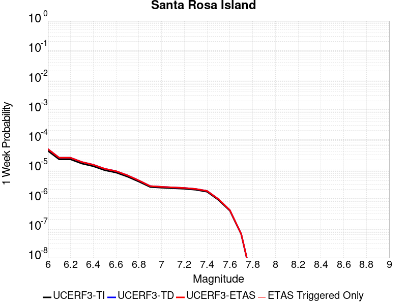 | 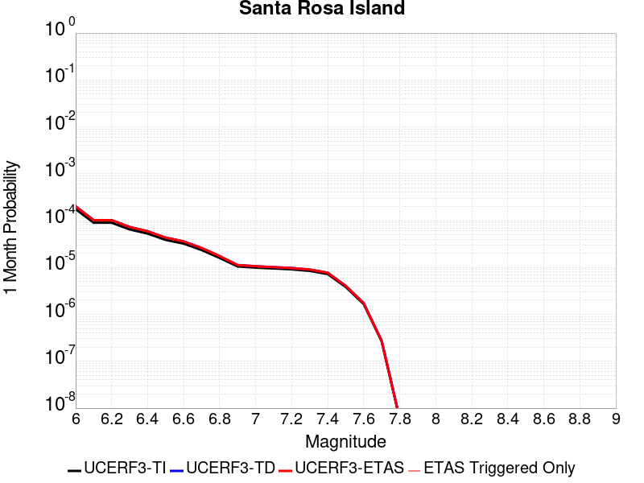 | 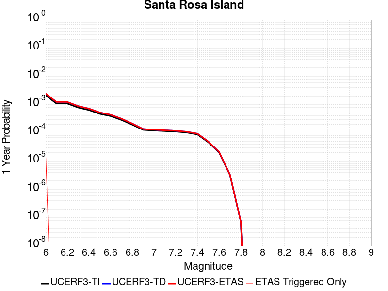 | 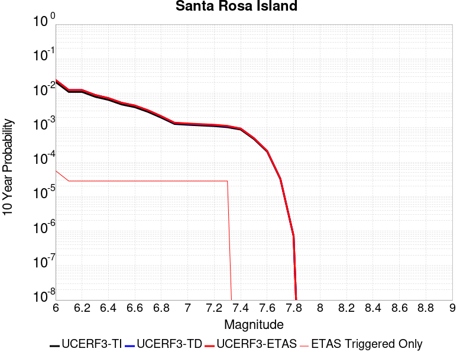 |

| Magnitude | 1 wk TI Prob | 1 wk TD Prob | 1 wk ETAS Prob | 1 wk ETAS/TD Gain | 1 wk ETAS Triggered Only | 1 mo TI Prob | 1 mo TD Prob | 1 mo ETAS Prob | 1 mo ETAS/TD Gain | 1 mo ETAS Triggered Only | 1 yr TI Prob | 1 yr TD Prob | 1 yr ETAS Prob | 1 yr ETAS/TD Gain | 1 yr ETAS Triggered Only | 10 yr TI Prob | 10 yr TD Prob | 10 yr ETAS Prob | 10 yr ETAS/TD Gain | 10 yr ETAS Triggered Only |
|-----|-----|-----|-----|-----|-----|-----|-----|-----|-----|-----|-----|-----|-----|-----|-----|-----|-----|-----|-----|-----|
| 6.0 | 4.1143165E-5 | 4.7099307E-5 | 4.7099307E-5 | 1.0 | 0.0 | 1.7631594E-4 | 2.0183968E-4 | 2.0183968E-4 | 1.0 | 0.0 | 0.002144533 | 0.0024548254 | 0.0024728319 | 1.0073351 | 1.8050541E-5 | 0.021239553 | 0.02429772 | 0.024332942 | 1.0014497 | 3.6101083E-5 |
| 6.1 | 2.1061249E-5 | 2.3868773E-5 | 2.3868773E-5 | 1.0 | 0.0 | 9.0259375E-5 | 1.022909E-4 | 1.022909E-4 | 1.0 | 0.0 | 0.0010983539 | 0.0012447091 | 0.0012447091 | 1.0 | 0.0 | 0.01092941 | 0.012380415 | 0.012398242 | 1.0014399 | 1.8050541E-5 |
| 6.2 | 2.1061249E-5 | 2.3868773E-5 | 2.3868773E-5 | 1.0 | 0.0 | 9.0259375E-5 | 1.022909E-4 | 1.022909E-4 | 1.0 | 0.0 | 0.0010983539 | 0.0012447091 | 0.0012447091 | 1.0 | 0.0 | 0.01092941 | 0.012380415 | 0.012398242 | 1.0014399 | 1.8050541E-5 |
| 6.3 | 1.5158236E-5 | 1.707701E-5 | 1.707701E-5 | 1.0 | 0.0 | 6.496225E-5 | 7.3185205E-5 | 7.3185205E-5 | 1.0 | 0.0 | 7.906284E-4 | 8.9067756E-4 | 8.9067756E-4 | 1.0 | 0.0 | 0.007878214 | 0.00887233 | 0.008890221 | 1.0020164 | 1.8050541E-5 |
| 6.4 | 1.2341918E-5 | 1.3854955E-5 | 1.3854955E-5 | 1.0 | 0.0 | 5.2892858E-5 | 5.937707E-5 | 5.937707E-5 | 1.0 | 0.0 | 6.437803E-4 | 7.226842E-4 | 7.226842E-4 | 1.0 | 0.0 | 0.006419184 | 0.0072041773 | 0.007222098 | 1.0024875 | 1.8050541E-5 |
| 6.5 | 9.061158E-6 | 1.011845E-5 | 1.011845E-5 | 1.0 | 0.0 | 3.883296E-5 | 4.3364093E-5 | 4.3364093E-5 | 1.0 | 0.0 | 4.726887E-4 | 5.278353E-4 | 5.278353E-4 | 1.0 | 0.0 | 0.004716845 | 0.005266354 | 0.0052843094 | 1.0034095 | 1.8050541E-5 |
| 6.6 | 7.5461685E-6 | 8.40188E-6 | 8.40188E-6 | 1.0 | 0.0 | 3.2340322E-5 | 3.6007583E-5 | 3.6007583E-5 | 1.0 | 0.0 | 3.936723E-4 | 4.3830846E-4 | 4.3830846E-4 | 1.0 | 0.0 | 0.003929756 | 0.0043748696 | 0.004392841 | 1.004108 | 1.8050541E-5 |
| 6.7 | 5.5023775E-6 | 6.088163E-6 | 6.088163E-6 | 1.0 | 0.0 | 2.3581404E-5 | 2.6091884E-5 | 2.6091884E-5 | 1.0 | 0.0 | 2.8706578E-4 | 3.1762564E-4 | 3.1762564E-4 | 1.0 | 0.0 | 0.0028669522 | 0.0031720384 | 0.0031900317 | 1.0056725 | 1.8050541E-5 |
| 6.8 | 3.7351679E-6 | 4.0836017E-6 | 4.0836017E-6 | 1.0 | 0.0 | 1.6007763E-5 | 1.7501046E-5 | 1.7501046E-5 | 1.0 | 0.0 | 1.948771E-4 | 2.1305689E-4 | 2.1305689E-4 | 1.0 | 0.0 | 0.0019470629 | 0.0021287715 | 0.0021467838 | 1.0084612 | 1.8050541E-5 |
| 6.9 | 2.456366E-6 | 2.629494E-6 | 2.629494E-6 | 1.0 | 0.0 | 1.0527241E-5 | 1.1269211E-5 | 1.1269211E-5 | 1.0 | 0.0 | 1.2816161E-4 | 1.3719405E-4 | 1.3719405E-4 | 1.0 | 0.0 | 0.0012808773 | 0.0013710964 | 0.0013891221 | 1.013147 | 1.8050541E-5 |
| 7.0 | 2.3245157E-6 | 2.4829824E-6 | 2.4829824E-6 | 1.0 | 0.0 | 9.962172E-6 | 1.064131E-5 | 1.064131E-5 | 1.0 | 0.0 | 1.2128269E-4 | 1.2955026E-4 | 1.2955026E-4 | 1.0 | 0.0 | 0.0012121652 | 0.0012947497 | 0.0013127768 | 1.0139233 | 1.8050541E-5 |
| 7.1 | 2.2248344E-6 | 2.373441E-6 | 2.373441E-6 | 1.0 | 0.0 | 9.53497E-6 | 1.0171851E-5 | 1.0171851E-5 | 1.0 | 0.0 | 1.1608207E-4 | 1.2383526E-4 | 1.2383526E-4 | 1.0 | 0.0 | 0.0011602144 | 0.0012376645 | 0.0012556928 | 1.0145663 | 1.8050541E-5 |
| 7.2 | 2.1350402E-6 | 2.2763356E-6 | 2.2763356E-6 | 1.0 | 0.0 | 9.150141E-6 | 9.755688E-6 | 9.755688E-6 | 1.0 | 0.0 | 1.1139726E-4 | 1.1876904E-4 | 1.1876904E-4 | 1.0 | 0.0 | 0.0011134144 | 0.0011870576 | 0.0012050867 | 1.0151881 | 1.8050541E-5 |
| 7.3 | 1.9793572E-6 | 2.1088856E-6 | 2.1088856E-6 | 1.0 | 0.0 | 8.482932E-6 | 9.03805E-6 | 9.03805E-6 | 1.0 | 0.0 | 1.032748E-4 | 1.1003271E-4 | 1.1003271E-4 | 1.0 | 0.0 | 0.0010322682 | 0.0010997842 | 0.0011178148 | 1.0163947 | 1.8050541E-5 |
| 7.4 | 1.6951194E-6 | 1.8047144E-6 | 1.8047144E-6 | 1.0 | 0.0 | 7.264777E-6 | 7.7344675E-6 | 7.7344675E-6 | 1.0 | 0.0 | 8.844508E-5 | 9.4163086E-5 | 9.4163086E-5 | 1.0 | 0.0 | 8.840988E-4 | 9.4123353E-4 | 9.4123353E-4 | 1.0 | 0.0 |
| 7.5 | 8.987207E-7 | 9.512895E-7 | 9.512895E-7 | 1.0 | 0.0 | 3.8516546E-6 | 4.0769487E-6 | 4.0769487E-6 | 1.0 | 0.0 | 4.6892885E-5 | 4.963573E-5 | 4.963573E-5 | 1.0 | 0.0 | 4.688299E-4 | 4.962476E-4 | 4.962476E-4 | 1.0 | 0.0 |
| 7.6 | 3.8783037E-7 | 4.0531646E-7 | 4.0531646E-7 | 1.0 | 0.0 | 1.6621291E-6 | 1.7370693E-6 | 1.7370693E-6 | 1.0 | 0.0 | 2.0236233E-5 | 2.114862E-5 | 2.114862E-5 | 1.0 | 0.0 | 2.023439E-4 | 2.1146673E-4 | 2.1146673E-4 | 1.0 | 0.0 |
| 7.7 | 6.181804E-8 | 6.3393166E-8 | 6.3393166E-8 | 1.0 | 0.0 | 2.6493444E-7 | 2.7168497E-7 | 2.7168497E-7 | 1.0 | 0.0 | 3.225572E-6 | 3.3077595E-6 | 3.3077595E-6 | 1.0 | 0.0 | 3.225525E-5 | 3.307711E-5 | 3.307711E-5 | 1.0 | 0.0 |
| 7.8 | 1.3704449E-9 | 1.396447E-9 | 1.396447E-9 | 1.0 | 0.0 | 5.873335E-9 | 5.9847727E-9 | 5.9847727E-9 | 1.0 | 0.0 | 7.1507856E-8 | 7.28646E-8 | 7.28646E-8 | 1.0 | 0.0 | 7.1507833E-7 | 7.286459E-7 | 7.286459E-7 | 1.0 | 0.0 |

## Channel Islands Thrust
*[(top)](#table-of-contents)*

| 1 Week | 1 Month | 1 Year | 10 Year |
|-----|-----|-----|-----|
| 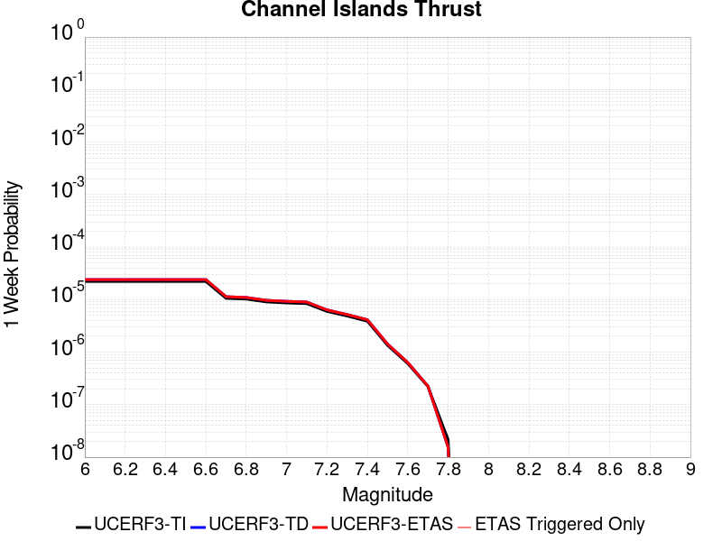 | 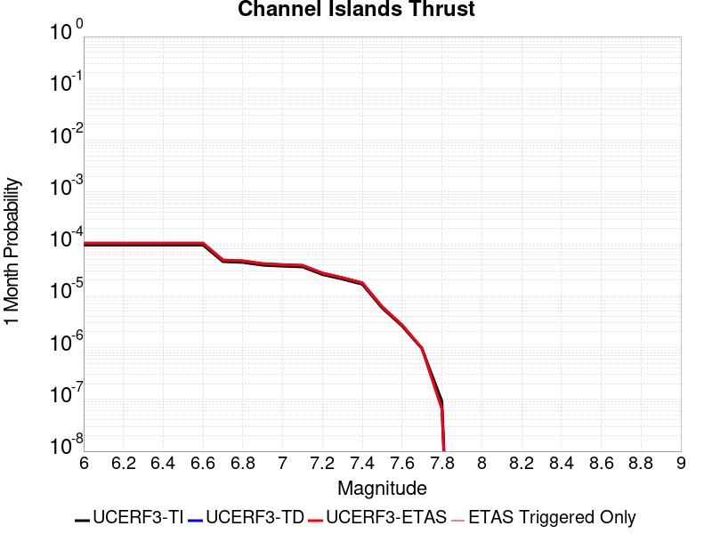 | 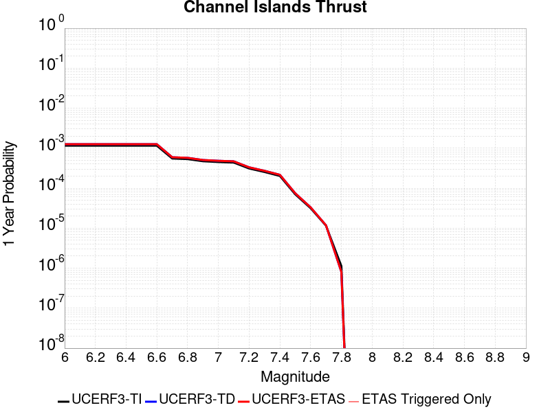 | 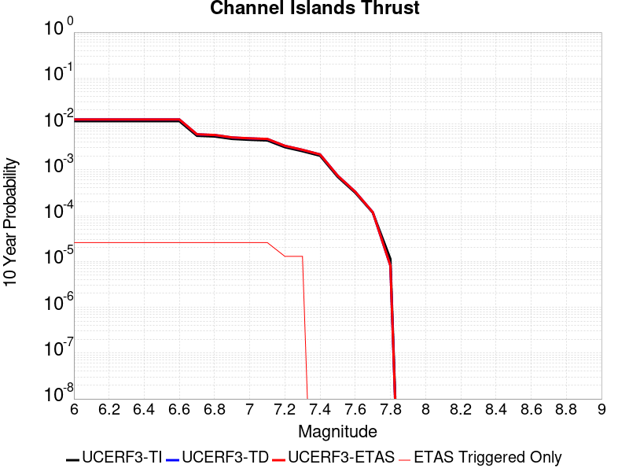 |

| Magnitude | 1 wk TI Prob | 1 wk TD Prob | 1 wk ETAS Prob | 1 wk ETAS/TD Gain | 1 wk ETAS Triggered Only | 1 mo TI Prob | 1 mo TD Prob | 1 mo ETAS Prob | 1 mo ETAS/TD Gain | 1 mo ETAS Triggered Only | 1 yr TI Prob | 1 yr TD Prob | 1 yr ETAS Prob | 1 yr ETAS/TD Gain | 1 yr ETAS Triggered Only | 10 yr TI Prob | 10 yr TD Prob | 10 yr ETAS Prob | 10 yr ETAS/TD Gain | 10 yr ETAS Triggered Only |
|-----|-----|-----|-----|-----|-----|-----|-----|-----|-----|-----|-----|-----|-----|-----|-----|-----|-----|-----|-----|-----|
| 6.0 | 2.2156251E-5 | 2.4094554E-5 | 2.4094554E-5 | 1.0 | 0.0 | 9.495191E-5 | 1.03258884E-4 | 1.03258884E-4 | 1.0 | 0.0 | 0.0011554264 | 0.0012565585 | 0.0012565585 | 1.0 | 0.0 | 0.011494373 | 0.012505128 | 0.012540777 | 1.0028508 | 3.6101083E-5 |
| 6.1 | 2.2156251E-5 | 2.4094554E-5 | 2.4094554E-5 | 1.0 | 0.0 | 9.495191E-5 | 1.03258884E-4 | 1.03258884E-4 | 1.0 | 0.0 | 0.0011554264 | 0.0012565585 | 0.0012565585 | 1.0 | 0.0 | 0.011494373 | 0.012505128 | 0.012540777 | 1.0028508 | 3.6101083E-5 |
| 6.2 | 2.2156251E-5 | 2.4094554E-5 | 2.4094554E-5 | 1.0 | 0.0 | 9.495191E-5 | 1.03258884E-4 | 1.03258884E-4 | 1.0 | 0.0 | 0.0011554264 | 0.0012565585 | 0.0012565585 | 1.0 | 0.0 | 0.011494373 | 0.012505128 | 0.012540777 | 1.0028508 | 3.6101083E-5 |
| 6.3 | 2.2156251E-5 | 2.4094554E-5 | 2.4094554E-5 | 1.0 | 0.0 | 9.495191E-5 | 1.03258884E-4 | 1.03258884E-4 | 1.0 | 0.0 | 0.0011554264 | 0.0012565585 | 0.0012565585 | 1.0 | 0.0 | 0.011494373 | 0.012505128 | 0.012540777 | 1.0028508 | 3.6101083E-5 |
| 6.4 | 2.2156251E-5 | 2.4094554E-5 | 2.4094554E-5 | 1.0 | 0.0 | 9.495191E-5 | 1.03258884E-4 | 1.03258884E-4 | 1.0 | 0.0 | 0.0011554264 | 0.0012565585 | 0.0012565585 | 1.0 | 0.0 | 0.011494373 | 0.012505128 | 0.012540777 | 1.0028508 | 3.6101083E-5 |
| 6.5 | 2.2156251E-5 | 2.4094554E-5 | 2.4094554E-5 | 1.0 | 0.0 | 9.495191E-5 | 1.03258884E-4 | 1.03258884E-4 | 1.0 | 0.0 | 0.0011554264 | 0.0012565585 | 0.0012565585 | 1.0 | 0.0 | 0.011494373 | 0.012505128 | 0.012540777 | 1.0028508 | 3.6101083E-5 |
| 6.6 | 2.2156251E-5 | 2.4094554E-5 | 2.4094554E-5 | 1.0 | 0.0 | 9.495191E-5 | 1.03258884E-4 | 1.03258884E-4 | 1.0 | 0.0 | 0.0011554264 | 0.0012565585 | 0.0012565585 | 1.0 | 0.0 | 0.011494373 | 0.012505128 | 0.012540777 | 1.0028508 | 3.6101083E-5 |
| 6.7 | 1.0601296E-5 | 1.13805545E-5 | 1.13805545E-5 | 1.0 | 0.0 | 4.5433335E-5 | 4.877292E-5 | 4.877292E-5 | 1.0 | 0.0 | 5.5301044E-4 | 5.936534E-4 | 5.936534E-4 | 1.0 | 0.0 | 0.005516363 | 0.0059211776 | 0.005957065 | 1.0060608 | 3.6101083E-5 |
| 6.8 | 1.0246747E-5 | 1.0997644E-5 | 1.0997644E-5 | 1.0 | 0.0 | 4.391389E-5 | 4.7131933E-5 | 4.7131933E-5 | 1.0 | 0.0 | 5.345204E-4 | 5.73685E-4 | 5.73685E-4 | 1.0 | 0.0 | 0.0053323656 | 0.0057225307 | 0.0057584248 | 1.0062724 | 3.6101083E-5 |
| 6.9 | 9.049551E-6 | 9.7004895E-6 | 9.7004895E-6 | 1.0 | 0.0 | 3.878322E-5 | 4.1572886E-5 | 4.1572886E-5 | 1.0 | 0.0 | 4.7208337E-4 | 5.0603645E-4 | 5.0603645E-4 | 1.0 | 0.0 | 0.0047108172 | 0.005049259 | 0.0050851777 | 1.0071137 | 3.6101083E-5 |
| 7.0 | 8.6542195E-6 | 9.27541E-6 | 9.27541E-6 | 1.0 | 0.0 | 3.7088983E-5 | 3.9751176E-5 | 3.9751176E-5 | 1.0 | 0.0 | 4.5146482E-4 | 4.8386716E-4 | 4.8386716E-4 | 1.0 | 0.0 | 0.004505487 | 0.0048285485 | 0.004864475 | 1.0074404 | 3.6101083E-5 |
| 7.1 | 8.391028E-6 | 8.993708E-6 | 8.993708E-6 | 1.0 | 0.0 | 3.5961057E-5 | 3.8543916E-5 | 3.8543916E-5 | 1.0 | 0.0 | 4.3773788E-4 | 4.6917523E-4 | 4.6917523E-4 | 1.0 | 0.0 | 0.004368766 | 0.0046822573 | 0.004718189 | 1.0076741 | 3.6101083E-5 |
| 7.2 | 5.965188E-6 | 6.3722264E-6 | 6.3722264E-6 | 1.0 | 0.0 | 2.556484E-5 | 2.7309257E-5 | 2.7309257E-5 | 1.0 | 0.0 | 3.1120746E-4 | 3.3244005E-4 | 3.3244005E-4 | 1.0 | 0.0 | 0.00310772 | 0.0033194853 | 0.003337476 | 1.0054197 | 1.8050541E-5 |
| 7.3 | 4.877518E-6 | 5.2064374E-6 | 5.2064374E-6 | 1.0 | 0.0 | 2.0903482E-5 | 2.2313116E-5 | 2.2313116E-5 | 1.0 | 0.0 | 2.5447016E-4 | 2.7162876E-4 | 2.7162876E-4 | 1.0 | 0.0 | 0.0025417898 | 0.002713014 | 0.0027310154 | 1.0066353 | 1.8050541E-5 |
| 7.4 | 3.8829853E-6 | 4.142205E-6 | 4.142205E-6 | 1.0 | 0.0 | 1.664126E-5 | 1.7752189E-5 | 1.7752189E-5 | 1.0 | 0.0 | 2.0258849E-4 | 2.1611186E-4 | 2.1611186E-4 | 1.0 | 0.0 | 0.002024039 | 0.0021590588 | 0.0021590588 | 1.0 | 0.0 |
| 7.5 | 1.3489616E-6 | 1.4279018E-6 | 1.4279018E-6 | 1.0 | 0.0 | 5.7812517E-6 | 6.119565E-6 | 6.119565E-6 | 1.0 | 0.0 | 7.038446E-5 | 7.4503194E-5 | 7.4503194E-5 | 1.0 | 0.0 | 7.036218E-4 | 7.447862E-4 | 7.447862E-4 | 1.0 | 0.0 |
| 7.6 | 6.058192E-7 | 6.354263E-7 | 6.354263E-7 | 1.0 | 0.0 | 2.5963652E-6 | 2.723253E-6 | 2.723253E-6 | 1.0 | 0.0 | 3.161029E-5 | 3.3155116E-5 | 3.3155116E-5 | 1.0 | 0.0 | 3.1605794E-4 | 3.315033E-4 | 3.315033E-4 | 1.0 | 0.0 |
| 7.7 | 2.2170494E-7 | 2.2609495E-7 | 2.2609495E-7 | 1.0 | 0.0 | 9.5016367E-7 | 9.68978E-7 | 9.68978E-7 | 1.0 | 0.0 | 1.1568181E-5 | 1.1797255E-5 | 1.1797255E-5 | 1.0 | 0.0 | 1.1567579E-4 | 1.179674E-4 | 1.179674E-4 | 1.0 | 0.0 |
| 7.8 | 2.1613102E-8 | 1.546764E-8 | 1.546764E-8 | 1.0 | 0.0 | 9.262757E-8 | 6.6289886E-8 | 6.6289886E-8 | 1.0 | 0.0 | 1.1277401E-6 | 8.070791E-7 | 8.070791E-7 | 1.0 | 0.0 | 1.1277344E-5 | 8.07077E-6 | 8.07077E-6 | 1.0 | 0.0 |

## San Clemente
*[(top)](#table-of-contents)*

| 1 Week | 1 Month | 1 Year | 10 Year |
|-----|-----|-----|-----|
| 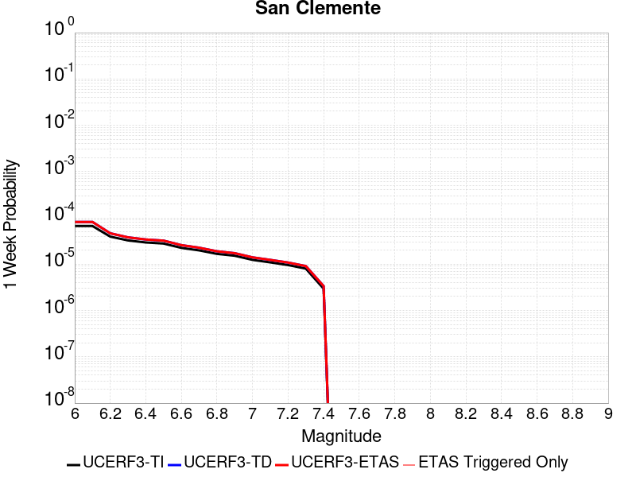 | 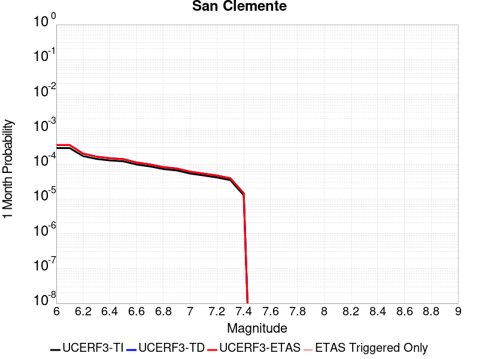 | 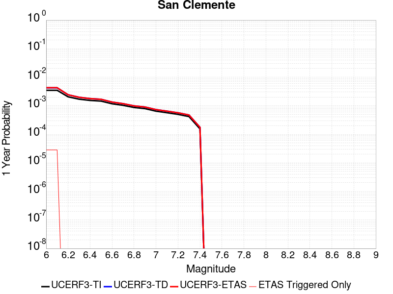 | 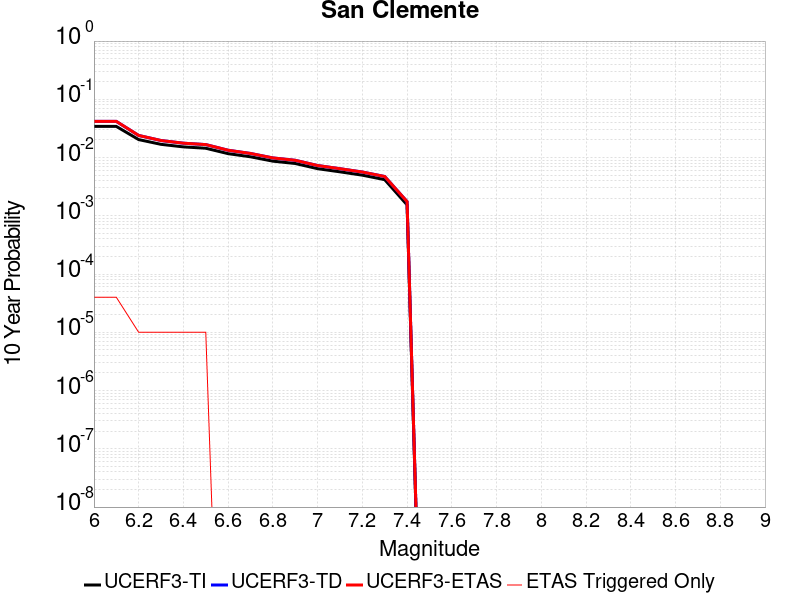 |

| Magnitude | 1 wk TI Prob | 1 wk TD Prob | 1 wk ETAS Prob | 1 wk ETAS/TD Gain | 1 wk ETAS Triggered Only | 1 mo TI Prob | 1 mo TD Prob | 1 mo ETAS Prob | 1 mo ETAS/TD Gain | 1 mo ETAS Triggered Only | 1 yr TI Prob | 1 yr TD Prob | 1 yr ETAS Prob | 1 yr ETAS/TD Gain | 1 yr ETAS Triggered Only | 10 yr TI Prob | 10 yr TD Prob | 10 yr ETAS Prob | 10 yr ETAS/TD Gain | 10 yr ETAS Triggered Only |
|-----|-----|-----|-----|-----|-----|-----|-----|-----|-----|-----|-----|-----|-----|-----|-----|-----|-----|-----|-----|-----|
| 6.0 | 6.681379E-5 | 8.165641E-5 | 8.165641E-5 | 1.0 | 0.0 | 2.8631336E-4 | 3.4991238E-4 | 3.4991238E-4 | 1.0 | 0.0 | 0.003480294 | 0.0042524408 | 0.004270415 | 1.0042267 | 1.8050541E-5 | 0.03426291 | 0.041766528 | 0.04180112 | 1.0008283 | 3.6101083E-5 |
| 6.1 | 6.681379E-5 | 8.165641E-5 | 8.165641E-5 | 1.0 | 0.0 | 2.8631336E-4 | 3.4991238E-4 | 3.4991238E-4 | 1.0 | 0.0 | 0.003480294 | 0.0042524408 | 0.004270415 | 1.0042267 | 1.8050541E-5 | 0.03426291 | 0.041766528 | 0.04180112 | 1.0008283 | 3.6101083E-5 |
| 6.2 | 3.9400576E-5 | 4.646204E-5 | 4.646204E-5 | 1.0 | 0.0 | 1.6884868E-4 | 1.991082E-4 | 1.991082E-4 | 1.0 | 0.0 | 0.0020537945 | 0.002421508 | 0.002421508 | 1.0 | 0.0 | 0.020349167 | 0.023957945 | 0.023957945 | 1.0 | 0.0 |
| 6.3 | 3.2590255E-5 | 3.793655E-5 | 3.793655E-5 | 1.0 | 0.0 | 1.3966505E-4 | 1.6257526E-4 | 1.6257526E-4 | 1.0 | 0.0 | 0.0016990956 | 0.0019775871 | 0.0019775871 | 1.0 | 0.0 | 0.01686163 | 0.019603683 | 0.019603683 | 1.0 | 0.0 |
| 6.4 | 2.9454652E-5 | 3.4104214E-5 | 3.4104214E-5 | 1.0 | 0.0 | 1.2622811E-4 | 1.4615289E-4 | 1.4615289E-4 | 1.0 | 0.0 | 0.0015357438 | 0.0017779835 | 0.0017779835 | 1.0 | 0.0 | 0.015251739 | 0.017640764 | 0.017640764 | 1.0 | 0.0 |
| 6.5 | 2.790836E-5 | 3.225346E-5 | 3.225346E-5 | 1.0 | 0.0 | 1.1960178E-4 | 1.3822193E-4 | 1.3822193E-4 | 1.0 | 0.0 | 0.001455179 | 0.001681578 | 0.001681578 | 1.0 | 0.0 | 0.014456868 | 0.01669156 | 0.01669156 | 1.0 | 0.0 |
| 6.6 | 2.2492153E-5 | 2.576718E-5 | 2.576718E-5 | 1.0 | 0.0 | 9.639138E-5 | 1.1042618E-4 | 1.1042618E-4 | 1.0 | 0.0 | 0.0011729331 | 0.0013436245 | 0.0013436245 | 1.0 | 0.0 | 0.011667615 | 0.013356725 | 0.013356725 | 1.0 | 0.0 |
| 6.7 | 1.9862755E-5 | 2.2670249E-5 | 2.2670249E-5 | 1.0 | 0.0 | 8.512331E-5 | 9.7154654E-5 | 9.7154654E-5 | 1.0 | 0.0 | 0.0010358836 | 0.0011822274 | 0.0011822274 | 1.0 | 0.0 | 0.010310682 | 0.011760674 | 0.011760674 | 1.0 | 0.0 |
| 6.8 | 1.6697575E-5 | 1.8980805E-5 | 1.8980805E-5 | 1.0 | 0.0 | 7.155907E-5 | 8.1343824E-5 | 8.1343824E-5 | 1.0 | 0.0 | 8.7088346E-4 | 9.899205E-4 | 9.899205E-4 | 1.0 | 0.0 | 0.008674784 | 0.0098561365 | 0.0098561365 | 1.0 | 0.0 |
| 6.9 | 1.5218415E-5 | 1.7272181E-5 | 1.7272181E-5 | 1.0 | 0.0 | 6.522015E-5 | 7.402158E-5 | 7.402158E-5 | 1.0 | 0.0 | 7.93766E-4 | 9.0084894E-4 | 9.0084894E-4 | 1.0 | 0.0 | 0.007909367 | 0.008972918 | 0.008972918 | 1.0 | 0.0 |
| 7.0 | 1.2392958E-5 | 1.4035233E-5 | 1.4035233E-5 | 1.0 | 0.0 | 5.3111595E-5 | 6.0149654E-5 | 6.0149654E-5 | 1.0 | 0.0 | 6.4644177E-4 | 7.320836E-4 | 7.320836E-4 | 1.0 | 0.0 | 0.0064456454 | 0.0072975056 | 0.0072975056 | 1.0 | 0.0 |
| 7.1 | 1.0934128E-5 | 1.2377085E-5 | 1.2377085E-5 | 1.0 | 0.0 | 4.6859706E-5 | 5.3043612E-5 | 5.3043612E-5 | 1.0 | 0.0 | 5.7036756E-4 | 6.4562197E-4 | 6.4562197E-4 | 1.0 | 0.0 | 0.0056890585 | 0.0064382097 | 0.0064382097 | 1.0 | 0.0 |
| 7.2 | 9.5798805E-6 | 1.0846645E-5 | 1.0846645E-5 | 1.0 | 0.0 | 4.1055984E-5 | 4.6484834E-5 | 4.6484834E-5 | 1.0 | 0.0 | 4.9974193E-4 | 5.658131E-4 | 5.658131E-4 | 1.0 | 0.0 | 0.0049861963 | 0.005644449 | 0.005644449 | 1.0 | 0.0 |
| 7.3 | 8.0167365E-6 | 9.085361E-6 | 9.085361E-6 | 1.0 | 0.0 | 3.4356988E-5 | 3.893672E-5 | 3.893672E-5 | 1.0 | 0.0 | 4.1821605E-4 | 4.7395853E-4 | 4.7395853E-4 | 1.0 | 0.0 | 0.0041742986 | 0.00473018 | 0.00473018 | 1.0 | 0.0 |
| 7.4 | 2.9581017E-6 | 3.3629278E-6 | 3.3629278E-6 | 1.0 | 0.0 | 1.2677518E-5 | 1.4412497E-5 | 1.4412497E-5 | 1.0 | 0.0 | 1.5433785E-4 | 1.7546306E-4 | 1.7546306E-4 | 1.0 | 0.0 | 0.001542307 | 0.0017537405 | 0.0017537405 | 1.0 | 0.0 |

## Great Valley 09 (Laguna Seca)
*[(top)](#table-of-contents)*

| 1 Week | 1 Month | 1 Year | 10 Year |
|-----|-----|-----|-----|
| 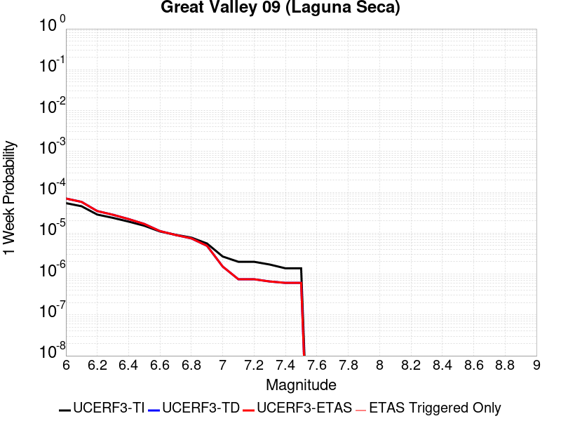 | 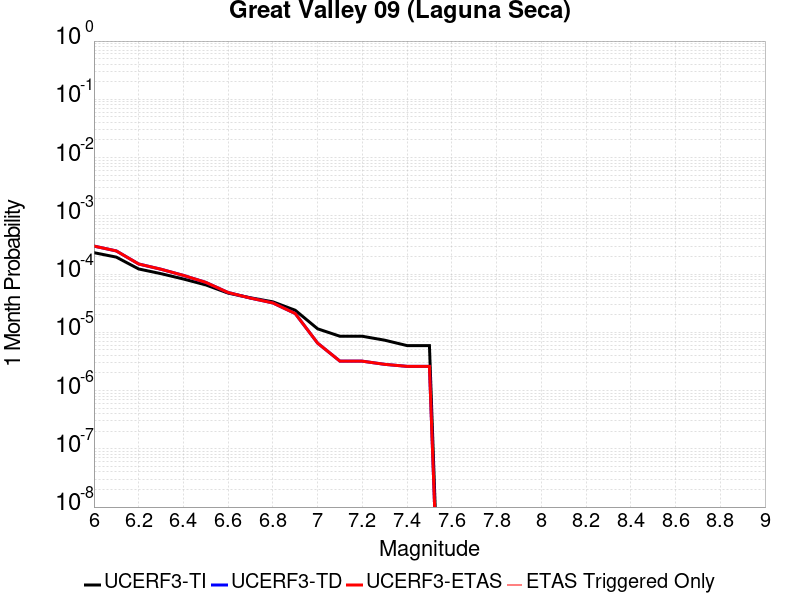 | 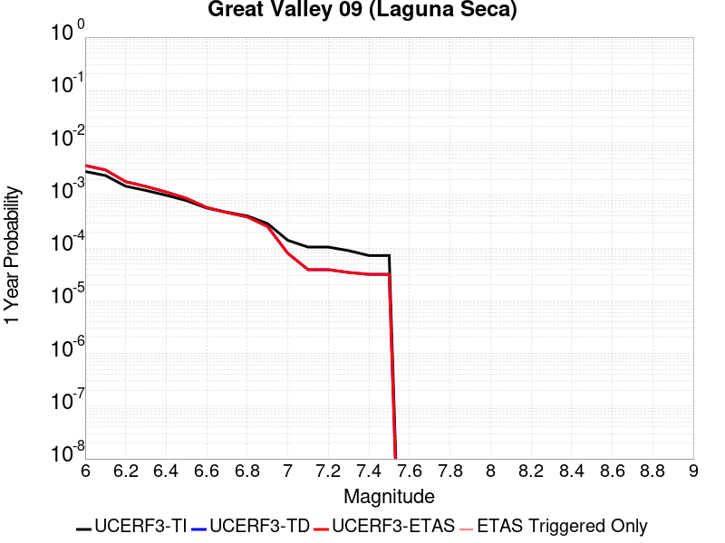 | 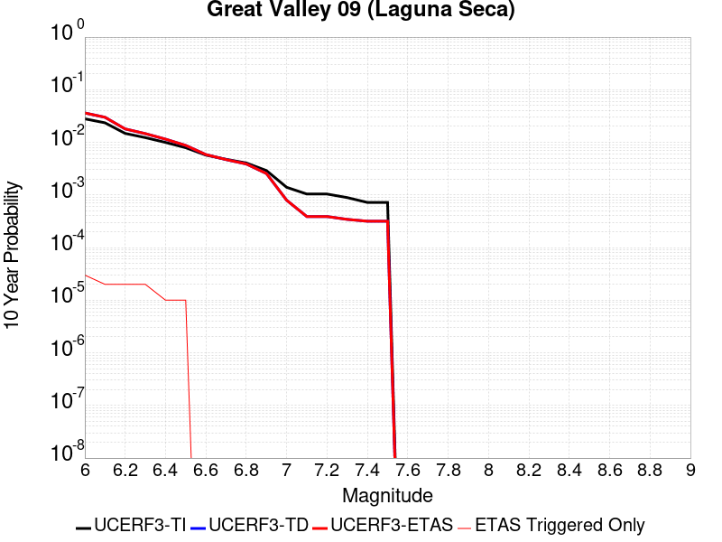 |

| Magnitude | 1 wk TI Prob | 1 wk TD Prob | 1 wk ETAS Prob | 1 wk ETAS/TD Gain | 1 wk ETAS Triggered Only | 1 mo TI Prob | 1 mo TD Prob | 1 mo ETAS Prob | 1 mo ETAS/TD Gain | 1 mo ETAS Triggered Only | 1 yr TI Prob | 1 yr TD Prob | 1 yr ETAS Prob | 1 yr ETAS/TD Gain | 1 yr ETAS Triggered Only | 10 yr TI Prob | 10 yr TD Prob | 10 yr ETAS Prob | 10 yr ETAS/TD Gain | 10 yr ETAS Triggered Only |
|-----|-----|-----|-----|-----|-----|-----|-----|-----|-----|-----|-----|-----|-----|-----|-----|-----|-----|-----|-----|-----|
| 6.0 | 5.4353277E-5 | 7.052885E-5 | 7.052885E-5 | 1.0 | 0.0 | 2.3292181E-4 | 3.0223365E-4 | 3.0223365E-4 | 1.0 | 0.0 | 0.0028321352 | 0.0036734797 | 0.0036734797 | 1.0 | 0.0 | 0.02796312 | 0.036128446 | 0.036145844 | 1.0004816 | 1.8050541E-5 |
| 6.1 | 4.5578287E-5 | 5.824183E-5 | 5.824183E-5 | 1.0 | 0.0 | 1.953209E-4 | 2.4958552E-4 | 2.4958552E-4 | 1.0 | 0.0 | 0.0023754383 | 0.0030345023 | 0.0030345023 | 1.0 | 0.0 | 0.023502063 | 0.029929979 | 0.029929979 | 1.0 | 0.0 |
| 6.2 | 2.8536782E-5 | 3.4747063E-5 | 3.4747063E-5 | 1.0 | 0.0 | 1.2229476E-4 | 1.4890796E-4 | 1.4890796E-4 | 1.0 | 0.0 | 0.0014879217 | 0.0018113997 | 0.0018113997 | 1.0 | 0.0 | 0.014779986 | 0.017963791 | 0.017963791 | 1.0 | 0.0 |
| 6.3 | 2.3698774E-5 | 2.8220305E-5 | 2.8220305E-5 | 1.0 | 0.0 | 1.01562226E-4 | 1.20938894E-4 | 1.20938894E-4 | 1.0 | 0.0 | 0.0012358186 | 0.0014714922 | 0.0014714922 | 1.0 | 0.0 | 0.012289686 | 0.014615752 | 0.014615752 | 1.0 | 0.0 |
| 6.4 | 1.9191197E-5 | 2.2127588E-5 | 2.2127588E-5 | 1.0 | 0.0 | 8.2245395E-5 | 9.482932E-5 | 9.482932E-5 | 1.0 | 0.0 | 0.0010008777 | 0.0011539784 | 0.0011539784 | 1.0 | 0.0 | 0.009963818 | 0.011480168 | 0.011480168 | 1.0 | 0.0 |
| 6.5 | 1.5203241E-5 | 1.6804443E-5 | 1.6804443E-5 | 1.0 | 0.0 | 6.5155116E-5 | 7.201723E-5 | 7.201723E-5 | 1.0 | 0.0 | 7.9297484E-4 | 8.764891E-4 | 8.764891E-4 | 1.0 | 0.0 | 0.007901512 | 0.008731712 | 0.008731712 | 1.0 | 0.0 |
| 6.6 | 1.0984925E-5 | 1.12448E-5 | 1.12448E-5 | 1.0 | 0.0 | 4.70774E-5 | 4.819113E-5 | 4.819113E-5 | 1.0 | 0.0 | 5.730166E-4 | 5.865732E-4 | 5.865732E-4 | 1.0 | 0.0 | 0.005715413 | 0.005850646 | 0.005850646 | 1.0 | 0.0 |
| 6.7 | 9.134616E-6 | 9.021598E-6 | 9.021598E-6 | 1.0 | 0.0 | 3.9147766E-5 | 3.8663435E-5 | 3.8663435E-5 | 1.0 | 0.0 | 4.7651984E-4 | 4.70628E-4 | 4.70628E-4 | 1.0 | 0.0 | 0.004754993 | 0.0046965587 | 0.0046965587 | 1.0 | 0.0 |
| 6.8 | 7.785589E-6 | 7.4533446E-6 | 7.4533446E-6 | 1.0 | 0.0 | 3.3366385E-5 | 3.1942527E-5 | 3.1942527E-5 | 1.0 | 0.0 | 4.0616E-4 | 3.8883285E-4 | 3.8883285E-4 | 1.0 | 0.0 | 0.0040541845 | 0.0038817294 | 0.0038817294 | 1.0 | 0.0 |
| 6.9 | 5.579095E-6 | 4.899413E-6 | 4.899413E-6 | 1.0 | 0.0 | 2.3910188E-5 | 2.0997322E-5 | 2.0997322E-5 | 1.0 | 0.0 | 2.9106764E-4 | 2.556138E-4 | 2.556138E-4 | 1.0 | 0.0 | 0.002906867 | 0.0025533354 | 0.0025533354 | 1.0 | 0.0 |
| 7.0 | 2.6816688E-6 | 1.5218651E-6 | 1.5218651E-6 | 1.0 | 0.0 | 1.1492816E-5 | 6.5222634E-6 | 6.5222634E-6 | 1.0 | 0.0 | 1.3991605E-4 | 7.940575E-5 | 7.940575E-5 | 1.0 | 0.0 | 0.0013982799 | 7.937825E-4 | 7.937825E-4 | 1.0 | 0.0 |
| 7.1 | 1.9951021E-6 | 7.4551406E-7 | 7.4551406E-7 | 1.0 | 0.0 | 8.55041E-6 | 3.1950565E-6 | 3.1950565E-6 | 1.0 | 0.0 | 1.0409627E-4 | 3.889916E-5 | 3.889916E-5 | 1.0 | 0.0 | 0.0010404752 | 3.8892767E-4 | 3.8892767E-4 | 1.0 | 0.0 |
| 7.2 | 1.9951021E-6 | 7.4551406E-7 | 7.4551406E-7 | 1.0 | 0.0 | 8.55041E-6 | 3.1950565E-6 | 3.1950565E-6 | 1.0 | 0.0 | 1.0409627E-4 | 3.889916E-5 | 3.889916E-5 | 1.0 | 0.0 | 0.0010404752 | 3.8892767E-4 | 3.8892767E-4 | 1.0 | 0.0 |
| 7.3 | 1.7087556E-6 | 6.579979E-7 | 6.579979E-7 | 1.0 | 0.0 | 7.3232177E-6 | 2.819988E-6 | 2.819988E-6 | 1.0 | 0.0 | 8.915652E-5 | 3.4332854E-5 | 3.4332854E-5 | 1.0 | 0.0 | 8.9120766E-4 | 3.4327953E-4 | 3.4327953E-4 | 1.0 | 0.0 |
| 7.4 | 1.3804846E-6 | 6.0747584E-7 | 6.0747584E-7 | 1.0 | 0.0 | 5.916349E-6 | 2.6034654E-6 | 2.6034654E-6 | 1.0 | 0.0 | 7.2029165E-5 | 3.169677E-5 | 3.169677E-5 | 1.0 | 0.0 | 7.200583E-4 | 3.1692654E-4 | 3.1692654E-4 | 1.0 | 0.0 |
| 7.5 | 1.3804846E-6 | 6.0747584E-7 | 6.0747584E-7 | 1.0 | 0.0 | 5.916349E-6 | 2.6034654E-6 | 2.6034654E-6 | 1.0 | 0.0 | 7.2029165E-5 | 3.169677E-5 | 3.169677E-5 | 1.0 | 0.0 | 7.200583E-4 | 3.1692654E-4 | 3.1692654E-4 | 1.0 | 0.0 |

## Lost Hills
*[(top)](#table-of-contents)*

| 1 Week | 1 Month | 1 Year | 10 Year |
|-----|-----|-----|-----|
| 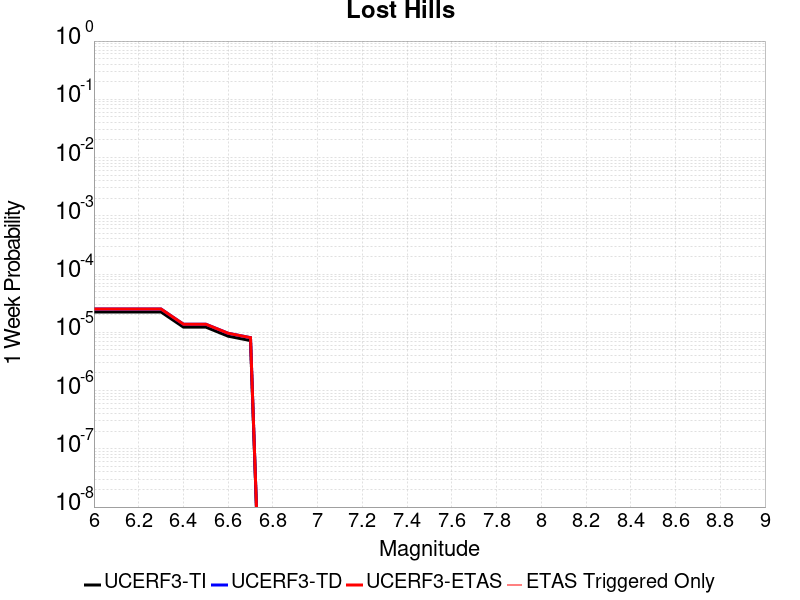 | 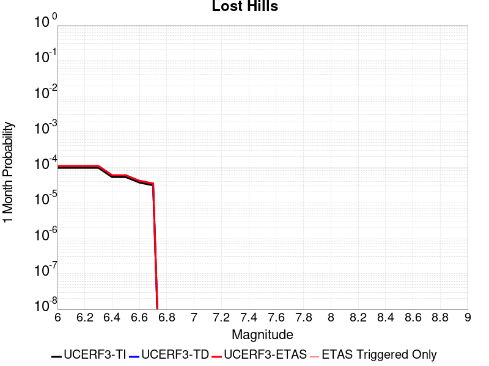 | 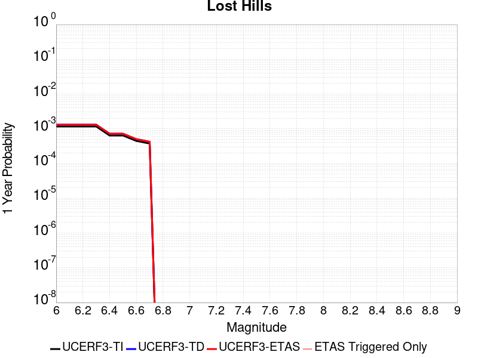 | 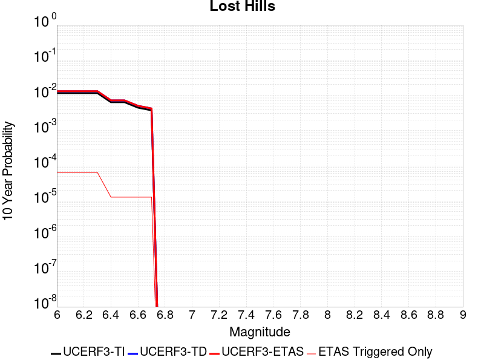 |

| Magnitude | 1 wk TI Prob | 1 wk TD Prob | 1 wk ETAS Prob | 1 wk ETAS/TD Gain | 1 wk ETAS Triggered Only | 1 mo TI Prob | 1 mo TD Prob | 1 mo ETAS Prob | 1 mo ETAS/TD Gain | 1 mo ETAS Triggered Only | 1 yr TI Prob | 1 yr TD Prob | 1 yr ETAS Prob | 1 yr ETAS/TD Gain | 1 yr ETAS Triggered Only | 10 yr TI Prob | 10 yr TD Prob | 10 yr ETAS Prob | 10 yr ETAS/TD Gain | 10 yr ETAS Triggered Only |
|-----|-----|-----|-----|-----|-----|-----|-----|-----|-----|-----|-----|-----|-----|-----|-----|-----|-----|-----|-----|-----|
| 6.0 | 2.233523E-5 | 2.5110301E-5 | 2.5110301E-5 | 1.0 | 0.0 | 9.571891E-5 | 1.0761209E-4 | 1.0761209E-4 | 1.0 | 0.0 | 0.0011647546 | 0.0013095579 | 0.0013095579 | 1.0 | 0.0 | 0.011586686 | 0.0130350115 | 0.013070642 | 1.0027335 | 3.6101083E-5 |
| 6.1 | 2.233523E-5 | 2.5110301E-5 | 2.5110301E-5 | 1.0 | 0.0 | 9.571891E-5 | 1.0761209E-4 | 1.0761209E-4 | 1.0 | 0.0 | 0.0011647546 | 0.0013095579 | 0.0013095579 | 1.0 | 0.0 | 0.011586686 | 0.0130350115 | 0.013070642 | 1.0027335 | 3.6101083E-5 |
| 6.2 | 2.233523E-5 | 2.5110301E-5 | 2.5110301E-5 | 1.0 | 0.0 | 9.571891E-5 | 1.0761209E-4 | 1.0761209E-4 | 1.0 | 0.0 | 0.0011647546 | 0.0013095579 | 0.0013095579 | 1.0 | 0.0 | 0.011586686 | 0.0130350115 | 0.013070642 | 1.0027335 | 3.6101083E-5 |
| 6.3 | 2.233523E-5 | 2.5110301E-5 | 2.5110301E-5 | 1.0 | 0.0 | 9.571891E-5 | 1.0761209E-4 | 1.0761209E-4 | 1.0 | 0.0 | 0.0011647546 | 0.0013095579 | 0.0013095579 | 1.0 | 0.0 | 0.011586686 | 0.0130350115 | 0.013070642 | 1.0027335 | 3.6101083E-5 |
| 6.4 | 1.2288092E-5 | 1.3783107E-5 | 1.3783107E-5 | 1.0 | 0.0 | 5.2662188E-5 | 5.9069647E-5 | 5.9069647E-5 | 1.0 | 0.0 | 6.409735E-4 | 7.1902946E-4 | 7.1902946E-4 | 1.0 | 0.0 | 0.006391279 | 0.007176239 | 0.00719416 | 1.0024973 | 1.8050541E-5 |
| 6.5 | 1.2288092E-5 | 1.3783107E-5 | 1.3783107E-5 | 1.0 | 0.0 | 5.2662188E-5 | 5.9069647E-5 | 5.9069647E-5 | 1.0 | 0.0 | 6.409735E-4 | 7.1902946E-4 | 7.1902946E-4 | 1.0 | 0.0 | 0.006391279 | 0.007176239 | 0.00719416 | 1.0024973 | 1.8050541E-5 |
| 6.6 | 8.58281E-6 | 9.635178E-6 | 9.635178E-6 | 1.0 | 0.0 | 3.6782953E-5 | 4.1293435E-5 | 4.1293435E-5 | 1.0 | 0.0 | 4.4774043E-4 | 5.027148E-4 | 5.027148E-4 | 1.0 | 0.0 | 0.0044683935 | 0.005023939 | 0.0050418987 | 1.0035748 | 1.8050541E-5 |
| 6.7 | 7.205685E-6 | 8.089484E-6 | 8.089484E-6 | 1.0 | 0.0 | 3.088114E-5 | 3.4669218E-5 | 3.4669218E-5 | 1.0 | 0.0 | 3.7591302E-4 | 4.2209774E-4 | 4.2209774E-4 | 1.0 | 0.0 | 0.0037527776 | 0.0042209774 | 0.004238952 | 1.0042584 | 1.8050541E-5 |

## Newport-Inglewood alt 1
*[(top)](#table-of-contents)*

| 1 Week | 1 Month | 1 Year | 10 Year |
|-----|-----|-----|-----|
| 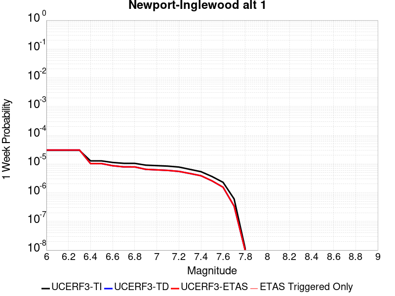 | 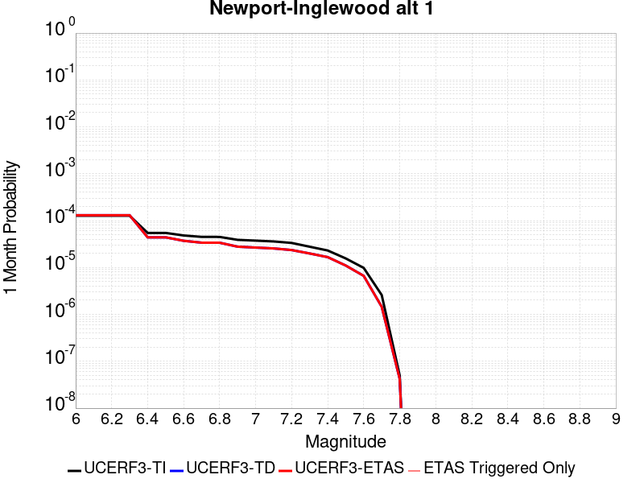 | 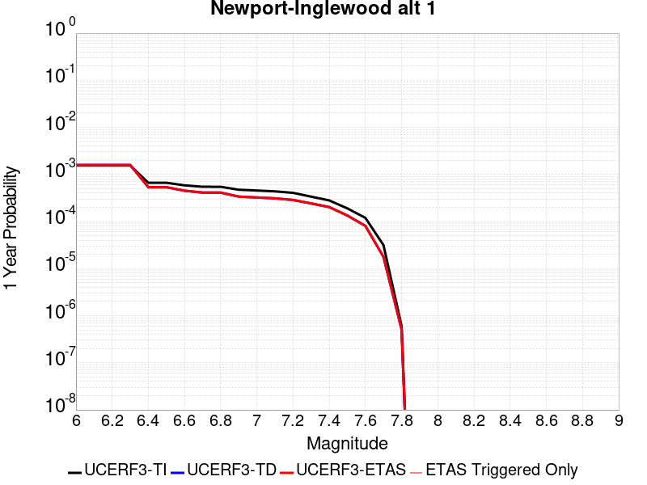 | 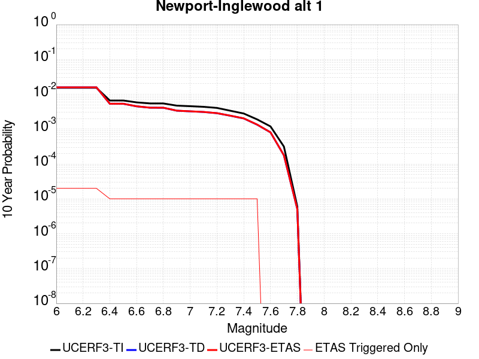 |

| Magnitude | 1 wk TI Prob | 1 wk TD Prob | 1 wk ETAS Prob | 1 wk ETAS/TD Gain | 1 wk ETAS Triggered Only | 1 mo TI Prob | 1 mo TD Prob | 1 mo ETAS Prob | 1 mo ETAS/TD Gain | 1 mo ETAS Triggered Only | 1 yr TI Prob | 1 yr TD Prob | 1 yr ETAS Prob | 1 yr ETAS/TD Gain | 1 yr ETAS Triggered Only | 10 yr TI Prob | 10 yr TD Prob | 10 yr ETAS Prob | 10 yr ETAS/TD Gain | 10 yr ETAS Triggered Only |
|-----|-----|-----|-----|-----|-----|-----|-----|-----|-----|-----|-----|-----|-----|-----|-----|-----|-----|-----|-----|-----|
| 6.0 | 2.9668912E-5 | 3.041067E-5 | 3.041067E-5 | 1.0 | 0.0 | 1.2714628E-4 | 1.3032768E-4 | 1.3032768E-4 | 1.0 | 0.0 | 0.0015469068 | 0.0015860647 | 0.0015860647 | 1.0 | 0.0 | 0.015361829 | 0.015795063 | 0.015830593 | 1.0022495 | 3.6101083E-5 |
| 6.1 | 2.9668912E-5 | 3.041067E-5 | 3.041067E-5 | 1.0 | 0.0 | 1.2714628E-4 | 1.3032768E-4 | 1.3032768E-4 | 1.0 | 0.0 | 0.0015469068 | 0.0015860647 | 0.0015860647 | 1.0 | 0.0 | 0.015361829 | 0.015795063 | 0.015830593 | 1.0022495 | 3.6101083E-5 |
| 6.2 | 2.9668912E-5 | 3.041067E-5 | 3.041067E-5 | 1.0 | 0.0 | 1.2714628E-4 | 1.3032768E-4 | 1.3032768E-4 | 1.0 | 0.0 | 0.0015469068 | 0.0015860647 | 0.0015860647 | 1.0 | 0.0 | 0.015361829 | 0.015795063 | 0.015830593 | 1.0022495 | 3.6101083E-5 |
| 6.3 | 2.9668912E-5 | 3.041067E-5 | 3.041067E-5 | 1.0 | 0.0 | 1.2714628E-4 | 1.3032768E-4 | 1.3032768E-4 | 1.0 | 0.0 | 0.0015469068 | 0.0015860647 | 0.0015860647 | 1.0 | 0.0 | 0.015361829 | 0.015795063 | 0.015830593 | 1.0022495 | 3.6101083E-5 |
| 6.4 | 1.275942E-5 | 1.0273533E-5 | 1.0273533E-5 | 1.0 | 0.0 | 5.4682085E-5 | 4.4028708E-5 | 4.4028708E-5 | 1.0 | 0.0 | 6.65551E-4 | 5.3592183E-4 | 5.3592183E-4 | 1.0 | 0.0 | 0.0066356123 | 0.005346719 | 0.005364673 | 1.003358 | 1.8050541E-5 |
| 6.5 | 1.275942E-5 | 1.0273533E-5 | 1.0273533E-5 | 1.0 | 0.0 | 5.4682085E-5 | 4.4028708E-5 | 4.4028708E-5 | 1.0 | 0.0 | 6.65551E-4 | 5.3592183E-4 | 5.3592183E-4 | 1.0 | 0.0 | 0.0066356123 | 0.005346719 | 0.005364673 | 1.003358 | 1.8050541E-5 |
| 6.6 | 1.1255358E-5 | 8.662664E-6 | 8.662664E-6 | 1.0 | 0.0 | 4.8236358E-5 | 3.7125184E-5 | 3.7125184E-5 | 1.0 | 0.0 | 5.871194E-4 | 4.5190705E-4 | 4.5190705E-4 | 1.0 | 0.0 | 0.005855706 | 0.004510058 | 0.0045280275 | 1.0039842 | 1.8050541E-5 |
| 6.7 | 1.0504745E-5 | 7.900482E-6 | 7.900482E-6 | 1.0 | 0.0 | 4.5019555E-5 | 3.3858778E-5 | 3.3858778E-5 | 1.0 | 0.0 | 5.4797524E-4 | 4.121539E-4 | 4.121539E-4 | 1.0 | 0.0 | 0.0054662596 | 0.004114025 | 0.004132001 | 1.0043695 | 1.8050541E-5 |
| 6.8 | 1.0476007E-5 | 7.881862E-6 | 7.881862E-6 | 1.0 | 0.0 | 4.4896402E-5 | 3.377898E-5 | 3.377898E-5 | 1.0 | 0.0 | 5.464766E-4 | 4.1118273E-4 | 4.1118273E-4 | 1.0 | 0.0 | 0.005451347 | 0.0041043493 | 0.0041223257 | 1.0043799 | 1.8050541E-5 |
| 6.9 | 9.076797E-6 | 6.490164E-6 | 6.490164E-6 | 1.0 | 0.0 | 3.889998E-5 | 2.7814694E-5 | 2.7814694E-5 | 1.0 | 0.0 | 4.7350433E-4 | 3.385916E-4 | 3.385916E-4 | 1.0 | 0.0 | 0.004724967 | 0.0033807948 | 0.0033987842 | 1.0053211 | 1.8050541E-5 |
| 7.0 | 8.73795E-6 | 6.2125355E-6 | 6.2125355E-6 | 1.0 | 0.0 | 3.7447822E-5 | 2.662488E-5 | 2.662488E-5 | 1.0 | 0.0 | 4.5583185E-4 | 3.2411E-4 | 3.2411E-4 | 1.0 | 0.0 | 0.0045489795 | 0.0032364046 | 0.0032543968 | 1.0055593 | 1.8050541E-5 |
| 7.1 | 8.391299E-6 | 5.956295E-6 | 5.956295E-6 | 1.0 | 0.0 | 3.5962214E-5 | 2.5526731E-5 | 2.5526731E-5 | 1.0 | 0.0 | 4.37752E-4 | 3.107439E-4 | 3.107439E-4 | 1.0 | 0.0 | 0.004368907 | 0.0031031233 | 0.0031211178 | 1.0057988 | 1.8050541E-5 |
| 7.2 | 7.796882E-6 | 5.4970124E-6 | 5.4970124E-6 | 1.0 | 0.0 | 3.341478E-5 | 2.3558414E-5 | 2.3558414E-5 | 1.0 | 0.0 | 4.06749E-4 | 2.8678615E-4 | 2.8678615E-4 | 1.0 | 0.0 | 0.0040600533 | 0.0028641846 | 0.0028821833 | 1.0062841 | 1.8050541E-5 |
| 7.3 | 6.4738833E-6 | 4.6481523E-6 | 4.6481523E-6 | 1.0 | 0.0 | 2.774492E-5 | 1.99205E-5 | 1.99205E-5 | 1.0 | 0.0 | 3.3774204E-4 | 2.4250527E-4 | 2.4250527E-4 | 1.0 | 0.0 | 0.0033722918 | 0.002422423 | 0.0024404298 | 1.0074334 | 1.8050541E-5 |
| 7.4 | 5.382145E-6 | 3.8860326E-6 | 3.8860326E-6 | 1.0 | 0.0 | 2.3066134E-5 | 1.665432E-5 | 1.665432E-5 | 1.0 | 0.0 | 2.8079396E-4 | 2.027476E-4 | 2.027476E-4 | 1.0 | 0.0 | 0.0028043943 | 0.0020256408 | 0.002043655 | 1.008893 | 1.8050541E-5 |
| 7.5 | 3.648244E-6 | 2.5739698E-6 | 2.5739698E-6 | 1.0 | 0.0 | 1.5635238E-5 | 1.1031253E-5 | 1.1031253E-5 | 1.0 | 0.0 | 1.9034238E-4 | 1.3429733E-4 | 1.3429733E-4 | 1.0 | 0.0 | 0.0019017943 | 0.0013421722 | 0.0013601985 | 1.0134307 | 1.8050541E-5 |
| 7.6 | 2.2906888E-6 | 1.5481112E-6 | 1.5481112E-6 | 1.0 | 0.0 | 9.817201E-6 | 6.6347457E-6 | 6.6347457E-6 | 1.0 | 0.0 | 1.1951787E-4 | 8.07751E-5 | 8.07751E-5 | 1.0 | 0.0 | 0.0011945361 | 8.074641E-4 | 8.074641E-4 | 1.0 | 0.0 |
| 7.7 | 6.0479874E-7 | 3.3978318E-7 | 3.3978318E-7 | 1.0 | 0.0 | 2.5919921E-6 | 1.456213E-6 | 1.456213E-6 | 1.0 | 0.0 | 3.1557047E-5 | 1.7729262E-5 | 1.7729262E-5 | 1.0 | 0.0 | 3.1552566E-4 | 1.7727986E-4 | 1.7727986E-4 | 1.0 | 0.0 |
| 7.8 | 1.16056995E-8 | 9.7825446E-9 | 9.7825446E-9 | 1.0 | 0.0 | 4.9738713E-8 | 4.192519E-8 | 4.192519E-8 | 1.0 | 0.0 | 6.0556863E-7 | 5.104392E-7 | 5.104392E-7 | 1.0 | 0.0 | 6.05567E-6 | 5.1043917E-6 | 5.1043917E-6 | 1.0 | 0.0 |

## Kern Canyon (Lake Isabella) 2011
*[(top)](#table-of-contents)*

| 1 Week | 1 Month | 1 Year | 10 Year |
|-----|-----|-----|-----|
| 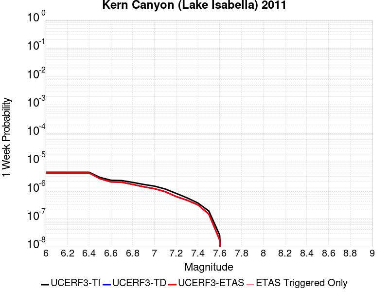 | 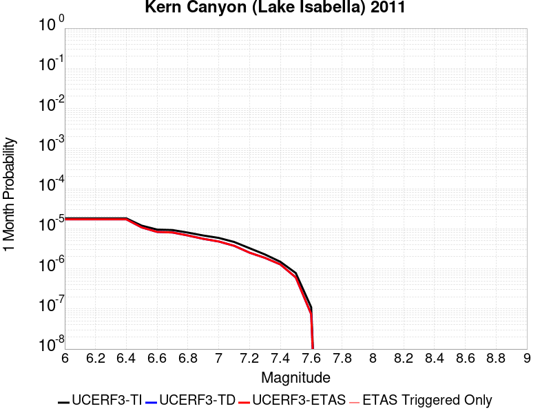 | 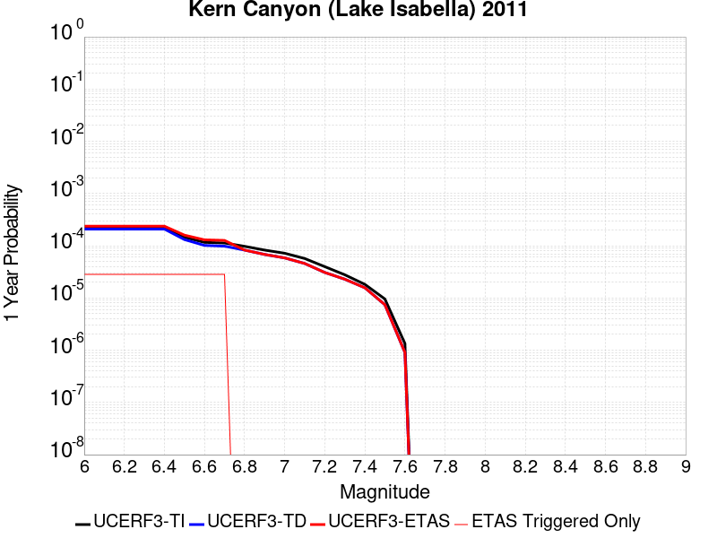 | 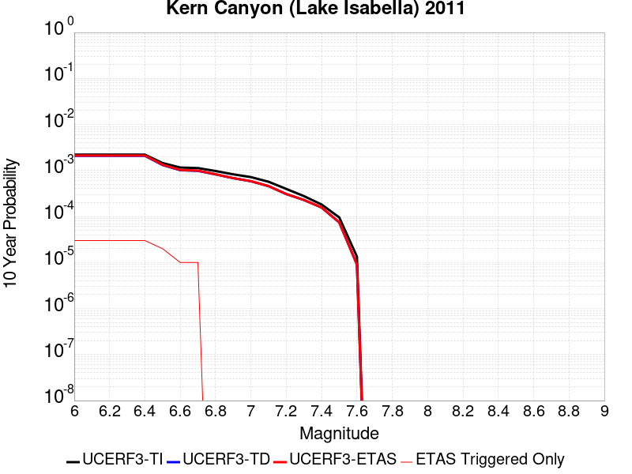 |

| Magnitude | 1 wk TI Prob | 1 wk TD Prob | 1 wk ETAS Prob | 1 wk ETAS/TD Gain | 1 wk ETAS Triggered Only | 1 mo TI Prob | 1 mo TD Prob | 1 mo ETAS Prob | 1 mo ETAS/TD Gain | 1 mo ETAS Triggered Only | 1 yr TI Prob | 1 yr TD Prob | 1 yr ETAS Prob | 1 yr ETAS/TD Gain | 1 yr ETAS Triggered Only | 10 yr TI Prob | 10 yr TD Prob | 10 yr ETAS Prob | 10 yr ETAS/TD Gain | 10 yr ETAS Triggered Only |
|-----|-----|-----|-----|-----|-----|-----|-----|-----|-----|-----|-----|-----|-----|-----|-----|-----|-----|-----|-----|-----|
| 6.0 | 4.2387383E-6 | 4.0017467E-6 | 4.0017467E-6 | 1.0 | 0.0 | 1.8165894E-5 | 1.7150242E-5 | 1.7150242E-5 | 1.0 | 0.0 | 2.2114732E-4 | 2.0878605E-4 | 2.2683282E-4 | 1.0864366 | 1.8050541E-5 | 0.0022092736 | 0.002086083 | 0.0021221086 | 1.0172696 | 3.6101083E-5 |
| 6.1 | 4.2387383E-6 | 4.0017467E-6 | 4.0017467E-6 | 1.0 | 0.0 | 1.8165894E-5 | 1.7150242E-5 | 1.7150242E-5 | 1.0 | 0.0 | 2.2114732E-4 | 2.0878605E-4 | 2.2683282E-4 | 1.0864366 | 1.8050541E-5 | 0.0022092736 | 0.002086083 | 0.0021221086 | 1.0172696 | 3.6101083E-5 |
| 6.2 | 4.2387383E-6 | 4.0017467E-6 | 4.0017467E-6 | 1.0 | 0.0 | 1.8165894E-5 | 1.7150242E-5 | 1.7150242E-5 | 1.0 | 0.0 | 2.2114732E-4 | 2.0878605E-4 | 2.2683282E-4 | 1.0864366 | 1.8050541E-5 | 0.0022092736 | 0.002086083 | 0.0021221086 | 1.0172696 | 3.6101083E-5 |
| 6.3 | 4.2387383E-6 | 4.0017467E-6 | 4.0017467E-6 | 1.0 | 0.0 | 1.8165894E-5 | 1.7150242E-5 | 1.7150242E-5 | 1.0 | 0.0 | 2.2114732E-4 | 2.0878605E-4 | 2.2683282E-4 | 1.0864366 | 1.8050541E-5 | 0.0022092736 | 0.002086083 | 0.0021221086 | 1.0172696 | 3.6101083E-5 |
| 6.4 | 4.2387383E-6 | 4.0017467E-6 | 4.0017467E-6 | 1.0 | 0.0 | 1.8165894E-5 | 1.7150242E-5 | 1.7150242E-5 | 1.0 | 0.0 | 2.2114732E-4 | 2.0878605E-4 | 2.2683282E-4 | 1.0864366 | 1.8050541E-5 | 0.0022092736 | 0.002086083 | 0.0021221086 | 1.0172696 | 3.6101083E-5 |
| 6.5 | 2.7857532E-6 | 2.5179374E-6 | 2.5179374E-6 | 1.0 | 0.0 | 1.1938888E-5 | 1.0791118E-5 | 1.0791118E-5 | 1.0 | 0.0 | 1.4534626E-4 | 1.3137427E-4 | 1.4942244E-4 | 1.1373798 | 1.8050541E-5 | 0.0014525123 | 0.0013129988 | 0.0013310256 | 1.0137296 | 1.8050541E-5 |
| 6.6 | 2.2233348E-6 | 1.9441804E-6 | 1.9441804E-6 | 1.0 | 0.0 | 9.528543E-6 | 8.332176E-6 | 8.332176E-6 | 1.0 | 0.0 | 1.1600384E-4 | 1.01439604E-4 | 1.19488315E-4 | 1.1779257 | 1.8050541E-5 | 0.001159433 | 0.0010139416 | 0.0010319739 | 1.0177842 | 1.8050541E-5 |
| 6.7 | 2.1635126E-6 | 1.8835594E-6 | 1.8835594E-6 | 1.0 | 0.0 | 9.272164E-6 | 8.072373E-6 | 8.072373E-6 | 1.0 | 0.0 | 1.1288274E-4 | 9.827679E-5 | 1.1632556E-4 | 1.1836524 | 1.8050541E-5 | 0.0011282542 | 9.823415E-4 | 0.0010003743 | 1.0183569 | 1.8050541E-5 |
| 6.8 | 1.8685711E-6 | 1.5831918E-6 | 1.5831918E-6 | 1.0 | 0.0 | 8.008137E-6 | 6.78509E-6 | 6.78509E-6 | 1.0 | 0.0 | 9.74947E-5 | 8.2605395E-5 | 8.2605395E-5 | 1.0 | 0.0 | 9.745194E-4 | 8.257518E-4 | 8.257518E-4 | 1.0 | 0.0 |
| 6.9 | 1.5815071E-6 | 1.306535E-6 | 1.306535E-6 | 1.0 | 0.0 | 6.77787E-6 | 5.5994237E-6 | 5.5994237E-6 | 1.0 | 0.0 | 8.251744E-5 | 6.817088E-5 | 6.817088E-5 | 1.0 | 0.0 | 8.248681E-4 | 6.8150234E-4 | 6.8150234E-4 | 1.0 | 0.0 |
| 7.0 | 1.3772564E-6 | 1.1211083E-6 | 1.1211083E-6 | 1.0 | 0.0 | 5.9025137E-6 | 4.8047414E-6 | 4.8047414E-6 | 1.0 | 0.0 | 7.186073E-5 | 5.8496174E-5 | 5.8496174E-5 | 1.0 | 0.0 | 7.18375E-4 | 5.848098E-4 | 5.848098E-4 | 1.0 | 0.0 |
| 7.1 | 1.0916998E-6 | 8.764056E-7 | 8.764056E-7 | 1.0 | 0.0 | 4.678705E-6 | 3.7560187E-6 | 3.7560187E-6 | 1.0 | 0.0 | 5.6961744E-5 | 4.572858E-5 | 4.572858E-5 | 1.0 | 0.0 | 5.6947145E-4 | 4.5719306E-4 | 4.5719306E-4 | 1.0 | 0.0 |
| 7.2 | 7.6277024E-7 | 5.9016423E-7 | 5.9016423E-7 | 1.0 | 0.0 | 3.2690114E-6 | 2.529273E-6 | 2.529273E-6 | 1.0 | 0.0 | 3.9799485E-5 | 3.0793468E-5 | 3.0793468E-5 | 1.0 | 0.0 | 3.9792358E-4 | 3.0789262E-4 | 3.0789262E-4 | 1.0 | 0.0 |
| 7.3 | 5.3265916E-7 | 4.3825747E-7 | 4.3825747E-7 | 1.0 | 0.0 | 2.282823E-6 | 1.8782449E-6 | 1.8782449E-6 | 1.0 | 0.0 | 2.7793016E-5 | 2.2867396E-5 | 2.2867396E-5 | 1.0 | 0.0 | 2.778954E-4 | 2.2865081E-4 | 2.2865081E-4 | 1.0 | 0.0 |
| 7.4 | 3.4946007E-7 | 3.0066604E-7 | 3.0066604E-7 | 1.0 | 0.0 | 1.497685E-6 | 1.2885681E-6 | 1.2885681E-6 | 1.0 | 0.0 | 1.8234163E-5 | 1.5688207E-5 | 1.5688207E-5 | 1.0 | 0.0 | 1.8232666E-4 | 1.5687122E-4 | 1.5687122E-4 | 1.0 | 0.0 |
| 7.5 | 1.8317026E-7 | 1.4245317E-7 | 1.4245317E-7 | 1.0 | 0.0 | 7.850152E-7 | 6.105135E-7 | 6.105135E-7 | 1.0 | 0.0 | 9.557518E-6 | 7.432977E-6 | 7.432977E-6 | 1.0 | 0.0 | 9.5571064E-5 | 7.432736E-5 | 7.432736E-5 | 1.0 | 0.0 |
| 7.6 | 2.572245E-8 | 1.7353296E-8 | 1.7353296E-8 | 1.0 | 0.0 | 1.10239064E-7 | 7.4371265E-8 | 7.4371265E-8 | 1.0 | 0.0 | 1.3421597E-6 | 9.054698E-7 | 9.054698E-7 | 1.0 | 0.0 | 1.3421517E-5 | 9.054666E-6 | 9.054666E-6 | 1.0 | 0.0 |

## Independence rev 2011
*[(top)](#table-of-contents)*

| 1 Week | 1 Month | 1 Year | 10 Year |
|-----|-----|-----|-----|
| 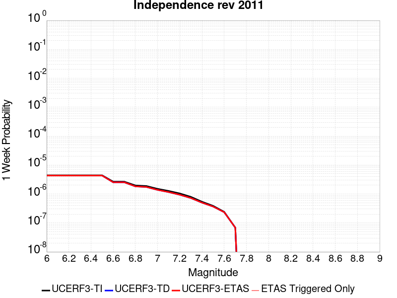 | 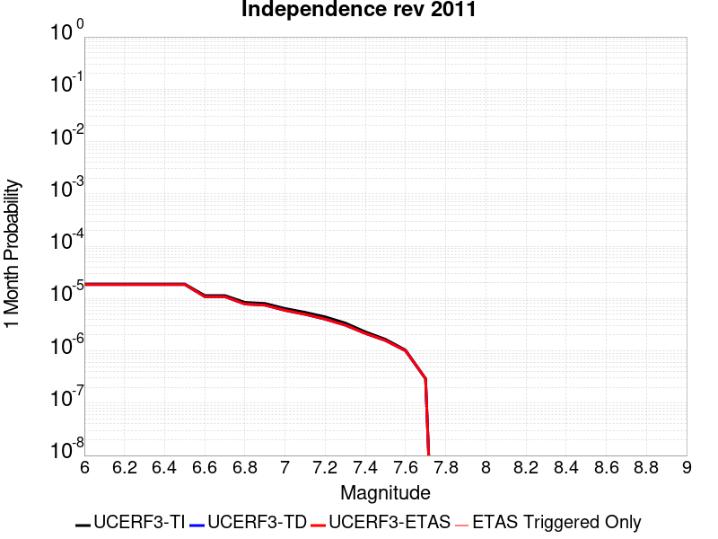 | 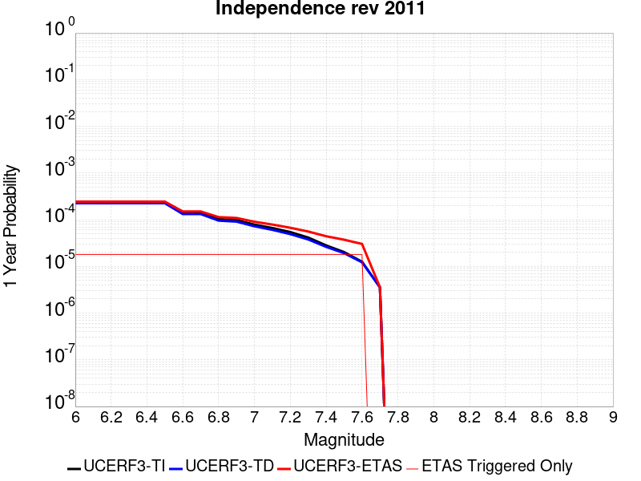 | 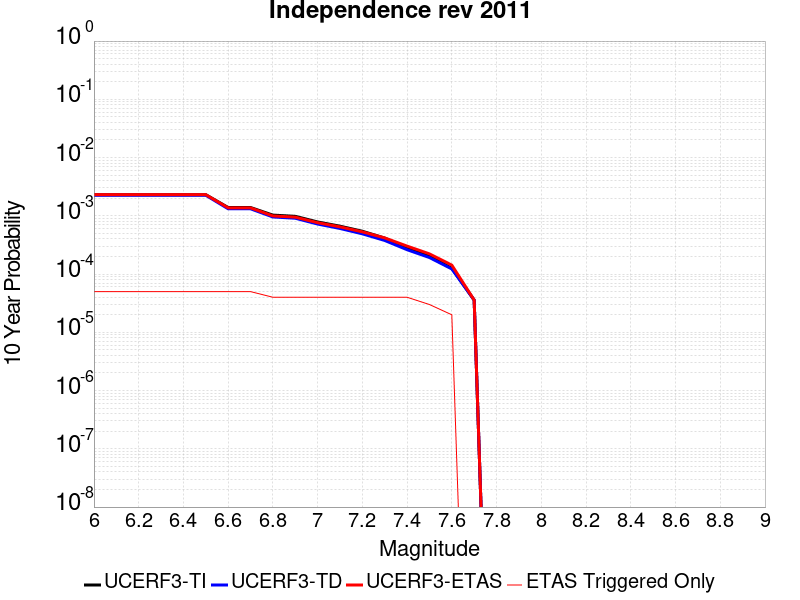 |

| Magnitude | 1 wk TI Prob | 1 wk TD Prob | 1 wk ETAS Prob | 1 wk ETAS/TD Gain | 1 wk ETAS Triggered Only | 1 mo TI Prob | 1 mo TD Prob | 1 mo ETAS Prob | 1 mo ETAS/TD Gain | 1 mo ETAS Triggered Only | 1 yr TI Prob | 1 yr TD Prob | 1 yr ETAS Prob | 1 yr ETAS/TD Gain | 1 yr ETAS Triggered Only | 10 yr TI Prob | 10 yr TD Prob | 10 yr ETAS Prob | 10 yr ETAS/TD Gain | 10 yr ETAS Triggered Only |
|-----|-----|-----|-----|-----|-----|-----|-----|-----|-----|-----|-----|-----|-----|-----|-----|-----|-----|-----|-----|-----|
| 6.0 | 4.422171E-6 | 4.3263917E-6 | 4.3263917E-6 | 1.0 | 0.0 | 1.8952025E-5 | 1.8541563E-5 | 1.8541563E-5 | 1.0 | 0.0 | 2.3071647E-4 | 2.2572314E-4 | 2.4376961E-4 | 1.0799496 | 1.8050541E-5 | 0.0023047708 | 0.0022552323 | 0.002291252 | 1.0159715 | 3.6101083E-5 |
| 6.1 | 4.422171E-6 | 4.3263917E-6 | 4.3263917E-6 | 1.0 | 0.0 | 1.8952025E-5 | 1.8541563E-5 | 1.8541563E-5 | 1.0 | 0.0 | 2.3071647E-4 | 2.2572314E-4 | 2.4376961E-4 | 1.0799496 | 1.8050541E-5 | 0.0023047708 | 0.0022552323 | 0.002291252 | 1.0159715 | 3.6101083E-5 |
| 6.2 | 4.422171E-6 | 4.3263917E-6 | 4.3263917E-6 | 1.0 | 0.0 | 1.8952025E-5 | 1.8541563E-5 | 1.8541563E-5 | 1.0 | 0.0 | 2.3071647E-4 | 2.2572314E-4 | 2.4376961E-4 | 1.0799496 | 1.8050541E-5 | 0.0023047708 | 0.0022552323 | 0.002291252 | 1.0159715 | 3.6101083E-5 |
| 6.3 | 4.422171E-6 | 4.3263917E-6 | 4.3263917E-6 | 1.0 | 0.0 | 1.8952025E-5 | 1.8541563E-5 | 1.8541563E-5 | 1.0 | 0.0 | 2.3071647E-4 | 2.2572314E-4 | 2.4376961E-4 | 1.0799496 | 1.8050541E-5 | 0.0023047708 | 0.0022552323 | 0.002291252 | 1.0159715 | 3.6101083E-5 |
| 6.4 | 4.422171E-6 | 4.3263917E-6 | 4.3263917E-6 | 1.0 | 0.0 | 1.8952025E-5 | 1.8541563E-5 | 1.8541563E-5 | 1.0 | 0.0 | 2.3071647E-4 | 2.2572314E-4 | 2.4376961E-4 | 1.0799496 | 1.8050541E-5 | 0.0023047708 | 0.0022552323 | 0.002291252 | 1.0159715 | 3.6101083E-5 |
| 6.5 | 4.422171E-6 | 4.3263917E-6 | 4.3263917E-6 | 1.0 | 0.0 | 1.8952025E-5 | 1.8541563E-5 | 1.8541563E-5 | 1.0 | 0.0 | 2.3071647E-4 | 2.2572314E-4 | 2.4376961E-4 | 1.0799496 | 1.8050541E-5 | 0.0023047708 | 0.0022552323 | 0.002291252 | 1.0159715 | 3.6101083E-5 |
| 6.6 | 2.663744E-6 | 2.5321071E-6 | 2.5321071E-6 | 1.0 | 0.0 | 1.1415996E-5 | 1.0851845E-5 | 1.0851845E-5 | 1.0 | 0.0 | 1.3898089E-4 | 1.321137E-4 | 1.5016185E-4 | 1.1366107 | 1.8050541E-5 | 0.0013889399 | 0.0013203998 | 0.0013564533 | 1.0273049 | 3.6101083E-5 |
| 6.7 | 2.663744E-6 | 2.5321071E-6 | 2.5321071E-6 | 1.0 | 0.0 | 1.1415996E-5 | 1.0851845E-5 | 1.0851845E-5 | 1.0 | 0.0 | 1.3898089E-4 | 1.321137E-4 | 1.5016185E-4 | 1.1366107 | 1.8050541E-5 | 0.0013889399 | 0.0013203998 | 0.0013564533 | 1.0273049 | 3.6101083E-5 |
| 6.8 | 1.9716529E-6 | 1.832362E-6 | 1.832362E-6 | 1.0 | 0.0 | 8.449913E-6 | 7.852957E-6 | 7.852957E-6 | 1.0 | 0.0 | 1.0287284E-4 | 9.560569E-5 | 1.136545E-4 | 1.1887839 | 1.8050541E-5 | 0.0010282523 | 9.556585E-4 | 9.7369176E-4 | 1.01887 | 1.8050541E-5 |
| 6.9 | 1.8788617E-6 | 1.7430989E-6 | 1.7430989E-6 | 1.0 | 0.0 | 8.0522395E-6 | 7.470403E-6 | 7.470403E-6 | 1.0 | 0.0 | 9.80316E-5 | 9.094848E-5 | 1.0899738E-4 | 1.1984519 | 1.8050541E-5 | 9.798837E-4 | 9.091246E-4 | 9.2715875E-4 | 1.0198368 | 1.8050541E-5 |
| 7.0 | 1.5045488E-6 | 1.3850328E-6 | 1.3850328E-6 | 1.0 | 0.0 | 6.44805E-6 | 5.9358413E-6 | 5.9358413E-6 | 1.0 | 0.0 | 7.8502184E-5 | 7.226652E-5 | 9.031576E-5 | 1.2497593 | 1.8050541E-5 | 7.8474457E-4 | 7.2243536E-4 | 7.4047287E-4 | 1.0249677 | 1.8050541E-5 |
| 7.1 | 1.272341E-6 | 1.1625815E-6 | 1.1625815E-6 | 1.0 | 0.0 | 5.4528787E-6 | 4.9824826E-6 | 4.9824826E-6 | 1.0 | 0.0 | 6.6386776E-5 | 6.066007E-5 | 7.870952E-5 | 1.2975507 | 1.8050541E-5 | 6.636695E-4 | 6.064383E-4 | 6.244779E-4 | 1.0297468 | 1.8050541E-5 |
| 7.2 | 1.0416892E-6 | 9.410499E-7 | 9.410499E-7 | 1.0 | 0.0 | 4.464375E-6 | 4.0330647E-6 | 4.0330647E-6 | 1.0 | 0.0 | 5.4352407E-5 | 4.9101476E-5 | 6.715113E-5 | 1.367599 | 1.8050541E-5 | 5.4339116E-4 | 4.9090816E-4 | 5.089498E-4 | 1.0367516 | 1.8050541E-5 |
| 7.3 | 7.9450155E-7 | 7.2354646E-7 | 7.2354646E-7 | 1.0 | 0.0 | 3.4050022E-6 | 3.10091E-6 | 3.10091E-6 | 1.0 | 0.0 | 4.1455114E-5 | 3.7752936E-5 | 5.5802797E-5 | 1.4781048 | 1.8050541E-5 | 4.144738E-4 | 3.7746632E-4 | 3.9551005E-4 | 1.0478022 | 1.8050541E-5 |
| 7.4 | 5.3893444E-7 | 5.0198E-7 | 5.0198E-7 | 1.0 | 0.0 | 2.309717E-6 | 2.1513413E-6 | 2.1513413E-6 | 1.0 | 0.0 | 2.8120441E-5 | 2.6192269E-5 | 4.4242337E-5 | 1.6891372 | 1.8050541E-5 | 2.8116882E-4 | 2.6189227E-4 | 2.799381E-4 | 1.0689055 | 1.8050541E-5 |
| 7.5 | 3.8852085E-7 | 3.6827421E-7 | 3.6827421E-7 | 1.0 | 0.0 | 1.6650882E-6 | 1.5783171E-6 | 1.5783171E-6 | 1.0 | 0.0 | 2.027226E-5 | 1.9215844E-5 | 3.726604E-5 | 1.9393392 | 1.8050541E-5 | 2.0270412E-4 | 1.9214203E-4 | 2.1018912E-4 | 1.0939257 | 1.8050541E-5 |
| 7.6 | 2.414929E-7 | 2.3458533E-7 | 2.3458533E-7 | 1.0 | 0.0 | 1.0349692E-6 | 1.0053653E-6 | 1.0053653E-6 | 1.0 | 0.0 | 1.2600677E-5 | 1.2240255E-5 | 3.0290576E-5 | 2.4746685 | 1.8050541E-5 | 1.2599962E-4 | 1.2239594E-4 | 1.4044427E-4 | 1.1474586 | 1.8050541E-5 |
| 7.7 | 6.8298014E-8 | 6.859177E-8 | 6.859177E-8 | 1.0 | 0.0 | 2.9270575E-7 | 2.939647E-7 | 2.939647E-7 | 1.0 | 0.0 | 3.5636867E-6 | 3.5790147E-6 | 3.5790147E-6 | 1.0 | 0.0 | 3.5636294E-5 | 3.5789617E-5 | 3.5789617E-5 | 1.0 | 0.0 |

## Kern Canyon (South Kern) 2011
*[(top)](#table-of-contents)*

| 1 Week | 1 Month | 1 Year | 10 Year |
|-----|-----|-----|-----|
| 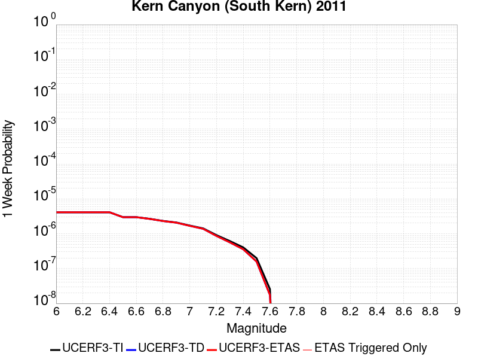 | 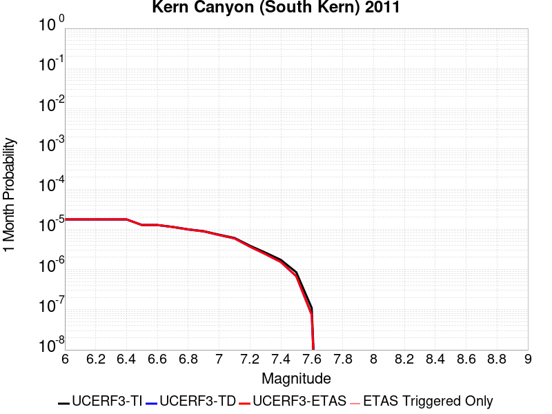 | 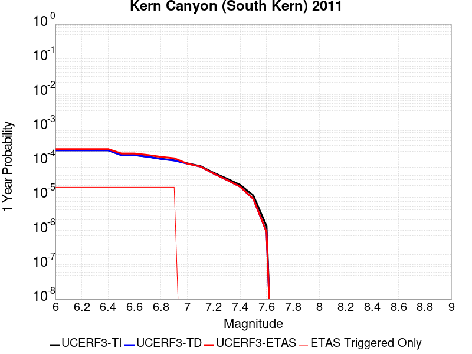 | 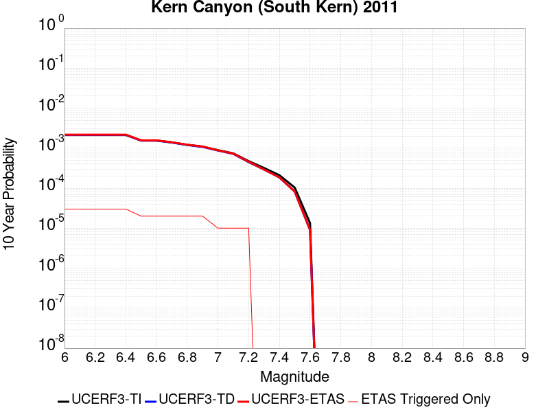 |

| Magnitude | 1 wk TI Prob | 1 wk TD Prob | 1 wk ETAS Prob | 1 wk ETAS/TD Gain | 1 wk ETAS Triggered Only | 1 mo TI Prob | 1 mo TD Prob | 1 mo ETAS Prob | 1 mo ETAS/TD Gain | 1 mo ETAS Triggered Only | 1 yr TI Prob | 1 yr TD Prob | 1 yr ETAS Prob | 1 yr ETAS/TD Gain | 1 yr ETAS Triggered Only | 10 yr TI Prob | 10 yr TD Prob | 10 yr ETAS Prob | 10 yr ETAS/TD Gain | 10 yr ETAS Triggered Only |
|-----|-----|-----|-----|-----|-----|-----|-----|-----|-----|-----|-----|-----|-----|-----|-----|-----|-----|-----|-----|-----|
| 6.0 | 4.105075E-6 | 4.1138187E-6 | 4.1138187E-6 | 1.0 | 0.0 | 1.7593058E-5 | 1.7630537E-5 | 1.7630537E-5 | 1.0 | 0.0 | 2.1417443E-4 | 2.1463128E-4 | 2.3267795E-4 | 1.0840821 | 1.8050541E-5 | 0.0021396813 | 0.0021443039 | 0.0021803274 | 1.0167997 | 3.6101083E-5 |
| 6.1 | 4.105075E-6 | 4.1138187E-6 | 4.1138187E-6 | 1.0 | 0.0 | 1.7593058E-5 | 1.7630537E-5 | 1.7630537E-5 | 1.0 | 0.0 | 2.1417443E-4 | 2.1463128E-4 | 2.3267795E-4 | 1.0840821 | 1.8050541E-5 | 0.0021396813 | 0.0021443039 | 0.0021803274 | 1.0167997 | 3.6101083E-5 |
| 6.2 | 4.105075E-6 | 4.1138187E-6 | 4.1138187E-6 | 1.0 | 0.0 | 1.7593058E-5 | 1.7630537E-5 | 1.7630537E-5 | 1.0 | 0.0 | 2.1417443E-4 | 2.1463128E-4 | 2.3267795E-4 | 1.0840821 | 1.8050541E-5 | 0.0021396813 | 0.0021443039 | 0.0021803274 | 1.0167997 | 3.6101083E-5 |
| 6.3 | 4.105075E-6 | 4.1138187E-6 | 4.1138187E-6 | 1.0 | 0.0 | 1.7593058E-5 | 1.7630537E-5 | 1.7630537E-5 | 1.0 | 0.0 | 2.1417443E-4 | 2.1463128E-4 | 2.3267795E-4 | 1.0840821 | 1.8050541E-5 | 0.0021396813 | 0.0021443039 | 0.0021803274 | 1.0167997 | 3.6101083E-5 |
| 6.4 | 4.105075E-6 | 4.1138187E-6 | 4.1138187E-6 | 1.0 | 0.0 | 1.7593058E-5 | 1.7630537E-5 | 1.7630537E-5 | 1.0 | 0.0 | 2.1417443E-4 | 2.1463128E-4 | 2.3267795E-4 | 1.0840821 | 1.8050541E-5 | 0.0021396813 | 0.0021443039 | 0.0021803274 | 1.0167997 | 3.6101083E-5 |
| 6.5 | 2.9849807E-6 | 2.9732223E-6 | 2.9732223E-6 | 1.0 | 0.0 | 1.2792712E-5 | 1.274232E-5 | 1.274232E-5 | 1.0 | 0.0 | 1.5574014E-4 | 1.5512685E-4 | 1.7317459E-4 | 1.1163418 | 1.8050541E-5 | 0.0015563103 | 0.0015502007 | 0.001586246 | 1.0232519 | 3.6101083E-5 |
| 6.6 | 2.9849807E-6 | 2.9732223E-6 | 2.9732223E-6 | 1.0 | 0.0 | 1.2792712E-5 | 1.274232E-5 | 1.274232E-5 | 1.0 | 0.0 | 1.5574014E-4 | 1.5512685E-4 | 1.7317459E-4 | 1.1163418 | 1.8050541E-5 | 0.0015563103 | 0.0015502007 | 0.001586246 | 1.0232519 | 3.6101083E-5 |
| 6.7 | 2.6756725E-6 | 2.6582813E-6 | 2.6582813E-6 | 1.0 | 0.0 | 1.1467117E-5 | 1.1392585E-5 | 1.1392585E-5 | 1.0 | 0.0 | 1.396032E-4 | 1.38696E-4 | 1.5674405E-4 | 1.1301266 | 1.8050541E-5 | 0.0013951553 | 0.0013861054 | 0.0014221565 | 1.0260088 | 3.6101083E-5 |
| 6.8 | 2.3283721E-6 | 2.304832E-6 | 2.304832E-6 | 1.0 | 0.0 | 9.9787E-6 | 9.877815E-6 | 9.877815E-6 | 1.0 | 0.0 | 1.214839E-4 | 1.2025583E-4 | 1.383042E-4 | 1.1500832 | 1.8050541E-5 | 0.001214175 | 0.001201915 | 0.0012379728 | 1.0300002 | 3.6101083E-5 |
| 6.9 | 2.0972677E-6 | 2.0696893E-6 | 2.0696893E-6 | 1.0 | 0.0 | 8.988259E-6 | 8.870068E-6 | 8.870068E-6 | 1.0 | 0.0 | 1.0942656E-4 | 1.07987784E-4 | 1.2603638E-4 | 1.1671355 | 1.8050541E-5 | 0.0010937268 | 0.0010793589 | 0.0011154211 | 1.0334107 | 3.6101083E-5 |
| 7.0 | 1.7132242E-6 | 1.6787435E-6 | 1.6787435E-6 | 1.0 | 0.0 | 7.3423685E-6 | 7.1945956E-6 | 7.1945956E-6 | 1.0 | 0.0 | 8.938967E-5 | 8.759071E-5 | 8.759071E-5 | 1.0 | 0.0 | 8.935372E-4 | 8.7556575E-4 | 8.936005E-4 | 1.0205978 | 1.8050541E-5 |
| 7.1 | 1.4215541E-6 | 1.3816085E-6 | 1.3816085E-6 | 1.0 | 0.0 | 6.0923603E-6 | 5.921166E-6 | 5.921166E-6 | 1.0 | 0.0 | 7.417196E-5 | 7.208784E-5 | 7.208784E-5 | 1.0 | 0.0 | 7.414721E-4 | 7.206472E-4 | 7.386848E-4 | 1.0250297 | 1.8050541E-5 |
| 7.2 | 9.097853E-7 | 8.603994E-7 | 8.603994E-7 | 1.0 | 0.0 | 3.899074E-6 | 3.6874208E-6 | 3.6874208E-6 | 1.0 | 0.0 | 4.7470192E-5 | 4.4893433E-5 | 4.4893433E-5 | 1.0 | 0.0 | 4.7460053E-4 | 4.4884474E-4 | 4.6688717E-4 | 1.0401975 | 1.8050541E-5 |
| 7.3 | 6.144169E-7 | 5.6283574E-7 | 5.6283574E-7 | 1.0 | 0.0 | 2.6332125E-6 | 2.412151E-6 | 2.412151E-6 | 1.0 | 0.0 | 3.205889E-5 | 2.9367546E-5 | 2.9367546E-5 | 1.0 | 0.0 | 3.2054266E-4 | 2.9363716E-4 | 2.9363716E-4 | 1.0 | 0.0 |
| 7.4 | 4.049844E-7 | 3.5729343E-7 | 3.5729343E-7 | 1.0 | 0.0 | 1.7356463E-6 | 1.5312567E-6 | 1.5312567E-6 | 1.0 | 0.0 | 2.1131287E-5 | 1.8642893E-5 | 1.8642893E-5 | 1.0 | 0.0 | 2.1129279E-4 | 1.8641354E-4 | 1.8641354E-4 | 1.0 | 0.0 |
| 7.5 | 1.9871162E-7 | 1.5830985E-7 | 1.5830985E-7 | 1.0 | 0.0 | 8.5162094E-7 | 6.7847054E-7 | 6.7847054E-7 | 1.0 | 0.0 | 1.0368436E-5 | 8.260348E-6 | 8.260348E-6 | 1.0 | 0.0 | 1.0367952E-4 | 8.26005E-5 | 8.26005E-5 | 1.0 | 0.0 |
| 7.6 | 2.572245E-8 | 1.7353296E-8 | 1.7353296E-8 | 1.0 | 0.0 | 1.10239064E-7 | 7.4371265E-8 | 7.4371265E-8 | 1.0 | 0.0 | 1.3421597E-6 | 9.054698E-7 | 9.054698E-7 | 1.0 | 0.0 | 1.3421517E-5 | 9.054666E-6 | 9.054666E-6 | 1.0 | 0.0 |

## White Wolf (Extension)
*[(top)](#table-of-contents)*

| 1 Week | 1 Month | 1 Year | 10 Year |
|-----|-----|-----|-----|
| 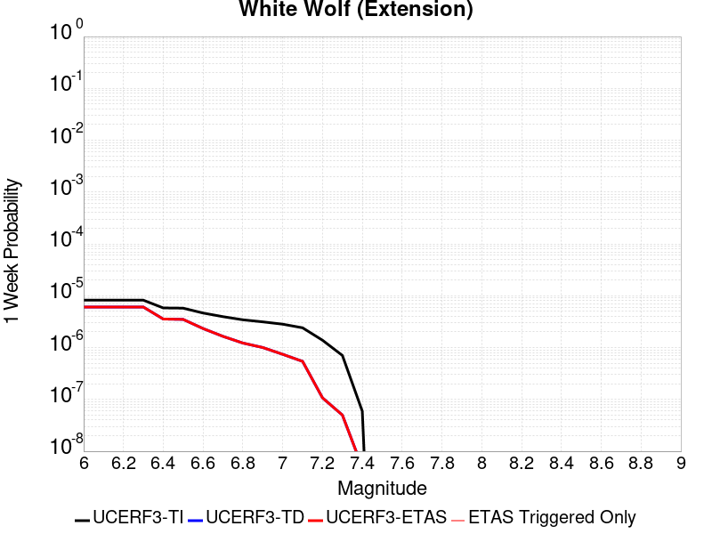 | 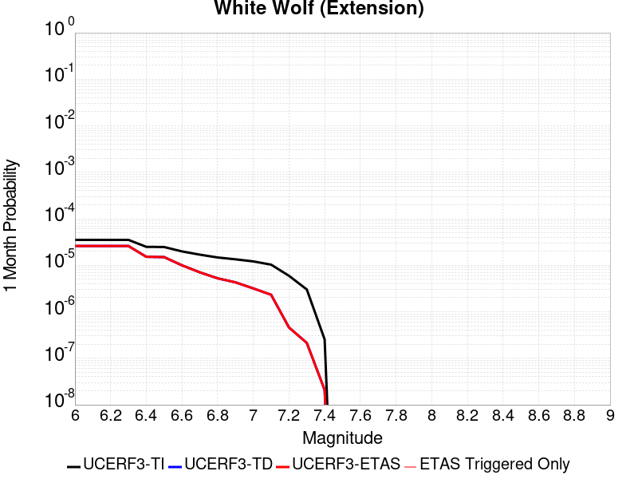 | 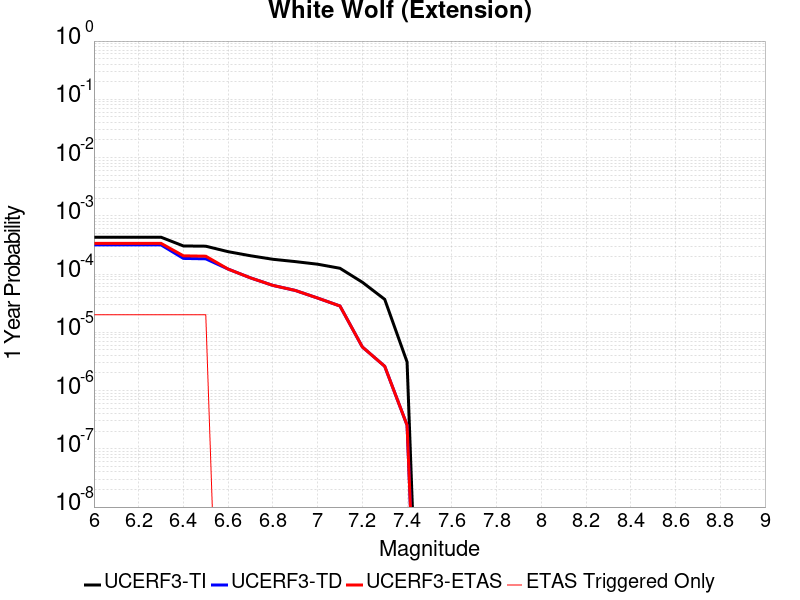 | 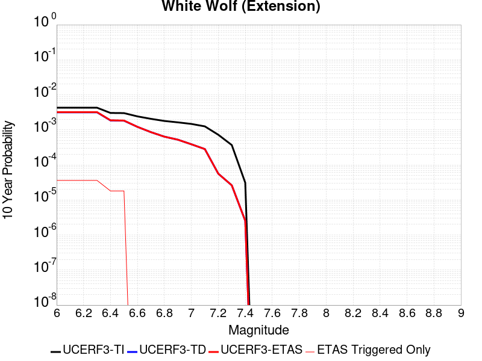 |

| Magnitude | 1 wk TI Prob | 1 wk TD Prob | 1 wk ETAS Prob | 1 wk ETAS/TD Gain | 1 wk ETAS Triggered Only | 1 mo TI Prob | 1 mo TD Prob | 1 mo ETAS Prob | 1 mo ETAS/TD Gain | 1 mo ETAS Triggered Only | 1 yr TI Prob | 1 yr TD Prob | 1 yr ETAS Prob | 1 yr ETAS/TD Gain | 1 yr ETAS Triggered Only | 10 yr TI Prob | 10 yr TD Prob | 10 yr ETAS Prob | 10 yr ETAS/TD Gain | 10 yr ETAS Triggered Only |
|-----|-----|-----|-----|-----|-----|-----|-----|-----|-----|-----|-----|-----|-----|-----|-----|-----|-----|-----|-----|-----|
| 6.0 | 8.222555E-6 | 6.0670277E-6 | 6.0670277E-6 | 1.0 | 0.0 | 3.5239045E-5 | 2.6001324E-5 | 2.6001324E-5 | 1.0 | 0.0 | 4.289509E-4 | 3.1652677E-4 | 3.3457158E-4 | 1.0570089 | 1.8050541E-5 | 0.0042812387 | 0.0031614113 | 0.0031973983 | 1.0113832 | 3.6101083E-5 |
| 6.1 | 8.222555E-6 | 6.0670277E-6 | 6.0670277E-6 | 1.0 | 0.0 | 3.5239045E-5 | 2.6001324E-5 | 2.6001324E-5 | 1.0 | 0.0 | 4.289509E-4 | 3.1652677E-4 | 3.3457158E-4 | 1.0570089 | 1.8050541E-5 | 0.0042812387 | 0.0031614113 | 0.0031973983 | 1.0113832 | 3.6101083E-5 |
| 6.2 | 8.222555E-6 | 6.0670277E-6 | 6.0670277E-6 | 1.0 | 0.0 | 3.5239045E-5 | 2.6001324E-5 | 2.6001324E-5 | 1.0 | 0.0 | 4.289509E-4 | 3.1652677E-4 | 3.3457158E-4 | 1.0570089 | 1.8050541E-5 | 0.0042812387 | 0.0031614113 | 0.0031973983 | 1.0113832 | 3.6101083E-5 |
| 6.3 | 8.222555E-6 | 6.0670277E-6 | 6.0670277E-6 | 1.0 | 0.0 | 3.5239045E-5 | 2.6001324E-5 | 2.6001324E-5 | 1.0 | 0.0 | 4.289509E-4 | 3.1652677E-4 | 3.3457158E-4 | 1.0570089 | 1.8050541E-5 | 0.0042812387 | 0.0031614113 | 0.0031973983 | 1.0113832 | 3.6101083E-5 |
| 6.4 | 5.821773E-6 | 3.5574026E-6 | 3.5574026E-6 | 1.0 | 0.0 | 2.4950215E-5 | 1.5245928E-5 | 1.5245928E-5 | 1.0 | 0.0 | 3.0372653E-4 | 1.8560447E-4 | 2.0365165E-4 | 1.0972347 | 1.8050541E-5 | 0.0030331176 | 0.0018546028 | 0.00187262 | 1.0097148 | 1.8050541E-5 |
| 6.5 | 5.766023E-6 | 3.4993338E-6 | 3.4993338E-6 | 1.0 | 0.0 | 2.4711293E-5 | 1.4997065E-5 | 1.4997065E-5 | 1.0 | 0.0 | 3.0081844E-4 | 1.8257507E-4 | 2.0062231E-4 | 1.0988483 | 1.8050541E-5 | 0.0030041158 | 0.0018243588 | 0.0018423764 | 1.0098761 | 1.8050541E-5 |
| 6.6 | 4.643576E-6 | 2.3327927E-6 | 2.3327927E-6 | 1.0 | 0.0 | 1.9900888E-5 | 9.997647E-6 | 9.997647E-6 | 1.0 | 0.0 | 2.4226638E-4 | 1.21714984E-4 | 1.21714984E-4 | 1.0 | 0.0 | 0.0024200242 | 0.0012165257 | 0.0012165257 | 1.0 | 0.0 |
| 6.7 | 3.9529173E-6 | 1.6484832E-6 | 1.6484832E-6 | 1.0 | 0.0 | 1.6940963E-5 | 7.06491E-6 | 7.06491E-6 | 1.0 | 0.0 | 2.0623671E-4 | 8.601207E-5 | 8.601207E-5 | 1.0 | 0.0 | 0.002060454 | 8.598063E-4 | 8.598063E-4 | 1.0 | 0.0 |
| 6.8 | 3.4377522E-6 | 1.2246359E-6 | 1.2246359E-6 | 1.0 | 0.0 | 1.473314E-5 | 5.2484293E-6 | 5.2484293E-6 | 1.0 | 0.0 | 1.7936122E-4 | 6.3897845E-5 | 6.3897845E-5 | 1.0 | 0.0 | 0.0017921652 | 6.388038E-4 | 6.388038E-4 | 1.0 | 0.0 |
| 6.9 | 3.1367306E-6 | 1.0034769E-6 | 1.0034769E-6 | 1.0 | 0.0 | 1.3443062E-5 | 4.3006085E-6 | 4.3006085E-6 | 1.0 | 0.0 | 1.63657E-4 | 5.235873E-5 | 5.235873E-5 | 1.0 | 0.0 | 0.0016353652 | 5.2347156E-4 | 5.2347156E-4 | 1.0 | 0.0 |
| 7.0 | 2.8298145E-6 | 7.4295207E-7 | 7.4295207E-7 | 1.0 | 0.0 | 1.2127721E-5 | 3.1840766E-6 | 3.1840766E-6 | 1.0 | 0.0 | 1.47645E-4 | 3.8765495E-5 | 3.8765495E-5 | 1.0 | 0.0 | 0.0014754693 | 3.875923E-4 | 3.875923E-4 | 1.0 | 0.0 |
| 7.1 | 2.4091064E-6 | 5.4234397E-7 | 5.4234397E-7 | 1.0 | 0.0 | 1.03247E-5 | 2.3243294E-6 | 2.3243294E-6 | 1.0 | 0.0 | 1.2569598E-4 | 2.8298386E-5 | 2.8298386E-5 | 1.0 | 0.0 | 0.001256249 | 2.8295186E-4 | 2.8295186E-4 | 1.0 | 0.0 |
| 7.2 | 1.3875518E-6 | 1.0746439E-7 | 1.0746439E-7 | 1.0 | 0.0 | 5.9466374E-6 | 4.605616E-7 | 4.605616E-7 | 1.0 | 0.0 | 7.23979E-5 | 5.607324E-6 | 5.607324E-6 | 1.0 | 0.0 | 7.2374323E-4 | 5.607194E-5 | 5.607194E-5 | 1.0 | 0.0 |
| 7.3 | 7.056077E-7 | 5.0039734E-8 | 5.0039734E-8 | 1.0 | 0.0 | 3.0240296E-6 | 2.1445598E-7 | 2.1445598E-7 | 1.0 | 0.0 | 3.681694E-5 | 2.610999E-6 | 2.610999E-6 | 1.0 | 0.0 | 3.681084E-4 | 2.6109728E-5 | 2.6109728E-5 | 1.0 | 0.0 |
| 7.4 | 5.9334678E-8 | 4.870236E-9 | 4.870236E-9 | 1.0 | 0.0 | 2.5429145E-7 | 2.0872442E-8 | 2.0872442E-8 | 1.0 | 0.0 | 3.095994E-6 | 2.5412194E-7 | 2.5412194E-7 | 1.0 | 0.0 | 3.095951E-5 | 2.5412178E-6 | 2.5412178E-6 | 1.0 | 0.0 |

## Whittier alt 1
*[(top)](#table-of-contents)*

| 1 Week | 1 Month | 1 Year | 10 Year |
|-----|-----|-----|-----|
| 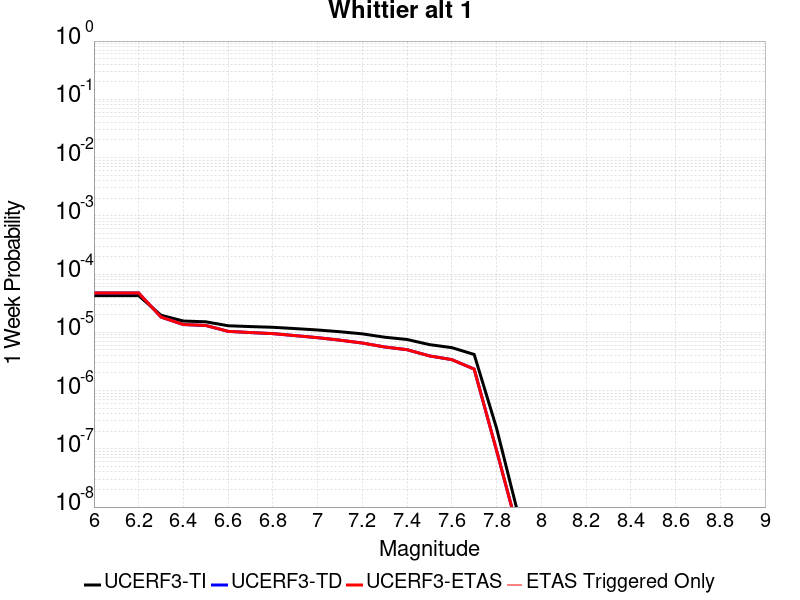 | 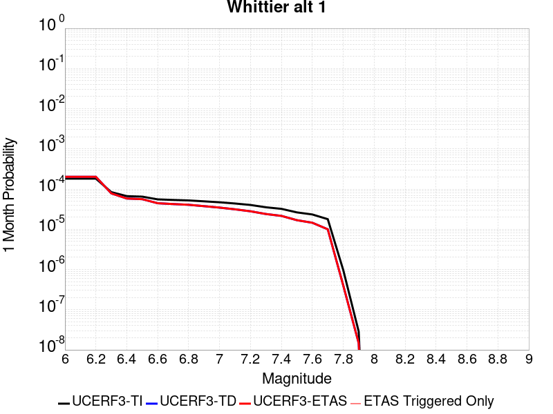 | 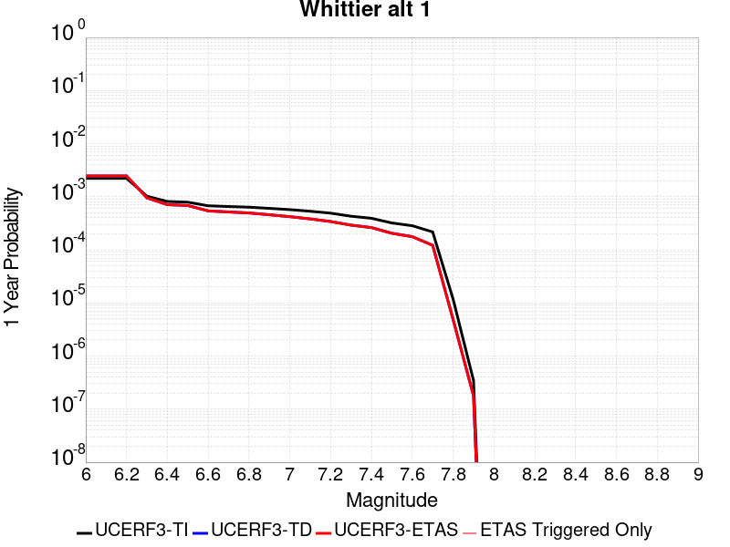 | 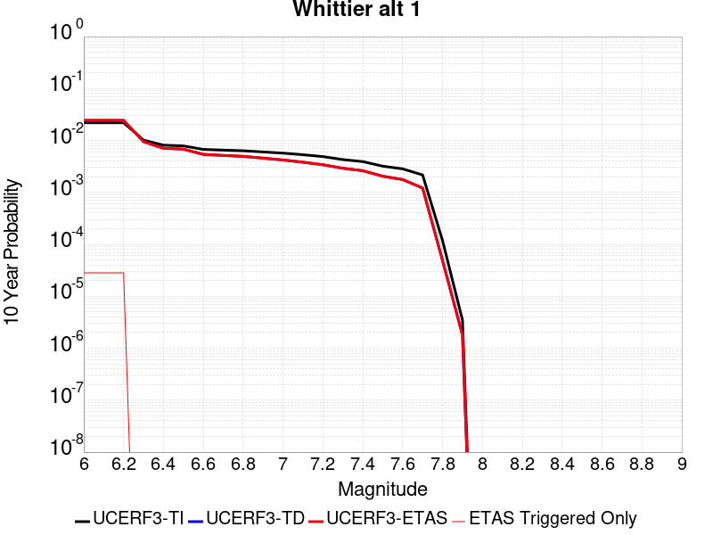 |

| Magnitude | 1 wk TI Prob | 1 wk TD Prob | 1 wk ETAS Prob | 1 wk ETAS/TD Gain | 1 wk ETAS Triggered Only | 1 mo TI Prob | 1 mo TD Prob | 1 mo ETAS Prob | 1 mo ETAS/TD Gain | 1 mo ETAS Triggered Only | 1 yr TI Prob | 1 yr TD Prob | 1 yr ETAS Prob | 1 yr ETAS/TD Gain | 1 yr ETAS Triggered Only | 10 yr TI Prob | 10 yr TD Prob | 10 yr ETAS Prob | 10 yr ETAS/TD Gain | 10 yr ETAS Triggered Only |
|-----|-----|-----|-----|-----|-----|-----|-----|-----|-----|-----|-----|-----|-----|-----|-----|-----|-----|-----|-----|-----|
| 6.0 | 4.2554693E-5 | 4.7263038E-5 | 4.7263038E-5 | 1.0 | 0.0 | 1.8236451E-4 | 2.0254198E-4 | 2.0254198E-4 | 1.0 | 0.0 | 0.002218027 | 0.0024634802 | 0.0024634802 | 1.0 | 0.0 | 0.02196019 | 0.02439577 | 0.024430988 | 1.0014437 | 3.6101083E-5 |
| 6.1 | 4.2554693E-5 | 4.7263038E-5 | 4.7263038E-5 | 1.0 | 0.0 | 1.8236451E-4 | 2.0254198E-4 | 2.0254198E-4 | 1.0 | 0.0 | 0.002218027 | 0.0024634802 | 0.0024634802 | 1.0 | 0.0 | 0.02196019 | 0.02439577 | 0.024430988 | 1.0014437 | 3.6101083E-5 |
| 6.2 | 4.2554693E-5 | 4.7263038E-5 | 4.7263038E-5 | 1.0 | 0.0 | 1.8236451E-4 | 2.0254198E-4 | 2.0254198E-4 | 1.0 | 0.0 | 0.002218027 | 0.0024634802 | 0.0024634802 | 1.0 | 0.0 | 0.02196019 | 0.02439577 | 0.024430988 | 1.0014437 | 3.6101083E-5 |
| 6.3 | 1.9617712E-5 | 1.8274395E-5 | 1.8274395E-5 | 1.0 | 0.0 | 8.40732E-5 | 7.8316596E-5 | 7.8316596E-5 | 1.0 | 0.0 | 0.0010231105 | 9.5310644E-4 | 9.5310644E-4 | 1.0 | 0.0 | 0.01018413 | 0.009493469 | 0.009511349 | 1.0018833 | 1.8050541E-5 |
| 6.4 | 1.5611336E-5 | 1.360918E-5 | 1.360918E-5 | 1.0 | 0.0 | 6.690401E-5 | 5.832379E-5 | 5.832379E-5 | 1.0 | 0.0 | 8.142519E-4 | 7.0986676E-4 | 7.0986676E-4 | 1.0 | 0.0 | 0.008112748 | 0.0070779533 | 0.007095876 | 1.0025322 | 1.8050541E-5 |
| 6.5 | 1.5150166E-5 | 1.3105778E-5 | 1.3105778E-5 | 1.0 | 0.0 | 6.492767E-5 | 5.6166442E-5 | 5.6166442E-5 | 1.0 | 0.0 | 7.9020765E-4 | 6.836178E-4 | 6.836178E-4 | 1.0 | 0.0 | 0.007874036 | 0.0068170945 | 0.006835022 | 1.0026298 | 1.8050541E-5 |
| 6.6 | 1.295588E-5 | 1.0384747E-5 | 1.0384747E-5 | 1.0 | 0.0 | 5.552402E-5 | 4.450531E-5 | 4.450531E-5 | 1.0 | 0.0 | 6.7579525E-4 | 5.417194E-4 | 5.417194E-4 | 1.0 | 0.0 | 0.006737438 | 0.0054054214 | 0.0054233745 | 1.0033213 | 1.8050541E-5 |
| 6.7 | 1.2542085E-5 | 9.90329E-6 | 9.90329E-6 | 1.0 | 0.0 | 5.3750682E-5 | 4.2441992E-5 | 4.2441992E-5 | 1.0 | 0.0 | 6.542181E-4 | 5.166106E-4 | 5.166106E-4 | 1.0 | 0.0 | 0.006522954 | 0.0051555145 | 0.0051734718 | 1.0034832 | 1.8050541E-5 |
| 6.8 | 1.2195878E-5 | 9.499204E-6 | 9.499204E-6 | 1.0 | 0.0 | 5.2267E-5 | 4.071025E-5 | 4.071025E-5 | 1.0 | 0.0 | 6.36165E-4 | 4.955364E-4 | 4.955364E-4 | 1.0 | 0.0 | 0.0063434686 | 0.0049456554 | 0.004963617 | 1.0036317 | 1.8050541E-5 |
| 6.9 | 1.1580298E-5 | 8.776476E-6 | 8.776476E-6 | 1.0 | 0.0 | 4.9628903E-5 | 3.7612932E-5 | 3.7612932E-5 | 1.0 | 0.0 | 6.040644E-4 | 4.578429E-4 | 4.578429E-4 | 1.0 | 0.0 | 0.00602425 | 0.0045702555 | 0.0045882235 | 1.0039315 | 1.8050541E-5 |
| 7.0 | 1.0964795E-5 | 8.087356E-6 | 8.087356E-6 | 1.0 | 0.0 | 4.6991136E-5 | 3.4659643E-5 | 3.4659643E-5 | 1.0 | 0.0 | 5.7196687E-4 | 4.21901E-4 | 4.21901E-4 | 1.0 | 0.0 | 0.0057049696 | 0.0042122086 | 0.004230183 | 1.0042672 | 1.8050541E-5 |
| 7.1 | 1.0230601E-5 | 7.329654E-6 | 7.329654E-6 | 1.0 | 0.0 | 4.3844695E-5 | 3.1412434E-5 | 3.1412434E-5 | 1.0 | 0.0 | 5.336784E-4 | 3.8238056E-4 | 3.8238056E-4 | 1.0 | 0.0 | 0.005323986 | 0.0038183897 | 0.0038363712 | 1.0047092 | 1.8050541E-5 |
| 7.2 | 9.40865E-6 | 6.546014E-6 | 6.546014E-6 | 1.0 | 0.0 | 4.032216E-5 | 2.8054052E-5 | 2.8054052E-5 | 1.0 | 0.0 | 4.908117E-4 | 3.4150577E-4 | 3.4150577E-4 | 1.0 | 0.0 | 0.0048972913 | 0.0034109023 | 0.0034288913 | 1.0052739 | 1.8050541E-5 |
| 7.3 | 8.237384E-6 | 5.600105E-6 | 5.600105E-6 | 1.0 | 0.0 | 3.5302593E-5 | 2.4000235E-5 | 2.4000235E-5 | 1.0 | 0.0 | 4.2972428E-4 | 2.9216474E-4 | 2.9216474E-4 | 1.0 | 0.0 | 0.0042889426 | 0.0029181272 | 0.002936125 | 1.0061677 | 1.8050541E-5 |
| 7.4 | 7.5316966E-6 | 5.0299627E-6 | 5.0299627E-6 | 1.0 | 0.0 | 3.2278298E-5 | 2.155681E-5 | 2.155681E-5 | 1.0 | 0.0 | 3.9291743E-4 | 2.6242356E-4 | 2.6242356E-4 | 1.0 | 0.0 | 0.0039222343 | 0.0026212488 | 0.002639252 | 1.0068682 | 1.8050541E-5 |
| 7.5 | 6.149649E-6 | 3.935562E-6 | 3.935562E-6 | 1.0 | 0.0 | 2.6355372E-5 | 1.686659E-5 | 1.686659E-5 | 1.0 | 0.0 | 3.208294E-4 | 2.0533228E-4 | 2.0533228E-4 | 1.0 | 0.0 | 0.003203666 | 0.002051515 | 0.0020695284 | 1.0087806 | 1.8050541E-5 |
| 7.6 | 5.457711E-6 | 3.3969034E-6 | 3.3969034E-6 | 1.0 | 0.0 | 2.338998E-5 | 1.4558081E-5 | 1.4558081E-5 | 1.0 | 0.0 | 2.8473578E-4 | 1.7723104E-4 | 1.7723104E-4 | 1.0 | 0.0 | 0.0028437122 | 0.0017709777 | 0.0017709777 | 1.0 | 0.0 |
| 7.7 | 4.1676276E-6 | 2.3344078E-6 | 2.3344078E-6 | 1.0 | 0.0 | 1.7861139E-5 | 1.0004571E-5 | 1.0004571E-5 | 1.0 | 0.0 | 2.1743766E-4 | 1.2179959E-4 | 1.2179959E-4 | 1.0 | 0.0 | 0.0021722503 | 0.0012174014 | 0.0012174014 | 1.0 | 0.0 |
| 7.8 | 2.2692414E-7 | 9.3897555E-8 | 9.3897555E-8 | 1.0 | 0.0 | 9.725317E-7 | 4.0241804E-7 | 4.0241804E-7 | 1.0 | 0.0 | 1.1840509E-5 | 4.899432E-6 | 4.899432E-6 | 1.0 | 0.0 | 1.1839878E-4 | 4.8993566E-5 | 4.8993566E-5 | 1.0 | 0.0 |
| 7.9 | 6.676829E-9 | 3.440971E-9 | 3.440971E-9 | 1.0 | 0.0 | 2.861498E-8 | 1.4747019E-8 | 1.4747019E-8 | 1.0 | 0.0 | 3.4838732E-7 | 1.7954494E-7 | 1.7954494E-7 | 1.0 | 0.0 | 3.4838679E-6 | 1.795448E-6 | 1.795448E-6 | 1.0 | 0.0 |

## Monterey Bay-Tularcitos
*[(top)](#table-of-contents)*

| 1 Week | 1 Month | 1 Year | 10 Year |
|-----|-----|-----|-----|
| 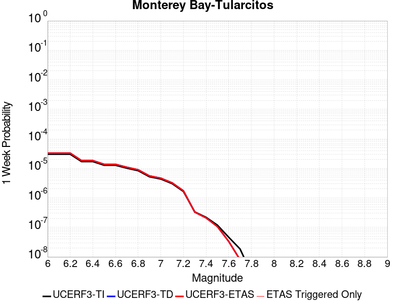 | 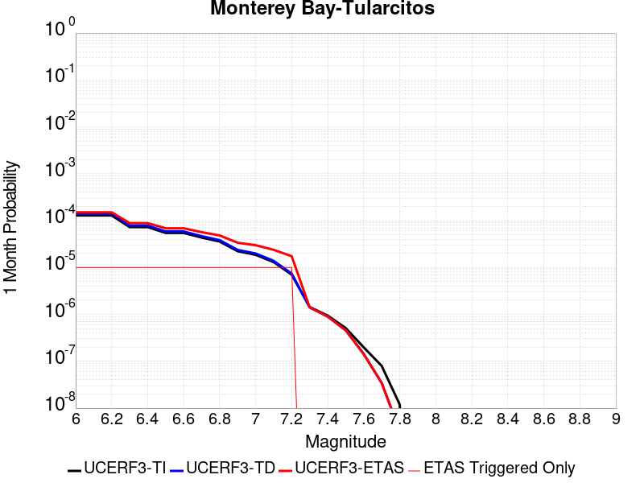 | 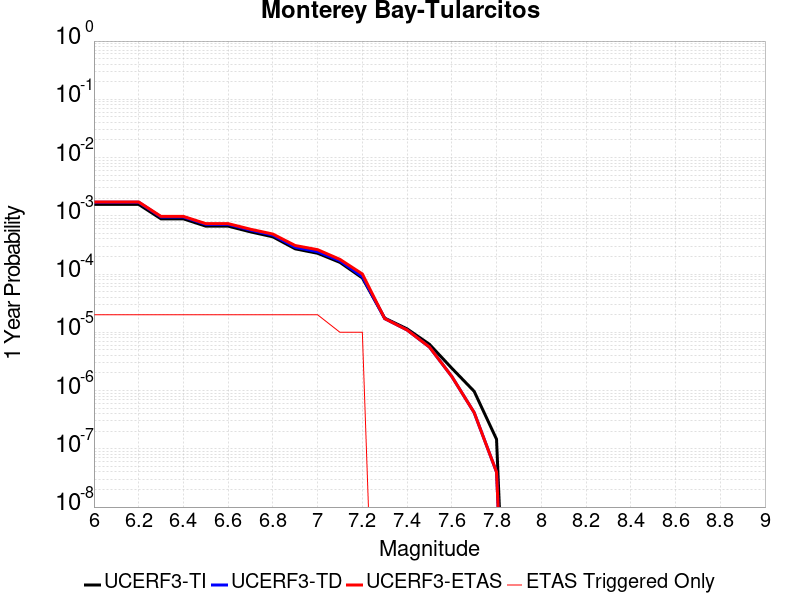 | 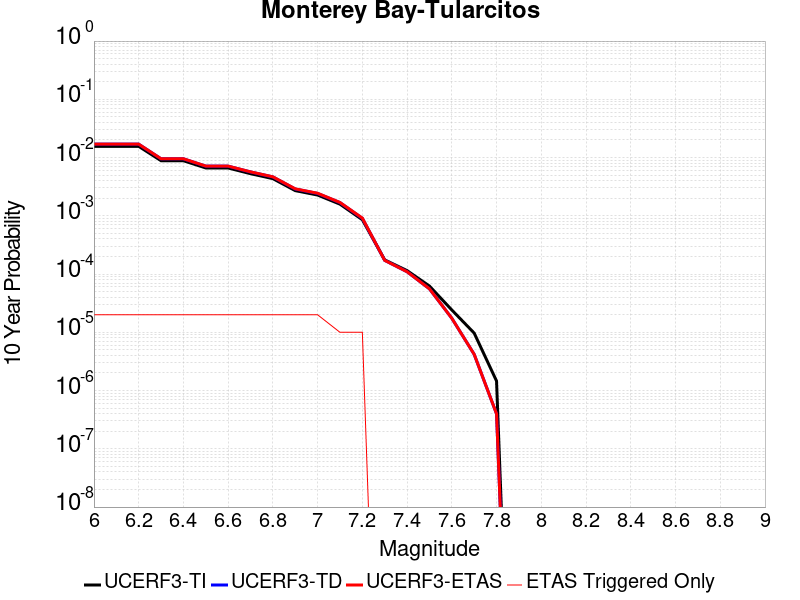 |

| Magnitude | 1 wk TI Prob | 1 wk TD Prob | 1 wk ETAS Prob | 1 wk ETAS/TD Gain | 1 wk ETAS Triggered Only | 1 mo TI Prob | 1 mo TD Prob | 1 mo ETAS Prob | 1 mo ETAS/TD Gain | 1 mo ETAS Triggered Only | 1 yr TI Prob | 1 yr TD Prob | 1 yr ETAS Prob | 1 yr ETAS/TD Gain | 1 yr ETAS Triggered Only | 10 yr TI Prob | 10 yr TD Prob | 10 yr ETAS Prob | 10 yr ETAS/TD Gain | 10 yr ETAS Triggered Only |
|-----|-----|-----|-----|-----|-----|-----|-----|-----|-----|-----|-----|-----|-----|-----|-----|-----|-----|-----|-----|-----|
| 6.0 | 3.0131365E-5 | 3.280234E-5 | 3.280234E-5 | 1.0 | 0.0 | 1.2912804E-4 | 1.4057448E-4 | 1.5862248E-4 | 1.1283875 | 1.8050541E-5 | 0.001571 | 0.0017102562 | 0.0017282759 | 1.0105362 | 1.8050541E-5 | 0.015599402 | 0.01698175 | 0.016999494 | 1.0010449 | 1.8050541E-5 |
| 6.1 | 3.0131365E-5 | 3.280234E-5 | 3.280234E-5 | 1.0 | 0.0 | 1.2912804E-4 | 1.4057448E-4 | 1.5862248E-4 | 1.1283875 | 1.8050541E-5 | 0.001571 | 0.0017102562 | 0.0017282759 | 1.0105362 | 1.8050541E-5 | 0.015599402 | 0.01698175 | 0.016999494 | 1.0010449 | 1.8050541E-5 |
| 6.2 | 3.0131365E-5 | 3.280234E-5 | 3.280234E-5 | 1.0 | 0.0 | 1.2912804E-4 | 1.4057448E-4 | 1.5862248E-4 | 1.1283875 | 1.8050541E-5 | 0.001571 | 0.0017102562 | 0.0017282759 | 1.0105362 | 1.8050541E-5 | 0.015599402 | 0.01698175 | 0.016999494 | 1.0010449 | 1.8050541E-5 |
| 6.3 | 1.6998249E-5 | 1.8332608E-5 | 1.8332608E-5 | 1.0 | 0.0 | 7.28476E-5 | 7.856607E-5 | 9.6615186E-5 | 1.2297318 | 1.8050541E-5 | 8.865586E-4 | 9.5614075E-4 | 9.7417407E-4 | 1.0188605 | 1.8050541E-5 | 0.0088303005 | 0.009522195 | 0.009540074 | 1.0018775 | 1.8050541E-5 |
| 6.4 | 1.6998249E-5 | 1.8332608E-5 | 1.8332608E-5 | 1.0 | 0.0 | 7.28476E-5 | 7.856607E-5 | 9.6615186E-5 | 1.2297318 | 1.8050541E-5 | 8.865586E-4 | 9.5614075E-4 | 9.7417407E-4 | 1.0188605 | 1.8050541E-5 | 0.0088303005 | 0.009522195 | 0.009540074 | 1.0018775 | 1.8050541E-5 |
| 6.5 | 1.27470785E-5 | 1.369462E-5 | 1.369462E-5 | 1.0 | 0.0 | 5.4629192E-5 | 5.8689966E-5 | 7.673945E-5 | 1.3075395 | 1.8050541E-5 | 6.649074E-4 | 7.1432645E-4 | 7.323641E-4 | 1.0252513 | 1.8050541E-5 | 0.0066292146 | 0.007121356 | 0.007139278 | 1.0025166 | 1.8050541E-5 |
| 6.6 | 1.2739422E-5 | 1.3686707E-5 | 1.3686707E-5 | 1.0 | 0.0 | 5.4596385E-5 | 5.8656053E-5 | 7.670554E-5 | 1.3077173 | 1.8050541E-5 | 6.645082E-4 | 7.139138E-4 | 7.319515E-4 | 1.0252658 | 1.8050541E-5 | 0.0066252467 | 0.007117256 | 0.0071351784 | 1.002518 | 1.8050541E-5 |
| 6.7 | 1.0160109E-5 | 1.0886776E-5 | 1.0886776E-5 | 1.0 | 0.0 | 4.35426E-5 | 4.6656816E-5 | 6.470652E-5 | 1.386861 | 1.8050541E-5 | 5.300022E-4 | 5.679058E-4 | 5.85946E-4 | 1.0317663 | 1.8050541E-5 | 0.005287399 | 0.005665256 | 0.0056832046 | 1.0031681 | 1.8050541E-5 |
| 6.8 | 8.349859E-6 | 8.933424E-6 | 8.933424E-6 | 1.0 | 0.0 | 3.578462E-5 | 3.8285572E-5 | 5.6335422E-5 | 1.4714531 | 1.8050541E-5 | 4.3559066E-4 | 4.6603283E-4 | 4.8407493E-4 | 1.0387143 | 1.8050541E-5 | 0.004347378 | 0.00465112 | 0.0046690865 | 1.0038629 | 1.8050541E-5 |
| 6.9 | 5.193639E-6 | 5.5369587E-6 | 5.5369587E-6 | 1.0 | 0.0 | 2.2258262E-5 | 2.3729626E-5 | 4.177974E-5 | 1.7606573 | 1.8050541E-5 | 2.7096065E-4 | 2.8887315E-4 | 3.0691846E-4 | 1.062468 | 1.8050541E-5 | 0.0027063051 | 0.0028852976 | 0.002903296 | 1.006238 | 1.8050541E-5 |
| 7.0 | 4.359381E-6 | 4.6438195E-6 | 4.6438195E-6 | 1.0 | 0.0 | 1.8682927E-5 | 1.9901949E-5 | 3.795213E-5 | 1.9069555 | 1.8050541E-5 | 2.274409E-4 | 2.4228226E-4 | 2.6032844E-4 | 1.0744841 | 1.8050541E-5 | 0.0022720827 | 0.002420474 | 0.002438481 | 1.0074394 | 1.8050541E-5 |
| 7.1 | 3.0398533E-6 | 3.2313774E-6 | 3.2313774E-6 | 1.0 | 0.0 | 1.3027877E-5 | 1.3848702E-5 | 3.189899E-5 | 2.3033924 | 1.8050541E-5 | 1.5860285E-4 | 1.6859753E-4 | 1.8664502E-4 | 1.1070448 | 1.8050541E-5 | 0.001584897 | 0.0016849538 | 0.001702974 | 1.0106947 | 1.8050541E-5 |
| 7.2 | 1.642335E-6 | 1.7335218E-6 | 1.7335218E-6 | 1.0 | 0.0 | 7.0385595E-6 | 7.4293694E-6 | 2.5479776E-5 | 3.4296014 | 1.8050541E-5 | 8.569109E-5 | 9.0450885E-5 | 1.0849979E-4 | 1.1995437 | 1.8050541E-5 | 8.5658056E-4 | 9.0434344E-4 | 9.223777E-4 | 1.0199418 | 1.8050541E-5 |
| 7.3 | 3.356842E-7 | 3.2960546E-7 | 3.2960546E-7 | 1.0 | 0.0 | 1.4386458E-6 | 1.412594E-6 | 1.412594E-6 | 1.0 | 0.0 | 1.7515373E-5 | 1.7198197E-5 | 1.7198197E-5 | 1.0 | 0.0 | 1.7513991E-4 | 1.7196876E-4 | 1.7196876E-4 | 1.0 | 0.0 |
| 7.4 | 2.1973483E-7 | 2.1014137E-7 | 2.1014137E-7 | 1.0 | 0.0 | 9.417204E-7 | 9.006055E-7 | 9.006055E-7 | 1.0 | 0.0 | 1.1465385E-5 | 1.0964817E-5 | 1.0964817E-5 | 1.0 | 0.0 | 1.1464794E-4 | 1.096428E-4 | 1.096428E-4 | 1.0 | 0.0 |
| 7.5 | 1.1944135E-7 | 1.07033706E-7 | 1.07033706E-7 | 1.0 | 0.0 | 5.118914E-7 | 4.587158E-7 | 4.587158E-7 | 1.0 | 0.0 | 6.23226E-6 | 5.5848504E-6 | 5.5848504E-6 | 1.0 | 0.0 | 6.2320854E-5 | 5.5847115E-5 | 5.5847115E-5 | 1.0 | 0.0 |
| 7.6 | 4.636058E-8 | 3.3412473E-8 | 3.3412473E-8 | 1.0 | 0.0 | 1.9868818E-7 | 1.431963E-7 | 1.431963E-7 | 1.0 | 0.0 | 2.419026E-6 | 1.7434136E-6 | 1.7434136E-6 | 1.0 | 0.0 | 2.4189996E-5 | 1.7434002E-5 | 1.7434002E-5 | 1.0 | 0.0 |
| 7.7 | 1.8588572E-8 | 8.026009E-9 | 8.026009E-9 | 1.0 | 0.0 | 7.9665305E-8 | 3.4397186E-8 | 3.4397186E-8 | 1.0 | 0.0 | 9.699246E-7 | 4.1878562E-7 | 4.1878562E-7 | 1.0 | 0.0 | 9.699204E-6 | 4.1878484E-6 | 4.1878484E-6 | 1.0 | 0.0 |
| 7.8 | 2.7960154E-9 | 7.644507E-10 | 7.644507E-10 | 1.0 | 0.0 | 1.1982923E-8 | 3.2762175E-9 | 3.2762175E-9 | 1.0 | 0.0 | 1.4589209E-7 | 3.988795E-8 | 3.988795E-8 | 1.0 | 0.0 | 1.4589199E-6 | 3.9887945E-7 | 3.9887945E-7 | 1.0 | 0.0 |

## Walker Spring 2011 CFM
*[(top)](#table-of-contents)*

| 1 Week | 1 Month | 1 Year | 10 Year |
|-----|-----|-----|-----|
| 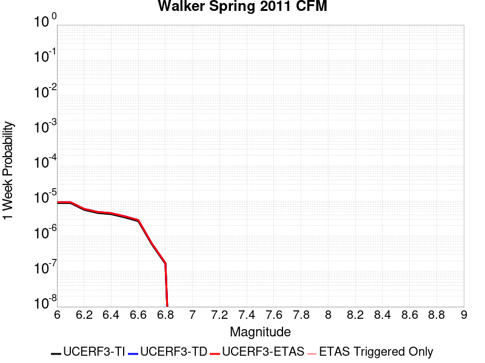 | 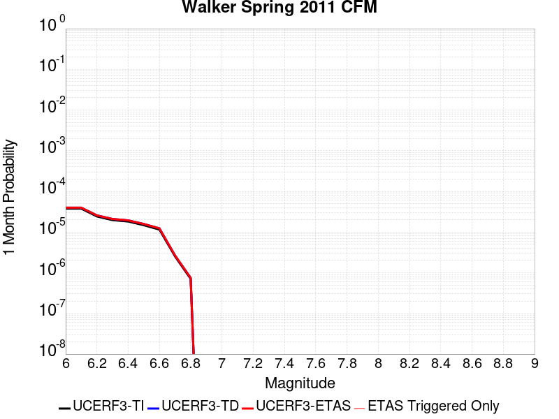 | 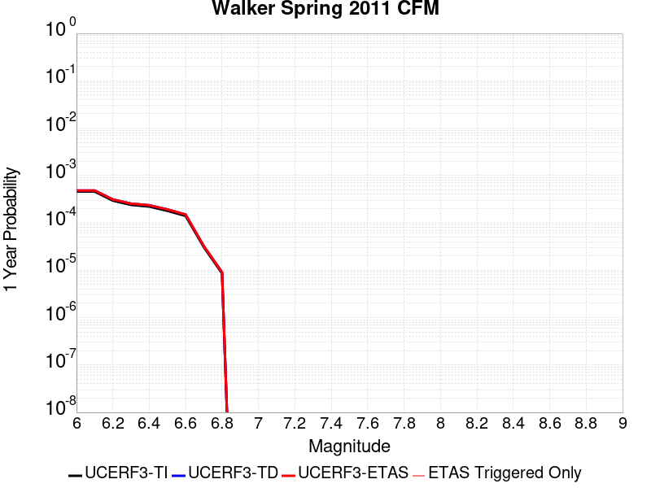 | 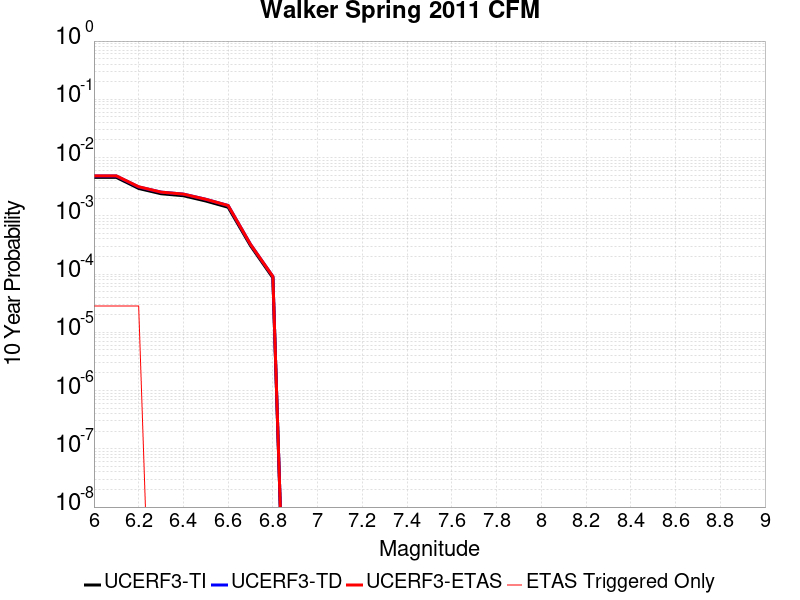 |

| Magnitude | 1 wk TI Prob | 1 wk TD Prob | 1 wk ETAS Prob | 1 wk ETAS/TD Gain | 1 wk ETAS Triggered Only | 1 mo TI Prob | 1 mo TD Prob | 1 mo ETAS Prob | 1 mo ETAS/TD Gain | 1 mo ETAS Triggered Only | 1 yr TI Prob | 1 yr TD Prob | 1 yr ETAS Prob | 1 yr ETAS/TD Gain | 1 yr ETAS Triggered Only | 10 yr TI Prob | 10 yr TD Prob | 10 yr ETAS Prob | 10 yr ETAS/TD Gain | 10 yr ETAS Triggered Only |
|-----|-----|-----|-----|-----|-----|-----|-----|-----|-----|-----|-----|-----|-----|-----|-----|-----|-----|-----|-----|-----|
| 6.0 | 8.791276E-6 | 9.264686E-6 | 9.264686E-6 | 1.0 | 0.0 | 3.767635E-5 | 3.9705257E-5 | 3.9705257E-5 | 1.0 | 0.0 | 4.58613E-4 | 4.8331512E-4 | 4.8331512E-4 | 1.0 | 0.0 | 0.004576677 | 0.0048237136 | 0.004841677 | 1.003724 | 1.8050541E-5 |
| 6.1 | 8.791276E-6 | 9.264686E-6 | 9.264686E-6 | 1.0 | 0.0 | 3.767635E-5 | 3.9705257E-5 | 3.9705257E-5 | 1.0 | 0.0 | 4.58613E-4 | 4.8331512E-4 | 4.8331512E-4 | 1.0 | 0.0 | 0.004576677 | 0.0048237136 | 0.004841677 | 1.003724 | 1.8050541E-5 |
| 6.2 | 5.654515E-6 | 5.9991985E-6 | 5.9991985E-6 | 1.0 | 0.0 | 2.4233412E-5 | 2.5710626E-5 | 2.5710626E-5 | 1.0 | 0.0 | 2.9500184E-4 | 3.1298693E-4 | 3.1298693E-4 | 1.0 | 0.0 | 0.0029461053 | 0.0031259558 | 0.00314395 | 1.0057564 | 1.8050541E-5 |
| 6.3 | 4.591685E-6 | 4.895114E-6 | 4.895114E-6 | 1.0 | 0.0 | 1.96785E-5 | 2.0978916E-5 | 2.0978916E-5 | 1.0 | 0.0 | 2.395594E-4 | 2.5539275E-4 | 2.5539275E-4 | 1.0 | 0.0 | 0.002393013 | 0.0025514225 | 0.0025514225 | 1.0 | 0.0 |
| 6.4 | 4.243283E-6 | 4.5230177E-6 | 4.5230177E-6 | 1.0 | 0.0 | 1.8185372E-5 | 1.938424E-5 | 1.938424E-5 | 1.0 | 0.0 | 2.2138441E-4 | 2.359818E-4 | 2.359818E-4 | 1.0 | 0.0 | 0.00221164 | 0.0023577278 | 0.0023577278 | 1.0 | 0.0 |
| 6.5 | 3.4445666E-6 | 3.6864021E-6 | 3.6864021E-6 | 1.0 | 0.0 | 1.4762345E-5 | 1.5798792E-5 | 1.5798792E-5 | 1.0 | 0.0 | 1.7971672E-4 | 1.9233735E-4 | 1.9233735E-4 | 1.0 | 0.0 | 0.0017957145 | 0.0019221037 | 0.0019221037 | 1.0 | 0.0 |
| 6.6 | 2.68766E-6 | 2.8796808E-6 | 2.8796808E-6 | 1.0 | 0.0 | 1.1518492E-5 | 1.2341452E-5 | 1.2341452E-5 | 1.0 | 0.0 | 1.4022861E-4 | 1.5025063E-4 | 1.5025063E-4 | 1.0 | 0.0 | 0.0014014016 | 0.0015018644 | 0.0015018644 | 1.0 | 0.0 |
| 6.7 | 5.880964E-7 | 6.200149E-7 | 6.200149E-7 | 1.0 | 0.0 | 2.5204106E-6 | 2.6572045E-6 | 2.6572045E-6 | 1.0 | 0.0 | 3.0685565E-5 | 3.235108E-5 | 3.235108E-5 | 1.0 | 0.0 | 3.068133E-4 | 3.2347307E-4 | 3.2347307E-4 | 1.0 | 0.0 |
| 6.8 | 1.6514163E-7 | 1.7410244E-7 | 1.7410244E-7 | 1.0 | 0.0 | 7.077497E-7 | 7.4615326E-7 | 7.4615326E-7 | 1.0 | 0.0 | 8.616818E-6 | 9.084416E-6 | 9.084416E-6 | 1.0 | 0.0 | 8.616484E-5 | 9.0844165E-5 | 9.0844165E-5 | 1.0 | 0.0 |

## San Diego Trough south
*[(top)](#table-of-contents)*

| 1 Week | 1 Month | 1 Year | 10 Year |
|-----|-----|-----|-----|
| 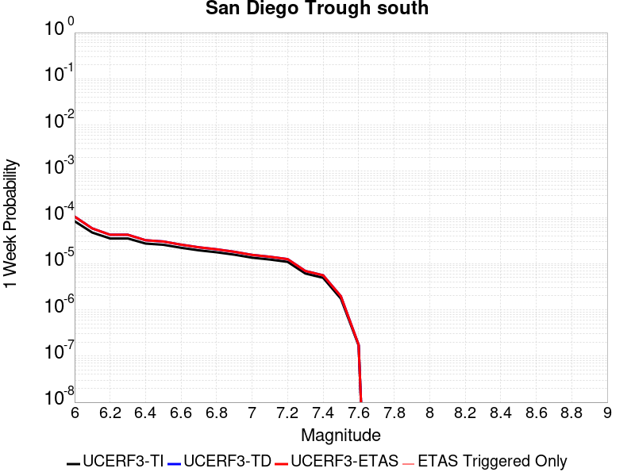 | 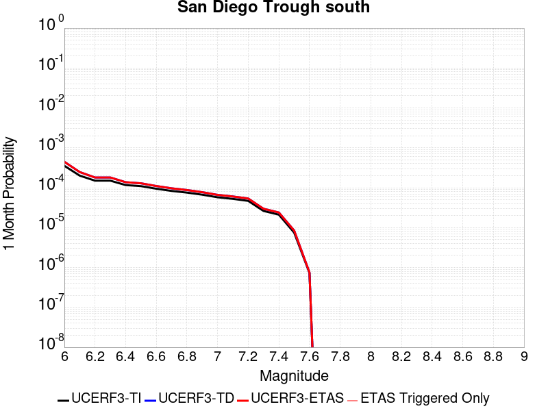 | 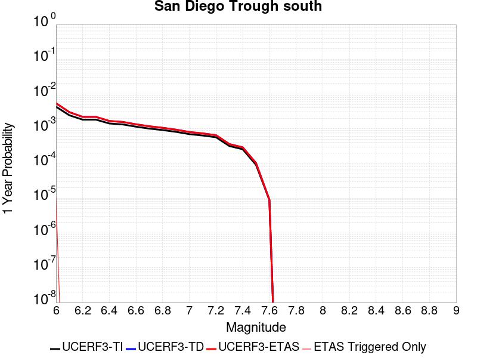 | 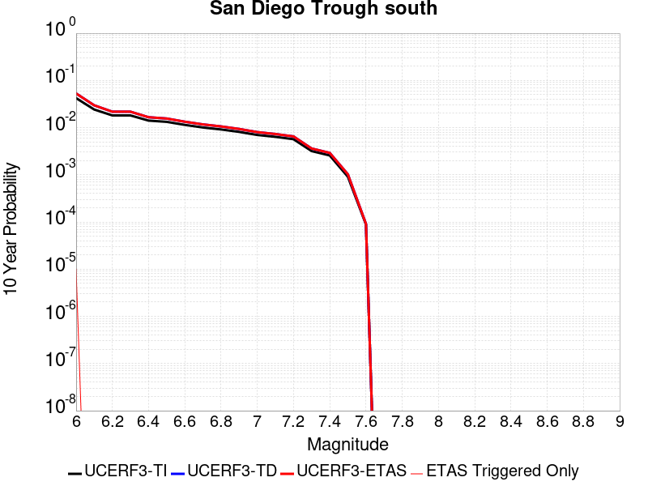 |

| Magnitude | 1 wk TI Prob | 1 wk TD Prob | 1 wk ETAS Prob | 1 wk ETAS/TD Gain | 1 wk ETAS Triggered Only | 1 mo TI Prob | 1 mo TD Prob | 1 mo ETAS Prob | 1 mo ETAS/TD Gain | 1 mo ETAS Triggered Only | 1 yr TI Prob | 1 yr TD Prob | 1 yr ETAS Prob | 1 yr ETAS/TD Gain | 1 yr ETAS Triggered Only | 10 yr TI Prob | 10 yr TD Prob | 10 yr ETAS Prob | 10 yr ETAS/TD Gain | 10 yr ETAS Triggered Only |
|-----|-----|-----|-----|-----|-----|-----|-----|-----|-----|-----|-----|-----|-----|-----|-----|-----|-----|-----|-----|-----|
| 6.0 | 8.279495E-5 | 1.0427544E-4 | 1.0427544E-4 | 1.0 | 0.0 | 3.5478722E-4 | 4.4682316E-4 | 4.4682316E-4 | 1.0 | 0.0 | 0.004310982 | 0.0054273237 | 0.0054452764 | 1.0033078 | 1.8050541E-5 | 0.042283054 | 0.053007584 | 0.05302468 | 1.0003225 | 1.8050541E-5 |
| 6.1 | 4.6961468E-5 | 5.7745885E-5 | 5.7745885E-5 | 1.0 | 0.0 | 2.0124791E-4 | 2.4745986E-4 | 2.4745986E-4 | 1.0 | 0.0 | 0.00244744 | 0.0030087666 | 0.0030087666 | 1.0 | 0.0 | 0.024206603 | 0.029687349 | 0.029687349 | 1.0 | 0.0 |
| 6.2 | 3.5079658E-5 | 4.2151918E-5 | 4.2151918E-5 | 1.0 | 0.0 | 1.5033272E-4 | 1.8063883E-4 | 1.8063883E-4 | 1.0 | 0.0 | 0.0018287642 | 0.002197102 | 0.002197102 | 1.0 | 0.0 | 0.018137876 | 0.021756303 | 0.021756303 | 1.0 | 0.0 |
| 6.3 | 3.5079658E-5 | 4.2151918E-5 | 4.2151918E-5 | 1.0 | 0.0 | 1.5033272E-4 | 1.8063883E-4 | 1.8063883E-4 | 1.0 | 0.0 | 0.0018287642 | 0.002197102 | 0.002197102 | 1.0 | 0.0 | 0.018137876 | 0.021756303 | 0.021756303 | 1.0 | 0.0 |
| 6.4 | 2.7196904E-5 | 3.209414E-5 | 3.209414E-5 | 1.0 | 0.0 | 1.16552954E-4 | 1.3753916E-4 | 1.3753916E-4 | 1.0 | 0.0 | 0.0014181085 | 0.0016732657 | 0.0016732657 | 1.0 | 0.0 | 0.014090929 | 0.0166082 | 0.0166082 | 1.0 | 0.0 |
| 6.5 | 2.5584688E-5 | 3.0108056E-5 | 3.0108056E-5 | 1.0 | 0.0 | 1.0964406E-4 | 1.2902824E-4 | 1.2902824E-4 | 1.0 | 0.0 | 0.0013340989 | 0.0015697981 | 0.0015697981 | 1.0 | 0.0 | 0.013261181 | 0.015588593 | 0.015588593 | 1.0 | 0.0 |
| 6.6 | 2.2034688E-5 | 2.5747953E-5 | 2.5747953E-5 | 1.0 | 0.0 | 9.443096E-5 | 1.1034375E-4 | 1.1034375E-4 | 1.0 | 0.0 | 0.0011490905 | 0.0013426127 | 0.0013426127 | 1.0 | 0.0 | 0.011431668 | 0.013345998 | 0.013345998 | 1.0 | 0.0 |
| 6.7 | 1.9394853E-5 | 2.2546155E-5 | 2.2546155E-5 | 1.0 | 0.0 | 8.311815E-5 | 9.662283E-5 | 9.662283E-5 | 1.0 | 0.0 | 0.0010114936 | 0.0011757533 | 0.0011757533 | 1.0 | 0.0 | 0.01006902 | 0.011696032 | 0.011696032 | 1.0 | 0.0 |
| 6.8 | 1.7615313E-5 | 2.0407058E-5 | 2.0407058E-5 | 1.0 | 0.0 | 7.549201E-5 | 8.745592E-5 | 8.745592E-5 | 1.0 | 0.0 | 9.1872766E-4 | 0.00106426 | 0.00106426 | 1.0 | 0.0 | 0.009149387 | 0.0105922 | 0.0105922 | 1.0 | 0.0 |
| 6.9 | 1.5621423E-5 | 1.8029443E-5 | 1.8029443E-5 | 1.0 | 0.0 | 6.6947236E-5 | 7.726677E-5 | 7.726677E-5 | 1.0 | 0.0 | 8.147778E-4 | 9.403205E-4 | 9.403205E-4 | 1.0 | 0.0 | 0.008117969 | 0.009363862 | 0.009363862 | 1.0 | 0.0 |
| 7.0 | 1.3444376E-5 | 1.5450849E-5 | 1.5450849E-5 | 1.0 | 0.0 | 5.7617483E-5 | 6.621626E-5 | 6.621626E-5 | 1.0 | 0.0 | 7.0126704E-4 | 8.058875E-4 | 8.058875E-4 | 1.0 | 0.0 | 0.006990582 | 0.008029983 | 0.008029983 | 1.0 | 0.0 |
| 7.1 | 1.2268361E-5 | 1.4075511E-5 | 1.4075511E-5 | 1.0 | 0.0 | 5.2577634E-5 | 6.0322236E-5 | 6.0322236E-5 | 1.0 | 0.0 | 6.399447E-4 | 7.341784E-4 | 7.341784E-4 | 1.0 | 0.0 | 0.0063810493 | 0.007317834 | 0.007317834 | 1.0 | 0.0 |
| 7.2 | 1.0922655E-5 | 1.2515748E-5 | 1.2515748E-5 | 1.0 | 0.0 | 4.681054E-5 | 5.363783E-5 | 5.363783E-5 | 1.0 | 0.0 | 5.697693E-4 | 6.5284746E-4 | 6.5284746E-4 | 1.0 | 0.0 | 0.0056831064 | 0.0065095765 | 0.0065095765 | 1.0 | 0.0 |
| 7.3 | 6.1106753E-6 | 6.930038E-6 | 6.930038E-6 | 1.0 | 0.0 | 2.6188345E-5 | 2.9699828E-5 | 2.9699828E-5 | 1.0 | 0.0 | 3.1879646E-4 | 3.6153581E-4 | 3.6153581E-4 | 1.0 | 0.0 | 0.0031833951 | 0.0036095218 | 0.0036095218 | 1.0 | 0.0 |
| 7.4 | 4.933187E-6 | 5.5904457E-6 | 5.5904457E-6 | 1.0 | 0.0 | 2.114206E-5 | 2.3958835E-5 | 2.3958835E-5 | 1.0 | 0.0 | 2.5737417E-4 | 2.9166017E-4 | 2.9166017E-4 | 1.0 | 0.0 | 0.002570763 | 0.002912815 | 0.002912815 | 1.0 | 0.0 |
| 7.5 | 1.7489613E-6 | 1.9699785E-6 | 1.9699785E-6 | 1.0 | 0.0 | 7.495527E-6 | 8.442739E-6 | 8.442739E-6 | 1.0 | 0.0 | 9.125422E-5 | 1.0278572E-4 | 1.0278572E-4 | 1.0 | 0.0 | 9.1216754E-4 | 0.0010274039 | 0.0010274039 | 1.0 | 0.0 |
| 7.6 | 1.6988751E-7 | 1.7534495E-7 | 1.7534495E-7 | 1.0 | 0.0 | 7.2808916E-7 | 7.514781E-7 | 7.514781E-7 | 1.0 | 0.0 | 8.864449E-6 | 9.14921E-6 | 9.14921E-6 | 1.0 | 0.0 | 8.8640954E-5 | 9.148853E-5 | 9.148853E-5 | 1.0 | 0.0 |

## Tin Mountain
*[(top)](#table-of-contents)*

| 1 Week | 1 Month | 1 Year | 10 Year |
|-----|-----|-----|-----|
| 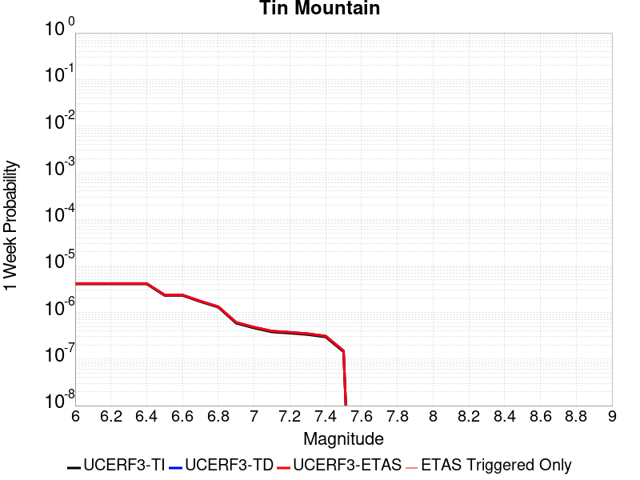 | 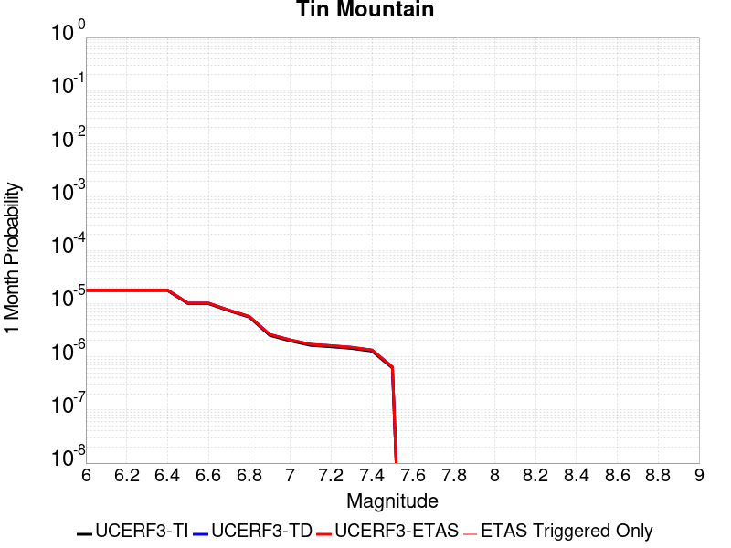 | 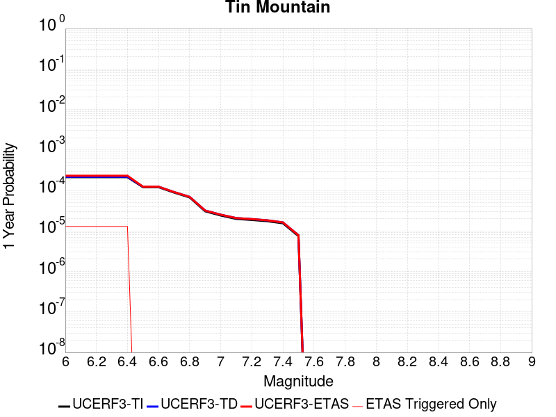 | 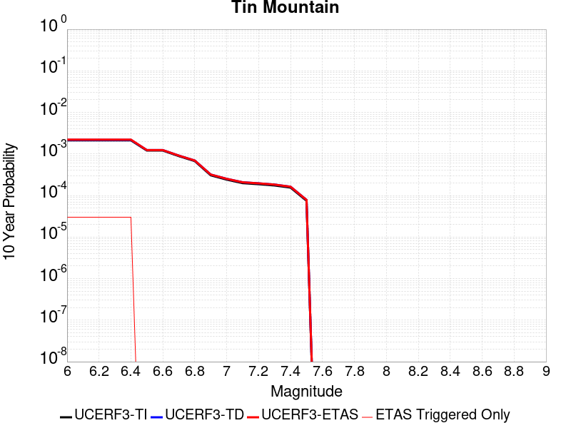 |

| Magnitude | 1 wk TI Prob | 1 wk TD Prob | 1 wk ETAS Prob | 1 wk ETAS/TD Gain | 1 wk ETAS Triggered Only | 1 mo TI Prob | 1 mo TD Prob | 1 mo ETAS Prob | 1 mo ETAS/TD Gain | 1 mo ETAS Triggered Only | 1 yr TI Prob | 1 yr TD Prob | 1 yr ETAS Prob | 1 yr ETAS/TD Gain | 1 yr ETAS Triggered Only | 10 yr TI Prob | 10 yr TD Prob | 10 yr ETAS Prob | 10 yr ETAS/TD Gain | 10 yr ETAS Triggered Only |
|-----|-----|-----|-----|-----|-----|-----|-----|-----|-----|-----|-----|-----|-----|-----|-----|-----|-----|-----|-----|-----|
| 6.0 | 4.083776E-6 | 4.1816565E-6 | 4.1816565E-6 | 1.0 | 0.0 | 1.750178E-5 | 1.7921284E-5 | 1.7921284E-5 | 1.0 | 0.0 | 2.1306332E-4 | 2.181735E-4 | 2.362201E-4 | 1.0827167 | 1.8050541E-5 | 0.0021285915 | 0.0021799589 | 0.00219797 | 1.0082622 | 1.8050541E-5 |
| 6.1 | 4.083776E-6 | 4.1816565E-6 | 4.1816565E-6 | 1.0 | 0.0 | 1.750178E-5 | 1.7921284E-5 | 1.7921284E-5 | 1.0 | 0.0 | 2.1306332E-4 | 2.181735E-4 | 2.362201E-4 | 1.0827167 | 1.8050541E-5 | 0.0021285915 | 0.0021799589 | 0.00219797 | 1.0082622 | 1.8050541E-5 |
| 6.2 | 4.083776E-6 | 4.1816565E-6 | 4.1816565E-6 | 1.0 | 0.0 | 1.750178E-5 | 1.7921284E-5 | 1.7921284E-5 | 1.0 | 0.0 | 2.1306332E-4 | 2.181735E-4 | 2.362201E-4 | 1.0827167 | 1.8050541E-5 | 0.0021285915 | 0.0021799589 | 0.00219797 | 1.0082622 | 1.8050541E-5 |
| 6.3 | 4.083776E-6 | 4.1816565E-6 | 4.1816565E-6 | 1.0 | 0.0 | 1.750178E-5 | 1.7921284E-5 | 1.7921284E-5 | 1.0 | 0.0 | 2.1306332E-4 | 2.181735E-4 | 2.362201E-4 | 1.0827167 | 1.8050541E-5 | 0.0021285915 | 0.0021799589 | 0.00219797 | 1.0082622 | 1.8050541E-5 |
| 6.4 | 4.083776E-6 | 4.1816565E-6 | 4.1816565E-6 | 1.0 | 0.0 | 1.750178E-5 | 1.7921284E-5 | 1.7921284E-5 | 1.0 | 0.0 | 2.1306332E-4 | 2.181735E-4 | 2.362201E-4 | 1.0827167 | 1.8050541E-5 | 0.0021285915 | 0.0021799589 | 0.00219797 | 1.0082622 | 1.8050541E-5 |
| 6.5 | 2.3143427E-6 | 2.3732296E-6 | 2.3732296E-6 | 1.0 | 0.0 | 9.9185745E-6 | 1.0170948E-5 | 1.0170948E-5 | 1.0 | 0.0 | 1.2075195E-4 | 1.2382503E-4 | 1.2382503E-4 | 1.0 | 0.0 | 0.0012068636 | 0.0012376363 | 0.0012376363 | 1.0 | 0.0 |
| 6.6 | 2.3143427E-6 | 2.3732296E-6 | 2.3732296E-6 | 1.0 | 0.0 | 9.9185745E-6 | 1.0170948E-5 | 1.0170948E-5 | 1.0 | 0.0 | 1.2075195E-4 | 1.2382503E-4 | 1.2382503E-4 | 1.0 | 0.0 | 0.0012068636 | 0.0012376363 | 0.0012376363 | 1.0 | 0.0 |
| 6.7 | 1.7029532E-6 | 1.7498493E-6 | 1.7498493E-6 | 1.0 | 0.0 | 7.2983503E-6 | 7.4993354E-6 | 7.4993354E-6 | 1.0 | 0.0 | 8.885379E-5 | 9.130112E-5 | 9.130112E-5 | 1.0 | 0.0 | 8.881827E-4 | 9.1268873E-4 | 9.1268873E-4 | 1.0 | 0.0 |
| 6.8 | 1.2914646E-6 | 1.3299855E-6 | 1.3299855E-6 | 1.0 | 0.0 | 5.534837E-6 | 5.6999274E-6 | 5.6999274E-6 | 1.0 | 0.0 | 6.738455E-5 | 6.939485E-5 | 6.939485E-5 | 1.0 | 0.0 | 6.736412E-4 | 6.9377513E-4 | 6.9377513E-4 | 1.0 | 0.0 |
| 6.9 | 5.8708974E-7 | 6.1173006E-7 | 6.1173006E-7 | 1.0 | 0.0 | 2.5160964E-6 | 2.6216978E-6 | 2.6216978E-6 | 1.0 | 0.0 | 3.0633044E-5 | 3.1918746E-5 | 3.1918746E-5 | 1.0 | 0.0 | 3.0628822E-4 | 3.191457E-4 | 3.191457E-4 | 1.0 | 0.0 |
| 7.0 | 4.6248786E-7 | 4.832274E-7 | 4.832274E-7 | 1.0 | 0.0 | 1.9820893E-6 | 2.070973E-6 | 2.070973E-6 | 1.0 | 0.0 | 2.413167E-5 | 2.5213843E-5 | 2.5213843E-5 | 1.0 | 0.0 | 2.412905E-4 | 2.5211353E-4 | 2.5211353E-4 | 1.0 | 0.0 |
| 7.1 | 3.804606E-7 | 3.9873757E-7 | 3.9873757E-7 | 1.0 | 0.0 | 1.6305444E-6 | 1.7088743E-6 | 1.7088743E-6 | 1.0 | 0.0 | 1.9851697E-5 | 2.080538E-5 | 2.080538E-5 | 1.0 | 0.0 | 1.9849923E-4 | 2.0803769E-4 | 2.0803769E-4 | 1.0 | 0.0 |
| 7.2 | 3.5864858E-7 | 3.7619057E-7 | 3.7619057E-7 | 1.0 | 0.0 | 1.5370645E-6 | 1.6122445E-6 | 1.6122445E-6 | 1.0 | 0.0 | 1.87136E-5 | 1.9628935E-5 | 1.9628935E-5 | 1.0 | 0.0 | 1.8712023E-4 | 1.9627532E-4 | 1.9627532E-4 | 1.0 | 0.0 |
| 7.3 | 3.342063E-7 | 3.506553E-7 | 3.506553E-7 | 1.0 | 0.0 | 1.4323119E-6 | 1.5028078E-6 | 1.5028078E-6 | 1.0 | 0.0 | 1.7438259E-5 | 1.8296565E-5 | 1.8296565E-5 | 1.0 | 0.0 | 1.743689E-4 | 1.8295388E-4 | 1.8295388E-4 | 1.0 | 0.0 |
| 7.4 | 2.971242E-7 | 3.116764E-7 | 3.116764E-7 | 1.0 | 0.0 | 1.2733886E-6 | 1.3357554E-6 | 1.3357554E-6 | 1.0 | 0.0 | 1.5503398E-5 | 1.6262735E-5 | 1.6262735E-5 | 1.0 | 0.0 | 1.5502315E-4 | 1.6261873E-4 | 1.6261873E-4 | 1.0 | 0.0 |
| 7.5 | 1.4326713E-7 | 1.5013381E-7 | 1.5013381E-7 | 1.0 | 0.0 | 6.140018E-7 | 6.4343067E-7 | 6.4343067E-7 | 1.0 | 0.0 | 7.4754466E-6 | 7.833768E-6 | 7.833768E-6 | 1.0 | 0.0 | 7.475195E-5 | 7.833768E-5 | 7.833768E-5 | 1.0 | 0.0 |

## Emerson-Copper Mtn 2011
*[(top)](#table-of-contents)*

| 1 Week | 1 Month | 1 Year | 10 Year |
|-----|-----|-----|-----|
| 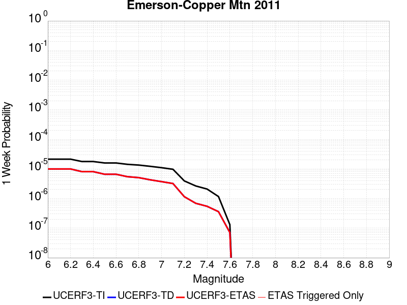 | 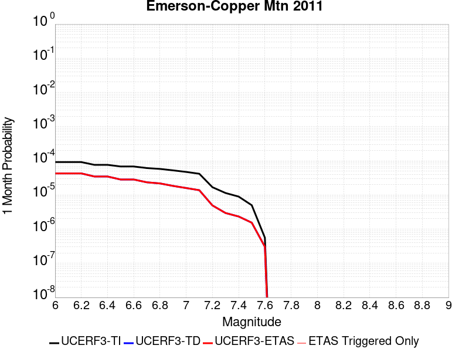 | 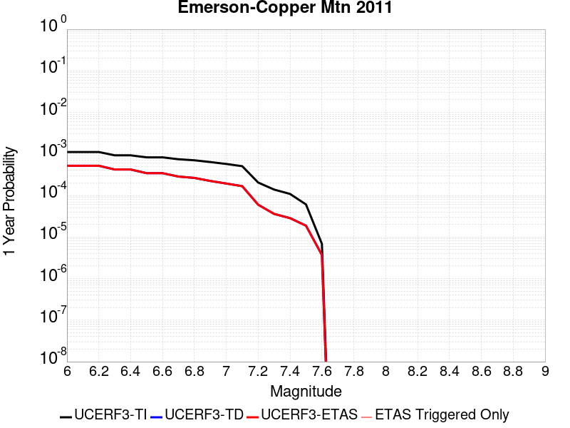 | 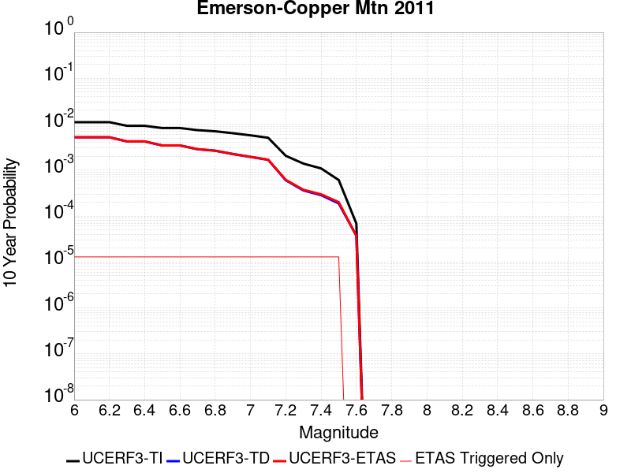 |

| Magnitude | 1 wk TI Prob | 1 wk TD Prob | 1 wk ETAS Prob | 1 wk ETAS/TD Gain | 1 wk ETAS Triggered Only | 1 mo TI Prob | 1 mo TD Prob | 1 mo ETAS Prob | 1 mo ETAS/TD Gain | 1 mo ETAS Triggered Only | 1 yr TI Prob | 1 yr TD Prob | 1 yr ETAS Prob | 1 yr ETAS/TD Gain | 1 yr ETAS Triggered Only | 10 yr TI Prob | 10 yr TD Prob | 10 yr ETAS Prob | 10 yr ETAS/TD Gain | 10 yr ETAS Triggered Only |
|-----|-----|-----|-----|-----|-----|-----|-----|-----|-----|-----|-----|-----|-----|-----|-----|-----|-----|-----|-----|-----|
| 6.0 | 2.1364202E-5 | 9.969588E-6 | 9.969588E-6 | 1.0 | 0.0 | 9.1557646E-5 | 4.2726155E-5 | 4.2726155E-5 | 1.0 | 0.0 | 0.0011141442 | 5.200755E-4 | 5.200755E-4 | 1.0 | 0.0 | 0.011085749 | 0.0051894537 | 0.0052074105 | 1.0034603 | 1.8050541E-5 |
| 6.1 | 2.1364202E-5 | 9.969588E-6 | 9.969588E-6 | 1.0 | 0.0 | 9.1557646E-5 | 4.2726155E-5 | 4.2726155E-5 | 1.0 | 0.0 | 0.0011141442 | 5.200755E-4 | 5.200755E-4 | 1.0 | 0.0 | 0.011085749 | 0.0051894537 | 0.0052074105 | 1.0034603 | 1.8050541E-5 |
| 6.2 | 2.1364202E-5 | 9.969588E-6 | 9.969588E-6 | 1.0 | 0.0 | 9.1557646E-5 | 4.2726155E-5 | 4.2726155E-5 | 1.0 | 0.0 | 0.0011141442 | 5.200755E-4 | 5.200755E-4 | 1.0 | 0.0 | 0.011085749 | 0.0051894537 | 0.0052074105 | 1.0034603 | 1.8050541E-5 |
| 6.3 | 1.7751237E-5 | 8.090476E-6 | 8.090476E-6 | 1.0 | 0.0 | 7.607452E-5 | 3.467304E-5 | 3.467304E-5 | 1.0 | 0.0 | 9.258136E-4 | 4.2206876E-4 | 4.2206876E-4 | 1.0 | 0.0 | 0.00921966 | 0.0042132945 | 0.004231269 | 1.0042661 | 1.8050541E-5 |
| 6.4 | 1.7751237E-5 | 8.090476E-6 | 8.090476E-6 | 1.0 | 0.0 | 7.607452E-5 | 3.467304E-5 | 3.467304E-5 | 1.0 | 0.0 | 9.258136E-4 | 4.2206876E-4 | 4.2206876E-4 | 1.0 | 0.0 | 0.00921966 | 0.0042132945 | 0.004231269 | 1.0042661 | 1.8050541E-5 |
| 6.5 | 1.5886664E-5 | 6.604869E-6 | 6.604869E-6 | 1.0 | 0.0 | 6.808392E-5 | 2.83063E-5 | 2.83063E-5 | 1.0 | 0.0 | 8.286065E-4 | 3.445794E-4 | 3.445794E-4 | 1.0 | 0.0 | 0.008255237 | 0.0034409156 | 0.003458904 | 1.0052278 | 1.8050541E-5 |
| 6.6 | 1.5886664E-5 | 6.604869E-6 | 6.604869E-6 | 1.0 | 0.0 | 6.808392E-5 | 2.83063E-5 | 2.83063E-5 | 1.0 | 0.0 | 8.286065E-4 | 3.445794E-4 | 3.445794E-4 | 1.0 | 0.0 | 0.008255237 | 0.0034409156 | 0.003458904 | 1.0052278 | 1.8050541E-5 |
| 6.7 | 1.428471E-5 | 5.4713073E-6 | 5.4713073E-6 | 1.0 | 0.0 | 6.121875E-5 | 2.344827E-5 | 2.344827E-5 | 1.0 | 0.0 | 7.450834E-4 | 2.8544923E-4 | 2.8544923E-4 | 1.0 | 0.0 | 0.007425902 | 0.002851214 | 0.002869213 | 1.0063127 | 1.8050541E-5 |
| 6.8 | 1.3490684E-5 | 5.074548E-6 | 5.074548E-6 | 1.0 | 0.0 | 5.7815934E-5 | 2.1747903E-5 | 2.1747903E-5 | 1.0 | 0.0 | 7.0368167E-4 | 2.6475242E-4 | 2.6475242E-4 | 1.0 | 0.0 | 0.007014576 | 0.0026447512 | 0.002662754 | 1.006807 | 1.8050541E-5 |
| 6.9 | 1.2235421E-5 | 4.2904508E-6 | 4.2904508E-6 | 1.0 | 0.0 | 5.2436466E-5 | 1.8387538E-5 | 1.8387538E-5 | 1.0 | 0.0 | 6.38227E-4 | 2.2384888E-4 | 2.2384888E-4 | 1.0 | 0.0 | 0.0063639707 | 0.0022365884 | 0.0022545985 | 1.0080525 | 1.8050541E-5 |
| 7.0 | 1.1009851E-5 | 3.719697E-6 | 3.719697E-6 | 1.0 | 0.0 | 4.7184225E-5 | 1.594148E-5 | 1.594148E-5 | 1.0 | 0.0 | 5.743165E-4 | 1.9407367E-4 | 1.9407367E-4 | 1.0 | 0.0 | 0.005728345 | 0.0019393798 | 0.0019573953 | 1.0092894 | 1.8050541E-5 |
| 7.1 | 9.726373E-6 | 3.2124176E-6 | 3.2124176E-6 | 1.0 | 0.0 | 4.168379E-5 | 1.3767451E-5 | 1.3767451E-5 | 1.0 | 0.0 | 5.07382E-4 | 1.6760919E-4 | 1.6760919E-4 | 1.0 | 0.0 | 0.0050622504 | 0.0016751592 | 0.0016931795 | 1.0107573 | 1.8050541E-5 |
| 7.2 | 3.9335127E-6 | 1.1526992E-6 | 1.1526992E-6 | 1.0 | 0.0 | 1.6857803E-5 | 4.94013E-6 | 4.94013E-6 | 1.0 | 0.0 | 2.0522442E-4 | 6.0144484E-5 | 6.0144484E-5 | 1.0 | 0.0 | 0.00205035 | 6.0128805E-4 | 6.193277E-4 | 1.0300018 | 1.8050541E-5 |
| 7.3 | 2.661632E-6 | 6.9129345E-7 | 6.9129345E-7 | 1.0 | 0.0 | 1.14069435E-5 | 2.9626829E-6 | 2.9626829E-6 | 1.0 | 0.0 | 1.3887069E-4 | 3.6070076E-5 | 3.6070076E-5 | 1.0 | 0.0 | 0.0013878393 | 3.6064326E-4 | 3.7868728E-4 | 1.0500329 | 1.8050541E-5 |
| 7.4 | 2.0893426E-6 | 5.462964E-7 | 5.462964E-7 | 1.0 | 0.0 | 8.954295E-6 | 2.3412683E-6 | 2.3412683E-6 | 1.0 | 0.0 | 1.0901308E-4 | 2.8504573E-5 | 2.8504573E-5 | 1.0 | 0.0 | 0.0010895962 | 2.850097E-4 | 3.0305513E-4 | 1.063315 | 1.8050541E-5 |
| 7.5 | 1.1681728E-6 | 3.6036903E-7 | 3.6036903E-7 | 1.0 | 0.0 | 5.0064455E-6 | 1.5444379E-6 | 1.5444379E-6 | 1.0 | 0.0 | 6.0951766E-5 | 1.8803374E-5 | 1.8803374E-5 | 1.0 | 0.0 | 6.093505E-4 | 1.8801828E-4 | 2.0606544E-4 | 1.0959861 | 1.8050541E-5 |
| 7.6 | 1.3154387E-7 | 7.12053E-8 | 7.12053E-8 | 1.0 | 0.0 | 5.6375933E-7 | 3.0516554E-7 | 3.0516554E-7 | 1.0 | 0.0 | 6.863748E-6 | 3.7153857E-6 | 3.7153857E-6 | 1.0 | 0.0 | 6.863536E-5 | 3.7153393E-5 | 3.7153393E-5 | 1.0 | 0.0 |

## Oceanside alt1
*[(top)](#table-of-contents)*

| 1 Week | 1 Month | 1 Year | 10 Year |
|-----|-----|-----|-----|
| 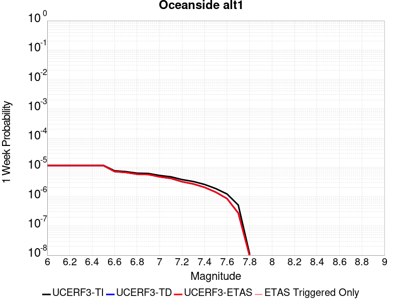 | 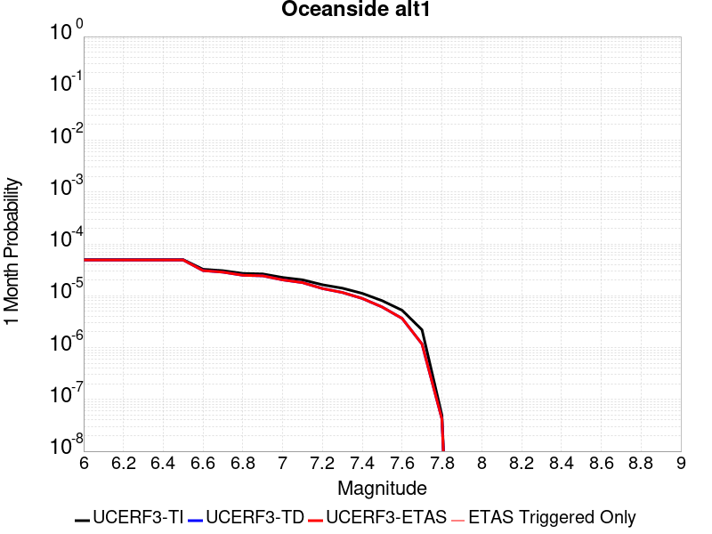 | 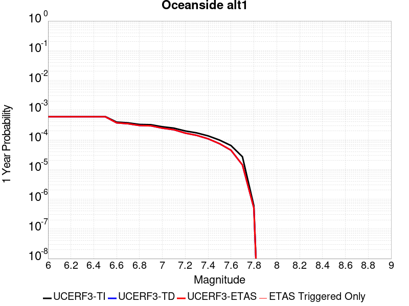 | 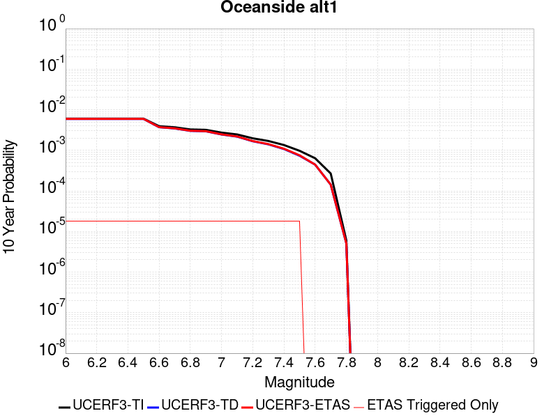 |

| Magnitude | 1 wk TI Prob | 1 wk TD Prob | 1 wk ETAS Prob | 1 wk ETAS/TD Gain | 1 wk ETAS Triggered Only | 1 mo TI Prob | 1 mo TD Prob | 1 mo ETAS Prob | 1 mo ETAS/TD Gain | 1 mo ETAS Triggered Only | 1 yr TI Prob | 1 yr TD Prob | 1 yr ETAS Prob | 1 yr ETAS/TD Gain | 1 yr ETAS Triggered Only | 10 yr TI Prob | 10 yr TD Prob | 10 yr ETAS Prob | 10 yr ETAS/TD Gain | 10 yr ETAS Triggered Only |
|-----|-----|-----|-----|-----|-----|-----|-----|-----|-----|-----|-----|-----|-----|-----|-----|-----|-----|-----|-----|-----|
| 6.0 | 1.1617542E-5 | 1.1424143E-5 | 1.1424143E-5 | 1.0 | 0.0 | 4.9788516E-5 | 4.8959788E-5 | 4.8959788E-5 | 1.0 | 0.0 | 6.060066E-4 | 5.959385E-4 | 5.959385E-4 | 1.0 | 0.0 | 0.0060435664 | 0.005945002 | 0.0059629455 | 1.0030183 | 1.8050541E-5 |
| 6.1 | 1.1617542E-5 | 1.1424143E-5 | 1.1424143E-5 | 1.0 | 0.0 | 4.9788516E-5 | 4.8959788E-5 | 4.8959788E-5 | 1.0 | 0.0 | 6.060066E-4 | 5.959385E-4 | 5.959385E-4 | 1.0 | 0.0 | 0.0060435664 | 0.005945002 | 0.0059629455 | 1.0030183 | 1.8050541E-5 |
| 6.2 | 1.1617542E-5 | 1.1424143E-5 | 1.1424143E-5 | 1.0 | 0.0 | 4.9788516E-5 | 4.8959788E-5 | 4.8959788E-5 | 1.0 | 0.0 | 6.060066E-4 | 5.959385E-4 | 5.959385E-4 | 1.0 | 0.0 | 0.0060435664 | 0.005945002 | 0.0059629455 | 1.0030183 | 1.8050541E-5 |
| 6.3 | 1.1617542E-5 | 1.1424143E-5 | 1.1424143E-5 | 1.0 | 0.0 | 4.9788516E-5 | 4.8959788E-5 | 4.8959788E-5 | 1.0 | 0.0 | 6.060066E-4 | 5.959385E-4 | 5.959385E-4 | 1.0 | 0.0 | 0.0060435664 | 0.005945002 | 0.0059629455 | 1.0030183 | 1.8050541E-5 |
| 6.4 | 1.1617542E-5 | 1.1424143E-5 | 1.1424143E-5 | 1.0 | 0.0 | 4.9788516E-5 | 4.8959788E-5 | 4.8959788E-5 | 1.0 | 0.0 | 6.060066E-4 | 5.959385E-4 | 5.959385E-4 | 1.0 | 0.0 | 0.0060435664 | 0.005945002 | 0.0059629455 | 1.0030183 | 1.8050541E-5 |
| 6.5 | 1.1617542E-5 | 1.1424143E-5 | 1.1424143E-5 | 1.0 | 0.0 | 4.9788516E-5 | 4.8959788E-5 | 4.8959788E-5 | 1.0 | 0.0 | 6.060066E-4 | 5.959385E-4 | 5.959385E-4 | 1.0 | 0.0 | 0.0060435664 | 0.005945002 | 0.0059629455 | 1.0030183 | 1.8050541E-5 |
| 6.6 | 7.561768E-6 | 7.1339705E-6 | 7.1339705E-6 | 1.0 | 0.0 | 3.2407173E-5 | 3.0573807E-5 | 3.0573807E-5 | 1.0 | 0.0 | 3.9448592E-4 | 3.7217358E-4 | 3.7217358E-4 | 1.0 | 0.0 | 0.0039378637 | 0.0037156146 | 0.0037335982 | 1.00484 | 1.8050541E-5 |
| 6.7 | 7.1042605E-6 | 6.656015E-6 | 6.656015E-6 | 1.0 | 0.0 | 3.0446476E-5 | 2.8525472E-5 | 2.8525472E-5 | 1.0 | 0.0 | 3.706228E-4 | 3.4724307E-4 | 3.4724307E-4 | 1.0 | 0.0 | 0.0037000529 | 0.0034670883 | 0.0034850764 | 1.0051882 | 1.8050541E-5 |
| 6.8 | 6.285554E-6 | 5.7999887E-6 | 5.7999887E-6 | 1.0 | 0.0 | 2.693781E-5 | 2.4856861E-5 | 2.4856861E-5 | 1.0 | 0.0 | 3.2791847E-4 | 3.025908E-4 | 3.025908E-4 | 1.0 | 0.0 | 0.0032743502 | 0.0030218454 | 0.0030398415 | 1.0059553 | 1.8050541E-5 |
| 6.9 | 6.148883E-6 | 5.656819E-6 | 5.656819E-6 | 1.0 | 0.0 | 2.635209E-5 | 2.4243289E-5 | 2.4243289E-5 | 1.0 | 0.0 | 3.2078946E-4 | 2.9512262E-4 | 2.9512262E-4 | 1.0 | 0.0 | 0.003203268 | 0.002947364 | 0.002965361 | 1.0061063 | 1.8050541E-5 |
| 7.0 | 5.253857E-6 | 4.7226295E-6 | 4.7226295E-6 | 1.0 | 0.0 | 2.2516335E-5 | 2.0239686E-5 | 2.0239686E-5 | 1.0 | 0.0 | 2.7410188E-4 | 2.463906E-4 | 2.463906E-4 | 1.0 | 0.0 | 0.0027376404 | 0.002461206 | 0.0024792121 | 1.007316 | 1.8050541E-5 |
| 7.1 | 4.730754E-6 | 4.178706E-6 | 4.178706E-6 | 1.0 | 0.0 | 2.0274503E-5 | 1.7908618E-5 | 1.7908618E-5 | 1.0 | 0.0 | 2.468141E-4 | 2.1801588E-4 | 2.1801588E-4 | 1.0 | 0.0 | 0.0024654015 | 0.0021780464 | 0.0021960577 | 1.0082694 | 1.8050541E-5 |
| 7.2 | 3.7998386E-6 | 3.2141693E-6 | 3.2141693E-6 | 1.0 | 0.0 | 1.6284921E-5 | 1.3774939E-5 | 1.3774939E-5 | 1.0 | 0.0 | 1.9825088E-4 | 1.676971E-4 | 1.676971E-4 | 1.0 | 0.0 | 0.001980741 | 0.0016757178 | 0.001693738 | 1.0107538 | 1.8050541E-5 |
| 7.3 | 3.2656465E-6 | 2.698494E-6 | 2.698494E-6 | 1.0 | 0.0 | 1.3995553E-5 | 1.1564924E-5 | 1.1564924E-5 | 1.0 | 0.0 | 1.7038253E-4 | 1.4079396E-4 | 1.4079396E-4 | 1.0 | 0.0 | 0.0017025196 | 0.0014070587 | 0.0014250838 | 1.0128105 | 1.8050541E-5 |
| 7.4 | 2.593703E-6 | 2.0681148E-6 | 2.0681148E-6 | 1.0 | 0.0 | 1.1115822E-5 | 8.86332E-6 | 8.86332E-6 | 1.0 | 0.0 | 1.3532673E-4 | 1.0790567E-4 | 1.0790567E-4 | 1.0 | 0.0 | 0.0013524436 | 0.0010785416 | 0.0010965726 | 1.016718 | 1.8050541E-5 |
| 7.5 | 1.8715585E-6 | 1.4137787E-6 | 1.4137787E-6 | 1.0 | 0.0 | 8.020941E-6 | 6.059038E-6 | 6.059038E-6 | 1.0 | 0.0 | 9.7650576E-5 | 7.376635E-5 | 7.376635E-5 | 1.0 | 0.0 | 9.7607676E-4 | 7.374247E-4 | 7.55462E-4 | 1.0244597 | 1.8050541E-5 |
| 7.6 | 1.2246786E-6 | 8.527301E-7 | 8.527301E-7 | 1.0 | 0.0 | 5.248612E-6 | 3.6545528E-6 | 3.6545528E-6 | 1.0 | 0.0 | 6.389998E-5 | 4.4493318E-5 | 4.4493318E-5 | 1.0 | 0.0 | 6.3881604E-4 | 4.4484859E-4 | 4.4484859E-4 | 1.0 | 0.0 |
| 7.7 | 5.140719E-7 | 2.7349796E-7 | 2.7349796E-7 | 1.0 | 0.0 | 2.2031636E-6 | 1.1721336E-6 | 1.1721336E-6 | 1.0 | 0.0 | 2.6823185E-5 | 1.4270647E-5 | 1.4270647E-5 | 1.0 | 0.0 | 2.6819948E-4 | 1.4269866E-4 | 1.4269866E-4 | 1.0 | 0.0 |
| 7.8 | 1.16056995E-8 | 9.7825446E-9 | 9.7825446E-9 | 1.0 | 0.0 | 4.9738713E-8 | 4.192519E-8 | 4.192519E-8 | 1.0 | 0.0 | 6.0556863E-7 | 5.104392E-7 | 5.104392E-7 | 1.0 | 0.0 | 6.05567E-6 | 5.1043917E-6 | 5.1043917E-6 | 1.0 | 0.0 |

## North Tahoe 2011 CFM
*[(top)](#table-of-contents)*

| 1 Week | 1 Month | 1 Year | 10 Year |
|-----|-----|-----|-----|
| 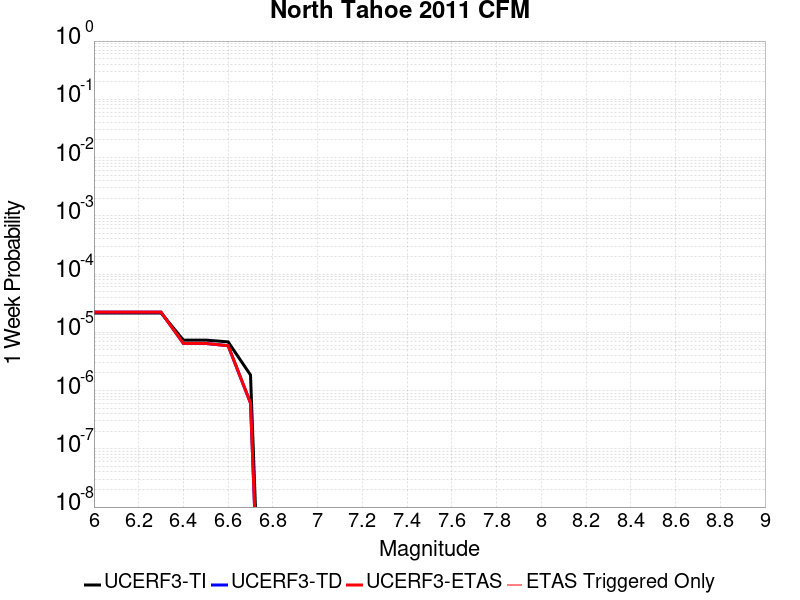 | 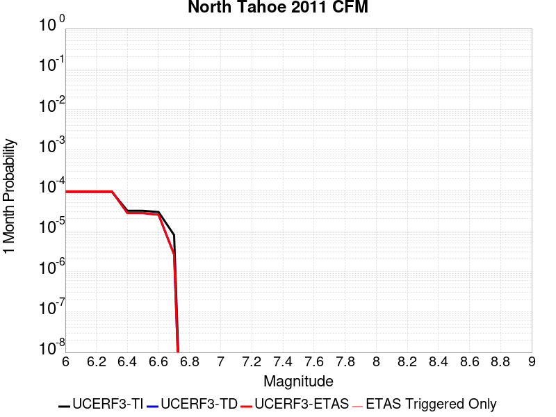 | 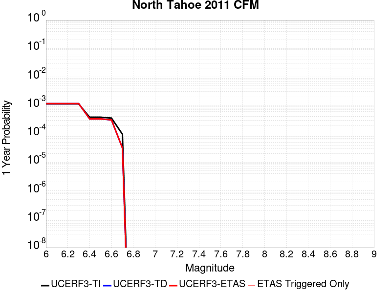 | 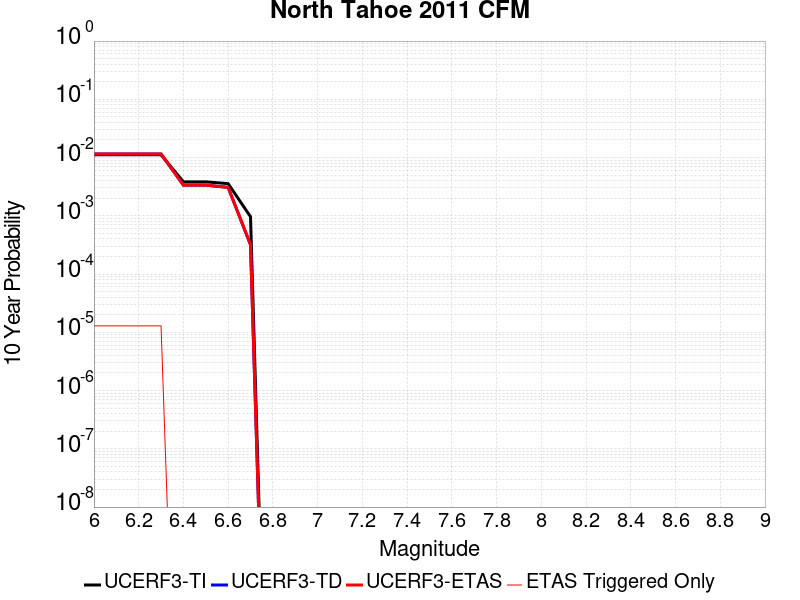 |

| Magnitude | 1 wk TI Prob | 1 wk TD Prob | 1 wk ETAS Prob | 1 wk ETAS/TD Gain | 1 wk ETAS Triggered Only | 1 mo TI Prob | 1 mo TD Prob | 1 mo ETAS Prob | 1 mo ETAS/TD Gain | 1 mo ETAS Triggered Only | 1 yr TI Prob | 1 yr TD Prob | 1 yr ETAS Prob | 1 yr ETAS/TD Gain | 1 yr ETAS Triggered Only | 10 yr TI Prob | 10 yr TD Prob | 10 yr ETAS Prob | 10 yr ETAS/TD Gain | 10 yr ETAS Triggered Only |
|-----|-----|-----|-----|-----|-----|-----|-----|-----|-----|-----|-----|-----|-----|-----|-----|-----|-----|-----|-----|-----|
| 6.0 | 2.150391E-5 | 2.2168166E-5 | 2.2168166E-5 | 1.0 | 0.0 | 9.215636E-5 | 9.500407E-5 | 9.500407E-5 | 1.0 | 0.0 | 0.0011214261 | 0.0011562568 | 0.0011562568 | 1.0 | 0.0 | 0.011157839 | 0.011521668 | 0.011539511 | 1.0015486 | 1.8050541E-5 |
| 6.1 | 2.150391E-5 | 2.2168166E-5 | 2.2168166E-5 | 1.0 | 0.0 | 9.215636E-5 | 9.500407E-5 | 9.500407E-5 | 1.0 | 0.0 | 0.0011214261 | 0.0011562568 | 0.0011562568 | 1.0 | 0.0 | 0.011157839 | 0.011521668 | 0.011539511 | 1.0015486 | 1.8050541E-5 |
| 6.2 | 2.150391E-5 | 2.2168166E-5 | 2.2168166E-5 | 1.0 | 0.0 | 9.215636E-5 | 9.500407E-5 | 9.500407E-5 | 1.0 | 0.0 | 0.0011214261 | 0.0011562568 | 0.0011562568 | 1.0 | 0.0 | 0.011157839 | 0.011521668 | 0.011539511 | 1.0015486 | 1.8050541E-5 |
| 6.3 | 2.150391E-5 | 2.2168166E-5 | 2.2168166E-5 | 1.0 | 0.0 | 9.215636E-5 | 9.500407E-5 | 9.500407E-5 | 1.0 | 0.0 | 0.0011214261 | 0.0011562568 | 0.0011562568 | 1.0 | 0.0 | 0.011157839 | 0.011521668 | 0.011539511 | 1.0015486 | 1.8050541E-5 |
| 6.4 | 7.3563056E-6 | 6.445943E-6 | 6.445943E-6 | 1.0 | 0.0 | 3.1526644E-5 | 2.762535E-5 | 2.762535E-5 | 1.0 | 0.0 | 3.8376928E-4 | 3.3631732E-4 | 3.3631732E-4 | 1.0 | 0.0 | 0.003831072 | 0.0033610808 | 0.0033610808 | 1.0 | 0.0 |
| 6.5 | 7.3563056E-6 | 6.445943E-6 | 6.445943E-6 | 1.0 | 0.0 | 3.1526644E-5 | 2.762535E-5 | 2.762535E-5 | 1.0 | 0.0 | 3.8376928E-4 | 3.3631732E-4 | 3.3631732E-4 | 1.0 | 0.0 | 0.003831072 | 0.0033610808 | 0.0033610808 | 1.0 | 0.0 |
| 6.6 | 6.8508816E-6 | 5.8850405E-6 | 5.8850405E-6 | 1.0 | 0.0 | 2.936059E-5 | 2.522153E-5 | 2.522153E-5 | 1.0 | 0.0 | 3.5740656E-4 | 3.0705924E-4 | 3.0705924E-4 | 1.0 | 0.0 | 0.0035683226 | 0.0030693274 | 0.0030693274 | 1.0 | 0.0 |
| 6.7 | 1.8511148E-6 | 6.1026554E-7 | 6.1026554E-7 | 1.0 | 0.0 | 7.933325E-6 | 2.6154237E-6 | 2.6154237E-6 | 1.0 | 0.0 | 9.658395E-5 | 3.1842785E-5 | 3.1842785E-5 | 1.0 | 0.0 | 9.6541987E-4 | 3.1842783E-4 | 3.1842783E-4 | 1.0 | 0.0 |

## Santa Cruz Catalina Ridge alt1
*[(top)](#table-of-contents)*

| 1 Week | 1 Month | 1 Year | 10 Year |
|-----|-----|-----|-----|
| 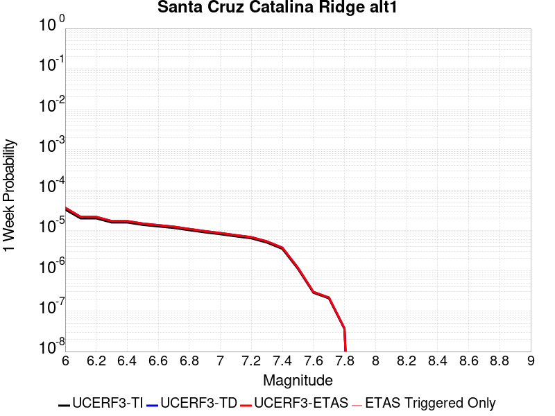 | 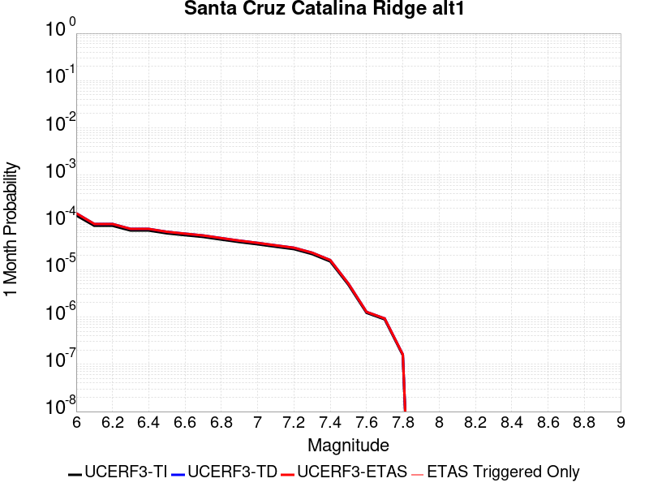 | 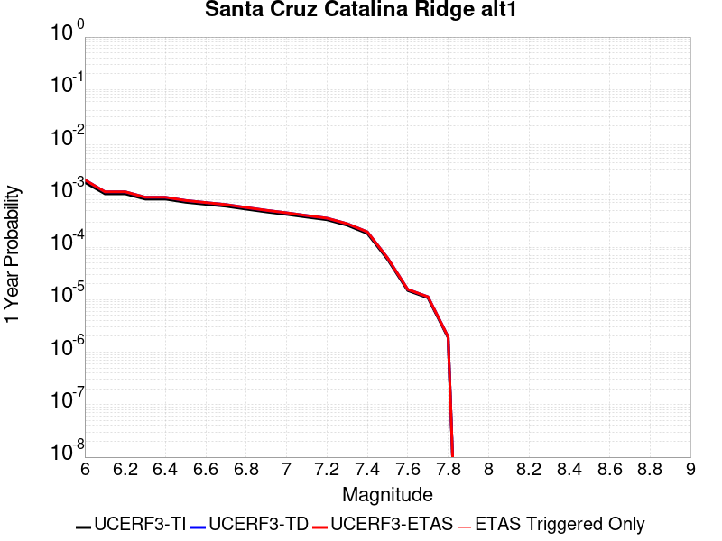 | 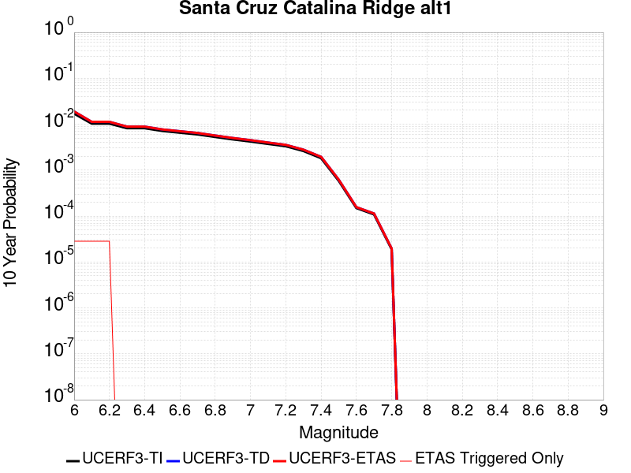 |

| Magnitude | 1 wk TI Prob | 1 wk TD Prob | 1 wk ETAS Prob | 1 wk ETAS/TD Gain | 1 wk ETAS Triggered Only | 1 mo TI Prob | 1 mo TD Prob | 1 mo ETAS Prob | 1 mo ETAS/TD Gain | 1 mo ETAS Triggered Only | 1 yr TI Prob | 1 yr TD Prob | 1 yr ETAS Prob | 1 yr ETAS/TD Gain | 1 yr ETAS Triggered Only | 10 yr TI Prob | 10 yr TD Prob | 10 yr ETAS Prob | 10 yr ETAS/TD Gain | 10 yr ETAS Triggered Only |
|-----|-----|-----|-----|-----|-----|-----|-----|-----|-----|-----|-----|-----|-----|-----|-----|-----|-----|-----|-----|-----|
| 6.0 | 3.2833184E-5 | 3.6563426E-5 | 3.6563426E-5 | 1.0 | 0.0 | 1.4070606E-4 | 1.5669192E-4 | 1.5669192E-4 | 1.0 | 0.0 | 0.00171175 | 0.0019062215 | 0.0019062215 | 1.0 | 0.0 | 0.016986247 | 0.018915609 | 0.018933319 | 1.0009363 | 1.8050541E-5 |
| 6.1 | 1.9835548E-5 | 2.1661903E-5 | 2.1661903E-5 | 1.0 | 0.0 | 8.500672E-5 | 9.2833536E-5 | 9.2833536E-5 | 1.0 | 0.0 | 0.0010344655 | 0.0011296824 | 0.0011296824 | 1.0 | 0.0 | 0.010296632 | 0.011241533 | 0.011259381 | 1.0015876 | 1.8050541E-5 |
| 6.2 | 1.9835548E-5 | 2.1661903E-5 | 2.1661903E-5 | 1.0 | 0.0 | 8.500672E-5 | 9.2833536E-5 | 9.2833536E-5 | 1.0 | 0.0 | 0.0010344655 | 0.0011296824 | 0.0011296824 | 1.0 | 0.0 | 0.010296632 | 0.011241533 | 0.011259381 | 1.0015876 | 1.8050541E-5 |
| 6.3 | 1.5728183E-5 | 1.7035645E-5 | 1.7035645E-5 | 1.0 | 0.0 | 6.7404755E-5 | 7.30079E-5 | 7.30079E-5 | 1.0 | 0.0 | 8.2034385E-4 | 8.885148E-4 | 8.885148E-4 | 1.0 | 0.0 | 0.008173222 | 0.008850304 | 0.008850304 | 1.0 | 0.0 |
| 6.4 | 1.5728183E-5 | 1.7035645E-5 | 1.7035645E-5 | 1.0 | 0.0 | 6.7404755E-5 | 7.30079E-5 | 7.30079E-5 | 1.0 | 0.0 | 8.2034385E-4 | 8.885148E-4 | 8.885148E-4 | 1.0 | 0.0 | 0.008173222 | 0.008850304 | 0.008850304 | 1.0 | 0.0 |
| 6.5 | 1.3707734E-5 | 1.4795926E-5 | 1.4795926E-5 | 1.0 | 0.0 | 5.8746107E-5 | 6.340959E-5 | 6.340959E-5 | 1.0 | 0.0 | 7.1499916E-4 | 7.7174185E-4 | 7.7174185E-4 | 1.0 | 0.0 | 0.0071270303 | 0.007691017 | 0.007691017 | 1.0 | 0.0 |
| 6.6 | 1.2539813E-5 | 1.3511471E-5 | 1.3511471E-5 | 1.0 | 0.0 | 5.3740947E-5 | 5.7905032E-5 | 5.7905032E-5 | 1.0 | 0.0 | 6.540996E-4 | 7.047684E-4 | 7.047684E-4 | 1.0 | 0.0 | 0.0065217763 | 0.0070256367 | 0.0070256367 | 1.0 | 0.0 |
| 6.7 | 1.1504083E-5 | 1.2378499E-5 | 1.2378499E-5 | 1.0 | 0.0 | 4.930228E-5 | 5.3049644E-5 | 5.3049644E-5 | 1.0 | 0.0 | 6.0008996E-4 | 6.4569E-4 | 6.4569E-4 | 1.0 | 0.0 | 0.005984721 | 0.006438369 | 0.006438369 | 1.0 | 0.0 |
| 6.8 | 1.012739E-5 | 1.0878034E-5 | 1.0878034E-5 | 1.0 | 0.0 | 4.340238E-5 | 4.6619323E-5 | 4.6619323E-5 | 1.0 | 0.0 | 5.282958E-4 | 5.6744396E-4 | 5.6744396E-4 | 1.0 | 0.0 | 0.0052704164 | 0.0056601195 | 0.0056601195 | 1.0 | 0.0 |
| 6.9 | 8.9607865E-6 | 9.609948E-6 | 9.609948E-6 | 1.0 | 0.0 | 3.8402806E-5 | 4.1184852E-5 | 4.1184852E-5 | 1.0 | 0.0 | 4.6745385E-4 | 5.0131127E-4 | 5.0131127E-4 | 1.0 | 0.0 | 0.0046647177 | 0.0050019235 | 0.0050019235 | 1.0 | 0.0 |
| 7.0 | 8.046829E-6 | 8.62048E-6 | 8.62048E-6 | 1.0 | 0.0 | 3.4485955E-5 | 3.6944395E-5 | 3.6944395E-5 | 1.0 | 0.0 | 4.1978562E-4 | 4.4970599E-4 | 4.4970599E-4 | 1.0 | 0.0 | 0.004189935 | 0.00448805 | 0.00448805 | 1.0 | 0.0 |
| 7.1 | 7.136131E-6 | 7.638298E-6 | 7.638298E-6 | 1.0 | 0.0 | 3.0583058E-5 | 3.2735155E-5 | 3.2735155E-5 | 1.0 | 0.0 | 3.7228514E-4 | 3.9847835E-4 | 3.9847835E-4 | 1.0 | 0.0 | 0.0037166206 | 0.003977715 | 0.003977715 | 1.0 | 0.0 |
| 7.2 | 6.362014E-6 | 6.805525E-6 | 6.805525E-6 | 1.0 | 0.0 | 2.726549E-5 | 2.9166215E-5 | 2.9166215E-5 | 1.0 | 0.0 | 3.3190678E-4 | 3.5504144E-4 | 3.5504144E-4 | 1.0 | 0.0 | 0.0033141149 | 0.0035448107 | 0.0035448107 | 1.0 | 0.0 |
| 7.3 | 5.004101E-6 | 5.3521594E-6 | 5.3521594E-6 | 1.0 | 0.0 | 2.1445969E-5 | 2.2937627E-5 | 2.2937627E-5 | 1.0 | 0.0 | 2.6107338E-4 | 2.7923036E-4 | 2.7923036E-4 | 1.0 | 0.0 | 0.002607669 | 0.0027888499 | 0.0027888499 | 1.0 | 0.0 |
| 7.4 | 3.4901443E-6 | 3.732362E-6 | 3.732362E-6 | 1.0 | 0.0 | 1.4957676E-5 | 1.5995742E-5 | 1.5995742E-5 | 1.0 | 0.0 | 1.8209449E-4 | 1.9473112E-4 | 1.9473112E-4 | 1.0 | 0.0 | 0.0018194534 | 0.0019456436 | 0.0019456436 | 1.0 | 0.0 |
| 7.5 | 1.1215045E-6 | 1.1894733E-6 | 1.1894733E-6 | 1.0 | 0.0 | 4.806439E-6 | 5.097733E-6 | 5.097733E-6 | 1.0 | 0.0 | 5.851682E-5 | 6.206316E-5 | 6.206316E-5 | 1.0 | 0.0 | 5.850142E-4 | 6.2046136E-4 | 6.2046136E-4 | 1.0 | 0.0 |
| 7.6 | 2.8599047E-7 | 2.9953685E-7 | 2.9953685E-7 | 1.0 | 0.0 | 1.2256729E-6 | 1.2837288E-6 | 1.2837288E-6 | 1.0 | 0.0 | 1.4922465E-5 | 1.5629286E-5 | 1.5629286E-5 | 1.0 | 0.0 | 1.4921463E-4 | 1.5628201E-4 | 1.5628201E-4 | 1.0 | 0.0 |
| 7.7 | 2.0781519E-7 | 2.1745527E-7 | 2.1745527E-7 | 1.0 | 0.0 | 8.906362E-7 | 9.319508E-7 | 9.319508E-7 | 1.0 | 0.0 | 1.08434415E-5 | 1.1346443E-5 | 1.1346443E-5 | 1.0 | 0.0 | 1.0842913E-4 | 1.1345873E-4 | 1.1345873E-4 | 1.0 | 0.0 |
| 7.8 | 3.614776E-8 | 3.7642874E-8 | 3.7642874E-8 | 1.0 | 0.0 | 1.5491896E-7 | 1.613266E-7 | 1.613266E-7 | 1.0 | 0.0 | 1.8861368E-6 | 1.9641498E-6 | 1.9641498E-6 | 1.0 | 0.0 | 1.8861208E-5 | 1.9641335E-5 | 1.9641335E-5 | 1.0 | 0.0 |

## Cerro Prieto
*[(top)](#table-of-contents)*

| 1 Week | 1 Month | 1 Year | 10 Year |
|-----|-----|-----|-----|
| 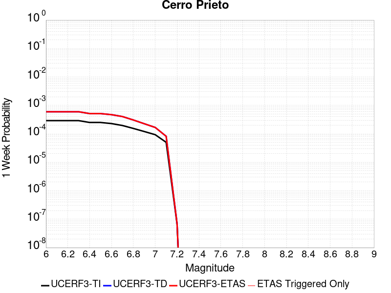 |  | 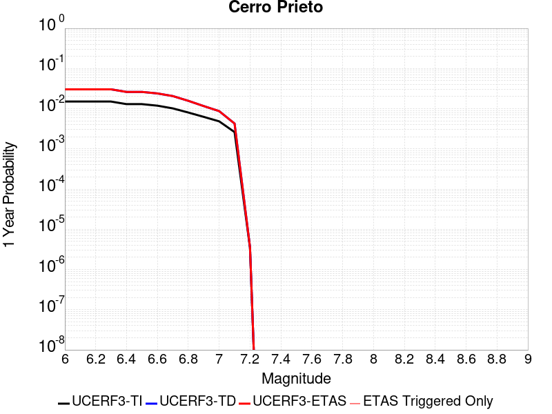 | 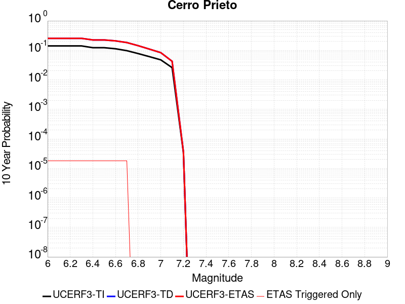 |

| Magnitude | 1 wk TI Prob | 1 wk TD Prob | 1 wk ETAS Prob | 1 wk ETAS/TD Gain | 1 wk ETAS Triggered Only | 1 mo TI Prob | 1 mo TD Prob | 1 mo ETAS Prob | 1 mo ETAS/TD Gain | 1 mo ETAS Triggered Only | 1 yr TI Prob | 1 yr TD Prob | 1 yr ETAS Prob | 1 yr ETAS/TD Gain | 1 yr ETAS Triggered Only | 10 yr TI Prob | 10 yr TD Prob | 10 yr ETAS Prob | 10 yr ETAS/TD Gain | 10 yr ETAS Triggered Only |
|-----|-----|-----|-----|-----|-----|-----|-----|-----|-----|-----|-----|-----|-----|-----|-----|-----|-----|-----|-----|-----|
| 6.0 | 2.9101528E-4 | 5.9746794E-4 | 5.9746794E-4 | 1.0 | 0.0 | 0.0012466122 | 0.002558307 | 0.002558307 | 1.0 | 0.0 | 0.015072231 | 0.030701658 | 0.030701658 | 1.0 | 0.0 | 0.14089979 | 0.25427553 | 0.254289 | 1.0000529 | 1.8050541E-5 |
| 6.1 | 2.9101528E-4 | 5.9746794E-4 | 5.9746794E-4 | 1.0 | 0.0 | 0.0012466122 | 0.002558307 | 0.002558307 | 1.0 | 0.0 | 0.015072231 | 0.030701658 | 0.030701658 | 1.0 | 0.0 | 0.14089979 | 0.25427553 | 0.254289 | 1.0000529 | 1.8050541E-5 |
| 6.2 | 2.9101528E-4 | 5.9746794E-4 | 5.9746794E-4 | 1.0 | 0.0 | 0.0012466122 | 0.002558307 | 0.002558307 | 1.0 | 0.0 | 0.015072231 | 0.030701658 | 0.030701658 | 1.0 | 0.0 | 0.14089979 | 0.25427553 | 0.254289 | 1.0000529 | 1.8050541E-5 |
| 6.3 | 2.9101528E-4 | 5.9746794E-4 | 5.9746794E-4 | 1.0 | 0.0 | 0.0012466122 | 0.002558307 | 0.002558307 | 1.0 | 0.0 | 0.015072231 | 0.030701658 | 0.030701658 | 1.0 | 0.0 | 0.14089979 | 0.25427553 | 0.254289 | 1.0000529 | 1.8050541E-5 |
| 6.4 | 2.508648E-4 | 5.149131E-4 | 5.149131E-4 | 1.0 | 0.0 | 0.0010746918 | 0.0022051034 | 0.0022051034 | 1.0 | 0.0 | 0.013006088 | 0.026521804 | 0.026521804 | 1.0 | 0.0 | 0.12270685 | 0.22469993 | 0.22471392 | 1.0000622 | 1.8050541E-5 |
| 6.5 | 2.508648E-4 | 5.149131E-4 | 5.149131E-4 | 1.0 | 0.0 | 0.0010746918 | 0.0022051034 | 0.0022051034 | 1.0 | 0.0 | 0.013006088 | 0.026521804 | 0.026521804 | 1.0 | 0.0 | 0.12270685 | 0.22469993 | 0.22471392 | 1.0000622 | 1.8050541E-5 |
| 6.6 | 2.294914E-4 | 4.7207705E-4 | 4.7207705E-4 | 1.0 | 0.0 | 9.831638E-4 | 0.0020218068 | 0.0020218068 | 1.0 | 0.0 | 0.011904482 | 0.024346774 | 0.024346774 | 1.0 | 0.0 | 0.11286586 | 0.20887938 | 0.20889366 | 1.0000683 | 1.8050541E-5 |
| 6.7 | 1.9621674E-4 | 4.0505154E-4 | 4.0505154E-4 | 1.0 | 0.0 | 8.4065786E-4 | 0.0017349393 | 0.0017349393 | 1.0 | 0.0 | 0.010187071 | 0.020931521 | 0.020931521 | 1.0 | 0.0 | 0.09732539 | 0.18319267 | 0.18320741 | 1.0000805 | 1.8050541E-5 |
| 6.8 | 1.5476145E-4 | 3.0636243E-4 | 3.0636243E-4 | 1.0 | 0.0 | 6.6309475E-4 | 0.0013124238 | 0.0013124238 | 1.0 | 0.0 | 0.008043335 | 0.015875118 | 0.015875118 | 1.0 | 0.0 | 0.07758363 | 0.14362022 | 0.14362022 | 1.0 | 0.0 |
| 6.9 | 1.20509176E-4 | 2.2640405E-4 | 2.2640405E-4 | 1.0 | 0.0 | 5.1636563E-4 | 9.700058E-4 | 9.700058E-4 | 1.0 | 0.0 | 0.006268645 | 0.011756576 | 0.011756576 | 1.0 | 0.0 | 0.060947374 | 0.10967369 | 0.10967369 | 1.0 | 0.0 |
| 7.0 | 9.3269155E-5 | 1.6762996E-4 | 1.6762996E-4 | 1.0 | 0.0 | 3.9966372E-4 | 7.182596E-4 | 7.182596E-4 | 1.0 | 0.0 | 0.0048550544 | 0.008717441 | 0.008717441 | 1.0 | 0.0 | 0.04750344 | 0.08334675 | 0.08334675 | 1.0 | 0.0 |
| 7.1 | 5.029709E-5 | 8.198158E-5 | 8.198158E-5 | 1.0 | 0.0 | 2.1554115E-4 | 3.5132174E-4 | 3.5132174E-4 | 1.0 | 0.0 | 0.0026210553 | 0.004272389 | 0.004272389 | 1.0 | 0.0 | 0.025903556 | 0.042480916 | 0.042480916 | 1.0 | 0.0 |
| 7.2 | 6.5445185E-8 | 6.868273E-8 | 6.868273E-8 | 1.0 | 0.0 | 2.8047933E-7 | 2.9435455E-7 | 2.9435455E-7 | 1.0 | 0.0 | 3.4148304E-6 | 3.5837666E-6 | 3.5837666E-6 | 1.0 | 0.0 | 3.414778E-5 | 3.5837667E-5 | 3.5837667E-5 | 1.0 | 0.0 |

## Johnson Valley (No) 2011 rev
*[(top)](#table-of-contents)*

| 1 Week | 1 Month | 1 Year | 10 Year |
|-----|-----|-----|-----|
| 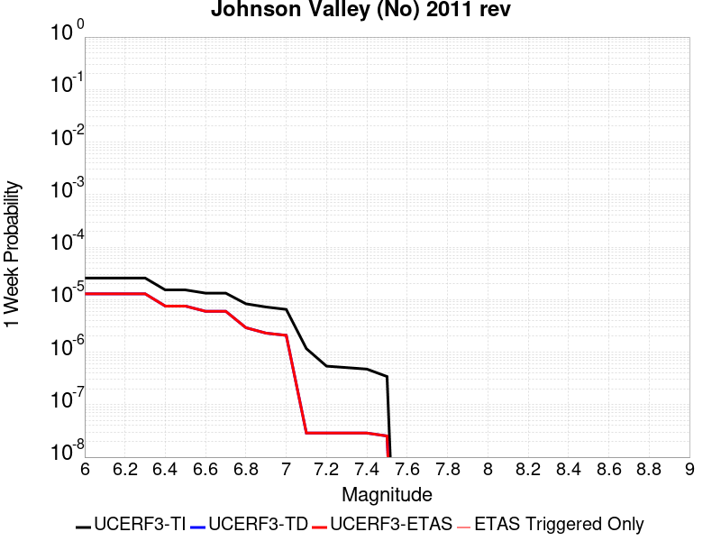 | 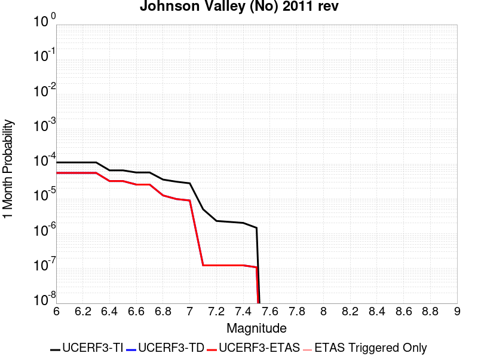 | 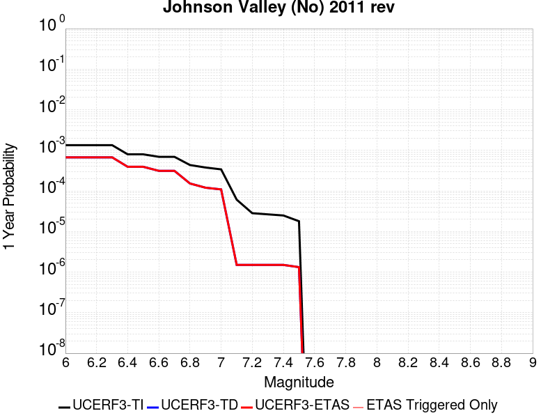 | 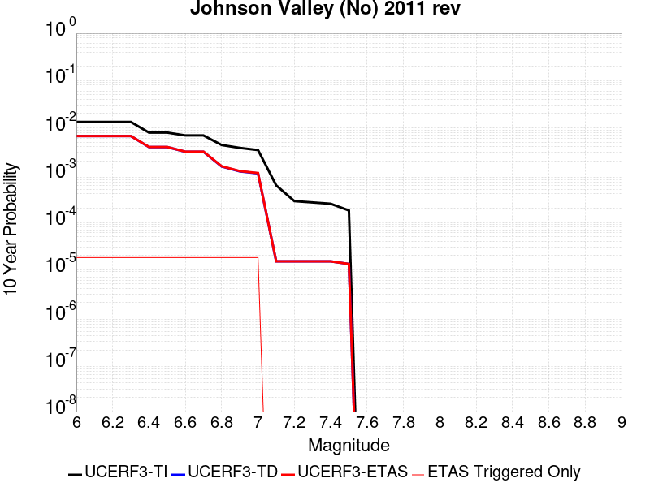 |

| Magnitude | 1 wk TI Prob | 1 wk TD Prob | 1 wk ETAS Prob | 1 wk ETAS/TD Gain | 1 wk ETAS Triggered Only | 1 mo TI Prob | 1 mo TD Prob | 1 mo ETAS Prob | 1 mo ETAS/TD Gain | 1 mo ETAS Triggered Only | 1 yr TI Prob | 1 yr TD Prob | 1 yr ETAS Prob | 1 yr ETAS/TD Gain | 1 yr ETAS Triggered Only | 10 yr TI Prob | 10 yr TD Prob | 10 yr ETAS Prob | 10 yr ETAS/TD Gain | 10 yr ETAS Triggered Only |
|-----|-----|-----|-----|-----|-----|-----|-----|-----|-----|-----|-----|-----|-----|-----|-----|-----|-----|-----|-----|-----|
| 6.0 | 2.577707E-5 | 1.2902849E-5 | 1.2902849E-5 | 1.0 | 0.0 | 1.1046848E-4 | 5.529698E-5 | 5.529698E-5 | 1.0 | 0.0 | 0.0013441239 | 6.7307247E-4 | 6.7307247E-4 | 1.0 | 0.0 | 0.013360229 | 0.006714249 | 0.0067321784 | 1.0026703 | 1.8050541E-5 |
| 6.1 | 2.577707E-5 | 1.2902849E-5 | 1.2902849E-5 | 1.0 | 0.0 | 1.1046848E-4 | 5.529698E-5 | 5.529698E-5 | 1.0 | 0.0 | 0.0013441239 | 6.7307247E-4 | 6.7307247E-4 | 1.0 | 0.0 | 0.013360229 | 0.006714249 | 0.0067321784 | 1.0026703 | 1.8050541E-5 |
| 6.2 | 2.577707E-5 | 1.2902849E-5 | 1.2902849E-5 | 1.0 | 0.0 | 1.1046848E-4 | 5.529698E-5 | 5.529698E-5 | 1.0 | 0.0 | 0.0013441239 | 6.7307247E-4 | 6.7307247E-4 | 1.0 | 0.0 | 0.013360229 | 0.006714249 | 0.0067321784 | 1.0026703 | 1.8050541E-5 |
| 6.3 | 2.577707E-5 | 1.2902849E-5 | 1.2902849E-5 | 1.0 | 0.0 | 1.1046848E-4 | 5.529698E-5 | 5.529698E-5 | 1.0 | 0.0 | 0.0013441239 | 6.7307247E-4 | 6.7307247E-4 | 1.0 | 0.0 | 0.013360229 | 0.006714249 | 0.0067321784 | 1.0026703 | 1.8050541E-5 |
| 6.4 | 1.5296591E-5 | 7.5379517E-6 | 7.5379517E-6 | 1.0 | 0.0 | 6.555518E-5 | 3.230521E-5 | 3.230521E-5 | 1.0 | 0.0 | 7.97842E-4 | 3.9326373E-4 | 3.9326373E-4 | 1.0 | 0.0 | 0.007949836 | 0.00392752 | 0.0039454997 | 1.0045779 | 1.8050541E-5 |
| 6.5 | 1.5296591E-5 | 7.5379517E-6 | 7.5379517E-6 | 1.0 | 0.0 | 6.555518E-5 | 3.230521E-5 | 3.230521E-5 | 1.0 | 0.0 | 7.97842E-4 | 3.9326373E-4 | 3.9326373E-4 | 1.0 | 0.0 | 0.007949836 | 0.00392752 | 0.0039454997 | 1.0045779 | 1.8050541E-5 |
| 6.6 | 1.3289383E-5 | 5.992748E-6 | 5.992748E-6 | 1.0 | 0.0 | 5.6953253E-5 | 2.5683048E-5 | 2.5683048E-5 | 1.0 | 0.0 | 6.9318525E-4 | 3.126632E-4 | 3.126632E-4 | 1.0 | 0.0 | 0.0069102696 | 0.003123898 | 0.0031418921 | 1.0057602 | 1.8050541E-5 |
| 6.7 | 1.3289383E-5 | 5.992748E-6 | 5.992748E-6 | 1.0 | 0.0 | 5.6953253E-5 | 2.5683048E-5 | 2.5683048E-5 | 1.0 | 0.0 | 6.9318525E-4 | 3.126632E-4 | 3.126632E-4 | 1.0 | 0.0 | 0.0069102696 | 0.003123898 | 0.0031418921 | 1.0057602 | 1.8050541E-5 |
| 6.8 | 8.330789E-6 | 2.921806E-6 | 2.921806E-6 | 1.0 | 0.0 | 3.570289E-5 | 1.2521998E-5 | 1.2521998E-5 | 1.0 | 0.0 | 4.34596E-4 | 1.5245038E-4 | 1.5245038E-4 | 1.0 | 0.0 | 0.0043374705 | 0.001524018 | 0.0015420411 | 1.011826 | 1.8050541E-5 |
| 6.9 | 7.2359003E-6 | 2.301875E-6 | 2.301875E-6 | 1.0 | 0.0 | 3.1010633E-5 | 9.865171E-6 | 9.865171E-6 | 1.0 | 0.0 | 3.7748902E-4 | 1.2010717E-4 | 1.2010717E-4 | 1.0 | 0.0 | 0.0037684843 | 0.0012009456 | 0.0012189745 | 1.0150123 | 1.8050541E-5 |
| 7.0 | 6.5149957E-6 | 2.0889881E-6 | 2.0889881E-6 | 1.0 | 0.0 | 2.792111E-5 | 8.952806E-6 | 8.952806E-6 | 1.0 | 0.0 | 3.398865E-4 | 1.09000255E-4 | 1.09000255E-4 | 1.0 | 0.0 | 0.003393671 | 0.0010899879 | 0.0011080188 | 1.0165423 | 1.8050541E-5 |
| 7.1 | 1.1662233E-6 | 2.881852E-8 | 2.881852E-8 | 1.0 | 0.0 | 4.9980904E-6 | 1.2350793E-7 | 1.2350793E-7 | 1.0 | 0.0 | 6.0850052E-5 | 1.5037082E-6 | 1.5037082E-6 | 1.0 | 0.0 | 6.083339E-4 | 1.5036997E-5 | 1.5036997E-5 | 1.0 | 0.0 |
| 7.2 | 5.413881E-7 | 2.881852E-8 | 2.881852E-8 | 1.0 | 0.0 | 2.3202326E-6 | 1.2350793E-7 | 1.2350793E-7 | 1.0 | 0.0 | 2.8248465E-5 | 1.5037082E-6 | 1.5037082E-6 | 1.0 | 0.0 | 2.8244875E-4 | 1.5036997E-5 | 1.5036997E-5 | 1.0 | 0.0 |
| 7.3 | 5.076821E-7 | 2.881852E-8 | 2.881852E-8 | 1.0 | 0.0 | 2.1757785E-6 | 1.2350793E-7 | 1.2350793E-7 | 1.0 | 0.0 | 2.648978E-5 | 1.5037082E-6 | 1.5037082E-6 | 1.0 | 0.0 | 2.6486625E-4 | 1.5036997E-5 | 1.5036997E-5 | 1.0 | 0.0 |
| 7.4 | 4.7568687E-7 | 2.8800416E-8 | 2.8800416E-8 | 1.0 | 0.0 | 2.0386565E-6 | 1.2343035E-7 | 1.2343035E-7 | 1.0 | 0.0 | 2.482036E-5 | 1.5027637E-6 | 1.5027637E-6 | 1.0 | 0.0 | 2.4817587E-4 | 1.5027551E-5 | 1.5027551E-5 | 1.0 | 0.0 |
| 7.5 | 3.435626E-7 | 2.5371552E-8 | 2.5371552E-8 | 1.0 | 0.0 | 1.4724103E-6 | 1.0873522E-7 | 1.0873522E-7 | 1.0 | 0.0 | 1.7926448E-5 | 1.3238507E-6 | 1.3238507E-6 | 1.0 | 0.0 | 1.7925001E-4 | 1.3238444E-5 | 1.3238444E-5 | 1.0 | 0.0 |

## Palos Verdes
*[(top)](#table-of-contents)*

| 1 Week | 1 Month | 1 Year | 10 Year |
|-----|-----|-----|-----|
| 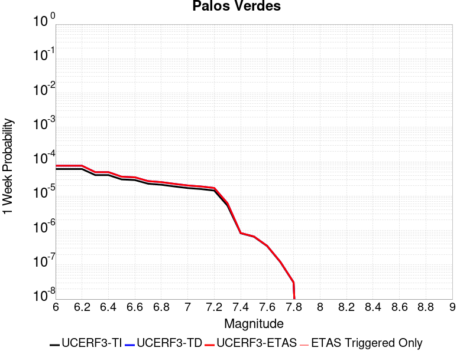 | 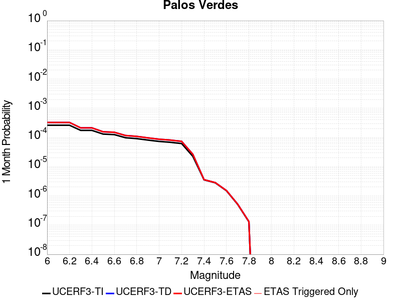 | 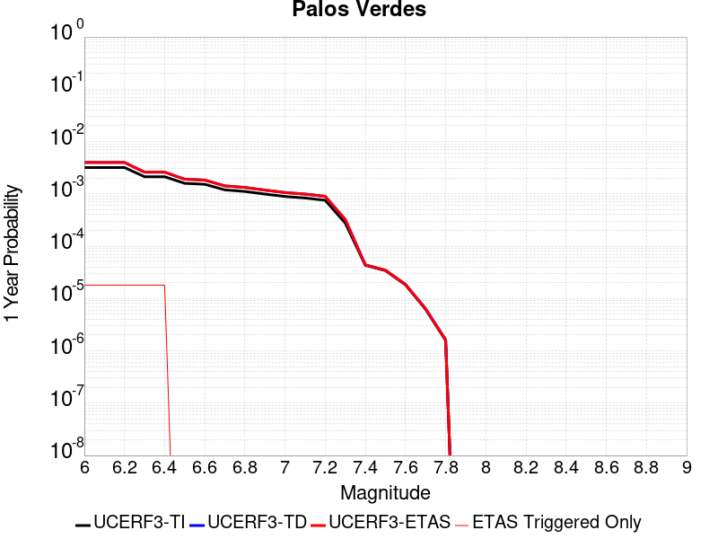 | 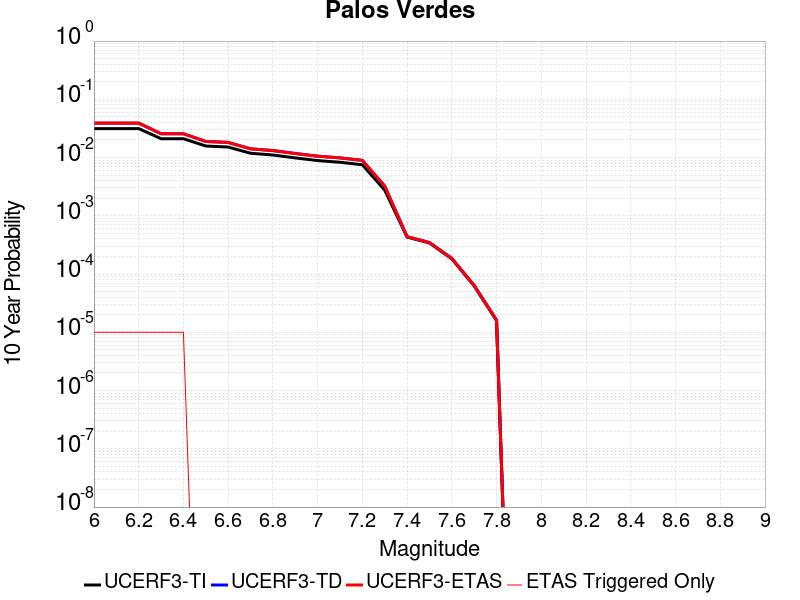 |

| Magnitude | 1 wk TI Prob | 1 wk TD Prob | 1 wk ETAS Prob | 1 wk ETAS/TD Gain | 1 wk ETAS Triggered Only | 1 mo TI Prob | 1 mo TD Prob | 1 mo ETAS Prob | 1 mo ETAS/TD Gain | 1 mo ETAS Triggered Only | 1 yr TI Prob | 1 yr TD Prob | 1 yr ETAS Prob | 1 yr ETAS/TD Gain | 1 yr ETAS Triggered Only | 10 yr TI Prob | 10 yr TD Prob | 10 yr ETAS Prob | 10 yr ETAS/TD Gain | 10 yr ETAS Triggered Only |
|-----|-----|-----|-----|-----|-----|-----|-----|-----|-----|-----|-----|-----|-----|-----|-----|-----|-----|-----|-----|-----|
| 6.0 | 6.126063E-5 | 7.624867E-5 | 7.624867E-5 | 1.0 | 0.0 | 2.6251914E-4 | 3.2674245E-4 | 3.2674245E-4 | 1.0 | 0.0 | 0.0031914865 | 0.003971301 | 0.0039892797 | 1.0045272 | 1.8050541E-5 | 0.031460393 | 0.039059937 | 0.039077282 | 1.000444 | 1.8050541E-5 |
| 6.1 | 6.126063E-5 | 7.624867E-5 | 7.624867E-5 | 1.0 | 0.0 | 2.6251914E-4 | 3.2674245E-4 | 3.2674245E-4 | 1.0 | 0.0 | 0.0031914865 | 0.003971301 | 0.0039892797 | 1.0045272 | 1.8050541E-5 | 0.031460393 | 0.039059937 | 0.039077282 | 1.000444 | 1.8050541E-5 |
| 6.2 | 6.126063E-5 | 7.624867E-5 | 7.624867E-5 | 1.0 | 0.0 | 2.6251914E-4 | 3.2674245E-4 | 3.2674245E-4 | 1.0 | 0.0 | 0.0031914865 | 0.003971301 | 0.0039892797 | 1.0045272 | 1.8050541E-5 | 0.031460393 | 0.039059937 | 0.039077282 | 1.000444 | 1.8050541E-5 |
| 6.3 | 4.0838047E-5 | 4.9762548E-5 | 4.9762548E-5 | 1.0 | 0.0 | 1.7500846E-4 | 2.1325191E-4 | 2.1325191E-4 | 1.0 | 0.0 | 0.0021286458 | 0.0025934442 | 0.0026114478 | 1.006942 | 1.8050541E-5 | 0.021083709 | 0.025653282 | 0.02567087 | 1.0006856 | 1.8050541E-5 |
| 6.4 | 4.0838047E-5 | 4.9762548E-5 | 4.9762548E-5 | 1.0 | 0.0 | 1.7500846E-4 | 2.1325191E-4 | 2.1325191E-4 | 1.0 | 0.0 | 0.0021286458 | 0.0025934442 | 0.0026114478 | 1.006942 | 1.8050541E-5 | 0.021083709 | 0.025653282 | 0.02567087 | 1.0006856 | 1.8050541E-5 |
| 6.5 | 3.0512005E-5 | 3.657036E-5 | 3.657036E-5 | 1.0 | 0.0 | 1.3075917E-4 | 1.5672138E-4 | 1.5672138E-4 | 1.0 | 0.0 | 0.0015908304 | 0.0019065293 | 0.0019065293 | 1.0 | 0.0 | 0.015794903 | 0.018913615 | 0.018913615 | 1.0 | 0.0 |
| 6.6 | 2.9255087E-5 | 3.5162957E-5 | 3.5162957E-5 | 1.0 | 0.0 | 1.2537291E-4 | 1.5069035E-4 | 1.5069035E-4 | 1.0 | 0.0 | 0.0015253464 | 0.0018332251 | 0.0018332251 | 1.0 | 0.0 | 0.015149189 | 0.018192587 | 0.018192587 | 1.0 | 0.0 |
| 6.7 | 2.287198E-5 | 2.7254555E-5 | 2.7254555E-5 | 1.0 | 0.0 | 9.801909E-5 | 1.16800526E-4 | 1.16800526E-4 | 1.0 | 0.0 | 0.001192729 | 0.0014212105 | 0.0014212105 | 1.0 | 0.0 | 0.011863477 | 0.014130451 | 0.014130451 | 1.0 | 0.0 |
| 6.8 | 2.1325764E-5 | 2.543777E-5 | 2.543777E-5 | 1.0 | 0.0 | 9.139293E-5 | 1.0901497E-4 | 1.0901497E-4 | 1.0 | 0.0 | 0.001112141 | 0.0013265394 | 0.0013265394 | 1.0 | 0.0 | 0.011065915 | 0.01319525 | 0.01319525 | 1.0 | 0.0 |
| 6.9 | 1.9009392E-5 | 2.2618711E-5 | 2.2618711E-5 | 1.0 | 0.0 | 8.1466285E-5 | 9.693422E-5 | 9.693422E-5 | 1.0 | 0.0 | 9.914007E-4 | 0.0011796226 | 0.0011796226 | 1.0 | 0.0 | 0.009869894 | 0.011742299 | 0.011742299 | 1.0 | 0.0 |
| 7.0 | 1.7098473E-5 | 2.0323969E-5 | 2.0323969E-5 | 1.0 | 0.0 | 7.3277115E-5 | 8.710029E-5 | 8.710029E-5 | 1.0 | 0.0 | 8.917837E-4 | 0.0010600155 | 0.0010600155 | 1.0 | 0.0 | 0.008882134 | 0.010558032 | 0.010558032 | 1.0 | 0.0 |
| 7.1 | 1.5982785E-5 | 1.8999075E-5 | 1.8999075E-5 | 1.0 | 0.0 | 6.849585E-5 | 8.142254E-5 | 8.142254E-5 | 1.0 | 0.0 | 8.336179E-4 | 9.909534E-4 | 9.909534E-4 | 1.0 | 0.0 | 0.008304977 | 0.009873713 | 0.009873713 | 1.0 | 0.0 |
| 7.2 | 1.4468002E-5 | 1.7201148E-5 | 1.7201148E-5 | 1.0 | 0.0 | 6.200425E-5 | 7.37176E-5 | 7.37176E-5 | 1.0 | 0.0 | 7.546402E-4 | 8.972262E-4 | 8.972262E-4 | 1.0 | 0.0 | 0.007520827 | 0.008944311 | 0.008944311 | 1.0 | 0.0 |
| 7.3 | 5.288233E-6 | 6.2049894E-6 | 6.2049894E-6 | 1.0 | 0.0 | 2.2663658E-5 | 2.6592737E-5 | 2.6592737E-5 | 1.0 | 0.0 | 2.7589512E-4 | 3.237534E-4 | 3.237534E-4 | 1.0 | 0.0 | 0.0027555283 | 0.0032362419 | 0.0032362419 | 1.0 | 0.0 |
| 7.4 | 8.279556E-7 | 8.4085025E-7 | 8.4085025E-7 | 1.0 | 0.0 | 3.5483763E-6 | 3.6036395E-6 | 3.6036395E-6 | 1.0 | 0.0 | 4.3200624E-5 | 4.38735E-5 | 4.38735E-5 | 1.0 | 0.0 | 4.3192226E-4 | 4.386556E-4 | 4.386556E-4 | 1.0 | 0.0 |
| 7.5 | 6.559831E-7 | 6.667359E-7 | 6.667359E-7 | 1.0 | 0.0 | 2.8113532E-6 | 2.8574368E-6 | 2.8574368E-6 | 1.0 | 0.0 | 3.4227687E-5 | 3.4788805E-5 | 3.4788805E-5 | 1.0 | 0.0 | 3.4222414E-4 | 3.4784022E-4 | 3.4784022E-4 | 1.0 | 0.0 |
| 7.6 | 3.5018968E-7 | 3.5620758E-7 | 3.5620758E-7 | 1.0 | 0.0 | 1.500812E-6 | 1.5266033E-6 | 1.5266033E-6 | 1.0 | 0.0 | 1.8272232E-5 | 1.8586283E-5 | 1.8586283E-5 | 1.0 | 0.0 | 1.8270731E-4 | 1.8585188E-4 | 1.8585188E-4 | 1.0 | 0.0 |
| 7.7 | 1.1986104E-7 | 1.2198635E-7 | 1.2198635E-7 | 1.0 | 0.0 | 5.1369005E-7 | 5.2279853E-7 | 5.2279853E-7 | 1.0 | 0.0 | 6.2541585E-6 | 6.3650537E-6 | 6.3650537E-6 | 1.0 | 0.0 | 6.2539824E-5 | 6.364875E-5 | 6.364875E-5 | 1.0 | 0.0 |
| 7.8 | 3.0445005E-8 | 3.1028293E-8 | 3.1028293E-8 | 1.0 | 0.0 | 1.3047858E-7 | 1.3297839E-7 | 1.3297839E-7 | 1.0 | 0.0 | 1.5885756E-6 | 1.619011E-6 | 1.619011E-6 | 1.0 | 0.0 | 1.5885644E-5 | 1.6190012E-5 | 1.6190012E-5 | 1.0 | 0.0 |

## Cucamonga
*[(top)](#table-of-contents)*

| 1 Week | 1 Month | 1 Year | 10 Year |
|-----|-----|-----|-----|
| 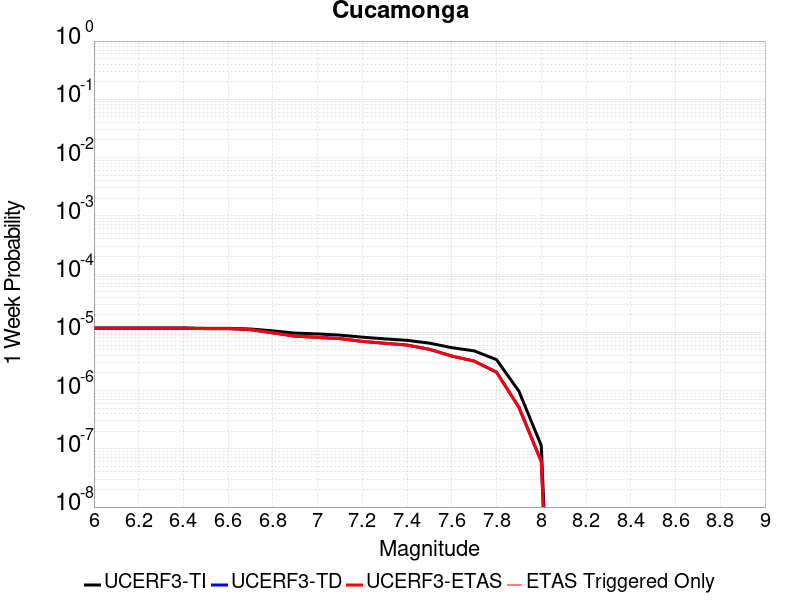 | 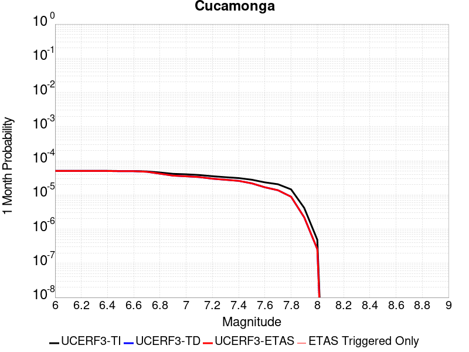 | 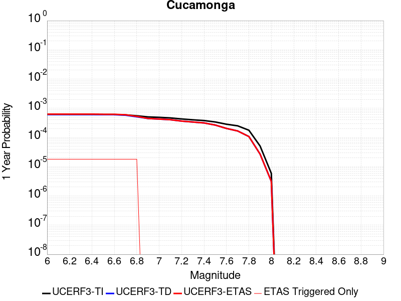 | 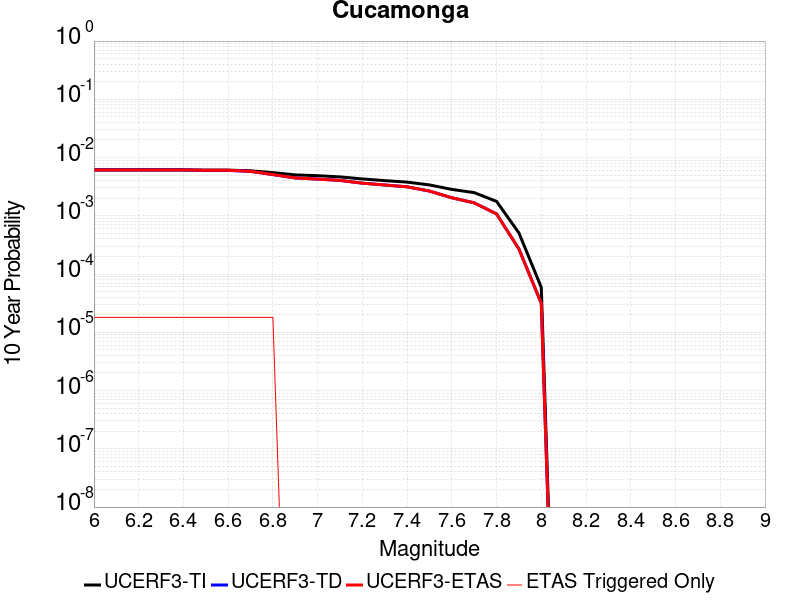 |

| Magnitude | 1 wk TI Prob | 1 wk TD Prob | 1 wk ETAS Prob | 1 wk ETAS/TD Gain | 1 wk ETAS Triggered Only | 1 mo TI Prob | 1 mo TD Prob | 1 mo ETAS Prob | 1 mo ETAS/TD Gain | 1 mo ETAS Triggered Only | 1 yr TI Prob | 1 yr TD Prob | 1 yr ETAS Prob | 1 yr ETAS/TD Gain | 1 yr ETAS Triggered Only | 10 yr TI Prob | 10 yr TD Prob | 10 yr ETAS Prob | 10 yr ETAS/TD Gain | 10 yr ETAS Triggered Only |
|-----|-----|-----|-----|-----|-----|-----|-----|-----|-----|-----|-----|-----|-----|-----|-----|-----|-----|-----|-----|-----|
| 6.0 | 1.1848348E-5 | 1.1743087E-5 | 1.1743087E-5 | 1.0 | 0.0 | 5.0777642E-5 | 5.0326562E-5 | 5.0326562E-5 | 1.0 | 0.0 | 6.180424E-4 | 6.1255635E-4 | 6.3059584E-4 | 1.0294495 | 1.8050541E-5 | 0.0061632637 | 0.006109844 | 0.0061277845 | 1.0029362 | 1.8050541E-5 |
| 6.1 | 1.1848348E-5 | 1.1743087E-5 | 1.1743087E-5 | 1.0 | 0.0 | 5.0777642E-5 | 5.0326562E-5 | 5.0326562E-5 | 1.0 | 0.0 | 6.180424E-4 | 6.1255635E-4 | 6.3059584E-4 | 1.0294495 | 1.8050541E-5 | 0.0061632637 | 0.006109844 | 0.0061277845 | 1.0029362 | 1.8050541E-5 |
| 6.2 | 1.1848348E-5 | 1.1743087E-5 | 1.1743087E-5 | 1.0 | 0.0 | 5.0777642E-5 | 5.0326562E-5 | 5.0326562E-5 | 1.0 | 0.0 | 6.180424E-4 | 6.1255635E-4 | 6.3059584E-4 | 1.0294495 | 1.8050541E-5 | 0.0061632637 | 0.006109844 | 0.0061277845 | 1.0029362 | 1.8050541E-5 |
| 6.3 | 1.1848348E-5 | 1.1743087E-5 | 1.1743087E-5 | 1.0 | 0.0 | 5.0777642E-5 | 5.0326562E-5 | 5.0326562E-5 | 1.0 | 0.0 | 6.180424E-4 | 6.1255635E-4 | 6.3059584E-4 | 1.0294495 | 1.8050541E-5 | 0.0061632637 | 0.006109844 | 0.0061277845 | 1.0029362 | 1.8050541E-5 |
| 6.4 | 1.1848348E-5 | 1.1743087E-5 | 1.1743087E-5 | 1.0 | 0.0 | 5.0777642E-5 | 5.0326562E-5 | 5.0326562E-5 | 1.0 | 0.0 | 6.180424E-4 | 6.1255635E-4 | 6.3059584E-4 | 1.0294495 | 1.8050541E-5 | 0.0061632637 | 0.006109844 | 0.0061277845 | 1.0029362 | 1.8050541E-5 |
| 6.5 | 1.16988695E-5 | 1.1582104E-5 | 1.1582104E-5 | 1.0 | 0.0 | 5.013705E-5 | 4.9636656E-5 | 4.9636656E-5 | 1.0 | 0.0 | 6.102476E-4 | 6.041614E-4 | 6.2220107E-4 | 1.029859 | 1.8050541E-5 | 0.006085745 | 0.006026351 | 0.006044293 | 1.0029773 | 1.8050541E-5 |
| 6.6 | 1.16988695E-5 | 1.1582104E-5 | 1.1582104E-5 | 1.0 | 0.0 | 5.013705E-5 | 4.9636656E-5 | 4.9636656E-5 | 1.0 | 0.0 | 6.102476E-4 | 6.041614E-4 | 6.2220107E-4 | 1.029859 | 1.8050541E-5 | 0.006085745 | 0.006026351 | 0.006044293 | 1.0029773 | 1.8050541E-5 |
| 6.7 | 1.1397107E-5 | 1.1120857E-5 | 1.1120857E-5 | 1.0 | 0.0 | 4.884383E-5 | 4.765996E-5 | 4.765996E-5 | 1.0 | 0.0 | 5.9451134E-4 | 5.80108E-4 | 5.981481E-4 | 1.0310978 | 1.8050541E-5 | 0.005929234 | 0.0057870783 | 0.005805024 | 1.0031011 | 1.8050541E-5 |
| 6.8 | 1.058387E-5 | 9.7901875E-6 | 9.7901875E-6 | 1.0 | 0.0 | 4.5358654E-5 | 4.195728E-5 | 4.195728E-5 | 1.0 | 0.0 | 5.521017E-4 | 5.107113E-4 | 5.287526E-4 | 1.0353259 | 1.8050541E-5 | 0.00550732 | 0.0050963745 | 0.0051143332 | 1.0035238 | 1.8050541E-5 |
| 6.9 | 9.690046E-6 | 8.584209E-6 | 8.584209E-6 | 1.0 | 0.0 | 4.1528107E-5 | 3.678895E-5 | 3.678895E-5 | 1.0 | 0.0 | 5.054874E-4 | 4.4781383E-4 | 4.4781383E-4 | 1.0 | 0.0 | 0.005043391 | 0.0044700396 | 0.0044700396 | 1.0 | 0.0 |
| 7.0 | 9.381461E-6 | 8.191705E-6 | 8.191705E-6 | 1.0 | 0.0 | 4.020564E-5 | 3.5106837E-5 | 3.5106837E-5 | 1.0 | 0.0 | 4.893937E-4 | 4.2734225E-4 | 4.2734225E-4 | 1.0 | 0.0 | 0.0048831734 | 0.004266129 | 0.004266129 | 1.0 | 0.0 |
| 7.1 | 8.946492E-6 | 7.786398E-6 | 7.786398E-6 | 1.0 | 0.0 | 3.8341543E-5 | 3.336985E-5 | 3.336985E-5 | 1.0 | 0.0 | 4.667083E-4 | 4.0620254E-4 | 4.0620254E-4 | 1.0 | 0.0 | 0.0046572937 | 0.0040555266 | 0.0040555266 | 1.0 | 0.0 |
| 7.2 | 8.251016E-6 | 6.979487E-6 | 6.979487E-6 | 1.0 | 0.0 | 3.5361016E-5 | 2.9911746E-5 | 2.9911746E-5 | 1.0 | 0.0 | 4.3043532E-4 | 3.6411488E-4 | 3.6411488E-4 | 1.0 | 0.0 | 0.0042960253 | 0.0036361057 | 0.0036361057 | 1.0 | 0.0 |
| 7.3 | 7.717881E-6 | 6.490422E-6 | 6.490422E-6 | 1.0 | 0.0 | 3.3076216E-5 | 2.7815799E-5 | 2.7815799E-5 | 1.0 | 0.0 | 4.026285E-4 | 3.3860496E-4 | 3.3860496E-4 | 1.0 | 0.0 | 0.004018998 | 0.003381817 | 0.003381817 | 1.0 | 0.0 |
| 7.4 | 7.275623E-6 | 6.035906E-6 | 6.035906E-6 | 1.0 | 0.0 | 3.118087E-5 | 2.5867914E-5 | 2.5867914E-5 | 1.0 | 0.0 | 3.7956095E-4 | 3.1489655E-4 | 3.1489655E-4 | 1.0 | 0.0 | 0.0037891332 | 0.0031454288 | 0.0031454288 | 1.0 | 0.0 |
| 7.5 | 6.5109502E-6 | 5.1040697E-6 | 5.1040697E-6 | 1.0 | 0.0 | 2.7903774E-5 | 2.18744E-5 | 2.18744E-5 | 1.0 | 0.0 | 3.3967546E-4 | 2.6628844E-4 | 2.6628844E-4 | 1.0 | 0.0 | 0.0033915674 | 0.0026606075 | 0.0026606075 | 1.0 | 0.0 |
| 7.6 | 5.4495326E-6 | 3.911649E-6 | 3.911649E-6 | 1.0 | 0.0 | 2.335493E-5 | 1.6764103E-5 | 1.6764103E-5 | 1.0 | 0.0 | 2.8430918E-4 | 2.040839E-4 | 2.040839E-4 | 1.0 | 0.0 | 0.0028394572 | 0.0020398751 | 0.0020398751 | 1.0 | 0.0 |
| 7.7 | 4.7997164E-6 | 3.2030257E-6 | 3.2030257E-6 | 1.0 | 0.0 | 2.057005E-5 | 1.3727181E-5 | 1.3727181E-5 | 1.0 | 0.0 | 2.504116E-4 | 1.6711565E-4 | 1.6711565E-4 | 1.0 | 0.0 | 0.002501296 | 0.0016708216 | 0.0016708216 | 1.0 | 0.0 |
| 7.8 | 3.3941733E-6 | 2.065798E-6 | 2.065798E-6 | 1.0 | 0.0 | 1.4546376E-5 | 8.853391E-6 | 8.853391E-6 | 1.0 | 0.0 | 1.7708774E-4 | 1.0778472E-4 | 1.0778472E-4 | 1.0 | 0.0 | 0.0017694668 | 0.0010775616 | 0.0010775616 | 1.0 | 0.0 |
| 7.9 | 9.750552E-7 | 5.160984E-7 | 5.160984E-7 | 1.0 | 0.0 | 4.178801E-6 | 2.2118484E-6 | 2.2118484E-6 | 1.0 | 0.0 | 5.0875715E-5 | 2.6928925E-5 | 2.6928925E-5 | 1.0 | 0.0 | 5.086407E-4 | 2.6925703E-4 | 2.6925703E-4 | 1.0 | 0.0 |
| 8.0 | 1.133857E-7 | 6.056813E-8 | 6.056813E-8 | 1.0 | 0.0 | 4.8593864E-7 | 2.5957766E-7 | 2.5957766E-7 | 1.0 | 0.0 | 5.9162867E-6 | 3.1603533E-6 | 3.1603533E-6 | 1.0 | 0.0 | 5.916129E-5 | 3.16031E-5 | 3.16031E-5 | 1.0 | 0.0 |

## San Jacinto (Lytle Creek connector)
*[(top)](#table-of-contents)*

| 1 Week | 1 Month | 1 Year | 10 Year |
|-----|-----|-----|-----|
| 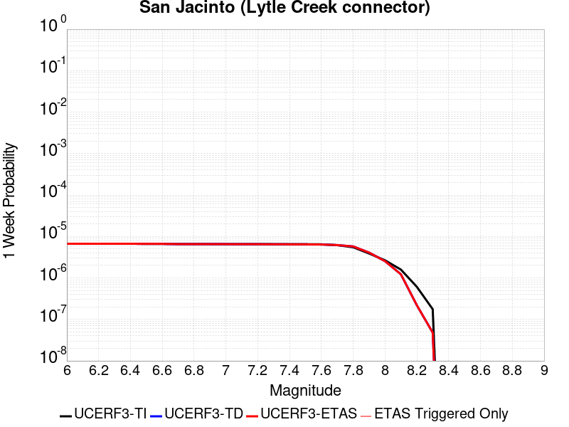 | 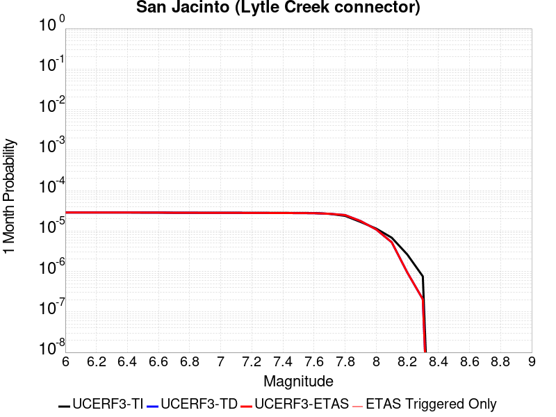 | 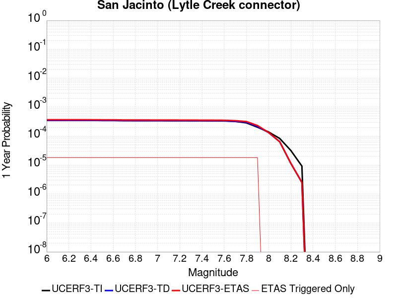 | 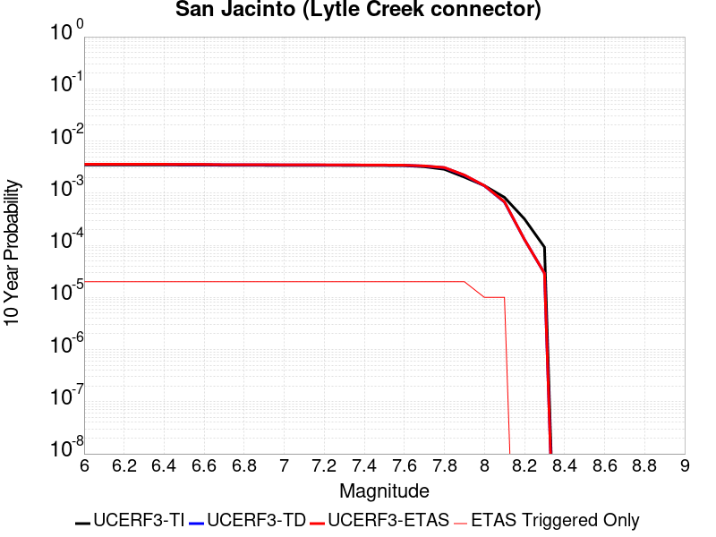 |

| Magnitude | 1 wk TI Prob | 1 wk TD Prob | 1 wk ETAS Prob | 1 wk ETAS/TD Gain | 1 wk ETAS Triggered Only | 1 mo TI Prob | 1 mo TD Prob | 1 mo ETAS Prob | 1 mo ETAS/TD Gain | 1 mo ETAS Triggered Only | 1 yr TI Prob | 1 yr TD Prob | 1 yr ETAS Prob | 1 yr ETAS/TD Gain | 1 yr ETAS Triggered Only | 10 yr TI Prob | 10 yr TD Prob | 10 yr ETAS Prob | 10 yr ETAS/TD Gain | 10 yr ETAS Triggered Only |
|-----|-----|-----|-----|-----|-----|-----|-----|-----|-----|-----|-----|-----|-----|-----|-----|-----|-----|-----|-----|-----|
| 6.0 | 6.693995E-6 | 6.6844927E-6 | 6.6844927E-6 | 1.0 | 0.0 | 2.8688235E-5 | 2.8647511E-5 | 2.8647511E-5 | 1.0 | 0.0 | 3.492233E-4 | 3.487277E-4 | 3.6677197E-4 | 1.051743 | 1.8050541E-5 | 0.00348675 | 0.003561991 | 0.0035799774 | 1.0050495 | 1.8050541E-5 |
| 6.1 | 6.693995E-6 | 6.6844927E-6 | 6.6844927E-6 | 1.0 | 0.0 | 2.8688235E-5 | 2.8647511E-5 | 2.8647511E-5 | 1.0 | 0.0 | 3.492233E-4 | 3.487277E-4 | 3.6677197E-4 | 1.051743 | 1.8050541E-5 | 0.00348675 | 0.003561991 | 0.0035799774 | 1.0050495 | 1.8050541E-5 |
| 6.2 | 6.693995E-6 | 6.6844927E-6 | 6.6844927E-6 | 1.0 | 0.0 | 2.8688235E-5 | 2.8647511E-5 | 2.8647511E-5 | 1.0 | 0.0 | 3.492233E-4 | 3.487277E-4 | 3.6677197E-4 | 1.051743 | 1.8050541E-5 | 0.00348675 | 0.003561991 | 0.0035799774 | 1.0050495 | 1.8050541E-5 |
| 6.3 | 6.693995E-6 | 6.6844927E-6 | 6.6844927E-6 | 1.0 | 0.0 | 2.8688235E-5 | 2.8647511E-5 | 2.8647511E-5 | 1.0 | 0.0 | 3.492233E-4 | 3.487277E-4 | 3.6677197E-4 | 1.051743 | 1.8050541E-5 | 0.00348675 | 0.003561991 | 0.0035799774 | 1.0050495 | 1.8050541E-5 |
| 6.4 | 6.693995E-6 | 6.6844927E-6 | 6.6844927E-6 | 1.0 | 0.0 | 2.8688235E-5 | 2.8647511E-5 | 2.8647511E-5 | 1.0 | 0.0 | 3.492233E-4 | 3.487277E-4 | 3.6677197E-4 | 1.051743 | 1.8050541E-5 | 0.00348675 | 0.003561991 | 0.0035799774 | 1.0050495 | 1.8050541E-5 |
| 6.5 | 6.6561875E-6 | 6.6447083E-6 | 6.6447083E-6 | 1.0 | 0.0 | 2.8526205E-5 | 2.8477012E-5 | 2.8477012E-5 | 1.0 | 0.0 | 3.472512E-4 | 3.4665252E-4 | 3.646968E-4 | 1.052053 | 1.8050541E-5 | 0.0034670907 | 0.0035413057 | 0.0035592923 | 1.0050792 | 1.8050541E-5 |
| 6.6 | 6.6561875E-6 | 6.6447083E-6 | 6.6447083E-6 | 1.0 | 0.0 | 2.8526205E-5 | 2.8477012E-5 | 2.8477012E-5 | 1.0 | 0.0 | 3.472512E-4 | 3.4665252E-4 | 3.646968E-4 | 1.052053 | 1.8050541E-5 | 0.0034670907 | 0.0035413057 | 0.0035592923 | 1.0050792 | 1.8050541E-5 |
| 6.7 | 6.5802237E-6 | 6.563879E-6 | 6.563879E-6 | 1.0 | 0.0 | 2.8200653E-5 | 2.813061E-5 | 2.813061E-5 | 1.0 | 0.0 | 3.4328885E-4 | 3.424364E-4 | 3.6048077E-4 | 1.0526941 | 1.8050541E-5 | 0.0034275902 | 0.0034992776 | 0.003517265 | 1.0051403 | 1.8050541E-5 |
| 6.8 | 6.575632E-6 | 6.5583677E-6 | 6.5583677E-6 | 1.0 | 0.0 | 2.8180975E-5 | 2.8106988E-5 | 2.8106988E-5 | 1.0 | 0.0 | 3.4304935E-4 | 3.421489E-4 | 3.6019328E-4 | 1.0527383 | 1.8050541E-5 | 0.0034252026 | 0.0034964117 | 0.003514399 | 1.0051446 | 1.8050541E-5 |
| 6.9 | 6.570433E-6 | 6.5497584E-6 | 6.5497584E-6 | 1.0 | 0.0 | 2.8158694E-5 | 2.8070092E-5 | 2.8070092E-5 | 1.0 | 0.0 | 3.4277816E-4 | 3.4169984E-4 | 3.597442E-4 | 1.0528077 | 1.8050541E-5 | 0.0034224992 | 0.003491935 | 0.0035099227 | 1.0051512 | 1.8050541E-5 |
| 7.0 | 6.5643826E-6 | 6.5398754E-6 | 6.5398754E-6 | 1.0 | 0.0 | 2.8132765E-5 | 2.8027736E-5 | 2.8027736E-5 | 1.0 | 0.0 | 3.424626E-4 | 3.4118432E-4 | 3.5922872E-4 | 1.0528874 | 1.8050541E-5 | 0.0034193532 | 0.0034867963 | 0.0035047838 | 1.0051588 | 1.8050541E-5 |
| 7.1 | 6.557402E-6 | 6.528583E-6 | 6.528583E-6 | 1.0 | 0.0 | 2.8102848E-5 | 2.7979342E-5 | 2.7979342E-5 | 1.0 | 0.0 | 3.4209844E-4 | 3.4059532E-4 | 3.586397E-4 | 1.052979 | 1.8050541E-5 | 0.0034157229 | 0.0034809255 | 0.0034989133 | 1.0051675 | 1.8050541E-5 |
| 7.2 | 6.546394E-6 | 6.5105414E-6 | 6.5105414E-6 | 1.0 | 0.0 | 2.8055672E-5 | 2.7902022E-5 | 2.7902022E-5 | 1.0 | 0.0 | 3.4152428E-4 | 3.3965425E-4 | 3.5769865E-4 | 1.0531259 | 1.8050541E-5 | 0.0034099987 | 0.0034715487 | 0.0034895365 | 1.0051816 | 1.8050541E-5 |
| 7.3 | 6.5364216E-6 | 6.491312E-6 | 6.491312E-6 | 1.0 | 0.0 | 2.8012933E-5 | 2.7819611E-5 | 2.7819611E-5 | 1.0 | 0.0 | 3.4100408E-4 | 3.386512E-4 | 3.5669561E-4 | 1.0532832 | 1.8050541E-5 | 0.003404813 | 0.0034615623 | 0.0034795504 | 1.0051966 | 1.8050541E-5 |
| 7.4 | 6.5269523E-6 | 6.4723813E-6 | 6.4723813E-6 | 1.0 | 0.0 | 2.7972354E-5 | 2.7738482E-5 | 2.7738482E-5 | 1.0 | 0.0 | 3.4051016E-4 | 3.3766375E-4 | 3.557082E-4 | 1.0534391 | 1.8050541E-5 | 0.0033998888 | 0.0034517357 | 0.0034697237 | 1.0052114 | 1.8050541E-5 |
| 7.5 | 6.5111835E-6 | 6.4486367E-6 | 6.4486367E-6 | 1.0 | 0.0 | 2.7904773E-5 | 2.7636721E-5 | 2.7636721E-5 | 1.0 | 0.0 | 3.3968766E-4 | 3.364252E-4 | 3.5446967E-4 | 1.053636 | 1.8050541E-5 | 0.0033916887 | 0.0034393992 | 0.0034573877 | 1.0052301 | 1.8050541E-5 |
| 7.6 | 6.4768806E-6 | 6.4077167E-6 | 6.4077167E-6 | 1.0 | 0.0 | 2.7757764E-5 | 2.7461354E-5 | 2.7461354E-5 | 1.0 | 0.0 | 3.3789838E-4 | 3.3429076E-4 | 3.5233525E-4 | 1.0539784 | 1.8050541E-5 | 0.0033738504 | 0.0034181166 | 0.0034361053 | 1.0052629 | 1.8050541E-5 |
| 7.7 | 6.1655364E-6 | 6.200005E-6 | 6.200005E-6 | 1.0 | 0.0 | 2.642346E-5 | 2.6571179E-5 | 2.6571179E-5 | 1.0 | 0.0 | 3.2165812E-4 | 3.2345613E-4 | 3.4150085E-4 | 1.0557872 | 1.8050541E-5 | 0.0032119295 | 0.0033096294 | 0.0033276202 | 1.005436 | 1.8050541E-5 |
| 7.8 | 5.5043524E-6 | 5.760384E-6 | 5.760384E-6 | 1.0 | 0.0 | 2.3589868E-5 | 2.4687126E-5 | 2.4687126E-5 | 1.0 | 0.0 | 2.871688E-4 | 3.0052438E-4 | 3.1856948E-4 | 1.0600455 | 1.8050541E-5 | 0.0028679797 | 0.0030793794 | 0.0030973745 | 1.0058436 | 1.8050541E-5 |
| 7.9 | 3.889249E-6 | 4.0957343E-6 | 4.0957343E-6 | 1.0 | 0.0 | 1.6668104E-5 | 1.7553028E-5 | 1.7553028E-5 | 1.0 | 0.0 | 2.0291525E-4 | 2.136872E-4 | 2.3173388E-4 | 1.0844537 | 1.8050541E-5 | 0.0020273007 | 0.0022042429 | 0.0022222535 | 1.008171 | 1.8050541E-5 |
| 8.0 | 2.668535E-6 | 2.5446816E-6 | 2.5446816E-6 | 1.0 | 0.0 | 1.1436528E-5 | 1.0905733E-5 | 1.0905733E-5 | 1.0 | 0.0 | 1.3923083E-4 | 1.3276923E-4 | 1.3276923E-4 | 1.0 | 0.0 | 0.0013914363 | 0.001382764 | 0.001382764 | 1.0 | 0.0 |
| 8.1 | 1.5911459E-6 | 1.2257433E-6 | 1.2257433E-6 | 1.0 | 0.0 | 6.8191785E-6 | 5.253175E-6 | 5.253175E-6 | 1.0 | 0.0 | 8.3020335E-5 | 6.395555E-5 | 6.395555E-5 | 1.0 | 0.0 | 8.298933E-4 | 6.7312643E-4 | 6.7312643E-4 | 1.0 | 0.0 |
| 8.2 | 6.1294963E-7 | 2.2021108E-7 | 2.2021108E-7 | 1.0 | 0.0 | 2.6269242E-6 | 9.437614E-7 | 9.437614E-7 | 1.0 | 0.0 | 3.1982334E-5 | 1.1490235E-5 | 1.1490235E-5 | 1.0 | 0.0 | 3.1977732E-4 | 1.2901874E-4 | 1.2901874E-4 | 1.0 | 0.0 |
| 8.3 | 1.762871E-7 | 4.807611E-8 | 4.807611E-8 | 1.0 | 0.0 | 7.5551594E-7 | 2.0604045E-7 | 2.0604045E-7 | 1.0 | 0.0 | 9.1983675E-6 | 2.5085396E-6 | 2.5085396E-6 | 1.0 | 0.0 | 9.197987E-5 | 2.899141E-5 | 2.899141E-5 | 1.0 | 0.0 |

## San Gabriel
*[(top)](#table-of-contents)*

| 1 Week | 1 Month | 1 Year | 10 Year |
|-----|-----|-----|-----|
| 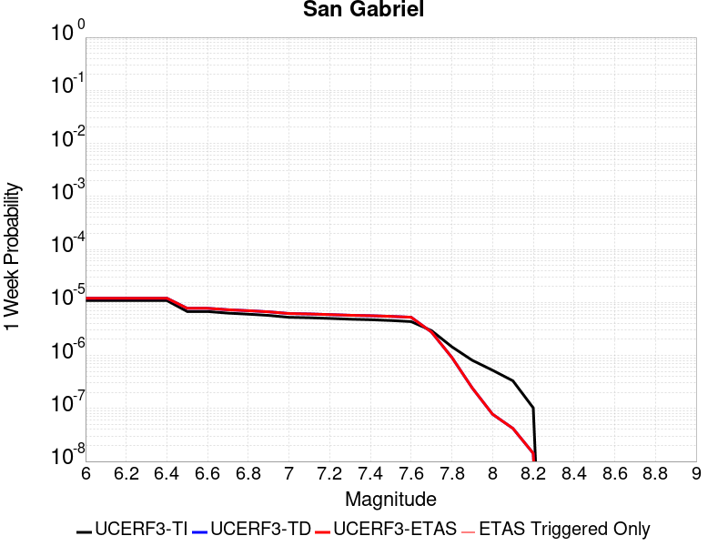 | 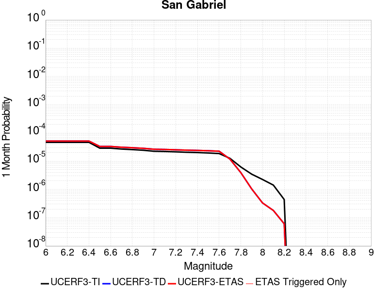 | 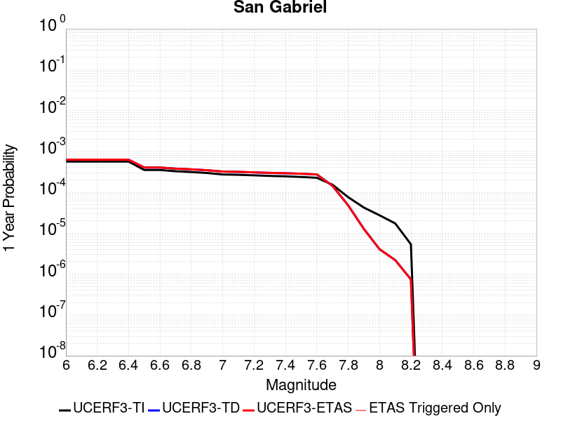 | 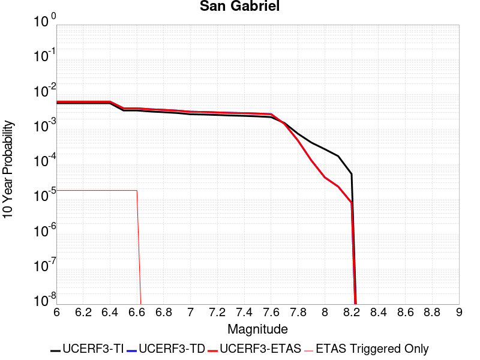 |

| Magnitude | 1 wk TI Prob | 1 wk TD Prob | 1 wk ETAS Prob | 1 wk ETAS/TD Gain | 1 wk ETAS Triggered Only | 1 mo TI Prob | 1 mo TD Prob | 1 mo ETAS Prob | 1 mo ETAS/TD Gain | 1 mo ETAS Triggered Only | 1 yr TI Prob | 1 yr TD Prob | 1 yr ETAS Prob | 1 yr ETAS/TD Gain | 1 yr ETAS Triggered Only | 10 yr TI Prob | 10 yr TD Prob | 10 yr ETAS Prob | 10 yr ETAS/TD Gain | 10 yr ETAS Triggered Only |
|-----|-----|-----|-----|-----|-----|-----|-----|-----|-----|-----|-----|-----|-----|-----|-----|-----|-----|-----|-----|-----|
| 6.0 | 1.083775E-5 | 1.2004489E-5 | 1.2004489E-5 | 1.0 | 0.0 | 4.6446676E-5 | 5.144686E-5 | 5.144686E-5 | 1.0 | 0.0 | 5.653415E-4 | 6.261968E-4 | 6.261968E-4 | 1.0 | 0.0 | 0.0056390543 | 0.006256398 | 0.0062743356 | 1.0028671 | 1.8050541E-5 |
| 6.1 | 1.083775E-5 | 1.2004489E-5 | 1.2004489E-5 | 1.0 | 0.0 | 4.6446676E-5 | 5.144686E-5 | 5.144686E-5 | 1.0 | 0.0 | 5.653415E-4 | 6.261968E-4 | 6.261968E-4 | 1.0 | 0.0 | 0.0056390543 | 0.006256398 | 0.0062743356 | 1.0028671 | 1.8050541E-5 |
| 6.2 | 1.083775E-5 | 1.2004489E-5 | 1.2004489E-5 | 1.0 | 0.0 | 4.6446676E-5 | 5.144686E-5 | 5.144686E-5 | 1.0 | 0.0 | 5.653415E-4 | 6.261968E-4 | 6.261968E-4 | 1.0 | 0.0 | 0.0056390543 | 0.006256398 | 0.0062743356 | 1.0028671 | 1.8050541E-5 |
| 6.3 | 1.083775E-5 | 1.2004489E-5 | 1.2004489E-5 | 1.0 | 0.0 | 4.6446676E-5 | 5.144686E-5 | 5.144686E-5 | 1.0 | 0.0 | 5.653415E-4 | 6.261968E-4 | 6.261968E-4 | 1.0 | 0.0 | 0.0056390543 | 0.006256398 | 0.0062743356 | 1.0028671 | 1.8050541E-5 |
| 6.4 | 1.083775E-5 | 1.2004489E-5 | 1.2004489E-5 | 1.0 | 0.0 | 4.6446676E-5 | 5.144686E-5 | 5.144686E-5 | 1.0 | 0.0 | 5.653415E-4 | 6.261968E-4 | 6.261968E-4 | 1.0 | 0.0 | 0.0056390543 | 0.006256398 | 0.0062743356 | 1.0028671 | 1.8050541E-5 |
| 6.5 | 6.7317824E-6 | 7.736045E-6 | 7.736045E-6 | 1.0 | 0.0 | 2.8850178E-5 | 3.315406E-5 | 3.315406E-5 | 1.0 | 0.0 | 3.511943E-4 | 4.03577E-4 | 4.03577E-4 | 1.0 | 0.0 | 0.003506398 | 0.0040395157 | 0.0040574935 | 1.0044504 | 1.8050541E-5 |
| 6.6 | 6.7317824E-6 | 7.736045E-6 | 7.736045E-6 | 1.0 | 0.0 | 2.8850178E-5 | 3.315406E-5 | 3.315406E-5 | 1.0 | 0.0 | 3.511943E-4 | 4.03577E-4 | 4.03577E-4 | 1.0 | 0.0 | 0.003506398 | 0.0040395157 | 0.0040574935 | 1.0044504 | 1.8050541E-5 |
| 6.7 | 6.274881E-6 | 7.2649473E-6 | 7.2649473E-6 | 1.0 | 0.0 | 2.6892068E-5 | 3.113512E-5 | 3.113512E-5 | 1.0 | 0.0 | 3.2736175E-4 | 3.7900516E-4 | 3.7900516E-4 | 1.0 | 0.0 | 0.0032687993 | 0.003794656 | 0.003794656 | 1.0 | 0.0 |
| 6.8 | 5.996209E-6 | 6.9776565E-6 | 6.9776565E-6 | 1.0 | 0.0 | 2.5697784E-5 | 2.9903906E-5 | 2.9903906E-5 | 1.0 | 0.0 | 3.128256E-4 | 3.6402018E-4 | 3.6402018E-4 | 1.0 | 0.0 | 0.003123856 | 0.0036453048 | 0.0036453048 | 1.0 | 0.0 |
| 6.9 | 5.686331E-6 | 6.642628E-6 | 6.642628E-6 | 1.0 | 0.0 | 2.4369761E-5 | 2.84681E-5 | 2.84681E-5 | 1.0 | 0.0 | 2.9666146E-4 | 3.465449E-4 | 3.465449E-4 | 1.0 | 0.0 | 0.0029626573 | 0.0034711093 | 0.0034711093 | 1.0 | 0.0 |
| 7.0 | 5.2329838E-6 | 6.1664623E-6 | 6.1664623E-6 | 1.0 | 0.0 | 2.242688E-5 | 2.6427431E-5 | 2.6427431E-5 | 1.0 | 0.0 | 2.7301308E-4 | 3.2170725E-4 | 3.2170725E-4 | 1.0 | 0.0 | 0.002726779 | 0.0032234674 | 0.0032234674 | 1.0 | 0.0 |
| 7.1 | 5.135671E-6 | 6.0565385E-6 | 6.0565385E-6 | 1.0 | 0.0 | 2.2009834E-5 | 2.595634E-5 | 2.595634E-5 | 1.0 | 0.0 | 2.6793676E-4 | 3.1597336E-4 | 3.1597336E-4 | 1.0 | 0.0 | 0.0026761394 | 0.0031662935 | 0.0031662935 | 1.0 | 0.0 |
| 7.2 | 4.989062E-6 | 5.8898336E-6 | 5.8898336E-6 | 1.0 | 0.0 | 2.1381518E-5 | 2.5241903E-5 | 2.5241903E-5 | 1.0 | 0.0 | 2.6028889E-4 | 3.072776E-4 | 3.072776E-4 | 1.0 | 0.0 | 0.0025998424 | 0.0030795794 | 0.0030795794 | 1.0 | 0.0 |
| 7.3 | 4.8219395E-6 | 5.7213115E-6 | 5.7213115E-6 | 1.0 | 0.0 | 2.0665291E-5 | 2.451968E-5 | 2.451968E-5 | 1.0 | 0.0 | 2.5157086E-4 | 2.9848696E-4 | 2.9848696E-4 | 1.0 | 0.0 | 0.0025128627 | 0.0029919134 | 0.0029919134 | 1.0 | 0.0 |
| 7.4 | 4.7118383E-6 | 5.6098015E-6 | 5.6098015E-6 | 1.0 | 0.0 | 2.0193436E-5 | 2.4041788E-5 | 2.4041788E-5 | 1.0 | 0.0 | 2.4582737E-4 | 2.926702E-4 | 2.926702E-4 | 1.0 | 0.0 | 0.002455556 | 0.0029338994 | 0.0029338994 | 1.0 | 0.0 |
| 7.5 | 4.5506545E-6 | 5.455075E-6 | 5.455075E-6 | 1.0 | 0.0 | 1.9502659E-5 | 2.3378689E-5 | 2.3378689E-5 | 1.0 | 0.0 | 2.37419E-4 | 2.845991E-4 | 2.845991E-4 | 1.0 | 0.0 | 0.002371655 | 0.0028533973 | 0.0028533973 | 1.0 | 0.0 |
| 7.6 | 4.343636E-6 | 5.2477994E-6 | 5.2477994E-6 | 1.0 | 0.0 | 1.861545E-5 | 2.249038E-5 | 2.249038E-5 | 1.0 | 0.0 | 2.2661954E-4 | 2.7378672E-4 | 2.7378672E-4 | 1.0 | 0.0 | 0.0022638857 | 0.0027455364 | 0.0027455364 | 1.0 | 0.0 |
| 7.7 | 2.936235E-6 | 2.756466E-6 | 2.756466E-6 | 1.0 | 0.0 | 1.2583803E-5 | 1.1813372E-5 | 1.1813372E-5 | 1.0 | 0.0 | 1.5319703E-4 | 1.4381835E-4 | 1.4381835E-4 | 1.0 | 0.0 | 0.0015309147 | 0.0014445833 | 0.0014445833 | 1.0 | 0.0 |
| 7.8 | 1.4541639E-6 | 9.1740134E-7 | 9.1740134E-7 | 1.0 | 0.0 | 6.232116E-6 | 3.9317138E-6 | 3.9317138E-6 | 1.0 | 0.0 | 7.587337E-5 | 4.786757E-5 | 4.786757E-5 | 1.0 | 0.0 | 7.584747E-4 | 4.8351393E-4 | 4.8351393E-4 | 1.0 | 0.0 |
| 7.9 | 8.098958E-7 | 2.4370485E-7 | 2.4370485E-7 | 1.0 | 0.0 | 3.4709774E-6 | 1.0444489E-6 | 1.0444489E-6 | 1.0 | 0.0 | 4.225833E-5 | 1.2716091E-5 | 1.2716091E-5 | 1.0 | 0.0 | 4.2250296E-4 | 1.3026907E-4 | 1.3026907E-4 | 1.0 | 0.0 |
| 8.0 | 5.2473234E-7 | 7.769787E-8 | 7.769787E-8 | 1.0 | 0.0 | 2.248851E-6 | 3.3299082E-7 | 3.3299082E-7 | 1.0 | 0.0 | 2.7379416E-5 | 4.0541554E-6 | 4.0541554E-6 | 1.0 | 0.0 | 2.7376044E-4 | 4.2687723E-5 | 4.2687723E-5 | 1.0 | 0.0 |
| 8.1 | 3.3162388E-7 | 4.2000156E-8 | 4.2000156E-8 | 1.0 | 0.0 | 1.4212444E-6 | 1.8000067E-7 | 1.8000067E-7 | 1.0 | 0.0 | 1.7303513E-5 | 2.191506E-6 | 2.191506E-6 | 1.0 | 0.0 | 1.7302166E-4 | 2.324226E-5 | 2.324226E-5 | 1.0 | 0.0 |
| 8.2 | 1.0235345E-7 | 1.4202862E-8 | 1.4202862E-8 | 1.0 | 0.0 | 4.3865757E-7 | 6.086941E-8 | 6.086941E-8 | 1.0 | 0.0 | 5.340643E-6 | 7.410848E-7 | 7.410848E-7 | 1.0 | 0.0 | 5.3405143E-5 | 8.015707E-6 | 8.015707E-6 | 1.0 | 0.0 |

## Verdugo
*[(top)](#table-of-contents)*

| 1 Week | 1 Month | 1 Year | 10 Year |
|-----|-----|-----|-----|
| 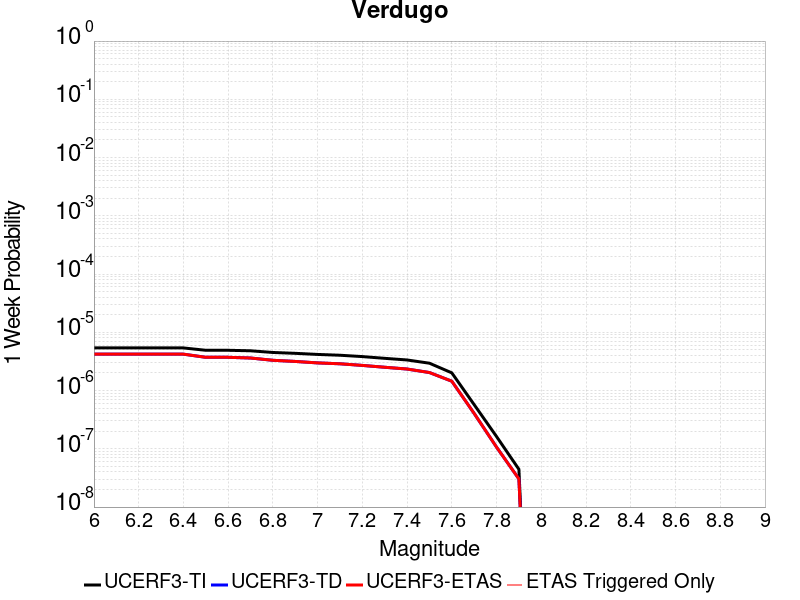 | 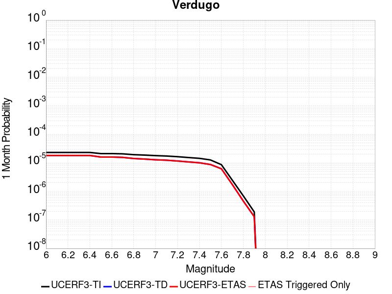 | 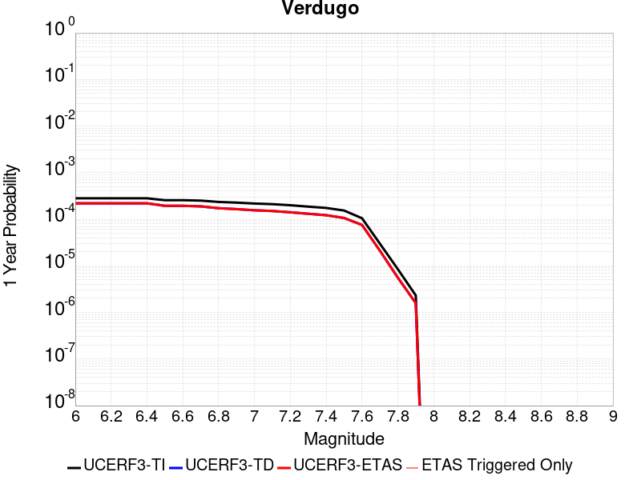 | 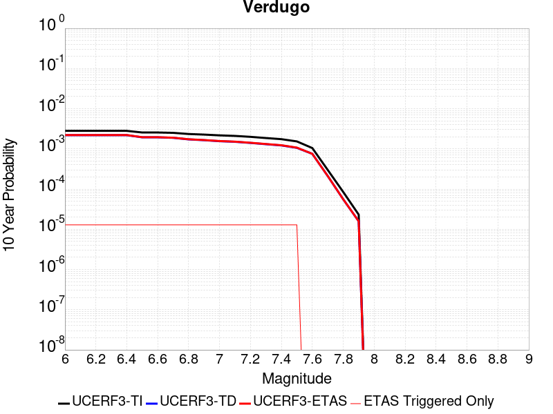 |

| Magnitude | 1 wk TI Prob | 1 wk TD Prob | 1 wk ETAS Prob | 1 wk ETAS/TD Gain | 1 wk ETAS Triggered Only | 1 mo TI Prob | 1 mo TD Prob | 1 mo ETAS Prob | 1 mo ETAS/TD Gain | 1 mo ETAS Triggered Only | 1 yr TI Prob | 1 yr TD Prob | 1 yr ETAS Prob | 1 yr ETAS/TD Gain | 1 yr ETAS Triggered Only | 10 yr TI Prob | 10 yr TD Prob | 10 yr ETAS Prob | 10 yr ETAS/TD Gain | 10 yr ETAS Triggered Only |
|-----|-----|-----|-----|-----|-----|-----|-----|-----|-----|-----|-----|-----|-----|-----|-----|-----|-----|-----|-----|-----|
| 6.0 | 5.392987E-6 | 4.2170977E-6 | 4.2170977E-6 | 1.0 | 0.0 | 2.3112598E-5 | 1.8073153E-5 | 1.8073153E-5 | 1.0 | 0.0 | 2.8135953E-4 | 2.200189E-4 | 2.200189E-4 | 1.0 | 0.0 | 0.0028100356 | 0.0021980584 | 0.0022160693 | 1.008194 | 1.8050541E-5 |
| 6.1 | 5.392987E-6 | 4.2170977E-6 | 4.2170977E-6 | 1.0 | 0.0 | 2.3112598E-5 | 1.8073153E-5 | 1.8073153E-5 | 1.0 | 0.0 | 2.8135953E-4 | 2.200189E-4 | 2.200189E-4 | 1.0 | 0.0 | 0.0028100356 | 0.0021980584 | 0.0022160693 | 1.008194 | 1.8050541E-5 |
| 6.2 | 5.392987E-6 | 4.2170977E-6 | 4.2170977E-6 | 1.0 | 0.0 | 2.3112598E-5 | 1.8073153E-5 | 1.8073153E-5 | 1.0 | 0.0 | 2.8135953E-4 | 2.200189E-4 | 2.200189E-4 | 1.0 | 0.0 | 0.0028100356 | 0.0021980584 | 0.0022160693 | 1.008194 | 1.8050541E-5 |
| 6.3 | 5.392987E-6 | 4.2170977E-6 | 4.2170977E-6 | 1.0 | 0.0 | 2.3112598E-5 | 1.8073153E-5 | 1.8073153E-5 | 1.0 | 0.0 | 2.8135953E-4 | 2.200189E-4 | 2.200189E-4 | 1.0 | 0.0 | 0.0028100356 | 0.0021980584 | 0.0022160693 | 1.008194 | 1.8050541E-5 |
| 6.4 | 5.392987E-6 | 4.2170977E-6 | 4.2170977E-6 | 1.0 | 0.0 | 2.3112598E-5 | 1.8073153E-5 | 1.8073153E-5 | 1.0 | 0.0 | 2.8135953E-4 | 2.200189E-4 | 2.200189E-4 | 1.0 | 0.0 | 0.0028100356 | 0.0021980584 | 0.0022160693 | 1.008194 | 1.8050541E-5 |
| 6.5 | 4.9154837E-6 | 3.7230252E-6 | 3.7230252E-6 | 1.0 | 0.0 | 2.1066187E-5 | 1.5955726E-5 | 1.5955726E-5 | 1.0 | 0.0 | 2.5645064E-4 | 1.9424385E-4 | 1.9424385E-4 | 1.0 | 0.0 | 0.002561549 | 0.0019407616 | 0.0019587772 | 1.0092827 | 1.8050541E-5 |
| 6.6 | 4.9154837E-6 | 3.7230252E-6 | 3.7230252E-6 | 1.0 | 0.0 | 2.1066187E-5 | 1.5955726E-5 | 1.5955726E-5 | 1.0 | 0.0 | 2.5645064E-4 | 1.9424385E-4 | 1.9424385E-4 | 1.0 | 0.0 | 0.002561549 | 0.0019407616 | 0.0019587772 | 1.0092827 | 1.8050541E-5 |
| 6.7 | 4.817006E-6 | 3.6212077E-6 | 3.6212077E-6 | 1.0 | 0.0 | 2.0644147E-5 | 1.551937E-5 | 1.551937E-5 | 1.0 | 0.0 | 2.513135E-4 | 1.8893216E-4 | 1.8893216E-4 | 1.0 | 0.0 | 0.0025102948 | 0.001887735 | 0.0019057514 | 1.009544 | 1.8050541E-5 |
| 6.8 | 4.507407E-6 | 3.3076406E-6 | 3.3076406E-6 | 1.0 | 0.0 | 1.9317316E-5 | 1.4175526E-5 | 1.4175526E-5 | 1.0 | 0.0 | 2.3516294E-4 | 1.725735E-4 | 1.725735E-4 | 1.0 | 0.0 | 0.0023491425 | 0.0017244092 | 0.0017424286 | 1.0104496 | 1.8050541E-5 |
| 6.9 | 4.3573054E-6 | 3.1615384E-6 | 3.1615384E-6 | 1.0 | 0.0 | 1.8674033E-5 | 1.354938E-5 | 1.354938E-5 | 1.0 | 0.0 | 2.2733262E-4 | 1.6495134E-4 | 1.6495134E-4 | 1.0 | 0.0 | 0.0022710022 | 0.0016483014 | 0.0016663222 | 1.0109329 | 1.8050541E-5 |
| 7.0 | 4.171527E-6 | 2.984187E-6 | 2.984187E-6 | 1.0 | 0.0 | 1.787785E-5 | 1.2789311E-5 | 1.2789311E-5 | 1.0 | 0.0 | 2.1764109E-4 | 1.5569884E-4 | 1.5569884E-4 | 1.0 | 0.0 | 0.0021742806 | 0.0015559088 | 0.0015739313 | 1.0115832 | 1.8050541E-5 |
| 7.1 | 4.0405484E-6 | 2.8827692E-6 | 2.8827692E-6 | 1.0 | 0.0 | 1.731652E-5 | 1.2354667E-5 | 1.2354667E-5 | 1.0 | 0.0 | 2.1080824E-4 | 1.504078E-4 | 1.504078E-4 | 1.0 | 0.0 | 0.0021060838 | 0.001503071 | 0.0015210945 | 1.011991 | 1.8050541E-5 |
| 7.2 | 3.8306007E-6 | 2.7023398E-6 | 2.7023398E-6 | 1.0 | 0.0 | 1.6416758E-5 | 1.1581405E-5 | 1.1581405E-5 | 1.0 | 0.0 | 1.9985568E-4 | 1.4099458E-4 | 1.4099458E-4 | 1.0 | 0.0 | 0.0019967605 | 0.0014090621 | 0.0014270871 | 1.0127922 | 1.8050541E-5 |
| 7.3 | 3.5750938E-6 | 2.512654E-6 | 2.512654E-6 | 1.0 | 0.0 | 1.532174E-5 | 1.0768474E-5 | 1.0768474E-5 | 1.0 | 0.0 | 1.8652623E-4 | 1.3109838E-4 | 1.3109838E-4 | 1.0 | 0.0 | 0.0018636974 | 0.0013102209 | 0.0013282478 | 1.0137587 | 1.8050541E-5 |
| 7.4 | 3.3510041E-6 | 2.3413222E-6 | 2.3413222E-6 | 1.0 | 0.0 | 1.4361368E-5 | 1.00342E-5 | 1.00342E-5 | 1.0 | 0.0 | 1.7483562E-4 | 1.2215965E-4 | 1.2215965E-4 | 1.0 | 0.0 | 0.0017469813 | 0.0012209354 | 0.0012389638 | 1.0147661 | 1.8050541E-5 |
| 7.5 | 2.948287E-6 | 2.0394227E-6 | 2.0394227E-6 | 1.0 | 0.0 | 1.2635454E-5 | 8.740354E-6 | 8.740354E-6 | 1.0 | 0.0 | 1.538258E-4 | 1.0640872E-4 | 1.0640872E-4 | 1.0 | 0.0 | 0.0015371935 | 0.001063588 | 0.0010816193 | 1.0169533 | 1.8050541E-5 |
| 7.6 | 2.0134323E-6 | 1.4473123E-6 | 1.4473123E-6 | 1.0 | 0.0 | 8.628967E-6 | 6.202753E-6 | 6.202753E-6 | 1.0 | 0.0 | 1.05052604E-4 | 7.5515985E-5 | 7.5515985E-5 | 1.0 | 0.0 | 0.0010500296 | 7.549121E-4 | 7.549121E-4 | 1.0 | 0.0 |
| 7.7 | 5.726436E-7 | 4.045801E-7 | 4.045801E-7 | 1.0 | 0.0 | 2.4541846E-6 | 1.7339137E-6 | 1.7339137E-6 | 1.0 | 0.0 | 2.9879287E-5 | 2.111022E-5 | 2.111022E-5 | 1.0 | 0.0 | 2.987527E-4 | 2.110847E-4 | 2.110847E-4 | 1.0 | 0.0 |
| 7.8 | 1.6248204E-7 | 1.0691243E-7 | 1.0691243E-7 | 1.0 | 0.0 | 6.963514E-7 | 4.5819604E-7 | 4.5819604E-7 | 1.0 | 0.0 | 8.478045E-6 | 5.578523E-6 | 5.578523E-6 | 1.0 | 0.0 | 8.477722E-5 | 5.5783865E-5 | 5.5783865E-5 | 1.0 | 0.0 |
| 7.9 | 4.4475744E-8 | 3.0377567E-8 | 3.0377567E-8 | 1.0 | 0.0 | 1.9061031E-7 | 1.3018956E-7 | 1.3018956E-7 | 1.0 | 0.0 | 2.320678E-6 | 1.5850569E-6 | 1.5850569E-6 | 1.0 | 0.0 | 2.3206538E-5 | 1.585047E-5 | 1.585047E-5 | 1.0 | 0.0 |

## Hayward (So) 2011 CFM
*[(top)](#table-of-contents)*

| 1 Week | 1 Month | 1 Year | 10 Year |
|-----|-----|-----|-----|
| 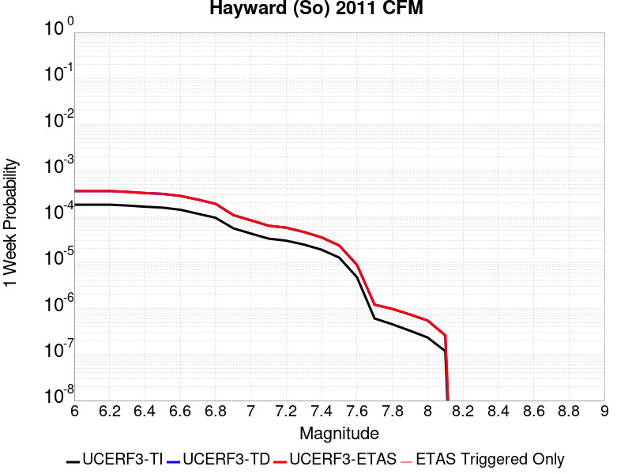 | 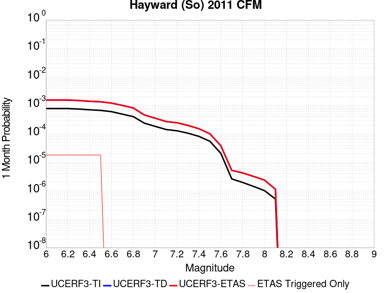 | 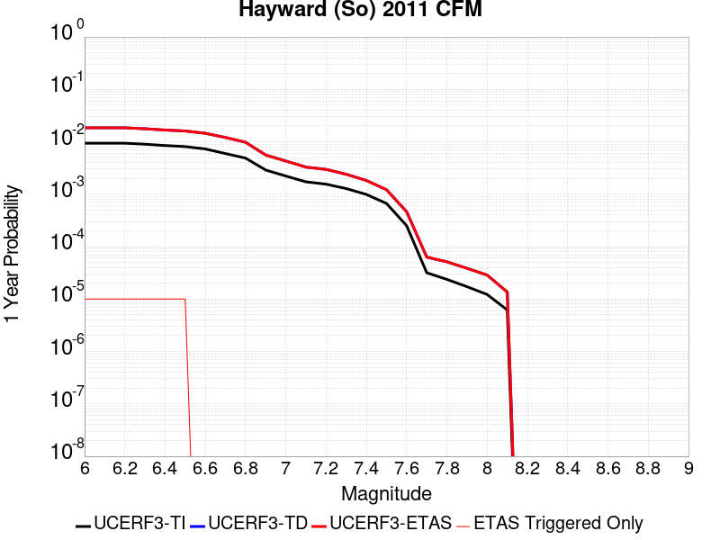 | 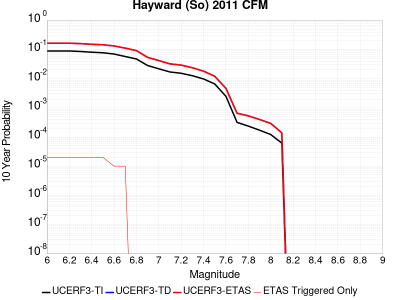 |

| Magnitude | 1 wk TI Prob | 1 wk TD Prob | 1 wk ETAS Prob | 1 wk ETAS/TD Gain | 1 wk ETAS Triggered Only | 1 mo TI Prob | 1 mo TD Prob | 1 mo ETAS Prob | 1 mo ETAS/TD Gain | 1 mo ETAS Triggered Only | 1 yr TI Prob | 1 yr TD Prob | 1 yr ETAS Prob | 1 yr ETAS/TD Gain | 1 yr ETAS Triggered Only | 10 yr TI Prob | 10 yr TD Prob | 10 yr ETAS Prob | 10 yr ETAS/TD Gain | 10 yr ETAS Triggered Only |
|-----|-----|-----|-----|-----|-----|-----|-----|-----|-----|-----|-----|-----|-----|-----|-----|-----|-----|-----|-----|-----|
| 6.0 | 1.8091932E-4 | 3.574349E-4 | 3.574349E-4 | 1.0 | 0.0 | 7.751381E-4 | 0.0015309745 | 0.0015489974 | 1.0117722 | 1.8050541E-5 | 0.00939654 | 0.018482722 | 0.018500438 | 1.0009586 | 1.8050541E-5 | 0.090090066 | 0.16687831 | 0.16689335 | 1.0000901 | 1.8050541E-5 |
| 6.1 | 1.8091932E-4 | 3.574349E-4 | 3.574349E-4 | 1.0 | 0.0 | 7.751381E-4 | 0.0015309745 | 0.0015489974 | 1.0117722 | 1.8050541E-5 | 0.00939654 | 0.018482722 | 0.018500438 | 1.0009586 | 1.8050541E-5 | 0.090090066 | 0.16687831 | 0.16689335 | 1.0000901 | 1.8050541E-5 |
| 6.2 | 1.8091932E-4 | 3.574349E-4 | 3.574349E-4 | 1.0 | 0.0 | 7.751381E-4 | 0.0015309745 | 0.0015489974 | 1.0117722 | 1.8050541E-5 | 0.00939654 | 0.018482722 | 0.018500438 | 1.0009586 | 1.8050541E-5 | 0.090090066 | 0.16687831 | 0.16689335 | 1.0000901 | 1.8050541E-5 |
| 6.3 | 1.7322872E-4 | 3.4299545E-4 | 3.4299545E-4 | 1.0 | 0.0 | 7.4219756E-4 | 0.0014691621 | 0.0014871861 | 1.0122682 | 1.8050541E-5 | 0.0089988755 | 0.017742623 | 0.017760353 | 1.0009993 | 1.8050541E-5 | 0.08643075 | 0.16081198 | 0.16082713 | 1.0000942 | 1.8050541E-5 |
| 6.4 | 1.6334097E-4 | 3.2380322E-4 | 3.2380322E-4 | 1.0 | 0.0 | 6.998449E-4 | 0.0013869987 | 0.0014050242 | 1.0129961 | 1.8050541E-5 | 0.008487372 | 0.016757973 | 0.01677572 | 1.001059 | 1.8050541E-5 | 0.081704415 | 0.15269834 | 0.15271364 | 1.0001001 | 1.8050541E-5 |
| 6.5 | 1.5600289E-4 | 3.1054154E-4 | 3.1054154E-4 | 1.0 | 0.0 | 6.684125E-4 | 0.0013302219 | 0.0013482483 | 1.0135515 | 1.8050541E-5 | 0.008107598 | 0.01607708 | 0.016094841 | 1.0011047 | 1.8050541E-5 | 0.078181036 | 0.14697264 | 0.14698805 | 1.0001048 | 1.8050541E-5 |
| 6.6 | 1.4046066E-4 | 2.806651E-4 | 2.806651E-4 | 1.0 | 0.0 | 6.018354E-4 | 0.0012023026 | 0.0012023026 | 1.0 | 0.0 | 0.0073027555 | 0.014541292 | 0.014541292 | 1.0 | 0.0 | 0.07067384 | 0.13405532 | 0.13405532 | 1.0 | 0.0 |
| 6.7 | 1.14696966E-4 | 2.3301752E-4 | 2.3301752E-4 | 1.0 | 0.0 | 4.914658E-4 | 9.982694E-4 | 9.982694E-4 | 1.0 | 0.0 | 0.0059671924 | 0.012087265 | 0.012087265 | 1.0 | 0.0 | 0.058094822 | 0.11287217 | 0.11287217 | 1.0 | 0.0 |
| 6.8 | 9.3874296E-5 | 1.8886503E-4 | 1.8886503E-4 | 1.0 | 0.0 | 4.0225635E-4 | 8.0917415E-4 | 8.0917415E-4 | 1.0 | 0.0 | 0.0048864787 | 0.00980793 | 0.00980793 | 1.0 | 0.0 | 0.047804173 | 0.09270544 | 0.09270544 | 1.0 | 0.0 |
| 6.9 | 5.551852E-5 | 1.0744609E-4 | 1.0744609E-4 | 1.0 | 0.0 | 2.3791482E-4 | 4.6040257E-4 | 4.6040257E-4 | 1.0 | 0.0 | 0.0028927654 | 0.0055911136 | 0.0055911136 | 1.0 | 0.0 | 0.028553981 | 0.05431455 | 0.05431455 | 1.0 | 0.0 |
| 7.0 | 4.2662363E-5 | 8.258468E-5 | 8.258468E-5 | 1.0 | 0.0 | 1.8282588E-4 | 3.5388672E-4 | 3.5388672E-4 | 1.0 | 0.0 | 0.0022236328 | 0.0043001324 | 0.0043001324 | 1.0 | 0.0 | 0.022015138 | 0.04212067 | 0.04212067 | 1.0 | 0.0 |
| 7.1 | 3.305886E-5 | 6.3118394E-5 | 6.3118394E-5 | 1.0 | 0.0 | 1.4167312E-4 | 2.7047945E-4 | 2.7047945E-4 | 1.0 | 0.0 | 0.0017235056 | 0.0032881335 | 0.0032881335 | 1.0 | 0.0 | 0.017101998 | 0.032500245 | 0.032500245 | 1.0 | 0.0 |
| 7.2 | 2.9856887E-5 | 5.710848E-5 | 5.710848E-5 | 1.0 | 0.0 | 1.2795182E-4 | 2.4472777E-4 | 2.4472777E-4 | 1.0 | 0.0 | 0.0015567001 | 0.0029755062 | 0.0029755062 | 1.0 | 0.0 | 0.015458403 | 0.029499037 | 0.029499037 | 1.0 | 0.0 |
| 7.3 | 2.4559737E-5 | 4.6070734E-5 | 4.6070734E-5 | 1.0 | 0.0 | 1.0525176E-4 | 1.9743113E-4 | 1.9743113E-4 | 1.0 | 0.0 | 0.0012806869 | 0.0024010872 | 0.0024010872 | 1.0 | 0.0 | 0.012733313 | 0.023896247 | 0.023896247 | 1.0 | 0.0 |
| 7.4 | 1.9002231E-5 | 3.5116776E-5 | 3.5116776E-5 | 1.0 | 0.0 | 8.143559E-5 | 1.5049185E-4 | 1.5049185E-4 | 1.0 | 0.0 | 9.910273E-4 | 0.0018307082 | 0.0018307082 | 1.0 | 0.0 | 0.009866194 | 0.01829137 | 0.01829137 | 1.0 | 0.0 |
| 7.5 | 1.2783333E-5 | 2.338206E-5 | 2.338206E-5 | 1.0 | 0.0 | 5.4784563E-5 | 1.0020501E-4 | 1.0020501E-4 | 1.0 | 0.0 | 6.667979E-4 | 0.0012193191 | 0.0012193191 | 1.0 | 0.0 | 0.006648007 | 0.012235262 | 0.012235262 | 1.0 | 0.0 |
| 7.6 | 4.8149627E-6 | 8.906981E-6 | 8.906981E-6 | 1.0 | 0.0 | 2.063539E-5 | 3.817222E-5 | 3.817222E-5 | 1.0 | 0.0 | 2.5120692E-4 | 4.646489E-4 | 4.646489E-4 | 1.0 | 0.0 | 0.0025092314 | 0.0046908003 | 0.0046908003 | 1.0 | 0.0 |
| 7.7 | 6.0838227E-7 | 1.210719E-6 | 1.210719E-6 | 1.0 | 0.0 | 2.6073499E-6 | 5.1887855E-6 | 5.1887855E-6 | 1.0 | 0.0 | 3.174402E-5 | 6.317163E-5 | 6.317163E-5 | 1.0 | 0.0 | 3.1739488E-4 | 6.5538444E-4 | 6.5538444E-4 | 1.0 | 0.0 |
| 7.8 | 4.5542808E-7 | 9.836322E-7 | 9.836322E-7 | 1.0 | 0.0 | 1.9518332E-6 | 4.21556E-6 | 4.21556E-6 | 1.0 | 0.0 | 2.376331E-5 | 5.1323233E-5 | 5.1323233E-5 | 1.0 | 0.0 | 2.3760769E-4 | 5.342734E-4 | 5.342734E-4 | 1.0 | 0.0 |
| 7.9 | 3.3016747E-7 | 7.418809E-7 | 7.418809E-7 | 1.0 | 0.0 | 1.4150027E-6 | 3.1794857E-6 | 3.1794857E-6 | 1.0 | 0.0 | 1.7227521E-5 | 3.8709553E-5 | 3.8709553E-5 | 1.0 | 0.0 | 1.7226185E-4 | 4.0087337E-4 | 4.0087337E-4 | 1.0 | 0.0 |
| 8.0 | 2.347038E-7 | 5.4942325E-7 | 5.4942325E-7 | 1.0 | 0.0 | 1.0058731E-6 | 2.3546688E-6 | 2.3546688E-6 | 1.0 | 0.0 | 1.2246436E-5 | 2.8667717E-5 | 2.8667717E-5 | 1.0 | 0.0 | 1.2245761E-4 | 2.9464593E-4 | 2.9464593E-4 | 1.0 | 0.0 |
| 8.1 | 1.18822804E-7 | 2.6160777E-7 | 2.6160777E-7 | 1.0 | 0.0 | 5.092405E-7 | 1.1211756E-6 | 1.1211756E-6 | 1.0 | 0.0 | 6.1999854E-6 | 1.36502285E-5 | 1.36502285E-5 | 1.0 | 0.0 | 6.199812E-5 | 1.3967631E-4 | 1.3967631E-4 | 1.0 | 0.0 |

## San Jacinto (Anza) rev
*[(top)](#table-of-contents)*

| 1 Week | 1 Month | 1 Year | 10 Year |
|-----|-----|-----|-----|
| 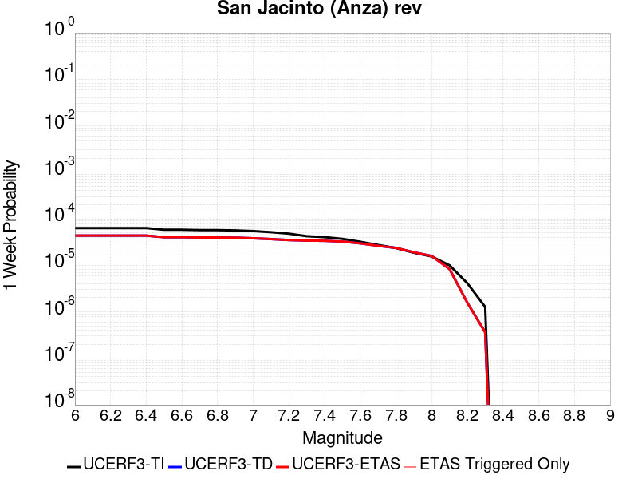 | 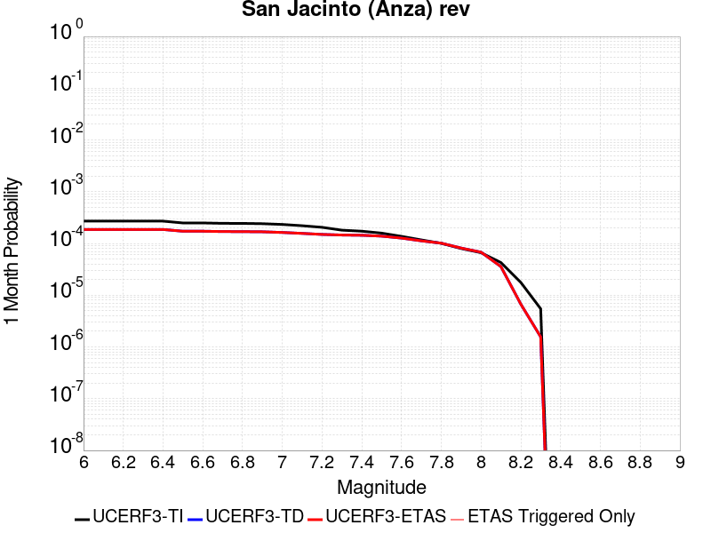 | 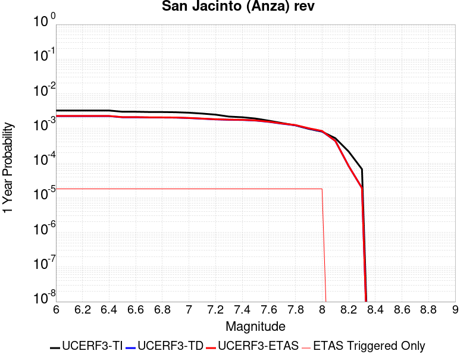 | 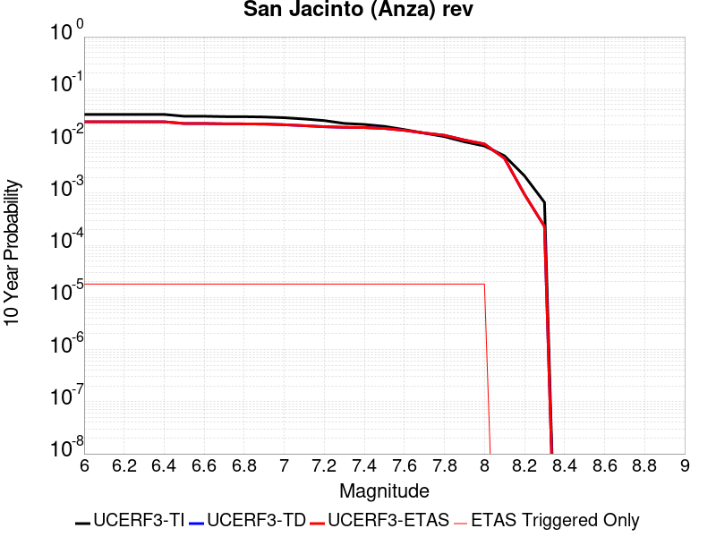 |

| Magnitude | 1 wk TI Prob | 1 wk TD Prob | 1 wk ETAS Prob | 1 wk ETAS/TD Gain | 1 wk ETAS Triggered Only | 1 mo TI Prob | 1 mo TD Prob | 1 mo ETAS Prob | 1 mo ETAS/TD Gain | 1 mo ETAS Triggered Only | 1 yr TI Prob | 1 yr TD Prob | 1 yr ETAS Prob | 1 yr ETAS/TD Gain | 1 yr ETAS Triggered Only | 10 yr TI Prob | 10 yr TD Prob | 10 yr ETAS Prob | 10 yr ETAS/TD Gain | 10 yr ETAS Triggered Only |
|-----|-----|-----|-----|-----|-----|-----|-----|-----|-----|-----|-----|-----|-----|-----|-----|-----|-----|-----|-----|-----|
| 6.0 | 6.3015636E-5 | 4.3463002E-5 | 4.3463002E-5 | 1.0 | 0.0 | 2.7003905E-4 | 1.8625679E-4 | 1.8625679E-4 | 1.0 | 0.0 | 0.0032827691 | 0.00226533 | 0.0022833396 | 1.0079501 | 1.8050541E-5 | 0.032346968 | 0.023379073 | 0.0233967 | 1.000754 | 1.8050541E-5 |
| 6.1 | 6.3015636E-5 | 4.3463002E-5 | 4.3463002E-5 | 1.0 | 0.0 | 2.7003905E-4 | 1.8625679E-4 | 1.8625679E-4 | 1.0 | 0.0 | 0.0032827691 | 0.00226533 | 0.0022833396 | 1.0079501 | 1.8050541E-5 | 0.032346968 | 0.023379073 | 0.0233967 | 1.000754 | 1.8050541E-5 |
| 6.2 | 6.3015636E-5 | 4.3463002E-5 | 4.3463002E-5 | 1.0 | 0.0 | 2.7003905E-4 | 1.8625679E-4 | 1.8625679E-4 | 1.0 | 0.0 | 0.0032827691 | 0.00226533 | 0.0022833396 | 1.0079501 | 1.8050541E-5 | 0.032346968 | 0.023379073 | 0.0233967 | 1.000754 | 1.8050541E-5 |
| 6.3 | 6.3015636E-5 | 4.3463002E-5 | 4.3463002E-5 | 1.0 | 0.0 | 2.7003905E-4 | 1.8625679E-4 | 1.8625679E-4 | 1.0 | 0.0 | 0.0032827691 | 0.00226533 | 0.0022833396 | 1.0079501 | 1.8050541E-5 | 0.032346968 | 0.023379073 | 0.0233967 | 1.000754 | 1.8050541E-5 |
| 6.4 | 6.3015636E-5 | 4.3463002E-5 | 4.3463002E-5 | 1.0 | 0.0 | 2.7003905E-4 | 1.8625679E-4 | 1.8625679E-4 | 1.0 | 0.0 | 0.0032827691 | 0.00226533 | 0.0022833396 | 1.0079501 | 1.8050541E-5 | 0.032346968 | 0.023379073 | 0.0233967 | 1.000754 | 1.8050541E-5 |
| 6.5 | 5.811017E-5 | 4.0235132E-5 | 4.0235132E-5 | 1.0 | 0.0 | 2.4901982E-4 | 1.7242492E-4 | 1.7242492E-4 | 1.0 | 0.0 | 0.0030276014 | 0.0020972579 | 0.0021152706 | 1.0085887 | 1.8050541E-5 | 0.02986684 | 0.021672854 | 0.021690512 | 1.0008148 | 1.8050541E-5 |
| 6.6 | 5.811017E-5 | 4.0235132E-5 | 4.0235132E-5 | 1.0 | 0.0 | 2.4901982E-4 | 1.7242492E-4 | 1.7242492E-4 | 1.0 | 0.0 | 0.0030276014 | 0.0020972579 | 0.0021152706 | 1.0085887 | 1.8050541E-5 | 0.02986684 | 0.021672854 | 0.021690512 | 1.0008148 | 1.8050541E-5 |
| 6.7 | 5.712442E-5 | 3.9656203E-5 | 3.9656203E-5 | 1.0 | 0.0 | 2.4479596E-4 | 1.699441E-4 | 1.699441E-4 | 1.0 | 0.0 | 0.0029763177 | 0.0020671117 | 0.0020851248 | 1.0087142 | 1.8050541E-5 | 0.029367693 | 0.021363877 | 0.02138154 | 1.0008268 | 1.8050541E-5 |
| 6.8 | 5.6967532E-5 | 3.9512335E-5 | 3.9512335E-5 | 1.0 | 0.0 | 2.4412372E-4 | 1.6932761E-4 | 1.6932761E-4 | 1.0 | 0.0 | 0.0029681553 | 0.00205962 | 0.0020776333 | 1.0087459 | 1.8050541E-5 | 0.029288229 | 0.021288473 | 0.021306138 | 1.0008298 | 1.8050541E-5 |
| 6.9 | 5.6211324E-5 | 3.921611E-5 | 3.921611E-5 | 1.0 | 0.0 | 2.4088343E-4 | 1.6805824E-4 | 1.6805824E-4 | 1.0 | 0.0 | 0.0029288116 | 0.0020441944 | 0.002062208 | 1.0088121 | 1.8050541E-5 | 0.028905109 | 0.02112739 | 0.021145059 | 1.0008364 | 1.8050541E-5 |
| 7.0 | 5.4383527E-5 | 3.8073264E-5 | 3.8073264E-5 | 1.0 | 0.0 | 2.3305144E-4 | 1.6316096E-4 | 1.6316096E-4 | 1.0 | 0.0 | 0.0028337094 | 0.0019846796 | 0.0020026944 | 1.0090768 | 1.8050541E-5 | 0.027978465 | 0.020516662 | 0.020534342 | 1.0008618 | 1.8050541E-5 |
| 7.1 | 5.1393665E-5 | 3.653096E-5 | 3.653096E-5 | 1.0 | 0.0 | 2.2023996E-4 | 1.5655189E-4 | 1.5655189E-4 | 1.0 | 0.0 | 0.0026781242 | 0.0019043572 | 0.0019223733 | 1.0094604 | 1.8050541E-5 | 0.026460782 | 0.019687757 | 0.019705452 | 1.0008988 | 1.8050541E-5 |
| 7.2 | 4.785222E-5 | 3.487718E-5 | 3.487718E-5 | 1.0 | 0.0 | 2.0506482E-4 | 1.4946508E-4 | 1.4946508E-4 | 1.0 | 0.0 | 0.0024938055 | 0.001818222 | 0.0018362397 | 1.0099095 | 1.8050541E-5 | 0.024660049 | 0.018799523 | 0.018817235 | 1.0009421 | 1.8050541E-5 |
| 7.3 | 4.2143256E-5 | 3.396783E-5 | 3.396783E-5 | 1.0 | 0.0 | 1.8060145E-4 | 1.4556831E-4 | 1.4556831E-4 | 1.0 | 0.0 | 0.002196605 | 0.0017708568 | 0.0017888754 | 1.0101751 | 1.8050541E-5 | 0.02175019 | 0.018305665 | 0.018323386 | 1.000968 | 1.8050541E-5 |
| 7.4 | 4.0264713E-5 | 3.3604778E-5 | 3.3604778E-5 | 1.0 | 0.0 | 1.7255165E-4 | 1.4401255E-4 | 1.4401255E-4 | 1.0 | 0.0 | 0.002098792 | 0.0017519462 | 0.001769965 | 1.0102851 | 1.8050541E-5 | 0.020790804 | 0.018109579 | 0.018127302 | 1.0009787 | 1.8050541E-5 |
| 7.5 | 3.694492E-5 | 3.231521E-5 | 3.231521E-5 | 1.0 | 0.0 | 1.5832575E-4 | 1.3848643E-4 | 1.3848643E-4 | 1.0 | 0.0 | 0.0019259118 | 0.0016847714 | 0.0017027915 | 1.0106959 | 1.8050541E-5 | 0.01909306 | 0.017424194 | 0.01744193 | 1.0010179 | 1.8050541E-5 |
| 7.6 | 3.200565E-5 | 2.9621275E-5 | 2.9621275E-5 | 1.0 | 0.0 | 1.3715986E-4 | 1.2694216E-4 | 1.2694216E-4 | 1.0 | 0.0 | 0.001668642 | 0.0015444274 | 0.00156245 | 1.0116695 | 1.8050541E-5 | 0.01656168 | 0.016007284 | 0.016025046 | 1.0011096 | 1.8050541E-5 |
| 7.7 | 2.731642E-5 | 2.6206542E-5 | 2.6206542E-5 | 1.0 | 0.0 | 1.1706512E-4 | 1.1230892E-4 | 1.1230892E-4 | 1.0 | 0.0 | 0.001424336 | 0.0013665045 | 0.0013845303 | 1.0131912 | 1.8050541E-5 | 0.014152412 | 0.014226328 | 0.0142441215 | 1.0012507 | 1.8050541E-5 |
| 7.8 | 2.3466424E-5 | 2.3614002E-5 | 2.3614002E-5 | 1.0 | 0.0 | 1.0056651E-4 | 1.01198944E-4 | 1.01198944E-4 | 1.0 | 0.0 | 0.0012237094 | 0.0012314016 | 0.0012494299 | 1.0146405 | 1.8050541E-5 | 0.012169928 | 0.012865932 | 0.01288375 | 1.001385 | 1.8050541E-5 |
| 7.9 | 1.8611925E-5 | 1.9006717E-5 | 1.9006717E-5 | 1.0 | 0.0 | 7.9762955E-5 | 8.145482E-5 | 8.145482E-5 | 1.0 | 0.0 | 9.7068126E-4 | 9.912619E-4 | 0.0010092945 | 1.0181916 | 1.8050541E-5 | 0.0096645225 | 0.010445538 | 0.0104634 | 1.00171 | 1.8050541E-5 |
| 8.0 | 1.5460775E-5 | 1.5828558E-5 | 1.5828558E-5 | 1.0 | 0.0 | 6.6258784E-5 | 6.783492E-5 | 6.783492E-5 | 1.0 | 0.0 | 8.0640207E-4 | 8.255779E-4 | 8.436135E-4 | 1.021846 | 1.8050541E-5 | 0.008034821 | 0.008748989 | 0.008766881 | 1.0020452 | 1.8050541E-5 |
| 8.1 | 9.983884E-6 | 8.3218265E-6 | 8.3218265E-6 | 1.0 | 0.0 | 4.2787375E-5 | 3.5664485E-5 | 3.5664485E-5 | 1.0 | 0.0 | 5.2081177E-4 | 4.3412912E-4 | 4.3412912E-4 | 1.0 | 0.0 | 0.0051959283 | 0.0046678926 | 0.0046678926 | 1.0 | 0.0 |
| 8.2 | 4.1226E-6 | 1.5677603E-6 | 1.5677603E-6 | 1.0 | 0.0 | 1.7668166E-5 | 6.7189553E-6 | 6.7189553E-6 | 1.0 | 0.0 | 2.1508869E-4 | 8.180024E-5 | 8.180024E-5 | 1.0 | 0.0 | 0.0021488064 | 9.489454E-4 | 9.489454E-4 | 1.0 | 0.0 |
| 8.3 | 1.2750878E-6 | 3.652672E-7 | 3.652672E-7 | 1.0 | 0.0 | 5.4646503E-6 | 1.56543E-6 | 1.56543E-6 | 1.0 | 0.0 | 6.653009E-5 | 1.9058947E-5 | 1.9058947E-5 | 1.0 | 0.0 | 6.6510175E-4 | 2.2972378E-4 | 2.2972378E-4 | 1.0 | 0.0 |

## Cedar Mtn-Mahogany Mtn
*[(top)](#table-of-contents)*

| 1 Week | 1 Month | 1 Year | 10 Year |
|-----|-----|-----|-----|
| 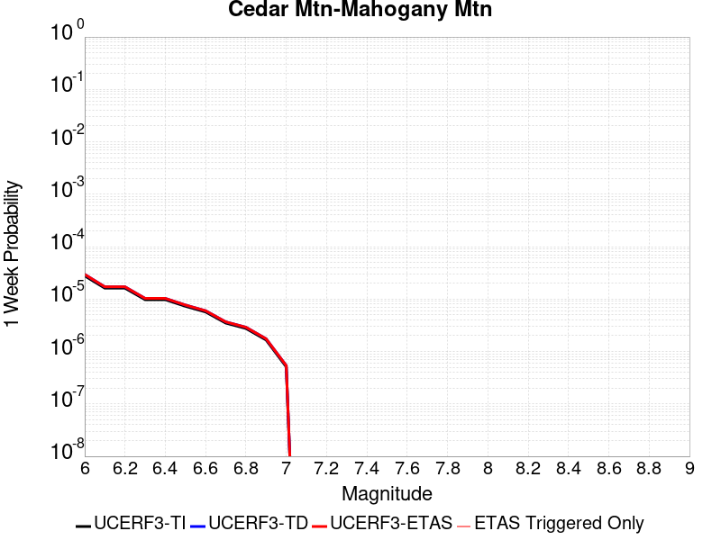 | 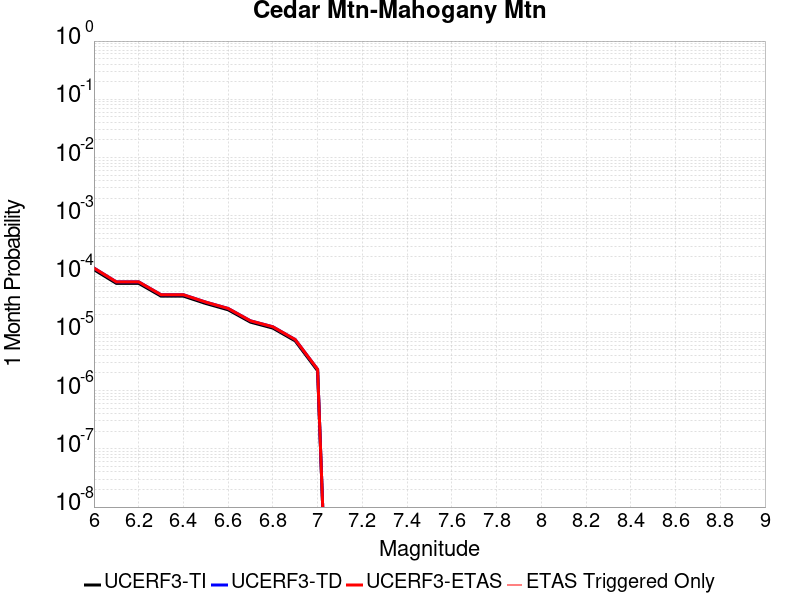 | 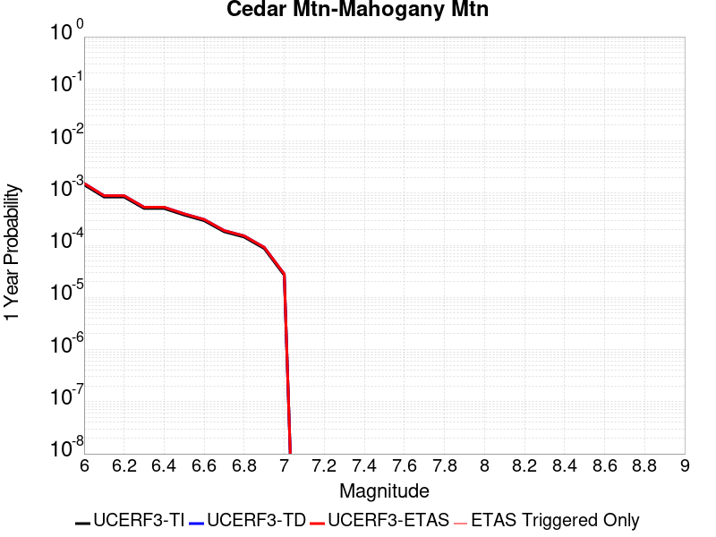 | 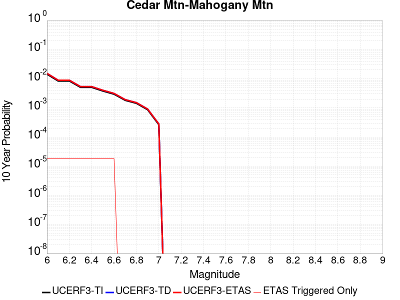 |

| Magnitude | 1 wk TI Prob | 1 wk TD Prob | 1 wk ETAS Prob | 1 wk ETAS/TD Gain | 1 wk ETAS Triggered Only | 1 mo TI Prob | 1 mo TD Prob | 1 mo ETAS Prob | 1 mo ETAS/TD Gain | 1 mo ETAS Triggered Only | 1 yr TI Prob | 1 yr TD Prob | 1 yr ETAS Prob | 1 yr ETAS/TD Gain | 1 yr ETAS Triggered Only | 10 yr TI Prob | 10 yr TD Prob | 10 yr ETAS Prob | 10 yr ETAS/TD Gain | 10 yr ETAS Triggered Only |
|-----|-----|-----|-----|-----|-----|-----|-----|-----|-----|-----|-----|-----|-----|-----|-----|-----|-----|-----|-----|-----|
| 6.0 | 2.7763876E-5 | 2.9591192E-5 | 2.9591192E-5 | 1.0 | 0.0 | 1.1898261E-4 | 1.2681363E-4 | 1.2681363E-4 | 1.0 | 0.0 | 0.0014476506 | 0.0015429325 | 0.0015429325 | 1.0 | 0.0 | 0.0143825635 | 0.015329422 | 0.015347196 | 1.0011594 | 1.8050541E-5 |
| 6.1 | 1.6162443E-5 | 1.7144208E-5 | 1.7144208E-5 | 1.0 | 0.0 | 6.926578E-5 | 7.347321E-5 | 7.347321E-5 | 1.0 | 0.0 | 8.4298453E-4 | 8.9418696E-4 | 8.9418696E-4 | 1.0 | 0.0 | 0.008397939 | 0.008907702 | 0.008925592 | 1.0020083 | 1.8050541E-5 |
| 6.2 | 1.6162443E-5 | 1.7144208E-5 | 1.7144208E-5 | 1.0 | 0.0 | 6.926578E-5 | 7.347321E-5 | 7.347321E-5 | 1.0 | 0.0 | 8.4298453E-4 | 8.9418696E-4 | 8.9418696E-4 | 1.0 | 0.0 | 0.008397939 | 0.008907702 | 0.008925592 | 1.0020083 | 1.8050541E-5 |
| 6.3 | 9.746053E-6 | 1.0303856E-5 | 1.0303856E-5 | 1.0 | 0.0 | 4.1768133E-5 | 4.4158656E-5 | 4.4158656E-5 | 1.0 | 0.0 | 5.0840835E-4 | 5.375031E-4 | 5.375031E-4 | 1.0 | 0.0 | 0.0050724675 | 0.0053624497 | 0.0053804033 | 1.003348 | 1.8050541E-5 |
| 6.4 | 9.746053E-6 | 1.0303856E-5 | 1.0303856E-5 | 1.0 | 0.0 | 4.1768133E-5 | 4.4158656E-5 | 4.4158656E-5 | 1.0 | 0.0 | 5.0840835E-4 | 5.375031E-4 | 5.375031E-4 | 1.0 | 0.0 | 0.0050724675 | 0.0053624497 | 0.0053804033 | 1.003348 | 1.8050541E-5 |
| 6.5 | 7.290083E-6 | 7.695835E-6 | 7.695835E-6 | 1.0 | 0.0 | 3.124284E-5 | 3.2981745E-5 | 3.2981745E-5 | 1.0 | 0.0 | 3.8031515E-4 | 4.0148094E-4 | 4.0148094E-4 | 1.0 | 0.0 | 0.0037966494 | 0.0040077767 | 0.0040257545 | 1.0044858 | 1.8050541E-5 |
| 6.6 | 5.67907E-6 | 5.9895433E-6 | 5.9895433E-6 | 1.0 | 0.0 | 2.4338644E-5 | 2.5669226E-5 | 2.5669226E-5 | 1.0 | 0.0 | 2.962827E-4 | 3.1247936E-4 | 3.1247936E-4 | 1.0 | 0.0 | 0.0029588798 | 0.003120536 | 0.00313853 | 1.0057664 | 1.8050541E-5 |
| 6.7 | 3.4853963E-6 | 3.6728666E-6 | 3.6728666E-6 | 1.0 | 0.0 | 1.4937327E-5 | 1.5740765E-5 | 1.5740765E-5 | 1.0 | 0.0 | 1.8184677E-4 | 1.916276E-4 | 1.916276E-4 | 1.0 | 0.0 | 0.0018169804 | 0.0019146855 | 0.0019146855 | 1.0 | 0.0 |
| 6.8 | 2.7535168E-6 | 2.9017626E-6 | 2.9017626E-6 | 1.0 | 0.0 | 1.1800733E-5 | 1.2436069E-5 | 1.2436069E-5 | 1.0 | 0.0 | 1.4366445E-4 | 1.513991E-4 | 1.513991E-4 | 1.0 | 0.0 | 0.0014357162 | 0.0015130067 | 0.0015130067 | 1.0 | 0.0 |
| 6.9 | 1.6594106E-6 | 1.7498122E-6 | 1.7498122E-6 | 1.0 | 0.0 | 7.1117406E-6 | 7.4991754E-6 | 7.4991754E-6 | 1.0 | 0.0 | 8.6582E-5 | 9.129895E-5 | 9.129895E-5 | 1.0 | 0.0 | 8.654827E-4 | 9.1264484E-4 | 9.1264484E-4 | 1.0 | 0.0 |
| 7.0 | 5.10215E-7 | 5.3896156E-7 | 5.3896156E-7 | 1.0 | 0.0 | 2.186634E-6 | 2.309834E-6 | 2.309834E-6 | 1.0 | 0.0 | 2.6621943E-5 | 2.8121995E-5 | 2.8121995E-5 | 1.0 | 0.0 | 2.6618753E-4 | 2.811969E-4 | 2.811969E-4 | 1.0 | 0.0 |

## Robinson Creek
*[(top)](#table-of-contents)*

| 1 Week | 1 Month | 1 Year | 10 Year |
|-----|-----|-----|-----|
|  | 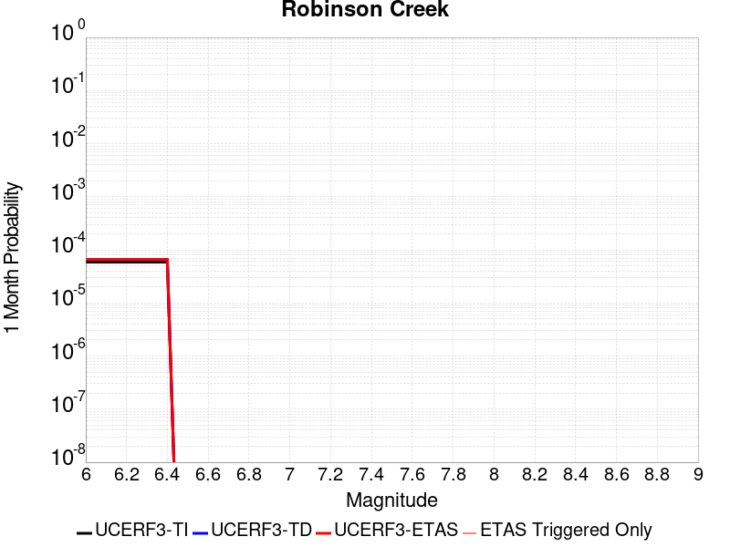 | 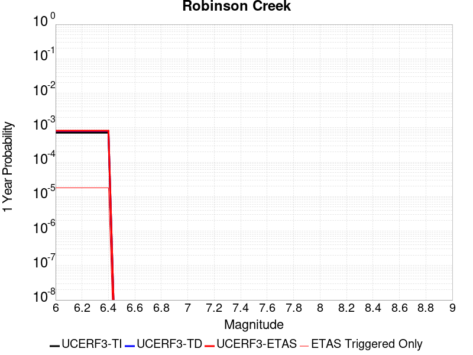 | 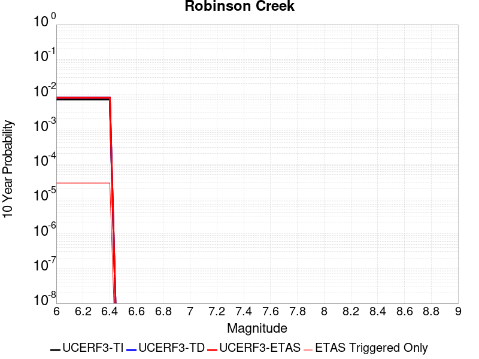 |

| Magnitude | 1 wk TI Prob | 1 wk TD Prob | 1 wk ETAS Prob | 1 wk ETAS/TD Gain | 1 wk ETAS Triggered Only | 1 mo TI Prob | 1 mo TD Prob | 1 mo ETAS Prob | 1 mo ETAS/TD Gain | 1 mo ETAS Triggered Only | 1 yr TI Prob | 1 yr TD Prob | 1 yr ETAS Prob | 1 yr ETAS/TD Gain | 1 yr ETAS Triggered Only | 10 yr TI Prob | 10 yr TD Prob | 10 yr ETAS Prob | 10 yr ETAS/TD Gain | 10 yr ETAS Triggered Only |
|-----|-----|-----|-----|-----|-----|-----|-----|-----|-----|-----|-----|-----|-----|-----|-----|-----|-----|-----|-----|-----|
| 6.0 | 1.3705327E-5 | 1.5287116E-5 | 1.5287116E-5 | 1.0 | 0.0 | 5.8735794E-5 | 6.5516215E-5 | 6.5516215E-5 | 1.0 | 0.0 | 7.1487366E-4 | 7.976599E-4 | 8.15696E-4 | 1.0226114 | 1.8050541E-5 | 0.0071257832 | 0.007976599 | 0.007994506 | 1.0022448 | 1.8050541E-5 |
| 6.1 | 1.3705327E-5 | 1.5287116E-5 | 1.5287116E-5 | 1.0 | 0.0 | 5.8735794E-5 | 6.5516215E-5 | 6.5516215E-5 | 1.0 | 0.0 | 7.1487366E-4 | 7.976599E-4 | 8.15696E-4 | 1.0226114 | 1.8050541E-5 | 0.0071257832 | 0.007976599 | 0.007994506 | 1.0022448 | 1.8050541E-5 |
| 6.2 | 1.3705327E-5 | 1.5287116E-5 | 1.5287116E-5 | 1.0 | 0.0 | 5.8735794E-5 | 6.5516215E-5 | 6.5516215E-5 | 1.0 | 0.0 | 7.1487366E-4 | 7.976599E-4 | 8.15696E-4 | 1.0226114 | 1.8050541E-5 | 0.0071257832 | 0.007976599 | 0.007994506 | 1.0022448 | 1.8050541E-5 |
| 6.3 | 1.3705327E-5 | 1.5287116E-5 | 1.5287116E-5 | 1.0 | 0.0 | 5.8735794E-5 | 6.5516215E-5 | 6.5516215E-5 | 1.0 | 0.0 | 7.1487366E-4 | 7.976599E-4 | 8.15696E-4 | 1.0226114 | 1.8050541E-5 | 0.0071257832 | 0.007976599 | 0.007994506 | 1.0022448 | 1.8050541E-5 |
| 6.4 | 1.3705327E-5 | 1.5287116E-5 | 1.5287116E-5 | 1.0 | 0.0 | 5.8735794E-5 | 6.5516215E-5 | 6.5516215E-5 | 1.0 | 0.0 | 7.1487366E-4 | 7.976599E-4 | 8.15696E-4 | 1.0226114 | 1.8050541E-5 | 0.0071257832 | 0.007976599 | 0.007994506 | 1.0022448 | 1.8050541E-5 |

## Deep Springs
*[(top)](#table-of-contents)*

| 1 Week | 1 Month | 1 Year | 10 Year |
|-----|-----|-----|-----|
| 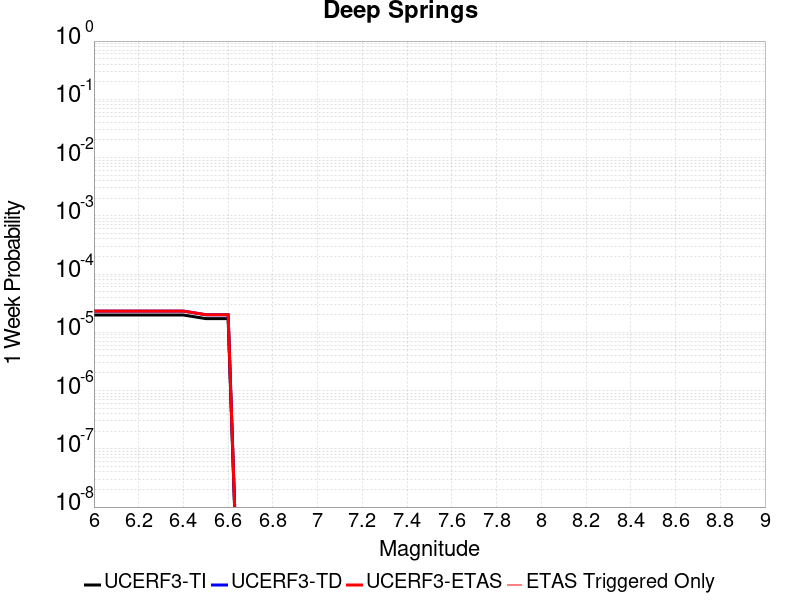 | 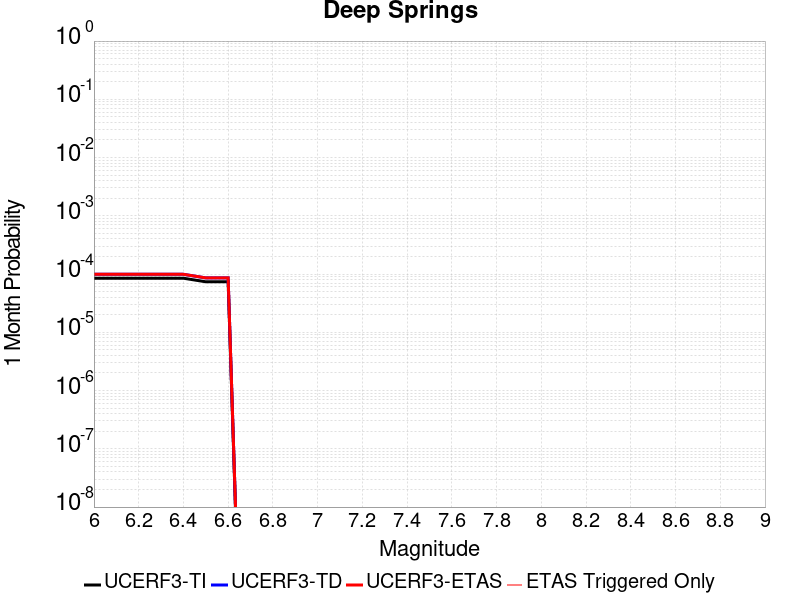 | 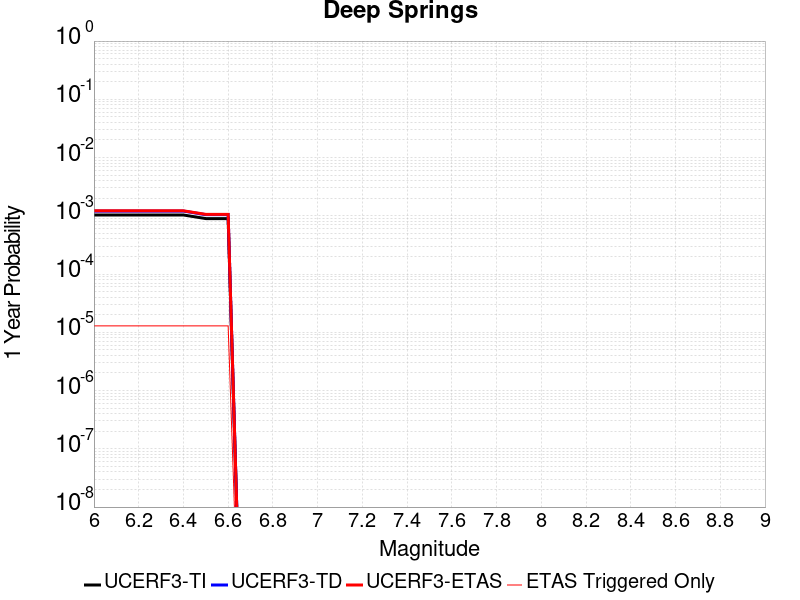 | 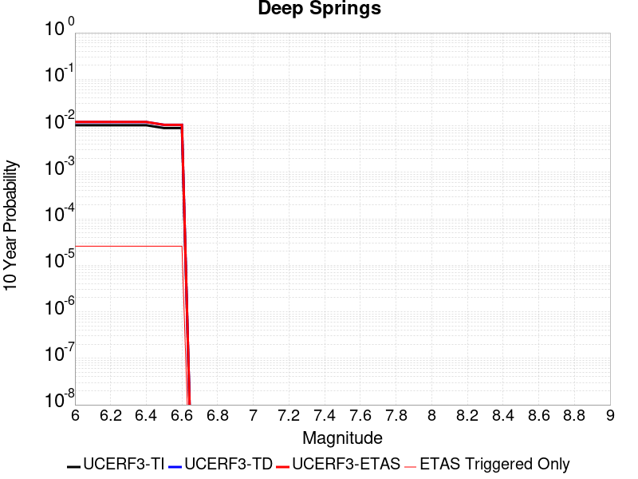 |

| Magnitude | 1 wk TI Prob | 1 wk TD Prob | 1 wk ETAS Prob | 1 wk ETAS/TD Gain | 1 wk ETAS Triggered Only | 1 mo TI Prob | 1 mo TD Prob | 1 mo ETAS Prob | 1 mo ETAS/TD Gain | 1 mo ETAS Triggered Only | 1 yr TI Prob | 1 yr TD Prob | 1 yr ETAS Prob | 1 yr ETAS/TD Gain | 1 yr ETAS Triggered Only | 10 yr TI Prob | 10 yr TD Prob | 10 yr ETAS Prob | 10 yr ETAS/TD Gain | 10 yr ETAS Triggered Only |
|-----|-----|-----|-----|-----|-----|-----|-----|-----|-----|-----|-----|-----|-----|-----|-----|-----|-----|-----|-----|-----|
| 6.0 | 1.9810619E-5 | 2.3117118E-5 | 2.3117118E-5 | 1.0 | 0.0 | 8.489989E-5 | 9.9072466E-5 | 9.9072466E-5 | 1.0 | 0.0 | 0.001033166 | 0.0012060477 | 0.0012060477 | 1.0 | 0.0 | 0.010283757 | 0.012044816 | 0.012062649 | 1.0014806 | 1.8050541E-5 |
| 6.1 | 1.9810619E-5 | 2.3117118E-5 | 2.3117118E-5 | 1.0 | 0.0 | 8.489989E-5 | 9.9072466E-5 | 9.9072466E-5 | 1.0 | 0.0 | 0.001033166 | 0.0012060477 | 0.0012060477 | 1.0 | 0.0 | 0.010283757 | 0.012044816 | 0.012062649 | 1.0014806 | 1.8050541E-5 |
| 6.2 | 1.9810619E-5 | 2.3117118E-5 | 2.3117118E-5 | 1.0 | 0.0 | 8.489989E-5 | 9.9072466E-5 | 9.9072466E-5 | 1.0 | 0.0 | 0.001033166 | 0.0012060477 | 0.0012060477 | 1.0 | 0.0 | 0.010283757 | 0.012044816 | 0.012062649 | 1.0014806 | 1.8050541E-5 |
| 6.3 | 1.9810619E-5 | 2.3117118E-5 | 2.3117118E-5 | 1.0 | 0.0 | 8.489989E-5 | 9.9072466E-5 | 9.9072466E-5 | 1.0 | 0.0 | 0.001033166 | 0.0012060477 | 0.0012060477 | 1.0 | 0.0 | 0.010283757 | 0.012044816 | 0.012062649 | 1.0014806 | 1.8050541E-5 |
| 6.4 | 1.9810619E-5 | 2.3117118E-5 | 2.3117118E-5 | 1.0 | 0.0 | 8.489989E-5 | 9.9072466E-5 | 9.9072466E-5 | 1.0 | 0.0 | 0.001033166 | 0.0012060477 | 0.0012060477 | 1.0 | 0.0 | 0.010283757 | 0.012044816 | 0.012062649 | 1.0014806 | 1.8050541E-5 |
| 6.5 | 1.7190405E-5 | 2.0054538E-5 | 2.0054538E-5 | 1.0 | 0.0 | 7.367108E-5 | 8.594802E-5 | 8.594802E-5 | 1.0 | 0.0 | 8.9657627E-4 | 0.0010464172 | 0.0010464172 | 1.0 | 0.0 | 0.008929676 | 0.010464133 | 0.010481995 | 1.001707 | 1.8050541E-5 |
| 6.6 | 1.7190405E-5 | 2.0054538E-5 | 2.0054538E-5 | 1.0 | 0.0 | 7.367108E-5 | 8.594802E-5 | 8.594802E-5 | 1.0 | 0.0 | 8.9657627E-4 | 0.0010464172 | 0.0010464172 | 1.0 | 0.0 | 0.008929676 | 0.010464133 | 0.010481995 | 1.001707 | 1.8050541E-5 |

## Rose Canyon
*[(top)](#table-of-contents)*

| 1 Week | 1 Month | 1 Year | 10 Year |
|-----|-----|-----|-----|
| 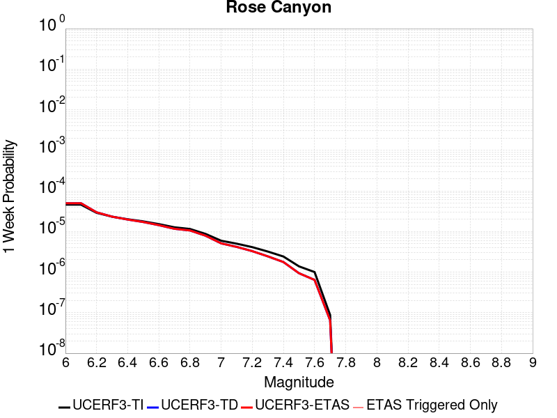 | 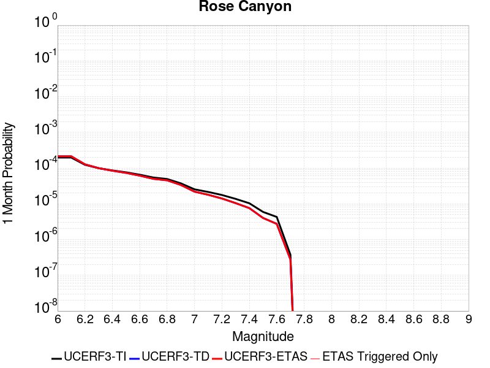 | 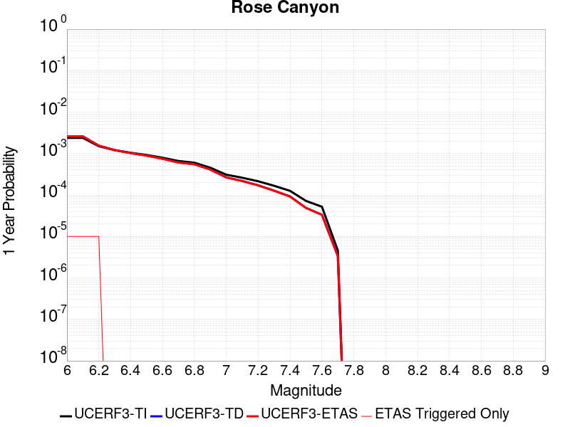 | 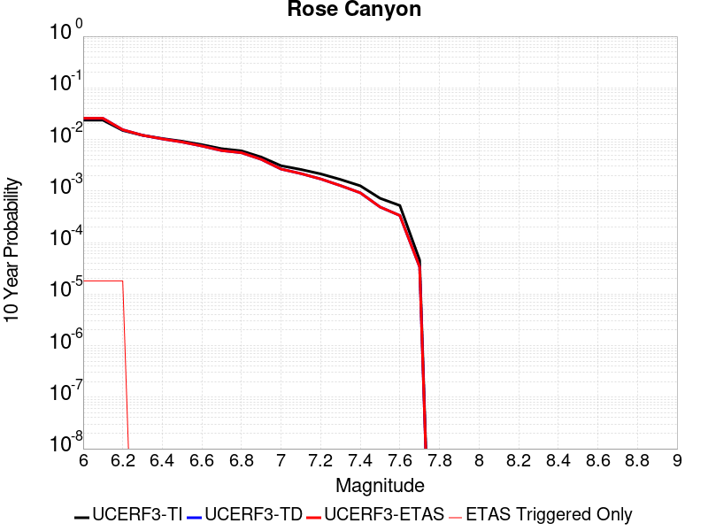 |

| Magnitude | 1 wk TI Prob | 1 wk TD Prob | 1 wk ETAS Prob | 1 wk ETAS/TD Gain | 1 wk ETAS Triggered Only | 1 mo TI Prob | 1 mo TD Prob | 1 mo ETAS Prob | 1 mo ETAS/TD Gain | 1 mo ETAS Triggered Only | 1 yr TI Prob | 1 yr TD Prob | 1 yr ETAS Prob | 1 yr ETAS/TD Gain | 1 yr ETAS Triggered Only | 10 yr TI Prob | 10 yr TD Prob | 10 yr ETAS Prob | 10 yr ETAS/TD Gain | 10 yr ETAS Triggered Only |
|-----|-----|-----|-----|-----|-----|-----|-----|-----|-----|-----|-----|-----|-----|-----|-----|-----|-----|-----|-----|-----|
| 6.0 | 4.5923203E-5 | 4.979121E-5 | 4.979121E-5 | 1.0 | 0.0 | 1.9679888E-4 | 2.133748E-4 | 2.133748E-4 | 1.0 | 0.0 | 0.0023933933 | 0.002594942 | 0.0026129456 | 1.006938 | 1.8050541E-5 | 0.023677798 | 0.025679175 | 0.02569676 | 1.0006849 | 1.8050541E-5 |
| 6.1 | 4.5923203E-5 | 4.979121E-5 | 4.979121E-5 | 1.0 | 0.0 | 1.9679888E-4 | 2.133748E-4 | 2.133748E-4 | 1.0 | 0.0 | 0.0023933933 | 0.002594942 | 0.0026129456 | 1.006938 | 1.8050541E-5 | 0.023677798 | 0.025679175 | 0.02569676 | 1.0006849 | 1.8050541E-5 |
| 6.2 | 2.8844734E-5 | 2.9737826E-5 | 2.9737826E-5 | 1.0 | 0.0 | 1.2361443E-4 | 1.274418E-4 | 1.274418E-4 | 1.0 | 0.0 | 0.0015039665 | 0.0015505346 | 0.0015685572 | 1.0116235 | 1.8050541E-5 | 0.0149382865 | 0.015410035 | 0.015427806 | 1.0011533 | 1.8050541E-5 |
| 6.3 | 2.3171577E-5 | 2.3228748E-5 | 2.3228748E-5 | 1.0 | 0.0 | 9.9302975E-5 | 9.954805E-5 | 9.954805E-5 | 1.0 | 0.0 | 0.0012083431 | 0.0012113372 | 0.0012113372 | 1.0 | 0.0 | 0.012017938 | 0.01205711 | 0.01205711 | 1.0 | 0.0 |
| 6.4 | 2.0066604E-5 | 1.9708006E-5 | 1.9708006E-5 | 1.0 | 0.0 | 8.599689E-5 | 8.4460204E-5 | 8.4460204E-5 | 1.0 | 0.0 | 0.0010465092 | 0.001027828 | 0.001027828 | 1.0 | 0.0 | 0.010415946 | 0.010238655 | 0.010238655 | 1.0 | 0.0 |
| 6.5 | 1.776989E-5 | 1.7138094E-5 | 1.7138094E-5 | 1.0 | 0.0 | 7.615444E-5 | 7.344695E-5 | 7.344695E-5 | 1.0 | 0.0 | 9.267859E-4 | 8.9385675E-4 | 8.9385675E-4 | 1.0 | 0.0 | 0.009229303 | 0.00890874 | 0.00890874 | 1.0 | 0.0 |
| 6.6 | 1.5227364E-5 | 1.43471425E-5 | 1.43471425E-5 | 1.0 | 0.0 | 6.52585E-5 | 6.148633E-5 | 6.148633E-5 | 1.0 | 0.0 | 7.942326E-4 | 7.4834423E-4 | 7.4834423E-4 | 1.0 | 0.0 | 0.007914 | 0.0074624377 | 0.0074624377 | 1.0 | 0.0 |
| 6.7 | 1.2703898E-5 | 1.1674863E-5 | 1.1674863E-5 | 1.0 | 0.0 | 5.4444143E-5 | 5.0034192E-5 | 5.0034192E-5 | 1.0 | 0.0 | 6.626558E-4 | 6.090003E-4 | 6.090003E-4 | 1.0 | 0.0 | 0.006606833 | 0.0060759075 | 0.0060759075 | 1.0 | 0.0 |
| 6.8 | 1.1554917E-5 | 1.0610671E-5 | 1.0610671E-5 | 1.0 | 0.0 | 4.9520135E-5 | 4.5473535E-5 | 4.5473535E-5 | 1.0 | 0.0 | 6.0274085E-4 | 5.535037E-4 | 5.535037E-4 | 1.0 | 0.0 | 0.0060110865 | 0.005523258 | 0.005523258 | 1.0 | 0.0 |
| 6.9 | 8.732078E-6 | 7.882173E-6 | 7.882173E-6 | 1.0 | 0.0 | 3.7422655E-5 | 3.378032E-5 | 3.378032E-5 | 1.0 | 0.0 | 4.5552556E-4 | 4.1120074E-4 | 4.1120074E-4 | 1.0 | 0.0 | 0.0045459294 | 0.0041052313 | 0.0041052313 | 1.0 | 0.0 |
| 7.0 | 5.9337494E-6 | 5.1078955E-6 | 5.1078955E-6 | 1.0 | 0.0 | 2.5430107E-5 | 2.1890797E-5 | 2.1890797E-5 | 1.0 | 0.0 | 3.0956755E-4 | 2.66488E-4 | 2.66488E-4 | 1.0 | 0.0 | 0.0030913667 | 0.0026617001 | 0.0026617001 | 1.0 | 0.0 |
| 7.1 | 5.013409E-6 | 4.177709E-6 | 4.177709E-6 | 1.0 | 0.0 | 2.1485863E-5 | 1.7904344E-5 | 1.7904344E-5 | 1.0 | 0.0 | 2.6155898E-4 | 2.179637E-4 | 2.179637E-4 | 1.0 | 0.0 | 0.0026125133 | 0.0021775109 | 0.0021775109 | 1.0 | 0.0 |
| 7.2 | 4.120763E-6 | 3.2824023E-6 | 3.2824023E-6 | 1.0 | 0.0 | 1.7660293E-5 | 1.4067364E-5 | 1.4067364E-5 | 1.0 | 0.0 | 2.1499286E-4 | 1.7125678E-4 | 1.7125678E-4 | 1.0 | 0.0 | 0.0021478499 | 0.0017112576 | 0.0017112576 | 1.0 | 0.0 |
| 7.3 | 3.2081239E-6 | 2.4407384E-6 | 2.4407384E-6 | 1.0 | 0.0 | 1.374903E-5 | 1.0460266E-5 | 1.0460266E-5 | 1.0 | 0.0 | 1.6738157E-4 | 1.2734636E-4 | 1.2734636E-4 | 1.0 | 0.0 | 0.0016725556 | 0.0012727409 | 0.0012727409 | 1.0 | 0.0 |
| 7.4 | 2.4194755E-6 | 1.7682163E-6 | 1.7682163E-6 | 1.0 | 0.0 | 1.0369139E-5 | 7.578048E-6 | 7.578048E-6 | 1.0 | 0.0 | 1.2623696E-4 | 9.225888E-5 | 9.225888E-5 | 1.0 | 0.0 | 0.0012616527 | 9.2221115E-4 | 9.2221115E-4 | 1.0 | 0.0 |
| 7.5 | 1.3842889E-6 | 9.379617E-7 | 9.379617E-7 | 1.0 | 0.0 | 5.9326535E-6 | 4.01983E-6 | 4.01983E-6 | 1.0 | 0.0 | 7.222766E-5 | 4.894037E-5 | 4.894037E-5 | 1.0 | 0.0 | 7.220419E-4 | 4.892994E-4 | 4.892994E-4 | 1.0 | 0.0 |
| 7.6 | 1.0021575E-6 | 6.412232E-7 | 6.412232E-7 | 1.0 | 0.0 | 4.2949537E-6 | 2.7480967E-6 | 2.7480967E-6 | 1.0 | 0.0 | 5.2289808E-5 | 3.3457585E-5 | 3.3457585E-5 | 1.0 | 0.0 | 5.2277505E-4 | 3.345276E-4 | 3.345276E-4 | 1.0 | 0.0 |
| 7.7 | 8.7620116E-8 | 6.449631E-8 | 6.449631E-8 | 1.0 | 0.0 | 3.7551473E-7 | 2.7641275E-7 | 2.7641275E-7 | 1.0 | 0.0 | 4.5718825E-6 | 3.3653203E-6 | 3.3653203E-6 | 1.0 | 0.0 | 4.5717883E-5 | 3.3652723E-5 | 3.3652723E-5 | 1.0 | 0.0 |

## Red Mountain
*[(top)](#table-of-contents)*

| 1 Week | 1 Month | 1 Year | 10 Year |
|-----|-----|-----|-----|
| 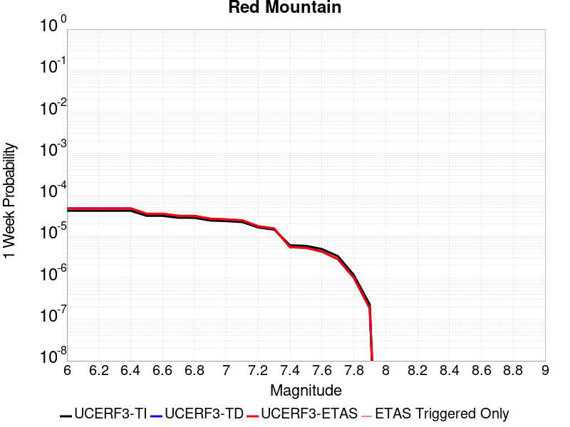 | 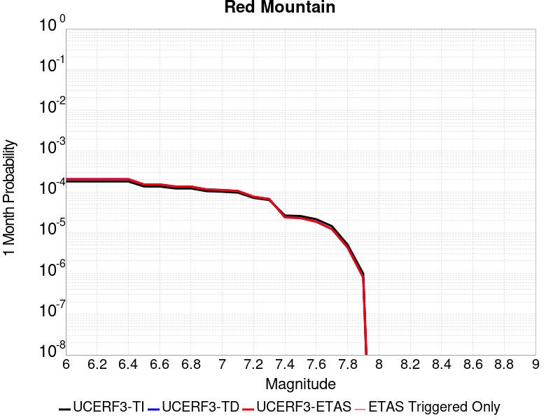 |  | 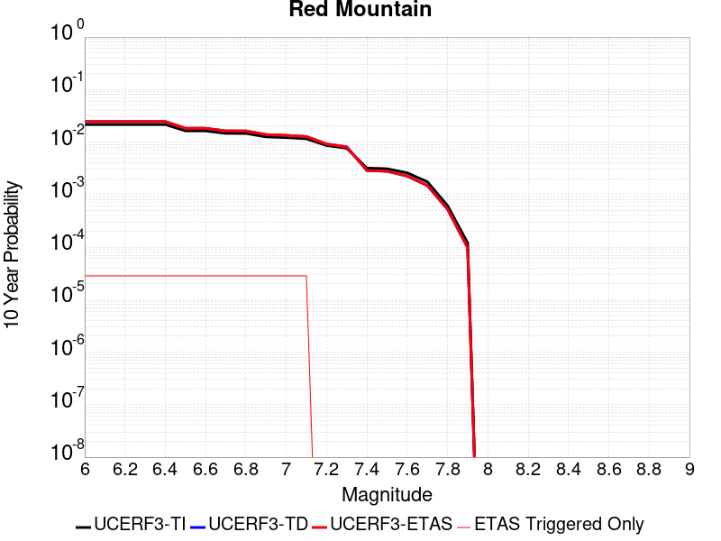 |

| Magnitude | 1 wk TI Prob | 1 wk TD Prob | 1 wk ETAS Prob | 1 wk ETAS/TD Gain | 1 wk ETAS Triggered Only | 1 mo TI Prob | 1 mo TD Prob | 1 mo ETAS Prob | 1 mo ETAS/TD Gain | 1 mo ETAS Triggered Only | 1 yr TI Prob | 1 yr TD Prob | 1 yr ETAS Prob | 1 yr ETAS/TD Gain | 1 yr ETAS Triggered Only | 10 yr TI Prob | 10 yr TD Prob | 10 yr ETAS Prob | 10 yr ETAS/TD Gain | 10 yr ETAS Triggered Only |
|-----|-----|-----|-----|-----|-----|-----|-----|-----|-----|-----|-----|-----|-----|-----|-----|-----|-----|-----|-----|-----|
| 6.0 | 4.1810763E-5 | 4.7599497E-5 | 4.7599497E-5 | 1.0 | 0.0 | 1.7917668E-4 | 2.0398283E-4 | 2.0398283E-4 | 1.0 | 0.0 | 0.0021792934 | 0.002480828 | 0.002480828 | 1.0 | 0.0 | 0.021580452 | 0.024548957 | 0.024566565 | 1.0007173 | 1.8050541E-5 |
| 6.1 | 4.1810763E-5 | 4.7599497E-5 | 4.7599497E-5 | 1.0 | 0.0 | 1.7917668E-4 | 2.0398283E-4 | 2.0398283E-4 | 1.0 | 0.0 | 0.0021792934 | 0.002480828 | 0.002480828 | 1.0 | 0.0 | 0.021580452 | 0.024548957 | 0.024566565 | 1.0007173 | 1.8050541E-5 |
| 6.2 | 4.1810763E-5 | 4.7599497E-5 | 4.7599497E-5 | 1.0 | 0.0 | 1.7917668E-4 | 2.0398283E-4 | 2.0398283E-4 | 1.0 | 0.0 | 0.0021792934 | 0.002480828 | 0.002480828 | 1.0 | 0.0 | 0.021580452 | 0.024548957 | 0.024566565 | 1.0007173 | 1.8050541E-5 |
| 6.3 | 4.1810763E-5 | 4.7599497E-5 | 4.7599497E-5 | 1.0 | 0.0 | 1.7917668E-4 | 2.0398283E-4 | 2.0398283E-4 | 1.0 | 0.0 | 0.0021792934 | 0.002480828 | 0.002480828 | 1.0 | 0.0 | 0.021580452 | 0.024548957 | 0.024566565 | 1.0007173 | 1.8050541E-5 |
| 6.4 | 4.1810763E-5 | 4.7599497E-5 | 4.7599497E-5 | 1.0 | 0.0 | 1.7917668E-4 | 2.0398283E-4 | 2.0398283E-4 | 1.0 | 0.0 | 0.0021792934 | 0.002480828 | 0.002480828 | 1.0 | 0.0 | 0.021580452 | 0.024548957 | 0.024566565 | 1.0007173 | 1.8050541E-5 |
| 6.5 | 3.154503E-5 | 3.536648E-5 | 3.536648E-5 | 1.0 | 0.0 | 1.3518598E-4 | 1.5156234E-4 | 1.5156234E-4 | 1.0 | 0.0 | 0.0016446467 | 0.001843802 | 0.001843802 | 1.0 | 0.0 | 0.01632528 | 0.018294698 | 0.018312419 | 1.0009686 | 1.8050541E-5 |
| 6.6 | 3.1535834E-5 | 3.535586E-5 | 3.535586E-5 | 1.0 | 0.0 | 1.3514658E-4 | 1.5151683E-4 | 1.5151683E-4 | 1.0 | 0.0 | 0.0016441676 | 0.001843249 | 0.001843249 | 1.0 | 0.0 | 0.01632056 | 0.018289259 | 0.018306978 | 1.0009689 | 1.8050541E-5 |
| 6.7 | 2.8267326E-5 | 3.147523E-5 | 3.147523E-5 | 1.0 | 0.0 | 1.2114006E-4 | 1.3488733E-4 | 1.3488733E-4 | 1.0 | 0.0 | 0.0014738824 | 0.0016411013 | 0.0016411013 | 1.0 | 0.0 | 0.014641452 | 0.01629859 | 0.016316347 | 1.0010895 | 1.8050541E-5 |
| 6.8 | 2.8212884E-5 | 3.1413103E-5 | 3.1413103E-5 | 1.0 | 0.0 | 1.20906756E-4 | 1.3462112E-4 | 1.3462112E-4 | 1.0 | 0.0 | 0.0014710457 | 0.001637865 | 0.001637865 | 1.0 | 0.0 | 0.014613459 | 0.0162667 | 0.016284458 | 1.0010916 | 1.8050541E-5 |
| 6.9 | 2.4227871E-5 | 2.6711848E-5 | 2.6711848E-5 | 1.0 | 0.0 | 1.03829596E-4 | 1.1447475E-4 | 1.1447475E-4 | 1.0 | 0.0 | 0.0012633923 | 0.001392915 | 0.001392915 | 1.0 | 0.0 | 0.012562336 | 0.013849535 | 0.013867335 | 1.0012853 | 1.8050541E-5 |
| 7.0 | 2.348524E-5 | 2.5840453E-5 | 2.5840453E-5 | 1.0 | 0.0 | 1.0064714E-4 | 1.1074052E-4 | 1.1074052E-4 | 1.0 | 0.0 | 0.0012246901 | 0.0013475076 | 0.0013475076 | 1.0 | 0.0 | 0.012179627 | 0.013401007 | 0.013418816 | 1.001329 | 1.8050541E-5 |
| 7.1 | 2.2311642E-5 | 2.446724E-5 | 2.446724E-5 | 1.0 | 0.0 | 9.561782E-5 | 1.04855804E-4 | 1.04855804E-4 | 1.0 | 0.0 | 0.0011635252 | 0.0012759466 | 0.0012759466 | 1.0 | 0.0 | 0.01157452 | 0.012693726 | 0.012711548 | 1.0014039 | 1.8050541E-5 |
| 7.2 | 1.6533986E-5 | 1.767333E-5 | 1.767333E-5 | 1.0 | 0.0 | 7.085802E-5 | 7.5741E-5 | 7.5741E-5 | 1.0 | 0.0 | 8.623549E-4 | 9.218201E-4 | 9.218201E-4 | 1.0 | 0.0 | 0.008590161 | 0.009186245 | 0.009186245 | 1.0 | 0.0 |
| 7.3 | 1.4703092E-5 | 1.5562116E-5 | 1.5562116E-5 | 1.0 | 0.0 | 6.301173E-5 | 6.669343E-5 | 6.669343E-5 | 1.0 | 0.0 | 7.668978E-4 | 8.117516E-4 | 8.117516E-4 | 1.0 | 0.0 | 0.0076425658 | 0.008093942 | 0.008093942 | 1.0 | 0.0 |
| 7.4 | 6.1331984E-6 | 5.52942E-6 | 5.52942E-6 | 1.0 | 0.0 | 2.6284872E-5 | 2.3697303E-5 | 2.3697303E-5 | 1.0 | 0.0 | 3.199713E-4 | 2.88477E-4 | 2.88477E-4 | 1.0 | 0.0 | 0.0031951098 | 0.0028810794 | 0.0028810794 | 1.0 | 0.0 |
| 7.5 | 5.954766E-6 | 5.3390304E-6 | 5.3390304E-6 | 1.0 | 0.0 | 2.5520176E-5 | 2.288136E-5 | 2.288136E-5 | 1.0 | 0.0 | 3.1066386E-4 | 2.7854549E-4 | 2.7854549E-4 | 1.0 | 0.0 | 0.003102299 | 0.0027820175 | 0.0027820175 | 1.0 | 0.0 |
| 7.6 | 4.9726646E-6 | 4.3157283E-6 | 4.3157283E-6 | 1.0 | 0.0 | 2.1311245E-5 | 1.849585E-5 | 1.849585E-5 | 1.0 | 0.0 | 2.5943352E-4 | 2.2516404E-4 | 2.2516404E-4 | 1.0 | 0.0 | 0.0025913084 | 0.0022493936 | 0.0022493936 | 1.0 | 0.0 |
| 7.7 | 3.3613894E-6 | 2.852956E-6 | 2.852956E-6 | 1.0 | 0.0 | 1.4405875E-5 | 1.2226898E-5 | 1.2226898E-5 | 1.0 | 0.0 | 1.7537741E-4 | 1.4885259E-4 | 1.4885259E-4 | 1.0 | 0.0 | 0.0017523908 | 0.0014875551 | 0.0014875551 | 1.0 | 0.0 |
| 7.8 | 1.1828961E-6 | 1.0123555E-6 | 1.0123555E-6 | 1.0 | 0.0 | 5.069545E-6 | 4.3386594E-6 | 4.3386594E-6 | 1.0 | 0.0 | 6.171996E-5 | 5.2821928E-5 | 5.2821928E-5 | 1.0 | 0.0 | 6.170282E-4 | 5.280967E-4 | 5.280967E-4 | 1.0 | 0.0 |
| 7.9 | 2.2967266E-7 | 1.8620445E-7 | 1.8620445E-7 | 1.0 | 0.0 | 9.843111E-7 | 7.980188E-7 | 7.980188E-7 | 1.0 | 0.0 | 1.19839215E-5 | 9.715839E-6 | 9.715839E-6 | 1.0 | 0.0 | 1.1983275E-4 | 9.715443E-5 | 9.715443E-5 | 1.0 | 0.0 |

## Coronado Bank alt1
*[(top)](#table-of-contents)*

| 1 Week | 1 Month | 1 Year | 10 Year |
|-----|-----|-----|-----|
| 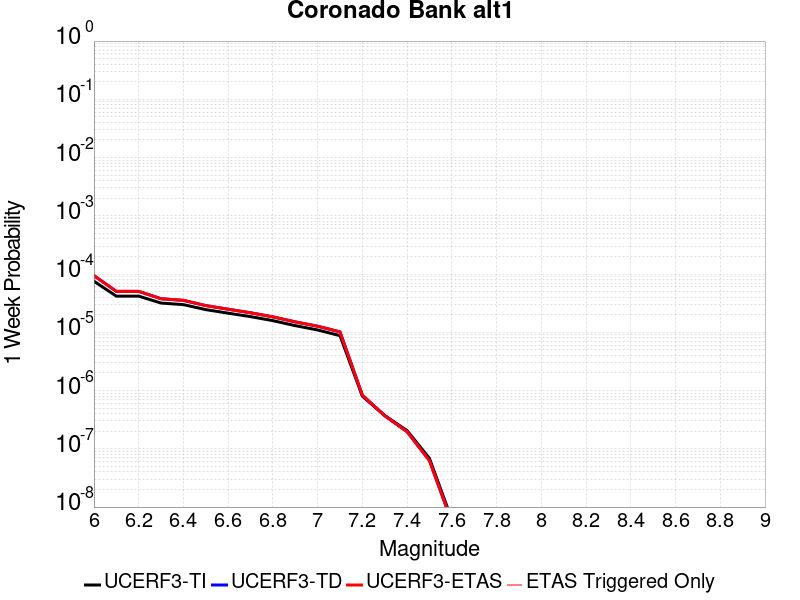 | 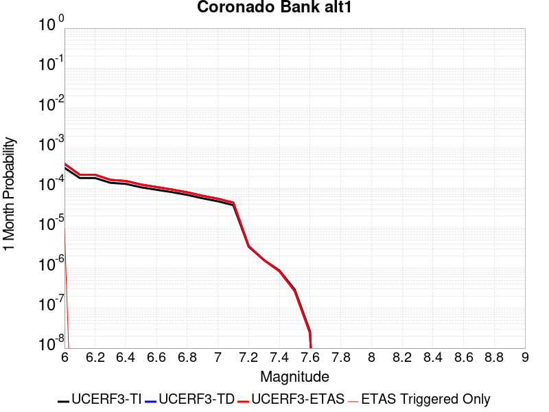 | 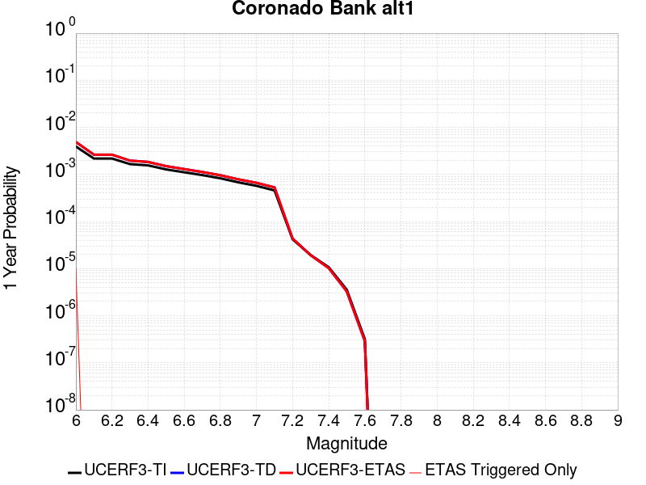 | 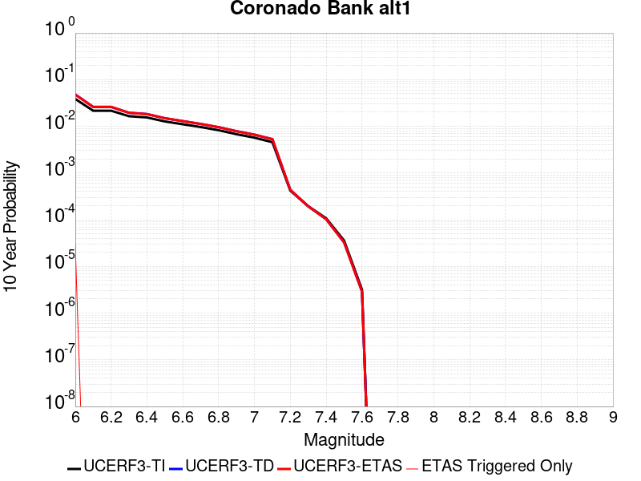 |

| Magnitude | 1 wk TI Prob | 1 wk TD Prob | 1 wk ETAS Prob | 1 wk ETAS/TD Gain | 1 wk ETAS Triggered Only | 1 mo TI Prob | 1 mo TD Prob | 1 mo ETAS Prob | 1 mo ETAS/TD Gain | 1 mo ETAS Triggered Only | 1 yr TI Prob | 1 yr TD Prob | 1 yr ETAS Prob | 1 yr ETAS/TD Gain | 1 yr ETAS Triggered Only | 10 yr TI Prob | 10 yr TD Prob | 10 yr ETAS Prob | 10 yr ETAS/TD Gain | 10 yr ETAS Triggered Only |
|-----|-----|-----|-----|-----|-----|-----|-----|-----|-----|-----|-----|-----|-----|-----|-----|-----|-----|-----|-----|-----|
| 6.0 | 7.533492E-5 | 9.397762E-5 | 9.397762E-5 | 1.0 | 0.0 | 3.22824E-4 | 4.0270333E-4 | 4.207466E-4 | 1.0448054 | 1.8050541E-5 | 0.0039233007 | 0.0048923925 | 0.004910355 | 1.0036714 | 1.8050541E-5 | 0.03854755 | 0.047917176 | 0.04793436 | 1.0003587 | 1.8050541E-5 |
| 6.1 | 4.1807285E-5 | 5.050561E-5 | 5.050561E-5 | 1.0 | 0.0 | 1.7916178E-4 | 2.1643525E-4 | 2.1643525E-4 | 1.0 | 0.0 | 0.0021791123 | 0.0026320093 | 0.0026320093 | 1.0 | 0.0 | 0.021578677 | 0.026017439 | 0.026017439 | 1.0 | 0.0 |
| 6.2 | 4.1807285E-5 | 5.050561E-5 | 5.050561E-5 | 1.0 | 0.0 | 1.7916178E-4 | 2.1643525E-4 | 2.1643525E-4 | 1.0 | 0.0 | 0.0021791123 | 0.0026320093 | 0.0026320093 | 1.0 | 0.0 | 0.021578677 | 0.026017439 | 0.026017439 | 1.0 | 0.0 |
| 6.3 | 3.1793104E-5 | 3.771962E-5 | 3.771962E-5 | 1.0 | 0.0 | 1.3624904E-4 | 1.616457E-4 | 1.616457E-4 | 1.0 | 0.0 | 0.0016575698 | 0.0019662876 | 0.0019662876 | 1.0 | 0.0 | 0.016452603 | 0.01949279 | 0.01949279 | 1.0 | 0.0 |
| 6.4 | 2.9878007E-5 | 3.5343608E-5 | 3.5343608E-5 | 1.0 | 0.0 | 1.2804232E-4 | 1.51464E-4 | 1.51464E-4 | 1.0 | 0.0 | 0.0015578003 | 0.0018425431 | 0.0018425431 | 1.0 | 0.0 | 0.015469253 | 0.018276427 | 0.018276427 | 1.0 | 0.0 |
| 6.5 | 2.4512565E-5 | 2.8770077E-5 | 2.8770077E-5 | 1.0 | 0.0 | 1.0504962E-4 | 1.2329467E-4 | 1.2329467E-4 | 1.0 | 0.0 | 0.0012782287 | 0.0015001064 | 0.0015001064 | 1.0 | 0.0 | 0.012709012 | 0.014902781 | 0.014902781 | 1.0 | 0.0 |
| 6.6 | 2.1317413E-5 | 2.4911744E-5 | 2.4911744E-5 | 1.0 | 0.0 | 9.135714E-5 | 1.0676037E-4 | 1.0676037E-4 | 1.0 | 0.0 | 0.0011117056 | 0.0012990547 | 0.0012990547 | 1.0 | 0.0 | 0.011061605 | 0.012917017 | 0.012917017 | 1.0 | 0.0 |
| 6.7 | 1.8585655E-5 | 2.1639176E-5 | 2.1639176E-5 | 1.0 | 0.0 | 7.9650374E-5 | 9.273615E-5 | 9.273615E-5 | 1.0 | 0.0 | 9.6931186E-4 | 0.0011284982 | 0.0011284982 | 1.0 | 0.0 | 0.0096509475 | 0.01122984 | 0.01122984 | 1.0 | 0.0 |
| 6.8 | 1.5862879E-5 | 1.8423074E-5 | 1.8423074E-5 | 1.0 | 0.0 | 6.798199E-5 | 7.895375E-5 | 7.895375E-5 | 1.0 | 0.0 | 8.273665E-4 | 9.6085726E-4 | 9.6085726E-4 | 1.0 | 0.0 | 0.008242928 | 0.009569011 | 0.009569011 | 1.0 | 0.0 |
| 6.9 | 1.3021509E-5 | 1.5098186E-5 | 1.5098186E-5 | 1.0 | 0.0 | 5.5805274E-5 | 6.470501E-5 | 6.470501E-5 | 1.0 | 0.0 | 6.792174E-4 | 7.875169E-4 | 7.875169E-4 | 1.0 | 0.0 | 0.006771452 | 0.007849085 | 0.007849085 | 1.0 | 0.0 |
| 7.0 | 1.0974371E-5 | 1.27225685E-5 | 1.27225685E-5 | 1.0 | 0.0 | 4.7032172E-5 | 5.4524255E-5 | 5.4524255E-5 | 1.0 | 0.0 | 5.7246623E-4 | 6.636482E-4 | 6.636482E-4 | 1.0 | 0.0 | 0.0057099373 | 0.006618413 | 0.006618413 | 1.0 | 0.0 |
| 7.1 | 8.766221E-6 | 1.0165813E-5 | 1.0165813E-5 | 1.0 | 0.0 | 3.7568978E-5 | 4.3567143E-5 | 4.3567143E-5 | 1.0 | 0.0 | 4.573063E-4 | 5.3031807E-4 | 5.3031807E-4 | 1.0 | 0.0 | 0.0045636636 | 0.005292226 | 0.005292226 | 1.0 | 0.0 |
| 7.2 | 8.026024E-7 | 8.3324153E-7 | 8.3324153E-7 | 1.0 | 0.0 | 3.43972E-6 | 3.5710302E-6 | 3.5710302E-6 | 1.0 | 0.0 | 4.1877785E-5 | 4.3476437E-5 | 4.3476437E-5 | 1.0 | 0.0 | 4.1869894E-4 | 4.346804E-4 | 4.346804E-4 | 1.0 | 0.0 |
| 7.3 | 3.7293114E-7 | 3.700307E-7 | 3.700307E-7 | 1.0 | 0.0 | 1.5982754E-6 | 1.585845E-6 | 1.585845E-6 | 1.0 | 0.0 | 1.9458828E-5 | 1.9307492E-5 | 1.9307492E-5 | 1.0 | 0.0 | 1.9457124E-4 | 1.9305821E-4 | 1.9305821E-4 | 1.0 | 0.0 |
| 7.4 | 2.0557036E-7 | 1.9675271E-7 | 1.9675271E-7 | 1.0 | 0.0 | 8.810155E-7 | 8.432256E-7 | 8.432256E-7 | 1.0 | 0.0 | 1.0726311E-5 | 1.0266223E-5 | 1.0266223E-5 | 1.0 | 0.0 | 1.0725793E-4 | 1.0265753E-4 | 1.0265753E-4 | 1.0 | 0.0 |
| 7.5 | 6.845446E-8 | 6.2795415E-8 | 6.2795415E-8 | 1.0 | 0.0 | 2.9337625E-7 | 2.6912318E-7 | 2.6912318E-7 | 1.0 | 0.0 | 3.5718497E-6 | 3.2765697E-6 | 3.2765697E-6 | 1.0 | 0.0 | 3.5717923E-5 | 3.2765223E-5 | 3.2765223E-5 | 1.0 | 0.0 |
| 7.6 | 6.0975145E-9 | 5.531948E-9 | 5.531948E-9 | 1.0 | 0.0 | 2.6132206E-8 | 2.3708347E-8 | 2.3708347E-8 | 1.0 | 0.0 | 3.1815955E-7 | 2.8864912E-7 | 2.8864912E-7 | 1.0 | 0.0 | 3.181591E-6 | 2.8864883E-6 | 2.8864883E-6 | 1.0 | 0.0 |

## Santa Ynez River
*[(top)](#table-of-contents)*

| 1 Week | 1 Month | 1 Year | 10 Year |
|-----|-----|-----|-----|
| 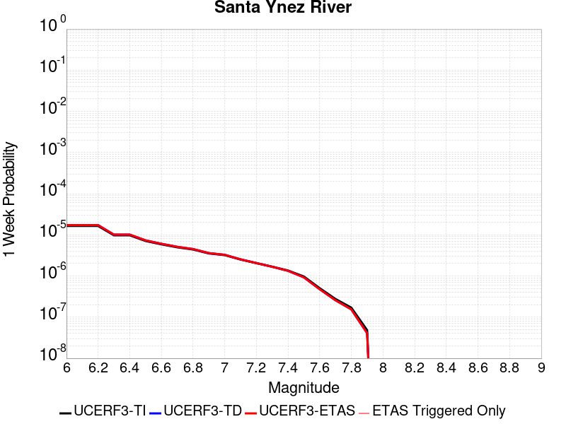 | 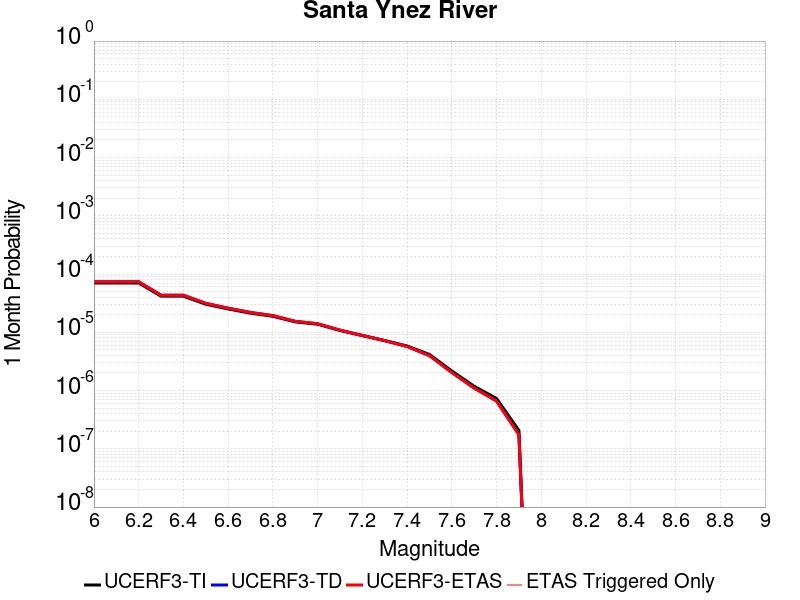 |  | 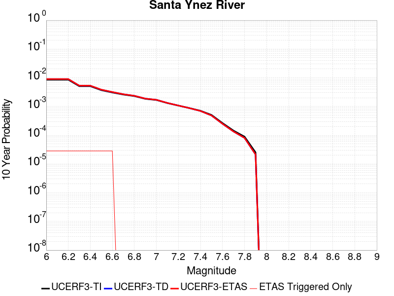 |

| Magnitude | 1 wk TI Prob | 1 wk TD Prob | 1 wk ETAS Prob | 1 wk ETAS/TD Gain | 1 wk ETAS Triggered Only | 1 mo TI Prob | 1 mo TD Prob | 1 mo ETAS Prob | 1 mo ETAS/TD Gain | 1 mo ETAS Triggered Only | 1 yr TI Prob | 1 yr TD Prob | 1 yr ETAS Prob | 1 yr ETAS/TD Gain | 1 yr ETAS Triggered Only | 10 yr TI Prob | 10 yr TD Prob | 10 yr ETAS Prob | 10 yr ETAS/TD Gain | 10 yr ETAS Triggered Only |
|-----|-----|-----|-----|-----|-----|-----|-----|-----|-----|-----|-----|-----|-----|-----|-----|-----|-----|-----|-----|-----|
| 6.0 | 1.6396456E-5 | 1.7210634E-5 | 1.7210634E-5 | 1.0 | 0.0 | 7.026863E-5 | 7.3757976E-5 | 7.3757976E-5 | 1.0 | 0.0 | 8.551848E-4 | 8.9766894E-4 | 9.1570325E-4 | 1.0200902 | 1.8050541E-5 | 0.0085190125 | 0.008943979 | 0.008961868 | 1.0020001 | 1.8050541E-5 |
| 6.1 | 1.6396456E-5 | 1.7210634E-5 | 1.7210634E-5 | 1.0 | 0.0 | 7.026863E-5 | 7.3757976E-5 | 7.3757976E-5 | 1.0 | 0.0 | 8.551848E-4 | 8.9766894E-4 | 9.1570325E-4 | 1.0200902 | 1.8050541E-5 | 0.0085190125 | 0.008943979 | 0.008961868 | 1.0020001 | 1.8050541E-5 |
| 6.2 | 1.6396456E-5 | 1.7210634E-5 | 1.7210634E-5 | 1.0 | 0.0 | 7.026863E-5 | 7.3757976E-5 | 7.3757976E-5 | 1.0 | 0.0 | 8.551848E-4 | 8.9766894E-4 | 9.1570325E-4 | 1.0200902 | 1.8050541E-5 | 0.0085190125 | 0.008943979 | 0.008961868 | 1.0020001 | 1.8050541E-5 |
| 6.3 | 9.736976E-6 | 1.0122983E-5 | 1.0122983E-5 | 1.0 | 0.0 | 4.172923E-5 | 4.3383523E-5 | 4.3383523E-5 | 1.0 | 0.0 | 5.0793495E-4 | 5.2807137E-4 | 5.4611237E-4 | 1.034164 | 1.8050541E-5 | 0.005067755 | 0.0052686715 | 0.005286627 | 1.003408 | 1.8050541E-5 |
| 6.4 | 9.736976E-6 | 1.0122983E-5 | 1.0122983E-5 | 1.0 | 0.0 | 4.172923E-5 | 4.3383523E-5 | 4.3383523E-5 | 1.0 | 0.0 | 5.0793495E-4 | 5.2807137E-4 | 5.4611237E-4 | 1.034164 | 1.8050541E-5 | 0.005067755 | 0.0052686715 | 0.005286627 | 1.003408 | 1.8050541E-5 |
| 6.5 | 7.081964E-6 | 7.330377E-6 | 7.330377E-6 | 1.0 | 0.0 | 3.035092E-5 | 3.1415533E-5 | 3.1415533E-5 | 1.0 | 0.0 | 3.694598E-4 | 3.8241857E-4 | 4.004622E-4 | 1.0471829 | 1.8050541E-5 | 0.0036884616 | 0.0038177667 | 0.0038357482 | 1.00471 | 1.8050541E-5 |
| 6.6 | 5.873247E-6 | 6.0601465E-6 | 6.0601465E-6 | 1.0 | 0.0 | 2.5170815E-5 | 2.5971802E-5 | 2.5971802E-5 | 1.0 | 0.0 | 3.064116E-4 | 3.1616166E-4 | 3.342065E-4 | 1.0570747 | 1.8050541E-5 | 0.0030598943 | 0.003157206 | 0.0031751997 | 1.0056992 | 1.8050541E-5 |
| 6.7 | 4.973277E-6 | 5.1162497E-6 | 5.1162497E-6 | 1.0 | 0.0 | 2.1313872E-5 | 2.1926602E-5 | 2.1926602E-5 | 1.0 | 0.0 | 2.5946548E-4 | 2.6692415E-4 | 2.6692415E-4 | 1.0 | 0.0 | 0.0025916274 | 0.0026660846 | 0.0026660846 | 1.0 | 0.0 |
| 6.8 | 4.396492E-6 | 4.511291E-6 | 4.511291E-6 | 1.0 | 0.0 | 1.884197E-5 | 1.9333962E-5 | 1.9333962E-5 | 1.0 | 0.0 | 2.2937685E-4 | 2.3536591E-4 | 2.3536591E-4 | 1.0 | 0.0 | 0.0022914023 | 0.0023512018 | 0.0023512018 | 1.0 | 0.0 |
| 6.9 | 3.5255632E-6 | 3.601598E-6 | 3.601598E-6 | 1.0 | 0.0 | 1.5109469E-5 | 1.5435331E-5 | 1.5435331E-5 | 1.0 | 0.0 | 1.8394225E-4 | 1.879091E-4 | 1.879091E-4 | 1.0 | 0.0 | 0.0018379007 | 0.0018775183 | 0.0018775183 | 1.0 | 0.0 |
| 7.0 | 3.211603E-6 | 3.2739017E-6 | 3.2739017E-6 | 1.0 | 0.0 | 1.376394E-5 | 1.4030933E-5 | 1.4030933E-5 | 1.0 | 0.0 | 1.6756308E-4 | 1.7081335E-4 | 1.7081335E-4 | 1.0 | 0.0 | 0.0016743679 | 0.0017068348 | 0.0017068348 | 1.0 | 0.0 |
| 7.1 | 2.5094619E-6 | 2.54113E-6 | 2.54113E-6 | 1.0 | 0.0 | 1.0754793E-5 | 1.0890512E-5 | 1.0890512E-5 | 1.0 | 0.0 | 1.3093173E-4 | 1.3258397E-4 | 1.3258397E-4 | 1.0 | 0.0 | 0.0013085462 | 0.0013250548 | 0.0013250548 | 1.0 | 0.0 |
| 7.2 | 2.0515774E-6 | 2.0621208E-6 | 2.0621208E-6 | 1.0 | 0.0 | 8.792445E-6 | 8.837631E-6 | 8.837631E-6 | 1.0 | 0.0 | 1.0704277E-4 | 1.0759288E-4 | 1.0759288E-4 | 1.0 | 0.0 | 0.0010699122 | 0.0010754123 | 0.0010754123 | 1.0 | 0.0 |
| 7.3 | 1.6845745E-6 | 1.6775518E-6 | 1.6775518E-6 | 1.0 | 0.0 | 7.219585E-6 | 7.1894883E-6 | 7.1894883E-6 | 1.0 | 0.0 | 8.78949E-5 | 8.752853E-5 | 8.752853E-5 | 1.0 | 0.0 | 8.7860145E-4 | 8.7494345E-4 | 8.7494345E-4 | 1.0 | 0.0 |
| 7.4 | 1.3600285E-6 | 1.3334721E-6 | 1.3334721E-6 | 1.0 | 0.0 | 5.82868E-6 | 5.7148686E-6 | 5.7148686E-6 | 1.0 | 0.0 | 7.096187E-5 | 6.957632E-5 | 6.957632E-5 | 1.0 | 0.0 | 7.0939213E-4 | 6.955476E-4 | 6.955476E-4 | 1.0 | 0.0 |
| 7.5 | 9.735342E-7 | 9.2911915E-7 | 9.2911915E-7 | 1.0 | 0.0 | 4.172283E-6 | 3.9819333E-6 | 3.9819333E-6 | 1.0 | 0.0 | 5.079636E-5 | 4.8478978E-5 | 4.8478978E-5 | 1.0 | 0.0 | 5.0784746E-4 | 4.846857E-4 | 4.846857E-4 | 1.0 | 0.0 |
| 7.6 | 5.067187E-7 | 4.778901E-7 | 4.778901E-7 | 1.0 | 0.0 | 2.1716498E-6 | 2.0480988E-6 | 2.0480988E-6 | 1.0 | 0.0 | 2.6439517E-5 | 2.4935325E-5 | 2.4935325E-5 | 1.0 | 0.0 | 2.643637E-4 | 2.4932603E-4 | 2.4932603E-4 | 1.0 | 0.0 |
| 7.7 | 2.769089E-7 | 2.576079E-7 | 2.576079E-7 | 1.0 | 0.0 | 1.1867519E-6 | 1.1040333E-6 | 1.1040333E-6 | 1.0 | 0.0 | 1.4448608E-5 | 1.3441524E-5 | 1.3441524E-5 | 1.0 | 0.0 | 1.444767E-4 | 1.3440714E-4 | 1.3440714E-4 | 1.0 | 0.0 |
| 7.8 | 1.7044663E-7 | 1.5450019E-7 | 1.5450019E-7 | 1.0 | 0.0 | 7.3048534E-7 | 6.6214346E-7 | 6.6214346E-7 | 1.0 | 0.0 | 8.893623E-6 | 8.061566E-6 | 8.061566E-6 | 1.0 | 0.0 | 8.893267E-5 | 8.0612765E-5 | 8.0612765E-5 | 1.0 | 0.0 |
| 7.9 | 4.8344287E-8 | 4.0913747E-8 | 4.0913747E-8 | 1.0 | 0.0 | 2.0718979E-7 | 1.7534461E-7 | 1.7534461E-7 | 1.0 | 0.0 | 2.5225327E-6 | 2.1348187E-6 | 2.1348187E-6 | 1.0 | 0.0 | 2.5225041E-5 | 2.1347985E-5 | 2.1347985E-5 | 1.0 | 0.0 |

## Calaveras (So) - Paicines extension 2011 CFM
*[(top)](#table-of-contents)*

| 1 Week | 1 Month | 1 Year | 10 Year |
|-----|-----|-----|-----|
| 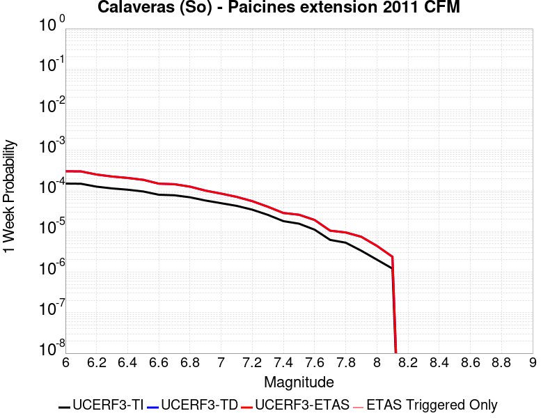 | 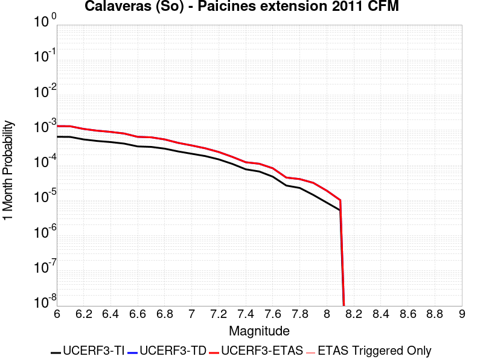 | 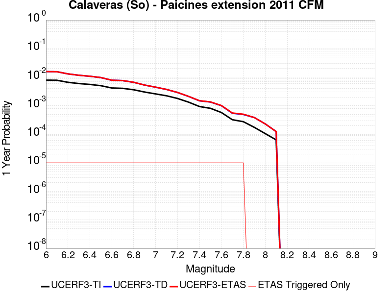 | 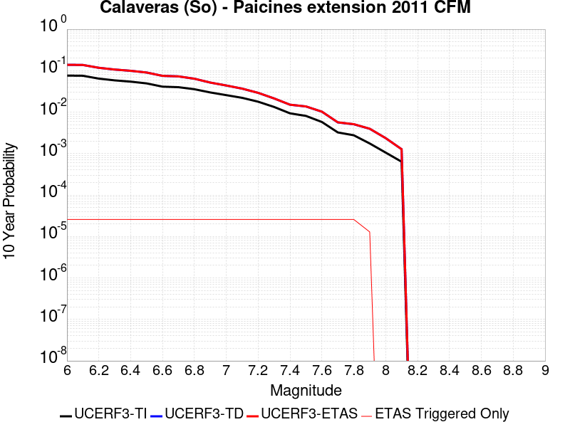 |

| Magnitude | 1 wk TI Prob | 1 wk TD Prob | 1 wk ETAS Prob | 1 wk ETAS/TD Gain | 1 wk ETAS Triggered Only | 1 mo TI Prob | 1 mo TD Prob | 1 mo ETAS Prob | 1 mo ETAS/TD Gain | 1 mo ETAS Triggered Only | 1 yr TI Prob | 1 yr TD Prob | 1 yr ETAS Prob | 1 yr ETAS/TD Gain | 1 yr ETAS Triggered Only | 10 yr TI Prob | 10 yr TD Prob | 10 yr ETAS Prob | 10 yr ETAS/TD Gain | 10 yr ETAS Triggered Only |
|-----|-----|-----|-----|-----|-----|-----|-----|-----|-----|-----|-----|-----|-----|-----|-----|-----|-----|-----|-----|-----|
| 6.0 | 1.5183659E-4 | 3.0557357E-4 | 3.0557357E-4 | 1.0 | 0.0 | 6.5056595E-4 | 0.0013077861 | 0.0013077861 | 1.0 | 0.0 | 0.007891912 | 0.015709123 | 0.015726889 | 1.0011309 | 1.8050541E-5 | 0.076174594 | 0.13859816 | 0.13861372 | 1.0001122 | 1.8050541E-5 |
| 6.1 | 1.5024997E-4 | 3.0251066E-4 | 3.0251066E-4 | 1.0 | 0.0 | 6.437695E-4 | 0.0012946727 | 0.0012946727 | 1.0 | 0.0 | 0.0078097614 | 0.015552476 | 0.015570246 | 1.0011426 | 1.8050541E-5 | 0.075409345 | 0.13726749 | 0.13728306 | 1.0001135 | 1.8050541E-5 |
| 6.2 | 1.2743923E-4 | 2.535529E-4 | 2.535529E-4 | 1.0 | 0.0 | 5.460538E-4 | 0.0010850359 | 0.0010850359 | 1.0 | 0.0 | 0.0066279583 | 0.013059665 | 0.01307748 | 1.0013641 | 1.8050541E-5 | 0.064337276 | 0.1173655 | 0.11738144 | 1.0001358 | 1.8050541E-5 |
| 6.3 | 1.1525114E-4 | 2.2630532E-4 | 2.2630532E-4 | 1.0 | 0.0 | 4.9383997E-4 | 9.688696E-4 | 9.688696E-4 | 1.0 | 0.0 | 0.0059959386 | 0.011680771 | 0.01169861 | 1.0015273 | 1.8050541E-5 | 0.058367174 | 0.10648256 | 0.10649869 | 1.0001515 | 1.8050541E-5 |
| 6.4 | 1.07200925E-4 | 2.0878653E-4 | 2.0878653E-4 | 1.0 | 0.0 | 4.5935164E-4 | 8.938414E-4 | 8.938414E-4 | 1.0 | 0.0 | 0.0055782744 | 0.010785663 | 0.010803519 | 1.0016555 | 1.8050541E-5 | 0.0544031 | 0.09930566 | 0.09932192 | 1.0001637 | 1.8050541E-5 |
| 6.5 | 9.69631E-5 | 1.8774878E-4 | 1.8774878E-4 | 1.0 | 0.0 | 4.1548995E-4 | 8.037382E-4 | 8.037382E-4 | 1.0 | 0.0 | 0.0050468626 | 0.009707406 | 0.009725281 | 1.0018414 | 1.8050541E-5 | 0.04933773 | 0.09019685 | 0.09021327 | 1.000182 | 1.8050541E-5 |
| 6.6 | 8.0552316E-5 | 1.509742E-4 | 1.509742E-4 | 1.0 | 0.0 | 3.4517853E-4 | 6.467888E-4 | 6.467888E-4 | 1.0 | 0.0 | 0.0041944524 | 0.007839204 | 0.007857112 | 1.0022845 | 1.8050541E-5 | 0.04116161 | 0.0749678 | 0.074984506 | 1.0002227 | 1.8050541E-5 |
| 6.7 | 7.815757E-5 | 1.4637802E-4 | 1.4637802E-4 | 1.0 | 0.0 | 3.34918E-4 | 6.271019E-4 | 6.271019E-4 | 1.0 | 0.0 | 0.004070005 | 0.0076019233 | 0.007619837 | 1.0023564 | 1.8050541E-5 | 0.039962657 | 0.072816886 | 0.07283362 | 1.0002298 | 1.8050541E-5 |
| 6.8 | 6.965264E-5 | 1.2746091E-4 | 1.2746091E-4 | 1.0 | 0.0 | 2.9847719E-4 | 5.461E-4 | 5.461E-4 | 1.0 | 0.0 | 0.0036279052 | 0.0066255736 | 0.006643505 | 1.0027063 | 1.8050541E-5 | 0.03569247 | 0.063907206 | 0.063924104 | 1.0002644 | 1.8050541E-5 |
| 6.9 | 5.8000453E-5 | 1.0164828E-4 | 1.0164828E-4 | 1.0 | 0.0 | 2.4854968E-4 | 4.3556333E-4 | 4.3556333E-4 | 1.0 | 0.0 | 0.0030218933 | 0.0052901916 | 0.0053081466 | 1.003394 | 1.8050541E-5 | 0.029811295 | 0.05160153 | 0.05161865 | 1.0003318 | 1.8050541E-5 |
| 7.0 | 4.9865852E-5 | 8.588595E-5 | 8.588595E-5 | 1.0 | 0.0 | 2.1369329E-4 | 3.680312E-4 | 3.680312E-4 | 1.0 | 0.0 | 0.0025986114 | 0.0044716634 | 0.0044896333 | 1.0040185 | 1.8050541E-5 | 0.025684336 | 0.043880597 | 0.043897852 | 1.0003933 | 1.8050541E-5 |
| 7.1 | 4.283875E-5 | 7.130114E-5 | 7.130114E-5 | 1.0 | 0.0 | 1.8358172E-4 | 3.0554083E-4 | 3.0554083E-4 | 1.0 | 0.0 | 0.0022328163 | 0.003713671 | 0.0037316545 | 1.0048425 | 1.8050541E-5 | 0.022105146 | 0.03682219 | 0.036839575 | 1.0004722 | 1.8050541E-5 |
| 7.2 | 3.450115E-5 | 5.5949273E-5 | 5.5949273E-5 | 1.0 | 0.0 | 1.478537E-4 | 2.3976072E-4 | 2.3976072E-4 | 1.0 | 0.0 | 0.0017986323 | 0.0029152085 | 0.0029332065 | 1.0061738 | 1.8050541E-5 | 0.017841442 | 0.02916327 | 0.029180793 | 1.0006009 | 1.8050541E-5 |
| 7.3 | 2.5709045E-5 | 4.074055E-5 | 4.074055E-5 | 1.0 | 0.0 | 1.1017697E-4 | 1.7459076E-4 | 1.7459076E-4 | 1.0 | 0.0 | 0.0013405791 | 0.0021235873 | 0.0021415995 | 1.008482 | 1.8050541E-5 | 0.013325208 | 0.021372125 | 0.02138979 | 1.0008265 | 1.8050541E-5 |
| 7.4 | 1.8003093E-5 | 2.8592622E-5 | 2.8592622E-5 | 1.0 | 0.0 | 7.715383E-5 | 1.2253407E-4 | 1.2253407E-4 | 1.0 | 0.0 | 9.3894306E-4 | 0.0014908336 | 0.0015088572 | 1.0120896 | 1.8050541E-5 | 0.009349857 | 0.015092391 | 0.015110169 | 1.0011779 | 1.8050541E-5 |
| 7.5 | 1.5595824E-5 | 2.590135E-5 | 2.590135E-5 | 1.0 | 0.0 | 6.683753E-5 | 1.1100108E-4 | 1.1100108E-4 | 1.0 | 0.0 | 8.134431E-4 | 0.0013506026 | 0.0013686287 | 1.0133468 | 1.8050541E-5 | 0.008104719 | 0.013690459 | 0.013708262 | 1.0013005 | 1.8050541E-5 |
| 7.6 | 1.1110309E-5 | 1.9289853E-5 | 1.9289853E-5 | 1.0 | 0.0 | 4.761474E-5 | 8.2668186E-5 | 8.2668186E-5 | 1.0 | 0.0 | 5.795553E-4 | 0.0010060217 | 0.0010240541 | 1.0179244 | 1.8050541E-5 | 0.0057804612 | 0.010236918 | 0.010254784 | 1.0017452 | 1.8050541E-5 |
| 7.7 | 6.2140443E-6 | 1.0487634E-5 | 1.0487634E-5 | 1.0 | 0.0 | 2.6631347E-5 | 4.494623E-5 | 4.494623E-5 | 1.0 | 0.0 | 3.241884E-4 | 5.470831E-4 | 5.6512374E-4 | 1.0329762 | 1.8050541E-5 | 0.0032371588 | 0.0056444984 | 0.005662447 | 1.0031799 | 1.8050541E-5 |
| 7.8 | 5.305533E-6 | 9.478306E-6 | 9.478306E-6 | 1.0 | 0.0 | 2.27378E-5 | 4.0620682E-5 | 4.0620682E-5 | 1.0 | 0.0 | 2.7679754E-4 | 4.944447E-4 | 5.1248627E-4 | 1.0364887 | 1.8050541E-5 | 0.0027645302 | 0.005096315 | 0.005114273 | 1.0035238 | 1.8050541E-5 |
| 7.9 | 3.363505E-6 | 7.4183718E-6 | 7.4183718E-6 | 1.0 | 0.0 | 1.4414942E-5 | 3.1792635E-5 | 3.1792635E-5 | 1.0 | 0.0 | 1.7548777E-4 | 3.8700667E-4 | 3.8700667E-4 | 1.0 | 0.0 | 0.0017534926 | 0.0039646686 | 0.0039646686 | 1.0 | 0.0 |
| 8.0 | 2.0271132E-6 | 4.432112E-6 | 4.432112E-6 | 1.0 | 0.0 | 8.687599E-6 | 1.8994628E-5 | 1.8994628E-5 | 1.0 | 0.0 | 1.05766376E-4 | 2.312351E-4 | 2.312351E-4 | 1.0 | 0.0 | 0.0010571606 | 0.0023603663 | 0.0023603663 | 1.0 | 0.0 |
| 8.1 | 1.2206116E-6 | 2.3856317E-6 | 2.3856317E-6 | 1.0 | 0.0 | 5.2311816E-6 | 1.0224096E-5 | 1.0224096E-5 | 1.0 | 0.0 | 6.3687774E-5 | 1.2447129E-4 | 1.2447129E-4 | 1.0 | 0.0 | 6.366953E-4 | 0.0012757671 | 0.0012757671 | 1.0 | 0.0 |

## Del Valle
*[(top)](#table-of-contents)*

| 1 Week | 1 Month | 1 Year | 10 Year |
|-----|-----|-----|-----|
| 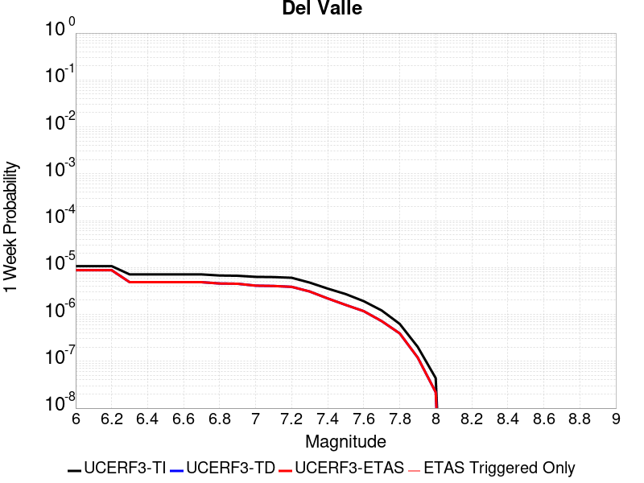 | 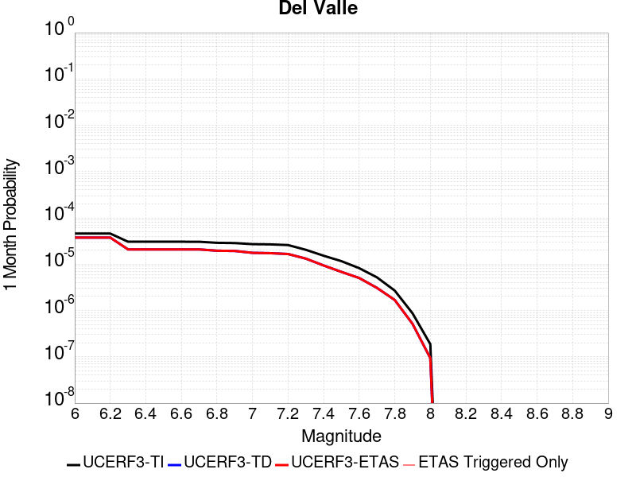 | 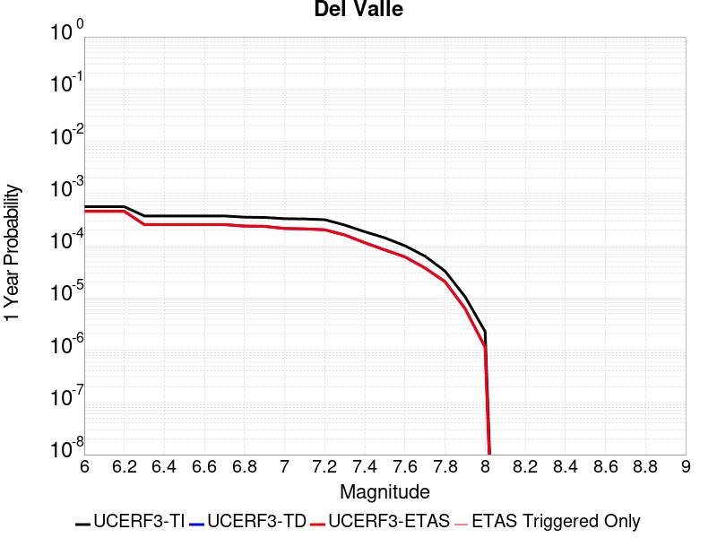 | 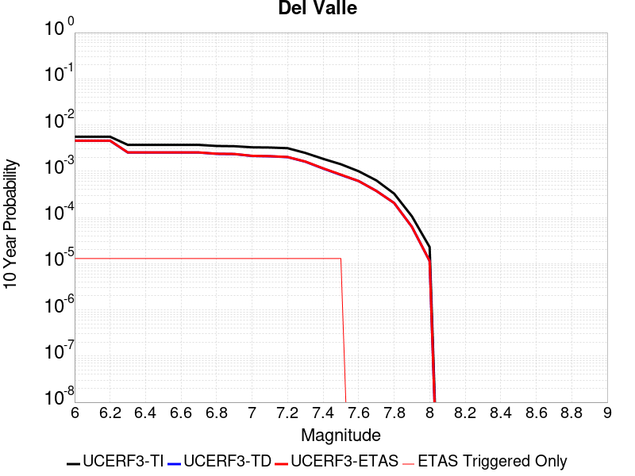 |

| Magnitude | 1 wk TI Prob | 1 wk TD Prob | 1 wk ETAS Prob | 1 wk ETAS/TD Gain | 1 wk ETAS Triggered Only | 1 mo TI Prob | 1 mo TD Prob | 1 mo ETAS Prob | 1 mo ETAS/TD Gain | 1 mo ETAS Triggered Only | 1 yr TI Prob | 1 yr TD Prob | 1 yr ETAS Prob | 1 yr ETAS/TD Gain | 1 yr ETAS Triggered Only | 10 yr TI Prob | 10 yr TD Prob | 10 yr ETAS Prob | 10 yr ETAS/TD Gain | 10 yr ETAS Triggered Only |
|-----|-----|-----|-----|-----|-----|-----|-----|-----|-----|-----|-----|-----|-----|-----|-----|-----|-----|-----|-----|-----|
| 6.0 | 1.0716125E-5 | 8.769489E-6 | 8.769489E-6 | 1.0 | 0.0 | 4.592544E-5 | 3.7583093E-5 | 3.7583093E-5 | 1.0 | 0.0 | 5.589988E-4 | 4.5749784E-4 | 4.5749784E-4 | 1.0 | 0.0 | 0.0055759475 | 0.0045675156 | 0.0045854836 | 1.0039339 | 1.8050541E-5 |
| 6.1 | 1.0716125E-5 | 8.769489E-6 | 8.769489E-6 | 1.0 | 0.0 | 4.592544E-5 | 3.7583093E-5 | 3.7583093E-5 | 1.0 | 0.0 | 5.589988E-4 | 4.5749784E-4 | 4.5749784E-4 | 1.0 | 0.0 | 0.0055759475 | 0.0045675156 | 0.0045854836 | 1.0039339 | 1.8050541E-5 |
| 6.2 | 1.0716125E-5 | 8.769489E-6 | 8.769489E-6 | 1.0 | 0.0 | 4.592544E-5 | 3.7583093E-5 | 3.7583093E-5 | 1.0 | 0.0 | 5.589988E-4 | 4.5749784E-4 | 4.5749784E-4 | 1.0 | 0.0 | 0.0055759475 | 0.0045675156 | 0.0045854836 | 1.0039339 | 1.8050541E-5 |
| 6.3 | 7.1293784E-6 | 4.8670204E-6 | 4.8670204E-6 | 1.0 | 0.0 | 3.055412E-5 | 2.0858495E-5 | 2.0858495E-5 | 1.0 | 0.0 | 3.7193293E-4 | 2.5392332E-4 | 2.5392332E-4 | 1.0 | 0.0 | 0.0037131102 | 0.002536418 | 0.0025544227 | 1.0070986 | 1.8050541E-5 |
| 6.4 | 7.1293784E-6 | 4.8670204E-6 | 4.8670204E-6 | 1.0 | 0.0 | 3.055412E-5 | 2.0858495E-5 | 2.0858495E-5 | 1.0 | 0.0 | 3.7193293E-4 | 2.5392332E-4 | 2.5392332E-4 | 1.0 | 0.0 | 0.0037131102 | 0.002536418 | 0.0025544227 | 1.0070986 | 1.8050541E-5 |
| 6.5 | 7.1293784E-6 | 4.8670204E-6 | 4.8670204E-6 | 1.0 | 0.0 | 3.055412E-5 | 2.0858495E-5 | 2.0858495E-5 | 1.0 | 0.0 | 3.7193293E-4 | 2.5392332E-4 | 2.5392332E-4 | 1.0 | 0.0 | 0.0037131102 | 0.002536418 | 0.0025544227 | 1.0070986 | 1.8050541E-5 |
| 6.6 | 7.1293784E-6 | 4.8670204E-6 | 4.8670204E-6 | 1.0 | 0.0 | 3.055412E-5 | 2.0858495E-5 | 2.0858495E-5 | 1.0 | 0.0 | 3.7193293E-4 | 2.5392332E-4 | 2.5392332E-4 | 1.0 | 0.0 | 0.0037131102 | 0.002536418 | 0.0025544227 | 1.0070986 | 1.8050541E-5 |
| 6.7 | 7.12272E-6 | 4.864395E-6 | 4.864395E-6 | 1.0 | 0.0 | 3.0525585E-5 | 2.0847247E-5 | 2.0847247E-5 | 1.0 | 0.0 | 3.7158563E-4 | 2.537864E-4 | 2.537864E-4 | 1.0 | 0.0 | 0.003709649 | 0.0025350517 | 0.0025530565 | 1.0071024 | 1.8050541E-5 |
| 6.8 | 6.7558703E-6 | 4.5605425E-6 | 4.5605425E-6 | 1.0 | 0.0 | 2.895341E-5 | 1.954504E-5 | 1.954504E-5 | 1.0 | 0.0 | 3.5245073E-4 | 2.379355E-4 | 2.379355E-4 | 1.0 | 0.0 | 0.0035189227 | 0.0023768828 | 0.0023948904 | 1.0075761 | 1.8050541E-5 |
| 6.9 | 6.6700386E-6 | 4.5036554E-6 | 4.5036554E-6 | 1.0 | 0.0 | 2.8585566E-5 | 1.9301242E-5 | 1.9301242E-5 | 1.0 | 0.0 | 3.479737E-4 | 2.349679E-4 | 2.349679E-4 | 1.0 | 0.0 | 0.003474293 | 0.0023472698 | 0.0023652778 | 1.007672 | 1.8050541E-5 |
| 7.0 | 6.3181424E-6 | 4.0997443E-6 | 4.0997443E-6 | 1.0 | 0.0 | 2.7077473E-5 | 1.7570215E-5 | 1.7570215E-5 | 1.0 | 0.0 | 3.2961834E-4 | 2.138968E-4 | 2.138968E-4 | 1.0 | 0.0 | 0.0032912986 | 0.0021369641 | 0.0021549761 | 1.0084288 | 1.8050541E-5 |
| 7.1 | 6.248759E-6 | 4.0349196E-6 | 4.0349196E-6 | 1.0 | 0.0 | 2.678012E-5 | 1.72924E-5 | 1.72924E-5 | 1.0 | 0.0 | 3.2599916E-4 | 2.1051505E-4 | 2.1051505E-4 | 1.0 | 0.0 | 0.0032552136 | 0.002103211 | 0.0021212234 | 1.0085644 | 1.8050541E-5 |
| 7.2 | 6.0411944E-6 | 3.8708695E-6 | 3.8708695E-6 | 1.0 | 0.0 | 2.5890577E-5 | 1.6589338E-5 | 1.6589338E-5 | 1.0 | 0.0 | 3.1517216E-4 | 2.0195688E-4 | 2.0195688E-4 | 1.0 | 0.0 | 0.0031472554 | 0.0020177867 | 0.002035801 | 1.0089277 | 1.8050541E-5 |
| 7.3 | 4.7691183E-6 | 3.0788524E-6 | 3.0788524E-6 | 1.0 | 0.0 | 2.0438918E-5 | 1.3195016E-5 | 1.3195016E-5 | 1.0 | 0.0 | 2.488154E-4 | 1.6063769E-4 | 1.6063769E-4 | 1.0 | 0.0 | 0.00248537 | 0.0016052417 | 0.0016232632 | 1.0112267 | 1.8050541E-5 |
| 7.4 | 3.5524722E-6 | 2.1898688E-6 | 2.1898688E-6 | 1.0 | 0.0 | 1.5224792E-5 | 9.385119E-6 | 9.385119E-6 | 1.0 | 0.0 | 1.8534607E-4 | 1.1425791E-4 | 1.1425791E-4 | 1.0 | 0.0 | 0.0018519156 | 0.001142 | 0.0011600299 | 1.0157881 | 1.8050541E-5 |
| 7.5 | 2.7133442E-6 | 1.5920236E-6 | 1.5920236E-6 | 1.0 | 0.0 | 1.1628566E-5 | 6.8229406E-6 | 6.8229406E-6 | 1.0 | 0.0 | 1.415686E-4 | 8.306615E-5 | 8.306615E-5 | 1.0 | 0.0 | 0.0014147845 | 8.30353E-4 | 8.4838853E-4 | 1.0217203 | 1.8050541E-5 |
| 7.6 | 1.915338E-6 | 1.1741909E-6 | 1.1741909E-6 | 1.0 | 0.0 | 8.208566E-6 | 5.032237E-6 | 5.032237E-6 | 1.0 | 0.0 | 9.993471E-5 | 6.1265775E-5 | 6.1265775E-5 | 1.0 | 0.0 | 9.988978E-4 | 6.1248976E-4 | 6.1248976E-4 | 1.0 | 0.0 |
| 7.7 | 1.2120448E-6 | 7.182219E-7 | 7.182219E-7 | 1.0 | 0.0 | 5.194467E-6 | 3.0780902E-6 | 3.0780902E-6 | 1.0 | 0.0 | 6.3240805E-5 | 3.7475107E-5 | 3.7475107E-5 | 1.0 | 0.0 | 6.322281E-4 | 3.7468827E-4 | 3.7468827E-4 | 1.0 | 0.0 |
| 7.8 | 6.272381E-7 | 3.9335023E-7 | 3.9335023E-7 | 1.0 | 0.0 | 2.6881603E-6 | 1.6857856E-6 | 1.6857856E-6 | 1.0 | 0.0 | 3.272786E-5 | 2.0524249E-5 | 2.0524249E-5 | 1.0 | 0.0 | 3.272304E-4 | 2.052237E-4 | 2.052237E-4 | 1.0 | 0.0 |
| 7.9 | 2.0292627E-7 | 1.2008125E-7 | 1.2008125E-7 | 1.0 | 0.0 | 8.6968373E-7 | 5.146338E-7 | 5.146338E-7 | 1.0 | 0.0 | 1.0588348E-5 | 6.265649E-6 | 6.265649E-6 | 1.0 | 0.0 | 1.0587843E-4 | 6.265475E-5 | 6.265475E-5 | 1.0 | 0.0 |
| 8.0 | 4.374492E-8 | 2.191007E-8 | 2.191007E-8 | 1.0 | 0.0 | 1.8747821E-7 | 9.39003E-8 | 9.39003E-8 | 1.0 | 0.0 | 2.2825448E-6 | 1.1432355E-6 | 1.1432355E-6 | 1.0 | 0.0 | 2.2825214E-5 | 1.14323E-5 | 1.14323E-5 | 1.0 | 0.0 |

## Elsinore (Julian)
*[(top)](#table-of-contents)*

| 1 Week | 1 Month | 1 Year | 10 Year |
|-----|-----|-----|-----|
| 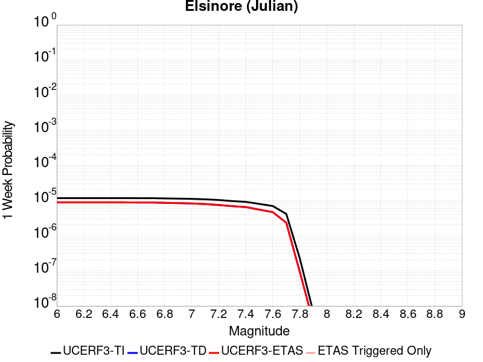 | 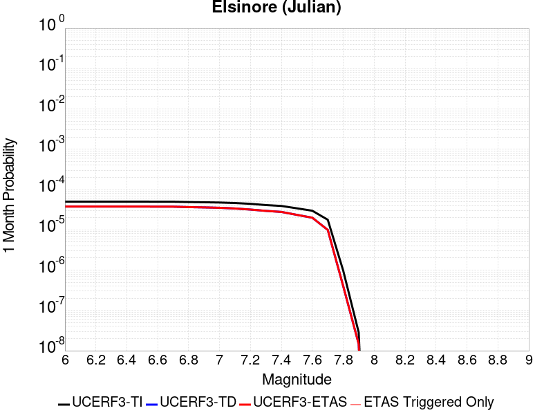 | 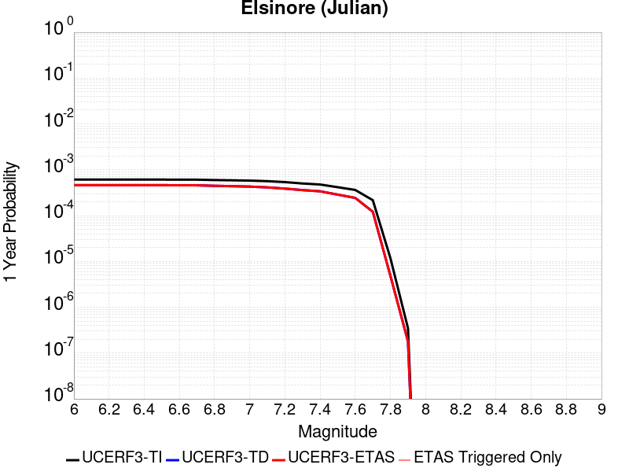 | 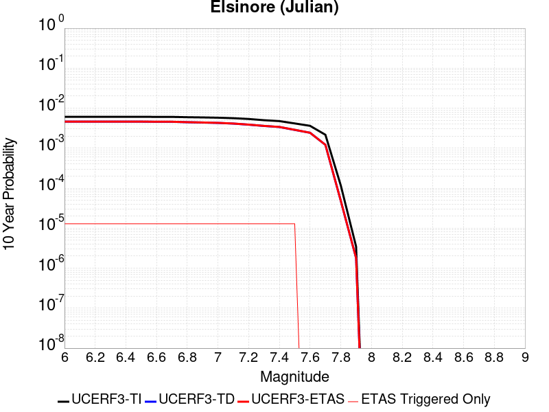 |

| Magnitude | 1 wk TI Prob | 1 wk TD Prob | 1 wk ETAS Prob | 1 wk ETAS/TD Gain | 1 wk ETAS Triggered Only | 1 mo TI Prob | 1 mo TD Prob | 1 mo ETAS Prob | 1 mo ETAS/TD Gain | 1 mo ETAS Triggered Only | 1 yr TI Prob | 1 yr TD Prob | 1 yr ETAS Prob | 1 yr ETAS/TD Gain | 1 yr ETAS Triggered Only | 10 yr TI Prob | 10 yr TD Prob | 10 yr ETAS Prob | 10 yr ETAS/TD Gain | 10 yr ETAS Triggered Only |
|-----|-----|-----|-----|-----|-----|-----|-----|-----|-----|-----|-----|-----|-----|-----|-----|-----|-----|-----|-----|-----|
| 6.0 | 1.1710231E-5 | 8.849237E-6 | 8.849237E-6 | 1.0 | 0.0 | 5.0185736E-5 | 3.792476E-5 | 3.792476E-5 | 1.0 | 0.0 | 6.1084004E-4 | 4.6163783E-4 | 4.6163783E-4 | 1.0 | 0.0 | 0.006091637 | 0.004606993 | 0.0046249605 | 1.0039 | 1.8050541E-5 |
| 6.1 | 1.1710231E-5 | 8.849237E-6 | 8.849237E-6 | 1.0 | 0.0 | 5.0185736E-5 | 3.792476E-5 | 3.792476E-5 | 1.0 | 0.0 | 6.1084004E-4 | 4.6163783E-4 | 4.6163783E-4 | 1.0 | 0.0 | 0.006091637 | 0.004606993 | 0.0046249605 | 1.0039 | 1.8050541E-5 |
| 6.2 | 1.1710231E-5 | 8.849237E-6 | 8.849237E-6 | 1.0 | 0.0 | 5.0185736E-5 | 3.792476E-5 | 3.792476E-5 | 1.0 | 0.0 | 6.1084004E-4 | 4.6163783E-4 | 4.6163783E-4 | 1.0 | 0.0 | 0.006091637 | 0.004606993 | 0.0046249605 | 1.0039 | 1.8050541E-5 |
| 6.3 | 1.1710231E-5 | 8.849237E-6 | 8.849237E-6 | 1.0 | 0.0 | 5.0185736E-5 | 3.792476E-5 | 3.792476E-5 | 1.0 | 0.0 | 6.1084004E-4 | 4.6163783E-4 | 4.6163783E-4 | 1.0 | 0.0 | 0.006091637 | 0.004606993 | 0.0046249605 | 1.0039 | 1.8050541E-5 |
| 6.4 | 1.1710231E-5 | 8.849237E-6 | 8.849237E-6 | 1.0 | 0.0 | 5.0185736E-5 | 3.792476E-5 | 3.792476E-5 | 1.0 | 0.0 | 6.1084004E-4 | 4.6163783E-4 | 4.6163783E-4 | 1.0 | 0.0 | 0.006091637 | 0.004606993 | 0.0046249605 | 1.0039 | 1.8050541E-5 |
| 6.5 | 1.1710231E-5 | 8.849237E-6 | 8.849237E-6 | 1.0 | 0.0 | 5.0185736E-5 | 3.792476E-5 | 3.792476E-5 | 1.0 | 0.0 | 6.1084004E-4 | 4.6163783E-4 | 4.6163783E-4 | 1.0 | 0.0 | 0.006091637 | 0.004606993 | 0.0046249605 | 1.0039 | 1.8050541E-5 |
| 6.6 | 1.1650619E-5 | 8.7816015E-6 | 8.7816015E-6 | 1.0 | 0.0 | 4.993027E-5 | 3.76349E-5 | 3.76349E-5 | 1.0 | 0.0 | 6.0773146E-4 | 4.5811027E-4 | 4.5811027E-4 | 1.0 | 0.0 | 0.0060607214 | 0.0045718635 | 0.0045898315 | 1.0039301 | 1.8050541E-5 |
| 6.7 | 1.1650619E-5 | 8.7816015E-6 | 8.7816015E-6 | 1.0 | 0.0 | 4.993027E-5 | 3.76349E-5 | 3.76349E-5 | 1.0 | 0.0 | 6.0773146E-4 | 4.5811027E-4 | 4.5811027E-4 | 1.0 | 0.0 | 0.0060607214 | 0.0045718635 | 0.0045898315 | 1.0039301 | 1.8050541E-5 |
| 6.8 | 1.1442698E-5 | 8.564736E-6 | 8.564736E-6 | 1.0 | 0.0 | 4.9039216E-5 | 3.6705504E-5 | 3.6705504E-5 | 1.0 | 0.0 | 5.968889E-4 | 4.4679956E-4 | 4.4679956E-4 | 1.0 | 0.0 | 0.0059528816 | 0.0044592144 | 0.0044771847 | 1.0040299 | 1.8050541E-5 |
| 6.9 | 1.1300589E-5 | 8.412584E-6 | 8.412584E-6 | 1.0 | 0.0 | 4.8430196E-5 | 3.6053443E-5 | 3.6053443E-5 | 1.0 | 0.0 | 5.894781E-4 | 4.3886394E-4 | 4.3886394E-4 | 1.0 | 0.0 | 0.005879169 | 0.0043801726 | 0.004398144 | 1.004103 | 1.8050541E-5 |
| 7.0 | 1.1117729E-5 | 8.229731E-6 | 8.229731E-6 | 1.0 | 0.0 | 4.764654E-5 | 3.5269808E-5 | 3.5269808E-5 | 1.0 | 0.0 | 5.799422E-4 | 4.2932696E-4 | 4.2932696E-4 | 1.0 | 0.0 | 0.0057843104 | 0.004285174 | 0.004303147 | 1.0041943 | 1.8050541E-5 |
| 7.1 | 1.08053955E-5 | 7.915354E-6 | 7.915354E-6 | 1.0 | 0.0 | 4.6308014E-5 | 3.3922515E-5 | 3.3922515E-5 | 1.0 | 0.0 | 5.6365423E-4 | 4.1293E-4 | 4.1293E-4 | 1.0 | 0.0 | 0.005622267 | 0.0041218232 | 0.004139799 | 1.0043612 | 1.8050541E-5 |
| 7.2 | 1.032804E-5 | 7.43657E-6 | 7.43657E-6 | 1.0 | 0.0 | 4.4262277E-5 | 3.1870633E-5 | 3.1870633E-5 | 1.0 | 0.0 | 5.387599E-4 | 3.8795744E-4 | 3.8795744E-4 | 1.0 | 0.0 | 0.0053745564 | 0.0038729892 | 0.0038909698 | 1.0046426 | 1.8050541E-5 |
| 7.3 | 9.622426E-6 | 6.901153E-6 | 6.901153E-6 | 1.0 | 0.0 | 4.1238312E-5 | 2.9576042E-5 | 2.9576042E-5 | 1.0 | 0.0 | 5.019608E-4 | 3.6003024E-4 | 3.6003024E-4 | 1.0 | 0.0 | 0.005008285 | 0.0035946416 | 0.0036126273 | 1.0050035 | 1.8050541E-5 |
| 7.4 | 9.144434E-6 | 6.499497E-6 | 6.499497E-6 | 1.0 | 0.0 | 3.9189843E-5 | 2.7854698E-5 | 2.7854698E-5 | 1.0 | 0.0 | 4.7703186E-4 | 3.3907956E-4 | 3.3907956E-4 | 1.0 | 0.0 | 0.0047600917 | 0.0033857655 | 0.003403755 | 1.0053133 | 1.8050541E-5 |
| 7.5 | 7.988981E-6 | 5.501002E-6 | 5.501002E-6 | 1.0 | 0.0 | 3.4238044E-5 | 2.3575518E-5 | 2.3575518E-5 | 1.0 | 0.0 | 4.1676845E-4 | 2.8699538E-4 | 2.8699538E-4 | 1.0 | 0.0 | 0.0041598766 | 0.002866375 | 0.0028843738 | 1.0062793 | 1.8050541E-5 |
| 7.6 | 6.9554876E-6 | 4.664959E-6 | 4.664959E-6 | 1.0 | 0.0 | 2.9808893E-5 | 1.9992534E-5 | 1.9992534E-5 | 1.0 | 0.0 | 3.6286283E-4 | 2.4338308E-4 | 2.4338308E-4 | 1.0 | 0.0 | 0.0036227088 | 0.0024312816 | 0.0024312816 | 1.0 | 0.0 |
| 7.7 | 4.1557314E-6 | 2.3258574E-6 | 2.3258574E-6 | 1.0 | 0.0 | 1.7810156E-5 | 9.967926E-6 | 9.967926E-6 | 1.0 | 0.0 | 2.1681708E-4 | 1.21353485E-4 | 1.21353485E-4 | 1.0 | 0.0 | 0.0021660565 | 0.0012129453 | 0.0012129453 | 1.0 | 0.0 |
| 7.8 | 2.2597293E-7 | 9.337184E-8 | 9.337184E-8 | 1.0 | 0.0 | 9.684551E-7 | 4.0016496E-7 | 4.0016496E-7 | 1.0 | 0.0 | 1.1790877E-5 | 4.8720008E-6 | 4.8720008E-6 | 1.0 | 0.0 | 1.17902506E-4 | 4.871927E-5 | 4.871927E-5 | 1.0 | 0.0 |
| 7.9 | 6.676829E-9 | 3.440971E-9 | 3.440971E-9 | 1.0 | 0.0 | 2.861498E-8 | 1.4747019E-8 | 1.4747019E-8 | 1.0 | 0.0 | 3.4838732E-7 | 1.7954494E-7 | 1.7954494E-7 | 1.0 | 0.0 | 3.4838679E-6 | 1.795448E-6 | 1.795448E-6 | 1.0 | 0.0 |

## North Frontal  (East)
*[(top)](#table-of-contents)*

| 1 Week | 1 Month | 1 Year | 10 Year |
|-----|-----|-----|-----|
| 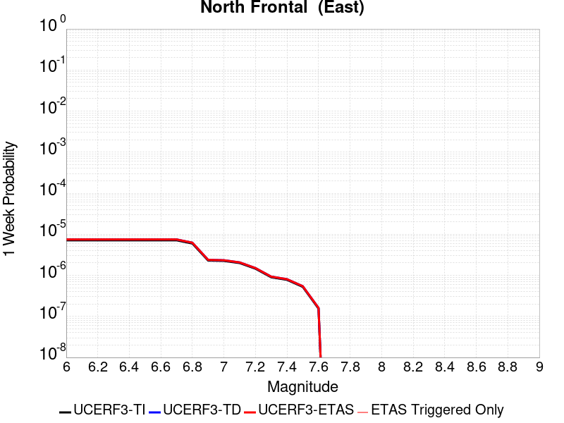 | 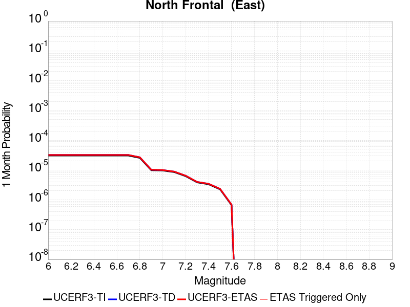 | 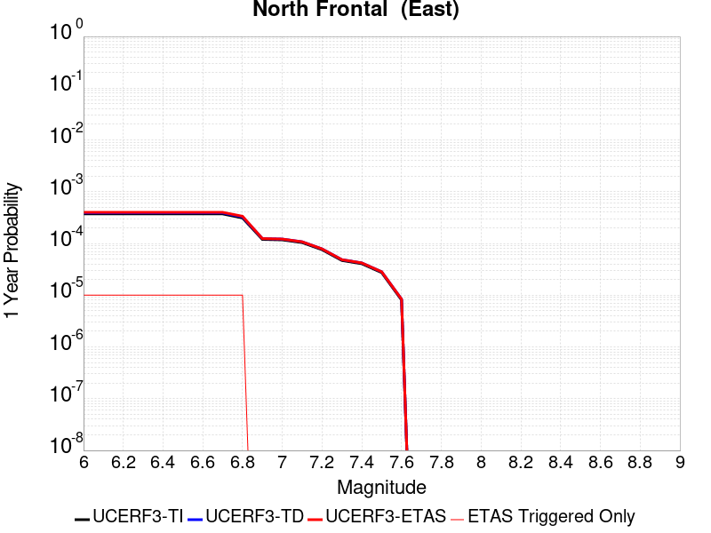 | 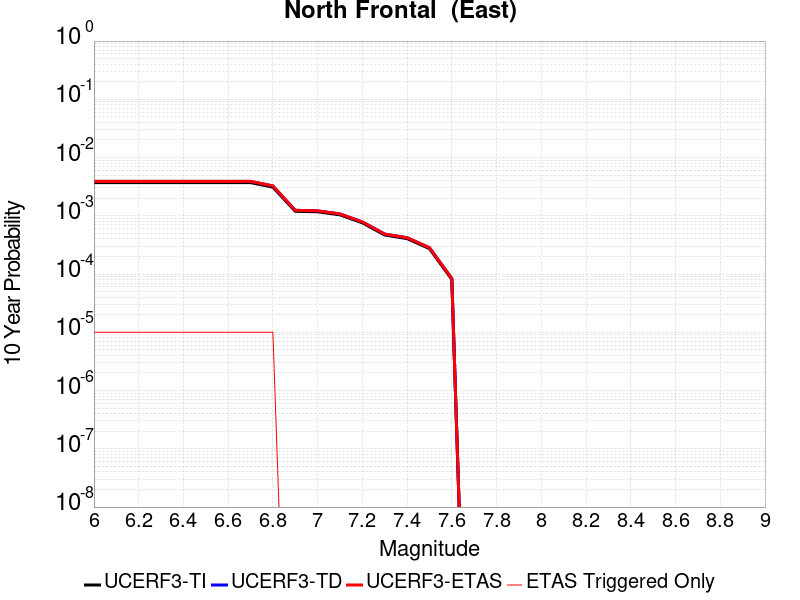 |

| Magnitude | 1 wk TI Prob | 1 wk TD Prob | 1 wk ETAS Prob | 1 wk ETAS/TD Gain | 1 wk ETAS Triggered Only | 1 mo TI Prob | 1 mo TD Prob | 1 mo ETAS Prob | 1 mo ETAS/TD Gain | 1 mo ETAS Triggered Only | 1 yr TI Prob | 1 yr TD Prob | 1 yr ETAS Prob | 1 yr ETAS/TD Gain | 1 yr ETAS Triggered Only | 10 yr TI Prob | 10 yr TD Prob | 10 yr ETAS Prob | 10 yr ETAS/TD Gain | 10 yr ETAS Triggered Only |
|-----|-----|-----|-----|-----|-----|-----|-----|-----|-----|-----|-----|-----|-----|-----|-----|-----|-----|-----|-----|-----|
| 6.0 | 7.135738E-6 | 7.477604E-6 | 7.477604E-6 | 1.0 | 0.0 | 3.0581377E-5 | 3.2046595E-5 | 3.2046595E-5 | 1.0 | 0.0 | 3.7226462E-4 | 3.9011738E-4 | 4.0816088E-4 | 1.0462514 | 1.8050541E-5 | 0.0037164164 | 0.0038962832 | 0.0039142636 | 1.0046147 | 1.8050541E-5 |
| 6.1 | 7.135738E-6 | 7.477604E-6 | 7.477604E-6 | 1.0 | 0.0 | 3.0581377E-5 | 3.2046595E-5 | 3.2046595E-5 | 1.0 | 0.0 | 3.7226462E-4 | 3.9011738E-4 | 4.0816088E-4 | 1.0462514 | 1.8050541E-5 | 0.0037164164 | 0.0038962832 | 0.0039142636 | 1.0046147 | 1.8050541E-5 |
| 6.2 | 7.135738E-6 | 7.477604E-6 | 7.477604E-6 | 1.0 | 0.0 | 3.0581377E-5 | 3.2046595E-5 | 3.2046595E-5 | 1.0 | 0.0 | 3.7226462E-4 | 3.9011738E-4 | 4.0816088E-4 | 1.0462514 | 1.8050541E-5 | 0.0037164164 | 0.0038962832 | 0.0039142636 | 1.0046147 | 1.8050541E-5 |
| 6.3 | 7.135738E-6 | 7.477604E-6 | 7.477604E-6 | 1.0 | 0.0 | 3.0581377E-5 | 3.2046595E-5 | 3.2046595E-5 | 1.0 | 0.0 | 3.7226462E-4 | 3.9011738E-4 | 4.0816088E-4 | 1.0462514 | 1.8050541E-5 | 0.0037164164 | 0.0038962832 | 0.0039142636 | 1.0046147 | 1.8050541E-5 |
| 6.4 | 7.135738E-6 | 7.477604E-6 | 7.477604E-6 | 1.0 | 0.0 | 3.0581377E-5 | 3.2046595E-5 | 3.2046595E-5 | 1.0 | 0.0 | 3.7226462E-4 | 3.9011738E-4 | 4.0816088E-4 | 1.0462514 | 1.8050541E-5 | 0.0037164164 | 0.0038962832 | 0.0039142636 | 1.0046147 | 1.8050541E-5 |
| 6.5 | 7.135738E-6 | 7.477604E-6 | 7.477604E-6 | 1.0 | 0.0 | 3.0581377E-5 | 3.2046595E-5 | 3.2046595E-5 | 1.0 | 0.0 | 3.7226462E-4 | 3.9011738E-4 | 4.0816088E-4 | 1.0462514 | 1.8050541E-5 | 0.0037164164 | 0.0038962832 | 0.0039142636 | 1.0046147 | 1.8050541E-5 |
| 6.6 | 7.135738E-6 | 7.477604E-6 | 7.477604E-6 | 1.0 | 0.0 | 3.0581377E-5 | 3.2046595E-5 | 3.2046595E-5 | 1.0 | 0.0 | 3.7226462E-4 | 3.9011738E-4 | 4.0816088E-4 | 1.0462514 | 1.8050541E-5 | 0.0037164164 | 0.0038962832 | 0.0039142636 | 1.0046147 | 1.8050541E-5 |
| 6.7 | 7.135738E-6 | 7.477604E-6 | 7.477604E-6 | 1.0 | 0.0 | 3.0581377E-5 | 3.2046595E-5 | 3.2046595E-5 | 1.0 | 0.0 | 3.7226462E-4 | 3.9011738E-4 | 4.0816088E-4 | 1.0462514 | 1.8050541E-5 | 0.0037164164 | 0.0038962832 | 0.0039142636 | 1.0046147 | 1.8050541E-5 |
| 6.8 | 5.959142E-6 | 6.23703E-6 | 6.23703E-6 | 1.0 | 0.0 | 2.553893E-5 | 2.6729957E-5 | 2.6729957E-5 | 1.0 | 0.0 | 3.108921E-4 | 3.254067E-4 | 3.4345136E-4 | 1.0554527 | 1.8050541E-5 | 0.0031045752 | 0.0032510755 | 0.0032690675 | 1.0055342 | 1.8050541E-5 |
| 6.9 | 2.2946929E-6 | 2.3825694E-6 | 2.3825694E-6 | 1.0 | 0.0 | 9.834361E-6 | 1.0210974E-5 | 1.0210974E-5 | 1.0 | 0.0 | 1.1972676E-4 | 1.2431199E-4 | 1.2431199E-4 | 1.0 | 0.0 | 0.0011966228 | 0.001242471 | 0.001242471 | 1.0 | 0.0 |
| 7.0 | 2.2468673E-6 | 2.3322596E-6 | 2.3322596E-6 | 1.0 | 0.0 | 9.629396E-6 | 9.995362E-6 | 9.995362E-6 | 1.0 | 0.0 | 1.1723159E-4 | 1.2168721E-4 | 1.2168721E-4 | 1.0 | 0.0 | 0.0011716976 | 0.0012162521 | 0.0012162521 | 1.0 | 0.0 |
| 7.1 | 1.9921076E-6 | 2.064693E-6 | 2.064693E-6 | 1.0 | 0.0 | 8.537577E-6 | 8.848657E-6 | 8.848657E-6 | 1.0 | 0.0 | 1.0394004E-4 | 1.077275E-4 | 1.077275E-4 | 1.0 | 0.0 | 0.0010389143 | 0.0010767955 | 0.0010767955 | 1.0 | 0.0 |
| 7.2 | 1.4524545E-6 | 1.5045792E-6 | 1.5045792E-6 | 1.0 | 0.0 | 6.2247905E-6 | 6.448182E-6 | 6.448182E-6 | 1.0 | 0.0 | 7.5784184E-5 | 7.850404E-5 | 7.850404E-5 | 1.0 | 0.0 | 7.575835E-4 | 7.847875E-4 | 7.847875E-4 | 1.0 | 0.0 |
| 7.3 | 8.9802575E-7 | 9.309135E-7 | 9.309135E-7 | 1.0 | 0.0 | 3.848676E-6 | 3.9896236E-6 | 3.9896236E-6 | 1.0 | 0.0 | 4.685662E-5 | 4.85727E-5 | 4.85727E-5 | 1.0 | 0.0 | 4.6846745E-4 | 4.8563213E-4 | 4.8563213E-4 | 1.0 | 0.0 |
| 7.4 | 7.776139E-7 | 8.0608265E-7 | 8.0608265E-7 | 1.0 | 0.0 | 3.3326266E-6 | 3.454636E-6 | 3.454636E-6 | 1.0 | 0.0 | 4.0573974E-5 | 4.205949E-5 | 4.205949E-5 | 1.0 | 0.0 | 4.0566566E-4 | 4.2052608E-4 | 4.2052608E-4 | 1.0 | 0.0 |
| 7.5 | 5.244417E-7 | 5.441463E-7 | 5.441463E-7 | 1.0 | 0.0 | 2.2476054E-6 | 2.3320538E-6 | 2.3320538E-6 | 1.0 | 0.0 | 2.7364253E-5 | 2.8392453E-5 | 2.8392453E-5 | 1.0 | 0.0 | 2.7360884E-4 | 2.8389477E-4 | 2.8389477E-4 | 1.0 | 0.0 |
| 7.6 | 1.5489647E-7 | 1.6090247E-7 | 1.6090247E-7 | 1.0 | 0.0 | 6.6384183E-7 | 6.89582E-7 | 6.89582E-7 | 1.0 | 0.0 | 8.082245E-6 | 8.395648E-6 | 8.395648E-6 | 1.0 | 0.0 | 8.08195E-5 | 8.395531E-5 | 8.395531E-5 | 1.0 | 0.0 |

## Hosgri
*[(top)](#table-of-contents)*

| 1 Week | 1 Month | 1 Year | 10 Year |
|-----|-----|-----|-----|
| 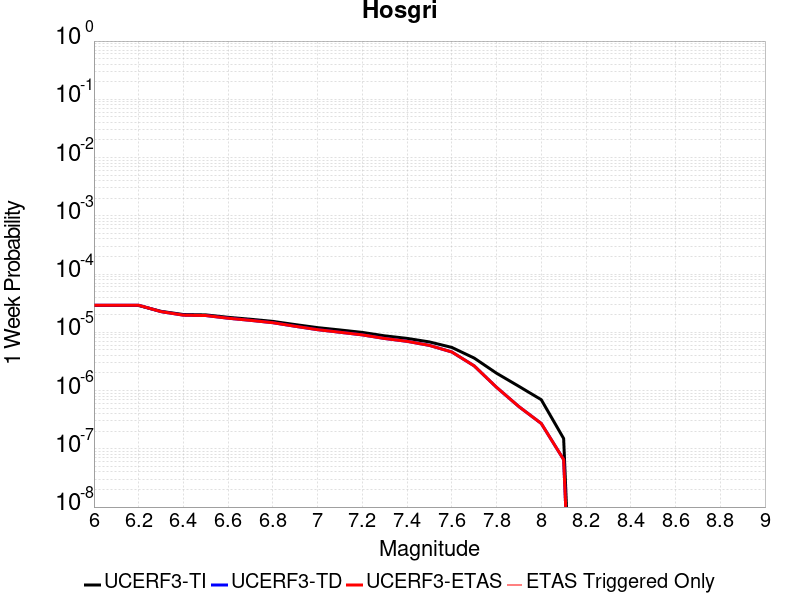 | 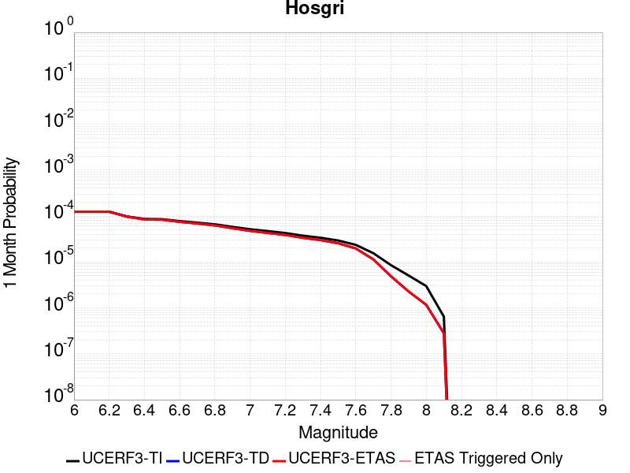 | 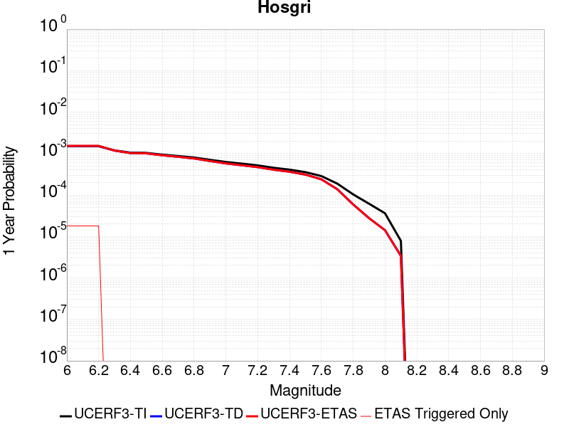 | 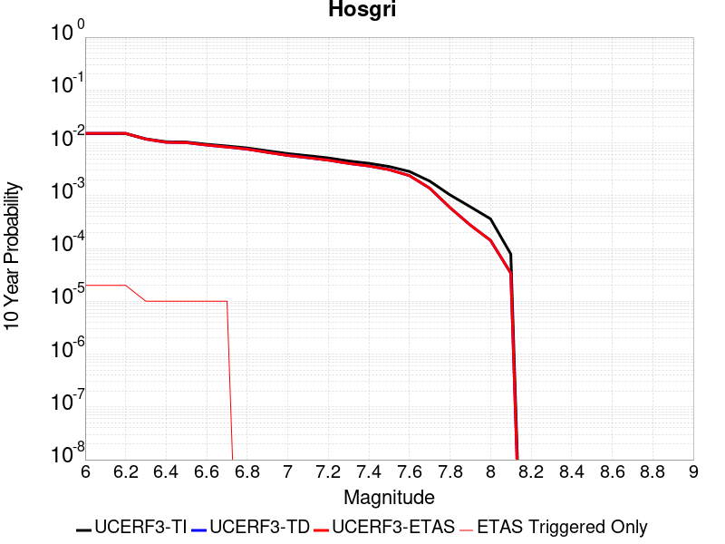 |

| Magnitude | 1 wk TI Prob | 1 wk TD Prob | 1 wk ETAS Prob | 1 wk ETAS/TD Gain | 1 wk ETAS Triggered Only | 1 mo TI Prob | 1 mo TD Prob | 1 mo ETAS Prob | 1 mo ETAS/TD Gain | 1 mo ETAS Triggered Only | 1 yr TI Prob | 1 yr TD Prob | 1 yr ETAS Prob | 1 yr ETAS/TD Gain | 1 yr ETAS Triggered Only | 10 yr TI Prob | 10 yr TD Prob | 10 yr ETAS Prob | 10 yr ETAS/TD Gain | 10 yr ETAS Triggered Only |
|-----|-----|-----|-----|-----|-----|-----|-----|-----|-----|-----|-----|-----|-----|-----|-----|-----|-----|-----|-----|-----|
| 6.0 | 2.883978E-5 | 2.9132181E-5 | 2.9132181E-5 | 1.0 | 0.0 | 1.235932E-4 | 1.2484638E-4 | 1.2484638E-4 | 1.0 | 0.0 | 0.0015037085 | 0.0015189721 | 0.0015369953 | 1.0118654 | 1.8050541E-5 | 0.01493574 | 0.015089677 | 0.015107456 | 1.0011781 | 1.8050541E-5 |
| 6.1 | 2.883978E-5 | 2.9132181E-5 | 2.9132181E-5 | 1.0 | 0.0 | 1.235932E-4 | 1.2484638E-4 | 1.2484638E-4 | 1.0 | 0.0 | 0.0015037085 | 0.0015189721 | 0.0015369953 | 1.0118654 | 1.8050541E-5 | 0.01493574 | 0.015089677 | 0.015107456 | 1.0011781 | 1.8050541E-5 |
| 6.2 | 2.883978E-5 | 2.9132181E-5 | 2.9132181E-5 | 1.0 | 0.0 | 1.235932E-4 | 1.2484638E-4 | 1.2484638E-4 | 1.0 | 0.0 | 0.0015037085 | 0.0015189721 | 0.0015369953 | 1.0118654 | 1.8050541E-5 | 0.01493574 | 0.015089677 | 0.015107456 | 1.0011781 | 1.8050541E-5 |
| 6.3 | 2.2914428E-5 | 2.2645E-5 | 2.2645E-5 | 1.0 | 0.0 | 9.8200995E-5 | 9.704641E-5 | 9.704641E-5 | 1.0 | 0.0 | 0.0011949413 | 0.0011809046 | 0.0011809046 | 1.0 | 0.0 | 0.011885363 | 0.011747696 | 0.011747696 | 1.0 | 0.0 |
| 6.4 | 2.0195741E-5 | 1.9699295E-5 | 1.9699295E-5 | 1.0 | 0.0 | 8.65503E-5 | 8.4422834E-5 | 8.4422834E-5 | 1.0 | 0.0 | 0.0010532405 | 0.0010273653 | 0.0010273653 | 1.0 | 0.0 | 0.010482626 | 0.010227207 | 0.010227207 | 1.0 | 0.0 |
| 6.5 | 1.9924333E-5 | 1.9411695E-5 | 1.9411695E-5 | 1.0 | 0.0 | 8.53872E-5 | 8.319034E-5 | 8.319034E-5 | 1.0 | 0.0 | 0.0010390934 | 0.0010123736 | 0.0010123736 | 1.0 | 0.0 | 0.010342481 | 0.0100786565 | 0.0100786565 | 1.0 | 0.0 |
| 6.6 | 1.809694E-5 | 1.7460847E-5 | 1.7460847E-5 | 1.0 | 0.0 | 7.7556004E-5 | 7.483006E-5 | 7.483006E-5 | 1.0 | 0.0 | 9.438353E-4 | 9.106765E-4 | 9.106765E-4 | 1.0 | 0.0 | 0.009398366 | 0.009070392 | 0.009070392 | 1.0 | 0.0 |
| 6.7 | 1.675989E-5 | 1.6045196E-5 | 1.6045196E-5 | 1.0 | 0.0 | 7.182612E-5 | 6.876332E-5 | 6.876332E-5 | 1.0 | 0.0 | 8.7413215E-4 | 8.36873E-4 | 8.36873E-4 | 1.0 | 0.0 | 0.008707017 | 0.008338124 | 0.008338124 | 1.0 | 0.0 |
| 6.8 | 1.5401129E-5 | 1.4616402E-5 | 1.4616402E-5 | 1.0 | 0.0 | 6.6003166E-5 | 6.2640225E-5 | 6.2640225E-5 | 1.0 | 0.0 | 8.032922E-4 | 7.6237874E-4 | 7.6237874E-4 | 1.0 | 0.0 | 0.008003947 | 0.007598499 | 0.007598499 | 1.0 | 0.0 |
| 6.9 | 1.356559E-5 | 1.2692136E-5 | 1.2692136E-5 | 1.0 | 0.0 | 5.8136946E-5 | 5.4393735E-5 | 5.4393735E-5 | 1.0 | 0.0 | 7.0758746E-4 | 6.6204293E-4 | 6.6204293E-4 | 1.0 | 0.0 | 0.007053386 | 0.0066015134 | 0.0066015134 | 1.0 | 0.0 |
| 7.0 | 1.2030819E-5 | 1.1098009E-5 | 1.1098009E-5 | 1.0 | 0.0 | 5.155963E-5 | 4.7562033E-5 | 4.7562033E-5 | 1.0 | 0.0 | 6.275577E-4 | 5.7891395E-4 | 5.7891395E-4 | 1.0 | 0.0 | 0.006257884 | 0.005774821 | 0.005774821 | 1.0 | 0.0 |
| 7.1 | 1.0972698E-5 | 1.0024155E-5 | 1.0024155E-5 | 1.0 | 0.0 | 4.7025E-5 | 4.2959957E-5 | 4.2959957E-5 | 1.0 | 0.0 | 5.72379E-4 | 5.22912E-4 | 5.22912E-4 | 1.0 | 0.0 | 0.0057090693 | 0.0052175694 | 0.0052175694 | 1.0 | 0.0 |
| 7.2 | 9.961926E-6 | 9.036661E-6 | 9.036661E-6 | 1.0 | 0.0 | 4.2693267E-5 | 3.8727972E-5 | 3.8727972E-5 | 1.0 | 0.0 | 5.1966653E-4 | 4.7141113E-4 | 4.7141113E-4 | 1.0 | 0.0 | 0.00518453 | 0.004704859 | 0.004704859 | 1.0 | 0.0 |
| 7.3 | 8.700929E-6 | 7.8299445E-6 | 7.8299445E-6 | 1.0 | 0.0 | 3.7289166E-5 | 3.3556473E-5 | 3.3556473E-5 | 1.0 | 0.0 | 4.53901E-4 | 4.084735E-4 | 4.084735E-4 | 1.0 | 0.0 | 0.00452975 | 0.004077968 | 0.004077968 | 1.0 | 0.0 |
| 7.4 | 7.866285E-6 | 7.0005035E-6 | 7.0005035E-6 | 1.0 | 0.0 | 3.3712215E-5 | 3.0001813E-5 | 3.0001813E-5 | 1.0 | 0.0 | 4.103689E-4 | 3.6521087E-4 | 3.6521087E-4 | 1.0 | 0.0 | 0.004096119 | 0.0036468457 | 0.0036468457 | 1.0 | 0.0 |
| 7.5 | 6.8381305E-6 | 5.961402E-6 | 5.961402E-6 | 1.0 | 0.0 | 2.9305946E-5 | 2.5548617E-5 | 2.5548617E-5 | 1.0 | 0.0 | 3.5674145E-4 | 3.1101002E-4 | 3.1101002E-4 | 1.0 | 0.0 | 0.0035616932 | 0.0031064842 | 0.0031064842 | 1.0 | 0.0 |
| 7.6 | 5.503376E-6 | 4.596874E-6 | 4.596874E-6 | 1.0 | 0.0 | 2.3585684E-5 | 1.9700741E-5 | 1.9700741E-5 | 1.0 | 0.0 | 2.8711787E-4 | 2.3983013E-4 | 2.3983013E-4 | 1.0 | 0.0 | 0.002867472 | 0.0023964476 | 0.0023964476 | 1.0 | 0.0 |
| 7.7 | 3.6144982E-6 | 2.6536984E-6 | 2.6536984E-6 | 1.0 | 0.0 | 1.5490614E-5 | 1.1372943E-5 | 1.1372943E-5 | 1.0 | 0.0 | 1.8858191E-4 | 1.3845679E-4 | 1.3845679E-4 | 1.0 | 0.0 | 0.0018842196 | 0.0013844379 | 0.0013844379 | 1.0 | 0.0 |
| 7.8 | 1.9853494E-6 | 1.1373588E-6 | 1.1373588E-6 | 1.0 | 0.0 | 8.508612E-6 | 4.874386E-6 | 4.874386E-6 | 1.0 | 0.0 | 1.0358743E-4 | 5.9344035E-5 | 5.9344035E-5 | 1.0 | 0.0 | 0.0010353916 | 5.9401314E-4 | 5.9401314E-4 | 1.0 | 0.0 |
| 7.9 | 1.1818757E-6 | 5.304972E-7 | 5.304972E-7 | 1.0 | 0.0 | 5.0651715E-6 | 2.2735571E-6 | 2.2735571E-6 | 1.0 | 0.0 | 6.1666724E-5 | 2.7680207E-5 | 2.7680207E-5 | 1.0 | 0.0 | 6.1649614E-4 | 2.7745718E-4 | 2.7745718E-4 | 1.0 | 0.0 |
| 8.0 | 6.962958E-7 | 2.7207398E-7 | 2.7207398E-7 | 1.0 | 0.0 | 2.9841215E-6 | 1.1660308E-6 | 1.1660308E-6 | 1.0 | 0.0 | 3.6331072E-5 | 1.4196332E-5 | 1.4196332E-5 | 1.0 | 0.0 | 3.6325134E-4 | 1.4252575E-4 | 1.4252575E-4 | 1.0 | 0.0 |
| 8.1 | 1.5033264E-7 | 6.541711E-8 | 6.541711E-8 | 1.0 | 0.0 | 6.442826E-7 | 2.8035905E-7 | 2.8035905E-7 | 1.0 | 0.0 | 7.844113E-6 | 3.4133661E-6 | 3.4133661E-6 | 1.0 | 0.0 | 7.843835E-5 | 3.4150446E-5 | 3.4150446E-5 | 1.0 | 0.0 |

## San Diego Trough north alt1
*[(top)](#table-of-contents)*

| 1 Week | 1 Month | 1 Year | 10 Year |
|-----|-----|-----|-----|
| 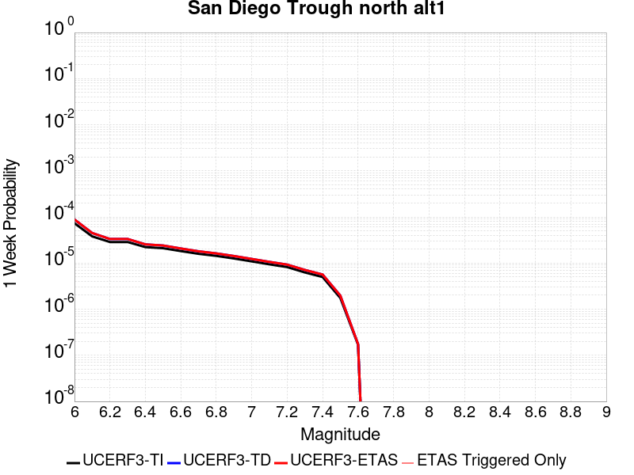 | 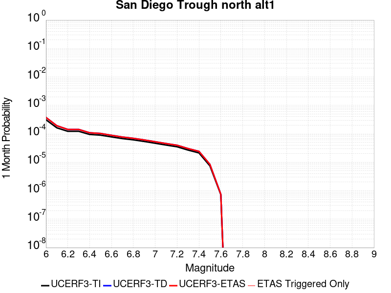 | 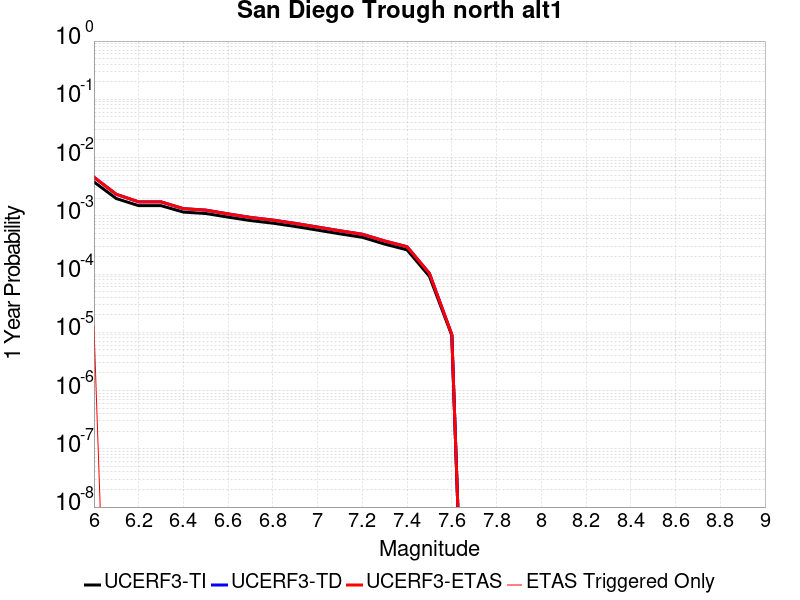 | 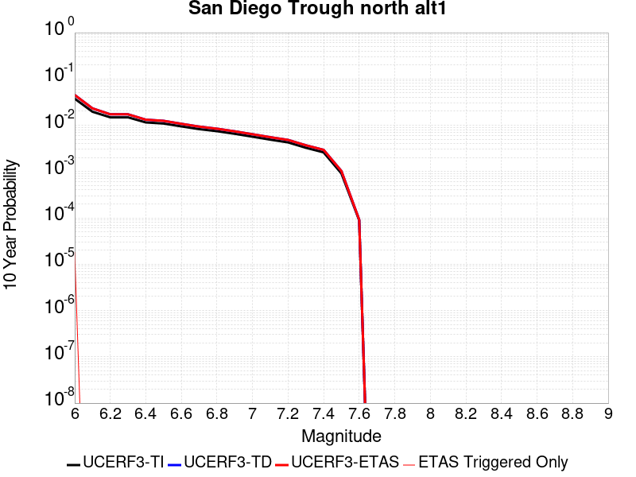 |

| Magnitude | 1 wk TI Prob | 1 wk TD Prob | 1 wk ETAS Prob | 1 wk ETAS/TD Gain | 1 wk ETAS Triggered Only | 1 mo TI Prob | 1 mo TD Prob | 1 mo ETAS Prob | 1 mo ETAS/TD Gain | 1 mo ETAS Triggered Only | 1 yr TI Prob | 1 yr TD Prob | 1 yr ETAS Prob | 1 yr ETAS/TD Gain | 1 yr ETAS Triggered Only | 10 yr TI Prob | 10 yr TD Prob | 10 yr ETAS Prob | 10 yr ETAS/TD Gain | 10 yr ETAS Triggered Only |
|-----|-----|-----|-----|-----|-----|-----|-----|-----|-----|-----|-----|-----|-----|-----|-----|-----|-----|-----|-----|-----|
| 6.0 | 7.329252E-5 | 8.823307E-5 | 8.823307E-5 | 1.0 | 0.0 | 3.14073E-4 | 3.7809057E-4 | 3.7809057E-4 | 1.0 | 0.0 | 0.0038171355 | 0.004594173 | 0.0046121404 | 1.0039109 | 1.8050541E-5 | 0.03752231 | 0.045055766 | 0.045073003 | 1.0003825 | 1.8050541E-5 |
| 6.1 | 3.7940346E-5 | 4.4895078E-5 | 4.4895078E-5 | 1.0 | 0.0 | 1.6259136E-4 | 1.9239385E-4 | 1.9239385E-4 | 1.0 | 0.0 | 0.0019777524 | 0.0023399633 | 0.0023399633 | 1.0 | 0.0 | 0.019602431 | 0.023161745 | 0.023161745 | 1.0 | 0.0 |
| 6.2 | 2.8645263E-5 | 3.330336E-5 | 3.330336E-5 | 1.0 | 0.0 | 1.2275964E-4 | 1.4272104E-4 | 1.4272104E-4 | 1.0 | 0.0 | 0.0014935739 | 0.0017362572 | 0.0017362572 | 1.0 | 0.0 | 0.0148357535 | 0.0172296 | 0.0172296 | 1.0 | 0.0 |
| 6.3 | 2.8645263E-5 | 3.330336E-5 | 3.330336E-5 | 1.0 | 0.0 | 1.2275964E-4 | 1.4272104E-4 | 1.4272104E-4 | 1.0 | 0.0 | 0.0014935739 | 0.0017362572 | 0.0017362572 | 1.0 | 0.0 | 0.0148357535 | 0.0172296 | 0.0172296 | 1.0 | 0.0 |
| 6.4 | 2.2204576E-5 | 2.545281E-5 | 2.545281E-5 | 1.0 | 0.0 | 9.5159E-5 | 1.0907897E-4 | 1.0907897E-4 | 1.0 | 0.0 | 0.001157945 | 0.0013272373 | 0.0013272373 | 1.0 | 0.0 | 0.011519298 | 0.013194264 | 0.013194264 | 1.0 | 0.0 |
| 6.5 | 2.1004838E-5 | 2.4028865E-5 | 2.4028865E-5 | 1.0 | 0.0 | 9.0017624E-5 | 1.0297684E-4 | 1.0297684E-4 | 1.0 | 0.0 | 0.0010954136 | 0.0012530311 | 0.0012530311 | 1.0 | 0.0 | 0.010900296 | 0.012460735 | 0.012460735 | 1.0 | 0.0 |
| 6.6 | 1.820557E-5 | 2.0708212E-5 | 2.0708212E-5 | 1.0 | 0.0 | 7.802154E-5 | 8.874649E-5 | 8.874649E-5 | 1.0 | 0.0 | 9.4949827E-4 | 0.0010799584 | 0.0010799584 | 1.0 | 0.0 | 0.009454516 | 0.010747772 | 0.010747772 | 1.0 | 0.0 |
| 6.7 | 1.5884485E-5 | 1.798651E-5 | 1.798651E-5 | 1.0 | 0.0 | 6.807459E-5 | 7.7082776E-5 | 7.7082776E-5 | 1.0 | 0.0 | 8.284929E-4 | 9.380814E-4 | 9.380814E-4 | 1.0 | 0.0 | 0.008254109 | 0.009341583 | 0.009341583 | 1.0 | 0.0 |
| 6.8 | 1.4331171E-5 | 1.6203609E-5 | 1.6203609E-5 | 1.0 | 0.0 | 6.141786E-5 | 6.94422E-5 | 6.94422E-5 | 1.0 | 0.0 | 7.4750587E-4 | 8.451328E-4 | 8.451328E-4 | 1.0 | 0.0 | 0.0074499645 | 0.008419455 | 0.008419455 | 1.0 | 0.0 |
| 6.9 | 1.2574203E-5 | 1.4208051E-5 | 1.4208051E-5 | 1.0 | 0.0 | 5.3888325E-5 | 6.0890234E-5 | 6.0890234E-5 | 1.0 | 0.0 | 6.558929E-4 | 7.4108783E-4 | 7.4108783E-4 | 1.0 | 0.0 | 0.0065396037 | 0.007386351 | 0.007386351 | 1.0 | 0.0 |
| 7.0 | 1.0883844E-5 | 1.2291169E-5 | 1.2291169E-5 | 1.0 | 0.0 | 4.664421E-5 | 5.267538E-5 | 5.267538E-5 | 1.0 | 0.0 | 5.677453E-4 | 6.4113503E-4 | 6.4113503E-4 | 1.0 | 0.0 | 0.00566297 | 0.006392982 | 0.006392982 | 1.0 | 0.0 |
| 7.1 | 9.393088E-6 | 1.0608669E-5 | 1.0608669E-5 | 1.0 | 0.0 | 4.025547E-5 | 4.5464934E-5 | 4.5464934E-5 | 1.0 | 0.0 | 4.900001E-4 | 5.533958E-4 | 5.533958E-4 | 1.0 | 0.0 | 0.0048892107 | 0.0055202735 | 0.0055202735 | 1.0 | 0.0 |
| 7.2 | 8.190791E-6 | 9.260078E-6 | 9.260078E-6 | 1.0 | 0.0 | 3.510292E-5 | 3.968545E-5 | 3.968545E-5 | 1.0 | 0.0 | 4.2729423E-4 | 4.830639E-4 | 4.830639E-4 | 1.0 | 0.0 | 0.0042647356 | 0.004820219 | 0.004820219 | 1.0 | 0.0 |
| 7.3 | 6.268162E-6 | 7.0908327E-6 | 7.0908327E-6 | 1.0 | 0.0 | 2.6863276E-5 | 3.0388932E-5 | 3.0388932E-5 | 1.0 | 0.0 | 3.2701128E-4 | 3.6992284E-4 | 3.6992284E-4 | 1.0 | 0.0 | 0.003265305 | 0.0036931168 | 0.0036931168 | 1.0 | 0.0 |
| 7.4 | 4.985186E-6 | 5.643576E-6 | 5.643576E-6 | 1.0 | 0.0 | 2.1364907E-5 | 2.4186533E-5 | 2.4186533E-5 | 1.0 | 0.0 | 2.600867E-4 | 2.9443164E-4 | 2.9443164E-4 | 1.0 | 0.0 | 0.002597825 | 0.0029404568 | 0.0029404568 | 1.0 | 0.0 |
| 7.5 | 1.7489613E-6 | 1.9699785E-6 | 1.9699785E-6 | 1.0 | 0.0 | 7.495527E-6 | 8.442739E-6 | 8.442739E-6 | 1.0 | 0.0 | 9.125422E-5 | 1.0278572E-4 | 1.0278572E-4 | 1.0 | 0.0 | 9.1216754E-4 | 0.0010274039 | 0.0010274039 | 1.0 | 0.0 |
| 7.6 | 1.6988751E-7 | 1.7534495E-7 | 1.7534495E-7 | 1.0 | 0.0 | 7.2808916E-7 | 7.514781E-7 | 7.514781E-7 | 1.0 | 0.0 | 8.864449E-6 | 9.14921E-6 | 9.14921E-6 | 1.0 | 0.0 | 8.8640954E-5 | 9.148853E-5 | 9.148853E-5 | 1.0 | 0.0 |

## Bullion Mountains
*[(top)](#table-of-contents)*

| 1 Week | 1 Month | 1 Year | 10 Year |
|-----|-----|-----|-----|
| 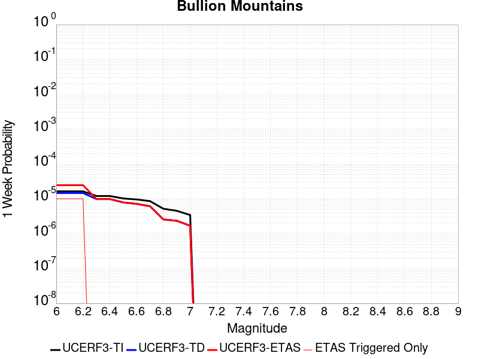 | 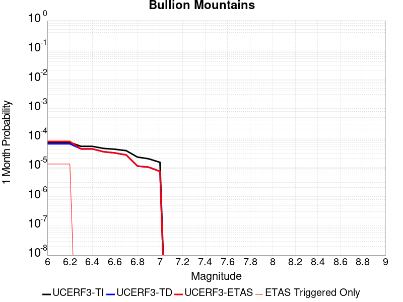 | 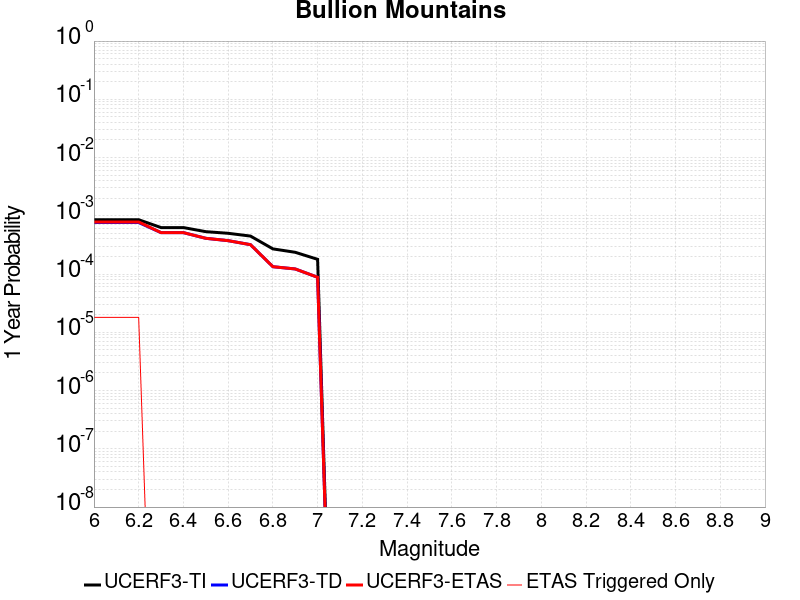 | 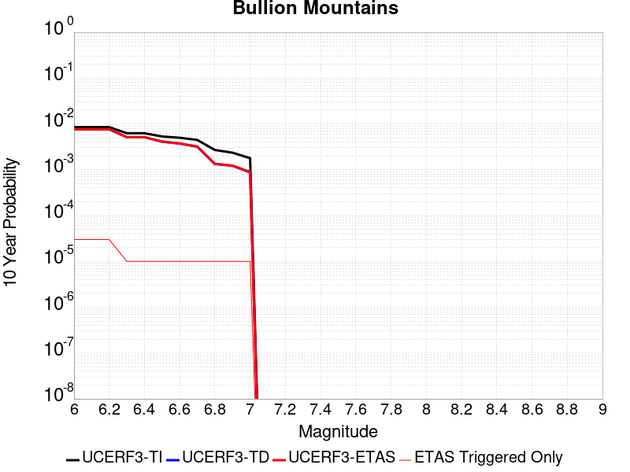 |

| Magnitude | 1 wk TI Prob | 1 wk TD Prob | 1 wk ETAS Prob | 1 wk ETAS/TD Gain | 1 wk ETAS Triggered Only | 1 mo TI Prob | 1 mo TD Prob | 1 mo ETAS Prob | 1 mo ETAS/TD Gain | 1 mo ETAS Triggered Only | 1 yr TI Prob | 1 yr TD Prob | 1 yr ETAS Prob | 1 yr ETAS/TD Gain | 1 yr ETAS Triggered Only | 10 yr TI Prob | 10 yr TD Prob | 10 yr ETAS Prob | 10 yr ETAS/TD Gain | 10 yr ETAS Triggered Only |
|-----|-----|-----|-----|-----|-----|-----|-----|-----|-----|-----|-----|-----|-----|-----|-----|-----|-----|-----|-----|-----|
| 6.0 | 1.6420427E-5 | 1.4694037E-5 | 1.4694037E-5 | 1.0 | 0.0 | 7.037136E-5 | 6.2973144E-5 | 8.102255E-5 | 1.2866206 | 1.8050541E-5 | 8.5643446E-4 | 7.6646666E-4 | 7.845034E-4 | 1.0235323 | 1.8050541E-5 | 0.008531413 | 0.007642026 | 0.0076599387 | 1.002344 | 1.8050541E-5 |
| 6.1 | 1.6420427E-5 | 1.4694037E-5 | 1.4694037E-5 | 1.0 | 0.0 | 7.037136E-5 | 6.2973144E-5 | 8.102255E-5 | 1.2866206 | 1.8050541E-5 | 8.5643446E-4 | 7.6646666E-4 | 7.845034E-4 | 1.0235323 | 1.8050541E-5 | 0.008531413 | 0.007642026 | 0.0076599387 | 1.002344 | 1.8050541E-5 |
| 6.2 | 1.6420427E-5 | 1.4694037E-5 | 1.4694037E-5 | 1.0 | 0.0 | 7.037136E-5 | 6.2973144E-5 | 8.102255E-5 | 1.2866206 | 1.8050541E-5 | 8.5643446E-4 | 7.6646666E-4 | 7.845034E-4 | 1.0235323 | 1.8050541E-5 | 0.008531413 | 0.007642026 | 0.0076599387 | 1.002344 | 1.8050541E-5 |
| 6.3 | 1.2046778E-5 | 9.863682E-6 | 9.863682E-6 | 1.0 | 0.0 | 5.1628023E-5 | 4.2272368E-5 | 4.2272368E-5 | 1.0 | 0.0 | 6.283899E-4 | 5.145677E-4 | 5.145677E-4 | 1.0 | 0.0 | 0.0062661595 | 0.0051360447 | 0.0051360447 | 1.0 | 0.0 |
| 6.4 | 1.2046778E-5 | 9.863682E-6 | 9.863682E-6 | 1.0 | 0.0 | 5.1628023E-5 | 4.2272368E-5 | 4.2272368E-5 | 1.0 | 0.0 | 6.283899E-4 | 5.145677E-4 | 5.145677E-4 | 1.0 | 0.0 | 0.0062661595 | 0.0051360447 | 0.0051360447 | 1.0 | 0.0 |
| 6.5 | 1.0244343E-5 | 7.880568E-6 | 7.880568E-6 | 1.0 | 0.0 | 4.390359E-5 | 3.377354E-5 | 3.377354E-5 | 1.0 | 0.0 | 5.343951E-4 | 4.11136E-4 | 4.11136E-4 | 1.0 | 0.0 | 0.005331118 | 0.0041057854 | 0.0041057854 | 1.0 | 0.0 |
| 6.6 | 9.605408E-6 | 7.1785234E-6 | 7.1785234E-6 | 1.0 | 0.0 | 4.1165385E-5 | 3.076485E-5 | 3.076485E-5 | 1.0 | 0.0 | 5.010733E-4 | 3.7451804E-4 | 3.7451804E-4 | 1.0 | 0.0 | 0.00499945 | 0.0037408664 | 0.0037408664 | 1.0 | 0.0 |
| 6.7 | 8.60418E-6 | 6.124902E-6 | 6.124902E-6 | 1.0 | 0.0 | 3.687454E-5 | 2.6249427E-5 | 2.6249427E-5 | 1.0 | 0.0 | 4.48855E-4 | 3.195594E-4 | 3.195594E-4 | 1.0 | 0.0 | 0.004479495 | 0.0031929112 | 0.0031929112 | 1.0 | 0.0 |
| 6.8 | 5.187994E-6 | 2.5636416E-6 | 2.5636416E-6 | 1.0 | 0.0 | 2.223407E-5 | 1.0987012E-5 | 1.0987012E-5 | 1.0 | 0.0 | 2.7066618E-4 | 1.3376265E-4 | 1.3376265E-4 | 1.0 | 0.0 | 0.0027033675 | 0.0013372131 | 0.0013372131 | 1.0 | 0.0 |
| 6.9 | 4.5302368E-6 | 2.3447276E-6 | 2.3447276E-6 | 1.0 | 0.0 | 1.9415156E-5 | 1.0048816E-5 | 1.0048816E-5 | 1.0 | 0.0 | 2.3635388E-4 | 1.2234144E-4 | 1.2234144E-4 | 1.0 | 0.0 | 0.0023610266 | 0.0012231302 | 0.0012231302 | 1.0 | 0.0 |
| 7.0 | 3.431668E-6 | 1.6885592E-6 | 1.6885592E-6 | 1.0 | 0.0 | 1.4707065E-5 | 7.2366824E-6 | 7.2366824E-6 | 1.0 | 0.0 | 1.7904381E-4 | 8.810661E-5 | 8.810661E-5 | 1.0 | 0.0 | 0.0017889962 | 8.810661E-4 | 8.810661E-4 | 1.0 | 0.0 |

## Great Valley 03a Dunnigan Hills
*[(top)](#table-of-contents)*

| 1 Week | 1 Month | 1 Year | 10 Year |
|-----|-----|-----|-----|
| 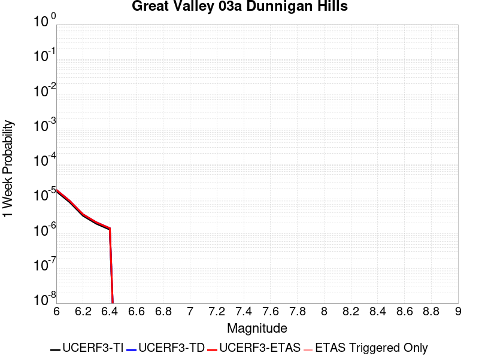 | 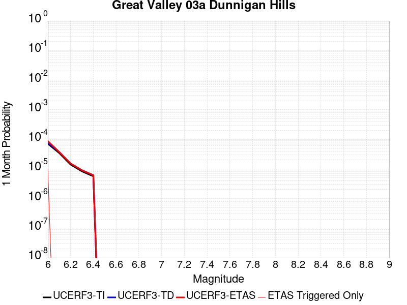 | 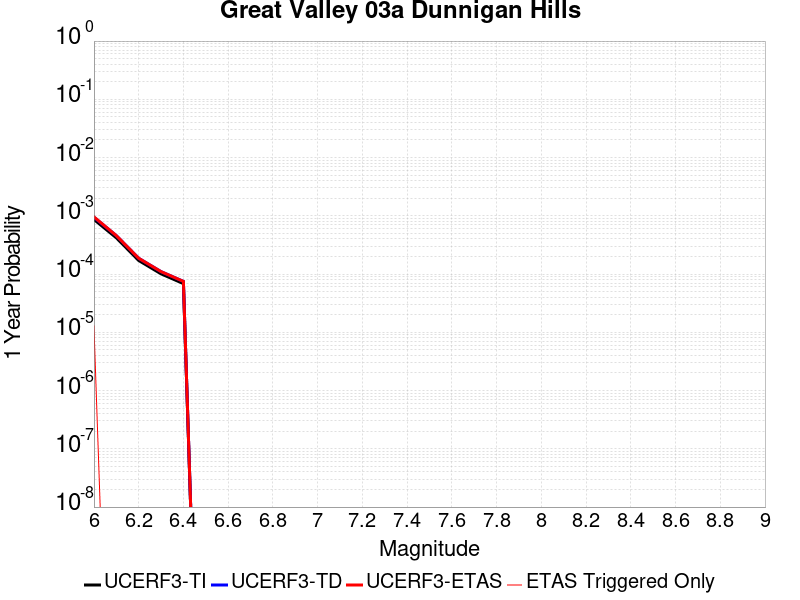 | 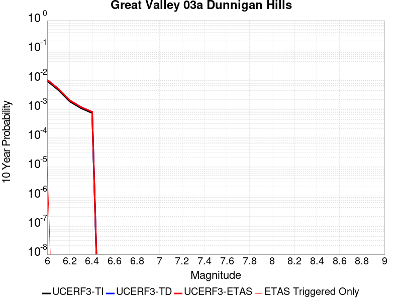 |

| Magnitude | 1 wk TI Prob | 1 wk TD Prob | 1 wk ETAS Prob | 1 wk ETAS/TD Gain | 1 wk ETAS Triggered Only | 1 mo TI Prob | 1 mo TD Prob | 1 mo ETAS Prob | 1 mo ETAS/TD Gain | 1 mo ETAS Triggered Only | 1 yr TI Prob | 1 yr TD Prob | 1 yr ETAS Prob | 1 yr ETAS/TD Gain | 1 yr ETAS Triggered Only | 10 yr TI Prob | 10 yr TD Prob | 10 yr ETAS Prob | 10 yr ETAS/TD Gain | 10 yr ETAS Triggered Only |
|-----|-----|-----|-----|-----|-----|-----|-----|-----|-----|-----|-----|-----|-----|-----|-----|-----|-----|-----|-----|-----|
| 6.0 | 1.6591328E-5 | 1.810993E-5 | 1.810993E-5 | 1.0 | 0.0 | 7.110376E-5 | 7.7612065E-5 | 9.5661206E-5 | 1.2325559 | 1.8050541E-5 | 8.6534437E-4 | 9.445864E-4 | 9.626199E-4 | 1.0190914 | 1.8050541E-5 | 0.008619824 | 0.009412548 | 0.009430429 | 1.0018997 | 1.8050541E-5 |
| 6.1 | 8.041125E-6 | 8.770675E-6 | 8.770675E-6 | 1.0 | 0.0 | 3.4461507E-5 | 3.758818E-5 | 3.758818E-5 | 1.0 | 0.0 | 4.194881E-4 | 4.5756032E-4 | 4.5756032E-4 | 1.0 | 0.0 | 0.004186971 | 0.00456818 | 0.00456818 | 1.0 | 0.0 |
| 6.2 | 3.2807004E-6 | 3.579958E-6 | 3.579958E-6 | 1.0 | 0.0 | 1.4060069E-5 | 1.534261E-5 | 1.534261E-5 | 1.0 | 0.0 | 1.7116789E-4 | 1.8678443E-4 | 1.8678443E-4 | 1.0 | 0.0 | 0.0017103611 | 0.0018666825 | 0.0018666825 | 1.0 | 0.0 |
| 6.3 | 1.9339366E-6 | 2.1106105E-6 | 2.1106105E-6 | 1.0 | 0.0 | 8.288273E-6 | 9.045459E-6 | 9.045459E-6 | 1.0 | 0.0 | 1.00905054E-4 | 1.10125744E-4 | 1.10125744E-4 | 1.0 | 0.0 | 0.0010085925 | 0.0011009917 | 0.0011009917 | 1.0 | 0.0 |
| 6.4 | 1.3142635E-6 | 1.4341425E-6 | 1.4341425E-6 | 1.0 | 0.0 | 5.6325457E-6 | 6.146325E-6 | 6.146325E-6 | 1.0 | 0.0 | 6.857408E-5 | 7.483151E-5 | 7.483151E-5 | 1.0 | 0.0 | 6.8552926E-4 | 7.483151E-4 | 7.483151E-4 | 1.0 | 0.0 |

## Calaveras (So) 2011 CFM
*[(top)](#table-of-contents)*

| 1 Week | 1 Month | 1 Year | 10 Year |
|-----|-----|-----|-----|
| 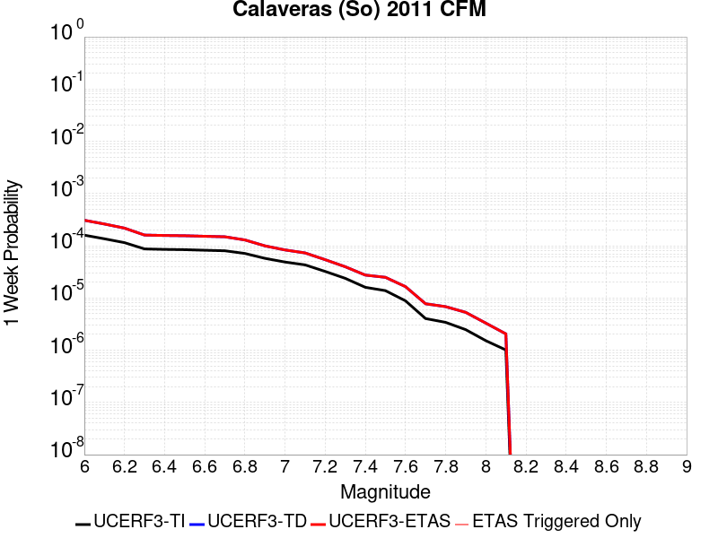 | 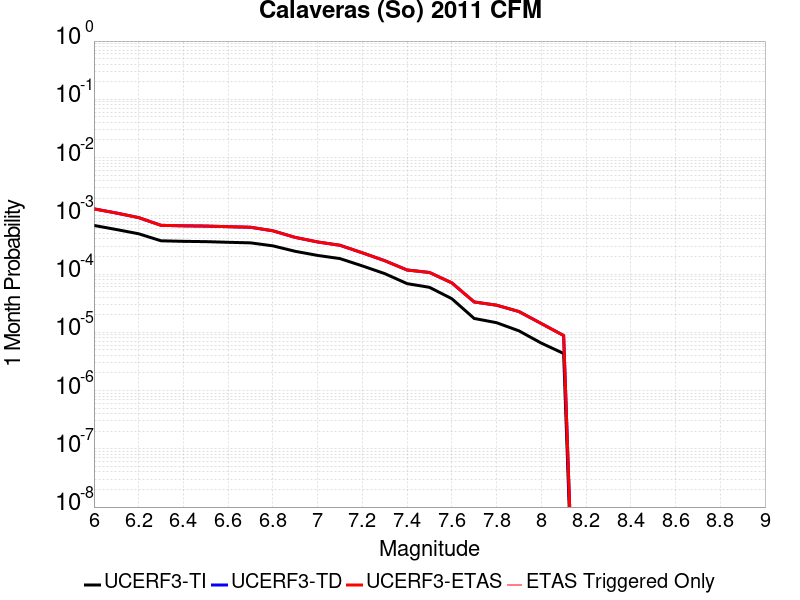 | 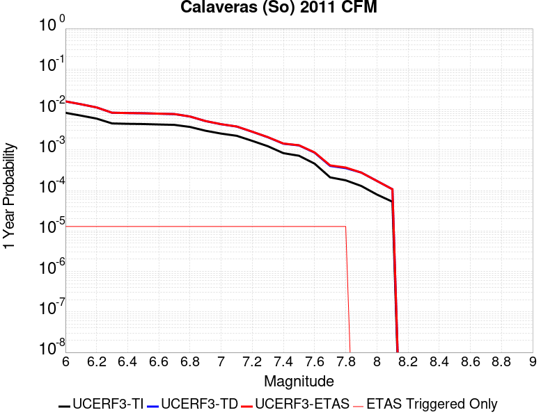 | 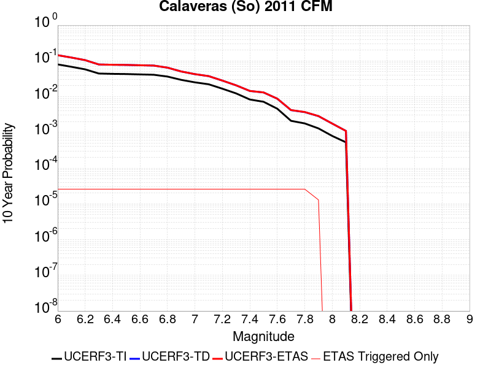 |

| Magnitude | 1 wk TI Prob | 1 wk TD Prob | 1 wk ETAS Prob | 1 wk ETAS/TD Gain | 1 wk ETAS Triggered Only | 1 mo TI Prob | 1 mo TD Prob | 1 mo ETAS Prob | 1 mo ETAS/TD Gain | 1 mo ETAS Triggered Only | 1 yr TI Prob | 1 yr TD Prob | 1 yr ETAS Prob | 1 yr ETAS/TD Gain | 1 yr ETAS Triggered Only | 10 yr TI Prob | 10 yr TD Prob | 10 yr ETAS Prob | 10 yr ETAS/TD Gain | 10 yr ETAS Triggered Only |
|-----|-----|-----|-----|-----|-----|-----|-----|-----|-----|-----|-----|-----|-----|-----|-----|-----|-----|-----|-----|-----|
| 6.0 | 1.5950744E-4 | 3.0770907E-4 | 3.0770907E-4 | 1.0 | 0.0 | 6.834242E-4 | 0.0013167071 | 0.0013167071 | 1.0 | 0.0 | 0.00828899 | 0.015871443 | 0.015889207 | 1.0011193 | 1.8050541E-5 | 0.079865426 | 0.14451823 | 0.14453366 | 1.0001068 | 1.8050541E-5 |
| 6.1 | 1.3584697E-4 | 2.6087917E-4 | 2.6087917E-4 | 1.0 | 0.0 | 5.8207137E-4 | 0.0011161877 | 0.0011161877 | 1.0 | 0.0 | 0.007063716 | 0.013473524 | 0.013491331 | 1.0013217 | 1.8050541E-5 | 0.06843361 | 0.12414188 | 0.12415769 | 1.0001273 | 1.8050541E-5 |
| 6.2 | 1.14676266E-4 | 2.1768121E-4 | 2.1768121E-4 | 1.0 | 0.0 | 4.9137714E-4 | 9.311953E-4 | 9.311953E-4 | 1.0 | 0.0 | 0.0059661185 | 0.011256177 | 0.011274024 | 1.0015856 | 1.8050541E-5 | 0.058084648 | 0.10512923 | 0.10514538 | 1.0001537 | 1.8050541E-5 |
| 6.3 | 8.691518E-5 | 1.6013955E-4 | 1.6013955E-4 | 1.0 | 0.0 | 3.7244044E-4 | 6.8604876E-4 | 6.8604876E-4 | 1.0 | 0.0 | 0.004525038 | 0.008313305 | 0.008331206 | 1.0021533 | 1.8050541E-5 | 0.044339992 | 0.07944379 | 0.079460405 | 1.0002092 | 1.8050541E-5 |
| 6.4 | 8.50982E-5 | 1.5720238E-4 | 1.5720238E-4 | 1.0 | 0.0 | 3.646556E-4 | 6.734674E-4 | 6.734674E-4 | 1.0 | 0.0 | 0.0044306475 | 0.008161281 | 0.008179184 | 1.0021937 | 1.8050541E-5 | 0.04343345 | 0.07804958 | 0.078066215 | 1.0002133 | 1.8050541E-5 |
| 6.5 | 8.4062965E-5 | 1.5544673E-4 | 1.5544673E-4 | 1.0 | 0.0 | 3.602201E-4 | 6.6594704E-4 | 6.6594704E-4 | 1.0 | 0.0 | 0.004376863 | 0.008070456 | 0.008088361 | 1.0022186 | 1.8050541E-5 | 0.042916555 | 0.07722066 | 0.07723732 | 1.0002156 | 1.8050541E-5 |
| 6.6 | 8.194716E-5 | 1.5180196E-4 | 1.5180196E-4 | 1.0 | 0.0 | 3.5115483E-4 | 6.5033446E-4 | 6.5033446E-4 | 1.0 | 0.0 | 0.0042669317 | 0.007882222 | 0.00790013 | 1.002272 | 1.8050541E-5 | 0.04185927 | 0.07550546 | 0.07552215 | 1.000221 | 1.8050541E-5 |
| 6.7 | 8.012326E-5 | 1.484775E-4 | 1.484775E-4 | 1.0 | 0.0 | 3.433402E-4 | 6.360953E-4 | 6.360953E-4 | 1.0 | 0.0 | 0.004172157 | 0.0077106548 | 0.007728566 | 1.0023229 | 1.8050541E-5 | 0.040946912 | 0.07394725 | 0.07396396 | 1.000226 | 1.8050541E-5 |
| 6.8 | 7.119773E-5 | 1.2903879E-4 | 1.2903879E-4 | 1.0 | 0.0 | 3.0509746E-4 | 5.5285945E-4 | 5.5285945E-4 | 1.0 | 0.0 | 0.0037082357 | 0.0067073535 | 0.006725283 | 1.0026731 | 1.8050541E-5 | 0.036469642 | 0.064786404 | 0.06480329 | 1.0002606 | 1.8050541E-5 |
| 6.9 | 5.7343088E-5 | 9.938692E-5 | 9.938692E-5 | 1.0 | 0.0 | 2.4573295E-4 | 4.2587487E-4 | 4.2587487E-4 | 1.0 | 0.0 | 0.0029876942 | 0.005172779 | 0.005190736 | 1.0034715 | 1.8050541E-5 | 0.02947844 | 0.050602354 | 0.05061949 | 1.0003387 | 1.8050541E-5 |
| 7.0 | 4.8746577E-5 | 8.304057E-5 | 8.304057E-5 | 1.0 | 0.0 | 2.0889717E-4 | 3.5583996E-4 | 3.5583996E-4 | 1.0 | 0.0 | 0.0025403565 | 0.004323812 | 0.004341785 | 1.0041566 | 1.8050541E-5 | 0.025115121 | 0.042576894 | 0.042594176 | 1.0004059 | 1.8050541E-5 |
| 7.1 | 4.2998014E-5 | 7.281349E-5 | 7.281349E-5 | 1.0 | 0.0 | 1.8426418E-4 | 3.1202083E-4 | 3.1202083E-4 | 1.0 | 0.0 | 0.002241108 | 0.0037922969 | 0.003810279 | 1.0047418 | 1.8050541E-5 | 0.022186412 | 0.037502397 | 0.03751977 | 1.0004632 | 1.8050541E-5 |
| 7.2 | 3.221292E-5 | 5.4062315E-5 | 5.4062315E-5 | 1.0 | 0.0 | 1.3804805E-4 | 2.3167522E-4 | 2.3167522E-4 | 1.0 | 0.0 | 0.0016794393 | 0.0028170256 | 0.0028350253 | 1.0063896 | 1.8050541E-5 | 0.016668037 | 0.028112259 | 0.028129801 | 1.0006241 | 1.8050541E-5 |
| 7.3 | 2.3756531E-5 | 3.9609546E-5 | 3.9609546E-5 | 1.0 | 0.0 | 1.0180973E-4 | 1.6974425E-4 | 1.6974425E-4 | 1.0 | 0.0 | 0.0012388286 | 0.0020646947 | 0.0020827078 | 1.0087245 | 1.8050541E-5 | 0.012319452 | 0.020711271 | 0.02072895 | 1.0008535 | 1.8050541E-5 |
| 7.4 | 1.5997684E-5 | 2.7409595E-5 | 2.7409595E-5 | 1.0 | 0.0 | 6.8559704E-5 | 1.1746441E-4 | 1.1746441E-4 | 1.0 | 0.0 | 8.343947E-4 | 0.0014291935 | 0.0014472182 | 1.0126119 | 1.8050541E-5 | 0.008312687 | 0.014409913 | 0.014427703 | 1.0012347 | 1.8050541E-5 |
| 7.5 | 1.3814293E-5 | 2.4848527E-5 | 2.4848527E-5 | 1.0 | 0.0 | 5.9202768E-5 | 1.0648935E-4 | 1.0648935E-4 | 1.0 | 0.0 | 7.205553E-4 | 0.0012957392 | 0.0013137663 | 1.0139127 | 1.8050541E-5 | 0.007182234 | 0.013087771 | 0.013105585 | 1.0013611 | 1.8050541E-5 |
| 7.6 | 8.817309E-6 | 1.6484308E-5 | 1.6484308E-5 | 1.0 | 0.0 | 3.7787922E-5 | 7.0645125E-5 | 7.0645125E-5 | 1.0 | 0.0 | 4.5997082E-4 | 8.597663E-4 | 8.778014E-4 | 1.0209767 | 1.8050541E-5 | 0.004590199 | 0.00874645 | 0.008764342 | 1.0020458 | 1.8050541E-5 |
| 7.7 | 4.0352206E-6 | 7.744532E-6 | 7.744532E-6 | 1.0 | 0.0 | 1.7293689E-5 | 3.319043E-5 | 3.319043E-5 | 1.0 | 0.0 | 2.1053031E-4 | 4.0401862E-4 | 4.220619E-4 | 1.0446595 | 1.8050541E-5 | 0.0021033096 | 0.004183419 | 0.004201394 | 1.0042968 | 1.8050541E-5 |
| 7.8 | 3.413169E-6 | 6.819858E-6 | 6.819858E-6 | 1.0 | 0.0 | 1.4627784E-5 | 2.9227635E-5 | 2.9227635E-5 | 1.0 | 0.0 | 1.7807873E-4 | 3.5578842E-4 | 3.7383253E-4 | 1.0507159 | 1.8050541E-5 | 0.0017793609 | 0.0036824015 | 0.0037003856 | 1.0048838 | 1.8050541E-5 |
| 7.9 | 2.4740732E-6 | 5.3031085E-6 | 5.3031085E-6 | 1.0 | 0.0 | 1.06031275E-5 | 2.2727409E-5 | 2.2727409E-5 | 1.0 | 0.0 | 1.2908543E-4 | 2.7667114E-4 | 2.7667114E-4 | 1.0 | 0.0 | 0.0012901047 | 0.0028464138 | 0.0028464138 | 1.0 | 0.0 |
| 8.0 | 1.5231818E-6 | 3.3029796E-6 | 3.3029796E-6 | 1.0 | 0.0 | 6.527906E-6 | 1.415555E-5 | 1.415555E-5 | 1.0 | 0.0 | 7.9474354E-5 | 1.7233023E-4 | 1.7233023E-4 | 1.0 | 0.0 | 7.944594E-4 | 0.001763339 | 0.001763339 | 1.0 | 0.0 |
| 8.1 | 1.0104524E-6 | 2.0545383E-6 | 2.0545383E-6 | 1.0 | 0.0 | 4.330503E-6 | 8.805135E-6 | 8.805135E-6 | 1.0 | 0.0 | 5.2722597E-5 | 1.0719727E-4 | 1.0719727E-4 | 1.0 | 0.0 | 5.271009E-4 | 0.0010973078 | 0.0010973078 | 1.0 | 0.0 |

## Great Valley 07 (Orestimba)
*[(top)](#table-of-contents)*

| 1 Week | 1 Month | 1 Year | 10 Year |
|-----|-----|-----|-----|
| 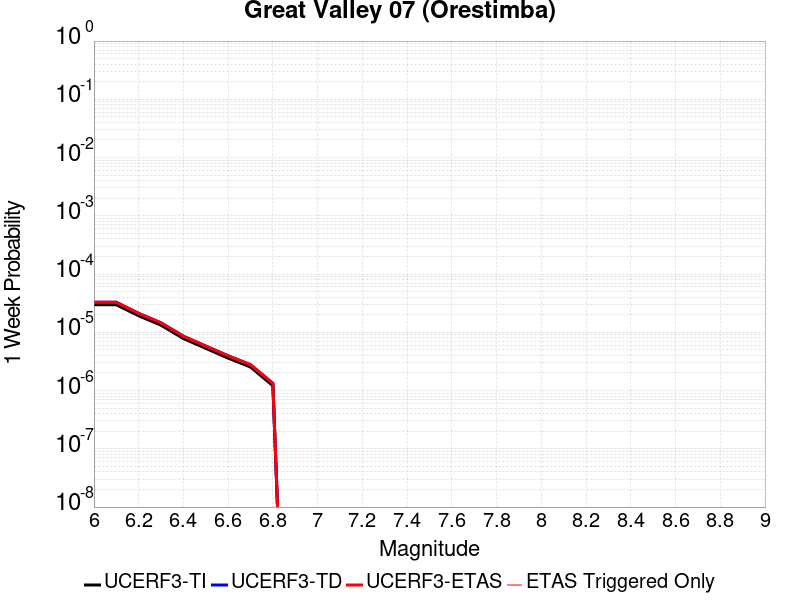 | 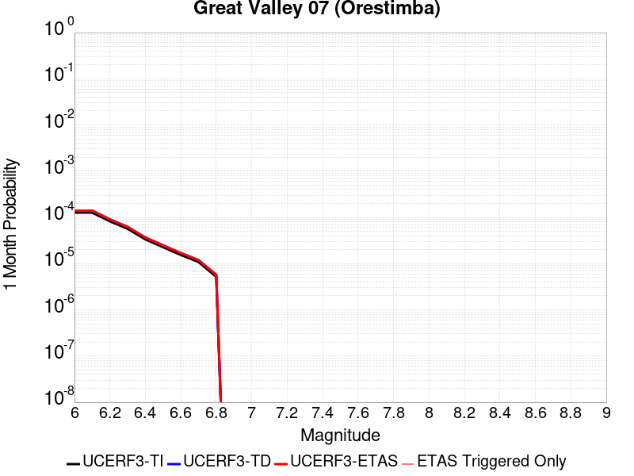 | 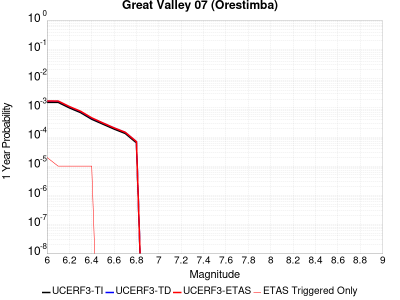 | 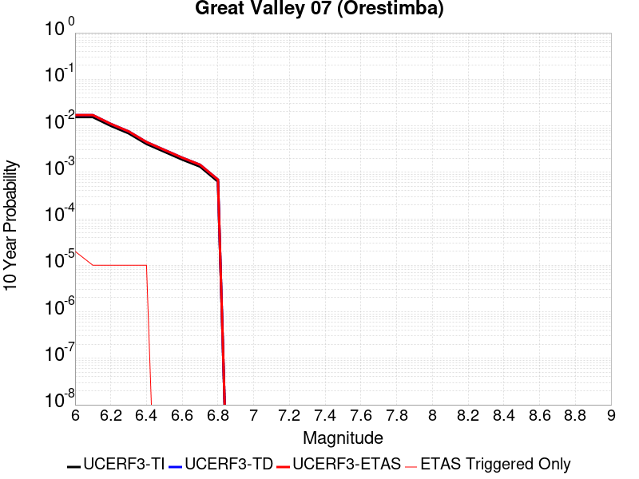 |

| Magnitude | 1 wk TI Prob | 1 wk TD Prob | 1 wk ETAS Prob | 1 wk ETAS/TD Gain | 1 wk ETAS Triggered Only | 1 mo TI Prob | 1 mo TD Prob | 1 mo ETAS Prob | 1 mo ETAS/TD Gain | 1 mo ETAS Triggered Only | 1 yr TI Prob | 1 yr TD Prob | 1 yr ETAS Prob | 1 yr ETAS/TD Gain | 1 yr ETAS Triggered Only | 10 yr TI Prob | 10 yr TD Prob | 10 yr ETAS Prob | 10 yr ETAS/TD Gain | 10 yr ETAS Triggered Only |
|-----|-----|-----|-----|-----|-----|-----|-----|-----|-----|-----|-----|-----|-----|-----|-----|-----|-----|-----|-----|-----|
| 6.0 | 2.9687902E-5 | 3.2761545E-5 | 3.2761545E-5 | 1.0 | 0.0 | 1.2722766E-4 | 1.4039947E-4 | 1.4039947E-4 | 1.0 | 0.0 | 0.0015478961 | 0.0017080952 | 0.001726115 | 1.0105495 | 1.8050541E-5 | 0.015371585 | 0.016957214 | 0.016974958 | 1.0010464 | 1.8050541E-5 |
| 6.1 | 2.9687902E-5 | 3.2761545E-5 | 3.2761545E-5 | 1.0 | 0.0 | 1.2722766E-4 | 1.4039947E-4 | 1.4039947E-4 | 1.0 | 0.0 | 0.0015478961 | 0.0017080952 | 0.0017080952 | 1.0 | 0.0 | 0.015371585 | 0.016957214 | 0.016957214 | 1.0 | 0.0 |
| 6.2 | 1.9231524E-5 | 2.1161699E-5 | 2.1161699E-5 | 1.0 | 0.0 | 8.2418206E-5 | 9.068997E-5 | 9.068997E-5 | 1.0 | 0.0 | 0.0010029797 | 0.0011036143 | 0.0011036143 | 1.0 | 0.0 | 0.00998465 | 0.010983748 | 0.010983748 | 1.0 | 0.0 |
| 6.3 | 1.324766E-5 | 1.4550239E-5 | 1.4550239E-5 | 1.0 | 0.0 | 5.6774446E-5 | 6.235673E-5 | 6.235673E-5 | 1.0 | 0.0 | 6.910097E-4 | 7.589379E-4 | 7.589379E-4 | 1.0 | 0.0 | 0.006888649 | 0.0075644073 | 0.0075644073 | 1.0 | 0.0 |
| 6.4 | 7.818645E-6 | 8.5738275E-6 | 8.5738275E-6 | 1.0 | 0.0 | 3.3508048E-5 | 3.6744477E-5 | 3.6744477E-5 | 1.0 | 0.0 | 4.078841E-4 | 4.4727552E-4 | 4.4727552E-4 | 1.0 | 0.0 | 0.004071363 | 0.0044640936 | 0.0044640936 | 1.0 | 0.0 |
| 6.5 | 5.3076565E-6 | 5.8184683E-6 | 5.8184683E-6 | 1.0 | 0.0 | 2.27469E-5 | 2.4936066E-5 | 2.4936066E-5 | 1.0 | 0.0 | 2.7690834E-4 | 3.0355642E-4 | 3.0355642E-4 | 1.0 | 0.0 | 0.0027656353 | 0.0030316273 | 0.0030316273 | 1.0 | 0.0 |
| 6.6 | 3.6003578E-6 | 3.948951E-6 | 3.948951E-6 | 1.0 | 0.0 | 1.5430012E-5 | 1.6923976E-5 | 1.6923976E-5 | 1.0 | 0.0 | 1.8784421E-4 | 2.0603149E-4 | 2.0603149E-4 | 1.0 | 0.0 | 0.0018768552 | 0.0020585589 | 0.0020585589 | 1.0 | 0.0 |
| 6.7 | 2.5361826E-6 | 2.7837918E-6 | 2.7837918E-6 | 1.0 | 0.0 | 1.0869308E-5 | 1.193049E-5 | 1.193049E-5 | 1.0 | 0.0 | 1.3232579E-4 | 1.4524536E-4 | 1.4524536E-4 | 1.0 | 0.0 | 0.0013224703 | 0.0014516342 | 0.0014516342 | 1.0 | 0.0 |
| 6.8 | 1.2115831E-6 | 1.331537E-6 | 1.331537E-6 | 1.0 | 0.0 | 5.1924885E-6 | 5.70658E-6 | 5.70658E-6 | 1.0 | 0.0 | 6.3216714E-5 | 6.9476366E-5 | 6.9476366E-5 | 1.0 | 0.0 | 6.3198735E-4 | 6.9464155E-4 | 6.9464155E-4 | 1.0 | 0.0 |

## San Joaquin Hills
*[(top)](#table-of-contents)*

| 1 Week | 1 Month | 1 Year | 10 Year |
|-----|-----|-----|-----|
| 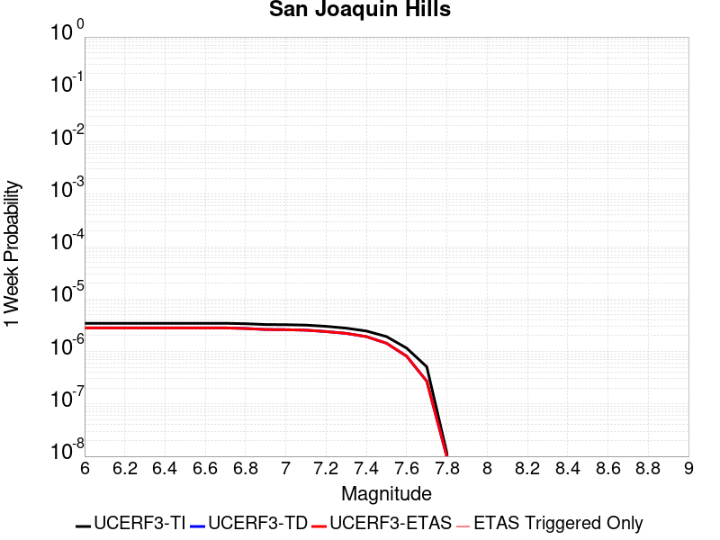 | 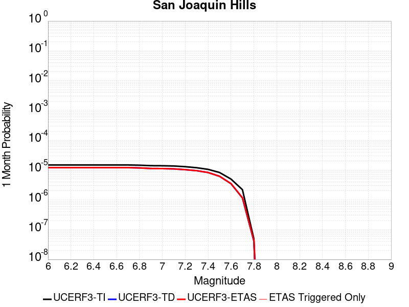 | 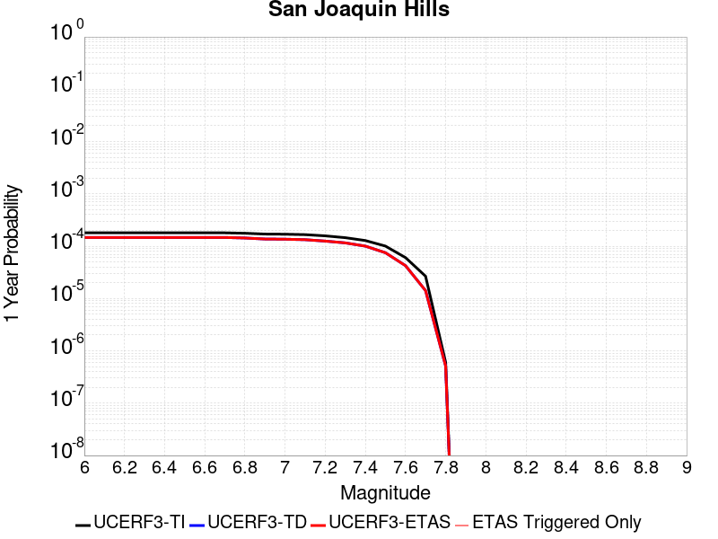 | 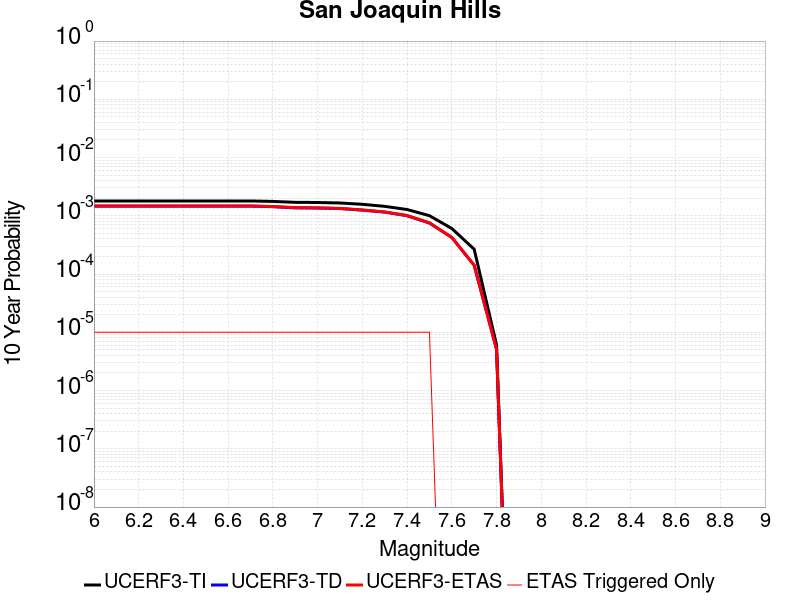 |

| Magnitude | 1 wk TI Prob | 1 wk TD Prob | 1 wk ETAS Prob | 1 wk ETAS/TD Gain | 1 wk ETAS Triggered Only | 1 mo TI Prob | 1 mo TD Prob | 1 mo ETAS Prob | 1 mo ETAS/TD Gain | 1 mo ETAS Triggered Only | 1 yr TI Prob | 1 yr TD Prob | 1 yr ETAS Prob | 1 yr ETAS/TD Gain | 1 yr ETAS Triggered Only | 10 yr TI Prob | 10 yr TD Prob | 10 yr ETAS Prob | 10 yr ETAS/TD Gain | 10 yr ETAS Triggered Only |
|-----|-----|-----|-----|-----|-----|-----|-----|-----|-----|-----|-----|-----|-----|-----|-----|-----|-----|-----|-----|-----|
| 6.0 | 3.4525704E-6 | 2.814091E-6 | 2.814091E-6 | 1.0 | 0.0 | 1.4796647E-5 | 1.20603345E-5 | 1.20603345E-5 | 1.0 | 0.0 | 1.8013427E-4 | 1.4682481E-4 | 1.4682481E-4 | 1.0 | 0.0 | 0.0017998833 | 0.0014672913 | 0.0014853154 | 1.0122839 | 1.8050541E-5 |
| 6.1 | 3.4525704E-6 | 2.814091E-6 | 2.814091E-6 | 1.0 | 0.0 | 1.4796647E-5 | 1.20603345E-5 | 1.20603345E-5 | 1.0 | 0.0 | 1.8013427E-4 | 1.4682481E-4 | 1.4682481E-4 | 1.0 | 0.0 | 0.0017998833 | 0.0014672913 | 0.0014853154 | 1.0122839 | 1.8050541E-5 |
| 6.2 | 3.4525704E-6 | 2.814091E-6 | 2.814091E-6 | 1.0 | 0.0 | 1.4796647E-5 | 1.20603345E-5 | 1.20603345E-5 | 1.0 | 0.0 | 1.8013427E-4 | 1.4682481E-4 | 1.4682481E-4 | 1.0 | 0.0 | 0.0017998833 | 0.0014672913 | 0.0014853154 | 1.0122839 | 1.8050541E-5 |
| 6.3 | 3.4525704E-6 | 2.814091E-6 | 2.814091E-6 | 1.0 | 0.0 | 1.4796647E-5 | 1.20603345E-5 | 1.20603345E-5 | 1.0 | 0.0 | 1.8013427E-4 | 1.4682481E-4 | 1.4682481E-4 | 1.0 | 0.0 | 0.0017998833 | 0.0014672913 | 0.0014853154 | 1.0122839 | 1.8050541E-5 |
| 6.4 | 3.4525704E-6 | 2.814091E-6 | 2.814091E-6 | 1.0 | 0.0 | 1.4796647E-5 | 1.20603345E-5 | 1.20603345E-5 | 1.0 | 0.0 | 1.8013427E-4 | 1.4682481E-4 | 1.4682481E-4 | 1.0 | 0.0 | 0.0017998833 | 0.0014672913 | 0.0014853154 | 1.0122839 | 1.8050541E-5 |
| 6.5 | 3.4525704E-6 | 2.814091E-6 | 2.814091E-6 | 1.0 | 0.0 | 1.4796647E-5 | 1.20603345E-5 | 1.20603345E-5 | 1.0 | 0.0 | 1.8013427E-4 | 1.4682481E-4 | 1.4682481E-4 | 1.0 | 0.0 | 0.0017998833 | 0.0014672913 | 0.0014853154 | 1.0122839 | 1.8050541E-5 |
| 6.6 | 3.4525704E-6 | 2.814091E-6 | 2.814091E-6 | 1.0 | 0.0 | 1.4796647E-5 | 1.20603345E-5 | 1.20603345E-5 | 1.0 | 0.0 | 1.8013427E-4 | 1.4682481E-4 | 1.4682481E-4 | 1.0 | 0.0 | 0.0017998833 | 0.0014672913 | 0.0014853154 | 1.0122839 | 1.8050541E-5 |
| 6.7 | 3.4525704E-6 | 2.814091E-6 | 2.814091E-6 | 1.0 | 0.0 | 1.4796647E-5 | 1.20603345E-5 | 1.20603345E-5 | 1.0 | 0.0 | 1.8013427E-4 | 1.4682481E-4 | 1.4682481E-4 | 1.0 | 0.0 | 0.0017998833 | 0.0014672913 | 0.0014853154 | 1.0122839 | 1.8050541E-5 |
| 6.8 | 3.388654E-6 | 2.7485273E-6 | 2.7485273E-6 | 1.0 | 0.0 | 1.4522722E-5 | 1.177935E-5 | 1.177935E-5 | 1.0 | 0.0 | 1.767998E-4 | 1.4340428E-4 | 1.4340428E-4 | 1.0 | 0.0 | 0.001766592 | 0.0014331302 | 0.0014511549 | 1.0125772 | 1.8050541E-5 |
| 6.9 | 3.2694352E-6 | 2.628438E-6 | 2.628438E-6 | 1.0 | 0.0 | 1.401179E-5 | 1.1264687E-5 | 1.1264687E-5 | 1.0 | 0.0 | 1.7058018E-4 | 1.3713904E-4 | 1.3713904E-4 | 1.0 | 0.0 | 0.0017044931 | 0.0013705554 | 0.0013885812 | 1.0131522 | 1.8050541E-5 |
| 7.0 | 3.246912E-6 | 2.6070943E-6 | 2.6070943E-6 | 1.0 | 0.0 | 1.39152635E-5 | 1.1173213E-5 | 1.1173213E-5 | 1.0 | 0.0 | 1.6940516E-4 | 1.360255E-4 | 1.360255E-4 | 1.0 | 0.0 | 0.0016927607 | 0.0013594336 | 0.0013774596 | 1.0132599 | 1.8050541E-5 |
| 7.1 | 3.1864927E-6 | 2.5524207E-6 | 2.5524207E-6 | 1.0 | 0.0 | 1.3656326E-5 | 1.0938901E-5 | 1.0938901E-5 | 1.0 | 0.0 | 1.6625308E-4 | 1.3317309E-4 | 1.3317309E-4 | 1.0 | 0.0 | 0.0016612876 | 0.0013309439 | 0.0013489705 | 1.0135442 | 1.8050541E-5 |
| 7.2 | 3.0220644E-6 | 2.3992632E-6 | 2.3992632E-6 | 1.0 | 0.0 | 1.295164E-5 | 1.0282516E-5 | 1.0282516E-5 | 1.0 | 0.0 | 1.576748E-4 | 1.2518255E-4 | 1.2518255E-4 | 1.0 | 0.0 | 0.0015756298 | 0.0012511307 | 0.0012691587 | 1.0144093 | 1.8050541E-5 |
| 7.3 | 2.787619E-6 | 2.217475E-6 | 2.217475E-6 | 1.0 | 0.0 | 1.1946884E-5 | 9.50343E-6 | 9.50343E-6 | 1.0 | 0.0 | 1.454436E-4 | 1.1569822E-4 | 1.1569822E-4 | 1.0 | 0.0 | 0.0014534845 | 0.0011563897 | 0.0011744193 | 1.0155914 | 1.8050541E-5 |
| 7.4 | 2.4593792E-6 | 1.9227098E-6 | 1.9227098E-6 | 1.0 | 0.0 | 1.0540153E-5 | 8.240159E-6 | 8.240159E-6 | 1.0 | 0.0 | 1.2831882E-4 | 1.0031941E-4 | 1.0031941E-4 | 1.0 | 0.0 | 0.0012824474 | 0.00100275 | 0.0010207824 | 1.017983 | 1.8050541E-5 |
| 7.5 | 1.926764E-6 | 1.4383672E-6 | 1.4383672E-6 | 1.0 | 0.0 | 8.257534E-6 | 6.164417E-6 | 6.164417E-6 | 1.0 | 0.0 | 1.00530844E-4 | 7.5049255E-5 | 7.5049255E-5 | 1.0 | 0.0 | 0.0010048538 | 7.5024547E-4 | 7.6828245E-4 | 1.0240414 | 1.8050541E-5 |
| 7.6 | 1.1609359E-6 | 8.146015E-7 | 8.146015E-7 | 1.0 | 0.0 | 4.97543E-6 | 3.491145E-6 | 3.491145E-6 | 1.0 | 0.0 | 6.0574173E-5 | 4.2503903E-5 | 4.2503903E-5 | 1.0 | 0.0 | 6.055767E-4 | 4.2496208E-4 | 4.2496208E-4 | 1.0 | 0.0 |
| 7.7 | 5.1168536E-7 | 2.7158674E-7 | 2.7158674E-7 | 1.0 | 0.0 | 2.1929354E-6 | 1.1639427E-6 | 1.1639427E-6 | 1.0 | 0.0 | 2.669866E-5 | 1.4170924E-5 | 1.4170924E-5 | 1.0 | 0.0 | 2.6695454E-4 | 1.4170156E-4 | 1.4170156E-4 | 1.0 | 0.0 |
| 7.8 | 1.16056995E-8 | 9.7825446E-9 | 9.7825446E-9 | 1.0 | 0.0 | 4.9738713E-8 | 4.192519E-8 | 4.192519E-8 | 1.0 | 0.0 | 6.0556863E-7 | 5.104392E-7 | 5.104392E-7 | 1.0 | 0.0 | 6.05567E-6 | 5.1043917E-6 | 5.1043917E-6 | 1.0 | 0.0 |

## San Gabriel (Extension)
*[(top)](#table-of-contents)*

| 1 Week | 1 Month | 1 Year | 10 Year |
|-----|-----|-----|-----|
| 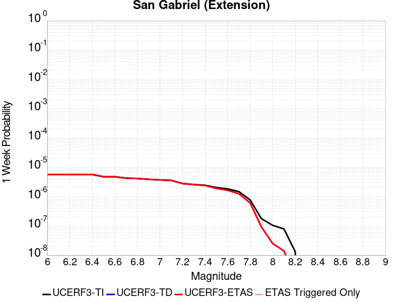 | 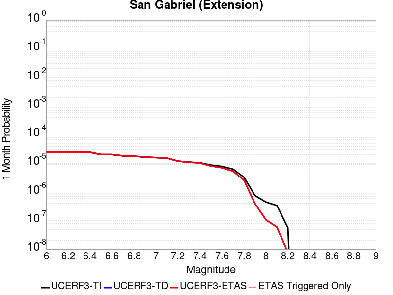 | 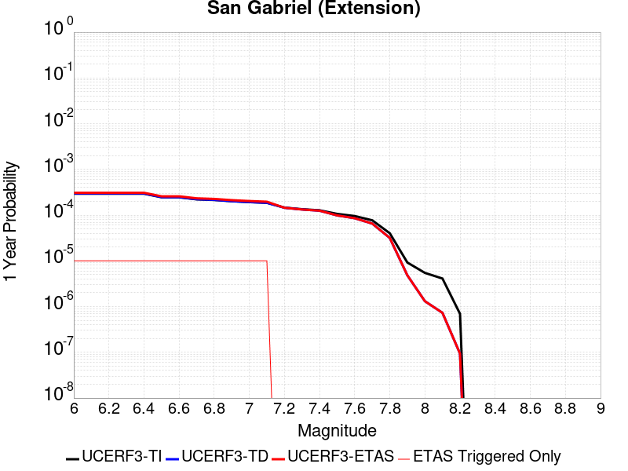 | 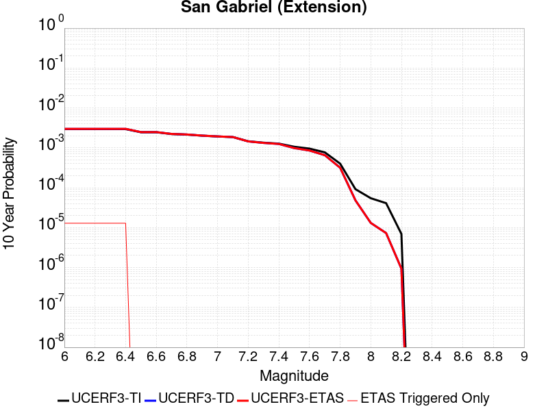 |

| Magnitude | 1 wk TI Prob | 1 wk TD Prob | 1 wk ETAS Prob | 1 wk ETAS/TD Gain | 1 wk ETAS Triggered Only | 1 mo TI Prob | 1 mo TD Prob | 1 mo ETAS Prob | 1 mo ETAS/TD Gain | 1 mo ETAS Triggered Only | 1 yr TI Prob | 1 yr TD Prob | 1 yr ETAS Prob | 1 yr ETAS/TD Gain | 1 yr ETAS Triggered Only | 10 yr TI Prob | 10 yr TD Prob | 10 yr ETAS Prob | 10 yr ETAS/TD Gain | 10 yr ETAS Triggered Only |
|-----|-----|-----|-----|-----|-----|-----|-----|-----|-----|-----|-----|-----|-----|-----|-----|-----|-----|-----|-----|-----|
| 6.0 | 5.6486106E-6 | 5.7197E-6 | 5.7197E-6 | 1.0 | 0.0 | 2.4208108E-5 | 2.4512776E-5 | 2.4512776E-5 | 1.0 | 0.0 | 2.9469383E-4 | 2.9840344E-4 | 2.9840344E-4 | 1.0 | 0.0 | 0.0029430336 | 0.002980158 | 0.0029981546 | 1.0060389 | 1.8050541E-5 |
| 6.1 | 5.6486106E-6 | 5.7197E-6 | 5.7197E-6 | 1.0 | 0.0 | 2.4208108E-5 | 2.4512776E-5 | 2.4512776E-5 | 1.0 | 0.0 | 2.9469383E-4 | 2.9840344E-4 | 2.9840344E-4 | 1.0 | 0.0 | 0.0029430336 | 0.002980158 | 0.0029981546 | 1.0060389 | 1.8050541E-5 |
| 6.2 | 5.6486106E-6 | 5.7197E-6 | 5.7197E-6 | 1.0 | 0.0 | 2.4208108E-5 | 2.4512776E-5 | 2.4512776E-5 | 1.0 | 0.0 | 2.9469383E-4 | 2.9840344E-4 | 2.9840344E-4 | 1.0 | 0.0 | 0.0029430336 | 0.002980158 | 0.0029981546 | 1.0060389 | 1.8050541E-5 |
| 6.3 | 5.6486106E-6 | 5.7197E-6 | 5.7197E-6 | 1.0 | 0.0 | 2.4208108E-5 | 2.4512776E-5 | 2.4512776E-5 | 1.0 | 0.0 | 2.9469383E-4 | 2.9840344E-4 | 2.9840344E-4 | 1.0 | 0.0 | 0.0029430336 | 0.002980158 | 0.0029981546 | 1.0060389 | 1.8050541E-5 |
| 6.4 | 5.6486106E-6 | 5.7197E-6 | 5.7197E-6 | 1.0 | 0.0 | 2.4208108E-5 | 2.4512776E-5 | 2.4512776E-5 | 1.0 | 0.0 | 2.9469383E-4 | 2.9840344E-4 | 2.9840344E-4 | 1.0 | 0.0 | 0.0029430336 | 0.002980158 | 0.0029981546 | 1.0060389 | 1.8050541E-5 |
| 6.5 | 4.7134554E-6 | 4.75709E-6 | 4.75709E-6 | 1.0 | 0.0 | 2.0200367E-5 | 2.0387373E-5 | 2.0387373E-5 | 1.0 | 0.0 | 2.459117E-4 | 2.4818885E-4 | 2.4818885E-4 | 1.0 | 0.0 | 0.0024563975 | 0.002479205 | 0.002479205 | 1.0 | 0.0 |
| 6.6 | 4.7134554E-6 | 4.75709E-6 | 4.75709E-6 | 1.0 | 0.0 | 2.0200367E-5 | 2.0387373E-5 | 2.0387373E-5 | 1.0 | 0.0 | 2.459117E-4 | 2.4818885E-4 | 2.4818885E-4 | 1.0 | 0.0 | 0.0024563975 | 0.002479205 | 0.002479205 | 1.0 | 0.0 |
| 6.7 | 4.2468837E-6 | 4.2768906E-6 | 4.2768906E-6 | 1.0 | 0.0 | 1.8200803E-5 | 1.8329407E-5 | 1.8329407E-5 | 1.0 | 0.0 | 2.2157225E-4 | 2.231384E-4 | 2.231384E-4 | 1.0 | 0.0 | 0.0022135144 | 0.0022292193 | 0.0022292193 | 1.0 | 0.0 |
| 6.8 | 4.1180615E-6 | 4.1442754E-6 | 4.1442754E-6 | 1.0 | 0.0 | 1.7648716E-5 | 1.7761064E-5 | 1.7761064E-5 | 1.0 | 0.0 | 2.1485193E-4 | 2.1622021E-4 | 2.1622021E-4 | 1.0 | 0.0 | 0.0021464431 | 0.0021601736 | 0.0021601736 | 1.0 | 0.0 |
| 6.9 | 3.863861E-6 | 3.8825815E-6 | 3.8825815E-6 | 1.0 | 0.0 | 1.65593E-5 | 1.6639533E-5 | 1.6639533E-5 | 1.0 | 0.0 | 2.0159081E-4 | 2.0256818E-4 | 2.0256818E-4 | 1.0 | 0.0 | 0.0020140803 | 0.0020239067 | 0.0020239067 | 1.0 | 0.0 |
| 7.0 | 3.6947372E-6 | 3.7084749E-6 | 3.7084749E-6 | 1.0 | 0.0 | 1.5834492E-5 | 1.589337E-5 | 1.589337E-5 | 1.0 | 0.0 | 1.9276788E-4 | 1.9348528E-4 | 1.9348528E-4 | 1.0 | 0.0 | 0.0019260074 | 0.0019332385 | 0.0019332385 | 1.0 | 0.0 |
| 7.1 | 3.5686835E-6 | 3.5756857E-6 | 3.5756857E-6 | 1.0 | 0.0 | 1.5294268E-5 | 1.5324282E-5 | 1.5324282E-5 | 1.0 | 0.0 | 1.861918E-4 | 1.8655781E-4 | 1.8655781E-4 | 1.0 | 0.0 | 0.0018603588 | 0.0018640817 | 0.0018640817 | 1.0 | 0.0 |
| 7.2 | 2.8023446E-6 | 2.7795372E-6 | 2.7795372E-6 | 1.0 | 0.0 | 1.2009994E-5 | 1.1912249E-5 | 1.1912249E-5 | 1.0 | 0.0 | 1.4621185E-4 | 1.4502209E-4 | 1.4502209E-4 | 1.0 | 0.0 | 0.001461157 | 0.0014492891 | 0.0014492891 | 1.0 | 0.0 |
| 7.3 | 2.5843012E-6 | 2.5486859E-6 | 2.5486859E-6 | 1.0 | 0.0 | 1.1075529E-5 | 1.0922895E-5 | 1.0922895E-5 | 1.0 | 0.0 | 1.3483623E-4 | 1.3297822E-4 | 1.3297822E-4 | 1.0 | 0.0 | 0.0013475444 | 0.0013290001 | 0.0013290001 | 1.0 | 0.0 |
| 7.4 | 2.4464468E-6 | 2.3993482E-6 | 2.3993482E-6 | 1.0 | 0.0 | 1.04847295E-5 | 1.0282881E-5 | 1.0282881E-5 | 1.0 | 0.0 | 1.276441E-4 | 1.2518697E-4 | 1.2518697E-4 | 1.0 | 0.0 | 0.0012757082 | 0.001251178 | 0.001251178 | 1.0 | 0.0 |
| 7.5 | 2.0420266E-6 | 1.8934157E-6 | 1.8934157E-6 | 1.0 | 0.0 | 8.751514E-6 | 8.114614E-6 | 8.114614E-6 | 1.0 | 0.0 | 1.0654447E-4 | 9.879098E-5 | 9.879098E-5 | 1.0 | 0.0 | 0.001064934 | 9.874778E-4 | 9.874778E-4 | 1.0 | 0.0 |
| 7.6 | 1.8326596E-6 | 1.6420529E-6 | 1.6420529E-6 | 1.0 | 0.0 | 7.854232E-6 | 7.0373508E-6 | 7.0373508E-6 | 1.0 | 0.0 | 9.562107E-5 | 8.56764E-5 | 8.56764E-5 | 1.0 | 0.0 | 9.5579936E-4 | 8.5643964E-4 | 8.5643964E-4 | 1.0 | 0.0 |
| 7.7 | 1.4786998E-6 | 1.2544193E-6 | 1.2544193E-6 | 1.0 | 0.0 | 6.3372695E-6 | 5.376072E-6 | 5.376072E-6 | 1.0 | 0.0 | 7.715353E-5 | 6.545172E-5 | 6.545172E-5 | 1.0 | 0.0 | 7.7126746E-4 | 6.543322E-4 | 6.543322E-4 | 1.0 | 0.0 |
| 7.8 | 7.6975533E-7 | 6.086436E-7 | 6.086436E-7 | 1.0 | 0.0 | 3.2989474E-6 | 2.6084697E-6 | 2.6084697E-6 | 1.0 | 0.0 | 4.0163945E-5 | 3.175766E-5 | 3.175766E-5 | 1.0 | 0.0 | 4.0156685E-4 | 3.175373E-4 | 3.175373E-4 | 1.0 | 0.0 |
| 7.9 | 1.7645915E-7 | 9.26102E-8 | 9.26102E-8 | 1.0 | 0.0 | 7.562533E-7 | 3.9690082E-7 | 3.9690082E-7 | 1.0 | 0.0 | 9.207345E-6 | 4.8322568E-6 | 4.8322568E-6 | 1.0 | 0.0 | 9.206964E-5 | 4.8326252E-5 | 4.8326252E-5 | 1.0 | 0.0 |
| 8.0 | 1.0463461E-7 | 2.5152435E-8 | 2.5152435E-8 | 1.0 | 0.0 | 4.4843398E-7 | 1.0779615E-7 | 1.0779615E-7 | 1.0 | 0.0 | 5.45967E-6 | 1.3124173E-6 | 1.3124173E-6 | 1.0 | 0.0 | 5.459536E-5 | 1.3128824E-5 | 1.3128824E-5 | 1.0 | 0.0 |
| 8.1 | 7.875717E-8 | 1.399983E-8 | 1.399983E-8 | 1.0 | 0.0 | 3.3753068E-7 | 5.9999266E-8 | 5.9999266E-8 | 1.0 | 0.0 | 4.109428E-6 | 7.3049085E-7 | 7.3049085E-7 | 1.0 | 0.0 | 4.109352E-5 | 7.309613E-6 | 7.309613E-6 | 1.0 | 0.0 |
| 8.2 | 1.33163E-8 | 1.792793E-9 | 1.792793E-9 | 1.0 | 0.0 | 5.7069855E-8 | 7.683398E-9 | 7.683398E-9 | 1.0 | 0.0 | 6.9482525E-7 | 9.3545374E-8 | 9.3545374E-8 | 1.0 | 0.0 | 6.9482307E-6 | 9.374375E-7 | 9.374375E-7 | 1.0 | 0.0 |

## Northridge
*[(top)](#table-of-contents)*

| 1 Week | 1 Month | 1 Year | 10 Year |
|-----|-----|-----|-----|
| 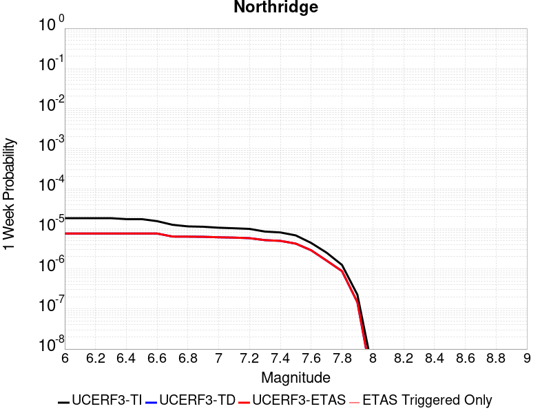 | 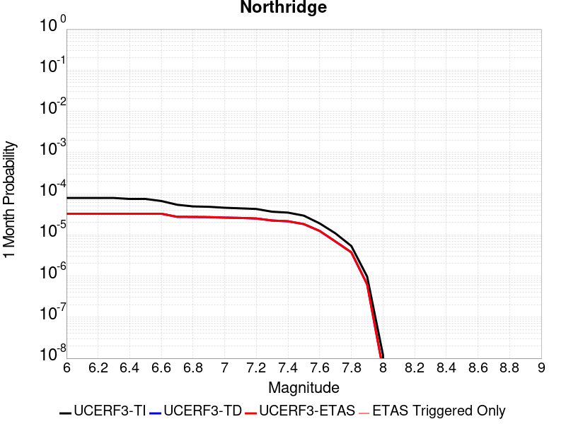 | 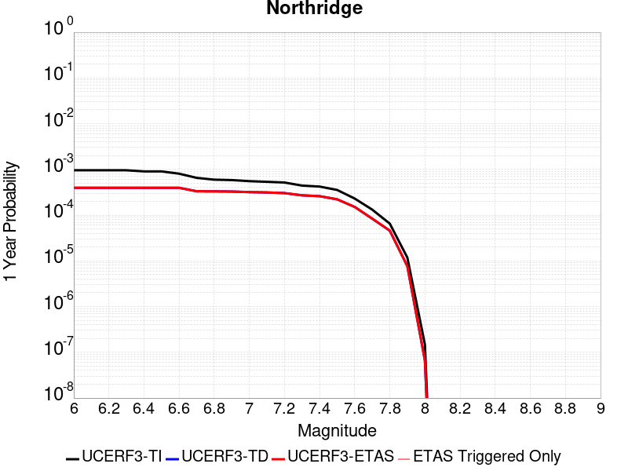 | 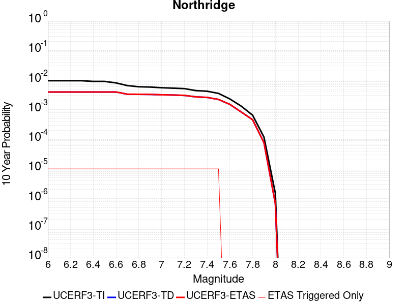 |

| Magnitude | 1 wk TI Prob | 1 wk TD Prob | 1 wk ETAS Prob | 1 wk ETAS/TD Gain | 1 wk ETAS Triggered Only | 1 mo TI Prob | 1 mo TD Prob | 1 mo ETAS Prob | 1 mo ETAS/TD Gain | 1 mo ETAS Triggered Only | 1 yr TI Prob | 1 yr TD Prob | 1 yr ETAS Prob | 1 yr ETAS/TD Gain | 1 yr ETAS Triggered Only | 10 yr TI Prob | 10 yr TD Prob | 10 yr ETAS Prob | 10 yr ETAS/TD Gain | 10 yr ETAS Triggered Only |
|-----|-----|-----|-----|-----|-----|-----|-----|-----|-----|-----|-----|-----|-----|-----|-----|-----|-----|-----|-----|-----|
| 6.0 | 1.8340852E-5 | 7.5896883E-6 | 7.5896883E-6 | 1.0 | 0.0 | 7.860128E-5 | 3.252684E-5 | 3.252684E-5 | 1.0 | 0.0 | 9.565505E-4 | 3.9594452E-4 | 3.9594452E-4 | 1.0 | 0.0 | 0.009524435 | 0.003952613 | 0.0039705923 | 1.0045487 | 1.8050541E-5 |
| 6.1 | 1.8340852E-5 | 7.5896883E-6 | 7.5896883E-6 | 1.0 | 0.0 | 7.860128E-5 | 3.252684E-5 | 3.252684E-5 | 1.0 | 0.0 | 9.565505E-4 | 3.9594452E-4 | 3.9594452E-4 | 1.0 | 0.0 | 0.009524435 | 0.003952613 | 0.0039705923 | 1.0045487 | 1.8050541E-5 |
| 6.2 | 1.8340852E-5 | 7.5896883E-6 | 7.5896883E-6 | 1.0 | 0.0 | 7.860128E-5 | 3.252684E-5 | 3.252684E-5 | 1.0 | 0.0 | 9.565505E-4 | 3.9594452E-4 | 3.9594452E-4 | 1.0 | 0.0 | 0.009524435 | 0.003952613 | 0.0039705923 | 1.0045487 | 1.8050541E-5 |
| 6.3 | 1.8340852E-5 | 7.5896883E-6 | 7.5896883E-6 | 1.0 | 0.0 | 7.860128E-5 | 3.252684E-5 | 3.252684E-5 | 1.0 | 0.0 | 9.565505E-4 | 3.9594452E-4 | 3.9594452E-4 | 1.0 | 0.0 | 0.009524435 | 0.003952613 | 0.0039705923 | 1.0045487 | 1.8050541E-5 |
| 6.4 | 1.7361892E-5 | 7.5896883E-6 | 7.5896883E-6 | 1.0 | 0.0 | 7.440598E-5 | 3.252684E-5 | 3.252684E-5 | 1.0 | 0.0 | 9.055163E-4 | 3.9594452E-4 | 3.9594452E-4 | 1.0 | 0.0 | 0.009018354 | 0.003952613 | 0.0039705923 | 1.0045487 | 1.8050541E-5 |
| 6.5 | 1.7361892E-5 | 7.5896883E-6 | 7.5896883E-6 | 1.0 | 0.0 | 7.440598E-5 | 3.252684E-5 | 3.252684E-5 | 1.0 | 0.0 | 9.055163E-4 | 3.9594452E-4 | 3.9594452E-4 | 1.0 | 0.0 | 0.009018354 | 0.003952613 | 0.0039705923 | 1.0045487 | 1.8050541E-5 |
| 6.6 | 1.5458201E-5 | 7.5896883E-6 | 7.5896883E-6 | 1.0 | 0.0 | 6.624775E-5 | 3.252684E-5 | 3.252684E-5 | 1.0 | 0.0 | 8.0626784E-4 | 3.9594452E-4 | 3.9594452E-4 | 1.0 | 0.0 | 0.008033488 | 0.003952613 | 0.0039705923 | 1.0045487 | 1.8050541E-5 |
| 6.7 | 1.2538368E-5 | 6.3830007E-6 | 6.3830007E-6 | 1.0 | 0.0 | 5.3734755E-5 | 2.7355432E-5 | 2.7355432E-5 | 1.0 | 0.0 | 6.5402425E-4 | 3.3300192E-4 | 3.3300192E-4 | 1.0 | 0.0 | 0.0065210275 | 0.0033250775 | 0.0033430678 | 1.0054106 | 1.8050541E-5 |
| 6.8 | 1.1438097E-5 | 6.3516413E-6 | 6.3516413E-6 | 1.0 | 0.0 | 4.9019498E-5 | 2.7221038E-5 | 2.7221038E-5 | 1.0 | 0.0 | 5.9664896E-4 | 3.3136617E-4 | 3.3136617E-4 | 1.0 | 0.0 | 0.005950495 | 0.0033087686 | 0.0033267594 | 1.0054374 | 1.8050541E-5 |
| 6.9 | 1.1204891E-5 | 6.2880763E-6 | 6.2880763E-6 | 1.0 | 0.0 | 4.8020076E-5 | 2.6948623E-5 | 2.6948623E-5 | 1.0 | 0.0 | 5.8448757E-4 | 3.2805052E-4 | 3.2805052E-4 | 1.0 | 0.0 | 0.0058295266 | 0.0032757102 | 0.0032937017 | 1.0054923 | 1.8050541E-5 |
| 7.0 | 1.061046E-5 | 6.116695E-6 | 6.116695E-6 | 1.0 | 0.0 | 4.5472607E-5 | 2.6214148E-5 | 2.6214148E-5 | 1.0 | 0.0 | 5.534883E-4 | 3.1911093E-4 | 3.1911093E-4 | 1.0 | 0.0 | 0.0055211177 | 0.0031865737 | 0.0032045667 | 1.0056465 | 1.8050541E-5 |
| 7.1 | 1.0266979E-5 | 6.005584E-6 | 6.005584E-6 | 1.0 | 0.0 | 4.40006E-5 | 2.5737967E-5 | 2.5737967E-5 | 1.0 | 0.0 | 5.355756E-4 | 3.133151E-4 | 3.133151E-4 | 1.0 | 0.0 | 0.0053428668 | 0.0031287798 | 0.003146774 | 1.0057511 | 1.8050541E-5 |
| 7.2 | 9.91273E-6 | 5.821269E-6 | 5.821269E-6 | 1.0 | 0.0 | 4.248244E-5 | 2.494806E-5 | 2.494806E-5 | 1.0 | 0.0 | 5.171009E-4 | 3.037007E-4 | 3.037007E-4 | 1.0 | 0.0 | 0.0051589934 | 0.0030329018 | 0.0030508975 | 1.0059335 | 1.8050541E-5 |
| 7.3 | 8.4959265E-6 | 5.1942393E-6 | 5.1942393E-6 | 1.0 | 0.0 | 3.6410605E-5 | 2.2260838E-5 | 2.2260838E-5 | 1.0 | 0.0 | 4.4320893E-4 | 2.7099223E-4 | 2.7099223E-4 | 1.0 | 0.0 | 0.00442326 | 0.0027066441 | 0.002724646 | 1.0066509 | 1.8050541E-5 |
| 7.4 | 8.0847185E-6 | 4.9829937E-6 | 4.9829937E-6 | 1.0 | 0.0 | 3.4648332E-5 | 2.1355514E-5 | 2.1355514E-5 | 1.0 | 0.0 | 4.2176177E-4 | 2.599726E-4 | 2.599726E-4 | 1.0 | 0.0 | 0.0042096223 | 0.0025967108 | 0.0026147144 | 1.0069332 | 1.8050541E-5 |
| 7.5 | 6.8220684E-6 | 4.254047E-6 | 4.254047E-6 | 1.0 | 0.0 | 2.9237108E-5 | 1.8231502E-5 | 1.8231502E-5 | 1.0 | 0.0 | 3.5590364E-4 | 2.2194613E-4 | 2.2194613E-4 | 1.0 | 0.0 | 0.0035533418 | 0.0022172658 | 0.0022352762 | 1.0081228 | 1.8050541E-5 |
| 7.6 | 4.4224143E-6 | 2.9003222E-6 | 2.9003222E-6 | 1.0 | 0.0 | 1.8953066E-5 | 1.2429894E-5 | 1.2429894E-5 | 1.0 | 0.0 | 2.3072914E-4 | 1.5132356E-4 | 1.5132356E-4 | 1.0 | 0.0 | 0.0023048974 | 0.0015122169 | 0.0015122169 | 1.0 | 0.0 |
| 7.7 | 2.5297056E-6 | 1.6047525E-6 | 1.6047525E-6 | 1.0 | 0.0 | 1.0841551E-5 | 6.877493E-6 | 6.877493E-6 | 1.0 | 0.0 | 1.319879E-4 | 8.37303E-5 | 8.37303E-5 | 1.0 | 0.0 | 0.0013190953 | 8.369923E-4 | 8.369923E-4 | 1.0 | 0.0 |
| 7.8 | 1.2508156E-6 | 8.780775E-7 | 8.780775E-7 | 1.0 | 0.0 | 5.3606273E-6 | 3.763184E-6 | 3.763184E-6 | 1.0 | 0.0 | 6.526368E-5 | 4.5815814E-5 | 4.5815814E-5 | 1.0 | 0.0 | 6.524452E-4 | 4.5806498E-4 | 4.5806498E-4 | 1.0 | 0.0 |
| 7.9 | 2.262199E-7 | 1.4667033E-7 | 1.4667033E-7 | 1.0 | 0.0 | 9.695135E-7 | 6.28587E-7 | 6.28587E-7 | 1.0 | 0.0 | 1.1803763E-5 | 7.6530205E-6 | 7.6530205E-6 | 1.0 | 0.0 | 1.1803136E-4 | 7.652765E-5 | 7.652765E-5 | 1.0 | 0.0 |
| 8.0 | 2.865362E-9 | 1.2760777E-9 | 1.2760777E-9 | 1.0 | 0.0 | 1.2280123E-8 | 5.4689044E-9 | 5.4689044E-9 | 1.0 | 0.0 | 1.4951048E-7 | 6.658391E-8 | 6.658391E-8 | 1.0 | 0.0 | 1.4951038E-6 | 6.658391E-7 | 6.658391E-7 | 1.0 | 0.0 |

## Dry Mountain
*[(top)](#table-of-contents)*

| 1 Week | 1 Month | 1 Year | 10 Year |
|-----|-----|-----|-----|
| 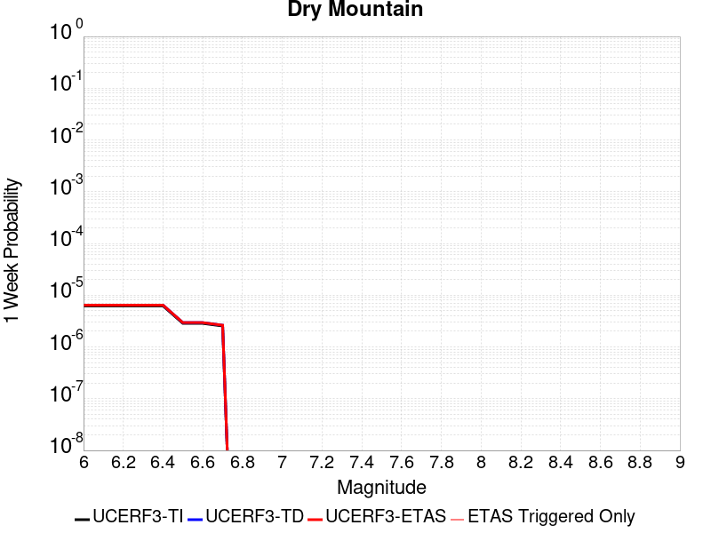 | 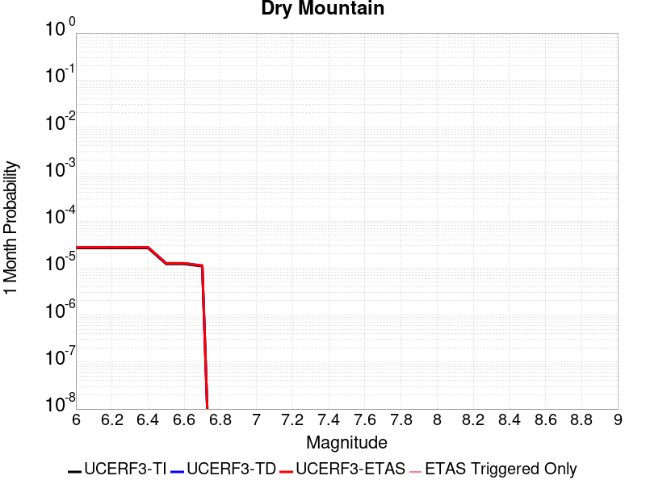 | 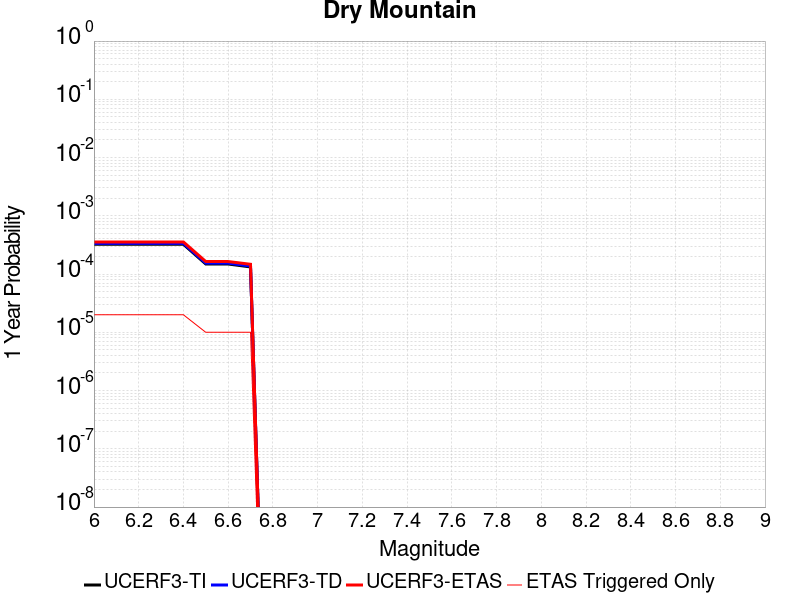 | 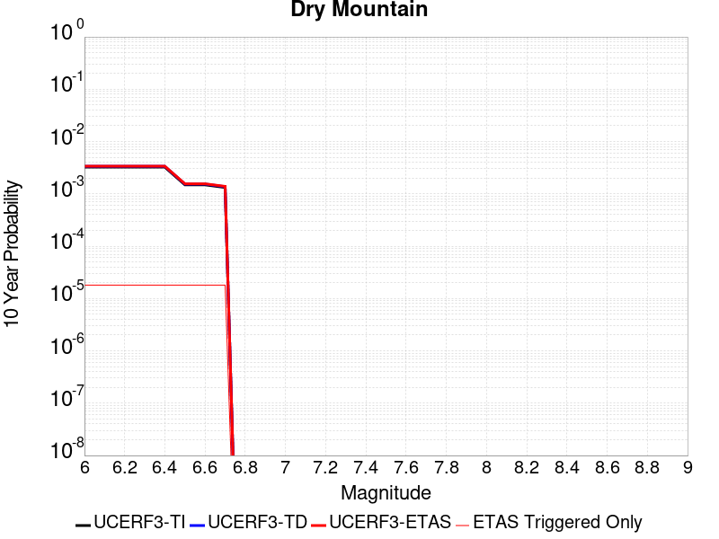 |

| Magnitude | 1 wk TI Prob | 1 wk TD Prob | 1 wk ETAS Prob | 1 wk ETAS/TD Gain | 1 wk ETAS Triggered Only | 1 mo TI Prob | 1 mo TD Prob | 1 mo ETAS Prob | 1 mo ETAS/TD Gain | 1 mo ETAS Triggered Only | 1 yr TI Prob | 1 yr TD Prob | 1 yr ETAS Prob | 1 yr ETAS/TD Gain | 1 yr ETAS Triggered Only | 10 yr TI Prob | 10 yr TD Prob | 10 yr ETAS Prob | 10 yr ETAS/TD Gain | 10 yr ETAS Triggered Only |
|-----|-----|-----|-----|-----|-----|-----|-----|-----|-----|-----|-----|-----|-----|-----|-----|-----|-----|-----|-----|-----|
| 6.0 | 6.222801E-6 | 6.4396486E-6 | 6.4396486E-6 | 1.0 | 0.0 | 2.6668875E-5 | 2.7598293E-5 | 2.7598293E-5 | 1.0 | 0.0 | 3.2464517E-4 | 3.3597334E-4 | 3.540178E-4 | 1.0537081 | 1.8050541E-5 | 0.0032417132 | 0.003356216 | 0.0033742061 | 1.0053602 | 1.8050541E-5 |
| 6.1 | 6.222801E-6 | 6.4396486E-6 | 6.4396486E-6 | 1.0 | 0.0 | 2.6668875E-5 | 2.7598293E-5 | 2.7598293E-5 | 1.0 | 0.0 | 3.2464517E-4 | 3.3597334E-4 | 3.540178E-4 | 1.0537081 | 1.8050541E-5 | 0.0032417132 | 0.003356216 | 0.0033742061 | 1.0053602 | 1.8050541E-5 |
| 6.2 | 6.222801E-6 | 6.4396486E-6 | 6.4396486E-6 | 1.0 | 0.0 | 2.6668875E-5 | 2.7598293E-5 | 2.7598293E-5 | 1.0 | 0.0 | 3.2464517E-4 | 3.3597334E-4 | 3.540178E-4 | 1.0537081 | 1.8050541E-5 | 0.0032417132 | 0.003356216 | 0.0033742061 | 1.0053602 | 1.8050541E-5 |
| 6.3 | 6.222801E-6 | 6.4396486E-6 | 6.4396486E-6 | 1.0 | 0.0 | 2.6668875E-5 | 2.7598293E-5 | 2.7598293E-5 | 1.0 | 0.0 | 3.2464517E-4 | 3.3597334E-4 | 3.540178E-4 | 1.0537081 | 1.8050541E-5 | 0.0032417132 | 0.003356216 | 0.0033742061 | 1.0053602 | 1.8050541E-5 |
| 6.4 | 6.222801E-6 | 6.4396486E-6 | 6.4396486E-6 | 1.0 | 0.0 | 2.6668875E-5 | 2.7598293E-5 | 2.7598293E-5 | 1.0 | 0.0 | 3.2464517E-4 | 3.3597334E-4 | 3.540178E-4 | 1.0537081 | 1.8050541E-5 | 0.0032417132 | 0.003356216 | 0.0033742061 | 1.0053602 | 1.8050541E-5 |
| 6.5 | 2.8528623E-6 | 2.952291E-6 | 2.952291E-6 | 1.0 | 0.0 | 1.22264955E-5 | 1.2652664E-5 | 1.2652664E-5 | 1.0 | 0.0 | 1.4884741E-4 | 1.54044E-4 | 1.7209175E-4 | 1.1171597 | 1.8050541E-5 | 0.0014874774 | 0.0015402256 | 0.0015582483 | 1.0117013 | 1.8050541E-5 |
| 6.6 | 2.8528623E-6 | 2.952291E-6 | 2.952291E-6 | 1.0 | 0.0 | 1.22264955E-5 | 1.2652664E-5 | 1.2652664E-5 | 1.0 | 0.0 | 1.4884741E-4 | 1.54044E-4 | 1.7209175E-4 | 1.1171597 | 1.8050541E-5 | 0.0014874774 | 0.0015402256 | 0.0015582483 | 1.0117013 | 1.8050541E-5 |
| 6.7 | 2.541E-6 | 2.629467E-6 | 2.629467E-6 | 1.0 | 0.0 | 1.0889954E-5 | 1.1269144E-5 | 1.1269144E-5 | 1.0 | 0.0 | 1.3257713E-4 | 1.3720183E-4 | 1.552499E-4 | 1.1315439 | 1.8050541E-5 | 0.0013249806 | 0.0013720184 | 0.0013900441 | 1.0131382 | 1.8050541E-5 |

## Imperial
*[(top)](#table-of-contents)*

| 1 Week | 1 Month | 1 Year | 10 Year |
|-----|-----|-----|-----|
| 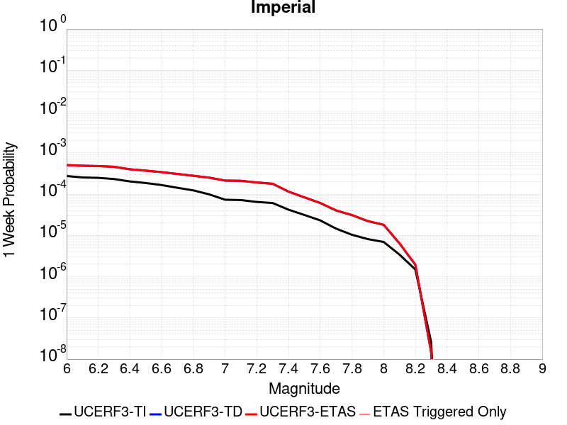 | 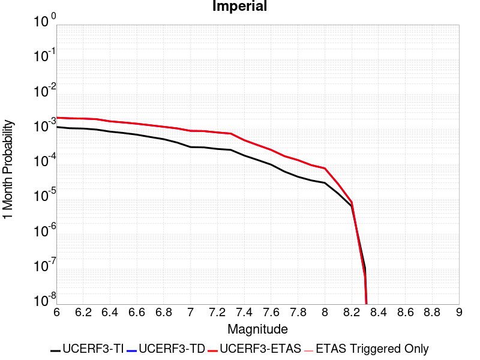 | 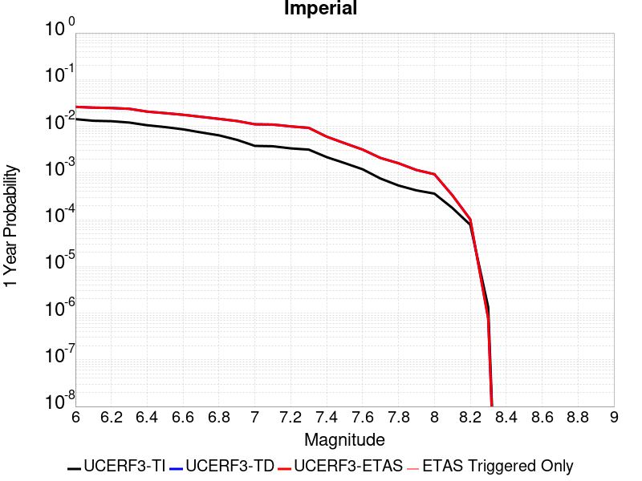 | 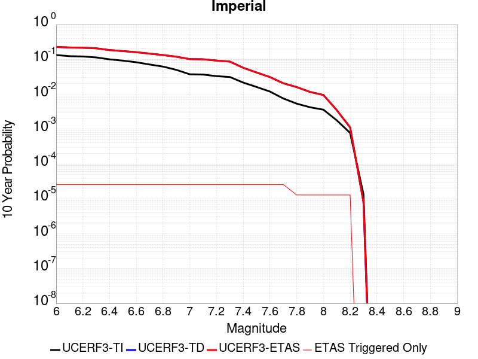 |

| Magnitude | 1 wk TI Prob | 1 wk TD Prob | 1 wk ETAS Prob | 1 wk ETAS/TD Gain | 1 wk ETAS Triggered Only | 1 mo TI Prob | 1 mo TD Prob | 1 mo ETAS Prob | 1 mo ETAS/TD Gain | 1 mo ETAS Triggered Only | 1 yr TI Prob | 1 yr TD Prob | 1 yr ETAS Prob | 1 yr ETAS/TD Gain | 1 yr ETAS Triggered Only | 10 yr TI Prob | 10 yr TD Prob | 10 yr ETAS Prob | 10 yr ETAS/TD Gain | 10 yr ETAS Triggered Only |
|-----|-----|-----|-----|-----|-----|-----|-----|-----|-----|-----|-----|-----|-----|-----|-----|-----|-----|-----|-----|-----|
| 6.0 | 2.7496446E-4 | 5.066833E-4 | 5.066833E-4 | 1.0 | 0.0 | 0.0011778869 | 0.0021697322 | 0.0021697322 | 1.0 | 0.0 | 0.0142467655 | 0.026097333 | 0.026097333 | 1.0 | 0.0 | 0.13367249 | 0.2284293 | 0.22844324 | 1.0000609 | 1.8050541E-5 |
| 6.1 | 2.5356023E-4 | 4.8757505E-4 | 4.8757505E-4 | 1.0 | 0.0 | 0.001086234 | 0.0020879724 | 0.0020879724 | 1.0 | 0.0 | 0.013144928 | 0.025122495 | 0.025122495 | 1.0 | 0.0 | 0.123940155 | 0.21982205 | 0.21983613 | 1.000064 | 1.8050541E-5 |
| 6.2 | 2.4820742E-4 | 4.785091E-4 | 4.785091E-4 | 1.0 | 0.0 | 0.0010633124 | 0.0020491795 | 0.0020491795 | 1.0 | 0.0 | 0.01286919 | 0.024661522 | 0.024661522 | 1.0 | 0.0 | 0.12148927 | 0.21632375 | 0.21633789 | 1.0000654 | 1.8050541E-5 |
| 6.3 | 2.3205351E-4 | 4.5978578E-4 | 4.5978578E-4 | 1.0 | 0.0 | 9.94136E-4 | 0.0019690592 | 0.0019690592 | 1.0 | 0.0 | 0.012036599 | 0.023705857 | 0.023705857 | 1.0 | 0.0 | 0.11405133 | 0.20824283 | 0.20825712 | 1.0000687 | 1.8050541E-5 |
| 6.4 | 2.0304754E-4 | 3.9962286E-4 | 3.9962286E-4 | 1.0 | 0.0 | 8.6991355E-4 | 0.00171156 | 0.00171156 | 1.0 | 0.0 | 0.010539869 | 0.020639168 | 0.020639168 | 1.0 | 0.0 | 0.100537635 | 0.18537728 | 0.18539198 | 1.0000793 | 1.8050541E-5 |
| 6.5 | 1.854992E-4 | 3.7068763E-4 | 3.7068763E-4 | 1.0 | 0.0 | 7.9475436E-4 | 0.0015877064 | 0.0015877064 | 1.0 | 0.0 | 0.009633281 | 0.019160163 | 0.019160163 | 1.0 | 0.0 | 0.0922623 | 0.17359401 | 0.17360893 | 1.000086 | 1.8050541E-5 |
| 6.6 | 1.6586106E-4 | 3.4107408E-4 | 3.4107408E-4 | 1.0 | 0.0 | 7.106394E-4 | 0.0014609373 | 0.0014609373 | 1.0 | 0.0 | 0.008617763 | 0.017643465 | 0.017643465 | 1.0 | 0.0 | 0.08291132 | 0.16105032 | 0.16106546 | 1.000094 | 1.8050541E-5 |
| 6.7 | 1.4224656E-4 | 3.0830092E-4 | 3.0830092E-4 | 1.0 | 0.0 | 6.094856E-4 | 0.0013206288 | 0.0013206288 | 1.0 | 0.0 | 0.0073952693 | 0.015962027 | 0.015962027 | 1.0 | 0.0 | 0.07153955 | 0.14673044 | 0.14674585 | 1.000105 | 1.8050541E-5 |
| 6.8 | 1.2317259E-4 | 2.7844362E-4 | 2.7844362E-4 | 1.0 | 0.0 | 5.2777573E-4 | 0.0011927903 | 0.0011927903 | 1.0 | 0.0 | 0.0064067547 | 0.014426913 | 0.014426913 | 1.0 | 0.0 | 0.06225166 | 0.13315095 | 0.1331666 | 1.0001175 | 1.8050541E-5 |
| 6.9 | 9.859898E-5 | 2.5054088E-4 | 2.5054088E-4 | 1.0 | 0.0 | 4.2249862E-4 | 0.0010733091 | 0.0010733091 | 1.0 | 0.0 | 0.0051317946 | 0.012990208 | 0.012990208 | 1.0 | 0.0 | 0.05014893 | 0.119568914 | 0.119584806 | 1.0001329 | 1.8050541E-5 |
| 7.0 | 7.3191884E-5 | 2.129636E-4 | 2.129636E-4 | 1.0 | 0.0 | 3.136418E-4 | 9.1238506E-4 | 9.1238506E-4 | 1.0 | 0.0 | 0.003811904 | 0.011052398 | 0.011052398 | 1.0 | 0.0 | 0.037471764 | 0.10218692 | 0.10220312 | 1.0001585 | 1.8050541E-5 |
| 7.1 | 7.1760296E-5 | 2.0997318E-4 | 2.0997318E-4 | 1.0 | 0.0 | 3.0750787E-4 | 8.995779E-4 | 8.995779E-4 | 1.0 | 0.0 | 0.003737482 | 0.010898041 | 0.010898041 | 1.0 | 0.0 | 0.03675245 | 0.10082198 | 0.10083821 | 1.0001609 | 1.8050541E-5 |
| 7.2 | 6.46614E-5 | 1.9164766E-4 | 1.9164766E-4 | 1.0 | 0.0 | 2.7709085E-4 | 8.2109164E-4 | 8.2109164E-4 | 1.0 | 0.0 | 0.0033683628 | 0.0099515915 | 0.0099515915 | 1.0 | 0.0 | 0.033177625 | 0.09262628 | 0.09264266 | 1.0001768 | 1.8050541E-5 |
| 7.3 | 6.088115E-5 | 1.7835223E-4 | 1.7835223E-4 | 1.0 | 0.0 | 2.6089314E-4 | 7.6414563E-4 | 7.6414563E-4 | 1.0 | 0.0 | 0.0031717476 | 0.009264364 | 0.009264364 | 1.0 | 0.0 | 0.031268585 | 0.08667306 | 0.08668955 | 1.0001903 | 1.8050541E-5 |
| 7.4 | 4.199346E-5 | 1.15310126E-4 | 1.15310126E-4 | 1.0 | 0.0 | 1.7995955E-4 | 4.940935E-4 | 4.940935E-4 | 1.0 | 0.0 | 0.0021888057 | 0.005999166 | 0.005999166 | 1.0 | 0.0 | 0.02167372 | 0.05753102 | 0.057548035 | 1.0002958 | 1.8050541E-5 |
| 7.5 | 3.130448E-5 | 8.350351E-5 | 8.350351E-5 | 1.0 | 0.0 | 1.3415517E-4 | 3.5782342E-4 | 3.5782342E-4 | 1.0 | 0.0 | 0.0016321153 | 0.0043478576 | 0.0043478576 | 1.0 | 0.0 | 0.016201803 | 0.04220902 | 0.04222631 | 1.0004096 | 1.8050541E-5 |
| 7.6 | 2.3074248E-5 | 6.0990296E-5 | 6.0990296E-5 | 1.0 | 0.0 | 9.888588E-5 | 2.6136092E-4 | 2.6136092E-4 | 1.0 | 0.0 | 0.0012032706 | 0.0031774496 | 0.0031774496 | 1.0 | 0.0 | 0.011967761 | 0.031092862 | 0.03111035 | 1.0005624 | 1.8050541E-5 |
| 7.7 | 1.45864815E-5 | 4.0245508E-5 | 4.0245508E-5 | 1.0 | 0.0 | 6.2511994E-5 | 1.7246937E-4 | 1.7246937E-4 | 1.0 | 0.0 | 7.608177E-4 | 0.0020977978 | 0.0020977978 | 1.0 | 0.0 | 0.007582182 | 0.020683166 | 0.020700842 | 1.0008546 | 1.8050541E-5 |
| 7.8 | 1.0352979E-5 | 3.1063657E-5 | 3.1063657E-5 | 1.0 | 0.0 | 4.4369157E-5 | 1.3312318E-4 | 1.3312318E-4 | 1.0 | 0.0 | 5.400606E-4 | 0.001619572 | 0.001619572 | 1.0 | 0.0 | 0.0053875 | 0.016063966 | 0.016063966 | 1.0 | 0.0 |
| 7.9 | 8.137906E-6 | 2.223168E-5 | 2.223168E-5 | 1.0 | 0.0 | 3.4876273E-5 | 9.527515E-5 | 9.527515E-5 | 1.0 | 0.0 | 4.2453592E-4 | 0.0011593587 | 0.0011593587 | 1.0 | 0.0 | 0.004237258 | 0.011656376 | 0.011656376 | 1.0 | 0.0 |
| 8.0 | 6.93792E-6 | 1.8079802E-5 | 1.8079802E-5 | 1.0 | 0.0 | 2.9733603E-5 | 7.748257E-5 | 7.748257E-5 | 1.0 | 0.0 | 3.6194647E-4 | 9.429428E-4 | 9.429428E-4 | 1.0 | 0.0 | 0.0036135751 | 0.009534873 | 0.009534873 | 1.0 | 0.0 |
| 8.1 | 3.4286315E-6 | 6.4129167E-6 | 6.4129167E-6 | 1.0 | 0.0 | 1.4694053E-5 | 2.7483638E-5 | 2.7483638E-5 | 1.0 | 0.0 | 1.7888541E-4 | 3.3456206E-4 | 3.3456206E-4 | 1.0 | 0.0 | 0.0017874148 | 0.0035024374 | 0.0035024374 | 1.0 | 0.0 |
| 8.2 | 1.4906886E-6 | 1.949605E-6 | 1.949605E-6 | 1.0 | 0.0 | 6.3886496E-6 | 8.355422E-6 | 8.355422E-6 | 1.0 | 0.0 | 7.7779034E-5 | 1.0172255E-4 | 1.0172255E-4 | 1.0 | 0.0 | 7.775182E-4 | 0.0011141681 | 0.0011141681 | 1.0 | 0.0 |
| 8.3 | 2.5758007E-8 | 1.4631778E-8 | 1.4631778E-8 | 1.0 | 0.0 | 1.10391454E-7 | 6.270762E-8 | 6.270762E-8 | 1.0 | 0.0 | 1.3440151E-6 | 7.6346527E-7 | 7.6346527E-7 | 1.0 | 0.0 | 1.344007E-5 | 7.957967E-6 | 7.957967E-6 | 1.0 | 0.0 |

## Hosgri (Extension)
*[(top)](#table-of-contents)*

| 1 Week | 1 Month | 1 Year | 10 Year |
|-----|-----|-----|-----|
| 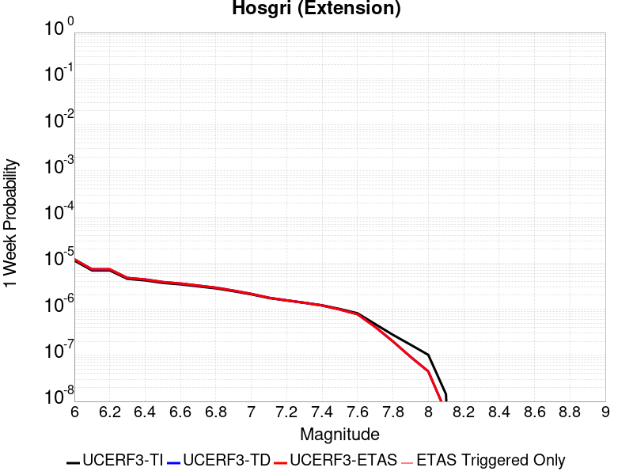 | 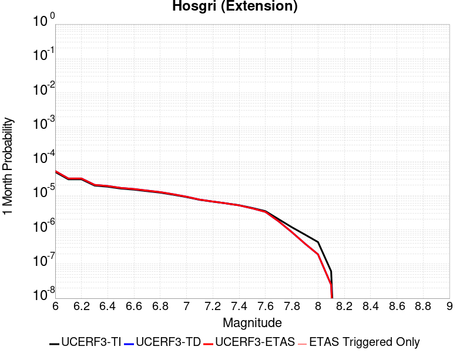 |  | 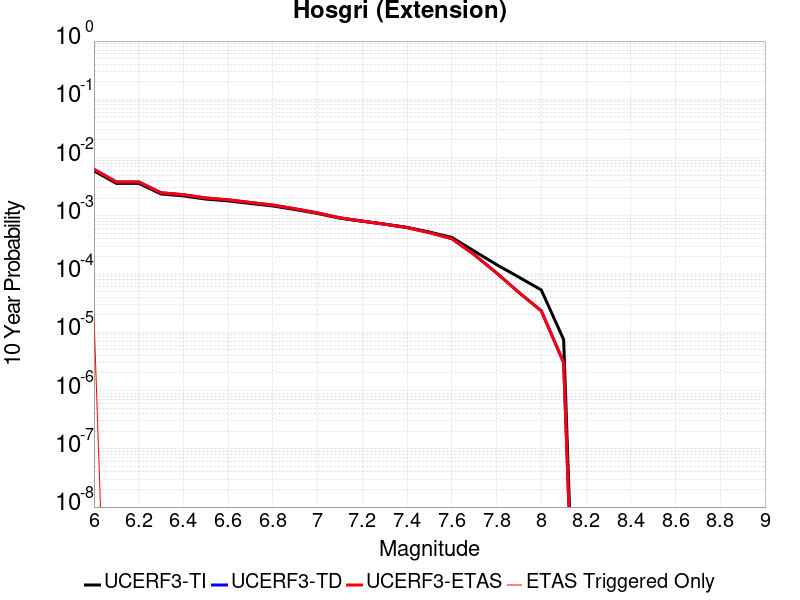 |

| Magnitude | 1 wk TI Prob | 1 wk TD Prob | 1 wk ETAS Prob | 1 wk ETAS/TD Gain | 1 wk ETAS Triggered Only | 1 mo TI Prob | 1 mo TD Prob | 1 mo ETAS Prob | 1 mo ETAS/TD Gain | 1 mo ETAS Triggered Only | 1 yr TI Prob | 1 yr TD Prob | 1 yr ETAS Prob | 1 yr ETAS/TD Gain | 1 yr ETAS Triggered Only | 10 yr TI Prob | 10 yr TD Prob | 10 yr ETAS Prob | 10 yr ETAS/TD Gain | 10 yr ETAS Triggered Only |
|-----|-----|-----|-----|-----|-----|-----|-----|-----|-----|-----|-----|-----|-----|-----|-----|-----|-----|-----|-----|-----|
| 6.0 | 1.1369135E-5 | 1.2084217E-5 | 1.2084217E-5 | 1.0 | 0.0 | 4.8723956E-5 | 5.1788604E-5 | 5.1788604E-5 | 1.0 | 0.0 | 5.9305265E-4 | 6.3036656E-4 | 6.3036656E-4 | 1.0 | 0.0 | 0.005914725 | 0.006288034 | 0.006305971 | 1.0028526 | 1.8050541E-5 |
| 6.1 | 6.934979E-6 | 7.325284E-6 | 7.325284E-6 | 1.0 | 0.0 | 2.9721E-5 | 3.139372E-5 | 3.139372E-5 | 1.0 | 0.0 | 3.617931E-4 | 3.8215567E-4 | 3.8215567E-4 | 1.0 | 0.0 | 0.0036120464 | 0.0038153979 | 0.0038153979 | 1.0 | 0.0 |
| 6.2 | 6.934979E-6 | 7.325284E-6 | 7.325284E-6 | 1.0 | 0.0 | 2.9721E-5 | 3.139372E-5 | 3.139372E-5 | 1.0 | 0.0 | 3.617931E-4 | 3.8215567E-4 | 3.8215567E-4 | 1.0 | 0.0 | 0.0036120464 | 0.0038153979 | 0.0038153979 | 1.0 | 0.0 |
| 6.3 | 4.5484676E-6 | 4.769844E-6 | 4.769844E-6 | 1.0 | 0.0 | 1.9493287E-5 | 2.044203E-5 | 2.044203E-5 | 1.0 | 0.0 | 2.3730492E-4 | 2.488537E-4 | 2.488537E-4 | 1.0 | 0.0 | 0.0023705168 | 0.002485793 | 0.002485793 | 1.0 | 0.0 |
| 6.4 | 4.218095E-6 | 4.417347E-6 | 4.417347E-6 | 1.0 | 0.0 | 1.8077424E-5 | 1.8931352E-5 | 1.8931352E-5 | 1.0 | 0.0 | 2.2007042E-4 | 2.3046516E-4 | 2.3046516E-4 | 1.0 | 0.0 | 0.002198526 | 0.002302295 | 0.002302295 | 1.0 | 0.0 |
| 6.5 | 3.717374E-6 | 3.8843223E-6 | 3.8843223E-6 | 1.0 | 0.0 | 1.5931506E-5 | 1.6646989E-5 | 1.6646989E-5 | 1.0 | 0.0 | 1.9394881E-4 | 2.0265843E-4 | 2.0265843E-4 | 1.0 | 0.0 | 0.0019377962 | 0.002024755 | 0.002024755 | 1.0 | 0.0 |
| 6.6 | 3.4605036E-6 | 3.6087267E-6 | 3.6087267E-6 | 1.0 | 0.0 | 1.4830645E-5 | 1.5465881E-5 | 1.5465881E-5 | 1.0 | 0.0 | 1.8054814E-4 | 1.8828096E-4 | 1.8828096E-4 | 1.0 | 0.0 | 0.0018040152 | 0.0018812291 | 0.0018812291 | 1.0 | 0.0 |
| 6.7 | 3.123439E-6 | 3.2469577E-6 | 3.2469577E-6 | 1.0 | 0.0 | 1.33860985E-5 | 1.3915459E-5 | 1.3915459E-5 | 1.0 | 0.0 | 1.6296357E-4 | 1.6940765E-4 | 1.6940765E-4 | 1.0 | 0.0 | 0.001628441 | 0.001692796 | 0.001692796 | 1.0 | 0.0 |
| 6.8 | 2.8290783E-6 | 2.9309015E-6 | 2.9309015E-6 | 1.0 | 0.0 | 1.2124565E-5 | 1.2560947E-5 | 1.2560947E-5 | 1.0 | 0.0 | 1.4760658E-4 | 1.5291887E-4 | 1.5291887E-4 | 1.0 | 0.0 | 0.0014750857 | 0.0015281452 | 0.0015281452 | 1.0 | 0.0 |
| 6.9 | 2.454112E-6 | 2.5286458E-6 | 2.5286458E-6 | 1.0 | 0.0 | 1.0517581E-5 | 1.0837009E-5 | 1.0837009E-5 | 1.0 | 0.0 | 1.2804402E-4 | 1.3193265E-4 | 1.3193265E-4 | 1.0 | 0.0 | 0.0012797028 | 0.0013185494 | 0.0013185494 | 1.0 | 0.0 |
| 7.0 | 2.1008145E-6 | 2.1501644E-6 | 2.1501644E-6 | 1.0 | 0.0 | 9.003459E-6 | 9.2149585E-6 | 9.2149585E-6 | 1.0 | 0.0 | 1.096116E-4 | 1.12186375E-4 | 1.12186375E-4 | 1.0 | 0.0 | 0.0010955755 | 0.0011213012 | 0.0011213012 | 1.0 | 0.0 |
| 7.1 | 1.744384E-6 | 1.7688977E-6 | 1.7688977E-6 | 1.0 | 0.0 | 7.47591E-6 | 7.580968E-6 | 7.580968E-6 | 1.0 | 0.0 | 9.1015405E-5 | 9.2294395E-5 | 9.2294395E-5 | 1.0 | 0.0 | 9.097813E-4 | 9.225624E-4 | 9.225624E-4 | 1.0 | 0.0 |
| 7.2 | 1.5456587E-6 | 1.5565333E-6 | 1.5565333E-6 | 1.0 | 0.0 | 6.6242346E-6 | 6.6708403E-6 | 6.6708403E-6 | 1.0 | 0.0 | 8.064707E-5 | 8.1214464E-5 | 8.1214464E-5 | 1.0 | 0.0 | 8.0617814E-4 | 8.118491E-4 | 8.118491E-4 | 1.0 | 0.0 |
| 7.3 | 1.3775123E-6 | 1.3768386E-6 | 1.3768386E-6 | 1.0 | 0.0 | 5.9036106E-6 | 5.9007234E-6 | 5.9007234E-6 | 1.0 | 0.0 | 7.187409E-5 | 7.183895E-5 | 7.183895E-5 | 1.0 | 0.0 | 7.185085E-4 | 7.1815826E-4 | 7.1815826E-4 | 1.0 | 0.0 |
| 7.4 | 1.214491E-6 | 1.2025621E-6 | 1.2025621E-6 | 1.0 | 0.0 | 5.2049513E-6 | 5.1538273E-6 | 5.1538273E-6 | 1.0 | 0.0 | 6.336844E-5 | 6.274605E-5 | 6.274605E-5 | 1.0 | 0.0 | 6.335037E-4 | 6.272842E-4 | 6.272842E-4 | 1.0 | 0.0 |
| 7.5 | 1.0101123E-6 | 9.844231E-7 | 9.844231E-7 | 1.0 | 0.0 | 4.3290456E-6 | 4.2189495E-6 | 4.2189495E-6 | 1.0 | 0.0 | 5.2704854E-5 | 5.1364503E-5 | 5.1364503E-5 | 1.0 | 0.0 | 5.2692357E-4 | 5.135269E-4 | 5.135269E-4 | 1.0 | 0.0 |
| 7.6 | 8.1558215E-7 | 7.7677845E-7 | 7.7677845E-7 | 1.0 | 0.0 | 3.4953473E-6 | 3.3290462E-6 | 3.3290462E-6 | 1.0 | 0.0 | 4.255502E-5 | 4.053039E-5 | 4.053039E-5 | 1.0 | 0.0 | 4.2546875E-4 | 4.052304E-4 | 4.052304E-4 | 1.0 | 0.0 |
| 7.7 | 4.757816E-7 | 4.1324043E-7 | 4.1324043E-7 | 1.0 | 0.0 | 2.0390623E-6 | 1.7710292E-6 | 1.7710292E-6 | 1.0 | 0.0 | 2.4825302E-5 | 2.156207E-5 | 2.156207E-5 | 1.0 | 0.0 | 2.482253E-4 | 2.155999E-4 | 2.155999E-4 | 1.0 | 0.0 |
| 7.8 | 2.782787E-7 | 2.0060935E-7 | 2.0060935E-7 | 1.0 | 0.0 | 1.1926223E-6 | 8.597541E-7 | 8.597541E-7 | 1.0 | 0.0 | 1.452008E-5 | 1.04674555E-5 | 1.04674555E-5 | 1.0 | 0.0 | 1.4519131E-4 | 1.0466966E-4 | 1.0466966E-4 | 1.0 | 0.0 |
| 7.9 | 1.6948086E-7 | 9.256287E-8 | 9.256287E-8 | 1.0 | 0.0 | 7.2634634E-7 | 3.9669794E-7 | 3.9669794E-7 | 1.0 | 0.0 | 8.843231E-6 | 4.829787E-6 | 4.829787E-6 | 1.0 | 0.0 | 8.842879E-5 | 4.8296824E-5 | 4.8296824E-5 | 1.0 | 0.0 |
| 8.0 | 1.0225492E-7 | 4.4826212E-8 | 4.4826212E-8 | 1.0 | 0.0 | 4.382353E-7 | 1.9211231E-7 | 1.9211231E-7 | 1.0 | 0.0 | 5.335502E-6 | 2.338965E-6 | 2.338965E-6 | 1.0 | 0.0 | 5.335374E-5 | 2.3389406E-5 | 2.3389406E-5 | 1.0 | 0.0 |
| 8.1 | 1.43711345E-8 | 5.8012564E-9 | 5.8012564E-9 | 1.0 | 0.0 | 6.1590576E-8 | 2.4862526E-8 | 2.4862526E-8 | 1.0 | 0.0 | 7.4986497E-7 | 3.0270124E-7 | 3.0270124E-7 | 1.0 | 0.0 | 7.4986247E-6 | 3.0270087E-6 | 3.0270087E-6 | 1.0 | 0.0 |

## Brawley (Seismic Zone) alt 1
*[(top)](#table-of-contents)*

| 1 Week | 1 Month | 1 Year | 10 Year |
|-----|-----|-----|-----|
| 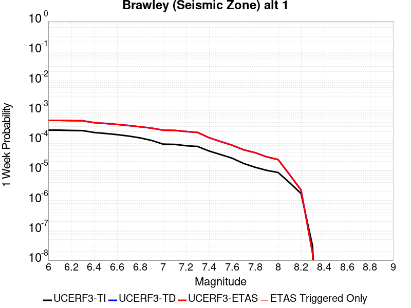 | 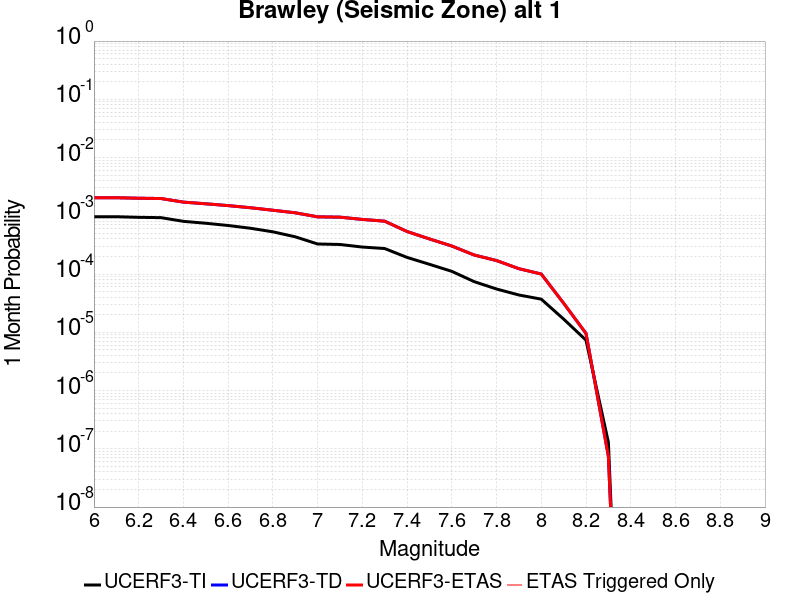 | 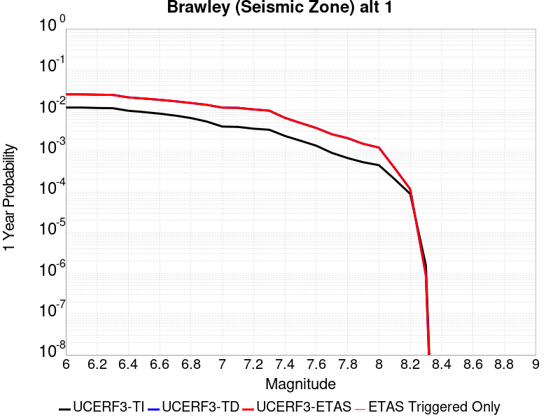 | 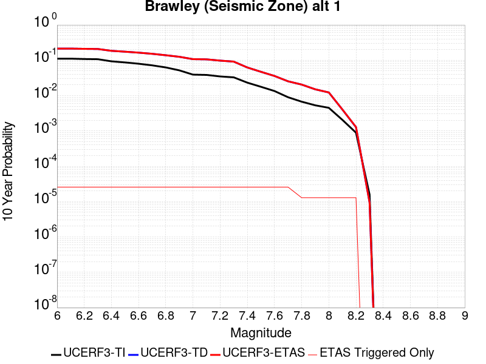 |

| Magnitude | 1 wk TI Prob | 1 wk TD Prob | 1 wk ETAS Prob | 1 wk ETAS/TD Gain | 1 wk ETAS Triggered Only | 1 mo TI Prob | 1 mo TD Prob | 1 mo ETAS Prob | 1 mo ETAS/TD Gain | 1 mo ETAS Triggered Only | 1 yr TI Prob | 1 yr TD Prob | 1 yr ETAS Prob | 1 yr ETAS/TD Gain | 1 yr ETAS Triggered Only | 10 yr TI Prob | 10 yr TD Prob | 10 yr ETAS Prob | 10 yr ETAS/TD Gain | 10 yr ETAS Triggered Only |
|-----|-----|-----|-----|-----|-----|-----|-----|-----|-----|-----|-----|-----|-----|-----|-----|-----|-----|-----|-----|-----|
| 6.0 | 2.2521618E-4 | 4.771222E-4 | 4.771222E-4 | 1.0 | 0.0 | 9.6485513E-4 | 0.0020432442 | 0.0020432442 | 1.0 | 0.0 | 0.011683988 | 0.024586778 | 0.024586778 | 1.0 | 0.0 | 0.11088423 | 0.21377377 | 0.21378796 | 1.0000664 | 1.8050541E-5 |
| 6.1 | 2.2521618E-4 | 4.771222E-4 | 4.771222E-4 | 1.0 | 0.0 | 9.6485513E-4 | 0.0020432442 | 0.0020432442 | 1.0 | 0.0 | 0.011683988 | 0.024586778 | 0.024586778 | 1.0 | 0.0 | 0.11088423 | 0.21377377 | 0.21378796 | 1.0000664 | 1.8050541E-5 |
| 6.2 | 2.198148E-4 | 4.6794806E-4 | 4.6794806E-4 | 1.0 | 0.0 | 9.417233E-4 | 0.002003987 | 0.002003987 | 1.0 | 0.0 | 0.011405343 | 0.024120044 | 0.024120044 | 1.0 | 0.0 | 0.10837428 | 0.21020597 | 0.21022023 | 1.0000678 | 1.8050541E-5 |
| 6.3 | 2.1704129E-4 | 4.62302E-4 | 4.62302E-4 | 1.0 | 0.0 | 9.298453E-4 | 0.0019798267 | 0.0019798267 | 1.0 | 0.0 | 0.011262234 | 0.023833068 | 0.023833068 | 1.0 | 0.0 | 0.107082725 | 0.20809688 | 0.20811117 | 1.0000687 | 1.8050541E-5 |
| 6.4 | 1.876142E-4 | 4.0119994E-4 | 4.0119994E-4 | 1.0 | 0.0 | 8.038131E-4 | 0.0017183097 | 0.0017183097 | 1.0 | 0.0 | 0.00974259 | 0.020718765 | 0.020718765 | 1.0 | 0.0 | 0.093263686 | 0.18484865 | 0.18486336 | 1.0000796 | 1.8050541E-5 |
| 6.5 | 1.7390939E-4 | 3.7549343E-4 | 3.7549343E-4 | 1.0 | 0.0 | 7.45113E-4 | 0.0016082773 | 0.0016082773 | 1.0 | 0.0 | 0.009034078 | 0.0194057 | 0.0194057 | 1.0 | 0.0 | 0.086755216 | 0.17466567 | 0.17468058 | 1.0000852 | 1.8050541E-5 |
| 6.6 | 1.591791E-4 | 3.4960467E-4 | 3.4960467E-4 | 1.0 | 0.0 | 6.8201777E-4 | 0.0014974555 | 0.0014974555 | 1.0 | 0.0 | 0.008271996 | 0.018080678 | 0.018080678 | 1.0 | 0.0 | 0.07970774 | 0.16406548 | 0.16408058 | 1.0000919 | 1.8050541E-5 |
| 6.7 | 1.4268003E-4 | 3.2122564E-4 | 3.2122564E-4 | 1.0 | 0.0 | 6.1134255E-4 | 0.0013759632 | 0.0013759632 | 1.0 | 0.0 | 0.007417723 | 0.01662564 | 0.01662564 | 1.0 | 0.0 | 0.07174956 | 0.15218034 | 0.15219565 | 1.0001006 | 1.8050541E-5 |
| 6.8 | 1.239713E-4 | 2.9108205E-4 | 2.9108205E-4 | 1.0 | 0.0 | 5.3119735E-4 | 0.0012469043 | 0.0012469043 | 1.0 | 0.0 | 0.0064481674 | 0.015076824 | 0.015076824 | 1.0 | 0.0 | 0.06264243 | 0.13859418 | 0.13860972 | 1.0001122 | 1.8050541E-5 |
| 6.9 | 1.0180238E-4 | 2.6296644E-4 | 2.6296644E-4 | 1.0 | 0.0 | 4.3622297E-4 | 0.0011265165 | 0.0011265165 | 1.0 | 0.0 | 0.005298089 | 0.01363009 | 0.01363009 | 1.0 | 0.0 | 0.05173543 | 0.12513301 | 0.1251488 | 1.0001262 | 1.8050541E-5 |
| 7.0 | 7.6619996E-5 | 2.2431482E-4 | 2.2431482E-4 | 1.0 | 0.0 | 3.283301E-4 | 9.6099824E-4 | 9.6099824E-4 | 1.0 | 0.0 | 0.0039900932 | 0.011638097 | 0.011638097 | 1.0 | 0.0 | 0.039192066 | 0.10739882 | 0.10741494 | 1.00015 | 1.8050541E-5 |
| 7.1 | 7.5127435E-5 | 2.2114236E-4 | 2.2114236E-4 | 1.0 | 0.0 | 3.2193496E-4 | 9.4741187E-4 | 9.4741187E-4 | 1.0 | 0.0 | 0.0039125155 | 0.011474437 | 0.011474437 | 1.0 | 0.0 | 0.038443442 | 0.10596137 | 0.105977505 | 1.0001523 | 1.8050541E-5 |
| 7.2 | 6.788582E-5 | 2.0240863E-4 | 2.0240863E-4 | 1.0 | 0.0 | 2.9090676E-4 | 8.671802E-4 | 8.671802E-4 | 1.0 | 0.0 | 0.0035360386 | 0.0105074495 | 0.0105074495 | 1.0 | 0.0 | 0.034803 | 0.09762873 | 0.097645015 | 1.0001669 | 1.8050541E-5 |
| 7.3 | 6.399602E-5 | 1.8870534E-4 | 1.8870534E-4 | 1.0 | 0.0 | 2.7423984E-4 | 8.084894E-4 | 8.084894E-4 | 1.0 | 0.0 | 0.0033337586 | 0.009799523 | 0.009799523 | 1.0 | 0.0 | 0.03284188 | 0.09151949 | 0.09153589 | 1.0001792 | 1.8050541E-5 |
| 7.4 | 4.506759E-5 | 1.2552422E-4 | 1.2552422E-4 | 1.0 | 0.0 | 1.9313251E-4 | 5.378509E-4 | 5.378509E-4 | 1.0 | 0.0 | 0.0023488526 | 0.006528849 | 0.006528849 | 1.0 | 0.0 | 0.023241805 | 0.06246553 | 0.062482454 | 1.000271 | 1.8050541E-5 |
| 7.5 | 3.43289E-5 | 9.35504E-5 | 9.35504E-5 | 1.0 | 0.0 | 1.4711556E-4 | 4.00869E-4 | 4.00869E-4 | 1.0 | 0.0 | 0.0017896603 | 0.0048697204 | 0.0048697204 | 1.0 | 0.0 | 0.01775316 | 0.047143027 | 0.047160227 | 1.0003648 | 1.8050541E-5 |
| 7.6 | 2.5980507E-5 | 7.070207E-5 | 7.070207E-5 | 1.0 | 0.0 | 1.1134028E-4 | 3.0297384E-4 | 3.0297384E-4 | 1.0 | 0.0 | 0.001354725 | 0.0036824916 | 0.0036824916 | 1.0 | 0.0 | 0.013464959 | 0.03591824 | 0.03593564 | 1.0004845 | 1.8050541E-5 |
| 7.7 | 1.7292105E-5 | 4.9553288E-5 | 4.9553288E-5 | 1.0 | 0.0 | 7.4106916E-5 | 2.1235397E-4 | 2.1235397E-4 | 1.0 | 0.0 | 9.018782E-4 | 0.00258235 | 0.00258235 | 1.0 | 0.0 | 0.008982267 | 0.025356812 | 0.025374405 | 1.0006938 | 1.8050541E-5 |
| 7.8 | 1.2927471E-5 | 3.9820385E-5 | 3.9820385E-5 | 1.0 | 0.0 | 5.5402274E-5 | 1.7064765E-4 | 1.7064765E-4 | 1.0 | 0.0 | 6.743139E-4 | 0.002075658 | 0.002075658 | 1.0 | 0.0 | 0.0067227143 | 0.02048962 | 0.02048962 | 1.0 | 0.0 |
| 7.9 | 1.0200774E-5 | 2.8848537E-5 | 2.8848537E-5 | 1.0 | 0.0 | 4.371687E-5 | 1.2363073E-4 | 1.2363073E-4 | 1.0 | 0.0 | 5.321229E-4 | 0.0015041659 | 0.0015041659 | 1.0 | 0.0 | 0.005308505 | 0.015039214 | 0.015039214 | 1.0 | 0.0 |
| 8.0 | 8.650396E-6 | 2.33656E-5 | 2.33656E-5 | 1.0 | 0.0 | 3.70726E-5 | 1.0013444E-4 | 1.0013444E-4 | 1.0 | 0.0 | 4.5126543E-4 | 0.0012184558 | 0.0012184558 | 1.0 | 0.0 | 0.0045035016 | 0.012252202 | 0.012252202 | 1.0 | 0.0 |
| 8.1 | 3.9368224E-6 | 7.3658916E-6 | 7.3658916E-6 | 1.0 | 0.0 | 1.6871985E-5 | 3.1567724E-5 | 3.1567724E-5 | 1.0 | 0.0 | 2.0539707E-4 | 3.842694E-4 | 3.842694E-4 | 1.0 | 0.0 | 0.0020520731 | 0.004019988 | 0.004019988 | 1.0 | 0.0 |
| 8.2 | 1.7101195E-6 | 2.232734E-6 | 2.232734E-6 | 1.0 | 0.0 | 7.329063E-6 | 9.568825E-6 | 9.568825E-6 | 1.0 | 0.0 | 8.922769E-5 | 1.1649425E-4 | 1.1649425E-4 | 1.0 | 0.0 | 8.9191867E-4 | 0.0012742957 | 0.0012742957 | 1.0 | 0.0 |
| 8.3 | 3.0346666E-8 | 1.7371274E-8 | 1.7371274E-8 | 1.0 | 0.0 | 1.3005713E-7 | 7.444832E-8 | 7.444832E-8 | 1.0 | 0.0 | 1.5834444E-6 | 9.0640816E-7 | 9.0640816E-7 | 1.0 | 0.0 | 1.5834332E-5 | 9.450596E-6 | 9.450596E-6 | 1.0 | 0.0 |

## Blue Cut
*[(top)](#table-of-contents)*

| 1 Week | 1 Month | 1 Year | 10 Year |
|-----|-----|-----|-----|
| 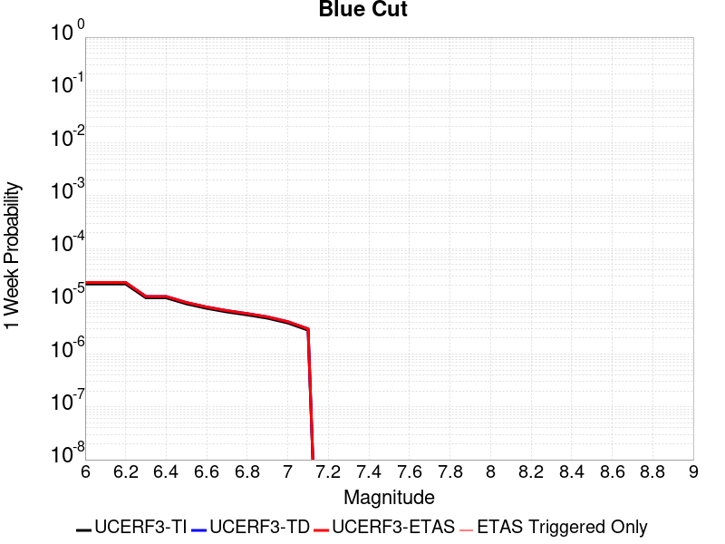 | 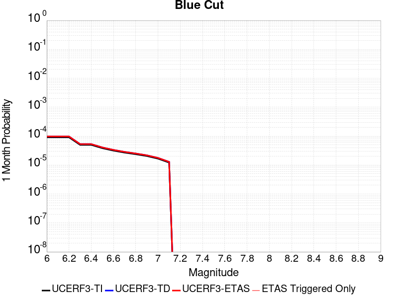 | 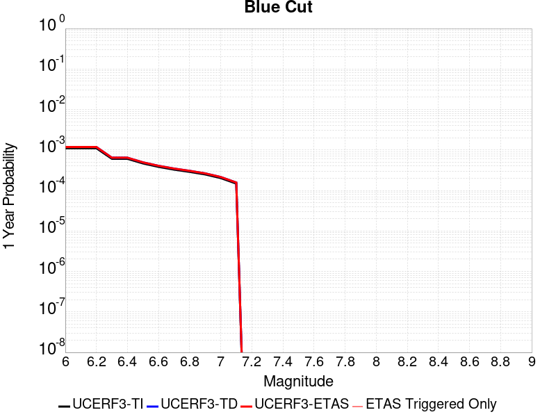 | 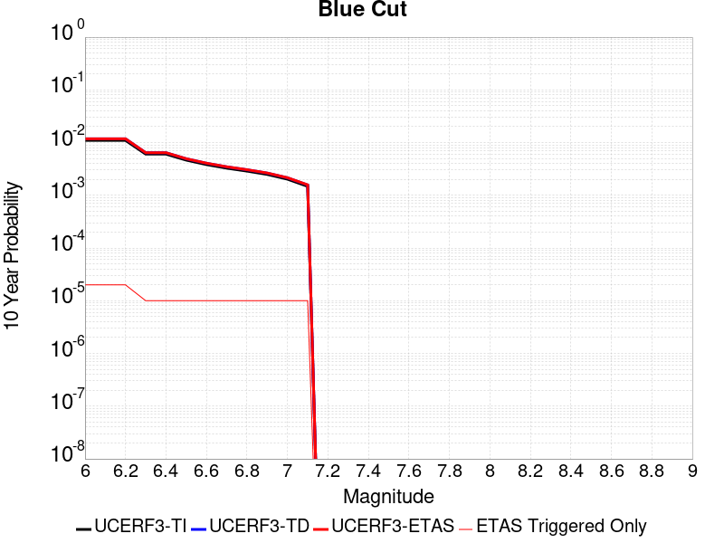 |

| Magnitude | 1 wk TI Prob | 1 wk TD Prob | 1 wk ETAS Prob | 1 wk ETAS/TD Gain | 1 wk ETAS Triggered Only | 1 mo TI Prob | 1 mo TD Prob | 1 mo ETAS Prob | 1 mo ETAS/TD Gain | 1 mo ETAS Triggered Only | 1 yr TI Prob | 1 yr TD Prob | 1 yr ETAS Prob | 1 yr ETAS/TD Gain | 1 yr ETAS Triggered Only | 10 yr TI Prob | 10 yr TD Prob | 10 yr ETAS Prob | 10 yr ETAS/TD Gain | 10 yr ETAS Triggered Only |
|-----|-----|-----|-----|-----|-----|-----|-----|-----|-----|-----|-----|-----|-----|-----|-----|-----|-----|-----|-----|-----|
| 6.0 | 2.1227985E-5 | 2.2721484E-5 | 2.2721484E-5 | 1.0 | 0.0 | 9.097391E-5 | 9.7374475E-5 | 9.7374475E-5 | 1.0 | 0.0 | 0.0011070445 | 0.0011849476 | 0.0011849476 | 1.0 | 0.0 | 0.011015458 | 0.011792137 | 0.011809975 | 1.0015126 | 1.8050541E-5 |
| 6.1 | 2.1227985E-5 | 2.2721484E-5 | 2.2721484E-5 | 1.0 | 0.0 | 9.097391E-5 | 9.7374475E-5 | 9.7374475E-5 | 1.0 | 0.0 | 0.0011070445 | 0.0011849476 | 0.0011849476 | 1.0 | 0.0 | 0.011015458 | 0.011792137 | 0.011809975 | 1.0015126 | 1.8050541E-5 |
| 6.2 | 2.1227985E-5 | 2.2721484E-5 | 2.2721484E-5 | 1.0 | 0.0 | 9.097391E-5 | 9.7374475E-5 | 9.7374475E-5 | 1.0 | 0.0 | 0.0011070445 | 0.0011849476 | 0.0011849476 | 1.0 | 0.0 | 0.011015458 | 0.011792137 | 0.011809975 | 1.0015126 | 1.8050541E-5 |
| 6.3 | 1.1613981E-5 | 1.2354481E-5 | 1.2354481E-5 | 1.0 | 0.0 | 4.9773254E-5 | 5.2946772E-5 | 5.2946772E-5 | 1.0 | 0.0 | 6.0582085E-4 | 6.4444874E-4 | 6.4444874E-4 | 1.0 | 0.0 | 0.0060417196 | 0.0064270464 | 0.0064270464 | 1.0 | 0.0 |
| 6.4 | 1.1613981E-5 | 1.2354481E-5 | 1.2354481E-5 | 1.0 | 0.0 | 4.9773254E-5 | 5.2946772E-5 | 5.2946772E-5 | 1.0 | 0.0 | 6.0582085E-4 | 6.4444874E-4 | 6.4444874E-4 | 1.0 | 0.0 | 0.0060417196 | 0.0064270464 | 0.0064270464 | 1.0 | 0.0 |
| 6.5 | 8.931326E-6 | 9.482297E-6 | 9.482297E-6 | 1.0 | 0.0 | 3.8276554E-5 | 4.0637835E-5 | 4.0637835E-5 | 1.0 | 0.0 | 4.6591737E-4 | 4.946625E-4 | 4.946625E-4 | 1.0 | 0.0 | 0.0046494175 | 0.0049365233 | 0.0049365233 | 1.0 | 0.0 |
| 6.6 | 7.345353E-6 | 7.790843E-6 | 7.790843E-6 | 1.0 | 0.0 | 3.1479703E-5 | 3.3388944E-5 | 3.3388944E-5 | 1.0 | 0.0 | 3.83198E-4 | 4.0644256E-4 | 4.0644256E-4 | 1.0 | 0.0 | 0.0038253788 | 0.0040577836 | 0.0040577836 | 1.0 | 0.0 |
| 6.7 | 6.2775666E-6 | 6.6556267E-6 | 6.6556267E-6 | 1.0 | 0.0 | 2.690358E-5 | 2.8523846E-5 | 2.8523846E-5 | 1.0 | 0.0 | 3.2750185E-4 | 3.4723E-4 | 3.4723E-4 | 1.0 | 0.0 | 0.0032701963 | 0.0034676157 | 0.0034676157 | 1.0 | 0.0 |
| 6.8 | 5.5234095E-6 | 5.855531E-6 | 5.855531E-6 | 1.0 | 0.0 | 2.367154E-5 | 2.5094932E-5 | 2.5094932E-5 | 1.0 | 0.0 | 2.8816288E-4 | 3.0549525E-4 | 3.0549525E-4 | 1.0 | 0.0 | 0.002877895 | 0.003051469 | 0.003051469 | 1.0 | 0.0 |
| 6.9 | 4.7780054E-6 | 5.065784E-6 | 5.065784E-6 | 1.0 | 0.0 | 2.0477004E-5 | 2.1710362E-5 | 2.1710362E-5 | 1.0 | 0.0 | 2.4927902E-4 | 2.6429867E-4 | 2.6429867E-4 | 1.0 | 0.0 | 0.0024899957 | 0.0026405356 | 0.0026405356 | 1.0 | 0.0 |
| 7.0 | 3.883171E-6 | 4.118785E-6 | 4.118785E-6 | 1.0 | 0.0 | 1.6642054E-5 | 1.7651855E-5 | 1.7651855E-5 | 1.0 | 0.0 | 2.0259817E-4 | 2.1489704E-4 | 2.1489704E-4 | 1.0 | 0.0 | 0.0020241356 | 0.0021475682 | 0.0021475682 | 1.0 | 0.0 |
| 7.1 | 2.8358215E-6 | 3.009936E-6 | 3.009936E-6 | 1.0 | 0.0 | 1.2153464E-5 | 1.28997E-5 | 1.28997E-5 | 1.0 | 0.0 | 1.4795837E-4 | 1.570491E-4 | 1.570491E-4 | 1.0 | 0.0 | 0.001478599 | 0.0015700265 | 0.0015700265 | 1.0 | 0.0 |

## Likely 2011 CFM
*[(top)](#table-of-contents)*

| 1 Week | 1 Month | 1 Year | 10 Year |
|-----|-----|-----|-----|
| 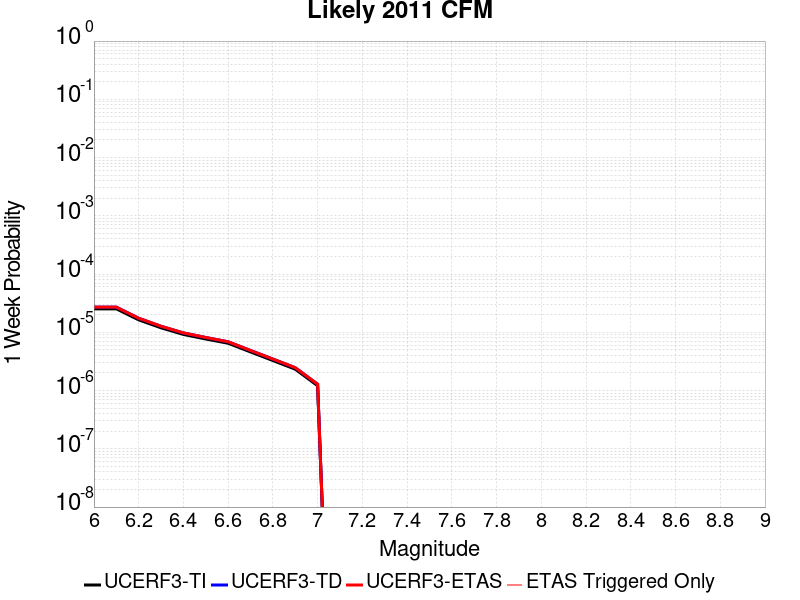 | 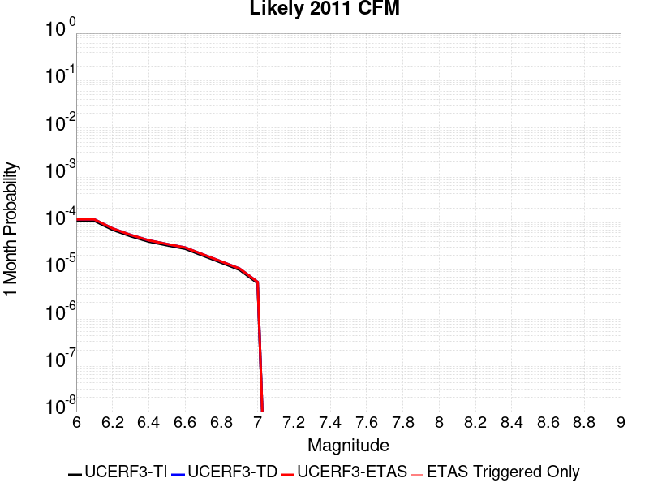 | 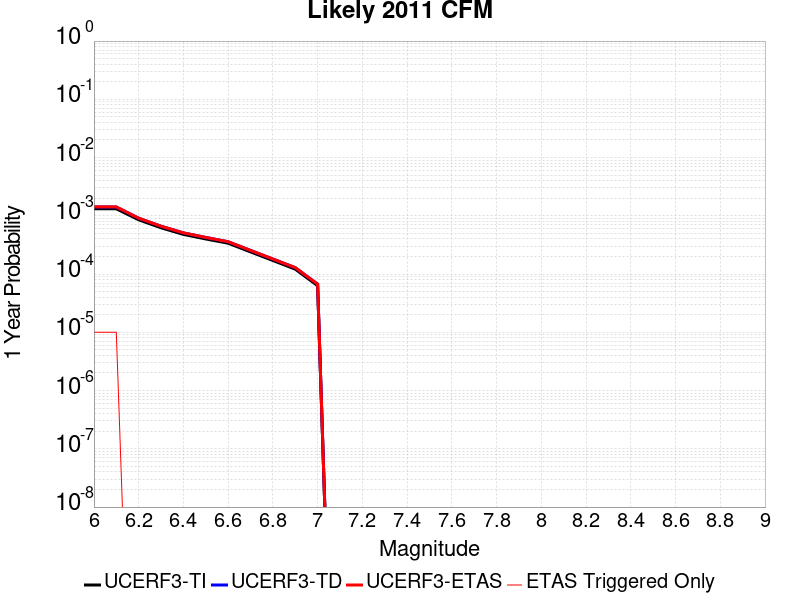 | 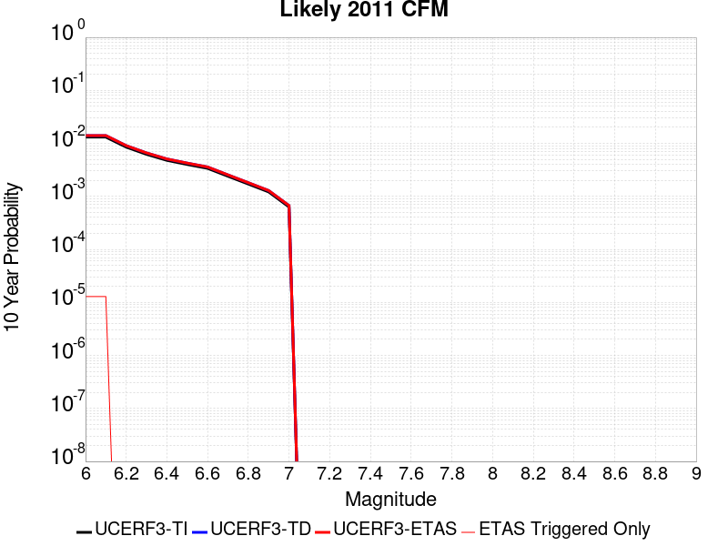 |

| Magnitude | 1 wk TI Prob | 1 wk TD Prob | 1 wk ETAS Prob | 1 wk ETAS/TD Gain | 1 wk ETAS Triggered Only | 1 mo TI Prob | 1 mo TD Prob | 1 mo ETAS Prob | 1 mo ETAS/TD Gain | 1 mo ETAS Triggered Only | 1 yr TI Prob | 1 yr TD Prob | 1 yr ETAS Prob | 1 yr ETAS/TD Gain | 1 yr ETAS Triggered Only | 10 yr TI Prob | 10 yr TD Prob | 10 yr ETAS Prob | 10 yr ETAS/TD Gain | 10 yr ETAS Triggered Only |
|-----|-----|-----|-----|-----|-----|-----|-----|-----|-----|-----|-----|-----|-----|-----|-----|-----|-----|-----|-----|-----|
| 6.0 | 2.5315949E-5 | 2.7107038E-5 | 2.7107038E-5 | 1.0 | 0.0 | 1.0849241E-4 | 1.161681E-4 | 1.161681E-4 | 1.0 | 0.0 | 0.0013200947 | 0.0014134735 | 0.0014314986 | 1.0127523 | 1.8050541E-5 | 0.013122803 | 0.01404949 | 0.014067287 | 1.0012667 | 1.8050541E-5 |
| 6.1 | 2.5315949E-5 | 2.7107038E-5 | 2.7107038E-5 | 1.0 | 0.0 | 1.0849241E-4 | 1.161681E-4 | 1.161681E-4 | 1.0 | 0.0 | 0.0013200947 | 0.0014134735 | 0.0014314986 | 1.0127523 | 1.8050541E-5 | 0.013122803 | 0.01404949 | 0.014067287 | 1.0012667 | 1.8050541E-5 |
| 6.2 | 1.6375941E-5 | 1.7467231E-5 | 1.7467231E-5 | 1.0 | 0.0 | 7.0180715E-5 | 7.485748E-5 | 7.485748E-5 | 1.0 | 0.0 | 8.5411523E-4 | 9.110211E-4 | 9.110211E-4 | 1.0 | 0.0 | 0.008508399 | 0.009074151 | 0.009074151 | 1.0 | 0.0 |
| 6.3 | 1.1945543E-5 | 1.2713562E-5 | 1.2713562E-5 | 1.0 | 0.0 | 5.119418E-5 | 5.4485587E-5 | 5.4485587E-5 | 1.0 | 0.0 | 6.2311086E-4 | 6.631654E-4 | 6.631654E-4 | 1.0 | 0.0 | 0.0062136655 | 0.00661242 | 0.00661242 | 1.0 | 0.0 |
| 6.4 | 9.192729E-6 | 9.769218E-6 | 9.769218E-6 | 1.0 | 0.0 | 3.939681E-5 | 4.186742E-5 | 4.186742E-5 | 1.0 | 0.0 | 4.7955062E-4 | 5.0961936E-4 | 5.0961936E-4 | 1.0 | 0.0 | 0.004785171 | 0.0050847884 | 0.0050847884 | 1.0 | 0.0 |
| 6.5 | 7.67906E-6 | 8.153223E-6 | 8.153223E-6 | 1.0 | 0.0 | 3.2909844E-5 | 3.4941924E-5 | 3.4941924E-5 | 1.0 | 0.0 | 4.006037E-4 | 4.2533677E-4 | 4.2533677E-4 | 1.0 | 0.0 | 0.0039988225 | 0.00424542 | 0.00424542 | 1.0 | 0.0 |
| 6.6 | 6.4884057E-6 | 6.885253E-6 | 6.885253E-6 | 1.0 | 0.0 | 2.7807157E-5 | 2.95079E-5 | 2.95079E-5 | 1.0 | 0.0 | 3.3849955E-4 | 3.5920087E-4 | 3.5920087E-4 | 1.0 | 0.0 | 0.003379844 | 0.003586348 | 0.003586348 | 1.0 | 0.0 |
| 6.7 | 4.6060636E-6 | 4.884393E-6 | 4.884393E-6 | 1.0 | 0.0 | 1.9740122E-5 | 2.093295E-5 | 2.093295E-5 | 1.0 | 0.0 | 2.403095E-4 | 2.5482968E-4 | 2.5482968E-4 | 1.0 | 0.0 | 0.002400498 | 0.0025454578 | 0.0025454578 | 1.0 | 0.0 |
| 6.8 | 3.2795615E-6 | 3.4776235E-6 | 3.4776235E-6 | 1.0 | 0.0 | 1.4055187E-5 | 1.4904019E-5 | 1.4904019E-5 | 1.0 | 0.0 | 1.7110848E-4 | 1.8144188E-4 | 1.8144188E-4 | 1.0 | 0.0 | 0.0017097679 | 0.0018129926 | 0.0018129926 | 1.0 | 0.0 |
| 6.9 | 2.3289967E-6 | 2.470736E-6 | 2.470736E-6 | 1.0 | 0.0 | 9.981376E-6 | 1.0588828E-5 | 1.0588828E-5 | 1.0 | 0.0 | 1.2151648E-4 | 1.289118E-4 | 1.289118E-4 | 1.0 | 0.0 | 0.0012145005 | 0.0012884131 | 0.0012884131 | 1.0 | 0.0 |
| 7.0 | 1.211292E-6 | 1.2864909E-6 | 1.2864909E-6 | 1.0 | 0.0 | 5.1912407E-6 | 5.513523E-6 | 5.513523E-6 | 1.0 | 0.0 | 6.320152E-5 | 6.712537E-5 | 6.712537E-5 | 1.0 | 0.0 | 6.3183554E-4 | 6.7108084E-4 | 6.7108084E-4 | 1.0 | 0.0 |

## Big Lagoon - Bald Mtn 2011 CFM
*[(top)](#table-of-contents)*

| 1 Week | 1 Month | 1 Year | 10 Year |
|-----|-----|-----|-----|
| 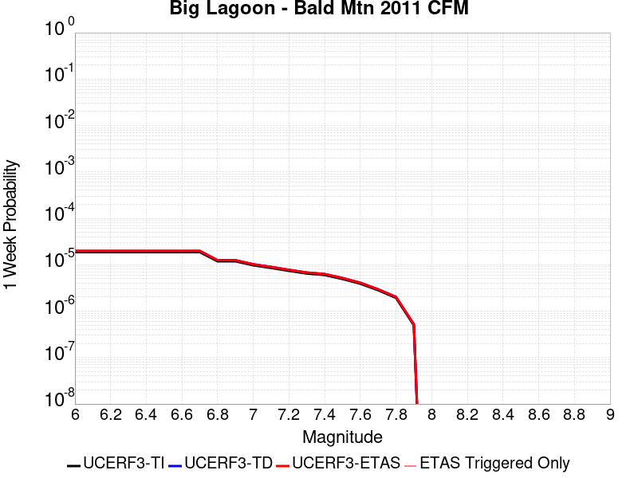 | 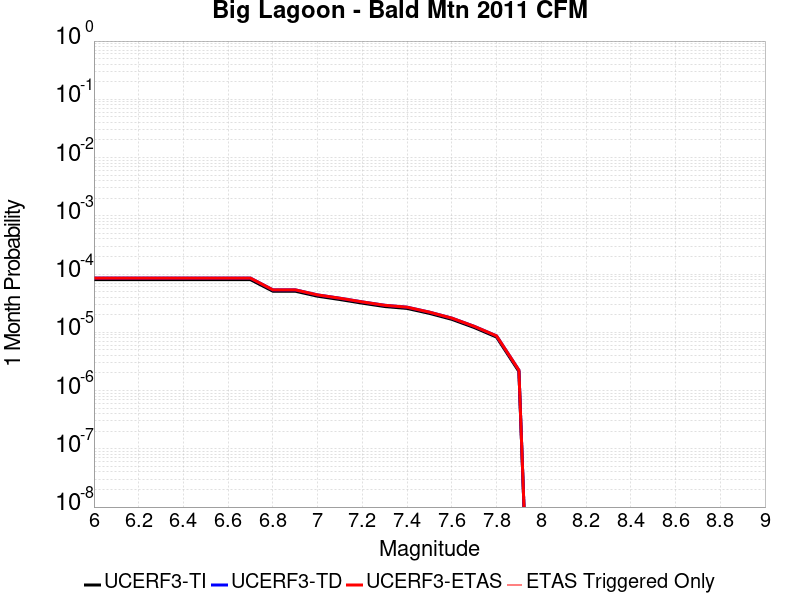 |  | 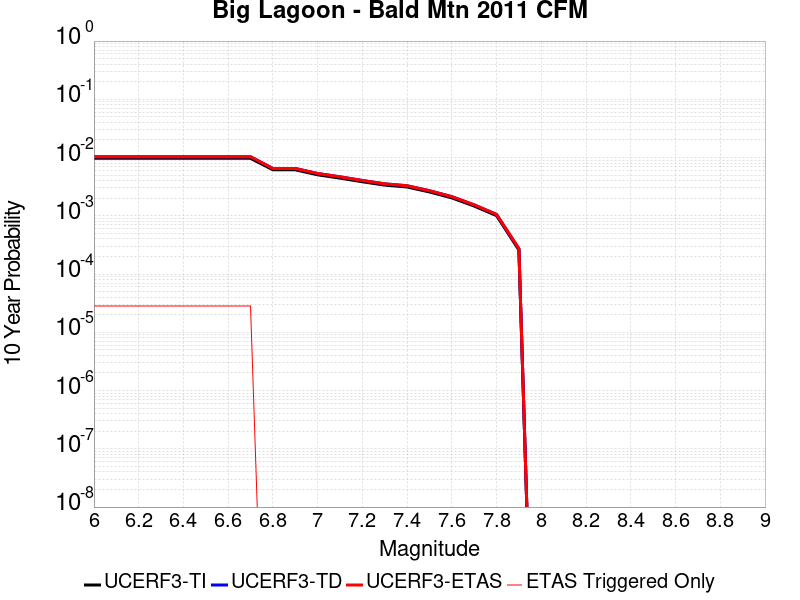 |

| Magnitude | 1 wk TI Prob | 1 wk TD Prob | 1 wk ETAS Prob | 1 wk ETAS/TD Gain | 1 wk ETAS Triggered Only | 1 mo TI Prob | 1 mo TD Prob | 1 mo ETAS Prob | 1 mo ETAS/TD Gain | 1 mo ETAS Triggered Only | 1 yr TI Prob | 1 yr TD Prob | 1 yr ETAS Prob | 1 yr ETAS/TD Gain | 1 yr ETAS Triggered Only | 10 yr TI Prob | 10 yr TD Prob | 10 yr ETAS Prob | 10 yr ETAS/TD Gain | 10 yr ETAS Triggered Only |
|-----|-----|-----|-----|-----|-----|-----|-----|-----|-----|-----|-----|-----|-----|-----|-----|-----|-----|-----|-----|-----|
| 6.0 | 1.8699735E-5 | 1.9851645E-5 | 1.9851645E-5 | 1.0 | 0.0 | 8.013926E-5 | 8.507592E-5 | 8.507592E-5 | 1.0 | 0.0 | 9.752587E-4 | 0.0010353449 | 0.0010353449 | 1.0 | 0.0 | 0.009709897 | 0.010309031 | 0.010326896 | 1.001733 | 1.8050541E-5 |
| 6.1 | 1.8699735E-5 | 1.9851645E-5 | 1.9851645E-5 | 1.0 | 0.0 | 8.013926E-5 | 8.507592E-5 | 8.507592E-5 | 1.0 | 0.0 | 9.752587E-4 | 0.0010353449 | 0.0010353449 | 1.0 | 0.0 | 0.009709897 | 0.010309031 | 0.010326896 | 1.001733 | 1.8050541E-5 |
| 6.2 | 1.8699735E-5 | 1.9851645E-5 | 1.9851645E-5 | 1.0 | 0.0 | 8.013926E-5 | 8.507592E-5 | 8.507592E-5 | 1.0 | 0.0 | 9.752587E-4 | 0.0010353449 | 0.0010353449 | 1.0 | 0.0 | 0.009709897 | 0.010309031 | 0.010326896 | 1.001733 | 1.8050541E-5 |
| 6.3 | 1.8699735E-5 | 1.9851645E-5 | 1.9851645E-5 | 1.0 | 0.0 | 8.013926E-5 | 8.507592E-5 | 8.507592E-5 | 1.0 | 0.0 | 9.752587E-4 | 0.0010353449 | 0.0010353449 | 1.0 | 0.0 | 0.009709897 | 0.010309031 | 0.010326896 | 1.001733 | 1.8050541E-5 |
| 6.4 | 1.8699735E-5 | 1.9851645E-5 | 1.9851645E-5 | 1.0 | 0.0 | 8.013926E-5 | 8.507592E-5 | 8.507592E-5 | 1.0 | 0.0 | 9.752587E-4 | 0.0010353449 | 0.0010353449 | 1.0 | 0.0 | 0.009709897 | 0.010309031 | 0.010326896 | 1.001733 | 1.8050541E-5 |
| 6.5 | 1.8699735E-5 | 1.9851645E-5 | 1.9851645E-5 | 1.0 | 0.0 | 8.013926E-5 | 8.507592E-5 | 8.507592E-5 | 1.0 | 0.0 | 9.752587E-4 | 0.0010353449 | 0.0010353449 | 1.0 | 0.0 | 0.009709897 | 0.010309031 | 0.010326896 | 1.001733 | 1.8050541E-5 |
| 6.6 | 1.8699735E-5 | 1.9851645E-5 | 1.9851645E-5 | 1.0 | 0.0 | 8.013926E-5 | 8.507592E-5 | 8.507592E-5 | 1.0 | 0.0 | 9.752587E-4 | 0.0010353449 | 0.0010353449 | 1.0 | 0.0 | 0.009709897 | 0.010309031 | 0.010326896 | 1.001733 | 1.8050541E-5 |
| 6.7 | 1.8699735E-5 | 1.9851645E-5 | 1.9851645E-5 | 1.0 | 0.0 | 8.013926E-5 | 8.507592E-5 | 8.507592E-5 | 1.0 | 0.0 | 9.752587E-4 | 0.0010353449 | 0.0010353449 | 1.0 | 0.0 | 0.009709897 | 0.010309031 | 0.010326896 | 1.001733 | 1.8050541E-5 |
| 6.8 | 1.18505095E-5 | 1.2500624E-5 | 1.2500624E-5 | 1.0 | 0.0 | 5.078691E-5 | 5.357303E-5 | 5.357303E-5 | 1.0 | 0.0 | 6.181552E-4 | 6.5206125E-4 | 6.5206125E-4 | 1.0 | 0.0 | 0.006164385 | 0.006501984 | 0.006501984 | 1.0 | 0.0 |
| 6.9 | 1.18505095E-5 | 1.2500624E-5 | 1.2500624E-5 | 1.0 | 0.0 | 5.078691E-5 | 5.357303E-5 | 5.357303E-5 | 1.0 | 0.0 | 6.181552E-4 | 6.5206125E-4 | 6.5206125E-4 | 1.0 | 0.0 | 0.006164385 | 0.006501984 | 0.006501984 | 1.0 | 0.0 |
| 7.0 | 9.719786E-6 | 1.0236137E-5 | 1.0236137E-5 | 1.0 | 0.0 | 4.1655563E-5 | 4.3868436E-5 | 4.3868436E-5 | 1.0 | 0.0 | 5.0703844E-4 | 5.3396967E-4 | 5.3396967E-4 | 1.0 | 0.0 | 0.005058831 | 0.005327113 | 0.005327113 | 1.0 | 0.0 |
| 7.1 | 8.523418E-6 | 8.970025E-6 | 8.970025E-6 | 1.0 | 0.0 | 3.652842E-5 | 3.8442406E-5 | 3.8442406E-5 | 1.0 | 0.0 | 4.4464276E-4 | 4.6793735E-4 | 4.6793735E-4 | 1.0 | 0.0 | 0.0044375416 | 0.004669684 | 0.004669684 | 1.0 | 0.0 |
| 7.2 | 7.378894E-6 | 7.761593E-6 | 7.761593E-6 | 1.0 | 0.0 | 3.162345E-5 | 3.3263554E-5 | 3.3263554E-5 | 1.0 | 0.0 | 3.8494746E-4 | 4.049094E-4 | 4.049094E-4 | 1.0 | 0.0 | 0.0038428132 | 0.0040418124 | 0.0040418124 | 1.0 | 0.0 |
| 7.3 | 6.4640294E-6 | 6.7928563E-6 | 6.7928563E-6 | 1.0 | 0.0 | 2.7702688E-5 | 2.9111921E-5 | 2.9111921E-5 | 1.0 | 0.0 | 3.3722803E-4 | 3.5438064E-4 | 3.5438064E-4 | 1.0 | 0.0 | 0.0033671674 | 0.0035382255 | 0.0035382255 | 1.0 | 0.0 |
| 7.4 | 5.9959093E-6 | 6.2991808E-6 | 6.2991808E-6 | 1.0 | 0.0 | 2.5696501E-5 | 2.6996213E-5 | 2.6996213E-5 | 1.0 | 0.0 | 3.1280998E-4 | 3.2862992E-4 | 3.2862992E-4 | 1.0 | 0.0 | 0.0031237002 | 0.0032815014 | 0.0032815014 | 1.0 | 0.0 |
| 7.5 | 4.929265E-6 | 5.176706E-6 | 5.176706E-6 | 1.0 | 0.0 | 2.112525E-5 | 2.2185697E-5 | 2.2185697E-5 | 1.0 | 0.0 | 2.5716957E-4 | 2.7007778E-4 | 2.7007778E-4 | 1.0 | 0.0 | 0.0025687215 | 0.0026975363 | 0.0026975363 | 1.0 | 0.0 |
| 7.6 | 3.8982403E-6 | 4.089166E-6 | 4.089166E-6 | 1.0 | 0.0 | 1.6706637E-5 | 1.752488E-5 | 1.752488E-5 | 1.0 | 0.0 | 2.0338432E-4 | 2.133448E-4 | 2.133448E-4 | 1.0 | 0.0 | 0.0020319829 | 0.0021314276 | 0.0021314276 | 1.0 | 0.0 |
| 7.7 | 2.820968E-6 | 2.957382E-6 | 2.957382E-6 | 1.0 | 0.0 | 1.2089806E-5 | 1.2674434E-5 | 1.2674434E-5 | 1.0 | 0.0 | 1.4718344E-4 | 1.5430049E-4 | 1.5430049E-4 | 1.0 | 0.0 | 0.00147086 | 0.0015419512 | 0.0015419512 | 1.0 | 0.0 |
| 7.8 | 1.9314455E-6 | 2.0261368E-6 | 2.0261368E-6 | 1.0 | 0.0 | 8.277597E-6 | 8.683416E-6 | 8.683416E-6 | 1.0 | 0.0 | 1.0077508E-4 | 1.0571559E-4 | 1.0571559E-4 | 1.0 | 0.0 | 0.0010072939 | 0.0010566659 | 0.0010566659 | 1.0 | 0.0 |
| 7.9 | 4.9586197E-7 | 5.2192485E-7 | 5.2192485E-7 | 1.0 | 0.0 | 2.125121E-6 | 2.236819E-6 | 2.236819E-6 | 1.0 | 0.0 | 2.5873042E-5 | 2.723295E-5 | 2.723295E-5 | 1.0 | 0.0 | 2.5870028E-4 | 2.7229823E-4 | 2.7229823E-4 | 1.0 | 0.0 |

## Los Osos 2011
*[(top)](#table-of-contents)*

| 1 Week | 1 Month | 1 Year | 10 Year |
|-----|-----|-----|-----|
| 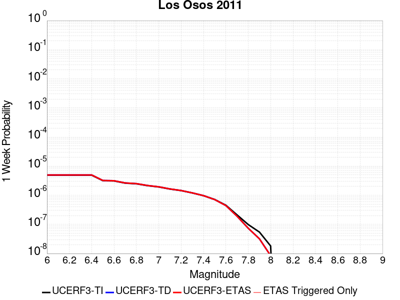 | 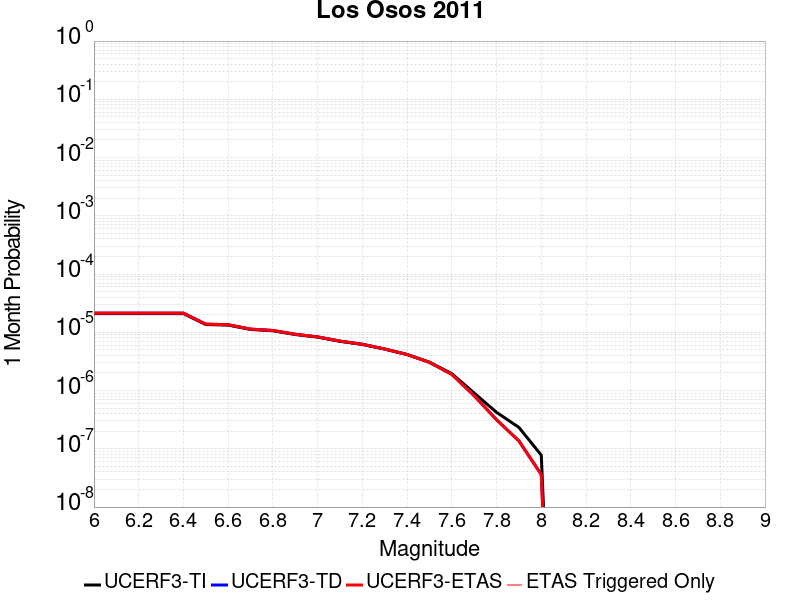 |  | 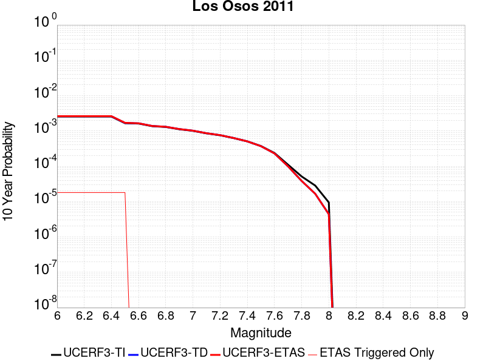 |

| Magnitude | 1 wk TI Prob | 1 wk TD Prob | 1 wk ETAS Prob | 1 wk ETAS/TD Gain | 1 wk ETAS Triggered Only | 1 mo TI Prob | 1 mo TD Prob | 1 mo ETAS Prob | 1 mo ETAS/TD Gain | 1 mo ETAS Triggered Only | 1 yr TI Prob | 1 yr TD Prob | 1 yr ETAS Prob | 1 yr ETAS/TD Gain | 1 yr ETAS Triggered Only | 10 yr TI Prob | 10 yr TD Prob | 10 yr ETAS Prob | 10 yr ETAS/TD Gain | 10 yr ETAS Triggered Only |
|-----|-----|-----|-----|-----|-----|-----|-----|-----|-----|-----|-----|-----|-----|-----|-----|-----|-----|-----|-----|-----|
| 6.0 | 4.8871775E-6 | 4.9816663E-6 | 4.9816663E-6 | 1.0 | 0.0 | 2.0944879E-5 | 2.134984E-5 | 2.134984E-5 | 1.0 | 0.0 | 2.5497406E-4 | 2.5990608E-4 | 2.5990608E-4 | 1.0 | 0.0 | 0.002546817 | 0.0025962957 | 0.0026142993 | 1.0069344 | 1.8050541E-5 |
| 6.1 | 4.8871775E-6 | 4.9816663E-6 | 4.9816663E-6 | 1.0 | 0.0 | 2.0944879E-5 | 2.134984E-5 | 2.134984E-5 | 1.0 | 0.0 | 2.5497406E-4 | 2.5990608E-4 | 2.5990608E-4 | 1.0 | 0.0 | 0.002546817 | 0.0025962957 | 0.0026142993 | 1.0069344 | 1.8050541E-5 |
| 6.2 | 4.8871775E-6 | 4.9816663E-6 | 4.9816663E-6 | 1.0 | 0.0 | 2.0944879E-5 | 2.134984E-5 | 2.134984E-5 | 1.0 | 0.0 | 2.5497406E-4 | 2.5990608E-4 | 2.5990608E-4 | 1.0 | 0.0 | 0.002546817 | 0.0025962957 | 0.0026142993 | 1.0069344 | 1.8050541E-5 |
| 6.3 | 4.8871775E-6 | 4.9816663E-6 | 4.9816663E-6 | 1.0 | 0.0 | 2.0944879E-5 | 2.134984E-5 | 2.134984E-5 | 1.0 | 0.0 | 2.5497406E-4 | 2.5990608E-4 | 2.5990608E-4 | 1.0 | 0.0 | 0.002546817 | 0.0025962957 | 0.0026142993 | 1.0069344 | 1.8050541E-5 |
| 6.4 | 4.8871775E-6 | 4.9816663E-6 | 4.9816663E-6 | 1.0 | 0.0 | 2.0944879E-5 | 2.134984E-5 | 2.134984E-5 | 1.0 | 0.0 | 2.5497406E-4 | 2.5990608E-4 | 2.5990608E-4 | 1.0 | 0.0 | 0.002546817 | 0.0025962957 | 0.0026142993 | 1.0069344 | 1.8050541E-5 |
| 6.5 | 3.1724062E-6 | 3.223525E-6 | 3.223525E-6 | 1.0 | 0.0 | 1.3595956E-5 | 1.3815034E-5 | 1.3815034E-5 | 1.0 | 0.0 | 1.6551818E-4 | 1.6818519E-4 | 1.6818519E-4 | 1.0 | 0.0 | 0.0016539496 | 0.0016805925 | 0.0016986128 | 1.0107225 | 1.8050541E-5 |
| 6.6 | 3.1022591E-6 | 3.1512318E-6 | 3.1512318E-6 | 1.0 | 0.0 | 1.3295328E-5 | 1.350521E-5 | 1.350521E-5 | 1.0 | 0.0 | 1.618586E-4 | 1.6441365E-4 | 1.6441365E-4 | 1.0 | 0.0 | 0.0016174077 | 0.0016429329 | 0.0016429329 | 1.0 | 0.0 |
| 6.7 | 2.611518E-6 | 2.649297E-6 | 2.649297E-6 | 1.0 | 0.0 | 1.1192172E-5 | 1.135408E-5 | 1.135408E-5 | 1.0 | 0.0 | 1.3625617E-4 | 1.382272E-4 | 1.382272E-4 | 1.0 | 0.0 | 0.0013617266 | 0.0013814168 | 0.0013814168 | 1.0 | 0.0 |
| 6.8 | 2.4780884E-6 | 2.5122686E-6 | 2.5122686E-6 | 1.0 | 0.0 | 1.0620336E-5 | 1.0766821E-5 | 1.0766821E-5 | 1.0 | 0.0 | 1.2929492E-4 | 1.310782E-4 | 1.310782E-4 | 1.0 | 0.0 | 0.0012921972 | 0.0013100129 | 0.0013100129 | 1.0 | 0.0 |
| 6.9 | 2.1376322E-6 | 2.163605E-6 | 2.163605E-6 | 1.0 | 0.0 | 9.161248E-6 | 9.2725595E-6 | 9.2725595E-6 | 1.0 | 0.0 | 1.1153249E-4 | 1.1288758E-4 | 1.1288758E-4 | 1.0 | 0.0 | 0.0011147653 | 0.0011283043 | 0.0011283043 | 1.0 | 0.0 |
| 7.0 | 1.9282882E-6 | 1.949552E-6 | 1.949552E-6 | 1.0 | 0.0 | 8.264066E-6 | 8.355196E-6 | 8.355196E-6 | 1.0 | 0.0 | 1.0061036E-4 | 1.0171978E-4 | 1.0171978E-4 | 1.0 | 0.0 | 0.0010056482 | 0.0010167336 | 0.0010167336 | 1.0 | 0.0 |
| 7.1 | 1.6353226E-6 | 1.6501975E-6 | 1.6501975E-6 | 1.0 | 0.0 | 7.0085066E-6 | 7.072256E-6 | 7.072256E-6 | 1.0 | 0.0 | 8.532523E-5 | 8.610132E-5 | 8.610132E-5 | 1.0 | 0.0 | 8.529247E-4 | 8.6068036E-4 | 8.6068036E-4 | 1.0 | 0.0 |
| 7.2 | 1.4446276E-6 | 1.4554148E-6 | 1.4554148E-6 | 1.0 | 0.0 | 6.191247E-6 | 6.237477E-6 | 6.237477E-6 | 1.0 | 0.0 | 7.537582E-5 | 7.5938646E-5 | 7.5938646E-5 | 1.0 | 0.0 | 7.535026E-4 | 7.591275E-4 | 7.591275E-4 | 1.0 | 0.0 |
| 7.3 | 1.2014582E-6 | 1.2069816E-6 | 1.2069816E-6 | 1.0 | 0.0 | 5.149096E-6 | 5.172768E-6 | 5.172768E-6 | 1.0 | 0.0 | 6.268844E-5 | 6.297663E-5 | 6.297663E-5 | 1.0 | 0.0 | 6.267076E-4 | 6.2958826E-4 | 6.2958826E-4 | 1.0 | 0.0 |
| 7.4 | 9.707733E-7 | 9.710452E-7 | 9.710452E-7 | 1.0 | 0.0 | 4.16045E-6 | 4.1616154E-6 | 4.1616154E-6 | 1.0 | 0.0 | 5.0652303E-5 | 5.0666495E-5 | 5.0666495E-5 | 1.0 | 0.0 | 5.064076E-4 | 5.0654967E-4 | 5.0654967E-4 | 1.0 | 0.0 |
| 7.5 | 7.174908E-7 | 7.1155165E-7 | 7.1155165E-7 | 1.0 | 0.0 | 3.074957E-6 | 3.0495034E-6 | 3.0495034E-6 | 1.0 | 0.0 | 3.743696E-5 | 3.7127073E-5 | 3.7127073E-5 | 1.0 | 0.0 | 3.7430652E-4 | 3.7120888E-4 | 3.7120888E-4 | 1.0 | 0.0 |
| 7.6 | 4.5535776E-7 | 4.4213053E-7 | 4.4213053E-7 | 1.0 | 0.0 | 1.9515319E-6 | 1.8948438E-6 | 1.8948438E-6 | 1.0 | 0.0 | 2.3759641E-5 | 2.3069479E-5 | 2.3069479E-5 | 1.0 | 0.0 | 2.37571E-4 | 2.3067094E-4 | 2.3067094E-4 | 1.0 | 0.0 |
| 7.7 | 2.1173553E-7 | 1.9064959E-7 | 1.9064959E-7 | 1.0 | 0.0 | 9.0743765E-7 | 8.1706935E-7 | 8.1706935E-7 | 1.0 | 0.0 | 1.1047998E-5 | 9.947775E-6 | 9.947775E-6 | 1.0 | 0.0 | 1.1047449E-4 | 9.947332E-5 | 9.947332E-5 | 1.0 | 0.0 |
| 7.8 | 9.873608E-8 | 7.371188E-8 | 7.371188E-8 | 1.0 | 0.0 | 4.2315455E-7 | 3.15908E-7 | 3.15908E-7 | 1.0 | 0.0 | 5.1518946E-6 | 3.8461735E-6 | 3.8461735E-6 | 1.0 | 0.0 | 5.1517753E-5 | 3.8461076E-5 | 3.8461076E-5 | 1.0 | 0.0 |
| 7.9 | 5.4399106E-8 | 3.1912307E-8 | 3.1912307E-8 | 1.0 | 0.0 | 2.33139E-7 | 1.3676701E-7 | 1.3676701E-7 | 1.0 | 0.0 | 2.8384638E-6 | 1.6651371E-6 | 1.6651371E-6 | 1.0 | 0.0 | 2.8384275E-5 | 1.6651247E-5 | 1.6651247E-5 | 1.0 | 0.0 |
| 8.0 | 1.817203E-8 | 8.434334E-9 | 8.434334E-9 | 1.0 | 0.0 | 7.7880124E-8 | 3.6147142E-8 | 3.6147142E-8 | 1.0 | 0.0 | 9.481901E-7 | 4.4009138E-7 | 4.4009138E-7 | 1.0 | 0.0 | 9.481861E-6 | 4.4009057E-6 | 4.4009057E-6 | 1.0 | 0.0 |

