# Parent Section Magnitude-Probability Distributions

Only fault sections with at least one triggered aftershock are plotted. Sections are sorted by total supraseismogenic trigger rate (decreasing)

## Table Of Contents

* [Garlock (Central)](#garlock-central)
* [Tank Canyon](#tank-canyon)
* [Airport Lake](#airport-lake)
* [Little Lake](#little-lake)
* [Owl Lake](#owl-lake)
* [Panamint Valley](#panamint-valley)
* [Garlock (East)](#garlock-east)
* [Garlock (West)](#garlock-west)
* [Hunter Mountain-Saline Valley](#hunter-mountain-saline-valley)
* [Gravel Hills-Harper Lk](#gravel-hills-harper-lk)
* [San Andreas (Mojave N)](#san-andreas-mojave-n)
* [Ash Hill](#ash-hill)
* [Blackwater](#blackwater)
* [San Andreas (Mojave S)](#san-andreas-mojave-s)
* [Lenwood-Lockhart-Old Woman Springs](#lenwood-lockhart-old-woman-springs)
* [Towne Pass](#towne-pass)
* [McLean Lake](#mclean-lake)
* [Death Valley (Black Mtns Frontal)](#death-valley-black-mtns-frontal)
* [Death Valley (So)](#death-valley-so)
* [Nelson Lake](#nelson-lake)
* [Death Valley (No)](#death-valley-no)
* [Death Valley (Fish Lake Valley)](#death-valley-fish-lake-valley)
* [San Pedro Basin](#san-pedro-basin)

## Garlock (Central)
*[(top)](#table-of-contents)*

| 1 Week | 1 Month | 1 Year | 10 Year |
|-----|-----|-----|-----|
|  |  |  |  |

| Magnitude | 1 wk TI Prob | 1 wk TD Prob | 1 wk ETAS Prob | 1 wk ETAS/TD Gain | 1 wk ETAS Triggered Only | 1 mo TI Prob | 1 mo TD Prob | 1 mo ETAS Prob | 1 mo ETAS/TD Gain | 1 mo ETAS Triggered Only | 1 yr TI Prob | 1 yr TD Prob | 1 yr ETAS Prob | 1 yr ETAS/TD Gain | 1 yr ETAS Triggered Only | 10 yr TI Prob | 10 yr TD Prob | 10 yr ETAS Prob | 10 yr ETAS/TD Gain | 10 yr ETAS Triggered Only |
|-----|-----|-----|-----|-----|-----|-----|-----|-----|-----|-----|-----|-----|-----|-----|-----|-----|-----|-----|-----|-----|
| 6.0 | 5.5131142E-5 | 7.0252914E-5 | 0.003403352 | 48.444283 | 0.0033333334 | 2.3625491E-4 | 3.0104956E-4 | 0.009742651 | 32.36228 | 0.009444444 | 0.0028726095 | 0.0036591839 | 0.023032477 | 6.2944303 | 0.019444445 | 0.028357591 | 0.03608289 | 0.062322855 | 1.7272135 | 0.027222222 |
| 6.1 | 5.5131142E-5 | 7.0252914E-5 | 0.003403352 | 48.444283 | 0.0033333334 | 2.3625491E-4 | 3.0104956E-4 | 0.009742651 | 32.36228 | 0.009444444 | 0.0028726095 | 0.0036591839 | 0.023032477 | 6.2944303 | 0.019444445 | 0.028357591 | 0.03608289 | 0.062322855 | 1.7272135 | 0.027222222 |
| 6.2 | 4.216245E-5 | 5.166702E-5 | 0.0022737745 | 44.00824 | 0.0022222223 | 1.806837E-4 | 2.2141146E-4 | 0.004664872 | 21.06879 | 0.0044444446 | 0.0021976046 | 0.0026923837 | 0.01349655 | 5.012862 | 0.010833333 | 0.021759989 | 0.02669258 | 0.041292194 | 1.5469539 | 0.015 |
| 6.3 | 4.216245E-5 | 5.166702E-5 | 0.0022737745 | 44.00824 | 0.0022222223 | 1.806837E-4 | 2.2141146E-4 | 0.004664872 | 21.06879 | 0.0044444446 | 0.0021976046 | 0.0026923837 | 0.01349655 | 5.012862 | 0.010833333 | 0.021759989 | 0.02669258 | 0.041292194 | 1.5469539 | 0.015 |
| 6.4 | 3.6858168E-5 | 4.411584E-5 | 0.001710709 | 38.777657 | 0.0016666667 | 1.5795401E-4 | 1.8905434E-4 | 0.0032440322 | 17.159258 | 0.0030555555 | 0.0019213937 | 0.0022993318 | 0.010336365 | 4.4953775 | 0.008055556 | 0.019048655 | 0.02285164 | 0.033980273 | 1.486995 | 0.011388889 |
| 6.5 | 3.39199E-5 | 4.0023286E-5 | 0.0017066232 | 42.64076 | 0.0016666667 | 1.453629E-4 | 1.7151721E-4 | 0.0029488185 | 17.192553 | 0.0027777778 | 0.0017683565 | 0.0020862438 | 0.009847796 | 4.720347 | 0.007777778 | 0.017543508 | 0.02076252 | 0.031370927 | 1.5109402 | 0.010833333 |
| 6.6 | 3.3571985E-5 | 3.947746E-5 | 0.0017060783 | 43.216515 | 0.0016666667 | 1.4387199E-4 | 1.6917827E-4 | 0.002946486 | 17.416458 | 0.0027777778 | 0.0017502342 | 0.0020578213 | 0.009819594 | 4.7718396 | 0.007777778 | 0.017365133 | 0.02048383 | 0.031095253 | 1.5180391 | 0.010833333 |
| 6.7 | 3.2580007E-5 | 3.8093858E-5 | 0.001704697 | 44.74992 | 0.0016666667 | 1.3962112E-4 | 1.632493E-4 | 0.0029405735 | 18.012781 | 0.0027777778 | 0.0016985617 | 0.0019857697 | 0.009470876 | 4.769373 | 0.0075 | 0.016856372 | 0.019776449 | 0.030123252 | 1.5231882 | 0.010555555 |
| 6.8 | 3.2185937E-5 | 3.7521055E-5 | 0.0017041252 | 45.41784 | 0.0016666667 | 1.3793244E-4 | 1.6079473E-4 | 0.0029381257 | 18.272526 | 0.0027777778 | 0.0016780337 | 0.0019559395 | 0.00944127 | 4.8269744 | 0.0075 | 0.016654192 | 0.01948324 | 0.029833138 | 1.5312207 | 0.010555555 |
| 6.9 | 3.165394E-5 | 3.672561E-5 | 0.001703331 | 46.379925 | 0.0016666667 | 1.3565269E-4 | 1.5738611E-4 | 0.0029347267 | 18.64667 | 0.0027777778 | 0.0016503202 | 0.0019145131 | 0.009400154 | 4.909945 | 0.0075 | 0.01638118 | 0.01907586 | 0.029157579 | 1.5285068 | 0.010277778 |
| 7.0 | 3.0903822E-5 | 3.5630834E-5 | 0.0017022381 | 47.774296 | 0.0016666667 | 1.3243823E-4 | 1.5269476E-4 | 0.0029300484 | 19.188925 | 0.0027777778 | 0.0016112428 | 0.0018574947 | 0.009343564 | 5.0301967 | 0.0075 | 0.015996104 | 0.018515008 | 0.028602492 | 1.5448275 | 0.010277778 |
| 7.1 | 3.0069863E-5 | 3.4397097E-5 | 0.0017010064 | 49.452034 | 0.0016666667 | 1.2886449E-4 | 1.4740792E-4 | 0.0029247762 | 19.841377 | 0.0027777778 | 0.0015677959 | 0.0017932352 | 0.009279786 | 5.1748853 | 0.0075 | 0.01556781 | 0.017882649 | 0.027976634 | 1.5644568 | 0.010277778 |
| 7.2 | 2.7957109E-5 | 3.1286367E-5 | 0.0016979009 | 54.269672 | 0.0016666667 | 1.1981068E-4 | 1.3407765E-4 | 0.002911483 | 21.714901 | 0.0027777778 | 0.0014577188 | 0.0016311926 | 0.008286985 | 5.0803227 | 0.006666667 | 0.014481937 | 0.016286217 | 0.025576847 | 1.5704597 | 0.009444444 |
| 7.3 | 2.4519275E-5 | 2.6719412E-5 | 0.0014155712 | 52.97913 | 0.0013888889 | 1.0507837E-4 | 1.14506816E-4 | 0.0023364746 | 20.404676 | 0.0022222223 | 0.0012785783 | 0.0013932437 | 0.005831496 | 4.1855536 | 0.0044444446 | 0.012712469 | 0.013930428 | 0.020504225 | 1.471902 | 0.006666667 |
| 7.4 | 2.3225532E-5 | 2.5203923E-5 | 0.0014140578 | 56.10467 | 0.0013888889 | 9.95342E-5 | 1.0801242E-4 | 0.0023299947 | 21.571545 | 0.0022222223 | 0.0012111551 | 0.0013142723 | 0.0057528755 | 4.3772326 | 0.0044444446 | 0.012045753 | 0.013148054 | 0.01945294 | 1.4795301 | 0.0063888887 |
| 7.5 | 2.097765E-5 | 2.2487986E-5 | 0.0014113457 | 62.759987 | 0.0013888889 | 8.9901114E-5 | 9.637359E-5 | 0.0020406307 | 21.17417 | 0.0019444445 | 0.0010939965 | 0.0011727286 | 0.005057057 | 4.312214 | 0.003888889 | 0.010886264 | 0.011742581 | 0.0172329 | 1.4675565 | 0.0055555557 |
| 7.6 | 1.511254E-5 | 1.5995334E-5 | 2.9376868E-4 | 18.365898 | 2.7777778E-4 | 6.476642E-5 | 6.854967E-5 | 3.463084E-4 | 5.051934 | 2.7777778E-4 | 7.882459E-4 | 8.342805E-4 | 0.0024995566 | 2.9960628 | 0.0016666667 | 0.007854558 | 0.008385628 | 0.010864664 | 1.2956291 | 0.0025 |
| 7.7 | 9.934069E-6 | 1.0682508E-5 | 1.0682508E-5 | 1.0 | 0.0 | 4.2573887E-5 | 4.5781377E-5 | 4.5781377E-5 | 1.0 | 0.0 | 5.182138E-4 | 5.572461E-4 | 8.3486905E-4 | 1.4982053 | 2.7777778E-4 | 0.00517007 | 0.0056296107 | 0.0061820387 | 1.098129 | 5.5555557E-4 |
| 7.8 | 6.7562896E-6 | 8.431477E-6 | 8.431477E-6 | 1.0 | 0.0 | 2.8955206E-5 | 3.61344E-5 | 3.61344E-5 | 1.0 | 0.0 | 3.5247262E-4 | 4.3984767E-4 | 4.3984767E-4 | 1.0 | 0.0 | 0.0035191406 | 0.0044482257 | 0.0047247675 | 1.0621691 | 2.7777778E-4 |
| 7.9 | 3.975453E-6 | 5.3728795E-6 | 5.3728795E-6 | 1.0 | 0.0 | 1.7037546E-5 | 2.3026425E-5 | 2.3026425E-5 | 1.0 | 0.0 | 2.0741238E-4 | 2.8031075E-4 | 2.8031075E-4 | 1.0 | 0.0 | 0.002072189 | 0.0028345888 | 0.0028345888 | 1.0 | 0.0 |
| 8.0 | 1.6729537E-6 | 2.078155E-6 | 2.078155E-6 | 1.0 | 0.0 | 7.169782E-6 | 8.906349E-6 | 8.906349E-6 | 1.0 | 0.0 | 8.7288594E-5 | 1.08429434E-4 | 1.08429434E-4 | 1.0 | 0.0 | 8.7254314E-4 | 0.001097267 | 0.001097267 | 1.0 | 0.0 |
| 8.1 | 3.6733252E-7 | 3.1499187E-7 | 3.1499187E-7 | 1.0 | 0.0 | 1.5742813E-6 | 1.3499646E-6 | 1.3499646E-6 | 1.0 | 0.0 | 1.9166706E-5 | 1.643571E-5 | 1.643571E-5 | 1.0 | 0.0 | 1.9165053E-4 | 1.6643589E-4 | 1.6643589E-4 | 1.0 | 0.0 |

## Tank Canyon
*[(top)](#table-of-contents)*

| 1 Week | 1 Month | 1 Year | 10 Year |
|-----|-----|-----|-----|
|  | 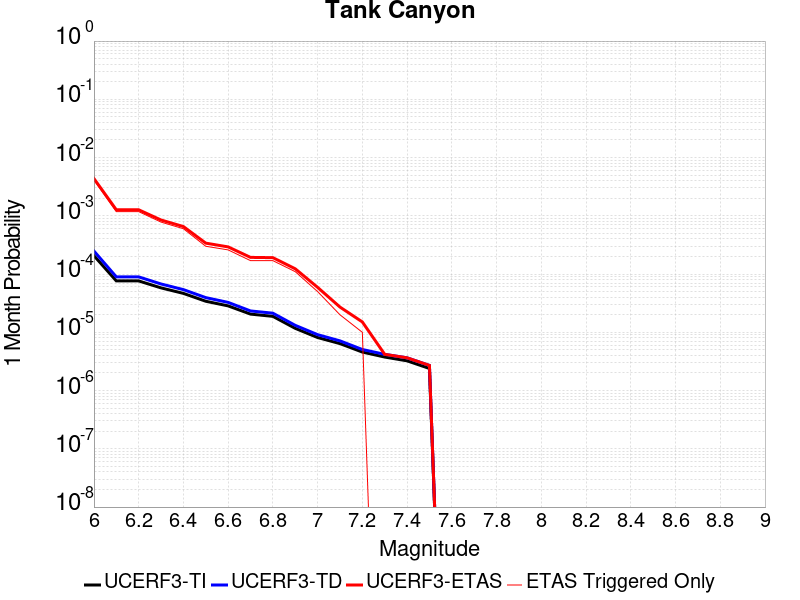 |  |  |

| Magnitude | 1 wk TI Prob | 1 wk TD Prob | 1 wk ETAS Prob | 1 wk ETAS/TD Gain | 1 wk ETAS Triggered Only | 1 mo TI Prob | 1 mo TD Prob | 1 mo ETAS Prob | 1 mo ETAS/TD Gain | 1 mo ETAS Triggered Only | 1 yr TI Prob | 1 yr TD Prob | 1 yr ETAS Prob | 1 yr ETAS/TD Gain | 1 yr ETAS Triggered Only | 10 yr TI Prob | 10 yr TD Prob | 10 yr ETAS Prob | 10 yr ETAS/TD Gain | 10 yr ETAS Triggered Only |
|-----|-----|-----|-----|-----|-----|-----|-----|-----|-----|-----|-----|-----|-----|-----|-----|-----|-----|-----|-----|-----|
| 6.0 | 4.8284557E-5 | 5.796635E-5 | 0.0011690131 | 20.167099 | 0.0011111111 | 2.0691741E-4 | 2.484074E-4 | 0.004414039 | 17.769354 | 0.004166667 | 0.0025163088 | 0.0030208372 | 0.011605935 | 3.84196 | 0.008611111 | 0.02488006 | 0.029864404 | 0.04226058 | 1.415082 | 0.012777777 |
| 6.1 | 1.7796336E-5 | 2.0873764E-5 | 2.9864575E-4 | 14.30723 | 2.7777778E-4 | 7.626778E-5 | 8.945614E-5 | 0.0012004678 | 13.419625 | 0.0011111111 | 9.281647E-4 | 0.0010886216 | 0.0046958015 | 4.31353 | 0.003611111 | 0.009242975 | 0.010836975 | 0.015233255 | 1.4056741 | 0.0044444446 |
| 6.2 | 1.7796336E-5 | 2.0873764E-5 | 2.9864575E-4 | 14.30723 | 2.7777778E-4 | 7.626778E-5 | 8.945614E-5 | 0.0012004678 | 13.419625 | 0.0011111111 | 9.281647E-4 | 0.0010886216 | 0.0046958015 | 4.31353 | 0.003611111 | 0.009242975 | 0.010836975 | 0.015233255 | 1.4056741 | 0.0044444446 |
| 6.3 | 1.3515912E-5 | 1.575988E-5 | 1.575988E-5 | 1.0 | 0.0 | 5.792405E-5 | 6.7540735E-5 | 9.008178E-4 | 13.3374 | 8.3333335E-4 | 7.049971E-4 | 8.220222E-4 | 0.0030424178 | 3.701138 | 0.0022222223 | 0.007027647 | 0.008192427 | 0.010947449 | 1.3362887 | 0.0027777778 |
| 6.4 | 1.0870146E-5 | 1.2618259E-5 | 1.2618259E-5 | 1.0 | 0.0 | 4.658551E-5 | 5.407723E-5 | 8.873655E-4 | 16.409225 | 8.3333335E-4 | 5.67031E-4 | 6.582093E-4 | 0.002323779 | 3.5304558 | 0.0016666667 | 0.005655863 | 0.006564614 | 0.0087722475 | 1.3362931 | 0.0022222223 |
| 6.5 | 7.964826E-6 | 9.196251E-6 | 9.196251E-6 | 1.0 | 0.0 | 3.4134522E-5 | 3.941197E-5 | 3.171788E-4 | 8.047778 | 2.7777778E-4 | 4.1550855E-4 | 4.7974577E-4 | 0.0015903239 | 3.3149304 | 0.0011111111 | 0.0041473247 | 0.0047884025 | 0.006170641 | 1.2886637 | 0.0013888889 |
| 6.6 | 6.6317E-6 | 7.6124184E-6 | 7.6124184E-6 | 1.0 | 0.0 | 2.8421264E-5 | 3.2624295E-5 | 3.1039302E-4 | 9.514168 | 2.7777778E-4 | 3.4597394E-4 | 3.971375E-4 | 0.0012301399 | 3.0975163 | 8.3333335E-4 | 0.0034543579 | 0.00396543 | 0.005072135 | 1.2790883 | 0.0011111111 |
| 6.7 | 4.793663E-6 | 5.4308543E-6 | 5.4308543E-6 | 1.0 | 0.0 | 2.0544108E-5 | 2.3274906E-5 | 3.010462E-4 | 12.934368 | 2.7777778E-4 | 2.500958E-4 | 2.8333953E-4 | 8.3873764E-4 | 2.960186 | 5.5555557E-4 | 0.0024981452 | 0.0028304753 | 0.00366145 | 1.2935812 | 8.3333335E-4 |
| 6.8 | 4.382823E-6 | 4.969316E-6 | 4.969316E-6 | 1.0 | 0.0 | 1.8783392E-5 | 2.1296917E-5 | 2.9906878E-4 | 14.04282 | 2.7777778E-4 | 2.286638E-4 | 2.5926338E-4 | 5.3696916E-4 | 2.0711336 | 2.7777778E-4 | 0.0022842865 | 0.0025902835 | 0.0031444 | 1.2139212 | 5.5555557E-4 |
| 6.9 | 2.729601E-6 | 3.0735694E-6 | 3.0735694E-6 | 1.0 | 0.0 | 1.1698237E-5 | 1.317238E-5 | 2.909465E-4 | 22.087618 | 2.7777778E-4 | 1.4241673E-4 | 1.6036315E-4 | 4.3809638E-4 | 2.731902 | 2.7777778E-4 | 0.001423255 | 0.0016026403 | 0.0018799728 | 1.1730473 | 2.7777778E-4 |
| 7.0 | 1.8987357E-6 | 2.126954E-6 | 2.126954E-6 | 1.0 | 0.0 | 8.137413E-6 | 9.115489E-6 | 9.115489E-6 | 1.0 | 0.0 | 9.90685E-5 | 1.1097613E-4 | 1.1097613E-4 | 1.0 | 0.0 | 9.902435E-4 | 0.0011092757 | 0.0011092757 | 1.0 | 0.0 |
| 7.1 | 1.4928986E-6 | 1.6641375E-6 | 1.6641375E-6 | 1.0 | 0.0 | 6.398121E-6 | 7.1320014E-6 | 7.1320014E-6 | 1.0 | 0.0 | 7.789434E-5 | 8.682925E-5 | 8.682925E-5 | 1.0 | 0.0 | 7.786704E-4 | 8.680111E-4 | 8.680111E-4 | 1.0 | 0.0 |
| 7.2 | 1.069082E-6 | 1.1828638E-6 | 1.1828638E-6 | 1.0 | 0.0 | 4.581772E-6 | 5.0694093E-6 | 5.0694093E-6 | 1.0 | 0.0 | 5.5781646E-5 | 6.171884E-5 | 6.171884E-5 | 1.0 | 0.0 | 5.576765E-4 | 6.170693E-4 | 6.170693E-4 | 1.0 | 0.0 |
| 7.3 | 8.776551E-7 | 9.770052E-7 | 9.770052E-7 | 1.0 | 0.0 | 3.7613736E-6 | 4.1871617E-6 | 4.1871617E-6 | 1.0 | 0.0 | 4.579376E-5 | 5.097802E-5 | 5.097802E-5 | 1.0 | 0.0 | 4.5784327E-4 | 5.0971424E-4 | 5.0971424E-4 | 1.0 | 0.0 |
| 7.4 | 7.55721E-7 | 8.510284E-7 | 8.510284E-7 | 1.0 | 0.0 | 3.2388E-6 | 3.6472622E-6 | 3.6472622E-6 | 1.0 | 0.0 | 3.9431678E-5 | 4.440503E-5 | 4.440503E-5 | 1.0 | 0.0 | 3.942468E-4 | 4.4401243E-4 | 4.4401243E-4 | 1.0 | 0.0 |
| 7.5 | 5.587665E-7 | 6.305647E-7 | 6.305647E-7 | 1.0 | 0.0 | 2.3947114E-6 | 2.7024203E-6 | 2.7024203E-6 | 1.0 | 0.0 | 2.915522E-5 | 3.2901968E-5 | 3.2901968E-5 | 1.0 | 0.0 | 2.9151395E-4 | 3.2901968E-4 | 3.2901968E-4 | 1.0 | 0.0 |

## Airport Lake
*[(top)](#table-of-contents)*

| 1 Week | 1 Month | 1 Year | 10 Year |
|-----|-----|-----|-----|
|  |  |  |  |

| Magnitude | 1 wk TI Prob | 1 wk TD Prob | 1 wk ETAS Prob | 1 wk ETAS/TD Gain | 1 wk ETAS Triggered Only | 1 mo TI Prob | 1 mo TD Prob | 1 mo ETAS Prob | 1 mo ETAS/TD Gain | 1 mo ETAS Triggered Only | 1 yr TI Prob | 1 yr TD Prob | 1 yr ETAS Prob | 1 yr ETAS/TD Gain | 1 yr ETAS Triggered Only | 10 yr TI Prob | 10 yr TD Prob | 10 yr ETAS Prob | 10 yr ETAS/TD Gain | 10 yr ETAS Triggered Only |
|-----|-----|-----|-----|-----|-----|-----|-----|-----|-----|-----|-----|-----|-----|-----|-----|-----|-----|-----|-----|-----|
| 6.0 | 1.2387061E-5 | 1.31032575E-5 | 0.0016797481 | 128.19318 | 0.0016666667 | 5.3086325E-5 | 5.6155768E-5 | 0.0025560153 | 45.516525 | 0.0025 | 6.461343E-4 | 6.835104E-4 | 0.0065128566 | 9.528541 | 0.0058333334 | 0.0064425888 | 0.0068168915 | 0.018679911 | 2.740239 | 0.011944445 |
| 6.1 | 1.2387061E-5 | 1.31032575E-5 | 0.0016797481 | 128.19318 | 0.0016666667 | 5.3086325E-5 | 5.6155768E-5 | 0.0025560153 | 45.516525 | 0.0025 | 6.461343E-4 | 6.835104E-4 | 0.0065128566 | 9.528541 | 0.0058333334 | 0.0064425888 | 0.0068168915 | 0.018679911 | 2.740239 | 0.011944445 |
| 6.2 | 1.2387061E-5 | 1.31032575E-5 | 0.0016797481 | 128.19318 | 0.0016666667 | 5.3086325E-5 | 5.6155768E-5 | 0.0025560153 | 45.516525 | 0.0025 | 6.461343E-4 | 6.835104E-4 | 0.0065128566 | 9.528541 | 0.0058333334 | 0.0064425888 | 0.0068168915 | 0.018679911 | 2.740239 | 0.011944445 |
| 6.3 | 1.2387061E-5 | 1.31032575E-5 | 0.0016797481 | 128.19318 | 0.0016666667 | 5.3086325E-5 | 5.6155768E-5 | 0.0025560153 | 45.516525 | 0.0025 | 6.461343E-4 | 6.835104E-4 | 0.0065128566 | 9.528541 | 0.0058333334 | 0.0064425888 | 0.0068168915 | 0.018679911 | 2.740239 | 0.011944445 |
| 6.4 | 1.2387061E-5 | 1.31032575E-5 | 0.0016797481 | 128.19318 | 0.0016666667 | 5.3086325E-5 | 5.6155768E-5 | 0.0025560153 | 45.516525 | 0.0025 | 6.461343E-4 | 6.835104E-4 | 0.0065128566 | 9.528541 | 0.0058333334 | 0.0064425888 | 0.0068168915 | 0.018679911 | 2.740239 | 0.011944445 |
| 6.5 | 6.9922594E-6 | 7.38498E-6 | 0.0013962636 | 189.06802 | 0.0013888889 | 2.996648E-5 | 3.164956E-5 | 0.0019760325 | 62.43475 | 0.0019444445 | 3.6478083E-4 | 3.8527072E-4 | 0.005105674 | 13.2521715 | 0.004722222 | 0.003641826 | 0.0038465653 | 0.013254681 | 3.4458485 | 0.009444444 |
| 6.6 | 6.9922594E-6 | 7.38498E-6 | 0.0013962636 | 189.06802 | 0.0013888889 | 2.996648E-5 | 3.164956E-5 | 0.0019760325 | 62.43475 | 0.0019444445 | 3.6478083E-4 | 3.8527072E-4 | 0.005105674 | 13.2521715 | 0.004722222 | 0.003641826 | 0.0038465653 | 0.013254681 | 3.4458485 | 0.009444444 |
| 6.7 | 5.477277E-6 | 5.7861116E-6 | 0.001394667 | 241.03699 | 0.0013888889 | 2.3473833E-5 | 2.4797408E-5 | 0.0019691936 | 79.41127 | 0.0019444445 | 2.8575645E-4 | 3.0187052E-4 | 0.004467279 | 14.798661 | 0.004166667 | 0.0028538927 | 0.0030149885 | 0.011323197 | 3.7556353 | 0.008333334 |
| 6.8 | 3.9950432E-6 | 4.2191186E-6 | 8.375489E-4 | 198.51279 | 8.3333335E-4 | 1.7121502E-5 | 1.8081826E-5 | 0.0011291729 | 62.44794 | 0.0011111111 | 2.0843433E-4 | 2.2012675E-4 | 0.0032750098 | 14.877836 | 0.0030555555 | 0.0020823893 | 0.002199358 | 0.008019862 | 3.6464558 | 0.0058333334 |
| 6.9 | 2.95695E-6 | 3.1230477E-6 | 5.586769E-4 | 178.88837 | 5.5555557E-4 | 1.2672582E-5 | 1.3384434E-5 | 8.467066E-4 | 63.260548 | 8.3333335E-4 | 1.5427776E-4 | 1.6294557E-4 | 0.002662538 | 16.340048 | 0.0025 | 0.001541707 | 0.0016284833 | 0.0063430155 | 3.8950448 | 0.004722222 |
| 7.0 | 1.456072E-6 | 1.5408239E-6 | 5.570955E-4 | 361.55692 | 5.5555557E-4 | 6.2402937E-6 | 6.60352E-6 | 5.621554E-4 | 85.12966 | 5.5555557E-4 | 7.597293E-5 | 8.03959E-5 | 0.0011914177 | 14.819384 | 0.0011111111 | 7.594696E-4 | 8.03767E-4 | 0.003024203 | 3.762537 | 0.0022222223 |
| 7.1 | 6.995192E-7 | 7.4090326E-7 | 2.7851848E-4 | 375.91748 | 2.7777778E-4 | 2.997936E-6 | 3.1752998E-6 | 2.809522E-4 | 88.48053 | 2.7777778E-4 | 3.649926E-5 | 3.8659273E-5 | 3.164263E-4 | 8.185004 | 2.7777778E-4 | 3.6493264E-4 | 3.8659273E-4 | 0.0012196039 | 3.1547513 | 8.3333335E-4 |

## Little Lake
*[(top)](#table-of-contents)*

| 1 Week | 1 Month | 1 Year | 10 Year |
|-----|-----|-----|-----|
|  | 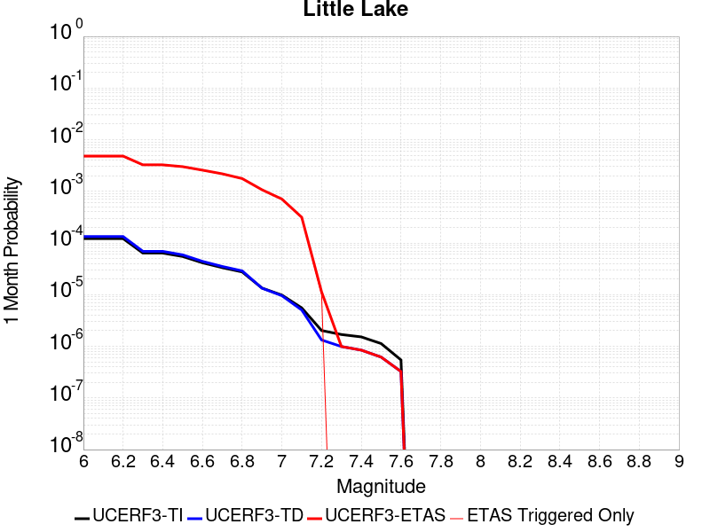 |  |  |

| Magnitude | 1 wk TI Prob | 1 wk TD Prob | 1 wk ETAS Prob | 1 wk ETAS/TD Gain | 1 wk ETAS Triggered Only | 1 mo TI Prob | 1 mo TD Prob | 1 mo ETAS Prob | 1 mo ETAS/TD Gain | 1 mo ETAS Triggered Only | 1 yr TI Prob | 1 yr TD Prob | 1 yr ETAS Prob | 1 yr ETAS/TD Gain | 1 yr ETAS Triggered Only | 10 yr TI Prob | 10 yr TD Prob | 10 yr ETAS Prob | 10 yr ETAS/TD Gain | 10 yr ETAS Triggered Only |
|-----|-----|-----|-----|-----|-----|-----|-----|-----|-----|-----|-----|-----|-----|-----|-----|-----|-----|-----|-----|-----|
| 6.0 | 2.8424427E-5 | 3.120616E-5 | 0.0014200517 | 45.505493 | 0.0013888889 | 1.2181328E-4 | 1.3373457E-4 | 0.002911141 | 21.76805 | 0.0027777778 | 0.0014820677 | 0.0016271356 | 0.0077283033 | 4.7496367 | 0.006111111 | 0.014722223 | 0.016165627 | 0.026550544 | 1.6424074 | 0.010555555 |
| 6.1 | 2.8424427E-5 | 3.120616E-5 | 0.0014200517 | 45.505493 | 0.0013888889 | 1.2181328E-4 | 1.3373457E-4 | 0.002911141 | 21.76805 | 0.0027777778 | 0.0014820677 | 0.0016271356 | 0.0077283033 | 4.7496367 | 0.006111111 | 0.014722223 | 0.016165627 | 0.026550544 | 1.6424074 | 0.010555555 |
| 6.2 | 2.8424427E-5 | 3.120616E-5 | 0.0014200517 | 45.505493 | 0.0013888889 | 1.2181328E-4 | 1.3373457E-4 | 0.002911141 | 21.76805 | 0.0027777778 | 0.0014820677 | 0.0016271356 | 0.0077283033 | 4.7496367 | 0.006111111 | 0.014722223 | 0.016165627 | 0.026550544 | 1.6424074 | 0.010555555 |
| 6.3 | 1.48860645E-5 | 1.6081593E-5 | 0.0014049482 | 87.36374 | 0.0013888889 | 6.379586E-5 | 6.891945E-5 | 0.0022909886 | 33.241535 | 0.0022222223 | 7.7643775E-4 | 8.387995E-4 | 0.004724426 | 5.6323667 | 0.003888889 | 0.007737305 | 0.008359154 | 0.01579646 | 1.8897201 | 0.0075 |
| 6.4 | 1.48860645E-5 | 1.6081593E-5 | 0.0014049482 | 87.36374 | 0.0013888889 | 6.379586E-5 | 6.891945E-5 | 0.0022909886 | 33.241535 | 0.0022222223 | 7.7643775E-4 | 8.387995E-4 | 0.004724426 | 5.6323667 | 0.003888889 | 0.007737305 | 0.008359154 | 0.01579646 | 1.8897201 | 0.0075 |
| 6.5 | 1.2797581E-5 | 1.3765735E-5 | 0.0014026355 | 101.89325 | 0.0013888889 | 5.4845623E-5 | 5.899482E-5 | 0.0020033245 | 33.957634 | 0.0019444445 | 6.675408E-4 | 7.180509E-4 | 0.0040489906 | 5.638863 | 0.0033333334 | 0.006655392 | 0.0071598585 | 0.013778793 | 1.9244504 | 0.006666667 |
| 6.6 | 9.661896E-6 | 1.0289158E-5 | 0.0013991637 | 135.98428 | 0.0013888889 | 4.1407468E-5 | 4.4095737E-5 | 0.0019884545 | 45.09403 | 0.0019444445 | 5.040193E-4 | 5.367496E-4 | 0.0038682937 | 7.2068872 | 0.0033333334 | 0.005028777 | 0.0053561367 | 0.011987096 | 2.2380116 | 0.006666667 |
| 6.7 | 7.767871E-6 | 8.199779E-6 | 0.0011193018 | 136.5039 | 0.0011111111 | 3.329045E-5 | 3.514151E-5 | 0.0017017496 | 48.425625 | 0.0016666667 | 4.0523586E-4 | 4.2777765E-4 | 0.0032043671 | 7.490731 | 0.0027777778 | 0.004044977 | 0.0042708935 | 0.009802722 | 2.295239 | 0.0055555557 |
| 6.8 | 6.4235196E-6 | 6.735819E-6 | 8.4006356E-4 | 124.71587 | 8.3333335E-4 | 2.752908E-5 | 2.886755E-5 | 0.0011399466 | 39.48886 | 0.0011111111 | 3.35115E-4 | 3.5141854E-4 | 0.0022951798 | 6.531185 | 0.0019444445 | 0.003346101 | 0.0035098887 | 0.007385128 | 2.104092 | 0.003888889 |
| 6.9 | 3.1283696E-6 | 3.1122067E-6 | 5.58666E-4 | 179.50801 | 5.5555557E-4 | 1.3407229E-5 | 1.3337969E-5 | 8.466602E-4 | 63.477444 | 8.3333335E-4 | 1.6322079E-4 | 1.6237919E-4 | 0.0018287753 | 11.262375 | 0.0016666667 | 0.0016310095 | 0.0016227537 | 0.0043960237 | 2.70899 | 0.0027777778 |
| 7.0 | 2.290603E-6 | 2.2287015E-6 | 5.57783E-4 | 250.27264 | 5.5555557E-4 | 9.816834E-6 | 9.551549E-6 | 5.651018E-4 | 59.16337 | 5.5555557E-4 | 1.19513395E-4 | 1.16284944E-4 | 0.0012272669 | 10.553962 | 0.0011111111 | 0.0011944914 | 0.0011623431 | 0.0033819822 | 2.9096248 | 0.0022222223 |
| 7.1 | 1.293693E-6 | 1.1776951E-6 | 2.7895515E-4 | 236.86533 | 2.7777778E-4 | 5.5443866E-6 | 5.047259E-6 | 2.8282363E-4 | 56.035095 | 2.7777778E-4 | 6.750081E-5 | 6.144935E-5 | 3.3921006E-4 | 5.5201573 | 2.7777778E-4 | 6.7480316E-4 | 6.14392E-4 | 0.0014472133 | 2.3555212 | 8.3333335E-4 |
| 7.2 | 4.715842E-7 | 3.0918443E-7 | 3.0918443E-7 | 1.0 | 0.0 | 2.0210737E-6 | 1.3250755E-6 | 1.3250755E-6 | 1.0 | 0.0 | 2.4606294E-5 | 1.613268E-5 | 1.613268E-5 | 1.0 | 0.0 | 2.460357E-4 | 1.6131563E-4 | 1.6131563E-4 | 1.0 | 0.0 |
| 7.3 | 3.9430947E-7 | 2.3098025E-7 | 2.3098025E-7 | 1.0 | 0.0 | 1.6898966E-6 | 9.89915E-7 | 9.89915E-7 | 1.0 | 0.0 | 2.0574296E-5 | 1.2052149E-5 | 1.2052149E-5 | 1.0 | 0.0 | 2.0572392E-4 | 1.20515026E-4 | 1.20515026E-4 | 1.0 | 0.0 |
| 7.4 | 3.547123E-7 | 1.9679635E-7 | 1.9679635E-7 | 1.0 | 0.0 | 1.5201948E-6 | 8.4341264E-7 | 8.4341264E-7 | 1.0 | 0.0 | 1.8508214E-5 | 1.0268501E-5 | 1.0268501E-5 | 1.0 | 0.0 | 1.8506673E-4 | 1.0268033E-4 | 1.0268033E-4 | 1.0 | 0.0 |
| 7.5 | 2.6354266E-7 | 1.4423487E-7 | 1.4423487E-7 | 1.0 | 0.0 | 1.129468E-6 | 6.1814933E-7 | 6.1814933E-7 | 1.0 | 0.0 | 1.3751187E-5 | 7.5259427E-6 | 7.5259427E-6 | 1.0 | 0.0 | 1.3750336E-4 | 7.525693E-5 | 7.525693E-5 | 1.0 | 0.0 |
| 7.6 | 1.269913E-7 | 7.5727044E-8 | 7.5727044E-8 | 1.0 | 0.0 | 5.4424834E-7 | 3.2454443E-7 | 3.2454443E-7 | 1.0 | 0.0 | 6.6262032E-6 | 3.9513216E-6 | 3.9513216E-6 | 1.0 | 0.0 | 6.626006E-5 | 3.951255E-5 | 3.951255E-5 | 1.0 | 0.0 |

## Owl Lake
*[(top)](#table-of-contents)*

| 1 Week | 1 Month | 1 Year | 10 Year |
|-----|-----|-----|-----|
|  | 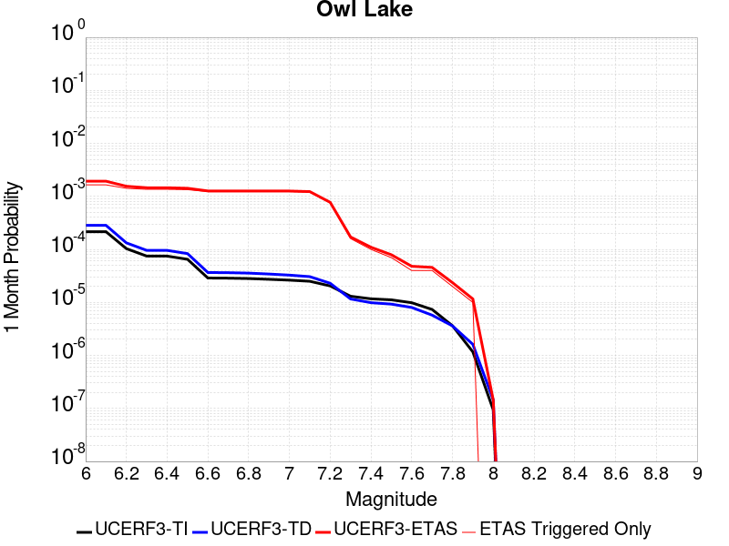 |  |  |

| Magnitude | 1 wk TI Prob | 1 wk TD Prob | 1 wk ETAS Prob | 1 wk ETAS/TD Gain | 1 wk ETAS Triggered Only | 1 mo TI Prob | 1 mo TD Prob | 1 mo ETAS Prob | 1 mo ETAS/TD Gain | 1 mo ETAS Triggered Only | 1 yr TI Prob | 1 yr TD Prob | 1 yr ETAS Prob | 1 yr ETAS/TD Gain | 1 yr ETAS Triggered Only | 10 yr TI Prob | 10 yr TD Prob | 10 yr ETAS Prob | 10 yr ETAS/TD Gain | 10 yr ETAS Triggered Only |
|-----|-----|-----|-----|-----|-----|-----|-----|-----|-----|-----|-----|-----|-----|-----|-----|-----|-----|-----|-----|-----|
| 6.0 | 5.0320643E-5 | 6.636149E-5 | 6.218802E-4 | 9.371099 | 5.5555557E-4 | 2.1564208E-4 | 2.8438168E-4 | 0.001117478 | 3.9295008 | 8.3333335E-4 | 0.0026222812 | 0.00345791 | 0.007886986 | 2.2808535 | 0.0044444446 | 0.02591553 | 0.0341423 | 0.039508175 | 1.1571621 | 0.0055555557 |
| 6.1 | 5.0320643E-5 | 6.636149E-5 | 6.218802E-4 | 9.371099 | 5.5555557E-4 | 2.1564208E-4 | 2.8438168E-4 | 0.001117478 | 3.9295008 | 8.3333335E-4 | 0.0026222812 | 0.00345791 | 0.007886986 | 2.2808535 | 0.0044444446 | 0.02591553 | 0.0341423 | 0.039508175 | 1.1571621 | 0.0055555557 |
| 6.2 | 2.4125871E-5 | 3.098269E-5 | 5.8652106E-4 | 18.930603 | 5.5555557E-4 | 1.0339249E-4 | 1.3277736E-4 | 9.660001E-4 | 7.2753367 | 8.3333335E-4 | 0.0012580766 | 0.0016155228 | 0.005498129 | 3.4033127 | 0.003888889 | 0.012509781 | 0.016071297 | 0.020717628 | 1.2891073 | 0.004722222 |
| 6.3 | 1.7433485E-5 | 2.2356835E-5 | 5.779E-4 | 25.848915 | 5.5555557E-4 | 7.471279E-5 | 9.5812386E-5 | 9.2906586E-4 | 9.69672 | 8.3333335E-4 | 9.0924866E-4 | 0.0011660426 | 0.005050397 | 4.3312283 | 0.003888889 | 0.009055373 | 0.01162957 | 0.016296875 | 1.4013308 | 0.004722222 |
| 6.4 | 1.7433485E-5 | 2.2356835E-5 | 5.779E-4 | 25.848915 | 5.5555557E-4 | 7.471279E-5 | 9.5812386E-5 | 9.2906586E-4 | 9.69672 | 8.3333335E-4 | 9.0924866E-4 | 0.0011660426 | 0.005050397 | 4.3312283 | 0.003888889 | 0.009055373 | 0.01162957 | 0.016296875 | 1.4013308 | 0.004722222 |
| 6.5 | 1.5182742E-5 | 1.9430352E-5 | 5.749751E-4 | 29.591595 | 5.5555557E-4 | 6.506727E-5 | 8.327114E-5 | 9.165351E-4 | 11.006636 | 8.3333335E-4 | 7.919061E-4 | 0.0010135059 | 0.004620957 | 4.5593786 | 0.003611111 | 0.0078909 | 0.010119047 | 0.014518517 | 1.4347713 | 0.0044444446 |
| 6.6 | 6.7271576E-6 | 8.548157E-6 | 5.6409894E-4 | 65.990715 | 5.5555557E-4 | 2.8830356E-5 | 3.6634476E-5 | 8.699373E-4 | 23.74641 | 8.3333335E-4 | 3.5095305E-4 | 4.4593913E-4 | 0.003222478 | 7.226274 | 0.0027777778 | 0.0035039932 | 0.004468226 | 0.007786665 | 1.742675 | 0.0033333334 |
| 6.7 | 6.682835E-6 | 8.4806015E-6 | 5.640314E-4 | 66.50842 | 5.5555557E-4 | 2.8640408E-5 | 3.634496E-5 | 8.69648E-4 | 23.927608 | 8.3333335E-4 | 3.4864116E-4 | 4.424157E-4 | 0.0032189647 | 7.275882 | 0.0027777778 | 0.003480947 | 0.004433152 | 0.007751708 | 1.7485772 | 0.0033333334 |
| 6.8 | 6.5774975E-6 | 8.327072E-6 | 5.63878E-4 | 67.71625 | 5.5555557E-4 | 2.8188972E-5 | 3.5686993E-5 | 8.689906E-4 | 24.350346 | 8.3333335E-4 | 3.4314668E-4 | 4.3440814E-4 | 0.0032109793 | 7.3916183 | 0.0027777778 | 0.0034261728 | 0.0043532955 | 0.007672118 | 1.7623701 | 0.0033333334 |
| 6.9 | 6.363419E-6 | 8.0002355E-6 | 5.635513E-4 | 70.44184 | 5.5555557E-4 | 2.727151E-5 | 3.4286306E-5 | 8.6759106E-4 | 25.304304 | 8.3333335E-4 | 3.3198006E-4 | 4.173614E-4 | 0.0031939799 | 7.6527915 | 0.0027777778 | 0.0033148455 | 0.004183282 | 0.0075026713 | 1.7934891 | 0.0033333334 |
| 7.0 | 6.1342453E-6 | 7.632424E-6 | 5.6318374E-4 | 73.78832 | 5.5555557E-4 | 2.6289357E-5 | 3.271001E-5 | 8.660161E-4 | 26.475569 | 8.3333335E-4 | 3.2002592E-4 | 3.981771E-4 | 0.0031748489 | 7.9734592 | 0.0027777778 | 0.0031956544 | 0.00399197 | 0.0073119965 | 1.8316762 | 0.0033333334 |
| 7.1 | 5.842926E-6 | 7.142961E-6 | 5.6269456E-4 | 78.77609 | 5.5555557E-4 | 2.504087E-5 | 3.0612362E-5 | 8.639202E-4 | 28.221287 | 8.3333335E-4 | 3.0482994E-4 | 3.7264716E-4 | 0.0031493898 | 8.451399 | 0.0027777778 | 0.0030441214 | 0.0037374226 | 0.0070582977 | 1.8885468 | 0.0033333334 |
| 7.2 | 4.77173E-6 | 5.3591634E-6 | 5.609117E-4 | 104.66405 | 5.5555557E-4 | 2.045011E-5 | 2.2967664E-5 | 8.5628184E-4 | 37.282063 | 8.3333335E-4 | 2.4895166E-4 | 2.7959948E-4 | 0.0025012004 | 8.945655 | 0.0022222223 | 0.0024867293 | 0.0028089995 | 0.0055789743 | 1.9861073 | 0.0027777778 |
| 7.3 | 3.0494948E-6 | 2.7109647E-6 | 2.80488E-4 | 103.46427 | 2.7777778E-4 | 1.3069198E-5 | 1.1618369E-5 | 2.8939292E-4 | 24.908222 | 2.7777778E-4 | 1.5910587E-4 | 1.4144463E-4 | 6.969216E-4 | 4.9271693 | 5.5555557E-4 | 0.0015899199 | 0.0014235033 | 0.001978268 | 1.3897179 | 5.5555557E-4 |
| 7.4 | 2.7263884E-6 | 2.3061473E-6 | 2.8008327E-4 | 121.45073 | 2.7777778E-4 | 1.1684469E-5 | 9.883452E-6 | 2.8765848E-4 | 29.105062 | 2.7777778E-4 | 1.4224913E-4 | 1.2032448E-4 | 6.758132E-4 | 5.616589 | 5.5555557E-4 | 0.0014215811 | 0.0012114698 | 0.0017663523 | 1.4580243 | 5.5555557E-4 |
| 7.5 | 2.6090431E-6 | 2.1660758E-6 | 2.7994326E-4 | 129.23982 | 2.7777778E-4 | 1.1181565E-5 | 9.283149E-6 | 2.8705836E-4 | 30.922518 | 2.7777778E-4 | 1.3612706E-4 | 1.1301658E-4 | 6.6850934E-4 | 5.9151444 | 5.5555557E-4 | 0.001360437 | 0.001138222 | 0.0016931454 | 1.4875351 | 5.5555557E-4 |
| 7.6 | 2.3008756E-6 | 1.8732376E-6 | 1.8732376E-6 | 1.0 | 0.0 | 9.860858E-6 | 8.028137E-6 | 8.028137E-6 | 1.0 | 0.0 | 1.20049335E-4 | 9.7738266E-5 | 3.754889E-4 | 3.84178 | 2.7777778E-4 | 0.001199845 | 9.852252E-4 | 0.0012627293 | 1.2816657 | 2.7777778E-4 |
| 7.7 | 1.7184348E-6 | 1.3423282E-6 | 1.3423282E-6 | 1.0 | 0.0 | 7.3646997E-6 | 5.7528227E-6 | 5.7528227E-6 | 1.0 | 0.0 | 8.966153E-5 | 7.0038404E-5 | 7.0038404E-5 | 1.0 | 0.0 | 8.962536E-4 | 7.080495E-4 | 7.080495E-4 | 1.0 | 0.0 |
| 7.8 | 8.4612907E-7 | 8.4087924E-7 | 8.4087924E-7 | 1.0 | 0.0 | 3.6262625E-6 | 3.6037634E-6 | 3.6037634E-6 | 1.0 | 0.0 | 4.4148852E-5 | 4.3874956E-5 | 4.3874956E-5 | 1.0 | 0.0 | 4.414008E-4 | 4.4413717E-4 | 4.4413717E-4 | 1.0 | 0.0 |
| 7.9 | 2.716738E-7 | 3.7694025E-7 | 3.7694025E-7 | 1.0 | 0.0 | 1.1643157E-6 | 1.6154573E-6 | 1.6154573E-6 | 1.0 | 0.0 | 1.4175452E-5 | 1.9668027E-5 | 1.9668027E-5 | 1.0 | 0.0 | 1.4174548E-4 | 1.9843443E-4 | 1.9843443E-4 | 1.0 | 0.0 |
| 8.0 | 2.1995428E-8 | 3.386013E-8 | 3.386013E-8 | 1.0 | 0.0 | 9.426611E-8 | 1.4511484E-7 | 1.4511484E-7 | 1.0 | 0.0 | 1.1476893E-6 | 1.7667724E-6 | 1.7667724E-6 | 1.0 | 0.0 | 1.14768345E-5 | 1.7968985E-5 | 1.7968985E-5 | 1.0 | 0.0 |

## Panamint Valley
*[(top)](#table-of-contents)*

| 1 Week | 1 Month | 1 Year | 10 Year |
|-----|-----|-----|-----|
|  |  |  | 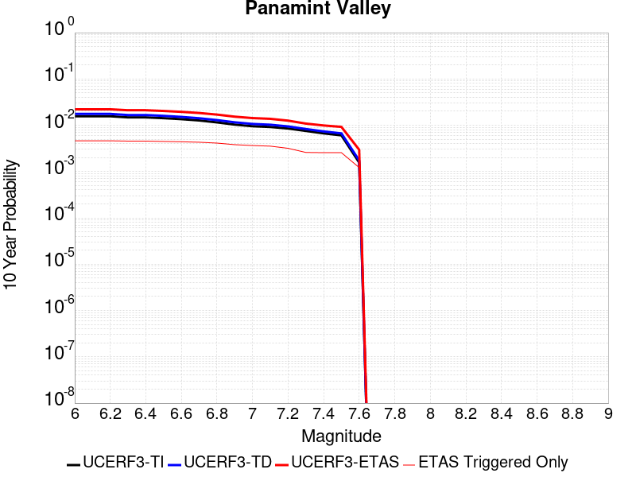 |

| Magnitude | 1 wk TI Prob | 1 wk TD Prob | 1 wk ETAS Prob | 1 wk ETAS/TD Gain | 1 wk ETAS Triggered Only | 1 mo TI Prob | 1 mo TD Prob | 1 mo ETAS Prob | 1 mo ETAS/TD Gain | 1 mo ETAS Triggered Only | 1 yr TI Prob | 1 yr TD Prob | 1 yr ETAS Prob | 1 yr ETAS/TD Gain | 1 yr ETAS Triggered Only | 10 yr TI Prob | 10 yr TD Prob | 10 yr ETAS Prob | 10 yr ETAS/TD Gain | 10 yr ETAS Triggered Only |
|-----|-----|-----|-----|-----|-----|-----|-----|-----|-----|-----|-----|-----|-----|-----|-----|-----|-----|-----|-----|-----|
| 6.0 | 3.0211835E-5 | 3.3985398E-5 | 5.8952207E-4 | 17.346334 | 5.5555557E-4 | 1.2947287E-4 | 1.4564373E-4 | 9.788556E-4 | 6.720891 | 8.3333335E-4 | 0.0015751923 | 0.0017717998 | 0.0048219417 | 2.7214935 | 0.0030555555 | 0.015640736 | 0.01758359 | 0.021949885 | 1.2483165 | 0.0044444446 |
| 6.1 | 3.0211835E-5 | 3.3985398E-5 | 5.8952207E-4 | 17.346334 | 5.5555557E-4 | 1.2947287E-4 | 1.4564373E-4 | 9.788556E-4 | 6.720891 | 8.3333335E-4 | 0.0015751923 | 0.0017717998 | 0.0048219417 | 2.7214935 | 0.0030555555 | 0.015640736 | 0.01758359 | 0.021949885 | 1.2483165 | 0.0044444446 |
| 6.2 | 3.0211835E-5 | 3.3985398E-5 | 5.8952207E-4 | 17.346334 | 5.5555557E-4 | 1.2947287E-4 | 1.4564373E-4 | 9.788556E-4 | 6.720891 | 8.3333335E-4 | 0.0015751923 | 0.0017717998 | 0.0048219417 | 2.7214935 | 0.0030555555 | 0.015640736 | 0.01758359 | 0.021949885 | 1.2483165 | 0.0044444446 |
| 6.3 | 2.8573924E-5 | 3.2103522E-5 | 5.8764126E-4 | 18.304573 | 5.5555557E-4 | 1.2245393E-4 | 1.3757942E-4 | 9.707981E-4 | 7.0562744 | 8.3333335E-4 | 0.001489857 | 0.0016737703 | 0.0047242115 | 2.822497 | 0.0030555555 | 0.01479908 | 0.016618231 | 0.020988818 | 1.2629994 | 0.0044444446 |
| 6.4 | 2.8573924E-5 | 3.2103522E-5 | 5.8764126E-4 | 18.304573 | 5.5555557E-4 | 1.2245393E-4 | 1.3757942E-4 | 9.707981E-4 | 7.0562744 | 8.3333335E-4 | 0.001489857 | 0.0016737703 | 0.0047242115 | 2.822497 | 0.0030555555 | 0.01479908 | 0.016618231 | 0.020988818 | 1.2629994 | 0.0044444446 |
| 6.5 | 2.7468774E-5 | 3.0829244E-5 | 5.863677E-4 | 19.019852 | 5.5555557E-4 | 1.1771801E-4 | 1.3211879E-4 | 9.6534204E-4 | 7.3066216 | 8.3333335E-4 | 0.0014322745 | 0.0016073869 | 0.004658031 | 2.8978903 | 0.0030555555 | 0.014230782 | 0.015964093 | 0.020337585 | 1.2739581 | 0.0044444446 |
| 6.6 | 2.6135967E-5 | 2.9253257E-5 | 5.847926E-4 | 19.990683 | 5.5555557E-4 | 1.1200648E-4 | 1.2536523E-4 | 9.585941E-4 | 7.6464114 | 8.3333335E-4 | 0.0013628257 | 0.0015252795 | 0.00429882 | 2.818382 | 0.0027777778 | 0.013544982 | 0.015154443 | 0.019257966 | 1.2707802 | 0.004166667 |
| 6.7 | 2.4498746E-5 | 2.7342086E-5 | 5.8288244E-4 | 21.31814 | 5.5555557E-4 | 1.04990395E-4 | 1.1717525E-4 | 9.5041096E-4 | 8.111021 | 8.3333335E-4 | 0.0012775084 | 0.0014257001 | 0.0041995174 | 2.9455826 | 0.0027777778 | 0.012701893 | 0.014171662 | 0.01827928 | 1.2898474 | 0.004166667 |
| 6.8 | 2.2244329E-5 | 2.4936131E-5 | 5.804778E-4 | 23.278584 | 5.5555557E-4 | 9.532935E-5 | 1.0686488E-4 | 9.4010914E-4 | 8.797176 | 8.3333335E-4 | 0.0011600169 | 0.0013003252 | 0.0037970743 | 2.920096 | 0.0025 | 0.011539802 | 0.012932883 | 0.016771477 | 1.2968088 | 0.003888889 |
| 6.9 | 1.9902658E-5 | 2.2290924E-5 | 5.778341E-4 | 25.922394 | 5.5555557E-4 | 8.529431E-5 | 9.552913E-5 | 9.2878286E-4 | 9.722508 | 8.3333335E-4 | 0.0010379635 | 0.0011624652 | 0.003659559 | 3.148102 | 0.0025 | 0.010331288 | 0.011568946 | 0.015138281 | 1.3085272 | 0.003611111 |
| 7.0 | 1.8353881E-5 | 2.056681E-5 | 5.7611096E-4 | 28.011684 | 5.5555557E-4 | 7.865712E-5 | 8.814059E-5 | 6.4364716E-4 | 7.302506 | 5.5555557E-4 | 9.5722964E-4 | 0.0010726011 | 0.0032924397 | 3.0695846 | 0.0022222223 | 0.009531168 | 0.0106791705 | 0.013976906 | 1.3088008 | 0.0033333334 |
| 7.1 | 1.7667631E-5 | 1.9773222E-5 | 5.7531777E-4 | 29.095804 | 5.5555557E-4 | 7.571623E-5 | 8.473973E-5 | 6.402482E-4 | 7.5554667 | 5.5555557E-4 | 9.2145515E-4 | 0.0010312354 | 0.003251166 | 3.1526904 | 0.0022222223 | 0.009176437 | 0.010269388 | 0.01356849 | 1.3212559 | 0.0033333334 |
| 7.2 | 1.6381597E-5 | 1.8158824E-5 | 5.737043E-4 | 31.593693 | 5.5555557E-4 | 7.020495E-5 | 7.782131E-5 | 6.3333364E-4 | 8.138307 | 5.5555557E-4 | 8.544101E-4 | 9.4707985E-4 | 0.0028896828 | 3.05115 | 0.0019444445 | 0.008511325 | 0.009435088 | 0.012461814 | 1.3207947 | 0.0030555555 |
| 7.3 | 1.4520491E-5 | 1.5966963E-5 | 5.7151366E-4 | 35.79351 | 5.5555557E-4 | 6.222919E-5 | 6.842814E-5 | 6.2394567E-4 | 9.118261 | 5.5555557E-4 | 7.57377E-4 | 8.3281036E-4 | 0.0022205426 | 2.6663244 | 0.0013888889 | 0.0075480095 | 0.008300003 | 0.010779253 | 1.2987047 | 0.0025 |
| 7.4 | 1.2852287E-5 | 1.4145856E-5 | 5.6969357E-4 | 40.272823 | 5.5555557E-4 | 5.5080065E-5 | 6.0623777E-5 | 6.1614567E-4 | 10.163432 | 5.5555557E-4 | 6.7039346E-4 | 7.3786033E-4 | 0.0021257245 | 2.8809304 | 0.0013888889 | 0.0066837464 | 0.007357025 | 0.009838632 | 1.3373113 | 0.0025 |
| 7.5 | 1.1637851E-5 | 1.2837149E-5 | 5.683856E-4 | 44.27662 | 5.5555557E-4 | 4.987555E-5 | 5.5015284E-5 | 6.105403E-4 | 11.097649 | 5.5555557E-4 | 6.070656E-4 | 6.6962093E-4 | 0.0020575798 | 3.0727532 | 0.0013888889 | 0.006054099 | 0.0066789286 | 0.009162231 | 1.3718115 | 0.0025 |
| 7.6 | 3.0068115E-6 | 3.3331687E-6 | 3.3331687E-6 | 1.0 | 0.0 | 1.2886271E-5 | 1.4284972E-5 | 1.4284972E-5 | 1.0 | 0.0 | 1.5687906E-4 | 1.7391294E-4 | 4.516424E-4 | 2.5969455 | 2.7777778E-4 | 0.0015676835 | 0.001739208 | 0.002571092 | 1.478312 | 8.3333335E-4 |

## Garlock (East)
*[(top)](#table-of-contents)*

| 1 Week | 1 Month | 1 Year | 10 Year |
|-----|-----|-----|-----|
|  |  |  | 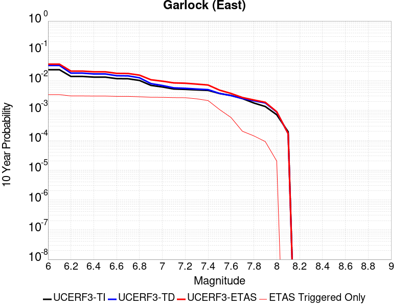 |

| Magnitude | 1 wk TI Prob | 1 wk TD Prob | 1 wk ETAS Prob | 1 wk ETAS/TD Gain | 1 wk ETAS Triggered Only | 1 mo TI Prob | 1 mo TD Prob | 1 mo ETAS Prob | 1 mo ETAS/TD Gain | 1 mo ETAS Triggered Only | 1 yr TI Prob | 1 yr TD Prob | 1 yr ETAS Prob | 1 yr ETAS/TD Gain | 1 yr ETAS Triggered Only | 10 yr TI Prob | 10 yr TD Prob | 10 yr ETAS Prob | 10 yr ETAS/TD Gain | 10 yr ETAS Triggered Only |
|-----|-----|-----|-----|-----|-----|-----|-----|-----|-----|-----|-----|-----|-----|-----|-----|-----|-----|-----|-----|-----|
| 6.0 | 4.5092507E-5 | 6.2906794E-5 | 3.406671E-4 | 5.4154263 | 2.7777778E-4 | 1.9323928E-4 | 2.695752E-4 | 0.0013803868 | 5.1206 | 0.0011111111 | 0.0023501497 | 0.0032775842 | 0.00576939 | 1.7602569 | 0.0025 | 0.023254504 | 0.03235364 | 0.036385503 | 1.1246184 | 0.004166667 |
| 6.1 | 4.5092507E-5 | 6.2906794E-5 | 3.406671E-4 | 5.4154263 | 2.7777778E-4 | 1.9323928E-4 | 2.695752E-4 | 0.0013803868 | 5.1206 | 0.0011111111 | 0.0023501497 | 0.0032775842 | 0.00576939 | 1.7602569 | 0.0025 | 0.023254504 | 0.03235364 | 0.036385503 | 1.1246184 | 0.004166667 |
| 6.2 | 2.6674514E-5 | 3.4512483E-5 | 3.1228067E-4 | 9.04834 | 2.7777778E-4 | 1.1431433E-4 | 1.4790244E-4 | 0.0012588492 | 8.511349 | 0.0011111111 | 0.0013908884 | 0.001799258 | 0.0037402038 | 2.078748 | 0.0019444445 | 0.01382215 | 0.017891733 | 0.021165427 | 1.1829724 | 0.0033333334 |
| 6.3 | 2.6674514E-5 | 3.4512483E-5 | 3.1228067E-4 | 9.04834 | 2.7777778E-4 | 1.1431433E-4 | 1.4790244E-4 | 0.0012588492 | 8.511349 | 0.0011111111 | 0.0013908884 | 0.001799258 | 0.0037402038 | 2.078748 | 0.0019444445 | 0.01382215 | 0.017891733 | 0.021165427 | 1.1829724 | 0.0033333334 |
| 6.4 | 2.5312667E-5 | 3.2341675E-5 | 3.1011048E-4 | 9.588572 | 2.7777778E-4 | 1.0847834E-4 | 1.3859998E-4 | 0.0012495571 | 9.015565 | 0.0011111111 | 0.0013199237 | 0.001686178 | 0.0036273438 | 2.1512222 | 0.0019444445 | 0.013121112 | 0.01677974 | 0.02005714 | 1.1953189 | 0.0033333334 |
| 6.5 | 2.5312667E-5 | 3.2341675E-5 | 3.1011048E-4 | 9.588572 | 2.7777778E-4 | 1.0847834E-4 | 1.3859998E-4 | 0.0012495571 | 9.015565 | 0.0011111111 | 0.0013199237 | 0.001686178 | 0.0036273438 | 2.1512222 | 0.0019444445 | 0.013121112 | 0.01677974 | 0.02005714 | 1.1953189 | 0.0033333334 |
| 6.6 | 2.246556E-5 | 2.813642E-5 | 3.0590637E-4 | 10.872257 | 2.7777778E-4 | 9.627742E-5 | 1.20579214E-4 | 0.0012315563 | 10.213671 | 0.0011111111 | 0.0011715472 | 0.0014670868 | 0.0034086786 | 2.3234334 | 0.0019444445 | 0.011653901 | 0.014620015 | 0.017904615 | 1.2246646 | 0.0033333334 |
| 6.7 | 2.2241198E-5 | 2.7806154E-5 | 3.0557622E-4 | 10.989517 | 2.7777778E-4 | 9.531594E-5 | 1.1916392E-4 | 0.0012301427 | 10.323113 | 0.0011111111 | 0.0011598538 | 0.0014498787 | 0.0033915038 | 2.339164 | 0.0019444445 | 0.011538187 | 0.0144502055 | 0.017735371 | 1.2273439 | 0.0033333334 |
| 6.8 | 1.9528685E-5 | 2.3900653E-5 | 3.016718E-4 | 12.621906 | 2.7777778E-4 | 8.369167E-5 | 1.0242746E-4 | 0.0012134247 | 11.846675 | 0.0011111111 | 0.0010184698 | 0.0012463606 | 0.0031883814 | 2.5581534 | 0.0019444445 | 0.010138147 | 0.012437694 | 0.015729569 | 1.2646692 | 0.0033333334 |
| 6.9 | 1.3318621E-5 | 1.5201007E-5 | 2.9297455E-4 | 19.273365 | 2.7777778E-4 | 5.7078556E-5 | 6.514558E-5 | 8.984246E-4 | 13.79103 | 8.3333335E-4 | 6.9470983E-4 | 7.928645E-4 | 0.0024582096 | 3.100416 | 0.0016666667 | 0.0069254204 | 0.007940986 | 0.010696705 | 1.3470248 | 0.0027777778 |
| 7.0 | 1.1760853E-5 | 1.3109839E-5 | 2.9088397E-4 | 22.18822 | 2.7777778E-4 | 5.0402683E-5 | 5.618384E-5 | 8.8947034E-4 | 15.831427 | 8.3333335E-4 | 6.134799E-4 | 6.838286E-4 | 0.0023493555 | 3.4355912 | 0.0016666667 | 0.0061178906 | 0.006857582 | 0.009616311 | 1.4022889 | 0.0027777778 |
| 7.1 | 1.0064758E-5 | 1.090491E-5 | 2.8867967E-4 | 26.472448 | 2.7777778E-4 | 4.3133965E-5 | 4.673451E-5 | 8.800289E-4 | 18.830387 | 8.3333335E-4 | 5.2502943E-4 | 5.688476E-4 | 0.0022345663 | 3.9282334 | 0.0016666667 | 0.005237907 | 0.005714025 | 0.00847593 | 1.4833555 | 0.0027777778 |
| 7.2 | 9.768808E-6 | 1.0500772E-5 | 2.8827562E-4 | 27.452803 | 2.7777778E-4 | 4.186565E-5 | 4.500255E-5 | 8.7829836E-4 | 19.516634 | 8.3333335E-4 | 5.095951E-4 | 5.477718E-4 | 0.0022135256 | 4.0409627 | 0.0016666667 | 0.0050842804 | 0.005504284 | 0.008266772 | 1.5018796 | 0.0027777778 |
| 7.3 | 9.344516E-6 | 9.946395E-6 | 2.877214E-4 | 28.927204 | 2.7777778E-4 | 4.004731E-5 | 4.2626732E-5 | 8.7592454E-4 | 20.548714 | 8.3333335E-4 | 4.8746695E-4 | 5.1886035E-4 | 0.0021846623 | 4.2105017 | 0.0016666667 | 0.0048639905 | 0.005215945 | 0.007979234 | 1.5297773 | 0.0027777778 |
| 7.4 | 9.023491E-6 | 9.49255E-6 | 2.872677E-4 | 30.262436 | 2.7777778E-4 | 3.867153E-5 | 4.068174E-5 | 8.7398116E-4 | 21.483376 | 8.3333335E-4 | 4.7072413E-4 | 4.95191E-4 | 0.0021610323 | 4.364038 | 0.0016666667 | 0.004697283 | 0.004979378 | 0.0074669295 | 1.4995707 | 0.0025 |
| 7.5 | 7.081253E-6 | 7.0893525E-6 | 2.8486515E-4 | 40.182114 | 2.7777778E-4 | 3.0347876E-5 | 3.038259E-5 | 5.859213E-4 | 19.284771 | 5.5555557E-4 | 3.6942272E-4 | 3.6984598E-4 | 0.0014805462 | 4.0031424 | 0.0011111111 | 0.003688092 | 0.0037251879 | 0.005385646 | 1.4457381 | 0.0016666667 |
| 7.6 | 6.116396E-6 | 5.9608415E-6 | 2.8373697E-4 | 47.60015 | 2.7777778E-4 | 2.6212863E-5 | 2.5546216E-5 | 3.033169E-4 | 11.873261 | 2.7777778E-4 | 3.1909486E-4 | 3.1098103E-4 | 0.0011440553 | 3.6788583 | 8.3333335E-4 | 0.0031863707 | 0.003136586 | 0.004244212 | 1.353131 | 0.0011111111 |
| 7.7 | 4.797145E-6 | 4.7587923E-6 | 4.7587923E-6 | 1.0 | 0.0 | 2.055903E-5 | 2.0394666E-5 | 2.0394666E-5 | 1.0 | 0.0 | 2.5027743E-4 | 2.482769E-4 | 2.482769E-4 | 1.0 | 0.0 | 0.0024999576 | 0.002510134 | 0.0027872145 | 1.1103847 | 2.7777778E-4 |
| 7.8 | 3.4028885E-6 | 3.979809E-6 | 3.979809E-6 | 1.0 | 0.0 | 1.4583726E-5 | 1.7056214E-5 | 1.7056214E-5 | 1.0 | 0.0 | 1.775424E-4 | 2.076397E-4 | 2.076397E-4 | 1.0 | 0.0 | 0.0017740062 | 0.0021019245 | 0.0023791185 | 1.1318762 | 2.7777778E-4 |
| 7.9 | 2.5928412E-6 | 3.373588E-6 | 3.373588E-6 | 1.0 | 0.0 | 1.1112129E-5 | 1.44581545E-5 | 1.44581545E-5 | 1.0 | 0.0 | 1.3528178E-4 | 1.7601387E-4 | 1.7601387E-4 | 1.0 | 0.0 | 0.0013519945 | 0.0017818334 | 0.0017818334 | 1.0 | 0.0 |
| 8.0 | 1.3743648E-6 | 1.673991E-6 | 1.673991E-6 | 1.0 | 0.0 | 5.8901214E-6 | 7.174228E-6 | 7.174228E-6 | 1.0 | 0.0 | 7.1709874E-5 | 8.7342756E-5 | 8.7342756E-5 | 1.0 | 0.0 | 7.1686733E-4 | 8.839922E-4 | 8.839922E-4 | 1.0 | 0.0 |
| 8.1 | 3.6733252E-7 | 3.1499187E-7 | 3.1499187E-7 | 1.0 | 0.0 | 1.5742813E-6 | 1.3499646E-6 | 1.3499646E-6 | 1.0 | 0.0 | 1.9166706E-5 | 1.643571E-5 | 1.643571E-5 | 1.0 | 0.0 | 1.9165053E-4 | 1.6643589E-4 | 1.6643589E-4 | 1.0 | 0.0 |

## Garlock (West)
*[(top)](#table-of-contents)*

| 1 Week | 1 Month | 1 Year | 10 Year |
|-----|-----|-----|-----|
|  |  |  |  |

| Magnitude | 1 wk TI Prob | 1 wk TD Prob | 1 wk ETAS Prob | 1 wk ETAS/TD Gain | 1 wk ETAS Triggered Only | 1 mo TI Prob | 1 mo TD Prob | 1 mo ETAS Prob | 1 mo ETAS/TD Gain | 1 mo ETAS Triggered Only | 1 yr TI Prob | 1 yr TD Prob | 1 yr ETAS Prob | 1 yr ETAS/TD Gain | 1 yr ETAS Triggered Only | 10 yr TI Prob | 10 yr TD Prob | 10 yr ETAS Prob | 10 yr ETAS/TD Gain | 10 yr ETAS Triggered Only |
|-----|-----|-----|-----|-----|-----|-----|-----|-----|-----|-----|-----|-----|-----|-----|-----|-----|-----|-----|-----|-----|
| 6.0 | 2.5181727E-5 | 2.5202135E-5 | 8.5851445E-4 | 34.065147 | 8.3333335E-4 | 1.0791722E-4 | 1.080047E-4 | 0.0014967435 | 13.858134 | 0.0013888889 | 0.0013131002 | 0.0013141674 | 0.003810882 | 2.8998451 | 0.0025 | 0.013053683 | 0.013144457 | 0.01615985 | 1.2294041 | 0.0030555555 |
| 6.1 | 2.5077732E-5 | 2.5103205E-5 | 8.584156E-4 | 34.195457 | 8.3333335E-4 | 1.0747157E-4 | 1.07580745E-4 | 0.0014963202 | 13.908811 | 0.0013888889 | 0.001307681 | 0.0013090121 | 0.0038057396 | 2.9073372 | 0.0025 | 0.013000126 | 0.0130935125 | 0.01610906 | 1.2303085 | 0.0030555555 |
| 6.2 | 2.494612E-5 | 2.498488E-5 | 8.582974E-4 | 34.352673 | 8.3333335E-4 | 1.0690756E-4 | 1.07073676E-4 | 0.0014958138 | 13.969949 | 0.0013888889 | 0.0013008224 | 0.0013028459 | 0.003799589 | 2.916376 | 0.0025 | 0.012932341 | 0.013032575 | 0.016048308 | 1.2313997 | 0.0030555555 |
| 6.3 | 2.4733758E-5 | 2.4804243E-5 | 8.581169E-4 | 34.59557 | 8.3333335E-4 | 1.0599751E-4 | 1.0629959E-4 | 0.0014950408 | 14.064409 | 0.0013888889 | 0.0012897556 | 0.0012934325 | 0.0037901988 | 2.9303415 | 0.0025 | 0.012822957 | 0.012939542 | 0.01595556 | 1.2330854 | 0.0030555555 |
| 6.4 | 2.3237335E-5 | 2.318352E-5 | 8.5649756E-4 | 36.94424 | 8.3333335E-4 | 9.958477E-5 | 9.935417E-5 | 0.001488105 | 14.977781 | 0.0013888889 | 0.0012117702 | 0.0012089686 | 0.0037059463 | 3.0653784 | 0.0025 | 0.012051838 | 0.012104375 | 0.015122945 | 1.2493784 | 0.0030555555 |
| 6.5 | 2.2732203E-5 | 2.2998063E-5 | 8.563122E-4 | 37.234104 | 8.3333335E-4 | 9.742009E-5 | 9.8559416E-5 | 0.0014873114 | 15.090506 | 0.0013888889 | 0.0011854442 | 0.0011993032 | 0.003696305 | 3.082044 | 0.0025 | 0.011791403 | 0.012008769 | 0.015027632 | 1.2513881 | 0.0030555555 |
| 6.6 | 2.1319436E-5 | 2.1778224E-5 | 8.550934E-4 | 39.26369 | 8.3333335E-4 | 9.136581E-5 | 9.333192E-5 | 0.0014820911 | 15.879789 | 0.0013888889 | 0.001111811 | 0.001135726 | 0.0036328868 | 3.198735 | 0.0025 | 0.011062649 | 0.0113796545 | 0.014400438 | 1.2654549 | 0.0030555555 |
| 6.7 | 1.970802E-5 | 2.0398069E-5 | 8.537144E-4 | 41.852707 | 8.3333335E-4 | 8.446021E-5 | 8.741738E-5 | 0.0014761848 | 16.88663 | 0.0013888889 | 0.001027818 | 0.0010637887 | 0.003561129 | 3.347591 | 0.0025 | 0.010230771 | 0.010667368 | 0.013690329 | 1.283384 | 0.0030555555 |
| 6.8 | 1.8744462E-5 | 1.9905692E-5 | 8.5322245E-4 | 42.86324 | 8.3333335E-4 | 8.033094E-5 | 8.530733E-5 | 0.0014740777 | 17.279615 | 0.0013888889 | 9.775903E-4 | 0.0010381235 | 0.0035355282 | 3.4056914 | 0.0025 | 0.009733009 | 0.010413141 | 0.013436879 | 1.2903771 | 0.0030555555 |
| 6.9 | 1.7559682E-5 | 1.895803E-5 | 8.522756E-4 | 44.955914 | 8.3333335E-4 | 7.5253614E-5 | 8.124618E-5 | 0.0014700223 | 18.093433 | 0.0013888889 | 9.158276E-4 | 9.887248E-4 | 0.0034862529 | 3.5260096 | 0.0025 | 0.0091206245 | 0.009923607 | 0.01294884 | 1.3048522 | 0.0030555555 |
| 7.0 | 1.6794445E-5 | 1.8220819E-5 | 8.5153896E-4 | 46.734398 | 8.3333335E-4 | 7.197421E-5 | 7.8086894E-5 | 0.0014668673 | 18.785065 | 0.0013888889 | 8.759337E-4 | 9.5029466E-4 | 0.003447919 | 3.628263 | 0.0025 | 0.008724891 | 0.0095425 | 0.012568898 | 1.3171494 | 0.0030555555 |
| 7.1 | 1.6337795E-5 | 1.7721602E-5 | 8.510402E-4 | 48.02276 | 8.3333335E-4 | 7.0017246E-5 | 7.5947515E-5 | 0.001464731 | 19.286093 | 0.0013888889 | 8.521265E-4 | 9.2427013E-4 | 0.0034219595 | 3.702337 | 0.0025 | 0.008488664 | 0.009284343 | 0.012311529 | 1.3260529 | 0.0030555555 |
| 7.2 | 1.5780008E-5 | 1.7170225E-5 | 8.5048925E-4 | 49.532795 | 8.3333335E-4 | 6.762685E-5 | 7.358461E-5 | 0.0014623713 | 19.873331 | 0.0013888889 | 8.2304585E-4 | 8.955257E-4 | 0.0033932868 | 3.7891564 | 0.0025 | 0.008200042 | 0.008999176 | 0.012027235 | 1.3364817 | 0.0030555555 |
| 7.3 | 1.5058865E-5 | 1.6623266E-5 | 8.4994273E-4 | 51.129707 | 8.3333335E-4 | 6.45364E-5 | 7.124063E-5 | 0.0014600306 | 20.494352 | 0.0013888889 | 7.854473E-4 | 8.6701073E-4 | 0.003364843 | 3.8809707 | 0.0025 | 0.00782677 | 0.00871586 | 0.011744783 | 1.3475187 | 0.0030555555 |
| 7.4 | 1.4887923E-5 | 1.6459222E-5 | 8.497788E-4 | 51.629345 | 8.3333335E-4 | 6.380382E-5 | 7.053762E-5 | 0.0014593286 | 20.688656 | 0.0013888889 | 7.7653467E-4 | 8.5845834E-4 | 0.0033563122 | 3.9096973 | 0.0025 | 0.0077382675 | 0.0086307125 | 0.011659897 | 1.3509773 | 0.0030555555 |
| 7.5 | 1.4509299E-5 | 1.6051208E-5 | 8.493712E-4 | 52.91634 | 8.3333335E-4 | 6.218123E-5 | 6.8789086E-5 | 0.0014575825 | 21.189154 | 0.0013888889 | 7.567935E-4 | 8.3718647E-4 | 0.0033350934 | 3.9836926 | 0.0025 | 0.0075422134 | 0.008419003 | 0.011448834 | 1.35988 | 0.0030555555 |
| 7.6 | 1.2756717E-5 | 1.4055129E-5 | 2.91829E-4 | 20.763166 | 2.7777778E-4 | 5.4670498E-5 | 6.023488E-5 | 3.3799594E-4 | 5.611299 | 2.7777778E-4 | 6.6541E-4 | 7.331136E-4 | 0.0021209843 | 2.8931181 | 0.0013888889 | 0.006634211 | 0.007383898 | 0.009038258 | 1.2240497 | 0.0016666667 |
| 7.7 | 1.0328985E-5 | 1.1464573E-5 | 1.1464573E-5 | 1.0 | 0.0 | 4.4266326E-5 | 4.913296E-5 | 4.913296E-5 | 1.0 | 0.0 | 5.388092E-4 | 5.9803E-4 | 8.7564165E-4 | 1.4642103 | 2.7777778E-4 | 0.0053750467 | 0.0060405903 | 0.0065927897 | 1.0914148 | 5.5555557E-4 |
| 7.8 | 7.0306583E-6 | 8.902813E-6 | 8.902813E-6 | 1.0 | 0.0 | 3.0131043E-5 | 3.8154354E-5 | 3.8154354E-5 | 1.0 | 0.0 | 3.667837E-4 | 4.644304E-4 | 4.644304E-4 | 1.0 | 0.0 | 0.003661789 | 0.0046969377 | 0.004973411 | 1.0588624 | 2.7777778E-4 |
| 7.9 | 4.060633E-6 | 5.4672782E-6 | 5.4672782E-6 | 1.0 | 0.0 | 1.7402595E-5 | 2.3430983E-5 | 2.3430983E-5 | 1.0 | 0.0 | 2.11856E-4 | 2.8523497E-4 | 2.8523497E-4 | 1.0 | 0.0 | 0.0021165414 | 0.0028851798 | 0.0028851798 | 1.0 | 0.0 |
| 8.0 | 1.6729537E-6 | 2.078155E-6 | 2.078155E-6 | 1.0 | 0.0 | 7.169782E-6 | 8.906349E-6 | 8.906349E-6 | 1.0 | 0.0 | 8.7288594E-5 | 1.08429434E-4 | 1.08429434E-4 | 1.0 | 0.0 | 8.7254314E-4 | 0.001097267 | 0.001097267 | 1.0 | 0.0 |
| 8.1 | 3.6733252E-7 | 3.1499187E-7 | 3.1499187E-7 | 1.0 | 0.0 | 1.5742813E-6 | 1.3499646E-6 | 1.3499646E-6 | 1.0 | 0.0 | 1.9166706E-5 | 1.643571E-5 | 1.643571E-5 | 1.0 | 0.0 | 1.9165053E-4 | 1.6643589E-4 | 1.6643589E-4 | 1.0 | 0.0 |

## Hunter Mountain-Saline Valley
*[(top)](#table-of-contents)*

| 1 Week | 1 Month | 1 Year | 10 Year |
|-----|-----|-----|-----|
|  |  |  |  |

| Magnitude | 1 wk TI Prob | 1 wk TD Prob | 1 wk ETAS Prob | 1 wk ETAS/TD Gain | 1 wk ETAS Triggered Only | 1 mo TI Prob | 1 mo TD Prob | 1 mo ETAS Prob | 1 mo ETAS/TD Gain | 1 mo ETAS Triggered Only | 1 yr TI Prob | 1 yr TD Prob | 1 yr ETAS Prob | 1 yr ETAS/TD Gain | 1 yr ETAS Triggered Only | 10 yr TI Prob | 10 yr TD Prob | 10 yr ETAS Prob | 10 yr ETAS/TD Gain | 10 yr ETAS Triggered Only |
|-----|-----|-----|-----|-----|-----|-----|-----|-----|-----|-----|-----|-----|-----|-----|-----|-----|-----|-----|-----|-----|
| 6.0 | 4.5103672E-5 | 5.4571992E-5 | 6.1009725E-4 | 11.179677 | 5.5555557E-4 | 1.9328714E-4 | 2.3385909E-4 | 7.892847E-4 | 3.375044 | 5.5555557E-4 | 0.002350731 | 0.0028436056 | 0.004228545 | 1.4870363 | 0.0013888889 | 0.023260195 | 0.028092787 | 0.030522555 | 1.0864909 | 0.0025 |
| 6.1 | 4.5103672E-5 | 5.4571992E-5 | 6.1009725E-4 | 11.179677 | 5.5555557E-4 | 1.9328714E-4 | 2.3385909E-4 | 7.892847E-4 | 3.375044 | 5.5555557E-4 | 0.002350731 | 0.0028436056 | 0.004228545 | 1.4870363 | 0.0013888889 | 0.023260195 | 0.028092787 | 0.030522555 | 1.0864909 | 0.0025 |
| 6.2 | 3.9363465E-5 | 4.7064877E-5 | 6.025943E-4 | 12.803482 | 5.5555557E-4 | 1.6868966E-4 | 2.0169078E-4 | 7.571343E-4 | 3.753936 | 5.5555557E-4 | 0.002051862 | 0.0024528939 | 0.003838376 | 1.5648357 | 0.0013888889 | 0.020330196 | 0.024274237 | 0.026713552 | 1.1004899 | 0.0025 |
| 6.3 | 3.9363465E-5 | 4.7064877E-5 | 6.025943E-4 | 12.803482 | 5.5555557E-4 | 1.6868966E-4 | 2.0169078E-4 | 7.571343E-4 | 3.753936 | 5.5555557E-4 | 0.002051862 | 0.0024528939 | 0.003838376 | 1.5648357 | 0.0013888889 | 0.020330196 | 0.024274237 | 0.026713552 | 1.1004899 | 0.0025 |
| 6.4 | 3.2311684E-5 | 3.795214E-5 | 5.934866E-4 | 15.637764 | 5.5555557E-4 | 1.384713E-4 | 1.626423E-4 | 7.181075E-4 | 4.4152565 | 5.5555557E-4 | 0.0016845843 | 0.0019784442 | 0.0033645853 | 1.7006217 | 0.0013888889 | 0.016718714 | 0.019617062 | 0.022068018 | 1.12494 | 0.0025 |
| 6.5 | 3.2311684E-5 | 3.795214E-5 | 5.934866E-4 | 15.637764 | 5.5555557E-4 | 1.384713E-4 | 1.626423E-4 | 7.181075E-4 | 4.4152565 | 5.5555557E-4 | 0.0016845843 | 0.0019784442 | 0.0033645853 | 1.7006217 | 0.0013888889 | 0.016718714 | 0.019617062 | 0.022068018 | 1.12494 | 0.0025 |
| 6.6 | 2.9305844E-5 | 3.4182853E-5 | 5.897194E-4 | 17.251907 | 5.5555557E-4 | 1.2559042E-4 | 1.4649007E-4 | 7.0196425E-4 | 4.7918897 | 5.5555557E-4 | 0.0015279909 | 0.0017821203 | 0.003168534 | 1.7779574 | 0.0013888889 | 0.015175272 | 0.017686214 | 0.020142 | 1.1388531 | 0.0025 |
| 6.7 | 2.7826512E-5 | 3.2345237E-5 | 5.878828E-4 | 18.175251 | 5.5555557E-4 | 1.19251024E-4 | 1.3861542E-4 | 6.94094E-4 | 5.0073357 | 5.5555557E-4 | 0.0014509142 | 0.0016863967 | 0.0030729433 | 1.8221949 | 0.0013888889 | 0.014414776 | 0.01674368 | 0.01920182 | 1.14681 | 0.0025 |
| 6.8 | 2.3389874E-5 | 2.6867507E-5 | 5.8240816E-4 | 21.677044 | 5.5555557E-4 | 1.0023846E-4 | 1.1514164E-4 | 6.706332E-4 | 5.8244195 | 5.5555557E-4 | 0.00121972 | 0.0014009953 | 0.0027879383 | 1.9899698 | 0.0013888889 | 0.01213047 | 0.013927842 | 0.016393023 | 1.1769966 | 0.0025 |
| 6.9 | 2.069209E-5 | 2.3570727E-5 | 5.791132E-4 | 24.56917 | 5.5555557E-4 | 8.867737E-5 | 1.0101369E-4 | 6.5651315E-4 | 6.499249 | 5.5555557E-4 | 0.0010791123 | 0.001229184 | 0.0026163657 | 2.1285386 | 0.0013888889 | 0.010738871 | 0.012228882 | 0.01469831 | 1.2019341 | 0.0025 |
| 7.0 | 1.7462342E-5 | 1.9634126E-5 | 5.7517877E-4 | 29.29485 | 5.5555557E-4 | 7.483646E-5 | 8.414367E-5 | 6.396525E-4 | 7.601908 | 5.5555557E-4 | 9.1075303E-4 | 0.0010239903 | 0.002411457 | 2.3549607 | 0.0013888889 | 0.009070295 | 0.010196352 | 0.012670862 | 1.2426857 | 0.0025 |
| 7.1 | 1.4807709E-5 | 1.6442245E-5 | 5.7198864E-4 | 34.787746 | 5.5555557E-4 | 6.3460066E-5 | 7.046495E-5 | 6.2598137E-4 | 8.883584 | 5.5555557E-4 | 7.723524E-4 | 8.575896E-4 | 0.0022452874 | 2.6181374 | 0.0013888889 | 0.007696735 | 0.008545788 | 0.011024424 | 1.2900418 | 0.0025 |
| 7.2 | 1.4180048E-5 | 1.5698814E-5 | 5.712456E-4 | 36.387825 | 5.5555557E-4 | 6.077022E-5 | 6.727898E-5 | 6.227972E-4 | 9.256934 | 5.5555557E-4 | 7.396263E-4 | 8.1883004E-4 | 0.0022065816 | 2.6947982 | 0.0013888889 | 0.0073716943 | 0.00816108 | 0.010640678 | 1.3038319 | 0.0025 |
| 7.3 | 1.3730402E-5 | 1.5172541E-5 | 5.7071965E-4 | 37.6153 | 5.5555557E-4 | 5.8843252E-5 | 6.502365E-5 | 6.205431E-4 | 9.543345 | 5.5555557E-4 | 7.161811E-4 | 7.913914E-4 | 0.0021791812 | 2.7536073 | 0.0013888889 | 0.007138774 | 0.007888664 | 0.010368942 | 1.3144104 | 0.0025 |
| 7.4 | 1.2810095E-5 | 1.410972E-5 | 5.696574E-4 | 40.373405 | 5.5555557E-4 | 5.489925E-5 | 6.0468916E-5 | 6.159909E-4 | 10.186901 | 5.5555557E-4 | 6.681934E-4 | 7.359762E-4 | 0.002123843 | 2.8857496 | 0.0013888889 | 0.006661878 | 0.0073382827 | 0.009819937 | 1.3381791 | 0.0025 |
| 7.5 | 1.1595659E-5 | 1.2801013E-5 | 5.6834944E-4 | 44.398785 | 5.5555557E-4 | 4.9694736E-5 | 5.4860422E-5 | 6.103855E-4 | 11.126154 | 5.5555557E-4 | 6.0486543E-4 | 6.677366E-4 | 0.002055698 | 3.0786064 | 0.0013888889 | 0.006032217 | 0.0066601736 | 0.009143523 | 1.3728656 | 0.0025 |
| 7.6 | 2.997694E-6 | 3.3252948E-6 | 3.3252948E-6 | 1.0 | 0.0 | 1.28471975E-5 | 1.4251226E-5 | 1.4251226E-5 | 1.0 | 0.0 | 1.564034E-4 | 1.7350215E-4 | 4.5123172E-4 | 2.600727 | 2.7777778E-4 | 0.0015629337 | 0.0017351025 | 0.00256699 | 1.4794457 | 8.3333335E-4 |

## Gravel Hills-Harper Lk
*[(top)](#table-of-contents)*

| 1 Week | 1 Month | 1 Year | 10 Year |
|-----|-----|-----|-----|
| 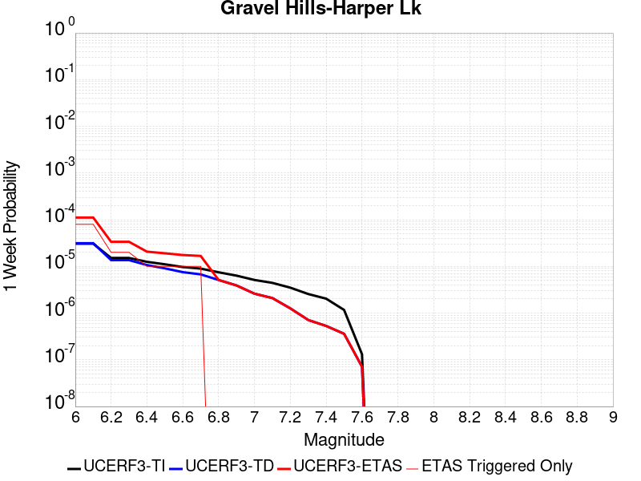 |  |  |  |

| Magnitude | 1 wk TI Prob | 1 wk TD Prob | 1 wk ETAS Prob | 1 wk ETAS/TD Gain | 1 wk ETAS Triggered Only | 1 mo TI Prob | 1 mo TD Prob | 1 mo ETAS Prob | 1 mo ETAS/TD Gain | 1 mo ETAS Triggered Only | 1 yr TI Prob | 1 yr TD Prob | 1 yr ETAS Prob | 1 yr ETAS/TD Gain | 1 yr ETAS Triggered Only | 10 yr TI Prob | 10 yr TD Prob | 10 yr ETAS Prob | 10 yr ETAS/TD Gain | 10 yr ETAS Triggered Only |
|-----|-----|-----|-----|-----|-----|-----|-----|-----|-----|-----|-----|-----|-----|-----|-----|-----|-----|-----|-----|-----|
| 6.0 | 3.0679566E-5 | 3.1465184E-5 | 3.0923422E-4 | 9.827822 | 2.7777778E-4 | 1.3147724E-4 | 1.3484505E-4 | 6.903257E-4 | 5.1193995 | 5.5555557E-4 | 0.0015995599 | 0.0016407187 | 0.0027500067 | 1.676099 | 0.0011111111 | 0.015880952 | 0.016307615 | 0.017673856 | 1.0837792 | 0.0013888889 |
| 6.1 | 3.0679566E-5 | 3.1465184E-5 | 3.0923422E-4 | 9.827822 | 2.7777778E-4 | 1.3147724E-4 | 1.3484505E-4 | 6.903257E-4 | 5.1193995 | 5.5555557E-4 | 0.0015995599 | 0.0016407187 | 0.0027500067 | 1.676099 | 0.0011111111 | 0.015880952 | 0.016307615 | 0.017673856 | 1.0837792 | 0.0013888889 |
| 6.2 | 1.514536E-5 | 1.3635392E-5 | 2.9140938E-4 | 21.371544 | 2.7777778E-4 | 6.490707E-5 | 5.843615E-5 | 6.139592E-4 | 10.506496 | 5.5555557E-4 | 7.8995706E-4 | 7.112398E-4 | 0.0012664002 | 1.7805531 | 5.5555557E-4 | 0.007871548 | 0.0070908363 | 0.007918261 | 1.1166892 | 8.3333335E-4 |
| 6.3 | 1.514536E-5 | 1.3635392E-5 | 2.9140938E-4 | 21.371544 | 2.7777778E-4 | 6.490707E-5 | 5.843615E-5 | 6.139592E-4 | 10.506496 | 5.5555557E-4 | 7.8995706E-4 | 7.112398E-4 | 0.0012664002 | 1.7805531 | 5.5555557E-4 | 0.007871548 | 0.0070908363 | 0.007918261 | 1.1166892 | 8.3333335E-4 |
| 6.4 | 1.2532521E-5 | 1.0689826E-5 | 1.0689826E-5 | 1.0 | 0.0 | 5.37097E-5 | 4.581277E-5 | 4.581277E-5 | 1.0 | 0.0 | 6.537194E-4 | 5.576335E-4 | 5.576335E-4 | 1.0 | 0.0 | 0.0065179965 | 0.0055629327 | 0.0058391653 | 1.0496559 | 2.7777778E-4 |
| 6.5 | 1.1094058E-5 | 9.083774E-6 | 9.083774E-6 | 1.0 | 0.0 | 4.7545094E-5 | 3.89299E-5 | 3.89299E-5 | 1.0 | 0.0 | 5.787078E-4 | 4.738725E-4 | 4.738725E-4 | 1.0 | 0.0 | 0.0057720304 | 0.004729028 | 0.004729028 | 1.0 | 0.0 |
| 6.6 | 9.688328E-6 | 7.531784E-6 | 7.531784E-6 | 1.0 | 0.0 | 4.1520743E-5 | 3.2278687E-5 | 3.2278687E-5 | 1.0 | 0.0 | 5.053978E-4 | 3.929247E-4 | 3.929247E-4 | 1.0 | 0.0 | 0.0050424994 | 0.0039225565 | 0.0039225565 | 1.0 | 0.0 |
| 6.7 | 8.974824E-6 | 6.7494916E-6 | 6.7494916E-6 | 1.0 | 0.0 | 3.8462964E-5 | 2.8926084E-5 | 2.8926084E-5 | 1.0 | 0.0 | 4.6818596E-4 | 3.5212038E-4 | 3.5212038E-4 | 1.0 | 0.0 | 0.004672008 | 0.0035158454 | 0.0035158454 | 1.0 | 0.0 |
| 6.8 | 7.4780046E-6 | 5.116252E-6 | 5.116252E-6 | 1.0 | 0.0 | 3.20482E-5 | 2.1926619E-5 | 2.1926619E-5 | 1.0 | 0.0 | 3.9011694E-4 | 2.6692526E-4 | 2.6692526E-4 | 1.0 | 0.0 | 0.0038943281 | 0.002666185 | 0.002666185 | 1.0 | 0.0 |
| 6.9 | 6.3409307E-6 | 3.9075426E-6 | 3.9075426E-6 | 1.0 | 0.0 | 2.7175134E-5 | 1.674651E-5 | 1.674651E-5 | 1.0 | 0.0 | 3.3080703E-4 | 2.0387067E-4 | 2.0387067E-4 | 1.0 | 0.0 | 0.0033031502 | 0.0020369345 | 0.0020369345 | 1.0 | 0.0 |
| 7.0 | 5.1239335E-6 | 2.6058885E-6 | 2.6058885E-6 | 1.0 | 0.0 | 2.195953E-5 | 1.11680465E-5 | 1.11680465E-5 | 1.0 | 0.0 | 2.6732447E-4 | 1.3596273E-4 | 1.3596273E-4 | 1.0 | 0.0 | 0.0026700313 | 0.0013588208 | 0.0013588208 | 1.0 | 0.0 |
| 7.1 | 4.438899E-6 | 2.0984994E-6 | 2.0984994E-6 | 1.0 | 0.0 | 1.9023713E-5 | 8.993539E-6 | 8.993539E-6 | 1.0 | 0.0 | 2.315891E-4 | 1.0949106E-4 | 1.0949106E-4 | 1.0 | 0.0 | 0.002313479 | 0.0010943931 | 0.0010943931 | 1.0 | 0.0 |
| 7.2 | 3.50367E-6 | 1.2615911E-6 | 1.2615911E-6 | 1.0 | 0.0 | 1.5015643E-5 | 5.406808E-6 | 5.406808E-6 | 1.0 | 0.0 | 1.8280011E-4 | 6.582599E-5 | 6.582599E-5 | 1.0 | 0.0 | 0.0018264982 | 6.580731E-4 | 6.580731E-4 | 1.0 | 0.0 |
| 7.3 | 2.561638E-6 | 7.119307E-7 | 7.119307E-7 | 1.0 | 0.0 | 1.0978401E-5 | 3.051128E-6 | 3.051128E-6 | 1.0 | 0.0 | 1.3365384E-4 | 3.714687E-5 | 3.714687E-5 | 1.0 | 0.0 | 0.0013357349 | 3.7140862E-4 | 3.7140862E-4 | 1.0 | 0.0 |
| 7.4 | 2.0368864E-6 | 5.304955E-7 | 5.304955E-7 | 1.0 | 0.0 | 8.729483E-6 | 2.2735503E-6 | 2.2735503E-6 | 1.0 | 0.0 | 1.06276275E-4 | 2.768013E-5 | 2.768013E-5 | 1.0 | 0.0 | 0.0010622547 | 2.7676736E-4 | 2.7676736E-4 | 1.0 | 0.0 |
| 7.5 | 1.1681728E-6 | 3.6031287E-7 | 3.6031287E-7 | 1.0 | 0.0 | 5.0064455E-6 | 1.5441972E-6 | 1.5441972E-6 | 1.0 | 0.0 | 6.0951766E-5 | 1.8800443E-5 | 1.8800443E-5 | 1.0 | 0.0 | 6.093505E-4 | 1.8798899E-4 | 1.8798899E-4 | 1.0 | 0.0 |
| 7.6 | 1.3154387E-7 | 7.1198265E-8 | 7.1198265E-8 | 1.0 | 0.0 | 5.6375933E-7 | 3.051354E-7 | 3.051354E-7 | 1.0 | 0.0 | 6.863748E-6 | 3.7150185E-6 | 3.7150185E-6 | 1.0 | 0.0 | 6.863536E-5 | 3.7149723E-5 | 3.7149723E-5 | 1.0 | 0.0 |

## San Andreas (Mojave N)
*[(top)](#table-of-contents)*

| 1 Week | 1 Month | 1 Year | 10 Year |
|-----|-----|-----|-----|
|  |  | 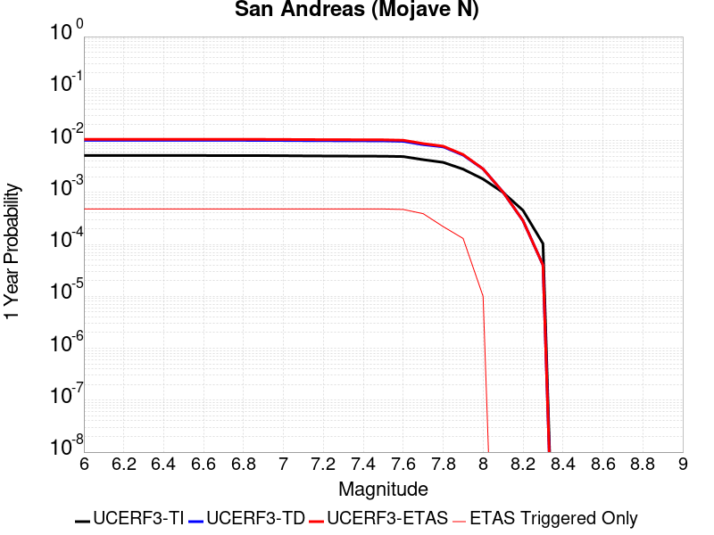 | 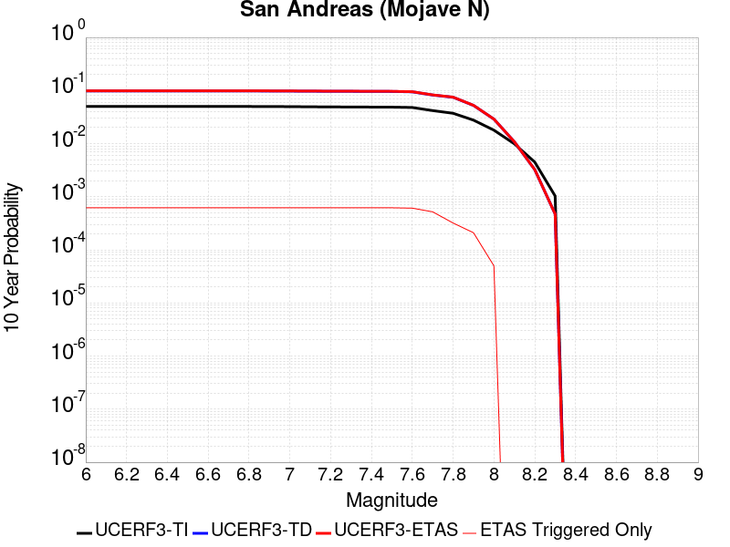 |

| Magnitude | 1 wk TI Prob | 1 wk TD Prob | 1 wk ETAS Prob | 1 wk ETAS/TD Gain | 1 wk ETAS Triggered Only | 1 mo TI Prob | 1 mo TD Prob | 1 mo ETAS Prob | 1 mo ETAS/TD Gain | 1 mo ETAS Triggered Only | 1 yr TI Prob | 1 yr TD Prob | 1 yr ETAS Prob | 1 yr ETAS/TD Gain | 1 yr ETAS Triggered Only | 10 yr TI Prob | 10 yr TD Prob | 10 yr ETAS Prob | 10 yr ETAS/TD Gain | 10 yr ETAS Triggered Only |
|-----|-----|-----|-----|-----|-----|-----|-----|-----|-----|-----|-----|-----|-----|-----|-----|-----|-----|-----|-----|-----|
| 6.0 | 9.877682E-5 | 1.9409315E-4 | 1.9409315E-4 | 1.0 | 0.0 | 4.2326056E-4 | 8.315628E-4 | 0.0011091096 | 1.3337653 | 2.7777778E-4 | 0.0051410277 | 0.010077406 | 0.010627363 | 1.0545733 | 5.5555557E-4 | 0.05023708 | 0.09835201 | 0.099103376 | 1.0076396 | 8.3333335E-4 |
| 6.1 | 9.877682E-5 | 1.9409315E-4 | 1.9409315E-4 | 1.0 | 0.0 | 4.2326056E-4 | 8.315628E-4 | 0.0011091096 | 1.3337653 | 2.7777778E-4 | 0.0051410277 | 0.010077406 | 0.010627363 | 1.0545733 | 5.5555557E-4 | 0.05023708 | 0.09835201 | 0.099103376 | 1.0076396 | 8.3333335E-4 |
| 6.2 | 9.877682E-5 | 1.9409315E-4 | 1.9409315E-4 | 1.0 | 0.0 | 4.2326056E-4 | 8.315628E-4 | 0.0011091096 | 1.3337653 | 2.7777778E-4 | 0.0051410277 | 0.010077406 | 0.010627363 | 1.0545733 | 5.5555557E-4 | 0.05023708 | 0.09835201 | 0.099103376 | 1.0076396 | 8.3333335E-4 |
| 6.3 | 9.877682E-5 | 1.9409315E-4 | 1.9409315E-4 | 1.0 | 0.0 | 4.2326056E-4 | 8.315628E-4 | 0.0011091096 | 1.3337653 | 2.7777778E-4 | 0.0051410277 | 0.010077406 | 0.010627363 | 1.0545733 | 5.5555557E-4 | 0.05023708 | 0.09835201 | 0.099103376 | 1.0076396 | 8.3333335E-4 |
| 6.4 | 9.877682E-5 | 1.9409315E-4 | 1.9409315E-4 | 1.0 | 0.0 | 4.2326056E-4 | 8.315628E-4 | 0.0011091096 | 1.3337653 | 2.7777778E-4 | 0.0051410277 | 0.010077406 | 0.010627363 | 1.0545733 | 5.5555557E-4 | 0.05023708 | 0.09835201 | 0.099103376 | 1.0076396 | 8.3333335E-4 |
| 6.5 | 9.861474E-5 | 1.9383078E-4 | 1.9383078E-4 | 1.0 | 0.0 | 4.2256617E-4 | 8.304391E-4 | 0.0011079862 | 1.3342173 | 2.7777778E-4 | 0.0051326132 | 0.010063851 | 0.010613816 | 1.0546476 | 5.5555557E-4 | 0.050156746 | 0.098229796 | 0.09898127 | 1.0076501 | 8.3333335E-4 |
| 6.6 | 9.861474E-5 | 1.9383078E-4 | 1.9383078E-4 | 1.0 | 0.0 | 4.2256617E-4 | 8.304391E-4 | 0.0011079862 | 1.3342173 | 2.7777778E-4 | 0.0051326132 | 0.010063851 | 0.010613816 | 1.0546476 | 5.5555557E-4 | 0.050156746 | 0.098229796 | 0.09898127 | 1.0076501 | 8.3333335E-4 |
| 6.7 | 9.8552715E-5 | 1.9373032E-4 | 1.9373032E-4 | 1.0 | 0.0 | 4.223004E-4 | 8.3000876E-4 | 0.0011075559 | 1.3343908 | 2.7777778E-4 | 0.0051293927 | 0.01005866 | 0.010608627 | 1.054676 | 5.5555557E-4 | 0.050125998 | 0.098182976 | 0.098934494 | 1.0076542 | 8.3333335E-4 |
| 6.8 | 9.8464974E-5 | 1.9358192E-4 | 1.9358192E-4 | 1.0 | 0.0 | 4.219245E-4 | 8.293732E-4 | 0.0011069205 | 1.3346472 | 2.7777778E-4 | 0.0051248376 | 0.010050993 | 0.0106009655 | 1.0547181 | 5.5555557E-4 | 0.05008251 | 0.09811299 | 0.09886456 | 1.0076603 | 8.3333335E-4 |
| 6.9 | 9.825824E-5 | 1.9326196E-4 | 1.9326196E-4 | 1.0 | 0.0 | 4.2103877E-4 | 8.280028E-4 | 0.0011055506 | 1.3352015 | 2.7777778E-4 | 0.0051141046 | 0.010034463 | 0.010584445 | 1.0548092 | 5.5555557E-4 | 0.049980022 | 0.09796208 | 0.09871378 | 1.0076734 | 8.3333335E-4 |
| 7.0 | 9.781462E-5 | 1.9257552E-4 | 1.9257552E-4 | 1.0 | 0.0 | 4.1913814E-4 | 8.250628E-4 | 0.0011026114 | 1.3363969 | 2.7777778E-4 | 0.005091073 | 0.009998998 | 0.010548999 | 1.0550056 | 5.5555557E-4 | 0.04976007 | 0.097638436 | 0.09839041 | 1.0077015 | 8.3333335E-4 |
| 7.1 | 9.7121134E-5 | 1.9159251E-4 | 1.9159251E-4 | 1.0 | 0.0 | 4.1616702E-4 | 8.208525E-4 | 0.0010984023 | 1.3381238 | 2.7777778E-4 | 0.005055068 | 0.009948207 | 0.010498236 | 1.0552893 | 5.5555557E-4 | 0.04941613 | 0.097174905 | 0.09792726 | 1.0077423 | 8.3333335E-4 |
| 7.2 | 9.663819E-5 | 1.9090026E-4 | 1.9090026E-4 | 1.0 | 0.0 | 4.1409794E-4 | 8.178876E-4 | 0.0010954383 | 1.3393505 | 2.7777778E-4 | 0.0050299936 | 0.009912439 | 0.010462487 | 1.0554907 | 5.5555557E-4 | 0.049176537 | 0.09684814 | 0.097600766 | 1.0077713 | 8.3333335E-4 |
| 7.3 | 9.6277574E-5 | 1.9042526E-4 | 1.9042526E-4 | 1.0 | 0.0 | 4.125529E-4 | 8.158532E-4 | 0.0010934044 | 1.3401974 | 2.7777778E-4 | 0.0050112694 | 0.009887895 | 0.010437957 | 1.0556298 | 5.5555557E-4 | 0.04899759 | 0.09662155 | 0.097374365 | 1.0077914 | 8.3333335E-4 |
| 7.4 | 9.593308E-5 | 1.8982294E-4 | 1.8982294E-4 | 1.0 | 0.0 | 4.1107697E-4 | 8.132734E-4 | 0.0010908253 | 1.3412775 | 2.7777778E-4 | 0.0049933824 | 0.00985677 | 0.01040685 | 1.0558072 | 5.5555557E-4 | 0.04882661 | 0.09633968 | 0.09709273 | 1.0078167 | 8.3333335E-4 |
| 7.5 | 9.561707E-5 | 1.8928363E-4 | 1.8928363E-4 | 1.0 | 0.0 | 4.0972308E-4 | 8.109635E-4 | 0.001088516 | 1.3422503 | 2.7777778E-4 | 0.0049769743 | 0.009828901 | 0.010378996 | 1.0559671 | 5.5555557E-4 | 0.048669744 | 0.09608582 | 0.09683908 | 1.0078394 | 8.3333335E-4 |
| 7.6 | 9.418194E-5 | 1.8580563E-4 | 1.8580563E-4 | 1.0 | 0.0 | 4.0357444E-4 | 7.96067E-4 | 7.96067E-4 | 1.0 | 0.0 | 0.004902454 | 0.009649157 | 0.009924253 | 1.02851 | 2.7777778E-4 | 0.047957025 | 0.09446791 | 0.09497098 | 1.0053253 | 5.5555557E-4 |
| 7.7 | 8.202141E-5 | 1.6029038E-4 | 1.6029038E-4 | 1.0 | 0.0 | 3.51473E-4 | 6.86778E-4 | 6.86778E-4 | 1.0 | 0.0 | 0.00427079 | 0.008329522 | 0.008604986 | 1.0330708 | 2.7777778E-4 | 0.04189639 | 0.08226675 | 0.082776606 | 1.0061976 | 5.5555557E-4 |
| 7.8 | 7.2859846E-5 | 1.4523414E-4 | 1.4523414E-4 | 1.0 | 0.0 | 3.1221908E-4 | 6.2228355E-4 | 6.2228355E-4 | 1.0 | 0.0 | 0.003794643 | 0.007550025 | 0.007550025 | 1.0 | 0.0 | 0.037304975 | 0.074755974 | 0.07501299 | 1.003438 | 2.7777778E-4 |
| 7.9 | 5.3874453E-5 | 1.0050546E-4 | 1.0050546E-4 | 1.0 | 0.0 | 2.3087008E-4 | 4.3066658E-4 | 4.3066658E-4 | 1.0 | 0.0 | 0.0028072202 | 0.005230771 | 0.005230771 | 1.0 | 0.0 | 0.02772022 | 0.052447177 | 0.052447177 | 1.0 | 0.0 |
| 8.0 | 3.468538E-5 | 5.4288335E-5 | 5.4288335E-5 | 1.0 | 0.0 | 1.4864317E-4 | 2.3264355E-4 | 2.3264355E-4 | 1.0 | 0.0 | 0.0018082283 | 0.0028287582 | 0.0028287582 | 1.0 | 0.0 | 0.017935853 | 0.028961267 | 0.028961267 | 1.0 | 0.0 |
| 8.1 | 1.9152367E-5 | 1.9415891E-5 | 1.9415891E-5 | 1.0 | 0.0 | 8.207899E-5 | 8.320831E-5 | 8.320831E-5 | 1.0 | 0.0 | 9.988535E-4 | 0.0010125911 | 0.0010125911 | 1.0 | 0.0 | 0.009943757 | 0.010863188 | 0.010863188 | 1.0 | 0.0 |
| 8.2 | 8.643924E-6 | 5.4798497E-6 | 5.4798497E-6 | 1.0 | 0.0 | 3.704486E-5 | 2.348486E-5 | 2.348486E-5 | 1.0 | 0.0 | 4.5092785E-4 | 2.858907E-4 | 2.858907E-4 | 1.0 | 0.0 | 0.0045001395 | 0.0032514327 | 0.0032514327 | 1.0 | 0.0 |
| 8.3 | 1.983087E-6 | 7.668296E-7 | 7.668296E-7 | 1.0 | 0.0 | 8.498917E-6 | 3.2864084E-6 | 3.2864084E-6 | 1.0 | 0.0 | 1.034694E-4 | 4.0011306E-5 | 4.0011306E-5 | 1.0 | 0.0 | 0.0010342124 | 4.724499E-4 | 4.724499E-4 | 1.0 | 0.0 |

## Ash Hill
*[(top)](#table-of-contents)*

| 1 Week | 1 Month | 1 Year | 10 Year |
|-----|-----|-----|-----|
|  |  |  |  |

| Magnitude | 1 wk TI Prob | 1 wk TD Prob | 1 wk ETAS Prob | 1 wk ETAS/TD Gain | 1 wk ETAS Triggered Only | 1 mo TI Prob | 1 mo TD Prob | 1 mo ETAS Prob | 1 mo ETAS/TD Gain | 1 mo ETAS Triggered Only | 1 yr TI Prob | 1 yr TD Prob | 1 yr ETAS Prob | 1 yr ETAS/TD Gain | 1 yr ETAS Triggered Only | 10 yr TI Prob | 10 yr TD Prob | 10 yr ETAS Prob | 10 yr ETAS/TD Gain | 10 yr ETAS Triggered Only |
|-----|-----|-----|-----|-----|-----|-----|-----|-----|-----|-----|-----|-----|-----|-----|-----|-----|-----|-----|-----|-----|
| 6.0 | 2.1545662E-5 | 2.3194681E-5 | 2.3194681E-5 | 1.0 | 0.0 | 9.2335285E-5 | 9.9402445E-5 | 3.771526E-4 | 3.7941985 | 2.7777778E-4 | 0.0011236023 | 0.0012096328 | 0.0020419583 | 1.6880809 | 8.3333335E-4 | 0.011179381 | 0.01203847 | 0.0128617715 | 1.0683892 | 8.3333335E-4 |
| 6.1 | 2.1545662E-5 | 2.3194681E-5 | 2.3194681E-5 | 1.0 | 0.0 | 9.2335285E-5 | 9.9402445E-5 | 3.771526E-4 | 3.7941985 | 2.7777778E-4 | 0.0011236023 | 0.0012096328 | 0.0020419583 | 1.6880809 | 8.3333335E-4 | 0.011179381 | 0.01203847 | 0.0128617715 | 1.0683892 | 8.3333335E-4 |
| 6.2 | 2.1545662E-5 | 2.3194681E-5 | 2.3194681E-5 | 1.0 | 0.0 | 9.2335285E-5 | 9.9402445E-5 | 3.771526E-4 | 3.7941985 | 2.7777778E-4 | 0.0011236023 | 0.0012096328 | 0.0020419583 | 1.6880809 | 8.3333335E-4 | 0.011179381 | 0.01203847 | 0.0128617715 | 1.0683892 | 8.3333335E-4 |
| 6.3 | 1.0025529E-5 | 1.0747037E-5 | 1.0747037E-5 | 1.0 | 0.0 | 4.2965847E-5 | 4.605799E-5 | 3.2382298E-4 | 7.0307665 | 2.7777778E-4 | 5.229836E-4 | 5.60625E-4 | 0.001115869 | 1.990402 | 5.5555557E-4 | 0.005217545 | 0.0055934195 | 0.0061458675 | 1.0987675 | 5.5555557E-4 |
| 6.4 | 1.0025529E-5 | 1.0747037E-5 | 1.0747037E-5 | 1.0 | 0.0 | 4.2965847E-5 | 4.605799E-5 | 3.2382298E-4 | 7.0307665 | 2.7777778E-4 | 5.229836E-4 | 5.60625E-4 | 0.001115869 | 1.990402 | 5.5555557E-4 | 0.005217545 | 0.0055934195 | 0.0061458675 | 1.0987675 | 5.5555557E-4 |
| 6.5 | 6.9617327E-6 | 7.456704E-6 | 7.456704E-6 | 1.0 | 0.0 | 2.9835655E-5 | 3.1956963E-5 | 3.0972587E-4 | 9.691968 | 2.7777778E-4 | 3.6318856E-4 | 3.8901521E-4 | 9.4435463E-4 | 2.427552 | 5.5555557E-4 | 0.0036259557 | 0.0038841967 | 0.0044375947 | 1.1424742 | 5.5555557E-4 |
| 6.6 | 4.9919777E-6 | 5.346739E-6 | 5.346739E-6 | 1.0 | 0.0 | 2.1394015E-5 | 2.2914432E-5 | 3.0068585E-4 | 13.122117 | 2.7777778E-4 | 2.60441E-4 | 2.789542E-4 | 8.343548E-4 | 2.99101 | 5.5555557E-4 | 0.0026013597 | 0.0027866988 | 0.0033407062 | 1.1988041 | 5.5555557E-4 |
| 6.7 | 3.6630722E-6 | 3.9246606E-6 | 3.9246606E-6 | 1.0 | 0.0 | 1.5698786E-5 | 1.6819899E-5 | 2.9459302E-4 | 17.514553 | 2.7777778E-4 | 1.9111596E-4 | 2.0476876E-4 | 7.6021056E-4 | 3.7125318 | 5.5555557E-4 | 0.0019095168 | 0.002046364 | 0.0026007826 | 1.2709287 | 5.5555557E-4 |
| 6.8 | 2.5599613E-6 | 2.7449514E-6 | 2.7449514E-6 | 1.0 | 0.0 | 1.0971216E-5 | 1.1764052E-5 | 2.8953856E-4 | 24.612144 | 2.7777778E-4 | 1.3356637E-4 | 1.4322287E-4 | 6.9869886E-4 | 4.8784027 | 5.5555557E-4 | 0.0013348613 | 0.0014317906 | 0.0019865506 | 1.3874589 | 5.5555557E-4 |
| 6.9 | 1.7684905E-6 | 1.896889E-6 | 1.896889E-6 | 1.0 | 0.0 | 7.579223E-6 | 8.129524E-6 | 2.8590506E-4 | 35.16873 | 2.7777778E-4 | 9.2273134E-5 | 9.8976954E-5 | 6.544775E-4 | 6.612423 | 5.5555557E-4 | 9.223483E-4 | 9.897696E-4 | 0.0015447752 | 1.5607423 | 5.5555557E-4 |

## Blackwater
*[(top)](#table-of-contents)*

| 1 Week | 1 Month | 1 Year | 10 Year |
|-----|-----|-----|-----|
|  |  |  |  |

| Magnitude | 1 wk TI Prob | 1 wk TD Prob | 1 wk ETAS Prob | 1 wk ETAS/TD Gain | 1 wk ETAS Triggered Only | 1 mo TI Prob | 1 mo TD Prob | 1 mo ETAS Prob | 1 mo ETAS/TD Gain | 1 mo ETAS Triggered Only | 1 yr TI Prob | 1 yr TD Prob | 1 yr ETAS Prob | 1 yr ETAS/TD Gain | 1 yr ETAS Triggered Only | 10 yr TI Prob | 10 yr TD Prob | 10 yr ETAS Prob | 10 yr ETAS/TD Gain | 10 yr ETAS Triggered Only |
|-----|-----|-----|-----|-----|-----|-----|-----|-----|-----|-----|-----|-----|-----|-----|-----|-----|-----|-----|-----|-----|
| 6.0 | 3.0708583E-5 | 3.309619E-5 | 3.309619E-5 | 1.0 | 0.0 | 1.3160157E-4 | 1.4183388E-4 | 4.1957226E-4 | 2.958195 | 2.7777778E-4 | 0.0016010714 | 0.0017255963 | 0.0020028946 | 1.1606972 | 2.7777778E-4 | 0.015895851 | 0.017135808 | 0.017681845 | 1.0318652 | 5.5555557E-4 |
| 6.1 | 3.0708583E-5 | 3.309619E-5 | 3.309619E-5 | 1.0 | 0.0 | 1.3160157E-4 | 1.4183388E-4 | 4.1957226E-4 | 2.958195 | 2.7777778E-4 | 0.0016010714 | 0.0017255963 | 0.0020028946 | 1.1606972 | 2.7777778E-4 | 0.015895851 | 0.017135808 | 0.017681845 | 1.0318652 | 5.5555557E-4 |
| 6.2 | 1.1707779E-5 | 1.2545242E-5 | 1.2545242E-5 | 1.0 | 0.0 | 5.017523E-5 | 5.3764266E-5 | 5.3764266E-5 | 1.0 | 0.0 | 6.107122E-4 | 6.5439293E-4 | 6.5439293E-4 | 1.0 | 0.0 | 0.006090366 | 0.006525631 | 0.006525631 | 1.0 | 0.0 |
| 6.3 | 1.1707779E-5 | 1.2545242E-5 | 1.2545242E-5 | 1.0 | 0.0 | 5.017523E-5 | 5.3764266E-5 | 5.3764266E-5 | 1.0 | 0.0 | 6.107122E-4 | 6.5439293E-4 | 6.5439293E-4 | 1.0 | 0.0 | 0.006090366 | 0.006525631 | 0.006525631 | 1.0 | 0.0 |
| 6.4 | 7.929244E-6 | 8.480176E-6 | 8.480176E-6 | 1.0 | 0.0 | 3.3982033E-5 | 3.6343128E-5 | 3.6343128E-5 | 1.0 | 0.0 | 4.136527E-4 | 4.4239179E-4 | 4.4239179E-4 | 1.0 | 0.0 | 0.0041288356 | 0.0044155167 | 0.0044155167 | 1.0 | 0.0 |
| 6.5 | 5.8832115E-6 | 6.286048E-6 | 6.286048E-6 | 1.0 | 0.0 | 2.521352E-5 | 2.6939942E-5 | 2.6939942E-5 | 1.0 | 0.0 | 3.0693135E-4 | 3.2794697E-4 | 3.2794697E-4 | 1.0 | 0.0 | 0.0030650778 | 0.0032748834 | 0.0032748834 | 1.0 | 0.0 |
| 6.6 | 5.8832115E-6 | 6.286048E-6 | 6.286048E-6 | 1.0 | 0.0 | 2.521352E-5 | 2.6939942E-5 | 2.6939942E-5 | 1.0 | 0.0 | 3.0693135E-4 | 3.2794697E-4 | 3.2794697E-4 | 1.0 | 0.0 | 0.0030650778 | 0.0032748834 | 0.0032748834 | 1.0 | 0.0 |
| 6.7 | 3.0715053E-6 | 3.281496E-6 | 3.281496E-6 | 1.0 | 0.0 | 1.3163528E-5 | 1.4063485E-5 | 1.4063485E-5 | 1.0 | 0.0 | 1.6025416E-4 | 1.7121063E-4 | 1.7121063E-4 | 1.0 | 0.0 | 0.0016013865 | 0.0017109019 | 0.0017109019 | 1.0 | 0.0 |
| 6.8 | 2.2722281E-6 | 2.4287758E-6 | 2.4287758E-6 | 1.0 | 0.0 | 9.738084E-6 | 1.0409003E-5 | 1.0409003E-5 | 1.0 | 0.0 | 1.1855473E-4 | 1.2672316E-4 | 1.2672316E-4 | 1.0 | 0.0 | 0.001184915 | 0.0012665992 | 0.0012665992 | 1.0 | 0.0 |
| 6.9 | 9.952399E-7 | 1.0653588E-6 | 1.0653588E-6 | 1.0 | 0.0 | 4.265307E-6 | 4.5658185E-6 | 4.5658185E-6 | 1.0 | 0.0 | 5.1928873E-5 | 5.5587938E-5 | 5.5587938E-5 | 1.0 | 0.0 | 5.191674E-4 | 5.5579096E-4 | 5.5579096E-4 | 1.0 | 0.0 |
| 7.0 | 4.7385504E-7 | 5.0756074E-7 | 5.0756074E-7 | 1.0 | 0.0 | 2.0308057E-6 | 2.1752603E-6 | 2.1752603E-6 | 1.0 | 0.0 | 2.4724779E-5 | 2.6483794E-5 | 2.6483794E-5 | 1.0 | 0.0 | 2.4722028E-4 | 2.6483793E-4 | 2.6483793E-4 | 1.0 | 0.0 |

## San Andreas (Mojave S)
*[(top)](#table-of-contents)*

| 1 Week | 1 Month | 1 Year | 10 Year |
|-----|-----|-----|-----|
|  |  |  |  |

| Magnitude | 1 wk TI Prob | 1 wk TD Prob | 1 wk ETAS Prob | 1 wk ETAS/TD Gain | 1 wk ETAS Triggered Only | 1 mo TI Prob | 1 mo TD Prob | 1 mo ETAS Prob | 1 mo ETAS/TD Gain | 1 mo ETAS Triggered Only | 1 yr TI Prob | 1 yr TD Prob | 1 yr ETAS Prob | 1 yr ETAS/TD Gain | 1 yr ETAS Triggered Only | 10 yr TI Prob | 10 yr TD Prob | 10 yr ETAS Prob | 10 yr ETAS/TD Gain | 10 yr ETAS Triggered Only |
|-----|-----|-----|-----|-----|-----|-----|-----|-----|-----|-----|-----|-----|-----|-----|-----|-----|-----|-----|-----|-----|
| 6.0 | 3.1064058E-4 | 6.747043E-4 | 6.747043E-4 | 1.0 | 0.0 | 0.0013306376 | 0.002888514 | 0.002888514 | 1.0 | 0.0 | 0.016080605 | 0.03462661 | 0.034894772 | 1.0077443 | 2.7777778E-4 | 0.1496549 | 0.28663692 | 0.28703323 | 1.0013826 | 5.5555557E-4 |
| 6.1 | 3.1064058E-4 | 6.747043E-4 | 6.747043E-4 | 1.0 | 0.0 | 0.0013306376 | 0.002888514 | 0.002888514 | 1.0 | 0.0 | 0.016080605 | 0.03462661 | 0.034894772 | 1.0077443 | 2.7777778E-4 | 0.1496549 | 0.28663692 | 0.28703323 | 1.0013826 | 5.5555557E-4 |
| 6.2 | 3.1064058E-4 | 6.747043E-4 | 6.747043E-4 | 1.0 | 0.0 | 0.0013306376 | 0.002888514 | 0.002888514 | 1.0 | 0.0 | 0.016080605 | 0.03462661 | 0.034894772 | 1.0077443 | 2.7777778E-4 | 0.1496549 | 0.28663692 | 0.28703323 | 1.0013826 | 5.5555557E-4 |
| 6.3 | 3.1064058E-4 | 6.747043E-4 | 6.747043E-4 | 1.0 | 0.0 | 0.0013306376 | 0.002888514 | 0.002888514 | 1.0 | 0.0 | 0.016080605 | 0.03462661 | 0.034894772 | 1.0077443 | 2.7777778E-4 | 0.1496549 | 0.28663692 | 0.28703323 | 1.0013826 | 5.5555557E-4 |
| 6.4 | 1.9872203E-4 | 4.318848E-4 | 4.318848E-4 | 1.0 | 0.0 | 8.5138786E-4 | 0.0018496502 | 0.0018496502 | 1.0 | 0.0 | 0.010316478 | 0.022293096 | 0.022564683 | 1.0121825 | 2.7777778E-4 | 0.098504856 | 0.19703239 | 0.19747849 | 1.002264 | 5.5555557E-4 |
| 6.5 | 1.291105E-4 | 2.8761322E-4 | 2.8761322E-4 | 1.0 | 0.0 | 5.5321335E-4 | 0.0012320485 | 0.0012320485 | 1.0 | 0.0 | 0.006714592 | 0.0148978485 | 0.015171488 | 1.0183678 | 2.7777778E-4 | 0.065152965 | 0.13807017 | 0.13854901 | 1.0034682 | 5.5555557E-4 |
| 6.6 | 1.291105E-4 | 2.8761322E-4 | 2.8761322E-4 | 1.0 | 0.0 | 5.5321335E-4 | 0.0012320485 | 0.0012320485 | 1.0 | 0.0 | 0.006714592 | 0.0148978485 | 0.015171488 | 1.0183678 | 2.7777778E-4 | 0.065152965 | 0.13807017 | 0.13854901 | 1.0034682 | 5.5555557E-4 |
| 6.7 | 1.08001186E-4 | 2.4342406E-4 | 2.4342406E-4 | 1.0 | 0.0 | 4.6278012E-4 | 0.0010428295 | 0.0010428295 | 1.0 | 0.0 | 0.0056198016 | 0.012622835 | 0.012897107 | 1.0217282 | 2.7777778E-4 | 0.054797906 | 0.11921291 | 0.119702235 | 1.0041046 | 5.5555557E-4 |
| 6.8 | 1.0624356E-4 | 2.3860046E-4 | 2.3860046E-4 | 1.0 | 0.0 | 4.5525006E-4 | 0.0010221732 | 0.0010221732 | 1.0 | 0.0 | 0.0055285925 | 0.01237422 | 0.012648561 | 1.0221703 | 2.7777778E-4 | 0.053930566 | 0.117162056 | 0.11765252 | 1.0041863 | 5.5555557E-4 |
| 6.9 | 1.0393785E-4 | 2.3230357E-4 | 2.3230357E-4 | 1.0 | 0.0 | 4.4537184E-4 | 9.952073E-4 | 9.952073E-4 | 1.0 | 0.0 | 0.0054089287 | 0.012049583 | 0.012324014 | 1.0227752 | 2.7777778E-4 | 0.05279156 | 0.11445948 | 0.11495145 | 1.0042982 | 5.5555557E-4 |
| 7.0 | 1.0155622E-4 | 2.2599897E-4 | 2.2599897E-4 | 1.0 | 0.0 | 4.3516833E-4 | 9.682079E-4 | 9.682079E-4 | 1.0 | 0.0 | 0.005285311 | 0.011724443 | 0.0119989645 | 1.0234144 | 2.7777778E-4 | 0.05161361 | 0.11171984 | 0.11221333 | 1.0044172 | 5.5555557E-4 |
| 7.1 | 9.885595E-5 | 2.1888265E-4 | 2.1888265E-4 | 1.0 | 0.0 | 4.2359953E-4 | 9.377316E-4 | 9.377316E-4 | 1.0 | 0.0 | 0.0051451353 | 0.011357316 | 0.011631939 | 1.0241803 | 2.7777778E-4 | 0.05027629 | 0.10860426 | 0.109099485 | 1.0045599 | 5.5555557E-4 |
| 7.2 | 9.6411415E-5 | 2.125122E-4 | 2.125122E-4 | 1.0 | 0.0 | 4.1312634E-4 | 9.1044896E-4 | 9.1044896E-4 | 1.0 | 0.0 | 0.005018219 | 0.01102856 | 0.011303274 | 1.0249094 | 2.7777778E-4 | 0.049064007 | 0.10579402 | 0.1062908 | 1.0046958 | 5.5555557E-4 |
| 7.3 | 9.1180635E-5 | 1.9479371E-4 | 1.9479371E-4 | 1.0 | 0.0 | 3.907156E-4 | 8.345632E-4 | 8.345632E-4 | 1.0 | 0.0 | 0.004746591 | 0.010113581 | 0.01038855 | 1.0271881 | 2.7777778E-4 | 0.046464786 | 0.09798661 | 0.09848773 | 1.0051142 | 5.5555557E-4 |
| 7.4 | 8.887388E-5 | 1.8727897E-4 | 1.8727897E-4 | 1.0 | 0.0 | 3.8083247E-4 | 8.023774E-4 | 8.023774E-4 | 1.0 | 0.0 | 0.0046267817 | 0.009725285 | 0.010000361 | 1.0282847 | 2.7777778E-4 | 0.045316286 | 0.09462135 | 0.09512434 | 1.0053158 | 5.5555557E-4 |
| 7.5 | 8.6750515E-5 | 1.8059391E-4 | 1.8059391E-4 | 1.0 | 0.0 | 3.7173493E-4 | 7.7374437E-4 | 7.7374437E-4 | 1.0 | 0.0 | 0.004516484 | 0.009379733 | 0.009654906 | 1.0293369 | 2.7777778E-4 | 0.04425787 | 0.09158487 | 0.09208954 | 1.0055104 | 5.5555557E-4 |
| 7.6 | 8.453092E-5 | 1.7446902E-4 | 1.7446902E-4 | 1.0 | 0.0 | 3.6222505E-4 | 7.475102E-4 | 7.475102E-4 | 1.0 | 0.0 | 0.0044011753 | 0.009063034 | 0.009338294 | 1.0303718 | 2.7777778E-4 | 0.04315024 | 0.088743635 | 0.08924989 | 1.0057046 | 5.5555557E-4 |
| 7.7 | 8.259102E-5 | 1.6968958E-4 | 1.6968958E-4 | 1.0 | 0.0 | 3.539135E-4 | 7.270384E-4 | 7.270384E-4 | 1.0 | 0.0 | 0.004300386 | 0.008815835 | 0.009091165 | 1.0312312 | 2.7777778E-4 | 0.042181134 | 0.08649418 | 0.08700168 | 1.0058675 | 5.5555557E-4 |
| 7.8 | 7.444844E-5 | 1.5290553E-4 | 1.5290553E-4 | 1.0 | 0.0 | 3.1902574E-4 | 6.551449E-4 | 6.551449E-4 | 1.0 | 0.0 | 0.0038772223 | 0.007947266 | 0.007947266 | 1.0 | 0.0 | 0.03810269 | 0.07832232 | 0.078578345 | 1.0032688 | 2.7777778E-4 |
| 7.9 | 5.2586525E-5 | 1.0011239E-4 | 1.0011239E-4 | 1.0 | 0.0 | 2.2535135E-4 | 4.2898257E-4 | 4.2898257E-4 | 1.0 | 0.0 | 0.0027402006 | 0.005210366 | 0.005210366 | 1.0 | 0.0 | 0.027066574 | 0.052222524 | 0.052222524 | 1.0 | 0.0 |
| 8.0 | 3.379877E-5 | 5.4101976E-5 | 5.4101976E-5 | 1.0 | 0.0 | 1.4484383E-4 | 2.3184501E-4 | 2.3184501E-4 | 1.0 | 0.0 | 0.0017620471 | 0.002819061 | 0.002819061 | 1.0 | 0.0 | 0.017481409 | 0.028848516 | 0.028848516 | 1.0 | 0.0 |
| 8.1 | 1.8668277E-5 | 1.9322531E-5 | 1.9322531E-5 | 1.0 | 0.0 | 8.000444E-5 | 8.280823E-5 | 8.280823E-5 | 1.0 | 0.0 | 9.736188E-4 | 0.0010077246 | 0.0010077246 | 1.0 | 0.0 | 0.009693642 | 0.010805754 | 0.010805754 | 1.0 | 0.0 |
| 8.2 | 8.541571E-6 | 5.465789E-6 | 5.465789E-6 | 1.0 | 0.0 | 3.660622E-5 | 2.34246E-5 | 2.34246E-5 | 1.0 | 0.0 | 4.455896E-4 | 2.8515726E-4 | 2.8515726E-4 | 1.0 | 0.0 | 0.0044469717 | 0.0032435213 | 0.0032435213 | 1.0 | 0.0 |
| 8.3 | 1.983087E-6 | 7.668296E-7 | 7.668296E-7 | 1.0 | 0.0 | 8.498917E-6 | 3.2864084E-6 | 3.2864084E-6 | 1.0 | 0.0 | 1.034694E-4 | 4.0011306E-5 | 4.0011306E-5 | 1.0 | 0.0 | 0.0010342124 | 4.724499E-4 | 4.724499E-4 | 1.0 | 0.0 |

## Lenwood-Lockhart-Old Woman Springs
*[(top)](#table-of-contents)*

| 1 Week | 1 Month | 1 Year | 10 Year |
|-----|-----|-----|-----|
|  |  |  |  |

| Magnitude | 1 wk TI Prob | 1 wk TD Prob | 1 wk ETAS Prob | 1 wk ETAS/TD Gain | 1 wk ETAS Triggered Only | 1 mo TI Prob | 1 mo TD Prob | 1 mo ETAS Prob | 1 mo ETAS/TD Gain | 1 mo ETAS Triggered Only | 1 yr TI Prob | 1 yr TD Prob | 1 yr ETAS Prob | 1 yr ETAS/TD Gain | 1 yr ETAS Triggered Only | 10 yr TI Prob | 10 yr TD Prob | 10 yr ETAS Prob | 10 yr ETAS/TD Gain | 10 yr ETAS Triggered Only |
|-----|-----|-----|-----|-----|-----|-----|-----|-----|-----|-----|-----|-----|-----|-----|-----|-----|-----|-----|-----|-----|
| 6.0 | 3.744542E-5 | 4.3962966E-5 | 4.3962966E-5 | 1.0 | 0.0 | 1.604705E-4 | 1.8840008E-4 | 1.8840008E-4 | 1.0 | 0.0 | 0.0019519776 | 0.0022915301 | 0.0028458126 | 1.2418832 | 5.5555557E-4 | 0.019349206 | 0.022697017 | 0.023239963 | 1.0239215 | 5.5555557E-4 |
| 6.1 | 3.744542E-5 | 4.3962966E-5 | 4.3962966E-5 | 1.0 | 0.0 | 1.604705E-4 | 1.8840008E-4 | 1.8840008E-4 | 1.0 | 0.0 | 0.0019519776 | 0.0022915301 | 0.0028458126 | 1.2418832 | 5.5555557E-4 | 0.019349206 | 0.022697017 | 0.023239963 | 1.0239215 | 5.5555557E-4 |
| 6.2 | 3.744542E-5 | 4.3962966E-5 | 4.3962966E-5 | 1.0 | 0.0 | 1.604705E-4 | 1.8840008E-4 | 1.8840008E-4 | 1.0 | 0.0 | 0.0019519776 | 0.0022915301 | 0.0028458126 | 1.2418832 | 5.5555557E-4 | 0.019349206 | 0.022697017 | 0.023239963 | 1.0239215 | 5.5555557E-4 |
| 6.3 | 2.1079984E-5 | 2.5353596E-5 | 2.5353596E-5 | 1.0 | 0.0 | 9.0339665E-5 | 1.0865386E-4 | 1.0865386E-4 | 1.0 | 0.0 | 0.0010993304 | 0.0013220779 | 0.0013220779 | 1.0 | 0.0 | 0.010939079 | 0.013144341 | 0.013144341 | 1.0 | 0.0 |
| 6.4 | 2.1079984E-5 | 2.5353596E-5 | 2.5353596E-5 | 1.0 | 0.0 | 9.0339665E-5 | 1.0865386E-4 | 1.0865386E-4 | 1.0 | 0.0 | 0.0010993304 | 0.0013220779 | 0.0013220779 | 1.0 | 0.0 | 0.010939079 | 0.013144341 | 0.013144341 | 1.0 | 0.0 |
| 6.5 | 1.7397282E-5 | 2.0662535E-5 | 2.0662535E-5 | 1.0 | 0.0 | 7.455765E-5 | 8.855078E-5 | 8.855078E-5 | 1.0 | 0.0 | 9.073613E-4 | 0.0010775843 | 0.0010775843 | 1.0 | 0.0 | 0.009036654 | 0.010724886 | 0.010724886 | 1.0 | 0.0 |
| 6.6 | 1.52050325E-5 | 1.76798E-5 | 1.76798E-5 | 1.0 | 0.0 | 6.51628E-5 | 7.576841E-5 | 7.576841E-5 | 1.0 | 0.0 | 7.9306826E-4 | 9.220979E-4 | 9.220979E-4 | 1.0 | 0.0 | 0.007902439 | 0.009183581 | 0.009183581 | 1.0 | 0.0 |
| 6.7 | 1.332523E-5 | 1.5264091E-5 | 1.5264091E-5 | 1.0 | 0.0 | 5.7106878E-5 | 6.541593E-5 | 6.541593E-5 | 1.0 | 0.0 | 6.950544E-4 | 7.9615373E-4 | 7.9615373E-4 | 1.0 | 0.0 | 0.006928845 | 0.007933645 | 0.007933645 | 1.0 | 0.0 |
| 6.8 | 1.1525329E-5 | 1.303105E-5 | 1.303105E-5 | 1.0 | 0.0 | 4.9393333E-5 | 5.5846183E-5 | 5.5846183E-5 | 1.0 | 0.0 | 6.011979E-4 | 6.7971944E-4 | 6.7971944E-4 | 1.0 | 0.0 | 0.00599574 | 0.006776856 | 0.006776856 | 1.0 | 0.0 |
| 6.9 | 1.0253909E-5 | 1.15144985E-5 | 1.15144985E-5 | 1.0 | 0.0 | 4.3944583E-5 | 4.9346934E-5 | 4.9346934E-5 | 1.0 | 0.0 | 5.3489394E-4 | 6.0063694E-4 | 6.0063694E-4 | 1.0 | 0.0 | 0.0053360825 | 0.005990515 | 0.005990515 | 1.0 | 0.0 |
| 7.0 | 8.104563E-6 | 8.991321E-6 | 8.991321E-6 | 1.0 | 0.0 | 3.4733377E-5 | 3.8533675E-5 | 3.8533675E-5 | 1.0 | 0.0 | 4.2279682E-4 | 4.6904891E-4 | 4.6904891E-4 | 1.0 | 0.0 | 0.0042199334 | 0.0046808375 | 0.0046808375 | 1.0 | 0.0 |
| 7.1 | 6.7986157E-6 | 7.515848E-6 | 7.515848E-6 | 1.0 | 0.0 | 2.91366E-5 | 3.221039E-5 | 3.221039E-5 | 1.0 | 0.0 | 3.5468035E-4 | 3.9209312E-4 | 3.9209312E-4 | 1.0 | 0.0 | 0.003541148 | 0.0039142296 | 0.0039142296 | 1.0 | 0.0 |
| 7.2 | 5.6893327E-6 | 6.280039E-6 | 6.280039E-6 | 1.0 | 0.0 | 2.4382627E-5 | 2.6914187E-5 | 2.6914187E-5 | 1.0 | 0.0 | 2.9681803E-4 | 3.2763294E-4 | 3.2763294E-4 | 1.0 | 0.0 | 0.002964219 | 0.0032716978 | 0.0032716978 | 1.0 | 0.0 |
| 7.3 | 4.253348E-6 | 4.706927E-6 | 4.706927E-6 | 1.0 | 0.0 | 1.8228506E-5 | 2.01724E-5 | 2.01724E-5 | 1.0 | 0.0 | 2.2190946E-4 | 2.4557312E-4 | 2.4557312E-4 | 1.0 | 0.0 | 0.00221688 | 0.0024531984 | 0.0024531984 | 1.0 | 0.0 |
| 7.4 | 2.5448119E-6 | 2.8520535E-6 | 2.8520535E-6 | 1.0 | 0.0 | 1.0906291E-5 | 1.22230385E-5 | 1.22230385E-5 | 1.0 | 0.0 | 1.3277601E-4 | 1.4880698E-4 | 1.4880698E-4 | 1.0 | 0.0 | 0.001326967 | 0.0014872355 | 0.0014872355 | 1.0 | 0.0 |
| 7.5 | 4.3706837E-8 | 4.5629356E-8 | 4.5629356E-8 | 1.0 | 0.0 | 1.8731501E-7 | 1.9555438E-7 | 1.9555438E-7 | 1.0 | 0.0 | 2.2805577E-6 | 2.3808725E-6 | 2.3808725E-6 | 1.0 | 0.0 | 2.2805343E-5 | 2.3808525E-5 | 2.3808525E-5 | 1.0 | 0.0 |

## Towne Pass
*[(top)](#table-of-contents)*

| 1 Week | 1 Month | 1 Year | 10 Year |
|-----|-----|-----|-----|
|  |  |  |  |

| Magnitude | 1 wk TI Prob | 1 wk TD Prob | 1 wk ETAS Prob | 1 wk ETAS/TD Gain | 1 wk ETAS Triggered Only | 1 mo TI Prob | 1 mo TD Prob | 1 mo ETAS Prob | 1 mo ETAS/TD Gain | 1 mo ETAS Triggered Only | 1 yr TI Prob | 1 yr TD Prob | 1 yr ETAS Prob | 1 yr ETAS/TD Gain | 1 yr ETAS Triggered Only | 10 yr TI Prob | 10 yr TD Prob | 10 yr ETAS Prob | 10 yr ETAS/TD Gain | 10 yr ETAS Triggered Only |
|-----|-----|-----|-----|-----|-----|-----|-----|-----|-----|-----|-----|-----|-----|-----|-----|-----|-----|-----|-----|-----|
| 6.0 | 3.849728E-6 | 3.8945495E-6 | 2.8167124E-4 | 72.32447 | 2.7777778E-4 | 1.649873E-5 | 1.6690845E-5 | 2.94464E-4 | 17.642246 | 2.7777778E-4 | 2.0085352E-4 | 2.0319645E-4 | 4.8091778E-4 | 2.3667626 | 2.7777778E-4 | 0.0020067208 | 0.0020305358 | 0.0025849633 | 1.273045 | 5.5555557E-4 |
| 6.1 | 3.849728E-6 | 3.8945495E-6 | 2.8167124E-4 | 72.32447 | 2.7777778E-4 | 1.649873E-5 | 1.6690845E-5 | 2.94464E-4 | 17.642246 | 2.7777778E-4 | 2.0085352E-4 | 2.0319645E-4 | 4.8091778E-4 | 2.3667626 | 2.7777778E-4 | 0.0020067208 | 0.0020305358 | 0.0025849633 | 1.273045 | 5.5555557E-4 |
| 6.2 | 3.849728E-6 | 3.8945495E-6 | 2.8167124E-4 | 72.32447 | 2.7777778E-4 | 1.649873E-5 | 1.6690845E-5 | 2.94464E-4 | 17.642246 | 2.7777778E-4 | 2.0085352E-4 | 2.0319645E-4 | 4.8091778E-4 | 2.3667626 | 2.7777778E-4 | 0.0020067208 | 0.0020305358 | 0.0025849633 | 1.273045 | 5.5555557E-4 |
| 6.3 | 3.849728E-6 | 3.8945495E-6 | 2.8167124E-4 | 72.32447 | 2.7777778E-4 | 1.649873E-5 | 1.6690845E-5 | 2.94464E-4 | 17.642246 | 2.7777778E-4 | 2.0085352E-4 | 2.0319645E-4 | 4.8091778E-4 | 2.3667626 | 2.7777778E-4 | 0.0020067208 | 0.0020305358 | 0.0025849633 | 1.273045 | 5.5555557E-4 |
| 6.4 | 3.849728E-6 | 3.8945495E-6 | 2.8167124E-4 | 72.32447 | 2.7777778E-4 | 1.649873E-5 | 1.6690845E-5 | 2.94464E-4 | 17.642246 | 2.7777778E-4 | 2.0085352E-4 | 2.0319645E-4 | 4.8091778E-4 | 2.3667626 | 2.7777778E-4 | 0.0020067208 | 0.0020305358 | 0.0025849633 | 1.273045 | 5.5555557E-4 |
| 6.5 | 1.1953545E-6 | 1.2030553E-6 | 1.2030553E-6 | 1.0 | 0.0 | 5.1229376E-6 | 5.155942E-6 | 5.155942E-6 | 1.0 | 0.0 | 6.236998E-5 | 6.27719E-5 | 6.27719E-5 | 1.0 | 0.0 | 6.235248E-4 | 6.2755344E-4 | 6.2755344E-4 | 1.0 | 0.0 |
| 6.6 | 1.1953545E-6 | 1.2030553E-6 | 1.2030553E-6 | 1.0 | 0.0 | 5.1229376E-6 | 5.155942E-6 | 5.155942E-6 | 1.0 | 0.0 | 6.236998E-5 | 6.27719E-5 | 6.27719E-5 | 1.0 | 0.0 | 6.235248E-4 | 6.2755344E-4 | 6.2755344E-4 | 1.0 | 0.0 |
| 6.7 | 8.375951E-7 | 8.410697E-7 | 8.410697E-7 | 1.0 | 0.0 | 3.5896885E-6 | 3.60458E-6 | 3.60458E-6 | 1.0 | 0.0 | 4.370358E-5 | 4.3884935E-5 | 4.3884935E-5 | 1.0 | 0.0 | 4.3694986E-4 | 4.387684E-4 | 4.387684E-4 | 1.0 | 0.0 |
| 6.8 | 6.38041E-7 | 6.39218E-7 | 6.39218E-7 | 1.0 | 0.0 | 2.7344586E-6 | 2.739503E-6 | 2.739503E-6 | 1.0 | 0.0 | 3.3291526E-5 | 3.335298E-5 | 3.335298E-5 | 1.0 | 0.0 | 3.3286537E-4 | 3.3348353E-4 | 3.3348353E-4 | 1.0 | 0.0 |
| 6.9 | 5.3460053E-7 | 5.345355E-7 | 5.345355E-7 | 1.0 | 0.0 | 2.2911431E-6 | 2.2908646E-6 | 2.2908646E-6 | 1.0 | 0.0 | 2.789431E-5 | 2.7890954E-5 | 2.7890954E-5 | 1.0 | 0.0 | 2.789081E-4 | 2.7887785E-4 | 2.7887785E-4 | 1.0 | 0.0 |
| 7.0 | 3.557783E-7 | 3.5324413E-7 | 3.5324413E-7 | 1.0 | 0.0 | 1.5247632E-6 | 1.5139026E-6 | 1.5139026E-6 | 1.0 | 0.0 | 1.8563835E-5 | 1.8431618E-5 | 1.8431618E-5 | 1.0 | 0.0 | 1.8562283E-4 | 1.8430172E-4 | 1.8430172E-4 | 1.0 | 0.0 |
| 7.1 | 3.037942E-7 | 3.0002388E-7 | 3.0002388E-7 | 1.0 | 0.0 | 1.3019744E-6 | 1.2858161E-6 | 1.2858161E-6 | 1.0 | 0.0 | 1.5851423E-5 | 1.5654707E-5 | 1.5654707E-5 | 1.0 | 0.0 | 1.5850292E-4 | 1.5653679E-4 | 1.5653679E-4 | 1.0 | 0.0 |
| 7.2 | 2.0808248E-7 | 2.021783E-7 | 2.021783E-7 | 1.0 | 0.0 | 8.917818E-7 | 8.6647816E-7 | 8.6647816E-7 | 1.0 | 0.0 | 1.0857389E-5 | 1.0549325E-5 | 1.0549325E-5 | 1.0 | 0.0 | 1.0856859E-4 | 1.054887E-4 | 1.054887E-4 | 1.0 | 0.0 |
| 7.3 | 1.1162073E-7 | 1.06369825E-7 | 1.06369825E-7 | 1.0 | 0.0 | 4.7837443E-7 | 4.5587063E-7 | 4.5587063E-7 | 1.0 | 0.0 | 5.8241935E-6 | 5.550213E-6 | 5.550213E-6 | 1.0 | 0.0 | 5.8240406E-5 | 5.5500943E-5 | 5.5500943E-5 | 1.0 | 0.0 |

## McLean Lake
*[(top)](#table-of-contents)*

| 1 Week | 1 Month | 1 Year | 10 Year |
|-----|-----|-----|-----|
|  |  |  |  |

| Magnitude | 1 wk TI Prob | 1 wk TD Prob | 1 wk ETAS Prob | 1 wk ETAS/TD Gain | 1 wk ETAS Triggered Only | 1 mo TI Prob | 1 mo TD Prob | 1 mo ETAS Prob | 1 mo ETAS/TD Gain | 1 mo ETAS Triggered Only | 1 yr TI Prob | 1 yr TD Prob | 1 yr ETAS Prob | 1 yr ETAS/TD Gain | 1 yr ETAS Triggered Only | 10 yr TI Prob | 10 yr TD Prob | 10 yr ETAS Prob | 10 yr ETAS/TD Gain | 10 yr ETAS Triggered Only |
|-----|-----|-----|-----|-----|-----|-----|-----|-----|-----|-----|-----|-----|-----|-----|-----|-----|-----|-----|-----|-----|
| 6.0 | 1.7360222E-5 | 1.8501789E-5 | 1.8501789E-5 | 1.0 | 0.0 | 7.439883E-5 | 7.929125E-5 | 7.929125E-5 | 1.0 | 0.0 | 9.0542925E-4 | 9.64992E-4 | 0.0012425017 | 1.2875773 | 2.7777778E-4 | 0.009017491 | 0.009612858 | 0.010163073 | 1.0572374 | 5.5555557E-4 |
| 6.1 | 9.062689E-6 | 9.592268E-6 | 9.592268E-6 | 1.0 | 0.0 | 3.8839516E-5 | 4.110912E-5 | 4.110912E-5 | 1.0 | 0.0 | 4.727685E-4 | 5.003975E-4 | 7.7803625E-4 | 1.5548365 | 2.7777778E-4 | 0.0047176396 | 0.0049935905 | 0.005269981 | 1.0553491 | 2.7777778E-4 |
| 6.2 | 9.062689E-6 | 9.592268E-6 | 9.592268E-6 | 1.0 | 0.0 | 3.8839516E-5 | 4.110912E-5 | 4.110912E-5 | 1.0 | 0.0 | 4.727685E-4 | 5.003975E-4 | 7.7803625E-4 | 1.5548365 | 2.7777778E-4 | 0.0047176396 | 0.0049935905 | 0.005269981 | 1.0553491 | 2.7777778E-4 |
| 6.3 | 7.2575485E-6 | 7.667767E-6 | 7.667767E-6 | 1.0 | 0.0 | 3.110341E-5 | 3.2861484E-5 | 3.2861484E-5 | 1.0 | 0.0 | 3.786182E-4 | 4.0002225E-4 | 6.776889E-4 | 1.694128 | 2.7777778E-4 | 0.0037797375 | 0.003993727 | 0.0042703953 | 1.0692757 | 2.7777778E-4 |
| 6.4 | 7.2575485E-6 | 7.667767E-6 | 7.667767E-6 | 1.0 | 0.0 | 3.110341E-5 | 3.2861484E-5 | 3.2861484E-5 | 1.0 | 0.0 | 3.786182E-4 | 4.0002225E-4 | 6.776889E-4 | 1.694128 | 2.7777778E-4 | 0.0037797375 | 0.003993727 | 0.0042703953 | 1.0692757 | 2.7777778E-4 |
| 6.5 | 6.06582E-6 | 6.4039245E-6 | 6.4039245E-6 | 1.0 | 0.0 | 2.5996113E-5 | 2.7445138E-5 | 2.7445138E-5 | 1.0 | 0.0 | 3.164567E-4 | 3.340998E-4 | 6.117848E-4 | 1.8311437 | 2.7777778E-4 | 0.0031600643 | 0.0033366138 | 0.0036134648 | 1.0829736 | 2.7777778E-4 |
| 6.6 | 5.598744E-6 | 5.910306E-6 | 5.910306E-6 | 1.0 | 0.0 | 2.3994397E-5 | 2.5329673E-5 | 2.5329673E-5 | 1.0 | 0.0 | 2.9209262E-4 | 3.083515E-4 | 5.8604364E-4 | 1.90057 | 2.7777778E-4 | 0.0029170897 | 0.0030798658 | 0.003356788 | 1.0899137 | 2.7777778E-4 |
| 6.7 | 5.246996E-6 | 5.539203E-6 | 5.539203E-6 | 1.0 | 0.0 | 2.2486933E-5 | 2.3739261E-5 | 2.3739261E-5 | 1.0 | 0.0 | 2.73744E-4 | 2.8899353E-4 | 5.6669104E-4 | 1.9609126 | 2.7777778E-4 | 0.0027340704 | 0.002886801 | 0.0031637768 | 1.0959456 | 2.7777778E-4 |
| 6.8 | 4.02324E-6 | 4.246936E-6 | 4.246936E-6 | 1.0 | 0.0 | 1.7242342E-5 | 1.820106E-5 | 1.820106E-5 | 1.0 | 0.0 | 2.099053E-4 | 2.2158133E-4 | 4.992976E-4 | 2.2533376 | 2.7777778E-4 | 0.0020970714 | 0.0022141882 | 0.002491351 | 1.1251757 | 2.7777778E-4 |
| 6.9 | 6.835972E-7 | 7.1399705E-7 | 7.1399705E-7 | 1.0 | 0.0 | 2.9296991E-6 | 3.0599856E-6 | 3.0599856E-6 | 1.0 | 0.0 | 3.56685E-5 | 3.7255006E-5 | 3.7255006E-5 | 1.0 | 0.0 | 3.5662777E-4 | 3.7251884E-4 | 3.7251884E-4 | 1.0 | 0.0 |

## Death Valley (Black Mtns Frontal)
*[(top)](#table-of-contents)*

| 1 Week | 1 Month | 1 Year | 10 Year |
|-----|-----|-----|-----|
|  |  |  |  |

| Magnitude | 1 wk TI Prob | 1 wk TD Prob | 1 wk ETAS Prob | 1 wk ETAS/TD Gain | 1 wk ETAS Triggered Only | 1 mo TI Prob | 1 mo TD Prob | 1 mo ETAS Prob | 1 mo ETAS/TD Gain | 1 mo ETAS Triggered Only | 1 yr TI Prob | 1 yr TD Prob | 1 yr ETAS Prob | 1 yr ETAS/TD Gain | 1 yr ETAS Triggered Only | 10 yr TI Prob | 10 yr TD Prob | 10 yr ETAS Prob | 10 yr ETAS/TD Gain | 10 yr ETAS Triggered Only |
|-----|-----|-----|-----|-----|-----|-----|-----|-----|-----|-----|-----|-----|-----|-----|-----|-----|-----|-----|-----|-----|
| 6.0 | 1.6707214E-5 | 1.867056E-5 | 1.867056E-5 | 1.0 | 0.0 | 7.160038E-5 | 8.001427E-5 | 8.001427E-5 | 1.0 | 0.0 | 8.71386E-4 | 9.7374606E-4 | 9.7374606E-4 | 1.0 | 0.0 | 0.00867977 | 0.009695647 | 0.009970732 | 1.0283719 | 2.7777778E-4 |
| 6.1 | 1.6707214E-5 | 1.867056E-5 | 1.867056E-5 | 1.0 | 0.0 | 7.160038E-5 | 8.001427E-5 | 8.001427E-5 | 1.0 | 0.0 | 8.71386E-4 | 9.7374606E-4 | 9.7374606E-4 | 1.0 | 0.0 | 0.00867977 | 0.009695647 | 0.009970732 | 1.0283719 | 2.7777778E-4 |
| 6.2 | 1.6707214E-5 | 1.867056E-5 | 1.867056E-5 | 1.0 | 0.0 | 7.160038E-5 | 8.001427E-5 | 8.001427E-5 | 1.0 | 0.0 | 8.71386E-4 | 9.7374606E-4 | 9.7374606E-4 | 1.0 | 0.0 | 0.00867977 | 0.009695647 | 0.009970732 | 1.0283719 | 2.7777778E-4 |
| 6.3 | 1.6707214E-5 | 1.867056E-5 | 1.867056E-5 | 1.0 | 0.0 | 7.160038E-5 | 8.001427E-5 | 8.001427E-5 | 1.0 | 0.0 | 8.71386E-4 | 9.7374606E-4 | 9.7374606E-4 | 1.0 | 0.0 | 0.00867977 | 0.009695647 | 0.009970732 | 1.0283719 | 2.7777778E-4 |
| 6.4 | 1.5515609E-5 | 1.7338483E-5 | 1.7338483E-5 | 1.0 | 0.0 | 6.649377E-5 | 7.430571E-5 | 7.430571E-5 | 1.0 | 0.0 | 8.0926094E-4 | 9.0430264E-4 | 9.0430264E-4 | 1.0 | 0.0 | 0.008063202 | 0.009006913 | 0.0092821885 | 1.0305628 | 2.7777778E-4 |
| 6.5 | 1.5515609E-5 | 1.7338483E-5 | 1.7338483E-5 | 1.0 | 0.0 | 6.649377E-5 | 7.430571E-5 | 7.430571E-5 | 1.0 | 0.0 | 8.0926094E-4 | 9.0430264E-4 | 9.0430264E-4 | 1.0 | 0.0 | 0.008063202 | 0.009006913 | 0.0092821885 | 1.0305628 | 2.7777778E-4 |
| 6.6 | 1.5041828E-5 | 1.6809407E-5 | 1.6809407E-5 | 1.0 | 0.0 | 6.4463384E-5 | 7.203836E-5 | 7.203836E-5 | 1.0 | 0.0 | 7.8455906E-4 | 8.7672E-4 | 8.7672E-4 | 1.0 | 0.0 | 0.00781795 | 0.008733268 | 0.00900862 | 1.0315291 | 2.7777778E-4 |
| 6.7 | 1.4634985E-5 | 1.6356273E-5 | 1.6356273E-5 | 1.0 | 0.0 | 6.271985E-5 | 7.009646E-5 | 7.009646E-5 | 1.0 | 0.0 | 7.6334673E-4 | 8.53096E-4 | 8.53096E-4 | 1.0 | 0.0 | 0.007607299 | 0.008498848 | 0.008774265 | 1.0324064 | 2.7777778E-4 |
| 6.8 | 1.4209158E-5 | 1.5882297E-5 | 1.5882297E-5 | 1.0 | 0.0 | 6.089497E-5 | 6.806524E-5 | 6.806524E-5 | 1.0 | 0.0 | 7.4114406E-4 | 8.2838483E-4 | 8.2838483E-4 | 1.0 | 0.0 | 0.007386771 | 0.008253585 | 0.00852907 | 1.0333776 | 2.7777778E-4 |
| 6.9 | 1.3780098E-5 | 1.5404834E-5 | 1.5404834E-5 | 1.0 | 0.0 | 5.9056227E-5 | 6.601908E-5 | 6.601908E-5 | 1.0 | 0.0 | 7.1877235E-4 | 8.0349133E-4 | 8.0349133E-4 | 1.0 | 0.0 | 0.0071645193 | 0.008006458 | 0.008282011 | 1.0344164 | 2.7777778E-4 |
| 7.0 | 1.3585064E-5 | 1.5188394E-5 | 1.5188394E-5 | 1.0 | 0.0 | 5.8220405E-5 | 6.5091524E-5 | 6.5091524E-5 | 1.0 | 0.0 | 7.086029E-4 | 7.922066E-4 | 7.922066E-4 | 1.0 | 0.0 | 0.007063476 | 0.007894417 | 0.008170002 | 1.0349089 | 2.7777778E-4 |
| 7.1 | 1.3398601E-5 | 1.4981575E-5 | 1.4981575E-5 | 1.0 | 0.0 | 5.742131E-5 | 6.4205204E-5 | 6.4205204E-5 | 1.0 | 0.0 | 6.9888023E-4 | 7.814234E-4 | 7.814234E-4 | 1.0 | 0.0 | 0.0069668638 | 0.007787346 | 0.008062961 | 1.0353926 | 2.7777778E-4 |
| 7.2 | 1.3126312E-5 | 1.4679792E-5 | 1.4679792E-5 | 1.0 | 0.0 | 5.6254412E-5 | 6.291191E-5 | 6.291191E-5 | 1.0 | 0.0 | 6.846822E-4 | 7.656887E-4 | 7.656887E-4 | 1.0 | 0.0 | 0.006825765 | 0.00763109 | 0.007906748 | 1.036123 | 2.7777778E-4 |
| 7.3 | 1.2922429E-5 | 1.4454016E-5 | 1.4454016E-5 | 1.0 | 0.0 | 5.5380664E-5 | 6.1944345E-5 | 6.1944345E-5 | 1.0 | 0.0 | 6.74051E-4 | 7.5391686E-4 | 7.5391686E-4 | 1.0 | 0.0 | 0.006720101 | 0.0075141727 | 0.0077898633 | 1.0366894 | 2.7777778E-4 |
| 7.4 | 1.2768878E-5 | 1.4283997E-5 | 1.4283997E-5 | 1.0 | 0.0 | 5.4722615E-5 | 6.1215724E-5 | 6.1215724E-5 | 1.0 | 0.0 | 6.660441E-4 | 7.45052E-4 | 7.45052E-4 | 1.0 | 0.0 | 0.0066405144 | 0.0074261203 | 0.007701835 | 1.0371277 | 2.7777778E-4 |
| 7.5 | 1.2521929E-5 | 1.40122365E-5 | 1.40122365E-5 | 1.0 | 0.0 | 5.366431E-5 | 6.0051094E-5 | 6.0051094E-5 | 1.0 | 0.0 | 6.531671E-4 | 7.308822E-4 | 7.308822E-4 | 1.0 | 0.0 | 0.006512506 | 0.0072853607 | 0.0075611146 | 1.0378504 | 2.7777778E-4 |
| 7.6 | 1.1301089E-5 | 1.2648349E-5 | 1.2648349E-5 | 1.0 | 0.0 | 4.8432343E-5 | 5.4206117E-5 | 5.4206117E-5 | 1.0 | 0.0 | 5.895042E-4 | 6.597649E-4 | 6.597649E-4 | 1.0 | 0.0 | 0.0058794282 | 0.0065786145 | 0.0068545644 | 1.0419465 | 2.7777778E-4 |
| 7.7 | 9.189108E-6 | 1.0283521E-5 | 1.0283521E-5 | 1.0 | 0.0 | 3.93813E-5 | 4.407152E-5 | 4.407152E-5 | 1.0 | 0.0 | 4.7936183E-4 | 5.3644367E-4 | 5.3644367E-4 | 1.0 | 0.0 | 0.004783291 | 0.0053519984 | 0.0056282897 | 1.051624 | 2.7777778E-4 |
| 7.8 | 3.4586725E-7 | 3.648288E-7 | 3.648288E-7 | 1.0 | 0.0 | 1.4822873E-6 | 1.5635511E-6 | 1.5635511E-6 | 1.0 | 0.0 | 1.80467E-5 | 1.9036073E-5 | 1.9036073E-5 | 1.0 | 0.0 | 1.8045233E-4 | 1.9034486E-4 | 1.9034486E-4 | 1.0 | 0.0 |
| 7.9 | 2.5591178E-9 | 2.6696871E-9 | 2.6696871E-9 | 1.0 | 0.0 | 1.0967647E-8 | 1.1441516E-8 | 1.1441516E-8 | 1.0 | 0.0 | 1.335311E-7 | 1.3930045E-7 | 1.3930045E-7 | 1.0 | 0.0 | 1.3353102E-6 | 1.3930046E-6 | 1.3930046E-6 | 1.0 | 0.0 |

## Death Valley (So)
*[(top)](#table-of-contents)*

| 1 Week | 1 Month | 1 Year | 10 Year |
|-----|-----|-----|-----|
|  |  | 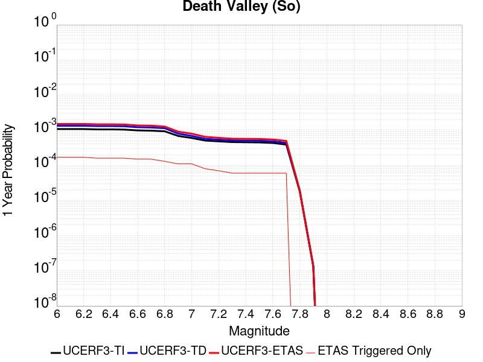 |  |

| Magnitude | 1 wk TI Prob | 1 wk TD Prob | 1 wk ETAS Prob | 1 wk ETAS/TD Gain | 1 wk ETAS Triggered Only | 1 mo TI Prob | 1 mo TD Prob | 1 mo ETAS Prob | 1 mo ETAS/TD Gain | 1 mo ETAS Triggered Only | 1 yr TI Prob | 1 yr TD Prob | 1 yr ETAS Prob | 1 yr ETAS/TD Gain | 1 yr ETAS Triggered Only | 10 yr TI Prob | 10 yr TD Prob | 10 yr ETAS Prob | 10 yr ETAS/TD Gain | 10 yr ETAS Triggered Only |
|-----|-----|-----|-----|-----|-----|-----|-----|-----|-----|-----|-----|-----|-----|-----|-----|-----|-----|-----|-----|-----|
| 6.0 | 2.0684236E-5 | 2.5618423E-5 | 2.5618423E-5 | 1.0 | 0.0 | 8.864371E-5 | 1.09788714E-4 | 1.09788714E-4 | 1.0 | 0.0 | 0.0010787029 | 0.0013358749 | 0.0013358749 | 1.0 | 0.0 | 0.010734817 | 0.013281729 | 0.013555817 | 1.0206366 | 2.7777778E-4 |
| 6.1 | 2.0684236E-5 | 2.5618423E-5 | 2.5618423E-5 | 1.0 | 0.0 | 8.864371E-5 | 1.09788714E-4 | 1.09788714E-4 | 1.0 | 0.0 | 0.0010787029 | 0.0013358749 | 0.0013358749 | 1.0 | 0.0 | 0.010734817 | 0.013281729 | 0.013555817 | 1.0206366 | 2.7777778E-4 |
| 6.2 | 2.0684236E-5 | 2.5618423E-5 | 2.5618423E-5 | 1.0 | 0.0 | 8.864371E-5 | 1.09788714E-4 | 1.09788714E-4 | 1.0 | 0.0 | 0.0010787029 | 0.0013358749 | 0.0013358749 | 1.0 | 0.0 | 0.010734817 | 0.013281729 | 0.013555817 | 1.0206366 | 2.7777778E-4 |
| 6.3 | 2.0240292E-5 | 2.5118497E-5 | 2.5118497E-5 | 1.0 | 0.0 | 8.6741224E-5 | 1.0764636E-4 | 1.0764636E-4 | 1.0 | 0.0 | 0.0010555626 | 0.0013098232 | 0.0013098232 | 1.0 | 0.0 | 0.010505628 | 0.013024284 | 0.0132984435 | 1.0210499 | 2.7777778E-4 |
| 6.4 | 2.0240292E-5 | 2.5118497E-5 | 2.5118497E-5 | 1.0 | 0.0 | 8.6741224E-5 | 1.0764636E-4 | 1.0764636E-4 | 1.0 | 0.0 | 0.0010555626 | 0.0013098232 | 0.0013098232 | 1.0 | 0.0 | 0.010505628 | 0.013024284 | 0.0132984435 | 1.0210499 | 2.7777778E-4 |
| 6.5 | 1.9962767E-5 | 2.4807747E-5 | 2.4807747E-5 | 1.0 | 0.0 | 8.55519E-5 | 1.0631468E-4 | 1.0631468E-4 | 1.0 | 0.0 | 0.0010410968 | 0.0012936293 | 0.0012936293 | 1.0 | 0.0 | 0.010362327 | 0.012864228 | 0.013138432 | 1.0213152 | 2.7777778E-4 |
| 6.6 | 1.8937297E-5 | 2.3311568E-5 | 2.3311568E-5 | 1.0 | 0.0 | 8.115732E-5 | 9.990298E-5 | 9.990298E-5 | 1.0 | 0.0 | 9.876423E-4 | 0.0012156547 | 0.0012156547 | 1.0 | 0.0 | 0.009832645 | 0.0120931 | 0.012367518 | 1.0226922 | 2.7777778E-4 |
| 6.7 | 1.8621096E-5 | 2.2912203E-5 | 2.2912203E-5 | 1.0 | 0.0 | 7.980225E-5 | 9.8191544E-5 | 9.8191544E-5 | 1.0 | 0.0 | 9.711593E-4 | 0.0011948409 | 0.0011948409 | 1.0 | 0.0 | 0.009669261 | 0.011887211 | 0.012161687 | 1.02309 | 2.7777778E-4 |
| 6.8 | 1.7830353E-5 | 2.1806247E-5 | 2.1806247E-5 | 1.0 | 0.0 | 7.641356E-5 | 9.345208E-5 | 9.345208E-5 | 1.0 | 0.0 | 9.29938E-4 | 0.0011371992 | 0.0011371992 | 1.0 | 0.0 | 0.009260561 | 0.011316643 | 0.011591277 | 1.0242682 | 2.7777778E-4 |
| 6.9 | 1.3135183E-5 | 1.5304242E-5 | 1.5304242E-5 | 1.0 | 0.0 | 5.6292425E-5 | 6.558799E-5 | 6.558799E-5 | 1.0 | 0.0 | 6.8514474E-4 | 7.982477E-4 | 7.982477E-4 | 1.0 | 0.0 | 0.006830362 | 0.007954813 | 0.008230381 | 1.0346417 | 2.7777778E-4 |
| 7.0 | 1.1507512E-5 | 1.3154444E-5 | 1.3154444E-5 | 1.0 | 0.0 | 4.9316975E-5 | 5.6375004E-5 | 5.6375004E-5 | 1.0 | 0.0 | 6.002687E-4 | 6.861553E-4 | 6.861553E-4 | 1.0 | 0.0 | 0.0059864987 | 0.006841068 | 0.007116946 | 1.0403267 | 2.7777778E-4 |
| 7.1 | 9.715903E-6 | 1.0865454E-5 | 1.0865454E-5 | 1.0 | 0.0 | 4.1638916E-5 | 4.6565423E-5 | 4.6565423E-5 | 1.0 | 0.0 | 5.068359E-4 | 5.667908E-4 | 5.667908E-4 | 1.0 | 0.0 | 0.0050568148 | 0.0056539057 | 0.005930113 | 1.0488524 | 2.7777778E-4 |
| 7.2 | 9.233269E-6 | 1.0286473E-5 | 1.0286473E-5 | 1.0 | 0.0 | 3.9570554E-5 | 4.4084165E-5 | 4.4084165E-5 | 1.0 | 0.0 | 4.81665E-4 | 5.3659675E-4 | 5.3659675E-4 | 1.0 | 0.0 | 0.0048062233 | 0.005353442 | 0.0056297327 | 1.0516099 | 2.7777778E-4 |
| 7.3 | 8.8041315E-6 | 9.808313E-6 | 9.808313E-6 | 1.0 | 0.0 | 3.7731446E-5 | 4.2034975E-5 | 4.2034975E-5 | 1.0 | 0.0 | 4.592835E-4 | 5.1165983E-4 | 5.1165983E-4 | 1.0 | 0.0 | 0.0045833546 | 0.0051052445 | 0.005381604 | 1.0541325 | 2.7777778E-4 |
| 7.4 | 8.708749E-6 | 9.707323E-6 | 9.707323E-6 | 1.0 | 0.0 | 3.7322676E-5 | 4.1602176E-5 | 4.1602176E-5 | 1.0 | 0.0 | 4.5430884E-4 | 5.06393E-4 | 5.06393E-4 | 1.0 | 0.0 | 0.004533812 | 0.0050528166 | 0.0053291908 | 1.054697 | 2.7777778E-4 |
| 7.5 | 8.612678E-6 | 9.604964E-6 | 9.604964E-6 | 1.0 | 0.0 | 3.6910955E-5 | 4.116351E-5 | 4.116351E-5 | 1.0 | 0.0 | 4.492982E-4 | 5.010547E-4 | 5.010547E-4 | 1.0 | 0.0 | 0.004483909 | 0.0049996753 | 0.0052760644 | 1.0552814 | 2.7777778E-4 |
| 7.6 | 8.319024E-6 | 9.28406E-6 | 9.28406E-6 | 1.0 | 0.0 | 3.5652476E-5 | 3.9788243E-5 | 3.9788243E-5 | 1.0 | 0.0 | 4.3398244E-4 | 4.8431839E-4 | 4.8431839E-4 | 1.0 | 0.0 | 0.0043313587 | 0.004833053 | 0.005109488 | 1.0571969 | 2.7777778E-4 |
| 7.7 | 7.4718328E-6 | 8.3453E-6 | 8.3453E-6 | 1.0 | 0.0 | 3.2021748E-5 | 3.57651E-5 | 3.57651E-5 | 1.0 | 0.0 | 3.8979502E-4 | 4.3535716E-4 | 4.3535716E-4 | 1.0 | 0.0 | 0.00389112 | 0.004345448 | 0.004622019 | 1.0636461 | 2.7777778E-4 |
| 7.8 | 3.4586725E-7 | 3.648288E-7 | 3.648288E-7 | 1.0 | 0.0 | 1.4822873E-6 | 1.5635511E-6 | 1.5635511E-6 | 1.0 | 0.0 | 1.80467E-5 | 1.9036073E-5 | 1.9036073E-5 | 1.0 | 0.0 | 1.8045233E-4 | 1.9034486E-4 | 1.9034486E-4 | 1.0 | 0.0 |
| 7.9 | 2.5591178E-9 | 2.6696871E-9 | 2.6696871E-9 | 1.0 | 0.0 | 1.0967647E-8 | 1.1441516E-8 | 1.1441516E-8 | 1.0 | 0.0 | 1.335311E-7 | 1.3930045E-7 | 1.3930045E-7 | 1.0 | 0.0 | 1.3353102E-6 | 1.3930046E-6 | 1.3930046E-6 | 1.0 | 0.0 |

## Nelson Lake
*[(top)](#table-of-contents)*

| 1 Week | 1 Month | 1 Year | 10 Year |
|-----|-----|-----|-----|
|  |  |  |  |

| Magnitude | 1 wk TI Prob | 1 wk TD Prob | 1 wk ETAS Prob | 1 wk ETAS/TD Gain | 1 wk ETAS Triggered Only | 1 mo TI Prob | 1 mo TD Prob | 1 mo ETAS Prob | 1 mo ETAS/TD Gain | 1 mo ETAS Triggered Only | 1 yr TI Prob | 1 yr TD Prob | 1 yr ETAS Prob | 1 yr ETAS/TD Gain | 1 yr ETAS Triggered Only | 10 yr TI Prob | 10 yr TD Prob | 10 yr ETAS Prob | 10 yr ETAS/TD Gain | 10 yr ETAS Triggered Only |
|-----|-----|-----|-----|-----|-----|-----|-----|-----|-----|-----|-----|-----|-----|-----|-----|-----|-----|-----|-----|-----|
| 6.0 | 9.913453E-6 | 1.0192293E-5 | 1.0192293E-5 | 1.0 | 0.0 | 4.2485535E-5 | 4.3680586E-5 | 4.3680586E-5 | 1.0 | 0.0 | 5.1713863E-4 | 5.316917E-4 | 5.316917E-4 | 1.0 | 0.0 | 0.0051593683 | 0.0053052236 | 0.005581528 | 1.0520815 | 2.7777778E-4 |
| 6.1 | 9.913453E-6 | 1.0192293E-5 | 1.0192293E-5 | 1.0 | 0.0 | 4.2485535E-5 | 4.3680586E-5 | 4.3680586E-5 | 1.0 | 0.0 | 5.1713863E-4 | 5.316917E-4 | 5.316917E-4 | 1.0 | 0.0 | 0.0051593683 | 0.0053052236 | 0.005581528 | 1.0520815 | 2.7777778E-4 |
| 6.2 | 4.5596407E-6 | 4.696332E-6 | 4.696332E-6 | 1.0 | 0.0 | 1.954117E-5 | 2.0126989E-5 | 2.0126989E-5 | 1.0 | 0.0 | 2.3788778E-4 | 2.450198E-4 | 2.450198E-4 | 1.0 | 0.0 | 0.0023763329 | 0.0024476226 | 0.0027247204 | 1.113211 | 2.7777778E-4 |
| 6.3 | 4.5596407E-6 | 4.696332E-6 | 4.696332E-6 | 1.0 | 0.0 | 1.954117E-5 | 2.0126989E-5 | 2.0126989E-5 | 1.0 | 0.0 | 2.3788778E-4 | 2.450198E-4 | 2.450198E-4 | 1.0 | 0.0 | 0.0023763329 | 0.0024476226 | 0.0027247204 | 1.113211 | 2.7777778E-4 |
| 6.4 | 3.4025713E-6 | 3.509912E-6 | 3.509912E-6 | 1.0 | 0.0 | 1.4582367E-5 | 1.50423975E-5 | 1.50423975E-5 | 1.0 | 0.0 | 1.7752586E-4 | 1.8312664E-4 | 1.8312664E-4 | 1.0 | 0.0 | 0.001773841 | 0.0018298404 | 0.0018298404 | 1.0 | 0.0 |
| 6.5 | 2.8352947E-6 | 2.9278688E-6 | 2.9278688E-6 | 1.0 | 0.0 | 1.2151207E-5 | 1.2547953E-5 | 1.2547953E-5 | 1.0 | 0.0 | 1.479309E-4 | 1.5276136E-4 | 1.5276136E-4 | 1.0 | 0.0 | 0.0014783246 | 0.0015266375 | 0.0015266375 | 1.0 | 0.0 |
| 6.6 | 2.251518E-6 | 2.3290781E-6 | 2.3290781E-6 | 1.0 | 0.0 | 9.649328E-6 | 9.981729E-6 | 9.981729E-6 | 1.0 | 0.0 | 1.1747423E-4 | 1.2152141E-4 | 1.2152141E-4 | 1.0 | 0.0 | 0.0011741214 | 0.0012146112 | 0.0012146112 | 1.0 | 0.0 |
| 6.7 | 1.8911853E-6 | 1.9591491E-6 | 1.9591491E-6 | 1.0 | 0.0 | 8.105055E-6 | 8.39633E-6 | 8.39633E-6 | 1.0 | 0.0 | 9.867457E-5 | 1.022211E-4 | 1.022211E-4 | 1.0 | 0.0 | 9.863076E-4 | 0.0010217984 | 0.0010217984 | 1.0 | 0.0 |
| 6.8 | 1.4874814E-6 | 1.5438383E-6 | 1.5438383E-6 | 1.0 | 0.0 | 6.374905E-6 | 6.6164357E-6 | 6.6164357E-6 | 1.0 | 0.0 | 7.76117E-5 | 8.055265E-5 | 8.055265E-5 | 1.0 | 0.0 | 7.75846E-4 | 8.052856E-4 | 8.052856E-4 | 1.0 | 0.0 |
| 6.9 | 6.835972E-7 | 7.1399705E-7 | 7.1399705E-7 | 1.0 | 0.0 | 2.9296991E-6 | 3.0599856E-6 | 3.0599856E-6 | 1.0 | 0.0 | 3.56685E-5 | 3.7255006E-5 | 3.7255006E-5 | 1.0 | 0.0 | 3.5662777E-4 | 3.7251884E-4 | 3.7251884E-4 | 1.0 | 0.0 |

## Death Valley (No)
*[(top)](#table-of-contents)*

| 1 Week | 1 Month | 1 Year | 10 Year |
|-----|-----|-----|-----|
| 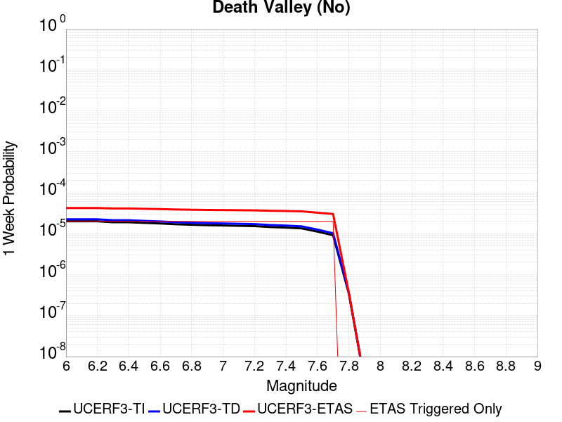 |  | 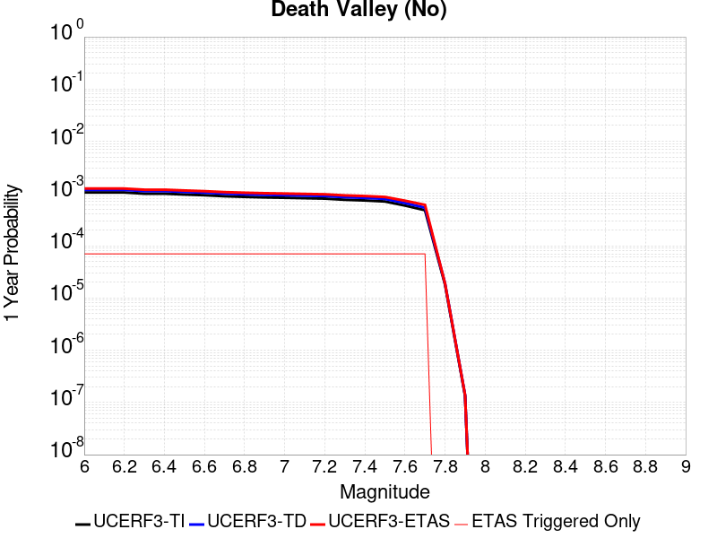 |  |

| Magnitude | 1 wk TI Prob | 1 wk TD Prob | 1 wk ETAS Prob | 1 wk ETAS/TD Gain | 1 wk ETAS Triggered Only | 1 mo TI Prob | 1 mo TD Prob | 1 mo ETAS Prob | 1 mo ETAS/TD Gain | 1 mo ETAS Triggered Only | 1 yr TI Prob | 1 yr TD Prob | 1 yr ETAS Prob | 1 yr ETAS/TD Gain | 1 yr ETAS Triggered Only | 10 yr TI Prob | 10 yr TD Prob | 10 yr ETAS Prob | 10 yr ETAS/TD Gain | 10 yr ETAS Triggered Only |
|-----|-----|-----|-----|-----|-----|-----|-----|-----|-----|-----|-----|-----|-----|-----|-----|-----|-----|-----|-----|-----|
| 6.0 | 2.0074807E-5 | 2.2500446E-5 | 2.2500446E-5 | 1.0 | 0.0 | 8.603206E-5 | 9.642696E-5 | 9.642696E-5 | 1.0 | 0.0 | 0.001046937 | 0.0011733733 | 0.0011733733 | 1.0 | 0.0 | 0.010420183 | 0.011672693 | 0.011947229 | 1.0235194 | 2.7777778E-4 |
| 6.1 | 2.0074807E-5 | 2.2500446E-5 | 2.2500446E-5 | 1.0 | 0.0 | 8.603206E-5 | 9.642696E-5 | 9.642696E-5 | 1.0 | 0.0 | 0.001046937 | 0.0011733733 | 0.0011733733 | 1.0 | 0.0 | 0.010420183 | 0.011672693 | 0.011947229 | 1.0235194 | 2.7777778E-4 |
| 6.2 | 2.0074807E-5 | 2.2500446E-5 | 2.2500446E-5 | 1.0 | 0.0 | 8.603206E-5 | 9.642696E-5 | 9.642696E-5 | 1.0 | 0.0 | 0.001046937 | 0.0011733733 | 0.0011733733 | 1.0 | 0.0 | 0.010420183 | 0.011672693 | 0.011947229 | 1.0235194 | 2.7777778E-4 |
| 6.3 | 1.9050609E-5 | 2.1337288E-5 | 2.1337288E-5 | 1.0 | 0.0 | 8.164292E-5 | 9.144236E-5 | 9.144236E-5 | 1.0 | 0.0 | 9.935491E-4 | 0.0011127489 | 0.0011127489 | 1.0 | 0.0 | 0.009891188 | 0.011072595 | 0.011347297 | 1.0248092 | 2.7777778E-4 |
| 6.4 | 1.9050609E-5 | 2.1337288E-5 | 2.1337288E-5 | 1.0 | 0.0 | 8.164292E-5 | 9.144236E-5 | 9.144236E-5 | 1.0 | 0.0 | 9.935491E-4 | 0.0011127489 | 0.0011127489 | 1.0 | 0.0 | 0.009891188 | 0.011072595 | 0.011347297 | 1.0248092 | 2.7777778E-4 |
| 6.5 | 1.8367004E-5 | 2.0561336E-5 | 2.0561336E-5 | 1.0 | 0.0 | 7.8713354E-5 | 8.811707E-5 | 8.811707E-5 | 1.0 | 0.0 | 9.5791375E-4 | 0.0010723039 | 0.0010723039 | 1.0 | 0.0 | 0.009537951 | 0.010672084 | 0.010946898 | 1.0257506 | 2.7777778E-4 |
| 6.6 | 1.779439E-5 | 1.9911244E-5 | 1.9911244E-5 | 1.0 | 0.0 | 7.625944E-5 | 8.533114E-5 | 8.533114E-5 | 1.0 | 0.0 | 9.280632E-4 | 0.0010384179 | 0.0010384179 | 1.0 | 0.0 | 0.009241969 | 0.010336416 | 0.010611322 | 1.026596 | 2.7777778E-4 |
| 6.7 | 1.7025437E-5 | 1.9043726E-5 | 1.9043726E-5 | 1.0 | 0.0 | 7.296412E-5 | 8.161345E-5 | 8.161345E-5 | 1.0 | 0.0 | 8.87976E-4 | 9.93197E-4 | 9.93197E-4 | 1.0 | 0.0 | 0.008844362 | 0.009888301 | 0.010163331 | 1.0278138 | 2.7777778E-4 |
| 6.8 | 1.6545107E-5 | 1.851284E-5 | 1.851284E-5 | 1.0 | 0.0 | 7.090568E-5 | 7.933836E-5 | 7.933836E-5 | 1.0 | 0.0 | 8.629347E-4 | 9.655226E-4 | 9.655226E-4 | 1.0 | 0.0 | 0.008595915 | 0.009613981 | 0.009889088 | 1.0286154 | 2.7777778E-4 |
| 6.9 | 1.615478E-5 | 1.8087881E-5 | 1.8087881E-5 | 1.0 | 0.0 | 6.9232934E-5 | 7.751722E-5 | 7.751722E-5 | 1.0 | 0.0 | 8.4258494E-4 | 9.433697E-4 | 9.433697E-4 | 1.0 | 0.0 | 0.008393973 | 0.009394345 | 0.0096695125 | 1.0292908 | 2.7777778E-4 |
| 7.0 | 1.5894311E-5 | 1.7805834E-5 | 1.7805834E-5 | 1.0 | 0.0 | 6.81167E-5 | 7.6308526E-5 | 7.6308526E-5 | 1.0 | 0.0 | 8.2900526E-4 | 9.286663E-4 | 9.286663E-4 | 1.0 | 0.0 | 0.008259195 | 0.009248544 | 0.009523754 | 1.029757 | 2.7777778E-4 |
| 7.1 | 1.5602263E-5 | 1.7483784E-5 | 1.7483784E-5 | 1.0 | 0.0 | 6.6865134E-5 | 7.4928386E-5 | 7.4928386E-5 | 1.0 | 0.0 | 8.137789E-4 | 9.118773E-4 | 9.118773E-4 | 1.0 | 0.0 | 0.008108052 | 0.009082039 | 0.009357294 | 1.0303077 | 2.7777778E-4 |
| 7.2 | 1.5323829E-5 | 1.7170905E-5 | 1.7170905E-5 | 1.0 | 0.0 | 6.56719E-5 | 7.358755E-5 | 7.358755E-5 | 1.0 | 0.0 | 7.99262E-4 | 8.9556625E-4 | 8.9556625E-4 | 1.0 | 0.0 | 0.007963934 | 0.008920249 | 0.009195549 | 1.0308623 | 2.7777778E-4 |
| 7.3 | 1.4556212E-5 | 1.6302716E-5 | 1.6302716E-5 | 1.0 | 0.0 | 6.238227E-5 | 6.986695E-5 | 6.986695E-5 | 1.0 | 0.0 | 7.592395E-4 | 8.503039E-4 | 8.503039E-4 | 1.0 | 0.0 | 0.0075665074 | 0.008471149 | 0.008746574 | 1.0325133 | 2.7777778E-4 |
| 7.4 | 1.411725E-5 | 1.5808211E-5 | 1.5808211E-5 | 1.0 | 0.0 | 6.0501097E-5 | 6.774775E-5 | 6.774775E-5 | 1.0 | 0.0 | 7.363519E-4 | 8.245226E-4 | 8.245226E-4 | 1.0 | 0.0 | 0.0073391674 | 0.008215268 | 0.008490765 | 1.0335346 | 2.7777778E-4 |
| 7.5 | 1.3503312E-5 | 1.5126531E-5 | 1.5126531E-5 | 1.0 | 0.0 | 5.7870053E-5 | 6.482641E-5 | 6.482641E-5 | 1.0 | 0.0 | 7.043401E-4 | 7.8898156E-4 | 7.8898156E-4 | 1.0 | 0.0 | 0.007021119 | 0.007862429 | 0.008138023 | 1.035052 | 2.7777778E-4 |
| 7.6 | 1.1279839E-5 | 1.2626528E-5 | 1.2626528E-5 | 1.0 | 0.0 | 4.834127E-5 | 5.4112596E-5 | 5.4112596E-5 | 1.0 | 0.0 | 5.88396E-4 | 6.58627E-4 | 6.58627E-4 | 1.0 | 0.0 | 0.005868405 | 0.0065673026 | 0.006843256 | 1.0420194 | 2.7777778E-4 |
| 7.7 | 9.189108E-6 | 1.0283521E-5 | 1.0283521E-5 | 1.0 | 0.0 | 3.93813E-5 | 4.407152E-5 | 4.407152E-5 | 1.0 | 0.0 | 4.7936183E-4 | 5.3644367E-4 | 5.3644367E-4 | 1.0 | 0.0 | 0.004783291 | 0.0053519984 | 0.0056282897 | 1.051624 | 2.7777778E-4 |
| 7.8 | 3.4586725E-7 | 3.648288E-7 | 3.648288E-7 | 1.0 | 0.0 | 1.4822873E-6 | 1.5635511E-6 | 1.5635511E-6 | 1.0 | 0.0 | 1.80467E-5 | 1.9036073E-5 | 1.9036073E-5 | 1.0 | 0.0 | 1.8045233E-4 | 1.9034486E-4 | 1.9034486E-4 | 1.0 | 0.0 |
| 7.9 | 2.5591178E-9 | 2.6696871E-9 | 2.6696871E-9 | 1.0 | 0.0 | 1.0967647E-8 | 1.1441516E-8 | 1.1441516E-8 | 1.0 | 0.0 | 1.335311E-7 | 1.3930045E-7 | 1.3930045E-7 | 1.0 | 0.0 | 1.3353102E-6 | 1.3930046E-6 | 1.3930046E-6 | 1.0 | 0.0 |

## Death Valley (Fish Lake Valley)
*[(top)](#table-of-contents)*

| 1 Week | 1 Month | 1 Year | 10 Year |
|-----|-----|-----|-----|
|  |  |  |  |

| Magnitude | 1 wk TI Prob | 1 wk TD Prob | 1 wk ETAS Prob | 1 wk ETAS/TD Gain | 1 wk ETAS Triggered Only | 1 mo TI Prob | 1 mo TD Prob | 1 mo ETAS Prob | 1 mo ETAS/TD Gain | 1 mo ETAS Triggered Only | 1 yr TI Prob | 1 yr TD Prob | 1 yr ETAS Prob | 1 yr ETAS/TD Gain | 1 yr ETAS Triggered Only | 10 yr TI Prob | 10 yr TD Prob | 10 yr ETAS Prob | 10 yr ETAS/TD Gain | 10 yr ETAS Triggered Only |
|-----|-----|-----|-----|-----|-----|-----|-----|-----|-----|-----|-----|-----|-----|-----|-----|-----|-----|-----|-----|-----|
| 6.0 | 3.872328E-5 | 4.7268895E-5 | 4.7268895E-5 | 1.0 | 0.0 | 1.6594635E-4 | 2.0256694E-4 | 2.0256694E-4 | 1.0 | 0.0 | 0.0020185246 | 0.0024636039 | 0.0024636039 | 1.0 | 0.0 | 0.02000288 | 0.024388881 | 0.024659885 | 1.0111117 | 2.7777778E-4 |
| 6.1 | 3.872328E-5 | 4.7268895E-5 | 4.7268895E-5 | 1.0 | 0.0 | 1.6594635E-4 | 2.0256694E-4 | 2.0256694E-4 | 1.0 | 0.0 | 0.0020185246 | 0.0024636039 | 0.0024636039 | 1.0 | 0.0 | 0.02000288 | 0.024388881 | 0.024659885 | 1.0111117 | 2.7777778E-4 |
| 6.2 | 3.872328E-5 | 4.7268895E-5 | 4.7268895E-5 | 1.0 | 0.0 | 1.6594635E-4 | 2.0256694E-4 | 2.0256694E-4 | 1.0 | 0.0 | 0.0020185246 | 0.0024636039 | 0.0024636039 | 1.0 | 0.0 | 0.02000288 | 0.024388881 | 0.024659885 | 1.0111117 | 2.7777778E-4 |
| 6.3 | 2.8356371E-5 | 3.3610693E-5 | 3.3610693E-5 | 1.0 | 0.0 | 1.2152165E-4 | 1.4403832E-4 | 1.4403832E-4 | 1.0 | 0.0 | 0.0014785219 | 0.001752335 | 0.001752335 | 1.0 | 0.0 | 0.014687235 | 0.01739221 | 0.017665157 | 1.0156937 | 2.7777778E-4 |
| 6.4 | 2.8356371E-5 | 3.3610693E-5 | 3.3610693E-5 | 1.0 | 0.0 | 1.2152165E-4 | 1.4403832E-4 | 1.4403832E-4 | 1.0 | 0.0 | 0.0014785219 | 0.001752335 | 0.001752335 | 1.0 | 0.0 | 0.014687235 | 0.01739221 | 0.017665157 | 1.0156937 | 2.7777778E-4 |
| 6.5 | 2.4448687E-5 | 2.8608209E-5 | 2.8608209E-5 | 1.0 | 0.0 | 1.0477588E-4 | 1.2260114E-4 | 1.2260114E-4 | 1.0 | 0.0 | 0.0012748998 | 0.0014916973 | 0.0014916973 | 1.0 | 0.0 | 0.012676105 | 0.014821712 | 0.015095373 | 1.0184635 | 2.7777778E-4 |
| 6.6 | 2.1298161E-5 | 2.4660607E-5 | 2.4660607E-5 | 1.0 | 0.0 | 9.127464E-5 | 1.0568422E-4 | 1.0568422E-4 | 1.0 | 0.0 | 0.0011107022 | 0.0012859798 | 0.0012859798 | 1.0 | 0.0 | 0.011051672 | 0.012788794 | 0.01306302 | 1.0214427 | 2.7777778E-4 |
| 6.7 | 1.8959729E-5 | 2.178146E-5 | 2.178146E-5 | 1.0 | 0.0 | 8.125345E-5 | 9.3345916E-5 | 9.3345916E-5 | 1.0 | 0.0 | 9.888117E-4 | 0.0011359196 | 0.0011359196 | 1.0 | 0.0 | 0.009844234 | 0.011303794 | 0.011578432 | 1.024296 | 2.7777778E-4 |
| 6.8 | 1.6691629E-5 | 1.9018706E-5 | 1.9018706E-5 | 1.0 | 0.0 | 7.153359E-5 | 8.150629E-5 | 8.150629E-5 | 1.0 | 0.0 | 8.7057345E-4 | 9.919042E-4 | 9.919042E-4 | 1.0 | 0.0 | 0.008671708 | 0.009876527 | 0.010151561 | 1.0278473 | 2.7777778E-4 |
| 6.9 | 1.450505E-5 | 1.6389824E-5 | 1.6389824E-5 | 1.0 | 0.0 | 6.216302E-5 | 7.024026E-5 | 7.024026E-5 | 1.0 | 0.0 | 7.5657194E-4 | 8.548484E-4 | 8.548484E-4 | 1.0 | 0.0 | 0.007540013 | 0.008516532 | 0.008791945 | 1.0323385 | 2.7777778E-4 |
| 7.0 | 1.2940855E-5 | 1.453821E-5 | 1.453821E-5 | 1.0 | 0.0 | 5.545963E-5 | 6.230516E-5 | 6.230516E-5 | 1.0 | 0.0 | 6.750118E-4 | 7.583071E-4 | 7.583071E-4 | 1.0 | 0.0 | 0.006729651 | 0.0075578135 | 0.007833492 | 1.0364759 | 2.7777778E-4 |
| 7.1 | 1.2544658E-5 | 1.4078437E-5 | 1.4078437E-5 | 1.0 | 0.0 | 5.3761712E-5 | 6.033479E-5 | 6.033479E-5 | 1.0 | 0.0 | 6.5435225E-4 | 7.343341E-4 | 7.343341E-4 | 1.0 | 0.0 | 0.006524288 | 0.0073196692 | 0.007595414 | 1.0376717 | 2.7777778E-4 |
| 7.2 | 1.2489416E-5 | 1.4015902E-5 | 1.4015902E-5 | 1.0 | 0.0 | 5.3524967E-5 | 6.00668E-5 | 6.00668E-5 | 1.0 | 0.0 | 6.514716E-4 | 7.310735E-4 | 7.310735E-4 | 1.0 | 0.0 | 0.006495651 | 0.007287278 | 0.0075630313 | 1.0378404 | 2.7777778E-4 |
| 7.3 | 1.2368307E-5 | 1.3880038E-5 | 1.3880038E-5 | 1.0 | 0.0 | 5.3005948E-5 | 5.948455E-5 | 5.948455E-5 | 1.0 | 0.0 | 6.451563E-4 | 7.239894E-4 | 7.239894E-4 | 1.0 | 0.0 | 0.0064328653 | 0.0072168987 | 0.0074926717 | 1.0382122 | 2.7777778E-4 |
| 7.4 | 1.2161707E-5 | 1.3648089E-5 | 1.3648089E-5 | 1.0 | 0.0 | 5.212056E-5 | 5.8490532E-5 | 5.8490532E-5 | 1.0 | 0.0 | 6.3438306E-4 | 7.118952E-4 | 7.118952E-4 | 1.0 | 0.0 | 0.006325751 | 0.0070967353 | 0.007372542 | 1.0388639 | 2.7777778E-4 |
| 7.5 | 1.1707948E-5 | 1.314573E-5 | 1.314573E-5 | 1.0 | 0.0 | 5.0175953E-5 | 5.6337656E-5 | 5.6337656E-5 | 1.0 | 0.0 | 6.10721E-4 | 6.857007E-4 | 6.857007E-4 | 1.0 | 0.0 | 0.0060904534 | 0.0068364325 | 0.007112311 | 1.0403543 | 2.7777778E-4 |
| 7.6 | 1.0319538E-5 | 1.157981E-5 | 1.157981E-5 | 1.0 | 0.0 | 4.4225842E-5 | 4.9626844E-5 | 4.9626844E-5 | 1.0 | 0.0 | 5.383166E-4 | 6.040445E-4 | 6.040445E-4 | 1.0 | 0.0 | 0.0053701443 | 0.0060245576 | 0.006300662 | 1.0458298 | 2.7777778E-4 |
| 7.7 | 8.937764E-6 | 1.0022941E-5 | 1.0022941E-5 | 1.0 | 0.0 | 3.830414E-5 | 4.295478E-5 | 4.295478E-5 | 1.0 | 0.0 | 4.6625308E-4 | 5.2285404E-4 | 5.2285404E-4 | 1.0 | 0.0 | 0.0046527605 | 0.005216748 | 0.005493077 | 1.0529696 | 2.7777778E-4 |
| 7.8 | 3.108007E-7 | 3.2846788E-7 | 3.2846788E-7 | 1.0 | 0.0 | 1.3320023E-6 | 1.4077187E-6 | 1.4077187E-6 | 1.0 | 0.0 | 1.6217007E-5 | 1.7138846E-5 | 1.7138846E-5 | 1.0 | 0.0 | 1.6215823E-4 | 1.713756E-4 | 1.713756E-4 | 1.0 | 0.0 |
| 7.9 | 2.5591178E-9 | 2.6696871E-9 | 2.6696871E-9 | 1.0 | 0.0 | 1.0967647E-8 | 1.1441516E-8 | 1.1441516E-8 | 1.0 | 0.0 | 1.335311E-7 | 1.3930045E-7 | 1.3930045E-7 | 1.0 | 0.0 | 1.3353102E-6 | 1.3930046E-6 | 1.3930046E-6 | 1.0 | 0.0 |

## San Pedro Basin
*[(top)](#table-of-contents)*

| 1 Week | 1 Month | 1 Year | 10 Year |
|-----|-----|-----|-----|
|  |  |  |  |

| Magnitude | 1 wk TI Prob | 1 wk TD Prob | 1 wk ETAS Prob | 1 wk ETAS/TD Gain | 1 wk ETAS Triggered Only | 1 mo TI Prob | 1 mo TD Prob | 1 mo ETAS Prob | 1 mo ETAS/TD Gain | 1 mo ETAS Triggered Only | 1 yr TI Prob | 1 yr TD Prob | 1 yr ETAS Prob | 1 yr ETAS/TD Gain | 1 yr ETAS Triggered Only | 10 yr TI Prob | 10 yr TD Prob | 10 yr ETAS Prob | 10 yr ETAS/TD Gain | 10 yr ETAS Triggered Only |
|-----|-----|-----|-----|-----|-----|-----|-----|-----|-----|-----|-----|-----|-----|-----|-----|-----|-----|-----|-----|-----|
| 6.0 | 5.3449043E-5 | 6.3371124E-5 | 6.3371124E-5 | 1.0 | 0.0 | 2.2904722E-4 | 2.7156572E-4 | 5.492681E-4 | 2.022597 | 2.7777778E-4 | 0.0027850836 | 0.0033019078 | 0.0035787683 | 1.0838487 | 2.7777778E-4 | 0.027504366 | 0.032590248 | 0.032858975 | 1.0082456 | 2.7777778E-4 |
| 6.1 | 5.3449043E-5 | 6.3371124E-5 | 6.3371124E-5 | 1.0 | 0.0 | 2.2904722E-4 | 2.7156572E-4 | 5.492681E-4 | 2.022597 | 2.7777778E-4 | 0.0027850836 | 0.0033019078 | 0.0035787683 | 1.0838487 | 2.7777778E-4 | 0.027504366 | 0.032590248 | 0.032858975 | 1.0082456 | 2.7777778E-4 |
| 6.2 | 2.3189454E-5 | 2.6643334E-5 | 2.6643334E-5 | 1.0 | 0.0 | 9.9379584E-5 | 1.14180984E-4 | 1.14180984E-4 | 1.0 | 0.0 | 0.0012092749 | 0.0013893144 | 0.0013893144 | 1.0 | 0.0 | 0.012027155 | 0.013811161 | 0.013811161 | 1.0 | 0.0 |
| 6.3 | 2.3189454E-5 | 2.6643334E-5 | 2.6643334E-5 | 1.0 | 0.0 | 9.9379584E-5 | 1.14180984E-4 | 1.14180984E-4 | 1.0 | 0.0 | 0.0012092749 | 0.0013893144 | 0.0013893144 | 1.0 | 0.0 | 0.012027155 | 0.013811161 | 0.013811161 | 1.0 | 0.0 |
| 6.4 | 1.966056E-5 | 2.2463848E-5 | 2.2463848E-5 | 1.0 | 0.0 | 8.425682E-5 | 9.627031E-5 | 9.627031E-5 | 1.0 | 0.0 | 0.001025344 | 0.001171501 | 0.001171501 | 1.0 | 0.0 | 0.010206259 | 0.011657341 | 0.011657341 | 1.0 | 0.0 |
| 6.5 | 1.7342953E-5 | 1.9745521E-5 | 1.9745521E-5 | 1.0 | 0.0 | 7.4324824E-5 | 8.4621126E-5 | 8.4621126E-5 | 1.0 | 0.0 | 9.04529E-4 | 0.0010298121 | 0.0010298121 | 1.0 | 0.0 | 0.009008561 | 0.010254124 | 0.010254124 | 1.0 | 0.0 |
| 6.6 | 1.439804E-5 | 1.6323014E-5 | 1.6323014E-5 | 1.0 | 0.0 | 6.170443E-5 | 6.995408E-5 | 6.995408E-5 | 1.0 | 0.0 | 7.509924E-4 | 8.513903E-4 | 8.513903E-4 | 1.0 | 0.0 | 0.0074845953 | 0.008484487 | 0.008484487 | 1.0 | 0.0 |
| 6.7 | 1.2634884E-5 | 1.4285554E-5 | 1.4285554E-5 | 1.0 | 0.0 | 5.414838E-5 | 6.1222534E-5 | 6.1222534E-5 | 1.0 | 0.0 | 6.590571E-4 | 7.451599E-4 | 7.451599E-4 | 1.0 | 0.0 | 0.006571059 | 0.007429634 | 0.007429634 | 1.0 | 0.0 |
| 6.8 | 1.146091E-5 | 1.2933421E-5 | 1.2933421E-5 | 1.0 | 0.0 | 4.911726E-5 | 5.542794E-5 | 5.542794E-5 | 1.0 | 0.0 | 5.9783855E-4 | 6.7465595E-4 | 6.7465595E-4 | 1.0 | 0.0 | 0.0059623276 | 0.0067290184 | 0.0067290184 | 1.0 | 0.0 |
| 6.9 | 9.109035E-6 | 1.0235189E-5 | 1.0235189E-5 | 1.0 | 0.0 | 3.9038136E-5 | 4.3864515E-5 | 4.3864515E-5 | 1.0 | 0.0 | 4.7518566E-4 | 5.339476E-4 | 5.339476E-4 | 1.0 | 0.0 | 0.0047417083 | 0.0053294008 | 0.0053294008 | 1.0 | 0.0 |
| 7.0 | 5.9351028E-6 | 6.584068E-6 | 6.584068E-6 | 1.0 | 0.0 | 2.5435906E-5 | 2.8217262E-5 | 2.8217262E-5 | 1.0 | 0.0 | 3.0963816E-4 | 3.4351464E-4 | 3.4351464E-4 | 1.0 | 0.0 | 0.0030920706 | 0.0034321535 | 0.0034321535 | 1.0 | 0.0 |
| 7.1 | 2.1557585E-6 | 2.2096608E-6 | 2.2096608E-6 | 1.0 | 0.0 | 9.238933E-6 | 9.469942E-6 | 9.469942E-6 | 1.0 | 0.0 | 1.1247819E-4 | 1.1529059E-4 | 1.1529059E-4 | 1.0 | 0.0 | 0.0011242128 | 0.0011523232 | 0.0011523232 | 1.0 | 0.0 |
| 7.2 | 2.1251979E-6 | 2.178007E-6 | 2.178007E-6 | 1.0 | 0.0 | 9.107958E-6 | 9.334282E-6 | 9.334282E-6 | 1.0 | 0.0 | 1.1088375E-4 | 1.1363912E-4 | 1.1363912E-4 | 1.0 | 0.0 | 0.0011082845 | 0.0011358254 | 0.0011358254 | 1.0 | 0.0 |
| 7.3 | 1.7145798E-6 | 1.7442967E-6 | 1.7442967E-6 | 1.0 | 0.0 | 7.3481783E-6 | 7.475536E-6 | 7.475536E-6 | 1.0 | 0.0 | 8.94604E-5 | 9.1010945E-5 | 9.1010945E-5 | 1.0 | 0.0 | 8.9424395E-4 | 9.0974587E-4 | 9.0974587E-4 | 1.0 | 0.0 |
| 7.4 | 1.4467993E-6 | 1.4641943E-6 | 1.4641943E-6 | 1.0 | 0.0 | 6.200554E-6 | 6.2751037E-6 | 6.2751037E-6 | 1.0 | 0.0 | 7.548913E-5 | 7.6396784E-5 | 7.6396784E-5 | 1.0 | 0.0 | 7.546349E-4 | 7.637125E-4 | 7.637125E-4 | 1.0 | 0.0 |
| 7.5 | 1.2803735E-6 | 1.2931564E-6 | 1.2931564E-6 | 1.0 | 0.0 | 5.487303E-6 | 5.5420874E-6 | 5.5420874E-6 | 1.0 | 0.0 | 6.680587E-5 | 6.7472894E-5 | 6.7472894E-5 | 1.0 | 0.0 | 6.678579E-4 | 6.7453115E-4 | 6.7453115E-4 | 1.0 | 0.0 |
| 7.6 | 6.755009E-7 | 6.769501E-7 | 6.769501E-7 | 1.0 | 0.0 | 2.8950008E-6 | 2.9012117E-6 | 2.9012117E-6 | 1.0 | 0.0 | 3.5246063E-5 | 3.5321737E-5 | 3.5321737E-5 | 1.0 | 0.0 | 3.5240475E-4 | 3.5316695E-4 | 3.5316695E-4 | 1.0 | 0.0 |
| 7.7 | 6.211885E-8 | 4.5699863E-8 | 4.5699863E-8 | 1.0 | 0.0 | 2.6622362E-7 | 1.9585654E-7 | 1.9585654E-7 | 1.0 | 0.0 | 3.2412677E-6 | 2.384551E-6 | 2.384551E-6 | 1.0 | 0.0 | 3.2412205E-5 | 2.3845274E-5 | 2.3845274E-5 | 1.0 | 0.0 |
| 7.8 | 2.6580573E-9 | 1.5138681E-9 | 1.5138681E-9 | 1.0 | 0.0 | 1.1391674E-8 | 6.488006E-9 | 6.488006E-9 | 1.0 | 0.0 | 1.3869362E-7 | 7.899148E-8 | 7.899148E-8 | 1.0 | 0.0 | 1.3869354E-6 | 7.8991474E-7 | 7.8991474E-7 | 1.0 | 0.0 |

