# Parent Section Magnitude-Probability Distributions

Only fault sections with at least one triggered aftershock are plotted. Sections are sorted by total supraseismogenic trigger rate (decreasing)

## Table Of Contents

* [Garlock (Central)](#garlock-central)
* [Little Lake](#little-lake)
* [Tank Canyon](#tank-canyon)
* [Airport Lake](#airport-lake)
* [Owl Lake](#owl-lake)
* [Panamint Valley](#panamint-valley)
* [Garlock (East)](#garlock-east)
* [Hunter Mountain-Saline Valley](#hunter-mountain-saline-valley)
* [Garlock (West)](#garlock-west)
* [Blackwater](#blackwater)
* [Ash Hill](#ash-hill)
* [San Andreas (Mojave N)](#san-andreas-mojave-n)
* [Gravel Hills-Harper Lk](#gravel-hills-harper-lk)
* [San Andreas (Mojave S)](#san-andreas-mojave-s)
* [So Sierra Nevada](#so-sierra-nevada)
* [Lenwood-Lockhart-Old Woman Springs](#lenwood-lockhart-old-woman-springs)
* [Goldstone Lake](#goldstone-lake)
* [McLean Lake](#mclean-lake)
* [San Andreas (San Bernardino N)](#san-andreas-san-bernardino-n)
* [Death Valley (So)](#death-valley-so)
* [Coyote Canyon](#coyote-canyon)
* [Nelson Lake](#nelson-lake)
* [Towne Pass](#towne-pass)
* [San Andreas (San Bernardino S)](#san-andreas-san-bernardino-s)
* [Death Valley (Black Mtns Frontal)](#death-valley-black-mtns-frontal)
* [Bicycle Lake](#bicycle-lake)
* [Helendale-So Lockhart](#helendale-so-lockhart)
* [Death Valley (No)](#death-valley-no)
* [Paradise](#paradise)
* [Death Valley (Fish Lake Valley)](#death-valley-fish-lake-valley)
* [San Andreas (San Gorgonio Pass-Garnet HIll)](#san-andreas-san-gorgonio-pass-garnet-hill)
* [Garlic Springs](#garlic-springs)
* [Lake Isabella (Seismicity)](#lake-isabella-seismicity)
* [San Andreas (North Branch Mill Creek)](#san-andreas-north-branch-mill-creek)
* [Sierra Nevada  (No Extension)](#sierra-nevada--no-extension)
* [San Andreas (Big Bend)](#san-andreas-big-bend)
* [White Wolf (Extension)](#white-wolf-extension)
* [Scodie Lineament](#scodie-lineament)
* [Calico-Hidalgo](#calico-hidalgo)
* [San Andreas (Coachella) rev](#san-andreas-coachella-rev)
* [Bullion Mountains](#bullion-mountains)
* [Kern Canyon (North Kern) 2011](#kern-canyon-north-kern-2011)
* [Deep Springs](#deep-springs)
* [San Jacinto (San Bernardino)](#san-jacinto-san-bernardino)
* [Imperial](#imperial)
* [Brawley (Seismic Zone) alt 1](#brawley-seismic-zone-alt-1)
* [Mount Diablo Thrust South](#mount-diablo-thrust-south)
* [Santa Ynez (West)](#santa-ynez-west)
* [Owens Valley](#owens-valley)
* [Independence rev 2011](#independence-rev-2011)
* [Dry Mountain](#dry-mountain)
* [Red Pass](#red-pass)
* [Raymond](#raymond)
* [Mission Creek](#mission-creek)
* [San Andreas (Parkfield)](#san-andreas-parkfield)
* [Elysian Park (Upper)](#elysian-park-upper)
* [San Andreas (Creeping Section) 2011 CFM](#san-andreas-creeping-section-2011-cfm)
* [Greenville (No) 2011 CFM](#greenville-no-2011-cfm)
* [Mission Ridge-Arroyo Parida-Santa Ana](#mission-ridge-arroyo-parida-santa-ana)
* [Coyote Lake](#coyote-lake)
* [Greenville (So) 2011 CFM](#greenville-so-2011-cfm)
* [Hector Mine](#hector-mine)
* [Elsinore (Glen Ivy) rev](#elsinore-glen-ivy-rev)
* [Earthquake Valley (No  Extension)](#earthquake-valley-no--extension)
* [Oak Ridge (Onshore)](#oak-ridge-onshore)
* [Pisgah-Bullion Mtn-Mesquite Lk](#pisgah-bullion-mtn-mesquite-lk)
* [San Jacinto (Superstition Mtn)](#san-jacinto-superstition-mtn)
* [Jess Valley](#jess-valley)
* [Manix-Afton Hills](#manix-afton-hills)
* [Pinto Mtn](#pinto-mtn)
* [Blue Cut](#blue-cut)
* [Sheephole](#sheephole)
* [Red Mountain](#red-mountain)
* [San Jacinto (Lytle Creek connector)](#san-jacinto-lytle-creek-connector)
* [Calaveras (So) - Paicines extension 2011 CFM](#calaveras-so---paicines-extension-2011-cfm)
* [Cady](#cady)
* [Cleghorn Lake](#cleghorn-lake)
* [San Pedro Basin](#san-pedro-basin)
* [Santa Rosa Island](#santa-rosa-island)
* [San Andreas (North Coast) 2011 CFM](#san-andreas-north-coast-2011-cfm)
* [Elmore Ranch](#elmore-ranch)
* [San Andreas (Carrizo) rev](#san-andreas-carrizo-rev)
* [Clayton](#clayton)
* [Santa Susana East (connector)](#santa-susana-east-connector)
* [Hollywood](#hollywood)
* [Great Valley 05 Pittsburg - Kirby Hills alt1](#great-valley-05-pittsburg---kirby-hills-alt1)
* [Northridge](#northridge)
* [Cleghorn Pass](#cleghorn-pass)
* [Earthquake Valley (So Extension)](#earthquake-valley-so-extension)
* [Hartley Springs 2011 CFM](#hartley-springs-2011-cfm)
* [White Wolf](#white-wolf)
* [San Clemente](#san-clemente)
* [Kern Canyon (South Kern) 2011](#kern-canyon-south-kern-2011)
* [Earthquake Valley](#earthquake-valley)
* [Hunting Creek - Bartlett Springs connector 2011](#hunting-creek---bartlett-springs-connector-2011)
* [Cleghorn](#cleghorn)
* [Simi-Santa Rosa](#simi-santa-rosa)

## Garlock (Central)
*[(top)](#table-of-contents)*

| 1 Week | 1 Month | 1 Year | 10 Year |
|-----|-----|-----|-----|
|  |  | 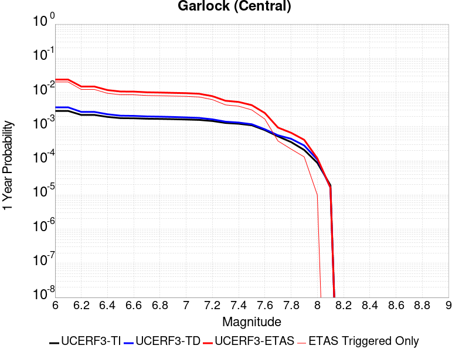 |  |

| Magnitude | 1 wk TI Prob | 1 wk TD Prob | 1 wk ETAS Prob | 1 wk ETAS/TD Gain | 1 wk ETAS Triggered Only | 1 mo TI Prob | 1 mo TD Prob | 1 mo ETAS Prob | 1 mo ETAS/TD Gain | 1 mo ETAS Triggered Only | 1 yr TI Prob | 1 yr TD Prob | 1 yr ETAS Prob | 1 yr ETAS/TD Gain | 1 yr ETAS Triggered Only | 10 yr TI Prob | 10 yr TD Prob | 10 yr ETAS Prob | 10 yr ETAS/TD Gain | 10 yr ETAS Triggered Only |
|-----|-----|-----|-----|-----|-----|-----|-----|-----|-----|-----|-----|-----|-----|-----|-----|-----|-----|-----|-----|-----|
| 6.0 | 5.5131142E-5 | 7.0252914E-5 | 0.0043999488 | 62.63012 | 0.00433 | 2.3625491E-4 | 3.0104956E-4 | 0.009968138 | 33.11129 | 0.00967 | 0.0028726095 | 0.0036591839 | 0.023765342 | 6.494711 | 0.02018 | 0.028357591 | 0.03608289 | 0.06258097 | 1.7343669 | 0.02749 |
| 6.1 | 5.5131142E-5 | 7.0252914E-5 | 0.0043999488 | 62.63012 | 0.00433 | 2.3625491E-4 | 3.0104956E-4 | 0.009968138 | 33.11129 | 0.00967 | 0.0028726095 | 0.0036591839 | 0.023765342 | 6.494711 | 0.02018 | 0.028357591 | 0.03608289 | 0.06258097 | 1.7343669 | 0.02749 |
| 6.2 | 4.216245E-5 | 5.166702E-5 | 0.0025815363 | 49.964878 | 0.00253 | 1.806837E-4 | 2.2141146E-4 | 0.006080114 | 27.460701 | 0.00586 | 0.0021976046 | 0.0026923837 | 0.014889456 | 5.530213 | 0.01223 | 0.021759989 | 0.02669258 | 0.042781353 | 1.6027431 | 0.01653 |
| 6.3 | 4.216245E-5 | 5.166702E-5 | 0.0025815363 | 49.964878 | 0.00253 | 1.806837E-4 | 2.2141146E-4 | 0.006080114 | 27.460701 | 0.00586 | 0.0021976046 | 0.0026923837 | 0.014889456 | 5.530213 | 0.01223 | 0.021759989 | 0.02669258 | 0.042781353 | 1.6027431 | 0.01653 |
| 6.4 | 3.6858168E-5 | 4.411584E-5 | 0.0019040338 | 43.159866 | 0.00186 | 1.5795401E-4 | 1.8905434E-4 | 0.004568226 | 24.163563 | 0.00438 | 0.0019213937 | 0.0022993318 | 0.01170765 | 5.091761 | 0.00943 | 0.019048655 | 0.02285164 | 0.035163708 | 1.5387827 | 0.0126 |
| 6.5 | 3.39199E-5 | 4.0023286E-5 | 0.0017499549 | 43.72342 | 0.00171 | 1.453629E-4 | 1.7151721E-4 | 0.004160833 | 24.258982 | 0.00399 | 0.0017683565 | 0.0020862438 | 0.0106283855 | 5.0945077 | 0.00856 | 0.017543508 | 0.02076252 | 0.031906243 | 1.536723 | 0.01138 |
| 6.6 | 3.3571985E-5 | 3.947746E-5 | 0.0017394103 | 44.060844 | 0.0017 | 1.4387199E-4 | 1.6917827E-4 | 0.004148505 | 24.5215 | 0.00398 | 0.0017502342 | 0.0020578213 | 0.010580247 | 5.14148 | 0.00854 | 0.017365133 | 0.02048383 | 0.031601336 | 1.5427456 | 0.01135 |
| 6.7 | 3.2580007E-5 | 3.8093858E-5 | 0.0016480326 | 43.262424 | 0.00161 | 1.3962112E-4 | 1.632493E-4 | 0.003992624 | 24.457222 | 0.00383 | 0.0016985617 | 0.0019857697 | 0.010099625 | 5.0860004 | 0.00813 | 0.016856372 | 0.019776449 | 0.030411873 | 1.5377824 | 0.01085 |
| 6.8 | 3.2185937E-5 | 3.7521055E-5 | 0.0016174618 | 43.10811 | 0.00158 | 1.3793244E-4 | 1.6079473E-4 | 0.00392019 | 24.38009 | 0.00376 | 0.0016780337 | 0.0019559395 | 0.009930312 | 5.0770035 | 0.00799 | 0.016654192 | 0.01948324 | 0.029925743 | 1.5359737 | 0.01065 |
| 6.9 | 3.165394E-5 | 3.672561E-5 | 0.0015966683 | 43.47561 | 0.00156 | 1.3565269E-4 | 1.5738611E-4 | 0.003886799 | 24.695948 | 0.00373 | 0.0016503202 | 0.0019145131 | 0.009719541 | 5.0767694 | 0.00782 | 0.01638118 | 0.01907586 | 0.029306898 | 1.5363344 | 0.01043 |
| 7.0 | 3.0903822E-5 | 3.5630834E-5 | 0.0015655763 | 43.938805 | 0.00153 | 1.3243823E-4 | 1.5269476E-4 | 0.0038221343 | 25.031208 | 0.00367 | 0.0016112428 | 0.0018574947 | 0.009523229 | 5.126921 | 0.00768 | 0.015996104 | 0.018515008 | 0.028565414 | 1.5428249 | 0.01024 |
| 7.1 | 3.0069863E-5 | 3.4397097E-5 | 0.0015043465 | 43.734695 | 0.00147 | 1.2886449E-4 | 1.4740792E-4 | 0.0037068832 | 25.14711 | 0.00356 | 0.0015677959 | 0.0017932352 | 0.009130055 | 5.0913873 | 0.00735 | 0.01556781 | 0.017882649 | 0.027546683 | 1.540414 | 0.00984 |
| 7.2 | 2.7957109E-5 | 3.1286367E-5 | 0.0012412486 | 39.673782 | 0.00121 | 1.1981068E-4 | 1.3407765E-4 | 0.0031036795 | 23.148373 | 0.00297 | 0.0014577188 | 0.0016311926 | 0.0077811447 | 4.770218 | 0.00616 | 0.014481937 | 0.016286217 | 0.024362506 | 1.4958973 | 0.00821 |
| 7.3 | 2.4519275E-5 | 2.6719412E-5 | 9.2669536E-4 | 34.682476 | 9.0E-4 | 1.0507837E-4 | 1.14506816E-4 | 0.002234264 | 19.51206 | 0.00212 | 0.0012785783 | 0.0013932437 | 0.005707225 | 4.096358 | 0.00432 | 0.012712469 | 0.013930428 | 0.019570746 | 1.404892 | 0.00572 |
| 7.4 | 2.3225532E-5 | 2.5203923E-5 | 8.2518376E-4 | 32.74029 | 8.0E-4 | 9.95342E-5 | 1.0801242E-4 | 0.0020678006 | 19.144102 | 0.00196 | 0.0012111551 | 0.0013142723 | 0.005269068 | 4.0091143 | 0.00396 | 0.012045753 | 0.013148054 | 0.018289551 | 1.3910464 | 0.00521 |
| 7.5 | 2.097765E-5 | 2.2487986E-5 | 6.624736E-4 | 29.459002 | 6.4E-4 | 8.9901114E-5 | 9.637359E-5 | 0.0016062281 | 16.666683 | 0.00151 | 0.0010939965 | 0.0011727286 | 0.0042491164 | 3.6232736 | 0.00308 | 0.010886264 | 0.011742581 | 0.01573514 | 1.3400071 | 0.00404 |
| 7.6 | 1.511254E-5 | 1.5995334E-5 | 3.4599006E-4 | 21.630688 | 3.3E-4 | 6.476642E-5 | 6.854967E-5 | 8.384969E-4 | 12.23196 | 7.7E-4 | 7.882459E-4 | 8.342805E-4 | 0.0024928956 | 2.9880784 | 0.00166 | 0.007854558 | 0.008385628 | 0.010577096 | 1.2613361 | 0.00221 |
| 7.7 | 9.934069E-6 | 1.0682508E-5 | 6.0681974E-5 | 5.6804986 | 5.0E-5 | 4.2573887E-5 | 4.5781377E-5 | 1.7577542E-4 | 3.8394527 | 1.3E-4 | 5.182138E-4 | 5.572461E-4 | 9.370343E-4 | 1.6815449 | 3.8E-4 | 0.00517007 | 0.0056296107 | 0.0061367396 | 1.0900824 | 5.1E-4 |
| 7.8 | 6.7562896E-6 | 8.431477E-6 | 3.8431222E-5 | 4.5580654 | 3.0E-5 | 2.8955206E-5 | 3.61344E-5 | 1.2613114E-4 | 3.4906113 | 9.0E-5 | 3.5247262E-4 | 4.3984767E-4 | 6.597509E-4 | 1.4999532 | 2.2E-4 | 0.0035191406 | 0.0044482257 | 0.0047668023 | 1.0716188 | 3.2E-4 |
| 7.9 | 3.975453E-6 | 5.3728795E-6 | 5.3728795E-6 | 1.0 | 0.0 | 1.7037546E-5 | 2.3026425E-5 | 7.302527E-5 | 3.1713684 | 5.0E-5 | 2.0741238E-4 | 2.8031075E-4 | 4.102743E-4 | 1.463641 | 1.3E-4 | 0.002072189 | 0.0028345888 | 0.0030439936 | 1.0738748 | 2.1E-4 |
| 8.0 | 1.6729537E-6 | 2.078155E-6 | 2.078155E-6 | 1.0 | 0.0 | 7.169782E-6 | 8.906349E-6 | 8.906349E-6 | 1.0 | 0.0 | 8.7288594E-5 | 1.08429434E-4 | 1.1842835E-4 | 1.0922159 | 1.0E-5 | 8.7254314E-4 | 0.001097267 | 0.0011472121 | 1.0455178 | 5.0E-5 |
| 8.1 | 3.6733252E-7 | 3.1499187E-7 | 3.1499187E-7 | 1.0 | 0.0 | 1.5742813E-6 | 1.3499646E-6 | 1.3499646E-6 | 1.0 | 0.0 | 1.9166706E-5 | 1.643571E-5 | 1.643571E-5 | 1.0 | 0.0 | 1.9165053E-4 | 1.6643589E-4 | 1.6643589E-4 | 1.0 | 0.0 |

## Little Lake
*[(top)](#table-of-contents)*

| 1 Week | 1 Month | 1 Year | 10 Year |
|-----|-----|-----|-----|
|  |  |  | 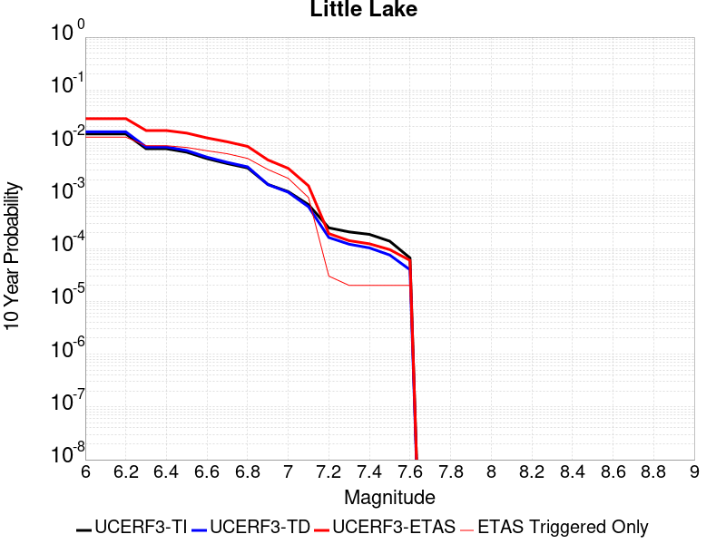 |

| Magnitude | 1 wk TI Prob | 1 wk TD Prob | 1 wk ETAS Prob | 1 wk ETAS/TD Gain | 1 wk ETAS Triggered Only | 1 mo TI Prob | 1 mo TD Prob | 1 mo ETAS Prob | 1 mo ETAS/TD Gain | 1 mo ETAS Triggered Only | 1 yr TI Prob | 1 yr TD Prob | 1 yr ETAS Prob | 1 yr ETAS/TD Gain | 1 yr ETAS Triggered Only | 10 yr TI Prob | 10 yr TD Prob | 10 yr ETAS Prob | 10 yr ETAS/TD Gain | 10 yr ETAS Triggered Only |
|-----|-----|-----|-----|-----|-----|-----|-----|-----|-----|-----|-----|-----|-----|-----|-----|-----|-----|-----|-----|-----|
| 6.0 | 2.8424427E-5 | 3.120616E-5 | 0.0021011415 | 67.330986 | 0.00207 | 1.2181328E-4 | 1.3373457E-4 | 0.0048231073 | 36.064774 | 0.00469 | 0.0014820677 | 0.0016271356 | 0.011081726 | 6.8105736 | 0.00947 | 0.014722223 | 0.016165627 | 0.028778384 | 1.7802207 | 0.01282 |
| 6.1 | 2.8424427E-5 | 3.120616E-5 | 0.0021011415 | 67.330986 | 0.00207 | 1.2181328E-4 | 1.3373457E-4 | 0.0048231073 | 36.064774 | 0.00469 | 0.0014820677 | 0.0016271356 | 0.011081726 | 6.8105736 | 0.00947 | 0.014722223 | 0.016165627 | 0.028778384 | 1.7802207 | 0.01282 |
| 6.2 | 2.8424427E-5 | 3.120616E-5 | 0.0021011415 | 67.330986 | 0.00207 | 1.2181328E-4 | 1.3373457E-4 | 0.0048231073 | 36.064774 | 0.00469 | 0.0014820677 | 0.0016271356 | 0.011081726 | 6.8105736 | 0.00947 | 0.014722223 | 0.016165627 | 0.028778384 | 1.7802207 | 0.01282 |
| 6.3 | 1.48860645E-5 | 1.6081593E-5 | 0.0014560585 | 90.54192 | 0.00144 | 6.379586E-5 | 6.891945E-5 | 0.0032586996 | 47.282726 | 0.00319 | 7.7643775E-4 | 8.387995E-4 | 0.007333347 | 8.74267 | 0.0065 | 0.007737305 | 0.008359154 | 0.017105427 | 2.0463107 | 0.00882 |
| 6.4 | 1.48860645E-5 | 1.6081593E-5 | 0.0014560585 | 90.54192 | 0.00144 | 6.379586E-5 | 6.891945E-5 | 0.0032586996 | 47.282726 | 0.00319 | 7.7643775E-4 | 8.387995E-4 | 0.007333347 | 8.74267 | 0.0065 | 0.007737305 | 0.008359154 | 0.017105427 | 2.0463107 | 0.00882 |
| 6.5 | 1.2797581E-5 | 1.3765735E-5 | 0.001373747 | 99.79467 | 0.00136 | 5.4845623E-5 | 5.899482E-5 | 0.0030088208 | 51.001442 | 0.00295 | 6.675408E-4 | 7.180509E-4 | 0.006683764 | 9.308204 | 0.00597 | 0.006655392 | 0.0071598585 | 0.015281291 | 2.1343007 | 0.00818 |
| 6.6 | 9.661896E-6 | 1.0289158E-5 | 0.0011602773 | 112.76698 | 0.00115 | 4.1407468E-5 | 4.4095737E-5 | 0.0025739842 | 58.37263 | 0.00253 | 5.040193E-4 | 5.367496E-4 | 0.0057339584 | 10.682744 | 0.0052 | 0.005028777 | 0.0053561367 | 0.012408162 | 2.316625 | 0.00709 |
| 6.7 | 7.767871E-6 | 8.199779E-6 | 9.281922E-4 | 113.197235 | 9.2E-4 | 3.329045E-5 | 3.514151E-5 | 0.002185066 | 62.179054 | 0.00215 | 4.0523586E-4 | 4.2777765E-4 | 0.004995823 | 11.678551 | 0.00457 | 0.004044977 | 0.0042708935 | 0.010464328 | 2.4501498 | 0.00622 |
| 6.8 | 6.4235196E-6 | 6.735819E-6 | 7.2673097E-4 | 107.89051 | 7.2E-4 | 2.752908E-5 | 2.886755E-5 | 0.0017688173 | 61.273556 | 0.00174 | 3.35115E-4 | 3.5141854E-4 | 0.004040122 | 11.49661 | 0.00369 | 0.003346101 | 0.0035098887 | 0.008562094 | 2.4394202 | 0.00507 |
| 6.9 | 3.1283696E-6 | 3.1122067E-6 | 4.0311096E-4 | 129.52577 | 4.0E-4 | 1.3407229E-5 | 1.3337969E-5 | 0.0010733239 | 80.471306 | 0.00106 | 1.6322079E-4 | 1.6237919E-4 | 0.002412014 | 14.854206 | 0.00225 | 0.0016310095 | 0.0016227537 | 0.0047476743 | 2.9256902 | 0.00313 |
| 7.0 | 2.290603E-6 | 2.2287015E-6 | 2.9222807E-4 | 131.12032 | 2.9E-4 | 9.816834E-6 | 9.551549E-6 | 7.0954487E-4 | 74.28584 | 7.0E-4 | 1.19513395E-4 | 1.16284944E-4 | 0.0016461071 | 14.155806 | 0.00153 | 0.0011944914 | 0.0011623431 | 0.0032898672 | 2.8303754 | 0.00213 |
| 7.1 | 1.293693E-6 | 1.1776951E-6 | 1.11177564E-4 | 94.40267 | 1.1E-4 | 5.5443866E-6 | 5.047259E-6 | 3.150457E-4 | 62.419167 | 3.1E-4 | 6.750081E-5 | 6.144935E-5 | 7.614063E-4 | 12.390797 | 7.0E-4 | 6.7480316E-4 | 6.14392E-4 | 0.0015338268 | 2.4964952 | 9.2E-4 |
| 7.2 | 4.715842E-7 | 3.0918443E-7 | 1.0309182E-5 | 33.343147 | 1.0E-5 | 2.0210737E-6 | 1.3250755E-6 | 1.1325063E-5 | 8.54673 | 1.0E-5 | 2.4606294E-5 | 1.613268E-5 | 4.6132194E-5 | 2.8595495 | 3.0E-5 | 2.460357E-4 | 1.6131563E-4 | 1.9131078E-4 | 1.1859409 | 3.0E-5 |
| 7.3 | 3.9430947E-7 | 2.3098025E-7 | 2.3098025E-7 | 1.0 | 0.0 | 1.6898966E-6 | 9.89915E-7 | 9.89915E-7 | 1.0 | 0.0 | 2.0574296E-5 | 1.2052149E-5 | 3.2051907E-5 | 2.659435 | 2.0E-5 | 2.0572392E-4 | 1.20515026E-4 | 1.4051262E-4 | 1.1659344 | 2.0E-5 |
| 7.4 | 3.547123E-7 | 1.9679635E-7 | 1.9679635E-7 | 1.0 | 0.0 | 1.5201948E-6 | 8.4341264E-7 | 8.4341264E-7 | 1.0 | 0.0 | 1.8508214E-5 | 1.0268501E-5 | 3.0268297E-5 | 2.9476838 | 2.0E-5 | 1.8506673E-4 | 1.0268033E-4 | 1.2267828E-4 | 1.1947592 | 2.0E-5 |
| 7.5 | 2.6354266E-7 | 1.4423487E-7 | 1.4423487E-7 | 1.0 | 0.0 | 1.129468E-6 | 6.1814933E-7 | 6.1814933E-7 | 1.0 | 0.0 | 1.3751187E-5 | 7.5259427E-6 | 2.7525792E-5 | 3.6574545 | 2.0E-5 | 1.3750336E-4 | 7.525693E-5 | 9.5255426E-5 | 1.2657362 | 2.0E-5 |
| 7.6 | 1.269913E-7 | 7.5727044E-8 | 7.5727044E-8 | 1.0 | 0.0 | 5.4424834E-7 | 3.2454443E-7 | 3.2454443E-7 | 1.0 | 0.0 | 6.6262032E-6 | 3.9513216E-6 | 2.3951243E-5 | 6.0615773 | 2.0E-5 | 6.626006E-5 | 3.951255E-5 | 5.951176E-5 | 1.5061483 | 2.0E-5 |

## Tank Canyon
*[(top)](#table-of-contents)*

| 1 Week | 1 Month | 1 Year | 10 Year |
|-----|-----|-----|-----|
|  |  |  |  |

| Magnitude | 1 wk TI Prob | 1 wk TD Prob | 1 wk ETAS Prob | 1 wk ETAS/TD Gain | 1 wk ETAS Triggered Only | 1 mo TI Prob | 1 mo TD Prob | 1 mo ETAS Prob | 1 mo ETAS/TD Gain | 1 mo ETAS Triggered Only | 1 yr TI Prob | 1 yr TD Prob | 1 yr ETAS Prob | 1 yr ETAS/TD Gain | 1 yr ETAS Triggered Only | 10 yr TI Prob | 10 yr TD Prob | 10 yr ETAS Prob | 10 yr ETAS/TD Gain | 10 yr ETAS Triggered Only |
|-----|-----|-----|-----|-----|-----|-----|-----|-----|-----|-----|-----|-----|-----|-----|-----|-----|-----|-----|-----|-----|
| 6.0 | 4.8284557E-5 | 5.796635E-5 | 0.0020378516 | 35.15577 | 0.00198 | 2.0691741E-4 | 2.484074E-4 | 0.0043573864 | 17.54129 | 0.00411 | 0.0025163088 | 0.0030208372 | 0.011854073 | 3.9241018 | 0.00886 | 0.02488006 | 0.029864404 | 0.041476928 | 1.3888416 | 0.01197 |
| 6.1 | 1.7796336E-5 | 2.0873764E-5 | 6.1086146E-4 | 29.264557 | 5.9E-4 | 7.626778E-5 | 8.945614E-5 | 0.0012693505 | 14.189642 | 0.00118 | 9.281647E-4 | 0.0010886216 | 0.0037057693 | 3.4040935 | 0.00262 | 0.009242975 | 0.010836975 | 0.014427637 | 1.3313344 | 0.00363 |
| 6.2 | 1.7796336E-5 | 2.0873764E-5 | 6.1086146E-4 | 29.264557 | 5.9E-4 | 7.626778E-5 | 8.945614E-5 | 0.0012693505 | 14.189642 | 0.00118 | 9.281647E-4 | 0.0010886216 | 0.0037057693 | 3.4040935 | 0.00262 | 0.009242975 | 0.010836975 | 0.014427637 | 1.3313344 | 0.00363 |
| 6.3 | 1.3515912E-5 | 1.575988E-5 | 4.1575357E-4 | 26.380503 | 4.0E-4 | 5.792405E-5 | 6.7540735E-5 | 8.4748806E-4 | 12.547807 | 7.8E-4 | 7.049971E-4 | 8.220222E-4 | 0.0026305343 | 3.200077 | 0.00181 | 0.007027647 | 0.008192427 | 0.0107413735 | 1.3111343 | 0.00257 |
| 6.4 | 1.0870146E-5 | 1.2618259E-5 | 3.126145E-4 | 24.77477 | 3.0E-4 | 4.658551E-5 | 5.407723E-5 | 6.540448E-4 | 12.094643 | 6.0E-4 | 5.67031E-4 | 6.582093E-4 | 0.0020273076 | 3.0800347 | 0.00137 | 0.005655863 | 0.006564614 | 0.008571353 | 1.3056904 | 0.00202 |
| 6.5 | 7.964826E-6 | 9.196251E-6 | 1.891946E-4 | 20.573013 | 1.8E-4 | 3.4134522E-5 | 3.941197E-5 | 3.3940014E-4 | 8.611601 | 3.0E-4 | 4.1550855E-4 | 4.7974577E-4 | 0.0012593715 | 2.625081 | 7.8E-4 | 0.0041473247 | 0.0047884025 | 0.0059926086 | 1.2514839 | 0.00121 |
| 6.6 | 6.6317E-6 | 7.6124184E-6 | 1.5761127E-4 | 20.704494 | 1.5E-4 | 2.8421264E-5 | 3.2624295E-5 | 2.9261582E-4 | 8.969261 | 2.6E-4 | 3.4597394E-4 | 3.971375E-4 | 0.0010268873 | 2.5857222 | 6.3E-4 | 0.0034543579 | 0.00396543 | 0.0049216235 | 1.2411323 | 9.6E-4 |
| 6.7 | 4.793663E-6 | 5.4308543E-6 | 1.1543026E-4 | 21.25453 | 1.1E-4 | 2.0544108E-5 | 2.3274906E-5 | 1.9327096E-4 | 8.303833 | 1.7E-4 | 2.500958E-4 | 2.8333953E-4 | 6.5323466E-4 | 2.3054838 | 3.7E-4 | 0.0024981452 | 0.0028304753 | 0.003398862 | 1.2008096 | 5.7E-4 |
| 6.8 | 4.382823E-6 | 4.969316E-6 | 1.1496877E-4 | 23.135735 | 1.1E-4 | 1.8783392E-5 | 2.1296917E-5 | 1.912933E-4 | 8.982205 | 1.7E-4 | 2.286638E-4 | 2.5926338E-4 | 6.091726E-4 | 2.3496284 | 3.5E-4 | 0.0022842865 | 0.0025902835 | 0.0031189106 | 1.2040808 | 5.3E-4 |
| 6.9 | 2.729601E-6 | 3.0735694E-6 | 6.3073385E-5 | 20.521217 | 6.0E-5 | 1.1698237E-5 | 1.317238E-5 | 1.2317093E-4 | 9.350697 | 1.1E-4 | 1.4241673E-4 | 1.6036315E-4 | 3.603311E-4 | 2.2469692 | 2.0E-4 | 0.001423255 | 0.0016026403 | 0.0018622235 | 1.1619723 | 2.6E-4 |
| 7.0 | 1.8987357E-6 | 2.126954E-6 | 4.212687E-5 | 19.806196 | 4.0E-5 | 8.137413E-6 | 9.115489E-6 | 5.9115035E-5 | 6.485119 | 5.0E-5 | 9.90685E-5 | 1.1097613E-4 | 1.9096726E-4 | 1.7207958 | 8.0E-5 | 9.902435E-4 | 0.0011092757 | 0.0012091649 | 1.0900489 | 1.0E-4 |
| 7.1 | 1.4928986E-6 | 1.6641375E-6 | 2.1664104E-5 | 13.018218 | 2.0E-5 | 6.398121E-6 | 7.1320014E-6 | 2.7131859E-5 | 3.804242 | 2.0E-5 | 7.789434E-5 | 8.682925E-5 | 1.16826646E-4 | 1.3454757 | 3.0E-5 | 7.786704E-4 | 8.680111E-4 | 9.079764E-4 | 1.0460423 | 4.0E-5 |
| 7.2 | 1.069082E-6 | 1.1828638E-6 | 1.1182852E-5 | 9.454049 | 1.0E-5 | 4.581772E-6 | 5.0694093E-6 | 1.5069359E-5 | 2.9726064 | 1.0E-5 | 5.5781646E-5 | 6.171884E-5 | 7.171823E-5 | 1.1620151 | 1.0E-5 | 5.576765E-4 | 6.170693E-4 | 6.2706316E-4 | 1.0161957 | 1.0E-5 |
| 7.3 | 8.776551E-7 | 9.770052E-7 | 9.770052E-7 | 1.0 | 0.0 | 3.7613736E-6 | 4.1871617E-6 | 4.1871617E-6 | 1.0 | 0.0 | 4.579376E-5 | 5.097802E-5 | 5.097802E-5 | 1.0 | 0.0 | 4.5784327E-4 | 5.0971424E-4 | 5.0971424E-4 | 1.0 | 0.0 |
| 7.4 | 7.55721E-7 | 8.510284E-7 | 8.510284E-7 | 1.0 | 0.0 | 3.2388E-6 | 3.6472622E-6 | 3.6472622E-6 | 1.0 | 0.0 | 3.9431678E-5 | 4.440503E-5 | 4.440503E-5 | 1.0 | 0.0 | 3.942468E-4 | 4.4401243E-4 | 4.4401243E-4 | 1.0 | 0.0 |
| 7.5 | 5.587665E-7 | 6.305647E-7 | 6.305647E-7 | 1.0 | 0.0 | 2.3947114E-6 | 2.7024203E-6 | 2.7024203E-6 | 1.0 | 0.0 | 2.915522E-5 | 3.2901968E-5 | 3.2901968E-5 | 1.0 | 0.0 | 2.9151395E-4 | 3.2901968E-4 | 3.2901968E-4 | 1.0 | 0.0 |

## Airport Lake
*[(top)](#table-of-contents)*

| 1 Week | 1 Month | 1 Year | 10 Year |
|-----|-----|-----|-----|
|  |  |  |  |

| Magnitude | 1 wk TI Prob | 1 wk TD Prob | 1 wk ETAS Prob | 1 wk ETAS/TD Gain | 1 wk ETAS Triggered Only | 1 mo TI Prob | 1 mo TD Prob | 1 mo ETAS Prob | 1 mo ETAS/TD Gain | 1 mo ETAS Triggered Only | 1 yr TI Prob | 1 yr TD Prob | 1 yr ETAS Prob | 1 yr ETAS/TD Gain | 1 yr ETAS Triggered Only | 10 yr TI Prob | 10 yr TD Prob | 10 yr ETAS Prob | 10 yr ETAS/TD Gain | 10 yr ETAS Triggered Only |
|-----|-----|-----|-----|-----|-----|-----|-----|-----|-----|-----|-----|-----|-----|-----|-----|-----|-----|-----|-----|-----|
| 6.0 | 1.2387061E-5 | 1.31032575E-5 | 0.0016730815 | 127.684395 | 0.00166 | 5.3086325E-5 | 5.6155768E-5 | 0.004145926 | 73.82903 | 0.00409 | 6.461343E-4 | 6.835104E-4 | 0.009487488 | 13.880533 | 0.00881 | 0.0064425888 | 0.0068168915 | 0.018695362 | 2.7425053 | 0.01196 |
| 6.1 | 1.2387061E-5 | 1.31032575E-5 | 0.0016730815 | 127.684395 | 0.00166 | 5.3086325E-5 | 5.6155768E-5 | 0.004145926 | 73.82903 | 0.00409 | 6.461343E-4 | 6.835104E-4 | 0.009487488 | 13.880533 | 0.00881 | 0.0064425888 | 0.0068168915 | 0.018695362 | 2.7425053 | 0.01196 |
| 6.2 | 1.2387061E-5 | 1.31032575E-5 | 0.0016730815 | 127.684395 | 0.00166 | 5.3086325E-5 | 5.6155768E-5 | 0.004145926 | 73.82903 | 0.00409 | 6.461343E-4 | 6.835104E-4 | 0.009487488 | 13.880533 | 0.00881 | 0.0064425888 | 0.0068168915 | 0.018695362 | 2.7425053 | 0.01196 |
| 6.3 | 1.2387061E-5 | 1.31032575E-5 | 0.0016730815 | 127.684395 | 0.00166 | 5.3086325E-5 | 5.6155768E-5 | 0.004145926 | 73.82903 | 0.00409 | 6.461343E-4 | 6.835104E-4 | 0.009487488 | 13.880533 | 0.00881 | 0.0064425888 | 0.0068168915 | 0.018695362 | 2.7425053 | 0.01196 |
| 6.4 | 1.2387061E-5 | 1.31032575E-5 | 0.0016730815 | 127.684395 | 0.00166 | 5.3086325E-5 | 5.6155768E-5 | 0.004145926 | 73.82903 | 0.00409 | 6.461343E-4 | 6.835104E-4 | 0.009487488 | 13.880533 | 0.00881 | 0.0064425888 | 0.0068168915 | 0.018695362 | 2.7425053 | 0.01196 |
| 6.5 | 6.9922594E-6 | 7.38498E-6 | 0.0013173753 | 178.38576 | 0.00131 | 2.996648E-5 | 3.164956E-5 | 0.0031615505 | 99.892395 | 0.00313 | 3.6478083E-4 | 3.8527072E-4 | 0.0070826896 | 18.383669 | 0.0067 | 0.003641826 | 0.0038465653 | 0.0129015995 | 3.3540573 | 0.00909 |
| 6.6 | 6.9922594E-6 | 7.38498E-6 | 0.0013173753 | 178.38576 | 0.00131 | 2.996648E-5 | 3.164956E-5 | 0.0031615505 | 99.892395 | 0.00313 | 3.6478083E-4 | 3.8527072E-4 | 0.0070826896 | 18.383669 | 0.0067 | 0.003641826 | 0.0038465653 | 0.0129015995 | 3.3540573 | 0.00909 |
| 6.7 | 5.477277E-6 | 5.7861116E-6 | 0.00105578 | 182.46797 | 0.00105 | 2.3473833E-5 | 2.4797408E-5 | 0.0026747317 | 107.86336 | 0.00265 | 2.8575645E-4 | 3.0187052E-4 | 0.0060501345 | 20.042152 | 0.00575 | 0.0028538927 | 0.0030149885 | 0.010781501 | 3.5759678 | 0.00779 |
| 6.8 | 3.9950432E-6 | 4.2191186E-6 | 7.642159E-4 | 181.13165 | 7.6E-4 | 1.7121502E-5 | 1.8081826E-5 | 0.002108044 | 116.58358 | 0.00209 | 2.0843433E-4 | 2.2012675E-4 | 0.004679145 | 21.256594 | 0.00446 | 0.0020823893 | 0.002199358 | 0.008315876 | 3.7810469 | 0.00613 |
| 6.9 | 2.95695E-6 | 3.1230477E-6 | 5.4312136E-4 | 173.90749 | 5.4E-4 | 1.2672582E-5 | 1.3384434E-5 | 0.0014833647 | 110.82761 | 0.00147 | 1.5427776E-4 | 1.6294557E-4 | 0.0033124322 | 20.32846 | 0.00315 | 0.001541707 | 0.0016284833 | 0.005971399 | 3.6668472 | 0.00435 |
| 7.0 | 1.456072E-6 | 1.5408239E-6 | 2.815404E-4 | 182.72069 | 2.8E-4 | 6.2402937E-6 | 6.60352E-6 | 6.8659906E-4 | 103.9747 | 6.8E-4 | 7.597293E-5 | 8.03959E-5 | 0.001560277 | 19.40742 | 0.00148 | 7.594696E-4 | 8.03767E-4 | 0.0028221435 | 3.511146 | 0.00202 |
| 7.1 | 6.995192E-7 | 7.4090326E-7 | 1.0074083E-4 | 135.97029 | 1.0E-4 | 2.997936E-6 | 3.1752998E-6 | 2.9317438E-4 | 92.32967 | 2.9E-4 | 3.649926E-5 | 3.8659273E-5 | 6.986338E-4 | 18.07157 | 6.6E-4 | 3.6493264E-4 | 3.8659273E-4 | 0.0012462602 | 3.2237034 | 8.6E-4 |

## Owl Lake
*[(top)](#table-of-contents)*

| 1 Week | 1 Month | 1 Year | 10 Year |
|-----|-----|-----|-----|
| 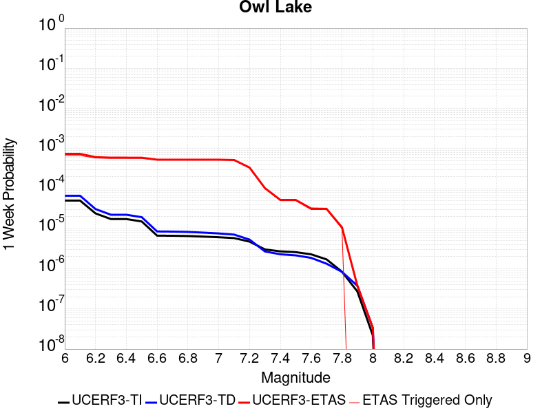 |  |  |  |

| Magnitude | 1 wk TI Prob | 1 wk TD Prob | 1 wk ETAS Prob | 1 wk ETAS/TD Gain | 1 wk ETAS Triggered Only | 1 mo TI Prob | 1 mo TD Prob | 1 mo ETAS Prob | 1 mo ETAS/TD Gain | 1 mo ETAS Triggered Only | 1 yr TI Prob | 1 yr TD Prob | 1 yr ETAS Prob | 1 yr ETAS/TD Gain | 1 yr ETAS Triggered Only | 10 yr TI Prob | 10 yr TD Prob | 10 yr ETAS Prob | 10 yr ETAS/TD Gain | 10 yr ETAS Triggered Only |
|-----|-----|-----|-----|-----|-----|-----|-----|-----|-----|-----|-----|-----|-----|-----|-----|-----|-----|-----|-----|-----|
| 6.0 | 5.0320643E-5 | 6.636149E-5 | 7.36317E-4 | 11.095546 | 6.7E-4 | 2.1564208E-4 | 2.8438168E-4 | 0.0019339124 | 6.8004117 | 0.00165 | 0.0026222812 | 0.00345791 | 0.0071351505 | 2.0634286 | 0.00369 | 0.02591553 | 0.0341423 | 0.03909715 | 1.1451235 | 0.00513 |
| 6.1 | 5.0320643E-5 | 6.636149E-5 | 7.36317E-4 | 11.095546 | 6.7E-4 | 2.1564208E-4 | 2.8438168E-4 | 0.0019339124 | 6.8004117 | 0.00165 | 0.0026222812 | 0.00345791 | 0.0071351505 | 2.0634286 | 0.00369 | 0.02591553 | 0.0341423 | 0.03909715 | 1.1451235 | 0.00513 |
| 6.2 | 2.4125871E-5 | 3.098269E-5 | 6.109647E-4 | 19.71955 | 5.8E-4 | 1.0339249E-4 | 1.3277736E-4 | 0.0015525888 | 11.693173 | 0.00142 | 0.0012580766 | 0.0016155228 | 0.00475045 | 2.9405034 | 0.00314 | 0.012509781 | 0.016071297 | 0.020331709 | 1.2650944 | 0.00433 |
| 6.3 | 1.7433485E-5 | 2.2356835E-5 | 5.923441E-4 | 26.494987 | 5.7E-4 | 7.471279E-5 | 9.5812386E-5 | 0.0014556821 | 15.193048 | 0.00136 | 9.0924866E-4 | 0.0011660426 | 0.0041126027 | 3.5269747 | 0.00295 | 0.009055373 | 0.01162957 | 0.015701655 | 1.3501494 | 0.00412 |
| 6.4 | 1.7433485E-5 | 2.2356835E-5 | 5.923441E-4 | 26.494987 | 5.7E-4 | 7.471279E-5 | 9.5812386E-5 | 0.0014556821 | 15.193048 | 0.00136 | 9.0924866E-4 | 0.0011660426 | 0.0041126027 | 3.5269747 | 0.00295 | 0.009055373 | 0.01162957 | 0.015701655 | 1.3501494 | 0.00412 |
| 6.5 | 1.5182742E-5 | 1.9430352E-5 | 5.894193E-4 | 30.334976 | 5.7E-4 | 6.506727E-5 | 8.327114E-5 | 0.0014231595 | 17.090672 | 0.00134 | 7.919061E-4 | 0.0010135059 | 0.003890587 | 3.8387415 | 0.00288 | 0.0078909 | 0.010119047 | 0.0140785705 | 1.3912941 | 0.004 |
| 6.6 | 6.7271576E-6 | 8.548157E-6 | 5.285437E-4 | 61.831306 | 5.2E-4 | 2.8830356E-5 | 3.6634476E-5 | 0.0012665894 | 34.5737 | 0.00123 | 3.5095305E-4 | 4.4593913E-4 | 0.0030447796 | 6.827792 | 0.0026 | 0.0035039932 | 0.004468226 | 0.0080521405 | 1.8020889 | 0.0036 |
| 6.7 | 6.682835E-6 | 8.4806015E-6 | 5.284762E-4 | 62.315884 | 5.2E-4 | 2.8640408E-5 | 3.634496E-5 | 0.0012663002 | 34.84115 | 0.00123 | 3.4864116E-4 | 4.424157E-4 | 0.0030412655 | 6.8742256 | 0.0026 | 0.003480947 | 0.004433152 | 0.008017193 | 1.8084633 | 0.0036 |
| 6.8 | 6.5774975E-6 | 8.327072E-6 | 5.2832277E-4 | 63.446404 | 5.2E-4 | 2.8188972E-5 | 3.5686993E-5 | 0.001265643 | 35.46511 | 0.00123 | 3.4314668E-4 | 4.3440814E-4 | 0.0030332787 | 6.982555 | 0.0026 | 0.0034261728 | 0.0043532955 | 0.007937624 | 1.8233597 | 0.0036 |
| 6.9 | 6.363419E-6 | 8.0002355E-6 | 5.279961E-4 | 65.99757 | 5.2E-4 | 2.727151E-5 | 3.4286306E-5 | 0.0012642441 | 36.87315 | 0.00123 | 3.3198006E-4 | 4.173614E-4 | 0.0030162763 | 7.227013 | 0.0026 | 0.0033148455 | 0.004183282 | 0.0077582644 | 1.8545878 | 0.00359 |
| 7.0 | 6.1342453E-6 | 7.632424E-6 | 5.2762846E-4 | 69.12987 | 5.2E-4 | 2.6289357E-5 | 3.271001E-5 | 0.0012626698 | 38.60194 | 0.00123 | 3.2002592E-4 | 3.981771E-4 | 0.002987146 | 7.5020533 | 0.00259 | 0.0031956544 | 0.00399197 | 0.0075477185 | 1.8907253 | 0.00357 |
| 7.1 | 5.842926E-6 | 7.142961E-6 | 5.171393E-4 | 72.39845 | 5.1E-4 | 2.504087E-5 | 3.0612362E-5 | 0.0012305756 | 40.19865 | 0.0012 | 3.0482994E-4 | 3.7264716E-4 | 0.0028617193 | 7.679434 | 0.00249 | 0.0030441214 | 0.0037374226 | 0.0071745287 | 1.919646 | 0.00345 |
| 7.2 | 4.77173E-6 | 5.3591634E-6 | 3.3535738E-4 | 62.576447 | 3.3E-4 | 2.045011E-5 | 2.2967664E-5 | 7.729504E-4 | 33.653854 | 7.5E-4 | 2.4895166E-4 | 2.7959948E-4 | 0.0018791521 | 6.7208714 | 0.0016 | 0.0024867293 | 0.0028089995 | 0.004992848 | 1.7774471 | 0.00219 |
| 7.3 | 3.0494948E-6 | 2.7109647E-6 | 1.0271069E-4 | 37.88714 | 1.0E-4 | 1.3069198E-5 | 1.1618369E-5 | 1.7161651E-4 | 14.771135 | 1.6E-4 | 1.5910587E-4 | 1.4144463E-4 | 5.013937E-4 | 3.5448055 | 3.6E-4 | 0.0015899199 | 0.0014235033 | 0.0019327772 | 1.357761 | 5.1E-4 |
| 7.4 | 2.7263884E-6 | 2.3061473E-6 | 5.2306033E-5 | 22.681131 | 5.0E-5 | 1.1684469E-5 | 9.883452E-6 | 1.09882465E-4 | 11.117823 | 1.0E-4 | 1.4224913E-4 | 1.2032448E-4 | 3.602956E-4 | 2.9943664 | 2.4E-4 | 0.0014215811 | 0.0012114698 | 0.0015410699 | 1.2720664 | 3.3E-4 |
| 7.5 | 2.6090431E-6 | 2.1660758E-6 | 5.2165968E-5 | 24.08317 | 5.0E-5 | 1.1181565E-5 | 9.283149E-6 | 7.92825E-5 | 8.540475 | 7.0E-5 | 1.3612706E-4 | 1.1301658E-4 | 3.029951E-4 | 2.6809793 | 1.9E-4 | 0.001360437 | 0.001138222 | 0.0014079148 | 1.236942 | 2.7E-4 |
| 7.6 | 2.3008756E-6 | 1.8732376E-6 | 3.187318E-5 | 17.015024 | 3.0E-5 | 9.860858E-6 | 8.028137E-6 | 4.8027814E-5 | 5.982436 | 4.0E-5 | 1.20049335E-4 | 9.7738266E-5 | 2.3772458E-4 | 2.432257 | 1.4E-4 | 0.001199845 | 9.852252E-4 | 0.0011950183 | 1.2129393 | 2.1E-4 |
| 7.7 | 1.7184348E-6 | 1.3423282E-6 | 3.134229E-5 | 23.3492 | 3.0E-5 | 7.3646997E-6 | 5.7528227E-6 | 4.5752593E-5 | 7.9530683 | 4.0E-5 | 8.966153E-5 | 7.0038404E-5 | 1.800307E-4 | 2.5704567 | 1.1E-4 | 8.962536E-4 | 7.080495E-4 | 8.579433E-4 | 1.2116996 | 1.5E-4 |
| 7.8 | 8.4612907E-7 | 8.4087924E-7 | 1.0840871E-5 | 12.892303 | 1.0E-5 | 3.6262625E-6 | 3.6037634E-6 | 2.3603692E-5 | 6.549734 | 2.0E-5 | 4.4148852E-5 | 4.3874956E-5 | 8.38732E-5 | 1.9116418 | 4.0E-5 | 4.414008E-4 | 4.4413717E-4 | 5.0411053E-4 | 1.1350334 | 6.0E-5 |
| 7.9 | 2.716738E-7 | 3.7694025E-7 | 3.7694025E-7 | 1.0 | 0.0 | 1.1643157E-6 | 1.6154573E-6 | 1.16154415E-5 | 7.1901875 | 1.0E-5 | 1.4175452E-5 | 1.9668027E-5 | 4.9667437E-5 | 2.5252883 | 3.0E-5 | 1.4174548E-4 | 1.9843443E-4 | 2.484245E-4 | 1.2519224 | 5.0E-5 |
| 8.0 | 2.1995428E-8 | 3.386013E-8 | 3.386013E-8 | 1.0 | 0.0 | 9.426611E-8 | 1.4511484E-7 | 1.4511484E-7 | 1.0 | 0.0 | 1.1476893E-6 | 1.7667724E-6 | 1.7667724E-6 | 1.0 | 0.0 | 1.14768345E-5 | 1.7968985E-5 | 1.7968985E-5 | 1.0 | 0.0 |

## Panamint Valley
*[(top)](#table-of-contents)*

| 1 Week | 1 Month | 1 Year | 10 Year |
|-----|-----|-----|-----|
|  |  | 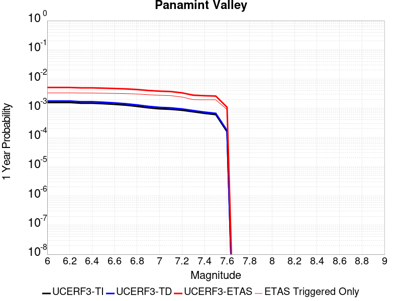 |  |

| Magnitude | 1 wk TI Prob | 1 wk TD Prob | 1 wk ETAS Prob | 1 wk ETAS/TD Gain | 1 wk ETAS Triggered Only | 1 mo TI Prob | 1 mo TD Prob | 1 mo ETAS Prob | 1 mo ETAS/TD Gain | 1 mo ETAS Triggered Only | 1 yr TI Prob | 1 yr TD Prob | 1 yr ETAS Prob | 1 yr ETAS/TD Gain | 1 yr ETAS Triggered Only | 10 yr TI Prob | 10 yr TD Prob | 10 yr ETAS Prob | 10 yr ETAS/TD Gain | 10 yr ETAS Triggered Only |
|-----|-----|-----|-----|-----|-----|-----|-----|-----|-----|-----|-----|-----|-----|-----|-----|-----|-----|-----|-----|-----|
| 6.0 | 3.0211835E-5 | 3.3985398E-5 | 7.539609E-4 | 22.184849 | 7.2E-4 | 1.2947287E-4 | 1.4564373E-4 | 0.0017354122 | 11.915461 | 0.00159 | 0.0015751923 | 0.0017717998 | 0.0051358286 | 2.898651 | 0.00337 | 0.015640736 | 0.01758359 | 0.022122355 | 1.258125 | 0.00462 |
| 6.1 | 3.0211835E-5 | 3.3985398E-5 | 7.539609E-4 | 22.184849 | 7.2E-4 | 1.2947287E-4 | 1.4564373E-4 | 0.0017354122 | 11.915461 | 0.00159 | 0.0015751923 | 0.0017717998 | 0.0051358286 | 2.898651 | 0.00337 | 0.015640736 | 0.01758359 | 0.022122355 | 1.258125 | 0.00462 |
| 6.2 | 3.0211835E-5 | 3.3985398E-5 | 7.539609E-4 | 22.184849 | 7.2E-4 | 1.2947287E-4 | 1.4564373E-4 | 0.0017354122 | 11.915461 | 0.00159 | 0.0015751923 | 0.0017717998 | 0.0051358286 | 2.898651 | 0.00337 | 0.015640736 | 0.01758359 | 0.022122355 | 1.258125 | 0.00462 |
| 6.3 | 2.8573924E-5 | 3.2103522E-5 | 7.520804E-4 | 23.426727 | 7.2E-4 | 1.2245393E-4 | 1.3757942E-4 | 0.0017173621 | 12.482696 | 0.00158 | 0.001489857 | 0.0016737703 | 0.0049981964 | 2.9861903 | 0.00333 | 0.01479908 | 0.016618231 | 0.02109262 | 1.2692456 | 0.00455 |
| 6.4 | 2.8573924E-5 | 3.2103522E-5 | 7.520804E-4 | 23.426727 | 7.2E-4 | 1.2245393E-4 | 1.3757942E-4 | 0.0017173621 | 12.482696 | 0.00158 | 0.001489857 | 0.0016737703 | 0.0049981964 | 2.9861903 | 0.00333 | 0.01479908 | 0.016618231 | 0.02109262 | 1.2692456 | 0.00455 |
| 6.5 | 2.7468774E-5 | 3.0829244E-5 | 7.3080766E-4 | 23.705013 | 7.0E-4 | 1.1771801E-4 | 1.3211879E-4 | 0.0016919127 | 12.805996 | 0.00156 | 0.0014322745 | 0.0016073869 | 0.0048721307 | 3.0310879 | 0.00327 | 0.014230782 | 0.015964093 | 0.020362733 | 1.2755334 | 0.00447 |
| 6.6 | 2.6135967E-5 | 2.9253257E-5 | 7.292328E-4 | 24.928259 | 7.0E-4 | 1.1200648E-4 | 1.2536523E-4 | 0.0016851696 | 13.442082 | 0.00156 | 0.0013628257 | 0.0015252795 | 0.004750353 | 3.1144147 | 0.00323 | 0.013544982 | 0.015154443 | 0.019487763 | 1.2859439 | 0.0044 |
| 6.7 | 2.4498746E-5 | 2.7342086E-5 | 7.173232E-4 | 26.23513 | 6.9E-4 | 1.04990395E-4 | 1.1717525E-4 | 0.0016569948 | 14.141167 | 0.00154 | 0.0012775084 | 0.0014257001 | 0.0045911805 | 3.220299 | 0.00317 | 0.012701893 | 0.014171662 | 0.018410724 | 1.2991225 | 0.0043 |
| 6.8 | 2.2244329E-5 | 2.4936131E-5 | 6.8491965E-4 | 27.466957 | 6.6E-4 | 9.532935E-5 | 1.0686488E-4 | 0.0016167035 | 15.128483 | 0.00151 | 0.0011600169 | 0.0013003252 | 0.00437632 | 3.3655584 | 0.00308 | 0.011539802 | 0.012932883 | 0.0169996 | 1.3144478 | 0.00412 |
| 6.9 | 1.9902658E-5 | 2.2290924E-5 | 6.2227756E-4 | 27.916185 | 6.0E-4 | 8.529431E-5 | 9.552913E-5 | 0.0015153935 | 15.863155 | 0.00142 | 0.0010379635 | 0.0011624652 | 0.004059094 | 3.4917984 | 0.0029 | 0.010331288 | 0.011568946 | 0.015334869 | 1.3255199 | 0.00381 |
| 7.0 | 1.8353881E-5 | 2.056681E-5 | 6.0055486E-4 | 29.200197 | 5.8E-4 | 7.865712E-5 | 8.814059E-5 | 0.0014380215 | 16.31509 | 0.00135 | 9.5722964E-4 | 0.0010726011 | 0.0038496193 | 3.5890503 | 0.00278 | 0.009531168 | 0.0106791705 | 0.014290191 | 1.3381369 | 0.00365 |
| 7.1 | 1.7667631E-5 | 1.9773222E-5 | 5.697624E-4 | 28.814846 | 5.5E-4 | 7.571623E-5 | 8.473973E-5 | 0.0013846295 | 16.339792 | 0.0013 | 9.2145515E-4 | 0.0010312354 | 0.0037284512 | 3.6155188 | 0.0027 | 0.009176437 | 0.010269388 | 0.013773033 | 1.3411739 | 0.00354 |
| 7.2 | 1.6381597E-5 | 1.8158824E-5 | 4.8815028E-4 | 26.882263 | 4.7E-4 | 7.020495E-5 | 7.782131E-5 | 0.0012677287 | 16.290253 | 0.00119 | 8.544101E-4 | 9.4707985E-4 | 0.003364788 | 3.5528028 | 0.00242 | 0.008511325 | 0.009435088 | 0.012585085 | 1.3338598 | 0.00318 |
| 7.3 | 1.4520491E-5 | 1.5966963E-5 | 4.159606E-4 | 26.051327 | 4.0E-4 | 6.222919E-5 | 6.842814E-5 | 0.0010483611 | 15.320614 | 9.8E-4 | 7.57377E-4 | 8.3281036E-4 | 0.0028011696 | 3.3635144 | 0.00197 | 0.0075480095 | 0.008300003 | 0.0108685065 | 1.309458 | 0.00259 |
| 7.4 | 1.2852287E-5 | 1.4145856E-5 | 4.141402E-4 | 29.276432 | 4.0E-4 | 5.5080065E-5 | 6.0623777E-5 | 0.0010405644 | 17.164293 | 9.8E-4 | 6.7039346E-4 | 7.3786033E-4 | 0.0026864216 | 3.6408265 | 0.00195 | 0.0066837464 | 0.007357025 | 0.009898191 | 1.3454068 | 0.00256 |
| 7.5 | 1.1637851E-5 | 1.2837149E-5 | 4.12832E-4 | 32.159164 | 4.0E-4 | 4.987555E-5 | 5.5015284E-5 | 0.0010349613 | 18.812252 | 9.8E-4 | 6.070656E-4 | 6.6962093E-4 | 0.0026183152 | 3.9101455 | 0.00195 | 0.006054099 | 0.0066789286 | 0.00922183 | 1.380735 | 0.00256 |
| 7.6 | 3.0068115E-6 | 3.3331687E-6 | 2.033325E-4 | 61.00276 | 2.0E-4 | 1.2886271E-5 | 1.4284972E-5 | 4.6427854E-4 | 32.501186 | 4.5E-4 | 1.5687906E-4 | 1.7391294E-4 | 0.0010837547 | 6.231593 | 9.1E-4 | 0.0015676835 | 0.001739208 | 0.002957086 | 1.7002487 | 0.00122 |

## Garlock (East)
*[(top)](#table-of-contents)*

| 1 Week | 1 Month | 1 Year | 10 Year |
|-----|-----|-----|-----|
|  |  |  |  |

| Magnitude | 1 wk TI Prob | 1 wk TD Prob | 1 wk ETAS Prob | 1 wk ETAS/TD Gain | 1 wk ETAS Triggered Only | 1 mo TI Prob | 1 mo TD Prob | 1 mo ETAS Prob | 1 mo ETAS/TD Gain | 1 mo ETAS Triggered Only | 1 yr TI Prob | 1 yr TD Prob | 1 yr ETAS Prob | 1 yr ETAS/TD Gain | 1 yr ETAS Triggered Only | 10 yr TI Prob | 10 yr TD Prob | 10 yr ETAS Prob | 10 yr ETAS/TD Gain | 10 yr ETAS Triggered Only |
|-----|-----|-----|-----|-----|-----|-----|-----|-----|-----|-----|-----|-----|-----|-----|-----|-----|-----|-----|-----|-----|
| 6.0 | 4.5092507E-5 | 6.2906794E-5 | 5.428766E-4 | 8.629856 | 4.8E-4 | 1.9323928E-4 | 2.695752E-4 | 0.0014192652 | 5.264821 | 0.00115 | 0.0023501497 | 0.0032775842 | 0.005749456 | 1.7541748 | 0.00248 | 0.023254504 | 0.03235364 | 0.035633963 | 1.1013895 | 0.00339 |
| 6.1 | 4.5092507E-5 | 6.2906794E-5 | 5.428766E-4 | 8.629856 | 4.8E-4 | 1.9323928E-4 | 2.695752E-4 | 0.0014192652 | 5.264821 | 0.00115 | 0.0023501497 | 0.0032775842 | 0.005749456 | 1.7541748 | 0.00248 | 0.023254504 | 0.03235364 | 0.035633963 | 1.1013895 | 0.00339 |
| 6.2 | 2.6674514E-5 | 3.4512483E-5 | 4.8449697E-4 | 14.03831 | 4.5E-4 | 1.1431433E-4 | 1.4790244E-4 | 0.0012377412 | 8.368633 | 0.00109 | 0.0013908884 | 0.001799258 | 0.0040651737 | 2.2593613 | 0.00227 | 0.01382215 | 0.017891733 | 0.020896984 | 1.1679688 | 0.00306 |
| 6.3 | 2.6674514E-5 | 3.4512483E-5 | 4.8449697E-4 | 14.03831 | 4.5E-4 | 1.1431433E-4 | 1.4790244E-4 | 0.0012377412 | 8.368633 | 0.00109 | 0.0013908884 | 0.001799258 | 0.0040651737 | 2.2593613 | 0.00227 | 0.01382215 | 0.017891733 | 0.020896984 | 1.1679688 | 0.00306 |
| 6.4 | 2.5312667E-5 | 3.2341675E-5 | 4.7232743E-4 | 14.604298 | 4.4E-4 | 1.0847834E-4 | 1.3859998E-4 | 0.0012184503 | 8.791129 | 0.00108 | 0.0013199237 | 0.001686178 | 0.0039323843 | 2.3321288 | 0.00225 | 0.013121112 | 0.01677974 | 0.019758897 | 1.177545 | 0.00303 |
| 6.5 | 2.5312667E-5 | 3.2341675E-5 | 4.7232743E-4 | 14.604298 | 4.4E-4 | 1.0847834E-4 | 1.3859998E-4 | 0.0012184503 | 8.791129 | 0.00108 | 0.0013199237 | 0.001686178 | 0.0039323843 | 2.3321288 | 0.00225 | 0.013121112 | 0.01677974 | 0.019758897 | 1.177545 | 0.00303 |
| 6.6 | 2.246556E-5 | 2.813642E-5 | 4.6812402E-4 | 16.637655 | 4.4E-4 | 9.627742E-5 | 1.20579214E-4 | 0.0011904502 | 9.872765 | 0.00107 | 0.0011715472 | 0.0014670868 | 0.0036438885 | 2.483758 | 0.00218 | 0.011653901 | 0.014620015 | 0.01753674 | 1.1995021 | 0.00296 |
| 6.7 | 2.2241198E-5 | 2.7806154E-5 | 4.6779393E-4 | 16.823395 | 4.4E-4 | 9.531594E-5 | 1.1916392E-4 | 0.0011890364 | 9.978158 | 0.00107 | 0.0011598538 | 0.0014498787 | 0.003626718 | 2.501394 | 0.00218 | 0.011538187 | 0.0144502055 | 0.017367432 | 1.2018814 | 0.00296 |
| 6.8 | 1.9528685E-5 | 2.3900653E-5 | 4.538904E-4 | 18.990711 | 4.3E-4 | 8.369167E-5 | 1.0242746E-4 | 0.001122323 | 10.957248 | 0.00102 | 0.0010184698 | 0.0012463606 | 0.0033637183 | 2.6988325 | 0.00212 | 0.010138147 | 0.012437694 | 0.015271998 | 1.2278801 | 0.00287 |
| 6.9 | 1.3318621E-5 | 1.5201007E-5 | 4.351946E-4 | 28.62933 | 4.2E-4 | 5.7078556E-5 | 6.514558E-5 | 0.0010350824 | 15.888759 | 9.7E-4 | 6.9470983E-4 | 7.928645E-4 | 0.002831247 | 3.570909 | 0.00204 | 0.0069254204 | 0.007940986 | 0.010679069 | 1.3448039 | 0.00276 |
| 7.0 | 1.1760853E-5 | 1.3109839E-5 | 4.3310435E-4 | 33.036587 | 4.2E-4 | 5.0402683E-5 | 5.618384E-5 | 0.0010261294 | 18.26378 | 9.7E-4 | 6.134799E-4 | 6.838286E-4 | 0.0027224335 | 3.9811637 | 0.00204 | 0.0061178906 | 0.006857582 | 0.009588723 | 1.398266 | 0.00275 |
| 7.1 | 1.0064758E-5 | 1.090491E-5 | 4.1090054E-4 | 37.68033 | 4.0E-4 | 4.3133965E-5 | 4.673451E-5 | 9.866906E-4 | 21.112677 | 9.4E-4 | 5.2502943E-4 | 5.688476E-4 | 0.0025577156 | 4.4963107 | 0.00199 | 0.005237907 | 0.005714025 | 0.008388654 | 1.4680815 | 0.00269 |
| 7.2 | 9.768808E-6 | 1.0500772E-5 | 4.0049668E-4 | 38.139736 | 3.9E-4 | 4.186565E-5 | 4.500255E-5 | 9.749607E-4 | 21.664564 | 9.3E-4 | 5.095951E-4 | 5.477718E-4 | 0.0025166927 | 4.594418 | 0.00197 | 0.0050842804 | 0.005504284 | 0.008159588 | 1.4824067 | 0.00267 |
| 7.3 | 9.344516E-6 | 9.946395E-6 | 3.799427E-4 | 38.199036 | 3.7E-4 | 4.004731E-5 | 4.2626732E-5 | 9.225892E-4 | 21.643442 | 8.8E-4 | 4.8746695E-4 | 5.1886035E-4 | 0.002337916 | 4.5058675 | 0.00182 | 0.0048639905 | 0.005215945 | 0.007653166 | 1.4672636 | 0.00245 |
| 7.4 | 9.023491E-6 | 9.49255E-6 | 3.294895E-4 | 34.710327 | 3.2E-4 | 3.867153E-5 | 4.068174E-5 | 8.2065E-4 | 20.17244 | 7.8E-4 | 4.7072413E-4 | 4.95191E-4 | 0.0020943987 | 4.2294765 | 0.0016 | 0.004697283 | 0.004979378 | 0.0071087223 | 1.4276326 | 0.00214 |
| 7.5 | 7.081253E-6 | 7.0893525E-6 | 1.7708815E-4 | 24.979454 | 1.7E-4 | 3.0347876E-5 | 3.038259E-5 | 4.2037075E-4 | 13.835909 | 3.9E-4 | 3.6942272E-4 | 3.6984598E-4 | 0.0011695501 | 3.1622627 | 8.0E-4 | 0.003688092 | 0.0037251879 | 0.004791202 | 1.2861638 | 0.00107 |
| 7.6 | 6.116396E-6 | 5.9608415E-6 | 8.596037E-5 | 14.420843 | 8.0E-5 | 2.6212863E-5 | 2.5546216E-5 | 2.2554111E-4 | 8.828749 | 2.0E-4 | 3.1909486E-4 | 3.1098103E-4 | 7.408473E-4 | 2.3822908 | 4.3E-4 | 0.0031863707 | 0.003136586 | 0.0037147668 | 1.1843344 | 5.8E-4 |
| 7.7 | 4.797145E-6 | 4.7587923E-6 | 2.4758698E-5 | 5.2027273 | 2.0E-5 | 2.055903E-5 | 2.0394666E-5 | 6.039385E-5 | 2.9612572 | 4.0E-5 | 2.5027743E-4 | 2.482769E-4 | 3.7824461E-4 | 1.523479 | 1.3E-4 | 0.0024999576 | 0.002510134 | 0.0027096318 | 1.0794771 | 2.0E-4 |
| 7.8 | 3.4028885E-6 | 3.979809E-6 | 2.397973E-5 | 6.0253463 | 2.0E-5 | 1.4583726E-5 | 1.7056214E-5 | 4.7055702E-5 | 2.7588596 | 3.0E-5 | 1.775424E-4 | 2.076397E-4 | 2.876231E-4 | 1.3852028 | 8.0E-5 | 0.0017740062 | 0.0021019245 | 0.00224163 | 1.0664656 | 1.4E-4 |
| 7.9 | 2.5928412E-6 | 3.373588E-6 | 3.373588E-6 | 1.0 | 0.0 | 1.1112129E-5 | 1.44581545E-5 | 2.445801E-5 | 1.6916412 | 1.0E-5 | 1.3528178E-4 | 1.7601387E-4 | 2.2600507E-4 | 1.2840185 | 5.0E-5 | 0.0013519945 | 0.0017818334 | 0.0018716729 | 1.0504198 | 9.0E-5 |
| 8.0 | 1.3743648E-6 | 1.673991E-6 | 1.673991E-6 | 1.0 | 0.0 | 5.8901214E-6 | 7.174228E-6 | 7.174228E-6 | 1.0 | 0.0 | 7.1709874E-5 | 8.7342756E-5 | 8.7342756E-5 | 1.0 | 0.0 | 7.1686733E-4 | 8.839922E-4 | 9.0397446E-4 | 1.0226046 | 2.0E-5 |
| 8.1 | 3.6733252E-7 | 3.1499187E-7 | 3.1499187E-7 | 1.0 | 0.0 | 1.5742813E-6 | 1.3499646E-6 | 1.3499646E-6 | 1.0 | 0.0 | 1.9166706E-5 | 1.643571E-5 | 1.643571E-5 | 1.0 | 0.0 | 1.9165053E-4 | 1.6643589E-4 | 1.6643589E-4 | 1.0 | 0.0 |

## Hunter Mountain-Saline Valley
*[(top)](#table-of-contents)*

| 1 Week | 1 Month | 1 Year | 10 Year |
|-----|-----|-----|-----|
|  |  |  | 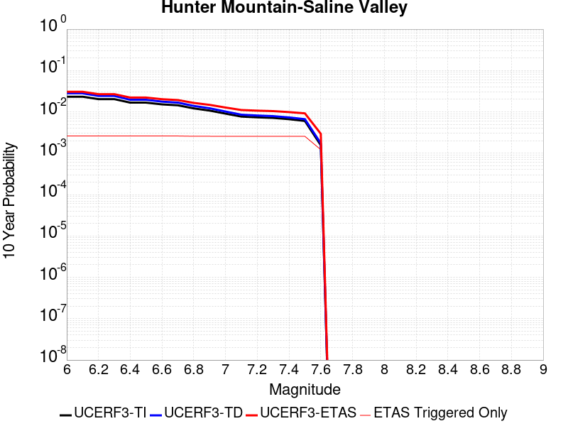 |

| Magnitude | 1 wk TI Prob | 1 wk TD Prob | 1 wk ETAS Prob | 1 wk ETAS/TD Gain | 1 wk ETAS Triggered Only | 1 mo TI Prob | 1 mo TD Prob | 1 mo ETAS Prob | 1 mo ETAS/TD Gain | 1 mo ETAS Triggered Only | 1 yr TI Prob | 1 yr TD Prob | 1 yr ETAS Prob | 1 yr ETAS/TD Gain | 1 yr ETAS Triggered Only | 10 yr TI Prob | 10 yr TD Prob | 10 yr ETAS Prob | 10 yr ETAS/TD Gain | 10 yr ETAS Triggered Only |
|-----|-----|-----|-----|-----|-----|-----|-----|-----|-----|-----|-----|-----|-----|-----|-----|-----|-----|-----|-----|-----|
| 6.0 | 4.5103672E-5 | 5.4571992E-5 | 4.8454854E-4 | 8.87907 | 4.3E-4 | 1.9328714E-4 | 2.3385909E-4 | 0.0012536206 | 5.360581 | 0.00102 | 0.002350731 | 0.0028436056 | 0.0048578614 | 1.7083458 | 0.00202 | 0.023260195 | 0.028092787 | 0.030639185 | 1.0906423 | 0.00262 |
| 6.1 | 4.5103672E-5 | 5.4571992E-5 | 4.8454854E-4 | 8.87907 | 4.3E-4 | 1.9328714E-4 | 2.3385909E-4 | 0.0012536206 | 5.360581 | 0.00102 | 0.002350731 | 0.0028436056 | 0.0048578614 | 1.7083458 | 0.00202 | 0.023260195 | 0.028092787 | 0.030639185 | 1.0906423 | 0.00262 |
| 6.2 | 3.9363465E-5 | 4.7064877E-5 | 4.7704464E-4 | 10.135895 | 4.3E-4 | 1.6868966E-4 | 2.0169078E-4 | 0.0012214851 | 6.0562267 | 0.00102 | 0.002051862 | 0.0024528939 | 0.004467939 | 1.8214971 | 0.00202 | 0.020330196 | 0.024274237 | 0.02683064 | 1.1053133 | 0.00262 |
| 6.3 | 3.9363465E-5 | 4.7064877E-5 | 4.7704464E-4 | 10.135895 | 4.3E-4 | 1.6868966E-4 | 2.0169078E-4 | 0.0012214851 | 6.0562267 | 0.00102 | 0.002051862 | 0.0024528939 | 0.004467939 | 1.8214971 | 0.00202 | 0.020330196 | 0.024274237 | 0.02683064 | 1.1053133 | 0.00262 |
| 6.4 | 3.2311684E-5 | 3.795214E-5 | 4.679358E-4 | 12.32963 | 4.3E-4 | 1.384713E-4 | 1.626423E-4 | 0.0011824764 | 7.2704115 | 0.00102 | 0.0016845843 | 0.0019784442 | 0.0039844676 | 2.0139399 | 0.00201 | 0.016718714 | 0.019617062 | 0.022175862 | 1.1304375 | 0.00261 |
| 6.5 | 3.2311684E-5 | 3.795214E-5 | 4.679358E-4 | 12.32963 | 4.3E-4 | 1.384713E-4 | 1.626423E-4 | 0.0011824764 | 7.2704115 | 0.00102 | 0.0016845843 | 0.0019784442 | 0.0039844676 | 2.0139399 | 0.00201 | 0.016718714 | 0.019617062 | 0.022175862 | 1.1304375 | 0.00261 |
| 6.6 | 2.9305844E-5 | 3.4182853E-5 | 4.6416814E-4 | 13.578976 | 4.3E-4 | 1.2559042E-4 | 1.4649007E-4 | 0.0011663407 | 7.9619093 | 0.00102 | 0.0015279909 | 0.0017821203 | 0.0037885383 | 2.12586 | 0.00201 | 0.015175272 | 0.017686214 | 0.020250054 | 1.1449625 | 0.00261 |
| 6.7 | 2.7826512E-5 | 3.2345237E-5 | 4.6233134E-4 | 14.293644 | 4.3E-4 | 1.19251024E-4 | 1.3861542E-4 | 0.001158474 | 8.357469 | 0.00102 | 0.0014509142 | 0.0016863967 | 0.003693007 | 2.1898804 | 0.00201 | 0.014414776 | 0.01674368 | 0.019309979 | 1.1532696 | 0.00261 |
| 6.8 | 2.3389874E-5 | 2.6867507E-5 | 4.368565E-4 | 16.259659 | 4.1E-4 | 1.0023846E-4 | 1.1514164E-4 | 0.0011150265 | 9.683955 | 0.001 | 0.00121972 | 0.0014009953 | 0.0033682352 | 2.4041731 | 0.00197 | 0.01213047 | 0.013927842 | 0.016462047 | 1.1819525 | 0.00257 |
| 6.9 | 2.069209E-5 | 2.3570727E-5 | 4.3356107E-4 | 18.394047 | 4.1E-4 | 8.867737E-5 | 1.0101369E-4 | 0.0011009127 | 10.898648 | 0.001 | 0.0010791123 | 0.001229184 | 0.0031967624 | 2.6007192 | 0.00197 | 0.010738871 | 0.012228882 | 0.014767454 | 1.2075882 | 0.00257 |
| 7.0 | 1.7462342E-5 | 1.9634126E-5 | 4.1962627E-4 | 21.372292 | 4.0E-4 | 7.483646E-5 | 8.414367E-5 | 0.0010640612 | 12.645766 | 9.8E-4 | 9.1075303E-4 | 0.0010239903 | 0.0029719935 | 2.9023647 | 0.00195 | 0.009070295 | 0.010196352 | 0.01273025 | 1.2485101 | 0.00256 |
| 7.1 | 1.4807709E-5 | 1.6442245E-5 | 4.1643568E-4 | 25.327179 | 4.0E-4 | 6.3460066E-5 | 7.046495E-5 | 0.0010503959 | 14.906643 | 9.8E-4 | 7.723524E-4 | 8.575896E-4 | 0.0028059173 | 3.271865 | 0.00195 | 0.007696735 | 0.008545788 | 0.011083911 | 1.2970028 | 0.00256 |
| 7.2 | 1.4180048E-5 | 1.5698814E-5 | 4.1569254E-4 | 26.479233 | 4.0E-4 | 6.077022E-5 | 6.727898E-5 | 0.0010472131 | 15.565232 | 9.8E-4 | 7.396263E-4 | 8.1883004E-4 | 0.0027672334 | 3.3794966 | 0.00195 | 0.0073716943 | 0.00816108 | 0.010700188 | 1.311124 | 0.00256 |
| 7.3 | 1.3730402E-5 | 1.5172541E-5 | 4.1516646E-4 | 27.363016 | 4.0E-4 | 5.8843252E-5 | 6.502365E-5 | 0.0010449599 | 16.070461 | 9.8E-4 | 7.161811E-4 | 7.913914E-4 | 0.002739848 | 3.4620647 | 0.00195 | 0.007138774 | 0.007888664 | 0.010428469 | 1.3219563 | 0.00256 |
| 7.4 | 1.2810095E-5 | 1.410972E-5 | 4.1410408E-4 | 29.348852 | 4.0E-4 | 5.489925E-5 | 6.0468916E-5 | 0.0010404097 | 17.205694 | 9.8E-4 | 6.681934E-4 | 7.359762E-4 | 0.002684541 | 3.6475923 | 0.00195 | 0.006661878 | 0.0073382827 | 0.009879497 | 1.3462955 | 0.00256 |
| 7.5 | 1.1595659E-5 | 1.2801013E-5 | 4.127959E-4 | 32.247128 | 4.0E-4 | 4.9694736E-5 | 5.4860422E-5 | 0.0010348066 | 18.862535 | 9.8E-4 | 6.0486543E-4 | 6.677366E-4 | 0.0026164346 | 3.918363 | 0.00195 | 0.006032217 | 0.0066601736 | 0.009203124 | 1.3818144 | 0.00256 |
| 7.6 | 2.997694E-6 | 3.3252948E-6 | 2.0332463E-4 | 61.144844 | 2.0E-4 | 1.28471975E-5 | 1.4251226E-5 | 4.642448E-4 | 32.57578 | 4.5E-4 | 1.564034E-4 | 1.7350215E-4 | 0.0010833442 | 6.243982 | 9.1E-4 | 0.0015629337 | 0.0017351025 | 0.0029529857 | 1.7019085 | 0.00122 |

## Garlock (West)
*[(top)](#table-of-contents)*

| 1 Week | 1 Month | 1 Year | 10 Year |
|-----|-----|-----|-----|
|  |  |  |  |

| Magnitude | 1 wk TI Prob | 1 wk TD Prob | 1 wk ETAS Prob | 1 wk ETAS/TD Gain | 1 wk ETAS Triggered Only | 1 mo TI Prob | 1 mo TD Prob | 1 mo ETAS Prob | 1 mo ETAS/TD Gain | 1 mo ETAS Triggered Only | 1 yr TI Prob | 1 yr TD Prob | 1 yr ETAS Prob | 1 yr ETAS/TD Gain | 1 yr ETAS Triggered Only | 10 yr TI Prob | 10 yr TD Prob | 10 yr ETAS Prob | 10 yr ETAS/TD Gain | 10 yr ETAS Triggered Only |
|-----|-----|-----|-----|-----|-----|-----|-----|-----|-----|-----|-----|-----|-----|-----|-----|-----|-----|-----|-----|-----|
| 6.0 | 2.5181727E-5 | 2.5202135E-5 | 3.0519508E-4 | 12.10989 | 2.8E-4 | 1.0791722E-4 | 1.080047E-4 | 7.6793344E-4 | 7.110185 | 6.6E-4 | 0.0013131002 | 0.0013141674 | 0.002682367 | 2.041115 | 0.00137 | 0.013053683 | 0.013144457 | 0.014910929 | 1.134389 | 0.00179 |
| 6.1 | 2.5077732E-5 | 2.5103205E-5 | 3.0509618E-4 | 12.153674 | 2.8E-4 | 1.0747157E-4 | 1.07580745E-4 | 7.6750974E-4 | 7.134267 | 6.6E-4 | 0.001307681 | 0.0013090121 | 0.0026772188 | 2.0452209 | 0.00137 | 0.013000126 | 0.0130935125 | 0.014860075 | 1.1349189 | 0.00179 |
| 6.2 | 2.494612E-5 | 2.498488E-5 | 3.0497788E-4 | 12.206498 | 2.8E-4 | 1.0690756E-4 | 1.07073676E-4 | 7.67003E-4 | 7.1633196 | 6.6E-4 | 0.0013008224 | 0.0013028459 | 0.002671061 | 2.0501742 | 0.00137 | 0.012932341 | 0.013032575 | 0.014799247 | 1.1355581 | 0.00179 |
| 6.3 | 2.4733758E-5 | 2.4804243E-5 | 3.047973E-4 | 12.288112 | 2.8E-4 | 1.0599751E-4 | 1.0629959E-4 | 7.662294E-4 | 7.208207 | 6.6E-4 | 0.0012897556 | 0.0012934325 | 0.0026616605 | 2.0578272 | 0.00137 | 0.012822957 | 0.012939542 | 0.01470638 | 1.1365457 | 0.00179 |
| 6.4 | 2.3237335E-5 | 2.318352E-5 | 3.0317702E-4 | 13.077265 | 2.8E-4 | 9.958477E-5 | 9.935417E-5 | 7.592886E-4 | 7.6422415 | 6.6E-4 | 0.0012117702 | 0.0012089686 | 0.0025773123 | 2.1318274 | 0.00137 | 0.012051838 | 0.012104375 | 0.013872709 | 1.1460904 | 0.00179 |
| 6.5 | 2.2732203E-5 | 2.2998063E-5 | 3.0299163E-4 | 13.174659 | 2.8E-4 | 9.742009E-5 | 9.8559416E-5 | 7.5849437E-4 | 7.695808 | 6.6E-4 | 0.0011854442 | 0.0011993032 | 0.00256766 | 2.14096 | 0.00137 | 0.011791403 | 0.012008769 | 0.013777274 | 1.1472677 | 0.00179 |
| 6.6 | 2.1319436E-5 | 2.1778224E-5 | 3.0177212E-4 | 13.8566 | 2.8E-4 | 9.136581E-5 | 9.333192E-5 | 7.532703E-4 | 8.070876 | 6.6E-4 | 0.001111811 | 0.001135726 | 0.0025041702 | 2.204907 | 0.00137 | 0.011062649 | 0.0113796545 | 0.013149285 | 1.1555083 | 0.00179 |
| 6.7 | 1.970802E-5 | 2.0398069E-5 | 3.0039236E-4 | 14.726509 | 2.8E-4 | 8.446021E-5 | 8.741738E-5 | 7.473597E-4 | 8.549326 | 6.6E-4 | 0.001027818 | 0.0010637887 | 0.0024323312 | 2.2864797 | 0.00137 | 0.010230771 | 0.010667368 | 0.012438273 | 1.1660115 | 0.00179 |
| 6.8 | 1.8744462E-5 | 1.9905692E-5 | 2.9990013E-4 | 15.066049 | 2.8E-4 | 8.033094E-5 | 8.530733E-5 | 7.45251E-4 | 8.736073 | 6.6E-4 | 9.775903E-4 | 0.0010381235 | 0.0024067012 | 2.3183188 | 0.00137 | 0.009733009 | 0.010413141 | 0.012184502 | 1.1701082 | 0.00179 |
| 6.9 | 1.7559682E-5 | 1.895803E-5 | 2.989527E-4 | 15.769187 | 2.8E-4 | 7.5253614E-5 | 8.124618E-5 | 7.4119255E-4 | 9.122799 | 6.6E-4 | 9.158276E-4 | 9.887248E-4 | 0.0023573702 | 2.3842533 | 0.00137 | 0.0091206245 | 0.009923607 | 0.011695843 | 1.1785879 | 0.00179 |
| 7.0 | 1.6794445E-5 | 1.8220819E-5 | 2.9821572E-4 | 16.366756 | 2.8E-4 | 7.197421E-5 | 7.8086894E-5 | 7.3803536E-4 | 9.451463 | 6.6E-4 | 8.759337E-4 | 9.5029466E-4 | 0.0023189927 | 2.440288 | 0.00137 | 0.008724891 | 0.0095425 | 0.011315418 | 1.1857919 | 0.00179 |
| 7.1 | 1.6337795E-5 | 1.7721602E-5 | 2.9771664E-4 | 16.799646 | 2.8E-4 | 7.0017246E-5 | 7.5947515E-5 | 7.358974E-4 | 9.689551 | 6.6E-4 | 8.521265E-4 | 9.2427013E-4 | 0.002293004 | 2.4808807 | 0.00137 | 0.008488664 | 0.009284343 | 0.011057724 | 1.1910077 | 0.00179 |
| 7.2 | 1.5780008E-5 | 1.7170225E-5 | 2.9716542E-4 | 17.30702 | 2.8E-4 | 6.762685E-5 | 7.358461E-5 | 7.33536E-4 | 9.968607 | 6.6E-4 | 8.2304585E-4 | 8.955257E-4 | 0.0022642987 | 2.5284576 | 0.00137 | 0.008200042 | 0.008999176 | 0.010773067 | 1.1971171 | 0.00179 |
| 7.3 | 1.5058865E-5 | 1.6623266E-5 | 2.9661861E-4 | 17.843582 | 2.8E-4 | 6.45364E-5 | 7.124063E-5 | 7.3119364E-4 | 10.263717 | 6.6E-4 | 7.854473E-4 | 8.6701073E-4 | 0.0022358228 | 2.578772 | 0.00137 | 0.00782677 | 0.00871586 | 0.010490258 | 1.2035828 | 0.00179 |
| 7.4 | 1.4887923E-5 | 1.6459222E-5 | 2.9645461E-4 | 18.011461 | 2.8E-4 | 6.380382E-5 | 7.053762E-5 | 7.3049107E-4 | 10.35605 | 6.6E-4 | 7.7653467E-4 | 8.5845834E-4 | 0.0022272822 | 2.5945141 | 0.00137 | 0.0077382675 | 0.0086307125 | 0.010405264 | 1.2056088 | 0.00179 |
| 7.5 | 1.4509299E-5 | 1.6051208E-5 | 2.660472E-4 | 16.574902 | 2.5E-4 | 6.218123E-5 | 6.8789086E-5 | 6.3874986E-4 | 9.285628 | 5.7E-4 | 7.567935E-4 | 8.3718647E-4 | 0.0020461734 | 2.4441073 | 0.00121 | 0.0075422134 | 0.008419003 | 0.009995617 | 1.1872685 | 0.00159 |
| 7.6 | 1.2756717E-5 | 1.4055129E-5 | 1.4405331E-4 | 10.249163 | 1.3E-4 | 5.4670498E-5 | 6.023488E-5 | 3.802156E-4 | 6.3122163 | 3.2E-4 | 6.6541E-4 | 7.331136E-4 | 0.0014825638 | 2.0222838 | 7.5E-4 | 0.006634211 | 0.007383898 | 0.008366588 | 1.1330855 | 9.9E-4 |
| 7.7 | 1.0328985E-5 | 1.1464573E-5 | 6.1464E-5 | 5.361212 | 5.0E-5 | 4.4266326E-5 | 4.913296E-5 | 1.7912657E-4 | 3.6457517 | 1.3E-4 | 5.388092E-4 | 5.9803E-4 | 9.778028E-4 | 1.6350397 | 3.8E-4 | 0.0053750467 | 0.0060405903 | 0.006547509 | 1.0839188 | 5.1E-4 |
| 7.8 | 7.0306583E-6 | 8.902813E-6 | 3.8902544E-5 | 4.369692 | 3.0E-5 | 3.0131043E-5 | 3.8154354E-5 | 1.2815092E-4 | 3.3587496 | 9.0E-5 | 3.667837E-4 | 4.644304E-4 | 6.8432826E-4 | 1.4734786 | 2.2E-4 | 0.003661789 | 0.0046969377 | 0.0050154347 | 1.0678095 | 3.2E-4 |
| 7.9 | 4.060633E-6 | 5.4672782E-6 | 5.4672782E-6 | 1.0 | 0.0 | 1.7402595E-5 | 2.3430983E-5 | 7.342981E-5 | 3.1338768 | 5.0E-5 | 2.11856E-4 | 2.8523497E-4 | 4.151979E-4 | 1.4556346 | 1.3E-4 | 0.0021165414 | 0.0028851798 | 0.003094574 | 1.0725758 | 2.1E-4 |
| 8.0 | 1.6729537E-6 | 2.078155E-6 | 2.078155E-6 | 1.0 | 0.0 | 7.169782E-6 | 8.906349E-6 | 8.906349E-6 | 1.0 | 0.0 | 8.7288594E-5 | 1.08429434E-4 | 1.1842835E-4 | 1.0922159 | 1.0E-5 | 8.7254314E-4 | 0.001097267 | 0.0011472121 | 1.0455178 | 5.0E-5 |
| 8.1 | 3.6733252E-7 | 3.1499187E-7 | 3.1499187E-7 | 1.0 | 0.0 | 1.5742813E-6 | 1.3499646E-6 | 1.3499646E-6 | 1.0 | 0.0 | 1.9166706E-5 | 1.643571E-5 | 1.643571E-5 | 1.0 | 0.0 | 1.9165053E-4 | 1.6643589E-4 | 1.6643589E-4 | 1.0 | 0.0 |

## Blackwater
*[(top)](#table-of-contents)*

| 1 Week | 1 Month | 1 Year | 10 Year |
|-----|-----|-----|-----|
|  |  |  |  |

| Magnitude | 1 wk TI Prob | 1 wk TD Prob | 1 wk ETAS Prob | 1 wk ETAS/TD Gain | 1 wk ETAS Triggered Only | 1 mo TI Prob | 1 mo TD Prob | 1 mo ETAS Prob | 1 mo ETAS/TD Gain | 1 mo ETAS Triggered Only | 1 yr TI Prob | 1 yr TD Prob | 1 yr ETAS Prob | 1 yr ETAS/TD Gain | 1 yr ETAS Triggered Only | 10 yr TI Prob | 10 yr TD Prob | 10 yr ETAS Prob | 10 yr ETAS/TD Gain | 10 yr ETAS Triggered Only |
|-----|-----|-----|-----|-----|-----|-----|-----|-----|-----|-----|-----|-----|-----|-----|-----|-----|-----|-----|-----|-----|
| 6.0 | 3.0708583E-5 | 3.309619E-5 | 2.0309056E-4 | 6.136373 | 1.7E-4 | 1.3160157E-4 | 1.4183388E-4 | 6.3176436E-4 | 4.454256 | 4.9E-4 | 0.0016010714 | 0.0017255963 | 0.002594095 | 1.5033035 | 8.7E-4 | 0.015895851 | 0.017135808 | 0.018413533 | 1.0745646 | 0.0013 |
| 6.1 | 3.0708583E-5 | 3.309619E-5 | 2.0309056E-4 | 6.136373 | 1.7E-4 | 1.3160157E-4 | 1.4183388E-4 | 6.3176436E-4 | 4.454256 | 4.9E-4 | 0.0016010714 | 0.0017255963 | 0.002594095 | 1.5033035 | 8.7E-4 | 0.015895851 | 0.017135808 | 0.018413533 | 1.0745646 | 0.0013 |
| 6.2 | 1.1707779E-5 | 1.2545242E-5 | 9.254424E-5 | 7.37684 | 8.0E-5 | 5.017523E-5 | 5.3764266E-5 | 2.9375136E-4 | 5.4636917 | 2.4E-4 | 6.107122E-4 | 6.5439293E-4 | 0.0010241509 | 1.5650395 | 3.7E-4 | 0.006090366 | 0.006525631 | 0.007042238 | 1.0791658 | 5.2E-4 |
| 6.3 | 1.1707779E-5 | 1.2545242E-5 | 9.254424E-5 | 7.37684 | 8.0E-5 | 5.017523E-5 | 5.3764266E-5 | 2.9375136E-4 | 5.4636917 | 2.4E-4 | 6.107122E-4 | 6.5439293E-4 | 0.0010241509 | 1.5650395 | 3.7E-4 | 0.006090366 | 0.006525631 | 0.007042238 | 1.0791658 | 5.2E-4 |
| 6.4 | 7.929244E-6 | 8.480176E-6 | 8.84795E-5 | 10.433686 | 8.0E-5 | 3.3982033E-5 | 3.6343128E-5 | 1.8633768E-4 | 5.1271777 | 1.5E-4 | 4.136527E-4 | 4.4239179E-4 | 6.7229004E-4 | 1.5196711 | 2.3E-4 | 0.0041288356 | 0.0044155167 | 0.0047341036 | 1.0721517 | 3.2E-4 |
| 6.5 | 5.8832115E-6 | 6.286048E-6 | 6.628567E-5 | 10.544888 | 6.0E-5 | 2.521352E-5 | 2.6939942E-5 | 1.3693697E-4 | 5.0830464 | 1.1E-4 | 3.0693135E-4 | 3.2794697E-4 | 4.978912E-4 | 1.5182065 | 1.7E-4 | 0.0030650778 | 0.0032748834 | 0.0035140975 | 1.073045 | 2.4E-4 |
| 6.6 | 5.8832115E-6 | 6.286048E-6 | 6.628567E-5 | 10.544888 | 6.0E-5 | 2.521352E-5 | 2.6939942E-5 | 1.3693697E-4 | 5.0830464 | 1.1E-4 | 3.0693135E-4 | 3.2794697E-4 | 4.978912E-4 | 1.5182065 | 1.7E-4 | 0.0030650778 | 0.0032748834 | 0.0035140975 | 1.073045 | 2.4E-4 |
| 6.7 | 3.0715053E-6 | 3.281496E-6 | 2.3281431E-5 | 7.0947614 | 2.0E-5 | 1.3163528E-5 | 1.4063485E-5 | 6.4062784E-5 | 4.5552564 | 5.0E-5 | 1.6025416E-4 | 1.7121063E-4 | 2.3120036E-4 | 1.3503855 | 6.0E-5 | 0.0016013865 | 0.0017109019 | 0.0018007479 | 1.0525138 | 9.0E-5 |
| 6.8 | 2.2722281E-6 | 2.4287758E-6 | 2.2428727E-5 | 9.234581 | 2.0E-5 | 9.738084E-6 | 1.0409003E-5 | 5.0408587E-5 | 4.8427873 | 4.0E-5 | 1.1855473E-4 | 1.2672316E-4 | 1.7671683E-4 | 1.3945109 | 5.0E-5 | 0.001184915 | 0.0012665992 | 0.0013365105 | 1.055196 | 7.0E-5 |
| 6.9 | 9.952399E-7 | 1.0653588E-6 | 1.0653588E-6 | 1.0 | 0.0 | 4.265307E-6 | 4.5658185E-6 | 4.5658185E-6 | 1.0 | 0.0 | 5.1928873E-5 | 5.5587938E-5 | 5.5587938E-5 | 1.0 | 0.0 | 5.191674E-4 | 5.5579096E-4 | 5.5579096E-4 | 1.0 | 0.0 |
| 7.0 | 4.7385504E-7 | 5.0756074E-7 | 5.0756074E-7 | 1.0 | 0.0 | 2.0308057E-6 | 2.1752603E-6 | 2.1752603E-6 | 1.0 | 0.0 | 2.4724779E-5 | 2.6483794E-5 | 2.6483794E-5 | 1.0 | 0.0 | 2.4722028E-4 | 2.6483793E-4 | 2.6483793E-4 | 1.0 | 0.0 |

## Ash Hill
*[(top)](#table-of-contents)*

| 1 Week | 1 Month | 1 Year | 10 Year |
|-----|-----|-----|-----|
|  |  |  |  |

| Magnitude | 1 wk TI Prob | 1 wk TD Prob | 1 wk ETAS Prob | 1 wk ETAS/TD Gain | 1 wk ETAS Triggered Only | 1 mo TI Prob | 1 mo TD Prob | 1 mo ETAS Prob | 1 mo ETAS/TD Gain | 1 mo ETAS Triggered Only | 1 yr TI Prob | 1 yr TD Prob | 1 yr ETAS Prob | 1 yr ETAS/TD Gain | 1 yr ETAS Triggered Only | 10 yr TI Prob | 10 yr TD Prob | 10 yr ETAS Prob | 10 yr ETAS/TD Gain | 10 yr ETAS Triggered Only |
|-----|-----|-----|-----|-----|-----|-----|-----|-----|-----|-----|-----|-----|-----|-----|-----|-----|-----|-----|-----|-----|
| 6.0 | 2.1545662E-5 | 2.3194681E-5 | 2.731889E-4 | 11.778083 | 2.5E-4 | 9.2335285E-5 | 9.9402445E-5 | 5.593567E-4 | 5.627193 | 4.6E-4 | 0.0011236023 | 0.0012096328 | 0.0020486168 | 1.6935856 | 8.4E-4 | 0.011179381 | 0.01203847 | 0.013144988 | 1.0919151 | 0.00112 |
| 6.1 | 2.1545662E-5 | 2.3194681E-5 | 2.731889E-4 | 11.778083 | 2.5E-4 | 9.2335285E-5 | 9.9402445E-5 | 5.593567E-4 | 5.627193 | 4.6E-4 | 0.0011236023 | 0.0012096328 | 0.0020486168 | 1.6935856 | 8.4E-4 | 0.011179381 | 0.01203847 | 0.013144988 | 1.0919151 | 0.00112 |
| 6.2 | 2.1545662E-5 | 2.3194681E-5 | 2.731889E-4 | 11.778083 | 2.5E-4 | 9.2335285E-5 | 9.9402445E-5 | 5.593567E-4 | 5.627193 | 4.6E-4 | 0.0011236023 | 0.0012096328 | 0.0020486168 | 1.6935856 | 8.4E-4 | 0.011179381 | 0.01203847 | 0.013144988 | 1.0919151 | 0.00112 |
| 6.3 | 1.0025529E-5 | 1.0747037E-5 | 1.0074607E-4 | 9.374311 | 9.0E-5 | 4.2965847E-5 | 4.605799E-5 | 2.0605062E-4 | 4.4737215 | 1.6E-4 | 5.229836E-4 | 5.60625E-4 | 8.704512E-4 | 1.5526443 | 3.1E-4 | 0.005217545 | 0.0055934195 | 0.0060011265 | 1.0728904 | 4.1E-4 |
| 6.4 | 1.0025529E-5 | 1.0747037E-5 | 1.0074607E-4 | 9.374311 | 9.0E-5 | 4.2965847E-5 | 4.605799E-5 | 2.0605062E-4 | 4.4737215 | 1.6E-4 | 5.229836E-4 | 5.60625E-4 | 8.704512E-4 | 1.5526443 | 3.1E-4 | 0.005217545 | 0.0055934195 | 0.0060011265 | 1.0728904 | 4.1E-4 |
| 6.5 | 6.9617327E-6 | 7.456704E-6 | 3.745648E-5 | 5.0231953 | 3.0E-5 | 2.9835655E-5 | 3.1956963E-5 | 1.119544E-4 | 3.5032868 | 8.0E-5 | 3.6318856E-4 | 3.8901521E-4 | 5.589491E-4 | 1.4368309 | 1.7E-4 | 0.0036259557 | 0.0038841967 | 0.0041033425 | 1.0564197 | 2.2E-4 |
| 6.6 | 4.9919777E-6 | 5.346739E-6 | 1.5346684E-5 | 2.870289 | 1.0E-5 | 2.1394015E-5 | 2.2914432E-5 | 8.291306E-5 | 3.6183772 | 6.0E-5 | 2.60441E-4 | 2.789542E-4 | 4.0891793E-4 | 1.4658964 | 1.3E-4 | 0.0026013597 | 0.0027866988 | 0.002946253 | 1.0572556 | 1.6E-4 |
| 6.7 | 3.6630722E-6 | 3.9246606E-6 | 3.9246606E-6 | 1.0 | 0.0 | 1.5698786E-5 | 1.6819899E-5 | 5.6819226E-5 | 3.3780956 | 4.0E-5 | 1.9111596E-4 | 2.0476876E-4 | 3.0474828E-4 | 1.4882557 | 1.0E-4 | 0.0019095168 | 0.002046364 | 0.0021760978 | 1.0633973 | 1.3E-4 |
| 6.8 | 2.5599613E-6 | 2.7449514E-6 | 2.7449514E-6 | 1.0 | 0.0 | 1.0971216E-5 | 1.1764052E-5 | 5.176358E-5 | 4.400149 | 4.0E-5 | 1.3356637E-4 | 1.4322287E-4 | 2.3320998E-4 | 1.6283013 | 9.0E-5 | 0.0013348613 | 0.0014317906 | 0.0015416332 | 1.0767169 | 1.1E-4 |
| 6.9 | 1.7684905E-6 | 1.896889E-6 | 1.896889E-6 | 1.0 | 0.0 | 7.579223E-6 | 8.129524E-6 | 3.812928E-5 | 4.6902227 | 3.0E-5 | 9.2273134E-5 | 9.8976954E-5 | 1.5897102E-4 | 1.6061417 | 6.0E-5 | 9.223483E-4 | 9.897696E-4 | 0.0010497102 | 1.0605602 | 6.0E-5 |

## San Andreas (Mojave N)
*[(top)](#table-of-contents)*

| 1 Week | 1 Month | 1 Year | 10 Year |
|-----|-----|-----|-----|
|  |  |  |  |

| Magnitude | 1 wk TI Prob | 1 wk TD Prob | 1 wk ETAS Prob | 1 wk ETAS/TD Gain | 1 wk ETAS Triggered Only | 1 mo TI Prob | 1 mo TD Prob | 1 mo ETAS Prob | 1 mo ETAS/TD Gain | 1 mo ETAS Triggered Only | 1 yr TI Prob | 1 yr TD Prob | 1 yr ETAS Prob | 1 yr ETAS/TD Gain | 1 yr ETAS Triggered Only | 10 yr TI Prob | 10 yr TD Prob | 10 yr ETAS Prob | 10 yr ETAS/TD Gain | 10 yr ETAS Triggered Only |
|-----|-----|-----|-----|-----|-----|-----|-----|-----|-----|-----|-----|-----|-----|-----|-----|-----|-----|-----|-----|-----|
| 6.0 | 9.877682E-5 | 1.9409315E-4 | 2.7407764E-4 | 1.4120932 | 8.0E-5 | 4.2326056E-4 | 8.315628E-4 | 0.0010214049 | 1.2282954 | 1.9E-4 | 0.0051410277 | 0.010077406 | 0.010552568 | 1.0471513 | 4.8E-4 | 0.05023708 | 0.09835201 | 0.098911025 | 1.0056839 | 6.2E-4 |
| 6.1 | 9.877682E-5 | 1.9409315E-4 | 2.7407764E-4 | 1.4120932 | 8.0E-5 | 4.2326056E-4 | 8.315628E-4 | 0.0010214049 | 1.2282954 | 1.9E-4 | 0.0051410277 | 0.010077406 | 0.010552568 | 1.0471513 | 4.8E-4 | 0.05023708 | 0.09835201 | 0.098911025 | 1.0056839 | 6.2E-4 |
| 6.2 | 9.877682E-5 | 1.9409315E-4 | 2.7407764E-4 | 1.4120932 | 8.0E-5 | 4.2326056E-4 | 8.315628E-4 | 0.0010214049 | 1.2282954 | 1.9E-4 | 0.0051410277 | 0.010077406 | 0.010552568 | 1.0471513 | 4.8E-4 | 0.05023708 | 0.09835201 | 0.098911025 | 1.0056839 | 6.2E-4 |
| 6.3 | 9.877682E-5 | 1.9409315E-4 | 2.7407764E-4 | 1.4120932 | 8.0E-5 | 4.2326056E-4 | 8.315628E-4 | 0.0010214049 | 1.2282954 | 1.9E-4 | 0.0051410277 | 0.010077406 | 0.010552568 | 1.0471513 | 4.8E-4 | 0.05023708 | 0.09835201 | 0.098911025 | 1.0056839 | 6.2E-4 |
| 6.4 | 9.877682E-5 | 1.9409315E-4 | 2.7407764E-4 | 1.4120932 | 8.0E-5 | 4.2326056E-4 | 8.315628E-4 | 0.0010214049 | 1.2282954 | 1.9E-4 | 0.0051410277 | 0.010077406 | 0.010552568 | 1.0471513 | 4.8E-4 | 0.05023708 | 0.09835201 | 0.098911025 | 1.0056839 | 6.2E-4 |
| 6.5 | 9.861474E-5 | 1.9383078E-4 | 2.738153E-4 | 1.4126512 | 8.0E-5 | 4.2256617E-4 | 8.304391E-4 | 0.0010202813 | 1.2286047 | 1.9E-4 | 0.0051326132 | 0.010063851 | 0.01053902 | 1.0472155 | 4.8E-4 | 0.050156746 | 0.098229796 | 0.09878889 | 1.0056918 | 6.2E-4 |
| 6.6 | 9.861474E-5 | 1.9383078E-4 | 2.738153E-4 | 1.4126512 | 8.0E-5 | 4.2256617E-4 | 8.304391E-4 | 0.0010202813 | 1.2286047 | 1.9E-4 | 0.0051326132 | 0.010063851 | 0.01053902 | 1.0472155 | 4.8E-4 | 0.050156746 | 0.098229796 | 0.09878889 | 1.0056918 | 6.2E-4 |
| 6.7 | 9.8552715E-5 | 1.9373032E-4 | 2.737148E-4 | 1.4128652 | 8.0E-5 | 4.223004E-4 | 8.3000876E-4 | 0.0010198511 | 1.2287233 | 1.9E-4 | 0.0051293927 | 0.01005866 | 0.010533832 | 1.04724 | 4.8E-4 | 0.050125998 | 0.098182976 | 0.098742105 | 1.0056947 | 6.2E-4 |
| 6.8 | 9.8464974E-5 | 1.9358192E-4 | 2.7356643E-4 | 1.4131818 | 8.0E-5 | 4.219245E-4 | 8.293732E-4 | 0.0010192156 | 1.2288986 | 1.9E-4 | 0.0051248376 | 0.010050993 | 0.010526169 | 1.0472765 | 4.8E-4 | 0.05008251 | 0.09811299 | 0.09867217 | 1.0056993 | 6.2E-4 |
| 6.9 | 9.825824E-5 | 1.9326196E-4 | 2.732465E-4 | 1.4138659 | 8.0E-5 | 4.2103877E-4 | 8.280028E-4 | 0.0010178455 | 1.2292778 | 1.9E-4 | 0.0051141046 | 0.010034463 | 0.0105096465 | 1.0473552 | 4.8E-4 | 0.049980022 | 0.09796208 | 0.098521344 | 1.0057089 | 6.2E-4 |
| 7.0 | 9.781462E-5 | 1.9257552E-4 | 2.725601E-4 | 1.4153414 | 8.0E-5 | 4.1913814E-4 | 8.250628E-4 | 0.0010149061 | 1.2300955 | 1.9E-4 | 0.005091073 | 0.009998998 | 0.0104741985 | 1.0475248 | 4.8E-4 | 0.04976007 | 0.097638436 | 0.0981979 | 1.0057299 | 6.2E-4 |
| 7.1 | 9.7121134E-5 | 1.9159251E-4 | 2.7157718E-4 | 1.4174728 | 8.0E-5 | 4.1616702E-4 | 8.208525E-4 | 0.0010106965 | 1.2312766 | 1.9E-4 | 0.005055068 | 0.009948207 | 0.010423432 | 1.0477699 | 4.8E-4 | 0.04941613 | 0.097174905 | 0.09773466 | 1.0057602 | 6.2E-4 |
| 7.2 | 9.663819E-5 | 1.9090026E-4 | 2.7088498E-4 | 1.418987 | 8.0E-5 | 4.1409794E-4 | 8.178876E-4 | 0.0010077322 | 1.2321157 | 1.9E-4 | 0.0050299936 | 0.009912439 | 0.0103876805 | 1.047944 | 4.8E-4 | 0.049176537 | 0.09684814 | 0.09740809 | 1.0057818 | 6.2E-4 |
| 7.3 | 9.6277574E-5 | 1.9042526E-4 | 2.7041003E-4 | 1.4200324 | 8.0E-5 | 4.125529E-4 | 8.158532E-4 | 0.0010056982 | 1.232695 | 1.9E-4 | 0.0050112694 | 0.009887895 | 0.0103631485 | 1.0480642 | 4.8E-4 | 0.04899759 | 0.09662155 | 0.09718165 | 1.0057968 | 6.2E-4 |
| 7.4 | 9.593308E-5 | 1.8982294E-4 | 2.6980776E-4 | 1.4213654 | 8.0E-5 | 4.1107697E-4 | 8.132734E-4 | 0.0010031189 | 1.2334337 | 1.9E-4 | 0.0049933824 | 0.00985677 | 0.010332039 | 1.0482175 | 4.8E-4 | 0.04882661 | 0.09633968 | 0.09689995 | 1.0058155 | 6.2E-4 |
| 7.5 | 9.561707E-5 | 1.8928363E-4 | 2.692685E-4 | 1.4225662 | 8.0E-5 | 4.0972308E-4 | 8.109635E-4 | 0.0010008095 | 1.2340991 | 1.9E-4 | 0.0049769743 | 0.009828901 | 0.010304184 | 1.0483556 | 4.8E-4 | 0.048669744 | 0.09608582 | 0.09664624 | 1.0058326 | 6.2E-4 |
| 7.6 | 9.418194E-5 | 1.8580563E-4 | 2.6579076E-4 | 1.4304775 | 8.0E-5 | 4.0357444E-4 | 7.96067E-4 | 9.7592373E-4 | 1.2259316 | 1.8E-4 | 0.004902454 | 0.009649157 | 0.010114621 | 1.0482389 | 4.7E-4 | 0.047957025 | 0.09446791 | 0.09502028 | 1.0058472 | 6.1E-4 |
| 7.7 | 8.202141E-5 | 1.6029038E-4 | 2.2028077E-4 | 1.3742607 | 6.0E-5 | 3.51473E-4 | 6.86778E-4 | 8.266818E-4 | 1.2037104 | 1.4E-4 | 0.00427079 | 0.008329522 | 0.008716273 | 1.0464314 | 3.9E-4 | 0.04189639 | 0.08226675 | 0.08274397 | 1.0058008 | 5.2E-4 |
| 7.8 | 7.2859846E-5 | 1.4523414E-4 | 1.7522978E-4 | 1.206533 | 3.0E-5 | 3.1221908E-4 | 6.2228355E-4 | 7.1222754E-4 | 1.1445386 | 9.0E-5 | 0.003794643 | 0.007550025 | 0.007768364 | 1.028919 | 2.2E-4 | 0.037304975 | 0.074755974 | 0.07505205 | 1.0039606 | 3.2E-4 |
| 7.9 | 5.3874453E-5 | 1.0050546E-4 | 1.0050546E-4 | 1.0 | 0.0 | 2.3087008E-4 | 4.3066658E-4 | 4.8064505E-4 | 1.116049 | 5.0E-5 | 0.0028072202 | 0.005230771 | 0.005360091 | 1.0247229 | 1.3E-4 | 0.02772022 | 0.052447177 | 0.052646164 | 1.0037941 | 2.1E-4 |
| 8.0 | 3.468538E-5 | 5.4288335E-5 | 5.4288335E-5 | 1.0 | 0.0 | 1.4864317E-4 | 2.3264355E-4 | 2.3264355E-4 | 1.0 | 0.0 | 0.0018082283 | 0.0028287582 | 0.0028387299 | 1.0035251 | 1.0E-5 | 0.017935853 | 0.028961267 | 0.02900982 | 1.0016764 | 5.0E-5 |
| 8.1 | 1.9152367E-5 | 1.9415891E-5 | 1.9415891E-5 | 1.0 | 0.0 | 8.207899E-5 | 8.320831E-5 | 8.320831E-5 | 1.0 | 0.0 | 9.988535E-4 | 0.0010125911 | 0.0010125911 | 1.0 | 0.0 | 0.009943757 | 0.010863188 | 0.010863188 | 1.0 | 0.0 |
| 8.2 | 8.643924E-6 | 5.4798497E-6 | 5.4798497E-6 | 1.0 | 0.0 | 3.704486E-5 | 2.348486E-5 | 2.348486E-5 | 1.0 | 0.0 | 4.5092785E-4 | 2.858907E-4 | 2.858907E-4 | 1.0 | 0.0 | 0.0045001395 | 0.0032514327 | 0.0032514327 | 1.0 | 0.0 |
| 8.3 | 1.983087E-6 | 7.668296E-7 | 7.668296E-7 | 1.0 | 0.0 | 8.498917E-6 | 3.2864084E-6 | 3.2864084E-6 | 1.0 | 0.0 | 1.034694E-4 | 4.0011306E-5 | 4.0011306E-5 | 1.0 | 0.0 | 0.0010342124 | 4.724499E-4 | 4.724499E-4 | 1.0 | 0.0 |

## Gravel Hills-Harper Lk
*[(top)](#table-of-contents)*

| 1 Week | 1 Month | 1 Year | 10 Year |
|-----|-----|-----|-----|
|  |  |  |  |

| Magnitude | 1 wk TI Prob | 1 wk TD Prob | 1 wk ETAS Prob | 1 wk ETAS/TD Gain | 1 wk ETAS Triggered Only | 1 mo TI Prob | 1 mo TD Prob | 1 mo ETAS Prob | 1 mo ETAS/TD Gain | 1 mo ETAS Triggered Only | 1 yr TI Prob | 1 yr TD Prob | 1 yr ETAS Prob | 1 yr ETAS/TD Gain | 1 yr ETAS Triggered Only | 10 yr TI Prob | 10 yr TD Prob | 10 yr ETAS Prob | 10 yr ETAS/TD Gain | 10 yr ETAS Triggered Only |
|-----|-----|-----|-----|-----|-----|-----|-----|-----|-----|-----|-----|-----|-----|-----|-----|-----|-----|-----|-----|-----|
| 6.0 | 3.0679566E-5 | 3.1465184E-5 | 1.11462665E-4 | 3.5424128 | 8.0E-5 | 1.3147724E-4 | 1.3484505E-4 | 3.3481806E-4 | 2.4829838 | 2.0E-4 | 0.0015995599 | 0.0016407187 | 0.0021299147 | 1.2981596 | 4.9E-4 | 0.015880952 | 0.016307615 | 0.016917504 | 1.037399 | 6.2E-4 |
| 6.1 | 3.0679566E-5 | 3.1465184E-5 | 1.11462665E-4 | 3.5424128 | 8.0E-5 | 1.3147724E-4 | 1.3484505E-4 | 3.3481806E-4 | 2.4829838 | 2.0E-4 | 0.0015995599 | 0.0016407187 | 0.0021299147 | 1.2981596 | 4.9E-4 | 0.015880952 | 0.016307615 | 0.016917504 | 1.037399 | 6.2E-4 |
| 6.2 | 1.514536E-5 | 1.3635392E-5 | 3.363512E-5 | 2.466751 | 2.0E-5 | 6.490707E-5 | 5.843615E-5 | 8.84344E-5 | 1.5133508 | 3.0E-5 | 7.8995706E-4 | 7.112398E-4 | 7.612042E-4 | 1.0702498 | 5.0E-5 | 0.007871548 | 0.0070908363 | 0.0071901274 | 1.0140027 | 1.0E-4 |
| 6.3 | 1.514536E-5 | 1.3635392E-5 | 3.363512E-5 | 2.466751 | 2.0E-5 | 6.490707E-5 | 5.843615E-5 | 8.84344E-5 | 1.5133508 | 3.0E-5 | 7.8995706E-4 | 7.112398E-4 | 7.612042E-4 | 1.0702498 | 5.0E-5 | 0.007871548 | 0.0070908363 | 0.0071901274 | 1.0140027 | 1.0E-4 |
| 6.4 | 1.2532521E-5 | 1.0689826E-5 | 2.0689718E-5 | 1.9354589 | 1.0E-5 | 5.37097E-5 | 4.581277E-5 | 5.581231E-5 | 1.2182697 | 1.0E-5 | 6.537194E-4 | 5.576335E-4 | 5.876168E-4 | 1.0537688 | 3.0E-5 | 0.0065179965 | 0.0055629327 | 0.0056325435 | 1.0125133 | 7.0E-5 |
| 6.5 | 1.1094058E-5 | 9.083774E-6 | 1.9083684E-5 | 2.1008542 | 1.0E-5 | 4.7545094E-5 | 3.89299E-5 | 4.8929513E-5 | 1.2568619 | 1.0E-5 | 5.787078E-4 | 4.738725E-4 | 5.0385826E-4 | 1.0632782 | 3.0E-5 | 0.0057720304 | 0.004729028 | 0.0047688386 | 1.0084184 | 4.0E-5 |
| 6.6 | 9.688328E-6 | 7.531784E-6 | 1.753171E-5 | 2.3276968 | 1.0E-5 | 4.1520743E-5 | 3.2278687E-5 | 4.2278367E-5 | 1.3097919 | 1.0E-5 | 5.053978E-4 | 3.929247E-4 | 4.2291294E-4 | 1.0763205 | 3.0E-5 | 0.0050424994 | 0.0039225565 | 0.003952439 | 1.0076181 | 3.0E-5 |
| 6.7 | 8.974824E-6 | 6.7494916E-6 | 1.6749424E-5 | 2.481583 | 1.0E-5 | 3.8462964E-5 | 2.8926084E-5 | 3.8925795E-5 | 1.3456987 | 1.0E-5 | 4.6818596E-4 | 3.5212038E-4 | 3.821098E-4 | 1.0851681 | 3.0E-5 | 0.004672008 | 0.0035158454 | 0.00354574 | 1.0085028 | 3.0E-5 |
| 6.8 | 7.4780046E-6 | 5.116252E-6 | 5.116252E-6 | 1.0 | 0.0 | 3.20482E-5 | 2.1926619E-5 | 2.1926619E-5 | 1.0 | 0.0 | 3.9011694E-4 | 2.6692526E-4 | 2.769226E-4 | 1.0374537 | 1.0E-5 | 0.0038943281 | 0.002666185 | 0.0026761582 | 1.0037407 | 1.0E-5 |
| 6.9 | 6.3409307E-6 | 3.9075426E-6 | 3.9075426E-6 | 1.0 | 0.0 | 2.7175134E-5 | 1.674651E-5 | 1.674651E-5 | 1.0 | 0.0 | 3.3080703E-4 | 2.0387067E-4 | 2.0387067E-4 | 1.0 | 0.0 | 0.0033031502 | 0.0020369345 | 0.0020369345 | 1.0 | 0.0 |
| 7.0 | 5.1239335E-6 | 2.6058885E-6 | 2.6058885E-6 | 1.0 | 0.0 | 2.195953E-5 | 1.11680465E-5 | 1.11680465E-5 | 1.0 | 0.0 | 2.6732447E-4 | 1.3596273E-4 | 1.3596273E-4 | 1.0 | 0.0 | 0.0026700313 | 0.0013588208 | 0.0013588208 | 1.0 | 0.0 |
| 7.1 | 4.438899E-6 | 2.0984994E-6 | 2.0984994E-6 | 1.0 | 0.0 | 1.9023713E-5 | 8.993539E-6 | 8.993539E-6 | 1.0 | 0.0 | 2.315891E-4 | 1.0949106E-4 | 1.0949106E-4 | 1.0 | 0.0 | 0.002313479 | 0.0010943931 | 0.0010943931 | 1.0 | 0.0 |
| 7.2 | 3.50367E-6 | 1.2615911E-6 | 1.2615911E-6 | 1.0 | 0.0 | 1.5015643E-5 | 5.406808E-6 | 5.406808E-6 | 1.0 | 0.0 | 1.8280011E-4 | 6.582599E-5 | 6.582599E-5 | 1.0 | 0.0 | 0.0018264982 | 6.580731E-4 | 6.580731E-4 | 1.0 | 0.0 |
| 7.3 | 2.561638E-6 | 7.119307E-7 | 7.119307E-7 | 1.0 | 0.0 | 1.0978401E-5 | 3.051128E-6 | 3.051128E-6 | 1.0 | 0.0 | 1.3365384E-4 | 3.714687E-5 | 3.714687E-5 | 1.0 | 0.0 | 0.0013357349 | 3.7140862E-4 | 3.7140862E-4 | 1.0 | 0.0 |
| 7.4 | 2.0368864E-6 | 5.304955E-7 | 5.304955E-7 | 1.0 | 0.0 | 8.729483E-6 | 2.2735503E-6 | 2.2735503E-6 | 1.0 | 0.0 | 1.06276275E-4 | 2.768013E-5 | 2.768013E-5 | 1.0 | 0.0 | 0.0010622547 | 2.7676736E-4 | 2.7676736E-4 | 1.0 | 0.0 |
| 7.5 | 1.1681728E-6 | 3.6031287E-7 | 3.6031287E-7 | 1.0 | 0.0 | 5.0064455E-6 | 1.5441972E-6 | 1.5441972E-6 | 1.0 | 0.0 | 6.0951766E-5 | 1.8800443E-5 | 1.8800443E-5 | 1.0 | 0.0 | 6.093505E-4 | 1.8798899E-4 | 1.8798899E-4 | 1.0 | 0.0 |
| 7.6 | 1.3154387E-7 | 7.1198265E-8 | 7.1198265E-8 | 1.0 | 0.0 | 5.6375933E-7 | 3.051354E-7 | 3.051354E-7 | 1.0 | 0.0 | 6.863748E-6 | 3.7150185E-6 | 3.7150185E-6 | 1.0 | 0.0 | 6.863536E-5 | 3.7149723E-5 | 3.7149723E-5 | 1.0 | 0.0 |

## San Andreas (Mojave S)
*[(top)](#table-of-contents)*

| 1 Week | 1 Month | 1 Year | 10 Year |
|-----|-----|-----|-----|
|  |  |  |  |

| Magnitude | 1 wk TI Prob | 1 wk TD Prob | 1 wk ETAS Prob | 1 wk ETAS/TD Gain | 1 wk ETAS Triggered Only | 1 mo TI Prob | 1 mo TD Prob | 1 mo ETAS Prob | 1 mo ETAS/TD Gain | 1 mo ETAS Triggered Only | 1 yr TI Prob | 1 yr TD Prob | 1 yr ETAS Prob | 1 yr ETAS/TD Gain | 1 yr ETAS Triggered Only | 10 yr TI Prob | 10 yr TD Prob | 10 yr ETAS Prob | 10 yr ETAS/TD Gain | 10 yr ETAS Triggered Only |
|-----|-----|-----|-----|-----|-----|-----|-----|-----|-----|-----|-----|-----|-----|-----|-----|-----|-----|-----|-----|-----|
| 6.0 | 3.1064058E-4 | 6.747043E-4 | 7.4465707E-4 | 1.1036792 | 7.0E-5 | 0.0013306376 | 0.002888514 | 0.0030480516 | 1.0552318 | 1.6E-4 | 0.016080605 | 0.03462661 | 0.035051376 | 1.012267 | 4.4E-4 | 0.1496549 | 0.28663692 | 0.28704354 | 1.0014186 | 5.7E-4 |
| 6.1 | 3.1064058E-4 | 6.747043E-4 | 7.4465707E-4 | 1.1036792 | 7.0E-5 | 0.0013306376 | 0.002888514 | 0.0030480516 | 1.0552318 | 1.6E-4 | 0.016080605 | 0.03462661 | 0.035051376 | 1.012267 | 4.4E-4 | 0.1496549 | 0.28663692 | 0.28704354 | 1.0014186 | 5.7E-4 |
| 6.2 | 3.1064058E-4 | 6.747043E-4 | 7.4465707E-4 | 1.1036792 | 7.0E-5 | 0.0013306376 | 0.002888514 | 0.0030480516 | 1.0552318 | 1.6E-4 | 0.016080605 | 0.03462661 | 0.035051376 | 1.012267 | 4.4E-4 | 0.1496549 | 0.28663692 | 0.28704354 | 1.0014186 | 5.7E-4 |
| 6.3 | 3.1064058E-4 | 6.747043E-4 | 7.4465707E-4 | 1.1036792 | 7.0E-5 | 0.0013306376 | 0.002888514 | 0.0030480516 | 1.0552318 | 1.6E-4 | 0.016080605 | 0.03462661 | 0.035051376 | 1.012267 | 4.4E-4 | 0.1496549 | 0.28663692 | 0.28704354 | 1.0014186 | 5.7E-4 |
| 6.4 | 1.9872203E-4 | 4.318848E-4 | 5.018546E-4 | 1.1620102 | 7.0E-5 | 8.5138786E-4 | 0.0018496502 | 0.0020093543 | 1.0863428 | 1.6E-4 | 0.010316478 | 0.022293096 | 0.022693956 | 1.0179813 | 4.1E-4 | 0.098504856 | 0.19703239 | 0.197466 | 1.0022007 | 5.4E-4 |
| 6.5 | 1.291105E-4 | 2.8761322E-4 | 3.3759882E-4 | 1.1737946 | 5.0E-5 | 5.5321335E-4 | 0.0012320485 | 0.001371876 | 1.1134919 | 1.4E-4 | 0.006714592 | 0.0148978485 | 0.015242633 | 1.0231433 | 3.5E-4 | 0.065152965 | 0.13807017 | 0.13847527 | 1.0029341 | 4.7E-4 |
| 6.6 | 1.291105E-4 | 2.8761322E-4 | 3.3759882E-4 | 1.1737946 | 5.0E-5 | 5.5321335E-4 | 0.0012320485 | 0.001371876 | 1.1134919 | 1.4E-4 | 0.006714592 | 0.0148978485 | 0.015242633 | 1.0231433 | 3.5E-4 | 0.065152965 | 0.13807017 | 0.13847527 | 1.0029341 | 4.7E-4 |
| 6.7 | 1.08001186E-4 | 2.4342406E-4 | 2.934119E-4 | 1.2053529 | 5.0E-5 | 4.6278012E-4 | 0.0010428295 | 0.0011826834 | 1.1341101 | 1.4E-4 | 0.0056198016 | 0.012622835 | 0.012968417 | 1.0273775 | 3.5E-4 | 0.054797906 | 0.11921291 | 0.11962688 | 1.0034726 | 4.7E-4 |
| 6.8 | 1.0624356E-4 | 2.3860046E-4 | 2.8858855E-4 | 1.2095053 | 5.0E-5 | 4.5525006E-4 | 0.0010221732 | 0.0011520403 | 1.12705 | 1.3E-4 | 0.0055285925 | 0.01237422 | 0.012710013 | 1.0271364 | 3.4E-4 | 0.053930566 | 0.117162056 | 0.11756816 | 1.0034661 | 4.6E-4 |
| 6.9 | 1.0393785E-4 | 2.3230357E-4 | 2.8229196E-4 | 1.2151856 | 5.0E-5 | 4.4537184E-4 | 9.952073E-4 | 0.001125078 | 1.130496 | 1.3E-4 | 0.0054089287 | 0.012049583 | 0.012385486 | 1.0278767 | 3.4E-4 | 0.05279156 | 0.11445948 | 0.11486683 | 1.0035589 | 4.6E-4 |
| 7.0 | 1.0155622E-4 | 2.2599897E-4 | 2.7598767E-4 | 1.22119 | 5.0E-5 | 4.3516833E-4 | 9.682079E-4 | 0.001098082 | 1.1341387 | 1.3E-4 | 0.005285311 | 0.011724443 | 0.012060457 | 1.0286592 | 3.4E-4 | 0.05161361 | 0.11171984 | 0.11212845 | 1.0036575 | 4.6E-4 |
| 7.1 | 9.885595E-5 | 2.1888265E-4 | 2.688717E-4 | 1.228383 | 5.0E-5 | 4.2359953E-4 | 9.377316E-4 | 0.001057619 | 1.1278484 | 1.2E-4 | 0.0051451353 | 0.011357316 | 0.011683568 | 1.0287262 | 3.3E-4 | 0.05027629 | 0.10860426 | 0.10900539 | 1.0036935 | 4.5E-4 |
| 7.2 | 9.6411415E-5 | 2.125122E-4 | 2.6250156E-4 | 1.2352306 | 5.0E-5 | 4.1312634E-4 | 9.1044896E-4 | 0.0010303397 | 1.1316831 | 1.2E-4 | 0.005018219 | 0.01102856 | 0.01135492 | 1.0295923 | 3.3E-4 | 0.049064007 | 0.10579402 | 0.10619641 | 1.0038035 | 4.5E-4 |
| 7.3 | 9.1180635E-5 | 1.9479371E-4 | 2.4478397E-4 | 1.2566317 | 5.0E-5 | 3.907156E-4 | 8.345632E-4 | 9.544631E-4 | 1.1436678 | 1.2E-4 | 0.004746591 | 0.010113581 | 0.010430345 | 1.0313206 | 3.2E-4 | 0.046464786 | 0.09798661 | 0.09838349 | 1.0040504 | 4.4E-4 |
| 7.4 | 8.887388E-5 | 1.8727897E-4 | 2.3726962E-4 | 1.2669314 | 5.0E-5 | 3.8083247E-4 | 8.023774E-4 | 9.222811E-4 | 1.1494355 | 1.2E-4 | 0.0046267817 | 0.009725285 | 0.010042173 | 1.032584 | 3.2E-4 | 0.045316286 | 0.09462135 | 0.09501972 | 1.0042101 | 4.4E-4 |
| 7.5 | 8.6750515E-5 | 1.8059391E-4 | 2.3058488E-4 | 1.2768142 | 5.0E-5 | 3.7173493E-4 | 7.7374437E-4 | 8.936515E-4 | 1.1549699 | 1.2E-4 | 0.004516484 | 0.009379733 | 0.009696732 | 1.0337961 | 3.2E-4 | 0.04425787 | 0.09158487 | 0.09198457 | 1.0043643 | 4.4E-4 |
| 7.6 | 8.453092E-5 | 1.7446902E-4 | 2.2446031E-4 | 1.2865338 | 5.0E-5 | 3.6222505E-4 | 7.475102E-4 | 8.674205E-4 | 1.1604129 | 1.2E-4 | 0.0044011753 | 0.009063034 | 0.009380134 | 1.0349883 | 3.2E-4 | 0.04315024 | 0.088743635 | 0.08914459 | 1.0045182 | 4.4E-4 |
| 7.7 | 8.259102E-5 | 1.6968958E-4 | 2.196811E-4 | 1.2946057 | 5.0E-5 | 3.539135E-4 | 7.270384E-4 | 8.4695115E-4 | 1.1649332 | 1.2E-4 | 0.004300386 | 0.008815835 | 0.009123103 | 1.034854 | 3.1E-4 | 0.042181134 | 0.08649418 | 0.08688699 | 1.0045414 | 4.3E-4 |
| 7.8 | 7.444844E-5 | 1.5290553E-4 | 1.8290094E-4 | 1.1961696 | 3.0E-5 | 3.1902574E-4 | 6.551449E-4 | 7.4508594E-4 | 1.1372842 | 9.0E-5 | 0.0038772223 | 0.007947266 | 0.008165518 | 1.0274625 | 2.2E-4 | 0.03810269 | 0.07832232 | 0.07861726 | 1.0037657 | 3.2E-4 |
| 7.9 | 5.2586525E-5 | 1.0011239E-4 | 1.0011239E-4 | 1.0 | 0.0 | 2.2535135E-4 | 4.2898257E-4 | 4.7896113E-4 | 1.1165049 | 5.0E-5 | 0.0027402006 | 0.005210366 | 0.005339689 | 1.0248202 | 1.3E-4 | 0.027066574 | 0.052222524 | 0.05242156 | 1.0038112 | 2.1E-4 |
| 8.0 | 3.379877E-5 | 5.4101976E-5 | 5.4101976E-5 | 1.0 | 0.0 | 1.4484383E-4 | 2.3184501E-4 | 2.3184501E-4 | 1.0 | 0.0 | 0.0017620471 | 0.002819061 | 0.002829033 | 1.0035373 | 1.0E-5 | 0.017481409 | 0.028848516 | 0.028897073 | 1.0016832 | 5.0E-5 |
| 8.1 | 1.8668277E-5 | 1.9322531E-5 | 1.9322531E-5 | 1.0 | 0.0 | 8.000444E-5 | 8.280823E-5 | 8.280823E-5 | 1.0 | 0.0 | 9.736188E-4 | 0.0010077246 | 0.0010077246 | 1.0 | 0.0 | 0.009693642 | 0.010805754 | 0.010805754 | 1.0 | 0.0 |
| 8.2 | 8.541571E-6 | 5.465789E-6 | 5.465789E-6 | 1.0 | 0.0 | 3.660622E-5 | 2.34246E-5 | 2.34246E-5 | 1.0 | 0.0 | 4.455896E-4 | 2.8515726E-4 | 2.8515726E-4 | 1.0 | 0.0 | 0.0044469717 | 0.0032435213 | 0.0032435213 | 1.0 | 0.0 |
| 8.3 | 1.983087E-6 | 7.668296E-7 | 7.668296E-7 | 1.0 | 0.0 | 8.498917E-6 | 3.2864084E-6 | 3.2864084E-6 | 1.0 | 0.0 | 1.034694E-4 | 4.0011306E-5 | 4.0011306E-5 | 1.0 | 0.0 | 0.0010342124 | 4.724499E-4 | 4.724499E-4 | 1.0 | 0.0 |

## So Sierra Nevada
*[(top)](#table-of-contents)*

| 1 Week | 1 Month | 1 Year | 10 Year |
|-----|-----|-----|-----|
|  |  |  |  |

| Magnitude | 1 wk TI Prob | 1 wk TD Prob | 1 wk ETAS Prob | 1 wk ETAS/TD Gain | 1 wk ETAS Triggered Only | 1 mo TI Prob | 1 mo TD Prob | 1 mo ETAS Prob | 1 mo ETAS/TD Gain | 1 mo ETAS Triggered Only | 1 yr TI Prob | 1 yr TD Prob | 1 yr ETAS Prob | 1 yr ETAS/TD Gain | 1 yr ETAS Triggered Only | 10 yr TI Prob | 10 yr TD Prob | 10 yr ETAS Prob | 10 yr ETAS/TD Gain | 10 yr ETAS Triggered Only |
|-----|-----|-----|-----|-----|-----|-----|-----|-----|-----|-----|-----|-----|-----|-----|-----|-----|-----|-----|-----|-----|
| 6.0 | 1.15488665E-5 | 1.1079722E-5 | 9.107884E-5 | 8.220318 | 8.0E-5 | 4.9494203E-5 | 4.748373E-5 | 1.7747756E-4 | 3.73765 | 1.3E-4 | 6.024253E-4 | 5.779738E-4 | 8.678062E-4 | 1.5014628 | 2.9E-4 | 0.006007948 | 0.005765975 | 0.006223323 | 1.0793184 | 4.6E-4 |
| 6.1 | 1.15488665E-5 | 1.1079722E-5 | 9.107884E-5 | 8.220318 | 8.0E-5 | 4.9494203E-5 | 4.748373E-5 | 1.7747756E-4 | 3.73765 | 1.3E-4 | 6.024253E-4 | 5.779738E-4 | 8.678062E-4 | 1.5014628 | 2.9E-4 | 0.006007948 | 0.005765975 | 0.006223323 | 1.0793184 | 4.6E-4 |
| 6.2 | 1.15488665E-5 | 1.1079722E-5 | 9.107884E-5 | 8.220318 | 8.0E-5 | 4.9494203E-5 | 4.748373E-5 | 1.7747756E-4 | 3.73765 | 1.3E-4 | 6.024253E-4 | 5.779738E-4 | 8.678062E-4 | 1.5014628 | 2.9E-4 | 0.006007948 | 0.005765975 | 0.006223323 | 1.0793184 | 4.6E-4 |
| 6.3 | 1.15488665E-5 | 1.1079722E-5 | 9.107884E-5 | 8.220318 | 8.0E-5 | 4.9494203E-5 | 4.748373E-5 | 1.7747756E-4 | 3.73765 | 1.3E-4 | 6.024253E-4 | 5.779738E-4 | 8.678062E-4 | 1.5014628 | 2.9E-4 | 0.006007948 | 0.005765975 | 0.006223323 | 1.0793184 | 4.6E-4 |
| 6.4 | 1.15488665E-5 | 1.1079722E-5 | 9.107884E-5 | 8.220318 | 8.0E-5 | 4.9494203E-5 | 4.748373E-5 | 1.7747756E-4 | 3.73765 | 1.3E-4 | 6.024253E-4 | 5.779738E-4 | 8.678062E-4 | 1.5014628 | 2.9E-4 | 0.006007948 | 0.005765975 | 0.006223323 | 1.0793184 | 4.6E-4 |
| 6.5 | 1.15488665E-5 | 1.1079722E-5 | 9.107884E-5 | 8.220318 | 8.0E-5 | 4.9494203E-5 | 4.748373E-5 | 1.7747756E-4 | 3.73765 | 1.3E-4 | 6.024253E-4 | 5.779738E-4 | 8.678062E-4 | 1.5014628 | 2.9E-4 | 0.006007948 | 0.005765975 | 0.006223323 | 1.0793184 | 4.6E-4 |
| 6.6 | 7.587044E-6 | 6.935689E-6 | 7.6935205E-5 | 11.092655 | 7.0E-5 | 3.2515498E-5 | 2.9724059E-5 | 1.397208E-4 | 4.700596 | 1.1E-4 | 3.9580427E-4 | 3.6183326E-4 | 5.7175726E-4 | 1.5801679 | 2.1E-4 | 0.003951 | 0.0036127327 | 0.0039515044 | 1.0937716 | 3.4E-4 |
| 6.7 | 7.587044E-6 | 6.935689E-6 | 7.6935205E-5 | 11.092655 | 7.0E-5 | 3.2515498E-5 | 2.9724059E-5 | 1.397208E-4 | 4.700596 | 1.1E-4 | 3.9580427E-4 | 3.6183326E-4 | 5.7175726E-4 | 1.5801679 | 2.1E-4 | 0.003951 | 0.0036127327 | 0.0039515044 | 1.0937716 | 3.4E-4 |
| 6.8 | 5.9026956E-6 | 5.1794364E-6 | 3.517928E-5 | 6.7921057 | 3.0E-5 | 2.5297022E-5 | 2.2197402E-5 | 8.219607E-5 | 3.7029588 | 6.0E-5 | 3.0794772E-4 | 2.7022103E-4 | 4.101832E-4 | 1.5179543 | 1.4E-4 | 0.0030752132 | 0.0026990408 | 0.002968312 | 1.0997655 | 2.7E-4 |
| 6.9 | 5.0118915E-6 | 4.2524644E-6 | 1.4252421E-5 | 3.3515677 | 1.0E-5 | 2.1479358E-5 | 1.8224722E-5 | 4.8224178E-5 | 2.6460855 | 3.0E-5 | 2.614798E-4 | 2.2186415E-4 | 3.1184417E-4 | 1.4055637 | 9.0E-5 | 0.0026117235 | 0.002216499 | 0.0024360113 | 1.0990356 | 2.2E-4 |
| 7.0 | 4.4924795E-6 | 3.713954E-6 | 1.3713917E-5 | 3.6925383 | 1.0E-5 | 1.925334E-5 | 1.5916852E-5 | 4.5916375E-5 | 2.884765 | 3.0E-5 | 2.3438422E-4 | 1.9377106E-4 | 2.637575E-4 | 1.361181 | 7.0E-5 | 0.0023413717 | 0.001936084 | 0.0021157356 | 1.0927912 | 1.8E-4 |
| 7.1 | 3.9118436E-6 | 3.1120105E-6 | 1.311198E-5 | 4.2133465 | 1.0E-5 | 1.6764936E-5 | 1.3337123E-5 | 3.3336855E-5 | 2.4995537 | 2.0E-5 | 2.0409399E-4 | 1.6236794E-4 | 2.0236145E-4 | 1.246314 | 4.0E-5 | 0.0020390663 | 0.0016225493 | 0.0017323707 | 1.0676845 | 1.1E-4 |
| 7.2 | 3.4200818E-6 | 2.6054847E-6 | 1.2605458E-5 | 4.8380475 | 1.0E-5 | 1.4657411E-5 | 1.11663185E-5 | 2.1166206E-5 | 1.8955404 | 1.0E-5 | 1.7843937E-4 | 1.3594194E-4 | 1.6593786E-4 | 1.2206525 | 3.0E-5 | 0.0017829615 | 0.0013586376 | 0.0014085696 | 1.0367516 | 5.0E-5 |
| 7.3 | 2.6593618E-6 | 1.8284468E-6 | 1.8284468E-6 | 1.0 | 0.0 | 1.13972155E-5 | 7.836179E-6 | 7.836179E-6 | 1.0 | 0.0 | 1.3875226E-4 | 9.540159E-5 | 1.15399685E-4 | 1.2096201 | 2.0E-5 | 0.0013866565 | 9.536353E-4 | 9.935972E-4 | 1.0419048 | 4.0E-5 |
| 7.4 | 2.2577992E-6 | 1.4364622E-6 | 1.4364622E-6 | 1.0 | 0.0 | 9.676246E-6 | 6.1562537E-6 | 6.1562537E-6 | 1.0 | 0.0 | 1.1780193E-4 | 7.495006E-5 | 9.494857E-5 | 1.2668244 | 2.0E-5 | 0.001177395 | 7.4927293E-4 | 7.89243E-4 | 1.0533451 | 4.0E-5 |
| 7.5 | 1.489319E-6 | 7.3541264E-7 | 7.3541264E-7 | 1.0 | 0.0 | 6.3827797E-6 | 3.1517645E-6 | 3.1517645E-6 | 1.0 | 0.0 | 7.770758E-5 | 3.837206E-5 | 5.8371297E-5 | 1.5211926 | 2.0E-5 | 7.7680405E-4 | 3.836548E-4 | 4.1364328E-4 | 1.0781653 | 3.0E-5 |
| 7.6 | 1.0680322E-6 | 4.659796E-7 | 4.659796E-7 | 1.0 | 0.0 | 4.577273E-6 | 1.997054E-6 | 1.997054E-6 | 1.0 | 0.0 | 5.5726876E-5 | 2.4313864E-5 | 4.4313376E-5 | 1.822556 | 2.0E-5 | 5.5712904E-4 | 2.431123E-4 | 2.73105E-4 | 1.1233698 | 3.0E-5 |
| 7.7 | 5.509146E-7 | 1.5581199E-7 | 1.5581199E-7 | 1.0 | 0.0 | 2.3610605E-6 | 6.677655E-7 | 6.677655E-7 | 1.0 | 0.0 | 2.8745531E-5 | 8.130016E-6 | 8.130016E-6 | 1.0 | 0.0 | 2.8741814E-4 | 8.12973E-5 | 8.12973E-5 | 1.0 | 0.0 |

## Lenwood-Lockhart-Old Woman Springs
*[(top)](#table-of-contents)*

| 1 Week | 1 Month | 1 Year | 10 Year |
|-----|-----|-----|-----|
|  |  | 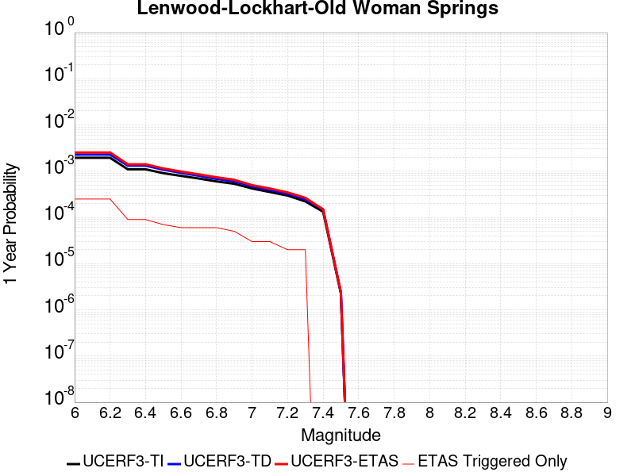 | 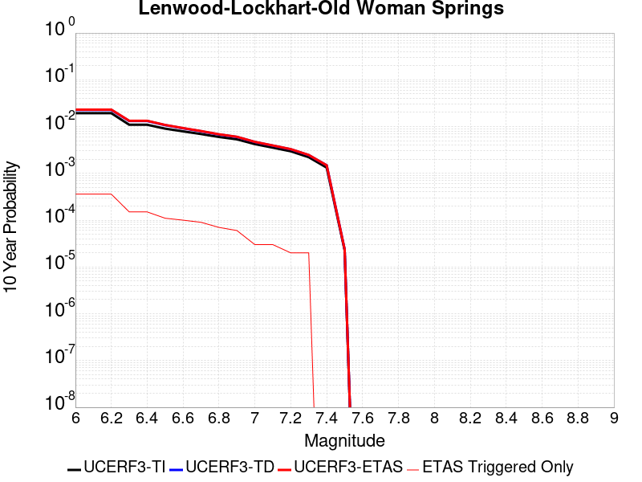 |

| Magnitude | 1 wk TI Prob | 1 wk TD Prob | 1 wk ETAS Prob | 1 wk ETAS/TD Gain | 1 wk ETAS Triggered Only | 1 mo TI Prob | 1 mo TD Prob | 1 mo ETAS Prob | 1 mo ETAS/TD Gain | 1 mo ETAS Triggered Only | 1 yr TI Prob | 1 yr TD Prob | 1 yr ETAS Prob | 1 yr ETAS/TD Gain | 1 yr ETAS Triggered Only | 10 yr TI Prob | 10 yr TD Prob | 10 yr ETAS Prob | 10 yr ETAS/TD Gain | 10 yr ETAS Triggered Only |
|-----|-----|-----|-----|-----|-----|-----|-----|-----|-----|-----|-----|-----|-----|-----|-----|-----|-----|-----|-----|-----|
| 6.0 | 3.744542E-5 | 4.3962966E-5 | 1.1395989E-4 | 2.5921793 | 7.0E-5 | 1.604705E-4 | 1.8840008E-4 | 2.9837937E-4 | 1.5837538 | 1.1E-4 | 0.0019519776 | 0.0022915301 | 0.0025409572 | 1.1088474 | 2.5E-4 | 0.019349206 | 0.022697017 | 0.023048844 | 1.0155011 | 3.6E-4 |
| 6.1 | 3.744542E-5 | 4.3962966E-5 | 1.1395989E-4 | 2.5921793 | 7.0E-5 | 1.604705E-4 | 1.8840008E-4 | 2.9837937E-4 | 1.5837538 | 1.1E-4 | 0.0019519776 | 0.0022915301 | 0.0025409572 | 1.1088474 | 2.5E-4 | 0.019349206 | 0.022697017 | 0.023048844 | 1.0155011 | 3.6E-4 |
| 6.2 | 3.744542E-5 | 4.3962966E-5 | 1.1395989E-4 | 2.5921793 | 7.0E-5 | 1.604705E-4 | 1.8840008E-4 | 2.9837937E-4 | 1.5837538 | 1.1E-4 | 0.0019519776 | 0.0022915301 | 0.0025409572 | 1.1088474 | 2.5E-4 | 0.019349206 | 0.022697017 | 0.023048844 | 1.0155011 | 3.6E-4 |
| 6.3 | 2.1079984E-5 | 2.5353596E-5 | 6.5352586E-5 | 2.5776455 | 4.0E-5 | 9.0339665E-5 | 1.0865386E-4 | 1.4864952E-4 | 1.3681016 | 4.0E-5 | 0.0010993304 | 0.0013220779 | 0.001411959 | 1.0679847 | 9.0E-5 | 0.010939079 | 0.013144341 | 0.013292369 | 1.0112617 | 1.5E-4 |
| 6.4 | 2.1079984E-5 | 2.5353596E-5 | 6.5352586E-5 | 2.5776455 | 4.0E-5 | 9.0339665E-5 | 1.0865386E-4 | 1.4864952E-4 | 1.3681016 | 4.0E-5 | 0.0010993304 | 0.0013220779 | 0.001411959 | 1.0679847 | 9.0E-5 | 0.010939079 | 0.013144341 | 0.013292369 | 1.0112617 | 1.5E-4 |
| 6.5 | 1.7397282E-5 | 2.0662535E-5 | 5.0661914E-5 | 2.451873 | 3.0E-5 | 7.455765E-5 | 8.855078E-5 | 1.1854813E-4 | 1.3387586 | 3.0E-5 | 9.073613E-4 | 0.0010775843 | 0.001147509 | 1.0648901 | 7.0E-5 | 0.009036654 | 0.010724886 | 0.010833706 | 1.0101465 | 1.1E-4 |
| 6.6 | 1.52050325E-5 | 1.76798E-5 | 4.767927E-5 | 2.696822 | 3.0E-5 | 6.51628E-5 | 7.576841E-5 | 1.0576614E-4 | 1.3959134 | 3.0E-5 | 7.9306826E-4 | 9.220979E-4 | 9.820426E-4 | 1.065009 | 6.0E-5 | 0.007902439 | 0.009183581 | 0.0092826625 | 1.010789 | 1.0E-4 |
| 6.7 | 1.332523E-5 | 1.5264091E-5 | 4.5263634E-5 | 2.965367 | 3.0E-5 | 5.7106878E-5 | 6.541593E-5 | 9.541396E-5 | 1.4585739 | 3.0E-5 | 6.950544E-4 | 7.9615373E-4 | 8.5610594E-4 | 1.0753024 | 6.0E-5 | 0.006928845 | 0.007933645 | 0.0080229305 | 1.0112541 | 9.0E-5 |
| 6.8 | 1.1525329E-5 | 1.303105E-5 | 4.3030657E-5 | 3.3021636 | 3.0E-5 | 4.9393333E-5 | 5.5846183E-5 | 8.5844506E-5 | 1.5371598 | 3.0E-5 | 6.011979E-4 | 6.7971944E-4 | 7.396786E-4 | 1.0882118 | 6.0E-5 | 0.00599574 | 0.006776856 | 0.0068463814 | 1.0102593 | 7.0E-5 |
| 6.9 | 1.0253909E-5 | 1.15144985E-5 | 4.151415E-5 | 3.605381 | 3.0E-5 | 4.3944583E-5 | 4.9346934E-5 | 7.934545E-5 | 1.6079105 | 3.0E-5 | 5.3489394E-4 | 6.0063694E-4 | 6.5060693E-4 | 1.083195 | 5.0E-5 | 0.0053360825 | 0.005990515 | 0.0060501555 | 1.0099559 | 6.0E-5 |
| 7.0 | 8.104563E-6 | 8.991321E-6 | 1.8991232E-5 | 2.1121736 | 1.0E-5 | 3.4733377E-5 | 3.8533675E-5 | 4.853329E-5 | 1.2595032 | 1.0E-5 | 4.2279682E-4 | 4.6904891E-4 | 4.990348E-4 | 1.0639292 | 3.0E-5 | 0.0042199334 | 0.0046808375 | 0.004710697 | 1.0063791 | 3.0E-5 |
| 7.1 | 6.7986157E-6 | 7.515848E-6 | 1.7515773E-5 | 2.3305118 | 1.0E-5 | 2.91366E-5 | 3.221039E-5 | 4.221007E-5 | 1.3104488 | 1.0E-5 | 3.5468035E-4 | 3.9209312E-4 | 4.2208136E-4 | 1.0764824 | 3.0E-5 | 0.003541148 | 0.0039142296 | 0.003944112 | 1.0076344 | 3.0E-5 |
| 7.2 | 5.6893327E-6 | 6.280039E-6 | 1.6279977E-5 | 2.592337 | 1.0E-5 | 2.4382627E-5 | 2.6914187E-5 | 3.6913916E-5 | 1.3715413 | 1.0E-5 | 2.9681803E-4 | 3.2763294E-4 | 3.476264E-4 | 1.061024 | 2.0E-5 | 0.002964219 | 0.0032716978 | 0.0032916323 | 1.006093 | 2.0E-5 |
| 7.3 | 4.253348E-6 | 4.706927E-6 | 1.470688E-5 | 3.1245184 | 1.0E-5 | 1.8228506E-5 | 2.01724E-5 | 3.0172198E-5 | 1.4957168 | 1.0E-5 | 2.2190946E-4 | 2.4557312E-4 | 2.655682E-4 | 1.0814221 | 2.0E-5 | 0.00221688 | 0.0024531984 | 0.0024731492 | 1.0081326 | 2.0E-5 |
| 7.4 | 2.5448119E-6 | 2.8520535E-6 | 2.8520535E-6 | 1.0 | 0.0 | 1.0906291E-5 | 1.22230385E-5 | 1.22230385E-5 | 1.0 | 0.0 | 1.3277601E-4 | 1.4880698E-4 | 1.4880698E-4 | 1.0 | 0.0 | 0.001326967 | 0.0014872355 | 0.0014872355 | 1.0 | 0.0 |
| 7.5 | 4.3706837E-8 | 4.5629356E-8 | 4.5629356E-8 | 1.0 | 0.0 | 1.8731501E-7 | 1.9555438E-7 | 1.9555438E-7 | 1.0 | 0.0 | 2.2805577E-6 | 2.3808725E-6 | 2.3808725E-6 | 1.0 | 0.0 | 2.2805343E-5 | 2.3808525E-5 | 2.3808525E-5 | 1.0 | 0.0 |

## Goldstone Lake
*[(top)](#table-of-contents)*

| 1 Week | 1 Month | 1 Year | 10 Year |
|-----|-----|-----|-----|
|  |  |  |  |

| Magnitude | 1 wk TI Prob | 1 wk TD Prob | 1 wk ETAS Prob | 1 wk ETAS/TD Gain | 1 wk ETAS Triggered Only | 1 mo TI Prob | 1 mo TD Prob | 1 mo ETAS Prob | 1 mo ETAS/TD Gain | 1 mo ETAS Triggered Only | 1 yr TI Prob | 1 yr TD Prob | 1 yr ETAS Prob | 1 yr ETAS/TD Gain | 1 yr ETAS Triggered Only | 10 yr TI Prob | 10 yr TD Prob | 10 yr ETAS Prob | 10 yr ETAS/TD Gain | 10 yr ETAS Triggered Only |
|-----|-----|-----|-----|-----|-----|-----|-----|-----|-----|-----|-----|-----|-----|-----|-----|-----|-----|-----|-----|-----|
| 6.0 | 2.671352E-5 | 3.0376628E-5 | 9.037481E-5 | 2.9751427 | 6.0E-5 | 1.1448149E-4 | 1.3018015E-4 | 2.2016844E-4 | 1.6912596 | 9.0E-5 | 0.001392921 | 0.0015839875 | 0.0017936549 | 1.1323668 | 2.1E-4 | 0.013842222 | 0.015746472 | 0.016071277 | 1.020627 | 3.3E-4 |
| 6.1 | 2.671352E-5 | 3.0376628E-5 | 9.037481E-5 | 2.9751427 | 6.0E-5 | 1.1448149E-4 | 1.3018015E-4 | 2.2016844E-4 | 1.6912596 | 9.0E-5 | 0.001392921 | 0.0015839875 | 0.0017936549 | 1.1323668 | 2.1E-4 | 0.013842222 | 0.015746472 | 0.016071277 | 1.020627 | 3.3E-4 |
| 6.2 | 1.4197047E-5 | 1.6096516E-5 | 5.6095872E-5 | 3.4849699 | 4.0E-5 | 6.0843064E-5 | 6.89838E-5 | 1.2897966E-4 | 1.8697095 | 6.0E-5 | 7.4051257E-4 | 8.396528E-4 | 9.59552E-4 | 1.1427963 | 1.2E-4 | 0.007380498 | 0.008374499 | 0.0085629085 | 1.0224979 | 1.9E-4 |
| 6.3 | 1.4197047E-5 | 1.6096516E-5 | 5.6095872E-5 | 3.4849699 | 4.0E-5 | 6.0843064E-5 | 6.89838E-5 | 1.2897966E-4 | 1.8697095 | 6.0E-5 | 7.4051257E-4 | 8.396528E-4 | 9.59552E-4 | 1.1427963 | 1.2E-4 | 0.007380498 | 0.008374499 | 0.0085629085 | 1.0224979 | 1.9E-4 |
| 6.4 | 1.3238931E-5 | 1.5008711E-5 | 5.500811E-5 | 3.6650789 | 4.0E-5 | 5.6737044E-5 | 6.432201E-5 | 1.2431816E-4 | 1.9327466 | 6.0E-5 | 6.9055456E-4 | 7.8293716E-4 | 9.028432E-4 | 1.153149 | 1.2E-4 | 0.006884126 | 0.007811414 | 0.007990008 | 1.0228631 | 1.8E-4 |
| 6.5 | 1.3238931E-5 | 1.5008711E-5 | 5.500811E-5 | 3.6650789 | 4.0E-5 | 5.6737044E-5 | 6.432201E-5 | 1.2431816E-4 | 1.9327466 | 6.0E-5 | 6.9055456E-4 | 7.8293716E-4 | 9.028432E-4 | 1.153149 | 1.2E-4 | 0.006884126 | 0.007811414 | 0.007990008 | 1.0228631 | 1.8E-4 |
| 6.6 | 1.1328278E-5 | 1.2855381E-5 | 5.2854866E-5 | 4.1114974 | 4.0E-5 | 4.8548856E-5 | 5.5093864E-5 | 1.1509056E-4 | 2.0889904 | 6.0E-5 | 5.90922E-4 | 6.706571E-4 | 7.805833E-4 | 1.1639082 | 1.1E-4 | 0.0058935313 | 0.0066957204 | 0.006864582 | 1.0252193 | 1.7E-4 |
| 6.7 | 8.651175E-6 | 9.8247265E-6 | 2.982453E-5 | 3.03566 | 2.0E-5 | 3.707594E-5 | 4.2105803E-5 | 8.210412E-5 | 1.9499478 | 4.0E-5 | 4.5130608E-4 | 5.126081E-4 | 6.02562E-4 | 1.1754827 | 9.0E-5 | 0.0045039062 | 0.0051231356 | 0.005272367 | 1.0291289 | 1.5E-4 |
| 6.8 | 1.0215377E-6 | 1.1754793E-6 | 1.1754793E-6 | 1.0 | 0.0 | 4.378012E-6 | 5.037759E-6 | 5.037759E-6 | 1.0 | 0.0 | 5.3300988E-5 | 6.133311E-5 | 6.133311E-5 | 1.0 | 0.0 | 5.3288206E-4 | 6.13173E-4 | 6.231669E-4 | 1.0162987 | 1.0E-5 |
| 6.9 | 7.9360774E-7 | 9.2834586E-7 | 9.2834586E-7 | 1.0 | 0.0 | 3.4011714E-6 | 3.9786196E-6 | 3.9786196E-6 | 1.0 | 0.0 | 4.1408475E-5 | 4.8438687E-5 | 4.8438687E-5 | 1.0 | 0.0 | 4.140076E-4 | 4.842883E-4 | 4.9428345E-4 | 1.0206388 | 1.0E-5 |
| 7.0 | 7.4382757E-7 | 8.7473853E-7 | 8.7473853E-7 | 1.0 | 0.0 | 3.1878285E-6 | 3.7488744E-6 | 3.7488744E-6 | 1.0 | 0.0 | 3.8811122E-5 | 4.5641656E-5 | 4.5641656E-5 | 1.0 | 0.0 | 3.8804344E-4 | 4.563295E-4 | 4.663249E-4 | 1.021904 | 1.0E-5 |
| 7.1 | 6.4709513E-7 | 7.711347E-7 | 7.711347E-7 | 1.0 | 0.0 | 2.773262E-6 | 3.304859E-6 | 3.304859E-6 | 1.0 | 0.0 | 3.376394E-5 | 4.0235976E-5 | 4.0235976E-5 | 1.0 | 0.0 | 3.375881E-4 | 4.0229288E-4 | 4.1228885E-4 | 1.0248475 | 1.0E-5 |
| 7.2 | 6.356704E-7 | 7.5884054E-7 | 7.5884054E-7 | 1.0 | 0.0 | 2.7242988E-6 | 3.25217E-6 | 3.25217E-6 | 1.0 | 0.0 | 3.3167835E-5 | 3.959451E-5 | 3.959451E-5 | 1.0 | 0.0 | 3.3162883E-4 | 3.958805E-4 | 4.0587655E-4 | 1.0252502 | 1.0E-5 |
| 7.3 | 5.7695723E-7 | 6.8966074E-7 | 6.8966074E-7 | 1.0 | 0.0 | 2.4726714E-6 | 2.9556859E-6 | 2.9556859E-6 | 1.0 | 0.0 | 3.0104358E-5 | 3.598494E-5 | 3.598494E-5 | 1.0 | 0.0 | 3.0100282E-4 | 3.5979686E-4 | 3.6979327E-4 | 1.0277835 | 1.0E-5 |
| 7.4 | 5.209647E-7 | 6.193549E-7 | 6.193549E-7 | 1.0 | 0.0 | 2.232704E-6 | 2.654376E-6 | 2.654376E-6 | 1.0 | 0.0 | 2.718283E-5 | 3.2316606E-5 | 3.2316606E-5 | 1.0 | 0.0 | 2.7179506E-4 | 3.231246E-4 | 3.3312137E-4 | 1.0309378 | 1.0E-5 |
| 7.5 | 4.512955E-7 | 5.3489146E-7 | 5.3489146E-7 | 1.0 | 0.0 | 1.934122E-6 | 2.2923903E-6 | 2.2923903E-6 | 1.0 | 0.0 | 2.3547682E-5 | 2.7909547E-5 | 2.7909547E-5 | 1.0 | 0.0 | 2.3545188E-4 | 2.7906572E-4 | 2.8906294E-4 | 1.0358238 | 1.0E-5 |
| 7.6 | 2.21172E-7 | 2.6039737E-7 | 2.6039737E-7 | 1.0 | 0.0 | 9.478797E-7 | 1.1159884E-6 | 1.1159884E-6 | 1.0 | 0.0 | 1.1540374E-5 | 1.3587103E-5 | 1.3587103E-5 | 1.0 | 0.0 | 1.1539775E-4 | 1.3586554E-4 | 1.4586418E-4 | 1.0735922 | 1.0E-5 |

## McLean Lake
*[(top)](#table-of-contents)*

| 1 Week | 1 Month | 1 Year | 10 Year |
|-----|-----|-----|-----|
| 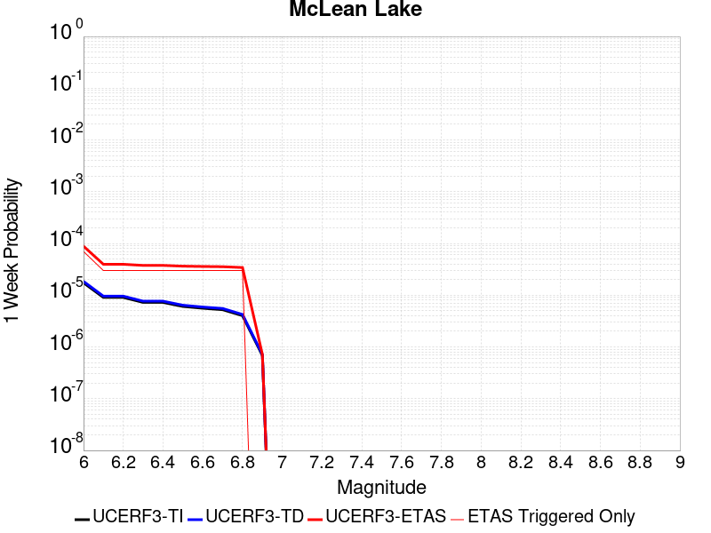 |  | 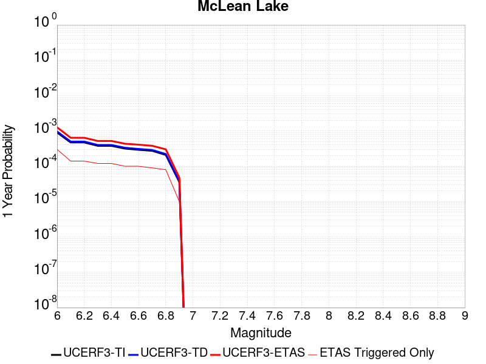 |  |

| Magnitude | 1 wk TI Prob | 1 wk TD Prob | 1 wk ETAS Prob | 1 wk ETAS/TD Gain | 1 wk ETAS Triggered Only | 1 mo TI Prob | 1 mo TD Prob | 1 mo ETAS Prob | 1 mo ETAS/TD Gain | 1 mo ETAS Triggered Only | 1 yr TI Prob | 1 yr TD Prob | 1 yr ETAS Prob | 1 yr ETAS/TD Gain | 1 yr ETAS Triggered Only | 10 yr TI Prob | 10 yr TD Prob | 10 yr ETAS Prob | 10 yr ETAS/TD Gain | 10 yr ETAS Triggered Only |
|-----|-----|-----|-----|-----|-----|-----|-----|-----|-----|-----|-----|-----|-----|-----|-----|-----|-----|-----|-----|-----|
| 6.0 | 1.7360222E-5 | 1.8501789E-5 | 8.850049E-5 | 4.783348 | 7.0E-5 | 7.439883E-5 | 7.929125E-5 | 1.8928252E-4 | 2.3871806 | 1.1E-4 | 9.0542925E-4 | 9.64992E-4 | 0.0012647025 | 1.3105834 | 3.0E-4 | 0.009017491 | 0.009612858 | 0.00994959 | 1.0350293 | 3.4E-4 |
| 6.1 | 9.062689E-6 | 9.592268E-6 | 3.959198E-5 | 4.127489 | 3.0E-5 | 3.8839516E-5 | 4.110912E-5 | 1.01106656E-4 | 2.45947 | 6.0E-5 | 4.727685E-4 | 5.003975E-4 | 6.4032746E-4 | 1.2796376 | 1.4E-4 | 0.0047176396 | 0.0049935905 | 0.0051527913 | 1.0318811 | 1.6E-4 |
| 6.2 | 9.062689E-6 | 9.592268E-6 | 3.959198E-5 | 4.127489 | 3.0E-5 | 3.8839516E-5 | 4.110912E-5 | 1.01106656E-4 | 2.45947 | 6.0E-5 | 4.727685E-4 | 5.003975E-4 | 6.4032746E-4 | 1.2796376 | 1.4E-4 | 0.0047176396 | 0.0049935905 | 0.0051527913 | 1.0318811 | 1.6E-4 |
| 6.3 | 7.2575485E-6 | 7.667767E-6 | 3.7667538E-5 | 4.912452 | 3.0E-5 | 3.110341E-5 | 3.2861484E-5 | 9.285951E-5 | 2.8257856 | 6.0E-5 | 3.786182E-4 | 4.0002225E-4 | 5.199743E-4 | 1.2998633 | 1.2E-4 | 0.0037797375 | 0.003993727 | 0.0041331677 | 1.034915 | 1.4E-4 |
| 6.4 | 7.2575485E-6 | 7.667767E-6 | 3.7667538E-5 | 4.912452 | 3.0E-5 | 3.110341E-5 | 3.2861484E-5 | 9.285951E-5 | 2.8257856 | 6.0E-5 | 3.786182E-4 | 4.0002225E-4 | 5.199743E-4 | 1.2998633 | 1.2E-4 | 0.0037797375 | 0.003993727 | 0.0041331677 | 1.034915 | 1.4E-4 |
| 6.5 | 6.06582E-6 | 6.4039245E-6 | 3.6403733E-5 | 5.6845975 | 3.0E-5 | 2.5996113E-5 | 2.7445138E-5 | 8.744349E-5 | 3.1861196 | 6.0E-5 | 3.164567E-4 | 3.340998E-4 | 4.340664E-4 | 1.2992117 | 1.0E-4 | 0.0031600643 | 0.0033366138 | 0.0034562135 | 1.0358446 | 1.2E-4 |
| 6.6 | 5.598744E-6 | 5.910306E-6 | 3.591013E-5 | 6.0758495 | 3.0E-5 | 2.3994397E-5 | 2.5329673E-5 | 8.532815E-5 | 3.3687034 | 6.0E-5 | 2.9209262E-4 | 3.083515E-4 | 4.083207E-4 | 1.3242052 | 1.0E-4 | 0.0029170897 | 0.0030798658 | 0.0031994963 | 1.0388427 | 1.2E-4 |
| 6.7 | 5.246996E-6 | 5.539203E-6 | 3.5539037E-5 | 6.4159117 | 3.0E-5 | 2.2486933E-5 | 2.3739261E-5 | 8.373784E-5 | 3.5273986 | 6.0E-5 | 2.73744E-4 | 2.8899353E-4 | 3.789675E-4 | 1.3113357 | 9.0E-5 | 0.0027340704 | 0.002886801 | 0.0029964834 | 1.0379945 | 1.1E-4 |
| 6.8 | 4.02324E-6 | 4.246936E-6 | 3.424681E-5 | 8.063887 | 3.0E-5 | 1.7242342E-5 | 1.820106E-5 | 6.820015E-5 | 3.7470427 | 5.0E-5 | 2.099053E-4 | 2.2158133E-4 | 3.015636E-4 | 1.3609612 | 8.0E-5 | 0.0020970714 | 0.0022141882 | 0.0023139669 | 1.0450633 | 1.0E-4 |
| 6.9 | 6.835972E-7 | 7.1399705E-7 | 7.1399705E-7 | 1.0 | 0.0 | 2.9296991E-6 | 3.0599856E-6 | 1.3059955E-5 | 4.267979 | 1.0E-5 | 3.56685E-5 | 3.7255006E-5 | 4.7254634E-5 | 1.2684103 | 1.0E-5 | 3.5662777E-4 | 3.7251884E-4 | 3.8251514E-4 | 1.0268342 | 1.0E-5 |

## San Andreas (San Bernardino N)
*[(top)](#table-of-contents)*

| 1 Week | 1 Month | 1 Year | 10 Year |
|-----|-----|-----|-----|
|  | 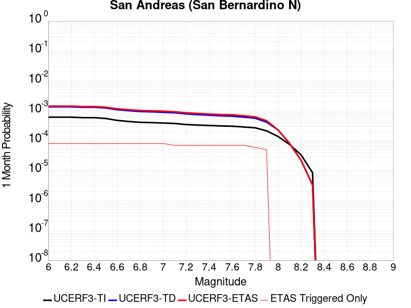 |  |  |

| Magnitude | 1 wk TI Prob | 1 wk TD Prob | 1 wk ETAS Prob | 1 wk ETAS/TD Gain | 1 wk ETAS Triggered Only | 1 mo TI Prob | 1 mo TD Prob | 1 mo ETAS Prob | 1 mo ETAS/TD Gain | 1 mo ETAS Triggered Only | 1 yr TI Prob | 1 yr TD Prob | 1 yr ETAS Prob | 1 yr ETAS/TD Gain | 1 yr ETAS Triggered Only | 10 yr TI Prob | 10 yr TD Prob | 10 yr ETAS Prob | 10 yr ETAS/TD Gain | 10 yr ETAS Triggered Only |
|-----|-----|-----|-----|-----|-----|-----|-----|-----|-----|-----|-----|-----|-----|-----|-----|-----|-----|-----|-----|-----|
| 6.0 | 1.4273766E-4 | 3.161376E-4 | 3.261344E-4 | 1.0316218 | 1.0E-5 | 6.115894E-4 | 0.0013541778 | 0.0014340695 | 1.0589964 | 8.0E-5 | 0.0074207084 | 0.016363978 | 0.016550869 | 1.0114208 | 1.9E-4 | 0.07177748 | 0.15029658 | 0.1505345 | 1.001583 | 2.8E-4 |
| 6.1 | 1.4273766E-4 | 3.161376E-4 | 3.261344E-4 | 1.0316218 | 1.0E-5 | 6.115894E-4 | 0.0013541778 | 0.0014340695 | 1.0589964 | 8.0E-5 | 0.0074207084 | 0.016363978 | 0.016550869 | 1.0114208 | 1.9E-4 | 0.07177748 | 0.15029658 | 0.1505345 | 1.001583 | 2.8E-4 |
| 6.2 | 1.4273766E-4 | 3.161376E-4 | 3.261344E-4 | 1.0316218 | 1.0E-5 | 6.115894E-4 | 0.0013541778 | 0.0014340695 | 1.0589964 | 8.0E-5 | 0.0074207084 | 0.016363978 | 0.016550869 | 1.0114208 | 1.9E-4 | 0.07177748 | 0.15029658 | 0.1505345 | 1.001583 | 2.8E-4 |
| 6.3 | 1.3730655E-4 | 3.0518573E-4 | 3.151827E-4 | 1.0327569 | 1.0E-5 | 5.883239E-4 | 0.001307289 | 0.0013871844 | 1.0611154 | 8.0E-5 | 0.0071393442 | 0.01580149 | 0.015988488 | 1.0118341 | 1.9E-4 | 0.06914291 | 0.14559646 | 0.1458357 | 1.0016432 | 2.8E-4 |
| 6.4 | 1.3730655E-4 | 3.0518573E-4 | 3.151827E-4 | 1.0327569 | 1.0E-5 | 5.883239E-4 | 0.001307289 | 0.0013871844 | 1.0611154 | 8.0E-5 | 0.0071393442 | 0.01580149 | 0.015988488 | 1.0118341 | 1.9E-4 | 0.06914291 | 0.14559646 | 0.1458357 | 1.0016432 | 2.8E-4 |
| 6.5 | 1.2942807E-4 | 2.8932988E-4 | 2.99327E-4 | 1.0345526 | 1.0E-5 | 5.545738E-4 | 0.0012394012 | 0.001319302 | 1.0644673 | 8.0E-5 | 0.0067310524 | 0.014986552 | 0.015173704 | 1.012488 | 1.9E-4 | 0.06530788 | 0.13873914 | 0.13898028 | 1.0017382 | 2.8E-4 |
| 6.6 | 1.1125901E-4 | 2.537176E-4 | 2.6371505E-4 | 1.0394039 | 1.0E-5 | 4.767372E-4 | 0.0010869103 | 0.0011668233 | 1.0735232 | 8.0E-5 | 0.005788839 | 0.013153472 | 0.013340973 | 1.0142548 | 1.9E-4 | 0.056403454 | 0.12302898 | 0.12327453 | 1.0019959 | 2.8E-4 |
| 6.7 | 1.02209575E-4 | 2.3506685E-4 | 2.450645E-4 | 1.0425311 | 1.0E-5 | 4.3796748E-4 | 0.0010070418 | 0.0010869612 | 1.0793606 | 8.0E-5 | 0.0053192247 | 0.01219223 | 0.012379914 | 1.0153937 | 1.9E-4 | 0.051936906 | 0.11482068 | 0.11506853 | 1.0021586 | 2.8E-4 |
| 6.8 | 9.610582E-5 | 2.2032406E-4 | 2.3032185E-4 | 1.0453777 | 1.0E-5 | 4.1181705E-4 | 9.439049E-4 | 0.0010238294 | 1.0846742 | 8.0E-5 | 0.0050023515 | 0.011431754 | 0.011619582 | 1.0164304 | 1.9E-4 | 0.048912346 | 0.1082225 | 0.1084722 | 1.0023073 | 2.8E-4 |
| 6.9 | 9.3877505E-5 | 2.1487933E-4 | 2.2487718E-4 | 1.0465277 | 1.0E-5 | 4.0227012E-4 | 9.2058704E-4 | 0.0010005133 | 1.0868211 | 8.0E-5 | 0.0048866454 | 0.011150793 | 0.011338674 | 1.0168492 | 1.9E-4 | 0.04780577 | 0.10581279 | 0.106063165 | 1.0023662 | 2.8E-4 |
| 7.0 | 9.1019785E-5 | 2.0814833E-4 | 2.1814625E-4 | 1.0480326 | 1.0E-5 | 3.900265E-4 | 8.917599E-4 | 9.7168854E-4 | 1.0896302 | 8.0E-5 | 0.0047382377 | 0.010803353 | 0.0109913 | 1.0173972 | 1.9E-4 | 0.046384744 | 0.10278319 | 0.10303441 | 1.0024441 | 2.8E-4 |
| 7.1 | 8.771155E-5 | 1.9989353E-4 | 2.0989153E-4 | 1.0500166 | 1.0E-5 | 3.758525E-4 | 8.564058E-4 | 9.263459E-4 | 1.081667 | 7.0E-5 | 0.0045664064 | 0.01037709 | 0.010555222 | 1.0171659 | 1.8E-4 | 0.044737056 | 0.09909467 | 0.09933791 | 1.0024546 | 2.7E-4 |
| 7.2 | 8.0830236E-5 | 1.8394848E-4 | 1.9394665E-4 | 1.054353 | 1.0E-5 | 3.4636928E-4 | 7.881126E-4 | 8.580574E-4 | 1.0887498 | 7.0E-5 | 0.0042088944 | 0.009553162 | 0.009731443 | 1.018662 | 1.8E-4 | 0.041300658 | 0.09182531 | 0.09206143 | 1.0025715 | 2.6E-4 |
| 7.3 | 7.7668235E-5 | 1.7338296E-4 | 1.8338121E-4 | 1.0576658 | 1.0E-5 | 3.328214E-4 | 7.428583E-4 | 8.128063E-4 | 1.0941607 | 7.0E-5 | 0.0040445733 | 0.009006873 | 0.009185252 | 1.0198047 | 1.8E-4 | 0.03971748 | 0.087092124 | 0.087329485 | 1.0027254 | 2.6E-4 |
| 7.4 | 7.520177E-5 | 1.6558339E-4 | 1.7558174E-4 | 1.0603825 | 1.0E-5 | 3.2225347E-4 | 7.0945016E-4 | 7.794005E-4 | 1.098598 | 7.0E-5 | 0.0039163795 | 0.0086034145 | 0.008781865 | 1.0207419 | 1.8E-4 | 0.038480744 | 0.08354814 | 0.08378642 | 1.002852 | 2.6E-4 |
| 7.5 | 7.274697E-5 | 1.5845922E-4 | 1.6845764E-4 | 1.0630977 | 1.0E-5 | 3.1173544E-4 | 6.789343E-4 | 7.488867E-4 | 1.1030327 | 7.0E-5 | 0.003788775 | 0.008234753 | 0.008413271 | 1.0216786 | 1.8E-4 | 0.03724827 | 0.08026466 | 0.08050379 | 1.0029793 | 2.6E-4 |
| 7.6 | 7.1185845E-5 | 1.5415733E-4 | 1.6415579E-4 | 1.0648588 | 1.0E-5 | 3.0504653E-4 | 6.6050707E-4 | 7.304608E-4 | 1.1059092 | 7.0E-5 | 0.0037076178 | 0.008012074 | 0.008190632 | 1.022286 | 1.8E-4 | 0.036463667 | 0.078254156 | 0.07849381 | 1.0030625 | 2.6E-4 |
| 7.7 | 6.709961E-5 | 1.4324463E-4 | 1.5324319E-4 | 1.0698006 | 1.0E-5 | 2.8753807E-4 | 6.1376113E-4 | 6.837182E-4 | 1.1139809 | 7.0E-5 | 0.003495157 | 0.007446978 | 0.0076157115 | 1.0226581 | 1.7E-4 | 0.034406938 | 0.073082365 | 0.07331409 | 1.0031708 | 2.5E-4 |
| 7.8 | 6.300812E-5 | 1.3208245E-4 | 1.3208245E-4 | 1.0 | 0.0 | 2.7000686E-4 | 5.659449E-4 | 6.2591094E-4 | 1.1059574 | 6.0E-5 | 0.0032823787 | 0.0068686386 | 0.00702754 | 1.0231342 | 1.6E-4 | 0.032343175 | 0.06773997 | 0.06796371 | 1.0033029 | 2.4E-4 |
| 7.9 | 4.983037E-5 | 9.728091E-5 | 9.728091E-5 | 1.0 | 0.0 | 2.1354125E-4 | 4.1685157E-4 | 4.6683074E-4 | 1.1198968 | 5.0E-5 | 0.0025967648 | 0.005063368 | 0.0051927096 | 1.0255446 | 1.3E-4 | 0.025666296 | 0.0506703 | 0.05086966 | 1.0039344 | 2.1E-4 |
| 8.0 | 3.2211527E-5 | 5.333152E-5 | 5.333152E-5 | 1.0 | 0.0 | 1.380421E-4 | 2.2854365E-4 | 2.2854365E-4 | 1.0 | 0.0 | 0.0016793669 | 0.0027789702 | 0.0027889425 | 1.0035884 | 1.0E-5 | 0.016667323 | 0.02837451 | 0.028423091 | 1.0017122 | 5.0E-5 |
| 8.1 | 1.743376E-5 | 1.8836954E-5 | 1.8836954E-5 | 1.0 | 0.0 | 7.471398E-5 | 8.07273E-5 | 8.07273E-5 | 1.0 | 0.0 | 9.0926304E-4 | 9.824124E-4 | 9.824124E-4 | 1.0 | 0.0 | 0.009055517 | 0.010490617 | 0.010490617 | 1.0 | 0.0 |
| 8.2 | 7.831616E-6 | 5.1597067E-6 | 5.1597067E-6 | 1.0 | 0.0 | 3.3563636E-5 | 2.2112841E-5 | 2.2112841E-5 | 1.0 | 0.0 | 4.0856065E-4 | 2.6919067E-4 | 2.6919067E-4 | 1.0 | 0.0 | 0.004078103 | 0.003044315 | 0.003044315 | 1.0 | 0.0 |
| 8.3 | 1.983087E-6 | 7.668296E-7 | 7.668296E-7 | 1.0 | 0.0 | 8.498917E-6 | 3.2864084E-6 | 3.2864084E-6 | 1.0 | 0.0 | 1.034694E-4 | 4.0011306E-5 | 4.0011306E-5 | 1.0 | 0.0 | 0.0010342124 | 4.724499E-4 | 4.724499E-4 | 1.0 | 0.0 |

## Death Valley (So)
*[(top)](#table-of-contents)*

| 1 Week | 1 Month | 1 Year | 10 Year |
|-----|-----|-----|-----|
|  |  |  |  |

| Magnitude | 1 wk TI Prob | 1 wk TD Prob | 1 wk ETAS Prob | 1 wk ETAS/TD Gain | 1 wk ETAS Triggered Only | 1 mo TI Prob | 1 mo TD Prob | 1 mo ETAS Prob | 1 mo ETAS/TD Gain | 1 mo ETAS Triggered Only | 1 yr TI Prob | 1 yr TD Prob | 1 yr ETAS Prob | 1 yr ETAS/TD Gain | 1 yr ETAS Triggered Only | 10 yr TI Prob | 10 yr TD Prob | 10 yr ETAS Prob | 10 yr ETAS/TD Gain | 10 yr ETAS Triggered Only |
|-----|-----|-----|-----|-----|-----|-----|-----|-----|-----|-----|-----|-----|-----|-----|-----|-----|-----|-----|-----|-----|
| 6.0 | 2.0684236E-5 | 2.5618423E-5 | 5.5617653E-5 | 2.1710024 | 3.0E-5 | 8.864371E-5 | 1.09788714E-4 | 2.2977554E-4 | 2.0928886 | 1.2E-4 | 0.0010787029 | 0.0013358749 | 0.0015056478 | 1.1270875 | 1.7E-4 | 0.010734817 | 0.013281729 | 0.013508674 | 1.017087 | 2.3E-4 |
| 6.1 | 2.0684236E-5 | 2.5618423E-5 | 5.5617653E-5 | 2.1710024 | 3.0E-5 | 8.864371E-5 | 1.09788714E-4 | 2.2977554E-4 | 2.0928886 | 1.2E-4 | 0.0010787029 | 0.0013358749 | 0.0015056478 | 1.1270875 | 1.7E-4 | 0.010734817 | 0.013281729 | 0.013508674 | 1.017087 | 2.3E-4 |
| 6.2 | 2.0684236E-5 | 2.5618423E-5 | 5.5617653E-5 | 2.1710024 | 3.0E-5 | 8.864371E-5 | 1.09788714E-4 | 2.2977554E-4 | 2.0928886 | 1.2E-4 | 0.0010787029 | 0.0013358749 | 0.0015056478 | 1.1270875 | 1.7E-4 | 0.010734817 | 0.013281729 | 0.013508674 | 1.017087 | 2.3E-4 |
| 6.3 | 2.0240292E-5 | 2.5118497E-5 | 5.5117744E-5 | 2.194309 | 3.0E-5 | 8.6741224E-5 | 1.0764636E-4 | 2.2763344E-4 | 2.1146414 | 1.2E-4 | 0.0010555626 | 0.0013098232 | 0.0014696136 | 1.1219939 | 1.6E-4 | 0.010505628 | 0.013024284 | 0.013241419 | 1.0166715 | 2.2E-4 |
| 6.4 | 2.0240292E-5 | 2.5118497E-5 | 5.5117744E-5 | 2.194309 | 3.0E-5 | 8.6741224E-5 | 1.0764636E-4 | 2.2763344E-4 | 2.1146414 | 1.2E-4 | 0.0010555626 | 0.0013098232 | 0.0014696136 | 1.1219939 | 1.6E-4 | 0.010505628 | 0.013024284 | 0.013241419 | 1.0166715 | 2.2E-4 |
| 6.5 | 1.9962767E-5 | 2.4807747E-5 | 5.4807002E-5 | 2.2092698 | 3.0E-5 | 8.55519E-5 | 1.0631468E-4 | 2.2630191E-4 | 2.1286047 | 1.2E-4 | 0.0010410968 | 0.0012936293 | 0.0014534224 | 1.123523 | 1.6E-4 | 0.010362327 | 0.012864228 | 0.013081398 | 1.0168817 | 2.2E-4 |
| 6.6 | 1.8937297E-5 | 2.3311568E-5 | 5.331087E-5 | 2.2868848 | 3.0E-5 | 8.115732E-5 | 9.990298E-5 | 2.09892E-4 | 2.1009583 | 1.1E-4 | 9.876423E-4 | 0.0012156547 | 0.0013654723 | 1.1232404 | 1.5E-4 | 0.009832645 | 0.0120931 | 0.012290681 | 1.0163383 | 2.0E-4 |
| 6.7 | 1.8621096E-5 | 2.2912203E-5 | 5.2911517E-5 | 2.309316 | 3.0E-5 | 7.980225E-5 | 9.8191544E-5 | 2.0818075E-4 | 2.1201494 | 1.1E-4 | 9.711593E-4 | 0.0011948409 | 0.0013446617 | 1.1253897 | 1.5E-4 | 0.009669261 | 0.011887211 | 0.012084834 | 1.0166248 | 2.0E-4 |
| 6.8 | 1.7830353E-5 | 2.1806247E-5 | 5.1805593E-5 | 2.3757224 | 3.0E-5 | 7.641356E-5 | 9.345208E-5 | 1.8344367E-4 | 1.9629705 | 9.0E-5 | 9.29938E-4 | 0.0011371992 | 0.0012670513 | 1.1141859 | 1.3E-4 | 0.009260561 | 0.011316643 | 0.011494606 | 1.0157257 | 1.8E-4 |
| 6.9 | 1.3135183E-5 | 1.5304242E-5 | 4.5303783E-5 | 2.960211 | 3.0E-5 | 5.6292425E-5 | 6.558799E-5 | 1.4558274E-4 | 2.2196555 | 8.0E-5 | 6.8514474E-4 | 7.982477E-4 | 9.0815994E-4 | 1.1376919 | 1.1E-4 | 0.006830362 | 0.007954813 | 0.008103619 | 1.0187066 | 1.5E-4 |
| 7.0 | 1.1507512E-5 | 1.3154444E-5 | 4.315405E-5 | 3.2805681 | 3.0E-5 | 4.9316975E-5 | 5.6375004E-5 | 1.363705E-4 | 2.4189887 | 8.0E-5 | 6.002687E-4 | 6.861553E-4 | 7.960798E-4 | 1.1602036 | 1.1E-4 | 0.0059864987 | 0.006841068 | 0.0069801104 | 1.0203246 | 1.4E-4 |
| 7.1 | 9.715903E-6 | 1.0865454E-5 | 3.0865238E-5 | 2.8406763 | 2.0E-5 | 4.1638916E-5 | 4.6565423E-5 | 1.0656263E-4 | 2.2884498 | 6.0E-5 | 5.068359E-4 | 5.667908E-4 | 6.467455E-4 | 1.1410656 | 8.0E-5 | 0.0050568148 | 0.0056539057 | 0.00575334 | 1.017587 | 1.0E-4 |
| 7.2 | 9.233269E-6 | 1.0286473E-5 | 3.0286268E-5 | 2.944281 | 2.0E-5 | 3.9570554E-5 | 4.4084165E-5 | 9.408196E-5 | 2.134144 | 5.0E-5 | 4.81665E-4 | 5.3659675E-4 | 6.0655916E-4 | 1.1303818 | 7.0E-5 | 0.0048062233 | 0.005353442 | 0.0054330137 | 1.0148636 | 8.0E-5 |
| 7.3 | 8.8041315E-6 | 9.808313E-6 | 2.9808118E-5 | 3.0390666 | 2.0E-5 | 3.7731446E-5 | 4.2034975E-5 | 8.203329E-5 | 1.9515486 | 4.0E-5 | 4.592835E-4 | 5.1165983E-4 | 5.7162915E-4 | 1.1172054 | 6.0E-5 | 0.0045833546 | 0.0051052445 | 0.0051748874 | 1.0136414 | 7.0E-5 |
| 7.4 | 8.708749E-6 | 9.707323E-6 | 2.970713E-5 | 3.06028 | 2.0E-5 | 3.7322676E-5 | 4.1602176E-5 | 8.160051E-5 | 1.9614482 | 4.0E-5 | 4.5430884E-4 | 5.06393E-4 | 5.663626E-4 | 1.118425 | 6.0E-5 | 0.004533812 | 0.0050528166 | 0.0051224628 | 1.0137837 | 7.0E-5 |
| 7.5 | 8.612678E-6 | 9.604964E-6 | 2.9604773E-5 | 3.0822365 | 2.0E-5 | 3.6910955E-5 | 4.116351E-5 | 8.116186E-5 | 1.9716945 | 4.0E-5 | 4.492982E-4 | 5.010547E-4 | 5.610246E-4 | 1.1196874 | 6.0E-5 | 0.004483909 | 0.0049996753 | 0.005069325 | 1.0139309 | 7.0E-5 |
| 7.6 | 8.319024E-6 | 9.28406E-6 | 2.9283874E-5 | 3.15421 | 2.0E-5 | 3.5652476E-5 | 3.9788243E-5 | 7.978665E-5 | 2.0052822 | 4.0E-5 | 4.3398244E-4 | 4.8431839E-4 | 5.4428936E-4 | 1.1238254 | 6.0E-5 | 0.0043313587 | 0.004833053 | 0.0049027144 | 1.0144136 | 7.0E-5 |
| 7.7 | 7.4718328E-6 | 8.3453E-6 | 2.8345134E-5 | 3.3965387 | 2.0E-5 | 3.2021748E-5 | 3.57651E-5 | 7.576367E-5 | 2.1183686 | 4.0E-5 | 3.8979502E-4 | 4.3535716E-4 | 4.9533107E-4 | 1.1377579 | 6.0E-5 | 0.00389112 | 0.004345448 | 0.0044151437 | 1.0160388 | 7.0E-5 |
| 7.8 | 3.4586725E-7 | 3.648288E-7 | 3.648288E-7 | 1.0 | 0.0 | 1.4822873E-6 | 1.5635511E-6 | 1.5635511E-6 | 1.0 | 0.0 | 1.80467E-5 | 1.9036073E-5 | 1.9036073E-5 | 1.0 | 0.0 | 1.8045233E-4 | 1.9034486E-4 | 1.9034486E-4 | 1.0 | 0.0 |
| 7.9 | 2.5591178E-9 | 2.6696871E-9 | 2.6696871E-9 | 1.0 | 0.0 | 1.0967647E-8 | 1.1441516E-8 | 1.1441516E-8 | 1.0 | 0.0 | 1.335311E-7 | 1.3930045E-7 | 1.3930045E-7 | 1.0 | 0.0 | 1.3353102E-6 | 1.3930046E-6 | 1.3930046E-6 | 1.0 | 0.0 |

## Coyote Canyon
*[(top)](#table-of-contents)*

| 1 Week | 1 Month | 1 Year | 10 Year |
|-----|-----|-----|-----|
| 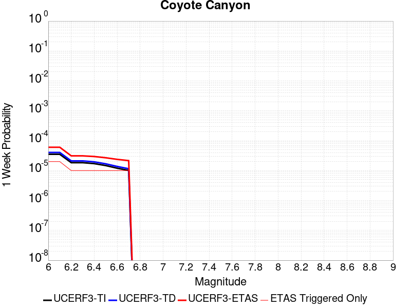 |  |  |  |

| Magnitude | 1 wk TI Prob | 1 wk TD Prob | 1 wk ETAS Prob | 1 wk ETAS/TD Gain | 1 wk ETAS Triggered Only | 1 mo TI Prob | 1 mo TD Prob | 1 mo ETAS Prob | 1 mo ETAS/TD Gain | 1 mo ETAS Triggered Only | 1 yr TI Prob | 1 yr TD Prob | 1 yr ETAS Prob | 1 yr ETAS/TD Gain | 1 yr ETAS Triggered Only | 10 yr TI Prob | 10 yr TD Prob | 10 yr ETAS Prob | 10 yr ETAS/TD Gain | 10 yr ETAS Triggered Only |
|-----|-----|-----|-----|-----|-----|-----|-----|-----|-----|-----|-----|-----|-----|-----|-----|-----|-----|-----|-----|-----|
| 6.0 | 3.5090034E-5 | 4.036513E-5 | 6.036432E-5 | 1.4954572 | 2.0E-5 | 1.503772E-4 | 1.7298339E-4 | 2.1297648E-4 | 1.231196 | 4.0E-5 | 0.0018293047 | 0.0021042947 | 0.002253979 | 1.0711328 | 1.5E-4 | 0.018143194 | 0.020869615 | 0.021075232 | 1.0098525 | 2.1E-4 |
| 6.1 | 3.5090034E-5 | 4.036513E-5 | 6.036432E-5 | 1.4954572 | 2.0E-5 | 1.503772E-4 | 1.7298339E-4 | 2.1297648E-4 | 1.231196 | 4.0E-5 | 0.0018293047 | 0.0021042947 | 0.002253979 | 1.0711328 | 1.5E-4 | 0.018143194 | 0.020869615 | 0.021075232 | 1.0098525 | 2.1E-4 |
| 6.2 | 1.841879E-5 | 2.1060194E-5 | 3.1059983E-5 | 1.4748194 | 1.0E-5 | 7.8935285E-5 | 9.0255424E-5 | 1.1025362E-4 | 1.2215734 | 2.0E-5 | 9.606133E-4 | 0.0010984079 | 0.001148353 | 1.0454705 | 5.0E-5 | 0.0095647145 | 0.010939874 | 0.011018999 | 1.0072327 | 8.0E-5 |
| 6.3 | 1.841879E-5 | 2.1060194E-5 | 3.1059983E-5 | 1.4748194 | 1.0E-5 | 7.8935285E-5 | 9.0255424E-5 | 1.1025362E-4 | 1.2215734 | 2.0E-5 | 9.606133E-4 | 0.0010984079 | 0.001148353 | 1.0454705 | 5.0E-5 | 0.0095647145 | 0.010939874 | 0.011018999 | 1.0072327 | 8.0E-5 |
| 6.4 | 1.712201E-5 | 1.9565581E-5 | 2.9565386E-5 | 1.5110916 | 1.0E-5 | 7.337798E-5 | 8.385037E-5 | 1.0384869E-4 | 1.2385001 | 2.0E-5 | 8.930107E-4 | 0.0010205007 | 0.0010704496 | 1.0489455 | 5.0E-5 | 0.008894307 | 0.0101680625 | 0.010247249 | 1.0077878 | 8.0E-5 |
| 6.5 | 1.4744935E-5 | 1.6837288E-5 | 2.683712E-5 | 1.5939099 | 1.0E-5 | 6.3191044E-5 | 7.215834E-5 | 9.215689E-5 | 1.2771482 | 2.0E-5 | 7.6907943E-4 | 8.7826716E-4 | 9.18232E-4 | 1.0455042 | 4.0E-5 | 0.007664232 | 0.008757159 | 0.008826545 | 1.0079235 | 7.0E-5 |
| 6.6 | 1.2017839E-5 | 1.3724348E-5 | 2.3724211E-5 | 1.7286221 | 1.0E-5 | 5.150401E-5 | 5.8817808E-5 | 7.881663E-5 | 1.340013 | 2.0E-5 | 6.268809E-4 | 7.159601E-4 | 7.559314E-4 | 1.055829 | 4.0E-5 | 0.0062511545 | 0.007145228 | 0.0071948706 | 1.0069476 | 5.0E-5 |
| 6.7 | 1.00956095E-5 | 1.1533734E-5 | 2.1533619E-5 | 1.8670119 | 1.0E-5 | 4.326618E-5 | 4.9429844E-5 | 6.9428854E-5 | 1.4045938 | 2.0E-5 | 5.266384E-4 | 6.0172915E-4 | 6.4170506E-4 | 1.0664351 | 4.0E-5 | 0.005253921 | 0.006009526 | 0.0060492856 | 1.0066161 | 4.0E-5 |

## Nelson Lake
*[(top)](#table-of-contents)*

| 1 Week | 1 Month | 1 Year | 10 Year |
|-----|-----|-----|-----|
|  |  |  |  |

| Magnitude | 1 wk TI Prob | 1 wk TD Prob | 1 wk ETAS Prob | 1 wk ETAS/TD Gain | 1 wk ETAS Triggered Only | 1 mo TI Prob | 1 mo TD Prob | 1 mo ETAS Prob | 1 mo ETAS/TD Gain | 1 mo ETAS Triggered Only | 1 yr TI Prob | 1 yr TD Prob | 1 yr ETAS Prob | 1 yr ETAS/TD Gain | 1 yr ETAS Triggered Only | 10 yr TI Prob | 10 yr TD Prob | 10 yr ETAS Prob | 10 yr ETAS/TD Gain | 10 yr ETAS Triggered Only |
|-----|-----|-----|-----|-----|-----|-----|-----|-----|-----|-----|-----|-----|-----|-----|-----|-----|-----|-----|-----|-----|
| 6.0 | 9.913453E-6 | 1.0192293E-5 | 3.019209E-5 | 2.962247 | 2.0E-5 | 4.2485535E-5 | 4.3680586E-5 | 1.2367709E-4 | 2.8313973 | 8.0E-5 | 5.1713863E-4 | 5.316917E-4 | 6.416332E-4 | 1.2067769 | 1.1E-4 | 0.0051593683 | 0.0053052236 | 0.005454428 | 1.028124 | 1.5E-4 |
| 6.1 | 9.913453E-6 | 1.0192293E-5 | 3.019209E-5 | 2.962247 | 2.0E-5 | 4.2485535E-5 | 4.3680586E-5 | 1.2367709E-4 | 2.8313973 | 8.0E-5 | 5.1713863E-4 | 5.316917E-4 | 6.416332E-4 | 1.2067769 | 1.1E-4 | 0.0051593683 | 0.0053052236 | 0.005454428 | 1.028124 | 1.5E-4 |
| 6.2 | 4.5596407E-6 | 4.696332E-6 | 1.4696285E-5 | 3.1293116 | 1.0E-5 | 1.954117E-5 | 2.0126989E-5 | 6.012618E-5 | 2.9873414 | 4.0E-5 | 2.3788778E-4 | 2.450198E-4 | 2.8501E-4 | 1.1632121 | 4.0E-5 | 0.0023763329 | 0.0024476226 | 0.0025074757 | 1.0244536 | 6.0E-5 |
| 6.3 | 4.5596407E-6 | 4.696332E-6 | 1.4696285E-5 | 3.1293116 | 1.0E-5 | 1.954117E-5 | 2.0126989E-5 | 6.012618E-5 | 2.9873414 | 4.0E-5 | 2.3788778E-4 | 2.450198E-4 | 2.8501E-4 | 1.1632121 | 4.0E-5 | 0.0023763329 | 0.0024476226 | 0.0025074757 | 1.0244536 | 6.0E-5 |
| 6.4 | 3.4025713E-6 | 3.509912E-6 | 1.3509877E-5 | 3.8490644 | 1.0E-5 | 1.4582367E-5 | 1.50423975E-5 | 5.5041797E-5 | 3.6591105 | 4.0E-5 | 1.7752586E-4 | 1.8312664E-4 | 2.2311932E-4 | 1.2183881 | 4.0E-5 | 0.001773841 | 0.0018298404 | 0.0018797488 | 1.0272748 | 5.0E-5 |
| 6.5 | 2.8352947E-6 | 2.9278688E-6 | 1.292784E-5 | 4.4154434 | 1.0E-5 | 1.2151207E-5 | 1.2547953E-5 | 4.2547577E-5 | 3.390798 | 3.0E-5 | 1.479309E-4 | 1.5276136E-4 | 1.8275679E-4 | 1.1963547 | 3.0E-5 | 0.0014783246 | 0.0015266375 | 0.0015665764 | 1.0261614 | 4.0E-5 |
| 6.6 | 2.251518E-6 | 2.3290781E-6 | 1.2329055E-5 | 5.2935343 | 1.0E-5 | 9.649328E-6 | 9.981729E-6 | 2.998153E-5 | 3.003641 | 2.0E-5 | 1.1747423E-4 | 1.2152141E-4 | 1.4151898E-4 | 1.1645601 | 2.0E-5 | 0.0011741214 | 0.0012146112 | 0.0012445748 | 1.0246693 | 3.0E-5 |
| 6.7 | 1.8911853E-6 | 1.9591491E-6 | 1.195913E-5 | 6.104247 | 1.0E-5 | 8.105055E-6 | 8.39633E-6 | 2.8396162E-5 | 3.3819733 | 2.0E-5 | 9.867457E-5 | 1.022211E-4 | 1.2221905E-4 | 1.1956344 | 2.0E-5 | 9.863076E-4 | 0.0010217984 | 0.0010517676 | 1.02933 | 3.0E-5 |
| 6.8 | 1.4874814E-6 | 1.5438383E-6 | 1.1543822E-5 | 7.4773526 | 1.0E-5 | 6.374905E-6 | 6.6164357E-6 | 2.6616304E-5 | 4.0227556 | 2.0E-5 | 7.76117E-5 | 8.055265E-5 | 1.00551035E-4 | 1.2482648 | 2.0E-5 | 7.75846E-4 | 8.052856E-4 | 8.352614E-4 | 1.0372238 | 3.0E-5 |
| 6.9 | 6.835972E-7 | 7.1399705E-7 | 7.1399705E-7 | 1.0 | 0.0 | 2.9296991E-6 | 3.0599856E-6 | 1.3059955E-5 | 4.267979 | 1.0E-5 | 3.56685E-5 | 3.7255006E-5 | 4.7254634E-5 | 1.2684103 | 1.0E-5 | 3.5662777E-4 | 3.7251884E-4 | 3.8251514E-4 | 1.0268342 | 1.0E-5 |

## Towne Pass
*[(top)](#table-of-contents)*

| 1 Week | 1 Month | 1 Year | 10 Year |
|-----|-----|-----|-----|
|  |  |  |  |

| Magnitude | 1 wk TI Prob | 1 wk TD Prob | 1 wk ETAS Prob | 1 wk ETAS/TD Gain | 1 wk ETAS Triggered Only | 1 mo TI Prob | 1 mo TD Prob | 1 mo ETAS Prob | 1 mo ETAS/TD Gain | 1 mo ETAS Triggered Only | 1 yr TI Prob | 1 yr TD Prob | 1 yr ETAS Prob | 1 yr ETAS/TD Gain | 1 yr ETAS Triggered Only | 10 yr TI Prob | 10 yr TD Prob | 10 yr ETAS Prob | 10 yr ETAS/TD Gain | 10 yr ETAS Triggered Only |
|-----|-----|-----|-----|-----|-----|-----|-----|-----|-----|-----|-----|-----|-----|-----|-----|-----|-----|-----|-----|-----|
| 6.0 | 3.849728E-6 | 3.8945495E-6 | 1.3894511E-5 | 3.567681 | 1.0E-5 | 1.649873E-5 | 1.6690845E-5 | 4.6690344E-5 | 2.7973626 | 3.0E-5 | 2.0085352E-4 | 2.0319645E-4 | 2.831802E-4 | 1.3936276 | 8.0E-5 | 0.0020067208 | 0.0020305358 | 0.0021702514 | 1.0688074 | 1.4E-4 |
| 6.1 | 3.849728E-6 | 3.8945495E-6 | 1.3894511E-5 | 3.567681 | 1.0E-5 | 1.649873E-5 | 1.6690845E-5 | 4.6690344E-5 | 2.7973626 | 3.0E-5 | 2.0085352E-4 | 2.0319645E-4 | 2.831802E-4 | 1.3936276 | 8.0E-5 | 0.0020067208 | 0.0020305358 | 0.0021702514 | 1.0688074 | 1.4E-4 |
| 6.2 | 3.849728E-6 | 3.8945495E-6 | 1.3894511E-5 | 3.567681 | 1.0E-5 | 1.649873E-5 | 1.6690845E-5 | 4.6690344E-5 | 2.7973626 | 3.0E-5 | 2.0085352E-4 | 2.0319645E-4 | 2.831802E-4 | 1.3936276 | 8.0E-5 | 0.0020067208 | 0.0020305358 | 0.0021702514 | 1.0688074 | 1.4E-4 |
| 6.3 | 3.849728E-6 | 3.8945495E-6 | 1.3894511E-5 | 3.567681 | 1.0E-5 | 1.649873E-5 | 1.6690845E-5 | 4.6690344E-5 | 2.7973626 | 3.0E-5 | 2.0085352E-4 | 2.0319645E-4 | 2.831802E-4 | 1.3936276 | 8.0E-5 | 0.0020067208 | 0.0020305358 | 0.0021702514 | 1.0688074 | 1.4E-4 |
| 6.4 | 3.849728E-6 | 3.8945495E-6 | 1.3894511E-5 | 3.567681 | 1.0E-5 | 1.649873E-5 | 1.6690845E-5 | 4.6690344E-5 | 2.7973626 | 3.0E-5 | 2.0085352E-4 | 2.0319645E-4 | 2.831802E-4 | 1.3936276 | 8.0E-5 | 0.0020067208 | 0.0020305358 | 0.0021702514 | 1.0688074 | 1.4E-4 |
| 6.5 | 1.1953545E-6 | 1.2030553E-6 | 1.2030553E-6 | 1.0 | 0.0 | 5.1229376E-6 | 5.155942E-6 | 1.515589E-5 | 2.9394999 | 1.0E-5 | 6.236998E-5 | 6.27719E-5 | 8.2770646E-5 | 1.3185939 | 2.0E-5 | 6.235248E-4 | 6.2755344E-4 | 6.575346E-4 | 1.0477747 | 3.0E-5 |
| 6.6 | 1.1953545E-6 | 1.2030553E-6 | 1.2030553E-6 | 1.0 | 0.0 | 5.1229376E-6 | 5.155942E-6 | 1.515589E-5 | 2.9394999 | 1.0E-5 | 6.236998E-5 | 6.27719E-5 | 8.2770646E-5 | 1.3185939 | 2.0E-5 | 6.235248E-4 | 6.2755344E-4 | 6.575346E-4 | 1.0477747 | 3.0E-5 |
| 6.7 | 8.375951E-7 | 8.410697E-7 | 8.410697E-7 | 1.0 | 0.0 | 3.5896885E-6 | 3.60458E-6 | 1.3604544E-5 | 3.7742383 | 1.0E-5 | 4.370358E-5 | 4.3884935E-5 | 6.388406E-5 | 1.4557172 | 2.0E-5 | 4.3694986E-4 | 4.387684E-4 | 4.6875523E-4 | 1.0683432 | 3.0E-5 |
| 6.8 | 6.38041E-7 | 6.39218E-7 | 6.39218E-7 | 1.0 | 0.0 | 2.7344586E-6 | 2.739503E-6 | 2.739503E-6 | 1.0 | 0.0 | 3.3291526E-5 | 3.335298E-5 | 3.335298E-5 | 1.0 | 0.0 | 3.3286537E-4 | 3.3348353E-4 | 3.434802E-4 | 1.0299765 | 1.0E-5 |
| 6.9 | 5.3460053E-7 | 5.345355E-7 | 5.345355E-7 | 1.0 | 0.0 | 2.2911431E-6 | 2.2908646E-6 | 2.2908646E-6 | 1.0 | 0.0 | 2.789431E-5 | 2.7890954E-5 | 2.7890954E-5 | 1.0 | 0.0 | 2.789081E-4 | 2.7887785E-4 | 2.8887508E-4 | 1.035848 | 1.0E-5 |
| 7.0 | 3.557783E-7 | 3.5324413E-7 | 3.5324413E-7 | 1.0 | 0.0 | 1.5247632E-6 | 1.5139026E-6 | 1.5139026E-6 | 1.0 | 0.0 | 1.8563835E-5 | 1.8431618E-5 | 1.8431618E-5 | 1.0 | 0.0 | 1.8562283E-4 | 1.8430172E-4 | 1.8430172E-4 | 1.0 | 0.0 |
| 7.1 | 3.037942E-7 | 3.0002388E-7 | 3.0002388E-7 | 1.0 | 0.0 | 1.3019744E-6 | 1.2858161E-6 | 1.2858161E-6 | 1.0 | 0.0 | 1.5851423E-5 | 1.5654707E-5 | 1.5654707E-5 | 1.0 | 0.0 | 1.5850292E-4 | 1.5653679E-4 | 1.5653679E-4 | 1.0 | 0.0 |
| 7.2 | 2.0808248E-7 | 2.021783E-7 | 2.021783E-7 | 1.0 | 0.0 | 8.917818E-7 | 8.6647816E-7 | 8.6647816E-7 | 1.0 | 0.0 | 1.0857389E-5 | 1.0549325E-5 | 1.0549325E-5 | 1.0 | 0.0 | 1.0856859E-4 | 1.054887E-4 | 1.054887E-4 | 1.0 | 0.0 |
| 7.3 | 1.1162073E-7 | 1.06369825E-7 | 1.06369825E-7 | 1.0 | 0.0 | 4.7837443E-7 | 4.5587063E-7 | 4.5587063E-7 | 1.0 | 0.0 | 5.8241935E-6 | 5.550213E-6 | 5.550213E-6 | 1.0 | 0.0 | 5.8240406E-5 | 5.5500943E-5 | 5.5500943E-5 | 1.0 | 0.0 |

## San Andreas (San Bernardino S)
*[(top)](#table-of-contents)*

| 1 Week | 1 Month | 1 Year | 10 Year |
|-----|-----|-----|-----|
|  |  |  |  |

| Magnitude | 1 wk TI Prob | 1 wk TD Prob | 1 wk ETAS Prob | 1 wk ETAS/TD Gain | 1 wk ETAS Triggered Only | 1 mo TI Prob | 1 mo TD Prob | 1 mo ETAS Prob | 1 mo ETAS/TD Gain | 1 mo ETAS Triggered Only | 1 yr TI Prob | 1 yr TD Prob | 1 yr ETAS Prob | 1 yr ETAS/TD Gain | 1 yr ETAS Triggered Only | 10 yr TI Prob | 10 yr TD Prob | 10 yr ETAS Prob | 10 yr ETAS/TD Gain | 10 yr ETAS Triggered Only |
|-----|-----|-----|-----|-----|-----|-----|-----|-----|-----|-----|-----|-----|-----|-----|-----|-----|-----|-----|-----|-----|
| 6.0 | 1.2336002E-4 | 3.0008948E-4 | 3.0008948E-4 | 1.0 | 0.0 | 5.2857865E-4 | 0.0012854899 | 0.0013254385 | 1.0310766 | 4.0E-5 | 0.006416472 | 0.015543484 | 0.015632086 | 1.0057002 | 9.0E-5 | 0.06234337 | 0.14285627 | 0.14297627 | 1.00084 | 1.4E-4 |
| 6.1 | 1.2336002E-4 | 3.0008948E-4 | 3.0008948E-4 | 1.0 | 0.0 | 5.2857865E-4 | 0.0012854899 | 0.0013254385 | 1.0310766 | 4.0E-5 | 0.006416472 | 0.015543484 | 0.015632086 | 1.0057002 | 9.0E-5 | 0.06234337 | 0.14285627 | 0.14297627 | 1.00084 | 1.4E-4 |
| 6.2 | 1.2336002E-4 | 3.0008948E-4 | 3.0008948E-4 | 1.0 | 0.0 | 5.2857865E-4 | 0.0012854899 | 0.0013254385 | 1.0310766 | 4.0E-5 | 0.006416472 | 0.015543484 | 0.015632086 | 1.0057002 | 9.0E-5 | 0.06234337 | 0.14285627 | 0.14297627 | 1.00084 | 1.4E-4 |
| 6.3 | 1.1712257E-4 | 2.8797207E-4 | 2.8797207E-4 | 1.0 | 0.0 | 5.018573E-4 | 0.001233608 | 0.0012735586 | 1.0323852 | 4.0E-5 | 0.006093008 | 0.01492059 | 0.015009247 | 1.005942 | 9.0E-5 | 0.059286322 | 0.13756467 | 0.13768542 | 1.0008777 | 1.4E-4 |
| 6.4 | 1.1712257E-4 | 2.8797207E-4 | 2.8797207E-4 | 1.0 | 0.0 | 5.018573E-4 | 0.001233608 | 0.0012735586 | 1.0323852 | 4.0E-5 | 0.006093008 | 0.01492059 | 0.015009247 | 1.005942 | 9.0E-5 | 0.059286322 | 0.13756467 | 0.13768542 | 1.0008777 | 1.4E-4 |
| 6.5 | 1.0689076E-4 | 2.6809986E-4 | 2.6809986E-4 | 1.0 | 0.0 | 4.5802278E-4 | 0.0011485183 | 0.0011884723 | 1.0347875 | 4.0E-5 | 0.0055621783 | 0.013898174 | 0.013986923 | 1.0063857 | 9.0E-5 | 0.05425003 | 0.12881182 | 0.12893379 | 1.0009469 | 1.4E-4 |
| 6.6 | 9.7648895E-5 | 2.5054725E-4 | 2.5054725E-4 | 1.0 | 0.0 | 4.1842813E-4 | 0.0010733557 | 0.0011133128 | 1.0372263 | 4.0E-5 | 0.005082469 | 0.012994168 | 0.013082999 | 1.0068362 | 9.0E-5 | 0.049677886 | 0.12097161 | 0.121094674 | 1.0010173 | 1.4E-4 |
| 6.7 | 8.757013E-5 | 2.3125445E-4 | 2.3125445E-4 | 1.0 | 0.0 | 3.7524657E-4 | 9.907364E-4 | 0.0010306968 | 1.040334 | 4.0E-5 | 0.00455906 | 0.011999588 | 0.012088508 | 1.0074103 | 9.0E-5 | 0.04466656 | 0.11227982 | 0.11240409 | 1.0011069 | 1.4E-4 |
| 6.8 | 8.562978E-5 | 2.2685292E-4 | 2.2685292E-4 | 1.0 | 0.0 | 3.6693315E-4 | 9.7188674E-4 | 0.0010118479 | 1.0411171 | 4.0E-5 | 0.004458263 | 0.01177259 | 0.01186153 | 1.0075549 | 9.0E-5 | 0.043698758 | 0.11029001 | 0.11041457 | 1.0011294 | 1.4E-4 |
| 6.9 | 6.124075E-5 | 1.7069813E-4 | 1.7069813E-4 | 1.0 | 0.0 | 2.6243398E-4 | 7.313591E-4 | 7.7132985E-4 | 1.0546527 | 4.0E-5 | 0.0031904527 | 0.00886815 | 0.0089573525 | 1.0100586 | 9.0E-5 | 0.031450346 | 0.08419993 | 0.084328145 | 1.0015227 | 1.4E-4 |
| 7.0 | 5.8598747E-5 | 1.6498787E-4 | 1.6498787E-4 | 1.0 | 0.0 | 2.5111332E-4 | 7.069001E-4 | 7.468718E-4 | 1.0565451 | 4.0E-5 | 0.0030530186 | 0.008572741 | 0.00866197 | 1.0104084 | 9.0E-5 | 0.03011414 | 0.08151753 | 0.08164612 | 1.0015774 | 1.4E-4 |
| 7.1 | 5.613814E-5 | 1.5917298E-4 | 1.5917298E-4 | 1.0 | 0.0 | 2.4056983E-4 | 6.819924E-4 | 7.119719E-4 | 1.0439588 | 3.0E-5 | 0.0029250039 | 0.008271826 | 0.008351165 | 1.0095913 | 8.0E-5 | 0.028868021 | 0.078816354 | 0.07893611 | 1.0015194 | 1.3E-4 |
| 7.2 | 4.991222E-5 | 1.4523676E-4 | 1.4523676E-4 | 1.0 | 0.0 | 2.1389198E-4 | 6.2229513E-4 | 6.5227645E-4 | 1.0481787 | 3.0E-5 | 0.002601025 | 0.0075502265 | 0.0076296222 | 1.0105157 | 8.0E-5 | 0.025707912 | 0.072269924 | 0.07238125 | 1.0015404 | 1.2E-4 |
| 7.3 | 4.7410045E-5 | 1.3717797E-4 | 1.3717797E-4 | 1.0 | 0.0 | 2.0317009E-4 | 5.8777345E-4 | 6.177558E-4 | 1.0510101 | 3.0E-5 | 0.0024707897 | 0.0071327467 | 0.007212176 | 1.0111358 | 8.0E-5 | 0.024434982 | 0.06855203 | 0.068663806 | 1.0016305 | 1.2E-4 |
| 7.4 | 4.5556746E-5 | 1.3125638E-4 | 1.3125638E-4 | 1.0 | 0.0 | 1.952286E-4 | 5.6240644E-4 | 5.9238955E-4 | 1.0533122 | 3.0E-5 | 0.002374317 | 0.006825879 | 0.006905333 | 1.0116401 | 8.0E-5 | 0.023491086 | 0.065804236 | 0.06591634 | 1.0017036 | 1.2E-4 |
| 7.5 | 4.3084514E-5 | 1.2360894E-4 | 1.2360894E-4 | 1.0 | 0.0 | 1.8463485E-4 | 5.2964536E-4 | 5.5962946E-4 | 1.0566117 | 3.0E-5 | 0.0022456115 | 0.006429438 | 0.0065089236 | 1.0123627 | 8.0E-5 | 0.022230545 | 0.062204733 | 0.06231727 | 1.0018091 | 1.2E-4 |
| 7.6 | 3.408608E-5 | 9.838868E-5 | 9.838868E-5 | 1.0 | 0.0 | 1.4607502E-4 | 4.215977E-4 | 4.5158507E-4 | 1.0711279 | 3.0E-5 | 0.0017770125 | 0.005120897 | 0.0052004876 | 1.0155423 | 8.0E-5 | 0.017628696 | 0.050035115 | 0.05014911 | 1.0022783 | 1.2E-4 |
| 7.7 | 2.8315713E-5 | 8.251823E-5 | 8.251823E-5 | 1.0 | 0.0 | 1.2134742E-4 | 3.5360164E-4 | 3.8359105E-4 | 1.0848112 | 3.0E-5 | 0.0014764034 | 0.004296611 | 0.004376267 | 1.0185393 | 8.0E-5 | 0.01466633 | 0.04228543 | 0.042400356 | 1.0027179 | 1.2E-4 |
| 7.8 | 2.6222975E-5 | 7.4660275E-5 | 7.4660275E-5 | 1.0 | 0.0 | 1.1237934E-4 | 3.1993337E-4 | 3.499238E-4 | 1.0937395 | 3.0E-5 | 0.0013673597 | 0.003888238 | 0.003967927 | 1.0204948 | 8.0E-5 | 0.013589768 | 0.03844993 | 0.03856531 | 1.003001 | 1.2E-4 |
| 7.9 | 2.1469694E-5 | 5.7903162E-5 | 5.7903162E-5 | 1.0 | 0.0 | 9.200973E-5 | 2.4813283E-4 | 2.7812537E-4 | 1.120873 | 3.0E-5 | 0.0011196428 | 0.003016835 | 0.0030965938 | 1.0264379 | 8.0E-5 | 0.011140184 | 0.030163256 | 0.030279638 | 1.0038583 | 1.2E-4 |
| 8.0 | 1.2420249E-5 | 3.1332525E-5 | 3.1332525E-5 | 1.0 | 0.0 | 5.322855E-5 | 1.3427534E-4 | 1.3427534E-4 | 1.0 | 0.0 | 6.478649E-4 | 0.0016335774 | 0.0016435611 | 1.0061115 | 1.0E-5 | 0.0064597935 | 0.016528832 | 0.01656817 | 1.00238 | 4.0E-5 |
| 8.1 | 4.9197724E-6 | 7.827271E-6 | 7.827271E-6 | 1.0 | 0.0 | 2.1084568E-5 | 3.3545013E-5 | 3.3545013E-5 | 1.0 | 0.0 | 2.566744E-4 | 4.0833413E-4 | 4.0833413E-4 | 1.0 | 0.0 | 0.002563781 | 0.0043868436 | 0.0043868436 | 1.0 | 0.0 |
| 8.2 | 2.5634774E-6 | 2.9089954E-6 | 2.9089954E-6 | 1.0 | 0.0 | 1.0986286E-5 | 1.2467063E-5 | 1.2467063E-5 | 1.0 | 0.0 | 1.3374983E-4 | 1.5177597E-4 | 1.5177597E-4 | 1.0 | 0.0 | 0.0013366934 | 0.0017061684 | 0.0017061684 | 1.0 | 0.0 |
| 8.3 | 5.2850464E-7 | 3.211945E-7 | 3.211945E-7 | 1.0 | 0.0 | 2.2650179E-6 | 1.3765473E-6 | 1.3765473E-6 | 1.0 | 0.0 | 2.7576245E-5 | 1.6759346E-5 | 1.6759346E-5 | 1.0 | 0.0 | 2.7572823E-4 | 1.9887649E-4 | 1.9887649E-4 | 1.0 | 0.0 |

## Death Valley (Black Mtns Frontal)
*[(top)](#table-of-contents)*

| 1 Week | 1 Month | 1 Year | 10 Year |
|-----|-----|-----|-----|
|  |  |  |  |

| Magnitude | 1 wk TI Prob | 1 wk TD Prob | 1 wk ETAS Prob | 1 wk ETAS/TD Gain | 1 wk ETAS Triggered Only | 1 mo TI Prob | 1 mo TD Prob | 1 mo ETAS Prob | 1 mo ETAS/TD Gain | 1 mo ETAS Triggered Only | 1 yr TI Prob | 1 yr TD Prob | 1 yr ETAS Prob | 1 yr ETAS/TD Gain | 1 yr ETAS Triggered Only | 10 yr TI Prob | 10 yr TD Prob | 10 yr ETAS Prob | 10 yr ETAS/TD Gain | 10 yr ETAS Triggered Only |
|-----|-----|-----|-----|-----|-----|-----|-----|-----|-----|-----|-----|-----|-----|-----|-----|-----|-----|-----|-----|-----|
| 6.0 | 1.6707214E-5 | 1.867056E-5 | 3.8670187E-5 | 2.071185 | 2.0E-5 | 7.160038E-5 | 8.001427E-5 | 1.3001027E-4 | 1.6248385 | 5.0E-5 | 8.71386E-4 | 9.7374606E-4 | 0.0010636584 | 1.0923365 | 9.0E-5 | 0.00867977 | 0.009695647 | 0.009814484 | 1.0122567 | 1.2E-4 |
| 6.1 | 1.6707214E-5 | 1.867056E-5 | 3.8670187E-5 | 2.071185 | 2.0E-5 | 7.160038E-5 | 8.001427E-5 | 1.3001027E-4 | 1.6248385 | 5.0E-5 | 8.71386E-4 | 9.7374606E-4 | 0.0010636584 | 1.0923365 | 9.0E-5 | 0.00867977 | 0.009695647 | 0.009814484 | 1.0122567 | 1.2E-4 |
| 6.2 | 1.6707214E-5 | 1.867056E-5 | 3.8670187E-5 | 2.071185 | 2.0E-5 | 7.160038E-5 | 8.001427E-5 | 1.3001027E-4 | 1.6248385 | 5.0E-5 | 8.71386E-4 | 9.7374606E-4 | 0.0010636584 | 1.0923365 | 9.0E-5 | 0.00867977 | 0.009695647 | 0.009814484 | 1.0122567 | 1.2E-4 |
| 6.3 | 1.6707214E-5 | 1.867056E-5 | 3.8670187E-5 | 2.071185 | 2.0E-5 | 7.160038E-5 | 8.001427E-5 | 1.3001027E-4 | 1.6248385 | 5.0E-5 | 8.71386E-4 | 9.7374606E-4 | 0.0010636584 | 1.0923365 | 9.0E-5 | 0.00867977 | 0.009695647 | 0.009814484 | 1.0122567 | 1.2E-4 |
| 6.4 | 1.5515609E-5 | 1.7338483E-5 | 3.7338137E-5 | 2.1534834 | 2.0E-5 | 6.649377E-5 | 7.430571E-5 | 1.24302E-4 | 1.6728458 | 5.0E-5 | 8.0926094E-4 | 9.0430264E-4 | 9.942212E-4 | 1.0994343 | 9.0E-5 | 0.008063202 | 0.009006913 | 0.009115922 | 1.0121028 | 1.1E-4 |
| 6.5 | 1.5515609E-5 | 1.7338483E-5 | 3.7338137E-5 | 2.1534834 | 2.0E-5 | 6.649377E-5 | 7.430571E-5 | 1.24302E-4 | 1.6728458 | 5.0E-5 | 8.0926094E-4 | 9.0430264E-4 | 9.942212E-4 | 1.0994343 | 9.0E-5 | 0.008063202 | 0.009006913 | 0.009115922 | 1.0121028 | 1.1E-4 |
| 6.6 | 1.5041828E-5 | 1.6809407E-5 | 3.680907E-5 | 2.18979 | 2.0E-5 | 6.4463384E-5 | 7.203836E-5 | 1.2203476E-4 | 1.6940247 | 5.0E-5 | 7.8455906E-4 | 8.7672E-4 | 9.566499E-4 | 1.0911692 | 8.0E-5 | 0.00781795 | 0.008733268 | 0.008832395 | 1.0113505 | 1.0E-4 |
| 6.7 | 1.4634985E-5 | 1.6356273E-5 | 3.6355945E-5 | 2.2227526 | 2.0E-5 | 6.271985E-5 | 7.009646E-5 | 1.20092955E-4 | 1.7132528 | 5.0E-5 | 7.6334673E-4 | 8.53096E-4 | 9.3302777E-4 | 1.0936961 | 8.0E-5 | 0.007607299 | 0.008498848 | 0.008597998 | 1.0116663 | 1.0E-4 |
| 6.8 | 1.4209158E-5 | 1.5882297E-5 | 3.5881978E-5 | 2.2592437 | 2.0E-5 | 6.089497E-5 | 6.806524E-5 | 1.18061835E-4 | 1.7345394 | 5.0E-5 | 7.4114406E-4 | 8.2838483E-4 | 9.0831856E-4 | 1.0964935 | 8.0E-5 | 0.007386771 | 0.008253585 | 0.008352759 | 1.0120159 | 1.0E-4 |
| 6.9 | 1.3780098E-5 | 1.5404834E-5 | 3.5404526E-5 | 2.2982738 | 2.0E-5 | 5.9056227E-5 | 6.601908E-5 | 1.1601578E-4 | 1.7573068 | 5.0E-5 | 7.1877235E-4 | 8.0349133E-4 | 8.8342704E-4 | 1.0994855 | 8.0E-5 | 0.0071645193 | 0.008006458 | 0.008105657 | 1.0123899 | 1.0E-4 |
| 7.0 | 1.3585064E-5 | 1.5188394E-5 | 3.518809E-5 | 2.3167748 | 2.0E-5 | 5.8220405E-5 | 6.5091524E-5 | 1.1508827E-4 | 1.7680992 | 5.0E-5 | 7.086029E-4 | 7.922066E-4 | 8.7214325E-4 | 1.1009037 | 8.0E-5 | 0.007063476 | 0.007894417 | 0.007993628 | 1.0125672 | 1.0E-4 |
| 7.1 | 1.3398601E-5 | 1.4981575E-5 | 3.4981276E-5 | 2.334953 | 2.0E-5 | 5.742131E-5 | 6.4205204E-5 | 1.1420199E-4 | 1.7787031 | 5.0E-5 | 6.9888023E-4 | 7.814234E-4 | 8.613609E-4 | 1.1022973 | 8.0E-5 | 0.0069668638 | 0.007787346 | 0.007886567 | 1.0127413 | 1.0E-4 |
| 7.2 | 1.3126312E-5 | 1.4679792E-5 | 3.46795E-5 | 2.3623972 | 2.0E-5 | 5.6254412E-5 | 6.291191E-5 | 1.0290939E-4 | 1.6357697 | 4.0E-5 | 6.846822E-4 | 7.656887E-4 | 8.356351E-4 | 1.0913509 | 7.0E-5 | 0.006825765 | 0.00763109 | 0.007710479 | 1.0104034 | 8.0E-5 |
| 7.3 | 1.2922429E-5 | 1.4454016E-5 | 3.4453726E-5 | 2.3836784 | 2.0E-5 | 5.5380664E-5 | 6.1944345E-5 | 1.0194186E-4 | 1.6457009 | 4.0E-5 | 6.74051E-4 | 7.5391686E-4 | 8.238641E-4 | 1.0927784 | 7.0E-5 | 0.006720101 | 0.0075141727 | 0.0075935717 | 1.0105666 | 8.0E-5 |
| 7.4 | 1.2768878E-5 | 1.4283997E-5 | 3.4283712E-5 | 2.4001484 | 2.0E-5 | 5.4722615E-5 | 6.1215724E-5 | 1.0121328E-4 | 1.653387 | 4.0E-5 | 6.660441E-4 | 7.45052E-4 | 8.1499986E-4 | 1.0938832 | 7.0E-5 | 0.0066405144 | 0.0074261203 | 0.0075055263 | 1.0106928 | 8.0E-5 |
| 7.5 | 1.2521929E-5 | 1.40122365E-5 | 3.4011955E-5 | 2.4273038 | 2.0E-5 | 5.366431E-5 | 6.0051094E-5 | 1.0004869E-4 | 1.6660595 | 4.0E-5 | 6.531671E-4 | 7.308822E-4 | 8.0083107E-4 | 1.0957047 | 7.0E-5 | 0.006512506 | 0.0072853607 | 0.007364778 | 1.010901 | 8.0E-5 |
| 7.6 | 1.1301089E-5 | 1.2648349E-5 | 3.2648095E-5 | 2.581214 | 2.0E-5 | 4.8432343E-5 | 5.4206117E-5 | 9.420395E-5 | 1.7378842 | 4.0E-5 | 5.895042E-4 | 6.597649E-4 | 7.297187E-4 | 1.1060284 | 7.0E-5 | 0.0058794282 | 0.0065786145 | 0.006658088 | 1.0120807 | 8.0E-5 |
| 7.7 | 9.189108E-6 | 1.0283521E-5 | 3.0283316E-5 | 2.944839 | 2.0E-5 | 3.93813E-5 | 4.407152E-5 | 8.4069754E-5 | 1.9075757 | 4.0E-5 | 4.7936183E-4 | 5.3644367E-4 | 6.0640613E-4 | 1.130419 | 7.0E-5 | 0.004783291 | 0.0053519984 | 0.00543157 | 1.0148677 | 8.0E-5 |
| 7.8 | 3.4586725E-7 | 3.648288E-7 | 3.648288E-7 | 1.0 | 0.0 | 1.4822873E-6 | 1.5635511E-6 | 1.5635511E-6 | 1.0 | 0.0 | 1.80467E-5 | 1.9036073E-5 | 1.9036073E-5 | 1.0 | 0.0 | 1.8045233E-4 | 1.9034486E-4 | 1.9034486E-4 | 1.0 | 0.0 |
| 7.9 | 2.5591178E-9 | 2.6696871E-9 | 2.6696871E-9 | 1.0 | 0.0 | 1.0967647E-8 | 1.1441516E-8 | 1.1441516E-8 | 1.0 | 0.0 | 1.335311E-7 | 1.3930045E-7 | 1.3930045E-7 | 1.0 | 0.0 | 1.3353102E-6 | 1.3930046E-6 | 1.3930046E-6 | 1.0 | 0.0 |

## Bicycle Lake
*[(top)](#table-of-contents)*

| 1 Week | 1 Month | 1 Year | 10 Year |
|-----|-----|-----|-----|
|  | 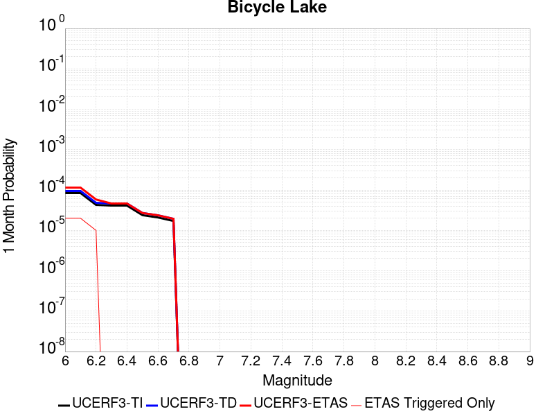 |  |  |

| Magnitude | 1 wk TI Prob | 1 wk TD Prob | 1 wk ETAS Prob | 1 wk ETAS/TD Gain | 1 wk ETAS Triggered Only | 1 mo TI Prob | 1 mo TD Prob | 1 mo ETAS Prob | 1 mo ETAS/TD Gain | 1 mo ETAS Triggered Only | 1 yr TI Prob | 1 yr TD Prob | 1 yr ETAS Prob | 1 yr ETAS/TD Gain | 1 yr ETAS Triggered Only | 10 yr TI Prob | 10 yr TD Prob | 10 yr ETAS Prob | 10 yr ETAS/TD Gain | 10 yr ETAS Triggered Only |
|-----|-----|-----|-----|-----|-----|-----|-----|-----|-----|-----|-----|-----|-----|-----|-----|-----|-----|-----|-----|-----|
| 6.0 | 1.9621975E-5 | 2.2097447E-5 | 4.2097006E-5 | 1.9050618 | 2.0E-5 | 8.4091465E-5 | 9.470067E-5 | 1.1469878E-4 | 1.2111717 | 2.0E-5 | 0.0010233327 | 0.0011525059 | 0.0012324136 | 1.0693339 | 8.0E-5 | 0.01018633 | 0.011478599 | 0.011587337 | 1.0094731 | 1.1E-4 |
| 6.1 | 1.9621975E-5 | 2.2097447E-5 | 4.2097006E-5 | 1.9050618 | 2.0E-5 | 8.4091465E-5 | 9.470067E-5 | 1.1469878E-4 | 1.2111717 | 2.0E-5 | 0.0010233327 | 0.0011525059 | 0.0012324136 | 1.0693339 | 8.0E-5 | 0.01018633 | 0.011478599 | 0.011587337 | 1.0094731 | 1.1E-4 |
| 6.2 | 9.9971285E-6 | 1.1255827E-5 | 2.1255715E-5 | 1.8884187 | 1.0E-5 | 4.2844134E-5 | 4.823866E-5 | 5.823818E-5 | 1.2072926 | 1.0E-5 | 5.2150246E-4 | 5.8719947E-4 | 6.2717596E-4 | 1.06808 | 4.0E-5 | 0.0052028033 | 0.005861584 | 0.005911291 | 1.0084801 | 5.0E-5 |
| 6.3 | 9.589428E-6 | 1.0798527E-5 | 1.0798527E-5 | 1.0 | 0.0 | 4.10969E-5 | 4.627887E-5 | 4.627887E-5 | 1.0 | 0.0 | 5.002399E-4 | 5.6335144E-4 | 5.9333455E-4 | 1.0532228 | 3.0E-5 | 0.0049911533 | 0.0056243236 | 0.0056640985 | 1.007072 | 4.0E-5 |
| 6.4 | 9.589428E-6 | 1.0798527E-5 | 1.0798527E-5 | 1.0 | 0.0 | 4.10969E-5 | 4.627887E-5 | 4.627887E-5 | 1.0 | 0.0 | 5.002399E-4 | 5.6335144E-4 | 5.9333455E-4 | 1.0532228 | 3.0E-5 | 0.0049911533 | 0.0056243236 | 0.0056640985 | 1.007072 | 4.0E-5 |
| 6.5 | 5.557707E-6 | 6.2857107E-6 | 6.2857107E-6 | 1.0 | 0.0 | 2.3818526E-5 | 2.6938633E-5 | 2.6938633E-5 | 1.0 | 0.0 | 2.8995197E-4 | 3.2795538E-4 | 3.379521E-4 | 1.0304819 | 1.0E-5 | 0.0028957394 | 0.0032773502 | 0.0032972847 | 1.0060825 | 2.0E-5 |
| 6.6 | 4.8742945E-6 | 5.5133855E-6 | 5.5133855E-6 | 1.0 | 0.0 | 2.0889667E-5 | 2.3628729E-5 | 2.3628729E-5 | 1.0 | 0.0 | 2.54302E-4 | 2.87668E-4 | 2.9766513E-4 | 1.0347522 | 1.0E-5 | 0.002540112 | 0.0028755253 | 0.0028954677 | 1.0069352 | 2.0E-5 |
| 6.7 | 3.991108E-6 | 4.515989E-6 | 4.515989E-6 | 1.0 | 0.0 | 1.7104636E-5 | 1.9354238E-5 | 1.9354238E-5 | 1.0 | 0.0 | 2.0822904E-4 | 2.3563785E-4 | 2.456355E-4 | 1.042428 | 1.0E-5 | 0.0020803404 | 0.0023563786 | 0.002366355 | 1.0042338 | 1.0E-5 |

## Helendale-So Lockhart
*[(top)](#table-of-contents)*

| 1 Week | 1 Month | 1 Year | 10 Year |
|-----|-----|-----|-----|
|  |  |  |  |

| Magnitude | 1 wk TI Prob | 1 wk TD Prob | 1 wk ETAS Prob | 1 wk ETAS/TD Gain | 1 wk ETAS Triggered Only | 1 mo TI Prob | 1 mo TD Prob | 1 mo ETAS Prob | 1 mo ETAS/TD Gain | 1 mo ETAS Triggered Only | 1 yr TI Prob | 1 yr TD Prob | 1 yr ETAS Prob | 1 yr ETAS/TD Gain | 1 yr ETAS Triggered Only | 10 yr TI Prob | 10 yr TD Prob | 10 yr ETAS Prob | 10 yr ETAS/TD Gain | 10 yr ETAS Triggered Only |
|-----|-----|-----|-----|-----|-----|-----|-----|-----|-----|-----|-----|-----|-----|-----|-----|-----|-----|-----|-----|-----|
| 6.0 | 1.7296055E-5 | 1.8103841E-5 | 3.810348E-5 | 2.104718 | 2.0E-5 | 7.412385E-5 | 7.7585704E-5 | 9.7584154E-5 | 1.2577595 | 2.0E-5 | 9.0208417E-4 | 9.442173E-4 | 0.0010241418 | 1.0846462 | 8.0E-5 | 0.008984311 | 0.009404174 | 0.009503234 | 1.0105336 | 1.0E-4 |
| 6.1 | 1.7296055E-5 | 1.8103841E-5 | 3.810348E-5 | 2.104718 | 2.0E-5 | 7.412385E-5 | 7.7585704E-5 | 9.7584154E-5 | 1.2577595 | 2.0E-5 | 9.0208417E-4 | 9.442173E-4 | 0.0010241418 | 1.0846462 | 8.0E-5 | 0.008984311 | 0.009404174 | 0.009503234 | 1.0105336 | 1.0E-4 |
| 6.2 | 1.7296055E-5 | 1.8103841E-5 | 3.810348E-5 | 2.104718 | 2.0E-5 | 7.412385E-5 | 7.7585704E-5 | 9.7584154E-5 | 1.2577595 | 2.0E-5 | 9.0208417E-4 | 9.442173E-4 | 0.0010241418 | 1.0846462 | 8.0E-5 | 0.008984311 | 0.009404174 | 0.009503234 | 1.0105336 | 1.0E-4 |
| 6.3 | 1.0669118E-5 | 1.1135489E-5 | 3.1135267E-5 | 2.7960393 | 2.0E-5 | 4.5723988E-5 | 4.7722668E-5 | 6.772171E-5 | 1.4190681 | 2.0E-5 | 5.5654737E-4 | 5.8087136E-4 | 6.3084235E-4 | 1.0860276 | 5.0E-5 | 0.0055515557 | 0.005793827 | 0.0058634216 | 1.0120118 | 7.0E-5 |
| 6.4 | 1.0669118E-5 | 1.1135489E-5 | 3.1135267E-5 | 2.7960393 | 2.0E-5 | 4.5723988E-5 | 4.7722668E-5 | 6.772171E-5 | 1.4190681 | 2.0E-5 | 5.5654737E-4 | 5.8087136E-4 | 6.3084235E-4 | 1.0860276 | 5.0E-5 | 0.0055515557 | 0.005793827 | 0.0058634216 | 1.0120118 | 7.0E-5 |
| 6.5 | 8.790038E-6 | 9.1702495E-6 | 2.9170065E-5 | 3.1809456 | 2.0E-5 | 3.767105E-5 | 3.9300485E-5 | 5.92997E-5 | 1.5088795 | 2.0E-5 | 4.585485E-4 | 4.7837992E-4 | 5.1836076E-4 | 1.0835756 | 4.0E-5 | 0.0045760344 | 0.0047736657 | 0.0048333793 | 1.012509 | 6.0E-5 |
| 6.6 | 7.396949E-6 | 7.715581E-6 | 2.7715427E-5 | 3.5921373 | 2.0E-5 | 3.1700827E-5 | 3.3066364E-5 | 5.30657E-5 | 1.6048243 | 2.0E-5 | 3.858892E-4 | 4.025096E-4 | 4.3249753E-4 | 1.0745023 | 3.0E-5 | 0.003852198 | 0.004017913 | 0.004057752 | 1.0099155 | 4.0E-5 |
| 6.7 | 6.4600285E-6 | 6.7380697E-6 | 2.6737935E-5 | 3.9681892 | 2.0E-5 | 2.7685543E-5 | 2.8877126E-5 | 4.8876547E-5 | 1.6925697 | 2.0E-5 | 3.3701936E-4 | 3.5152308E-4 | 3.815125E-4 | 1.085313 | 3.0E-5 | 0.0033650869 | 0.003509752 | 0.0035496117 | 1.0113568 | 4.0E-5 |
| 6.8 | 5.600104E-6 | 5.836042E-6 | 2.5835925E-5 | 4.42696 | 2.0E-5 | 2.4000226E-5 | 2.5011372E-5 | 4.501087E-5 | 1.7996162 | 2.0E-5 | 2.9216358E-4 | 3.044715E-4 | 3.3446235E-4 | 1.0985014 | 3.0E-5 | 0.0029177975 | 0.003040605 | 0.0030804835 | 1.0131153 | 4.0E-5 |
| 6.9 | 4.839122E-6 | 5.039537E-6 | 2.5039437E-5 | 4.9685984 | 2.0E-5 | 2.0738931E-5 | 2.159784E-5 | 4.1597406E-5 | 1.9259986 | 2.0E-5 | 2.5246723E-4 | 2.6292243E-4 | 2.8291717E-4 | 1.076048 | 2.0E-5 | 0.002521806 | 0.002626161 | 0.0026560824 | 1.0113935 | 3.0E-5 |
| 7.0 | 3.6937633E-6 | 3.845229E-6 | 1.3845191E-5 | 3.6006155 | 1.0E-5 | 1.5830317E-5 | 1.6479451E-5 | 2.6479285E-5 | 1.6068064 | 1.0E-5 | 1.9271708E-4 | 2.0061915E-4 | 2.1061715E-4 | 1.0498357 | 1.0E-5 | 0.0019255003 | 0.0020044118 | 0.0020143918 | 1.004979 | 1.0E-5 |
| 7.1 | 2.7858857E-6 | 2.8978693E-6 | 1.289784E-5 | 4.4508014 | 1.0E-5 | 1.1939455E-5 | 1.2419382E-5 | 2.2419257E-5 | 1.805183 | 1.0E-5 | 1.4535317E-4 | 1.511957E-4 | 1.6119418E-4 | 1.0661294 | 1.0E-5 | 0.0014525814 | 0.0015109498 | 0.0015209347 | 1.0066084 | 1.0E-5 |
| 7.2 | 2.1672065E-6 | 2.2540248E-6 | 1.2254002E-5 | 5.4364986 | 1.0E-5 | 9.2879945E-6 | 9.660072E-6 | 1.9659974E-5 | 2.0351791 | 1.0E-5 | 1.1307546E-4 | 1.176052E-4 | 1.2760403E-4 | 1.0850203 | 1.0E-5 | 0.0011301794 | 0.0011754478 | 0.0011854362 | 1.0084974 | 1.0E-5 |
| 7.3 | 1.4823496E-6 | 1.5422185E-6 | 1.1542203E-5 | 7.4841557 | 1.0E-5 | 6.3529114E-6 | 6.6094917E-6 | 1.6609425E-5 | 2.5129657 | 1.0E-5 | 7.734395E-5 | 8.046775E-5 | 9.046694E-5 | 1.1242634 | 1.0E-5 | 7.731704E-4 | 8.044012E-4 | 8.1439316E-4 | 1.0124216 | 1.0E-5 |
| 7.4 | 4.2321457E-7 | 4.4109012E-7 | 4.4109012E-7 | 1.0 | 0.0 | 1.8137755E-6 | 1.8903852E-6 | 1.8903852E-6 | 1.0 | 0.0 | 2.2082493E-5 | 2.3015242E-5 | 2.3015242E-5 | 1.0 | 0.0 | 2.2080299E-4 | 2.3013311E-4 | 2.3013311E-4 | 1.0 | 0.0 |
| 7.5 | 5.6942316E-8 | 5.941599E-8 | 5.941599E-8 | 1.0 | 0.0 | 2.440385E-7 | 2.5463993E-7 | 2.5463993E-7 | 1.0 | 0.0 | 2.9711643E-6 | 3.1002376E-6 | 3.1002376E-6 | 1.0 | 0.0 | 2.9711247E-5 | 3.1002022E-5 | 3.1002022E-5 | 1.0 | 0.0 |

## Death Valley (No)
*[(top)](#table-of-contents)*

| 1 Week | 1 Month | 1 Year | 10 Year |
|-----|-----|-----|-----|
|  |  |  |  |

| Magnitude | 1 wk TI Prob | 1 wk TD Prob | 1 wk ETAS Prob | 1 wk ETAS/TD Gain | 1 wk ETAS Triggered Only | 1 mo TI Prob | 1 mo TD Prob | 1 mo ETAS Prob | 1 mo ETAS/TD Gain | 1 mo ETAS Triggered Only | 1 yr TI Prob | 1 yr TD Prob | 1 yr ETAS Prob | 1 yr ETAS/TD Gain | 1 yr ETAS Triggered Only | 10 yr TI Prob | 10 yr TD Prob | 10 yr ETAS Prob | 10 yr ETAS/TD Gain | 10 yr ETAS Triggered Only |
|-----|-----|-----|-----|-----|-----|-----|-----|-----|-----|-----|-----|-----|-----|-----|-----|-----|-----|-----|-----|-----|
| 6.0 | 2.0074807E-5 | 2.2500446E-5 | 4.2499996E-5 | 1.8888513 | 2.0E-5 | 8.603206E-5 | 9.642696E-5 | 1.364231E-4 | 1.4147818 | 4.0E-5 | 0.001046937 | 0.0011733733 | 0.0012432912 | 1.059587 | 7.0E-5 | 0.010420183 | 0.011672693 | 0.011771526 | 1.008467 | 1.0E-4 |
| 6.1 | 2.0074807E-5 | 2.2500446E-5 | 4.2499996E-5 | 1.8888513 | 2.0E-5 | 8.603206E-5 | 9.642696E-5 | 1.364231E-4 | 1.4147818 | 4.0E-5 | 0.001046937 | 0.0011733733 | 0.0012432912 | 1.059587 | 7.0E-5 | 0.010420183 | 0.011672693 | 0.011771526 | 1.008467 | 1.0E-4 |
| 6.2 | 2.0074807E-5 | 2.2500446E-5 | 4.2499996E-5 | 1.8888513 | 2.0E-5 | 8.603206E-5 | 9.642696E-5 | 1.364231E-4 | 1.4147818 | 4.0E-5 | 0.001046937 | 0.0011733733 | 0.0012432912 | 1.059587 | 7.0E-5 | 0.010420183 | 0.011672693 | 0.011771526 | 1.008467 | 1.0E-4 |
| 6.3 | 1.9050609E-5 | 2.1337288E-5 | 4.133686E-5 | 1.9373062 | 2.0E-5 | 8.164292E-5 | 9.144236E-5 | 1.314387E-4 | 1.437394 | 4.0E-5 | 9.935491E-4 | 0.0011127489 | 0.0011826709 | 1.0628372 | 7.0E-5 | 0.009891188 | 0.011072595 | 0.011161598 | 1.0080382 | 9.0E-5 |
| 6.4 | 1.9050609E-5 | 2.1337288E-5 | 4.133686E-5 | 1.9373062 | 2.0E-5 | 8.164292E-5 | 9.144236E-5 | 1.314387E-4 | 1.437394 | 4.0E-5 | 9.935491E-4 | 0.0011127489 | 0.0011826709 | 1.0628372 | 7.0E-5 | 0.009891188 | 0.011072595 | 0.011161598 | 1.0080382 | 9.0E-5 |
| 6.5 | 1.8367004E-5 | 2.0561336E-5 | 4.0560924E-5 | 1.9726795 | 2.0E-5 | 7.8713354E-5 | 8.811707E-5 | 1.2811355E-4 | 1.4539015 | 4.0E-5 | 9.5791375E-4 | 0.0010723039 | 0.0011422288 | 1.06521 | 7.0E-5 | 0.009537951 | 0.010672084 | 0.010761124 | 1.0083432 | 9.0E-5 |
| 6.6 | 1.779439E-5 | 1.9911244E-5 | 3.9910847E-5 | 2.0044377 | 2.0E-5 | 7.625944E-5 | 8.533114E-5 | 1.2532773E-4 | 1.468722 | 4.0E-5 | 9.280632E-4 | 0.0010384179 | 0.0011083452 | 1.0673403 | 7.0E-5 | 0.009241969 | 0.010336416 | 0.010425486 | 1.008617 | 9.0E-5 |
| 6.7 | 1.7025437E-5 | 1.9043726E-5 | 3.9043345E-5 | 2.0501947 | 2.0E-5 | 7.296412E-5 | 8.161345E-5 | 1.2161019E-4 | 1.4900752 | 4.0E-5 | 8.87976E-4 | 9.93197E-4 | 0.0010631274 | 1.0704094 | 7.0E-5 | 0.008844362 | 0.009888301 | 0.00996751 | 1.0080104 | 8.0E-5 |
| 6.8 | 1.6545107E-5 | 1.851284E-5 | 3.851247E-5 | 2.0803113 | 2.0E-5 | 7.090568E-5 | 7.933836E-5 | 1.19335185E-4 | 1.5041298 | 4.0E-5 | 8.629347E-4 | 9.655226E-4 | 0.001035455 | 1.0724297 | 7.0E-5 | 0.008595915 | 0.009613981 | 0.009693211 | 1.0082412 | 8.0E-5 |
| 6.9 | 1.615478E-5 | 1.8087881E-5 | 3.808752E-5 | 2.1056926 | 2.0E-5 | 6.9232934E-5 | 7.751722E-5 | 1.1751412E-4 | 1.5159743 | 4.0E-5 | 8.4258494E-4 | 9.433697E-4 | 0.0010133036 | 1.0741321 | 7.0E-5 | 0.008393973 | 0.009394345 | 0.009473593 | 1.0084357 | 8.0E-5 |
| 7.0 | 1.5894311E-5 | 1.7805834E-5 | 3.780548E-5 | 2.1232073 | 2.0E-5 | 6.81167E-5 | 7.6308526E-5 | 1.1630547E-4 | 1.5241479 | 4.0E-5 | 8.2900526E-4 | 9.286663E-4 | 9.986013E-4 | 1.0753069 | 7.0E-5 | 0.008259195 | 0.009248544 | 0.009327805 | 1.00857 | 8.0E-5 |
| 7.1 | 1.5602263E-5 | 1.7483784E-5 | 3.7483434E-5 | 2.143897 | 2.0E-5 | 6.6865134E-5 | 7.4928386E-5 | 1.1492539E-4 | 1.5338031 | 4.0E-5 | 8.137789E-4 | 9.118773E-4 | 9.818135E-4 | 1.0766947 | 7.0E-5 | 0.008108052 | 0.009082039 | 0.009161312 | 1.0087286 | 8.0E-5 |
| 7.2 | 1.5323829E-5 | 1.7170905E-5 | 3.717056E-5 | 2.164741 | 2.0E-5 | 6.56719E-5 | 7.358755E-5 | 1.1358461E-4 | 1.5435302 | 4.0E-5 | 7.99262E-4 | 8.9556625E-4 | 9.6550357E-4 | 1.0780928 | 7.0E-5 | 0.007963934 | 0.008920249 | 0.008999536 | 1.0088884 | 8.0E-5 |
| 7.3 | 1.4556212E-5 | 1.6302716E-5 | 3.630239E-5 | 2.2267694 | 2.0E-5 | 6.238227E-5 | 6.986695E-5 | 1.0986415E-4 | 1.5724769 | 4.0E-5 | 7.592395E-4 | 8.503039E-4 | 9.202444E-4 | 1.0822535 | 7.0E-5 | 0.0075665074 | 0.008471149 | 0.008550472 | 1.0093638 | 8.0E-5 |
| 7.4 | 1.411725E-5 | 1.5808211E-5 | 3.5807894E-5 | 2.2651453 | 2.0E-5 | 6.0501097E-5 | 6.774775E-5 | 1.0774504E-4 | 1.5903854 | 4.0E-5 | 7.363519E-4 | 8.245226E-4 | 8.9446484E-4 | 1.0848277 | 7.0E-5 | 0.0073391674 | 0.008215268 | 0.008294611 | 1.009658 | 8.0E-5 |
| 7.5 | 1.3503312E-5 | 1.5126531E-5 | 3.5126228E-5 | 2.3221602 | 2.0E-5 | 5.7870053E-5 | 6.482641E-5 | 1.0482382E-4 | 1.6169925 | 4.0E-5 | 7.043401E-4 | 7.8898156E-4 | 8.5892633E-4 | 1.088652 | 7.0E-5 | 0.007021119 | 0.007862429 | 0.0079418 | 1.010095 | 8.0E-5 |
| 7.6 | 1.1279839E-5 | 1.2626528E-5 | 3.2626274E-5 | 2.5839467 | 2.0E-5 | 4.834127E-5 | 5.4112596E-5 | 9.411043E-5 | 1.7391595 | 4.0E-5 | 5.88396E-4 | 6.58627E-4 | 7.285809E-4 | 1.1062117 | 7.0E-5 | 0.005868405 | 0.0065673026 | 0.006646777 | 1.0121015 | 8.0E-5 |
| 7.7 | 9.189108E-6 | 1.0283521E-5 | 3.0283316E-5 | 2.944839 | 2.0E-5 | 3.93813E-5 | 4.407152E-5 | 8.4069754E-5 | 1.9075757 | 4.0E-5 | 4.7936183E-4 | 5.3644367E-4 | 6.0640613E-4 | 1.130419 | 7.0E-5 | 0.004783291 | 0.0053519984 | 0.00543157 | 1.0148677 | 8.0E-5 |
| 7.8 | 3.4586725E-7 | 3.648288E-7 | 3.648288E-7 | 1.0 | 0.0 | 1.4822873E-6 | 1.5635511E-6 | 1.5635511E-6 | 1.0 | 0.0 | 1.80467E-5 | 1.9036073E-5 | 1.9036073E-5 | 1.0 | 0.0 | 1.8045233E-4 | 1.9034486E-4 | 1.9034486E-4 | 1.0 | 0.0 |
| 7.9 | 2.5591178E-9 | 2.6696871E-9 | 2.6696871E-9 | 1.0 | 0.0 | 1.0967647E-8 | 1.1441516E-8 | 1.1441516E-8 | 1.0 | 0.0 | 1.335311E-7 | 1.3930045E-7 | 1.3930045E-7 | 1.0 | 0.0 | 1.3353102E-6 | 1.3930046E-6 | 1.3930046E-6 | 1.0 | 0.0 |

## Paradise
*[(top)](#table-of-contents)*

| 1 Week | 1 Month | 1 Year | 10 Year |
|-----|-----|-----|-----|
|  |  |  |  |

| Magnitude | 1 wk TI Prob | 1 wk TD Prob | 1 wk ETAS Prob | 1 wk ETAS/TD Gain | 1 wk ETAS Triggered Only | 1 mo TI Prob | 1 mo TD Prob | 1 mo ETAS Prob | 1 mo ETAS/TD Gain | 1 mo ETAS Triggered Only | 1 yr TI Prob | 1 yr TD Prob | 1 yr ETAS Prob | 1 yr ETAS/TD Gain | 1 yr ETAS Triggered Only | 10 yr TI Prob | 10 yr TD Prob | 10 yr ETAS Prob | 10 yr ETAS/TD Gain | 10 yr ETAS Triggered Only |
|-----|-----|-----|-----|-----|-----|-----|-----|-----|-----|-----|-----|-----|-----|-----|-----|-----|-----|-----|-----|-----|
| 6.0 | 1.4851273E-5 | 1.6694854E-5 | 3.669452E-5 | 2.197954 | 2.0E-5 | 6.364676E-5 | 7.154755E-5 | 9.154611E-5 | 1.2795144 | 2.0E-5 | 7.7462377E-4 | 8.707668E-4 | 9.007407E-4 | 1.0344224 | 3.0E-5 | 0.0077192914 | 0.008675928 | 0.008765148 | 1.0102835 | 9.0E-5 |
| 6.1 | 1.4851273E-5 | 1.6694854E-5 | 3.669452E-5 | 2.197954 | 2.0E-5 | 6.364676E-5 | 7.154755E-5 | 9.154611E-5 | 1.2795144 | 2.0E-5 | 7.7462377E-4 | 8.707668E-4 | 9.007407E-4 | 1.0344224 | 3.0E-5 | 0.0077192914 | 0.008675928 | 0.008765148 | 1.0102835 | 9.0E-5 |
| 6.2 | 1.4851273E-5 | 1.6694854E-5 | 3.669452E-5 | 2.197954 | 2.0E-5 | 6.364676E-5 | 7.154755E-5 | 9.154611E-5 | 1.2795144 | 2.0E-5 | 7.7462377E-4 | 8.707668E-4 | 9.007407E-4 | 1.0344224 | 3.0E-5 | 0.0077192914 | 0.008675928 | 0.008765148 | 1.0102835 | 9.0E-5 |
| 6.3 | 1.0426831E-5 | 1.1888727E-5 | 3.188849E-5 | 2.6822457 | 2.0E-5 | 4.4685654E-5 | 5.0950726E-5 | 7.094971E-5 | 1.3925161 | 2.0E-5 | 5.43912E-4 | 6.201545E-4 | 6.4014207E-4 | 1.03223 | 2.0E-5 | 0.0054258266 | 0.006184847 | 0.006234538 | 1.0080342 | 5.0E-5 |
| 6.4 | 1.0426831E-5 | 1.1888727E-5 | 3.188849E-5 | 2.6822457 | 2.0E-5 | 4.4685654E-5 | 5.0950726E-5 | 7.094971E-5 | 1.3925161 | 2.0E-5 | 5.43912E-4 | 6.201545E-4 | 6.4014207E-4 | 1.03223 | 2.0E-5 | 0.0054258266 | 0.006184847 | 0.006234538 | 1.0080342 | 5.0E-5 |
| 6.5 | 9.25027E-6 | 1.0620054E-5 | 3.061984E-5 | 2.8832097 | 2.0E-5 | 3.964341E-5 | 4.551375E-5 | 6.551284E-5 | 1.4394076 | 2.0E-5 | 4.8255164E-4 | 5.539939E-4 | 5.7398283E-4 | 1.0360814 | 2.0E-5 | 0.0048150513 | 0.0055266283 | 0.005566407 | 1.0071977 | 4.0E-5 |
| 6.6 | 7.904275E-6 | 9.159603E-6 | 2.9159419E-5 | 3.1834807 | 2.0E-5 | 3.3875025E-5 | 3.925487E-5 | 5.9254085E-5 | 1.5094709 | 2.0E-5 | 4.1235037E-4 | 4.7782718E-4 | 4.9781764E-4 | 1.0418361 | 2.0E-5 | 0.0041158604 | 0.004768395 | 0.004808204 | 1.0083486 | 4.0E-5 |
| 6.7 | 7.2061953E-6 | 8.407318E-6 | 8.407318E-6 | 1.0 | 0.0 | 3.088333E-5 | 3.6030888E-5 | 3.6030888E-5 | 1.0 | 0.0 | 3.7593965E-4 | 4.385914E-4 | 4.385914E-4 | 1.0 | 0.0 | 0.003753043 | 0.0043776273 | 0.00439754 | 1.0045487 | 2.0E-5 |
| 6.8 | 6.6948724E-6 | 7.84223E-6 | 7.84223E-6 | 1.0 | 0.0 | 2.8691995E-5 | 3.3609143E-5 | 3.3609143E-5 | 1.0 | 0.0 | 3.4926904E-4 | 4.0911807E-4 | 4.0911807E-4 | 1.0 | 0.0 | 0.003487206 | 0.0040840064 | 0.004103925 | 1.0048772 | 2.0E-5 |
| 6.9 | 6.0421025E-6 | 7.130678E-6 | 7.130678E-6 | 1.0 | 0.0 | 2.5894467E-5 | 3.055971E-5 | 3.055971E-5 | 1.0 | 0.0 | 3.1521954E-4 | 3.7200435E-4 | 3.7200435E-4 | 1.0 | 0.0 | 0.0031477278 | 0.0037141545 | 0.0037340804 | 1.0053648 | 2.0E-5 |
| 7.0 | 4.134091E-6 | 5.0803487E-6 | 5.0803487E-6 | 1.0 | 0.0 | 1.7717413E-5 | 2.177275E-5 | 2.177275E-5 | 1.0 | 0.0 | 2.1568815E-4 | 2.6505254E-4 | 2.6505254E-4 | 1.0 | 0.0 | 0.0021547892 | 0.0026475172 | 0.0026674643 | 1.0075343 | 2.0E-5 |
| 7.1 | 3.7674888E-6 | 4.6319055E-6 | 4.6319055E-6 | 1.0 | 0.0 | 1.6146281E-5 | 1.985088E-5 | 1.985088E-5 | 1.0 | 0.0 | 1.9656324E-4 | 2.4165919E-4 | 2.4165919E-4 | 1.0 | 0.0 | 0.0019638946 | 0.0024141145 | 0.0024340663 | 1.0082647 | 2.0E-5 |
| 7.2 | 3.4065345E-6 | 4.156755E-6 | 4.156755E-6 | 1.0 | 0.0 | 1.4599351E-5 | 1.7814553E-5 | 1.7814553E-5 | 1.0 | 0.0 | 1.777326E-4 | 2.1687208E-4 | 2.1687208E-4 | 1.0 | 0.0 | 0.0017759053 | 0.0021667527 | 0.0021867093 | 1.0092103 | 2.0E-5 |
| 7.3 | 2.9934936E-6 | 3.6293434E-6 | 3.6293434E-6 | 1.0 | 0.0 | 1.2829195E-5 | 1.5554244E-5 | 1.5554244E-5 | 1.0 | 0.0 | 1.5618425E-4 | 1.8935793E-4 | 1.8935793E-4 | 1.0 | 0.0 | 0.0015607453 | 0.0018921113 | 0.0019120733 | 1.0105503 | 2.0E-5 |
| 7.4 | 2.4049796E-6 | 2.8890036E-6 | 2.8890036E-6 | 1.0 | 0.0 | 1.0307015E-5 | 1.2381393E-5 | 1.2381393E-5 | 1.0 | 0.0 | 1.2548068E-4 | 1.5073447E-4 | 1.5073447E-4 | 1.0 | 0.0 | 0.0012540985 | 0.0015064639 | 0.0015164487 | 1.006628 | 1.0E-5 |
| 7.5 | 1.2710091E-6 | 1.5134775E-6 | 1.5134775E-6 | 1.0 | 0.0 | 5.44717E-6 | 6.486323E-6 | 6.486323E-6 | 1.0 | 0.0 | 6.631728E-5 | 7.896937E-5 | 7.896937E-5 | 1.0 | 0.0 | 6.6297496E-4 | 7.8953576E-4 | 7.9952786E-4 | 1.0126556 | 1.0E-5 |
| 7.6 | 2.21172E-7 | 2.6039737E-7 | 2.6039737E-7 | 1.0 | 0.0 | 9.478797E-7 | 1.1159884E-6 | 1.1159884E-6 | 1.0 | 0.0 | 1.1540374E-5 | 1.3587103E-5 | 1.3587103E-5 | 1.0 | 0.0 | 1.1539775E-4 | 1.3586554E-4 | 1.4586418E-4 | 1.0735922 | 1.0E-5 |

## Death Valley (Fish Lake Valley)
*[(top)](#table-of-contents)*

| 1 Week | 1 Month | 1 Year | 10 Year |
|-----|-----|-----|-----|
|  |  |  |  |

| Magnitude | 1 wk TI Prob | 1 wk TD Prob | 1 wk ETAS Prob | 1 wk ETAS/TD Gain | 1 wk ETAS Triggered Only | 1 mo TI Prob | 1 mo TD Prob | 1 mo ETAS Prob | 1 mo ETAS/TD Gain | 1 mo ETAS Triggered Only | 1 yr TI Prob | 1 yr TD Prob | 1 yr ETAS Prob | 1 yr ETAS/TD Gain | 1 yr ETAS Triggered Only | 10 yr TI Prob | 10 yr TD Prob | 10 yr ETAS Prob | 10 yr ETAS/TD Gain | 10 yr ETAS Triggered Only |
|-----|-----|-----|-----|-----|-----|-----|-----|-----|-----|-----|-----|-----|-----|-----|-----|-----|-----|-----|-----|-----|
| 6.0 | 3.872328E-5 | 4.7268895E-5 | 6.7267945E-5 | 1.4230913 | 2.0E-5 | 1.6594635E-4 | 2.0256694E-4 | 2.4255883E-4 | 1.1974256 | 4.0E-5 | 0.0020185246 | 0.0024636039 | 0.0025334314 | 1.0283437 | 7.0E-5 | 0.02000288 | 0.024388881 | 0.02446693 | 1.0032002 | 8.0E-5 |
| 6.1 | 3.872328E-5 | 4.7268895E-5 | 6.7267945E-5 | 1.4230913 | 2.0E-5 | 1.6594635E-4 | 2.0256694E-4 | 2.4255883E-4 | 1.1974256 | 4.0E-5 | 0.0020185246 | 0.0024636039 | 0.0025334314 | 1.0283437 | 7.0E-5 | 0.02000288 | 0.024388881 | 0.02446693 | 1.0032002 | 8.0E-5 |
| 6.2 | 3.872328E-5 | 4.7268895E-5 | 6.7267945E-5 | 1.4230913 | 2.0E-5 | 1.6594635E-4 | 2.0256694E-4 | 2.4255883E-4 | 1.1974256 | 4.0E-5 | 0.0020185246 | 0.0024636039 | 0.0025334314 | 1.0283437 | 7.0E-5 | 0.02000288 | 0.024388881 | 0.02446693 | 1.0032002 | 8.0E-5 |
| 6.3 | 2.8356371E-5 | 3.3610693E-5 | 5.361002E-5 | 1.5950288 | 2.0E-5 | 1.2152165E-4 | 1.4403832E-4 | 1.8403256E-4 | 1.2776638 | 4.0E-5 | 0.0014785219 | 0.001752335 | 0.0018222124 | 1.0398767 | 7.0E-5 | 0.014687235 | 0.01739221 | 0.017470818 | 1.0045197 | 8.0E-5 |
| 6.4 | 2.8356371E-5 | 3.3610693E-5 | 5.361002E-5 | 1.5950288 | 2.0E-5 | 1.2152165E-4 | 1.4403832E-4 | 1.8403256E-4 | 1.2776638 | 4.0E-5 | 0.0014785219 | 0.001752335 | 0.0018222124 | 1.0398767 | 7.0E-5 | 0.014687235 | 0.01739221 | 0.017470818 | 1.0045197 | 8.0E-5 |
| 6.5 | 2.4448687E-5 | 2.8608209E-5 | 4.8607635E-5 | 1.6990801 | 2.0E-5 | 1.0477588E-4 | 1.2260114E-4 | 1.6259623E-4 | 1.3262212 | 4.0E-5 | 0.0012748998 | 0.0014916973 | 0.0015615929 | 1.0468564 | 7.0E-5 | 0.012676105 | 0.014821712 | 0.014900526 | 1.0053174 | 8.0E-5 |
| 6.6 | 2.1298161E-5 | 2.4660607E-5 | 4.466011E-5 | 1.8109901 | 2.0E-5 | 9.127464E-5 | 1.0568422E-4 | 1.4568E-4 | 1.378446 | 4.0E-5 | 0.0011107022 | 0.0012859798 | 0.0013558897 | 1.0543633 | 7.0E-5 | 0.011051672 | 0.012788794 | 0.012867771 | 1.0061755 | 8.0E-5 |
| 6.7 | 1.8959729E-5 | 2.178146E-5 | 4.1781022E-5 | 1.9181921 | 2.0E-5 | 8.125345E-5 | 9.3345916E-5 | 1.3334218E-4 | 1.4284736 | 4.0E-5 | 9.888117E-4 | 0.0011359196 | 0.00120584 | 1.0615541 | 7.0E-5 | 0.009844234 | 0.011303794 | 0.01138289 | 1.0069972 | 8.0E-5 |
| 6.8 | 1.6691629E-5 | 1.9018706E-5 | 3.9018327E-5 | 2.0515761 | 2.0E-5 | 7.153359E-5 | 8.150629E-5 | 1.2150303E-4 | 1.4907197 | 4.0E-5 | 8.7057345E-4 | 9.919042E-4 | 0.0010618347 | 1.0705013 | 7.0E-5 | 0.008671708 | 0.009876527 | 0.009955737 | 1.00802 | 8.0E-5 |
| 6.9 | 1.450505E-5 | 1.6389824E-5 | 3.6389494E-5 | 2.2202494 | 2.0E-5 | 6.216302E-5 | 7.024026E-5 | 1.1023745E-4 | 1.5694339 | 4.0E-5 | 7.5657194E-4 | 8.548484E-4 | 9.247886E-4 | 1.0818158 | 7.0E-5 | 0.007540013 | 0.008516532 | 0.008595851 | 1.0093135 | 8.0E-5 |
| 7.0 | 1.2940855E-5 | 1.453821E-5 | 3.453792E-5 | 2.3756652 | 2.0E-5 | 5.545963E-5 | 6.230516E-5 | 1.0230267E-4 | 1.6419613 | 4.0E-5 | 6.750118E-4 | 7.583071E-4 | 8.2825404E-4 | 1.0922409 | 7.0E-5 | 0.006729651 | 0.0075578135 | 0.007637209 | 1.0105051 | 8.0E-5 |
| 7.1 | 1.2544658E-5 | 1.4078437E-5 | 3.4078155E-5 | 2.4205923 | 2.0E-5 | 5.3761712E-5 | 6.033479E-5 | 1.0033238E-4 | 1.6629274 | 4.0E-5 | 6.5435225E-4 | 7.343341E-4 | 8.042827E-4 | 1.0952544 | 7.0E-5 | 0.006524288 | 0.0073196692 | 0.007399084 | 1.0108495 | 8.0E-5 |
| 7.2 | 1.2489416E-5 | 1.4015902E-5 | 3.4015622E-5 | 2.4269307 | 2.0E-5 | 5.3524967E-5 | 6.00668E-5 | 1.000644E-4 | 1.6658853 | 4.0E-5 | 6.514716E-4 | 7.310735E-4 | 8.0102234E-4 | 1.0956796 | 7.0E-5 | 0.006495651 | 0.007287278 | 0.0073666945 | 1.010898 | 8.0E-5 |
| 7.3 | 1.2368307E-5 | 1.3880038E-5 | 3.387976E-5 | 2.4408982 | 2.0E-5 | 5.3005948E-5 | 5.948455E-5 | 9.9482175E-5 | 1.6724035 | 4.0E-5 | 6.451563E-4 | 7.239894E-4 | 7.939387E-4 | 1.0966165 | 7.0E-5 | 0.0064328653 | 0.0072168987 | 0.0072963214 | 1.011005 | 8.0E-5 |
| 7.4 | 1.2161707E-5 | 1.3648089E-5 | 3.3647815E-5 | 2.4653866 | 2.0E-5 | 5.212056E-5 | 5.8490532E-5 | 9.848819E-5 | 1.6838313 | 4.0E-5 | 6.3438306E-4 | 7.118952E-4 | 7.818453E-4 | 1.0982591 | 7.0E-5 | 0.006325751 | 0.0070967353 | 0.007176168 | 1.0111928 | 8.0E-5 |
| 7.5 | 1.1707948E-5 | 1.314573E-5 | 3.3145465E-5 | 2.5213866 | 2.0E-5 | 5.0175953E-5 | 5.6337656E-5 | 9.63354E-5 | 1.7099646 | 4.0E-5 | 6.10721E-4 | 6.857007E-4 | 7.5565267E-4 | 1.1020154 | 7.0E-5 | 0.0060904534 | 0.0068364325 | 0.0069158855 | 1.011622 | 8.0E-5 |
| 7.6 | 1.0319538E-5 | 1.157981E-5 | 3.1579577E-5 | 2.727124 | 2.0E-5 | 4.4225842E-5 | 4.9626844E-5 | 8.962486E-5 | 1.8059754 | 4.0E-5 | 5.383166E-4 | 6.040445E-4 | 6.740022E-4 | 1.1158155 | 7.0E-5 | 0.0053701443 | 0.0060245576 | 0.006104076 | 1.013199 | 8.0E-5 |
| 7.7 | 8.937764E-6 | 1.0022941E-5 | 3.002274E-5 | 2.9954023 | 2.0E-5 | 3.830414E-5 | 4.295478E-5 | 8.295306E-5 | 1.9311718 | 4.0E-5 | 4.6625308E-4 | 5.2285404E-4 | 5.9281744E-4 | 1.1338106 | 7.0E-5 | 0.0046527605 | 0.005216748 | 0.005296331 | 1.0152552 | 8.0E-5 |
| 7.8 | 3.108007E-7 | 3.2846788E-7 | 3.2846788E-7 | 1.0 | 0.0 | 1.3320023E-6 | 1.4077187E-6 | 1.4077187E-6 | 1.0 | 0.0 | 1.6217007E-5 | 1.7138846E-5 | 1.7138846E-5 | 1.0 | 0.0 | 1.6215823E-4 | 1.713756E-4 | 1.713756E-4 | 1.0 | 0.0 |
| 7.9 | 2.5591178E-9 | 2.6696871E-9 | 2.6696871E-9 | 1.0 | 0.0 | 1.0967647E-8 | 1.1441516E-8 | 1.1441516E-8 | 1.0 | 0.0 | 1.335311E-7 | 1.3930045E-7 | 1.3930045E-7 | 1.0 | 0.0 | 1.3353102E-6 | 1.3930046E-6 | 1.3930046E-6 | 1.0 | 0.0 |

## San Andreas (San Gorgonio Pass-Garnet HIll)
*[(top)](#table-of-contents)*

| 1 Week | 1 Month | 1 Year | 10 Year |
|-----|-----|-----|-----|
|  |  |  |  |

| Magnitude | 1 wk TI Prob | 1 wk TD Prob | 1 wk ETAS Prob | 1 wk ETAS/TD Gain | 1 wk ETAS Triggered Only | 1 mo TI Prob | 1 mo TD Prob | 1 mo ETAS Prob | 1 mo ETAS/TD Gain | 1 mo ETAS Triggered Only | 1 yr TI Prob | 1 yr TD Prob | 1 yr ETAS Prob | 1 yr ETAS/TD Gain | 1 yr ETAS Triggered Only | 10 yr TI Prob | 10 yr TD Prob | 10 yr ETAS Prob | 10 yr ETAS/TD Gain | 10 yr ETAS Triggered Only |
|-----|-----|-----|-----|-----|-----|-----|-----|-----|-----|-----|-----|-----|-----|-----|-----|-----|-----|-----|-----|-----|
| 6.0 | 8.31567E-5 | 2.3386451E-4 | 2.3386451E-4 | 1.0 | 0.0 | 3.5633717E-4 | 0.0010018935 | 0.0010118835 | 1.0099711 | 1.0E-5 | 0.004329778 | 0.012129918 | 0.012159554 | 1.0024432 | 3.0E-5 | 0.042463828 | 0.11259502 | 0.11264826 | 1.0004729 | 6.0E-5 |
| 6.1 | 8.31567E-5 | 2.3386451E-4 | 2.3386451E-4 | 1.0 | 0.0 | 3.5633717E-4 | 0.0010018935 | 0.0010118835 | 1.0099711 | 1.0E-5 | 0.004329778 | 0.012129918 | 0.012159554 | 1.0024432 | 3.0E-5 | 0.042463828 | 0.11259502 | 0.11264826 | 1.0004729 | 6.0E-5 |
| 6.2 | 8.31567E-5 | 2.3386451E-4 | 2.3386451E-4 | 1.0 | 0.0 | 3.5633717E-4 | 0.0010018935 | 0.0010118835 | 1.0099711 | 1.0E-5 | 0.004329778 | 0.012129918 | 0.012159554 | 1.0024432 | 3.0E-5 | 0.042463828 | 0.11259502 | 0.11264826 | 1.0004729 | 6.0E-5 |
| 6.3 | 8.31567E-5 | 2.3386451E-4 | 2.3386451E-4 | 1.0 | 0.0 | 3.5633717E-4 | 0.0010018935 | 0.0010118835 | 1.0099711 | 1.0E-5 | 0.004329778 | 0.012129918 | 0.012159554 | 1.0024432 | 3.0E-5 | 0.042463828 | 0.11259502 | 0.11264826 | 1.0004729 | 6.0E-5 |
| 6.4 | 8.059055E-5 | 2.2944735E-4 | 2.2944735E-4 | 1.0 | 0.0 | 3.4534236E-4 | 9.829777E-4 | 9.929679E-4 | 1.0101632 | 1.0E-5 | 0.0041964394 | 0.011902156 | 0.011931799 | 1.0024905 | 3.0E-5 | 0.041180745 | 0.110576175 | 0.11062954 | 1.0004826 | 6.0E-5 |
| 6.5 | 8.059055E-5 | 2.2944735E-4 | 2.2944735E-4 | 1.0 | 0.0 | 3.4534236E-4 | 9.829777E-4 | 9.929679E-4 | 1.0101632 | 1.0E-5 | 0.0041964394 | 0.011902156 | 0.011931799 | 1.0024905 | 3.0E-5 | 0.041180745 | 0.110576175 | 0.11062954 | 1.0004826 | 6.0E-5 |
| 6.6 | 7.619237E-5 | 2.2189032E-4 | 2.2189032E-4 | 1.0 | 0.0 | 3.2649786E-4 | 9.506143E-4 | 9.6060475E-4 | 1.0105095 | 1.0E-5 | 0.0039678677 | 0.0115128625 | 0.011542517 | 1.0025758 | 3.0E-5 | 0.03897764 | 0.10711278 | 0.10716635 | 1.0005002 | 6.0E-5 |
| 6.7 | 7.440636E-5 | 2.1864849E-4 | 2.1864849E-4 | 1.0 | 0.0 | 3.188454E-4 | 9.367307E-4 | 9.4672135E-4 | 1.0106654 | 1.0E-5 | 0.0038750346 | 0.011345596 | 0.011375256 | 1.0026141 | 3.0E-5 | 0.038081564 | 0.10562121 | 0.10567487 | 1.0005081 | 6.0E-5 |
| 6.8 | 7.3735864E-5 | 2.1712016E-4 | 2.1712016E-4 | 1.0 | 0.0 | 3.1597257E-4 | 9.3018543E-4 | 9.4017613E-4 | 1.0107405 | 1.0E-5 | 0.0038401815 | 0.011266734 | 0.011296396 | 1.0026327 | 3.0E-5 | 0.03774495 | 0.10492276 | 0.10497646 | 1.0005119 | 6.0E-5 |
| 6.9 | 7.27575E-5 | 2.1480983E-4 | 2.1480983E-4 | 1.0 | 0.0 | 3.117806E-4 | 9.20291E-4 | 9.302818E-4 | 1.0108562 | 1.0E-5 | 0.003789323 | 0.011147508 | 0.011177174 | 1.0026612 | 3.0E-5 | 0.037253562 | 0.10387066 | 0.10392443 | 1.0005176 | 6.0E-5 |
| 7.0 | 7.102591E-5 | 2.1065009E-4 | 2.1065009E-4 | 1.0 | 0.0 | 3.0436125E-4 | 9.0247596E-4 | 9.1246696E-4 | 1.0110706 | 1.0E-5 | 0.003699303 | 0.010932805 | 0.010962477 | 1.002714 | 3.0E-5 | 0.03638325 | 0.101972826 | 0.10202671 | 1.0005283 | 6.0E-5 |
| 7.1 | 7.028513E-5 | 2.0900648E-4 | 2.0900648E-4 | 1.0 | 0.0 | 3.0118722E-4 | 8.954368E-4 | 9.0542785E-4 | 1.0111578 | 1.0E-5 | 0.0036607897 | 0.01084796 | 0.010877634 | 1.0027355 | 3.0E-5 | 0.036010686 | 0.10121585 | 0.101269774 | 1.0005327 | 6.0E-5 |
| 7.2 | 6.8498244E-5 | 2.0508505E-4 | 2.0508505E-4 | 1.0 | 0.0 | 2.9353087E-4 | 8.78642E-4 | 8.8863325E-4 | 1.0113713 | 1.0E-5 | 0.003567883 | 0.010645497 | 0.010675178 | 1.0027881 | 3.0E-5 | 0.035111405 | 0.09940783 | 0.09946187 | 1.0005436 | 6.0E-5 |
| 7.3 | 6.622592E-5 | 1.973576E-4 | 1.973576E-4 | 1.0 | 0.0 | 2.8379448E-4 | 8.4554625E-4 | 8.5553783E-4 | 1.0118166 | 1.0E-5 | 0.0034497243 | 0.010246415 | 0.010276107 | 1.0028979 | 3.0E-5 | 0.033966612 | 0.09590419 | 0.095958434 | 1.0005656 | 6.0E-5 |
| 7.4 | 5.1050705E-5 | 1.4692261E-4 | 1.4692261E-4 | 1.0 | 0.0 | 2.1877038E-4 | 6.295173E-4 | 6.39511E-4 | 1.0158752 | 1.0E-5 | 0.002660276 | 0.0076376316 | 0.0076674023 | 1.0038979 | 3.0E-5 | 0.02628654 | 0.07287696 | 0.072932586 | 1.0007633 | 6.0E-5 |
| 7.5 | 3.9302922E-5 | 1.11326524E-4 | 1.11326524E-4 | 1.0 | 0.0 | 1.6843023E-4 | 4.7702674E-4 | 4.8702196E-4 | 1.0209532 | 1.0E-5 | 0.0020487092 | 0.005792404 | 0.0058222306 | 1.0051492 | 3.0E-5 | 0.020299247 | 0.05602189 | 0.05607853 | 1.001011 | 6.0E-5 |
| 7.6 | 2.9851626E-5 | 8.49747E-5 | 8.49747E-5 | 1.0 | 0.0 | 1.2792926E-4 | 3.6412658E-4 | 3.7412293E-4 | 1.027453 | 1.0E-5 | 0.0015564259 | 0.004424255 | 0.0044541224 | 1.0067508 | 3.0E-5 | 0.0154556995 | 0.043204896 | 0.043262303 | 1.0013287 | 6.0E-5 |
| 7.7 | 2.1135214E-5 | 6.355116E-5 | 6.355116E-5 | 1.0 | 0.0 | 9.0576345E-5 | 2.723337E-4 | 2.8233096E-4 | 1.0367097 | 1.0E-5 | 0.0011022091 | 0.003310627 | 0.0033405279 | 1.0090318 | 3.0E-5 | 0.010967582 | 0.032592565 | 0.032650612 | 1.0017809 | 6.0E-5 |
| 7.8 | 1.883379E-5 | 5.5660596E-5 | 5.5660596E-5 | 1.0 | 0.0 | 8.0713755E-5 | 2.3852361E-4 | 2.4852122E-4 | 1.0419146 | 1.0E-5 | 9.822468E-4 | 0.0029001608 | 0.0029300738 | 1.0103142 | 3.0E-5 | 0.0097791655 | 0.028704397 | 0.028762676 | 1.0020303 | 6.0E-5 |
| 7.9 | 1.5156185E-5 | 4.1675128E-5 | 4.1675128E-5 | 1.0 | 0.0 | 6.495346E-5 | 1.7859548E-4 | 1.885937E-4 | 1.0559825 | 1.0E-5 | 7.9052144E-4 | 0.0021722328 | 0.0022021676 | 1.0137807 | 3.0E-5 | 0.007877152 | 0.02176709 | 0.021825783 | 1.0026965 | 6.0E-5 |
| 8.0 | 1.1405907E-5 | 2.9986788E-5 | 2.9986788E-5 | 1.0 | 0.0 | 4.8881542E-5 | 1.2850849E-4 | 1.2850849E-4 | 1.0 | 0.0 | 5.9497025E-4 | 0.0015634688 | 0.0015734533 | 1.006386 | 1.0E-5 | 0.005933798 | 0.015778678 | 0.015818046 | 1.002495 | 4.0E-5 |
| 8.1 | 4.3511436E-6 | 7.373693E-6 | 7.373693E-6 | 1.0 | 0.0 | 1.8647626E-5 | 3.160116E-5 | 3.160116E-5 | 1.0 | 0.0 | 2.2701119E-4 | 3.8467633E-4 | 3.8467633E-4 | 1.0 | 0.0 | 0.0022677942 | 0.004118566 | 0.004118566 | 1.0 | 0.0 |
| 8.2 | 2.3042528E-6 | 2.7350309E-6 | 2.7350309E-6 | 1.0 | 0.0 | 9.875332E-6 | 1.1721509E-5 | 1.1721509E-5 | 1.0 | 0.0 | 1.2022553E-4 | 1.4270007E-4 | 1.4270007E-4 | 1.0 | 0.0 | 0.0012016051 | 0.0015990696 | 0.0015990696 | 1.0 | 0.0 |
| 8.3 | 5.202968E-7 | 3.1628537E-7 | 3.1628537E-7 | 1.0 | 0.0 | 2.2298414E-6 | 1.3555081E-6 | 1.3555081E-6 | 1.0 | 0.0 | 2.714798E-5 | 1.6503198E-5 | 1.6503198E-5 | 1.0 | 0.0 | 2.7144665E-4 | 1.9580164E-4 | 1.9580164E-4 | 1.0 | 0.0 |

## Garlic Springs
*[(top)](#table-of-contents)*

| 1 Week | 1 Month | 1 Year | 10 Year |
|-----|-----|-----|-----|
|  |  |  |  |

| Magnitude | 1 wk TI Prob | 1 wk TD Prob | 1 wk ETAS Prob | 1 wk ETAS/TD Gain | 1 wk ETAS Triggered Only | 1 mo TI Prob | 1 mo TD Prob | 1 mo ETAS Prob | 1 mo ETAS/TD Gain | 1 mo ETAS Triggered Only | 1 yr TI Prob | 1 yr TD Prob | 1 yr ETAS Prob | 1 yr ETAS/TD Gain | 1 yr ETAS Triggered Only | 10 yr TI Prob | 10 yr TD Prob | 10 yr ETAS Prob | 10 yr ETAS/TD Gain | 10 yr ETAS Triggered Only |
|-----|-----|-----|-----|-----|-----|-----|-----|-----|-----|-----|-----|-----|-----|-----|-----|-----|-----|-----|-----|-----|
| 6.0 | 1.6760017E-5 | 1.8777133E-5 | 1.8777133E-5 | 1.0 | 0.0 | 7.182667E-5 | 8.0471604E-5 | 8.0471604E-5 | 1.0 | 0.0 | 8.7413884E-4 | 9.794189E-4 | 0.0010093894 | 1.0306004 | 3.0E-5 | 0.008707083 | 0.009762568 | 0.00981208 | 1.0050716 | 5.0E-5 |
| 6.1 | 9.852767E-6 | 1.0973752E-5 | 1.0973752E-5 | 1.0 | 0.0 | 4.222546E-5 | 4.702992E-5 | 4.702992E-5 | 1.0 | 0.0 | 5.139737E-4 | 5.7250983E-4 | 5.825041E-4 | 1.017457 | 1.0E-5 | 0.005127866 | 0.0057173073 | 0.005747136 | 1.0052172 | 3.0E-5 |
| 6.2 | 9.852767E-6 | 1.0973752E-5 | 1.0973752E-5 | 1.0 | 0.0 | 4.222546E-5 | 4.702992E-5 | 4.702992E-5 | 1.0 | 0.0 | 5.139737E-4 | 5.7250983E-4 | 5.825041E-4 | 1.017457 | 1.0E-5 | 0.005127866 | 0.0057173073 | 0.005747136 | 1.0052172 | 3.0E-5 |
| 6.3 | 4.3167724E-6 | 4.7780964E-6 | 4.7780964E-6 | 1.0 | 0.0 | 1.8500323E-5 | 2.0477524E-5 | 2.0477524E-5 | 1.0 | 0.0 | 2.2521814E-4 | 2.4930836E-4 | 2.4930836E-4 | 1.0 | 0.0 | 0.0022499003 | 0.0024925452 | 0.0025025203 | 1.004002 | 1.0E-5 |
| 6.4 | 4.3167724E-6 | 4.7780964E-6 | 4.7780964E-6 | 1.0 | 0.0 | 1.8500323E-5 | 2.0477524E-5 | 2.0477524E-5 | 1.0 | 0.0 | 2.2521814E-4 | 2.4930836E-4 | 2.4930836E-4 | 1.0 | 0.0 | 0.0022499003 | 0.0024925452 | 0.0025025203 | 1.004002 | 1.0E-5 |
| 6.5 | 4.3167724E-6 | 4.7780964E-6 | 4.7780964E-6 | 1.0 | 0.0 | 1.8500323E-5 | 2.0477524E-5 | 2.0477524E-5 | 1.0 | 0.0 | 2.2521814E-4 | 2.4930836E-4 | 2.4930836E-4 | 1.0 | 0.0 | 0.0022499003 | 0.0024925452 | 0.0025025203 | 1.004002 | 1.0E-5 |
| 6.6 | 4.301311E-6 | 4.7609647E-6 | 4.7609647E-6 | 1.0 | 0.0 | 1.8434059E-5 | 2.0404104E-5 | 2.0404104E-5 | 1.0 | 0.0 | 2.2441156E-4 | 2.4841467E-4 | 2.4841467E-4 | 1.0 | 0.0 | 0.0022418506 | 0.0024836282 | 0.0024936034 | 1.0040164 | 1.0E-5 |
| 6.7 | 3.8599724E-6 | 4.2711204E-6 | 4.2711204E-6 | 1.0 | 0.0 | 1.6542634E-5 | 1.8304801E-5 | 1.8304801E-5 | 1.0 | 0.0 | 2.0138794E-4 | 2.2286095E-4 | 2.2286095E-4 | 1.0 | 0.0 | 0.0020120554 | 0.0022286095 | 0.0022385872 | 1.0044771 | 1.0E-5 |

## Lake Isabella (Seismicity)
*[(top)](#table-of-contents)*

| 1 Week | 1 Month | 1 Year | 10 Year |
|-----|-----|-----|-----|
|  | 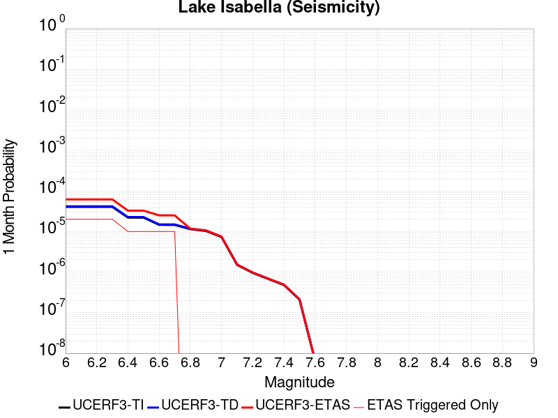 |  |  |

| Magnitude | 1 wk TI Prob | 1 wk TD Prob | 1 wk ETAS Prob | 1 wk ETAS/TD Gain | 1 wk ETAS Triggered Only | 1 mo TI Prob | 1 mo TD Prob | 1 mo ETAS Prob | 1 mo ETAS/TD Gain | 1 mo ETAS Triggered Only | 1 yr TI Prob | 1 yr TD Prob | 1 yr ETAS Prob | 1 yr ETAS/TD Gain | 1 yr ETAS Triggered Only | 10 yr TI Prob | 10 yr TD Prob | 10 yr ETAS Prob | 10 yr ETAS/TD Gain | 10 yr ETAS Triggered Only |
|-----|-----|-----|-----|-----|-----|-----|-----|-----|-----|-----|-----|-----|-----|-----|-----|-----|-----|-----|-----|-----|
| 6.0 | 9.431637E-6 | 9.741694E-6 | 1.9741597E-5 | 2.0265055 | 1.0E-5 | 4.0420677E-5 | 4.1749525E-5 | 6.174869E-5 | 1.4790274 | 2.0E-5 | 4.920106E-4 | 5.0819496E-4 | 5.4817466E-4 | 1.0786699 | 4.0E-5 | 0.004909227 | 0.005071621 | 0.0051213675 | 1.0098088 | 5.0E-5 |
| 6.1 | 9.431637E-6 | 9.741694E-6 | 1.9741597E-5 | 2.0265055 | 1.0E-5 | 4.0420677E-5 | 4.1749525E-5 | 6.174869E-5 | 1.4790274 | 2.0E-5 | 4.920106E-4 | 5.0819496E-4 | 5.4817466E-4 | 1.0786699 | 4.0E-5 | 0.004909227 | 0.005071621 | 0.0051213675 | 1.0098088 | 5.0E-5 |
| 6.2 | 9.431637E-6 | 9.741694E-6 | 1.9741597E-5 | 2.0265055 | 1.0E-5 | 4.0420677E-5 | 4.1749525E-5 | 6.174869E-5 | 1.4790274 | 2.0E-5 | 4.920106E-4 | 5.0819496E-4 | 5.4817466E-4 | 1.0786699 | 4.0E-5 | 0.004909227 | 0.005071621 | 0.0051213675 | 1.0098088 | 5.0E-5 |
| 6.3 | 9.431637E-6 | 9.741694E-6 | 1.9741597E-5 | 2.0265055 | 1.0E-5 | 4.0420677E-5 | 4.1749525E-5 | 6.174869E-5 | 1.4790274 | 2.0E-5 | 4.920106E-4 | 5.0819496E-4 | 5.4817466E-4 | 1.0786699 | 4.0E-5 | 0.004909227 | 0.005071621 | 0.0051213675 | 1.0098088 | 5.0E-5 |
| 6.4 | 5.144063E-6 | 5.3000977E-6 | 1.5300044E-5 | 2.8867478 | 1.0E-5 | 2.2045799E-5 | 2.2714525E-5 | 3.27143E-5 | 1.4402369 | 1.0E-5 | 2.6837454E-4 | 2.765177E-4 | 3.065094E-4 | 1.1084621 | 3.0E-5 | 0.0026805066 | 0.002762077 | 0.002791994 | 1.0108314 | 3.0E-5 |
| 6.5 | 5.144063E-6 | 5.3000977E-6 | 1.5300044E-5 | 2.8867478 | 1.0E-5 | 2.2045799E-5 | 2.2714525E-5 | 3.27143E-5 | 1.4402369 | 1.0E-5 | 2.6837454E-4 | 2.765177E-4 | 3.065094E-4 | 1.1084621 | 3.0E-5 | 0.0026805066 | 0.002762077 | 0.002791994 | 1.0108314 | 3.0E-5 |
| 6.6 | 3.4009804E-6 | 3.4987995E-6 | 1.3498765E-5 | 3.8581133 | 1.0E-5 | 1.4575549E-5 | 1.4994778E-5 | 2.4994628E-5 | 1.6668888 | 1.0E-5 | 1.7744285E-4 | 1.8254772E-4 | 2.0254408E-4 | 1.1095403 | 2.0E-5 | 0.0017730123 | 0.0018241355 | 0.001844099 | 1.0109441 | 2.0E-5 |
| 6.7 | 3.3880428E-6 | 3.4856662E-6 | 1.3485631E-5 | 3.8688822 | 1.0E-5 | 1.4520103E-5 | 1.4938492E-5 | 2.4938343E-5 | 1.6694016 | 1.0E-5 | 1.767679E-4 | 1.8186258E-4 | 2.0185893E-4 | 1.1099532 | 2.0E-5 | 0.0017662736 | 0.0018172951 | 0.0018372588 | 1.0109854 | 2.0E-5 |
| 6.8 | 2.6582E-6 | 2.7337105E-6 | 2.7337105E-6 | 1.0 | 0.0 | 1.1392236E-5 | 1.1715857E-5 | 1.1715857E-5 | 1.0 | 0.0 | 1.3869164E-4 | 1.4263256E-4 | 1.5263114E-4 | 1.0701002 | 1.0E-5 | 0.0013860512 | 0.0014255423 | 0.001435528 | 1.0070049 | 1.0E-5 |
| 6.9 | 2.406011E-6 | 2.474338E-6 | 2.474338E-6 | 1.0 | 0.0 | 1.0311434E-5 | 1.0604271E-5 | 1.0604271E-5 | 1.0 | 0.0 | 1.2553448E-4 | 1.2910066E-4 | 1.3909937E-4 | 1.077449 | 1.0E-5 | 0.0012546359 | 0.0012903863 | 0.0013003733 | 1.0077397 | 1.0E-5 |
| 7.0 | 1.6953097E-6 | 1.7429437E-6 | 1.7429437E-6 | 1.0 | 0.0 | 7.265593E-6 | 7.469743E-6 | 7.469743E-6 | 1.0 | 0.0 | 8.8455E-5 | 9.094137E-5 | 9.094137E-5 | 1.0 | 0.0 | 8.84198E-4 | 9.0914435E-4 | 9.0914435E-4 | 1.0 | 0.0 |
| 7.1 | 3.5013824E-7 | 3.571492E-7 | 3.571492E-7 | 1.0 | 0.0 | 1.5005916E-6 | 1.5306384E-6 | 1.5306384E-6 | 1.0 | 0.0 | 1.826955E-5 | 1.8635366E-5 | 1.8635366E-5 | 1.0 | 0.0 | 1.8268047E-4 | 1.863383E-4 | 1.863383E-4 | 1.0 | 0.0 |
| 7.2 | 2.2321095E-7 | 2.2750632E-7 | 2.2750632E-7 | 1.0 | 0.0 | 9.56618E-7 | 9.750268E-7 | 9.750268E-7 | 1.0 | 0.0 | 1.1646762E-5 | 1.1870887E-5 | 1.1870887E-5 | 1.0 | 0.0 | 1.1646151E-4 | 1.1870263E-4 | 1.1870263E-4 | 1.0 | 0.0 |
| 7.3 | 1.5760406E-7 | 1.6060963E-7 | 1.6060963E-7 | 1.0 | 0.0 | 6.7544585E-7 | 6.883268E-7 | 6.883268E-7 | 1.0 | 0.0 | 8.223522E-6 | 8.380347E-6 | 8.380347E-6 | 1.0 | 0.0 | 8.2232174E-5 | 8.3800376E-5 | 8.3800376E-5 | 1.0 | 0.0 |
| 7.4 | 1.1216497E-7 | 1.1431735E-7 | 1.1431735E-7 | 1.0 | 0.0 | 4.8070694E-7 | 4.8993144E-7 | 4.8993144E-7 | 1.0 | 0.0 | 5.852591E-6 | 5.964899E-6 | 5.964899E-6 | 1.0 | 0.0 | 5.8524372E-5 | 5.9647435E-5 | 5.9647435E-5 | 1.0 | 0.0 |
| 7.5 | 4.885185E-8 | 4.9787864E-8 | 4.9787864E-8 | 1.0 | 0.0 | 2.0936506E-7 | 2.1337654E-7 | 2.1337654E-7 | 1.0 | 0.0 | 2.5490165E-6 | 2.5978566E-6 | 2.5978566E-6 | 1.0 | 0.0 | 2.5489873E-5 | 2.597828E-5 | 2.597828E-5 | 1.0 | 0.0 |
| 7.6 | 1.504641E-9 | 1.5317939E-9 | 1.5317939E-9 | 1.0 | 0.0 | 6.4484613E-9 | 6.5648313E-9 | 6.5648313E-9 | 1.0 | 0.0 | 7.851001E-8 | 7.992682E-8 | 7.992682E-8 | 1.0 | 0.0 | 7.8509987E-7 | 7.992682E-7 | 7.992682E-7 | 1.0 | 0.0 |

## San Andreas (North Branch Mill Creek)
*[(top)](#table-of-contents)*

| 1 Week | 1 Month | 1 Year | 10 Year |
|-----|-----|-----|-----|
|  |  |  |  |

| Magnitude | 1 wk TI Prob | 1 wk TD Prob | 1 wk ETAS Prob | 1 wk ETAS/TD Gain | 1 wk ETAS Triggered Only | 1 mo TI Prob | 1 mo TD Prob | 1 mo ETAS Prob | 1 mo ETAS/TD Gain | 1 mo ETAS Triggered Only | 1 yr TI Prob | 1 yr TD Prob | 1 yr ETAS Prob | 1 yr ETAS/TD Gain | 1 yr ETAS Triggered Only | 10 yr TI Prob | 10 yr TD Prob | 10 yr ETAS Prob | 10 yr ETAS/TD Gain | 10 yr ETAS Triggered Only |
|-----|-----|-----|-----|-----|-----|-----|-----|-----|-----|-----|-----|-----|-----|-----|-----|-----|-----|-----|-----|-----|
| 6.0 | 1.3461156E-5 | 2.3506776E-5 | 2.3506776E-5 | 1.0 | 0.0 | 5.7689394E-5 | 1.0073945E-4 | 1.10738445E-4 | 1.0992559 | 1.0E-5 | 7.02142E-4 | 0.0012258161 | 0.0012457916 | 1.0162957 | 2.0E-5 | 0.0069992766 | 0.012233093 | 0.012282481 | 1.0040373 | 5.0E-5 |
| 6.1 | 1.3461156E-5 | 2.3506776E-5 | 2.3506776E-5 | 1.0 | 0.0 | 5.7689394E-5 | 1.0073945E-4 | 1.10738445E-4 | 1.0992559 | 1.0E-5 | 7.02142E-4 | 0.0012258161 | 0.0012457916 | 1.0162957 | 2.0E-5 | 0.0069992766 | 0.012233093 | 0.012282481 | 1.0040373 | 5.0E-5 |
| 6.2 | 1.3461156E-5 | 2.3506776E-5 | 2.3506776E-5 | 1.0 | 0.0 | 5.7689394E-5 | 1.0073945E-4 | 1.10738445E-4 | 1.0992559 | 1.0E-5 | 7.02142E-4 | 0.0012258161 | 0.0012457916 | 1.0162957 | 2.0E-5 | 0.0069992766 | 0.012233093 | 0.012282481 | 1.0040373 | 5.0E-5 |
| 6.3 | 1.3461156E-5 | 2.3506776E-5 | 2.3506776E-5 | 1.0 | 0.0 | 5.7689394E-5 | 1.0073945E-4 | 1.10738445E-4 | 1.0992559 | 1.0E-5 | 7.02142E-4 | 0.0012258161 | 0.0012457916 | 1.0162957 | 2.0E-5 | 0.0069992766 | 0.012233093 | 0.012282481 | 1.0040373 | 5.0E-5 |
| 6.4 | 1.3461156E-5 | 2.3506776E-5 | 2.3506776E-5 | 1.0 | 0.0 | 5.7689394E-5 | 1.0073945E-4 | 1.10738445E-4 | 1.0992559 | 1.0E-5 | 7.02142E-4 | 0.0012258161 | 0.0012457916 | 1.0162957 | 2.0E-5 | 0.0069992766 | 0.012233093 | 0.012282481 | 1.0040373 | 5.0E-5 |
| 6.5 | 1.3450706E-5 | 2.3495735E-5 | 2.3495735E-5 | 1.0 | 0.0 | 5.764461E-5 | 1.0069214E-4 | 1.1069114E-4 | 1.0993026 | 1.0E-5 | 7.0159714E-4 | 0.0012252406 | 0.0012452162 | 1.0163033 | 2.0E-5 | 0.006993862 | 0.012227403 | 0.012276792 | 1.0040392 | 5.0E-5 |
| 6.6 | 1.3074523E-5 | 2.3110017E-5 | 2.3110017E-5 | 1.0 | 0.0 | 5.6032466E-5 | 9.9039185E-5 | 1.0903819E-4 | 1.1009601 | 1.0E-5 | 6.8198174E-4 | 0.0012051383 | 0.0012251142 | 1.0165756 | 2.0E-5 | 0.006798926 | 0.0120285675 | 0.012077966 | 1.0041068 | 5.0E-5 |
| 6.7 | 1.3050216E-5 | 2.3085311E-5 | 2.3085311E-5 | 1.0 | 0.0 | 5.59283E-5 | 9.893332E-5 | 1.0893233E-4 | 1.1010681 | 1.0E-5 | 6.8071426E-4 | 0.0012038508 | 0.0012238267 | 1.0165933 | 2.0E-5 | 0.0067863287 | 0.012015832 | 0.012065231 | 1.0041112 | 5.0E-5 |
| 6.8 | 1.29049395E-5 | 2.293372E-5 | 2.293372E-5 | 1.0 | 0.0 | 5.530571E-5 | 9.828369E-5 | 1.082827E-4 | 1.1017363 | 1.0E-5 | 6.73139E-4 | 0.0011959502 | 0.0012159263 | 1.0167031 | 2.0E-5 | 0.0067110364 | 0.011937677 | 0.01198708 | 1.0041385 | 5.0E-5 |
| 6.9 | 1.2867369E-5 | 2.2893122E-5 | 2.2893122E-5 | 1.0 | 0.0 | 5.51447E-5 | 9.810971E-5 | 1.08108725E-4 | 1.1019167 | 1.0E-5 | 6.711799E-4 | 0.0011938344 | 0.0012138105 | 1.0167327 | 2.0E-5 | 0.006691564 | 0.011916745 | 0.011966149 | 1.0041457 | 5.0E-5 |
| 7.0 | 1.2495996E-5 | 2.2293154E-5 | 2.2293154E-5 | 1.0 | 0.0 | 5.3553173E-5 | 9.5538606E-5 | 1.05537656E-4 | 1.1046597 | 1.0E-5 | 6.518148E-4 | 0.0011625647 | 0.0011825415 | 1.0171833 | 2.0E-5 | 0.0064990623 | 0.011607327 | 0.011656746 | 1.0042577 | 5.0E-5 |
| 7.1 | 1.2452067E-5 | 2.2238226E-5 | 2.2238226E-5 | 1.0 | 0.0 | 5.3364907E-5 | 9.5303214E-5 | 1.05302264E-4 | 1.1049182 | 1.0E-5 | 6.4952404E-4 | 0.0011597018 | 0.0011796787 | 1.0172259 | 2.0E-5 | 0.0064762887 | 0.011578998 | 0.011628418 | 1.0042682 | 5.0E-5 |
| 7.2 | 1.2002777E-5 | 2.1616754E-5 | 2.1616754E-5 | 1.0 | 0.0 | 5.143946E-5 | 9.263996E-5 | 1.0263903E-4 | 1.1079348 | 1.0E-5 | 6.2609545E-4 | 0.0011273106 | 0.001147288 | 1.0177213 | 2.0E-5 | 0.006243344 | 0.011258403 | 0.011307839 | 1.0043911 | 5.0E-5 |
| 7.3 | 1.1923425E-5 | 2.1486576E-5 | 2.1486576E-5 | 1.0 | 0.0 | 5.109939E-5 | 9.208209E-5 | 1.0208117E-4 | 1.1085887 | 1.0E-5 | 6.219575E-4 | 0.0011205255 | 0.0011405031 | 1.0178288 | 2.0E-5 | 0.0062021962 | 0.011191265 | 0.011240705 | 1.0044178 | 5.0E-5 |
| 7.4 | 1.16105175E-5 | 2.0860489E-5 | 2.0860489E-5 | 1.0 | 0.0 | 4.975841E-5 | 8.9399044E-5 | 9.939815E-5 | 1.111848 | 1.0E-5 | 6.0564023E-4 | 0.0010878925 | 0.0011078707 | 1.0183642 | 2.0E-5 | 0.006039923 | 0.01086884 | 0.010918296 | 1.0045503 | 5.0E-5 |
| 7.5 | 1.1037265E-5 | 1.956039E-5 | 1.956039E-5 | 1.0 | 0.0 | 4.7301706E-5 | 8.382756E-5 | 9.382672E-5 | 1.1192825 | 1.0E-5 | 5.757461E-4 | 0.0010201249 | 0.0010401044 | 1.0195855 | 2.0E-5 | 0.005742567 | 0.010198223 | 0.010247714 | 1.0048528 | 5.0E-5 |
| 7.6 | 1.0720915E-5 | 1.900222E-5 | 1.900222E-5 | 1.0 | 0.0 | 4.5945973E-5 | 8.143555E-5 | 9.143474E-5 | 1.1227865 | 1.0E-5 | 5.592486E-4 | 9.910291E-4 | 0.0010110092 | 1.020161 | 2.0E-5 | 0.005578433 | 0.009909907 | 0.009959412 | 1.0049955 | 5.0E-5 |
| 7.7 | 9.276279E-6 | 1.6447744E-5 | 1.6447744E-5 | 1.0 | 0.0 | 3.9754876E-5 | 7.048844E-5 | 8.0487735E-5 | 1.1418573 | 1.0E-5 | 4.839081E-4 | 8.578605E-4 | 8.778433E-4 | 1.0232939 | 2.0E-5 | 0.0048285574 | 0.008589173 | 0.008638743 | 1.0057713 | 5.0E-5 |
| 7.8 | 5.8346777E-6 | 1.1159965E-5 | 1.1159965E-5 | 1.0 | 0.0 | 2.5005522E-5 | 4.7827543E-5 | 5.7827063E-5 | 1.2090745 | 1.0E-5 | 3.043997E-4 | 5.821449E-4 | 6.021332E-4 | 1.0343357 | 2.0E-5 | 0.0030398308 | 0.005849473 | 0.0058991807 | 1.0084978 | 5.0E-5 |
| 7.9 | 4.690204E-6 | 8.513225E-6 | 8.513225E-6 | 1.0 | 0.0 | 2.0100719E-5 | 3.648474E-5 | 4.6484376E-5 | 1.2740772 | 1.0E-5 | 2.4469878E-4 | 4.4411127E-4 | 4.641024E-4 | 1.0450138 | 2.0E-5 | 0.002444295 | 0.0044728746 | 0.0045226505 | 1.0111285 | 5.0E-5 |
| 8.0 | 2.9570454E-6 | 4.8494758E-6 | 4.8494758E-6 | 1.0 | 0.0 | 1.267299E-5 | 2.0783302E-5 | 2.0783302E-5 | 1.0 | 0.0 | 1.5428272E-4 | 2.5300734E-4 | 2.5300734E-4 | 1.0 | 0.0 | 0.0015417566 | 0.0025509594 | 0.0025609338 | 1.0039101 | 1.0E-5 |
| 8.1 | 1.6376824E-6 | 2.198225E-6 | 2.198225E-6 | 1.0 | 0.0 | 7.01862E-6 | 9.420931E-6 | 9.420931E-6 | 1.0 | 0.0 | 8.544835E-5 | 1.1469381E-4 | 1.1469381E-4 | 1.0 | 0.0 | 8.54155E-4 | 0.0011613552 | 0.0011613552 | 1.0 | 0.0 |
| 8.2 | 6.9631557E-7 | 4.5401492E-7 | 4.5401492E-7 | 1.0 | 0.0 | 2.984206E-6 | 1.9457768E-6 | 1.9457768E-6 | 1.0 | 0.0 | 3.63321E-5 | 2.3689576E-5 | 2.3689576E-5 | 1.0 | 0.0 | 3.6326164E-4 | 2.453756E-4 | 2.453756E-4 | 1.0 | 0.0 |
| 8.3 | 1.7876137E-7 | 8.368747E-8 | 8.368747E-8 | 1.0 | 0.0 | 7.661199E-7 | 3.5866054E-7 | 3.5866054E-7 | 1.0 | 0.0 | 9.32747E-6 | 4.3666837E-6 | 4.3666837E-6 | 1.0 | 0.0 | 9.3270784E-5 | 4.5861943E-5 | 4.5861943E-5 | 1.0 | 0.0 |

## Sierra Nevada  (No Extension)
*[(top)](#table-of-contents)*

| 1 Week | 1 Month | 1 Year | 10 Year |
|-----|-----|-----|-----|
|  | 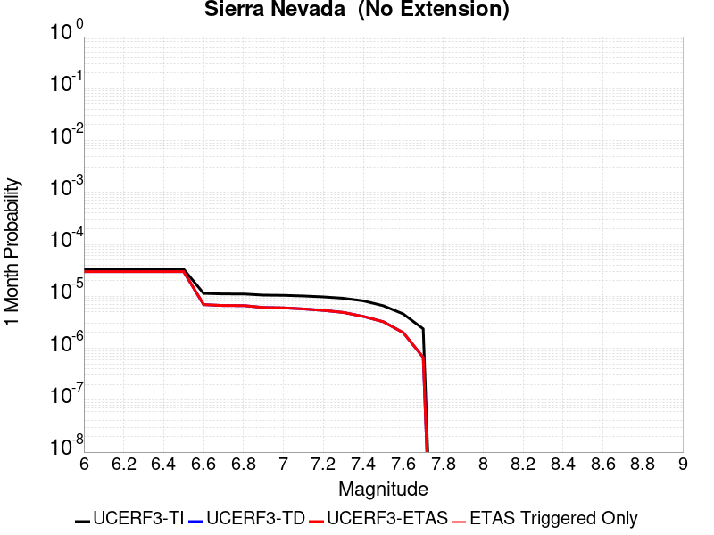 |  |  |

| Magnitude | 1 wk TI Prob | 1 wk TD Prob | 1 wk ETAS Prob | 1 wk ETAS/TD Gain | 1 wk ETAS Triggered Only | 1 mo TI Prob | 1 mo TD Prob | 1 mo ETAS Prob | 1 mo ETAS/TD Gain | 1 mo ETAS Triggered Only | 1 yr TI Prob | 1 yr TD Prob | 1 yr ETAS Prob | 1 yr ETAS/TD Gain | 1 yr ETAS Triggered Only | 10 yr TI Prob | 10 yr TD Prob | 10 yr ETAS Prob | 10 yr ETAS/TD Gain | 10 yr ETAS Triggered Only |
|-----|-----|-----|-----|-----|-----|-----|-----|-----|-----|-----|-----|-----|-----|-----|-----|-----|-----|-----|-----|-----|
| 6.0 | 7.7690465E-6 | 6.9763832E-6 | 6.9763832E-6 | 1.0 | 0.0 | 3.329549E-5 | 2.9898645E-5 | 2.9898645E-5 | 1.0 | 0.0 | 4.0529718E-4 | 3.6399104E-4 | 3.8398377E-4 | 1.0549264 | 2.0E-5 | 0.004045588 | 0.0036374647 | 0.0036773193 | 1.0109566 | 4.0E-5 |
| 6.1 | 7.7690465E-6 | 6.9763832E-6 | 6.9763832E-6 | 1.0 | 0.0 | 3.329549E-5 | 2.9898645E-5 | 2.9898645E-5 | 1.0 | 0.0 | 4.0529718E-4 | 3.6399104E-4 | 3.8398377E-4 | 1.0549264 | 2.0E-5 | 0.004045588 | 0.0036374647 | 0.0036773193 | 1.0109566 | 4.0E-5 |
| 6.2 | 7.7690465E-6 | 6.9763832E-6 | 6.9763832E-6 | 1.0 | 0.0 | 3.329549E-5 | 2.9898645E-5 | 2.9898645E-5 | 1.0 | 0.0 | 4.0529718E-4 | 3.6399104E-4 | 3.8398377E-4 | 1.0549264 | 2.0E-5 | 0.004045588 | 0.0036374647 | 0.0036773193 | 1.0109566 | 4.0E-5 |
| 6.3 | 7.7690465E-6 | 6.9763832E-6 | 6.9763832E-6 | 1.0 | 0.0 | 3.329549E-5 | 2.9898645E-5 | 2.9898645E-5 | 1.0 | 0.0 | 4.0529718E-4 | 3.6399104E-4 | 3.8398377E-4 | 1.0549264 | 2.0E-5 | 0.004045588 | 0.0036374647 | 0.0036773193 | 1.0109566 | 4.0E-5 |
| 6.4 | 7.7690465E-6 | 6.9763832E-6 | 6.9763832E-6 | 1.0 | 0.0 | 3.329549E-5 | 2.9898645E-5 | 2.9898645E-5 | 1.0 | 0.0 | 4.0529718E-4 | 3.6399104E-4 | 3.8398377E-4 | 1.0549264 | 2.0E-5 | 0.004045588 | 0.0036374647 | 0.0036773193 | 1.0109566 | 4.0E-5 |
| 6.5 | 7.7690465E-6 | 6.9763832E-6 | 6.9763832E-6 | 1.0 | 0.0 | 3.329549E-5 | 2.9898645E-5 | 2.9898645E-5 | 1.0 | 0.0 | 4.0529718E-4 | 3.6399104E-4 | 3.8398377E-4 | 1.0549264 | 2.0E-5 | 0.004045588 | 0.0036374647 | 0.0036773193 | 1.0109566 | 4.0E-5 |
| 6.6 | 2.653E-6 | 1.6148814E-6 | 1.6148814E-6 | 1.0 | 0.0 | 1.136995E-5 | 6.920902E-6 | 6.920902E-6 | 1.0 | 0.0 | 1.3842035E-4 | 8.4258754E-5 | 1.0425707E-4 | 1.237344 | 2.0E-5 | 0.0013833415 | 8.4227155E-4 | 8.8223786E-4 | 1.0474507 | 4.0E-5 |
| 6.7 | 2.5902466E-6 | 1.5502146E-6 | 1.5502146E-6 | 1.0 | 0.0 | 1.11010095E-5 | 6.64376E-6 | 6.64376E-6 | 1.0 | 0.0 | 1.351464E-4 | 8.0884805E-5 | 1.0088319E-4 | 1.2472452 | 2.0E-5 | 0.0013506424 | 8.085567E-4 | 8.4852433E-4 | 1.0494308 | 4.0E-5 |
| 6.8 | 2.5853892E-6 | 1.5470148E-6 | 1.5470148E-6 | 1.0 | 0.0 | 1.1080193E-5 | 6.6300463E-6 | 6.6300463E-6 | 1.0 | 0.0 | 1.34893E-4 | 8.071786E-5 | 1.0071624E-4 | 1.2477566 | 2.0E-5 | 0.0013481114 | 8.0688833E-4 | 8.468561E-4 | 1.0495331 | 4.0E-5 |
| 6.9 | 2.458257E-6 | 1.4220883E-6 | 1.4220883E-6 | 1.0 | 0.0 | 1.0535345E-5 | 6.0946504E-6 | 6.0946504E-6 | 1.0 | 0.0 | 1.2826028E-4 | 7.419986E-5 | 9.4198374E-5 | 1.2695223 | 2.0E-5 | 0.0012818627 | 7.417528E-4 | 7.817231E-4 | 1.0538863 | 4.0E-5 |
| 7.0 | 2.4341468E-6 | 1.399052E-6 | 1.399052E-6 | 1.0 | 0.0 | 1.0432016E-5 | 5.995924E-6 | 5.995924E-6 | 1.0 | 0.0 | 1.270024E-4 | 7.2997944E-5 | 9.299649E-5 | 1.2739604 | 2.0E-5 | 0.0012692984 | 7.297416E-4 | 7.697124E-4 | 1.0547739 | 4.0E-5 |
| 7.1 | 2.3652476E-6 | 1.3340014E-6 | 1.3340014E-6 | 1.0 | 0.0 | 1.0136736E-5 | 5.717136E-6 | 5.717136E-6 | 1.0 | 0.0 | 1.2340778E-4 | 6.960393E-5 | 8.960253E-5 | 1.2873201 | 2.0E-5 | 0.0012333926 | 6.9582294E-4 | 7.357951E-4 | 1.0574459 | 4.0E-5 |
| 7.2 | 2.272158E-6 | 1.2503074E-6 | 1.2503074E-6 | 1.0 | 0.0 | 9.737784E-6 | 5.3584495E-6 | 5.3584495E-6 | 1.0 | 0.0 | 1.1855107E-4 | 6.523718E-5 | 8.523588E-5 | 1.3065536 | 2.0E-5 | 0.0011848784 | 6.5218186E-4 | 6.9215574E-4 | 1.0612925 | 4.0E-5 |
| 7.3 | 2.1382127E-6 | 1.1419947E-6 | 1.1419947E-6 | 1.0 | 0.0 | 9.163737E-6 | 4.8942543E-6 | 4.8942543E-6 | 1.0 | 0.0 | 1.1156279E-4 | 5.9585927E-5 | 7.958474E-5 | 1.3356297 | 2.0E-5 | 0.001115068 | 5.957007E-4 | 6.3567684E-4 | 1.0671078 | 4.0E-5 |
| 7.4 | 1.9048055E-6 | 9.575474E-7 | 9.575474E-7 | 1.0 | 0.0 | 8.163426E-6 | 4.1037683E-6 | 4.1037683E-6 | 1.0 | 0.0 | 9.9385186E-5 | 4.996224E-5 | 6.996124E-5 | 1.4002823 | 2.0E-5 | 9.934074E-4 | 4.995108E-4 | 5.394908E-4 | 1.0800383 | 4.0E-5 |
| 7.5 | 1.5373403E-6 | 7.5602395E-7 | 7.5602395E-7 | 1.0 | 0.0 | 6.5885843E-6 | 3.2400987E-6 | 3.2400987E-6 | 1.0 | 0.0 | 8.021306E-5 | 3.9447492E-5 | 5.9446706E-5 | 1.506983 | 2.0E-5 | 8.0184115E-4 | 3.944054E-4 | 4.2439354E-4 | 1.0760338 | 3.0E-5 |
| 7.6 | 1.0680322E-6 | 4.659796E-7 | 4.659796E-7 | 1.0 | 0.0 | 4.577273E-6 | 1.997054E-6 | 1.997054E-6 | 1.0 | 0.0 | 5.5726876E-5 | 2.4313864E-5 | 4.4313376E-5 | 1.822556 | 2.0E-5 | 5.5712904E-4 | 2.431123E-4 | 2.73105E-4 | 1.1233698 | 3.0E-5 |
| 7.7 | 5.509146E-7 | 1.5581199E-7 | 1.5581199E-7 | 1.0 | 0.0 | 2.3610605E-6 | 6.677655E-7 | 6.677655E-7 | 1.0 | 0.0 | 2.8745531E-5 | 8.130016E-6 | 8.130016E-6 | 1.0 | 0.0 | 2.8741814E-4 | 8.12973E-5 | 8.12973E-5 | 1.0 | 0.0 |

## San Andreas (Big Bend)
*[(top)](#table-of-contents)*

| 1 Week | 1 Month | 1 Year | 10 Year |
|-----|-----|-----|-----|
|  |  |  |  |

| Magnitude | 1 wk TI Prob | 1 wk TD Prob | 1 wk ETAS Prob | 1 wk ETAS/TD Gain | 1 wk ETAS Triggered Only | 1 mo TI Prob | 1 mo TD Prob | 1 mo ETAS Prob | 1 mo ETAS/TD Gain | 1 mo ETAS Triggered Only | 1 yr TI Prob | 1 yr TD Prob | 1 yr ETAS Prob | 1 yr ETAS/TD Gain | 1 yr ETAS Triggered Only | 10 yr TI Prob | 10 yr TD Prob | 10 yr ETAS Prob | 10 yr ETAS/TD Gain | 10 yr ETAS Triggered Only |
|-----|-----|-----|-----|-----|-----|-----|-----|-----|-----|-----|-----|-----|-----|-----|-----|-----|-----|-----|-----|-----|
| 6.0 | 1.0179969E-4 | 2.0080687E-4 | 2.1080486E-4 | 1.0497891 | 1.0E-5 | 4.362114E-4 | 8.60318E-4 | 8.803008E-4 | 1.0232272 | 2.0E-5 | 0.0052979486 | 0.010424351 | 0.010463934 | 1.0037972 | 4.0E-5 | 0.051734097 | 0.1014857 | 0.10152163 | 1.0003542 | 4.0E-5 |
| 6.1 | 1.0179969E-4 | 2.0080687E-4 | 2.1080486E-4 | 1.0497891 | 1.0E-5 | 4.362114E-4 | 8.60318E-4 | 8.803008E-4 | 1.0232272 | 2.0E-5 | 0.0052979486 | 0.010424351 | 0.010463934 | 1.0037972 | 4.0E-5 | 0.051734097 | 0.1014857 | 0.10152163 | 1.0003542 | 4.0E-5 |
| 6.2 | 1.0179969E-4 | 2.0080687E-4 | 2.1080486E-4 | 1.0497891 | 1.0E-5 | 4.362114E-4 | 8.60318E-4 | 8.803008E-4 | 1.0232272 | 2.0E-5 | 0.0052979486 | 0.010424351 | 0.010463934 | 1.0037972 | 4.0E-5 | 0.051734097 | 0.1014857 | 0.10152163 | 1.0003542 | 4.0E-5 |
| 6.3 | 1.0179969E-4 | 2.0080687E-4 | 2.1080486E-4 | 1.0497891 | 1.0E-5 | 4.362114E-4 | 8.60318E-4 | 8.803008E-4 | 1.0232272 | 2.0E-5 | 0.0052979486 | 0.010424351 | 0.010463934 | 1.0037972 | 4.0E-5 | 0.051734097 | 0.1014857 | 0.10152163 | 1.0003542 | 4.0E-5 |
| 6.4 | 9.1639464E-5 | 1.8437792E-4 | 1.9437607E-4 | 1.0542264 | 1.0E-5 | 3.9268145E-4 | 7.89952E-4 | 7.999441E-4 | 1.0126489 | 1.0E-5 | 0.0047704205 | 0.009575372 | 0.00959518 | 1.0020686 | 2.0E-5 | 0.046693064 | 0.09381153 | 0.093829654 | 1.0001932 | 2.0E-5 |
| 6.5 | 9.1639464E-5 | 1.8437792E-4 | 1.9437607E-4 | 1.0542264 | 1.0E-5 | 3.9268145E-4 | 7.89952E-4 | 7.999441E-4 | 1.0126489 | 1.0E-5 | 0.0047704205 | 0.009575372 | 0.00959518 | 1.0020686 | 2.0E-5 | 0.046693064 | 0.09381153 | 0.093829654 | 1.0001932 | 2.0E-5 |
| 6.6 | 9.042622E-5 | 1.8244829E-4 | 1.9244647E-4 | 1.0548 | 1.0E-5 | 3.8748336E-4 | 7.8168715E-4 | 7.916793E-4 | 1.0127828 | 1.0E-5 | 0.0047074095 | 0.009475624 | 0.009495434 | 1.0020907 | 2.0E-5 | 0.046089325 | 0.09290548 | 0.09292362 | 1.0001953 | 2.0E-5 |
| 6.7 | 8.9836685E-5 | 1.8159159E-4 | 1.9158977E-4 | 1.0550586 | 1.0E-5 | 3.8495753E-4 | 7.7801774E-4 | 7.8800996E-4 | 1.0128431 | 1.0E-5 | 0.00467679 | 0.009431336 | 0.009451147 | 1.0021006 | 2.0E-5 | 0.045795817 | 0.09249973 | 0.09251789 | 1.0001962 | 2.0E-5 |
| 6.8 | 8.9471854E-5 | 1.8105932E-4 | 1.9105752E-4 | 1.0552205 | 1.0E-5 | 3.8339442E-4 | 7.75738E-4 | 7.8573026E-4 | 1.0128809 | 1.0E-5 | 0.004657841 | 0.00940382 | 0.009423632 | 1.0021068 | 2.0E-5 | 0.04561414 | 0.09224692 | 0.09226508 | 1.0001968 | 2.0E-5 |
| 6.9 | 8.858234E-5 | 1.7987892E-4 | 1.8987713E-4 | 1.055583 | 1.0E-5 | 3.7958333E-4 | 7.706821E-4 | 7.806744E-4 | 1.0129656 | 1.0E-5 | 0.004611638 | 0.009342793 | 0.009362607 | 1.0021207 | 2.0E-5 | 0.04517103 | 0.091686994 | 0.09170516 | 1.0001981 | 2.0E-5 |
| 7.0 | 8.7433385E-5 | 1.7826671E-4 | 1.8826492E-4 | 1.0560857 | 1.0E-5 | 3.746607E-4 | 7.6377665E-4 | 7.7376905E-4 | 1.0130829 | 1.0E-5 | 0.004551957 | 0.009259437 | 0.009279252 | 1.0021399 | 2.0E-5 | 0.044598386 | 0.09092137 | 0.09093955 | 1.0001999 | 2.0E-5 |
| 7.1 | 8.684964E-5 | 1.7738611E-4 | 1.8738434E-4 | 1.0563642 | 1.0E-5 | 3.7215967E-4 | 7.600049E-4 | 7.699973E-4 | 1.0131478 | 1.0E-5 | 0.0045216335 | 0.009213906 | 0.0092337215 | 1.0021507 | 2.0E-5 | 0.04430731 | 0.09050287 | 0.09052106 | 1.000201 | 2.0E-5 |
| 7.2 | 8.606521E-5 | 1.7629213E-4 | 1.8629037E-4 | 1.056714 | 1.0E-5 | 3.6879873E-4 | 7.5531914E-4 | 7.653116E-4 | 1.0132295 | 1.0E-5 | 0.0044808835 | 0.009157337 | 0.009177154 | 1.002164 | 2.0E-5 | 0.043916024 | 0.08998334 | 0.09000154 | 1.0002023 | 2.0E-5 |
| 7.3 | 8.568266E-5 | 1.7571205E-4 | 1.8571029E-4 | 1.0569013 | 1.0E-5 | 3.6715972E-4 | 7.528345E-4 | 7.6282694E-4 | 1.0132731 | 1.0E-5 | 0.0044610105 | 0.00912734 | 0.009147158 | 1.0021713 | 2.0E-5 | 0.043725148 | 0.08970444 | 0.08972264 | 1.000203 | 2.0E-5 |
| 7.4 | 8.5432206E-5 | 1.7533782E-4 | 1.8533606E-4 | 1.0570228 | 1.0E-5 | 3.6608664E-4 | 7.5123156E-4 | 7.612241E-4 | 1.0133015 | 1.0E-5 | 0.004447999 | 0.009107988 | 0.009127806 | 1.0021759 | 2.0E-5 | 0.043600157 | 0.08952458 | 0.08954279 | 1.0002034 | 2.0E-5 |
| 7.5 | 8.4791965E-5 | 1.7403076E-4 | 1.8402902E-4 | 1.0574511 | 1.0E-5 | 3.633435E-4 | 7.4563315E-4 | 7.5562566E-4 | 1.0134014 | 1.0E-5 | 0.0044147377 | 0.009040395 | 0.009060214 | 1.0021923 | 2.0E-5 | 0.043280575 | 0.0889021 | 0.08892032 | 1.0002049 | 2.0E-5 |
| 7.6 | 8.241105E-5 | 1.684837E-4 | 1.7848202E-4 | 1.059343 | 1.0E-5 | 3.531424E-4 | 7.2187337E-4 | 7.318661E-4 | 1.0138428 | 1.0E-5 | 0.0042910352 | 0.008753479 | 0.0087733045 | 1.0022649 | 2.0E-5 | 0.042091176 | 0.08627858 | 0.08629686 | 1.0002118 | 2.0E-5 |
| 7.7 | 7.00432E-5 | 1.4211683E-4 | 1.521154E-4 | 1.0703547 | 1.0E-5 | 3.001506E-4 | 6.0893E-4 | 6.189239E-4 | 1.0164123 | 1.0E-5 | 0.0036482112 | 0.007388561 | 0.007398487 | 1.0013435 | 1.0E-5 | 0.035888977 | 0.07354971 | 0.07355898 | 1.000126 | 1.0E-5 |
| 7.8 | 6.415362E-5 | 1.297541E-4 | 1.297541E-4 | 1.0 | 0.0 | 2.749151E-4 | 5.5597053E-4 | 5.5597053E-4 | 1.0 | 0.0 | 0.0033419547 | 0.006747963 | 0.006747963 | 1.0 | 0.0 | 0.03292141 | 0.0672817 | 0.0672817 | 1.0 | 0.0 |
| 7.9 | 4.939911E-5 | 9.345801E-5 | 9.345801E-5 | 1.0 | 0.0 | 2.116933E-4 | 4.0047284E-4 | 4.0047284E-4 | 1.0 | 0.0 | 0.0025743195 | 0.0048648654 | 0.0048648654 | 1.0 | 0.0 | 0.025447013 | 0.048936196 | 0.048936196 | 1.0 | 0.0 |
| 8.0 | 3.344983E-5 | 5.225443E-5 | 5.225443E-5 | 1.0 | 0.0 | 1.4334853E-4 | 2.2392833E-4 | 2.2392833E-4 | 1.0 | 0.0 | 0.0017438711 | 0.0027229206 | 0.0027229206 | 1.0 | 0.0 | 0.017302496 | 0.02793573 | 0.02793573 | 1.0 | 0.0 |
| 8.1 | 1.9104898E-5 | 1.9186356E-5 | 1.9186356E-5 | 1.0 | 0.0 | 8.1875565E-5 | 8.222465E-5 | 8.222465E-5 | 1.0 | 0.0 | 9.963791E-4 | 0.001000626 | 0.001000626 | 1.0 | 0.0 | 0.009919235 | 0.010756767 | 0.010756767 | 1.0 | 0.0 |
| 8.2 | 8.643924E-6 | 5.4798497E-6 | 5.4798497E-6 | 1.0 | 0.0 | 3.704486E-5 | 2.348486E-5 | 2.348486E-5 | 1.0 | 0.0 | 4.5092785E-4 | 2.858907E-4 | 2.858907E-4 | 1.0 | 0.0 | 0.0045001395 | 0.0032514327 | 0.0032514327 | 1.0 | 0.0 |
| 8.3 | 1.983087E-6 | 7.668296E-7 | 7.668296E-7 | 1.0 | 0.0 | 8.498917E-6 | 3.2864084E-6 | 3.2864084E-6 | 1.0 | 0.0 | 1.034694E-4 | 4.0011306E-5 | 4.0011306E-5 | 1.0 | 0.0 | 0.0010342124 | 4.724499E-4 | 4.724499E-4 | 1.0 | 0.0 |

## White Wolf (Extension)
*[(top)](#table-of-contents)*

| 1 Week | 1 Month | 1 Year | 10 Year |
|-----|-----|-----|-----|
|  | 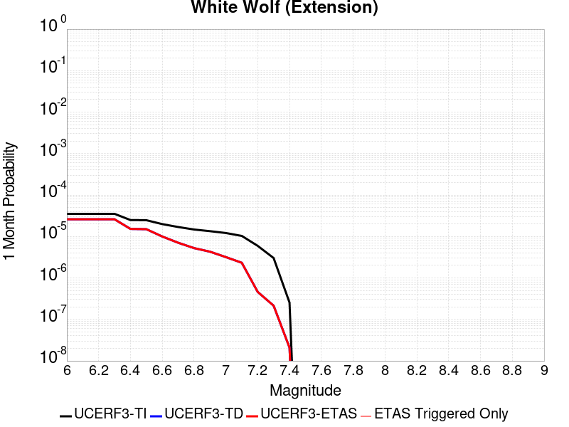 |  |  |

| Magnitude | 1 wk TI Prob | 1 wk TD Prob | 1 wk ETAS Prob | 1 wk ETAS/TD Gain | 1 wk ETAS Triggered Only | 1 mo TI Prob | 1 mo TD Prob | 1 mo ETAS Prob | 1 mo ETAS/TD Gain | 1 mo ETAS Triggered Only | 1 yr TI Prob | 1 yr TD Prob | 1 yr ETAS Prob | 1 yr ETAS/TD Gain | 1 yr ETAS Triggered Only | 10 yr TI Prob | 10 yr TD Prob | 10 yr ETAS Prob | 10 yr ETAS/TD Gain | 10 yr ETAS Triggered Only |
|-----|-----|-----|-----|-----|-----|-----|-----|-----|-----|-----|-----|-----|-----|-----|-----|-----|-----|-----|-----|-----|
| 6.0 | 8.222555E-6 | 6.0667057E-6 | 6.0667057E-6 | 1.0 | 0.0 | 3.5239045E-5 | 2.5999947E-5 | 2.5999947E-5 | 1.0 | 0.0 | 4.289509E-4 | 3.1650998E-4 | 3.1650998E-4 | 1.0 | 0.0 | 0.0042812387 | 0.0031612439 | 0.0032011175 | 1.0126133 | 4.0E-5 |
| 6.1 | 8.222555E-6 | 6.0667057E-6 | 6.0667057E-6 | 1.0 | 0.0 | 3.5239045E-5 | 2.5999947E-5 | 2.5999947E-5 | 1.0 | 0.0 | 4.289509E-4 | 3.1650998E-4 | 3.1650998E-4 | 1.0 | 0.0 | 0.0042812387 | 0.0031612439 | 0.0032011175 | 1.0126133 | 4.0E-5 |
| 6.2 | 8.222555E-6 | 6.0667057E-6 | 6.0667057E-6 | 1.0 | 0.0 | 3.5239045E-5 | 2.5999947E-5 | 2.5999947E-5 | 1.0 | 0.0 | 4.289509E-4 | 3.1650998E-4 | 3.1650998E-4 | 1.0 | 0.0 | 0.0042812387 | 0.0031612439 | 0.0032011175 | 1.0126133 | 4.0E-5 |
| 6.3 | 8.222555E-6 | 6.0667057E-6 | 6.0667057E-6 | 1.0 | 0.0 | 3.5239045E-5 | 2.5999947E-5 | 2.5999947E-5 | 1.0 | 0.0 | 4.289509E-4 | 3.1650998E-4 | 3.1650998E-4 | 1.0 | 0.0 | 0.0042812387 | 0.0031612439 | 0.0032011175 | 1.0126133 | 4.0E-5 |
| 6.4 | 5.821773E-6 | 3.5572016E-6 | 3.5572016E-6 | 1.0 | 0.0 | 2.4950215E-5 | 1.5245067E-5 | 1.5245067E-5 | 1.0 | 0.0 | 3.0372653E-4 | 1.8559398E-4 | 1.8559398E-4 | 1.0 | 0.0 | 0.0030331176 | 0.0018544982 | 0.0018844425 | 1.0161469 | 3.0E-5 |
| 6.5 | 5.766023E-6 | 3.4991353E-6 | 3.4991353E-6 | 1.0 | 0.0 | 2.4711293E-5 | 1.4996214E-5 | 1.4996214E-5 | 1.0 | 0.0 | 3.0081844E-4 | 1.8256472E-4 | 1.8256472E-4 | 1.0 | 0.0 | 0.0030041158 | 0.0018242556 | 0.0018542007 | 1.0164151 | 3.0E-5 |
| 6.6 | 4.643576E-6 | 2.332643E-6 | 2.332643E-6 | 1.0 | 0.0 | 1.9900888E-5 | 9.997005E-6 | 9.997005E-6 | 1.0 | 0.0 | 2.4226638E-4 | 1.2170716E-4 | 1.2170716E-4 | 1.0 | 0.0 | 0.0024200242 | 0.0012164476 | 0.0012364232 | 1.0164213 | 2.0E-5 |
| 6.7 | 3.9529173E-6 | 1.6483629E-6 | 1.6483629E-6 | 1.0 | 0.0 | 1.6940963E-5 | 7.064394E-6 | 7.064394E-6 | 1.0 | 0.0 | 2.0623671E-4 | 8.600579E-5 | 8.600579E-5 | 1.0 | 0.0 | 0.002060454 | 8.5974357E-4 | 8.6973497E-4 | 1.0116214 | 1.0E-5 |
| 6.8 | 3.4377522E-6 | 1.2245362E-6 | 1.2245362E-6 | 1.0 | 0.0 | 1.473314E-5 | 5.2480023E-6 | 5.2480023E-6 | 1.0 | 0.0 | 1.7936122E-4 | 6.389264E-5 | 6.389264E-5 | 1.0 | 0.0 | 0.0017921652 | 6.3875184E-4 | 6.4874545E-4 | 1.0156455 | 1.0E-5 |
| 6.9 | 3.1367306E-6 | 1.0033893E-6 | 1.0033893E-6 | 1.0 | 0.0 | 1.3443062E-5 | 4.3002333E-6 | 4.3002333E-6 | 1.0 | 0.0 | 1.63657E-4 | 5.235416E-5 | 5.235416E-5 | 1.0 | 0.0 | 0.0016353652 | 5.234259E-4 | 5.3342065E-4 | 1.019095 | 1.0E-5 |
| 7.0 | 2.8298145E-6 | 7.4287595E-7 | 7.4287595E-7 | 1.0 | 0.0 | 1.2127721E-5 | 3.1837506E-6 | 3.1837506E-6 | 1.0 | 0.0 | 1.47645E-4 | 3.8761526E-5 | 3.8761526E-5 | 1.0 | 0.0 | 0.0014754693 | 3.8755263E-4 | 3.9754875E-4 | 1.025793 | 1.0E-5 |
| 7.1 | 2.4091064E-6 | 5.4228286E-7 | 5.4228286E-7 | 1.0 | 0.0 | 1.03247E-5 | 2.3240675E-6 | 2.3240675E-6 | 1.0 | 0.0 | 1.2569598E-4 | 2.8295197E-5 | 2.8295197E-5 | 1.0 | 0.0 | 0.001256249 | 2.8291997E-4 | 2.9291716E-4 | 1.0353357 | 1.0E-5 |
| 7.2 | 1.3875518E-6 | 1.07434374E-7 | 1.07434374E-7 | 1.0 | 0.0 | 5.9466374E-6 | 4.6043297E-7 | 4.6043297E-7 | 1.0 | 0.0 | 7.23979E-5 | 5.6057584E-6 | 5.6057584E-6 | 1.0 | 0.0 | 7.2374323E-4 | 5.605628E-5 | 5.605628E-5 | 1.0 | 0.0 |
| 7.3 | 7.056077E-7 | 5.0022493E-8 | 5.0022493E-8 | 1.0 | 0.0 | 3.0240296E-6 | 2.143821E-7 | 2.143821E-7 | 1.0 | 0.0 | 3.681694E-5 | 2.6100993E-6 | 2.6100993E-6 | 1.0 | 0.0 | 3.681084E-4 | 2.6100734E-5 | 2.6100734E-5 | 1.0 | 0.0 |
| 7.4 | 5.9334678E-8 | 4.8685624E-9 | 4.8685624E-9 | 1.0 | 0.0 | 2.5429145E-7 | 2.0865269E-8 | 2.0865269E-8 | 1.0 | 0.0 | 3.095994E-6 | 2.5403463E-7 | 2.5403463E-7 | 1.0 | 0.0 | 3.095951E-5 | 2.5403444E-6 | 2.5403444E-6 | 1.0 | 0.0 |

## Scodie Lineament
*[(top)](#table-of-contents)*

| 1 Week | 1 Month | 1 Year | 10 Year |
|-----|-----|-----|-----|
|  |  | 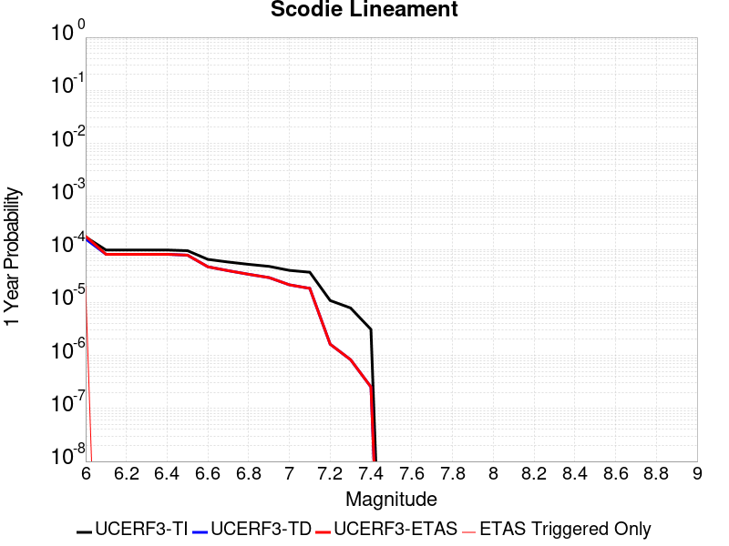 |  |

| Magnitude | 1 wk TI Prob | 1 wk TD Prob | 1 wk ETAS Prob | 1 wk ETAS/TD Gain | 1 wk ETAS Triggered Only | 1 mo TI Prob | 1 mo TD Prob | 1 mo ETAS Prob | 1 mo ETAS/TD Gain | 1 mo ETAS Triggered Only | 1 yr TI Prob | 1 yr TD Prob | 1 yr ETAS Prob | 1 yr ETAS/TD Gain | 1 yr ETAS Triggered Only | 10 yr TI Prob | 10 yr TD Prob | 10 yr ETAS Prob | 10 yr ETAS/TD Gain | 10 yr ETAS Triggered Only |
|-----|-----|-----|-----|-----|-----|-----|-----|-----|-----|-----|-----|-----|-----|-----|-----|-----|-----|-----|-----|-----|
| 6.0 | 3.2919327E-6 | 3.0133565E-6 | 1.3013327E-5 | 4.3185487 | 1.0E-5 | 1.4108206E-5 | 1.2914339E-5 | 2.291421E-5 | 1.7743231 | 1.0E-5 | 1.7175387E-4 | 1.5722391E-4 | 1.7722076E-4 | 1.1271871 | 2.0E-5 | 0.0017162118 | 0.0015714383 | 0.0016113755 | 1.0254143 | 4.0E-5 |
| 6.1 | 1.8663811E-6 | 1.5490589E-6 | 1.5490589E-6 | 1.0 | 0.0 | 7.998751E-6 | 6.6388097E-6 | 6.6388097E-6 | 1.0 | 0.0 | 9.738045E-5 | 8.082501E-5 | 8.082501E-5 | 1.0 | 0.0 | 9.7337784E-4 | 8.0800493E-4 | 8.1799686E-4 | 1.0123662 | 1.0E-5 |
| 6.2 | 1.8663811E-6 | 1.5490589E-6 | 1.5490589E-6 | 1.0 | 0.0 | 7.998751E-6 | 6.6388097E-6 | 6.6388097E-6 | 1.0 | 0.0 | 9.738045E-5 | 8.082501E-5 | 8.082501E-5 | 1.0 | 0.0 | 9.7337784E-4 | 8.0800493E-4 | 8.1799686E-4 | 1.0123662 | 1.0E-5 |
| 6.3 | 1.8663811E-6 | 1.5490589E-6 | 1.5490589E-6 | 1.0 | 0.0 | 7.998751E-6 | 6.6388097E-6 | 6.6388097E-6 | 1.0 | 0.0 | 9.738045E-5 | 8.082501E-5 | 8.082501E-5 | 1.0 | 0.0 | 9.7337784E-4 | 8.0800493E-4 | 8.1799686E-4 | 1.0123662 | 1.0E-5 |
| 6.4 | 1.8663811E-6 | 1.5490589E-6 | 1.5490589E-6 | 1.0 | 0.0 | 7.998751E-6 | 6.6388097E-6 | 6.6388097E-6 | 1.0 | 0.0 | 9.738045E-5 | 8.082501E-5 | 8.082501E-5 | 1.0 | 0.0 | 9.7337784E-4 | 8.0800493E-4 | 8.1799686E-4 | 1.0123662 | 1.0E-5 |
| 6.5 | 1.8106311E-6 | 1.4909926E-6 | 1.4909926E-6 | 1.0 | 0.0 | 7.759824E-6 | 6.3899556E-6 | 6.3899556E-6 | 1.0 | 0.0 | 9.447177E-5 | 7.779543E-5 | 7.779543E-5 | 1.0 | 0.0 | 9.4431615E-4 | 7.777306E-4 | 7.877228E-4 | 1.0128479 | 1.0E-5 |
| 6.6 | 1.2414679E-6 | 8.9976135E-7 | 8.9976135E-7 | 1.0 | 0.0 | 5.320566E-6 | 3.8561147E-6 | 3.8561147E-6 | 1.0 | 0.0 | 6.477596E-5 | 4.6947276E-5 | 4.6947276E-5 | 1.0 | 0.0 | 6.475708E-4 | 4.6938224E-4 | 4.6938224E-4 | 1.0 | 0.0 |
| 6.7 | 1.1062215E-6 | 7.5943603E-7 | 7.5943603E-7 | 1.0 | 0.0 | 4.7409408E-6 | 3.254722E-6 | 3.254722E-6 | 1.0 | 0.0 | 5.7719422E-5 | 3.9625593E-5 | 3.9625593E-5 | 1.0 | 0.0 | 5.770443E-4 | 3.9619225E-4 | 3.9619225E-4 | 1.0 | 0.0 |
| 6.8 | 1.0006736E-6 | 6.5004406E-7 | 6.5004406E-7 | 1.0 | 0.0 | 4.288594E-6 | 2.7859005E-6 | 2.7859005E-6 | 1.0 | 0.0 | 5.221238E-5 | 3.3917873E-5 | 3.3917873E-5 | 1.0 | 0.0 | 5.220012E-4 | 3.3913302E-4 | 3.3913302E-4 | 1.0 | 0.0 |
| 6.9 | 9.167364E-7 | 5.6316645E-7 | 5.6316645E-7 | 1.0 | 0.0 | 3.9288643E-6 | 2.4135686E-6 | 2.4135686E-6 | 1.0 | 0.0 | 4.7832873E-5 | 2.9384859E-5 | 2.9384859E-5 | 1.0 | 0.0 | 4.782258E-4 | 2.9381542E-4 | 2.9381542E-4 | 1.0 | 0.0 |
| 7.0 | 7.6987664E-7 | 4.113416E-7 | 4.113416E-7 | 1.0 | 0.0 | 3.2994672E-6 | 1.7628915E-6 | 1.7628915E-6 | 1.0 | 0.0 | 4.0170275E-5 | 2.1463033E-5 | 2.1463033E-5 | 1.0 | 0.0 | 4.0163012E-4 | 2.1461345E-4 | 2.1461345E-4 | 1.0 | 0.0 |
| 7.1 | 7.1038727E-7 | 3.5211795E-7 | 3.5211795E-7 | 1.0 | 0.0 | 3.0445133E-6 | 1.5090762E-6 | 1.5090762E-6 | 1.0 | 0.0 | 3.706632E-5 | 1.8372884E-5 | 1.8372884E-5 | 1.0 | 0.0 | 3.7060137E-4 | 1.8371714E-4 | 1.8371714E-4 | 1.0 | 0.0 |
| 7.2 | 2.0799602E-7 | 3.1187685E-8 | 3.1187685E-8 | 1.0 | 0.0 | 8.914113E-7 | 1.336615E-7 | 1.336615E-7 | 1.0 | 0.0 | 1.0852878E-5 | 1.6273277E-6 | 1.6273277E-6 | 1.0 | 0.0 | 1.08523476E-4 | 1.6273165E-5 | 1.6273165E-5 | 1.0 | 0.0 |
| 7.3 | 1.5048182E-7 | 1.5946263E-8 | 1.5946263E-8 | 1.0 | 0.0 | 6.449219E-7 | 6.834112E-8 | 6.834112E-8 | 1.0 | 0.0 | 7.851896E-6 | 8.320529E-7 | 8.320529E-7 | 1.0 | 0.0 | 7.851618E-5 | 8.3205005E-6 | 8.3205005E-6 | 1.0 | 0.0 |
| 7.4 | 5.9334678E-8 | 4.8685624E-9 | 4.8685624E-9 | 1.0 | 0.0 | 2.5429145E-7 | 2.0865269E-8 | 2.0865269E-8 | 1.0 | 0.0 | 3.095994E-6 | 2.5403463E-7 | 2.5403463E-7 | 1.0 | 0.0 | 3.095951E-5 | 2.5403444E-6 | 2.5403444E-6 | 1.0 | 0.0 |

## Calico-Hidalgo
*[(top)](#table-of-contents)*

| 1 Week | 1 Month | 1 Year | 10 Year |
|-----|-----|-----|-----|
|  |  |  |  |

| Magnitude | 1 wk TI Prob | 1 wk TD Prob | 1 wk ETAS Prob | 1 wk ETAS/TD Gain | 1 wk ETAS Triggered Only | 1 mo TI Prob | 1 mo TD Prob | 1 mo ETAS Prob | 1 mo ETAS/TD Gain | 1 mo ETAS Triggered Only | 1 yr TI Prob | 1 yr TD Prob | 1 yr ETAS Prob | 1 yr ETAS/TD Gain | 1 yr ETAS Triggered Only | 10 yr TI Prob | 10 yr TD Prob | 10 yr ETAS Prob | 10 yr ETAS/TD Gain | 10 yr ETAS Triggered Only |
|-----|-----|-----|-----|-----|-----|-----|-----|-----|-----|-----|-----|-----|-----|-----|-----|-----|-----|-----|-----|-----|
| 6.0 | 4.0906612E-5 | 5.0704653E-5 | 5.0704653E-5 | 1.0 | 0.0 | 1.7530227E-4 | 2.1728984E-4 | 2.372855E-4 | 1.092023 | 2.0E-5 | 0.0021322158 | 0.0026426981 | 0.0026626454 | 1.007548 | 2.0E-5 | 0.02111873 | 0.026153097 | 0.02619205 | 1.0014894 | 4.0E-5 |
| 6.1 | 4.0906612E-5 | 5.0704653E-5 | 5.0704653E-5 | 1.0 | 0.0 | 1.7530227E-4 | 2.1728984E-4 | 2.372855E-4 | 1.092023 | 2.0E-5 | 0.0021322158 | 0.0026426981 | 0.0026626454 | 1.007548 | 2.0E-5 | 0.02111873 | 0.026153097 | 0.02619205 | 1.0014894 | 4.0E-5 |
| 6.2 | 4.0906612E-5 | 5.0704653E-5 | 5.0704653E-5 | 1.0 | 0.0 | 1.7530227E-4 | 2.1728984E-4 | 2.372855E-4 | 1.092023 | 2.0E-5 | 0.0021322158 | 0.0026426981 | 0.0026626454 | 1.007548 | 2.0E-5 | 0.02111873 | 0.026153097 | 0.02619205 | 1.0014894 | 4.0E-5 |
| 6.3 | 2.4242801E-5 | 3.009103E-5 | 3.009103E-5 | 1.0 | 0.0 | 1.0389358E-4 | 1.2895538E-4 | 1.3895408E-4 | 1.0775362 | 1.0E-5 | 0.0012641704 | 0.001568934 | 0.0015789183 | 1.0063637 | 1.0E-5 | 0.01257003 | 0.015582247 | 0.015611779 | 1.0018953 | 3.0E-5 |
| 6.4 | 2.4242801E-5 | 3.009103E-5 | 3.009103E-5 | 1.0 | 0.0 | 1.0389358E-4 | 1.2895538E-4 | 1.3895408E-4 | 1.0775362 | 1.0E-5 | 0.0012641704 | 0.001568934 | 0.0015789183 | 1.0063637 | 1.0E-5 | 0.01257003 | 0.015582247 | 0.015611779 | 1.0018953 | 3.0E-5 |
| 6.5 | 2.0286952E-5 | 2.5315985E-5 | 2.5315985E-5 | 1.0 | 0.0 | 8.694118E-5 | 1.0849266E-4 | 1.0849266E-4 | 1.0 | 0.0 | 0.0010579949 | 0.0013201149 | 0.0013201149 | 1.0 | 0.0 | 0.010529719 | 0.013124665 | 0.013144403 | 1.0015038 | 2.0E-5 |
| 6.6 | 2.0269223E-5 | 2.5296935E-5 | 2.5296935E-5 | 1.0 | 0.0 | 8.6865206E-5 | 1.08411026E-4 | 1.08411026E-4 | 1.0 | 0.0 | 0.0010570707 | 0.0013191222 | 0.0013191222 | 1.0 | 0.0 | 0.010520565 | 0.013114855 | 0.013134592 | 1.001505 | 2.0E-5 |
| 6.7 | 1.799852E-5 | 2.25408E-5 | 2.25408E-5 | 1.0 | 0.0 | 7.713423E-5 | 9.6599935E-5 | 9.6599935E-5 | 1.0 | 0.0 | 9.3870464E-4 | 0.0011754843 | 0.0011754843 | 1.0 | 0.0 | 0.009347493 | 0.011694277 | 0.011714043 | 1.0016903 | 2.0E-5 |
| 6.8 | 1.7458793E-5 | 2.1842314E-5 | 2.1842314E-5 | 1.0 | 0.0 | 7.4821255E-5 | 9.3606635E-5 | 9.3606635E-5 | 1.0 | 0.0 | 9.10568E-4 | 0.0011390795 | 0.0011390795 | 1.0 | 0.0 | 0.009068459 | 0.011333993 | 0.011353767 | 1.0017446 | 2.0E-5 |
| 6.9 | 1.542884E-5 | 1.9026087E-5 | 1.9026087E-5 | 1.0 | 0.0 | 6.612192E-5 | 8.1537895E-5 | 8.1537895E-5 | 1.0 | 0.0 | 8.04737E-4 | 9.92285E-4 | 9.92285E-4 | 1.0 | 0.0 | 0.008018291 | 0.00987994 | 0.009899743 | 1.0020043 | 2.0E-5 |
| 7.0 | 1.468253E-5 | 1.8030747E-5 | 1.8030747E-5 | 1.0 | 0.0 | 6.292361E-5 | 7.7272416E-5 | 7.7272416E-5 | 1.0 | 0.0 | 7.658257E-4 | 9.403986E-4 | 9.403986E-4 | 1.0 | 0.0 | 0.0076319184 | 0.009365558 | 0.009385371 | 1.0021155 | 2.0E-5 |
| 7.1 | 1.3139281E-5 | 1.620107E-5 | 1.620107E-5 | 1.0 | 0.0 | 5.6309986E-5 | 6.943138E-5 | 6.943138E-5 | 1.0 | 0.0 | 6.853584E-4 | 8.4501173E-4 | 8.4501173E-4 | 1.0 | 0.0 | 0.0068324856 | 0.008419285 | 0.008439116 | 1.0023555 | 2.0E-5 |
| 7.2 | 1.1127404E-5 | 1.3866703E-5 | 1.3866703E-5 | 1.0 | 0.0 | 4.7688E-5 | 5.9427435E-5 | 5.9427435E-5 | 1.0 | 0.0 | 5.8044674E-4 | 7.2329975E-4 | 7.2329975E-4 | 1.0 | 0.0 | 0.0057893298 | 0.0072105634 | 0.007230419 | 1.0027537 | 2.0E-5 |
| 7.3 | 9.808154E-6 | 1.2176301E-5 | 1.2176301E-5 | 1.0 | 0.0 | 4.2034266E-5 | 5.2183164E-5 | 5.2183164E-5 | 1.0 | 0.0 | 5.11647E-4 | 6.3515553E-4 | 6.3515553E-4 | 1.0 | 0.0 | 0.0051047057 | 0.0063344776 | 0.006354351 | 1.0031374 | 2.0E-5 |
| 7.4 | 7.942452E-6 | 9.7922075E-6 | 9.7922075E-6 | 1.0 | 0.0 | 3.4038632E-5 | 4.196598E-5 | 4.196598E-5 | 1.0 | 0.0 | 4.1434157E-4 | 5.1082554E-4 | 5.1082554E-4 | 1.0 | 0.0 | 0.0041356985 | 0.0050974544 | 0.0051074033 | 1.0019518 | 1.0E-5 |
| 7.5 | 4.7121216E-6 | 5.772871E-6 | 5.772871E-6 | 1.0 | 0.0 | 2.019465E-5 | 2.4740684E-5 | 2.4740684E-5 | 1.0 | 0.0 | 2.4584212E-4 | 3.0118387E-4 | 3.0118387E-4 | 1.0 | 0.0 | 0.0024557032 | 0.0030085093 | 0.003018479 | 1.0033139 | 1.0E-5 |
| 7.6 | 2.21172E-7 | 2.6039737E-7 | 2.6039737E-7 | 1.0 | 0.0 | 9.478797E-7 | 1.1159884E-6 | 1.1159884E-6 | 1.0 | 0.0 | 1.1540374E-5 | 1.3587103E-5 | 1.3587103E-5 | 1.0 | 0.0 | 1.1539775E-4 | 1.3586554E-4 | 1.4586418E-4 | 1.0735922 | 1.0E-5 |

## San Andreas (Coachella) rev
*[(top)](#table-of-contents)*

| 1 Week | 1 Month | 1 Year | 10 Year |
|-----|-----|-----|-----|
|  |  |  |  |

| Magnitude | 1 wk TI Prob | 1 wk TD Prob | 1 wk ETAS Prob | 1 wk ETAS/TD Gain | 1 wk ETAS Triggered Only | 1 mo TI Prob | 1 mo TD Prob | 1 mo ETAS Prob | 1 mo ETAS/TD Gain | 1 mo ETAS Triggered Only | 1 yr TI Prob | 1 yr TD Prob | 1 yr ETAS Prob | 1 yr ETAS/TD Gain | 1 yr ETAS Triggered Only | 10 yr TI Prob | 10 yr TD Prob | 10 yr ETAS Prob | 10 yr ETAS/TD Gain | 10 yr ETAS Triggered Only |
|-----|-----|-----|-----|-----|-----|-----|-----|-----|-----|-----|-----|-----|-----|-----|-----|-----|-----|-----|-----|-----|
| 6.0 | 1.1925945E-4 | 3.2733803E-4 | 3.2733803E-4 | 1.0 | 0.0 | 5.110118E-4 | 0.0014021277 | 0.0014121137 | 1.007122 | 1.0E-5 | 0.0062038354 | 0.016938623 | 0.016958283 | 1.0011607 | 2.0E-5 | 0.060334753 | 0.15267034 | 0.15270422 | 1.000222 | 4.0E-5 |
| 6.1 | 1.1925945E-4 | 3.2733803E-4 | 3.2733803E-4 | 1.0 | 0.0 | 5.110118E-4 | 0.0014021277 | 0.0014121137 | 1.007122 | 1.0E-5 | 0.0062038354 | 0.016938623 | 0.016958283 | 1.0011607 | 2.0E-5 | 0.060334753 | 0.15267034 | 0.15270422 | 1.000222 | 4.0E-5 |
| 6.2 | 1.07432395E-4 | 3.0234526E-4 | 3.0234526E-4 | 1.0 | 0.0 | 4.603433E-4 | 0.0012951259 | 0.001305113 | 1.0077113 | 1.0E-5 | 0.005590286 | 0.015655253 | 0.015674941 | 1.0012575 | 2.0E-5 | 0.05451731 | 0.14184146 | 0.14187579 | 1.000242 | 4.0E-5 |
| 6.3 | 1.0718766E-4 | 3.017983E-4 | 3.017983E-4 | 1.0 | 0.0 | 4.592948E-4 | 0.0012927842 | 0.0013027713 | 1.0077252 | 1.0E-5 | 0.005577586 | 0.015627153 | 0.01564684 | 1.0012598 | 2.0E-5 | 0.054396555 | 0.14160971 | 0.14164405 | 1.0002425 | 4.0E-5 |
| 6.4 | 1.0355944E-4 | 2.9387916E-4 | 2.9387916E-4 | 1.0 | 0.0 | 4.4375064E-4 | 0.0012588782 | 0.0012688655 | 1.0079336 | 1.0E-5 | 0.0053892885 | 0.015220184 | 0.0152398795 | 1.001294 | 2.0E-5 | 0.052604496 | 0.13816981 | 0.13820429 | 1.0002495 | 4.0E-5 |
| 6.5 | 1.0227914E-4 | 2.910735E-4 | 2.910735E-4 | 1.0 | 0.0 | 4.382655E-4 | 0.0012468654 | 0.0012568529 | 1.0080101 | 1.0E-5 | 0.0053228354 | 0.015075962 | 0.01509566 | 1.0013067 | 2.0E-5 | 0.051971316 | 0.136949 | 0.13698353 | 1.0002521 | 4.0E-5 |
| 6.6 | 1.0116757E-4 | 2.8873098E-4 | 2.8873098E-4 | 1.0 | 0.0 | 4.3350324E-4 | 0.0012368355 | 0.0012468232 | 1.0080751 | 1.0E-5 | 0.0052651367 | 0.014955532 | 0.014975232 | 1.0013173 | 2.0E-5 | 0.051421247 | 0.13592719 | 0.13596176 | 1.0002543 | 4.0E-5 |
| 6.7 | 1.0050676E-4 | 2.873166E-4 | 2.873166E-4 | 1.0 | 0.0 | 4.3067214E-4 | 0.0012307797 | 0.0012407673 | 1.0081149 | 1.0E-5 | 0.005230834 | 0.01488281 | 0.0149025135 | 1.0013238 | 2.0E-5 | 0.051094085 | 0.13531192 | 0.1353465 | 1.0002556 | 4.0E-5 |
| 6.8 | 9.976819E-5 | 2.853531E-4 | 2.853531E-4 | 1.0 | 0.0 | 4.2750788E-4 | 0.0012223726 | 0.0012323605 | 1.0081708 | 1.0E-5 | 0.0051924936 | 0.014781849 | 0.014801553 | 1.001333 | 2.0E-5 | 0.050728295 | 0.13446361 | 0.13449822 | 1.0002575 | 4.0E-5 |
| 6.9 | 9.77719E-5 | 2.8032195E-4 | 2.8032195E-4 | 1.0 | 0.0 | 4.1895514E-4 | 0.0012008306 | 0.0012108185 | 1.0083176 | 1.0E-5 | 0.0050888555 | 0.014523101 | 0.014542811 | 1.0013571 | 2.0E-5 | 0.049738888 | 0.13229203 | 0.13232675 | 1.0002624 | 4.0E-5 |
| 7.0 | 8.500761E-5 | 2.4766565E-4 | 2.4766565E-4 | 1.0 | 0.0 | 3.6426744E-4 | 0.0010609957 | 0.0010709851 | 1.0094151 | 1.0E-5 | 0.0044259406 | 0.012841888 | 0.012861631 | 1.0015374 | 2.0E-5 | 0.04338823 | 0.11814933 | 0.11818461 | 1.0002985 | 4.0E-5 |
| 7.1 | 8.319876E-5 | 2.4369264E-4 | 2.4369264E-4 | 1.0 | 0.0 | 3.5651738E-4 | 0.0010439822 | 0.0010539718 | 1.0095687 | 1.0E-5 | 0.004331963 | 0.012637171 | 0.012656918 | 1.0015626 | 2.0E-5 | 0.042484846 | 0.116369456 | 0.1164048 | 1.0003037 | 4.0E-5 |
| 7.2 | 7.563917E-5 | 2.2417592E-4 | 2.2417592E-4 | 1.0 | 0.0 | 3.2412758E-4 | 9.6040324E-4 | 9.7039365E-4 | 1.0104023 | 1.0E-5 | 0.0039391145 | 0.0116309095 | 0.011650677 | 1.0016996 | 2.0E-5 | 0.03870018 | 0.10777538 | 0.10781107 | 1.0003312 | 4.0E-5 |
| 7.3 | 7.082985E-5 | 2.073362E-4 | 2.073362E-4 | 1.0 | 0.0 | 3.0352117E-4 | 8.88284E-4 | 8.982751E-4 | 1.0112476 | 1.0E-5 | 0.0036891096 | 0.010761855 | 0.010781639 | 1.0018384 | 2.0E-5 | 0.03628465 | 0.10029767 | 0.10033365 | 1.0003588 | 4.0E-5 |
| 7.4 | 5.146215E-5 | 1.4276853E-4 | 1.4276853E-4 | 1.0 | 0.0 | 2.2053342E-4 | 6.117225E-4 | 6.117225E-4 | 1.0 | 0.0 | 0.0026816884 | 0.007422478 | 0.0074324035 | 1.0013373 | 1.0E-5 | 0.02649557 | 0.07086292 | 0.07089079 | 1.0003934 | 3.0E-5 |
| 7.5 | 4.0285166E-5 | 1.0944253E-4 | 1.0944253E-4 | 1.0 | 0.0 | 1.7263928E-4 | 4.689554E-4 | 4.689554E-4 | 1.0 | 0.0 | 0.002099857 | 0.005694655 | 0.0057045976 | 1.001746 | 1.0E-5 | 0.020801254 | 0.055022955 | 0.055051304 | 1.0005152 | 3.0E-5 |
| 7.6 | 3.1168736E-5 | 8.441267E-5 | 8.441267E-5 | 1.0 | 0.0 | 1.3357346E-4 | 3.6171856E-4 | 3.6171856E-4 | 1.0 | 0.0 | 0.0016250437 | 0.004395057 | 0.0044050133 | 1.0022653 | 1.0E-5 | 0.016132116 | 0.042820677 | 0.04284939 | 1.0006706 | 3.0E-5 |
| 7.7 | 2.2100989E-5 | 6.2408275E-5 | 6.2408275E-5 | 1.0 | 0.0 | 9.4715084E-5 | 2.6743664E-4 | 2.6743664E-4 | 1.0 | 0.0 | 0.001152546 | 0.003251186 | 0.0032611536 | 1.0030658 | 1.0E-5 | 0.011465867 | 0.03190961 | 0.031938653 | 1.0009102 | 3.0E-5 |
| 7.8 | 1.7484861E-5 | 5.1814186E-5 | 5.1814186E-5 | 1.0 | 0.0 | 7.493296E-5 | 2.2204191E-4 | 2.2204191E-4 | 1.0 | 0.0 | 9.1192697E-4 | 0.002700012 | 0.0027099848 | 1.0036937 | 1.0E-5 | 0.009081938 | 0.026648527 | 0.026677728 | 1.0010958 | 3.0E-5 |
| 7.9 | 1.3967285E-5 | 3.8237675E-5 | 3.8237675E-5 | 1.0 | 0.0 | 5.985842E-5 | 1.6386545E-4 | 1.6386545E-4 | 1.0 | 0.0 | 7.2853256E-4 | 0.0019932375 | 0.0020032176 | 1.0050069 | 1.0E-5 | 0.0072614877 | 0.019916428 | 0.019945832 | 1.0014763 | 3.0E-5 |
| 8.0 | 1.1887396E-5 | 3.107819E-5 | 3.107819E-5 | 1.0 | 0.0 | 5.094499E-5 | 1.3318544E-4 | 1.3318544E-4 | 1.0 | 0.0 | 6.200787E-4 | 0.0016203277 | 0.0016303115 | 1.0061616 | 1.0E-5 | 0.006183513 | 0.016285317 | 0.016314829 | 1.0018121 | 3.0E-5 |
| 8.1 | 5.100864E-6 | 8.978668E-6 | 8.978668E-6 | 1.0 | 0.0 | 2.1860664E-5 | 3.847944E-5 | 3.847944E-5 | 1.0 | 0.0 | 2.6612106E-4 | 4.6838663E-4 | 4.6838663E-4 | 1.0 | 0.0 | 0.002658026 | 0.004920349 | 0.004920349 | 1.0 | 0.0 |
| 8.2 | 2.3004484E-6 | 2.7885583E-6 | 2.7885583E-6 | 1.0 | 0.0 | 9.859027E-6 | 1.19509095E-5 | 1.19509095E-5 | 1.0 | 0.0 | 1.2002704E-4 | 1.4549264E-4 | 1.4549264E-4 | 1.0 | 0.0 | 0.0011996223 | 0.0015984807 | 0.0015984807 | 1.0 | 0.0 |
| 8.3 | 1.0424446E-7 | 5.8219563E-8 | 5.8219563E-8 | 1.0 | 0.0 | 4.4676187E-7 | 2.495124E-7 | 2.495124E-7 | 1.0 | 0.0 | 5.439312E-6 | 3.0378094E-6 | 3.0378094E-6 | 1.0 | 0.0 | 5.4391792E-5 | 3.193819E-5 | 3.193819E-5 | 1.0 | 0.0 |

## Bullion Mountains
*[(top)](#table-of-contents)*

| 1 Week | 1 Month | 1 Year | 10 Year |
|-----|-----|-----|-----|
|  |  | 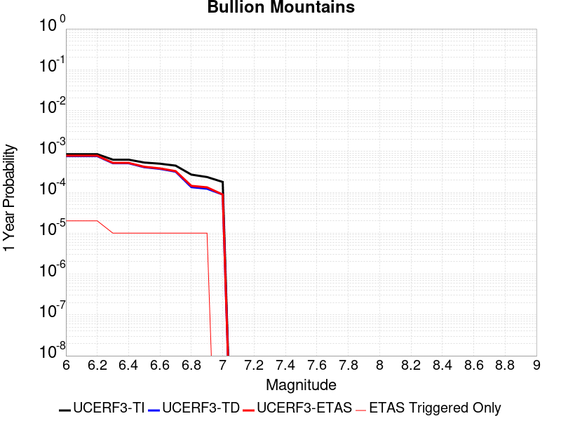 |  |

| Magnitude | 1 wk TI Prob | 1 wk TD Prob | 1 wk ETAS Prob | 1 wk ETAS/TD Gain | 1 wk ETAS Triggered Only | 1 mo TI Prob | 1 mo TD Prob | 1 mo ETAS Prob | 1 mo ETAS/TD Gain | 1 mo ETAS Triggered Only | 1 yr TI Prob | 1 yr TD Prob | 1 yr ETAS Prob | 1 yr ETAS/TD Gain | 1 yr ETAS Triggered Only | 10 yr TI Prob | 10 yr TD Prob | 10 yr ETAS Prob | 10 yr ETAS/TD Gain | 10 yr ETAS Triggered Only |
|-----|-----|-----|-----|-----|-----|-----|-----|-----|-----|-----|-----|-----|-----|-----|-----|-----|-----|-----|-----|-----|
| 6.0 | 1.6420427E-5 | 1.4692306E-5 | 2.4692159E-5 | 1.6806184 | 1.0E-5 | 7.037136E-5 | 6.296572E-5 | 7.296509E-5 | 1.1588066 | 1.0E-5 | 8.5643446E-4 | 7.663764E-4 | 7.8636105E-4 | 1.0260768 | 2.0E-5 | 0.008531413 | 0.0076411283 | 0.007670899 | 1.0038961 | 3.0E-5 |
| 6.1 | 1.6420427E-5 | 1.4692306E-5 | 2.4692159E-5 | 1.6806184 | 1.0E-5 | 7.037136E-5 | 6.296572E-5 | 7.296509E-5 | 1.1588066 | 1.0E-5 | 8.5643446E-4 | 7.663764E-4 | 7.8636105E-4 | 1.0260768 | 2.0E-5 | 0.008531413 | 0.0076411283 | 0.007670899 | 1.0038961 | 3.0E-5 |
| 6.2 | 1.6420427E-5 | 1.4692306E-5 | 2.4692159E-5 | 1.6806184 | 1.0E-5 | 7.037136E-5 | 6.296572E-5 | 7.296509E-5 | 1.1588066 | 1.0E-5 | 8.5643446E-4 | 7.663764E-4 | 7.8636105E-4 | 1.0260768 | 2.0E-5 | 0.008531413 | 0.0076411283 | 0.007670899 | 1.0038961 | 3.0E-5 |
| 6.3 | 1.2046778E-5 | 9.862485E-6 | 1.9862386E-5 | 2.0139332 | 1.0E-5 | 5.1628023E-5 | 4.226724E-5 | 5.2266816E-5 | 1.2365799 | 1.0E-5 | 6.283899E-4 | 5.145053E-4 | 5.2450015E-4 | 1.0194261 | 1.0E-5 | 0.0062661595 | 0.0051354226 | 0.00515532 | 1.0038745 | 2.0E-5 |
| 6.4 | 1.2046778E-5 | 9.862485E-6 | 1.9862386E-5 | 2.0139332 | 1.0E-5 | 5.1628023E-5 | 4.226724E-5 | 5.2266816E-5 | 1.2365799 | 1.0E-5 | 6.283899E-4 | 5.145053E-4 | 5.2450015E-4 | 1.0194261 | 1.0E-5 | 0.0062661595 | 0.0051354226 | 0.00515532 | 1.0038745 | 2.0E-5 |
| 6.5 | 1.0244343E-5 | 7.879582E-6 | 1.7879504E-5 | 2.269093 | 1.0E-5 | 4.390359E-5 | 3.3769316E-5 | 4.3768978E-5 | 1.2961168 | 1.0E-5 | 5.343951E-4 | 4.1108453E-4 | 4.2108042E-4 | 1.024316 | 1.0E-5 | 0.005331118 | 0.0041052722 | 0.00412519 | 1.0048518 | 2.0E-5 |
| 6.6 | 9.605408E-6 | 7.1776108E-6 | 1.717754E-5 | 2.3932114 | 1.0E-5 | 4.1165385E-5 | 3.076094E-5 | 4.076063E-5 | 1.3250775 | 1.0E-5 | 5.010733E-4 | 3.7447043E-4 | 3.844667E-4 | 1.0266944 | 1.0E-5 | 0.00499945 | 0.0037403915 | 0.0037603166 | 1.005327 | 2.0E-5 |
| 6.7 | 8.60418E-6 | 6.1241044E-6 | 1.6124042E-5 | 2.6328819 | 1.0E-5 | 3.687454E-5 | 2.6246007E-5 | 3.6245743E-5 | 1.3810004 | 1.0E-5 | 4.48855E-4 | 3.1951777E-4 | 3.295146E-4 | 1.0312872 | 1.0E-5 | 0.004479495 | 0.0031924958 | 0.003212432 | 1.0062447 | 2.0E-5 |
| 6.8 | 5.187994E-6 | 2.5632194E-6 | 1.2563194E-5 | 4.901334 | 1.0E-5 | 2.223407E-5 | 1.0985203E-5 | 2.0985093E-5 | 1.9103055 | 1.0E-5 | 2.7066618E-4 | 1.3374063E-4 | 1.437393E-4 | 1.0747616 | 1.0E-5 | 0.0027033675 | 0.001336993 | 0.0013569662 | 1.014939 | 2.0E-5 |
| 6.9 | 4.5302368E-6 | 2.3443622E-6 | 1.2344339E-5 | 5.2655425 | 1.0E-5 | 1.9415156E-5 | 1.0047251E-5 | 2.004715E-5 | 1.9952872 | 1.0E-5 | 2.3635388E-4 | 1.2232238E-4 | 1.3232115E-4 | 1.0817412 | 1.0E-5 | 0.0023610266 | 0.0012229396 | 0.0012429152 | 1.016334 | 2.0E-5 |
| 7.0 | 3.431668E-6 | 1.6882757E-6 | 1.6882757E-6 | 1.0 | 0.0 | 1.4707065E-5 | 7.2354674E-6 | 7.2354674E-6 | 1.0 | 0.0 | 1.7904381E-4 | 8.8091816E-5 | 8.8091816E-5 | 1.0 | 0.0 | 0.0017889962 | 8.809181E-4 | 8.909093E-4 | 1.0113418 | 1.0E-5 |

## Kern Canyon (North Kern) 2011
*[(top)](#table-of-contents)*

| 1 Week | 1 Month | 1 Year | 10 Year |
|-----|-----|-----|-----|
|  |  |  |  |

| Magnitude | 1 wk TI Prob | 1 wk TD Prob | 1 wk ETAS Prob | 1 wk ETAS/TD Gain | 1 wk ETAS Triggered Only | 1 mo TI Prob | 1 mo TD Prob | 1 mo ETAS Prob | 1 mo ETAS/TD Gain | 1 mo ETAS Triggered Only | 1 yr TI Prob | 1 yr TD Prob | 1 yr ETAS Prob | 1 yr ETAS/TD Gain | 1 yr ETAS Triggered Only | 10 yr TI Prob | 10 yr TD Prob | 10 yr ETAS Prob | 10 yr ETAS/TD Gain | 10 yr ETAS Triggered Only |
|-----|-----|-----|-----|-----|-----|-----|-----|-----|-----|-----|-----|-----|-----|-----|-----|-----|-----|-----|-----|-----|
| 6.0 | 6.6264497E-6 | 6.7573515E-6 | 1.6757283E-5 | 2.4798598 | 1.0E-5 | 2.8398761E-5 | 2.8959801E-5 | 3.895951E-5 | 1.3452963 | 1.0E-5 | 3.4570007E-4 | 3.5253653E-4 | 3.725295E-4 | 1.0567117 | 2.0E-5 | 0.0034516277 | 0.0035205614 | 0.0035504557 | 1.0084914 | 3.0E-5 |
| 6.1 | 6.6264497E-6 | 6.7573515E-6 | 1.6757283E-5 | 2.4798598 | 1.0E-5 | 2.8398761E-5 | 2.8959801E-5 | 3.895951E-5 | 1.3452963 | 1.0E-5 | 3.4570007E-4 | 3.5253653E-4 | 3.725295E-4 | 1.0567117 | 2.0E-5 | 0.0034516277 | 0.0035205614 | 0.0035504557 | 1.0084914 | 3.0E-5 |
| 6.2 | 6.6264497E-6 | 6.7573515E-6 | 1.6757283E-5 | 2.4798598 | 1.0E-5 | 2.8398761E-5 | 2.8959801E-5 | 3.895951E-5 | 1.3452963 | 1.0E-5 | 3.4570007E-4 | 3.5253653E-4 | 3.725295E-4 | 1.0567117 | 2.0E-5 | 0.0034516277 | 0.0035205614 | 0.0035504557 | 1.0084914 | 3.0E-5 |
| 6.3 | 6.6264497E-6 | 6.7573515E-6 | 1.6757283E-5 | 2.4798598 | 1.0E-5 | 2.8398761E-5 | 2.8959801E-5 | 3.895951E-5 | 1.3452963 | 1.0E-5 | 3.4570007E-4 | 3.5253653E-4 | 3.725295E-4 | 1.0567117 | 2.0E-5 | 0.0034516277 | 0.0035205614 | 0.0035504557 | 1.0084914 | 3.0E-5 |
| 6.4 | 6.6264497E-6 | 6.7573515E-6 | 1.6757283E-5 | 2.4798598 | 1.0E-5 | 2.8398761E-5 | 2.8959801E-5 | 3.895951E-5 | 1.3452963 | 1.0E-5 | 3.4570007E-4 | 3.5253653E-4 | 3.725295E-4 | 1.0567117 | 2.0E-5 | 0.0034516277 | 0.0035205614 | 0.0035504557 | 1.0084914 | 3.0E-5 |
| 6.5 | 3.2162225E-6 | 3.2571006E-6 | 3.2571006E-6 | 1.0 | 0.0 | 1.3783738E-5 | 1.3958933E-5 | 1.3958933E-5 | 1.0 | 0.0 | 1.6780409E-4 | 1.6993756E-4 | 1.6993756E-4 | 1.0 | 0.0 | 0.0016767744 | 0.0016981558 | 0.0017081387 | 1.0058787 | 1.0E-5 |
| 6.6 | 3.2162225E-6 | 3.2571006E-6 | 3.2571006E-6 | 1.0 | 0.0 | 1.3783738E-5 | 1.3958933E-5 | 1.3958933E-5 | 1.0 | 0.0 | 1.6780409E-4 | 1.6993756E-4 | 1.6993756E-4 | 1.0 | 0.0 | 0.0016767744 | 0.0016981558 | 0.0017081387 | 1.0058787 | 1.0E-5 |
| 6.7 | 2.1908265E-6 | 2.2071279E-6 | 2.2071279E-6 | 1.0 | 0.0 | 9.389223E-6 | 9.459087E-6 | 9.459087E-6 | 1.0 | 0.0 | 1.1430779E-4 | 1.1515849E-4 | 1.1515849E-4 | 1.0 | 0.0 | 0.0011424901 | 0.0011510076 | 0.0011510076 | 1.0 | 0.0 |
| 6.8 | 1.7303895E-6 | 1.7365574E-6 | 1.7365574E-6 | 1.0 | 0.0 | 7.415934E-6 | 7.442368E-6 | 7.442368E-6 | 1.0 | 0.0 | 9.028525E-5 | 9.060716E-5 | 9.060716E-5 | 1.0 | 0.0 | 9.024858E-4 | 9.057119E-4 | 9.057119E-4 | 1.0 | 0.0 |
| 6.9 | 1.3700314E-6 | 1.3688657E-6 | 1.3688657E-6 | 1.0 | 0.0 | 5.87155E-6 | 5.866554E-6 | 5.866554E-6 | 1.0 | 0.0 | 7.148377E-5 | 7.1423005E-5 | 7.1423005E-5 | 1.0 | 0.0 | 7.146078E-4 | 7.1400503E-4 | 7.1400503E-4 | 1.0 | 0.0 |
| 7.0 | 1.1467797E-6 | 1.1413833E-6 | 1.1413833E-6 | 1.0 | 0.0 | 4.9147607E-6 | 4.8916336E-6 | 4.8916336E-6 | 1.0 | 0.0 | 5.983557E-5 | 5.9554044E-5 | 5.9554044E-5 | 1.0 | 0.0 | 5.981946E-4 | 5.95384E-4 | 5.95384E-4 | 1.0 | 0.0 |
| 7.1 | 9.3952065E-7 | 9.302714E-7 | 9.302714E-7 | 1.0 | 0.0 | 4.026511E-6 | 3.9868714E-6 | 3.9868714E-6 | 1.0 | 0.0 | 4.9021666E-5 | 4.8539096E-5 | 4.8539096E-5 | 1.0 | 0.0 | 4.901085E-4 | 4.8528673E-4 | 4.8528673E-4 | 1.0 | 0.0 |
| 7.2 | 6.858055E-7 | 6.719318E-7 | 6.719318E-7 | 1.0 | 0.0 | 2.939163E-6 | 2.8797044E-6 | 2.8797044E-6 | 1.0 | 0.0 | 3.5783723E-5 | 3.5059846E-5 | 3.5059846E-5 | 1.0 | 0.0 | 3.5777962E-4 | 3.5054405E-4 | 3.5054405E-4 | 1.0 | 0.0 |
| 7.3 | 5.1101983E-7 | 4.939313E-7 | 4.939313E-7 | 1.0 | 0.0 | 2.1900833E-6 | 2.1168466E-6 | 2.1168466E-6 | 1.0 | 0.0 | 2.6663936E-5 | 2.5772308E-5 | 2.5772308E-5 | 1.0 | 0.0 | 2.6660739E-4 | 2.5769367E-4 | 2.5769367E-4 | 1.0 | 0.0 |
| 7.4 | 3.4999414E-7 | 3.2995996E-7 | 3.2995996E-7 | 1.0 | 0.0 | 1.499974E-6 | 1.4141134E-6 | 1.4141134E-6 | 1.0 | 0.0 | 1.8262032E-5 | 1.7216697E-5 | 1.7216697E-5 | 1.0 | 0.0 | 1.826053E-4 | 1.7215387E-4 | 1.7215387E-4 | 1.0 | 0.0 |
| 7.5 | 1.7021522E-7 | 1.4750091E-7 | 1.4750091E-7 | 1.0 | 0.0 | 7.2949354E-7 | 6.3214657E-7 | 6.3214657E-7 | 1.0 | 0.0 | 8.881548E-6 | 7.696359E-6 | 7.696359E-6 | 1.0 | 0.0 | 8.8811925E-5 | 7.6961E-5 | 7.6961E-5 | 1.0 | 0.0 |
| 7.6 | 2.572245E-8 | 1.7352637E-8 | 1.7352637E-8 | 1.0 | 0.0 | 1.10239064E-7 | 7.4368444E-8 | 7.4368444E-8 | 1.0 | 0.0 | 1.3421597E-6 | 9.0543546E-7 | 9.0543546E-7 | 1.0 | 0.0 | 1.3421517E-5 | 9.0543235E-6 | 9.0543235E-6 | 1.0 | 0.0 |

## Deep Springs
*[(top)](#table-of-contents)*

| 1 Week | 1 Month | 1 Year | 10 Year |
|-----|-----|-----|-----|
|  |  |  |  |

| Magnitude | 1 wk TI Prob | 1 wk TD Prob | 1 wk ETAS Prob | 1 wk ETAS/TD Gain | 1 wk ETAS Triggered Only | 1 mo TI Prob | 1 mo TD Prob | 1 mo ETAS Prob | 1 mo ETAS/TD Gain | 1 mo ETAS Triggered Only | 1 yr TI Prob | 1 yr TD Prob | 1 yr ETAS Prob | 1 yr ETAS/TD Gain | 1 yr ETAS Triggered Only | 10 yr TI Prob | 10 yr TD Prob | 10 yr ETAS Prob | 10 yr ETAS/TD Gain | 10 yr ETAS Triggered Only |
|-----|-----|-----|-----|-----|-----|-----|-----|-----|-----|-----|-----|-----|-----|-----|-----|-----|-----|-----|-----|-----|
| 6.0 | 1.9810619E-5 | 2.311303E-5 | 2.311303E-5 | 1.0 | 0.0 | 8.489989E-5 | 9.905495E-5 | 1.19052966E-4 | 1.2018881 | 2.0E-5 | 0.001033166 | 0.0012058346 | 0.0012258105 | 1.016566 | 2.0E-5 | 0.010283757 | 0.01204269 | 0.012072329 | 1.0024612 | 3.0E-5 |
| 6.1 | 1.9810619E-5 | 2.311303E-5 | 2.311303E-5 | 1.0 | 0.0 | 8.489989E-5 | 9.905495E-5 | 1.19052966E-4 | 1.2018881 | 2.0E-5 | 0.001033166 | 0.0012058346 | 0.0012258105 | 1.016566 | 2.0E-5 | 0.010283757 | 0.01204269 | 0.012072329 | 1.0024612 | 3.0E-5 |
| 6.2 | 1.9810619E-5 | 2.311303E-5 | 2.311303E-5 | 1.0 | 0.0 | 8.489989E-5 | 9.905495E-5 | 1.19052966E-4 | 1.2018881 | 2.0E-5 | 0.001033166 | 0.0012058346 | 0.0012258105 | 1.016566 | 2.0E-5 | 0.010283757 | 0.01204269 | 0.012072329 | 1.0024612 | 3.0E-5 |
| 6.3 | 1.9810619E-5 | 2.311303E-5 | 2.311303E-5 | 1.0 | 0.0 | 8.489989E-5 | 9.905495E-5 | 1.19052966E-4 | 1.2018881 | 2.0E-5 | 0.001033166 | 0.0012058346 | 0.0012258105 | 1.016566 | 2.0E-5 | 0.010283757 | 0.01204269 | 0.012072329 | 1.0024612 | 3.0E-5 |
| 6.4 | 1.9810619E-5 | 2.311303E-5 | 2.311303E-5 | 1.0 | 0.0 | 8.489989E-5 | 9.905495E-5 | 1.19052966E-4 | 1.2018881 | 2.0E-5 | 0.001033166 | 0.0012058346 | 0.0012258105 | 1.016566 | 2.0E-5 | 0.010283757 | 0.01204269 | 0.012072329 | 1.0024612 | 3.0E-5 |
| 6.5 | 1.7190405E-5 | 2.0050999E-5 | 2.0050999E-5 | 1.0 | 0.0 | 7.367108E-5 | 8.593285E-5 | 1.0593113E-4 | 1.2327199 | 2.0E-5 | 8.9657627E-4 | 0.0010462324 | 0.0010662115 | 1.0190963 | 2.0E-5 | 0.008929676 | 0.010462287 | 0.010491973 | 1.0028374 | 3.0E-5 |
| 6.6 | 1.7190405E-5 | 2.0050999E-5 | 2.0050999E-5 | 1.0 | 0.0 | 7.367108E-5 | 8.593285E-5 | 1.0593113E-4 | 1.2327199 | 2.0E-5 | 8.9657627E-4 | 0.0010462324 | 0.0010662115 | 1.0190963 | 2.0E-5 | 0.008929676 | 0.010462287 | 0.010491973 | 1.0028374 | 3.0E-5 |

## San Jacinto (San Bernardino)
*[(top)](#table-of-contents)*

| 1 Week | 1 Month | 1 Year | 10 Year |
|-----|-----|-----|-----|
|  |  |  |  |

| Magnitude | 1 wk TI Prob | 1 wk TD Prob | 1 wk ETAS Prob | 1 wk ETAS/TD Gain | 1 wk ETAS Triggered Only | 1 mo TI Prob | 1 mo TD Prob | 1 mo ETAS Prob | 1 mo ETAS/TD Gain | 1 mo ETAS Triggered Only | 1 yr TI Prob | 1 yr TD Prob | 1 yr ETAS Prob | 1 yr ETAS/TD Gain | 1 yr ETAS Triggered Only | 10 yr TI Prob | 10 yr TD Prob | 10 yr ETAS Prob | 10 yr ETAS/TD Gain | 10 yr ETAS Triggered Only |
|-----|-----|-----|-----|-----|-----|-----|-----|-----|-----|-----|-----|-----|-----|-----|-----|-----|-----|-----|-----|-----|
| 6.0 | 3.409352E-5 | 3.600249E-5 | 3.600249E-5 | 1.0 | 0.0 | 1.461069E-4 | 1.5428728E-4 | 1.6428574E-4 | 1.0648042 | 1.0E-5 | 0.0017774 | 0.001876831 | 0.0018967935 | 1.0106362 | 2.0E-5 | 0.01763251 | 0.019358097 | 0.019387517 | 1.0015197 | 3.0E-5 |
| 6.1 | 3.409352E-5 | 3.600249E-5 | 3.600249E-5 | 1.0 | 0.0 | 1.461069E-4 | 1.5428728E-4 | 1.6428574E-4 | 1.0648042 | 1.0E-5 | 0.0017774 | 0.001876831 | 0.0018967935 | 1.0106362 | 2.0E-5 | 0.01763251 | 0.019358097 | 0.019387517 | 1.0015197 | 3.0E-5 |
| 6.2 | 3.409352E-5 | 3.600249E-5 | 3.600249E-5 | 1.0 | 0.0 | 1.461069E-4 | 1.5428728E-4 | 1.6428574E-4 | 1.0648042 | 1.0E-5 | 0.0017774 | 0.001876831 | 0.0018967935 | 1.0106362 | 2.0E-5 | 0.01763251 | 0.019358097 | 0.019387517 | 1.0015197 | 3.0E-5 |
| 6.3 | 3.409352E-5 | 3.600249E-5 | 3.600249E-5 | 1.0 | 0.0 | 1.461069E-4 | 1.5428728E-4 | 1.6428574E-4 | 1.0648042 | 1.0E-5 | 0.0017774 | 0.001876831 | 0.0018967935 | 1.0106362 | 2.0E-5 | 0.01763251 | 0.019358097 | 0.019387517 | 1.0015197 | 3.0E-5 |
| 6.4 | 3.400795E-5 | 3.589515E-5 | 3.589515E-5 | 1.0 | 0.0 | 1.4574021E-4 | 1.5382729E-4 | 1.6382575E-4 | 1.0649979 | 1.0E-5 | 0.0017729428 | 0.0018712406 | 0.0018912031 | 1.010668 | 2.0E-5 | 0.017588645 | 0.019303178 | 0.019332599 | 1.0015241 | 3.0E-5 |
| 6.5 | 3.341482E-5 | 3.5155765E-5 | 3.5155765E-5 | 1.0 | 0.0 | 1.4319851E-4 | 1.5065886E-4 | 1.6065736E-4 | 1.0663651 | 1.0E-5 | 0.0017420477 | 0.0018327299 | 0.0018526933 | 1.0108926 | 2.0E-5 | 0.017284546 | 0.018924711 | 0.018954143 | 1.0015552 | 3.0E-5 |
| 6.6 | 3.3364955E-5 | 3.509298E-5 | 3.509298E-5 | 1.0 | 0.0 | 1.4298483E-4 | 1.5038982E-4 | 1.6038833E-4 | 1.0664839 | 1.0E-5 | 0.0017394501 | 0.0018294598 | 0.0018494233 | 1.0109122 | 2.0E-5 | 0.017258976 | 0.018892575 | 0.018922009 | 1.001558 | 3.0E-5 |
| 6.7 | 3.335922E-5 | 3.5082754E-5 | 3.5082754E-5 | 1.0 | 0.0 | 1.4296026E-4 | 1.5034601E-4 | 1.603445E-4 | 1.0665033 | 1.0E-5 | 0.0017391514 | 0.0018289272 | 0.0018488907 | 1.0109154 | 2.0E-5 | 0.017256035 | 0.018887365 | 0.018916799 | 1.0015583 | 3.0E-5 |
| 6.8 | 3.327683E-5 | 3.4976816E-5 | 3.4976816E-5 | 1.0 | 0.0 | 1.4260718E-4 | 1.4989203E-4 | 1.5989054E-4 | 1.0667046 | 1.0E-5 | 0.0017348597 | 0.0018234095 | 0.001843373 | 1.0109484 | 2.0E-5 | 0.017213784 | 0.018833136 | 0.018862572 | 1.001563 | 3.0E-5 |
| 6.9 | 3.3235785E-5 | 3.4917768E-5 | 3.4917768E-5 | 1.0 | 0.0 | 1.4243131E-4 | 1.49639E-4 | 1.5963751E-4 | 1.0668175 | 1.0E-5 | 0.0017327217 | 0.0018203339 | 0.0018402975 | 1.010967 | 2.0E-5 | 0.017192734 | 0.018803004 | 0.01883244 | 1.0015655 | 3.0E-5 |
| 7.0 | 3.3197095E-5 | 3.4857694E-5 | 3.4857694E-5 | 1.0 | 0.0 | 1.422655E-4 | 1.4938158E-4 | 1.5938008E-4 | 1.0669327 | 1.0E-5 | 0.0017307063 | 0.001817205 | 0.0018371686 | 1.010986 | 2.0E-5 | 0.017172894 | 0.01877238 | 0.018801818 | 1.0015681 | 3.0E-5 |
| 7.1 | 3.3129716E-5 | 3.47379E-5 | 3.47379E-5 | 1.0 | 0.0 | 1.4197677E-4 | 1.4886823E-4 | 1.5886674E-4 | 1.0671635 | 1.0E-5 | 0.0017271966 | 0.0018109654 | 0.0018309292 | 1.0110239 | 2.0E-5 | 0.017138338 | 0.018711457 | 0.018740896 | 1.0015733 | 3.0E-5 |
| 7.2 | 3.3034008E-5 | 3.4605342E-5 | 3.4605342E-5 | 1.0 | 0.0 | 1.4156665E-4 | 1.4830018E-4 | 1.582987E-4 | 1.0674208 | 1.0E-5 | 0.0017222111 | 0.001804061 | 0.0018240248 | 1.0110661 | 2.0E-5 | 0.017089253 | 0.018643849 | 0.01867329 | 1.0015792 | 3.0E-5 |
| 7.3 | 3.2956614E-5 | 3.447309E-5 | 3.447309E-5 | 1.0 | 0.0 | 1.4123498E-4 | 1.4773346E-4 | 1.5773198E-4 | 1.0676795 | 1.0E-5 | 0.0017181796 | 0.0017971725 | 0.0018171365 | 1.0111086 | 2.0E-5 | 0.017049557 | 0.018576592 | 0.018606035 | 1.0015849 | 3.0E-5 |
| 7.4 | 3.2915937E-5 | 3.439478E-5 | 3.439478E-5 | 1.0 | 0.0 | 1.4106068E-4 | 1.4739788E-4 | 1.573964E-4 | 1.0678335 | 1.0E-5 | 0.0017160608 | 0.0017930934 | 0.0018130576 | 1.0111339 | 2.0E-5 | 0.017028693 | 0.018536855 | 0.018566297 | 1.0015883 | 3.0E-5 |
| 7.5 | 3.281791E-5 | 3.4259683E-5 | 3.4259683E-5 | 1.0 | 0.0 | 1.406406E-4 | 1.4681896E-4 | 1.5681748E-4 | 1.068101 | 1.0E-5 | 0.0017109542 | 0.0017860567 | 0.0018060209 | 1.0111779 | 2.0E-5 | 0.016978411 | 0.018467735 | 0.018497182 | 1.0015944 | 3.0E-5 |
| 7.6 | 3.2521442E-5 | 3.39846E-5 | 3.39846E-5 | 1.0 | 0.0 | 1.3937015E-4 | 1.4564018E-4 | 1.5563871E-4 | 1.0686524 | 1.0E-5 | 0.0016955109 | 0.0017717284 | 0.001791693 | 1.0112684 | 2.0E-5 | 0.016826328 | 0.01832535 | 0.0183548 | 1.0016071 | 3.0E-5 |
| 7.7 | 3.0287873E-5 | 3.246845E-5 | 3.246845E-5 | 1.0 | 0.0 | 1.297987E-4 | 1.391431E-4 | 1.491417E-4 | 1.0718584 | 1.0E-5 | 0.0015791537 | 0.001692752 | 0.0017127182 | 1.011795 | 2.0E-5 | 0.01567979 | 0.017536119 | 0.017565593 | 1.0016807 | 3.0E-5 |
| 7.8 | 2.6316151E-5 | 2.9678711E-5 | 2.9678711E-5 | 1.0 | 0.0 | 1.1277862E-4 | 1.2718828E-4 | 1.3718702E-4 | 1.0786136 | 1.0E-5 | 0.0013722149 | 0.0015474184 | 0.0015673875 | 1.0129048 | 2.0E-5 | 0.013637724 | 0.016077382 | 0.0161069 | 1.001836 | 3.0E-5 |
| 7.9 | 2.0761147E-5 | 2.3431265E-5 | 2.3431265E-5 | 1.0 | 0.0 | 8.897331E-5 | 1.0041584E-4 | 1.1041484E-4 | 1.0995759 | 1.0E-5 | 0.0010827117 | 0.0012218781 | 0.0012318658 | 1.0081742 | 1.0E-5 | 0.010774517 | 0.012799971 | 0.012819715 | 1.0015424 | 2.0E-5 |
| 8.0 | 1.5738568E-5 | 1.6043394E-5 | 1.6043394E-5 | 1.0 | 0.0 | 6.744926E-5 | 6.8755595E-5 | 6.8755595E-5 | 1.0 | 0.0 | 8.2088535E-4 | 8.3677855E-4 | 8.3677855E-4 | 1.0 | 0.0 | 0.008178596 | 0.008871087 | 0.008871087 | 1.0 | 0.0 |
| 8.1 | 1.0105832E-5 | 8.336244E-6 | 8.336244E-6 | 1.0 | 0.0 | 4.3309992E-5 | 3.5726272E-5 | 3.5726272E-5 | 1.0 | 0.0 | 5.2717153E-4 | 4.3488108E-4 | 4.3488108E-4 | 1.0 | 0.0 | 0.005259227 | 0.00468032 | 0.00468032 | 1.0 | 0.0 |
| 8.2 | 4.189207E-6 | 1.5801045E-6 | 1.5801045E-6 | 1.0 | 0.0 | 1.7953622E-5 | 6.771859E-6 | 6.771859E-6 | 1.0 | 0.0 | 2.1856341E-4 | 8.244429E-5 | 8.244429E-5 | 1.0 | 0.0 | 0.0021834858 | 9.575395E-4 | 9.575395E-4 | 1.0 | 0.0 |
| 8.3 | 1.2758221E-6 | 3.6194777E-7 | 3.6194777E-7 | 1.0 | 0.0 | 5.4677976E-6 | 1.5512038E-6 | 1.5512038E-6 | 1.0 | 0.0 | 6.65684E-5 | 1.8885747E-5 | 1.8885747E-5 | 1.0 | 0.0 | 6.6548464E-4 | 2.2777634E-4 | 2.2777634E-4 | 1.0 | 0.0 |

## Imperial
*[(top)](#table-of-contents)*

| 1 Week | 1 Month | 1 Year | 10 Year |
|-----|-----|-----|-----|
|  |  |  |  |

| Magnitude | 1 wk TI Prob | 1 wk TD Prob | 1 wk ETAS Prob | 1 wk ETAS/TD Gain | 1 wk ETAS Triggered Only | 1 mo TI Prob | 1 mo TD Prob | 1 mo ETAS Prob | 1 mo ETAS/TD Gain | 1 mo ETAS Triggered Only | 1 yr TI Prob | 1 yr TD Prob | 1 yr ETAS Prob | 1 yr ETAS/TD Gain | 1 yr ETAS Triggered Only | 10 yr TI Prob | 10 yr TD Prob | 10 yr ETAS Prob | 10 yr ETAS/TD Gain | 10 yr ETAS Triggered Only |
|-----|-----|-----|-----|-----|-----|-----|-----|-----|-----|-----|-----|-----|-----|-----|-----|-----|-----|-----|-----|-----|
| 6.0 | 2.7496446E-4 | 5.0565513E-4 | 5.0565513E-4 | 1.0 | 0.0 | 0.0011778869 | 0.002165333 | 0.0021753113 | 1.0046083 | 1.0E-5 | 0.0142467655 | 0.026045265 | 0.026064744 | 1.0007479 | 2.0E-5 | 0.13367249 | 0.22808637 | 0.2281018 | 1.0000677 | 2.0E-5 |
| 6.1 | 2.5356023E-4 | 4.8667885E-4 | 4.8667885E-4 | 1.0 | 0.0 | 0.001086234 | 0.0020841376 | 0.0020941168 | 1.0047882 | 1.0E-5 | 0.013144928 | 0.02507692 | 0.025096418 | 1.0007776 | 2.0E-5 | 0.123940155 | 0.21951756 | 0.21953316 | 1.0000712 | 2.0E-5 |
| 6.2 | 2.4820742E-4 | 4.7763108E-4 | 4.7763108E-4 | 1.0 | 0.0 | 0.0010633124 | 0.0020454223 | 0.002055402 | 1.004879 | 1.0E-5 | 0.01286919 | 0.024616843 | 0.02463635 | 1.0007925 | 2.0E-5 | 0.12148927 | 0.2160229 | 0.21603857 | 1.0000726 | 2.0E-5 |
| 6.3 | 2.3205351E-4 | 4.590021E-4 | 4.590021E-4 | 1.0 | 0.0 | 9.94136E-4 | 0.0019657058 | 0.001975686 | 1.0050772 | 1.0E-5 | 0.012036599 | 0.023666281 | 0.023685807 | 1.000825 | 2.0E-5 | 0.11405133 | 0.20796864 | 0.20798448 | 1.0000762 | 2.0E-5 |
| 6.4 | 2.0304754E-4 | 3.9885996E-4 | 3.9885996E-4 | 1.0 | 0.0 | 8.6991355E-4 | 0.0017082945 | 0.0017182775 | 1.0058438 | 1.0E-5 | 0.010539869 | 0.020600514 | 0.020610308 | 1.0004754 | 1.0E-5 | 0.100537635 | 0.18510117 | 0.18510932 | 1.000044 | 1.0E-5 |
| 6.5 | 1.854992E-4 | 3.6997703E-4 | 3.6997703E-4 | 1.0 | 0.0 | 7.9475436E-4 | 0.0015846646 | 0.0015946487 | 1.0063004 | 1.0E-5 | 0.009633281 | 0.019123985 | 0.019133793 | 1.000513 | 1.0E-5 | 0.0922623 | 0.17333072 | 0.17333898 | 1.0000477 | 1.0E-5 |
| 6.6 | 1.6586106E-4 | 3.4043082E-4 | 3.4043082E-4 | 1.0 | 0.0 | 7.106394E-4 | 0.0014581835 | 0.0014681689 | 1.0068479 | 1.0E-5 | 0.008617763 | 0.017610526 | 0.017620351 | 1.0005579 | 1.0E-5 | 0.08291132 | 0.16080588 | 0.16081427 | 1.0000522 | 1.0E-5 |
| 6.7 | 1.4224656E-4 | 3.077392E-4 | 3.077392E-4 | 1.0 | 0.0 | 6.094856E-4 | 0.0013182238 | 0.0013282106 | 1.007576 | 1.0E-5 | 0.0073952693 | 0.015933173 | 0.015943013 | 1.0006176 | 1.0E-5 | 0.07153955 | 0.1465114 | 0.14651994 | 1.0000583 | 1.0E-5 |
| 6.8 | 1.2317259E-4 | 2.779711E-4 | 2.779711E-4 | 1.0 | 0.0 | 5.2777573E-4 | 0.0011907669 | 0.001200755 | 1.0083879 | 1.0E-5 | 0.0064067547 | 0.0144026 | 0.014412456 | 1.0006843 | 1.0E-5 | 0.06225166 | 0.13296051 | 0.13296919 | 1.0000652 | 1.0E-5 |
| 6.9 | 9.859898E-5 | 2.5018715E-4 | 2.5018715E-4 | 1.0 | 0.0 | 4.2249862E-4 | 0.0010717943 | 0.0010817837 | 1.0093201 | 1.0E-5 | 0.0051317946 | 0.012971984 | 0.012981854 | 1.0007609 | 1.0E-5 | 0.05014893 | 0.11942433 | 0.119433135 | 1.0000738 | 1.0E-5 |
| 7.0 | 7.3191884E-5 | 2.1270063E-4 | 2.1270063E-4 | 1.0 | 0.0 | 3.136418E-4 | 9.1125886E-4 | 9.2124974E-4 | 1.0109638 | 1.0E-5 | 0.003811904 | 0.011038825 | 0.011048714 | 1.0008959 | 1.0E-5 | 0.037471764 | 0.10207849 | 0.10208747 | 1.000088 | 1.0E-5 |
| 7.1 | 7.1760296E-5 | 2.0971385E-4 | 2.0971385E-4 | 1.0 | 0.0 | 3.0750787E-4 | 8.984672E-4 | 9.084582E-4 | 1.0111201 | 1.0E-5 | 0.003737482 | 0.010884652 | 0.0108945435 | 1.0009087 | 1.0E-5 | 0.03675245 | 0.100714855 | 0.10072385 | 1.0000893 | 1.0E-5 |
| 7.2 | 6.46614E-5 | 1.9139807E-4 | 1.9139807E-4 | 1.0 | 0.0 | 2.7709085E-4 | 8.2002254E-4 | 8.3001435E-4 | 1.0121847 | 1.0E-5 | 0.0033683628 | 0.009938694 | 0.0099485945 | 1.0009961 | 1.0E-5 | 0.033177625 | 0.09252202 | 0.09253109 | 1.0000981 | 1.0E-5 |
| 7.3 | 6.088115E-5 | 1.781138E-4 | 1.781138E-4 | 1.0 | 0.0 | 2.6089314E-4 | 7.631244E-4 | 7.731168E-4 | 1.0130941 | 1.0E-5 | 0.0031717476 | 0.009252035 | 0.0092619425 | 1.0010709 | 1.0E-5 | 0.031268585 | 0.08657247 | 0.0865816 | 1.0001055 | 1.0E-5 |
| 7.4 | 4.199346E-5 | 1.15126604E-4 | 1.15126604E-4 | 1.0 | 0.0 | 1.7995955E-4 | 4.933073E-4 | 4.933073E-4 | 1.0 | 0.0 | 0.0021888057 | 0.005989646 | 0.005989646 | 1.0 | 0.0 | 0.02167372 | 0.057449933 | 0.057449933 | 1.0 | 0.0 |
| 7.5 | 3.130448E-5 | 8.335176E-5 | 8.335176E-5 | 1.0 | 0.0 | 1.3415517E-4 | 3.5717324E-4 | 3.5717324E-4 | 1.0 | 0.0 | 0.0016321153 | 0.0043399734 | 0.0043399734 | 1.0 | 0.0 | 0.016201803 | 0.042140562 | 0.042140562 | 1.0 | 0.0 |
| 7.6 | 2.3074248E-5 | 6.0860824E-5 | 6.0860824E-5 | 1.0 | 0.0 | 9.888588E-5 | 2.6080615E-4 | 2.6080615E-4 | 1.0 | 0.0 | 0.0012032706 | 0.0031707147 | 0.0031707147 | 1.0 | 0.0 | 0.011967761 | 0.031033779 | 0.031033779 | 1.0 | 0.0 |
| 7.7 | 1.45864815E-5 | 4.0138115E-5 | 4.0138115E-5 | 1.0 | 0.0 | 6.2511994E-5 | 1.7200918E-4 | 1.7200918E-4 | 1.0 | 0.0 | 7.608177E-4 | 0.0020922057 | 0.0020922057 | 1.0 | 0.0 | 0.007582182 | 0.020633917 | 0.020633917 | 1.0 | 0.0 |
| 7.8 | 1.0352979E-5 | 3.097231E-5 | 3.097231E-5 | 1.0 | 0.0 | 4.4369157E-5 | 1.3273173E-4 | 1.3273173E-4 | 1.0 | 0.0 | 5.400606E-4 | 0.0016148133 | 0.0016148133 | 1.0 | 0.0 | 0.0053875 | 0.016022068 | 0.016022068 | 1.0 | 0.0 |
| 7.9 | 8.137906E-6 | 2.2158269E-5 | 2.2158269E-5 | 1.0 | 0.0 | 3.4876273E-5 | 9.496055E-5 | 9.496055E-5 | 1.0 | 0.0 | 4.2453592E-4 | 0.0011555325 | 0.0011555325 | 1.0 | 0.0 | 0.004237258 | 0.011622174 | 0.011622174 | 1.0 | 0.0 |
| 8.0 | 6.93792E-6 | 1.801665E-5 | 1.801665E-5 | 1.0 | 0.0 | 2.9733603E-5 | 7.721193E-5 | 7.721193E-5 | 1.0 | 0.0 | 3.6194647E-4 | 9.396506E-4 | 9.396506E-4 | 1.0 | 0.0 | 0.0036135751 | 0.00950525 | 0.00950525 | 1.0 | 0.0 |
| 8.1 | 3.4286315E-6 | 6.3835337E-6 | 6.3835337E-6 | 1.0 | 0.0 | 1.4694053E-5 | 2.7357715E-5 | 2.7357715E-5 | 1.0 | 0.0 | 1.7888541E-4 | 3.330294E-4 | 3.330294E-4 | 1.0 | 0.0 | 0.0017874148 | 0.0034878491 | 0.0034878491 | 1.0 | 0.0 |
| 8.2 | 1.4906886E-6 | 1.9381007E-6 | 1.9381007E-6 | 1.0 | 0.0 | 6.3886496E-6 | 8.3061195E-6 | 8.3061195E-6 | 1.0 | 0.0 | 7.7779034E-5 | 1.0112235E-4 | 1.0112235E-4 | 1.0 | 0.0 | 7.775182E-4 | 0.0011082698 | 0.0011082698 | 1.0 | 0.0 |
| 8.3 | 2.5758007E-8 | 1.4514695E-8 | 1.4514695E-8 | 1.0 | 0.0 | 1.10391454E-7 | 6.2205835E-8 | 6.2205835E-8 | 1.0 | 0.0 | 1.3440151E-6 | 7.57356E-7 | 7.57356E-7 | 1.0 | 0.0 | 1.344007E-5 | 7.895551E-6 | 7.895551E-6 | 1.0 | 0.0 |

## Brawley (Seismic Zone) alt 1
*[(top)](#table-of-contents)*

| 1 Week | 1 Month | 1 Year | 10 Year |
|-----|-----|-----|-----|
|  |  | 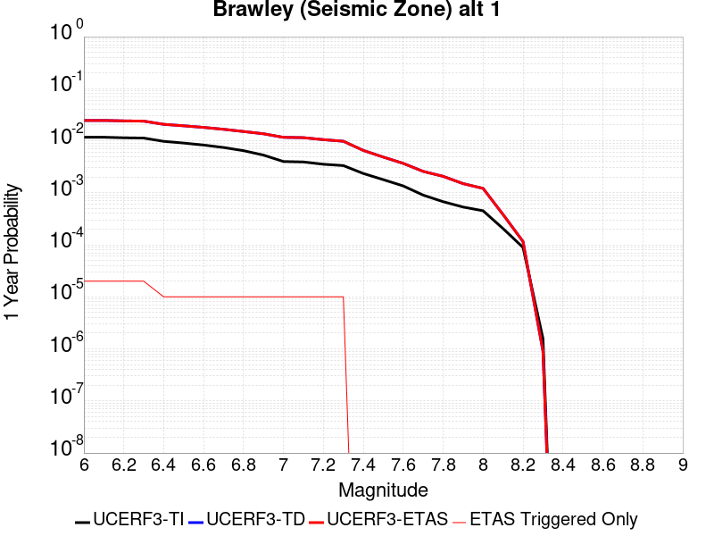 |  |

| Magnitude | 1 wk TI Prob | 1 wk TD Prob | 1 wk ETAS Prob | 1 wk ETAS/TD Gain | 1 wk ETAS Triggered Only | 1 mo TI Prob | 1 mo TD Prob | 1 mo ETAS Prob | 1 mo ETAS/TD Gain | 1 mo ETAS Triggered Only | 1 yr TI Prob | 1 yr TD Prob | 1 yr ETAS Prob | 1 yr ETAS/TD Gain | 1 yr ETAS Triggered Only | 10 yr TI Prob | 10 yr TD Prob | 10 yr ETAS Prob | 10 yr ETAS/TD Gain | 10 yr ETAS Triggered Only |
|-----|-----|-----|-----|-----|-----|-----|-----|-----|-----|-----|-----|-----|-----|-----|-----|-----|-----|-----|-----|-----|
| 6.0 | 2.2521618E-4 | 4.7641253E-4 | 4.7641253E-4 | 1.0 | 0.0 | 9.6485513E-4 | 0.0020402074 | 0.002050187 | 1.0048915 | 1.0E-5 | 0.011683988 | 0.02455069 | 0.024570197 | 1.0007946 | 2.0E-5 | 0.11088423 | 0.21353015 | 0.21354587 | 1.0000737 | 2.0E-5 |
| 6.1 | 2.2521618E-4 | 4.7641253E-4 | 4.7641253E-4 | 1.0 | 0.0 | 9.6485513E-4 | 0.0020402074 | 0.002050187 | 1.0048915 | 1.0E-5 | 0.011683988 | 0.02455069 | 0.024570197 | 1.0007946 | 2.0E-5 | 0.11088423 | 0.21353015 | 0.21354587 | 1.0000737 | 2.0E-5 |
| 6.2 | 2.198148E-4 | 4.6725658E-4 | 4.6725658E-4 | 1.0 | 0.0 | 9.417233E-4 | 0.002001028 | 0.002011008 | 1.0049875 | 1.0E-5 | 0.011405343 | 0.024084855 | 0.024104374 | 1.0008104 | 2.0E-5 | 0.10837428 | 0.20996629 | 0.20998208 | 1.0000752 | 2.0E-5 |
| 6.3 | 2.1704129E-4 | 4.6161312E-4 | 4.6161312E-4 | 1.0 | 0.0 | 9.298453E-4 | 0.0019768786 | 0.0019868587 | 1.0050485 | 1.0E-5 | 0.011262234 | 0.023797998 | 0.023817522 | 1.0008204 | 2.0E-5 | 0.107082725 | 0.20785725 | 0.20787309 | 1.0000762 | 2.0E-5 |
| 6.4 | 1.876142E-4 | 4.0053183E-4 | 4.0053183E-4 | 1.0 | 0.0 | 8.038131E-4 | 0.0017154501 | 0.0017254329 | 1.0058193 | 1.0E-5 | 0.00974259 | 0.02068463 | 0.020694423 | 1.0004735 | 1.0E-5 | 0.093263686 | 0.184608 | 0.18461616 | 1.0000442 | 1.0E-5 |
| 6.5 | 1.7390939E-4 | 3.7485067E-4 | 3.7485067E-4 | 1.0 | 0.0 | 7.45113E-4 | 0.0016055258 | 0.0016155099 | 1.0062184 | 1.0E-5 | 0.009034078 | 0.019372813 | 0.019382618 | 1.0005062 | 1.0E-5 | 0.086755216 | 0.17442966 | 0.17443791 | 1.0000473 | 1.0E-5 |
| 6.6 | 1.591791E-4 | 3.489955E-4 | 3.489955E-4 | 1.0 | 0.0 | 6.8201777E-4 | 0.0014948477 | 0.0015048328 | 1.0066797 | 1.0E-5 | 0.008271996 | 0.018049458 | 0.018059278 | 1.0005441 | 1.0E-5 | 0.07970774 | 0.16383699 | 0.16384535 | 1.000051 | 1.0E-5 |
| 6.7 | 1.4268003E-4 | 3.206533E-4 | 3.206533E-4 | 1.0 | 0.0 | 6.1134255E-4 | 0.0013735129 | 0.0013834991 | 1.0072706 | 1.0E-5 | 0.007417723 | 0.016596261 | 0.016606094 | 1.0005926 | 1.0E-5 | 0.07174956 | 0.15196045 | 0.15196893 | 1.0000558 | 1.0E-5 |
| 6.8 | 1.239713E-4 | 2.9059697E-4 | 2.9059697E-4 | 1.0 | 0.0 | 5.3119735E-4 | 0.0012448273 | 0.0012548149 | 1.0080233 | 1.0E-5 | 0.0064481674 | 0.015051884 | 0.015061733 | 1.0006543 | 1.0E-5 | 0.06264243 | 0.13840161 | 0.13841023 | 1.0000622 | 1.0E-5 |
| 6.9 | 1.0180238E-4 | 2.625907E-4 | 2.625907E-4 | 1.0 | 0.0 | 4.3622297E-4 | 0.0011249076 | 0.0011348964 | 1.0088797 | 1.0E-5 | 0.005298089 | 0.013610746 | 0.01362061 | 1.0007247 | 1.0E-5 | 0.05173543 | 0.12498065 | 0.1249894 | 1.00007 | 1.0E-5 |
| 7.0 | 7.6619996E-5 | 2.2402873E-4 | 2.2402873E-4 | 1.0 | 0.0 | 3.283301E-4 | 9.59773E-4 | 9.697634E-4 | 1.0104091 | 1.0E-5 | 0.0039900932 | 0.011623339 | 0.011633222 | 1.0008503 | 1.0E-5 | 0.039192066 | 0.10728151 | 0.10729045 | 1.0000832 | 1.0E-5 |
| 7.1 | 7.5127435E-5 | 2.208599E-4 | 2.208599E-4 | 1.0 | 0.0 | 3.2193496E-4 | 9.4620226E-4 | 9.5619285E-4 | 1.0105586 | 1.0E-5 | 0.0039125155 | 0.011459865 | 0.01146975 | 1.0008626 | 1.0E-5 | 0.038443442 | 0.10584534 | 0.10585428 | 1.0000845 | 1.0E-5 |
| 7.2 | 6.788582E-5 | 2.0213598E-4 | 2.0213598E-4 | 1.0 | 0.0 | 2.9090676E-4 | 8.660125E-4 | 8.760038E-4 | 1.0115372 | 1.0E-5 | 0.0035360386 | 0.010493369 | 0.010503264 | 1.000943 | 1.0E-5 | 0.034803 | 0.09751546 | 0.09752448 | 1.0000925 | 1.0E-5 |
| 7.3 | 6.399602E-5 | 1.88444E-4 | 1.88444E-4 | 1.0 | 0.0 | 2.7423984E-4 | 8.0737006E-4 | 8.17362E-4 | 1.012376 | 1.0E-5 | 0.0033337586 | 0.009786017 | 0.009795919 | 1.0010118 | 1.0E-5 | 0.03284188 | 0.091409855 | 0.091418944 | 1.0000994 | 1.0E-5 |
| 7.4 | 4.506759E-5 | 1.2531783E-4 | 1.2531783E-4 | 1.0 | 0.0 | 1.9313251E-4 | 5.369668E-4 | 5.369668E-4 | 1.0 | 0.0 | 0.0023488526 | 0.0065181484 | 0.0065181484 | 1.0 | 0.0 | 0.023241805 | 0.062375 | 0.062375 | 1.0 | 0.0 |
| 7.5 | 3.43289E-5 | 9.337587E-5 | 9.337587E-5 | 1.0 | 0.0 | 1.4711556E-4 | 4.0012124E-4 | 4.0012124E-4 | 1.0 | 0.0 | 0.0017896603 | 0.004860657 | 0.004860657 | 1.0 | 0.0 | 0.01775316 | 0.04706493 | 0.04706493 | 1.0 | 0.0 |
| 7.6 | 2.5980507E-5 | 7.054998E-5 | 7.054998E-5 | 1.0 | 0.0 | 1.1134028E-4 | 3.0232212E-4 | 3.0232212E-4 | 1.0 | 0.0 | 0.001354725 | 0.0036745837 | 0.0036745837 | 1.0 | 0.0 | 0.013464959 | 0.035849415 | 0.035849415 | 1.0 | 0.0 |
| 7.7 | 1.7292105E-5 | 4.9423474E-5 | 4.9423474E-5 | 1.0 | 0.0 | 7.4106916E-5 | 2.1179771E-4 | 2.1179771E-4 | 1.0 | 0.0 | 9.018782E-4 | 0.0025755935 | 0.0025755935 | 1.0 | 0.0 | 0.008982267 | 0.025297757 | 0.025297757 | 1.0 | 0.0 |
| 7.8 | 1.2927471E-5 | 3.970735E-5 | 3.970735E-5 | 1.0 | 0.0 | 5.5402274E-5 | 1.7016326E-4 | 1.7016326E-4 | 1.0 | 0.0 | 6.743139E-4 | 0.0020697718 | 0.0020697718 | 1.0 | 0.0 | 0.0067227143 | 0.02043814 | 0.02043814 | 1.0 | 0.0 |
| 7.9 | 1.0200774E-5 | 2.8757075E-5 | 2.8757075E-5 | 1.0 | 0.0 | 4.371687E-5 | 1.2323879E-4 | 1.2323879E-4 | 1.0 | 0.0 | 5.321229E-4 | 0.0014994006 | 0.0014994006 | 1.0 | 0.0 | 0.005308505 | 0.0149969105 | 0.0149969105 | 1.0 | 0.0 |
| 8.0 | 8.650396E-6 | 2.3287128E-5 | 2.3287128E-5 | 1.0 | 0.0 | 3.70726E-5 | 9.979816E-5 | 9.979816E-5 | 1.0 | 0.0 | 4.5126543E-4 | 0.0012143662 | 0.0012143662 | 1.0 | 0.0 | 0.0045035016 | 0.012215644 | 0.012215644 | 1.0 | 0.0 |
| 8.1 | 3.9368224E-6 | 7.3321658E-6 | 7.3321658E-6 | 1.0 | 0.0 | 1.6871985E-5 | 3.1423187E-5 | 3.1423187E-5 | 1.0 | 0.0 | 2.0539707E-4 | 3.825103E-4 | 3.825103E-4 | 1.0 | 0.0 | 0.0020520731 | 0.00400326 | 0.00400326 | 1.0 | 0.0 |
| 8.2 | 1.7101195E-6 | 2.2195122E-6 | 2.2195122E-6 | 1.0 | 0.0 | 7.329063E-6 | 9.51216E-6 | 9.51216E-6 | 1.0 | 0.0 | 8.922769E-5 | 1.15804425E-4 | 1.15804425E-4 | 1.0 | 0.0 | 8.9191867E-4 | 0.0012675166 | 0.0012675166 | 1.0 | 0.0 |
| 8.3 | 3.0346666E-8 | 1.7233086E-8 | 1.7233086E-8 | 1.0 | 0.0 | 1.3005713E-7 | 7.385608E-8 | 7.385608E-8 | 1.0 | 0.0 | 1.5834444E-6 | 8.991977E-7 | 8.991977E-7 | 1.0 | 0.0 | 1.5834332E-5 | 9.37692E-6 | 9.37692E-6 | 1.0 | 0.0 |

## Mount Diablo Thrust South
*[(top)](#table-of-contents)*

| 1 Week | 1 Month | 1 Year | 10 Year |
|-----|-----|-----|-----|
|  |  |  |  |

| Magnitude | 1 wk TI Prob | 1 wk TD Prob | 1 wk ETAS Prob | 1 wk ETAS/TD Gain | 1 wk ETAS Triggered Only | 1 mo TI Prob | 1 mo TD Prob | 1 mo ETAS Prob | 1 mo ETAS/TD Gain | 1 mo ETAS Triggered Only | 1 yr TI Prob | 1 yr TD Prob | 1 yr ETAS Prob | 1 yr ETAS/TD Gain | 1 yr ETAS Triggered Only | 10 yr TI Prob | 10 yr TD Prob | 10 yr ETAS Prob | 10 yr ETAS/TD Gain | 10 yr ETAS Triggered Only |
|-----|-----|-----|-----|-----|-----|-----|-----|-----|-----|-----|-----|-----|-----|-----|-----|-----|-----|-----|-----|-----|
| 6.0 | 2.2377444E-5 | 2.6956828E-5 | 2.6956828E-5 | 1.0 | 0.0 | 9.5899806E-5 | 1.1552526E-4 | 1.1552526E-4 | 1.0 | 0.0 | 0.0011669548 | 0.0014058114 | 0.0014257834 | 1.0142066 | 2.0E-5 | 0.011608457 | 0.013988755 | 0.014008475 | 1.0014098 | 2.0E-5 |
| 6.1 | 2.2377444E-5 | 2.6956828E-5 | 2.6956828E-5 | 1.0 | 0.0 | 9.5899806E-5 | 1.1552526E-4 | 1.1552526E-4 | 1.0 | 0.0 | 0.0011669548 | 0.0014058114 | 0.0014257834 | 1.0142066 | 2.0E-5 | 0.011608457 | 0.013988755 | 0.014008475 | 1.0014098 | 2.0E-5 |
| 6.2 | 2.2377444E-5 | 2.6956828E-5 | 2.6956828E-5 | 1.0 | 0.0 | 9.5899806E-5 | 1.1552526E-4 | 1.1552526E-4 | 1.0 | 0.0 | 0.0011669548 | 0.0014058114 | 0.0014257834 | 1.0142066 | 2.0E-5 | 0.011608457 | 0.013988755 | 0.014008475 | 1.0014098 | 2.0E-5 |
| 6.3 | 2.2377444E-5 | 2.6956828E-5 | 2.6956828E-5 | 1.0 | 0.0 | 9.5899806E-5 | 1.1552526E-4 | 1.1552526E-4 | 1.0 | 0.0 | 0.0011669548 | 0.0014058114 | 0.0014257834 | 1.0142066 | 2.0E-5 | 0.011608457 | 0.013988755 | 0.014008475 | 1.0014098 | 2.0E-5 |
| 6.4 | 1.2228463E-5 | 1.4747924E-5 | 1.4747924E-5 | 1.0 | 0.0 | 5.2406645E-5 | 6.320393E-5 | 6.320393E-5 | 1.0 | 0.0 | 6.378641E-4 | 7.6924893E-4 | 7.7924127E-4 | 1.0129896 | 1.0E-5 | 0.0063603627 | 0.007667247 | 0.007677171 | 1.0012943 | 1.0E-5 |
| 6.5 | 1.2228463E-5 | 1.4747924E-5 | 1.4747924E-5 | 1.0 | 0.0 | 5.2406645E-5 | 6.320393E-5 | 6.320393E-5 | 1.0 | 0.0 | 6.378641E-4 | 7.6924893E-4 | 7.7924127E-4 | 1.0129896 | 1.0E-5 | 0.0063603627 | 0.007667247 | 0.007677171 | 1.0012943 | 1.0E-5 |
| 6.6 | 1.2068118E-5 | 1.4552716E-5 | 1.4552716E-5 | 1.0 | 0.0 | 5.1719482E-5 | 6.236736E-5 | 6.236736E-5 | 1.0 | 0.0 | 6.2950276E-4 | 7.5907086E-4 | 7.6906325E-4 | 1.013164 | 1.0E-5 | 0.006277225 | 0.0075661647 | 0.0075760894 | 1.0013117 | 1.0E-5 |
| 6.7 | 1.1499428E-5 | 1.3875362E-5 | 1.3875362E-5 | 1.0 | 0.0 | 4.9282335E-5 | 5.946455E-5 | 5.946455E-5 | 1.0 | 0.0 | 5.9984723E-4 | 7.237531E-4 | 7.3374587E-4 | 1.0138068 | 1.0E-5 | 0.0059823063 | 0.0072153294 | 0.0072252573 | 1.0013759 | 1.0E-5 |
| 6.8 | 8.82118E-6 | 1.0830598E-5 | 1.0830598E-5 | 1.0 | 0.0 | 3.780451E-5 | 4.641605E-5 | 4.641605E-5 | 1.0 | 0.0 | 4.601727E-4 | 5.6497444E-4 | 5.749688E-4 | 1.01769 | 1.0E-5 | 0.0045922096 | 0.005636032 | 0.005645976 | 1.0017643 | 1.0E-5 |
| 6.9 | 8.047112E-6 | 9.939548E-6 | 9.939548E-6 | 1.0 | 0.0 | 3.4487166E-5 | 4.2597396E-5 | 4.2597396E-5 | 1.0 | 0.0 | 4.1980037E-4 | 5.185051E-4 | 5.284999E-4 | 1.0192763 | 1.0E-5 | 0.004190082 | 0.0051735677 | 0.005183516 | 1.0019228 | 1.0E-5 |
| 7.0 | 6.2574763E-6 | 7.748589E-6 | 7.748589E-6 | 1.0 | 0.0 | 2.681748E-5 | 3.3207834E-5 | 3.3207834E-5 | 1.0 | 0.0 | 3.264539E-4 | 4.0423404E-4 | 4.1423002E-4 | 1.0247282 | 1.0E-5 | 0.0032597475 | 0.0040354296 | 0.004045389 | 1.0024681 | 1.0E-5 |
| 7.1 | 3.6485903E-6 | 4.512948E-6 | 4.512948E-6 | 1.0 | 0.0 | 1.5636722E-5 | 1.9341065E-5 | 1.9341065E-5 | 1.0 | 0.0 | 1.9036046E-4 | 2.3545245E-4 | 2.3545245E-4 | 1.0 | 0.0 | 0.0019019748 | 0.0023521285 | 0.0023521285 | 1.0 | 0.0 |
| 7.2 | 2.3034274E-6 | 2.9055234E-6 | 2.9055234E-6 | 1.0 | 0.0 | 9.871795E-6 | 1.2452185E-5 | 1.2452185E-5 | 1.0 | 0.0 | 1.2018247E-4 | 1.5159504E-4 | 1.5159504E-4 | 1.0 | 0.0 | 0.0012011749 | 0.0015149895 | 0.0015149895 | 1.0 | 0.0 |
| 7.3 | 1.224035E-6 | 1.5679735E-6 | 1.5679735E-6 | 1.0 | 0.0 | 5.245854E-6 | 6.71987E-6 | 6.71987E-6 | 1.0 | 0.0 | 6.38664E-5 | 8.181146E-5 | 8.181146E-5 | 1.0 | 0.0 | 6.384805E-4 | 8.1785646E-4 | 8.1785646E-4 | 1.0 | 0.0 |
| 7.4 | 5.1601154E-7 | 6.7233526E-7 | 6.7233526E-7 | 1.0 | 0.0 | 2.2114762E-6 | 2.8814338E-6 | 2.8814338E-6 | 1.0 | 0.0 | 2.6924388E-5 | 3.5080906E-5 | 3.5080906E-5 | 1.0 | 0.0 | 2.6921128E-4 | 3.5077106E-4 | 3.5077106E-4 | 1.0 | 0.0 |
| 7.5 | 3.552894E-7 | 4.6652488E-7 | 4.6652488E-7 | 1.0 | 0.0 | 1.5226678E-6 | 1.9993909E-6 | 1.9993909E-6 | 1.0 | 0.0 | 1.8538323E-5 | 2.4342327E-5 | 2.4342327E-5 | 1.0 | 0.0 | 1.8536777E-4 | 2.434088E-4 | 2.434088E-4 | 1.0 | 0.0 |
| 7.6 | 1.3124082E-7 | 1.7191593E-7 | 1.7191593E-7 | 1.0 | 0.0 | 5.6246057E-7 | 7.3678234E-7 | 7.3678234E-7 | 1.0 | 0.0 | 6.8479358E-6 | 8.970297E-6 | 8.970297E-6 | 1.0 | 0.0 | 6.8477246E-5 | 8.970351E-5 | 8.970351E-5 | 1.0 | 0.0 |
| 7.7 | 3.6193022E-8 | 4.73329E-8 | 4.73329E-8 | 1.0 | 0.0 | 1.5511293E-7 | 2.0285528E-7 | 2.0285528E-7 | 1.0 | 0.0 | 1.8884983E-6 | 2.4697613E-6 | 2.4697613E-6 | 1.0 | 0.0 | 1.8884823E-5 | 2.4697927E-5 | 2.4697927E-5 | 1.0 | 0.0 |

## Santa Ynez (West)
*[(top)](#table-of-contents)*

| 1 Week | 1 Month | 1 Year | 10 Year |
|-----|-----|-----|-----|
|  |  |  |  |

| Magnitude | 1 wk TI Prob | 1 wk TD Prob | 1 wk ETAS Prob | 1 wk ETAS/TD Gain | 1 wk ETAS Triggered Only | 1 mo TI Prob | 1 mo TD Prob | 1 mo ETAS Prob | 1 mo ETAS/TD Gain | 1 mo ETAS Triggered Only | 1 yr TI Prob | 1 yr TD Prob | 1 yr ETAS Prob | 1 yr ETAS/TD Gain | 1 yr ETAS Triggered Only | 10 yr TI Prob | 10 yr TD Prob | 10 yr ETAS Prob | 10 yr ETAS/TD Gain | 10 yr ETAS Triggered Only |
|-----|-----|-----|-----|-----|-----|-----|-----|-----|-----|-----|-----|-----|-----|-----|-----|-----|-----|-----|-----|-----|
| 6.0 | 4.7352758E-5 | 5.497349E-5 | 5.497349E-5 | 1.0 | 0.0 | 2.0292461E-4 | 2.3558107E-4 | 2.455787E-4 | 1.0424383 | 1.0E-5 | 0.0024678076 | 0.0028645964 | 0.002884539 | 1.0069618 | 2.0E-5 | 0.024405818 | 0.028305095 | 0.02832453 | 1.0006866 | 2.0E-5 |
| 6.1 | 4.7352758E-5 | 5.497349E-5 | 5.497349E-5 | 1.0 | 0.0 | 2.0292461E-4 | 2.3558107E-4 | 2.455787E-4 | 1.0424383 | 1.0E-5 | 0.0024678076 | 0.0028645964 | 0.002884539 | 1.0069618 | 2.0E-5 | 0.024405818 | 0.028305095 | 0.02832453 | 1.0006866 | 2.0E-5 |
| 6.2 | 3.0415853E-5 | 3.3925786E-5 | 3.3925786E-5 | 1.0 | 0.0 | 1.3034715E-4 | 1.4538833E-4 | 1.4538833E-4 | 1.0 | 0.0 | 0.0015858212 | 0.0017687011 | 0.0017786834 | 1.0056438 | 1.0E-5 | 0.015745522 | 0.01755015 | 0.017559975 | 1.0005598 | 1.0E-5 |
| 6.3 | 3.0415853E-5 | 3.3925786E-5 | 3.3925786E-5 | 1.0 | 0.0 | 1.3034715E-4 | 1.4538833E-4 | 1.4538833E-4 | 1.0 | 0.0 | 0.0015858212 | 0.0017687011 | 0.0017786834 | 1.0056438 | 1.0E-5 | 0.015745522 | 0.01755015 | 0.017559975 | 1.0005598 | 1.0E-5 |
| 6.4 | 2.5452082E-5 | 2.7912925E-5 | 2.7912925E-5 | 1.0 | 0.0 | 1.09075794E-4 | 1.1962145E-4 | 1.1962145E-4 | 1.0 | 0.0 | 0.0013271887 | 0.001455435 | 0.0014654204 | 1.0068609 | 1.0E-5 | 0.013192902 | 0.014461209 | 0.014471064 | 1.0006815 | 1.0E-5 |
| 6.5 | 2.3143784E-5 | 2.5128682E-5 | 2.5128682E-5 | 1.0 | 0.0 | 9.9183875E-5 | 1.0768999E-4 | 1.0768999E-4 | 1.0 | 0.0 | 0.0012068948 | 0.0013103489 | 0.0013203358 | 1.0076215 | 1.0E-5 | 0.012003611 | 0.013027899 | 0.013037769 | 1.0007576 | 1.0E-5 |
| 6.6 | 1.9118515E-5 | 2.0354646E-5 | 2.0354646E-5 | 1.0 | 0.0 | 8.193392E-5 | 8.723133E-5 | 8.723133E-5 | 1.0 | 0.0 | 9.97089E-4 | 0.001061532 | 0.001061532 | 1.0 | 0.0 | 0.00992627 | 0.010565523 | 0.010565523 | 1.0 | 0.0 |
| 6.7 | 1.722807E-5 | 1.8146604E-5 | 1.8146604E-5 | 1.0 | 0.0 | 7.3832496E-5 | 7.776888E-5 | 7.776888E-5 | 1.0 | 0.0 | 8.985399E-4 | 9.464303E-4 | 9.464303E-4 | 1.0 | 0.0 | 0.008949154 | 0.009424643 | 0.009424643 | 1.0 | 0.0 |
| 6.8 | 1.5317364E-5 | 1.5926695E-5 | 1.5926695E-5 | 1.0 | 0.0 | 6.56442E-5 | 6.82555E-5 | 6.82555E-5 | 1.0 | 0.0 | 7.98925E-4 | 8.306982E-4 | 8.306982E-4 | 1.0 | 0.0 | 0.007960589 | 0.008276418 | 0.008276418 | 1.0 | 0.0 |
| 6.9 | 1.3071226E-5 | 1.3329779E-5 | 1.3329779E-5 | 1.0 | 0.0 | 5.6018336E-5 | 5.7126388E-5 | 5.7126388E-5 | 1.0 | 0.0 | 6.8180985E-4 | 6.9529406E-4 | 6.9529406E-4 | 1.0 | 0.0 | 0.0067972173 | 0.0069314474 | 0.0069314474 | 1.0 | 0.0 |
| 7.0 | 1.1836986E-5 | 1.19329125E-5 | 1.19329125E-5 | 1.0 | 0.0 | 5.0728955E-5 | 5.1140058E-5 | 5.1140058E-5 | 1.0 | 0.0 | 6.1745E-4 | 6.2245404E-4 | 6.2245404E-4 | 1.0 | 0.0 | 0.006157372 | 0.006207299 | 0.006207299 | 1.0 | 0.0 |
| 7.1 | 1.0597169E-5 | 1.0542309E-5 | 1.0542309E-5 | 1.0 | 0.0 | 4.541565E-5 | 4.5180546E-5 | 4.5180546E-5 | 1.0 | 0.0 | 5.5279525E-4 | 5.4993544E-4 | 5.4993544E-4 | 1.0 | 0.0 | 0.0055142213 | 0.005485877 | 0.005485877 | 1.0 | 0.0 |
| 7.2 | 9.59113E-6 | 9.459241E-6 | 9.459241E-6 | 1.0 | 0.0 | 4.11042E-5 | 4.053898E-5 | 4.053898E-5 | 1.0 | 0.0 | 5.0032866E-4 | 4.9345137E-4 | 4.9345137E-4 | 1.0 | 0.0 | 0.004992037 | 0.0049236757 | 0.0049236757 | 1.0 | 0.0 |
| 7.3 | 8.586084E-6 | 8.379669E-6 | 8.379669E-6 | 1.0 | 0.0 | 3.679698E-5 | 3.591238E-5 | 3.591238E-5 | 1.0 | 0.0 | 4.4791115E-4 | 4.3714655E-4 | 4.3714655E-4 | 1.0 | 0.0 | 0.004470094 | 0.0043629776 | 0.0043629776 | 1.0 | 0.0 |
| 7.4 | 7.2622997E-6 | 6.951613E-6 | 6.951613E-6 | 1.0 | 0.0 | 3.112377E-5 | 2.9792294E-5 | 2.9792294E-5 | 1.0 | 0.0 | 3.78866E-4 | 3.6266178E-4 | 3.6266178E-4 | 1.0 | 0.0 | 0.0037822074 | 0.0036207996 | 0.0036207996 | 1.0 | 0.0 |
| 7.5 | 5.627296E-6 | 5.251639E-6 | 5.251639E-6 | 1.0 | 0.0 | 2.411676E-5 | 2.2506834E-5 | 2.2506834E-5 | 1.0 | 0.0 | 2.9358198E-4 | 2.7398695E-4 | 2.7398695E-4 | 1.0 | 0.0 | 0.0029319443 | 0.0027365636 | 0.0027365636 | 1.0 | 0.0 |
| 7.6 | 2.265244E-6 | 2.0608784E-6 | 2.0608784E-6 | 1.0 | 0.0 | 9.708152E-6 | 8.832307E-6 | 8.832307E-6 | 1.0 | 0.0 | 1.18190335E-4 | 1.0752812E-4 | 1.0752812E-4 | 1.0 | 0.0 | 0.001181275 | 0.0010747695 | 0.0010747695 | 1.0 | 0.0 |
| 7.7 | 1.3099874E-6 | 1.1016341E-6 | 1.1016341E-6 | 1.0 | 0.0 | 5.61422E-6 | 4.7212807E-6 | 4.7212807E-6 | 1.0 | 0.0 | 6.8350986E-5 | 5.74801E-5 | 5.74801E-5 | 1.0 | 0.0 | 6.832996E-4 | 5.746547E-4 | 5.746547E-4 | 1.0 | 0.0 |
| 7.8 | 7.903951E-7 | 6.071191E-7 | 6.071191E-7 | 1.0 | 0.0 | 3.3874032E-6 | 2.6019363E-6 | 2.6019363E-6 | 1.0 | 0.0 | 4.1240855E-5 | 3.1678126E-5 | 3.1678126E-5 | 1.0 | 0.0 | 4.12332E-4 | 3.1673745E-4 | 3.1673745E-4 | 1.0 | 0.0 |
| 7.9 | 7.0753297E-9 | 5.089978E-9 | 5.089978E-9 | 1.0 | 0.0 | 3.032284E-8 | 2.1814193E-8 | 2.1814193E-8 | 1.0 | 0.0 | 3.6918053E-7 | 2.6558777E-7 | 2.6558777E-7 | 1.0 | 0.0 | 3.691799E-6 | 2.6558755E-6 | 2.6558755E-6 | 1.0 | 0.0 |

## Owens Valley
*[(top)](#table-of-contents)*

| 1 Week | 1 Month | 1 Year | 10 Year |
|-----|-----|-----|-----|
|  |  |  |  |

| Magnitude | 1 wk TI Prob | 1 wk TD Prob | 1 wk ETAS Prob | 1 wk ETAS/TD Gain | 1 wk ETAS Triggered Only | 1 mo TI Prob | 1 mo TD Prob | 1 mo ETAS Prob | 1 mo ETAS/TD Gain | 1 mo ETAS Triggered Only | 1 yr TI Prob | 1 yr TD Prob | 1 yr ETAS Prob | 1 yr ETAS/TD Gain | 1 yr ETAS Triggered Only | 10 yr TI Prob | 10 yr TD Prob | 10 yr ETAS Prob | 10 yr ETAS/TD Gain | 10 yr ETAS Triggered Only |
|-----|-----|-----|-----|-----|-----|-----|-----|-----|-----|-----|-----|-----|-----|-----|-----|-----|-----|-----|-----|-----|
| 6.0 | 4.83821E-5 | 3.627396E-6 | 3.627396E-6 | 1.0 | 0.0 | 2.0733538E-4 | 1.5545897E-5 | 1.5545897E-5 | 1.0 | 0.0 | 0.002521386 | 1.8925584E-4 | 1.9925395E-4 | 1.0528286 | 1.0E-5 | 0.024929691 | 0.0019254381 | 0.0019453996 | 1.0103673 | 2.0E-5 |
| 6.1 | 4.83821E-5 | 3.627396E-6 | 3.627396E-6 | 1.0 | 0.0 | 2.0733538E-4 | 1.5545897E-5 | 1.5545897E-5 | 1.0 | 0.0 | 0.002521386 | 1.8925584E-4 | 1.9925395E-4 | 1.0528286 | 1.0E-5 | 0.024929691 | 0.0019254381 | 0.0019453996 | 1.0103673 | 2.0E-5 |
| 6.2 | 4.83821E-5 | 3.627396E-6 | 3.627396E-6 | 1.0 | 0.0 | 2.0733538E-4 | 1.5545897E-5 | 1.5545897E-5 | 1.0 | 0.0 | 0.002521386 | 1.8925584E-4 | 1.9925395E-4 | 1.0528286 | 1.0E-5 | 0.024929691 | 0.0019254381 | 0.0019453996 | 1.0103673 | 2.0E-5 |
| 6.3 | 3.953008E-5 | 3.1558448E-6 | 3.1558448E-6 | 1.0 | 0.0 | 1.6940363E-4 | 1.3524983E-5 | 1.3524983E-5 | 1.0 | 0.0 | 0.002060538 | 1.6465495E-4 | 1.7465331E-4 | 1.0607231 | 1.0E-5 | 0.020415364 | 0.0016594394 | 0.0016794062 | 1.0120323 | 2.0E-5 |
| 6.4 | 3.953008E-5 | 3.1558448E-6 | 3.1558448E-6 | 1.0 | 0.0 | 1.6940363E-4 | 1.3524983E-5 | 1.3524983E-5 | 1.0 | 0.0 | 0.002060538 | 1.6465495E-4 | 1.7465331E-4 | 1.0607231 | 1.0E-5 | 0.020415364 | 0.0016594394 | 0.0016794062 | 1.0120323 | 2.0E-5 |
| 6.5 | 3.457342E-5 | 2.9718876E-6 | 2.9718876E-6 | 1.0 | 0.0 | 1.4816338E-4 | 1.2736603E-5 | 1.2736603E-5 | 1.0 | 0.0 | 0.0018023965 | 1.5505782E-4 | 1.6505626E-4 | 1.0644821 | 1.0E-5 | 0.017878477 | 0.0015558768 | 0.0015758456 | 1.0128344 | 2.0E-5 |
| 6.6 | 3.1127765E-5 | 2.8746979E-6 | 2.8746979E-6 | 1.0 | 0.0 | 1.3339789E-4 | 1.232008E-5 | 1.232008E-5 | 1.0 | 0.0 | 0.0016229092 | 1.4998733E-4 | 1.5998584E-4 | 1.0666623 | 1.0E-5 | 0.016111081 | 0.001501365 | 0.0015213349 | 1.0133013 | 2.0E-5 |
| 6.7 | 2.806885E-5 | 2.810566E-6 | 2.810566E-6 | 1.0 | 0.0 | 1.2028952E-4 | 1.2045231E-5 | 1.2045231E-5 | 1.0 | 0.0 | 0.001463541 | 1.4664151E-4 | 1.5664005E-4 | 1.0681835 | 1.0E-5 | 0.014539397 | 0.001465831 | 0.0014858017 | 1.0136242 | 2.0E-5 |
| 6.8 | 2.524524E-5 | 2.235501E-6 | 2.235501E-6 | 1.0 | 0.0 | 1.0818939E-4 | 9.5806845E-6 | 9.5806845E-6 | 1.0 | 0.0 | 0.0013164099 | 1.1663889E-4 | 1.2663772E-4 | 1.0857247 | 1.0E-5 | 0.01308639 | 0.0011660501 | 0.0011860268 | 1.0171319 | 2.0E-5 |
| 6.9 | 2.2704568E-5 | 1.6082656E-6 | 1.6082656E-6 | 1.0 | 0.0 | 9.730166E-5 | 6.8925488E-6 | 6.8925488E-6 | 1.0 | 0.0 | 0.0011840039 | 8.391357E-5 | 9.391273E-5 | 1.1191603 | 1.0E-5 | 0.011777153 | 8.390308E-4 | 8.59014E-4 | 1.0238171 | 2.0E-5 |
| 7.0 | 2.0871712E-5 | 1.5396373E-6 | 1.5396373E-6 | 1.0 | 0.0 | 8.944713E-5 | 6.598429E-6 | 6.598429E-6 | 1.0 | 0.0 | 0.0010884746 | 8.033293E-5 | 9.033213E-5 | 1.1244719 | 1.0E-5 | 0.010831586 | 8.0321095E-4 | 8.2319486E-4 | 1.02488 | 2.0E-5 |
| 7.1 | 1.944928E-5 | 1.3864965E-6 | 1.3864965E-6 | 1.0 | 0.0 | 8.335139E-5 | 5.942114E-6 | 5.942114E-6 | 1.0 | 0.0 | 0.0010143308 | 7.2342846E-5 | 8.234212E-5 | 1.1382207 | 1.0E-5 | 0.010097133 | 7.233511E-4 | 7.433366E-4 | 1.0276291 | 2.0E-5 |
| 7.2 | 1.7876306E-5 | 1.2489834E-6 | 1.2489834E-6 | 1.0 | 0.0 | 7.6610486E-5 | 5.3527747E-6 | 5.3527747E-6 | 1.0 | 0.0 | 9.3233347E-4 | 6.516809E-5 | 7.516744E-5 | 1.1534393 | 1.0E-5 | 0.009284316 | 6.516274E-4 | 6.7161437E-4 | 1.0306724 | 2.0E-5 |
| 7.3 | 1.2618672E-5 | 1.1115851E-6 | 1.1115851E-6 | 1.0 | 0.0 | 5.40789E-5 | 4.763928E-6 | 4.763928E-6 | 1.0 | 0.0 | 6.582117E-4 | 5.799928E-5 | 6.7998706E-5 | 1.172406 | 1.0E-5 | 0.0065626553 | 5.799741E-4 | 5.999625E-4 | 1.0344642 | 2.0E-5 |
| 7.4 | 7.4874442E-6 | 8.549184E-7 | 8.549184E-7 | 1.0 | 0.0 | 3.208865E-5 | 3.663931E-6 | 3.663931E-6 | 1.0 | 0.0 | 3.906093E-4 | 4.4607452E-5 | 5.4607004E-5 | 1.2241678 | 1.0E-5 | 0.003899234 | 4.4607726E-4 | 4.6606833E-4 | 1.0448153 | 2.0E-5 |
| 7.5 | 2.4734156E-6 | 6.068976E-7 | 6.068976E-7 | 1.0 | 0.0 | 1.060031E-5 | 2.6009868E-6 | 2.6009868E-6 | 1.0 | 0.0 | 1.2905113E-4 | 3.1666557E-5 | 4.166624E-5 | 1.3157805 | 1.0E-5 | 0.0012897621 | 3.1662078E-4 | 3.2661762E-4 | 1.0315735 | 1.0E-5 |
| 7.6 | 1.1328841E-6 | 3.1967096E-7 | 3.1967096E-7 | 1.0 | 0.0 | 4.8552088E-6 | 1.3700177E-6 | 1.3700177E-6 | 1.0 | 0.0 | 5.9110564E-5 | 1.6679838E-5 | 2.6679672E-5 | 1.5995162 | 1.0E-5 | 5.9094845E-4 | 1.6678606E-4 | 1.767844E-4 | 1.059947 | 1.0E-5 |
| 7.7 | 4.8613185E-7 | 8.965384E-8 | 8.965384E-8 | 1.0 | 0.0 | 2.0834207E-6 | 3.842307E-7 | 3.842307E-7 | 1.0 | 0.0 | 2.536535E-5 | 4.677999E-6 | 4.677999E-6 | 1.0 | 0.0 | 2.5362454E-4 | 4.6779078E-5 | 4.6779078E-5 | 1.0 | 0.0 |

## Independence rev 2011
*[(top)](#table-of-contents)*

| 1 Week | 1 Month | 1 Year | 10 Year |
|-----|-----|-----|-----|
|  |  |  |  |

| Magnitude | 1 wk TI Prob | 1 wk TD Prob | 1 wk ETAS Prob | 1 wk ETAS/TD Gain | 1 wk ETAS Triggered Only | 1 mo TI Prob | 1 mo TD Prob | 1 mo ETAS Prob | 1 mo ETAS/TD Gain | 1 mo ETAS Triggered Only | 1 yr TI Prob | 1 yr TD Prob | 1 yr ETAS Prob | 1 yr ETAS/TD Gain | 1 yr ETAS Triggered Only | 10 yr TI Prob | 10 yr TD Prob | 10 yr ETAS Prob | 10 yr ETAS/TD Gain | 10 yr ETAS Triggered Only |
|-----|-----|-----|-----|-----|-----|-----|-----|-----|-----|-----|-----|-----|-----|-----|-----|-----|-----|-----|-----|-----|
| 6.0 | 4.422171E-6 | 4.3262453E-6 | 4.3262453E-6 | 1.0 | 0.0 | 1.8952025E-5 | 1.8540937E-5 | 1.8540937E-5 | 1.0 | 0.0 | 2.3071647E-4 | 2.257155E-4 | 2.3571325E-4 | 1.0442935 | 1.0E-5 | 0.0023047708 | 0.0022551562 | 0.002275111 | 1.0088485 | 2.0E-5 |
| 6.1 | 4.422171E-6 | 4.3262453E-6 | 4.3262453E-6 | 1.0 | 0.0 | 1.8952025E-5 | 1.8540937E-5 | 1.8540937E-5 | 1.0 | 0.0 | 2.3071647E-4 | 2.257155E-4 | 2.3571325E-4 | 1.0442935 | 1.0E-5 | 0.0023047708 | 0.0022551562 | 0.002275111 | 1.0088485 | 2.0E-5 |
| 6.2 | 4.422171E-6 | 4.3262453E-6 | 4.3262453E-6 | 1.0 | 0.0 | 1.8952025E-5 | 1.8540937E-5 | 1.8540937E-5 | 1.0 | 0.0 | 2.3071647E-4 | 2.257155E-4 | 2.3571325E-4 | 1.0442935 | 1.0E-5 | 0.0023047708 | 0.0022551562 | 0.002275111 | 1.0088485 | 2.0E-5 |
| 6.3 | 4.422171E-6 | 4.3262453E-6 | 4.3262453E-6 | 1.0 | 0.0 | 1.8952025E-5 | 1.8540937E-5 | 1.8540937E-5 | 1.0 | 0.0 | 2.3071647E-4 | 2.257155E-4 | 2.3571325E-4 | 1.0442935 | 1.0E-5 | 0.0023047708 | 0.0022551562 | 0.002275111 | 1.0088485 | 2.0E-5 |
| 6.4 | 4.422171E-6 | 4.3262453E-6 | 4.3262453E-6 | 1.0 | 0.0 | 1.8952025E-5 | 1.8540937E-5 | 1.8540937E-5 | 1.0 | 0.0 | 2.3071647E-4 | 2.257155E-4 | 2.3571325E-4 | 1.0442935 | 1.0E-5 | 0.0023047708 | 0.0022551562 | 0.002275111 | 1.0088485 | 2.0E-5 |
| 6.5 | 4.422171E-6 | 4.3262453E-6 | 4.3262453E-6 | 1.0 | 0.0 | 1.8952025E-5 | 1.8540937E-5 | 1.8540937E-5 | 1.0 | 0.0 | 2.3071647E-4 | 2.257155E-4 | 2.3571325E-4 | 1.0442935 | 1.0E-5 | 0.0023047708 | 0.0022551562 | 0.002275111 | 1.0088485 | 2.0E-5 |
| 6.6 | 2.663744E-6 | 2.5319996E-6 | 2.5319996E-6 | 1.0 | 0.0 | 1.1415996E-5 | 1.0851385E-5 | 1.0851385E-5 | 1.0 | 0.0 | 1.3898089E-4 | 1.3210809E-4 | 1.4210677E-4 | 1.0756856 | 1.0E-5 | 0.0013889399 | 0.0013203438 | 0.0013403174 | 1.0151275 | 2.0E-5 |
| 6.7 | 2.663744E-6 | 2.5319996E-6 | 2.5319996E-6 | 1.0 | 0.0 | 1.1415996E-5 | 1.0851385E-5 | 1.0851385E-5 | 1.0 | 0.0 | 1.3898089E-4 | 1.3210809E-4 | 1.4210677E-4 | 1.0756856 | 1.0E-5 | 0.0013889399 | 0.0013203438 | 0.0013403174 | 1.0151275 | 2.0E-5 |
| 6.8 | 1.9716529E-6 | 1.83227E-6 | 1.83227E-6 | 1.0 | 0.0 | 8.449913E-6 | 7.852563E-6 | 7.852563E-6 | 1.0 | 0.0 | 1.0287284E-4 | 9.560089E-5 | 1.0559993E-4 | 1.1045915 | 1.0E-5 | 0.0010282523 | 9.556105E-4 | 9.7559136E-4 | 1.0209091 | 2.0E-5 |
| 6.9 | 1.8788617E-6 | 1.7430103E-6 | 1.7430103E-6 | 1.0 | 0.0 | 8.0522395E-6 | 7.470024E-6 | 7.470024E-6 | 1.0 | 0.0 | 9.80316E-5 | 9.094387E-5 | 1.00942954E-4 | 1.1099479 | 1.0E-5 | 9.798837E-4 | 9.090785E-4 | 9.2906033E-4 | 1.0219803 | 2.0E-5 |
| 7.0 | 1.5045488E-6 | 1.3849595E-6 | 1.3849595E-6 | 1.0 | 0.0 | 6.44805E-6 | 5.9355275E-6 | 5.9355275E-6 | 1.0 | 0.0 | 7.8502184E-5 | 7.226271E-5 | 8.2261984E-5 | 1.138374 | 1.0E-5 | 7.8474457E-4 | 7.2239724E-4 | 7.423828E-4 | 1.0276656 | 2.0E-5 |
| 7.1 | 1.272341E-6 | 1.1625177E-6 | 1.1625177E-6 | 1.0 | 0.0 | 5.4528787E-6 | 4.9822092E-6 | 4.9822092E-6 | 1.0 | 0.0 | 6.6386776E-5 | 6.065674E-5 | 7.065613E-5 | 1.1648521 | 1.0E-5 | 6.636695E-4 | 6.06405E-4 | 6.2639295E-4 | 1.0329612 | 2.0E-5 |
| 7.2 | 1.0416892E-6 | 9.4099494E-7 | 9.4099494E-7 | 1.0 | 0.0 | 4.464375E-6 | 4.032829E-6 | 4.032829E-6 | 1.0 | 0.0 | 5.4352407E-5 | 4.909861E-5 | 5.9098118E-5 | 1.2036618 | 1.0E-5 | 5.4339116E-4 | 4.9087947E-4 | 5.1086966E-4 | 1.0407232 | 2.0E-5 |
| 7.3 | 7.9450155E-7 | 7.235053E-7 | 7.235053E-7 | 1.0 | 0.0 | 3.4050022E-6 | 3.1007335E-6 | 3.1007335E-6 | 1.0 | 0.0 | 4.1455114E-5 | 3.7750786E-5 | 4.775041E-5 | 1.2648852 | 1.0E-5 | 4.144738E-4 | 3.7744487E-4 | 3.974373E-4 | 1.0529679 | 2.0E-5 |
| 7.4 | 5.3893444E-7 | 5.0195445E-7 | 5.0195445E-7 | 1.0 | 0.0 | 2.309717E-6 | 2.1512315E-6 | 2.1512315E-6 | 1.0 | 0.0 | 2.8120441E-5 | 2.6190934E-5 | 3.619067E-5 | 1.3818015 | 1.0E-5 | 2.8116882E-4 | 2.6187891E-4 | 2.8187368E-4 | 1.0763512 | 2.0E-5 |
| 7.5 | 3.8852085E-7 | 3.6825747E-7 | 3.6825747E-7 | 1.0 | 0.0 | 1.6650882E-6 | 1.5782454E-6 | 1.5782454E-6 | 1.0 | 0.0 | 2.027226E-5 | 1.9214971E-5 | 2.9214778E-5 | 1.5204176 | 1.0E-5 | 2.0270412E-4 | 1.921333E-4 | 2.1212947E-4 | 1.1040744 | 2.0E-5 |
| 7.6 | 2.414929E-7 | 2.3457659E-7 | 2.3457659E-7 | 1.0 | 0.0 | 1.0349692E-6 | 1.0053279E-6 | 1.0053279E-6 | 1.0 | 0.0 | 1.2600677E-5 | 1.22398E-5 | 2.2239677E-5 | 1.8169968 | 1.0E-5 | 1.2599962E-4 | 1.2239137E-4 | 1.4238893E-4 | 1.1633902 | 2.0E-5 |
| 7.7 | 6.8298014E-8 | 6.858993E-8 | 6.858993E-8 | 1.0 | 0.0 | 2.9270575E-7 | 2.939568E-7 | 2.939568E-7 | 1.0 | 0.0 | 3.5636867E-6 | 3.5789185E-6 | 3.5789185E-6 | 1.0 | 0.0 | 3.5636294E-5 | 3.5788657E-5 | 3.5788657E-5 | 1.0 | 0.0 |

## Dry Mountain
*[(top)](#table-of-contents)*

| 1 Week | 1 Month | 1 Year | 10 Year |
|-----|-----|-----|-----|
|  |  | 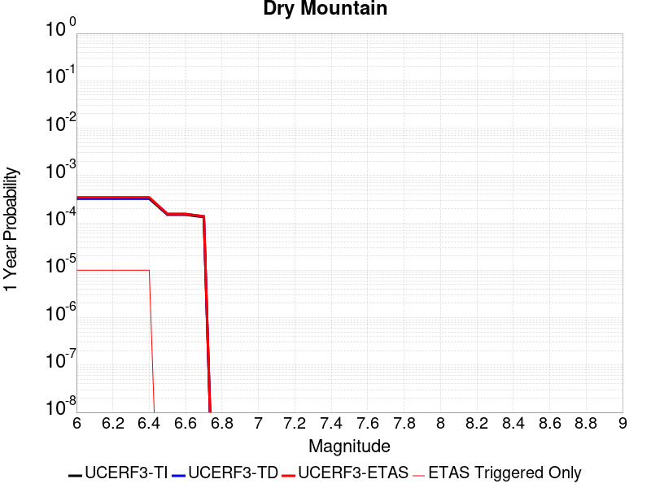 |  |

| Magnitude | 1 wk TI Prob | 1 wk TD Prob | 1 wk ETAS Prob | 1 wk ETAS/TD Gain | 1 wk ETAS Triggered Only | 1 mo TI Prob | 1 mo TD Prob | 1 mo ETAS Prob | 1 mo ETAS/TD Gain | 1 mo ETAS Triggered Only | 1 yr TI Prob | 1 yr TD Prob | 1 yr ETAS Prob | 1 yr ETAS/TD Gain | 1 yr ETAS Triggered Only | 10 yr TI Prob | 10 yr TD Prob | 10 yr ETAS Prob | 10 yr ETAS/TD Gain | 10 yr ETAS Triggered Only |
|-----|-----|-----|-----|-----|-----|-----|-----|-----|-----|-----|-----|-----|-----|-----|-----|-----|-----|-----|-----|-----|
| 6.0 | 6.222801E-6 | 6.439411E-6 | 6.439411E-6 | 1.0 | 0.0 | 2.6668875E-5 | 2.7597274E-5 | 2.7597274E-5 | 1.0 | 0.0 | 3.2464517E-4 | 3.359609E-4 | 3.4595755E-4 | 1.0297554 | 1.0E-5 | 0.0032417132 | 0.0033560924 | 0.0033760252 | 1.0059394 | 2.0E-5 |
| 6.1 | 6.222801E-6 | 6.439411E-6 | 6.439411E-6 | 1.0 | 0.0 | 2.6668875E-5 | 2.7597274E-5 | 2.7597274E-5 | 1.0 | 0.0 | 3.2464517E-4 | 3.359609E-4 | 3.4595755E-4 | 1.0297554 | 1.0E-5 | 0.0032417132 | 0.0033560924 | 0.0033760252 | 1.0059394 | 2.0E-5 |
| 6.2 | 6.222801E-6 | 6.439411E-6 | 6.439411E-6 | 1.0 | 0.0 | 2.6668875E-5 | 2.7597274E-5 | 2.7597274E-5 | 1.0 | 0.0 | 3.2464517E-4 | 3.359609E-4 | 3.4595755E-4 | 1.0297554 | 1.0E-5 | 0.0032417132 | 0.0033560924 | 0.0033760252 | 1.0059394 | 2.0E-5 |
| 6.3 | 6.222801E-6 | 6.439411E-6 | 6.439411E-6 | 1.0 | 0.0 | 2.6668875E-5 | 2.7597274E-5 | 2.7597274E-5 | 1.0 | 0.0 | 3.2464517E-4 | 3.359609E-4 | 3.4595755E-4 | 1.0297554 | 1.0E-5 | 0.0032417132 | 0.0033560924 | 0.0033760252 | 1.0059394 | 2.0E-5 |
| 6.4 | 6.222801E-6 | 6.439411E-6 | 6.439411E-6 | 1.0 | 0.0 | 2.6668875E-5 | 2.7597274E-5 | 2.7597274E-5 | 1.0 | 0.0 | 3.2464517E-4 | 3.359609E-4 | 3.4595755E-4 | 1.0297554 | 1.0E-5 | 0.0032417132 | 0.0033560924 | 0.0033760252 | 1.0059394 | 2.0E-5 |
| 6.5 | 2.8528623E-6 | 2.952182E-6 | 2.952182E-6 | 1.0 | 0.0 | 1.22264955E-5 | 1.2652196E-5 | 1.2652196E-5 | 1.0 | 0.0 | 1.4884741E-4 | 1.5403831E-4 | 1.5403831E-4 | 1.0 | 0.0 | 0.0014874774 | 0.0015401688 | 0.0015401688 | 1.0 | 0.0 |
| 6.6 | 2.8528623E-6 | 2.952182E-6 | 2.952182E-6 | 1.0 | 0.0 | 1.22264955E-5 | 1.2652196E-5 | 1.2652196E-5 | 1.0 | 0.0 | 1.4884741E-4 | 1.5403831E-4 | 1.5403831E-4 | 1.0 | 0.0 | 0.0014874774 | 0.0015401688 | 0.0015401688 | 1.0 | 0.0 |
| 6.7 | 2.541E-6 | 2.62937E-6 | 2.62937E-6 | 1.0 | 0.0 | 1.0889954E-5 | 1.12687285E-5 | 1.12687285E-5 | 1.0 | 0.0 | 1.3257713E-4 | 1.3719677E-4 | 1.3719677E-4 | 1.0 | 0.0 | 0.0013249806 | 0.0013719677 | 0.0013719677 | 1.0 | 0.0 |

## Red Pass
*[(top)](#table-of-contents)*

| 1 Week | 1 Month | 1 Year | 10 Year |
|-----|-----|-----|-----|
|  |  |  |  |

| Magnitude | 1 wk TI Prob | 1 wk TD Prob | 1 wk ETAS Prob | 1 wk ETAS/TD Gain | 1 wk ETAS Triggered Only | 1 mo TI Prob | 1 mo TD Prob | 1 mo ETAS Prob | 1 mo ETAS/TD Gain | 1 mo ETAS Triggered Only | 1 yr TI Prob | 1 yr TD Prob | 1 yr ETAS Prob | 1 yr ETAS/TD Gain | 1 yr ETAS Triggered Only | 10 yr TI Prob | 10 yr TD Prob | 10 yr ETAS Prob | 10 yr ETAS/TD Gain | 10 yr ETAS Triggered Only |
|-----|-----|-----|-----|-----|-----|-----|-----|-----|-----|-----|-----|-----|-----|-----|-----|-----|-----|-----|-----|-----|
| 6.0 | 8.258278E-6 | 8.551305E-6 | 8.551305E-6 | 1.0 | 0.0 | 3.539214E-5 | 3.6648038E-5 | 3.6648038E-5 | 1.0 | 0.0 | 4.308141E-4 | 4.4611638E-4 | 4.4611638E-4 | 1.0 | 0.0 | 0.0042997985 | 0.004453966 | 0.0044738767 | 1.0044703 | 2.0E-5 |
| 6.1 | 3.649988E-6 | 3.7753332E-6 | 3.7753332E-6 | 1.0 | 0.0 | 1.5642712E-5 | 1.6179927E-5 | 1.6179927E-5 | 1.0 | 0.0 | 1.9043336E-4 | 1.9697756E-4 | 1.9697756E-4 | 1.0 | 0.0 | 0.0019027026 | 0.001968497 | 0.0019784772 | 1.00507 | 1.0E-5 |
| 6.2 | 3.649988E-6 | 3.7753332E-6 | 3.7753332E-6 | 1.0 | 0.0 | 1.5642712E-5 | 1.6179927E-5 | 1.6179927E-5 | 1.0 | 0.0 | 1.9043336E-4 | 1.9697756E-4 | 1.9697756E-4 | 1.0 | 0.0 | 0.0019027026 | 0.001968497 | 0.0019784772 | 1.00507 | 1.0E-5 |
| 6.3 | 1.3924937E-6 | 1.4411233E-6 | 1.4411233E-6 | 1.0 | 0.0 | 5.9678164E-6 | 6.176236E-6 | 6.176236E-6 | 1.0 | 0.0 | 7.265574E-5 | 7.51945E-5 | 7.51945E-5 | 1.0 | 0.0 | 7.263199E-4 | 7.518293E-4 | 7.6182175E-4 | 1.0132909 | 1.0E-5 |
| 6.4 | 1.3924937E-6 | 1.4411233E-6 | 1.4411233E-6 | 1.0 | 0.0 | 5.9678164E-6 | 6.176236E-6 | 6.176236E-6 | 1.0 | 0.0 | 7.265574E-5 | 7.51945E-5 | 7.51945E-5 | 1.0 | 0.0 | 7.263199E-4 | 7.518293E-4 | 7.6182175E-4 | 1.0132909 | 1.0E-5 |
| 6.5 | 9.876812E-7 | 1.022196E-6 | 1.022196E-6 | 1.0 | 0.0 | 4.2329125E-6 | 4.38084E-6 | 4.38084E-6 | 1.0 | 0.0 | 5.153449E-5 | 5.3336724E-5 | 5.3336724E-5 | 1.0 | 0.0 | 5.1522546E-4 | 5.333672E-4 | 5.333672E-4 | 1.0 | 0.0 |

## Raymond
*[(top)](#table-of-contents)*

| 1 Week | 1 Month | 1 Year | 10 Year |
|-----|-----|-----|-----|
|  |  |  | 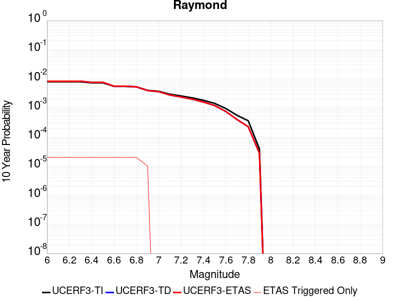 |

| Magnitude | 1 wk TI Prob | 1 wk TD Prob | 1 wk ETAS Prob | 1 wk ETAS/TD Gain | 1 wk ETAS Triggered Only | 1 mo TI Prob | 1 mo TD Prob | 1 mo ETAS Prob | 1 mo ETAS/TD Gain | 1 mo ETAS Triggered Only | 1 yr TI Prob | 1 yr TD Prob | 1 yr ETAS Prob | 1 yr ETAS/TD Gain | 1 yr ETAS Triggered Only | 10 yr TI Prob | 10 yr TD Prob | 10 yr ETAS Prob | 10 yr ETAS/TD Gain | 10 yr ETAS Triggered Only |
|-----|-----|-----|-----|-----|-----|-----|-----|-----|-----|-----|-----|-----|-----|-----|-----|-----|-----|-----|-----|-----|
| 6.0 | 1.5157413E-5 | 1.5810376E-5 | 2.5810217E-5 | 1.632486 | 1.0E-5 | 6.4958724E-5 | 6.775714E-5 | 7.775646E-5 | 1.147576 | 1.0E-5 | 7.905855E-4 | 8.24656E-4 | 8.446395E-4 | 1.0242325 | 2.0E-5 | 0.007877788 | 0.008218477 | 0.008238312 | 1.0024135 | 2.0E-5 |
| 6.1 | 1.5157413E-5 | 1.5810376E-5 | 2.5810217E-5 | 1.632486 | 1.0E-5 | 6.4958724E-5 | 6.775714E-5 | 7.775646E-5 | 1.147576 | 1.0E-5 | 7.905855E-4 | 8.24656E-4 | 8.446395E-4 | 1.0242325 | 2.0E-5 | 0.007877788 | 0.008218477 | 0.008238312 | 1.0024135 | 2.0E-5 |
| 6.2 | 1.5157413E-5 | 1.5810376E-5 | 2.5810217E-5 | 1.632486 | 1.0E-5 | 6.4958724E-5 | 6.775714E-5 | 7.775646E-5 | 1.147576 | 1.0E-5 | 7.905855E-4 | 8.24656E-4 | 8.446395E-4 | 1.0242325 | 2.0E-5 | 0.007877788 | 0.008218477 | 0.008238312 | 1.0024135 | 2.0E-5 |
| 6.3 | 1.5157413E-5 | 1.5810376E-5 | 2.5810217E-5 | 1.632486 | 1.0E-5 | 6.4958724E-5 | 6.775714E-5 | 7.775646E-5 | 1.147576 | 1.0E-5 | 7.905855E-4 | 8.24656E-4 | 8.446395E-4 | 1.0242325 | 2.0E-5 | 0.007877788 | 0.008218477 | 0.008238312 | 1.0024135 | 2.0E-5 |
| 6.4 | 1.3941944E-5 | 1.4454918E-5 | 2.4454774E-5 | 1.6917961 | 1.0E-5 | 5.9749822E-5 | 6.194831E-5 | 7.194769E-5 | 1.1614149 | 1.0E-5 | 7.2721124E-4 | 7.53983E-4 | 7.7396794E-4 | 1.0265058 | 2.0E-5 | 0.007248361 | 0.0075165825 | 0.0075364322 | 1.0026407 | 2.0E-5 |
| 6.5 | 1.3941944E-5 | 1.4454918E-5 | 2.4454774E-5 | 1.6917961 | 1.0E-5 | 5.9749822E-5 | 6.194831E-5 | 7.194769E-5 | 1.1614149 | 1.0E-5 | 7.2721124E-4 | 7.53983E-4 | 7.7396794E-4 | 1.0265058 | 2.0E-5 | 0.007248361 | 0.0075165825 | 0.0075364322 | 1.0026407 | 2.0E-5 |
| 6.6 | 1.0542609E-5 | 1.0671283E-5 | 2.0671177E-5 | 1.9370844 | 1.0E-5 | 4.5181827E-5 | 4.57333E-5 | 5.5732846E-5 | 1.218649 | 1.0E-5 | 5.499499E-4 | 5.566662E-4 | 5.7665503E-4 | 1.0359082 | 2.0E-5 | 0.005485909 | 0.0055532786 | 0.005573168 | 1.0035815 | 2.0E-5 |
| 6.7 | 1.0542609E-5 | 1.0671283E-5 | 2.0671177E-5 | 1.9370844 | 1.0E-5 | 4.5181827E-5 | 4.57333E-5 | 5.5732846E-5 | 1.218649 | 1.0E-5 | 5.499499E-4 | 5.566662E-4 | 5.7665503E-4 | 1.0359082 | 2.0E-5 | 0.005485909 | 0.0055532786 | 0.005573168 | 1.0035815 | 2.0E-5 |
| 6.8 | 1.0079132E-5 | 1.0176812E-5 | 2.017671E-5 | 1.982616 | 1.0E-5 | 4.3195567E-5 | 4.361421E-5 | 5.3613774E-5 | 1.2292731 | 1.0E-5 | 5.257791E-4 | 5.30879E-4 | 5.508684E-4 | 1.0376533 | 2.0E-5 | 0.0052453685 | 0.0052966573 | 0.005316552 | 1.0037559 | 2.0E-5 |
| 6.9 | 7.721598E-6 | 7.5490307E-6 | 7.5490307E-6 | 1.0 | 0.0 | 3.3092143E-5 | 3.2352593E-5 | 3.2352593E-5 | 1.0 | 0.0 | 4.0282236E-4 | 3.9382285E-4 | 4.038189E-4 | 1.0253822 | 1.0E-5 | 0.0040209293 | 0.003931383 | 0.0039413436 | 1.0025337 | 1.0E-5 |
| 7.0 | 7.137566E-6 | 6.9114235E-6 | 6.9114235E-6 | 1.0 | 0.0 | 3.058921E-5 | 2.9620056E-5 | 2.9620056E-5 | 1.0 | 0.0 | 3.7236E-4 | 3.6056558E-4 | 3.6056558E-4 | 1.0 | 0.0 | 0.0037173668 | 0.003599924 | 0.003599924 | 1.0 | 0.0 |
| 7.1 | 5.654976E-6 | 5.2996397E-6 | 5.2996397E-6 | 1.0 | 0.0 | 2.4235387E-5 | 2.2712544E-5 | 2.2712544E-5 | 1.0 | 0.0 | 2.9502588E-4 | 2.7649035E-4 | 2.7649035E-4 | 1.0 | 0.0 | 0.0029463451 | 0.0027614946 | 0.0027614946 | 1.0 | 0.0 |
| 7.2 | 4.9358455E-6 | 4.5267484E-6 | 4.5267484E-6 | 1.0 | 0.0 | 2.1153453E-5 | 1.9400206E-5 | 1.9400206E-5 | 1.0 | 0.0 | 2.5751285E-4 | 2.3617204E-4 | 2.3617204E-4 | 1.0 | 0.0 | 0.0025721465 | 0.0023592326 | 0.0023592326 | 1.0 | 0.0 |
| 7.3 | 4.2368597E-6 | 3.8056999E-6 | 3.8056999E-6 | 1.0 | 0.0 | 1.8157843E-5 | 1.6310041E-5 | 1.6310041E-5 | 1.0 | 0.0 | 2.2104931E-4 | 1.9855677E-4 | 1.9855677E-4 | 1.0 | 0.0 | 0.0022082955 | 0.0019838123 | 0.0019838123 | 1.0 | 0.0 |
| 7.4 | 3.4999923E-6 | 3.0438184E-6 | 3.0438184E-6 | 1.0 | 0.0 | 1.49998805E-5 | 1.3044872E-5 | 1.3044872E-5 | 1.0 | 0.0 | 1.8260824E-4 | 1.5880981E-4 | 1.5880981E-4 | 1.0 | 0.0 | 0.0018245826 | 0.001586979 | 0.001586979 | 1.0 | 0.0 |
| 7.5 | 2.738017E-6 | 2.3021105E-6 | 2.3021105E-6 | 1.0 | 0.0 | 1.1734306E-5 | 9.86615E-6 | 9.86615E-6 | 1.0 | 0.0 | 1.428558E-4 | 1.2011383E-4 | 1.2011383E-4 | 1.0 | 0.0 | 0.0014276401 | 0.0012005034 | 0.0012005034 | 1.0 | 0.0 |
| 7.6 | 1.8186392E-6 | 1.4423566E-6 | 1.4423566E-6 | 1.0 | 0.0 | 7.794145E-6 | 6.181514E-6 | 6.181514E-6 | 1.0 | 0.0 | 9.488958E-5 | 7.5257376E-5 | 7.5257376E-5 | 1.0 | 0.0 | 9.4849075E-4 | 7.523304E-4 | 7.523304E-4 | 1.0 | 0.0 |
| 7.7 | 1.0660348E-6 | 7.644165E-7 | 7.644165E-7 | 1.0 | 0.0 | 4.5687125E-6 | 3.2760668E-6 | 3.2760668E-6 | 1.0 | 0.0 | 5.5622655E-5 | 3.98854E-5 | 3.98854E-5 | 1.0 | 0.0 | 5.5608735E-4 | 3.9879154E-4 | 3.9879154E-4 | 1.0 | 0.0 |
| 7.8 | 6.913602E-7 | 4.320714E-7 | 4.320714E-7 | 1.0 | 0.0 | 2.962969E-6 | 1.8517333E-6 | 1.8517333E-6 | 1.0 | 0.0 | 3.607355E-5 | 2.2544626E-5 | 2.2544626E-5 | 1.0 | 0.0 | 3.6067693E-4 | 2.2543124E-4 | 2.2543124E-4 | 1.0 | 0.0 |
| 7.9 | 7.425201E-8 | 5.322516E-8 | 5.322516E-8 | 1.0 | 0.0 | 3.1822285E-7 | 2.2810782E-7 | 2.2810782E-7 | 1.0 | 0.0 | 3.874356E-6 | 2.7772105E-6 | 2.7772105E-6 | 1.0 | 0.0 | 3.8742884E-5 | 2.7771888E-5 | 2.7771888E-5 | 1.0 | 0.0 |

## Mission Creek
*[(top)](#table-of-contents)*

| 1 Week | 1 Month | 1 Year | 10 Year |
|-----|-----|-----|-----|
|  |  |  | 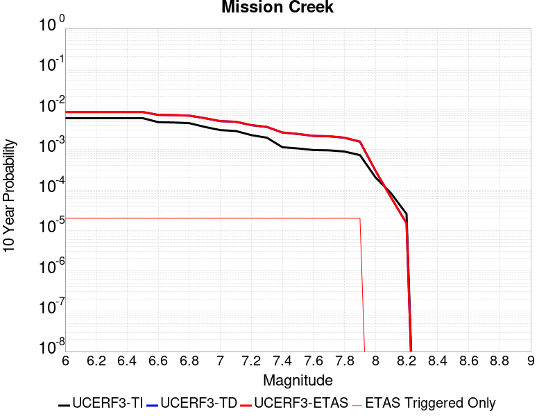 |

| Magnitude | 1 wk TI Prob | 1 wk TD Prob | 1 wk ETAS Prob | 1 wk ETAS/TD Gain | 1 wk ETAS Triggered Only | 1 mo TI Prob | 1 mo TD Prob | 1 mo ETAS Prob | 1 mo ETAS/TD Gain | 1 mo ETAS Triggered Only | 1 yr TI Prob | 1 yr TD Prob | 1 yr ETAS Prob | 1 yr ETAS/TD Gain | 1 yr ETAS Triggered Only | 10 yr TI Prob | 10 yr TD Prob | 10 yr ETAS Prob | 10 yr ETAS/TD Gain | 10 yr ETAS Triggered Only |
|-----|-----|-----|-----|-----|-----|-----|-----|-----|-----|-----|-----|-----|-----|-----|-----|-----|-----|-----|-----|-----|
| 6.0 | 1.1549387E-5 | 1.6324713E-5 | 1.6324713E-5 | 1.0 | 0.0 | 4.9496433E-5 | 6.9961265E-5 | 6.9961265E-5 | 1.0 | 0.0 | 6.0245243E-4 | 8.5146056E-4 | 8.7144354E-4 | 1.0234691 | 2.0E-5 | 0.006008218 | 0.008511184 | 0.008531014 | 1.0023298 | 2.0E-5 |
| 6.1 | 1.1549387E-5 | 1.6324713E-5 | 1.6324713E-5 | 1.0 | 0.0 | 4.9496433E-5 | 6.9961265E-5 | 6.9961265E-5 | 1.0 | 0.0 | 6.0245243E-4 | 8.5146056E-4 | 8.7144354E-4 | 1.0234691 | 2.0E-5 | 0.006008218 | 0.008511184 | 0.008531014 | 1.0023298 | 2.0E-5 |
| 6.2 | 1.1549387E-5 | 1.6324713E-5 | 1.6324713E-5 | 1.0 | 0.0 | 4.9496433E-5 | 6.9961265E-5 | 6.9961265E-5 | 1.0 | 0.0 | 6.0245243E-4 | 8.5146056E-4 | 8.7144354E-4 | 1.0234691 | 2.0E-5 | 0.006008218 | 0.008511184 | 0.008531014 | 1.0023298 | 2.0E-5 |
| 6.3 | 1.1549387E-5 | 1.6324713E-5 | 1.6324713E-5 | 1.0 | 0.0 | 4.9496433E-5 | 6.9961265E-5 | 6.9961265E-5 | 1.0 | 0.0 | 6.0245243E-4 | 8.5146056E-4 | 8.7144354E-4 | 1.0234691 | 2.0E-5 | 0.006008218 | 0.008511184 | 0.008531014 | 1.0023298 | 2.0E-5 |
| 6.4 | 1.1549387E-5 | 1.6324713E-5 | 1.6324713E-5 | 1.0 | 0.0 | 4.9496433E-5 | 6.9961265E-5 | 6.9961265E-5 | 1.0 | 0.0 | 6.0245243E-4 | 8.5146056E-4 | 8.7144354E-4 | 1.0234691 | 2.0E-5 | 0.006008218 | 0.008511184 | 0.008531014 | 1.0023298 | 2.0E-5 |
| 6.5 | 1.1549387E-5 | 1.6324713E-5 | 1.6324713E-5 | 1.0 | 0.0 | 4.9496433E-5 | 6.9961265E-5 | 6.9961265E-5 | 1.0 | 0.0 | 6.0245243E-4 | 8.5146056E-4 | 8.7144354E-4 | 1.0234691 | 2.0E-5 | 0.006008218 | 0.008511184 | 0.008531014 | 1.0023298 | 2.0E-5 |
| 6.6 | 9.202681E-6 | 1.3847972E-5 | 1.3847972E-5 | 1.0 | 0.0 | 3.9439463E-5 | 5.9347152E-5 | 5.9347152E-5 | 1.0 | 0.0 | 4.800697E-4 | 7.2232104E-4 | 7.423066E-4 | 1.0276685 | 2.0E-5 | 0.004790339 | 0.0072283596 | 0.0072482154 | 1.0027468 | 2.0E-5 |
| 6.7 | 9.019164E-6 | 1.365364E-5 | 1.365364E-5 | 1.0 | 0.0 | 3.8652986E-5 | 5.8514335E-5 | 5.8514335E-5 | 1.0 | 0.0 | 4.7049852E-4 | 7.121882E-4 | 7.3217397E-4 | 1.0280625 | 2.0E-5 | 0.004695036 | 0.0071276836 | 0.007147541 | 1.0027859 | 2.0E-5 |
| 6.8 | 8.673558E-6 | 1.3275746E-5 | 1.3275746E-5 | 1.0 | 0.0 | 3.717186E-5 | 5.6894864E-5 | 5.6894864E-5 | 1.0 | 0.0 | 4.524734E-4 | 6.924836E-4 | 7.124698E-4 | 1.0288615 | 2.0E-5 | 0.0045155324 | 0.0069318693 | 0.0069517307 | 1.0028652 | 2.0E-5 |
| 6.9 | 7.002255E-6 | 1.1479958E-5 | 1.1479958E-5 | 1.0 | 0.0 | 3.000932E-5 | 4.9198927E-5 | 4.9198927E-5 | 1.0 | 0.0 | 3.653022E-4 | 5.988392E-4 | 6.188272E-4 | 1.033378 | 2.0E-5 | 0.0036470229 | 0.0060006846 | 0.0060205646 | 1.003313 | 2.0E-5 |
| 7.0 | 5.84644E-6 | 9.677164E-6 | 9.677164E-6 | 1.0 | 0.0 | 2.5055931E-5 | 4.1472922E-5 | 4.1472922E-5 | 1.0 | 0.0 | 3.0501327E-4 | 5.0482043E-4 | 5.2481034E-4 | 1.0395981 | 2.0E-5 | 0.0030459496 | 0.0050649596 | 0.0050848583 | 1.0039287 | 2.0E-5 |
| 7.1 | 5.54703E-6 | 9.331631E-6 | 9.331631E-6 | 1.0 | 0.0 | 2.377277E-5 | 3.999212E-5 | 3.999212E-5 | 1.0 | 0.0 | 2.8939504E-4 | 4.8679972E-4 | 5.0679E-4 | 1.0410646 | 2.0E-5 | 0.0028901845 | 0.0048855497 | 0.004905452 | 1.0040737 | 2.0E-5 |
| 7.2 | 4.384709E-6 | 7.6836495E-6 | 7.6836495E-6 | 1.0 | 0.0 | 1.8791474E-5 | 3.292953E-5 | 3.292953E-5 | 1.0 | 0.0 | 2.2876218E-4 | 4.0084694E-4 | 4.2083891E-4 | 1.0498743 | 2.0E-5 | 0.0022852682 | 0.0040294197 | 0.004049339 | 1.0049435 | 2.0E-5 |
| 7.3 | 3.7888456E-6 | 6.9174894E-6 | 6.9174894E-6 | 1.0 | 0.0 | 1.623781E-5 | 2.9646066E-5 | 2.9646066E-5 | 1.0 | 0.0 | 1.9767738E-4 | 3.608844E-4 | 3.808772E-4 | 1.0553994 | 2.0E-5 | 0.0019750162 | 0.0036311483 | 0.0036510755 | 1.0054879 | 2.0E-5 |
| 7.4 | 2.1982462E-6 | 5.0257536E-6 | 5.0257536E-6 | 1.0 | 0.0 | 9.421021E-6 | 2.1538768E-5 | 2.1538768E-5 | 1.0 | 0.0 | 1.1469489E-4 | 2.6220313E-4 | 2.8219787E-4 | 1.0762568 | 2.0E-5 | 0.0011463572 | 0.0026468872 | 0.0026668343 | 1.007536 | 2.0E-5 |
| 7.5 | 2.051923E-6 | 4.6169393E-6 | 4.6169393E-6 | 1.0 | 0.0 | 8.793926E-6 | 1.9786734E-5 | 1.9786734E-5 | 1.0 | 0.0 | 1.0706078E-4 | 2.40877E-4 | 2.6087218E-4 | 1.08301 | 2.0E-5 | 0.0010700922 | 0.0024345173 | 0.0024544685 | 1.0081952 | 2.0E-5 |
| 7.6 | 1.8733427E-6 | 4.1252324E-6 | 4.1252324E-6 | 1.0 | 0.0 | 8.028587E-6 | 1.767945E-5 | 1.767945E-5 | 1.0 | 0.0 | 9.774366E-5 | 2.1522611E-4 | 2.352218E-4 | 1.0929055 | 2.0E-5 | 9.770069E-4 | 0.0021790217 | 0.002198978 | 1.0091584 | 2.0E-5 |
| 7.7 | 1.8411953E-6 | 4.044895E-6 | 4.044895E-6 | 1.0 | 0.0 | 7.890813E-6 | 1.733515E-5 | 1.733515E-5 | 1.0 | 0.0 | 9.606641E-5 | 2.1103508E-4 | 2.3103086E-4 | 1.094751 | 2.0E-5 | 9.6024893E-4 | 0.0021373003 | 0.0021572576 | 1.0093375 | 2.0E-5 |
| 7.8 | 1.7194251E-6 | 3.7121463E-6 | 3.7121463E-6 | 1.0 | 0.0 | 7.368944E-6 | 1.5909101E-5 | 1.5909101E-5 | 1.0 | 0.0 | 8.97132E-5 | 1.9367617E-4 | 2.1367229E-4 | 1.1032451 | 2.0E-5 | 8.967699E-4 | 0.0019632233 | 0.001983184 | 1.0101674 | 2.0E-5 |
| 7.9 | 1.4035052E-6 | 2.9514722E-6 | 2.9514722E-6 | 1.0 | 0.0 | 6.0150082E-6 | 1.2649106E-5 | 1.2649106E-5 | 1.0 | 0.0 | 7.3230265E-5 | 1.5399205E-4 | 1.7398897E-4 | 1.1298568 | 2.0E-5 | 7.3206134E-4 | 0.0015638224 | 0.0015837911 | 1.0127692 | 2.0E-5 |
| 8.0 | 3.9318823E-7 | 5.5319464E-7 | 5.5319464E-7 | 1.0 | 0.0 | 1.6850913E-6 | 2.3708321E-6 | 2.3708321E-6 | 1.0 | 0.0 | 2.0515794E-5 | 2.8864504E-5 | 2.8864504E-5 | 1.0 | 0.0 | 2.0513899E-4 | 2.9916913E-4 | 2.9916913E-4 | 1.0 | 0.0 |
| 8.1 | 1.596793E-7 | 1.1391901E-7 | 1.1391901E-7 | 1.0 | 0.0 | 6.8433974E-7 | 4.8822426E-7 | 4.8822426E-7 | 1.0 | 0.0 | 8.331805E-6 | 5.944114E-6 | 5.944114E-6 | 1.0 | 0.0 | 8.331492E-5 | 6.5564316E-5 | 6.5564316E-5 | 1.0 | 0.0 |
| 8.2 | 4.9003038E-8 | 2.5475106E-8 | 2.5475106E-8 | 1.0 | 0.0 | 2.10013E-7 | 1.0917902E-7 | 1.0917902E-7 | 1.0 | 0.0 | 2.5569052E-6 | 1.3292538E-6 | 1.3292538E-6 | 1.0 | 0.0 | 2.556876E-5 | 1.4973085E-5 | 1.4973085E-5 | 1.0 | 0.0 |

## San Andreas (Parkfield)
*[(top)](#table-of-contents)*

| 1 Week | 1 Month | 1 Year | 10 Year |
|-----|-----|-----|-----|
|  | 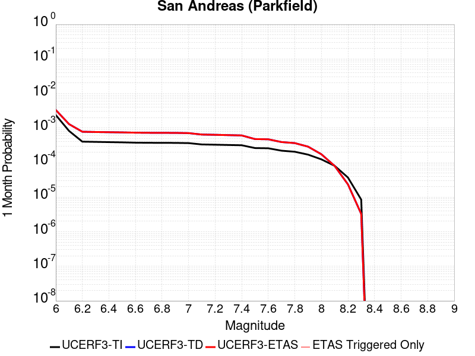 |  |  |

| Magnitude | 1 wk TI Prob | 1 wk TD Prob | 1 wk ETAS Prob | 1 wk ETAS/TD Gain | 1 wk ETAS Triggered Only | 1 mo TI Prob | 1 mo TD Prob | 1 mo ETAS Prob | 1 mo ETAS/TD Gain | 1 mo ETAS Triggered Only | 1 yr TI Prob | 1 yr TD Prob | 1 yr ETAS Prob | 1 yr ETAS/TD Gain | 1 yr ETAS Triggered Only | 10 yr TI Prob | 10 yr TD Prob | 10 yr ETAS Prob | 10 yr ETAS/TD Gain | 10 yr ETAS Triggered Only |
|-----|-----|-----|-----|-----|-----|-----|-----|-----|-----|-----|-----|-----|-----|-----|-----|-----|-----|-----|-----|-----|
| 6.0 | 5.556969E-4 | 7.788437E-4 | 7.788437E-4 | 1.0 | 0.0 | 0.0023793848 | 0.0033341812 | 0.0033341812 | 1.0 | 0.0 | 0.028586963 | 0.04023991 | 0.040259108 | 1.0004771 | 2.0E-5 | 0.25176284 | 0.33731642 | 0.3373297 | 1.0000393 | 2.0E-5 |
| 6.1 | 1.925858E-4 | 3.0304783E-4 | 3.0304783E-4 | 1.0 | 0.0 | 8.2510663E-4 | 0.0012982241 | 0.0012982241 | 1.0 | 0.0 | 0.0099994885 | 0.015792182 | 0.015792182 | 1.0 | 0.0 | 0.095613256 | 0.14979222 | 0.14979222 | 1.0 | 0.0 |
| 6.2 | 9.4306815E-5 | 1.8250331E-4 | 1.8250331E-4 | 1.0 | 0.0 | 4.0410945E-4 | 7.819238E-4 | 7.819238E-4 | 1.0 | 0.0 | 0.0049089384 | 0.009478576 | 0.009478576 | 1.0 | 0.0 | 0.048019063 | 0.09188674 | 0.09188674 | 1.0 | 0.0 |
| 6.3 | 9.283051E-5 | 1.7946832E-4 | 1.7946832E-4 | 1.0 | 0.0 | 3.9778434E-4 | 7.689244E-4 | 7.689244E-4 | 1.0 | 0.0 | 0.0048322747 | 0.009321672 | 0.009321672 | 1.0 | 0.0 | 0.047285385 | 0.09053965 | 0.09053965 | 1.0 | 0.0 |
| 6.4 | 9.138826E-5 | 1.770899E-4 | 1.770899E-4 | 1.0 | 0.0 | 3.916052E-4 | 7.5873715E-4 | 7.5873715E-4 | 1.0 | 0.0 | 0.0047573745 | 0.009198696 | 0.009198696 | 1.0 | 0.0 | 0.046568092 | 0.089441724 | 0.089441724 | 1.0 | 0.0 |
| 6.5 | 9.000255E-5 | 1.746699E-4 | 1.746699E-4 | 1.0 | 0.0 | 3.8566816E-4 | 7.483717E-4 | 7.483717E-4 | 1.0 | 0.0 | 0.0046854047 | 0.009073567 | 0.009073567 | 1.0 | 0.0 | 0.045878403 | 0.08832737 | 0.08832737 | 1.0 | 0.0 |
| 6.6 | 8.8109264E-5 | 1.7148067E-4 | 1.7148067E-4 | 1.0 | 0.0 | 3.7755648E-4 | 7.3471136E-4 | 7.3471136E-4 | 1.0 | 0.0 | 0.0045870654 | 0.008908638 | 0.008908638 | 1.0 | 0.0 | 0.04493529 | 0.086858675 | 0.086858675 | 1.0 | 0.0 |
| 6.7 | 8.738073E-5 | 1.7015127E-4 | 1.7015127E-4 | 1.0 | 0.0 | 3.7443507E-4 | 7.290171E-4 | 7.290171E-4 | 1.0 | 0.0 | 0.0045492216 | 0.008839916 | 0.008839916 | 1.0 | 0.0 | 0.04457213 | 0.086258985 | 0.086258985 | 1.0 | 0.0 |
| 6.8 | 8.710195E-5 | 1.6960612E-4 | 1.6960612E-4 | 1.0 | 0.0 | 3.7324068E-4 | 7.266821E-4 | 7.266821E-4 | 1.0 | 0.0 | 0.0045347405 | 0.008811726 | 0.008811726 | 1.0 | 0.0 | 0.04443313 | 0.08600653 | 0.08600653 | 1.0 | 0.0 |
| 6.9 | 8.6801556E-5 | 1.6901553E-4 | 1.6901553E-4 | 1.0 | 0.0 | 3.7195362E-4 | 7.2415237E-4 | 7.2415237E-4 | 1.0 | 0.0 | 0.0045191357 | 0.008781176 | 0.008781176 | 1.0 | 0.0 | 0.044283327 | 0.08573254 | 0.08573254 | 1.0 | 0.0 |
| 7.0 | 8.5571606E-5 | 1.6654332E-4 | 1.6654332E-4 | 1.0 | 0.0 | 3.6668387E-4 | 7.13563E-4 | 7.13563E-4 | 1.0 | 0.0 | 0.004455241 | 0.008653281 | 0.008653281 | 1.0 | 0.0 | 0.043669727 | 0.08458075 | 0.08458075 | 1.0 | 0.0 |
| 7.1 | 7.82589E-5 | 1.5135074E-4 | 1.5135074E-4 | 1.0 | 0.0 | 3.3535215E-4 | 6.484855E-4 | 6.484855E-4 | 1.0 | 0.0 | 0.0040752706 | 0.0078668995 | 0.0078668995 | 1.0 | 0.0 | 0.040013418 | 0.077491894 | 0.077491894 | 1.0 | 0.0 |
| 7.2 | 7.690929E-5 | 1.4872287E-4 | 1.4872287E-4 | 1.0 | 0.0 | 3.2956956E-4 | 6.372288E-4 | 6.372288E-4 | 1.0 | 0.0 | 0.004005129 | 0.007730829 | 0.007730829 | 1.0 | 0.0 | 0.0393371 | 0.07626493 | 0.07626493 | 1.0 | 0.0 |
| 7.3 | 7.5543794E-5 | 1.4568791E-4 | 1.4568791E-4 | 1.0 | 0.0 | 3.2371894E-4 | 6.242281E-4 | 6.242281E-4 | 1.0 | 0.0 | 0.003934157 | 0.007573656 | 0.007573656 | 1.0 | 0.0 | 0.038652334 | 0.07482772 | 0.07482772 | 1.0 | 0.0 |
| 7.4 | 7.4214564E-5 | 1.4269682E-4 | 1.4269682E-4 | 1.0 | 0.0 | 3.1802364E-4 | 6.114152E-4 | 6.114152E-4 | 1.0 | 0.0 | 0.003865065 | 0.007418731 | 0.007418731 | 1.0 | 0.0 | 0.03798529 | 0.07340127 | 0.07340127 | 1.0 | 0.0 |
| 7.5 | 6.149578E-5 | 1.1196503E-4 | 1.1196503E-4 | 1.0 | 0.0 | 2.6352672E-4 | 4.7976198E-4 | 4.7976198E-4 | 1.0 | 0.0 | 0.0032037178 | 0.00582549 | 0.00582549 | 1.0 | 0.0 | 0.03157923 | 0.058584154 | 0.058584154 | 1.0 | 0.0 |
| 7.6 | 6.0643448E-5 | 1.10251094E-4 | 1.10251094E-4 | 1.0 | 0.0 | 2.598746E-4 | 4.7241923E-4 | 4.7241923E-4 | 1.0 | 0.0 | 0.0031593828 | 0.0057365666 | 0.0057365666 | 1.0 | 0.0 | 0.031148417 | 0.057744972 | 0.057744972 | 1.0 | 0.0 |
| 7.7 | 5.1652263E-5 | 9.179838E-5 | 9.179838E-5 | 1.0 | 0.0 | 2.2134806E-4 | 3.9336234E-4 | 3.9336234E-4 | 1.0 | 0.0 | 0.002691582 | 0.0047786795 | 0.0047786795 | 1.0 | 0.0 | 0.026592141 | 0.048560265 | 0.048560265 | 1.0 | 0.0 |
| 7.8 | 4.8090482E-5 | 8.564368E-5 | 8.564368E-5 | 1.0 | 0.0 | 2.060858E-4 | 3.6699275E-4 | 3.6699275E-4 | 1.0 | 0.0 | 0.0025062072 | 0.004458991 | 0.004458991 | 1.0 | 0.0 | 0.024781305 | 0.045324653 | 0.045324653 | 1.0 | 0.0 |
| 7.9 | 3.970278E-5 | 6.754111E-5 | 6.754111E-5 | 1.0 | 0.0 | 1.7014367E-4 | 2.894298E-4 | 2.894298E-4 | 1.0 | 0.0 | 0.002069531 | 0.0035181176 | 0.0035181176 | 1.0 | 0.0 | 0.020503636 | 0.03589899 | 0.03589899 | 1.0 | 0.0 |
| 8.0 | 2.8982335E-5 | 4.072124E-5 | 4.072124E-5 | 1.0 | 0.0 | 1.2420409E-4 | 1.7450792E-4 | 1.7450792E-4 | 1.0 | 0.0 | 0.0015111357 | 0.002122565 | 0.002122565 | 1.0 | 0.0 | 0.015009012 | 0.02202231 | 0.02202231 | 1.0 | 0.0 |
| 8.1 | 1.8836186E-5 | 1.8694205E-5 | 1.8694205E-5 | 1.0 | 0.0 | 8.0724014E-5 | 8.011556E-5 | 8.011556E-5 | 1.0 | 0.0 | 9.823717E-4 | 9.749711E-4 | 9.749711E-4 | 1.0 | 0.0 | 0.009780403 | 0.010494972 | 0.010494972 | 1.0 | 0.0 |
| 8.2 | 8.643924E-6 | 5.4798497E-6 | 5.4798497E-6 | 1.0 | 0.0 | 3.704486E-5 | 2.348486E-5 | 2.348486E-5 | 1.0 | 0.0 | 4.5092785E-4 | 2.858907E-4 | 2.858907E-4 | 1.0 | 0.0 | 0.0045001395 | 0.0032514327 | 0.0032514327 | 1.0 | 0.0 |
| 8.3 | 1.983087E-6 | 7.668296E-7 | 7.668296E-7 | 1.0 | 0.0 | 8.498917E-6 | 3.2864084E-6 | 3.2864084E-6 | 1.0 | 0.0 | 1.034694E-4 | 4.0011306E-5 | 4.0011306E-5 | 1.0 | 0.0 | 0.0010342124 | 4.724499E-4 | 4.724499E-4 | 1.0 | 0.0 |

## Elysian Park (Upper)
*[(top)](#table-of-contents)*

| 1 Week | 1 Month | 1 Year | 10 Year |
|-----|-----|-----|-----|
|  |  |  |  |

| Magnitude | 1 wk TI Prob | 1 wk TD Prob | 1 wk ETAS Prob | 1 wk ETAS/TD Gain | 1 wk ETAS Triggered Only | 1 mo TI Prob | 1 mo TD Prob | 1 mo ETAS Prob | 1 mo ETAS/TD Gain | 1 mo ETAS Triggered Only | 1 yr TI Prob | 1 yr TD Prob | 1 yr ETAS Prob | 1 yr ETAS/TD Gain | 1 yr ETAS Triggered Only | 10 yr TI Prob | 10 yr TD Prob | 10 yr ETAS Prob | 10 yr ETAS/TD Gain | 10 yr ETAS Triggered Only |
|-----|-----|-----|-----|-----|-----|-----|-----|-----|-----|-----|-----|-----|-----|-----|-----|-----|-----|-----|-----|-----|
| 6.0 | 3.1876025E-5 | 3.703652E-5 | 4.703615E-5 | 1.2699938 | 1.0E-5 | 1.3660437E-4 | 1.5872101E-4 | 1.6871943E-4 | 1.0629936 | 1.0E-5 | 0.0016618895 | 0.0019311584 | 0.0019511197 | 1.0103365 | 2.0E-5 | 0.016495159 | 0.019190295 | 0.01920991 | 1.0010222 | 2.0E-5 |
| 6.1 | 3.1876025E-5 | 3.703652E-5 | 4.703615E-5 | 1.2699938 | 1.0E-5 | 1.3660437E-4 | 1.5872101E-4 | 1.6871943E-4 | 1.0629936 | 1.0E-5 | 0.0016618895 | 0.0019311584 | 0.0019511197 | 1.0103365 | 2.0E-5 | 0.016495159 | 0.019190295 | 0.01920991 | 1.0010222 | 2.0E-5 |
| 6.2 | 3.1876025E-5 | 3.703652E-5 | 4.703615E-5 | 1.2699938 | 1.0E-5 | 1.3660437E-4 | 1.5872101E-4 | 1.6871943E-4 | 1.0629936 | 1.0E-5 | 0.0016618895 | 0.0019311584 | 0.0019511197 | 1.0103365 | 2.0E-5 | 0.016495159 | 0.019190295 | 0.01920991 | 1.0010222 | 2.0E-5 |
| 6.3 | 3.1876025E-5 | 3.703652E-5 | 4.703615E-5 | 1.2699938 | 1.0E-5 | 1.3660437E-4 | 1.5872101E-4 | 1.6871943E-4 | 1.0629936 | 1.0E-5 | 0.0016618895 | 0.0019311584 | 0.0019511197 | 1.0103365 | 2.0E-5 | 0.016495159 | 0.019190295 | 0.01920991 | 1.0010222 | 2.0E-5 |
| 6.4 | 1.9273462E-5 | 2.120273E-5 | 3.120252E-5 | 1.4716274 | 1.0E-5 | 8.259794E-5 | 9.0866655E-5 | 1.0086575E-4 | 1.1100414 | 1.0E-5 | 0.001005166 | 0.0011059135 | 0.0011159024 | 1.0090322 | 1.0E-5 | 0.010006315 | 0.011020964 | 0.011030854 | 1.0008974 | 1.0E-5 |
| 6.5 | 1.9273462E-5 | 2.120273E-5 | 3.120252E-5 | 1.4716274 | 1.0E-5 | 8.259794E-5 | 9.0866655E-5 | 1.0086575E-4 | 1.1100414 | 1.0E-5 | 0.001005166 | 0.0011059135 | 0.0011159024 | 1.0090322 | 1.0E-5 | 0.010006315 | 0.011020964 | 0.011030854 | 1.0008974 | 1.0E-5 |
| 6.6 | 9.813258E-6 | 9.665728E-6 | 1.9665631E-5 | 2.0345733 | 1.0E-5 | 4.205614E-5 | 4.142393E-5 | 5.1423518E-5 | 1.2413963 | 1.0E-5 | 5.119132E-4 | 5.042269E-4 | 5.1422184E-4 | 1.0198224 | 1.0E-5 | 0.005107356 | 0.005031552 | 0.0050415015 | 1.0019774 | 1.0E-5 |
| 6.7 | 9.801478E-6 | 9.653297E-6 | 1.96532E-5 | 2.0359056 | 1.0E-5 | 4.2005657E-5 | 4.137066E-5 | 5.1370243E-5 | 1.2417072 | 1.0E-5 | 5.112989E-4 | 5.0357863E-4 | 5.135736E-4 | 1.0198479 | 1.0E-5 | 0.0051012407 | 0.0050250986 | 0.0050350484 | 1.0019801 | 1.0E-5 |
| 6.8 | 8.102489E-6 | 7.7731065E-6 | 1.7773029E-5 | 2.2864769 | 1.0E-5 | 3.4724493E-5 | 3.3312917E-5 | 4.3312582E-5 | 1.3001739 | 1.0E-5 | 4.2268867E-4 | 4.0551423E-4 | 4.1551018E-4 | 1.0246501 | 1.0E-5 | 0.004218856 | 0.0040482366 | 0.004058196 | 1.0024602 | 1.0E-5 |
| 6.9 | 6.08275E-6 | 5.4815127E-6 | 5.4815127E-6 | 1.0 | 0.0 | 2.6068668E-5 | 2.349199E-5 | 2.349199E-5 | 1.0 | 0.0 | 3.173398E-4 | 2.8597823E-4 | 2.8597823E-4 | 1.0 | 0.0 | 0.0031688702 | 0.0028561796 | 0.0028561796 | 1.0 | 0.0 |
| 7.0 | 5.5995934E-6 | 4.982836E-6 | 4.982836E-6 | 1.0 | 0.0 | 2.3998036E-5 | 2.135484E-5 | 2.135484E-5 | 1.0 | 0.0 | 2.9213692E-4 | 2.599648E-4 | 2.599648E-4 | 1.0 | 0.0 | 0.0029175316 | 0.0025966743 | 0.0025966743 | 1.0 | 0.0 |
| 7.1 | 4.709881E-6 | 4.0874465E-6 | 4.0874465E-6 | 1.0 | 0.0 | 2.0185047E-5 | 1.7517514E-5 | 1.7517514E-5 | 1.0 | 0.0 | 2.4572524E-4 | 2.1325526E-4 | 2.1325526E-4 | 1.0 | 0.0 | 0.002454537 | 0.0021305475 | 0.0021305475 | 1.0 | 0.0 |
| 7.2 | 3.6063436E-6 | 2.9779865E-6 | 2.9779865E-6 | 1.0 | 0.0 | 1.5455667E-5 | 1.2762738E-5 | 1.2762738E-5 | 1.0 | 0.0 | 1.881565E-4 | 1.5537537E-4 | 1.5537537E-4 | 1.0 | 0.0 | 0.0018799726 | 0.0015526785 | 0.0015526785 | 1.0 | 0.0 |
| 7.3 | 2.471135E-6 | 2.0954842E-6 | 2.0954842E-6 | 1.0 | 0.0 | 1.0590536E-5 | 8.980616E-6 | 8.980616E-6 | 1.0 | 0.0 | 1.2893214E-4 | 1.0933358E-4 | 1.0933358E-4 | 1.0 | 0.0 | 0.0012885736 | 0.0010928052 | 0.0010928052 | 1.0 | 0.0 |
| 7.4 | 1.163943E-6 | 1.0275212E-6 | 1.0275212E-6 | 1.0 | 0.0 | 4.988318E-6 | 4.403655E-6 | 4.403655E-6 | 1.0 | 0.0 | 6.0731076E-5 | 5.3613214E-5 | 5.3613214E-5 | 1.0 | 0.0 | 6.071448E-4 | 5.3600577E-4 | 5.3600577E-4 | 1.0 | 0.0 |
| 7.5 | 4.99459E-7 | 4.9176606E-7 | 4.9176606E-7 | 1.0 | 0.0 | 2.140537E-6 | 2.107567E-6 | 2.107567E-6 | 1.0 | 0.0 | 2.6060725E-5 | 2.5659343E-5 | 2.5659343E-5 | 1.0 | 0.0 | 2.605767E-4 | 2.5656537E-4 | 2.5656537E-4 | 1.0 | 0.0 |
| 7.6 | 2.4667852E-7 | 2.4778674E-7 | 2.4778674E-7 | 1.0 | 0.0 | 1.0571932E-6 | 1.0619428E-6 | 1.0619428E-6 | 1.0 | 0.0 | 1.2871251E-5 | 1.2929081E-5 | 1.2929081E-5 | 1.0 | 0.0 | 1.2870505E-4 | 1.2928365E-4 | 1.2928365E-4 | 1.0 | 0.0 |
| 7.7 | 8.2312795E-8 | 7.386629E-8 | 7.386629E-8 | 1.0 | 0.0 | 3.527691E-7 | 3.1656978E-7 | 3.1656978E-7 | 1.0 | 0.0 | 4.294955E-6 | 3.8542316E-6 | 3.8542316E-6 | 1.0 | 0.0 | 4.2948723E-5 | 3.8541762E-5 | 3.8541762E-5 | 1.0 | 0.0 |
| 7.8 | 2.7819295E-8 | 1.7567322E-8 | 1.7567322E-8 | 1.0 | 0.0 | 1.1922555E-7 | 7.528852E-8 | 7.528852E-8 | 1.0 | 0.0 | 1.45157E-6 | 9.166375E-7 | 9.166375E-7 | 1.0 | 0.0 | 1.45156055E-5 | 9.166352E-6 | 9.166352E-6 | 1.0 | 0.0 |

## San Andreas (Creeping Section) 2011 CFM
*[(top)](#table-of-contents)*

| 1 Week | 1 Month | 1 Year | 10 Year |
|-----|-----|-----|-----|
|  |  |  |  |

| Magnitude | 1 wk TI Prob | 1 wk TD Prob | 1 wk ETAS Prob | 1 wk ETAS/TD Gain | 1 wk ETAS Triggered Only | 1 mo TI Prob | 1 mo TD Prob | 1 mo ETAS Prob | 1 mo ETAS/TD Gain | 1 mo ETAS Triggered Only | 1 yr TI Prob | 1 yr TD Prob | 1 yr ETAS Prob | 1 yr ETAS/TD Gain | 1 yr ETAS Triggered Only | 10 yr TI Prob | 10 yr TD Prob | 10 yr ETAS Prob | 10 yr ETAS/TD Gain | 10 yr ETAS Triggered Only |
|-----|-----|-----|-----|-----|-----|-----|-----|-----|-----|-----|-----|-----|-----|-----|-----|-----|-----|-----|-----|-----|
| 6.0 | 5.986481E-4 | 0.0012278741 | 0.0012278741 | 1.0 | 0.0 | 0.0025631124 | 0.0052457973 | 0.0052557453 | 1.0018963 | 1.0E-5 | 0.030762846 | 0.061208665 | 0.06122744 | 1.0003067 | 2.0E-5 | 0.26835477 | 0.4259623 | 0.42597377 | 1.000027 | 2.0E-5 |
| 6.1 | 5.015945E-4 | 0.0010222398 | 0.0010222398 | 1.0 | 0.0 | 0.00214792 | 0.004368119 | 0.0043780752 | 1.0022793 | 1.0E-5 | 0.025839351 | 0.0512512 | 0.051260687 | 1.0001851 | 1.0E-5 | 0.23032776 | 0.37288252 | 0.3728888 | 1.0000168 | 1.0E-5 |
| 6.2 | 4.073338E-4 | 8.109135E-4 | 8.109135E-4 | 1.0 | 0.0 | 0.0017445484 | 0.0034676173 | 0.0034775827 | 1.0028738 | 1.0E-5 | 0.021034058 | 0.040936444 | 0.040946033 | 1.0002342 | 1.0E-5 | 0.19150782 | 0.3130621 | 0.31306896 | 1.0000219 | 1.0E-5 |
| 6.3 | 3.464099E-4 | 6.7394925E-4 | 6.7394925E-4 | 1.0 | 0.0 | 0.0014837692 | 0.00288274 | 0.00288274 | 1.0 | 0.0 | 0.017915873 | 0.034192428 | 0.034192428 | 1.0 | 0.0 | 0.16538359 | 0.27134693 | 0.27134693 | 1.0 | 0.0 |
| 6.4 | 2.935057E-4 | 5.545115E-4 | 5.545115E-4 | 1.0 | 0.0 | 0.0012572751 | 0.0023718805 | 0.0023718805 | 1.0 | 0.0 | 0.015200248 | 0.028267467 | 0.028267467 | 1.0 | 0.0 | 0.14201577 | 0.2330172 | 0.2330172 | 1.0 | 0.0 |
| 6.5 | 2.3409708E-4 | 4.2095222E-4 | 4.2095222E-4 | 1.0 | 0.0 | 0.0010028875 | 0.0018015768 | 0.0018015768 | 1.0 | 0.0 | 0.012141965 | 0.021591473 | 0.021591473 | 1.0 | 0.0 | 0.11499573 | 0.18685804 | 0.18685804 | 1.0 | 0.0 |
| 6.6 | 1.5842178E-4 | 2.5079807E-4 | 2.5079807E-4 | 1.0 | 0.0 | 6.7877385E-4 | 0.0010744074 | 0.0010744074 | 1.0 | 0.0 | 0.0082328 | 0.013001034 | 0.013001034 | 1.0 | 0.0 | 0.07934396 | 0.12318426 | 0.12318426 | 1.0 | 0.0 |
| 6.7 | 1.5616413E-4 | 2.461632E-4 | 2.461632E-4 | 1.0 | 0.0 | 6.691031E-4 | 0.0010545597 | 0.0010545597 | 1.0 | 0.0 | 0.0081159435 | 0.012762894 | 0.012762894 | 1.0 | 0.0 | 0.0782586 | 0.12121142 | 0.12121142 | 1.0 | 0.0 |
| 6.8 | 1.5538467E-4 | 2.4440174E-4 | 2.4440174E-4 | 1.0 | 0.0 | 6.6576427E-4 | 0.0010470168 | 0.0010470168 | 1.0 | 0.0 | 0.008075596 | 0.012672268 | 0.012672268 | 1.0 | 0.0 | 0.07788358 | 0.12044227 | 0.12044227 | 1.0 | 0.0 |
| 6.9 | 1.5153569E-4 | 2.3549511E-4 | 2.3549511E-4 | 1.0 | 0.0 | 6.49277E-4 | 0.0010088764 | 0.0010088764 | 1.0 | 0.0 | 0.007876333 | 0.012214421 | 0.012214421 | 1.0 | 0.0 | 0.07602952 | 0.11651233 | 0.11651233 | 1.0 | 0.0 |
| 7.0 | 1.4588932E-4 | 2.2406683E-4 | 2.2406683E-4 | 1.0 | 0.0 | 6.250901E-4 | 9.5993496E-4 | 9.5993496E-4 | 1.0 | 0.0 | 0.0075839474 | 0.011625077 | 0.011625077 | 1.0 | 0.0 | 0.073302895 | 0.111358546 | 0.111358546 | 1.0 | 0.0 |
| 7.1 | 1.1565079E-4 | 1.6290719E-4 | 1.6290719E-4 | 1.0 | 0.0 | 4.955521E-4 | 6.9798774E-4 | 6.9798774E-4 | 1.0 | 0.0 | 0.006016669 | 0.008465091 | 0.008465091 | 1.0 | 0.0 | 0.058563538 | 0.08370675 | 0.08370675 | 1.0 | 0.0 |
| 7.2 | 1.0393792E-4 | 1.4624344E-4 | 1.4624344E-4 | 1.0 | 0.0 | 4.4537216E-4 | 6.2660786E-4 | 6.2660786E-4 | 1.0 | 0.0 | 0.005408933 | 0.007602434 | 0.007602434 | 1.0 | 0.0 | 0.052791595 | 0.07565546 | 0.07565546 | 1.0 | 0.0 |
| 7.3 | 9.332884E-5 | 1.2788197E-4 | 1.2788197E-4 | 1.0 | 0.0 | 3.999194E-4 | 5.479511E-4 | 5.479511E-4 | 1.0 | 0.0 | 0.0048581534 | 0.0066510327 | 0.0066510327 | 1.0 | 0.0 | 0.047533102 | 0.06651482 | 0.06651482 | 1.0 | 0.0 |
| 7.4 | 8.670252E-5 | 1.17095995E-4 | 1.17095995E-4 | 1.0 | 0.0 | 3.715293E-4 | 5.0174404E-4 | 5.0174404E-4 | 1.0 | 0.0 | 0.004513991 | 0.006091744 | 0.006091744 | 1.0 | 0.0 | 0.044233937 | 0.061179653 | 0.061179653 | 1.0 | 0.0 |
| 7.5 | 7.3036405E-5 | 9.011144E-5 | 9.011144E-5 | 1.0 | 0.0 | 3.129756E-4 | 3.861348E-4 | 3.861348E-4 | 1.0 | 0.0 | 0.0038038217 | 0.004691079 | 0.004691079 | 1.0 | 0.0 | 0.03739367 | 0.047901772 | 0.047901772 | 1.0 | 0.0 |
| 7.6 | 6.3935775E-5 | 8.284792E-5 | 8.284792E-5 | 1.0 | 0.0 | 2.7398168E-4 | 3.550143E-4 | 3.550143E-4 | 1.0 | 0.0 | 0.0033306254 | 0.004313751 | 0.004313751 | 1.0 | 0.0 | 0.032811474 | 0.04401211 | 0.04401211 | 1.0 | 0.0 |
| 7.7 | 5.5050095E-5 | 6.6657536E-5 | 6.6657536E-5 | 1.0 | 0.0 | 2.3590765E-4 | 2.8564388E-4 | 2.8564388E-4 | 1.0 | 0.0 | 0.0028683927 | 0.0034721727 | 0.0034721727 | 1.0 | 0.0 | 0.0283165 | 0.035814673 | 0.035814673 | 1.0 | 0.0 |
| 7.8 | 5.027131E-5 | 6.166444E-5 | 6.166444E-5 | 1.0 | 0.0 | 2.1543067E-4 | 2.6424942E-4 | 2.6424942E-4 | 1.0 | 0.0 | 0.0026197135 | 0.0032124936 | 0.0032124936 | 1.0 | 0.0 | 0.025890453 | 0.033143617 | 0.033143617 | 1.0 | 0.0 |
| 7.9 | 3.7271806E-5 | 5.0253755E-5 | 5.0253755E-5 | 1.0 | 0.0 | 1.5972654E-4 | 2.1535547E-4 | 2.1535547E-4 | 1.0 | 0.0 | 0.0019429359 | 0.0026188022 | 0.0026188022 | 1.0 | 0.0 | 0.019260362 | 0.027081102 | 0.027081102 | 1.0 | 0.0 |
| 8.0 | 2.7310243E-5 | 3.144777E-5 | 3.144777E-5 | 1.0 | 0.0 | 1.17038646E-4 | 1.3476919E-4 | 1.3476919E-4 | 1.0 | 0.0 | 0.0014240141 | 0.0016395808 | 0.0016395808 | 1.0 | 0.0 | 0.014149235 | 0.0172237 | 0.0172237 | 1.0 | 0.0 |
| 8.1 | 1.7940547E-5 | 1.7413187E-5 | 1.7413187E-5 | 1.0 | 0.0 | 7.688579E-5 | 7.4625816E-5 | 7.4625816E-5 | 1.0 | 0.0 | 9.3568244E-4 | 9.081911E-4 | 9.081911E-4 | 1.0 | 0.0 | 0.009317525 | 0.009805583 | 0.009805583 | 1.0 | 0.0 |
| 8.2 | 8.643924E-6 | 5.4798497E-6 | 5.4798497E-6 | 1.0 | 0.0 | 3.704486E-5 | 2.348486E-5 | 2.348486E-5 | 1.0 | 0.0 | 4.5092785E-4 | 2.858907E-4 | 2.858907E-4 | 1.0 | 0.0 | 0.0045001395 | 0.0032514327 | 0.0032514327 | 1.0 | 0.0 |
| 8.3 | 1.983087E-6 | 7.668296E-7 | 7.668296E-7 | 1.0 | 0.0 | 8.498917E-6 | 3.2864084E-6 | 3.2864084E-6 | 1.0 | 0.0 | 1.034694E-4 | 4.0011306E-5 | 4.0011306E-5 | 1.0 | 0.0 | 0.0010342124 | 4.724499E-4 | 4.724499E-4 | 1.0 | 0.0 |

## Greenville (No) 2011 CFM
*[(top)](#table-of-contents)*

| 1 Week | 1 Month | 1 Year | 10 Year |
|-----|-----|-----|-----|
|  |  |  | 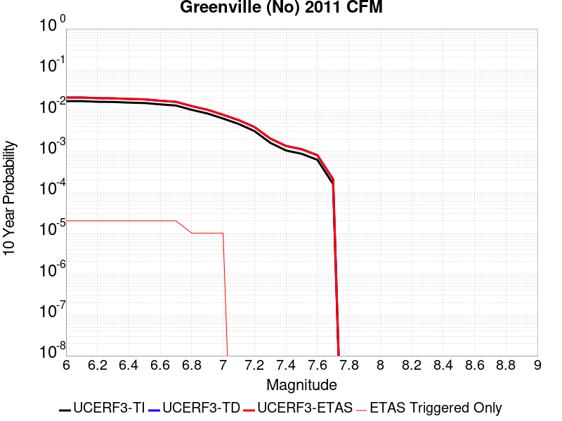 |

| Magnitude | 1 wk TI Prob | 1 wk TD Prob | 1 wk ETAS Prob | 1 wk ETAS/TD Gain | 1 wk ETAS Triggered Only | 1 mo TI Prob | 1 mo TD Prob | 1 mo ETAS Prob | 1 mo ETAS/TD Gain | 1 mo ETAS Triggered Only | 1 yr TI Prob | 1 yr TD Prob | 1 yr ETAS Prob | 1 yr ETAS/TD Gain | 1 yr ETAS Triggered Only | 10 yr TI Prob | 10 yr TD Prob | 10 yr ETAS Prob | 10 yr ETAS/TD Gain | 10 yr ETAS Triggered Only |
|-----|-----|-----|-----|-----|-----|-----|-----|-----|-----|-----|-----|-----|-----|-----|-----|-----|-----|-----|-----|-----|
| 6.0 | 3.286654E-5 | 4.036741E-5 | 4.036741E-5 | 1.0 | 0.0 | 1.4084899E-4 | 1.7299193E-4 | 1.7299193E-4 | 1.0 | 0.0 | 0.0017134876 | 0.0021041804 | 0.0021141593 | 1.0047425 | 1.0E-5 | 0.017003356 | 0.020847455 | 0.020867039 | 1.0009394 | 2.0E-5 |
| 6.1 | 3.286654E-5 | 4.036741E-5 | 4.036741E-5 | 1.0 | 0.0 | 1.4084899E-4 | 1.7299193E-4 | 1.7299193E-4 | 1.0 | 0.0 | 0.0017134876 | 0.0021041804 | 0.0021141593 | 1.0047425 | 1.0E-5 | 0.017003356 | 0.020847455 | 0.020867039 | 1.0009394 | 2.0E-5 |
| 6.2 | 3.1697953E-5 | 3.893027E-5 | 3.893027E-5 | 1.0 | 0.0 | 1.358413E-4 | 1.6683355E-4 | 1.6683355E-4 | 1.0 | 0.0 | 0.0016526132 | 0.0020293442 | 0.0020393238 | 1.0049177 | 1.0E-5 | 0.01640377 | 0.020112827 | 0.020132424 | 1.0009744 | 2.0E-5 |
| 6.3 | 3.1363317E-5 | 3.8519134E-5 | 3.8519134E-5 | 1.0 | 0.0 | 1.344073E-4 | 1.6507176E-4 | 1.6507176E-4 | 1.0 | 0.0 | 0.0016351803 | 0.002007934 | 0.002017914 | 1.0049702 | 1.0E-5 | 0.016232004 | 0.019902589 | 0.019922191 | 1.0009849 | 2.0E-5 |
| 6.4 | 3.0228604E-5 | 3.7126225E-5 | 3.7126225E-5 | 1.0 | 0.0 | 1.2954473E-4 | 1.5910288E-4 | 1.5910288E-4 | 1.0 | 0.0 | 0.0015760659 | 0.0019353938 | 0.0019453744 | 1.0051569 | 1.0E-5 | 0.015649348 | 0.01918991 | 0.019209525 | 1.0010222 | 2.0E-5 |
| 6.5 | 2.9537814E-5 | 3.6281657E-5 | 3.6281657E-5 | 1.0 | 0.0 | 1.2658449E-4 | 1.5548375E-4 | 1.5548375E-4 | 1.0 | 0.0 | 0.0015400766 | 0.0018914078 | 0.0019013889 | 1.005277 | 1.0E-5 | 0.01529447 | 0.018757557 | 0.018777182 | 1.0010462 | 2.0E-5 |
| 6.6 | 2.7345395E-5 | 3.3590906E-5 | 3.3590906E-5 | 1.0 | 0.0 | 1.1718928E-4 | 1.4395325E-4 | 1.4395325E-4 | 1.0 | 0.0 | 0.0014258457 | 0.0017512529 | 0.0017612354 | 1.0057002 | 1.0E-5 | 0.014167317 | 0.017378341 | 0.017397992 | 1.0011308 | 2.0E-5 |
| 6.7 | 2.5615784E-5 | 3.1567764E-5 | 3.1567764E-5 | 1.0 | 0.0 | 1.09777306E-4 | 1.3528357E-4 | 1.3528357E-4 | 1.0 | 0.0 | 0.0013357193 | 0.0016458635 | 0.0016558471 | 1.0060658 | 1.0E-5 | 0.013277191 | 0.016340412 | 0.016360085 | 1.001204 | 2.0E-5 |
| 6.8 | 2.0059057E-5 | 2.4712537E-5 | 2.4712537E-5 | 1.0 | 0.0 | 8.596455E-5 | 1.0590666E-4 | 1.0590666E-4 | 1.0 | 0.0 | 0.0010461159 | 0.0012886672 | 0.0012986544 | 1.0077499 | 1.0E-5 | 0.0104120495 | 0.012813962 | 0.012823834 | 1.0007704 | 1.0E-5 |
| 6.9 | 1.6321746E-5 | 2.0185005E-5 | 2.0185005E-5 | 1.0 | 0.0 | 6.9948466E-5 | 8.650436E-5 | 8.650436E-5 | 1.0 | 0.0 | 8.5128983E-4 | 0.0010526942 | 0.0010626836 | 1.0094894 | 1.0E-5 | 0.008480361 | 0.010478605 | 0.0104885 | 1.0009444 | 1.0E-5 |
| 7.0 | 1.22527645E-5 | 1.5135852E-5 | 1.5135852E-5 | 1.0 | 0.0 | 5.2510793E-5 | 6.486634E-5 | 6.486634E-5 | 1.0 | 0.0 | 6.3913135E-4 | 7.894658E-4 | 7.994579E-4 | 1.0126568 | 1.0E-5 | 0.0063729626 | 0.00786725 | 0.007877171 | 1.0012611 | 1.0E-5 |
| 7.1 | 8.996482E-6 | 1.1165086E-5 | 1.1165086E-5 | 1.0 | 0.0 | 3.8555783E-5 | 4.78495E-5 | 4.78495E-5 | 1.0 | 0.0 | 4.6931554E-4 | 5.8241317E-4 | 5.8241317E-4 | 1.0 | 0.0 | 0.004683256 | 0.005809159 | 0.005809159 | 1.0 | 0.0 |
| 7.2 | 6.0273087E-6 | 7.569554E-6 | 7.569554E-6 | 1.0 | 0.0 | 2.5831067E-5 | 3.2440545E-5 | 3.2440545E-5 | 1.0 | 0.0 | 3.1444785E-4 | 3.9489273E-4 | 3.9489273E-4 | 1.0 | 0.0 | 0.0031400328 | 0.0039421073 | 0.0039421073 | 1.0 | 0.0 |
| 7.3 | 3.1209995E-6 | 3.966412E-6 | 3.966412E-6 | 1.0 | 0.0 | 1.3375643E-5 | 1.6998798E-5 | 1.6998798E-5 | 1.0 | 0.0 | 1.6283628E-4 | 2.0694088E-4 | 2.0694088E-4 | 1.0 | 0.0 | 0.0016271701 | 0.002067572 | 0.002067572 | 1.0 | 0.0 |
| 7.4 | 2.0254208E-6 | 2.609629E-6 | 2.609629E-6 | 1.0 | 0.0 | 8.680347E-6 | 1.1184077E-5 | 1.1184077E-5 | 1.0 | 0.0 | 1.0567809E-4 | 1.3615769E-4 | 1.3615769E-4 | 1.0 | 0.0 | 0.0010562785 | 0.0013607995 | 0.0013607995 | 1.0 | 0.0 |
| 7.5 | 1.6763418E-6 | 2.1733601E-6 | 2.1733601E-6 | 1.0 | 0.0 | 7.184302E-6 | 9.314368E-6 | 9.314368E-6 | 1.0 | 0.0 | 8.746537E-5 | 1.1339658E-4 | 1.1339658E-4 | 1.0 | 0.0 | 8.743095E-4 | 0.0011334341 | 0.0011334341 | 1.0 | 0.0 |
| 7.6 | 1.1935462E-6 | 1.5458515E-6 | 1.5458515E-6 | 1.0 | 0.0 | 5.115188E-6 | 6.6250614E-6 | 6.6250614E-6 | 1.0 | 0.0 | 6.2275634E-5 | 8.065718E-5 | 8.065718E-5 | 1.0 | 0.0 | 6.2258187E-4 | 8.0630975E-4 | 8.0630975E-4 | 1.0 | 0.0 |
| 7.7 | 3.0464201E-7 | 3.984697E-7 | 3.984697E-7 | 1.0 | 0.0 | 1.3056081E-6 | 1.7077261E-6 | 1.7077261E-6 | 1.0 | 0.0 | 1.589566E-5 | 2.0791373E-5 | 2.0791373E-5 | 1.0 | 0.0 | 1.5894524E-4 | 2.0789898E-4 | 2.0789898E-4 | 1.0 | 0.0 |

## Mission Ridge-Arroyo Parida-Santa Ana
*[(top)](#table-of-contents)*

| 1 Week | 1 Month | 1 Year | 10 Year |
|-----|-----|-----|-----|
|  | 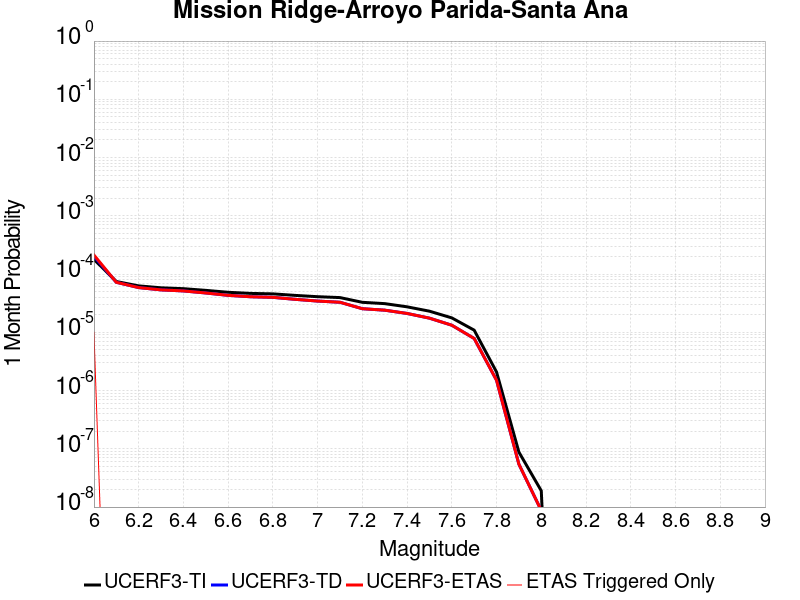 |  |  |

| Magnitude | 1 wk TI Prob | 1 wk TD Prob | 1 wk ETAS Prob | 1 wk ETAS/TD Gain | 1 wk ETAS Triggered Only | 1 mo TI Prob | 1 mo TD Prob | 1 mo ETAS Prob | 1 mo ETAS/TD Gain | 1 mo ETAS Triggered Only | 1 yr TI Prob | 1 yr TD Prob | 1 yr ETAS Prob | 1 yr ETAS/TD Gain | 1 yr ETAS Triggered Only | 10 yr TI Prob | 10 yr TD Prob | 10 yr ETAS Prob | 10 yr ETAS/TD Gain | 10 yr ETAS Triggered Only |
|-----|-----|-----|-----|-----|-----|-----|-----|-----|-----|-----|-----|-----|-----|-----|-----|-----|-----|-----|-----|-----|
| 6.0 | 4.169034E-5 | 4.7139558E-5 | 5.713909E-5 | 1.212126 | 1.0E-5 | 1.7866064E-4 | 2.0201589E-4 | 2.1201387E-4 | 1.049491 | 1.0E-5 | 0.0021730233 | 0.0024575135 | 0.0024674889 | 1.0040592 | 1.0E-5 | 0.021518968 | 0.024385266 | 0.024395023 | 1.0004001 | 1.0E-5 |
| 6.1 | 1.73813E-5 | 1.6854512E-5 | 1.6854512E-5 | 1.0 | 0.0 | 7.4489166E-5 | 7.223168E-5 | 7.223168E-5 | 1.0 | 0.0 | 9.065282E-4 | 8.790767E-4 | 8.790767E-4 | 1.0 | 0.0 | 0.009028391 | 0.008757136 | 0.008757136 | 1.0 | 0.0 |
| 6.2 | 1.4622182E-5 | 1.367351E-5 | 1.367351E-5 | 1.0 | 0.0 | 6.2664985E-5 | 5.8599464E-5 | 5.8599464E-5 | 1.0 | 0.0 | 7.6267915E-4 | 7.1321876E-4 | 7.1321876E-4 | 1.0 | 0.0 | 0.007600669 | 0.007109741 | 0.007109741 | 1.0 | 0.0 |
| 6.3 | 1.3552434E-5 | 1.2482403E-5 | 1.2482403E-5 | 1.0 | 0.0 | 5.8080568E-5 | 5.3494932E-5 | 5.3494932E-5 | 1.0 | 0.0 | 7.069015E-4 | 6.511093E-4 | 6.511093E-4 | 1.0 | 0.0 | 0.00704657 | 0.0064923796 | 0.0064923796 | 1.0 | 0.0 |
| 6.4 | 1.30977305E-5 | 1.1979351E-5 | 1.1979351E-5 | 1.0 | 0.0 | 5.613192E-5 | 5.133908E-5 | 5.133908E-5 | 1.0 | 0.0 | 6.831918E-4 | 6.2487705E-4 | 6.2487705E-4 | 1.0 | 0.0 | 0.006810953 | 0.0062315455 | 0.0062315455 | 1.0 | 0.0 |
| 6.5 | 1.225205E-5 | 1.10489855E-5 | 1.10489855E-5 | 1.0 | 0.0 | 5.2507727E-5 | 4.735195E-5 | 4.735195E-5 | 1.0 | 0.0 | 6.3909404E-4 | 5.763602E-4 | 5.763602E-4 | 1.0 | 0.0 | 0.006372592 | 0.005748964 | 0.005748964 | 1.0 | 0.0 |
| 6.6 | 1.1352241E-5 | 1.0063705E-5 | 1.0063705E-5 | 1.0 | 0.0 | 4.8651553E-5 | 4.3129465E-5 | 4.3129465E-5 | 1.0 | 0.0 | 5.921717E-4 | 5.249768E-4 | 5.249768E-4 | 1.0 | 0.0 | 0.0059059616 | 0.005237613 | 0.005237613 | 1.0 | 0.0 |
| 6.7 | 1.0864116E-5 | 9.517188E-6 | 9.517188E-6 | 1.0 | 0.0 | 4.6559664E-5 | 4.0787323E-5 | 4.0787323E-5 | 1.0 | 0.0 | 5.667165E-4 | 4.964745E-4 | 4.964745E-4 | 1.0 | 0.0 | 0.005652734 | 0.004953888 | 0.004953888 | 1.0 | 0.0 |
| 6.8 | 1.0666365E-5 | 9.299937E-6 | 9.299937E-6 | 1.0 | 0.0 | 4.571219E-5 | 3.9856277E-5 | 3.9856277E-5 | 1.0 | 0.0 | 5.564038E-4 | 4.8514412E-4 | 4.8514412E-4 | 1.0 | 0.0 | 0.005550127 | 0.0048410823 | 0.0048410823 | 1.0 | 0.0 |
| 6.9 | 1.0038665E-5 | 8.592192E-6 | 8.592192E-6 | 1.0 | 0.0 | 4.302214E-5 | 3.682317E-5 | 3.682317E-5 | 1.0 | 0.0 | 5.236687E-4 | 4.4823167E-4 | 4.4823167E-4 | 1.0 | 0.0 | 0.005224364 | 0.004473487 | 0.004473487 | 1.0 | 0.0 |
| 7.0 | 9.5379955E-6 | 8.025209E-6 | 8.025209E-6 | 1.0 | 0.0 | 4.0876483E-5 | 3.439331E-5 | 3.439331E-5 | 1.0 | 0.0 | 4.975576E-4 | 4.186598E-4 | 4.186598E-4 | 1.0 | 0.0 | 0.00496445 | 0.0041789105 | 0.0041789105 | 1.0 | 0.0 |
| 7.1 | 9.207389E-6 | 7.652504E-6 | 7.652504E-6 | 1.0 | 0.0 | 3.945964E-5 | 3.2796044E-5 | 3.2796044E-5 | 1.0 | 0.0 | 4.803152E-4 | 3.9922036E-4 | 3.9922036E-4 | 1.0 | 0.0 | 0.004792784 | 0.003985228 | 0.003985228 | 1.0 | 0.0 |
| 7.2 | 7.638091E-6 | 5.93121E-6 | 5.93121E-6 | 1.0 | 0.0 | 3.2734264E-5 | 2.5419227E-5 | 2.5419227E-5 | 1.0 | 0.0 | 3.984668E-4 | 3.0943545E-4 | 3.0943545E-4 | 1.0 | 0.0 | 0.0039775306 | 0.0030901027 | 0.0030901027 | 1.0 | 0.0 |
| 7.3 | 7.2500147E-6 | 5.596238E-6 | 5.596238E-6 | 1.0 | 0.0 | 3.1071122E-5 | 2.3983659E-5 | 2.3983659E-5 | 1.0 | 0.0 | 3.7822526E-4 | 2.919622E-4 | 2.919622E-4 | 1.0 | 0.0 | 0.0037758215 | 0.002915842 | 0.002915842 | 1.0 | 0.0 |
| 7.4 | 6.3899715E-6 | 4.918567E-6 | 4.918567E-6 | 1.0 | 0.0 | 2.7385306E-5 | 2.1079404E-5 | 2.1079404E-5 | 1.0 | 0.0 | 3.3336508E-4 | 2.566117E-4 | 2.566117E-4 | 1.0 | 0.0 | 0.0033286542 | 0.0025631986 | 0.0025631986 | 1.0 | 0.0 |
| 7.5 | 5.379025E-6 | 4.083909E-6 | 4.083909E-6 | 1.0 | 0.0 | 2.305276E-5 | 1.750235E-5 | 1.750235E-5 | 1.0 | 0.0 | 2.806312E-4 | 2.1307038E-4 | 2.1307038E-4 | 1.0 | 0.0 | 0.0028027708 | 0.0021286723 | 0.0021286723 | 1.0 | 0.0 |
| 7.6 | 4.1270696E-6 | 3.0883848E-6 | 3.0883848E-6 | 1.0 | 0.0 | 1.768732E-5 | 1.3235868E-5 | 1.3235868E-5 | 1.0 | 0.0 | 2.1532185E-4 | 1.6113486E-4 | 1.6113486E-4 | 1.0 | 0.0 | 0.0021511333 | 0.0016101883 | 0.0016101883 | 1.0 | 0.0 |
| 7.7 | 2.5406805E-6 | 1.8282261E-6 | 1.8282261E-6 | 1.0 | 0.0 | 1.0888585E-5 | 7.835231E-6 | 7.835231E-6 | 1.0 | 0.0 | 1.3256045E-4 | 9.538983E-5 | 9.538983E-5 | 1.0 | 0.0 | 0.0013248142 | 9.53495E-4 | 9.53495E-4 | 1.0 | 0.0 |
| 7.8 | 4.8608285E-7 | 3.5099296E-7 | 3.5099296E-7 | 1.0 | 0.0 | 2.0832106E-6 | 1.5042547E-6 | 1.5042547E-6 | 1.0 | 0.0 | 2.5362791E-5 | 1.8314147E-5 | 1.8314147E-5 | 1.0 | 0.0 | 2.5359896E-4 | 1.8312651E-4 | 1.8312651E-4 | 1.0 | 0.0 |
| 7.9 | 2.0472514E-8 | 1.2689093E-8 | 1.2689093E-8 | 1.0 | 0.0 | 8.7739345E-8 | 5.438183E-8 | 5.438183E-8 | 1.0 | 0.0 | 1.068226E-6 | 6.6209856E-7 | 6.6209856E-7 | 1.0 | 0.0 | 1.0682209E-5 | 6.620967E-6 | 6.620967E-6 | 1.0 | 0.0 |
| 8.0 | 4.443582E-9 | 2.0322608E-9 | 2.0322608E-9 | 1.0 | 0.0 | 1.9043922E-8 | 8.709689E-9 | 8.709689E-9 | 1.0 | 0.0 | 2.3185973E-7 | 1.0604046E-7 | 1.0604046E-7 | 1.0 | 0.0 | 2.3185949E-6 | 1.0604042E-6 | 1.0604042E-6 | 1.0 | 0.0 |

## Coyote Lake
*[(top)](#table-of-contents)*

| 1 Week | 1 Month | 1 Year | 10 Year |
|-----|-----|-----|-----|
|  |  |  |  |

| Magnitude | 1 wk TI Prob | 1 wk TD Prob | 1 wk ETAS Prob | 1 wk ETAS/TD Gain | 1 wk ETAS Triggered Only | 1 mo TI Prob | 1 mo TD Prob | 1 mo ETAS Prob | 1 mo ETAS/TD Gain | 1 mo ETAS Triggered Only | 1 yr TI Prob | 1 yr TD Prob | 1 yr ETAS Prob | 1 yr ETAS/TD Gain | 1 yr ETAS Triggered Only | 10 yr TI Prob | 10 yr TD Prob | 10 yr ETAS Prob | 10 yr ETAS/TD Gain | 10 yr ETAS Triggered Only |
|-----|-----|-----|-----|-----|-----|-----|-----|-----|-----|-----|-----|-----|-----|-----|-----|-----|-----|-----|-----|-----|
| 6.0 | 1.980352E-5 | 2.1707021E-5 | 2.1707021E-5 | 1.0 | 0.0 | 8.486947E-5 | 9.302718E-5 | 9.302718E-5 | 1.0 | 0.0 | 0.0010327959 | 0.0011320895 | 0.0011420782 | 1.0088233 | 1.0E-5 | 0.010280091 | 0.011270401 | 0.011290176 | 1.0017545 | 2.0E-5 |
| 6.1 | 1.980352E-5 | 2.1707021E-5 | 2.1707021E-5 | 1.0 | 0.0 | 8.486947E-5 | 9.302718E-5 | 9.302718E-5 | 1.0 | 0.0 | 0.0010327959 | 0.0011320895 | 0.0011420782 | 1.0088233 | 1.0E-5 | 0.010280091 | 0.011270401 | 0.011290176 | 1.0017545 | 2.0E-5 |
| 6.2 | 1.980352E-5 | 2.1707021E-5 | 2.1707021E-5 | 1.0 | 0.0 | 8.486947E-5 | 9.302718E-5 | 9.302718E-5 | 1.0 | 0.0 | 0.0010327959 | 0.0011320895 | 0.0011420782 | 1.0088233 | 1.0E-5 | 0.010280091 | 0.011270401 | 0.011290176 | 1.0017545 | 2.0E-5 |
| 6.3 | 1.5344787E-5 | 1.6820884E-5 | 1.6820884E-5 | 1.0 | 0.0 | 6.576172E-5 | 7.208785E-5 | 7.208785E-5 | 1.0 | 0.0 | 8.003548E-4 | 8.7737746E-4 | 8.7737746E-4 | 1.0 | 0.0 | 0.007974784 | 0.00874518 | 0.0087550925 | 1.0011334 | 1.0E-5 |
| 6.4 | 1.5344787E-5 | 1.6820884E-5 | 1.6820884E-5 | 1.0 | 0.0 | 6.576172E-5 | 7.208785E-5 | 7.208785E-5 | 1.0 | 0.0 | 8.003548E-4 | 8.7737746E-4 | 8.7737746E-4 | 1.0 | 0.0 | 0.007974784 | 0.00874518 | 0.0087550925 | 1.0011334 | 1.0E-5 |
| 6.5 | 1.4189697E-5 | 1.5558186E-5 | 1.5558186E-5 | 1.0 | 0.0 | 6.081157E-5 | 6.667658E-5 | 6.667658E-5 | 1.0 | 0.0 | 7.401293E-4 | 8.1154524E-4 | 8.1154524E-4 | 1.0 | 0.0 | 0.0073766913 | 0.008091759 | 0.008101678 | 1.0012258 | 1.0E-5 |
| 6.6 | 1.3469301E-5 | 1.47717665E-5 | 1.47717665E-5 | 1.0 | 0.0 | 5.7724297E-5 | 6.3306376E-5 | 6.3306376E-5 | 1.0 | 0.0 | 7.025667E-4 | 7.7054254E-4 | 7.7054254E-4 | 1.0 | 0.0 | 0.0070034964 | 0.0076846126 | 0.007694536 | 1.0012913 | 1.0E-5 |
| 6.7 | 1.3027966E-5 | 1.4281927E-5 | 1.4281927E-5 | 1.0 | 0.0 | 5.5832945E-5 | 6.120716E-5 | 6.120716E-5 | 1.0 | 0.0 | 6.7955407E-4 | 7.450021E-4 | 7.450021E-4 | 1.0 | 0.0 | 0.006774798 | 0.007430923 | 0.007440849 | 1.0013357 | 1.0E-5 |
| 6.8 | 5.695434E-6 | 6.2244944E-6 | 6.2244944E-6 | 1.0 | 0.0 | 2.4408775E-5 | 2.6676302E-5 | 2.6676302E-5 | 1.0 | 0.0 | 2.971363E-4 | 3.2476554E-4 | 3.2476554E-4 | 1.0 | 0.0 | 0.0029673933 | 0.0032458503 | 0.0032458503 | 1.0 | 0.0 |
| 6.9 | 4.385688E-6 | 4.7931144E-6 | 4.7931144E-6 | 1.0 | 0.0 | 1.879567E-5 | 2.0541918E-5 | 2.0541918E-5 | 1.0 | 0.0 | 2.2881327E-4 | 2.5009786E-4 | 2.5009786E-4 | 1.0 | 0.0 | 0.002285778 | 0.0025009785 | 0.0025009785 | 1.0 | 0.0 |

## Greenville (So) 2011 CFM
*[(top)](#table-of-contents)*

| 1 Week | 1 Month | 1 Year | 10 Year |
|-----|-----|-----|-----|
|  |  | 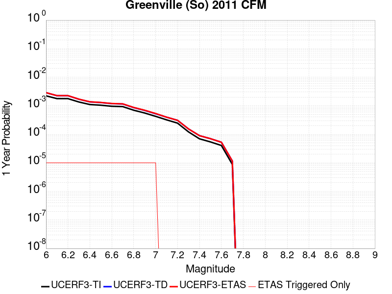 |  |

| Magnitude | 1 wk TI Prob | 1 wk TD Prob | 1 wk ETAS Prob | 1 wk ETAS/TD Gain | 1 wk ETAS Triggered Only | 1 mo TI Prob | 1 mo TD Prob | 1 mo ETAS Prob | 1 mo ETAS/TD Gain | 1 mo ETAS Triggered Only | 1 yr TI Prob | 1 yr TD Prob | 1 yr ETAS Prob | 1 yr ETAS/TD Gain | 1 yr ETAS Triggered Only | 10 yr TI Prob | 10 yr TD Prob | 10 yr ETAS Prob | 10 yr ETAS/TD Gain | 10 yr ETAS Triggered Only |
|-----|-----|-----|-----|-----|-----|-----|-----|-----|-----|-----|-----|-----|-----|-----|-----|-----|-----|-----|-----|-----|
| 6.0 | 4.279693E-5 | 5.5042052E-5 | 5.5042052E-5 | 1.0 | 0.0 | 1.8340252E-4 | 2.3587522E-4 | 2.3587522E-4 | 1.0 | 0.0 | 0.0022306389 | 0.0028683394 | 0.0028783109 | 1.0034764 | 1.0E-5 | 0.022083808 | 0.028339082 | 0.028358517 | 1.0006857 | 2.0E-5 |
| 6.1 | 3.4037297E-5 | 4.319379E-5 | 4.319379E-5 | 1.0 | 0.0 | 1.4586597E-4 | 1.851043E-4 | 1.851043E-4 | 1.0 | 0.0 | 0.0017744715 | 0.0022515068 | 0.0022614843 | 1.0044315 | 1.0E-5 | 0.01760369 | 0.022303257 | 0.022322811 | 1.0008768 | 2.0E-5 |
| 6.2 | 3.4037297E-5 | 4.319379E-5 | 4.319379E-5 | 1.0 | 0.0 | 1.4586597E-4 | 1.851043E-4 | 1.851043E-4 | 1.0 | 0.0 | 0.0017744715 | 0.0022515068 | 0.0022614843 | 1.0044315 | 1.0E-5 | 0.01760369 | 0.022303257 | 0.022322811 | 1.0008768 | 2.0E-5 |
| 6.3 | 2.5956324E-5 | 3.242983E-5 | 3.242983E-5 | 1.0 | 0.0 | 1.11236644E-4 | 1.3897801E-4 | 1.3897801E-4 | 1.0 | 0.0 | 0.0013534647 | 0.0016908189 | 0.001700802 | 1.0059043 | 1.0E-5 | 0.013452509 | 0.016786352 | 0.016806016 | 1.0011715 | 2.0E-5 |
| 6.4 | 2.1145053E-5 | 2.6198357E-5 | 2.6198357E-5 | 1.0 | 0.0 | 9.061851E-5 | 1.1227402E-4 | 1.1227402E-4 | 1.0 | 0.0 | 0.0011027219 | 0.0013661105 | 0.0013760969 | 1.00731 | 1.0E-5 | 0.01097266 | 0.013580529 | 0.013600257 | 1.0014527 | 2.0E-5 |
| 6.5 | 2.0030959E-5 | 2.4796413E-5 | 2.4796413E-5 | 1.0 | 0.0 | 8.584414E-5 | 1.0626618E-4 | 1.0626618E-4 | 1.0 | 0.0 | 0.0010446513 | 0.001293055 | 0.0013030422 | 1.0077236 | 1.0E-5 | 0.010397541 | 0.012858664 | 0.012878407 | 1.0015354 | 2.0E-5 |
| 6.6 | 1.8395405E-5 | 2.2755032E-5 | 2.2755032E-5 | 1.0 | 0.0 | 7.8835066E-5 | 9.751807E-5 | 9.751807E-5 | 1.0 | 0.0 | 9.5939427E-4 | 0.0011866642 | 0.0011966524 | 1.008417 | 1.0E-5 | 0.009552629 | 0.0118063325 | 0.011826096 | 1.001674 | 2.0E-5 |
| 6.7 | 1.7883482E-5 | 2.2126056E-5 | 2.2126056E-5 | 1.0 | 0.0 | 7.664124E-5 | 9.4822666E-5 | 9.4822666E-5 | 1.0 | 0.0 | 9.3270757E-4 | 0.001153883 | 0.0011638714 | 1.0086564 | 1.0E-5 | 0.009288026 | 0.01148197 | 0.011501741 | 1.0017219 | 2.0E-5 |
| 6.8 | 1.3373564E-5 | 1.6506328E-5 | 1.6506328E-5 | 1.0 | 0.0 | 5.7314013E-5 | 7.0739574E-5 | 7.0739574E-5 | 1.0 | 0.0 | 6.975747E-4 | 8.6092873E-4 | 8.7092014E-4 | 1.0116054 | 1.0E-5 | 0.0069538904 | 0.008577544 | 0.008587459 | 1.0011559 | 1.0E-5 |
| 6.9 | 1.06692905E-5 | 1.3152838E-5 | 1.3152838E-5 | 1.0 | 0.0 | 4.5724726E-5 | 5.636815E-5 | 5.636815E-5 | 1.0 | 0.0 | 5.5655633E-4 | 6.8607734E-4 | 6.960705E-4 | 1.0145656 | 1.0E-5 | 0.005551645 | 0.006840826 | 0.006850757 | 1.0014518 | 1.0E-5 |
| 7.0 | 8.157512E-6 | 1.0062801E-5 | 1.0062801E-5 | 1.0 | 0.0 | 3.4960296E-5 | 4.3125594E-5 | 4.3125594E-5 | 1.0 | 0.0 | 4.2555845E-4 | 5.249313E-4 | 5.34926E-4 | 1.0190401 | 1.0E-5 | 0.004247444 | 0.005237391 | 0.0052473387 | 1.0018994 | 1.0E-5 |
| 7.1 | 6.1467113E-6 | 7.6275246E-6 | 7.6275246E-6 | 1.0 | 0.0 | 2.6342783E-5 | 3.2688986E-5 | 3.2688986E-5 | 1.0 | 0.0 | 3.206762E-4 | 3.979166E-4 | 3.979166E-4 | 1.0 | 0.0 | 0.0032021382 | 0.003972229 | 0.003972229 | 1.0 | 0.0 |
| 7.2 | 4.713467E-6 | 5.9142176E-6 | 5.9142176E-6 | 1.0 | 0.0 | 2.0200418E-5 | 2.5346404E-5 | 2.5346404E-5 | 1.0 | 0.0 | 2.4591232E-4 | 3.0854935E-4 | 3.0854935E-4 | 1.0 | 0.0 | 0.0024564038 | 0.003081363 | 0.003081363 | 1.0 | 0.0 |
| 7.3 | 2.3266216E-6 | 2.954034E-6 | 2.954034E-6 | 1.0 | 0.0 | 9.971197E-6 | 1.2660085E-5 | 1.2660085E-5 | 1.0 | 0.0 | 1.2139256E-4 | 1.541258E-4 | 1.541258E-4 | 1.0 | 0.0 | 0.0012132627 | 0.0015402584 | 0.0015402584 | 1.0 | 0.0 |
| 7.4 | 1.3314E-6 | 1.7179633E-6 | 1.7179633E-6 | 1.0 | 0.0 | 5.7059874E-6 | 7.3626793E-6 | 7.3626793E-6 | 1.0 | 0.0 | 6.946818E-5 | 8.963698E-5 | 8.963698E-5 | 1.0 | 0.0 | 6.9446466E-4 | 8.9604704E-4 | 8.9604704E-4 | 1.0 | 0.0 |
| 7.5 | 1.0362941E-6 | 1.3468865E-6 | 1.3468865E-6 | 1.0 | 0.0 | 4.4412527E-6 | 5.7723582E-6 | 5.7723582E-6 | 1.0 | 0.0 | 5.407091E-5 | 7.027624E-5 | 7.027624E-5 | 1.0 | 0.0 | 5.405776E-4 | 7.0257037E-4 | 7.0257037E-4 | 1.0 | 0.0 |
| 7.6 | 7.764784E-7 | 1.0088623E-6 | 1.0088623E-6 | 1.0 | 0.0 | 3.3277602E-6 | 4.323689E-6 | 4.323689E-6 | 1.0 | 0.0 | 4.0514726E-5 | 5.263968E-5 | 5.263968E-5 | 1.0 | 0.0 | 4.050734E-4 | 5.2629353E-4 | 5.2629353E-4 | 1.0 | 0.0 |
| 7.7 | 1.6927763E-7 | 2.2139328E-7 | 2.2139328E-7 | 1.0 | 0.0 | 7.2547533E-7 | 9.48828E-7 | 9.48828E-7 | 1.0 | 0.0 | 8.832627E-6 | 1.1551923E-5 | 1.1551923E-5 | 1.0 | 0.0 | 8.8322755E-5 | 1.1551595E-4 | 1.1551595E-4 | 1.0 | 0.0 |

## Hector Mine
*[(top)](#table-of-contents)*

| 1 Week | 1 Month | 1 Year | 10 Year |
|-----|-----|-----|-----|
|  |  |  |  |

| Magnitude | 1 wk TI Prob | 1 wk TD Prob | 1 wk ETAS Prob | 1 wk ETAS/TD Gain | 1 wk ETAS Triggered Only | 1 mo TI Prob | 1 mo TD Prob | 1 mo ETAS Prob | 1 mo ETAS/TD Gain | 1 mo ETAS Triggered Only | 1 yr TI Prob | 1 yr TD Prob | 1 yr ETAS Prob | 1 yr ETAS/TD Gain | 1 yr ETAS Triggered Only | 10 yr TI Prob | 10 yr TD Prob | 10 yr ETAS Prob | 10 yr ETAS/TD Gain | 10 yr ETAS Triggered Only |
|-----|-----|-----|-----|-----|-----|-----|-----|-----|-----|-----|-----|-----|-----|-----|-----|-----|-----|-----|-----|-----|
| 6.0 | 1.8760093E-5 | 2.796445E-6 | 1.2796417E-5 | 4.5759587 | 1.0E-5 | 8.039792E-5 | 1.1984732E-5 | 2.1984612E-5 | 1.834385 | 1.0E-5 | 9.78405E-4 | 1.4590833E-4 | 1.5590688E-4 | 1.0685261 | 1.0E-5 | 0.009741086 | 0.0014585176 | 0.0014784884 | 1.0136925 | 2.0E-5 |
| 6.1 | 1.8760093E-5 | 2.796445E-6 | 1.2796417E-5 | 4.5759587 | 1.0E-5 | 8.039792E-5 | 1.1984732E-5 | 2.1984612E-5 | 1.834385 | 1.0E-5 | 9.78405E-4 | 1.4590833E-4 | 1.5590688E-4 | 1.0685261 | 1.0E-5 | 0.009741086 | 0.0014585176 | 0.0014784884 | 1.0136925 | 2.0E-5 |
| 6.2 | 1.8760093E-5 | 2.796445E-6 | 1.2796417E-5 | 4.5759587 | 1.0E-5 | 8.039792E-5 | 1.1984732E-5 | 2.1984612E-5 | 1.834385 | 1.0E-5 | 9.78405E-4 | 1.4590833E-4 | 1.5590688E-4 | 1.0685261 | 1.0E-5 | 0.009741086 | 0.0014585176 | 0.0014784884 | 1.0136925 | 2.0E-5 |
| 6.3 | 1.8760093E-5 | 2.796445E-6 | 1.2796417E-5 | 4.5759587 | 1.0E-5 | 8.039792E-5 | 1.1984732E-5 | 2.1984612E-5 | 1.834385 | 1.0E-5 | 9.78405E-4 | 1.4590833E-4 | 1.5590688E-4 | 1.0685261 | 1.0E-5 | 0.009741086 | 0.0014585176 | 0.0014784884 | 1.0136925 | 2.0E-5 |
| 6.4 | 1.0888055E-5 | 2.796445E-6 | 1.2796417E-5 | 4.5759587 | 1.0E-5 | 4.666226E-5 | 1.1984732E-5 | 2.1984612E-5 | 1.834385 | 1.0E-5 | 5.679649E-4 | 1.4590833E-4 | 1.5590688E-4 | 1.0685261 | 1.0E-5 | 0.0056651547 | 0.0014585176 | 0.0014784884 | 1.0136925 | 2.0E-5 |
| 6.5 | 1.0888055E-5 | 2.796445E-6 | 1.2796417E-5 | 4.5759587 | 1.0E-5 | 4.666226E-5 | 1.1984732E-5 | 2.1984612E-5 | 1.834385 | 1.0E-5 | 5.679649E-4 | 1.4590833E-4 | 1.5590688E-4 | 1.0685261 | 1.0E-5 | 0.0056651547 | 0.0014585176 | 0.0014784884 | 1.0136925 | 2.0E-5 |
| 6.6 | 1.0730738E-5 | 2.796445E-6 | 1.2796417E-5 | 4.5759587 | 1.0E-5 | 4.5988065E-5 | 1.1984732E-5 | 2.1984612E-5 | 1.834385 | 1.0E-5 | 5.5976084E-4 | 1.4590833E-4 | 1.5590688E-4 | 1.0685261 | 1.0E-5 | 0.0055835294 | 0.0014585176 | 0.0014784884 | 1.0136925 | 2.0E-5 |
| 6.7 | 7.881326E-6 | 2.7711246E-6 | 1.2771097E-5 | 4.608633 | 1.0E-5 | 3.3776672E-5 | 1.1876217E-5 | 2.1876098E-5 | 1.842009 | 1.0E-5 | 4.111534E-4 | 1.4458735E-4 | 1.545859E-4 | 1.0691524 | 1.0E-5 | 0.0041039353 | 0.0014453249 | 0.001465296 | 1.0138177 | 2.0E-5 |
| 6.8 | 7.5683483E-6 | 2.7328742E-6 | 1.2732847E-5 | 4.659141 | 1.0E-5 | 3.2435375E-5 | 1.1712288E-5 | 2.171217E-5 | 1.8537941 | 1.0E-5 | 3.9482914E-4 | 1.4259177E-4 | 1.5259035E-4 | 1.0701202 | 1.0E-5 | 0.0039412836 | 0.0014253948 | 0.0014453663 | 1.0140111 | 2.0E-5 |
| 6.9 | 6.473048E-6 | 2.513948E-6 | 1.2513923E-5 | 4.977797 | 1.0E-5 | 2.7741338E-5 | 1.0774041E-5 | 2.0773932E-5 | 1.9281468 | 1.0E-5 | 3.3769844E-4 | 1.3117002E-4 | 1.4116871E-4 | 1.076227 | 1.0E-5 | 0.0033718573 | 0.0013113155 | 0.0013312893 | 1.0152318 | 2.0E-5 |
| 7.0 | 4.9959954E-6 | 1.8565554E-6 | 1.8565554E-6 | 1.0 | 0.0 | 2.1411232E-5 | 7.956662E-6 | 7.956662E-6 | 1.0 | 0.0 | 2.6065056E-4 | 9.687162E-5 | 9.687162E-5 | 1.0 | 0.0 | 0.0026034506 | 9.686435E-4 | 9.786338E-4 | 1.0103137 | 1.0E-5 |
| 7.1 | 1.2997541E-6 | 1.5602835E-7 | 1.5602835E-7 | 1.0 | 0.0 | 5.5703626E-6 | 6.686928E-7 | 6.686928E-7 | 1.0 | 0.0 | 6.7817055E-5 | 8.141308E-6 | 8.141308E-6 | 1.0 | 0.0 | 6.779636E-4 | 8.141049E-5 | 8.141049E-5 | 1.0 | 0.0 |
| 7.2 | 8.392699E-7 | 9.728028E-8 | 9.728028E-8 | 1.0 | 0.0 | 3.596866E-6 | 4.1691544E-7 | 4.1691544E-7 | 1.0 | 0.0 | 4.3790962E-5 | 5.0759354E-6 | 5.0759354E-6 | 1.0 | 0.0 | 4.3782333E-4 | 5.075839E-5 | 5.075839E-5 | 1.0 | 0.0 |
| 7.3 | 3.13015E-7 | 4.8294503E-8 | 4.8294503E-8 | 1.0 | 0.0 | 1.3414921E-6 | 2.0697642E-7 | 2.0697642E-7 | 1.0 | 0.0 | 1.6332544E-5 | 2.5199358E-6 | 2.5199358E-6 | 1.0 | 0.0 | 1.6331344E-4 | 2.5199157E-5 | 2.5199157E-5 | 1.0 | 0.0 |

## Elsinore (Glen Ivy) rev
*[(top)](#table-of-contents)*

| 1 Week | 1 Month | 1 Year | 10 Year |
|-----|-----|-----|-----|
| 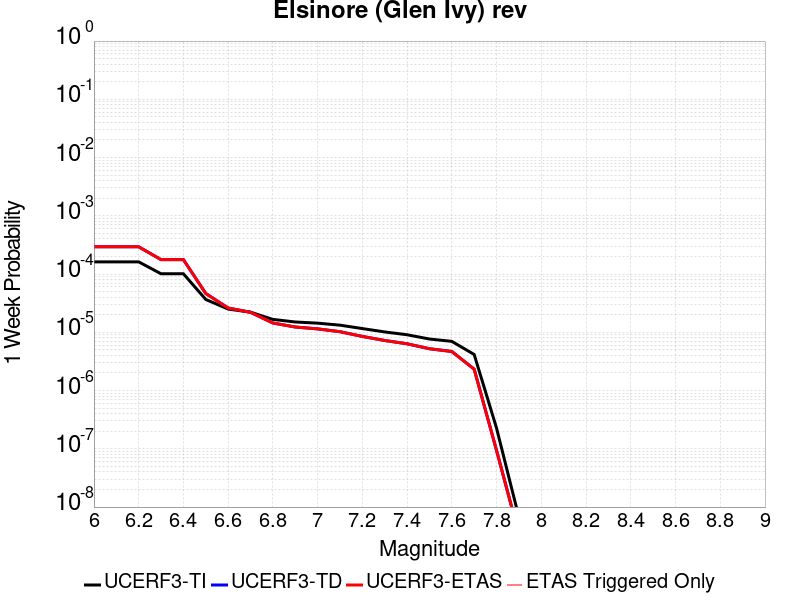 |  |  |  |

| Magnitude | 1 wk TI Prob | 1 wk TD Prob | 1 wk ETAS Prob | 1 wk ETAS/TD Gain | 1 wk ETAS Triggered Only | 1 mo TI Prob | 1 mo TD Prob | 1 mo ETAS Prob | 1 mo ETAS/TD Gain | 1 mo ETAS Triggered Only | 1 yr TI Prob | 1 yr TD Prob | 1 yr ETAS Prob | 1 yr ETAS/TD Gain | 1 yr ETAS Triggered Only | 10 yr TI Prob | 10 yr TD Prob | 10 yr ETAS Prob | 10 yr ETAS/TD Gain | 10 yr ETAS Triggered Only |
|-----|-----|-----|-----|-----|-----|-----|-----|-----|-----|-----|-----|-----|-----|-----|-----|-----|-----|-----|-----|-----|
| 6.0 | 1.6204086E-4 | 2.9362022E-4 | 2.9362022E-4 | 1.0 | 0.0 | 6.94276E-4 | 0.0012579202 | 0.0012679076 | 1.0079396 | 1.0E-5 | 0.008420097 | 0.015235162 | 0.01524501 | 1.0006464 | 1.0E-5 | 0.081081145 | 0.13969512 | 0.13971233 | 1.0001231 | 2.0E-5 |
| 6.1 | 1.6204086E-4 | 2.9362022E-4 | 2.9362022E-4 | 1.0 | 0.0 | 6.94276E-4 | 0.0012579202 | 0.0012679076 | 1.0079396 | 1.0E-5 | 0.008420097 | 0.015235162 | 0.01524501 | 1.0006464 | 1.0E-5 | 0.081081145 | 0.13969512 | 0.13971233 | 1.0001231 | 2.0E-5 |
| 6.2 | 1.6204086E-4 | 2.9362022E-4 | 2.9362022E-4 | 1.0 | 0.0 | 6.94276E-4 | 0.0012579202 | 0.0012679076 | 1.0079396 | 1.0E-5 | 0.008420097 | 0.015235162 | 0.01524501 | 1.0006464 | 1.0E-5 | 0.081081145 | 0.13969512 | 0.13971233 | 1.0001231 | 2.0E-5 |
| 6.3 | 1.0111737E-4 | 1.7703768E-4 | 1.7703768E-4 | 1.0 | 0.0 | 4.332882E-4 | 7.58629E-4 | 7.6862145E-4 | 1.0131717 | 1.0E-5 | 0.005262531 | 0.0092178825 | 0.009227791 | 1.0010748 | 1.0E-5 | 0.0513964 | 0.08702082 | 0.08703908 | 1.0002098 | 2.0E-5 |
| 6.4 | 1.0111737E-4 | 1.7703768E-4 | 1.7703768E-4 | 1.0 | 0.0 | 4.332882E-4 | 7.58629E-4 | 7.6862145E-4 | 1.0131717 | 1.0E-5 | 0.005262531 | 0.0092178825 | 0.009227791 | 1.0010748 | 1.0E-5 | 0.0513964 | 0.08702082 | 0.08703908 | 1.0002098 | 2.0E-5 |
| 6.5 | 3.6624708E-5 | 4.639301E-5 | 4.639301E-5 | 1.0 | 0.0 | 1.569536E-4 | 1.9881407E-4 | 1.9881407E-4 | 1.0 | 0.0 | 0.001909235 | 0.0024182373 | 0.0024182373 | 1.0 | 0.0 | 0.01892915 | 0.023740914 | 0.023740914 | 1.0 | 0.0 |
| 6.6 | 2.5051324E-5 | 2.614908E-5 | 2.614908E-5 | 1.0 | 0.0 | 1.073584E-4 | 1.1206293E-4 | 1.1206293E-4 | 1.0 | 0.0 | 0.0013063047 | 0.0013635567 | 0.0013635567 | 1.0 | 0.0 | 0.012986525 | 0.013565315 | 0.013565315 | 1.0 | 0.0 |
| 6.7 | 2.2189772E-5 | 2.207403E-5 | 2.207403E-5 | 1.0 | 0.0 | 9.509556E-5 | 9.459976E-5 | 9.459976E-5 | 1.0 | 0.0 | 0.0011571734 | 0.0011511799 | 0.0011511799 | 1.0 | 0.0 | 0.011511663 | 0.011466023 | 0.011466023 | 1.0 | 0.0 |
| 6.8 | 1.6654378E-5 | 1.4438445E-5 | 1.4438445E-5 | 1.0 | 0.0 | 7.137396E-5 | 6.187761E-5 | 6.187761E-5 | 1.0 | 0.0 | 8.686314E-4 | 7.531047E-4 | 7.531047E-4 | 1.0 | 0.0 | 0.008652439 | 0.0075108632 | 0.0075108632 | 1.0 | 0.0 |
| 6.9 | 1.5042909E-5 | 1.23326745E-5 | 1.23326745E-5 | 1.0 | 0.0 | 6.446802E-5 | 5.2853266E-5 | 5.2853266E-5 | 1.0 | 0.0 | 7.8461546E-4 | 6.433017E-4 | 6.433017E-4 | 1.0 | 0.0 | 0.007818509 | 0.006418618 | 0.006418618 | 1.0 | 0.0 |
| 7.0 | 1.4361385E-5 | 1.14519435E-5 | 1.14519435E-5 | 1.0 | 0.0 | 6.154734E-5 | 4.907885E-5 | 4.907885E-5 | 1.0 | 0.0 | 7.490812E-4 | 5.973741E-4 | 5.973741E-4 | 1.0 | 0.0 | 0.007465612 | 0.0059616743 | 0.0059616743 | 1.0 | 0.0 |
| 7.1 | 1.3265571E-5 | 1.0245398E-5 | 1.0245398E-5 | 1.0 | 0.0 | 5.6851208E-5 | 4.3908123E-5 | 4.3908123E-5 | 1.0 | 0.0 | 6.919436E-4 | 5.344528E-4 | 5.344528E-4 | 1.0 | 0.0 | 0.006897931 | 0.0053350315 | 0.0053350315 | 1.0 | 0.0 |
| 7.2 | 1.1596403E-5 | 8.50544E-6 | 8.50544E-6 | 1.0 | 0.0 | 4.9697923E-5 | 3.6451387E-5 | 3.6451387E-5 | 1.0 | 0.0 | 6.049042E-4 | 4.4370696E-4 | 4.4370696E-4 | 1.0 | 0.0 | 0.006032603 | 0.004429626 | 0.004429626 | 1.0 | 0.0 |
| 7.3 | 1.0150827E-5 | 7.23907E-6 | 7.23907E-6 | 1.0 | 0.0 | 4.3502816E-5 | 3.1024225E-5 | 3.1024225E-5 | 1.0 | 0.0 | 5.2951806E-4 | 3.776559E-4 | 3.776559E-4 | 1.0 | 0.0 | 0.005282581 | 0.0037705277 | 0.0037705277 | 1.0 | 0.0 |
| 7.4 | 9.080705E-6 | 6.352785E-6 | 6.352785E-6 | 1.0 | 0.0 | 3.8916725E-5 | 2.7225946E-5 | 2.7225946E-5 | 1.0 | 0.0 | 4.7370812E-4 | 3.3142683E-4 | 3.3142683E-4 | 1.0 | 0.0 | 0.004726996 | 0.0033094764 | 0.0033094764 | 1.0 | 0.0 |
| 7.5 | 7.671649E-6 | 5.2258497E-6 | 5.2258497E-6 | 1.0 | 0.0 | 3.287808E-5 | 2.2396314E-5 | 2.2396314E-5 | 1.0 | 0.0 | 4.0021708E-4 | 2.7264224E-4 | 2.7264224E-4 | 1.0 | 0.0 | 0.0039949706 | 0.0027232026 | 0.0027232026 | 1.0 | 0.0 |
| 7.6 | 6.990086E-6 | 4.687739E-6 | 4.687739E-6 | 1.0 | 0.0 | 2.9957167E-5 | 2.0090161E-5 | 2.0090161E-5 | 1.0 | 0.0 | 3.6466747E-4 | 2.4457145E-4 | 2.4457145E-4 | 1.0 | 0.0 | 0.0036406964 | 0.002443139 | 0.002443139 | 1.0 | 0.0 |
| 7.7 | 4.163505E-6 | 2.3296475E-6 | 2.3296475E-6 | 1.0 | 0.0 | 1.7843471E-5 | 9.984169E-6 | 9.984169E-6 | 1.0 | 0.0 | 2.172226E-4 | 1.21551224E-4 | 1.21551224E-4 | 1.0 | 0.0 | 0.0021701038 | 0.0012149204 | 0.0012149204 | 1.0 | 0.0 |
| 7.8 | 2.2692414E-7 | 9.385943E-8 | 9.385943E-8 | 1.0 | 0.0 | 9.725317E-7 | 4.0225464E-7 | 4.0225464E-7 | 1.0 | 0.0 | 1.1840509E-5 | 4.8974425E-6 | 4.8974425E-6 | 1.0 | 0.0 | 1.1839878E-4 | 4.8973674E-5 | 4.8973674E-5 | 1.0 | 0.0 |
| 7.9 | 6.676829E-9 | 3.4399772E-9 | 3.4399772E-9 | 1.0 | 0.0 | 2.861498E-8 | 1.4742759E-8 | 1.4742759E-8 | 1.0 | 0.0 | 3.4838732E-7 | 1.7949307E-7 | 1.7949307E-7 | 1.0 | 0.0 | 3.4838679E-6 | 1.7949295E-6 | 1.7949295E-6 | 1.0 | 0.0 |

## Earthquake Valley (No  Extension)
*[(top)](#table-of-contents)*

| 1 Week | 1 Month | 1 Year | 10 Year |
|-----|-----|-----|-----|
| 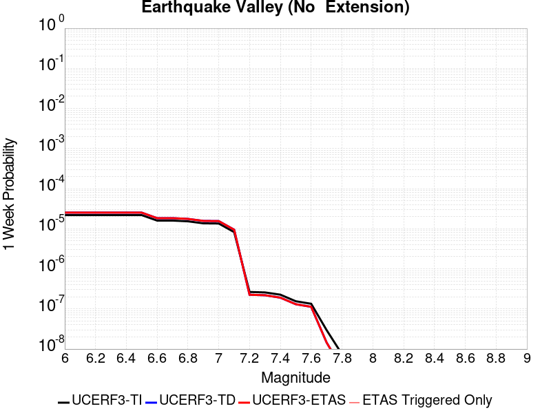 |  |  |  |

| Magnitude | 1 wk TI Prob | 1 wk TD Prob | 1 wk ETAS Prob | 1 wk ETAS/TD Gain | 1 wk ETAS Triggered Only | 1 mo TI Prob | 1 mo TD Prob | 1 mo ETAS Prob | 1 mo ETAS/TD Gain | 1 mo ETAS Triggered Only | 1 yr TI Prob | 1 yr TD Prob | 1 yr ETAS Prob | 1 yr ETAS/TD Gain | 1 yr ETAS Triggered Only | 10 yr TI Prob | 10 yr TD Prob | 10 yr ETAS Prob | 10 yr ETAS/TD Gain | 10 yr ETAS Triggered Only |
|-----|-----|-----|-----|-----|-----|-----|-----|-----|-----|-----|-----|-----|-----|-----|-----|-----|-----|-----|-----|-----|
| 6.0 | 2.1859703E-5 | 2.5198888E-5 | 2.5198888E-5 | 1.0 | 0.0 | 9.3681076E-5 | 1.0799158E-4 | 1.179905E-4 | 1.0925899 | 1.0E-5 | 0.0011399703 | 0.0013141495 | 0.0013241363 | 1.0075995 | 1.0E-5 | 0.011341401 | 0.013078143 | 0.013088012 | 1.0007546 | 1.0E-5 |
| 6.1 | 2.1859703E-5 | 2.5198888E-5 | 2.5198888E-5 | 1.0 | 0.0 | 9.3681076E-5 | 1.0799158E-4 | 1.179905E-4 | 1.0925899 | 1.0E-5 | 0.0011399703 | 0.0013141495 | 0.0013241363 | 1.0075995 | 1.0E-5 | 0.011341401 | 0.013078143 | 0.013088012 | 1.0007546 | 1.0E-5 |
| 6.2 | 2.1859703E-5 | 2.5198888E-5 | 2.5198888E-5 | 1.0 | 0.0 | 9.3681076E-5 | 1.0799158E-4 | 1.179905E-4 | 1.0925899 | 1.0E-5 | 0.0011399703 | 0.0013141495 | 0.0013241363 | 1.0075995 | 1.0E-5 | 0.011341401 | 0.013078143 | 0.013088012 | 1.0007546 | 1.0E-5 |
| 6.3 | 2.1859703E-5 | 2.5198888E-5 | 2.5198888E-5 | 1.0 | 0.0 | 9.3681076E-5 | 1.0799158E-4 | 1.179905E-4 | 1.0925899 | 1.0E-5 | 0.0011399703 | 0.0013141495 | 0.0013241363 | 1.0075995 | 1.0E-5 | 0.011341401 | 0.013078143 | 0.013088012 | 1.0007546 | 1.0E-5 |
| 6.4 | 2.1859703E-5 | 2.5198888E-5 | 2.5198888E-5 | 1.0 | 0.0 | 9.3681076E-5 | 1.0799158E-4 | 1.179905E-4 | 1.0925899 | 1.0E-5 | 0.0011399703 | 0.0013141495 | 0.0013241363 | 1.0075995 | 1.0E-5 | 0.011341401 | 0.013078143 | 0.013088012 | 1.0007546 | 1.0E-5 |
| 6.5 | 2.1859703E-5 | 2.5198888E-5 | 2.5198888E-5 | 1.0 | 0.0 | 9.3681076E-5 | 1.0799158E-4 | 1.179905E-4 | 1.0925899 | 1.0E-5 | 0.0011399703 | 0.0013141495 | 0.0013241363 | 1.0075995 | 1.0E-5 | 0.011341401 | 0.013078143 | 0.013088012 | 1.0007546 | 1.0E-5 |
| 6.6 | 1.597E-5 | 1.8356655E-5 | 1.8356655E-5 | 1.0 | 0.0 | 6.8441055E-5 | 7.86695E-5 | 8.866871E-5 | 1.127104 | 1.0E-5 | 8.329513E-4 | 9.574676E-4 | 9.67458E-4 | 1.0104343 | 1.0E-5 | 0.008298361 | 0.009542032 | 0.009551937 | 1.001038 | 1.0E-5 |
| 6.7 | 1.597E-5 | 1.8356655E-5 | 1.8356655E-5 | 1.0 | 0.0 | 6.8441055E-5 | 7.86695E-5 | 8.866871E-5 | 1.127104 | 1.0E-5 | 8.329513E-4 | 9.574676E-4 | 9.67458E-4 | 1.0104343 | 1.0E-5 | 0.008298361 | 0.009542032 | 0.009551937 | 1.001038 | 1.0E-5 |
| 6.8 | 1.5315149E-5 | 1.7602457E-5 | 1.7602457E-5 | 1.0 | 0.0 | 6.5634704E-5 | 7.5437405E-5 | 8.543665E-5 | 1.1325502 | 1.0E-5 | 7.988095E-4 | 9.181501E-4 | 9.2814094E-4 | 1.0108814 | 1.0E-5 | 0.007959441 | 0.009152108 | 0.009162016 | 1.0010827 | 1.0E-5 |
| 6.9 | 1.3634728E-5 | 1.5676149E-5 | 1.5676149E-5 | 1.0 | 0.0 | 5.8433237E-5 | 6.718223E-5 | 7.7181554E-5 | 1.1488389 | 1.0E-5 | 7.1119244E-4 | 8.1771874E-4 | 8.2771055E-4 | 1.0122192 | 1.0E-5 | 0.007089207 | 0.00815517 | 0.0081650885 | 1.0012162 | 1.0E-5 |
| 7.0 | 1.3496271E-5 | 1.5518177E-5 | 1.5518177E-5 | 1.0 | 0.0 | 5.783988E-5 | 6.650524E-5 | 7.650458E-5 | 1.150354 | 1.0E-5 | 7.03973E-4 | 8.094826E-4 | 8.194745E-4 | 1.0123435 | 1.0E-5 | 0.007017471 | 0.008073409 | 0.008083329 | 1.0012287 | 1.0E-5 |
| 7.1 | 8.242798E-6 | 9.472804E-6 | 9.472804E-6 | 1.0 | 0.0 | 3.53258E-5 | 4.0597475E-5 | 5.059707E-5 | 1.2463107 | 1.0E-5 | 4.300067E-4 | 4.9422926E-4 | 5.042243E-4 | 1.0202235 | 1.0E-5 | 0.004291756 | 0.004937878 | 0.004947828 | 1.0020151 | 1.0E-5 |
| 7.2 | 2.6506527E-7 | 2.256113E-7 | 2.256113E-7 | 1.0 | 0.0 | 1.1359936E-6 | 9.669052E-7 | 9.669052E-7 | 1.0 | 0.0 | 1.3830633E-5 | 1.1772012E-5 | 1.1772012E-5 | 1.0 | 0.0 | 1.3829772E-4 | 1.177143E-4 | 1.177143E-4 | 1.0 | 0.0 |
| 7.3 | 2.5810488E-7 | 2.1956254E-7 | 2.1956254E-7 | 1.0 | 0.0 | 1.1061633E-6 | 9.40982E-7 | 9.40982E-7 | 1.0 | 0.0 | 1.3467455E-5 | 1.1456399E-5 | 1.1456399E-5 | 1.0 | 0.0 | 1.3466639E-4 | 1.145585E-4 | 1.145585E-4 | 1.0 | 0.0 |
| 7.4 | 2.2676066E-7 | 1.9111387E-7 | 1.9111387E-7 | 1.0 | 0.0 | 9.71831E-7 | 8.1905915E-7 | 8.1905915E-7 | 1.0 | 0.0 | 1.1831979E-5 | 9.972004E-6 | 9.972004E-6 | 1.0 | 0.0 | 1.1831349E-4 | 9.971595E-5 | 9.971595E-5 | 1.0 | 0.0 |
| 7.5 | 1.5553917E-7 | 1.3112768E-7 | 1.3112768E-7 | 1.0 | 0.0 | 6.6659624E-7 | 5.6197564E-7 | 5.6197564E-7 | 1.0 | 0.0 | 8.115779E-6 | 6.8420345E-6 | 6.8420345E-6 | 1.0 | 0.0 | 8.115482E-5 | 6.8418456E-5 | 6.8418456E-5 | 1.0 | 0.0 |
| 7.6 | 1.3448629E-7 | 1.1289034E-7 | 1.1289034E-7 | 1.0 | 0.0 | 5.7636964E-7 | 4.8381565E-7 | 4.8381565E-7 | 1.0 | 0.0 | 7.017278E-6 | 5.890442E-6 | 5.890442E-6 | 1.0 | 0.0 | 7.0170565E-5 | 5.890307E-5 | 5.890307E-5 | 1.0 | 0.0 |
| 7.7 | 2.9719402E-8 | 1.4582792E-8 | 1.4582792E-8 | 1.0 | 0.0 | 1.2736886E-7 | 6.2497676E-8 | 6.2497676E-8 | 1.0 | 0.0 | 1.5507147E-6 | 7.60909E-7 | 7.60909E-7 | 1.0 | 0.0 | 1.550704E-5 | 7.6090696E-6 | 7.6090696E-6 | 1.0 | 0.0 |
| 7.8 | 7.4390196E-9 | 3.2503715E-9 | 3.2503715E-9 | 1.0 | 0.0 | 3.1881513E-8 | 1.3930164E-8 | 1.3930164E-8 | 1.0 | 0.0 | 3.8815733E-7 | 1.6959973E-7 | 1.6959973E-7 | 1.0 | 0.0 | 3.8815665E-6 | 1.6959963E-6 | 1.6959963E-6 | 1.0 | 0.0 |
| 7.9 | 1.5373532E-9 | 8.4404506E-10 | 8.4404506E-10 | 1.0 | 0.0 | 6.5886567E-9 | 3.6173358E-9 | 3.6173358E-9 | 1.0 | 0.0 | 8.021689E-8 | 4.4041062E-8 | 4.4041062E-8 | 1.0 | 0.0 | 8.0216864E-7 | 4.4041062E-7 | 4.4041062E-7 | 1.0 | 0.0 |

## Oak Ridge (Onshore)
*[(top)](#table-of-contents)*

| 1 Week | 1 Month | 1 Year | 10 Year |
|-----|-----|-----|-----|
|  |  |  |  |

| Magnitude | 1 wk TI Prob | 1 wk TD Prob | 1 wk ETAS Prob | 1 wk ETAS/TD Gain | 1 wk ETAS Triggered Only | 1 mo TI Prob | 1 mo TD Prob | 1 mo ETAS Prob | 1 mo ETAS/TD Gain | 1 mo ETAS Triggered Only | 1 yr TI Prob | 1 yr TD Prob | 1 yr ETAS Prob | 1 yr ETAS/TD Gain | 1 yr ETAS Triggered Only | 10 yr TI Prob | 10 yr TD Prob | 10 yr ETAS Prob | 10 yr ETAS/TD Gain | 10 yr ETAS Triggered Only |
|-----|-----|-----|-----|-----|-----|-----|-----|-----|-----|-----|-----|-----|-----|-----|-----|-----|-----|-----|-----|-----|
| 6.0 | 3.155064E-5 | 2.952645E-5 | 2.952645E-5 | 1.0 | 0.0 | 1.3521002E-4 | 1.26536E-4 | 1.26536E-4 | 1.0 | 0.0 | 0.001644939 | 0.0015395252 | 0.0015395252 | 1.0 | 0.0 | 0.01632816 | 0.015293104 | 0.0153029505 | 1.0006438 | 1.0E-5 |
| 6.1 | 3.155064E-5 | 2.952645E-5 | 2.952645E-5 | 1.0 | 0.0 | 1.3521002E-4 | 1.26536E-4 | 1.26536E-4 | 1.0 | 0.0 | 0.001644939 | 0.0015395252 | 0.0015395252 | 1.0 | 0.0 | 0.01632816 | 0.015293104 | 0.0153029505 | 1.0006438 | 1.0E-5 |
| 6.2 | 3.155064E-5 | 2.952645E-5 | 2.952645E-5 | 1.0 | 0.0 | 1.3521002E-4 | 1.26536E-4 | 1.26536E-4 | 1.0 | 0.0 | 0.001644939 | 0.0015395252 | 0.0015395252 | 1.0 | 0.0 | 0.01632816 | 0.015293104 | 0.0153029505 | 1.0006438 | 1.0E-5 |
| 6.3 | 3.155064E-5 | 2.952645E-5 | 2.952645E-5 | 1.0 | 0.0 | 1.3521002E-4 | 1.26536E-4 | 1.26536E-4 | 1.0 | 0.0 | 0.001644939 | 0.0015395252 | 0.0015395252 | 1.0 | 0.0 | 0.01632816 | 0.015293104 | 0.0153029505 | 1.0006438 | 1.0E-5 |
| 6.4 | 3.155064E-5 | 2.952645E-5 | 2.952645E-5 | 1.0 | 0.0 | 1.3521002E-4 | 1.26536E-4 | 1.26536E-4 | 1.0 | 0.0 | 0.001644939 | 0.0015395252 | 0.0015395252 | 1.0 | 0.0 | 0.01632816 | 0.015293104 | 0.0153029505 | 1.0006438 | 1.0E-5 |
| 6.5 | 3.155064E-5 | 2.952645E-5 | 2.952645E-5 | 1.0 | 0.0 | 1.3521002E-4 | 1.26536E-4 | 1.26536E-4 | 1.0 | 0.0 | 0.001644939 | 0.0015395252 | 0.0015395252 | 1.0 | 0.0 | 0.01632816 | 0.015293104 | 0.0153029505 | 1.0006438 | 1.0E-5 |
| 6.6 | 3.155064E-5 | 2.952645E-5 | 2.952645E-5 | 1.0 | 0.0 | 1.3521002E-4 | 1.26536E-4 | 1.26536E-4 | 1.0 | 0.0 | 0.001644939 | 0.0015395252 | 0.0015395252 | 1.0 | 0.0 | 0.01632816 | 0.015293104 | 0.0153029505 | 1.0006438 | 1.0E-5 |
| 6.7 | 3.098897E-5 | 2.8864635E-5 | 2.8864635E-5 | 1.0 | 0.0 | 1.328031E-4 | 1.2369992E-4 | 1.2369992E-4 | 1.0 | 0.0 | 0.0016156785 | 0.0015050438 | 0.0015050438 | 1.0 | 0.0 | 0.016039822 | 0.014952951 | 0.014962801 | 1.0006588 | 1.0E-5 |
| 6.8 | 3.0449872E-5 | 2.823982E-5 | 2.823982E-5 | 1.0 | 0.0 | 1.3049292E-4 | 1.2102239E-4 | 1.2102239E-4 | 1.0 | 0.0 | 0.0015875935 | 0.001472489 | 0.001472489 | 1.0 | 0.0 | 0.015762992 | 0.014631692 | 0.014641546 | 1.0006734 | 1.0E-5 |
| 6.9 | 2.697928E-5 | 2.4220137E-5 | 2.4220137E-5 | 1.0 | 0.0 | 1.15620365E-4 | 1.0379658E-4 | 1.0379658E-4 | 1.0 | 0.0 | 0.0014067689 | 0.0012630123 | 0.0012630123 | 1.0 | 0.0 | 0.0139789665 | 0.012561057 | 0.012570932 | 1.0007861 | 1.0E-5 |
| 7.0 | 2.4893961E-5 | 2.1862359E-5 | 2.1862359E-5 | 1.0 | 0.0 | 1.0668404E-4 | 9.369256E-5 | 9.369256E-5 | 1.0 | 0.0 | 0.0012981043 | 0.0011401277 | 0.0011401277 | 1.0 | 0.0 | 0.012905477 | 0.011345069 | 0.011354956 | 1.0008714 | 1.0E-5 |
| 7.1 | 2.0945363E-5 | 1.7354718E-5 | 1.7354718E-5 | 1.0 | 0.0 | 8.976275E-5 | 7.437527E-5 | 7.437527E-5 | 1.0 | 0.0 | 0.0010923136 | 9.051474E-4 | 9.051474E-4 | 1.0 | 0.0 | 0.0108696 | 0.009015542 | 0.009025452 | 1.0010992 | 1.0E-5 |
| 7.2 | 2.0439404E-5 | 1.6809645E-5 | 1.6809645E-5 | 1.0 | 0.0 | 8.7594504E-5 | 7.2039365E-5 | 7.2039365E-5 | 1.0 | 0.0 | 0.0010659413 | 8.7673106E-4 | 8.7673106E-4 | 1.0 | 0.0 | 0.010608427 | 0.00873364 | 0.0087435525 | 1.001135 | 1.0E-5 |
| 7.3 | 1.8463334E-5 | 1.5382002E-5 | 1.5382002E-5 | 1.0 | 0.0 | 7.912617E-5 | 6.5921224E-5 | 6.5921224E-5 | 1.0 | 0.0 | 9.6293533E-4 | 8.0229976E-4 | 8.0229976E-4 | 1.0 | 0.0 | 0.009587734 | 0.007994897 | 0.007994897 | 1.0 | 0.0 |
| 7.4 | 1.763139E-5 | 1.4517013E-5 | 1.4517013E-5 | 1.0 | 0.0 | 7.556091E-5 | 6.221431E-5 | 6.221431E-5 | 1.0 | 0.0 | 9.1956573E-4 | 7.5719994E-4 | 7.5719994E-4 | 1.0 | 0.0 | 0.009157699 | 0.007547003 | 0.007547003 | 1.0 | 0.0 |
| 7.5 | 1.3594944E-5 | 1.1163477E-5 | 1.1163477E-5 | 1.0 | 0.0 | 5.8262744E-5 | 4.7842612E-5 | 4.7842612E-5 | 1.0 | 0.0 | 7.0911803E-4 | 5.823306E-4 | 5.823306E-4 | 1.0 | 0.0 | 0.007068595 | 0.0058083185 | 0.0058083185 | 1.0 | 0.0 |
| 7.6 | 6.9889534E-6 | 5.6367617E-6 | 5.6367617E-6 | 1.0 | 0.0 | 2.9952313E-5 | 2.4157329E-5 | 2.4157329E-5 | 1.0 | 0.0 | 3.646084E-4 | 2.940762E-4 | 2.940762E-4 | 1.0 | 0.0 | 0.0036401073 | 0.0029369146 | 0.0029369146 | 1.0 | 0.0 |
| 7.7 | 4.0824193E-6 | 3.2832884E-6 | 3.2832884E-6 | 1.0 | 0.0 | 1.7495966E-5 | 1.4071161E-5 | 1.4071161E-5 | 1.0 | 0.0 | 2.1299256E-4 | 1.7130304E-4 | 1.7130304E-4 | 1.0 | 0.0 | 0.0021278851 | 0.0017117234 | 0.0017117234 | 1.0 | 0.0 |
| 7.8 | 1.7023609E-6 | 1.4370602E-6 | 1.4370602E-6 | 1.0 | 0.0 | 7.295812E-6 | 6.158815E-6 | 6.158815E-6 | 1.0 | 0.0 | 8.882289E-5 | 7.498102E-5 | 7.498102E-5 | 1.0 | 0.0 | 8.8787393E-4 | 7.4956E-4 | 7.4956E-4 | 1.0 | 0.0 |
| 7.9 | 2.721225E-7 | 2.2616715E-7 | 2.2616715E-7 | 1.0 | 0.0 | 1.1662388E-6 | 9.692874E-7 | 9.692874E-7 | 1.0 | 0.0 | 1.4198865E-5 | 1.1801013E-5 | 1.1801013E-5 | 1.0 | 0.0 | 1.4197957E-4 | 1.1800414E-4 | 1.1800414E-4 | 1.0 | 0.0 |
| 8.0 | 9.364255E-9 | 5.1209232E-9 | 5.1209232E-9 | 1.0 | 0.0 | 4.0132523E-8 | 2.1946814E-8 | 2.1946814E-8 | 1.0 | 0.0 | 4.8861335E-7 | 2.6720244E-7 | 2.6720244E-7 | 1.0 | 0.0 | 4.8861225E-6 | 2.6720215E-6 | 2.6720215E-6 | 1.0 | 0.0 |

## Pisgah-Bullion Mtn-Mesquite Lk
*[(top)](#table-of-contents)*

| 1 Week | 1 Month | 1 Year | 10 Year |
|-----|-----|-----|-----|
|  |  |  |  |

| Magnitude | 1 wk TI Prob | 1 wk TD Prob | 1 wk ETAS Prob | 1 wk ETAS/TD Gain | 1 wk ETAS Triggered Only | 1 mo TI Prob | 1 mo TD Prob | 1 mo ETAS Prob | 1 mo ETAS/TD Gain | 1 mo ETAS Triggered Only | 1 yr TI Prob | 1 yr TD Prob | 1 yr ETAS Prob | 1 yr ETAS/TD Gain | 1 yr ETAS Triggered Only | 10 yr TI Prob | 10 yr TD Prob | 10 yr ETAS Prob | 10 yr ETAS/TD Gain | 10 yr ETAS Triggered Only |
|-----|-----|-----|-----|-----|-----|-----|-----|-----|-----|-----|-----|-----|-----|-----|-----|-----|-----|-----|-----|-----|
| 6.0 | 3.0240792E-5 | 2.4091496E-5 | 2.4091496E-5 | 1.0 | 0.0 | 1.2959696E-4 | 1.0324575E-4 | 1.0324575E-4 | 1.0 | 0.0 | 0.0015767008 | 0.0012563926 | 0.0012663801 | 1.0079494 | 1.0E-5 | 0.015655609 | 0.012502918 | 0.012512793 | 1.0007898 | 1.0E-5 |
| 6.1 | 3.0240792E-5 | 2.4091496E-5 | 2.4091496E-5 | 1.0 | 0.0 | 1.2959696E-4 | 1.0324575E-4 | 1.0324575E-4 | 1.0 | 0.0 | 0.0015767008 | 0.0012563926 | 0.0012663801 | 1.0079494 | 1.0E-5 | 0.015655609 | 0.012502918 | 0.012512793 | 1.0007898 | 1.0E-5 |
| 6.2 | 3.0240792E-5 | 2.4091496E-5 | 2.4091496E-5 | 1.0 | 0.0 | 1.2959696E-4 | 1.0324575E-4 | 1.0324575E-4 | 1.0 | 0.0 | 0.0015767008 | 0.0012563926 | 0.0012663801 | 1.0079494 | 1.0E-5 | 0.015655609 | 0.012502918 | 0.012512793 | 1.0007898 | 1.0E-5 |
| 6.3 | 2.0498217E-5 | 1.3638254E-5 | 1.3638254E-5 | 1.0 | 0.0 | 8.784654E-5 | 5.8448444E-5 | 5.8448444E-5 | 1.0 | 0.0 | 0.0010690069 | 7.1139366E-4 | 7.213866E-4 | 1.0140469 | 1.0E-5 | 0.01063879 | 0.00709279 | 0.0071027195 | 1.0013999 | 1.0E-5 |
| 6.4 | 2.0498217E-5 | 1.3638254E-5 | 1.3638254E-5 | 1.0 | 0.0 | 8.784654E-5 | 5.8448444E-5 | 5.8448444E-5 | 1.0 | 0.0 | 0.0010690069 | 7.1139366E-4 | 7.213866E-4 | 1.0140469 | 1.0E-5 | 0.01063879 | 0.00709279 | 0.0071027195 | 1.0013999 | 1.0E-5 |
| 6.5 | 1.7316182E-5 | 1.0477178E-5 | 1.0477178E-5 | 1.0 | 0.0 | 7.42101E-5 | 4.4901473E-5 | 4.4901473E-5 | 1.0 | 0.0 | 9.0313336E-4 | 5.465483E-4 | 5.5654283E-4 | 1.0182866 | 1.0E-5 | 0.008994718 | 0.005453037 | 0.0054629827 | 1.0018238 | 1.0E-5 |
| 6.6 | 1.5251077E-5 | 8.414378E-6 | 8.414378E-6 | 1.0 | 0.0 | 6.536012E-5 | 3.606116E-5 | 3.606116E-5 | 1.0 | 0.0 | 7.9546886E-4 | 4.389634E-4 | 4.389634E-4 | 1.0 | 0.0 | 0.007926274 | 0.004381681 | 0.004381681 | 1.0 | 0.0 |
| 6.7 | 1.2997425E-5 | 6.411573E-6 | 6.411573E-6 | 1.0 | 0.0 | 5.570206E-5 | 2.7477907E-5 | 2.7477907E-5 | 1.0 | 0.0 | 6.7796157E-4 | 3.344968E-4 | 3.344968E-4 | 1.0 | 0.0 | 0.0067589693 | 0.0033403935 | 0.0033403935 | 1.0 | 0.0 |
| 6.8 | 1.035386E-5 | 4.333283E-6 | 4.333283E-6 | 1.0 | 0.0 | 4.437293E-5 | 1.8571085E-5 | 1.8571085E-5 | 1.0 | 0.0 | 5.401065E-4 | 2.2608037E-4 | 2.2608037E-4 | 1.0 | 0.0 | 0.0053879567 | 0.0022585907 | 0.0022585907 | 1.0 | 0.0 |
| 6.9 | 8.816252E-6 | 3.580692E-6 | 3.580692E-6 | 1.0 | 0.0 | 3.778339E-5 | 1.5345737E-5 | 1.5345737E-5 | 1.0 | 0.0 | 4.5991567E-4 | 1.8681891E-4 | 1.8681891E-4 | 1.0 | 0.0 | 0.00458965 | 0.0018666771 | 0.0018666771 | 1.0 | 0.0 |
| 7.0 | 6.8232207E-6 | 2.5676256E-6 | 2.5676256E-6 | 1.0 | 0.0 | 2.9242048E-5 | 1.10040655E-5 | 1.10040655E-5 | 1.0 | 0.0 | 3.5596377E-4 | 1.3396658E-4 | 1.3396658E-4 | 1.0 | 0.0 | 0.0035539411 | 0.0013388892 | 0.0013388892 | 1.0 | 0.0 |
| 7.1 | 5.837013E-6 | 2.2274157E-6 | 2.2274157E-6 | 1.0 | 0.0 | 2.501553E-5 | 9.546034E-6 | 9.546034E-6 | 1.0 | 0.0 | 3.045215E-4 | 1.1621706E-4 | 1.1621706E-4 | 1.0 | 0.0 | 0.0030410455 | 0.0011615918 | 0.0011615918 | 1.0 | 0.0 |
| 7.2 | 4.278052E-6 | 1.6275965E-6 | 1.6275965E-6 | 1.0 | 0.0 | 1.833438E-5 | 6.9753964E-6 | 6.9753964E-6 | 1.0 | 0.0 | 2.231982E-4 | 8.492238E-5 | 8.492238E-5 | 1.0 | 0.0 | 0.0022297418 | 8.489225E-4 | 8.489225E-4 | 1.0 | 0.0 |
| 7.3 | 1.8803692E-6 | 8.3450385E-7 | 8.3450385E-7 | 1.0 | 0.0 | 8.0587E-6 | 3.576441E-6 | 3.576441E-6 | 1.0 | 0.0 | 9.811026E-5 | 4.3542448E-5 | 4.3542448E-5 | 1.0 | 0.0 | 9.806695E-4 | 4.353536E-4 | 4.353536E-4 | 1.0 | 0.0 |

## San Jacinto (Superstition Mtn)
*[(top)](#table-of-contents)*

| 1 Week | 1 Month | 1 Year | 10 Year |
|-----|-----|-----|-----|
|  | 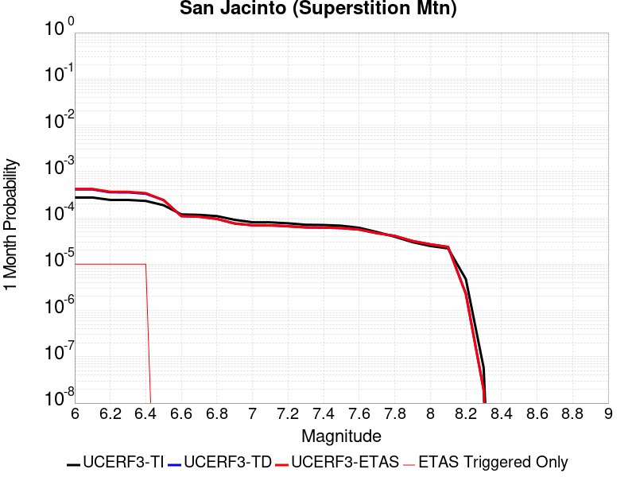 |  |  |

| Magnitude | 1 wk TI Prob | 1 wk TD Prob | 1 wk ETAS Prob | 1 wk ETAS/TD Gain | 1 wk ETAS Triggered Only | 1 mo TI Prob | 1 mo TD Prob | 1 mo ETAS Prob | 1 mo ETAS/TD Gain | 1 mo ETAS Triggered Only | 1 yr TI Prob | 1 yr TD Prob | 1 yr ETAS Prob | 1 yr ETAS/TD Gain | 1 yr ETAS Triggered Only | 10 yr TI Prob | 10 yr TD Prob | 10 yr ETAS Prob | 10 yr ETAS/TD Gain | 10 yr ETAS Triggered Only |
|-----|-----|-----|-----|-----|-----|-----|-----|-----|-----|-----|-----|-----|-----|-----|-----|-----|-----|-----|-----|-----|
| 6.0 | 6.4193904E-5 | 9.600102E-5 | 1.0600006E-4 | 1.1041555 | 1.0E-5 | 2.7508775E-4 | 4.1137784E-4 | 4.2137373E-4 | 1.0242985 | 1.0E-5 | 0.0033440501 | 0.004998455 | 0.0050084046 | 1.0019907 | 1.0E-5 | 0.03294174 | 0.048827495 | 0.048837006 | 1.0001948 | 1.0E-5 |
| 6.1 | 6.4193904E-5 | 9.600102E-5 | 1.0600006E-4 | 1.1041555 | 1.0E-5 | 2.7508775E-4 | 4.1137784E-4 | 4.2137373E-4 | 1.0242985 | 1.0E-5 | 0.0033440501 | 0.004998455 | 0.0050084046 | 1.0019907 | 1.0E-5 | 0.03294174 | 0.048827495 | 0.048837006 | 1.0001948 | 1.0E-5 |
| 6.2 | 5.7023593E-5 | 8.3151084E-5 | 9.315025E-5 | 1.120253 | 1.0E-5 | 2.4436394E-4 | 3.5632253E-4 | 3.6631897E-4 | 1.0280545 | 1.0E-5 | 0.002971072 | 0.004331238 | 0.004341195 | 1.0022988 | 1.0E-5 | 0.029316625 | 0.04250735 | 0.042516924 | 1.0002253 | 1.0E-5 |
| 6.3 | 5.6940098E-5 | 8.299644E-5 | 9.299561E-5 | 1.1204771 | 1.0E-5 | 2.4400617E-4 | 3.5565995E-4 | 3.656564E-4 | 1.0281067 | 1.0E-5 | 0.002966728 | 0.004323203 | 0.00433316 | 1.0023031 | 1.0E-5 | 0.029274331 | 0.0424306 | 0.042440176 | 1.0002257 | 1.0E-5 |
| 6.4 | 5.4171585E-5 | 7.7490105E-5 | 8.748933E-5 | 1.1290387 | 1.0E-5 | 2.3214328E-4 | 3.320675E-4 | 3.4206416E-4 | 1.0301044 | 1.0E-5 | 0.0028226813 | 0.004037075 | 0.004047035 | 1.002467 | 1.0E-5 | 0.02787096 | 0.03971982 | 0.039729424 | 1.0002418 | 1.0E-5 |
| 6.5 | 4.375144E-5 | 5.6427685E-5 | 5.6427685E-5 | 1.0 | 0.0 | 1.874927E-4 | 2.4181715E-4 | 2.4181715E-4 | 1.0 | 0.0 | 0.0022803338 | 0.0029413246 | 0.0029413246 | 1.0 | 0.0 | 0.022570757 | 0.029240036 | 0.029240036 | 1.0 | 0.0 |
| 6.6 | 2.772192E-5 | 2.5494404E-5 | 2.5494404E-5 | 1.0 | 0.0 | 1.1880282E-4 | 1.0925727E-4 | 1.0925727E-4 | 1.0 | 0.0 | 0.0014454646 | 0.0013294149 | 0.0013294149 | 1.0 | 0.0 | 0.014360986 | 0.013543627 | 0.013543627 | 1.0 | 0.0 |
| 6.7 | 2.7124124E-5 | 2.4705407E-5 | 2.4705407E-5 | 1.0 | 0.0 | 1.1624106E-4 | 1.05876126E-4 | 1.05876126E-4 | 1.0 | 0.0 | 0.0014143161 | 0.0012882988 | 0.0012882988 | 1.0 | 0.0 | 0.014053487 | 0.013137068 | 0.013137068 | 1.0 | 0.0 |
| 6.8 | 2.5475807E-5 | 2.2170334E-5 | 2.2170334E-5 | 1.0 | 0.0 | 1.0917746E-4 | 9.501232E-5 | 9.501232E-5 | 1.0 | 0.0 | 0.001328425 | 0.0011561731 | 0.0011561731 | 1.0 | 0.0 | 0.0132051185 | 0.0118252365 | 0.0118252365 | 1.0 | 0.0 |
| 6.9 | 2.1162023E-5 | 1.7631666E-5 | 1.7631666E-5 | 1.0 | 0.0 | 9.069123E-5 | 7.5562115E-5 | 7.5562115E-5 | 1.0 | 0.0 | 0.0011036064 | 9.195843E-4 | 9.195843E-4 | 1.0 | 0.0 | 0.010981417 | 0.009449712 | 0.009449712 | 1.0 | 0.0 |
| 7.0 | 1.8754288E-5 | 1.6166736E-5 | 1.6166736E-5 | 1.0 | 0.0 | 8.037304E-5 | 6.9284186E-5 | 6.9284186E-5 | 1.0 | 0.0 | 9.781026E-4 | 8.4321096E-4 | 8.4321096E-4 | 1.0 | 0.0 | 0.009738087 | 0.008672746 | 0.008672746 | 1.0 | 0.0 |
| 7.1 | 1.8678527E-5 | 1.6091873E-5 | 1.6091873E-5 | 1.0 | 0.0 | 8.0048376E-5 | 6.896337E-5 | 6.896337E-5 | 1.0 | 0.0 | 9.7415317E-4 | 8.3930796E-4 | 8.3930796E-4 | 1.0 | 0.0 | 0.009698939 | 0.008633699 | 0.008633699 | 1.0 | 0.0 |
| 7.2 | 1.7804578E-5 | 1.5386398E-5 | 1.5386398E-5 | 1.0 | 0.0 | 7.6303106E-5 | 6.5940054E-5 | 6.5940054E-5 | 1.0 | 0.0 | 9.285943E-4 | 8.0252666E-4 | 8.0252666E-4 | 1.0 | 0.0 | 0.009247236 | 0.008264985 | 0.008264985 | 1.0 | 0.0 |
| 7.3 | 1.6583685E-5 | 1.4535444E-5 | 1.4535444E-5 | 1.0 | 0.0 | 7.1070994E-5 | 6.2293286E-5 | 6.2293286E-5 | 1.0 | 0.0 | 8.649459E-4 | 7.5815886E-4 | 7.5815886E-4 | 1.0 | 0.0 | 0.00861587 | 0.007820267 | 0.007820267 | 1.0 | 0.0 |
| 7.4 | 1.6387552E-5 | 1.4400321E-5 | 1.4400321E-5 | 1.0 | 0.0 | 7.023047E-5 | 6.171421E-5 | 6.171421E-5 | 1.0 | 0.0 | 8.5472054E-4 | 7.5111346E-4 | 7.5111346E-4 | 1.0 | 0.0 | 0.008514405 | 0.007749644 | 0.007749644 | 1.0 | 0.0 |
| 7.5 | 1.5790754E-5 | 1.4040957E-5 | 1.4040957E-5 | 1.0 | 0.0 | 6.767291E-5 | 6.017415E-5 | 6.017415E-5 | 1.0 | 0.0 | 8.236062E-4 | 7.32376E-4 | 7.32376E-4 | 1.0 | 0.0 | 0.008205604 | 0.007560181 | 0.007560181 | 1.0 | 0.0 |
| 7.6 | 1.4248672E-5 | 1.30597955E-5 | 1.30597955E-5 | 1.0 | 0.0 | 6.106431E-5 | 5.596936E-5 | 5.596936E-5 | 1.0 | 0.0 | 7.432043E-4 | 6.8121566E-4 | 6.8121566E-4 | 1.0 | 0.0 | 0.007407237 | 0.007042702 | 0.007042702 | 1.0 | 0.0 |
| 7.7 | 1.15449975E-5 | 1.09083485E-5 | 1.09083485E-5 | 1.0 | 0.0 | 4.947762E-5 | 4.6749232E-5 | 4.6749232E-5 | 1.0 | 0.0 | 6.022235E-4 | 5.69024E-4 | 5.69024E-4 | 1.0 | 0.0 | 0.006005941 | 0.005912628 | 0.005912628 | 1.0 | 0.0 |
| 7.8 | 9.1391985E-6 | 9.518787E-6 | 9.518787E-6 | 1.0 | 0.0 | 3.9167408E-5 | 4.0794166E-5 | 4.0794166E-5 | 1.0 | 0.0 | 4.767588E-4 | 4.9655634E-4 | 4.9655634E-4 | 1.0 | 0.0 | 0.0047573727 | 0.0051790397 | 0.0051790397 | 1.0 | 0.0 |
| 7.9 | 6.973017E-6 | 7.3861297E-6 | 7.3861297E-6 | 1.0 | 0.0 | 2.9884017E-5 | 3.165446E-5 | 3.165446E-5 | 1.0 | 0.0 | 3.6377716E-4 | 3.8532543E-4 | 3.8532543E-4 | 1.0 | 0.0 | 0.0036318225 | 0.004053871 | 0.004053871 | 1.0 | 0.0 |
| 8.0 | 5.7638235E-6 | 6.263572E-6 | 6.263572E-6 | 1.0 | 0.0 | 2.4701867E-5 | 2.6843605E-5 | 2.6843605E-5 | 1.0 | 0.0 | 3.0070372E-4 | 3.267724E-4 | 3.267724E-4 | 1.0 | 0.0 | 0.0030029714 | 0.0034553434 | 0.0034553434 | 1.0 | 0.0 |
| 8.1 | 5.1124434E-6 | 5.498948E-6 | 5.498948E-6 | 1.0 | 0.0 | 2.1910288E-5 | 2.3566712E-5 | 2.3566712E-5 | 1.0 | 0.0 | 2.6672508E-4 | 2.8688743E-4 | 2.8688743E-4 | 1.0 | 0.0 | 0.0026640517 | 0.0030420625 | 0.0030420625 | 1.0 | 0.0 |
| 8.2 | 1.1075938E-6 | 5.341373E-7 | 5.341373E-7 | 1.0 | 0.0 | 4.7468216E-6 | 2.289158E-6 | 2.289158E-6 | 1.0 | 0.0 | 5.779102E-5 | 2.7870163E-5 | 2.7870163E-5 | 1.0 | 0.0 | 5.777599E-4 | 3.1373248E-4 | 3.1373248E-4 | 1.0 | 0.0 |
| 8.3 | 1.3584393E-8 | 4.478424E-9 | 4.478424E-9 | 1.0 | 0.0 | 5.8218827E-8 | 1.9193244E-8 | 1.9193244E-8 | 1.0 | 0.0 | 7.0881396E-7 | 2.3367775E-7 | 2.3367775E-7 | 1.0 | 0.0 | 7.0881174E-6 | 2.6188773E-6 | 2.6188773E-6 | 1.0 | 0.0 |

## Jess Valley
*[(top)](#table-of-contents)*

| 1 Week | 1 Month | 1 Year | 10 Year |
|-----|-----|-----|-----|
|  |  |  |  |

| Magnitude | 1 wk TI Prob | 1 wk TD Prob | 1 wk ETAS Prob | 1 wk ETAS/TD Gain | 1 wk ETAS Triggered Only | 1 mo TI Prob | 1 mo TD Prob | 1 mo ETAS Prob | 1 mo ETAS/TD Gain | 1 mo ETAS Triggered Only | 1 yr TI Prob | 1 yr TD Prob | 1 yr ETAS Prob | 1 yr ETAS/TD Gain | 1 yr ETAS Triggered Only | 10 yr TI Prob | 10 yr TD Prob | 10 yr ETAS Prob | 10 yr ETAS/TD Gain | 10 yr ETAS Triggered Only |
|-----|-----|-----|-----|-----|-----|-----|-----|-----|-----|-----|-----|-----|-----|-----|-----|-----|-----|-----|-----|-----|
| 6.0 | 3.3861274E-6 | 3.4340655E-6 | 3.4340655E-6 | 1.0 | 0.0 | 1.4511894E-5 | 1.4717357E-5 | 1.4717357E-5 | 1.0 | 0.0 | 1.7666799E-4 | 1.7917191E-4 | 1.8917011E-4 | 1.0558023 | 1.0E-5 | 0.001765276 | 0.001790551 | 0.001800533 | 1.0055748 | 1.0E-5 |
| 6.1 | 3.3861274E-6 | 3.4340655E-6 | 3.4340655E-6 | 1.0 | 0.0 | 1.4511894E-5 | 1.4717357E-5 | 1.4717357E-5 | 1.0 | 0.0 | 1.7666799E-4 | 1.7917191E-4 | 1.8917011E-4 | 1.0558023 | 1.0E-5 | 0.001765276 | 0.001790551 | 0.001800533 | 1.0055748 | 1.0E-5 |
| 6.2 | 3.3861274E-6 | 3.4340655E-6 | 3.4340655E-6 | 1.0 | 0.0 | 1.4511894E-5 | 1.4717357E-5 | 1.4717357E-5 | 1.0 | 0.0 | 1.7666799E-4 | 1.7917191E-4 | 1.8917011E-4 | 1.0558023 | 1.0E-5 | 0.001765276 | 0.001790551 | 0.001800533 | 1.0055748 | 1.0E-5 |
| 6.3 | 3.3861274E-6 | 3.4340655E-6 | 3.4340655E-6 | 1.0 | 0.0 | 1.4511894E-5 | 1.4717357E-5 | 1.4717357E-5 | 1.0 | 0.0 | 1.7666799E-4 | 1.7917191E-4 | 1.8917011E-4 | 1.0558023 | 1.0E-5 | 0.001765276 | 0.001790551 | 0.001800533 | 1.0055748 | 1.0E-5 |
| 6.4 | 1.5291708E-6 | 1.5502812E-6 | 1.5502812E-6 | 1.0 | 0.0 | 6.553573E-6 | 6.6440502E-6 | 6.6440502E-6 | 1.0 | 0.0 | 7.978683E-5 | 8.0889105E-5 | 8.0889105E-5 | 1.0 | 0.0 | 7.975819E-4 | 8.0867484E-4 | 8.0867484E-4 | 1.0 | 0.0 |
| 6.5 | 1.5291708E-6 | 1.5502812E-6 | 1.5502812E-6 | 1.0 | 0.0 | 6.553573E-6 | 6.6440502E-6 | 6.6440502E-6 | 1.0 | 0.0 | 7.978683E-5 | 8.0889105E-5 | 8.0889105E-5 | 1.0 | 0.0 | 7.975819E-4 | 8.0867484E-4 | 8.0867484E-4 | 1.0 | 0.0 |
| 6.6 | 5.396423E-7 | 5.4720056E-7 | 5.4720056E-7 | 1.0 | 0.0 | 2.312751E-6 | 2.3451441E-6 | 2.3451441E-6 | 1.0 | 0.0 | 2.8157378E-5 | 2.8551944E-5 | 2.8551944E-5 | 1.0 | 0.0 | 2.8153812E-4 | 2.8550118E-4 | 2.8550118E-4 | 1.0 | 0.0 |
| 6.7 | 5.396423E-7 | 5.4720056E-7 | 5.4720056E-7 | 1.0 | 0.0 | 2.312751E-6 | 2.3451441E-6 | 2.3451441E-6 | 1.0 | 0.0 | 2.8157378E-5 | 2.8551944E-5 | 2.8551944E-5 | 1.0 | 0.0 | 2.8153812E-4 | 2.8550118E-4 | 2.8550118E-4 | 1.0 | 0.0 |
| 6.8 | 3.6058395E-7 | 3.6563134E-7 | 3.6563134E-7 | 1.0 | 0.0 | 1.5453588E-6 | 1.5669915E-6 | 1.5669915E-6 | 1.0 | 0.0 | 1.8814582E-5 | 1.9078121E-5 | 1.9078121E-5 | 1.0 | 0.0 | 1.8812988E-4 | 1.9078121E-4 | 1.9078121E-4 | 1.0 | 0.0 |

## Manix-Afton Hills
*[(top)](#table-of-contents)*

| 1 Week | 1 Month | 1 Year | 10 Year |
|-----|-----|-----|-----|
|  | 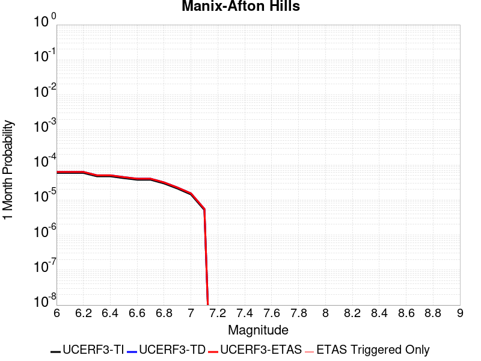 | 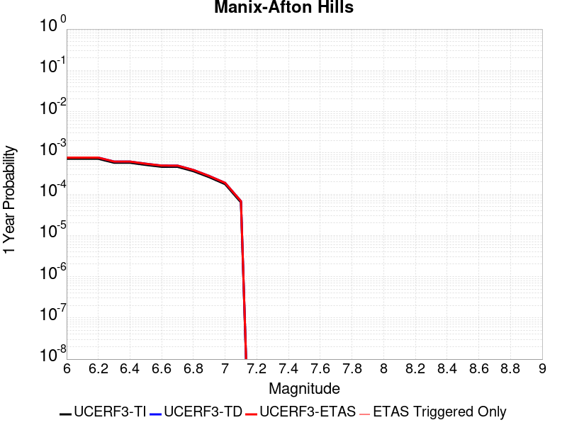 | 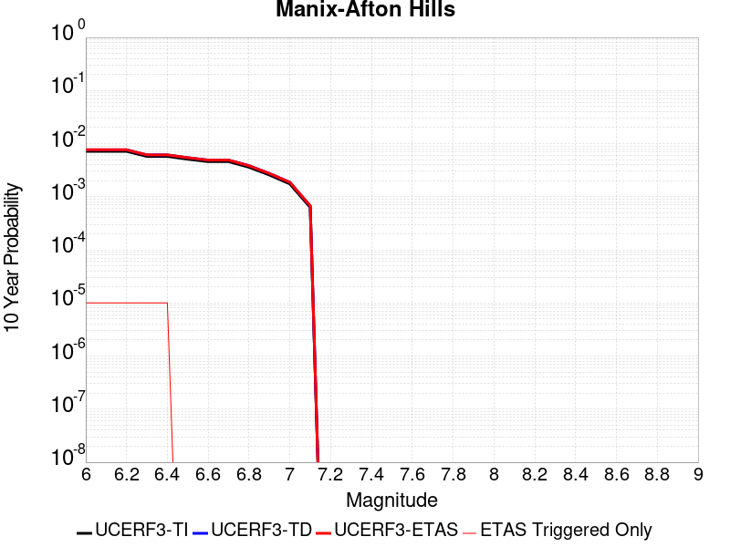 |

| Magnitude | 1 wk TI Prob | 1 wk TD Prob | 1 wk ETAS Prob | 1 wk ETAS/TD Gain | 1 wk ETAS Triggered Only | 1 mo TI Prob | 1 mo TD Prob | 1 mo ETAS Prob | 1 mo ETAS/TD Gain | 1 mo ETAS Triggered Only | 1 yr TI Prob | 1 yr TD Prob | 1 yr ETAS Prob | 1 yr ETAS/TD Gain | 1 yr ETAS Triggered Only | 10 yr TI Prob | 10 yr TD Prob | 10 yr ETAS Prob | 10 yr ETAS/TD Gain | 10 yr ETAS Triggered Only |
|-----|-----|-----|-----|-----|-----|-----|-----|-----|-----|-----|-----|-----|-----|-----|-----|-----|-----|-----|-----|-----|
| 6.0 | 1.3783202E-5 | 1.4711221E-5 | 1.4711221E-5 | 1.0 | 0.0 | 5.906953E-5 | 6.304667E-5 | 6.304667E-5 | 1.0 | 0.0 | 7.189342E-4 | 7.673403E-4 | 7.673403E-4 | 1.0 | 0.0 | 0.0071661277 | 0.007648664 | 0.007658588 | 1.0012975 | 1.0E-5 |
| 6.1 | 1.3783202E-5 | 1.4711221E-5 | 1.4711221E-5 | 1.0 | 0.0 | 5.906953E-5 | 6.304667E-5 | 6.304667E-5 | 1.0 | 0.0 | 7.189342E-4 | 7.673403E-4 | 7.673403E-4 | 1.0 | 0.0 | 0.0071661277 | 0.007648664 | 0.007658588 | 1.0012975 | 1.0E-5 |
| 6.2 | 1.3783202E-5 | 1.4711221E-5 | 1.4711221E-5 | 1.0 | 0.0 | 5.906953E-5 | 6.304667E-5 | 6.304667E-5 | 1.0 | 0.0 | 7.189342E-4 | 7.673403E-4 | 7.673403E-4 | 1.0 | 0.0 | 0.0071661277 | 0.007648664 | 0.007658588 | 1.0012975 | 1.0E-5 |
| 6.3 | 1.10494875E-5 | 1.1793241E-5 | 1.1793241E-5 | 1.0 | 0.0 | 4.7354086E-5 | 5.054154E-5 | 5.054154E-5 | 1.0 | 0.0 | 5.763835E-4 | 6.151799E-4 | 6.151799E-4 | 1.0 | 0.0 | 0.005748908 | 0.00613581 | 0.006145749 | 1.0016198 | 1.0E-5 |
| 6.4 | 1.10494875E-5 | 1.1793241E-5 | 1.1793241E-5 | 1.0 | 0.0 | 4.7354086E-5 | 5.054154E-5 | 5.054154E-5 | 1.0 | 0.0 | 5.763835E-4 | 6.151799E-4 | 6.151799E-4 | 1.0 | 0.0 | 0.005748908 | 0.00613581 | 0.006145749 | 1.0016198 | 1.0E-5 |
| 6.5 | 9.788949E-6 | 1.0454414E-5 | 1.0454414E-5 | 1.0 | 0.0 | 4.1951964E-5 | 4.4803914E-5 | 4.4803914E-5 | 1.0 | 0.0 | 5.1064545E-4 | 5.4536044E-4 | 5.4536044E-4 | 1.0 | 0.0 | 0.0050947363 | 0.005441148 | 0.005441148 | 1.0 | 0.0 |
| 6.6 | 8.810006E-6 | 9.413714E-6 | 9.413714E-6 | 1.0 | 0.0 | 3.775662E-5 | 4.0343915E-5 | 4.0343915E-5 | 1.0 | 0.0 | 4.5958988E-4 | 4.9108535E-4 | 4.9108535E-4 | 1.0 | 0.0 | 0.0045864056 | 0.004900884 | 0.004900884 | 1.0 | 0.0 |
| 6.7 | 8.80128E-6 | 9.404193E-6 | 9.404193E-6 | 1.0 | 0.0 | 3.7719226E-5 | 4.0303115E-5 | 4.0303115E-5 | 1.0 | 0.0 | 4.591348E-4 | 4.9058883E-4 | 4.9058883E-4 | 1.0 | 0.0 | 0.004581874 | 0.0048959404 | 0.0048959404 | 1.0 | 0.0 |
| 6.8 | 6.8994877E-6 | 7.3801443E-6 | 7.3801443E-6 | 1.0 | 0.0 | 2.9568899E-5 | 3.1628853E-5 | 3.1628853E-5 | 1.0 | 0.0 | 3.5994186E-4 | 3.850214E-4 | 3.850214E-4 | 1.0 | 0.0 | 0.003593594 | 0.0038443485 | 0.0038443485 | 1.0 | 0.0 |
| 6.9 | 4.9328037E-6 | 5.2710093E-6 | 5.2710093E-6 | 1.0 | 0.0 | 2.1140417E-5 | 2.258988E-5 | 2.258988E-5 | 1.0 | 0.0 | 2.5735417E-4 | 2.7500323E-4 | 2.7500323E-4 | 1.0 | 0.0 | 0.0025705635 | 0.0027472344 | 0.0027472344 | 1.0 | 0.0 |
| 7.0 | 3.347973E-6 | 3.5900646E-6 | 3.5900646E-6 | 1.0 | 0.0 | 1.4348378E-5 | 1.5385924E-5 | 1.5385924E-5 | 1.0 | 0.0 | 1.746775E-4 | 1.8731161E-4 | 1.8731161E-4 | 1.0 | 0.0 | 0.0017454025 | 0.00187194 | 0.00187194 | 1.0 | 0.0 |
| 7.1 | 1.2073567E-6 | 1.2934943E-6 | 1.2934943E-6 | 1.0 | 0.0 | 5.1743755E-6 | 5.5435444E-6 | 5.5435444E-6 | 1.0 | 0.0 | 6.29962E-5 | 6.74922E-5 | 6.74922E-5 | 1.0 | 0.0 | 6.297835E-4 | 6.7487714E-4 | 6.7487714E-4 | 1.0 | 0.0 |

## Pinto Mtn
*[(top)](#table-of-contents)*

| 1 Week | 1 Month | 1 Year | 10 Year |
|-----|-----|-----|-----|
|  |  |  |  |

| Magnitude | 1 wk TI Prob | 1 wk TD Prob | 1 wk ETAS Prob | 1 wk ETAS/TD Gain | 1 wk ETAS Triggered Only | 1 mo TI Prob | 1 mo TD Prob | 1 mo ETAS Prob | 1 mo ETAS/TD Gain | 1 mo ETAS Triggered Only | 1 yr TI Prob | 1 yr TD Prob | 1 yr ETAS Prob | 1 yr ETAS/TD Gain | 1 yr ETAS Triggered Only | 10 yr TI Prob | 10 yr TD Prob | 10 yr ETAS Prob | 10 yr ETAS/TD Gain | 10 yr ETAS Triggered Only |
|-----|-----|-----|-----|-----|-----|-----|-----|-----|-----|-----|-----|-----|-----|-----|-----|-----|-----|-----|-----|-----|
| 6.0 | 4.4194956E-5 | 4.785523E-5 | 4.785523E-5 | 1.0 | 0.0 | 1.893932E-4 | 2.0507864E-4 | 2.0507864E-4 | 1.0 | 0.0 | 0.0023034236 | 0.002494138 | 0.002494138 | 1.0 | 0.0 | 0.022796938 | 0.024678964 | 0.024688717 | 1.0003952 | 1.0E-5 |
| 6.1 | 4.4194956E-5 | 4.785523E-5 | 4.785523E-5 | 1.0 | 0.0 | 1.893932E-4 | 2.0507864E-4 | 2.0507864E-4 | 1.0 | 0.0 | 0.0023034236 | 0.002494138 | 0.002494138 | 1.0 | 0.0 | 0.022796938 | 0.024678964 | 0.024688717 | 1.0003952 | 1.0E-5 |
| 6.2 | 4.4194956E-5 | 4.785523E-5 | 4.785523E-5 | 1.0 | 0.0 | 1.893932E-4 | 2.0507864E-4 | 2.0507864E-4 | 1.0 | 0.0 | 0.0023034236 | 0.002494138 | 0.002494138 | 1.0 | 0.0 | 0.022796938 | 0.024678964 | 0.024688717 | 1.0003952 | 1.0E-5 |
| 6.3 | 4.4194956E-5 | 4.785523E-5 | 4.785523E-5 | 1.0 | 0.0 | 1.893932E-4 | 2.0507864E-4 | 2.0507864E-4 | 1.0 | 0.0 | 0.0023034236 | 0.002494138 | 0.002494138 | 1.0 | 0.0 | 0.022796938 | 0.024678964 | 0.024688717 | 1.0003952 | 1.0E-5 |
| 6.4 | 3.729929E-5 | 3.960458E-5 | 3.960458E-5 | 1.0 | 0.0 | 1.5984432E-4 | 1.697234E-4 | 1.697234E-4 | 1.0 | 0.0 | 0.0019443673 | 0.0020645177 | 0.0020645177 | 1.0 | 0.0 | 0.019274427 | 0.020463403 | 0.020473199 | 1.0004786 | 1.0E-5 |
| 6.5 | 3.729929E-5 | 3.960458E-5 | 3.960458E-5 | 1.0 | 0.0 | 1.5984432E-4 | 1.697234E-4 | 1.697234E-4 | 1.0 | 0.0 | 0.0019443673 | 0.0020645177 | 0.0020645177 | 1.0 | 0.0 | 0.019274427 | 0.020463403 | 0.020473199 | 1.0004786 | 1.0E-5 |
| 6.6 | 3.0204548E-5 | 3.1206488E-5 | 3.1206488E-5 | 1.0 | 0.0 | 1.2944164E-4 | 1.3373543E-4 | 1.3373543E-4 | 1.0 | 0.0 | 0.0015748127 | 0.0016270474 | 0.0016270474 | 1.0 | 0.0 | 0.015636992 | 0.01615522 | 0.016165059 | 1.000609 | 1.0E-5 |
| 6.7 | 2.9857754E-5 | 3.0815863E-5 | 3.0815863E-5 | 1.0 | 0.0 | 1.2795553E-4 | 1.320615E-4 | 1.320615E-4 | 1.0 | 0.0 | 0.0015567453 | 0.0016066976 | 0.0016066976 | 1.0 | 0.0 | 0.015458848 | 0.015954657 | 0.015964497 | 1.0006168 | 1.0E-5 |
| 6.8 | 2.4819734E-5 | 2.5010428E-5 | 2.5010428E-5 | 1.0 | 0.0 | 1.0636595E-4 | 1.0718327E-4 | 1.0718327E-4 | 1.0 | 0.0 | 0.0012942362 | 0.0013041968 | 0.0013041968 | 1.0 | 0.0 | 0.012867244 | 0.012967796 | 0.012977666 | 1.0007612 | 1.0E-5 |
| 6.9 | 2.331124E-5 | 2.3338684E-5 | 2.3338684E-5 | 1.0 | 0.0 | 9.990149E-5 | 1.00019206E-4 | 1.00019206E-4 | 1.0 | 0.0 | 0.001215622 | 0.001217074 | 0.001217074 | 1.0 | 0.0 | 0.012089936 | 0.012106278 | 0.0121161565 | 1.000816 | 1.0E-5 |
| 7.0 | 2.1818534E-5 | 2.1761793E-5 | 2.1761793E-5 | 1.0 | 0.0 | 9.3504656E-5 | 9.32616E-5 | 9.32616E-5 | 1.0 | 0.0 | 0.0011378246 | 0.0011348884 | 0.0011348884 | 1.0 | 0.0 | 0.011320163 | 0.01129303 | 0.011302917 | 1.0008755 | 1.0E-5 |
| 7.1 | 2.066081E-5 | 2.054142E-5 | 2.054142E-5 | 1.0 | 0.0 | 8.854332E-5 | 8.80318E-5 | 8.80318E-5 | 1.0 | 0.0 | 0.0010774818 | 0.0010712796 | 0.0010712796 | 1.0 | 0.0 | 0.010722724 | 0.010663206 | 0.010673099 | 1.0009278 | 1.0E-5 |
| 7.2 | 1.8990233E-5 | 1.9054683E-5 | 1.9054683E-5 | 1.0 | 0.0 | 8.138417E-5 | 8.166048E-5 | 8.166048E-5 | 1.0 | 0.0 | 9.904018E-4 | 9.937823E-4 | 9.937823E-4 | 1.0 | 0.0 | 0.009859995 | 0.0098953815 | 0.009905282 | 1.0010005 | 1.0E-5 |
| 7.3 | 1.3335872E-5 | 1.4907276E-5 | 1.4907276E-5 | 1.0 | 0.0 | 5.7152483E-5 | 6.388683E-5 | 6.388683E-5 | 1.0 | 0.0 | 6.956093E-4 | 7.775574E-4 | 7.775574E-4 | 1.0 | 0.0 | 0.006934359 | 0.0077496674 | 0.0077595897 | 1.0012804 | 1.0E-5 |
| 7.4 | 9.414066E-6 | 1.186147E-5 | 1.186147E-5 | 1.0 | 0.0 | 4.0345374E-5 | 5.0833933E-5 | 5.0833933E-5 | 1.0 | 0.0 | 4.910942E-4 | 6.187368E-4 | 6.187368E-4 | 1.0 | 0.0 | 0.0049001034 | 0.0061710896 | 0.006181028 | 1.0016105 | 1.0E-5 |
| 7.5 | 7.2101157E-6 | 9.158733E-6 | 9.158733E-6 | 1.0 | 0.0 | 3.090013E-5 | 3.9251165E-5 | 3.9251165E-5 | 1.0 | 0.0 | 3.7614413E-4 | 4.7778594E-4 | 4.7778594E-4 | 1.0 | 0.0 | 0.0037550807 | 0.0047683627 | 0.004778315 | 1.0020871 | 1.0E-5 |
| 7.6 | 3.296375E-6 | 4.546122E-6 | 4.546122E-6 | 1.0 | 0.0 | 1.4127245E-5 | 1.9483241E-5 | 1.9483241E-5 | 1.0 | 0.0 | 1.7198564E-4 | 2.3718402E-4 | 2.3718402E-4 | 1.0 | 0.0 | 0.0017185259 | 0.0023694462 | 0.0023794225 | 1.0042104 | 1.0E-5 |
| 7.7 | 2.5741092E-6 | 3.5850085E-6 | 3.5850085E-6 | 1.0 | 0.0 | 1.103185E-5 | 1.536424E-5 | 1.536424E-5 | 1.0 | 0.0 | 1.3430449E-4 | 1.8704488E-4 | 1.8704488E-4 | 1.0 | 0.0 | 0.0013422335 | 0.0018690043 | 0.0018690043 | 1.0 | 0.0 |

## Blue Cut
*[(top)](#table-of-contents)*

| 1 Week | 1 Month | 1 Year | 10 Year |
|-----|-----|-----|-----|
|  |  |  |  |

| Magnitude | 1 wk TI Prob | 1 wk TD Prob | 1 wk ETAS Prob | 1 wk ETAS/TD Gain | 1 wk ETAS Triggered Only | 1 mo TI Prob | 1 mo TD Prob | 1 mo ETAS Prob | 1 mo ETAS/TD Gain | 1 mo ETAS Triggered Only | 1 yr TI Prob | 1 yr TD Prob | 1 yr ETAS Prob | 1 yr ETAS/TD Gain | 1 yr ETAS Triggered Only | 10 yr TI Prob | 10 yr TD Prob | 10 yr ETAS Prob | 10 yr ETAS/TD Gain | 10 yr ETAS Triggered Only |
|-----|-----|-----|-----|-----|-----|-----|-----|-----|-----|-----|-----|-----|-----|-----|-----|-----|-----|-----|-----|-----|
| 6.0 | 2.1227985E-5 | 2.2719787E-5 | 2.2719787E-5 | 1.0 | 0.0 | 9.097391E-5 | 9.736721E-5 | 9.736721E-5 | 1.0 | 0.0 | 0.0011070445 | 0.0011848592 | 0.0011848592 | 1.0 | 0.0 | 0.011015458 | 0.011791261 | 0.011801143 | 1.000838 | 1.0E-5 |
| 6.1 | 2.1227985E-5 | 2.2719787E-5 | 2.2719787E-5 | 1.0 | 0.0 | 9.097391E-5 | 9.736721E-5 | 9.736721E-5 | 1.0 | 0.0 | 0.0011070445 | 0.0011848592 | 0.0011848592 | 1.0 | 0.0 | 0.011015458 | 0.011791261 | 0.011801143 | 1.000838 | 1.0E-5 |
| 6.2 | 2.1227985E-5 | 2.2719787E-5 | 2.2719787E-5 | 1.0 | 0.0 | 9.097391E-5 | 9.736721E-5 | 9.736721E-5 | 1.0 | 0.0 | 0.0011070445 | 0.0011848592 | 0.0011848592 | 1.0 | 0.0 | 0.011015458 | 0.011791261 | 0.011801143 | 1.000838 | 1.0E-5 |
| 6.3 | 1.1613981E-5 | 1.23536465E-5 | 1.23536465E-5 | 1.0 | 0.0 | 4.9773254E-5 | 5.2943193E-5 | 5.2943193E-5 | 1.0 | 0.0 | 6.0582085E-4 | 6.444052E-4 | 6.444052E-4 | 1.0 | 0.0 | 0.0060417196 | 0.0064266133 | 0.0064266133 | 1.0 | 0.0 |
| 6.4 | 1.1613981E-5 | 1.23536465E-5 | 1.23536465E-5 | 1.0 | 0.0 | 4.9773254E-5 | 5.2943193E-5 | 5.2943193E-5 | 1.0 | 0.0 | 6.0582085E-4 | 6.444052E-4 | 6.444052E-4 | 1.0 | 0.0 | 0.0060417196 | 0.0064266133 | 0.0064266133 | 1.0 | 0.0 |
| 6.5 | 8.931326E-6 | 9.481677E-6 | 9.481677E-6 | 1.0 | 0.0 | 3.8276554E-5 | 4.063518E-5 | 4.063518E-5 | 1.0 | 0.0 | 4.6591737E-4 | 4.9463013E-4 | 4.9463013E-4 | 1.0 | 0.0 | 0.0046494175 | 0.0049362015 | 0.0049362015 | 1.0 | 0.0 |
| 6.6 | 7.345353E-6 | 7.790341E-6 | 7.790341E-6 | 1.0 | 0.0 | 3.1479703E-5 | 3.3386797E-5 | 3.3386797E-5 | 1.0 | 0.0 | 3.83198E-4 | 4.0641645E-4 | 4.0641645E-4 | 1.0 | 0.0 | 0.0038253788 | 0.0040575233 | 0.0040575233 | 1.0 | 0.0 |
| 6.7 | 6.2775666E-6 | 6.655202E-6 | 6.655202E-6 | 1.0 | 0.0 | 2.690358E-5 | 2.8522025E-5 | 2.8522025E-5 | 1.0 | 0.0 | 3.2750185E-4 | 3.4720785E-4 | 3.4720785E-4 | 1.0 | 0.0 | 0.0032701963 | 0.0034673947 | 0.0034673947 | 1.0 | 0.0 |
| 6.8 | 5.5234095E-6 | 5.8551577E-6 | 5.8551577E-6 | 1.0 | 0.0 | 2.367154E-5 | 2.5093334E-5 | 2.5093334E-5 | 1.0 | 0.0 | 2.8816288E-4 | 3.0547578E-4 | 3.0547578E-4 | 1.0 | 0.0 | 0.002877895 | 0.003051275 | 0.003051275 | 1.0 | 0.0 |
| 6.9 | 4.7780054E-6 | 5.0654608E-6 | 5.0654608E-6 | 1.0 | 0.0 | 2.0477004E-5 | 2.1708976E-5 | 2.1708976E-5 | 1.0 | 0.0 | 2.4927902E-4 | 2.6428179E-4 | 2.6428179E-4 | 1.0 | 0.0 | 0.0024899957 | 0.0026403673 | 0.0026403673 | 1.0 | 0.0 |
| 7.0 | 3.883171E-6 | 4.1185203E-6 | 4.1185203E-6 | 1.0 | 0.0 | 1.6642054E-5 | 1.765072E-5 | 1.765072E-5 | 1.0 | 0.0 | 2.0259817E-4 | 2.1488321E-4 | 2.1488321E-4 | 1.0 | 0.0 | 0.0020241356 | 0.00214743 | 0.00214743 | 1.0 | 0.0 |
| 7.1 | 2.8358215E-6 | 3.0097403E-6 | 3.0097403E-6 | 1.0 | 0.0 | 1.2153464E-5 | 1.289886E-5 | 1.289886E-5 | 1.0 | 0.0 | 1.4795837E-4 | 1.5703888E-4 | 1.5703888E-4 | 1.0 | 0.0 | 0.001478599 | 0.0015699244 | 0.0015699244 | 1.0 | 0.0 |

## Sheephole
*[(top)](#table-of-contents)*

| 1 Week | 1 Month | 1 Year | 10 Year |
|-----|-----|-----|-----|
|  |  | 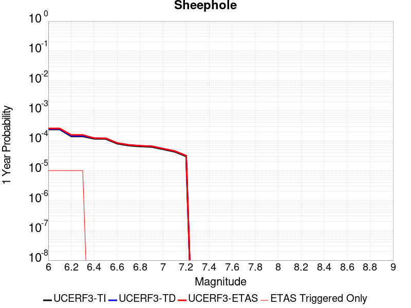 |  |

| Magnitude | 1 wk TI Prob | 1 wk TD Prob | 1 wk ETAS Prob | 1 wk ETAS/TD Gain | 1 wk ETAS Triggered Only | 1 mo TI Prob | 1 mo TD Prob | 1 mo ETAS Prob | 1 mo ETAS/TD Gain | 1 mo ETAS Triggered Only | 1 yr TI Prob | 1 yr TD Prob | 1 yr ETAS Prob | 1 yr ETAS/TD Gain | 1 yr ETAS Triggered Only | 10 yr TI Prob | 10 yr TD Prob | 10 yr ETAS Prob | 10 yr ETAS/TD Gain | 10 yr ETAS Triggered Only |
|-----|-----|-----|-----|-----|-----|-----|-----|-----|-----|-----|-----|-----|-----|-----|-----|-----|-----|-----|-----|-----|
| 6.0 | 4.5579695E-6 | 4.7412877E-6 | 4.7412877E-6 | 1.0 | 0.0 | 1.9534009E-5 | 2.0319678E-5 | 2.0319678E-5 | 1.0 | 0.0 | 2.3780059E-4 | 2.4736955E-4 | 2.5736706E-4 | 1.0404154 | 1.0E-5 | 0.0023754628 | 0.0024714863 | 0.0024814617 | 1.0040362 | 1.0E-5 |
| 6.1 | 4.5579695E-6 | 4.7412877E-6 | 4.7412877E-6 | 1.0 | 0.0 | 1.9534009E-5 | 2.0319678E-5 | 2.0319678E-5 | 1.0 | 0.0 | 2.3780059E-4 | 2.4736955E-4 | 2.5736706E-4 | 1.0404154 | 1.0E-5 | 0.0023754628 | 0.0024714863 | 0.0024814617 | 1.0040362 | 1.0E-5 |
| 6.2 | 2.6677674E-6 | 2.7874107E-6 | 2.7874107E-6 | 1.0 | 0.0 | 1.1433239E-5 | 1.1945997E-5 | 1.1945997E-5 | 1.0 | 0.0 | 1.3919079E-4 | 1.4543389E-4 | 1.5543244E-4 | 1.0687498 | 1.0E-5 | 0.0013910364 | 0.001453493 | 0.0014634785 | 1.00687 | 1.0E-5 |
| 6.3 | 2.6677674E-6 | 2.7874107E-6 | 2.7874107E-6 | 1.0 | 0.0 | 1.1433239E-5 | 1.1945997E-5 | 1.1945997E-5 | 1.0 | 0.0 | 1.3919079E-4 | 1.4543389E-4 | 1.5543244E-4 | 1.0687498 | 1.0E-5 | 0.0013910364 | 0.001453493 | 0.0014634785 | 1.00687 | 1.0E-5 |
| 6.4 | 2.2159759E-6 | 2.3228936E-6 | 2.3228936E-6 | 1.0 | 0.0 | 9.497005E-6 | 9.955224E-6 | 9.955224E-6 | 1.0 | 0.0 | 1.156199E-4 | 1.2119893E-4 | 1.2119893E-4 | 1.0 | 0.0 | 0.0011555976 | 0.0012114076 | 0.0012114076 | 1.0 | 0.0 |
| 6.5 | 2.1986082E-6 | 2.3047737E-6 | 2.3047737E-6 | 1.0 | 0.0 | 9.4225725E-6 | 9.877569E-6 | 9.877569E-6 | 1.0 | 0.0 | 1.1471378E-4 | 1.2025358E-4 | 1.2025358E-4 | 1.0 | 0.0 | 0.0011465458 | 0.0012019643 | 0.0012019643 | 1.0 | 0.0 |
| 6.6 | 1.5232331E-6 | 1.6019028E-6 | 1.6019028E-6 | 1.0 | 0.0 | 6.5281256E-6 | 6.8652807E-6 | 6.8652807E-6 | 1.0 | 0.0 | 7.947703E-5 | 8.358178E-5 | 8.358178E-5 | 1.0 | 0.0 | 7.9448614E-4 | 8.3552214E-4 | 8.3552214E-4 | 1.0 | 0.0 |
| 6.7 | 1.3137362E-6 | 1.3828287E-6 | 1.3828287E-6 | 1.0 | 0.0 | 5.6302856E-6 | 5.926396E-6 | 5.926396E-6 | 1.0 | 0.0 | 6.854657E-5 | 7.2151626E-5 | 7.2151626E-5 | 1.0 | 0.0 | 6.8525434E-4 | 7.212959E-4 | 7.212959E-4 | 1.0 | 0.0 |
| 6.8 | 1.2275751E-6 | 1.2922936E-6 | 1.2922936E-6 | 1.0 | 0.0 | 5.2610258E-6 | 5.5383903E-6 | 5.5383903E-6 | 1.0 | 0.0 | 6.4051106E-5 | 6.742795E-5 | 6.742795E-5 | 1.0 | 0.0 | 6.4032647E-4 | 6.740883E-4 | 6.740883E-4 | 1.0 | 0.0 |
| 6.9 | 1.1837088E-6 | 1.2461107E-6 | 1.2461107E-6 | 1.0 | 0.0 | 5.0730278E-6 | 5.340464E-6 | 5.340464E-6 | 1.0 | 0.0 | 6.176237E-5 | 6.501835E-5 | 6.501835E-5 | 1.0 | 0.0 | 6.17452E-4 | 6.500064E-4 | 6.500064E-4 | 1.0 | 0.0 |
| 7.0 | 9.849371E-7 | 1.036636E-6 | 1.036636E-6 | 1.0 | 0.0 | 4.2211523E-6 | 4.442719E-6 | 4.442719E-6 | 1.0 | 0.0 | 5.1391315E-5 | 5.408886E-5 | 5.408886E-5 | 1.0 | 0.0 | 5.137943E-4 | 5.4076704E-4 | 5.4076704E-4 | 1.0 | 0.0 |
| 7.1 | 8.1643645E-7 | 8.5917287E-7 | 8.5917287E-7 | 1.0 | 0.0 | 3.4990085E-6 | 3.6821648E-6 | 3.6821648E-6 | 1.0 | 0.0 | 4.2599597E-5 | 4.482952E-5 | 4.482952E-5 | 1.0 | 0.0 | 4.259143E-4 | 4.482134E-4 | 4.482134E-4 | 1.0 | 0.0 |
| 7.2 | 5.7295756E-7 | 6.029544E-7 | 6.029544E-7 | 1.0 | 0.0 | 2.45553E-6 | 2.584088E-6 | 2.584088E-6 | 1.0 | 0.0 | 2.9895667E-5 | 3.1460884E-5 | 3.1460884E-5 | 1.0 | 0.0 | 2.9891645E-4 | 3.14571E-4 | 3.14571E-4 | 1.0 | 0.0 |

## Red Mountain
*[(top)](#table-of-contents)*

| 1 Week | 1 Month | 1 Year | 10 Year |
|-----|-----|-----|-----|
|  |  |  |  |

| Magnitude | 1 wk TI Prob | 1 wk TD Prob | 1 wk ETAS Prob | 1 wk ETAS/TD Gain | 1 wk ETAS Triggered Only | 1 mo TI Prob | 1 mo TD Prob | 1 mo ETAS Prob | 1 mo ETAS/TD Gain | 1 mo ETAS Triggered Only | 1 yr TI Prob | 1 yr TD Prob | 1 yr ETAS Prob | 1 yr ETAS/TD Gain | 1 yr ETAS Triggered Only | 10 yr TI Prob | 10 yr TD Prob | 10 yr ETAS Prob | 10 yr ETAS/TD Gain | 10 yr ETAS Triggered Only |
|-----|-----|-----|-----|-----|-----|-----|-----|-----|-----|-----|-----|-----|-----|-----|-----|-----|-----|-----|-----|-----|
| 6.0 | 4.1810763E-5 | 4.7591006E-5 | 5.759053E-5 | 1.2101138 | 1.0E-5 | 1.7917668E-4 | 2.0394645E-4 | 2.139444E-4 | 1.0490224 | 1.0E-5 | 0.0021792934 | 0.0024803858 | 0.002490361 | 1.0040216 | 1.0E-5 | 0.021580452 | 0.02454463 | 0.024554385 | 1.0003974 | 1.0E-5 |
| 6.1 | 4.1810763E-5 | 4.7591006E-5 | 5.759053E-5 | 1.2101138 | 1.0E-5 | 1.7917668E-4 | 2.0394645E-4 | 2.139444E-4 | 1.0490224 | 1.0E-5 | 0.0021792934 | 0.0024803858 | 0.002490361 | 1.0040216 | 1.0E-5 | 0.021580452 | 0.02454463 | 0.024554385 | 1.0003974 | 1.0E-5 |
| 6.2 | 4.1810763E-5 | 4.7591006E-5 | 5.759053E-5 | 1.2101138 | 1.0E-5 | 1.7917668E-4 | 2.0394645E-4 | 2.139444E-4 | 1.0490224 | 1.0E-5 | 0.0021792934 | 0.0024803858 | 0.002490361 | 1.0040216 | 1.0E-5 | 0.021580452 | 0.02454463 | 0.024554385 | 1.0003974 | 1.0E-5 |
| 6.3 | 4.1810763E-5 | 4.7591006E-5 | 5.759053E-5 | 1.2101138 | 1.0E-5 | 1.7917668E-4 | 2.0394645E-4 | 2.139444E-4 | 1.0490224 | 1.0E-5 | 0.0021792934 | 0.0024803858 | 0.002490361 | 1.0040216 | 1.0E-5 | 0.021580452 | 0.02454463 | 0.024554385 | 1.0003974 | 1.0E-5 |
| 6.4 | 4.1810763E-5 | 4.7591006E-5 | 5.759053E-5 | 1.2101138 | 1.0E-5 | 1.7917668E-4 | 2.0394645E-4 | 2.139444E-4 | 1.0490224 | 1.0E-5 | 0.0021792934 | 0.0024803858 | 0.002490361 | 1.0040216 | 1.0E-5 | 0.021580452 | 0.02454463 | 0.024554385 | 1.0003974 | 1.0E-5 |
| 6.5 | 3.154503E-5 | 3.5360477E-5 | 3.5360477E-5 | 1.0 | 0.0 | 1.3518598E-4 | 1.5153662E-4 | 1.5153662E-4 | 1.0 | 0.0 | 0.0016446467 | 0.0018434891 | 0.0018434891 | 1.0 | 0.0 | 0.01632528 | 0.018291617 | 0.018291617 | 1.0 | 0.0 |
| 6.6 | 3.1535834E-5 | 3.5349858E-5 | 3.5349858E-5 | 1.0 | 0.0 | 1.3514658E-4 | 1.5149111E-4 | 1.5149111E-4 | 1.0 | 0.0 | 0.0016441676 | 0.001842936 | 0.001842936 | 1.0 | 0.0 | 0.01632056 | 0.018286178 | 0.018286178 | 1.0 | 0.0 |
| 6.7 | 2.8267326E-5 | 3.146999E-5 | 3.146999E-5 | 1.0 | 0.0 | 1.2114006E-4 | 1.348649E-4 | 1.348649E-4 | 1.0 | 0.0 | 0.0014738824 | 0.0016408286 | 0.0016408286 | 1.0 | 0.0 | 0.014641452 | 0.016295899 | 0.016295899 | 1.0 | 0.0 |
| 6.8 | 2.8212884E-5 | 3.1407875E-5 | 3.1407875E-5 | 1.0 | 0.0 | 1.20906756E-4 | 1.3459871E-4 | 1.3459871E-4 | 1.0 | 0.0 | 0.0014710457 | 0.0016375926 | 0.0016375926 | 1.0 | 0.0 | 0.014613459 | 0.016264014 | 0.016264014 | 1.0 | 0.0 |
| 6.9 | 2.4227871E-5 | 2.6707517E-5 | 2.6707517E-5 | 1.0 | 0.0 | 1.03829596E-4 | 1.1445619E-4 | 1.1445619E-4 | 1.0 | 0.0 | 0.0012633923 | 0.0013926893 | 0.0013926893 | 1.0 | 0.0 | 0.012562336 | 0.013847304 | 0.013847304 | 1.0 | 0.0 |
| 7.0 | 2.348524E-5 | 2.5836282E-5 | 2.5836282E-5 | 1.0 | 0.0 | 1.0064714E-4 | 1.1072265E-4 | 1.1072265E-4 | 1.0 | 0.0 | 0.0012246901 | 0.0013472902 | 0.0013472902 | 1.0 | 0.0 | 0.012179627 | 0.013398857 | 0.013398857 | 1.0 | 0.0 |
| 7.1 | 2.2311642E-5 | 2.4463316E-5 | 2.4463316E-5 | 1.0 | 0.0 | 9.561782E-5 | 1.04839E-4 | 1.04839E-4 | 1.0 | 0.0 | 0.0011635252 | 0.0012757422 | 0.0012757422 | 1.0 | 0.0 | 0.01157452 | 0.012691703 | 0.012691703 | 1.0 | 0.0 |
| 7.2 | 1.6533986E-5 | 1.7670676E-5 | 1.7670676E-5 | 1.0 | 0.0 | 7.085802E-5 | 7.572963E-5 | 7.572963E-5 | 1.0 | 0.0 | 8.623549E-4 | 9.2168164E-4 | 9.2168164E-4 | 1.0 | 0.0 | 0.008590161 | 0.009184869 | 0.009184869 | 1.0 | 0.0 |
| 7.3 | 1.4703092E-5 | 1.5559806E-5 | 1.5559806E-5 | 1.0 | 0.0 | 6.301173E-5 | 6.6683526E-5 | 6.6683526E-5 | 1.0 | 0.0 | 7.668978E-4 | 8.1163115E-4 | 8.1163115E-4 | 1.0 | 0.0 | 0.0076425658 | 0.008092744 | 0.008092744 | 1.0 | 0.0 |
| 7.4 | 6.1331984E-6 | 5.52893E-6 | 5.52893E-6 | 1.0 | 0.0 | 2.6284872E-5 | 2.3695204E-5 | 2.3695204E-5 | 1.0 | 0.0 | 3.199713E-4 | 2.8845144E-4 | 2.8845144E-4 | 1.0 | 0.0 | 0.0031951098 | 0.0028808247 | 0.0028808247 | 1.0 | 0.0 |
| 7.5 | 5.954766E-6 | 5.338558E-6 | 5.338558E-6 | 1.0 | 0.0 | 2.5520176E-5 | 2.2879336E-5 | 2.2879336E-5 | 1.0 | 0.0 | 3.1066386E-4 | 2.7852083E-4 | 2.7852083E-4 | 1.0 | 0.0 | 0.003102299 | 0.0027817716 | 0.0027817716 | 1.0 | 0.0 |
| 7.6 | 4.9726646E-6 | 4.315341E-6 | 4.315341E-6 | 1.0 | 0.0 | 2.1311245E-5 | 1.8494187E-5 | 1.8494187E-5 | 1.0 | 0.0 | 2.5943352E-4 | 2.2514381E-4 | 2.2514381E-4 | 1.0 | 0.0 | 0.0025913084 | 0.0022491917 | 0.0022491917 | 1.0 | 0.0 |
| 7.7 | 3.3613894E-6 | 2.8526943E-6 | 2.8526943E-6 | 1.0 | 0.0 | 1.4405875E-5 | 1.2225777E-5 | 1.2225777E-5 | 1.0 | 0.0 | 1.7537741E-4 | 1.4883894E-4 | 1.4883894E-4 | 1.0 | 0.0 | 0.0017523908 | 0.0014874188 | 0.0014874188 | 1.0 | 0.0 |
| 7.8 | 1.1828961E-6 | 1.0122844E-6 | 1.0122844E-6 | 1.0 | 0.0 | 5.069545E-6 | 4.338355E-6 | 4.338355E-6 | 1.0 | 0.0 | 6.171996E-5 | 5.281822E-5 | 5.281822E-5 | 1.0 | 0.0 | 6.170282E-4 | 5.280596E-4 | 5.280596E-4 | 1.0 | 0.0 |
| 7.9 | 2.2967266E-7 | 1.8619119E-7 | 1.8619119E-7 | 1.0 | 0.0 | 9.843111E-7 | 7.9796195E-7 | 7.9796195E-7 | 1.0 | 0.0 | 1.19839215E-5 | 9.715147E-6 | 9.715147E-6 | 1.0 | 0.0 | 1.1983275E-4 | 9.714751E-5 | 9.714751E-5 | 1.0 | 0.0 |

## San Jacinto (Lytle Creek connector)
*[(top)](#table-of-contents)*

| 1 Week | 1 Month | 1 Year | 10 Year |
|-----|-----|-----|-----|
|  |  |  |  |

| Magnitude | 1 wk TI Prob | 1 wk TD Prob | 1 wk ETAS Prob | 1 wk ETAS/TD Gain | 1 wk ETAS Triggered Only | 1 mo TI Prob | 1 mo TD Prob | 1 mo ETAS Prob | 1 mo ETAS/TD Gain | 1 mo ETAS Triggered Only | 1 yr TI Prob | 1 yr TD Prob | 1 yr ETAS Prob | 1 yr ETAS/TD Gain | 1 yr ETAS Triggered Only | 10 yr TI Prob | 10 yr TD Prob | 10 yr ETAS Prob | 10 yr ETAS/TD Gain | 10 yr ETAS Triggered Only |
|-----|-----|-----|-----|-----|-----|-----|-----|-----|-----|-----|-----|-----|-----|-----|-----|-----|-----|-----|-----|-----|
| 6.0 | 6.693995E-6 | 6.662972E-6 | 6.662972E-6 | 1.0 | 0.0 | 2.8688235E-5 | 2.8555281E-5 | 2.8555281E-5 | 1.0 | 0.0 | 3.492233E-4 | 3.4760518E-4 | 3.576017E-4 | 1.0287583 | 1.0E-5 | 0.00348675 | 0.0035508168 | 0.0035607812 | 1.0028063 | 1.0E-5 |
| 6.1 | 6.693995E-6 | 6.662972E-6 | 6.662972E-6 | 1.0 | 0.0 | 2.8688235E-5 | 2.8555281E-5 | 2.8555281E-5 | 1.0 | 0.0 | 3.492233E-4 | 3.4760518E-4 | 3.576017E-4 | 1.0287583 | 1.0E-5 | 0.00348675 | 0.0035508168 | 0.0035607812 | 1.0028063 | 1.0E-5 |
| 6.2 | 6.693995E-6 | 6.662972E-6 | 6.662972E-6 | 1.0 | 0.0 | 2.8688235E-5 | 2.8555281E-5 | 2.8555281E-5 | 1.0 | 0.0 | 3.492233E-4 | 3.4760518E-4 | 3.576017E-4 | 1.0287583 | 1.0E-5 | 0.00348675 | 0.0035508168 | 0.0035607812 | 1.0028063 | 1.0E-5 |
| 6.3 | 6.693995E-6 | 6.662972E-6 | 6.662972E-6 | 1.0 | 0.0 | 2.8688235E-5 | 2.8555281E-5 | 2.8555281E-5 | 1.0 | 0.0 | 3.492233E-4 | 3.4760518E-4 | 3.576017E-4 | 1.0287583 | 1.0E-5 | 0.00348675 | 0.0035508168 | 0.0035607812 | 1.0028063 | 1.0E-5 |
| 6.4 | 6.693995E-6 | 6.662972E-6 | 6.662972E-6 | 1.0 | 0.0 | 2.8688235E-5 | 2.8555281E-5 | 2.8555281E-5 | 1.0 | 0.0 | 3.492233E-4 | 3.4760518E-4 | 3.576017E-4 | 1.0287583 | 1.0E-5 | 0.00348675 | 0.0035508168 | 0.0035607812 | 1.0028063 | 1.0E-5 |
| 6.5 | 6.6561875E-6 | 6.6231896E-6 | 6.6231896E-6 | 1.0 | 0.0 | 2.8526205E-5 | 2.838479E-5 | 2.838479E-5 | 1.0 | 0.0 | 3.472512E-4 | 3.455301E-4 | 3.5552663E-4 | 1.028931 | 1.0E-5 | 0.0034670907 | 0.0035301324 | 0.003540097 | 1.0028228 | 1.0E-5 |
| 6.6 | 6.6561875E-6 | 6.6231896E-6 | 6.6231896E-6 | 1.0 | 0.0 | 2.8526205E-5 | 2.838479E-5 | 2.838479E-5 | 1.0 | 0.0 | 3.472512E-4 | 3.455301E-4 | 3.5552663E-4 | 1.028931 | 1.0E-5 | 0.0034670907 | 0.0035301324 | 0.003540097 | 1.0028228 | 1.0E-5 |
| 6.7 | 6.5802237E-6 | 6.5423656E-6 | 6.5423656E-6 | 1.0 | 0.0 | 2.8200653E-5 | 2.803841E-5 | 2.803841E-5 | 1.0 | 0.0 | 3.4328885E-4 | 3.4131424E-4 | 3.5131082E-4 | 1.0292885 | 1.0E-5 | 0.0034275902 | 0.0034881064 | 0.0034980716 | 1.0028569 | 1.0E-5 |
| 6.8 | 6.575632E-6 | 6.5368554E-6 | 6.5368554E-6 | 1.0 | 0.0 | 2.8180975E-5 | 2.8014794E-5 | 2.8014794E-5 | 1.0 | 0.0 | 3.4304935E-4 | 3.410268E-4 | 3.510234E-4 | 1.0293132 | 1.0E-5 | 0.0034252026 | 0.0034852412 | 0.0034952064 | 1.0028592 | 1.0E-5 |
| 6.9 | 6.570433E-6 | 6.528249E-6 | 6.528249E-6 | 1.0 | 0.0 | 2.8158694E-5 | 2.797791E-5 | 2.797791E-5 | 1.0 | 0.0 | 3.4277816E-4 | 3.4057788E-4 | 3.5057447E-4 | 1.0293518 | 1.0E-5 | 0.0034224992 | 0.003480766 | 0.0034907314 | 1.0028629 | 1.0E-5 |
| 7.0 | 6.5643826E-6 | 6.5183694E-6 | 6.5183694E-6 | 1.0 | 0.0 | 2.8132765E-5 | 2.7935572E-5 | 2.7935572E-5 | 1.0 | 0.0 | 3.424626E-4 | 3.4006257E-4 | 3.5005916E-4 | 1.0293963 | 1.0E-5 | 0.0034193532 | 0.003475629 | 0.0034855942 | 1.0028672 | 1.0E-5 |
| 7.1 | 6.557402E-6 | 6.5070813E-6 | 6.5070813E-6 | 1.0 | 0.0 | 2.8102848E-5 | 2.7887192E-5 | 2.7887192E-5 | 1.0 | 0.0 | 3.4209844E-4 | 3.3947374E-4 | 3.4947036E-4 | 1.0294473 | 1.0E-5 | 0.0034157229 | 0.0034697603 | 0.0034797254 | 1.002872 | 1.0E-5 |
| 7.2 | 6.546394E-6 | 6.489047E-6 | 6.489047E-6 | 1.0 | 0.0 | 2.8055672E-5 | 2.7809905E-5 | 2.7809905E-5 | 1.0 | 0.0 | 3.4152428E-4 | 3.3853305E-4 | 3.4852966E-4 | 1.0295292 | 1.0E-5 | 0.0034099987 | 0.003460387 | 0.0034703524 | 1.0028799 | 1.0E-5 |
| 7.3 | 6.5364216E-6 | 6.469831E-6 | 6.469831E-6 | 1.0 | 0.0 | 2.8012933E-5 | 2.7727552E-5 | 2.7727552E-5 | 1.0 | 0.0 | 3.4100408E-4 | 3.3753074E-4 | 3.4752736E-4 | 1.029617 | 1.0E-5 | 0.003404813 | 0.0034504079 | 0.0034603733 | 1.0028882 | 1.0E-5 |
| 7.4 | 6.5269523E-6 | 6.4509163E-6 | 6.4509163E-6 | 1.0 | 0.0 | 2.7972354E-5 | 2.764649E-5 | 2.764649E-5 | 1.0 | 0.0 | 3.4051016E-4 | 3.3654412E-4 | 3.4654074E-4 | 1.0297037 | 1.0E-5 | 0.0033998888 | 0.003440589 | 0.0034505546 | 1.0028964 | 1.0E-5 |
| 7.5 | 6.5111835E-6 | 6.4271885E-6 | 6.4271885E-6 | 1.0 | 0.0 | 2.7904773E-5 | 2.7544802E-5 | 2.7544802E-5 | 1.0 | 0.0 | 3.3968766E-4 | 3.3530645E-4 | 3.453031E-4 | 1.0298134 | 1.0E-5 | 0.0033916887 | 0.003428261 | 0.0034382269 | 1.0029069 | 1.0E-5 |
| 7.6 | 6.4768806E-6 | 6.3862944E-6 | 6.3862944E-6 | 1.0 | 0.0 | 2.7757764E-5 | 2.7369546E-5 | 2.7369546E-5 | 1.0 | 0.0 | 3.3789838E-4 | 3.3317335E-4 | 3.4317002E-4 | 1.0300044 | 1.0E-5 | 0.0033738504 | 0.0034069915 | 0.0034169576 | 1.0029252 | 1.0E-5 |
| 7.7 | 6.1655364E-6 | 6.1787587E-6 | 6.1787587E-6 | 1.0 | 0.0 | 2.642346E-5 | 2.6480126E-5 | 2.6480126E-5 | 1.0 | 0.0 | 3.2165812E-4 | 3.2234789E-4 | 3.3234467E-4 | 1.0310124 | 1.0E-5 | 0.0032119295 | 0.003298596 | 0.003308563 | 1.0030216 | 1.0E-5 |
| 7.8 | 5.5043524E-6 | 5.7397438E-6 | 5.7397438E-6 | 1.0 | 0.0 | 2.3589868E-5 | 2.459867E-5 | 2.459867E-5 | 1.0 | 0.0 | 2.871688E-4 | 2.994477E-4 | 3.0944473E-4 | 1.0333848 | 1.0E-5 | 0.0028679797 | 0.0030686588 | 0.003078628 | 1.0032488 | 1.0E-5 |
| 7.9 | 3.889249E-6 | 4.0789296E-6 | 4.0789296E-6 | 1.0 | 0.0 | 1.6668104E-5 | 1.748101E-5 | 1.748101E-5 | 1.0 | 0.0 | 2.0291525E-4 | 2.1281054E-4 | 2.2280842E-4 | 1.0469801 | 1.0E-5 | 0.0020273007 | 0.0021954647 | 0.0022054429 | 1.0045449 | 1.0E-5 |
| 8.0 | 2.668535E-6 | 2.5329996E-6 | 2.5329996E-6 | 1.0 | 0.0 | 1.1436528E-5 | 1.0855668E-5 | 1.0855668E-5 | 1.0 | 0.0 | 1.3923083E-4 | 1.3215977E-4 | 1.3215977E-4 | 1.0 | 0.0 | 0.0013914363 | 0.0013765821 | 0.0013765821 | 1.0 | 0.0 |
| 8.1 | 1.5911459E-6 | 1.2194711E-6 | 1.2194711E-6 | 1.0 | 0.0 | 6.8191785E-6 | 5.226294E-6 | 5.226294E-6 | 1.0 | 0.0 | 8.3020335E-5 | 6.362829E-5 | 6.362829E-5 | 1.0 | 0.0 | 8.298933E-4 | 6.6975754E-4 | 6.6975754E-4 | 1.0 | 0.0 |
| 8.2 | 6.1294963E-7 | 2.1835329E-7 | 2.1835329E-7 | 1.0 | 0.0 | 2.6269242E-6 | 9.357995E-7 | 9.357995E-7 | 1.0 | 0.0 | 3.1982334E-5 | 1.1393299E-5 | 1.1393299E-5 | 1.0 | 0.0 | 3.1977732E-4 | 1.2797497E-4 | 1.2797497E-4 | 1.0 | 0.0 |
| 8.3 | 1.762871E-7 | 4.7604622E-8 | 4.7604622E-8 | 1.0 | 0.0 | 7.5551594E-7 | 2.0401978E-7 | 2.0401978E-7 | 1.0 | 0.0 | 9.1983675E-6 | 2.4839383E-6 | 2.4839383E-6 | 1.0 | 0.0 | 9.197987E-5 | 2.8720697E-5 | 2.8720697E-5 | 1.0 | 0.0 |

## Calaveras (So) - Paicines extension 2011 CFM
*[(top)](#table-of-contents)*

| 1 Week | 1 Month | 1 Year | 10 Year |
|-----|-----|-----|-----|
|  |  |  |  |

| Magnitude | 1 wk TI Prob | 1 wk TD Prob | 1 wk ETAS Prob | 1 wk ETAS/TD Gain | 1 wk ETAS Triggered Only | 1 mo TI Prob | 1 mo TD Prob | 1 mo ETAS Prob | 1 mo ETAS/TD Gain | 1 mo ETAS Triggered Only | 1 yr TI Prob | 1 yr TD Prob | 1 yr ETAS Prob | 1 yr ETAS/TD Gain | 1 yr ETAS Triggered Only | 10 yr TI Prob | 10 yr TD Prob | 10 yr ETAS Prob | 10 yr ETAS/TD Gain | 10 yr ETAS Triggered Only |
|-----|-----|-----|-----|-----|-----|-----|-----|-----|-----|-----|-----|-----|-----|-----|-----|-----|-----|-----|-----|-----|
| 6.0 | 1.5183659E-4 | 3.0539723E-4 | 3.0539723E-4 | 1.0 | 0.0 | 6.5056595E-4 | 0.0013070651 | 0.0013170522 | 1.0076407 | 1.0E-5 | 0.007891912 | 0.015697578 | 0.01570742 | 1.000627 | 1.0E-5 | 0.076174594 | 0.13850221 | 0.13851082 | 1.0000622 | 1.0E-5 |
| 6.1 | 1.5024997E-4 | 3.0233792E-4 | 3.0233792E-4 | 1.0 | 0.0 | 6.437695E-4 | 0.0012939668 | 0.0013039539 | 1.0077182 | 1.0E-5 | 0.0078097614 | 0.015540968 | 0.015550812 | 1.0006335 | 1.0E-5 | 0.075409345 | 0.13717179 | 0.13718042 | 1.000063 | 1.0E-5 |
| 6.2 | 1.2743923E-4 | 2.5316013E-4 | 2.5316013E-4 | 1.0 | 0.0 | 5.460538E-4 | 0.0010844896 | 0.0010944788 | 1.009211 | 1.0E-5 | 0.0066279583 | 0.013048578 | 0.013058448 | 1.0007564 | 1.0E-5 | 0.064337276 | 0.11726981 | 0.117278636 | 1.0000752 | 1.0E-5 |
| 6.3 | 1.1525114E-4 | 2.260286E-4 | 2.260286E-4 | 1.0 | 0.0 | 4.9383997E-4 | 9.683249E-4 | 9.683249E-4 | 1.0 | 0.0 | 0.0059959386 | 0.011669789 | 0.011669789 | 1.0 | 0.0 | 0.058367174 | 0.106385924 | 0.106385924 | 1.0 | 0.0 |
| 6.4 | 1.07200925E-4 | 2.0842902E-4 | 2.0842902E-4 | 1.0 | 0.0 | 4.5935164E-4 | 8.9295075E-4 | 8.9295075E-4 | 1.0 | 0.0 | 0.0055782744 | 0.010774614 | 0.010774614 | 1.0 | 0.0 | 0.0544031 | 0.099208504 | 0.099208504 | 1.0 | 0.0 |
| 6.5 | 9.69631E-5 | 1.8734904E-4 | 1.8734904E-4 | 1.0 | 0.0 | 4.1548995E-4 | 8.026659E-4 | 8.026659E-4 | 1.0 | 0.0 | 0.0050468626 | 0.009696479 | 0.009696479 | 1.0 | 0.0 | 0.04933773 | 0.090100124 | 0.090100124 | 1.0 | 0.0 |
| 6.6 | 8.0552316E-5 | 1.5074172E-4 | 1.5074172E-4 | 1.0 | 0.0 | 3.4517853E-4 | 6.458615E-4 | 6.458615E-4 | 1.0 | 0.0 | 0.0041944524 | 0.007828098 | 0.007828098 | 1.0 | 0.0 | 0.04116161 | 0.07487006 | 0.07487006 | 1.0 | 0.0 |
| 6.7 | 7.815757E-5 | 1.4614181E-4 | 1.4614181E-4 | 1.0 | 0.0 | 3.34918E-4 | 6.2616885E-4 | 6.2616885E-4 | 1.0 | 0.0 | 0.004070005 | 0.007590925 | 0.007590925 | 1.0 | 0.0 | 0.039962657 | 0.072719574 | 0.072719574 | 1.0 | 0.0 |
| 6.8 | 6.965264E-5 | 1.2724761E-4 | 1.2724761E-4 | 1.0 | 0.0 | 2.9847719E-4 | 5.4523296E-4 | 5.4523296E-4 | 1.0 | 0.0 | 0.0036279052 | 0.006615107 | 0.006615107 | 1.0 | 0.0 | 0.03569247 | 0.06381377 | 0.06381377 | 1.0 | 0.0 |
| 6.9 | 5.8000453E-5 | 1.0145923E-4 | 1.0145923E-4 | 1.0 | 0.0 | 2.4854968E-4 | 4.347534E-4 | 4.347534E-4 | 1.0 | 0.0 | 0.0030218933 | 0.0052803815 | 0.0052803815 | 1.0 | 0.0 | 0.029811295 | 0.051512837 | 0.051512837 | 1.0 | 0.0 |
| 7.0 | 4.9865852E-5 | 8.570066E-5 | 8.570066E-5 | 1.0 | 0.0 | 2.1369329E-4 | 3.672373E-4 | 3.672373E-4 | 1.0 | 0.0 | 0.0025986114 | 0.0044620372 | 0.0044620372 | 1.0 | 0.0 | 0.025684336 | 0.04379284 | 0.04379284 | 1.0 | 0.0 |
| 7.1 | 4.283875E-5 | 7.113806E-5 | 7.113806E-5 | 1.0 | 0.0 | 1.8358172E-4 | 3.048421E-4 | 3.048421E-4 | 1.0 | 0.0 | 0.0022328163 | 0.0037051928 | 0.0037051928 | 1.0 | 0.0 | 0.022105146 | 0.036743753 | 0.036743753 | 1.0 | 0.0 |
| 7.2 | 3.450115E-5 | 5.579191E-5 | 5.579191E-5 | 1.0 | 0.0 | 1.478537E-4 | 2.3908642E-4 | 2.3908642E-4 | 1.0 | 0.0 | 0.0017986323 | 0.0029070205 | 0.0029070205 | 1.0 | 0.0 | 0.017841442 | 0.02908689 | 0.02908689 | 1.0 | 0.0 |
| 7.3 | 2.5709045E-5 | 4.060244E-5 | 4.060244E-5 | 1.0 | 0.0 | 1.1017697E-4 | 1.7399895E-4 | 1.7399895E-4 | 1.0 | 0.0 | 0.0013405791 | 0.0021163959 | 0.0021163959 | 1.0 | 0.0 | 0.013325208 | 0.02130426 | 0.02130426 | 1.0 | 0.0 |
| 7.4 | 1.8003093E-5 | 2.8518018E-5 | 2.8518018E-5 | 1.0 | 0.0 | 7.715383E-5 | 1.2221436E-4 | 1.2221436E-4 | 1.0 | 0.0 | 9.3894306E-4 | 0.0014869466 | 0.0014869466 | 1.0 | 0.0 | 0.009349857 | 0.0150561305 | 0.0150561305 | 1.0 | 0.0 |
| 7.5 | 1.5595824E-5 | 2.5830264E-5 | 2.5830264E-5 | 1.0 | 0.0 | 6.683753E-5 | 1.1069645E-4 | 1.1069645E-4 | 1.0 | 0.0 | 8.134431E-4 | 0.0013468983 | 0.0013468983 | 1.0 | 0.0 | 0.008104719 | 0.013655912 | 0.013655912 | 1.0 | 0.0 |
| 7.6 | 1.1110309E-5 | 1.9228919E-5 | 1.9228919E-5 | 1.0 | 0.0 | 4.761474E-5 | 8.240705E-5 | 8.240705E-5 | 1.0 | 0.0 | 5.795553E-4 | 0.0010028455 | 0.0010028455 | 1.0 | 0.0 | 0.0057804612 | 0.010207267 | 0.010207267 | 1.0 | 0.0 |
| 7.7 | 6.2140443E-6 | 1.04426E-5 | 1.04426E-5 | 1.0 | 0.0 | 2.6631347E-5 | 4.4753233E-5 | 4.4753233E-5 | 1.0 | 0.0 | 3.241884E-4 | 5.447345E-4 | 5.447345E-4 | 1.0 | 0.0 | 0.0032371588 | 0.0056225345 | 0.0056225345 | 1.0 | 0.0 |
| 7.8 | 5.305533E-6 | 9.438008E-6 | 9.438008E-6 | 1.0 | 0.0 | 2.27378E-5 | 4.0447983E-5 | 4.0447983E-5 | 1.0 | 0.0 | 2.7679754E-4 | 4.92343E-4 | 4.92343E-4 | 1.0 | 0.0 | 0.0027645302 | 0.005076744 | 0.005076744 | 1.0 | 0.0 |
| 7.9 | 3.363505E-6 | 7.3886436E-6 | 7.3886436E-6 | 1.0 | 0.0 | 1.4414942E-5 | 3.1665233E-5 | 3.1665233E-5 | 1.0 | 0.0 | 1.7548777E-4 | 3.8545608E-4 | 3.8545608E-4 | 1.0 | 0.0 | 0.0017534926 | 0.00395034 | 0.00395034 | 1.0 | 0.0 |
| 8.0 | 2.0271132E-6 | 4.4152353E-6 | 4.4152353E-6 | 1.0 | 0.0 | 8.687599E-6 | 1.8922301E-5 | 1.8922301E-5 | 1.0 | 0.0 | 1.05766376E-4 | 2.3035471E-4 | 2.3035471E-4 | 1.0 | 0.0 | 0.0010571606 | 0.0023521425 | 0.0023521425 | 1.0 | 0.0 |
| 8.1 | 1.2206116E-6 | 2.3763587E-6 | 2.3763587E-6 | 1.0 | 0.0 | 5.2311816E-6 | 1.0184355E-5 | 1.0184355E-5 | 1.0 | 0.0 | 6.3687774E-5 | 1.239875E-4 | 1.239875E-4 | 1.0 | 0.0 | 6.366953E-4 | 0.0012711601 | 0.0012711601 | 1.0 | 0.0 |

## Cady
*[(top)](#table-of-contents)*

| 1 Week | 1 Month | 1 Year | 10 Year |
|-----|-----|-----|-----|
|  |  |  |  |

| Magnitude | 1 wk TI Prob | 1 wk TD Prob | 1 wk ETAS Prob | 1 wk ETAS/TD Gain | 1 wk ETAS Triggered Only | 1 mo TI Prob | 1 mo TD Prob | 1 mo ETAS Prob | 1 mo ETAS/TD Gain | 1 mo ETAS Triggered Only | 1 yr TI Prob | 1 yr TD Prob | 1 yr ETAS Prob | 1 yr ETAS/TD Gain | 1 yr ETAS Triggered Only | 10 yr TI Prob | 10 yr TD Prob | 10 yr ETAS Prob | 10 yr ETAS/TD Gain | 10 yr ETAS Triggered Only |
|-----|-----|-----|-----|-----|-----|-----|-----|-----|-----|-----|-----|-----|-----|-----|-----|-----|-----|-----|-----|-----|
| 6.0 | 1.9892565E-5 | 2.1859016E-5 | 2.1859016E-5 | 1.0 | 0.0 | 8.525106E-5 | 9.3678645E-5 | 9.3678645E-5 | 1.0 | 0.0 | 0.0010374374 | 0.0011400316 | 0.0011500203 | 1.0087616 | 1.0E-5 | 0.010326075 | 0.011350849 | 0.011360735 | 1.000871 | 1.0E-5 |
| 6.1 | 1.9892565E-5 | 2.1859016E-5 | 2.1859016E-5 | 1.0 | 0.0 | 8.525106E-5 | 9.3678645E-5 | 9.3678645E-5 | 1.0 | 0.0 | 0.0010374374 | 0.0011400316 | 0.0011500203 | 1.0087616 | 1.0E-5 | 0.010326075 | 0.011350849 | 0.011360735 | 1.000871 | 1.0E-5 |
| 6.2 | 1.9892565E-5 | 2.1859016E-5 | 2.1859016E-5 | 1.0 | 0.0 | 8.525106E-5 | 9.3678645E-5 | 9.3678645E-5 | 1.0 | 0.0 | 0.0010374374 | 0.0011400316 | 0.0011500203 | 1.0087616 | 1.0E-5 | 0.010326075 | 0.011350849 | 0.011360735 | 1.000871 | 1.0E-5 |
| 6.3 | 1.1117327E-5 | 1.2176738E-5 | 1.2176738E-5 | 1.0 | 0.0 | 4.764482E-5 | 5.218515E-5 | 5.218515E-5 | 1.0 | 0.0 | 5.7992124E-4 | 6.3520053E-4 | 6.3520053E-4 | 1.0 | 0.0 | 0.0057841022 | 0.0063369554 | 0.0063369554 | 1.0 | 0.0 |
| 6.4 | 1.1117327E-5 | 1.2176738E-5 | 1.2176738E-5 | 1.0 | 0.0 | 4.764482E-5 | 5.218515E-5 | 5.218515E-5 | 1.0 | 0.0 | 5.7992124E-4 | 6.3520053E-4 | 6.3520053E-4 | 1.0 | 0.0 | 0.0057841022 | 0.0063369554 | 0.0063369554 | 1.0 | 0.0 |
| 6.5 | 6.103093E-6 | 6.672103E-6 | 6.672103E-6 | 1.0 | 0.0 | 2.615585E-5 | 2.8594486E-5 | 2.8594486E-5 | 1.0 | 0.0 | 3.1840094E-4 | 3.4809482E-4 | 3.4809482E-4 | 1.0 | 0.0 | 0.0031794512 | 0.0034767296 | 0.0034767296 | 1.0 | 0.0 |
| 6.6 | 5.817237E-6 | 6.365738E-6 | 6.365738E-6 | 1.0 | 0.0 | 2.4930776E-5 | 2.728152E-5 | 2.728152E-5 | 1.0 | 0.0 | 3.034899E-4 | 3.3211432E-4 | 3.3211432E-4 | 1.0 | 0.0 | 0.0030307577 | 0.003317402 | 0.003317402 | 1.0 | 0.0 |
| 6.7 | 4.8846314E-6 | 5.3406343E-6 | 5.3406343E-6 | 1.0 | 0.0 | 2.0933967E-5 | 2.2888298E-5 | 2.2888298E-5 | 1.0 | 0.0 | 2.5484123E-4 | 2.7864118E-4 | 2.7864118E-4 | 1.0 | 0.0 | 0.0025454918 | 0.0027840736 | 0.0027840736 | 1.0 | 0.0 |
| 6.8 | 1.7788773E-6 | 1.9399313E-6 | 1.9399313E-6 | 1.0 | 0.0 | 7.6237375E-6 | 8.313974E-6 | 8.313974E-6 | 1.0 | 0.0 | 9.281505E-5 | 1.01219506E-4 | 1.01219506E-4 | 1.0 | 0.0 | 9.2776294E-4 | 0.0010118886 | 0.0010118886 | 1.0 | 0.0 |
| 6.9 | 7.5455404E-7 | 8.297202E-7 | 8.297202E-7 | 1.0 | 0.0 | 3.233799E-6 | 3.5559406E-6 | 3.5559406E-6 | 1.0 | 0.0 | 3.937079E-5 | 4.3293054E-5 | 4.3293054E-5 | 1.0 | 0.0 | 3.9363815E-4 | 4.3287914E-4 | 4.3287914E-4 | 1.0 | 0.0 |
| 7.0 | 6.8578805E-7 | 7.541916E-7 | 7.541916E-7 | 1.0 | 0.0 | 2.9390883E-6 | 3.2322475E-6 | 3.2322475E-6 | 1.0 | 0.0 | 3.578281E-5 | 3.9352235E-5 | 3.9352235E-5 | 1.0 | 0.0 | 3.577705E-4 | 3.9348513E-4 | 3.9348513E-4 | 1.0 | 0.0 |

## Cleghorn Lake
*[(top)](#table-of-contents)*

| 1 Week | 1 Month | 1 Year | 10 Year |
|-----|-----|-----|-----|
|  |  | 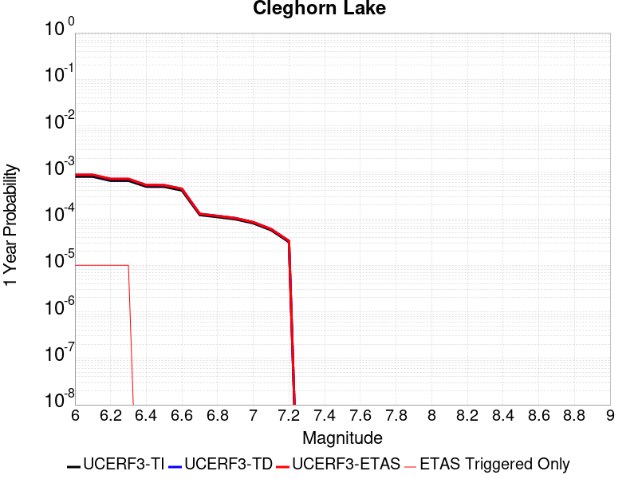 |  |

| Magnitude | 1 wk TI Prob | 1 wk TD Prob | 1 wk ETAS Prob | 1 wk ETAS/TD Gain | 1 wk ETAS Triggered Only | 1 mo TI Prob | 1 mo TD Prob | 1 mo ETAS Prob | 1 mo ETAS/TD Gain | 1 mo ETAS Triggered Only | 1 yr TI Prob | 1 yr TD Prob | 1 yr ETAS Prob | 1 yr ETAS/TD Gain | 1 yr ETAS Triggered Only | 10 yr TI Prob | 10 yr TD Prob | 10 yr ETAS Prob | 10 yr ETAS/TD Gain | 10 yr ETAS Triggered Only |
|-----|-----|-----|-----|-----|-----|-----|-----|-----|-----|-----|-----|-----|-----|-----|-----|-----|-----|-----|-----|-----|
| 6.0 | 1.5467183E-5 | 1.6794396E-5 | 1.6794396E-5 | 1.0 | 0.0 | 6.6286244E-5 | 7.1974304E-5 | 8.197359E-5 | 1.1389285 | 1.0E-5 | 8.067362E-4 | 8.7598973E-4 | 8.8598096E-4 | 1.0114057 | 1.0E-5 | 0.008038137 | 0.008730795 | 0.008740707 | 1.0011353 | 1.0E-5 |
| 6.1 | 1.5467183E-5 | 1.6794396E-5 | 1.6794396E-5 | 1.0 | 0.0 | 6.6286244E-5 | 7.1974304E-5 | 8.197359E-5 | 1.1389285 | 1.0E-5 | 8.067362E-4 | 8.7598973E-4 | 8.8598096E-4 | 1.0114057 | 1.0E-5 | 0.008038137 | 0.008730795 | 0.008740707 | 1.0011353 | 1.0E-5 |
| 6.2 | 1.2624631E-5 | 1.3681697E-5 | 1.3681697E-5 | 1.0 | 0.0 | 5.410444E-5 | 5.86348E-5 | 6.863422E-5 | 1.1705372 | 1.0E-5 | 6.585225E-4 | 7.1369356E-4 | 7.236864E-4 | 1.0140016 | 1.0E-5 | 0.0065657445 | 0.007118811 | 0.0071287397 | 1.0013947 | 1.0E-5 |
| 6.3 | 1.2624631E-5 | 1.3681697E-5 | 1.3681697E-5 | 1.0 | 0.0 | 5.410444E-5 | 5.86348E-5 | 6.863422E-5 | 1.1705372 | 1.0E-5 | 6.585225E-4 | 7.1369356E-4 | 7.236864E-4 | 1.0140016 | 1.0E-5 | 0.0065657445 | 0.007118811 | 0.0071287397 | 1.0013947 | 1.0E-5 |
| 6.4 | 9.417684E-6 | 1.0170226E-5 | 1.0170226E-5 | 1.0 | 0.0 | 4.036088E-5 | 4.3586184E-5 | 4.3586184E-5 | 1.0 | 0.0 | 4.912829E-4 | 5.305737E-4 | 5.305737E-4 | 1.0 | 0.0 | 0.004901982 | 0.0052971053 | 0.0052971053 | 1.0 | 0.0 |
| 6.5 | 9.368219E-6 | 1.0117652E-5 | 1.0117652E-5 | 1.0 | 0.0 | 4.014889E-5 | 4.3360877E-5 | 4.3360877E-5 | 1.0 | 0.0 | 4.8870314E-4 | 5.278319E-4 | 5.278319E-4 | 1.0 | 0.0 | 0.004876298 | 0.0052698175 | 0.0052698175 | 1.0 | 0.0 |
| 6.6 | 7.803798E-6 | 8.441923E-6 | 8.441923E-6 | 1.0 | 0.0 | 3.3444423E-5 | 3.6179394E-5 | 3.6179394E-5 | 1.0 | 0.0 | 4.0710976E-4 | 4.40435E-4 | 4.40435E-4 | 1.0 | 0.0 | 0.0040636472 | 0.004399538 | 0.004399538 | 1.0 | 0.0 |
| 6.7 | 2.3108669E-6 | 2.4438523E-6 | 2.4438523E-6 | 1.0 | 0.0 | 9.903678E-6 | 1.0473612E-5 | 1.0473612E-5 | 1.0 | 0.0 | 1.205706E-4 | 1.2750895E-4 | 1.2750895E-4 | 1.0 | 0.0 | 0.001205052 | 0.0012743765 | 0.0012743765 | 1.0 | 0.0 |
| 6.8 | 2.0882828E-6 | 2.2062986E-6 | 2.2062986E-6 | 1.0 | 0.0 | 8.949753E-6 | 9.455533E-6 | 9.455533E-6 | 1.0 | 0.0 | 1.08957785E-4 | 1.15115196E-4 | 1.15115196E-4 | 1.0 | 0.0 | 0.0010890438 | 0.0011505726 | 0.0011505726 | 1.0 | 0.0 |
| 6.9 | 1.876935E-6 | 1.9810657E-6 | 1.9810657E-6 | 1.0 | 0.0 | 8.043982E-6 | 8.490254E-6 | 8.490254E-6 | 1.0 | 0.0 | 9.7931086E-5 | 1.033641E-4 | 1.033641E-4 | 1.0 | 0.0 | 9.788794E-4 | 0.0010331762 | 0.0010331762 | 1.0 | 0.0 |
| 7.0 | 1.5357559E-6 | 1.6202926E-6 | 1.6202926E-6 | 1.0 | 0.0 | 6.5817944E-6 | 6.944093E-6 | 6.944093E-6 | 1.0 | 0.0 | 8.01304E-5 | 8.454118E-5 | 8.454118E-5 | 1.0 | 0.0 | 8.010151E-4 | 8.4510265E-4 | 8.4510265E-4 | 1.0 | 0.0 |
| 7.1 | 1.0905424E-6 | 1.1497702E-6 | 1.1497702E-6 | 1.0 | 0.0 | 4.6737446E-6 | 4.927578E-6 | 4.927578E-6 | 1.0 | 0.0 | 5.6901354E-5 | 5.999171E-5 | 5.999171E-5 | 1.0 | 0.0 | 5.6886784E-4 | 5.997649E-4 | 5.997649E-4 | 1.0 | 0.0 |
| 7.2 | 6.06668E-7 | 6.387322E-7 | 6.387322E-7 | 1.0 | 0.0 | 2.600003E-6 | 2.7374213E-6 | 2.7374213E-6 | 1.0 | 0.0 | 3.1654577E-5 | 3.3327666E-5 | 3.3327666E-5 | 1.0 | 0.0 | 3.1650066E-4 | 3.332335E-4 | 3.332335E-4 | 1.0 | 0.0 |

## San Pedro Basin
*[(top)](#table-of-contents)*

| 1 Week | 1 Month | 1 Year | 10 Year |
|-----|-----|-----|-----|
|  |  |  |  |

| Magnitude | 1 wk TI Prob | 1 wk TD Prob | 1 wk ETAS Prob | 1 wk ETAS/TD Gain | 1 wk ETAS Triggered Only | 1 mo TI Prob | 1 mo TD Prob | 1 mo ETAS Prob | 1 mo ETAS/TD Gain | 1 mo ETAS Triggered Only | 1 yr TI Prob | 1 yr TD Prob | 1 yr ETAS Prob | 1 yr ETAS/TD Gain | 1 yr ETAS Triggered Only | 10 yr TI Prob | 10 yr TD Prob | 10 yr ETAS Prob | 10 yr ETAS/TD Gain | 10 yr ETAS Triggered Only |
|-----|-----|-----|-----|-----|-----|-----|-----|-----|-----|-----|-----|-----|-----|-----|-----|-----|-----|-----|-----|-----|
| 6.0 | 5.3449043E-5 | 6.3371124E-5 | 6.3371124E-5 | 1.0 | 0.0 | 2.2904722E-4 | 2.7156572E-4 | 2.81563E-4 | 1.0368135 | 1.0E-5 | 0.0027850836 | 0.0033019078 | 0.0033118748 | 1.0030185 | 1.0E-5 | 0.027504366 | 0.032590248 | 0.032599922 | 1.0002968 | 1.0E-5 |
| 6.1 | 5.3449043E-5 | 6.3371124E-5 | 6.3371124E-5 | 1.0 | 0.0 | 2.2904722E-4 | 2.7156572E-4 | 2.81563E-4 | 1.0368135 | 1.0E-5 | 0.0027850836 | 0.0033019078 | 0.0033118748 | 1.0030185 | 1.0E-5 | 0.027504366 | 0.032590248 | 0.032599922 | 1.0002968 | 1.0E-5 |
| 6.2 | 2.3189454E-5 | 2.6643334E-5 | 2.6643334E-5 | 1.0 | 0.0 | 9.9379584E-5 | 1.14180984E-4 | 1.14180984E-4 | 1.0 | 0.0 | 0.0012092749 | 0.0013893144 | 0.0013893144 | 1.0 | 0.0 | 0.012027155 | 0.013811161 | 0.013811161 | 1.0 | 0.0 |
| 6.3 | 2.3189454E-5 | 2.6643334E-5 | 2.6643334E-5 | 1.0 | 0.0 | 9.9379584E-5 | 1.14180984E-4 | 1.14180984E-4 | 1.0 | 0.0 | 0.0012092749 | 0.0013893144 | 0.0013893144 | 1.0 | 0.0 | 0.012027155 | 0.013811161 | 0.013811161 | 1.0 | 0.0 |
| 6.4 | 1.966056E-5 | 2.2463848E-5 | 2.2463848E-5 | 1.0 | 0.0 | 8.425682E-5 | 9.627031E-5 | 9.627031E-5 | 1.0 | 0.0 | 0.001025344 | 0.001171501 | 0.001171501 | 1.0 | 0.0 | 0.010206259 | 0.011657341 | 0.011657341 | 1.0 | 0.0 |
| 6.5 | 1.7342953E-5 | 1.9745521E-5 | 1.9745521E-5 | 1.0 | 0.0 | 7.4324824E-5 | 8.4621126E-5 | 8.4621126E-5 | 1.0 | 0.0 | 9.04529E-4 | 0.0010298121 | 0.0010298121 | 1.0 | 0.0 | 0.009008561 | 0.010254124 | 0.010254124 | 1.0 | 0.0 |
| 6.6 | 1.439804E-5 | 1.6323014E-5 | 1.6323014E-5 | 1.0 | 0.0 | 6.170443E-5 | 6.995408E-5 | 6.995408E-5 | 1.0 | 0.0 | 7.509924E-4 | 8.513903E-4 | 8.513903E-4 | 1.0 | 0.0 | 0.0074845953 | 0.008484487 | 0.008484487 | 1.0 | 0.0 |
| 6.7 | 1.2634884E-5 | 1.4285554E-5 | 1.4285554E-5 | 1.0 | 0.0 | 5.414838E-5 | 6.1222534E-5 | 6.1222534E-5 | 1.0 | 0.0 | 6.590571E-4 | 7.451599E-4 | 7.451599E-4 | 1.0 | 0.0 | 0.006571059 | 0.007429634 | 0.007429634 | 1.0 | 0.0 |
| 6.8 | 1.146091E-5 | 1.2933421E-5 | 1.2933421E-5 | 1.0 | 0.0 | 4.911726E-5 | 5.542794E-5 | 5.542794E-5 | 1.0 | 0.0 | 5.9783855E-4 | 6.7465595E-4 | 6.7465595E-4 | 1.0 | 0.0 | 0.0059623276 | 0.0067290184 | 0.0067290184 | 1.0 | 0.0 |
| 6.9 | 9.109035E-6 | 1.0235189E-5 | 1.0235189E-5 | 1.0 | 0.0 | 3.9038136E-5 | 4.3864515E-5 | 4.3864515E-5 | 1.0 | 0.0 | 4.7518566E-4 | 5.339476E-4 | 5.339476E-4 | 1.0 | 0.0 | 0.0047417083 | 0.0053294008 | 0.0053294008 | 1.0 | 0.0 |
| 7.0 | 5.9351028E-6 | 6.584068E-6 | 6.584068E-6 | 1.0 | 0.0 | 2.5435906E-5 | 2.8217262E-5 | 2.8217262E-5 | 1.0 | 0.0 | 3.0963816E-4 | 3.4351464E-4 | 3.4351464E-4 | 1.0 | 0.0 | 0.0030920706 | 0.0034321535 | 0.0034321535 | 1.0 | 0.0 |
| 7.1 | 2.1557585E-6 | 2.2096608E-6 | 2.2096608E-6 | 1.0 | 0.0 | 9.238933E-6 | 9.469942E-6 | 9.469942E-6 | 1.0 | 0.0 | 1.1247819E-4 | 1.1529059E-4 | 1.1529059E-4 | 1.0 | 0.0 | 0.0011242128 | 0.0011523232 | 0.0011523232 | 1.0 | 0.0 |
| 7.2 | 2.1251979E-6 | 2.178007E-6 | 2.178007E-6 | 1.0 | 0.0 | 9.107958E-6 | 9.334282E-6 | 9.334282E-6 | 1.0 | 0.0 | 1.1088375E-4 | 1.1363912E-4 | 1.1363912E-4 | 1.0 | 0.0 | 0.0011082845 | 0.0011358254 | 0.0011358254 | 1.0 | 0.0 |
| 7.3 | 1.7145798E-6 | 1.7442967E-6 | 1.7442967E-6 | 1.0 | 0.0 | 7.3481783E-6 | 7.475536E-6 | 7.475536E-6 | 1.0 | 0.0 | 8.94604E-5 | 9.1010945E-5 | 9.1010945E-5 | 1.0 | 0.0 | 8.9424395E-4 | 9.0974587E-4 | 9.0974587E-4 | 1.0 | 0.0 |
| 7.4 | 1.4467993E-6 | 1.4641943E-6 | 1.4641943E-6 | 1.0 | 0.0 | 6.200554E-6 | 6.2751037E-6 | 6.2751037E-6 | 1.0 | 0.0 | 7.548913E-5 | 7.6396784E-5 | 7.6396784E-5 | 1.0 | 0.0 | 7.546349E-4 | 7.637125E-4 | 7.637125E-4 | 1.0 | 0.0 |
| 7.5 | 1.2803735E-6 | 1.2931564E-6 | 1.2931564E-6 | 1.0 | 0.0 | 5.487303E-6 | 5.5420874E-6 | 5.5420874E-6 | 1.0 | 0.0 | 6.680587E-5 | 6.7472894E-5 | 6.7472894E-5 | 1.0 | 0.0 | 6.678579E-4 | 6.7453115E-4 | 6.7453115E-4 | 1.0 | 0.0 |
| 7.6 | 6.755009E-7 | 6.769501E-7 | 6.769501E-7 | 1.0 | 0.0 | 2.8950008E-6 | 2.9012117E-6 | 2.9012117E-6 | 1.0 | 0.0 | 3.5246063E-5 | 3.5321737E-5 | 3.5321737E-5 | 1.0 | 0.0 | 3.5240475E-4 | 3.5316695E-4 | 3.5316695E-4 | 1.0 | 0.0 |
| 7.7 | 6.211885E-8 | 4.5699863E-8 | 4.5699863E-8 | 1.0 | 0.0 | 2.6622362E-7 | 1.9585654E-7 | 1.9585654E-7 | 1.0 | 0.0 | 3.2412677E-6 | 2.384551E-6 | 2.384551E-6 | 1.0 | 0.0 | 3.2412205E-5 | 2.3845274E-5 | 2.3845274E-5 | 1.0 | 0.0 |
| 7.8 | 2.6580573E-9 | 1.5138681E-9 | 1.5138681E-9 | 1.0 | 0.0 | 1.1391674E-8 | 6.488006E-9 | 6.488006E-9 | 1.0 | 0.0 | 1.3869362E-7 | 7.899148E-8 | 7.899148E-8 | 1.0 | 0.0 | 1.3869354E-6 | 7.8991474E-7 | 7.8991474E-7 | 1.0 | 0.0 |

## Santa Rosa Island
*[(top)](#table-of-contents)*

| 1 Week | 1 Month | 1 Year | 10 Year |
|-----|-----|-----|-----|
|  |  |  |  |

| Magnitude | 1 wk TI Prob | 1 wk TD Prob | 1 wk ETAS Prob | 1 wk ETAS/TD Gain | 1 wk ETAS Triggered Only | 1 mo TI Prob | 1 mo TD Prob | 1 mo ETAS Prob | 1 mo ETAS/TD Gain | 1 mo ETAS Triggered Only | 1 yr TI Prob | 1 yr TD Prob | 1 yr ETAS Prob | 1 yr ETAS/TD Gain | 1 yr ETAS Triggered Only | 10 yr TI Prob | 10 yr TD Prob | 10 yr ETAS Prob | 10 yr ETAS/TD Gain | 10 yr ETAS Triggered Only |
|-----|-----|-----|-----|-----|-----|-----|-----|-----|-----|-----|-----|-----|-----|-----|-----|-----|-----|-----|-----|-----|
| 6.0 | 4.1143165E-5 | 4.7092042E-5 | 5.709157E-5 | 1.2123401 | 1.0E-5 | 1.7631594E-4 | 2.0180854E-4 | 2.1180652E-4 | 1.049542 | 1.0E-5 | 0.002144533 | 0.0024544473 | 0.0024644227 | 1.0040642 | 1.0E-5 | 0.021239553 | 0.024294013 | 0.024303772 | 1.0004016 | 1.0E-5 |
| 6.1 | 2.1061249E-5 | 2.3865383E-5 | 3.3865144E-5 | 1.419007 | 1.0E-5 | 9.0259375E-5 | 1.0227637E-4 | 1.12275346E-4 | 1.0977643 | 1.0E-5 | 0.0010983539 | 0.0012445324 | 0.00125452 | 1.0080252 | 1.0E-5 | 0.01092941 | 0.012378667 | 0.012388543 | 1.0007979 | 1.0E-5 |
| 6.2 | 2.1061249E-5 | 2.3865383E-5 | 3.3865144E-5 | 1.419007 | 1.0E-5 | 9.0259375E-5 | 1.0227637E-4 | 1.12275346E-4 | 1.0977643 | 1.0E-5 | 0.0010983539 | 0.0012445324 | 0.00125452 | 1.0080252 | 1.0E-5 | 0.01092941 | 0.012378667 | 0.012388543 | 1.0007979 | 1.0E-5 |
| 6.3 | 1.5158236E-5 | 1.7074708E-5 | 1.7074708E-5 | 1.0 | 0.0 | 6.496225E-5 | 7.317533E-5 | 7.317533E-5 | 1.0 | 0.0 | 7.906284E-4 | 8.905574E-4 | 8.905574E-4 | 1.0 | 0.0 | 0.007878214 | 0.008871138 | 0.008871138 | 1.0 | 0.0 |
| 6.4 | 1.2341918E-5 | 1.3853143E-5 | 1.3853143E-5 | 1.0 | 0.0 | 5.2892858E-5 | 5.9369308E-5 | 5.9369308E-5 | 1.0 | 0.0 | 6.437803E-4 | 7.225897E-4 | 7.225897E-4 | 1.0 | 0.0 | 0.006419184 | 0.0072032386 | 0.0072032386 | 1.0 | 0.0 |
| 6.5 | 9.061158E-6 | 1.0117188E-5 | 1.0117188E-5 | 1.0 | 0.0 | 3.883296E-5 | 4.335869E-5 | 4.335869E-5 | 1.0 | 0.0 | 4.726887E-4 | 5.277695E-4 | 5.277695E-4 | 1.0 | 0.0 | 0.004716845 | 0.0052656992 | 0.0052656992 | 1.0 | 0.0 |
| 6.6 | 7.5461685E-6 | 8.400861E-6 | 8.400861E-6 | 1.0 | 0.0 | 3.2340322E-5 | 3.6003217E-5 | 3.6003217E-5 | 1.0 | 0.0 | 3.936723E-4 | 4.382553E-4 | 4.382553E-4 | 1.0 | 0.0 | 0.003929756 | 0.0043743397 | 0.0043743397 | 1.0 | 0.0 |
| 6.7 | 5.5023775E-6 | 6.0874677E-6 | 6.0874677E-6 | 1.0 | 0.0 | 2.3581404E-5 | 2.6088905E-5 | 2.6088905E-5 | 1.0 | 0.0 | 2.8706578E-4 | 3.1758935E-4 | 3.1758935E-4 | 1.0 | 0.0 | 0.0028669522 | 0.0031716768 | 0.0031716768 | 1.0 | 0.0 |
| 6.8 | 3.7351679E-6 | 4.0831915E-6 | 4.0831915E-6 | 1.0 | 0.0 | 1.6007763E-5 | 1.749929E-5 | 1.749929E-5 | 1.0 | 0.0 | 1.948771E-4 | 2.1303551E-4 | 2.1303551E-4 | 1.0 | 0.0 | 0.0019470629 | 0.002128558 | 0.002128558 | 1.0 | 0.0 |
| 6.9 | 2.456366E-6 | 2.6292953E-6 | 2.6292953E-6 | 1.0 | 0.0 | 1.0527241E-5 | 1.126836E-5 | 1.126836E-5 | 1.0 | 0.0 | 1.2816161E-4 | 1.3718367E-4 | 1.3718367E-4 | 1.0 | 0.0 | 0.0012808773 | 0.0013709929 | 0.0013709929 | 1.0 | 0.0 |
| 7.0 | 2.3245157E-6 | 2.482801E-6 | 2.482801E-6 | 1.0 | 0.0 | 9.962172E-6 | 1.0640532E-5 | 1.0640532E-5 | 1.0 | 0.0 | 1.2128269E-4 | 1.295408E-4 | 1.295408E-4 | 1.0 | 0.0 | 0.0012121652 | 0.0012946551 | 0.0012946551 | 1.0 | 0.0 |
| 7.1 | 2.2248344E-6 | 2.3732712E-6 | 2.3732712E-6 | 1.0 | 0.0 | 9.53497E-6 | 1.0171123E-5 | 1.0171123E-5 | 1.0 | 0.0 | 1.1608207E-4 | 1.238264E-4 | 1.238264E-4 | 1.0 | 0.0 | 0.0011602144 | 0.001237576 | 0.001237576 | 1.0 | 0.0 |
| 7.2 | 2.1350402E-6 | 2.2761742E-6 | 2.2761742E-6 | 1.0 | 0.0 | 9.150141E-6 | 9.7549955E-6 | 9.7549955E-6 | 1.0 | 0.0 | 1.1139726E-4 | 1.1876062E-4 | 1.1876062E-4 | 1.0 | 0.0 | 0.0011134144 | 0.0011869734 | 0.0011869734 | 1.0 | 0.0 |
| 7.3 | 1.9793572E-6 | 2.1087376E-6 | 2.1087376E-6 | 1.0 | 0.0 | 8.482932E-6 | 9.037415E-6 | 9.037415E-6 | 1.0 | 0.0 | 1.032748E-4 | 1.10024994E-4 | 1.10024994E-4 | 1.0 | 0.0 | 0.0010322682 | 0.001099707 | 0.001099707 | 1.0 | 0.0 |
| 7.4 | 1.6951194E-6 | 1.804589E-6 | 1.804589E-6 | 1.0 | 0.0 | 7.264777E-6 | 7.73393E-6 | 7.73393E-6 | 1.0 | 0.0 | 8.844508E-5 | 9.4156545E-5 | 9.4156545E-5 | 1.0 | 0.0 | 8.840988E-4 | 9.411682E-4 | 9.411682E-4 | 1.0 | 0.0 |
| 7.5 | 8.987207E-7 | 9.51229E-7 | 9.51229E-7 | 1.0 | 0.0 | 3.8516546E-6 | 4.0766895E-6 | 4.0766895E-6 | 1.0 | 0.0 | 4.6892885E-5 | 4.9632577E-5 | 4.9632577E-5 | 1.0 | 0.0 | 4.688299E-4 | 4.9621606E-4 | 4.9621606E-4 | 1.0 | 0.0 |
| 7.6 | 3.8783037E-7 | 4.052958E-7 | 4.052958E-7 | 1.0 | 0.0 | 1.6621291E-6 | 1.7369808E-6 | 1.7369808E-6 | 1.0 | 0.0 | 2.0236233E-5 | 2.1147544E-5 | 2.1147544E-5 | 1.0 | 0.0 | 2.023439E-4 | 2.1145596E-4 | 2.1145596E-4 | 1.0 | 0.0 |
| 7.7 | 6.181804E-8 | 6.3390665E-8 | 6.3390665E-8 | 1.0 | 0.0 | 2.6493444E-7 | 2.7167425E-7 | 2.7167425E-7 | 1.0 | 0.0 | 3.225572E-6 | 3.307629E-6 | 3.307629E-6 | 1.0 | 0.0 | 3.225525E-5 | 3.3075805E-5 | 3.3075805E-5 | 1.0 | 0.0 |
| 7.8 | 1.3704449E-9 | 1.3964188E-9 | 1.3964188E-9 | 1.0 | 0.0 | 5.873335E-9 | 5.984652E-9 | 5.984652E-9 | 1.0 | 0.0 | 7.1507856E-8 | 7.286314E-8 | 7.286314E-8 | 1.0 | 0.0 | 7.1507833E-7 | 7.286312E-7 | 7.286312E-7 | 1.0 | 0.0 |

## San Andreas (North Coast) 2011 CFM
*[(top)](#table-of-contents)*

| 1 Week | 1 Month | 1 Year | 10 Year |
|-----|-----|-----|-----|
|  |  |  |  |

| Magnitude | 1 wk TI Prob | 1 wk TD Prob | 1 wk ETAS Prob | 1 wk ETAS/TD Gain | 1 wk ETAS Triggered Only | 1 mo TI Prob | 1 mo TD Prob | 1 mo ETAS Prob | 1 mo ETAS/TD Gain | 1 mo ETAS Triggered Only | 1 yr TI Prob | 1 yr TD Prob | 1 yr ETAS Prob | 1 yr ETAS/TD Gain | 1 yr ETAS Triggered Only | 10 yr TI Prob | 10 yr TD Prob | 10 yr ETAS Prob | 10 yr ETAS/TD Gain | 10 yr ETAS Triggered Only |
|-----|-----|-----|-----|-----|-----|-----|-----|-----|-----|-----|-----|-----|-----|-----|-----|-----|-----|-----|-----|-----|
| 6.0 | 1.5333705E-4 | 7.1141556E-5 | 7.1141556E-5 | 1.0 | 0.0 | 6.5699324E-4 | 3.0485695E-4 | 3.0485695E-4 | 1.0 | 0.0 | 0.007969595 | 0.0037053502 | 0.0037153133 | 1.0026888 | 1.0E-5 | 0.0768977 | 0.03937111 | 0.039380718 | 1.000244 | 1.0E-5 |
| 6.1 | 1.5333705E-4 | 7.1141556E-5 | 7.1141556E-5 | 1.0 | 0.0 | 6.5699324E-4 | 3.0485695E-4 | 3.0485695E-4 | 1.0 | 0.0 | 0.007969595 | 0.0037053502 | 0.0037153133 | 1.0026888 | 1.0E-5 | 0.0768977 | 0.03937111 | 0.039380718 | 1.000244 | 1.0E-5 |
| 6.2 | 1.3912938E-4 | 6.0533035E-5 | 6.0533035E-5 | 1.0 | 0.0 | 5.961325E-4 | 2.5940166E-4 | 2.5940166E-4 | 1.0 | 0.0 | 0.007233787 | 0.0031536683 | 0.0031636367 | 1.003161 | 1.0E-5 | 0.07002798 | 0.03370866 | 0.033718325 | 1.0002867 | 1.0E-5 |
| 6.3 | 1.3912938E-4 | 6.0533035E-5 | 6.0533035E-5 | 1.0 | 0.0 | 5.961325E-4 | 2.5940166E-4 | 2.5940166E-4 | 1.0 | 0.0 | 0.007233787 | 0.0031536683 | 0.0031636367 | 1.003161 | 1.0E-5 | 0.07002798 | 0.03370866 | 0.033718325 | 1.0002867 | 1.0E-5 |
| 6.4 | 1.2623647E-4 | 5.0469214E-5 | 5.0469214E-5 | 1.0 | 0.0 | 5.4090127E-4 | 2.162788E-4 | 2.162788E-4 | 1.0 | 0.0 | 0.0065656058 | 0.0026300347 | 0.0026400085 | 1.0037923 | 1.0E-5 | 0.06374981 | 0.02831788 | 0.028327597 | 1.0003431 | 1.0E-5 |
| 6.5 | 1.1736096E-4 | 4.3548378E-5 | 4.3548378E-5 | 1.0 | 0.0 | 5.028786E-4 | 1.8662264E-4 | 1.8662264E-4 | 1.0 | 0.0 | 0.006105373 | 0.0022697793 | 0.0022797566 | 1.0043957 | 1.0E-5 | 0.05940335 | 0.024592753 | 0.024602508 | 1.0003966 | 1.0E-5 |
| 6.6 | 1.1586959E-4 | 4.244781E-5 | 4.244781E-5 | 1.0 | 0.0 | 4.964894E-4 | 1.8190658E-4 | 1.8190658E-4 | 1.0 | 0.0 | 0.006028018 | 0.0022124792 | 0.0022224572 | 1.0045098 | 1.0E-5 | 0.058671024 | 0.023998221 | 0.024007982 | 1.0004067 | 1.0E-5 |
| 6.7 | 1.13693764E-4 | 4.075945E-5 | 4.075945E-5 | 1.0 | 0.0 | 4.87168E-4 | 1.7467175E-4 | 1.7467175E-4 | 1.0 | 0.0 | 0.005915152 | 0.0021245703 | 0.0021245703 | 1.0 | 0.0 | 0.057601593 | 0.023089329 | 0.023089329 | 1.0 | 0.0 |
| 6.8 | 1.1204889E-4 | 3.9976534E-5 | 3.9976534E-5 | 1.0 | 0.0 | 4.8012115E-4 | 1.7131683E-4 | 1.7131683E-4 | 1.0 | 0.0 | 0.005829819 | 0.002083803 | 0.002083803 | 1.0 | 0.0 | 0.05679232 | 0.022649366 | 0.022649366 | 1.0 | 0.0 |
| 6.9 | 1.1005794E-4 | 3.903209E-5 | 3.903209E-5 | 1.0 | 0.0 | 4.7159163E-4 | 1.6726975E-4 | 1.6726975E-4 | 1.0 | 0.0 | 0.0057265228 | 0.002034623 | 0.002034623 | 1.0 | 0.0 | 0.055811852 | 0.02211497 | 0.02211497 | 1.0 | 0.0 |
| 7.0 | 1.0647948E-4 | 3.7187776E-5 | 3.7187776E-5 | 1.0 | 0.0 | 4.562608E-4 | 1.5936654E-4 | 1.5936654E-4 | 1.0 | 0.0 | 0.0055408357 | 0.0019385765 | 0.0019385765 | 1.0 | 0.0 | 0.054047033 | 0.021074155 | 0.021074155 | 1.0 | 0.0 |
| 7.1 | 1.04795035E-4 | 3.6236856E-5 | 3.6236856E-5 | 1.0 | 0.0 | 4.4904428E-4 | 1.5529165E-4 | 1.5529165E-4 | 1.0 | 0.0 | 0.0054534175 | 0.0018890519 | 0.0018890519 | 1.0 | 0.0 | 0.053215165 | 0.020541927 | 0.020541927 | 1.0 | 0.0 |
| 7.2 | 1.02724036E-4 | 3.514485E-5 | 3.514485E-5 | 1.0 | 0.0 | 4.401716E-4 | 1.5061218E-4 | 1.5061218E-4 | 1.0 | 0.0 | 0.0053459285 | 0.0018321763 | 0.0018321763 | 1.0 | 0.0 | 0.052191395 | 0.019930558 | 0.019930558 | 1.0 | 0.0 |
| 7.3 | 1.00650694E-4 | 3.4611825E-5 | 3.4611825E-5 | 1.0 | 0.0 | 4.312888E-4 | 1.4832805E-4 | 1.4832805E-4 | 1.0 | 0.0 | 0.005238306 | 0.0018044134 | 0.0018044134 | 1.0 | 0.0 | 0.051165357 | 0.019607486 | 0.019607486 | 1.0 | 0.0 |
| 7.4 | 9.672919E-5 | 3.3400014E-5 | 3.3400014E-5 | 1.0 | 0.0 | 4.144878E-4 | 1.4313516E-4 | 1.4313516E-4 | 1.0 | 0.0 | 0.005034718 | 0.0017412928 | 0.0017412928 | 1.0 | 0.0 | 0.049221683 | 0.018880244 | 0.018880244 | 1.0 | 0.0 |
| 7.5 | 8.7600405E-5 | 2.2716442E-5 | 2.2716442E-5 | 1.0 | 0.0 | 3.753763E-4 | 9.735256E-5 | 9.735256E-5 | 1.0 | 0.0 | 0.0045606326 | 0.0011846247 | 0.0011846247 | 1.0 | 0.0 | 0.04468165 | 0.013139147 | 0.013139147 | 1.0 | 0.0 |
| 7.6 | 7.9562284E-5 | 1.924054E-5 | 1.924054E-5 | 1.0 | 0.0 | 3.4093665E-4 | 8.2456856E-5 | 8.2456856E-5 | 1.0 | 0.0 | 0.0041430052 | 0.0010034514 | 0.0010034514 | 1.0 | 0.0 | 0.040666126 | 0.011229912 | 0.011229912 | 1.0 | 0.0 |
| 7.7 | 6.3866544E-5 | 1.1952783E-5 | 1.1952783E-5 | 1.0 | 0.0 | 2.7368503E-4 | 5.1225208E-5 | 5.1225208E-5 | 1.0 | 0.0 | 0.0033270244 | 6.2348874E-4 | 6.2348874E-4 | 1.0 | 0.0 | 0.032776527 | 0.007216897 | 0.007216897 | 1.0 | 0.0 |
| 7.8 | 4.2543215E-5 | 9.0854555E-6 | 9.0854555E-6 | 1.0 | 0.0 | 1.8231533E-4 | 3.8937087E-5 | 3.8937087E-5 | 1.0 | 0.0 | 0.0022174292 | 4.73956E-4 | 4.73956E-4 | 1.0 | 0.0 | 0.021954332 | 0.0054957564 | 0.0054957564 | 1.0 | 0.0 |
| 7.9 | 2.2636612E-5 | 7.821691E-6 | 7.821691E-6 | 1.0 | 0.0 | 9.7010445E-5 | 3.35211E-5 | 3.35211E-5 | 1.0 | 0.0 | 0.0011804621 | 4.080431E-4 | 4.080431E-4 | 1.0 | 0.0 | 0.011742111 | 0.004687419 | 0.004687419 | 1.0 | 0.0 |
| 8.0 | 1.5167874E-5 | 7.056108E-6 | 7.056108E-6 | 1.0 | 0.0 | 6.500356E-5 | 3.0240113E-5 | 3.0240113E-5 | 1.0 | 0.0 | 7.9113094E-4 | 3.6811127E-4 | 3.6811127E-4 | 1.0 | 0.0 | 0.007883203 | 0.0042192712 | 0.0042192712 | 1.0 | 0.0 |
| 8.1 | 1.0681047E-5 | 6.393015E-6 | 6.393015E-6 | 1.0 | 0.0 | 4.5775112E-5 | 2.739835E-5 | 2.739835E-5 | 1.0 | 0.0 | 5.5716943E-4 | 3.3352393E-4 | 3.3352393E-4 | 1.0 | 0.0 | 0.0055577457 | 0.0038207078 | 0.0038207078 | 1.0 | 0.0 |
| 8.2 | 8.226114E-6 | 5.1197717E-6 | 5.1197717E-6 | 1.0 | 0.0 | 3.52543E-5 | 2.1941696E-5 | 2.1941696E-5 | 1.0 | 0.0 | 4.2913653E-4 | 2.6710748E-4 | 2.6710748E-4 | 1.0 | 0.0 | 0.004283088 | 0.0030476742 | 0.0030476742 | 1.0 | 0.0 |
| 8.3 | 1.983087E-6 | 7.668296E-7 | 7.668296E-7 | 1.0 | 0.0 | 8.498917E-6 | 3.2864084E-6 | 3.2864084E-6 | 1.0 | 0.0 | 1.034694E-4 | 4.0011306E-5 | 4.0011306E-5 | 1.0 | 0.0 | 0.0010342124 | 4.724499E-4 | 4.724499E-4 | 1.0 | 0.0 |

## Elmore Ranch
*[(top)](#table-of-contents)*

| 1 Week | 1 Month | 1 Year | 10 Year |
|-----|-----|-----|-----|
|  |  |  |  |

| Magnitude | 1 wk TI Prob | 1 wk TD Prob | 1 wk ETAS Prob | 1 wk ETAS/TD Gain | 1 wk ETAS Triggered Only | 1 mo TI Prob | 1 mo TD Prob | 1 mo ETAS Prob | 1 mo ETAS/TD Gain | 1 mo ETAS Triggered Only | 1 yr TI Prob | 1 yr TD Prob | 1 yr ETAS Prob | 1 yr ETAS/TD Gain | 1 yr ETAS Triggered Only | 10 yr TI Prob | 10 yr TD Prob | 10 yr ETAS Prob | 10 yr ETAS/TD Gain | 10 yr ETAS Triggered Only |
|-----|-----|-----|-----|-----|-----|-----|-----|-----|-----|-----|-----|-----|-----|-----|-----|-----|-----|-----|-----|-----|
| 6.0 | 9.102099E-5 | 8.9526366E-5 | 8.9526366E-5 | 1.0 | 0.0 | 3.9003167E-4 | 3.8364116E-4 | 3.9363734E-4 | 1.026056 | 1.0E-5 | 0.0047383 | 0.004662308 | 0.004672261 | 1.0021349 | 1.0E-5 | 0.046385348 | 0.045873385 | 0.04588293 | 1.000208 | 1.0E-5 |
| 6.1 | 3.8306698E-5 | 4.1500927E-5 | 4.1500927E-5 | 1.0 | 0.0 | 1.6416123E-4 | 1.7785306E-4 | 1.8785128E-4 | 1.0562162 | 1.0E-5 | 0.0019968306 | 0.0021632449 | 0.0021732233 | 1.0046127 | 1.0E-5 | 0.019789828 | 0.02162934 | 0.021639122 | 1.0004523 | 1.0E-5 |
| 6.2 | 3.8306698E-5 | 4.1500927E-5 | 4.1500927E-5 | 1.0 | 0.0 | 1.6416123E-4 | 1.7785306E-4 | 1.8785128E-4 | 1.0562162 | 1.0E-5 | 0.0019968306 | 0.0021632449 | 0.0021732233 | 1.0046127 | 1.0E-5 | 0.019789828 | 0.02162934 | 0.021639122 | 1.0004523 | 1.0E-5 |
| 6.3 | 3.3197924E-5 | 3.6556212E-5 | 3.6556212E-5 | 1.0 | 0.0 | 1.4226905E-4 | 1.5666404E-4 | 1.6666247E-4 | 1.0638208 | 1.0E-5 | 0.0017307495 | 0.0019060043 | 0.0019159851 | 1.0052366 | 1.0E-5 | 0.017173318 | 0.019090874 | 0.019100683 | 1.0005138 | 1.0E-5 |
| 6.4 | 2.5148964E-5 | 2.7421656E-5 | 2.7421656E-5 | 1.0 | 0.0 | 1.0777682E-4 | 1.1751975E-4 | 1.2751856E-4 | 1.085082 | 1.0E-5 | 0.0013113929 | 0.0014305117 | 0.0014404975 | 1.0069805 | 1.0E-5 | 0.01303681 | 0.014387799 | 0.014397656 | 1.000685 | 1.0E-5 |
| 6.5 | 2.5148964E-5 | 2.7421656E-5 | 2.7421656E-5 | 1.0 | 0.0 | 1.0777682E-4 | 1.1751975E-4 | 1.2751856E-4 | 1.085082 | 1.0E-5 | 0.0013113929 | 0.0014305117 | 0.0014404975 | 1.0069805 | 1.0E-5 | 0.01303681 | 0.014387799 | 0.014397656 | 1.000685 | 1.0E-5 |

## San Andreas (Carrizo) rev
*[(top)](#table-of-contents)*

| 1 Week | 1 Month | 1 Year | 10 Year |
|-----|-----|-----|-----|
| 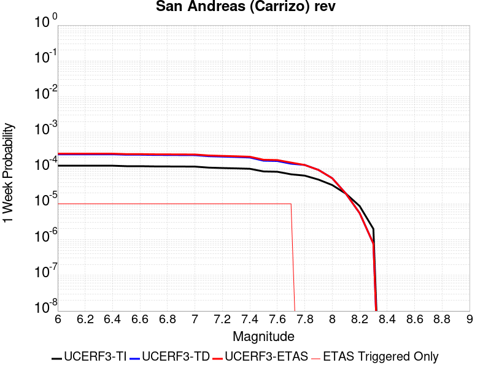 |  |  |  |

| Magnitude | 1 wk TI Prob | 1 wk TD Prob | 1 wk ETAS Prob | 1 wk ETAS/TD Gain | 1 wk ETAS Triggered Only | 1 mo TI Prob | 1 mo TD Prob | 1 mo ETAS Prob | 1 mo ETAS/TD Gain | 1 mo ETAS Triggered Only | 1 yr TI Prob | 1 yr TD Prob | 1 yr ETAS Prob | 1 yr ETAS/TD Gain | 1 yr ETAS Triggered Only | 10 yr TI Prob | 10 yr TD Prob | 10 yr ETAS Prob | 10 yr ETAS/TD Gain | 10 yr ETAS Triggered Only |
|-----|-----|-----|-----|-----|-----|-----|-----|-----|-----|-----|-----|-----|-----|-----|-----|-----|-----|-----|-----|-----|
| 6.0 | 1.1674632E-4 | 2.4332498E-4 | 2.5332253E-4 | 1.0410873 | 1.0E-5 | 5.002454E-4 | 0.0010424062 | 0.0010523958 | 1.0095832 | 1.0E-5 | 0.006073493 | 0.012617926 | 0.0126278 | 1.0007825 | 1.0E-5 | 0.0591016 | 0.12065402 | 0.120662816 | 1.0000728 | 1.0E-5 |
| 6.1 | 1.1674632E-4 | 2.4332498E-4 | 2.5332253E-4 | 1.0410873 | 1.0E-5 | 5.002454E-4 | 0.0010424062 | 0.0010523958 | 1.0095832 | 1.0E-5 | 0.006073493 | 0.012617926 | 0.0126278 | 1.0007825 | 1.0E-5 | 0.0591016 | 0.12065402 | 0.120662816 | 1.0000728 | 1.0E-5 |
| 6.2 | 1.1674632E-4 | 2.4332498E-4 | 2.5332253E-4 | 1.0410873 | 1.0E-5 | 5.002454E-4 | 0.0010424062 | 0.0010523958 | 1.0095832 | 1.0E-5 | 0.006073493 | 0.012617926 | 0.0126278 | 1.0007825 | 1.0E-5 | 0.0591016 | 0.12065402 | 0.120662816 | 1.0000728 | 1.0E-5 |
| 6.3 | 1.1674632E-4 | 2.4332498E-4 | 2.5332253E-4 | 1.0410873 | 1.0E-5 | 5.002454E-4 | 0.0010424062 | 0.0010523958 | 1.0095832 | 1.0E-5 | 0.006073493 | 0.012617926 | 0.0126278 | 1.0007825 | 1.0E-5 | 0.0591016 | 0.12065402 | 0.120662816 | 1.0000728 | 1.0E-5 |
| 6.4 | 1.1674632E-4 | 2.4332498E-4 | 2.5332253E-4 | 1.0410873 | 1.0E-5 | 5.002454E-4 | 0.0010424062 | 0.0010523958 | 1.0095832 | 1.0E-5 | 0.006073493 | 0.012617926 | 0.0126278 | 1.0007825 | 1.0E-5 | 0.0591016 | 0.12065402 | 0.120662816 | 1.0000728 | 1.0E-5 |
| 6.5 | 1.13136164E-4 | 2.3652466E-4 | 2.465223E-4 | 1.0422689 | 1.0E-5 | 4.847792E-4 | 0.0010132849 | 0.0010232747 | 1.0098588 | 1.0E-5 | 0.0058862255 | 0.012267408 | 0.012277285 | 1.0008051 | 1.0E-5 | 0.057327334 | 0.11762535 | 0.11763418 | 1.000075 | 1.0E-5 |
| 6.6 | 1.13136164E-4 | 2.3652466E-4 | 2.465223E-4 | 1.0422689 | 1.0E-5 | 4.847792E-4 | 0.0010132849 | 0.0010232747 | 1.0098588 | 1.0E-5 | 0.0058862255 | 0.012267408 | 0.012277285 | 1.0008051 | 1.0E-5 | 0.057327334 | 0.11762535 | 0.11763418 | 1.000075 | 1.0E-5 |
| 6.7 | 1.1149675E-4 | 2.3343669E-4 | 2.4343435E-4 | 1.0428282 | 1.0E-5 | 4.777557E-4 | 0.0010000608 | 0.0010100509 | 1.0099894 | 1.0E-5 | 0.0058011734 | 0.012108203 | 0.0121180825 | 1.0008159 | 1.0E-5 | 0.05652051 | 0.11624688 | 0.116255715 | 1.000076 | 1.0E-5 |
| 6.8 | 1.1103589E-4 | 2.3245816E-4 | 2.4245583E-4 | 1.0430084 | 1.0E-5 | 4.7578133E-4 | 9.958703E-4 | 0.0010058604 | 1.0100315 | 1.0E-5 | 0.005777263 | 0.0120577505 | 0.012067629 | 1.0008193 | 1.0E-5 | 0.056293584 | 0.11580715 | 0.11581599 | 1.0000763 | 1.0E-5 |
| 6.9 | 1.1053259E-4 | 2.3138185E-4 | 2.4137954E-4 | 1.0432086 | 1.0E-5 | 4.7362508E-4 | 9.912612E-4 | 0.0010012513 | 1.0100782 | 1.0E-5 | 0.0057511497 | 0.012002253 | 0.012012132 | 1.0008231 | 1.0E-5 | 0.05604569 | 0.11532332 | 0.115332164 | 1.0000768 | 1.0E-5 |
| 7.0 | 1.1005377E-4 | 2.3039016E-4 | 2.4038786E-4 | 1.0433947 | 1.0E-5 | 4.7157376E-4 | 9.870143E-4 | 9.970044E-4 | 1.0101216 | 1.0E-5 | 0.0057263062 | 0.011951115 | 0.011960995 | 1.0008267 | 1.0E-5 | 0.055809796 | 0.11487561 | 0.11488446 | 1.000077 | 1.0E-5 |
| 7.1 | 1.0308142E-4 | 2.1548544E-4 | 2.254833E-4 | 1.0463969 | 1.0E-5 | 4.417027E-4 | 9.231832E-4 | 9.33174E-4 | 1.010822 | 1.0E-5 | 0.0053644776 | 0.011182146 | 0.011192034 | 1.0008843 | 1.0E-5 | 0.052368138 | 0.108131535 | 0.10814045 | 1.0000825 | 1.0E-5 |
| 7.2 | 1.0027479E-4 | 2.0956367E-4 | 2.1956158E-4 | 1.0477082 | 1.0E-5 | 4.296783E-4 | 8.978219E-4 | 9.078129E-4 | 1.0111281 | 1.0E-5 | 0.0052187922 | 0.0108764935 | 0.010886385 | 1.0009094 | 1.0E-5 | 0.050979212 | 0.10543535 | 0.10544429 | 1.0000849 | 1.0E-5 |
| 7.3 | 9.816942E-5 | 2.0431461E-4 | 2.1431256E-4 | 1.0489341 | 1.0E-5 | 4.2065824E-4 | 8.753412E-4 | 8.853324E-4 | 1.0114142 | 1.0E-5 | 0.005109493 | 0.010605487 | 0.010615381 | 1.0009329 | 1.0E-5 | 0.049935985 | 0.103018686 | 0.10302766 | 1.000087 | 1.0E-5 |
| 7.4 | 9.5634205E-5 | 1.9800827E-4 | 2.080063E-4 | 1.0504929 | 1.0E-5 | 4.0979648E-4 | 8.4833184E-4 | 8.5832336E-4 | 1.0117779 | 1.0E-5 | 0.0049778637 | 0.0102797905 | 0.010289688 | 1.0009627 | 1.0E-5 | 0.048678253 | 0.100104466 | 0.10011347 | 1.0000899 | 1.0E-5 |
| 7.5 | 8.052417E-5 | 1.6120363E-4 | 1.7120202E-4 | 1.0620234 | 1.0E-5 | 3.4505792E-4 | 6.9068995E-4 | 7.0068304E-4 | 1.0144683 | 1.0E-5 | 0.0041929903 | 0.008376808 | 0.008386725 | 1.0011837 | 1.0E-5 | 0.04114753 | 0.08284498 | 0.08285415 | 1.0001107 | 1.0E-5 |
| 7.6 | 7.897024E-5 | 1.5773512E-4 | 1.6773354E-4 | 1.0633874 | 1.0E-5 | 3.384E-4 | 6.758327E-4 | 6.8582594E-4 | 1.0147866 | 1.0E-5 | 0.0041122385 | 0.008197296 | 0.008207214 | 1.0012099 | 1.0E-5 | 0.040369697 | 0.081185855 | 0.08119504 | 1.0001131 | 1.0E-5 |
| 7.7 | 6.707427E-5 | 1.3282998E-4 | 1.4282865E-4 | 1.0752742 | 1.0E-5 | 2.8742946E-4 | 5.691472E-4 | 5.791415E-4 | 1.0175601 | 1.0E-5 | 0.003493839 | 0.0069073834 | 0.0069173146 | 1.0014378 | 1.0E-5 | 0.034394164 | 0.06907934 | 0.069088645 | 1.0001347 | 1.0E-5 |
| 7.8 | 6.147705E-5 | 1.2203727E-4 | 1.2203727E-4 | 1.0 | 0.0 | 2.6344648E-4 | 5.229121E-4 | 5.229121E-4 | 1.0 | 0.0 | 0.0032027436 | 0.006347895 | 0.006347895 | 1.0 | 0.0 | 0.031569764 | 0.063543044 | 0.063543044 | 1.0 | 0.0 |
| 7.9 | 4.7636717E-5 | 8.88427E-5 | 8.88427E-5 | 1.0 | 0.0 | 2.0414138E-4 | 3.806989E-4 | 3.806989E-4 | 1.0 | 0.0 | 0.0024825884 | 0.0046251663 | 0.0046251663 | 1.0 | 0.0 | 0.024550365 | 0.046649244 | 0.046649244 | 1.0 | 0.0 |
| 8.0 | 3.3554235E-5 | 5.2164494E-5 | 5.2164494E-5 | 1.0 | 0.0 | 1.4379594E-4 | 2.2354297E-4 | 2.2354297E-4 | 1.0 | 0.0 | 0.0017493097 | 0.0027182405 | 0.0027182405 | 1.0 | 0.0 | 0.017356034 | 0.027894506 | 0.027894506 | 1.0 | 0.0 |
| 8.1 | 1.9175432E-5 | 1.9198285E-5 | 1.9198285E-5 | 1.0 | 0.0 | 8.217783E-5 | 8.227578E-5 | 8.227578E-5 | 1.0 | 0.0 | 0.0010000558 | 0.0010012479 | 0.0010012479 | 1.0 | 0.0 | 0.009955673 | 0.010765004 | 0.010765004 | 1.0 | 0.0 |
| 8.2 | 8.643924E-6 | 5.4798497E-6 | 5.4798497E-6 | 1.0 | 0.0 | 3.704486E-5 | 2.348486E-5 | 2.348486E-5 | 1.0 | 0.0 | 4.5092785E-4 | 2.858907E-4 | 2.858907E-4 | 1.0 | 0.0 | 0.0045001395 | 0.0032514327 | 0.0032514327 | 1.0 | 0.0 |
| 8.3 | 1.983087E-6 | 7.668296E-7 | 7.668296E-7 | 1.0 | 0.0 | 8.498917E-6 | 3.2864084E-6 | 3.2864084E-6 | 1.0 | 0.0 | 1.034694E-4 | 4.0011306E-5 | 4.0011306E-5 | 1.0 | 0.0 | 0.0010342124 | 4.724499E-4 | 4.724499E-4 | 1.0 | 0.0 |

## Clayton
*[(top)](#table-of-contents)*

| 1 Week | 1 Month | 1 Year | 10 Year |
|-----|-----|-----|-----|
|  |  |  |  |

| Magnitude | 1 wk TI Prob | 1 wk TD Prob | 1 wk ETAS Prob | 1 wk ETAS/TD Gain | 1 wk ETAS Triggered Only | 1 mo TI Prob | 1 mo TD Prob | 1 mo ETAS Prob | 1 mo ETAS/TD Gain | 1 mo ETAS Triggered Only | 1 yr TI Prob | 1 yr TD Prob | 1 yr ETAS Prob | 1 yr ETAS/TD Gain | 1 yr ETAS Triggered Only | 10 yr TI Prob | 10 yr TD Prob | 10 yr ETAS Prob | 10 yr ETAS/TD Gain | 10 yr ETAS Triggered Only |
|-----|-----|-----|-----|-----|-----|-----|-----|-----|-----|-----|-----|-----|-----|-----|-----|-----|-----|-----|-----|-----|
| 6.0 | 1.1413061E-5 | 1.2667241E-5 | 1.2667241E-5 | 1.0 | 0.0 | 4.89122E-5 | 5.428717E-5 | 5.428717E-5 | 1.0 | 0.0 | 5.953433E-4 | 6.607681E-4 | 6.707615E-4 | 1.0151238 | 1.0E-5 | 0.005937509 | 0.006590237 | 0.006600171 | 1.0015074 | 1.0E-5 |
| 6.1 | 1.1413061E-5 | 1.2667241E-5 | 1.2667241E-5 | 1.0 | 0.0 | 4.89122E-5 | 5.428717E-5 | 5.428717E-5 | 1.0 | 0.0 | 5.953433E-4 | 6.607681E-4 | 6.707615E-4 | 1.0151238 | 1.0E-5 | 0.005937509 | 0.006590237 | 0.006600171 | 1.0015074 | 1.0E-5 |
| 6.2 | 1.1413061E-5 | 1.2667241E-5 | 1.2667241E-5 | 1.0 | 0.0 | 4.89122E-5 | 5.428717E-5 | 5.428717E-5 | 1.0 | 0.0 | 5.953433E-4 | 6.607681E-4 | 6.707615E-4 | 1.0151238 | 1.0E-5 | 0.005937509 | 0.006590237 | 0.006600171 | 1.0015074 | 1.0E-5 |
| 6.3 | 8.538689E-6 | 9.532898E-6 | 9.532898E-6 | 1.0 | 0.0 | 3.659387E-5 | 4.0854695E-5 | 4.0854695E-5 | 1.0 | 0.0 | 4.4543925E-4 | 4.9730315E-4 | 5.0729816E-4 | 1.0200984 | 1.0E-5 | 0.0044454746 | 0.0049629686 | 0.0049729194 | 1.002005 | 1.0E-5 |
| 6.4 | 8.538689E-6 | 9.532898E-6 | 9.532898E-6 | 1.0 | 0.0 | 3.659387E-5 | 4.0854695E-5 | 4.0854695E-5 | 1.0 | 0.0 | 4.4543925E-4 | 4.9730315E-4 | 5.0729816E-4 | 1.0200984 | 1.0E-5 | 0.0044454746 | 0.0049629686 | 0.0049729194 | 1.002005 | 1.0E-5 |
| 6.5 | 7.197462E-6 | 8.0810805E-6 | 8.0810805E-6 | 1.0 | 0.0 | 3.08459E-5 | 3.4632787E-5 | 3.4632787E-5 | 1.0 | 0.0 | 3.7548412E-4 | 4.2158083E-4 | 4.3157663E-4 | 1.0237103 | 1.0E-5 | 0.003748503 | 0.0042086225 | 0.0042185807 | 1.0023661 | 1.0E-5 |
| 6.6 | 7.1760483E-6 | 8.057096E-6 | 8.057096E-6 | 1.0 | 0.0 | 3.075413E-5 | 3.4530003E-5 | 3.4530003E-5 | 1.0 | 0.0 | 3.743672E-4 | 4.203299E-4 | 4.303257E-4 | 1.0237808 | 1.0E-5 | 0.0037373714 | 0.0041961605 | 0.0042061186 | 1.0023731 | 1.0E-5 |
| 6.7 | 6.202582E-6 | 6.976806E-6 | 6.976806E-6 | 1.0 | 0.0 | 2.6582224E-5 | 2.9900297E-5 | 2.9900297E-5 | 1.0 | 0.0 | 3.235905E-4 | 3.6398298E-4 | 3.7397933E-4 | 1.0274638 | 1.0E-5 | 0.0032311971 | 0.0036346242 | 0.0036445877 | 1.0027413 | 1.0E-5 |
| 6.8 | 3.6417277E-6 | 4.1213643E-6 | 4.1213643E-6 | 1.0 | 0.0 | 1.5607311E-5 | 1.7662875E-5 | 1.7662875E-5 | 1.0 | 0.0 | 1.9000245E-4 | 2.1502505E-4 | 2.250229E-4 | 1.0464962 | 1.0E-5 | 0.0018984007 | 0.0021482464 | 0.0021582248 | 1.004645 | 1.0E-5 |
| 6.9 | 2.6498485E-6 | 2.9995695E-6 | 2.9995695E-6 | 1.0 | 0.0 | 1.1356444E-5 | 1.28552365E-5 | 1.28552365E-5 | 1.0 | 0.0 | 1.3825593E-4 | 1.5650167E-4 | 1.665001E-4 | 1.0638871 | 1.0E-5 | 0.0013816995 | 0.001563954 | 0.0015739384 | 1.006384 | 1.0E-5 |
| 7.0 | 2.070442E-6 | 2.3407613E-6 | 2.3407613E-6 | 1.0 | 0.0 | 8.873292E-6 | 1.00317975E-5 | 1.00317975E-5 | 1.0 | 0.0 | 1.0802698E-4 | 1.2213059E-4 | 1.3212937E-4 | 1.0818696 | 1.0E-5 | 0.0010797448 | 0.0012206645 | 0.0012306523 | 1.0081823 | 1.0E-5 |
| 7.1 | 1.2111691E-6 | 1.3588924E-6 | 1.3588924E-6 | 1.0 | 0.0 | 5.190714E-6 | 5.8238124E-6 | 5.8238124E-6 | 1.0 | 0.0 | 6.319511E-5 | 7.090277E-5 | 7.090277E-5 | 1.0 | 0.0 | 6.3177146E-4 | 7.088179E-4 | 7.088179E-4 | 1.0 | 0.0 |
| 7.2 | 3.9541607E-7 | 4.2227902E-7 | 4.2227902E-7 | 1.0 | 0.0 | 1.6946392E-6 | 1.809766E-6 | 1.809766E-6 | 1.0 | 0.0 | 2.0632036E-5 | 2.203368E-5 | 2.203368E-5 | 1.0 | 0.0 | 2.063012E-4 | 2.2031511E-4 | 2.2031511E-4 | 1.0 | 0.0 |
| 7.3 | 2.5685637E-7 | 2.7456912E-7 | 2.7456912E-7 | 1.0 | 0.0 | 1.1008126E-6 | 1.1767243E-6 | 1.1767243E-6 | 1.0 | 0.0 | 1.3402311E-5 | 1.4326525E-5 | 1.4326525E-5 | 1.0 | 0.0 | 1.3401502E-4 | 1.4325608E-4 | 1.4325608E-4 | 1.0 | 0.0 |
| 7.4 | 1.482299E-7 | 1.5808023E-7 | 1.5808023E-7 | 1.0 | 0.0 | 6.3527085E-7 | 6.7748647E-7 | 6.7748647E-7 | 1.0 | 0.0 | 7.734395E-6 | 8.2483675E-6 | 8.2483675E-6 | 1.0 | 0.0 | 7.734126E-5 | 8.2480634E-5 | 8.2480634E-5 | 1.0 | 0.0 |
| 7.5 | 9.7969505E-8 | 1.0438244E-7 | 1.0438244E-7 | 1.0 | 0.0 | 4.1986925E-7 | 4.4735322E-7 | 4.4735322E-7 | 1.0 | 0.0 | 5.111896E-6 | 5.446512E-6 | 5.446512E-6 | 1.0 | 0.0 | 5.1117782E-5 | 5.4463802E-5 | 5.4463802E-5 | 1.0 | 0.0 |
| 7.6 | 6.125415E-8 | 6.5231525E-8 | 6.5231525E-8 | 1.0 | 0.0 | 2.6251774E-7 | 2.7956366E-7 | 2.7956366E-7 | 1.0 | 0.0 | 3.196149E-6 | 3.4036823E-6 | 3.4036823E-6 | 1.0 | 0.0 | 3.196103E-5 | 3.403631E-5 | 3.403631E-5 | 1.0 | 0.0 |

## Santa Susana East (connector)
*[(top)](#table-of-contents)*

| 1 Week | 1 Month | 1 Year | 10 Year |
|-----|-----|-----|-----|
|  |  |  |  |

| Magnitude | 1 wk TI Prob | 1 wk TD Prob | 1 wk ETAS Prob | 1 wk ETAS/TD Gain | 1 wk ETAS Triggered Only | 1 mo TI Prob | 1 mo TD Prob | 1 mo ETAS Prob | 1 mo ETAS/TD Gain | 1 mo ETAS Triggered Only | 1 yr TI Prob | 1 yr TD Prob | 1 yr ETAS Prob | 1 yr ETAS/TD Gain | 1 yr ETAS Triggered Only | 10 yr TI Prob | 10 yr TD Prob | 10 yr ETAS Prob | 10 yr ETAS/TD Gain | 10 yr ETAS Triggered Only |
|-----|-----|-----|-----|-----|-----|-----|-----|-----|-----|-----|-----|-----|-----|-----|-----|-----|-----|-----|-----|-----|
| 6.0 | 2.858397E-5 | 3.202183E-5 | 3.202183E-5 | 1.0 | 0.0 | 1.2249697E-4 | 1.3723079E-4 | 1.3723079E-4 | 1.0 | 0.0 | 0.0014903803 | 0.0016697859 | 0.0016797693 | 1.0059788 | 1.0E-5 | 0.014804244 | 0.01659952 | 0.016609354 | 1.0005925 | 1.0E-5 |
| 6.1 | 2.858397E-5 | 3.202183E-5 | 3.202183E-5 | 1.0 | 0.0 | 1.2249697E-4 | 1.3723079E-4 | 1.3723079E-4 | 1.0 | 0.0 | 0.0014903803 | 0.0016697859 | 0.0016797693 | 1.0059788 | 1.0E-5 | 0.014804244 | 0.01659952 | 0.016609354 | 1.0005925 | 1.0E-5 |
| 6.2 | 2.858397E-5 | 3.202183E-5 | 3.202183E-5 | 1.0 | 0.0 | 1.2249697E-4 | 1.3723079E-4 | 1.3723079E-4 | 1.0 | 0.0 | 0.0014903803 | 0.0016697859 | 0.0016797693 | 1.0059788 | 1.0E-5 | 0.014804244 | 0.01659952 | 0.016609354 | 1.0005925 | 1.0E-5 |
| 6.3 | 1.943582E-5 | 2.0367674E-5 | 2.0367674E-5 | 1.0 | 0.0 | 8.329371E-5 | 8.728774E-5 | 8.728774E-5 | 1.0 | 0.0 | 0.001013629 | 0.0010623224 | 0.0010623224 | 1.0 | 0.0 | 0.010090181 | 0.010583875 | 0.010583875 | 1.0 | 0.0 |
| 6.4 | 1.943582E-5 | 2.0367674E-5 | 2.0367674E-5 | 1.0 | 0.0 | 8.329371E-5 | 8.728774E-5 | 8.728774E-5 | 1.0 | 0.0 | 0.001013629 | 0.0010623224 | 0.0010623224 | 1.0 | 0.0 | 0.010090181 | 0.010583875 | 0.010583875 | 1.0 | 0.0 |
| 6.5 | 1.943582E-5 | 2.0367674E-5 | 2.0367674E-5 | 1.0 | 0.0 | 8.329371E-5 | 8.728774E-5 | 8.728774E-5 | 1.0 | 0.0 | 0.001013629 | 0.0010623224 | 0.0010623224 | 1.0 | 0.0 | 0.010090181 | 0.010583875 | 0.010583875 | 1.0 | 0.0 |
| 6.6 | 1.943582E-5 | 2.0367674E-5 | 2.0367674E-5 | 1.0 | 0.0 | 8.329371E-5 | 8.728774E-5 | 8.728774E-5 | 1.0 | 0.0 | 0.001013629 | 0.0010623224 | 0.0010623224 | 1.0 | 0.0 | 0.010090181 | 0.010583875 | 0.010583875 | 1.0 | 0.0 |
| 6.7 | 1.9404439E-5 | 2.0355095E-5 | 2.0355095E-5 | 1.0 | 0.0 | 8.3159226E-5 | 8.7233835E-5 | 8.7233835E-5 | 1.0 | 0.0 | 0.0010119933 | 0.0010616668 | 0.0010616668 | 1.0 | 0.0 | 0.010073971 | 0.01057738 | 0.01057738 | 1.0 | 0.0 |
| 6.8 | 1.2217526E-5 | 1.1593199E-5 | 1.1593199E-5 | 1.0 | 0.0 | 5.2359774E-5 | 4.9684288E-5 | 4.9684288E-5 | 1.0 | 0.0 | 6.372938E-4 | 6.047551E-4 | 6.047551E-4 | 1.0 | 0.0 | 0.0063546924 | 0.006033141 | 0.006033141 | 1.0 | 0.0 |
| 6.9 | 1.2217526E-5 | 1.1593199E-5 | 1.1593199E-5 | 1.0 | 0.0 | 5.2359774E-5 | 4.9684288E-5 | 4.9684288E-5 | 1.0 | 0.0 | 6.372938E-4 | 6.047551E-4 | 6.047551E-4 | 1.0 | 0.0 | 0.0063546924 | 0.006033141 | 0.006033141 | 1.0 | 0.0 |
| 7.0 | 9.276017E-6 | 8.059215E-6 | 8.059215E-6 | 1.0 | 0.0 | 3.9753755E-5 | 3.4539054E-5 | 3.4539054E-5 | 1.0 | 0.0 | 4.8389446E-4 | 4.204353E-4 | 4.204353E-4 | 1.0 | 0.0 | 0.0048284214 | 0.0041971253 | 0.0041971253 | 1.0 | 0.0 |
| 7.1 | 9.130355E-6 | 7.942386E-6 | 7.942386E-6 | 1.0 | 0.0 | 3.9129503E-5 | 3.4038374E-5 | 3.4038374E-5 | 1.0 | 0.0 | 4.7629757E-4 | 4.1434186E-4 | 4.1434186E-4 | 1.0 | 0.0 | 0.00475278 | 0.004136419 | 0.004136419 | 1.0 | 0.0 |
| 7.2 | 8.851015E-6 | 7.741543E-6 | 7.741543E-6 | 1.0 | 0.0 | 3.7932372E-5 | 3.317764E-5 | 3.317764E-5 | 1.0 | 0.0 | 4.6172875E-4 | 4.0386632E-4 | 4.0386632E-4 | 1.0 | 0.0 | 0.0046077054 | 0.0040320465 | 0.0040320465 | 1.0 | 0.0 |
| 7.3 | 8.573006E-6 | 7.5502617E-6 | 7.5502617E-6 | 1.0 | 0.0 | 3.6740938E-5 | 3.2357882E-5 | 3.2357882E-5 | 1.0 | 0.0 | 4.472291E-4 | 3.9388944E-4 | 3.9388944E-4 | 1.0 | 0.0 | 0.004463301 | 0.00393263 | 0.00393263 | 1.0 | 0.0 |
| 7.4 | 7.852282E-6 | 6.8177665E-6 | 6.8177665E-6 | 1.0 | 0.0 | 3.36522E-5 | 2.9218689E-5 | 2.9218689E-5 | 1.0 | 0.0 | 4.096385E-4 | 3.556825E-4 | 3.556825E-4 | 1.0 | 0.0 | 0.0040888423 | 0.0035517968 | 0.0035517968 | 1.0 | 0.0 |
| 7.5 | 4.8869324E-6 | 4.279099E-6 | 4.279099E-6 | 1.0 | 0.0 | 2.0943828E-5 | 1.8338877E-5 | 1.8338877E-5 | 1.0 | 0.0 | 2.5496128E-4 | 2.232546E-4 | 2.232546E-4 | 1.0 | 0.0 | 0.0025466895 | 0.0022304675 | 0.0022304675 | 1.0 | 0.0 |
| 7.6 | 1.3894544E-6 | 1.1568255E-6 | 1.1568255E-6 | 1.0 | 0.0 | 5.954791E-6 | 4.9578157E-6 | 4.9578157E-6 | 1.0 | 0.0 | 7.249717E-5 | 6.035996E-5 | 6.035996E-5 | 1.0 | 0.0 | 7.247352E-4 | 6.0345745E-4 | 6.0345745E-4 | 1.0 | 0.0 |
| 7.7 | 2.9924632E-7 | 2.3719628E-7 | 2.3719628E-7 | 1.0 | 0.0 | 1.2824837E-6 | 1.0165551E-6 | 1.0165551E-6 | 1.0 | 0.0 | 1.5614127E-5 | 1.2376496E-5 | 1.2376496E-5 | 1.0 | 0.0 | 1.5613029E-4 | 1.2375879E-4 | 1.2375879E-4 | 1.0 | 0.0 |
| 7.8 | 4.8188564E-8 | 2.63245E-8 | 2.63245E-8 | 1.0 | 0.0 | 2.065224E-7 | 1.1281927E-7 | 1.1281927E-7 | 1.0 | 0.0 | 2.5144072E-6 | 1.3735739E-6 | 1.3735739E-6 | 1.0 | 0.0 | 2.5143789E-5 | 1.3735663E-5 | 1.3735663E-5 | 1.0 | 0.0 |
| 7.9 | 2.6127251E-9 | 2.768132E-9 | 2.768132E-9 | 1.0 | 0.0 | 1.1197393E-8 | 1.1863423E-8 | 1.1863423E-8 | 1.0 | 0.0 | 1.3632825E-7 | 1.4443718E-7 | 1.4443718E-7 | 1.0 | 0.0 | 1.3632817E-6 | 1.4443717E-6 | 1.4443717E-6 | 1.0 | 0.0 |

## Hollywood
*[(top)](#table-of-contents)*

| 1 Week | 1 Month | 1 Year | 10 Year |
|-----|-----|-----|-----|
|  |  |  |  |

| Magnitude | 1 wk TI Prob | 1 wk TD Prob | 1 wk ETAS Prob | 1 wk ETAS/TD Gain | 1 wk ETAS Triggered Only | 1 mo TI Prob | 1 mo TD Prob | 1 mo ETAS Prob | 1 mo ETAS/TD Gain | 1 mo ETAS Triggered Only | 1 yr TI Prob | 1 yr TD Prob | 1 yr ETAS Prob | 1 yr ETAS/TD Gain | 1 yr ETAS Triggered Only | 10 yr TI Prob | 10 yr TD Prob | 10 yr ETAS Prob | 10 yr ETAS/TD Gain | 10 yr ETAS Triggered Only |
|-----|-----|-----|-----|-----|-----|-----|-----|-----|-----|-----|-----|-----|-----|-----|-----|-----|-----|-----|-----|-----|
| 6.0 | 1.24487615E-5 | 1.2593381E-5 | 1.2593381E-5 | 1.0 | 0.0 | 5.3350745E-5 | 5.3970543E-5 | 5.3970543E-5 | 1.0 | 0.0 | 6.4935174E-4 | 6.568979E-4 | 6.6689134E-4 | 1.015213 | 1.0E-5 | 0.0064745755 | 0.0065500494 | 0.0065599843 | 1.0015167 | 1.0E-5 |
| 6.1 | 1.24487615E-5 | 1.2593381E-5 | 1.2593381E-5 | 1.0 | 0.0 | 5.3350745E-5 | 5.3970543E-5 | 5.3970543E-5 | 1.0 | 0.0 | 6.4935174E-4 | 6.568979E-4 | 6.6689134E-4 | 1.015213 | 1.0E-5 | 0.0064745755 | 0.0065500494 | 0.0065599843 | 1.0015167 | 1.0E-5 |
| 6.2 | 1.24487615E-5 | 1.2593381E-5 | 1.2593381E-5 | 1.0 | 0.0 | 5.3350745E-5 | 5.3970543E-5 | 5.3970543E-5 | 1.0 | 0.0 | 6.4935174E-4 | 6.568979E-4 | 6.6689134E-4 | 1.015213 | 1.0E-5 | 0.0064745755 | 0.0065500494 | 0.0065599843 | 1.0015167 | 1.0E-5 |
| 6.3 | 1.24487615E-5 | 1.2593381E-5 | 1.2593381E-5 | 1.0 | 0.0 | 5.3350745E-5 | 5.3970543E-5 | 5.3970543E-5 | 1.0 | 0.0 | 6.4935174E-4 | 6.568979E-4 | 6.6689134E-4 | 1.015213 | 1.0E-5 | 0.0064745755 | 0.0065500494 | 0.0065599843 | 1.0015167 | 1.0E-5 |
| 6.4 | 1.2431024E-5 | 1.2573994E-5 | 1.2573994E-5 | 1.0 | 0.0 | 5.327473E-5 | 5.3887463E-5 | 5.3887463E-5 | 1.0 | 0.0 | 6.4842677E-4 | 6.55887E-4 | 6.6588045E-4 | 1.0152365 | 1.0E-5 | 0.0064653796 | 0.00654 | 0.0065499344 | 1.0015191 | 1.0E-5 |
| 6.5 | 1.1242222E-5 | 1.1317946E-5 | 1.1317946E-5 | 1.0 | 0.0 | 4.8180063E-5 | 4.8504597E-5 | 4.8504597E-5 | 1.0 | 0.0 | 5.864344E-4 | 5.9038616E-4 | 6.0038024E-4 | 1.0169281 | 1.0E-5 | 0.0058488925 | 0.0058884635 | 0.005898405 | 1.0016882 | 1.0E-5 |
| 6.6 | 1.1234066E-5 | 1.130906E-5 | 1.130906E-5 | 1.0 | 0.0 | 4.8145106E-5 | 4.8466514E-5 | 4.8466514E-5 | 1.0 | 0.0 | 5.86009E-4 | 5.899227E-4 | 5.9991685E-4 | 1.0169414 | 1.0E-5 | 0.005844661 | 0.0058838543 | 0.0058937953 | 1.0016896 | 1.0E-5 |
| 6.7 | 1.12294E-5 | 1.1303803E-5 | 1.1303803E-5 | 1.0 | 0.0 | 4.812511E-5 | 4.8443988E-5 | 4.8443988E-5 | 1.0 | 0.0 | 5.857657E-4 | 5.896486E-4 | 5.996427E-4 | 1.0169493 | 1.0E-5 | 0.0058422405 | 0.0058811274 | 0.0058910684 | 1.0016904 | 1.0E-5 |
| 6.8 | 1.0252819E-5 | 1.0218574E-5 | 1.0218574E-5 | 1.0 | 0.0 | 4.3939912E-5 | 4.3793167E-5 | 4.3793167E-5 | 1.0 | 0.0 | 5.3483713E-4 | 5.330535E-4 | 5.4304814E-4 | 1.0187498 | 1.0E-5 | 0.005335517 | 0.005317975 | 0.005327922 | 1.0018704 | 1.0E-5 |
| 6.9 | 9.252289E-6 | 9.110419E-6 | 9.110419E-6 | 1.0 | 0.0 | 3.9652066E-5 | 3.904408E-5 | 3.904408E-5 | 1.0 | 0.0 | 4.8265693E-4 | 4.7525964E-4 | 4.852549E-4 | 1.0210311 | 1.0E-5 | 0.0048161 | 0.004742606 | 0.0047525587 | 1.0020986 | 1.0E-5 |
| 7.0 | 8.474604E-6 | 8.25836E-6 | 8.25836E-6 | 1.0 | 0.0 | 3.6319227E-5 | 3.53925E-5 | 3.53925E-5 | 1.0 | 0.0 | 4.4209688E-4 | 4.308199E-4 | 4.308199E-4 | 1.0 | 0.0 | 0.004412184 | 0.0042999974 | 0.0042999974 | 1.0 | 0.0 |
| 7.1 | 6.643643E-6 | 6.2684458E-6 | 6.2684458E-6 | 1.0 | 0.0 | 2.8472443E-5 | 2.6864493E-5 | 2.6864493E-5 | 1.0 | 0.0 | 3.4659685E-4 | 3.2702653E-4 | 3.2702653E-4 | 1.0 | 0.0 | 0.0034605677 | 0.003265499 | 0.003265499 | 1.0 | 0.0 |
| 7.2 | 5.549002E-6 | 5.108774E-6 | 5.108774E-6 | 1.0 | 0.0 | 2.378122E-5 | 2.1894564E-5 | 2.1894564E-5 | 1.0 | 0.0 | 2.8949787E-4 | 2.6653384E-4 | 2.6653384E-4 | 1.0 | 0.0 | 0.0028912104 | 0.0026621583 | 0.0026621583 | 1.0 | 0.0 |
| 7.3 | 4.3059727E-6 | 3.959942E-6 | 3.959942E-6 | 1.0 | 0.0 | 1.8454039E-5 | 1.6971071E-5 | 1.6971071E-5 | 1.0 | 0.0 | 2.2465475E-4 | 2.0660329E-4 | 2.0660329E-4 | 1.0 | 0.0 | 0.0022442779 | 0.0020641224 | 0.0020641224 | 1.0 | 0.0 |
| 7.4 | 2.8550733E-6 | 2.7013389E-6 | 2.7013389E-6 | 1.0 | 0.0 | 1.2235971E-5 | 1.1577115E-5 | 1.1577115E-5 | 1.0 | 0.0 | 1.4896276E-4 | 1.4094231E-4 | 1.4094231E-4 | 1.0 | 0.0 | 0.0014886294 | 0.0014085344 | 0.0014085344 | 1.0 | 0.0 |
| 7.5 | 1.9927045E-6 | 1.8976702E-6 | 1.8976702E-6 | 1.0 | 0.0 | 8.540134E-6 | 8.132847E-6 | 8.132847E-6 | 1.0 | 0.0 | 1.0397117E-4 | 9.9012956E-5 | 9.9012956E-5 | 1.0 | 0.0 | 0.0010392254 | 9.896919E-4 | 9.896919E-4 | 1.0 | 0.0 |
| 7.6 | 1.345084E-6 | 1.221624E-6 | 1.221624E-6 | 1.0 | 0.0 | 5.764633E-6 | 5.235521E-6 | 5.235521E-6 | 1.0 | 0.0 | 7.018215E-5 | 6.374063E-5 | 6.374063E-5 | 1.0 | 0.0 | 7.0159987E-4 | 6.372254E-4 | 6.372254E-4 | 1.0 | 0.0 |
| 7.7 | 7.6835164E-7 | 6.2778713E-7 | 6.2778713E-7 | 1.0 | 0.0 | 3.2929315E-6 | 2.6905136E-6 | 2.6905136E-6 | 1.0 | 0.0 | 4.00907E-5 | 3.2756525E-5 | 3.2756525E-5 | 1.0 | 0.0 | 4.0083472E-4 | 3.2751844E-4 | 3.2751844E-4 | 1.0 | 0.0 |
| 7.8 | 3.6562128E-7 | 2.453623E-7 | 2.453623E-7 | 1.0 | 0.0 | 1.5669474E-6 | 1.0515523E-6 | 1.0515523E-6 | 1.0 | 0.0 | 1.9077417E-5 | 1.2802578E-5 | 1.2802578E-5 | 1.0 | 0.0 | 1.907578E-4 | 1.2801877E-4 | 1.2801877E-4 | 1.0 | 0.0 |
| 7.9 | 7.5024424E-8 | 5.3819846E-8 | 5.3819846E-8 | 1.0 | 0.0 | 3.215332E-7 | 2.3065647E-7 | 2.3065647E-7 | 1.0 | 0.0 | 3.91466E-6 | 2.8082402E-6 | 2.8082402E-6 | 1.0 | 0.0 | 3.9145907E-5 | 2.8082177E-5 | 2.8082177E-5 | 1.0 | 0.0 |

## Great Valley 05 Pittsburg - Kirby Hills alt1
*[(top)](#table-of-contents)*

| 1 Week | 1 Month | 1 Year | 10 Year |
|-----|-----|-----|-----|
|  |  |  |  |

| Magnitude | 1 wk TI Prob | 1 wk TD Prob | 1 wk ETAS Prob | 1 wk ETAS/TD Gain | 1 wk ETAS Triggered Only | 1 mo TI Prob | 1 mo TD Prob | 1 mo ETAS Prob | 1 mo ETAS/TD Gain | 1 mo ETAS Triggered Only | 1 yr TI Prob | 1 yr TD Prob | 1 yr ETAS Prob | 1 yr ETAS/TD Gain | 1 yr ETAS Triggered Only | 10 yr TI Prob | 10 yr TD Prob | 10 yr ETAS Prob | 10 yr ETAS/TD Gain | 10 yr ETAS Triggered Only |
|-----|-----|-----|-----|-----|-----|-----|-----|-----|-----|-----|-----|-----|-----|-----|-----|-----|-----|-----|-----|-----|
| 6.0 | 4.187212E-5 | 5.3444037E-5 | 6.34435E-5 | 1.1871016 | 1.0E-5 | 1.794396E-4 | 2.2903152E-4 | 2.3902922E-4 | 1.043652 | 1.0E-5 | 0.002182488 | 0.0027858876 | 0.0027958597 | 1.0035795 | 1.0E-5 | 0.021611776 | 0.027604017 | 0.027613742 | 1.0003523 | 1.0E-5 |
| 6.1 | 4.187212E-5 | 5.3444037E-5 | 6.34435E-5 | 1.1871016 | 1.0E-5 | 1.794396E-4 | 2.2903152E-4 | 2.3902922E-4 | 1.043652 | 1.0E-5 | 0.002182488 | 0.0027858876 | 0.0027958597 | 1.0035795 | 1.0E-5 | 0.021611776 | 0.027604017 | 0.027613742 | 1.0003523 | 1.0E-5 |
| 6.2 | 1.7353306E-5 | 2.2155189E-5 | 2.2155189E-5 | 1.0 | 0.0 | 7.436919E-5 | 9.4949675E-5 | 9.4949675E-5 | 1.0 | 0.0 | 9.050688E-4 | 0.0011557965 | 0.0011557965 | 1.0 | 0.0 | 0.009013915 | 0.011535524 | 0.011535524 | 1.0 | 0.0 |
| 6.3 | 1.7353306E-5 | 2.2155189E-5 | 2.2155189E-5 | 1.0 | 0.0 | 7.436919E-5 | 9.4949675E-5 | 9.4949675E-5 | 1.0 | 0.0 | 9.050688E-4 | 0.0011557965 | 0.0011557965 | 1.0 | 0.0 | 0.009013915 | 0.011535524 | 0.011535524 | 1.0 | 0.0 |
| 6.4 | 1.4028824E-5 | 1.7901253E-5 | 1.7901253E-5 | 1.0 | 0.0 | 6.0122147E-5 | 7.6719654E-5 | 7.6719654E-5 | 1.0 | 0.0 | 7.3174125E-4 | 9.3406177E-4 | 9.3406177E-4 | 1.0 | 0.0 | 0.0072933645 | 0.00933847 | 0.00933847 | 1.0 | 0.0 |

## Northridge
*[(top)](#table-of-contents)*

| 1 Week | 1 Month | 1 Year | 10 Year |
|-----|-----|-----|-----|
|  |  |  |  |

| Magnitude | 1 wk TI Prob | 1 wk TD Prob | 1 wk ETAS Prob | 1 wk ETAS/TD Gain | 1 wk ETAS Triggered Only | 1 mo TI Prob | 1 mo TD Prob | 1 mo ETAS Prob | 1 mo ETAS/TD Gain | 1 mo ETAS Triggered Only | 1 yr TI Prob | 1 yr TD Prob | 1 yr ETAS Prob | 1 yr ETAS/TD Gain | 1 yr ETAS Triggered Only | 10 yr TI Prob | 10 yr TD Prob | 10 yr ETAS Prob | 10 yr ETAS/TD Gain | 10 yr ETAS Triggered Only |
|-----|-----|-----|-----|-----|-----|-----|-----|-----|-----|-----|-----|-----|-----|-----|-----|-----|-----|-----|-----|-----|
| 6.0 | 1.8340852E-5 | 7.5881535E-6 | 7.5881535E-6 | 1.0 | 0.0 | 7.860128E-5 | 3.2520264E-5 | 3.2520264E-5 | 1.0 | 0.0 | 9.565505E-4 | 3.9586448E-4 | 3.9586448E-4 | 1.0 | 0.0 | 0.009524435 | 0.003951816 | 0.0039617764 | 1.0025204 | 1.0E-5 |
| 6.1 | 1.8340852E-5 | 7.5881535E-6 | 7.5881535E-6 | 1.0 | 0.0 | 7.860128E-5 | 3.2520264E-5 | 3.2520264E-5 | 1.0 | 0.0 | 9.565505E-4 | 3.9586448E-4 | 3.9586448E-4 | 1.0 | 0.0 | 0.009524435 | 0.003951816 | 0.0039617764 | 1.0025204 | 1.0E-5 |
| 6.2 | 1.8340852E-5 | 7.5881535E-6 | 7.5881535E-6 | 1.0 | 0.0 | 7.860128E-5 | 3.2520264E-5 | 3.2520264E-5 | 1.0 | 0.0 | 9.565505E-4 | 3.9586448E-4 | 3.9586448E-4 | 1.0 | 0.0 | 0.009524435 | 0.003951816 | 0.0039617764 | 1.0025204 | 1.0E-5 |
| 6.3 | 1.8340852E-5 | 7.5881535E-6 | 7.5881535E-6 | 1.0 | 0.0 | 7.860128E-5 | 3.2520264E-5 | 3.2520264E-5 | 1.0 | 0.0 | 9.565505E-4 | 3.9586448E-4 | 3.9586448E-4 | 1.0 | 0.0 | 0.009524435 | 0.003951816 | 0.0039617764 | 1.0025204 | 1.0E-5 |
| 6.4 | 1.7361892E-5 | 7.5881535E-6 | 7.5881535E-6 | 1.0 | 0.0 | 7.440598E-5 | 3.2520264E-5 | 3.2520264E-5 | 1.0 | 0.0 | 9.055163E-4 | 3.9586448E-4 | 3.9586448E-4 | 1.0 | 0.0 | 0.009018354 | 0.003951816 | 0.0039617764 | 1.0025204 | 1.0E-5 |
| 6.5 | 1.7361892E-5 | 7.5881535E-6 | 7.5881535E-6 | 1.0 | 0.0 | 7.440598E-5 | 3.2520264E-5 | 3.2520264E-5 | 1.0 | 0.0 | 9.055163E-4 | 3.9586448E-4 | 3.9586448E-4 | 1.0 | 0.0 | 0.009018354 | 0.003951816 | 0.0039617764 | 1.0025204 | 1.0E-5 |
| 6.6 | 1.5458201E-5 | 7.5881535E-6 | 7.5881535E-6 | 1.0 | 0.0 | 6.624775E-5 | 3.2520264E-5 | 3.2520264E-5 | 1.0 | 0.0 | 8.0626784E-4 | 3.9586448E-4 | 3.9586448E-4 | 1.0 | 0.0 | 0.008033488 | 0.003951816 | 0.0039617764 | 1.0025204 | 1.0E-5 |
| 6.7 | 1.2538368E-5 | 6.381707E-6 | 6.381707E-6 | 1.0 | 0.0 | 5.3734755E-5 | 2.7349888E-5 | 2.7349888E-5 | 1.0 | 0.0 | 6.5402425E-4 | 3.3293446E-4 | 3.3293446E-4 | 1.0 | 0.0 | 0.0065210275 | 0.0033244046 | 0.0033343714 | 1.0029981 | 1.0E-5 |
| 6.8 | 1.1438097E-5 | 6.3503594E-6 | 6.3503594E-6 | 1.0 | 0.0 | 4.9019498E-5 | 2.7215545E-5 | 2.7215545E-5 | 1.0 | 0.0 | 5.9664896E-4 | 3.3129932E-4 | 3.3129932E-4 | 1.0 | 0.0 | 0.005950495 | 0.003308102 | 0.0033180688 | 1.0030129 | 1.0E-5 |
| 6.9 | 1.1204891E-5 | 6.2868094E-6 | 6.2868094E-6 | 1.0 | 0.0 | 4.8020076E-5 | 2.6943193E-5 | 2.6943193E-5 | 1.0 | 0.0 | 5.8448757E-4 | 3.2798442E-4 | 3.2798442E-4 | 1.0 | 0.0 | 0.0058295266 | 0.0032750512 | 0.0032850185 | 1.0030434 | 1.0E-5 |
| 7.0 | 1.061046E-5 | 6.1154565E-6 | 6.1154565E-6 | 1.0 | 0.0 | 4.5472607E-5 | 2.6208838E-5 | 2.6208838E-5 | 1.0 | 0.0 | 5.534883E-4 | 3.1904632E-4 | 3.1904632E-4 | 1.0 | 0.0 | 0.0055211177 | 0.003185929 | 0.0031958972 | 1.0031288 | 1.0E-5 |
| 7.1 | 1.0266979E-5 | 6.0043685E-6 | 6.0043685E-6 | 1.0 | 0.0 | 4.40006E-5 | 2.5732756E-5 | 2.5732756E-5 | 1.0 | 0.0 | 5.355756E-4 | 3.132517E-4 | 3.132517E-4 | 1.0 | 0.0 | 0.0053428668 | 0.0031281472 | 0.0031381159 | 1.0031868 | 1.0E-5 |
| 7.2 | 9.91273E-6 | 5.820076E-6 | 5.820076E-6 | 1.0 | 0.0 | 4.248244E-5 | 2.4942945E-5 | 2.4942945E-5 | 1.0 | 0.0 | 5.171009E-4 | 3.0363846E-4 | 3.0363846E-4 | 1.0 | 0.0 | 0.0051589934 | 0.003032281 | 0.0030422506 | 1.0032878 | 1.0E-5 |
| 7.3 | 8.4959265E-6 | 5.1931415E-6 | 5.1931415E-6 | 1.0 | 0.0 | 3.6410605E-5 | 2.2256132E-5 | 2.2256132E-5 | 1.0 | 0.0 | 4.4320893E-4 | 2.7093495E-4 | 2.7093495E-4 | 1.0 | 0.0 | 0.00442326 | 0.0027060728 | 0.0027060728 | 1.0 | 0.0 |
| 7.4 | 8.0847185E-6 | 4.9820114E-6 | 4.9820114E-6 | 1.0 | 0.0 | 3.4648332E-5 | 2.1351305E-5 | 2.1351305E-5 | 1.0 | 0.0 | 4.2176177E-4 | 2.5992136E-4 | 2.5992136E-4 | 1.0 | 0.0 | 0.0042096223 | 0.0025961995 | 0.0025961995 | 1.0 | 0.0 |
| 7.5 | 6.8220684E-6 | 4.2533693E-6 | 4.2533693E-6 | 1.0 | 0.0 | 2.9237108E-5 | 1.8228598E-5 | 1.8228598E-5 | 1.0 | 0.0 | 3.5590364E-4 | 2.2191078E-4 | 2.2191078E-4 | 1.0 | 0.0 | 0.0035533418 | 0.0022169128 | 0.0022169128 | 1.0 | 0.0 |
| 7.6 | 4.4224143E-6 | 2.8999916E-6 | 2.8999916E-6 | 1.0 | 0.0 | 1.8953066E-5 | 1.2428477E-5 | 1.2428477E-5 | 1.0 | 0.0 | 2.3072914E-4 | 1.5130632E-4 | 1.5130632E-4 | 1.0 | 0.0 | 0.0023048974 | 0.0015120446 | 0.0015120446 | 1.0 | 0.0 |
| 7.7 | 2.5297056E-6 | 1.6046072E-6 | 1.6046072E-6 | 1.0 | 0.0 | 1.0841551E-5 | 6.87687E-6 | 6.87687E-6 | 1.0 | 0.0 | 1.319879E-4 | 8.372273E-5 | 8.372273E-5 | 1.0 | 0.0 | 0.0013190953 | 8.3691656E-4 | 8.3691656E-4 | 1.0 | 0.0 |
| 7.8 | 1.2508156E-6 | 8.78015E-7 | 8.78015E-7 | 1.0 | 0.0 | 5.3606273E-6 | 3.7629159E-6 | 3.7629159E-6 | 1.0 | 0.0 | 6.526368E-5 | 4.581255E-5 | 4.581255E-5 | 1.0 | 0.0 | 6.524452E-4 | 4.5803236E-4 | 4.5803236E-4 | 1.0 | 0.0 |
| 7.9 | 2.262199E-7 | 1.4664893E-7 | 1.4664893E-7 | 1.0 | 0.0 | 9.695135E-7 | 6.2849523E-7 | 6.2849523E-7 | 1.0 | 0.0 | 1.1803763E-5 | 7.651904E-6 | 7.651904E-6 | 1.0 | 0.0 | 1.1803136E-4 | 7.651648E-5 | 7.651648E-5 | 1.0 | 0.0 |
| 8.0 | 2.865362E-9 | 1.2753953E-9 | 1.2753953E-9 | 1.0 | 0.0 | 1.2280123E-8 | 5.46598E-9 | 5.46598E-9 | 1.0 | 0.0 | 1.4951048E-7 | 6.654831E-8 | 6.654831E-8 | 1.0 | 0.0 | 1.4951038E-6 | 6.6548307E-7 | 6.6548307E-7 | 1.0 | 0.0 |

## Cleghorn Pass
*[(top)](#table-of-contents)*

| 1 Week | 1 Month | 1 Year | 10 Year |
|-----|-----|-----|-----|
|  |  |  |  |

| Magnitude | 1 wk TI Prob | 1 wk TD Prob | 1 wk ETAS Prob | 1 wk ETAS/TD Gain | 1 wk ETAS Triggered Only | 1 mo TI Prob | 1 mo TD Prob | 1 mo ETAS Prob | 1 mo ETAS/TD Gain | 1 mo ETAS Triggered Only | 1 yr TI Prob | 1 yr TD Prob | 1 yr ETAS Prob | 1 yr ETAS/TD Gain | 1 yr ETAS Triggered Only | 10 yr TI Prob | 10 yr TD Prob | 10 yr ETAS Prob | 10 yr ETAS/TD Gain | 10 yr ETAS Triggered Only |
|-----|-----|-----|-----|-----|-----|-----|-----|-----|-----|-----|-----|-----|-----|-----|-----|-----|-----|-----|-----|-----|
| 6.0 | 1.0522846E-5 | 1.1040714E-5 | 1.1040714E-5 | 1.0 | 0.0 | 4.509713E-5 | 4.7316782E-5 | 4.7316782E-5 | 1.0 | 0.0 | 5.4891926E-4 | 5.759822E-4 | 5.8597646E-4 | 1.0173516 | 1.0E-5 | 0.0054756533 | 0.005750059 | 0.005760002 | 1.0017291 | 1.0E-5 |
| 6.1 | 1.0522846E-5 | 1.1040714E-5 | 1.1040714E-5 | 1.0 | 0.0 | 4.509713E-5 | 4.7316782E-5 | 4.7316782E-5 | 1.0 | 0.0 | 5.4891926E-4 | 5.759822E-4 | 5.8597646E-4 | 1.0173516 | 1.0E-5 | 0.0054756533 | 0.005750059 | 0.005760002 | 1.0017291 | 1.0E-5 |
| 6.2 | 2.1045846E-6 | 2.2082168E-6 | 2.2082168E-6 | 1.0 | 0.0 | 9.019617E-6 | 9.463776E-6 | 9.463776E-6 | 1.0 | 0.0 | 1.098083E-4 | 1.1521958E-4 | 1.1521958E-4 | 1.0 | 0.0 | 0.0010975406 | 0.0011520098 | 0.0011520098 | 1.0 | 0.0 |
| 6.3 | 2.1045846E-6 | 2.2082168E-6 | 2.2082168E-6 | 1.0 | 0.0 | 9.019617E-6 | 9.463776E-6 | 9.463776E-6 | 1.0 | 0.0 | 1.098083E-4 | 1.1521958E-4 | 1.1521958E-4 | 1.0 | 0.0 | 0.0010975406 | 0.0011520098 | 0.0011520098 | 1.0 | 0.0 |
| 6.4 | 1.7259927E-6 | 1.8108889E-6 | 1.8108889E-6 | 1.0 | 0.0 | 7.3970905E-6 | 7.760952E-6 | 7.760952E-6 | 1.0 | 0.0 | 9.005586E-5 | 9.4489595E-5 | 9.4489595E-5 | 1.0 | 0.0 | 9.001937E-4 | 9.4489596E-4 | 9.4489596E-4 | 1.0 | 0.0 |

## Earthquake Valley (So Extension)
*[(top)](#table-of-contents)*

| 1 Week | 1 Month | 1 Year | 10 Year |
|-----|-----|-----|-----|
|  |  |  |  |

| Magnitude | 1 wk TI Prob | 1 wk TD Prob | 1 wk ETAS Prob | 1 wk ETAS/TD Gain | 1 wk ETAS Triggered Only | 1 mo TI Prob | 1 mo TD Prob | 1 mo ETAS Prob | 1 mo ETAS/TD Gain | 1 mo ETAS Triggered Only | 1 yr TI Prob | 1 yr TD Prob | 1 yr ETAS Prob | 1 yr ETAS/TD Gain | 1 yr ETAS Triggered Only | 10 yr TI Prob | 10 yr TD Prob | 10 yr ETAS Prob | 10 yr ETAS/TD Gain | 10 yr ETAS Triggered Only |
|-----|-----|-----|-----|-----|-----|-----|-----|-----|-----|-----|-----|-----|-----|-----|-----|-----|-----|-----|-----|-----|
| 6.0 | 3.0194888E-5 | 3.707326E-5 | 3.707326E-5 | 1.0 | 0.0 | 1.2940024E-4 | 1.588788E-4 | 1.688772E-4 | 1.0629311 | 1.0E-5 | 0.0015743093 | 0.0019331772 | 0.0019431579 | 1.0051628 | 1.0E-5 | 0.01563203 | 0.019213596 | 0.019223403 | 1.0005105 | 1.0E-5 |
| 6.1 | 3.0194888E-5 | 3.707326E-5 | 3.707326E-5 | 1.0 | 0.0 | 1.2940024E-4 | 1.588788E-4 | 1.688772E-4 | 1.0629311 | 1.0E-5 | 0.0015743093 | 0.0019331772 | 0.0019431579 | 1.0051628 | 1.0E-5 | 0.01563203 | 0.019213596 | 0.019223403 | 1.0005105 | 1.0E-5 |
| 6.2 | 3.0194888E-5 | 3.707326E-5 | 3.707326E-5 | 1.0 | 0.0 | 1.2940024E-4 | 1.588788E-4 | 1.688772E-4 | 1.0629311 | 1.0E-5 | 0.0015743093 | 0.0019331772 | 0.0019431579 | 1.0051628 | 1.0E-5 | 0.01563203 | 0.019213596 | 0.019223403 | 1.0005105 | 1.0E-5 |
| 6.3 | 1.5795305E-5 | 1.8447001E-5 | 1.8447001E-5 | 1.0 | 0.0 | 6.769241E-5 | 7.905681E-5 | 8.905602E-5 | 1.1264813 | 1.0E-5 | 8.238434E-4 | 9.622029E-4 | 9.7219326E-4 | 1.0103828 | 1.0E-5 | 0.008207959 | 0.009591279 | 0.009601182 | 1.0010326 | 1.0E-5 |
| 6.4 | 1.5795305E-5 | 1.8447001E-5 | 1.8447001E-5 | 1.0 | 0.0 | 6.769241E-5 | 7.905681E-5 | 8.905602E-5 | 1.1264813 | 1.0E-5 | 8.238434E-4 | 9.622029E-4 | 9.7219326E-4 | 1.0103828 | 1.0E-5 | 0.008207959 | 0.009591279 | 0.009601182 | 1.0010326 | 1.0E-5 |
| 6.5 | 1.5795305E-5 | 1.8447001E-5 | 1.8447001E-5 | 1.0 | 0.0 | 6.769241E-5 | 7.905681E-5 | 8.905602E-5 | 1.1264813 | 1.0E-5 | 8.238434E-4 | 9.622029E-4 | 9.7219326E-4 | 1.0103828 | 1.0E-5 | 0.008207959 | 0.009591279 | 0.009601182 | 1.0010326 | 1.0E-5 |
| 6.6 | 1.5795305E-5 | 1.8447001E-5 | 1.8447001E-5 | 1.0 | 0.0 | 6.769241E-5 | 7.905681E-5 | 8.905602E-5 | 1.1264813 | 1.0E-5 | 8.238434E-4 | 9.622029E-4 | 9.7219326E-4 | 1.0103828 | 1.0E-5 | 0.008207959 | 0.009591279 | 0.009601182 | 1.0010326 | 1.0E-5 |
| 6.7 | 1.1363076E-5 | 1.3138576E-5 | 1.3138576E-5 | 1.0 | 0.0 | 4.8697988E-5 | 5.6307395E-5 | 6.6306835E-5 | 1.1775866 | 1.0E-5 | 5.927367E-4 | 6.85403E-4 | 6.9539616E-4 | 1.01458 | 1.0E-5 | 0.0059115817 | 0.0068403645 | 0.006850296 | 1.001452 | 1.0E-5 |
| 6.8 | 1.0049611E-5 | 1.15945795E-5 | 1.15945795E-5 | 1.0 | 0.0 | 4.306905E-5 | 4.969052E-5 | 5.969002E-5 | 1.2012357 | 1.0E-5 | 5.242395E-4 | 6.048873E-4 | 6.148813E-4 | 1.016522 | 1.0E-5 | 0.0052300454 | 0.0060395855 | 0.0060495255 | 1.0016457 | 1.0E-5 |
| 6.9 | 1.0049611E-5 | 1.15945795E-5 | 1.15945795E-5 | 1.0 | 0.0 | 4.306905E-5 | 4.969052E-5 | 5.969002E-5 | 1.2012357 | 1.0E-5 | 5.242395E-4 | 6.048873E-4 | 6.148813E-4 | 1.016522 | 1.0E-5 | 0.0052300454 | 0.0060395855 | 0.0060495255 | 1.0016457 | 1.0E-5 |
| 7.0 | 1.0049611E-5 | 1.15945795E-5 | 1.15945795E-5 | 1.0 | 0.0 | 4.306905E-5 | 4.969052E-5 | 5.969002E-5 | 1.2012357 | 1.0E-5 | 5.242395E-4 | 6.048873E-4 | 6.148813E-4 | 1.016522 | 1.0E-5 | 0.0052300454 | 0.0060395855 | 0.0060495255 | 1.0016457 | 1.0E-5 |
| 7.1 | 8.140254E-6 | 9.383657E-6 | 9.383657E-6 | 1.0 | 0.0 | 3.4886336E-5 | 4.021543E-5 | 5.021503E-5 | 1.2486508 | 1.0E-5 | 4.2465836E-4 | 4.895799E-4 | 4.9957505E-4 | 1.0204157 | 1.0E-5 | 0.0042384774 | 0.00489159 | 0.0049015414 | 1.0020343 | 1.0E-5 |
| 7.2 | 1.673835E-7 | 1.4154533E-7 | 1.4154533E-7 | 1.0 | 0.0 | 7.173577E-7 | 6.066227E-7 | 6.066227E-7 | 1.0 | 0.0 | 8.733795E-6 | 7.38561E-6 | 7.38561E-6 | 1.0 | 0.0 | 8.733451E-5 | 7.3854E-5 | 7.3854E-5 | 1.0 | 0.0 |
| 7.3 | 1.6632116E-7 | 1.405276E-7 | 1.405276E-7 | 1.0 | 0.0 | 7.1280476E-7 | 6.02261E-7 | 6.02261E-7 | 1.0 | 0.0 | 8.678364E-6 | 7.332507E-6 | 7.332507E-6 | 1.0 | 0.0 | 8.6780245E-5 | 7.3323004E-5 | 7.3323004E-5 | 1.0 | 0.0 |
| 7.4 | 1.6569169E-7 | 1.3997388E-7 | 1.3997388E-7 | 1.0 | 0.0 | 7.1010703E-7 | 5.998879E-7 | 5.998879E-7 | 1.0 | 0.0 | 8.645519E-6 | 7.3036144E-6 | 7.3036144E-6 | 1.0 | 0.0 | 8.645182E-5 | 7.30341E-5 | 7.30341E-5 | 1.0 | 0.0 |
| 7.5 | 1.1764555E-7 | 1.0096232E-7 | 1.0096232E-7 | 1.0 | 0.0 | 5.041951E-7 | 4.3269557E-7 | 4.3269557E-7 | 1.0 | 0.0 | 6.138558E-6 | 5.268058E-6 | 5.268058E-6 | 1.0 | 0.0 | 6.1383886E-5 | 5.267955E-5 | 5.267955E-5 | 1.0 | 0.0 |
| 7.6 | 1.07927605E-7 | 9.261032E-8 | 9.261032E-8 | 1.0 | 0.0 | 4.6254678E-7 | 3.9690133E-7 | 3.9690133E-7 | 1.0 | 0.0 | 5.6314925E-6 | 4.832265E-6 | 4.832265E-6 | 1.0 | 0.0 | 5.63135E-5 | 4.832181E-5 | 4.832181E-5 | 1.0 | 0.0 |
| 7.7 | 2.1826905E-8 | 1.1181076E-8 | 1.1181076E-8 | 1.0 | 0.0 | 9.3543875E-8 | 4.7918892E-8 | 4.7918892E-8 | 1.0 | 0.0 | 1.1388961E-6 | 5.8341243E-7 | 5.8341243E-7 | 1.0 | 0.0 | 1.1388902E-5 | 5.8341143E-6 | 5.8341143E-6 | 1.0 | 0.0 |
| 7.8 | 2.6169649E-9 | 1.1970057E-9 | 1.1970057E-9 | 1.0 | 0.0 | 1.1215564E-8 | 5.130025E-9 | 5.130025E-9 | 1.0 | 0.0 | 1.3654947E-7 | 6.245805E-8 | 6.245805E-8 | 1.0 | 0.0 | 1.365494E-6 | 6.245805E-7 | 6.245805E-7 | 1.0 | 0.0 |

## Hartley Springs 2011 CFM
*[(top)](#table-of-contents)*

| 1 Week | 1 Month | 1 Year | 10 Year |
|-----|-----|-----|-----|
|  |  |  |  |

| Magnitude | 1 wk TI Prob | 1 wk TD Prob | 1 wk ETAS Prob | 1 wk ETAS/TD Gain | 1 wk ETAS Triggered Only | 1 mo TI Prob | 1 mo TD Prob | 1 mo ETAS Prob | 1 mo ETAS/TD Gain | 1 mo ETAS Triggered Only | 1 yr TI Prob | 1 yr TD Prob | 1 yr ETAS Prob | 1 yr ETAS/TD Gain | 1 yr ETAS Triggered Only | 10 yr TI Prob | 10 yr TD Prob | 10 yr ETAS Prob | 10 yr ETAS/TD Gain | 10 yr ETAS Triggered Only |
|-----|-----|-----|-----|-----|-----|-----|-----|-----|-----|-----|-----|-----|-----|-----|-----|-----|-----|-----|-----|-----|
| 6.0 | 1.4352418E-5 | 1.443441E-5 | 2.4434266E-5 | 1.692779 | 1.0E-5 | 6.1508916E-5 | 6.186122E-5 | 7.1860595E-5 | 1.1616422 | 1.0E-5 | 7.486137E-4 | 7.5306447E-4 | 7.630569E-4 | 1.0132691 | 1.0E-5 | 0.007460968 | 0.007521247 | 0.007531172 | 1.0013195 | 1.0E-5 |
| 6.1 | 1.4352418E-5 | 1.443441E-5 | 2.4434266E-5 | 1.692779 | 1.0E-5 | 6.1508916E-5 | 6.186122E-5 | 7.1860595E-5 | 1.1616422 | 1.0E-5 | 7.486137E-4 | 7.5306447E-4 | 7.630569E-4 | 1.0132691 | 1.0E-5 | 0.007460968 | 0.007521247 | 0.007531172 | 1.0013195 | 1.0E-5 |
| 6.2 | 1.4352418E-5 | 1.443441E-5 | 2.4434266E-5 | 1.692779 | 1.0E-5 | 6.1508916E-5 | 6.186122E-5 | 7.1860595E-5 | 1.1616422 | 1.0E-5 | 7.486137E-4 | 7.5306447E-4 | 7.630569E-4 | 1.0132691 | 1.0E-5 | 0.007460968 | 0.007521247 | 0.007531172 | 1.0013195 | 1.0E-5 |
| 6.3 | 1.4352418E-5 | 1.443441E-5 | 2.4434266E-5 | 1.692779 | 1.0E-5 | 6.1508916E-5 | 6.186122E-5 | 7.1860595E-5 | 1.1616422 | 1.0E-5 | 7.486137E-4 | 7.5306447E-4 | 7.630569E-4 | 1.0132691 | 1.0E-5 | 0.007460968 | 0.007521247 | 0.007531172 | 1.0013195 | 1.0E-5 |
| 6.4 | 1.4352418E-5 | 1.443441E-5 | 2.4434266E-5 | 1.692779 | 1.0E-5 | 6.1508916E-5 | 6.186122E-5 | 7.1860595E-5 | 1.1616422 | 1.0E-5 | 7.486137E-4 | 7.5306447E-4 | 7.630569E-4 | 1.0132691 | 1.0E-5 | 0.007460968 | 0.007521247 | 0.007531172 | 1.0013195 | 1.0E-5 |
| 6.5 | 1.2279858E-5 | 1.21333005E-5 | 2.213318E-5 | 1.8241681 | 1.0E-5 | 5.26269E-5 | 5.1999716E-5 | 6.19992E-5 | 1.1922988 | 1.0E-5 | 6.4054417E-4 | 6.330708E-4 | 6.430645E-4 | 1.015786 | 1.0E-5 | 0.0063870098 | 0.006328186 | 0.0063381228 | 1.0015702 | 1.0E-5 |
| 6.6 | 1.2279858E-5 | 1.21333005E-5 | 2.213318E-5 | 1.8241681 | 1.0E-5 | 5.26269E-5 | 5.1999716E-5 | 6.19992E-5 | 1.1922988 | 1.0E-5 | 6.4054417E-4 | 6.330708E-4 | 6.430645E-4 | 1.015786 | 1.0E-5 | 0.0063870098 | 0.006328186 | 0.0063381228 | 1.0015702 | 1.0E-5 |
| 6.7 | 2.1282601E-6 | 8.8951737E-7 | 8.8951737E-7 | 1.0 | 0.0 | 9.121083E-6 | 3.8122132E-6 | 3.8122132E-6 | 1.0 | 0.0 | 1.11043526E-4 | 4.6412963E-5 | 4.6412963E-5 | 1.0 | 0.0 | 0.0011098806 | 4.6405804E-4 | 4.6405804E-4 | 1.0 | 0.0 |
| 6.8 | 2.00516E-6 | 8.517915E-7 | 8.517915E-7 | 1.0 | 0.0 | 8.593515E-6 | 3.6505314E-6 | 3.6505314E-6 | 1.0 | 0.0 | 1.04621024E-4 | 4.4444572E-5 | 4.4444572E-5 | 1.0 | 0.0 | 0.0010457177 | 4.4438196E-4 | 4.4438196E-4 | 1.0 | 0.0 |
| 6.9 | 2.00516E-6 | 8.517915E-7 | 8.517915E-7 | 1.0 | 0.0 | 8.593515E-6 | 3.6505314E-6 | 3.6505314E-6 | 1.0 | 0.0 | 1.04621024E-4 | 4.4444572E-5 | 4.4444572E-5 | 1.0 | 0.0 | 0.0010457177 | 4.4438196E-4 | 4.4438196E-4 | 1.0 | 0.0 |
| 7.0 | 1.8366732E-6 | 8.2375976E-7 | 8.2375976E-7 | 1.0 | 0.0 | 7.871433E-6 | 3.5303958E-6 | 3.5303958E-6 | 1.0 | 0.0 | 9.583048E-5 | 4.2981977E-5 | 4.2981977E-5 | 1.0 | 0.0 | 9.5789164E-4 | 4.2976168E-4 | 4.2976168E-4 | 1.0 | 0.0 |
| 7.1 | 1.5097997E-6 | 7.1904884E-7 | 7.1904884E-7 | 1.0 | 0.0 | 6.470554E-6 | 3.0816354E-6 | 3.0816354E-6 | 1.0 | 0.0 | 7.877615E-5 | 3.7518508E-5 | 3.7518508E-5 | 1.0 | 0.0 | 7.874823E-4 | 3.7514546E-4 | 3.7514546E-4 | 1.0 | 0.0 |
| 7.2 | 1.3490993E-6 | 6.405452E-7 | 6.405452E-7 | 1.0 | 0.0 | 5.7818415E-6 | 2.7451922E-6 | 2.7451922E-6 | 1.0 | 0.0 | 7.0391645E-5 | 3.3422435E-5 | 3.3422435E-5 | 1.0 | 0.0 | 7.0369354E-4 | 3.3419704E-4 | 3.3419704E-4 | 1.0 | 0.0 |
| 7.3 | 7.900015E-7 | 4.089063E-7 | 4.089063E-7 | 1.0 | 0.0 | 3.3857161E-6 | 1.7524555E-6 | 1.7524555E-6 | 1.0 | 0.0 | 4.1220315E-5 | 2.1336145E-5 | 2.1336145E-5 | 1.0 | 0.0 | 4.121267E-4 | 2.1336146E-4 | 2.1336146E-4 | 1.0 | 0.0 |

## White Wolf
*[(top)](#table-of-contents)*

| 1 Week | 1 Month | 1 Year | 10 Year |
|-----|-----|-----|-----|
|  |  |  |  |

| Magnitude | 1 wk TI Prob | 1 wk TD Prob | 1 wk ETAS Prob | 1 wk ETAS/TD Gain | 1 wk ETAS Triggered Only | 1 mo TI Prob | 1 mo TD Prob | 1 mo ETAS Prob | 1 mo ETAS/TD Gain | 1 mo ETAS Triggered Only | 1 yr TI Prob | 1 yr TD Prob | 1 yr ETAS Prob | 1 yr ETAS/TD Gain | 1 yr ETAS Triggered Only | 10 yr TI Prob | 10 yr TD Prob | 10 yr ETAS Prob | 10 yr ETAS/TD Gain | 10 yr ETAS Triggered Only |
|-----|-----|-----|-----|-----|-----|-----|-----|-----|-----|-----|-----|-----|-----|-----|-----|-----|-----|-----|-----|-----|
| 6.0 | 2.0037822E-5 | 1.0469304E-6 | 1.0469304E-6 | 1.0 | 0.0 | 8.587355E-5 | 4.486837E-6 | 4.486837E-6 | 1.0 | 0.0 | 0.001045009 | 5.462592E-5 | 5.462592E-5 | 1.0 | 0.0 | 0.010401085 | 5.4613E-4 | 5.5612455E-4 | 1.0183007 | 1.0E-5 |
| 6.1 | 2.0037822E-5 | 1.0469304E-6 | 1.0469304E-6 | 1.0 | 0.0 | 8.587355E-5 | 4.486837E-6 | 4.486837E-6 | 1.0 | 0.0 | 0.001045009 | 5.462592E-5 | 5.462592E-5 | 1.0 | 0.0 | 0.010401085 | 5.4613E-4 | 5.5612455E-4 | 1.0183007 | 1.0E-5 |
| 6.2 | 2.0037822E-5 | 1.0469304E-6 | 1.0469304E-6 | 1.0 | 0.0 | 8.587355E-5 | 4.486837E-6 | 4.486837E-6 | 1.0 | 0.0 | 0.001045009 | 5.462592E-5 | 5.462592E-5 | 1.0 | 0.0 | 0.010401085 | 5.4613E-4 | 5.5612455E-4 | 1.0183007 | 1.0E-5 |
| 6.3 | 2.0037822E-5 | 1.0469304E-6 | 1.0469304E-6 | 1.0 | 0.0 | 8.587355E-5 | 4.486837E-6 | 4.486837E-6 | 1.0 | 0.0 | 0.001045009 | 5.462592E-5 | 5.462592E-5 | 1.0 | 0.0 | 0.010401085 | 5.4613E-4 | 5.5612455E-4 | 1.0183007 | 1.0E-5 |
| 6.4 | 1.132487E-5 | 1.0469304E-6 | 1.0469304E-6 | 1.0 | 0.0 | 4.8534253E-5 | 4.486837E-6 | 4.486837E-6 | 1.0 | 0.0 | 5.907443E-4 | 5.462592E-5 | 5.462592E-5 | 1.0 | 0.0 | 0.005891764 | 5.4613E-4 | 5.5612455E-4 | 1.0183007 | 1.0E-5 |
| 6.5 | 1.132487E-5 | 1.0469304E-6 | 1.0469304E-6 | 1.0 | 0.0 | 4.8534253E-5 | 4.486837E-6 | 4.486837E-6 | 1.0 | 0.0 | 5.907443E-4 | 5.462592E-5 | 5.462592E-5 | 1.0 | 0.0 | 0.005891764 | 5.4613E-4 | 5.5612455E-4 | 1.0183007 | 1.0E-5 |
| 6.6 | 9.347473E-6 | 1.0469304E-6 | 1.0469304E-6 | 1.0 | 0.0 | 4.0059982E-5 | 4.486837E-6 | 4.486837E-6 | 1.0 | 0.0 | 4.8762115E-4 | 5.462592E-5 | 5.462592E-5 | 1.0 | 0.0 | 0.0048655253 | 5.4613E-4 | 5.5612455E-4 | 1.0183007 | 1.0E-5 |
| 6.7 | 7.842647E-6 | 1.0048476E-6 | 1.0048476E-6 | 1.0 | 0.0 | 3.361091E-5 | 4.306483E-6 | 4.306483E-6 | 1.0 | 0.0 | 4.0913603E-4 | 5.243022E-5 | 5.243022E-5 | 1.0 | 0.0 | 0.004083836 | 5.2418344E-4 | 5.341782E-4 | 1.0190673 | 1.0E-5 |
| 6.8 | 6.26597E-6 | 9.734948E-7 | 9.734948E-7 | 1.0 | 0.0 | 2.685388E-5 | 4.172114E-6 | 4.172114E-6 | 1.0 | 0.0 | 3.2689696E-4 | 5.079436E-5 | 5.079436E-5 | 1.0 | 0.0 | 0.003264165 | 5.078324E-4 | 5.178273E-4 | 1.0196816 | 1.0E-5 |
| 6.9 | 5.258436E-6 | 9.183371E-7 | 9.183371E-7 | 1.0 | 0.0 | 2.2535958E-5 | 3.9357246E-6 | 3.9357246E-6 | 1.0 | 0.0 | 2.7434074E-4 | 4.7916445E-5 | 4.7916445E-5 | 1.0 | 0.0 | 0.0027400232 | 4.7906593E-4 | 4.890611E-4 | 1.020864 | 1.0E-5 |
| 7.0 | 4.675028E-6 | 8.66129E-7 | 8.66129E-7 | 1.0 | 0.0 | 2.003568E-5 | 3.7119764E-6 | 3.7119764E-6 | 1.0 | 0.0 | 2.4390711E-4 | 4.5192424E-5 | 4.5192424E-5 | 1.0 | 0.0 | 0.0024363957 | 4.5183706E-4 | 4.6183253E-4 | 1.0221219 | 1.0E-5 |
| 7.1 | 2.8270078E-6 | 6.8742594E-7 | 6.8742594E-7 | 1.0 | 0.0 | 1.2115692E-5 | 2.9461082E-6 | 2.9461082E-6 | 1.0 | 0.0 | 1.4749856E-4 | 3.5868317E-5 | 3.5868317E-5 | 1.0 | 0.0 | 0.001474007 | 3.586294E-4 | 3.686258E-4 | 1.027874 | 1.0E-5 |
| 7.2 | 1.6881406E-6 | 2.2706854E-7 | 2.2706854E-7 | 1.0 | 0.0 | 7.2348685E-6 | 9.731506E-7 | 9.731506E-7 | 1.0 | 0.0 | 8.808096E-5 | 1.1848045E-5 | 1.1848045E-5 | 1.0 | 0.0 | 8.8046055E-4 | 1.1847429E-4 | 1.1847429E-4 | 1.0 | 0.0 |
| 7.3 | 9.086107E-7 | 1.5266669E-7 | 1.5266669E-7 | 1.0 | 0.0 | 3.8940398E-6 | 6.5428566E-7 | 6.5428566E-7 | 1.0 | 0.0 | 4.7408903E-5 | 7.965899E-6 | 7.965899E-6 | 1.0 | 0.0 | 4.739879E-4 | 7.965622E-5 | 7.965622E-5 | 1.0 | 0.0 |
| 7.4 | 1.9717383E-7 | 9.003981E-8 | 9.003981E-8 | 1.0 | 0.0 | 8.450304E-7 | 3.8588485E-7 | 3.8588485E-7 | 1.0 | 0.0 | 1.0288197E-5 | 4.698138E-6 | 4.698138E-6 | 1.0 | 0.0 | 1.028772E-4 | 4.6980418E-5 | 4.6980418E-5 | 1.0 | 0.0 |
| 7.5 | 1.086975E-7 | 6.659757E-8 | 6.659757E-8 | 1.0 | 0.0 | 4.6584634E-7 | 2.8541814E-7 | 2.8541814E-7 | 1.0 | 0.0 | 5.6716644E-6 | 3.4749605E-6 | 3.4749605E-6 | 1.0 | 0.0 | 5.6715195E-5 | 3.4749086E-5 | 3.4749086E-5 | 1.0 | 0.0 |
| 7.6 | 2.4217808E-8 | 1.5820843E-8 | 1.5820843E-8 | 1.0 | 0.0 | 1.03790605E-7 | 6.780361E-8 | 6.780361E-8 | 1.0 | 0.0 | 1.2636499E-6 | 8.255087E-7 | 8.255087E-7 | 1.0 | 0.0 | 1.2636427E-5 | 8.255061E-6 | 8.255061E-6 | 1.0 | 0.0 |

## San Clemente
*[(top)](#table-of-contents)*

| 1 Week | 1 Month | 1 Year | 10 Year |
|-----|-----|-----|-----|
|  |  |  |  |

| Magnitude | 1 wk TI Prob | 1 wk TD Prob | 1 wk ETAS Prob | 1 wk ETAS/TD Gain | 1 wk ETAS Triggered Only | 1 mo TI Prob | 1 mo TD Prob | 1 mo ETAS Prob | 1 mo ETAS/TD Gain | 1 mo ETAS Triggered Only | 1 yr TI Prob | 1 yr TD Prob | 1 yr ETAS Prob | 1 yr ETAS/TD Gain | 1 yr ETAS Triggered Only | 10 yr TI Prob | 10 yr TD Prob | 10 yr ETAS Prob | 10 yr ETAS/TD Gain | 10 yr ETAS Triggered Only |
|-----|-----|-----|-----|-----|-----|-----|-----|-----|-----|-----|-----|-----|-----|-----|-----|-----|-----|-----|-----|-----|
| 6.0 | 6.681379E-5 | 8.163669E-5 | 8.163669E-5 | 1.0 | 0.0 | 2.8631336E-4 | 3.4982787E-4 | 3.4982787E-4 | 1.0 | 0.0 | 0.003480294 | 0.004251416 | 0.004251416 | 1.0 | 0.0 | 0.03426291 | 0.041756913 | 0.0417665 | 1.0002295 | 1.0E-5 |
| 6.1 | 6.681379E-5 | 8.163669E-5 | 8.163669E-5 | 1.0 | 0.0 | 2.8631336E-4 | 3.4982787E-4 | 3.4982787E-4 | 1.0 | 0.0 | 0.003480294 | 0.004251416 | 0.004251416 | 1.0 | 0.0 | 0.03426291 | 0.041756913 | 0.041756913 | 1.0 | 0.0 |
| 6.2 | 3.9400576E-5 | 4.6453104E-5 | 4.6453104E-5 | 1.0 | 0.0 | 1.6884868E-4 | 1.9906988E-4 | 1.9906988E-4 | 1.0 | 0.0 | 0.0020537945 | 0.0024210429 | 0.0024210429 | 1.0 | 0.0 | 0.020349167 | 0.023953425 | 0.023953425 | 1.0 | 0.0 |
| 6.3 | 3.2590255E-5 | 3.792992E-5 | 3.792992E-5 | 1.0 | 0.0 | 1.3966505E-4 | 1.6254683E-4 | 1.6254683E-4 | 1.0 | 0.0 | 0.0016990956 | 0.0019772416 | 0.0019772416 | 1.0 | 0.0 | 0.01686163 | 0.019600289 | 0.019600289 | 1.0 | 0.0 |
| 6.4 | 2.9454652E-5 | 3.4098495E-5 | 3.4098495E-5 | 1.0 | 0.0 | 1.2622811E-4 | 1.4612835E-4 | 1.4612835E-4 | 1.0 | 0.0 | 0.0015357438 | 0.0017776854 | 0.0017776854 | 1.0 | 0.0 | 0.015251739 | 0.017637825 | 0.017637825 | 1.0 | 0.0 |
| 6.5 | 2.790836E-5 | 3.2248132E-5 | 3.2248132E-5 | 1.0 | 0.0 | 1.1960178E-4 | 1.3819907E-4 | 1.3819907E-4 | 1.0 | 0.0 | 0.001455179 | 0.0016812999 | 0.0016812999 | 1.0 | 0.0 | 0.014456868 | 0.016688818 | 0.016688818 | 1.0 | 0.0 |
| 6.6 | 2.2492153E-5 | 2.5763205E-5 | 2.5763205E-5 | 1.0 | 0.0 | 9.639138E-5 | 1.1040914E-4 | 1.1040914E-4 | 1.0 | 0.0 | 0.0011729331 | 0.0013434167 | 0.0013434167 | 1.0 | 0.0 | 0.011667615 | 0.013354672 | 0.013354672 | 1.0 | 0.0 |
| 6.7 | 1.9862755E-5 | 2.2666847E-5 | 2.2666847E-5 | 1.0 | 0.0 | 8.512331E-5 | 9.714008E-5 | 9.714008E-5 | 1.0 | 0.0 | 0.0010358836 | 0.0011820501 | 0.0011820501 | 1.0 | 0.0 | 0.010310682 | 0.01175892 | 0.01175892 | 1.0 | 0.0 |
| 6.8 | 1.6697575E-5 | 1.8978053E-5 | 1.8978053E-5 | 1.0 | 0.0 | 7.155907E-5 | 8.133203E-5 | 8.133203E-5 | 1.0 | 0.0 | 8.7088346E-4 | 9.89777E-4 | 9.89777E-4 | 1.0 | 0.0 | 0.008674784 | 0.009854714 | 0.009854714 | 1.0 | 0.0 |
| 6.9 | 1.5218415E-5 | 1.726971E-5 | 1.726971E-5 | 1.0 | 0.0 | 6.522015E-5 | 7.401099E-5 | 7.401099E-5 | 1.0 | 0.0 | 7.93766E-4 | 9.0072013E-4 | 9.0072013E-4 | 1.0 | 0.0 | 0.007909367 | 0.00897164 | 0.00897164 | 1.0 | 0.0 |
| 7.0 | 1.2392958E-5 | 1.4033262E-5 | 1.4033262E-5 | 1.0 | 0.0 | 5.3111595E-5 | 6.0141207E-5 | 6.0141207E-5 | 1.0 | 0.0 | 6.4644177E-4 | 7.319808E-4 | 7.319808E-4 | 1.0 | 0.0 | 0.0064456454 | 0.0072964844 | 0.0072964844 | 1.0 | 0.0 |
| 7.1 | 1.0934128E-5 | 1.2375354E-5 | 1.2375354E-5 | 1.0 | 0.0 | 4.6859706E-5 | 5.3036194E-5 | 5.3036194E-5 | 1.0 | 0.0 | 5.7036756E-4 | 6.455317E-4 | 6.455317E-4 | 1.0 | 0.0 | 0.0056890585 | 0.006437312 | 0.006437312 | 1.0 | 0.0 |
| 7.2 | 9.5798805E-6 | 1.0845125E-5 | 1.0845125E-5 | 1.0 | 0.0 | 4.1055984E-5 | 4.647832E-5 | 4.647832E-5 | 1.0 | 0.0 | 4.9974193E-4 | 5.657338E-4 | 5.657338E-4 | 1.0 | 0.0 | 0.0049861963 | 0.00564366 | 0.00564366 | 1.0 | 0.0 |
| 7.3 | 8.0167365E-6 | 9.084078E-6 | 9.084078E-6 | 1.0 | 0.0 | 3.4356988E-5 | 3.8931223E-5 | 3.8931223E-5 | 1.0 | 0.0 | 4.1821605E-4 | 4.738916E-4 | 4.738916E-4 | 1.0 | 0.0 | 0.0041742986 | 0.004729513 | 0.004729513 | 1.0 | 0.0 |
| 7.4 | 2.9581017E-6 | 3.36244E-6 | 3.36244E-6 | 1.0 | 0.0 | 1.2677518E-5 | 1.4410407E-5 | 1.4410407E-5 | 1.0 | 0.0 | 1.5433785E-4 | 1.7543763E-4 | 1.7543763E-4 | 1.0 | 0.0 | 0.001542307 | 0.0017534863 | 0.0017534863 | 1.0 | 0.0 |

## Kern Canyon (South Kern) 2011
*[(top)](#table-of-contents)*

| 1 Week | 1 Month | 1 Year | 10 Year |
|-----|-----|-----|-----|
|  |  |  |  |

| Magnitude | 1 wk TI Prob | 1 wk TD Prob | 1 wk ETAS Prob | 1 wk ETAS/TD Gain | 1 wk ETAS Triggered Only | 1 mo TI Prob | 1 mo TD Prob | 1 mo ETAS Prob | 1 mo ETAS/TD Gain | 1 mo ETAS Triggered Only | 1 yr TI Prob | 1 yr TD Prob | 1 yr ETAS Prob | 1 yr ETAS/TD Gain | 1 yr ETAS Triggered Only | 10 yr TI Prob | 10 yr TD Prob | 10 yr ETAS Prob | 10 yr ETAS/TD Gain | 10 yr ETAS Triggered Only |
|-----|-----|-----|-----|-----|-----|-----|-----|-----|-----|-----|-----|-----|-----|-----|-----|-----|-----|-----|-----|-----|
| 6.0 | 4.105075E-6 | 4.113737E-6 | 4.113737E-6 | 1.0 | 0.0 | 1.7593058E-5 | 1.7630186E-5 | 1.7630186E-5 | 1.0 | 0.0 | 2.1417443E-4 | 2.14627E-4 | 2.2462485E-4 | 1.0465825 | 1.0E-5 | 0.0021396813 | 0.002144261 | 0.0021542397 | 1.0046536 | 1.0E-5 |
| 6.1 | 4.105075E-6 | 4.113737E-6 | 4.113737E-6 | 1.0 | 0.0 | 1.7593058E-5 | 1.7630186E-5 | 1.7630186E-5 | 1.0 | 0.0 | 2.1417443E-4 | 2.14627E-4 | 2.2462485E-4 | 1.0465825 | 1.0E-5 | 0.0021396813 | 0.002144261 | 0.0021542397 | 1.0046536 | 1.0E-5 |
| 6.2 | 4.105075E-6 | 4.113737E-6 | 4.113737E-6 | 1.0 | 0.0 | 1.7593058E-5 | 1.7630186E-5 | 1.7630186E-5 | 1.0 | 0.0 | 2.1417443E-4 | 2.14627E-4 | 2.2462485E-4 | 1.0465825 | 1.0E-5 | 0.0021396813 | 0.002144261 | 0.0021542397 | 1.0046536 | 1.0E-5 |
| 6.3 | 4.105075E-6 | 4.113737E-6 | 4.113737E-6 | 1.0 | 0.0 | 1.7593058E-5 | 1.7630186E-5 | 1.7630186E-5 | 1.0 | 0.0 | 2.1417443E-4 | 2.14627E-4 | 2.2462485E-4 | 1.0465825 | 1.0E-5 | 0.0021396813 | 0.002144261 | 0.0021542397 | 1.0046536 | 1.0E-5 |
| 6.4 | 4.105075E-6 | 4.113737E-6 | 4.113737E-6 | 1.0 | 0.0 | 1.7593058E-5 | 1.7630186E-5 | 1.7630186E-5 | 1.0 | 0.0 | 2.1417443E-4 | 2.14627E-4 | 2.2462485E-4 | 1.0465825 | 1.0E-5 | 0.0021396813 | 0.002144261 | 0.0021542397 | 1.0046536 | 1.0E-5 |
| 6.5 | 2.9849807E-6 | 2.9731623E-6 | 2.9731623E-6 | 1.0 | 0.0 | 1.2792712E-5 | 1.2742063E-5 | 1.2742063E-5 | 1.0 | 0.0 | 1.5574014E-4 | 1.5512372E-4 | 1.6512217E-4 | 1.0644547 | 1.0E-5 | 0.0015563103 | 0.0015501695 | 0.001560154 | 1.0064409 | 1.0E-5 |
| 6.6 | 2.9849807E-6 | 2.9731623E-6 | 2.9731623E-6 | 1.0 | 0.0 | 1.2792712E-5 | 1.2742063E-5 | 1.2742063E-5 | 1.0 | 0.0 | 1.5574014E-4 | 1.5512372E-4 | 1.6512217E-4 | 1.0644547 | 1.0E-5 | 0.0015563103 | 0.0015501695 | 0.001560154 | 1.0064409 | 1.0E-5 |
| 6.7 | 2.6756725E-6 | 2.6582275E-6 | 2.6582275E-6 | 1.0 | 0.0 | 1.1467117E-5 | 1.1392354E-5 | 1.1392354E-5 | 1.0 | 0.0 | 1.396032E-4 | 1.386932E-4 | 1.486918E-4 | 1.0720916 | 1.0E-5 | 0.0013951553 | 0.0013860773 | 0.0013960635 | 1.0072047 | 1.0E-5 |
| 6.8 | 2.3283721E-6 | 2.3047846E-6 | 2.3047846E-6 | 1.0 | 0.0 | 9.9787E-6 | 9.877612E-6 | 9.877612E-6 | 1.0 | 0.0 | 1.214839E-4 | 1.2025336E-4 | 1.3025216E-4 | 1.0831478 | 1.0E-5 | 0.001214175 | 0.0012018904 | 0.0012118784 | 1.0083102 | 1.0E-5 |
| 6.9 | 2.0972677E-6 | 2.0696464E-6 | 2.0696464E-6 | 1.0 | 0.0 | 8.988259E-6 | 8.8698835E-6 | 8.8698835E-6 | 1.0 | 0.0 | 1.0942656E-4 | 1.0798554E-4 | 1.1798446E-4 | 1.092595 | 1.0E-5 | 0.0010937268 | 0.0010793365 | 0.0010893258 | 1.0092549 | 1.0E-5 |
| 7.0 | 1.7132242E-6 | 1.678708E-6 | 1.678708E-6 | 1.0 | 0.0 | 7.3423685E-6 | 7.1944432E-6 | 7.1944432E-6 | 1.0 | 0.0 | 8.938967E-5 | 8.7588865E-5 | 8.7588865E-5 | 1.0 | 0.0 | 8.935372E-4 | 8.7554724E-4 | 8.7554724E-4 | 1.0 | 0.0 |
| 7.1 | 1.4215541E-6 | 1.381579E-6 | 1.381579E-6 | 1.0 | 0.0 | 6.0923603E-6 | 5.9210392E-6 | 5.9210392E-6 | 1.0 | 0.0 | 7.417196E-5 | 7.2086295E-5 | 7.2086295E-5 | 1.0 | 0.0 | 7.414721E-4 | 7.206318E-4 | 7.206318E-4 | 1.0 | 0.0 |
| 7.2 | 9.097853E-7 | 8.6038E-7 | 8.6038E-7 | 1.0 | 0.0 | 3.899074E-6 | 3.6873375E-6 | 3.6873375E-6 | 1.0 | 0.0 | 4.7470192E-5 | 4.4892422E-5 | 4.4892422E-5 | 1.0 | 0.0 | 4.7460053E-4 | 4.4883462E-4 | 4.4883462E-4 | 1.0 | 0.0 |
| 7.3 | 6.144169E-7 | 5.628223E-7 | 5.628223E-7 | 1.0 | 0.0 | 2.6332125E-6 | 2.4120934E-6 | 2.4120934E-6 | 1.0 | 0.0 | 3.205889E-5 | 2.9366847E-5 | 2.9366847E-5 | 1.0 | 0.0 | 3.2054266E-4 | 2.9363018E-4 | 2.9363018E-4 | 1.0 | 0.0 |
| 7.4 | 4.049844E-7 | 3.5728428E-7 | 3.5728428E-7 | 1.0 | 0.0 | 1.7356463E-6 | 1.5312174E-6 | 1.5312174E-6 | 1.0 | 0.0 | 2.1131287E-5 | 1.8642415E-5 | 1.8642415E-5 | 1.0 | 0.0 | 2.1129279E-4 | 1.8640877E-4 | 1.8640877E-4 | 1.0 | 0.0 |
| 7.5 | 1.9871162E-7 | 1.58305E-7 | 1.58305E-7 | 1.0 | 0.0 | 8.5162094E-7 | 6.7844985E-7 | 6.7844985E-7 | 1.0 | 0.0 | 1.0368436E-5 | 8.260096E-6 | 8.260096E-6 | 1.0 | 0.0 | 1.0367952E-4 | 8.259798E-5 | 8.259798E-5 | 1.0 | 0.0 |
| 7.6 | 2.572245E-8 | 1.7352637E-8 | 1.7352637E-8 | 1.0 | 0.0 | 1.10239064E-7 | 7.4368444E-8 | 7.4368444E-8 | 1.0 | 0.0 | 1.3421597E-6 | 9.0543546E-7 | 9.0543546E-7 | 1.0 | 0.0 | 1.3421517E-5 | 9.0543235E-6 | 9.0543235E-6 | 1.0 | 0.0 |

## Earthquake Valley
*[(top)](#table-of-contents)*

| 1 Week | 1 Month | 1 Year | 10 Year |
|-----|-----|-----|-----|
|  |  |  |  |

| Magnitude | 1 wk TI Prob | 1 wk TD Prob | 1 wk ETAS Prob | 1 wk ETAS/TD Gain | 1 wk ETAS Triggered Only | 1 mo TI Prob | 1 mo TD Prob | 1 mo ETAS Prob | 1 mo ETAS/TD Gain | 1 mo ETAS Triggered Only | 1 yr TI Prob | 1 yr TD Prob | 1 yr ETAS Prob | 1 yr ETAS/TD Gain | 1 yr ETAS Triggered Only | 10 yr TI Prob | 10 yr TD Prob | 10 yr ETAS Prob | 10 yr ETAS/TD Gain | 10 yr ETAS Triggered Only |
|-----|-----|-----|-----|-----|-----|-----|-----|-----|-----|-----|-----|-----|-----|-----|-----|-----|-----|-----|-----|-----|
| 6.0 | 1.9416384E-5 | 2.2584583E-5 | 2.2584583E-5 | 1.0 | 0.0 | 8.321042E-5 | 9.678816E-5 | 1.0678719E-4 | 1.1033084 | 1.0E-5 | 0.001012616 | 0.0011778789 | 0.0011878671 | 1.0084798 | 1.0E-5 | 0.010080142 | 0.011728203 | 0.011738086 | 1.0008427 | 1.0E-5 |
| 6.1 | 1.9416384E-5 | 2.2584583E-5 | 2.2584583E-5 | 1.0 | 0.0 | 8.321042E-5 | 9.678816E-5 | 1.0678719E-4 | 1.1033084 | 1.0E-5 | 0.001012616 | 0.0011778789 | 0.0011878671 | 1.0084798 | 1.0E-5 | 0.010080142 | 0.011728203 | 0.011738086 | 1.0008427 | 1.0E-5 |
| 6.2 | 1.9416384E-5 | 2.2584583E-5 | 2.2584583E-5 | 1.0 | 0.0 | 8.321042E-5 | 9.678816E-5 | 1.0678719E-4 | 1.1033084 | 1.0E-5 | 0.001012616 | 0.0011778789 | 0.0011878671 | 1.0084798 | 1.0E-5 | 0.010080142 | 0.011728203 | 0.011738086 | 1.0008427 | 1.0E-5 |
| 6.3 | 1.9416384E-5 | 2.2584583E-5 | 2.2584583E-5 | 1.0 | 0.0 | 8.321042E-5 | 9.678816E-5 | 1.0678719E-4 | 1.1033084 | 1.0E-5 | 0.001012616 | 0.0011778789 | 0.0011878671 | 1.0084798 | 1.0E-5 | 0.010080142 | 0.011728203 | 0.011738086 | 1.0008427 | 1.0E-5 |
| 6.4 | 1.9416384E-5 | 2.2584583E-5 | 2.2584583E-5 | 1.0 | 0.0 | 8.321042E-5 | 9.678816E-5 | 1.0678719E-4 | 1.1033084 | 1.0E-5 | 0.001012616 | 0.0011778789 | 0.0011878671 | 1.0084798 | 1.0E-5 | 0.010080142 | 0.011728203 | 0.011738086 | 1.0008427 | 1.0E-5 |
| 6.5 | 1.9389157E-5 | 2.2553171E-5 | 2.2553171E-5 | 1.0 | 0.0 | 8.309374E-5 | 9.6653544E-5 | 1.0665258E-4 | 1.1034523 | 1.0E-5 | 0.0010111968 | 0.0011762419 | 0.0011862301 | 1.0084916 | 1.0E-5 | 0.010066078 | 0.011712004 | 0.011721888 | 1.0008439 | 1.0E-5 |
| 6.6 | 1.9389157E-5 | 2.2553171E-5 | 2.2553171E-5 | 1.0 | 0.0 | 8.309374E-5 | 9.6653544E-5 | 1.0665258E-4 | 1.1034523 | 1.0E-5 | 0.0010111968 | 0.0011762419 | 0.0011862301 | 1.0084916 | 1.0E-5 | 0.010066078 | 0.011712004 | 0.011721888 | 1.0008439 | 1.0E-5 |
| 6.7 | 1.4925434E-5 | 1.7208591E-5 | 1.7208591E-5 | 1.0 | 0.0 | 6.396457E-5 | 7.37495E-5 | 8.374876E-5 | 1.1355841 | 1.0E-5 | 7.7849044E-4 | 8.976153E-4 | 9.076063E-4 | 1.0111306 | 1.0E-5 | 0.007757689 | 0.008948273 | 0.008958183 | 1.0011076 | 1.0E-5 |
| 6.8 | 1.3570335E-5 | 1.561717E-5 | 1.561717E-5 | 1.0 | 0.0 | 5.8157282E-5 | 6.6929475E-5 | 7.69288E-5 | 1.149401 | 1.0E-5 | 7.0783484E-4 | 8.1464375E-4 | 8.246356E-4 | 1.0122653 | 1.0E-5 | 0.0070558446 | 0.008124646 | 0.008134564 | 1.0012208 | 1.0E-5 |
| 6.9 | 1.3570335E-5 | 1.561717E-5 | 1.561717E-5 | 1.0 | 0.0 | 5.8157282E-5 | 6.6929475E-5 | 7.69288E-5 | 1.149401 | 1.0E-5 | 7.0783484E-4 | 8.1464375E-4 | 8.246356E-4 | 1.0122653 | 1.0E-5 | 0.0070558446 | 0.008124646 | 0.008134564 | 1.0012208 | 1.0E-5 |
| 7.0 | 1.3433392E-5 | 1.546071E-5 | 1.546071E-5 | 1.0 | 0.0 | 5.757041E-5 | 6.625897E-5 | 7.625831E-5 | 1.150913 | 1.0E-5 | 7.0069433E-4 | 8.064864E-4 | 8.1647834E-4 | 1.0123894 | 1.0E-5 | 0.006984891 | 0.0080436645 | 0.008053584 | 1.0012332 | 1.0E-5 |
| 7.1 | 8.181609E-6 | 9.417054E-6 | 9.417054E-6 | 1.0 | 0.0 | 3.5063567E-5 | 4.0358555E-5 | 5.035815E-5 | 1.247769 | 1.0E-5 | 4.268153E-4 | 4.9132167E-4 | 5.013168E-4 | 1.0203433 | 1.0E-5 | 0.0042599645 | 0.004908931 | 0.0049188817 | 1.0020272 | 1.0E-5 |
| 7.2 | 2.0663983E-7 | 1.72637E-7 | 1.72637E-7 | 1.0 | 0.0 | 8.855989E-7 | 7.398727E-7 | 7.398727E-7 | 1.0 | 0.0 | 1.0782113E-5 | 9.007917E-6 | 9.007917E-6 | 1.0 | 0.0 | 1.07815904E-4 | 9.007587E-5 | 9.007587E-5 | 1.0 | 0.0 |
| 7.3 | 2.0462376E-7 | 1.707919E-7 | 1.707919E-7 | 1.0 | 0.0 | 8.7695867E-7 | 7.319651E-7 | 7.319651E-7 | 1.0 | 0.0 | 1.0676919E-5 | 8.911642E-6 | 8.911642E-6 | 1.0 | 0.0 | 1.0676406E-4 | 8.911321E-5 | 8.911321E-5 | 1.0 | 0.0 |
| 7.4 | 2.0171088E-7 | 1.6861664E-7 | 1.6861664E-7 | 1.0 | 0.0 | 8.644749E-7 | 7.2264254E-7 | 7.2264254E-7 | 1.0 | 0.0 | 1.0524931E-5 | 8.798142E-6 | 8.798142E-6 | 1.0 | 0.0 | 1.05244326E-4 | 8.797829E-5 | 8.797829E-5 | 1.0 | 0.0 |
| 7.5 | 1.4847944E-7 | 1.2559924E-7 | 1.2559924E-7 | 1.0 | 0.0 | 6.363403E-7 | 5.382824E-7 | 5.382824E-7 | 1.0 | 0.0 | 7.747416E-6 | 6.5535705E-6 | 6.5535705E-6 | 1.0 | 0.0 | 7.747146E-5 | 6.553399E-5 | 6.553399E-5 | 1.0 | 0.0 |
| 7.6 | 1.3185847E-7 | 1.1123822E-7 | 1.1123822E-7 | 1.0 | 0.0 | 5.6510765E-7 | 4.7673515E-7 | 4.7673515E-7 | 1.0 | 0.0 | 6.8801637E-6 | 5.8042374E-6 | 5.8042374E-6 | 1.0 | 0.0 | 6.8799505E-5 | 5.8041067E-5 | 5.8041067E-5 | 1.0 | 0.0 |
| 7.7 | 2.8609954E-8 | 1.41716665E-8 | 1.41716665E-8 | 1.0 | 0.0 | 1.2261408E-7 | 6.073571E-8 | 6.073571E-8 | 1.0 | 0.0 | 1.4928254E-6 | 7.394571E-7 | 7.394571E-7 | 1.0 | 0.0 | 1.4928154E-5 | 7.3945516E-6 | 7.3945516E-6 | 1.0 | 0.0 |
| 7.8 | 6.527266E-9 | 2.9235552E-9 | 2.9235552E-9 | 1.0 | 0.0 | 2.7973995E-8 | 1.2529522E-8 | 1.2529522E-8 | 1.0 | 0.0 | 3.4058334E-7 | 1.5254693E-7 | 1.5254693E-7 | 1.0 | 0.0 | 3.4058282E-6 | 1.5254685E-6 | 1.5254685E-6 | 1.0 | 0.0 |
| 7.9 | 1.2898267E-9 | 7.127926E-10 | 7.127926E-10 | 1.0 | 0.0 | 5.527829E-9 | 3.0548253E-9 | 3.0548253E-9 | 1.0 | 0.0 | 6.7301315E-8 | 3.71925E-8 | 3.71925E-8 | 1.0 | 0.0 | 6.7301295E-7 | 3.7192498E-7 | 3.7192498E-7 | 1.0 | 0.0 |

## Hunting Creek - Bartlett Springs connector 2011
*[(top)](#table-of-contents)*

| 1 Week | 1 Month | 1 Year | 10 Year |
|-----|-----|-----|-----|
|  |  |  |  |

| Magnitude | 1 wk TI Prob | 1 wk TD Prob | 1 wk ETAS Prob | 1 wk ETAS/TD Gain | 1 wk ETAS Triggered Only | 1 mo TI Prob | 1 mo TD Prob | 1 mo ETAS Prob | 1 mo ETAS/TD Gain | 1 mo ETAS Triggered Only | 1 yr TI Prob | 1 yr TD Prob | 1 yr ETAS Prob | 1 yr ETAS/TD Gain | 1 yr ETAS Triggered Only | 10 yr TI Prob | 10 yr TD Prob | 10 yr ETAS Prob | 10 yr ETAS/TD Gain | 10 yr ETAS Triggered Only |
|-----|-----|-----|-----|-----|-----|-----|-----|-----|-----|-----|-----|-----|-----|-----|-----|-----|-----|-----|-----|-----|
| 6.0 | 4.940016E-5 | 6.787113E-5 | 6.787113E-5 | 1.0 | 0.0 | 2.1169778E-4 | 2.9084473E-4 | 2.9084473E-4 | 1.0 | 0.0 | 0.002574374 | 0.0035353133 | 0.0035353133 | 1.0 | 0.0 | 0.025447546 | 0.034775153 | 0.034784805 | 1.0002775 | 1.0E-5 |
| 6.1 | 4.940016E-5 | 6.787113E-5 | 6.787113E-5 | 1.0 | 0.0 | 2.1169778E-4 | 2.9084473E-4 | 2.9084473E-4 | 1.0 | 0.0 | 0.002574374 | 0.0035353133 | 0.0035353133 | 1.0 | 0.0 | 0.025447546 | 0.034775153 | 0.034784805 | 1.0002775 | 1.0E-5 |
| 6.2 | 4.472471E-5 | 6.1005278E-5 | 6.1005278E-5 | 1.0 | 0.0 | 1.9166325E-4 | 2.6142562E-4 | 2.6142562E-4 | 1.0 | 0.0 | 0.0023310026 | 0.0031782303 | 0.0031782303 | 1.0 | 0.0 | 0.02306703 | 0.03131807 | 0.031327754 | 1.0003093 | 1.0E-5 |
| 6.3 | 4.472471E-5 | 6.1005278E-5 | 6.1005278E-5 | 1.0 | 0.0 | 1.9166325E-4 | 2.6142562E-4 | 2.6142562E-4 | 1.0 | 0.0 | 0.0023310026 | 0.0031782303 | 0.0031782303 | 1.0 | 0.0 | 0.02306703 | 0.03131807 | 0.031327754 | 1.0003093 | 1.0E-5 |
| 6.4 | 4.0001003E-5 | 5.4105796E-5 | 5.4105796E-5 | 1.0 | 0.0 | 1.714216E-4 | 2.318617E-4 | 2.318617E-4 | 1.0 | 0.0 | 0.0020850603 | 0.0028192252 | 0.0028192252 | 1.0 | 0.0 | 0.02065605 | 0.027829293 | 0.027839016 | 1.0003493 | 1.0E-5 |
| 6.5 | 3.8033053E-5 | 5.1268413E-5 | 5.1268413E-5 | 1.0 | 0.0 | 1.6298861E-4 | 2.1970355E-4 | 2.1970355E-4 | 1.0 | 0.0 | 0.0019825802 | 0.0026715663 | 0.0026715663 | 1.0 | 0.0 | 0.019649856 | 0.026391363 | 0.026401099 | 1.000369 | 1.0E-5 |
| 6.6 | 3.653754E-5 | 4.913191E-5 | 4.913191E-5 | 1.0 | 0.0 | 1.5658008E-4 | 2.1054859E-4 | 2.1054859E-4 | 1.0 | 0.0 | 0.0019046954 | 0.0025603706 | 0.0025603706 | 1.0 | 0.0 | 0.018884527 | 0.02530727 | 0.025317017 | 1.0003852 | 1.0E-5 |
| 6.7 | 3.372024E-5 | 4.514163E-5 | 4.514163E-5 | 1.0 | 0.0 | 1.4450731E-4 | 1.9345005E-4 | 1.9345005E-4 | 1.0 | 0.0 | 0.0017579567 | 0.0023527164 | 0.0023527164 | 1.0 | 0.0 | 0.017441148 | 0.023278859 | 0.023278859 | 1.0 | 0.0 |
| 6.8 | 2.9650024E-5 | 3.9412585E-5 | 3.9412585E-5 | 1.0 | 0.0 | 1.2706534E-4 | 1.6890021E-4 | 1.6890021E-4 | 1.0 | 0.0 | 0.0015459227 | 0.0020544082 | 0.0020544082 | 1.0 | 0.0 | 0.015352124 | 0.020351823 | 0.020351823 | 1.0 | 0.0 |
| 6.9 | 2.860775E-5 | 3.7813646E-5 | 3.7813646E-5 | 1.0 | 0.0 | 1.2259888E-4 | 1.620485E-4 | 1.620485E-4 | 1.0 | 0.0 | 0.0014916194 | 0.0019711645 | 0.0019711645 | 1.0 | 0.0 | 0.014816469 | 0.0195364 | 0.0195364 | 1.0 | 0.0 |
| 7.0 | 2.6696067E-5 | 3.5068253E-5 | 3.5068253E-5 | 1.0 | 0.0 | 1.144067E-4 | 1.5028391E-4 | 1.5028391E-4 | 1.0 | 0.0 | 0.0013920115 | 0.0018281818 | 0.0018281818 | 1.0 | 0.0 | 0.013833242 | 0.01813187 | 0.01813187 | 1.0 | 0.0 |
| 7.1 | 2.456087E-5 | 3.2013988E-5 | 3.2013988E-5 | 1.0 | 0.0 | 1.0525662E-4 | 1.3719565E-4 | 1.3719565E-4 | 1.0 | 0.0 | 0.001280746 | 0.0016690863 | 0.0016690863 | 1.0 | 0.0 | 0.012733897 | 0.016566826 | 0.016566826 | 1.0 | 0.0 |
| 7.2 | 2.295761E-5 | 2.9823757E-5 | 2.9823757E-5 | 1.0 | 0.0 | 9.8386045E-5 | 1.278099E-4 | 1.278099E-4 | 1.0 | 0.0 | 0.0011971919 | 0.001554984 | 0.001554984 | 1.0 | 0.0 | 0.011907627 | 0.015442514 | 0.015442514 | 1.0 | 0.0 |
| 7.3 | 2.1256936E-5 | 2.7542677E-5 | 2.7542677E-5 | 1.0 | 0.0 | 9.109797E-5 | 1.1803475E-4 | 1.1803475E-4 | 1.0 | 0.0 | 0.0011085535 | 0.0014361347 | 0.0014361347 | 1.0 | 0.0 | 0.011030397 | 0.014269866 | 0.014269866 | 1.0 | 0.0 |
| 7.4 | 1.8784336E-5 | 2.430742E-5 | 2.430742E-5 | 1.0 | 0.0 | 8.050181E-5 | 1.0417054E-4 | 1.0417054E-4 | 1.0 | 0.0 | 9.796688E-4 | 0.001267546 | 0.001267546 | 1.0 | 0.0 | 0.009753612 | 0.012604239 | 0.012604239 | 1.0 | 0.0 |
| 7.5 | 1.7248298E-5 | 2.2269496E-5 | 2.2269496E-5 | 1.0 | 0.0 | 7.391918E-5 | 9.5437244E-5 | 9.5437244E-5 | 1.0 | 0.0 | 8.9959445E-4 | 0.0011613365 | 0.0011613365 | 1.0 | 0.0 | 0.008959615 | 0.011553653 | 0.011553653 | 1.0 | 0.0 |
| 7.6 | 1.0653709E-5 | 1.3722448E-5 | 1.3722448E-5 | 1.0 | 0.0 | 4.5657955E-5 | 5.8809183E-5 | 5.8809183E-5 | 1.0 | 0.0 | 5.557438E-4 | 7.1576925E-4 | 7.1576925E-4 | 1.0 | 0.0 | 0.0055435603 | 0.0071349875 | 0.0071349875 | 1.0 | 0.0 |
| 7.7 | 3.286316E-6 | 4.090435E-6 | 4.090435E-6 | 1.0 | 0.0 | 1.4084137E-5 | 1.753032E-5 | 1.753032E-5 | 1.0 | 0.0 | 1.7146087E-4 | 2.1341088E-4 | 2.1341088E-4 | 1.0 | 0.0 | 0.0017132863 | 0.0021320751 | 0.0021320751 | 1.0 | 0.0 |
| 7.8 | 5.1855085E-7 | 5.972177E-7 | 5.972177E-7 | 1.0 | 0.0 | 2.222359E-6 | 2.559502E-6 | 2.559502E-6 | 1.0 | 0.0 | 2.7056883E-5 | 3.1161504E-5 | 3.1161504E-5 | 1.0 | 0.0 | 2.705359E-4 | 3.1157056E-4 | 3.1157056E-4 | 1.0 | 0.0 |

## Cleghorn
*[(top)](#table-of-contents)*

| 1 Week | 1 Month | 1 Year | 10 Year |
|-----|-----|-----|-----|
|  |  |  |  |

| Magnitude | 1 wk TI Prob | 1 wk TD Prob | 1 wk ETAS Prob | 1 wk ETAS/TD Gain | 1 wk ETAS Triggered Only | 1 mo TI Prob | 1 mo TD Prob | 1 mo ETAS Prob | 1 mo ETAS/TD Gain | 1 mo ETAS Triggered Only | 1 yr TI Prob | 1 yr TD Prob | 1 yr ETAS Prob | 1 yr ETAS/TD Gain | 1 yr ETAS Triggered Only | 10 yr TI Prob | 10 yr TD Prob | 10 yr ETAS Prob | 10 yr ETAS/TD Gain | 10 yr ETAS Triggered Only |
|-----|-----|-----|-----|-----|-----|-----|-----|-----|-----|-----|-----|-----|-----|-----|-----|-----|-----|-----|-----|-----|
| 6.0 | 7.9267165E-6 | 9.832575E-6 | 9.832575E-6 | 1.0 | 0.0 | 3.39712E-5 | 4.213899E-5 | 5.2138566E-5 | 1.2372999 | 1.0E-5 | 4.1352084E-4 | 5.12932E-4 | 5.229269E-4 | 1.0194857 | 1.0E-5 | 0.004127522 | 0.005132577 | 0.0051425253 | 1.0019383 | 1.0E-5 |
| 6.1 | 7.9267165E-6 | 9.832575E-6 | 9.832575E-6 | 1.0 | 0.0 | 3.39712E-5 | 4.213899E-5 | 5.2138566E-5 | 1.2372999 | 1.0E-5 | 4.1352084E-4 | 5.12932E-4 | 5.229269E-4 | 1.0194857 | 1.0E-5 | 0.004127522 | 0.005132577 | 0.0051425253 | 1.0019383 | 1.0E-5 |
| 6.2 | 7.9267165E-6 | 9.832575E-6 | 9.832575E-6 | 1.0 | 0.0 | 3.39712E-5 | 4.213899E-5 | 5.2138566E-5 | 1.2372999 | 1.0E-5 | 4.1352084E-4 | 5.12932E-4 | 5.229269E-4 | 1.0194857 | 1.0E-5 | 0.004127522 | 0.005132577 | 0.0051425253 | 1.0019383 | 1.0E-5 |
| 6.3 | 7.9267165E-6 | 9.832575E-6 | 9.832575E-6 | 1.0 | 0.0 | 3.39712E-5 | 4.213899E-5 | 5.2138566E-5 | 1.2372999 | 1.0E-5 | 4.1352084E-4 | 5.12932E-4 | 5.229269E-4 | 1.0194857 | 1.0E-5 | 0.004127522 | 0.005132577 | 0.0051425253 | 1.0019383 | 1.0E-5 |
| 6.4 | 4.3445207E-6 | 6.0924144E-6 | 6.0924144E-6 | 1.0 | 0.0 | 1.8619241E-5 | 2.6110092E-5 | 2.6110092E-5 | 1.0 | 0.0 | 2.2666567E-4 | 3.1784503E-4 | 3.1784503E-4 | 1.0 | 0.0 | 0.0022643462 | 0.0031880767 | 0.0031880767 | 1.0 | 0.0 |
| 6.5 | 4.3445207E-6 | 6.0924144E-6 | 6.0924144E-6 | 1.0 | 0.0 | 1.8619241E-5 | 2.6110092E-5 | 2.6110092E-5 | 1.0 | 0.0 | 2.2666567E-4 | 3.1784503E-4 | 3.1784503E-4 | 1.0 | 0.0 | 0.0022643462 | 0.0031880767 | 0.0031880767 | 1.0 | 0.0 |
| 6.6 | 4.040109E-6 | 5.7748202E-6 | 5.7748202E-6 | 1.0 | 0.0 | 1.7314638E-5 | 2.4749E-5 | 2.4749E-5 | 1.0 | 0.0 | 2.1078532E-4 | 3.0127834E-4 | 3.0127834E-4 | 1.0 | 0.0 | 0.002105855 | 0.0030228654 | 0.0030228654 | 1.0 | 0.0 |
| 6.7 | 3.3632055E-6 | 5.0683134E-6 | 5.0683134E-6 | 1.0 | 0.0 | 1.4413658E-5 | 2.1721164E-5 | 2.1721164E-5 | 1.0 | 0.0 | 1.7547216E-4 | 2.6442338E-4 | 2.6442338E-4 | 1.0 | 0.0 | 0.0017533366 | 0.0026551976 | 0.0026551976 | 1.0 | 0.0 |
| 6.8 | 3.2902772E-6 | 4.99022E-6 | 4.99022E-6 | 1.0 | 0.0 | 1.4101111E-5 | 2.1386484E-5 | 2.1386484E-5 | 1.0 | 0.0 | 1.716675E-4 | 2.6034965E-4 | 2.6034965E-4 | 1.0 | 0.0 | 0.0017153495 | 0.0026145563 | 0.0026145563 | 1.0 | 0.0 |
| 6.9 | 3.031547E-6 | 4.6919777E-6 | 4.6919777E-6 | 1.0 | 0.0 | 1.299228E-5 | 2.0108322E-5 | 2.0108322E-5 | 1.0 | 0.0 | 1.5816953E-4 | 2.447916E-4 | 2.447916E-4 | 1.0 | 0.0 | 0.00158057 | 0.0024593272 | 0.0024593272 | 1.0 | 0.0 |
| 7.0 | 2.8259715E-6 | 4.371534E-6 | 4.371534E-6 | 1.0 | 0.0 | 1.211125E-5 | 1.8735012E-5 | 1.8735012E-5 | 1.0 | 0.0 | 1.4744449E-4 | 2.2807514E-4 | 2.2807514E-4 | 1.0 | 0.0 | 0.001473467 | 0.002292517 | 0.002292517 | 1.0 | 0.0 |
| 7.1 | 2.5962665E-6 | 4.066747E-6 | 4.066747E-6 | 1.0 | 0.0 | 1.1126809E-5 | 1.74288E-5 | 1.74288E-5 | 1.0 | 0.0 | 1.3546048E-4 | 2.1217519E-4 | 2.1217519E-4 | 1.0 | 0.0 | 0.0013537793 | 0.0021338374 | 0.0021338374 | 1.0 | 0.0 |
| 7.2 | 2.3247253E-6 | 3.6772897E-6 | 3.6772897E-6 | 1.0 | 0.0 | 9.96307E-6 | 1.5759719E-5 | 1.5759719E-5 | 1.0 | 0.0 | 1.21293626E-4 | 1.9185786E-4 | 1.9185786E-4 | 1.0 | 0.0 | 0.0012122744 | 0.0019310551 | 0.0019310551 | 1.0 | 0.0 |
| 7.3 | 2.056928E-6 | 3.2359856E-6 | 3.2359856E-6 | 1.0 | 0.0 | 8.815376E-6 | 1.3868437E-5 | 1.3868437E-5 | 1.0 | 0.0 | 1.0732192E-4 | 1.688353E-4 | 1.688353E-4 | 1.0 | 0.0 | 0.001072701 | 0.0017012694 | 0.0017012694 | 1.0 | 0.0 |
| 7.4 | 1.8055999E-6 | 2.8263637E-6 | 2.8263637E-6 | 1.0 | 0.0 | 7.738263E-6 | 1.21129315E-5 | 1.21129315E-5 | 1.0 | 0.0 | 9.4209274E-5 | 1.474651E-4 | 1.474651E-4 | 1.0 | 0.0 | 9.4169343E-4 | 0.001488009 | 0.001488009 | 1.0 | 0.0 |
| 7.5 | 1.4683443E-6 | 2.425593E-6 | 2.425593E-6 | 1.0 | 0.0 | 6.292889E-6 | 1.0395358E-5 | 1.0395358E-5 | 1.0 | 0.0 | 7.661323E-5 | 1.2655623E-4 | 1.2655623E-4 | 1.0 | 0.0 | 7.658682E-4 | 0.0012792206 | 0.0012792206 | 1.0 | 0.0 |
| 7.6 | 9.804088E-7 | 1.901101E-6 | 1.901101E-6 | 1.0 | 0.0 | 4.201745E-6 | 8.147551E-6 | 8.147551E-6 | 1.0 | 0.0 | 5.1155046E-5 | 9.919196E-5 | 9.919196E-5 | 1.0 | 0.0 | 5.114327E-4 | 0.0010058905 | 0.0010058905 | 1.0 | 0.0 |
| 7.7 | 7.3434086E-7 | 1.6292396E-6 | 1.6292396E-6 | 1.0 | 0.0 | 3.1471714E-6 | 6.982437E-6 | 6.982437E-6 | 1.0 | 0.0 | 3.831614E-5 | 8.500788E-5 | 8.500788E-5 | 1.0 | 0.0 | 3.8309532E-4 | 8.642013E-4 | 8.642013E-4 | 1.0 | 0.0 |
| 7.8 | 6.434184E-7 | 1.522801E-6 | 1.522801E-6 | 1.0 | 0.0 | 2.7575045E-6 | 6.5262734E-6 | 6.5262734E-6 | 1.0 | 0.0 | 3.35721E-5 | 7.9454505E-5 | 7.9454505E-5 | 1.0 | 0.0 | 3.3567028E-4 | 8.083677E-4 | 8.083677E-4 | 1.0 | 0.0 |
| 7.9 | 3.4943926E-7 | 7.5788125E-7 | 7.5788125E-7 | 1.0 | 0.0 | 1.497596E-6 | 3.2480586E-6 | 3.2480586E-6 | 1.0 | 0.0 | 1.8233079E-5 | 3.9544404E-5 | 3.9544404E-5 | 1.0 | 0.0 | 1.8231584E-4 | 4.0423044E-4 | 4.0423044E-4 | 1.0 | 0.0 |
| 8.0 | 6.717524E-8 | 5.8440865E-8 | 5.8440865E-8 | 1.0 | 0.0 | 2.8789387E-7 | 2.5046083E-7 | 2.5046083E-7 | 1.0 | 0.0 | 3.505102E-6 | 3.0493563E-6 | 3.0493563E-6 | 1.0 | 0.0 | 3.5050467E-5 | 3.276327E-5 | 3.276327E-5 | 1.0 | 0.0 |
| 8.1 | 3.1984914E-8 | 1.2973213E-8 | 1.2973213E-8 | 1.0 | 0.0 | 1.370782E-7 | 5.5599482E-8 | 5.5599482E-8 | 1.0 | 0.0 | 1.6689258E-6 | 6.769235E-7 | 6.769235E-7 | 1.0 | 0.0 | 1.6689133E-5 | 7.754204E-6 | 7.754204E-6 | 1.0 | 0.0 |
| 8.2 | 1.21887656E-8 | 3.654808E-9 | 3.654808E-9 | 1.0 | 0.0 | 5.2237567E-8 | 1.5663463E-8 | 1.5663463E-8 | 1.0 | 0.0 | 6.359922E-7 | 1.9070265E-7 | 1.9070265E-7 | 1.0 | 0.0 | 6.3599036E-6 | 2.2501451E-6 | 2.2501451E-6 | 1.0 | 0.0 |

## Simi-Santa Rosa
*[(top)](#table-of-contents)*

| 1 Week | 1 Month | 1 Year | 10 Year |
|-----|-----|-----|-----|
|  |  |  |  |

| Magnitude | 1 wk TI Prob | 1 wk TD Prob | 1 wk ETAS Prob | 1 wk ETAS/TD Gain | 1 wk ETAS Triggered Only | 1 mo TI Prob | 1 mo TD Prob | 1 mo ETAS Prob | 1 mo ETAS/TD Gain | 1 mo ETAS Triggered Only | 1 yr TI Prob | 1 yr TD Prob | 1 yr ETAS Prob | 1 yr ETAS/TD Gain | 1 yr ETAS Triggered Only | 10 yr TI Prob | 10 yr TD Prob | 10 yr ETAS Prob | 10 yr ETAS/TD Gain | 10 yr ETAS Triggered Only |
|-----|-----|-----|-----|-----|-----|-----|-----|-----|-----|-----|-----|-----|-----|-----|-----|-----|-----|-----|-----|-----|
| 6.0 | 2.198912E-5 | 2.2275886E-5 | 2.2275886E-5 | 1.0 | 0.0 | 9.4235686E-5 | 9.5464835E-5 | 9.5464835E-5 | 1.0 | 0.0 | 0.0011467156 | 0.0011617085 | 0.0011617085 | 1.0 | 0.0 | 0.011408163 | 0.011560804 | 0.011570688 | 1.000855 | 1.0E-5 |
| 6.1 | 2.198912E-5 | 2.2275886E-5 | 2.2275886E-5 | 1.0 | 0.0 | 9.4235686E-5 | 9.5464835E-5 | 9.5464835E-5 | 1.0 | 0.0 | 0.0011467156 | 0.0011617085 | 0.0011617085 | 1.0 | 0.0 | 0.011408163 | 0.011560804 | 0.011570688 | 1.000855 | 1.0E-5 |
| 6.2 | 1.69983E-5 | 1.6668911E-5 | 1.6668911E-5 | 1.0 | 0.0 | 7.284782E-5 | 7.14364E-5 | 7.14364E-5 | 1.0 | 0.0 | 8.865613E-4 | 8.694203E-4 | 8.694203E-4 | 1.0 | 0.0 | 0.008830327 | 0.0086631095 | 0.0086730225 | 1.0011443 | 1.0E-5 |
| 6.3 | 1.69983E-5 | 1.6668911E-5 | 1.6668911E-5 | 1.0 | 0.0 | 7.284782E-5 | 7.14364E-5 | 7.14364E-5 | 1.0 | 0.0 | 8.865613E-4 | 8.694203E-4 | 8.694203E-4 | 1.0 | 0.0 | 0.008830327 | 0.0086631095 | 0.0086730225 | 1.0011443 | 1.0E-5 |
| 6.4 | 1.4666188E-5 | 1.4052852E-5 | 1.4052852E-5 | 1.0 | 0.0 | 6.285358E-5 | 6.022526E-5 | 6.022526E-5 | 1.0 | 0.0 | 7.6497364E-4 | 7.330208E-4 | 7.330208E-4 | 1.0 | 0.0 | 0.0076234564 | 0.0073085045 | 0.0073184315 | 1.0013583 | 1.0E-5 |
| 6.5 | 1.4666188E-5 | 1.4052852E-5 | 1.4052852E-5 | 1.0 | 0.0 | 6.285358E-5 | 6.022526E-5 | 6.022526E-5 | 1.0 | 0.0 | 7.6497364E-4 | 7.330208E-4 | 7.330208E-4 | 1.0 | 0.0 | 0.0076234564 | 0.0073085045 | 0.0073184315 | 1.0013583 | 1.0E-5 |
| 6.6 | 1.4377586E-5 | 1.3729887E-5 | 1.3729887E-5 | 1.0 | 0.0 | 6.1616774E-5 | 5.8841186E-5 | 5.8841186E-5 | 1.0 | 0.0 | 7.4992597E-4 | 7.1618083E-4 | 7.1618083E-4 | 1.0 | 0.0 | 0.007474003 | 0.007141196 | 0.0071511245 | 1.0013903 | 1.0E-5 |
| 6.7 | 1.3881404E-5 | 1.3207847E-5 | 1.3207847E-5 | 1.0 | 0.0 | 5.9490372E-5 | 5.6603967E-5 | 5.6603967E-5 | 1.0 | 0.0 | 7.240546E-4 | 6.889601E-4 | 6.889601E-4 | 1.0 | 0.0 | 0.007217 | 0.0068706917 | 0.006880623 | 1.0014454 | 1.0E-5 |
| 6.8 | 1.0176516E-5 | 9.154378E-6 | 9.154378E-6 | 1.0 | 0.0 | 4.3612912E-5 | 3.9232553E-5 | 3.9232553E-5 | 1.0 | 0.0 | 5.308578E-4 | 4.7756822E-4 | 4.7756822E-4 | 1.0 | 0.0 | 0.0052959146 | 0.004767053 | 0.004777005 | 1.0020877 | 1.0E-5 |
| 6.9 | 9.699797E-6 | 8.7749395E-6 | 8.7749395E-6 | 1.0 | 0.0 | 4.15699E-5 | 3.7606434E-5 | 3.7606434E-5 | 1.0 | 0.0 | 5.05996E-4 | 4.5777857E-4 | 4.5777857E-4 | 1.0 | 0.0 | 0.005048454 | 0.004569974 | 0.0045799282 | 1.0021782 | 1.0E-5 |
| 7.0 | 7.4049476E-6 | 6.559509E-6 | 6.559509E-6 | 1.0 | 0.0 | 3.1735104E-5 | 2.811195E-5 | 2.811195E-5 | 1.0 | 0.0 | 3.8630638E-4 | 3.422219E-4 | 3.422219E-4 | 1.0 | 0.0 | 0.0038563553 | 0.0034181913 | 0.0034281572 | 1.0029155 | 1.0E-5 |
| 7.1 | 3.873439E-6 | 2.759614E-6 | 2.759614E-6 | 1.0 | 0.0 | 1.6600346E-5 | 1.1826865E-5 | 1.1826865E-5 | 1.0 | 0.0 | 2.0209046E-4 | 1.439828E-4 | 1.439828E-4 | 1.0 | 0.0 | 0.0020190678 | 0.0014389188 | 0.0014489044 | 1.0069396 | 1.0E-5 |
| 7.2 | 3.417706E-6 | 2.3677471E-6 | 2.3677471E-6 | 1.0 | 0.0 | 1.4647229E-5 | 1.014745E-5 | 1.014745E-5 | 1.0 | 0.0 | 1.7831543E-4 | 1.2353843E-4 | 1.2353843E-4 | 1.0 | 0.0 | 0.0017817242 | 0.0012347198 | 0.0012447074 | 1.008089 | 1.0E-5 |
| 7.3 | 1.90225E-6 | 1.4074596E-6 | 1.4074596E-6 | 1.0 | 0.0 | 8.152474E-6 | 6.0319558E-6 | 6.0319558E-6 | 1.0 | 0.0 | 9.9251854E-5 | 7.343661E-5 | 7.343661E-5 | 1.0 | 0.0 | 9.920754E-4 | 7.341257E-4 | 7.341257E-4 | 1.0 | 0.0 |
| 7.4 | 1.5170556E-6 | 1.1025584E-6 | 1.1025584E-6 | 1.0 | 0.0 | 6.5016507E-6 | 4.7252415E-6 | 4.7252415E-6 | 1.0 | 0.0 | 7.915472E-5 | 5.752831E-5 | 5.752831E-5 | 1.0 | 0.0 | 7.9126534E-4 | 5.751353E-4 | 5.751353E-4 | 1.0 | 0.0 |
| 7.5 | 1.178732E-6 | 8.5358926E-7 | 8.5358926E-7 | 1.0 | 0.0 | 5.0516987E-6 | 3.6582346E-6 | 3.6582346E-6 | 1.0 | 0.0 | 6.1502695E-5 | 4.4538105E-5 | 4.4538105E-5 | 1.0 | 0.0 | 6.148568E-4 | 4.4529274E-4 | 4.4529274E-4 | 1.0 | 0.0 |
| 7.6 | 6.8722386E-7 | 4.793958E-7 | 4.793958E-7 | 1.0 | 0.0 | 2.9452417E-6 | 2.0545517E-6 | 2.0545517E-6 | 1.0 | 0.0 | 3.5857727E-5 | 2.5013882E-5 | 2.5013882E-5 | 1.0 | 0.0 | 3.5851944E-4 | 2.5011078E-4 | 2.5011078E-4 | 1.0 | 0.0 |
| 7.7 | 5.5126515E-7 | 3.673869E-7 | 3.673869E-7 | 1.0 | 0.0 | 2.3625628E-6 | 1.5745143E-6 | 1.5745143E-6 | 1.0 | 0.0 | 2.8763823E-5 | 1.9169544E-5 | 1.9169544E-5 | 1.0 | 0.0 | 2.87601E-4 | 1.91679E-4 | 1.91679E-4 | 1.0 | 0.0 |
| 7.8 | 3.3860243E-7 | 2.0081488E-7 | 2.0081488E-7 | 1.0 | 0.0 | 1.4511525E-6 | 8.6063494E-7 | 8.6063494E-7 | 1.0 | 0.0 | 1.7667637E-5 | 1.047818E-5 | 1.047818E-5 | 1.0 | 0.0 | 1.7666233E-4 | 1.0477692E-4 | 1.0477692E-4 | 1.0 | 0.0 |
| 7.9 | 2.7955386E-7 | 1.4654502E-7 | 1.4654502E-7 | 1.0 | 0.0 | 1.1980875E-6 | 6.280499E-7 | 6.280499E-7 | 1.0 | 0.0 | 1.4586617E-5 | 7.646482E-6 | 7.646482E-6 | 1.0 | 0.0 | 1.458566E-4 | 7.646223E-5 | 7.646223E-5 | 1.0 | 0.0 |
| 8.0 | 5.6259015E-8 | 3.3357086E-8 | 3.3357086E-8 | 1.0 | 0.0 | 2.4111003E-7 | 1.4295894E-7 | 1.4295894E-7 | 1.0 | 0.0 | 2.9355108E-6 | 1.7405239E-6 | 1.7405239E-6 | 1.0 | 0.0 | 2.935472E-5 | 1.7405117E-5 | 1.7405117E-5 | 1.0 | 0.0 |

