# Parent Section Magnitude-Probability Distributions

Only fault sections with at least one triggered aftershock are plotted. Sections are sorted by total supraseismogenic trigger rate (decreasing)

## Table Of Contents

* [Garlock (Central)](#garlock-central)
* [Little Lake](#little-lake)
* [Tank Canyon](#tank-canyon)
* [Airport Lake](#airport-lake)
* [Owl Lake](#owl-lake)
* [Panamint Valley](#panamint-valley)
* [Garlock (East)](#garlock-east)
* [Hunter Mountain-Saline Valley](#hunter-mountain-saline-valley)
* [Garlock (West)](#garlock-west)
* [Blackwater](#blackwater)
* [Ash Hill](#ash-hill)
* [Gravel Hills-Harper Lk](#gravel-hills-harper-lk)
* [San Andreas (Mojave S)](#san-andreas-mojave-s)
* [San Andreas (Mojave N)](#san-andreas-mojave-n)
* [Lenwood-Lockhart-Old Woman Springs](#lenwood-lockhart-old-woman-springs)
* [So Sierra Nevada](#so-sierra-nevada)
* [McLean Lake](#mclean-lake)
* [Goldstone Lake](#goldstone-lake)
* [Coyote Canyon](#coyote-canyon)
* [Helendale-So Lockhart](#helendale-so-lockhart)
* [Towne Pass](#towne-pass)
* [Death Valley (So)](#death-valley-so)
* [San Andreas (San Bernardino N)](#san-andreas-san-bernardino-n)
* [Bicycle Lake](#bicycle-lake)
* [Nelson Lake](#nelson-lake)
* [Death Valley (Black Mtns Frontal)](#death-valley-black-mtns-frontal)
* [Death Valley (Fish Lake Valley)](#death-valley-fish-lake-valley)
* [Death Valley (No)](#death-valley-no)
* [Scodie Lineament](#scodie-lineament)
* [White Wolf (Extension)](#white-wolf-extension)
* [San Andreas (San Bernardino S)](#san-andreas-san-bernardino-s)
* [San Andreas (Big Bend)](#san-andreas-big-bend)
* [Lake Isabella (Seismicity)](#lake-isabella-seismicity)
* [Kern Canyon (North Kern) 2011](#kern-canyon-north-kern-2011)
* [Mission Creek](#mission-creek)
* [Oak Ridge (Onshore)](#oak-ridge-onshore)
* [Simi-Santa Rosa](#simi-santa-rosa)
* [Deep Springs](#deep-springs)
* [Earthquake Valley (So Extension)](#earthquake-valley-so-extension)
* [Red Mountain](#red-mountain)
* [San Clemente](#san-clemente)
* [Calaveras (So) - Paicines extension 2011 CFM](#calaveras-so---paicines-extension-2011-cfm)
* [Red Pass](#red-pass)
* [Hunting Creek - Bartlett Springs connector 2011](#hunting-creek---bartlett-springs-connector-2011)
* [Hollywood](#hollywood)
* [Paradise](#paradise)
* [White Wolf](#white-wolf)
* [Elsinore (Glen Ivy) rev](#elsinore-glen-ivy-rev)
* [San Andreas (Creeping Section) 2011 CFM](#san-andreas-creeping-section-2011-cfm)
* [Earthquake Valley (No  Extension)](#earthquake-valley-no--extension)
* [San Jacinto (San Bernardino)](#san-jacinto-san-bernardino)
* [Santa Ynez (West)](#santa-ynez-west)
* [Hartley Springs 2011 CFM](#hartley-springs-2011-cfm)
* [San Andreas (San Gorgonio Pass-Garnet HIll)](#san-andreas-san-gorgonio-pass-garnet-hill)
* [Northridge](#northridge)
* [San Andreas (North Coast) 2011 CFM](#san-andreas-north-coast-2011-cfm)
* [San Pedro Basin](#san-pedro-basin)
* [Sheephole](#sheephole)
* [Coyote Lake](#coyote-lake)
* [Garlic Springs](#garlic-springs)
* [Cady](#cady)
* [Raymond](#raymond)
* [San Andreas (North Branch Mill Creek)](#san-andreas-north-branch-mill-creek)
* [Earthquake Valley](#earthquake-valley)
* [Great Valley 05 Pittsburg - Kirby Hills alt1](#great-valley-05-pittsburg---kirby-hills-alt1)

## Garlock (Central)
*[(top)](#table-of-contents)*

| 1 Week | 1 Month | 1 Year | 10 Year |
|-----|-----|-----|-----|
|  |  |  |  |

| Magnitude | 1 wk TI Prob | 1 wk TD Prob | 1 wk ETAS Prob | 1 wk ETAS/TD Gain | 1 wk ETAS Triggered Only | 1 mo TI Prob | 1 mo TD Prob | 1 mo ETAS Prob | 1 mo ETAS/TD Gain | 1 mo ETAS Triggered Only | 1 yr TI Prob | 1 yr TD Prob | 1 yr ETAS Prob | 1 yr ETAS/TD Gain | 1 yr ETAS Triggered Only | 10 yr TI Prob | 10 yr TD Prob | 10 yr ETAS Prob | 10 yr ETAS/TD Gain | 10 yr ETAS Triggered Only |
|-----|-----|-----|-----|-----|-----|-----|-----|-----|-----|-----|-----|-----|-----|-----|-----|-----|-----|-----|-----|-----|
| 6.0 | 5.5131142E-5 | 7.0252914E-5 | 0.003856969 | 54.901196 | 0.0037869823 | 2.3625491E-4 | 3.0104956E-4 | 0.009854386 | 32.733433 | 0.009556213 | 0.0028726095 | 0.0036591839 | 0.023762865 | 6.4940343 | 0.020177515 | 0.028357591 | 0.03608289 | 0.06251931 | 1.7326581 | 0.027426036 |
| 6.1 | 5.5131142E-5 | 7.0252914E-5 | 0.003856969 | 54.901196 | 0.0037869823 | 2.3625491E-4 | 3.0104956E-4 | 0.009854386 | 32.733433 | 0.009556213 | 0.0028726095 | 0.0036591839 | 0.023762865 | 6.4940343 | 0.020177515 | 0.028357591 | 0.03608289 | 0.06251931 | 1.7326581 | 0.027426036 |
| 6.2 | 4.216245E-5 | 5.166702E-5 | 0.0024479928 | 47.380184 | 0.0023964497 | 1.806837E-4 | 2.2141146E-4 | 0.006107682 | 27.58521 | 0.005887574 | 0.0021976046 | 0.0026923837 | 0.015173482 | 5.6357055 | 0.012514793 | 0.021759989 | 0.02669258 | 0.043019958 | 1.6116822 | 0.016775148 |
| 6.3 | 4.216245E-5 | 5.166702E-5 | 0.0024479928 | 47.380184 | 0.0023964497 | 1.806837E-4 | 2.2141146E-4 | 0.006107682 | 27.58521 | 0.005887574 | 0.0021976046 | 0.0026923837 | 0.015173482 | 5.6357055 | 0.012514793 | 0.021759989 | 0.02669258 | 0.043019958 | 1.6116822 | 0.016775148 |
| 6.4 | 3.6858168E-5 | 4.411584E-5 | 0.00184877 | 41.907166 | 0.0018047338 | 1.5795401E-4 | 1.8905434E-4 | 0.0046852455 | 24.782536 | 0.0044970415 | 0.0019213937 | 0.0022993318 | 0.012069714 | 5.2492266 | 0.0097929 | 0.019048655 | 0.02285164 | 0.035427365 | 1.5503205 | 0.012869823 |
| 6.5 | 3.39199E-5 | 4.0023286E-5 | 0.0016080078 | 40.176807 | 0.0015680473 | 1.453629E-4 | 1.7151721E-4 | 0.0041057537 | 23.93785 | 0.0039349115 | 0.0017683565 | 0.0020862438 | 0.010795847 | 5.1747766 | 0.00872781 | 0.017543508 | 0.02076252 | 0.032148328 | 1.5483828 | 0.011627219 |
| 6.6 | 3.3571985E-5 | 3.947746E-5 | 0.0016074629 | 40.7185 | 0.0015680473 | 1.4387199E-4 | 1.6917827E-4 | 0.004103424 | 24.25503 | 0.0039349115 | 0.0017502342 | 0.0020578213 | 0.0107381465 | 5.2182117 | 0.008698225 | 0.017365133 | 0.02048383 | 0.031843897 | 1.5545872 | 0.011597633 |
| 6.7 | 3.2580007E-5 | 3.8093858E-5 | 0.0015469121 | 40.607918 | 0.0015088758 | 1.3962112E-4 | 1.632493E-4 | 0.0039791944 | 24.374956 | 0.003816568 | 0.0016985617 | 0.0019857697 | 0.0101942895 | 5.1336713 | 0.008224852 | 0.016856372 | 0.019776449 | 0.030564707 | 1.5455104 | 0.011005918 |
| 6.8 | 3.2185937E-5 | 3.7521055E-5 | 0.0015167554 | 40.424118 | 0.00147929 | 1.3793244E-4 | 1.6079473E-4 | 0.003947168 | 24.547869 | 0.0037869823 | 0.0016780337 | 0.0019559395 | 0.010046593 | 5.1364536 | 0.008106509 | 0.016654192 | 0.01948324 | 0.03010067 | 1.544952 | 0.010828403 |
| 6.9 | 3.165394E-5 | 3.672561E-5 | 0.0014863765 | 40.472477 | 0.0014497042 | 1.3565269E-4 | 1.5738611E-4 | 0.0039141914 | 24.869993 | 0.0037573965 | 0.0016503202 | 0.0019145131 | 0.009857856 | 5.149015 | 0.00795858 | 0.01638118 | 0.01907586 | 0.029436508 | 1.5431288 | 0.01056213 |
| 7.0 | 3.0903822E-5 | 3.5630834E-5 | 0.0014852834 | 41.685337 | 0.0014497042 | 1.3243823E-4 | 1.5269476E-4 | 0.0039095175 | 25.603481 | 0.0037573965 | 0.0016112428 | 0.0018574947 | 0.009771761 | 5.2607207 | 0.0079289945 | 0.015996104 | 0.018515008 | 0.028794466 | 1.555196 | 0.010473372 |
| 7.1 | 3.0069863E-5 | 3.4397097E-5 | 0.0014544666 | 42.284573 | 0.0014201184 | 1.2886449E-4 | 1.4740792E-4 | 0.0038450877 | 26.084675 | 0.003698225 | 0.0015677959 | 0.0017932352 | 0.009412684 | 5.2489953 | 0.007633136 | 0.01556781 | 0.017882649 | 0.027790993 | 1.5540758 | 0.010088758 |
| 7.2 | 2.7957109E-5 | 3.1286367E-5 | 0.0013330207 | 42.607082 | 0.0013017751 | 1.1981068E-4 | 1.3407765E-4 | 0.0034768246 | 25.931425 | 0.0033431952 | 0.0014577188 | 0.0016311926 | 0.008099914 | 4.965639 | 0.00647929 | 0.014481937 | 0.016286217 | 0.024639051 | 1.5128776 | 0.008491124 |
| 7.3 | 2.4519275E-5 | 2.6719412E-5 | 0.0010917797 | 40.86092 | 0.0010650888 | 1.0507837E-4 | 1.14506816E-4 | 0.0023923526 | 20.892664 | 0.0022781065 | 0.0012785783 | 0.0013932437 | 0.0057953857 | 4.1596355 | 0.004408284 | 0.012712469 | 0.013930428 | 0.019677639 | 1.4125652 | 0.0058284025 |
| 7.4 | 2.3225532E-5 | 2.5203923E-5 | 0.0010015107 | 39.7363 | 9.7633136E-4 | 9.95342E-5 | 1.0801242E-4 | 0.0022675425 | 20.99335 | 0.0021597634 | 0.0012111551 | 0.0013142723 | 0.0054508406 | 4.147421 | 0.004142012 | 0.012045753 | 0.013148054 | 0.018520266 | 1.4085937 | 0.005443787 |
| 7.5 | 2.097765E-5 | 2.2487986E-5 | 7.6211634E-4 | 33.889935 | 7.39645E-4 | 8.9901114E-5 | 9.637359E-5 | 0.0018121846 | 18.803747 | 0.0017159763 | 0.0010939965 | 0.0011727286 | 0.0045711054 | 3.8978374 | 0.0034023668 | 0.010886264 | 0.011742581 | 0.016128339 | 1.3734918 | 0.00443787 |
| 7.6 | 1.511254E-5 | 1.5995334E-5 | 3.7101924E-4 | 23.195467 | 3.550296E-4 | 6.476642E-5 | 6.854967E-5 | 8.673115E-4 | 12.652307 | 7.9881656E-4 | 7.882459E-4 | 8.342805E-4 | 0.0026670697 | 3.19685 | 0.0018343196 | 0.007854558 | 0.008385628 | 0.010820658 | 1.2903813 | 0.0024556213 |
| 7.7 | 9.934069E-6 | 1.0682508E-5 | 6.985347E-5 | 6.539052 | 5.9171598E-5 | 4.2573887E-5 | 4.5781377E-5 | 1.6411915E-4 | 3.5848453 | 1.18343196E-4 | 5.182138E-4 | 5.572461E-4 | 9.4164716E-4 | 1.6898228 | 3.8461538E-4 | 0.00517007 | 0.0056296107 | 0.006159157 | 1.0940645 | 5.325444E-4 |
| 7.8 | 6.7562896E-6 | 8.431477E-6 | 6.7602574E-5 | 8.017881 | 5.9171598E-5 | 2.8955206E-5 | 3.61344E-5 | 1.5447332E-4 | 4.274966 | 1.18343196E-4 | 3.5247262E-4 | 4.3984767E-4 | 6.4685714E-4 | 1.4706391 | 2.0710059E-4 | 0.0035191406 | 0.0044482257 | 0.0047427677 | 1.0662156 | 2.95858E-4 |
| 7.9 | 3.975453E-6 | 5.3728795E-6 | 5.3728795E-6 | 1.0 | 0.0 | 1.7037546E-5 | 2.3026425E-5 | 8.219666E-5 | 3.5696666 | 5.9171598E-5 | 2.0741238E-4 | 2.8031075E-4 | 3.6904326E-4 | 1.3165505 | 8.87574E-5 | 0.002072189 | 0.0028345888 | 0.0029820986 | 1.0520391 | 1.47929E-4 |
| 8.0 | 1.6729537E-6 | 2.078155E-6 | 2.078155E-6 | 1.0 | 0.0 | 7.169782E-6 | 8.906349E-6 | 8.906349E-6 | 1.0 | 0.0 | 8.7288594E-5 | 1.08429434E-4 | 1.08429434E-4 | 1.0 | 0.0 | 8.7254314E-4 | 0.001097267 | 0.0011268203 | 1.0269336 | 2.9585799E-5 |
| 8.1 | 3.6733252E-7 | 3.1499187E-7 | 3.1499187E-7 | 1.0 | 0.0 | 1.5742813E-6 | 1.3499646E-6 | 1.3499646E-6 | 1.0 | 0.0 | 1.9166706E-5 | 1.643571E-5 | 1.643571E-5 | 1.0 | 0.0 | 1.9165053E-4 | 1.6643589E-4 | 1.6643589E-4 | 1.0 | 0.0 |

## Little Lake
*[(top)](#table-of-contents)*

| 1 Week | 1 Month | 1 Year | 10 Year |
|-----|-----|-----|-----|
|  |  |  |  |

| Magnitude | 1 wk TI Prob | 1 wk TD Prob | 1 wk ETAS Prob | 1 wk ETAS/TD Gain | 1 wk ETAS Triggered Only | 1 mo TI Prob | 1 mo TD Prob | 1 mo ETAS Prob | 1 mo ETAS/TD Gain | 1 mo ETAS Triggered Only | 1 yr TI Prob | 1 yr TD Prob | 1 yr ETAS Prob | 1 yr ETAS/TD Gain | 1 yr ETAS Triggered Only | 10 yr TI Prob | 10 yr TD Prob | 10 yr ETAS Prob | 10 yr ETAS/TD Gain | 10 yr ETAS Triggered Only |
|-----|-----|-----|-----|-----|-----|-----|-----|-----|-----|-----|-----|-----|-----|-----|-----|-----|-----|-----|-----|-----|
| 6.0 | 2.8424427E-5 | 3.120616E-5 | 0.0023092416 | 73.99954 | 0.0022781065 | 1.2181328E-4 | 1.3373457E-4 | 0.005488048 | 41.036865 | 0.0053550294 | 0.0014820677 | 0.0016271356 | 0.011522251 | 7.08131 | 0.009911243 | 0.014722223 | 0.016165627 | 0.029438658 | 1.8210651 | 0.013491124 |
| 6.1 | 2.8424427E-5 | 3.120616E-5 | 0.0023092416 | 73.99954 | 0.0022781065 | 1.2181328E-4 | 1.3373457E-4 | 0.005488048 | 41.036865 | 0.0053550294 | 0.0014820677 | 0.0016271356 | 0.011522251 | 7.08131 | 0.009911243 | 0.014722223 | 0.016165627 | 0.029438658 | 1.8210651 | 0.013491124 |
| 6.2 | 2.8424427E-5 | 3.120616E-5 | 0.0023092416 | 73.99954 | 0.0022781065 | 1.2181328E-4 | 1.3373457E-4 | 0.005488048 | 41.036865 | 0.0053550294 | 0.0014820677 | 0.0016271356 | 0.011522251 | 7.08131 | 0.009911243 | 0.014722223 | 0.016165627 | 0.029438658 | 1.8210651 | 0.013491124 |
| 6.3 | 1.48860645E-5 | 1.6081593E-5 | 0.0016432743 | 102.183556 | 0.0016272189 | 6.379586E-5 | 6.891945E-5 | 0.0036781381 | 53.36865 | 0.0036094675 | 7.7643775E-4 | 8.387995E-4 | 0.0076082647 | 9.07042 | 0.0067751477 | 0.007737305 | 0.008359154 | 0.017659454 | 2.112589 | 0.009378699 |
| 6.4 | 1.48860645E-5 | 1.6081593E-5 | 0.0016432743 | 102.183556 | 0.0016272189 | 6.379586E-5 | 6.891945E-5 | 0.0036781381 | 53.36865 | 0.0036094675 | 7.7643775E-4 | 8.387995E-4 | 0.0076082647 | 9.07042 | 0.0067751477 | 0.007737305 | 0.008359154 | 0.017659454 | 2.112589 | 0.009378699 |
| 6.5 | 1.2797581E-5 | 1.3765735E-5 | 0.0014930353 | 108.460266 | 0.00147929 | 5.4845623E-5 | 5.899482E-5 | 0.003372409 | 57.16449 | 0.0033136094 | 6.675408E-4 | 7.180509E-4 | 0.0068379138 | 9.5228815 | 0.0061242604 | 0.006655392 | 0.0071598585 | 0.01576643 | 2.202059 | 0.008668639 |
| 6.6 | 9.661896E-6 | 1.0289158E-5 | 0.0012824654 | 124.6424 | 0.0012721893 | 4.1407468E-5 | 4.4095737E-5 | 0.003002545 | 68.09151 | 0.00295858 | 5.040193E-4 | 5.367496E-4 | 0.0060071847 | 11.191782 | 0.005473373 | 0.005028777 | 0.0053561367 | 0.013066098 | 2.4394631 | 0.0077514793 |
| 6.7 | 7.767871E-6 | 8.199779E-6 | 9.549376E-4 | 116.45895 | 9.4674557E-4 | 3.329045E-5 | 3.514151E-5 | 0.0024906765 | 70.875626 | 0.0024556213 | 4.0523586E-4 | 4.2777765E-4 | 0.005070761 | 11.853731 | 0.0046449704 | 0.004044977 | 0.0042708935 | 0.0108698085 | 2.54509 | 0.006627219 |
| 6.8 | 6.4235196E-6 | 6.735819E-6 | 8.05547E-4 | 119.591545 | 7.9881656E-4 | 2.752908E-5 | 2.886755E-5 | 0.0020406437 | 70.68989 | 0.0020118344 | 3.35115E-4 | 3.5141854E-4 | 0.0041666455 | 11.856647 | 0.003816568 | 0.003346101 | 0.0035098887 | 0.0089935325 | 2.5623412 | 0.005502959 |
| 6.9 | 3.1283696E-6 | 3.1122067E-6 | 5.3565495E-4 | 172.11418 | 5.325444E-4 | 1.3407229E-5 | 1.3337969E-5 | 0.0013446811 | 100.81603 | 0.0013313609 | 1.6322079E-4 | 1.6237919E-4 | 0.0026471827 | 16.302475 | 0.002485207 | 0.0016310095 | 0.0016227537 | 0.005196826 | 3.2024736 | 0.0035798817 |
| 7.0 | 2.290603E-6 | 2.2287015E-6 | 3.8684322E-4 | 173.57336 | 3.8461538E-4 | 9.816834E-6 | 9.551549E-6 | 7.4918946E-4 | 78.43644 | 7.39645E-4 | 1.19513395E-4 | 1.16284944E-4 | 0.0017433147 | 14.991749 | 0.0016272189 | 0.0011944914 | 0.0011623431 | 0.0036151102 | 3.110192 | 0.0024556213 |
| 7.1 | 1.293693E-6 | 1.1776951E-6 | 2.0827804E-4 | 176.85225 | 2.0710059E-4 | 5.5443866E-6 | 5.047259E-6 | 3.304894E-4 | 65.47899 | 3.2544378E-4 | 6.750081E-5 | 6.144935E-5 | 7.418809E-4 | 12.073049 | 6.804734E-4 | 6.7480316E-4 | 6.14392E-4 | 0.001708394 | 2.7806253 | 0.0010946746 |
| 7.2 | 4.715842E-7 | 3.0918443E-7 | 2.9894974E-5 | 96.68978 | 2.9585799E-5 | 2.0210737E-6 | 1.3250755E-6 | 3.0910836E-5 | 23.327604 | 2.9585799E-5 | 2.4606294E-5 | 1.613268E-5 | 4.5718003E-5 | 2.8338752 | 2.9585799E-5 | 2.460357E-4 | 1.6131563E-4 | 1.9089665E-4 | 1.1833736 | 2.9585799E-5 |
| 7.3 | 3.9430947E-7 | 2.3098025E-7 | 2.3098025E-7 | 1.0 | 0.0 | 1.6898966E-6 | 9.89915E-7 | 9.89915E-7 | 1.0 | 0.0 | 2.0574296E-5 | 1.2052149E-5 | 1.2052149E-5 | 1.0 | 0.0 | 2.0572392E-4 | 1.20515026E-4 | 1.20515026E-4 | 1.0 | 0.0 |
| 7.4 | 3.547123E-7 | 1.9679635E-7 | 1.9679635E-7 | 1.0 | 0.0 | 1.5201948E-6 | 8.4341264E-7 | 8.4341264E-7 | 1.0 | 0.0 | 1.8508214E-5 | 1.0268501E-5 | 1.0268501E-5 | 1.0 | 0.0 | 1.8506673E-4 | 1.0268033E-4 | 1.0268033E-4 | 1.0 | 0.0 |
| 7.5 | 2.6354266E-7 | 1.4423487E-7 | 1.4423487E-7 | 1.0 | 0.0 | 1.129468E-6 | 6.1814933E-7 | 6.1814933E-7 | 1.0 | 0.0 | 1.3751187E-5 | 7.5259427E-6 | 7.5259427E-6 | 1.0 | 0.0 | 1.3750336E-4 | 7.525693E-5 | 7.525693E-5 | 1.0 | 0.0 |
| 7.6 | 1.269913E-7 | 7.5727044E-8 | 7.5727044E-8 | 1.0 | 0.0 | 5.4424834E-7 | 3.2454443E-7 | 3.2454443E-7 | 1.0 | 0.0 | 6.6262032E-6 | 3.9513216E-6 | 3.9513216E-6 | 1.0 | 0.0 | 6.626006E-5 | 3.951255E-5 | 3.951255E-5 | 1.0 | 0.0 |

## Tank Canyon
*[(top)](#table-of-contents)*

| 1 Week | 1 Month | 1 Year | 10 Year |
|-----|-----|-----|-----|
|  |  |  |  |

| Magnitude | 1 wk TI Prob | 1 wk TD Prob | 1 wk ETAS Prob | 1 wk ETAS/TD Gain | 1 wk ETAS Triggered Only | 1 mo TI Prob | 1 mo TD Prob | 1 mo ETAS Prob | 1 mo ETAS/TD Gain | 1 mo ETAS Triggered Only | 1 yr TI Prob | 1 yr TD Prob | 1 yr ETAS Prob | 1 yr ETAS/TD Gain | 1 yr ETAS Triggered Only | 10 yr TI Prob | 10 yr TD Prob | 10 yr ETAS Prob | 10 yr ETAS/TD Gain | 10 yr ETAS Triggered Only |
|-----|-----|-----|-----|-----|-----|-----|-----|-----|-----|-----|-----|-----|-----|-----|-----|-----|-----|-----|-----|-----|
| 6.0 | 4.8284557E-5 | 5.796635E-5 | 0.0018625954 | 32.13236 | 0.0018047338 | 2.0691741E-4 | 2.484074E-4 | 0.004064027 | 16.360332 | 0.003816568 | 0.0025163088 | 0.0030208372 | 0.011486311 | 3.80236 | 0.008491124 | 0.02488006 | 0.029864404 | 0.041661024 | 1.3950061 | 0.012159763 |
| 6.1 | 1.7796336E-5 | 2.0873764E-5 | 5.829922E-4 | 27.929424 | 5.621302E-4 | 7.626778E-5 | 8.945614E-5 | 0.0011544497 | 12.905203 | 0.0010650888 | 9.281647E-4 | 0.0010886216 | 0.0035415695 | 3.2532606 | 0.0024556213 | 0.009242975 | 0.010836975 | 0.0144073265 | 1.3294601 | 0.0036094675 |
| 6.2 | 1.7796336E-5 | 2.0873764E-5 | 5.829922E-4 | 27.929424 | 5.621302E-4 | 7.626778E-5 | 8.945614E-5 | 0.0011544497 | 12.905203 | 0.0010650888 | 9.281647E-4 | 0.0010886216 | 0.0035415695 | 3.2532606 | 0.0024556213 | 0.009242975 | 0.010836975 | 0.0144073265 | 1.3294601 | 0.0036094675 |
| 6.3 | 1.3515912E-5 | 1.575988E-5 | 3.7078388E-4 | 23.527073 | 3.550296E-4 | 5.792405E-5 | 6.7540735E-5 | 8.367195E-4 | 12.38837 | 7.6923077E-4 | 7.049971E-4 | 8.220222E-4 | 0.0025661495 | 3.121752 | 0.0017455622 | 0.007027647 | 0.008192427 | 0.010686618 | 1.3044508 | 0.0025147928 |
| 6.4 | 1.0870146E-5 | 1.2618259E-5 | 2.4930167E-4 | 19.757215 | 2.3668639E-4 | 4.658551E-5 | 5.407723E-5 | 6.16177E-4 | 11.394389 | 5.621302E-4 | 5.67031E-4 | 6.582093E-4 | 0.0018999949 | 2.8866122 | 0.0012426035 | 0.005655863 | 0.006564614 | 0.008504458 | 1.2955002 | 0.0019526627 |
| 6.5 | 7.964826E-6 | 9.196251E-6 | 1.8670941E-4 | 20.302774 | 1.775148E-4 | 3.4134522E-5 | 3.941197E-5 | 3.352583E-4 | 8.50651 | 2.95858E-4 | 4.1550855E-4 | 4.7974577E-4 | 0.0012781791 | 2.6642842 | 7.9881656E-4 | 0.0041473247 | 0.0047884025 | 0.0060250564 | 1.2582601 | 0.0012426035 |
| 6.6 | 6.6317E-6 | 7.6124184E-6 | 1.2595471E-4 | 16.545952 | 1.18343196E-4 | 2.8421264E-5 | 3.2624295E-5 | 2.6930295E-4 | 8.254676 | 2.3668639E-4 | 3.4597394E-4 | 3.971375E-4 | 9.886185E-4 | 2.4893606 | 5.91716E-4 | 0.0034543579 | 0.00396543 | 0.0049084215 | 1.237803 | 9.4674557E-4 |
| 6.7 | 4.793663E-6 | 5.4308543E-6 | 6.460213E-5 | 11.8953905 | 5.9171598E-5 | 2.0544108E-5 | 2.3274906E-5 | 1.7120046E-4 | 7.355581 | 1.47929E-4 | 2.500958E-4 | 2.8333953E-4 | 6.3826854E-4 | 2.2526631 | 3.550296E-4 | 0.0024981452 | 0.0028304753 | 0.0034500186 | 1.218883 | 6.2130176E-4 |
| 6.8 | 4.382823E-6 | 4.969316E-6 | 6.414062E-5 | 12.907334 | 5.9171598E-5 | 1.8783392E-5 | 2.1296917E-5 | 1.6922277E-4 | 7.9458804 | 1.47929E-4 | 2.286638E-4 | 2.5926338E-4 | 5.846228E-4 | 2.2549376 | 3.2544378E-4 | 0.0022842865 | 0.0025902835 | 0.0031509576 | 1.2164528 | 5.621302E-4 |
| 6.9 | 2.729601E-6 | 3.0735694E-6 | 3.0735694E-6 | 1.0 | 0.0 | 1.1698237E-5 | 1.317238E-5 | 1.0192861E-4 | 7.738055 | 8.87574E-5 | 1.4241673E-4 | 1.6036315E-4 | 3.378495E-4 | 2.1067774 | 1.775148E-4 | 0.001423255 | 0.0016026403 | 0.0019275624 | 1.2027419 | 3.2544378E-4 |
| 7.0 | 1.8987357E-6 | 2.126954E-6 | 2.126954E-6 | 1.0 | 0.0 | 8.137413E-6 | 9.115489E-6 | 9.115489E-6 | 1.0 | 0.0 | 9.90685E-5 | 1.1097613E-4 | 1.4055865E-4 | 1.2665665 | 2.9585799E-5 | 9.902435E-4 | 0.0011092757 | 0.0011979347 | 1.0799251 | 8.87574E-5 |
| 7.1 | 1.4928986E-6 | 1.6641375E-6 | 1.6641375E-6 | 1.0 | 0.0 | 6.398121E-6 | 7.1320014E-6 | 7.1320014E-6 | 1.0 | 0.0 | 7.789434E-5 | 8.682925E-5 | 1.1641248E-4 | 1.3407059 | 2.9585799E-5 | 7.786704E-4 | 8.680111E-4 | 9.2713133E-4 | 1.06811 | 5.9171598E-5 |
| 7.2 | 1.069082E-6 | 1.1828638E-6 | 1.1828638E-6 | 1.0 | 0.0 | 4.581772E-6 | 5.0694093E-6 | 5.0694093E-6 | 1.0 | 0.0 | 5.5781646E-5 | 6.171884E-5 | 6.171884E-5 | 1.0 | 0.0 | 5.576765E-4 | 6.170693E-4 | 6.170693E-4 | 1.0 | 0.0 |
| 7.3 | 8.776551E-7 | 9.770052E-7 | 9.770052E-7 | 1.0 | 0.0 | 3.7613736E-6 | 4.1871617E-6 | 4.1871617E-6 | 1.0 | 0.0 | 4.579376E-5 | 5.097802E-5 | 5.097802E-5 | 1.0 | 0.0 | 4.5784327E-4 | 5.0971424E-4 | 5.0971424E-4 | 1.0 | 0.0 |
| 7.4 | 7.55721E-7 | 8.510284E-7 | 8.510284E-7 | 1.0 | 0.0 | 3.2388E-6 | 3.6472622E-6 | 3.6472622E-6 | 1.0 | 0.0 | 3.9431678E-5 | 4.440503E-5 | 4.440503E-5 | 1.0 | 0.0 | 3.942468E-4 | 4.4401243E-4 | 4.4401243E-4 | 1.0 | 0.0 |
| 7.5 | 5.587665E-7 | 6.305647E-7 | 6.305647E-7 | 1.0 | 0.0 | 2.3947114E-6 | 2.7024203E-6 | 2.7024203E-6 | 1.0 | 0.0 | 2.915522E-5 | 3.2901968E-5 | 3.2901968E-5 | 1.0 | 0.0 | 2.9151395E-4 | 3.2901968E-4 | 3.2901968E-4 | 1.0 | 0.0 |

## Airport Lake
*[(top)](#table-of-contents)*

| 1 Week | 1 Month | 1 Year | 10 Year |
|-----|-----|-----|-----|
|  |  |  |  |

| Magnitude | 1 wk TI Prob | 1 wk TD Prob | 1 wk ETAS Prob | 1 wk ETAS/TD Gain | 1 wk ETAS Triggered Only | 1 mo TI Prob | 1 mo TD Prob | 1 mo ETAS Prob | 1 mo ETAS/TD Gain | 1 mo ETAS Triggered Only | 1 yr TI Prob | 1 yr TD Prob | 1 yr ETAS Prob | 1 yr ETAS/TD Gain | 1 yr ETAS Triggered Only | 10 yr TI Prob | 10 yr TD Prob | 10 yr ETAS Prob | 10 yr ETAS/TD Gain | 10 yr ETAS Triggered Only |
|-----|-----|-----|-----|-----|-----|-----|-----|-----|-----|-----|-----|-----|-----|-----|-----|-----|-----|-----|-----|-----|
| 6.0 | 1.2387061E-5 | 1.31032575E-5 | 0.0016994717 | 129.69841 | 0.0016863905 | 5.3086325E-5 | 5.6155768E-5 | 0.0044937762 | 80.023415 | 0.00443787 | 6.461343E-4 | 6.835104E-4 | 0.009760142 | 14.279435 | 0.00908284 | 0.0064425888 | 0.0068168915 | 0.019246371 | 2.8233356 | 0.012514793 |
| 6.1 | 1.2387061E-5 | 1.31032575E-5 | 0.0016994717 | 129.69841 | 0.0016863905 | 5.3086325E-5 | 5.6155768E-5 | 0.0044937762 | 80.023415 | 0.00443787 | 6.461343E-4 | 6.835104E-4 | 0.009760142 | 14.279435 | 0.00908284 | 0.0064425888 | 0.0068168915 | 0.019246371 | 2.8233356 | 0.012514793 |
| 6.2 | 1.2387061E-5 | 1.31032575E-5 | 0.0016994717 | 129.69841 | 0.0016863905 | 5.3086325E-5 | 5.6155768E-5 | 0.0044937762 | 80.023415 | 0.00443787 | 6.461343E-4 | 6.835104E-4 | 0.009760142 | 14.279435 | 0.00908284 | 0.0064425888 | 0.0068168915 | 0.019246371 | 2.8233356 | 0.012514793 |
| 6.3 | 1.2387061E-5 | 1.31032575E-5 | 0.0016994717 | 129.69841 | 0.0016863905 | 5.3086325E-5 | 5.6155768E-5 | 0.0044937762 | 80.023415 | 0.00443787 | 6.461343E-4 | 6.835104E-4 | 0.009760142 | 14.279435 | 0.00908284 | 0.0064425888 | 0.0068168915 | 0.019246371 | 2.8233356 | 0.012514793 |
| 6.4 | 1.2387061E-5 | 1.31032575E-5 | 0.0016994717 | 129.69841 | 0.0016863905 | 5.3086325E-5 | 5.6155768E-5 | 0.0044937762 | 80.023415 | 0.00443787 | 6.461343E-4 | 6.835104E-4 | 0.009760142 | 14.279435 | 0.00908284 | 0.0064425888 | 0.0068168915 | 0.019246371 | 2.8233356 | 0.012514793 |
| 6.5 | 6.9922594E-6 | 7.38498E-6 | 0.0013683217 | 185.28441 | 0.0013609468 | 2.996648E-5 | 3.164956E-5 | 0.0035226634 | 111.302124 | 0.0034911244 | 3.6478083E-4 | 3.8527072E-4 | 0.0074535524 | 19.346273 | 0.007071006 | 0.003641826 | 0.0038465653 | 0.013424964 | 3.4901173 | 0.009615385 |
| 6.6 | 6.9922594E-6 | 7.38498E-6 | 0.0013683217 | 185.28441 | 0.0013609468 | 2.996648E-5 | 3.164956E-5 | 0.0035226634 | 111.302124 | 0.0034911244 | 3.6478083E-4 | 3.8527072E-4 | 0.0074535524 | 19.346273 | 0.007071006 | 0.003641826 | 0.0038465653 | 0.013424964 | 3.4901173 | 0.009615385 |
| 6.7 | 5.477277E-6 | 5.7861116E-6 | 0.0011300399 | 195.30214 | 0.0011242604 | 2.3473833E-5 | 2.4797408E-5 | 0.003012889 | 121.50016 | 0.0029881657 | 2.8575645E-4 | 3.0187052E-4 | 0.006453859 | 21.37956 | 0.006153846 | 0.0028538927 | 0.0030149885 | 0.011362526 | 3.7686796 | 0.008372781 |
| 6.8 | 3.9950432E-6 | 4.2191186E-6 | 8.917893E-4 | 211.36864 | 8.87574E-4 | 1.7121502E-5 | 1.8081826E-5 | 0.002384903 | 131.89502 | 0.002366864 | 2.0843433E-4 | 2.2012675E-4 | 0.005130288 | 23.306065 | 0.0049112425 | 0.0020823893 | 0.002199358 | 0.008930084 | 4.0603137 | 0.006745562 |
| 6.9 | 2.95695E-6 | 3.1230477E-6 | 6.540086E-4 | 209.41359 | 6.5088755E-4 | 1.2672582E-5 | 1.3384434E-5 | 0.0016997524 | 126.99472 | 0.0016863905 | 1.5427776E-4 | 1.6294557E-4 | 0.0036830818 | 22.603144 | 0.0035207102 | 0.001541707 | 0.0016284833 | 0.006443115 | 3.956513 | 0.004822485 |
| 7.0 | 1.456072E-6 | 1.5408239E-6 | 3.5656986E-4 | 231.41507 | 3.550296E-4 | 6.2402937E-6 | 6.60352E-6 | 7.16658E-4 | 108.526665 | 7.100592E-4 | 7.597293E-5 | 8.03959E-5 | 0.0016779006 | 20.870476 | 0.0015976331 | 7.594696E-4 | 8.03767E-4 | 0.0030800425 | 3.832009 | 0.0022781065 |
| 7.1 | 6.995192E-7 | 7.4090326E-7 | 1.7825556E-4 | 240.59222 | 1.775148E-4 | 2.997936E-6 | 3.1752998E-6 | 2.9903234E-4 | 94.17453 | 2.95858E-4 | 3.649926E-5 | 3.8659273E-5 | 6.8952166E-4 | 17.835867 | 6.5088755E-4 | 3.6493264E-4 | 3.8659273E-4 | 0.001392121 | 3.6010015 | 0.0010059172 |

## Owl Lake
*[(top)](#table-of-contents)*

| 1 Week | 1 Month | 1 Year | 10 Year |
|-----|-----|-----|-----|
|  |  |  |  |

| Magnitude | 1 wk TI Prob | 1 wk TD Prob | 1 wk ETAS Prob | 1 wk ETAS/TD Gain | 1 wk ETAS Triggered Only | 1 mo TI Prob | 1 mo TD Prob | 1 mo ETAS Prob | 1 mo ETAS/TD Gain | 1 mo ETAS Triggered Only | 1 yr TI Prob | 1 yr TD Prob | 1 yr ETAS Prob | 1 yr ETAS/TD Gain | 1 yr ETAS Triggered Only | 10 yr TI Prob | 10 yr TD Prob | 10 yr ETAS Prob | 10 yr ETAS/TD Gain | 10 yr ETAS Triggered Only |
|-----|-----|-----|-----|-----|-----|-----|-----|-----|-----|-----|-----|-----|-----|-----|-----|-----|-----|-----|-----|-----|
| 6.0 | 5.0320643E-5 | 6.636149E-5 | 5.692867E-4 | 8.578569 | 5.029586E-4 | 2.1564208E-4 | 2.8438168E-4 | 0.0019702925 | 6.928339 | 0.0016863905 | 0.0026222812 | 0.00345791 | 0.0076150824 | 2.2022212 | 0.004171598 | 0.02591553 | 0.0341423 | 0.03962883 | 1.1606959 | 0.0056804735 |
| 6.1 | 5.0320643E-5 | 6.636149E-5 | 5.692867E-4 | 8.578569 | 5.029586E-4 | 2.1564208E-4 | 2.8438168E-4 | 0.0019702925 | 6.928339 | 0.0016863905 | 0.0026222812 | 0.00345791 | 0.0076150824 | 2.2022212 | 0.004171598 | 0.02591553 | 0.0341423 | 0.03962883 | 1.1606959 | 0.0056804735 |
| 6.2 | 2.4125871E-5 | 3.098269E-5 | 3.8600128E-4 | 12.458611 | 3.550296E-4 | 1.0339249E-4 | 1.3277736E-4 | 0.0015231253 | 11.4712715 | 0.0013905326 | 0.0012580766 | 0.0016155228 | 0.005101007 | 3.1574962 | 0.0034911244 | 0.012509781 | 0.016071297 | 0.020787168 | 1.2934344 | 0.0047928994 |
| 6.3 | 1.7433485E-5 | 2.2356835E-5 | 3.7737848E-4 | 16.87978 | 3.550296E-4 | 7.471279E-5 | 9.5812386E-5 | 0.0013974628 | 14.585409 | 0.0013017751 | 9.0924866E-4 | 0.0011660426 | 0.0045053395 | 3.8637862 | 0.0033431952 | 0.009055373 | 0.01162957 | 0.01619128 | 1.3922509 | 0.0046153846 |
| 6.4 | 1.7433485E-5 | 2.2356835E-5 | 3.7737848E-4 | 16.87978 | 3.550296E-4 | 7.471279E-5 | 9.5812386E-5 | 0.0013974628 | 14.585409 | 0.0013017751 | 9.0924866E-4 | 0.0011660426 | 0.0045053395 | 3.8637862 | 0.0033431952 | 0.009055373 | 0.01162957 | 0.01619128 | 1.3922509 | 0.0046153846 |
| 6.5 | 1.5182742E-5 | 1.9430352E-5 | 3.7445303E-4 | 19.271551 | 3.550296E-4 | 6.506727E-5 | 8.327114E-5 | 0.0013257712 | 15.921138 | 0.0012426035 | 7.919061E-4 | 0.0010135059 | 0.0042350893 | 4.1786532 | 0.003224852 | 0.0078909 | 0.010119047 | 0.014570583 | 1.4399165 | 0.0044970415 |
| 6.6 | 6.7271576E-6 | 8.548157E-6 | 3.0440363E-4 | 35.61044 | 2.95858E-4 | 2.8830356E-5 | 3.6634476E-5 | 0.0011608537 | 31.687464 | 0.0011242604 | 3.5095305E-4 | 4.4593913E-4 | 0.0033144818 | 7.432588 | 0.0028698226 | 0.0035039932 | 0.004468226 | 0.008415009 | 1.8832997 | 0.0039644972 |
| 6.7 | 6.682835E-6 | 8.4806015E-6 | 3.0433608E-4 | 35.886143 | 2.95858E-4 | 2.8640408E-5 | 3.634496E-5 | 0.0011605645 | 31.931921 | 0.0011242604 | 3.4864116E-4 | 4.424157E-4 | 0.0033109686 | 7.48384 | 0.0028698226 | 0.003480947 | 0.004433152 | 0.008380073 | 1.8903196 | 0.0039644972 |
| 6.8 | 6.5774975E-6 | 8.327072E-6 | 3.0418258E-4 | 36.52936 | 2.95858E-4 | 2.8188972E-5 | 3.5686993E-5 | 0.0011599072 | 32.50224 | 0.0011242604 | 3.4314668E-4 | 4.3440814E-4 | 0.003302984 | 7.6034117 | 0.0028698226 | 0.0034261728 | 0.0043532955 | 0.0083005335 | 1.9067242 | 0.0039644972 |
| 6.9 | 6.363419E-6 | 8.0002355E-6 | 3.0385586E-4 | 37.98086 | 2.95858E-4 | 2.727151E-5 | 3.4286306E-5 | 0.0011585081 | 33.789238 | 0.0011242604 | 3.3198006E-4 | 4.173614E-4 | 0.0032859861 | 7.873239 | 0.0028698226 | 0.0033148455 | 0.004183282 | 0.0081017325 | 1.9366928 | 0.0039349115 |
| 7.0 | 6.1342453E-6 | 7.632424E-6 | 3.0348817E-4 | 39.763012 | 2.95858E-4 | 2.6289357E-5 | 3.271001E-5 | 0.0011569336 | 35.369408 | 0.0011242604 | 3.2002592E-4 | 3.981771E-4 | 0.0032668568 | 8.204533 | 0.0028698226 | 0.0031956544 | 0.00399197 | 0.007881706 | 1.9743899 | 0.0039053254 |
| 7.1 | 5.842926E-6 | 7.142961E-6 | 2.7341326E-4 | 38.277298 | 2.662722E-4 | 2.504087E-5 | 3.0612362E-5 | 0.0011252534 | 36.75814 | 0.0010946746 | 3.0482994E-4 | 3.7264716E-4 | 0.0030935265 | 8.301489 | 0.0027218936 | 0.0030441214 | 0.0037374226 | 0.0074807764 | 2.001587 | 0.0037573965 |
| 7.2 | 4.77173E-6 | 5.3591634E-6 | 1.5328736E-4 | 28.602854 | 1.47929E-4 | 2.045011E-5 | 2.2967664E-5 | 7.625956E-4 | 33.203014 | 7.39645E-4 | 2.4895166E-4 | 2.7959948E-4 | 0.0019655186 | 7.0297647 | 0.0016863905 | 0.0024867293 | 0.0028089995 | 0.0051102093 | 1.8192277 | 0.0023076923 |
| 7.3 | 3.0494948E-6 | 2.7109647E-6 | 6.1882405E-5 | 22.82671 | 5.9171598E-5 | 1.3069198E-5 | 1.1618369E-5 | 1.2996019E-4 | 11.185751 | 1.18343196E-4 | 1.5910587E-4 | 1.4144463E-4 | 4.6684238E-4 | 3.3005311 | 3.2544378E-4 | 0.0015899199 | 0.0014235033 | 0.0019257459 | 1.3528216 | 5.029586E-4 |
| 7.4 | 2.7263884E-6 | 2.3061473E-6 | 3.189188E-5 | 13.829072 | 2.9585799E-5 | 1.1684469E-5 | 9.883452E-6 | 9.863997E-5 | 9.980316 | 8.87574E-5 | 1.4224913E-4 | 1.2032448E-4 | 3.8656464E-4 | 3.2126846 | 2.662722E-4 | 0.0014215811 | 0.0012114698 | 0.0015956193 | 1.3170937 | 3.8461538E-4 |
| 7.5 | 2.6090431E-6 | 2.1660758E-6 | 3.175181E-5 | 14.65868 | 2.9585799E-5 | 1.1181565E-5 | 9.283149E-6 | 6.8454196E-5 | 7.3740277 | 5.9171598E-5 | 1.3612706E-4 | 1.1301658E-4 | 3.496762E-4 | 3.094026 | 2.3668639E-4 | 0.001360437 | 0.001138222 | 0.0014632954 | 1.2855974 | 3.2544378E-4 |
| 7.6 | 2.3008756E-6 | 1.8732376E-6 | 1.8732376E-6 | 1.0 | 0.0 | 9.860858E-6 | 8.028137E-6 | 8.028137E-6 | 1.0 | 0.0 | 1.20049335E-4 | 9.7738266E-5 | 2.456528E-4 | 2.5133739 | 1.47929E-4 | 0.001199845 | 9.852252E-4 | 0.0012216783 | 1.2399992 | 2.3668639E-4 |
| 7.7 | 1.7184348E-6 | 1.3423282E-6 | 1.3423282E-6 | 1.0 | 0.0 | 7.3646997E-6 | 5.7528227E-6 | 5.7528227E-6 | 1.0 | 0.0 | 8.966153E-5 | 7.0038404E-5 | 1.5878958E-4 | 2.2671788 | 8.87574E-5 | 8.962536E-4 | 7.080495E-4 | 8.8543864E-4 | 1.250532 | 1.775148E-4 |
| 7.8 | 8.4612907E-7 | 8.4087924E-7 | 8.4087924E-7 | 1.0 | 0.0 | 3.6262625E-6 | 3.6037634E-6 | 3.6037634E-6 | 1.0 | 0.0 | 4.4148852E-5 | 4.3874956E-5 | 7.345946E-5 | 1.6742913 | 2.9585799E-5 | 4.414008E-4 | 4.4413717E-4 | 5.0328247E-4 | 1.133169 | 5.9171598E-5 |
| 7.9 | 2.716738E-7 | 3.7694025E-7 | 3.7694025E-7 | 1.0 | 0.0 | 1.1643157E-6 | 1.6154573E-6 | 1.6154573E-6 | 1.0 | 0.0 | 1.4175452E-5 | 1.9668027E-5 | 4.925324E-5 | 2.504229 | 2.9585799E-5 | 1.4174548E-4 | 1.9843443E-4 | 2.5759428E-4 | 1.298133 | 5.9171598E-5 |
| 8.0 | 2.1995428E-8 | 3.386013E-8 | 3.386013E-8 | 1.0 | 0.0 | 9.426611E-8 | 1.4511484E-7 | 1.4511484E-7 | 1.0 | 0.0 | 1.1476893E-6 | 1.7667724E-6 | 1.7667724E-6 | 1.0 | 0.0 | 1.14768345E-5 | 1.7968985E-5 | 1.7968985E-5 | 1.0 | 0.0 |

## Panamint Valley
*[(top)](#table-of-contents)*

| 1 Week | 1 Month | 1 Year | 10 Year |
|-----|-----|-----|-----|
|  |  |  |  |

| Magnitude | 1 wk TI Prob | 1 wk TD Prob | 1 wk ETAS Prob | 1 wk ETAS/TD Gain | 1 wk ETAS Triggered Only | 1 mo TI Prob | 1 mo TD Prob | 1 mo ETAS Prob | 1 mo ETAS/TD Gain | 1 mo ETAS Triggered Only | 1 yr TI Prob | 1 yr TD Prob | 1 yr ETAS Prob | 1 yr ETAS/TD Gain | 1 yr ETAS Triggered Only | 10 yr TI Prob | 10 yr TD Prob | 10 yr ETAS Prob | 10 yr ETAS/TD Gain | 10 yr ETAS Triggered Only |
|-----|-----|-----|-----|-----|-----|-----|-----|-----|-----|-----|-----|-----|-----|-----|-----|-----|-----|-----|-----|-----|
| 6.0 | 3.0211835E-5 | 3.3985398E-5 | 6.8485085E-4 | 20.151327 | 6.5088755E-4 | 1.2947287E-4 | 1.4564373E-4 | 0.0015951367 | 10.952319 | 0.0014497042 | 0.0015751923 | 0.0017717998 | 0.0051976717 | 2.9335546 | 0.0034319526 | 0.015640736 | 0.01758359 | 0.022088755 | 1.2562141 | 0.004585799 |
| 6.1 | 3.0211835E-5 | 3.3985398E-5 | 6.8485085E-4 | 20.151327 | 6.5088755E-4 | 1.2947287E-4 | 1.4564373E-4 | 0.0015951367 | 10.952319 | 0.0014497042 | 0.0015751923 | 0.0017717998 | 0.0051976717 | 2.9335546 | 0.0034319526 | 0.015640736 | 0.01758359 | 0.022088755 | 1.2562141 | 0.004585799 |
| 6.2 | 3.0211835E-5 | 3.3985398E-5 | 6.8485085E-4 | 20.151327 | 6.5088755E-4 | 1.2947287E-4 | 1.4564373E-4 | 0.0015951367 | 10.952319 | 0.0014497042 | 0.0015751923 | 0.0017717998 | 0.0051976717 | 2.9335546 | 0.0034319526 | 0.015640736 | 0.01758359 | 0.022088755 | 1.2562141 | 0.004585799 |
| 6.3 | 2.8573924E-5 | 3.2103522E-5 | 6.829702E-4 | 21.273996 | 6.5088755E-4 | 1.2245393E-4 | 1.3757942E-4 | 0.0015870841 | 11.535767 | 0.0014497042 | 0.001489857 | 0.0016737703 | 0.0050704423 | 3.0293539 | 0.0034023668 | 0.01479908 | 0.016618231 | 0.02104054 | 1.2661119 | 0.0044970415 |
| 6.4 | 2.8573924E-5 | 3.2103522E-5 | 6.829702E-4 | 21.273996 | 6.5088755E-4 | 1.2245393E-4 | 1.3757942E-4 | 0.0015870841 | 11.535767 | 0.0014497042 | 0.001489857 | 0.0016737703 | 0.0050704423 | 3.0293539 | 0.0034023668 | 0.01479908 | 0.016618231 | 0.02104054 | 1.2661119 | 0.0044970415 |
| 6.5 | 2.7468774E-5 | 3.0829244E-5 | 6.521119E-4 | 21.15238 | 6.2130176E-4 | 1.1771801E-4 | 1.3211879E-4 | 0.0015520495 | 11.747378 | 0.0014201184 | 0.0014322745 | 0.0016073869 | 0.00491567 | 3.0581748 | 0.0033136094 | 0.014230782 | 0.015964093 | 0.020302001 | 1.2717292 | 0.004408284 |
| 6.6 | 2.6135967E-5 | 2.9253257E-5 | 6.5053685E-4 | 22.2381 | 6.2130176E-4 | 1.1200648E-4 | 1.2536523E-4 | 0.0015453055 | 12.326428 | 0.0014201184 | 0.0013628257 | 0.0015252795 | 0.0047747535 | 3.130412 | 0.0032544378 | 0.013544982 | 0.015154443 | 0.019437646 | 1.2826369 | 0.0043491125 |
| 6.7 | 2.4498746E-5 | 2.7342086E-5 | 6.486269E-4 | 23.722654 | 6.2130176E-4 | 1.04990395E-4 | 1.1717525E-4 | 0.0015075449 | 12.865727 | 0.0013905326 | 0.0012775084 | 0.0014257001 | 0.0045868675 | 3.2172735 | 0.0031656804 | 0.012701893 | 0.014171662 | 0.018342474 | 1.2943065 | 0.0042307694 |
| 6.8 | 2.2244329E-5 | 2.4936131E-5 | 6.1663735E-4 | 24.72867 | 5.91716E-4 | 9.532935E-5 | 1.0686488E-4 | 0.0014676662 | 13.73385 | 0.0013609468 | 0.0011600169 | 0.0013003252 | 0.0043437 | 3.340472 | 0.0030473373 | 0.011539802 | 0.012932883 | 0.016933717 | 1.3093536 | 0.0040532546 |
| 6.9 | 1.9902658E-5 | 2.2290924E-5 | 5.5482343E-4 | 24.890104 | 5.325444E-4 | 8.529431E-5 | 9.552913E-5 | 0.0013675969 | 14.316019 | 0.0012721893 | 0.0010379635 | 0.0011624652 | 0.0040289517 | 3.4658687 | 0.0028698226 | 0.010331288 | 0.011568946 | 0.015282874 | 1.3210256 | 0.0037573965 |
| 7.0 | 1.8353881E-5 | 2.056681E-5 | 5.5310025E-4 | 26.892857 | 5.325444E-4 | 7.865712E-5 | 8.814059E-5 | 0.0012714682 | 14.425457 | 0.001183432 | 9.5722964E-4 | 0.0010726011 | 0.0038211292 | 3.5624888 | 0.0027514794 | 0.009531168 | 0.0106791705 | 0.014191552 | 1.3289002 | 0.003550296 |
| 7.1 | 1.7667631E-5 | 1.9773222E-5 | 5.5230706E-4 | 27.932072 | 5.325444E-4 | 7.571623E-5 | 8.473973E-5 | 0.0012680714 | 14.964308 | 0.001183432 | 9.2145515E-4 | 0.0010312354 | 0.003750322 | 3.636727 | 0.0027218936 | 0.009176437 | 0.010269388 | 0.013666096 | 1.3307606 | 0.0034319526 |
| 7.2 | 1.6381597E-5 | 1.8158824E-5 | 5.5069354E-4 | 30.326498 | 5.325444E-4 | 7.020495E-5 | 7.782131E-5 | 0.0012611612 | 16.20586 | 0.001183432 | 8.544101E-4 | 9.4707985E-4 | 0.003489049 | 3.6840072 | 0.0025443786 | 0.008511325 | 0.009435088 | 0.012600207 | 1.3354626 | 0.0031952662 |
| 7.3 | 1.4520491E-5 | 1.5966963E-5 | 4.3016154E-4 | 26.940723 | 4.1420117E-4 | 6.222919E-5 | 6.842814E-5 | 9.559414E-4 | 13.970004 | 8.87574E-4 | 7.57377E-4 | 8.3281036E-4 | 0.0028429693 | 3.4137053 | 0.0020118344 | 0.0075480095 | 0.008300003 | 0.010852604 | 1.3075421 | 0.0025739644 |
| 7.4 | 1.2852287E-5 | 1.4145856E-5 | 4.2834118E-4 | 30.280329 | 4.1420117E-4 | 5.5080065E-5 | 6.0623777E-5 | 9.4814395E-4 | 15.639803 | 8.87574E-4 | 6.7039346E-4 | 7.3786033E-4 | 0.0027186463 | 3.6844997 | 0.0019822486 | 0.0066837464 | 0.007357025 | 0.009882685 | 1.343299 | 0.0025443786 |
| 7.5 | 1.1637851E-5 | 1.2837149E-5 | 4.2703302E-4 | 33.265408 | 4.1420117E-4 | 4.987555E-5 | 5.5015284E-5 | 9.425404E-4 | 17.132338 | 8.87574E-4 | 6.070656E-4 | 6.6962093E-4 | 0.0026505422 | 3.9582727 | 0.0019822486 | 0.006054099 | 0.0066789286 | 0.009206314 | 1.3784118 | 0.0025443786 |
| 7.6 | 3.0068115E-6 | 3.3331687E-6 | 2.1043306E-4 | 63.133038 | 2.0710059E-4 | 1.2886271E-5 | 1.4284972E-5 | 4.2848024E-4 | 29.995174 | 4.1420117E-4 | 1.5687906E-4 | 1.7391294E-4 | 0.0011500745 | 6.6129327 | 9.7633136E-4 | 0.0015676835 | 0.001739208 | 0.0030682534 | 1.7641671 | 0.0013313609 |

## Garlock (East)
*[(top)](#table-of-contents)*

| 1 Week | 1 Month | 1 Year | 10 Year |
|-----|-----|-----|-----|
|  | 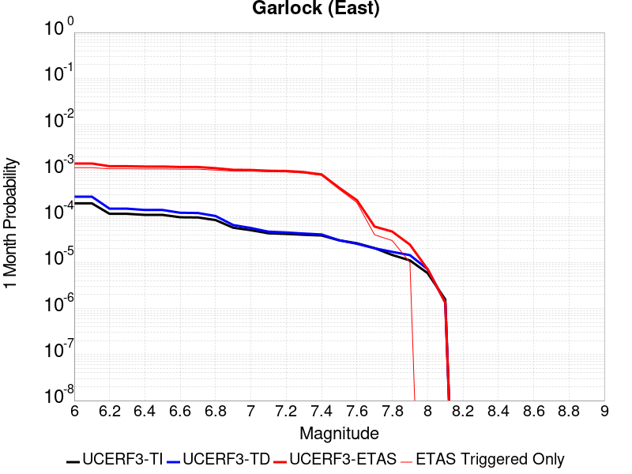 |  |  |

| Magnitude | 1 wk TI Prob | 1 wk TD Prob | 1 wk ETAS Prob | 1 wk ETAS/TD Gain | 1 wk ETAS Triggered Only | 1 mo TI Prob | 1 mo TD Prob | 1 mo ETAS Prob | 1 mo ETAS/TD Gain | 1 mo ETAS Triggered Only | 1 yr TI Prob | 1 yr TD Prob | 1 yr ETAS Prob | 1 yr ETAS/TD Gain | 1 yr ETAS Triggered Only | 10 yr TI Prob | 10 yr TD Prob | 10 yr ETAS Prob | 10 yr ETAS/TD Gain | 10 yr ETAS Triggered Only |
|-----|-----|-----|-----|-----|-----|-----|-----|-----|-----|-----|-----|-----|-----|-----|-----|-----|-----|-----|-----|-----|
| 6.0 | 4.5092507E-5 | 6.2906794E-5 | 6.8416947E-4 | 10.875924 | 6.2130176E-4 | 1.9323928E-4 | 2.695752E-4 | 0.0017188885 | 6.376286 | 0.0014497042 | 0.0023501497 | 0.0032775842 | 0.005784135 | 1.7647555 | 0.0025147928 | 0.023254504 | 0.03235364 | 0.0356173 | 1.1008745 | 0.003372781 |
| 6.1 | 4.5092507E-5 | 6.2906794E-5 | 6.8416947E-4 | 10.875924 | 6.2130176E-4 | 1.9323928E-4 | 2.695752E-4 | 0.0017188885 | 6.376286 | 0.0014497042 | 0.0023501497 | 0.0032775842 | 0.005784135 | 1.7647555 | 0.0025147928 | 0.023254504 | 0.03235364 | 0.0356173 | 1.1008745 | 0.003372781 |
| 6.2 | 2.6674514E-5 | 3.4512483E-5 | 6.26208E-4 | 18.144392 | 5.91716E-4 | 1.1431433E-4 | 1.4790244E-4 | 0.0015086479 | 10.200291 | 0.0013609468 | 0.0013908884 | 0.001799258 | 0.0040142005 | 2.231031 | 0.002218935 | 0.01382215 | 0.017891733 | 0.020855492 | 1.1656497 | 0.0030177515 |
| 6.3 | 2.6674514E-5 | 3.4512483E-5 | 6.26208E-4 | 18.144392 | 5.91716E-4 | 1.1431433E-4 | 1.4790244E-4 | 0.0015086479 | 10.200291 | 0.0013609468 | 0.0013908884 | 0.001799258 | 0.0040142005 | 2.231031 | 0.002218935 | 0.01382215 | 0.017891733 | 0.020855492 | 1.1656497 | 0.0030177515 |
| 6.4 | 2.5312667E-5 | 3.2341675E-5 | 6.240385E-4 | 19.295183 | 5.91716E-4 | 1.0847834E-4 | 1.3859998E-4 | 0.0014993581 | 10.817881 | 0.0013609468 | 0.0013199237 | 0.001686178 | 0.0038718355 | 2.2962198 | 0.0021893492 | 0.013121112 | 0.01677974 | 0.019717764 | 1.1750937 | 0.0029881657 |
| 6.5 | 2.5312667E-5 | 3.2341675E-5 | 6.240385E-4 | 19.295183 | 5.91716E-4 | 1.0847834E-4 | 1.3859998E-4 | 0.0014993581 | 10.817881 | 0.0013609468 | 0.0013199237 | 0.001686178 | 0.0038718355 | 2.2962198 | 0.0021893492 | 0.013121112 | 0.01677974 | 0.019717764 | 1.1750937 | 0.0029881657 |
| 6.6 | 2.246556E-5 | 2.813642E-5 | 6.1983574E-4 | 22.029661 | 5.91716E-4 | 9.627742E-5 | 1.20579214E-4 | 0.0014813618 | 12.285383 | 0.0013609468 | 0.0011715472 | 0.0014670868 | 0.0036236816 | 2.4699843 | 0.0021597634 | 0.011653901 | 0.014620015 | 0.017535342 | 1.1994065 | 0.00295858 |
| 6.7 | 2.2241198E-5 | 2.7806154E-5 | 6.1950565E-4 | 22.279446 | 5.91716E-4 | 9.531594E-5 | 1.1916392E-4 | 0.0014799485 | 12.419435 | 0.0013609468 | 0.0011598538 | 0.0014498787 | 0.0036065106 | 2.4874568 | 0.0021597634 | 0.011538187 | 0.0144502055 | 0.017366033 | 1.2017845 | 0.00295858 |
| 6.8 | 1.9528685E-5 | 2.3900653E-5 | 6.156025E-4 | 25.756723 | 5.91716E-4 | 8.369167E-5 | 1.0242746E-4 | 0.001433652 | 13.996755 | 0.0013313609 | 0.0010184698 | 0.0012463606 | 0.0033443342 | 2.68328 | 0.0021005918 | 0.010138147 | 0.012437694 | 0.015271823 | 1.227866 | 0.0028698226 |
| 6.9 | 1.3318621E-5 | 1.5201007E-5 | 6.06908E-4 | 39.925514 | 5.91716E-4 | 5.7078556E-5 | 6.514558E-5 | 0.0013372521 | 20.527134 | 0.0012721893 | 6.9470983E-4 | 7.928645E-4 | 0.0027735413 | 3.498128 | 0.0019822486 | 0.0069254204 | 0.007940986 | 0.010641265 | 1.3400433 | 0.0027218936 |
| 7.0 | 1.1760853E-5 | 1.3109839E-5 | 6.0481805E-4 | 46.13467 | 5.91716E-4 | 5.0402683E-5 | 5.618384E-5 | 0.0013283017 | 23.64206 | 0.0012721893 | 6.134799E-4 | 6.838286E-4 | 0.0026647216 | 3.8967683 | 0.0019822486 | 0.0061178906 | 0.006857582 | 0.009531426 | 1.3899108 | 0.0026923076 |
| 7.1 | 1.0064758E-5 | 1.090491E-5 | 6.026144E-4 | 55.260838 | 5.91716E-4 | 4.3133965E-5 | 4.673451E-5 | 0.0013188644 | 28.220354 | 0.0012721893 | 5.2502943E-4 | 5.688476E-4 | 0.0025203996 | 4.4307113 | 0.0019526627 | 0.005237907 | 0.005714025 | 0.008361532 | 1.4633349 | 0.0026627218 |
| 7.2 | 9.768808E-6 | 1.0500772E-5 | 6.022105E-4 | 57.349167 | 5.91716E-4 | 4.186565E-5 | 4.500255E-5 | 0.0013171346 | 29.267998 | 0.0012721893 | 5.095951E-4 | 5.477718E-4 | 0.002499365 | 4.5627847 | 0.0019526627 | 0.0050842804 | 0.005504284 | 0.00815235 | 1.4810917 | 0.0026627218 |
| 7.3 | 9.344516E-6 | 9.946395E-6 | 5.72071E-4 | 57.515408 | 5.621302E-4 | 4.004731E-5 | 4.2626732E-5 | 0.0011964237 | 28.067451 | 0.0011538462 | 4.8746695E-4 | 5.1886035E-4 | 0.0023226577 | 4.4764605 | 0.0018047338 | 0.0048639905 | 0.005215945 | 0.0076587577 | 1.4683356 | 0.0024556213 |
| 7.4 | 9.023491E-6 | 9.49255E-6 | 5.1244634E-4 | 53.984055 | 5.029586E-4 | 3.867153E-5 | 4.068174E-5 | 0.0011057272 | 27.179937 | 0.0010650888 | 4.7072413E-4 | 4.95191E-4 | 0.002121604 | 4.2844157 | 0.0016272189 | 0.004697283 | 0.004979378 | 0.007187264 | 1.443406 | 0.002218935 |
| 7.5 | 7.081253E-6 | 7.0893525E-6 | 2.7335965E-4 | 38.559185 | 2.662722E-4 | 3.0347876E-5 | 3.038259E-5 | 6.812504E-4 | 22.422394 | 6.5088755E-4 | 3.6942272E-4 | 3.6984598E-4 | 0.0012866665 | 3.4789255 | 9.171598E-4 | 0.003688092 | 0.0037251879 | 0.0050221137 | 1.3481505 | 0.0013017751 |
| 7.6 | 6.116396E-6 | 5.9608415E-6 | 1.5388895E-4 | 25.816648 | 1.47929E-4 | 2.6212863E-5 | 2.5546216E-5 | 3.8056672E-4 | 14.897186 | 3.550296E-4 | 3.1909486E-4 | 3.1098103E-4 | 8.433598E-4 | 2.7119331 | 5.325444E-4 | 0.0031863707 | 0.003136586 | 0.003844418 | 1.2256696 | 7.100592E-4 |
| 7.7 | 4.797145E-6 | 4.7587923E-6 | 6.393011E-5 | 13.434104 | 5.9171598E-5 | 2.055903E-5 | 2.0394666E-5 | 1.0915025E-4 | 5.351902 | 8.87574E-5 | 2.5027743E-4 | 2.482769E-4 | 3.6659068E-4 | 1.4765399 | 1.18343196E-4 | 0.0024999576 | 0.002510134 | 0.0026872032 | 1.0705417 | 1.775148E-4 |
| 7.8 | 3.4028885E-6 | 3.979809E-6 | 6.315117E-5 | 15.867888 | 5.9171598E-5 | 1.4583726E-5 | 1.7056214E-5 | 1.058121E-4 | 6.203727 | 8.87574E-5 | 1.775424E-4 | 2.076397E-4 | 2.9637865E-4 | 1.42737 | 8.87574E-5 | 0.0017740062 | 0.0021019245 | 0.0022495426 | 1.07023 | 1.47929E-4 |
| 7.9 | 2.5928412E-6 | 3.373588E-6 | 3.373588E-6 | 1.0 | 0.0 | 1.1112129E-5 | 1.44581545E-5 | 4.4043525E-5 | 3.0462759 | 2.9585799E-5 | 1.3528178E-4 | 1.7601387E-4 | 2.0559446E-4 | 1.1680583 | 2.9585799E-5 | 0.0013519945 | 0.0017818334 | 0.0018408995 | 1.0331491 | 5.9171598E-5 |
| 8.0 | 1.3743648E-6 | 1.673991E-6 | 1.673991E-6 | 1.0 | 0.0 | 5.8901214E-6 | 7.174228E-6 | 7.174228E-6 | 1.0 | 0.0 | 7.1709874E-5 | 8.7342756E-5 | 8.7342756E-5 | 1.0 | 0.0 | 7.1686733E-4 | 8.839922E-4 | 9.1355183E-4 | 1.0334388 | 2.9585799E-5 |
| 8.1 | 3.6733252E-7 | 3.1499187E-7 | 3.1499187E-7 | 1.0 | 0.0 | 1.5742813E-6 | 1.3499646E-6 | 1.3499646E-6 | 1.0 | 0.0 | 1.9166706E-5 | 1.643571E-5 | 1.643571E-5 | 1.0 | 0.0 | 1.9165053E-4 | 1.6643589E-4 | 1.6643589E-4 | 1.0 | 0.0 |

## Hunter Mountain-Saline Valley
*[(top)](#table-of-contents)*

| 1 Week | 1 Month | 1 Year | 10 Year |
|-----|-----|-----|-----|
|  | 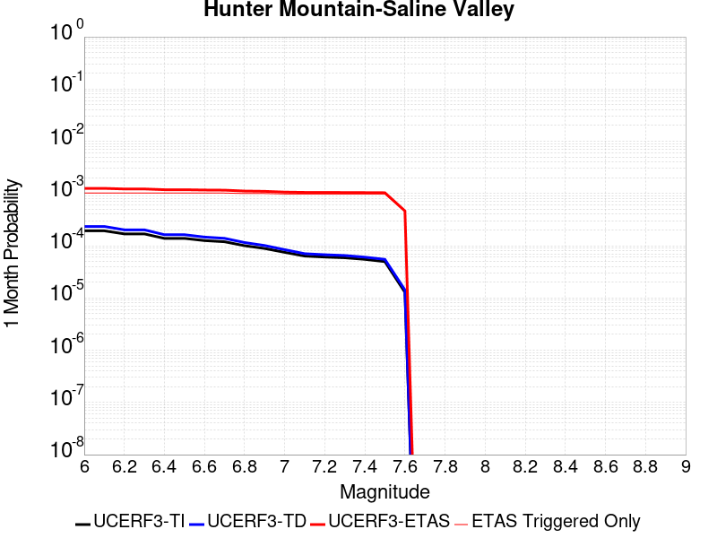 |  |  |

| Magnitude | 1 wk TI Prob | 1 wk TD Prob | 1 wk ETAS Prob | 1 wk ETAS/TD Gain | 1 wk ETAS Triggered Only | 1 mo TI Prob | 1 mo TD Prob | 1 mo ETAS Prob | 1 mo ETAS/TD Gain | 1 mo ETAS Triggered Only | 1 yr TI Prob | 1 yr TD Prob | 1 yr ETAS Prob | 1 yr ETAS/TD Gain | 1 yr ETAS Triggered Only | 10 yr TI Prob | 10 yr TD Prob | 10 yr ETAS Prob | 10 yr ETAS/TD Gain | 10 yr ETAS Triggered Only |
|-----|-----|-----|-----|-----|-----|-----|-----|-----|-----|-----|-----|-----|-----|-----|-----|-----|-----|-----|-----|-----|
| 6.0 | 4.5103672E-5 | 5.4571992E-5 | 4.9833476E-4 | 9.131695 | 4.43787E-4 | 1.9328714E-4 | 2.3385909E-4 | 0.0011803833 | 5.0474124 | 9.4674557E-4 | 0.002350731 | 0.0028436056 | 0.0049087224 | 1.7262318 | 0.002071006 | 0.023260195 | 0.028092787 | 0.030623196 | 1.0900732 | 0.0026035502 |
| 6.1 | 4.5103672E-5 | 5.4571992E-5 | 4.9833476E-4 | 9.131695 | 4.43787E-4 | 1.9328714E-4 | 2.3385909E-4 | 0.0011803833 | 5.0474124 | 9.4674557E-4 | 0.002350731 | 0.0028436056 | 0.0049087224 | 1.7262318 | 0.002071006 | 0.023260195 | 0.028092787 | 0.030623196 | 1.0900732 | 0.0026035502 |
| 6.2 | 3.9363465E-5 | 4.7064877E-5 | 4.90831E-4 | 10.428817 | 4.43787E-4 | 1.6868966E-4 | 2.0169078E-4 | 0.0011482454 | 5.693098 | 9.4674557E-4 | 0.002051862 | 0.0024528939 | 0.00451882 | 1.8422402 | 0.002071006 | 0.020330196 | 0.024274237 | 0.02681459 | 1.1046522 | 0.0026035502 |
| 6.3 | 3.9363465E-5 | 4.7064877E-5 | 4.90831E-4 | 10.428817 | 4.43787E-4 | 1.6868966E-4 | 2.0169078E-4 | 0.0011482454 | 5.693098 | 9.4674557E-4 | 0.002051862 | 0.0024528939 | 0.00451882 | 1.8422402 | 0.002071006 | 0.020330196 | 0.024274237 | 0.02681459 | 1.1046522 | 0.0026035502 |
| 6.4 | 3.2311684E-5 | 3.795214E-5 | 4.8172227E-4 | 12.692888 | 4.43787E-4 | 1.384713E-4 | 1.626423E-4 | 0.0011092338 | 6.8200827 | 9.4674557E-4 | 0.0016845843 | 0.0019784442 | 0.004045353 | 2.044714 | 0.002071006 | 0.016718714 | 0.019617062 | 0.022169538 | 1.1301152 | 0.0026035502 |
| 6.5 | 3.2311684E-5 | 3.795214E-5 | 4.8172227E-4 | 12.692888 | 4.43787E-4 | 1.384713E-4 | 1.626423E-4 | 0.0011092338 | 6.8200827 | 9.4674557E-4 | 0.0016845843 | 0.0019784442 | 0.004045353 | 2.044714 | 0.002071006 | 0.016718714 | 0.019617062 | 0.022169538 | 1.1301152 | 0.0026035502 |
| 6.6 | 2.9305844E-5 | 3.4182853E-5 | 4.7795466E-4 | 13.982292 | 4.43787E-4 | 1.2559042E-4 | 1.4649007E-4 | 0.0010930969 | 7.4619184 | 9.4674557E-4 | 0.0015279909 | 0.0017821203 | 0.0038494354 | 2.1600313 | 0.002071006 | 0.015175272 | 0.017686214 | 0.02024372 | 1.1446043 | 0.0026035502 |
| 6.7 | 2.7826512E-5 | 3.2345237E-5 | 4.7611786E-4 | 14.719875 | 4.43787E-4 | 1.19251024E-4 | 1.3861542E-4 | 0.0010852298 | 7.829069 | 9.4674557E-4 | 0.0014509142 | 0.0016863967 | 0.00375391 | 2.2259948 | 0.002071006 | 0.014414776 | 0.01674368 | 0.019303638 | 1.1528909 | 0.0026035502 |
| 6.8 | 2.3389874E-5 | 2.6867507E-5 | 4.7064255E-4 | 17.517166 | 4.43787E-4 | 1.0023846E-4 | 1.1514164E-4 | 0.0010617782 | 9.221496 | 9.4674557E-4 | 0.00121972 | 0.0014009953 | 0.0034395554 | 2.45508 | 0.0020414202 | 0.01213047 | 0.013927842 | 0.016465956 | 1.1822332 | 0.0025739644 |
| 6.9 | 2.069209E-5 | 2.3570727E-5 | 4.6734724E-4 | 19.827444 | 4.43787E-4 | 8.867737E-5 | 1.0101369E-4 | 0.0010476636 | 10.371501 | 9.4674557E-4 | 0.0010791123 | 0.001229184 | 0.0032680947 | 2.6587515 | 0.0020414202 | 0.010738871 | 0.012228882 | 0.01477137 | 1.2079084 | 0.0025739644 |
| 7.0 | 1.7462342E-5 | 1.9634126E-5 | 4.3382717E-4 | 22.095568 | 4.1420117E-4 | 7.483646E-5 | 8.414367E-5 | 9.7164296E-4 | 11.547427 | 8.87574E-4 | 9.1075303E-4 | 0.0010239903 | 0.0030042091 | 2.9338255 | 0.0019822486 | 0.009070295 | 0.010196352 | 0.012714788 | 1.2469938 | 0.0025443786 |
| 7.1 | 1.4807709E-5 | 1.6442245E-5 | 4.3063663E-4 | 26.190865 | 4.1420117E-4 | 6.3460066E-5 | 7.046495E-5 | 9.579764E-4 | 13.595076 | 8.87574E-4 | 7.723524E-4 | 8.575896E-4 | 0.0028381383 | 3.3094363 | 0.0019822486 | 0.007696735 | 0.008545788 | 0.011068423 | 1.2951905 | 0.0025443786 |
| 7.2 | 1.4180048E-5 | 1.5698814E-5 | 4.298935E-4 | 27.383821 | 4.1420117E-4 | 6.077022E-5 | 6.727898E-5 | 9.5479324E-4 | 14.191552 | 8.87574E-4 | 7.396263E-4 | 8.1883004E-4 | 0.0027994553 | 3.418848 | 0.0019822486 | 0.0073716943 | 0.00816108 | 0.010684694 | 1.3092254 | 0.0025443786 |
| 7.3 | 1.3730402E-5 | 1.5172541E-5 | 4.2936744E-4 | 28.29898 | 4.1420117E-4 | 5.8843252E-5 | 6.502365E-5 | 9.525399E-4 | 14.649131 | 8.87574E-4 | 7.161811E-4 | 7.913914E-4 | 0.0027720712 | 3.5027816 | 0.0019822486 | 0.007138774 | 0.007888664 | 0.010412971 | 1.3199917 | 0.0025443786 |
| 7.4 | 1.2810095E-5 | 1.410972E-5 | 4.2830507E-4 | 30.35532 | 4.1420117E-4 | 5.489925E-5 | 6.0468916E-5 | 9.4798923E-4 | 15.677298 | 8.87574E-4 | 6.681934E-4 | 7.359762E-4 | 0.0027167657 | 3.6913774 | 0.0019822486 | 0.006661878 | 0.0073382827 | 0.00986399 | 1.3441824 | 0.0025443786 |
| 7.5 | 1.1595659E-5 | 1.2801013E-5 | 4.269969E-4 | 33.35649 | 4.1420117E-4 | 4.9694736E-5 | 5.4860422E-5 | 9.423857E-4 | 17.17788 | 8.87574E-4 | 6.0486543E-4 | 6.677366E-4 | 0.0026486616 | 3.9666262 | 0.0019822486 | 0.006032217 | 0.0066601736 | 0.009187606 | 1.3794845 | 0.0025443786 |
| 7.6 | 2.997694E-6 | 3.3252948E-6 | 2.1042519E-4 | 63.280167 | 2.0710059E-4 | 1.28471975E-5 | 1.4251226E-5 | 4.284465E-4 | 30.063835 | 4.1420117E-4 | 1.564034E-4 | 1.7350215E-4 | 0.001149664 | 6.626224 | 9.7633136E-4 | 0.0015629337 | 0.0017351025 | 0.0030641533 | 1.7659783 | 0.0013313609 |

## Garlock (West)
*[(top)](#table-of-contents)*

| 1 Week | 1 Month | 1 Year | 10 Year |
|-----|-----|-----|-----|
|  |  |  |  |

| Magnitude | 1 wk TI Prob | 1 wk TD Prob | 1 wk ETAS Prob | 1 wk ETAS/TD Gain | 1 wk ETAS Triggered Only | 1 mo TI Prob | 1 mo TD Prob | 1 mo ETAS Prob | 1 mo ETAS/TD Gain | 1 mo ETAS Triggered Only | 1 yr TI Prob | 1 yr TD Prob | 1 yr ETAS Prob | 1 yr ETAS/TD Gain | 1 yr ETAS Triggered Only | 10 yr TI Prob | 10 yr TD Prob | 10 yr ETAS Prob | 10 yr ETAS/TD Gain | 10 yr ETAS Triggered Only |
|-----|-----|-----|-----|-----|-----|-----|-----|-----|-----|-----|-----|-----|-----|-----|-----|-----|-----|-----|-----|-----|
| 6.0 | 2.5181727E-5 | 2.5202135E-5 | 3.8022277E-4 | 15.086927 | 3.550296E-4 | 1.0791722E-4 | 1.080047E-4 | 0.0010250654 | 9.490933 | 9.171598E-4 | 0.0013131002 | 0.0013141674 | 0.002909701 | 2.2141023 | 0.0015976331 | 0.013053683 | 0.013144457 | 0.015275831 | 1.16215 | 0.0021597634 |
| 6.1 | 2.5077732E-5 | 2.5103205E-5 | 3.8012388E-4 | 15.142445 | 3.550296E-4 | 1.0747157E-4 | 1.07580745E-4 | 0.0010246418 | 9.524398 | 9.171598E-4 | 0.001307681 | 0.0013090121 | 0.002904554 | 2.2188902 | 0.0015976331 | 0.013000126 | 0.0130935125 | 0.015224997 | 1.1627893 | 0.0021597634 |
| 6.2 | 2.494612E-5 | 2.498488E-5 | 3.800056E-4 | 15.209423 | 3.550296E-4 | 1.0690756E-4 | 1.07073676E-4 | 0.0010241353 | 9.564771 | 9.171598E-4 | 0.0013008224 | 0.0013028459 | 0.0028983976 | 2.2246664 | 0.0015976331 | 0.012932341 | 0.013032575 | 0.015164191 | 1.1635606 | 0.0021597634 |
| 6.3 | 2.4733758E-5 | 2.4804243E-5 | 3.79825E-4 | 15.312905 | 3.550296E-4 | 1.0599751E-4 | 1.0629959E-4 | 0.0010233618 | 9.627148 | 9.171598E-4 | 0.0012897556 | 0.0012934325 | 0.0028889992 | 2.233591 | 0.0015976331 | 0.012822957 | 0.012939542 | 0.0150713585 | 1.1647521 | 0.0021597634 |
| 6.4 | 2.3237335E-5 | 2.318352E-5 | 3.782049E-4 | 16.313522 | 3.550296E-4 | 9.958477E-5 | 9.935417E-5 | 0.0010164228 | 10.230298 | 9.171598E-4 | 0.0012117702 | 0.0012089686 | 0.0028046703 | 2.3198867 | 0.0015976331 | 0.012051838 | 0.012104375 | 0.014237996 | 1.1762686 | 0.0021597634 |
| 6.5 | 2.2732203E-5 | 2.2998063E-5 | 3.780195E-4 | 16.437014 | 3.550296E-4 | 9.742009E-5 | 9.8559416E-5 | 0.0010156288 | 10.304736 | 9.171598E-4 | 0.0011854442 | 0.0011993032 | 0.0027950204 | 2.3305368 | 0.0015976331 | 0.011791403 | 0.012008769 | 0.014142597 | 1.1776891 | 0.0021597634 |
| 6.6 | 2.1319436E-5 | 2.1778224E-5 | 3.7680008E-4 | 17.301691 | 3.550296E-4 | 9.136581E-5 | 9.333192E-5 | 0.0010104061 | 10.825944 | 9.171598E-4 | 0.001111811 | 0.001135726 | 0.0027315447 | 2.405109 | 0.0015976331 | 0.011062649 | 0.0113796545 | 0.01351484 | 1.1876318 | 0.0021597634 |
| 6.7 | 1.970802E-5 | 2.0398069E-5 | 3.754204E-4 | 18.404703 | 3.550296E-4 | 8.446021E-5 | 8.741738E-5 | 0.0010044969 | 11.490815 | 9.171598E-4 | 0.001027818 | 0.0010637887 | 0.0026597222 | 2.5002356 | 0.0015976331 | 0.010230771 | 0.010667368 | 0.012804093 | 1.2003047 | 0.0021597634 |
| 6.8 | 1.8744462E-5 | 1.9905692E-5 | 3.749282E-4 | 18.835226 | 3.550296E-4 | 8.033094E-5 | 8.530733E-5 | 0.0010023889 | 11.750325 | 9.171598E-4 | 9.775903E-4 | 0.0010381235 | 0.002634098 | 2.537365 | 0.0015976331 | 0.009733009 | 0.010413141 | 0.012550415 | 1.2052478 | 0.0021597634 |
| 6.9 | 1.7559682E-5 | 1.895803E-5 | 3.7398087E-4 | 19.72678 | 3.550296E-4 | 7.5253614E-5 | 8.124618E-5 | 9.983315E-4 | 12.287734 | 9.171598E-4 | 9.158276E-4 | 9.887248E-4 | 0.0025847782 | 2.6142547 | 0.0015976331 | 0.0091206245 | 0.009923607 | 0.012061938 | 1.2154791 | 0.0021597634 |
| 7.0 | 1.6794445E-5 | 1.8220819E-5 | 3.7324394E-4 | 20.484476 | 3.550296E-4 | 7.197421E-5 | 7.8086894E-5 | 9.95175E-4 | 12.744457 | 9.171598E-4 | 8.759337E-4 | 9.5029466E-4 | 0.0025464096 | 2.6796 | 0.0015976331 | 0.008724891 | 0.0095425 | 0.011681654 | 1.2241713 | 0.0021597634 |
| 7.1 | 1.6337795E-5 | 1.7721602E-5 | 3.727449E-4 | 21.033363 | 3.550296E-4 | 7.0017246E-5 | 7.5947515E-5 | 9.930376E-4 | 13.075314 | 9.171598E-4 | 8.521265E-4 | 9.2427013E-4 | 0.0025204266 | 2.7269373 | 0.0015976331 | 0.008488664 | 0.009284343 | 0.011424054 | 1.2304645 | 0.0021597634 |
| 7.2 | 1.5780008E-5 | 1.7170225E-5 | 3.7219372E-4 | 21.676695 | 3.550296E-4 | 6.762685E-5 | 7.358461E-5 | 9.906769E-4 | 13.4630995 | 9.171598E-4 | 8.2304585E-4 | 8.955257E-4 | 0.0024917282 | 2.7824194 | 0.0015976331 | 0.008200042 | 0.008999176 | 0.011139504 | 1.2378359 | 0.0021597634 |
| 7.3 | 1.5058865E-5 | 1.6623266E-5 | 3.7164695E-4 | 22.357037 | 3.550296E-4 | 6.45364E-5 | 7.124063E-5 | 9.88335E-4 | 13.873194 | 9.171598E-4 | 7.854473E-4 | 8.6701073E-4 | 0.0024632586 | 2.8410938 | 0.0015976331 | 0.00782677 | 0.00871586 | 0.010856799 | 1.2456372 | 0.0021597634 |
| 7.4 | 1.4887923E-5 | 1.6459222E-5 | 3.7148295E-4 | 22.569899 | 3.550296E-4 | 6.380382E-5 | 7.053762E-5 | 9.876327E-4 | 14.001503 | 9.171598E-4 | 7.7653467E-4 | 8.5845834E-4 | 0.00245472 | 2.8594515 | 0.0015976331 | 0.0077382675 | 0.0086307125 | 0.010771836 | 1.2480818 | 0.0021597634 |
| 7.5 | 1.4509299E-5 | 1.6051208E-5 | 3.4148977E-4 | 21.27502 | 3.2544378E-4 | 6.218123E-5 | 6.8789086E-5 | 8.971345E-4 | 13.041815 | 8.2840235E-4 | 7.567935E-4 | 8.3718647E-4 | 0.002285677 | 2.7301886 | 0.0014497042 | 0.0075422134 | 0.008419003 | 0.010325889 | 1.2264979 | 0.0019230769 |
| 7.6 | 1.2756717E-5 | 1.4055129E-5 | 1.6198204E-4 | 11.524764 | 1.47929E-4 | 5.4670498E-5 | 6.023488E-5 | 4.448271E-4 | 7.3848753 | 3.8461538E-4 | 6.6541E-4 | 7.331136E-4 | 0.0015904728 | 2.1694765 | 8.5798814E-4 | 0.006634211 | 0.007383898 | 0.008499857 | 1.1511341 | 0.0011242604 |
| 7.7 | 1.0328985E-5 | 1.1464573E-5 | 7.063549E-5 | 6.161197 | 5.9171598E-5 | 4.4266326E-5 | 4.913296E-5 | 1.6747034E-4 | 3.4085133 | 1.18343196E-4 | 5.388092E-4 | 5.9803E-4 | 9.824154E-4 | 1.6427526 | 3.8461538E-4 | 0.0053750467 | 0.0060405903 | 0.006569918 | 1.0876285 | 5.325444E-4 |
| 7.8 | 7.0306583E-6 | 8.902813E-6 | 6.807388E-5 | 7.6463346 | 5.9171598E-5 | 3.0131043E-5 | 3.8154354E-5 | 1.5649303E-4 | 4.1015773 | 1.18343196E-4 | 3.667837E-4 | 4.644304E-4 | 6.714348E-4 | 1.4457167 | 2.0710059E-4 | 0.003661789 | 0.0046969377 | 0.004991406 | 1.0626937 | 2.95858E-4 |
| 7.9 | 4.060633E-6 | 5.4672782E-6 | 5.4672782E-6 | 1.0 | 0.0 | 1.7402595E-5 | 2.3430983E-5 | 8.26012E-5 | 3.5252979 | 5.9171598E-5 | 2.11856E-4 | 2.8523497E-4 | 3.7396705E-4 | 1.3110842 | 8.87574E-5 | 0.0021165414 | 0.0028851798 | 0.003032682 | 1.0511241 | 1.47929E-4 |
| 8.0 | 1.6729537E-6 | 2.078155E-6 | 2.078155E-6 | 1.0 | 0.0 | 7.169782E-6 | 8.906349E-6 | 8.906349E-6 | 1.0 | 0.0 | 8.7288594E-5 | 1.08429434E-4 | 1.08429434E-4 | 1.0 | 0.0 | 8.7254314E-4 | 0.001097267 | 0.0011268203 | 1.0269336 | 2.9585799E-5 |
| 8.1 | 3.6733252E-7 | 3.1499187E-7 | 3.1499187E-7 | 1.0 | 0.0 | 1.5742813E-6 | 1.3499646E-6 | 1.3499646E-6 | 1.0 | 0.0 | 1.9166706E-5 | 1.643571E-5 | 1.643571E-5 | 1.0 | 0.0 | 1.9165053E-4 | 1.6643589E-4 | 1.6643589E-4 | 1.0 | 0.0 |

## Blackwater
*[(top)](#table-of-contents)*

| 1 Week | 1 Month | 1 Year | 10 Year |
|-----|-----|-----|-----|
|  |  |  |  |

| Magnitude | 1 wk TI Prob | 1 wk TD Prob | 1 wk ETAS Prob | 1 wk ETAS/TD Gain | 1 wk ETAS Triggered Only | 1 mo TI Prob | 1 mo TD Prob | 1 mo ETAS Prob | 1 mo ETAS/TD Gain | 1 mo ETAS Triggered Only | 1 yr TI Prob | 1 yr TD Prob | 1 yr ETAS Prob | 1 yr ETAS/TD Gain | 1 yr ETAS Triggered Only | 10 yr TI Prob | 10 yr TD Prob | 10 yr ETAS Prob | 10 yr ETAS/TD Gain | 10 yr ETAS Triggered Only |
|-----|-----|-----|-----|-----|-----|-----|-----|-----|-----|-----|-----|-----|-----|-----|-----|-----|-----|-----|-----|-----|
| 6.0 | 3.0708583E-5 | 3.309619E-5 | 1.8102028E-4 | 5.4695206 | 1.47929E-4 | 1.3160157E-4 | 1.4183388E-4 | 5.559763E-4 | 3.919912 | 4.1420117E-4 | 0.0016010714 | 0.0017255963 | 0.002463965 | 1.4278919 | 7.39645E-4 | 0.015895851 | 0.017135808 | 0.01832804 | 1.0695754 | 0.0012130177 |
| 6.1 | 3.0708583E-5 | 3.309619E-5 | 1.8102028E-4 | 5.4695206 | 1.47929E-4 | 1.3160157E-4 | 1.4183388E-4 | 5.559763E-4 | 3.919912 | 4.1420117E-4 | 0.0016010714 | 0.0017255963 | 0.002463965 | 1.4278919 | 7.39645E-4 | 0.015895851 | 0.017135808 | 0.01832804 | 1.0695754 | 0.0012130177 |
| 6.2 | 1.1707779E-5 | 1.2545242E-5 | 7.1716095E-5 | 5.7165976 | 5.9171598E-5 | 5.017523E-5 | 5.3764266E-5 | 2.9043792E-4 | 5.4020624 | 2.3668639E-4 | 6.107122E-4 | 6.5439293E-4 | 9.796238E-4 | 1.4969962 | 3.2544378E-4 | 0.006090366 | 0.006525631 | 0.0070253075 | 1.0765713 | 5.029586E-4 |
| 6.3 | 1.1707779E-5 | 1.2545242E-5 | 7.1716095E-5 | 5.7165976 | 5.9171598E-5 | 5.017523E-5 | 5.3764266E-5 | 2.9043792E-4 | 5.4020624 | 2.3668639E-4 | 6.107122E-4 | 6.5439293E-4 | 9.796238E-4 | 1.4969962 | 3.2544378E-4 | 0.006090366 | 0.006525631 | 0.0070253075 | 1.0765713 | 5.029586E-4 |
| 6.4 | 7.929244E-6 | 8.480176E-6 | 6.765127E-5 | 7.9775786 | 5.9171598E-5 | 3.3982033E-5 | 3.6343128E-5 | 1.8426674E-4 | 5.0701947 | 1.47929E-4 | 4.136527E-4 | 4.4239179E-4 | 6.4940075E-4 | 1.4679313 | 2.0710059E-4 | 0.0041288356 | 0.0044155167 | 0.0047395234 | 1.0733792 | 3.2544378E-4 |
| 6.5 | 5.8832115E-6 | 6.286048E-6 | 3.587166E-5 | 5.706552 | 2.9585799E-5 | 2.521352E-5 | 2.6939942E-5 | 1.15694944E-4 | 4.294551 | 8.87574E-5 | 3.0693135E-4 | 3.2794697E-4 | 4.4625136E-4 | 1.3607424 | 1.18343196E-4 | 0.0030650778 | 0.0032748834 | 0.003481306 | 1.063032 | 2.0710059E-4 |
| 6.6 | 5.8832115E-6 | 6.286048E-6 | 3.587166E-5 | 5.706552 | 2.9585799E-5 | 2.521352E-5 | 2.6939942E-5 | 1.15694944E-4 | 4.294551 | 8.87574E-5 | 3.0693135E-4 | 3.2794697E-4 | 4.4625136E-4 | 1.3607424 | 1.18343196E-4 | 0.0030650778 | 0.0032748834 | 0.003481306 | 1.063032 | 2.0710059E-4 |
| 6.7 | 3.0715053E-6 | 3.281496E-6 | 3.281496E-6 | 1.0 | 0.0 | 1.3163528E-5 | 1.4063485E-5 | 4.3648866E-5 | 3.103702 | 2.9585799E-5 | 1.6025416E-4 | 1.7121063E-4 | 2.0079137E-4 | 1.172774 | 2.9585799E-5 | 0.0016013865 | 0.0017109019 | 0.0017699723 | 1.0345259 | 5.9171598E-5 |
| 6.8 | 2.2722281E-6 | 2.4287758E-6 | 2.4287758E-6 | 1.0 | 0.0 | 9.738084E-6 | 1.0409003E-5 | 3.9994495E-5 | 3.8422983 | 2.9585799E-5 | 1.1855473E-4 | 1.2672316E-4 | 1.563052E-4 | 1.2334384 | 2.9585799E-5 | 0.001184915 | 0.0012665992 | 0.0012961475 | 1.0233289 | 2.9585799E-5 |
| 6.9 | 9.952399E-7 | 1.0653588E-6 | 1.0653588E-6 | 1.0 | 0.0 | 4.265307E-6 | 4.5658185E-6 | 4.5658185E-6 | 1.0 | 0.0 | 5.1928873E-5 | 5.5587938E-5 | 5.5587938E-5 | 1.0 | 0.0 | 5.191674E-4 | 5.5579096E-4 | 5.5579096E-4 | 1.0 | 0.0 |
| 7.0 | 4.7385504E-7 | 5.0756074E-7 | 5.0756074E-7 | 1.0 | 0.0 | 2.0308057E-6 | 2.1752603E-6 | 2.1752603E-6 | 1.0 | 0.0 | 2.4724779E-5 | 2.6483794E-5 | 2.6483794E-5 | 1.0 | 0.0 | 2.4722028E-4 | 2.6483793E-4 | 2.6483793E-4 | 1.0 | 0.0 |

## Ash Hill
*[(top)](#table-of-contents)*

| 1 Week | 1 Month | 1 Year | 10 Year |
|-----|-----|-----|-----|
|  |  |  |  |

| Magnitude | 1 wk TI Prob | 1 wk TD Prob | 1 wk ETAS Prob | 1 wk ETAS/TD Gain | 1 wk ETAS Triggered Only | 1 mo TI Prob | 1 mo TD Prob | 1 mo ETAS Prob | 1 mo ETAS/TD Gain | 1 mo ETAS Triggered Only | 1 yr TI Prob | 1 yr TD Prob | 1 yr ETAS Prob | 1 yr ETAS/TD Gain | 1 yr ETAS Triggered Only | 10 yr TI Prob | 10 yr TD Prob | 10 yr ETAS Prob | 10 yr ETAS/TD Gain | 10 yr ETAS Triggered Only |
|-----|-----|-----|-----|-----|-----|-----|-----|-----|-----|-----|-----|-----|-----|-----|-----|-----|-----|-----|-----|-----|
| 6.0 | 2.1545662E-5 | 2.3194681E-5 | 1.7112025E-4 | 7.3775635 | 1.47929E-4 | 9.2335285E-5 | 9.9402445E-5 | 4.248139E-4 | 4.2736764 | 3.2544378E-4 | 0.0011236023 | 0.0012096328 | 0.001977933 | 1.6351516 | 7.6923077E-4 | 0.011179381 | 0.01203847 | 0.013119967 | 1.0898367 | 0.0010946746 |
| 6.1 | 2.1545662E-5 | 2.3194681E-5 | 1.7112025E-4 | 7.3775635 | 1.47929E-4 | 9.2335285E-5 | 9.9402445E-5 | 4.248139E-4 | 4.2736764 | 3.2544378E-4 | 0.0011236023 | 0.0012096328 | 0.001977933 | 1.6351516 | 7.6923077E-4 | 0.011179381 | 0.01203847 | 0.013119967 | 1.0898367 | 0.0010946746 |
| 6.2 | 2.1545662E-5 | 2.3194681E-5 | 1.7112025E-4 | 7.3775635 | 1.47929E-4 | 9.2335285E-5 | 9.9402445E-5 | 4.248139E-4 | 4.2736764 | 3.2544378E-4 | 0.0011236023 | 0.0012096328 | 0.001977933 | 1.6351516 | 7.6923077E-4 | 0.011179381 | 0.01203847 | 0.013119967 | 1.0898367 | 0.0010946746 |
| 6.3 | 1.0025529E-5 | 1.0747037E-5 | 9.950348E-5 | 9.25869 | 8.87574E-5 | 4.2965847E-5 | 4.605799E-5 | 2.2356461E-4 | 4.853981 | 1.775148E-4 | 5.229836E-4 | 5.60625E-4 | 9.450248E-4 | 1.6856629 | 3.8461538E-4 | 0.005217545 | 0.0055934195 | 0.006093565 | 1.0894167 | 5.029586E-4 |
| 6.4 | 1.0025529E-5 | 1.0747037E-5 | 9.950348E-5 | 9.25869 | 8.87574E-5 | 4.2965847E-5 | 4.605799E-5 | 2.2356461E-4 | 4.853981 | 1.775148E-4 | 5.229836E-4 | 5.60625E-4 | 9.450248E-4 | 1.6856629 | 3.8461538E-4 | 0.005217545 | 0.0055934195 | 0.006093565 | 1.0894167 | 5.029586E-4 |
| 6.5 | 6.9617327E-6 | 7.456704E-6 | 3.7042282E-5 | 4.967648 | 2.9585799E-5 | 2.9835655E-5 | 3.1956963E-5 | 1.2071152E-4 | 3.7773154 | 8.87574E-5 | 3.6318856E-4 | 3.8901521E-4 | 6.2560954E-4 | 1.6081878 | 2.3668639E-4 | 0.0036259557 | 0.0038841967 | 0.004178906 | 1.0758739 | 2.95858E-4 |
| 6.6 | 4.9919777E-6 | 5.346739E-6 | 5.346739E-6 | 1.0 | 0.0 | 2.1394015E-5 | 2.2914432E-5 | 8.208467E-5 | 3.582226 | 5.9171598E-5 | 2.60441E-4 | 2.789542E-4 | 4.268419E-4 | 1.5301507 | 1.47929E-4 | 0.0026013597 | 0.0027866988 | 0.002963719 | 1.0635232 | 1.775148E-4 |
| 6.7 | 3.6630722E-6 | 3.9246606E-6 | 3.9246606E-6 | 1.0 | 0.0 | 1.5698786E-5 | 1.6819899E-5 | 7.59905E-5 | 4.517893 | 5.9171598E-5 | 1.9111596E-4 | 2.0476876E-4 | 3.2308773E-4 | 1.5778174 | 1.18343196E-4 | 0.0019095168 | 0.002046364 | 0.0021939902 | 1.0721408 | 1.47929E-4 |
| 6.8 | 2.5599613E-6 | 2.7449514E-6 | 2.7449514E-6 | 1.0 | 0.0 | 1.0971216E-5 | 1.1764052E-5 | 7.0934955E-5 | 6.029806 | 5.9171598E-5 | 1.3356637E-4 | 1.4322287E-4 | 2.615491E-4 | 1.8261687 | 1.18343196E-4 | 0.0013348613 | 0.0014317906 | 0.0015795078 | 1.1031696 | 1.47929E-4 |
| 6.9 | 1.7684905E-6 | 1.896889E-6 | 1.896889E-6 | 1.0 | 0.0 | 7.579223E-6 | 8.129524E-6 | 6.730064E-5 | 8.278546 | 5.9171598E-5 | 9.2273134E-5 | 9.8976954E-5 | 2.1730844E-4 | 2.1955457 | 1.18343196E-4 | 9.223483E-4 | 9.897696E-4 | 0.0011079956 | 1.1194481 | 1.18343196E-4 |

## Gravel Hills-Harper Lk
*[(top)](#table-of-contents)*

| 1 Week | 1 Month | 1 Year | 10 Year |
|-----|-----|-----|-----|
|  |  | 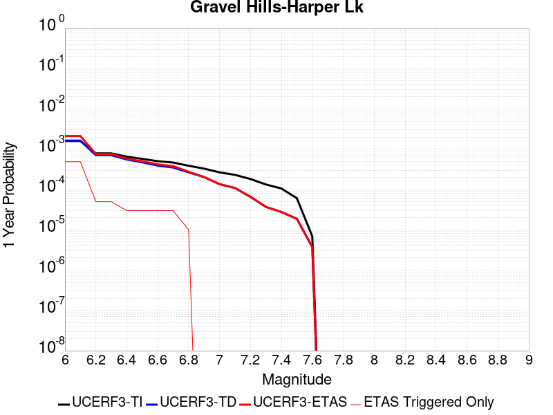 |  |

| Magnitude | 1 wk TI Prob | 1 wk TD Prob | 1 wk ETAS Prob | 1 wk ETAS/TD Gain | 1 wk ETAS Triggered Only | 1 mo TI Prob | 1 mo TD Prob | 1 mo ETAS Prob | 1 mo ETAS/TD Gain | 1 mo ETAS Triggered Only | 1 yr TI Prob | 1 yr TD Prob | 1 yr ETAS Prob | 1 yr ETAS/TD Gain | 1 yr ETAS Triggered Only | 10 yr TI Prob | 10 yr TD Prob | 10 yr ETAS Prob | 10 yr ETAS/TD Gain | 10 yr ETAS Triggered Only |
|-----|-----|-----|-----|-----|-----|-----|-----|-----|-----|-----|-----|-----|-----|-----|-----|-----|-----|-----|-----|-----|
| 6.0 | 3.0679566E-5 | 3.1465184E-5 | 1.4980466E-4 | 4.7609653 | 1.18343196E-4 | 1.3147724E-4 | 1.3484505E-4 | 3.714995E-4 | 2.7550106 | 2.3668639E-4 | 0.0015995599 | 0.0016407187 | 0.0022905383 | 1.396058 | 6.5088755E-4 | 0.015880952 | 0.016307615 | 0.017064301 | 1.0464008 | 7.6923077E-4 |
| 6.1 | 3.0679566E-5 | 3.1465184E-5 | 1.4980466E-4 | 4.7609653 | 1.18343196E-4 | 1.3147724E-4 | 1.3484505E-4 | 3.714995E-4 | 2.7550106 | 2.3668639E-4 | 0.0015995599 | 0.0016407187 | 0.0022905383 | 1.396058 | 6.5088755E-4 | 0.015880952 | 0.016307615 | 0.017064301 | 1.0464008 | 7.6923077E-4 |
| 6.2 | 1.514536E-5 | 1.3635392E-5 | 4.322079E-5 | 3.1697502 | 2.9585799E-5 | 6.490707E-5 | 5.843615E-5 | 1.1760429E-4 | 2.0125263 | 5.9171598E-5 | 7.8995706E-4 | 7.112398E-4 | 8.294988E-4 | 1.1662717 | 1.18343196E-4 | 0.007871548 | 0.0070908363 | 0.0072670924 | 1.0248569 | 1.775148E-4 |
| 6.3 | 1.514536E-5 | 1.3635392E-5 | 4.322079E-5 | 3.1697502 | 2.9585799E-5 | 6.490707E-5 | 5.843615E-5 | 1.1760429E-4 | 2.0125263 | 5.9171598E-5 | 7.8995706E-4 | 7.112398E-4 | 8.294988E-4 | 1.1662717 | 1.18343196E-4 | 0.007871548 | 0.0070908363 | 0.0072670924 | 1.0248569 | 1.775148E-4 |
| 6.4 | 1.2532521E-5 | 1.0689826E-5 | 1.0689826E-5 | 1.0 | 0.0 | 5.37097E-5 | 4.581277E-5 | 4.581277E-5 | 1.0 | 0.0 | 6.537194E-4 | 5.576335E-4 | 6.1677216E-4 | 1.1060528 | 5.9171598E-5 | 0.0065179965 | 0.0055629327 | 0.005680618 | 1.0211552 | 1.18343196E-4 |
| 6.5 | 1.1094058E-5 | 9.083774E-6 | 9.083774E-6 | 1.0 | 0.0 | 4.7545094E-5 | 3.89299E-5 | 3.89299E-5 | 1.0 | 0.0 | 5.787078E-4 | 4.738725E-4 | 5.3301605E-4 | 1.124809 | 5.9171598E-5 | 0.0057720304 | 0.004729028 | 0.0047879196 | 1.0124532 | 5.9171598E-5 |
| 6.6 | 9.688328E-6 | 7.531784E-6 | 7.531784E-6 | 1.0 | 0.0 | 4.1520743E-5 | 3.2278687E-5 | 3.2278687E-5 | 1.0 | 0.0 | 5.053978E-4 | 3.929247E-4 | 4.5207306E-4 | 1.1505336 | 5.9171598E-5 | 0.0050424994 | 0.0039225565 | 0.003981496 | 1.0150257 | 5.9171598E-5 |
| 6.7 | 8.974824E-6 | 6.7494916E-6 | 6.7494916E-6 | 1.0 | 0.0 | 3.8462964E-5 | 2.8926084E-5 | 2.8926084E-5 | 1.0 | 0.0 | 4.6818596E-4 | 3.5212038E-4 | 4.1127115E-4 | 1.1679845 | 5.9171598E-5 | 0.004672008 | 0.0035158454 | 0.003574809 | 1.0167708 | 5.9171598E-5 |
| 6.8 | 7.4780046E-6 | 5.116252E-6 | 5.116252E-6 | 1.0 | 0.0 | 3.20482E-5 | 2.1926619E-5 | 2.1926619E-5 | 1.0 | 0.0 | 3.9011694E-4 | 2.6692526E-4 | 2.9650316E-4 | 1.1108097 | 2.9585799E-5 | 0.0038943281 | 0.002666185 | 0.0026956918 | 1.0110672 | 2.9585799E-5 |
| 6.9 | 6.3409307E-6 | 3.9075426E-6 | 3.9075426E-6 | 1.0 | 0.0 | 2.7175134E-5 | 1.674651E-5 | 1.674651E-5 | 1.0 | 0.0 | 3.3080703E-4 | 2.0387067E-4 | 2.0387067E-4 | 1.0 | 0.0 | 0.0033031502 | 0.0020369345 | 0.0020369345 | 1.0 | 0.0 |
| 7.0 | 5.1239335E-6 | 2.6058885E-6 | 2.6058885E-6 | 1.0 | 0.0 | 2.195953E-5 | 1.11680465E-5 | 1.11680465E-5 | 1.0 | 0.0 | 2.6732447E-4 | 1.3596273E-4 | 1.3596273E-4 | 1.0 | 0.0 | 0.0026700313 | 0.0013588208 | 0.0013588208 | 1.0 | 0.0 |
| 7.1 | 4.438899E-6 | 2.0984994E-6 | 2.0984994E-6 | 1.0 | 0.0 | 1.9023713E-5 | 8.993539E-6 | 8.993539E-6 | 1.0 | 0.0 | 2.315891E-4 | 1.0949106E-4 | 1.0949106E-4 | 1.0 | 0.0 | 0.002313479 | 0.0010943931 | 0.0010943931 | 1.0 | 0.0 |
| 7.2 | 3.50367E-6 | 1.2615911E-6 | 1.2615911E-6 | 1.0 | 0.0 | 1.5015643E-5 | 5.406808E-6 | 5.406808E-6 | 1.0 | 0.0 | 1.8280011E-4 | 6.582599E-5 | 6.582599E-5 | 1.0 | 0.0 | 0.0018264982 | 6.580731E-4 | 6.580731E-4 | 1.0 | 0.0 |
| 7.3 | 2.561638E-6 | 7.119307E-7 | 7.119307E-7 | 1.0 | 0.0 | 1.0978401E-5 | 3.051128E-6 | 3.051128E-6 | 1.0 | 0.0 | 1.3365384E-4 | 3.714687E-5 | 3.714687E-5 | 1.0 | 0.0 | 0.0013357349 | 3.7140862E-4 | 3.7140862E-4 | 1.0 | 0.0 |
| 7.4 | 2.0368864E-6 | 5.304955E-7 | 5.304955E-7 | 1.0 | 0.0 | 8.729483E-6 | 2.2735503E-6 | 2.2735503E-6 | 1.0 | 0.0 | 1.06276275E-4 | 2.768013E-5 | 2.768013E-5 | 1.0 | 0.0 | 0.0010622547 | 2.7676736E-4 | 2.7676736E-4 | 1.0 | 0.0 |
| 7.5 | 1.1681728E-6 | 3.6031287E-7 | 3.6031287E-7 | 1.0 | 0.0 | 5.0064455E-6 | 1.5441972E-6 | 1.5441972E-6 | 1.0 | 0.0 | 6.0951766E-5 | 1.8800443E-5 | 1.8800443E-5 | 1.0 | 0.0 | 6.093505E-4 | 1.8798899E-4 | 1.8798899E-4 | 1.0 | 0.0 |
| 7.6 | 1.3154387E-7 | 7.1198265E-8 | 7.1198265E-8 | 1.0 | 0.0 | 5.6375933E-7 | 3.051354E-7 | 3.051354E-7 | 1.0 | 0.0 | 6.863748E-6 | 3.7150185E-6 | 3.7150185E-6 | 1.0 | 0.0 | 6.863536E-5 | 3.7149723E-5 | 3.7149723E-5 | 1.0 | 0.0 |

## San Andreas (Mojave S)
*[(top)](#table-of-contents)*

| 1 Week | 1 Month | 1 Year | 10 Year |
|-----|-----|-----|-----|
|  | 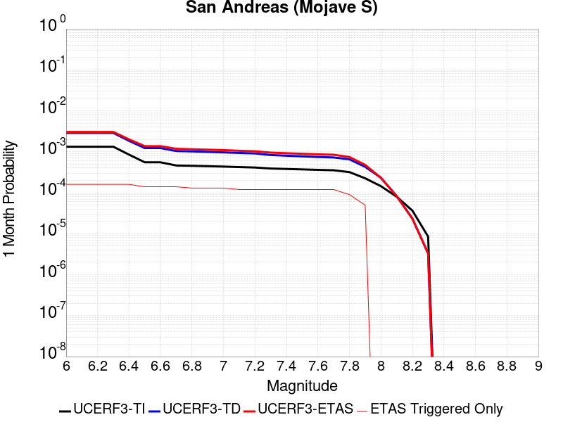 |  |  |

| Magnitude | 1 wk TI Prob | 1 wk TD Prob | 1 wk ETAS Prob | 1 wk ETAS/TD Gain | 1 wk ETAS Triggered Only | 1 mo TI Prob | 1 mo TD Prob | 1 mo ETAS Prob | 1 mo ETAS/TD Gain | 1 mo ETAS Triggered Only | 1 yr TI Prob | 1 yr TD Prob | 1 yr ETAS Prob | 1 yr ETAS/TD Gain | 1 yr ETAS Triggered Only | 10 yr TI Prob | 10 yr TD Prob | 10 yr ETAS Prob | 10 yr ETAS/TD Gain | 10 yr ETAS Triggered Only |
|-----|-----|-----|-----|-----|-----|-----|-----|-----|-----|-----|-----|-----|-----|-----|-----|-----|-----|-----|-----|-----|
| 6.0 | 3.1064058E-4 | 6.747043E-4 | 7.929677E-4 | 1.1752818 | 1.18343196E-4 | 0.0013306376 | 0.002888514 | 0.0030950163 | 1.0714909 | 2.0710059E-4 | 0.016080605 | 0.03462661 | 0.035112154 | 1.0140222 | 5.029586E-4 | 0.1496549 | 0.28663692 | 0.28708014 | 1.0015463 | 6.2130176E-4 |
| 6.1 | 3.1064058E-4 | 6.747043E-4 | 7.929677E-4 | 1.1752818 | 1.18343196E-4 | 0.0013306376 | 0.002888514 | 0.0030950163 | 1.0714909 | 2.0710059E-4 | 0.016080605 | 0.03462661 | 0.035112154 | 1.0140222 | 5.029586E-4 | 0.1496549 | 0.28663692 | 0.28708014 | 1.0015463 | 6.2130176E-4 |
| 6.2 | 3.1064058E-4 | 6.747043E-4 | 7.929677E-4 | 1.1752818 | 1.18343196E-4 | 0.0013306376 | 0.002888514 | 0.0030950163 | 1.0714909 | 2.0710059E-4 | 0.016080605 | 0.03462661 | 0.035112154 | 1.0140222 | 5.029586E-4 | 0.1496549 | 0.28663692 | 0.28708014 | 1.0015463 | 6.2130176E-4 |
| 6.3 | 3.1064058E-4 | 6.747043E-4 | 7.929677E-4 | 1.1752818 | 1.18343196E-4 | 0.0013306376 | 0.002888514 | 0.0030950163 | 1.0714909 | 2.0710059E-4 | 0.016080605 | 0.03462661 | 0.035112154 | 1.0140222 | 5.029586E-4 | 0.1496549 | 0.28663692 | 0.28708014 | 1.0015463 | 6.2130176E-4 |
| 6.4 | 1.9872203E-4 | 4.318848E-4 | 5.501769E-4 | 1.2738973 | 1.18343196E-4 | 8.5138786E-4 | 0.0018496502 | 0.0020563677 | 1.1117604 | 2.0710059E-4 | 0.010316478 | 0.022293096 | 0.02272699 | 1.0194632 | 4.43787E-4 | 0.098504856 | 0.19703239 | 0.19748376 | 1.0022908 | 5.621302E-4 |
| 6.5 | 1.291105E-4 | 2.8761322E-4 | 3.4676777E-4 | 1.205674 | 5.9171598E-5 | 5.5321335E-4 | 0.0012320485 | 0.0013797953 | 1.1199195 | 1.47929E-4 | 0.006714592 | 0.0148978485 | 0.015276734 | 1.0254322 | 3.8461538E-4 | 0.065152965 | 0.13807017 | 0.13850369 | 1.0031399 | 5.029586E-4 |
| 6.6 | 1.291105E-4 | 2.8761322E-4 | 3.4676777E-4 | 1.205674 | 5.9171598E-5 | 5.5321335E-4 | 0.0012320485 | 0.0013797953 | 1.1199195 | 1.47929E-4 | 0.006714592 | 0.0148978485 | 0.015276734 | 1.0254322 | 3.8461538E-4 | 0.065152965 | 0.13807017 | 0.13850369 | 1.0031399 | 5.029586E-4 |
| 6.7 | 1.08001186E-4 | 2.4342406E-4 | 3.0258126E-4 | 1.2430211 | 5.9171598E-5 | 4.6278012E-4 | 0.0010428295 | 0.0011906042 | 1.1417055 | 1.47929E-4 | 0.0056198016 | 0.012622835 | 0.013002596 | 1.0300852 | 3.8461538E-4 | 0.054797906 | 0.11921291 | 0.11965591 | 1.003716 | 5.029586E-4 |
| 6.8 | 1.0624356E-4 | 2.3860046E-4 | 2.9775794E-4 | 1.2479353 | 5.9171598E-5 | 4.5525006E-4 | 0.0010221732 | 0.0011403954 | 1.1156577 | 1.18343196E-4 | 0.0055285925 | 0.01237422 | 0.012724857 | 1.028336 | 3.550296E-4 | 0.053930566 | 0.117162056 | 0.11757997 | 1.003567 | 4.7337278E-4 |
| 6.9 | 1.0393785E-4 | 2.3230357E-4 | 2.9146142E-4 | 1.2546575 | 5.9171598E-5 | 4.4537184E-4 | 9.952073E-4 | 0.0011134328 | 1.1187948 | 1.18343196E-4 | 0.0054089287 | 0.012049583 | 0.012400335 | 1.029109 | 3.550296E-4 | 0.05279156 | 0.11445948 | 0.11487867 | 1.0036623 | 4.7337278E-4 |
| 7.0 | 1.0155622E-4 | 2.2599897E-4 | 2.851572E-4 | 1.2617632 | 5.9171598E-5 | 4.3516833E-4 | 9.682079E-4 | 0.0010864364 | 1.1221107 | 1.18343196E-4 | 0.005285311 | 0.011724443 | 0.012075311 | 1.0299261 | 3.550296E-4 | 0.05161361 | 0.11171984 | 0.11214033 | 1.0037638 | 4.7337278E-4 |
| 7.1 | 9.885595E-5 | 2.1888265E-4 | 2.780413E-4 | 1.2702756 | 5.9171598E-5 | 4.2359953E-4 | 9.377316E-4 | 0.0010559638 | 1.1260833 | 1.18343196E-4 | 0.0051451353 | 0.011357316 | 0.011708314 | 1.030905 | 3.550296E-4 | 0.05027629 | 0.10860426 | 0.10902622 | 1.0038853 | 4.7337278E-4 |
| 7.2 | 9.6411415E-5 | 2.125122E-4 | 2.7167122E-4 | 1.2783794 | 5.9171598E-5 | 4.1312634E-4 | 9.1044896E-4 | 0.0010286844 | 1.129865 | 1.18343196E-4 | 0.005018219 | 0.01102856 | 0.011379674 | 1.0318367 | 3.550296E-4 | 0.049064007 | 0.10579402 | 0.10621731 | 1.0040011 | 4.7337278E-4 |
| 7.3 | 9.1180635E-5 | 1.9479371E-4 | 2.539538E-4 | 1.3037063 | 5.9171598E-5 | 3.907156E-4 | 8.345632E-4 | 9.5280766E-4 | 1.1416842 | 1.18343196E-4 | 0.004746591 | 0.010113581 | 0.01046502 | 1.0347492 | 3.550296E-4 | 0.046464786 | 0.09798661 | 0.098413594 | 1.0043576 | 4.7337278E-4 |
| 7.4 | 8.887388E-5 | 1.8727897E-4 | 2.464395E-4 | 1.3158951 | 5.9171598E-5 | 3.8083247E-4 | 8.023774E-4 | 9.2062564E-4 | 1.1473724 | 1.18343196E-4 | 0.0046267817 | 0.009725285 | 0.010076862 | 1.0361508 | 3.550296E-4 | 0.045316286 | 0.09462135 | 0.09504993 | 1.0045295 | 4.7337278E-4 |
| 7.5 | 8.6750515E-5 | 1.8059391E-4 | 2.3975482E-4 | 1.3275908 | 5.9171598E-5 | 3.7173493E-4 | 7.7374437E-4 | 8.91996E-4 | 1.1528304 | 1.18343196E-4 | 0.004516484 | 0.009379733 | 0.009731433 | 1.0374957 | 3.550296E-4 | 0.04425787 | 0.09158487 | 0.09201489 | 1.0046953 | 4.7337278E-4 |
| 7.6 | 8.453092E-5 | 1.7446902E-4 | 2.336303E-4 | 1.3390933 | 5.9171598E-5 | 3.6222505E-4 | 7.475102E-4 | 8.657649E-4 | 1.1581981 | 1.18343196E-4 | 0.0044011753 | 0.009063034 | 0.009414846 | 1.0388184 | 3.550296E-4 | 0.04315024 | 0.088743635 | 0.089175 | 1.0048608 | 4.7337278E-4 |
| 7.7 | 8.259102E-5 | 1.6968958E-4 | 2.2885113E-4 | 1.3486458 | 5.9171598E-5 | 3.539135E-4 | 7.270384E-4 | 8.4529555E-4 | 1.162656 | 1.18343196E-4 | 0.004300386 | 0.008815835 | 0.009167735 | 1.0399168 | 3.550296E-4 | 0.042181134 | 0.08649418 | 0.0869266 | 1.0049995 | 4.7337278E-4 |
| 7.8 | 7.444844E-5 | 1.5290553E-4 | 2.1206809E-4 | 1.3869222 | 5.9171598E-5 | 3.1902574E-4 | 6.551449E-4 | 7.7341055E-4 | 1.1805183 | 1.18343196E-4 | 0.0038772223 | 0.007947266 | 0.008152721 | 1.0258522 | 2.0710059E-4 | 0.03810269 | 0.07832232 | 0.07859501 | 1.0034816 | 2.95858E-4 |
| 7.9 | 5.2586525E-5 | 1.0011239E-4 | 1.0011239E-4 | 1.0 | 0.0 | 2.2535135E-4 | 4.2898257E-4 | 4.8812878E-4 | 1.1378756 | 5.9171598E-5 | 0.0027402006 | 0.005210366 | 0.005298661 | 1.016946 | 8.87574E-5 | 0.027066574 | 0.052222524 | 0.05236273 | 1.0026847 | 1.47929E-4 |
| 8.0 | 3.379877E-5 | 5.4101976E-5 | 5.4101976E-5 | 1.0 | 0.0 | 1.4484383E-4 | 2.3184501E-4 | 2.3184501E-4 | 1.0 | 0.0 | 0.0017620471 | 0.002819061 | 0.002819061 | 1.0 | 0.0 | 0.017481409 | 0.028848516 | 0.028877249 | 1.000996 | 2.9585799E-5 |
| 8.1 | 1.8668277E-5 | 1.9322531E-5 | 1.9322531E-5 | 1.0 | 0.0 | 8.000444E-5 | 8.280823E-5 | 8.280823E-5 | 1.0 | 0.0 | 9.736188E-4 | 0.0010077246 | 0.0010077246 | 1.0 | 0.0 | 0.009693642 | 0.010805754 | 0.010805754 | 1.0 | 0.0 |
| 8.2 | 8.541571E-6 | 5.465789E-6 | 5.465789E-6 | 1.0 | 0.0 | 3.660622E-5 | 2.34246E-5 | 2.34246E-5 | 1.0 | 0.0 | 4.455896E-4 | 2.8515726E-4 | 2.8515726E-4 | 1.0 | 0.0 | 0.0044469717 | 0.0032435213 | 0.0032435213 | 1.0 | 0.0 |
| 8.3 | 1.983087E-6 | 7.668296E-7 | 7.668296E-7 | 1.0 | 0.0 | 8.498917E-6 | 3.2864084E-6 | 3.2864084E-6 | 1.0 | 0.0 | 1.034694E-4 | 4.0011306E-5 | 4.0011306E-5 | 1.0 | 0.0 | 0.0010342124 | 4.724499E-4 | 4.724499E-4 | 1.0 | 0.0 |

## San Andreas (Mojave N)
*[(top)](#table-of-contents)*

| 1 Week | 1 Month | 1 Year | 10 Year |
|-----|-----|-----|-----|
|  | 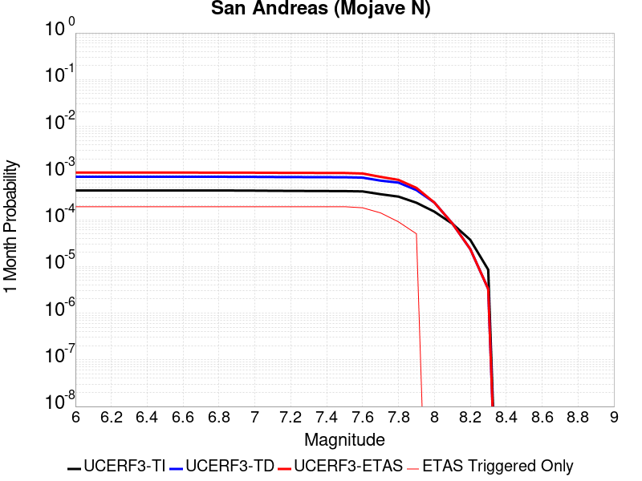 |  |  |

| Magnitude | 1 wk TI Prob | 1 wk TD Prob | 1 wk ETAS Prob | 1 wk ETAS/TD Gain | 1 wk ETAS Triggered Only | 1 mo TI Prob | 1 mo TD Prob | 1 mo ETAS Prob | 1 mo ETAS/TD Gain | 1 mo ETAS Triggered Only | 1 yr TI Prob | 1 yr TD Prob | 1 yr ETAS Prob | 1 yr ETAS/TD Gain | 1 yr ETAS Triggered Only | 10 yr TI Prob | 10 yr TD Prob | 10 yr ETAS Prob | 10 yr ETAS/TD Gain | 10 yr ETAS Triggered Only |
|-----|-----|-----|-----|-----|-----|-----|-----|-----|-----|-----|-----|-----|-----|-----|-----|-----|-----|-----|-----|-----|
| 6.0 | 9.877682E-5 | 1.9409315E-4 | 2.5325327E-4 | 1.3048027 | 5.9171598E-5 | 4.2326056E-4 | 8.315628E-4 | 9.793688E-4 | 1.1777449 | 1.47929E-4 | 0.0051410277 | 0.010077406 | 0.010516721 | 1.043594 | 4.43787E-4 | 0.05023708 | 0.09835201 | 0.09888552 | 1.0054246 | 5.91716E-4 |
| 6.1 | 9.877682E-5 | 1.9409315E-4 | 2.5325327E-4 | 1.3048027 | 5.9171598E-5 | 4.2326056E-4 | 8.315628E-4 | 9.793688E-4 | 1.1777449 | 1.47929E-4 | 0.0051410277 | 0.010077406 | 0.010516721 | 1.043594 | 4.43787E-4 | 0.05023708 | 0.09835201 | 0.09888552 | 1.0054246 | 5.91716E-4 |
| 6.2 | 9.877682E-5 | 1.9409315E-4 | 2.5325327E-4 | 1.3048027 | 5.9171598E-5 | 4.2326056E-4 | 8.315628E-4 | 9.793688E-4 | 1.1777449 | 1.47929E-4 | 0.0051410277 | 0.010077406 | 0.010516721 | 1.043594 | 4.43787E-4 | 0.05023708 | 0.09835201 | 0.09888552 | 1.0054246 | 5.91716E-4 |
| 6.3 | 9.877682E-5 | 1.9409315E-4 | 2.5325327E-4 | 1.3048027 | 5.9171598E-5 | 4.2326056E-4 | 8.315628E-4 | 9.793688E-4 | 1.1777449 | 1.47929E-4 | 0.0051410277 | 0.010077406 | 0.010516721 | 1.043594 | 4.43787E-4 | 0.05023708 | 0.09835201 | 0.09888552 | 1.0054246 | 5.91716E-4 |
| 6.4 | 9.877682E-5 | 1.9409315E-4 | 2.5325327E-4 | 1.3048027 | 5.9171598E-5 | 4.2326056E-4 | 8.315628E-4 | 9.793688E-4 | 1.1777449 | 1.47929E-4 | 0.0051410277 | 0.010077406 | 0.010516721 | 1.043594 | 4.43787E-4 | 0.05023708 | 0.09835201 | 0.09888552 | 1.0054246 | 5.91716E-4 |
| 6.5 | 9.861474E-5 | 1.9383078E-4 | 2.5299093E-4 | 1.3052154 | 5.9171598E-5 | 4.2256617E-4 | 8.304391E-4 | 9.782453E-4 | 1.1779855 | 1.47929E-4 | 0.0051326132 | 0.010063851 | 0.010503172 | 1.0436534 | 4.43787E-4 | 0.050156746 | 0.098229796 | 0.098763384 | 1.0054321 | 5.91716E-4 |
| 6.6 | 9.861474E-5 | 1.9383078E-4 | 2.5299093E-4 | 1.3052154 | 5.9171598E-5 | 4.2256617E-4 | 8.304391E-4 | 9.782453E-4 | 1.1779855 | 1.47929E-4 | 0.0051326132 | 0.010063851 | 0.010503172 | 1.0436534 | 4.43787E-4 | 0.050156746 | 0.098229796 | 0.098763384 | 1.0054321 | 5.91716E-4 |
| 6.7 | 9.8552715E-5 | 1.9373032E-4 | 2.5289046E-4 | 1.3053737 | 5.9171598E-5 | 4.223004E-4 | 8.3000876E-4 | 9.77815E-4 | 1.1780779 | 1.47929E-4 | 0.0051293927 | 0.01005866 | 0.010497984 | 1.0436761 | 4.43787E-4 | 0.050125998 | 0.098182976 | 0.098716594 | 1.005435 | 5.91716E-4 |
| 6.8 | 9.8464974E-5 | 1.9358192E-4 | 2.5274206E-4 | 1.3056078 | 5.9171598E-5 | 4.219245E-4 | 8.293732E-4 | 9.771795E-4 | 1.1782144 | 1.47929E-4 | 0.0051248376 | 0.010050993 | 0.01049032 | 1.0437098 | 4.43787E-4 | 0.05008251 | 0.09811299 | 0.098646656 | 1.0054393 | 5.91716E-4 |
| 6.9 | 9.825824E-5 | 1.9326196E-4 | 2.5242212E-4 | 1.3061138 | 5.9171598E-5 | 4.2103877E-4 | 8.280028E-4 | 9.7580935E-4 | 1.1785097 | 1.47929E-4 | 0.0051141046 | 0.010034463 | 0.010473797 | 1.0437825 | 4.43787E-4 | 0.049980022 | 0.09796208 | 0.098495826 | 1.0054486 | 5.91716E-4 |
| 7.0 | 9.781462E-5 | 1.9257552E-4 | 2.5173574E-4 | 1.3072052 | 5.9171598E-5 | 4.1913814E-4 | 8.250628E-4 | 9.7286975E-4 | 1.1791463 | 1.47929E-4 | 0.005091073 | 0.009998998 | 0.010438347 | 1.0439394 | 4.43787E-4 | 0.04976007 | 0.097638436 | 0.09817238 | 1.0054686 | 5.91716E-4 |
| 7.1 | 9.7121134E-5 | 1.9159251E-4 | 2.5075275E-4 | 1.3087817 | 5.9171598E-5 | 4.1616702E-4 | 8.208525E-4 | 9.686601E-4 | 1.1800659 | 1.47929E-4 | 0.005055068 | 0.009948207 | 0.010387579 | 1.044166 | 4.43787E-4 | 0.04941613 | 0.097174905 | 0.09770912 | 1.0054975 | 5.91716E-4 |
| 7.2 | 9.663819E-5 | 1.9090026E-4 | 2.5006055E-4 | 1.3099016 | 5.9171598E-5 | 4.1409794E-4 | 8.178876E-4 | 9.6569565E-4 | 1.1807193 | 1.47929E-4 | 0.0050299936 | 0.009912439 | 0.010351826 | 1.0443269 | 4.43787E-4 | 0.049176537 | 0.09684814 | 0.097382545 | 1.005518 | 5.91716E-4 |
| 7.3 | 9.6277574E-5 | 1.9042526E-4 | 2.495856E-4 | 1.3106748 | 5.9171598E-5 | 4.125529E-4 | 8.158532E-4 | 9.636615E-4 | 1.1811702 | 1.47929E-4 | 0.0050112694 | 0.009887895 | 0.010327294 | 1.044438 | 4.43787E-4 | 0.04899759 | 0.09662155 | 0.09715609 | 1.0055324 | 5.91716E-4 |
| 7.4 | 9.593308E-5 | 1.8982294E-4 | 2.489833E-4 | 1.3116608 | 5.9171598E-5 | 4.1107697E-4 | 8.132734E-4 | 9.610821E-4 | 1.1817454 | 1.47929E-4 | 0.0049933824 | 0.00985677 | 0.010296183 | 1.0445797 | 4.43787E-4 | 0.04882661 | 0.09633968 | 0.09687439 | 1.0055503 | 5.91716E-4 |
| 7.5 | 9.561707E-5 | 1.8928363E-4 | 2.4844403E-4 | 1.312549 | 5.9171598E-5 | 4.0972308E-4 | 8.109635E-4 | 9.5877255E-4 | 1.1822635 | 1.47929E-4 | 0.0049769743 | 0.009828901 | 0.010268326 | 1.0447074 | 4.43787E-4 | 0.048669744 | 0.09608582 | 0.09662068 | 1.0055665 | 5.91716E-4 |
| 7.6 | 9.418194E-5 | 1.8580563E-4 | 2.4496624E-4 | 1.3184005 | 5.9171598E-5 | 4.0357444E-4 | 7.96067E-4 | 9.1431604E-4 | 1.1485415 | 1.18343196E-4 | 0.004902454 | 0.009649157 | 0.01005936 | 1.0425119 | 4.1420117E-4 | 0.047957025 | 0.09446791 | 0.09497693 | 1.0053884 | 5.621302E-4 |
| 7.7 | 8.202141E-5 | 1.6029038E-4 | 2.194525E-4 | 1.3690933 | 5.9171598E-5 | 3.51473E-4 | 6.86778E-4 | 8.050399E-4 | 1.1721982 | 1.18343196E-4 | 0.00427079 | 0.008329522 | 0.008710933 | 1.0457903 | 3.8461538E-4 | 0.04189639 | 0.08226675 | 0.08275548 | 1.0059408 | 5.325444E-4 |
| 7.8 | 7.2859846E-5 | 1.4523414E-4 | 2.0439715E-4 | 1.4073629 | 5.9171598E-5 | 3.1221908E-4 | 6.2228355E-4 | 7.4055314E-4 | 1.1900573 | 1.18343196E-4 | 0.003794643 | 0.007550025 | 0.0077555617 | 1.0272233 | 2.0710059E-4 | 0.037304975 | 0.074755974 | 0.075029716 | 1.0036618 | 2.95858E-4 |
| 7.9 | 5.3874453E-5 | 1.0050546E-4 | 1.0050546E-4 | 1.0 | 0.0 | 2.3087008E-4 | 4.3066658E-4 | 4.898127E-4 | 1.1373363 | 5.9171598E-5 | 0.0028072202 | 0.005230771 | 0.005319064 | 1.0168796 | 8.87574E-5 | 0.02772022 | 0.052447177 | 0.05258735 | 1.0026726 | 1.47929E-4 |
| 8.0 | 3.468538E-5 | 5.4288335E-5 | 5.4288335E-5 | 1.0 | 0.0 | 1.4864317E-4 | 2.3264355E-4 | 2.3264355E-4 | 1.0 | 0.0 | 0.0018082283 | 0.0028287582 | 0.0028287582 | 1.0 | 0.0 | 0.017935853 | 0.028961267 | 0.028989997 | 1.000992 | 2.9585799E-5 |
| 8.1 | 1.9152367E-5 | 1.9415891E-5 | 1.9415891E-5 | 1.0 | 0.0 | 8.207899E-5 | 8.320831E-5 | 8.320831E-5 | 1.0 | 0.0 | 9.988535E-4 | 0.0010125911 | 0.0010125911 | 1.0 | 0.0 | 0.009943757 | 0.010863188 | 0.010863188 | 1.0 | 0.0 |
| 8.2 | 8.643924E-6 | 5.4798497E-6 | 5.4798497E-6 | 1.0 | 0.0 | 3.704486E-5 | 2.348486E-5 | 2.348486E-5 | 1.0 | 0.0 | 4.5092785E-4 | 2.858907E-4 | 2.858907E-4 | 1.0 | 0.0 | 0.0045001395 | 0.0032514327 | 0.0032514327 | 1.0 | 0.0 |
| 8.3 | 1.983087E-6 | 7.668296E-7 | 7.668296E-7 | 1.0 | 0.0 | 8.498917E-6 | 3.2864084E-6 | 3.2864084E-6 | 1.0 | 0.0 | 1.034694E-4 | 4.0011306E-5 | 4.0011306E-5 | 1.0 | 0.0 | 0.0010342124 | 4.724499E-4 | 4.724499E-4 | 1.0 | 0.0 |

## Lenwood-Lockhart-Old Woman Springs
*[(top)](#table-of-contents)*

| 1 Week | 1 Month | 1 Year | 10 Year |
|-----|-----|-----|-----|
|  |  |  |  |

| Magnitude | 1 wk TI Prob | 1 wk TD Prob | 1 wk ETAS Prob | 1 wk ETAS/TD Gain | 1 wk ETAS Triggered Only | 1 mo TI Prob | 1 mo TD Prob | 1 mo ETAS Prob | 1 mo ETAS/TD Gain | 1 mo ETAS Triggered Only | 1 yr TI Prob | 1 yr TD Prob | 1 yr ETAS Prob | 1 yr ETAS/TD Gain | 1 yr ETAS Triggered Only | 10 yr TI Prob | 10 yr TD Prob | 10 yr ETAS Prob | 10 yr ETAS/TD Gain | 10 yr ETAS Triggered Only |
|-----|-----|-----|-----|-----|-----|-----|-----|-----|-----|-----|-----|-----|-----|-----|-----|-----|-----|-----|-----|-----|
| 6.0 | 3.744542E-5 | 4.3962966E-5 | 1.6230096E-4 | 3.6917653 | 1.18343196E-4 | 1.604705E-4 | 1.8840008E-4 | 3.363012E-4 | 1.7850375 | 1.47929E-4 | 0.0019519776 | 0.0022915301 | 0.002616228 | 1.1416949 | 3.2544378E-4 | 0.019349206 | 0.022697017 | 0.023159644 | 1.0203828 | 4.7337278E-4 |
| 6.1 | 3.744542E-5 | 4.3962966E-5 | 1.6230096E-4 | 3.6917653 | 1.18343196E-4 | 1.604705E-4 | 1.8840008E-4 | 3.363012E-4 | 1.7850375 | 1.47929E-4 | 0.0019519776 | 0.0022915301 | 0.002616228 | 1.1416949 | 3.2544378E-4 | 0.019349206 | 0.022697017 | 0.023159644 | 1.0203828 | 4.7337278E-4 |
| 6.2 | 3.744542E-5 | 4.3962966E-5 | 1.6230096E-4 | 3.6917653 | 1.18343196E-4 | 1.604705E-4 | 1.8840008E-4 | 3.363012E-4 | 1.7850375 | 1.47929E-4 | 0.0019519776 | 0.0022915301 | 0.002616228 | 1.1416949 | 3.2544378E-4 | 0.019349206 | 0.022697017 | 0.023159644 | 1.0203828 | 4.7337278E-4 |
| 6.3 | 2.1079984E-5 | 2.5353596E-5 | 1.1410874E-4 | 4.5006924 | 8.87574E-5 | 9.0339665E-5 | 1.0865386E-4 | 1.974016E-4 | 1.8167934 | 8.87574E-5 | 0.0010993304 | 0.0013220779 | 0.0014698113 | 1.1117433 | 1.47929E-4 | 0.010939079 | 0.013144341 | 0.013377917 | 1.01777 | 2.3668639E-4 |
| 6.4 | 2.1079984E-5 | 2.5353596E-5 | 1.1410874E-4 | 4.5006924 | 8.87574E-5 | 9.0339665E-5 | 1.0865386E-4 | 1.974016E-4 | 1.8167934 | 8.87574E-5 | 0.0010993304 | 0.0013220779 | 0.0014698113 | 1.1117433 | 1.47929E-4 | 0.010939079 | 0.013144341 | 0.013377917 | 1.01777 | 2.3668639E-4 |
| 6.5 | 1.7397282E-5 | 2.0662535E-5 | 7.983291E-5 | 3.863655 | 5.9171598E-5 | 7.455765E-5 | 8.855078E-5 | 1.4771715E-4 | 1.668163 | 5.9171598E-5 | 9.073613E-4 | 0.0010775843 | 0.0011662461 | 1.0822783 | 8.87574E-5 | 0.009036654 | 0.010724886 | 0.010871229 | 1.0136452 | 1.47929E-4 |
| 6.6 | 1.52050325E-5 | 1.76798E-5 | 7.685035E-5 | 4.3467884 | 5.9171598E-5 | 6.51628E-5 | 7.576841E-5 | 1.3493553E-4 | 1.7808942 | 5.9171598E-5 | 7.9306826E-4 | 9.220979E-4 | 0.0010107735 | 1.0961672 | 8.87574E-5 | 0.007902439 | 0.009183581 | 0.009330152 | 1.0159601 | 1.47929E-4 |
| 6.7 | 1.332523E-5 | 1.5264091E-5 | 7.4434785E-5 | 4.8764634 | 5.9171598E-5 | 5.7106878E-5 | 6.541593E-5 | 1.2458366E-4 | 1.904485 | 5.9171598E-5 | 6.950544E-4 | 7.9615373E-4 | 8.8484044E-4 | 1.1113939 | 8.87574E-5 | 0.006928845 | 0.007933645 | 0.008051049 | 1.0147983 | 1.18343196E-4 |
| 6.8 | 1.1525329E-5 | 1.303105E-5 | 7.2201874E-5 | 5.5407567 | 5.9171598E-5 | 4.9393333E-5 | 5.5846183E-5 | 1.15014474E-4 | 2.0594869 | 5.9171598E-5 | 6.011979E-4 | 6.7971944E-4 | 7.684165E-4 | 1.1304907 | 8.87574E-5 | 0.00599574 | 0.006776856 | 0.006894397 | 1.0173445 | 1.18343196E-4 |
| 6.9 | 1.0253909E-5 | 1.15144985E-5 | 7.068541E-5 | 6.1388187 | 5.9171598E-5 | 4.3944583E-5 | 4.9346934E-5 | 1.0851561E-4 | 2.1990345 | 5.9171598E-5 | 5.3489394E-4 | 6.0063694E-4 | 6.59773E-4 | 1.0984555 | 5.9171598E-5 | 0.0053360825 | 0.005990515 | 0.0060787406 | 1.0147276 | 8.87574E-5 |
| 7.0 | 8.104563E-6 | 8.991321E-6 | 3.8576854E-5 | 4.290455 | 2.9585799E-5 | 3.4733377E-5 | 3.8533675E-5 | 6.811834E-5 | 1.7677611 | 2.9585799E-5 | 4.2279682E-4 | 4.6904891E-4 | 4.9862085E-4 | 1.0630466 | 2.9585799E-5 | 0.0042199334 | 0.0046808375 | 0.0047102845 | 1.006291 | 2.9585799E-5 |
| 7.1 | 6.7986157E-6 | 7.515848E-6 | 3.7101425E-5 | 4.936425 | 2.9585799E-5 | 2.91366E-5 | 3.221039E-5 | 6.179524E-5 | 1.9184875 | 2.9585799E-5 | 3.5468035E-4 | 3.9209312E-4 | 4.216673E-4 | 1.0754265 | 2.9585799E-5 | 0.003541148 | 0.0039142296 | 0.0039436994 | 1.0075289 | 2.9585799E-5 |
| 7.2 | 5.6893327E-6 | 6.280039E-6 | 3.586565E-5 | 5.7110558 | 2.9585799E-5 | 2.4382627E-5 | 2.6914187E-5 | 5.649919E-5 | 2.0992346 | 2.9585799E-5 | 2.9681803E-4 | 3.2763294E-4 | 3.5720904E-4 | 1.0902721 | 2.9585799E-5 | 0.002964219 | 0.0032716978 | 0.0033011867 | 1.0090134 | 2.9585799E-5 |
| 7.3 | 4.253348E-6 | 4.706927E-6 | 3.4292585E-5 | 7.2855573 | 2.9585799E-5 | 1.8228506E-5 | 2.01724E-5 | 4.97576E-5 | 2.4666178 | 2.9585799E-5 | 2.2190946E-4 | 2.4557312E-4 | 2.7515163E-4 | 1.1204469 | 2.9585799E-5 | 0.00221688 | 0.0024531984 | 0.0024827116 | 1.0120305 | 2.9585799E-5 |
| 7.4 | 2.5448119E-6 | 2.8520535E-6 | 2.8520535E-6 | 1.0 | 0.0 | 1.0906291E-5 | 1.22230385E-5 | 1.22230385E-5 | 1.0 | 0.0 | 1.3277601E-4 | 1.4880698E-4 | 1.4880698E-4 | 1.0 | 0.0 | 0.001326967 | 0.0014872355 | 0.0014872355 | 1.0 | 0.0 |
| 7.5 | 4.3706837E-8 | 4.5629356E-8 | 4.5629356E-8 | 1.0 | 0.0 | 1.8731501E-7 | 1.9555438E-7 | 1.9555438E-7 | 1.0 | 0.0 | 2.2805577E-6 | 2.3808725E-6 | 2.3808725E-6 | 1.0 | 0.0 | 2.2805343E-5 | 2.3808525E-5 | 2.3808525E-5 | 1.0 | 0.0 |

## So Sierra Nevada
*[(top)](#table-of-contents)*

| 1 Week | 1 Month | 1 Year | 10 Year |
|-----|-----|-----|-----|
|  |  |  |  |

| Magnitude | 1 wk TI Prob | 1 wk TD Prob | 1 wk ETAS Prob | 1 wk ETAS/TD Gain | 1 wk ETAS Triggered Only | 1 mo TI Prob | 1 mo TD Prob | 1 mo ETAS Prob | 1 mo ETAS/TD Gain | 1 mo ETAS Triggered Only | 1 yr TI Prob | 1 yr TD Prob | 1 yr ETAS Prob | 1 yr ETAS/TD Gain | 1 yr ETAS Triggered Only | 10 yr TI Prob | 10 yr TD Prob | 10 yr ETAS Prob | 10 yr ETAS/TD Gain | 10 yr ETAS Triggered Only |
|-----|-----|-----|-----|-----|-----|-----|-----|-----|-----|-----|-----|-----|-----|-----|-----|-----|-----|-----|-----|-----|
| 6.0 | 1.15488665E-5 | 1.1079722E-5 | 1.5900708E-4 | 14.35118 | 1.47929E-4 | 4.9494203E-5 | 4.748373E-5 | 2.2499009E-4 | 4.7382565 | 1.775148E-4 | 6.024253E-4 | 5.779738E-4 | 7.849547E-4 | 1.3581147 | 2.0710059E-4 | 0.006007948 | 0.005765975 | 0.006148373 | 1.0663197 | 3.8461538E-4 |
| 6.1 | 1.15488665E-5 | 1.1079722E-5 | 1.5900708E-4 | 14.35118 | 1.47929E-4 | 4.9494203E-5 | 4.748373E-5 | 2.2499009E-4 | 4.7382565 | 1.775148E-4 | 6.024253E-4 | 5.779738E-4 | 7.849547E-4 | 1.3581147 | 2.0710059E-4 | 0.006007948 | 0.005765975 | 0.006148373 | 1.0663197 | 3.8461538E-4 |
| 6.2 | 1.15488665E-5 | 1.1079722E-5 | 1.5900708E-4 | 14.35118 | 1.47929E-4 | 4.9494203E-5 | 4.748373E-5 | 2.2499009E-4 | 4.7382565 | 1.775148E-4 | 6.024253E-4 | 5.779738E-4 | 7.849547E-4 | 1.3581147 | 2.0710059E-4 | 0.006007948 | 0.005765975 | 0.006148373 | 1.0663197 | 3.8461538E-4 |
| 6.3 | 1.15488665E-5 | 1.1079722E-5 | 1.5900708E-4 | 14.35118 | 1.47929E-4 | 4.9494203E-5 | 4.748373E-5 | 2.2499009E-4 | 4.7382565 | 1.775148E-4 | 6.024253E-4 | 5.779738E-4 | 7.849547E-4 | 1.3581147 | 2.0710059E-4 | 0.006007948 | 0.005765975 | 0.006148373 | 1.0663197 | 3.8461538E-4 |
| 6.4 | 1.15488665E-5 | 1.1079722E-5 | 1.5900708E-4 | 14.35118 | 1.47929E-4 | 4.9494203E-5 | 4.748373E-5 | 2.2499009E-4 | 4.7382565 | 1.775148E-4 | 6.024253E-4 | 5.779738E-4 | 7.849547E-4 | 1.3581147 | 2.0710059E-4 | 0.006007948 | 0.005765975 | 0.006148373 | 1.0663197 | 3.8461538E-4 |
| 6.5 | 1.15488665E-5 | 1.1079722E-5 | 1.5900708E-4 | 14.35118 | 1.47929E-4 | 4.9494203E-5 | 4.748373E-5 | 2.2499009E-4 | 4.7382565 | 1.775148E-4 | 6.024253E-4 | 5.779738E-4 | 7.849547E-4 | 1.3581147 | 2.0710059E-4 | 0.006007948 | 0.005765975 | 0.006148373 | 1.0663197 | 3.8461538E-4 |
| 6.6 | 7.587044E-6 | 6.935689E-6 | 1.5486365E-4 | 22.328518 | 1.47929E-4 | 3.2515498E-5 | 2.9724059E-5 | 2.0723358E-4 | 6.971914 | 1.775148E-4 | 3.9580427E-4 | 3.6183326E-4 | 5.688589E-4 | 1.5721576 | 2.0710059E-4 | 0.003951 | 0.0036127327 | 0.0039959587 | 1.1060765 | 3.8461538E-4 |
| 6.7 | 7.587044E-6 | 6.935689E-6 | 1.5486365E-4 | 22.328518 | 1.47929E-4 | 3.2515498E-5 | 2.9724059E-5 | 2.0723358E-4 | 6.971914 | 1.775148E-4 | 3.9580427E-4 | 3.6183326E-4 | 5.688589E-4 | 1.5721576 | 2.0710059E-4 | 0.003951 | 0.0036127327 | 0.0039959587 | 1.1060765 | 3.8461538E-4 |
| 6.8 | 5.9026956E-6 | 5.1794364E-6 | 9.3936374E-5 | 18.136408 | 8.87574E-5 | 2.5297022E-5 | 2.2197402E-5 | 1.1095283E-4 | 4.99846 | 8.87574E-5 | 3.0794772E-4 | 2.7022103E-4 | 3.5895445E-4 | 1.3283734 | 8.87574E-5 | 0.0030752132 | 0.0026990408 | 0.0029645942 | 1.0983881 | 2.662722E-4 |
| 6.9 | 5.0118915E-6 | 4.2524644E-6 | 3.3838136E-5 | 7.957301 | 2.9585799E-5 | 2.1479358E-5 | 1.8224722E-5 | 4.7809983E-5 | 2.6233585 | 2.9585799E-5 | 2.614798E-4 | 2.2186415E-4 | 2.514434E-4 | 1.1333214 | 2.9585799E-5 | 0.0026117235 | 0.002216499 | 0.0024231405 | 1.0932288 | 2.0710059E-4 |
| 7.0 | 4.4924795E-6 | 3.713954E-6 | 3.3299642E-5 | 8.966089 | 2.9585799E-5 | 1.925334E-5 | 1.5916852E-5 | 4.550218E-5 | 2.8587425 | 2.9585799E-5 | 2.3438422E-4 | 1.9377106E-4 | 2.2335113E-4 | 1.1526548 | 2.9585799E-5 | 0.0023413717 | 0.001936084 | 0.0021427837 | 1.1067617 | 2.0710059E-4 |
| 7.1 | 3.9118436E-6 | 3.1120105E-6 | 3.2697717E-5 | 10.506943 | 2.9585799E-5 | 1.6764936E-5 | 1.3337123E-5 | 4.2922526E-5 | 3.2182748 | 2.9585799E-5 | 2.0409399E-4 | 1.6236794E-4 | 1.9194894E-4 | 1.1821849 | 2.9585799E-5 | 0.0020390663 | 0.0016225493 | 0.0017407003 | 1.0728183 | 1.18343196E-4 |
| 7.2 | 3.4200818E-6 | 2.6054847E-6 | 3.2191205E-5 | 12.35517 | 2.9585799E-5 | 1.4657411E-5 | 1.11663185E-5 | 4.0751787E-5 | 3.6495275 | 2.9585799E-5 | 1.7843937E-4 | 1.3594194E-4 | 1.6552373E-4 | 1.217606 | 2.9585799E-5 | 0.0017829615 | 0.0013586376 | 0.0013881832 | 1.0217465 | 2.9585799E-5 |
| 7.3 | 2.6593618E-6 | 1.8284468E-6 | 1.8284468E-6 | 1.0 | 0.0 | 1.13972155E-5 | 7.836179E-6 | 7.836179E-6 | 1.0 | 0.0 | 1.3875226E-4 | 9.540159E-5 | 9.540159E-5 | 1.0 | 0.0 | 0.0013866565 | 9.536353E-4 | 9.536353E-4 | 1.0 | 0.0 |
| 7.4 | 2.2577992E-6 | 1.4364622E-6 | 1.4364622E-6 | 1.0 | 0.0 | 9.676246E-6 | 6.1562537E-6 | 6.1562537E-6 | 1.0 | 0.0 | 1.1780193E-4 | 7.495006E-5 | 7.495006E-5 | 1.0 | 0.0 | 0.001177395 | 7.4927293E-4 | 7.4927293E-4 | 1.0 | 0.0 |
| 7.5 | 1.489319E-6 | 7.3541264E-7 | 7.3541264E-7 | 1.0 | 0.0 | 6.3827797E-6 | 3.1517645E-6 | 3.1517645E-6 | 1.0 | 0.0 | 7.770758E-5 | 3.837206E-5 | 3.837206E-5 | 1.0 | 0.0 | 7.7680405E-4 | 3.836548E-4 | 3.836548E-4 | 1.0 | 0.0 |
| 7.6 | 1.0680322E-6 | 4.659796E-7 | 4.659796E-7 | 1.0 | 0.0 | 4.577273E-6 | 1.997054E-6 | 1.997054E-6 | 1.0 | 0.0 | 5.5726876E-5 | 2.4313864E-5 | 2.4313864E-5 | 1.0 | 0.0 | 5.5712904E-4 | 2.431123E-4 | 2.431123E-4 | 1.0 | 0.0 |
| 7.7 | 5.509146E-7 | 1.5581199E-7 | 1.5581199E-7 | 1.0 | 0.0 | 2.3610605E-6 | 6.677655E-7 | 6.677655E-7 | 1.0 | 0.0 | 2.8745531E-5 | 8.130016E-6 | 8.130016E-6 | 1.0 | 0.0 | 2.8741814E-4 | 8.12973E-5 | 8.12973E-5 | 1.0 | 0.0 |

## McLean Lake
*[(top)](#table-of-contents)*

| 1 Week | 1 Month | 1 Year | 10 Year |
|-----|-----|-----|-----|
|  |  |  |  |

| Magnitude | 1 wk TI Prob | 1 wk TD Prob | 1 wk ETAS Prob | 1 wk ETAS/TD Gain | 1 wk ETAS Triggered Only | 1 mo TI Prob | 1 mo TD Prob | 1 mo ETAS Prob | 1 mo ETAS/TD Gain | 1 mo ETAS Triggered Only | 1 yr TI Prob | 1 yr TD Prob | 1 yr ETAS Prob | 1 yr ETAS/TD Gain | 1 yr ETAS Triggered Only | 10 yr TI Prob | 10 yr TD Prob | 10 yr ETAS Prob | 10 yr ETAS/TD Gain | 10 yr ETAS Triggered Only |
|-----|-----|-----|-----|-----|-----|-----|-----|-----|-----|-----|-----|-----|-----|-----|-----|-----|-----|-----|-----|-----|
| 6.0 | 1.7360222E-5 | 1.8501789E-5 | 4.808704E-5 | 2.5990481 | 2.9585799E-5 | 7.439883E-5 | 7.929125E-5 | 1.680416E-4 | 2.1192958 | 8.87574E-5 | 9.0542925E-4 | 9.64992E-4 | 0.0012605644 | 1.3062953 | 2.95858E-4 | 0.009017491 | 0.009612858 | 0.009935173 | 1.0335296 | 3.2544378E-4 |
| 6.1 | 9.062689E-6 | 9.592268E-6 | 9.592268E-6 | 1.0 | 0.0 | 3.8839516E-5 | 4.110912E-5 | 1.0027829E-4 | 2.4393196 | 5.9171598E-5 | 4.727685E-4 | 5.003975E-4 | 7.0739444E-4 | 1.413665 | 2.0710059E-4 | 0.0047176396 | 0.0049935905 | 0.005199657 | 1.0412662 | 2.0710059E-4 |
| 6.2 | 9.062689E-6 | 9.592268E-6 | 9.592268E-6 | 1.0 | 0.0 | 3.8839516E-5 | 4.110912E-5 | 1.0027829E-4 | 2.4393196 | 5.9171598E-5 | 4.727685E-4 | 5.003975E-4 | 7.0739444E-4 | 1.413665 | 2.0710059E-4 | 0.0047176396 | 0.0049935905 | 0.005199657 | 1.0412662 | 2.0710059E-4 |
| 6.3 | 7.2575485E-6 | 7.667767E-6 | 7.667767E-6 | 1.0 | 0.0 | 3.110341E-5 | 3.2861484E-5 | 9.2031136E-5 | 2.8005776 | 5.9171598E-5 | 3.786182E-4 | 4.0002225E-4 | 6.0704E-4 | 1.5175155 | 2.0710059E-4 | 0.0037797375 | 0.003993727 | 0.0042000003 | 1.0516493 | 2.0710059E-4 |
| 6.4 | 7.2575485E-6 | 7.667767E-6 | 7.667767E-6 | 1.0 | 0.0 | 3.110341E-5 | 3.2861484E-5 | 9.2031136E-5 | 2.8005776 | 5.9171598E-5 | 3.786182E-4 | 4.0002225E-4 | 6.0704E-4 | 1.5175155 | 2.0710059E-4 | 0.0037797375 | 0.003993727 | 0.0042000003 | 1.0516493 | 2.0710059E-4 |
| 6.5 | 6.06582E-6 | 6.4039245E-6 | 6.4039245E-6 | 1.0 | 0.0 | 2.5996113E-5 | 2.7445138E-5 | 8.661511E-5 | 3.1559365 | 5.9171598E-5 | 3.164567E-4 | 3.340998E-4 | 5.115553E-4 | 1.5311451 | 1.775148E-4 | 0.0031600643 | 0.0033366138 | 0.0035135364 | 1.0530245 | 1.775148E-4 |
| 6.6 | 5.598744E-6 | 5.910306E-6 | 5.910306E-6 | 1.0 | 0.0 | 2.3994397E-5 | 2.5329673E-5 | 8.449977E-5 | 3.3359995 | 5.9171598E-5 | 2.9209262E-4 | 3.083515E-4 | 4.8581156E-4 | 1.5755122 | 1.775148E-4 | 0.0029170897 | 0.0030798658 | 0.0032568339 | 1.0574597 | 1.775148E-4 |
| 6.7 | 5.246996E-6 | 5.539203E-6 | 5.539203E-6 | 1.0 | 0.0 | 2.2486933E-5 | 2.3739261E-5 | 8.290946E-5 | 3.4925036 | 5.9171598E-5 | 2.73744E-4 | 2.8899353E-4 | 4.3687975E-4 | 1.5117285 | 1.47929E-4 | 0.0027340704 | 0.002886801 | 0.003034303 | 1.0510952 | 1.47929E-4 |
| 6.8 | 4.02324E-6 | 4.246936E-6 | 4.246936E-6 | 1.0 | 0.0 | 1.7242342E-5 | 1.820106E-5 | 7.737158E-5 | 4.2509384 | 5.9171598E-5 | 2.099053E-4 | 2.2158133E-4 | 3.6947755E-4 | 1.6674579 | 1.47929E-4 | 0.0020970714 | 0.0022141882 | 0.0023617898 | 1.0666616 | 1.47929E-4 |
| 6.9 | 6.835972E-7 | 7.1399705E-7 | 7.1399705E-7 | 1.0 | 0.0 | 2.9296991E-6 | 3.0599856E-6 | 3.2645694E-5 | 10.668578 | 2.9585799E-5 | 3.56685E-5 | 3.7255006E-5 | 6.6839704E-5 | 1.7941134 | 2.9585799E-5 | 3.5662777E-4 | 3.7251884E-4 | 4.0209363E-4 | 1.0793914 | 2.9585799E-5 |

## Goldstone Lake
*[(top)](#table-of-contents)*

| 1 Week | 1 Month | 1 Year | 10 Year |
|-----|-----|-----|-----|
| 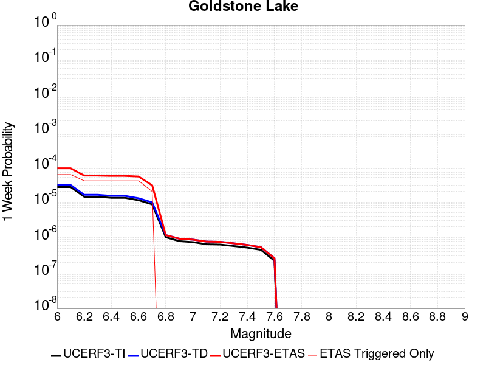 |  |  | 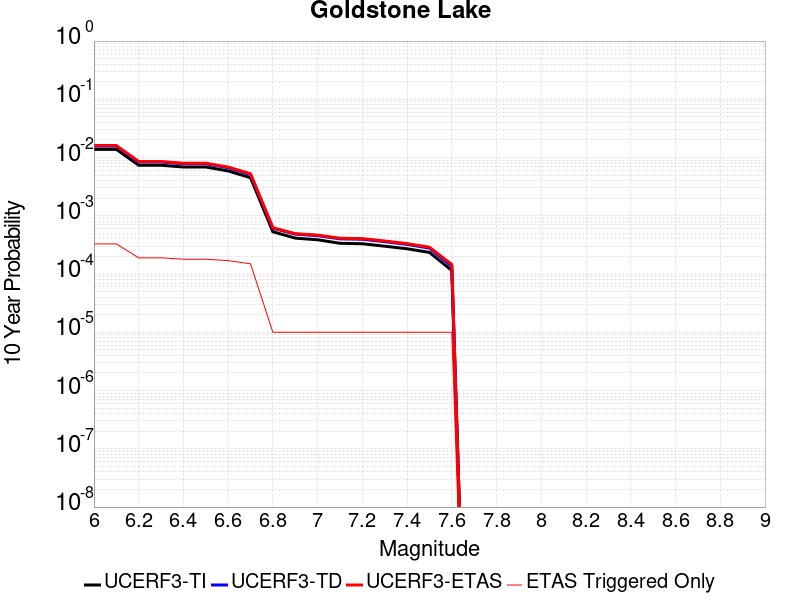 |

| Magnitude | 1 wk TI Prob | 1 wk TD Prob | 1 wk ETAS Prob | 1 wk ETAS/TD Gain | 1 wk ETAS Triggered Only | 1 mo TI Prob | 1 mo TD Prob | 1 mo ETAS Prob | 1 mo ETAS/TD Gain | 1 mo ETAS Triggered Only | 1 yr TI Prob | 1 yr TD Prob | 1 yr ETAS Prob | 1 yr ETAS/TD Gain | 1 yr ETAS Triggered Only | 10 yr TI Prob | 10 yr TD Prob | 10 yr ETAS Prob | 10 yr ETAS/TD Gain | 10 yr ETAS Triggered Only |
|-----|-----|-----|-----|-----|-----|-----|-----|-----|-----|-----|-----|-----|-----|-----|-----|-----|-----|-----|-----|-----|
| 6.0 | 2.671352E-5 | 3.0376628E-5 | 3.0376628E-5 | 1.0 | 0.0 | 1.1448149E-4 | 1.3018015E-4 | 1.8934405E-4 | 1.4544771 | 5.9171598E-5 | 0.001392921 | 0.0015839875 | 0.0017316822 | 1.0932423 | 1.47929E-4 | 0.013842222 | 0.015746472 | 0.015950313 | 1.012945 | 2.0710059E-4 |
| 6.1 | 2.671352E-5 | 3.0376628E-5 | 3.0376628E-5 | 1.0 | 0.0 | 1.1448149E-4 | 1.3018015E-4 | 1.8934405E-4 | 1.4544771 | 5.9171598E-5 | 0.001392921 | 0.0015839875 | 0.0017316822 | 1.0932423 | 1.47929E-4 | 0.013842222 | 0.015746472 | 0.015950313 | 1.012945 | 2.0710059E-4 |
| 6.2 | 1.4197047E-5 | 1.6096516E-5 | 1.6096516E-5 | 1.0 | 0.0 | 6.0843064E-5 | 6.89838E-5 | 1.2815131E-4 | 1.8577017 | 5.9171598E-5 | 7.4051257E-4 | 8.396528E-4 | 9.2833565E-4 | 1.1056185 | 8.87574E-5 | 0.007380498 | 0.008374499 | 0.00852119 | 1.0175163 | 1.47929E-4 |
| 6.3 | 1.4197047E-5 | 1.6096516E-5 | 1.6096516E-5 | 1.0 | 0.0 | 6.0843064E-5 | 6.89838E-5 | 1.2815131E-4 | 1.8577017 | 5.9171598E-5 | 7.4051257E-4 | 8.396528E-4 | 9.2833565E-4 | 1.1056185 | 8.87574E-5 | 0.007380498 | 0.008374499 | 0.00852119 | 1.0175163 | 1.47929E-4 |
| 6.4 | 1.3238931E-5 | 1.5008711E-5 | 1.5008711E-5 | 1.0 | 0.0 | 5.6737044E-5 | 6.432201E-5 | 1.2348981E-4 | 1.9198685 | 5.9171598E-5 | 6.9055456E-4 | 7.8293716E-4 | 8.716251E-4 | 1.1132759 | 8.87574E-5 | 0.006884126 | 0.007811414 | 0.007928833 | 1.0150317 | 1.18343196E-4 |
| 6.5 | 1.3238931E-5 | 1.5008711E-5 | 1.5008711E-5 | 1.0 | 0.0 | 5.6737044E-5 | 6.432201E-5 | 1.2348981E-4 | 1.9198685 | 5.9171598E-5 | 6.9055456E-4 | 7.8293716E-4 | 8.716251E-4 | 1.1132759 | 8.87574E-5 | 0.006884126 | 0.007811414 | 0.007928833 | 1.0150317 | 1.18343196E-4 |
| 6.6 | 1.1328278E-5 | 1.2855381E-5 | 1.2855381E-5 | 1.0 | 0.0 | 4.8548856E-5 | 5.5093864E-5 | 1.14262206E-4 | 2.073955 | 5.9171598E-5 | 5.90922E-4 | 6.706571E-4 | 7.5935497E-4 | 1.1322552 | 8.87574E-5 | 0.0058935313 | 0.0066957204 | 0.0068132714 | 1.0175561 | 1.18343196E-4 |
| 6.7 | 8.651175E-6 | 9.8247265E-6 | 9.8247265E-6 | 1.0 | 0.0 | 3.707594E-5 | 4.2105803E-5 | 1.01274905E-4 | 2.4052482 | 5.9171598E-5 | 4.5130608E-4 | 5.126081E-4 | 6.0132E-4 | 1.1730599 | 8.87574E-5 | 0.0045039062 | 0.0051231356 | 0.0052408725 | 1.0229814 | 1.18343196E-4 |
| 6.8 | 1.0215377E-6 | 1.1754793E-6 | 1.1754793E-6 | 1.0 | 0.0 | 4.378012E-6 | 5.037759E-6 | 5.037759E-6 | 1.0 | 0.0 | 5.3300988E-5 | 6.133311E-5 | 6.133311E-5 | 1.0 | 0.0 | 5.3288206E-4 | 6.13173E-4 | 6.13173E-4 | 1.0 | 0.0 |
| 6.9 | 7.9360774E-7 | 9.2834586E-7 | 9.2834586E-7 | 1.0 | 0.0 | 3.4011714E-6 | 3.9786196E-6 | 3.9786196E-6 | 1.0 | 0.0 | 4.1408475E-5 | 4.8438687E-5 | 4.8438687E-5 | 1.0 | 0.0 | 4.140076E-4 | 4.842883E-4 | 4.842883E-4 | 1.0 | 0.0 |
| 7.0 | 7.4382757E-7 | 8.7473853E-7 | 8.7473853E-7 | 1.0 | 0.0 | 3.1878285E-6 | 3.7488744E-6 | 3.7488744E-6 | 1.0 | 0.0 | 3.8811122E-5 | 4.5641656E-5 | 4.5641656E-5 | 1.0 | 0.0 | 3.8804344E-4 | 4.563295E-4 | 4.563295E-4 | 1.0 | 0.0 |
| 7.1 | 6.4709513E-7 | 7.711347E-7 | 7.711347E-7 | 1.0 | 0.0 | 2.773262E-6 | 3.304859E-6 | 3.304859E-6 | 1.0 | 0.0 | 3.376394E-5 | 4.0235976E-5 | 4.0235976E-5 | 1.0 | 0.0 | 3.375881E-4 | 4.0229288E-4 | 4.0229288E-4 | 1.0 | 0.0 |
| 7.2 | 6.356704E-7 | 7.5884054E-7 | 7.5884054E-7 | 1.0 | 0.0 | 2.7242988E-6 | 3.25217E-6 | 3.25217E-6 | 1.0 | 0.0 | 3.3167835E-5 | 3.959451E-5 | 3.959451E-5 | 1.0 | 0.0 | 3.3162883E-4 | 3.958805E-4 | 3.958805E-4 | 1.0 | 0.0 |
| 7.3 | 5.7695723E-7 | 6.8966074E-7 | 6.8966074E-7 | 1.0 | 0.0 | 2.4726714E-6 | 2.9556859E-6 | 2.9556859E-6 | 1.0 | 0.0 | 3.0104358E-5 | 3.598494E-5 | 3.598494E-5 | 1.0 | 0.0 | 3.0100282E-4 | 3.5979686E-4 | 3.5979686E-4 | 1.0 | 0.0 |
| 7.4 | 5.209647E-7 | 6.193549E-7 | 6.193549E-7 | 1.0 | 0.0 | 2.232704E-6 | 2.654376E-6 | 2.654376E-6 | 1.0 | 0.0 | 2.718283E-5 | 3.2316606E-5 | 3.2316606E-5 | 1.0 | 0.0 | 2.7179506E-4 | 3.231246E-4 | 3.231246E-4 | 1.0 | 0.0 |
| 7.5 | 4.512955E-7 | 5.3489146E-7 | 5.3489146E-7 | 1.0 | 0.0 | 1.934122E-6 | 2.2923903E-6 | 2.2923903E-6 | 1.0 | 0.0 | 2.3547682E-5 | 2.7909547E-5 | 2.7909547E-5 | 1.0 | 0.0 | 2.3545188E-4 | 2.7906572E-4 | 2.7906572E-4 | 1.0 | 0.0 |
| 7.6 | 2.21172E-7 | 2.6039737E-7 | 2.6039737E-7 | 1.0 | 0.0 | 9.478797E-7 | 1.1159884E-6 | 1.1159884E-6 | 1.0 | 0.0 | 1.1540374E-5 | 1.3587103E-5 | 1.3587103E-5 | 1.0 | 0.0 | 1.1539775E-4 | 1.3586554E-4 | 1.3586554E-4 | 1.0 | 0.0 |

## Coyote Canyon
*[(top)](#table-of-contents)*

| 1 Week | 1 Month | 1 Year | 10 Year |
|-----|-----|-----|-----|
|  |  |  |  |

| Magnitude | 1 wk TI Prob | 1 wk TD Prob | 1 wk ETAS Prob | 1 wk ETAS/TD Gain | 1 wk ETAS Triggered Only | 1 mo TI Prob | 1 mo TD Prob | 1 mo ETAS Prob | 1 mo ETAS/TD Gain | 1 mo ETAS Triggered Only | 1 yr TI Prob | 1 yr TD Prob | 1 yr ETAS Prob | 1 yr ETAS/TD Gain | 1 yr ETAS Triggered Only | 10 yr TI Prob | 10 yr TD Prob | 10 yr ETAS Prob | 10 yr ETAS/TD Gain | 10 yr ETAS Triggered Only |
|-----|-----|-----|-----|-----|-----|-----|-----|-----|-----|-----|-----|-----|-----|-----|-----|-----|-----|-----|-----|-----|
| 6.0 | 3.5090034E-5 | 4.036513E-5 | 6.994973E-5 | 1.7329248 | 2.9585799E-5 | 1.503772E-4 | 1.7298339E-4 | 2.3214475E-4 | 1.342006 | 5.9171598E-5 | 0.0018293047 | 0.0021042947 | 0.0023109594 | 1.0982109 | 2.0710059E-4 | 0.018143194 | 0.020869615 | 0.021101361 | 1.0111045 | 2.3668639E-4 |
| 6.1 | 3.5090034E-5 | 4.036513E-5 | 6.994973E-5 | 1.7329248 | 2.9585799E-5 | 1.503772E-4 | 1.7298339E-4 | 2.3214475E-4 | 1.342006 | 5.9171598E-5 | 0.0018293047 | 0.0021042947 | 0.0023109594 | 1.0982109 | 2.0710059E-4 | 0.018143194 | 0.020869615 | 0.021101361 | 1.0111045 | 2.3668639E-4 |
| 6.2 | 1.841879E-5 | 2.1060194E-5 | 5.064537E-5 | 2.404791 | 2.9585799E-5 | 7.8935285E-5 | 9.0255424E-5 | 1.4942168E-4 | 1.6555424 | 5.9171598E-5 | 9.606133E-4 | 0.0010984079 | 0.0012461743 | 1.1345279 | 1.47929E-4 | 0.0095647145 | 0.010939874 | 0.011115447 | 1.0160489 | 1.775148E-4 |
| 6.3 | 1.841879E-5 | 2.1060194E-5 | 5.064537E-5 | 2.404791 | 2.9585799E-5 | 7.8935285E-5 | 9.0255424E-5 | 1.4942168E-4 | 1.6555424 | 5.9171598E-5 | 9.606133E-4 | 0.0010984079 | 0.0012461743 | 1.1345279 | 1.47929E-4 | 0.0095647145 | 0.010939874 | 0.011115447 | 1.0160489 | 1.775148E-4 |
| 6.4 | 1.712201E-5 | 1.9565581E-5 | 4.9150804E-5 | 2.5121052 | 2.9585799E-5 | 7.337798E-5 | 8.385037E-5 | 1.4301701E-4 | 1.7056217 | 5.9171598E-5 | 8.930107E-4 | 0.0010205007 | 0.0011682786 | 1.1448094 | 1.47929E-4 | 0.008894307 | 0.0101680625 | 0.010343772 | 1.0172806 | 1.775148E-4 |
| 6.5 | 1.4744935E-5 | 1.6837288E-5 | 4.642259E-5 | 2.7571297 | 2.9585799E-5 | 6.3191044E-5 | 7.215834E-5 | 1.3132567E-4 | 1.8199652 | 5.9171598E-5 | 7.6907943E-4 | 8.7826716E-4 | 9.965064E-4 | 1.1346279 | 1.18343196E-4 | 0.007664232 | 0.008757159 | 0.008903792 | 1.0167444 | 1.47929E-4 |
| 6.6 | 1.2017839E-5 | 1.3724348E-5 | 4.330974E-5 | 3.1556866 | 2.9585799E-5 | 5.150401E-5 | 5.8817808E-5 | 1.17985925E-4 | 2.005956 | 5.9171598E-5 | 6.268809E-4 | 7.159601E-4 | 8.342186E-4 | 1.1651747 | 1.18343196E-4 | 0.0062511545 | 0.007145228 | 0.0072920998 | 1.0205553 | 1.47929E-4 |
| 6.7 | 1.00956095E-5 | 1.1533734E-5 | 4.111919E-5 | 3.5651238 | 2.9585799E-5 | 4.326618E-5 | 4.9429844E-5 | 1.0859852E-4 | 2.1970232 | 5.9171598E-5 | 5.266384E-4 | 6.0172915E-4 | 7.200011E-4 | 1.1965535 | 1.18343196E-4 | 0.005253921 | 0.006009526 | 0.0061271577 | 1.0195743 | 1.18343196E-4 |

## Helendale-So Lockhart
*[(top)](#table-of-contents)*

| 1 Week | 1 Month | 1 Year | 10 Year |
|-----|-----|-----|-----|
| 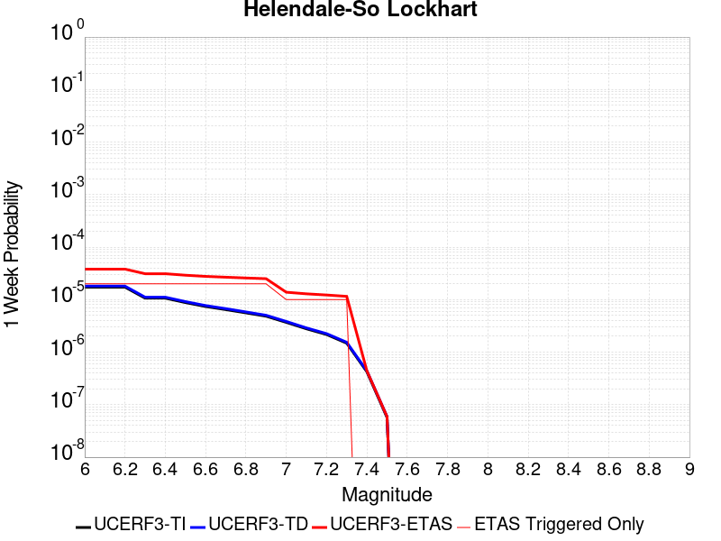 |  |  |  |

| Magnitude | 1 wk TI Prob | 1 wk TD Prob | 1 wk ETAS Prob | 1 wk ETAS/TD Gain | 1 wk ETAS Triggered Only | 1 mo TI Prob | 1 mo TD Prob | 1 mo ETAS Prob | 1 mo ETAS/TD Gain | 1 mo ETAS Triggered Only | 1 yr TI Prob | 1 yr TD Prob | 1 yr ETAS Prob | 1 yr ETAS/TD Gain | 1 yr ETAS Triggered Only | 10 yr TI Prob | 10 yr TD Prob | 10 yr ETAS Prob | 10 yr ETAS/TD Gain | 10 yr ETAS Triggered Only |
|-----|-----|-----|-----|-----|-----|-----|-----|-----|-----|-----|-----|-----|-----|-----|-----|-----|-----|-----|-----|-----|
| 6.0 | 1.7296055E-5 | 1.8103841E-5 | 7.7274366E-5 | 4.2683964 | 5.9171598E-5 | 7.412385E-5 | 7.7585704E-5 | 1.3675271E-4 | 1.762602 | 5.9171598E-5 | 9.0208417E-4 | 9.442173E-4 | 0.0011215645 | 1.1878245 | 1.775148E-4 | 0.008984311 | 0.009404174 | 0.009609328 | 1.0218151 | 2.0710059E-4 |
| 6.1 | 1.7296055E-5 | 1.8103841E-5 | 7.7274366E-5 | 4.2683964 | 5.9171598E-5 | 7.412385E-5 | 7.7585704E-5 | 1.3675271E-4 | 1.762602 | 5.9171598E-5 | 9.0208417E-4 | 9.442173E-4 | 0.0011215645 | 1.1878245 | 1.775148E-4 | 0.008984311 | 0.009404174 | 0.009609328 | 1.0218151 | 2.0710059E-4 |
| 6.2 | 1.7296055E-5 | 1.8103841E-5 | 7.7274366E-5 | 4.2683964 | 5.9171598E-5 | 7.412385E-5 | 7.7585704E-5 | 1.3675271E-4 | 1.762602 | 5.9171598E-5 | 9.0208417E-4 | 9.442173E-4 | 0.0011215645 | 1.1878245 | 1.775148E-4 | 0.008984311 | 0.009404174 | 0.009609328 | 1.0218151 | 2.0710059E-4 |
| 6.3 | 1.0669118E-5 | 1.1135489E-5 | 7.030643E-5 | 6.313726 | 5.9171598E-5 | 4.5723988E-5 | 4.7722668E-5 | 1.0689144E-4 | 2.2398462 | 5.9171598E-5 | 5.5654737E-4 | 5.8087136E-4 | 6.9914584E-4 | 1.2036155 | 1.18343196E-4 | 0.0055515557 | 0.005793827 | 0.005940899 | 1.0253842 | 1.47929E-4 |
| 6.4 | 1.0669118E-5 | 1.1135489E-5 | 7.030643E-5 | 6.313726 | 5.9171598E-5 | 4.5723988E-5 | 4.7722668E-5 | 1.0689144E-4 | 2.2398462 | 5.9171598E-5 | 5.5654737E-4 | 5.8087136E-4 | 6.9914584E-4 | 1.2036155 | 1.18343196E-4 | 0.0055515557 | 0.005793827 | 0.005940899 | 1.0253842 | 1.47929E-4 |
| 6.5 | 8.790038E-6 | 9.1702495E-6 | 6.83413E-5 | 7.4525023 | 5.9171598E-5 | 3.767105E-5 | 3.9300485E-5 | 9.846976E-5 | 2.5055609 | 5.9171598E-5 | 4.585485E-4 | 4.7837992E-4 | 5.6709483E-4 | 1.1854488 | 8.87574E-5 | 0.0045760344 | 0.0047736657 | 0.004891444 | 1.0246725 | 1.18343196E-4 |
| 6.6 | 7.396949E-6 | 7.715581E-6 | 6.688672E-5 | 8.669045 | 5.9171598E-5 | 3.1700827E-5 | 3.3066364E-5 | 9.2236005E-5 | 2.7894208 | 5.9171598E-5 | 3.858892E-4 | 4.025096E-4 | 4.912313E-4 | 1.2204212 | 8.87574E-5 | 0.003852198 | 0.004017913 | 0.0041357805 | 1.0293355 | 1.18343196E-4 |
| 6.7 | 6.4600285E-6 | 6.7380697E-6 | 6.590927E-5 | 9.781625 | 5.9171598E-5 | 2.7685543E-5 | 2.8877126E-5 | 8.804702E-5 | 3.049023 | 5.9171598E-5 | 3.3701936E-4 | 3.5152308E-4 | 4.4024925E-4 | 1.252405 | 8.87574E-5 | 0.0033650869 | 0.003509752 | 0.0036276798 | 1.0336001 | 1.18343196E-4 |
| 6.8 | 5.600104E-6 | 5.836042E-6 | 6.50073E-5 | 11.138935 | 5.9171598E-5 | 2.4000226E-5 | 2.5011372E-5 | 8.418149E-5 | 3.3657286 | 5.9171598E-5 | 2.9216358E-4 | 3.044715E-4 | 3.932019E-4 | 1.2914243 | 8.87574E-5 | 0.0029177975 | 0.003040605 | 0.0031585884 | 1.0388026 | 1.18343196E-4 |
| 6.9 | 4.839122E-6 | 5.039537E-6 | 6.4210835E-5 | 12.741416 | 5.9171598E-5 | 2.0738931E-5 | 2.159784E-5 | 8.076816E-5 | 3.7396407 | 5.9171598E-5 | 2.5246723E-4 | 2.6292243E-4 | 3.2207847E-4 | 1.2249943 | 5.9171598E-5 | 0.002521806 | 0.002626161 | 0.0027146854 | 1.0337087 | 8.87574E-5 |
| 7.0 | 3.6937633E-6 | 3.845229E-6 | 3.3430915E-5 | 8.694128 | 2.9585799E-5 | 1.5830317E-5 | 1.6479451E-5 | 4.606476E-5 | 2.795285 | 2.9585799E-5 | 1.9271708E-4 | 2.0061915E-4 | 2.30199E-4 | 1.1474428 | 2.9585799E-5 | 0.0019255003 | 0.0020044118 | 0.0020339384 | 1.0147308 | 2.9585799E-5 |
| 7.1 | 2.7858857E-6 | 2.8978693E-6 | 3.2483582E-5 | 11.209472 | 2.9585799E-5 | 1.1939455E-5 | 1.2419382E-5 | 4.2004813E-5 | 3.3821983 | 2.9585799E-5 | 1.4535317E-4 | 1.511957E-4 | 1.8077702E-4 | 1.1956493 | 2.9585799E-5 | 0.0014525814 | 0.0015109498 | 0.0015404909 | 1.0195514 | 2.9585799E-5 |
| 7.2 | 2.1672065E-6 | 2.2540248E-6 | 3.1839758E-5 | 14.125735 | 2.9585799E-5 | 9.2879945E-6 | 9.660072E-6 | 3.9245584E-5 | 4.0626597 | 2.9585799E-5 | 1.1307546E-4 | 1.176052E-4 | 1.4718753E-4 | 1.2515392 | 2.9585799E-5 | 0.0011301794 | 0.0011754478 | 0.0012049989 | 1.0251402 | 2.9585799E-5 |
| 7.3 | 1.4823496E-6 | 1.5422185E-6 | 3.1127973E-5 | 20.183893 | 2.9585799E-5 | 6.3529114E-6 | 6.6094917E-6 | 3.6195095E-5 | 5.4762297 | 2.9585799E-5 | 7.734395E-5 | 8.046775E-5 | 1.10051165E-4 | 1.3676432 | 2.9585799E-5 | 7.731704E-4 | 8.044012E-4 | 8.3396316E-4 | 1.0367503 | 2.9585799E-5 |
| 7.4 | 4.2321457E-7 | 4.4109012E-7 | 4.4109012E-7 | 1.0 | 0.0 | 1.8137755E-6 | 1.8903852E-6 | 1.8903852E-6 | 1.0 | 0.0 | 2.2082493E-5 | 2.3015242E-5 | 2.3015242E-5 | 1.0 | 0.0 | 2.2080299E-4 | 2.3013311E-4 | 2.3013311E-4 | 1.0 | 0.0 |
| 7.5 | 5.6942316E-8 | 5.941599E-8 | 5.941599E-8 | 1.0 | 0.0 | 2.440385E-7 | 2.5463993E-7 | 2.5463993E-7 | 1.0 | 0.0 | 2.9711643E-6 | 3.1002376E-6 | 3.1002376E-6 | 1.0 | 0.0 | 2.9711247E-5 | 3.1002022E-5 | 3.1002022E-5 | 1.0 | 0.0 |

## Towne Pass
*[(top)](#table-of-contents)*

| 1 Week | 1 Month | 1 Year | 10 Year |
|-----|-----|-----|-----|
|  |  |  |  |

| Magnitude | 1 wk TI Prob | 1 wk TD Prob | 1 wk ETAS Prob | 1 wk ETAS/TD Gain | 1 wk ETAS Triggered Only | 1 mo TI Prob | 1 mo TD Prob | 1 mo ETAS Prob | 1 mo ETAS/TD Gain | 1 mo ETAS Triggered Only | 1 yr TI Prob | 1 yr TD Prob | 1 yr ETAS Prob | 1 yr ETAS/TD Gain | 1 yr ETAS Triggered Only | 10 yr TI Prob | 10 yr TD Prob | 10 yr ETAS Prob | 10 yr ETAS/TD Gain | 10 yr ETAS Triggered Only |
|-----|-----|-----|-----|-----|-----|-----|-----|-----|-----|-----|-----|-----|-----|-----|-----|-----|-----|-----|-----|-----|
| 6.0 | 3.849728E-6 | 3.8945495E-6 | 3.348023E-5 | 8.596689 | 2.9585799E-5 | 1.649873E-5 | 1.6690845E-5 | 7.5861455E-5 | 4.545094 | 5.9171598E-5 | 2.0085352E-4 | 2.0319645E-4 | 3.215156E-4 | 1.5822895 | 1.18343196E-4 | 0.0020067208 | 0.0020305358 | 0.0022372159 | 1.101786 | 2.0710059E-4 |
| 6.1 | 3.849728E-6 | 3.8945495E-6 | 3.348023E-5 | 8.596689 | 2.9585799E-5 | 1.649873E-5 | 1.6690845E-5 | 7.5861455E-5 | 4.545094 | 5.9171598E-5 | 2.0085352E-4 | 2.0319645E-4 | 3.215156E-4 | 1.5822895 | 1.18343196E-4 | 0.0020067208 | 0.0020305358 | 0.0022372159 | 1.101786 | 2.0710059E-4 |
| 6.2 | 3.849728E-6 | 3.8945495E-6 | 3.348023E-5 | 8.596689 | 2.9585799E-5 | 1.649873E-5 | 1.6690845E-5 | 7.5861455E-5 | 4.545094 | 5.9171598E-5 | 2.0085352E-4 | 2.0319645E-4 | 3.215156E-4 | 1.5822895 | 1.18343196E-4 | 0.0020067208 | 0.0020305358 | 0.0022372159 | 1.101786 | 2.0710059E-4 |
| 6.3 | 3.849728E-6 | 3.8945495E-6 | 3.348023E-5 | 8.596689 | 2.9585799E-5 | 1.649873E-5 | 1.6690845E-5 | 7.5861455E-5 | 4.545094 | 5.9171598E-5 | 2.0085352E-4 | 2.0319645E-4 | 3.215156E-4 | 1.5822895 | 1.18343196E-4 | 0.0020067208 | 0.0020305358 | 0.0022372159 | 1.101786 | 2.0710059E-4 |
| 6.4 | 3.849728E-6 | 3.8945495E-6 | 3.348023E-5 | 8.596689 | 2.9585799E-5 | 1.649873E-5 | 1.6690845E-5 | 7.5861455E-5 | 4.545094 | 5.9171598E-5 | 2.0085352E-4 | 2.0319645E-4 | 3.215156E-4 | 1.5822895 | 1.18343196E-4 | 0.0020067208 | 0.0020305358 | 0.0022372159 | 1.101786 | 2.0710059E-4 |
| 6.5 | 1.1953545E-6 | 1.2030553E-6 | 1.2030553E-6 | 1.0 | 0.0 | 5.1229376E-6 | 5.155942E-6 | 5.155942E-6 | 1.0 | 0.0 | 6.236998E-5 | 6.27719E-5 | 9.235584E-5 | 1.4712927 | 2.9585799E-5 | 6.235248E-4 | 6.2755344E-4 | 6.866879E-4 | 1.0942302 | 5.9171598E-5 |
| 6.6 | 1.1953545E-6 | 1.2030553E-6 | 1.2030553E-6 | 1.0 | 0.0 | 5.1229376E-6 | 5.155942E-6 | 5.155942E-6 | 1.0 | 0.0 | 6.236998E-5 | 6.27719E-5 | 9.235584E-5 | 1.4712927 | 2.9585799E-5 | 6.235248E-4 | 6.2755344E-4 | 6.866879E-4 | 1.0942302 | 5.9171598E-5 |
| 6.7 | 8.375951E-7 | 8.410697E-7 | 8.410697E-7 | 1.0 | 0.0 | 3.5896885E-6 | 3.60458E-6 | 3.60458E-6 | 1.0 | 0.0 | 4.370358E-5 | 4.3884935E-5 | 7.346943E-5 | 1.674138 | 2.9585799E-5 | 4.3694986E-4 | 4.387684E-4 | 4.9791404E-4 | 1.1347992 | 5.9171598E-5 |
| 6.8 | 6.38041E-7 | 6.39218E-7 | 6.39218E-7 | 1.0 | 0.0 | 2.7344586E-6 | 2.739503E-6 | 2.739503E-6 | 1.0 | 0.0 | 3.3291526E-5 | 3.335298E-5 | 3.335298E-5 | 1.0 | 0.0 | 3.3286537E-4 | 3.3348353E-4 | 3.630595E-4 | 1.0886878 | 2.9585799E-5 |
| 6.9 | 5.3460053E-7 | 5.345355E-7 | 5.345355E-7 | 1.0 | 0.0 | 2.2911431E-6 | 2.2908646E-6 | 2.2908646E-6 | 1.0 | 0.0 | 2.789431E-5 | 2.7890954E-5 | 2.7890954E-5 | 1.0 | 0.0 | 2.789081E-4 | 2.7887785E-4 | 3.084554E-4 | 1.1060592 | 2.9585799E-5 |
| 7.0 | 3.557783E-7 | 3.5324413E-7 | 3.5324413E-7 | 1.0 | 0.0 | 1.5247632E-6 | 1.5139026E-6 | 1.5139026E-6 | 1.0 | 0.0 | 1.8563835E-5 | 1.8431618E-5 | 1.8431618E-5 | 1.0 | 0.0 | 1.8562283E-4 | 1.8430172E-4 | 1.8430172E-4 | 1.0 | 0.0 |
| 7.1 | 3.037942E-7 | 3.0002388E-7 | 3.0002388E-7 | 1.0 | 0.0 | 1.3019744E-6 | 1.2858161E-6 | 1.2858161E-6 | 1.0 | 0.0 | 1.5851423E-5 | 1.5654707E-5 | 1.5654707E-5 | 1.0 | 0.0 | 1.5850292E-4 | 1.5653679E-4 | 1.5653679E-4 | 1.0 | 0.0 |
| 7.2 | 2.0808248E-7 | 2.021783E-7 | 2.021783E-7 | 1.0 | 0.0 | 8.917818E-7 | 8.6647816E-7 | 8.6647816E-7 | 1.0 | 0.0 | 1.0857389E-5 | 1.0549325E-5 | 1.0549325E-5 | 1.0 | 0.0 | 1.0856859E-4 | 1.054887E-4 | 1.054887E-4 | 1.0 | 0.0 |
| 7.3 | 1.1162073E-7 | 1.06369825E-7 | 1.06369825E-7 | 1.0 | 0.0 | 4.7837443E-7 | 4.5587063E-7 | 4.5587063E-7 | 1.0 | 0.0 | 5.8241935E-6 | 5.550213E-6 | 5.550213E-6 | 1.0 | 0.0 | 5.8240406E-5 | 5.5500943E-5 | 5.5500943E-5 | 1.0 | 0.0 |

## Death Valley (So)
*[(top)](#table-of-contents)*

| 1 Week | 1 Month | 1 Year | 10 Year |
|-----|-----|-----|-----|
|  |  |  |  |

| Magnitude | 1 wk TI Prob | 1 wk TD Prob | 1 wk ETAS Prob | 1 wk ETAS/TD Gain | 1 wk ETAS Triggered Only | 1 mo TI Prob | 1 mo TD Prob | 1 mo ETAS Prob | 1 mo ETAS/TD Gain | 1 mo ETAS Triggered Only | 1 yr TI Prob | 1 yr TD Prob | 1 yr ETAS Prob | 1 yr ETAS/TD Gain | 1 yr ETAS Triggered Only | 10 yr TI Prob | 10 yr TD Prob | 10 yr ETAS Prob | 10 yr ETAS/TD Gain | 10 yr ETAS Triggered Only |
|-----|-----|-----|-----|-----|-----|-----|-----|-----|-----|-----|-----|-----|-----|-----|-----|-----|-----|-----|-----|-----|
| 6.0 | 2.0684236E-5 | 2.5618423E-5 | 5.520346E-5 | 2.1548345 | 2.9585799E-5 | 8.864371E-5 | 1.09788714E-4 | 2.2811892E-4 | 2.0777993 | 1.18343196E-4 | 0.0010787029 | 0.0013358749 | 0.00145406 | 1.0884702 | 1.18343196E-4 | 0.010734817 | 0.013281729 | 0.013456886 | 1.0131878 | 1.775148E-4 |
| 6.1 | 2.0684236E-5 | 2.5618423E-5 | 5.520346E-5 | 2.1548345 | 2.9585799E-5 | 8.864371E-5 | 1.09788714E-4 | 2.2811892E-4 | 2.0777993 | 1.18343196E-4 | 0.0010787029 | 0.0013358749 | 0.00145406 | 1.0884702 | 1.18343196E-4 | 0.010734817 | 0.013281729 | 0.013456886 | 1.0131878 | 1.775148E-4 |
| 6.2 | 2.0684236E-5 | 2.5618423E-5 | 5.520346E-5 | 2.1548345 | 2.9585799E-5 | 8.864371E-5 | 1.09788714E-4 | 2.2811892E-4 | 2.0777993 | 1.18343196E-4 | 0.0010787029 | 0.0013358749 | 0.00145406 | 1.0884702 | 1.18343196E-4 | 0.010734817 | 0.013281729 | 0.013456886 | 1.0131878 | 1.775148E-4 |
| 6.3 | 2.0240292E-5 | 2.5118497E-5 | 5.4703552E-5 | 2.1778195 | 2.9585799E-5 | 8.6741224E-5 | 1.0764636E-4 | 2.2597682E-4 | 2.0992517 | 1.18343196E-4 | 0.0010555626 | 0.0013098232 | 0.0014280115 | 1.0902321 | 1.18343196E-4 | 0.010505628 | 0.013024284 | 0.013199487 | 1.013452 | 1.775148E-4 |
| 6.4 | 2.0240292E-5 | 2.5118497E-5 | 5.4703552E-5 | 2.1778195 | 2.9585799E-5 | 8.6741224E-5 | 1.0764636E-4 | 2.2597682E-4 | 2.0992517 | 1.18343196E-4 | 0.0010555626 | 0.0013098232 | 0.0014280115 | 1.0902321 | 1.18343196E-4 | 0.010505628 | 0.013024284 | 0.013199487 | 1.013452 | 1.775148E-4 |
| 6.5 | 1.9962767E-5 | 2.4807747E-5 | 5.439281E-5 | 2.1925735 | 2.9585799E-5 | 8.55519E-5 | 1.0631468E-4 | 2.246453E-4 | 2.1130223 | 1.18343196E-4 | 0.0010410968 | 0.0012936293 | 0.0014118194 | 1.0913632 | 1.18343196E-4 | 0.010362327 | 0.012864228 | 0.0130394595 | 1.0136216 | 1.775148E-4 |
| 6.6 | 1.8937297E-5 | 2.3311568E-5 | 5.2896678E-5 | 2.269117 | 2.9585799E-5 | 8.115732E-5 | 9.990298E-5 | 1.8865151E-4 | 1.8883471 | 8.87574E-5 | 9.876423E-4 | 0.0012156547 | 0.0013043041 | 1.0729233 | 8.87574E-5 | 0.009832645 | 0.0120931 | 0.012239239 | 1.0120846 | 1.47929E-4 |
| 6.7 | 1.8621096E-5 | 2.2912203E-5 | 5.2497326E-5 | 2.2912385 | 2.9585799E-5 | 7.980225E-5 | 9.8191544E-5 | 1.8694022E-4 | 1.9038322 | 8.87574E-5 | 9.711593E-4 | 0.0011948409 | 0.0012834923 | 1.0741951 | 8.87574E-5 | 0.009669261 | 0.011887211 | 0.0120333815 | 1.0122964 | 1.47929E-4 |
| 6.8 | 1.7830353E-5 | 2.1806247E-5 | 5.1391402E-5 | 2.3567283 | 2.9585799E-5 | 7.641356E-5 | 9.345208E-5 | 1.8220118E-4 | 1.949675 | 8.87574E-5 | 9.29938E-4 | 0.0011371992 | 0.0012258557 | 1.0779604 | 8.87574E-5 | 0.009260561 | 0.011316643 | 0.011462898 | 1.0129238 | 1.47929E-4 |
| 6.9 | 1.3135183E-5 | 1.5304242E-5 | 4.4889588E-5 | 2.933147 | 2.9585799E-5 | 5.6292425E-5 | 6.558799E-5 | 1.5433956E-4 | 2.353168 | 8.87574E-5 | 6.8514474E-4 | 7.982477E-4 | 8.869343E-4 | 1.1111015 | 8.87574E-5 | 0.006830362 | 0.007954813 | 0.008101565 | 1.0184482 | 1.47929E-4 |
| 7.0 | 1.1507512E-5 | 1.3154444E-5 | 4.2739855E-5 | 3.249081 | 2.9585799E-5 | 4.9316975E-5 | 5.6375004E-5 | 1.451274E-4 | 2.5743217 | 8.87574E-5 | 6.002687E-4 | 6.861553E-4 | 7.7485177E-4 | 1.1292659 | 8.87574E-5 | 0.0059864987 | 0.006841068 | 0.006958602 | 1.0171806 | 1.18343196E-4 |
| 7.1 | 9.715903E-6 | 1.0865454E-5 | 4.045093E-5 | 3.7228937 | 2.9585799E-5 | 4.1638916E-5 | 4.6565423E-5 | 1.3531868E-4 | 2.9059906 | 8.87574E-5 | 5.068359E-4 | 5.667908E-4 | 6.554979E-4 | 1.1565076 | 8.87574E-5 | 0.0050568148 | 0.0056539057 | 0.0057715797 | 1.0208129 | 1.18343196E-4 |
| 7.2 | 9.233269E-6 | 1.0286473E-5 | 3.9871968E-5 | 3.8761554 | 2.9585799E-5 | 3.9570554E-5 | 4.4084165E-5 | 1.3283765E-4 | 3.0132737 | 8.87574E-5 | 4.81665E-4 | 5.3659675E-4 | 6.253065E-4 | 1.1653192 | 8.87574E-5 | 0.0048062233 | 0.005353442 | 0.005471152 | 1.0219877 | 1.18343196E-4 |
| 7.3 | 8.8041315E-6 | 9.808313E-6 | 3.939382E-5 | 4.016371 | 2.9585799E-5 | 3.7731446E-5 | 4.2034975E-5 | 1.0120408E-4 | 2.4076161 | 5.9171598E-5 | 4.592835E-4 | 5.1165983E-4 | 5.7080114E-4 | 1.1155872 | 5.9171598E-5 | 0.0045833546 | 0.0051052445 | 0.0051935487 | 1.0172968 | 8.87574E-5 |
| 7.4 | 8.708749E-6 | 9.707323E-6 | 3.9292834E-5 | 4.047752 | 2.9585799E-5 | 3.7322676E-5 | 4.1602176E-5 | 1.0077131E-4 | 2.4222608 | 5.9171598E-5 | 4.5430884E-4 | 5.06393E-4 | 5.655346E-4 | 1.11679 | 5.9171598E-5 | 0.004533812 | 0.0050528166 | 0.0051411255 | 1.0174772 | 8.87574E-5 |
| 7.5 | 8.612678E-6 | 9.604964E-6 | 3.919048E-5 | 4.0802317 | 2.9585799E-5 | 3.6910955E-5 | 4.116351E-5 | 1.0033267E-4 | 2.4374177 | 5.9171598E-5 | 4.492982E-4 | 5.010547E-4 | 5.6019664E-4 | 1.118035 | 5.9171598E-5 | 0.004483909 | 0.0049996753 | 0.005087989 | 1.0176638 | 8.87574E-5 |
| 7.6 | 8.319024E-6 | 9.28406E-6 | 3.8869584E-5 | 4.1867013 | 2.9585799E-5 | 3.5652476E-5 | 3.9788243E-5 | 9.895749E-5 | 2.4871037 | 5.9171598E-5 | 4.3398244E-4 | 4.8431839E-4 | 5.4346136E-4 | 1.1221159 | 5.9171598E-5 | 0.0043313587 | 0.004833053 | 0.0049213814 | 1.0182759 | 8.87574E-5 |
| 7.7 | 7.4718328E-6 | 8.3453E-6 | 3.793085E-5 | 4.5451756 | 2.9585799E-5 | 3.2021748E-5 | 3.57651E-5 | 9.4934585E-5 | 2.6543915 | 5.9171598E-5 | 3.8979502E-4 | 4.3535716E-4 | 4.94503E-4 | 1.1358559 | 5.9171598E-5 | 0.00389112 | 0.004345448 | 0.0044338196 | 1.0203366 | 8.87574E-5 |
| 7.8 | 3.4586725E-7 | 3.648288E-7 | 3.648288E-7 | 1.0 | 0.0 | 1.4822873E-6 | 1.5635511E-6 | 1.5635511E-6 | 1.0 | 0.0 | 1.80467E-5 | 1.9036073E-5 | 1.9036073E-5 | 1.0 | 0.0 | 1.8045233E-4 | 1.9034486E-4 | 1.9034486E-4 | 1.0 | 0.0 |
| 7.9 | 2.5591178E-9 | 2.6696871E-9 | 2.6696871E-9 | 1.0 | 0.0 | 1.0967647E-8 | 1.1441516E-8 | 1.1441516E-8 | 1.0 | 0.0 | 1.335311E-7 | 1.3930045E-7 | 1.3930045E-7 | 1.0 | 0.0 | 1.3353102E-6 | 1.3930046E-6 | 1.3930046E-6 | 1.0 | 0.0 |

## San Andreas (San Bernardino N)
*[(top)](#table-of-contents)*

| 1 Week | 1 Month | 1 Year | 10 Year |
|-----|-----|-----|-----|
|  |  |  |  |

| Magnitude | 1 wk TI Prob | 1 wk TD Prob | 1 wk ETAS Prob | 1 wk ETAS/TD Gain | 1 wk ETAS Triggered Only | 1 mo TI Prob | 1 mo TD Prob | 1 mo ETAS Prob | 1 mo ETAS/TD Gain | 1 mo ETAS Triggered Only | 1 yr TI Prob | 1 yr TD Prob | 1 yr ETAS Prob | 1 yr ETAS/TD Gain | 1 yr ETAS Triggered Only | 10 yr TI Prob | 10 yr TD Prob | 10 yr ETAS Prob | 10 yr ETAS/TD Gain | 10 yr ETAS Triggered Only |
|-----|-----|-----|-----|-----|-----|-----|-----|-----|-----|-----|-----|-----|-----|-----|-----|-----|-----|-----|-----|-----|
| 6.0 | 1.4273766E-4 | 3.161376E-4 | 3.161376E-4 | 1.0 | 0.0 | 6.115894E-4 | 0.0013541778 | 0.0014132693 | 1.0436364 | 5.9171598E-5 | 0.0074207084 | 0.016363978 | 0.016451282 | 1.0053352 | 8.87574E-5 | 0.07177748 | 0.15029658 | 0.15042228 | 1.0008364 | 1.47929E-4 |
| 6.1 | 1.4273766E-4 | 3.161376E-4 | 3.161376E-4 | 1.0 | 0.0 | 6.115894E-4 | 0.0013541778 | 0.0014132693 | 1.0436364 | 5.9171598E-5 | 0.0074207084 | 0.016363978 | 0.016451282 | 1.0053352 | 8.87574E-5 | 0.07177748 | 0.15029658 | 0.15042228 | 1.0008364 | 1.47929E-4 |
| 6.2 | 1.4273766E-4 | 3.161376E-4 | 3.161376E-4 | 1.0 | 0.0 | 6.115894E-4 | 0.0013541778 | 0.0014132693 | 1.0436364 | 5.9171598E-5 | 0.0074207084 | 0.016363978 | 0.016451282 | 1.0053352 | 8.87574E-5 | 0.07177748 | 0.15029658 | 0.15042228 | 1.0008364 | 1.47929E-4 |
| 6.3 | 1.3730655E-4 | 3.0518573E-4 | 3.0518573E-4 | 1.0 | 0.0 | 5.883239E-4 | 0.001307289 | 0.0013663833 | 1.0452037 | 5.9171598E-5 | 0.0071393442 | 0.01580149 | 0.015888846 | 1.0055282 | 8.87574E-5 | 0.06914291 | 0.14559646 | 0.14572285 | 1.0008681 | 1.47929E-4 |
| 6.4 | 1.3730655E-4 | 3.0518573E-4 | 3.0518573E-4 | 1.0 | 0.0 | 5.883239E-4 | 0.001307289 | 0.0013663833 | 1.0452037 | 5.9171598E-5 | 0.0071393442 | 0.01580149 | 0.015888846 | 1.0055282 | 8.87574E-5 | 0.06914291 | 0.14559646 | 0.14572285 | 1.0008681 | 1.47929E-4 |
| 6.5 | 1.2942807E-4 | 2.8932988E-4 | 2.8932988E-4 | 1.0 | 0.0 | 5.545738E-4 | 0.0012394012 | 0.0012984994 | 1.0476829 | 5.9171598E-5 | 0.0067310524 | 0.014986552 | 0.015073979 | 1.0058337 | 8.87574E-5 | 0.06530788 | 0.13873914 | 0.13886654 | 1.0009183 | 1.47929E-4 |
| 6.6 | 1.1125901E-4 | 2.537176E-4 | 2.537176E-4 | 1.0 | 0.0 | 4.767372E-4 | 0.0010869103 | 0.0011460176 | 1.054381 | 5.9171598E-5 | 0.005788839 | 0.013153472 | 0.013241062 | 1.006659 | 8.87574E-5 | 0.056403454 | 0.12302898 | 0.12315871 | 1.0010544 | 1.47929E-4 |
| 6.7 | 1.02209575E-4 | 2.3506685E-4 | 2.3506685E-4 | 1.0 | 0.0 | 4.3796748E-4 | 0.0010070418 | 0.0010661538 | 1.0586987 | 5.9171598E-5 | 0.0053192247 | 0.01219223 | 0.012279905 | 1.0071911 | 8.87574E-5 | 0.051936906 | 0.11482068 | 0.114951625 | 1.0011405 | 1.47929E-4 |
| 6.8 | 9.610582E-5 | 2.2032406E-4 | 2.2032406E-4 | 1.0 | 0.0 | 4.1181705E-4 | 9.439049E-4 | 0.0010030207 | 1.0626289 | 5.9171598E-5 | 0.0050023515 | 0.011431754 | 0.011519496 | 1.0076754 | 8.87574E-5 | 0.048912346 | 0.1082225 | 0.10835442 | 1.0012189 | 1.47929E-4 |
| 6.9 | 9.3877505E-5 | 2.1487933E-4 | 2.1487933E-4 | 1.0 | 0.0 | 4.0227012E-4 | 9.2058704E-4 | 9.797042E-4 | 1.0642167 | 5.9171598E-5 | 0.0048866454 | 0.011150793 | 0.011238561 | 1.007871 | 8.87574E-5 | 0.04780577 | 0.10581279 | 0.105945066 | 1.0012501 | 1.47929E-4 |
| 7.0 | 9.1019785E-5 | 2.0814833E-4 | 2.0814833E-4 | 1.0 | 0.0 | 3.900265E-4 | 8.917599E-4 | 9.508787E-4 | 1.0662946 | 5.9171598E-5 | 0.0047382377 | 0.010803353 | 0.010891152 | 1.008127 | 8.87574E-5 | 0.046384744 | 0.10278319 | 0.10291591 | 1.0012913 | 1.47929E-4 |
| 7.1 | 8.771155E-5 | 1.9989353E-4 | 1.9989353E-4 | 1.0 | 0.0 | 3.758525E-4 | 8.564058E-4 | 9.1552676E-4 | 1.0690337 | 5.9171598E-5 | 0.0045664064 | 0.01037709 | 0.010464926 | 1.0084645 | 8.87574E-5 | 0.044737056 | 0.09909467 | 0.099227935 | 1.0013449 | 1.47929E-4 |
| 7.2 | 8.0830236E-5 | 1.8394848E-4 | 1.8394848E-4 | 1.0 | 0.0 | 3.4636928E-4 | 7.881126E-4 | 8.4723753E-4 | 1.0750209 | 5.9171598E-5 | 0.0042088944 | 0.009553162 | 0.009641072 | 1.0092021 | 8.87574E-5 | 0.041300658 | 0.09182531 | 0.09195965 | 1.001463 | 1.47929E-4 |
| 7.3 | 7.7668235E-5 | 1.7338296E-4 | 1.7338296E-4 | 1.0 | 0.0 | 3.328214E-4 | 7.428583E-4 | 8.019859E-4 | 1.0795947 | 5.9171598E-5 | 0.0040445733 | 0.009006873 | 0.009094831 | 1.0097656 | 8.87574E-5 | 0.03971748 | 0.087092124 | 0.08722717 | 1.0015506 | 1.47929E-4 |
| 7.4 | 7.520177E-5 | 1.6558339E-4 | 1.6558339E-4 | 1.0 | 0.0 | 3.2225347E-4 | 7.0945016E-4 | 7.685798E-4 | 1.0833457 | 5.9171598E-5 | 0.0039163795 | 0.0086034145 | 0.008691408 | 1.0102278 | 8.87574E-5 | 0.038480744 | 0.08354814 | 0.083683714 | 1.0016227 | 1.47929E-4 |
| 7.5 | 7.274697E-5 | 1.5845922E-4 | 1.5845922E-4 | 1.0 | 0.0 | 3.1173544E-4 | 6.789343E-4 | 7.380657E-4 | 1.0870944 | 5.9171598E-5 | 0.003788775 | 0.008234753 | 0.008322779 | 1.0106896 | 8.87574E-5 | 0.03724827 | 0.08026466 | 0.08040071 | 1.001695 | 1.47929E-4 |
| 7.6 | 7.1185845E-5 | 1.5415733E-4 | 1.5415733E-4 | 1.0 | 0.0 | 3.0504653E-4 | 6.6050707E-4 | 7.196396E-4 | 1.0895259 | 5.9171598E-5 | 0.0037076178 | 0.008012074 | 0.00810012 | 1.0109892 | 8.87574E-5 | 0.036463667 | 0.078254156 | 0.07839051 | 1.0017425 | 1.47929E-4 |
| 7.7 | 6.709961E-5 | 1.4324463E-4 | 1.4324463E-4 | 1.0 | 0.0 | 2.8753807E-4 | 6.1376113E-4 | 6.7289645E-4 | 1.096349 | 5.9171598E-5 | 0.003495157 | 0.007446978 | 0.0075350744 | 1.0118299 | 8.87574E-5 | 0.034406938 | 0.073082365 | 0.073219486 | 1.0018762 | 1.47929E-4 |
| 7.8 | 6.300812E-5 | 1.3208245E-4 | 1.3208245E-4 | 1.0 | 0.0 | 2.7000686E-4 | 5.659449E-4 | 6.25083E-4 | 1.1044945 | 5.9171598E-5 | 0.0032823787 | 0.0068686386 | 0.0069567864 | 1.0128334 | 8.87574E-5 | 0.032343175 | 0.06773997 | 0.06787788 | 1.0020359 | 1.47929E-4 |
| 7.9 | 4.983037E-5 | 9.728091E-5 | 9.728091E-5 | 1.0 | 0.0 | 2.1354125E-4 | 4.1685157E-4 | 4.759985E-4 | 1.1418897 | 5.9171598E-5 | 0.0025967648 | 0.005063368 | 0.005151676 | 1.0174406 | 8.87574E-5 | 0.025666296 | 0.0506703 | 0.050810732 | 1.0027715 | 1.47929E-4 |
| 8.0 | 3.2211527E-5 | 5.333152E-5 | 5.333152E-5 | 1.0 | 0.0 | 1.380421E-4 | 2.2854365E-4 | 2.2854365E-4 | 1.0 | 0.0 | 0.0016793669 | 0.0027789702 | 0.0027789702 | 1.0 | 0.0 | 0.016667323 | 0.02837451 | 0.028403256 | 1.0010132 | 2.9585799E-5 |
| 8.1 | 1.743376E-5 | 1.8836954E-5 | 1.8836954E-5 | 1.0 | 0.0 | 7.471398E-5 | 8.07273E-5 | 8.07273E-5 | 1.0 | 0.0 | 9.0926304E-4 | 9.824124E-4 | 9.824124E-4 | 1.0 | 0.0 | 0.009055517 | 0.010490617 | 0.010490617 | 1.0 | 0.0 |
| 8.2 | 7.831616E-6 | 5.1597067E-6 | 5.1597067E-6 | 1.0 | 0.0 | 3.3563636E-5 | 2.2112841E-5 | 2.2112841E-5 | 1.0 | 0.0 | 4.0856065E-4 | 2.6919067E-4 | 2.6919067E-4 | 1.0 | 0.0 | 0.004078103 | 0.003044315 | 0.003044315 | 1.0 | 0.0 |
| 8.3 | 1.983087E-6 | 7.668296E-7 | 7.668296E-7 | 1.0 | 0.0 | 8.498917E-6 | 3.2864084E-6 | 3.2864084E-6 | 1.0 | 0.0 | 1.034694E-4 | 4.0011306E-5 | 4.0011306E-5 | 1.0 | 0.0 | 0.0010342124 | 4.724499E-4 | 4.724499E-4 | 1.0 | 0.0 |

## Bicycle Lake
*[(top)](#table-of-contents)*

| 1 Week | 1 Month | 1 Year | 10 Year |
|-----|-----|-----|-----|
|  |  |  |  |

| Magnitude | 1 wk TI Prob | 1 wk TD Prob | 1 wk ETAS Prob | 1 wk ETAS/TD Gain | 1 wk ETAS Triggered Only | 1 mo TI Prob | 1 mo TD Prob | 1 mo ETAS Prob | 1 mo ETAS/TD Gain | 1 mo ETAS Triggered Only | 1 yr TI Prob | 1 yr TD Prob | 1 yr ETAS Prob | 1 yr ETAS/TD Gain | 1 yr ETAS Triggered Only | 10 yr TI Prob | 10 yr TD Prob | 10 yr ETAS Prob | 10 yr ETAS/TD Gain | 10 yr ETAS Triggered Only |
|-----|-----|-----|-----|-----|-----|-----|-----|-----|-----|-----|-----|-----|-----|-----|-----|-----|-----|-----|-----|-----|
| 6.0 | 1.9621975E-5 | 2.2097447E-5 | 5.1682593E-5 | 2.338849 | 2.9585799E-5 | 8.4091465E-5 | 9.470067E-5 | 1.2428367E-4 | 1.3123842 | 2.9585799E-5 | 0.0010233327 | 0.0011525059 | 0.0012707126 | 1.102565 | 1.18343196E-4 | 0.01018633 | 0.011478599 | 0.01162483 | 1.0127394 | 1.47929E-4 |
| 6.1 | 1.9621975E-5 | 2.2097447E-5 | 5.1682593E-5 | 2.338849 | 2.9585799E-5 | 8.4091465E-5 | 9.470067E-5 | 1.2428367E-4 | 1.3123842 | 2.9585799E-5 | 0.0010233327 | 0.0011525059 | 0.0012707126 | 1.102565 | 1.18343196E-4 | 0.01018633 | 0.011478599 | 0.01162483 | 1.0127394 | 1.47929E-4 |
| 6.2 | 9.9971285E-6 | 1.1255827E-5 | 4.0841293E-5 | 3.6284575 | 2.9585799E-5 | 4.2844134E-5 | 4.823866E-5 | 7.782303E-5 | 1.6132917 | 2.9585799E-5 | 5.2150246E-4 | 5.8719947E-4 | 6.7590474E-4 | 1.151065 | 8.87574E-5 | 0.0052028033 | 0.005861584 | 0.005979234 | 1.0200713 | 1.18343196E-4 |
| 6.3 | 9.589428E-6 | 1.0798527E-5 | 1.0798527E-5 | 1.0 | 0.0 | 4.10969E-5 | 4.627887E-5 | 4.627887E-5 | 1.0 | 0.0 | 5.002399E-4 | 5.6335144E-4 | 6.224897E-4 | 1.1049758 | 5.9171598E-5 | 0.0049911533 | 0.0056243236 | 0.005712582 | 1.0156922 | 8.87574E-5 |
| 6.4 | 9.589428E-6 | 1.0798527E-5 | 1.0798527E-5 | 1.0 | 0.0 | 4.10969E-5 | 4.627887E-5 | 4.627887E-5 | 1.0 | 0.0 | 5.002399E-4 | 5.6335144E-4 | 6.224897E-4 | 1.1049758 | 5.9171598E-5 | 0.0049911533 | 0.0056243236 | 0.005712582 | 1.0156922 | 8.87574E-5 |
| 6.5 | 5.557707E-6 | 6.2857107E-6 | 6.2857107E-6 | 1.0 | 0.0 | 2.3818526E-5 | 2.6938633E-5 | 2.6938633E-5 | 1.0 | 0.0 | 2.8995197E-4 | 3.2795538E-4 | 3.5753148E-4 | 1.0901833 | 2.9585799E-5 | 0.0028957394 | 0.0032773502 | 0.003336328 | 1.0179955 | 5.9171598E-5 |
| 6.6 | 4.8742945E-6 | 5.5133855E-6 | 5.5133855E-6 | 1.0 | 0.0 | 2.0889667E-5 | 2.3628729E-5 | 2.3628729E-5 | 1.0 | 0.0 | 2.54302E-4 | 2.87668E-4 | 3.1724529E-4 | 1.1028174 | 2.9585799E-5 | 0.002540112 | 0.0028755253 | 0.0029345267 | 1.0205185 | 5.9171598E-5 |
| 6.7 | 3.991108E-6 | 4.515989E-6 | 4.515989E-6 | 1.0 | 0.0 | 1.7104636E-5 | 1.9354238E-5 | 1.9354238E-5 | 1.0 | 0.0 | 2.0822904E-4 | 2.3563785E-4 | 2.652167E-4 | 1.1255267 | 2.9585799E-5 | 0.0020803404 | 0.0023563786 | 0.0023858948 | 1.012526 | 2.9585799E-5 |

## Nelson Lake
*[(top)](#table-of-contents)*

| 1 Week | 1 Month | 1 Year | 10 Year |
|-----|-----|-----|-----|
|  | 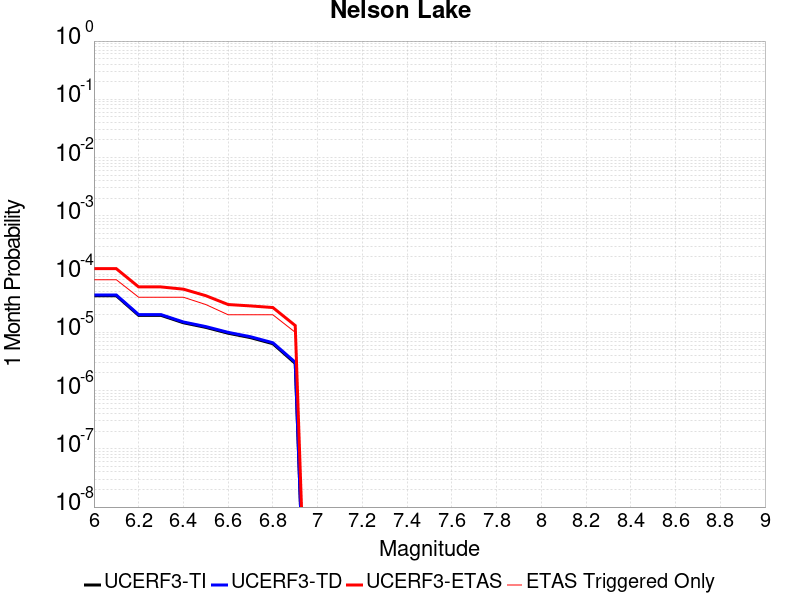 |  |  |

| Magnitude | 1 wk TI Prob | 1 wk TD Prob | 1 wk ETAS Prob | 1 wk ETAS/TD Gain | 1 wk ETAS Triggered Only | 1 mo TI Prob | 1 mo TD Prob | 1 mo ETAS Prob | 1 mo ETAS/TD Gain | 1 mo ETAS Triggered Only | 1 yr TI Prob | 1 yr TD Prob | 1 yr ETAS Prob | 1 yr ETAS/TD Gain | 1 yr ETAS Triggered Only | 10 yr TI Prob | 10 yr TD Prob | 10 yr ETAS Prob | 10 yr ETAS/TD Gain | 10 yr ETAS Triggered Only |
|-----|-----|-----|-----|-----|-----|-----|-----|-----|-----|-----|-----|-----|-----|-----|-----|-----|-----|-----|-----|-----|
| 6.0 | 9.913453E-6 | 1.0192293E-5 | 1.0192293E-5 | 1.0 | 0.0 | 4.2485535E-5 | 4.3680586E-5 | 1.028496E-4 | 2.3545837 | 5.9171598E-5 | 5.1713863E-4 | 5.316917E-4 | 5.908318E-4 | 1.1112301 | 5.9171598E-5 | 0.0051593683 | 0.0053052236 | 0.005422939 | 1.0221885 | 1.18343196E-4 |
| 6.1 | 9.913453E-6 | 1.0192293E-5 | 1.0192293E-5 | 1.0 | 0.0 | 4.2485535E-5 | 4.3680586E-5 | 1.028496E-4 | 2.3545837 | 5.9171598E-5 | 5.1713863E-4 | 5.316917E-4 | 5.908318E-4 | 1.1112301 | 5.9171598E-5 | 0.0051593683 | 0.0053052236 | 0.005422939 | 1.0221885 | 1.18343196E-4 |
| 6.2 | 4.5596407E-6 | 4.696332E-6 | 4.696332E-6 | 1.0 | 0.0 | 1.954117E-5 | 2.0126989E-5 | 7.9297395E-5 | 3.939854 | 5.9171598E-5 | 2.3788778E-4 | 2.450198E-4 | 3.041769E-4 | 1.241438 | 5.9171598E-5 | 0.0023763329 | 0.0024476226 | 0.0025361627 | 1.0361739 | 8.87574E-5 |
| 6.3 | 4.5596407E-6 | 4.696332E-6 | 4.696332E-6 | 1.0 | 0.0 | 1.954117E-5 | 2.0126989E-5 | 7.9297395E-5 | 3.939854 | 5.9171598E-5 | 2.3788778E-4 | 2.450198E-4 | 3.041769E-4 | 1.241438 | 5.9171598E-5 | 0.0023763329 | 0.0024476226 | 0.0025361627 | 1.0361739 | 8.87574E-5 |
| 6.4 | 3.4025713E-6 | 3.509912E-6 | 3.509912E-6 | 1.0 | 0.0 | 1.4582367E-5 | 1.50423975E-5 | 7.421311E-5 | 4.9335957 | 5.9171598E-5 | 1.7752586E-4 | 1.8312664E-4 | 2.4228741E-4 | 1.3230593 | 5.9171598E-5 | 0.001773841 | 0.0018298404 | 0.0018889037 | 1.0322778 | 5.9171598E-5 |
| 6.5 | 2.8352947E-6 | 2.9278688E-6 | 2.9278688E-6 | 1.0 | 0.0 | 1.2151207E-5 | 1.2547953E-5 | 4.213338E-5 | 3.357789 | 2.9585799E-5 | 1.479309E-4 | 1.5276136E-4 | 1.8234264E-4 | 1.1936437 | 2.9585799E-5 | 0.0014783246 | 0.0015266375 | 0.0015561781 | 1.0193502 | 2.9585799E-5 |
| 6.6 | 2.251518E-6 | 2.3290781E-6 | 2.3290781E-6 | 1.0 | 0.0 | 9.649328E-6 | 9.981729E-6 | 3.9567232E-5 | 3.9639657 | 2.9585799E-5 | 1.1747423E-4 | 1.2152141E-4 | 1.5110361E-4 | 1.243432 | 2.9585799E-5 | 0.0011741214 | 0.0012146112 | 0.0012441612 | 1.0243287 | 2.9585799E-5 |
| 6.7 | 1.8911853E-6 | 1.9591491E-6 | 1.9591491E-6 | 1.0 | 0.0 | 8.105055E-6 | 8.39633E-6 | 3.798188E-5 | 4.523629 | 2.9585799E-5 | 9.867457E-5 | 1.022211E-4 | 1.3180387E-4 | 1.2893999 | 2.9585799E-5 | 9.863076E-4 | 0.0010217984 | 0.0010513539 | 1.0289251 | 2.9585799E-5 |
| 6.8 | 1.4874814E-6 | 1.5438383E-6 | 1.5438383E-6 | 1.0 | 0.0 | 6.374905E-6 | 6.6164357E-6 | 3.620204E-5 | 5.471532 | 2.9585799E-5 | 7.76117E-5 | 8.055265E-5 | 1.1013606E-4 | 1.3672557 | 2.9585799E-5 | 7.75846E-4 | 8.052856E-4 | 8.3484757E-4 | 1.0367099 | 2.9585799E-5 |
| 6.9 | 6.835972E-7 | 7.1399705E-7 | 7.1399705E-7 | 1.0 | 0.0 | 2.9296991E-6 | 3.0599856E-6 | 3.2645694E-5 | 10.668578 | 2.9585799E-5 | 3.56685E-5 | 3.7255006E-5 | 6.6839704E-5 | 1.7941134 | 2.9585799E-5 | 3.5662777E-4 | 3.7251884E-4 | 4.0209363E-4 | 1.0793914 | 2.9585799E-5 |

## Death Valley (Black Mtns Frontal)
*[(top)](#table-of-contents)*

| 1 Week | 1 Month | 1 Year | 10 Year |
|-----|-----|-----|-----|
|  |  |  |  |

| Magnitude | 1 wk TI Prob | 1 wk TD Prob | 1 wk ETAS Prob | 1 wk ETAS/TD Gain | 1 wk ETAS Triggered Only | 1 mo TI Prob | 1 mo TD Prob | 1 mo ETAS Prob | 1 mo ETAS/TD Gain | 1 mo ETAS Triggered Only | 1 yr TI Prob | 1 yr TD Prob | 1 yr ETAS Prob | 1 yr ETAS/TD Gain | 1 yr ETAS Triggered Only | 10 yr TI Prob | 10 yr TD Prob | 10 yr ETAS Prob | 10 yr ETAS/TD Gain | 10 yr ETAS Triggered Only |
|-----|-----|-----|-----|-----|-----|-----|-----|-----|-----|-----|-----|-----|-----|-----|-----|-----|-----|-----|-----|-----|
| 6.0 | 1.6707214E-5 | 1.867056E-5 | 4.8255806E-5 | 2.5845933 | 2.9585799E-5 | 7.160038E-5 | 8.001427E-5 | 1.3918114E-4 | 1.7394538 | 5.9171598E-5 | 8.71386E-4 | 9.7374606E-4 | 0.001062417 | 1.0910617 | 8.87574E-5 | 0.00867977 | 0.009695647 | 0.009812843 | 1.0120875 | 1.18343196E-4 |
| 6.1 | 1.6707214E-5 | 1.867056E-5 | 4.8255806E-5 | 2.5845933 | 2.9585799E-5 | 7.160038E-5 | 8.001427E-5 | 1.3918114E-4 | 1.7394538 | 5.9171598E-5 | 8.71386E-4 | 9.7374606E-4 | 0.001062417 | 1.0910617 | 8.87574E-5 | 0.00867977 | 0.009695647 | 0.009812843 | 1.0120875 | 1.18343196E-4 |
| 6.2 | 1.6707214E-5 | 1.867056E-5 | 4.8255806E-5 | 2.5845933 | 2.9585799E-5 | 7.160038E-5 | 8.001427E-5 | 1.3918114E-4 | 1.7394538 | 5.9171598E-5 | 8.71386E-4 | 9.7374606E-4 | 0.001062417 | 1.0910617 | 8.87574E-5 | 0.00867977 | 0.009695647 | 0.009812843 | 1.0120875 | 1.18343196E-4 |
| 6.3 | 1.6707214E-5 | 1.867056E-5 | 4.8255806E-5 | 2.5845933 | 2.9585799E-5 | 7.160038E-5 | 8.001427E-5 | 1.3918114E-4 | 1.7394538 | 5.9171598E-5 | 8.71386E-4 | 9.7374606E-4 | 0.001062417 | 1.0910617 | 8.87574E-5 | 0.00867977 | 0.009695647 | 0.009812843 | 1.0120875 | 1.18343196E-4 |
| 6.4 | 1.5515609E-5 | 1.7338483E-5 | 4.692377E-5 | 2.7063363 | 2.9585799E-5 | 6.649377E-5 | 7.430571E-5 | 1.334729E-4 | 1.7962673 | 5.9171598E-5 | 8.0926094E-4 | 9.0430264E-4 | 9.929797E-4 | 1.0980613 | 8.87574E-5 | 0.008063202 | 0.009006913 | 0.009124191 | 1.0130208 | 1.18343196E-4 |
| 6.5 | 1.5515609E-5 | 1.7338483E-5 | 4.692377E-5 | 2.7063363 | 2.9585799E-5 | 6.649377E-5 | 7.430571E-5 | 1.334729E-4 | 1.7962673 | 5.9171598E-5 | 8.0926094E-4 | 9.0430264E-4 | 9.929797E-4 | 1.0980613 | 8.87574E-5 | 0.008063202 | 0.009006913 | 0.009124191 | 1.0130208 | 1.18343196E-4 |
| 6.6 | 1.5041828E-5 | 1.6809407E-5 | 4.6394707E-5 | 2.7600443 | 2.9585799E-5 | 6.4463384E-5 | 7.203836E-5 | 1.312057E-4 | 1.8213309 | 5.9171598E-5 | 7.8455906E-4 | 8.7672E-4 | 9.653996E-4 | 1.1011492 | 8.87574E-5 | 0.00781795 | 0.008733268 | 0.008850578 | 1.0134325 | 1.18343196E-4 |
| 6.7 | 1.4634985E-5 | 1.6356273E-5 | 4.5941586E-5 | 2.8088055 | 2.9585799E-5 | 6.271985E-5 | 7.009646E-5 | 1.292639E-4 | 1.8440862 | 5.9171598E-5 | 7.6334673E-4 | 8.53096E-4 | 9.4177766E-4 | 1.1039528 | 8.87574E-5 | 0.007607299 | 0.008498848 | 0.008616186 | 1.0138062 | 1.18343196E-4 |
| 6.8 | 1.4209158E-5 | 1.5882297E-5 | 4.5467626E-5 | 2.8627865 | 2.9585799E-5 | 6.089497E-5 | 6.806524E-5 | 1.2723281E-4 | 1.8692774 | 5.9171598E-5 | 7.4114406E-4 | 8.2838483E-4 | 9.1706874E-4 | 1.1070564 | 8.87574E-5 | 0.007386771 | 0.008253585 | 0.008370952 | 1.01422 | 1.18343196E-4 |
| 6.9 | 1.3780098E-5 | 1.5404834E-5 | 4.4990178E-5 | 2.9205232 | 2.9585799E-5 | 5.9056227E-5 | 6.601908E-5 | 1.2518677E-4 | 1.896221 | 5.9171598E-5 | 7.1877235E-4 | 8.0349133E-4 | 8.921774E-4 | 1.1103759 | 8.87574E-5 | 0.0071645193 | 0.008006458 | 0.008123853 | 1.0146626 | 1.18343196E-4 |
| 7.0 | 1.3585064E-5 | 1.5188394E-5 | 4.4773744E-5 | 2.947892 | 2.9585799E-5 | 5.8220405E-5 | 6.5091524E-5 | 1.2425927E-4 | 1.9089931 | 5.9171598E-5 | 7.086029E-4 | 7.922066E-4 | 8.8089367E-4 | 1.1119494 | 8.87574E-5 | 0.007063476 | 0.007894417 | 0.008011826 | 1.0148724 | 1.18343196E-4 |
| 7.1 | 1.3398601E-5 | 1.4981575E-5 | 4.4566932E-5 | 2.9747827 | 2.9585799E-5 | 5.742131E-5 | 6.4205204E-5 | 1.23373E-4 | 1.9215422 | 5.9171598E-5 | 6.9888023E-4 | 7.814234E-4 | 8.7011146E-4 | 1.1134955 | 8.87574E-5 | 0.0069668638 | 0.007787346 | 0.007904768 | 1.0150785 | 1.18343196E-4 |
| 7.2 | 1.3126312E-5 | 1.4679792E-5 | 4.4265158E-5 | 3.0153804 | 2.9585799E-5 | 5.6254412E-5 | 6.291191E-5 | 1.2207979E-4 | 1.9404877 | 5.9171598E-5 | 6.846822E-4 | 7.656887E-4 | 8.5437816E-4 | 1.1158296 | 8.87574E-5 | 0.006825765 | 0.00763109 | 0.00774853 | 1.0153897 | 1.18343196E-4 |
| 7.3 | 1.2922429E-5 | 1.4454016E-5 | 4.403939E-5 | 3.0468616 | 2.9585799E-5 | 5.5380664E-5 | 6.1944345E-5 | 1.2111227E-4 | 1.955179 | 5.9171598E-5 | 6.74051E-4 | 7.5391686E-4 | 8.4260735E-4 | 1.1176397 | 8.87574E-5 | 0.006720101 | 0.0075141727 | 0.007631627 | 1.015631 | 1.18343196E-4 |
| 7.4 | 1.2768878E-5 | 1.4283997E-5 | 4.386937E-5 | 3.0712254 | 2.9585799E-5 | 5.4722615E-5 | 6.1215724E-5 | 1.203837E-4 | 1.9665487 | 5.9171598E-5 | 6.660441E-4 | 7.45052E-4 | 8.3374325E-4 | 1.1190404 | 8.87574E-5 | 0.0066405144 | 0.0074261203 | 0.007543585 | 1.0158178 | 1.18343196E-4 |
| 7.5 | 1.2521929E-5 | 1.40122365E-5 | 4.359762E-5 | 3.1113963 | 2.9585799E-5 | 5.366431E-5 | 6.0051094E-5 | 1.19219134E-4 | 1.985295 | 5.9171598E-5 | 6.531671E-4 | 7.308822E-4 | 8.1957475E-4 | 1.1213499 | 8.87574E-5 | 0.006512506 | 0.0072853607 | 0.0074028415 | 1.0161257 | 1.18343196E-4 |
| 7.6 | 1.1301089E-5 | 1.2648349E-5 | 4.2233773E-5 | 3.339074 | 2.9585799E-5 | 4.8432343E-5 | 5.4206117E-5 | 1.133745E-4 | 2.0915446 | 5.9171598E-5 | 5.895042E-4 | 6.597649E-4 | 7.484638E-4 | 1.1344401 | 8.87574E-5 | 0.0058794282 | 0.0065786145 | 0.006696179 | 1.0178708 | 1.18343196E-4 |
| 7.7 | 9.189108E-6 | 1.0283521E-5 | 3.9869017E-5 | 3.876981 | 2.9585799E-5 | 3.93813E-5 | 4.407152E-5 | 1.03240505E-4 | 2.3425674 | 5.9171598E-5 | 4.7936183E-4 | 5.3644367E-4 | 6.251535E-4 | 1.1653664 | 8.87574E-5 | 0.004783291 | 0.0053519984 | 0.0054697082 | 1.0219936 | 1.18343196E-4 |
| 7.8 | 3.4586725E-7 | 3.648288E-7 | 3.648288E-7 | 1.0 | 0.0 | 1.4822873E-6 | 1.5635511E-6 | 1.5635511E-6 | 1.0 | 0.0 | 1.80467E-5 | 1.9036073E-5 | 1.9036073E-5 | 1.0 | 0.0 | 1.8045233E-4 | 1.9034486E-4 | 1.9034486E-4 | 1.0 | 0.0 |
| 7.9 | 2.5591178E-9 | 2.6696871E-9 | 2.6696871E-9 | 1.0 | 0.0 | 1.0967647E-8 | 1.1441516E-8 | 1.1441516E-8 | 1.0 | 0.0 | 1.335311E-7 | 1.3930045E-7 | 1.3930045E-7 | 1.0 | 0.0 | 1.3353102E-6 | 1.3930046E-6 | 1.3930046E-6 | 1.0 | 0.0 |

## Death Valley (Fish Lake Valley)
*[(top)](#table-of-contents)*

| 1 Week | 1 Month | 1 Year | 10 Year |
|-----|-----|-----|-----|
|  | 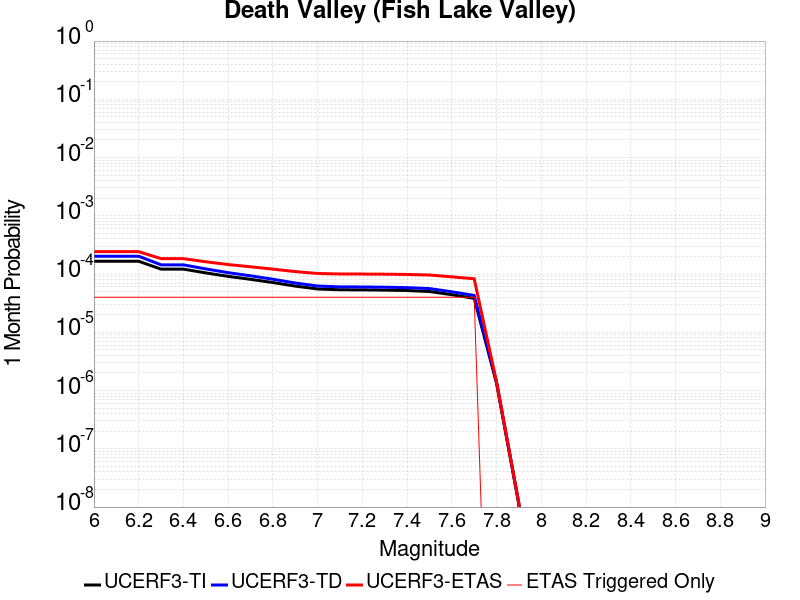 |  |  |

| Magnitude | 1 wk TI Prob | 1 wk TD Prob | 1 wk ETAS Prob | 1 wk ETAS/TD Gain | 1 wk ETAS Triggered Only | 1 mo TI Prob | 1 mo TD Prob | 1 mo ETAS Prob | 1 mo ETAS/TD Gain | 1 mo ETAS Triggered Only | 1 yr TI Prob | 1 yr TD Prob | 1 yr ETAS Prob | 1 yr ETAS/TD Gain | 1 yr ETAS Triggered Only | 10 yr TI Prob | 10 yr TD Prob | 10 yr ETAS Prob | 10 yr ETAS/TD Gain | 10 yr ETAS Triggered Only |
|-----|-----|-----|-----|-----|-----|-----|-----|-----|-----|-----|-----|-----|-----|-----|-----|-----|-----|-----|-----|-----|
| 6.0 | 3.872328E-5 | 4.7268895E-5 | 7.685329E-5 | 1.6258746 | 2.9585799E-5 | 1.6594635E-4 | 2.0256694E-4 | 2.6172656E-4 | 1.2920496 | 5.9171598E-5 | 0.0020185246 | 0.0024636039 | 0.0025521426 | 1.0359387 | 8.87574E-5 | 0.02000288 | 0.024388881 | 0.02450434 | 1.004734 | 1.18343196E-4 |
| 6.1 | 3.872328E-5 | 4.7268895E-5 | 7.685329E-5 | 1.6258746 | 2.9585799E-5 | 1.6594635E-4 | 2.0256694E-4 | 2.6172656E-4 | 1.2920496 | 5.9171598E-5 | 0.0020185246 | 0.0024636039 | 0.0025521426 | 1.0359387 | 8.87574E-5 | 0.02000288 | 0.024388881 | 0.02450434 | 1.004734 | 1.18343196E-4 |
| 6.2 | 3.872328E-5 | 4.7268895E-5 | 7.685329E-5 | 1.6258746 | 2.9585799E-5 | 1.6594635E-4 | 2.0256694E-4 | 2.6172656E-4 | 1.2920496 | 5.9171598E-5 | 0.0020185246 | 0.0024636039 | 0.0025521426 | 1.0359387 | 8.87574E-5 | 0.02000288 | 0.024388881 | 0.02450434 | 1.004734 | 1.18343196E-4 |
| 6.3 | 2.8356371E-5 | 3.3610693E-5 | 6.31955E-5 | 1.8802199 | 2.9585799E-5 | 1.2152165E-4 | 1.4403832E-4 | 2.032014E-4 | 1.4107454 | 5.9171598E-5 | 0.0014785219 | 0.001752335 | 0.0018409368 | 1.0505621 | 8.87574E-5 | 0.014687235 | 0.01739221 | 0.017508496 | 1.0066861 | 1.18343196E-4 |
| 6.4 | 2.8356371E-5 | 3.3610693E-5 | 6.31955E-5 | 1.8802199 | 2.9585799E-5 | 1.2152165E-4 | 1.4403832E-4 | 2.032014E-4 | 1.4107454 | 5.9171598E-5 | 0.0014785219 | 0.001752335 | 0.0018409368 | 1.0505621 | 8.87574E-5 | 0.014687235 | 0.01739221 | 0.017508496 | 1.0066861 | 1.18343196E-4 |
| 6.5 | 2.4448687E-5 | 2.8608209E-5 | 5.819316E-5 | 2.034142 | 2.9585799E-5 | 1.0477588E-4 | 1.2260114E-4 | 1.8176547E-4 | 1.4825759 | 5.9171598E-5 | 0.0012748998 | 0.0014916973 | 0.0015803223 | 1.0594122 | 8.87574E-5 | 0.012676105 | 0.014821712 | 0.014938301 | 1.0078661 | 1.18343196E-4 |
| 6.6 | 2.1298161E-5 | 2.4660607E-5 | 5.4245676E-5 | 2.1996894 | 2.9585799E-5 | 9.127464E-5 | 1.0568422E-4 | 1.6484957E-4 | 1.5598314 | 5.9171598E-5 | 0.0011107022 | 0.0012859798 | 0.001374623 | 1.0689305 | 8.87574E-5 | 0.011051672 | 0.012788794 | 0.012905624 | 1.0091354 | 1.18343196E-4 |
| 6.7 | 1.8959729E-5 | 2.178146E-5 | 5.1366613E-5 | 2.3582723 | 2.9585799E-5 | 8.125345E-5 | 9.3345916E-5 | 1.5251199E-4 | 1.6338367 | 5.9171598E-5 | 9.888117E-4 | 0.0011359196 | 0.0012245761 | 1.0780482 | 8.87574E-5 | 0.009844234 | 0.011303794 | 0.011420799 | 1.010351 | 1.18343196E-4 |
| 6.8 | 1.6691629E-5 | 1.9018706E-5 | 4.8603943E-5 | 2.555586 | 2.9585799E-5 | 7.153359E-5 | 8.150629E-5 | 1.4067306E-4 | 1.7259166 | 5.9171598E-5 | 8.7057345E-4 | 9.919042E-4 | 0.0010805735 | 1.089393 | 8.87574E-5 | 0.008671708 | 0.009876527 | 0.009993701 | 1.011864 | 1.18343196E-4 |
| 6.9 | 1.450505E-5 | 1.6389824E-5 | 4.597514E-5 | 2.8051026 | 2.9585799E-5 | 6.216302E-5 | 7.024026E-5 | 1.294077E-4 | 1.842358 | 5.9171598E-5 | 7.5657194E-4 | 8.548484E-4 | 9.4352994E-4 | 1.1037395 | 8.87574E-5 | 0.007540013 | 0.008516532 | 0.008633868 | 1.0137774 | 1.18343196E-4 |
| 7.0 | 1.2940855E-5 | 1.453821E-5 | 4.412358E-5 | 3.0350077 | 2.9585799E-5 | 5.545963E-5 | 6.230516E-5 | 1.2147307E-4 | 1.9496471 | 5.9171598E-5 | 6.750118E-4 | 7.583071E-4 | 8.469972E-4 | 1.116958 | 8.87574E-5 | 0.006729651 | 0.0075578135 | 0.007675262 | 1.01554 | 1.18343196E-4 |
| 7.1 | 1.2544658E-5 | 1.4078437E-5 | 4.366382E-5 | 3.1014678 | 2.9585799E-5 | 5.3761712E-5 | 6.033479E-5 | 1.1950282E-4 | 1.9806619 | 5.9171598E-5 | 6.5435225E-4 | 7.343341E-4 | 8.2302635E-4 | 1.1207792 | 8.87574E-5 | 0.006524288 | 0.0073196692 | 0.0074371463 | 1.0160495 | 1.18343196E-4 |
| 7.2 | 1.2489416E-5 | 1.4015902E-5 | 4.3601285E-5 | 3.1108441 | 2.9585799E-5 | 5.3524967E-5 | 6.00668E-5 | 1.1923484E-4 | 1.9850373 | 5.9171598E-5 | 6.514716E-4 | 7.310735E-4 | 8.19766E-4 | 1.1213182 | 8.87574E-5 | 0.006495651 | 0.007287278 | 0.0074047586 | 1.0161214 | 1.18343196E-4 |
| 7.3 | 1.2368307E-5 | 1.3880038E-5 | 4.3465425E-5 | 3.1315062 | 2.9585799E-5 | 5.3005948E-5 | 5.948455E-5 | 1.1865263E-4 | 1.9946797 | 5.9171598E-5 | 6.451563E-4 | 7.239894E-4 | 8.126825E-4 | 1.1225061 | 8.87574E-5 | 0.0064328653 | 0.0072168987 | 0.007334388 | 1.0162797 | 1.18343196E-4 |
| 7.4 | 1.2161707E-5 | 1.3648089E-5 | 4.3233485E-5 | 3.1677315 | 2.9585799E-5 | 5.212056E-5 | 5.8490532E-5 | 1.1765867E-4 | 2.0115848 | 5.9171598E-5 | 6.3438306E-4 | 7.118952E-4 | 8.005894E-4 | 1.1245888 | 8.87574E-5 | 0.006325751 | 0.0070967353 | 0.007214239 | 1.0165573 | 1.18343196E-4 |
| 7.5 | 1.1707948E-5 | 1.314573E-5 | 4.273114E-5 | 3.250572 | 2.9585799E-5 | 5.0175953E-5 | 5.6337656E-5 | 1.1550592E-4 | 2.0502436 | 5.9171598E-5 | 6.10721E-4 | 6.857007E-4 | 7.743972E-4 | 1.1293517 | 8.87574E-5 | 0.0060904534 | 0.0068364325 | 0.0069539663 | 1.0171924 | 1.18343196E-4 |
| 7.6 | 1.0319538E-5 | 1.157981E-5 | 4.1165265E-5 | 3.5549173 | 2.9585799E-5 | 4.4225842E-5 | 4.9626844E-5 | 1.087955E-4 | 2.1922712 | 5.9171598E-5 | 5.383166E-4 | 6.040445E-4 | 6.927483E-4 | 1.1468498 | 8.87574E-5 | 0.0053701443 | 0.0060245576 | 0.006142188 | 1.0195252 | 1.18343196E-4 |
| 7.7 | 8.937764E-6 | 1.0022941E-5 | 3.9608443E-5 | 3.9517787 | 2.9585799E-5 | 3.830414E-5 | 4.295478E-5 | 1.02123835E-4 | 2.377473 | 5.9171598E-5 | 4.6625308E-4 | 5.2285404E-4 | 6.11565E-4 | 1.1696669 | 8.87574E-5 | 0.0046527605 | 0.005216748 | 0.005334474 | 1.0225669 | 1.18343196E-4 |
| 7.8 | 3.108007E-7 | 3.2846788E-7 | 3.2846788E-7 | 1.0 | 0.0 | 1.3320023E-6 | 1.4077187E-6 | 1.4077187E-6 | 1.0 | 0.0 | 1.6217007E-5 | 1.7138846E-5 | 1.7138846E-5 | 1.0 | 0.0 | 1.6215823E-4 | 1.713756E-4 | 1.713756E-4 | 1.0 | 0.0 |
| 7.9 | 2.5591178E-9 | 2.6696871E-9 | 2.6696871E-9 | 1.0 | 0.0 | 1.0967647E-8 | 1.1441516E-8 | 1.1441516E-8 | 1.0 | 0.0 | 1.335311E-7 | 1.3930045E-7 | 1.3930045E-7 | 1.0 | 0.0 | 1.3353102E-6 | 1.3930046E-6 | 1.3930046E-6 | 1.0 | 0.0 |

## Death Valley (No)
*[(top)](#table-of-contents)*

| 1 Week | 1 Month | 1 Year | 10 Year |
|-----|-----|-----|-----|
|  |  |  |  |

| Magnitude | 1 wk TI Prob | 1 wk TD Prob | 1 wk ETAS Prob | 1 wk ETAS/TD Gain | 1 wk ETAS Triggered Only | 1 mo TI Prob | 1 mo TD Prob | 1 mo ETAS Prob | 1 mo ETAS/TD Gain | 1 mo ETAS Triggered Only | 1 yr TI Prob | 1 yr TD Prob | 1 yr ETAS Prob | 1 yr ETAS/TD Gain | 1 yr ETAS Triggered Only | 10 yr TI Prob | 10 yr TD Prob | 10 yr ETAS Prob | 10 yr ETAS/TD Gain | 10 yr ETAS Triggered Only |
|-----|-----|-----|-----|-----|-----|-----|-----|-----|-----|-----|-----|-----|-----|-----|-----|-----|-----|-----|-----|-----|
| 6.0 | 2.0074807E-5 | 2.2500446E-5 | 5.208558E-5 | 2.3148687 | 2.9585799E-5 | 8.603206E-5 | 9.642696E-5 | 1.5559285E-4 | 1.6135825 | 5.9171598E-5 | 0.001046937 | 0.0011733733 | 0.0012620266 | 1.0755541 | 8.87574E-5 | 0.010420183 | 0.011672693 | 0.011789655 | 1.0100201 | 1.18343196E-4 |
| 6.1 | 2.0074807E-5 | 2.2500446E-5 | 5.208558E-5 | 2.3148687 | 2.9585799E-5 | 8.603206E-5 | 9.642696E-5 | 1.5559285E-4 | 1.6135825 | 5.9171598E-5 | 0.001046937 | 0.0011733733 | 0.0012620266 | 1.0755541 | 8.87574E-5 | 0.010420183 | 0.011672693 | 0.011789655 | 1.0100201 | 1.18343196E-4 |
| 6.2 | 2.0074807E-5 | 2.2500446E-5 | 5.208558E-5 | 2.3148687 | 2.9585799E-5 | 8.603206E-5 | 9.642696E-5 | 1.5559285E-4 | 1.6135825 | 5.9171598E-5 | 0.001046937 | 0.0011733733 | 0.0012620266 | 1.0755541 | 8.87574E-5 | 0.010420183 | 0.011672693 | 0.011789655 | 1.0100201 | 1.18343196E-4 |
| 6.3 | 1.9050609E-5 | 2.1337288E-5 | 5.0922456E-5 | 2.3865476 | 2.9585799E-5 | 8.164292E-5 | 9.144236E-5 | 1.5060854E-4 | 1.6470326 | 5.9171598E-5 | 9.935491E-4 | 0.0011127489 | 0.0012014075 | 1.0796753 | 8.87574E-5 | 0.009891188 | 0.011072595 | 0.011189627 | 1.0105696 | 1.18343196E-4 |
| 6.4 | 1.9050609E-5 | 2.1337288E-5 | 5.0922456E-5 | 2.3865476 | 2.9585799E-5 | 8.164292E-5 | 9.144236E-5 | 1.5060854E-4 | 1.6470326 | 5.9171598E-5 | 9.935491E-4 | 0.0011127489 | 0.0012014075 | 1.0796753 | 8.87574E-5 | 0.009891188 | 0.011072595 | 0.011189627 | 1.0105696 | 1.18343196E-4 |
| 6.5 | 1.8367004E-5 | 2.0561336E-5 | 5.0146526E-5 | 2.438875 | 2.9585799E-5 | 7.8713354E-5 | 8.811707E-5 | 1.4728346E-4 | 1.671452 | 5.9171598E-5 | 9.5791375E-4 | 0.0010723039 | 0.0011609661 | 1.0826838 | 8.87574E-5 | 0.009537951 | 0.010672084 | 0.010789164 | 1.0109707 | 1.18343196E-4 |
| 6.6 | 1.779439E-5 | 1.9911244E-5 | 4.9496455E-5 | 2.4858544 | 2.9585799E-5 | 7.625944E-5 | 8.533114E-5 | 1.444977E-4 | 1.6933757 | 5.9171598E-5 | 9.280632E-4 | 0.0010384179 | 0.0011270832 | 1.085385 | 8.87574E-5 | 0.009241969 | 0.010336416 | 0.010453535 | 1.0113308 | 1.18343196E-4 |
| 6.7 | 1.7025437E-5 | 1.9043726E-5 | 4.862896E-5 | 2.5535424 | 2.9585799E-5 | 7.296412E-5 | 8.161345E-5 | 1.4078022E-4 | 1.7249634 | 5.9171598E-5 | 8.87976E-4 | 9.93197E-4 | 0.0010818662 | 1.0892766 | 8.87574E-5 | 0.008844362 | 0.009888301 | 0.010005474 | 1.0118496 | 1.18343196E-4 |
| 6.8 | 1.6545107E-5 | 1.851284E-5 | 4.809809E-5 | 2.5980937 | 2.9585799E-5 | 7.090568E-5 | 7.933836E-5 | 1.3850526E-4 | 1.745754 | 5.9171598E-5 | 8.629347E-4 | 9.655226E-4 | 0.0010541943 | 1.091838 | 8.87574E-5 | 0.008595915 | 0.009613981 | 0.009731186 | 1.0121912 | 1.18343196E-4 |
| 6.9 | 1.615478E-5 | 1.8087881E-5 | 4.7673147E-5 | 2.63564 | 2.9585799E-5 | 6.9232934E-5 | 7.751722E-5 | 1.3668423E-4 | 1.7632756 | 5.9171598E-5 | 8.4258494E-4 | 9.433697E-4 | 0.0010320434 | 1.0939968 | 8.87574E-5 | 0.008393973 | 0.009394345 | 0.009511576 | 1.012479 | 1.18343196E-4 |
| 7.0 | 1.5894311E-5 | 1.7805834E-5 | 4.7391106E-5 | 2.6615493 | 2.9585799E-5 | 6.81167E-5 | 7.6308526E-5 | 1.3547561E-4 | 1.7753667 | 5.9171598E-5 | 8.2900526E-4 | 9.286663E-4 | 0.0010173413 | 1.0954864 | 8.87574E-5 | 0.008259195 | 0.009248544 | 0.009365793 | 1.0126776 | 1.18343196E-4 |
| 7.1 | 1.5602263E-5 | 1.7483784E-5 | 4.7069065E-5 | 2.6921556 | 2.9585799E-5 | 6.6865134E-5 | 7.4928386E-5 | 1.3409555E-4 | 1.7896495 | 5.9171598E-5 | 8.137789E-4 | 9.118773E-4 | 0.0010005538 | 1.097246 | 8.87574E-5 | 0.008108052 | 0.009082039 | 0.009199307 | 1.0129122 | 1.18343196E-4 |
| 7.2 | 1.5323829E-5 | 1.7170905E-5 | 4.6756195E-5 | 2.7229896 | 2.9585799E-5 | 6.56719E-5 | 7.358755E-5 | 1.327548E-4 | 1.8040388 | 5.9171598E-5 | 7.99262E-4 | 8.9556625E-4 | 9.842442E-4 | 1.0990188 | 8.87574E-5 | 0.007963934 | 0.008920249 | 0.009037537 | 1.0131484 | 1.18343196E-4 |
| 7.3 | 1.4556212E-5 | 1.6302716E-5 | 4.588803E-5 | 2.8147478 | 2.9585799E-5 | 6.238227E-5 | 6.986695E-5 | 1.2903441E-4 | 1.8468592 | 5.9171598E-5 | 7.592395E-4 | 8.503039E-4 | 9.3898585E-4 | 1.1042944 | 8.87574E-5 | 0.0075665074 | 0.008471149 | 0.00858849 | 1.0138518 | 1.18343196E-4 |
| 7.4 | 1.411725E-5 | 1.5808211E-5 | 4.5393543E-5 | 2.8715167 | 2.9585799E-5 | 6.0501097E-5 | 6.774775E-5 | 1.2691534E-4 | 1.8733513 | 5.9171598E-5 | 7.363519E-4 | 8.245226E-4 | 9.132068E-4 | 1.1075583 | 8.87574E-5 | 0.0073391674 | 0.008215268 | 0.00833264 | 1.0142869 | 1.18343196E-4 |
| 7.5 | 1.3503312E-5 | 1.5126531E-5 | 4.4711884E-5 | 2.9558582 | 2.9585799E-5 | 5.7870053E-5 | 6.482641E-5 | 1.2399418E-4 | 1.9127108 | 5.9171598E-5 | 7.043401E-4 | 7.8898156E-4 | 8.776689E-4 | 1.1124074 | 8.87574E-5 | 0.007021119 | 0.007862429 | 0.007979842 | 1.0149333 | 1.18343196E-4 |
| 7.6 | 1.1279839E-5 | 1.2626528E-5 | 4.2211952E-5 | 3.3431165 | 2.9585799E-5 | 4.834127E-5 | 5.4112596E-5 | 1.1328099E-4 | 2.093431 | 5.9171598E-5 | 5.88396E-4 | 6.58627E-4 | 7.4732595E-4 | 1.1346725 | 8.87574E-5 | 0.005868405 | 0.0065673026 | 0.0066848686 | 1.0179017 | 1.18343196E-4 |
| 7.7 | 9.189108E-6 | 1.0283521E-5 | 3.9869017E-5 | 3.876981 | 2.9585799E-5 | 3.93813E-5 | 4.407152E-5 | 1.03240505E-4 | 2.3425674 | 5.9171598E-5 | 4.7936183E-4 | 5.3644367E-4 | 6.251535E-4 | 1.1653664 | 8.87574E-5 | 0.004783291 | 0.0053519984 | 0.0054697082 | 1.0219936 | 1.18343196E-4 |
| 7.8 | 3.4586725E-7 | 3.648288E-7 | 3.648288E-7 | 1.0 | 0.0 | 1.4822873E-6 | 1.5635511E-6 | 1.5635511E-6 | 1.0 | 0.0 | 1.80467E-5 | 1.9036073E-5 | 1.9036073E-5 | 1.0 | 0.0 | 1.8045233E-4 | 1.9034486E-4 | 1.9034486E-4 | 1.0 | 0.0 |
| 7.9 | 2.5591178E-9 | 2.6696871E-9 | 2.6696871E-9 | 1.0 | 0.0 | 1.0967647E-8 | 1.1441516E-8 | 1.1441516E-8 | 1.0 | 0.0 | 1.335311E-7 | 1.3930045E-7 | 1.3930045E-7 | 1.0 | 0.0 | 1.3353102E-6 | 1.3930046E-6 | 1.3930046E-6 | 1.0 | 0.0 |

## Scodie Lineament
*[(top)](#table-of-contents)*

| 1 Week | 1 Month | 1 Year | 10 Year |
|-----|-----|-----|-----|
|  |  |  |  |

| Magnitude | 1 wk TI Prob | 1 wk TD Prob | 1 wk ETAS Prob | 1 wk ETAS/TD Gain | 1 wk ETAS Triggered Only | 1 mo TI Prob | 1 mo TD Prob | 1 mo ETAS Prob | 1 mo ETAS/TD Gain | 1 mo ETAS Triggered Only | 1 yr TI Prob | 1 yr TD Prob | 1 yr ETAS Prob | 1 yr ETAS/TD Gain | 1 yr ETAS Triggered Only | 10 yr TI Prob | 10 yr TD Prob | 10 yr ETAS Prob | 10 yr ETAS/TD Gain | 10 yr ETAS Triggered Only |
|-----|-----|-----|-----|-----|-----|-----|-----|-----|-----|-----|-----|-----|-----|-----|-----|-----|-----|-----|-----|-----|
| 6.0 | 3.2919327E-6 | 3.0133565E-6 | 3.2599066E-5 | 10.818191 | 2.9585799E-5 | 1.4108206E-5 | 1.2914339E-5 | 4.2499756E-5 | 3.2908967 | 2.9585799E-5 | 1.7175387E-4 | 1.5722391E-4 | 1.8680506E-4 | 1.1881466 | 2.9585799E-5 | 0.0017162118 | 0.0015714383 | 0.0016600563 | 1.0563929 | 8.87574E-5 |
| 6.1 | 1.8663811E-6 | 1.5490589E-6 | 1.5490589E-6 | 1.0 | 0.0 | 7.998751E-6 | 6.6388097E-6 | 6.6388097E-6 | 1.0 | 0.0 | 9.738045E-5 | 8.082501E-5 | 8.082501E-5 | 1.0 | 0.0 | 9.7337784E-4 | 8.0800493E-4 | 8.3756685E-4 | 1.0365863 | 2.9585799E-5 |
| 6.2 | 1.8663811E-6 | 1.5490589E-6 | 1.5490589E-6 | 1.0 | 0.0 | 7.998751E-6 | 6.6388097E-6 | 6.6388097E-6 | 1.0 | 0.0 | 9.738045E-5 | 8.082501E-5 | 8.082501E-5 | 1.0 | 0.0 | 9.7337784E-4 | 8.0800493E-4 | 8.3756685E-4 | 1.0365863 | 2.9585799E-5 |
| 6.3 | 1.8663811E-6 | 1.5490589E-6 | 1.5490589E-6 | 1.0 | 0.0 | 7.998751E-6 | 6.6388097E-6 | 6.6388097E-6 | 1.0 | 0.0 | 9.738045E-5 | 8.082501E-5 | 8.082501E-5 | 1.0 | 0.0 | 9.7337784E-4 | 8.0800493E-4 | 8.3756685E-4 | 1.0365863 | 2.9585799E-5 |
| 6.4 | 1.8663811E-6 | 1.5490589E-6 | 1.5490589E-6 | 1.0 | 0.0 | 7.998751E-6 | 6.6388097E-6 | 6.6388097E-6 | 1.0 | 0.0 | 9.738045E-5 | 8.082501E-5 | 8.082501E-5 | 1.0 | 0.0 | 9.7337784E-4 | 8.0800493E-4 | 8.3756685E-4 | 1.0365863 | 2.9585799E-5 |
| 6.5 | 1.8106311E-6 | 1.4909926E-6 | 1.4909926E-6 | 1.0 | 0.0 | 7.759824E-6 | 6.3899556E-6 | 6.3899556E-6 | 1.0 | 0.0 | 9.447177E-5 | 7.779543E-5 | 7.779543E-5 | 1.0 | 0.0 | 9.4431615E-4 | 7.777306E-4 | 8.072934E-4 | 1.0380116 | 2.9585799E-5 |
| 6.6 | 1.2414679E-6 | 8.9976135E-7 | 8.9976135E-7 | 1.0 | 0.0 | 5.320566E-6 | 3.8561147E-6 | 3.8561147E-6 | 1.0 | 0.0 | 6.477596E-5 | 4.6947276E-5 | 4.6947276E-5 | 1.0 | 0.0 | 6.475708E-4 | 4.6938224E-4 | 4.6938224E-4 | 1.0 | 0.0 |
| 6.7 | 1.1062215E-6 | 7.5943603E-7 | 7.5943603E-7 | 1.0 | 0.0 | 4.7409408E-6 | 3.254722E-6 | 3.254722E-6 | 1.0 | 0.0 | 5.7719422E-5 | 3.9625593E-5 | 3.9625593E-5 | 1.0 | 0.0 | 5.770443E-4 | 3.9619225E-4 | 3.9619225E-4 | 1.0 | 0.0 |
| 6.8 | 1.0006736E-6 | 6.5004406E-7 | 6.5004406E-7 | 1.0 | 0.0 | 4.288594E-6 | 2.7859005E-6 | 2.7859005E-6 | 1.0 | 0.0 | 5.221238E-5 | 3.3917873E-5 | 3.3917873E-5 | 1.0 | 0.0 | 5.220012E-4 | 3.3913302E-4 | 3.3913302E-4 | 1.0 | 0.0 |
| 6.9 | 9.167364E-7 | 5.6316645E-7 | 5.6316645E-7 | 1.0 | 0.0 | 3.9288643E-6 | 2.4135686E-6 | 2.4135686E-6 | 1.0 | 0.0 | 4.7832873E-5 | 2.9384859E-5 | 2.9384859E-5 | 1.0 | 0.0 | 4.782258E-4 | 2.9381542E-4 | 2.9381542E-4 | 1.0 | 0.0 |
| 7.0 | 7.6987664E-7 | 4.113416E-7 | 4.113416E-7 | 1.0 | 0.0 | 3.2994672E-6 | 1.7628915E-6 | 1.7628915E-6 | 1.0 | 0.0 | 4.0170275E-5 | 2.1463033E-5 | 2.1463033E-5 | 1.0 | 0.0 | 4.0163012E-4 | 2.1461345E-4 | 2.1461345E-4 | 1.0 | 0.0 |
| 7.1 | 7.1038727E-7 | 3.5211795E-7 | 3.5211795E-7 | 1.0 | 0.0 | 3.0445133E-6 | 1.5090762E-6 | 1.5090762E-6 | 1.0 | 0.0 | 3.706632E-5 | 1.8372884E-5 | 1.8372884E-5 | 1.0 | 0.0 | 3.7060137E-4 | 1.8371714E-4 | 1.8371714E-4 | 1.0 | 0.0 |
| 7.2 | 2.0799602E-7 | 3.1187685E-8 | 3.1187685E-8 | 1.0 | 0.0 | 8.914113E-7 | 1.336615E-7 | 1.336615E-7 | 1.0 | 0.0 | 1.0852878E-5 | 1.6273277E-6 | 1.6273277E-6 | 1.0 | 0.0 | 1.08523476E-4 | 1.6273165E-5 | 1.6273165E-5 | 1.0 | 0.0 |
| 7.3 | 1.5048182E-7 | 1.5946263E-8 | 1.5946263E-8 | 1.0 | 0.0 | 6.449219E-7 | 6.834112E-8 | 6.834112E-8 | 1.0 | 0.0 | 7.851896E-6 | 8.320529E-7 | 8.320529E-7 | 1.0 | 0.0 | 7.851618E-5 | 8.3205005E-6 | 8.3205005E-6 | 1.0 | 0.0 |
| 7.4 | 5.9334678E-8 | 4.8685624E-9 | 4.8685624E-9 | 1.0 | 0.0 | 2.5429145E-7 | 2.0865269E-8 | 2.0865269E-8 | 1.0 | 0.0 | 3.095994E-6 | 2.5403463E-7 | 2.5403463E-7 | 1.0 | 0.0 | 3.095951E-5 | 2.5403444E-6 | 2.5403444E-6 | 1.0 | 0.0 |

## White Wolf (Extension)
*[(top)](#table-of-contents)*

| 1 Week | 1 Month | 1 Year | 10 Year |
|-----|-----|-----|-----|
|  |  |  |  |

| Magnitude | 1 wk TI Prob | 1 wk TD Prob | 1 wk ETAS Prob | 1 wk ETAS/TD Gain | 1 wk ETAS Triggered Only | 1 mo TI Prob | 1 mo TD Prob | 1 mo ETAS Prob | 1 mo ETAS/TD Gain | 1 mo ETAS Triggered Only | 1 yr TI Prob | 1 yr TD Prob | 1 yr ETAS Prob | 1 yr ETAS/TD Gain | 1 yr ETAS Triggered Only | 10 yr TI Prob | 10 yr TD Prob | 10 yr ETAS Prob | 10 yr ETAS/TD Gain | 10 yr ETAS Triggered Only |
|-----|-----|-----|-----|-----|-----|-----|-----|-----|-----|-----|-----|-----|-----|-----|-----|-----|-----|-----|-----|-----|
| 6.0 | 8.222555E-6 | 6.0667057E-6 | 6.0667057E-6 | 1.0 | 0.0 | 3.5239045E-5 | 2.5999947E-5 | 2.5999947E-5 | 1.0 | 0.0 | 4.289509E-4 | 3.1650998E-4 | 3.1650998E-4 | 1.0 | 0.0 | 0.0042812387 | 0.0031612439 | 0.0032497207 | 1.027988 | 8.87574E-5 |
| 6.1 | 8.222555E-6 | 6.0667057E-6 | 6.0667057E-6 | 1.0 | 0.0 | 3.5239045E-5 | 2.5999947E-5 | 2.5999947E-5 | 1.0 | 0.0 | 4.289509E-4 | 3.1650998E-4 | 3.1650998E-4 | 1.0 | 0.0 | 0.0042812387 | 0.0031612439 | 0.0032497207 | 1.027988 | 8.87574E-5 |
| 6.2 | 8.222555E-6 | 6.0667057E-6 | 6.0667057E-6 | 1.0 | 0.0 | 3.5239045E-5 | 2.5999947E-5 | 2.5999947E-5 | 1.0 | 0.0 | 4.289509E-4 | 3.1650998E-4 | 3.1650998E-4 | 1.0 | 0.0 | 0.0042812387 | 0.0031612439 | 0.0032497207 | 1.027988 | 8.87574E-5 |
| 6.3 | 8.222555E-6 | 6.0667057E-6 | 6.0667057E-6 | 1.0 | 0.0 | 3.5239045E-5 | 2.5999947E-5 | 2.5999947E-5 | 1.0 | 0.0 | 4.289509E-4 | 3.1650998E-4 | 3.1650998E-4 | 1.0 | 0.0 | 0.0042812387 | 0.0031612439 | 0.0032497207 | 1.027988 | 8.87574E-5 |
| 6.4 | 5.821773E-6 | 3.5572016E-6 | 3.5572016E-6 | 1.0 | 0.0 | 2.4950215E-5 | 1.5245067E-5 | 1.5245067E-5 | 1.0 | 0.0 | 3.0372653E-4 | 1.8559398E-4 | 1.8559398E-4 | 1.0 | 0.0 | 0.0030331176 | 0.0018544982 | 0.0019430909 | 1.0477718 | 8.87574E-5 |
| 6.5 | 5.766023E-6 | 3.4991353E-6 | 3.4991353E-6 | 1.0 | 0.0 | 2.4711293E-5 | 1.4996214E-5 | 1.4996214E-5 | 1.0 | 0.0 | 3.0081844E-4 | 1.8256472E-4 | 1.8256472E-4 | 1.0 | 0.0 | 0.0030041158 | 0.0018242556 | 0.001912851 | 1.0485653 | 8.87574E-5 |
| 6.6 | 4.643576E-6 | 2.332643E-6 | 2.332643E-6 | 1.0 | 0.0 | 1.9900888E-5 | 9.997005E-6 | 9.997005E-6 | 1.0 | 0.0 | 2.4226638E-4 | 1.2170716E-4 | 1.2170716E-4 | 1.0 | 0.0 | 0.0024200242 | 0.0012164476 | 0.0012755472 | 1.0485837 | 5.9171598E-5 |
| 6.7 | 3.9529173E-6 | 1.6483629E-6 | 1.6483629E-6 | 1.0 | 0.0 | 1.6940963E-5 | 7.064394E-6 | 7.064394E-6 | 1.0 | 0.0 | 2.0623671E-4 | 8.600579E-5 | 8.600579E-5 | 1.0 | 0.0 | 0.002060454 | 8.5974357E-4 | 8.893039E-4 | 1.0343828 | 2.9585799E-5 |
| 6.8 | 3.4377522E-6 | 1.2245362E-6 | 1.2245362E-6 | 1.0 | 0.0 | 1.473314E-5 | 5.2480023E-6 | 5.2480023E-6 | 1.0 | 0.0 | 1.7936122E-4 | 6.389264E-5 | 6.389264E-5 | 1.0 | 0.0 | 0.0017921652 | 6.3875184E-4 | 6.6831877E-4 | 1.0462886 | 2.9585799E-5 |
| 6.9 | 3.1367306E-6 | 1.0033893E-6 | 1.0033893E-6 | 1.0 | 0.0 | 1.3443062E-5 | 4.3002333E-6 | 4.3002333E-6 | 1.0 | 0.0 | 1.63657E-4 | 5.235416E-5 | 5.235416E-5 | 1.0 | 0.0 | 0.0016353652 | 5.234259E-4 | 5.529962E-4 | 1.0564938 | 2.9585799E-5 |
| 7.0 | 2.8298145E-6 | 7.4287595E-7 | 7.4287595E-7 | 1.0 | 0.0 | 1.2127721E-5 | 3.1837506E-6 | 3.1837506E-6 | 1.0 | 0.0 | 1.47645E-4 | 3.8761526E-5 | 3.8761526E-5 | 1.0 | 0.0 | 0.0014754693 | 3.8755263E-4 | 4.1712695E-4 | 1.0763105 | 2.9585799E-5 |
| 7.1 | 2.4091064E-6 | 5.4228286E-7 | 5.4228286E-7 | 1.0 | 0.0 | 1.03247E-5 | 2.3240675E-6 | 2.3240675E-6 | 1.0 | 0.0 | 1.2569598E-4 | 2.8295197E-5 | 2.8295197E-5 | 1.0 | 0.0 | 0.001256249 | 2.8291997E-4 | 3.124974E-4 | 1.1045434 | 2.9585799E-5 |
| 7.2 | 1.3875518E-6 | 1.07434374E-7 | 1.07434374E-7 | 1.0 | 0.0 | 5.9466374E-6 | 4.6043297E-7 | 4.6043297E-7 | 1.0 | 0.0 | 7.23979E-5 | 5.6057584E-6 | 5.6057584E-6 | 1.0 | 0.0 | 7.2374323E-4 | 5.605628E-5 | 5.605628E-5 | 1.0 | 0.0 |
| 7.3 | 7.056077E-7 | 5.0022493E-8 | 5.0022493E-8 | 1.0 | 0.0 | 3.0240296E-6 | 2.143821E-7 | 2.143821E-7 | 1.0 | 0.0 | 3.681694E-5 | 2.6100993E-6 | 2.6100993E-6 | 1.0 | 0.0 | 3.681084E-4 | 2.6100734E-5 | 2.6100734E-5 | 1.0 | 0.0 |
| 7.4 | 5.9334678E-8 | 4.8685624E-9 | 4.8685624E-9 | 1.0 | 0.0 | 2.5429145E-7 | 2.0865269E-8 | 2.0865269E-8 | 1.0 | 0.0 | 3.095994E-6 | 2.5403463E-7 | 2.5403463E-7 | 1.0 | 0.0 | 3.095951E-5 | 2.5403444E-6 | 2.5403444E-6 | 1.0 | 0.0 |

## San Andreas (San Bernardino S)
*[(top)](#table-of-contents)*

| 1 Week | 1 Month | 1 Year | 10 Year |
|-----|-----|-----|-----|
|  |  |  |  |

| Magnitude | 1 wk TI Prob | 1 wk TD Prob | 1 wk ETAS Prob | 1 wk ETAS/TD Gain | 1 wk ETAS Triggered Only | 1 mo TI Prob | 1 mo TD Prob | 1 mo ETAS Prob | 1 mo ETAS/TD Gain | 1 mo ETAS Triggered Only | 1 yr TI Prob | 1 yr TD Prob | 1 yr ETAS Prob | 1 yr ETAS/TD Gain | 1 yr ETAS Triggered Only | 10 yr TI Prob | 10 yr TD Prob | 10 yr ETAS Prob | 10 yr ETAS/TD Gain | 10 yr ETAS Triggered Only |
|-----|-----|-----|-----|-----|-----|-----|-----|-----|-----|-----|-----|-----|-----|-----|-----|-----|-----|-----|-----|-----|
| 6.0 | 1.2336002E-4 | 3.0008948E-4 | 3.0008948E-4 | 1.0 | 0.0 | 5.2857865E-4 | 0.0012854899 | 0.0013150377 | 1.0229856 | 2.9585799E-5 | 0.006416472 | 0.015543484 | 0.0156017365 | 1.0037477 | 5.9171598E-5 | 0.06234337 | 0.14285627 | 0.14293236 | 1.0005325 | 8.87574E-5 |
| 6.1 | 1.2336002E-4 | 3.0008948E-4 | 3.0008948E-4 | 1.0 | 0.0 | 5.2857865E-4 | 0.0012854899 | 0.0013150377 | 1.0229856 | 2.9585799E-5 | 0.006416472 | 0.015543484 | 0.0156017365 | 1.0037477 | 5.9171598E-5 | 0.06234337 | 0.14285627 | 0.14293236 | 1.0005325 | 8.87574E-5 |
| 6.2 | 1.2336002E-4 | 3.0008948E-4 | 3.0008948E-4 | 1.0 | 0.0 | 5.2857865E-4 | 0.0012854899 | 0.0013150377 | 1.0229856 | 2.9585799E-5 | 0.006416472 | 0.015543484 | 0.0156017365 | 1.0037477 | 5.9171598E-5 | 0.06234337 | 0.14285627 | 0.14293236 | 1.0005325 | 8.87574E-5 |
| 6.3 | 1.1712257E-4 | 2.8797207E-4 | 2.8797207E-4 | 1.0 | 0.0 | 5.018573E-4 | 0.001233608 | 0.0012631572 | 1.0239536 | 2.9585799E-5 | 0.006093008 | 0.01492059 | 0.014978879 | 1.0039066 | 5.9171598E-5 | 0.059286322 | 0.13756467 | 0.13764122 | 1.0005565 | 8.87574E-5 |
| 6.4 | 1.1712257E-4 | 2.8797207E-4 | 2.8797207E-4 | 1.0 | 0.0 | 5.018573E-4 | 0.001233608 | 0.0012631572 | 1.0239536 | 2.9585799E-5 | 0.006093008 | 0.01492059 | 0.014978879 | 1.0039066 | 5.9171598E-5 | 0.059286322 | 0.13756467 | 0.13764122 | 1.0005565 | 8.87574E-5 |
| 6.5 | 1.0689076E-4 | 2.6809986E-4 | 2.6809986E-4 | 1.0 | 0.0 | 4.5802278E-4 | 0.0011485183 | 0.0011780701 | 1.0257304 | 2.9585799E-5 | 0.0055621783 | 0.013898174 | 0.0139565235 | 1.0041983 | 5.9171598E-5 | 0.05425003 | 0.12881182 | 0.12888914 | 1.0006003 | 8.87574E-5 |
| 6.6 | 9.7648895E-5 | 2.5054725E-4 | 2.5054725E-4 | 1.0 | 0.0 | 4.1842813E-4 | 0.0010733557 | 0.0011029098 | 1.0275342 | 2.9585799E-5 | 0.005082469 | 0.012994168 | 0.013052571 | 1.0044945 | 5.9171598E-5 | 0.049677886 | 0.12097161 | 0.121049635 | 1.0006449 | 8.87574E-5 |
| 6.7 | 8.757013E-5 | 2.3125445E-4 | 2.3125445E-4 | 1.0 | 0.0 | 3.7524657E-4 | 9.907364E-4 | 0.0010202929 | 1.0298328 | 2.9585799E-5 | 0.00455906 | 0.011999588 | 0.01205805 | 1.004872 | 5.9171598E-5 | 0.04466656 | 0.11227982 | 0.11235861 | 1.0007018 | 8.87574E-5 |
| 6.8 | 8.562978E-5 | 2.2685292E-4 | 2.2685292E-4 | 1.0 | 0.0 | 3.6693315E-4 | 9.7188674E-4 | 0.0010014438 | 1.0304121 | 2.9585799E-5 | 0.004458263 | 0.01177259 | 0.011831065 | 1.0049671 | 5.9171598E-5 | 0.043698758 | 0.11029001 | 0.11036898 | 1.000716 | 8.87574E-5 |
| 6.9 | 6.124075E-5 | 1.7069813E-4 | 1.7069813E-4 | 1.0 | 0.0 | 2.6243398E-4 | 7.313591E-4 | 7.6092326E-4 | 1.0404236 | 2.9585799E-5 | 0.0031904527 | 0.00886815 | 0.008926798 | 1.0066133 | 5.9171598E-5 | 0.031450346 | 0.08419993 | 0.08428121 | 1.0009654 | 8.87574E-5 |
| 7.0 | 5.8598747E-5 | 1.6498787E-4 | 1.6498787E-4 | 1.0 | 0.0 | 2.5111332E-4 | 7.069001E-4 | 7.36465E-4 | 1.0418233 | 2.9585799E-5 | 0.0030530186 | 0.008572741 | 0.008631405 | 1.0068431 | 5.9171598E-5 | 0.03011414 | 0.08151753 | 0.08159906 | 1.001 | 8.87574E-5 |
| 7.1 | 5.613814E-5 | 1.5917298E-4 | 1.5917298E-4 | 1.0 | 0.0 | 2.4056983E-4 | 6.819924E-4 | 7.11558E-4 | 1.0433519 | 2.9585799E-5 | 0.0029250039 | 0.008271826 | 0.008330508 | 1.0070943 | 5.9171598E-5 | 0.028868021 | 0.078816354 | 0.07889812 | 1.0010374 | 8.87574E-5 |
| 7.2 | 4.991222E-5 | 1.4523676E-4 | 1.4523676E-4 | 1.0 | 0.0 | 2.1389198E-4 | 6.2229513E-4 | 6.5186253E-4 | 1.0475135 | 2.9585799E-5 | 0.002601025 | 0.0075502265 | 0.0076089515 | 1.0077779 | 5.9171598E-5 | 0.025707912 | 0.072269924 | 0.07235227 | 1.0011394 | 8.87574E-5 |
| 7.3 | 4.7410045E-5 | 1.3717797E-4 | 1.3717797E-4 | 1.0 | 0.0 | 2.0317009E-4 | 5.8777345E-4 | 6.1734184E-4 | 1.0503058 | 2.9585799E-5 | 0.0024707897 | 0.0071327467 | 0.0071914964 | 1.0082366 | 5.9171598E-5 | 0.024434982 | 0.06855203 | 0.068634704 | 1.001206 | 8.87574E-5 |
| 7.4 | 4.5556746E-5 | 1.3125638E-4 | 1.3125638E-4 | 1.0 | 0.0 | 1.952286E-4 | 5.6240644E-4 | 5.919756E-4 | 1.0525762 | 2.9585799E-5 | 0.002374317 | 0.006825879 | 0.006884647 | 1.0086095 | 5.9171598E-5 | 0.023491086 | 0.065804236 | 0.06588715 | 1.00126 | 8.87574E-5 |
| 7.5 | 4.3084514E-5 | 1.2360894E-4 | 1.2360894E-4 | 1.0 | 0.0 | 1.8463485E-4 | 5.2964536E-4 | 5.592155E-4 | 1.05583 | 2.9585799E-5 | 0.0022456115 | 0.006429438 | 0.006488229 | 1.0091441 | 5.9171598E-5 | 0.022230545 | 0.062204733 | 0.06228797 | 1.0013381 | 8.87574E-5 |
| 7.6 | 3.408608E-5 | 9.838868E-5 | 9.838868E-5 | 1.0 | 0.0 | 1.4607502E-4 | 4.215977E-4 | 4.5117104E-4 | 1.0701458 | 2.9585799E-5 | 0.0017770125 | 0.005120897 | 0.0051797656 | 1.0114957 | 5.9171598E-5 | 0.017628696 | 0.050035115 | 0.05011943 | 1.0016851 | 8.87574E-5 |
| 7.7 | 2.8315713E-5 | 8.251823E-5 | 8.251823E-5 | 1.0 | 0.0 | 1.2134742E-4 | 3.5360164E-4 | 3.83177E-4 | 1.0836402 | 2.9585799E-5 | 0.0014764034 | 0.004296611 | 0.0043555284 | 1.0137125 | 5.9171598E-5 | 0.01466633 | 0.04228543 | 0.042370435 | 1.0020102 | 8.87574E-5 |
| 7.8 | 2.6222975E-5 | 7.4660275E-5 | 7.4660275E-5 | 1.0 | 0.0 | 1.1237934E-4 | 3.1993337E-4 | 3.495097E-4 | 1.0924453 | 2.9585799E-5 | 0.0013673597 | 0.003888238 | 0.0039471798 | 1.0151589 | 5.9171598E-5 | 0.013589768 | 0.03844993 | 0.03853527 | 1.0022197 | 8.87574E-5 |
| 7.9 | 2.1469694E-5 | 5.7903162E-5 | 5.7903162E-5 | 1.0 | 0.0 | 9.200973E-5 | 2.4813283E-4 | 2.7771128E-4 | 1.1192042 | 2.9585799E-5 | 0.0011196428 | 0.003016835 | 0.003075828 | 1.0195546 | 5.9171598E-5 | 0.011140184 | 0.030163256 | 0.030249337 | 1.0028538 | 8.87574E-5 |
| 8.0 | 1.2420249E-5 | 3.1332525E-5 | 3.1332525E-5 | 1.0 | 0.0 | 5.322855E-5 | 1.3427534E-4 | 1.3427534E-4 | 1.0 | 0.0 | 6.478649E-4 | 0.0016335774 | 0.0016335774 | 1.0 | 0.0 | 0.0064597935 | 0.016528832 | 0.016557928 | 1.0017604 | 2.9585799E-5 |
| 8.1 | 4.9197724E-6 | 7.827271E-6 | 7.827271E-6 | 1.0 | 0.0 | 2.1084568E-5 | 3.3545013E-5 | 3.3545013E-5 | 1.0 | 0.0 | 2.566744E-4 | 4.0833413E-4 | 4.0833413E-4 | 1.0 | 0.0 | 0.002563781 | 0.0043868436 | 0.0043868436 | 1.0 | 0.0 |
| 8.2 | 2.5634774E-6 | 2.9089954E-6 | 2.9089954E-6 | 1.0 | 0.0 | 1.0986286E-5 | 1.2467063E-5 | 1.2467063E-5 | 1.0 | 0.0 | 1.3374983E-4 | 1.5177597E-4 | 1.5177597E-4 | 1.0 | 0.0 | 0.0013366934 | 0.0017061684 | 0.0017061684 | 1.0 | 0.0 |
| 8.3 | 5.2850464E-7 | 3.211945E-7 | 3.211945E-7 | 1.0 | 0.0 | 2.2650179E-6 | 1.3765473E-6 | 1.3765473E-6 | 1.0 | 0.0 | 2.7576245E-5 | 1.6759346E-5 | 1.6759346E-5 | 1.0 | 0.0 | 2.7572823E-4 | 1.9887649E-4 | 1.9887649E-4 | 1.0 | 0.0 |

## San Andreas (Big Bend)
*[(top)](#table-of-contents)*

| 1 Week | 1 Month | 1 Year | 10 Year |
|-----|-----|-----|-----|
|  |  |  |  |

| Magnitude | 1 wk TI Prob | 1 wk TD Prob | 1 wk ETAS Prob | 1 wk ETAS/TD Gain | 1 wk ETAS Triggered Only | 1 mo TI Prob | 1 mo TD Prob | 1 mo ETAS Prob | 1 mo ETAS/TD Gain | 1 mo ETAS Triggered Only | 1 yr TI Prob | 1 yr TD Prob | 1 yr ETAS Prob | 1 yr ETAS/TD Gain | 1 yr ETAS Triggered Only | 10 yr TI Prob | 10 yr TD Prob | 10 yr ETAS Prob | 10 yr ETAS/TD Gain | 10 yr ETAS Triggered Only |
|-----|-----|-----|-----|-----|-----|-----|-----|-----|-----|-----|-----|-----|-----|-----|-----|-----|-----|-----|-----|-----|
| 6.0 | 1.0179969E-4 | 2.0080687E-4 | 2.0080687E-4 | 1.0 | 0.0 | 4.362114E-4 | 8.60318E-4 | 8.8987837E-4 | 1.0343598 | 2.9585799E-5 | 0.0052979486 | 0.010424351 | 0.010482906 | 1.0056171 | 5.9171598E-5 | 0.051734097 | 0.1014857 | 0.10153886 | 1.0005239 | 5.9171598E-5 |
| 6.1 | 1.0179969E-4 | 2.0080687E-4 | 2.0080687E-4 | 1.0 | 0.0 | 4.362114E-4 | 8.60318E-4 | 8.8987837E-4 | 1.0343598 | 2.9585799E-5 | 0.0052979486 | 0.010424351 | 0.010482906 | 1.0056171 | 5.9171598E-5 | 0.051734097 | 0.1014857 | 0.10153886 | 1.0005239 | 5.9171598E-5 |
| 6.2 | 1.0179969E-4 | 2.0080687E-4 | 2.0080687E-4 | 1.0 | 0.0 | 4.362114E-4 | 8.60318E-4 | 8.8987837E-4 | 1.0343598 | 2.9585799E-5 | 0.0052979486 | 0.010424351 | 0.010482906 | 1.0056171 | 5.9171598E-5 | 0.051734097 | 0.1014857 | 0.10153886 | 1.0005239 | 5.9171598E-5 |
| 6.3 | 1.0179969E-4 | 2.0080687E-4 | 2.0080687E-4 | 1.0 | 0.0 | 4.362114E-4 | 8.60318E-4 | 8.8987837E-4 | 1.0343598 | 2.9585799E-5 | 0.0052979486 | 0.010424351 | 0.010482906 | 1.0056171 | 5.9171598E-5 | 0.051734097 | 0.1014857 | 0.10153886 | 1.0005239 | 5.9171598E-5 |
| 6.4 | 9.1639464E-5 | 1.8437792E-4 | 1.8437792E-4 | 1.0 | 0.0 | 3.9268145E-4 | 7.89952E-4 | 7.89952E-4 | 1.0 | 0.0 | 0.0047704205 | 0.009575372 | 0.009575372 | 1.0 | 0.0 | 0.046693064 | 0.09381153 | 0.09381153 | 1.0 | 0.0 |
| 6.5 | 9.1639464E-5 | 1.8437792E-4 | 1.8437792E-4 | 1.0 | 0.0 | 3.9268145E-4 | 7.89952E-4 | 7.89952E-4 | 1.0 | 0.0 | 0.0047704205 | 0.009575372 | 0.009575372 | 1.0 | 0.0 | 0.046693064 | 0.09381153 | 0.09381153 | 1.0 | 0.0 |
| 6.6 | 9.042622E-5 | 1.8244829E-4 | 1.8244829E-4 | 1.0 | 0.0 | 3.8748336E-4 | 7.8168715E-4 | 7.8168715E-4 | 1.0 | 0.0 | 0.0047074095 | 0.009475624 | 0.009475624 | 1.0 | 0.0 | 0.046089325 | 0.09290548 | 0.09290548 | 1.0 | 0.0 |
| 6.7 | 8.9836685E-5 | 1.8159159E-4 | 1.8159159E-4 | 1.0 | 0.0 | 3.8495753E-4 | 7.7801774E-4 | 7.7801774E-4 | 1.0 | 0.0 | 0.00467679 | 0.009431336 | 0.009431336 | 1.0 | 0.0 | 0.045795817 | 0.09249973 | 0.09249973 | 1.0 | 0.0 |
| 6.8 | 8.9471854E-5 | 1.8105932E-4 | 1.8105932E-4 | 1.0 | 0.0 | 3.8339442E-4 | 7.75738E-4 | 7.75738E-4 | 1.0 | 0.0 | 0.004657841 | 0.00940382 | 0.00940382 | 1.0 | 0.0 | 0.04561414 | 0.09224692 | 0.09224692 | 1.0 | 0.0 |
| 6.9 | 8.858234E-5 | 1.7987892E-4 | 1.7987892E-4 | 1.0 | 0.0 | 3.7958333E-4 | 7.706821E-4 | 7.706821E-4 | 1.0 | 0.0 | 0.004611638 | 0.009342793 | 0.009342793 | 1.0 | 0.0 | 0.04517103 | 0.091686994 | 0.091686994 | 1.0 | 0.0 |
| 7.0 | 8.7433385E-5 | 1.7826671E-4 | 1.7826671E-4 | 1.0 | 0.0 | 3.746607E-4 | 7.6377665E-4 | 7.6377665E-4 | 1.0 | 0.0 | 0.004551957 | 0.009259437 | 0.009259437 | 1.0 | 0.0 | 0.044598386 | 0.09092137 | 0.09092137 | 1.0 | 0.0 |
| 7.1 | 8.684964E-5 | 1.7738611E-4 | 1.7738611E-4 | 1.0 | 0.0 | 3.7215967E-4 | 7.600049E-4 | 7.600049E-4 | 1.0 | 0.0 | 0.0045216335 | 0.009213906 | 0.009213906 | 1.0 | 0.0 | 0.04430731 | 0.09050287 | 0.09050287 | 1.0 | 0.0 |
| 7.2 | 8.606521E-5 | 1.7629213E-4 | 1.7629213E-4 | 1.0 | 0.0 | 3.6879873E-4 | 7.5531914E-4 | 7.5531914E-4 | 1.0 | 0.0 | 0.0044808835 | 0.009157337 | 0.009157337 | 1.0 | 0.0 | 0.043916024 | 0.08998334 | 0.08998334 | 1.0 | 0.0 |
| 7.3 | 8.568266E-5 | 1.7571205E-4 | 1.7571205E-4 | 1.0 | 0.0 | 3.6715972E-4 | 7.528345E-4 | 7.528345E-4 | 1.0 | 0.0 | 0.0044610105 | 0.00912734 | 0.00912734 | 1.0 | 0.0 | 0.043725148 | 0.08970444 | 0.08970444 | 1.0 | 0.0 |
| 7.4 | 8.5432206E-5 | 1.7533782E-4 | 1.7533782E-4 | 1.0 | 0.0 | 3.6608664E-4 | 7.5123156E-4 | 7.5123156E-4 | 1.0 | 0.0 | 0.004447999 | 0.009107988 | 0.009107988 | 1.0 | 0.0 | 0.043600157 | 0.08952458 | 0.08952458 | 1.0 | 0.0 |
| 7.5 | 8.4791965E-5 | 1.7403076E-4 | 1.7403076E-4 | 1.0 | 0.0 | 3.633435E-4 | 7.4563315E-4 | 7.4563315E-4 | 1.0 | 0.0 | 0.0044147377 | 0.009040395 | 0.009040395 | 1.0 | 0.0 | 0.043280575 | 0.0889021 | 0.0889021 | 1.0 | 0.0 |
| 7.6 | 8.241105E-5 | 1.684837E-4 | 1.684837E-4 | 1.0 | 0.0 | 3.531424E-4 | 7.2187337E-4 | 7.2187337E-4 | 1.0 | 0.0 | 0.0042910352 | 0.008753479 | 0.008753479 | 1.0 | 0.0 | 0.042091176 | 0.08627858 | 0.08627858 | 1.0 | 0.0 |
| 7.7 | 7.00432E-5 | 1.4211683E-4 | 1.4211683E-4 | 1.0 | 0.0 | 3.001506E-4 | 6.0893E-4 | 6.0893E-4 | 1.0 | 0.0 | 0.0036482112 | 0.007388561 | 0.007388561 | 1.0 | 0.0 | 0.035888977 | 0.07354971 | 0.07354971 | 1.0 | 0.0 |
| 7.8 | 6.415362E-5 | 1.297541E-4 | 1.297541E-4 | 1.0 | 0.0 | 2.749151E-4 | 5.5597053E-4 | 5.5597053E-4 | 1.0 | 0.0 | 0.0033419547 | 0.006747963 | 0.006747963 | 1.0 | 0.0 | 0.03292141 | 0.0672817 | 0.0672817 | 1.0 | 0.0 |
| 7.9 | 4.939911E-5 | 9.345801E-5 | 9.345801E-5 | 1.0 | 0.0 | 2.116933E-4 | 4.0047284E-4 | 4.0047284E-4 | 1.0 | 0.0 | 0.0025743195 | 0.0048648654 | 0.0048648654 | 1.0 | 0.0 | 0.025447013 | 0.048936196 | 0.048936196 | 1.0 | 0.0 |
| 8.0 | 3.344983E-5 | 5.225443E-5 | 5.225443E-5 | 1.0 | 0.0 | 1.4334853E-4 | 2.2392833E-4 | 2.2392833E-4 | 1.0 | 0.0 | 0.0017438711 | 0.0027229206 | 0.0027229206 | 1.0 | 0.0 | 0.017302496 | 0.02793573 | 0.02793573 | 1.0 | 0.0 |
| 8.1 | 1.9104898E-5 | 1.9186356E-5 | 1.9186356E-5 | 1.0 | 0.0 | 8.1875565E-5 | 8.222465E-5 | 8.222465E-5 | 1.0 | 0.0 | 9.963791E-4 | 0.001000626 | 0.001000626 | 1.0 | 0.0 | 0.009919235 | 0.010756767 | 0.010756767 | 1.0 | 0.0 |
| 8.2 | 8.643924E-6 | 5.4798497E-6 | 5.4798497E-6 | 1.0 | 0.0 | 3.704486E-5 | 2.348486E-5 | 2.348486E-5 | 1.0 | 0.0 | 4.5092785E-4 | 2.858907E-4 | 2.858907E-4 | 1.0 | 0.0 | 0.0045001395 | 0.0032514327 | 0.0032514327 | 1.0 | 0.0 |
| 8.3 | 1.983087E-6 | 7.668296E-7 | 7.668296E-7 | 1.0 | 0.0 | 8.498917E-6 | 3.2864084E-6 | 3.2864084E-6 | 1.0 | 0.0 | 1.034694E-4 | 4.0011306E-5 | 4.0011306E-5 | 1.0 | 0.0 | 0.0010342124 | 4.724499E-4 | 4.724499E-4 | 1.0 | 0.0 |

## Lake Isabella (Seismicity)
*[(top)](#table-of-contents)*

| 1 Week | 1 Month | 1 Year | 10 Year |
|-----|-----|-----|-----|
| 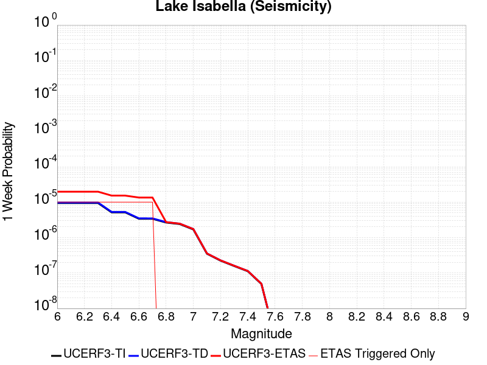 |  |  |  |

| Magnitude | 1 wk TI Prob | 1 wk TD Prob | 1 wk ETAS Prob | 1 wk ETAS/TD Gain | 1 wk ETAS Triggered Only | 1 mo TI Prob | 1 mo TD Prob | 1 mo ETAS Prob | 1 mo ETAS/TD Gain | 1 mo ETAS Triggered Only | 1 yr TI Prob | 1 yr TD Prob | 1 yr ETAS Prob | 1 yr ETAS/TD Gain | 1 yr ETAS Triggered Only | 10 yr TI Prob | 10 yr TD Prob | 10 yr ETAS Prob | 10 yr ETAS/TD Gain | 10 yr ETAS Triggered Only |
|-----|-----|-----|-----|-----|-----|-----|-----|-----|-----|-----|-----|-----|-----|-----|-----|-----|-----|-----|-----|-----|
| 6.0 | 9.431637E-6 | 9.741694E-6 | 9.741694E-6 | 1.0 | 0.0 | 4.0420677E-5 | 4.1749525E-5 | 7.1334085E-5 | 1.7086204 | 2.9585799E-5 | 4.920106E-4 | 5.0819496E-4 | 5.673365E-4 | 1.1163757 | 5.9171598E-5 | 0.004909227 | 0.005071621 | 0.0051304926 | 1.011608 | 5.9171598E-5 |
| 6.1 | 9.431637E-6 | 9.741694E-6 | 9.741694E-6 | 1.0 | 0.0 | 4.0420677E-5 | 4.1749525E-5 | 7.1334085E-5 | 1.7086204 | 2.9585799E-5 | 4.920106E-4 | 5.0819496E-4 | 5.673365E-4 | 1.1163757 | 5.9171598E-5 | 0.004909227 | 0.005071621 | 0.0051304926 | 1.011608 | 5.9171598E-5 |
| 6.2 | 9.431637E-6 | 9.741694E-6 | 9.741694E-6 | 1.0 | 0.0 | 4.0420677E-5 | 4.1749525E-5 | 7.1334085E-5 | 1.7086204 | 2.9585799E-5 | 4.920106E-4 | 5.0819496E-4 | 5.673365E-4 | 1.1163757 | 5.9171598E-5 | 0.004909227 | 0.005071621 | 0.0051304926 | 1.011608 | 5.9171598E-5 |
| 6.3 | 9.431637E-6 | 9.741694E-6 | 9.741694E-6 | 1.0 | 0.0 | 4.0420677E-5 | 4.1749525E-5 | 7.1334085E-5 | 1.7086204 | 2.9585799E-5 | 4.920106E-4 | 5.0819496E-4 | 5.673365E-4 | 1.1163757 | 5.9171598E-5 | 0.004909227 | 0.005071621 | 0.0051304926 | 1.011608 | 5.9171598E-5 |
| 6.4 | 5.144063E-6 | 5.3000977E-6 | 5.3000977E-6 | 1.0 | 0.0 | 2.2045799E-5 | 2.2714525E-5 | 2.2714525E-5 | 1.0 | 0.0 | 2.6837454E-4 | 2.765177E-4 | 3.0609532E-4 | 1.1069646 | 2.9585799E-5 | 0.0026805066 | 0.002762077 | 0.002791581 | 1.0106819 | 2.9585799E-5 |
| 6.5 | 5.144063E-6 | 5.3000977E-6 | 5.3000977E-6 | 1.0 | 0.0 | 2.2045799E-5 | 2.2714525E-5 | 2.2714525E-5 | 1.0 | 0.0 | 2.6837454E-4 | 2.765177E-4 | 3.0609532E-4 | 1.1069646 | 2.9585799E-5 | 0.0026805066 | 0.002762077 | 0.002791581 | 1.0106819 | 2.9585799E-5 |
| 6.6 | 3.4009804E-6 | 3.4987995E-6 | 3.4987995E-6 | 1.0 | 0.0 | 1.4575549E-5 | 1.4994778E-5 | 1.4994778E-5 | 1.0 | 0.0 | 1.7744285E-4 | 1.8254772E-4 | 2.1212813E-4 | 1.162042 | 2.9585799E-5 | 0.0017730123 | 0.0018241355 | 0.0018536673 | 1.0161895 | 2.9585799E-5 |
| 6.7 | 3.3880428E-6 | 3.4856662E-6 | 3.4856662E-6 | 1.0 | 0.0 | 1.4520103E-5 | 1.4938492E-5 | 1.4938492E-5 | 1.0 | 0.0 | 1.767679E-4 | 1.8186258E-4 | 2.11443E-4 | 1.1626526 | 2.9585799E-5 | 0.0017662736 | 0.0018172951 | 0.0018468272 | 1.0162505 | 2.9585799E-5 |
| 6.8 | 2.6582E-6 | 2.7337105E-6 | 2.7337105E-6 | 1.0 | 0.0 | 1.1392236E-5 | 1.1715857E-5 | 1.1715857E-5 | 1.0 | 0.0 | 1.3869164E-4 | 1.4263256E-4 | 1.7221415E-4 | 1.2073971 | 2.9585799E-5 | 0.0013860512 | 0.0014255423 | 0.0014550859 | 1.0207245 | 2.9585799E-5 |
| 6.9 | 2.406011E-6 | 2.474338E-6 | 2.474338E-6 | 1.0 | 0.0 | 1.0311434E-5 | 1.0604271E-5 | 1.0604271E-5 | 1.0 | 0.0 | 1.2553448E-4 | 1.2910066E-4 | 1.5868264E-4 | 1.2291389 | 2.9585799E-5 | 0.0012546359 | 0.0012903863 | 0.0013199339 | 1.0228983 | 2.9585799E-5 |
| 7.0 | 1.6953097E-6 | 1.7429437E-6 | 1.7429437E-6 | 1.0 | 0.0 | 7.265593E-6 | 7.469743E-6 | 7.469743E-6 | 1.0 | 0.0 | 8.8455E-5 | 9.094137E-5 | 9.094137E-5 | 1.0 | 0.0 | 8.84198E-4 | 9.0914435E-4 | 9.0914435E-4 | 1.0 | 0.0 |
| 7.1 | 3.5013824E-7 | 3.571492E-7 | 3.571492E-7 | 1.0 | 0.0 | 1.5005916E-6 | 1.5306384E-6 | 1.5306384E-6 | 1.0 | 0.0 | 1.826955E-5 | 1.8635366E-5 | 1.8635366E-5 | 1.0 | 0.0 | 1.8268047E-4 | 1.863383E-4 | 1.863383E-4 | 1.0 | 0.0 |
| 7.2 | 2.2321095E-7 | 2.2750632E-7 | 2.2750632E-7 | 1.0 | 0.0 | 9.56618E-7 | 9.750268E-7 | 9.750268E-7 | 1.0 | 0.0 | 1.1646762E-5 | 1.1870887E-5 | 1.1870887E-5 | 1.0 | 0.0 | 1.1646151E-4 | 1.1870263E-4 | 1.1870263E-4 | 1.0 | 0.0 |
| 7.3 | 1.5760406E-7 | 1.6060963E-7 | 1.6060963E-7 | 1.0 | 0.0 | 6.7544585E-7 | 6.883268E-7 | 6.883268E-7 | 1.0 | 0.0 | 8.223522E-6 | 8.380347E-6 | 8.380347E-6 | 1.0 | 0.0 | 8.2232174E-5 | 8.3800376E-5 | 8.3800376E-5 | 1.0 | 0.0 |
| 7.4 | 1.1216497E-7 | 1.1431735E-7 | 1.1431735E-7 | 1.0 | 0.0 | 4.8070694E-7 | 4.8993144E-7 | 4.8993144E-7 | 1.0 | 0.0 | 5.852591E-6 | 5.964899E-6 | 5.964899E-6 | 1.0 | 0.0 | 5.8524372E-5 | 5.9647435E-5 | 5.9647435E-5 | 1.0 | 0.0 |
| 7.5 | 4.885185E-8 | 4.9787864E-8 | 4.9787864E-8 | 1.0 | 0.0 | 2.0936506E-7 | 2.1337654E-7 | 2.1337654E-7 | 1.0 | 0.0 | 2.5490165E-6 | 2.5978566E-6 | 2.5978566E-6 | 1.0 | 0.0 | 2.5489873E-5 | 2.597828E-5 | 2.597828E-5 | 1.0 | 0.0 |
| 7.6 | 1.504641E-9 | 1.5317939E-9 | 1.5317939E-9 | 1.0 | 0.0 | 6.4484613E-9 | 6.5648313E-9 | 6.5648313E-9 | 1.0 | 0.0 | 7.851001E-8 | 7.992682E-8 | 7.992682E-8 | 1.0 | 0.0 | 7.8509987E-7 | 7.992682E-7 | 7.992682E-7 | 1.0 | 0.0 |

## Kern Canyon (North Kern) 2011
*[(top)](#table-of-contents)*

| 1 Week | 1 Month | 1 Year | 10 Year |
|-----|-----|-----|-----|
|  | 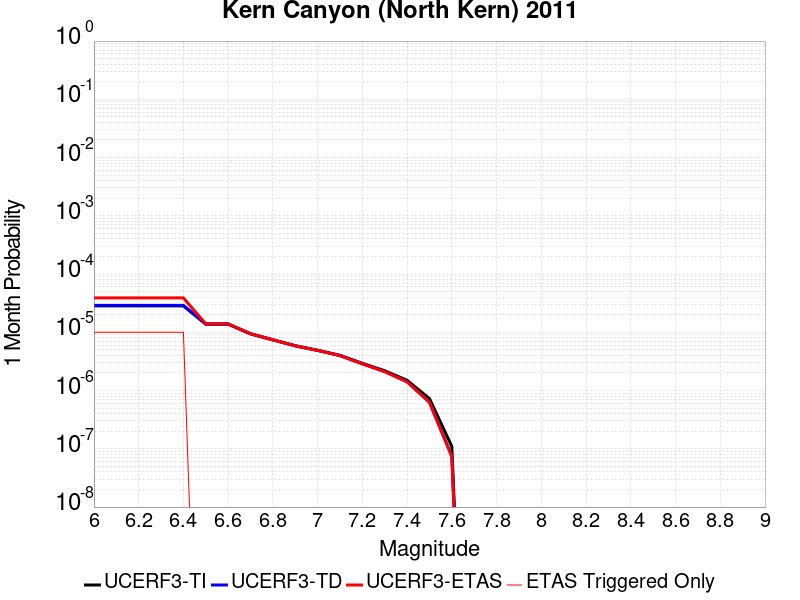 |  |  |

| Magnitude | 1 wk TI Prob | 1 wk TD Prob | 1 wk ETAS Prob | 1 wk ETAS/TD Gain | 1 wk ETAS Triggered Only | 1 mo TI Prob | 1 mo TD Prob | 1 mo ETAS Prob | 1 mo ETAS/TD Gain | 1 mo ETAS Triggered Only | 1 yr TI Prob | 1 yr TD Prob | 1 yr ETAS Prob | 1 yr ETAS/TD Gain | 1 yr ETAS Triggered Only | 10 yr TI Prob | 10 yr TD Prob | 10 yr ETAS Prob | 10 yr ETAS/TD Gain | 10 yr ETAS Triggered Only |
|-----|-----|-----|-----|-----|-----|-----|-----|-----|-----|-----|-----|-----|-----|-----|-----|-----|-----|-----|-----|-----|
| 6.0 | 6.6264497E-6 | 6.7573515E-6 | 6.7573515E-6 | 1.0 | 0.0 | 2.8398761E-5 | 2.8959801E-5 | 2.8959801E-5 | 1.0 | 0.0 | 3.4570007E-4 | 3.5253653E-4 | 3.821119E-4 | 1.0838931 | 2.9585799E-5 | 0.0034516277 | 0.0035205614 | 0.003550043 | 1.0083741 | 2.9585799E-5 |
| 6.1 | 6.6264497E-6 | 6.7573515E-6 | 6.7573515E-6 | 1.0 | 0.0 | 2.8398761E-5 | 2.8959801E-5 | 2.8959801E-5 | 1.0 | 0.0 | 3.4570007E-4 | 3.5253653E-4 | 3.821119E-4 | 1.0838931 | 2.9585799E-5 | 0.0034516277 | 0.0035205614 | 0.003550043 | 1.0083741 | 2.9585799E-5 |
| 6.2 | 6.6264497E-6 | 6.7573515E-6 | 6.7573515E-6 | 1.0 | 0.0 | 2.8398761E-5 | 2.8959801E-5 | 2.8959801E-5 | 1.0 | 0.0 | 3.4570007E-4 | 3.5253653E-4 | 3.821119E-4 | 1.0838931 | 2.9585799E-5 | 0.0034516277 | 0.0035205614 | 0.003550043 | 1.0083741 | 2.9585799E-5 |
| 6.3 | 6.6264497E-6 | 6.7573515E-6 | 6.7573515E-6 | 1.0 | 0.0 | 2.8398761E-5 | 2.8959801E-5 | 2.8959801E-5 | 1.0 | 0.0 | 3.4570007E-4 | 3.5253653E-4 | 3.821119E-4 | 1.0838931 | 2.9585799E-5 | 0.0034516277 | 0.0035205614 | 0.003550043 | 1.0083741 | 2.9585799E-5 |
| 6.4 | 6.6264497E-6 | 6.7573515E-6 | 6.7573515E-6 | 1.0 | 0.0 | 2.8398761E-5 | 2.8959801E-5 | 2.8959801E-5 | 1.0 | 0.0 | 3.4570007E-4 | 3.5253653E-4 | 3.821119E-4 | 1.0838931 | 2.9585799E-5 | 0.0034516277 | 0.0035205614 | 0.003550043 | 1.0083741 | 2.9585799E-5 |
| 6.5 | 3.2162225E-6 | 3.2571006E-6 | 3.2571006E-6 | 1.0 | 0.0 | 1.3783738E-5 | 1.3958933E-5 | 1.3958933E-5 | 1.0 | 0.0 | 1.6780409E-4 | 1.6993756E-4 | 1.6993756E-4 | 1.0 | 0.0 | 0.0016767744 | 0.0016981558 | 0.0016981558 | 1.0 | 0.0 |
| 6.6 | 3.2162225E-6 | 3.2571006E-6 | 3.2571006E-6 | 1.0 | 0.0 | 1.3783738E-5 | 1.3958933E-5 | 1.3958933E-5 | 1.0 | 0.0 | 1.6780409E-4 | 1.6993756E-4 | 1.6993756E-4 | 1.0 | 0.0 | 0.0016767744 | 0.0016981558 | 0.0016981558 | 1.0 | 0.0 |
| 6.7 | 2.1908265E-6 | 2.2071279E-6 | 2.2071279E-6 | 1.0 | 0.0 | 9.389223E-6 | 9.459087E-6 | 9.459087E-6 | 1.0 | 0.0 | 1.1430779E-4 | 1.1515849E-4 | 1.1515849E-4 | 1.0 | 0.0 | 0.0011424901 | 0.0011510076 | 0.0011510076 | 1.0 | 0.0 |
| 6.8 | 1.7303895E-6 | 1.7365574E-6 | 1.7365574E-6 | 1.0 | 0.0 | 7.415934E-6 | 7.442368E-6 | 7.442368E-6 | 1.0 | 0.0 | 9.028525E-5 | 9.060716E-5 | 9.060716E-5 | 1.0 | 0.0 | 9.024858E-4 | 9.057119E-4 | 9.057119E-4 | 1.0 | 0.0 |
| 6.9 | 1.3700314E-6 | 1.3688657E-6 | 1.3688657E-6 | 1.0 | 0.0 | 5.87155E-6 | 5.866554E-6 | 5.866554E-6 | 1.0 | 0.0 | 7.148377E-5 | 7.1423005E-5 | 7.1423005E-5 | 1.0 | 0.0 | 7.146078E-4 | 7.1400503E-4 | 7.1400503E-4 | 1.0 | 0.0 |
| 7.0 | 1.1467797E-6 | 1.1413833E-6 | 1.1413833E-6 | 1.0 | 0.0 | 4.9147607E-6 | 4.8916336E-6 | 4.8916336E-6 | 1.0 | 0.0 | 5.983557E-5 | 5.9554044E-5 | 5.9554044E-5 | 1.0 | 0.0 | 5.981946E-4 | 5.95384E-4 | 5.95384E-4 | 1.0 | 0.0 |
| 7.1 | 9.3952065E-7 | 9.302714E-7 | 9.302714E-7 | 1.0 | 0.0 | 4.026511E-6 | 3.9868714E-6 | 3.9868714E-6 | 1.0 | 0.0 | 4.9021666E-5 | 4.8539096E-5 | 4.8539096E-5 | 1.0 | 0.0 | 4.901085E-4 | 4.8528673E-4 | 4.8528673E-4 | 1.0 | 0.0 |
| 7.2 | 6.858055E-7 | 6.719318E-7 | 6.719318E-7 | 1.0 | 0.0 | 2.939163E-6 | 2.8797044E-6 | 2.8797044E-6 | 1.0 | 0.0 | 3.5783723E-5 | 3.5059846E-5 | 3.5059846E-5 | 1.0 | 0.0 | 3.5777962E-4 | 3.5054405E-4 | 3.5054405E-4 | 1.0 | 0.0 |
| 7.3 | 5.1101983E-7 | 4.939313E-7 | 4.939313E-7 | 1.0 | 0.0 | 2.1900833E-6 | 2.1168466E-6 | 2.1168466E-6 | 1.0 | 0.0 | 2.6663936E-5 | 2.5772308E-5 | 2.5772308E-5 | 1.0 | 0.0 | 2.6660739E-4 | 2.5769367E-4 | 2.5769367E-4 | 1.0 | 0.0 |
| 7.4 | 3.4999414E-7 | 3.2995996E-7 | 3.2995996E-7 | 1.0 | 0.0 | 1.499974E-6 | 1.4141134E-6 | 1.4141134E-6 | 1.0 | 0.0 | 1.8262032E-5 | 1.7216697E-5 | 1.7216697E-5 | 1.0 | 0.0 | 1.826053E-4 | 1.7215387E-4 | 1.7215387E-4 | 1.0 | 0.0 |
| 7.5 | 1.7021522E-7 | 1.4750091E-7 | 1.4750091E-7 | 1.0 | 0.0 | 7.2949354E-7 | 6.3214657E-7 | 6.3214657E-7 | 1.0 | 0.0 | 8.881548E-6 | 7.696359E-6 | 7.696359E-6 | 1.0 | 0.0 | 8.8811925E-5 | 7.6961E-5 | 7.6961E-5 | 1.0 | 0.0 |
| 7.6 | 2.572245E-8 | 1.7352637E-8 | 1.7352637E-8 | 1.0 | 0.0 | 1.10239064E-7 | 7.4368444E-8 | 7.4368444E-8 | 1.0 | 0.0 | 1.3421597E-6 | 9.0543546E-7 | 9.0543546E-7 | 1.0 | 0.0 | 1.3421517E-5 | 9.0543235E-6 | 9.0543235E-6 | 1.0 | 0.0 |

## Mission Creek
*[(top)](#table-of-contents)*

| 1 Week | 1 Month | 1 Year | 10 Year |
|-----|-----|-----|-----|
|  | 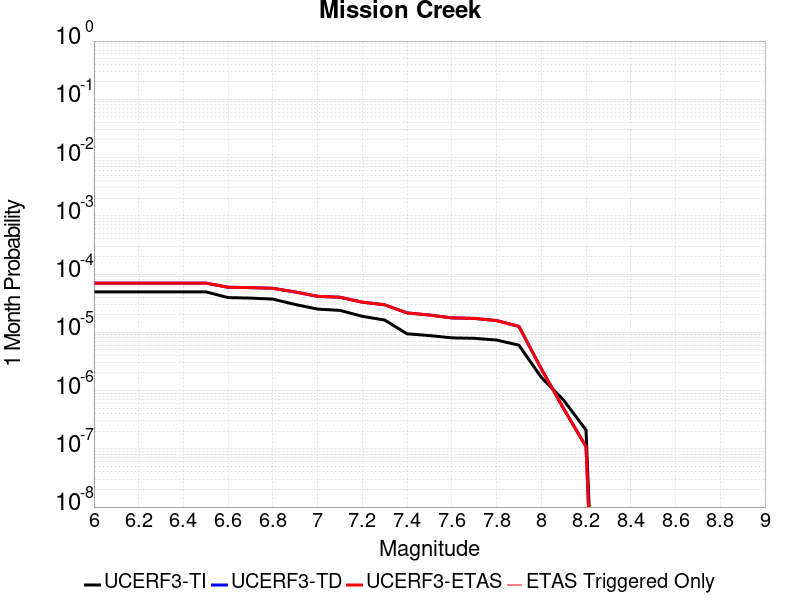 |  |  |

| Magnitude | 1 wk TI Prob | 1 wk TD Prob | 1 wk ETAS Prob | 1 wk ETAS/TD Gain | 1 wk ETAS Triggered Only | 1 mo TI Prob | 1 mo TD Prob | 1 mo ETAS Prob | 1 mo ETAS/TD Gain | 1 mo ETAS Triggered Only | 1 yr TI Prob | 1 yr TD Prob | 1 yr ETAS Prob | 1 yr ETAS/TD Gain | 1 yr ETAS Triggered Only | 10 yr TI Prob | 10 yr TD Prob | 10 yr ETAS Prob | 10 yr ETAS/TD Gain | 10 yr ETAS Triggered Only |
|-----|-----|-----|-----|-----|-----|-----|-----|-----|-----|-----|-----|-----|-----|-----|-----|-----|-----|-----|-----|-----|
| 6.0 | 1.1549387E-5 | 1.6324713E-5 | 1.6324713E-5 | 1.0 | 0.0 | 4.9496433E-5 | 6.9961265E-5 | 6.9961265E-5 | 1.0 | 0.0 | 6.0245243E-4 | 8.5146056E-4 | 8.8102114E-4 | 1.0347176 | 2.9585799E-5 | 0.006008218 | 0.008511184 | 0.008540519 | 1.0034466 | 2.9585799E-5 |
| 6.1 | 1.1549387E-5 | 1.6324713E-5 | 1.6324713E-5 | 1.0 | 0.0 | 4.9496433E-5 | 6.9961265E-5 | 6.9961265E-5 | 1.0 | 0.0 | 6.0245243E-4 | 8.5146056E-4 | 8.8102114E-4 | 1.0347176 | 2.9585799E-5 | 0.006008218 | 0.008511184 | 0.008540519 | 1.0034466 | 2.9585799E-5 |
| 6.2 | 1.1549387E-5 | 1.6324713E-5 | 1.6324713E-5 | 1.0 | 0.0 | 4.9496433E-5 | 6.9961265E-5 | 6.9961265E-5 | 1.0 | 0.0 | 6.0245243E-4 | 8.5146056E-4 | 8.8102114E-4 | 1.0347176 | 2.9585799E-5 | 0.006008218 | 0.008511184 | 0.008540519 | 1.0034466 | 2.9585799E-5 |
| 6.3 | 1.1549387E-5 | 1.6324713E-5 | 1.6324713E-5 | 1.0 | 0.0 | 4.9496433E-5 | 6.9961265E-5 | 6.9961265E-5 | 1.0 | 0.0 | 6.0245243E-4 | 8.5146056E-4 | 8.8102114E-4 | 1.0347176 | 2.9585799E-5 | 0.006008218 | 0.008511184 | 0.008540519 | 1.0034466 | 2.9585799E-5 |
| 6.4 | 1.1549387E-5 | 1.6324713E-5 | 1.6324713E-5 | 1.0 | 0.0 | 4.9496433E-5 | 6.9961265E-5 | 6.9961265E-5 | 1.0 | 0.0 | 6.0245243E-4 | 8.5146056E-4 | 8.8102114E-4 | 1.0347176 | 2.9585799E-5 | 0.006008218 | 0.008511184 | 0.008540519 | 1.0034466 | 2.9585799E-5 |
| 6.5 | 1.1549387E-5 | 1.6324713E-5 | 1.6324713E-5 | 1.0 | 0.0 | 4.9496433E-5 | 6.9961265E-5 | 6.9961265E-5 | 1.0 | 0.0 | 6.0245243E-4 | 8.5146056E-4 | 8.8102114E-4 | 1.0347176 | 2.9585799E-5 | 0.006008218 | 0.008511184 | 0.008540519 | 1.0034466 | 2.9585799E-5 |
| 6.6 | 9.202681E-6 | 1.3847972E-5 | 1.3847972E-5 | 1.0 | 0.0 | 3.9439463E-5 | 5.9347152E-5 | 5.9347152E-5 | 1.0 | 0.0 | 4.800697E-4 | 7.2232104E-4 | 7.5188547E-4 | 1.0409298 | 2.9585799E-5 | 0.004790339 | 0.0072283596 | 0.0072577316 | 1.0040635 | 2.9585799E-5 |
| 6.7 | 9.019164E-6 | 1.365364E-5 | 1.365364E-5 | 1.0 | 0.0 | 3.8652986E-5 | 5.8514335E-5 | 5.8514335E-5 | 1.0 | 0.0 | 4.7049852E-4 | 7.121882E-4 | 7.417529E-4 | 1.0415125 | 2.9585799E-5 | 0.004695036 | 0.0071276836 | 0.0071570585 | 1.0041212 | 2.9585799E-5 |
| 6.8 | 8.673558E-6 | 1.3275746E-5 | 1.3275746E-5 | 1.0 | 0.0 | 3.717186E-5 | 5.6894864E-5 | 5.6894864E-5 | 1.0 | 0.0 | 4.524734E-4 | 6.924836E-4 | 7.220489E-4 | 1.0426946 | 2.9585799E-5 | 0.0045155324 | 0.0069318693 | 0.00696125 | 1.0042385 | 2.9585799E-5 |
| 6.9 | 7.002255E-6 | 1.1479958E-5 | 1.1479958E-5 | 1.0 | 0.0 | 3.000932E-5 | 4.9198927E-5 | 4.9198927E-5 | 1.0 | 0.0 | 3.653022E-4 | 5.988392E-4 | 6.2840723E-4 | 1.0493757 | 2.9585799E-5 | 0.0036470229 | 0.0060006846 | 0.0060300925 | 1.0049008 | 2.9585799E-5 |
| 7.0 | 5.84644E-6 | 9.677164E-6 | 9.677164E-6 | 1.0 | 0.0 | 2.5055931E-5 | 4.1472922E-5 | 4.1472922E-5 | 1.0 | 0.0 | 3.0501327E-4 | 5.0482043E-4 | 5.3439126E-4 | 1.058577 | 2.9585799E-5 | 0.0030459496 | 0.0050649596 | 0.0050943955 | 1.0058117 | 2.9585799E-5 |
| 7.1 | 5.54703E-6 | 9.331631E-6 | 9.331631E-6 | 1.0 | 0.0 | 2.377277E-5 | 3.999212E-5 | 3.999212E-5 | 1.0 | 0.0 | 2.8939504E-4 | 4.8679972E-4 | 5.163711E-4 | 1.0607466 | 2.9585799E-5 | 0.0028901845 | 0.0048855497 | 0.0049149906 | 1.0060261 | 2.9585799E-5 |
| 7.2 | 4.384709E-6 | 7.6836495E-6 | 7.6836495E-6 | 1.0 | 0.0 | 1.8791474E-5 | 3.292953E-5 | 3.292953E-5 | 1.0 | 0.0 | 2.2876218E-4 | 4.0084694E-4 | 4.3042089E-4 | 1.0737786 | 2.9585799E-5 | 0.0022852682 | 0.0040294197 | 0.0040588863 | 1.0073129 | 2.9585799E-5 |
| 7.3 | 3.7888456E-6 | 6.9174894E-6 | 6.9174894E-6 | 1.0 | 0.0 | 1.623781E-5 | 2.9646066E-5 | 2.9646066E-5 | 1.0 | 0.0 | 1.9767738E-4 | 3.608844E-4 | 3.9045955E-4 | 1.0819517 | 2.9585799E-5 | 0.0019750162 | 0.0036311483 | 0.0036606265 | 1.0081182 | 2.9585799E-5 |
| 7.4 | 2.1982462E-6 | 5.0257536E-6 | 5.0257536E-6 | 1.0 | 0.0 | 9.421021E-6 | 2.1538768E-5 | 2.1538768E-5 | 1.0 | 0.0 | 1.1469489E-4 | 2.6220313E-4 | 2.9178118E-4 | 1.1128058 | 2.9585799E-5 | 0.0011463572 | 0.0026468872 | 0.0026763948 | 1.011148 | 2.9585799E-5 |
| 7.5 | 2.051923E-6 | 4.6169393E-6 | 4.6169393E-6 | 1.0 | 0.0 | 8.793926E-6 | 1.9786734E-5 | 1.9786734E-5 | 1.0 | 0.0 | 1.0706078E-4 | 2.40877E-4 | 2.7045567E-4 | 1.1227957 | 2.9585799E-5 | 0.0010700922 | 0.0024345173 | 0.0024640309 | 1.0121231 | 2.9585799E-5 |
| 7.6 | 1.8733427E-6 | 4.1252324E-6 | 4.1252324E-6 | 1.0 | 0.0 | 8.028587E-6 | 1.767945E-5 | 1.767945E-5 | 1.0 | 0.0 | 9.774366E-5 | 2.1522611E-4 | 2.4480553E-4 | 1.1374342 | 2.9585799E-5 | 9.770069E-4 | 0.0021790217 | 0.002208543 | 1.013548 | 2.9585799E-5 |
| 7.7 | 1.8411953E-6 | 4.044895E-6 | 4.044895E-6 | 1.0 | 0.0 | 7.890813E-6 | 1.733515E-5 | 1.733515E-5 | 1.0 | 0.0 | 9.606641E-5 | 2.1103508E-4 | 2.4061464E-4 | 1.1401641 | 2.9585799E-5 | 9.6024893E-4 | 0.0021373003 | 0.002166823 | 1.013813 | 2.9585799E-5 |
| 7.8 | 1.7194251E-6 | 3.7121463E-6 | 3.7121463E-6 | 1.0 | 0.0 | 7.368944E-6 | 1.5909101E-5 | 1.5909101E-5 | 1.0 | 0.0 | 8.97132E-5 | 1.9367617E-4 | 2.2325624E-4 | 1.1527295 | 2.9585799E-5 | 8.967699E-4 | 0.0019632233 | 0.001992751 | 1.0150404 | 2.9585799E-5 |
| 7.9 | 1.4035052E-6 | 2.9514722E-6 | 2.9514722E-6 | 1.0 | 0.0 | 6.0150082E-6 | 1.2649106E-5 | 1.2649106E-5 | 1.0 | 0.0 | 7.3230265E-5 | 1.5399205E-4 | 1.8357328E-4 | 1.1920959 | 2.9585799E-5 | 7.3206134E-4 | 0.0015638224 | 0.001593362 | 1.0188893 | 2.9585799E-5 |
| 8.0 | 3.9318823E-7 | 5.5319464E-7 | 5.5319464E-7 | 1.0 | 0.0 | 1.6850913E-6 | 2.3708321E-6 | 2.3708321E-6 | 1.0 | 0.0 | 2.0515794E-5 | 2.8864504E-5 | 2.8864504E-5 | 1.0 | 0.0 | 2.0513899E-4 | 2.9916913E-4 | 2.9916913E-4 | 1.0 | 0.0 |
| 8.1 | 1.596793E-7 | 1.1391901E-7 | 1.1391901E-7 | 1.0 | 0.0 | 6.8433974E-7 | 4.8822426E-7 | 4.8822426E-7 | 1.0 | 0.0 | 8.331805E-6 | 5.944114E-6 | 5.944114E-6 | 1.0 | 0.0 | 8.331492E-5 | 6.5564316E-5 | 6.5564316E-5 | 1.0 | 0.0 |
| 8.2 | 4.9003038E-8 | 2.5475106E-8 | 2.5475106E-8 | 1.0 | 0.0 | 2.10013E-7 | 1.0917902E-7 | 1.0917902E-7 | 1.0 | 0.0 | 2.5569052E-6 | 1.3292538E-6 | 1.3292538E-6 | 1.0 | 0.0 | 2.556876E-5 | 1.4973085E-5 | 1.4973085E-5 | 1.0 | 0.0 |

## Oak Ridge (Onshore)
*[(top)](#table-of-contents)*

| 1 Week | 1 Month | 1 Year | 10 Year |
|-----|-----|-----|-----|
|  |  | 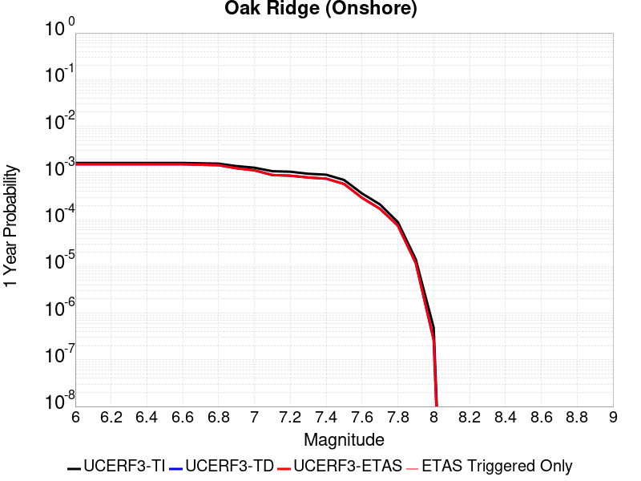 |  |

| Magnitude | 1 wk TI Prob | 1 wk TD Prob | 1 wk ETAS Prob | 1 wk ETAS/TD Gain | 1 wk ETAS Triggered Only | 1 mo TI Prob | 1 mo TD Prob | 1 mo ETAS Prob | 1 mo ETAS/TD Gain | 1 mo ETAS Triggered Only | 1 yr TI Prob | 1 yr TD Prob | 1 yr ETAS Prob | 1 yr ETAS/TD Gain | 1 yr ETAS Triggered Only | 10 yr TI Prob | 10 yr TD Prob | 10 yr ETAS Prob | 10 yr ETAS/TD Gain | 10 yr ETAS Triggered Only |
|-----|-----|-----|-----|-----|-----|-----|-----|-----|-----|-----|-----|-----|-----|-----|-----|-----|-----|-----|-----|-----|
| 6.0 | 3.155064E-5 | 2.952645E-5 | 2.952645E-5 | 1.0 | 0.0 | 1.3521002E-4 | 1.26536E-4 | 1.26536E-4 | 1.0 | 0.0 | 0.001644939 | 0.0015395252 | 0.0015395252 | 1.0 | 0.0 | 0.01632816 | 0.015293104 | 0.015322237 | 1.001905 | 2.9585799E-5 |
| 6.1 | 3.155064E-5 | 2.952645E-5 | 2.952645E-5 | 1.0 | 0.0 | 1.3521002E-4 | 1.26536E-4 | 1.26536E-4 | 1.0 | 0.0 | 0.001644939 | 0.0015395252 | 0.0015395252 | 1.0 | 0.0 | 0.01632816 | 0.015293104 | 0.015322237 | 1.001905 | 2.9585799E-5 |
| 6.2 | 3.155064E-5 | 2.952645E-5 | 2.952645E-5 | 1.0 | 0.0 | 1.3521002E-4 | 1.26536E-4 | 1.26536E-4 | 1.0 | 0.0 | 0.001644939 | 0.0015395252 | 0.0015395252 | 1.0 | 0.0 | 0.01632816 | 0.015293104 | 0.015322237 | 1.001905 | 2.9585799E-5 |
| 6.3 | 3.155064E-5 | 2.952645E-5 | 2.952645E-5 | 1.0 | 0.0 | 1.3521002E-4 | 1.26536E-4 | 1.26536E-4 | 1.0 | 0.0 | 0.001644939 | 0.0015395252 | 0.0015395252 | 1.0 | 0.0 | 0.01632816 | 0.015293104 | 0.015322237 | 1.001905 | 2.9585799E-5 |
| 6.4 | 3.155064E-5 | 2.952645E-5 | 2.952645E-5 | 1.0 | 0.0 | 1.3521002E-4 | 1.26536E-4 | 1.26536E-4 | 1.0 | 0.0 | 0.001644939 | 0.0015395252 | 0.0015395252 | 1.0 | 0.0 | 0.01632816 | 0.015293104 | 0.015322237 | 1.001905 | 2.9585799E-5 |
| 6.5 | 3.155064E-5 | 2.952645E-5 | 2.952645E-5 | 1.0 | 0.0 | 1.3521002E-4 | 1.26536E-4 | 1.26536E-4 | 1.0 | 0.0 | 0.001644939 | 0.0015395252 | 0.0015395252 | 1.0 | 0.0 | 0.01632816 | 0.015293104 | 0.015322237 | 1.001905 | 2.9585799E-5 |
| 6.6 | 3.155064E-5 | 2.952645E-5 | 2.952645E-5 | 1.0 | 0.0 | 1.3521002E-4 | 1.26536E-4 | 1.26536E-4 | 1.0 | 0.0 | 0.001644939 | 0.0015395252 | 0.0015395252 | 1.0 | 0.0 | 0.01632816 | 0.015293104 | 0.015322237 | 1.001905 | 2.9585799E-5 |
| 6.7 | 3.098897E-5 | 2.8864635E-5 | 2.8864635E-5 | 1.0 | 0.0 | 1.328031E-4 | 1.2369992E-4 | 1.2369992E-4 | 1.0 | 0.0 | 0.0016156785 | 0.0015050438 | 0.0015050438 | 1.0 | 0.0 | 0.016039822 | 0.014952951 | 0.014982094 | 1.001949 | 2.9585799E-5 |
| 6.8 | 3.0449872E-5 | 2.823982E-5 | 2.823982E-5 | 1.0 | 0.0 | 1.3049292E-4 | 1.2102239E-4 | 1.2102239E-4 | 1.0 | 0.0 | 0.0015875935 | 0.001472489 | 0.001472489 | 1.0 | 0.0 | 0.015762992 | 0.014631692 | 0.014660845 | 1.0019925 | 2.9585799E-5 |
| 6.9 | 2.697928E-5 | 2.4220137E-5 | 2.4220137E-5 | 1.0 | 0.0 | 1.15620365E-4 | 1.0379658E-4 | 1.0379658E-4 | 1.0 | 0.0 | 0.0014067689 | 0.0012630123 | 0.0012630123 | 1.0 | 0.0 | 0.0139789665 | 0.012561057 | 0.012590271 | 1.0023258 | 2.9585799E-5 |
| 7.0 | 2.4893961E-5 | 2.1862359E-5 | 2.1862359E-5 | 1.0 | 0.0 | 1.0668404E-4 | 9.369256E-5 | 9.369256E-5 | 1.0 | 0.0 | 0.0012981043 | 0.0011401277 | 0.0011401277 | 1.0 | 0.0 | 0.012905477 | 0.011345069 | 0.011374319 | 1.0025783 | 2.9585799E-5 |
| 7.1 | 2.0945363E-5 | 1.7354718E-5 | 1.7354718E-5 | 1.0 | 0.0 | 8.976275E-5 | 7.437527E-5 | 7.437527E-5 | 1.0 | 0.0 | 0.0010923136 | 9.051474E-4 | 9.051474E-4 | 1.0 | 0.0 | 0.0108696 | 0.009015542 | 0.009044861 | 1.003252 | 2.9585799E-5 |
| 7.2 | 2.0439404E-5 | 1.6809645E-5 | 1.6809645E-5 | 1.0 | 0.0 | 8.7594504E-5 | 7.2039365E-5 | 7.2039365E-5 | 1.0 | 0.0 | 0.0010659413 | 8.7673106E-4 | 8.7673106E-4 | 1.0 | 0.0 | 0.010608427 | 0.00873364 | 0.008762968 | 1.003358 | 2.9585799E-5 |
| 7.3 | 1.8463334E-5 | 1.5382002E-5 | 1.5382002E-5 | 1.0 | 0.0 | 7.912617E-5 | 6.5921224E-5 | 6.5921224E-5 | 1.0 | 0.0 | 9.6293533E-4 | 8.0229976E-4 | 8.0229976E-4 | 1.0 | 0.0 | 0.009587734 | 0.007994897 | 0.007994897 | 1.0 | 0.0 |
| 7.4 | 1.763139E-5 | 1.4517013E-5 | 1.4517013E-5 | 1.0 | 0.0 | 7.556091E-5 | 6.221431E-5 | 6.221431E-5 | 1.0 | 0.0 | 9.1956573E-4 | 7.5719994E-4 | 7.5719994E-4 | 1.0 | 0.0 | 0.009157699 | 0.007547003 | 0.007547003 | 1.0 | 0.0 |
| 7.5 | 1.3594944E-5 | 1.1163477E-5 | 1.1163477E-5 | 1.0 | 0.0 | 5.8262744E-5 | 4.7842612E-5 | 4.7842612E-5 | 1.0 | 0.0 | 7.0911803E-4 | 5.823306E-4 | 5.823306E-4 | 1.0 | 0.0 | 0.007068595 | 0.0058083185 | 0.0058083185 | 1.0 | 0.0 |
| 7.6 | 6.9889534E-6 | 5.6367617E-6 | 5.6367617E-6 | 1.0 | 0.0 | 2.9952313E-5 | 2.4157329E-5 | 2.4157329E-5 | 1.0 | 0.0 | 3.646084E-4 | 2.940762E-4 | 2.940762E-4 | 1.0 | 0.0 | 0.0036401073 | 0.0029369146 | 0.0029369146 | 1.0 | 0.0 |
| 7.7 | 4.0824193E-6 | 3.2832884E-6 | 3.2832884E-6 | 1.0 | 0.0 | 1.7495966E-5 | 1.4071161E-5 | 1.4071161E-5 | 1.0 | 0.0 | 2.1299256E-4 | 1.7130304E-4 | 1.7130304E-4 | 1.0 | 0.0 | 0.0021278851 | 0.0017117234 | 0.0017117234 | 1.0 | 0.0 |
| 7.8 | 1.7023609E-6 | 1.4370602E-6 | 1.4370602E-6 | 1.0 | 0.0 | 7.295812E-6 | 6.158815E-6 | 6.158815E-6 | 1.0 | 0.0 | 8.882289E-5 | 7.498102E-5 | 7.498102E-5 | 1.0 | 0.0 | 8.8787393E-4 | 7.4956E-4 | 7.4956E-4 | 1.0 | 0.0 |
| 7.9 | 2.721225E-7 | 2.2616715E-7 | 2.2616715E-7 | 1.0 | 0.0 | 1.1662388E-6 | 9.692874E-7 | 9.692874E-7 | 1.0 | 0.0 | 1.4198865E-5 | 1.1801013E-5 | 1.1801013E-5 | 1.0 | 0.0 | 1.4197957E-4 | 1.1800414E-4 | 1.1800414E-4 | 1.0 | 0.0 |
| 8.0 | 9.364255E-9 | 5.1209232E-9 | 5.1209232E-9 | 1.0 | 0.0 | 4.0132523E-8 | 2.1946814E-8 | 2.1946814E-8 | 1.0 | 0.0 | 4.8861335E-7 | 2.6720244E-7 | 2.6720244E-7 | 1.0 | 0.0 | 4.8861225E-6 | 2.6720215E-6 | 2.6720215E-6 | 1.0 | 0.0 |

## Simi-Santa Rosa
*[(top)](#table-of-contents)*

| 1 Week | 1 Month | 1 Year | 10 Year |
|-----|-----|-----|-----|
|  |  |  |  |

| Magnitude | 1 wk TI Prob | 1 wk TD Prob | 1 wk ETAS Prob | 1 wk ETAS/TD Gain | 1 wk ETAS Triggered Only | 1 mo TI Prob | 1 mo TD Prob | 1 mo ETAS Prob | 1 mo ETAS/TD Gain | 1 mo ETAS Triggered Only | 1 yr TI Prob | 1 yr TD Prob | 1 yr ETAS Prob | 1 yr ETAS/TD Gain | 1 yr ETAS Triggered Only | 10 yr TI Prob | 10 yr TD Prob | 10 yr ETAS Prob | 10 yr ETAS/TD Gain | 10 yr ETAS Triggered Only |
|-----|-----|-----|-----|-----|-----|-----|-----|-----|-----|-----|-----|-----|-----|-----|-----|-----|-----|-----|-----|-----|
| 6.0 | 2.198912E-5 | 2.2275886E-5 | 2.2275886E-5 | 1.0 | 0.0 | 9.4235686E-5 | 9.5464835E-5 | 9.5464835E-5 | 1.0 | 0.0 | 0.0011467156 | 0.0011617085 | 0.0011617085 | 1.0 | 0.0 | 0.011408163 | 0.011560804 | 0.011590048 | 1.0025295 | 2.9585799E-5 |
| 6.1 | 2.198912E-5 | 2.2275886E-5 | 2.2275886E-5 | 1.0 | 0.0 | 9.4235686E-5 | 9.5464835E-5 | 9.5464835E-5 | 1.0 | 0.0 | 0.0011467156 | 0.0011617085 | 0.0011617085 | 1.0 | 0.0 | 0.011408163 | 0.011560804 | 0.011590048 | 1.0025295 | 2.9585799E-5 |
| 6.2 | 1.69983E-5 | 1.6668911E-5 | 1.6668911E-5 | 1.0 | 0.0 | 7.284782E-5 | 7.14364E-5 | 7.14364E-5 | 1.0 | 0.0 | 8.865613E-4 | 8.694203E-4 | 8.694203E-4 | 1.0 | 0.0 | 0.008830327 | 0.0086631095 | 0.008692439 | 1.0033855 | 2.9585799E-5 |
| 6.3 | 1.69983E-5 | 1.6668911E-5 | 1.6668911E-5 | 1.0 | 0.0 | 7.284782E-5 | 7.14364E-5 | 7.14364E-5 | 1.0 | 0.0 | 8.865613E-4 | 8.694203E-4 | 8.694203E-4 | 1.0 | 0.0 | 0.008830327 | 0.0086631095 | 0.008692439 | 1.0033855 | 2.9585799E-5 |
| 6.4 | 1.4666188E-5 | 1.4052852E-5 | 1.4052852E-5 | 1.0 | 0.0 | 6.285358E-5 | 6.022526E-5 | 6.022526E-5 | 1.0 | 0.0 | 7.6497364E-4 | 7.330208E-4 | 7.330208E-4 | 1.0 | 0.0 | 0.0076234564 | 0.0073085045 | 0.007337874 | 1.0040185 | 2.9585799E-5 |
| 6.5 | 1.4666188E-5 | 1.4052852E-5 | 1.4052852E-5 | 1.0 | 0.0 | 6.285358E-5 | 6.022526E-5 | 6.022526E-5 | 1.0 | 0.0 | 7.6497364E-4 | 7.330208E-4 | 7.330208E-4 | 1.0 | 0.0 | 0.0076234564 | 0.0073085045 | 0.007337874 | 1.0040185 | 2.9585799E-5 |
| 6.6 | 1.4377586E-5 | 1.3729887E-5 | 1.3729887E-5 | 1.0 | 0.0 | 6.1616774E-5 | 5.8841186E-5 | 5.8841186E-5 | 1.0 | 0.0 | 7.4992597E-4 | 7.1618083E-4 | 7.1618083E-4 | 1.0 | 0.0 | 0.007474003 | 0.007141196 | 0.0071705705 | 1.0041134 | 2.9585799E-5 |
| 6.7 | 1.3881404E-5 | 1.3207847E-5 | 1.3207847E-5 | 1.0 | 0.0 | 5.9490372E-5 | 5.6603967E-5 | 5.6603967E-5 | 1.0 | 0.0 | 7.240546E-4 | 6.889601E-4 | 6.889601E-4 | 1.0 | 0.0 | 0.007217 | 0.0068706917 | 0.006900074 | 1.0042765 | 2.9585799E-5 |
| 6.8 | 1.0176516E-5 | 9.154378E-6 | 9.154378E-6 | 1.0 | 0.0 | 4.3612912E-5 | 3.9232553E-5 | 3.9232553E-5 | 1.0 | 0.0 | 5.308578E-4 | 4.7756822E-4 | 4.7756822E-4 | 1.0 | 0.0 | 0.0052959146 | 0.004767053 | 0.0047964975 | 1.0061767 | 2.9585799E-5 |
| 6.9 | 9.699797E-6 | 8.7749395E-6 | 8.7749395E-6 | 1.0 | 0.0 | 4.15699E-5 | 3.7606434E-5 | 3.7606434E-5 | 1.0 | 0.0 | 5.05996E-4 | 4.5777857E-4 | 4.5777857E-4 | 1.0 | 0.0 | 0.005048454 | 0.004569974 | 0.0045994245 | 1.0064443 | 2.9585799E-5 |
| 7.0 | 7.4049476E-6 | 6.559509E-6 | 6.559509E-6 | 1.0 | 0.0 | 3.1735104E-5 | 2.811195E-5 | 2.811195E-5 | 1.0 | 0.0 | 3.8630638E-4 | 3.422219E-4 | 3.422219E-4 | 1.0 | 0.0 | 0.0038563553 | 0.0034181913 | 0.003447676 | 1.0086259 | 2.9585799E-5 |
| 7.1 | 3.873439E-6 | 2.759614E-6 | 2.759614E-6 | 1.0 | 0.0 | 1.6600346E-5 | 1.1826865E-5 | 1.1826865E-5 | 1.0 | 0.0 | 2.0209046E-4 | 1.439828E-4 | 1.439828E-4 | 1.0 | 0.0 | 0.0020190678 | 0.0014389188 | 0.0014684619 | 1.0205315 | 2.9585799E-5 |
| 7.2 | 3.417706E-6 | 2.3677471E-6 | 2.3677471E-6 | 1.0 | 0.0 | 1.4647229E-5 | 1.014745E-5 | 1.014745E-5 | 1.0 | 0.0 | 1.7831543E-4 | 1.2353843E-4 | 1.2353843E-4 | 1.0 | 0.0 | 0.0017817242 | 0.0012347198 | 0.001264269 | 1.023932 | 2.9585799E-5 |
| 7.3 | 1.90225E-6 | 1.4074596E-6 | 1.4074596E-6 | 1.0 | 0.0 | 8.152474E-6 | 6.0319558E-6 | 6.0319558E-6 | 1.0 | 0.0 | 9.9251854E-5 | 7.343661E-5 | 7.343661E-5 | 1.0 | 0.0 | 9.920754E-4 | 7.341257E-4 | 7.341257E-4 | 1.0 | 0.0 |
| 7.4 | 1.5170556E-6 | 1.1025584E-6 | 1.1025584E-6 | 1.0 | 0.0 | 6.5016507E-6 | 4.7252415E-6 | 4.7252415E-6 | 1.0 | 0.0 | 7.915472E-5 | 5.752831E-5 | 5.752831E-5 | 1.0 | 0.0 | 7.9126534E-4 | 5.751353E-4 | 5.751353E-4 | 1.0 | 0.0 |
| 7.5 | 1.178732E-6 | 8.5358926E-7 | 8.5358926E-7 | 1.0 | 0.0 | 5.0516987E-6 | 3.6582346E-6 | 3.6582346E-6 | 1.0 | 0.0 | 6.1502695E-5 | 4.4538105E-5 | 4.4538105E-5 | 1.0 | 0.0 | 6.148568E-4 | 4.4529274E-4 | 4.4529274E-4 | 1.0 | 0.0 |
| 7.6 | 6.8722386E-7 | 4.793958E-7 | 4.793958E-7 | 1.0 | 0.0 | 2.9452417E-6 | 2.0545517E-6 | 2.0545517E-6 | 1.0 | 0.0 | 3.5857727E-5 | 2.5013882E-5 | 2.5013882E-5 | 1.0 | 0.0 | 3.5851944E-4 | 2.5011078E-4 | 2.5011078E-4 | 1.0 | 0.0 |
| 7.7 | 5.5126515E-7 | 3.673869E-7 | 3.673869E-7 | 1.0 | 0.0 | 2.3625628E-6 | 1.5745143E-6 | 1.5745143E-6 | 1.0 | 0.0 | 2.8763823E-5 | 1.9169544E-5 | 1.9169544E-5 | 1.0 | 0.0 | 2.87601E-4 | 1.91679E-4 | 1.91679E-4 | 1.0 | 0.0 |
| 7.8 | 3.3860243E-7 | 2.0081488E-7 | 2.0081488E-7 | 1.0 | 0.0 | 1.4511525E-6 | 8.6063494E-7 | 8.6063494E-7 | 1.0 | 0.0 | 1.7667637E-5 | 1.047818E-5 | 1.047818E-5 | 1.0 | 0.0 | 1.7666233E-4 | 1.0477692E-4 | 1.0477692E-4 | 1.0 | 0.0 |
| 7.9 | 2.7955386E-7 | 1.4654502E-7 | 1.4654502E-7 | 1.0 | 0.0 | 1.1980875E-6 | 6.280499E-7 | 6.280499E-7 | 1.0 | 0.0 | 1.4586617E-5 | 7.646482E-6 | 7.646482E-6 | 1.0 | 0.0 | 1.458566E-4 | 7.646223E-5 | 7.646223E-5 | 1.0 | 0.0 |
| 8.0 | 5.6259015E-8 | 3.3357086E-8 | 3.3357086E-8 | 1.0 | 0.0 | 2.4111003E-7 | 1.4295894E-7 | 1.4295894E-7 | 1.0 | 0.0 | 2.9355108E-6 | 1.7405239E-6 | 1.7405239E-6 | 1.0 | 0.0 | 2.935472E-5 | 1.7405117E-5 | 1.7405117E-5 | 1.0 | 0.0 |

## Deep Springs
*[(top)](#table-of-contents)*

| 1 Week | 1 Month | 1 Year | 10 Year |
|-----|-----|-----|-----|
|  |  |  |  |

| Magnitude | 1 wk TI Prob | 1 wk TD Prob | 1 wk ETAS Prob | 1 wk ETAS/TD Gain | 1 wk ETAS Triggered Only | 1 mo TI Prob | 1 mo TD Prob | 1 mo ETAS Prob | 1 mo ETAS/TD Gain | 1 mo ETAS Triggered Only | 1 yr TI Prob | 1 yr TD Prob | 1 yr ETAS Prob | 1 yr ETAS/TD Gain | 1 yr ETAS Triggered Only | 10 yr TI Prob | 10 yr TD Prob | 10 yr ETAS Prob | 10 yr ETAS/TD Gain | 10 yr ETAS Triggered Only |
|-----|-----|-----|-----|-----|-----|-----|-----|-----|-----|-----|-----|-----|-----|-----|-----|-----|-----|-----|-----|-----|
| 6.0 | 1.9810619E-5 | 2.311303E-5 | 2.311303E-5 | 1.0 | 0.0 | 8.489989E-5 | 9.905495E-5 | 1.2863781E-4 | 1.2986511 | 2.9585799E-5 | 0.001033166 | 0.0012058346 | 0.0012353847 | 1.024506 | 2.9585799E-5 | 0.010283757 | 0.01204269 | 0.01207192 | 1.0024271 | 2.9585799E-5 |
| 6.1 | 1.9810619E-5 | 2.311303E-5 | 2.311303E-5 | 1.0 | 0.0 | 8.489989E-5 | 9.905495E-5 | 1.2863781E-4 | 1.2986511 | 2.9585799E-5 | 0.001033166 | 0.0012058346 | 0.0012353847 | 1.024506 | 2.9585799E-5 | 0.010283757 | 0.01204269 | 0.01207192 | 1.0024271 | 2.9585799E-5 |
| 6.2 | 1.9810619E-5 | 2.311303E-5 | 2.311303E-5 | 1.0 | 0.0 | 8.489989E-5 | 9.905495E-5 | 1.2863781E-4 | 1.2986511 | 2.9585799E-5 | 0.001033166 | 0.0012058346 | 0.0012353847 | 1.024506 | 2.9585799E-5 | 0.010283757 | 0.01204269 | 0.01207192 | 1.0024271 | 2.9585799E-5 |
| 6.3 | 1.9810619E-5 | 2.311303E-5 | 2.311303E-5 | 1.0 | 0.0 | 8.489989E-5 | 9.905495E-5 | 1.2863781E-4 | 1.2986511 | 2.9585799E-5 | 0.001033166 | 0.0012058346 | 0.0012353847 | 1.024506 | 2.9585799E-5 | 0.010283757 | 0.01204269 | 0.01207192 | 1.0024271 | 2.9585799E-5 |
| 6.4 | 1.9810619E-5 | 2.311303E-5 | 2.311303E-5 | 1.0 | 0.0 | 8.489989E-5 | 9.905495E-5 | 1.2863781E-4 | 1.2986511 | 2.9585799E-5 | 0.001033166 | 0.0012058346 | 0.0012353847 | 1.024506 | 2.9585799E-5 | 0.010283757 | 0.01204269 | 0.01207192 | 1.0024271 | 2.9585799E-5 |
| 6.5 | 1.7190405E-5 | 2.0050999E-5 | 2.0050999E-5 | 1.0 | 0.0 | 7.367108E-5 | 8.593285E-5 | 1.1551611E-4 | 1.3442602 | 2.9585799E-5 | 8.9657627E-4 | 0.0010462324 | 0.0010757872 | 1.0282488 | 2.9585799E-5 | 0.008929676 | 0.010462287 | 0.010491563 | 1.0027983 | 2.9585799E-5 |
| 6.6 | 1.7190405E-5 | 2.0050999E-5 | 2.0050999E-5 | 1.0 | 0.0 | 7.367108E-5 | 8.593285E-5 | 1.1551611E-4 | 1.3442602 | 2.9585799E-5 | 8.9657627E-4 | 0.0010462324 | 0.0010757872 | 1.0282488 | 2.9585799E-5 | 0.008929676 | 0.010462287 | 0.010491563 | 1.0027983 | 2.9585799E-5 |

## Earthquake Valley (So Extension)
*[(top)](#table-of-contents)*

| 1 Week | 1 Month | 1 Year | 10 Year |
|-----|-----|-----|-----|
| 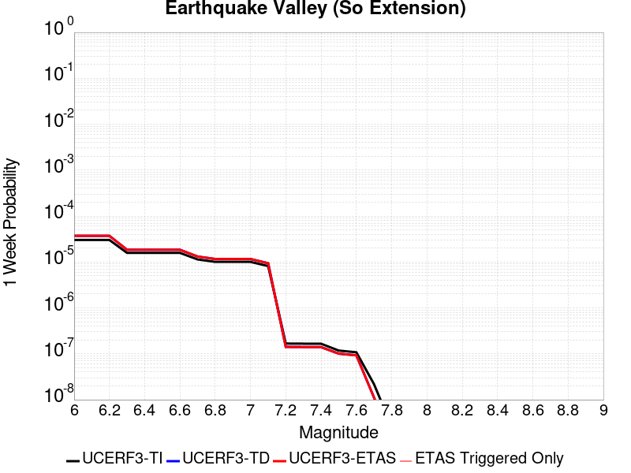 |  |  |  |

| Magnitude | 1 wk TI Prob | 1 wk TD Prob | 1 wk ETAS Prob | 1 wk ETAS/TD Gain | 1 wk ETAS Triggered Only | 1 mo TI Prob | 1 mo TD Prob | 1 mo ETAS Prob | 1 mo ETAS/TD Gain | 1 mo ETAS Triggered Only | 1 yr TI Prob | 1 yr TD Prob | 1 yr ETAS Prob | 1 yr ETAS/TD Gain | 1 yr ETAS Triggered Only | 10 yr TI Prob | 10 yr TD Prob | 10 yr ETAS Prob | 10 yr ETAS/TD Gain | 10 yr ETAS Triggered Only |
|-----|-----|-----|-----|-----|-----|-----|-----|-----|-----|-----|-----|-----|-----|-----|-----|-----|-----|-----|-----|-----|
| 6.0 | 3.0194888E-5 | 3.707326E-5 | 3.707326E-5 | 1.0 | 0.0 | 1.2940024E-4 | 1.588788E-4 | 1.8845989E-4 | 1.1861866 | 2.9585799E-5 | 0.0015743093 | 0.0019331772 | 0.0019627057 | 1.0152746 | 2.9585799E-5 | 0.01563203 | 0.019213596 | 0.019242613 | 1.0015103 | 2.9585799E-5 |
| 6.1 | 3.0194888E-5 | 3.707326E-5 | 3.707326E-5 | 1.0 | 0.0 | 1.2940024E-4 | 1.588788E-4 | 1.8845989E-4 | 1.1861866 | 2.9585799E-5 | 0.0015743093 | 0.0019331772 | 0.0019627057 | 1.0152746 | 2.9585799E-5 | 0.01563203 | 0.019213596 | 0.019242613 | 1.0015103 | 2.9585799E-5 |
| 6.2 | 3.0194888E-5 | 3.707326E-5 | 3.707326E-5 | 1.0 | 0.0 | 1.2940024E-4 | 1.588788E-4 | 1.8845989E-4 | 1.1861866 | 2.9585799E-5 | 0.0015743093 | 0.0019331772 | 0.0019627057 | 1.0152746 | 2.9585799E-5 | 0.01563203 | 0.019213596 | 0.019242613 | 1.0015103 | 2.9585799E-5 |
| 6.3 | 1.5795305E-5 | 1.8447001E-5 | 1.8447001E-5 | 1.0 | 0.0 | 6.769241E-5 | 7.905681E-5 | 1.0864027E-4 | 1.3742051 | 2.9585799E-5 | 8.238434E-4 | 9.622029E-4 | 9.917602E-4 | 1.0307184 | 2.9585799E-5 | 0.008207959 | 0.009591279 | 0.009620581 | 1.0030551 | 2.9585799E-5 |
| 6.4 | 1.5795305E-5 | 1.8447001E-5 | 1.8447001E-5 | 1.0 | 0.0 | 6.769241E-5 | 7.905681E-5 | 1.0864027E-4 | 1.3742051 | 2.9585799E-5 | 8.238434E-4 | 9.622029E-4 | 9.917602E-4 | 1.0307184 | 2.9585799E-5 | 0.008207959 | 0.009591279 | 0.009620581 | 1.0030551 | 2.9585799E-5 |
| 6.5 | 1.5795305E-5 | 1.8447001E-5 | 1.8447001E-5 | 1.0 | 0.0 | 6.769241E-5 | 7.905681E-5 | 1.0864027E-4 | 1.3742051 | 2.9585799E-5 | 8.238434E-4 | 9.622029E-4 | 9.917602E-4 | 1.0307184 | 2.9585799E-5 | 0.008207959 | 0.009591279 | 0.009620581 | 1.0030551 | 2.9585799E-5 |
| 6.6 | 1.5795305E-5 | 1.8447001E-5 | 1.8447001E-5 | 1.0 | 0.0 | 6.769241E-5 | 7.905681E-5 | 1.0864027E-4 | 1.3742051 | 2.9585799E-5 | 8.238434E-4 | 9.622029E-4 | 9.917602E-4 | 1.0307184 | 2.9585799E-5 | 0.008207959 | 0.009591279 | 0.009620581 | 1.0030551 | 2.9585799E-5 |
| 6.7 | 1.1363076E-5 | 1.3138576E-5 | 1.3138576E-5 | 1.0 | 0.0 | 4.8697988E-5 | 5.6307395E-5 | 8.589153E-5 | 1.5254041 | 2.9585799E-5 | 5.927367E-4 | 6.85403E-4 | 7.1496854E-4 | 1.043136 | 2.9585799E-5 | 0.0059115817 | 0.0068403645 | 0.006869748 | 1.0042956 | 2.9585799E-5 |
| 6.8 | 1.0049611E-5 | 1.15945795E-5 | 1.15945795E-5 | 1.0 | 0.0 | 4.306905E-5 | 4.969052E-5 | 7.927485E-5 | 1.5953717 | 2.9585799E-5 | 5.242395E-4 | 6.048873E-4 | 6.344552E-4 | 1.0488816 | 2.9585799E-5 | 0.0052300454 | 0.0060395855 | 0.006068993 | 1.0048691 | 2.9585799E-5 |
| 6.9 | 1.0049611E-5 | 1.15945795E-5 | 1.15945795E-5 | 1.0 | 0.0 | 4.306905E-5 | 4.969052E-5 | 7.927485E-5 | 1.5953717 | 2.9585799E-5 | 5.242395E-4 | 6.048873E-4 | 6.344552E-4 | 1.0488816 | 2.9585799E-5 | 0.0052300454 | 0.0060395855 | 0.006068993 | 1.0048691 | 2.9585799E-5 |
| 7.0 | 1.0049611E-5 | 1.15945795E-5 | 1.15945795E-5 | 1.0 | 0.0 | 4.306905E-5 | 4.969052E-5 | 7.927485E-5 | 1.5953717 | 2.9585799E-5 | 5.242395E-4 | 6.048873E-4 | 6.344552E-4 | 1.0488816 | 2.9585799E-5 | 0.0052300454 | 0.0060395855 | 0.006068993 | 1.0048691 | 2.9585799E-5 |
| 7.1 | 8.140254E-6 | 9.383657E-6 | 9.383657E-6 | 1.0 | 0.0 | 3.4886336E-5 | 4.021543E-5 | 6.980004E-5 | 1.7356532 | 2.9585799E-5 | 4.2465836E-4 | 4.895799E-4 | 5.191512E-4 | 1.0604014 | 2.9585799E-5 | 0.0042384774 | 0.00489159 | 0.004921031 | 1.0060188 | 2.9585799E-5 |
| 7.2 | 1.673835E-7 | 1.4154533E-7 | 1.4154533E-7 | 1.0 | 0.0 | 7.173577E-7 | 6.066227E-7 | 6.066227E-7 | 1.0 | 0.0 | 8.733795E-6 | 7.38561E-6 | 7.38561E-6 | 1.0 | 0.0 | 8.733451E-5 | 7.3854E-5 | 7.3854E-5 | 1.0 | 0.0 |
| 7.3 | 1.6632116E-7 | 1.405276E-7 | 1.405276E-7 | 1.0 | 0.0 | 7.1280476E-7 | 6.02261E-7 | 6.02261E-7 | 1.0 | 0.0 | 8.678364E-6 | 7.332507E-6 | 7.332507E-6 | 1.0 | 0.0 | 8.6780245E-5 | 7.3323004E-5 | 7.3323004E-5 | 1.0 | 0.0 |
| 7.4 | 1.6569169E-7 | 1.3997388E-7 | 1.3997388E-7 | 1.0 | 0.0 | 7.1010703E-7 | 5.998879E-7 | 5.998879E-7 | 1.0 | 0.0 | 8.645519E-6 | 7.3036144E-6 | 7.3036144E-6 | 1.0 | 0.0 | 8.645182E-5 | 7.30341E-5 | 7.30341E-5 | 1.0 | 0.0 |
| 7.5 | 1.1764555E-7 | 1.0096232E-7 | 1.0096232E-7 | 1.0 | 0.0 | 5.041951E-7 | 4.3269557E-7 | 4.3269557E-7 | 1.0 | 0.0 | 6.138558E-6 | 5.268058E-6 | 5.268058E-6 | 1.0 | 0.0 | 6.1383886E-5 | 5.267955E-5 | 5.267955E-5 | 1.0 | 0.0 |
| 7.6 | 1.07927605E-7 | 9.261032E-8 | 9.261032E-8 | 1.0 | 0.0 | 4.6254678E-7 | 3.9690133E-7 | 3.9690133E-7 | 1.0 | 0.0 | 5.6314925E-6 | 4.832265E-6 | 4.832265E-6 | 1.0 | 0.0 | 5.63135E-5 | 4.832181E-5 | 4.832181E-5 | 1.0 | 0.0 |
| 7.7 | 2.1826905E-8 | 1.1181076E-8 | 1.1181076E-8 | 1.0 | 0.0 | 9.3543875E-8 | 4.7918892E-8 | 4.7918892E-8 | 1.0 | 0.0 | 1.1388961E-6 | 5.8341243E-7 | 5.8341243E-7 | 1.0 | 0.0 | 1.1388902E-5 | 5.8341143E-6 | 5.8341143E-6 | 1.0 | 0.0 |
| 7.8 | 2.6169649E-9 | 1.1970057E-9 | 1.1970057E-9 | 1.0 | 0.0 | 1.1215564E-8 | 5.130025E-9 | 5.130025E-9 | 1.0 | 0.0 | 1.3654947E-7 | 6.245805E-8 | 6.245805E-8 | 1.0 | 0.0 | 1.365494E-6 | 6.245805E-7 | 6.245805E-7 | 1.0 | 0.0 |

## Red Mountain
*[(top)](#table-of-contents)*

| 1 Week | 1 Month | 1 Year | 10 Year |
|-----|-----|-----|-----|
|  |  |  |  |

| Magnitude | 1 wk TI Prob | 1 wk TD Prob | 1 wk ETAS Prob | 1 wk ETAS/TD Gain | 1 wk ETAS Triggered Only | 1 mo TI Prob | 1 mo TD Prob | 1 mo ETAS Prob | 1 mo ETAS/TD Gain | 1 mo ETAS Triggered Only | 1 yr TI Prob | 1 yr TD Prob | 1 yr ETAS Prob | 1 yr ETAS/TD Gain | 1 yr ETAS Triggered Only | 10 yr TI Prob | 10 yr TD Prob | 10 yr ETAS Prob | 10 yr ETAS/TD Gain | 10 yr ETAS Triggered Only |
|-----|-----|-----|-----|-----|-----|-----|-----|-----|-----|-----|-----|-----|-----|-----|-----|-----|-----|-----|-----|-----|
| 6.0 | 4.1810763E-5 | 4.7591006E-5 | 7.71754E-5 | 1.6216383 | 2.9585799E-5 | 1.7917668E-4 | 2.0394645E-4 | 2.335262E-4 | 1.1450369 | 2.9585799E-5 | 0.0021792934 | 0.0024803858 | 0.002509898 | 1.0118983 | 2.9585799E-5 | 0.021580452 | 0.02454463 | 0.02457349 | 1.0011758 | 2.9585799E-5 |
| 6.1 | 4.1810763E-5 | 4.7591006E-5 | 7.71754E-5 | 1.6216383 | 2.9585799E-5 | 1.7917668E-4 | 2.0394645E-4 | 2.335262E-4 | 1.1450369 | 2.9585799E-5 | 0.0021792934 | 0.0024803858 | 0.002509898 | 1.0118983 | 2.9585799E-5 | 0.021580452 | 0.02454463 | 0.02457349 | 1.0011758 | 2.9585799E-5 |
| 6.2 | 4.1810763E-5 | 4.7591006E-5 | 7.71754E-5 | 1.6216383 | 2.9585799E-5 | 1.7917668E-4 | 2.0394645E-4 | 2.335262E-4 | 1.1450369 | 2.9585799E-5 | 0.0021792934 | 0.0024803858 | 0.002509898 | 1.0118983 | 2.9585799E-5 | 0.021580452 | 0.02454463 | 0.02457349 | 1.0011758 | 2.9585799E-5 |
| 6.3 | 4.1810763E-5 | 4.7591006E-5 | 7.71754E-5 | 1.6216383 | 2.9585799E-5 | 1.7917668E-4 | 2.0394645E-4 | 2.335262E-4 | 1.1450369 | 2.9585799E-5 | 0.0021792934 | 0.0024803858 | 0.002509898 | 1.0118983 | 2.9585799E-5 | 0.021580452 | 0.02454463 | 0.02457349 | 1.0011758 | 2.9585799E-5 |
| 6.4 | 4.1810763E-5 | 4.7591006E-5 | 7.71754E-5 | 1.6216383 | 2.9585799E-5 | 1.7917668E-4 | 2.0394645E-4 | 2.335262E-4 | 1.1450369 | 2.9585799E-5 | 0.0021792934 | 0.0024803858 | 0.002509898 | 1.0118983 | 2.9585799E-5 | 0.021580452 | 0.02454463 | 0.02457349 | 1.0011758 | 2.9585799E-5 |
| 6.5 | 3.154503E-5 | 3.5360477E-5 | 3.5360477E-5 | 1.0 | 0.0 | 1.3518598E-4 | 1.5153662E-4 | 1.5153662E-4 | 1.0 | 0.0 | 0.0016446467 | 0.0018434891 | 0.0018434891 | 1.0 | 0.0 | 0.01632528 | 0.018291617 | 0.018291617 | 1.0 | 0.0 |
| 6.6 | 3.1535834E-5 | 3.5349858E-5 | 3.5349858E-5 | 1.0 | 0.0 | 1.3514658E-4 | 1.5149111E-4 | 1.5149111E-4 | 1.0 | 0.0 | 0.0016441676 | 0.001842936 | 0.001842936 | 1.0 | 0.0 | 0.01632056 | 0.018286178 | 0.018286178 | 1.0 | 0.0 |
| 6.7 | 2.8267326E-5 | 3.146999E-5 | 3.146999E-5 | 1.0 | 0.0 | 1.2114006E-4 | 1.348649E-4 | 1.348649E-4 | 1.0 | 0.0 | 0.0014738824 | 0.0016408286 | 0.0016408286 | 1.0 | 0.0 | 0.014641452 | 0.016295899 | 0.016295899 | 1.0 | 0.0 |
| 6.8 | 2.8212884E-5 | 3.1407875E-5 | 3.1407875E-5 | 1.0 | 0.0 | 1.20906756E-4 | 1.3459871E-4 | 1.3459871E-4 | 1.0 | 0.0 | 0.0014710457 | 0.0016375926 | 0.0016375926 | 1.0 | 0.0 | 0.014613459 | 0.016264014 | 0.016264014 | 1.0 | 0.0 |
| 6.9 | 2.4227871E-5 | 2.6707517E-5 | 2.6707517E-5 | 1.0 | 0.0 | 1.03829596E-4 | 1.1445619E-4 | 1.1445619E-4 | 1.0 | 0.0 | 0.0012633923 | 0.0013926893 | 0.0013926893 | 1.0 | 0.0 | 0.012562336 | 0.013847304 | 0.013847304 | 1.0 | 0.0 |
| 7.0 | 2.348524E-5 | 2.5836282E-5 | 2.5836282E-5 | 1.0 | 0.0 | 1.0064714E-4 | 1.1072265E-4 | 1.1072265E-4 | 1.0 | 0.0 | 0.0012246901 | 0.0013472902 | 0.0013472902 | 1.0 | 0.0 | 0.012179627 | 0.013398857 | 0.013398857 | 1.0 | 0.0 |
| 7.1 | 2.2311642E-5 | 2.4463316E-5 | 2.4463316E-5 | 1.0 | 0.0 | 9.561782E-5 | 1.04839E-4 | 1.04839E-4 | 1.0 | 0.0 | 0.0011635252 | 0.0012757422 | 0.0012757422 | 1.0 | 0.0 | 0.01157452 | 0.012691703 | 0.012691703 | 1.0 | 0.0 |
| 7.2 | 1.6533986E-5 | 1.7670676E-5 | 1.7670676E-5 | 1.0 | 0.0 | 7.085802E-5 | 7.572963E-5 | 7.572963E-5 | 1.0 | 0.0 | 8.623549E-4 | 9.2168164E-4 | 9.2168164E-4 | 1.0 | 0.0 | 0.008590161 | 0.009184869 | 0.009184869 | 1.0 | 0.0 |
| 7.3 | 1.4703092E-5 | 1.5559806E-5 | 1.5559806E-5 | 1.0 | 0.0 | 6.301173E-5 | 6.6683526E-5 | 6.6683526E-5 | 1.0 | 0.0 | 7.668978E-4 | 8.1163115E-4 | 8.1163115E-4 | 1.0 | 0.0 | 0.0076425658 | 0.008092744 | 0.008092744 | 1.0 | 0.0 |
| 7.4 | 6.1331984E-6 | 5.52893E-6 | 5.52893E-6 | 1.0 | 0.0 | 2.6284872E-5 | 2.3695204E-5 | 2.3695204E-5 | 1.0 | 0.0 | 3.199713E-4 | 2.8845144E-4 | 2.8845144E-4 | 1.0 | 0.0 | 0.0031951098 | 0.0028808247 | 0.0028808247 | 1.0 | 0.0 |
| 7.5 | 5.954766E-6 | 5.338558E-6 | 5.338558E-6 | 1.0 | 0.0 | 2.5520176E-5 | 2.2879336E-5 | 2.2879336E-5 | 1.0 | 0.0 | 3.1066386E-4 | 2.7852083E-4 | 2.7852083E-4 | 1.0 | 0.0 | 0.003102299 | 0.0027817716 | 0.0027817716 | 1.0 | 0.0 |
| 7.6 | 4.9726646E-6 | 4.315341E-6 | 4.315341E-6 | 1.0 | 0.0 | 2.1311245E-5 | 1.8494187E-5 | 1.8494187E-5 | 1.0 | 0.0 | 2.5943352E-4 | 2.2514381E-4 | 2.2514381E-4 | 1.0 | 0.0 | 0.0025913084 | 0.0022491917 | 0.0022491917 | 1.0 | 0.0 |
| 7.7 | 3.3613894E-6 | 2.8526943E-6 | 2.8526943E-6 | 1.0 | 0.0 | 1.4405875E-5 | 1.2225777E-5 | 1.2225777E-5 | 1.0 | 0.0 | 1.7537741E-4 | 1.4883894E-4 | 1.4883894E-4 | 1.0 | 0.0 | 0.0017523908 | 0.0014874188 | 0.0014874188 | 1.0 | 0.0 |
| 7.8 | 1.1828961E-6 | 1.0122844E-6 | 1.0122844E-6 | 1.0 | 0.0 | 5.069545E-6 | 4.338355E-6 | 4.338355E-6 | 1.0 | 0.0 | 6.171996E-5 | 5.281822E-5 | 5.281822E-5 | 1.0 | 0.0 | 6.170282E-4 | 5.280596E-4 | 5.280596E-4 | 1.0 | 0.0 |
| 7.9 | 2.2967266E-7 | 1.8619119E-7 | 1.8619119E-7 | 1.0 | 0.0 | 9.843111E-7 | 7.9796195E-7 | 7.9796195E-7 | 1.0 | 0.0 | 1.19839215E-5 | 9.715147E-6 | 9.715147E-6 | 1.0 | 0.0 | 1.1983275E-4 | 9.714751E-5 | 9.714751E-5 | 1.0 | 0.0 |

## San Clemente
*[(top)](#table-of-contents)*

| 1 Week | 1 Month | 1 Year | 10 Year |
|-----|-----|-----|-----|
|  |  |  |  |

| Magnitude | 1 wk TI Prob | 1 wk TD Prob | 1 wk ETAS Prob | 1 wk ETAS/TD Gain | 1 wk ETAS Triggered Only | 1 mo TI Prob | 1 mo TD Prob | 1 mo ETAS Prob | 1 mo ETAS/TD Gain | 1 mo ETAS Triggered Only | 1 yr TI Prob | 1 yr TD Prob | 1 yr ETAS Prob | 1 yr ETAS/TD Gain | 1 yr ETAS Triggered Only | 10 yr TI Prob | 10 yr TD Prob | 10 yr ETAS Prob | 10 yr ETAS/TD Gain | 10 yr ETAS Triggered Only |
|-----|-----|-----|-----|-----|-----|-----|-----|-----|-----|-----|-----|-----|-----|-----|-----|-----|-----|-----|-----|-----|
| 6.0 | 6.681379E-5 | 8.163669E-5 | 8.163669E-5 | 1.0 | 0.0 | 2.8631336E-4 | 3.4982787E-4 | 3.4982787E-4 | 1.0 | 0.0 | 0.003480294 | 0.004251416 | 0.004251416 | 1.0 | 0.0 | 0.03426291 | 0.041756913 | 0.041785266 | 1.0006789 | 2.9585799E-5 |
| 6.1 | 6.681379E-5 | 8.163669E-5 | 8.163669E-5 | 1.0 | 0.0 | 2.8631336E-4 | 3.4982787E-4 | 3.4982787E-4 | 1.0 | 0.0 | 0.003480294 | 0.004251416 | 0.004251416 | 1.0 | 0.0 | 0.03426291 | 0.041756913 | 0.041756913 | 1.0 | 0.0 |
| 6.2 | 3.9400576E-5 | 4.6453104E-5 | 4.6453104E-5 | 1.0 | 0.0 | 1.6884868E-4 | 1.9906988E-4 | 1.9906988E-4 | 1.0 | 0.0 | 0.0020537945 | 0.0024210429 | 0.0024210429 | 1.0 | 0.0 | 0.020349167 | 0.023953425 | 0.023953425 | 1.0 | 0.0 |
| 6.3 | 3.2590255E-5 | 3.792992E-5 | 3.792992E-5 | 1.0 | 0.0 | 1.3966505E-4 | 1.6254683E-4 | 1.6254683E-4 | 1.0 | 0.0 | 0.0016990956 | 0.0019772416 | 0.0019772416 | 1.0 | 0.0 | 0.01686163 | 0.019600289 | 0.019600289 | 1.0 | 0.0 |
| 6.4 | 2.9454652E-5 | 3.4098495E-5 | 3.4098495E-5 | 1.0 | 0.0 | 1.2622811E-4 | 1.4612835E-4 | 1.4612835E-4 | 1.0 | 0.0 | 0.0015357438 | 0.0017776854 | 0.0017776854 | 1.0 | 0.0 | 0.015251739 | 0.017637825 | 0.017637825 | 1.0 | 0.0 |
| 6.5 | 2.790836E-5 | 3.2248132E-5 | 3.2248132E-5 | 1.0 | 0.0 | 1.1960178E-4 | 1.3819907E-4 | 1.3819907E-4 | 1.0 | 0.0 | 0.001455179 | 0.0016812999 | 0.0016812999 | 1.0 | 0.0 | 0.014456868 | 0.016688818 | 0.016688818 | 1.0 | 0.0 |
| 6.6 | 2.2492153E-5 | 2.5763205E-5 | 2.5763205E-5 | 1.0 | 0.0 | 9.639138E-5 | 1.1040914E-4 | 1.1040914E-4 | 1.0 | 0.0 | 0.0011729331 | 0.0013434167 | 0.0013434167 | 1.0 | 0.0 | 0.011667615 | 0.013354672 | 0.013354672 | 1.0 | 0.0 |
| 6.7 | 1.9862755E-5 | 2.2666847E-5 | 2.2666847E-5 | 1.0 | 0.0 | 8.512331E-5 | 9.714008E-5 | 9.714008E-5 | 1.0 | 0.0 | 0.0010358836 | 0.0011820501 | 0.0011820501 | 1.0 | 0.0 | 0.010310682 | 0.01175892 | 0.01175892 | 1.0 | 0.0 |
| 6.8 | 1.6697575E-5 | 1.8978053E-5 | 1.8978053E-5 | 1.0 | 0.0 | 7.155907E-5 | 8.133203E-5 | 8.133203E-5 | 1.0 | 0.0 | 8.7088346E-4 | 9.89777E-4 | 9.89777E-4 | 1.0 | 0.0 | 0.008674784 | 0.009854714 | 0.009854714 | 1.0 | 0.0 |
| 6.9 | 1.5218415E-5 | 1.726971E-5 | 1.726971E-5 | 1.0 | 0.0 | 6.522015E-5 | 7.401099E-5 | 7.401099E-5 | 1.0 | 0.0 | 7.93766E-4 | 9.0072013E-4 | 9.0072013E-4 | 1.0 | 0.0 | 0.007909367 | 0.00897164 | 0.00897164 | 1.0 | 0.0 |
| 7.0 | 1.2392958E-5 | 1.4033262E-5 | 1.4033262E-5 | 1.0 | 0.0 | 5.3111595E-5 | 6.0141207E-5 | 6.0141207E-5 | 1.0 | 0.0 | 6.4644177E-4 | 7.319808E-4 | 7.319808E-4 | 1.0 | 0.0 | 0.0064456454 | 0.0072964844 | 0.0072964844 | 1.0 | 0.0 |
| 7.1 | 1.0934128E-5 | 1.2375354E-5 | 1.2375354E-5 | 1.0 | 0.0 | 4.6859706E-5 | 5.3036194E-5 | 5.3036194E-5 | 1.0 | 0.0 | 5.7036756E-4 | 6.455317E-4 | 6.455317E-4 | 1.0 | 0.0 | 0.0056890585 | 0.006437312 | 0.006437312 | 1.0 | 0.0 |
| 7.2 | 9.5798805E-6 | 1.0845125E-5 | 1.0845125E-5 | 1.0 | 0.0 | 4.1055984E-5 | 4.647832E-5 | 4.647832E-5 | 1.0 | 0.0 | 4.9974193E-4 | 5.657338E-4 | 5.657338E-4 | 1.0 | 0.0 | 0.0049861963 | 0.00564366 | 0.00564366 | 1.0 | 0.0 |
| 7.3 | 8.0167365E-6 | 9.084078E-6 | 9.084078E-6 | 1.0 | 0.0 | 3.4356988E-5 | 3.8931223E-5 | 3.8931223E-5 | 1.0 | 0.0 | 4.1821605E-4 | 4.738916E-4 | 4.738916E-4 | 1.0 | 0.0 | 0.0041742986 | 0.004729513 | 0.004729513 | 1.0 | 0.0 |
| 7.4 | 2.9581017E-6 | 3.36244E-6 | 3.36244E-6 | 1.0 | 0.0 | 1.2677518E-5 | 1.4410407E-5 | 1.4410407E-5 | 1.0 | 0.0 | 1.5433785E-4 | 1.7543763E-4 | 1.7543763E-4 | 1.0 | 0.0 | 0.001542307 | 0.0017534863 | 0.0017534863 | 1.0 | 0.0 |

## Calaveras (So) - Paicines extension 2011 CFM
*[(top)](#table-of-contents)*

| 1 Week | 1 Month | 1 Year | 10 Year |
|-----|-----|-----|-----|
|  |  |  |  |

| Magnitude | 1 wk TI Prob | 1 wk TD Prob | 1 wk ETAS Prob | 1 wk ETAS/TD Gain | 1 wk ETAS Triggered Only | 1 mo TI Prob | 1 mo TD Prob | 1 mo ETAS Prob | 1 mo ETAS/TD Gain | 1 mo ETAS Triggered Only | 1 yr TI Prob | 1 yr TD Prob | 1 yr ETAS Prob | 1 yr ETAS/TD Gain | 1 yr ETAS Triggered Only | 10 yr TI Prob | 10 yr TD Prob | 10 yr ETAS Prob | 10 yr ETAS/TD Gain | 10 yr ETAS Triggered Only |
|-----|-----|-----|-----|-----|-----|-----|-----|-----|-----|-----|-----|-----|-----|-----|-----|-----|-----|-----|-----|-----|
| 6.0 | 1.5183659E-4 | 3.0539723E-4 | 3.0539723E-4 | 1.0 | 0.0 | 6.5056595E-4 | 0.0013070651 | 0.0013366123 | 1.0226057 | 2.9585799E-5 | 0.007891912 | 0.015697578 | 0.015726699 | 1.0018551 | 2.9585799E-5 | 0.076174594 | 0.13850221 | 0.13852769 | 1.000184 | 2.9585799E-5 |
| 6.1 | 1.5024997E-4 | 3.0233792E-4 | 3.0233792E-4 | 1.0 | 0.0 | 6.437695E-4 | 0.0012939668 | 0.0013235144 | 1.0228348 | 2.9585799E-5 | 0.0078097614 | 0.015540968 | 0.015570094 | 1.0018741 | 2.9585799E-5 | 0.075409345 | 0.13717179 | 0.13719732 | 1.0001861 | 2.9585799E-5 |
| 6.2 | 1.2743923E-4 | 2.5316013E-4 | 2.5316013E-4 | 1.0 | 0.0 | 5.460538E-4 | 0.0010844896 | 0.0011140434 | 1.0272512 | 2.9585799E-5 | 0.0066279583 | 0.013048578 | 0.013077778 | 1.0022378 | 2.9585799E-5 | 0.064337276 | 0.11726981 | 0.11729592 | 1.0002227 | 2.9585799E-5 |
| 6.3 | 1.1525114E-4 | 2.260286E-4 | 2.260286E-4 | 1.0 | 0.0 | 4.9383997E-4 | 9.683249E-4 | 9.683249E-4 | 1.0 | 0.0 | 0.0059959386 | 0.011669789 | 0.011669789 | 1.0 | 0.0 | 0.058367174 | 0.106385924 | 0.106385924 | 1.0 | 0.0 |
| 6.4 | 1.07200925E-4 | 2.0842902E-4 | 2.0842902E-4 | 1.0 | 0.0 | 4.5935164E-4 | 8.9295075E-4 | 8.9295075E-4 | 1.0 | 0.0 | 0.0055782744 | 0.010774614 | 0.010774614 | 1.0 | 0.0 | 0.0544031 | 0.099208504 | 0.099208504 | 1.0 | 0.0 |
| 6.5 | 9.69631E-5 | 1.8734904E-4 | 1.8734904E-4 | 1.0 | 0.0 | 4.1548995E-4 | 8.026659E-4 | 8.026659E-4 | 1.0 | 0.0 | 0.0050468626 | 0.009696479 | 0.009696479 | 1.0 | 0.0 | 0.04933773 | 0.090100124 | 0.090100124 | 1.0 | 0.0 |
| 6.6 | 8.0552316E-5 | 1.5074172E-4 | 1.5074172E-4 | 1.0 | 0.0 | 3.4517853E-4 | 6.458615E-4 | 6.458615E-4 | 1.0 | 0.0 | 0.0041944524 | 0.007828098 | 0.007828098 | 1.0 | 0.0 | 0.04116161 | 0.07487006 | 0.07487006 | 1.0 | 0.0 |
| 6.7 | 7.815757E-5 | 1.4614181E-4 | 1.4614181E-4 | 1.0 | 0.0 | 3.34918E-4 | 6.2616885E-4 | 6.2616885E-4 | 1.0 | 0.0 | 0.004070005 | 0.007590925 | 0.007590925 | 1.0 | 0.0 | 0.039962657 | 0.072719574 | 0.072719574 | 1.0 | 0.0 |
| 6.8 | 6.965264E-5 | 1.2724761E-4 | 1.2724761E-4 | 1.0 | 0.0 | 2.9847719E-4 | 5.4523296E-4 | 5.4523296E-4 | 1.0 | 0.0 | 0.0036279052 | 0.006615107 | 0.006615107 | 1.0 | 0.0 | 0.03569247 | 0.06381377 | 0.06381377 | 1.0 | 0.0 |
| 6.9 | 5.8000453E-5 | 1.0145923E-4 | 1.0145923E-4 | 1.0 | 0.0 | 2.4854968E-4 | 4.347534E-4 | 4.347534E-4 | 1.0 | 0.0 | 0.0030218933 | 0.0052803815 | 0.0052803815 | 1.0 | 0.0 | 0.029811295 | 0.051512837 | 0.051512837 | 1.0 | 0.0 |
| 7.0 | 4.9865852E-5 | 8.570066E-5 | 8.570066E-5 | 1.0 | 0.0 | 2.1369329E-4 | 3.672373E-4 | 3.672373E-4 | 1.0 | 0.0 | 0.0025986114 | 0.0044620372 | 0.0044620372 | 1.0 | 0.0 | 0.025684336 | 0.04379284 | 0.04379284 | 1.0 | 0.0 |
| 7.1 | 4.283875E-5 | 7.113806E-5 | 7.113806E-5 | 1.0 | 0.0 | 1.8358172E-4 | 3.048421E-4 | 3.048421E-4 | 1.0 | 0.0 | 0.0022328163 | 0.0037051928 | 0.0037051928 | 1.0 | 0.0 | 0.022105146 | 0.036743753 | 0.036743753 | 1.0 | 0.0 |
| 7.2 | 3.450115E-5 | 5.579191E-5 | 5.579191E-5 | 1.0 | 0.0 | 1.478537E-4 | 2.3908642E-4 | 2.3908642E-4 | 1.0 | 0.0 | 0.0017986323 | 0.0029070205 | 0.0029070205 | 1.0 | 0.0 | 0.017841442 | 0.02908689 | 0.02908689 | 1.0 | 0.0 |
| 7.3 | 2.5709045E-5 | 4.060244E-5 | 4.060244E-5 | 1.0 | 0.0 | 1.1017697E-4 | 1.7399895E-4 | 1.7399895E-4 | 1.0 | 0.0 | 0.0013405791 | 0.0021163959 | 0.0021163959 | 1.0 | 0.0 | 0.013325208 | 0.02130426 | 0.02130426 | 1.0 | 0.0 |
| 7.4 | 1.8003093E-5 | 2.8518018E-5 | 2.8518018E-5 | 1.0 | 0.0 | 7.715383E-5 | 1.2221436E-4 | 1.2221436E-4 | 1.0 | 0.0 | 9.3894306E-4 | 0.0014869466 | 0.0014869466 | 1.0 | 0.0 | 0.009349857 | 0.0150561305 | 0.0150561305 | 1.0 | 0.0 |
| 7.5 | 1.5595824E-5 | 2.5830264E-5 | 2.5830264E-5 | 1.0 | 0.0 | 6.683753E-5 | 1.1069645E-4 | 1.1069645E-4 | 1.0 | 0.0 | 8.134431E-4 | 0.0013468983 | 0.0013468983 | 1.0 | 0.0 | 0.008104719 | 0.013655912 | 0.013655912 | 1.0 | 0.0 |
| 7.6 | 1.1110309E-5 | 1.9228919E-5 | 1.9228919E-5 | 1.0 | 0.0 | 4.761474E-5 | 8.240705E-5 | 8.240705E-5 | 1.0 | 0.0 | 5.795553E-4 | 0.0010028455 | 0.0010028455 | 1.0 | 0.0 | 0.0057804612 | 0.010207267 | 0.010207267 | 1.0 | 0.0 |
| 7.7 | 6.2140443E-6 | 1.04426E-5 | 1.04426E-5 | 1.0 | 0.0 | 2.6631347E-5 | 4.4753233E-5 | 4.4753233E-5 | 1.0 | 0.0 | 3.241884E-4 | 5.447345E-4 | 5.447345E-4 | 1.0 | 0.0 | 0.0032371588 | 0.0056225345 | 0.0056225345 | 1.0 | 0.0 |
| 7.8 | 5.305533E-6 | 9.438008E-6 | 9.438008E-6 | 1.0 | 0.0 | 2.27378E-5 | 4.0447983E-5 | 4.0447983E-5 | 1.0 | 0.0 | 2.7679754E-4 | 4.92343E-4 | 4.92343E-4 | 1.0 | 0.0 | 0.0027645302 | 0.005076744 | 0.005076744 | 1.0 | 0.0 |
| 7.9 | 3.363505E-6 | 7.3886436E-6 | 7.3886436E-6 | 1.0 | 0.0 | 1.4414942E-5 | 3.1665233E-5 | 3.1665233E-5 | 1.0 | 0.0 | 1.7548777E-4 | 3.8545608E-4 | 3.8545608E-4 | 1.0 | 0.0 | 0.0017534926 | 0.00395034 | 0.00395034 | 1.0 | 0.0 |
| 8.0 | 2.0271132E-6 | 4.4152353E-6 | 4.4152353E-6 | 1.0 | 0.0 | 8.687599E-6 | 1.8922301E-5 | 1.8922301E-5 | 1.0 | 0.0 | 1.05766376E-4 | 2.3035471E-4 | 2.3035471E-4 | 1.0 | 0.0 | 0.0010571606 | 0.0023521425 | 0.0023521425 | 1.0 | 0.0 |
| 8.1 | 1.2206116E-6 | 2.3763587E-6 | 2.3763587E-6 | 1.0 | 0.0 | 5.2311816E-6 | 1.0184355E-5 | 1.0184355E-5 | 1.0 | 0.0 | 6.3687774E-5 | 1.239875E-4 | 1.239875E-4 | 1.0 | 0.0 | 6.366953E-4 | 0.0012711601 | 0.0012711601 | 1.0 | 0.0 |

## Red Pass
*[(top)](#table-of-contents)*

| 1 Week | 1 Month | 1 Year | 10 Year |
|-----|-----|-----|-----|
|  |  |  |  |

| Magnitude | 1 wk TI Prob | 1 wk TD Prob | 1 wk ETAS Prob | 1 wk ETAS/TD Gain | 1 wk ETAS Triggered Only | 1 mo TI Prob | 1 mo TD Prob | 1 mo ETAS Prob | 1 mo ETAS/TD Gain | 1 mo ETAS Triggered Only | 1 yr TI Prob | 1 yr TD Prob | 1 yr ETAS Prob | 1 yr ETAS/TD Gain | 1 yr ETAS Triggered Only | 10 yr TI Prob | 10 yr TD Prob | 10 yr ETAS Prob | 10 yr ETAS/TD Gain | 10 yr ETAS Triggered Only |
|-----|-----|-----|-----|-----|-----|-----|-----|-----|-----|-----|-----|-----|-----|-----|-----|-----|-----|-----|-----|-----|
| 6.0 | 8.258278E-6 | 8.551305E-6 | 8.551305E-6 | 1.0 | 0.0 | 3.539214E-5 | 3.6648038E-5 | 3.6648038E-5 | 1.0 | 0.0 | 4.308141E-4 | 4.4611638E-4 | 4.4611638E-4 | 1.0 | 0.0 | 0.0042997985 | 0.004453966 | 0.00448342 | 1.006613 | 2.9585799E-5 |
| 6.1 | 3.649988E-6 | 3.7753332E-6 | 3.7753332E-6 | 1.0 | 0.0 | 1.5642712E-5 | 1.6179927E-5 | 1.6179927E-5 | 1.0 | 0.0 | 1.9043336E-4 | 1.9697756E-4 | 1.9697756E-4 | 1.0 | 0.0 | 0.0019027026 | 0.001968497 | 0.0019980245 | 1.0150001 | 2.9585799E-5 |
| 6.2 | 3.649988E-6 | 3.7753332E-6 | 3.7753332E-6 | 1.0 | 0.0 | 1.5642712E-5 | 1.6179927E-5 | 1.6179927E-5 | 1.0 | 0.0 | 1.9043336E-4 | 1.9697756E-4 | 1.9697756E-4 | 1.0 | 0.0 | 0.0019027026 | 0.001968497 | 0.0019980245 | 1.0150001 | 2.9585799E-5 |
| 6.3 | 1.3924937E-6 | 1.4411233E-6 | 1.4411233E-6 | 1.0 | 0.0 | 5.9678164E-6 | 6.176236E-6 | 6.176236E-6 | 1.0 | 0.0 | 7.265574E-5 | 7.51945E-5 | 7.51945E-5 | 1.0 | 0.0 | 7.263199E-4 | 7.518293E-4 | 7.8139285E-4 | 1.0393221 | 2.9585799E-5 |
| 6.4 | 1.3924937E-6 | 1.4411233E-6 | 1.4411233E-6 | 1.0 | 0.0 | 5.9678164E-6 | 6.176236E-6 | 6.176236E-6 | 1.0 | 0.0 | 7.265574E-5 | 7.51945E-5 | 7.51945E-5 | 1.0 | 0.0 | 7.263199E-4 | 7.518293E-4 | 7.8139285E-4 | 1.0393221 | 2.9585799E-5 |
| 6.5 | 9.876812E-7 | 1.022196E-6 | 1.022196E-6 | 1.0 | 0.0 | 4.2329125E-6 | 4.38084E-6 | 4.38084E-6 | 1.0 | 0.0 | 5.153449E-5 | 5.3336724E-5 | 5.3336724E-5 | 1.0 | 0.0 | 5.1522546E-4 | 5.333672E-4 | 5.333672E-4 | 1.0 | 0.0 |

## Hunting Creek - Bartlett Springs connector 2011
*[(top)](#table-of-contents)*

| 1 Week | 1 Month | 1 Year | 10 Year |
|-----|-----|-----|-----|
|  |  |  |  |

| Magnitude | 1 wk TI Prob | 1 wk TD Prob | 1 wk ETAS Prob | 1 wk ETAS/TD Gain | 1 wk ETAS Triggered Only | 1 mo TI Prob | 1 mo TD Prob | 1 mo ETAS Prob | 1 mo ETAS/TD Gain | 1 mo ETAS Triggered Only | 1 yr TI Prob | 1 yr TD Prob | 1 yr ETAS Prob | 1 yr ETAS/TD Gain | 1 yr ETAS Triggered Only | 10 yr TI Prob | 10 yr TD Prob | 10 yr ETAS Prob | 10 yr ETAS/TD Gain | 10 yr ETAS Triggered Only |
|-----|-----|-----|-----|-----|-----|-----|-----|-----|-----|-----|-----|-----|-----|-----|-----|-----|-----|-----|-----|-----|
| 6.0 | 4.940016E-5 | 6.787113E-5 | 6.787113E-5 | 1.0 | 0.0 | 2.1169778E-4 | 2.9084473E-4 | 2.9084473E-4 | 1.0 | 0.0 | 0.002574374 | 0.0035353133 | 0.0035353133 | 1.0 | 0.0 | 0.025447546 | 0.034775153 | 0.03480371 | 1.0008212 | 2.9585799E-5 |
| 6.1 | 4.940016E-5 | 6.787113E-5 | 6.787113E-5 | 1.0 | 0.0 | 2.1169778E-4 | 2.9084473E-4 | 2.9084473E-4 | 1.0 | 0.0 | 0.002574374 | 0.0035353133 | 0.0035353133 | 1.0 | 0.0 | 0.025447546 | 0.034775153 | 0.03480371 | 1.0008212 | 2.9585799E-5 |
| 6.2 | 4.472471E-5 | 6.1005278E-5 | 6.1005278E-5 | 1.0 | 0.0 | 1.9166325E-4 | 2.6142562E-4 | 2.6142562E-4 | 1.0 | 0.0 | 0.0023310026 | 0.0031782303 | 0.0031782303 | 1.0 | 0.0 | 0.02306703 | 0.03131807 | 0.031346727 | 1.000915 | 2.9585799E-5 |
| 6.3 | 4.472471E-5 | 6.1005278E-5 | 6.1005278E-5 | 1.0 | 0.0 | 1.9166325E-4 | 2.6142562E-4 | 2.6142562E-4 | 1.0 | 0.0 | 0.0023310026 | 0.0031782303 | 0.0031782303 | 1.0 | 0.0 | 0.02306703 | 0.03131807 | 0.031346727 | 1.000915 | 2.9585799E-5 |
| 6.4 | 4.0001003E-5 | 5.4105796E-5 | 5.4105796E-5 | 1.0 | 0.0 | 1.714216E-4 | 2.318617E-4 | 2.318617E-4 | 1.0 | 0.0 | 0.0020850603 | 0.0028192252 | 0.0028192252 | 1.0 | 0.0 | 0.02065605 | 0.027829293 | 0.027858056 | 1.0010335 | 2.9585799E-5 |
| 6.5 | 3.8033053E-5 | 5.1268413E-5 | 5.1268413E-5 | 1.0 | 0.0 | 1.6298861E-4 | 2.1970355E-4 | 2.1970355E-4 | 1.0 | 0.0 | 0.0019825802 | 0.0026715663 | 0.0026715663 | 1.0 | 0.0 | 0.019649856 | 0.026391363 | 0.026420167 | 1.0010915 | 2.9585799E-5 |
| 6.6 | 3.653754E-5 | 4.913191E-5 | 4.913191E-5 | 1.0 | 0.0 | 1.5658008E-4 | 2.1054859E-4 | 2.1054859E-4 | 1.0 | 0.0 | 0.0019046954 | 0.0025603706 | 0.0025603706 | 1.0 | 0.0 | 0.018884527 | 0.02530727 | 0.025336107 | 1.0011395 | 2.9585799E-5 |
| 6.7 | 3.372024E-5 | 4.514163E-5 | 4.514163E-5 | 1.0 | 0.0 | 1.4450731E-4 | 1.9345005E-4 | 1.9345005E-4 | 1.0 | 0.0 | 0.0017579567 | 0.0023527164 | 0.0023527164 | 1.0 | 0.0 | 0.017441148 | 0.023278859 | 0.023278859 | 1.0 | 0.0 |
| 6.8 | 2.9650024E-5 | 3.9412585E-5 | 3.9412585E-5 | 1.0 | 0.0 | 1.2706534E-4 | 1.6890021E-4 | 1.6890021E-4 | 1.0 | 0.0 | 0.0015459227 | 0.0020544082 | 0.0020544082 | 1.0 | 0.0 | 0.015352124 | 0.020351823 | 0.020351823 | 1.0 | 0.0 |
| 6.9 | 2.860775E-5 | 3.7813646E-5 | 3.7813646E-5 | 1.0 | 0.0 | 1.2259888E-4 | 1.620485E-4 | 1.620485E-4 | 1.0 | 0.0 | 0.0014916194 | 0.0019711645 | 0.0019711645 | 1.0 | 0.0 | 0.014816469 | 0.0195364 | 0.0195364 | 1.0 | 0.0 |
| 7.0 | 2.6696067E-5 | 3.5068253E-5 | 3.5068253E-5 | 1.0 | 0.0 | 1.144067E-4 | 1.5028391E-4 | 1.5028391E-4 | 1.0 | 0.0 | 0.0013920115 | 0.0018281818 | 0.0018281818 | 1.0 | 0.0 | 0.013833242 | 0.01813187 | 0.01813187 | 1.0 | 0.0 |
| 7.1 | 2.456087E-5 | 3.2013988E-5 | 3.2013988E-5 | 1.0 | 0.0 | 1.0525662E-4 | 1.3719565E-4 | 1.3719565E-4 | 1.0 | 0.0 | 0.001280746 | 0.0016690863 | 0.0016690863 | 1.0 | 0.0 | 0.012733897 | 0.016566826 | 0.016566826 | 1.0 | 0.0 |
| 7.2 | 2.295761E-5 | 2.9823757E-5 | 2.9823757E-5 | 1.0 | 0.0 | 9.8386045E-5 | 1.278099E-4 | 1.278099E-4 | 1.0 | 0.0 | 0.0011971919 | 0.001554984 | 0.001554984 | 1.0 | 0.0 | 0.011907627 | 0.015442514 | 0.015442514 | 1.0 | 0.0 |
| 7.3 | 2.1256936E-5 | 2.7542677E-5 | 2.7542677E-5 | 1.0 | 0.0 | 9.109797E-5 | 1.1803475E-4 | 1.1803475E-4 | 1.0 | 0.0 | 0.0011085535 | 0.0014361347 | 0.0014361347 | 1.0 | 0.0 | 0.011030397 | 0.014269866 | 0.014269866 | 1.0 | 0.0 |
| 7.4 | 1.8784336E-5 | 2.430742E-5 | 2.430742E-5 | 1.0 | 0.0 | 8.050181E-5 | 1.0417054E-4 | 1.0417054E-4 | 1.0 | 0.0 | 9.796688E-4 | 0.001267546 | 0.001267546 | 1.0 | 0.0 | 0.009753612 | 0.012604239 | 0.012604239 | 1.0 | 0.0 |
| 7.5 | 1.7248298E-5 | 2.2269496E-5 | 2.2269496E-5 | 1.0 | 0.0 | 7.391918E-5 | 9.5437244E-5 | 9.5437244E-5 | 1.0 | 0.0 | 8.9959445E-4 | 0.0011613365 | 0.0011613365 | 1.0 | 0.0 | 0.008959615 | 0.011553653 | 0.011553653 | 1.0 | 0.0 |
| 7.6 | 1.0653709E-5 | 1.3722448E-5 | 1.3722448E-5 | 1.0 | 0.0 | 4.5657955E-5 | 5.8809183E-5 | 5.8809183E-5 | 1.0 | 0.0 | 5.557438E-4 | 7.1576925E-4 | 7.1576925E-4 | 1.0 | 0.0 | 0.0055435603 | 0.0071349875 | 0.0071349875 | 1.0 | 0.0 |
| 7.7 | 3.286316E-6 | 4.090435E-6 | 4.090435E-6 | 1.0 | 0.0 | 1.4084137E-5 | 1.753032E-5 | 1.753032E-5 | 1.0 | 0.0 | 1.7146087E-4 | 2.1341088E-4 | 2.1341088E-4 | 1.0 | 0.0 | 0.0017132863 | 0.0021320751 | 0.0021320751 | 1.0 | 0.0 |
| 7.8 | 5.1855085E-7 | 5.972177E-7 | 5.972177E-7 | 1.0 | 0.0 | 2.222359E-6 | 2.559502E-6 | 2.559502E-6 | 1.0 | 0.0 | 2.7056883E-5 | 3.1161504E-5 | 3.1161504E-5 | 1.0 | 0.0 | 2.705359E-4 | 3.1157056E-4 | 3.1157056E-4 | 1.0 | 0.0 |

## Hollywood
*[(top)](#table-of-contents)*

| 1 Week | 1 Month | 1 Year | 10 Year |
|-----|-----|-----|-----|
|  |  |  |  |

| Magnitude | 1 wk TI Prob | 1 wk TD Prob | 1 wk ETAS Prob | 1 wk ETAS/TD Gain | 1 wk ETAS Triggered Only | 1 mo TI Prob | 1 mo TD Prob | 1 mo ETAS Prob | 1 mo ETAS/TD Gain | 1 mo ETAS Triggered Only | 1 yr TI Prob | 1 yr TD Prob | 1 yr ETAS Prob | 1 yr ETAS/TD Gain | 1 yr ETAS Triggered Only | 10 yr TI Prob | 10 yr TD Prob | 10 yr ETAS Prob | 10 yr ETAS/TD Gain | 10 yr ETAS Triggered Only |
|-----|-----|-----|-----|-----|-----|-----|-----|-----|-----|-----|-----|-----|-----|-----|-----|-----|-----|-----|-----|-----|
| 6.0 | 1.24487615E-5 | 1.2593381E-5 | 1.2593381E-5 | 1.0 | 0.0 | 5.3350745E-5 | 5.3970543E-5 | 5.3970543E-5 | 1.0 | 0.0 | 6.4935174E-4 | 6.568979E-4 | 6.864643E-4 | 1.045009 | 2.9585799E-5 | 0.0064745755 | 0.0065500494 | 0.0065794415 | 1.0044873 | 2.9585799E-5 |
| 6.1 | 1.24487615E-5 | 1.2593381E-5 | 1.2593381E-5 | 1.0 | 0.0 | 5.3350745E-5 | 5.3970543E-5 | 5.3970543E-5 | 1.0 | 0.0 | 6.4935174E-4 | 6.568979E-4 | 6.864643E-4 | 1.045009 | 2.9585799E-5 | 0.0064745755 | 0.0065500494 | 0.0065794415 | 1.0044873 | 2.9585799E-5 |
| 6.2 | 1.24487615E-5 | 1.2593381E-5 | 1.2593381E-5 | 1.0 | 0.0 | 5.3350745E-5 | 5.3970543E-5 | 5.3970543E-5 | 1.0 | 0.0 | 6.4935174E-4 | 6.568979E-4 | 6.864643E-4 | 1.045009 | 2.9585799E-5 | 0.0064745755 | 0.0065500494 | 0.0065794415 | 1.0044873 | 2.9585799E-5 |
| 6.3 | 1.24487615E-5 | 1.2593381E-5 | 1.2593381E-5 | 1.0 | 0.0 | 5.3350745E-5 | 5.3970543E-5 | 5.3970543E-5 | 1.0 | 0.0 | 6.4935174E-4 | 6.568979E-4 | 6.864643E-4 | 1.045009 | 2.9585799E-5 | 0.0064745755 | 0.0065500494 | 0.0065794415 | 1.0044873 | 2.9585799E-5 |
| 6.4 | 1.2431024E-5 | 1.2573994E-5 | 1.2573994E-5 | 1.0 | 0.0 | 5.327473E-5 | 5.3887463E-5 | 5.3887463E-5 | 1.0 | 0.0 | 6.4842677E-4 | 6.55887E-4 | 6.854534E-4 | 1.0450785 | 2.9585799E-5 | 0.0064653796 | 0.00654 | 0.006569392 | 1.0044942 | 2.9585799E-5 |
| 6.5 | 1.1242222E-5 | 1.1317946E-5 | 1.1317946E-5 | 1.0 | 0.0 | 4.8180063E-5 | 4.8504597E-5 | 4.8504597E-5 | 1.0 | 0.0 | 5.864344E-4 | 5.9038616E-4 | 6.199545E-4 | 1.050083 | 2.9585799E-5 | 0.0058488925 | 0.0058884635 | 0.005917875 | 1.0049948 | 2.9585799E-5 |
| 6.6 | 1.1234066E-5 | 1.130906E-5 | 1.130906E-5 | 1.0 | 0.0 | 4.8145106E-5 | 4.8466514E-5 | 4.8466514E-5 | 1.0 | 0.0 | 5.86009E-4 | 5.899227E-4 | 6.194911E-4 | 1.0501224 | 2.9585799E-5 | 0.005844661 | 0.0058838543 | 0.005913266 | 1.0049987 | 2.9585799E-5 |
| 6.7 | 1.12294E-5 | 1.1303803E-5 | 1.1303803E-5 | 1.0 | 0.0 | 4.812511E-5 | 4.8443988E-5 | 4.8443988E-5 | 1.0 | 0.0 | 5.857657E-4 | 5.896486E-4 | 6.1921694E-4 | 1.0501457 | 2.9585799E-5 | 0.0058422405 | 0.0058811274 | 0.005910539 | 1.0050011 | 2.9585799E-5 |
| 6.8 | 1.0252819E-5 | 1.0218574E-5 | 1.0218574E-5 | 1.0 | 0.0 | 4.3939912E-5 | 4.3793167E-5 | 4.3793167E-5 | 1.0 | 0.0 | 5.3483713E-4 | 5.330535E-4 | 5.626235E-4 | 1.0554729 | 2.9585799E-5 | 0.005335517 | 0.005317975 | 0.005347403 | 1.0055338 | 2.9585799E-5 |
| 6.9 | 9.252289E-6 | 9.110419E-6 | 9.110419E-6 | 1.0 | 0.0 | 3.9652066E-5 | 3.904408E-5 | 3.904408E-5 | 1.0 | 0.0 | 4.8265693E-4 | 4.7525964E-4 | 5.048314E-4 | 1.0622222 | 2.9585799E-5 | 0.0048161 | 0.004742606 | 0.0047720512 | 1.0062087 | 2.9585799E-5 |
| 7.0 | 8.474604E-6 | 8.25836E-6 | 8.25836E-6 | 1.0 | 0.0 | 3.6319227E-5 | 3.53925E-5 | 3.53925E-5 | 1.0 | 0.0 | 4.4209688E-4 | 4.308199E-4 | 4.308199E-4 | 1.0 | 0.0 | 0.004412184 | 0.0042999974 | 0.0042999974 | 1.0 | 0.0 |
| 7.1 | 6.643643E-6 | 6.2684458E-6 | 6.2684458E-6 | 1.0 | 0.0 | 2.8472443E-5 | 2.6864493E-5 | 2.6864493E-5 | 1.0 | 0.0 | 3.4659685E-4 | 3.2702653E-4 | 3.2702653E-4 | 1.0 | 0.0 | 0.0034605677 | 0.003265499 | 0.003265499 | 1.0 | 0.0 |
| 7.2 | 5.549002E-6 | 5.108774E-6 | 5.108774E-6 | 1.0 | 0.0 | 2.378122E-5 | 2.1894564E-5 | 2.1894564E-5 | 1.0 | 0.0 | 2.8949787E-4 | 2.6653384E-4 | 2.6653384E-4 | 1.0 | 0.0 | 0.0028912104 | 0.0026621583 | 0.0026621583 | 1.0 | 0.0 |
| 7.3 | 4.3059727E-6 | 3.959942E-6 | 3.959942E-6 | 1.0 | 0.0 | 1.8454039E-5 | 1.6971071E-5 | 1.6971071E-5 | 1.0 | 0.0 | 2.2465475E-4 | 2.0660329E-4 | 2.0660329E-4 | 1.0 | 0.0 | 0.0022442779 | 0.0020641224 | 0.0020641224 | 1.0 | 0.0 |
| 7.4 | 2.8550733E-6 | 2.7013389E-6 | 2.7013389E-6 | 1.0 | 0.0 | 1.2235971E-5 | 1.1577115E-5 | 1.1577115E-5 | 1.0 | 0.0 | 1.4896276E-4 | 1.4094231E-4 | 1.4094231E-4 | 1.0 | 0.0 | 0.0014886294 | 0.0014085344 | 0.0014085344 | 1.0 | 0.0 |
| 7.5 | 1.9927045E-6 | 1.8976702E-6 | 1.8976702E-6 | 1.0 | 0.0 | 8.540134E-6 | 8.132847E-6 | 8.132847E-6 | 1.0 | 0.0 | 1.0397117E-4 | 9.9012956E-5 | 9.9012956E-5 | 1.0 | 0.0 | 0.0010392254 | 9.896919E-4 | 9.896919E-4 | 1.0 | 0.0 |
| 7.6 | 1.345084E-6 | 1.221624E-6 | 1.221624E-6 | 1.0 | 0.0 | 5.764633E-6 | 5.235521E-6 | 5.235521E-6 | 1.0 | 0.0 | 7.018215E-5 | 6.374063E-5 | 6.374063E-5 | 1.0 | 0.0 | 7.0159987E-4 | 6.372254E-4 | 6.372254E-4 | 1.0 | 0.0 |
| 7.7 | 7.6835164E-7 | 6.2778713E-7 | 6.2778713E-7 | 1.0 | 0.0 | 3.2929315E-6 | 2.6905136E-6 | 2.6905136E-6 | 1.0 | 0.0 | 4.00907E-5 | 3.2756525E-5 | 3.2756525E-5 | 1.0 | 0.0 | 4.0083472E-4 | 3.2751844E-4 | 3.2751844E-4 | 1.0 | 0.0 |
| 7.8 | 3.6562128E-7 | 2.453623E-7 | 2.453623E-7 | 1.0 | 0.0 | 1.5669474E-6 | 1.0515523E-6 | 1.0515523E-6 | 1.0 | 0.0 | 1.9077417E-5 | 1.2802578E-5 | 1.2802578E-5 | 1.0 | 0.0 | 1.907578E-4 | 1.2801877E-4 | 1.2801877E-4 | 1.0 | 0.0 |
| 7.9 | 7.5024424E-8 | 5.3819846E-8 | 5.3819846E-8 | 1.0 | 0.0 | 3.215332E-7 | 2.3065647E-7 | 2.3065647E-7 | 1.0 | 0.0 | 3.91466E-6 | 2.8082402E-6 | 2.8082402E-6 | 1.0 | 0.0 | 3.9145907E-5 | 2.8082177E-5 | 2.8082177E-5 | 1.0 | 0.0 |

## Paradise
*[(top)](#table-of-contents)*

| 1 Week | 1 Month | 1 Year | 10 Year |
|-----|-----|-----|-----|
| 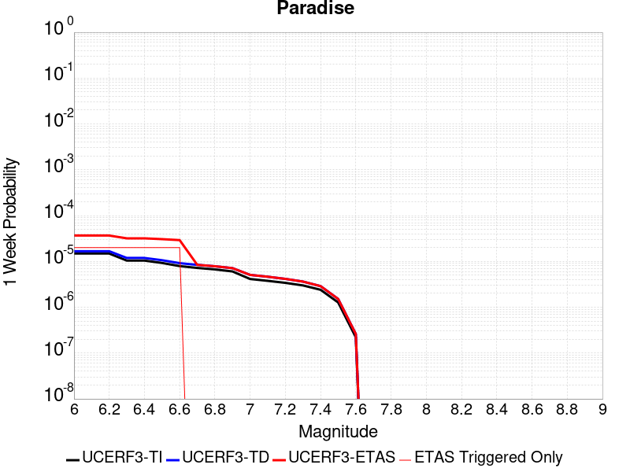 |  |  |  |

| Magnitude | 1 wk TI Prob | 1 wk TD Prob | 1 wk ETAS Prob | 1 wk ETAS/TD Gain | 1 wk ETAS Triggered Only | 1 mo TI Prob | 1 mo TD Prob | 1 mo ETAS Prob | 1 mo ETAS/TD Gain | 1 mo ETAS Triggered Only | 1 yr TI Prob | 1 yr TD Prob | 1 yr ETAS Prob | 1 yr ETAS/TD Gain | 1 yr ETAS Triggered Only | 10 yr TI Prob | 10 yr TD Prob | 10 yr ETAS Prob | 10 yr ETAS/TD Gain | 10 yr ETAS Triggered Only |
|-----|-----|-----|-----|-----|-----|-----|-----|-----|-----|-----|-----|-----|-----|-----|-----|-----|-----|-----|-----|-----|
| 6.0 | 1.4851273E-5 | 1.6694854E-5 | 1.6694854E-5 | 1.0 | 0.0 | 6.364676E-5 | 7.154755E-5 | 7.154755E-5 | 1.0 | 0.0 | 7.7462377E-4 | 8.707668E-4 | 8.707668E-4 | 1.0 | 0.0 | 0.0077192914 | 0.008675928 | 0.008705257 | 1.0033805 | 2.9585799E-5 |
| 6.1 | 1.4851273E-5 | 1.6694854E-5 | 1.6694854E-5 | 1.0 | 0.0 | 6.364676E-5 | 7.154755E-5 | 7.154755E-5 | 1.0 | 0.0 | 7.7462377E-4 | 8.707668E-4 | 8.707668E-4 | 1.0 | 0.0 | 0.0077192914 | 0.008675928 | 0.008705257 | 1.0033805 | 2.9585799E-5 |
| 6.2 | 1.4851273E-5 | 1.6694854E-5 | 1.6694854E-5 | 1.0 | 0.0 | 6.364676E-5 | 7.154755E-5 | 7.154755E-5 | 1.0 | 0.0 | 7.7462377E-4 | 8.707668E-4 | 8.707668E-4 | 1.0 | 0.0 | 0.0077192914 | 0.008675928 | 0.008705257 | 1.0033805 | 2.9585799E-5 |
| 6.3 | 1.0426831E-5 | 1.1888727E-5 | 1.1888727E-5 | 1.0 | 0.0 | 4.4685654E-5 | 5.0950726E-5 | 5.0950726E-5 | 1.0 | 0.0 | 5.43912E-4 | 6.201545E-4 | 6.201545E-4 | 1.0 | 0.0 | 0.0054258266 | 0.006184847 | 0.006184847 | 1.0 | 0.0 |
| 6.4 | 1.0426831E-5 | 1.1888727E-5 | 1.1888727E-5 | 1.0 | 0.0 | 4.4685654E-5 | 5.0950726E-5 | 5.0950726E-5 | 1.0 | 0.0 | 5.43912E-4 | 6.201545E-4 | 6.201545E-4 | 1.0 | 0.0 | 0.0054258266 | 0.006184847 | 0.006184847 | 1.0 | 0.0 |
| 6.5 | 9.25027E-6 | 1.0620054E-5 | 1.0620054E-5 | 1.0 | 0.0 | 3.964341E-5 | 4.551375E-5 | 4.551375E-5 | 1.0 | 0.0 | 4.8255164E-4 | 5.539939E-4 | 5.539939E-4 | 1.0 | 0.0 | 0.0048150513 | 0.0055266283 | 0.0055266283 | 1.0 | 0.0 |
| 6.6 | 7.904275E-6 | 9.159603E-6 | 9.159603E-6 | 1.0 | 0.0 | 3.3875025E-5 | 3.925487E-5 | 3.925487E-5 | 1.0 | 0.0 | 4.1235037E-4 | 4.7782718E-4 | 4.7782718E-4 | 1.0 | 0.0 | 0.0041158604 | 0.004768395 | 0.004768395 | 1.0 | 0.0 |
| 6.7 | 7.2061953E-6 | 8.407318E-6 | 8.407318E-6 | 1.0 | 0.0 | 3.088333E-5 | 3.6030888E-5 | 3.6030888E-5 | 1.0 | 0.0 | 3.7593965E-4 | 4.385914E-4 | 4.385914E-4 | 1.0 | 0.0 | 0.003753043 | 0.0043776273 | 0.0043776273 | 1.0 | 0.0 |
| 6.8 | 6.6948724E-6 | 7.84223E-6 | 7.84223E-6 | 1.0 | 0.0 | 2.8691995E-5 | 3.3609143E-5 | 3.3609143E-5 | 1.0 | 0.0 | 3.4926904E-4 | 4.0911807E-4 | 4.0911807E-4 | 1.0 | 0.0 | 0.003487206 | 0.0040840064 | 0.0040840064 | 1.0 | 0.0 |
| 6.9 | 6.0421025E-6 | 7.130678E-6 | 7.130678E-6 | 1.0 | 0.0 | 2.5894467E-5 | 3.055971E-5 | 3.055971E-5 | 1.0 | 0.0 | 3.1521954E-4 | 3.7200435E-4 | 3.7200435E-4 | 1.0 | 0.0 | 0.0031477278 | 0.0037141545 | 0.0037141545 | 1.0 | 0.0 |
| 7.0 | 4.134091E-6 | 5.0803487E-6 | 5.0803487E-6 | 1.0 | 0.0 | 1.7717413E-5 | 2.177275E-5 | 2.177275E-5 | 1.0 | 0.0 | 2.1568815E-4 | 2.6505254E-4 | 2.6505254E-4 | 1.0 | 0.0 | 0.0021547892 | 0.0026475172 | 0.0026475172 | 1.0 | 0.0 |
| 7.1 | 3.7674888E-6 | 4.6319055E-6 | 4.6319055E-6 | 1.0 | 0.0 | 1.6146281E-5 | 1.985088E-5 | 1.985088E-5 | 1.0 | 0.0 | 1.9656324E-4 | 2.4165919E-4 | 2.4165919E-4 | 1.0 | 0.0 | 0.0019638946 | 0.0024141145 | 0.0024141145 | 1.0 | 0.0 |
| 7.2 | 3.4065345E-6 | 4.156755E-6 | 4.156755E-6 | 1.0 | 0.0 | 1.4599351E-5 | 1.7814553E-5 | 1.7814553E-5 | 1.0 | 0.0 | 1.777326E-4 | 2.1687208E-4 | 2.1687208E-4 | 1.0 | 0.0 | 0.0017759053 | 0.0021667527 | 0.0021667527 | 1.0 | 0.0 |
| 7.3 | 2.9934936E-6 | 3.6293434E-6 | 3.6293434E-6 | 1.0 | 0.0 | 1.2829195E-5 | 1.5554244E-5 | 1.5554244E-5 | 1.0 | 0.0 | 1.5618425E-4 | 1.8935793E-4 | 1.8935793E-4 | 1.0 | 0.0 | 0.0015607453 | 0.0018921113 | 0.0018921113 | 1.0 | 0.0 |
| 7.4 | 2.4049796E-6 | 2.8890036E-6 | 2.8890036E-6 | 1.0 | 0.0 | 1.0307015E-5 | 1.2381393E-5 | 1.2381393E-5 | 1.0 | 0.0 | 1.2548068E-4 | 1.5073447E-4 | 1.5073447E-4 | 1.0 | 0.0 | 0.0012540985 | 0.0015064639 | 0.0015064639 | 1.0 | 0.0 |
| 7.5 | 1.2710091E-6 | 1.5134775E-6 | 1.5134775E-6 | 1.0 | 0.0 | 5.44717E-6 | 6.486323E-6 | 6.486323E-6 | 1.0 | 0.0 | 6.631728E-5 | 7.896937E-5 | 7.896937E-5 | 1.0 | 0.0 | 6.6297496E-4 | 7.8953576E-4 | 7.8953576E-4 | 1.0 | 0.0 |
| 7.6 | 2.21172E-7 | 2.6039737E-7 | 2.6039737E-7 | 1.0 | 0.0 | 9.478797E-7 | 1.1159884E-6 | 1.1159884E-6 | 1.0 | 0.0 | 1.1540374E-5 | 1.3587103E-5 | 1.3587103E-5 | 1.0 | 0.0 | 1.1539775E-4 | 1.3586554E-4 | 1.3586554E-4 | 1.0 | 0.0 |

## White Wolf
*[(top)](#table-of-contents)*

| 1 Week | 1 Month | 1 Year | 10 Year |
|-----|-----|-----|-----|
|  |  |  |  |

| Magnitude | 1 wk TI Prob | 1 wk TD Prob | 1 wk ETAS Prob | 1 wk ETAS/TD Gain | 1 wk ETAS Triggered Only | 1 mo TI Prob | 1 mo TD Prob | 1 mo ETAS Prob | 1 mo ETAS/TD Gain | 1 mo ETAS Triggered Only | 1 yr TI Prob | 1 yr TD Prob | 1 yr ETAS Prob | 1 yr ETAS/TD Gain | 1 yr ETAS Triggered Only | 10 yr TI Prob | 10 yr TD Prob | 10 yr ETAS Prob | 10 yr ETAS/TD Gain | 10 yr ETAS Triggered Only |
|-----|-----|-----|-----|-----|-----|-----|-----|-----|-----|-----|-----|-----|-----|-----|-----|-----|-----|-----|-----|-----|
| 6.0 | 2.0037822E-5 | 1.0469304E-6 | 1.0469304E-6 | 1.0 | 0.0 | 8.587355E-5 | 4.486837E-6 | 4.486837E-6 | 1.0 | 0.0 | 0.001045009 | 5.462592E-5 | 5.462592E-5 | 1.0 | 0.0 | 0.010401085 | 5.4613E-4 | 5.7569967E-4 | 1.0541439 | 2.9585799E-5 |
| 6.1 | 2.0037822E-5 | 1.0469304E-6 | 1.0469304E-6 | 1.0 | 0.0 | 8.587355E-5 | 4.486837E-6 | 4.486837E-6 | 1.0 | 0.0 | 0.001045009 | 5.462592E-5 | 5.462592E-5 | 1.0 | 0.0 | 0.010401085 | 5.4613E-4 | 5.7569967E-4 | 1.0541439 | 2.9585799E-5 |
| 6.2 | 2.0037822E-5 | 1.0469304E-6 | 1.0469304E-6 | 1.0 | 0.0 | 8.587355E-5 | 4.486837E-6 | 4.486837E-6 | 1.0 | 0.0 | 0.001045009 | 5.462592E-5 | 5.462592E-5 | 1.0 | 0.0 | 0.010401085 | 5.4613E-4 | 5.7569967E-4 | 1.0541439 | 2.9585799E-5 |
| 6.3 | 2.0037822E-5 | 1.0469304E-6 | 1.0469304E-6 | 1.0 | 0.0 | 8.587355E-5 | 4.486837E-6 | 4.486837E-6 | 1.0 | 0.0 | 0.001045009 | 5.462592E-5 | 5.462592E-5 | 1.0 | 0.0 | 0.010401085 | 5.4613E-4 | 5.7569967E-4 | 1.0541439 | 2.9585799E-5 |
| 6.4 | 1.132487E-5 | 1.0469304E-6 | 1.0469304E-6 | 1.0 | 0.0 | 4.8534253E-5 | 4.486837E-6 | 4.486837E-6 | 1.0 | 0.0 | 5.907443E-4 | 5.462592E-5 | 5.462592E-5 | 1.0 | 0.0 | 0.005891764 | 5.4613E-4 | 5.7569967E-4 | 1.0541439 | 2.9585799E-5 |
| 6.5 | 1.132487E-5 | 1.0469304E-6 | 1.0469304E-6 | 1.0 | 0.0 | 4.8534253E-5 | 4.486837E-6 | 4.486837E-6 | 1.0 | 0.0 | 5.907443E-4 | 5.462592E-5 | 5.462592E-5 | 1.0 | 0.0 | 0.005891764 | 5.4613E-4 | 5.7569967E-4 | 1.0541439 | 2.9585799E-5 |
| 6.6 | 9.347473E-6 | 1.0469304E-6 | 1.0469304E-6 | 1.0 | 0.0 | 4.0059982E-5 | 4.486837E-6 | 4.486837E-6 | 1.0 | 0.0 | 4.8762115E-4 | 5.462592E-5 | 5.462592E-5 | 1.0 | 0.0 | 0.0048655253 | 5.4613E-4 | 5.7569967E-4 | 1.0541439 | 2.9585799E-5 |
| 6.7 | 7.842647E-6 | 1.0048476E-6 | 1.0048476E-6 | 1.0 | 0.0 | 3.361091E-5 | 4.306483E-6 | 4.306483E-6 | 1.0 | 0.0 | 4.0913603E-4 | 5.243022E-5 | 5.243022E-5 | 1.0 | 0.0 | 0.004083836 | 5.2418344E-4 | 5.5375375E-4 | 1.0564121 | 2.9585799E-5 |
| 6.8 | 6.26597E-6 | 9.734948E-7 | 9.734948E-7 | 1.0 | 0.0 | 2.685388E-5 | 4.172114E-6 | 4.172114E-6 | 1.0 | 0.0 | 3.2689696E-4 | 5.079436E-5 | 5.079436E-5 | 1.0 | 0.0 | 0.003264165 | 5.078324E-4 | 5.3740316E-4 | 1.0582294 | 2.9585799E-5 |
| 6.9 | 5.258436E-6 | 9.183371E-7 | 9.183371E-7 | 1.0 | 0.0 | 2.2535958E-5 | 3.9357246E-6 | 3.9357246E-6 | 1.0 | 0.0 | 2.7434074E-4 | 4.7916445E-5 | 4.7916445E-5 | 1.0 | 0.0 | 0.0027400232 | 4.7906593E-4 | 5.086376E-4 | 1.0617276 | 2.9585799E-5 |
| 7.0 | 4.675028E-6 | 8.66129E-7 | 8.66129E-7 | 1.0 | 0.0 | 2.003568E-5 | 3.7119764E-6 | 3.7119764E-6 | 1.0 | 0.0 | 2.4390711E-4 | 4.5192424E-5 | 4.5192424E-5 | 1.0 | 0.0 | 0.0024363957 | 4.5183706E-4 | 4.814095E-4 | 1.0654494 | 2.9585799E-5 |
| 7.1 | 2.8270078E-6 | 6.8742594E-7 | 6.8742594E-7 | 1.0 | 0.0 | 1.2115692E-5 | 2.9461082E-6 | 2.9461082E-6 | 1.0 | 0.0 | 1.4749856E-4 | 3.5868317E-5 | 3.5868317E-5 | 1.0 | 0.0 | 0.001474007 | 3.586294E-4 | 3.8820456E-4 | 1.0824673 | 2.9585799E-5 |
| 7.2 | 1.6881406E-6 | 2.2706854E-7 | 2.2706854E-7 | 1.0 | 0.0 | 7.2348685E-6 | 9.731506E-7 | 9.731506E-7 | 1.0 | 0.0 | 8.808096E-5 | 1.1848045E-5 | 1.1848045E-5 | 1.0 | 0.0 | 8.8046055E-4 | 1.1847429E-4 | 1.1847429E-4 | 1.0 | 0.0 |
| 7.3 | 9.086107E-7 | 1.5266669E-7 | 1.5266669E-7 | 1.0 | 0.0 | 3.8940398E-6 | 6.5428566E-7 | 6.5428566E-7 | 1.0 | 0.0 | 4.7408903E-5 | 7.965899E-6 | 7.965899E-6 | 1.0 | 0.0 | 4.739879E-4 | 7.965622E-5 | 7.965622E-5 | 1.0 | 0.0 |
| 7.4 | 1.9717383E-7 | 9.003981E-8 | 9.003981E-8 | 1.0 | 0.0 | 8.450304E-7 | 3.8588485E-7 | 3.8588485E-7 | 1.0 | 0.0 | 1.0288197E-5 | 4.698138E-6 | 4.698138E-6 | 1.0 | 0.0 | 1.028772E-4 | 4.6980418E-5 | 4.6980418E-5 | 1.0 | 0.0 |
| 7.5 | 1.086975E-7 | 6.659757E-8 | 6.659757E-8 | 1.0 | 0.0 | 4.6584634E-7 | 2.8541814E-7 | 2.8541814E-7 | 1.0 | 0.0 | 5.6716644E-6 | 3.4749605E-6 | 3.4749605E-6 | 1.0 | 0.0 | 5.6715195E-5 | 3.4749086E-5 | 3.4749086E-5 | 1.0 | 0.0 |
| 7.6 | 2.4217808E-8 | 1.5820843E-8 | 1.5820843E-8 | 1.0 | 0.0 | 1.03790605E-7 | 6.780361E-8 | 6.780361E-8 | 1.0 | 0.0 | 1.2636499E-6 | 8.255087E-7 | 8.255087E-7 | 1.0 | 0.0 | 1.2636427E-5 | 8.255061E-6 | 8.255061E-6 | 1.0 | 0.0 |

## Elsinore (Glen Ivy) rev
*[(top)](#table-of-contents)*

| 1 Week | 1 Month | 1 Year | 10 Year |
|-----|-----|-----|-----|
|  |  |  | 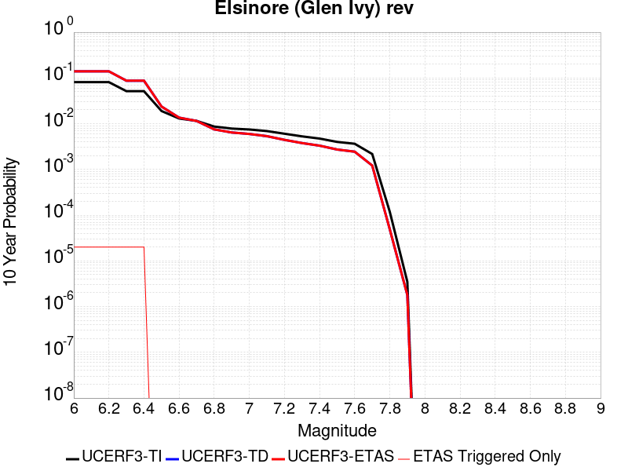 |

| Magnitude | 1 wk TI Prob | 1 wk TD Prob | 1 wk ETAS Prob | 1 wk ETAS/TD Gain | 1 wk ETAS Triggered Only | 1 mo TI Prob | 1 mo TD Prob | 1 mo ETAS Prob | 1 mo ETAS/TD Gain | 1 mo ETAS Triggered Only | 1 yr TI Prob | 1 yr TD Prob | 1 yr ETAS Prob | 1 yr ETAS/TD Gain | 1 yr ETAS Triggered Only | 10 yr TI Prob | 10 yr TD Prob | 10 yr ETAS Prob | 10 yr ETAS/TD Gain | 10 yr ETAS Triggered Only |
|-----|-----|-----|-----|-----|-----|-----|-----|-----|-----|-----|-----|-----|-----|-----|-----|-----|-----|-----|-----|-----|
| 6.0 | 1.6204086E-4 | 2.9362022E-4 | 2.9362022E-4 | 1.0 | 0.0 | 6.94276E-4 | 0.0012579202 | 0.0012579202 | 1.0 | 0.0 | 0.008420097 | 0.015235162 | 0.015235162 | 1.0 | 0.0 | 0.081081145 | 0.13969512 | 0.13972057 | 1.0001822 | 2.9585799E-5 |
| 6.1 | 1.6204086E-4 | 2.9362022E-4 | 2.9362022E-4 | 1.0 | 0.0 | 6.94276E-4 | 0.0012579202 | 0.0012579202 | 1.0 | 0.0 | 0.008420097 | 0.015235162 | 0.015235162 | 1.0 | 0.0 | 0.081081145 | 0.13969512 | 0.13972057 | 1.0001822 | 2.9585799E-5 |
| 6.2 | 1.6204086E-4 | 2.9362022E-4 | 2.9362022E-4 | 1.0 | 0.0 | 6.94276E-4 | 0.0012579202 | 0.0012579202 | 1.0 | 0.0 | 0.008420097 | 0.015235162 | 0.015235162 | 1.0 | 0.0 | 0.081081145 | 0.13969512 | 0.13972057 | 1.0001822 | 2.9585799E-5 |
| 6.3 | 1.0111737E-4 | 1.7703768E-4 | 1.7703768E-4 | 1.0 | 0.0 | 4.332882E-4 | 7.58629E-4 | 7.58629E-4 | 1.0 | 0.0 | 0.005262531 | 0.0092178825 | 0.0092178825 | 1.0 | 0.0 | 0.0513964 | 0.08702082 | 0.08704784 | 1.0003104 | 2.9585799E-5 |
| 6.4 | 1.0111737E-4 | 1.7703768E-4 | 1.7703768E-4 | 1.0 | 0.0 | 4.332882E-4 | 7.58629E-4 | 7.58629E-4 | 1.0 | 0.0 | 0.005262531 | 0.0092178825 | 0.0092178825 | 1.0 | 0.0 | 0.0513964 | 0.08702082 | 0.08704784 | 1.0003104 | 2.9585799E-5 |
| 6.5 | 3.6624708E-5 | 4.639301E-5 | 4.639301E-5 | 1.0 | 0.0 | 1.569536E-4 | 1.9881407E-4 | 1.9881407E-4 | 1.0 | 0.0 | 0.001909235 | 0.0024182373 | 0.0024182373 | 1.0 | 0.0 | 0.01892915 | 0.023740914 | 0.023740914 | 1.0 | 0.0 |
| 6.6 | 2.5051324E-5 | 2.614908E-5 | 2.614908E-5 | 1.0 | 0.0 | 1.073584E-4 | 1.1206293E-4 | 1.1206293E-4 | 1.0 | 0.0 | 0.0013063047 | 0.0013635567 | 0.0013635567 | 1.0 | 0.0 | 0.012986525 | 0.013565315 | 0.013565315 | 1.0 | 0.0 |
| 6.7 | 2.2189772E-5 | 2.207403E-5 | 2.207403E-5 | 1.0 | 0.0 | 9.509556E-5 | 9.459976E-5 | 9.459976E-5 | 1.0 | 0.0 | 0.0011571734 | 0.0011511799 | 0.0011511799 | 1.0 | 0.0 | 0.011511663 | 0.011466023 | 0.011466023 | 1.0 | 0.0 |
| 6.8 | 1.6654378E-5 | 1.4438445E-5 | 1.4438445E-5 | 1.0 | 0.0 | 7.137396E-5 | 6.187761E-5 | 6.187761E-5 | 1.0 | 0.0 | 8.686314E-4 | 7.531047E-4 | 7.531047E-4 | 1.0 | 0.0 | 0.008652439 | 0.0075108632 | 0.0075108632 | 1.0 | 0.0 |
| 6.9 | 1.5042909E-5 | 1.23326745E-5 | 1.23326745E-5 | 1.0 | 0.0 | 6.446802E-5 | 5.2853266E-5 | 5.2853266E-5 | 1.0 | 0.0 | 7.8461546E-4 | 6.433017E-4 | 6.433017E-4 | 1.0 | 0.0 | 0.007818509 | 0.006418618 | 0.006418618 | 1.0 | 0.0 |
| 7.0 | 1.4361385E-5 | 1.14519435E-5 | 1.14519435E-5 | 1.0 | 0.0 | 6.154734E-5 | 4.907885E-5 | 4.907885E-5 | 1.0 | 0.0 | 7.490812E-4 | 5.973741E-4 | 5.973741E-4 | 1.0 | 0.0 | 0.007465612 | 0.0059616743 | 0.0059616743 | 1.0 | 0.0 |
| 7.1 | 1.3265571E-5 | 1.0245398E-5 | 1.0245398E-5 | 1.0 | 0.0 | 5.6851208E-5 | 4.3908123E-5 | 4.3908123E-5 | 1.0 | 0.0 | 6.919436E-4 | 5.344528E-4 | 5.344528E-4 | 1.0 | 0.0 | 0.006897931 | 0.0053350315 | 0.0053350315 | 1.0 | 0.0 |
| 7.2 | 1.1596403E-5 | 8.50544E-6 | 8.50544E-6 | 1.0 | 0.0 | 4.9697923E-5 | 3.6451387E-5 | 3.6451387E-5 | 1.0 | 0.0 | 6.049042E-4 | 4.4370696E-4 | 4.4370696E-4 | 1.0 | 0.0 | 0.006032603 | 0.004429626 | 0.004429626 | 1.0 | 0.0 |
| 7.3 | 1.0150827E-5 | 7.23907E-6 | 7.23907E-6 | 1.0 | 0.0 | 4.3502816E-5 | 3.1024225E-5 | 3.1024225E-5 | 1.0 | 0.0 | 5.2951806E-4 | 3.776559E-4 | 3.776559E-4 | 1.0 | 0.0 | 0.005282581 | 0.0037705277 | 0.0037705277 | 1.0 | 0.0 |
| 7.4 | 9.080705E-6 | 6.352785E-6 | 6.352785E-6 | 1.0 | 0.0 | 3.8916725E-5 | 2.7225946E-5 | 2.7225946E-5 | 1.0 | 0.0 | 4.7370812E-4 | 3.3142683E-4 | 3.3142683E-4 | 1.0 | 0.0 | 0.004726996 | 0.0033094764 | 0.0033094764 | 1.0 | 0.0 |
| 7.5 | 7.671649E-6 | 5.2258497E-6 | 5.2258497E-6 | 1.0 | 0.0 | 3.287808E-5 | 2.2396314E-5 | 2.2396314E-5 | 1.0 | 0.0 | 4.0021708E-4 | 2.7264224E-4 | 2.7264224E-4 | 1.0 | 0.0 | 0.0039949706 | 0.0027232026 | 0.0027232026 | 1.0 | 0.0 |
| 7.6 | 6.990086E-6 | 4.687739E-6 | 4.687739E-6 | 1.0 | 0.0 | 2.9957167E-5 | 2.0090161E-5 | 2.0090161E-5 | 1.0 | 0.0 | 3.6466747E-4 | 2.4457145E-4 | 2.4457145E-4 | 1.0 | 0.0 | 0.0036406964 | 0.002443139 | 0.002443139 | 1.0 | 0.0 |
| 7.7 | 4.163505E-6 | 2.3296475E-6 | 2.3296475E-6 | 1.0 | 0.0 | 1.7843471E-5 | 9.984169E-6 | 9.984169E-6 | 1.0 | 0.0 | 2.172226E-4 | 1.21551224E-4 | 1.21551224E-4 | 1.0 | 0.0 | 0.0021701038 | 0.0012149204 | 0.0012149204 | 1.0 | 0.0 |
| 7.8 | 2.2692414E-7 | 9.385943E-8 | 9.385943E-8 | 1.0 | 0.0 | 9.725317E-7 | 4.0225464E-7 | 4.0225464E-7 | 1.0 | 0.0 | 1.1840509E-5 | 4.8974425E-6 | 4.8974425E-6 | 1.0 | 0.0 | 1.1839878E-4 | 4.8973674E-5 | 4.8973674E-5 | 1.0 | 0.0 |
| 7.9 | 6.676829E-9 | 3.4399772E-9 | 3.4399772E-9 | 1.0 | 0.0 | 2.861498E-8 | 1.4742759E-8 | 1.4742759E-8 | 1.0 | 0.0 | 3.4838732E-7 | 1.7949307E-7 | 1.7949307E-7 | 1.0 | 0.0 | 3.4838679E-6 | 1.7949295E-6 | 1.7949295E-6 | 1.0 | 0.0 |

## San Andreas (Creeping Section) 2011 CFM
*[(top)](#table-of-contents)*

| 1 Week | 1 Month | 1 Year | 10 Year |
|-----|-----|-----|-----|
|  |  |  |  |

| Magnitude | 1 wk TI Prob | 1 wk TD Prob | 1 wk ETAS Prob | 1 wk ETAS/TD Gain | 1 wk ETAS Triggered Only | 1 mo TI Prob | 1 mo TD Prob | 1 mo ETAS Prob | 1 mo ETAS/TD Gain | 1 mo ETAS Triggered Only | 1 yr TI Prob | 1 yr TD Prob | 1 yr ETAS Prob | 1 yr ETAS/TD Gain | 1 yr ETAS Triggered Only | 10 yr TI Prob | 10 yr TD Prob | 10 yr ETAS Prob | 10 yr ETAS/TD Gain | 10 yr ETAS Triggered Only |
|-----|-----|-----|-----|-----|-----|-----|-----|-----|-----|-----|-----|-----|-----|-----|-----|-----|-----|-----|-----|-----|
| 6.0 | 5.986481E-4 | 0.0012278741 | 0.0012278741 | 1.0 | 0.0 | 0.0025631124 | 0.0052457973 | 0.005275228 | 1.0056103 | 2.9585799E-5 | 0.030762846 | 0.061208665 | 0.06123644 | 1.0004538 | 2.9585799E-5 | 0.26835477 | 0.4259623 | 0.4259793 | 1.0000398 | 2.9585799E-5 |
| 6.1 | 5.015945E-4 | 0.0010222398 | 0.0010222398 | 1.0 | 0.0 | 0.00214792 | 0.004368119 | 0.0043975753 | 1.0067436 | 2.9585799E-5 | 0.025839351 | 0.0512512 | 0.05127927 | 1.0005476 | 2.9585799E-5 | 0.23032776 | 0.37288252 | 0.37290108 | 1.0000497 | 2.9585799E-5 |
| 6.2 | 4.073338E-4 | 8.109135E-4 | 8.109135E-4 | 1.0 | 0.0 | 0.0017445484 | 0.0034676173 | 0.0034971004 | 1.0085025 | 2.9585799E-5 | 0.021034058 | 0.040936444 | 0.04096482 | 1.0006931 | 2.9585799E-5 | 0.19150782 | 0.3130621 | 0.31308243 | 1.000065 | 2.9585799E-5 |
| 6.3 | 3.464099E-4 | 6.7394925E-4 | 6.7394925E-4 | 1.0 | 0.0 | 0.0014837692 | 0.00288274 | 0.00288274 | 1.0 | 0.0 | 0.017915873 | 0.034192428 | 0.034192428 | 1.0 | 0.0 | 0.16538359 | 0.27134693 | 0.27134693 | 1.0 | 0.0 |
| 6.4 | 2.935057E-4 | 5.545115E-4 | 5.545115E-4 | 1.0 | 0.0 | 0.0012572751 | 0.0023718805 | 0.0023718805 | 1.0 | 0.0 | 0.015200248 | 0.028267467 | 0.028267467 | 1.0 | 0.0 | 0.14201577 | 0.2330172 | 0.2330172 | 1.0 | 0.0 |
| 6.5 | 2.3409708E-4 | 4.2095222E-4 | 4.2095222E-4 | 1.0 | 0.0 | 0.0010028875 | 0.0018015768 | 0.0018015768 | 1.0 | 0.0 | 0.012141965 | 0.021591473 | 0.021591473 | 1.0 | 0.0 | 0.11499573 | 0.18685804 | 0.18685804 | 1.0 | 0.0 |
| 6.6 | 1.5842178E-4 | 2.5079807E-4 | 2.5079807E-4 | 1.0 | 0.0 | 6.7877385E-4 | 0.0010744074 | 0.0010744074 | 1.0 | 0.0 | 0.0082328 | 0.013001034 | 0.013001034 | 1.0 | 0.0 | 0.07934396 | 0.12318426 | 0.12318426 | 1.0 | 0.0 |
| 6.7 | 1.5616413E-4 | 2.461632E-4 | 2.461632E-4 | 1.0 | 0.0 | 6.691031E-4 | 0.0010545597 | 0.0010545597 | 1.0 | 0.0 | 0.0081159435 | 0.012762894 | 0.012762894 | 1.0 | 0.0 | 0.0782586 | 0.12121142 | 0.12121142 | 1.0 | 0.0 |
| 6.8 | 1.5538467E-4 | 2.4440174E-4 | 2.4440174E-4 | 1.0 | 0.0 | 6.6576427E-4 | 0.0010470168 | 0.0010470168 | 1.0 | 0.0 | 0.008075596 | 0.012672268 | 0.012672268 | 1.0 | 0.0 | 0.07788358 | 0.12044227 | 0.12044227 | 1.0 | 0.0 |
| 6.9 | 1.5153569E-4 | 2.3549511E-4 | 2.3549511E-4 | 1.0 | 0.0 | 6.49277E-4 | 0.0010088764 | 0.0010088764 | 1.0 | 0.0 | 0.007876333 | 0.012214421 | 0.012214421 | 1.0 | 0.0 | 0.07602952 | 0.11651233 | 0.11651233 | 1.0 | 0.0 |
| 7.0 | 1.4588932E-4 | 2.2406683E-4 | 2.2406683E-4 | 1.0 | 0.0 | 6.250901E-4 | 9.5993496E-4 | 9.5993496E-4 | 1.0 | 0.0 | 0.0075839474 | 0.011625077 | 0.011625077 | 1.0 | 0.0 | 0.073302895 | 0.111358546 | 0.111358546 | 1.0 | 0.0 |
| 7.1 | 1.1565079E-4 | 1.6290719E-4 | 1.6290719E-4 | 1.0 | 0.0 | 4.955521E-4 | 6.9798774E-4 | 6.9798774E-4 | 1.0 | 0.0 | 0.006016669 | 0.008465091 | 0.008465091 | 1.0 | 0.0 | 0.058563538 | 0.08370675 | 0.08370675 | 1.0 | 0.0 |
| 7.2 | 1.0393792E-4 | 1.4624344E-4 | 1.4624344E-4 | 1.0 | 0.0 | 4.4537216E-4 | 6.2660786E-4 | 6.2660786E-4 | 1.0 | 0.0 | 0.005408933 | 0.007602434 | 0.007602434 | 1.0 | 0.0 | 0.052791595 | 0.07565546 | 0.07565546 | 1.0 | 0.0 |
| 7.3 | 9.332884E-5 | 1.2788197E-4 | 1.2788197E-4 | 1.0 | 0.0 | 3.999194E-4 | 5.479511E-4 | 5.479511E-4 | 1.0 | 0.0 | 0.0048581534 | 0.0066510327 | 0.0066510327 | 1.0 | 0.0 | 0.047533102 | 0.06651482 | 0.06651482 | 1.0 | 0.0 |
| 7.4 | 8.670252E-5 | 1.17095995E-4 | 1.17095995E-4 | 1.0 | 0.0 | 3.715293E-4 | 5.0174404E-4 | 5.0174404E-4 | 1.0 | 0.0 | 0.004513991 | 0.006091744 | 0.006091744 | 1.0 | 0.0 | 0.044233937 | 0.061179653 | 0.061179653 | 1.0 | 0.0 |
| 7.5 | 7.3036405E-5 | 9.011144E-5 | 9.011144E-5 | 1.0 | 0.0 | 3.129756E-4 | 3.861348E-4 | 3.861348E-4 | 1.0 | 0.0 | 0.0038038217 | 0.004691079 | 0.004691079 | 1.0 | 0.0 | 0.03739367 | 0.047901772 | 0.047901772 | 1.0 | 0.0 |
| 7.6 | 6.3935775E-5 | 8.284792E-5 | 8.284792E-5 | 1.0 | 0.0 | 2.7398168E-4 | 3.550143E-4 | 3.550143E-4 | 1.0 | 0.0 | 0.0033306254 | 0.004313751 | 0.004313751 | 1.0 | 0.0 | 0.032811474 | 0.04401211 | 0.04401211 | 1.0 | 0.0 |
| 7.7 | 5.5050095E-5 | 6.6657536E-5 | 6.6657536E-5 | 1.0 | 0.0 | 2.3590765E-4 | 2.8564388E-4 | 2.8564388E-4 | 1.0 | 0.0 | 0.0028683927 | 0.0034721727 | 0.0034721727 | 1.0 | 0.0 | 0.0283165 | 0.035814673 | 0.035814673 | 1.0 | 0.0 |
| 7.8 | 5.027131E-5 | 6.166444E-5 | 6.166444E-5 | 1.0 | 0.0 | 2.1543067E-4 | 2.6424942E-4 | 2.6424942E-4 | 1.0 | 0.0 | 0.0026197135 | 0.0032124936 | 0.0032124936 | 1.0 | 0.0 | 0.025890453 | 0.033143617 | 0.033143617 | 1.0 | 0.0 |
| 7.9 | 3.7271806E-5 | 5.0253755E-5 | 5.0253755E-5 | 1.0 | 0.0 | 1.5972654E-4 | 2.1535547E-4 | 2.1535547E-4 | 1.0 | 0.0 | 0.0019429359 | 0.0026188022 | 0.0026188022 | 1.0 | 0.0 | 0.019260362 | 0.027081102 | 0.027081102 | 1.0 | 0.0 |
| 8.0 | 2.7310243E-5 | 3.144777E-5 | 3.144777E-5 | 1.0 | 0.0 | 1.17038646E-4 | 1.3476919E-4 | 1.3476919E-4 | 1.0 | 0.0 | 0.0014240141 | 0.0016395808 | 0.0016395808 | 1.0 | 0.0 | 0.014149235 | 0.0172237 | 0.0172237 | 1.0 | 0.0 |
| 8.1 | 1.7940547E-5 | 1.7413187E-5 | 1.7413187E-5 | 1.0 | 0.0 | 7.688579E-5 | 7.4625816E-5 | 7.4625816E-5 | 1.0 | 0.0 | 9.3568244E-4 | 9.081911E-4 | 9.081911E-4 | 1.0 | 0.0 | 0.009317525 | 0.009805583 | 0.009805583 | 1.0 | 0.0 |
| 8.2 | 8.643924E-6 | 5.4798497E-6 | 5.4798497E-6 | 1.0 | 0.0 | 3.704486E-5 | 2.348486E-5 | 2.348486E-5 | 1.0 | 0.0 | 4.5092785E-4 | 2.858907E-4 | 2.858907E-4 | 1.0 | 0.0 | 0.0045001395 | 0.0032514327 | 0.0032514327 | 1.0 | 0.0 |
| 8.3 | 1.983087E-6 | 7.668296E-7 | 7.668296E-7 | 1.0 | 0.0 | 8.498917E-6 | 3.2864084E-6 | 3.2864084E-6 | 1.0 | 0.0 | 1.034694E-4 | 4.0011306E-5 | 4.0011306E-5 | 1.0 | 0.0 | 0.0010342124 | 4.724499E-4 | 4.724499E-4 | 1.0 | 0.0 |

## Earthquake Valley (No  Extension)
*[(top)](#table-of-contents)*

| 1 Week | 1 Month | 1 Year | 10 Year |
|-----|-----|-----|-----|
|  |  |  | 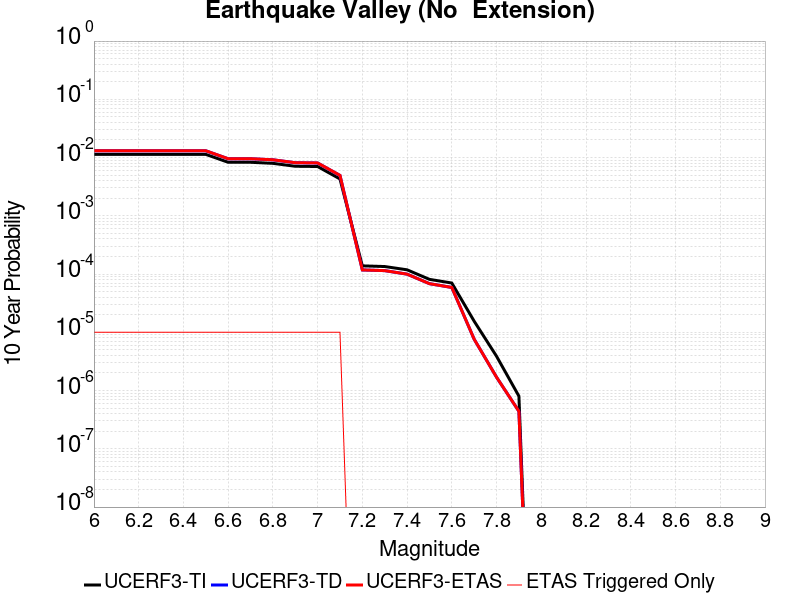 |

| Magnitude | 1 wk TI Prob | 1 wk TD Prob | 1 wk ETAS Prob | 1 wk ETAS/TD Gain | 1 wk ETAS Triggered Only | 1 mo TI Prob | 1 mo TD Prob | 1 mo ETAS Prob | 1 mo ETAS/TD Gain | 1 mo ETAS Triggered Only | 1 yr TI Prob | 1 yr TD Prob | 1 yr ETAS Prob | 1 yr ETAS/TD Gain | 1 yr ETAS Triggered Only | 10 yr TI Prob | 10 yr TD Prob | 10 yr ETAS Prob | 10 yr ETAS/TD Gain | 10 yr ETAS Triggered Only |
|-----|-----|-----|-----|-----|-----|-----|-----|-----|-----|-----|-----|-----|-----|-----|-----|-----|-----|-----|-----|-----|
| 6.0 | 2.1859703E-5 | 2.5198888E-5 | 2.5198888E-5 | 1.0 | 0.0 | 9.3681076E-5 | 1.0799158E-4 | 1.3757418E-4 | 1.2739344 | 2.9585799E-5 | 0.0011399703 | 0.0013141495 | 0.0013436964 | 1.0224837 | 2.9585799E-5 | 0.011341401 | 0.013078143 | 0.013107342 | 1.0022327 | 2.9585799E-5 |
| 6.1 | 2.1859703E-5 | 2.5198888E-5 | 2.5198888E-5 | 1.0 | 0.0 | 9.3681076E-5 | 1.0799158E-4 | 1.3757418E-4 | 1.2739344 | 2.9585799E-5 | 0.0011399703 | 0.0013141495 | 0.0013436964 | 1.0224837 | 2.9585799E-5 | 0.011341401 | 0.013078143 | 0.013107342 | 1.0022327 | 2.9585799E-5 |
| 6.2 | 2.1859703E-5 | 2.5198888E-5 | 2.5198888E-5 | 1.0 | 0.0 | 9.3681076E-5 | 1.0799158E-4 | 1.3757418E-4 | 1.2739344 | 2.9585799E-5 | 0.0011399703 | 0.0013141495 | 0.0013436964 | 1.0224837 | 2.9585799E-5 | 0.011341401 | 0.013078143 | 0.013107342 | 1.0022327 | 2.9585799E-5 |
| 6.3 | 2.1859703E-5 | 2.5198888E-5 | 2.5198888E-5 | 1.0 | 0.0 | 9.3681076E-5 | 1.0799158E-4 | 1.3757418E-4 | 1.2739344 | 2.9585799E-5 | 0.0011399703 | 0.0013141495 | 0.0013436964 | 1.0224837 | 2.9585799E-5 | 0.011341401 | 0.013078143 | 0.013107342 | 1.0022327 | 2.9585799E-5 |
| 6.4 | 2.1859703E-5 | 2.5198888E-5 | 2.5198888E-5 | 1.0 | 0.0 | 9.3681076E-5 | 1.0799158E-4 | 1.3757418E-4 | 1.2739344 | 2.9585799E-5 | 0.0011399703 | 0.0013141495 | 0.0013436964 | 1.0224837 | 2.9585799E-5 | 0.011341401 | 0.013078143 | 0.013107342 | 1.0022327 | 2.9585799E-5 |
| 6.5 | 2.1859703E-5 | 2.5198888E-5 | 2.5198888E-5 | 1.0 | 0.0 | 9.3681076E-5 | 1.0799158E-4 | 1.3757418E-4 | 1.2739344 | 2.9585799E-5 | 0.0011399703 | 0.0013141495 | 0.0013436964 | 1.0224837 | 2.9585799E-5 | 0.011341401 | 0.013078143 | 0.013107342 | 1.0022327 | 2.9585799E-5 |
| 6.6 | 1.597E-5 | 1.8356655E-5 | 1.8356655E-5 | 1.0 | 0.0 | 6.8441055E-5 | 7.86695E-5 | 1.0825297E-4 | 1.3760475 | 2.9585799E-5 | 8.329513E-4 | 9.574676E-4 | 9.870251E-4 | 1.0308704 | 2.9585799E-5 | 0.008298361 | 0.009542032 | 0.009571336 | 1.003071 | 2.9585799E-5 |
| 6.7 | 1.597E-5 | 1.8356655E-5 | 1.8356655E-5 | 1.0 | 0.0 | 6.8441055E-5 | 7.86695E-5 | 1.0825297E-4 | 1.3760475 | 2.9585799E-5 | 8.329513E-4 | 9.574676E-4 | 9.870251E-4 | 1.0308704 | 2.9585799E-5 | 0.008298361 | 0.009542032 | 0.009571336 | 1.003071 | 2.9585799E-5 |
| 6.8 | 1.5315149E-5 | 1.7602457E-5 | 1.7602457E-5 | 1.0 | 0.0 | 6.5634704E-5 | 7.5437405E-5 | 1.05020976E-4 | 1.3921604 | 2.9585799E-5 | 7.988095E-4 | 9.181501E-4 | 9.4770873E-4 | 1.0321937 | 2.9585799E-5 | 0.007959441 | 0.009152108 | 0.009181423 | 1.003203 | 2.9585799E-5 |
| 6.9 | 1.3634728E-5 | 1.5676149E-5 | 1.5676149E-5 | 1.0 | 0.0 | 5.8433237E-5 | 6.718223E-5 | 9.676604E-5 | 1.4403517 | 2.9585799E-5 | 7.1119244E-4 | 8.1771874E-4 | 8.472804E-4 | 1.0361513 | 2.9585799E-5 | 0.007089207 | 0.00815517 | 0.008184515 | 1.0035982 | 2.9585799E-5 |
| 7.0 | 1.3496271E-5 | 1.5518177E-5 | 1.5518177E-5 | 1.0 | 0.0 | 5.783988E-5 | 6.650524E-5 | 9.6089076E-5 | 1.4448346 | 2.9585799E-5 | 7.03973E-4 | 8.094826E-4 | 8.3904446E-4 | 1.0365194 | 2.9585799E-5 | 0.007017471 | 0.008073409 | 0.008102756 | 1.003635 | 2.9585799E-5 |
| 7.1 | 8.242798E-6 | 9.472804E-6 | 9.472804E-6 | 1.0 | 0.0 | 3.53258E-5 | 4.0597475E-5 | 7.0182075E-5 | 1.72873 | 2.9585799E-5 | 4.300067E-4 | 4.9422926E-4 | 5.2380044E-4 | 1.0598329 | 2.9585799E-5 | 0.004291756 | 0.004937878 | 0.0049673175 | 1.005962 | 2.9585799E-5 |
| 7.2 | 2.6506527E-7 | 2.256113E-7 | 2.256113E-7 | 1.0 | 0.0 | 1.1359936E-6 | 9.669052E-7 | 9.669052E-7 | 1.0 | 0.0 | 1.3830633E-5 | 1.1772012E-5 | 1.1772012E-5 | 1.0 | 0.0 | 1.3829772E-4 | 1.177143E-4 | 1.177143E-4 | 1.0 | 0.0 |
| 7.3 | 2.5810488E-7 | 2.1956254E-7 | 2.1956254E-7 | 1.0 | 0.0 | 1.1061633E-6 | 9.40982E-7 | 9.40982E-7 | 1.0 | 0.0 | 1.3467455E-5 | 1.1456399E-5 | 1.1456399E-5 | 1.0 | 0.0 | 1.3466639E-4 | 1.145585E-4 | 1.145585E-4 | 1.0 | 0.0 |
| 7.4 | 2.2676066E-7 | 1.9111387E-7 | 1.9111387E-7 | 1.0 | 0.0 | 9.71831E-7 | 8.1905915E-7 | 8.1905915E-7 | 1.0 | 0.0 | 1.1831979E-5 | 9.972004E-6 | 9.972004E-6 | 1.0 | 0.0 | 1.1831349E-4 | 9.971595E-5 | 9.971595E-5 | 1.0 | 0.0 |
| 7.5 | 1.5553917E-7 | 1.3112768E-7 | 1.3112768E-7 | 1.0 | 0.0 | 6.6659624E-7 | 5.6197564E-7 | 5.6197564E-7 | 1.0 | 0.0 | 8.115779E-6 | 6.8420345E-6 | 6.8420345E-6 | 1.0 | 0.0 | 8.115482E-5 | 6.8418456E-5 | 6.8418456E-5 | 1.0 | 0.0 |
| 7.6 | 1.3448629E-7 | 1.1289034E-7 | 1.1289034E-7 | 1.0 | 0.0 | 5.7636964E-7 | 4.8381565E-7 | 4.8381565E-7 | 1.0 | 0.0 | 7.017278E-6 | 5.890442E-6 | 5.890442E-6 | 1.0 | 0.0 | 7.0170565E-5 | 5.890307E-5 | 5.890307E-5 | 1.0 | 0.0 |
| 7.7 | 2.9719402E-8 | 1.4582792E-8 | 1.4582792E-8 | 1.0 | 0.0 | 1.2736886E-7 | 6.2497676E-8 | 6.2497676E-8 | 1.0 | 0.0 | 1.5507147E-6 | 7.60909E-7 | 7.60909E-7 | 1.0 | 0.0 | 1.550704E-5 | 7.6090696E-6 | 7.6090696E-6 | 1.0 | 0.0 |
| 7.8 | 7.4390196E-9 | 3.2503715E-9 | 3.2503715E-9 | 1.0 | 0.0 | 3.1881513E-8 | 1.3930164E-8 | 1.3930164E-8 | 1.0 | 0.0 | 3.8815733E-7 | 1.6959973E-7 | 1.6959973E-7 | 1.0 | 0.0 | 3.8815665E-6 | 1.6959963E-6 | 1.6959963E-6 | 1.0 | 0.0 |
| 7.9 | 1.5373532E-9 | 8.4404506E-10 | 8.4404506E-10 | 1.0 | 0.0 | 6.5886567E-9 | 3.6173358E-9 | 3.6173358E-9 | 1.0 | 0.0 | 8.021689E-8 | 4.4041062E-8 | 4.4041062E-8 | 1.0 | 0.0 | 8.0216864E-7 | 4.4041062E-7 | 4.4041062E-7 | 1.0 | 0.0 |

## San Jacinto (San Bernardino)
*[(top)](#table-of-contents)*

| 1 Week | 1 Month | 1 Year | 10 Year |
|-----|-----|-----|-----|
|  |  |  |  |

| Magnitude | 1 wk TI Prob | 1 wk TD Prob | 1 wk ETAS Prob | 1 wk ETAS/TD Gain | 1 wk ETAS Triggered Only | 1 mo TI Prob | 1 mo TD Prob | 1 mo ETAS Prob | 1 mo ETAS/TD Gain | 1 mo ETAS Triggered Only | 1 yr TI Prob | 1 yr TD Prob | 1 yr ETAS Prob | 1 yr ETAS/TD Gain | 1 yr ETAS Triggered Only | 10 yr TI Prob | 10 yr TD Prob | 10 yr ETAS Prob | 10 yr ETAS/TD Gain | 10 yr ETAS Triggered Only |
|-----|-----|-----|-----|-----|-----|-----|-----|-----|-----|-----|-----|-----|-----|-----|-----|-----|-----|-----|-----|-----|
| 6.0 | 3.409352E-5 | 3.600249E-5 | 3.600249E-5 | 1.0 | 0.0 | 1.461069E-4 | 1.5428728E-4 | 1.8386851E-4 | 1.1917282 | 2.9585799E-5 | 0.0017774 | 0.001876831 | 0.0019063613 | 1.0157341 | 2.9585799E-5 | 0.01763251 | 0.019358097 | 0.019387111 | 1.0014987 | 2.9585799E-5 |
| 6.1 | 3.409352E-5 | 3.600249E-5 | 3.600249E-5 | 1.0 | 0.0 | 1.461069E-4 | 1.5428728E-4 | 1.8386851E-4 | 1.1917282 | 2.9585799E-5 | 0.0017774 | 0.001876831 | 0.0019063613 | 1.0157341 | 2.9585799E-5 | 0.01763251 | 0.019358097 | 0.019387111 | 1.0014987 | 2.9585799E-5 |
| 6.2 | 3.409352E-5 | 3.600249E-5 | 3.600249E-5 | 1.0 | 0.0 | 1.461069E-4 | 1.5428728E-4 | 1.8386851E-4 | 1.1917282 | 2.9585799E-5 | 0.0017774 | 0.001876831 | 0.0019063613 | 1.0157341 | 2.9585799E-5 | 0.01763251 | 0.019358097 | 0.019387111 | 1.0014987 | 2.9585799E-5 |
| 6.3 | 3.409352E-5 | 3.600249E-5 | 3.600249E-5 | 1.0 | 0.0 | 1.461069E-4 | 1.5428728E-4 | 1.8386851E-4 | 1.1917282 | 2.9585799E-5 | 0.0017774 | 0.001876831 | 0.0019063613 | 1.0157341 | 2.9585799E-5 | 0.01763251 | 0.019358097 | 0.019387111 | 1.0014987 | 2.9585799E-5 |
| 6.4 | 3.400795E-5 | 3.589515E-5 | 3.589515E-5 | 1.0 | 0.0 | 1.4574021E-4 | 1.5382729E-4 | 1.8340854E-4 | 1.1923016 | 2.9585799E-5 | 0.0017729428 | 0.0018712406 | 0.001900771 | 1.0157812 | 2.9585799E-5 | 0.017588645 | 0.019303178 | 0.019332193 | 1.0015031 | 2.9585799E-5 |
| 6.5 | 3.341482E-5 | 3.5155765E-5 | 3.5155765E-5 | 1.0 | 0.0 | 1.4319851E-4 | 1.5065886E-4 | 1.8024021E-4 | 1.1963465 | 2.9585799E-5 | 0.0017420477 | 0.0018327299 | 0.0018622614 | 1.0161134 | 2.9585799E-5 | 0.017284546 | 0.018924711 | 0.018953737 | 1.0015337 | 2.9585799E-5 |
| 6.6 | 3.3364955E-5 | 3.509298E-5 | 3.509298E-5 | 1.0 | 0.0 | 1.4298483E-4 | 1.5038982E-4 | 1.7997118E-4 | 1.1966978 | 2.9585799E-5 | 0.0017394501 | 0.0018294598 | 0.0018589916 | 1.0161422 | 2.9585799E-5 | 0.017258976 | 0.018892575 | 0.0189216 | 1.0015364 | 2.9585799E-5 |
| 6.7 | 3.335922E-5 | 3.5082754E-5 | 3.5082754E-5 | 1.0 | 0.0 | 1.4296026E-4 | 1.5034601E-4 | 1.7992736E-4 | 1.1967552 | 2.9585799E-5 | 0.0017391514 | 0.0018289272 | 0.0018584589 | 1.016147 | 2.9585799E-5 | 0.017256035 | 0.018887365 | 0.018916393 | 1.0015368 | 2.9585799E-5 |
| 6.8 | 3.327683E-5 | 3.4976816E-5 | 3.4976816E-5 | 1.0 | 0.0 | 1.4260718E-4 | 1.4989203E-4 | 1.794734E-4 | 1.1973511 | 2.9585799E-5 | 0.0017348597 | 0.0018234095 | 0.0018529412 | 1.0161959 | 2.9585799E-5 | 0.017213784 | 0.018833136 | 0.018862166 | 1.0015414 | 2.9585799E-5 |
| 6.9 | 3.3235785E-5 | 3.4917768E-5 | 3.4917768E-5 | 1.0 | 0.0 | 1.4243131E-4 | 1.49639E-4 | 1.7922037E-4 | 1.1976849 | 2.9585799E-5 | 0.0017327217 | 0.0018203339 | 0.0018498658 | 1.0162233 | 2.9585799E-5 | 0.017192734 | 0.018803004 | 0.018832034 | 1.0015439 | 2.9585799E-5 |
| 7.0 | 3.3197095E-5 | 3.4857694E-5 | 3.4857694E-5 | 1.0 | 0.0 | 1.422655E-4 | 1.4938158E-4 | 1.7896296E-4 | 1.1980256 | 2.9585799E-5 | 0.0017307063 | 0.001817205 | 0.001846737 | 1.0162513 | 2.9585799E-5 | 0.017172894 | 0.01877238 | 0.01880141 | 1.0015464 | 2.9585799E-5 |
| 7.1 | 3.3129716E-5 | 3.47379E-5 | 3.47379E-5 | 1.0 | 0.0 | 1.4197677E-4 | 1.4886823E-4 | 1.7844963E-4 | 1.1987085 | 2.9585799E-5 | 0.0017271966 | 0.0018109654 | 0.0018404976 | 1.0163075 | 2.9585799E-5 | 0.017138338 | 0.018711457 | 0.01874049 | 1.0015516 | 2.9585799E-5 |
| 7.2 | 3.3034008E-5 | 3.4605342E-5 | 3.4605342E-5 | 1.0 | 0.0 | 1.4156665E-4 | 1.4830018E-4 | 1.778816E-4 | 1.1994698 | 2.9585799E-5 | 0.0017222111 | 0.001804061 | 0.0018335934 | 1.0163699 | 2.9585799E-5 | 0.017089253 | 0.018643849 | 0.018672882 | 1.0015574 | 2.9585799E-5 |
| 7.3 | 3.2956614E-5 | 3.447309E-5 | 3.447309E-5 | 1.0 | 0.0 | 1.4123498E-4 | 1.4773346E-4 | 1.7731488E-4 | 1.2002351 | 2.9585799E-5 | 0.0017181796 | 0.0017971725 | 0.0018267051 | 1.0164329 | 2.9585799E-5 | 0.017049557 | 0.018576592 | 0.018605629 | 1.0015631 | 2.9585799E-5 |
| 7.4 | 3.2915937E-5 | 3.439478E-5 | 3.439478E-5 | 1.0 | 0.0 | 1.4106068E-4 | 1.4739788E-4 | 1.7697932E-4 | 1.2006911 | 2.9585799E-5 | 0.0017160608 | 0.0017930934 | 0.0018226261 | 1.0164703 | 2.9585799E-5 | 0.017028693 | 0.018536855 | 0.018565891 | 1.0015664 | 2.9585799E-5 |
| 7.5 | 3.281791E-5 | 3.4259683E-5 | 3.4259683E-5 | 1.0 | 0.0 | 1.406406E-4 | 1.4681896E-4 | 1.7640041E-4 | 1.2014825 | 2.9585799E-5 | 0.0017109542 | 0.0017860567 | 0.0018155896 | 1.0165353 | 2.9585799E-5 | 0.016978411 | 0.018467735 | 0.018496776 | 1.0015725 | 2.9585799E-5 |
| 7.6 | 3.2521442E-5 | 3.39846E-5 | 3.39846E-5 | 1.0 | 0.0 | 1.3937015E-4 | 1.4564018E-4 | 1.7522166E-4 | 1.2031136 | 2.9585799E-5 | 0.0016955109 | 0.0017717284 | 0.0018012618 | 1.0166693 | 2.9585799E-5 | 0.016826328 | 0.01832535 | 0.018354394 | 1.0015849 | 2.9585799E-5 |
| 7.7 | 3.0287873E-5 | 3.246845E-5 | 3.246845E-5 | 1.0 | 0.0 | 1.297987E-4 | 1.391431E-4 | 1.6872477E-4 | 1.212599 | 2.9585799E-5 | 0.0015791537 | 0.001692752 | 0.0017222877 | 1.0174483 | 2.9585799E-5 | 0.01567979 | 0.017536119 | 0.017565187 | 1.0016576 | 2.9585799E-5 |
| 7.8 | 2.6316151E-5 | 2.9678711E-5 | 2.9678711E-5 | 1.0 | 0.0 | 1.1277862E-4 | 1.2718828E-4 | 1.5677031E-4 | 1.2325846 | 2.9585799E-5 | 0.0013722149 | 0.0015474184 | 0.0015769585 | 1.0190898 | 2.9585799E-5 | 0.013637724 | 0.016077382 | 0.016106494 | 1.0018107 | 2.9585799E-5 |
| 7.9 | 2.0761147E-5 | 2.3431265E-5 | 2.3431265E-5 | 1.0 | 0.0 | 8.897331E-5 | 1.0041584E-4 | 1.2999868E-4 | 1.2946032 | 2.9585799E-5 | 0.0010827117 | 0.0012218781 | 0.0012514277 | 1.0241838 | 2.9585799E-5 | 0.010774517 | 0.012799971 | 0.012829178 | 1.0022818 | 2.9585799E-5 |
| 8.0 | 1.5738568E-5 | 1.6043394E-5 | 1.6043394E-5 | 1.0 | 0.0 | 6.744926E-5 | 6.8755595E-5 | 6.8755595E-5 | 1.0 | 0.0 | 8.2088535E-4 | 8.3677855E-4 | 8.3677855E-4 | 1.0 | 0.0 | 0.008178596 | 0.008871087 | 0.008871087 | 1.0 | 0.0 |
| 8.1 | 1.0105832E-5 | 8.336244E-6 | 8.336244E-6 | 1.0 | 0.0 | 4.3309992E-5 | 3.5726272E-5 | 3.5726272E-5 | 1.0 | 0.0 | 5.2717153E-4 | 4.3488108E-4 | 4.3488108E-4 | 1.0 | 0.0 | 0.005259227 | 0.00468032 | 0.00468032 | 1.0 | 0.0 |
| 8.2 | 4.189207E-6 | 1.5801045E-6 | 1.5801045E-6 | 1.0 | 0.0 | 1.7953622E-5 | 6.771859E-6 | 6.771859E-6 | 1.0 | 0.0 | 2.1856341E-4 | 8.244429E-5 | 8.244429E-5 | 1.0 | 0.0 | 0.0021834858 | 9.575395E-4 | 9.575395E-4 | 1.0 | 0.0 |
| 8.3 | 1.2758221E-6 | 3.6194777E-7 | 3.6194777E-7 | 1.0 | 0.0 | 5.4677976E-6 | 1.5512038E-6 | 1.5512038E-6 | 1.0 | 0.0 | 6.65684E-5 | 1.8885747E-5 | 1.8885747E-5 | 1.0 | 0.0 | 6.6548464E-4 | 2.2777634E-4 | 2.2777634E-4 | 1.0 | 0.0 |

## Santa Ynez (West)
*[(top)](#table-of-contents)*

| 1 Week | 1 Month | 1 Year | 10 Year |
|-----|-----|-----|-----|
|  |  |  |  |

| Magnitude | 1 wk TI Prob | 1 wk TD Prob | 1 wk ETAS Prob | 1 wk ETAS/TD Gain | 1 wk ETAS Triggered Only | 1 mo TI Prob | 1 mo TD Prob | 1 mo ETAS Prob | 1 mo ETAS/TD Gain | 1 mo ETAS Triggered Only | 1 yr TI Prob | 1 yr TD Prob | 1 yr ETAS Prob | 1 yr ETAS/TD Gain | 1 yr ETAS Triggered Only | 10 yr TI Prob | 10 yr TD Prob | 10 yr ETAS Prob | 10 yr ETAS/TD Gain | 10 yr ETAS Triggered Only |
|-----|-----|-----|-----|-----|-----|-----|-----|-----|-----|-----|-----|-----|-----|-----|-----|-----|-----|-----|-----|-----|
| 6.0 | 4.7352758E-5 | 5.497349E-5 | 5.497349E-5 | 1.0 | 0.0 | 2.0292461E-4 | 2.3558107E-4 | 2.651599E-4 | 1.125557 | 2.9585799E-5 | 0.0024678076 | 0.0028645964 | 0.0028940975 | 1.0102985 | 2.9585799E-5 | 0.024405818 | 0.028305095 | 0.028333845 | 1.0010157 | 2.9585799E-5 |
| 6.1 | 4.7352758E-5 | 5.497349E-5 | 5.497349E-5 | 1.0 | 0.0 | 2.0292461E-4 | 2.3558107E-4 | 2.651599E-4 | 1.125557 | 2.9585799E-5 | 0.0024678076 | 0.0028645964 | 0.0028940975 | 1.0102985 | 2.9585799E-5 | 0.024405818 | 0.028305095 | 0.028333845 | 1.0010157 | 2.9585799E-5 |
| 6.2 | 3.0415853E-5 | 3.3925786E-5 | 3.3925786E-5 | 1.0 | 0.0 | 1.3034715E-4 | 1.4538833E-4 | 1.4538833E-4 | 1.0 | 0.0 | 0.0015858212 | 0.0017687011 | 0.0017687011 | 1.0 | 0.0 | 0.015745522 | 0.01755015 | 0.01755015 | 1.0 | 0.0 |
| 6.3 | 3.0415853E-5 | 3.3925786E-5 | 3.3925786E-5 | 1.0 | 0.0 | 1.3034715E-4 | 1.4538833E-4 | 1.4538833E-4 | 1.0 | 0.0 | 0.0015858212 | 0.0017687011 | 0.0017687011 | 1.0 | 0.0 | 0.015745522 | 0.01755015 | 0.01755015 | 1.0 | 0.0 |
| 6.4 | 2.5452082E-5 | 2.7912925E-5 | 2.7912925E-5 | 1.0 | 0.0 | 1.09075794E-4 | 1.1962145E-4 | 1.1962145E-4 | 1.0 | 0.0 | 0.0013271887 | 0.001455435 | 0.001455435 | 1.0 | 0.0 | 0.013192902 | 0.014461209 | 0.014461209 | 1.0 | 0.0 |
| 6.5 | 2.3143784E-5 | 2.5128682E-5 | 2.5128682E-5 | 1.0 | 0.0 | 9.9183875E-5 | 1.0768999E-4 | 1.0768999E-4 | 1.0 | 0.0 | 0.0012068948 | 0.0013103489 | 0.0013103489 | 1.0 | 0.0 | 0.012003611 | 0.013027899 | 0.013027899 | 1.0 | 0.0 |
| 6.6 | 1.9118515E-5 | 2.0354646E-5 | 2.0354646E-5 | 1.0 | 0.0 | 8.193392E-5 | 8.723133E-5 | 8.723133E-5 | 1.0 | 0.0 | 9.97089E-4 | 0.001061532 | 0.001061532 | 1.0 | 0.0 | 0.00992627 | 0.010565523 | 0.010565523 | 1.0 | 0.0 |
| 6.7 | 1.722807E-5 | 1.8146604E-5 | 1.8146604E-5 | 1.0 | 0.0 | 7.3832496E-5 | 7.776888E-5 | 7.776888E-5 | 1.0 | 0.0 | 8.985399E-4 | 9.464303E-4 | 9.464303E-4 | 1.0 | 0.0 | 0.008949154 | 0.009424643 | 0.009424643 | 1.0 | 0.0 |
| 6.8 | 1.5317364E-5 | 1.5926695E-5 | 1.5926695E-5 | 1.0 | 0.0 | 6.56442E-5 | 6.82555E-5 | 6.82555E-5 | 1.0 | 0.0 | 7.98925E-4 | 8.306982E-4 | 8.306982E-4 | 1.0 | 0.0 | 0.007960589 | 0.008276418 | 0.008276418 | 1.0 | 0.0 |
| 6.9 | 1.3071226E-5 | 1.3329779E-5 | 1.3329779E-5 | 1.0 | 0.0 | 5.6018336E-5 | 5.7126388E-5 | 5.7126388E-5 | 1.0 | 0.0 | 6.8180985E-4 | 6.9529406E-4 | 6.9529406E-4 | 1.0 | 0.0 | 0.0067972173 | 0.0069314474 | 0.0069314474 | 1.0 | 0.0 |
| 7.0 | 1.1836986E-5 | 1.19329125E-5 | 1.19329125E-5 | 1.0 | 0.0 | 5.0728955E-5 | 5.1140058E-5 | 5.1140058E-5 | 1.0 | 0.0 | 6.1745E-4 | 6.2245404E-4 | 6.2245404E-4 | 1.0 | 0.0 | 0.006157372 | 0.006207299 | 0.006207299 | 1.0 | 0.0 |
| 7.1 | 1.0597169E-5 | 1.0542309E-5 | 1.0542309E-5 | 1.0 | 0.0 | 4.541565E-5 | 4.5180546E-5 | 4.5180546E-5 | 1.0 | 0.0 | 5.5279525E-4 | 5.4993544E-4 | 5.4993544E-4 | 1.0 | 0.0 | 0.0055142213 | 0.005485877 | 0.005485877 | 1.0 | 0.0 |
| 7.2 | 9.59113E-6 | 9.459241E-6 | 9.459241E-6 | 1.0 | 0.0 | 4.11042E-5 | 4.053898E-5 | 4.053898E-5 | 1.0 | 0.0 | 5.0032866E-4 | 4.9345137E-4 | 4.9345137E-4 | 1.0 | 0.0 | 0.004992037 | 0.0049236757 | 0.0049236757 | 1.0 | 0.0 |
| 7.3 | 8.586084E-6 | 8.379669E-6 | 8.379669E-6 | 1.0 | 0.0 | 3.679698E-5 | 3.591238E-5 | 3.591238E-5 | 1.0 | 0.0 | 4.4791115E-4 | 4.3714655E-4 | 4.3714655E-4 | 1.0 | 0.0 | 0.004470094 | 0.0043629776 | 0.0043629776 | 1.0 | 0.0 |
| 7.4 | 7.2622997E-6 | 6.951613E-6 | 6.951613E-6 | 1.0 | 0.0 | 3.112377E-5 | 2.9792294E-5 | 2.9792294E-5 | 1.0 | 0.0 | 3.78866E-4 | 3.6266178E-4 | 3.6266178E-4 | 1.0 | 0.0 | 0.0037822074 | 0.0036207996 | 0.0036207996 | 1.0 | 0.0 |
| 7.5 | 5.627296E-6 | 5.251639E-6 | 5.251639E-6 | 1.0 | 0.0 | 2.411676E-5 | 2.2506834E-5 | 2.2506834E-5 | 1.0 | 0.0 | 2.9358198E-4 | 2.7398695E-4 | 2.7398695E-4 | 1.0 | 0.0 | 0.0029319443 | 0.0027365636 | 0.0027365636 | 1.0 | 0.0 |
| 7.6 | 2.265244E-6 | 2.0608784E-6 | 2.0608784E-6 | 1.0 | 0.0 | 9.708152E-6 | 8.832307E-6 | 8.832307E-6 | 1.0 | 0.0 | 1.18190335E-4 | 1.0752812E-4 | 1.0752812E-4 | 1.0 | 0.0 | 0.001181275 | 0.0010747695 | 0.0010747695 | 1.0 | 0.0 |
| 7.7 | 1.3099874E-6 | 1.1016341E-6 | 1.1016341E-6 | 1.0 | 0.0 | 5.61422E-6 | 4.7212807E-6 | 4.7212807E-6 | 1.0 | 0.0 | 6.8350986E-5 | 5.74801E-5 | 5.74801E-5 | 1.0 | 0.0 | 6.832996E-4 | 5.746547E-4 | 5.746547E-4 | 1.0 | 0.0 |
| 7.8 | 7.903951E-7 | 6.071191E-7 | 6.071191E-7 | 1.0 | 0.0 | 3.3874032E-6 | 2.6019363E-6 | 2.6019363E-6 | 1.0 | 0.0 | 4.1240855E-5 | 3.1678126E-5 | 3.1678126E-5 | 1.0 | 0.0 | 4.12332E-4 | 3.1673745E-4 | 3.1673745E-4 | 1.0 | 0.0 |
| 7.9 | 7.0753297E-9 | 5.089978E-9 | 5.089978E-9 | 1.0 | 0.0 | 3.032284E-8 | 2.1814193E-8 | 2.1814193E-8 | 1.0 | 0.0 | 3.6918053E-7 | 2.6558777E-7 | 2.6558777E-7 | 1.0 | 0.0 | 3.691799E-6 | 2.6558755E-6 | 2.6558755E-6 | 1.0 | 0.0 |

## Hartley Springs 2011 CFM
*[(top)](#table-of-contents)*

| 1 Week | 1 Month | 1 Year | 10 Year |
|-----|-----|-----|-----|
|  |  |  |  |

| Magnitude | 1 wk TI Prob | 1 wk TD Prob | 1 wk ETAS Prob | 1 wk ETAS/TD Gain | 1 wk ETAS Triggered Only | 1 mo TI Prob | 1 mo TD Prob | 1 mo ETAS Prob | 1 mo ETAS/TD Gain | 1 mo ETAS Triggered Only | 1 yr TI Prob | 1 yr TD Prob | 1 yr ETAS Prob | 1 yr ETAS/TD Gain | 1 yr ETAS Triggered Only | 10 yr TI Prob | 10 yr TD Prob | 10 yr ETAS Prob | 10 yr ETAS/TD Gain | 10 yr ETAS Triggered Only |
|-----|-----|-----|-----|-----|-----|-----|-----|-----|-----|-----|-----|-----|-----|-----|-----|-----|-----|-----|-----|-----|
| 6.0 | 1.4352418E-5 | 1.443441E-5 | 4.401978E-5 | 3.0496418 | 2.9585799E-5 | 6.1508916E-5 | 6.186122E-5 | 9.144519E-5 | 1.4782313 | 2.9585799E-5 | 7.486137E-4 | 7.5306447E-4 | 7.8262796E-4 | 1.0392576 | 2.9585799E-5 | 0.007460968 | 0.007521247 | 0.00755061 | 1.003904 | 2.9585799E-5 |
| 6.1 | 1.4352418E-5 | 1.443441E-5 | 4.401978E-5 | 3.0496418 | 2.9585799E-5 | 6.1508916E-5 | 6.186122E-5 | 9.144519E-5 | 1.4782313 | 2.9585799E-5 | 7.486137E-4 | 7.5306447E-4 | 7.8262796E-4 | 1.0392576 | 2.9585799E-5 | 0.007460968 | 0.007521247 | 0.00755061 | 1.003904 | 2.9585799E-5 |
| 6.2 | 1.4352418E-5 | 1.443441E-5 | 4.401978E-5 | 3.0496418 | 2.9585799E-5 | 6.1508916E-5 | 6.186122E-5 | 9.144519E-5 | 1.4782313 | 2.9585799E-5 | 7.486137E-4 | 7.5306447E-4 | 7.8262796E-4 | 1.0392576 | 2.9585799E-5 | 0.007460968 | 0.007521247 | 0.00755061 | 1.003904 | 2.9585799E-5 |
| 6.3 | 1.4352418E-5 | 1.443441E-5 | 4.401978E-5 | 3.0496418 | 2.9585799E-5 | 6.1508916E-5 | 6.186122E-5 | 9.144519E-5 | 1.4782313 | 2.9585799E-5 | 7.486137E-4 | 7.5306447E-4 | 7.8262796E-4 | 1.0392576 | 2.9585799E-5 | 0.007460968 | 0.007521247 | 0.00755061 | 1.003904 | 2.9585799E-5 |
| 6.4 | 1.4352418E-5 | 1.443441E-5 | 4.401978E-5 | 3.0496418 | 2.9585799E-5 | 6.1508916E-5 | 6.186122E-5 | 9.144519E-5 | 1.4782313 | 2.9585799E-5 | 7.486137E-4 | 7.5306447E-4 | 7.8262796E-4 | 1.0392576 | 2.9585799E-5 | 0.007460968 | 0.007521247 | 0.00755061 | 1.003904 | 2.9585799E-5 |
| 6.5 | 1.2279858E-5 | 1.21333005E-5 | 4.171874E-5 | 3.438367 | 2.9585799E-5 | 5.26269E-5 | 5.1999716E-5 | 8.1583974E-5 | 1.5689312 | 2.9585799E-5 | 6.4054417E-4 | 6.330708E-4 | 6.626379E-4 | 1.0467042 | 2.9585799E-5 | 0.0063870098 | 0.006328186 | 0.0063575846 | 1.0046457 | 2.9585799E-5 |
| 6.6 | 1.2279858E-5 | 1.21333005E-5 | 4.171874E-5 | 3.438367 | 2.9585799E-5 | 5.26269E-5 | 5.1999716E-5 | 8.1583974E-5 | 1.5689312 | 2.9585799E-5 | 6.4054417E-4 | 6.330708E-4 | 6.626379E-4 | 1.0467042 | 2.9585799E-5 | 0.0063870098 | 0.006328186 | 0.0063575846 | 1.0046457 | 2.9585799E-5 |
| 6.7 | 2.1282601E-6 | 8.8951737E-7 | 8.8951737E-7 | 1.0 | 0.0 | 9.121083E-6 | 3.8122132E-6 | 3.8122132E-6 | 1.0 | 0.0 | 1.11043526E-4 | 4.6412963E-5 | 4.6412963E-5 | 1.0 | 0.0 | 0.0011098806 | 4.6405804E-4 | 4.6405804E-4 | 1.0 | 0.0 |
| 6.8 | 2.00516E-6 | 8.517915E-7 | 8.517915E-7 | 1.0 | 0.0 | 8.593515E-6 | 3.6505314E-6 | 3.6505314E-6 | 1.0 | 0.0 | 1.04621024E-4 | 4.4444572E-5 | 4.4444572E-5 | 1.0 | 0.0 | 0.0010457177 | 4.4438196E-4 | 4.4438196E-4 | 1.0 | 0.0 |
| 6.9 | 2.00516E-6 | 8.517915E-7 | 8.517915E-7 | 1.0 | 0.0 | 8.593515E-6 | 3.6505314E-6 | 3.6505314E-6 | 1.0 | 0.0 | 1.04621024E-4 | 4.4444572E-5 | 4.4444572E-5 | 1.0 | 0.0 | 0.0010457177 | 4.4438196E-4 | 4.4438196E-4 | 1.0 | 0.0 |
| 7.0 | 1.8366732E-6 | 8.2375976E-7 | 8.2375976E-7 | 1.0 | 0.0 | 7.871433E-6 | 3.5303958E-6 | 3.5303958E-6 | 1.0 | 0.0 | 9.583048E-5 | 4.2981977E-5 | 4.2981977E-5 | 1.0 | 0.0 | 9.5789164E-4 | 4.2976168E-4 | 4.2976168E-4 | 1.0 | 0.0 |
| 7.1 | 1.5097997E-6 | 7.1904884E-7 | 7.1904884E-7 | 1.0 | 0.0 | 6.470554E-6 | 3.0816354E-6 | 3.0816354E-6 | 1.0 | 0.0 | 7.877615E-5 | 3.7518508E-5 | 3.7518508E-5 | 1.0 | 0.0 | 7.874823E-4 | 3.7514546E-4 | 3.7514546E-4 | 1.0 | 0.0 |
| 7.2 | 1.3490993E-6 | 6.405452E-7 | 6.405452E-7 | 1.0 | 0.0 | 5.7818415E-6 | 2.7451922E-6 | 2.7451922E-6 | 1.0 | 0.0 | 7.0391645E-5 | 3.3422435E-5 | 3.3422435E-5 | 1.0 | 0.0 | 7.0369354E-4 | 3.3419704E-4 | 3.3419704E-4 | 1.0 | 0.0 |
| 7.3 | 7.900015E-7 | 4.089063E-7 | 4.089063E-7 | 1.0 | 0.0 | 3.3857161E-6 | 1.7524555E-6 | 1.7524555E-6 | 1.0 | 0.0 | 4.1220315E-5 | 2.1336145E-5 | 2.1336145E-5 | 1.0 | 0.0 | 4.121267E-4 | 2.1336146E-4 | 2.1336146E-4 | 1.0 | 0.0 |

## San Andreas (San Gorgonio Pass-Garnet HIll)
*[(top)](#table-of-contents)*

| 1 Week | 1 Month | 1 Year | 10 Year |
|-----|-----|-----|-----|
|  |  | 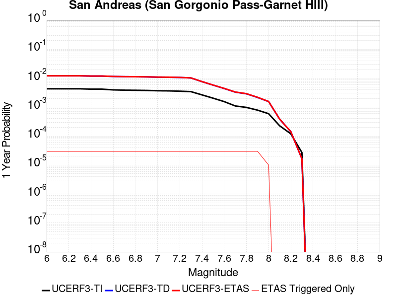 |  |

| Magnitude | 1 wk TI Prob | 1 wk TD Prob | 1 wk ETAS Prob | 1 wk ETAS/TD Gain | 1 wk ETAS Triggered Only | 1 mo TI Prob | 1 mo TD Prob | 1 mo ETAS Prob | 1 mo ETAS/TD Gain | 1 mo ETAS Triggered Only | 1 yr TI Prob | 1 yr TD Prob | 1 yr ETAS Prob | 1 yr ETAS/TD Gain | 1 yr ETAS Triggered Only | 10 yr TI Prob | 10 yr TD Prob | 10 yr ETAS Prob | 10 yr ETAS/TD Gain | 10 yr ETAS Triggered Only |
|-----|-----|-----|-----|-----|-----|-----|-----|-----|-----|-----|-----|-----|-----|-----|-----|-----|-----|-----|-----|-----|
| 6.0 | 8.31567E-5 | 2.3386451E-4 | 2.3386451E-4 | 1.0 | 0.0 | 3.5633717E-4 | 0.0010018935 | 0.0010018935 | 1.0 | 0.0 | 0.004329778 | 0.012129918 | 0.012129918 | 1.0 | 0.0 | 0.042463828 | 0.11259502 | 0.11262127 | 1.0002332 | 2.9585799E-5 |
| 6.1 | 8.31567E-5 | 2.3386451E-4 | 2.3386451E-4 | 1.0 | 0.0 | 3.5633717E-4 | 0.0010018935 | 0.0010018935 | 1.0 | 0.0 | 0.004329778 | 0.012129918 | 0.012129918 | 1.0 | 0.0 | 0.042463828 | 0.11259502 | 0.11262127 | 1.0002332 | 2.9585799E-5 |
| 6.2 | 8.31567E-5 | 2.3386451E-4 | 2.3386451E-4 | 1.0 | 0.0 | 3.5633717E-4 | 0.0010018935 | 0.0010018935 | 1.0 | 0.0 | 0.004329778 | 0.012129918 | 0.012129918 | 1.0 | 0.0 | 0.042463828 | 0.11259502 | 0.11262127 | 1.0002332 | 2.9585799E-5 |
| 6.3 | 8.31567E-5 | 2.3386451E-4 | 2.3386451E-4 | 1.0 | 0.0 | 3.5633717E-4 | 0.0010018935 | 0.0010018935 | 1.0 | 0.0 | 0.004329778 | 0.012129918 | 0.012129918 | 1.0 | 0.0 | 0.042463828 | 0.11259502 | 0.11262127 | 1.0002332 | 2.9585799E-5 |
| 6.4 | 8.059055E-5 | 2.2944735E-4 | 2.2944735E-4 | 1.0 | 0.0 | 3.4534236E-4 | 9.829777E-4 | 9.829777E-4 | 1.0 | 0.0 | 0.0041964394 | 0.011902156 | 0.011902156 | 1.0 | 0.0 | 0.041180745 | 0.110576175 | 0.11060249 | 1.000238 | 2.9585799E-5 |
| 6.5 | 8.059055E-5 | 2.2944735E-4 | 2.2944735E-4 | 1.0 | 0.0 | 3.4534236E-4 | 9.829777E-4 | 9.829777E-4 | 1.0 | 0.0 | 0.0041964394 | 0.011902156 | 0.011902156 | 1.0 | 0.0 | 0.041180745 | 0.110576175 | 0.11060249 | 1.000238 | 2.9585799E-5 |
| 6.6 | 7.619237E-5 | 2.2189032E-4 | 2.2189032E-4 | 1.0 | 0.0 | 3.2649786E-4 | 9.506143E-4 | 9.506143E-4 | 1.0 | 0.0 | 0.0039678677 | 0.0115128625 | 0.0115128625 | 1.0 | 0.0 | 0.03897764 | 0.10711278 | 0.10713919 | 1.0002466 | 2.9585799E-5 |
| 6.7 | 7.440636E-5 | 2.1864849E-4 | 2.1864849E-4 | 1.0 | 0.0 | 3.188454E-4 | 9.367307E-4 | 9.367307E-4 | 1.0 | 0.0 | 0.0038750346 | 0.011345596 | 0.011345596 | 1.0 | 0.0 | 0.038081564 | 0.10562121 | 0.10564767 | 1.0002506 | 2.9585799E-5 |
| 6.8 | 7.3735864E-5 | 2.1712016E-4 | 2.1712016E-4 | 1.0 | 0.0 | 3.1597257E-4 | 9.3018543E-4 | 9.3018543E-4 | 1.0 | 0.0 | 0.0038401815 | 0.011266734 | 0.011266734 | 1.0 | 0.0 | 0.03774495 | 0.10492276 | 0.104949236 | 1.0002524 | 2.9585799E-5 |
| 6.9 | 7.27575E-5 | 2.1480983E-4 | 2.1480983E-4 | 1.0 | 0.0 | 3.117806E-4 | 9.20291E-4 | 9.20291E-4 | 1.0 | 0.0 | 0.003789323 | 0.011147508 | 0.011147508 | 1.0 | 0.0 | 0.037253562 | 0.10387066 | 0.10389718 | 1.0002552 | 2.9585799E-5 |
| 7.0 | 7.102591E-5 | 2.1065009E-4 | 2.1065009E-4 | 1.0 | 0.0 | 3.0436125E-4 | 9.0247596E-4 | 9.0247596E-4 | 1.0 | 0.0 | 0.003699303 | 0.010932805 | 0.010932805 | 1.0 | 0.0 | 0.03638325 | 0.101972826 | 0.101999395 | 1.0002606 | 2.9585799E-5 |
| 7.1 | 7.028513E-5 | 2.0900648E-4 | 2.0900648E-4 | 1.0 | 0.0 | 3.0118722E-4 | 8.954368E-4 | 8.954368E-4 | 1.0 | 0.0 | 0.0036607897 | 0.01084796 | 0.01084796 | 1.0 | 0.0 | 0.036010686 | 0.10121585 | 0.10124244 | 1.0002627 | 2.9585799E-5 |
| 7.2 | 6.8498244E-5 | 2.0508505E-4 | 2.0508505E-4 | 1.0 | 0.0 | 2.9353087E-4 | 8.78642E-4 | 8.78642E-4 | 1.0 | 0.0 | 0.003567883 | 0.010645497 | 0.010645497 | 1.0 | 0.0 | 0.035111405 | 0.09940783 | 0.09943447 | 1.000268 | 2.9585799E-5 |
| 7.3 | 6.622592E-5 | 1.973576E-4 | 1.973576E-4 | 1.0 | 0.0 | 2.8379448E-4 | 8.4554625E-4 | 8.4554625E-4 | 1.0 | 0.0 | 0.0034497243 | 0.010246415 | 0.010246415 | 1.0 | 0.0 | 0.033966612 | 0.09590419 | 0.095930934 | 1.000279 | 2.9585799E-5 |
| 7.4 | 5.1050705E-5 | 1.4692261E-4 | 1.4692261E-4 | 1.0 | 0.0 | 2.1877038E-4 | 6.295173E-4 | 6.295173E-4 | 1.0 | 0.0 | 0.002660276 | 0.0076376316 | 0.0076376316 | 1.0 | 0.0 | 0.02628654 | 0.07287696 | 0.072904386 | 1.0003763 | 2.9585799E-5 |
| 7.5 | 3.9302922E-5 | 1.11326524E-4 | 1.11326524E-4 | 1.0 | 0.0 | 1.6843023E-4 | 4.7702674E-4 | 4.7702674E-4 | 1.0 | 0.0 | 0.0020487092 | 0.005792404 | 0.005792404 | 1.0 | 0.0 | 0.020299247 | 0.05602189 | 0.05604982 | 1.0004985 | 2.9585799E-5 |
| 7.6 | 2.9851626E-5 | 8.49747E-5 | 8.49747E-5 | 1.0 | 0.0 | 1.2792926E-4 | 3.6412658E-4 | 3.6412658E-4 | 1.0 | 0.0 | 0.0015564259 | 0.004424255 | 0.004424255 | 1.0 | 0.0 | 0.0154556995 | 0.043204896 | 0.043233205 | 1.0006552 | 2.9585799E-5 |
| 7.7 | 2.1135214E-5 | 6.355116E-5 | 6.355116E-5 | 1.0 | 0.0 | 9.0576345E-5 | 2.723337E-4 | 2.723337E-4 | 1.0 | 0.0 | 0.0011022091 | 0.003310627 | 0.003310627 | 1.0 | 0.0 | 0.010967582 | 0.032592565 | 0.032621186 | 1.0008782 | 2.9585799E-5 |
| 7.8 | 1.883379E-5 | 5.5660596E-5 | 5.5660596E-5 | 1.0 | 0.0 | 8.0713755E-5 | 2.3852361E-4 | 2.3852361E-4 | 1.0 | 0.0 | 9.822468E-4 | 0.0029001608 | 0.0029001608 | 1.0 | 0.0 | 0.0097791655 | 0.028704397 | 0.028733134 | 1.0010011 | 2.9585799E-5 |
| 7.9 | 1.5156185E-5 | 4.1675128E-5 | 4.1675128E-5 | 1.0 | 0.0 | 6.495346E-5 | 1.7859548E-4 | 1.7859548E-4 | 1.0 | 0.0 | 7.9052144E-4 | 0.0021722328 | 0.0021722328 | 1.0 | 0.0 | 0.007877152 | 0.02176709 | 0.02179603 | 1.0013297 | 2.9585799E-5 |
| 8.0 | 1.1405907E-5 | 2.9986788E-5 | 2.9986788E-5 | 1.0 | 0.0 | 4.8881542E-5 | 1.2850849E-4 | 1.2850849E-4 | 1.0 | 0.0 | 5.9497025E-4 | 0.0015634688 | 0.0015634688 | 1.0 | 0.0 | 0.005933798 | 0.015778678 | 0.015807796 | 1.0018455 | 2.9585799E-5 |
| 8.1 | 4.3511436E-6 | 7.373693E-6 | 7.373693E-6 | 1.0 | 0.0 | 1.8647626E-5 | 3.160116E-5 | 3.160116E-5 | 1.0 | 0.0 | 2.2701119E-4 | 3.8467633E-4 | 3.8467633E-4 | 1.0 | 0.0 | 0.0022677942 | 0.004118566 | 0.004118566 | 1.0 | 0.0 |
| 8.2 | 2.3042528E-6 | 2.7350309E-6 | 2.7350309E-6 | 1.0 | 0.0 | 9.875332E-6 | 1.1721509E-5 | 1.1721509E-5 | 1.0 | 0.0 | 1.2022553E-4 | 1.4270007E-4 | 1.4270007E-4 | 1.0 | 0.0 | 0.0012016051 | 0.0015990696 | 0.0015990696 | 1.0 | 0.0 |
| 8.3 | 5.202968E-7 | 3.1628537E-7 | 3.1628537E-7 | 1.0 | 0.0 | 2.2298414E-6 | 1.3555081E-6 | 1.3555081E-6 | 1.0 | 0.0 | 2.714798E-5 | 1.6503198E-5 | 1.6503198E-5 | 1.0 | 0.0 | 2.7144665E-4 | 1.9580164E-4 | 1.9580164E-4 | 1.0 | 0.0 |

## Northridge
*[(top)](#table-of-contents)*

| 1 Week | 1 Month | 1 Year | 10 Year |
|-----|-----|-----|-----|
|  |  |  |  |

| Magnitude | 1 wk TI Prob | 1 wk TD Prob | 1 wk ETAS Prob | 1 wk ETAS/TD Gain | 1 wk ETAS Triggered Only | 1 mo TI Prob | 1 mo TD Prob | 1 mo ETAS Prob | 1 mo ETAS/TD Gain | 1 mo ETAS Triggered Only | 1 yr TI Prob | 1 yr TD Prob | 1 yr ETAS Prob | 1 yr ETAS/TD Gain | 1 yr ETAS Triggered Only | 10 yr TI Prob | 10 yr TD Prob | 10 yr ETAS Prob | 10 yr ETAS/TD Gain | 10 yr ETAS Triggered Only |
|-----|-----|-----|-----|-----|-----|-----|-----|-----|-----|-----|-----|-----|-----|-----|-----|-----|-----|-----|-----|-----|
| 6.0 | 1.8340852E-5 | 7.5881535E-6 | 7.5881535E-6 | 1.0 | 0.0 | 7.860128E-5 | 3.2520264E-5 | 3.2520264E-5 | 1.0 | 0.0 | 9.565505E-4 | 3.9586448E-4 | 3.9586448E-4 | 1.0 | 0.0 | 0.009524435 | 0.003951816 | 0.0039812843 | 1.007457 | 2.9585799E-5 |
| 6.1 | 1.8340852E-5 | 7.5881535E-6 | 7.5881535E-6 | 1.0 | 0.0 | 7.860128E-5 | 3.2520264E-5 | 3.2520264E-5 | 1.0 | 0.0 | 9.565505E-4 | 3.9586448E-4 | 3.9586448E-4 | 1.0 | 0.0 | 0.009524435 | 0.003951816 | 0.0039812843 | 1.007457 | 2.9585799E-5 |
| 6.2 | 1.8340852E-5 | 7.5881535E-6 | 7.5881535E-6 | 1.0 | 0.0 | 7.860128E-5 | 3.2520264E-5 | 3.2520264E-5 | 1.0 | 0.0 | 9.565505E-4 | 3.9586448E-4 | 3.9586448E-4 | 1.0 | 0.0 | 0.009524435 | 0.003951816 | 0.0039812843 | 1.007457 | 2.9585799E-5 |
| 6.3 | 1.8340852E-5 | 7.5881535E-6 | 7.5881535E-6 | 1.0 | 0.0 | 7.860128E-5 | 3.2520264E-5 | 3.2520264E-5 | 1.0 | 0.0 | 9.565505E-4 | 3.9586448E-4 | 3.9586448E-4 | 1.0 | 0.0 | 0.009524435 | 0.003951816 | 0.0039812843 | 1.007457 | 2.9585799E-5 |
| 6.4 | 1.7361892E-5 | 7.5881535E-6 | 7.5881535E-6 | 1.0 | 0.0 | 7.440598E-5 | 3.2520264E-5 | 3.2520264E-5 | 1.0 | 0.0 | 9.055163E-4 | 3.9586448E-4 | 3.9586448E-4 | 1.0 | 0.0 | 0.009018354 | 0.003951816 | 0.0039812843 | 1.007457 | 2.9585799E-5 |
| 6.5 | 1.7361892E-5 | 7.5881535E-6 | 7.5881535E-6 | 1.0 | 0.0 | 7.440598E-5 | 3.2520264E-5 | 3.2520264E-5 | 1.0 | 0.0 | 9.055163E-4 | 3.9586448E-4 | 3.9586448E-4 | 1.0 | 0.0 | 0.009018354 | 0.003951816 | 0.0039812843 | 1.007457 | 2.9585799E-5 |
| 6.6 | 1.5458201E-5 | 7.5881535E-6 | 7.5881535E-6 | 1.0 | 0.0 | 6.624775E-5 | 3.2520264E-5 | 3.2520264E-5 | 1.0 | 0.0 | 8.0626784E-4 | 3.9586448E-4 | 3.9586448E-4 | 1.0 | 0.0 | 0.008033488 | 0.003951816 | 0.0039812843 | 1.007457 | 2.9585799E-5 |
| 6.7 | 1.2538368E-5 | 6.381707E-6 | 6.381707E-6 | 1.0 | 0.0 | 5.3734755E-5 | 2.7349888E-5 | 2.7349888E-5 | 1.0 | 0.0 | 6.5402425E-4 | 3.3293446E-4 | 3.3293446E-4 | 1.0 | 0.0 | 0.0065210275 | 0.0033244046 | 0.0033538921 | 1.00887 | 2.9585799E-5 |
| 6.8 | 1.1438097E-5 | 6.3503594E-6 | 6.3503594E-6 | 1.0 | 0.0 | 4.9019498E-5 | 2.7215545E-5 | 2.7215545E-5 | 1.0 | 0.0 | 5.9664896E-4 | 3.3129932E-4 | 3.3129932E-4 | 1.0 | 0.0 | 0.005950495 | 0.003308102 | 0.0033375898 | 1.0089139 | 2.9585799E-5 |
| 6.9 | 1.1204891E-5 | 6.2868094E-6 | 6.2868094E-6 | 1.0 | 0.0 | 4.8020076E-5 | 2.6943193E-5 | 2.6943193E-5 | 1.0 | 0.0 | 5.8448757E-4 | 3.2798442E-4 | 3.2798442E-4 | 1.0 | 0.0 | 0.0058295266 | 0.0032750512 | 0.0033045402 | 1.0090041 | 2.9585799E-5 |
| 7.0 | 1.061046E-5 | 6.1154565E-6 | 6.1154565E-6 | 1.0 | 0.0 | 4.5472607E-5 | 2.6208838E-5 | 2.6208838E-5 | 1.0 | 0.0 | 5.534883E-4 | 3.1904632E-4 | 3.1904632E-4 | 1.0 | 0.0 | 0.0055211177 | 0.003185929 | 0.0032154208 | 1.0092568 | 2.9585799E-5 |
| 7.1 | 1.0266979E-5 | 6.0043685E-6 | 6.0043685E-6 | 1.0 | 0.0 | 4.40006E-5 | 2.5732756E-5 | 2.5732756E-5 | 1.0 | 0.0 | 5.355756E-4 | 3.132517E-4 | 3.132517E-4 | 1.0 | 0.0 | 0.0053428668 | 0.0031281472 | 0.0031576406 | 1.0094284 | 2.9585799E-5 |
| 7.2 | 9.91273E-6 | 5.820076E-6 | 5.820076E-6 | 1.0 | 0.0 | 4.248244E-5 | 2.4942945E-5 | 2.4942945E-5 | 1.0 | 0.0 | 5.171009E-4 | 3.0363846E-4 | 3.0363846E-4 | 1.0 | 0.0 | 0.0051589934 | 0.003032281 | 0.003061777 | 1.0097274 | 2.9585799E-5 |
| 7.3 | 8.4959265E-6 | 5.1931415E-6 | 5.1931415E-6 | 1.0 | 0.0 | 3.6410605E-5 | 2.2256132E-5 | 2.2256132E-5 | 1.0 | 0.0 | 4.4320893E-4 | 2.7093495E-4 | 2.7093495E-4 | 1.0 | 0.0 | 0.00442326 | 0.0027060728 | 0.0027060728 | 1.0 | 0.0 |
| 7.4 | 8.0847185E-6 | 4.9820114E-6 | 4.9820114E-6 | 1.0 | 0.0 | 3.4648332E-5 | 2.1351305E-5 | 2.1351305E-5 | 1.0 | 0.0 | 4.2176177E-4 | 2.5992136E-4 | 2.5992136E-4 | 1.0 | 0.0 | 0.0042096223 | 0.0025961995 | 0.0025961995 | 1.0 | 0.0 |
| 7.5 | 6.8220684E-6 | 4.2533693E-6 | 4.2533693E-6 | 1.0 | 0.0 | 2.9237108E-5 | 1.8228598E-5 | 1.8228598E-5 | 1.0 | 0.0 | 3.5590364E-4 | 2.2191078E-4 | 2.2191078E-4 | 1.0 | 0.0 | 0.0035533418 | 0.0022169128 | 0.0022169128 | 1.0 | 0.0 |
| 7.6 | 4.4224143E-6 | 2.8999916E-6 | 2.8999916E-6 | 1.0 | 0.0 | 1.8953066E-5 | 1.2428477E-5 | 1.2428477E-5 | 1.0 | 0.0 | 2.3072914E-4 | 1.5130632E-4 | 1.5130632E-4 | 1.0 | 0.0 | 0.0023048974 | 0.0015120446 | 0.0015120446 | 1.0 | 0.0 |
| 7.7 | 2.5297056E-6 | 1.6046072E-6 | 1.6046072E-6 | 1.0 | 0.0 | 1.0841551E-5 | 6.87687E-6 | 6.87687E-6 | 1.0 | 0.0 | 1.319879E-4 | 8.372273E-5 | 8.372273E-5 | 1.0 | 0.0 | 0.0013190953 | 8.3691656E-4 | 8.3691656E-4 | 1.0 | 0.0 |
| 7.8 | 1.2508156E-6 | 8.78015E-7 | 8.78015E-7 | 1.0 | 0.0 | 5.3606273E-6 | 3.7629159E-6 | 3.7629159E-6 | 1.0 | 0.0 | 6.526368E-5 | 4.581255E-5 | 4.581255E-5 | 1.0 | 0.0 | 6.524452E-4 | 4.5803236E-4 | 4.5803236E-4 | 1.0 | 0.0 |
| 7.9 | 2.262199E-7 | 1.4664893E-7 | 1.4664893E-7 | 1.0 | 0.0 | 9.695135E-7 | 6.2849523E-7 | 6.2849523E-7 | 1.0 | 0.0 | 1.1803763E-5 | 7.651904E-6 | 7.651904E-6 | 1.0 | 0.0 | 1.1803136E-4 | 7.651648E-5 | 7.651648E-5 | 1.0 | 0.0 |
| 8.0 | 2.865362E-9 | 1.2753953E-9 | 1.2753953E-9 | 1.0 | 0.0 | 1.2280123E-8 | 5.46598E-9 | 5.46598E-9 | 1.0 | 0.0 | 1.4951048E-7 | 6.654831E-8 | 6.654831E-8 | 1.0 | 0.0 | 1.4951038E-6 | 6.6548307E-7 | 6.6548307E-7 | 1.0 | 0.0 |

## San Andreas (North Coast) 2011 CFM
*[(top)](#table-of-contents)*

| 1 Week | 1 Month | 1 Year | 10 Year |
|-----|-----|-----|-----|
|  |  |  |  |

| Magnitude | 1 wk TI Prob | 1 wk TD Prob | 1 wk ETAS Prob | 1 wk ETAS/TD Gain | 1 wk ETAS Triggered Only | 1 mo TI Prob | 1 mo TD Prob | 1 mo ETAS Prob | 1 mo ETAS/TD Gain | 1 mo ETAS Triggered Only | 1 yr TI Prob | 1 yr TD Prob | 1 yr ETAS Prob | 1 yr ETAS/TD Gain | 1 yr ETAS Triggered Only | 10 yr TI Prob | 10 yr TD Prob | 10 yr ETAS Prob | 10 yr ETAS/TD Gain | 10 yr ETAS Triggered Only |
|-----|-----|-----|-----|-----|-----|-----|-----|-----|-----|-----|-----|-----|-----|-----|-----|-----|-----|-----|-----|-----|
| 6.0 | 1.5333705E-4 | 7.1141556E-5 | 7.1141556E-5 | 1.0 | 0.0 | 6.5699324E-4 | 3.0485695E-4 | 3.0485695E-4 | 1.0 | 0.0 | 0.007969595 | 0.0037053502 | 0.0037348263 | 1.0079551 | 2.9585799E-5 | 0.0768977 | 0.03937111 | 0.03939953 | 1.0007219 | 2.9585799E-5 |
| 6.1 | 1.5333705E-4 | 7.1141556E-5 | 7.1141556E-5 | 1.0 | 0.0 | 6.5699324E-4 | 3.0485695E-4 | 3.0485695E-4 | 1.0 | 0.0 | 0.007969595 | 0.0037053502 | 0.0037348263 | 1.0079551 | 2.9585799E-5 | 0.0768977 | 0.03937111 | 0.03939953 | 1.0007219 | 2.9585799E-5 |
| 6.2 | 1.3912938E-4 | 6.0533035E-5 | 6.0533035E-5 | 1.0 | 0.0 | 5.961325E-4 | 2.5940166E-4 | 2.5940166E-4 | 1.0 | 0.0 | 0.007233787 | 0.0031536683 | 0.0031831607 | 1.0093518 | 2.9585799E-5 | 0.07002798 | 0.03370866 | 0.03373725 | 1.000848 | 2.9585799E-5 |
| 6.3 | 1.3912938E-4 | 6.0533035E-5 | 6.0533035E-5 | 1.0 | 0.0 | 5.961325E-4 | 2.5940166E-4 | 2.5940166E-4 | 1.0 | 0.0 | 0.007233787 | 0.0031536683 | 0.0031831607 | 1.0093518 | 2.9585799E-5 | 0.07002798 | 0.03370866 | 0.03373725 | 1.000848 | 2.9585799E-5 |
| 6.4 | 1.2623647E-4 | 5.0469214E-5 | 5.0469214E-5 | 1.0 | 0.0 | 5.4090127E-4 | 2.162788E-4 | 2.162788E-4 | 1.0 | 0.0 | 0.0065656058 | 0.0026300347 | 0.0026595427 | 1.0112196 | 2.9585799E-5 | 0.06374981 | 0.02831788 | 0.028346628 | 1.0010152 | 2.9585799E-5 |
| 6.5 | 1.1736096E-4 | 4.3548378E-5 | 4.3548378E-5 | 1.0 | 0.0 | 5.028786E-4 | 1.8662264E-4 | 1.8662264E-4 | 1.0 | 0.0 | 0.006105373 | 0.0022697793 | 0.0022992978 | 1.013005 | 2.9585799E-5 | 0.05940335 | 0.024592753 | 0.024621611 | 1.0011735 | 2.9585799E-5 |
| 6.6 | 1.1586959E-4 | 4.244781E-5 | 4.244781E-5 | 1.0 | 0.0 | 4.964894E-4 | 1.8190658E-4 | 1.8190658E-4 | 1.0 | 0.0 | 0.006028018 | 0.0022124792 | 0.0022419996 | 1.0133426 | 2.9585799E-5 | 0.058671024 | 0.023998221 | 0.024027098 | 1.0012033 | 2.9585799E-5 |
| 6.7 | 1.13693764E-4 | 4.075945E-5 | 4.075945E-5 | 1.0 | 0.0 | 4.87168E-4 | 1.7467175E-4 | 1.7467175E-4 | 1.0 | 0.0 | 0.005915152 | 0.0021245703 | 0.0021245703 | 1.0 | 0.0 | 0.057601593 | 0.023089329 | 0.023089329 | 1.0 | 0.0 |
| 6.8 | 1.1204889E-4 | 3.9976534E-5 | 3.9976534E-5 | 1.0 | 0.0 | 4.8012115E-4 | 1.7131683E-4 | 1.7131683E-4 | 1.0 | 0.0 | 0.005829819 | 0.002083803 | 0.002083803 | 1.0 | 0.0 | 0.05679232 | 0.022649366 | 0.022649366 | 1.0 | 0.0 |
| 6.9 | 1.1005794E-4 | 3.903209E-5 | 3.903209E-5 | 1.0 | 0.0 | 4.7159163E-4 | 1.6726975E-4 | 1.6726975E-4 | 1.0 | 0.0 | 0.0057265228 | 0.002034623 | 0.002034623 | 1.0 | 0.0 | 0.055811852 | 0.02211497 | 0.02211497 | 1.0 | 0.0 |
| 7.0 | 1.0647948E-4 | 3.7187776E-5 | 3.7187776E-5 | 1.0 | 0.0 | 4.562608E-4 | 1.5936654E-4 | 1.5936654E-4 | 1.0 | 0.0 | 0.0055408357 | 0.0019385765 | 0.0019385765 | 1.0 | 0.0 | 0.054047033 | 0.021074155 | 0.021074155 | 1.0 | 0.0 |
| 7.1 | 1.04795035E-4 | 3.6236856E-5 | 3.6236856E-5 | 1.0 | 0.0 | 4.4904428E-4 | 1.5529165E-4 | 1.5529165E-4 | 1.0 | 0.0 | 0.0054534175 | 0.0018890519 | 0.0018890519 | 1.0 | 0.0 | 0.053215165 | 0.020541927 | 0.020541927 | 1.0 | 0.0 |
| 7.2 | 1.02724036E-4 | 3.514485E-5 | 3.514485E-5 | 1.0 | 0.0 | 4.401716E-4 | 1.5061218E-4 | 1.5061218E-4 | 1.0 | 0.0 | 0.0053459285 | 0.0018321763 | 0.0018321763 | 1.0 | 0.0 | 0.052191395 | 0.019930558 | 0.019930558 | 1.0 | 0.0 |
| 7.3 | 1.00650694E-4 | 3.4611825E-5 | 3.4611825E-5 | 1.0 | 0.0 | 4.312888E-4 | 1.4832805E-4 | 1.4832805E-4 | 1.0 | 0.0 | 0.005238306 | 0.0018044134 | 0.0018044134 | 1.0 | 0.0 | 0.051165357 | 0.019607486 | 0.019607486 | 1.0 | 0.0 |
| 7.4 | 9.672919E-5 | 3.3400014E-5 | 3.3400014E-5 | 1.0 | 0.0 | 4.144878E-4 | 1.4313516E-4 | 1.4313516E-4 | 1.0 | 0.0 | 0.005034718 | 0.0017412928 | 0.0017412928 | 1.0 | 0.0 | 0.049221683 | 0.018880244 | 0.018880244 | 1.0 | 0.0 |
| 7.5 | 8.7600405E-5 | 2.2716442E-5 | 2.2716442E-5 | 1.0 | 0.0 | 3.753763E-4 | 9.735256E-5 | 9.735256E-5 | 1.0 | 0.0 | 0.0045606326 | 0.0011846247 | 0.0011846247 | 1.0 | 0.0 | 0.04468165 | 0.013139147 | 0.013139147 | 1.0 | 0.0 |
| 7.6 | 7.9562284E-5 | 1.924054E-5 | 1.924054E-5 | 1.0 | 0.0 | 3.4093665E-4 | 8.2456856E-5 | 8.2456856E-5 | 1.0 | 0.0 | 0.0041430052 | 0.0010034514 | 0.0010034514 | 1.0 | 0.0 | 0.040666126 | 0.011229912 | 0.011229912 | 1.0 | 0.0 |
| 7.7 | 6.3866544E-5 | 1.1952783E-5 | 1.1952783E-5 | 1.0 | 0.0 | 2.7368503E-4 | 5.1225208E-5 | 5.1225208E-5 | 1.0 | 0.0 | 0.0033270244 | 6.2348874E-4 | 6.2348874E-4 | 1.0 | 0.0 | 0.032776527 | 0.007216897 | 0.007216897 | 1.0 | 0.0 |
| 7.8 | 4.2543215E-5 | 9.0854555E-6 | 9.0854555E-6 | 1.0 | 0.0 | 1.8231533E-4 | 3.8937087E-5 | 3.8937087E-5 | 1.0 | 0.0 | 0.0022174292 | 4.73956E-4 | 4.73956E-4 | 1.0 | 0.0 | 0.021954332 | 0.0054957564 | 0.0054957564 | 1.0 | 0.0 |
| 7.9 | 2.2636612E-5 | 7.821691E-6 | 7.821691E-6 | 1.0 | 0.0 | 9.7010445E-5 | 3.35211E-5 | 3.35211E-5 | 1.0 | 0.0 | 0.0011804621 | 4.080431E-4 | 4.080431E-4 | 1.0 | 0.0 | 0.011742111 | 0.004687419 | 0.004687419 | 1.0 | 0.0 |
| 8.0 | 1.5167874E-5 | 7.056108E-6 | 7.056108E-6 | 1.0 | 0.0 | 6.500356E-5 | 3.0240113E-5 | 3.0240113E-5 | 1.0 | 0.0 | 7.9113094E-4 | 3.6811127E-4 | 3.6811127E-4 | 1.0 | 0.0 | 0.007883203 | 0.0042192712 | 0.0042192712 | 1.0 | 0.0 |
| 8.1 | 1.0681047E-5 | 6.393015E-6 | 6.393015E-6 | 1.0 | 0.0 | 4.5775112E-5 | 2.739835E-5 | 2.739835E-5 | 1.0 | 0.0 | 5.5716943E-4 | 3.3352393E-4 | 3.3352393E-4 | 1.0 | 0.0 | 0.0055577457 | 0.0038207078 | 0.0038207078 | 1.0 | 0.0 |
| 8.2 | 8.226114E-6 | 5.1197717E-6 | 5.1197717E-6 | 1.0 | 0.0 | 3.52543E-5 | 2.1941696E-5 | 2.1941696E-5 | 1.0 | 0.0 | 4.2913653E-4 | 2.6710748E-4 | 2.6710748E-4 | 1.0 | 0.0 | 0.004283088 | 0.0030476742 | 0.0030476742 | 1.0 | 0.0 |
| 8.3 | 1.983087E-6 | 7.668296E-7 | 7.668296E-7 | 1.0 | 0.0 | 8.498917E-6 | 3.2864084E-6 | 3.2864084E-6 | 1.0 | 0.0 | 1.034694E-4 | 4.0011306E-5 | 4.0011306E-5 | 1.0 | 0.0 | 0.0010342124 | 4.724499E-4 | 4.724499E-4 | 1.0 | 0.0 |

## San Pedro Basin
*[(top)](#table-of-contents)*

| 1 Week | 1 Month | 1 Year | 10 Year |
|-----|-----|-----|-----|
|  |  |  |  |

| Magnitude | 1 wk TI Prob | 1 wk TD Prob | 1 wk ETAS Prob | 1 wk ETAS/TD Gain | 1 wk ETAS Triggered Only | 1 mo TI Prob | 1 mo TD Prob | 1 mo ETAS Prob | 1 mo ETAS/TD Gain | 1 mo ETAS Triggered Only | 1 yr TI Prob | 1 yr TD Prob | 1 yr ETAS Prob | 1 yr ETAS/TD Gain | 1 yr ETAS Triggered Only | 10 yr TI Prob | 10 yr TD Prob | 10 yr ETAS Prob | 10 yr ETAS/TD Gain | 10 yr ETAS Triggered Only |
|-----|-----|-----|-----|-----|-----|-----|-----|-----|-----|-----|-----|-----|-----|-----|-----|-----|-----|-----|-----|-----|
| 6.0 | 5.3449043E-5 | 6.3371124E-5 | 6.3371124E-5 | 1.0 | 0.0 | 2.2904722E-4 | 2.7156572E-4 | 3.011435E-4 | 1.1089157 | 2.9585799E-5 | 0.0027850836 | 0.0033019078 | 0.003331396 | 1.0089307 | 2.9585799E-5 | 0.027504366 | 0.032590248 | 0.03261887 | 1.0008782 | 2.9585799E-5 |
| 6.1 | 5.3449043E-5 | 6.3371124E-5 | 6.3371124E-5 | 1.0 | 0.0 | 2.2904722E-4 | 2.7156572E-4 | 3.011435E-4 | 1.1089157 | 2.9585799E-5 | 0.0027850836 | 0.0033019078 | 0.003331396 | 1.0089307 | 2.9585799E-5 | 0.027504366 | 0.032590248 | 0.03261887 | 1.0008782 | 2.9585799E-5 |
| 6.2 | 2.3189454E-5 | 2.6643334E-5 | 2.6643334E-5 | 1.0 | 0.0 | 9.9379584E-5 | 1.14180984E-4 | 1.14180984E-4 | 1.0 | 0.0 | 0.0012092749 | 0.0013893144 | 0.0013893144 | 1.0 | 0.0 | 0.012027155 | 0.013811161 | 0.013811161 | 1.0 | 0.0 |
| 6.3 | 2.3189454E-5 | 2.6643334E-5 | 2.6643334E-5 | 1.0 | 0.0 | 9.9379584E-5 | 1.14180984E-4 | 1.14180984E-4 | 1.0 | 0.0 | 0.0012092749 | 0.0013893144 | 0.0013893144 | 1.0 | 0.0 | 0.012027155 | 0.013811161 | 0.013811161 | 1.0 | 0.0 |
| 6.4 | 1.966056E-5 | 2.2463848E-5 | 2.2463848E-5 | 1.0 | 0.0 | 8.425682E-5 | 9.627031E-5 | 9.627031E-5 | 1.0 | 0.0 | 0.001025344 | 0.001171501 | 0.001171501 | 1.0 | 0.0 | 0.010206259 | 0.011657341 | 0.011657341 | 1.0 | 0.0 |
| 6.5 | 1.7342953E-5 | 1.9745521E-5 | 1.9745521E-5 | 1.0 | 0.0 | 7.4324824E-5 | 8.4621126E-5 | 8.4621126E-5 | 1.0 | 0.0 | 9.04529E-4 | 0.0010298121 | 0.0010298121 | 1.0 | 0.0 | 0.009008561 | 0.010254124 | 0.010254124 | 1.0 | 0.0 |
| 6.6 | 1.439804E-5 | 1.6323014E-5 | 1.6323014E-5 | 1.0 | 0.0 | 6.170443E-5 | 6.995408E-5 | 6.995408E-5 | 1.0 | 0.0 | 7.509924E-4 | 8.513903E-4 | 8.513903E-4 | 1.0 | 0.0 | 0.0074845953 | 0.008484487 | 0.008484487 | 1.0 | 0.0 |
| 6.7 | 1.2634884E-5 | 1.4285554E-5 | 1.4285554E-5 | 1.0 | 0.0 | 5.414838E-5 | 6.1222534E-5 | 6.1222534E-5 | 1.0 | 0.0 | 6.590571E-4 | 7.451599E-4 | 7.451599E-4 | 1.0 | 0.0 | 0.006571059 | 0.007429634 | 0.007429634 | 1.0 | 0.0 |
| 6.8 | 1.146091E-5 | 1.2933421E-5 | 1.2933421E-5 | 1.0 | 0.0 | 4.911726E-5 | 5.542794E-5 | 5.542794E-5 | 1.0 | 0.0 | 5.9783855E-4 | 6.7465595E-4 | 6.7465595E-4 | 1.0 | 0.0 | 0.0059623276 | 0.0067290184 | 0.0067290184 | 1.0 | 0.0 |
| 6.9 | 9.109035E-6 | 1.0235189E-5 | 1.0235189E-5 | 1.0 | 0.0 | 3.9038136E-5 | 4.3864515E-5 | 4.3864515E-5 | 1.0 | 0.0 | 4.7518566E-4 | 5.339476E-4 | 5.339476E-4 | 1.0 | 0.0 | 0.0047417083 | 0.0053294008 | 0.0053294008 | 1.0 | 0.0 |
| 7.0 | 5.9351028E-6 | 6.584068E-6 | 6.584068E-6 | 1.0 | 0.0 | 2.5435906E-5 | 2.8217262E-5 | 2.8217262E-5 | 1.0 | 0.0 | 3.0963816E-4 | 3.4351464E-4 | 3.4351464E-4 | 1.0 | 0.0 | 0.0030920706 | 0.0034321535 | 0.0034321535 | 1.0 | 0.0 |
| 7.1 | 2.1557585E-6 | 2.2096608E-6 | 2.2096608E-6 | 1.0 | 0.0 | 9.238933E-6 | 9.469942E-6 | 9.469942E-6 | 1.0 | 0.0 | 1.1247819E-4 | 1.1529059E-4 | 1.1529059E-4 | 1.0 | 0.0 | 0.0011242128 | 0.0011523232 | 0.0011523232 | 1.0 | 0.0 |
| 7.2 | 2.1251979E-6 | 2.178007E-6 | 2.178007E-6 | 1.0 | 0.0 | 9.107958E-6 | 9.334282E-6 | 9.334282E-6 | 1.0 | 0.0 | 1.1088375E-4 | 1.1363912E-4 | 1.1363912E-4 | 1.0 | 0.0 | 0.0011082845 | 0.0011358254 | 0.0011358254 | 1.0 | 0.0 |
| 7.3 | 1.7145798E-6 | 1.7442967E-6 | 1.7442967E-6 | 1.0 | 0.0 | 7.3481783E-6 | 7.475536E-6 | 7.475536E-6 | 1.0 | 0.0 | 8.94604E-5 | 9.1010945E-5 | 9.1010945E-5 | 1.0 | 0.0 | 8.9424395E-4 | 9.0974587E-4 | 9.0974587E-4 | 1.0 | 0.0 |
| 7.4 | 1.4467993E-6 | 1.4641943E-6 | 1.4641943E-6 | 1.0 | 0.0 | 6.200554E-6 | 6.2751037E-6 | 6.2751037E-6 | 1.0 | 0.0 | 7.548913E-5 | 7.6396784E-5 | 7.6396784E-5 | 1.0 | 0.0 | 7.546349E-4 | 7.637125E-4 | 7.637125E-4 | 1.0 | 0.0 |
| 7.5 | 1.2803735E-6 | 1.2931564E-6 | 1.2931564E-6 | 1.0 | 0.0 | 5.487303E-6 | 5.5420874E-6 | 5.5420874E-6 | 1.0 | 0.0 | 6.680587E-5 | 6.7472894E-5 | 6.7472894E-5 | 1.0 | 0.0 | 6.678579E-4 | 6.7453115E-4 | 6.7453115E-4 | 1.0 | 0.0 |
| 7.6 | 6.755009E-7 | 6.769501E-7 | 6.769501E-7 | 1.0 | 0.0 | 2.8950008E-6 | 2.9012117E-6 | 2.9012117E-6 | 1.0 | 0.0 | 3.5246063E-5 | 3.5321737E-5 | 3.5321737E-5 | 1.0 | 0.0 | 3.5240475E-4 | 3.5316695E-4 | 3.5316695E-4 | 1.0 | 0.0 |
| 7.7 | 6.211885E-8 | 4.5699863E-8 | 4.5699863E-8 | 1.0 | 0.0 | 2.6622362E-7 | 1.9585654E-7 | 1.9585654E-7 | 1.0 | 0.0 | 3.2412677E-6 | 2.384551E-6 | 2.384551E-6 | 1.0 | 0.0 | 3.2412205E-5 | 2.3845274E-5 | 2.3845274E-5 | 1.0 | 0.0 |
| 7.8 | 2.6580573E-9 | 1.5138681E-9 | 1.5138681E-9 | 1.0 | 0.0 | 1.1391674E-8 | 6.488006E-9 | 6.488006E-9 | 1.0 | 0.0 | 1.3869362E-7 | 7.899148E-8 | 7.899148E-8 | 1.0 | 0.0 | 1.3869354E-6 | 7.8991474E-7 | 7.8991474E-7 | 1.0 | 0.0 |

## Sheephole
*[(top)](#table-of-contents)*

| 1 Week | 1 Month | 1 Year | 10 Year |
|-----|-----|-----|-----|
|  |  |  |  |

| Magnitude | 1 wk TI Prob | 1 wk TD Prob | 1 wk ETAS Prob | 1 wk ETAS/TD Gain | 1 wk ETAS Triggered Only | 1 mo TI Prob | 1 mo TD Prob | 1 mo ETAS Prob | 1 mo ETAS/TD Gain | 1 mo ETAS Triggered Only | 1 yr TI Prob | 1 yr TD Prob | 1 yr ETAS Prob | 1 yr ETAS/TD Gain | 1 yr ETAS Triggered Only | 10 yr TI Prob | 10 yr TD Prob | 10 yr ETAS Prob | 10 yr ETAS/TD Gain | 10 yr ETAS Triggered Only |
|-----|-----|-----|-----|-----|-----|-----|-----|-----|-----|-----|-----|-----|-----|-----|-----|-----|-----|-----|-----|-----|
| 6.0 | 4.5579695E-6 | 4.7412877E-6 | 4.7412877E-6 | 1.0 | 0.0 | 1.9534009E-5 | 2.0319678E-5 | 2.0319678E-5 | 1.0 | 0.0 | 2.3780059E-4 | 2.4736955E-4 | 2.7694803E-4 | 1.119572 | 2.9585799E-5 | 0.0023754628 | 0.0024714863 | 0.002500999 | 1.0119413 | 2.9585799E-5 |
| 6.1 | 4.5579695E-6 | 4.7412877E-6 | 4.7412877E-6 | 1.0 | 0.0 | 1.9534009E-5 | 2.0319678E-5 | 2.0319678E-5 | 1.0 | 0.0 | 2.3780059E-4 | 2.4736955E-4 | 2.7694803E-4 | 1.119572 | 2.9585799E-5 | 0.0023754628 | 0.0024714863 | 0.002500999 | 1.0119413 | 2.9585799E-5 |
| 6.2 | 2.6677674E-6 | 2.7874107E-6 | 2.7874107E-6 | 1.0 | 0.0 | 1.1433239E-5 | 1.1945997E-5 | 1.1945997E-5 | 1.0 | 0.0 | 1.3919079E-4 | 1.4543389E-4 | 1.7501539E-4 | 1.2034017 | 2.9585799E-5 | 0.0013910364 | 0.001453493 | 0.0014830359 | 1.0203254 | 2.9585799E-5 |
| 6.3 | 2.6677674E-6 | 2.7874107E-6 | 2.7874107E-6 | 1.0 | 0.0 | 1.1433239E-5 | 1.1945997E-5 | 1.1945997E-5 | 1.0 | 0.0 | 1.3919079E-4 | 1.4543389E-4 | 1.7501539E-4 | 1.2034017 | 2.9585799E-5 | 0.0013910364 | 0.001453493 | 0.0014830359 | 1.0203254 | 2.9585799E-5 |
| 6.4 | 2.2159759E-6 | 2.3228936E-6 | 2.3228936E-6 | 1.0 | 0.0 | 9.497005E-6 | 9.955224E-6 | 9.955224E-6 | 1.0 | 0.0 | 1.156199E-4 | 1.2119893E-4 | 1.2119893E-4 | 1.0 | 0.0 | 0.0011555976 | 0.0012114076 | 0.0012114076 | 1.0 | 0.0 |
| 6.5 | 2.1986082E-6 | 2.3047737E-6 | 2.3047737E-6 | 1.0 | 0.0 | 9.4225725E-6 | 9.877569E-6 | 9.877569E-6 | 1.0 | 0.0 | 1.1471378E-4 | 1.2025358E-4 | 1.2025358E-4 | 1.0 | 0.0 | 0.0011465458 | 0.0012019643 | 0.0012019643 | 1.0 | 0.0 |
| 6.6 | 1.5232331E-6 | 1.6019028E-6 | 1.6019028E-6 | 1.0 | 0.0 | 6.5281256E-6 | 6.8652807E-6 | 6.8652807E-6 | 1.0 | 0.0 | 7.947703E-5 | 8.358178E-5 | 8.358178E-5 | 1.0 | 0.0 | 7.9448614E-4 | 8.3552214E-4 | 8.3552214E-4 | 1.0 | 0.0 |
| 6.7 | 1.3137362E-6 | 1.3828287E-6 | 1.3828287E-6 | 1.0 | 0.0 | 5.6302856E-6 | 5.926396E-6 | 5.926396E-6 | 1.0 | 0.0 | 6.854657E-5 | 7.2151626E-5 | 7.2151626E-5 | 1.0 | 0.0 | 6.8525434E-4 | 7.212959E-4 | 7.212959E-4 | 1.0 | 0.0 |
| 6.8 | 1.2275751E-6 | 1.2922936E-6 | 1.2922936E-6 | 1.0 | 0.0 | 5.2610258E-6 | 5.5383903E-6 | 5.5383903E-6 | 1.0 | 0.0 | 6.4051106E-5 | 6.742795E-5 | 6.742795E-5 | 1.0 | 0.0 | 6.4032647E-4 | 6.740883E-4 | 6.740883E-4 | 1.0 | 0.0 |
| 6.9 | 1.1837088E-6 | 1.2461107E-6 | 1.2461107E-6 | 1.0 | 0.0 | 5.0730278E-6 | 5.340464E-6 | 5.340464E-6 | 1.0 | 0.0 | 6.176237E-5 | 6.501835E-5 | 6.501835E-5 | 1.0 | 0.0 | 6.17452E-4 | 6.500064E-4 | 6.500064E-4 | 1.0 | 0.0 |
| 7.0 | 9.849371E-7 | 1.036636E-6 | 1.036636E-6 | 1.0 | 0.0 | 4.2211523E-6 | 4.442719E-6 | 4.442719E-6 | 1.0 | 0.0 | 5.1391315E-5 | 5.408886E-5 | 5.408886E-5 | 1.0 | 0.0 | 5.137943E-4 | 5.4076704E-4 | 5.4076704E-4 | 1.0 | 0.0 |
| 7.1 | 8.1643645E-7 | 8.5917287E-7 | 8.5917287E-7 | 1.0 | 0.0 | 3.4990085E-6 | 3.6821648E-6 | 3.6821648E-6 | 1.0 | 0.0 | 4.2599597E-5 | 4.482952E-5 | 4.482952E-5 | 1.0 | 0.0 | 4.259143E-4 | 4.482134E-4 | 4.482134E-4 | 1.0 | 0.0 |
| 7.2 | 5.7295756E-7 | 6.029544E-7 | 6.029544E-7 | 1.0 | 0.0 | 2.45553E-6 | 2.584088E-6 | 2.584088E-6 | 1.0 | 0.0 | 2.9895667E-5 | 3.1460884E-5 | 3.1460884E-5 | 1.0 | 0.0 | 2.9891645E-4 | 3.14571E-4 | 3.14571E-4 | 1.0 | 0.0 |

## Coyote Lake
*[(top)](#table-of-contents)*

| 1 Week | 1 Month | 1 Year | 10 Year |
|-----|-----|-----|-----|
|  |  | 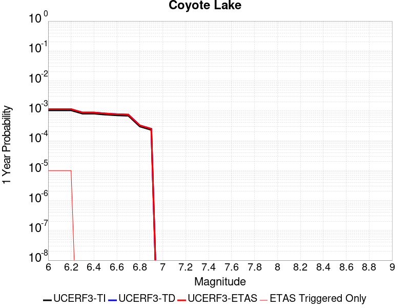 |  |

| Magnitude | 1 wk TI Prob | 1 wk TD Prob | 1 wk ETAS Prob | 1 wk ETAS/TD Gain | 1 wk ETAS Triggered Only | 1 mo TI Prob | 1 mo TD Prob | 1 mo ETAS Prob | 1 mo ETAS/TD Gain | 1 mo ETAS Triggered Only | 1 yr TI Prob | 1 yr TD Prob | 1 yr ETAS Prob | 1 yr ETAS/TD Gain | 1 yr ETAS Triggered Only | 10 yr TI Prob | 10 yr TD Prob | 10 yr ETAS Prob | 10 yr ETAS/TD Gain | 10 yr ETAS Triggered Only |
|-----|-----|-----|-----|-----|-----|-----|-----|-----|-----|-----|-----|-----|-----|-----|-----|-----|-----|-----|-----|-----|
| 6.0 | 1.980352E-5 | 2.1707021E-5 | 2.1707021E-5 | 1.0 | 0.0 | 8.486947E-5 | 9.302718E-5 | 9.302718E-5 | 1.0 | 0.0 | 0.0010327959 | 0.0011320895 | 0.0011320895 | 1.0 | 0.0 | 0.010280091 | 0.011270401 | 0.011299653 | 1.0025955 | 2.9585799E-5 |
| 6.1 | 1.980352E-5 | 2.1707021E-5 | 2.1707021E-5 | 1.0 | 0.0 | 8.486947E-5 | 9.302718E-5 | 9.302718E-5 | 1.0 | 0.0 | 0.0010327959 | 0.0011320895 | 0.0011320895 | 1.0 | 0.0 | 0.010280091 | 0.011270401 | 0.011299653 | 1.0025955 | 2.9585799E-5 |
| 6.2 | 1.980352E-5 | 2.1707021E-5 | 2.1707021E-5 | 1.0 | 0.0 | 8.486947E-5 | 9.302718E-5 | 9.302718E-5 | 1.0 | 0.0 | 0.0010327959 | 0.0011320895 | 0.0011320895 | 1.0 | 0.0 | 0.010280091 | 0.011270401 | 0.011299653 | 1.0025955 | 2.9585799E-5 |
| 6.3 | 1.5344787E-5 | 1.6820884E-5 | 1.6820884E-5 | 1.0 | 0.0 | 6.576172E-5 | 7.208785E-5 | 7.208785E-5 | 1.0 | 0.0 | 8.003548E-4 | 8.7737746E-4 | 8.7737746E-4 | 1.0 | 0.0 | 0.007974784 | 0.00874518 | 0.008774508 | 1.0033535 | 2.9585799E-5 |
| 6.4 | 1.5344787E-5 | 1.6820884E-5 | 1.6820884E-5 | 1.0 | 0.0 | 6.576172E-5 | 7.208785E-5 | 7.208785E-5 | 1.0 | 0.0 | 8.003548E-4 | 8.7737746E-4 | 8.7737746E-4 | 1.0 | 0.0 | 0.007974784 | 0.00874518 | 0.008774508 | 1.0033535 | 2.9585799E-5 |
| 6.5 | 1.4189697E-5 | 1.5558186E-5 | 1.5558186E-5 | 1.0 | 0.0 | 6.081157E-5 | 6.667658E-5 | 6.667658E-5 | 1.0 | 0.0 | 7.401293E-4 | 8.1154524E-4 | 8.1154524E-4 | 1.0 | 0.0 | 0.0073766913 | 0.008091759 | 0.008121106 | 1.0036267 | 2.9585799E-5 |
| 6.6 | 1.3469301E-5 | 1.47717665E-5 | 1.47717665E-5 | 1.0 | 0.0 | 5.7724297E-5 | 6.3306376E-5 | 6.3306376E-5 | 1.0 | 0.0 | 7.025667E-4 | 7.7054254E-4 | 7.7054254E-4 | 1.0 | 0.0 | 0.0070034964 | 0.0076846126 | 0.0077139707 | 1.0038204 | 2.9585799E-5 |
| 6.7 | 1.3027966E-5 | 1.4281927E-5 | 1.4281927E-5 | 1.0 | 0.0 | 5.5832945E-5 | 6.120716E-5 | 6.120716E-5 | 1.0 | 0.0 | 6.7955407E-4 | 7.450021E-4 | 7.450021E-4 | 1.0 | 0.0 | 0.006774798 | 0.007430923 | 0.007460289 | 1.0039519 | 2.9585799E-5 |
| 6.8 | 5.695434E-6 | 6.2244944E-6 | 6.2244944E-6 | 1.0 | 0.0 | 2.4408775E-5 | 2.6676302E-5 | 2.6676302E-5 | 1.0 | 0.0 | 2.971363E-4 | 3.2476554E-4 | 3.2476554E-4 | 1.0 | 0.0 | 0.0029673933 | 0.0032458503 | 0.0032458503 | 1.0 | 0.0 |
| 6.9 | 4.385688E-6 | 4.7931144E-6 | 4.7931144E-6 | 1.0 | 0.0 | 1.879567E-5 | 2.0541918E-5 | 2.0541918E-5 | 1.0 | 0.0 | 2.2881327E-4 | 2.5009786E-4 | 2.5009786E-4 | 1.0 | 0.0 | 0.002285778 | 0.0025009785 | 0.0025009785 | 1.0 | 0.0 |

## Garlic Springs
*[(top)](#table-of-contents)*

| 1 Week | 1 Month | 1 Year | 10 Year |
|-----|-----|-----|-----|
|  |  | 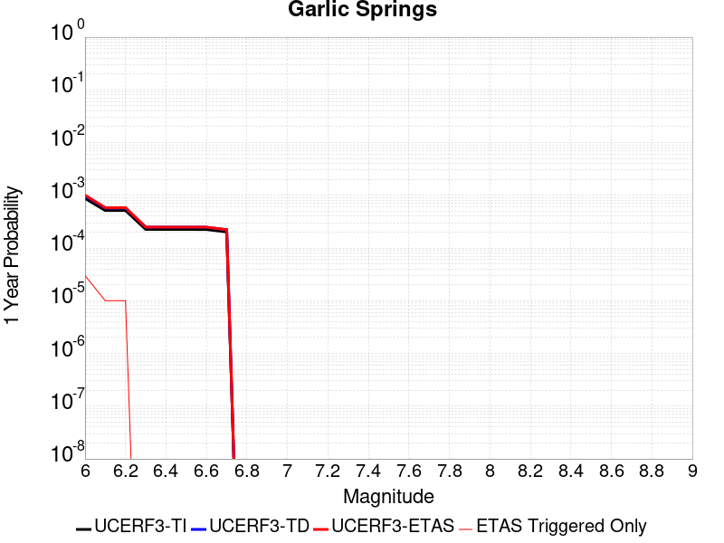 |  |

| Magnitude | 1 wk TI Prob | 1 wk TD Prob | 1 wk ETAS Prob | 1 wk ETAS/TD Gain | 1 wk ETAS Triggered Only | 1 mo TI Prob | 1 mo TD Prob | 1 mo ETAS Prob | 1 mo ETAS/TD Gain | 1 mo ETAS Triggered Only | 1 yr TI Prob | 1 yr TD Prob | 1 yr ETAS Prob | 1 yr ETAS/TD Gain | 1 yr ETAS Triggered Only | 10 yr TI Prob | 10 yr TD Prob | 10 yr ETAS Prob | 10 yr ETAS/TD Gain | 10 yr ETAS Triggered Only |
|-----|-----|-----|-----|-----|-----|-----|-----|-----|-----|-----|-----|-----|-----|-----|-----|-----|-----|-----|-----|-----|
| 6.0 | 1.6760017E-5 | 1.8777133E-5 | 1.8777133E-5 | 1.0 | 0.0 | 7.182667E-5 | 8.0471604E-5 | 8.0471604E-5 | 1.0 | 0.0 | 8.7413884E-4 | 9.794189E-4 | 9.794189E-4 | 1.0 | 0.0 | 0.008707083 | 0.009762568 | 0.009791865 | 1.003001 | 2.9585799E-5 |
| 6.1 | 9.852767E-6 | 1.0973752E-5 | 1.0973752E-5 | 1.0 | 0.0 | 4.222546E-5 | 4.702992E-5 | 4.702992E-5 | 1.0 | 0.0 | 5.139737E-4 | 5.7250983E-4 | 5.7250983E-4 | 1.0 | 0.0 | 0.005127866 | 0.0057173073 | 0.005746724 | 1.0051452 | 2.9585799E-5 |
| 6.2 | 9.852767E-6 | 1.0973752E-5 | 1.0973752E-5 | 1.0 | 0.0 | 4.222546E-5 | 4.702992E-5 | 4.702992E-5 | 1.0 | 0.0 | 5.139737E-4 | 5.7250983E-4 | 5.7250983E-4 | 1.0 | 0.0 | 0.005127866 | 0.0057173073 | 0.005746724 | 1.0051452 | 2.9585799E-5 |
| 6.3 | 4.3167724E-6 | 4.7780964E-6 | 4.7780964E-6 | 1.0 | 0.0 | 1.8500323E-5 | 2.0477524E-5 | 2.0477524E-5 | 1.0 | 0.0 | 2.2521814E-4 | 2.4930836E-4 | 2.4930836E-4 | 1.0 | 0.0 | 0.0022499003 | 0.0024925452 | 0.0025220574 | 1.0118401 | 2.9585799E-5 |
| 6.4 | 4.3167724E-6 | 4.7780964E-6 | 4.7780964E-6 | 1.0 | 0.0 | 1.8500323E-5 | 2.0477524E-5 | 2.0477524E-5 | 1.0 | 0.0 | 2.2521814E-4 | 2.4930836E-4 | 2.4930836E-4 | 1.0 | 0.0 | 0.0022499003 | 0.0024925452 | 0.0025220574 | 1.0118401 | 2.9585799E-5 |
| 6.5 | 4.3167724E-6 | 4.7780964E-6 | 4.7780964E-6 | 1.0 | 0.0 | 1.8500323E-5 | 2.0477524E-5 | 2.0477524E-5 | 1.0 | 0.0 | 2.2521814E-4 | 2.4930836E-4 | 2.4930836E-4 | 1.0 | 0.0 | 0.0022499003 | 0.0024925452 | 0.0025220574 | 1.0118401 | 2.9585799E-5 |
| 6.6 | 4.301311E-6 | 4.7609647E-6 | 4.7609647E-6 | 1.0 | 0.0 | 1.8434059E-5 | 2.0404104E-5 | 2.0404104E-5 | 1.0 | 0.0 | 2.2441156E-4 | 2.4841467E-4 | 2.4841467E-4 | 1.0 | 0.0 | 0.0022418506 | 0.0024836282 | 0.0025131407 | 1.0118828 | 2.9585799E-5 |
| 6.7 | 3.8599724E-6 | 4.2711204E-6 | 4.2711204E-6 | 1.0 | 0.0 | 1.6542634E-5 | 1.8304801E-5 | 1.8304801E-5 | 1.0 | 0.0 | 2.0138794E-4 | 2.2286095E-4 | 2.2286095E-4 | 1.0 | 0.0 | 0.0020120554 | 0.0022286095 | 0.0022581294 | 1.0132458 | 2.9585799E-5 |

## Cady
*[(top)](#table-of-contents)*

| 1 Week | 1 Month | 1 Year | 10 Year |
|-----|-----|-----|-----|
|  |  |  |  |

| Magnitude | 1 wk TI Prob | 1 wk TD Prob | 1 wk ETAS Prob | 1 wk ETAS/TD Gain | 1 wk ETAS Triggered Only | 1 mo TI Prob | 1 mo TD Prob | 1 mo ETAS Prob | 1 mo ETAS/TD Gain | 1 mo ETAS Triggered Only | 1 yr TI Prob | 1 yr TD Prob | 1 yr ETAS Prob | 1 yr ETAS/TD Gain | 1 yr ETAS Triggered Only | 10 yr TI Prob | 10 yr TD Prob | 10 yr ETAS Prob | 10 yr ETAS/TD Gain | 10 yr ETAS Triggered Only |
|-----|-----|-----|-----|-----|-----|-----|-----|-----|-----|-----|-----|-----|-----|-----|-----|-----|-----|-----|-----|-----|
| 6.0 | 1.9892565E-5 | 2.1859016E-5 | 2.1859016E-5 | 1.0 | 0.0 | 8.525106E-5 | 9.3678645E-5 | 9.3678645E-5 | 1.0 | 0.0 | 0.0010374374 | 0.0011400316 | 0.0011695838 | 1.0259222 | 2.9585799E-5 | 0.010326075 | 0.011350849 | 0.011380099 | 1.002577 | 2.9585799E-5 |
| 6.1 | 1.9892565E-5 | 2.1859016E-5 | 2.1859016E-5 | 1.0 | 0.0 | 8.525106E-5 | 9.3678645E-5 | 9.3678645E-5 | 1.0 | 0.0 | 0.0010374374 | 0.0011400316 | 0.0011695838 | 1.0259222 | 2.9585799E-5 | 0.010326075 | 0.011350849 | 0.011380099 | 1.002577 | 2.9585799E-5 |
| 6.2 | 1.9892565E-5 | 2.1859016E-5 | 2.1859016E-5 | 1.0 | 0.0 | 8.525106E-5 | 9.3678645E-5 | 9.3678645E-5 | 1.0 | 0.0 | 0.0010374374 | 0.0011400316 | 0.0011695838 | 1.0259222 | 2.9585799E-5 | 0.010326075 | 0.011350849 | 0.011380099 | 1.002577 | 2.9585799E-5 |
| 6.3 | 1.1117327E-5 | 1.2176738E-5 | 1.2176738E-5 | 1.0 | 0.0 | 4.764482E-5 | 5.218515E-5 | 5.218515E-5 | 1.0 | 0.0 | 5.7992124E-4 | 6.3520053E-4 | 6.3520053E-4 | 1.0 | 0.0 | 0.0057841022 | 0.0063369554 | 0.0063369554 | 1.0 | 0.0 |
| 6.4 | 1.1117327E-5 | 1.2176738E-5 | 1.2176738E-5 | 1.0 | 0.0 | 4.764482E-5 | 5.218515E-5 | 5.218515E-5 | 1.0 | 0.0 | 5.7992124E-4 | 6.3520053E-4 | 6.3520053E-4 | 1.0 | 0.0 | 0.0057841022 | 0.0063369554 | 0.0063369554 | 1.0 | 0.0 |
| 6.5 | 6.103093E-6 | 6.672103E-6 | 6.672103E-6 | 1.0 | 0.0 | 2.615585E-5 | 2.8594486E-5 | 2.8594486E-5 | 1.0 | 0.0 | 3.1840094E-4 | 3.4809482E-4 | 3.4809482E-4 | 1.0 | 0.0 | 0.0031794512 | 0.0034767296 | 0.0034767296 | 1.0 | 0.0 |
| 6.6 | 5.817237E-6 | 6.365738E-6 | 6.365738E-6 | 1.0 | 0.0 | 2.4930776E-5 | 2.728152E-5 | 2.728152E-5 | 1.0 | 0.0 | 3.034899E-4 | 3.3211432E-4 | 3.3211432E-4 | 1.0 | 0.0 | 0.0030307577 | 0.003317402 | 0.003317402 | 1.0 | 0.0 |
| 6.7 | 4.8846314E-6 | 5.3406343E-6 | 5.3406343E-6 | 1.0 | 0.0 | 2.0933967E-5 | 2.2888298E-5 | 2.2888298E-5 | 1.0 | 0.0 | 2.5484123E-4 | 2.7864118E-4 | 2.7864118E-4 | 1.0 | 0.0 | 0.0025454918 | 0.0027840736 | 0.0027840736 | 1.0 | 0.0 |
| 6.8 | 1.7788773E-6 | 1.9399313E-6 | 1.9399313E-6 | 1.0 | 0.0 | 7.6237375E-6 | 8.313974E-6 | 8.313974E-6 | 1.0 | 0.0 | 9.281505E-5 | 1.01219506E-4 | 1.01219506E-4 | 1.0 | 0.0 | 9.2776294E-4 | 0.0010118886 | 0.0010118886 | 1.0 | 0.0 |
| 6.9 | 7.5455404E-7 | 8.297202E-7 | 8.297202E-7 | 1.0 | 0.0 | 3.233799E-6 | 3.5559406E-6 | 3.5559406E-6 | 1.0 | 0.0 | 3.937079E-5 | 4.3293054E-5 | 4.3293054E-5 | 1.0 | 0.0 | 3.9363815E-4 | 4.3287914E-4 | 4.3287914E-4 | 1.0 | 0.0 |
| 7.0 | 6.8578805E-7 | 7.541916E-7 | 7.541916E-7 | 1.0 | 0.0 | 2.9390883E-6 | 3.2322475E-6 | 3.2322475E-6 | 1.0 | 0.0 | 3.578281E-5 | 3.9352235E-5 | 3.9352235E-5 | 1.0 | 0.0 | 3.577705E-4 | 3.9348513E-4 | 3.9348513E-4 | 1.0 | 0.0 |

## Raymond
*[(top)](#table-of-contents)*

| 1 Week | 1 Month | 1 Year | 10 Year |
|-----|-----|-----|-----|
|  |  |  |  |

| Magnitude | 1 wk TI Prob | 1 wk TD Prob | 1 wk ETAS Prob | 1 wk ETAS/TD Gain | 1 wk ETAS Triggered Only | 1 mo TI Prob | 1 mo TD Prob | 1 mo ETAS Prob | 1 mo ETAS/TD Gain | 1 mo ETAS Triggered Only | 1 yr TI Prob | 1 yr TD Prob | 1 yr ETAS Prob | 1 yr ETAS/TD Gain | 1 yr ETAS Triggered Only | 10 yr TI Prob | 10 yr TD Prob | 10 yr ETAS Prob | 10 yr ETAS/TD Gain | 10 yr ETAS Triggered Only |
|-----|-----|-----|-----|-----|-----|-----|-----|-----|-----|-----|-----|-----|-----|-----|-----|-----|-----|-----|-----|-----|
| 6.0 | 1.5157413E-5 | 1.5810376E-5 | 1.5810376E-5 | 1.0 | 0.0 | 6.4958724E-5 | 6.775714E-5 | 6.775714E-5 | 1.0 | 0.0 | 7.905855E-4 | 8.24656E-4 | 8.542174E-4 | 1.035847 | 2.9585799E-5 | 0.007877788 | 0.008218477 | 0.00824782 | 1.0035703 | 2.9585799E-5 |
| 6.1 | 1.5157413E-5 | 1.5810376E-5 | 1.5810376E-5 | 1.0 | 0.0 | 6.4958724E-5 | 6.775714E-5 | 6.775714E-5 | 1.0 | 0.0 | 7.905855E-4 | 8.24656E-4 | 8.542174E-4 | 1.035847 | 2.9585799E-5 | 0.007877788 | 0.008218477 | 0.00824782 | 1.0035703 | 2.9585799E-5 |
| 6.2 | 1.5157413E-5 | 1.5810376E-5 | 1.5810376E-5 | 1.0 | 0.0 | 6.4958724E-5 | 6.775714E-5 | 6.775714E-5 | 1.0 | 0.0 | 7.905855E-4 | 8.24656E-4 | 8.542174E-4 | 1.035847 | 2.9585799E-5 | 0.007877788 | 0.008218477 | 0.00824782 | 1.0035703 | 2.9585799E-5 |
| 6.3 | 1.5157413E-5 | 1.5810376E-5 | 1.5810376E-5 | 1.0 | 0.0 | 6.4958724E-5 | 6.775714E-5 | 6.775714E-5 | 1.0 | 0.0 | 7.905855E-4 | 8.24656E-4 | 8.542174E-4 | 1.035847 | 2.9585799E-5 | 0.007877788 | 0.008218477 | 0.00824782 | 1.0035703 | 2.9585799E-5 |
| 6.4 | 1.3941944E-5 | 1.4454918E-5 | 1.4454918E-5 | 1.0 | 0.0 | 5.9749822E-5 | 6.194831E-5 | 6.194831E-5 | 1.0 | 0.0 | 7.2721124E-4 | 7.53983E-4 | 7.835465E-4 | 1.0392097 | 2.9585799E-5 | 0.007248361 | 0.0075165825 | 0.007545946 | 1.0039065 | 2.9585799E-5 |
| 6.5 | 1.3941944E-5 | 1.4454918E-5 | 1.4454918E-5 | 1.0 | 0.0 | 5.9749822E-5 | 6.194831E-5 | 6.194831E-5 | 1.0 | 0.0 | 7.2721124E-4 | 7.53983E-4 | 7.835465E-4 | 1.0392097 | 2.9585799E-5 | 0.007248361 | 0.0075165825 | 0.007545946 | 1.0039065 | 2.9585799E-5 |
| 6.6 | 1.0542609E-5 | 1.0671283E-5 | 1.0671283E-5 | 1.0 | 0.0 | 4.5181827E-5 | 4.57333E-5 | 4.57333E-5 | 1.0 | 0.0 | 5.499499E-4 | 5.566662E-4 | 5.862355E-4 | 1.0531186 | 2.9585799E-5 | 0.005485909 | 0.0055532786 | 0.0055827005 | 1.005298 | 2.9585799E-5 |
| 6.7 | 1.0542609E-5 | 1.0671283E-5 | 1.0671283E-5 | 1.0 | 0.0 | 4.5181827E-5 | 4.57333E-5 | 4.57333E-5 | 1.0 | 0.0 | 5.499499E-4 | 5.566662E-4 | 5.862355E-4 | 1.0531186 | 2.9585799E-5 | 0.005485909 | 0.0055532786 | 0.0055827005 | 1.005298 | 2.9585799E-5 |
| 6.8 | 1.0079132E-5 | 1.0176812E-5 | 1.0176812E-5 | 1.0 | 0.0 | 4.3195567E-5 | 4.361421E-5 | 4.361421E-5 | 1.0 | 0.0 | 5.257791E-4 | 5.30879E-4 | 5.604491E-4 | 1.0557003 | 2.9585799E-5 | 0.0052453685 | 0.0052966573 | 0.0053260867 | 1.0055561 | 2.9585799E-5 |
| 6.9 | 7.721598E-6 | 7.5490307E-6 | 7.5490307E-6 | 1.0 | 0.0 | 3.3092143E-5 | 3.2352593E-5 | 3.2352593E-5 | 1.0 | 0.0 | 4.0282236E-4 | 3.9382285E-4 | 4.23397E-4 | 1.075095 | 2.9585799E-5 | 0.0040209293 | 0.003931383 | 0.0039608525 | 1.007496 | 2.9585799E-5 |
| 7.0 | 7.137566E-6 | 6.9114235E-6 | 6.9114235E-6 | 1.0 | 0.0 | 3.058921E-5 | 2.9620056E-5 | 2.9620056E-5 | 1.0 | 0.0 | 3.7236E-4 | 3.6056558E-4 | 3.6056558E-4 | 1.0 | 0.0 | 0.0037173668 | 0.003599924 | 0.003599924 | 1.0 | 0.0 |
| 7.1 | 5.654976E-6 | 5.2996397E-6 | 5.2996397E-6 | 1.0 | 0.0 | 2.4235387E-5 | 2.2712544E-5 | 2.2712544E-5 | 1.0 | 0.0 | 2.9502588E-4 | 2.7649035E-4 | 2.7649035E-4 | 1.0 | 0.0 | 0.0029463451 | 0.0027614946 | 0.0027614946 | 1.0 | 0.0 |
| 7.2 | 4.9358455E-6 | 4.5267484E-6 | 4.5267484E-6 | 1.0 | 0.0 | 2.1153453E-5 | 1.9400206E-5 | 1.9400206E-5 | 1.0 | 0.0 | 2.5751285E-4 | 2.3617204E-4 | 2.3617204E-4 | 1.0 | 0.0 | 0.0025721465 | 0.0023592326 | 0.0023592326 | 1.0 | 0.0 |
| 7.3 | 4.2368597E-6 | 3.8056999E-6 | 3.8056999E-6 | 1.0 | 0.0 | 1.8157843E-5 | 1.6310041E-5 | 1.6310041E-5 | 1.0 | 0.0 | 2.2104931E-4 | 1.9855677E-4 | 1.9855677E-4 | 1.0 | 0.0 | 0.0022082955 | 0.0019838123 | 0.0019838123 | 1.0 | 0.0 |
| 7.4 | 3.4999923E-6 | 3.0438184E-6 | 3.0438184E-6 | 1.0 | 0.0 | 1.49998805E-5 | 1.3044872E-5 | 1.3044872E-5 | 1.0 | 0.0 | 1.8260824E-4 | 1.5880981E-4 | 1.5880981E-4 | 1.0 | 0.0 | 0.0018245826 | 0.001586979 | 0.001586979 | 1.0 | 0.0 |
| 7.5 | 2.738017E-6 | 2.3021105E-6 | 2.3021105E-6 | 1.0 | 0.0 | 1.1734306E-5 | 9.86615E-6 | 9.86615E-6 | 1.0 | 0.0 | 1.428558E-4 | 1.2011383E-4 | 1.2011383E-4 | 1.0 | 0.0 | 0.0014276401 | 0.0012005034 | 0.0012005034 | 1.0 | 0.0 |
| 7.6 | 1.8186392E-6 | 1.4423566E-6 | 1.4423566E-6 | 1.0 | 0.0 | 7.794145E-6 | 6.181514E-6 | 6.181514E-6 | 1.0 | 0.0 | 9.488958E-5 | 7.5257376E-5 | 7.5257376E-5 | 1.0 | 0.0 | 9.4849075E-4 | 7.523304E-4 | 7.523304E-4 | 1.0 | 0.0 |
| 7.7 | 1.0660348E-6 | 7.644165E-7 | 7.644165E-7 | 1.0 | 0.0 | 4.5687125E-6 | 3.2760668E-6 | 3.2760668E-6 | 1.0 | 0.0 | 5.5622655E-5 | 3.98854E-5 | 3.98854E-5 | 1.0 | 0.0 | 5.5608735E-4 | 3.9879154E-4 | 3.9879154E-4 | 1.0 | 0.0 |
| 7.8 | 6.913602E-7 | 4.320714E-7 | 4.320714E-7 | 1.0 | 0.0 | 2.962969E-6 | 1.8517333E-6 | 1.8517333E-6 | 1.0 | 0.0 | 3.607355E-5 | 2.2544626E-5 | 2.2544626E-5 | 1.0 | 0.0 | 3.6067693E-4 | 2.2543124E-4 | 2.2543124E-4 | 1.0 | 0.0 |
| 7.9 | 7.425201E-8 | 5.322516E-8 | 5.322516E-8 | 1.0 | 0.0 | 3.1822285E-7 | 2.2810782E-7 | 2.2810782E-7 | 1.0 | 0.0 | 3.874356E-6 | 2.7772105E-6 | 2.7772105E-6 | 1.0 | 0.0 | 3.8742884E-5 | 2.7771888E-5 | 2.7771888E-5 | 1.0 | 0.0 |

## San Andreas (North Branch Mill Creek)
*[(top)](#table-of-contents)*

| 1 Week | 1 Month | 1 Year | 10 Year |
|-----|-----|-----|-----|
|  |  |  |  |

| Magnitude | 1 wk TI Prob | 1 wk TD Prob | 1 wk ETAS Prob | 1 wk ETAS/TD Gain | 1 wk ETAS Triggered Only | 1 mo TI Prob | 1 mo TD Prob | 1 mo ETAS Prob | 1 mo ETAS/TD Gain | 1 mo ETAS Triggered Only | 1 yr TI Prob | 1 yr TD Prob | 1 yr ETAS Prob | 1 yr ETAS/TD Gain | 1 yr ETAS Triggered Only | 10 yr TI Prob | 10 yr TD Prob | 10 yr ETAS Prob | 10 yr ETAS/TD Gain | 10 yr ETAS Triggered Only |
|-----|-----|-----|-----|-----|-----|-----|-----|-----|-----|-----|-----|-----|-----|-----|-----|-----|-----|-----|-----|-----|
| 6.0 | 1.3461156E-5 | 2.3506776E-5 | 2.3506776E-5 | 1.0 | 0.0 | 5.7689394E-5 | 1.0073945E-4 | 1.0073945E-4 | 1.0 | 0.0 | 7.02142E-4 | 0.0012258161 | 0.0012258161 | 1.0 | 0.0 | 0.0069992766 | 0.012233093 | 0.012262317 | 1.002389 | 2.9585799E-5 |
| 6.1 | 1.3461156E-5 | 2.3506776E-5 | 2.3506776E-5 | 1.0 | 0.0 | 5.7689394E-5 | 1.0073945E-4 | 1.0073945E-4 | 1.0 | 0.0 | 7.02142E-4 | 0.0012258161 | 0.0012258161 | 1.0 | 0.0 | 0.0069992766 | 0.012233093 | 0.012262317 | 1.002389 | 2.9585799E-5 |
| 6.2 | 1.3461156E-5 | 2.3506776E-5 | 2.3506776E-5 | 1.0 | 0.0 | 5.7689394E-5 | 1.0073945E-4 | 1.0073945E-4 | 1.0 | 0.0 | 7.02142E-4 | 0.0012258161 | 0.0012258161 | 1.0 | 0.0 | 0.0069992766 | 0.012233093 | 0.012262317 | 1.002389 | 2.9585799E-5 |
| 6.3 | 1.3461156E-5 | 2.3506776E-5 | 2.3506776E-5 | 1.0 | 0.0 | 5.7689394E-5 | 1.0073945E-4 | 1.0073945E-4 | 1.0 | 0.0 | 7.02142E-4 | 0.0012258161 | 0.0012258161 | 1.0 | 0.0 | 0.0069992766 | 0.012233093 | 0.012262317 | 1.002389 | 2.9585799E-5 |
| 6.4 | 1.3461156E-5 | 2.3506776E-5 | 2.3506776E-5 | 1.0 | 0.0 | 5.7689394E-5 | 1.0073945E-4 | 1.0073945E-4 | 1.0 | 0.0 | 7.02142E-4 | 0.0012258161 | 0.0012258161 | 1.0 | 0.0 | 0.0069992766 | 0.012233093 | 0.012262317 | 1.002389 | 2.9585799E-5 |
| 6.5 | 1.3450706E-5 | 2.3495735E-5 | 2.3495735E-5 | 1.0 | 0.0 | 5.764461E-5 | 1.0069214E-4 | 1.0069214E-4 | 1.0 | 0.0 | 7.0159714E-4 | 0.0012252406 | 0.0012252406 | 1.0 | 0.0 | 0.006993862 | 0.012227403 | 0.012256627 | 1.00239 | 2.9585799E-5 |
| 6.6 | 1.3074523E-5 | 2.3110017E-5 | 2.3110017E-5 | 1.0 | 0.0 | 5.6032466E-5 | 9.9039185E-5 | 9.9039185E-5 | 1.0 | 0.0 | 6.8198174E-4 | 0.0012051383 | 0.0012051383 | 1.0 | 0.0 | 0.006798926 | 0.0120285675 | 0.012057797 | 1.0024301 | 2.9585799E-5 |
| 6.7 | 1.3050216E-5 | 2.3085311E-5 | 2.3085311E-5 | 1.0 | 0.0 | 5.59283E-5 | 9.893332E-5 | 9.893332E-5 | 1.0 | 0.0 | 6.8071426E-4 | 0.0012038508 | 0.0012038508 | 1.0 | 0.0 | 0.0067863287 | 0.012015832 | 0.012045062 | 1.0024327 | 2.9585799E-5 |
| 6.8 | 1.29049395E-5 | 2.293372E-5 | 2.293372E-5 | 1.0 | 0.0 | 5.530571E-5 | 9.828369E-5 | 9.828369E-5 | 1.0 | 0.0 | 6.73139E-4 | 0.0011959502 | 0.0011959502 | 1.0 | 0.0 | 0.0067110364 | 0.011937677 | 0.011966909 | 1.0024488 | 2.9585799E-5 |
| 6.9 | 1.2867369E-5 | 2.2893122E-5 | 2.2893122E-5 | 1.0 | 0.0 | 5.51447E-5 | 9.810971E-5 | 9.810971E-5 | 1.0 | 0.0 | 6.711799E-4 | 0.0011938344 | 0.0011938344 | 1.0 | 0.0 | 0.006691564 | 0.011916745 | 0.011945979 | 1.0024531 | 2.9585799E-5 |
| 7.0 | 1.2495996E-5 | 2.2293154E-5 | 2.2293154E-5 | 1.0 | 0.0 | 5.3553173E-5 | 9.5538606E-5 | 9.5538606E-5 | 1.0 | 0.0 | 6.518148E-4 | 0.0011625647 | 0.0011625647 | 1.0 | 0.0 | 0.0064990623 | 0.011607327 | 0.011636569 | 1.0025192 | 2.9585799E-5 |
| 7.1 | 1.2452067E-5 | 2.2238226E-5 | 2.2238226E-5 | 1.0 | 0.0 | 5.3364907E-5 | 9.5303214E-5 | 9.5303214E-5 | 1.0 | 0.0 | 6.4952404E-4 | 0.0011597018 | 0.0011597018 | 1.0 | 0.0 | 0.0064762887 | 0.011578998 | 0.01160824 | 1.0025256 | 2.9585799E-5 |
| 7.2 | 1.2002777E-5 | 2.1616754E-5 | 2.1616754E-5 | 1.0 | 0.0 | 5.143946E-5 | 9.263996E-5 | 9.263996E-5 | 1.0 | 0.0 | 6.2609545E-4 | 0.0011273106 | 0.0011273106 | 1.0 | 0.0 | 0.006243344 | 0.011258403 | 0.011287655 | 1.0025983 | 2.9585799E-5 |
| 7.3 | 1.1923425E-5 | 2.1486576E-5 | 2.1486576E-5 | 1.0 | 0.0 | 5.109939E-5 | 9.208209E-5 | 9.208209E-5 | 1.0 | 0.0 | 6.219575E-4 | 0.0011205255 | 0.0011205255 | 1.0 | 0.0 | 0.0062021962 | 0.011191265 | 0.011220519 | 1.002614 | 2.9585799E-5 |
| 7.4 | 1.16105175E-5 | 2.0860489E-5 | 2.0860489E-5 | 1.0 | 0.0 | 4.975841E-5 | 8.9399044E-5 | 8.9399044E-5 | 1.0 | 0.0 | 6.0564023E-4 | 0.0010878925 | 0.0010878925 | 1.0 | 0.0 | 0.006039923 | 0.01086884 | 0.010898104 | 1.0026925 | 2.9585799E-5 |
| 7.5 | 1.1037265E-5 | 1.956039E-5 | 1.956039E-5 | 1.0 | 0.0 | 4.7301706E-5 | 8.382756E-5 | 8.382756E-5 | 1.0 | 0.0 | 5.757461E-4 | 0.0010201249 | 0.0010201249 | 1.0 | 0.0 | 0.005742567 | 0.010198223 | 0.010227508 | 1.0028715 | 2.9585799E-5 |
| 7.6 | 1.0720915E-5 | 1.900222E-5 | 1.900222E-5 | 1.0 | 0.0 | 4.5945973E-5 | 8.143555E-5 | 8.143555E-5 | 1.0 | 0.0 | 5.592486E-4 | 9.910291E-4 | 9.910291E-4 | 1.0 | 0.0 | 0.005578433 | 0.009909907 | 0.0099392 | 1.0029559 | 2.9585799E-5 |
| 7.7 | 9.276279E-6 | 1.6447744E-5 | 1.6447744E-5 | 1.0 | 0.0 | 3.9754876E-5 | 7.048844E-5 | 7.048844E-5 | 1.0 | 0.0 | 4.839081E-4 | 8.578605E-4 | 8.578605E-4 | 1.0 | 0.0 | 0.0048285574 | 0.008589173 | 0.008618504 | 1.003415 | 2.9585799E-5 |
| 7.8 | 5.8346777E-6 | 1.1159965E-5 | 1.1159965E-5 | 1.0 | 0.0 | 2.5005522E-5 | 4.7827543E-5 | 4.7827543E-5 | 1.0 | 0.0 | 3.043997E-4 | 5.821449E-4 | 5.821449E-4 | 1.0 | 0.0 | 0.0030398308 | 0.005849473 | 0.0058788857 | 1.0050282 | 2.9585799E-5 |
| 7.9 | 4.690204E-6 | 8.513225E-6 | 8.513225E-6 | 1.0 | 0.0 | 2.0100719E-5 | 3.648474E-5 | 3.648474E-5 | 1.0 | 0.0 | 2.4469878E-4 | 4.4411127E-4 | 4.4411127E-4 | 1.0 | 0.0 | 0.002444295 | 0.0044728746 | 0.0045023276 | 1.0065849 | 2.9585799E-5 |
| 8.0 | 2.9570454E-6 | 4.8494758E-6 | 4.8494758E-6 | 1.0 | 0.0 | 1.267299E-5 | 2.0783302E-5 | 2.0783302E-5 | 1.0 | 0.0 | 1.5428272E-4 | 2.5300734E-4 | 2.5300734E-4 | 1.0 | 0.0 | 0.0015417566 | 0.0025509594 | 0.0025509594 | 1.0 | 0.0 |
| 8.1 | 1.6376824E-6 | 2.198225E-6 | 2.198225E-6 | 1.0 | 0.0 | 7.01862E-6 | 9.420931E-6 | 9.420931E-6 | 1.0 | 0.0 | 8.544835E-5 | 1.1469381E-4 | 1.1469381E-4 | 1.0 | 0.0 | 8.54155E-4 | 0.0011613552 | 0.0011613552 | 1.0 | 0.0 |
| 8.2 | 6.9631557E-7 | 4.5401492E-7 | 4.5401492E-7 | 1.0 | 0.0 | 2.984206E-6 | 1.9457768E-6 | 1.9457768E-6 | 1.0 | 0.0 | 3.63321E-5 | 2.3689576E-5 | 2.3689576E-5 | 1.0 | 0.0 | 3.6326164E-4 | 2.453756E-4 | 2.453756E-4 | 1.0 | 0.0 |
| 8.3 | 1.7876137E-7 | 8.368747E-8 | 8.368747E-8 | 1.0 | 0.0 | 7.661199E-7 | 3.5866054E-7 | 3.5866054E-7 | 1.0 | 0.0 | 9.32747E-6 | 4.3666837E-6 | 4.3666837E-6 | 1.0 | 0.0 | 9.3270784E-5 | 4.5861943E-5 | 4.5861943E-5 | 1.0 | 0.0 |

## Earthquake Valley
*[(top)](#table-of-contents)*

| 1 Week | 1 Month | 1 Year | 10 Year |
|-----|-----|-----|-----|
|  |  |  |  |

| Magnitude | 1 wk TI Prob | 1 wk TD Prob | 1 wk ETAS Prob | 1 wk ETAS/TD Gain | 1 wk ETAS Triggered Only | 1 mo TI Prob | 1 mo TD Prob | 1 mo ETAS Prob | 1 mo ETAS/TD Gain | 1 mo ETAS Triggered Only | 1 yr TI Prob | 1 yr TD Prob | 1 yr ETAS Prob | 1 yr ETAS/TD Gain | 1 yr ETAS Triggered Only | 10 yr TI Prob | 10 yr TD Prob | 10 yr ETAS Prob | 10 yr ETAS/TD Gain | 10 yr ETAS Triggered Only |
|-----|-----|-----|-----|-----|-----|-----|-----|-----|-----|-----|-----|-----|-----|-----|-----|-----|-----|-----|-----|-----|
| 6.0 | 1.9416384E-5 | 2.2584583E-5 | 2.2584583E-5 | 1.0 | 0.0 | 8.321042E-5 | 9.678816E-5 | 1.2637109E-4 | 1.3056462 | 2.9585799E-5 | 0.001012616 | 0.0011778789 | 0.0012074299 | 1.0250883 | 2.9585799E-5 | 0.010080142 | 0.011728203 | 0.011757442 | 1.002493 | 2.9585799E-5 |
| 6.1 | 1.9416384E-5 | 2.2584583E-5 | 2.2584583E-5 | 1.0 | 0.0 | 8.321042E-5 | 9.678816E-5 | 1.2637109E-4 | 1.3056462 | 2.9585799E-5 | 0.001012616 | 0.0011778789 | 0.0012074299 | 1.0250883 | 2.9585799E-5 | 0.010080142 | 0.011728203 | 0.011757442 | 1.002493 | 2.9585799E-5 |
| 6.2 | 1.9416384E-5 | 2.2584583E-5 | 2.2584583E-5 | 1.0 | 0.0 | 8.321042E-5 | 9.678816E-5 | 1.2637109E-4 | 1.3056462 | 2.9585799E-5 | 0.001012616 | 0.0011778789 | 0.0012074299 | 1.0250883 | 2.9585799E-5 | 0.010080142 | 0.011728203 | 0.011757442 | 1.002493 | 2.9585799E-5 |
| 6.3 | 1.9416384E-5 | 2.2584583E-5 | 2.2584583E-5 | 1.0 | 0.0 | 8.321042E-5 | 9.678816E-5 | 1.2637109E-4 | 1.3056462 | 2.9585799E-5 | 0.001012616 | 0.0011778789 | 0.0012074299 | 1.0250883 | 2.9585799E-5 | 0.010080142 | 0.011728203 | 0.011757442 | 1.002493 | 2.9585799E-5 |
| 6.4 | 1.9416384E-5 | 2.2584583E-5 | 2.2584583E-5 | 1.0 | 0.0 | 8.321042E-5 | 9.678816E-5 | 1.2637109E-4 | 1.3056462 | 2.9585799E-5 | 0.001012616 | 0.0011778789 | 0.0012074299 | 1.0250883 | 2.9585799E-5 | 0.010080142 | 0.011728203 | 0.011757442 | 1.002493 | 2.9585799E-5 |
| 6.5 | 1.9389157E-5 | 2.2553171E-5 | 2.2553171E-5 | 1.0 | 0.0 | 8.309374E-5 | 9.6653544E-5 | 1.2623648E-4 | 1.306072 | 2.9585799E-5 | 0.0010111968 | 0.0011762419 | 0.0012057929 | 1.0251232 | 2.9585799E-5 | 0.010066078 | 0.011712004 | 0.011741244 | 1.0024965 | 2.9585799E-5 |
| 6.6 | 1.9389157E-5 | 2.2553171E-5 | 2.2553171E-5 | 1.0 | 0.0 | 8.309374E-5 | 9.6653544E-5 | 1.2623648E-4 | 1.306072 | 2.9585799E-5 | 0.0010111968 | 0.0011762419 | 0.0012057929 | 1.0251232 | 2.9585799E-5 | 0.010066078 | 0.011712004 | 0.011741244 | 1.0024965 | 2.9585799E-5 |
| 6.7 | 1.4925434E-5 | 1.7208591E-5 | 1.7208591E-5 | 1.0 | 0.0 | 6.396457E-5 | 7.37495E-5 | 1.03333114E-4 | 1.4011365 | 2.9585799E-5 | 7.7849044E-4 | 8.976153E-4 | 9.271745E-4 | 1.0329309 | 2.9585799E-5 | 0.007757689 | 0.008948273 | 0.008977594 | 1.0032767 | 2.9585799E-5 |
| 6.8 | 1.3570335E-5 | 1.561717E-5 | 1.561717E-5 | 1.0 | 0.0 | 5.8157282E-5 | 6.6929475E-5 | 9.651329E-5 | 1.4420148 | 2.9585799E-5 | 7.0783484E-4 | 8.1464375E-4 | 8.4420544E-4 | 1.0362879 | 2.9585799E-5 | 0.0070558446 | 0.008124646 | 0.008153991 | 1.0036119 | 2.9585799E-5 |
| 6.9 | 1.3570335E-5 | 1.561717E-5 | 1.561717E-5 | 1.0 | 0.0 | 5.8157282E-5 | 6.6929475E-5 | 9.651329E-5 | 1.4420148 | 2.9585799E-5 | 7.0783484E-4 | 8.1464375E-4 | 8.4420544E-4 | 1.0362879 | 2.9585799E-5 | 0.0070558446 | 0.008124646 | 0.008153991 | 1.0036119 | 2.9585799E-5 |
| 7.0 | 1.3433392E-5 | 1.546071E-5 | 1.546071E-5 | 1.0 | 0.0 | 5.757041E-5 | 6.625897E-5 | 9.5842806E-5 | 1.446488 | 2.9585799E-5 | 7.0069433E-4 | 8.064864E-4 | 8.3604833E-4 | 1.0366552 | 2.9585799E-5 | 0.006984891 | 0.0080436645 | 0.008073012 | 1.0036485 | 2.9585799E-5 |
| 7.1 | 8.181609E-6 | 9.417054E-6 | 9.417054E-6 | 1.0 | 0.0 | 3.5063567E-5 | 4.0358555E-5 | 6.994316E-5 | 1.7330443 | 2.9585799E-5 | 4.268153E-4 | 4.9132167E-4 | 5.2089297E-4 | 1.0601872 | 2.9585799E-5 | 0.0042599645 | 0.004908931 | 0.0049383715 | 1.0059973 | 2.9585799E-5 |
| 7.2 | 2.0663983E-7 | 1.72637E-7 | 1.72637E-7 | 1.0 | 0.0 | 8.855989E-7 | 7.398727E-7 | 7.398727E-7 | 1.0 | 0.0 | 1.0782113E-5 | 9.007917E-6 | 9.007917E-6 | 1.0 | 0.0 | 1.07815904E-4 | 9.007587E-5 | 9.007587E-5 | 1.0 | 0.0 |
| 7.3 | 2.0462376E-7 | 1.707919E-7 | 1.707919E-7 | 1.0 | 0.0 | 8.7695867E-7 | 7.319651E-7 | 7.319651E-7 | 1.0 | 0.0 | 1.0676919E-5 | 8.911642E-6 | 8.911642E-6 | 1.0 | 0.0 | 1.0676406E-4 | 8.911321E-5 | 8.911321E-5 | 1.0 | 0.0 |
| 7.4 | 2.0171088E-7 | 1.6861664E-7 | 1.6861664E-7 | 1.0 | 0.0 | 8.644749E-7 | 7.2264254E-7 | 7.2264254E-7 | 1.0 | 0.0 | 1.0524931E-5 | 8.798142E-6 | 8.798142E-6 | 1.0 | 0.0 | 1.05244326E-4 | 8.797829E-5 | 8.797829E-5 | 1.0 | 0.0 |
| 7.5 | 1.4847944E-7 | 1.2559924E-7 | 1.2559924E-7 | 1.0 | 0.0 | 6.363403E-7 | 5.382824E-7 | 5.382824E-7 | 1.0 | 0.0 | 7.747416E-6 | 6.5535705E-6 | 6.5535705E-6 | 1.0 | 0.0 | 7.747146E-5 | 6.553399E-5 | 6.553399E-5 | 1.0 | 0.0 |
| 7.6 | 1.3185847E-7 | 1.1123822E-7 | 1.1123822E-7 | 1.0 | 0.0 | 5.6510765E-7 | 4.7673515E-7 | 4.7673515E-7 | 1.0 | 0.0 | 6.8801637E-6 | 5.8042374E-6 | 5.8042374E-6 | 1.0 | 0.0 | 6.8799505E-5 | 5.8041067E-5 | 5.8041067E-5 | 1.0 | 0.0 |
| 7.7 | 2.8609954E-8 | 1.41716665E-8 | 1.41716665E-8 | 1.0 | 0.0 | 1.2261408E-7 | 6.073571E-8 | 6.073571E-8 | 1.0 | 0.0 | 1.4928254E-6 | 7.394571E-7 | 7.394571E-7 | 1.0 | 0.0 | 1.4928154E-5 | 7.3945516E-6 | 7.3945516E-6 | 1.0 | 0.0 |
| 7.8 | 6.527266E-9 | 2.9235552E-9 | 2.9235552E-9 | 1.0 | 0.0 | 2.7973995E-8 | 1.2529522E-8 | 1.2529522E-8 | 1.0 | 0.0 | 3.4058334E-7 | 1.5254693E-7 | 1.5254693E-7 | 1.0 | 0.0 | 3.4058282E-6 | 1.5254685E-6 | 1.5254685E-6 | 1.0 | 0.0 |
| 7.9 | 1.2898267E-9 | 7.127926E-10 | 7.127926E-10 | 1.0 | 0.0 | 5.527829E-9 | 3.0548253E-9 | 3.0548253E-9 | 1.0 | 0.0 | 6.7301315E-8 | 3.71925E-8 | 3.71925E-8 | 1.0 | 0.0 | 6.7301295E-7 | 3.7192498E-7 | 3.7192498E-7 | 1.0 | 0.0 |

## Great Valley 05 Pittsburg - Kirby Hills alt1
*[(top)](#table-of-contents)*

| 1 Week | 1 Month | 1 Year | 10 Year |
|-----|-----|-----|-----|
|  |  |  |  |

| Magnitude | 1 wk TI Prob | 1 wk TD Prob | 1 wk ETAS Prob | 1 wk ETAS/TD Gain | 1 wk ETAS Triggered Only | 1 mo TI Prob | 1 mo TD Prob | 1 mo ETAS Prob | 1 mo ETAS/TD Gain | 1 mo ETAS Triggered Only | 1 yr TI Prob | 1 yr TD Prob | 1 yr ETAS Prob | 1 yr ETAS/TD Gain | 1 yr ETAS Triggered Only | 10 yr TI Prob | 10 yr TD Prob | 10 yr ETAS Prob | 10 yr ETAS/TD Gain | 10 yr ETAS Triggered Only |
|-----|-----|-----|-----|-----|-----|-----|-----|-----|-----|-----|-----|-----|-----|-----|-----|-----|-----|-----|-----|-----|
| 6.0 | 4.187212E-5 | 5.3444037E-5 | 8.302825E-5 | 1.5535551 | 2.9585799E-5 | 1.794396E-4 | 2.2903152E-4 | 2.5861053E-4 | 1.1291482 | 2.9585799E-5 | 0.002182488 | 0.0027858876 | 0.002815391 | 1.0105903 | 2.9585799E-5 | 0.021611776 | 0.027604017 | 0.027632786 | 1.0010422 | 2.9585799E-5 |
| 6.1 | 4.187212E-5 | 5.3444037E-5 | 8.302825E-5 | 1.5535551 | 2.9585799E-5 | 1.794396E-4 | 2.2903152E-4 | 2.5861053E-4 | 1.1291482 | 2.9585799E-5 | 0.002182488 | 0.0027858876 | 0.002815391 | 1.0105903 | 2.9585799E-5 | 0.021611776 | 0.027604017 | 0.027632786 | 1.0010422 | 2.9585799E-5 |
| 6.2 | 1.7353306E-5 | 2.2155189E-5 | 2.2155189E-5 | 1.0 | 0.0 | 7.436919E-5 | 9.4949675E-5 | 9.4949675E-5 | 1.0 | 0.0 | 9.050688E-4 | 0.0011557965 | 0.0011557965 | 1.0 | 0.0 | 0.009013915 | 0.011535524 | 0.011535524 | 1.0 | 0.0 |
| 6.3 | 1.7353306E-5 | 2.2155189E-5 | 2.2155189E-5 | 1.0 | 0.0 | 7.436919E-5 | 9.4949675E-5 | 9.4949675E-5 | 1.0 | 0.0 | 9.050688E-4 | 0.0011557965 | 0.0011557965 | 1.0 | 0.0 | 0.009013915 | 0.011535524 | 0.011535524 | 1.0 | 0.0 |
| 6.4 | 1.4028824E-5 | 1.7901253E-5 | 1.7901253E-5 | 1.0 | 0.0 | 6.0122147E-5 | 7.6719654E-5 | 7.6719654E-5 | 1.0 | 0.0 | 7.3174125E-4 | 9.3406177E-4 | 9.3406177E-4 | 1.0 | 0.0 | 0.0072933645 | 0.00933847 | 0.00933847 | 1.0 | 0.0 |

