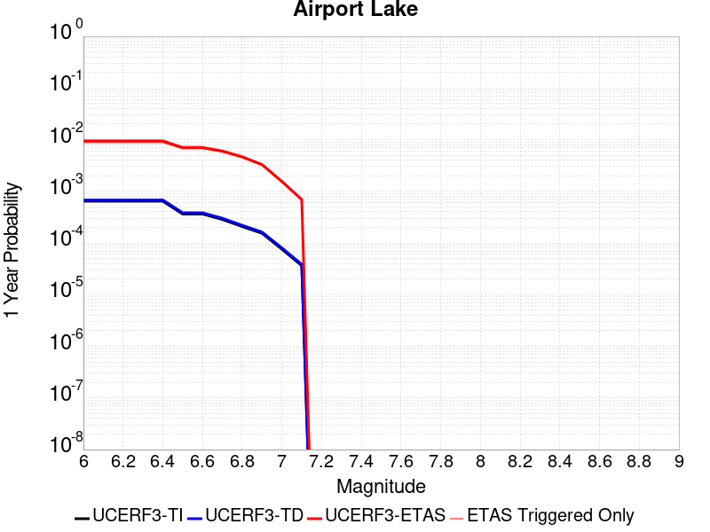
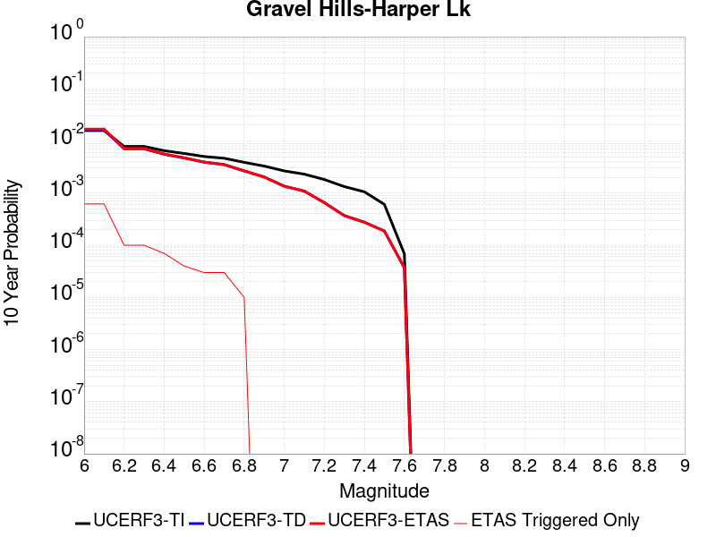
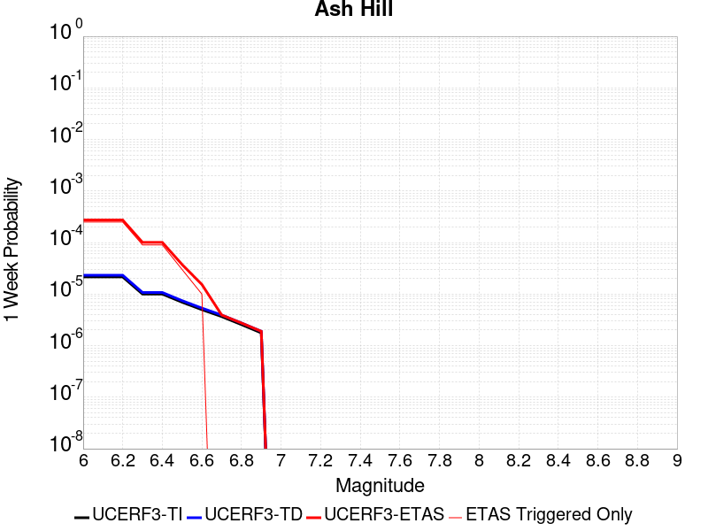
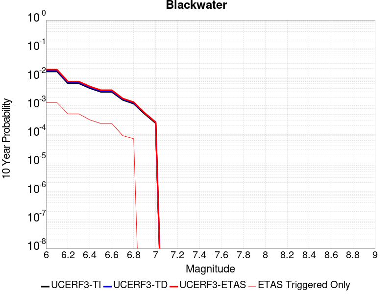
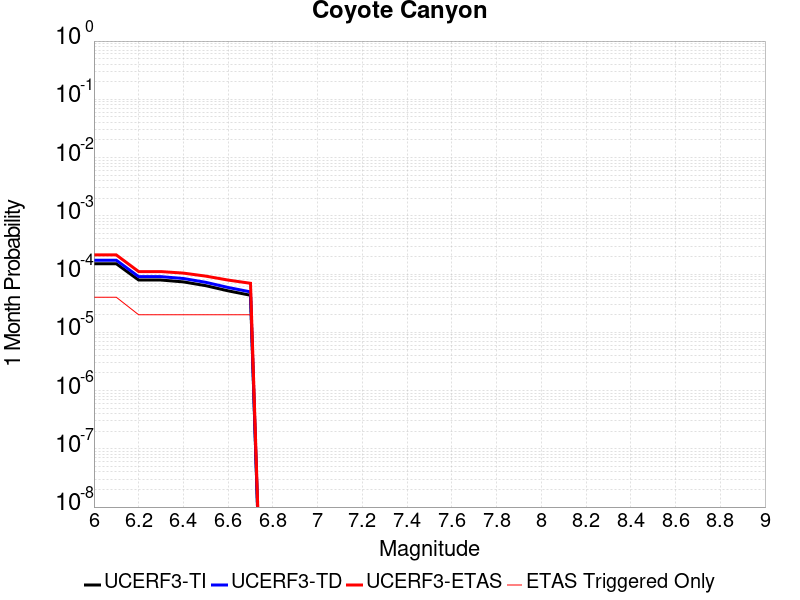
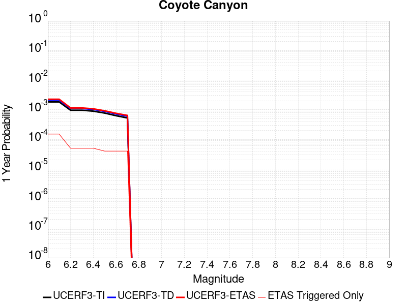
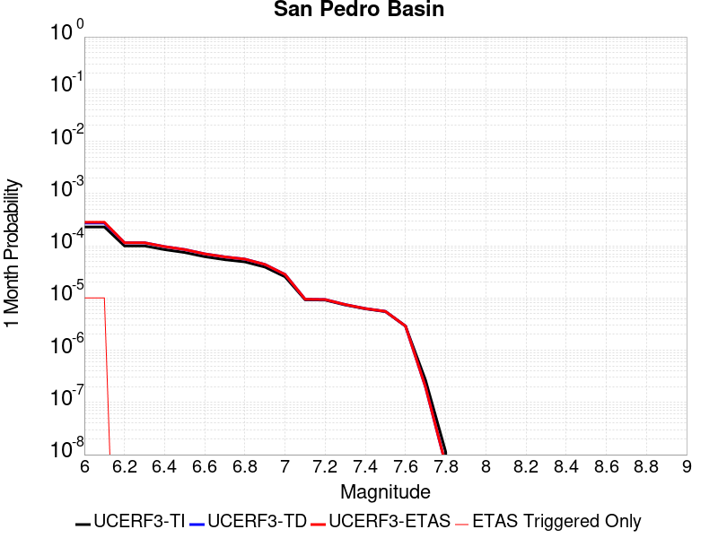
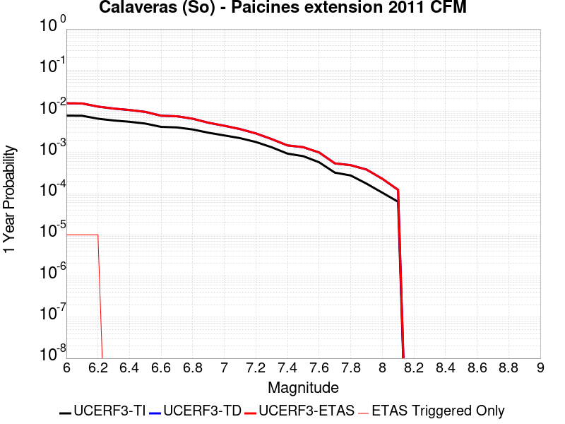
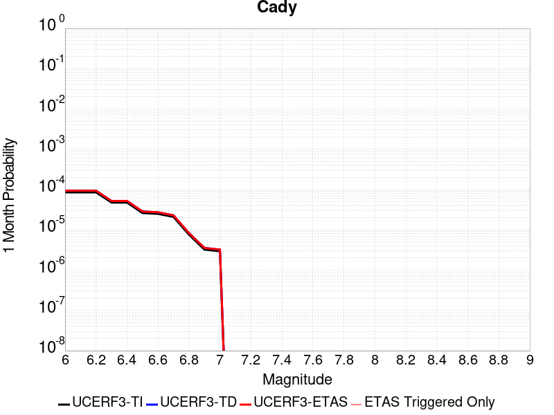
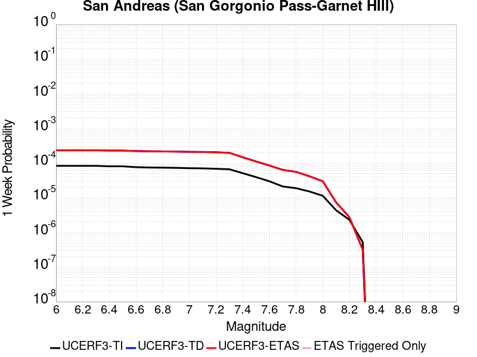

# Parent Section Magnitude-Probability Distributions

Only fault sections with at least one triggered aftershock are plotted. Sections are sorted by total supraseismogenic trigger rate (decreasing)

## Table Of Contents

* [Garlock (Central)](#garlock-central)
* [Little Lake](#little-lake)
* [Tank Canyon](#tank-canyon)
* [Airport Lake](#airport-lake)
* [Owl Lake](#owl-lake)
* [Panamint Valley](#panamint-valley)
* [Garlock (East)](#garlock-east)
* [Hunter Mountain-Saline Valley](#hunter-mountain-saline-valley)
* [Garlock (West)](#garlock-west)
* [Gravel Hills-Harper Lk](#gravel-hills-harper-lk)
* [Ash Hill](#ash-hill)
* [Blackwater](#blackwater)
* [San Andreas (Mojave S)](#san-andreas-mojave-s)
* [San Andreas (Mojave N)](#san-andreas-mojave-n)
* [Lenwood-Lockhart-Old Woman Springs](#lenwood-lockhart-old-woman-springs)
* [Towne Pass](#towne-pass)
* [McLean Lake](#mclean-lake)
* [Death Valley (So)](#death-valley-so)
* [Death Valley (Black Mtns Frontal)](#death-valley-black-mtns-frontal)
* [Death Valley (No)](#death-valley-no)
* [Bicycle Lake](#bicycle-lake)
* [Coyote Canyon](#coyote-canyon)
* [So Sierra Nevada](#so-sierra-nevada)
* [Lake Isabella (Seismicity)](#lake-isabella-seismicity)
* [Death Valley (Fish Lake Valley)](#death-valley-fish-lake-valley)
* [San Andreas (San Bernardino N)](#san-andreas-san-bernardino-n)
* [Helendale-So Lockhart](#helendale-so-lockhart)
* [Red Mountain](#red-mountain)
* [San Pedro Basin](#san-pedro-basin)
* [San Clemente](#san-clemente)
* [Sheephole](#sheephole)
* [Nelson Lake](#nelson-lake)
* [Calaveras (So) - Paicines extension 2011 CFM](#calaveras-so---paicines-extension-2011-cfm)
* [Red Pass](#red-pass)
* [Paradise](#paradise)
* [San Andreas (San Bernardino S)](#san-andreas-san-bernardino-s)
* [Cady](#cady)
* [San Andreas (Creeping Section) 2011 CFM](#san-andreas-creeping-section-2011-cfm)
* [San Andreas (North Branch Mill Creek)](#san-andreas-north-branch-mill-creek)
* [San Andreas (San Gorgonio Pass-Garnet HIll)](#san-andreas-san-gorgonio-pass-garnet-hill)

## Garlock (Central)
*[(top)](#table-of-contents)*

| 1 Week | 1 Month | 1 Year | 10 Year |
|-----|-----|-----|-----|
|  |  |  |  |

| Magnitude | 1 wk TI Prob | 1 wk TD Prob | 1 wk ETAS Prob | 1 wk ETAS/TD Gain | 1 wk ETAS Triggered Only | 1 mo TI Prob | 1 mo TD Prob | 1 mo ETAS Prob | 1 mo ETAS/TD Gain | 1 mo ETAS Triggered Only | 1 yr TI Prob | 1 yr TD Prob | 1 yr ETAS Prob | 1 yr ETAS/TD Gain | 1 yr ETAS Triggered Only | 10 yr TI Prob | 10 yr TD Prob | 10 yr ETAS Prob | 10 yr ETAS/TD Gain | 10 yr ETAS Triggered Only |
|-----|-----|-----|-----|-----|-----|-----|-----|-----|-----|-----|-----|-----|-----|-----|-----|-----|-----|-----|-----|-----|
| 6.0 | 5.5131142E-5 | 7.0252914E-5 | 0.0033567352 | 47.780724 | 0.0032867133 | 2.3625491E-4 | 3.0104956E-4 | 0.009179494 | 30.49164 | 0.008881119 | 0.0028726095 | 0.0036591839 | 0.023237629 | 6.3504953 | 0.01965035 | 0.028357591 | 0.03608289 | 0.061967097 | 1.717354 | 0.026853146 |
| 6.1 | 5.5131142E-5 | 7.0252914E-5 | 0.0033567352 | 47.780724 | 0.0032867133 | 2.3625491E-4 | 3.0104956E-4 | 0.009179494 | 30.49164 | 0.008881119 | 0.0028726095 | 0.0036591839 | 0.023237629 | 6.3504953 | 0.01965035 | 0.028357591 | 0.03608289 | 0.061967097 | 1.717354 | 0.026853146 |
| 6.2 | 4.216245E-5 | 5.166702E-5 | 0.0019396814 | 37.541965 | 0.0018881119 | 1.806837E-4 | 2.2141146E-4 | 0.00553492 | 24.998344 | 0.0053146854 | 0.0021976046 | 0.0026923837 | 0.014966939 | 5.5589914 | 0.012307692 | 0.021759989 | 0.02669258 | 0.043095876 | 1.6145263 | 0.016853146 |
| 6.3 | 4.216245E-5 | 5.166702E-5 | 0.0019396814 | 37.541965 | 0.0018881119 | 1.806837E-4 | 2.2141146E-4 | 0.00553492 | 24.998344 | 0.0053146854 | 0.0021976046 | 0.0026923837 | 0.014966939 | 5.5589914 | 0.012307692 | 0.021759989 | 0.02669258 | 0.043095876 | 1.6145263 | 0.016853146 |
| 6.4 | 3.6858168E-5 | 4.411584E-5 | 0.0013028015 | 29.531378 | 0.0012587412 | 1.5795401E-4 | 1.8905434E-4 | 0.004174315 | 22.079973 | 0.003986014 | 0.0019213937 | 0.0022993318 | 0.011508876 | 5.0053134 | 0.009230769 | 0.019048655 | 0.02285164 | 0.035083078 | 1.5352542 | 0.012517483 |
| 6.5 | 3.39199E-5 | 4.0023286E-5 | 0.0011588596 | 28.954636 | 0.0011188812 | 1.453629E-4 | 1.7151721E-4 | 0.0038771753 | 22.605167 | 0.0037062936 | 0.0017683565 | 0.0020862438 | 0.010530129 | 5.0474105 | 0.008461539 | 0.017543508 | 0.02076252 | 0.03219837 | 1.5507929 | 0.011678321 |
| 6.6 | 3.3571985E-5 | 3.947746E-5 | 0.0011583144 | 29.341158 | 0.0011188812 | 1.4387199E-4 | 1.6917827E-4 | 0.0038748449 | 22.903917 | 0.0037062936 | 0.0017502342 | 0.0020578213 | 0.010501947 | 5.1034303 | 0.008461539 | 0.017365133 | 0.02048383 | 0.031922933 | 1.5584457 | 0.011678321 |
| 6.7 | 3.2580007E-5 | 3.8093858E-5 | 0.0011569323 | 30.370575 | 0.0011188812 | 1.3962112E-4 | 1.632493E-4 | 0.0037990194 | 23.271276 | 0.0036363637 | 0.0016985617 | 0.0019857697 | 0.010151341 | 5.1120434 | 0.008181818 | 0.016856372 | 0.019776449 | 0.030812532 | 1.5580417 | 0.011258741 |
| 6.8 | 3.2185937E-5 | 3.7521055E-5 | 0.0011563601 | 30.818968 | 0.0011188812 | 1.3793244E-4 | 1.6079473E-4 | 0.0037965737 | 23.611307 | 0.0036363637 | 0.0016780337 | 0.0019559395 | 0.010121754 | 5.1748815 | 0.008181818 | 0.016654192 | 0.01948324 | 0.030454056 | 1.56309 | 0.011188812 |
| 6.9 | 3.165394E-5 | 3.672561E-5 | 0.0010856382 | 29.560791 | 0.0010489511 | 1.3565269E-4 | 1.5738611E-4 | 0.0037232584 | 23.656843 | 0.0035664337 | 0.0016503202 | 0.0019145131 | 0.009941075 | 5.192482 | 0.008041958 | 0.01638118 | 0.01907586 | 0.029845446 | 1.5645663 | 0.010979021 |
| 7.0 | 3.0903822E-5 | 3.5630834E-5 | 0.0010845445 | 30.438368 | 0.0010489511 | 1.3243823E-4 | 1.5269476E-4 | 0.0037185838 | 24.353054 | 0.0035664337 | 0.0016112428 | 0.0018574947 | 0.009884515 | 5.3214226 | 0.008041958 | 0.015996104 | 0.018515008 | 0.029290752 | 1.5820005 | 0.010979021 |
| 7.1 | 3.0069863E-5 | 3.4397097E-5 | 0.0010133844 | 29.461334 | 9.79021E-4 | 1.2886449E-4 | 1.4740792E-4 | 0.0035734763 | 24.24209 | 0.0034265735 | 0.0015677959 | 0.0017932352 | 0.009541553 | 5.32086 | 0.007762238 | 0.01556781 | 0.017882649 | 0.02825326 | 1.5799258 | 0.010559441 |
| 7.2 | 2.7957109E-5 | 3.1286367E-5 | 0.0010102767 | 32.291275 | 9.79021E-4 | 1.1981068E-4 | 1.3407765E-4 | 0.0031406675 | 23.424244 | 0.003006993 | 0.0014577188 | 0.0016311926 | 0.008193897 | 5.0232553 | 0.0065734265 | 0.014481937 | 0.016286217 | 0.025091486 | 1.5406579 | 0.008951049 |
| 7.3 | 2.4519275E-5 | 2.6719412E-5 | 7.2600145E-4 | 27.17131 | 6.993007E-4 | 1.0507837E-4 | 1.14506816E-4 | 0.0019324805 | 16.876553 | 0.0018181818 | 0.0012785783 | 0.0013932437 | 0.0054435367 | 3.9070961 | 0.0040559443 | 0.012712469 | 0.013930428 | 0.019722724 | 1.4158018 | 0.0058741258 |
| 7.4 | 2.3225532E-5 | 2.5203923E-5 | 7.24487E-4 | 28.74501 | 6.993007E-4 | 9.95342E-5 | 1.0801242E-4 | 0.0019259979 | 17.831263 | 0.0018181818 | 0.0012111551 | 0.0013142723 | 0.0052252095 | 3.9757433 | 0.003916084 | 0.012045753 | 0.013148054 | 0.018599892 | 1.41465 | 0.0055244756 |
| 7.5 | 2.097765E-5 | 2.2487986E-5 | 7.2177296E-4 | 32.095936 | 6.993007E-4 | 8.9901114E-5 | 9.637359E-5 | 0.0017046102 | 17.687525 | 0.0016083916 | 0.0010939965 | 0.0011727286 | 0.0045952834 | 3.9184544 | 0.0034265735 | 0.010886264 | 0.011742581 | 0.016441986 | 1.4002022 | 0.0047552446 |
| 7.6 | 1.511254E-5 | 1.5995334E-5 | 2.2578219E-4 | 14.115503 | 2.097902E-4 | 6.476642E-5 | 6.854967E-5 | 7.678024E-4 | 11.200672 | 6.993007E-4 | 7.882459E-4 | 8.342805E-4 | 0.0025112021 | 3.0100212 | 0.0016783216 | 0.007854558 | 0.008385628 | 0.010812657 | 1.2894272 | 0.0024475525 |
| 7.7 | 9.934069E-6 | 1.0682508E-5 | 1.0682508E-5 | 1.0 | 0.0 | 4.2573887E-5 | 4.5781377E-5 | 4.5781377E-5 | 1.0 | 0.0 | 5.182138E-4 | 5.572461E-4 | 7.669194E-4 | 1.376267 | 2.097902E-4 | 0.00517007 | 0.0056296107 | 0.006046829 | 1.0741115 | 4.195804E-4 |
| 7.8 | 6.7562896E-6 | 8.431477E-6 | 8.431477E-6 | 1.0 | 0.0 | 2.8955206E-5 | 3.61344E-5 | 3.61344E-5 | 1.0 | 0.0 | 3.5247262E-4 | 4.3984767E-4 | 4.3984767E-4 | 1.0 | 0.0 | 0.0035191406 | 0.0044482257 | 0.0046570827 | 1.0469528 | 2.097902E-4 |
| 7.9 | 3.975453E-6 | 5.3728795E-6 | 5.3728795E-6 | 1.0 | 0.0 | 1.7037546E-5 | 2.3026425E-5 | 2.3026425E-5 | 1.0 | 0.0 | 2.0741238E-4 | 2.8031075E-4 | 2.8031075E-4 | 1.0 | 0.0 | 0.002072189 | 0.0028345888 | 0.0029740524 | 1.0492007 | 1.3986015E-4 |
| 8.0 | 1.6729537E-6 | 2.078155E-6 | 2.078155E-6 | 1.0 | 0.0 | 7.169782E-6 | 8.906349E-6 | 8.906349E-6 | 1.0 | 0.0 | 8.7288594E-5 | 1.08429434E-4 | 1.08429434E-4 | 1.0 | 0.0 | 8.7254314E-4 | 0.001097267 | 0.0011671204 | 1.0636612 | 6.993007E-5 |
| 8.1 | 3.6733252E-7 | 3.1499187E-7 | 3.1499187E-7 | 1.0 | 0.0 | 1.5742813E-6 | 1.3499646E-6 | 1.3499646E-6 | 1.0 | 0.0 | 1.9166706E-5 | 1.643571E-5 | 1.643571E-5 | 1.0 | 0.0 | 1.9165053E-4 | 1.6643589E-4 | 1.6643589E-4 | 1.0 | 0.0 |

## Little Lake
*[(top)](#table-of-contents)*

| 1 Week | 1 Month | 1 Year | 10 Year |
|-----|-----|-----|-----|
|  |  |  |  |

| Magnitude | 1 wk TI Prob | 1 wk TD Prob | 1 wk ETAS Prob | 1 wk ETAS/TD Gain | 1 wk ETAS Triggered Only | 1 mo TI Prob | 1 mo TD Prob | 1 mo ETAS Prob | 1 mo ETAS/TD Gain | 1 mo ETAS Triggered Only | 1 yr TI Prob | 1 yr TD Prob | 1 yr ETAS Prob | 1 yr ETAS/TD Gain | 1 yr ETAS Triggered Only | 10 yr TI Prob | 10 yr TD Prob | 10 yr ETAS Prob | 10 yr ETAS/TD Gain | 10 yr ETAS Triggered Only |
|-----|-----|-----|-----|-----|-----|-----|-----|-----|-----|-----|-----|-----|-----|-----|-----|-----|-----|-----|-----|-----|
| 6.0 | 2.8424427E-5 | 3.120616E-5 | 0.0022688985 | 72.70676 | 0.0022377623 | 1.2181328E-4 | 1.3373457E-4 | 0.0057973126 | 43.349392 | 0.0056643356 | 0.0014820677 | 0.0016271356 | 0.011750497 | 7.2215843 | 0.01013986 | 0.014722223 | 0.016165627 | 0.02951275 | 1.8256484 | 0.013566433 |
| 6.1 | 2.8424427E-5 | 3.120616E-5 | 0.0022688985 | 72.70676 | 0.0022377623 | 1.2181328E-4 | 1.3373457E-4 | 0.0057973126 | 43.349392 | 0.0056643356 | 0.0014820677 | 0.0016271356 | 0.011750497 | 7.2215843 | 0.01013986 | 0.014722223 | 0.016165627 | 0.02951275 | 1.8256484 | 0.013566433 |
| 6.2 | 2.8424427E-5 | 3.120616E-5 | 0.0022688985 | 72.70676 | 0.0022377623 | 1.2181328E-4 | 1.3373457E-4 | 0.0057973126 | 43.349392 | 0.0056643356 | 0.0014820677 | 0.0016271356 | 0.011750497 | 7.2215843 | 0.01013986 | 0.014722223 | 0.016165627 | 0.02951275 | 1.8256484 | 0.013566433 |
| 6.3 | 1.48860645E-5 | 1.6081593E-5 | 0.0019041632 | 118.40637 | 0.0018881119 | 6.379586E-5 | 6.891945E-5 | 0.004404285 | 63.904816 | 0.004335664 | 7.7643775E-4 | 8.387995E-4 | 0.008245169 | 9.829726 | 0.0074125873 | 0.007737305 | 0.008359154 | 0.018275563 | 2.1862934 | 0.01 |
| 6.4 | 1.48860645E-5 | 1.6081593E-5 | 0.0019041632 | 118.40637 | 0.0018881119 | 6.379586E-5 | 6.891945E-5 | 0.004404285 | 63.904816 | 0.004335664 | 7.7643775E-4 | 8.387995E-4 | 0.008245169 | 9.829726 | 0.0074125873 | 0.007737305 | 0.008359154 | 0.018275563 | 2.1862934 | 0.01 |
| 6.5 | 1.2797581E-5 | 1.3765735E-5 | 0.0016920643 | 122.91856 | 0.0016783216 | 5.4845623E-5 | 5.899482E-5 | 0.0039049217 | 66.190926 | 0.0038461538 | 6.675408E-4 | 7.180509E-4 | 0.007216878 | 10.050649 | 0.0065034963 | 0.006655392 | 0.0071598585 | 0.016116248 | 2.2509172 | 0.009020979 |
| 6.6 | 9.661896E-6 | 1.0289158E-5 | 0.0014788056 | 143.72464 | 0.0014685314 | 4.1407468E-5 | 4.4095737E-5 | 0.003400591 | 77.11836 | 0.0033566433 | 5.040193E-4 | 5.367496E-4 | 0.0061281524 | 11.417153 | 0.005594406 | 0.005028777 | 0.0053561367 | 0.01321591 | 2.4674332 | 0.007902098 |
| 6.7 | 7.767871E-6 | 8.199779E-6 | 0.0010571423 | 128.92326 | 0.0010489511 | 3.329045E-5 | 3.514151E-5 | 0.0027623184 | 78.60557 | 0.0027272727 | 4.0523586E-4 | 4.2777765E-4 | 0.005041188 | 11.784599 | 0.0046153846 | 0.004044977 | 0.0042708935 | 0.010676983 | 2.499941 | 0.0064335666 |
| 6.8 | 6.4235196E-6 | 6.735819E-6 | 9.158206E-4 | 135.96277 | 9.090909E-4 | 2.752908E-5 | 2.886755E-5 | 0.0021966372 | 76.09365 | 0.002167832 | 3.35115E-4 | 3.5141854E-4 | 0.0041263155 | 11.741882 | 0.0037762239 | 0.003346101 | 0.0035098887 | 0.00880592 | 2.5088887 | 0.0053146854 |
| 6.9 | 3.1283696E-6 | 3.1122067E-6 | 5.62551E-4 | 180.75632 | 5.594406E-4 | 1.3407229E-5 | 1.3337969E-5 | 0.0014818498 | 111.10011 | 0.0014685314 | 1.6322079E-4 | 1.6237919E-4 | 0.0026095342 | 16.07062 | 0.0024475525 | 0.0016310095 | 0.0016227537 | 0.0047645 | 2.9360588 | 0.003146853 |
| 7.0 | 2.290603E-6 | 2.2287015E-6 | 4.917381E-4 | 220.63884 | 4.895105E-4 | 9.816834E-6 | 9.551549E-6 | 8.4870437E-4 | 88.855156 | 8.391608E-4 | 1.19513395E-4 | 1.16284944E-4 | 0.0017944115 | 15.431159 | 0.0016783216 | 0.0011944914 | 0.0011623431 | 0.0033975043 | 2.9229789 | 0.0022377623 |
| 7.1 | 1.293693E-6 | 1.1776951E-6 | 2.1096766E-4 | 179.13605 | 2.097902E-4 | 5.5443866E-6 | 5.047259E-6 | 3.5469583E-4 | 70.27494 | 3.4965036E-4 | 6.750081E-5 | 6.144935E-5 | 6.907813E-4 | 11.241475 | 6.293706E-4 | 6.7480316E-4 | 6.14392E-4 | 0.0015928114 | 2.5925004 | 9.79021E-4 |
| 7.2 | 4.715842E-7 | 3.0918443E-7 | 3.0918443E-7 | 1.0 | 0.0 | 2.0210737E-6 | 1.3250755E-6 | 1.3250755E-6 | 1.0 | 0.0 | 2.4606294E-5 | 1.613268E-5 | 1.613268E-5 | 1.0 | 0.0 | 2.460357E-4 | 1.6131563E-4 | 1.6131563E-4 | 1.0 | 0.0 |
| 7.3 | 3.9430947E-7 | 2.3098025E-7 | 2.3098025E-7 | 1.0 | 0.0 | 1.6898966E-6 | 9.89915E-7 | 9.89915E-7 | 1.0 | 0.0 | 2.0574296E-5 | 1.2052149E-5 | 1.2052149E-5 | 1.0 | 0.0 | 2.0572392E-4 | 1.20515026E-4 | 1.20515026E-4 | 1.0 | 0.0 |
| 7.4 | 3.547123E-7 | 1.9679635E-7 | 1.9679635E-7 | 1.0 | 0.0 | 1.5201948E-6 | 8.4341264E-7 | 8.4341264E-7 | 1.0 | 0.0 | 1.8508214E-5 | 1.0268501E-5 | 1.0268501E-5 | 1.0 | 0.0 | 1.8506673E-4 | 1.0268033E-4 | 1.0268033E-4 | 1.0 | 0.0 |
| 7.5 | 2.6354266E-7 | 1.4423487E-7 | 1.4423487E-7 | 1.0 | 0.0 | 1.129468E-6 | 6.1814933E-7 | 6.1814933E-7 | 1.0 | 0.0 | 1.3751187E-5 | 7.5259427E-6 | 7.5259427E-6 | 1.0 | 0.0 | 1.3750336E-4 | 7.525693E-5 | 7.525693E-5 | 1.0 | 0.0 |
| 7.6 | 1.269913E-7 | 7.5727044E-8 | 7.5727044E-8 | 1.0 | 0.0 | 5.4424834E-7 | 3.2454443E-7 | 3.2454443E-7 | 1.0 | 0.0 | 6.6262032E-6 | 3.9513216E-6 | 3.9513216E-6 | 1.0 | 0.0 | 6.626006E-5 | 3.951255E-5 | 3.951255E-5 | 1.0 | 0.0 |

## Tank Canyon
*[(top)](#table-of-contents)*

| 1 Week | 1 Month | 1 Year | 10 Year |
|-----|-----|-----|-----|
|  |  |  |  |

| Magnitude | 1 wk TI Prob | 1 wk TD Prob | 1 wk ETAS Prob | 1 wk ETAS/TD Gain | 1 wk ETAS Triggered Only | 1 mo TI Prob | 1 mo TD Prob | 1 mo ETAS Prob | 1 mo ETAS/TD Gain | 1 mo ETAS Triggered Only | 1 yr TI Prob | 1 yr TD Prob | 1 yr ETAS Prob | 1 yr ETAS/TD Gain | 1 yr ETAS Triggered Only | 10 yr TI Prob | 10 yr TD Prob | 10 yr ETAS Prob | 10 yr ETAS/TD Gain | 10 yr ETAS Triggered Only |
|-----|-----|-----|-----|-----|-----|-----|-----|-----|-----|-----|-----|-----|-----|-----|-----|-----|-----|-----|-----|-----|
| 6.0 | 4.8284557E-5 | 5.796635E-5 | 0.0019459688 | 33.570663 | 0.0018881119 | 2.0691741E-4 | 2.484074E-4 | 0.004443169 | 17.886623 | 0.0041958042 | 0.0025163088 | 0.0030208372 | 0.011387096 | 3.7695165 | 0.0083916085 | 0.02488006 | 0.029864404 | 0.041736692 | 1.3975397 | 0.012237762 |
| 6.1 | 1.7796336E-5 | 2.0873764E-5 | 7.2015985E-4 | 34.50072 | 6.993007E-4 | 7.626778E-5 | 8.945614E-5 | 0.0014180086 | 15.851439 | 0.0013286714 | 9.281647E-4 | 0.0010886216 | 0.004162195 | 3.8233628 | 0.003076923 | 0.009242975 | 0.010836975 | 0.015263998 | 1.408511 | 0.0044755246 |
| 6.2 | 1.7796336E-5 | 2.0873764E-5 | 7.2015985E-4 | 34.50072 | 6.993007E-4 | 7.626778E-5 | 8.945614E-5 | 0.0014180086 | 15.851439 | 0.0013286714 | 9.281647E-4 | 0.0010886216 | 0.004162195 | 3.8233628 | 0.003076923 | 0.009242975 | 0.010836975 | 0.015263998 | 1.408511 | 0.0044755246 |
| 6.3 | 1.3515912E-5 | 1.575988E-5 | 4.353337E-4 | 27.622906 | 4.195804E-4 | 5.792405E-5 | 6.7540735E-5 | 9.765702E-4 | 14.4589815 | 9.090909E-4 | 7.049971E-4 | 8.220222E-4 | 0.0027784547 | 3.3800237 | 0.001958042 | 0.007027647 | 0.008192427 | 0.011036072 | 1.3471063 | 0.002867133 |
| 6.4 | 1.0870146E-5 | 1.2618259E-5 | 2.92335E-4 | 23.16762 | 2.797203E-4 | 4.658551E-5 | 5.407723E-5 | 6.834138E-4 | 12.637737 | 6.293706E-4 | 5.67031E-4 | 6.582093E-4 | 0.0020558902 | 3.1234596 | 0.0013986015 | 0.005655863 | 0.006564614 | 0.008857157 | 1.3492274 | 0.0023076923 |
| 6.5 | 7.964826E-6 | 9.196251E-6 | 2.1898453E-4 | 23.812368 | 2.097902E-4 | 3.4134522E-5 | 3.941197E-5 | 3.1912123E-4 | 8.097063 | 2.797203E-4 | 4.1550855E-4 | 4.7974577E-4 | 0.0012486075 | 2.6026442 | 7.6923077E-4 | 0.0041473247 | 0.0047884025 | 0.0062499023 | 1.3052166 | 0.0014685314 |
| 6.6 | 6.6317E-6 | 7.6124184E-6 | 1.474715E-4 | 19.37249 | 1.3986015E-4 | 2.8421264E-5 | 3.2624295E-5 | 2.4240767E-4 | 7.4302807 | 2.097902E-4 | 3.4597394E-4 | 3.971375E-4 | 9.563559E-4 | 2.4081228 | 5.594406E-4 | 0.0034543579 | 0.00396543 | 0.0050102216 | 1.263475 | 0.0010489511 |
| 6.7 | 4.793663E-6 | 5.4308543E-6 | 7.536054E-5 | 13.87637 | 6.993007E-5 | 2.0544108E-5 | 2.3274906E-5 | 1.6313179E-4 | 7.0089126 | 1.3986015E-4 | 2.500958E-4 | 2.8333953E-4 | 4.930703E-4 | 1.74021 | 2.097902E-4 | 0.0024981452 | 0.0028304753 | 0.0034580645 | 1.2217257 | 6.293706E-4 |
| 6.8 | 4.382823E-6 | 4.969316E-6 | 7.4899035E-5 | 15.072304 | 6.993007E-5 | 1.8783392E-5 | 2.1296917E-5 | 1.6115408E-4 | 7.567014 | 1.3986015E-4 | 2.286638E-4 | 2.5926338E-4 | 3.9908726E-4 | 1.5393121 | 1.3986015E-4 | 0.0022842865 | 0.0025902835 | 0.003148275 | 1.2154171 | 5.594406E-4 |
| 6.9 | 2.729601E-6 | 3.0735694E-6 | 3.0735694E-6 | 1.0 | 0.0 | 1.1698237E-5 | 1.317238E-5 | 8.310153E-5 | 6.3087707 | 6.993007E-5 | 1.4241673E-4 | 1.6036315E-4 | 2.30282E-4 | 1.4360032 | 6.993007E-5 | 0.001423255 | 0.0016026403 | 0.0019517302 | 1.2178218 | 3.4965036E-4 |
| 7.0 | 1.8987357E-6 | 2.126954E-6 | 2.126954E-6 | 1.0 | 0.0 | 8.137413E-6 | 9.115489E-6 | 9.115489E-6 | 1.0 | 0.0 | 9.90685E-5 | 1.1097613E-4 | 1.1097613E-4 | 1.0 | 0.0 | 9.902435E-4 | 0.0011092757 | 0.0011791283 | 1.0629712 | 6.993007E-5 |
| 7.1 | 1.4928986E-6 | 1.6641375E-6 | 1.6641375E-6 | 1.0 | 0.0 | 6.398121E-6 | 7.1320014E-6 | 7.1320014E-6 | 1.0 | 0.0 | 7.789434E-5 | 8.682925E-5 | 8.682925E-5 | 1.0 | 0.0 | 7.786704E-4 | 8.680111E-4 | 9.378805E-4 | 1.0804937 | 6.993007E-5 |
| 7.2 | 1.069082E-6 | 1.1828638E-6 | 1.1828638E-6 | 1.0 | 0.0 | 4.581772E-6 | 5.0694093E-6 | 5.0694093E-6 | 1.0 | 0.0 | 5.5781646E-5 | 6.171884E-5 | 6.171884E-5 | 1.0 | 0.0 | 5.576765E-4 | 6.170693E-4 | 6.170693E-4 | 1.0 | 0.0 |
| 7.3 | 8.776551E-7 | 9.770052E-7 | 9.770052E-7 | 1.0 | 0.0 | 3.7613736E-6 | 4.1871617E-6 | 4.1871617E-6 | 1.0 | 0.0 | 4.579376E-5 | 5.097802E-5 | 5.097802E-5 | 1.0 | 0.0 | 4.5784327E-4 | 5.0971424E-4 | 5.0971424E-4 | 1.0 | 0.0 |
| 7.4 | 7.55721E-7 | 8.510284E-7 | 8.510284E-7 | 1.0 | 0.0 | 3.2388E-6 | 3.6472622E-6 | 3.6472622E-6 | 1.0 | 0.0 | 3.9431678E-5 | 4.440503E-5 | 4.440503E-5 | 1.0 | 0.0 | 3.942468E-4 | 4.4401243E-4 | 4.4401243E-4 | 1.0 | 0.0 |
| 7.5 | 5.587665E-7 | 6.305647E-7 | 6.305647E-7 | 1.0 | 0.0 | 2.3947114E-6 | 2.7024203E-6 | 2.7024203E-6 | 1.0 | 0.0 | 2.915522E-5 | 3.2901968E-5 | 3.2901968E-5 | 1.0 | 0.0 | 2.9151395E-4 | 3.2901968E-4 | 3.2901968E-4 | 1.0 | 0.0 |

## Airport Lake
*[(top)](#table-of-contents)*

| 1 Week | 1 Month | 1 Year | 10 Year |
|-----|-----|-----|-----|
|  |  |  |  |

| Magnitude | 1 wk TI Prob | 1 wk TD Prob | 1 wk ETAS Prob | 1 wk ETAS/TD Gain | 1 wk ETAS Triggered Only | 1 mo TI Prob | 1 mo TD Prob | 1 mo ETAS Prob | 1 mo ETAS/TD Gain | 1 mo ETAS Triggered Only | 1 yr TI Prob | 1 yr TD Prob | 1 yr ETAS Prob | 1 yr ETAS/TD Gain | 1 yr ETAS Triggered Only | 10 yr TI Prob | 10 yr TD Prob | 10 yr ETAS Prob | 10 yr ETAS/TD Gain | 10 yr ETAS Triggered Only |
|-----|-----|-----|-----|-----|-----|-----|-----|-----|-----|-----|-----|-----|-----|-----|-----|-----|-----|-----|-----|-----|
| 6.0 | 1.2387061E-5 | 1.31032575E-5 | 0.0019011904 | 145.09296 | 0.0018881119 | 5.3086325E-5 | 5.6155768E-5 | 0.004741207 | 84.42957 | 0.004685315 | 6.461343E-4 | 6.835104E-4 | 0.009977853 | 14.597953 | 0.009300699 | 0.0064425888 | 0.0068168915 | 0.01959631 | 2.8746696 | 0.012867133 |
| 6.1 | 1.2387061E-5 | 1.31032575E-5 | 0.0019011904 | 145.09296 | 0.0018881119 | 5.3086325E-5 | 5.6155768E-5 | 0.004741207 | 84.42957 | 0.004685315 | 6.461343E-4 | 6.835104E-4 | 0.009977853 | 14.597953 | 0.009300699 | 0.0064425888 | 0.0068168915 | 0.01959631 | 2.8746696 | 0.012867133 |
| 6.2 | 1.2387061E-5 | 1.31032575E-5 | 0.0019011904 | 145.09296 | 0.0018881119 | 5.3086325E-5 | 5.6155768E-5 | 0.004741207 | 84.42957 | 0.004685315 | 6.461343E-4 | 6.835104E-4 | 0.009977853 | 14.597953 | 0.009300699 | 0.0064425888 | 0.0068168915 | 0.01959631 | 2.8746696 | 0.012867133 |
| 6.3 | 1.2387061E-5 | 1.31032575E-5 | 0.0019011904 | 145.09296 | 0.0018881119 | 5.3086325E-5 | 5.6155768E-5 | 0.004741207 | 84.42957 | 0.004685315 | 6.461343E-4 | 6.835104E-4 | 0.009977853 | 14.597953 | 0.009300699 | 0.0064425888 | 0.0068168915 | 0.01959631 | 2.8746696 | 0.012867133 |
| 6.4 | 1.2387061E-5 | 1.31032575E-5 | 0.0019011904 | 145.09296 | 0.0018881119 | 5.3086325E-5 | 5.6155768E-5 | 0.004741207 | 84.42957 | 0.004685315 | 6.461343E-4 | 6.835104E-4 | 0.009977853 | 14.597953 | 0.009300699 | 0.0064425888 | 0.0068168915 | 0.01959631 | 2.8746696 | 0.012867133 |
| 6.5 | 6.9922594E-6 | 7.38498E-6 | 0.0014759057 | 199.85234 | 0.0014685314 | 2.996648E-5 | 3.164956E-5 | 0.0035979704 | 113.68152 | 0.0035664337 | 3.6478083E-4 | 3.8527072E-4 | 0.00751539 | 19.506777 | 0.0071328674 | 0.003641826 | 0.0038465653 | 0.013529455 | 3.5172822 | 0.00972028 |
| 6.6 | 6.9922594E-6 | 7.38498E-6 | 0.0014759057 | 199.85234 | 0.0014685314 | 2.996648E-5 | 3.164956E-5 | 0.0035979704 | 113.68152 | 0.0035664337 | 3.6478083E-4 | 3.8527072E-4 | 0.00751539 | 19.506777 | 0.0071328674 | 0.003641826 | 0.0038465653 | 0.013529455 | 3.5172822 | 0.00972028 |
| 6.7 | 5.477277E-6 | 5.7861116E-6 | 0.0011945905 | 206.45824 | 0.0011888111 | 2.3473833E-5 | 2.4797408E-5 | 0.003101644 | 125.07937 | 0.003076923 | 2.8575645E-4 | 3.0187052E-4 | 0.0062441323 | 20.684803 | 0.005944056 | 0.0028538927 | 0.0030149885 | 0.011172138 | 3.7055328 | 0.008181818 |
| 6.8 | 3.9950432E-6 | 4.2191186E-6 | 9.133062E-4 | 216.46849 | 9.090909E-4 | 1.7121502E-5 | 1.8081826E-5 | 0.0026054475 | 144.09206 | 0.0025874125 | 2.0843433E-4 | 2.2012675E-4 | 0.0052539837 | 23.86799 | 0.005034965 | 0.0020823893 | 0.002199358 | 0.00889788 | 4.0456715 | 0.0067132865 |
| 6.9 | 2.95695E-6 | 3.1230477E-6 | 6.324917E-4 | 202.52388 | 6.293706E-4 | 1.2672582E-5 | 1.3384434E-5 | 0.001901471 | 142.06586 | 0.0018881119 | 1.5427776E-4 | 1.6294557E-4 | 0.003728798 | 22.883703 | 0.0035664337 | 0.001541707 | 0.0016284833 | 0.006306168 | 3.8724182 | 0.004685315 |
| 7.0 | 1.456072E-6 | 1.5408239E-6 | 4.9105054E-4 | 318.6935 | 4.895105E-4 | 6.2402937E-6 | 6.60352E-6 | 8.457588E-4 | 128.07697 | 8.391608E-4 | 7.597293E-5 | 8.03959E-5 | 0.0017585827 | 21.874035 | 0.0016783216 | 7.594696E-4 | 8.03767E-4 | 0.0029698568 | 3.6949224 | 0.002167832 |
| 7.1 | 6.995192E-7 | 7.4090326E-7 | 2.1053095E-4 | 284.15445 | 2.097902E-4 | 2.997936E-6 | 3.1752998E-6 | 3.5282454E-4 | 111.11535 | 3.4965036E-4 | 3.649926E-5 | 3.8659273E-5 | 6.6800555E-4 | 17.27931 | 6.293706E-4 | 3.6493264E-4 | 3.8659273E-4 | 0.0012953322 | 3.3506377 | 9.090909E-4 |

## Owl Lake
*[(top)](#table-of-contents)*

| 1 Week | 1 Month | 1 Year | 10 Year |
|-----|-----|-----|-----|
|  |  |  |  |

| Magnitude | 1 wk TI Prob | 1 wk TD Prob | 1 wk ETAS Prob | 1 wk ETAS/TD Gain | 1 wk ETAS Triggered Only | 1 mo TI Prob | 1 mo TD Prob | 1 mo ETAS Prob | 1 mo ETAS/TD Gain | 1 mo ETAS Triggered Only | 1 yr TI Prob | 1 yr TD Prob | 1 yr ETAS Prob | 1 yr ETAS/TD Gain | 1 yr ETAS Triggered Only | 10 yr TI Prob | 10 yr TD Prob | 10 yr ETAS Prob | 10 yr ETAS/TD Gain | 10 yr ETAS Triggered Only |
|-----|-----|-----|-----|-----|-----|-----|-----|-----|-----|-----|-----|-----|-----|-----|-----|-----|-----|-----|-----|-----|
| 6.0 | 5.0320643E-5 | 6.636149E-5 | 4.1598864E-4 | 6.268524 | 3.4965036E-4 | 2.1564208E-4 | 2.8438168E-4 | 0.0019622261 | 6.8999734 | 0.0016783216 | 0.0026222812 | 0.00345791 | 0.00784827 | 2.2696571 | 0.0044055944 | 0.02591553 | 0.0341423 | 0.039748326 | 1.1641959 | 0.005804196 |
| 6.1 | 5.0320643E-5 | 6.636149E-5 | 4.1598864E-4 | 6.268524 | 3.4965036E-4 | 2.1564208E-4 | 2.8438168E-4 | 0.0019622261 | 6.8999734 | 0.0016783216 | 0.0026222812 | 0.00345791 | 0.00784827 | 2.2696571 | 0.0044055944 | 0.02591553 | 0.0341423 | 0.039748326 | 1.1641959 | 0.005804196 |
| 6.2 | 2.4125871E-5 | 3.098269E-5 | 2.407664E-4 | 7.770997 | 2.097902E-4 | 1.0339249E-4 | 1.3277736E-4 | 0.0016011138 | 12.058635 | 0.0014685314 | 0.0012580766 | 0.0016155228 | 0.005315829 | 3.29047 | 0.0037062936 | 0.012509781 | 0.016071297 | 0.020956539 | 1.303973 | 0.004965035 |
| 6.3 | 1.7433485E-5 | 2.2356835E-5 | 2.3214235E-4 | 10.383507 | 2.097902E-4 | 7.471279E-5 | 9.5812386E-5 | 0.0014942798 | 15.595894 | 0.0013986015 | 9.0924866E-4 | 0.0011660426 | 0.004798166 | 4.114915 | 0.0036363637 | 0.009055373 | 0.01162957 | 0.016467746 | 1.4160237 | 0.004895105 |
| 6.4 | 1.7433485E-5 | 2.2356835E-5 | 2.3214235E-4 | 10.383507 | 2.097902E-4 | 7.471279E-5 | 9.5812386E-5 | 0.0014942798 | 15.595894 | 0.0013986015 | 9.0924866E-4 | 0.0011660426 | 0.004798166 | 4.114915 | 0.0036363637 | 0.009055373 | 0.01162957 | 0.016467746 | 1.4160237 | 0.004895105 |
| 6.5 | 1.5182742E-5 | 1.9430352E-5 | 2.2921649E-4 | 11.796826 | 2.097902E-4 | 6.506727E-5 | 8.327114E-5 | 0.0014118318 | 16.954636 | 0.0013286714 | 7.919061E-4 | 0.0010135059 | 0.0045064655 | 4.446413 | 0.0034965035 | 0.0078909 | 0.010119047 | 0.014826173 | 1.4651749 | 0.0047552446 |
| 6.6 | 6.7271576E-6 | 8.548157E-6 | 2.1833657E-4 | 25.541946 | 2.097902E-4 | 2.8830356E-5 | 3.6634476E-5 | 0.0013652571 | 37.267002 | 0.0013286714 | 3.5095305E-4 | 4.4593913E-4 | 0.003661288 | 8.210286 | 0.0032167833 | 0.0035039932 | 0.004468226 | 0.008645282 | 1.9348356 | 0.0041958042 |
| 6.7 | 6.682835E-6 | 8.4806015E-6 | 2.1826904E-4 | 25.737446 | 2.097902E-4 | 2.8640408E-5 | 3.634496E-5 | 0.001364968 | 37.55591 | 0.0013286714 | 3.4864116E-4 | 4.424157E-4 | 0.0036577757 | 8.267735 | 0.0032167833 | 0.003480947 | 0.004433152 | 0.008610355 | 1.942265 | 0.0041958042 |
| 6.8 | 6.5774975E-6 | 8.327072E-6 | 2.1811553E-4 | 26.193546 | 2.097902E-4 | 2.8188972E-5 | 3.5686993E-5 | 0.0013643109 | 38.22992 | 0.0013286714 | 3.4314668E-4 | 4.3440814E-4 | 0.003649794 | 8.401762 | 0.0032167833 | 0.0034261728 | 0.0043532955 | 0.008530834 | 1.9596267 | 0.0041958042 |
| 6.9 | 6.363419E-6 | 8.0002355E-6 | 2.1778877E-4 | 27.222794 | 2.097902E-4 | 2.727151E-5 | 3.4286306E-5 | 0.0013629121 | 39.750916 | 0.0013286714 | 3.3198006E-4 | 4.173614E-4 | 0.003632802 | 8.704212 | 0.0032167833 | 0.0033148455 | 0.004183282 | 0.008361534 | 1.9987975 | 0.0041958042 |
| 7.0 | 6.1342453E-6 | 7.632424E-6 | 2.1742104E-4 | 28.486498 | 2.097902E-4 | 2.6289357E-5 | 3.271001E-5 | 0.0013613378 | 41.61839 | 0.0013286714 | 3.2002592E-4 | 3.981771E-4 | 0.0036136794 | 9.075559 | 0.0032167833 | 0.0031956544 | 0.00399197 | 0.008171025 | 2.0468652 | 0.0041958042 |
| 7.1 | 5.842926E-6 | 7.142961E-6 | 1.4700211E-4 | 20.579996 | 1.3986015E-4 | 2.504087E-5 | 3.0612362E-5 | 0.001289315 | 42.117466 | 0.0012587412 | 3.0482994E-4 | 3.7264716E-4 | 0.0034484237 | 9.253858 | 0.003076923 | 0.0030441214 | 0.0037374226 | 0.007778208 | 2.081169 | 0.0040559443 |
| 7.2 | 4.77173E-6 | 5.3591634E-6 | 1.4521855E-4 | 27.097244 | 1.3986015E-4 | 2.045011E-5 | 2.2967664E-5 | 8.6210924E-4 | 37.53578 | 8.391608E-4 | 2.4895166E-4 | 2.7959948E-4 | 0.002376915 | 8.5011425 | 0.0020979021 | 0.0024867293 | 0.0028089995 | 0.0054588774 | 1.943353 | 0.0026573427 |
| 7.3 | 3.0494948E-6 | 2.7109647E-6 | 7.264085E-5 | 26.795202 | 6.993007E-5 | 1.3069198E-5 | 1.1618369E-5 | 1.5147688E-4 | 13.037706 | 1.3986015E-4 | 1.5910587E-4 | 1.4144463E-4 | 5.609657E-4 | 3.9659739 | 4.195804E-4 | 0.0015899199 | 0.0014235033 | 0.0019821473 | 1.3924432 | 5.594406E-4 |
| 7.4 | 2.7263884E-6 | 2.3061473E-6 | 7.223606E-5 | 31.323261 | 6.993007E-5 | 1.1684469E-5 | 9.883452E-6 | 1.497422E-4 | 15.150801 | 1.3986015E-4 | 1.4224913E-4 | 1.2032448E-4 | 4.6993277E-4 | 3.9055457 | 3.4965036E-4 | 0.0014215811 | 0.0012114698 | 0.0016305419 | 1.3459204 | 4.195804E-4 |
| 7.5 | 2.6090431E-6 | 2.1660758E-6 | 7.2095994E-5 | 33.284153 | 6.993007E-5 | 1.1181565E-5 | 9.283149E-6 | 7.921257E-5 | 8.532942 | 6.993007E-5 | 1.3612706E-4 | 1.1301658E-4 | 3.9270523E-4 | 3.474758 | 2.797203E-4 | 0.001360437 | 0.001138222 | 0.0014874744 | 1.3068403 | 3.4965036E-4 |
| 7.6 | 2.3008756E-6 | 1.8732376E-6 | 1.8732376E-6 | 1.0 | 0.0 | 9.860858E-6 | 8.028137E-6 | 8.028137E-6 | 1.0 | 0.0 | 1.20049335E-4 | 9.7738266E-5 | 2.3758474E-4 | 2.4308262 | 1.3986015E-4 | 0.001199845 | 9.852252E-4 | 0.0011948086 | 1.2127265 | 2.097902E-4 |
| 7.7 | 1.7184348E-6 | 1.3423282E-6 | 1.3423282E-6 | 1.0 | 0.0 | 7.3646997E-6 | 5.7528227E-6 | 5.7528227E-6 | 1.0 | 0.0 | 8.966153E-5 | 7.0038404E-5 | 1.3996358E-4 | 1.9983833 | 6.993007E-5 | 8.962536E-4 | 7.080495E-4 | 8.4781065E-4 | 1.1973889 | 1.3986015E-4 |
| 7.8 | 8.4612907E-7 | 8.4087924E-7 | 8.4087924E-7 | 1.0 | 0.0 | 3.6262625E-6 | 3.6037634E-6 | 3.6037634E-6 | 1.0 | 0.0 | 4.4148852E-5 | 4.3874956E-5 | 4.3874956E-5 | 1.0 | 0.0 | 4.414008E-4 | 4.4413717E-4 | 5.1403616E-4 | 1.1573815 | 6.993007E-5 |
| 7.9 | 2.716738E-7 | 3.7694025E-7 | 3.7694025E-7 | 1.0 | 0.0 | 1.1643157E-6 | 1.6154573E-6 | 1.6154573E-6 | 1.0 | 0.0 | 1.4175452E-5 | 1.9668027E-5 | 1.9668027E-5 | 1.0 | 0.0 | 1.4174548E-4 | 1.9843443E-4 | 2.6835062E-4 | 1.352339 | 6.993007E-5 |
| 8.0 | 2.1995428E-8 | 3.386013E-8 | 3.386013E-8 | 1.0 | 0.0 | 9.426611E-8 | 1.4511484E-7 | 1.4511484E-7 | 1.0 | 0.0 | 1.1476893E-6 | 1.7667724E-6 | 1.7667724E-6 | 1.0 | 0.0 | 1.14768345E-5 | 1.7968985E-5 | 1.7968985E-5 | 1.0 | 0.0 |

## Panamint Valley
*[(top)](#table-of-contents)*

| 1 Week | 1 Month | 1 Year | 10 Year |
|-----|-----|-----|-----|
|  |  |  |  |

| Magnitude | 1 wk TI Prob | 1 wk TD Prob | 1 wk ETAS Prob | 1 wk ETAS/TD Gain | 1 wk ETAS Triggered Only | 1 mo TI Prob | 1 mo TD Prob | 1 mo ETAS Prob | 1 mo ETAS/TD Gain | 1 mo ETAS Triggered Only | 1 yr TI Prob | 1 yr TD Prob | 1 yr ETAS Prob | 1 yr ETAS/TD Gain | 1 yr ETAS Triggered Only | 10 yr TI Prob | 10 yr TD Prob | 10 yr ETAS Prob | 10 yr ETAS/TD Gain | 10 yr ETAS Triggered Only |
|-----|-----|-----|-----|-----|-----|-----|-----|-----|-----|-----|-----|-----|-----|-----|-----|-----|-----|-----|-----|-----|
| 6.0 | 3.0211835E-5 | 3.3985398E-5 | 6.633346E-4 | 19.518225 | 6.293706E-4 | 1.2947287E-4 | 1.4564373E-4 | 0.0014741216 | 10.121421 | 0.0013286714 | 0.0015751923 | 0.0017717998 | 0.005192302 | 2.930524 | 0.0034265735 | 0.015640736 | 0.01758359 | 0.022530023 | 1.2813096 | 0.005034965 |
| 6.1 | 3.0211835E-5 | 3.3985398E-5 | 6.633346E-4 | 19.518225 | 6.293706E-4 | 1.2947287E-4 | 1.4564373E-4 | 0.0014741216 | 10.121421 | 0.0013286714 | 0.0015751923 | 0.0017717998 | 0.005192302 | 2.930524 | 0.0034265735 | 0.015640736 | 0.01758359 | 0.022530023 | 1.2813096 | 0.005034965 |
| 6.2 | 3.0211835E-5 | 3.3985398E-5 | 6.633346E-4 | 19.518225 | 6.293706E-4 | 1.2947287E-4 | 1.4564373E-4 | 0.0014741216 | 10.121421 | 0.0013286714 | 0.0015751923 | 0.0017717998 | 0.005192302 | 2.930524 | 0.0034265735 | 0.015640736 | 0.01758359 | 0.022530023 | 1.2813096 | 0.005034965 |
| 6.3 | 2.8573924E-5 | 3.2103522E-5 | 6.6145393E-4 | 20.603783 | 6.293706E-4 | 1.2245393E-4 | 1.3757942E-4 | 0.001466068 | 10.6561575 | 0.0013286714 | 0.001489857 | 0.0016737703 | 0.0050946083 | 3.043792 | 0.0034265735 | 0.01479908 | 0.016618231 | 0.021500757 | 1.2938054 | 0.004965035 |
| 6.4 | 2.8573924E-5 | 3.2103522E-5 | 6.6145393E-4 | 20.603783 | 6.293706E-4 | 1.2245393E-4 | 1.3757942E-4 | 0.001466068 | 10.6561575 | 0.0013286714 | 0.001489857 | 0.0016737703 | 0.0050946083 | 3.043792 | 0.0034265735 | 0.01479908 | 0.016618231 | 0.021500757 | 1.2938054 | 0.004965035 |
| 6.5 | 2.7468774E-5 | 3.0829244E-5 | 6.6018046E-4 | 21.414099 | 6.293706E-4 | 1.1771801E-4 | 1.3211879E-4 | 0.0014606146 | 11.055313 | 0.0013286714 | 0.0014322745 | 0.0016073869 | 0.0049586347 | 3.0849044 | 0.0033566433 | 0.014230782 | 0.015964093 | 0.020781051 | 1.3017371 | 0.004895105 |
| 6.6 | 2.6135967E-5 | 2.9253257E-5 | 6.586055E-4 | 22.51392 | 6.293706E-4 | 1.1200648E-4 | 1.2536523E-4 | 0.00145387 | 11.597075 | 0.0013286714 | 0.0013628257 | 0.0015252795 | 0.0048069796 | 3.1515403 | 0.0032867133 | 0.013544982 | 0.015154443 | 0.019906495 | 1.3135748 | 0.004825175 |
| 6.7 | 2.4498746E-5 | 2.7342086E-5 | 6.566955E-4 | 24.017754 | 6.293706E-4 | 1.04990395E-4 | 1.1717525E-4 | 0.0014456909 | 12.337852 | 0.0013286714 | 0.0012775084 | 0.0014257001 | 0.004637897 | 3.2530663 | 0.0032167833 | 0.012701893 | 0.014171662 | 0.018859517 | 1.3307908 | 0.0047552446 |
| 6.8 | 2.2244329E-5 | 2.4936131E-5 | 6.5429107E-4 | 26.238676 | 6.293706E-4 | 9.532935E-5 | 1.0686488E-4 | 0.0014353942 | 13.431861 | 0.0013286714 | 0.0011600169 | 0.0013003252 | 0.004443086 | 3.416904 | 0.003146853 | 0.011539802 | 0.012932883 | 0.017488578 | 1.3522567 | 0.0046153846 |
| 6.9 | 1.9902658E-5 | 2.2290924E-5 | 5.8171904E-4 | 26.096676 | 5.594406E-4 | 8.529431E-5 | 9.552913E-5 | 0.0012842268 | 13.443299 | 0.0011888111 | 0.0010379635 | 0.0011624652 | 0.004165963 | 3.5837312 | 0.003006993 | 0.010331288 | 0.011568946 | 0.01578533 | 1.364457 | 0.0042657345 |
| 7.0 | 1.8353881E-5 | 2.056681E-5 | 5.7999586E-4 | 28.200577 | 5.594406E-4 | 7.865712E-5 | 8.814059E-5 | 0.001206923 | 13.693159 | 0.0011188812 | 9.5722964E-4 | 0.0010726011 | 0.004006514 | 3.735325 | 0.0029370629 | 0.009531168 | 0.0106791705 | 0.014622617 | 1.3692653 | 0.003986014 |
| 7.1 | 1.7667631E-5 | 1.9773222E-5 | 5.792027E-4 | 29.292278 | 5.594406E-4 | 7.571623E-5 | 8.473973E-5 | 0.001203526 | 14.202619 | 0.0011188812 | 9.2145515E-4 | 0.0010312354 | 0.0038954117 | 3.7774222 | 0.002867133 | 0.009176437 | 0.010269388 | 0.014076044 | 1.37068 | 0.0038461538 |
| 7.2 | 1.6381597E-5 | 1.8158824E-5 | 5.775892E-4 | 31.807634 | 5.594406E-4 | 7.020495E-5 | 7.782131E-5 | 0.0011966154 | 15.37645 | 0.0011188812 | 8.544101E-4 | 9.4707985E-4 | 0.003601906 | 3.8031702 | 0.0026573427 | 0.008511325 | 0.009435088 | 0.012967872 | 1.3744304 | 0.0035664337 |
| 7.3 | 1.4520491E-5 | 1.5966963E-5 | 4.3554069E-4 | 27.277615 | 4.195804E-4 | 6.222919E-5 | 6.842814E-5 | 9.0753153E-4 | 13.262549 | 8.391608E-4 | 7.57377E-4 | 8.3281036E-4 | 0.0029289653 | 3.5169654 | 0.0020979021 | 0.0075480095 | 0.008300003 | 0.011143339 | 1.3425704 | 0.002867133 |
| 7.4 | 1.2852287E-5 | 1.4145856E-5 | 4.3372033E-4 | 30.660593 | 4.195804E-4 | 5.5080065E-5 | 6.0623777E-5 | 8.9973374E-4 | 14.841268 | 8.391608E-4 | 6.7039346E-4 | 7.3786033E-4 | 0.0028342146 | 3.841126 | 0.0020979021 | 0.0066837464 | 0.007357025 | 0.010203064 | 1.3868464 | 0.002867133 |
| 7.5 | 1.1637851E-5 | 1.2837149E-5 | 4.3241217E-4 | 33.68444 | 4.195804E-4 | 4.987555E-5 | 5.5015284E-5 | 8.9413E-4 | 16.252392 | 8.391608E-4 | 6.070656E-4 | 6.6962093E-4 | 0.0027661182 | 4.130872 | 0.0020979021 | 0.006054099 | 0.0066789286 | 0.009526912 | 1.4264132 | 0.002867133 |
| 7.6 | 3.0068115E-6 | 3.3331687E-6 | 1.4319284E-4 | 42.959972 | 1.3986015E-4 | 1.2886271E-5 | 1.4284972E-5 | 4.338594E-4 | 30.371737 | 4.195804E-4 | 1.5687906E-4 | 1.7391294E-4 | 0.0010828457 | 6.226367 | 9.090909E-4 | 0.0015676835 | 0.001739208 | 0.0030655684 | 1.7626233 | 0.0013286714 |

## Garlock (East)
*[(top)](#table-of-contents)*

| 1 Week | 1 Month | 1 Year | 10 Year |
|-----|-----|-----|-----|
|  |  |  |  |

| Magnitude | 1 wk TI Prob | 1 wk TD Prob | 1 wk ETAS Prob | 1 wk ETAS/TD Gain | 1 wk ETAS Triggered Only | 1 mo TI Prob | 1 mo TD Prob | 1 mo ETAS Prob | 1 mo ETAS/TD Gain | 1 mo ETAS Triggered Only | 1 yr TI Prob | 1 yr TD Prob | 1 yr ETAS Prob | 1 yr ETAS/TD Gain | 1 yr ETAS Triggered Only | 10 yr TI Prob | 10 yr TD Prob | 10 yr ETAS Prob | 10 yr ETAS/TD Gain | 10 yr ETAS Triggered Only |
|-----|-----|-----|-----|-----|-----|-----|-----|-----|-----|-----|-----|-----|-----|-----|-----|-----|-----|-----|-----|-----|
| 6.0 | 4.5092507E-5 | 6.2906794E-5 | 2.726838E-4 | 4.3347273 | 2.097902E-4 | 1.9323928E-4 | 2.695752E-4 | 0.0011784211 | 4.3714 | 9.090909E-4 | 0.0023501497 | 0.0032775842 | 0.0052989097 | 1.6167119 | 0.0020279721 | 0.023254504 | 0.03235364 | 0.03539868 | 1.0941174 | 0.003146853 |
| 6.1 | 4.5092507E-5 | 6.2906794E-5 | 2.726838E-4 | 4.3347273 | 2.097902E-4 | 1.9323928E-4 | 2.695752E-4 | 0.0011784211 | 4.3714 | 9.090909E-4 | 0.0023501497 | 0.0032775842 | 0.0052989097 | 1.6167119 | 0.0020279721 | 0.023254504 | 0.03235364 | 0.03539868 | 1.0941174 | 0.003146853 |
| 6.2 | 2.6674514E-5 | 3.4512483E-5 | 2.4429546E-4 | 7.0784664 | 2.097902E-4 | 1.1431433E-4 | 1.4790244E-4 | 9.869392E-4 | 6.6729064 | 8.391608E-4 | 0.0013908884 | 0.001799258 | 0.0034047556 | 1.892311 | 0.0016083916 | 0.01382215 | 0.017891733 | 0.020501532 | 1.1458662 | 0.0026573427 |
| 6.3 | 2.6674514E-5 | 3.4512483E-5 | 2.4429546E-4 | 7.0784664 | 2.097902E-4 | 1.1431433E-4 | 1.4790244E-4 | 9.869392E-4 | 6.6729064 | 8.391608E-4 | 0.0013908884 | 0.001799258 | 0.0034047556 | 1.892311 | 0.0016083916 | 0.01382215 | 0.017891733 | 0.020501532 | 1.1458662 | 0.0026573427 |
| 6.4 | 2.5312667E-5 | 3.2341675E-5 | 2.421251E-4 | 7.4864736 | 2.097902E-4 | 1.0847834E-4 | 1.3859998E-4 | 9.776445E-4 | 7.0537133 | 8.391608E-4 | 0.0013199237 | 0.001686178 | 0.0032918577 | 1.9522598 | 0.0016083916 | 0.013121112 | 0.01677974 | 0.019392492 | 1.1557088 | 0.0026573427 |
| 6.5 | 2.5312667E-5 | 3.2341675E-5 | 2.421251E-4 | 7.4864736 | 2.097902E-4 | 1.0847834E-4 | 1.3859998E-4 | 9.776445E-4 | 7.0537133 | 8.391608E-4 | 0.0013199237 | 0.001686178 | 0.0032918577 | 1.9522598 | 0.0016083916 | 0.013121112 | 0.01677974 | 0.019392492 | 1.1557088 | 0.0026573427 |
| 6.6 | 2.246556E-5 | 2.813642E-5 | 2.3792073E-4 | 8.455971 | 2.097902E-4 | 9.627742E-5 | 1.20579214E-4 | 9.5963886E-4 | 7.958576 | 8.391608E-4 | 0.0011715472 | 0.0014670868 | 0.0030032913 | 2.0471122 | 0.0015384615 | 0.011653901 | 0.014620015 | 0.0171696 | 1.17439 | 0.0025874125 |
| 6.7 | 2.2241198E-5 | 2.7806154E-5 | 2.3759053E-4 | 8.544531 | 2.097902E-4 | 9.531594E-5 | 1.1916392E-4 | 9.5822476E-4 | 8.041232 | 8.391608E-4 | 0.0011598538 | 0.0014498787 | 0.0029861096 | 2.0595584 | 0.0015384615 | 0.011538187 | 0.0144502055 | 0.017000228 | 1.1764697 | 0.0025874125 |
| 6.8 | 1.9528685E-5 | 2.3900653E-5 | 2.3368585E-4 | 9.777384 | 2.097902E-4 | 8.369167E-5 | 1.0242746E-4 | 9.4150234E-4 | 9.191895 | 8.391608E-4 | 0.0010184698 | 0.0012463606 | 0.0027130616 | 2.1767871 | 0.0014685314 | 0.010138147 | 0.012437694 | 0.014854805 | 1.1943375 | 0.0024475525 |
| 6.9 | 1.3318621E-5 | 1.5201007E-5 | 2.2498803E-4 | 14.800863 | 2.097902E-4 | 5.7078556E-5 | 6.514558E-5 | 8.3432626E-4 | 12.807105 | 7.6923077E-4 | 6.9470983E-4 | 7.928645E-4 | 0.002190357 | 2.7625868 | 0.0013986015 | 0.0069254204 | 0.007940986 | 0.010230353 | 1.2882975 | 0.0023076923 |
| 7.0 | 1.1760853E-5 | 1.3109839E-5 | 2.228973E-4 | 17.002293 | 2.097902E-4 | 5.0402683E-5 | 5.618384E-5 | 8.253714E-4 | 14.690548 | 7.6923077E-4 | 6.134799E-4 | 6.838286E-4 | 0.0020814736 | 3.0438528 | 0.0013986015 | 0.0061178906 | 0.006857582 | 0.009149449 | 1.3342092 | 0.0023076923 |
| 7.1 | 1.0064758E-5 | 1.090491E-5 | 2.2069283E-4 | 20.237934 | 2.097902E-4 | 4.3133965E-5 | 4.673451E-5 | 8.159293E-4 | 17.458818 | 7.6923077E-4 | 5.2502943E-4 | 5.688476E-4 | 0.0019666534 | 3.457259 | 0.0013986015 | 0.005237907 | 0.005714025 | 0.008008531 | 1.4015568 | 0.0023076923 |
| 7.2 | 9.768808E-6 | 1.0500772E-5 | 2.2028878E-4 | 20.97834 | 2.097902E-4 | 4.186565E-5 | 4.500255E-5 | 8.141987E-4 | 18.092278 | 7.6923077E-4 | 5.095951E-4 | 5.477718E-4 | 0.0019456071 | 3.5518568 | 0.0013986015 | 0.0050842804 | 0.005504284 | 0.0077992743 | 1.4169462 | 0.0023076923 |
| 7.3 | 9.344516E-6 | 9.946395E-6 | 1.4980514E-4 | 15.06125 | 1.3986015E-4 | 4.004731E-5 | 4.2626732E-5 | 6.7197054E-4 | 15.764064 | 6.293706E-4 | 4.8746695E-4 | 5.1886035E-4 | 0.0017070547 | 3.290008 | 0.0011888111 | 0.0048639905 | 0.005215945 | 0.0073029045 | 1.4001114 | 0.0020979021 |
| 7.4 | 9.023491E-6 | 9.49255E-6 | 1.4935136E-4 | 15.733534 | 1.3986015E-4 | 3.867153E-5 | 4.068174E-5 | 6.7002675E-4 | 16.469963 | 6.293706E-4 | 4.7072413E-4 | 4.95191E-4 | 0.0016135181 | 3.2583752 | 0.0011188812 | 0.004697283 | 0.004979378 | 0.0068580885 | 1.3772981 | 0.0018881119 |
| 7.5 | 7.081253E-6 | 7.0893525E-6 | 1.469485E-4 | 20.728058 | 1.3986015E-4 | 3.0347876E-5 | 3.038259E-5 | 5.1987823E-4 | 17.111057 | 4.895105E-4 | 3.6942272E-4 | 3.6984598E-4 | 0.001068888 | 2.8900898 | 6.993007E-4 | 0.003688092 | 0.0037251879 | 0.004909571 | 1.317939 | 0.0011888111 |
| 7.6 | 6.116396E-6 | 5.9608415E-6 | 7.589049E-5 | 12.731506 | 6.993007E-5 | 2.6212863E-5 | 2.5546216E-5 | 3.0525934E-4 | 11.949298 | 2.797203E-4 | 3.1909486E-4 | 3.1098103E-4 | 8.0033933E-4 | 2.573595 | 4.895105E-4 | 0.0031863707 | 0.003136586 | 0.003903404 | 1.2444754 | 7.6923077E-4 |
| 7.7 | 4.797145E-6 | 4.7587923E-6 | 4.7587923E-6 | 1.0 | 0.0 | 2.055903E-5 | 2.0394666E-5 | 2.0394666E-5 | 1.0 | 0.0 | 2.5027743E-4 | 2.482769E-4 | 2.482769E-4 | 1.0 | 0.0 | 0.0024999576 | 0.002510134 | 0.002649643 | 1.0555784 | 1.3986015E-4 |
| 7.8 | 3.4028885E-6 | 3.979809E-6 | 3.979809E-6 | 1.0 | 0.0 | 1.4583726E-5 | 1.7056214E-5 | 1.7056214E-5 | 1.0 | 0.0 | 1.775424E-4 | 2.076397E-4 | 2.076397E-4 | 1.0 | 0.0 | 0.0017740062 | 0.0021019245 | 0.0022414906 | 1.0663992 | 1.3986015E-4 |
| 7.9 | 2.5928412E-6 | 3.373588E-6 | 3.373588E-6 | 1.0 | 0.0 | 1.1112129E-5 | 1.44581545E-5 | 1.44581545E-5 | 1.0 | 0.0 | 1.3528178E-4 | 1.7601387E-4 | 1.7601387E-4 | 1.0 | 0.0 | 0.0013519945 | 0.0017818334 | 0.0018516388 | 1.0391762 | 6.993007E-5 |
| 8.0 | 1.3743648E-6 | 1.673991E-6 | 1.673991E-6 | 1.0 | 0.0 | 5.8901214E-6 | 7.174228E-6 | 7.174228E-6 | 1.0 | 0.0 | 7.1709874E-5 | 8.7342756E-5 | 8.7342756E-5 | 1.0 | 0.0 | 7.1686733E-4 | 8.839922E-4 | 9.538604E-4 | 1.0790372 | 6.993007E-5 |
| 8.1 | 3.6733252E-7 | 3.1499187E-7 | 3.1499187E-7 | 1.0 | 0.0 | 1.5742813E-6 | 1.3499646E-6 | 1.3499646E-6 | 1.0 | 0.0 | 1.9166706E-5 | 1.643571E-5 | 1.643571E-5 | 1.0 | 0.0 | 1.9165053E-4 | 1.6643589E-4 | 1.6643589E-4 | 1.0 | 0.0 |

## Hunter Mountain-Saline Valley
*[(top)](#table-of-contents)*

| 1 Week | 1 Month | 1 Year | 10 Year |
|-----|-----|-----|-----|
|  |  |  |  |

| Magnitude | 1 wk TI Prob | 1 wk TD Prob | 1 wk ETAS Prob | 1 wk ETAS/TD Gain | 1 wk ETAS Triggered Only | 1 mo TI Prob | 1 mo TD Prob | 1 mo ETAS Prob | 1 mo ETAS/TD Gain | 1 mo ETAS Triggered Only | 1 yr TI Prob | 1 yr TD Prob | 1 yr ETAS Prob | 1 yr ETAS/TD Gain | 1 yr ETAS Triggered Only | 10 yr TI Prob | 10 yr TD Prob | 10 yr ETAS Prob | 10 yr ETAS/TD Gain | 10 yr ETAS Triggered Only |
|-----|-----|-----|-----|-----|-----|-----|-----|-----|-----|-----|-----|-----|-----|-----|-----|-----|-----|-----|-----|-----|
| 6.0 | 4.5103672E-5 | 5.4571992E-5 | 5.440558E-4 | 9.969505 | 4.895105E-4 | 1.9328714E-4 | 2.3385909E-4 | 0.0011427373 | 4.8864355 | 9.090909E-4 | 0.002350731 | 0.0028436056 | 0.0050750044 | 1.7847075 | 0.0022377623 | 0.023260195 | 0.028092787 | 0.03094734 | 1.1016116 | 0.0029370629 |
| 6.1 | 4.5103672E-5 | 5.4571992E-5 | 5.440558E-4 | 9.969505 | 4.895105E-4 | 1.9328714E-4 | 2.3385909E-4 | 0.0011427373 | 4.8864355 | 9.090909E-4 | 0.002350731 | 0.0028436056 | 0.0050750044 | 1.7847075 | 0.0022377623 | 0.023260195 | 0.028092787 | 0.03094734 | 1.1016116 | 0.0029370629 |
| 6.2 | 3.9363465E-5 | 4.7064877E-5 | 5.3655234E-4 | 11.40027 | 4.895105E-4 | 1.6868966E-4 | 2.0169078E-4 | 0.0011105983 | 5.5064406 | 9.090909E-4 | 0.002051862 | 0.0024528939 | 0.004685167 | 1.910057 | 0.0022377623 | 0.020330196 | 0.024274237 | 0.027140006 | 1.118058 | 0.0029370629 |
| 6.3 | 3.9363465E-5 | 4.7064877E-5 | 5.3655234E-4 | 11.40027 | 4.895105E-4 | 1.6868966E-4 | 2.0169078E-4 | 0.0011105983 | 5.5064406 | 9.090909E-4 | 0.002051862 | 0.0024528939 | 0.004685167 | 1.910057 | 0.0022377623 | 0.020330196 | 0.024274237 | 0.027140006 | 1.118058 | 0.0029370629 |
| 6.4 | 3.2311684E-5 | 3.795214E-5 | 5.2744406E-4 | 13.897611 | 4.895105E-4 | 1.384713E-4 | 1.626423E-4 | 0.0010715853 | 6.588602 | 9.090909E-4 | 0.0016845843 | 0.0019784442 | 0.004211779 | 2.128834 | 0.0022377623 | 0.016718714 | 0.019617062 | 0.022496508 | 1.1467828 | 0.0029370629 |
| 6.5 | 3.2311684E-5 | 3.795214E-5 | 5.2744406E-4 | 13.897611 | 4.895105E-4 | 1.384713E-4 | 1.626423E-4 | 0.0010715853 | 6.588602 | 9.090909E-4 | 0.0016845843 | 0.0019784442 | 0.004211779 | 2.128834 | 0.0022377623 | 0.016718714 | 0.019617062 | 0.022496508 | 1.1467828 | 0.0029370629 |
| 6.6 | 2.9305844E-5 | 3.4182853E-5 | 5.2367663E-4 | 15.319862 | 4.895105E-4 | 1.2559042E-4 | 1.4649007E-4 | 0.0010554479 | 7.2049103 | 9.090909E-4 | 0.0015279909 | 0.0017821203 | 0.0040158946 | 2.2534363 | 0.0022377623 | 0.015175272 | 0.017686214 | 0.020571332 | 1.163128 | 0.0029370629 |
| 6.7 | 2.7826512E-5 | 3.2345237E-5 | 5.218399E-4 | 16.133438 | 4.895105E-4 | 1.19251024E-4 | 1.3861542E-4 | 0.0010475803 | 7.5574584 | 9.090909E-4 | 0.0014509142 | 0.0016863967 | 0.003920385 | 2.3247113 | 0.0022377623 | 0.014414776 | 0.01674368 | 0.019631566 | 1.1724762 | 0.0029370629 |
| 6.8 | 2.3389874E-5 | 2.6867507E-5 | 5.163648E-4 | 19.218935 | 4.895105E-4 | 1.0023846E-4 | 1.1514164E-4 | 0.0010241278 | 8.894505 | 9.090909E-4 | 0.00121972 | 0.0014009953 | 0.0035657904 | 2.5451837 | 0.002167832 | 0.01213047 | 0.013927842 | 0.016755043 | 1.2029891 | 0.002867133 |
| 6.9 | 2.069209E-5 | 2.3570727E-5 | 5.130697E-4 | 21.76724 | 4.895105E-4 | 8.867737E-5 | 1.0101369E-4 | 0.0010100128 | 9.998771 | 9.090909E-4 | 0.0010791123 | 0.001229184 | 0.0033943516 | 2.7614675 | 0.002167832 | 0.010738871 | 0.012228882 | 0.015060953 | 1.2315887 | 0.002867133 |
| 7.0 | 1.7462342E-5 | 1.9634126E-5 | 4.392063E-4 | 22.369535 | 4.195804E-4 | 7.483646E-5 | 8.414367E-5 | 9.232339E-4 | 10.972114 | 8.391608E-4 | 9.1075303E-4 | 0.0010239903 | 0.0031197441 | 3.046654 | 0.0020979021 | 0.009070295 | 0.010196352 | 0.0130342515 | 1.2783248 | 0.002867133 |
| 7.1 | 1.4807709E-5 | 1.6442245E-5 | 4.3601578E-4 | 26.518019 | 4.195804E-4 | 6.3460066E-5 | 7.046495E-5 | 9.0956665E-4 | 12.9080715 | 8.391608E-4 | 7.723524E-4 | 8.575896E-4 | 0.0029536926 | 3.4441795 | 0.0020979021 | 0.007696735 | 0.008545788 | 0.011388419 | 1.3326353 | 0.002867133 |
| 7.2 | 1.4180048E-5 | 1.5698814E-5 | 4.3527264E-4 | 27.726467 | 4.195804E-4 | 6.077022E-5 | 6.727898E-5 | 9.063834E-4 | 13.472013 | 8.391608E-4 | 7.396263E-4 | 8.1883004E-4 | 0.0029150143 | 3.559975 | 0.0020979021 | 0.0073716943 | 0.00816108 | 0.011004814 | 1.3484507 | 0.002867133 |
| 7.3 | 1.3730402E-5 | 1.5172541E-5 | 4.347466E-4 | 28.653513 | 4.195804E-4 | 5.8843252E-5 | 6.502365E-5 | 9.0412993E-4 | 13.9046335 | 8.391608E-4 | 7.161811E-4 | 7.913914E-4 | 0.0028876332 | 3.6488054 | 0.0020979021 | 0.007138774 | 0.007888664 | 0.010733179 | 1.3605826 | 0.002867133 |
| 7.4 | 1.2810095E-5 | 1.410972E-5 | 4.336842E-4 | 30.736557 | 4.195804E-4 | 5.489925E-5 | 6.0468916E-5 | 8.99579E-4 | 14.876718 | 8.391608E-4 | 6.681934E-4 | 7.359762E-4 | 0.0028323343 | 3.848405 | 0.0020979021 | 0.006661878 | 0.0073382827 | 0.010184376 | 1.3878418 | 0.002867133 |
| 7.5 | 1.1595659E-5 | 1.2801013E-5 | 4.3237605E-4 | 33.776707 | 4.195804E-4 | 4.9694736E-5 | 5.4860422E-5 | 8.939752E-4 | 16.29545 | 8.391608E-4 | 6.0486543E-4 | 6.677366E-4 | 0.0027642378 | 4.139713 | 0.0020979021 | 0.006032217 | 0.0066601736 | 0.009508211 | 1.4276221 | 0.002867133 |
| 7.6 | 2.997694E-6 | 3.3252948E-6 | 1.4318497E-4 | 43.059334 | 1.3986015E-4 | 1.28471975E-5 | 1.4251226E-5 | 4.3382565E-4 | 30.441288 | 4.195804E-4 | 1.564034E-4 | 1.7350215E-4 | 0.0010824354 | 6.2387433 | 9.090909E-4 | 0.0015629337 | 0.0017351025 | 0.0030614685 | 1.7644309 | 0.0013286714 |

## Garlock (West)
*[(top)](#table-of-contents)*

| 1 Week | 1 Month | 1 Year | 10 Year |
|-----|-----|-----|-----|
|  |  |  |  |

| Magnitude | 1 wk TI Prob | 1 wk TD Prob | 1 wk ETAS Prob | 1 wk ETAS/TD Gain | 1 wk ETAS Triggered Only | 1 mo TI Prob | 1 mo TD Prob | 1 mo ETAS Prob | 1 mo ETAS/TD Gain | 1 mo ETAS Triggered Only | 1 yr TI Prob | 1 yr TD Prob | 1 yr ETAS Prob | 1 yr ETAS/TD Gain | 1 yr ETAS Triggered Only | 10 yr TI Prob | 10 yr TD Prob | 10 yr ETAS Prob | 10 yr ETAS/TD Gain | 10 yr ETAS Triggered Only |
|-----|-----|-----|-----|-----|-----|-----|-----|-----|-----|-----|-----|-----|-----|-----|-----|-----|-----|-----|-----|-----|
| 6.0 | 2.5181727E-5 | 2.5202135E-5 | 3.0491536E-4 | 12.098791 | 2.797203E-4 | 1.0791722E-4 | 1.080047E-4 | 9.470749E-4 | 8.76883 | 8.391608E-4 | 0.0013131002 | 0.0013141674 | 0.0029204453 | 2.2222779 | 0.0016083916 | 0.013053683 | 0.013144457 | 0.015352805 | 1.1680061 | 0.0022377623 |
| 6.1 | 2.5077732E-5 | 2.5103205E-5 | 3.0481647E-4 | 12.142531 | 2.797203E-4 | 1.0747157E-4 | 1.07580745E-4 | 9.4665133E-4 | 8.799449 | 8.391608E-4 | 0.001307681 | 0.0013090121 | 0.0029152983 | 2.2270982 | 0.0016083916 | 0.013000126 | 0.0130935125 | 0.0153019745 | 1.1686684 | 0.0022377623 |
| 6.2 | 2.494612E-5 | 2.498488E-5 | 3.0469816E-4 | 12.195303 | 2.797203E-4 | 1.0690756E-4 | 1.07073676E-4 | 9.461447E-4 | 8.836389 | 8.391608E-4 | 0.0013008224 | 0.0013028459 | 0.002909142 | 2.2329135 | 0.0016083916 | 0.012932341 | 0.013032575 | 0.015241173 | 1.1694676 | 0.0022377623 |
| 6.3 | 2.4733758E-5 | 2.4804243E-5 | 3.045176E-4 | 12.2768345 | 2.797203E-4 | 1.0599751E-4 | 1.0629959E-4 | 9.453712E-4 | 8.893461 | 8.391608E-4 | 0.0012897556 | 0.0012934325 | 0.0028997438 | 2.241898 | 0.0016083916 | 0.012822957 | 0.012939542 | 0.015148348 | 1.1707021 | 0.0022377623 |
| 6.4 | 2.3237335E-5 | 2.318352E-5 | 3.028973E-4 | 13.0652 | 2.797203E-4 | 9.958477E-5 | 9.935417E-5 | 9.3843165E-4 | 9.445317 | 8.391608E-4 | 0.0012117702 | 0.0012089686 | 0.0028154156 | 2.328775 | 0.0016083916 | 0.012051838 | 0.012104375 | 0.014315051 | 1.1826345 | 0.0022377623 |
| 6.5 | 2.2732203E-5 | 2.2998063E-5 | 3.027119E-4 | 13.162497 | 2.797203E-4 | 9.742009E-5 | 9.8559416E-5 | 9.376375E-4 | 9.513424 | 8.391608E-4 | 0.0011854442 | 0.0011993032 | 0.0028057657 | 2.3394969 | 0.0016083916 | 0.011791403 | 0.012008769 | 0.014219659 | 1.1841062 | 0.0022377623 |
| 6.6 | 2.1319436E-5 | 2.1778224E-5 | 3.014924E-4 | 13.843757 | 2.797203E-4 | 9.136581E-5 | 9.333192E-5 | 9.3241443E-4 | 9.990307 | 8.391608E-4 | 0.001111811 | 0.001135726 | 0.002742291 | 2.4145708 | 0.0016083916 | 0.011062649 | 0.0113796545 | 0.013591952 | 1.1944082 | 0.0022377623 |
| 6.7 | 1.970802E-5 | 2.0398069E-5 | 3.0011265E-4 | 14.712796 | 2.797203E-4 | 8.446021E-5 | 8.741738E-5 | 9.2650484E-4 | 10.598635 | 8.391608E-4 | 0.001027818 | 0.0010637887 | 0.0026704692 | 2.5103383 | 0.0016083916 | 0.010230771 | 0.010667368 | 0.012881259 | 1.2075386 | 0.0022377623 |
| 6.8 | 1.8744462E-5 | 1.9905692E-5 | 2.996204E-4 | 15.051997 | 2.797203E-4 | 8.033094E-5 | 8.530733E-5 | 9.2439656E-4 | 10.836075 | 8.391608E-4 | 9.775903E-4 | 0.0010381235 | 0.0026448453 | 2.5477176 | 0.0016083916 | 0.009733009 | 0.010413141 | 0.012627602 | 1.2126602 | 0.0022377623 |
| 6.9 | 1.7559682E-5 | 1.895803E-5 | 2.98673E-4 | 15.754433 | 2.797203E-4 | 7.5253614E-5 | 8.124618E-5 | 9.2033885E-4 | 11.32778 | 8.391608E-4 | 9.158276E-4 | 9.887248E-4 | 0.0025955262 | 2.625125 | 0.0016083916 | 0.0091206245 | 0.009923607 | 0.012139162 | 1.2232611 | 0.0022377623 |
| 7.0 | 1.6794445E-5 | 1.8220819E-5 | 2.97936E-4 | 16.351406 | 2.797203E-4 | 7.197421E-5 | 7.8086894E-5 | 9.171822E-4 | 11.745662 | 8.391608E-4 | 8.759337E-4 | 9.5029466E-4 | 0.0025571578 | 2.6909106 | 0.0016083916 | 0.008724891 | 0.0095425 | 0.011758908 | 1.232267 | 0.0022377623 |
| 7.1 | 1.6337795E-5 | 1.7721602E-5 | 2.9743693E-4 | 16.783863 | 2.797203E-4 | 7.0017246E-5 | 7.5947515E-5 | 9.150446E-4 | 12.048381 | 8.391608E-4 | 8.521265E-4 | 9.2427013E-4 | 0.002531175 | 2.7385664 | 0.0016083916 | 0.008488664 | 0.009284343 | 0.011501329 | 1.2387877 | 0.0022377623 |
| 7.2 | 1.5780008E-5 | 1.7170225E-5 | 2.968857E-4 | 17.29073 | 2.797203E-4 | 6.762685E-5 | 7.358461E-5 | 9.126837E-4 | 12.403188 | 8.391608E-4 | 8.2304585E-4 | 8.955257E-4 | 0.002502477 | 2.7944224 | 0.0016083916 | 0.008200042 | 0.008999176 | 0.011216801 | 1.2464253 | 0.0022377623 |
| 7.3 | 1.5058865E-5 | 1.6623266E-5 | 2.963389E-4 | 17.826756 | 2.797203E-4 | 6.45364E-5 | 7.124063E-5 | 9.103417E-4 | 12.778406 | 8.391608E-4 | 7.854473E-4 | 8.6701073E-4 | 0.002474008 | 2.8534915 | 0.0016083916 | 0.00782677 | 0.00871586 | 0.010934117 | 1.2545083 | 0.0022377623 |
| 7.4 | 1.4887923E-5 | 1.6459222E-5 | 2.961749E-4 | 17.994467 | 2.797203E-4 | 6.380382E-5 | 7.053762E-5 | 9.096393E-4 | 12.895803 | 8.391608E-4 | 7.7653467E-4 | 8.5845834E-4 | 0.0024654693 | 2.871973 | 0.0016083916 | 0.0077382675 | 0.0086307125 | 0.010849162 | 1.2570412 | 0.0022377623 |
| 7.5 | 1.4509299E-5 | 1.6051208E-5 | 2.95767E-4 | 18.426464 | 2.797203E-4 | 6.218123E-5 | 6.8789086E-5 | 8.379669E-4 | 12.181685 | 7.6923077E-4 | 7.567935E-4 | 8.3718647E-4 | 0.002234617 | 2.6691988 | 0.0013986015 | 0.0075422134 | 0.008419003 | 0.01036056 | 1.2306161 | 0.001958042 |
| 7.6 | 1.2756717E-5 | 1.4055129E-5 | 8.398422E-5 | 5.9753428 | 6.993007E-5 | 5.4670498E-5 | 6.023488E-5 | 3.399383E-4 | 5.6435456 | 2.797203E-4 | 6.6541E-4 | 7.331136E-4 | 0.0015017805 | 2.0484962 | 7.6923077E-4 | 0.006634211 | 0.007383898 | 0.008494518 | 1.150411 | 0.0011188812 |
| 7.7 | 1.0328985E-5 | 1.1464573E-5 | 1.1464573E-5 | 1.0 | 0.0 | 4.4266326E-5 | 4.913296E-5 | 4.913296E-5 | 1.0 | 0.0 | 5.388092E-4 | 5.9803E-4 | 8.0769474E-4 | 1.3505924 | 2.097902E-4 | 0.0053750467 | 0.0060405903 | 0.006457636 | 1.0690405 | 4.195804E-4 |
| 7.8 | 7.0306583E-6 | 8.902813E-6 | 8.902813E-6 | 1.0 | 0.0 | 3.0131043E-5 | 3.8154354E-5 | 3.8154354E-5 | 1.0 | 0.0 | 3.667837E-4 | 4.644304E-4 | 4.644304E-4 | 1.0 | 0.0 | 0.003661789 | 0.0046969377 | 0.0049057426 | 1.0444555 | 2.097902E-4 |
| 7.9 | 4.060633E-6 | 5.4672782E-6 | 5.4672782E-6 | 1.0 | 0.0 | 1.7402595E-5 | 2.3430983E-5 | 2.3430983E-5 | 1.0 | 0.0 | 2.11856E-4 | 2.8523497E-4 | 2.8523497E-4 | 1.0 | 0.0 | 0.0021165414 | 0.0028851798 | 0.0030246363 | 1.0483356 | 1.3986015E-4 |
| 8.0 | 1.6729537E-6 | 2.078155E-6 | 2.078155E-6 | 1.0 | 0.0 | 7.169782E-6 | 8.906349E-6 | 8.906349E-6 | 1.0 | 0.0 | 8.7288594E-5 | 1.08429434E-4 | 1.08429434E-4 | 1.0 | 0.0 | 8.7254314E-4 | 0.001097267 | 0.0011671204 | 1.0636612 | 6.993007E-5 |
| 8.1 | 3.6733252E-7 | 3.1499187E-7 | 3.1499187E-7 | 1.0 | 0.0 | 1.5742813E-6 | 1.3499646E-6 | 1.3499646E-6 | 1.0 | 0.0 | 1.9166706E-5 | 1.643571E-5 | 1.643571E-5 | 1.0 | 0.0 | 1.9165053E-4 | 1.6643589E-4 | 1.6643589E-4 | 1.0 | 0.0 |

## Gravel Hills-Harper Lk
*[(top)](#table-of-contents)*

| 1 Week | 1 Month | 1 Year | 10 Year |
|-----|-----|-----|-----|
|  |  |  |  |

| Magnitude | 1 wk TI Prob | 1 wk TD Prob | 1 wk ETAS Prob | 1 wk ETAS/TD Gain | 1 wk ETAS Triggered Only | 1 mo TI Prob | 1 mo TD Prob | 1 mo ETAS Prob | 1 mo ETAS/TD Gain | 1 mo ETAS Triggered Only | 1 yr TI Prob | 1 yr TD Prob | 1 yr ETAS Prob | 1 yr ETAS/TD Gain | 1 yr ETAS Triggered Only | 10 yr TI Prob | 10 yr TD Prob | 10 yr ETAS Prob | 10 yr ETAS/TD Gain | 10 yr ETAS Triggered Only |
|-----|-----|-----|-----|-----|-----|-----|-----|-----|-----|-----|-----|-----|-----|-----|-----|-----|-----|-----|-----|-----|
| 6.0 | 3.0679566E-5 | 3.1465184E-5 | 2.412488E-4 | 7.667166 | 2.097902E-4 | 1.3147724E-4 | 1.3484505E-4 | 5.543689E-4 | 4.111155 | 4.195804E-4 | 0.0015995599 | 0.0016407187 | 0.0028275794 | 1.7233785 | 0.0011888111 | 0.015880952 | 0.016307615 | 0.01761462 | 1.0801468 | 0.0013286714 |
| 6.1 | 3.0679566E-5 | 3.1465184E-5 | 2.412488E-4 | 7.667166 | 2.097902E-4 | 1.3147724E-4 | 1.3484505E-4 | 5.543689E-4 | 4.111155 | 4.195804E-4 | 0.0015995599 | 0.0016407187 | 0.0028275794 | 1.7233785 | 0.0011888111 | 0.015880952 | 0.016307615 | 0.01761462 | 1.0801468 | 0.0013286714 |
| 6.2 | 1.514536E-5 | 1.3635392E-5 | 8.356451E-5 | 6.1285005 | 6.993007E-5 | 6.490707E-5 | 5.843615E-5 | 1.9828812E-4 | 3.393244 | 1.3986015E-4 | 7.8995706E-4 | 7.112398E-4 | 9.907611E-4 | 1.3930057 | 2.797203E-4 | 0.007871548 | 0.0070908363 | 0.0075074416 | 1.0587527 | 4.195804E-4 |
| 6.3 | 1.514536E-5 | 1.3635392E-5 | 8.356451E-5 | 6.1285005 | 6.993007E-5 | 6.490707E-5 | 5.843615E-5 | 1.9828812E-4 | 3.393244 | 1.3986015E-4 | 7.8995706E-4 | 7.112398E-4 | 9.907611E-4 | 1.3930057 | 2.797203E-4 | 0.007871548 | 0.0070908363 | 0.0075074416 | 1.0587527 | 4.195804E-4 |
| 6.4 | 1.2532521E-5 | 1.0689826E-5 | 1.0689826E-5 | 1.0 | 0.0 | 5.37097E-5 | 4.581277E-5 | 4.581277E-5 | 1.0 | 0.0 | 6.537194E-4 | 5.576335E-4 | 6.974157E-4 | 1.2506703 | 1.3986015E-4 | 0.0065179965 | 0.0055629327 | 0.0058410973 | 1.0500032 | 2.797203E-4 |
| 6.5 | 1.1094058E-5 | 9.083774E-6 | 9.083774E-6 | 1.0 | 0.0 | 4.7545094E-5 | 3.89299E-5 | 3.89299E-5 | 1.0 | 0.0 | 5.787078E-4 | 4.738725E-4 | 6.136664E-4 | 1.2950032 | 1.3986015E-4 | 0.0057720304 | 0.004729028 | 0.0048682266 | 1.0294349 | 1.3986015E-4 |
| 6.6 | 9.688328E-6 | 7.531784E-6 | 7.531784E-6 | 1.0 | 0.0 | 4.1520743E-5 | 3.2278687E-5 | 3.2278687E-5 | 1.0 | 0.0 | 5.053978E-4 | 3.929247E-4 | 5.327299E-4 | 1.3558066 | 1.3986015E-4 | 0.0050424994 | 0.0039225565 | 0.004061868 | 1.0355155 | 1.3986015E-4 |
| 6.7 | 8.974824E-6 | 6.7494916E-6 | 6.7494916E-6 | 1.0 | 0.0 | 3.8462964E-5 | 2.8926084E-5 | 2.8926084E-5 | 1.0 | 0.0 | 4.6818596E-4 | 3.5212038E-4 | 4.919313E-4 | 1.3970542 | 1.3986015E-4 | 0.004672008 | 0.0035158454 | 0.0036552139 | 1.0396401 | 1.3986015E-4 |
| 6.8 | 7.4780046E-6 | 5.116252E-6 | 5.116252E-6 | 1.0 | 0.0 | 3.20482E-5 | 2.1926619E-5 | 2.1926619E-5 | 1.0 | 0.0 | 3.9011694E-4 | 2.6692526E-4 | 3.3683667E-4 | 1.2619138 | 6.993007E-5 | 0.0038943281 | 0.002666185 | 0.0027359284 | 1.0261586 | 6.993007E-5 |
| 6.9 | 6.3409307E-6 | 3.9075426E-6 | 3.9075426E-6 | 1.0 | 0.0 | 2.7175134E-5 | 1.674651E-5 | 1.674651E-5 | 1.0 | 0.0 | 3.3080703E-4 | 2.0387067E-4 | 2.0387067E-4 | 1.0 | 0.0 | 0.0033031502 | 0.0020369345 | 0.0020369345 | 1.0 | 0.0 |
| 7.0 | 5.1239335E-6 | 2.6058885E-6 | 2.6058885E-6 | 1.0 | 0.0 | 2.195953E-5 | 1.11680465E-5 | 1.11680465E-5 | 1.0 | 0.0 | 2.6732447E-4 | 1.3596273E-4 | 1.3596273E-4 | 1.0 | 0.0 | 0.0026700313 | 0.0013588208 | 0.0013588208 | 1.0 | 0.0 |
| 7.1 | 4.438899E-6 | 2.0984994E-6 | 2.0984994E-6 | 1.0 | 0.0 | 1.9023713E-5 | 8.993539E-6 | 8.993539E-6 | 1.0 | 0.0 | 2.315891E-4 | 1.0949106E-4 | 1.0949106E-4 | 1.0 | 0.0 | 0.002313479 | 0.0010943931 | 0.0010943931 | 1.0 | 0.0 |
| 7.2 | 3.50367E-6 | 1.2615911E-6 | 1.2615911E-6 | 1.0 | 0.0 | 1.5015643E-5 | 5.406808E-6 | 5.406808E-6 | 1.0 | 0.0 | 1.8280011E-4 | 6.582599E-5 | 6.582599E-5 | 1.0 | 0.0 | 0.0018264982 | 6.580731E-4 | 6.580731E-4 | 1.0 | 0.0 |
| 7.3 | 2.561638E-6 | 7.119307E-7 | 7.119307E-7 | 1.0 | 0.0 | 1.0978401E-5 | 3.051128E-6 | 3.051128E-6 | 1.0 | 0.0 | 1.3365384E-4 | 3.714687E-5 | 3.714687E-5 | 1.0 | 0.0 | 0.0013357349 | 3.7140862E-4 | 3.7140862E-4 | 1.0 | 0.0 |
| 7.4 | 2.0368864E-6 | 5.304955E-7 | 5.304955E-7 | 1.0 | 0.0 | 8.729483E-6 | 2.2735503E-6 | 2.2735503E-6 | 1.0 | 0.0 | 1.06276275E-4 | 2.768013E-5 | 2.768013E-5 | 1.0 | 0.0 | 0.0010622547 | 2.7676736E-4 | 2.7676736E-4 | 1.0 | 0.0 |
| 7.5 | 1.1681728E-6 | 3.6031287E-7 | 3.6031287E-7 | 1.0 | 0.0 | 5.0064455E-6 | 1.5441972E-6 | 1.5441972E-6 | 1.0 | 0.0 | 6.0951766E-5 | 1.8800443E-5 | 1.8800443E-5 | 1.0 | 0.0 | 6.093505E-4 | 1.8798899E-4 | 1.8798899E-4 | 1.0 | 0.0 |
| 7.6 | 1.3154387E-7 | 7.1198265E-8 | 7.1198265E-8 | 1.0 | 0.0 | 5.6375933E-7 | 3.051354E-7 | 3.051354E-7 | 1.0 | 0.0 | 6.863748E-6 | 3.7150185E-6 | 3.7150185E-6 | 1.0 | 0.0 | 6.863536E-5 | 3.7149723E-5 | 3.7149723E-5 | 1.0 | 0.0 |

## Ash Hill
*[(top)](#table-of-contents)*

| 1 Week | 1 Month | 1 Year | 10 Year |
|-----|-----|-----|-----|
|  |  |  |  |

| Magnitude | 1 wk TI Prob | 1 wk TD Prob | 1 wk ETAS Prob | 1 wk ETAS/TD Gain | 1 wk ETAS Triggered Only | 1 mo TI Prob | 1 mo TD Prob | 1 mo ETAS Prob | 1 mo ETAS/TD Gain | 1 mo ETAS Triggered Only | 1 yr TI Prob | 1 yr TD Prob | 1 yr ETAS Prob | 1 yr ETAS/TD Gain | 1 yr ETAS Triggered Only | 10 yr TI Prob | 10 yr TD Prob | 10 yr ETAS Prob | 10 yr ETAS/TD Gain | 10 yr ETAS Triggered Only |
|-----|-----|-----|-----|-----|-----|-----|-----|-----|-----|-----|-----|-----|-----|-----|-----|-----|-----|-----|-----|-----|
| 6.0 | 2.1545662E-5 | 2.3194681E-5 | 3.0290848E-4 | 13.059393 | 2.797203E-4 | 9.2335285E-5 | 9.9402445E-5 | 5.8886426E-4 | 5.924042 | 4.895105E-4 | 0.0011236023 | 0.0012096328 | 0.0020477786 | 1.6928927 | 8.391608E-4 | 0.011179381 | 0.01203847 | 0.0132129695 | 1.0975622 | 0.0011888111 |
| 6.1 | 2.1545662E-5 | 2.3194681E-5 | 3.0290848E-4 | 13.059393 | 2.797203E-4 | 9.2335285E-5 | 9.9402445E-5 | 5.8886426E-4 | 5.924042 | 4.895105E-4 | 0.0011236023 | 0.0012096328 | 0.0020477786 | 1.6928927 | 8.391608E-4 | 0.011179381 | 0.01203847 | 0.0132129695 | 1.0975622 | 0.0011888111 |
| 6.2 | 2.1545662E-5 | 2.3194681E-5 | 3.0290848E-4 | 13.059393 | 2.797203E-4 | 9.2335285E-5 | 9.9402445E-5 | 5.8886426E-4 | 5.924042 | 4.895105E-4 | 0.0011236023 | 0.0012096328 | 0.0020477786 | 1.6928927 | 8.391608E-4 | 0.011179381 | 0.01203847 | 0.0132129695 | 1.0975622 | 0.0011888111 |
| 6.3 | 1.0025529E-5 | 1.0747037E-5 | 1.5060567E-4 | 14.013693 | 1.3986015E-4 | 4.2965847E-5 | 4.605799E-5 | 3.2576537E-4 | 7.0729394 | 2.797203E-4 | 5.229836E-4 | 5.60625E-4 | 9.1007934E-4 | 1.6233299 | 3.4965036E-4 | 0.005217545 | 0.0055934195 | 0.006149731 | 1.0994582 | 5.594406E-4 |
| 6.4 | 1.0025529E-5 | 1.0747037E-5 | 1.5060567E-4 | 14.013693 | 1.3986015E-4 | 4.2965847E-5 | 4.605799E-5 | 3.2576537E-4 | 7.0729394 | 2.797203E-4 | 5.229836E-4 | 5.60625E-4 | 9.1007934E-4 | 1.6233299 | 3.4965036E-4 | 0.005217545 | 0.0055934195 | 0.006149731 | 1.0994582 | 5.594406E-4 |
| 6.5 | 6.9617327E-6 | 7.456704E-6 | 7.7386256E-5 | 10.3780775 | 6.993007E-5 | 2.9835655E-5 | 3.1956963E-5 | 2.4174046E-4 | 7.5645633 | 2.097902E-4 | 3.6318856E-4 | 3.8901521E-4 | 6.686267E-4 | 1.7187674 | 2.797203E-4 | 0.0036259557 | 0.0038841967 | 0.004232489 | 1.0896691 | 3.4965036E-4 |
| 6.6 | 4.9919777E-6 | 5.346739E-6 | 5.346739E-6 | 1.0 | 0.0 | 2.1394015E-5 | 2.2914432E-5 | 1.6277136E-4 | 7.1034436 | 1.3986015E-4 | 2.60441E-4 | 2.789542E-4 | 4.8868585E-4 | 1.75185 | 2.097902E-4 | 0.0026013597 | 0.0027866988 | 0.0030656396 | 1.1000972 | 2.797203E-4 |
| 6.7 | 3.6630722E-6 | 3.9246606E-6 | 3.9246606E-6 | 1.0 | 0.0 | 1.5698786E-5 | 1.6819899E-5 | 1.5667769E-4 | 9.31502 | 1.3986015E-4 | 1.9111596E-4 | 2.0476876E-4 | 4.1451602E-4 | 2.0243127 | 2.097902E-4 | 0.0019095168 | 0.002046364 | 0.0023255118 | 1.1364117 | 2.797203E-4 |
| 6.8 | 2.5599613E-6 | 2.7449514E-6 | 2.7449514E-6 | 1.0 | 0.0 | 1.0971216E-5 | 1.1764052E-5 | 1.5162255E-4 | 12.888633 | 1.3986015E-4 | 1.3356637E-4 | 1.4322287E-4 | 3.5298304E-4 | 2.4645717 | 2.097902E-4 | 0.0013348613 | 0.0014317906 | 0.0017111104 | 1.1950842 | 2.797203E-4 |
| 6.9 | 1.7684905E-6 | 1.896889E-6 | 1.896889E-6 | 1.0 | 0.0 | 7.579223E-6 | 8.129524E-6 | 1.4798852E-4 | 18.203836 | 1.3986015E-4 | 9.2273134E-5 | 9.8976954E-5 | 3.087464E-4 | 3.1193767 | 2.097902E-4 | 9.223483E-4 | 9.897696E-4 | 0.0011993521 | 1.2117488 | 2.097902E-4 |

## Blackwater
*[(top)](#table-of-contents)*

| 1 Week | 1 Month | 1 Year | 10 Year |
|-----|-----|-----|-----|
|  |  |  |  |

| Magnitude | 1 wk TI Prob | 1 wk TD Prob | 1 wk ETAS Prob | 1 wk ETAS/TD Gain | 1 wk ETAS Triggered Only | 1 mo TI Prob | 1 mo TD Prob | 1 mo ETAS Prob | 1 mo ETAS/TD Gain | 1 mo ETAS Triggered Only | 1 yr TI Prob | 1 yr TD Prob | 1 yr ETAS Prob | 1 yr ETAS/TD Gain | 1 yr ETAS Triggered Only | 10 yr TI Prob | 10 yr TD Prob | 10 yr ETAS Prob | 10 yr ETAS/TD Gain | 10 yr ETAS Triggered Only |
|-----|-----|-----|-----|-----|-----|-----|-----|-----|-----|-----|-----|-----|-----|-----|-----|-----|-----|-----|-----|-----|
| 6.0 | 3.0708583E-5 | 3.309619E-5 | 1.03023944E-4 | 3.1128643 | 6.993007E-5 | 1.3160157E-4 | 1.4183388E-4 | 4.9143465E-4 | 3.464861 | 3.4965036E-4 | 0.0016010714 | 0.0017255963 | 0.0020746433 | 1.2022761 | 3.4965036E-4 | 0.015895851 | 0.017135808 | 0.017891858 | 1.044121 | 7.6923077E-4 |
| 6.1 | 3.0708583E-5 | 3.309619E-5 | 1.03023944E-4 | 3.1128643 | 6.993007E-5 | 1.3160157E-4 | 1.4183388E-4 | 4.9143465E-4 | 3.464861 | 3.4965036E-4 | 0.0016010714 | 0.0017255963 | 0.0020746433 | 1.2022761 | 3.4965036E-4 | 0.015895851 | 0.017135808 | 0.017891858 | 1.044121 | 7.6923077E-4 |
| 6.2 | 1.1707779E-5 | 1.2545242E-5 | 8.2474435E-5 | 6.574161 | 6.993007E-5 | 5.017523E-5 | 5.3764266E-5 | 2.635432E-4 | 4.9018283 | 2.097902E-4 | 6.107122E-4 | 6.5439293E-4 | 8.6404587E-4 | 1.3203777 | 2.097902E-4 | 0.006090366 | 0.006525631 | 0.006873 | 1.0532315 | 3.4965036E-4 |
| 6.3 | 1.1707779E-5 | 1.2545242E-5 | 8.2474435E-5 | 6.574161 | 6.993007E-5 | 5.017523E-5 | 5.3764266E-5 | 2.635432E-4 | 4.9018283 | 2.097902E-4 | 6.107122E-4 | 6.5439293E-4 | 8.6404587E-4 | 1.3203777 | 2.097902E-4 | 0.006090366 | 0.006525631 | 0.006873 | 1.0532315 | 3.4965036E-4 |
| 6.4 | 7.929244E-6 | 8.480176E-6 | 7.8409656E-5 | 9.246229 | 6.993007E-5 | 3.3982033E-5 | 3.6343128E-5 | 1.7619818E-4 | 4.848184 | 1.3986015E-4 | 4.136527E-4 | 4.4239179E-4 | 5.8219006E-4 | 1.3160056 | 1.3986015E-4 | 0.0041288356 | 0.0044155167 | 0.0046940017 | 1.0630697 | 2.797203E-4 |
| 6.5 | 5.8832115E-6 | 6.286048E-6 | 6.286048E-6 | 1.0 | 0.0 | 2.521352E-5 | 2.6939942E-5 | 9.686813E-5 | 3.5957067 | 6.993007E-5 | 3.0693135E-4 | 3.2794697E-4 | 3.978541E-4 | 1.213166 | 6.993007E-5 | 0.0030650778 | 0.0032748834 | 0.0034839867 | 1.0638505 | 2.097902E-4 |
| 6.6 | 5.8832115E-6 | 6.286048E-6 | 6.286048E-6 | 1.0 | 0.0 | 2.521352E-5 | 2.6939942E-5 | 9.686813E-5 | 3.5957067 | 6.993007E-5 | 3.0693135E-4 | 3.2794697E-4 | 3.978541E-4 | 1.213166 | 6.993007E-5 | 0.0030650778 | 0.0032748834 | 0.0034839867 | 1.0638505 | 2.097902E-4 |
| 6.7 | 3.0715053E-6 | 3.281496E-6 | 3.281496E-6 | 1.0 | 0.0 | 1.3163528E-5 | 1.4063485E-5 | 8.399257E-5 | 5.972387 | 6.993007E-5 | 1.6025416E-4 | 1.7121063E-4 | 2.4112873E-4 | 1.4083748 | 6.993007E-5 | 0.0016013865 | 0.0017109019 | 0.0018505227 | 1.0816066 | 1.3986015E-4 |
| 6.8 | 2.2722281E-6 | 2.4287758E-6 | 2.4287758E-6 | 1.0 | 0.0 | 9.738084E-6 | 1.0409003E-5 | 8.0338345E-5 | 7.7181597 | 6.993007E-5 | 1.1855473E-4 | 1.2672316E-4 | 1.9664437E-4 | 1.5517634 | 6.993007E-5 | 0.001184915 | 0.0012665992 | 0.0013364407 | 1.055141 | 6.993007E-5 |
| 6.9 | 9.952399E-7 | 1.0653588E-6 | 1.0653588E-6 | 1.0 | 0.0 | 4.265307E-6 | 4.5658185E-6 | 4.5658185E-6 | 1.0 | 0.0 | 5.1928873E-5 | 5.5587938E-5 | 5.5587938E-5 | 1.0 | 0.0 | 5.191674E-4 | 5.5579096E-4 | 5.5579096E-4 | 1.0 | 0.0 |
| 7.0 | 4.7385504E-7 | 5.0756074E-7 | 5.0756074E-7 | 1.0 | 0.0 | 2.0308057E-6 | 2.1752603E-6 | 2.1752603E-6 | 1.0 | 0.0 | 2.4724779E-5 | 2.6483794E-5 | 2.6483794E-5 | 1.0 | 0.0 | 2.4722028E-4 | 2.6483793E-4 | 2.6483793E-4 | 1.0 | 0.0 |

## San Andreas (Mojave S)
*[(top)](#table-of-contents)*

| 1 Week | 1 Month | 1 Year | 10 Year |
|-----|-----|-----|-----|
|  |  |  |  |

| Magnitude | 1 wk TI Prob | 1 wk TD Prob | 1 wk ETAS Prob | 1 wk ETAS/TD Gain | 1 wk ETAS Triggered Only | 1 mo TI Prob | 1 mo TD Prob | 1 mo ETAS Prob | 1 mo ETAS/TD Gain | 1 mo ETAS Triggered Only | 1 yr TI Prob | 1 yr TD Prob | 1 yr ETAS Prob | 1 yr ETAS/TD Gain | 1 yr ETAS Triggered Only | 10 yr TI Prob | 10 yr TD Prob | 10 yr ETAS Prob | 10 yr ETAS/TD Gain | 10 yr ETAS Triggered Only |
|-----|-----|-----|-----|-----|-----|-----|-----|-----|-----|-----|-----|-----|-----|-----|-----|-----|-----|-----|-----|-----|
| 6.0 | 3.1064058E-4 | 6.747043E-4 | 7.445872E-4 | 1.1035756 | 6.993007E-5 | 0.0013306376 | 0.002888514 | 0.00302797 | 1.0482795 | 1.3986015E-4 | 0.016080605 | 0.03462661 | 0.03509917 | 1.0136473 | 4.895105E-4 | 0.1496549 | 0.28663692 | 0.28713578 | 1.0017403 | 6.993007E-4 |
| 6.1 | 3.1064058E-4 | 6.747043E-4 | 7.445872E-4 | 1.1035756 | 6.993007E-5 | 0.0013306376 | 0.002888514 | 0.00302797 | 1.0482795 | 1.3986015E-4 | 0.016080605 | 0.03462661 | 0.03509917 | 1.0136473 | 4.895105E-4 | 0.1496549 | 0.28663692 | 0.28713578 | 1.0017403 | 6.993007E-4 |
| 6.2 | 3.1064058E-4 | 6.747043E-4 | 7.445872E-4 | 1.1035756 | 6.993007E-5 | 0.0013306376 | 0.002888514 | 0.00302797 | 1.0482795 | 1.3986015E-4 | 0.016080605 | 0.03462661 | 0.03509917 | 1.0136473 | 4.895105E-4 | 0.1496549 | 0.28663692 | 0.28713578 | 1.0017403 | 6.993007E-4 |
| 6.3 | 3.1064058E-4 | 6.747043E-4 | 7.445872E-4 | 1.1035756 | 6.993007E-5 | 0.0013306376 | 0.002888514 | 0.00302797 | 1.0482795 | 1.3986015E-4 | 0.016080605 | 0.03462661 | 0.03509917 | 1.0136473 | 4.895105E-4 | 0.1496549 | 0.28663692 | 0.28713578 | 1.0017403 | 6.993007E-4 |
| 6.4 | 1.9872203E-4 | 4.318848E-4 | 5.0178467E-4 | 1.1618484 | 6.993007E-5 | 8.5138786E-4 | 0.0018496502 | 0.0019892517 | 1.0754745 | 1.3986015E-4 | 0.010316478 | 0.022293096 | 0.022634953 | 1.0153346 | 3.4965036E-4 | 0.098504856 | 0.19703239 | 0.19748162 | 1.0022799 | 5.594406E-4 |
| 6.5 | 1.291105E-4 | 2.8761322E-4 | 2.8761322E-4 | 1.0 | 0.0 | 5.5321335E-4 | 0.0012320485 | 0.0013018925 | 1.0566893 | 6.993007E-5 | 0.006714592 | 0.0148978485 | 0.015173401 | 1.0184962 | 2.797203E-4 | 0.065152965 | 0.13807017 | 0.13849209 | 1.0030558 | 4.895105E-4 |
| 6.6 | 1.291105E-4 | 2.8761322E-4 | 2.8761322E-4 | 1.0 | 0.0 | 5.5321335E-4 | 0.0012320485 | 0.0013018925 | 1.0566893 | 6.993007E-5 | 0.006714592 | 0.0148978485 | 0.015173401 | 1.0184962 | 2.797203E-4 | 0.065152965 | 0.13807017 | 0.13849209 | 1.0030558 | 4.895105E-4 |
| 6.7 | 1.08001186E-4 | 2.4342406E-4 | 2.4342406E-4 | 1.0 | 0.0 | 4.6278012E-4 | 0.0010428295 | 0.0011126866 | 1.0669881 | 6.993007E-5 | 0.0056198016 | 0.012622835 | 0.012899024 | 1.0218801 | 2.797203E-4 | 0.054797906 | 0.11921291 | 0.11964406 | 1.0036167 | 4.895105E-4 |
| 6.8 | 1.0624356E-4 | 2.3860046E-4 | 2.3860046E-4 | 1.0 | 0.0 | 4.5525006E-4 | 0.0010221732 | 0.0010221732 | 1.0 | 0.0 | 0.0055285925 | 0.01237422 | 0.012581415 | 1.016744 | 2.097902E-4 | 0.053930566 | 0.117162056 | 0.11753248 | 1.0031617 | 4.195804E-4 |
| 6.9 | 1.0393785E-4 | 2.3230357E-4 | 2.3230357E-4 | 1.0 | 0.0 | 4.4537184E-4 | 9.952073E-4 | 9.952073E-4 | 1.0 | 0.0 | 0.0054089287 | 0.012049583 | 0.012256845 | 1.0172008 | 2.097902E-4 | 0.05279156 | 0.11445948 | 0.11483104 | 1.0032462 | 4.195804E-4 |
| 7.0 | 1.0155622E-4 | 2.2599897E-4 | 2.2599897E-4 | 1.0 | 0.0 | 4.3516833E-4 | 9.682079E-4 | 9.682079E-4 | 1.0 | 0.0 | 0.005285311 | 0.011724443 | 0.011931774 | 1.0176836 | 2.097902E-4 | 0.05161361 | 0.11171984 | 0.11209255 | 1.0033361 | 4.195804E-4 |
| 7.1 | 9.885595E-5 | 2.1888265E-4 | 2.1888265E-4 | 1.0 | 0.0 | 4.2359953E-4 | 9.377316E-4 | 9.377316E-4 | 1.0 | 0.0 | 0.0051451353 | 0.011357316 | 0.011564723 | 1.018262 | 2.097902E-4 | 0.05027629 | 0.10860426 | 0.10897827 | 1.0034438 | 4.195804E-4 |
| 7.2 | 9.6411415E-5 | 2.125122E-4 | 2.125122E-4 | 1.0 | 0.0 | 4.1312634E-4 | 9.1044896E-4 | 9.1044896E-4 | 1.0 | 0.0 | 0.005018219 | 0.01102856 | 0.011236036 | 1.0188127 | 2.097902E-4 | 0.049064007 | 0.10579402 | 0.10616921 | 1.0035465 | 4.195804E-4 |
| 7.3 | 9.1180635E-5 | 1.9479371E-4 | 1.9479371E-4 | 1.0 | 0.0 | 3.907156E-4 | 8.345632E-4 | 8.345632E-4 | 1.0 | 0.0 | 0.004746591 | 0.010113581 | 0.01032125 | 1.0205337 | 2.097902E-4 | 0.046464786 | 0.09798661 | 0.098365076 | 1.0038624 | 4.195804E-4 |
| 7.4 | 8.887388E-5 | 1.8727897E-4 | 1.8727897E-4 | 1.0 | 0.0 | 3.8083247E-4 | 8.023774E-4 | 8.023774E-4 | 1.0 | 0.0 | 0.0046267817 | 0.009725285 | 0.009933035 | 1.0213618 | 2.097902E-4 | 0.045316286 | 0.09462135 | 0.09500123 | 1.0040147 | 4.195804E-4 |
| 7.5 | 8.6750515E-5 | 1.8059391E-4 | 1.8059391E-4 | 1.0 | 0.0 | 3.7173493E-4 | 7.7374437E-4 | 7.7374437E-4 | 1.0 | 0.0 | 0.004516484 | 0.009379733 | 0.009587556 | 1.0221566 | 2.097902E-4 | 0.04425787 | 0.09158487 | 0.091966026 | 1.0041617 | 4.195804E-4 |
| 7.6 | 8.453092E-5 | 1.7446902E-4 | 1.7446902E-4 | 1.0 | 0.0 | 3.6222505E-4 | 7.475102E-4 | 7.475102E-4 | 1.0 | 0.0 | 0.0044011753 | 0.009063034 | 0.009270923 | 1.0229381 | 2.097902E-4 | 0.04315024 | 0.088743635 | 0.089125976 | 1.0043085 | 4.195804E-4 |
| 7.7 | 8.259102E-5 | 1.6968958E-4 | 1.6968958E-4 | 1.0 | 0.0 | 3.539135E-4 | 7.270384E-4 | 7.270384E-4 | 1.0 | 0.0 | 0.004300386 | 0.008815835 | 0.009023776 | 1.0235872 | 2.097902E-4 | 0.042181134 | 0.08649418 | 0.086877465 | 1.0044314 | 4.195804E-4 |
| 7.8 | 7.444844E-5 | 1.5290553E-4 | 1.5290553E-4 | 1.0 | 0.0 | 3.1902574E-4 | 6.551449E-4 | 6.551449E-4 | 1.0 | 0.0 | 0.0038772223 | 0.007947266 | 0.007947266 | 1.0 | 0.0 | 0.03810269 | 0.07832232 | 0.078515686 | 1.0024687 | 2.097902E-4 |
| 7.9 | 5.2586525E-5 | 1.0011239E-4 | 1.0011239E-4 | 1.0 | 0.0 | 2.2535135E-4 | 4.2898257E-4 | 4.2898257E-4 | 1.0 | 0.0 | 0.0027402006 | 0.005210366 | 0.005210366 | 1.0 | 0.0 | 0.027066574 | 0.052222524 | 0.05235508 | 1.0025383 | 1.3986015E-4 |
| 8.0 | 3.379877E-5 | 5.4101976E-5 | 5.4101976E-5 | 1.0 | 0.0 | 1.4484383E-4 | 2.3184501E-4 | 2.3184501E-4 | 1.0 | 0.0 | 0.0017620471 | 0.002819061 | 0.002819061 | 1.0 | 0.0 | 0.017481409 | 0.028848516 | 0.02891643 | 1.0023541 | 6.993007E-5 |
| 8.1 | 1.8668277E-5 | 1.9322531E-5 | 1.9322531E-5 | 1.0 | 0.0 | 8.000444E-5 | 8.280823E-5 | 8.280823E-5 | 1.0 | 0.0 | 9.736188E-4 | 0.0010077246 | 0.0010077246 | 1.0 | 0.0 | 0.009693642 | 0.010805754 | 0.010805754 | 1.0 | 0.0 |
| 8.2 | 8.541571E-6 | 5.465789E-6 | 5.465789E-6 | 1.0 | 0.0 | 3.660622E-5 | 2.34246E-5 | 2.34246E-5 | 1.0 | 0.0 | 4.455896E-4 | 2.8515726E-4 | 2.8515726E-4 | 1.0 | 0.0 | 0.0044469717 | 0.0032435213 | 0.0032435213 | 1.0 | 0.0 |
| 8.3 | 1.983087E-6 | 7.668296E-7 | 7.668296E-7 | 1.0 | 0.0 | 8.498917E-6 | 3.2864084E-6 | 3.2864084E-6 | 1.0 | 0.0 | 1.034694E-4 | 4.0011306E-5 | 4.0011306E-5 | 1.0 | 0.0 | 0.0010342124 | 4.724499E-4 | 4.724499E-4 | 1.0 | 0.0 |

## San Andreas (Mojave N)
*[(top)](#table-of-contents)*

| 1 Week | 1 Month | 1 Year | 10 Year |
|-----|-----|-----|-----|
|  |  |  |  |

| Magnitude | 1 wk TI Prob | 1 wk TD Prob | 1 wk ETAS Prob | 1 wk ETAS/TD Gain | 1 wk ETAS Triggered Only | 1 mo TI Prob | 1 mo TD Prob | 1 mo ETAS Prob | 1 mo ETAS/TD Gain | 1 mo ETAS Triggered Only | 1 yr TI Prob | 1 yr TD Prob | 1 yr ETAS Prob | 1 yr ETAS/TD Gain | 1 yr ETAS Triggered Only | 10 yr TI Prob | 10 yr TD Prob | 10 yr ETAS Prob | 10 yr ETAS/TD Gain | 10 yr ETAS Triggered Only |
|-----|-----|-----|-----|-----|-----|-----|-----|-----|-----|-----|-----|-----|-----|-----|-----|-----|-----|-----|-----|-----|
| 6.0 | 9.877682E-5 | 1.9409315E-4 | 1.9409315E-4 | 1.0 | 0.0 | 4.2326056E-4 | 8.315628E-4 | 9.0143475E-4 | 1.0840248 | 6.993007E-5 | 0.0051410277 | 0.010077406 | 0.0103543075 | 1.0274775 | 2.797203E-4 | 0.05023708 | 0.09835201 | 0.09879337 | 1.0044876 | 4.895105E-4 |
| 6.1 | 9.877682E-5 | 1.9409315E-4 | 1.9409315E-4 | 1.0 | 0.0 | 4.2326056E-4 | 8.315628E-4 | 9.0143475E-4 | 1.0840248 | 6.993007E-5 | 0.0051410277 | 0.010077406 | 0.0103543075 | 1.0274775 | 2.797203E-4 | 0.05023708 | 0.09835201 | 0.09879337 | 1.0044876 | 4.895105E-4 |
| 6.2 | 9.877682E-5 | 1.9409315E-4 | 1.9409315E-4 | 1.0 | 0.0 | 4.2326056E-4 | 8.315628E-4 | 9.0143475E-4 | 1.0840248 | 6.993007E-5 | 0.0051410277 | 0.010077406 | 0.0103543075 | 1.0274775 | 2.797203E-4 | 0.05023708 | 0.09835201 | 0.09879337 | 1.0044876 | 4.895105E-4 |
| 6.3 | 9.877682E-5 | 1.9409315E-4 | 1.9409315E-4 | 1.0 | 0.0 | 4.2326056E-4 | 8.315628E-4 | 9.0143475E-4 | 1.0840248 | 6.993007E-5 | 0.0051410277 | 0.010077406 | 0.0103543075 | 1.0274775 | 2.797203E-4 | 0.05023708 | 0.09835201 | 0.09879337 | 1.0044876 | 4.895105E-4 |
| 6.4 | 9.877682E-5 | 1.9409315E-4 | 1.9409315E-4 | 1.0 | 0.0 | 4.2326056E-4 | 8.315628E-4 | 9.0143475E-4 | 1.0840248 | 6.993007E-5 | 0.0051410277 | 0.010077406 | 0.0103543075 | 1.0274775 | 2.797203E-4 | 0.05023708 | 0.09835201 | 0.09879337 | 1.0044876 | 4.895105E-4 |
| 6.5 | 9.861474E-5 | 1.9383078E-4 | 1.9383078E-4 | 1.0 | 0.0 | 4.2256617E-4 | 8.304391E-4 | 9.003111E-4 | 1.0841386 | 6.993007E-5 | 0.0051326132 | 0.010063851 | 0.010340757 | 1.0275148 | 2.797203E-4 | 0.050156746 | 0.098229796 | 0.09867122 | 1.0044938 | 4.895105E-4 |
| 6.6 | 9.861474E-5 | 1.9383078E-4 | 1.9383078E-4 | 1.0 | 0.0 | 4.2256617E-4 | 8.304391E-4 | 9.003111E-4 | 1.0841386 | 6.993007E-5 | 0.0051326132 | 0.010063851 | 0.010340757 | 1.0275148 | 2.797203E-4 | 0.050156746 | 0.098229796 | 0.09867122 | 1.0044938 | 4.895105E-4 |
| 6.7 | 9.8552715E-5 | 1.9373032E-4 | 1.9373032E-4 | 1.0 | 0.0 | 4.223004E-4 | 8.3000876E-4 | 8.998808E-4 | 1.0841823 | 6.993007E-5 | 0.0051293927 | 0.01005866 | 0.010335567 | 1.0275291 | 2.797203E-4 | 0.050125998 | 0.098182976 | 0.09862442 | 1.0044962 | 4.895105E-4 |
| 6.8 | 9.8464974E-5 | 1.9358192E-4 | 1.9358192E-4 | 1.0 | 0.0 | 4.219245E-4 | 8.293732E-4 | 8.9924526E-4 | 1.0842469 | 6.993007E-5 | 0.0051248376 | 0.010050993 | 0.010327903 | 1.0275503 | 2.797203E-4 | 0.05008251 | 0.09811299 | 0.09855448 | 1.0044998 | 4.895105E-4 |
| 6.9 | 9.825824E-5 | 1.9326196E-4 | 1.9326196E-4 | 1.0 | 0.0 | 4.2103877E-4 | 8.280028E-4 | 8.97875E-4 | 1.0843863 | 6.993007E-5 | 0.0051141046 | 0.010034463 | 0.010311377 | 1.0275962 | 2.797203E-4 | 0.049980022 | 0.09796208 | 0.09840363 | 1.0045074 | 4.895105E-4 |
| 7.0 | 9.781462E-5 | 1.9257552E-4 | 1.9257552E-4 | 1.0 | 0.0 | 4.1913814E-4 | 8.250628E-4 | 8.9493516E-4 | 1.0846874 | 6.993007E-5 | 0.005091073 | 0.009998998 | 0.010275921 | 1.0276951 | 2.797203E-4 | 0.04976007 | 0.097638436 | 0.09808015 | 1.004524 | 4.895105E-4 |
| 7.1 | 9.7121134E-5 | 1.9159251E-4 | 1.9159251E-4 | 1.0 | 0.0 | 4.1616702E-4 | 8.208525E-4 | 8.907252E-4 | 1.0851221 | 6.993007E-5 | 0.005055068 | 0.009948207 | 0.010225144 | 1.027838 | 2.797203E-4 | 0.04941613 | 0.097174905 | 0.09761685 | 1.004548 | 4.895105E-4 |
| 7.2 | 9.663819E-5 | 1.9090026E-4 | 1.9090026E-4 | 1.0 | 0.0 | 4.1409794E-4 | 8.178876E-4 | 8.877605E-4 | 1.0854309 | 6.993007E-5 | 0.0050299936 | 0.009912439 | 0.010189386 | 1.0279394 | 2.797203E-4 | 0.049176537 | 0.09684814 | 0.09729024 | 1.0045649 | 4.895105E-4 |
| 7.3 | 9.6277574E-5 | 1.9042526E-4 | 1.9042526E-4 | 1.0 | 0.0 | 4.125529E-4 | 8.158532E-4 | 8.8572624E-4 | 1.0856441 | 6.993007E-5 | 0.0050112694 | 0.009887895 | 0.0101648485 | 1.0280094 | 2.797203E-4 | 0.04899759 | 0.09662155 | 0.097063765 | 1.0045768 | 4.895105E-4 |
| 7.4 | 9.593308E-5 | 1.8982294E-4 | 1.8982294E-4 | 1.0 | 0.0 | 4.1107697E-4 | 8.132734E-4 | 8.831466E-4 | 1.085916 | 6.993007E-5 | 0.0049933824 | 0.00985677 | 0.010133733 | 1.0280988 | 2.797203E-4 | 0.04882661 | 0.09633968 | 0.096782036 | 1.0045916 | 4.895105E-4 |
| 7.5 | 9.561707E-5 | 1.8928363E-4 | 1.8928363E-4 | 1.0 | 0.0 | 4.0972308E-4 | 8.109635E-4 | 8.8083686E-4 | 1.0861609 | 6.993007E-5 | 0.0049769743 | 0.009828901 | 0.0101058725 | 1.0281793 | 2.797203E-4 | 0.048669744 | 0.09608582 | 0.09652829 | 1.004605 | 4.895105E-4 |
| 7.6 | 9.418194E-5 | 1.8580563E-4 | 1.8580563E-4 | 1.0 | 0.0 | 4.0357444E-4 | 7.96067E-4 | 7.96067E-4 | 1.0 | 0.0 | 0.004902454 | 0.009649157 | 0.009856923 | 1.021532 | 2.097902E-4 | 0.047957025 | 0.09446791 | 0.09484785 | 1.0040219 | 4.195804E-4 |
| 7.7 | 8.202141E-5 | 1.6029038E-4 | 1.6029038E-4 | 1.0 | 0.0 | 3.51473E-4 | 6.86778E-4 | 6.86778E-4 | 1.0 | 0.0 | 0.00427079 | 0.008329522 | 0.008537564 | 1.0249766 | 2.097902E-4 | 0.04189639 | 0.08226675 | 0.08265182 | 1.0046806 | 4.195804E-4 |
| 7.8 | 7.2859846E-5 | 1.4523414E-4 | 1.4523414E-4 | 1.0 | 0.0 | 3.1221908E-4 | 6.2228355E-4 | 6.2228355E-4 | 1.0 | 0.0 | 0.003794643 | 0.007550025 | 0.007550025 | 1.0 | 0.0 | 0.037304975 | 0.074755974 | 0.074950084 | 1.0025965 | 2.097902E-4 |
| 7.9 | 5.3874453E-5 | 1.0050546E-4 | 1.0050546E-4 | 1.0 | 0.0 | 2.3087008E-4 | 4.3066658E-4 | 4.3066658E-4 | 1.0 | 0.0 | 0.0028072202 | 0.005230771 | 0.005230771 | 1.0 | 0.0 | 0.02772022 | 0.052447177 | 0.052579705 | 1.0025269 | 1.3986015E-4 |
| 8.0 | 3.468538E-5 | 5.4288335E-5 | 5.4288335E-5 | 1.0 | 0.0 | 1.4864317E-4 | 2.3264355E-4 | 2.3264355E-4 | 1.0 | 0.0 | 0.0018082283 | 0.0028287582 | 0.0028287582 | 1.0 | 0.0 | 0.017935853 | 0.028961267 | 0.029029174 | 1.0023447 | 6.993007E-5 |
| 8.1 | 1.9152367E-5 | 1.9415891E-5 | 1.9415891E-5 | 1.0 | 0.0 | 8.207899E-5 | 8.320831E-5 | 8.320831E-5 | 1.0 | 0.0 | 9.988535E-4 | 0.0010125911 | 0.0010125911 | 1.0 | 0.0 | 0.009943757 | 0.010863188 | 0.010863188 | 1.0 | 0.0 |
| 8.2 | 8.643924E-6 | 5.4798497E-6 | 5.4798497E-6 | 1.0 | 0.0 | 3.704486E-5 | 2.348486E-5 | 2.348486E-5 | 1.0 | 0.0 | 4.5092785E-4 | 2.858907E-4 | 2.858907E-4 | 1.0 | 0.0 | 0.0045001395 | 0.0032514327 | 0.0032514327 | 1.0 | 0.0 |
| 8.3 | 1.983087E-6 | 7.668296E-7 | 7.668296E-7 | 1.0 | 0.0 | 8.498917E-6 | 3.2864084E-6 | 3.2864084E-6 | 1.0 | 0.0 | 1.034694E-4 | 4.0011306E-5 | 4.0011306E-5 | 1.0 | 0.0 | 0.0010342124 | 4.724499E-4 | 4.724499E-4 | 1.0 | 0.0 |

## Lenwood-Lockhart-Old Woman Springs
*[(top)](#table-of-contents)*

| 1 Week | 1 Month | 1 Year | 10 Year |
|-----|-----|-----|-----|
|  |  |  |  |

| Magnitude | 1 wk TI Prob | 1 wk TD Prob | 1 wk ETAS Prob | 1 wk ETAS/TD Gain | 1 wk ETAS Triggered Only | 1 mo TI Prob | 1 mo TD Prob | 1 mo ETAS Prob | 1 mo ETAS/TD Gain | 1 mo ETAS Triggered Only | 1 yr TI Prob | 1 yr TD Prob | 1 yr ETAS Prob | 1 yr ETAS/TD Gain | 1 yr ETAS Triggered Only | 10 yr TI Prob | 10 yr TD Prob | 10 yr ETAS Prob | 10 yr ETAS/TD Gain | 10 yr ETAS Triggered Only |
|-----|-----|-----|-----|-----|-----|-----|-----|-----|-----|-----|-----|-----|-----|-----|-----|-----|-----|-----|-----|-----|
| 6.0 | 3.744542E-5 | 4.3962966E-5 | 4.3962966E-5 | 1.0 | 0.0 | 1.604705E-4 | 1.8840008E-4 | 1.8840008E-4 | 1.0 | 0.0 | 0.0019519776 | 0.0022915301 | 0.0024310697 | 1.0608937 | 1.3986015E-4 | 0.019349206 | 0.022697017 | 0.022970388 | 1.0120444 | 2.797203E-4 |
| 6.1 | 3.744542E-5 | 4.3962966E-5 | 4.3962966E-5 | 1.0 | 0.0 | 1.604705E-4 | 1.8840008E-4 | 1.8840008E-4 | 1.0 | 0.0 | 0.0019519776 | 0.0022915301 | 0.0024310697 | 1.0608937 | 1.3986015E-4 | 0.019349206 | 0.022697017 | 0.022970388 | 1.0120444 | 2.797203E-4 |
| 6.2 | 3.744542E-5 | 4.3962966E-5 | 4.3962966E-5 | 1.0 | 0.0 | 1.604705E-4 | 1.8840008E-4 | 1.8840008E-4 | 1.0 | 0.0 | 0.0019519776 | 0.0022915301 | 0.0024310697 | 1.0608937 | 1.3986015E-4 | 0.019349206 | 0.022697017 | 0.022970388 | 1.0120444 | 2.797203E-4 |
| 6.3 | 2.1079984E-5 | 2.5353596E-5 | 2.5353596E-5 | 1.0 | 0.0 | 9.0339665E-5 | 1.0865386E-4 | 1.0865386E-4 | 1.0 | 0.0 | 0.0010993304 | 0.0013220779 | 0.0013220779 | 1.0 | 0.0 | 0.010939079 | 0.013144341 | 0.013282363 | 1.0105004 | 1.3986015E-4 |
| 6.4 | 2.1079984E-5 | 2.5353596E-5 | 2.5353596E-5 | 1.0 | 0.0 | 9.0339665E-5 | 1.0865386E-4 | 1.0865386E-4 | 1.0 | 0.0 | 0.0010993304 | 0.0013220779 | 0.0013220779 | 1.0 | 0.0 | 0.010939079 | 0.013144341 | 0.013282363 | 1.0105004 | 1.3986015E-4 |
| 6.5 | 1.7397282E-5 | 2.0662535E-5 | 2.0662535E-5 | 1.0 | 0.0 | 7.455765E-5 | 8.855078E-5 | 8.855078E-5 | 1.0 | 0.0 | 9.073613E-4 | 0.0010775843 | 0.0010775843 | 1.0 | 0.0 | 0.009036654 | 0.010724886 | 0.010863246 | 1.0129008 | 1.3986015E-4 |
| 6.6 | 1.52050325E-5 | 1.76798E-5 | 1.76798E-5 | 1.0 | 0.0 | 6.51628E-5 | 7.576841E-5 | 7.576841E-5 | 1.0 | 0.0 | 7.9306826E-4 | 9.220979E-4 | 9.220979E-4 | 1.0 | 0.0 | 0.007902439 | 0.009183581 | 0.009322156 | 1.0150895 | 1.3986015E-4 |
| 6.7 | 1.332523E-5 | 1.5264091E-5 | 1.5264091E-5 | 1.0 | 0.0 | 5.7106878E-5 | 6.541593E-5 | 6.541593E-5 | 1.0 | 0.0 | 6.950544E-4 | 7.9615373E-4 | 7.9615373E-4 | 1.0 | 0.0 | 0.006928845 | 0.007933645 | 0.00800302 | 1.0087445 | 6.993007E-5 |
| 6.8 | 1.1525329E-5 | 1.303105E-5 | 1.303105E-5 | 1.0 | 0.0 | 4.9393333E-5 | 5.5846183E-5 | 5.5846183E-5 | 1.0 | 0.0 | 6.011979E-4 | 6.7971944E-4 | 6.7971944E-4 | 1.0 | 0.0 | 0.00599574 | 0.006776856 | 0.006846312 | 1.010249 | 6.993007E-5 |
| 6.9 | 1.0253909E-5 | 1.15144985E-5 | 1.15144985E-5 | 1.0 | 0.0 | 4.3944583E-5 | 4.9346934E-5 | 4.9346934E-5 | 1.0 | 0.0 | 5.3489394E-4 | 6.0063694E-4 | 6.0063694E-4 | 1.0 | 0.0 | 0.0053360825 | 0.005990515 | 0.006060026 | 1.0116036 | 6.993007E-5 |
| 7.0 | 8.104563E-6 | 8.991321E-6 | 8.991321E-6 | 1.0 | 0.0 | 3.4733377E-5 | 3.8533675E-5 | 3.8533675E-5 | 1.0 | 0.0 | 4.2279682E-4 | 4.6904891E-4 | 4.6904891E-4 | 1.0 | 0.0 | 0.0042199334 | 0.0046808375 | 0.0046808375 | 1.0 | 0.0 |
| 7.1 | 6.7986157E-6 | 7.515848E-6 | 7.515848E-6 | 1.0 | 0.0 | 2.91366E-5 | 3.221039E-5 | 3.221039E-5 | 1.0 | 0.0 | 3.5468035E-4 | 3.9209312E-4 | 3.9209312E-4 | 1.0 | 0.0 | 0.003541148 | 0.0039142296 | 0.0039142296 | 1.0 | 0.0 |
| 7.2 | 5.6893327E-6 | 6.280039E-6 | 6.280039E-6 | 1.0 | 0.0 | 2.4382627E-5 | 2.6914187E-5 | 2.6914187E-5 | 1.0 | 0.0 | 2.9681803E-4 | 3.2763294E-4 | 3.2763294E-4 | 1.0 | 0.0 | 0.002964219 | 0.0032716978 | 0.0032716978 | 1.0 | 0.0 |
| 7.3 | 4.253348E-6 | 4.706927E-6 | 4.706927E-6 | 1.0 | 0.0 | 1.8228506E-5 | 2.01724E-5 | 2.01724E-5 | 1.0 | 0.0 | 2.2190946E-4 | 2.4557312E-4 | 2.4557312E-4 | 1.0 | 0.0 | 0.00221688 | 0.0024531984 | 0.0024531984 | 1.0 | 0.0 |
| 7.4 | 2.5448119E-6 | 2.8520535E-6 | 2.8520535E-6 | 1.0 | 0.0 | 1.0906291E-5 | 1.22230385E-5 | 1.22230385E-5 | 1.0 | 0.0 | 1.3277601E-4 | 1.4880698E-4 | 1.4880698E-4 | 1.0 | 0.0 | 0.001326967 | 0.0014872355 | 0.0014872355 | 1.0 | 0.0 |
| 7.5 | 4.3706837E-8 | 4.5629356E-8 | 4.5629356E-8 | 1.0 | 0.0 | 1.8731501E-7 | 1.9555438E-7 | 1.9555438E-7 | 1.0 | 0.0 | 2.2805577E-6 | 2.3808725E-6 | 2.3808725E-6 | 1.0 | 0.0 | 2.2805343E-5 | 2.3808525E-5 | 2.3808525E-5 | 1.0 | 0.0 |

## Towne Pass
*[(top)](#table-of-contents)*

| 1 Week | 1 Month | 1 Year | 10 Year |
|-----|-----|-----|-----|
|  |  |  |  |

| Magnitude | 1 wk TI Prob | 1 wk TD Prob | 1 wk ETAS Prob | 1 wk ETAS/TD Gain | 1 wk ETAS Triggered Only | 1 mo TI Prob | 1 mo TD Prob | 1 mo ETAS Prob | 1 mo ETAS/TD Gain | 1 mo ETAS Triggered Only | 1 yr TI Prob | 1 yr TD Prob | 1 yr ETAS Prob | 1 yr ETAS/TD Gain | 1 yr ETAS Triggered Only | 10 yr TI Prob | 10 yr TD Prob | 10 yr ETAS Prob | 10 yr ETAS/TD Gain | 10 yr ETAS Triggered Only |
|-----|-----|-----|-----|-----|-----|-----|-----|-----|-----|-----|-----|-----|-----|-----|-----|-----|-----|-----|-----|-----|
| 6.0 | 3.849728E-6 | 3.8945495E-6 | 7.382435E-5 | 18.95581 | 6.993007E-5 | 1.649873E-5 | 1.6690845E-5 | 1.5654865E-4 | 9.3793125 | 1.3986015E-4 | 2.0085352E-4 | 2.0319645E-4 | 3.4302816E-4 | 1.6881602 | 1.3986015E-4 | 0.0020067208 | 0.0020305358 | 0.0023096881 | 1.1374772 | 2.797203E-4 |
| 6.1 | 3.849728E-6 | 3.8945495E-6 | 7.382435E-5 | 18.95581 | 6.993007E-5 | 1.649873E-5 | 1.6690845E-5 | 1.5654865E-4 | 9.3793125 | 1.3986015E-4 | 2.0085352E-4 | 2.0319645E-4 | 3.4302816E-4 | 1.6881602 | 1.3986015E-4 | 0.0020067208 | 0.0020305358 | 0.0023096881 | 1.1374772 | 2.797203E-4 |
| 6.2 | 3.849728E-6 | 3.8945495E-6 | 7.382435E-5 | 18.95581 | 6.993007E-5 | 1.649873E-5 | 1.6690845E-5 | 1.5654865E-4 | 9.3793125 | 1.3986015E-4 | 2.0085352E-4 | 2.0319645E-4 | 3.4302816E-4 | 1.6881602 | 1.3986015E-4 | 0.0020067208 | 0.0020305358 | 0.0023096881 | 1.1374772 | 2.797203E-4 |
| 6.3 | 3.849728E-6 | 3.8945495E-6 | 7.382435E-5 | 18.95581 | 6.993007E-5 | 1.649873E-5 | 1.6690845E-5 | 1.5654865E-4 | 9.3793125 | 1.3986015E-4 | 2.0085352E-4 | 2.0319645E-4 | 3.4302816E-4 | 1.6881602 | 1.3986015E-4 | 0.0020067208 | 0.0020305358 | 0.0023096881 | 1.1374772 | 2.797203E-4 |
| 6.4 | 3.849728E-6 | 3.8945495E-6 | 7.382435E-5 | 18.95581 | 6.993007E-5 | 1.649873E-5 | 1.6690845E-5 | 1.5654865E-4 | 9.3793125 | 1.3986015E-4 | 2.0085352E-4 | 2.0319645E-4 | 3.4302816E-4 | 1.6881602 | 1.3986015E-4 | 0.0020067208 | 0.0020305358 | 0.0023096881 | 1.1374772 | 2.797203E-4 |
| 6.5 | 1.1953545E-6 | 1.2030553E-6 | 1.2030553E-6 | 1.0 | 0.0 | 5.1229376E-6 | 5.155942E-6 | 5.155942E-6 | 1.0 | 0.0 | 6.236998E-5 | 6.27719E-5 | 6.27719E-5 | 1.0 | 0.0 | 6.235248E-4 | 6.2755344E-4 | 6.2755344E-4 | 1.0 | 0.0 |
| 6.6 | 1.1953545E-6 | 1.2030553E-6 | 1.2030553E-6 | 1.0 | 0.0 | 5.1229376E-6 | 5.155942E-6 | 5.155942E-6 | 1.0 | 0.0 | 6.236998E-5 | 6.27719E-5 | 6.27719E-5 | 1.0 | 0.0 | 6.235248E-4 | 6.2755344E-4 | 6.2755344E-4 | 1.0 | 0.0 |
| 6.7 | 8.375951E-7 | 8.410697E-7 | 8.410697E-7 | 1.0 | 0.0 | 3.5896885E-6 | 3.60458E-6 | 3.60458E-6 | 1.0 | 0.0 | 4.370358E-5 | 4.3884935E-5 | 4.3884935E-5 | 1.0 | 0.0 | 4.3694986E-4 | 4.387684E-4 | 4.387684E-4 | 1.0 | 0.0 |
| 6.8 | 6.38041E-7 | 6.39218E-7 | 6.39218E-7 | 1.0 | 0.0 | 2.7344586E-6 | 2.739503E-6 | 2.739503E-6 | 1.0 | 0.0 | 3.3291526E-5 | 3.335298E-5 | 3.335298E-5 | 1.0 | 0.0 | 3.3286537E-4 | 3.3348353E-4 | 3.3348353E-4 | 1.0 | 0.0 |
| 6.9 | 5.3460053E-7 | 5.345355E-7 | 5.345355E-7 | 1.0 | 0.0 | 2.2911431E-6 | 2.2908646E-6 | 2.2908646E-6 | 1.0 | 0.0 | 2.789431E-5 | 2.7890954E-5 | 2.7890954E-5 | 1.0 | 0.0 | 2.789081E-4 | 2.7887785E-4 | 2.7887785E-4 | 1.0 | 0.0 |
| 7.0 | 3.557783E-7 | 3.5324413E-7 | 3.5324413E-7 | 1.0 | 0.0 | 1.5247632E-6 | 1.5139026E-6 | 1.5139026E-6 | 1.0 | 0.0 | 1.8563835E-5 | 1.8431618E-5 | 1.8431618E-5 | 1.0 | 0.0 | 1.8562283E-4 | 1.8430172E-4 | 1.8430172E-4 | 1.0 | 0.0 |
| 7.1 | 3.037942E-7 | 3.0002388E-7 | 3.0002388E-7 | 1.0 | 0.0 | 1.3019744E-6 | 1.2858161E-6 | 1.2858161E-6 | 1.0 | 0.0 | 1.5851423E-5 | 1.5654707E-5 | 1.5654707E-5 | 1.0 | 0.0 | 1.5850292E-4 | 1.5653679E-4 | 1.5653679E-4 | 1.0 | 0.0 |
| 7.2 | 2.0808248E-7 | 2.021783E-7 | 2.021783E-7 | 1.0 | 0.0 | 8.917818E-7 | 8.6647816E-7 | 8.6647816E-7 | 1.0 | 0.0 | 1.0857389E-5 | 1.0549325E-5 | 1.0549325E-5 | 1.0 | 0.0 | 1.0856859E-4 | 1.054887E-4 | 1.054887E-4 | 1.0 | 0.0 |
| 7.3 | 1.1162073E-7 | 1.06369825E-7 | 1.06369825E-7 | 1.0 | 0.0 | 4.7837443E-7 | 4.5587063E-7 | 4.5587063E-7 | 1.0 | 0.0 | 5.8241935E-6 | 5.550213E-6 | 5.550213E-6 | 1.0 | 0.0 | 5.8240406E-5 | 5.5500943E-5 | 5.5500943E-5 | 1.0 | 0.0 |

## McLean Lake
*[(top)](#table-of-contents)*

| 1 Week | 1 Month | 1 Year | 10 Year |
|-----|-----|-----|-----|
|  |  |  |  |

| Magnitude | 1 wk TI Prob | 1 wk TD Prob | 1 wk ETAS Prob | 1 wk ETAS/TD Gain | 1 wk ETAS Triggered Only | 1 mo TI Prob | 1 mo TD Prob | 1 mo ETAS Prob | 1 mo ETAS/TD Gain | 1 mo ETAS Triggered Only | 1 yr TI Prob | 1 yr TD Prob | 1 yr ETAS Prob | 1 yr ETAS/TD Gain | 1 yr ETAS Triggered Only | 10 yr TI Prob | 10 yr TD Prob | 10 yr ETAS Prob | 10 yr ETAS/TD Gain | 10 yr ETAS Triggered Only |
|-----|-----|-----|-----|-----|-----|-----|-----|-----|-----|-----|-----|-----|-----|-----|-----|-----|-----|-----|-----|-----|
| 6.0 | 1.7360222E-5 | 1.8501789E-5 | 1.8501789E-5 | 1.0 | 0.0 | 7.439883E-5 | 7.929125E-5 | 7.929125E-5 | 1.0 | 0.0 | 9.0542925E-4 | 9.64992E-4 | 0.0011745797 | 1.2171912 | 2.097902E-4 | 0.009017491 | 0.009612858 | 0.0098898895 | 1.0288188 | 2.797203E-4 |
| 6.1 | 9.062689E-6 | 9.592268E-6 | 9.592268E-6 | 1.0 | 0.0 | 3.8839516E-5 | 4.110912E-5 | 4.110912E-5 | 1.0 | 0.0 | 4.727685E-4 | 5.003975E-4 | 6.4018765E-4 | 1.2793583 | 1.3986015E-4 | 0.0047176396 | 0.0049935905 | 0.005132752 | 1.027868 | 1.3986015E-4 |
| 6.2 | 9.062689E-6 | 9.592268E-6 | 9.592268E-6 | 1.0 | 0.0 | 3.8839516E-5 | 4.110912E-5 | 4.110912E-5 | 1.0 | 0.0 | 4.727685E-4 | 5.003975E-4 | 6.4018765E-4 | 1.2793583 | 1.3986015E-4 | 0.0047176396 | 0.0049935905 | 0.005132752 | 1.027868 | 1.3986015E-4 |
| 6.3 | 7.2575485E-6 | 7.667767E-6 | 7.667767E-6 | 1.0 | 0.0 | 3.110341E-5 | 3.2861484E-5 | 3.2861484E-5 | 1.0 | 0.0 | 3.786182E-4 | 4.0002225E-4 | 5.3982646E-4 | 1.349491 | 1.3986015E-4 | 0.0037797375 | 0.003993727 | 0.0041330284 | 1.03488 | 1.3986015E-4 |
| 6.4 | 7.2575485E-6 | 7.667767E-6 | 7.667767E-6 | 1.0 | 0.0 | 3.110341E-5 | 3.2861484E-5 | 3.2861484E-5 | 1.0 | 0.0 | 3.786182E-4 | 4.0002225E-4 | 5.3982646E-4 | 1.349491 | 1.3986015E-4 | 0.0037797375 | 0.003993727 | 0.0041330284 | 1.03488 | 1.3986015E-4 |
| 6.5 | 6.06582E-6 | 6.4039245E-6 | 6.4039245E-6 | 1.0 | 0.0 | 2.5996113E-5 | 2.7445138E-5 | 2.7445138E-5 | 1.0 | 0.0 | 3.164567E-4 | 3.340998E-4 | 4.739132E-4 | 1.418478 | 1.3986015E-4 | 0.0031600643 | 0.0033366138 | 0.0034760074 | 1.0417769 | 1.3986015E-4 |
| 6.6 | 5.598744E-6 | 5.910306E-6 | 5.910306E-6 | 1.0 | 0.0 | 2.3994397E-5 | 2.5329673E-5 | 2.5329673E-5 | 1.0 | 0.0 | 2.9209262E-4 | 3.083515E-4 | 4.4816852E-4 | 1.4534339 | 1.3986015E-4 | 0.0029170897 | 0.0030798658 | 0.0032192953 | 1.0452713 | 1.3986015E-4 |
| 6.7 | 5.246996E-6 | 5.539203E-6 | 5.539203E-6 | 1.0 | 0.0 | 2.2486933E-5 | 2.3739261E-5 | 2.3739261E-5 | 1.0 | 0.0 | 2.73744E-4 | 2.8899353E-4 | 4.2881325E-4 | 1.4838161 | 1.3986015E-4 | 0.0027340704 | 0.002886801 | 0.0030262573 | 1.0483083 | 1.3986015E-4 |
| 6.8 | 4.02324E-6 | 4.246936E-6 | 4.246936E-6 | 1.0 | 0.0 | 1.7242342E-5 | 1.820106E-5 | 1.820106E-5 | 1.0 | 0.0 | 2.099053E-4 | 2.2158133E-4 | 3.6141046E-4 | 1.6310512 | 1.3986015E-4 | 0.0020970714 | 0.0022141882 | 0.0023537388 | 1.0630256 | 1.3986015E-4 |
| 6.9 | 6.835972E-7 | 7.1399705E-7 | 7.1399705E-7 | 1.0 | 0.0 | 2.9296991E-6 | 3.0599856E-6 | 3.0599856E-6 | 1.0 | 0.0 | 3.56685E-5 | 3.7255006E-5 | 3.7255006E-5 | 1.0 | 0.0 | 3.5662777E-4 | 3.7251884E-4 | 3.7251884E-4 | 1.0 | 0.0 |

## Death Valley (So)
*[(top)](#table-of-contents)*

| 1 Week | 1 Month | 1 Year | 10 Year |
|-----|-----|-----|-----|
|  |  |  |  |

| Magnitude | 1 wk TI Prob | 1 wk TD Prob | 1 wk ETAS Prob | 1 wk ETAS/TD Gain | 1 wk ETAS Triggered Only | 1 mo TI Prob | 1 mo TD Prob | 1 mo ETAS Prob | 1 mo ETAS/TD Gain | 1 mo ETAS Triggered Only | 1 yr TI Prob | 1 yr TD Prob | 1 yr ETAS Prob | 1 yr ETAS/TD Gain | 1 yr ETAS Triggered Only | 10 yr TI Prob | 10 yr TD Prob | 10 yr ETAS Prob | 10 yr ETAS/TD Gain | 10 yr ETAS Triggered Only |
|-----|-----|-----|-----|-----|-----|-----|-----|-----|-----|-----|-----|-----|-----|-----|-----|-----|-----|-----|-----|-----|
| 6.0 | 2.0684236E-5 | 2.5618423E-5 | 2.5618423E-5 | 1.0 | 0.0 | 8.864371E-5 | 1.09788714E-4 | 2.496335E-4 | 2.273763 | 1.3986015E-4 | 0.0010787029 | 0.0013358749 | 0.0014755481 | 1.1045557 | 1.3986015E-4 | 0.010734817 | 0.013281729 | 0.013488732 | 1.0155857 | 2.097902E-4 |
| 6.1 | 2.0684236E-5 | 2.5618423E-5 | 2.5618423E-5 | 1.0 | 0.0 | 8.864371E-5 | 1.09788714E-4 | 2.496335E-4 | 2.273763 | 1.3986015E-4 | 0.0010787029 | 0.0013358749 | 0.0014755481 | 1.1045557 | 1.3986015E-4 | 0.010734817 | 0.013281729 | 0.013488732 | 1.0155857 | 2.097902E-4 |
| 6.2 | 2.0684236E-5 | 2.5618423E-5 | 2.5618423E-5 | 1.0 | 0.0 | 8.864371E-5 | 1.09788714E-4 | 2.496335E-4 | 2.273763 | 1.3986015E-4 | 0.0010787029 | 0.0013358749 | 0.0014755481 | 1.1045557 | 1.3986015E-4 | 0.010734817 | 0.013281729 | 0.013488732 | 1.0155857 | 2.097902E-4 |
| 6.3 | 2.0240292E-5 | 2.5118497E-5 | 2.5118497E-5 | 1.0 | 0.0 | 8.6741224E-5 | 1.0764636E-4 | 2.4749144E-4 | 2.299116 | 1.3986015E-4 | 0.0010555626 | 0.0013098232 | 0.0014495002 | 1.1066381 | 1.3986015E-4 | 0.010505628 | 0.013024284 | 0.013231342 | 1.0158979 | 2.097902E-4 |
| 6.4 | 2.0240292E-5 | 2.5118497E-5 | 2.5118497E-5 | 1.0 | 0.0 | 8.6741224E-5 | 1.0764636E-4 | 2.4749144E-4 | 2.299116 | 1.3986015E-4 | 0.0010555626 | 0.0013098232 | 0.0014495002 | 1.1066381 | 1.3986015E-4 | 0.010505628 | 0.013024284 | 0.013231342 | 1.0158979 | 2.097902E-4 |
| 6.5 | 1.9962767E-5 | 2.4807747E-5 | 2.4807747E-5 | 1.0 | 0.0 | 8.55519E-5 | 1.0631468E-4 | 2.4615994E-4 | 2.31539 | 1.3986015E-4 | 0.0010410968 | 0.0012936293 | 0.0014333085 | 1.1079746 | 1.3986015E-4 | 0.010362327 | 0.012864228 | 0.013071319 | 1.0160983 | 2.097902E-4 |
| 6.6 | 1.8937297E-5 | 2.3311568E-5 | 2.3311568E-5 | 1.0 | 0.0 | 8.115732E-5 | 9.990298E-5 | 2.3974915E-4 | 2.3998199 | 1.3986015E-4 | 9.876423E-4 | 0.0012156547 | 0.0013553448 | 1.1149094 | 1.3986015E-4 | 0.009832645 | 0.0120931 | 0.012300353 | 1.0171381 | 2.097902E-4 |
| 6.7 | 1.8621096E-5 | 2.2912203E-5 | 2.2912203E-5 | 1.0 | 0.0 | 7.980225E-5 | 9.8191544E-5 | 2.3803794E-4 | 2.4242206 | 1.3986015E-4 | 9.711593E-4 | 0.0011948409 | 0.0013345339 | 1.1169134 | 1.3986015E-4 | 0.009669261 | 0.011887211 | 0.012094508 | 1.0174387 | 2.097902E-4 |
| 6.8 | 1.7830353E-5 | 2.1806247E-5 | 2.1806247E-5 | 1.0 | 0.0 | 7.641356E-5 | 9.345208E-5 | 2.3329914E-4 | 2.4964576 | 1.3986015E-4 | 9.29938E-4 | 0.0011371992 | 0.0012769003 | 1.1228466 | 1.3986015E-4 | 0.009260561 | 0.011316643 | 0.011524059 | 1.0183284 | 2.097902E-4 |
| 6.9 | 1.3135183E-5 | 1.5304242E-5 | 1.5304242E-5 | 1.0 | 0.0 | 5.6292425E-5 | 6.558799E-5 | 2.0543896E-4 | 3.1322649 | 1.3986015E-4 | 6.8514474E-4 | 7.982477E-4 | 9.379962E-4 | 1.1750691 | 1.3986015E-4 | 0.006830362 | 0.007954813 | 0.008162933 | 1.026163 | 2.097902E-4 |
| 7.0 | 1.1507512E-5 | 1.3154444E-5 | 1.3154444E-5 | 1.0 | 0.0 | 4.9316975E-5 | 5.6375004E-5 | 1.9622727E-4 | 3.4807494 | 1.3986015E-4 | 6.002687E-4 | 6.861553E-4 | 8.2591944E-4 | 1.2036917 | 1.3986015E-4 | 0.0059864987 | 0.006841068 | 0.007049423 | 1.0304565 | 2.097902E-4 |
| 7.1 | 9.715903E-6 | 1.0865454E-5 | 1.0865454E-5 | 1.0 | 0.0 | 4.1638916E-5 | 4.6565423E-5 | 1.8641906E-4 | 4.0033793 | 1.3986015E-4 | 5.068359E-4 | 5.667908E-4 | 7.065717E-4 | 1.246618 | 1.3986015E-4 | 0.0050568148 | 0.0056539057 | 0.00586251 | 1.0368955 | 2.097902E-4 |
| 7.2 | 9.233269E-6 | 1.0286473E-5 | 1.0286473E-5 | 1.0 | 0.0 | 3.9570554E-5 | 4.4084165E-5 | 1.8393814E-4 | 4.172431 | 1.3986015E-4 | 4.81665E-4 | 5.3659675E-4 | 6.763818E-4 | 1.260503 | 1.3986015E-4 | 0.0048062233 | 0.005353442 | 0.0055621094 | 1.0389781 | 2.097902E-4 |
| 7.3 | 8.8041315E-6 | 9.808313E-6 | 9.808313E-6 | 1.0 | 0.0 | 3.7731446E-5 | 4.2034975E-5 | 1.119621E-4 | 2.6635463 | 6.993007E-5 | 4.592835E-4 | 5.1165983E-4 | 5.8155414E-4 | 1.136603 | 6.993007E-5 | 0.0045833546 | 0.0051052445 | 0.0052443906 | 1.0272555 | 1.3986015E-4 |
| 7.4 | 8.708749E-6 | 9.707323E-6 | 9.707323E-6 | 1.0 | 0.0 | 3.7322676E-5 | 4.1602176E-5 | 1.11529334E-4 | 2.6808536 | 6.993007E-5 | 4.5430884E-4 | 5.06393E-4 | 5.762876E-4 | 1.1380246 | 6.993007E-5 | 0.004533812 | 0.0050528166 | 0.00519197 | 1.0275397 | 1.3986015E-4 |
| 7.5 | 8.612678E-6 | 9.604964E-6 | 9.604964E-6 | 1.0 | 0.0 | 3.6910955E-5 | 4.116351E-5 | 1.11090696E-4 | 2.6987665 | 6.993007E-5 | 4.492982E-4 | 5.010547E-4 | 5.709497E-4 | 1.1394958 | 6.993007E-5 | 0.004483909 | 0.0049996753 | 0.005138836 | 1.0278339 | 1.3986015E-4 |
| 7.6 | 8.319024E-6 | 9.28406E-6 | 9.28406E-6 | 1.0 | 0.0 | 3.5652476E-5 | 3.9788243E-5 | 1.0971553E-4 | 2.757486 | 6.993007E-5 | 4.3398244E-4 | 4.8431839E-4 | 5.542146E-4 | 1.1443187 | 6.993007E-5 | 0.0043313587 | 0.004833053 | 0.004972237 | 1.0287983 | 1.3986015E-4 |
| 7.7 | 7.4718328E-6 | 8.3453E-6 | 8.3453E-6 | 1.0 | 0.0 | 3.2021748E-5 | 3.57651E-5 | 1.0569267E-4 | 2.95519 | 6.993007E-5 | 3.8979502E-4 | 4.3535716E-4 | 5.052568E-4 | 1.1605569 | 6.993007E-5 | 0.00389112 | 0.004345448 | 0.0044847005 | 1.0320456 | 1.3986015E-4 |
| 7.8 | 3.4586725E-7 | 3.648288E-7 | 3.648288E-7 | 1.0 | 0.0 | 1.4822873E-6 | 1.5635511E-6 | 1.5635511E-6 | 1.0 | 0.0 | 1.80467E-5 | 1.9036073E-5 | 1.9036073E-5 | 1.0 | 0.0 | 1.8045233E-4 | 1.9034486E-4 | 1.9034486E-4 | 1.0 | 0.0 |
| 7.9 | 2.5591178E-9 | 2.6696871E-9 | 2.6696871E-9 | 1.0 | 0.0 | 1.0967647E-8 | 1.1441516E-8 | 1.1441516E-8 | 1.0 | 0.0 | 1.335311E-7 | 1.3930045E-7 | 1.3930045E-7 | 1.0 | 0.0 | 1.3353102E-6 | 1.3930046E-6 | 1.3930046E-6 | 1.0 | 0.0 |

## Death Valley (Black Mtns Frontal)
*[(top)](#table-of-contents)*

| 1 Week | 1 Month | 1 Year | 10 Year |
|-----|-----|-----|-----|
|  |  |  |  |

| Magnitude | 1 wk TI Prob | 1 wk TD Prob | 1 wk ETAS Prob | 1 wk ETAS/TD Gain | 1 wk ETAS Triggered Only | 1 mo TI Prob | 1 mo TD Prob | 1 mo ETAS Prob | 1 mo ETAS/TD Gain | 1 mo ETAS Triggered Only | 1 yr TI Prob | 1 yr TD Prob | 1 yr ETAS Prob | 1 yr ETAS/TD Gain | 1 yr ETAS Triggered Only | 10 yr TI Prob | 10 yr TD Prob | 10 yr ETAS Prob | 10 yr ETAS/TD Gain | 10 yr ETAS Triggered Only |
|-----|-----|-----|-----|-----|-----|-----|-----|-----|-----|-----|-----|-----|-----|-----|-----|-----|-----|-----|-----|-----|
| 6.0 | 1.6707214E-5 | 1.867056E-5 | 1.867056E-5 | 1.0 | 0.0 | 7.160038E-5 | 8.001427E-5 | 1.4993874E-4 | 1.8738999 | 6.993007E-5 | 8.71386E-4 | 9.7374606E-4 | 0.0010436081 | 1.0717456 | 6.993007E-5 | 0.00867977 | 0.009695647 | 0.009834152 | 1.0142852 | 1.3986015E-4 |
| 6.1 | 1.6707214E-5 | 1.867056E-5 | 1.867056E-5 | 1.0 | 0.0 | 7.160038E-5 | 8.001427E-5 | 1.4993874E-4 | 1.8738999 | 6.993007E-5 | 8.71386E-4 | 9.7374606E-4 | 0.0010436081 | 1.0717456 | 6.993007E-5 | 0.00867977 | 0.009695647 | 0.009834152 | 1.0142852 | 1.3986015E-4 |
| 6.2 | 1.6707214E-5 | 1.867056E-5 | 1.867056E-5 | 1.0 | 0.0 | 7.160038E-5 | 8.001427E-5 | 1.4993874E-4 | 1.8738999 | 6.993007E-5 | 8.71386E-4 | 9.7374606E-4 | 0.0010436081 | 1.0717456 | 6.993007E-5 | 0.00867977 | 0.009695647 | 0.009834152 | 1.0142852 | 1.3986015E-4 |
| 6.3 | 1.6707214E-5 | 1.867056E-5 | 1.867056E-5 | 1.0 | 0.0 | 7.160038E-5 | 8.001427E-5 | 1.4993874E-4 | 1.8738999 | 6.993007E-5 | 8.71386E-4 | 9.7374606E-4 | 0.0010436081 | 1.0717456 | 6.993007E-5 | 0.00867977 | 0.009695647 | 0.009834152 | 1.0142852 | 1.3986015E-4 |
| 6.4 | 1.5515609E-5 | 1.7338483E-5 | 1.7338483E-5 | 1.0 | 0.0 | 6.649377E-5 | 7.430571E-5 | 1.4423058E-4 | 1.9410431 | 6.993007E-5 | 8.0926094E-4 | 9.0430264E-4 | 9.7416947E-4 | 1.0772605 | 6.993007E-5 | 0.008063202 | 0.009006913 | 0.009145513 | 1.0153883 | 1.3986015E-4 |
| 6.5 | 1.5515609E-5 | 1.7338483E-5 | 1.7338483E-5 | 1.0 | 0.0 | 6.649377E-5 | 7.430571E-5 | 1.4423058E-4 | 1.9410431 | 6.993007E-5 | 8.0926094E-4 | 9.0430264E-4 | 9.7416947E-4 | 1.0772605 | 6.993007E-5 | 0.008063202 | 0.009006913 | 0.009145513 | 1.0153883 | 1.3986015E-4 |
| 6.6 | 1.5041828E-5 | 1.6809407E-5 | 1.6809407E-5 | 1.0 | 0.0 | 6.4463384E-5 | 7.203836E-5 | 1.4196339E-4 | 1.9706638 | 6.993007E-5 | 7.8455906E-4 | 8.7672E-4 | 9.4658876E-4 | 1.0796933 | 6.993007E-5 | 0.00781795 | 0.008733268 | 0.008871907 | 1.0158747 | 1.3986015E-4 |
| 6.7 | 1.4634985E-5 | 1.6356273E-5 | 1.6356273E-5 | 1.0 | 0.0 | 6.271985E-5 | 7.009646E-5 | 1.4002163E-4 | 1.9975563 | 6.993007E-5 | 7.6334673E-4 | 8.53096E-4 | 9.229664E-4 | 1.0819021 | 6.993007E-5 | 0.007607299 | 0.008498848 | 0.00863752 | 1.0163165 | 1.3986015E-4 |
| 6.8 | 1.4209158E-5 | 1.5882297E-5 | 1.5882297E-5 | 1.0 | 0.0 | 6.089497E-5 | 6.806524E-5 | 1.3799054E-4 | 2.0273278 | 6.993007E-5 | 7.4114406E-4 | 8.2838483E-4 | 8.9825696E-4 | 1.0843475 | 6.993007E-5 | 0.007386771 | 0.008253585 | 0.008392291 | 1.0168055 | 1.3986015E-4 |
| 6.9 | 1.3780098E-5 | 1.5404834E-5 | 1.5404834E-5 | 1.0 | 0.0 | 5.9056227E-5 | 6.601908E-5 | 1.3594453E-4 | 2.0591705 | 6.993007E-5 | 7.1877235E-4 | 8.0349133E-4 | 8.733652E-4 | 1.0869628 | 6.993007E-5 | 0.0071645193 | 0.008006458 | 0.008145198 | 1.0173285 | 1.3986015E-4 |
| 7.0 | 1.3585064E-5 | 1.5188394E-5 | 1.5188394E-5 | 1.0 | 0.0 | 5.8220405E-5 | 6.5091524E-5 | 1.3501704E-4 | 2.0742645 | 6.993007E-5 | 7.086029E-4 | 7.922066E-4 | 8.620813E-4 | 1.0882026 | 6.993007E-5 | 0.007063476 | 0.007894417 | 0.008033173 | 1.0175765 | 1.3986015E-4 |
| 7.1 | 1.3398601E-5 | 1.4981575E-5 | 1.4981575E-5 | 1.0 | 0.0 | 5.742131E-5 | 6.4205204E-5 | 1.3413078E-4 | 2.0890954 | 6.993007E-5 | 6.9888023E-4 | 7.814234E-4 | 8.5129886E-4 | 1.0894207 | 6.993007E-5 | 0.0069668638 | 0.007787346 | 0.007926117 | 1.0178201 | 1.3986015E-4 |
| 7.2 | 1.3126312E-5 | 1.4679792E-5 | 1.4679792E-5 | 1.0 | 0.0 | 5.6254412E-5 | 6.291191E-5 | 1.3283758E-4 | 2.1114855 | 6.993007E-5 | 6.846822E-4 | 7.656887E-4 | 8.3556527E-4 | 1.0912597 | 6.993007E-5 | 0.006825765 | 0.00763109 | 0.0077698827 | 1.0181878 | 1.3986015E-4 |
| 7.3 | 1.2922429E-5 | 1.4454016E-5 | 1.4454016E-5 | 1.0 | 0.0 | 5.5380664E-5 | 6.1944345E-5 | 1.3187008E-4 | 2.1288478 | 6.993007E-5 | 6.74051E-4 | 7.5391686E-4 | 8.2379417E-4 | 1.0926857 | 6.993007E-5 | 0.006720101 | 0.0075141727 | 0.007652982 | 1.018473 | 1.3986015E-4 |
| 7.4 | 1.2768878E-5 | 1.4283997E-5 | 1.4283997E-5 | 1.0 | 0.0 | 5.4722615E-5 | 6.1215724E-5 | 1.3114151E-4 | 2.1422849 | 6.993007E-5 | 6.660441E-4 | 7.45052E-4 | 8.1492995E-4 | 1.0937893 | 6.993007E-5 | 0.0066405144 | 0.0074261203 | 0.007564942 | 1.0186937 | 1.3986015E-4 |
| 7.5 | 1.2521929E-5 | 1.40122365E-5 | 1.40122365E-5 | 1.0 | 0.0 | 5.366431E-5 | 6.0051094E-5 | 1.2997696E-4 | 2.1644397 | 6.993007E-5 | 6.531671E-4 | 7.308822E-4 | 8.0076116E-4 | 1.0956091 | 6.993007E-5 | 0.006512506 | 0.0072853607 | 0.007424202 | 1.0190575 | 1.3986015E-4 |
| 7.6 | 1.1301089E-5 | 1.2648349E-5 | 1.2648349E-5 | 1.0 | 0.0 | 4.8432343E-5 | 5.4206117E-5 | 1.2413239E-4 | 2.290007 | 6.993007E-5 | 5.895042E-4 | 6.597649E-4 | 7.2964886E-4 | 1.1059225 | 6.993007E-5 | 0.0058794282 | 0.0065786145 | 0.0067175543 | 1.02112 | 1.3986015E-4 |
| 7.7 | 9.189108E-6 | 1.0283521E-5 | 1.0283521E-5 | 1.0 | 0.0 | 3.93813E-5 | 4.407152E-5 | 1.139985E-4 | 2.5866706 | 6.993007E-5 | 4.7936183E-4 | 5.3644367E-4 | 6.063362E-4 | 1.1302887 | 6.993007E-5 | 0.004783291 | 0.0053519984 | 0.00549111 | 1.0259925 | 1.3986015E-4 |
| 7.8 | 3.4586725E-7 | 3.648288E-7 | 3.648288E-7 | 1.0 | 0.0 | 1.4822873E-6 | 1.5635511E-6 | 1.5635511E-6 | 1.0 | 0.0 | 1.80467E-5 | 1.9036073E-5 | 1.9036073E-5 | 1.0 | 0.0 | 1.8045233E-4 | 1.9034486E-4 | 1.9034486E-4 | 1.0 | 0.0 |
| 7.9 | 2.5591178E-9 | 2.6696871E-9 | 2.6696871E-9 | 1.0 | 0.0 | 1.0967647E-8 | 1.1441516E-8 | 1.1441516E-8 | 1.0 | 0.0 | 1.335311E-7 | 1.3930045E-7 | 1.3930045E-7 | 1.0 | 0.0 | 1.3353102E-6 | 1.3930046E-6 | 1.3930046E-6 | 1.0 | 0.0 |

## Death Valley (No)
*[(top)](#table-of-contents)*

| 1 Week | 1 Month | 1 Year | 10 Year |
|-----|-----|-----|-----|
|  |  |  |  |

| Magnitude | 1 wk TI Prob | 1 wk TD Prob | 1 wk ETAS Prob | 1 wk ETAS/TD Gain | 1 wk ETAS Triggered Only | 1 mo TI Prob | 1 mo TD Prob | 1 mo ETAS Prob | 1 mo ETAS/TD Gain | 1 mo ETAS Triggered Only | 1 yr TI Prob | 1 yr TD Prob | 1 yr ETAS Prob | 1 yr ETAS/TD Gain | 1 yr ETAS Triggered Only | 10 yr TI Prob | 10 yr TD Prob | 10 yr ETAS Prob | 10 yr ETAS/TD Gain | 10 yr ETAS Triggered Only |
|-----|-----|-----|-----|-----|-----|-----|-----|-----|-----|-----|-----|-----|-----|-----|-----|-----|-----|-----|-----|-----|
| 6.0 | 2.0074807E-5 | 2.2500446E-5 | 2.2500446E-5 | 1.0 | 0.0 | 8.603206E-5 | 9.642696E-5 | 1.6635029E-4 | 1.725143 | 6.993007E-5 | 0.001046937 | 0.0011733733 | 0.0012432213 | 1.0595275 | 6.993007E-5 | 0.010420183 | 0.011672693 | 0.011810921 | 1.011842 | 1.3986015E-4 |
| 6.1 | 2.0074807E-5 | 2.2500446E-5 | 2.2500446E-5 | 1.0 | 0.0 | 8.603206E-5 | 9.642696E-5 | 1.6635029E-4 | 1.725143 | 6.993007E-5 | 0.001046937 | 0.0011733733 | 0.0012432213 | 1.0595275 | 6.993007E-5 | 0.010420183 | 0.011672693 | 0.011810921 | 1.011842 | 1.3986015E-4 |
| 6.2 | 2.0074807E-5 | 2.2500446E-5 | 2.2500446E-5 | 1.0 | 0.0 | 8.603206E-5 | 9.642696E-5 | 1.6635029E-4 | 1.725143 | 6.993007E-5 | 0.001046937 | 0.0011733733 | 0.0012432213 | 1.0595275 | 6.993007E-5 | 0.010420183 | 0.011672693 | 0.011810921 | 1.011842 | 1.3986015E-4 |
| 6.3 | 1.9050609E-5 | 2.1337288E-5 | 2.1337288E-5 | 1.0 | 0.0 | 8.164292E-5 | 9.144236E-5 | 1.6136603E-4 | 1.7646749 | 6.993007E-5 | 9.935491E-4 | 0.0011127489 | 0.0011826011 | 1.0627745 | 6.993007E-5 | 0.009891188 | 0.011072595 | 0.011210906 | 1.0124913 | 1.3986015E-4 |
| 6.4 | 1.9050609E-5 | 2.1337288E-5 | 2.1337288E-5 | 1.0 | 0.0 | 8.164292E-5 | 9.144236E-5 | 1.6136603E-4 | 1.7646749 | 6.993007E-5 | 9.935491E-4 | 0.0011127489 | 0.0011826011 | 1.0627745 | 6.993007E-5 | 0.009891188 | 0.011072595 | 0.011210906 | 1.0124913 | 1.3986015E-4 |
| 6.5 | 1.8367004E-5 | 2.0561336E-5 | 2.0561336E-5 | 1.0 | 0.0 | 7.8713354E-5 | 8.811707E-5 | 1.5804097E-4 | 1.7935342 | 6.993007E-5 | 9.5791375E-4 | 0.0010723039 | 0.001142159 | 1.0651449 | 6.993007E-5 | 0.009537951 | 0.010672084 | 0.010810452 | 1.0129653 | 1.3986015E-4 |
| 6.6 | 1.779439E-5 | 1.9911244E-5 | 1.9911244E-5 | 1.0 | 0.0 | 7.625944E-5 | 8.533114E-5 | 1.5525524E-4 | 1.8194441 | 6.993007E-5 | 9.280632E-4 | 0.0010384179 | 0.0011082754 | 1.067273 | 6.993007E-5 | 0.009241969 | 0.010336416 | 0.01047483 | 1.0133909 | 1.3986015E-4 |
| 6.7 | 1.7025437E-5 | 1.9043726E-5 | 1.9043726E-5 | 1.0 | 0.0 | 7.296412E-5 | 8.161345E-5 | 1.5153781E-4 | 1.8567749 | 6.993007E-5 | 8.87976E-4 | 9.93197E-4 | 0.0010630576 | 1.0703391 | 6.993007E-5 | 0.008844362 | 0.009888301 | 0.010026778 | 1.0140041 | 1.3986015E-4 |
| 6.8 | 1.6545107E-5 | 1.851284E-5 | 1.851284E-5 | 1.0 | 0.0 | 7.090568E-5 | 7.933836E-5 | 1.4926288E-4 | 1.8813457 | 6.993007E-5 | 8.629347E-4 | 9.655226E-4 | 0.0010353852 | 1.0723573 | 6.993007E-5 | 0.008595915 | 0.009613981 | 0.009752496 | 1.0144078 | 1.3986015E-4 |
| 6.9 | 1.615478E-5 | 1.8087881E-5 | 1.8087881E-5 | 1.0 | 0.0 | 6.9232934E-5 | 7.751722E-5 | 1.4744187E-4 | 1.902053 | 6.993007E-5 | 8.4258494E-4 | 9.433697E-4 | 0.0010132338 | 1.074058 | 6.993007E-5 | 0.008393973 | 0.009394345 | 0.009532891 | 1.0147479 | 1.3986015E-4 |
| 7.0 | 1.5894311E-5 | 1.7805834E-5 | 1.7805834E-5 | 1.0 | 0.0 | 6.81167E-5 | 7.6308526E-5 | 1.4623326E-4 | 1.9163424 | 6.993007E-5 | 8.2900526E-4 | 9.286663E-4 | 9.985315E-4 | 1.0752317 | 6.993007E-5 | 0.008259195 | 0.009248544 | 0.009387111 | 1.0149826 | 1.3986015E-4 |
| 7.1 | 1.5602263E-5 | 1.7483784E-5 | 1.7483784E-5 | 1.0 | 0.0 | 6.6865134E-5 | 7.4928386E-5 | 1.4485321E-4 | 1.9332222 | 6.993007E-5 | 8.137789E-4 | 9.118773E-4 | 9.817437E-4 | 1.0766181 | 6.993007E-5 | 0.008108052 | 0.009082039 | 0.009220629 | 1.0152597 | 1.3986015E-4 |
| 7.2 | 1.5323829E-5 | 1.7170905E-5 | 1.7170905E-5 | 1.0 | 0.0 | 6.56719E-5 | 7.358755E-5 | 1.4351247E-4 | 1.9502276 | 6.993007E-5 | 7.99262E-4 | 8.9556625E-4 | 9.654337E-4 | 1.0780149 | 6.993007E-5 | 0.007963934 | 0.008920249 | 0.009058862 | 1.015539 | 1.3986015E-4 |
| 7.3 | 1.4556212E-5 | 1.6302716E-5 | 1.6302716E-5 | 1.0 | 0.0 | 6.238227E-5 | 6.986695E-5 | 1.3979213E-4 | 2.0008335 | 6.993007E-5 | 7.592395E-4 | 8.503039E-4 | 9.201745E-4 | 1.0821713 | 6.993007E-5 | 0.0075665074 | 0.008471149 | 0.008609825 | 1.0163703 | 1.3986015E-4 |
| 7.4 | 1.411725E-5 | 1.5808211E-5 | 1.5808211E-5 | 1.0 | 0.0 | 6.0501097E-5 | 6.774775E-5 | 1.3767308E-4 | 2.0321424 | 6.993007E-5 | 7.363519E-4 | 8.245226E-4 | 8.94395E-4 | 1.0847429 | 6.993007E-5 | 0.0073391674 | 0.008215268 | 0.008353979 | 1.0168846 | 1.3986015E-4 |
| 7.5 | 1.3503312E-5 | 1.5126531E-5 | 1.5126531E-5 | 1.0 | 0.0 | 5.7870053E-5 | 6.482641E-5 | 1.3475194E-4 | 2.078658 | 6.993007E-5 | 7.043401E-4 | 7.8898156E-4 | 8.588565E-4 | 1.0885634 | 6.993007E-5 | 0.007021119 | 0.007862429 | 0.00800119 | 1.0176486 | 1.3986015E-4 |
| 7.6 | 1.1279839E-5 | 1.2626528E-5 | 1.2626528E-5 | 1.0 | 0.0 | 4.834127E-5 | 5.4112596E-5 | 1.2403888E-4 | 2.2922368 | 6.993007E-5 | 5.88396E-4 | 6.58627E-4 | 7.28511E-4 | 1.1061056 | 6.993007E-5 | 0.005868405 | 0.0065673026 | 0.0067062443 | 1.0211565 | 1.3986015E-4 |
| 7.7 | 9.189108E-6 | 1.0283521E-5 | 1.0283521E-5 | 1.0 | 0.0 | 3.93813E-5 | 4.407152E-5 | 1.139985E-4 | 2.5866706 | 6.993007E-5 | 4.7936183E-4 | 5.3644367E-4 | 6.063362E-4 | 1.1302887 | 6.993007E-5 | 0.004783291 | 0.0053519984 | 0.00549111 | 1.0259925 | 1.3986015E-4 |
| 7.8 | 3.4586725E-7 | 3.648288E-7 | 3.648288E-7 | 1.0 | 0.0 | 1.4822873E-6 | 1.5635511E-6 | 1.5635511E-6 | 1.0 | 0.0 | 1.80467E-5 | 1.9036073E-5 | 1.9036073E-5 | 1.0 | 0.0 | 1.8045233E-4 | 1.9034486E-4 | 1.9034486E-4 | 1.0 | 0.0 |
| 7.9 | 2.5591178E-9 | 2.6696871E-9 | 2.6696871E-9 | 1.0 | 0.0 | 1.0967647E-8 | 1.1441516E-8 | 1.1441516E-8 | 1.0 | 0.0 | 1.335311E-7 | 1.3930045E-7 | 1.3930045E-7 | 1.0 | 0.0 | 1.3353102E-6 | 1.3930046E-6 | 1.3930046E-6 | 1.0 | 0.0 |

## Bicycle Lake
*[(top)](#table-of-contents)*

| 1 Week | 1 Month | 1 Year | 10 Year |
|-----|-----|-----|-----|
|  |  |  |  |

| Magnitude | 1 wk TI Prob | 1 wk TD Prob | 1 wk ETAS Prob | 1 wk ETAS/TD Gain | 1 wk ETAS Triggered Only | 1 mo TI Prob | 1 mo TD Prob | 1 mo ETAS Prob | 1 mo ETAS/TD Gain | 1 mo ETAS Triggered Only | 1 yr TI Prob | 1 yr TD Prob | 1 yr ETAS Prob | 1 yr ETAS/TD Gain | 1 yr ETAS Triggered Only | 10 yr TI Prob | 10 yr TD Prob | 10 yr ETAS Prob | 10 yr ETAS/TD Gain | 10 yr ETAS Triggered Only |
|-----|-----|-----|-----|-----|-----|-----|-----|-----|-----|-----|-----|-----|-----|-----|-----|-----|-----|-----|-----|-----|
| 6.0 | 1.9621975E-5 | 2.2097447E-5 | 9.202597E-5 | 4.164552 | 6.993007E-5 | 8.4091465E-5 | 9.470067E-5 | 1.6462411E-4 | 1.7383628 | 6.993007E-5 | 0.0010233327 | 0.0011525059 | 0.0012922048 | 1.1212132 | 1.3986015E-4 | 0.01018633 | 0.011478599 | 0.011616854 | 1.0120445 | 1.3986015E-4 |
| 6.1 | 1.9621975E-5 | 2.2097447E-5 | 9.202597E-5 | 4.164552 | 6.993007E-5 | 8.4091465E-5 | 9.470067E-5 | 1.6462411E-4 | 1.7383628 | 6.993007E-5 | 0.0010233327 | 0.0011525059 | 0.0012922048 | 1.1212132 | 1.3986015E-4 | 0.01018633 | 0.011478599 | 0.011616854 | 1.0120445 | 1.3986015E-4 |
| 6.2 | 9.9971285E-6 | 1.1255827E-5 | 8.118511E-5 | 7.212718 | 6.993007E-5 | 4.2844134E-5 | 4.823866E-5 | 1.1816536E-4 | 2.4495986 | 6.993007E-5 | 5.2150246E-4 | 5.8719947E-4 | 6.570885E-4 | 1.1190209 | 6.993007E-5 | 0.0052028033 | 0.005861584 | 0.0059311045 | 1.0118603 | 6.993007E-5 |
| 6.3 | 9.589428E-6 | 1.0798527E-5 | 1.0798527E-5 | 1.0 | 0.0 | 4.10969E-5 | 4.627887E-5 | 4.627887E-5 | 1.0 | 0.0 | 5.002399E-4 | 5.6335144E-4 | 5.6335144E-4 | 1.0 | 0.0 | 0.0049911533 | 0.0056243236 | 0.0056243236 | 1.0 | 0.0 |
| 6.4 | 9.589428E-6 | 1.0798527E-5 | 1.0798527E-5 | 1.0 | 0.0 | 4.10969E-5 | 4.627887E-5 | 4.627887E-5 | 1.0 | 0.0 | 5.002399E-4 | 5.6335144E-4 | 5.6335144E-4 | 1.0 | 0.0 | 0.0049911533 | 0.0056243236 | 0.0056243236 | 1.0 | 0.0 |
| 6.5 | 5.557707E-6 | 6.2857107E-6 | 6.2857107E-6 | 1.0 | 0.0 | 2.3818526E-5 | 2.6938633E-5 | 2.6938633E-5 | 1.0 | 0.0 | 2.8995197E-4 | 3.2795538E-4 | 3.2795538E-4 | 1.0 | 0.0 | 0.0028957394 | 0.0032773502 | 0.0032773502 | 1.0 | 0.0 |
| 6.6 | 4.8742945E-6 | 5.5133855E-6 | 5.5133855E-6 | 1.0 | 0.0 | 2.0889667E-5 | 2.3628729E-5 | 2.3628729E-5 | 1.0 | 0.0 | 2.54302E-4 | 2.87668E-4 | 2.87668E-4 | 1.0 | 0.0 | 0.002540112 | 0.0028755253 | 0.0028755253 | 1.0 | 0.0 |
| 6.7 | 3.991108E-6 | 4.515989E-6 | 4.515989E-6 | 1.0 | 0.0 | 1.7104636E-5 | 1.9354238E-5 | 1.9354238E-5 | 1.0 | 0.0 | 2.0822904E-4 | 2.3563785E-4 | 2.3563785E-4 | 1.0 | 0.0 | 0.0020803404 | 0.0023563786 | 0.0023563786 | 1.0 | 0.0 |

## Coyote Canyon
*[(top)](#table-of-contents)*

| 1 Week | 1 Month | 1 Year | 10 Year |
|-----|-----|-----|-----|
|  |  |  |  |

| Magnitude | 1 wk TI Prob | 1 wk TD Prob | 1 wk ETAS Prob | 1 wk ETAS/TD Gain | 1 wk ETAS Triggered Only | 1 mo TI Prob | 1 mo TD Prob | 1 mo ETAS Prob | 1 mo ETAS/TD Gain | 1 mo ETAS Triggered Only | 1 yr TI Prob | 1 yr TD Prob | 1 yr ETAS Prob | 1 yr ETAS/TD Gain | 1 yr ETAS Triggered Only | 10 yr TI Prob | 10 yr TD Prob | 10 yr ETAS Prob | 10 yr ETAS/TD Gain | 10 yr ETAS Triggered Only |
|-----|-----|-----|-----|-----|-----|-----|-----|-----|-----|-----|-----|-----|-----|-----|-----|-----|-----|-----|-----|-----|
| 6.0 | 3.5090034E-5 | 4.036513E-5 | 4.036513E-5 | 1.0 | 0.0 | 1.503772E-4 | 1.7298339E-4 | 2.4290137E-4 | 1.404189 | 6.993007E-5 | 0.0018293047 | 0.0021042947 | 0.0022438604 | 1.0663242 | 1.3986015E-4 | 0.018143194 | 0.020869615 | 0.021006556 | 1.0065618 | 1.3986015E-4 |
| 6.1 | 3.5090034E-5 | 4.036513E-5 | 4.036513E-5 | 1.0 | 0.0 | 1.503772E-4 | 1.7298339E-4 | 2.4290137E-4 | 1.404189 | 6.993007E-5 | 0.0018293047 | 0.0021042947 | 0.0022438604 | 1.0663242 | 1.3986015E-4 | 0.018143194 | 0.020869615 | 0.021006556 | 1.0065618 | 1.3986015E-4 |
| 6.2 | 1.841879E-5 | 2.1060194E-5 | 2.1060194E-5 | 1.0 | 0.0 | 7.8935285E-5 | 9.0255424E-5 | 1.6017919E-4 | 1.7747319 | 6.993007E-5 | 9.606133E-4 | 0.0010984079 | 0.0012381143 | 1.12719 | 1.3986015E-4 | 0.0095647145 | 0.010939874 | 0.011078204 | 1.0126445 | 1.3986015E-4 |
| 6.3 | 1.841879E-5 | 2.1060194E-5 | 2.1060194E-5 | 1.0 | 0.0 | 7.8935285E-5 | 9.0255424E-5 | 1.6017919E-4 | 1.7747319 | 6.993007E-5 | 9.606133E-4 | 0.0010984079 | 0.0012381143 | 1.12719 | 1.3986015E-4 | 0.0095647145 | 0.010939874 | 0.011078204 | 1.0126445 | 1.3986015E-4 |
| 6.4 | 1.712201E-5 | 1.9565581E-5 | 1.9565581E-5 | 1.0 | 0.0 | 7.337798E-5 | 8.385037E-5 | 1.5377457E-4 | 1.8339165 | 6.993007E-5 | 8.930107E-4 | 0.0010205007 | 0.001160218 | 1.1369107 | 1.3986015E-4 | 0.008894307 | 0.0101680625 | 0.0103065 | 1.013615 | 1.3986015E-4 |
| 6.5 | 1.4744935E-5 | 1.6837288E-5 | 1.6837288E-5 | 1.0 | 0.0 | 6.3191044E-5 | 7.215834E-5 | 1.4208336E-4 | 1.9690498 | 6.993007E-5 | 7.6907943E-4 | 8.7826716E-4 | 9.481358E-4 | 1.0795529 | 6.993007E-5 | 0.007664232 | 0.008757159 | 0.0088264765 | 1.0079155 | 6.993007E-5 |
| 6.6 | 1.2017839E-5 | 1.3724348E-5 | 1.3724348E-5 | 1.0 | 0.0 | 5.150401E-5 | 5.8817808E-5 | 1.2874376E-4 | 2.1888568 | 6.993007E-5 | 6.268809E-4 | 7.159601E-4 | 7.858401E-4 | 1.0976032 | 6.993007E-5 | 0.0062511545 | 0.007145228 | 0.0072146584 | 1.009717 | 6.993007E-5 |
| 6.7 | 1.00956095E-5 | 1.1533734E-5 | 1.1533734E-5 | 1.0 | 0.0 | 4.326618E-5 | 4.9429844E-5 | 1.1935646E-4 | 2.4146638 | 6.993007E-5 | 5.266384E-4 | 6.0172915E-4 | 6.7161716E-4 | 1.1161453 | 6.993007E-5 | 0.005253921 | 0.006009526 | 0.006079036 | 1.0115666 | 6.993007E-5 |

## So Sierra Nevada
*[(top)](#table-of-contents)*

| 1 Week | 1 Month | 1 Year | 10 Year |
|-----|-----|-----|-----|
|  |  |  |  |

| Magnitude | 1 wk TI Prob | 1 wk TD Prob | 1 wk ETAS Prob | 1 wk ETAS/TD Gain | 1 wk ETAS Triggered Only | 1 mo TI Prob | 1 mo TD Prob | 1 mo ETAS Prob | 1 mo ETAS/TD Gain | 1 mo ETAS Triggered Only | 1 yr TI Prob | 1 yr TD Prob | 1 yr ETAS Prob | 1 yr ETAS/TD Gain | 1 yr ETAS Triggered Only | 10 yr TI Prob | 10 yr TD Prob | 10 yr ETAS Prob | 10 yr ETAS/TD Gain | 10 yr ETAS Triggered Only |
|-----|-----|-----|-----|-----|-----|-----|-----|-----|-----|-----|-----|-----|-----|-----|-----|-----|-----|-----|-----|-----|
| 6.0 | 1.15488665E-5 | 1.1079722E-5 | 1.1079722E-5 | 1.0 | 0.0 | 4.9494203E-5 | 4.748373E-5 | 4.748373E-5 | 1.0 | 0.0 | 6.024253E-4 | 5.779738E-4 | 5.779738E-4 | 1.0 | 0.0 | 0.006007948 | 0.005765975 | 0.005905029 | 1.0241163 | 1.3986015E-4 |
| 6.1 | 1.15488665E-5 | 1.1079722E-5 | 1.1079722E-5 | 1.0 | 0.0 | 4.9494203E-5 | 4.748373E-5 | 4.748373E-5 | 1.0 | 0.0 | 6.024253E-4 | 5.779738E-4 | 5.779738E-4 | 1.0 | 0.0 | 0.006007948 | 0.005765975 | 0.005905029 | 1.0241163 | 1.3986015E-4 |
| 6.2 | 1.15488665E-5 | 1.1079722E-5 | 1.1079722E-5 | 1.0 | 0.0 | 4.9494203E-5 | 4.748373E-5 | 4.748373E-5 | 1.0 | 0.0 | 6.024253E-4 | 5.779738E-4 | 5.779738E-4 | 1.0 | 0.0 | 0.006007948 | 0.005765975 | 0.005905029 | 1.0241163 | 1.3986015E-4 |
| 6.3 | 1.15488665E-5 | 1.1079722E-5 | 1.1079722E-5 | 1.0 | 0.0 | 4.9494203E-5 | 4.748373E-5 | 4.748373E-5 | 1.0 | 0.0 | 6.024253E-4 | 5.779738E-4 | 5.779738E-4 | 1.0 | 0.0 | 0.006007948 | 0.005765975 | 0.005905029 | 1.0241163 | 1.3986015E-4 |
| 6.4 | 1.15488665E-5 | 1.1079722E-5 | 1.1079722E-5 | 1.0 | 0.0 | 4.9494203E-5 | 4.748373E-5 | 4.748373E-5 | 1.0 | 0.0 | 6.024253E-4 | 5.779738E-4 | 5.779738E-4 | 1.0 | 0.0 | 0.006007948 | 0.005765975 | 0.005905029 | 1.0241163 | 1.3986015E-4 |
| 6.5 | 1.15488665E-5 | 1.1079722E-5 | 1.1079722E-5 | 1.0 | 0.0 | 4.9494203E-5 | 4.748373E-5 | 4.748373E-5 | 1.0 | 0.0 | 6.024253E-4 | 5.779738E-4 | 5.779738E-4 | 1.0 | 0.0 | 0.006007948 | 0.005765975 | 0.005905029 | 1.0241163 | 1.3986015E-4 |
| 6.6 | 7.587044E-6 | 6.935689E-6 | 6.935689E-6 | 1.0 | 0.0 | 3.2515498E-5 | 2.9724059E-5 | 2.9724059E-5 | 1.0 | 0.0 | 3.9580427E-4 | 3.6183326E-4 | 3.6183326E-4 | 1.0 | 0.0 | 0.003951 | 0.0036127327 | 0.0037520877 | 1.0385733 | 1.3986015E-4 |
| 6.7 | 7.587044E-6 | 6.935689E-6 | 6.935689E-6 | 1.0 | 0.0 | 3.2515498E-5 | 2.9724059E-5 | 2.9724059E-5 | 1.0 | 0.0 | 3.9580427E-4 | 3.6183326E-4 | 3.6183326E-4 | 1.0 | 0.0 | 0.003951 | 0.0036127327 | 0.0037520877 | 1.0385733 | 1.3986015E-4 |
| 6.8 | 5.9026956E-6 | 5.1794364E-6 | 5.1794364E-6 | 1.0 | 0.0 | 2.5297022E-5 | 2.2197402E-5 | 2.2197402E-5 | 1.0 | 0.0 | 3.0794772E-4 | 2.7022103E-4 | 2.7022103E-4 | 1.0 | 0.0 | 0.0030752132 | 0.0026990408 | 0.0028385234 | 1.0516787 | 1.3986015E-4 |
| 6.9 | 5.0118915E-6 | 4.2524644E-6 | 4.2524644E-6 | 1.0 | 0.0 | 2.1479358E-5 | 1.8224722E-5 | 1.8224722E-5 | 1.0 | 0.0 | 2.614798E-4 | 2.2186415E-4 | 2.2186415E-4 | 1.0 | 0.0 | 0.0026117235 | 0.002216499 | 0.0023560491 | 1.0629597 | 1.3986015E-4 |
| 7.0 | 4.4924795E-6 | 3.713954E-6 | 3.713954E-6 | 1.0 | 0.0 | 1.925334E-5 | 1.5916852E-5 | 1.5916852E-5 | 1.0 | 0.0 | 2.3438422E-4 | 1.9377106E-4 | 1.9377106E-4 | 1.0 | 0.0 | 0.0023413717 | 0.001936084 | 0.0020756733 | 1.0720989 | 1.3986015E-4 |
| 7.1 | 3.9118436E-6 | 3.1120105E-6 | 3.1120105E-6 | 1.0 | 0.0 | 1.6764936E-5 | 1.3337123E-5 | 1.3337123E-5 | 1.0 | 0.0 | 2.0409399E-4 | 1.6236794E-4 | 1.6236794E-4 | 1.0 | 0.0 | 0.0020390663 | 0.0016225493 | 0.0017621825 | 1.0860579 | 1.3986015E-4 |
| 7.2 | 3.4200818E-6 | 2.6054847E-6 | 2.6054847E-6 | 1.0 | 0.0 | 1.4657411E-5 | 1.11663185E-5 | 1.11663185E-5 | 1.0 | 0.0 | 1.7843937E-4 | 1.3594194E-4 | 1.3594194E-4 | 1.0 | 0.0 | 0.0017829615 | 0.0013586376 | 0.0013586376 | 1.0 | 0.0 |
| 7.3 | 2.6593618E-6 | 1.8284468E-6 | 1.8284468E-6 | 1.0 | 0.0 | 1.13972155E-5 | 7.836179E-6 | 7.836179E-6 | 1.0 | 0.0 | 1.3875226E-4 | 9.540159E-5 | 9.540159E-5 | 1.0 | 0.0 | 0.0013866565 | 9.536353E-4 | 9.536353E-4 | 1.0 | 0.0 |
| 7.4 | 2.2577992E-6 | 1.4364622E-6 | 1.4364622E-6 | 1.0 | 0.0 | 9.676246E-6 | 6.1562537E-6 | 6.1562537E-6 | 1.0 | 0.0 | 1.1780193E-4 | 7.495006E-5 | 7.495006E-5 | 1.0 | 0.0 | 0.001177395 | 7.4927293E-4 | 7.4927293E-4 | 1.0 | 0.0 |
| 7.5 | 1.489319E-6 | 7.3541264E-7 | 7.3541264E-7 | 1.0 | 0.0 | 6.3827797E-6 | 3.1517645E-6 | 3.1517645E-6 | 1.0 | 0.0 | 7.770758E-5 | 3.837206E-5 | 3.837206E-5 | 1.0 | 0.0 | 7.7680405E-4 | 3.836548E-4 | 3.836548E-4 | 1.0 | 0.0 |
| 7.6 | 1.0680322E-6 | 4.659796E-7 | 4.659796E-7 | 1.0 | 0.0 | 4.577273E-6 | 1.997054E-6 | 1.997054E-6 | 1.0 | 0.0 | 5.5726876E-5 | 2.4313864E-5 | 2.4313864E-5 | 1.0 | 0.0 | 5.5712904E-4 | 2.431123E-4 | 2.431123E-4 | 1.0 | 0.0 |
| 7.7 | 5.509146E-7 | 1.5581199E-7 | 1.5581199E-7 | 1.0 | 0.0 | 2.3610605E-6 | 6.677655E-7 | 6.677655E-7 | 1.0 | 0.0 | 2.8745531E-5 | 8.130016E-6 | 8.130016E-6 | 1.0 | 0.0 | 2.8741814E-4 | 8.12973E-5 | 8.12973E-5 | 1.0 | 0.0 |

## Lake Isabella (Seismicity)
*[(top)](#table-of-contents)*

| 1 Week | 1 Month | 1 Year | 10 Year |
|-----|-----|-----|-----|
|  |  |  |  |

| Magnitude | 1 wk TI Prob | 1 wk TD Prob | 1 wk ETAS Prob | 1 wk ETAS/TD Gain | 1 wk ETAS Triggered Only | 1 mo TI Prob | 1 mo TD Prob | 1 mo ETAS Prob | 1 mo ETAS/TD Gain | 1 mo ETAS Triggered Only | 1 yr TI Prob | 1 yr TD Prob | 1 yr ETAS Prob | 1 yr ETAS/TD Gain | 1 yr ETAS Triggered Only | 10 yr TI Prob | 10 yr TD Prob | 10 yr ETAS Prob | 10 yr ETAS/TD Gain | 10 yr ETAS Triggered Only |
|-----|-----|-----|-----|-----|-----|-----|-----|-----|-----|-----|-----|-----|-----|-----|-----|-----|-----|-----|-----|-----|
| 6.0 | 9.431637E-6 | 9.741694E-6 | 9.741694E-6 | 1.0 | 0.0 | 4.0420677E-5 | 4.1749525E-5 | 1.1167667E-4 | 2.674921 | 6.993007E-5 | 4.920106E-4 | 5.0819496E-4 | 6.4798404E-4 | 1.2750697 | 1.3986015E-4 | 0.004909227 | 0.005071621 | 0.0052107717 | 1.0274371 | 1.3986015E-4 |
| 6.1 | 9.431637E-6 | 9.741694E-6 | 9.741694E-6 | 1.0 | 0.0 | 4.0420677E-5 | 4.1749525E-5 | 1.1167667E-4 | 2.674921 | 6.993007E-5 | 4.920106E-4 | 5.0819496E-4 | 6.4798404E-4 | 1.2750697 | 1.3986015E-4 | 0.004909227 | 0.005071621 | 0.0052107717 | 1.0274371 | 1.3986015E-4 |
| 6.2 | 9.431637E-6 | 9.741694E-6 | 9.741694E-6 | 1.0 | 0.0 | 4.0420677E-5 | 4.1749525E-5 | 1.1167667E-4 | 2.674921 | 6.993007E-5 | 4.920106E-4 | 5.0819496E-4 | 6.4798404E-4 | 1.2750697 | 1.3986015E-4 | 0.004909227 | 0.005071621 | 0.0052107717 | 1.0274371 | 1.3986015E-4 |
| 6.3 | 9.431637E-6 | 9.741694E-6 | 9.741694E-6 | 1.0 | 0.0 | 4.0420677E-5 | 4.1749525E-5 | 1.1167667E-4 | 2.674921 | 6.993007E-5 | 4.920106E-4 | 5.0819496E-4 | 6.4798404E-4 | 1.2750697 | 1.3986015E-4 | 0.004909227 | 0.005071621 | 0.0052107717 | 1.0274371 | 1.3986015E-4 |
| 6.4 | 5.144063E-6 | 5.3000977E-6 | 5.3000977E-6 | 1.0 | 0.0 | 2.2045799E-5 | 2.2714525E-5 | 2.2714525E-5 | 1.0 | 0.0 | 2.6837454E-4 | 2.765177E-4 | 3.4642842E-4 | 1.2528255 | 6.993007E-5 | 0.0026805066 | 0.002762077 | 0.0028318136 | 1.025248 | 6.993007E-5 |
| 6.5 | 5.144063E-6 | 5.3000977E-6 | 5.3000977E-6 | 1.0 | 0.0 | 2.2045799E-5 | 2.2714525E-5 | 2.2714525E-5 | 1.0 | 0.0 | 2.6837454E-4 | 2.765177E-4 | 3.4642842E-4 | 1.2528255 | 6.993007E-5 | 0.0026805066 | 0.002762077 | 0.0028318136 | 1.025248 | 6.993007E-5 |
| 6.6 | 3.4009804E-6 | 3.4987995E-6 | 3.4987995E-6 | 1.0 | 0.0 | 1.4575549E-5 | 1.4994778E-5 | 1.4994778E-5 | 1.0 | 0.0 | 1.7744285E-4 | 1.8254772E-4 | 2.5246505E-4 | 1.3830084 | 6.993007E-5 | 0.0017730123 | 0.0018241355 | 0.001893938 | 1.0382661 | 6.993007E-5 |
| 6.7 | 3.3880428E-6 | 3.4856662E-6 | 3.4856662E-6 | 1.0 | 0.0 | 1.4520103E-5 | 1.4938492E-5 | 1.4938492E-5 | 1.0 | 0.0 | 1.767679E-4 | 1.8186258E-4 | 2.5177991E-4 | 1.3844516 | 6.993007E-5 | 0.0017662736 | 0.0018172951 | 0.0018870982 | 1.0384104 | 6.993007E-5 |
| 6.8 | 2.6582E-6 | 2.7337105E-6 | 2.7337105E-6 | 1.0 | 0.0 | 1.1392236E-5 | 1.1715857E-5 | 1.1715857E-5 | 1.0 | 0.0 | 1.3869164E-4 | 1.4263256E-4 | 2.1255267E-4 | 1.4902112 | 6.993007E-5 | 0.0013860512 | 0.0014255423 | 0.0014953727 | 1.0489851 | 6.993007E-5 |
| 6.9 | 2.406011E-6 | 2.474338E-6 | 2.474338E-6 | 1.0 | 0.0 | 1.0311434E-5 | 1.0604271E-5 | 1.0604271E-5 | 1.0 | 0.0 | 1.2553448E-4 | 1.2910066E-4 | 1.9902171E-4 | 1.541601 | 6.993007E-5 | 0.0012546359 | 0.0012903863 | 0.0013602261 | 1.0541232 | 6.993007E-5 |
| 7.0 | 1.6953097E-6 | 1.7429437E-6 | 1.7429437E-6 | 1.0 | 0.0 | 7.265593E-6 | 7.469743E-6 | 7.469743E-6 | 1.0 | 0.0 | 8.8455E-5 | 9.094137E-5 | 9.094137E-5 | 1.0 | 0.0 | 8.84198E-4 | 9.0914435E-4 | 9.0914435E-4 | 1.0 | 0.0 |
| 7.1 | 3.5013824E-7 | 3.571492E-7 | 3.571492E-7 | 1.0 | 0.0 | 1.5005916E-6 | 1.5306384E-6 | 1.5306384E-6 | 1.0 | 0.0 | 1.826955E-5 | 1.8635366E-5 | 1.8635366E-5 | 1.0 | 0.0 | 1.8268047E-4 | 1.863383E-4 | 1.863383E-4 | 1.0 | 0.0 |
| 7.2 | 2.2321095E-7 | 2.2750632E-7 | 2.2750632E-7 | 1.0 | 0.0 | 9.56618E-7 | 9.750268E-7 | 9.750268E-7 | 1.0 | 0.0 | 1.1646762E-5 | 1.1870887E-5 | 1.1870887E-5 | 1.0 | 0.0 | 1.1646151E-4 | 1.1870263E-4 | 1.1870263E-4 | 1.0 | 0.0 |
| 7.3 | 1.5760406E-7 | 1.6060963E-7 | 1.6060963E-7 | 1.0 | 0.0 | 6.7544585E-7 | 6.883268E-7 | 6.883268E-7 | 1.0 | 0.0 | 8.223522E-6 | 8.380347E-6 | 8.380347E-6 | 1.0 | 0.0 | 8.2232174E-5 | 8.3800376E-5 | 8.3800376E-5 | 1.0 | 0.0 |
| 7.4 | 1.1216497E-7 | 1.1431735E-7 | 1.1431735E-7 | 1.0 | 0.0 | 4.8070694E-7 | 4.8993144E-7 | 4.8993144E-7 | 1.0 | 0.0 | 5.852591E-6 | 5.964899E-6 | 5.964899E-6 | 1.0 | 0.0 | 5.8524372E-5 | 5.9647435E-5 | 5.9647435E-5 | 1.0 | 0.0 |
| 7.5 | 4.885185E-8 | 4.9787864E-8 | 4.9787864E-8 | 1.0 | 0.0 | 2.0936506E-7 | 2.1337654E-7 | 2.1337654E-7 | 1.0 | 0.0 | 2.5490165E-6 | 2.5978566E-6 | 2.5978566E-6 | 1.0 | 0.0 | 2.5489873E-5 | 2.597828E-5 | 2.597828E-5 | 1.0 | 0.0 |
| 7.6 | 1.504641E-9 | 1.5317939E-9 | 1.5317939E-9 | 1.0 | 0.0 | 6.4484613E-9 | 6.5648313E-9 | 6.5648313E-9 | 1.0 | 0.0 | 7.851001E-8 | 7.992682E-8 | 7.992682E-8 | 1.0 | 0.0 | 7.8509987E-7 | 7.992682E-7 | 7.992682E-7 | 1.0 | 0.0 |

## Death Valley (Fish Lake Valley)
*[(top)](#table-of-contents)*

| 1 Week | 1 Month | 1 Year | 10 Year |
|-----|-----|-----|-----|
|  |  |  |  |

| Magnitude | 1 wk TI Prob | 1 wk TD Prob | 1 wk ETAS Prob | 1 wk ETAS/TD Gain | 1 wk ETAS Triggered Only | 1 mo TI Prob | 1 mo TD Prob | 1 mo ETAS Prob | 1 mo ETAS/TD Gain | 1 mo ETAS Triggered Only | 1 yr TI Prob | 1 yr TD Prob | 1 yr ETAS Prob | 1 yr ETAS/TD Gain | 1 yr ETAS Triggered Only | 10 yr TI Prob | 10 yr TD Prob | 10 yr ETAS Prob | 10 yr ETAS/TD Gain | 10 yr ETAS Triggered Only |
|-----|-----|-----|-----|-----|-----|-----|-----|-----|-----|-----|-----|-----|-----|-----|-----|-----|-----|-----|-----|-----|
| 6.0 | 3.872328E-5 | 4.7268895E-5 | 4.7268895E-5 | 1.0 | 0.0 | 1.6594635E-4 | 2.0256694E-4 | 2.7248284E-4 | 1.3451496 | 6.993007E-5 | 0.0020185246 | 0.0024636039 | 0.0025333615 | 1.0283153 | 6.993007E-5 | 0.02000288 | 0.024388881 | 0.024525331 | 1.0055947 | 1.3986015E-4 |
| 6.1 | 3.872328E-5 | 4.7268895E-5 | 4.7268895E-5 | 1.0 | 0.0 | 1.6594635E-4 | 2.0256694E-4 | 2.7248284E-4 | 1.3451496 | 6.993007E-5 | 0.0020185246 | 0.0024636039 | 0.0025333615 | 1.0283153 | 6.993007E-5 | 0.02000288 | 0.024388881 | 0.024525331 | 1.0055947 | 1.3986015E-4 |
| 6.2 | 3.872328E-5 | 4.7268895E-5 | 4.7268895E-5 | 1.0 | 0.0 | 1.6594635E-4 | 2.0256694E-4 | 2.7248284E-4 | 1.3451496 | 6.993007E-5 | 0.0020185246 | 0.0024636039 | 0.0025333615 | 1.0283153 | 6.993007E-5 | 0.02000288 | 0.024388881 | 0.024525331 | 1.0055947 | 1.3986015E-4 |
| 6.3 | 2.8356371E-5 | 3.3610693E-5 | 3.3610693E-5 | 1.0 | 0.0 | 1.2152165E-4 | 1.4403832E-4 | 2.1395832E-4 | 1.4854263 | 6.993007E-5 | 0.0014785219 | 0.001752335 | 0.0018221425 | 1.0398369 | 6.993007E-5 | 0.014687235 | 0.01739221 | 0.017529638 | 1.0079017 | 1.3986015E-4 |
| 6.4 | 2.8356371E-5 | 3.3610693E-5 | 3.3610693E-5 | 1.0 | 0.0 | 1.2152165E-4 | 1.4403832E-4 | 2.1395832E-4 | 1.4854263 | 6.993007E-5 | 0.0014785219 | 0.001752335 | 0.0018221425 | 1.0398369 | 6.993007E-5 | 0.014687235 | 0.01739221 | 0.017529638 | 1.0079017 | 1.3986015E-4 |
| 6.5 | 2.4448687E-5 | 2.8608209E-5 | 2.8608209E-5 | 1.0 | 0.0 | 1.0477588E-4 | 1.2260114E-4 | 1.9252262E-4 | 1.5703169 | 6.993007E-5 | 0.0012748998 | 0.0014916973 | 0.0015615231 | 1.0468096 | 6.993007E-5 | 0.012676105 | 0.014821712 | 0.014959499 | 1.0092963 | 1.3986015E-4 |
| 6.6 | 2.1298161E-5 | 2.4660607E-5 | 2.4660607E-5 | 1.0 | 0.0 | 9.127464E-5 | 1.0568422E-4 | 1.756069E-4 | 1.661619 | 6.993007E-5 | 0.0011107022 | 0.0012859798 | 0.0013558199 | 1.0543089 | 6.993007E-5 | 0.011051672 | 0.012788794 | 0.012926865 | 1.0107963 | 1.3986015E-4 |
| 6.7 | 1.8959729E-5 | 2.178146E-5 | 2.178146E-5 | 1.0 | 0.0 | 8.125345E-5 | 9.3345916E-5 | 1.6326946E-4 | 1.7490798 | 6.993007E-5 | 9.888117E-4 | 0.0011359196 | 0.0012057702 | 1.0614926 | 6.993007E-5 | 0.009844234 | 0.011303794 | 0.011442074 | 1.012233 | 1.3986015E-4 |
| 6.8 | 1.6691629E-5 | 1.9018706E-5 | 1.9018706E-5 | 1.0 | 0.0 | 7.153359E-5 | 8.150629E-5 | 1.5143066E-4 | 1.8579016 | 6.993007E-5 | 8.7057345E-4 | 9.919042E-4 | 0.0010617649 | 1.0704309 | 6.993007E-5 | 0.008671708 | 0.009876527 | 0.010015005 | 1.014021 | 1.3986015E-4 |
| 6.9 | 1.450505E-5 | 1.6389824E-5 | 1.6389824E-5 | 1.0 | 0.0 | 6.216302E-5 | 7.024026E-5 | 1.4016542E-4 | 1.9955139 | 6.993007E-5 | 7.5657194E-4 | 8.548484E-4 | 9.2471874E-4 | 1.0817342 | 6.993007E-5 | 0.007540013 | 0.008516532 | 0.008655202 | 1.0162823 | 1.3986015E-4 |
| 7.0 | 1.2940855E-5 | 1.453821E-5 | 1.453821E-5 | 1.0 | 0.0 | 5.545963E-5 | 6.230516E-5 | 1.3223087E-4 | 2.1223102 | 6.993007E-5 | 6.750118E-4 | 7.583071E-4 | 8.281842E-4 | 1.0921488 | 6.993007E-5 | 0.006729651 | 0.0075578135 | 0.0076966165 | 1.0183655 | 1.3986015E-4 |
| 7.1 | 1.2544658E-5 | 1.4078437E-5 | 1.4078437E-5 | 1.0 | 0.0 | 5.3761712E-5 | 6.033479E-5 | 1.3026064E-4 | 2.158964 | 6.993007E-5 | 6.5435225E-4 | 7.343341E-4 | 8.042128E-4 | 1.0951593 | 6.993007E-5 | 0.006524288 | 0.0073196692 | 0.0074585057 | 1.0189676 | 1.3986015E-4 |
| 7.2 | 1.2489416E-5 | 1.4015902E-5 | 1.4015902E-5 | 1.0 | 0.0 | 5.3524967E-5 | 6.00668E-5 | 1.2999267E-4 | 2.164135 | 6.993007E-5 | 6.514716E-4 | 7.310735E-4 | 8.0095243E-4 | 1.095584 | 6.993007E-5 | 0.006495651 | 0.007287278 | 0.0074261185 | 1.0190525 | 1.3986015E-4 |
| 7.3 | 1.2368307E-5 | 1.3880038E-5 | 1.3880038E-5 | 1.0 | 0.0 | 5.3005948E-5 | 5.948455E-5 | 1.2941046E-4 | 2.1755307 | 6.993007E-5 | 6.451563E-4 | 7.239894E-4 | 7.938688E-4 | 1.09652 | 6.993007E-5 | 0.0064328653 | 0.0072168987 | 0.0073557496 | 1.0192397 | 1.3986015E-4 |
| 7.4 | 1.2161707E-5 | 1.3648089E-5 | 1.3648089E-5 | 1.0 | 0.0 | 5.212056E-5 | 5.8490532E-5 | 1.2841652E-4 | 2.1955094 | 6.993007E-5 | 6.3438306E-4 | 7.118952E-4 | 7.8177545E-4 | 1.098161 | 6.993007E-5 | 0.006325751 | 0.0070967353 | 0.007235603 | 1.0195678 | 1.3986015E-4 |
| 7.5 | 1.1707948E-5 | 1.314573E-5 | 1.314573E-5 | 1.0 | 0.0 | 5.0175953E-5 | 5.6337656E-5 | 1.2626378E-4 | 2.241197 | 6.993007E-5 | 6.10721E-4 | 6.857007E-4 | 7.555828E-4 | 1.1019135 | 6.993007E-5 | 0.0060904534 | 0.0068364325 | 0.0069753365 | 1.0203182 | 1.3986015E-4 |
| 7.6 | 1.0319538E-5 | 1.157981E-5 | 1.157981E-5 | 1.0 | 0.0 | 4.4225842E-5 | 4.9626844E-5 | 1.1955344E-4 | 2.4090478 | 6.993007E-5 | 5.383166E-4 | 6.040445E-4 | 6.739323E-4 | 1.1156998 | 6.993007E-5 | 0.0053701443 | 0.0060245576 | 0.006163575 | 1.0230751 | 1.3986015E-4 |
| 7.7 | 8.937764E-6 | 1.0022941E-5 | 1.0022941E-5 | 1.0 | 0.0 | 3.830414E-5 | 4.295478E-5 | 1.1288185E-4 | 2.6279228 | 6.993007E-5 | 4.6625308E-4 | 5.2285404E-4 | 5.927475E-4 | 1.1336769 | 6.993007E-5 | 0.0046527605 | 0.005216748 | 0.0053558787 | 1.02667 | 1.3986015E-4 |
| 7.8 | 3.108007E-7 | 3.2846788E-7 | 3.2846788E-7 | 1.0 | 0.0 | 1.3320023E-6 | 1.4077187E-6 | 1.4077187E-6 | 1.0 | 0.0 | 1.6217007E-5 | 1.7138846E-5 | 1.7138846E-5 | 1.0 | 0.0 | 1.6215823E-4 | 1.713756E-4 | 1.713756E-4 | 1.0 | 0.0 |
| 7.9 | 2.5591178E-9 | 2.6696871E-9 | 2.6696871E-9 | 1.0 | 0.0 | 1.0967647E-8 | 1.1441516E-8 | 1.1441516E-8 | 1.0 | 0.0 | 1.335311E-7 | 1.3930045E-7 | 1.3930045E-7 | 1.0 | 0.0 | 1.3353102E-6 | 1.3930046E-6 | 1.3930046E-6 | 1.0 | 0.0 |

## San Andreas (San Bernardino N)
*[(top)](#table-of-contents)*

| 1 Week | 1 Month | 1 Year | 10 Year |
|-----|-----|-----|-----|
|  |  |  |  |

| Magnitude | 1 wk TI Prob | 1 wk TD Prob | 1 wk ETAS Prob | 1 wk ETAS/TD Gain | 1 wk ETAS Triggered Only | 1 mo TI Prob | 1 mo TD Prob | 1 mo ETAS Prob | 1 mo ETAS/TD Gain | 1 mo ETAS Triggered Only | 1 yr TI Prob | 1 yr TD Prob | 1 yr ETAS Prob | 1 yr ETAS/TD Gain | 1 yr ETAS Triggered Only | 10 yr TI Prob | 10 yr TD Prob | 10 yr ETAS Prob | 10 yr ETAS/TD Gain | 10 yr ETAS Triggered Only |
|-----|-----|-----|-----|-----|-----|-----|-----|-----|-----|-----|-----|-----|-----|-----|-----|-----|-----|-----|-----|-----|
| 6.0 | 1.4273766E-4 | 3.161376E-4 | 3.161376E-4 | 1.0 | 0.0 | 6.115894E-4 | 0.0013541778 | 0.0013541778 | 1.0 | 0.0 | 0.0074207084 | 0.016363978 | 0.016363978 | 1.0 | 0.0 | 0.07177748 | 0.15029658 | 0.15041542 | 1.0007907 | 1.3986015E-4 |
| 6.1 | 1.4273766E-4 | 3.161376E-4 | 3.161376E-4 | 1.0 | 0.0 | 6.115894E-4 | 0.0013541778 | 0.0013541778 | 1.0 | 0.0 | 0.0074207084 | 0.016363978 | 0.016363978 | 1.0 | 0.0 | 0.07177748 | 0.15029658 | 0.15041542 | 1.0007907 | 1.3986015E-4 |
| 6.2 | 1.4273766E-4 | 3.161376E-4 | 3.161376E-4 | 1.0 | 0.0 | 6.115894E-4 | 0.0013541778 | 0.0013541778 | 1.0 | 0.0 | 0.0074207084 | 0.016363978 | 0.016363978 | 1.0 | 0.0 | 0.07177748 | 0.15029658 | 0.15041542 | 1.0007907 | 1.3986015E-4 |
| 6.3 | 1.3730655E-4 | 3.0518573E-4 | 3.0518573E-4 | 1.0 | 0.0 | 5.883239E-4 | 0.001307289 | 0.001307289 | 1.0 | 0.0 | 0.0071393442 | 0.01580149 | 0.01580149 | 1.0 | 0.0 | 0.06914291 | 0.14559646 | 0.14571597 | 1.0008208 | 1.3986015E-4 |
| 6.4 | 1.3730655E-4 | 3.0518573E-4 | 3.0518573E-4 | 1.0 | 0.0 | 5.883239E-4 | 0.001307289 | 0.001307289 | 1.0 | 0.0 | 0.0071393442 | 0.01580149 | 0.01580149 | 1.0 | 0.0 | 0.06914291 | 0.14559646 | 0.14571597 | 1.0008208 | 1.3986015E-4 |
| 6.5 | 1.2942807E-4 | 2.8932988E-4 | 2.8932988E-4 | 1.0 | 0.0 | 5.545738E-4 | 0.0012394012 | 0.0012394012 | 1.0 | 0.0 | 0.0067310524 | 0.014986552 | 0.014986552 | 1.0 | 0.0 | 0.06530788 | 0.13873914 | 0.1388596 | 1.0008682 | 1.3986015E-4 |
| 6.6 | 1.1125901E-4 | 2.537176E-4 | 2.537176E-4 | 1.0 | 0.0 | 4.767372E-4 | 0.0010869103 | 0.0010869103 | 1.0 | 0.0 | 0.005788839 | 0.013153472 | 0.013153472 | 1.0 | 0.0 | 0.056403454 | 0.12302898 | 0.12315163 | 1.000997 | 1.3986015E-4 |
| 6.7 | 1.02209575E-4 | 2.3506685E-4 | 2.3506685E-4 | 1.0 | 0.0 | 4.3796748E-4 | 0.0010070418 | 0.0010070418 | 1.0 | 0.0 | 0.0053192247 | 0.01219223 | 0.01219223 | 1.0 | 0.0 | 0.051936906 | 0.11482068 | 0.11494448 | 1.0010782 | 1.3986015E-4 |
| 6.8 | 9.610582E-5 | 2.2032406E-4 | 2.2032406E-4 | 1.0 | 0.0 | 4.1181705E-4 | 9.439049E-4 | 9.439049E-4 | 1.0 | 0.0 | 0.0050023515 | 0.011431754 | 0.011431754 | 1.0 | 0.0 | 0.048912346 | 0.1082225 | 0.10834723 | 1.0011525 | 1.3986015E-4 |
| 6.9 | 9.3877505E-5 | 2.1487933E-4 | 2.1487933E-4 | 1.0 | 0.0 | 4.0227012E-4 | 9.2058704E-4 | 9.2058704E-4 | 1.0 | 0.0 | 0.0048866454 | 0.011150793 | 0.011150793 | 1.0 | 0.0 | 0.04780577 | 0.10581279 | 0.10593785 | 1.001182 | 1.3986015E-4 |
| 7.0 | 9.1019785E-5 | 2.0814833E-4 | 2.0814833E-4 | 1.0 | 0.0 | 3.900265E-4 | 8.917599E-4 | 8.917599E-4 | 1.0 | 0.0 | 0.0047382377 | 0.010803353 | 0.010803353 | 1.0 | 0.0 | 0.046384744 | 0.10278319 | 0.10290867 | 1.0012208 | 1.3986015E-4 |
| 7.1 | 8.771155E-5 | 1.9989353E-4 | 1.9989353E-4 | 1.0 | 0.0 | 3.758525E-4 | 8.564058E-4 | 8.564058E-4 | 1.0 | 0.0 | 0.0045664064 | 0.01037709 | 0.01037709 | 1.0 | 0.0 | 0.044737056 | 0.09909467 | 0.09922066 | 1.0012715 | 1.3986015E-4 |
| 7.2 | 8.0830236E-5 | 1.8394848E-4 | 1.8394848E-4 | 1.0 | 0.0 | 3.4636928E-4 | 7.881126E-4 | 7.881126E-4 | 1.0 | 0.0 | 0.0042088944 | 0.009553162 | 0.009553162 | 1.0 | 0.0 | 0.041300658 | 0.09182531 | 0.091952324 | 1.0013833 | 1.3986015E-4 |
| 7.3 | 7.7668235E-5 | 1.7338296E-4 | 1.7338296E-4 | 1.0 | 0.0 | 3.328214E-4 | 7.428583E-4 | 7.428583E-4 | 1.0 | 0.0 | 0.0040445733 | 0.009006873 | 0.009006873 | 1.0 | 0.0 | 0.03971748 | 0.087092124 | 0.087219805 | 1.001466 | 1.3986015E-4 |
| 7.4 | 7.520177E-5 | 1.6558339E-4 | 1.6558339E-4 | 1.0 | 0.0 | 3.2225347E-4 | 7.0945016E-4 | 7.0945016E-4 | 1.0 | 0.0 | 0.0039163795 | 0.0086034145 | 0.0086034145 | 1.0 | 0.0 | 0.038480744 | 0.08354814 | 0.08367632 | 1.0015341 | 1.3986015E-4 |
| 7.5 | 7.274697E-5 | 1.5845922E-4 | 1.5845922E-4 | 1.0 | 0.0 | 3.1173544E-4 | 6.789343E-4 | 6.789343E-4 | 1.0 | 0.0 | 0.003788775 | 0.008234753 | 0.008234753 | 1.0 | 0.0 | 0.03724827 | 0.08026466 | 0.08039329 | 1.0016026 | 1.3986015E-4 |
| 7.6 | 7.1185845E-5 | 1.5415733E-4 | 1.5415733E-4 | 1.0 | 0.0 | 3.0504653E-4 | 6.6050707E-4 | 6.6050707E-4 | 1.0 | 0.0 | 0.0037076178 | 0.008012074 | 0.008012074 | 1.0 | 0.0 | 0.036463667 | 0.078254156 | 0.07838307 | 1.0016474 | 1.3986015E-4 |
| 7.7 | 6.709961E-5 | 1.4324463E-4 | 1.4324463E-4 | 1.0 | 0.0 | 2.8753807E-4 | 6.1376113E-4 | 6.1376113E-4 | 1.0 | 0.0 | 0.003495157 | 0.007446978 | 0.007446978 | 1.0 | 0.0 | 0.034406938 | 0.073082365 | 0.073212005 | 1.0017738 | 1.3986015E-4 |
| 7.8 | 6.300812E-5 | 1.3208245E-4 | 1.3208245E-4 | 1.0 | 0.0 | 2.7000686E-4 | 5.659449E-4 | 5.659449E-4 | 1.0 | 0.0 | 0.0032823787 | 0.0068686386 | 0.0068686386 | 1.0 | 0.0 | 0.032343175 | 0.06773997 | 0.067870356 | 1.0019248 | 1.3986015E-4 |
| 7.9 | 4.983037E-5 | 9.728091E-5 | 9.728091E-5 | 1.0 | 0.0 | 2.1354125E-4 | 4.1685157E-4 | 4.1685157E-4 | 1.0 | 0.0 | 0.0025967648 | 0.005063368 | 0.005063368 | 1.0 | 0.0 | 0.025666296 | 0.0506703 | 0.050803073 | 1.0026203 | 1.3986015E-4 |
| 8.0 | 3.2211527E-5 | 5.333152E-5 | 5.333152E-5 | 1.0 | 0.0 | 1.380421E-4 | 2.2854365E-4 | 2.2854365E-4 | 1.0 | 0.0 | 0.0016793669 | 0.0027789702 | 0.0027789702 | 1.0 | 0.0 | 0.016667323 | 0.02837451 | 0.028442455 | 1.0023946 | 6.993007E-5 |
| 8.1 | 1.743376E-5 | 1.8836954E-5 | 1.8836954E-5 | 1.0 | 0.0 | 7.471398E-5 | 8.07273E-5 | 8.07273E-5 | 1.0 | 0.0 | 9.0926304E-4 | 9.824124E-4 | 9.824124E-4 | 1.0 | 0.0 | 0.009055517 | 0.010490617 | 0.010490617 | 1.0 | 0.0 |
| 8.2 | 7.831616E-6 | 5.1597067E-6 | 5.1597067E-6 | 1.0 | 0.0 | 3.3563636E-5 | 2.2112841E-5 | 2.2112841E-5 | 1.0 | 0.0 | 4.0856065E-4 | 2.6919067E-4 | 2.6919067E-4 | 1.0 | 0.0 | 0.004078103 | 0.003044315 | 0.003044315 | 1.0 | 0.0 |
| 8.3 | 1.983087E-6 | 7.668296E-7 | 7.668296E-7 | 1.0 | 0.0 | 8.498917E-6 | 3.2864084E-6 | 3.2864084E-6 | 1.0 | 0.0 | 1.034694E-4 | 4.0011306E-5 | 4.0011306E-5 | 1.0 | 0.0 | 0.0010342124 | 4.724499E-4 | 4.724499E-4 | 1.0 | 0.0 |

## Helendale-So Lockhart
*[(top)](#table-of-contents)*

| 1 Week | 1 Month | 1 Year | 10 Year |
|-----|-----|-----|-----|
|  |  |  |  |

| Magnitude | 1 wk TI Prob | 1 wk TD Prob | 1 wk ETAS Prob | 1 wk ETAS/TD Gain | 1 wk ETAS Triggered Only | 1 mo TI Prob | 1 mo TD Prob | 1 mo ETAS Prob | 1 mo ETAS/TD Gain | 1 mo ETAS Triggered Only | 1 yr TI Prob | 1 yr TD Prob | 1 yr ETAS Prob | 1 yr ETAS/TD Gain | 1 yr ETAS Triggered Only | 10 yr TI Prob | 10 yr TD Prob | 10 yr ETAS Prob | 10 yr ETAS/TD Gain | 10 yr ETAS Triggered Only |
|-----|-----|-----|-----|-----|-----|-----|-----|-----|-----|-----|-----|-----|-----|-----|-----|-----|-----|-----|-----|-----|
| 6.0 | 1.7296055E-5 | 1.8103841E-5 | 1.8103841E-5 | 1.0 | 0.0 | 7.412385E-5 | 7.7585704E-5 | 7.7585704E-5 | 1.0 | 0.0 | 9.0208417E-4 | 9.442173E-4 | 9.442173E-4 | 1.0 | 0.0 | 0.008984311 | 0.009404174 | 0.009473447 | 1.0073662 | 6.993007E-5 |
| 6.1 | 1.7296055E-5 | 1.8103841E-5 | 1.8103841E-5 | 1.0 | 0.0 | 7.412385E-5 | 7.7585704E-5 | 7.7585704E-5 | 1.0 | 0.0 | 9.0208417E-4 | 9.442173E-4 | 9.442173E-4 | 1.0 | 0.0 | 0.008984311 | 0.009404174 | 0.009473447 | 1.0073662 | 6.993007E-5 |
| 6.2 | 1.7296055E-5 | 1.8103841E-5 | 1.8103841E-5 | 1.0 | 0.0 | 7.412385E-5 | 7.7585704E-5 | 7.7585704E-5 | 1.0 | 0.0 | 9.0208417E-4 | 9.442173E-4 | 9.442173E-4 | 1.0 | 0.0 | 0.008984311 | 0.009404174 | 0.009473447 | 1.0073662 | 6.993007E-5 |
| 6.3 | 1.0669118E-5 | 1.1135489E-5 | 1.1135489E-5 | 1.0 | 0.0 | 4.5723988E-5 | 4.7722668E-5 | 4.7722668E-5 | 1.0 | 0.0 | 5.5654737E-4 | 5.8087136E-4 | 5.8087136E-4 | 1.0 | 0.0 | 0.0055515557 | 0.005793827 | 0.005863352 | 1.0119998 | 6.993007E-5 |
| 6.4 | 1.0669118E-5 | 1.1135489E-5 | 1.1135489E-5 | 1.0 | 0.0 | 4.5723988E-5 | 4.7722668E-5 | 4.7722668E-5 | 1.0 | 0.0 | 5.5654737E-4 | 5.8087136E-4 | 5.8087136E-4 | 1.0 | 0.0 | 0.0055515557 | 0.005793827 | 0.005863352 | 1.0119998 | 6.993007E-5 |
| 6.5 | 8.790038E-6 | 9.1702495E-6 | 9.1702495E-6 | 1.0 | 0.0 | 3.767105E-5 | 3.9300485E-5 | 3.9300485E-5 | 1.0 | 0.0 | 4.585485E-4 | 4.7837992E-4 | 4.7837992E-4 | 1.0 | 0.0 | 0.0045760344 | 0.0047736657 | 0.004843262 | 1.0145792 | 6.993007E-5 |
| 6.6 | 7.396949E-6 | 7.715581E-6 | 7.715581E-6 | 1.0 | 0.0 | 3.1700827E-5 | 3.3066364E-5 | 3.3066364E-5 | 1.0 | 0.0 | 3.858892E-4 | 4.025096E-4 | 4.025096E-4 | 1.0 | 0.0 | 0.003852198 | 0.004017913 | 0.0040875617 | 1.0173347 | 6.993007E-5 |
| 6.7 | 6.4600285E-6 | 6.7380697E-6 | 6.7380697E-6 | 1.0 | 0.0 | 2.7685543E-5 | 2.8877126E-5 | 2.8877126E-5 | 1.0 | 0.0 | 3.3701936E-4 | 3.5152308E-4 | 3.5152308E-4 | 1.0 | 0.0 | 0.0033650869 | 0.003509752 | 0.0035794366 | 1.0198545 | 6.993007E-5 |
| 6.8 | 5.600104E-6 | 5.836042E-6 | 5.836042E-6 | 1.0 | 0.0 | 2.4000226E-5 | 2.5011372E-5 | 2.5011372E-5 | 1.0 | 0.0 | 2.9216358E-4 | 3.044715E-4 | 3.044715E-4 | 1.0 | 0.0 | 0.0029177975 | 0.003040605 | 0.0031103224 | 1.0229288 | 6.993007E-5 |
| 6.9 | 4.839122E-6 | 5.039537E-6 | 5.039537E-6 | 1.0 | 0.0 | 2.0738931E-5 | 2.159784E-5 | 2.159784E-5 | 1.0 | 0.0 | 2.5246723E-4 | 2.6292243E-4 | 2.6292243E-4 | 1.0 | 0.0 | 0.002521806 | 0.002626161 | 0.0026959076 | 1.0265583 | 6.993007E-5 |
| 7.0 | 3.6937633E-6 | 3.845229E-6 | 3.845229E-6 | 1.0 | 0.0 | 1.5830317E-5 | 1.6479451E-5 | 1.6479451E-5 | 1.0 | 0.0 | 1.9271708E-4 | 2.0061915E-4 | 2.0061915E-4 | 1.0 | 0.0 | 0.0019255003 | 0.0020044118 | 0.0020044118 | 1.0 | 0.0 |
| 7.1 | 2.7858857E-6 | 2.8978693E-6 | 2.8978693E-6 | 1.0 | 0.0 | 1.1939455E-5 | 1.2419382E-5 | 1.2419382E-5 | 1.0 | 0.0 | 1.4535317E-4 | 1.511957E-4 | 1.511957E-4 | 1.0 | 0.0 | 0.0014525814 | 0.0015109498 | 0.0015109498 | 1.0 | 0.0 |
| 7.2 | 2.1672065E-6 | 2.2540248E-6 | 2.2540248E-6 | 1.0 | 0.0 | 9.2879945E-6 | 9.660072E-6 | 9.660072E-6 | 1.0 | 0.0 | 1.1307546E-4 | 1.176052E-4 | 1.176052E-4 | 1.0 | 0.0 | 0.0011301794 | 0.0011754478 | 0.0011754478 | 1.0 | 0.0 |
| 7.3 | 1.4823496E-6 | 1.5422185E-6 | 1.5422185E-6 | 1.0 | 0.0 | 6.3529114E-6 | 6.6094917E-6 | 6.6094917E-6 | 1.0 | 0.0 | 7.734395E-5 | 8.046775E-5 | 8.046775E-5 | 1.0 | 0.0 | 7.731704E-4 | 8.044012E-4 | 8.044012E-4 | 1.0 | 0.0 |
| 7.4 | 4.2321457E-7 | 4.4109012E-7 | 4.4109012E-7 | 1.0 | 0.0 | 1.8137755E-6 | 1.8903852E-6 | 1.8903852E-6 | 1.0 | 0.0 | 2.2082493E-5 | 2.3015242E-5 | 2.3015242E-5 | 1.0 | 0.0 | 2.2080299E-4 | 2.3013311E-4 | 2.3013311E-4 | 1.0 | 0.0 |
| 7.5 | 5.6942316E-8 | 5.941599E-8 | 5.941599E-8 | 1.0 | 0.0 | 2.440385E-7 | 2.5463993E-7 | 2.5463993E-7 | 1.0 | 0.0 | 2.9711643E-6 | 3.1002376E-6 | 3.1002376E-6 | 1.0 | 0.0 | 2.9711247E-5 | 3.1002022E-5 | 3.1002022E-5 | 1.0 | 0.0 |

## Red Mountain
*[(top)](#table-of-contents)*

| 1 Week | 1 Month | 1 Year | 10 Year |
|-----|-----|-----|-----|
|  |  |  |  |

| Magnitude | 1 wk TI Prob | 1 wk TD Prob | 1 wk ETAS Prob | 1 wk ETAS/TD Gain | 1 wk ETAS Triggered Only | 1 mo TI Prob | 1 mo TD Prob | 1 mo ETAS Prob | 1 mo ETAS/TD Gain | 1 mo ETAS Triggered Only | 1 yr TI Prob | 1 yr TD Prob | 1 yr ETAS Prob | 1 yr ETAS/TD Gain | 1 yr ETAS Triggered Only | 10 yr TI Prob | 10 yr TD Prob | 10 yr ETAS Prob | 10 yr ETAS/TD Gain | 10 yr ETAS Triggered Only |
|-----|-----|-----|-----|-----|-----|-----|-----|-----|-----|-----|-----|-----|-----|-----|-----|-----|-----|-----|-----|-----|
| 6.0 | 4.1810763E-5 | 4.7591006E-5 | 1.17517746E-4 | 2.4693267 | 6.993007E-5 | 1.7917668E-4 | 2.0394645E-4 | 2.7386224E-4 | 1.3428146 | 6.993007E-5 | 0.0021792934 | 0.0024803858 | 0.0025501424 | 1.0281233 | 6.993007E-5 | 0.021580452 | 0.02454463 | 0.024612844 | 1.0027791 | 6.993007E-5 |
| 6.1 | 4.1810763E-5 | 4.7591006E-5 | 1.17517746E-4 | 2.4693267 | 6.993007E-5 | 1.7917668E-4 | 2.0394645E-4 | 2.7386224E-4 | 1.3428146 | 6.993007E-5 | 0.0021792934 | 0.0024803858 | 0.0025501424 | 1.0281233 | 6.993007E-5 | 0.021580452 | 0.02454463 | 0.024612844 | 1.0027791 | 6.993007E-5 |
| 6.2 | 4.1810763E-5 | 4.7591006E-5 | 1.17517746E-4 | 2.4693267 | 6.993007E-5 | 1.7917668E-4 | 2.0394645E-4 | 2.7386224E-4 | 1.3428146 | 6.993007E-5 | 0.0021792934 | 0.0024803858 | 0.0025501424 | 1.0281233 | 6.993007E-5 | 0.021580452 | 0.02454463 | 0.024612844 | 1.0027791 | 6.993007E-5 |
| 6.3 | 4.1810763E-5 | 4.7591006E-5 | 1.17517746E-4 | 2.4693267 | 6.993007E-5 | 1.7917668E-4 | 2.0394645E-4 | 2.7386224E-4 | 1.3428146 | 6.993007E-5 | 0.0021792934 | 0.0024803858 | 0.0025501424 | 1.0281233 | 6.993007E-5 | 0.021580452 | 0.02454463 | 0.024612844 | 1.0027791 | 6.993007E-5 |
| 6.4 | 4.1810763E-5 | 4.7591006E-5 | 1.17517746E-4 | 2.4693267 | 6.993007E-5 | 1.7917668E-4 | 2.0394645E-4 | 2.7386224E-4 | 1.3428146 | 6.993007E-5 | 0.0021792934 | 0.0024803858 | 0.0025501424 | 1.0281233 | 6.993007E-5 | 0.021580452 | 0.02454463 | 0.024612844 | 1.0027791 | 6.993007E-5 |
| 6.5 | 3.154503E-5 | 3.5360477E-5 | 3.5360477E-5 | 1.0 | 0.0 | 1.3518598E-4 | 1.5153662E-4 | 1.5153662E-4 | 1.0 | 0.0 | 0.0016446467 | 0.0018434891 | 0.0018434891 | 1.0 | 0.0 | 0.01632528 | 0.018291617 | 0.018291617 | 1.0 | 0.0 |
| 6.6 | 3.1535834E-5 | 3.5349858E-5 | 3.5349858E-5 | 1.0 | 0.0 | 1.3514658E-4 | 1.5149111E-4 | 1.5149111E-4 | 1.0 | 0.0 | 0.0016441676 | 0.001842936 | 0.001842936 | 1.0 | 0.0 | 0.01632056 | 0.018286178 | 0.018286178 | 1.0 | 0.0 |
| 6.7 | 2.8267326E-5 | 3.146999E-5 | 3.146999E-5 | 1.0 | 0.0 | 1.2114006E-4 | 1.348649E-4 | 1.348649E-4 | 1.0 | 0.0 | 0.0014738824 | 0.0016408286 | 0.0016408286 | 1.0 | 0.0 | 0.014641452 | 0.016295899 | 0.016295899 | 1.0 | 0.0 |
| 6.8 | 2.8212884E-5 | 3.1407875E-5 | 3.1407875E-5 | 1.0 | 0.0 | 1.20906756E-4 | 1.3459871E-4 | 1.3459871E-4 | 1.0 | 0.0 | 0.0014710457 | 0.0016375926 | 0.0016375926 | 1.0 | 0.0 | 0.014613459 | 0.016264014 | 0.016264014 | 1.0 | 0.0 |
| 6.9 | 2.4227871E-5 | 2.6707517E-5 | 2.6707517E-5 | 1.0 | 0.0 | 1.03829596E-4 | 1.1445619E-4 | 1.1445619E-4 | 1.0 | 0.0 | 0.0012633923 | 0.0013926893 | 0.0013926893 | 1.0 | 0.0 | 0.012562336 | 0.013847304 | 0.013847304 | 1.0 | 0.0 |
| 7.0 | 2.348524E-5 | 2.5836282E-5 | 2.5836282E-5 | 1.0 | 0.0 | 1.0064714E-4 | 1.1072265E-4 | 1.1072265E-4 | 1.0 | 0.0 | 0.0012246901 | 0.0013472902 | 0.0013472902 | 1.0 | 0.0 | 0.012179627 | 0.013398857 | 0.013398857 | 1.0 | 0.0 |
| 7.1 | 2.2311642E-5 | 2.4463316E-5 | 2.4463316E-5 | 1.0 | 0.0 | 9.561782E-5 | 1.04839E-4 | 1.04839E-4 | 1.0 | 0.0 | 0.0011635252 | 0.0012757422 | 0.0012757422 | 1.0 | 0.0 | 0.01157452 | 0.012691703 | 0.012691703 | 1.0 | 0.0 |
| 7.2 | 1.6533986E-5 | 1.7670676E-5 | 1.7670676E-5 | 1.0 | 0.0 | 7.085802E-5 | 7.572963E-5 | 7.572963E-5 | 1.0 | 0.0 | 8.623549E-4 | 9.2168164E-4 | 9.2168164E-4 | 1.0 | 0.0 | 0.008590161 | 0.009184869 | 0.009184869 | 1.0 | 0.0 |
| 7.3 | 1.4703092E-5 | 1.5559806E-5 | 1.5559806E-5 | 1.0 | 0.0 | 6.301173E-5 | 6.6683526E-5 | 6.6683526E-5 | 1.0 | 0.0 | 7.668978E-4 | 8.1163115E-4 | 8.1163115E-4 | 1.0 | 0.0 | 0.0076425658 | 0.008092744 | 0.008092744 | 1.0 | 0.0 |
| 7.4 | 6.1331984E-6 | 5.52893E-6 | 5.52893E-6 | 1.0 | 0.0 | 2.6284872E-5 | 2.3695204E-5 | 2.3695204E-5 | 1.0 | 0.0 | 3.199713E-4 | 2.8845144E-4 | 2.8845144E-4 | 1.0 | 0.0 | 0.0031951098 | 0.0028808247 | 0.0028808247 | 1.0 | 0.0 |
| 7.5 | 5.954766E-6 | 5.338558E-6 | 5.338558E-6 | 1.0 | 0.0 | 2.5520176E-5 | 2.2879336E-5 | 2.2879336E-5 | 1.0 | 0.0 | 3.1066386E-4 | 2.7852083E-4 | 2.7852083E-4 | 1.0 | 0.0 | 0.003102299 | 0.0027817716 | 0.0027817716 | 1.0 | 0.0 |
| 7.6 | 4.9726646E-6 | 4.315341E-6 | 4.315341E-6 | 1.0 | 0.0 | 2.1311245E-5 | 1.8494187E-5 | 1.8494187E-5 | 1.0 | 0.0 | 2.5943352E-4 | 2.2514381E-4 | 2.2514381E-4 | 1.0 | 0.0 | 0.0025913084 | 0.0022491917 | 0.0022491917 | 1.0 | 0.0 |
| 7.7 | 3.3613894E-6 | 2.8526943E-6 | 2.8526943E-6 | 1.0 | 0.0 | 1.4405875E-5 | 1.2225777E-5 | 1.2225777E-5 | 1.0 | 0.0 | 1.7537741E-4 | 1.4883894E-4 | 1.4883894E-4 | 1.0 | 0.0 | 0.0017523908 | 0.0014874188 | 0.0014874188 | 1.0 | 0.0 |
| 7.8 | 1.1828961E-6 | 1.0122844E-6 | 1.0122844E-6 | 1.0 | 0.0 | 5.069545E-6 | 4.338355E-6 | 4.338355E-6 | 1.0 | 0.0 | 6.171996E-5 | 5.281822E-5 | 5.281822E-5 | 1.0 | 0.0 | 6.170282E-4 | 5.280596E-4 | 5.280596E-4 | 1.0 | 0.0 |
| 7.9 | 2.2967266E-7 | 1.8619119E-7 | 1.8619119E-7 | 1.0 | 0.0 | 9.843111E-7 | 7.9796195E-7 | 7.9796195E-7 | 1.0 | 0.0 | 1.19839215E-5 | 9.715147E-6 | 9.715147E-6 | 1.0 | 0.0 | 1.1983275E-4 | 9.714751E-5 | 9.714751E-5 | 1.0 | 0.0 |

## San Pedro Basin
*[(top)](#table-of-contents)*

| 1 Week | 1 Month | 1 Year | 10 Year |
|-----|-----|-----|-----|
|  |  |  |  |

| Magnitude | 1 wk TI Prob | 1 wk TD Prob | 1 wk ETAS Prob | 1 wk ETAS/TD Gain | 1 wk ETAS Triggered Only | 1 mo TI Prob | 1 mo TD Prob | 1 mo ETAS Prob | 1 mo ETAS/TD Gain | 1 mo ETAS Triggered Only | 1 yr TI Prob | 1 yr TD Prob | 1 yr ETAS Prob | 1 yr ETAS/TD Gain | 1 yr ETAS Triggered Only | 10 yr TI Prob | 10 yr TD Prob | 10 yr ETAS Prob | 10 yr ETAS/TD Gain | 10 yr ETAS Triggered Only |
|-----|-----|-----|-----|-----|-----|-----|-----|-----|-----|-----|-----|-----|-----|-----|-----|-----|-----|-----|-----|-----|
| 6.0 | 5.3449043E-5 | 6.3371124E-5 | 6.3371124E-5 | 1.0 | 0.0 | 2.2904722E-4 | 2.7156572E-4 | 3.414768E-4 | 1.257437 | 6.993007E-5 | 0.0027850836 | 0.0033019078 | 0.003371607 | 1.0211087 | 6.993007E-5 | 0.027504366 | 0.032590248 | 0.0326579 | 1.0020758 | 6.993007E-5 |
| 6.1 | 5.3449043E-5 | 6.3371124E-5 | 6.3371124E-5 | 1.0 | 0.0 | 2.2904722E-4 | 2.7156572E-4 | 3.414768E-4 | 1.257437 | 6.993007E-5 | 0.0027850836 | 0.0033019078 | 0.003371607 | 1.0211087 | 6.993007E-5 | 0.027504366 | 0.032590248 | 0.0326579 | 1.0020758 | 6.993007E-5 |
| 6.2 | 2.3189454E-5 | 2.6643334E-5 | 2.6643334E-5 | 1.0 | 0.0 | 9.9379584E-5 | 1.14180984E-4 | 1.14180984E-4 | 1.0 | 0.0 | 0.0012092749 | 0.0013893144 | 0.0013893144 | 1.0 | 0.0 | 0.012027155 | 0.013811161 | 0.013811161 | 1.0 | 0.0 |
| 6.3 | 2.3189454E-5 | 2.6643334E-5 | 2.6643334E-5 | 1.0 | 0.0 | 9.9379584E-5 | 1.14180984E-4 | 1.14180984E-4 | 1.0 | 0.0 | 0.0012092749 | 0.0013893144 | 0.0013893144 | 1.0 | 0.0 | 0.012027155 | 0.013811161 | 0.013811161 | 1.0 | 0.0 |
| 6.4 | 1.966056E-5 | 2.2463848E-5 | 2.2463848E-5 | 1.0 | 0.0 | 8.425682E-5 | 9.627031E-5 | 9.627031E-5 | 1.0 | 0.0 | 0.001025344 | 0.001171501 | 0.001171501 | 1.0 | 0.0 | 0.010206259 | 0.011657341 | 0.011657341 | 1.0 | 0.0 |
| 6.5 | 1.7342953E-5 | 1.9745521E-5 | 1.9745521E-5 | 1.0 | 0.0 | 7.4324824E-5 | 8.4621126E-5 | 8.4621126E-5 | 1.0 | 0.0 | 9.04529E-4 | 0.0010298121 | 0.0010298121 | 1.0 | 0.0 | 0.009008561 | 0.010254124 | 0.010254124 | 1.0 | 0.0 |
| 6.6 | 1.439804E-5 | 1.6323014E-5 | 1.6323014E-5 | 1.0 | 0.0 | 6.170443E-5 | 6.995408E-5 | 6.995408E-5 | 1.0 | 0.0 | 7.509924E-4 | 8.513903E-4 | 8.513903E-4 | 1.0 | 0.0 | 0.0074845953 | 0.008484487 | 0.008484487 | 1.0 | 0.0 |
| 6.7 | 1.2634884E-5 | 1.4285554E-5 | 1.4285554E-5 | 1.0 | 0.0 | 5.414838E-5 | 6.1222534E-5 | 6.1222534E-5 | 1.0 | 0.0 | 6.590571E-4 | 7.451599E-4 | 7.451599E-4 | 1.0 | 0.0 | 0.006571059 | 0.007429634 | 0.007429634 | 1.0 | 0.0 |
| 6.8 | 1.146091E-5 | 1.2933421E-5 | 1.2933421E-5 | 1.0 | 0.0 | 4.911726E-5 | 5.542794E-5 | 5.542794E-5 | 1.0 | 0.0 | 5.9783855E-4 | 6.7465595E-4 | 6.7465595E-4 | 1.0 | 0.0 | 0.0059623276 | 0.0067290184 | 0.0067290184 | 1.0 | 0.0 |
| 6.9 | 9.109035E-6 | 1.0235189E-5 | 1.0235189E-5 | 1.0 | 0.0 | 3.9038136E-5 | 4.3864515E-5 | 4.3864515E-5 | 1.0 | 0.0 | 4.7518566E-4 | 5.339476E-4 | 5.339476E-4 | 1.0 | 0.0 | 0.0047417083 | 0.0053294008 | 0.0053294008 | 1.0 | 0.0 |
| 7.0 | 5.9351028E-6 | 6.584068E-6 | 6.584068E-6 | 1.0 | 0.0 | 2.5435906E-5 | 2.8217262E-5 | 2.8217262E-5 | 1.0 | 0.0 | 3.0963816E-4 | 3.4351464E-4 | 3.4351464E-4 | 1.0 | 0.0 | 0.0030920706 | 0.0034321535 | 0.0034321535 | 1.0 | 0.0 |
| 7.1 | 2.1557585E-6 | 2.2096608E-6 | 2.2096608E-6 | 1.0 | 0.0 | 9.238933E-6 | 9.469942E-6 | 9.469942E-6 | 1.0 | 0.0 | 1.1247819E-4 | 1.1529059E-4 | 1.1529059E-4 | 1.0 | 0.0 | 0.0011242128 | 0.0011523232 | 0.0011523232 | 1.0 | 0.0 |
| 7.2 | 2.1251979E-6 | 2.178007E-6 | 2.178007E-6 | 1.0 | 0.0 | 9.107958E-6 | 9.334282E-6 | 9.334282E-6 | 1.0 | 0.0 | 1.1088375E-4 | 1.1363912E-4 | 1.1363912E-4 | 1.0 | 0.0 | 0.0011082845 | 0.0011358254 | 0.0011358254 | 1.0 | 0.0 |
| 7.3 | 1.7145798E-6 | 1.7442967E-6 | 1.7442967E-6 | 1.0 | 0.0 | 7.3481783E-6 | 7.475536E-6 | 7.475536E-6 | 1.0 | 0.0 | 8.94604E-5 | 9.1010945E-5 | 9.1010945E-5 | 1.0 | 0.0 | 8.9424395E-4 | 9.0974587E-4 | 9.0974587E-4 | 1.0 | 0.0 |
| 7.4 | 1.4467993E-6 | 1.4641943E-6 | 1.4641943E-6 | 1.0 | 0.0 | 6.200554E-6 | 6.2751037E-6 | 6.2751037E-6 | 1.0 | 0.0 | 7.548913E-5 | 7.6396784E-5 | 7.6396784E-5 | 1.0 | 0.0 | 7.546349E-4 | 7.637125E-4 | 7.637125E-4 | 1.0 | 0.0 |
| 7.5 | 1.2803735E-6 | 1.2931564E-6 | 1.2931564E-6 | 1.0 | 0.0 | 5.487303E-6 | 5.5420874E-6 | 5.5420874E-6 | 1.0 | 0.0 | 6.680587E-5 | 6.7472894E-5 | 6.7472894E-5 | 1.0 | 0.0 | 6.678579E-4 | 6.7453115E-4 | 6.7453115E-4 | 1.0 | 0.0 |
| 7.6 | 6.755009E-7 | 6.769501E-7 | 6.769501E-7 | 1.0 | 0.0 | 2.8950008E-6 | 2.9012117E-6 | 2.9012117E-6 | 1.0 | 0.0 | 3.5246063E-5 | 3.5321737E-5 | 3.5321737E-5 | 1.0 | 0.0 | 3.5240475E-4 | 3.5316695E-4 | 3.5316695E-4 | 1.0 | 0.0 |
| 7.7 | 6.211885E-8 | 4.5699863E-8 | 4.5699863E-8 | 1.0 | 0.0 | 2.6622362E-7 | 1.9585654E-7 | 1.9585654E-7 | 1.0 | 0.0 | 3.2412677E-6 | 2.384551E-6 | 2.384551E-6 | 1.0 | 0.0 | 3.2412205E-5 | 2.3845274E-5 | 2.3845274E-5 | 1.0 | 0.0 |
| 7.8 | 2.6580573E-9 | 1.5138681E-9 | 1.5138681E-9 | 1.0 | 0.0 | 1.1391674E-8 | 6.488006E-9 | 6.488006E-9 | 1.0 | 0.0 | 1.3869362E-7 | 7.899148E-8 | 7.899148E-8 | 1.0 | 0.0 | 1.3869354E-6 | 7.8991474E-7 | 7.8991474E-7 | 1.0 | 0.0 |

## San Clemente
*[(top)](#table-of-contents)*

| 1 Week | 1 Month | 1 Year | 10 Year |
|-----|-----|-----|-----|
|  |  |  |  |

| Magnitude | 1 wk TI Prob | 1 wk TD Prob | 1 wk ETAS Prob | 1 wk ETAS/TD Gain | 1 wk ETAS Triggered Only | 1 mo TI Prob | 1 mo TD Prob | 1 mo ETAS Prob | 1 mo ETAS/TD Gain | 1 mo ETAS Triggered Only | 1 yr TI Prob | 1 yr TD Prob | 1 yr ETAS Prob | 1 yr ETAS/TD Gain | 1 yr ETAS Triggered Only | 10 yr TI Prob | 10 yr TD Prob | 10 yr ETAS Prob | 10 yr ETAS/TD Gain | 10 yr ETAS Triggered Only |
|-----|-----|-----|-----|-----|-----|-----|-----|-----|-----|-----|-----|-----|-----|-----|-----|-----|-----|-----|-----|-----|
| 6.0 | 6.681379E-5 | 8.163669E-5 | 8.163669E-5 | 1.0 | 0.0 | 2.8631336E-4 | 3.4982787E-4 | 3.4982787E-4 | 1.0 | 0.0 | 0.003480294 | 0.004251416 | 0.004251416 | 1.0 | 0.0 | 0.03426291 | 0.041756913 | 0.041823924 | 1.0016048 | 6.993007E-5 |
| 6.1 | 6.681379E-5 | 8.163669E-5 | 8.163669E-5 | 1.0 | 0.0 | 2.8631336E-4 | 3.4982787E-4 | 3.4982787E-4 | 1.0 | 0.0 | 0.003480294 | 0.004251416 | 0.004251416 | 1.0 | 0.0 | 0.03426291 | 0.041756913 | 0.041756913 | 1.0 | 0.0 |
| 6.2 | 3.9400576E-5 | 4.6453104E-5 | 4.6453104E-5 | 1.0 | 0.0 | 1.6884868E-4 | 1.9906988E-4 | 1.9906988E-4 | 1.0 | 0.0 | 0.0020537945 | 0.0024210429 | 0.0024210429 | 1.0 | 0.0 | 0.020349167 | 0.023953425 | 0.023953425 | 1.0 | 0.0 |
| 6.3 | 3.2590255E-5 | 3.792992E-5 | 3.792992E-5 | 1.0 | 0.0 | 1.3966505E-4 | 1.6254683E-4 | 1.6254683E-4 | 1.0 | 0.0 | 0.0016990956 | 0.0019772416 | 0.0019772416 | 1.0 | 0.0 | 0.01686163 | 0.019600289 | 0.019600289 | 1.0 | 0.0 |
| 6.4 | 2.9454652E-5 | 3.4098495E-5 | 3.4098495E-5 | 1.0 | 0.0 | 1.2622811E-4 | 1.4612835E-4 | 1.4612835E-4 | 1.0 | 0.0 | 0.0015357438 | 0.0017776854 | 0.0017776854 | 1.0 | 0.0 | 0.015251739 | 0.017637825 | 0.017637825 | 1.0 | 0.0 |
| 6.5 | 2.790836E-5 | 3.2248132E-5 | 3.2248132E-5 | 1.0 | 0.0 | 1.1960178E-4 | 1.3819907E-4 | 1.3819907E-4 | 1.0 | 0.0 | 0.001455179 | 0.0016812999 | 0.0016812999 | 1.0 | 0.0 | 0.014456868 | 0.016688818 | 0.016688818 | 1.0 | 0.0 |
| 6.6 | 2.2492153E-5 | 2.5763205E-5 | 2.5763205E-5 | 1.0 | 0.0 | 9.639138E-5 | 1.1040914E-4 | 1.1040914E-4 | 1.0 | 0.0 | 0.0011729331 | 0.0013434167 | 0.0013434167 | 1.0 | 0.0 | 0.011667615 | 0.013354672 | 0.013354672 | 1.0 | 0.0 |
| 6.7 | 1.9862755E-5 | 2.2666847E-5 | 2.2666847E-5 | 1.0 | 0.0 | 8.512331E-5 | 9.714008E-5 | 9.714008E-5 | 1.0 | 0.0 | 0.0010358836 | 0.0011820501 | 0.0011820501 | 1.0 | 0.0 | 0.010310682 | 0.01175892 | 0.01175892 | 1.0 | 0.0 |
| 6.8 | 1.6697575E-5 | 1.8978053E-5 | 1.8978053E-5 | 1.0 | 0.0 | 7.155907E-5 | 8.133203E-5 | 8.133203E-5 | 1.0 | 0.0 | 8.7088346E-4 | 9.89777E-4 | 9.89777E-4 | 1.0 | 0.0 | 0.008674784 | 0.009854714 | 0.009854714 | 1.0 | 0.0 |
| 6.9 | 1.5218415E-5 | 1.726971E-5 | 1.726971E-5 | 1.0 | 0.0 | 6.522015E-5 | 7.401099E-5 | 7.401099E-5 | 1.0 | 0.0 | 7.93766E-4 | 9.0072013E-4 | 9.0072013E-4 | 1.0 | 0.0 | 0.007909367 | 0.00897164 | 0.00897164 | 1.0 | 0.0 |
| 7.0 | 1.2392958E-5 | 1.4033262E-5 | 1.4033262E-5 | 1.0 | 0.0 | 5.3111595E-5 | 6.0141207E-5 | 6.0141207E-5 | 1.0 | 0.0 | 6.4644177E-4 | 7.319808E-4 | 7.319808E-4 | 1.0 | 0.0 | 0.0064456454 | 0.0072964844 | 0.0072964844 | 1.0 | 0.0 |
| 7.1 | 1.0934128E-5 | 1.2375354E-5 | 1.2375354E-5 | 1.0 | 0.0 | 4.6859706E-5 | 5.3036194E-5 | 5.3036194E-5 | 1.0 | 0.0 | 5.7036756E-4 | 6.455317E-4 | 6.455317E-4 | 1.0 | 0.0 | 0.0056890585 | 0.006437312 | 0.006437312 | 1.0 | 0.0 |
| 7.2 | 9.5798805E-6 | 1.0845125E-5 | 1.0845125E-5 | 1.0 | 0.0 | 4.1055984E-5 | 4.647832E-5 | 4.647832E-5 | 1.0 | 0.0 | 4.9974193E-4 | 5.657338E-4 | 5.657338E-4 | 1.0 | 0.0 | 0.0049861963 | 0.00564366 | 0.00564366 | 1.0 | 0.0 |
| 7.3 | 8.0167365E-6 | 9.084078E-6 | 9.084078E-6 | 1.0 | 0.0 | 3.4356988E-5 | 3.8931223E-5 | 3.8931223E-5 | 1.0 | 0.0 | 4.1821605E-4 | 4.738916E-4 | 4.738916E-4 | 1.0 | 0.0 | 0.0041742986 | 0.004729513 | 0.004729513 | 1.0 | 0.0 |
| 7.4 | 2.9581017E-6 | 3.36244E-6 | 3.36244E-6 | 1.0 | 0.0 | 1.2677518E-5 | 1.4410407E-5 | 1.4410407E-5 | 1.0 | 0.0 | 1.5433785E-4 | 1.7543763E-4 | 1.7543763E-4 | 1.0 | 0.0 | 0.001542307 | 0.0017534863 | 0.0017534863 | 1.0 | 0.0 |

## Sheephole
*[(top)](#table-of-contents)*

| 1 Week | 1 Month | 1 Year | 10 Year |
|-----|-----|-----|-----|
|  |  |  |  |

| Magnitude | 1 wk TI Prob | 1 wk TD Prob | 1 wk ETAS Prob | 1 wk ETAS/TD Gain | 1 wk ETAS Triggered Only | 1 mo TI Prob | 1 mo TD Prob | 1 mo ETAS Prob | 1 mo ETAS/TD Gain | 1 mo ETAS Triggered Only | 1 yr TI Prob | 1 yr TD Prob | 1 yr ETAS Prob | 1 yr ETAS/TD Gain | 1 yr ETAS Triggered Only | 10 yr TI Prob | 10 yr TD Prob | 10 yr ETAS Prob | 10 yr ETAS/TD Gain | 10 yr ETAS Triggered Only |
|-----|-----|-----|-----|-----|-----|-----|-----|-----|-----|-----|-----|-----|-----|-----|-----|-----|-----|-----|-----|-----|
| 6.0 | 4.5579695E-6 | 4.7412877E-6 | 4.7412877E-6 | 1.0 | 0.0 | 1.9534009E-5 | 2.0319678E-5 | 2.0319678E-5 | 1.0 | 0.0 | 2.3780059E-4 | 2.4736955E-4 | 3.172823E-4 | 1.2826248 | 6.993007E-5 | 0.0023754628 | 0.0024714863 | 0.0025412436 | 1.0282248 | 6.993007E-5 |
| 6.1 | 4.5579695E-6 | 4.7412877E-6 | 4.7412877E-6 | 1.0 | 0.0 | 1.9534009E-5 | 2.0319678E-5 | 2.0319678E-5 | 1.0 | 0.0 | 2.3780059E-4 | 2.4736955E-4 | 3.172823E-4 | 1.2826248 | 6.993007E-5 | 0.0023754628 | 0.0024714863 | 0.0025412436 | 1.0282248 | 6.993007E-5 |
| 6.2 | 2.6677674E-6 | 2.7874107E-6 | 2.7874107E-6 | 1.0 | 0.0 | 1.1433239E-5 | 1.1945997E-5 | 1.1945997E-5 | 1.0 | 0.0 | 1.3919079E-4 | 1.4543389E-4 | 2.153538E-4 | 1.4807676 | 6.993007E-5 | 0.0013910364 | 0.001453493 | 0.0015233215 | 1.0480418 | 6.993007E-5 |
| 6.3 | 2.6677674E-6 | 2.7874107E-6 | 2.7874107E-6 | 1.0 | 0.0 | 1.1433239E-5 | 1.1945997E-5 | 1.1945997E-5 | 1.0 | 0.0 | 1.3919079E-4 | 1.4543389E-4 | 2.153538E-4 | 1.4807676 | 6.993007E-5 | 0.0013910364 | 0.001453493 | 0.0015233215 | 1.0480418 | 6.993007E-5 |
| 6.4 | 2.2159759E-6 | 2.3228936E-6 | 2.3228936E-6 | 1.0 | 0.0 | 9.497005E-6 | 9.955224E-6 | 9.955224E-6 | 1.0 | 0.0 | 1.156199E-4 | 1.2119893E-4 | 1.2119893E-4 | 1.0 | 0.0 | 0.0011555976 | 0.0012114076 | 0.0012114076 | 1.0 | 0.0 |
| 6.5 | 2.1986082E-6 | 2.3047737E-6 | 2.3047737E-6 | 1.0 | 0.0 | 9.4225725E-6 | 9.877569E-6 | 9.877569E-6 | 1.0 | 0.0 | 1.1471378E-4 | 1.2025358E-4 | 1.2025358E-4 | 1.0 | 0.0 | 0.0011465458 | 0.0012019643 | 0.0012019643 | 1.0 | 0.0 |
| 6.6 | 1.5232331E-6 | 1.6019028E-6 | 1.6019028E-6 | 1.0 | 0.0 | 6.5281256E-6 | 6.8652807E-6 | 6.8652807E-6 | 1.0 | 0.0 | 7.947703E-5 | 8.358178E-5 | 8.358178E-5 | 1.0 | 0.0 | 7.9448614E-4 | 8.3552214E-4 | 8.3552214E-4 | 1.0 | 0.0 |
| 6.7 | 1.3137362E-6 | 1.3828287E-6 | 1.3828287E-6 | 1.0 | 0.0 | 5.6302856E-6 | 5.926396E-6 | 5.926396E-6 | 1.0 | 0.0 | 6.854657E-5 | 7.2151626E-5 | 7.2151626E-5 | 1.0 | 0.0 | 6.8525434E-4 | 7.212959E-4 | 7.212959E-4 | 1.0 | 0.0 |
| 6.8 | 1.2275751E-6 | 1.2922936E-6 | 1.2922936E-6 | 1.0 | 0.0 | 5.2610258E-6 | 5.5383903E-6 | 5.5383903E-6 | 1.0 | 0.0 | 6.4051106E-5 | 6.742795E-5 | 6.742795E-5 | 1.0 | 0.0 | 6.4032647E-4 | 6.740883E-4 | 6.740883E-4 | 1.0 | 0.0 |
| 6.9 | 1.1837088E-6 | 1.2461107E-6 | 1.2461107E-6 | 1.0 | 0.0 | 5.0730278E-6 | 5.340464E-6 | 5.340464E-6 | 1.0 | 0.0 | 6.176237E-5 | 6.501835E-5 | 6.501835E-5 | 1.0 | 0.0 | 6.17452E-4 | 6.500064E-4 | 6.500064E-4 | 1.0 | 0.0 |
| 7.0 | 9.849371E-7 | 1.036636E-6 | 1.036636E-6 | 1.0 | 0.0 | 4.2211523E-6 | 4.442719E-6 | 4.442719E-6 | 1.0 | 0.0 | 5.1391315E-5 | 5.408886E-5 | 5.408886E-5 | 1.0 | 0.0 | 5.137943E-4 | 5.4076704E-4 | 5.4076704E-4 | 1.0 | 0.0 |
| 7.1 | 8.1643645E-7 | 8.5917287E-7 | 8.5917287E-7 | 1.0 | 0.0 | 3.4990085E-6 | 3.6821648E-6 | 3.6821648E-6 | 1.0 | 0.0 | 4.2599597E-5 | 4.482952E-5 | 4.482952E-5 | 1.0 | 0.0 | 4.259143E-4 | 4.482134E-4 | 4.482134E-4 | 1.0 | 0.0 |
| 7.2 | 5.7295756E-7 | 6.029544E-7 | 6.029544E-7 | 1.0 | 0.0 | 2.45553E-6 | 2.584088E-6 | 2.584088E-6 | 1.0 | 0.0 | 2.9895667E-5 | 3.1460884E-5 | 3.1460884E-5 | 1.0 | 0.0 | 2.9891645E-4 | 3.14571E-4 | 3.14571E-4 | 1.0 | 0.0 |

## Nelson Lake
*[(top)](#table-of-contents)*

| 1 Week | 1 Month | 1 Year | 10 Year |
|-----|-----|-----|-----|
|  |  |  |  |

| Magnitude | 1 wk TI Prob | 1 wk TD Prob | 1 wk ETAS Prob | 1 wk ETAS/TD Gain | 1 wk ETAS Triggered Only | 1 mo TI Prob | 1 mo TD Prob | 1 mo ETAS Prob | 1 mo ETAS/TD Gain | 1 mo ETAS Triggered Only | 1 yr TI Prob | 1 yr TD Prob | 1 yr ETAS Prob | 1 yr ETAS/TD Gain | 1 yr ETAS Triggered Only | 10 yr TI Prob | 10 yr TD Prob | 10 yr ETAS Prob | 10 yr ETAS/TD Gain | 10 yr ETAS Triggered Only |
|-----|-----|-----|-----|-----|-----|-----|-----|-----|-----|-----|-----|-----|-----|-----|-----|-----|-----|-----|-----|-----|
| 6.0 | 9.913453E-6 | 1.0192293E-5 | 1.0192293E-5 | 1.0 | 0.0 | 4.2485535E-5 | 4.3680586E-5 | 4.3680586E-5 | 1.0 | 0.0 | 5.1713863E-4 | 5.316917E-4 | 5.316917E-4 | 1.0 | 0.0 | 0.0051593683 | 0.0053052236 | 0.0053747827 | 1.0131115 | 6.993007E-5 |
| 6.1 | 9.913453E-6 | 1.0192293E-5 | 1.0192293E-5 | 1.0 | 0.0 | 4.2485535E-5 | 4.3680586E-5 | 4.3680586E-5 | 1.0 | 0.0 | 5.1713863E-4 | 5.316917E-4 | 5.316917E-4 | 1.0 | 0.0 | 0.0051593683 | 0.0053052236 | 0.0053747827 | 1.0131115 | 6.993007E-5 |
| 6.2 | 4.5596407E-6 | 4.696332E-6 | 4.696332E-6 | 1.0 | 0.0 | 1.954117E-5 | 2.0126989E-5 | 2.0126989E-5 | 1.0 | 0.0 | 2.3788778E-4 | 2.450198E-4 | 2.450198E-4 | 1.0 | 0.0 | 0.0023763329 | 0.0024476226 | 0.0025173815 | 1.0285007 | 6.993007E-5 |
| 6.3 | 4.5596407E-6 | 4.696332E-6 | 4.696332E-6 | 1.0 | 0.0 | 1.954117E-5 | 2.0126989E-5 | 2.0126989E-5 | 1.0 | 0.0 | 2.3788778E-4 | 2.450198E-4 | 2.450198E-4 | 1.0 | 0.0 | 0.0023763329 | 0.0024476226 | 0.0025173815 | 1.0285007 | 6.993007E-5 |
| 6.4 | 3.4025713E-6 | 3.509912E-6 | 3.509912E-6 | 1.0 | 0.0 | 1.4582367E-5 | 1.50423975E-5 | 1.50423975E-5 | 1.0 | 0.0 | 1.7752586E-4 | 1.8312664E-4 | 1.8312664E-4 | 1.0 | 0.0 | 0.001773841 | 0.0018298404 | 0.0018298404 | 1.0 | 0.0 |
| 6.5 | 2.8352947E-6 | 2.9278688E-6 | 2.9278688E-6 | 1.0 | 0.0 | 1.2151207E-5 | 1.2547953E-5 | 1.2547953E-5 | 1.0 | 0.0 | 1.479309E-4 | 1.5276136E-4 | 1.5276136E-4 | 1.0 | 0.0 | 0.0014783246 | 0.0015266375 | 0.0015266375 | 1.0 | 0.0 |
| 6.6 | 2.251518E-6 | 2.3290781E-6 | 2.3290781E-6 | 1.0 | 0.0 | 9.649328E-6 | 9.981729E-6 | 9.981729E-6 | 1.0 | 0.0 | 1.1747423E-4 | 1.2152141E-4 | 1.2152141E-4 | 1.0 | 0.0 | 0.0011741214 | 0.0012146112 | 0.0012146112 | 1.0 | 0.0 |
| 6.7 | 1.8911853E-6 | 1.9591491E-6 | 1.9591491E-6 | 1.0 | 0.0 | 8.105055E-6 | 8.39633E-6 | 8.39633E-6 | 1.0 | 0.0 | 9.867457E-5 | 1.022211E-4 | 1.022211E-4 | 1.0 | 0.0 | 9.863076E-4 | 0.0010217984 | 0.0010217984 | 1.0 | 0.0 |
| 6.8 | 1.4874814E-6 | 1.5438383E-6 | 1.5438383E-6 | 1.0 | 0.0 | 6.374905E-6 | 6.6164357E-6 | 6.6164357E-6 | 1.0 | 0.0 | 7.76117E-5 | 8.055265E-5 | 8.055265E-5 | 1.0 | 0.0 | 7.75846E-4 | 8.052856E-4 | 8.052856E-4 | 1.0 | 0.0 |
| 6.9 | 6.835972E-7 | 7.1399705E-7 | 7.1399705E-7 | 1.0 | 0.0 | 2.9296991E-6 | 3.0599856E-6 | 3.0599856E-6 | 1.0 | 0.0 | 3.56685E-5 | 3.7255006E-5 | 3.7255006E-5 | 1.0 | 0.0 | 3.5662777E-4 | 3.7251884E-4 | 3.7251884E-4 | 1.0 | 0.0 |

## Calaveras (So) - Paicines extension 2011 CFM
*[(top)](#table-of-contents)*

| 1 Week | 1 Month | 1 Year | 10 Year |
|-----|-----|-----|-----|
|  |  |  |  |

| Magnitude | 1 wk TI Prob | 1 wk TD Prob | 1 wk ETAS Prob | 1 wk ETAS/TD Gain | 1 wk ETAS Triggered Only | 1 mo TI Prob | 1 mo TD Prob | 1 mo ETAS Prob | 1 mo ETAS/TD Gain | 1 mo ETAS Triggered Only | 1 yr TI Prob | 1 yr TD Prob | 1 yr ETAS Prob | 1 yr ETAS/TD Gain | 1 yr ETAS Triggered Only | 10 yr TI Prob | 10 yr TD Prob | 10 yr ETAS Prob | 10 yr ETAS/TD Gain | 10 yr ETAS Triggered Only |
|-----|-----|-----|-----|-----|-----|-----|-----|-----|-----|-----|-----|-----|-----|-----|-----|-----|-----|-----|-----|-----|
| 6.0 | 1.5183659E-4 | 3.0539723E-4 | 3.0539723E-4 | 1.0 | 0.0 | 6.5056595E-4 | 0.0013070651 | 0.0013769038 | 1.0534316 | 6.993007E-5 | 0.007891912 | 0.015697578 | 0.01576641 | 1.0043849 | 6.993007E-5 | 0.076174594 | 0.13850221 | 0.13856246 | 1.000435 | 6.993007E-5 |
| 6.1 | 1.5024997E-4 | 3.0233792E-4 | 3.0233792E-4 | 1.0 | 0.0 | 6.437695E-4 | 0.0012939668 | 0.0013638064 | 1.0539732 | 6.993007E-5 | 0.0078097614 | 0.015540968 | 0.015609811 | 1.0044298 | 6.993007E-5 | 0.075409345 | 0.13717179 | 0.13723212 | 1.0004399 | 6.993007E-5 |
| 6.2 | 1.2743923E-4 | 2.5316013E-4 | 2.5316013E-4 | 1.0 | 0.0 | 5.460538E-4 | 0.0010844896 | 0.0011543438 | 1.0644121 | 6.993007E-5 | 0.0066279583 | 0.013048578 | 0.013117596 | 1.0052893 | 6.993007E-5 | 0.064337276 | 0.11726981 | 0.117331535 | 1.0005264 | 6.993007E-5 |
| 6.3 | 1.1525114E-4 | 2.260286E-4 | 2.260286E-4 | 1.0 | 0.0 | 4.9383997E-4 | 9.683249E-4 | 9.683249E-4 | 1.0 | 0.0 | 0.0059959386 | 0.011669789 | 0.011669789 | 1.0 | 0.0 | 0.058367174 | 0.106385924 | 0.106385924 | 1.0 | 0.0 |
| 6.4 | 1.07200925E-4 | 2.0842902E-4 | 2.0842902E-4 | 1.0 | 0.0 | 4.5935164E-4 | 8.9295075E-4 | 8.9295075E-4 | 1.0 | 0.0 | 0.0055782744 | 0.010774614 | 0.010774614 | 1.0 | 0.0 | 0.0544031 | 0.099208504 | 0.099208504 | 1.0 | 0.0 |
| 6.5 | 9.69631E-5 | 1.8734904E-4 | 1.8734904E-4 | 1.0 | 0.0 | 4.1548995E-4 | 8.026659E-4 | 8.026659E-4 | 1.0 | 0.0 | 0.0050468626 | 0.009696479 | 0.009696479 | 1.0 | 0.0 | 0.04933773 | 0.090100124 | 0.090100124 | 1.0 | 0.0 |
| 6.6 | 8.0552316E-5 | 1.5074172E-4 | 1.5074172E-4 | 1.0 | 0.0 | 3.4517853E-4 | 6.458615E-4 | 6.458615E-4 | 1.0 | 0.0 | 0.0041944524 | 0.007828098 | 0.007828098 | 1.0 | 0.0 | 0.04116161 | 0.07487006 | 0.07487006 | 1.0 | 0.0 |
| 6.7 | 7.815757E-5 | 1.4614181E-4 | 1.4614181E-4 | 1.0 | 0.0 | 3.34918E-4 | 6.2616885E-4 | 6.2616885E-4 | 1.0 | 0.0 | 0.004070005 | 0.007590925 | 0.007590925 | 1.0 | 0.0 | 0.039962657 | 0.072719574 | 0.072719574 | 1.0 | 0.0 |
| 6.8 | 6.965264E-5 | 1.2724761E-4 | 1.2724761E-4 | 1.0 | 0.0 | 2.9847719E-4 | 5.4523296E-4 | 5.4523296E-4 | 1.0 | 0.0 | 0.0036279052 | 0.006615107 | 0.006615107 | 1.0 | 0.0 | 0.03569247 | 0.06381377 | 0.06381377 | 1.0 | 0.0 |
| 6.9 | 5.8000453E-5 | 1.0145923E-4 | 1.0145923E-4 | 1.0 | 0.0 | 2.4854968E-4 | 4.347534E-4 | 4.347534E-4 | 1.0 | 0.0 | 0.0030218933 | 0.0052803815 | 0.0052803815 | 1.0 | 0.0 | 0.029811295 | 0.051512837 | 0.051512837 | 1.0 | 0.0 |
| 7.0 | 4.9865852E-5 | 8.570066E-5 | 8.570066E-5 | 1.0 | 0.0 | 2.1369329E-4 | 3.672373E-4 | 3.672373E-4 | 1.0 | 0.0 | 0.0025986114 | 0.0044620372 | 0.0044620372 | 1.0 | 0.0 | 0.025684336 | 0.04379284 | 0.04379284 | 1.0 | 0.0 |
| 7.1 | 4.283875E-5 | 7.113806E-5 | 7.113806E-5 | 1.0 | 0.0 | 1.8358172E-4 | 3.048421E-4 | 3.048421E-4 | 1.0 | 0.0 | 0.0022328163 | 0.0037051928 | 0.0037051928 | 1.0 | 0.0 | 0.022105146 | 0.036743753 | 0.036743753 | 1.0 | 0.0 |
| 7.2 | 3.450115E-5 | 5.579191E-5 | 5.579191E-5 | 1.0 | 0.0 | 1.478537E-4 | 2.3908642E-4 | 2.3908642E-4 | 1.0 | 0.0 | 0.0017986323 | 0.0029070205 | 0.0029070205 | 1.0 | 0.0 | 0.017841442 | 0.02908689 | 0.02908689 | 1.0 | 0.0 |
| 7.3 | 2.5709045E-5 | 4.060244E-5 | 4.060244E-5 | 1.0 | 0.0 | 1.1017697E-4 | 1.7399895E-4 | 1.7399895E-4 | 1.0 | 0.0 | 0.0013405791 | 0.0021163959 | 0.0021163959 | 1.0 | 0.0 | 0.013325208 | 0.02130426 | 0.02130426 | 1.0 | 0.0 |
| 7.4 | 1.8003093E-5 | 2.8518018E-5 | 2.8518018E-5 | 1.0 | 0.0 | 7.715383E-5 | 1.2221436E-4 | 1.2221436E-4 | 1.0 | 0.0 | 9.3894306E-4 | 0.0014869466 | 0.0014869466 | 1.0 | 0.0 | 0.009349857 | 0.0150561305 | 0.0150561305 | 1.0 | 0.0 |
| 7.5 | 1.5595824E-5 | 2.5830264E-5 | 2.5830264E-5 | 1.0 | 0.0 | 6.683753E-5 | 1.1069645E-4 | 1.1069645E-4 | 1.0 | 0.0 | 8.134431E-4 | 0.0013468983 | 0.0013468983 | 1.0 | 0.0 | 0.008104719 | 0.013655912 | 0.013655912 | 1.0 | 0.0 |
| 7.6 | 1.1110309E-5 | 1.9228919E-5 | 1.9228919E-5 | 1.0 | 0.0 | 4.761474E-5 | 8.240705E-5 | 8.240705E-5 | 1.0 | 0.0 | 5.795553E-4 | 0.0010028455 | 0.0010028455 | 1.0 | 0.0 | 0.0057804612 | 0.010207267 | 0.010207267 | 1.0 | 0.0 |
| 7.7 | 6.2140443E-6 | 1.04426E-5 | 1.04426E-5 | 1.0 | 0.0 | 2.6631347E-5 | 4.4753233E-5 | 4.4753233E-5 | 1.0 | 0.0 | 3.241884E-4 | 5.447345E-4 | 5.447345E-4 | 1.0 | 0.0 | 0.0032371588 | 0.0056225345 | 0.0056225345 | 1.0 | 0.0 |
| 7.8 | 5.305533E-6 | 9.438008E-6 | 9.438008E-6 | 1.0 | 0.0 | 2.27378E-5 | 4.0447983E-5 | 4.0447983E-5 | 1.0 | 0.0 | 2.7679754E-4 | 4.92343E-4 | 4.92343E-4 | 1.0 | 0.0 | 0.0027645302 | 0.005076744 | 0.005076744 | 1.0 | 0.0 |
| 7.9 | 3.363505E-6 | 7.3886436E-6 | 7.3886436E-6 | 1.0 | 0.0 | 1.4414942E-5 | 3.1665233E-5 | 3.1665233E-5 | 1.0 | 0.0 | 1.7548777E-4 | 3.8545608E-4 | 3.8545608E-4 | 1.0 | 0.0 | 0.0017534926 | 0.00395034 | 0.00395034 | 1.0 | 0.0 |
| 8.0 | 2.0271132E-6 | 4.4152353E-6 | 4.4152353E-6 | 1.0 | 0.0 | 8.687599E-6 | 1.8922301E-5 | 1.8922301E-5 | 1.0 | 0.0 | 1.05766376E-4 | 2.3035471E-4 | 2.3035471E-4 | 1.0 | 0.0 | 0.0010571606 | 0.0023521425 | 0.0023521425 | 1.0 | 0.0 |
| 8.1 | 1.2206116E-6 | 2.3763587E-6 | 2.3763587E-6 | 1.0 | 0.0 | 5.2311816E-6 | 1.0184355E-5 | 1.0184355E-5 | 1.0 | 0.0 | 6.3687774E-5 | 1.239875E-4 | 1.239875E-4 | 1.0 | 0.0 | 6.366953E-4 | 0.0012711601 | 0.0012711601 | 1.0 | 0.0 |

## Red Pass
*[(top)](#table-of-contents)*

| 1 Week | 1 Month | 1 Year | 10 Year |
|-----|-----|-----|-----|
|  |  |  |  |

| Magnitude | 1 wk TI Prob | 1 wk TD Prob | 1 wk ETAS Prob | 1 wk ETAS/TD Gain | 1 wk ETAS Triggered Only | 1 mo TI Prob | 1 mo TD Prob | 1 mo ETAS Prob | 1 mo ETAS/TD Gain | 1 mo ETAS Triggered Only | 1 yr TI Prob | 1 yr TD Prob | 1 yr ETAS Prob | 1 yr ETAS/TD Gain | 1 yr ETAS Triggered Only | 10 yr TI Prob | 10 yr TD Prob | 10 yr ETAS Prob | 10 yr ETAS/TD Gain | 10 yr ETAS Triggered Only |
|-----|-----|-----|-----|-----|-----|-----|-----|-----|-----|-----|-----|-----|-----|-----|-----|-----|-----|-----|-----|-----|
| 6.0 | 8.258278E-6 | 8.551305E-6 | 8.551305E-6 | 1.0 | 0.0 | 3.539214E-5 | 3.6648038E-5 | 3.6648038E-5 | 1.0 | 0.0 | 4.308141E-4 | 4.4611638E-4 | 4.4611638E-4 | 1.0 | 0.0 | 0.0042997985 | 0.004453966 | 0.004523584 | 1.0156307 | 6.993007E-5 |
| 6.1 | 3.649988E-6 | 3.7753332E-6 | 3.7753332E-6 | 1.0 | 0.0 | 1.5642712E-5 | 1.6179927E-5 | 1.6179927E-5 | 1.0 | 0.0 | 1.9043336E-4 | 1.9697756E-4 | 1.9697756E-4 | 1.0 | 0.0 | 0.0019027026 | 0.001968497 | 0.0020382893 | 1.0354546 | 6.993007E-5 |
| 6.2 | 3.649988E-6 | 3.7753332E-6 | 3.7753332E-6 | 1.0 | 0.0 | 1.5642712E-5 | 1.6179927E-5 | 1.6179927E-5 | 1.0 | 0.0 | 1.9043336E-4 | 1.9697756E-4 | 1.9697756E-4 | 1.0 | 0.0 | 0.0019027026 | 0.001968497 | 0.0020382893 | 1.0354546 | 6.993007E-5 |
| 6.3 | 1.3924937E-6 | 1.4411233E-6 | 1.4411233E-6 | 1.0 | 0.0 | 5.9678164E-6 | 6.176236E-6 | 6.176236E-6 | 1.0 | 0.0 | 7.265574E-5 | 7.51945E-5 | 7.51945E-5 | 1.0 | 0.0 | 7.263199E-4 | 7.518293E-4 | 8.217068E-4 | 1.0929433 | 6.993007E-5 |
| 6.4 | 1.3924937E-6 | 1.4411233E-6 | 1.4411233E-6 | 1.0 | 0.0 | 5.9678164E-6 | 6.176236E-6 | 6.176236E-6 | 1.0 | 0.0 | 7.265574E-5 | 7.51945E-5 | 7.51945E-5 | 1.0 | 0.0 | 7.263199E-4 | 7.518293E-4 | 8.217068E-4 | 1.0929433 | 6.993007E-5 |
| 6.5 | 9.876812E-7 | 1.022196E-6 | 1.022196E-6 | 1.0 | 0.0 | 4.2329125E-6 | 4.38084E-6 | 4.38084E-6 | 1.0 | 0.0 | 5.153449E-5 | 5.3336724E-5 | 5.3336724E-5 | 1.0 | 0.0 | 5.1522546E-4 | 5.333672E-4 | 5.333672E-4 | 1.0 | 0.0 |

## Paradise
*[(top)](#table-of-contents)*

| 1 Week | 1 Month | 1 Year | 10 Year |
|-----|-----|-----|-----|
|  |  |  |  |

| Magnitude | 1 wk TI Prob | 1 wk TD Prob | 1 wk ETAS Prob | 1 wk ETAS/TD Gain | 1 wk ETAS Triggered Only | 1 mo TI Prob | 1 mo TD Prob | 1 mo ETAS Prob | 1 mo ETAS/TD Gain | 1 mo ETAS Triggered Only | 1 yr TI Prob | 1 yr TD Prob | 1 yr ETAS Prob | 1 yr ETAS/TD Gain | 1 yr ETAS Triggered Only | 10 yr TI Prob | 10 yr TD Prob | 10 yr ETAS Prob | 10 yr ETAS/TD Gain | 10 yr ETAS Triggered Only |
|-----|-----|-----|-----|-----|-----|-----|-----|-----|-----|-----|-----|-----|-----|-----|-----|-----|-----|-----|-----|-----|
| 6.0 | 1.4851273E-5 | 1.6694854E-5 | 1.6694854E-5 | 1.0 | 0.0 | 6.364676E-5 | 7.154755E-5 | 7.154755E-5 | 1.0 | 0.0 | 7.7462377E-4 | 8.707668E-4 | 8.707668E-4 | 1.0 | 0.0 | 0.0077192914 | 0.008675928 | 0.008745252 | 1.0079904 | 6.993007E-5 |
| 6.1 | 1.4851273E-5 | 1.6694854E-5 | 1.6694854E-5 | 1.0 | 0.0 | 6.364676E-5 | 7.154755E-5 | 7.154755E-5 | 1.0 | 0.0 | 7.7462377E-4 | 8.707668E-4 | 8.707668E-4 | 1.0 | 0.0 | 0.0077192914 | 0.008675928 | 0.008745252 | 1.0079904 | 6.993007E-5 |
| 6.2 | 1.4851273E-5 | 1.6694854E-5 | 1.6694854E-5 | 1.0 | 0.0 | 6.364676E-5 | 7.154755E-5 | 7.154755E-5 | 1.0 | 0.0 | 7.7462377E-4 | 8.707668E-4 | 8.707668E-4 | 1.0 | 0.0 | 0.0077192914 | 0.008675928 | 0.008745252 | 1.0079904 | 6.993007E-5 |
| 6.3 | 1.0426831E-5 | 1.1888727E-5 | 1.1888727E-5 | 1.0 | 0.0 | 4.4685654E-5 | 5.0950726E-5 | 5.0950726E-5 | 1.0 | 0.0 | 5.43912E-4 | 6.201545E-4 | 6.201545E-4 | 1.0 | 0.0 | 0.0054258266 | 0.006184847 | 0.006184847 | 1.0 | 0.0 |
| 6.4 | 1.0426831E-5 | 1.1888727E-5 | 1.1888727E-5 | 1.0 | 0.0 | 4.4685654E-5 | 5.0950726E-5 | 5.0950726E-5 | 1.0 | 0.0 | 5.43912E-4 | 6.201545E-4 | 6.201545E-4 | 1.0 | 0.0 | 0.0054258266 | 0.006184847 | 0.006184847 | 1.0 | 0.0 |
| 6.5 | 9.25027E-6 | 1.0620054E-5 | 1.0620054E-5 | 1.0 | 0.0 | 3.964341E-5 | 4.551375E-5 | 4.551375E-5 | 1.0 | 0.0 | 4.8255164E-4 | 5.539939E-4 | 5.539939E-4 | 1.0 | 0.0 | 0.0048150513 | 0.0055266283 | 0.0055266283 | 1.0 | 0.0 |
| 6.6 | 7.904275E-6 | 9.159603E-6 | 9.159603E-6 | 1.0 | 0.0 | 3.3875025E-5 | 3.925487E-5 | 3.925487E-5 | 1.0 | 0.0 | 4.1235037E-4 | 4.7782718E-4 | 4.7782718E-4 | 1.0 | 0.0 | 0.0041158604 | 0.004768395 | 0.004768395 | 1.0 | 0.0 |
| 6.7 | 7.2061953E-6 | 8.407318E-6 | 8.407318E-6 | 1.0 | 0.0 | 3.088333E-5 | 3.6030888E-5 | 3.6030888E-5 | 1.0 | 0.0 | 3.7593965E-4 | 4.385914E-4 | 4.385914E-4 | 1.0 | 0.0 | 0.003753043 | 0.0043776273 | 0.0043776273 | 1.0 | 0.0 |
| 6.8 | 6.6948724E-6 | 7.84223E-6 | 7.84223E-6 | 1.0 | 0.0 | 2.8691995E-5 | 3.3609143E-5 | 3.3609143E-5 | 1.0 | 0.0 | 3.4926904E-4 | 4.0911807E-4 | 4.0911807E-4 | 1.0 | 0.0 | 0.003487206 | 0.0040840064 | 0.0040840064 | 1.0 | 0.0 |
| 6.9 | 6.0421025E-6 | 7.130678E-6 | 7.130678E-6 | 1.0 | 0.0 | 2.5894467E-5 | 3.055971E-5 | 3.055971E-5 | 1.0 | 0.0 | 3.1521954E-4 | 3.7200435E-4 | 3.7200435E-4 | 1.0 | 0.0 | 0.0031477278 | 0.0037141545 | 0.0037141545 | 1.0 | 0.0 |
| 7.0 | 4.134091E-6 | 5.0803487E-6 | 5.0803487E-6 | 1.0 | 0.0 | 1.7717413E-5 | 2.177275E-5 | 2.177275E-5 | 1.0 | 0.0 | 2.1568815E-4 | 2.6505254E-4 | 2.6505254E-4 | 1.0 | 0.0 | 0.0021547892 | 0.0026475172 | 0.0026475172 | 1.0 | 0.0 |
| 7.1 | 3.7674888E-6 | 4.6319055E-6 | 4.6319055E-6 | 1.0 | 0.0 | 1.6146281E-5 | 1.985088E-5 | 1.985088E-5 | 1.0 | 0.0 | 1.9656324E-4 | 2.4165919E-4 | 2.4165919E-4 | 1.0 | 0.0 | 0.0019638946 | 0.0024141145 | 0.0024141145 | 1.0 | 0.0 |
| 7.2 | 3.4065345E-6 | 4.156755E-6 | 4.156755E-6 | 1.0 | 0.0 | 1.4599351E-5 | 1.7814553E-5 | 1.7814553E-5 | 1.0 | 0.0 | 1.777326E-4 | 2.1687208E-4 | 2.1687208E-4 | 1.0 | 0.0 | 0.0017759053 | 0.0021667527 | 0.0021667527 | 1.0 | 0.0 |
| 7.3 | 2.9934936E-6 | 3.6293434E-6 | 3.6293434E-6 | 1.0 | 0.0 | 1.2829195E-5 | 1.5554244E-5 | 1.5554244E-5 | 1.0 | 0.0 | 1.5618425E-4 | 1.8935793E-4 | 1.8935793E-4 | 1.0 | 0.0 | 0.0015607453 | 0.0018921113 | 0.0018921113 | 1.0 | 0.0 |
| 7.4 | 2.4049796E-6 | 2.8890036E-6 | 2.8890036E-6 | 1.0 | 0.0 | 1.0307015E-5 | 1.2381393E-5 | 1.2381393E-5 | 1.0 | 0.0 | 1.2548068E-4 | 1.5073447E-4 | 1.5073447E-4 | 1.0 | 0.0 | 0.0012540985 | 0.0015064639 | 0.0015064639 | 1.0 | 0.0 |
| 7.5 | 1.2710091E-6 | 1.5134775E-6 | 1.5134775E-6 | 1.0 | 0.0 | 5.44717E-6 | 6.486323E-6 | 6.486323E-6 | 1.0 | 0.0 | 6.631728E-5 | 7.896937E-5 | 7.896937E-5 | 1.0 | 0.0 | 6.6297496E-4 | 7.8953576E-4 | 7.8953576E-4 | 1.0 | 0.0 |
| 7.6 | 2.21172E-7 | 2.6039737E-7 | 2.6039737E-7 | 1.0 | 0.0 | 9.478797E-7 | 1.1159884E-6 | 1.1159884E-6 | 1.0 | 0.0 | 1.1540374E-5 | 1.3587103E-5 | 1.3587103E-5 | 1.0 | 0.0 | 1.1539775E-4 | 1.3586554E-4 | 1.3586554E-4 | 1.0 | 0.0 |

## San Andreas (San Bernardino S)
*[(top)](#table-of-contents)*

| 1 Week | 1 Month | 1 Year | 10 Year |
|-----|-----|-----|-----|
|  |  |  |  |

| Magnitude | 1 wk TI Prob | 1 wk TD Prob | 1 wk ETAS Prob | 1 wk ETAS/TD Gain | 1 wk ETAS Triggered Only | 1 mo TI Prob | 1 mo TD Prob | 1 mo ETAS Prob | 1 mo ETAS/TD Gain | 1 mo ETAS Triggered Only | 1 yr TI Prob | 1 yr TD Prob | 1 yr ETAS Prob | 1 yr ETAS/TD Gain | 1 yr ETAS Triggered Only | 10 yr TI Prob | 10 yr TD Prob | 10 yr ETAS Prob | 10 yr ETAS/TD Gain | 10 yr ETAS Triggered Only |
|-----|-----|-----|-----|-----|-----|-----|-----|-----|-----|-----|-----|-----|-----|-----|-----|-----|-----|-----|-----|-----|
| 6.0 | 1.2336002E-4 | 3.0008948E-4 | 3.0008948E-4 | 1.0 | 0.0 | 5.2857865E-4 | 0.0012854899 | 0.0012854899 | 1.0 | 0.0 | 0.006416472 | 0.015543484 | 0.015543484 | 1.0 | 0.0 | 0.06234337 | 0.14285627 | 0.14291622 | 1.0004196 | 6.993007E-5 |
| 6.1 | 1.2336002E-4 | 3.0008948E-4 | 3.0008948E-4 | 1.0 | 0.0 | 5.2857865E-4 | 0.0012854899 | 0.0012854899 | 1.0 | 0.0 | 0.006416472 | 0.015543484 | 0.015543484 | 1.0 | 0.0 | 0.06234337 | 0.14285627 | 0.14291622 | 1.0004196 | 6.993007E-5 |
| 6.2 | 1.2336002E-4 | 3.0008948E-4 | 3.0008948E-4 | 1.0 | 0.0 | 5.2857865E-4 | 0.0012854899 | 0.0012854899 | 1.0 | 0.0 | 0.006416472 | 0.015543484 | 0.015543484 | 1.0 | 0.0 | 0.06234337 | 0.14285627 | 0.14291622 | 1.0004196 | 6.993007E-5 |
| 6.3 | 1.1712257E-4 | 2.8797207E-4 | 2.8797207E-4 | 1.0 | 0.0 | 5.018573E-4 | 0.001233608 | 0.001233608 | 1.0 | 0.0 | 0.006093008 | 0.01492059 | 0.01492059 | 1.0 | 0.0 | 0.059286322 | 0.13756467 | 0.13762498 | 1.0004385 | 6.993007E-5 |
| 6.4 | 1.1712257E-4 | 2.8797207E-4 | 2.8797207E-4 | 1.0 | 0.0 | 5.018573E-4 | 0.001233608 | 0.001233608 | 1.0 | 0.0 | 0.006093008 | 0.01492059 | 0.01492059 | 1.0 | 0.0 | 0.059286322 | 0.13756467 | 0.13762498 | 1.0004385 | 6.993007E-5 |
| 6.5 | 1.0689076E-4 | 2.6809986E-4 | 2.6809986E-4 | 1.0 | 0.0 | 4.5802278E-4 | 0.0011485183 | 0.0011485183 | 1.0 | 0.0 | 0.0055621783 | 0.013898174 | 0.013898174 | 1.0 | 0.0 | 0.05425003 | 0.12881182 | 0.12887274 | 1.0004729 | 6.993007E-5 |
| 6.6 | 9.7648895E-5 | 2.5054725E-4 | 2.5054725E-4 | 1.0 | 0.0 | 4.1842813E-4 | 0.0010733557 | 0.0010733557 | 1.0 | 0.0 | 0.005082469 | 0.012994168 | 0.012994168 | 1.0 | 0.0 | 0.049677886 | 0.12097161 | 0.12103308 | 1.0005082 | 6.993007E-5 |
| 6.7 | 8.757013E-5 | 2.3125445E-4 | 2.3125445E-4 | 1.0 | 0.0 | 3.7524657E-4 | 9.907364E-4 | 9.907364E-4 | 1.0 | 0.0 | 0.00455906 | 0.011999588 | 0.011999588 | 1.0 | 0.0 | 0.04466656 | 0.11227982 | 0.112341896 | 1.0005529 | 6.993007E-5 |
| 6.8 | 8.562978E-5 | 2.2685292E-4 | 2.2685292E-4 | 1.0 | 0.0 | 3.6693315E-4 | 9.7188674E-4 | 9.7188674E-4 | 1.0 | 0.0 | 0.004458263 | 0.01177259 | 0.01177259 | 1.0 | 0.0 | 0.043698758 | 0.11029001 | 0.11035223 | 1.0005641 | 6.993007E-5 |
| 6.9 | 6.124075E-5 | 1.7069813E-4 | 1.7069813E-4 | 1.0 | 0.0 | 2.6243398E-4 | 7.313591E-4 | 7.313591E-4 | 1.0 | 0.0 | 0.0031904527 | 0.00886815 | 0.00886815 | 1.0 | 0.0 | 0.031450346 | 0.08419993 | 0.08426397 | 1.0007606 | 6.993007E-5 |
| 7.0 | 5.8598747E-5 | 1.6498787E-4 | 1.6498787E-4 | 1.0 | 0.0 | 2.5111332E-4 | 7.069001E-4 | 7.069001E-4 | 1.0 | 0.0 | 0.0030530186 | 0.008572741 | 0.008572741 | 1.0 | 0.0 | 0.03011414 | 0.08151753 | 0.081581764 | 1.000788 | 6.993007E-5 |
| 7.1 | 5.613814E-5 | 1.5917298E-4 | 1.5917298E-4 | 1.0 | 0.0 | 2.4056983E-4 | 6.819924E-4 | 6.819924E-4 | 1.0 | 0.0 | 0.0029250039 | 0.008271826 | 0.008271826 | 1.0 | 0.0 | 0.028868021 | 0.078816354 | 0.07888077 | 1.0008173 | 6.993007E-5 |
| 7.2 | 4.991222E-5 | 1.4523676E-4 | 1.4523676E-4 | 1.0 | 0.0 | 2.1389198E-4 | 6.2229513E-4 | 6.2229513E-4 | 1.0 | 0.0 | 0.002601025 | 0.0075502265 | 0.0075502265 | 1.0 | 0.0 | 0.025707912 | 0.072269924 | 0.072334796 | 1.0008976 | 6.993007E-5 |
| 7.3 | 4.7410045E-5 | 1.3717797E-4 | 1.3717797E-4 | 1.0 | 0.0 | 2.0317009E-4 | 5.8777345E-4 | 5.8777345E-4 | 1.0 | 0.0 | 0.0024707897 | 0.0071327467 | 0.0071327467 | 1.0 | 0.0 | 0.024434982 | 0.06855203 | 0.068617165 | 1.0009502 | 6.993007E-5 |
| 7.4 | 4.5556746E-5 | 1.3125638E-4 | 1.3125638E-4 | 1.0 | 0.0 | 1.952286E-4 | 5.6240644E-4 | 5.6240644E-4 | 1.0 | 0.0 | 0.002374317 | 0.006825879 | 0.006825879 | 1.0 | 0.0 | 0.023491086 | 0.065804236 | 0.06586956 | 1.0009928 | 6.993007E-5 |
| 7.5 | 4.3084514E-5 | 1.2360894E-4 | 1.2360894E-4 | 1.0 | 0.0 | 1.8463485E-4 | 5.2964536E-4 | 5.2964536E-4 | 1.0 | 0.0 | 0.0022456115 | 0.006429438 | 0.006429438 | 1.0 | 0.0 | 0.022230545 | 0.062204733 | 0.062270314 | 1.0010543 | 6.993007E-5 |
| 7.6 | 3.408608E-5 | 9.838868E-5 | 9.838868E-5 | 1.0 | 0.0 | 1.4607502E-4 | 4.215977E-4 | 4.215977E-4 | 1.0 | 0.0 | 0.0017770125 | 0.005120897 | 0.005120897 | 1.0 | 0.0 | 0.017628696 | 0.050035115 | 0.050101545 | 1.0013276 | 6.993007E-5 |
| 7.7 | 2.8315713E-5 | 8.251823E-5 | 8.251823E-5 | 1.0 | 0.0 | 1.2134742E-4 | 3.5360164E-4 | 3.5360164E-4 | 1.0 | 0.0 | 0.0014764034 | 0.004296611 | 0.004296611 | 1.0 | 0.0 | 0.01466633 | 0.04228543 | 0.042352404 | 1.0015838 | 6.993007E-5 |
| 7.8 | 2.6222975E-5 | 7.4660275E-5 | 7.4660275E-5 | 1.0 | 0.0 | 1.1237934E-4 | 3.1993337E-4 | 3.1993337E-4 | 1.0 | 0.0 | 0.0013673597 | 0.003888238 | 0.003888238 | 1.0 | 0.0 | 0.013589768 | 0.03844993 | 0.03851717 | 1.0017488 | 6.993007E-5 |
| 7.9 | 2.1469694E-5 | 5.7903162E-5 | 5.7903162E-5 | 1.0 | 0.0 | 9.200973E-5 | 2.4813283E-4 | 2.4813283E-4 | 1.0 | 0.0 | 0.0011196428 | 0.003016835 | 0.003016835 | 1.0 | 0.0 | 0.011140184 | 0.030163256 | 0.030231077 | 1.0022484 | 6.993007E-5 |
| 8.0 | 1.2420249E-5 | 3.1332525E-5 | 3.1332525E-5 | 1.0 | 0.0 | 5.322855E-5 | 1.3427534E-4 | 1.3427534E-4 | 1.0 | 0.0 | 6.478649E-4 | 0.0016335774 | 0.0016335774 | 1.0 | 0.0 | 0.0064597935 | 0.016528832 | 0.016597606 | 1.0041609 | 6.993007E-5 |
| 8.1 | 4.9197724E-6 | 7.827271E-6 | 7.827271E-6 | 1.0 | 0.0 | 2.1084568E-5 | 3.3545013E-5 | 3.3545013E-5 | 1.0 | 0.0 | 2.566744E-4 | 4.0833413E-4 | 4.0833413E-4 | 1.0 | 0.0 | 0.002563781 | 0.0043868436 | 0.0043868436 | 1.0 | 0.0 |
| 8.2 | 2.5634774E-6 | 2.9089954E-6 | 2.9089954E-6 | 1.0 | 0.0 | 1.0986286E-5 | 1.2467063E-5 | 1.2467063E-5 | 1.0 | 0.0 | 1.3374983E-4 | 1.5177597E-4 | 1.5177597E-4 | 1.0 | 0.0 | 0.0013366934 | 0.0017061684 | 0.0017061684 | 1.0 | 0.0 |
| 8.3 | 5.2850464E-7 | 3.211945E-7 | 3.211945E-7 | 1.0 | 0.0 | 2.2650179E-6 | 1.3765473E-6 | 1.3765473E-6 | 1.0 | 0.0 | 2.7576245E-5 | 1.6759346E-5 | 1.6759346E-5 | 1.0 | 0.0 | 2.7572823E-4 | 1.9887649E-4 | 1.9887649E-4 | 1.0 | 0.0 |

## Cady
*[(top)](#table-of-contents)*

| 1 Week | 1 Month | 1 Year | 10 Year |
|-----|-----|-----|-----|
|  |  |  |  |

| Magnitude | 1 wk TI Prob | 1 wk TD Prob | 1 wk ETAS Prob | 1 wk ETAS/TD Gain | 1 wk ETAS Triggered Only | 1 mo TI Prob | 1 mo TD Prob | 1 mo ETAS Prob | 1 mo ETAS/TD Gain | 1 mo ETAS Triggered Only | 1 yr TI Prob | 1 yr TD Prob | 1 yr ETAS Prob | 1 yr ETAS/TD Gain | 1 yr ETAS Triggered Only | 10 yr TI Prob | 10 yr TD Prob | 10 yr ETAS Prob | 10 yr ETAS/TD Gain | 10 yr ETAS Triggered Only |
|-----|-----|-----|-----|-----|-----|-----|-----|-----|-----|-----|-----|-----|-----|-----|-----|-----|-----|-----|-----|-----|
| 6.0 | 1.9892565E-5 | 2.1859016E-5 | 2.1859016E-5 | 1.0 | 0.0 | 8.525106E-5 | 9.3678645E-5 | 9.3678645E-5 | 1.0 | 0.0 | 0.0010374374 | 0.0011400316 | 0.001209882 | 1.0612705 | 6.993007E-5 | 0.010326075 | 0.011350849 | 0.0114199845 | 1.0060909 | 6.993007E-5 |
| 6.1 | 1.9892565E-5 | 2.1859016E-5 | 2.1859016E-5 | 1.0 | 0.0 | 8.525106E-5 | 9.3678645E-5 | 9.3678645E-5 | 1.0 | 0.0 | 0.0010374374 | 0.0011400316 | 0.001209882 | 1.0612705 | 6.993007E-5 | 0.010326075 | 0.011350849 | 0.0114199845 | 1.0060909 | 6.993007E-5 |
| 6.2 | 1.9892565E-5 | 2.1859016E-5 | 2.1859016E-5 | 1.0 | 0.0 | 8.525106E-5 | 9.3678645E-5 | 9.3678645E-5 | 1.0 | 0.0 | 0.0010374374 | 0.0011400316 | 0.001209882 | 1.0612705 | 6.993007E-5 | 0.010326075 | 0.011350849 | 0.0114199845 | 1.0060909 | 6.993007E-5 |
| 6.3 | 1.1117327E-5 | 1.2176738E-5 | 1.2176738E-5 | 1.0 | 0.0 | 4.764482E-5 | 5.218515E-5 | 5.218515E-5 | 1.0 | 0.0 | 5.7992124E-4 | 6.3520053E-4 | 6.3520053E-4 | 1.0 | 0.0 | 0.0057841022 | 0.0063369554 | 0.0063369554 | 1.0 | 0.0 |
| 6.4 | 1.1117327E-5 | 1.2176738E-5 | 1.2176738E-5 | 1.0 | 0.0 | 4.764482E-5 | 5.218515E-5 | 5.218515E-5 | 1.0 | 0.0 | 5.7992124E-4 | 6.3520053E-4 | 6.3520053E-4 | 1.0 | 0.0 | 0.0057841022 | 0.0063369554 | 0.0063369554 | 1.0 | 0.0 |
| 6.5 | 6.103093E-6 | 6.672103E-6 | 6.672103E-6 | 1.0 | 0.0 | 2.615585E-5 | 2.8594486E-5 | 2.8594486E-5 | 1.0 | 0.0 | 3.1840094E-4 | 3.4809482E-4 | 3.4809482E-4 | 1.0 | 0.0 | 0.0031794512 | 0.0034767296 | 0.0034767296 | 1.0 | 0.0 |
| 6.6 | 5.817237E-6 | 6.365738E-6 | 6.365738E-6 | 1.0 | 0.0 | 2.4930776E-5 | 2.728152E-5 | 2.728152E-5 | 1.0 | 0.0 | 3.034899E-4 | 3.3211432E-4 | 3.3211432E-4 | 1.0 | 0.0 | 0.0030307577 | 0.003317402 | 0.003317402 | 1.0 | 0.0 |
| 6.7 | 4.8846314E-6 | 5.3406343E-6 | 5.3406343E-6 | 1.0 | 0.0 | 2.0933967E-5 | 2.2888298E-5 | 2.2888298E-5 | 1.0 | 0.0 | 2.5484123E-4 | 2.7864118E-4 | 2.7864118E-4 | 1.0 | 0.0 | 0.0025454918 | 0.0027840736 | 0.0027840736 | 1.0 | 0.0 |
| 6.8 | 1.7788773E-6 | 1.9399313E-6 | 1.9399313E-6 | 1.0 | 0.0 | 7.6237375E-6 | 8.313974E-6 | 8.313974E-6 | 1.0 | 0.0 | 9.281505E-5 | 1.01219506E-4 | 1.01219506E-4 | 1.0 | 0.0 | 9.2776294E-4 | 0.0010118886 | 0.0010118886 | 1.0 | 0.0 |
| 6.9 | 7.5455404E-7 | 8.297202E-7 | 8.297202E-7 | 1.0 | 0.0 | 3.233799E-6 | 3.5559406E-6 | 3.5559406E-6 | 1.0 | 0.0 | 3.937079E-5 | 4.3293054E-5 | 4.3293054E-5 | 1.0 | 0.0 | 3.9363815E-4 | 4.3287914E-4 | 4.3287914E-4 | 1.0 | 0.0 |
| 7.0 | 6.8578805E-7 | 7.541916E-7 | 7.541916E-7 | 1.0 | 0.0 | 2.9390883E-6 | 3.2322475E-6 | 3.2322475E-6 | 1.0 | 0.0 | 3.578281E-5 | 3.9352235E-5 | 3.9352235E-5 | 1.0 | 0.0 | 3.577705E-4 | 3.9348513E-4 | 3.9348513E-4 | 1.0 | 0.0 |

## San Andreas (Creeping Section) 2011 CFM
*[(top)](#table-of-contents)*

| 1 Week | 1 Month | 1 Year | 10 Year |
|-----|-----|-----|-----|
|  |  |  |  |

| Magnitude | 1 wk TI Prob | 1 wk TD Prob | 1 wk ETAS Prob | 1 wk ETAS/TD Gain | 1 wk ETAS Triggered Only | 1 mo TI Prob | 1 mo TD Prob | 1 mo ETAS Prob | 1 mo ETAS/TD Gain | 1 mo ETAS Triggered Only | 1 yr TI Prob | 1 yr TD Prob | 1 yr ETAS Prob | 1 yr ETAS/TD Gain | 1 yr ETAS Triggered Only | 10 yr TI Prob | 10 yr TD Prob | 10 yr ETAS Prob | 10 yr ETAS/TD Gain | 10 yr ETAS Triggered Only |
|-----|-----|-----|-----|-----|-----|-----|-----|-----|-----|-----|-----|-----|-----|-----|-----|-----|-----|-----|-----|-----|
| 6.0 | 5.986481E-4 | 0.0012278741 | 0.0012278741 | 1.0 | 0.0 | 0.0025631124 | 0.0052457973 | 0.0053153606 | 1.0132607 | 6.993007E-5 | 0.030762846 | 0.061208665 | 0.061274316 | 1.0010725 | 6.993007E-5 | 0.26835477 | 0.4259623 | 0.42600244 | 1.0000943 | 6.993007E-5 |
| 6.1 | 5.015945E-4 | 0.0010222398 | 0.0010222398 | 1.0 | 0.0 | 0.00214792 | 0.004368119 | 0.004437743 | 1.0159392 | 6.993007E-5 | 0.025839351 | 0.0512512 | 0.051317547 | 1.0012945 | 6.993007E-5 | 0.23032776 | 0.37288252 | 0.37292638 | 1.0001177 | 6.993007E-5 |
| 6.2 | 4.073338E-4 | 8.109135E-4 | 8.109135E-4 | 1.0 | 0.0 | 0.0017445484 | 0.0034676173 | 0.003537305 | 1.0200967 | 6.993007E-5 | 0.021034058 | 0.040936444 | 0.04100351 | 1.0016383 | 6.993007E-5 | 0.19150782 | 0.3130621 | 0.31311014 | 1.0001534 | 6.993007E-5 |
| 6.3 | 3.464099E-4 | 6.7394925E-4 | 6.7394925E-4 | 1.0 | 0.0 | 0.0014837692 | 0.00288274 | 0.00288274 | 1.0 | 0.0 | 0.017915873 | 0.034192428 | 0.034192428 | 1.0 | 0.0 | 0.16538359 | 0.27134693 | 0.27134693 | 1.0 | 0.0 |
| 6.4 | 2.935057E-4 | 5.545115E-4 | 5.545115E-4 | 1.0 | 0.0 | 0.0012572751 | 0.0023718805 | 0.0023718805 | 1.0 | 0.0 | 0.015200248 | 0.028267467 | 0.028267467 | 1.0 | 0.0 | 0.14201577 | 0.2330172 | 0.2330172 | 1.0 | 0.0 |
| 6.5 | 2.3409708E-4 | 4.2095222E-4 | 4.2095222E-4 | 1.0 | 0.0 | 0.0010028875 | 0.0018015768 | 0.0018015768 | 1.0 | 0.0 | 0.012141965 | 0.021591473 | 0.021591473 | 1.0 | 0.0 | 0.11499573 | 0.18685804 | 0.18685804 | 1.0 | 0.0 |
| 6.6 | 1.5842178E-4 | 2.5079807E-4 | 2.5079807E-4 | 1.0 | 0.0 | 6.7877385E-4 | 0.0010744074 | 0.0010744074 | 1.0 | 0.0 | 0.0082328 | 0.013001034 | 0.013001034 | 1.0 | 0.0 | 0.07934396 | 0.12318426 | 0.12318426 | 1.0 | 0.0 |
| 6.7 | 1.5616413E-4 | 2.461632E-4 | 2.461632E-4 | 1.0 | 0.0 | 6.691031E-4 | 0.0010545597 | 0.0010545597 | 1.0 | 0.0 | 0.0081159435 | 0.012762894 | 0.012762894 | 1.0 | 0.0 | 0.0782586 | 0.12121142 | 0.12121142 | 1.0 | 0.0 |
| 6.8 | 1.5538467E-4 | 2.4440174E-4 | 2.4440174E-4 | 1.0 | 0.0 | 6.6576427E-4 | 0.0010470168 | 0.0010470168 | 1.0 | 0.0 | 0.008075596 | 0.012672268 | 0.012672268 | 1.0 | 0.0 | 0.07788358 | 0.12044227 | 0.12044227 | 1.0 | 0.0 |
| 6.9 | 1.5153569E-4 | 2.3549511E-4 | 2.3549511E-4 | 1.0 | 0.0 | 6.49277E-4 | 0.0010088764 | 0.0010088764 | 1.0 | 0.0 | 0.007876333 | 0.012214421 | 0.012214421 | 1.0 | 0.0 | 0.07602952 | 0.11651233 | 0.11651233 | 1.0 | 0.0 |
| 7.0 | 1.4588932E-4 | 2.2406683E-4 | 2.2406683E-4 | 1.0 | 0.0 | 6.250901E-4 | 9.5993496E-4 | 9.5993496E-4 | 1.0 | 0.0 | 0.0075839474 | 0.011625077 | 0.011625077 | 1.0 | 0.0 | 0.073302895 | 0.111358546 | 0.111358546 | 1.0 | 0.0 |
| 7.1 | 1.1565079E-4 | 1.6290719E-4 | 1.6290719E-4 | 1.0 | 0.0 | 4.955521E-4 | 6.9798774E-4 | 6.9798774E-4 | 1.0 | 0.0 | 0.006016669 | 0.008465091 | 0.008465091 | 1.0 | 0.0 | 0.058563538 | 0.08370675 | 0.08370675 | 1.0 | 0.0 |
| 7.2 | 1.0393792E-4 | 1.4624344E-4 | 1.4624344E-4 | 1.0 | 0.0 | 4.4537216E-4 | 6.2660786E-4 | 6.2660786E-4 | 1.0 | 0.0 | 0.005408933 | 0.007602434 | 0.007602434 | 1.0 | 0.0 | 0.052791595 | 0.07565546 | 0.07565546 | 1.0 | 0.0 |
| 7.3 | 9.332884E-5 | 1.2788197E-4 | 1.2788197E-4 | 1.0 | 0.0 | 3.999194E-4 | 5.479511E-4 | 5.479511E-4 | 1.0 | 0.0 | 0.0048581534 | 0.0066510327 | 0.0066510327 | 1.0 | 0.0 | 0.047533102 | 0.06651482 | 0.06651482 | 1.0 | 0.0 |
| 7.4 | 8.670252E-5 | 1.17095995E-4 | 1.17095995E-4 | 1.0 | 0.0 | 3.715293E-4 | 5.0174404E-4 | 5.0174404E-4 | 1.0 | 0.0 | 0.004513991 | 0.006091744 | 0.006091744 | 1.0 | 0.0 | 0.044233937 | 0.061179653 | 0.061179653 | 1.0 | 0.0 |
| 7.5 | 7.3036405E-5 | 9.011144E-5 | 9.011144E-5 | 1.0 | 0.0 | 3.129756E-4 | 3.861348E-4 | 3.861348E-4 | 1.0 | 0.0 | 0.0038038217 | 0.004691079 | 0.004691079 | 1.0 | 0.0 | 0.03739367 | 0.047901772 | 0.047901772 | 1.0 | 0.0 |
| 7.6 | 6.3935775E-5 | 8.284792E-5 | 8.284792E-5 | 1.0 | 0.0 | 2.7398168E-4 | 3.550143E-4 | 3.550143E-4 | 1.0 | 0.0 | 0.0033306254 | 0.004313751 | 0.004313751 | 1.0 | 0.0 | 0.032811474 | 0.04401211 | 0.04401211 | 1.0 | 0.0 |
| 7.7 | 5.5050095E-5 | 6.6657536E-5 | 6.6657536E-5 | 1.0 | 0.0 | 2.3590765E-4 | 2.8564388E-4 | 2.8564388E-4 | 1.0 | 0.0 | 0.0028683927 | 0.0034721727 | 0.0034721727 | 1.0 | 0.0 | 0.0283165 | 0.035814673 | 0.035814673 | 1.0 | 0.0 |
| 7.8 | 5.027131E-5 | 6.166444E-5 | 6.166444E-5 | 1.0 | 0.0 | 2.1543067E-4 | 2.6424942E-4 | 2.6424942E-4 | 1.0 | 0.0 | 0.0026197135 | 0.0032124936 | 0.0032124936 | 1.0 | 0.0 | 0.025890453 | 0.033143617 | 0.033143617 | 1.0 | 0.0 |
| 7.9 | 3.7271806E-5 | 5.0253755E-5 | 5.0253755E-5 | 1.0 | 0.0 | 1.5972654E-4 | 2.1535547E-4 | 2.1535547E-4 | 1.0 | 0.0 | 0.0019429359 | 0.0026188022 | 0.0026188022 | 1.0 | 0.0 | 0.019260362 | 0.027081102 | 0.027081102 | 1.0 | 0.0 |
| 8.0 | 2.7310243E-5 | 3.144777E-5 | 3.144777E-5 | 1.0 | 0.0 | 1.17038646E-4 | 1.3476919E-4 | 1.3476919E-4 | 1.0 | 0.0 | 0.0014240141 | 0.0016395808 | 0.0016395808 | 1.0 | 0.0 | 0.014149235 | 0.0172237 | 0.0172237 | 1.0 | 0.0 |
| 8.1 | 1.7940547E-5 | 1.7413187E-5 | 1.7413187E-5 | 1.0 | 0.0 | 7.688579E-5 | 7.4625816E-5 | 7.4625816E-5 | 1.0 | 0.0 | 9.3568244E-4 | 9.081911E-4 | 9.081911E-4 | 1.0 | 0.0 | 0.009317525 | 0.009805583 | 0.009805583 | 1.0 | 0.0 |
| 8.2 | 8.643924E-6 | 5.4798497E-6 | 5.4798497E-6 | 1.0 | 0.0 | 3.704486E-5 | 2.348486E-5 | 2.348486E-5 | 1.0 | 0.0 | 4.5092785E-4 | 2.858907E-4 | 2.858907E-4 | 1.0 | 0.0 | 0.0045001395 | 0.0032514327 | 0.0032514327 | 1.0 | 0.0 |
| 8.3 | 1.983087E-6 | 7.668296E-7 | 7.668296E-7 | 1.0 | 0.0 | 8.498917E-6 | 3.2864084E-6 | 3.2864084E-6 | 1.0 | 0.0 | 1.034694E-4 | 4.0011306E-5 | 4.0011306E-5 | 1.0 | 0.0 | 0.0010342124 | 4.724499E-4 | 4.724499E-4 | 1.0 | 0.0 |

## San Andreas (North Branch Mill Creek)
*[(top)](#table-of-contents)*

| 1 Week | 1 Month | 1 Year | 10 Year |
|-----|-----|-----|-----|
|  |  |  |  |

| Magnitude | 1 wk TI Prob | 1 wk TD Prob | 1 wk ETAS Prob | 1 wk ETAS/TD Gain | 1 wk ETAS Triggered Only | 1 mo TI Prob | 1 mo TD Prob | 1 mo ETAS Prob | 1 mo ETAS/TD Gain | 1 mo ETAS Triggered Only | 1 yr TI Prob | 1 yr TD Prob | 1 yr ETAS Prob | 1 yr ETAS/TD Gain | 1 yr ETAS Triggered Only | 10 yr TI Prob | 10 yr TD Prob | 10 yr ETAS Prob | 10 yr ETAS/TD Gain | 10 yr ETAS Triggered Only |
|-----|-----|-----|-----|-----|-----|-----|-----|-----|-----|-----|-----|-----|-----|-----|-----|-----|-----|-----|-----|-----|
| 6.0 | 1.3461156E-5 | 2.3506776E-5 | 2.3506776E-5 | 1.0 | 0.0 | 5.7689394E-5 | 1.0073945E-4 | 1.0073945E-4 | 1.0 | 0.0 | 7.02142E-4 | 0.0012258161 | 0.0012258161 | 1.0 | 0.0 | 0.0069992766 | 0.012233093 | 0.012302168 | 1.0056466 | 6.993007E-5 |
| 6.1 | 1.3461156E-5 | 2.3506776E-5 | 2.3506776E-5 | 1.0 | 0.0 | 5.7689394E-5 | 1.0073945E-4 | 1.0073945E-4 | 1.0 | 0.0 | 7.02142E-4 | 0.0012258161 | 0.0012258161 | 1.0 | 0.0 | 0.0069992766 | 0.012233093 | 0.012302168 | 1.0056466 | 6.993007E-5 |
| 6.2 | 1.3461156E-5 | 2.3506776E-5 | 2.3506776E-5 | 1.0 | 0.0 | 5.7689394E-5 | 1.0073945E-4 | 1.0073945E-4 | 1.0 | 0.0 | 7.02142E-4 | 0.0012258161 | 0.0012258161 | 1.0 | 0.0 | 0.0069992766 | 0.012233093 | 0.012302168 | 1.0056466 | 6.993007E-5 |
| 6.3 | 1.3461156E-5 | 2.3506776E-5 | 2.3506776E-5 | 1.0 | 0.0 | 5.7689394E-5 | 1.0073945E-4 | 1.0073945E-4 | 1.0 | 0.0 | 7.02142E-4 | 0.0012258161 | 0.0012258161 | 1.0 | 0.0 | 0.0069992766 | 0.012233093 | 0.012302168 | 1.0056466 | 6.993007E-5 |
| 6.4 | 1.3461156E-5 | 2.3506776E-5 | 2.3506776E-5 | 1.0 | 0.0 | 5.7689394E-5 | 1.0073945E-4 | 1.0073945E-4 | 1.0 | 0.0 | 7.02142E-4 | 0.0012258161 | 0.0012258161 | 1.0 | 0.0 | 0.0069992766 | 0.012233093 | 0.012302168 | 1.0056466 | 6.993007E-5 |
| 6.5 | 1.3450706E-5 | 2.3495735E-5 | 2.3495735E-5 | 1.0 | 0.0 | 5.764461E-5 | 1.0069214E-4 | 1.0069214E-4 | 1.0 | 0.0 | 7.0159714E-4 | 0.0012252406 | 0.0012252406 | 1.0 | 0.0 | 0.006993862 | 0.012227403 | 0.012296478 | 1.0056492 | 6.993007E-5 |
| 6.6 | 1.3074523E-5 | 2.3110017E-5 | 2.3110017E-5 | 1.0 | 0.0 | 5.6032466E-5 | 9.9039185E-5 | 9.9039185E-5 | 1.0 | 0.0 | 6.8198174E-4 | 0.0012051383 | 0.0012051383 | 1.0 | 0.0 | 0.006798926 | 0.0120285675 | 0.012097657 | 1.0057437 | 6.993007E-5 |
| 6.7 | 1.3050216E-5 | 2.3085311E-5 | 2.3085311E-5 | 1.0 | 0.0 | 5.59283E-5 | 9.893332E-5 | 9.893332E-5 | 1.0 | 0.0 | 6.8071426E-4 | 0.0012038508 | 0.0012038508 | 1.0 | 0.0 | 0.0067863287 | 0.012015832 | 0.012084922 | 1.00575 | 6.993007E-5 |
| 6.8 | 1.29049395E-5 | 2.293372E-5 | 2.293372E-5 | 1.0 | 0.0 | 5.530571E-5 | 9.828369E-5 | 9.828369E-5 | 1.0 | 0.0 | 6.73139E-4 | 0.0011959502 | 0.0011959502 | 1.0 | 0.0 | 0.0067110364 | 0.011937677 | 0.012006772 | 1.005788 | 6.993007E-5 |
| 6.9 | 1.2867369E-5 | 2.2893122E-5 | 2.2893122E-5 | 1.0 | 0.0 | 5.51447E-5 | 9.810971E-5 | 9.810971E-5 | 1.0 | 0.0 | 6.711799E-4 | 0.0011938344 | 0.0011938344 | 1.0 | 0.0 | 0.006691564 | 0.011916745 | 0.011985842 | 1.0057983 | 6.993007E-5 |
| 7.0 | 1.2495996E-5 | 2.2293154E-5 | 2.2293154E-5 | 1.0 | 0.0 | 5.3553173E-5 | 9.5538606E-5 | 9.5538606E-5 | 1.0 | 0.0 | 6.518148E-4 | 0.0011625647 | 0.0011625647 | 1.0 | 0.0 | 0.0064990623 | 0.011607327 | 0.011676446 | 1.0059547 | 6.993007E-5 |
| 7.1 | 1.2452067E-5 | 2.2238226E-5 | 2.2238226E-5 | 1.0 | 0.0 | 5.3364907E-5 | 9.5303214E-5 | 9.5303214E-5 | 1.0 | 0.0 | 6.4952404E-4 | 0.0011597018 | 0.0011597018 | 1.0 | 0.0 | 0.0064762887 | 0.011578998 | 0.011648118 | 1.0059694 | 6.993007E-5 |
| 7.2 | 1.2002777E-5 | 2.1616754E-5 | 2.1616754E-5 | 1.0 | 0.0 | 5.143946E-5 | 9.263996E-5 | 9.263996E-5 | 1.0 | 0.0 | 6.2609545E-4 | 0.0011273106 | 0.0011273106 | 1.0 | 0.0 | 0.006243344 | 0.011258403 | 0.011327545 | 1.0061414 | 6.993007E-5 |
| 7.3 | 1.1923425E-5 | 2.1486576E-5 | 2.1486576E-5 | 1.0 | 0.0 | 5.109939E-5 | 9.208209E-5 | 9.208209E-5 | 1.0 | 0.0 | 6.219575E-4 | 0.0011205255 | 0.0011205255 | 1.0 | 0.0 | 0.0062021962 | 0.011191265 | 0.011260413 | 1.0061787 | 6.993007E-5 |
| 7.4 | 1.16105175E-5 | 2.0860489E-5 | 2.0860489E-5 | 1.0 | 0.0 | 4.975841E-5 | 8.9399044E-5 | 8.9399044E-5 | 1.0 | 0.0 | 6.0564023E-4 | 0.0010878925 | 0.0010878925 | 1.0 | 0.0 | 0.006039923 | 0.01086884 | 0.01093801 | 1.0063641 | 6.993007E-5 |
| 7.5 | 1.1037265E-5 | 1.956039E-5 | 1.956039E-5 | 1.0 | 0.0 | 4.7301706E-5 | 8.382756E-5 | 8.382756E-5 | 1.0 | 0.0 | 5.757461E-4 | 0.0010201249 | 0.0010201249 | 1.0 | 0.0 | 0.005742567 | 0.010198223 | 0.01026744 | 1.0067872 | 6.993007E-5 |
| 7.6 | 1.0720915E-5 | 1.900222E-5 | 1.900222E-5 | 1.0 | 0.0 | 4.5945973E-5 | 8.143555E-5 | 8.143555E-5 | 1.0 | 0.0 | 5.592486E-4 | 9.910291E-4 | 9.910291E-4 | 1.0 | 0.0 | 0.005578433 | 0.009909907 | 0.009979145 | 1.0069866 | 6.993007E-5 |
| 7.7 | 9.276279E-6 | 1.6447744E-5 | 1.6447744E-5 | 1.0 | 0.0 | 3.9754876E-5 | 7.048844E-5 | 7.048844E-5 | 1.0 | 0.0 | 4.839081E-4 | 8.578605E-4 | 8.578605E-4 | 1.0 | 0.0 | 0.0048285574 | 0.008589173 | 0.008658502 | 1.0080718 | 6.993007E-5 |
| 7.8 | 5.8346777E-6 | 1.1159965E-5 | 1.1159965E-5 | 1.0 | 0.0 | 2.5005522E-5 | 4.7827543E-5 | 4.7827543E-5 | 1.0 | 0.0 | 3.043997E-4 | 5.821449E-4 | 5.821449E-4 | 1.0 | 0.0 | 0.0030398308 | 0.005849473 | 0.005918994 | 1.011885 | 6.993007E-5 |
| 7.9 | 4.690204E-6 | 8.513225E-6 | 8.513225E-6 | 1.0 | 0.0 | 2.0100719E-5 | 3.648474E-5 | 3.648474E-5 | 1.0 | 0.0 | 2.4469878E-4 | 4.4411127E-4 | 4.4411127E-4 | 1.0 | 0.0 | 0.002444295 | 0.0044728746 | 0.004542492 | 1.0155643 | 6.993007E-5 |
| 8.0 | 2.9570454E-6 | 4.8494758E-6 | 4.8494758E-6 | 1.0 | 0.0 | 1.267299E-5 | 2.0783302E-5 | 2.0783302E-5 | 1.0 | 0.0 | 1.5428272E-4 | 2.5300734E-4 | 2.5300734E-4 | 1.0 | 0.0 | 0.0015417566 | 0.0025509594 | 0.0025509594 | 1.0 | 0.0 |
| 8.1 | 1.6376824E-6 | 2.198225E-6 | 2.198225E-6 | 1.0 | 0.0 | 7.01862E-6 | 9.420931E-6 | 9.420931E-6 | 1.0 | 0.0 | 8.544835E-5 | 1.1469381E-4 | 1.1469381E-4 | 1.0 | 0.0 | 8.54155E-4 | 0.0011613552 | 0.0011613552 | 1.0 | 0.0 |
| 8.2 | 6.9631557E-7 | 4.5401492E-7 | 4.5401492E-7 | 1.0 | 0.0 | 2.984206E-6 | 1.9457768E-6 | 1.9457768E-6 | 1.0 | 0.0 | 3.63321E-5 | 2.3689576E-5 | 2.3689576E-5 | 1.0 | 0.0 | 3.6326164E-4 | 2.453756E-4 | 2.453756E-4 | 1.0 | 0.0 |
| 8.3 | 1.7876137E-7 | 8.368747E-8 | 8.368747E-8 | 1.0 | 0.0 | 7.661199E-7 | 3.5866054E-7 | 3.5866054E-7 | 1.0 | 0.0 | 9.32747E-6 | 4.3666837E-6 | 4.3666837E-6 | 1.0 | 0.0 | 9.3270784E-5 | 4.5861943E-5 | 4.5861943E-5 | 1.0 | 0.0 |

## San Andreas (San Gorgonio Pass-Garnet HIll)
*[(top)](#table-of-contents)*

| 1 Week | 1 Month | 1 Year | 10 Year |
|-----|-----|-----|-----|
|  |  |  |  |

| Magnitude | 1 wk TI Prob | 1 wk TD Prob | 1 wk ETAS Prob | 1 wk ETAS/TD Gain | 1 wk ETAS Triggered Only | 1 mo TI Prob | 1 mo TD Prob | 1 mo ETAS Prob | 1 mo ETAS/TD Gain | 1 mo ETAS Triggered Only | 1 yr TI Prob | 1 yr TD Prob | 1 yr ETAS Prob | 1 yr ETAS/TD Gain | 1 yr ETAS Triggered Only | 10 yr TI Prob | 10 yr TD Prob | 10 yr ETAS Prob | 10 yr ETAS/TD Gain | 10 yr ETAS Triggered Only |
|-----|-----|-----|-----|-----|-----|-----|-----|-----|-----|-----|-----|-----|-----|-----|-----|-----|-----|-----|-----|-----|
| 6.0 | 8.31567E-5 | 2.3386451E-4 | 2.3386451E-4 | 1.0 | 0.0 | 3.5633717E-4 | 0.0010018935 | 0.0010018935 | 1.0 | 0.0 | 0.004329778 | 0.012129918 | 0.012129918 | 1.0 | 0.0 | 0.042463828 | 0.11259502 | 0.11265708 | 1.0005511 | 6.993007E-5 |
| 6.1 | 8.31567E-5 | 2.3386451E-4 | 2.3386451E-4 | 1.0 | 0.0 | 3.5633717E-4 | 0.0010018935 | 0.0010018935 | 1.0 | 0.0 | 0.004329778 | 0.012129918 | 0.012129918 | 1.0 | 0.0 | 0.042463828 | 0.11259502 | 0.11265708 | 1.0005511 | 6.993007E-5 |
| 6.2 | 8.31567E-5 | 2.3386451E-4 | 2.3386451E-4 | 1.0 | 0.0 | 3.5633717E-4 | 0.0010018935 | 0.0010018935 | 1.0 | 0.0 | 0.004329778 | 0.012129918 | 0.012129918 | 1.0 | 0.0 | 0.042463828 | 0.11259502 | 0.11265708 | 1.0005511 | 6.993007E-5 |
| 6.3 | 8.31567E-5 | 2.3386451E-4 | 2.3386451E-4 | 1.0 | 0.0 | 3.5633717E-4 | 0.0010018935 | 0.0010018935 | 1.0 | 0.0 | 0.004329778 | 0.012129918 | 0.012129918 | 1.0 | 0.0 | 0.042463828 | 0.11259502 | 0.11265708 | 1.0005511 | 6.993007E-5 |
| 6.4 | 8.059055E-5 | 2.2944735E-4 | 2.2944735E-4 | 1.0 | 0.0 | 3.4534236E-4 | 9.829777E-4 | 9.829777E-4 | 1.0 | 0.0 | 0.0041964394 | 0.011902156 | 0.011902156 | 1.0 | 0.0 | 0.041180745 | 0.110576175 | 0.11063837 | 1.0005624 | 6.993007E-5 |
| 6.5 | 8.059055E-5 | 2.2944735E-4 | 2.2944735E-4 | 1.0 | 0.0 | 3.4534236E-4 | 9.829777E-4 | 9.829777E-4 | 1.0 | 0.0 | 0.0041964394 | 0.011902156 | 0.011902156 | 1.0 | 0.0 | 0.041180745 | 0.110576175 | 0.11063837 | 1.0005624 | 6.993007E-5 |
| 6.6 | 7.619237E-5 | 2.2189032E-4 | 2.2189032E-4 | 1.0 | 0.0 | 3.2649786E-4 | 9.506143E-4 | 9.506143E-4 | 1.0 | 0.0 | 0.0039678677 | 0.0115128625 | 0.0115128625 | 1.0 | 0.0 | 0.03897764 | 0.10711278 | 0.107175216 | 1.0005829 | 6.993007E-5 |
| 6.7 | 7.440636E-5 | 2.1864849E-4 | 2.1864849E-4 | 1.0 | 0.0 | 3.188454E-4 | 9.367307E-4 | 9.367307E-4 | 1.0 | 0.0 | 0.0038750346 | 0.011345596 | 0.011345596 | 1.0 | 0.0 | 0.038081564 | 0.10562121 | 0.10568375 | 1.0005921 | 6.993007E-5 |
| 6.8 | 7.3735864E-5 | 2.1712016E-4 | 2.1712016E-4 | 1.0 | 0.0 | 3.1597257E-4 | 9.3018543E-4 | 9.3018543E-4 | 1.0 | 0.0 | 0.0038401815 | 0.011266734 | 0.011266734 | 1.0 | 0.0 | 0.03774495 | 0.10492276 | 0.10498535 | 1.0005965 | 6.993007E-5 |
| 6.9 | 7.27575E-5 | 2.1480983E-4 | 2.1480983E-4 | 1.0 | 0.0 | 3.117806E-4 | 9.20291E-4 | 9.20291E-4 | 1.0 | 0.0 | 0.003789323 | 0.011147508 | 0.011147508 | 1.0 | 0.0 | 0.037253562 | 0.10387066 | 0.10393333 | 1.0006033 | 6.993007E-5 |
| 7.0 | 7.102591E-5 | 2.1065009E-4 | 2.1065009E-4 | 1.0 | 0.0 | 3.0436125E-4 | 9.0247596E-4 | 9.0247596E-4 | 1.0 | 0.0 | 0.003699303 | 0.010932805 | 0.010932805 | 1.0 | 0.0 | 0.03638325 | 0.101972826 | 0.10203563 | 1.0006158 | 6.993007E-5 |
| 7.1 | 7.028513E-5 | 2.0900648E-4 | 2.0900648E-4 | 1.0 | 0.0 | 3.0118722E-4 | 8.954368E-4 | 8.954368E-4 | 1.0 | 0.0 | 0.0036607897 | 0.01084796 | 0.01084796 | 1.0 | 0.0 | 0.036010686 | 0.10121585 | 0.1012787 | 1.000621 | 6.993007E-5 |
| 7.2 | 6.8498244E-5 | 2.0508505E-4 | 2.0508505E-4 | 1.0 | 0.0 | 2.9353087E-4 | 8.78642E-4 | 8.78642E-4 | 1.0 | 0.0 | 0.003567883 | 0.010645497 | 0.010645497 | 1.0 | 0.0 | 0.035111405 | 0.09940783 | 0.09947081 | 1.0006335 | 6.993007E-5 |
| 7.3 | 6.622592E-5 | 1.973576E-4 | 1.973576E-4 | 1.0 | 0.0 | 2.8379448E-4 | 8.4554625E-4 | 8.4554625E-4 | 1.0 | 0.0 | 0.0034497243 | 0.010246415 | 0.010246415 | 1.0 | 0.0 | 0.033966612 | 0.09590419 | 0.09596741 | 1.0006592 | 6.993007E-5 |
| 7.4 | 5.1050705E-5 | 1.4692261E-4 | 1.4692261E-4 | 1.0 | 0.0 | 2.1877038E-4 | 6.295173E-4 | 6.295173E-4 | 1.0 | 0.0 | 0.002660276 | 0.0076376316 | 0.0076376316 | 1.0 | 0.0 | 0.02628654 | 0.07287696 | 0.072941795 | 1.0008897 | 6.993007E-5 |
| 7.5 | 3.9302922E-5 | 1.11326524E-4 | 1.11326524E-4 | 1.0 | 0.0 | 1.6843023E-4 | 4.7702674E-4 | 4.7702674E-4 | 1.0 | 0.0 | 0.0020487092 | 0.005792404 | 0.005792404 | 1.0 | 0.0 | 0.020299247 | 0.05602189 | 0.056087904 | 1.0011784 | 6.993007E-5 |
| 7.6 | 2.9851626E-5 | 8.49747E-5 | 8.49747E-5 | 1.0 | 0.0 | 1.2792926E-4 | 3.6412658E-4 | 3.6412658E-4 | 1.0 | 0.0 | 0.0015564259 | 0.004424255 | 0.004424255 | 1.0 | 0.0 | 0.0154556995 | 0.043204896 | 0.043271806 | 1.0015486 | 6.993007E-5 |
| 7.7 | 2.1135214E-5 | 6.355116E-5 | 6.355116E-5 | 1.0 | 0.0 | 9.0576345E-5 | 2.723337E-4 | 2.723337E-4 | 1.0 | 0.0 | 0.0011022091 | 0.003310627 | 0.003310627 | 1.0 | 0.0 | 0.010967582 | 0.032592565 | 0.032660216 | 1.0020757 | 6.993007E-5 |
| 7.8 | 1.883379E-5 | 5.5660596E-5 | 5.5660596E-5 | 1.0 | 0.0 | 8.0713755E-5 | 2.3852361E-4 | 2.3852361E-4 | 1.0 | 0.0 | 9.822468E-4 | 0.0029001608 | 0.0029001608 | 1.0 | 0.0 | 0.0097791655 | 0.028704397 | 0.02877232 | 1.0023663 | 6.993007E-5 |
| 7.9 | 1.5156185E-5 | 4.1675128E-5 | 4.1675128E-5 | 1.0 | 0.0 | 6.495346E-5 | 1.7859548E-4 | 1.7859548E-4 | 1.0 | 0.0 | 7.9052144E-4 | 0.0021722328 | 0.0021722328 | 1.0 | 0.0 | 0.007877152 | 0.02176709 | 0.021835497 | 1.0031427 | 6.993007E-5 |
| 8.0 | 1.1405907E-5 | 2.9986788E-5 | 2.9986788E-5 | 1.0 | 0.0 | 4.8881542E-5 | 1.2850849E-4 | 1.2850849E-4 | 1.0 | 0.0 | 5.9497025E-4 | 0.0015634688 | 0.0015634688 | 1.0 | 0.0 | 0.005933798 | 0.015778678 | 0.015847504 | 1.004362 | 6.993007E-5 |
| 8.1 | 4.3511436E-6 | 7.373693E-6 | 7.373693E-6 | 1.0 | 0.0 | 1.8647626E-5 | 3.160116E-5 | 3.160116E-5 | 1.0 | 0.0 | 2.2701119E-4 | 3.8467633E-4 | 3.8467633E-4 | 1.0 | 0.0 | 0.0022677942 | 0.004118566 | 0.004118566 | 1.0 | 0.0 |
| 8.2 | 2.3042528E-6 | 2.7350309E-6 | 2.7350309E-6 | 1.0 | 0.0 | 9.875332E-6 | 1.1721509E-5 | 1.1721509E-5 | 1.0 | 0.0 | 1.2022553E-4 | 1.4270007E-4 | 1.4270007E-4 | 1.0 | 0.0 | 0.0012016051 | 0.0015990696 | 0.0015990696 | 1.0 | 0.0 |
| 8.3 | 5.202968E-7 | 3.1628537E-7 | 3.1628537E-7 | 1.0 | 0.0 | 2.2298414E-6 | 1.3555081E-6 | 1.3555081E-6 | 1.0 | 0.0 | 2.714798E-5 | 1.6503198E-5 | 1.6503198E-5 | 1.0 | 0.0 | 2.7144665E-4 | 1.9580164E-4 | 1.9580164E-4 | 1.0 | 0.0 |

