# Parent Section Magnitude-Probability Distributions

Only fault sections with at least one triggered aftershock are plotted. Sections are sorted by total supraseismogenic trigger rate (decreasing)

## Table Of Contents

* [Garlock (Central)](#garlock-central)
* [Little Lake](#little-lake)
* [Tank Canyon](#tank-canyon)
* [Airport Lake](#airport-lake)
* [Owl Lake](#owl-lake)
* [Panamint Valley](#panamint-valley)
* [Garlock (East)](#garlock-east)
* [Hunter Mountain-Saline Valley](#hunter-mountain-saline-valley)
* [Garlock (West)](#garlock-west)
* [Blackwater](#blackwater)
* [Ash Hill](#ash-hill)
* [Gravel Hills-Harper Lk](#gravel-hills-harper-lk)
* [San Andreas (Mojave N)](#san-andreas-mojave-n)
* [San Andreas (Mojave S)](#san-andreas-mojave-s)
* [So Sierra Nevada](#so-sierra-nevada)
* [Lenwood-Lockhart-Old Woman Springs](#lenwood-lockhart-old-woman-springs)
* [Goldstone Lake](#goldstone-lake)
* [McLean Lake](#mclean-lake)
* [San Andreas (San Bernardino N)](#san-andreas-san-bernardino-n)
* [Death Valley (So)](#death-valley-so)
* [Coyote Canyon](#coyote-canyon)
* [Nelson Lake](#nelson-lake)
* [Towne Pass](#towne-pass)
* [San Andreas (San Bernardino S)](#san-andreas-san-bernardino-s)
* [Death Valley (Black Mtns Frontal)](#death-valley-black-mtns-frontal)
* [Bicycle Lake](#bicycle-lake)
* [Helendale-So Lockhart](#helendale-so-lockhart)
* [Death Valley (No)](#death-valley-no)
* [Paradise](#paradise)
* [Death Valley (Fish Lake Valley)](#death-valley-fish-lake-valley)
* [San Andreas (San Gorgonio Pass-Garnet HIll)](#san-andreas-san-gorgonio-pass-garnet-hill)
* [Lake Isabella (Seismicity)](#lake-isabella-seismicity)
* [Garlic Springs](#garlic-springs)
* [San Andreas (North Branch Mill Creek)](#san-andreas-north-branch-mill-creek)
* [San Andreas (Coachella) rev](#san-andreas-coachella-rev)
* [San Andreas (Big Bend)](#san-andreas-big-bend)
* [Sierra Nevada  (No Extension)](#sierra-nevada--no-extension)
* [Calico-Hidalgo](#calico-hidalgo)
* [Scodie Lineament](#scodie-lineament)
* [White Wolf (Extension)](#white-wolf-extension)
* [San Jacinto (San Bernardino)](#san-jacinto-san-bernardino)
* [Bullion Mountains](#bullion-mountains)
* [Deep Springs](#deep-springs)
* [Kern Canyon (North Kern) 2011](#kern-canyon-north-kern-2011)
* [Greenville (So) 2011 CFM](#greenville-so-2011-cfm)
* [Independence rev 2011](#independence-rev-2011)
* [Santa Ynez (West)](#santa-ynez-west)
* [Red Pass](#red-pass)
* [Owens Valley](#owens-valley)
* [Elsinore (Glen Ivy) rev](#elsinore-glen-ivy-rev)
* [Imperial](#imperial)
* [Dry Mountain](#dry-mountain)
* [Elysian Park (Upper)](#elysian-park-upper)
* [Greenville (No) 2011 CFM](#greenville-no-2011-cfm)
* [Hector Mine](#hector-mine)
* [San Andreas (Creeping Section) 2011 CFM](#san-andreas-creeping-section-2011-cfm)
* [Brawley (Seismic Zone) alt 1](#brawley-seismic-zone-alt-1)
* [Mount Diablo Thrust South](#mount-diablo-thrust-south)
* [Coyote Lake](#coyote-lake)
* [Raymond](#raymond)
* [Mission Ridge-Arroyo Parida-Santa Ana](#mission-ridge-arroyo-parida-santa-ana)
* [Mission Creek](#mission-creek)
* [San Andreas (Parkfield)](#san-andreas-parkfield)
* [Santa Susana East (connector)](#santa-susana-east-connector)
* [San Clemente](#san-clemente)
* [Simi-Santa Rosa](#simi-santa-rosa)
* [Earthquake Valley (No  Extension)](#earthquake-valley-no--extension)
* [Manix-Afton Hills](#manix-afton-hills)
* [Sheephole](#sheephole)
* [Great Valley 05 Pittsburg - Kirby Hills alt1](#great-valley-05-pittsburg---kirby-hills-alt1)
* [Cleghorn Lake](#cleghorn-lake)
* [Cleghorn Pass](#cleghorn-pass)
* [Santa Rosa Island](#santa-rosa-island)
* [Earthquake Valley (So Extension)](#earthquake-valley-so-extension)
* [Pinto Mtn](#pinto-mtn)
* [Hunting Creek - Bartlett Springs connector 2011](#hunting-creek---bartlett-springs-connector-2011)
* [San Jacinto (Superstition Mtn)](#san-jacinto-superstition-mtn)
* [Red Mountain](#red-mountain)
* [Elmore Ranch](#elmore-ranch)
* [Earthquake Valley](#earthquake-valley)
* [Northridge](#northridge)
* [Oak Ridge (Onshore)](#oak-ridge-onshore)
* [Hartley Springs 2011 CFM](#hartley-springs-2011-cfm)
* [Hollywood](#hollywood)
* [Pisgah-Bullion Mtn-Mesquite Lk](#pisgah-bullion-mtn-mesquite-lk)
* [White Wolf](#white-wolf)
* [San Andreas (Carrizo) rev](#san-andreas-carrizo-rev)
* [Calaveras (So) - Paicines extension 2011 CFM](#calaveras-so---paicines-extension-2011-cfm)
* [Kern Canyon (South Kern) 2011](#kern-canyon-south-kern-2011)
* [San Andreas (North Coast) 2011 CFM](#san-andreas-north-coast-2011-cfm)
* [Cady](#cady)
* [Blue Cut](#blue-cut)
* [Cleghorn](#cleghorn)
* [San Jacinto (Lytle Creek connector)](#san-jacinto-lytle-creek-connector)
* [San Pedro Basin](#san-pedro-basin)
* [Clayton](#clayton)
* [Jess Valley](#jess-valley)

## Garlock (Central)
*[(top)](#table-of-contents)*

| 1 Week | 1 Month | 1 Year | 10 Year |
|-----|-----|-----|-----|
|  |  |  |  |

| Magnitude | 1 wk TI Prob | 1 wk TD Prob | 1 wk ETAS Prob | 1 wk ETAS/TD Gain | 1 wk ETAS Triggered Only | 1 mo TI Prob | 1 mo TD Prob | 1 mo ETAS Prob | 1 mo ETAS/TD Gain | 1 mo ETAS Triggered Only | 1 yr TI Prob | 1 yr TD Prob | 1 yr ETAS Prob | 1 yr ETAS/TD Gain | 1 yr ETAS Triggered Only | 10 yr TI Prob | 10 yr TD Prob | 10 yr ETAS Prob | 10 yr ETAS/TD Gain | 10 yr ETAS Triggered Only |
|-----|-----|-----|-----|-----|-----|-----|-----|-----|-----|-----|-----|-----|-----|-----|-----|-----|-----|-----|-----|-----|
| 6.0 | 5.5131142E-5 | 7.0252936E-5 | 0.0043999488 | 62.630108 | 0.00433 | 2.3625491E-4 | 3.0104961E-4 | 0.009968138 | 33.111282 | 0.00967 | 0.0028726095 | 0.0036591832 | 0.02376534 | 6.494712 | 0.02018 | 0.028357591 | 0.0361412 | 0.06263768 | 1.7331377 | 0.02749 |
| 6.1 | 5.5131142E-5 | 7.0252936E-5 | 0.0043999488 | 62.630108 | 0.00433 | 2.3625491E-4 | 3.0104961E-4 | 0.009968138 | 33.111282 | 0.00967 | 0.0028726095 | 0.0036591832 | 0.02376534 | 6.494712 | 0.02018 | 0.028357591 | 0.0361412 | 0.06263768 | 1.7331377 | 0.02749 |
| 6.2 | 4.216245E-5 | 5.166702E-5 | 0.0025815363 | 49.964878 | 0.00253 | 1.806837E-4 | 2.2141145E-4 | 0.006080114 | 27.460703 | 0.00586 | 0.0021976046 | 0.0026923835 | 0.014889455 | 5.530214 | 0.01223 | 0.021759989 | 0.026704067 | 0.04279265 | 1.6024768 | 0.01653 |
| 6.3 | 4.216245E-5 | 5.166702E-5 | 0.0025815363 | 49.964878 | 0.00253 | 1.806837E-4 | 2.2141145E-4 | 0.006080114 | 27.460703 | 0.00586 | 0.0021976046 | 0.0026923835 | 0.014889455 | 5.530214 | 0.01223 | 0.021759989 | 0.026704067 | 0.04279265 | 1.6024768 | 0.01653 |
| 6.4 | 3.6858168E-5 | 4.411544E-5 | 0.0019040334 | 43.16025 | 0.00186 | 1.5795401E-4 | 1.890526E-4 | 0.004568225 | 24.163774 | 0.00438 | 0.0019213937 | 0.0022993109 | 0.011707628 | 5.091799 | 0.00943 | 0.019048655 | 0.022868566 | 0.035180423 | 1.5383747 | 0.0126 |
| 6.5 | 3.39199E-5 | 4.0023602E-5 | 0.0017499551 | 43.72308 | 0.00171 | 1.453629E-4 | 1.7151856E-4 | 0.004160834 | 24.258797 | 0.00399 | 0.0017683565 | 0.0020862604 | 0.010628402 | 5.0944753 | 0.00856 | 0.017543508 | 0.020761253 | 0.03190499 | 1.5367564 | 0.01138 |
| 6.6 | 3.3571985E-5 | 3.9477756E-5 | 0.0017394107 | 44.060528 | 0.0017 | 1.4387199E-4 | 1.6917953E-4 | 0.004148506 | 24.521324 | 0.00398 | 0.0017502342 | 0.0020578366 | 0.010580263 | 5.1414495 | 0.00854 | 0.017365133 | 0.020482505 | 0.03160003 | 1.5427815 | 0.01135 |
| 6.7 | 3.2580007E-5 | 3.8094186E-5 | 0.0016480328 | 43.26206 | 0.00161 | 1.3962112E-4 | 1.632507E-4 | 0.0039926255 | 24.457018 | 0.00383 | 0.0016985617 | 0.001985787 | 0.010099643 | 5.0859647 | 0.00813 | 0.016856372 | 0.019771622 | 0.030407099 | 1.5379163 | 0.01085 |
| 6.8 | 3.2185937E-5 | 3.7521368E-5 | 0.0016174621 | 43.107758 | 0.00158 | 1.3793244E-4 | 1.6079607E-4 | 0.0039201914 | 24.379896 | 0.00376 | 0.0016780337 | 0.0019559558 | 0.009930328 | 5.0769696 | 0.00799 | 0.016654192 | 0.01947876 | 0.029921312 | 1.5360993 | 0.01065 |
| 6.9 | 3.165394E-5 | 3.672589E-5 | 0.0015966686 | 43.475285 | 0.00156 | 1.3565269E-4 | 1.573873E-4 | 0.0038868003 | 24.695768 | 0.00373 | 0.0016503202 | 0.0019145276 | 0.009719556 | 5.0767384 | 0.00782 | 0.01638118 | 0.01907232 | 0.029303396 | 1.5364358 | 0.01043 |
| 7.0 | 3.0903822E-5 | 3.5631027E-5 | 0.0015655765 | 43.938576 | 0.00153 | 1.3243823E-4 | 1.5269557E-4 | 0.0038221353 | 25.03108 | 0.00367 | 0.0016112428 | 0.0018575046 | 0.009523239 | 5.1268992 | 0.00768 | 0.015996104 | 0.018513773 | 0.028564192 | 1.5428617 | 0.01024 |
| 7.1 | 3.0069863E-5 | 3.439724E-5 | 0.0015043467 | 43.73452 | 0.00147 | 1.2886449E-4 | 1.4740853E-4 | 0.0037068836 | 25.14701 | 0.00356 | 0.0015677959 | 0.0017932425 | 0.009130063 | 5.0913706 | 0.00735 | 0.01556781 | 0.017881477 | 0.027545525 | 1.5404501 | 0.00984 |
| 7.2 | 2.7957109E-5 | 3.1286352E-5 | 0.0012412485 | 39.673798 | 0.00121 | 1.1981068E-4 | 1.3407759E-4 | 0.0031036793 | 23.148382 | 0.00297 | 0.0014577188 | 0.0016311919 | 0.0077811438 | 4.77022 | 0.00616 | 0.014481937 | 0.01628507 | 0.024361368 | 1.4959328 | 0.00821 |
| 7.3 | 2.4519275E-5 | 2.6719234E-5 | 9.266952E-4 | 34.6827 | 9.0E-4 | 1.0507837E-4 | 1.1450605E-4 | 0.0022342633 | 19.512184 | 0.00212 | 0.0012785783 | 0.0013932344 | 0.0057072155 | 4.096379 | 0.00432 | 0.012712469 | 0.013929329 | 0.019569652 | 1.4049244 | 0.00572 |
| 7.4 | 2.3225532E-5 | 2.52037E-5 | 8.251835E-4 | 32.74057 | 8.0E-4 | 9.95342E-5 | 1.08011474E-4 | 0.0020677997 | 19.14426 | 0.00196 | 0.0012111551 | 0.0013142608 | 0.005269056 | 4.0091405 | 0.00396 | 0.012045753 | 0.013146927 | 0.018288432 | 1.3910804 | 0.00521 |
| 7.5 | 2.097765E-5 | 2.2487684E-5 | 6.6247326E-4 | 29.459383 | 6.4E-4 | 8.9901114E-5 | 9.637229E-5 | 0.0016062268 | 16.666895 | 0.00151 | 0.0010939965 | 0.0011727129 | 0.004249101 | 3.623309 | 0.00308 | 0.010886264 | 0.011741684 | 0.015734248 | 1.3400333 | 0.00404 |
| 7.6 | 1.511254E-5 | 1.599496E-5 | 3.4598968E-4 | 21.63117 | 3.3E-4 | 6.476642E-5 | 6.854807E-5 | 8.3849527E-4 | 12.2322235 | 7.7E-4 | 7.882459E-4 | 8.34261E-4 | 0.002492876 | 2.988125 | 0.00166 | 0.007854558 | 0.008384922 | 0.010576391 | 1.2613584 | 0.00221 |
| 7.7 | 9.934069E-6 | 1.0682194E-5 | 6.068166E-5 | 5.6806364 | 5.0E-5 | 4.2573887E-5 | 4.578003E-5 | 1.7577408E-4 | 3.839536 | 1.3E-4 | 5.182138E-4 | 5.5722974E-4 | 9.3701796E-4 | 1.6815649 | 3.8E-4 | 0.00517007 | 0.0056296214 | 0.0061367503 | 1.0900823 | 5.1E-4 |
| 7.8 | 6.7562896E-6 | 8.431359E-6 | 3.8431106E-5 | 4.5581155 | 3.0E-5 | 2.8955206E-5 | 3.6133893E-5 | 1.2613065E-4 | 3.4906461 | 9.0E-5 | 3.5247262E-4 | 4.3984153E-4 | 6.597448E-4 | 1.4999602 | 2.2E-4 | 0.0035191406 | 0.004448285 | 0.0047668614 | 1.0716178 | 3.2E-4 |
| 7.9 | 3.975453E-6 | 5.3728804E-6 | 5.3728804E-6 | 1.0 | 0.0 | 1.7037546E-5 | 2.3026427E-5 | 7.302527E-5 | 3.1713681 | 5.0E-5 | 2.0741238E-4 | 2.8031078E-4 | 4.1027434E-4 | 1.4636409 | 1.3E-4 | 0.002072189 | 0.00283465 | 0.0030440546 | 1.0738732 | 2.1E-4 |
| 8.0 | 1.6729537E-6 | 2.0781215E-6 | 2.0781215E-6 | 1.0 | 0.0 | 7.169782E-6 | 8.906205E-6 | 8.906205E-6 | 1.0 | 0.0 | 8.7288594E-5 | 1.0842768E-4 | 1.184266E-4 | 1.0922173 | 1.0E-5 | 8.7254314E-4 | 0.0010973068 | 0.0011472519 | 1.0455161 | 5.0E-5 |
| 8.1 | 3.6733252E-7 | 3.1497066E-7 | 3.1497066E-7 | 1.0 | 0.0 | 1.5742813E-6 | 1.3498736E-6 | 1.3498736E-6 | 1.0 | 0.0 | 1.9166706E-5 | 1.6434604E-5 | 1.6434604E-5 | 1.0 | 0.0 | 1.9165053E-4 | 1.6648426E-4 | 1.6648426E-4 | 1.0 | 0.0 |

## Little Lake
*[(top)](#table-of-contents)*

| 1 Week | 1 Month | 1 Year | 10 Year |
|-----|-----|-----|-----|
|  |  |  |  |

| Magnitude | 1 wk TI Prob | 1 wk TD Prob | 1 wk ETAS Prob | 1 wk ETAS/TD Gain | 1 wk ETAS Triggered Only | 1 mo TI Prob | 1 mo TD Prob | 1 mo ETAS Prob | 1 mo ETAS/TD Gain | 1 mo ETAS Triggered Only | 1 yr TI Prob | 1 yr TD Prob | 1 yr ETAS Prob | 1 yr ETAS/TD Gain | 1 yr ETAS Triggered Only | 10 yr TI Prob | 10 yr TD Prob | 10 yr ETAS Prob | 10 yr ETAS/TD Gain | 10 yr ETAS Triggered Only |
|-----|-----|-----|-----|-----|-----|-----|-----|-----|-----|-----|-----|-----|-----|-----|-----|-----|-----|-----|-----|-----|
| 6.0 | 2.8424427E-5 | 3.1206153E-5 | 0.0021011415 | 67.331 | 0.00207 | 1.2181328E-4 | 1.3373456E-4 | 0.0048231073 | 36.06478 | 0.00469 | 0.0014820677 | 0.0016271353 | 0.011081726 | 6.8105745 | 0.00947 | 0.014722223 | 0.016165623 | 0.02877838 | 1.7802209 | 0.01282 |
| 6.1 | 2.8424427E-5 | 3.1206153E-5 | 0.0021011415 | 67.331 | 0.00207 | 1.2181328E-4 | 1.3373456E-4 | 0.0048231073 | 36.06478 | 0.00469 | 0.0014820677 | 0.0016271353 | 0.011081726 | 6.8105745 | 0.00947 | 0.014722223 | 0.016165623 | 0.02877838 | 1.7802209 | 0.01282 |
| 6.2 | 2.8424427E-5 | 3.1206153E-5 | 0.0021011415 | 67.331 | 0.00207 | 1.2181328E-4 | 1.3373456E-4 | 0.0048231073 | 36.06478 | 0.00469 | 0.0014820677 | 0.0016271353 | 0.011081726 | 6.8105745 | 0.00947 | 0.014722223 | 0.016165623 | 0.02877838 | 1.7802209 | 0.01282 |
| 6.3 | 1.48860645E-5 | 1.6081587E-5 | 0.0014560585 | 90.54196 | 0.00144 | 6.379586E-5 | 6.891943E-5 | 0.0032586996 | 47.28274 | 0.00319 | 7.7643775E-4 | 8.387992E-4 | 0.007333347 | 8.742673 | 0.0065 | 0.007737305 | 0.00835915 | 0.017105423 | 2.0463111 | 0.00882 |
| 6.4 | 1.48860645E-5 | 1.6081587E-5 | 0.0014560585 | 90.54196 | 0.00144 | 6.379586E-5 | 6.891943E-5 | 0.0032586996 | 47.28274 | 0.00319 | 7.7643775E-4 | 8.387992E-4 | 0.007333347 | 8.742673 | 0.0065 | 0.007737305 | 0.00835915 | 0.017105423 | 2.0463111 | 0.00882 |
| 6.5 | 1.2797581E-5 | 1.376573E-5 | 0.001373747 | 99.79471 | 0.00136 | 5.4845623E-5 | 5.8994796E-5 | 0.0030088208 | 51.00146 | 0.00295 | 6.675408E-4 | 7.1805064E-4 | 0.006683764 | 9.3082075 | 0.00597 | 0.006655392 | 0.0071598557 | 0.015281288 | 2.1343012 | 0.00818 |
| 6.6 | 9.661896E-6 | 1.0289153E-5 | 0.0011602773 | 112.767044 | 0.00115 | 4.1407468E-5 | 4.4095712E-5 | 0.0025739842 | 58.37266 | 0.00253 | 5.040193E-4 | 5.367493E-4 | 0.005733958 | 10.68275 | 0.0052 | 0.005028777 | 0.005356134 | 0.012408159 | 2.316626 | 0.00709 |
| 6.7 | 7.767871E-6 | 8.199772E-6 | 9.281922E-4 | 113.19731 | 9.2E-4 | 3.329045E-5 | 3.5141486E-5 | 0.002185066 | 62.179096 | 0.00215 | 4.0523586E-4 | 4.2777733E-4 | 0.0049958224 | 11.678558 | 0.00457 | 0.004044977 | 0.0042708907 | 0.010464326 | 2.4501507 | 0.00622 |
| 6.8 | 6.4235196E-6 | 6.7358133E-6 | 7.2673097E-4 | 107.8906 | 7.2E-4 | 2.752908E-5 | 2.8867524E-5 | 0.0017688173 | 61.273605 | 0.00174 | 3.35115E-4 | 3.5141825E-4 | 0.0040401216 | 11.496618 | 0.00369 | 0.003346101 | 0.0035098856 | 0.008562091 | 2.4394214 | 0.00507 |
| 6.9 | 3.1283696E-6 | 3.112201E-6 | 4.0311096E-4 | 129.526 | 4.0E-4 | 1.3407229E-5 | 1.3337944E-5 | 0.0010733238 | 80.47146 | 0.00106 | 1.6322079E-4 | 1.6237888E-4 | 0.0024120135 | 14.854232 | 0.00225 | 0.0016310095 | 0.0016227507 | 0.0047476715 | 2.9256938 | 0.00313 |
| 7.0 | 2.290603E-6 | 2.2286956E-6 | 2.9222804E-4 | 131.12067 | 2.9E-4 | 9.816834E-6 | 9.551524E-6 | 7.095448E-4 | 74.28603 | 7.0E-4 | 1.19513395E-4 | 1.1628464E-4 | 0.0016461067 | 14.15584 | 0.00153 | 0.0011944914 | 0.00116234 | 0.0032898644 | 2.8303802 | 0.00213 |
| 7.1 | 1.293693E-6 | 1.1776893E-6 | 1.1117756E-4 | 94.40313 | 1.1E-4 | 5.5443866E-6 | 5.047234E-6 | 3.1504568E-4 | 62.419468 | 3.1E-4 | 6.750081E-5 | 6.144904E-5 | 7.6140603E-4 | 12.390853 | 7.0E-4 | 6.7480316E-4 | 6.1438896E-4 | 0.0015338238 | 2.4965026 | 9.2E-4 |
| 7.2 | 4.715842E-7 | 3.0917863E-7 | 1.0309175E-5 | 33.34375 | 1.0E-5 | 2.0210737E-6 | 1.3250507E-6 | 1.1325037E-5 | 8.546871 | 1.0E-5 | 2.4606294E-5 | 1.6132379E-5 | 4.6131892E-5 | 2.8595843 | 3.0E-5 | 2.460357E-4 | 1.6131261E-4 | 1.9130777E-4 | 1.1859443 | 3.0E-5 |
| 7.3 | 3.9430947E-7 | 2.3097442E-7 | 2.3097442E-7 | 1.0 | 0.0 | 1.6898966E-6 | 9.8989E-7 | 9.8989E-7 | 1.0 | 0.0 | 2.0574296E-5 | 1.2051845E-5 | 3.2051605E-5 | 2.659477 | 2.0E-5 | 2.0572392E-4 | 1.2051199E-4 | 1.4050958E-4 | 1.1659386 | 2.0E-5 |
| 7.4 | 3.547123E-7 | 1.9679048E-7 | 1.9679048E-7 | 1.0 | 0.0 | 1.5201948E-6 | 8.433875E-7 | 8.433875E-7 | 1.0 | 0.0 | 1.8508214E-5 | 1.0268195E-5 | 3.026799E-5 | 2.947742 | 2.0E-5 | 1.8506673E-4 | 1.0267727E-4 | 1.2267522E-4 | 1.1947651 | 2.0E-5 |
| 7.5 | 2.6354266E-7 | 1.4423068E-7 | 1.4423068E-7 | 1.0 | 0.0 | 1.129468E-6 | 6.1813137E-7 | 6.1813137E-7 | 1.0 | 0.0 | 1.3751187E-5 | 7.525724E-6 | 2.7525573E-5 | 3.6575317 | 2.0E-5 | 1.3750336E-4 | 7.525474E-5 | 9.5253235E-5 | 1.265744 | 2.0E-5 |
| 7.6 | 1.269913E-7 | 7.572499E-8 | 7.572499E-8 | 1.0 | 0.0 | 5.4424834E-7 | 3.2453565E-7 | 3.2453565E-7 | 1.0 | 0.0 | 6.6262032E-6 | 3.9512147E-6 | 2.3951136E-5 | 6.0617146 | 2.0E-5 | 6.626006E-5 | 3.951148E-5 | 5.951069E-5 | 1.506162 | 2.0E-5 |

## Tank Canyon
*[(top)](#table-of-contents)*

| 1 Week | 1 Month | 1 Year | 10 Year |
|-----|-----|-----|-----|
|  |  |  |  |

| Magnitude | 1 wk TI Prob | 1 wk TD Prob | 1 wk ETAS Prob | 1 wk ETAS/TD Gain | 1 wk ETAS Triggered Only | 1 mo TI Prob | 1 mo TD Prob | 1 mo ETAS Prob | 1 mo ETAS/TD Gain | 1 mo ETAS Triggered Only | 1 yr TI Prob | 1 yr TD Prob | 1 yr ETAS Prob | 1 yr ETAS/TD Gain | 1 yr ETAS Triggered Only | 10 yr TI Prob | 10 yr TD Prob | 10 yr ETAS Prob | 10 yr ETAS/TD Gain | 10 yr ETAS Triggered Only |
|-----|-----|-----|-----|-----|-----|-----|-----|-----|-----|-----|-----|-----|-----|-----|-----|-----|-----|-----|-----|-----|
| 6.0 | 4.8284557E-5 | 5.7965928E-5 | 0.0020378511 | 35.156017 | 0.00198 | 2.0691741E-4 | 2.484056E-4 | 0.0043573845 | 17.54141 | 0.00411 | 0.0025163088 | 0.00302081 | 0.011854045 | 3.9241283 | 0.00886 | 0.02488006 | 0.029864373 | 0.041476898 | 1.388842 | 0.01197 |
| 6.1 | 1.7796336E-5 | 2.0873778E-5 | 6.1086146E-4 | 29.264536 | 5.9E-4 | 7.626778E-5 | 8.94562E-5 | 0.0012693506 | 14.189632 | 0.00118 | 9.281647E-4 | 0.0010886233 | 0.0037057712 | 3.4040895 | 0.00262 | 0.009242975 | 0.010836863 | 0.014427525 | 1.3313378 | 0.00363 |
| 6.2 | 1.7796336E-5 | 2.0873778E-5 | 6.1086146E-4 | 29.264536 | 5.9E-4 | 7.626778E-5 | 8.94562E-5 | 0.0012693506 | 14.189632 | 0.00118 | 9.281647E-4 | 0.0010886233 | 0.0037057712 | 3.4040895 | 0.00262 | 0.009242975 | 0.010836863 | 0.014427525 | 1.3313378 | 0.00363 |
| 6.3 | 1.3515912E-5 | 1.575992E-5 | 4.1575363E-4 | 26.380438 | 4.0E-4 | 5.792405E-5 | 6.754091E-5 | 8.4748823E-4 | 12.547777 | 7.8E-4 | 7.049971E-4 | 8.2202395E-4 | 0.0026305362 | 3.2000723 | 0.00181 | 0.007027647 | 0.00819231 | 0.010741255 | 1.3111389 | 0.00257 |
| 6.4 | 1.0870146E-5 | 1.2618305E-5 | 3.1261452E-4 | 24.774685 | 3.0E-4 | 4.658551E-5 | 5.407743E-5 | 6.5404497E-4 | 12.094602 | 6.0E-4 | 5.67031E-4 | 6.5821153E-4 | 0.0020273097 | 3.0800276 | 0.00137 | 0.005655863 | 0.006564494 | 0.0085712345 | 1.305696 | 0.00202 |
| 6.5 | 7.964826E-6 | 9.196297E-6 | 1.8919464E-4 | 20.572916 | 1.8E-4 | 3.4134522E-5 | 3.9412163E-5 | 3.3940034E-4 | 8.611563 | 3.0E-4 | 4.1550855E-4 | 4.79748E-4 | 0.0012593739 | 2.6250737 | 7.8E-4 | 0.0041473247 | 0.004788282 | 0.005992488 | 1.2514902 | 0.00121 |
| 6.6 | 6.6317E-6 | 7.6124547E-6 | 1.5761131E-4 | 20.704401 | 1.5E-4 | 2.8421264E-5 | 3.2624448E-5 | 2.9261597E-4 | 8.969223 | 2.6E-4 | 3.4597394E-4 | 3.9713932E-4 | 0.0010268891 | 2.585715 | 6.3E-4 | 0.0034543579 | 0.0039653047 | 0.0049214982 | 1.2411399 | 9.6E-4 |
| 6.7 | 4.793663E-6 | 5.4308844E-6 | 1.1543029E-4 | 21.254417 | 1.1E-4 | 2.0544108E-5 | 2.3275035E-5 | 1.9327107E-4 | 8.303793 | 1.7E-4 | 2.500958E-4 | 2.833411E-4 | 6.5323623E-4 | 2.3054767 | 3.7E-4 | 0.0024981452 | 0.0028303456 | 0.0033987325 | 1.2008188 | 5.7E-4 |
| 6.8 | 4.382823E-6 | 4.969349E-6 | 1.149688E-4 | 23.135586 | 1.1E-4 | 1.8783392E-5 | 2.129706E-5 | 1.9129344E-4 | 8.982152 | 1.7E-4 | 2.286638E-4 | 2.5926513E-4 | 6.0917437E-4 | 2.3496194 | 3.5E-4 | 0.0022842865 | 0.0025901678 | 0.003118795 | 1.20409 | 5.3E-4 |
| 6.9 | 2.729601E-6 | 3.0735978E-6 | 6.3073414E-5 | 20.521036 | 6.0E-5 | 1.1698237E-5 | 1.3172503E-5 | 1.2317105E-4 | 9.350619 | 1.1E-4 | 1.4241673E-4 | 1.6036464E-4 | 3.6033257E-4 | 2.2469578 | 2.0E-4 | 0.001423255 | 0.0016027512 | 0.0018623344 | 1.1619611 | 2.6E-4 |
| 7.0 | 1.8987357E-6 | 2.1269796E-6 | 4.2126896E-5 | 19.805971 | 4.0E-5 | 8.137413E-6 | 9.115598E-6 | 5.9115144E-5 | 6.4850535 | 5.0E-5 | 9.90685E-5 | 1.1097746E-4 | 1.9096858E-4 | 1.7207872 | 8.0E-5 | 9.902435E-4 | 0.001109289 | 0.0012091781 | 1.0900478 | 1.0E-4 |
| 7.1 | 1.4928986E-6 | 1.6641586E-6 | 2.1664126E-5 | 13.0180645 | 2.0E-5 | 6.398121E-6 | 7.1320924E-6 | 2.713195E-5 | 3.8042061 | 2.0E-5 | 7.789434E-5 | 8.6830354E-5 | 1.1682775E-4 | 1.3454713 | 3.0E-5 | 7.786704E-4 | 8.6802215E-4 | 9.079874E-4 | 1.0460417 | 4.0E-5 |
| 7.2 | 1.069082E-6 | 1.1828818E-6 | 1.11828695E-5 | 9.45392 | 1.0E-5 | 4.581772E-6 | 5.069486E-6 | 1.5069436E-5 | 2.9725764 | 1.0E-5 | 5.5781646E-5 | 6.171978E-5 | 7.1719165E-5 | 1.1620126 | 1.0E-5 | 5.576765E-4 | 6.170787E-4 | 6.2707247E-4 | 1.0161954 | 1.0E-5 |
| 7.3 | 8.776551E-7 | 9.770191E-7 | 9.770191E-7 | 1.0 | 0.0 | 3.7613736E-6 | 4.1872213E-6 | 4.1872213E-6 | 1.0 | 0.0 | 4.579376E-5 | 5.0978742E-5 | 5.0978742E-5 | 1.0 | 0.0 | 4.5784327E-4 | 5.097215E-4 | 5.097215E-4 | 1.0 | 0.0 |
| 7.4 | 7.55721E-7 | 8.510419E-7 | 8.510419E-7 | 1.0 | 0.0 | 3.2388E-6 | 3.64732E-6 | 3.64732E-6 | 1.0 | 0.0 | 3.9431678E-5 | 4.4405737E-5 | 4.4405737E-5 | 1.0 | 0.0 | 3.942468E-4 | 4.4401948E-4 | 4.4401948E-4 | 1.0 | 0.0 |
| 7.5 | 5.587665E-7 | 6.3057325E-7 | 6.3057325E-7 | 1.0 | 0.0 | 2.3947114E-6 | 2.7024569E-6 | 2.7024569E-6 | 1.0 | 0.0 | 2.915522E-5 | 3.290241E-5 | 3.290241E-5 | 1.0 | 0.0 | 2.9151395E-4 | 3.2902413E-4 | 3.2902413E-4 | 1.0 | 0.0 |

## Airport Lake
*[(top)](#table-of-contents)*

| 1 Week | 1 Month | 1 Year | 10 Year |
|-----|-----|-----|-----|
|  |  |  |  |

| Magnitude | 1 wk TI Prob | 1 wk TD Prob | 1 wk ETAS Prob | 1 wk ETAS/TD Gain | 1 wk ETAS Triggered Only | 1 mo TI Prob | 1 mo TD Prob | 1 mo ETAS Prob | 1 mo ETAS/TD Gain | 1 mo ETAS Triggered Only | 1 yr TI Prob | 1 yr TD Prob | 1 yr ETAS Prob | 1 yr ETAS/TD Gain | 1 yr ETAS Triggered Only | 10 yr TI Prob | 10 yr TD Prob | 10 yr ETAS Prob | 10 yr ETAS/TD Gain | 10 yr ETAS Triggered Only |
|-----|-----|-----|-----|-----|-----|-----|-----|-----|-----|-----|-----|-----|-----|-----|-----|-----|-----|-----|-----|-----|
| 6.0 | 1.2387061E-5 | 1.31032575E-5 | 0.0016730815 | 127.684395 | 0.00166 | 5.3086325E-5 | 5.6155768E-5 | 0.004145926 | 73.82903 | 0.00409 | 6.461343E-4 | 6.835104E-4 | 0.009487488 | 13.880533 | 0.00881 | 0.0064425888 | 0.0068168915 | 0.018695362 | 2.7425053 | 0.01196 |
| 6.1 | 1.2387061E-5 | 1.31032575E-5 | 0.0016730815 | 127.684395 | 0.00166 | 5.3086325E-5 | 5.6155768E-5 | 0.004145926 | 73.82903 | 0.00409 | 6.461343E-4 | 6.835104E-4 | 0.009487488 | 13.880533 | 0.00881 | 0.0064425888 | 0.0068168915 | 0.018695362 | 2.7425053 | 0.01196 |
| 6.2 | 1.2387061E-5 | 1.31032575E-5 | 0.0016730815 | 127.684395 | 0.00166 | 5.3086325E-5 | 5.6155768E-5 | 0.004145926 | 73.82903 | 0.00409 | 6.461343E-4 | 6.835104E-4 | 0.009487488 | 13.880533 | 0.00881 | 0.0064425888 | 0.0068168915 | 0.018695362 | 2.7425053 | 0.01196 |
| 6.3 | 1.2387061E-5 | 1.31032575E-5 | 0.0016730815 | 127.684395 | 0.00166 | 5.3086325E-5 | 5.6155768E-5 | 0.004145926 | 73.82903 | 0.00409 | 6.461343E-4 | 6.835104E-4 | 0.009487488 | 13.880533 | 0.00881 | 0.0064425888 | 0.0068168915 | 0.018695362 | 2.7425053 | 0.01196 |
| 6.4 | 1.2387061E-5 | 1.31032575E-5 | 0.0016730815 | 127.684395 | 0.00166 | 5.3086325E-5 | 5.6155768E-5 | 0.004145926 | 73.82903 | 0.00409 | 6.461343E-4 | 6.835104E-4 | 0.009487488 | 13.880533 | 0.00881 | 0.0064425888 | 0.0068168915 | 0.018695362 | 2.7425053 | 0.01196 |
| 6.5 | 6.9922594E-6 | 7.38498E-6 | 0.0013173753 | 178.38576 | 0.00131 | 2.996648E-5 | 3.164956E-5 | 0.0031615505 | 99.892395 | 0.00313 | 3.6478083E-4 | 3.8527072E-4 | 0.0070826896 | 18.383669 | 0.0067 | 0.003641826 | 0.0038465653 | 0.0129015995 | 3.3540573 | 0.00909 |
| 6.6 | 6.9922594E-6 | 7.38498E-6 | 0.0013173753 | 178.38576 | 0.00131 | 2.996648E-5 | 3.164956E-5 | 0.0031615505 | 99.892395 | 0.00313 | 3.6478083E-4 | 3.8527072E-4 | 0.0070826896 | 18.383669 | 0.0067 | 0.003641826 | 0.0038465653 | 0.0129015995 | 3.3540573 | 0.00909 |
| 6.7 | 5.477277E-6 | 5.7861116E-6 | 0.00105578 | 182.46797 | 0.00105 | 2.3473833E-5 | 2.4797408E-5 | 0.0026747317 | 107.86336 | 0.00265 | 2.8575645E-4 | 3.0187052E-4 | 0.0060501345 | 20.042152 | 0.00575 | 0.0028538927 | 0.0030149885 | 0.010781501 | 3.5759678 | 0.00779 |
| 6.8 | 3.9950432E-6 | 4.2191186E-6 | 7.642159E-4 | 181.13165 | 7.6E-4 | 1.7121502E-5 | 1.8081826E-5 | 0.002108044 | 116.58358 | 0.00209 | 2.0843433E-4 | 2.2012675E-4 | 0.004679145 | 21.256594 | 0.00446 | 0.0020823893 | 0.002199358 | 0.008315876 | 3.7810469 | 0.00613 |
| 6.9 | 2.95695E-6 | 3.1230477E-6 | 5.4312136E-4 | 173.90749 | 5.4E-4 | 1.2672582E-5 | 1.3384434E-5 | 0.0014833647 | 110.82761 | 0.00147 | 1.5427776E-4 | 1.6294557E-4 | 0.0033124322 | 20.32846 | 0.00315 | 0.001541707 | 0.0016284833 | 0.005971399 | 3.6668472 | 0.00435 |
| 7.0 | 1.456072E-6 | 1.5408239E-6 | 2.815404E-4 | 182.72069 | 2.8E-4 | 6.2402937E-6 | 6.60352E-6 | 6.8659906E-4 | 103.9747 | 6.8E-4 | 7.597293E-5 | 8.03959E-5 | 0.001560277 | 19.40742 | 0.00148 | 7.594696E-4 | 8.03767E-4 | 0.0028221435 | 3.511146 | 0.00202 |
| 7.1 | 6.995192E-7 | 7.4090326E-7 | 1.0074083E-4 | 135.97029 | 1.0E-4 | 2.997936E-6 | 3.1752998E-6 | 2.9317438E-4 | 92.32967 | 2.9E-4 | 3.649926E-5 | 3.8659273E-5 | 6.986338E-4 | 18.07157 | 6.6E-4 | 3.6493264E-4 | 3.8659273E-4 | 0.0012462602 | 3.2237034 | 8.6E-4 |

## Owl Lake
*[(top)](#table-of-contents)*

| 1 Week | 1 Month | 1 Year | 10 Year |
|-----|-----|-----|-----|
|  |  |  |  |

| Magnitude | 1 wk TI Prob | 1 wk TD Prob | 1 wk ETAS Prob | 1 wk ETAS/TD Gain | 1 wk ETAS Triggered Only | 1 mo TI Prob | 1 mo TD Prob | 1 mo ETAS Prob | 1 mo ETAS/TD Gain | 1 mo ETAS Triggered Only | 1 yr TI Prob | 1 yr TD Prob | 1 yr ETAS Prob | 1 yr ETAS/TD Gain | 1 yr ETAS Triggered Only | 10 yr TI Prob | 10 yr TD Prob | 10 yr ETAS Prob | 10 yr ETAS/TD Gain | 10 yr ETAS Triggered Only |
|-----|-----|-----|-----|-----|-----|-----|-----|-----|-----|-----|-----|-----|-----|-----|-----|-----|-----|-----|-----|-----|
| 6.0 | 5.0320643E-5 | 6.636041E-5 | 7.3631597E-4 | 11.095712 | 6.7E-4 | 2.1564208E-4 | 2.84377E-4 | 0.0019339077 | 6.800507 | 0.00165 | 0.0026222812 | 0.0034577118 | 0.0071349526 | 2.0634897 | 0.00369 | 0.02591553 | 0.034142397 | 0.039097246 | 1.1451231 | 0.00513 |
| 6.1 | 5.0320643E-5 | 6.636041E-5 | 7.3631597E-4 | 11.095712 | 6.7E-4 | 2.1564208E-4 | 2.84377E-4 | 0.0019339077 | 6.800507 | 0.00165 | 0.0026222812 | 0.0034577118 | 0.0071349526 | 2.0634897 | 0.00369 | 0.02591553 | 0.034142397 | 0.039097246 | 1.1451231 | 0.00513 |
| 6.2 | 2.4125871E-5 | 3.098217E-5 | 6.109642E-4 | 19.719866 | 5.8E-4 | 1.0339249E-4 | 1.3277512E-4 | 0.0015525866 | 11.693355 | 0.00142 | 0.0012580766 | 0.0016155102 | 0.0047504376 | 2.9405184 | 0.00314 | 0.012509781 | 0.016071098 | 0.02033151 | 1.2650977 | 0.00433 |
| 6.3 | 1.7433485E-5 | 2.2356866E-5 | 5.9234415E-4 | 26.494953 | 5.7E-4 | 7.471279E-5 | 9.58125E-5 | 0.0014556822 | 15.193029 | 0.00136 | 9.0924866E-4 | 0.0011660301 | 0.00411259 | 3.5270019 | 0.00295 | 0.009055373 | 0.011629325 | 0.015701413 | 1.3501568 | 0.00412 |
| 6.4 | 1.7433485E-5 | 2.2356866E-5 | 5.9234415E-4 | 26.494953 | 5.7E-4 | 7.471279E-5 | 9.58125E-5 | 0.0014556822 | 15.193029 | 0.00136 | 9.0924866E-4 | 0.0011660301 | 0.00411259 | 3.5270019 | 0.00295 | 0.009055373 | 0.011629325 | 0.015701413 | 1.3501568 | 0.00412 |
| 6.5 | 1.5182742E-5 | 1.9430483E-5 | 5.894194E-4 | 30.334778 | 5.7E-4 | 6.506727E-5 | 8.32717E-5 | 0.0014231601 | 17.090563 | 0.00134 | 7.919061E-4 | 0.0010134967 | 0.003890578 | 3.838767 | 0.00288 | 0.0078909 | 0.010118797 | 0.014078323 | 1.3913039 | 0.004 |
| 6.6 | 6.7271576E-6 | 8.548313E-6 | 5.285439E-4 | 61.830193 | 5.2E-4 | 2.8830356E-5 | 3.6635145E-5 | 0.0012665901 | 34.573086 | 0.00123 | 3.5095305E-4 | 4.4594728E-4 | 0.0030447878 | 6.8276854 | 0.0026 | 0.0035039932 | 0.004467926 | 0.0080518415 | 1.802143 | 0.0036 |
| 6.7 | 6.682835E-6 | 8.480754E-6 | 5.284763E-4 | 62.31478 | 5.2E-4 | 2.8640408E-5 | 3.6345617E-5 | 0.0012663009 | 34.84054 | 0.00123 | 3.4864116E-4 | 4.4242368E-4 | 0.0030412734 | 6.8741198 | 0.0026 | 0.003480947 | 0.00443287 | 0.008016912 | 1.808515 | 0.0036 |
| 6.8 | 6.5774975E-6 | 8.32722E-6 | 5.283229E-4 | 63.445293 | 5.2E-4 | 2.8188972E-5 | 3.5687626E-5 | 0.0012656437 | 35.464497 | 0.00123 | 3.4314668E-4 | 4.3441588E-4 | 0.0030332864 | 6.9824486 | 0.0026 | 0.0034261728 | 0.0043530487 | 0.007937378 | 1.8234066 | 0.0036 |
| 6.9 | 6.363419E-6 | 8.000376E-6 | 5.279962E-4 | 65.99643 | 5.2E-4 | 2.727151E-5 | 3.4286906E-5 | 0.0012642448 | 36.872524 | 0.00123 | 3.3198006E-4 | 4.173687E-4 | 0.0030162835 | 7.226904 | 0.0026 | 0.0033148455 | 0.004183012 | 0.007757995 | 1.8546432 | 0.00359 |
| 7.0 | 6.1342453E-6 | 7.632552E-6 | 5.276286E-4 | 69.12872 | 5.2E-4 | 2.6289357E-5 | 3.271056E-5 | 0.0012626703 | 38.601307 | 0.00123 | 3.2002592E-4 | 3.9818377E-4 | 0.0029871524 | 7.5019445 | 0.00259 | 0.0031956544 | 0.003991678 | 0.0075474274 | 1.8907908 | 0.00357 |
| 7.1 | 5.842926E-6 | 7.1430604E-6 | 5.1713944E-4 | 72.39746 | 5.1E-4 | 2.504087E-5 | 3.0612788E-5 | 0.0012305761 | 40.198105 | 0.0012 | 3.0482994E-4 | 3.7265237E-4 | 0.0028617245 | 7.679341 | 0.00249 | 0.0030441214 | 0.0037372818 | 0.007174388 | 1.9196808 | 0.00345 |
| 7.2 | 4.77173E-6 | 5.359158E-6 | 3.3535738E-4 | 62.576508 | 3.3E-4 | 2.045011E-5 | 2.296764E-5 | 7.729504E-4 | 33.65389 | 7.5E-4 | 2.4895166E-4 | 2.795992E-4 | 0.0018791518 | 6.720877 | 0.0016 | 0.0024867293 | 0.002808747 | 0.004992596 | 1.7775171 | 0.00219 |
| 7.3 | 3.0494948E-6 | 2.7108347E-6 | 1.0271056E-4 | 37.88891 | 1.0E-4 | 1.3069198E-5 | 1.1617813E-5 | 1.7161596E-4 | 14.771796 | 1.6E-4 | 1.5910587E-4 | 1.4143785E-4 | 5.0138694E-4 | 3.5449276 | 3.6E-4 | 0.0015899199 | 0.0014233418 | 0.0019326159 | 1.3578017 | 5.1E-4 |
| 7.4 | 2.7263884E-6 | 2.3060104E-6 | 5.2305895E-5 | 22.68242 | 5.0E-5 | 1.1684469E-5 | 9.882864E-6 | 1.09881876E-4 | 11.118423 | 1.0E-4 | 1.4224913E-4 | 1.2031734E-4 | 3.6028845E-4 | 2.9944851 | 2.4E-4 | 0.0014215811 | 0.0012113012 | 0.0015409014 | 1.2721043 | 3.3E-4 |
| 7.5 | 2.6090431E-6 | 2.1659357E-6 | 5.2165826E-5 | 24.084661 | 5.0E-5 | 1.1181565E-5 | 9.282549E-6 | 7.92819E-5 | 8.540962 | 7.0E-5 | 1.3612706E-4 | 1.1300927E-4 | 3.029878E-4 | 2.681088 | 1.9E-4 | 0.001360437 | 0.0011380832 | 0.0014077759 | 1.236971 | 2.7E-4 |
| 7.6 | 2.3008756E-6 | 1.8730968E-6 | 3.187304E-5 | 17.016226 | 3.0E-5 | 9.860858E-6 | 8.027534E-6 | 4.8027214E-5 | 5.9828105 | 4.0E-5 | 1.20049335E-4 | 9.7730925E-5 | 2.3771723E-4 | 2.4323647 | 1.4E-4 | 0.001199845 | 9.851726E-4 | 0.0011949657 | 1.2129506 | 2.1E-4 |
| 7.7 | 1.7184348E-6 | 1.3421906E-6 | 3.134215E-5 | 23.35149 | 3.0E-5 | 7.3646997E-6 | 5.752233E-6 | 4.5752004E-5 | 7.953781 | 4.0E-5 | 8.966153E-5 | 7.003123E-5 | 1.8002352E-4 | 2.570618 | 1.1E-4 | 8.962536E-4 | 7.08018E-4 | 8.5791183E-4 | 1.211709 | 1.5E-4 |
| 7.8 | 8.4612907E-7 | 8.408234E-7 | 1.0840815E-5 | 12.893093 | 1.0E-5 | 3.6262625E-6 | 3.6035242E-6 | 2.3603452E-5 | 6.550102 | 2.0E-5 | 4.4148852E-5 | 4.3872045E-5 | 8.387029E-5 | 1.9117023 | 4.0E-5 | 4.414008E-4 | 4.440713E-4 | 5.0404464E-4 | 1.1350534 | 6.0E-5 |
| 7.9 | 2.716738E-7 | 3.7693766E-7 | 3.7693766E-7 | 1.0 | 0.0 | 1.1643157E-6 | 1.6154462E-6 | 1.161543E-5 | 7.19023 | 1.0E-5 | 1.4175452E-5 | 1.9667892E-5 | 4.9667302E-5 | 2.5252988 | 3.0E-5 | 1.4174548E-4 | 1.9836401E-4 | 2.483541E-4 | 1.2520119 | 5.0E-5 |
| 8.0 | 2.1995428E-8 | 3.38572E-8 | 3.38572E-8 | 1.0 | 0.0 | 9.426611E-8 | 1.4510229E-7 | 1.4510229E-7 | 1.0 | 0.0 | 1.1476893E-6 | 1.7666197E-6 | 1.7666197E-6 | 1.0 | 0.0 | 1.14768345E-5 | 1.7871007E-5 | 1.7871007E-5 | 1.0 | 0.0 |

## Panamint Valley
*[(top)](#table-of-contents)*

| 1 Week | 1 Month | 1 Year | 10 Year |
|-----|-----|-----|-----|
|  |  |  |  |

| Magnitude | 1 wk TI Prob | 1 wk TD Prob | 1 wk ETAS Prob | 1 wk ETAS/TD Gain | 1 wk ETAS Triggered Only | 1 mo TI Prob | 1 mo TD Prob | 1 mo ETAS Prob | 1 mo ETAS/TD Gain | 1 mo ETAS Triggered Only | 1 yr TI Prob | 1 yr TD Prob | 1 yr ETAS Prob | 1 yr ETAS/TD Gain | 1 yr ETAS Triggered Only | 10 yr TI Prob | 10 yr TD Prob | 10 yr ETAS Prob | 10 yr ETAS/TD Gain | 10 yr ETAS Triggered Only |
|-----|-----|-----|-----|-----|-----|-----|-----|-----|-----|-----|-----|-----|-----|-----|-----|-----|-----|-----|-----|-----|
| 6.0 | 3.0211835E-5 | 3.3984965E-5 | 7.539605E-4 | 22.18512 | 7.2E-4 | 1.2947287E-4 | 1.4564188E-4 | 0.0017354103 | 11.915599 | 0.00159 | 0.0015751923 | 0.0017717773 | 0.0051358063 | 2.898675 | 0.00337 | 0.015640736 | 0.017582124 | 0.022120895 | 1.2581469 | 0.00462 |
| 6.1 | 3.0211835E-5 | 3.3984965E-5 | 7.539605E-4 | 22.18512 | 7.2E-4 | 1.2947287E-4 | 1.4564188E-4 | 0.0017354103 | 11.915599 | 0.00159 | 0.0015751923 | 0.0017717773 | 0.0051358063 | 2.898675 | 0.00337 | 0.015640736 | 0.017582124 | 0.022120895 | 1.2581469 | 0.00462 |
| 6.2 | 3.0211835E-5 | 3.3984965E-5 | 7.539605E-4 | 22.18512 | 7.2E-4 | 1.2947287E-4 | 1.4564188E-4 | 0.0017354103 | 11.915599 | 0.00159 | 0.0015751923 | 0.0017717773 | 0.0051358063 | 2.898675 | 0.00337 | 0.015640736 | 0.017582124 | 0.022120895 | 1.2581469 | 0.00462 |
| 6.3 | 2.8573924E-5 | 3.2103115E-5 | 7.5208E-4 | 23.427011 | 7.2E-4 | 1.2245393E-4 | 1.3757768E-4 | 0.0017173603 | 12.4828415 | 0.00158 | 0.001489857 | 0.0016737491 | 0.0049981754 | 2.9862156 | 0.00333 | 0.01479908 | 0.01661714 | 0.021091532 | 1.2692636 | 0.00455 |
| 6.4 | 2.8573924E-5 | 3.2103115E-5 | 7.5208E-4 | 23.427011 | 7.2E-4 | 1.2245393E-4 | 1.3757768E-4 | 0.0017173603 | 12.4828415 | 0.00158 | 0.001489857 | 0.0016737491 | 0.0049981754 | 2.9862156 | 0.00333 | 0.01479908 | 0.01661714 | 0.021091532 | 1.2692636 | 0.00455 |
| 6.5 | 2.7468774E-5 | 3.0828793E-5 | 7.308072E-4 | 23.705347 | 7.0E-4 | 1.1771801E-4 | 1.3211685E-4 | 0.0016919108 | 12.806169 | 0.00156 | 0.0014322745 | 0.0016073632 | 0.004872107 | 3.0311177 | 0.00327 | 0.014230782 | 0.015962977 | 0.020361621 | 1.275553 | 0.00447 |
| 6.6 | 2.6135967E-5 | 2.925278E-5 | 7.292323E-4 | 24.92865 | 7.0E-4 | 1.1200648E-4 | 1.2536318E-4 | 0.0016851677 | 13.442286 | 0.00156 | 0.0013628257 | 0.0015252546 | 0.004750328 | 3.1144493 | 0.00323 | 0.013544982 | 0.015153424 | 0.019486748 | 1.2859634 | 0.0044 |
| 6.7 | 2.4498746E-5 | 2.7341659E-5 | 7.173228E-4 | 26.235525 | 6.9E-4 | 1.04990395E-4 | 1.1717342E-4 | 0.001656993 | 14.141373 | 0.00154 | 0.0012775084 | 0.0014256779 | 0.0045911586 | 3.2203336 | 0.00317 | 0.012701893 | 0.014170669 | 0.018409735 | 1.2991437 | 0.0043 |
| 6.8 | 2.2244329E-5 | 2.4935984E-5 | 6.8491953E-4 | 27.467115 | 6.6E-4 | 9.532935E-5 | 1.06864245E-4 | 0.0016167029 | 15.128567 | 0.00151 | 0.0011600169 | 0.0013003175 | 0.0043763123 | 3.3655725 | 0.00308 | 0.011539802 | 0.012932051 | 0.016998772 | 1.3144683 | 0.00412 |
| 6.9 | 1.9902658E-5 | 2.2290773E-5 | 6.222774E-4 | 27.916367 | 6.0E-4 | 8.529431E-5 | 9.552849E-5 | 0.0015153928 | 15.863255 | 0.00142 | 0.0010379635 | 0.0011624574 | 0.004059086 | 3.491815 | 0.0029 | 0.010331288 | 0.011568334 | 0.015334258 | 1.3255373 | 0.00381 |
| 7.0 | 1.8353881E-5 | 2.0566635E-5 | 6.005547E-4 | 29.200436 | 5.8E-4 | 7.865712E-5 | 8.8139845E-5 | 0.0014380208 | 16.31522 | 0.00135 | 9.5722964E-4 | 0.001072592 | 0.0038496102 | 3.5890722 | 0.00278 | 0.009531168 | 0.010678438 | 0.014289461 | 1.3381603 | 0.00365 |
| 7.1 | 1.7667631E-5 | 1.9773011E-5 | 5.6976214E-4 | 28.815142 | 5.5E-4 | 7.571623E-5 | 8.473882E-5 | 0.0013846287 | 16.339956 | 0.0013 | 9.2145515E-4 | 0.0010312245 | 0.0037284403 | 3.6155467 | 0.0027 | 0.009176437 | 0.010268626 | 0.013772274 | 1.3411994 | 0.00354 |
| 7.2 | 1.6381597E-5 | 1.8158586E-5 | 4.8815005E-4 | 26.882603 | 4.7E-4 | 7.020495E-5 | 7.782029E-5 | 0.0012677277 | 16.290453 | 0.00119 | 8.544101E-4 | 9.4706746E-4 | 0.0033647756 | 3.5528362 | 0.00242 | 0.008511325 | 0.009434342 | 0.012584341 | 1.3338864 | 0.00318 |
| 7.3 | 1.4520491E-5 | 1.596705E-5 | 4.1596068E-4 | 26.05119 | 4.0E-4 | 6.222919E-5 | 6.842852E-5 | 0.0010483614 | 15.320535 | 9.8E-4 | 7.57377E-4 | 8.3281496E-4 | 0.0028011743 | 3.3635015 | 0.00197 | 0.0075480095 | 0.008299384 | 0.010867889 | 1.3094814 | 0.00259 |
| 7.4 | 1.2852287E-5 | 1.4145931E-5 | 4.1414026E-4 | 29.276281 | 4.0E-4 | 5.5080065E-5 | 6.06241E-5 | 0.0010405647 | 17.164207 | 9.8E-4 | 6.7039346E-4 | 7.378643E-4 | 0.0026864253 | 3.6408124 | 0.00195 | 0.0066837464 | 0.0073563983 | 0.0098975655 | 1.3454363 | 0.00256 |
| 7.5 | 1.1637851E-5 | 1.28372185E-5 | 4.1283207E-4 | 32.158997 | 4.0E-4 | 4.987555E-5 | 5.501558E-5 | 0.0010349617 | 18.812157 | 9.8E-4 | 6.070656E-4 | 6.696245E-4 | 0.0026183187 | 3.9101298 | 0.00195 | 0.006054099 | 0.0066782837 | 0.009221188 | 1.380772 | 0.00256 |
| 7.6 | 3.0068115E-6 | 3.3332262E-6 | 2.0333256E-4 | 61.001728 | 2.0E-4 | 1.2886271E-5 | 1.4285218E-5 | 4.642788E-4 | 32.500645 | 4.5E-4 | 1.5687906E-4 | 1.7391593E-4 | 0.0010837576 | 6.231503 | 9.1E-4 | 0.0015676835 | 0.0017386783 | 0.002956557 | 1.7004623 | 0.00122 |

## Garlock (East)
*[(top)](#table-of-contents)*

| 1 Week | 1 Month | 1 Year | 10 Year |
|-----|-----|-----|-----|
|  |  |  |  |

| Magnitude | 1 wk TI Prob | 1 wk TD Prob | 1 wk ETAS Prob | 1 wk ETAS/TD Gain | 1 wk ETAS Triggered Only | 1 mo TI Prob | 1 mo TD Prob | 1 mo ETAS Prob | 1 mo ETAS/TD Gain | 1 mo ETAS Triggered Only | 1 yr TI Prob | 1 yr TD Prob | 1 yr ETAS Prob | 1 yr ETAS/TD Gain | 1 yr ETAS Triggered Only | 10 yr TI Prob | 10 yr TD Prob | 10 yr ETAS Prob | 10 yr ETAS/TD Gain | 10 yr ETAS Triggered Only |
|-----|-----|-----|-----|-----|-----|-----|-----|-----|-----|-----|-----|-----|-----|-----|-----|-----|-----|-----|-----|-----|
| 6.0 | 4.5092507E-5 | 6.290799E-5 | 5.4287777E-4 | 8.629712 | 4.8E-4 | 1.9323928E-4 | 2.695803E-4 | 0.0014192703 | 5.26474 | 0.00115 | 0.0023501497 | 0.0032776468 | 0.005749518 | 1.7541604 | 0.00248 | 0.023254504 | 0.032344494 | 0.035624847 | 1.1014192 | 0.00339 |
| 6.1 | 4.5092507E-5 | 6.290799E-5 | 5.4287777E-4 | 8.629712 | 4.8E-4 | 1.9323928E-4 | 2.695803E-4 | 0.0014192703 | 5.26474 | 0.00115 | 0.0023501497 | 0.0032776468 | 0.005749518 | 1.7541604 | 0.00248 | 0.023254504 | 0.032344494 | 0.035624847 | 1.1014192 | 0.00339 |
| 6.2 | 2.6674514E-5 | 3.451465E-5 | 4.8449912E-4 | 14.037492 | 4.5E-4 | 1.1431433E-4 | 1.4791173E-4 | 0.0012377505 | 8.36817 | 0.00109 | 0.0013908884 | 0.0017993709 | 0.0040652864 | 2.259282 | 0.00227 | 0.01382215 | 0.017863318 | 0.020868655 | 1.1682408 | 0.00306 |
| 6.3 | 2.6674514E-5 | 3.451465E-5 | 4.8449912E-4 | 14.037492 | 4.5E-4 | 1.1431433E-4 | 1.4791173E-4 | 0.0012377505 | 8.36817 | 0.00109 | 0.0013908884 | 0.0017993709 | 0.0040652864 | 2.259282 | 0.00227 | 0.01382215 | 0.017863318 | 0.020868655 | 1.1682408 | 0.00306 |
| 6.4 | 2.5312667E-5 | 3.2343483E-5 | 4.7232924E-4 | 14.603538 | 4.4E-4 | 1.0847834E-4 | 1.3860772E-4 | 0.001218458 | 8.790693 | 0.00108 | 0.0013199237 | 0.0016862722 | 0.003932478 | 2.3320541 | 0.00225 | 0.013121112 | 0.016764186 | 0.019743392 | 1.1777124 | 0.00303 |
| 6.5 | 2.5312667E-5 | 3.2343483E-5 | 4.7232924E-4 | 14.603538 | 4.4E-4 | 1.0847834E-4 | 1.3860772E-4 | 0.001218458 | 8.790693 | 0.00108 | 0.0013199237 | 0.0016862722 | 0.003932478 | 2.3320541 | 0.00225 | 0.013121112 | 0.016764186 | 0.019743392 | 1.1777124 | 0.00303 |
| 6.6 | 2.246556E-5 | 2.8137678E-5 | 4.681253E-4 | 16.636955 | 4.4E-4 | 9.627742E-5 | 1.20584606E-4 | 0.0011904556 | 9.872368 | 0.00107 | 0.0011715472 | 0.0014671524 | 0.003643954 | 2.4836915 | 0.00218 | 0.011653901 | 0.014604934 | 0.017521704 | 1.1997112 | 0.00296 |
| 6.7 | 2.2241198E-5 | 2.7807404E-5 | 4.6779518E-4 | 16.822683 | 4.4E-4 | 9.531594E-5 | 1.1916928E-4 | 0.0011890418 | 9.977755 | 0.00107 | 0.0011598538 | 0.0014499439 | 0.003626783 | 2.5013266 | 0.00218 | 0.011538187 | 0.014434824 | 0.017352097 | 1.2020997 | 0.00296 |
| 6.8 | 1.9528685E-5 | 2.3901322E-5 | 4.5389106E-4 | 18.990206 | 4.3E-4 | 8.369167E-5 | 1.0243033E-4 | 0.0011223259 | 10.956968 | 0.00102 | 0.0010184698 | 0.0012463954 | 0.003363753 | 2.6987848 | 0.00212 | 0.010138147 | 0.012438075 | 0.015272378 | 1.2278731 | 0.00287 |
| 6.9 | 1.3318621E-5 | 1.5200952E-5 | 4.3519455E-4 | 28.629429 | 4.2E-4 | 5.7078556E-5 | 6.514534E-5 | 0.0010350822 | 15.888813 | 9.7E-4 | 6.9470983E-4 | 7.928616E-4 | 0.0028312441 | 3.5709186 | 0.00204 | 0.0069254204 | 0.007940963 | 0.010679046 | 1.3448049 | 0.00276 |
| 7.0 | 1.1760853E-5 | 1.3109707E-5 | 4.331042E-4 | 33.03691 | 4.2E-4 | 5.0402683E-5 | 5.6183275E-5 | 0.0010261288 | 18.263954 | 9.7E-4 | 6.134799E-4 | 6.838217E-4 | 0.0027224268 | 3.9811938 | 0.00204 | 0.0061178906 | 0.006857492 | 0.009588634 | 1.3982712 | 0.00275 |
| 7.1 | 1.0064758E-5 | 1.0904764E-5 | 4.109004E-4 | 37.680813 | 4.0E-4 | 4.3133965E-5 | 4.6733887E-5 | 9.866899E-4 | 21.112944 | 9.4E-4 | 5.2502943E-4 | 5.6884E-4 | 0.002557708 | 4.4963574 | 0.00199 | 0.005237907 | 0.005713798 | 0.008388428 | 1.4681002 | 0.00269 |
| 7.2 | 9.768808E-6 | 1.0500609E-5 | 4.004965E-4 | 38.140312 | 3.9E-4 | 4.186565E-5 | 4.5001856E-5 | 9.7496E-4 | 21.664885 | 9.3E-4 | 5.095951E-4 | 5.477633E-4 | 0.0025166844 | 4.594474 | 0.00197 | 0.0050842804 | 0.0055042095 | 0.008159514 | 1.4824133 | 0.00267 |
| 7.3 | 9.344516E-6 | 9.946213E-6 | 3.7994253E-4 | 38.19972 | 3.7E-4 | 4.004731E-5 | 4.262595E-5 | 9.2258846E-4 | 21.643822 | 8.8E-4 | 4.8746695E-4 | 5.188508E-4 | 0.0023379065 | 4.505932 | 0.00182 | 0.0048639905 | 0.005215881 | 0.0076531023 | 1.4672693 | 0.00245 |
| 7.4 | 9.023491E-6 | 9.492341E-6 | 3.294893E-4 | 34.71107 | 3.2E-4 | 3.867153E-5 | 4.0680847E-5 | 8.206491E-4 | 20.172863 | 7.8E-4 | 4.7072413E-4 | 4.951801E-4 | 0.0020943878 | 4.2295475 | 0.0016 | 0.004697283 | 0.0049793427 | 0.0071086865 | 1.4276357 | 0.00214 |
| 7.5 | 7.081253E-6 | 7.089067E-6 | 1.7708786E-4 | 24.98042 | 1.7E-4 | 3.0347876E-5 | 3.0381365E-5 | 4.2036953E-4 | 13.836426 | 3.9E-4 | 3.6942272E-4 | 3.6983108E-4 | 0.0011695352 | 3.1623497 | 8.0E-4 | 0.003688092 | 0.0037253548 | 0.0047913687 | 1.2861509 | 0.00107 |
| 7.6 | 6.116396E-6 | 5.960529E-6 | 8.5960055E-5 | 14.421548 | 8.0E-5 | 2.6212863E-5 | 2.5544876E-5 | 2.2553977E-4 | 8.829159 | 2.0E-4 | 3.1909486E-4 | 3.1096474E-4 | 7.40831E-4 | 2.3823636 | 4.3E-4 | 0.0031863707 | 0.003136776 | 0.0037149566 | 1.1843232 | 5.8E-4 |
| 7.7 | 4.797145E-6 | 4.758607E-6 | 2.4758512E-5 | 5.202891 | 2.0E-5 | 2.055903E-5 | 2.039387E-5 | 6.0393057E-5 | 2.9613335 | 4.0E-5 | 2.5027743E-4 | 2.4826723E-4 | 3.7823495E-4 | 1.5234994 | 1.3E-4 | 0.0024999576 | 0.002510294 | 0.002709792 | 1.079472 | 2.0E-4 |
| 7.8 | 3.4028885E-6 | 3.9797173E-6 | 2.3979637E-5 | 6.0254626 | 2.0E-5 | 1.4583726E-5 | 1.7055821E-5 | 4.705531E-5 | 2.7589004 | 3.0E-5 | 1.775424E-4 | 2.076349E-4 | 2.8761828E-4 | 1.3852117 | 8.0E-5 | 0.0017740062 | 0.00210206 | 0.0022417658 | 1.0664613 | 1.4E-4 |
| 7.9 | 2.5928412E-6 | 3.3735669E-6 | 3.3735669E-6 | 1.0 | 0.0 | 1.1112129E-5 | 1.4458064E-5 | 2.4457919E-5 | 1.6916455 | 1.0E-5 | 1.3528178E-4 | 1.7601276E-4 | 2.2600396E-4 | 1.2840203 | 5.0E-5 | 0.0013519945 | 0.0017819697 | 0.0018718092 | 1.0504159 | 9.0E-5 |
| 8.0 | 1.3743648E-6 | 1.6739597E-6 | 1.6739597E-6 | 1.0 | 0.0 | 5.8901214E-6 | 7.1740933E-6 | 7.1740933E-6 | 1.0 | 0.0 | 7.1709874E-5 | 8.734111E-5 | 8.734111E-5 | 1.0 | 0.0 | 7.1686733E-4 | 8.841624E-4 | 9.0414466E-4 | 1.0226003 | 2.0E-5 |
| 8.1 | 3.6733252E-7 | 3.1497066E-7 | 3.1497066E-7 | 1.0 | 0.0 | 1.5742813E-6 | 1.3498736E-6 | 1.3498736E-6 | 1.0 | 0.0 | 1.9166706E-5 | 1.6434604E-5 | 1.6434604E-5 | 1.0 | 0.0 | 1.9165053E-4 | 1.6648426E-4 | 1.6648426E-4 | 1.0 | 0.0 |

## Hunter Mountain-Saline Valley
*[(top)](#table-of-contents)*

| 1 Week | 1 Month | 1 Year | 10 Year |
|-----|-----|-----|-----|
|  |  |  |  |

| Magnitude | 1 wk TI Prob | 1 wk TD Prob | 1 wk ETAS Prob | 1 wk ETAS/TD Gain | 1 wk ETAS Triggered Only | 1 mo TI Prob | 1 mo TD Prob | 1 mo ETAS Prob | 1 mo ETAS/TD Gain | 1 mo ETAS Triggered Only | 1 yr TI Prob | 1 yr TD Prob | 1 yr ETAS Prob | 1 yr ETAS/TD Gain | 1 yr ETAS Triggered Only | 10 yr TI Prob | 10 yr TD Prob | 10 yr ETAS Prob | 10 yr ETAS/TD Gain | 10 yr ETAS Triggered Only |
|-----|-----|-----|-----|-----|-----|-----|-----|-----|-----|-----|-----|-----|-----|-----|-----|-----|-----|-----|-----|-----|
| 6.0 | 4.5103672E-5 | 5.4570846E-5 | 4.8454737E-4 | 8.879235 | 4.3E-4 | 1.9328714E-4 | 2.3385457E-4 | 0.0012536161 | 5.3606653 | 0.00102 | 0.002350731 | 0.0028436389 | 0.0048578945 | 1.7083374 | 0.00202 | 0.023260195 | 0.02809229 | 0.030638687 | 1.090644 | 0.00262 |
| 6.1 | 4.5103672E-5 | 5.4570846E-5 | 4.8454737E-4 | 8.879235 | 4.3E-4 | 1.9328714E-4 | 2.3385457E-4 | 0.0012536161 | 5.3606653 | 0.00102 | 0.002350731 | 0.0028436389 | 0.0048578945 | 1.7083374 | 0.00202 | 0.023260195 | 0.02809229 | 0.030638687 | 1.090644 | 0.00262 |
| 6.2 | 3.9363465E-5 | 4.7064215E-5 | 4.7704397E-4 | 10.1360235 | 4.3E-4 | 1.6868966E-4 | 2.0168893E-4 | 0.0012214832 | 6.056273 | 0.00102 | 0.002051862 | 0.0024529307 | 0.004467976 | 1.8214847 | 0.00202 | 0.020330196 | 0.024273701 | 0.026830105 | 1.1053157 | 0.00262 |
| 6.3 | 3.9363465E-5 | 4.7064215E-5 | 4.7704397E-4 | 10.1360235 | 4.3E-4 | 1.6868966E-4 | 2.0168893E-4 | 0.0012214832 | 6.056273 | 0.00102 | 0.002051862 | 0.0024529307 | 0.004467976 | 1.8214847 | 0.00202 | 0.020330196 | 0.024273701 | 0.026830105 | 1.1053157 | 0.00262 |
| 6.4 | 3.2311684E-5 | 3.7952268E-5 | 4.6793596E-4 | 12.329592 | 4.3E-4 | 1.384713E-4 | 1.6264283E-4 | 0.0011824769 | 7.270391 | 0.00102 | 0.0016845843 | 0.0019784467 | 0.00398447 | 2.0139387 | 0.00201 | 0.016718714 | 0.019616457 | 0.022175256 | 1.1304415 | 0.00261 |
| 6.5 | 3.2311684E-5 | 3.7952268E-5 | 4.6793596E-4 | 12.329592 | 4.3E-4 | 1.384713E-4 | 1.6264283E-4 | 0.0011824769 | 7.270391 | 0.00102 | 0.0016845843 | 0.0019784467 | 0.00398447 | 2.0139387 | 0.00201 | 0.016718714 | 0.019616457 | 0.022175256 | 1.1304415 | 0.00261 |
| 6.6 | 2.9305844E-5 | 3.4182984E-5 | 4.641683E-4 | 13.578928 | 4.3E-4 | 1.2559042E-4 | 1.4649061E-4 | 0.0011663412 | 7.9618835 | 0.00102 | 0.0015279909 | 0.0017821258 | 0.0037885436 | 2.1258564 | 0.00201 | 0.015175272 | 0.017685596 | 0.020249438 | 1.1449677 | 0.00261 |
| 6.7 | 2.7826512E-5 | 3.2345313E-5 | 4.623314E-4 | 14.2936125 | 4.3E-4 | 1.19251024E-4 | 1.3861575E-4 | 0.0011584744 | 8.357451 | 0.00102 | 0.0014509142 | 0.0016864006 | 0.003693011 | 2.1898775 | 0.00201 | 0.014414776 | 0.01674306 | 0.01930936 | 1.1532755 | 0.00261 |
| 6.8 | 2.3389874E-5 | 2.6867581E-5 | 4.3685656E-4 | 16.259617 | 4.1E-4 | 1.0023846E-4 | 1.15141964E-4 | 0.0011150268 | 9.68393 | 0.001 | 0.00121972 | 0.0014009993 | 0.0033682394 | 2.4041693 | 0.00197 | 0.01213047 | 0.0139272185 | 0.016461425 | 1.1819607 | 0.00257 |
| 6.9 | 2.069209E-5 | 2.3570803E-5 | 4.3356113E-4 | 18.393991 | 4.1E-4 | 8.867737E-5 | 1.0101402E-4 | 0.001100913 | 10.898616 | 0.001 | 0.0010791123 | 0.0012291879 | 0.0031967664 | 2.6007142 | 0.00197 | 0.010738871 | 0.012228257 | 0.01476683 | 1.2075989 | 0.00257 |
| 7.0 | 1.7462342E-5 | 1.9634203E-5 | 4.1962636E-4 | 21.372213 | 4.0E-4 | 7.483646E-5 | 8.4144E-5 | 0.0010640615 | 12.645721 | 9.8E-4 | 9.1075303E-4 | 0.0010239943 | 0.0029719975 | 2.9023576 | 0.00195 | 0.009070295 | 0.0101957265 | 0.012729625 | 1.2485256 | 0.00256 |
| 7.1 | 1.4807709E-5 | 1.644232E-5 | 4.1643574E-4 | 25.327066 | 4.0E-4 | 6.3460066E-5 | 7.046528E-5 | 0.0010503962 | 14.906579 | 9.8E-4 | 7.723524E-4 | 8.5759355E-4 | 0.0028059212 | 3.2718544 | 0.00195 | 0.007696735 | 0.00854516 | 0.011083284 | 1.2970247 | 0.00256 |
| 7.2 | 1.4180048E-5 | 1.5698888E-5 | 4.156926E-4 | 26.47911 | 4.0E-4 | 6.077022E-5 | 6.727931E-5 | 0.0010472133 | 15.565163 | 9.8E-4 | 7.396263E-4 | 8.1883394E-4 | 0.0027672371 | 3.3794851 | 0.00195 | 0.0073716943 | 0.008160452 | 0.010699562 | 1.311148 | 0.00256 |
| 7.3 | 1.3730402E-5 | 1.5172614E-5 | 4.1516655E-4 | 27.362888 | 4.0E-4 | 5.8843252E-5 | 6.502396E-5 | 0.0010449602 | 16.070387 | 9.8E-4 | 7.161811E-4 | 7.9139526E-4 | 0.002739852 | 3.4620526 | 0.00195 | 0.007138774 | 0.007888035 | 0.010427841 | 1.3219821 | 0.00256 |
| 7.4 | 1.2810095E-5 | 1.4109794E-5 | 4.1410414E-4 | 29.348701 | 4.0E-4 | 5.489925E-5 | 6.0469236E-5 | 0.00104041 | 17.205608 | 9.8E-4 | 6.681934E-4 | 7.359801E-4 | 0.002684545 | 3.6475782 | 0.00195 | 0.006661878 | 0.007337654 | 0.009878869 | 1.3463254 | 0.00256 |
| 7.5 | 1.1595659E-5 | 1.2801082E-5 | 4.1279595E-4 | 32.24696 | 4.0E-4 | 4.9694736E-5 | 5.4860713E-5 | 0.001034807 | 18.86244 | 9.8E-4 | 6.0486543E-4 | 6.677402E-4 | 0.002616438 | 3.9183476 | 0.00195 | 0.006032217 | 0.006659527 | 0.009202478 | 1.3818517 | 0.00256 |
| 7.6 | 2.997694E-6 | 3.3253514E-6 | 2.0332469E-4 | 61.143818 | 2.0E-4 | 1.28471975E-5 | 1.4251469E-5 | 4.6424507E-4 | 32.57524 | 4.5E-4 | 1.564034E-4 | 1.735051E-4 | 0.0010833472 | 6.2438927 | 9.1E-4 | 0.0015629337 | 0.0017345662 | 0.00295245 | 1.7021259 | 0.00122 |

## Garlock (West)
*[(top)](#table-of-contents)*

| 1 Week | 1 Month | 1 Year | 10 Year |
|-----|-----|-----|-----|
|  | 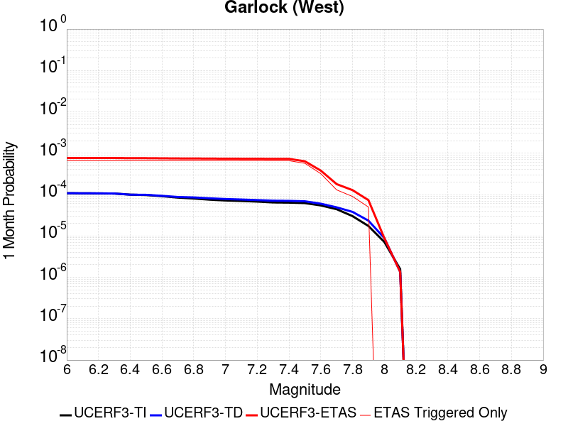 |  |  |

| Magnitude | 1 wk TI Prob | 1 wk TD Prob | 1 wk ETAS Prob | 1 wk ETAS/TD Gain | 1 wk ETAS Triggered Only | 1 mo TI Prob | 1 mo TD Prob | 1 mo ETAS Prob | 1 mo ETAS/TD Gain | 1 mo ETAS Triggered Only | 1 yr TI Prob | 1 yr TD Prob | 1 yr ETAS Prob | 1 yr ETAS/TD Gain | 1 yr ETAS Triggered Only | 10 yr TI Prob | 10 yr TD Prob | 10 yr ETAS Prob | 10 yr ETAS/TD Gain | 10 yr ETAS Triggered Only |
|-----|-----|-----|-----|-----|-----|-----|-----|-----|-----|-----|-----|-----|-----|-----|-----|-----|-----|-----|-----|-----|
| 6.0 | 2.5181727E-5 | 2.5201914E-5 | 3.0519484E-4 | 12.109987 | 2.8E-4 | 1.0791722E-4 | 1.08003755E-4 | 7.6793245E-4 | 7.110239 | 6.6E-4 | 0.0013131002 | 0.0013141559 | 0.0026823555 | 2.0411243 | 0.00137 | 0.013053683 | 0.01314424 | 0.014910712 | 1.1343913 | 0.00179 |
| 6.1 | 2.5077732E-5 | 2.5102956E-5 | 3.0509592E-4 | 12.153785 | 2.8E-4 | 1.0747157E-4 | 1.07579675E-4 | 7.675087E-4 | 7.134328 | 6.6E-4 | 0.001307681 | 0.001308999 | 0.0026772057 | 2.0452313 | 0.00137 | 0.013000126 | 0.013093281 | 0.014859843 | 1.1349213 | 0.00179 |
| 6.2 | 2.494612E-5 | 2.4984645E-5 | 3.0497764E-4 | 12.206603 | 2.8E-4 | 1.0690756E-4 | 1.0707267E-4 | 7.67002E-4 | 7.163378 | 6.6E-4 | 0.0013008224 | 0.0013028337 | 0.0026710487 | 2.050184 | 0.00137 | 0.012932341 | 0.013032351 | 0.014799023 | 1.1355605 | 0.00179 |
| 6.3 | 2.4733758E-5 | 2.4804003E-5 | 3.0479705E-4 | 12.28822 | 2.8E-4 | 1.0599751E-4 | 1.0629856E-4 | 7.662284E-4 | 7.2082667 | 6.6E-4 | 0.0012897556 | 0.0012934201 | 0.002661648 | 2.0578372 | 0.00137 | 0.012822957 | 0.012939315 | 0.014706154 | 1.136548 | 0.00179 |
| 6.4 | 2.3237335E-5 | 2.3183304E-5 | 3.031768E-4 | 13.077378 | 2.8E-4 | 9.958477E-5 | 9.9353245E-5 | 7.592877E-4 | 7.642304 | 6.6E-4 | 0.0012117702 | 0.0012089573 | 0.002577301 | 2.1318378 | 0.00137 | 0.012051838 | 0.01210416 | 0.013872494 | 1.146093 | 0.00179 |
| 6.5 | 2.2732203E-5 | 2.299767E-5 | 3.0299122E-4 | 13.174867 | 2.8E-4 | 9.742009E-5 | 9.8557735E-5 | 7.584927E-4 | 7.6959224 | 6.6E-4 | 0.0011854442 | 0.0011992827 | 0.0025676396 | 2.1409795 | 0.00137 | 0.011791403 | 0.012008464 | 0.013776968 | 1.1472715 | 0.00179 |
| 6.6 | 2.1319436E-5 | 2.1777872E-5 | 3.0177177E-4 | 13.856808 | 2.8E-4 | 9.136581E-5 | 9.333041E-5 | 7.5326883E-4 | 8.070991 | 6.6E-4 | 0.001111811 | 0.0011357077 | 0.0025041518 | 2.2049263 | 0.00137 | 0.011062649 | 0.01137937 | 0.013149 | 1.1555122 | 0.00179 |
| 6.7 | 1.970802E-5 | 2.039774E-5 | 3.0039204E-4 | 14.72673 | 2.8E-4 | 8.446021E-5 | 8.741597E-5 | 7.4735825E-4 | 8.549448 | 6.6E-4 | 0.001027818 | 0.0010637715 | 0.0024323142 | 2.2865007 | 0.00137 | 0.010230771 | 0.010667094 | 0.012438 | 1.1660157 | 0.00179 |
| 6.8 | 1.8744462E-5 | 1.9905396E-5 | 2.998998E-4 | 15.066257 | 2.8E-4 | 8.033094E-5 | 8.530606E-5 | 7.4524974E-4 | 8.736188 | 6.6E-4 | 9.775903E-4 | 0.0010381081 | 0.0024066858 | 2.3183384 | 0.00137 | 0.009733009 | 0.010412897 | 0.012184258 | 1.1701123 | 0.00179 |
| 6.9 | 1.7559682E-5 | 1.8957733E-5 | 2.9895242E-4 | 15.769419 | 2.8E-4 | 7.5253614E-5 | 8.124491E-5 | 7.4119127E-4 | 9.122927 | 6.6E-4 | 9.158276E-4 | 9.887093E-4 | 0.0023573549 | 2.384275 | 0.00137 | 0.0091206245 | 0.009923427 | 0.011695664 | 1.1785913 | 0.00179 |
| 7.0 | 1.6794445E-5 | 1.8220519E-5 | 2.9821543E-4 | 16.367012 | 2.8E-4 | 7.197421E-5 | 7.8085606E-5 | 7.380341E-4 | 9.451602 | 6.6E-4 | 8.759337E-4 | 9.5027895E-4 | 0.0023189771 | 2.440312 | 0.00137 | 0.008724891 | 0.009542331 | 0.01131525 | 1.1857952 | 0.00179 |
| 7.1 | 1.6337795E-5 | 1.7721295E-5 | 2.9771632E-4 | 16.79992 | 2.8E-4 | 7.0017246E-5 | 7.5946205E-5 | 7.3589606E-4 | 9.689702 | 6.6E-4 | 8.521265E-4 | 9.242542E-4 | 0.002292988 | 2.4809062 | 0.00137 | 0.008488664 | 0.0092840865 | 0.011057468 | 1.191013 | 0.00179 |
| 7.2 | 1.5780008E-5 | 1.716991E-5 | 2.971651E-4 | 17.307318 | 2.8E-4 | 6.762685E-5 | 7.358326E-5 | 7.335347E-4 | 9.968771 | 6.6E-4 | 8.2304585E-4 | 8.9550926E-4 | 0.0022642824 | 2.5284858 | 0.00137 | 0.008200042 | 0.008998912 | 0.010772804 | 1.1971229 | 0.00179 |
| 7.3 | 1.5058865E-5 | 1.6622957E-5 | 2.966183E-4 | 17.843895 | 2.8E-4 | 6.45364E-5 | 7.12393E-5 | 7.311923E-4 | 10.263888 | 6.6E-4 | 7.854473E-4 | 8.669946E-4 | 0.0022358068 | 2.5788014 | 0.00137 | 0.00782677 | 0.00871559 | 0.01048999 | 1.2035891 | 0.00179 |
| 7.4 | 1.4887923E-5 | 1.6458913E-5 | 2.964543E-4 | 18.01178 | 2.8E-4 | 6.380382E-5 | 7.05363E-5 | 7.3048973E-4 | 10.356224 | 6.6E-4 | 7.7653467E-4 | 8.584423E-4 | 0.0022272663 | 2.594544 | 0.00137 | 0.0077382675 | 0.008630417 | 0.010404969 | 1.205616 | 0.00179 |
| 7.5 | 1.4509299E-5 | 1.6050892E-5 | 2.6604687E-4 | 16.575209 | 2.5E-4 | 6.218123E-5 | 6.8787725E-5 | 6.387485E-4 | 9.285792 | 5.7E-4 | 7.567935E-4 | 8.3716994E-4 | 0.002046157 | 2.4441357 | 0.00121 | 0.0075422134 | 0.008418757 | 0.00999537 | 1.187274 | 0.00159 |
| 7.6 | 1.2756717E-5 | 1.40547745E-5 | 1.4405294E-4 | 10.249396 | 1.3E-4 | 5.4670498E-5 | 6.023336E-5 | 3.8021407E-4 | 6.3123507 | 3.2E-4 | 6.6541E-4 | 7.3309505E-4 | 0.0014825453 | 2.0223098 | 7.5E-4 | 0.006634211 | 0.00738374 | 0.00836643 | 1.1330884 | 9.9E-4 |
| 7.7 | 1.0328985E-5 | 1.1464304E-5 | 6.146373E-5 | 5.361314 | 5.0E-5 | 4.4266326E-5 | 4.913181E-5 | 1.7912542E-4 | 3.6458137 | 1.3E-4 | 5.388092E-4 | 5.98016E-4 | 9.777887E-4 | 1.6350545 | 3.8E-4 | 0.0053750467 | 0.0060406122 | 0.0065475316 | 1.0839186 | 5.1E-4 |
| 7.8 | 7.0306583E-6 | 8.902713E-6 | 3.8902446E-5 | 4.3697295 | 3.0E-5 | 3.0131043E-5 | 3.815393E-5 | 1.281505E-4 | 3.358776 | 9.0E-5 | 3.667837E-4 | 4.6442522E-4 | 6.84323E-4 | 1.4734838 | 2.2E-4 | 0.003661789 | 0.004697 | 0.005015497 | 1.0678086 | 3.2E-4 |
| 7.9 | 4.060633E-6 | 5.467275E-6 | 5.467275E-6 | 1.0 | 0.0 | 1.7402595E-5 | 2.3430968E-5 | 7.3429794E-5 | 3.133878 | 5.0E-5 | 2.11856E-4 | 2.852348E-4 | 4.1519772E-4 | 1.4556348 | 1.3E-4 | 0.0021165414 | 0.0028852404 | 0.0030946343 | 1.0725743 | 2.1E-4 |
| 8.0 | 1.6729537E-6 | 2.0781215E-6 | 2.0781215E-6 | 1.0 | 0.0 | 7.169782E-6 | 8.906205E-6 | 8.906205E-6 | 1.0 | 0.0 | 8.7288594E-5 | 1.0842768E-4 | 1.184266E-4 | 1.0922173 | 1.0E-5 | 8.7254314E-4 | 0.0010973068 | 0.0011472519 | 1.0455161 | 5.0E-5 |
| 8.1 | 3.6733252E-7 | 3.1497066E-7 | 3.1497066E-7 | 1.0 | 0.0 | 1.5742813E-6 | 1.3498736E-6 | 1.3498736E-6 | 1.0 | 0.0 | 1.9166706E-5 | 1.6434604E-5 | 1.6434604E-5 | 1.0 | 0.0 | 1.9165053E-4 | 1.6648426E-4 | 1.6648426E-4 | 1.0 | 0.0 |

## Blackwater
*[(top)](#table-of-contents)*

| 1 Week | 1 Month | 1 Year | 10 Year |
|-----|-----|-----|-----|
|  |  |  |  |

| Magnitude | 1 wk TI Prob | 1 wk TD Prob | 1 wk ETAS Prob | 1 wk ETAS/TD Gain | 1 wk ETAS Triggered Only | 1 mo TI Prob | 1 mo TD Prob | 1 mo ETAS Prob | 1 mo ETAS/TD Gain | 1 mo ETAS Triggered Only | 1 yr TI Prob | 1 yr TD Prob | 1 yr ETAS Prob | 1 yr ETAS/TD Gain | 1 yr ETAS Triggered Only | 10 yr TI Prob | 10 yr TD Prob | 10 yr ETAS Prob | 10 yr ETAS/TD Gain | 10 yr ETAS Triggered Only |
|-----|-----|-----|-----|-----|-----|-----|-----|-----|-----|-----|-----|-----|-----|-----|-----|-----|-----|-----|-----|-----|
| 6.0 | 3.0708583E-5 | 3.309619E-5 | 2.0309056E-4 | 6.136373 | 1.7E-4 | 1.3160157E-4 | 1.4183388E-4 | 6.3176436E-4 | 4.454256 | 4.9E-4 | 0.0016010714 | 0.0017255963 | 0.002594095 | 1.5033035 | 8.7E-4 | 0.015895851 | 0.017135808 | 0.018413533 | 1.0745646 | 0.0013 |
| 6.1 | 3.0708583E-5 | 3.309619E-5 | 2.0309056E-4 | 6.136373 | 1.7E-4 | 1.3160157E-4 | 1.4183388E-4 | 6.3176436E-4 | 4.454256 | 4.9E-4 | 0.0016010714 | 0.0017255963 | 0.002594095 | 1.5033035 | 8.7E-4 | 0.015895851 | 0.017135808 | 0.018413533 | 1.0745646 | 0.0013 |
| 6.2 | 1.1707779E-5 | 1.2545242E-5 | 9.254424E-5 | 7.37684 | 8.0E-5 | 5.017523E-5 | 5.3764266E-5 | 2.9375136E-4 | 5.4636917 | 2.4E-4 | 6.107122E-4 | 6.5439293E-4 | 0.0010241509 | 1.5650395 | 3.7E-4 | 0.006090366 | 0.006525631 | 0.007042238 | 1.0791658 | 5.2E-4 |
| 6.3 | 1.1707779E-5 | 1.2545242E-5 | 9.254424E-5 | 7.37684 | 8.0E-5 | 5.017523E-5 | 5.3764266E-5 | 2.9375136E-4 | 5.4636917 | 2.4E-4 | 6.107122E-4 | 6.5439293E-4 | 0.0010241509 | 1.5650395 | 3.7E-4 | 0.006090366 | 0.006525631 | 0.007042238 | 1.0791658 | 5.2E-4 |
| 6.4 | 7.929244E-6 | 8.480176E-6 | 8.84795E-5 | 10.433686 | 8.0E-5 | 3.3982033E-5 | 3.6343128E-5 | 1.8633768E-4 | 5.1271777 | 1.5E-4 | 4.136527E-4 | 4.4239179E-4 | 6.7229004E-4 | 1.5196711 | 2.3E-4 | 0.0041288356 | 0.0044155167 | 0.0047341036 | 1.0721517 | 3.2E-4 |
| 6.5 | 5.8832115E-6 | 6.286048E-6 | 6.628567E-5 | 10.544888 | 6.0E-5 | 2.521352E-5 | 2.6939942E-5 | 1.3693697E-4 | 5.0830464 | 1.1E-4 | 3.0693135E-4 | 3.2794697E-4 | 4.978912E-4 | 1.5182065 | 1.7E-4 | 0.0030650778 | 0.0032748834 | 0.0035140975 | 1.073045 | 2.4E-4 |
| 6.6 | 5.8832115E-6 | 6.286048E-6 | 6.628567E-5 | 10.544888 | 6.0E-5 | 2.521352E-5 | 2.6939942E-5 | 1.3693697E-4 | 5.0830464 | 1.1E-4 | 3.0693135E-4 | 3.2794697E-4 | 4.978912E-4 | 1.5182065 | 1.7E-4 | 0.0030650778 | 0.0032748834 | 0.0035140975 | 1.073045 | 2.4E-4 |
| 6.7 | 3.0715053E-6 | 3.281496E-6 | 2.3281431E-5 | 7.0947614 | 2.0E-5 | 1.3163528E-5 | 1.4063485E-5 | 6.4062784E-5 | 4.5552564 | 5.0E-5 | 1.6025416E-4 | 1.7121063E-4 | 2.3120036E-4 | 1.3503855 | 6.0E-5 | 0.0016013865 | 0.0017109019 | 0.0018007479 | 1.0525138 | 9.0E-5 |
| 6.8 | 2.2722281E-6 | 2.4287758E-6 | 2.2428727E-5 | 9.234581 | 2.0E-5 | 9.738084E-6 | 1.0409003E-5 | 5.0408587E-5 | 4.8427873 | 4.0E-5 | 1.1855473E-4 | 1.2672316E-4 | 1.7671683E-4 | 1.3945109 | 5.0E-5 | 0.001184915 | 0.0012665992 | 0.0013365105 | 1.055196 | 7.0E-5 |
| 6.9 | 9.952399E-7 | 1.0653588E-6 | 1.0653588E-6 | 1.0 | 0.0 | 4.265307E-6 | 4.5658185E-6 | 4.5658185E-6 | 1.0 | 0.0 | 5.1928873E-5 | 5.5587938E-5 | 5.5587938E-5 | 1.0 | 0.0 | 5.191674E-4 | 5.5579096E-4 | 5.5579096E-4 | 1.0 | 0.0 |
| 7.0 | 4.7385504E-7 | 5.0756074E-7 | 5.0756074E-7 | 1.0 | 0.0 | 2.0308057E-6 | 2.1752603E-6 | 2.1752603E-6 | 1.0 | 0.0 | 2.4724779E-5 | 2.6483794E-5 | 2.6483794E-5 | 1.0 | 0.0 | 2.4722028E-4 | 2.6483793E-4 | 2.6483793E-4 | 1.0 | 0.0 |

## Ash Hill
*[(top)](#table-of-contents)*

| 1 Week | 1 Month | 1 Year | 10 Year |
|-----|-----|-----|-----|
|  |  |  |  |

| Magnitude | 1 wk TI Prob | 1 wk TD Prob | 1 wk ETAS Prob | 1 wk ETAS/TD Gain | 1 wk ETAS Triggered Only | 1 mo TI Prob | 1 mo TD Prob | 1 mo ETAS Prob | 1 mo ETAS/TD Gain | 1 mo ETAS Triggered Only | 1 yr TI Prob | 1 yr TD Prob | 1 yr ETAS Prob | 1 yr ETAS/TD Gain | 1 yr ETAS Triggered Only | 10 yr TI Prob | 10 yr TD Prob | 10 yr ETAS Prob | 10 yr ETAS/TD Gain | 10 yr ETAS Triggered Only |
|-----|-----|-----|-----|-----|-----|-----|-----|-----|-----|-----|-----|-----|-----|-----|-----|-----|-----|-----|-----|-----|
| 6.0 | 2.1545662E-5 | 2.3194681E-5 | 2.731889E-4 | 11.778083 | 2.5E-4 | 9.2335285E-5 | 9.9402445E-5 | 5.593567E-4 | 5.627193 | 4.6E-4 | 0.0011236023 | 0.0012096328 | 0.0020486168 | 1.6935856 | 8.4E-4 | 0.011179381 | 0.01203847 | 0.013144988 | 1.0919151 | 0.00112 |
| 6.1 | 2.1545662E-5 | 2.3194681E-5 | 2.731889E-4 | 11.778083 | 2.5E-4 | 9.2335285E-5 | 9.9402445E-5 | 5.593567E-4 | 5.627193 | 4.6E-4 | 0.0011236023 | 0.0012096328 | 0.0020486168 | 1.6935856 | 8.4E-4 | 0.011179381 | 0.01203847 | 0.013144988 | 1.0919151 | 0.00112 |
| 6.2 | 2.1545662E-5 | 2.3194681E-5 | 2.731889E-4 | 11.778083 | 2.5E-4 | 9.2335285E-5 | 9.9402445E-5 | 5.593567E-4 | 5.627193 | 4.6E-4 | 0.0011236023 | 0.0012096328 | 0.0020486168 | 1.6935856 | 8.4E-4 | 0.011179381 | 0.01203847 | 0.013144988 | 1.0919151 | 0.00112 |
| 6.3 | 1.0025529E-5 | 1.0747037E-5 | 1.0074607E-4 | 9.374311 | 9.0E-5 | 4.2965847E-5 | 4.605799E-5 | 2.0605062E-4 | 4.4737215 | 1.6E-4 | 5.229836E-4 | 5.60625E-4 | 8.704512E-4 | 1.5526443 | 3.1E-4 | 0.005217545 | 0.0055934195 | 0.0060011265 | 1.0728904 | 4.1E-4 |
| 6.4 | 1.0025529E-5 | 1.0747037E-5 | 1.0074607E-4 | 9.374311 | 9.0E-5 | 4.2965847E-5 | 4.605799E-5 | 2.0605062E-4 | 4.4737215 | 1.6E-4 | 5.229836E-4 | 5.60625E-4 | 8.704512E-4 | 1.5526443 | 3.1E-4 | 0.005217545 | 0.0055934195 | 0.0060011265 | 1.0728904 | 4.1E-4 |
| 6.5 | 6.9617327E-6 | 7.456704E-6 | 3.745648E-5 | 5.0231953 | 3.0E-5 | 2.9835655E-5 | 3.1956963E-5 | 1.119544E-4 | 3.5032868 | 8.0E-5 | 3.6318856E-4 | 3.8901521E-4 | 5.589491E-4 | 1.4368309 | 1.7E-4 | 0.0036259557 | 0.0038841967 | 0.0041033425 | 1.0564197 | 2.2E-4 |
| 6.6 | 4.9919777E-6 | 5.346739E-6 | 1.5346684E-5 | 2.870289 | 1.0E-5 | 2.1394015E-5 | 2.2914432E-5 | 8.291306E-5 | 3.6183772 | 6.0E-5 | 2.60441E-4 | 2.789542E-4 | 4.0891793E-4 | 1.4658964 | 1.3E-4 | 0.0026013597 | 0.0027866988 | 0.002946253 | 1.0572556 | 1.6E-4 |
| 6.7 | 3.6630722E-6 | 3.9246606E-6 | 3.9246606E-6 | 1.0 | 0.0 | 1.5698786E-5 | 1.6819899E-5 | 5.6819226E-5 | 3.3780956 | 4.0E-5 | 1.9111596E-4 | 2.0476876E-4 | 3.0474828E-4 | 1.4882557 | 1.0E-4 | 0.0019095168 | 0.002046364 | 0.0021760978 | 1.0633973 | 1.3E-4 |
| 6.8 | 2.5599613E-6 | 2.7449514E-6 | 2.7449514E-6 | 1.0 | 0.0 | 1.0971216E-5 | 1.1764052E-5 | 5.176358E-5 | 4.400149 | 4.0E-5 | 1.3356637E-4 | 1.4322287E-4 | 2.3320998E-4 | 1.6283013 | 9.0E-5 | 0.0013348613 | 0.0014317906 | 0.0015416332 | 1.0767169 | 1.1E-4 |
| 6.9 | 1.7684905E-6 | 1.896889E-6 | 1.896889E-6 | 1.0 | 0.0 | 7.579223E-6 | 8.129524E-6 | 3.812928E-5 | 4.6902227 | 3.0E-5 | 9.2273134E-5 | 9.8976954E-5 | 1.5897102E-4 | 1.6061417 | 6.0E-5 | 9.223483E-4 | 9.897696E-4 | 0.0010497102 | 1.0605602 | 6.0E-5 |

## Gravel Hills-Harper Lk
*[(top)](#table-of-contents)*

| 1 Week | 1 Month | 1 Year | 10 Year |
|-----|-----|-----|-----|
|  |  |  |  |

| Magnitude | 1 wk TI Prob | 1 wk TD Prob | 1 wk ETAS Prob | 1 wk ETAS/TD Gain | 1 wk ETAS Triggered Only | 1 mo TI Prob | 1 mo TD Prob | 1 mo ETAS Prob | 1 mo ETAS/TD Gain | 1 mo ETAS Triggered Only | 1 yr TI Prob | 1 yr TD Prob | 1 yr ETAS Prob | 1 yr ETAS/TD Gain | 1 yr ETAS Triggered Only | 10 yr TI Prob | 10 yr TD Prob | 10 yr ETAS Prob | 10 yr ETAS/TD Gain | 10 yr ETAS Triggered Only |
|-----|-----|-----|-----|-----|-----|-----|-----|-----|-----|-----|-----|-----|-----|-----|-----|-----|-----|-----|-----|-----|
| 6.0 | 3.0679566E-5 | 3.146516E-5 | 1.1146264E-4 | 3.5424147 | 8.0E-5 | 1.3147724E-4 | 1.3484493E-4 | 3.3481797E-4 | 2.482985 | 2.0E-4 | 0.0015995599 | 0.0016407177 | 0.0021299138 | 1.2981598 | 4.9E-4 | 0.015880952 | 0.016307613 | 0.0169175 | 1.037399 | 6.2E-4 |
| 6.1 | 3.0679566E-5 | 3.146516E-5 | 1.1146264E-4 | 3.5424147 | 8.0E-5 | 1.3147724E-4 | 1.3484493E-4 | 3.3481797E-4 | 2.482985 | 2.0E-4 | 0.0015995599 | 0.0016407177 | 0.0021299138 | 1.2981598 | 4.9E-4 | 0.015880952 | 0.016307613 | 0.0169175 | 1.037399 | 6.2E-4 |
| 6.2 | 1.514536E-5 | 1.363538E-5 | 3.3635108E-5 | 2.4667525 | 2.0E-5 | 6.490707E-5 | 5.84361E-5 | 8.8434346E-5 | 1.5133513 | 3.0E-5 | 7.8995706E-4 | 7.112392E-4 | 7.612036E-4 | 1.0702498 | 5.0E-5 | 0.007871548 | 0.0070908302 | 0.007190121 | 1.0140027 | 1.0E-4 |
| 6.3 | 1.514536E-5 | 1.363538E-5 | 3.3635108E-5 | 2.4667525 | 2.0E-5 | 6.490707E-5 | 5.84361E-5 | 8.8434346E-5 | 1.5133513 | 3.0E-5 | 7.8995706E-4 | 7.112392E-4 | 7.612036E-4 | 1.0702498 | 5.0E-5 | 0.007871548 | 0.0070908302 | 0.007190121 | 1.0140027 | 1.0E-4 |
| 6.4 | 1.2532521E-5 | 1.0689813E-5 | 2.0689706E-5 | 1.93546 | 1.0E-5 | 5.37097E-5 | 4.5812714E-5 | 5.5812256E-5 | 1.2182701 | 1.0E-5 | 6.537194E-4 | 5.576329E-4 | 5.876162E-4 | 1.0537689 | 3.0E-5 | 0.0065179965 | 0.0055629266 | 0.005632537 | 1.0125133 | 7.0E-5 |
| 6.5 | 1.1094058E-5 | 9.083761E-6 | 1.908367E-5 | 2.1008556 | 1.0E-5 | 4.7545094E-5 | 3.8929848E-5 | 4.8929458E-5 | 1.2568623 | 1.0E-5 | 5.787078E-4 | 4.7387183E-4 | 5.038576E-4 | 1.0632782 | 3.0E-5 | 0.0057720304 | 0.0047290213 | 0.004768832 | 1.0084184 | 4.0E-5 |
| 6.6 | 9.688328E-6 | 7.531771E-6 | 1.7531696E-5 | 2.327699 | 1.0E-5 | 4.1520743E-5 | 3.2278636E-5 | 4.2278312E-5 | 1.3097924 | 1.0E-5 | 5.053978E-4 | 3.9292406E-4 | 4.2291227E-4 | 1.0763206 | 3.0E-5 | 0.0050424994 | 0.00392255 | 0.0039524324 | 1.0076181 | 3.0E-5 |
| 6.7 | 8.974824E-6 | 6.7494793E-6 | 1.674941E-5 | 2.4815857 | 1.0E-5 | 3.8462964E-5 | 2.8926032E-5 | 3.892574E-5 | 1.3456994 | 1.0E-5 | 4.6818596E-4 | 3.521197E-4 | 3.8210917E-4 | 1.0851682 | 3.0E-5 | 0.004672008 | 0.0035158389 | 0.0035457334 | 1.0085028 | 3.0E-5 |
| 6.8 | 7.4780046E-6 | 5.1162397E-6 | 5.1162397E-6 | 1.0 | 0.0 | 3.20482E-5 | 2.1926564E-5 | 2.1926564E-5 | 1.0 | 0.0 | 3.9011694E-4 | 2.6692462E-4 | 2.7692196E-4 | 1.0374538 | 1.0E-5 | 0.0038943281 | 0.0026661782 | 0.0026761517 | 1.0037407 | 1.0E-5 |
| 6.9 | 6.3409307E-6 | 3.9075294E-6 | 3.9075294E-6 | 1.0 | 0.0 | 2.7175134E-5 | 1.6746453E-5 | 1.6746453E-5 | 1.0 | 0.0 | 3.3080703E-4 | 2.0386997E-4 | 2.0386997E-4 | 1.0 | 0.0 | 0.0033031502 | 0.0020369277 | 0.0020369277 | 1.0 | 0.0 |
| 7.0 | 5.1239335E-6 | 2.605876E-6 | 2.605876E-6 | 1.0 | 0.0 | 2.195953E-5 | 1.1167994E-5 | 1.1167994E-5 | 1.0 | 0.0 | 2.6732447E-4 | 1.359621E-4 | 1.359621E-4 | 1.0 | 0.0 | 0.0026700313 | 0.0013588143 | 0.0013588143 | 1.0 | 0.0 |
| 7.1 | 4.438899E-6 | 2.0984924E-6 | 2.0984924E-6 | 1.0 | 0.0 | 1.9023713E-5 | 8.993509E-6 | 8.993509E-6 | 1.0 | 0.0 | 2.315891E-4 | 1.0949069E-4 | 1.0949069E-4 | 1.0 | 0.0 | 0.002313479 | 0.0010943894 | 0.0010943894 | 1.0 | 0.0 |
| 7.2 | 3.50367E-6 | 1.2615886E-6 | 1.2615886E-6 | 1.0 | 0.0 | 1.5015643E-5 | 5.4067978E-6 | 5.4067978E-6 | 1.0 | 0.0 | 1.8280011E-4 | 6.582586E-5 | 6.582586E-5 | 1.0 | 0.0 | 0.0018264982 | 6.5807183E-4 | 6.5807183E-4 | 1.0 | 0.0 |
| 7.3 | 2.561638E-6 | 7.1188435E-7 | 7.1188435E-7 | 1.0 | 0.0 | 1.0978401E-5 | 3.0509295E-6 | 3.0509295E-6 | 1.0 | 0.0 | 1.3365384E-4 | 3.7144455E-5 | 3.7144455E-5 | 1.0 | 0.0 | 0.0013357349 | 3.7138443E-4 | 3.7138443E-4 | 1.0 | 0.0 |
| 7.4 | 2.0368864E-6 | 5.3046045E-7 | 5.3046045E-7 | 1.0 | 0.0 | 8.729483E-6 | 2.2734E-6 | 2.2734E-6 | 1.0 | 0.0 | 1.06276275E-4 | 2.7678298E-5 | 2.7678298E-5 | 1.0 | 0.0 | 0.0010622547 | 2.7674905E-4 | 2.7674905E-4 | 1.0 | 0.0 |
| 7.5 | 1.1681728E-6 | 3.6029326E-7 | 3.6029326E-7 | 1.0 | 0.0 | 5.0064455E-6 | 1.544113E-6 | 1.544113E-6 | 1.0 | 0.0 | 6.0951766E-5 | 1.879942E-5 | 1.879942E-5 | 1.0 | 0.0 | 6.093505E-4 | 1.8797876E-4 | 1.8797876E-4 | 1.0 | 0.0 |
| 7.6 | 1.3154387E-7 | 7.119745E-8 | 7.119745E-8 | 1.0 | 0.0 | 5.6375933E-7 | 3.051319E-7 | 3.051319E-7 | 1.0 | 0.0 | 6.863748E-6 | 3.7149762E-6 | 3.7149762E-6 | 1.0 | 0.0 | 6.863536E-5 | 3.7149297E-5 | 3.7149297E-5 | 1.0 | 0.0 |

## San Andreas (Mojave N)
*[(top)](#table-of-contents)*

| 1 Week | 1 Month | 1 Year | 10 Year |
|-----|-----|-----|-----|
|  |  |  |  |

| Magnitude | 1 wk TI Prob | 1 wk TD Prob | 1 wk ETAS Prob | 1 wk ETAS/TD Gain | 1 wk ETAS Triggered Only | 1 mo TI Prob | 1 mo TD Prob | 1 mo ETAS Prob | 1 mo ETAS/TD Gain | 1 mo ETAS Triggered Only | 1 yr TI Prob | 1 yr TD Prob | 1 yr ETAS Prob | 1 yr ETAS/TD Gain | 1 yr ETAS Triggered Only | 10 yr TI Prob | 10 yr TD Prob | 10 yr ETAS Prob | 10 yr ETAS/TD Gain | 10 yr ETAS Triggered Only |
|-----|-----|-----|-----|-----|-----|-----|-----|-----|-----|-----|-----|-----|-----|-----|-----|-----|-----|-----|-----|-----|
| 6.0 | 9.877682E-5 | 1.9410432E-4 | 2.740888E-4 | 1.4120696 | 8.0E-5 | 4.2326056E-4 | 8.3161064E-4 | 0.0010214526 | 1.2282823 | 1.9E-4 | 0.0051410277 | 0.010077983 | 0.010553145 | 1.0471486 | 4.8E-4 | 0.05023708 | 0.098361015 | 0.098920025 | 1.0056833 | 6.2E-4 |
| 6.1 | 9.877682E-5 | 1.9410432E-4 | 2.740888E-4 | 1.4120696 | 8.0E-5 | 4.2326056E-4 | 8.3161064E-4 | 0.0010214526 | 1.2282823 | 1.9E-4 | 0.0051410277 | 0.010077983 | 0.010553145 | 1.0471486 | 4.8E-4 | 0.05023708 | 0.098361015 | 0.098920025 | 1.0056833 | 6.2E-4 |
| 6.2 | 9.877682E-5 | 1.9410432E-4 | 2.740888E-4 | 1.4120696 | 8.0E-5 | 4.2326056E-4 | 8.3161064E-4 | 0.0010214526 | 1.2282823 | 1.9E-4 | 0.0051410277 | 0.010077983 | 0.010553145 | 1.0471486 | 4.8E-4 | 0.05023708 | 0.098361015 | 0.098920025 | 1.0056833 | 6.2E-4 |
| 6.3 | 9.877682E-5 | 1.9410432E-4 | 2.740888E-4 | 1.4120696 | 8.0E-5 | 4.2326056E-4 | 8.3161064E-4 | 0.0010214526 | 1.2282823 | 1.9E-4 | 0.0051410277 | 0.010077983 | 0.010553145 | 1.0471486 | 4.8E-4 | 0.05023708 | 0.098361015 | 0.098920025 | 1.0056833 | 6.2E-4 |
| 6.4 | 9.877682E-5 | 1.9410432E-4 | 2.740888E-4 | 1.4120696 | 8.0E-5 | 4.2326056E-4 | 8.3161064E-4 | 0.0010214526 | 1.2282823 | 1.9E-4 | 0.0051410277 | 0.010077983 | 0.010553145 | 1.0471486 | 4.8E-4 | 0.05023708 | 0.098361015 | 0.098920025 | 1.0056833 | 6.2E-4 |
| 6.5 | 9.861474E-5 | 1.9384196E-4 | 2.7382644E-4 | 1.4126273 | 8.0E-5 | 4.2256617E-4 | 8.3048694E-4 | 0.0010203292 | 1.2285914 | 1.9E-4 | 0.0051326132 | 0.010064429 | 0.010539598 | 1.0472127 | 4.8E-4 | 0.050156746 | 0.09823856 | 0.09879765 | 1.0056912 | 6.2E-4 |
| 6.6 | 9.861474E-5 | 1.9384196E-4 | 2.7382644E-4 | 1.4126273 | 8.0E-5 | 4.2256617E-4 | 8.3048694E-4 | 0.0010203292 | 1.2285914 | 1.9E-4 | 0.0051326132 | 0.010064429 | 0.010539598 | 1.0472127 | 4.8E-4 | 0.050156746 | 0.09823856 | 0.09879765 | 1.0056912 | 6.2E-4 |
| 6.7 | 9.8552715E-5 | 1.9374148E-4 | 2.7372598E-4 | 1.4128413 | 8.0E-5 | 4.223004E-4 | 8.300566E-4 | 0.0010198989 | 1.22871 | 1.9E-4 | 0.0051293927 | 0.0100592375 | 0.010534409 | 1.0472373 | 4.8E-4 | 0.050125998 | 0.098191775 | 0.0987509 | 1.0056942 | 6.2E-4 |
| 6.8 | 9.8464974E-5 | 1.9359306E-4 | 2.7357758E-4 | 1.4131579 | 8.0E-5 | 4.219245E-4 | 8.294209E-4 | 0.0010192634 | 1.2288855 | 1.9E-4 | 0.0051248376 | 0.01005157 | 0.010526745 | 1.0472738 | 4.8E-4 | 0.05008251 | 0.09812213 | 0.098681286 | 1.0056987 | 6.2E-4 |
| 6.9 | 9.825824E-5 | 1.9327311E-4 | 2.7325764E-4 | 1.4138421 | 8.0E-5 | 4.2103877E-4 | 8.2805054E-4 | 0.0010178932 | 1.2292646 | 1.9E-4 | 0.0051141046 | 0.010035039 | 0.010510222 | 1.0473524 | 4.8E-4 | 0.049980022 | 0.09797137 | 0.09853063 | 1.0057083 | 6.2E-4 |
| 7.0 | 9.781462E-5 | 1.9258665E-4 | 2.7257125E-4 | 1.4153174 | 8.0E-5 | 4.1913814E-4 | 8.251105E-4 | 0.0010149537 | 1.2300822 | 1.9E-4 | 0.005091073 | 0.009999573 | 0.010474773 | 1.0475221 | 4.8E-4 | 0.04976007 | 0.09764758 | 0.098207034 | 1.0057293 | 6.2E-4 |
| 7.1 | 9.7121134E-5 | 1.9160361E-4 | 2.715883E-4 | 1.4174486 | 8.0E-5 | 4.1616702E-4 | 8.2090014E-4 | 0.0010107441 | 1.2312633 | 1.9E-4 | 0.005055068 | 0.009948781 | 0.010424006 | 1.0477672 | 4.8E-4 | 0.04941613 | 0.09718397 | 0.09774371 | 1.0057596 | 6.2E-4 |
| 7.2 | 9.663819E-5 | 1.9091136E-4 | 2.708961E-4 | 1.4189626 | 8.0E-5 | 4.1409794E-4 | 8.179352E-4 | 0.0010077797 | 1.2321023 | 1.9E-4 | 0.0050299936 | 0.009913012 | 0.010388254 | 1.0479412 | 4.8E-4 | 0.049176537 | 0.09685706 | 0.09741701 | 1.0057812 | 6.2E-4 |
| 7.3 | 9.6277574E-5 | 1.9043636E-4 | 2.7042112E-4 | 1.4200078 | 8.0E-5 | 4.125529E-4 | 8.1590074E-4 | 0.0010057457 | 1.2326815 | 1.9E-4 | 0.0050112694 | 0.009888468 | 0.010363721 | 1.0480614 | 4.8E-4 | 0.04899759 | 0.09663044 | 0.09719053 | 1.0057962 | 6.2E-4 |
| 7.4 | 9.593308E-5 | 1.8983395E-4 | 2.6981876E-4 | 1.421341 | 8.0E-5 | 4.1107697E-4 | 8.133206E-4 | 0.0010031661 | 1.2334203 | 1.9E-4 | 0.0049933824 | 0.00985734 | 0.010332608 | 1.0482147 | 4.8E-4 | 0.04882661 | 0.09634874 | 0.09690901 | 1.0058149 | 6.2E-4 |
| 7.5 | 9.561707E-5 | 1.892946E-4 | 2.6927947E-4 | 1.4225416 | 8.0E-5 | 4.0972308E-4 | 8.1101054E-4 | 0.0010008564 | 1.2340857 | 1.9E-4 | 0.0049769743 | 0.009829468 | 0.01030475 | 1.0483527 | 4.8E-4 | 0.048669744 | 0.09609495 | 0.096655376 | 1.005832 | 6.2E-4 |
| 7.6 | 9.418194E-5 | 1.858169E-4 | 2.6580205E-4 | 1.4304514 | 8.0E-5 | 4.0357444E-4 | 7.961153E-4 | 9.75972E-4 | 1.2259179 | 1.8E-4 | 0.004902454 | 0.009649739 | 0.010115203 | 1.048236 | 4.7E-4 | 0.047957025 | 0.094475985 | 0.095028356 | 1.0058466 | 6.1E-4 |
| 7.7 | 8.202141E-5 | 1.6029968E-4 | 2.2029007E-4 | 1.374239 | 6.0E-5 | 3.51473E-4 | 6.868178E-4 | 8.2672166E-4 | 1.2036986 | 1.4E-4 | 0.00427079 | 0.008330002 | 0.008716754 | 1.0464287 | 3.9E-4 | 0.04189639 | 0.08226986 | 0.08274709 | 1.0058006 | 5.2E-4 |
| 7.8 | 7.2859846E-5 | 1.452426E-4 | 1.7523824E-4 | 1.206521 | 3.0E-5 | 3.1221908E-4 | 6.223198E-4 | 7.122638E-4 | 1.1445302 | 9.0E-5 | 0.003794643 | 0.007550463 | 0.007768802 | 1.0289173 | 2.2E-4 | 0.037304975 | 0.074759446 | 0.075055525 | 1.0039604 | 3.2E-4 |
| 7.9 | 5.3874453E-5 | 1.0051061E-4 | 1.0051061E-4 | 1.0 | 0.0 | 2.3087008E-4 | 4.3068864E-4 | 4.806671E-4 | 1.1160431 | 5.0E-5 | 0.0028072202 | 0.005231038 | 0.0053603584 | 1.0247216 | 1.3E-4 | 0.02772022 | 0.052449387 | 0.052648373 | 1.0037938 | 2.1E-4 |
| 8.0 | 3.468538E-5 | 5.4289703E-5 | 5.4289703E-5 | 1.0 | 0.0 | 1.4864317E-4 | 2.3264941E-4 | 2.3264941E-4 | 1.0 | 0.0 | 0.0018082283 | 0.0028288292 | 0.0028388011 | 1.003525 | 1.0E-5 | 0.017935853 | 0.028961731 | 0.029010283 | 1.0016764 | 5.0E-5 |
| 8.1 | 1.9152367E-5 | 1.9414629E-5 | 1.9414629E-5 | 1.0 | 0.0 | 8.207899E-5 | 8.3202896E-5 | 8.3202896E-5 | 1.0 | 0.0 | 9.988535E-4 | 0.0010125252 | 0.0010125252 | 1.0 | 0.0 | 0.009943757 | 0.010862543 | 0.010862543 | 1.0 | 0.0 |
| 8.2 | 8.643924E-6 | 5.478665E-6 | 5.478665E-6 | 1.0 | 0.0 | 3.704486E-5 | 2.3479783E-5 | 2.3479783E-5 | 1.0 | 0.0 | 4.5092785E-4 | 2.8582895E-4 | 2.8582895E-4 | 1.0 | 0.0 | 0.0045001395 | 0.0032508469 | 0.0032508469 | 1.0 | 0.0 |
| 8.3 | 1.983087E-6 | 7.6647797E-7 | 7.6647797E-7 | 1.0 | 0.0 | 8.498917E-6 | 3.2849016E-6 | 3.2849016E-6 | 1.0 | 0.0 | 1.034694E-4 | 3.999296E-5 | 3.999296E-5 | 1.0 | 0.0 | 0.0010342124 | 4.7228087E-4 | 4.7228087E-4 | 1.0 | 0.0 |

## San Andreas (Mojave S)
*[(top)](#table-of-contents)*

| 1 Week | 1 Month | 1 Year | 10 Year |
|-----|-----|-----|-----|
|  |  |  |  |

| Magnitude | 1 wk TI Prob | 1 wk TD Prob | 1 wk ETAS Prob | 1 wk ETAS/TD Gain | 1 wk ETAS Triggered Only | 1 mo TI Prob | 1 mo TD Prob | 1 mo ETAS Prob | 1 mo ETAS/TD Gain | 1 mo ETAS Triggered Only | 1 yr TI Prob | 1 yr TD Prob | 1 yr ETAS Prob | 1 yr ETAS/TD Gain | 1 yr ETAS Triggered Only | 10 yr TI Prob | 10 yr TD Prob | 10 yr ETAS Prob | 10 yr ETAS/TD Gain | 10 yr ETAS Triggered Only |
|-----|-----|-----|-----|-----|-----|-----|-----|-----|-----|-----|-----|-----|-----|-----|-----|-----|-----|-----|-----|-----|
| 6.0 | 3.1064058E-4 | 6.7471585E-4 | 7.4466865E-4 | 1.1036774 | 7.0E-5 | 0.0013306376 | 0.0028885633 | 0.003048101 | 1.0552309 | 1.6E-4 | 0.016080605 | 0.03457021 | 0.034995 | 1.0122877 | 4.4E-4 | 0.1496549 | 0.2866514 | 0.28705803 | 1.0014185 | 5.7E-4 |
| 6.1 | 3.1064058E-4 | 6.7471585E-4 | 7.4466865E-4 | 1.1036774 | 7.0E-5 | 0.0013306376 | 0.0028885633 | 0.003048101 | 1.0552309 | 1.6E-4 | 0.016080605 | 0.03457021 | 0.034995 | 1.0122877 | 4.4E-4 | 0.1496549 | 0.2866514 | 0.28705803 | 1.0014185 | 5.7E-4 |
| 6.2 | 3.1064058E-4 | 6.7471585E-4 | 7.4466865E-4 | 1.1036774 | 7.0E-5 | 0.0013306376 | 0.0028885633 | 0.003048101 | 1.0552309 | 1.6E-4 | 0.016080605 | 0.03457021 | 0.034995 | 1.0122877 | 4.4E-4 | 0.1496549 | 0.2866514 | 0.28705803 | 1.0014185 | 5.7E-4 |
| 6.3 | 3.1064058E-4 | 6.7471585E-4 | 7.4466865E-4 | 1.1036774 | 7.0E-5 | 0.0013306376 | 0.0028885633 | 0.003048101 | 1.0552309 | 1.6E-4 | 0.016080605 | 0.03457021 | 0.034995 | 1.0122877 | 4.4E-4 | 0.1496549 | 0.2866514 | 0.28705803 | 1.0014185 | 5.7E-4 |
| 6.4 | 1.9872203E-4 | 4.31896E-4 | 5.018658E-4 | 1.162006 | 7.0E-5 | 8.5138786E-4 | 0.0018496981 | 0.0020094023 | 1.0863405 | 1.6E-4 | 0.010316478 | 0.02229367 | 0.022694528 | 1.0179808 | 4.1E-4 | 0.098504856 | 0.19705607 | 0.19748966 | 1.0022004 | 5.4E-4 |
| 6.5 | 1.291105E-4 | 2.8762486E-4 | 3.376105E-4 | 1.1737876 | 5.0E-5 | 5.5321335E-4 | 0.0012320984 | 0.0013719259 | 1.1134872 | 1.4E-4 | 0.006714592 | 0.014898448 | 0.015243233 | 1.0231423 | 3.5E-4 | 0.065152965 | 0.138118 | 0.13852309 | 1.0029329 | 4.7E-4 |
| 6.6 | 1.291105E-4 | 2.8762486E-4 | 3.376105E-4 | 1.1737876 | 5.0E-5 | 5.5321335E-4 | 0.0012320984 | 0.0013719259 | 1.1134872 | 1.4E-4 | 0.006714592 | 0.014898448 | 0.015243233 | 1.0231423 | 3.5E-4 | 0.065152965 | 0.138118 | 0.13852309 | 1.0029329 | 4.7E-4 |
| 6.7 | 1.08001186E-4 | 2.4343564E-4 | 2.9342348E-4 | 1.2053431 | 5.0E-5 | 4.6278012E-4 | 0.0010428791 | 0.001182733 | 1.1341038 | 1.4E-4 | 0.0056198016 | 0.012623432 | 0.012969013 | 1.0273762 | 3.5E-4 | 0.054797906 | 0.119228184 | 0.119642146 | 1.003472 | 4.7E-4 |
| 6.8 | 1.0624356E-4 | 2.3861213E-4 | 2.8860022E-4 | 1.2094951 | 5.0E-5 | 4.5525006E-4 | 0.0010222232 | 0.0011520903 | 1.1270438 | 1.3E-4 | 0.0055285925 | 0.012374822 | 0.012710614 | 1.0271351 | 3.4E-4 | 0.053930566 | 0.117172524 | 0.117578626 | 1.0034659 | 4.6E-4 |
| 6.9 | 1.0393785E-4 | 2.3231508E-4 | 2.8230346E-4 | 1.2151749 | 5.0E-5 | 4.4537184E-4 | 9.952566E-4 | 0.0011251272 | 1.1304896 | 1.3E-4 | 0.0054089287 | 0.012050176 | 0.012386079 | 1.0278753 | 3.4E-4 | 0.05279156 | 0.11446828 | 0.11487562 | 1.0035586 | 4.6E-4 |
| 7.0 | 1.0155622E-4 | 2.2601044E-4 | 2.7599913E-4 | 1.2211788 | 5.0E-5 | 4.3516833E-4 | 9.68257E-4 | 0.0010981312 | 1.1341319 | 1.3E-4 | 0.005285311 | 0.011725035 | 0.012061048 | 1.0286578 | 3.4E-4 | 0.05161361 | 0.11172433 | 0.112132944 | 1.0036572 | 4.6E-4 |
| 7.1 | 9.885595E-5 | 2.188942E-4 | 2.6888325E-4 | 1.2283709 | 5.0E-5 | 4.2359953E-4 | 9.3778106E-4 | 0.0010576685 | 1.1278416 | 1.2E-4 | 0.0051451353 | 0.011357912 | 0.011684164 | 1.0287247 | 3.3E-4 | 0.05027629 | 0.108605 | 0.10900613 | 1.0036935 | 4.5E-4 |
| 7.2 | 9.6411415E-5 | 2.1252372E-4 | 2.625131E-4 | 1.2352178 | 5.0E-5 | 4.1312634E-4 | 9.104983E-4 | 0.001030389 | 1.131676 | 1.2E-4 | 0.005018219 | 0.011029154 | 0.011355515 | 1.0295907 | 3.3E-4 | 0.049064007 | 0.10579592 | 0.10619831 | 1.0038035 | 4.5E-4 |
| 7.3 | 9.1180635E-5 | 1.9480525E-4 | 2.4479552E-4 | 1.2566166 | 5.0E-5 | 3.907156E-4 | 8.3461264E-4 | 9.545125E-4 | 1.1436592 | 1.2E-4 | 0.004746591 | 0.010114178 | 0.010430941 | 1.0313188 | 3.2E-4 | 0.046464786 | 0.09798997 | 0.098386854 | 1.0040503 | 4.4E-4 |
| 7.4 | 8.887388E-5 | 1.8729005E-4 | 2.3728069E-4 | 1.2669156 | 5.0E-5 | 3.8083247E-4 | 8.024248E-4 | 9.223285E-4 | 1.1494267 | 1.2E-4 | 0.0046267817 | 0.0097258575 | 0.010042745 | 1.0325819 | 3.2E-4 | 0.045316286 | 0.0946256 | 0.09502396 | 1.0042099 | 4.4E-4 |
| 7.5 | 8.6750515E-5 | 1.8060463E-4 | 2.3059561E-4 | 1.2767978 | 5.0E-5 | 3.7173493E-4 | 7.7379035E-4 | 8.936975E-4 | 1.1549608 | 1.2E-4 | 0.004516484 | 0.009380288 | 0.009697286 | 1.033794 | 3.2E-4 | 0.04425787 | 0.09158909 | 0.091988795 | 1.004364 | 4.4E-4 |
| 7.6 | 8.453092E-5 | 1.7447997E-4 | 2.2447124E-4 | 1.2865158 | 5.0E-5 | 3.6222505E-4 | 7.4755703E-4 | 8.674673E-4 | 1.1604029 | 1.2E-4 | 0.0044011753 | 0.0090636 | 0.009380699 | 1.034986 | 3.2E-4 | 0.04315024 | 0.08874676 | 0.08914771 | 1.0045179 | 4.4E-4 |
| 7.7 | 8.259102E-5 | 1.6970029E-4 | 2.196918E-4 | 1.2945871 | 5.0E-5 | 3.539135E-4 | 7.270843E-4 | 8.46997E-4 | 1.1649227 | 1.2E-4 | 0.004300386 | 0.008816389 | 0.009123656 | 1.0348518 | 3.1E-4 | 0.042181134 | 0.08649703 | 0.08688984 | 1.0045413 | 4.3E-4 |
| 7.8 | 7.444844E-5 | 1.5291499E-4 | 1.829104E-4 | 1.1961575 | 3.0E-5 | 3.1902574E-4 | 6.5518543E-4 | 7.4512645E-4 | 1.1372757 | 9.0E-5 | 0.0038772223 | 0.007947756 | 0.008166008 | 1.0274608 | 2.2E-4 | 0.03810269 | 0.078325555 | 0.07862049 | 1.0037655 | 3.2E-4 |
| 7.9 | 5.2586525E-5 | 1.0011774E-4 | 1.0011774E-4 | 1.0 | 0.0 | 2.2535135E-4 | 4.2900548E-4 | 4.7898403E-4 | 1.1164986 | 5.0E-5 | 0.0027402006 | 0.005210644 | 0.0053399666 | 1.0248189 | 1.3E-4 | 0.027066574 | 0.052224807 | 0.052423842 | 1.0038111 | 2.1E-4 |
| 8.0 | 3.379877E-5 | 5.4103475E-5 | 5.4103475E-5 | 1.0 | 0.0 | 1.4484383E-4 | 2.3185145E-4 | 2.3185145E-4 | 1.0 | 0.0 | 0.0017620471 | 0.002819139 | 0.002829111 | 1.0035372 | 1.0E-5 | 0.017481409 | 0.028849052 | 0.02889761 | 1.0016831 | 5.0E-5 |
| 8.1 | 1.8668277E-5 | 1.9321345E-5 | 1.9321345E-5 | 1.0 | 0.0 | 8.000444E-5 | 8.280314E-5 | 8.280314E-5 | 1.0 | 0.0 | 9.736188E-4 | 0.0010076626 | 0.0010076626 | 1.0 | 0.0 | 0.009693642 | 0.010805132 | 0.010805132 | 1.0 | 0.0 |
| 8.2 | 8.541571E-6 | 5.4646152E-6 | 5.4646152E-6 | 1.0 | 0.0 | 3.660622E-5 | 2.341957E-5 | 2.341957E-5 | 1.0 | 0.0 | 4.455896E-4 | 2.8509603E-4 | 2.8509603E-4 | 1.0 | 0.0 | 0.0044469717 | 0.0032429425 | 0.0032429425 | 1.0 | 0.0 |
| 8.3 | 1.983087E-6 | 7.6647797E-7 | 7.6647797E-7 | 1.0 | 0.0 | 8.498917E-6 | 3.2849016E-6 | 3.2849016E-6 | 1.0 | 0.0 | 1.034694E-4 | 3.999296E-5 | 3.999296E-5 | 1.0 | 0.0 | 0.0010342124 | 4.7228087E-4 | 4.7228087E-4 | 1.0 | 0.0 |

## So Sierra Nevada
*[(top)](#table-of-contents)*

| 1 Week | 1 Month | 1 Year | 10 Year |
|-----|-----|-----|-----|
|  |  |  |  |

| Magnitude | 1 wk TI Prob | 1 wk TD Prob | 1 wk ETAS Prob | 1 wk ETAS/TD Gain | 1 wk ETAS Triggered Only | 1 mo TI Prob | 1 mo TD Prob | 1 mo ETAS Prob | 1 mo ETAS/TD Gain | 1 mo ETAS Triggered Only | 1 yr TI Prob | 1 yr TD Prob | 1 yr ETAS Prob | 1 yr ETAS/TD Gain | 1 yr ETAS Triggered Only | 10 yr TI Prob | 10 yr TD Prob | 10 yr ETAS Prob | 10 yr ETAS/TD Gain | 10 yr ETAS Triggered Only |
|-----|-----|-----|-----|-----|-----|-----|-----|-----|-----|-----|-----|-----|-----|-----|-----|-----|-----|-----|-----|-----|
| 6.0 | 1.15488665E-5 | 1.1079688E-5 | 9.10788E-5 | 8.22034 | 8.0E-5 | 4.9494203E-5 | 4.7483583E-5 | 1.7747741E-4 | 3.7376583 | 1.3E-4 | 6.024253E-4 | 5.7797204E-4 | 8.6780445E-4 | 1.5014644 | 2.9E-4 | 0.006007948 | 0.0057659578 | 0.006223305 | 1.0793186 | 4.6E-4 |
| 6.1 | 1.15488665E-5 | 1.1079688E-5 | 9.10788E-5 | 8.22034 | 8.0E-5 | 4.9494203E-5 | 4.7483583E-5 | 1.7747741E-4 | 3.7376583 | 1.3E-4 | 6.024253E-4 | 5.7797204E-4 | 8.6780445E-4 | 1.5014644 | 2.9E-4 | 0.006007948 | 0.0057659578 | 0.006223305 | 1.0793186 | 4.6E-4 |
| 6.2 | 1.15488665E-5 | 1.1079688E-5 | 9.10788E-5 | 8.22034 | 8.0E-5 | 4.9494203E-5 | 4.7483583E-5 | 1.7747741E-4 | 3.7376583 | 1.3E-4 | 6.024253E-4 | 5.7797204E-4 | 8.6780445E-4 | 1.5014644 | 2.9E-4 | 0.006007948 | 0.0057659578 | 0.006223305 | 1.0793186 | 4.6E-4 |
| 6.3 | 1.15488665E-5 | 1.1079688E-5 | 9.10788E-5 | 8.22034 | 8.0E-5 | 4.9494203E-5 | 4.7483583E-5 | 1.7747741E-4 | 3.7376583 | 1.3E-4 | 6.024253E-4 | 5.7797204E-4 | 8.6780445E-4 | 1.5014644 | 2.9E-4 | 0.006007948 | 0.0057659578 | 0.006223305 | 1.0793186 | 4.6E-4 |
| 6.4 | 1.15488665E-5 | 1.1079688E-5 | 9.10788E-5 | 8.22034 | 8.0E-5 | 4.9494203E-5 | 4.7483583E-5 | 1.7747741E-4 | 3.7376583 | 1.3E-4 | 6.024253E-4 | 5.7797204E-4 | 8.6780445E-4 | 1.5014644 | 2.9E-4 | 0.006007948 | 0.0057659578 | 0.006223305 | 1.0793186 | 4.6E-4 |
| 6.5 | 1.15488665E-5 | 1.1079688E-5 | 9.10788E-5 | 8.22034 | 8.0E-5 | 4.9494203E-5 | 4.7483583E-5 | 1.7747741E-4 | 3.7376583 | 1.3E-4 | 6.024253E-4 | 5.7797204E-4 | 8.6780445E-4 | 1.5014644 | 2.9E-4 | 0.006007948 | 0.0057659578 | 0.006223305 | 1.0793186 | 4.6E-4 |
| 6.6 | 7.587044E-6 | 6.935655E-6 | 7.693517E-5 | 11.092704 | 7.0E-5 | 3.2515498E-5 | 2.9723915E-5 | 1.3972065E-4 | 4.700614 | 1.1E-4 | 3.9580427E-4 | 3.6183148E-4 | 5.717555E-4 | 1.5801706 | 2.1E-4 | 0.003951 | 0.0036127153 | 0.003951487 | 1.093772 | 3.4E-4 |
| 6.7 | 7.587044E-6 | 6.935655E-6 | 7.693517E-5 | 11.092704 | 7.0E-5 | 3.2515498E-5 | 2.9723915E-5 | 1.3972065E-4 | 4.700614 | 1.1E-4 | 3.9580427E-4 | 3.6183148E-4 | 5.717555E-4 | 1.5801706 | 2.1E-4 | 0.003951 | 0.0036127153 | 0.003951487 | 1.093772 | 3.4E-4 |
| 6.8 | 5.9026956E-6 | 5.179403E-6 | 3.5179248E-5 | 6.7921433 | 3.0E-5 | 2.5297022E-5 | 2.2197259E-5 | 8.2195926E-5 | 3.7029765 | 6.0E-5 | 3.0794772E-4 | 2.702193E-4 | 4.1018144E-4 | 1.5179578 | 1.4E-4 | 0.0030752132 | 0.0026990233 | 0.0029682945 | 1.0997661 | 2.7E-4 |
| 6.9 | 5.0118915E-6 | 4.2524307E-6 | 1.4252388E-5 | 3.3515863 | 1.0E-5 | 2.1479358E-5 | 1.8224579E-5 | 4.8224032E-5 | 2.6460986 | 3.0E-5 | 2.614798E-4 | 2.2186238E-4 | 3.1184242E-4 | 1.4055668 | 9.0E-5 | 0.0026117235 | 0.0022164814 | 0.0024359939 | 1.0990365 | 2.2E-4 |
| 7.0 | 4.4924795E-6 | 3.7139203E-6 | 1.3713883E-5 | 3.6925626 | 1.0E-5 | 1.925334E-5 | 1.5916707E-5 | 4.591623E-5 | 2.8847818 | 3.0E-5 | 2.3438422E-4 | 1.9376932E-4 | 2.6375576E-4 | 1.3611844 | 7.0E-5 | 0.0023413717 | 0.0019360665 | 0.002115718 | 1.092792 | 1.8E-4 |
| 7.1 | 3.9118436E-6 | 3.111977E-6 | 1.3111946E-5 | 4.2133813 | 1.0E-5 | 1.6764936E-5 | 1.33369795E-5 | 3.3336713E-5 | 2.49957 | 2.0E-5 | 2.0409399E-4 | 1.623662E-4 | 2.023597E-4 | 1.2463167 | 4.0E-5 | 0.0020390663 | 0.0016225318 | 0.0017323532 | 1.0676852 | 1.1E-4 |
| 7.2 | 3.4200818E-6 | 2.6054513E-6 | 1.2605426E-5 | 4.8380966 | 1.0E-5 | 1.4657411E-5 | 1.1166175E-5 | 2.1166063E-5 | 1.8955518 | 1.0E-5 | 1.7843937E-4 | 1.359402E-4 | 1.6593612E-4 | 1.2206553 | 3.0E-5 | 0.0017829615 | 0.0013586201 | 0.0014085523 | 1.036752 | 5.0E-5 |
| 7.3 | 2.6593618E-6 | 1.8284135E-6 | 1.8284135E-6 | 1.0 | 0.0 | 1.13972155E-5 | 7.836036E-6 | 7.836036E-6 | 1.0 | 0.0 | 1.3875226E-4 | 9.539985E-5 | 1.1539795E-4 | 1.2096239 | 2.0E-5 | 0.0013866565 | 9.53618E-4 | 9.935799E-4 | 1.0419055 | 4.0E-5 |
| 7.4 | 2.2577992E-6 | 1.4364293E-6 | 1.4364293E-6 | 1.0 | 0.0 | 9.676246E-6 | 6.1561127E-6 | 6.1561127E-6 | 1.0 | 0.0 | 1.1780193E-4 | 7.4948344E-5 | 9.4946845E-5 | 1.2668304 | 2.0E-5 | 0.001177395 | 7.4925576E-4 | 7.892258E-4 | 1.0533463 | 4.0E-5 |
| 7.5 | 1.489319E-6 | 7.35383E-7 | 7.35383E-7 | 1.0 | 0.0 | 6.3827797E-6 | 3.1516379E-6 | 3.1516379E-6 | 1.0 | 0.0 | 7.770758E-5 | 3.837052E-5 | 5.836975E-5 | 1.5212135 | 2.0E-5 | 7.7680405E-4 | 3.836394E-4 | 4.1362786E-4 | 1.0781684 | 3.0E-5 |
| 7.6 | 1.0680322E-6 | 4.6595343E-7 | 4.6595343E-7 | 1.0 | 0.0 | 4.577273E-6 | 1.9969418E-6 | 1.9969418E-6 | 1.0 | 0.0 | 5.5726876E-5 | 2.4312498E-5 | 4.431201E-5 | 1.8226022 | 2.0E-5 | 5.5712904E-4 | 2.4309864E-4 | 2.7309134E-4 | 1.1233767 | 3.0E-5 |
| 7.7 | 5.509146E-7 | 1.5579108E-7 | 1.5579108E-7 | 1.0 | 0.0 | 2.3610605E-6 | 6.676759E-7 | 6.676759E-7 | 1.0 | 0.0 | 2.8745531E-5 | 8.128925E-6 | 8.128925E-6 | 1.0 | 0.0 | 2.8741814E-4 | 8.1286395E-5 | 8.1286395E-5 | 1.0 | 0.0 |

## Lenwood-Lockhart-Old Woman Springs
*[(top)](#table-of-contents)*

| 1 Week | 1 Month | 1 Year | 10 Year |
|-----|-----|-----|-----|
|  |  |  |  |

| Magnitude | 1 wk TI Prob | 1 wk TD Prob | 1 wk ETAS Prob | 1 wk ETAS/TD Gain | 1 wk ETAS Triggered Only | 1 mo TI Prob | 1 mo TD Prob | 1 mo ETAS Prob | 1 mo ETAS/TD Gain | 1 mo ETAS Triggered Only | 1 yr TI Prob | 1 yr TD Prob | 1 yr ETAS Prob | 1 yr ETAS/TD Gain | 1 yr ETAS Triggered Only | 10 yr TI Prob | 10 yr TD Prob | 10 yr ETAS Prob | 10 yr ETAS/TD Gain | 10 yr ETAS Triggered Only |
|-----|-----|-----|-----|-----|-----|-----|-----|-----|-----|-----|-----|-----|-----|-----|-----|-----|-----|-----|-----|-----|
| 6.0 | 3.744542E-5 | 4.3963868E-5 | 1.1396079E-4 | 2.5921466 | 7.0E-5 | 1.604705E-4 | 1.8840394E-4 | 2.983832E-4 | 1.5837419 | 1.1E-4 | 0.0019519776 | 0.002291577 | 0.002541004 | 1.1088452 | 2.5E-4 | 0.019349206 | 0.022697475 | 0.023049304 | 1.0155008 | 3.6E-4 |
| 6.1 | 3.744542E-5 | 4.3963868E-5 | 1.1396079E-4 | 2.5921466 | 7.0E-5 | 1.604705E-4 | 1.8840394E-4 | 2.983832E-4 | 1.5837419 | 1.1E-4 | 0.0019519776 | 0.002291577 | 0.002541004 | 1.1088452 | 2.5E-4 | 0.019349206 | 0.022697475 | 0.023049304 | 1.0155008 | 3.6E-4 |
| 6.2 | 3.744542E-5 | 4.3963868E-5 | 1.1396079E-4 | 2.5921466 | 7.0E-5 | 1.604705E-4 | 1.8840394E-4 | 2.983832E-4 | 1.5837419 | 1.1E-4 | 0.0019519776 | 0.002291577 | 0.002541004 | 1.1088452 | 2.5E-4 | 0.019349206 | 0.022697475 | 0.023049304 | 1.0155008 | 3.6E-4 |
| 6.3 | 2.1079984E-5 | 2.5354482E-5 | 6.5353466E-5 | 2.5775902 | 4.0E-5 | 9.0339665E-5 | 1.0865765E-4 | 1.4865331E-4 | 1.3680887 | 4.0E-5 | 0.0010993304 | 0.0013221242 | 0.0014120052 | 1.0679823 | 9.0E-5 | 0.010939079 | 0.013144798 | 0.013292826 | 1.0112613 | 1.5E-4 |
| 6.4 | 2.1079984E-5 | 2.5354482E-5 | 6.5353466E-5 | 2.5775902 | 4.0E-5 | 9.0339665E-5 | 1.0865765E-4 | 1.4865331E-4 | 1.3680887 | 4.0E-5 | 0.0010993304 | 0.0013221242 | 0.0014120052 | 1.0679823 | 9.0E-5 | 0.010939079 | 0.013144798 | 0.013292826 | 1.0112613 | 1.5E-4 |
| 6.5 | 1.7397282E-5 | 2.0663358E-5 | 5.0662737E-5 | 2.4518154 | 3.0E-5 | 7.455765E-5 | 8.855431E-5 | 1.1855165E-4 | 1.3387451 | 3.0E-5 | 9.073613E-4 | 0.0010776272 | 0.0011475518 | 1.0648875 | 7.0E-5 | 0.009036654 | 0.010725311 | 0.010834131 | 1.0101461 | 1.1E-4 |
| 6.6 | 1.52050325E-5 | 1.7680148E-5 | 4.7679616E-5 | 2.6967883 | 3.0E-5 | 6.51628E-5 | 7.57699E-5 | 1.05767635E-4 | 1.3959056 | 3.0E-5 | 7.9306826E-4 | 9.2211604E-4 | 9.820607E-4 | 1.0650077 | 6.0E-5 | 0.007902439 | 0.009183761 | 0.009282842 | 1.0107888 | 1.0E-4 |
| 6.7 | 1.332523E-5 | 1.5264432E-5 | 4.5263976E-5 | 2.9653232 | 3.0E-5 | 5.7106878E-5 | 6.5417385E-5 | 9.5415424E-5 | 1.4585637 | 3.0E-5 | 6.950544E-4 | 7.961715E-4 | 8.5612375E-4 | 1.0753007 | 6.0E-5 | 0.006928845 | 0.0079338215 | 0.008023107 | 1.0112538 | 9.0E-5 |
| 6.8 | 1.1525329E-5 | 1.3031408E-5 | 4.3031017E-5 | 3.3021004 | 3.0E-5 | 4.9393333E-5 | 5.584772E-5 | 8.584604E-5 | 1.537145 | 3.0E-5 | 6.011979E-4 | 6.797381E-4 | 7.396973E-4 | 1.0882093 | 6.0E-5 | 0.00599574 | 0.0067770416 | 0.006846567 | 1.010259 | 7.0E-5 |
| 6.9 | 1.0253909E-5 | 1.15148705E-5 | 4.1514526E-5 | 3.6052966 | 3.0E-5 | 4.3944583E-5 | 4.9348535E-5 | 7.934705E-5 | 1.6078908 | 3.0E-5 | 5.3489394E-4 | 6.006564E-4 | 6.506264E-4 | 1.0831922 | 5.0E-5 | 0.0053360825 | 0.0059907082 | 0.006050349 | 1.0099555 | 6.0E-5 |
| 7.0 | 8.104563E-6 | 8.9914565E-6 | 1.8991366E-5 | 2.1121569 | 1.0E-5 | 3.4733377E-5 | 3.8534257E-5 | 4.853387E-5 | 1.2594993 | 1.0E-5 | 4.2279682E-4 | 4.69056E-4 | 4.990419E-4 | 1.0639282 | 3.0E-5 | 0.0042199334 | 0.004680908 | 0.0047107674 | 1.006379 | 3.0E-5 |
| 7.1 | 6.7986157E-6 | 7.5159987E-6 | 1.7515924E-5 | 2.330485 | 1.0E-5 | 2.91366E-5 | 3.221104E-5 | 4.2210715E-5 | 1.3104426 | 1.0E-5 | 3.5468035E-4 | 3.9210095E-4 | 4.220892E-4 | 1.0764809 | 3.0E-5 | 0.003541148 | 0.003914308 | 0.00394419 | 1.0076342 | 3.0E-5 |
| 7.2 | 5.6893327E-6 | 6.2801455E-6 | 1.6280082E-5 | 2.5923097 | 1.0E-5 | 2.4382627E-5 | 2.6914644E-5 | 3.6914375E-5 | 1.371535 | 1.0E-5 | 2.9681803E-4 | 3.276385E-4 | 3.4763195E-4 | 1.0610229 | 2.0E-5 | 0.002964219 | 0.0032717532 | 0.0032916877 | 1.0060929 | 2.0E-5 |
| 7.3 | 4.253348E-6 | 4.707082E-6 | 1.4707035E-5 | 3.1244483 | 1.0E-5 | 1.8228506E-5 | 2.0173064E-5 | 3.0172861E-5 | 1.4957005 | 1.0E-5 | 2.2190946E-4 | 2.455812E-4 | 2.655763E-4 | 1.0814195 | 2.0E-5 | 0.00221688 | 0.0024532792 | 0.00247323 | 1.0081323 | 2.0E-5 |
| 7.4 | 2.5448119E-6 | 2.8520615E-6 | 2.8520615E-6 | 1.0 | 0.0 | 1.0906291E-5 | 1.2223072E-5 | 1.2223072E-5 | 1.0 | 0.0 | 1.3277601E-4 | 1.488074E-4 | 1.488074E-4 | 1.0 | 0.0 | 0.001326967 | 0.0014872397 | 0.0014872397 | 1.0 | 0.0 |
| 7.5 | 4.3706837E-8 | 4.5629356E-8 | 4.5629356E-8 | 1.0 | 0.0 | 1.8731501E-7 | 1.9555438E-7 | 1.9555438E-7 | 1.0 | 0.0 | 2.2805577E-6 | 2.3808725E-6 | 2.3808725E-6 | 1.0 | 0.0 | 2.2805343E-5 | 2.3808525E-5 | 2.3808525E-5 | 1.0 | 0.0 |

## Goldstone Lake
*[(top)](#table-of-contents)*

| 1 Week | 1 Month | 1 Year | 10 Year |
|-----|-----|-----|-----|
|  |  |  |  |

| Magnitude | 1 wk TI Prob | 1 wk TD Prob | 1 wk ETAS Prob | 1 wk ETAS/TD Gain | 1 wk ETAS Triggered Only | 1 mo TI Prob | 1 mo TD Prob | 1 mo ETAS Prob | 1 mo ETAS/TD Gain | 1 mo ETAS Triggered Only | 1 yr TI Prob | 1 yr TD Prob | 1 yr ETAS Prob | 1 yr ETAS/TD Gain | 1 yr ETAS Triggered Only | 10 yr TI Prob | 10 yr TD Prob | 10 yr ETAS Prob | 10 yr ETAS/TD Gain | 10 yr ETAS Triggered Only |
|-----|-----|-----|-----|-----|-----|-----|-----|-----|-----|-----|-----|-----|-----|-----|-----|-----|-----|-----|-----|-----|
| 6.0 | 2.671352E-5 | 3.0376643E-5 | 9.037482E-5 | 2.9751418 | 6.0E-5 | 1.1448149E-4 | 1.3018023E-4 | 2.201685E-4 | 1.6912593 | 9.0E-5 | 0.001392921 | 0.0015839882 | 0.0017936556 | 1.1323668 | 2.1E-4 | 0.013842222 | 0.01574648 | 0.016071282 | 1.020627 | 3.3E-4 |
| 6.1 | 2.671352E-5 | 3.0376643E-5 | 9.037482E-5 | 2.9751418 | 6.0E-5 | 1.1448149E-4 | 1.3018023E-4 | 2.201685E-4 | 1.6912593 | 9.0E-5 | 0.001392921 | 0.0015839882 | 0.0017936556 | 1.1323668 | 2.1E-4 | 0.013842222 | 0.01574648 | 0.016071282 | 1.020627 | 3.3E-4 |
| 6.2 | 1.4197047E-5 | 1.6096526E-5 | 5.6095883E-5 | 3.4849682 | 4.0E-5 | 6.0843064E-5 | 6.898385E-5 | 1.2897971E-4 | 1.8697089 | 6.0E-5 | 7.4051257E-4 | 8.396533E-4 | 9.595526E-4 | 1.1427962 | 1.2E-4 | 0.007380498 | 0.008374506 | 0.008562914 | 1.0224979 | 1.9E-4 |
| 6.3 | 1.4197047E-5 | 1.6096526E-5 | 5.6095883E-5 | 3.4849682 | 4.0E-5 | 6.0843064E-5 | 6.898385E-5 | 1.2897971E-4 | 1.8697089 | 6.0E-5 | 7.4051257E-4 | 8.396533E-4 | 9.595526E-4 | 1.1427962 | 1.2E-4 | 0.007380498 | 0.008374506 | 0.008562914 | 1.0224979 | 1.9E-4 |
| 6.4 | 1.3238931E-5 | 1.5008722E-5 | 5.500812E-5 | 3.665077 | 4.0E-5 | 5.6737044E-5 | 6.432206E-5 | 1.243182E-4 | 1.9327459 | 6.0E-5 | 6.9055456E-4 | 7.8293774E-4 | 9.028438E-4 | 1.1531489 | 1.2E-4 | 0.006884126 | 0.0078114197 | 0.007990014 | 1.0228631 | 1.8E-4 |
| 6.5 | 1.3238931E-5 | 1.5008722E-5 | 5.500812E-5 | 3.665077 | 4.0E-5 | 5.6737044E-5 | 6.432206E-5 | 1.243182E-4 | 1.9327459 | 6.0E-5 | 6.9055456E-4 | 7.8293774E-4 | 9.028438E-4 | 1.1531489 | 1.2E-4 | 0.006884126 | 0.0078114197 | 0.007990014 | 1.0228631 | 1.8E-4 |
| 6.6 | 1.1328278E-5 | 1.2855392E-5 | 5.2854877E-5 | 4.111495 | 4.0E-5 | 4.8548856E-5 | 5.509391E-5 | 1.150906E-4 | 2.0889895 | 6.0E-5 | 5.90922E-4 | 6.706576E-4 | 7.805839E-4 | 1.1639081 | 1.1E-4 | 0.0058935313 | 0.006695726 | 0.006864588 | 1.0252193 | 1.7E-4 |
| 6.7 | 8.651175E-6 | 9.824737E-6 | 2.9824541E-5 | 3.035658 | 2.0E-5 | 3.707594E-5 | 4.210585E-5 | 8.210416E-5 | 1.9499468 | 4.0E-5 | 4.5130608E-4 | 5.126087E-4 | 6.025625E-4 | 1.1754825 | 9.0E-5 | 0.0045039062 | 0.005123141 | 0.005272373 | 1.0291289 | 1.5E-4 |
| 6.8 | 1.0215377E-6 | 1.1754901E-6 | 1.1754901E-6 | 1.0 | 0.0 | 4.378012E-6 | 5.0378057E-6 | 5.0378057E-6 | 1.0 | 0.0 | 5.3300988E-5 | 6.1333674E-5 | 6.1333674E-5 | 1.0 | 0.0 | 5.3288206E-4 | 6.131787E-4 | 6.2317256E-4 | 1.0162984 | 1.0E-5 |
| 6.9 | 7.9360774E-7 | 9.2835677E-7 | 9.2835677E-7 | 1.0 | 0.0 | 3.4011714E-6 | 3.978666E-6 | 3.978666E-6 | 1.0 | 0.0 | 4.1408475E-5 | 4.8439255E-5 | 4.8439255E-5 | 1.0 | 0.0 | 4.140076E-4 | 4.8429397E-4 | 4.942891E-4 | 1.0206386 | 1.0E-5 |
| 7.0 | 7.4382757E-7 | 8.747494E-7 | 8.747494E-7 | 1.0 | 0.0 | 3.1878285E-6 | 3.748921E-6 | 3.748921E-6 | 1.0 | 0.0 | 3.8811122E-5 | 4.5642224E-5 | 4.5642224E-5 | 1.0 | 0.0 | 3.8804344E-4 | 4.5633517E-4 | 4.663306E-4 | 1.0219038 | 1.0E-5 |
| 7.1 | 6.4709513E-7 | 7.711456E-7 | 7.711456E-7 | 1.0 | 0.0 | 2.773262E-6 | 3.3049057E-6 | 3.3049057E-6 | 1.0 | 0.0 | 3.376394E-5 | 4.0236544E-5 | 4.0236544E-5 | 1.0 | 0.0 | 3.375881E-4 | 4.0229855E-4 | 4.1229452E-4 | 1.0248471 | 1.0E-5 |
| 7.2 | 6.356704E-7 | 7.588514E-7 | 7.588514E-7 | 1.0 | 0.0 | 2.7242988E-6 | 3.2522166E-6 | 3.2522166E-6 | 1.0 | 0.0 | 3.3167835E-5 | 3.9595077E-5 | 3.9595077E-5 | 1.0 | 0.0 | 3.3162883E-4 | 3.9588616E-4 | 4.0588222E-4 | 1.0252498 | 1.0E-5 |
| 7.3 | 5.7695723E-7 | 6.896703E-7 | 6.896703E-7 | 1.0 | 0.0 | 2.4726714E-6 | 2.9557268E-6 | 2.9557268E-6 | 1.0 | 0.0 | 3.0104358E-5 | 3.598544E-5 | 3.598544E-5 | 1.0 | 0.0 | 3.0100282E-4 | 3.5980184E-4 | 3.6979825E-4 | 1.027783 | 1.0E-5 |
| 7.4 | 5.209647E-7 | 6.1936277E-7 | 6.1936277E-7 | 1.0 | 0.0 | 2.232704E-6 | 2.6544094E-6 | 2.6544094E-6 | 1.0 | 0.0 | 2.718283E-5 | 3.231701E-5 | 3.231701E-5 | 1.0 | 0.0 | 2.7179506E-4 | 3.2312868E-4 | 3.3312544E-4 | 1.0309374 | 1.0E-5 |
| 7.5 | 4.512955E-7 | 5.3489794E-7 | 5.3489794E-7 | 1.0 | 0.0 | 1.934122E-6 | 2.292418E-6 | 2.292418E-6 | 1.0 | 0.0 | 2.3547682E-5 | 2.7909884E-5 | 2.7909884E-5 | 1.0 | 0.0 | 2.3545188E-4 | 2.790691E-4 | 2.8906632E-4 | 1.0358235 | 1.0E-5 |
| 7.6 | 2.21172E-7 | 2.6040198E-7 | 2.6040198E-7 | 1.0 | 0.0 | 9.478797E-7 | 1.1160082E-6 | 1.1160082E-6 | 1.0 | 0.0 | 1.1540374E-5 | 1.3587343E-5 | 1.3587343E-5 | 1.0 | 0.0 | 1.1539775E-4 | 1.3586794E-4 | 1.4586658E-4 | 1.0735909 | 1.0E-5 |

## McLean Lake
*[(top)](#table-of-contents)*

| 1 Week | 1 Month | 1 Year | 10 Year |
|-----|-----|-----|-----|
|  |  |  |  |

| Magnitude | 1 wk TI Prob | 1 wk TD Prob | 1 wk ETAS Prob | 1 wk ETAS/TD Gain | 1 wk ETAS Triggered Only | 1 mo TI Prob | 1 mo TD Prob | 1 mo ETAS Prob | 1 mo ETAS/TD Gain | 1 mo ETAS Triggered Only | 1 yr TI Prob | 1 yr TD Prob | 1 yr ETAS Prob | 1 yr ETAS/TD Gain | 1 yr ETAS Triggered Only | 10 yr TI Prob | 10 yr TD Prob | 10 yr ETAS Prob | 10 yr ETAS/TD Gain | 10 yr ETAS Triggered Only |
|-----|-----|-----|-----|-----|-----|-----|-----|-----|-----|-----|-----|-----|-----|-----|-----|-----|-----|-----|-----|-----|
| 6.0 | 1.7360222E-5 | 1.8501789E-5 | 8.850049E-5 | 4.783348 | 7.0E-5 | 7.439883E-5 | 7.929125E-5 | 1.8928252E-4 | 2.3871806 | 1.1E-4 | 9.0542925E-4 | 9.64992E-4 | 0.0012647025 | 1.3105834 | 3.0E-4 | 0.009017491 | 0.009612858 | 0.00994959 | 1.0350293 | 3.4E-4 |
| 6.1 | 9.062689E-6 | 9.592268E-6 | 3.959198E-5 | 4.127489 | 3.0E-5 | 3.8839516E-5 | 4.110912E-5 | 1.01106656E-4 | 2.45947 | 6.0E-5 | 4.727685E-4 | 5.003975E-4 | 6.4032746E-4 | 1.2796376 | 1.4E-4 | 0.0047176396 | 0.0049935905 | 0.0051527913 | 1.0318811 | 1.6E-4 |
| 6.2 | 9.062689E-6 | 9.592268E-6 | 3.959198E-5 | 4.127489 | 3.0E-5 | 3.8839516E-5 | 4.110912E-5 | 1.01106656E-4 | 2.45947 | 6.0E-5 | 4.727685E-4 | 5.003975E-4 | 6.4032746E-4 | 1.2796376 | 1.4E-4 | 0.0047176396 | 0.0049935905 | 0.0051527913 | 1.0318811 | 1.6E-4 |
| 6.3 | 7.2575485E-6 | 7.667767E-6 | 3.7667538E-5 | 4.912452 | 3.0E-5 | 3.110341E-5 | 3.2861484E-5 | 9.285951E-5 | 2.8257856 | 6.0E-5 | 3.786182E-4 | 4.0002225E-4 | 5.199743E-4 | 1.2998633 | 1.2E-4 | 0.0037797375 | 0.003993727 | 0.0041331677 | 1.034915 | 1.4E-4 |
| 6.4 | 7.2575485E-6 | 7.667767E-6 | 3.7667538E-5 | 4.912452 | 3.0E-5 | 3.110341E-5 | 3.2861484E-5 | 9.285951E-5 | 2.8257856 | 6.0E-5 | 3.786182E-4 | 4.0002225E-4 | 5.199743E-4 | 1.2998633 | 1.2E-4 | 0.0037797375 | 0.003993727 | 0.0041331677 | 1.034915 | 1.4E-4 |
| 6.5 | 6.06582E-6 | 6.4039245E-6 | 3.6403733E-5 | 5.6845975 | 3.0E-5 | 2.5996113E-5 | 2.7445138E-5 | 8.744349E-5 | 3.1861196 | 6.0E-5 | 3.164567E-4 | 3.340998E-4 | 4.340664E-4 | 1.2992117 | 1.0E-4 | 0.0031600643 | 0.0033366138 | 0.0034562135 | 1.0358446 | 1.2E-4 |
| 6.6 | 5.598744E-6 | 5.910306E-6 | 3.591013E-5 | 6.0758495 | 3.0E-5 | 2.3994397E-5 | 2.5329673E-5 | 8.532815E-5 | 3.3687034 | 6.0E-5 | 2.9209262E-4 | 3.083515E-4 | 4.083207E-4 | 1.3242052 | 1.0E-4 | 0.0029170897 | 0.0030798658 | 0.0031994963 | 1.0388427 | 1.2E-4 |
| 6.7 | 5.246996E-6 | 5.539203E-6 | 3.5539037E-5 | 6.4159117 | 3.0E-5 | 2.2486933E-5 | 2.3739261E-5 | 8.373784E-5 | 3.5273986 | 6.0E-5 | 2.73744E-4 | 2.8899353E-4 | 3.789675E-4 | 1.3113357 | 9.0E-5 | 0.0027340704 | 0.002886801 | 0.0029964834 | 1.0379945 | 1.1E-4 |
| 6.8 | 4.02324E-6 | 4.246936E-6 | 3.424681E-5 | 8.063887 | 3.0E-5 | 1.7242342E-5 | 1.820106E-5 | 6.820015E-5 | 3.7470427 | 5.0E-5 | 2.099053E-4 | 2.2158133E-4 | 3.015636E-4 | 1.3609612 | 8.0E-5 | 0.0020970714 | 0.0022141882 | 0.0023139669 | 1.0450633 | 1.0E-4 |
| 6.9 | 6.835972E-7 | 7.1399705E-7 | 7.1399705E-7 | 1.0 | 0.0 | 2.9296991E-6 | 3.0599856E-6 | 1.3059955E-5 | 4.267979 | 1.0E-5 | 3.56685E-5 | 3.7255006E-5 | 4.7254634E-5 | 1.2684103 | 1.0E-5 | 3.5662777E-4 | 3.7251884E-4 | 3.8251514E-4 | 1.0268342 | 1.0E-5 |

## San Andreas (San Bernardino N)
*[(top)](#table-of-contents)*

| 1 Week | 1 Month | 1 Year | 10 Year |
|-----|-----|-----|-----|
| 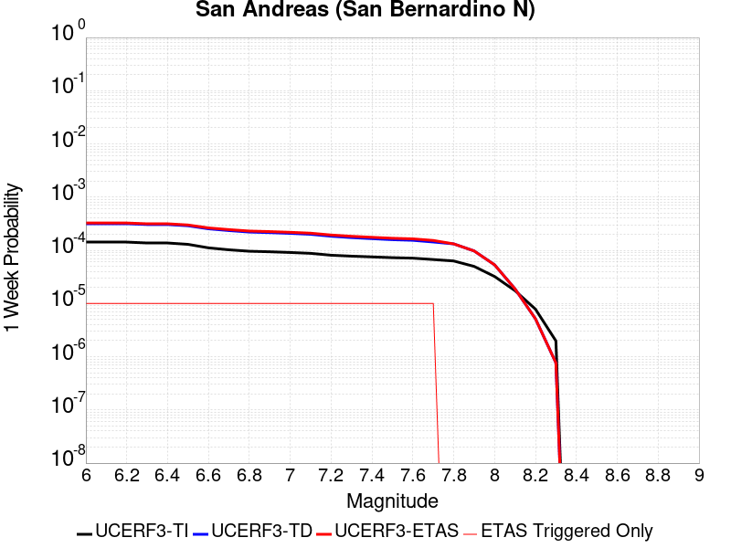 |  |  |  |

| Magnitude | 1 wk TI Prob | 1 wk TD Prob | 1 wk ETAS Prob | 1 wk ETAS/TD Gain | 1 wk ETAS Triggered Only | 1 mo TI Prob | 1 mo TD Prob | 1 mo ETAS Prob | 1 mo ETAS/TD Gain | 1 mo ETAS Triggered Only | 1 yr TI Prob | 1 yr TD Prob | 1 yr ETAS Prob | 1 yr ETAS/TD Gain | 1 yr ETAS Triggered Only | 10 yr TI Prob | 10 yr TD Prob | 10 yr ETAS Prob | 10 yr ETAS/TD Gain | 10 yr ETAS Triggered Only |
|-----|-----|-----|-----|-----|-----|-----|-----|-----|-----|-----|-----|-----|-----|-----|-----|-----|-----|-----|-----|-----|
| 6.0 | 1.4273766E-4 | 3.1614845E-4 | 3.261453E-4 | 1.0316207 | 1.0E-5 | 6.115894E-4 | 0.0013542244 | 0.001434116 | 1.0589944 | 8.0E-5 | 0.0074207084 | 0.016364535 | 0.016551426 | 1.0114205 | 1.9E-4 | 0.07177748 | 0.15036654 | 0.15060444 | 1.0015821 | 2.8E-4 |
| 6.1 | 1.4273766E-4 | 3.1614845E-4 | 3.261453E-4 | 1.0316207 | 1.0E-5 | 6.115894E-4 | 0.0013542244 | 0.001434116 | 1.0589944 | 8.0E-5 | 0.0074207084 | 0.016364535 | 0.016551426 | 1.0114205 | 1.9E-4 | 0.07177748 | 0.15036654 | 0.15060444 | 1.0015821 | 2.8E-4 |
| 6.2 | 1.4273766E-4 | 3.1614845E-4 | 3.261453E-4 | 1.0316207 | 1.0E-5 | 6.115894E-4 | 0.0013542244 | 0.001434116 | 1.0589944 | 8.0E-5 | 0.0074207084 | 0.016364535 | 0.016551426 | 1.0114205 | 1.9E-4 | 0.07177748 | 0.15036654 | 0.15060444 | 1.0015821 | 2.8E-4 |
| 6.3 | 1.3730655E-4 | 3.051962E-4 | 3.1519317E-4 | 1.0327559 | 1.0E-5 | 5.883239E-4 | 0.0013073338 | 0.0013872292 | 1.0611132 | 8.0E-5 | 0.0071393442 | 0.015802028 | 0.015989026 | 1.0118338 | 1.9E-4 | 0.06914291 | 0.14567827 | 0.14591748 | 1.001642 | 2.8E-4 |
| 6.4 | 1.3730655E-4 | 3.051962E-4 | 3.1519317E-4 | 1.0327559 | 1.0E-5 | 5.883239E-4 | 0.0013073338 | 0.0013872292 | 1.0611132 | 8.0E-5 | 0.0071393442 | 0.015802028 | 0.015989026 | 1.0118338 | 1.9E-4 | 0.06914291 | 0.14567827 | 0.14591748 | 1.001642 | 2.8E-4 |
| 6.5 | 1.2942807E-4 | 2.893405E-4 | 2.993376E-4 | 1.0345514 | 1.0E-5 | 5.545738E-4 | 0.0012394466 | 0.0013193474 | 1.0644649 | 8.0E-5 | 0.0067310524 | 0.014987098 | 0.01517425 | 1.0124875 | 1.9E-4 | 0.06530788 | 0.13881195 | 0.13905309 | 1.0017371 | 2.8E-4 |
| 6.6 | 1.1125901E-4 | 2.537283E-4 | 2.637258E-4 | 1.0394022 | 1.0E-5 | 4.767372E-4 | 0.0010869562 | 0.0011668693 | 1.0735201 | 8.0E-5 | 0.005788839 | 0.013154025 | 0.013341526 | 1.0142542 | 1.9E-4 | 0.056403454 | 0.123056285 | 0.12330183 | 1.0019953 | 2.8E-4 |
| 6.7 | 1.02209575E-4 | 2.3507705E-4 | 2.450747E-4 | 1.0425292 | 1.0E-5 | 4.3796748E-4 | 0.0010070855 | 0.0010870049 | 1.0793571 | 8.0E-5 | 0.0053192247 | 0.012192756 | 0.01238044 | 1.015393 | 1.9E-4 | 0.051936906 | 0.11485627 | 0.11510412 | 1.0021578 | 2.8E-4 |
| 6.8 | 9.610582E-5 | 2.2033554E-4 | 2.3033333E-4 | 1.0453753 | 1.0E-5 | 4.1181705E-4 | 9.4395416E-4 | 0.0010238786 | 1.0846698 | 8.0E-5 | 0.0050023515 | 0.011432346 | 0.011620174 | 1.0164295 | 1.9E-4 | 0.048912346 | 0.10822741 | 0.10847711 | 1.0023072 | 2.8E-4 |
| 6.9 | 9.3877505E-5 | 2.1489074E-4 | 2.2488859E-4 | 1.0465252 | 1.0E-5 | 4.0227012E-4 | 9.2063594E-4 | 0.0010005622 | 1.0868164 | 8.0E-5 | 0.0048866454 | 0.011151383 | 0.011339264 | 1.0168482 | 1.9E-4 | 0.04780577 | 0.105814084 | 0.10606446 | 1.0023662 | 2.8E-4 |
| 7.0 | 9.1019785E-5 | 2.0815943E-4 | 2.1815735E-4 | 1.0480301 | 1.0E-5 | 3.900265E-4 | 8.9180743E-4 | 9.717361E-4 | 1.0896255 | 8.0E-5 | 0.0047382377 | 0.010803926 | 0.010991873 | 1.0173962 | 1.9E-4 | 0.046384744 | 0.10278599 | 0.103037216 | 1.0024441 | 2.8E-4 |
| 7.1 | 8.771155E-5 | 1.9990467E-4 | 2.0990266E-4 | 1.0500139 | 1.0E-5 | 3.758525E-4 | 8.564535E-4 | 9.2639355E-4 | 1.0816624 | 7.0E-5 | 0.0045664064 | 0.010377665 | 0.010555797 | 1.017165 | 1.8E-4 | 0.044737056 | 0.099094115 | 0.099337354 | 1.0024546 | 2.7E-4 |
| 7.2 | 8.0830236E-5 | 1.8396029E-4 | 1.9395845E-4 | 1.0543495 | 1.0E-5 | 3.4636928E-4 | 7.8816316E-4 | 8.58108E-4 | 1.088744 | 7.0E-5 | 0.0042088944 | 0.009553772 | 0.009732053 | 1.0186608 | 1.8E-4 | 0.041300658 | 0.09182046 | 0.09205659 | 1.0025716 | 2.6E-4 |
| 7.3 | 7.7668235E-5 | 1.7339372E-4 | 1.83392E-4 | 1.0576622 | 1.0E-5 | 3.328214E-4 | 7.4290443E-4 | 8.1285246E-4 | 1.0941547 | 7.0E-5 | 0.0040445733 | 0.009007431 | 0.009185809 | 1.0198035 | 1.8E-4 | 0.03971748 | 0.0870959 | 0.087333255 | 1.0027252 | 2.6E-4 |
| 7.4 | 7.520177E-5 | 1.6559374E-4 | 1.7559208E-4 | 1.0603788 | 1.0E-5 | 3.2225347E-4 | 7.0949446E-4 | 7.794448E-4 | 1.0985918 | 7.0E-5 | 0.0039163795 | 0.008603949 | 0.008782401 | 1.0207406 | 1.8E-4 | 0.038480744 | 0.083552666 | 0.08379094 | 1.0028518 | 2.6E-4 |
| 7.5 | 7.274697E-5 | 1.5846924E-4 | 1.6846765E-4 | 1.0630938 | 1.0E-5 | 3.1173544E-4 | 6.789772E-4 | 7.489296E-4 | 1.1030263 | 7.0E-5 | 0.003788775 | 0.008235271 | 0.008413789 | 1.0216773 | 1.8E-4 | 0.03724827 | 0.08026917 | 0.08050831 | 1.0029792 | 2.6E-4 |
| 7.6 | 7.1185845E-5 | 1.541672E-4 | 1.6416566E-4 | 1.0648546 | 1.0E-5 | 3.0504653E-4 | 6.605493E-4 | 7.3050306E-4 | 1.1059024 | 7.0E-5 | 0.0037076178 | 0.008012585 | 0.008191143 | 1.0222846 | 1.8E-4 | 0.036463667 | 0.078258425 | 0.07849808 | 1.0030624 | 2.6E-4 |
| 7.7 | 6.709961E-5 | 1.4325391E-4 | 1.5325249E-4 | 1.0697961 | 1.0E-5 | 2.8753807E-4 | 6.1380095E-4 | 6.8375794E-4 | 1.1139735 | 7.0E-5 | 0.003495157 | 0.007447459 | 0.007616193 | 1.0226566 | 1.7E-4 | 0.034406938 | 0.07308612 | 0.07331785 | 1.0031706 | 2.5E-4 |
| 7.8 | 6.300812E-5 | 1.3209098E-4 | 1.3209098E-4 | 1.0 | 0.0 | 2.7000686E-4 | 5.6598143E-4 | 6.259475E-4 | 1.1059506 | 6.0E-5 | 0.0032823787 | 0.006869081 | 0.007027982 | 1.0231328 | 1.6E-4 | 0.032343175 | 0.0677427 | 0.06796644 | 1.0033028 | 2.4E-4 |
| 7.9 | 4.983037E-5 | 9.7286385E-5 | 9.7286385E-5 | 1.0 | 0.0 | 2.1354125E-4 | 4.1687503E-4 | 4.668542E-4 | 1.11989 | 5.0E-5 | 0.0025967648 | 0.005063652 | 0.005192994 | 1.0255432 | 1.3E-4 | 0.025666296 | 0.050672647 | 0.050872006 | 1.0039343 | 2.1E-4 |
| 8.0 | 3.2211527E-5 | 5.3333257E-5 | 5.3333257E-5 | 1.0 | 0.0 | 1.380421E-4 | 2.2855109E-4 | 2.2855109E-4 | 1.0 | 0.0 | 0.0016793669 | 0.0027790607 | 0.0027890329 | 1.0035883 | 1.0E-5 | 0.016667323 | 0.028375156 | 0.028423738 | 1.0017121 | 5.0E-5 |
| 8.1 | 1.743376E-5 | 1.8835979E-5 | 1.8835979E-5 | 1.0 | 0.0 | 7.471398E-5 | 8.0723126E-5 | 8.0723126E-5 | 1.0 | 0.0 | 9.0926304E-4 | 9.823616E-4 | 9.823616E-4 | 1.0 | 0.0 | 0.009055517 | 0.010490086 | 0.010490086 | 1.0 | 0.0 |
| 8.2 | 7.831616E-6 | 5.158648E-6 | 5.158648E-6 | 1.0 | 0.0 | 3.3563636E-5 | 2.2108305E-5 | 2.2108305E-5 | 1.0 | 0.0 | 4.0856065E-4 | 2.6913546E-4 | 2.6913546E-4 | 1.0 | 0.0 | 0.004078103 | 0.003043787 | 0.003043787 | 1.0 | 0.0 |
| 8.3 | 1.983087E-6 | 7.6647797E-7 | 7.6647797E-7 | 1.0 | 0.0 | 8.498917E-6 | 3.2849016E-6 | 3.2849016E-6 | 1.0 | 0.0 | 1.034694E-4 | 3.999296E-5 | 3.999296E-5 | 1.0 | 0.0 | 0.0010342124 | 4.7228087E-4 | 4.7228087E-4 | 1.0 | 0.0 |

## Death Valley (So)
*[(top)](#table-of-contents)*

| 1 Week | 1 Month | 1 Year | 10 Year |
|-----|-----|-----|-----|
|  | 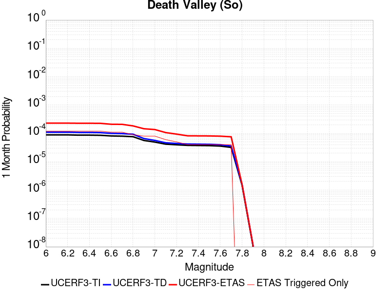 |  |  |

| Magnitude | 1 wk TI Prob | 1 wk TD Prob | 1 wk ETAS Prob | 1 wk ETAS/TD Gain | 1 wk ETAS Triggered Only | 1 mo TI Prob | 1 mo TD Prob | 1 mo ETAS Prob | 1 mo ETAS/TD Gain | 1 mo ETAS Triggered Only | 1 yr TI Prob | 1 yr TD Prob | 1 yr ETAS Prob | 1 yr ETAS/TD Gain | 1 yr ETAS Triggered Only | 10 yr TI Prob | 10 yr TD Prob | 10 yr ETAS Prob | 10 yr ETAS/TD Gain | 10 yr ETAS Triggered Only |
|-----|-----|-----|-----|-----|-----|-----|-----|-----|-----|-----|-----|-----|-----|-----|-----|-----|-----|-----|-----|-----|
| 6.0 | 2.0684236E-5 | 2.5618914E-5 | 5.5618148E-5 | 2.1709797 | 3.0E-5 | 8.864371E-5 | 1.09790824E-4 | 2.2977765E-4 | 2.0928676 | 1.2E-4 | 0.0010787029 | 0.0013359005 | 0.0015056734 | 1.127085 | 1.7E-4 | 0.010734817 | 0.01328137 | 0.013508315 | 1.0170875 | 2.3E-4 |
| 6.1 | 2.0684236E-5 | 2.5618914E-5 | 5.5618148E-5 | 2.1709797 | 3.0E-5 | 8.864371E-5 | 1.09790824E-4 | 2.2977765E-4 | 2.0928676 | 1.2E-4 | 0.0010787029 | 0.0013359005 | 0.0015056734 | 1.127085 | 1.7E-4 | 0.010734817 | 0.01328137 | 0.013508315 | 1.0170875 | 2.3E-4 |
| 6.2 | 2.0684236E-5 | 2.5618914E-5 | 5.5618148E-5 | 2.1709797 | 3.0E-5 | 8.864371E-5 | 1.09790824E-4 | 2.2977765E-4 | 2.0928676 | 1.2E-4 | 0.0010787029 | 0.0013359005 | 0.0015056734 | 1.127085 | 1.7E-4 | 0.010734817 | 0.01328137 | 0.013508315 | 1.0170875 | 2.3E-4 |
| 6.3 | 2.0240292E-5 | 2.511899E-5 | 5.511824E-5 | 2.1942856 | 3.0E-5 | 8.6741224E-5 | 1.0764847E-4 | 2.2763555E-4 | 2.1146195 | 1.2E-4 | 0.0010555626 | 0.0013098489 | 0.0014696392 | 1.1219915 | 1.6E-4 | 0.010505628 | 0.013023925 | 0.01324106 | 1.016672 | 2.2E-4 |
| 6.4 | 2.0240292E-5 | 2.511899E-5 | 5.511824E-5 | 2.1942856 | 3.0E-5 | 8.6741224E-5 | 1.0764847E-4 | 2.2763555E-4 | 2.1146195 | 1.2E-4 | 0.0010555626 | 0.0013098489 | 0.0014696392 | 1.1219915 | 1.6E-4 | 0.010505628 | 0.013023925 | 0.01324106 | 1.016672 | 2.2E-4 |
| 6.5 | 1.9962767E-5 | 2.4808238E-5 | 5.4807493E-5 | 2.2092457 | 3.0E-5 | 8.55519E-5 | 1.0631679E-4 | 2.2630402E-4 | 2.1285822 | 1.2E-4 | 0.0010410968 | 0.0012936549 | 0.001453448 | 1.1235206 | 1.6E-4 | 0.010362327 | 0.012863869 | 0.013081039 | 1.0168822 | 2.2E-4 |
| 6.6 | 1.8937297E-5 | 2.331202E-5 | 5.331132E-5 | 2.2868598 | 3.0E-5 | 8.115732E-5 | 9.9904915E-5 | 2.0989393E-4 | 2.100937 | 1.1E-4 | 9.876423E-4 | 0.0012156782 | 0.0013654958 | 1.123238 | 1.5E-4 | 0.009832645 | 0.012092765 | 0.012290346 | 1.0163388 | 2.0E-4 |
| 6.7 | 1.8621096E-5 | 2.2912649E-5 | 5.291196E-5 | 2.3092904 | 3.0E-5 | 7.980225E-5 | 9.819346E-5 | 2.0818265E-4 | 2.1201277 | 1.1E-4 | 9.711593E-4 | 0.0011948642 | 0.001344685 | 1.1253873 | 1.5E-4 | 0.009669261 | 0.011886865 | 0.012084487 | 1.0166253 | 2.0E-4 |
| 6.8 | 1.7830353E-5 | 2.1806614E-5 | 5.180596E-5 | 2.3756993 | 3.0E-5 | 7.641356E-5 | 9.345365E-5 | 1.8344524E-4 | 1.9629542 | 9.0E-5 | 9.29938E-4 | 0.0011372183 | 0.0012670705 | 1.114184 | 1.3E-4 | 0.009260561 | 0.011316919 | 0.011494882 | 1.0157254 | 1.8E-4 |
| 6.9 | 1.3135183E-5 | 1.5304342E-5 | 4.530388E-5 | 2.9601982 | 3.0E-5 | 5.6292425E-5 | 6.558842E-5 | 1.4558318E-4 | 2.2196474 | 8.0E-5 | 6.8514474E-4 | 7.9825294E-4 | 9.081651E-4 | 1.1376909 | 1.1E-4 | 0.006830362 | 0.007954868 | 0.008103674 | 1.0187063 | 1.5E-4 |
| 7.0 | 1.1507512E-5 | 1.315447E-5 | 4.3154076E-5 | 3.2805636 | 3.0E-5 | 4.9316975E-5 | 5.6375116E-5 | 1.3637061E-4 | 2.4189858 | 8.0E-5 | 6.002687E-4 | 6.861567E-4 | 7.960812E-4 | 1.1602032 | 1.1E-4 | 0.0059864987 | 0.0068410533 | 0.0069800955 | 1.0203247 | 1.4E-4 |
| 7.1 | 9.715903E-6 | 1.086547E-5 | 3.0865252E-5 | 2.8406734 | 2.0E-5 | 4.1638916E-5 | 4.6565492E-5 | 1.065627E-4 | 2.2884479 | 6.0E-5 | 5.068359E-4 | 5.667917E-4 | 6.467463E-4 | 1.1410654 | 8.0E-5 | 0.0050568148 | 0.0056537534 | 0.005753188 | 1.0175874 | 1.0E-4 |
| 7.2 | 9.233269E-6 | 1.0286476E-5 | 3.028627E-5 | 2.9442804 | 2.0E-5 | 3.9570554E-5 | 4.4084176E-5 | 9.4081974E-5 | 2.1341438 | 5.0E-5 | 4.81665E-4 | 5.365969E-4 | 6.0655933E-4 | 1.1303817 | 7.0E-5 | 0.0048062233 | 0.005353444 | 0.0054330155 | 1.0148636 | 8.0E-5 |
| 7.3 | 8.8041315E-6 | 9.808313E-6 | 2.9808118E-5 | 3.0390666 | 2.0E-5 | 3.7731446E-5 | 4.2034975E-5 | 8.203329E-5 | 1.9515486 | 4.0E-5 | 4.592835E-4 | 5.1165983E-4 | 5.7162915E-4 | 1.1172054 | 6.0E-5 | 0.0045833546 | 0.0051052445 | 0.0051748874 | 1.0136414 | 7.0E-5 |
| 7.4 | 8.708749E-6 | 9.707323E-6 | 2.970713E-5 | 3.06028 | 2.0E-5 | 3.7322676E-5 | 4.1602176E-5 | 8.160051E-5 | 1.9614482 | 4.0E-5 | 4.5430884E-4 | 5.06393E-4 | 5.663626E-4 | 1.118425 | 6.0E-5 | 0.004533812 | 0.0050528166 | 0.0051224628 | 1.0137837 | 7.0E-5 |
| 7.5 | 8.612678E-6 | 9.604964E-6 | 2.9604773E-5 | 3.0822365 | 2.0E-5 | 3.6910955E-5 | 4.116351E-5 | 8.116186E-5 | 1.9716945 | 4.0E-5 | 4.492982E-4 | 5.010547E-4 | 5.610246E-4 | 1.1196874 | 6.0E-5 | 0.004483909 | 0.0049996753 | 0.005069325 | 1.0139309 | 7.0E-5 |
| 7.6 | 8.319024E-6 | 9.28406E-6 | 2.9283874E-5 | 3.15421 | 2.0E-5 | 3.5652476E-5 | 3.9788243E-5 | 7.978665E-5 | 2.0052822 | 4.0E-5 | 4.3398244E-4 | 4.8431839E-4 | 5.4428936E-4 | 1.1238254 | 6.0E-5 | 0.0043313587 | 0.004833053 | 0.0049027144 | 1.0144136 | 7.0E-5 |
| 7.7 | 7.4718328E-6 | 8.3453E-6 | 2.8345134E-5 | 3.3965387 | 2.0E-5 | 3.2021748E-5 | 3.57651E-5 | 7.576367E-5 | 2.1183686 | 4.0E-5 | 3.8979502E-4 | 4.3535716E-4 | 4.9533107E-4 | 1.1377579 | 6.0E-5 | 0.00389112 | 0.004345448 | 0.0044151437 | 1.0160388 | 7.0E-5 |
| 7.8 | 3.4586725E-7 | 3.648288E-7 | 3.648288E-7 | 1.0 | 0.0 | 1.4822873E-6 | 1.5635511E-6 | 1.5635511E-6 | 1.0 | 0.0 | 1.80467E-5 | 1.9036073E-5 | 1.9036073E-5 | 1.0 | 0.0 | 1.8045233E-4 | 1.9034486E-4 | 1.9034486E-4 | 1.0 | 0.0 |
| 7.9 | 2.5591178E-9 | 2.6696871E-9 | 2.6696871E-9 | 1.0 | 0.0 | 1.0967647E-8 | 1.1441516E-8 | 1.1441516E-8 | 1.0 | 0.0 | 1.335311E-7 | 1.3930045E-7 | 1.3930045E-7 | 1.0 | 0.0 | 1.3353102E-6 | 1.3930046E-6 | 1.3930046E-6 | 1.0 | 0.0 |

## Coyote Canyon
*[(top)](#table-of-contents)*

| 1 Week | 1 Month | 1 Year | 10 Year |
|-----|-----|-----|-----|
|  |  |  |  |

| Magnitude | 1 wk TI Prob | 1 wk TD Prob | 1 wk ETAS Prob | 1 wk ETAS/TD Gain | 1 wk ETAS Triggered Only | 1 mo TI Prob | 1 mo TD Prob | 1 mo ETAS Prob | 1 mo ETAS/TD Gain | 1 mo ETAS Triggered Only | 1 yr TI Prob | 1 yr TD Prob | 1 yr ETAS Prob | 1 yr ETAS/TD Gain | 1 yr ETAS Triggered Only | 10 yr TI Prob | 10 yr TD Prob | 10 yr ETAS Prob | 10 yr ETAS/TD Gain | 10 yr ETAS Triggered Only |
|-----|-----|-----|-----|-----|-----|-----|-----|-----|-----|-----|-----|-----|-----|-----|-----|-----|-----|-----|-----|-----|
| 6.0 | 3.5090034E-5 | 4.036512E-5 | 6.0364313E-5 | 1.4954573 | 2.0E-5 | 1.503772E-4 | 1.7298336E-4 | 2.1297645E-4 | 1.2311962 | 4.0E-5 | 0.0018293047 | 0.0021042954 | 0.0022539797 | 1.0711328 | 1.5E-4 | 0.018143194 | 0.020869616 | 0.021075234 | 1.0098525 | 2.1E-4 |
| 6.1 | 3.5090034E-5 | 4.036512E-5 | 6.0364313E-5 | 1.4954573 | 2.0E-5 | 1.503772E-4 | 1.7298336E-4 | 2.1297645E-4 | 1.2311962 | 4.0E-5 | 0.0018293047 | 0.0021042954 | 0.0022539797 | 1.0711328 | 1.5E-4 | 0.018143194 | 0.020869616 | 0.021075234 | 1.0098525 | 2.1E-4 |
| 6.2 | 1.841879E-5 | 2.1060194E-5 | 3.1059983E-5 | 1.4748194 | 1.0E-5 | 7.8935285E-5 | 9.0255424E-5 | 1.1025362E-4 | 1.2215734 | 2.0E-5 | 9.606133E-4 | 0.0010984079 | 0.001148353 | 1.0454705 | 5.0E-5 | 0.0095647145 | 0.010939875 | 0.011019 | 1.0072327 | 8.0E-5 |
| 6.3 | 1.841879E-5 | 2.1060194E-5 | 3.1059983E-5 | 1.4748194 | 1.0E-5 | 7.8935285E-5 | 9.0255424E-5 | 1.1025362E-4 | 1.2215734 | 2.0E-5 | 9.606133E-4 | 0.0010984079 | 0.001148353 | 1.0454705 | 5.0E-5 | 0.0095647145 | 0.010939875 | 0.011019 | 1.0072327 | 8.0E-5 |
| 6.4 | 1.712201E-5 | 1.9565581E-5 | 2.9565386E-5 | 1.5110916 | 1.0E-5 | 7.337798E-5 | 8.385037E-5 | 1.0384869E-4 | 1.2385001 | 2.0E-5 | 8.930107E-4 | 0.0010205007 | 0.0010704496 | 1.0489455 | 5.0E-5 | 0.008894307 | 0.0101680625 | 0.010247249 | 1.0077878 | 8.0E-5 |
| 6.5 | 1.4744935E-5 | 1.6837288E-5 | 2.683712E-5 | 1.5939099 | 1.0E-5 | 6.3191044E-5 | 7.215834E-5 | 9.215689E-5 | 1.2771482 | 2.0E-5 | 7.6907943E-4 | 8.782672E-4 | 9.182321E-4 | 1.0455042 | 4.0E-5 | 0.007664232 | 0.008757159 | 0.008826546 | 1.0079235 | 7.0E-5 |
| 6.6 | 1.2017839E-5 | 1.3724348E-5 | 2.3724211E-5 | 1.7286221 | 1.0E-5 | 5.150401E-5 | 5.8817805E-5 | 7.881663E-5 | 1.340013 | 2.0E-5 | 6.268809E-4 | 7.159601E-4 | 7.559314E-4 | 1.055829 | 4.0E-5 | 0.0062511545 | 0.0071452283 | 0.0071948706 | 1.0069476 | 5.0E-5 |
| 6.7 | 1.00956095E-5 | 1.1533734E-5 | 2.1533619E-5 | 1.8670119 | 1.0E-5 | 4.326618E-5 | 4.9429844E-5 | 6.9428854E-5 | 1.4045938 | 2.0E-5 | 5.266384E-4 | 6.0172915E-4 | 6.4170506E-4 | 1.0664351 | 4.0E-5 | 0.005253921 | 0.006009526 | 0.0060492856 | 1.0066161 | 4.0E-5 |

## Nelson Lake
*[(top)](#table-of-contents)*

| 1 Week | 1 Month | 1 Year | 10 Year |
|-----|-----|-----|-----|
|  |  |  |  |

| Magnitude | 1 wk TI Prob | 1 wk TD Prob | 1 wk ETAS Prob | 1 wk ETAS/TD Gain | 1 wk ETAS Triggered Only | 1 mo TI Prob | 1 mo TD Prob | 1 mo ETAS Prob | 1 mo ETAS/TD Gain | 1 mo ETAS Triggered Only | 1 yr TI Prob | 1 yr TD Prob | 1 yr ETAS Prob | 1 yr ETAS/TD Gain | 1 yr ETAS Triggered Only | 10 yr TI Prob | 10 yr TD Prob | 10 yr ETAS Prob | 10 yr ETAS/TD Gain | 10 yr ETAS Triggered Only |
|-----|-----|-----|-----|-----|-----|-----|-----|-----|-----|-----|-----|-----|-----|-----|-----|-----|-----|-----|-----|-----|
| 6.0 | 9.913453E-6 | 1.0192293E-5 | 3.019209E-5 | 2.962247 | 2.0E-5 | 4.2485535E-5 | 4.3680586E-5 | 1.2367709E-4 | 2.8313973 | 8.0E-5 | 5.1713863E-4 | 5.316917E-4 | 6.416332E-4 | 1.2067769 | 1.1E-4 | 0.0051593683 | 0.0053052236 | 0.005454428 | 1.028124 | 1.5E-4 |
| 6.1 | 9.913453E-6 | 1.0192293E-5 | 3.019209E-5 | 2.962247 | 2.0E-5 | 4.2485535E-5 | 4.3680586E-5 | 1.2367709E-4 | 2.8313973 | 8.0E-5 | 5.1713863E-4 | 5.316917E-4 | 6.416332E-4 | 1.2067769 | 1.1E-4 | 0.0051593683 | 0.0053052236 | 0.005454428 | 1.028124 | 1.5E-4 |
| 6.2 | 4.5596407E-6 | 4.696332E-6 | 1.4696285E-5 | 3.1293116 | 1.0E-5 | 1.954117E-5 | 2.0126989E-5 | 6.012618E-5 | 2.9873414 | 4.0E-5 | 2.3788778E-4 | 2.450198E-4 | 2.8501E-4 | 1.1632121 | 4.0E-5 | 0.0023763329 | 0.0024476226 | 0.0025074757 | 1.0244536 | 6.0E-5 |
| 6.3 | 4.5596407E-6 | 4.696332E-6 | 1.4696285E-5 | 3.1293116 | 1.0E-5 | 1.954117E-5 | 2.0126989E-5 | 6.012618E-5 | 2.9873414 | 4.0E-5 | 2.3788778E-4 | 2.450198E-4 | 2.8501E-4 | 1.1632121 | 4.0E-5 | 0.0023763329 | 0.0024476226 | 0.0025074757 | 1.0244536 | 6.0E-5 |
| 6.4 | 3.4025713E-6 | 3.509912E-6 | 1.3509877E-5 | 3.8490644 | 1.0E-5 | 1.4582367E-5 | 1.50423975E-5 | 5.5041797E-5 | 3.6591105 | 4.0E-5 | 1.7752586E-4 | 1.8312664E-4 | 2.2311932E-4 | 1.2183881 | 4.0E-5 | 0.001773841 | 0.0018298404 | 0.0018797488 | 1.0272748 | 5.0E-5 |
| 6.5 | 2.8352947E-6 | 2.9278688E-6 | 1.292784E-5 | 4.4154434 | 1.0E-5 | 1.2151207E-5 | 1.2547953E-5 | 4.2547577E-5 | 3.390798 | 3.0E-5 | 1.479309E-4 | 1.5276136E-4 | 1.8275679E-4 | 1.1963547 | 3.0E-5 | 0.0014783246 | 0.0015266375 | 0.0015665764 | 1.0261614 | 4.0E-5 |
| 6.6 | 2.251518E-6 | 2.3290781E-6 | 1.2329055E-5 | 5.2935343 | 1.0E-5 | 9.649328E-6 | 9.981729E-6 | 2.998153E-5 | 3.003641 | 2.0E-5 | 1.1747423E-4 | 1.2152141E-4 | 1.4151898E-4 | 1.1645601 | 2.0E-5 | 0.0011741214 | 0.0012146112 | 0.0012445748 | 1.0246693 | 3.0E-5 |
| 6.7 | 1.8911853E-6 | 1.9591491E-6 | 1.195913E-5 | 6.104247 | 1.0E-5 | 8.105055E-6 | 8.39633E-6 | 2.8396162E-5 | 3.3819733 | 2.0E-5 | 9.867457E-5 | 1.022211E-4 | 1.2221905E-4 | 1.1956344 | 2.0E-5 | 9.863076E-4 | 0.0010217984 | 0.0010517676 | 1.02933 | 3.0E-5 |
| 6.8 | 1.4874814E-6 | 1.5438383E-6 | 1.1543822E-5 | 7.4773526 | 1.0E-5 | 6.374905E-6 | 6.6164357E-6 | 2.6616304E-5 | 4.0227556 | 2.0E-5 | 7.76117E-5 | 8.055265E-5 | 1.00551035E-4 | 1.2482648 | 2.0E-5 | 7.75846E-4 | 8.052856E-4 | 8.352614E-4 | 1.0372238 | 3.0E-5 |
| 6.9 | 6.835972E-7 | 7.1399705E-7 | 7.1399705E-7 | 1.0 | 0.0 | 2.9296991E-6 | 3.0599856E-6 | 1.3059955E-5 | 4.267979 | 1.0E-5 | 3.56685E-5 | 3.7255006E-5 | 4.7254634E-5 | 1.2684103 | 1.0E-5 | 3.5662777E-4 | 3.7251884E-4 | 3.8251514E-4 | 1.0268342 | 1.0E-5 |

## Towne Pass
*[(top)](#table-of-contents)*

| 1 Week | 1 Month | 1 Year | 10 Year |
|-----|-----|-----|-----|
|  |  |  |  |

| Magnitude | 1 wk TI Prob | 1 wk TD Prob | 1 wk ETAS Prob | 1 wk ETAS/TD Gain | 1 wk ETAS Triggered Only | 1 mo TI Prob | 1 mo TD Prob | 1 mo ETAS Prob | 1 mo ETAS/TD Gain | 1 mo ETAS Triggered Only | 1 yr TI Prob | 1 yr TD Prob | 1 yr ETAS Prob | 1 yr ETAS/TD Gain | 1 yr ETAS Triggered Only | 10 yr TI Prob | 10 yr TD Prob | 10 yr ETAS Prob | 10 yr ETAS/TD Gain | 10 yr ETAS Triggered Only |
|-----|-----|-----|-----|-----|-----|-----|-----|-----|-----|-----|-----|-----|-----|-----|-----|-----|-----|-----|-----|-----|
| 6.0 | 3.849728E-6 | 3.8945495E-6 | 1.3894511E-5 | 3.5676808 | 1.0E-5 | 1.649873E-5 | 1.6690845E-5 | 4.6690344E-5 | 2.7973626 | 3.0E-5 | 2.0085352E-4 | 2.0319647E-4 | 2.831802E-4 | 1.3936276 | 8.0E-5 | 0.0020067208 | 0.0020305358 | 0.0021702514 | 1.0688074 | 1.4E-4 |
| 6.1 | 3.849728E-6 | 3.8945495E-6 | 1.3894511E-5 | 3.5676808 | 1.0E-5 | 1.649873E-5 | 1.6690845E-5 | 4.6690344E-5 | 2.7973626 | 3.0E-5 | 2.0085352E-4 | 2.0319647E-4 | 2.831802E-4 | 1.3936276 | 8.0E-5 | 0.0020067208 | 0.0020305358 | 0.0021702514 | 1.0688074 | 1.4E-4 |
| 6.2 | 3.849728E-6 | 3.8945495E-6 | 1.3894511E-5 | 3.5676808 | 1.0E-5 | 1.649873E-5 | 1.6690845E-5 | 4.6690344E-5 | 2.7973626 | 3.0E-5 | 2.0085352E-4 | 2.0319647E-4 | 2.831802E-4 | 1.3936276 | 8.0E-5 | 0.0020067208 | 0.0020305358 | 0.0021702514 | 1.0688074 | 1.4E-4 |
| 6.3 | 3.849728E-6 | 3.8945495E-6 | 1.3894511E-5 | 3.5676808 | 1.0E-5 | 1.649873E-5 | 1.6690845E-5 | 4.6690344E-5 | 2.7973626 | 3.0E-5 | 2.0085352E-4 | 2.0319647E-4 | 2.831802E-4 | 1.3936276 | 8.0E-5 | 0.0020067208 | 0.0020305358 | 0.0021702514 | 1.0688074 | 1.4E-4 |
| 6.4 | 3.849728E-6 | 3.8945495E-6 | 1.3894511E-5 | 3.5676808 | 1.0E-5 | 1.649873E-5 | 1.6690845E-5 | 4.6690344E-5 | 2.7973626 | 3.0E-5 | 2.0085352E-4 | 2.0319647E-4 | 2.831802E-4 | 1.3936276 | 8.0E-5 | 0.0020067208 | 0.0020305358 | 0.0021702514 | 1.0688074 | 1.4E-4 |
| 6.5 | 1.1953545E-6 | 1.2030554E-6 | 1.2030554E-6 | 1.0 | 0.0 | 5.1229376E-6 | 5.1559423E-6 | 1.5155891E-5 | 2.9394999 | 1.0E-5 | 6.236998E-5 | 6.2771906E-5 | 8.277065E-5 | 1.3185939 | 2.0E-5 | 6.235248E-4 | 6.275535E-4 | 6.5753463E-4 | 1.0477747 | 3.0E-5 |
| 6.6 | 1.1953545E-6 | 1.2030554E-6 | 1.2030554E-6 | 1.0 | 0.0 | 5.1229376E-6 | 5.1559423E-6 | 1.5155891E-5 | 2.9394999 | 1.0E-5 | 6.236998E-5 | 6.2771906E-5 | 8.277065E-5 | 1.3185939 | 2.0E-5 | 6.235248E-4 | 6.275535E-4 | 6.5753463E-4 | 1.0477747 | 3.0E-5 |
| 6.7 | 8.375951E-7 | 8.4106983E-7 | 8.4106983E-7 | 1.0 | 0.0 | 3.5896885E-6 | 3.6045803E-6 | 1.3604545E-5 | 3.774238 | 1.0E-5 | 4.370358E-5 | 4.388494E-5 | 6.3884065E-5 | 1.4557172 | 2.0E-5 | 4.3694986E-4 | 4.3876845E-4 | 4.687553E-4 | 1.0683432 | 3.0E-5 |
| 6.8 | 6.38041E-7 | 6.392181E-7 | 6.392181E-7 | 1.0 | 0.0 | 2.7344586E-6 | 2.7395035E-6 | 2.7395035E-6 | 1.0 | 0.0 | 3.3291526E-5 | 3.3352986E-5 | 3.3352986E-5 | 1.0 | 0.0 | 3.3286537E-4 | 3.334836E-4 | 3.4348026E-4 | 1.0299765 | 1.0E-5 |
| 6.9 | 5.3460053E-7 | 5.345356E-7 | 5.345356E-7 | 1.0 | 0.0 | 2.2911431E-6 | 2.290865E-6 | 2.290865E-6 | 1.0 | 0.0 | 2.789431E-5 | 2.789096E-5 | 2.789096E-5 | 1.0 | 0.0 | 2.789081E-4 | 2.788779E-4 | 2.8887513E-4 | 1.035848 | 1.0E-5 |
| 7.0 | 3.557783E-7 | 3.5324425E-7 | 3.5324425E-7 | 1.0 | 0.0 | 1.5247632E-6 | 1.513903E-6 | 1.513903E-6 | 1.0 | 0.0 | 1.8563835E-5 | 1.8431623E-5 | 1.8431623E-5 | 1.0 | 0.0 | 1.8562283E-4 | 1.8430178E-4 | 1.8430178E-4 | 1.0 | 0.0 |
| 7.1 | 3.037942E-7 | 3.00024E-7 | 3.00024E-7 | 1.0 | 0.0 | 1.3019744E-6 | 1.2858166E-6 | 1.2858166E-6 | 1.0 | 0.0 | 1.5851423E-5 | 1.5654712E-5 | 1.5654712E-5 | 1.0 | 0.0 | 1.5850292E-4 | 1.5653683E-4 | 1.5653683E-4 | 1.0 | 0.0 |
| 7.2 | 2.0808248E-7 | 2.0217831E-7 | 2.0217831E-7 | 1.0 | 0.0 | 8.917818E-7 | 8.664782E-7 | 8.664782E-7 | 1.0 | 0.0 | 1.0857389E-5 | 1.0549326E-5 | 1.0549326E-5 | 1.0 | 0.0 | 1.0856859E-4 | 1.0548872E-4 | 1.0548872E-4 | 1.0 | 0.0 |
| 7.3 | 1.1162073E-7 | 1.0636953E-7 | 1.0636953E-7 | 1.0 | 0.0 | 4.7837443E-7 | 4.5586933E-7 | 4.5586933E-7 | 1.0 | 0.0 | 5.8241935E-6 | 5.550197E-6 | 5.550197E-6 | 1.0 | 0.0 | 5.8240406E-5 | 5.5500783E-5 | 5.5500783E-5 | 1.0 | 0.0 |

## San Andreas (San Bernardino S)
*[(top)](#table-of-contents)*

| 1 Week | 1 Month | 1 Year | 10 Year |
|-----|-----|-----|-----|
|  |  |  |  |

| Magnitude | 1 wk TI Prob | 1 wk TD Prob | 1 wk ETAS Prob | 1 wk ETAS/TD Gain | 1 wk ETAS Triggered Only | 1 mo TI Prob | 1 mo TD Prob | 1 mo ETAS Prob | 1 mo ETAS/TD Gain | 1 mo ETAS Triggered Only | 1 yr TI Prob | 1 yr TD Prob | 1 yr ETAS Prob | 1 yr ETAS/TD Gain | 1 yr ETAS Triggered Only | 10 yr TI Prob | 10 yr TD Prob | 10 yr ETAS Prob | 10 yr ETAS/TD Gain | 10 yr ETAS Triggered Only |
|-----|-----|-----|-----|-----|-----|-----|-----|-----|-----|-----|-----|-----|-----|-----|-----|-----|-----|-----|-----|-----|
| 6.0 | 1.2336002E-4 | 3.000988E-4 | 3.000988E-4 | 1.0 | 0.0 | 5.2857865E-4 | 0.0012855299 | 0.0013254784 | 1.0310756 | 4.0E-5 | 0.006416472 | 0.015543964 | 0.015632564 | 1.0057 | 9.0E-5 | 0.06234337 | 0.14291926 | 0.14303926 | 1.0008396 | 1.4E-4 |
| 6.1 | 1.2336002E-4 | 3.000988E-4 | 3.000988E-4 | 1.0 | 0.0 | 5.2857865E-4 | 0.0012855299 | 0.0013254784 | 1.0310756 | 4.0E-5 | 0.006416472 | 0.015543964 | 0.015632564 | 1.0057 | 9.0E-5 | 0.06234337 | 0.14291926 | 0.14303926 | 1.0008396 | 1.4E-4 |
| 6.2 | 1.2336002E-4 | 3.000988E-4 | 3.000988E-4 | 1.0 | 0.0 | 5.2857865E-4 | 0.0012855299 | 0.0013254784 | 1.0310756 | 4.0E-5 | 0.006416472 | 0.015543964 | 0.015632564 | 1.0057 | 9.0E-5 | 0.06234337 | 0.14291926 | 0.14303926 | 1.0008396 | 1.4E-4 |
| 6.3 | 1.1712257E-4 | 2.879813E-4 | 2.879813E-4 | 1.0 | 0.0 | 5.018573E-4 | 0.0012336475 | 0.0012735982 | 1.0323842 | 4.0E-5 | 0.006093008 | 0.0149210645 | 0.015009722 | 1.0059417 | 9.0E-5 | 0.059286322 | 0.13763407 | 0.1377548 | 1.0008771 | 1.4E-4 |
| 6.4 | 1.1712257E-4 | 2.879813E-4 | 2.879813E-4 | 1.0 | 0.0 | 5.018573E-4 | 0.0012336475 | 0.0012735982 | 1.0323842 | 4.0E-5 | 0.006093008 | 0.0149210645 | 0.015009722 | 1.0059417 | 9.0E-5 | 0.059286322 | 0.13763407 | 0.1377548 | 1.0008771 | 1.4E-4 |
| 6.5 | 1.0689076E-4 | 2.6810818E-4 | 2.6810818E-4 | 1.0 | 0.0 | 4.5802278E-4 | 0.0011485539 | 0.0011885079 | 1.0347865 | 4.0E-5 | 0.0055621783 | 0.013898602 | 0.01398735 | 1.0063854 | 9.0E-5 | 0.05425003 | 0.12891594 | 0.12903789 | 1.0009459 | 1.4E-4 |
| 6.6 | 9.7648895E-5 | 2.5055694E-4 | 2.5055694E-4 | 1.0 | 0.0 | 4.1842813E-4 | 0.0010733972 | 0.0011133542 | 1.0372249 | 4.0E-5 | 0.005082469 | 0.012994667 | 0.013083497 | 1.0068359 | 9.0E-5 | 0.049677886 | 0.12101118 | 0.121134244 | 1.001017 | 1.4E-4 |
| 6.7 | 8.757013E-5 | 2.3126253E-4 | 2.3126253E-4 | 1.0 | 0.0 | 3.7524657E-4 | 9.90771E-4 | 0.0010307314 | 1.0403326 | 4.0E-5 | 0.00455906 | 0.012000005 | 0.012088925 | 1.00741 | 9.0E-5 | 0.04466656 | 0.11236583 | 0.1124901 | 1.0011059 | 1.4E-4 |
| 6.8 | 8.562978E-5 | 2.268613E-4 | 2.268613E-4 | 1.0 | 0.0 | 3.6693315E-4 | 9.719227E-4 | 0.0010118838 | 1.0411155 | 4.0E-5 | 0.004458263 | 0.011773022 | 0.011861962 | 1.0075547 | 9.0E-5 | 0.043698758 | 0.11037151 | 0.11049606 | 1.0011284 | 1.4E-4 |
| 6.9 | 6.124075E-5 | 1.7070957E-4 | 1.7070957E-4 | 1.0 | 0.0 | 2.6243398E-4 | 7.3140813E-4 | 7.7137887E-4 | 1.054649 | 4.0E-5 | 0.0031904527 | 0.008868743 | 0.008957945 | 1.010058 | 9.0E-5 | 0.031450346 | 0.08419216 | 0.084320374 | 1.0015229 | 1.4E-4 |
| 7.0 | 5.8598747E-5 | 1.6499894E-4 | 1.6499894E-4 | 1.0 | 0.0 | 2.5111332E-4 | 7.069475E-4 | 7.4691925E-4 | 1.0565413 | 4.0E-5 | 0.0030530186 | 0.008573314 | 0.008662542 | 1.0104077 | 9.0E-5 | 0.03011414 | 0.08151563 | 0.08164422 | 1.0015775 | 1.4E-4 |
| 7.1 | 5.613814E-5 | 1.5918406E-4 | 1.5918406E-4 | 1.0 | 0.0 | 2.4056983E-4 | 6.8203977E-4 | 7.1201933E-4 | 1.0439557 | 3.0E-5 | 0.0029250039 | 0.008272399 | 0.008351738 | 1.0095907 | 8.0E-5 | 0.028868021 | 0.07881265 | 0.078932405 | 1.0015194 | 1.3E-4 |
| 7.2 | 4.991222E-5 | 1.452485E-4 | 1.452485E-4 | 1.0 | 0.0 | 2.1389198E-4 | 6.223455E-4 | 6.523268E-4 | 1.0481747 | 3.0E-5 | 0.002601025 | 0.007550835 | 0.007630231 | 1.0105149 | 8.0E-5 | 0.025707912 | 0.07226236 | 0.072373696 | 1.0015407 | 1.2E-4 |
| 7.3 | 4.7410045E-5 | 1.3718859E-4 | 1.3718859E-4 | 1.0 | 0.0 | 2.0317009E-4 | 5.8781897E-4 | 6.178013E-4 | 1.0510061 | 3.0E-5 | 0.0024707897 | 0.007133297 | 0.0072127264 | 1.011135 | 8.0E-5 | 0.024434982 | 0.068555124 | 0.0686669 | 1.0016304 | 1.2E-4 |
| 7.4 | 4.5556746E-5 | 1.312667E-4 | 1.312667E-4 | 1.0 | 0.0 | 1.952286E-4 | 5.624506E-4 | 5.9243373E-4 | 1.053308 | 3.0E-5 | 0.002374317 | 0.006826414 | 0.0069058677 | 1.0116392 | 8.0E-5 | 0.023491086 | 0.0658083 | 0.065920405 | 1.0017035 | 1.2E-4 |
| 7.5 | 4.3084514E-5 | 1.2361899E-4 | 1.2361899E-4 | 1.0 | 0.0 | 1.8463485E-4 | 5.296884E-4 | 5.596725E-4 | 1.0566071 | 3.0E-5 | 0.0022456115 | 0.006429958 | 0.0065094437 | 1.0123618 | 8.0E-5 | 0.022230545 | 0.062208522 | 0.06232106 | 1.001809 | 1.2E-4 |
| 7.6 | 3.408608E-5 | 9.8397344E-5 | 9.8397344E-5 | 1.0 | 0.0 | 1.4607502E-4 | 4.2163485E-4 | 4.516222E-4 | 1.0711216 | 3.0E-5 | 0.0017770125 | 0.0051213475 | 0.005200938 | 1.0155408 | 8.0E-5 | 0.017628696 | 0.050038666 | 0.05015266 | 1.0022781 | 1.2E-4 |
| 7.7 | 2.8315713E-5 | 8.252603E-5 | 8.252603E-5 | 1.0 | 0.0 | 1.2134742E-4 | 3.5363509E-4 | 3.8362446E-4 | 1.0848032 | 3.0E-5 | 0.0014764034 | 0.004297016 | 0.004376672 | 1.0185375 | 8.0E-5 | 0.01466633 | 0.042289194 | 0.04240412 | 1.0027176 | 1.2E-4 |
| 7.8 | 2.6222975E-5 | 7.466726E-5 | 7.466726E-5 | 1.0 | 0.0 | 1.1237934E-4 | 3.1996332E-4 | 3.4995374E-4 | 1.0937307 | 3.0E-5 | 0.0013673597 | 0.0038886012 | 0.00396829 | 1.0204929 | 8.0E-5 | 0.013589768 | 0.03845329 | 0.03856867 | 1.0030006 | 1.2E-4 |
| 7.9 | 2.1469694E-5 | 5.7908495E-5 | 5.7908495E-5 | 1.0 | 0.0 | 9.200973E-5 | 2.4815567E-4 | 2.7814822E-4 | 1.1208619 | 3.0E-5 | 0.0011196428 | 0.0030171126 | 0.003096871 | 1.0264354 | 8.0E-5 | 0.011140184 | 0.030165782 | 0.030282162 | 1.003858 | 1.2E-4 |
| 8.0 | 1.2420249E-5 | 3.1335217E-5 | 3.1335217E-5 | 1.0 | 0.0 | 5.322855E-5 | 1.3428688E-4 | 1.3428688E-4 | 1.0 | 0.0 | 6.478649E-4 | 0.0016337177 | 0.0016437013 | 1.006111 | 1.0E-5 | 0.0064597935 | 0.01652998 | 0.016569318 | 1.0023799 | 4.0E-5 |
| 8.1 | 4.9197724E-6 | 7.827452E-6 | 7.827452E-6 | 1.0 | 0.0 | 2.1084568E-5 | 3.354579E-5 | 3.354579E-5 | 1.0 | 0.0 | 2.566744E-4 | 4.0834362E-4 | 4.0834362E-4 | 1.0 | 0.0 | 0.002563781 | 0.004386937 | 0.004386937 | 1.0 | 0.0 |
| 8.2 | 2.5634774E-6 | 2.9088305E-6 | 2.9088305E-6 | 1.0 | 0.0 | 1.0986286E-5 | 1.24663575E-5 | 1.24663575E-5 | 1.0 | 0.0 | 1.3374983E-4 | 1.5176737E-4 | 1.5176737E-4 | 1.0 | 0.0 | 0.0013366934 | 0.0017061312 | 0.0017061312 | 1.0 | 0.0 |
| 8.3 | 5.2850464E-7 | 3.2110069E-7 | 3.2110069E-7 | 1.0 | 0.0 | 2.2650179E-6 | 1.3761452E-6 | 1.3761452E-6 | 1.0 | 0.0 | 2.7576245E-5 | 1.6754451E-5 | 1.6754451E-5 | 1.0 | 0.0 | 2.7572823E-4 | 1.9885681E-4 | 1.9885681E-4 | 1.0 | 0.0 |

## Death Valley (Black Mtns Frontal)
*[(top)](#table-of-contents)*

| 1 Week | 1 Month | 1 Year | 10 Year |
|-----|-----|-----|-----|
|  |  |  |  |

| Magnitude | 1 wk TI Prob | 1 wk TD Prob | 1 wk ETAS Prob | 1 wk ETAS/TD Gain | 1 wk ETAS Triggered Only | 1 mo TI Prob | 1 mo TD Prob | 1 mo ETAS Prob | 1 mo ETAS/TD Gain | 1 mo ETAS Triggered Only | 1 yr TI Prob | 1 yr TD Prob | 1 yr ETAS Prob | 1 yr ETAS/TD Gain | 1 yr ETAS Triggered Only | 10 yr TI Prob | 10 yr TD Prob | 10 yr ETAS Prob | 10 yr ETAS/TD Gain | 10 yr ETAS Triggered Only |
|-----|-----|-----|-----|-----|-----|-----|-----|-----|-----|-----|-----|-----|-----|-----|-----|-----|-----|-----|-----|-----|
| 6.0 | 1.6707214E-5 | 1.867056E-5 | 3.8670187E-5 | 2.071185 | 2.0E-5 | 7.160038E-5 | 8.001427E-5 | 1.3001027E-4 | 1.6248385 | 5.0E-5 | 8.71386E-4 | 9.7374606E-4 | 0.0010636584 | 1.0923365 | 9.0E-5 | 0.00867977 | 0.009695647 | 0.009814484 | 1.0122567 | 1.2E-4 |
| 6.1 | 1.6707214E-5 | 1.867056E-5 | 3.8670187E-5 | 2.071185 | 2.0E-5 | 7.160038E-5 | 8.001427E-5 | 1.3001027E-4 | 1.6248385 | 5.0E-5 | 8.71386E-4 | 9.7374606E-4 | 0.0010636584 | 1.0923365 | 9.0E-5 | 0.00867977 | 0.009695647 | 0.009814484 | 1.0122567 | 1.2E-4 |
| 6.2 | 1.6707214E-5 | 1.867056E-5 | 3.8670187E-5 | 2.071185 | 2.0E-5 | 7.160038E-5 | 8.001427E-5 | 1.3001027E-4 | 1.6248385 | 5.0E-5 | 8.71386E-4 | 9.7374606E-4 | 0.0010636584 | 1.0923365 | 9.0E-5 | 0.00867977 | 0.009695647 | 0.009814484 | 1.0122567 | 1.2E-4 |
| 6.3 | 1.6707214E-5 | 1.867056E-5 | 3.8670187E-5 | 2.071185 | 2.0E-5 | 7.160038E-5 | 8.001427E-5 | 1.3001027E-4 | 1.6248385 | 5.0E-5 | 8.71386E-4 | 9.7374606E-4 | 0.0010636584 | 1.0923365 | 9.0E-5 | 0.00867977 | 0.009695647 | 0.009814484 | 1.0122567 | 1.2E-4 |
| 6.4 | 1.5515609E-5 | 1.7338483E-5 | 3.7338137E-5 | 2.1534834 | 2.0E-5 | 6.649377E-5 | 7.430571E-5 | 1.24302E-4 | 1.6728458 | 5.0E-5 | 8.0926094E-4 | 9.0430264E-4 | 9.942212E-4 | 1.0994343 | 9.0E-5 | 0.008063202 | 0.009006913 | 0.009115922 | 1.0121028 | 1.1E-4 |
| 6.5 | 1.5515609E-5 | 1.7338483E-5 | 3.7338137E-5 | 2.1534834 | 2.0E-5 | 6.649377E-5 | 7.430571E-5 | 1.24302E-4 | 1.6728458 | 5.0E-5 | 8.0926094E-4 | 9.0430264E-4 | 9.942212E-4 | 1.0994343 | 9.0E-5 | 0.008063202 | 0.009006913 | 0.009115922 | 1.0121028 | 1.1E-4 |
| 6.6 | 1.5041828E-5 | 1.6809407E-5 | 3.680907E-5 | 2.18979 | 2.0E-5 | 6.4463384E-5 | 7.203836E-5 | 1.2203476E-4 | 1.6940247 | 5.0E-5 | 7.8455906E-4 | 8.7672E-4 | 9.566499E-4 | 1.0911692 | 8.0E-5 | 0.00781795 | 0.008733268 | 0.008832395 | 1.0113505 | 1.0E-4 |
| 6.7 | 1.4634985E-5 | 1.6356273E-5 | 3.6355945E-5 | 2.2227526 | 2.0E-5 | 6.271985E-5 | 7.009646E-5 | 1.20092955E-4 | 1.7132528 | 5.0E-5 | 7.6334673E-4 | 8.53096E-4 | 9.3302777E-4 | 1.0936961 | 8.0E-5 | 0.007607299 | 0.008498848 | 0.008597998 | 1.0116663 | 1.0E-4 |
| 6.8 | 1.4209158E-5 | 1.5882297E-5 | 3.5881978E-5 | 2.2592437 | 2.0E-5 | 6.089497E-5 | 6.806524E-5 | 1.18061835E-4 | 1.7345394 | 5.0E-5 | 7.4114406E-4 | 8.2838483E-4 | 9.0831856E-4 | 1.0964935 | 8.0E-5 | 0.007386771 | 0.008253585 | 0.008352759 | 1.0120159 | 1.0E-4 |
| 6.9 | 1.3780098E-5 | 1.5404834E-5 | 3.5404526E-5 | 2.2982738 | 2.0E-5 | 5.9056227E-5 | 6.601908E-5 | 1.1601578E-4 | 1.7573068 | 5.0E-5 | 7.1877235E-4 | 8.0349133E-4 | 8.8342704E-4 | 1.0994855 | 8.0E-5 | 0.0071645193 | 0.008006458 | 0.008105657 | 1.0123899 | 1.0E-4 |
| 7.0 | 1.3585064E-5 | 1.5188394E-5 | 3.518809E-5 | 2.3167748 | 2.0E-5 | 5.8220405E-5 | 6.5091524E-5 | 1.1508827E-4 | 1.7680992 | 5.0E-5 | 7.086029E-4 | 7.922066E-4 | 8.7214325E-4 | 1.1009037 | 8.0E-5 | 0.007063476 | 0.007894417 | 0.007993628 | 1.0125672 | 1.0E-4 |
| 7.1 | 1.3398601E-5 | 1.4981575E-5 | 3.4981276E-5 | 2.334953 | 2.0E-5 | 5.742131E-5 | 6.4205204E-5 | 1.1420199E-4 | 1.7787031 | 5.0E-5 | 6.9888023E-4 | 7.814234E-4 | 8.613609E-4 | 1.1022973 | 8.0E-5 | 0.0069668638 | 0.007787346 | 0.007886567 | 1.0127413 | 1.0E-4 |
| 7.2 | 1.3126312E-5 | 1.4679792E-5 | 3.46795E-5 | 2.3623972 | 2.0E-5 | 5.6254412E-5 | 6.291191E-5 | 1.0290939E-4 | 1.6357697 | 4.0E-5 | 6.846822E-4 | 7.656887E-4 | 8.356351E-4 | 1.0913509 | 7.0E-5 | 0.006825765 | 0.00763109 | 0.007710479 | 1.0104034 | 8.0E-5 |
| 7.3 | 1.2922429E-5 | 1.4454016E-5 | 3.4453726E-5 | 2.3836784 | 2.0E-5 | 5.5380664E-5 | 6.1944345E-5 | 1.0194186E-4 | 1.6457009 | 4.0E-5 | 6.74051E-4 | 7.5391686E-4 | 8.238641E-4 | 1.0927784 | 7.0E-5 | 0.006720101 | 0.0075141727 | 0.0075935717 | 1.0105666 | 8.0E-5 |
| 7.4 | 1.2768878E-5 | 1.4283997E-5 | 3.4283712E-5 | 2.4001484 | 2.0E-5 | 5.4722615E-5 | 6.1215724E-5 | 1.0121328E-4 | 1.653387 | 4.0E-5 | 6.660441E-4 | 7.45052E-4 | 8.1499986E-4 | 1.0938832 | 7.0E-5 | 0.0066405144 | 0.0074261203 | 0.0075055263 | 1.0106928 | 8.0E-5 |
| 7.5 | 1.2521929E-5 | 1.40122365E-5 | 3.4011955E-5 | 2.4273038 | 2.0E-5 | 5.366431E-5 | 6.0051094E-5 | 1.0004869E-4 | 1.6660595 | 4.0E-5 | 6.531671E-4 | 7.308822E-4 | 8.0083107E-4 | 1.0957047 | 7.0E-5 | 0.006512506 | 0.0072853607 | 0.007364778 | 1.010901 | 8.0E-5 |
| 7.6 | 1.1301089E-5 | 1.2648349E-5 | 3.2648095E-5 | 2.581214 | 2.0E-5 | 4.8432343E-5 | 5.4206117E-5 | 9.420395E-5 | 1.7378842 | 4.0E-5 | 5.895042E-4 | 6.597649E-4 | 7.297187E-4 | 1.1060284 | 7.0E-5 | 0.0058794282 | 0.0065786145 | 0.006658088 | 1.0120807 | 8.0E-5 |
| 7.7 | 9.189108E-6 | 1.0283521E-5 | 3.0283316E-5 | 2.944839 | 2.0E-5 | 3.93813E-5 | 4.407152E-5 | 8.4069754E-5 | 1.9075757 | 4.0E-5 | 4.7936183E-4 | 5.3644367E-4 | 6.0640613E-4 | 1.130419 | 7.0E-5 | 0.004783291 | 0.0053519984 | 0.00543157 | 1.0148677 | 8.0E-5 |
| 7.8 | 3.4586725E-7 | 3.648288E-7 | 3.648288E-7 | 1.0 | 0.0 | 1.4822873E-6 | 1.5635511E-6 | 1.5635511E-6 | 1.0 | 0.0 | 1.80467E-5 | 1.9036073E-5 | 1.9036073E-5 | 1.0 | 0.0 | 1.8045233E-4 | 1.9034486E-4 | 1.9034486E-4 | 1.0 | 0.0 |
| 7.9 | 2.5591178E-9 | 2.6696871E-9 | 2.6696871E-9 | 1.0 | 0.0 | 1.0967647E-8 | 1.1441516E-8 | 1.1441516E-8 | 1.0 | 0.0 | 1.335311E-7 | 1.3930045E-7 | 1.3930045E-7 | 1.0 | 0.0 | 1.3353102E-6 | 1.3930046E-6 | 1.3930046E-6 | 1.0 | 0.0 |

## Bicycle Lake
*[(top)](#table-of-contents)*

| 1 Week | 1 Month | 1 Year | 10 Year |
|-----|-----|-----|-----|
|  |  |  |  |

| Magnitude | 1 wk TI Prob | 1 wk TD Prob | 1 wk ETAS Prob | 1 wk ETAS/TD Gain | 1 wk ETAS Triggered Only | 1 mo TI Prob | 1 mo TD Prob | 1 mo ETAS Prob | 1 mo ETAS/TD Gain | 1 mo ETAS Triggered Only | 1 yr TI Prob | 1 yr TD Prob | 1 yr ETAS Prob | 1 yr ETAS/TD Gain | 1 yr ETAS Triggered Only | 10 yr TI Prob | 10 yr TD Prob | 10 yr ETAS Prob | 10 yr ETAS/TD Gain | 10 yr ETAS Triggered Only |
|-----|-----|-----|-----|-----|-----|-----|-----|-----|-----|-----|-----|-----|-----|-----|-----|-----|-----|-----|-----|-----|
| 6.0 | 1.9621975E-5 | 2.2097447E-5 | 4.2097006E-5 | 1.9050618 | 2.0E-5 | 8.4091465E-5 | 9.470067E-5 | 1.1469878E-4 | 1.2111717 | 2.0E-5 | 0.0010233327 | 0.0011525059 | 0.0012324136 | 1.0693339 | 8.0E-5 | 0.01018633 | 0.011478599 | 0.011587337 | 1.0094731 | 1.1E-4 |
| 6.1 | 1.9621975E-5 | 2.2097447E-5 | 4.2097006E-5 | 1.9050618 | 2.0E-5 | 8.4091465E-5 | 9.470067E-5 | 1.1469878E-4 | 1.2111717 | 2.0E-5 | 0.0010233327 | 0.0011525059 | 0.0012324136 | 1.0693339 | 8.0E-5 | 0.01018633 | 0.011478599 | 0.011587337 | 1.0094731 | 1.1E-4 |
| 6.2 | 9.9971285E-6 | 1.1255827E-5 | 2.1255715E-5 | 1.8884187 | 1.0E-5 | 4.2844134E-5 | 4.8238664E-5 | 5.823818E-5 | 1.2072926 | 1.0E-5 | 5.2150246E-4 | 5.8719947E-4 | 6.2717596E-4 | 1.06808 | 4.0E-5 | 0.0052028033 | 0.0058615846 | 0.005911291 | 1.0084801 | 5.0E-5 |
| 6.3 | 9.589428E-6 | 1.0798527E-5 | 1.0798527E-5 | 1.0 | 0.0 | 4.10969E-5 | 4.627887E-5 | 4.627887E-5 | 1.0 | 0.0 | 5.002399E-4 | 5.633515E-4 | 5.9333455E-4 | 1.0532228 | 3.0E-5 | 0.0049911533 | 0.0056243236 | 0.0056640985 | 1.007072 | 4.0E-5 |
| 6.4 | 9.589428E-6 | 1.0798527E-5 | 1.0798527E-5 | 1.0 | 0.0 | 4.10969E-5 | 4.627887E-5 | 4.627887E-5 | 1.0 | 0.0 | 5.002399E-4 | 5.633515E-4 | 5.9333455E-4 | 1.0532228 | 3.0E-5 | 0.0049911533 | 0.0056243236 | 0.0056640985 | 1.007072 | 4.0E-5 |
| 6.5 | 5.557707E-6 | 6.2857107E-6 | 6.2857107E-6 | 1.0 | 0.0 | 2.3818526E-5 | 2.6938633E-5 | 2.6938633E-5 | 1.0 | 0.0 | 2.8995197E-4 | 3.2795538E-4 | 3.379521E-4 | 1.0304819 | 1.0E-5 | 0.0028957394 | 0.0032773504 | 0.0032972847 | 1.0060825 | 2.0E-5 |
| 6.6 | 4.8742945E-6 | 5.5133855E-6 | 5.5133855E-6 | 1.0 | 0.0 | 2.0889667E-5 | 2.3628729E-5 | 2.3628729E-5 | 1.0 | 0.0 | 2.54302E-4 | 2.87668E-4 | 2.9766513E-4 | 1.0347522 | 1.0E-5 | 0.002540112 | 0.0028755253 | 0.0028954677 | 1.0069352 | 2.0E-5 |
| 6.7 | 3.991108E-6 | 4.515989E-6 | 4.515989E-6 | 1.0 | 0.0 | 1.7104636E-5 | 1.9354238E-5 | 1.9354238E-5 | 1.0 | 0.0 | 2.0822904E-4 | 2.3563785E-4 | 2.456355E-4 | 1.042428 | 1.0E-5 | 0.0020803404 | 0.0023563786 | 0.002366355 | 1.0042338 | 1.0E-5 |

## Helendale-So Lockhart
*[(top)](#table-of-contents)*

| 1 Week | 1 Month | 1 Year | 10 Year |
|-----|-----|-----|-----|
|  |  |  |  |

| Magnitude | 1 wk TI Prob | 1 wk TD Prob | 1 wk ETAS Prob | 1 wk ETAS/TD Gain | 1 wk ETAS Triggered Only | 1 mo TI Prob | 1 mo TD Prob | 1 mo ETAS Prob | 1 mo ETAS/TD Gain | 1 mo ETAS Triggered Only | 1 yr TI Prob | 1 yr TD Prob | 1 yr ETAS Prob | 1 yr ETAS/TD Gain | 1 yr ETAS Triggered Only | 10 yr TI Prob | 10 yr TD Prob | 10 yr ETAS Prob | 10 yr ETAS/TD Gain | 10 yr ETAS Triggered Only |
|-----|-----|-----|-----|-----|-----|-----|-----|-----|-----|-----|-----|-----|-----|-----|-----|-----|-----|-----|-----|-----|
| 6.0 | 1.7296055E-5 | 1.8103841E-5 | 3.810348E-5 | 2.104718 | 2.0E-5 | 7.412385E-5 | 7.7585704E-5 | 9.7584154E-5 | 1.2577595 | 2.0E-5 | 9.0208417E-4 | 9.442173E-4 | 0.0010241418 | 1.0846462 | 8.0E-5 | 0.008984311 | 0.009404174 | 0.009503234 | 1.0105336 | 1.0E-4 |
| 6.1 | 1.7296055E-5 | 1.8103841E-5 | 3.810348E-5 | 2.104718 | 2.0E-5 | 7.412385E-5 | 7.7585704E-5 | 9.7584154E-5 | 1.2577595 | 2.0E-5 | 9.0208417E-4 | 9.442173E-4 | 0.0010241418 | 1.0846462 | 8.0E-5 | 0.008984311 | 0.009404174 | 0.009503234 | 1.0105336 | 1.0E-4 |
| 6.2 | 1.7296055E-5 | 1.8103841E-5 | 3.810348E-5 | 2.104718 | 2.0E-5 | 7.412385E-5 | 7.7585704E-5 | 9.7584154E-5 | 1.2577595 | 2.0E-5 | 9.0208417E-4 | 9.442173E-4 | 0.0010241418 | 1.0846462 | 8.0E-5 | 0.008984311 | 0.009404174 | 0.009503234 | 1.0105336 | 1.0E-4 |
| 6.3 | 1.0669118E-5 | 1.1135489E-5 | 3.1135267E-5 | 2.7960393 | 2.0E-5 | 4.5723988E-5 | 4.7722668E-5 | 6.772171E-5 | 1.4190681 | 2.0E-5 | 5.5654737E-4 | 5.8087136E-4 | 6.3084235E-4 | 1.0860276 | 5.0E-5 | 0.0055515557 | 0.005793827 | 0.0058634216 | 1.0120118 | 7.0E-5 |
| 6.4 | 1.0669118E-5 | 1.1135489E-5 | 3.1135267E-5 | 2.7960393 | 2.0E-5 | 4.5723988E-5 | 4.7722668E-5 | 6.772171E-5 | 1.4190681 | 2.0E-5 | 5.5654737E-4 | 5.8087136E-4 | 6.3084235E-4 | 1.0860276 | 5.0E-5 | 0.0055515557 | 0.005793827 | 0.0058634216 | 1.0120118 | 7.0E-5 |
| 6.5 | 8.790038E-6 | 9.1702495E-6 | 2.9170065E-5 | 3.1809456 | 2.0E-5 | 3.767105E-5 | 3.9300485E-5 | 5.92997E-5 | 1.5088795 | 2.0E-5 | 4.585485E-4 | 4.7837992E-4 | 5.1836076E-4 | 1.0835756 | 4.0E-5 | 0.0045760344 | 0.0047736657 | 0.0048333793 | 1.012509 | 6.0E-5 |
| 6.6 | 7.396949E-6 | 7.715581E-6 | 2.7715427E-5 | 3.5921373 | 2.0E-5 | 3.1700827E-5 | 3.3066364E-5 | 5.30657E-5 | 1.6048243 | 2.0E-5 | 3.858892E-4 | 4.025096E-4 | 4.3249753E-4 | 1.0745023 | 3.0E-5 | 0.003852198 | 0.004017913 | 0.004057752 | 1.0099155 | 4.0E-5 |
| 6.7 | 6.4600285E-6 | 6.7380697E-6 | 2.6737935E-5 | 3.9681892 | 2.0E-5 | 2.7685543E-5 | 2.8877126E-5 | 4.8876547E-5 | 1.6925697 | 2.0E-5 | 3.3701936E-4 | 3.5152308E-4 | 3.815125E-4 | 1.085313 | 3.0E-5 | 0.0033650869 | 0.003509752 | 0.0035496117 | 1.0113568 | 4.0E-5 |
| 6.8 | 5.600104E-6 | 5.836042E-6 | 2.5835925E-5 | 4.42696 | 2.0E-5 | 2.4000226E-5 | 2.5011372E-5 | 4.501087E-5 | 1.7996162 | 2.0E-5 | 2.9216358E-4 | 3.044715E-4 | 3.3446235E-4 | 1.0985014 | 3.0E-5 | 0.0029177975 | 0.003040605 | 0.0030804835 | 1.0131153 | 4.0E-5 |
| 6.9 | 4.839122E-6 | 5.039537E-6 | 2.5039437E-5 | 4.9685984 | 2.0E-5 | 2.0738931E-5 | 2.159784E-5 | 4.1597406E-5 | 1.9259986 | 2.0E-5 | 2.5246723E-4 | 2.6292243E-4 | 2.8291717E-4 | 1.076048 | 2.0E-5 | 0.002521806 | 0.002626161 | 0.0026560824 | 1.0113935 | 3.0E-5 |
| 7.0 | 3.6937633E-6 | 3.845229E-6 | 1.3845191E-5 | 3.6006155 | 1.0E-5 | 1.5830317E-5 | 1.6479451E-5 | 2.6479285E-5 | 1.6068064 | 1.0E-5 | 1.9271708E-4 | 2.0061915E-4 | 2.1061715E-4 | 1.0498357 | 1.0E-5 | 0.0019255003 | 0.0020044118 | 0.0020143918 | 1.004979 | 1.0E-5 |
| 7.1 | 2.7858857E-6 | 2.8978693E-6 | 1.289784E-5 | 4.4508014 | 1.0E-5 | 1.1939455E-5 | 1.2419382E-5 | 2.2419257E-5 | 1.805183 | 1.0E-5 | 1.4535317E-4 | 1.511957E-4 | 1.6119418E-4 | 1.0661294 | 1.0E-5 | 0.0014525814 | 0.0015109498 | 0.0015209347 | 1.0066084 | 1.0E-5 |
| 7.2 | 2.1672065E-6 | 2.2540248E-6 | 1.2254002E-5 | 5.4364986 | 1.0E-5 | 9.2879945E-6 | 9.660072E-6 | 1.9659974E-5 | 2.0351791 | 1.0E-5 | 1.1307546E-4 | 1.176052E-4 | 1.2760403E-4 | 1.0850203 | 1.0E-5 | 0.0011301794 | 0.0011754478 | 0.0011854362 | 1.0084974 | 1.0E-5 |
| 7.3 | 1.4823496E-6 | 1.5422185E-6 | 1.1542203E-5 | 7.4841557 | 1.0E-5 | 6.3529114E-6 | 6.6094917E-6 | 1.6609425E-5 | 2.5129657 | 1.0E-5 | 7.734395E-5 | 8.046775E-5 | 9.046694E-5 | 1.1242634 | 1.0E-5 | 7.731704E-4 | 8.044012E-4 | 8.1439316E-4 | 1.0124216 | 1.0E-5 |
| 7.4 | 4.2321457E-7 | 4.4109012E-7 | 4.4109012E-7 | 1.0 | 0.0 | 1.8137755E-6 | 1.8903852E-6 | 1.8903852E-6 | 1.0 | 0.0 | 2.2082493E-5 | 2.3015242E-5 | 2.3015242E-5 | 1.0 | 0.0 | 2.2080299E-4 | 2.3013311E-4 | 2.3013311E-4 | 1.0 | 0.0 |
| 7.5 | 5.6942316E-8 | 5.941599E-8 | 5.941599E-8 | 1.0 | 0.0 | 2.440385E-7 | 2.5463993E-7 | 2.5463993E-7 | 1.0 | 0.0 | 2.9711643E-6 | 3.1002376E-6 | 3.1002376E-6 | 1.0 | 0.0 | 2.9711247E-5 | 3.1002022E-5 | 3.1002022E-5 | 1.0 | 0.0 |

## Death Valley (No)
*[(top)](#table-of-contents)*

| 1 Week | 1 Month | 1 Year | 10 Year |
|-----|-----|-----|-----|
|  |  |  |  |

| Magnitude | 1 wk TI Prob | 1 wk TD Prob | 1 wk ETAS Prob | 1 wk ETAS/TD Gain | 1 wk ETAS Triggered Only | 1 mo TI Prob | 1 mo TD Prob | 1 mo ETAS Prob | 1 mo ETAS/TD Gain | 1 mo ETAS Triggered Only | 1 yr TI Prob | 1 yr TD Prob | 1 yr ETAS Prob | 1 yr ETAS/TD Gain | 1 yr ETAS Triggered Only | 10 yr TI Prob | 10 yr TD Prob | 10 yr ETAS Prob | 10 yr ETAS/TD Gain | 10 yr ETAS Triggered Only |
|-----|-----|-----|-----|-----|-----|-----|-----|-----|-----|-----|-----|-----|-----|-----|-----|-----|-----|-----|-----|-----|
| 6.0 | 2.0074807E-5 | 2.2500446E-5 | 4.2499996E-5 | 1.8888513 | 2.0E-5 | 8.603206E-5 | 9.642696E-5 | 1.364231E-4 | 1.4147817 | 4.0E-5 | 0.001046937 | 0.0011733733 | 0.0012432912 | 1.059587 | 7.0E-5 | 0.010420183 | 0.011672693 | 0.011771526 | 1.008467 | 1.0E-4 |
| 6.1 | 2.0074807E-5 | 2.2500446E-5 | 4.2499996E-5 | 1.8888513 | 2.0E-5 | 8.603206E-5 | 9.642696E-5 | 1.364231E-4 | 1.4147817 | 4.0E-5 | 0.001046937 | 0.0011733733 | 0.0012432912 | 1.059587 | 7.0E-5 | 0.010420183 | 0.011672693 | 0.011771526 | 1.008467 | 1.0E-4 |
| 6.2 | 2.0074807E-5 | 2.2500446E-5 | 4.2499996E-5 | 1.8888513 | 2.0E-5 | 8.603206E-5 | 9.642696E-5 | 1.364231E-4 | 1.4147817 | 4.0E-5 | 0.001046937 | 0.0011733733 | 0.0012432912 | 1.059587 | 7.0E-5 | 0.010420183 | 0.011672693 | 0.011771526 | 1.008467 | 1.0E-4 |
| 6.3 | 1.9050609E-5 | 2.1337288E-5 | 4.133686E-5 | 1.9373062 | 2.0E-5 | 8.164292E-5 | 9.144236E-5 | 1.314387E-4 | 1.437394 | 4.0E-5 | 9.935491E-4 | 0.0011127489 | 0.0011826709 | 1.0628372 | 7.0E-5 | 0.009891188 | 0.011072595 | 0.011161598 | 1.0080382 | 9.0E-5 |
| 6.4 | 1.9050609E-5 | 2.1337288E-5 | 4.133686E-5 | 1.9373062 | 2.0E-5 | 8.164292E-5 | 9.144236E-5 | 1.314387E-4 | 1.437394 | 4.0E-5 | 9.935491E-4 | 0.0011127489 | 0.0011826709 | 1.0628372 | 7.0E-5 | 0.009891188 | 0.011072595 | 0.011161598 | 1.0080382 | 9.0E-5 |
| 6.5 | 1.8367004E-5 | 2.0561336E-5 | 4.0560924E-5 | 1.9726795 | 2.0E-5 | 7.8713354E-5 | 8.811707E-5 | 1.2811355E-4 | 1.4539015 | 4.0E-5 | 9.5791375E-4 | 0.0010723039 | 0.0011422288 | 1.06521 | 7.0E-5 | 0.009537951 | 0.010672085 | 0.010761124 | 1.0083432 | 9.0E-5 |
| 6.6 | 1.779439E-5 | 1.9911244E-5 | 3.9910847E-5 | 2.0044377 | 2.0E-5 | 7.625944E-5 | 8.533114E-5 | 1.2532773E-4 | 1.468722 | 4.0E-5 | 9.280632E-4 | 0.0010384179 | 0.0011083452 | 1.0673403 | 7.0E-5 | 0.009241969 | 0.010336416 | 0.010425486 | 1.008617 | 9.0E-5 |
| 6.7 | 1.7025437E-5 | 1.9043726E-5 | 3.9043345E-5 | 2.0501947 | 2.0E-5 | 7.296412E-5 | 8.161345E-5 | 1.2161019E-4 | 1.4900752 | 4.0E-5 | 8.87976E-4 | 9.93197E-4 | 0.0010631274 | 1.0704094 | 7.0E-5 | 0.008844362 | 0.009888301 | 0.00996751 | 1.0080104 | 8.0E-5 |
| 6.8 | 1.6545107E-5 | 1.851284E-5 | 3.851247E-5 | 2.0803113 | 2.0E-5 | 7.090568E-5 | 7.933836E-5 | 1.19335185E-4 | 1.5041298 | 4.0E-5 | 8.629347E-4 | 9.655226E-4 | 0.001035455 | 1.0724297 | 7.0E-5 | 0.008595915 | 0.009613981 | 0.009693211 | 1.0082412 | 8.0E-5 |
| 6.9 | 1.615478E-5 | 1.8087881E-5 | 3.808752E-5 | 2.1056926 | 2.0E-5 | 6.9232934E-5 | 7.751722E-5 | 1.1751412E-4 | 1.5159743 | 4.0E-5 | 8.4258494E-4 | 9.433697E-4 | 0.0010133036 | 1.0741321 | 7.0E-5 | 0.008393973 | 0.009394345 | 0.009473593 | 1.0084357 | 8.0E-5 |
| 7.0 | 1.5894311E-5 | 1.7805834E-5 | 3.780548E-5 | 2.1232073 | 2.0E-5 | 6.81167E-5 | 7.6308526E-5 | 1.1630547E-4 | 1.5241479 | 4.0E-5 | 8.2900526E-4 | 9.286663E-4 | 9.986013E-4 | 1.0753069 | 7.0E-5 | 0.008259195 | 0.009248544 | 0.009327805 | 1.00857 | 8.0E-5 |
| 7.1 | 1.5602263E-5 | 1.7483784E-5 | 3.7483434E-5 | 2.143897 | 2.0E-5 | 6.6865134E-5 | 7.4928386E-5 | 1.1492539E-4 | 1.5338031 | 4.0E-5 | 8.137789E-4 | 9.118773E-4 | 9.818135E-4 | 1.0766947 | 7.0E-5 | 0.008108052 | 0.009082039 | 0.009161312 | 1.0087286 | 8.0E-5 |
| 7.2 | 1.5323829E-5 | 1.7170905E-5 | 3.717056E-5 | 2.164741 | 2.0E-5 | 6.56719E-5 | 7.358755E-5 | 1.1358461E-4 | 1.5435302 | 4.0E-5 | 7.99262E-4 | 8.9556625E-4 | 9.6550357E-4 | 1.0780928 | 7.0E-5 | 0.007963934 | 0.008920249 | 0.008999536 | 1.0088884 | 8.0E-5 |
| 7.3 | 1.4556212E-5 | 1.6302716E-5 | 3.630239E-5 | 2.2267694 | 2.0E-5 | 6.238227E-5 | 6.986695E-5 | 1.0986415E-4 | 1.5724769 | 4.0E-5 | 7.592395E-4 | 8.503039E-4 | 9.202444E-4 | 1.0822535 | 7.0E-5 | 0.0075665074 | 0.008471149 | 0.008550472 | 1.0093638 | 8.0E-5 |
| 7.4 | 1.411725E-5 | 1.5808211E-5 | 3.5807894E-5 | 2.2651453 | 2.0E-5 | 6.0501097E-5 | 6.774775E-5 | 1.0774504E-4 | 1.5903854 | 4.0E-5 | 7.363519E-4 | 8.245226E-4 | 8.9446484E-4 | 1.0848277 | 7.0E-5 | 0.0073391674 | 0.008215268 | 0.008294611 | 1.009658 | 8.0E-5 |
| 7.5 | 1.3503312E-5 | 1.5126531E-5 | 3.5126228E-5 | 2.3221602 | 2.0E-5 | 5.7870053E-5 | 6.482641E-5 | 1.0482382E-4 | 1.6169925 | 4.0E-5 | 7.043401E-4 | 7.8898156E-4 | 8.5892633E-4 | 1.088652 | 7.0E-5 | 0.007021119 | 0.007862429 | 0.0079418 | 1.010095 | 8.0E-5 |
| 7.6 | 1.1279839E-5 | 1.2626528E-5 | 3.2626274E-5 | 2.5839467 | 2.0E-5 | 4.834127E-5 | 5.4112596E-5 | 9.411043E-5 | 1.7391595 | 4.0E-5 | 5.88396E-4 | 6.58627E-4 | 7.285809E-4 | 1.1062117 | 7.0E-5 | 0.005868405 | 0.0065673026 | 0.006646777 | 1.0121015 | 8.0E-5 |
| 7.7 | 9.189108E-6 | 1.0283521E-5 | 3.0283316E-5 | 2.944839 | 2.0E-5 | 3.93813E-5 | 4.407152E-5 | 8.4069754E-5 | 1.9075757 | 4.0E-5 | 4.7936183E-4 | 5.3644367E-4 | 6.0640613E-4 | 1.130419 | 7.0E-5 | 0.004783291 | 0.0053519984 | 0.00543157 | 1.0148677 | 8.0E-5 |
| 7.8 | 3.4586725E-7 | 3.648288E-7 | 3.648288E-7 | 1.0 | 0.0 | 1.4822873E-6 | 1.5635511E-6 | 1.5635511E-6 | 1.0 | 0.0 | 1.80467E-5 | 1.9036073E-5 | 1.9036073E-5 | 1.0 | 0.0 | 1.8045233E-4 | 1.9034486E-4 | 1.9034486E-4 | 1.0 | 0.0 |
| 7.9 | 2.5591178E-9 | 2.6696871E-9 | 2.6696871E-9 | 1.0 | 0.0 | 1.0967647E-8 | 1.1441516E-8 | 1.1441516E-8 | 1.0 | 0.0 | 1.335311E-7 | 1.3930045E-7 | 1.3930045E-7 | 1.0 | 0.0 | 1.3353102E-6 | 1.3930046E-6 | 1.3930046E-6 | 1.0 | 0.0 |

## Paradise
*[(top)](#table-of-contents)*

| 1 Week | 1 Month | 1 Year | 10 Year |
|-----|-----|-----|-----|
|  |  |  |  |

| Magnitude | 1 wk TI Prob | 1 wk TD Prob | 1 wk ETAS Prob | 1 wk ETAS/TD Gain | 1 wk ETAS Triggered Only | 1 mo TI Prob | 1 mo TD Prob | 1 mo ETAS Prob | 1 mo ETAS/TD Gain | 1 mo ETAS Triggered Only | 1 yr TI Prob | 1 yr TD Prob | 1 yr ETAS Prob | 1 yr ETAS/TD Gain | 1 yr ETAS Triggered Only | 10 yr TI Prob | 10 yr TD Prob | 10 yr ETAS Prob | 10 yr ETAS/TD Gain | 10 yr ETAS Triggered Only |
|-----|-----|-----|-----|-----|-----|-----|-----|-----|-----|-----|-----|-----|-----|-----|-----|-----|-----|-----|-----|-----|
| 6.0 | 1.4851273E-5 | 1.6694923E-5 | 3.669459E-5 | 2.197949 | 2.0E-5 | 6.364676E-5 | 7.1547845E-5 | 9.154641E-5 | 1.2795132 | 2.0E-5 | 7.7462377E-4 | 8.707705E-4 | 9.0074434E-4 | 1.0344223 | 3.0E-5 | 0.0077192914 | 0.008675965 | 0.008765183 | 1.0102835 | 9.0E-5 |
| 6.1 | 1.4851273E-5 | 1.6694923E-5 | 3.669459E-5 | 2.197949 | 2.0E-5 | 6.364676E-5 | 7.1547845E-5 | 9.154641E-5 | 1.2795132 | 2.0E-5 | 7.7462377E-4 | 8.707705E-4 | 9.0074434E-4 | 1.0344223 | 3.0E-5 | 0.0077192914 | 0.008675965 | 0.008765183 | 1.0102835 | 9.0E-5 |
| 6.2 | 1.4851273E-5 | 1.6694923E-5 | 3.669459E-5 | 2.197949 | 2.0E-5 | 6.364676E-5 | 7.1547845E-5 | 9.154641E-5 | 1.2795132 | 2.0E-5 | 7.7462377E-4 | 8.707705E-4 | 9.0074434E-4 | 1.0344223 | 3.0E-5 | 0.0077192914 | 0.008675965 | 0.008765183 | 1.0102835 | 9.0E-5 |
| 6.3 | 1.0426831E-5 | 1.1888797E-5 | 3.188856E-5 | 2.682236 | 2.0E-5 | 4.4685654E-5 | 5.095103E-5 | 7.095001E-5 | 1.3925138 | 2.0E-5 | 5.43912E-4 | 6.2015816E-4 | 6.4014574E-4 | 1.0322298 | 2.0E-5 | 0.0054258266 | 0.0061848834 | 0.0062345746 | 1.0080342 | 5.0E-5 |
| 6.4 | 1.0426831E-5 | 1.1888797E-5 | 3.188856E-5 | 2.682236 | 2.0E-5 | 4.4685654E-5 | 5.095103E-5 | 7.095001E-5 | 1.3925138 | 2.0E-5 | 5.43912E-4 | 6.2015816E-4 | 6.4014574E-4 | 1.0322298 | 2.0E-5 | 0.0054258266 | 0.0061848834 | 0.0062345746 | 1.0080342 | 5.0E-5 |
| 6.5 | 9.25027E-6 | 1.0620124E-5 | 3.061991E-5 | 2.883197 | 2.0E-5 | 3.964341E-5 | 4.551405E-5 | 6.551314E-5 | 1.4394047 | 2.0E-5 | 4.8255164E-4 | 5.539976E-4 | 5.739865E-4 | 1.0360812 | 2.0E-5 | 0.0048150513 | 0.0055266647 | 0.0055664433 | 1.0071976 | 4.0E-5 |
| 6.6 | 7.904275E-6 | 9.159673E-6 | 2.915949E-5 | 3.183464 | 2.0E-5 | 3.3875025E-5 | 3.925517E-5 | 5.9254387E-5 | 1.509467 | 2.0E-5 | 4.1235037E-4 | 4.7783085E-4 | 4.9782125E-4 | 1.0418358 | 2.0E-5 | 0.0041158604 | 0.004768431 | 0.0048082406 | 1.0083485 | 4.0E-5 |
| 6.7 | 7.2061953E-6 | 8.407388E-6 | 8.407388E-6 | 1.0 | 0.0 | 3.088333E-5 | 3.6031186E-5 | 3.6031186E-5 | 1.0 | 0.0 | 3.7593965E-4 | 4.3859507E-4 | 4.3859507E-4 | 1.0 | 0.0 | 0.003753043 | 0.0043776636 | 0.004397576 | 1.0045487 | 2.0E-5 |
| 6.8 | 6.6948724E-6 | 7.842299E-6 | 7.842299E-6 | 1.0 | 0.0 | 2.8691995E-5 | 3.360944E-5 | 3.360944E-5 | 1.0 | 0.0 | 3.4926904E-4 | 4.0912168E-4 | 4.0912168E-4 | 1.0 | 0.0 | 0.003487206 | 0.0040840427 | 0.004103961 | 1.0048771 | 2.0E-5 |
| 6.9 | 6.0421025E-6 | 7.130747E-6 | 7.130747E-6 | 1.0 | 0.0 | 2.5894467E-5 | 3.0560004E-5 | 3.0560004E-5 | 1.0 | 0.0 | 3.1521954E-4 | 3.7200793E-4 | 3.7200793E-4 | 1.0 | 0.0 | 0.0031477278 | 0.0037141903 | 0.003734116 | 1.0053648 | 2.0E-5 |
| 7.0 | 4.134091E-6 | 5.080416E-6 | 5.080416E-6 | 1.0 | 0.0 | 1.7717413E-5 | 2.1773038E-5 | 2.1773038E-5 | 1.0 | 0.0 | 2.1568815E-4 | 2.6505603E-4 | 2.6505603E-4 | 1.0 | 0.0 | 0.0021547892 | 0.0026475522 | 0.002667499 | 1.0075341 | 2.0E-5 |
| 7.1 | 3.7674888E-6 | 4.6319656E-6 | 4.6319656E-6 | 1.0 | 0.0 | 1.6146281E-5 | 1.9851139E-5 | 1.9851139E-5 | 1.0 | 0.0 | 1.9656324E-4 | 2.4166232E-4 | 2.4166232E-4 | 1.0 | 0.0 | 0.0019638946 | 0.002414146 | 0.0024340977 | 1.0082645 | 2.0E-5 |
| 7.2 | 3.4065345E-6 | 4.156807E-6 | 4.156807E-6 | 1.0 | 0.0 | 1.4599351E-5 | 1.7814775E-5 | 1.7814775E-5 | 1.0 | 0.0 | 1.777326E-4 | 2.1687479E-4 | 2.1687479E-4 | 1.0 | 0.0 | 0.0017759053 | 0.0021667795 | 0.0021867363 | 1.0092102 | 2.0E-5 |
| 7.3 | 2.9934936E-6 | 3.6293877E-6 | 3.6293877E-6 | 1.0 | 0.0 | 1.2829195E-5 | 1.5554435E-5 | 1.5554435E-5 | 1.0 | 0.0 | 1.5618425E-4 | 1.8936026E-4 | 1.8936026E-4 | 1.0 | 0.0 | 0.0015607453 | 0.0018921344 | 0.0019120965 | 1.01055 | 2.0E-5 |
| 7.4 | 2.4049796E-6 | 2.8890327E-6 | 2.8890327E-6 | 1.0 | 0.0 | 1.0307015E-5 | 1.2381518E-5 | 1.2381518E-5 | 1.0 | 0.0 | 1.2548068E-4 | 1.5073598E-4 | 1.5073598E-4 | 1.0 | 0.0 | 0.0012540985 | 0.001506479 | 0.0015164639 | 1.006628 | 1.0E-5 |
| 7.5 | 1.2710091E-6 | 1.513489E-6 | 1.513489E-6 | 1.0 | 0.0 | 5.44717E-6 | 6.486372E-6 | 6.486372E-6 | 1.0 | 0.0 | 6.631728E-5 | 7.896997E-5 | 7.896997E-5 | 1.0 | 0.0 | 6.6297496E-4 | 7.895417E-4 | 7.995338E-4 | 1.0126556 | 1.0E-5 |
| 7.6 | 2.21172E-7 | 2.6040198E-7 | 2.6040198E-7 | 1.0 | 0.0 | 9.478797E-7 | 1.1160082E-6 | 1.1160082E-6 | 1.0 | 0.0 | 1.1540374E-5 | 1.3587343E-5 | 1.3587343E-5 | 1.0 | 0.0 | 1.1539775E-4 | 1.3586794E-4 | 1.4586658E-4 | 1.0735909 | 1.0E-5 |

## Death Valley (Fish Lake Valley)
*[(top)](#table-of-contents)*

| 1 Week | 1 Month | 1 Year | 10 Year |
|-----|-----|-----|-----|
|  |  |  |  |

| Magnitude | 1 wk TI Prob | 1 wk TD Prob | 1 wk ETAS Prob | 1 wk ETAS/TD Gain | 1 wk ETAS Triggered Only | 1 mo TI Prob | 1 mo TD Prob | 1 mo ETAS Prob | 1 mo ETAS/TD Gain | 1 mo ETAS Triggered Only | 1 yr TI Prob | 1 yr TD Prob | 1 yr ETAS Prob | 1 yr ETAS/TD Gain | 1 yr ETAS Triggered Only | 10 yr TI Prob | 10 yr TD Prob | 10 yr ETAS Prob | 10 yr ETAS/TD Gain | 10 yr ETAS Triggered Only |
|-----|-----|-----|-----|-----|-----|-----|-----|-----|-----|-----|-----|-----|-----|-----|-----|-----|-----|-----|-----|-----|
| 6.0 | 3.872328E-5 | 4.7267124E-5 | 6.726618E-5 | 1.423107 | 2.0E-5 | 1.6594635E-4 | 2.0255933E-4 | 2.4255122E-4 | 1.197433 | 4.0E-5 | 0.0020185246 | 0.002463633 | 0.0025334605 | 1.0283433 | 7.0E-5 | 0.02000288 | 0.024389042 | 0.02446709 | 1.0032002 | 8.0E-5 |
| 6.1 | 3.872328E-5 | 4.7267124E-5 | 6.726618E-5 | 1.423107 | 2.0E-5 | 1.6594635E-4 | 2.0255933E-4 | 2.4255122E-4 | 1.197433 | 4.0E-5 | 0.0020185246 | 0.002463633 | 0.0025334605 | 1.0283433 | 7.0E-5 | 0.02000288 | 0.024389042 | 0.02446709 | 1.0032002 | 8.0E-5 |
| 6.2 | 3.872328E-5 | 4.7267124E-5 | 6.726618E-5 | 1.423107 | 2.0E-5 | 1.6594635E-4 | 2.0255933E-4 | 2.4255122E-4 | 1.197433 | 4.0E-5 | 0.0020185246 | 0.002463633 | 0.0025334605 | 1.0283433 | 7.0E-5 | 0.02000288 | 0.024389042 | 0.02446709 | 1.0032002 | 8.0E-5 |
| 6.3 | 2.8356371E-5 | 3.361063E-5 | 5.360996E-5 | 1.5950298 | 2.0E-5 | 1.2152165E-4 | 1.4403803E-4 | 1.8403227E-4 | 1.2776644 | 4.0E-5 | 0.0014785219 | 0.0017523223 | 0.0018221997 | 1.0398769 | 7.0E-5 | 0.014687235 | 0.017392244 | 0.017470852 | 1.0045197 | 8.0E-5 |
| 6.4 | 2.8356371E-5 | 3.361063E-5 | 5.360996E-5 | 1.5950298 | 2.0E-5 | 1.2152165E-4 | 1.4403803E-4 | 1.8403227E-4 | 1.2776644 | 4.0E-5 | 0.0014785219 | 0.0017523223 | 0.0018221997 | 1.0398769 | 7.0E-5 | 0.014687235 | 0.017392244 | 0.017470852 | 1.0045197 | 8.0E-5 |
| 6.5 | 2.4448687E-5 | 2.8608241E-5 | 4.8607668E-5 | 1.6990793 | 2.0E-5 | 1.0477588E-4 | 1.2260124E-4 | 1.6259633E-4 | 1.326221 | 4.0E-5 | 0.0012748998 | 0.0014916958 | 0.0015615913 | 1.0468564 | 7.0E-5 | 0.012676105 | 0.014821727 | 0.014900541 | 1.0053174 | 8.0E-5 |
| 6.6 | 2.1298161E-5 | 2.4660607E-5 | 4.466011E-5 | 1.8109901 | 2.0E-5 | 9.127464E-5 | 1.05684194E-4 | 1.4567997E-4 | 1.3784461 | 4.0E-5 | 0.0011107022 | 0.0012859785 | 0.0013558884 | 1.0543633 | 7.0E-5 | 0.011051672 | 0.0127888 | 0.012867777 | 1.0061755 | 8.0E-5 |
| 6.7 | 1.8959729E-5 | 2.178146E-5 | 4.1781026E-5 | 1.918192 | 2.0E-5 | 8.125345E-5 | 9.334592E-5 | 1.3334218E-4 | 1.4284736 | 4.0E-5 | 9.888117E-4 | 0.0011359196 | 0.0012058401 | 1.0615541 | 7.0E-5 | 0.009844234 | 0.011303795 | 0.01138289 | 1.0069972 | 8.0E-5 |
| 6.8 | 1.6691629E-5 | 1.9018706E-5 | 3.9018327E-5 | 2.0515761 | 2.0E-5 | 7.153359E-5 | 8.150629E-5 | 1.2150303E-4 | 1.4907197 | 4.0E-5 | 8.7057345E-4 | 9.919042E-4 | 0.0010618347 | 1.0705013 | 7.0E-5 | 0.008671708 | 0.009876527 | 0.009955737 | 1.00802 | 8.0E-5 |
| 6.9 | 1.450505E-5 | 1.6389824E-5 | 3.6389494E-5 | 2.2202494 | 2.0E-5 | 6.216302E-5 | 7.024026E-5 | 1.1023745E-4 | 1.5694339 | 4.0E-5 | 7.5657194E-4 | 8.548484E-4 | 9.247886E-4 | 1.0818158 | 7.0E-5 | 0.007540013 | 0.008516532 | 0.008595851 | 1.0093135 | 8.0E-5 |
| 7.0 | 1.2940855E-5 | 1.453821E-5 | 3.453792E-5 | 2.3756652 | 2.0E-5 | 5.545963E-5 | 6.230516E-5 | 1.0230267E-4 | 1.6419613 | 4.0E-5 | 6.750118E-4 | 7.583071E-4 | 8.2825404E-4 | 1.0922409 | 7.0E-5 | 0.006729651 | 0.0075578135 | 0.007637209 | 1.0105051 | 8.0E-5 |
| 7.1 | 1.2544658E-5 | 1.4078437E-5 | 3.4078155E-5 | 2.4205923 | 2.0E-5 | 5.3761712E-5 | 6.033479E-5 | 1.0033238E-4 | 1.6629274 | 4.0E-5 | 6.5435225E-4 | 7.343341E-4 | 8.042827E-4 | 1.0952544 | 7.0E-5 | 0.006524288 | 0.0073196692 | 0.007399084 | 1.0108495 | 8.0E-5 |
| 7.2 | 1.2489416E-5 | 1.4015902E-5 | 3.4015622E-5 | 2.4269307 | 2.0E-5 | 5.3524967E-5 | 6.00668E-5 | 1.000644E-4 | 1.6658853 | 4.0E-5 | 6.514716E-4 | 7.310735E-4 | 8.0102234E-4 | 1.0956796 | 7.0E-5 | 0.006495651 | 0.007287278 | 0.0073666945 | 1.010898 | 8.0E-5 |
| 7.3 | 1.2368307E-5 | 1.3880038E-5 | 3.387976E-5 | 2.4408982 | 2.0E-5 | 5.3005948E-5 | 5.948455E-5 | 9.9482175E-5 | 1.6724035 | 4.0E-5 | 6.451563E-4 | 7.239894E-4 | 7.939387E-4 | 1.0966165 | 7.0E-5 | 0.0064328653 | 0.0072168987 | 0.0072963214 | 1.011005 | 8.0E-5 |
| 7.4 | 1.2161707E-5 | 1.3648089E-5 | 3.3647815E-5 | 2.4653866 | 2.0E-5 | 5.212056E-5 | 5.8490532E-5 | 9.848819E-5 | 1.6838313 | 4.0E-5 | 6.3438306E-4 | 7.118952E-4 | 7.818453E-4 | 1.0982591 | 7.0E-5 | 0.006325751 | 0.0070967353 | 0.007176168 | 1.0111928 | 8.0E-5 |
| 7.5 | 1.1707948E-5 | 1.314573E-5 | 3.3145465E-5 | 2.5213866 | 2.0E-5 | 5.0175953E-5 | 5.6337656E-5 | 9.63354E-5 | 1.7099646 | 4.0E-5 | 6.10721E-4 | 6.857007E-4 | 7.5565267E-4 | 1.1020154 | 7.0E-5 | 0.0060904534 | 0.0068364325 | 0.0069158855 | 1.011622 | 8.0E-5 |
| 7.6 | 1.0319538E-5 | 1.157981E-5 | 3.1579577E-5 | 2.727124 | 2.0E-5 | 4.4225842E-5 | 4.9626844E-5 | 8.962486E-5 | 1.8059754 | 4.0E-5 | 5.383166E-4 | 6.040445E-4 | 6.740022E-4 | 1.1158155 | 7.0E-5 | 0.0053701443 | 0.0060245576 | 0.006104076 | 1.013199 | 8.0E-5 |
| 7.7 | 8.937764E-6 | 1.0022941E-5 | 3.002274E-5 | 2.9954023 | 2.0E-5 | 3.830414E-5 | 4.295478E-5 | 8.295306E-5 | 1.9311718 | 4.0E-5 | 4.6625308E-4 | 5.2285404E-4 | 5.9281744E-4 | 1.1338106 | 7.0E-5 | 0.0046527605 | 0.005216748 | 0.005296331 | 1.0152552 | 8.0E-5 |
| 7.8 | 3.108007E-7 | 3.2846788E-7 | 3.2846788E-7 | 1.0 | 0.0 | 1.3320023E-6 | 1.4077187E-6 | 1.4077187E-6 | 1.0 | 0.0 | 1.6217007E-5 | 1.7138846E-5 | 1.7138846E-5 | 1.0 | 0.0 | 1.6215823E-4 | 1.713756E-4 | 1.713756E-4 | 1.0 | 0.0 |
| 7.9 | 2.5591178E-9 | 2.6696871E-9 | 2.6696871E-9 | 1.0 | 0.0 | 1.0967647E-8 | 1.1441516E-8 | 1.1441516E-8 | 1.0 | 0.0 | 1.335311E-7 | 1.3930045E-7 | 1.3930045E-7 | 1.0 | 0.0 | 1.3353102E-6 | 1.3930046E-6 | 1.3930046E-6 | 1.0 | 0.0 |

## San Andreas (San Gorgonio Pass-Garnet HIll)
*[(top)](#table-of-contents)*

| 1 Week | 1 Month | 1 Year | 10 Year |
|-----|-----|-----|-----|
|  |  |  | 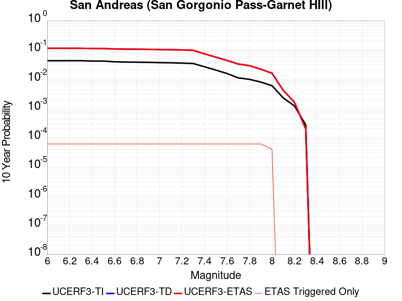 |

| Magnitude | 1 wk TI Prob | 1 wk TD Prob | 1 wk ETAS Prob | 1 wk ETAS/TD Gain | 1 wk ETAS Triggered Only | 1 mo TI Prob | 1 mo TD Prob | 1 mo ETAS Prob | 1 mo ETAS/TD Gain | 1 mo ETAS Triggered Only | 1 yr TI Prob | 1 yr TD Prob | 1 yr ETAS Prob | 1 yr ETAS/TD Gain | 1 yr ETAS Triggered Only | 10 yr TI Prob | 10 yr TD Prob | 10 yr ETAS Prob | 10 yr ETAS/TD Gain | 10 yr ETAS Triggered Only |
|-----|-----|-----|-----|-----|-----|-----|-----|-----|-----|-----|-----|-----|-----|-----|-----|-----|-----|-----|-----|-----|
| 6.0 | 8.31567E-5 | 2.338839E-4 | 2.338839E-4 | 1.0 | 0.0 | 3.5633717E-4 | 0.0010019708 | 0.0010119608 | 1.0099703 | 1.0E-5 | 0.004329778 | 0.01213065 | 0.012160286 | 1.0024431 | 3.0E-5 | 0.042463828 | 0.11259771 | 0.11265095 | 1.0004729 | 6.0E-5 |
| 6.1 | 8.31567E-5 | 2.338839E-4 | 2.338839E-4 | 1.0 | 0.0 | 3.5633717E-4 | 0.0010019708 | 0.0010119608 | 1.0099703 | 1.0E-5 | 0.004329778 | 0.01213065 | 0.012160286 | 1.0024431 | 3.0E-5 | 0.042463828 | 0.11259771 | 0.11265095 | 1.0004729 | 6.0E-5 |
| 6.2 | 8.31567E-5 | 2.338839E-4 | 2.338839E-4 | 1.0 | 0.0 | 3.5633717E-4 | 0.0010019708 | 0.0010119608 | 1.0099703 | 1.0E-5 | 0.004329778 | 0.01213065 | 0.012160286 | 1.0024431 | 3.0E-5 | 0.042463828 | 0.11259771 | 0.11265095 | 1.0004729 | 6.0E-5 |
| 6.3 | 8.31567E-5 | 2.338839E-4 | 2.338839E-4 | 1.0 | 0.0 | 3.5633717E-4 | 0.0010019708 | 0.0010119608 | 1.0099703 | 1.0E-5 | 0.004329778 | 0.01213065 | 0.012160286 | 1.0024431 | 3.0E-5 | 0.042463828 | 0.11259771 | 0.11265095 | 1.0004729 | 6.0E-5 |
| 6.4 | 8.059055E-5 | 2.2945837E-4 | 2.2945837E-4 | 1.0 | 0.0 | 3.4534236E-4 | 9.830239E-4 | 9.930141E-4 | 1.0101627 | 1.0E-5 | 0.0041964394 | 0.011902837 | 0.011932479 | 1.0024904 | 3.0E-5 | 0.041180745 | 0.11057874 | 0.11063211 | 1.0004826 | 6.0E-5 |
| 6.5 | 8.059055E-5 | 2.2945837E-4 | 2.2945837E-4 | 1.0 | 0.0 | 3.4534236E-4 | 9.830239E-4 | 9.930141E-4 | 1.0101627 | 1.0E-5 | 0.0041964394 | 0.011902837 | 0.011932479 | 1.0024904 | 3.0E-5 | 0.041180745 | 0.11057874 | 0.11063211 | 1.0004826 | 6.0E-5 |
| 6.6 | 7.619237E-5 | 2.2190346E-4 | 2.2190346E-4 | 1.0 | 0.0 | 3.2649786E-4 | 9.5067057E-4 | 9.6066104E-4 | 1.0105089 | 1.0E-5 | 0.0039678677 | 0.011513535 | 0.011543189 | 1.0025756 | 3.0E-5 | 0.03897764 | 0.107115194 | 0.107168764 | 1.0005002 | 6.0E-5 |
| 6.7 | 7.440636E-5 | 2.1866155E-4 | 2.1866155E-4 | 1.0 | 0.0 | 3.188454E-4 | 9.367866E-4 | 9.4677723E-4 | 1.0106648 | 1.0E-5 | 0.0038750346 | 0.011346267 | 0.011375926 | 1.002614 | 3.0E-5 | 0.038081564 | 0.105623715 | 0.10567738 | 1.0005081 | 6.0E-5 |
| 6.8 | 7.3735864E-5 | 2.1713313E-4 | 2.1713313E-4 | 1.0 | 0.0 | 3.1597257E-4 | 9.3024096E-4 | 9.4023166E-4 | 1.0107399 | 1.0E-5 | 0.0038401815 | 0.011267403 | 0.011297065 | 1.0026325 | 3.0E-5 | 0.03774495 | 0.10492511 | 0.104978815 | 1.0005119 | 6.0E-5 |
| 6.9 | 7.27575E-5 | 2.1482276E-4 | 2.1482276E-4 | 1.0 | 0.0 | 3.117806E-4 | 9.203464E-4 | 9.303372E-4 | 1.0108554 | 1.0E-5 | 0.003789323 | 0.011148175 | 0.011177841 | 1.002661 | 3.0E-5 | 0.037253562 | 0.103873 | 0.10392677 | 1.0005176 | 6.0E-5 |
| 7.0 | 7.102591E-5 | 2.10663E-4 | 2.10663E-4 | 1.0 | 0.0 | 3.0436125E-4 | 9.0253126E-4 | 9.125222E-4 | 1.0110699 | 1.0E-5 | 0.003699303 | 0.010933471 | 0.010963143 | 1.0027139 | 3.0E-5 | 0.03638325 | 0.10197552 | 0.102029406 | 1.0005283 | 6.0E-5 |
| 7.1 | 7.028513E-5 | 2.0901936E-4 | 2.0901936E-4 | 1.0 | 0.0 | 3.0118722E-4 | 8.95492E-4 | 9.05483E-4 | 1.011157 | 1.0E-5 | 0.0036607897 | 0.010848625 | 0.010878299 | 1.0027354 | 3.0E-5 | 0.036010686 | 0.10121833 | 0.101272255 | 1.0005327 | 6.0E-5 |
| 7.2 | 6.8498244E-5 | 2.0509785E-4 | 2.0509785E-4 | 1.0 | 0.0 | 2.9353087E-4 | 8.786969E-4 | 8.886881E-4 | 1.0113705 | 1.0E-5 | 0.003567883 | 0.010646159 | 0.010675839 | 1.002788 | 3.0E-5 | 0.035111405 | 0.09941009 | 0.09946412 | 1.0005436 | 6.0E-5 |
| 7.3 | 6.622592E-5 | 1.9737013E-4 | 1.9737013E-4 | 1.0 | 0.0 | 2.8379448E-4 | 8.455999E-4 | 8.555915E-4 | 1.0118159 | 1.0E-5 | 0.0034497243 | 0.010247062 | 0.010276754 | 1.0028976 | 3.0E-5 | 0.033966612 | 0.09590662 | 0.09596087 | 1.0005656 | 6.0E-5 |
| 7.4 | 5.1050705E-5 | 1.4693316E-4 | 1.4693316E-4 | 1.0 | 0.0 | 2.1877038E-4 | 6.295625E-4 | 6.395562E-4 | 1.015874 | 1.0E-5 | 0.002660276 | 0.0076381783 | 0.007667949 | 1.0038977 | 3.0E-5 | 0.02628654 | 0.07287833 | 0.072933964 | 1.0007633 | 6.0E-5 |
| 7.5 | 3.9302922E-5 | 1.1133535E-4 | 1.1133535E-4 | 1.0 | 0.0 | 1.6843023E-4 | 4.7706455E-4 | 4.870598E-4 | 1.0209515 | 1.0E-5 | 0.0020487092 | 0.0057928623 | 0.0058226883 | 1.0051488 | 3.0E-5 | 0.020299247 | 0.056023482 | 0.05608012 | 1.001011 | 6.0E-5 |
| 7.6 | 2.9851626E-5 | 8.498211E-5 | 8.498211E-5 | 1.0 | 0.0 | 1.2792926E-4 | 3.6415833E-4 | 3.7415468E-4 | 1.0274506 | 1.0E-5 | 0.0015564259 | 0.00442464 | 0.004454507 | 1.0067502 | 3.0E-5 | 0.0154556995 | 0.043206394 | 0.0432638 | 1.0013287 | 6.0E-5 |
| 7.7 | 2.1135214E-5 | 6.355745E-5 | 6.355745E-5 | 1.0 | 0.0 | 9.0576345E-5 | 2.7236066E-4 | 2.823579E-4 | 1.036706 | 1.0E-5 | 0.0011022091 | 0.0033109542 | 0.003340855 | 1.0090308 | 3.0E-5 | 0.010967582 | 0.03259442 | 0.032652464 | 1.0017807 | 6.0E-5 |
| 7.8 | 1.883379E-5 | 5.5666103E-5 | 5.5666103E-5 | 1.0 | 0.0 | 8.0713755E-5 | 2.3854722E-4 | 2.4854482E-4 | 1.0419104 | 1.0E-5 | 9.822468E-4 | 0.0029004475 | 0.0029303604 | 1.0103133 | 3.0E-5 | 0.0097791655 | 0.02870594 | 0.028764218 | 1.0020301 | 6.0E-5 |
| 7.9 | 1.5156185E-5 | 4.167907E-5 | 4.167907E-5 | 1.0 | 0.0 | 6.495346E-5 | 1.7861238E-4 | 1.8861059E-4 | 1.0559771 | 1.0E-5 | 7.9052144E-4 | 0.0021724382 | 0.002202373 | 1.0137794 | 3.0E-5 | 0.007877152 | 0.021768799 | 0.021827493 | 1.0026963 | 6.0E-5 |
| 8.0 | 1.1405907E-5 | 2.9989498E-5 | 2.9989498E-5 | 1.0 | 0.0 | 4.8881542E-5 | 1.2852009E-4 | 1.2852009E-4 | 1.0 | 0.0 | 5.9497025E-4 | 0.00156361 | 0.0015735944 | 1.0063854 | 1.0E-5 | 0.005933798 | 0.015779829 | 0.015819198 | 1.0024949 | 4.0E-5 |
| 8.1 | 4.3511436E-6 | 7.3739657E-6 | 7.3739657E-6 | 1.0 | 0.0 | 1.8647626E-5 | 3.160233E-5 | 3.160233E-5 | 1.0 | 0.0 | 2.2701119E-4 | 3.8469053E-4 | 3.8469053E-4 | 1.0 | 0.0 | 0.0022677942 | 0.0041186865 | 0.0041186865 | 1.0 | 0.0 |
| 8.2 | 2.3042528E-6 | 2.7349201E-6 | 2.7349201E-6 | 1.0 | 0.0 | 9.875332E-6 | 1.1721034E-5 | 1.1721034E-5 | 1.0 | 0.0 | 1.2022553E-4 | 1.4269429E-4 | 1.4269429E-4 | 1.0 | 0.0 | 0.0012016051 | 0.0015990431 | 0.0015990431 | 1.0 | 0.0 |
| 8.3 | 5.202968E-7 | 3.1619535E-7 | 3.1619535E-7 | 1.0 | 0.0 | 2.2298414E-6 | 1.3551223E-6 | 1.3551223E-6 | 1.0 | 0.0 | 2.714798E-5 | 1.6498503E-5 | 1.6498503E-5 | 1.0 | 0.0 | 2.7144665E-4 | 1.9577713E-4 | 1.9577713E-4 | 1.0 | 0.0 |

## Lake Isabella (Seismicity)
*[(top)](#table-of-contents)*

| 1 Week | 1 Month | 1 Year | 10 Year |
|-----|-----|-----|-----|
|  |  |  |  |

| Magnitude | 1 wk TI Prob | 1 wk TD Prob | 1 wk ETAS Prob | 1 wk ETAS/TD Gain | 1 wk ETAS Triggered Only | 1 mo TI Prob | 1 mo TD Prob | 1 mo ETAS Prob | 1 mo ETAS/TD Gain | 1 mo ETAS Triggered Only | 1 yr TI Prob | 1 yr TD Prob | 1 yr ETAS Prob | 1 yr ETAS/TD Gain | 1 yr ETAS Triggered Only | 10 yr TI Prob | 10 yr TD Prob | 10 yr ETAS Prob | 10 yr ETAS/TD Gain | 10 yr ETAS Triggered Only |
|-----|-----|-----|-----|-----|-----|-----|-----|-----|-----|-----|-----|-----|-----|-----|-----|-----|-----|-----|-----|-----|
| 6.0 | 9.431637E-6 | 9.741694E-6 | 1.9741597E-5 | 2.0265055 | 1.0E-5 | 4.0420677E-5 | 4.1749525E-5 | 6.174869E-5 | 1.4790274 | 2.0E-5 | 4.920106E-4 | 5.0819496E-4 | 5.4817466E-4 | 1.0786699 | 4.0E-5 | 0.004909227 | 0.005071621 | 0.0051213675 | 1.0098088 | 5.0E-5 |
| 6.1 | 9.431637E-6 | 9.741694E-6 | 1.9741597E-5 | 2.0265055 | 1.0E-5 | 4.0420677E-5 | 4.1749525E-5 | 6.174869E-5 | 1.4790274 | 2.0E-5 | 4.920106E-4 | 5.0819496E-4 | 5.4817466E-4 | 1.0786699 | 4.0E-5 | 0.004909227 | 0.005071621 | 0.0051213675 | 1.0098088 | 5.0E-5 |
| 6.2 | 9.431637E-6 | 9.741694E-6 | 1.9741597E-5 | 2.0265055 | 1.0E-5 | 4.0420677E-5 | 4.1749525E-5 | 6.174869E-5 | 1.4790274 | 2.0E-5 | 4.920106E-4 | 5.0819496E-4 | 5.4817466E-4 | 1.0786699 | 4.0E-5 | 0.004909227 | 0.005071621 | 0.0051213675 | 1.0098088 | 5.0E-5 |
| 6.3 | 9.431637E-6 | 9.741694E-6 | 1.9741597E-5 | 2.0265055 | 1.0E-5 | 4.0420677E-5 | 4.1749525E-5 | 6.174869E-5 | 1.4790274 | 2.0E-5 | 4.920106E-4 | 5.0819496E-4 | 5.4817466E-4 | 1.0786699 | 4.0E-5 | 0.004909227 | 0.005071621 | 0.0051213675 | 1.0098088 | 5.0E-5 |
| 6.4 | 5.144063E-6 | 5.3000977E-6 | 1.5300044E-5 | 2.8867478 | 1.0E-5 | 2.2045799E-5 | 2.2714525E-5 | 3.27143E-5 | 1.4402369 | 1.0E-5 | 2.6837454E-4 | 2.765177E-4 | 3.065094E-4 | 1.1084621 | 3.0E-5 | 0.0026805066 | 0.002762077 | 0.002791994 | 1.0108314 | 3.0E-5 |
| 6.5 | 5.144063E-6 | 5.3000977E-6 | 1.5300044E-5 | 2.8867478 | 1.0E-5 | 2.2045799E-5 | 2.2714525E-5 | 3.27143E-5 | 1.4402369 | 1.0E-5 | 2.6837454E-4 | 2.765177E-4 | 3.065094E-4 | 1.1084621 | 3.0E-5 | 0.0026805066 | 0.002762077 | 0.002791994 | 1.0108314 | 3.0E-5 |
| 6.6 | 3.4009804E-6 | 3.4987995E-6 | 1.3498765E-5 | 3.8581133 | 1.0E-5 | 1.4575549E-5 | 1.4994778E-5 | 2.4994628E-5 | 1.6668888 | 1.0E-5 | 1.7744285E-4 | 1.8254772E-4 | 2.0254408E-4 | 1.1095403 | 2.0E-5 | 0.0017730123 | 0.0018241355 | 0.001844099 | 1.0109441 | 2.0E-5 |
| 6.7 | 3.3880428E-6 | 3.4856662E-6 | 1.3485631E-5 | 3.8688822 | 1.0E-5 | 1.4520103E-5 | 1.4938492E-5 | 2.4938343E-5 | 1.6694016 | 1.0E-5 | 1.767679E-4 | 1.8186258E-4 | 2.0185893E-4 | 1.1099532 | 2.0E-5 | 0.0017662736 | 0.0018172951 | 0.0018372588 | 1.0109854 | 2.0E-5 |
| 6.8 | 2.6582E-6 | 2.7337105E-6 | 2.7337105E-6 | 1.0 | 0.0 | 1.1392236E-5 | 1.1715857E-5 | 1.1715857E-5 | 1.0 | 0.0 | 1.3869164E-4 | 1.4263256E-4 | 1.5263114E-4 | 1.0701002 | 1.0E-5 | 0.0013860512 | 0.0014255423 | 0.001435528 | 1.0070049 | 1.0E-5 |
| 6.9 | 2.406011E-6 | 2.474338E-6 | 2.474338E-6 | 1.0 | 0.0 | 1.0311434E-5 | 1.0604271E-5 | 1.0604271E-5 | 1.0 | 0.0 | 1.2553448E-4 | 1.2910066E-4 | 1.3909937E-4 | 1.077449 | 1.0E-5 | 0.0012546359 | 0.0012903863 | 0.0013003733 | 1.0077397 | 1.0E-5 |
| 7.0 | 1.6953097E-6 | 1.7429437E-6 | 1.7429437E-6 | 1.0 | 0.0 | 7.265593E-6 | 7.469743E-6 | 7.469743E-6 | 1.0 | 0.0 | 8.8455E-5 | 9.094137E-5 | 9.094137E-5 | 1.0 | 0.0 | 8.84198E-4 | 9.0914435E-4 | 9.0914435E-4 | 1.0 | 0.0 |
| 7.1 | 3.5013824E-7 | 3.571492E-7 | 3.571492E-7 | 1.0 | 0.0 | 1.5005916E-6 | 1.5306384E-6 | 1.5306384E-6 | 1.0 | 0.0 | 1.826955E-5 | 1.8635366E-5 | 1.8635366E-5 | 1.0 | 0.0 | 1.8268047E-4 | 1.863383E-4 | 1.863383E-4 | 1.0 | 0.0 |
| 7.2 | 2.2321095E-7 | 2.2750632E-7 | 2.2750632E-7 | 1.0 | 0.0 | 9.56618E-7 | 9.750268E-7 | 9.750268E-7 | 1.0 | 0.0 | 1.1646762E-5 | 1.1870887E-5 | 1.1870887E-5 | 1.0 | 0.0 | 1.1646151E-4 | 1.1870263E-4 | 1.1870263E-4 | 1.0 | 0.0 |
| 7.3 | 1.5760406E-7 | 1.6060963E-7 | 1.6060963E-7 | 1.0 | 0.0 | 6.7544585E-7 | 6.883268E-7 | 6.883268E-7 | 1.0 | 0.0 | 8.223522E-6 | 8.380347E-6 | 8.380347E-6 | 1.0 | 0.0 | 8.2232174E-5 | 8.3800376E-5 | 8.3800376E-5 | 1.0 | 0.0 |
| 7.4 | 1.1216497E-7 | 1.1431735E-7 | 1.1431735E-7 | 1.0 | 0.0 | 4.8070694E-7 | 4.8993144E-7 | 4.8993144E-7 | 1.0 | 0.0 | 5.852591E-6 | 5.964899E-6 | 5.964899E-6 | 1.0 | 0.0 | 5.8524372E-5 | 5.9647435E-5 | 5.9647435E-5 | 1.0 | 0.0 |
| 7.5 | 4.885185E-8 | 4.9787864E-8 | 4.9787864E-8 | 1.0 | 0.0 | 2.0936506E-7 | 2.1337654E-7 | 2.1337654E-7 | 1.0 | 0.0 | 2.5490165E-6 | 2.5978566E-6 | 2.5978566E-6 | 1.0 | 0.0 | 2.5489873E-5 | 2.597828E-5 | 2.597828E-5 | 1.0 | 0.0 |
| 7.6 | 1.504641E-9 | 1.5317939E-9 | 1.5317939E-9 | 1.0 | 0.0 | 6.4484613E-9 | 6.5648313E-9 | 6.5648313E-9 | 1.0 | 0.0 | 7.851001E-8 | 7.992682E-8 | 7.992682E-8 | 1.0 | 0.0 | 7.8509987E-7 | 7.992682E-7 | 7.992682E-7 | 1.0 | 0.0 |

## Garlic Springs
*[(top)](#table-of-contents)*

| 1 Week | 1 Month | 1 Year | 10 Year |
|-----|-----|-----|-----|
|  |  |  |  |

| Magnitude | 1 wk TI Prob | 1 wk TD Prob | 1 wk ETAS Prob | 1 wk ETAS/TD Gain | 1 wk ETAS Triggered Only | 1 mo TI Prob | 1 mo TD Prob | 1 mo ETAS Prob | 1 mo ETAS/TD Gain | 1 mo ETAS Triggered Only | 1 yr TI Prob | 1 yr TD Prob | 1 yr ETAS Prob | 1 yr ETAS/TD Gain | 1 yr ETAS Triggered Only | 10 yr TI Prob | 10 yr TD Prob | 10 yr ETAS Prob | 10 yr ETAS/TD Gain | 10 yr ETAS Triggered Only |
|-----|-----|-----|-----|-----|-----|-----|-----|-----|-----|-----|-----|-----|-----|-----|-----|-----|-----|-----|-----|-----|
| 6.0 | 1.6760017E-5 | 1.8777133E-5 | 1.8777133E-5 | 1.0 | 0.0 | 7.182667E-5 | 8.0471604E-5 | 8.0471604E-5 | 1.0 | 0.0 | 8.7413884E-4 | 9.794187E-4 | 0.0010093894 | 1.0306004 | 3.0E-5 | 0.008707083 | 0.009762568 | 0.00981208 | 1.0050716 | 5.0E-5 |
| 6.1 | 9.852767E-6 | 1.0973753E-5 | 1.0973753E-5 | 1.0 | 0.0 | 4.222546E-5 | 4.702992E-5 | 4.702992E-5 | 1.0 | 0.0 | 5.139737E-4 | 5.7250983E-4 | 5.825041E-4 | 1.017457 | 1.0E-5 | 0.005127866 | 0.0057173073 | 0.005747136 | 1.0052172 | 3.0E-5 |
| 6.2 | 9.852767E-6 | 1.0973753E-5 | 1.0973753E-5 | 1.0 | 0.0 | 4.222546E-5 | 4.702992E-5 | 4.702992E-5 | 1.0 | 0.0 | 5.139737E-4 | 5.7250983E-4 | 5.825041E-4 | 1.017457 | 1.0E-5 | 0.005127866 | 0.0057173073 | 0.005747136 | 1.0052172 | 3.0E-5 |
| 6.3 | 4.3167724E-6 | 4.7780964E-6 | 4.7780964E-6 | 1.0 | 0.0 | 1.8500323E-5 | 2.0477524E-5 | 2.0477524E-5 | 1.0 | 0.0 | 2.2521814E-4 | 2.4930836E-4 | 2.4930836E-4 | 1.0 | 0.0 | 0.0022499003 | 0.0024925452 | 0.0025025203 | 1.004002 | 1.0E-5 |
| 6.4 | 4.3167724E-6 | 4.7780964E-6 | 4.7780964E-6 | 1.0 | 0.0 | 1.8500323E-5 | 2.0477524E-5 | 2.0477524E-5 | 1.0 | 0.0 | 2.2521814E-4 | 2.4930836E-4 | 2.4930836E-4 | 1.0 | 0.0 | 0.0022499003 | 0.0024925452 | 0.0025025203 | 1.004002 | 1.0E-5 |
| 6.5 | 4.3167724E-6 | 4.7780964E-6 | 4.7780964E-6 | 1.0 | 0.0 | 1.8500323E-5 | 2.0477524E-5 | 2.0477524E-5 | 1.0 | 0.0 | 2.2521814E-4 | 2.4930836E-4 | 2.4930836E-4 | 1.0 | 0.0 | 0.0022499003 | 0.0024925452 | 0.0025025203 | 1.004002 | 1.0E-5 |
| 6.6 | 4.301311E-6 | 4.7609647E-6 | 4.7609647E-6 | 1.0 | 0.0 | 1.8434059E-5 | 2.0404104E-5 | 2.0404104E-5 | 1.0 | 0.0 | 2.2441156E-4 | 2.4841467E-4 | 2.4841467E-4 | 1.0 | 0.0 | 0.0022418506 | 0.0024836282 | 0.0024936034 | 1.0040164 | 1.0E-5 |
| 6.7 | 3.8599724E-6 | 4.2711204E-6 | 4.2711204E-6 | 1.0 | 0.0 | 1.6542634E-5 | 1.8304801E-5 | 1.8304801E-5 | 1.0 | 0.0 | 2.0138794E-4 | 2.2286095E-4 | 2.2286095E-4 | 1.0 | 0.0 | 0.0020120554 | 0.0022286095 | 0.0022385872 | 1.0044771 | 1.0E-5 |

## San Andreas (North Branch Mill Creek)
*[(top)](#table-of-contents)*

| 1 Week | 1 Month | 1 Year | 10 Year |
|-----|-----|-----|-----|
|  | 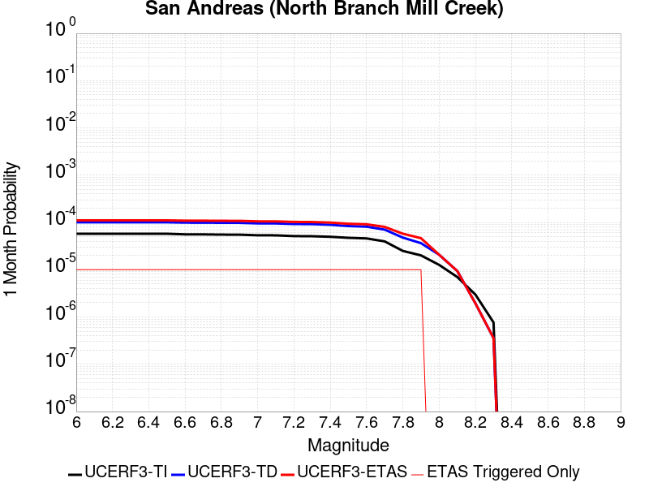 |  |  |

| Magnitude | 1 wk TI Prob | 1 wk TD Prob | 1 wk ETAS Prob | 1 wk ETAS/TD Gain | 1 wk ETAS Triggered Only | 1 mo TI Prob | 1 mo TD Prob | 1 mo ETAS Prob | 1 mo ETAS/TD Gain | 1 mo ETAS Triggered Only | 1 yr TI Prob | 1 yr TD Prob | 1 yr ETAS Prob | 1 yr ETAS/TD Gain | 1 yr ETAS Triggered Only | 10 yr TI Prob | 10 yr TD Prob | 10 yr ETAS Prob | 10 yr ETAS/TD Gain | 10 yr ETAS Triggered Only |
|-----|-----|-----|-----|-----|-----|-----|-----|-----|-----|-----|-----|-----|-----|-----|-----|-----|-----|-----|-----|-----|
| 6.0 | 1.3461156E-5 | 2.350783E-5 | 2.350783E-5 | 1.0 | 0.0 | 5.7689394E-5 | 1.0074397E-4 | 1.1074296E-4 | 1.0992515 | 1.0E-5 | 7.02142E-4 | 0.001225871 | 0.0012458465 | 1.016295 | 2.0E-5 | 0.0069992766 | 0.012232522 | 0.0122819105 | 1.0040375 | 5.0E-5 |
| 6.1 | 1.3461156E-5 | 2.350783E-5 | 2.350783E-5 | 1.0 | 0.0 | 5.7689394E-5 | 1.0074397E-4 | 1.1074296E-4 | 1.0992515 | 1.0E-5 | 7.02142E-4 | 0.001225871 | 0.0012458465 | 1.016295 | 2.0E-5 | 0.0069992766 | 0.012232522 | 0.0122819105 | 1.0040375 | 5.0E-5 |
| 6.2 | 1.3461156E-5 | 2.350783E-5 | 2.350783E-5 | 1.0 | 0.0 | 5.7689394E-5 | 1.0074397E-4 | 1.1074296E-4 | 1.0992515 | 1.0E-5 | 7.02142E-4 | 0.001225871 | 0.0012458465 | 1.016295 | 2.0E-5 | 0.0069992766 | 0.012232522 | 0.0122819105 | 1.0040375 | 5.0E-5 |
| 6.3 | 1.3461156E-5 | 2.350783E-5 | 2.350783E-5 | 1.0 | 0.0 | 5.7689394E-5 | 1.0074397E-4 | 1.1074296E-4 | 1.0992515 | 1.0E-5 | 7.02142E-4 | 0.001225871 | 0.0012458465 | 1.016295 | 2.0E-5 | 0.0069992766 | 0.012232522 | 0.0122819105 | 1.0040375 | 5.0E-5 |
| 6.4 | 1.3461156E-5 | 2.350783E-5 | 2.350783E-5 | 1.0 | 0.0 | 5.7689394E-5 | 1.0074397E-4 | 1.1074296E-4 | 1.0992515 | 1.0E-5 | 7.02142E-4 | 0.001225871 | 0.0012458465 | 1.016295 | 2.0E-5 | 0.0069992766 | 0.012232522 | 0.0122819105 | 1.0040375 | 5.0E-5 |
| 6.5 | 1.3450706E-5 | 2.349679E-5 | 2.349679E-5 | 1.0 | 0.0 | 5.764461E-5 | 1.00696656E-4 | 1.1069565E-4 | 1.0992981 | 1.0E-5 | 7.0159714E-4 | 0.0012252956 | 0.0012452711 | 1.0163026 | 2.0E-5 | 0.006993862 | 0.012226831 | 0.01227622 | 1.0040394 | 5.0E-5 |
| 6.6 | 1.3074523E-5 | 2.3111072E-5 | 2.3111072E-5 | 1.0 | 0.0 | 5.6032466E-5 | 9.9043704E-5 | 1.0904272E-4 | 1.1009555 | 1.0E-5 | 6.8198174E-4 | 0.0012051932 | 0.0012251692 | 1.0165749 | 2.0E-5 | 0.006798926 | 0.012027997 | 0.012077395 | 1.004107 | 5.0E-5 |
| 6.7 | 1.3050216E-5 | 2.3086368E-5 | 2.3086368E-5 | 1.0 | 0.0 | 5.59283E-5 | 9.893784E-5 | 1.0893685E-4 | 1.1010636 | 1.0E-5 | 6.8071426E-4 | 0.0012039058 | 0.0012238817 | 1.0165926 | 2.0E-5 | 0.0067863287 | 0.012015262 | 0.012064661 | 1.0041114 | 5.0E-5 |
| 6.8 | 1.29049395E-5 | 2.2934775E-5 | 2.2934775E-5 | 1.0 | 0.0 | 5.530571E-5 | 9.8288205E-5 | 1.08287226E-4 | 1.1017317 | 1.0E-5 | 6.73139E-4 | 0.0011960051 | 0.0012159813 | 1.0167023 | 2.0E-5 | 0.0067110364 | 0.011937105 | 0.011986509 | 1.0041386 | 5.0E-5 |
| 6.9 | 1.2867369E-5 | 2.2894177E-5 | 2.2894177E-5 | 1.0 | 0.0 | 5.51447E-5 | 9.811423E-5 | 1.0811325E-4 | 1.101912 | 1.0E-5 | 6.711799E-4 | 0.0011938893 | 0.0012138655 | 1.016732 | 2.0E-5 | 0.006691564 | 0.011916174 | 0.011965578 | 1.004146 | 5.0E-5 |
| 7.0 | 1.2495996E-5 | 2.2294238E-5 | 2.2294238E-5 | 1.0 | 0.0 | 5.3553173E-5 | 9.5543255E-5 | 1.055423E-4 | 1.1046547 | 1.0E-5 | 6.518148E-4 | 0.0011626212 | 0.001182598 | 1.0171825 | 2.0E-5 | 0.0064990623 | 0.011606771 | 0.01165619 | 1.0042578 | 5.0E-5 |
| 7.1 | 1.2452067E-5 | 2.2239308E-5 | 2.2239308E-5 | 1.0 | 0.0 | 5.3364907E-5 | 9.5307856E-5 | 1.05306906E-4 | 1.1049131 | 1.0E-5 | 6.4952404E-4 | 0.0011597583 | 0.0011797351 | 1.017225 | 2.0E-5 | 0.0064762887 | 0.01157844 | 0.011627861 | 1.0042684 | 5.0E-5 |
| 7.2 | 1.2002777E-5 | 2.1617801E-5 | 2.1617801E-5 | 1.0 | 0.0 | 5.143946E-5 | 9.264445E-5 | 1.0264352E-4 | 1.1079296 | 1.0E-5 | 6.2609545E-4 | 0.0011273652 | 0.0011473426 | 1.0177205 | 2.0E-5 | 0.006243344 | 0.01125784 | 0.011307278 | 1.0043913 | 5.0E-5 |
| 7.3 | 1.1923425E-5 | 2.1487636E-5 | 2.1487636E-5 | 1.0 | 0.0 | 5.109939E-5 | 9.208664E-5 | 1.0208571E-4 | 1.1085835 | 1.0E-5 | 6.219575E-4 | 0.0011205808 | 0.0011405584 | 1.0178279 | 2.0E-5 | 0.0062021962 | 0.011190712 | 0.011240153 | 1.004418 | 5.0E-5 |
| 7.4 | 1.16105175E-5 | 2.0861535E-5 | 2.0861535E-5 | 1.0 | 0.0 | 4.975841E-5 | 8.9403526E-5 | 9.9402634E-5 | 1.1118424 | 1.0E-5 | 6.0564023E-4 | 0.0010879469 | 0.0011079252 | 1.0183632 | 2.0E-5 | 0.006039923 | 0.010868174 | 0.010917631 | 1.0045506 | 5.0E-5 |
| 7.5 | 1.1037265E-5 | 1.9561343E-5 | 1.9561343E-5 | 1.0 | 0.0 | 4.7301706E-5 | 8.383165E-5 | 9.383081E-5 | 1.1192766 | 1.0E-5 | 5.757461E-4 | 0.0010201746 | 0.0010401541 | 1.0195845 | 2.0E-5 | 0.005742567 | 0.010198631 | 0.010248121 | 1.0048527 | 5.0E-5 |
| 7.6 | 1.0720915E-5 | 1.9003148E-5 | 1.9003148E-5 | 1.0 | 0.0 | 4.5945973E-5 | 8.143953E-5 | 9.143871E-5 | 1.1227804 | 1.0E-5 | 5.592486E-4 | 9.910774E-4 | 0.0010110576 | 1.0201601 | 2.0E-5 | 0.005578433 | 0.009910301 | 0.009959806 | 1.0049952 | 5.0E-5 |
| 7.7 | 9.276279E-6 | 1.6448577E-5 | 1.6448577E-5 | 1.0 | 0.0 | 3.9754876E-5 | 7.0492E-5 | 8.04913E-5 | 1.1418501 | 1.0E-5 | 4.839081E-4 | 8.579039E-4 | 8.778867E-4 | 1.0232927 | 2.0E-5 | 0.0048285574 | 0.008589426 | 0.008638997 | 1.0057712 | 5.0E-5 |
| 7.8 | 5.8346777E-6 | 1.1160578E-5 | 1.1160578E-5 | 1.0 | 0.0 | 2.5005522E-5 | 4.783017E-5 | 5.782969E-5 | 1.209063 | 1.0E-5 | 3.043997E-4 | 5.8217684E-4 | 6.021652E-4 | 1.0343338 | 2.0E-5 | 0.0030398308 | 0.0058496357 | 0.0058993436 | 1.0084976 | 5.0E-5 |
| 7.9 | 4.690204E-6 | 8.513636E-6 | 8.513636E-6 | 1.0 | 0.0 | 2.0100719E-5 | 3.64865E-5 | 4.6486137E-5 | 1.274064 | 1.0E-5 | 2.4469878E-4 | 4.4413272E-4 | 4.6412382E-4 | 1.0450116 | 2.0E-5 | 0.002444295 | 0.004473071 | 0.0045228475 | 1.011128 | 5.0E-5 |
| 8.0 | 2.9570454E-6 | 4.8496286E-6 | 4.8496286E-6 | 1.0 | 0.0 | 1.267299E-5 | 2.0783957E-5 | 2.0783957E-5 | 1.0 | 0.0 | 1.5428272E-4 | 2.530153E-4 | 2.530153E-4 | 1.0 | 0.0 | 0.0015417566 | 0.0025509798 | 0.0025609543 | 1.0039101 | 1.0E-5 |
| 8.1 | 1.6376824E-6 | 2.1982057E-6 | 2.1982057E-6 | 1.0 | 0.0 | 7.01862E-6 | 9.420847E-6 | 9.420847E-6 | 1.0 | 0.0 | 8.544835E-5 | 1.146928E-4 | 1.146928E-4 | 1.0 | 0.0 | 8.54155E-4 | 0.0011613306 | 0.0011613306 | 1.0 | 0.0 |
| 8.2 | 6.9631557E-7 | 4.5391383E-7 | 4.5391383E-7 | 1.0 | 0.0 | 2.984206E-6 | 1.9453435E-6 | 1.9453435E-6 | 1.0 | 0.0 | 3.63321E-5 | 2.36843E-5 | 2.36843E-5 | 1.0 | 0.0 | 3.6326164E-4 | 2.4532314E-4 | 2.4532314E-4 | 1.0 | 0.0 |
| 8.3 | 1.7876137E-7 | 8.3658875E-8 | 8.3658875E-8 | 1.0 | 0.0 | 7.661199E-7 | 3.58538E-7 | 3.58538E-7 | 1.0 | 0.0 | 9.32747E-6 | 4.3651917E-6 | 4.3651917E-6 | 1.0 | 0.0 | 9.3270784E-5 | 4.5847937E-5 | 4.5847937E-5 | 1.0 | 0.0 |

## San Andreas (Coachella) rev
*[(top)](#table-of-contents)*

| 1 Week | 1 Month | 1 Year | 10 Year |
|-----|-----|-----|-----|
|  |  |  | 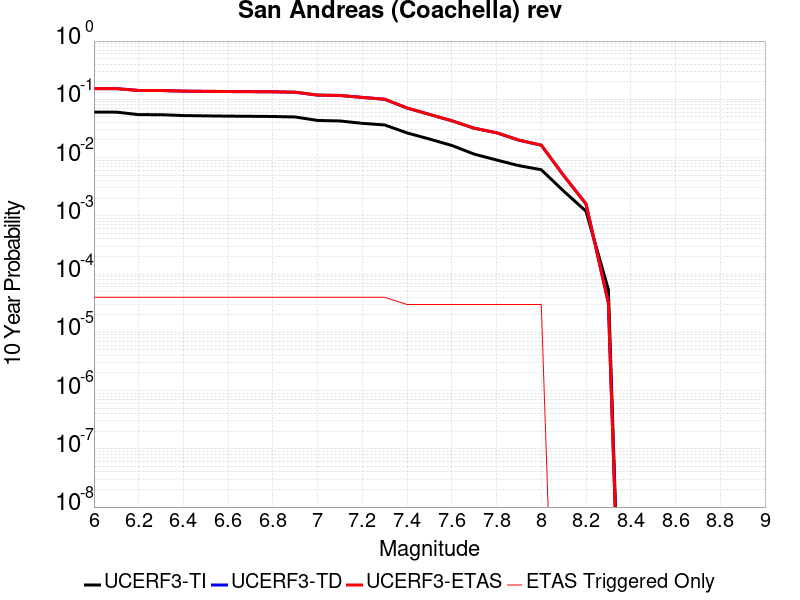 |

| Magnitude | 1 wk TI Prob | 1 wk TD Prob | 1 wk ETAS Prob | 1 wk ETAS/TD Gain | 1 wk ETAS Triggered Only | 1 mo TI Prob | 1 mo TD Prob | 1 mo ETAS Prob | 1 mo ETAS/TD Gain | 1 mo ETAS Triggered Only | 1 yr TI Prob | 1 yr TD Prob | 1 yr ETAS Prob | 1 yr ETAS/TD Gain | 1 yr ETAS Triggered Only | 10 yr TI Prob | 10 yr TD Prob | 10 yr ETAS Prob | 10 yr ETAS/TD Gain | 10 yr ETAS Triggered Only |
|-----|-----|-----|-----|-----|-----|-----|-----|-----|-----|-----|-----|-----|-----|-----|-----|-----|-----|-----|-----|-----|
| 6.0 | 1.1925945E-4 | 3.2735174E-4 | 3.2735174E-4 | 1.0 | 0.0 | 5.110118E-4 | 0.0014021865 | 0.0014121725 | 1.0071217 | 1.0E-5 | 0.0062038354 | 0.016939327 | 0.016958987 | 1.0011607 | 2.0E-5 | 0.060334753 | 0.15269604 | 0.15272993 | 1.000222 | 4.0E-5 |
| 6.1 | 1.1925945E-4 | 3.2735174E-4 | 3.2735174E-4 | 1.0 | 0.0 | 5.110118E-4 | 0.0014021865 | 0.0014121725 | 1.0071217 | 1.0E-5 | 0.0062038354 | 0.016939327 | 0.016958987 | 1.0011607 | 2.0E-5 | 0.060334753 | 0.15269604 | 0.15272993 | 1.000222 | 4.0E-5 |
| 6.2 | 1.07432395E-4 | 3.023596E-4 | 3.023596E-4 | 1.0 | 0.0 | 4.603433E-4 | 0.0012951873 | 0.0013051743 | 1.0077109 | 1.0E-5 | 0.005590286 | 0.01565599 | 0.015675677 | 1.0012574 | 2.0E-5 | 0.05451731 | 0.14184935 | 0.14188367 | 1.000242 | 4.0E-5 |
| 6.3 | 1.0718766E-4 | 3.0181266E-4 | 3.0181266E-4 | 1.0 | 0.0 | 4.592948E-4 | 0.0012928456 | 0.0013028326 | 1.0077249 | 1.0E-5 | 0.005577586 | 0.015627889 | 0.015647577 | 1.0012598 | 2.0E-5 | 0.054396555 | 0.14161763 | 0.14165196 | 1.0002425 | 4.0E-5 |
| 6.4 | 1.0355944E-4 | 2.9389336E-4 | 2.9389336E-4 | 1.0 | 0.0 | 4.4375064E-4 | 0.001258939 | 0.0012689264 | 1.0079331 | 1.0E-5 | 0.0053892885 | 0.015220915 | 0.015240611 | 1.001294 | 2.0E-5 | 0.052604496 | 0.13817544 | 0.13820991 | 1.0002495 | 4.0E-5 |
| 6.5 | 1.0227914E-4 | 2.9108766E-4 | 2.9108766E-4 | 1.0 | 0.0 | 4.382655E-4 | 0.0012469261 | 0.0012569136 | 1.0080097 | 1.0E-5 | 0.0053228354 | 0.015076692 | 0.015096391 | 1.0013065 | 2.0E-5 | 0.051971316 | 0.13695958 | 0.13699411 | 1.000252 | 4.0E-5 |
| 6.6 | 1.0116757E-4 | 2.8874516E-4 | 2.8874516E-4 | 1.0 | 0.0 | 4.3350324E-4 | 0.0012368963 | 0.0012468839 | 1.0080748 | 1.0E-5 | 0.0052651367 | 0.014956261 | 0.014975962 | 1.0013173 | 2.0E-5 | 0.051421247 | 0.1359371 | 0.13597167 | 1.0002543 | 4.0E-5 |
| 6.7 | 1.0050676E-4 | 2.8733077E-4 | 2.8733077E-4 | 1.0 | 0.0 | 4.3067214E-4 | 0.0012308403 | 0.0012408281 | 1.0081146 | 1.0E-5 | 0.005230834 | 0.01488354 | 0.014903243 | 1.0013238 | 2.0E-5 | 0.051094085 | 0.13532192 | 0.1353565 | 1.0002556 | 4.0E-5 |
| 6.8 | 9.976819E-5 | 2.8536728E-4 | 2.8536728E-4 | 1.0 | 0.0 | 4.2750788E-4 | 0.0012224333 | 0.001232421 | 1.0081704 | 1.0E-5 | 0.0051924936 | 0.014782578 | 0.014802282 | 1.001333 | 2.0E-5 | 0.050728295 | 0.13447334 | 0.13450795 | 1.0002575 | 4.0E-5 |
| 6.9 | 9.77719E-5 | 2.8033604E-4 | 2.8033604E-4 | 1.0 | 0.0 | 4.1895514E-4 | 0.0012008909 | 0.001210879 | 1.0083171 | 1.0E-5 | 0.0050888555 | 0.014523826 | 0.014543535 | 1.0013571 | 2.0E-5 | 0.049738888 | 0.13230172 | 0.13233644 | 1.0002624 | 4.0E-5 |
| 7.0 | 8.500761E-5 | 2.476793E-4 | 2.476793E-4 | 1.0 | 0.0 | 3.6426744E-4 | 0.0010610541 | 0.0010710434 | 1.0094146 | 1.0E-5 | 0.0044259406 | 0.01284259 | 0.012862333 | 1.0015373 | 2.0E-5 | 0.04338823 | 0.118151076 | 0.118186355 | 1.0002985 | 4.0E-5 |
| 7.1 | 8.319876E-5 | 2.4370618E-4 | 2.4370618E-4 | 1.0 | 0.0 | 3.5651738E-4 | 0.0010440402 | 0.0010540298 | 1.0095682 | 1.0E-5 | 0.004331963 | 0.0126378685 | 0.012657615 | 1.0015626 | 2.0E-5 | 0.042484846 | 0.11637106 | 0.1164064 | 1.0003037 | 4.0E-5 |
| 7.2 | 7.563917E-5 | 2.2418915E-4 | 2.2418915E-4 | 1.0 | 0.0 | 3.2412758E-4 | 9.604599E-4 | 9.704503E-4 | 1.0104017 | 1.0E-5 | 0.0039391145 | 0.011631592 | 0.0116513595 | 1.0016994 | 2.0E-5 | 0.03870018 | 0.107777216 | 0.107812904 | 1.0003312 | 4.0E-5 |
| 7.3 | 7.082985E-5 | 2.0734889E-4 | 2.0734889E-4 | 1.0 | 0.0 | 3.0352117E-4 | 8.8833837E-4 | 8.983295E-4 | 1.0112469 | 1.0E-5 | 0.0036891096 | 0.01076251 | 0.010782295 | 1.0018383 | 2.0E-5 | 0.03628465 | 0.10029867 | 0.10033466 | 1.0003588 | 4.0E-5 |
| 7.4 | 5.146215E-5 | 1.4277869E-4 | 1.4277869E-4 | 1.0 | 0.0 | 2.2053342E-4 | 6.1176607E-4 | 6.1176607E-4 | 1.0 | 0.0 | 0.0026816884 | 0.007423004 | 0.0074329297 | 1.0013372 | 1.0E-5 | 0.02649557 | 0.07086286 | 0.07089073 | 1.0003934 | 3.0E-5 |
| 7.5 | 4.0285166E-5 | 1.09450986E-4 | 1.09450986E-4 | 1.0 | 0.0 | 1.7263928E-4 | 4.6899164E-4 | 4.6899164E-4 | 1.0 | 0.0 | 0.002099857 | 0.0056950934 | 0.005705036 | 1.0017459 | 1.0E-5 | 0.020801254 | 0.055024315 | 0.055052664 | 1.0005152 | 3.0E-5 |
| 7.6 | 3.1168736E-5 | 8.441976E-5 | 8.441976E-5 | 1.0 | 0.0 | 1.3357346E-4 | 3.617489E-4 | 3.617489E-4 | 1.0 | 0.0 | 0.0016250437 | 0.0043954253 | 0.004405381 | 1.0022651 | 1.0E-5 | 0.016132116 | 0.042821974 | 0.042850688 | 1.0006706 | 3.0E-5 |
| 7.7 | 2.2100989E-5 | 6.241421E-5 | 6.241421E-5 | 1.0 | 0.0 | 9.4715084E-5 | 2.674621E-4 | 2.674621E-4 | 1.0 | 0.0 | 0.001152546 | 0.003251495 | 0.0032614626 | 1.0030655 | 1.0E-5 | 0.011465867 | 0.031911246 | 0.03194029 | 1.0009102 | 3.0E-5 |
| 7.8 | 1.7484861E-5 | 5.181932E-5 | 5.181932E-5 | 1.0 | 0.0 | 7.493296E-5 | 2.220639E-4 | 2.220639E-4 | 1.0 | 0.0 | 9.1192697E-4 | 0.002700279 | 0.0027102518 | 1.0036933 | 1.0E-5 | 0.009081938 | 0.026649911 | 0.026679112 | 1.0010957 | 3.0E-5 |
| 7.9 | 1.3967285E-5 | 3.8241284E-5 | 3.8241284E-5 | 1.0 | 0.0 | 5.985842E-5 | 1.6388092E-4 | 1.6388092E-4 | 1.0 | 0.0 | 7.2853256E-4 | 0.0019934257 | 0.0020034057 | 1.0050064 | 1.0E-5 | 0.0072614877 | 0.019917965 | 0.019947369 | 1.0014762 | 3.0E-5 |
| 8.0 | 1.1887396E-5 | 3.1081006E-5 | 3.1081006E-5 | 1.0 | 0.0 | 5.094499E-5 | 1.3319752E-4 | 1.3319752E-4 | 1.0 | 0.0 | 6.200787E-4 | 0.0016204745 | 0.0016304583 | 1.006161 | 1.0E-5 | 0.006183513 | 0.016286531 | 0.016316043 | 1.001812 | 3.0E-5 |
| 8.1 | 5.100864E-6 | 8.979058E-6 | 8.979058E-6 | 1.0 | 0.0 | 2.1860664E-5 | 3.8481114E-5 | 3.8481114E-5 | 1.0 | 0.0 | 2.6612106E-4 | 4.6840697E-4 | 4.6840697E-4 | 1.0 | 0.0 | 0.002658026 | 0.0049204906 | 0.0049204906 | 1.0 | 0.0 |
| 8.2 | 2.3004484E-6 | 2.7884673E-6 | 2.7884673E-6 | 1.0 | 0.0 | 9.859027E-6 | 1.195052E-5 | 1.195052E-5 | 1.0 | 0.0 | 1.2002704E-4 | 1.454879E-4 | 1.454879E-4 | 1.0 | 0.0 | 0.0011996223 | 0.0015984424 | 0.0015984424 | 1.0 | 0.0 |
| 8.3 | 1.0424446E-7 | 5.820319E-8 | 5.820319E-8 | 1.0 | 0.0 | 4.4676187E-7 | 2.4944222E-7 | 2.4944222E-7 | 1.0 | 0.0 | 5.439312E-6 | 3.0369551E-6 | 3.0369551E-6 | 1.0 | 0.0 | 5.4391792E-5 | 3.1931086E-5 | 3.1931086E-5 | 1.0 | 0.0 |

## San Andreas (Big Bend)
*[(top)](#table-of-contents)*

| 1 Week | 1 Month | 1 Year | 10 Year |
|-----|-----|-----|-----|
|  |  |  |  |

| Magnitude | 1 wk TI Prob | 1 wk TD Prob | 1 wk ETAS Prob | 1 wk ETAS/TD Gain | 1 wk ETAS Triggered Only | 1 mo TI Prob | 1 mo TD Prob | 1 mo ETAS Prob | 1 mo ETAS/TD Gain | 1 mo ETAS Triggered Only | 1 yr TI Prob | 1 yr TD Prob | 1 yr ETAS Prob | 1 yr ETAS/TD Gain | 1 yr ETAS Triggered Only | 10 yr TI Prob | 10 yr TD Prob | 10 yr ETAS Prob | 10 yr ETAS/TD Gain | 10 yr ETAS Triggered Only |
|-----|-----|-----|-----|-----|-----|-----|-----|-----|-----|-----|-----|-----|-----|-----|-----|-----|-----|-----|-----|-----|
| 6.0 | 1.0179969E-4 | 2.0081972E-4 | 2.1081771E-4 | 1.0497859 | 1.0E-5 | 4.362114E-4 | 8.603731E-4 | 8.803559E-4 | 1.0232258 | 2.0E-5 | 0.0052979486 | 0.010425015 | 0.010464598 | 1.0037969 | 4.0E-5 | 0.051734097 | 0.101484396 | 0.10152034 | 1.0003542 | 4.0E-5 |
| 6.1 | 1.0179969E-4 | 2.0081972E-4 | 2.1081771E-4 | 1.0497859 | 1.0E-5 | 4.362114E-4 | 8.603731E-4 | 8.803559E-4 | 1.0232258 | 2.0E-5 | 0.0052979486 | 0.010425015 | 0.010464598 | 1.0037969 | 4.0E-5 | 0.051734097 | 0.101484396 | 0.10152034 | 1.0003542 | 4.0E-5 |
| 6.2 | 1.0179969E-4 | 2.0081972E-4 | 2.1081771E-4 | 1.0497859 | 1.0E-5 | 4.362114E-4 | 8.603731E-4 | 8.803559E-4 | 1.0232258 | 2.0E-5 | 0.0052979486 | 0.010425015 | 0.010464598 | 1.0037969 | 4.0E-5 | 0.051734097 | 0.101484396 | 0.10152034 | 1.0003542 | 4.0E-5 |
| 6.3 | 1.0179969E-4 | 2.0081972E-4 | 2.1081771E-4 | 1.0497859 | 1.0E-5 | 4.362114E-4 | 8.603731E-4 | 8.803559E-4 | 1.0232258 | 2.0E-5 | 0.0052979486 | 0.010425015 | 0.010464598 | 1.0037969 | 4.0E-5 | 0.051734097 | 0.101484396 | 0.10152034 | 1.0003542 | 4.0E-5 |
| 6.4 | 9.1639464E-5 | 1.8438944E-4 | 1.943876E-4 | 1.0542231 | 1.0E-5 | 3.9268145E-4 | 7.9000136E-4 | 7.9999346E-4 | 1.0126482 | 1.0E-5 | 0.0047704205 | 0.009575968 | 0.009595776 | 1.0020685 | 2.0E-5 | 0.046693064 | 0.09381712 | 0.09383524 | 1.0001932 | 2.0E-5 |
| 6.5 | 9.1639464E-5 | 1.8438944E-4 | 1.943876E-4 | 1.0542231 | 1.0E-5 | 3.9268145E-4 | 7.9000136E-4 | 7.9999346E-4 | 1.0126482 | 1.0E-5 | 0.0047704205 | 0.009575968 | 0.009595776 | 1.0020685 | 2.0E-5 | 0.046693064 | 0.09381712 | 0.09383524 | 1.0001932 | 2.0E-5 |
| 6.6 | 9.042622E-5 | 1.8245954E-4 | 1.9245771E-4 | 1.0547967 | 1.0E-5 | 3.8748336E-4 | 7.817353E-4 | 7.917275E-4 | 1.0127821 | 1.0E-5 | 0.0047074095 | 0.009476205 | 0.009496016 | 1.0020906 | 2.0E-5 | 0.046089325 | 0.09291417 | 0.09293231 | 1.0001953 | 2.0E-5 |
| 6.7 | 8.9836685E-5 | 1.8160277E-4 | 1.9160095E-4 | 1.0550553 | 1.0E-5 | 3.8495753E-4 | 7.7806565E-4 | 7.8805786E-4 | 1.0128424 | 1.0E-5 | 0.00467679 | 0.0094319135 | 0.0094517255 | 1.0021005 | 2.0E-5 | 0.045795817 | 0.0925084 | 0.09252655 | 1.0001962 | 2.0E-5 |
| 6.8 | 8.9471854E-5 | 1.8107046E-4 | 1.9106866E-4 | 1.0552171 | 1.0E-5 | 3.8339442E-4 | 7.7578565E-4 | 7.857779E-4 | 1.0128802 | 1.0E-5 | 0.004657841 | 0.009404396 | 0.009424208 | 1.0021067 | 2.0E-5 | 0.04561414 | 0.092256 | 0.09227415 | 1.0001968 | 2.0E-5 |
| 6.9 | 8.858234E-5 | 1.7989E-4 | 1.898882E-4 | 1.0555795 | 1.0E-5 | 3.7958333E-4 | 7.7072956E-4 | 7.8072184E-4 | 1.0129647 | 1.0E-5 | 0.004611638 | 0.009343366 | 0.00936318 | 1.0021206 | 2.0E-5 | 0.04517103 | 0.0916962 | 0.09171437 | 1.0001981 | 2.0E-5 |
| 7.0 | 8.7433385E-5 | 1.7827768E-4 | 1.8827591E-4 | 1.0560822 | 1.0E-5 | 3.746607E-4 | 7.638237E-4 | 7.738161E-4 | 1.013082 | 1.0E-5 | 0.004551957 | 0.009260005 | 0.00927982 | 1.0021398 | 2.0E-5 | 0.044598386 | 0.09093105 | 0.09094924 | 1.0001999 | 2.0E-5 |
| 7.1 | 8.684964E-5 | 1.7739709E-4 | 1.8739532E-4 | 1.0563607 | 1.0E-5 | 3.7215967E-4 | 7.6005195E-4 | 7.7004434E-4 | 1.013147 | 1.0E-5 | 0.0045216335 | 0.009214473 | 0.009234289 | 1.0021505 | 2.0E-5 | 0.04430731 | 0.09051253 | 0.090530716 | 1.000201 | 2.0E-5 |
| 7.2 | 8.606521E-5 | 1.7630306E-4 | 1.8630129E-4 | 1.0567105 | 1.0E-5 | 3.6879873E-4 | 7.553659E-4 | 7.6535833E-4 | 1.0132287 | 1.0E-5 | 0.0044808835 | 0.009157902 | 0.009177719 | 1.0021639 | 2.0E-5 | 0.043916024 | 0.08999327 | 0.09001147 | 1.0002023 | 2.0E-5 |
| 7.3 | 8.568266E-5 | 1.7572299E-4 | 1.8572123E-4 | 1.0568978 | 1.0E-5 | 3.6715972E-4 | 7.528814E-4 | 7.6287385E-4 | 1.0132723 | 1.0E-5 | 0.0044610105 | 0.0091279065 | 0.009147724 | 1.002171 | 2.0E-5 | 0.043725148 | 0.08971421 | 0.089732416 | 1.0002029 | 2.0E-5 |
| 7.4 | 8.5432206E-5 | 1.7534874E-4 | 1.8534699E-4 | 1.0570192 | 1.0E-5 | 3.6608664E-4 | 7.5127836E-4 | 7.612709E-4 | 1.0133007 | 1.0E-5 | 0.004447999 | 0.009108554 | 0.009128371 | 1.0021757 | 2.0E-5 | 0.043600157 | 0.08953439 | 0.089552596 | 1.0002034 | 2.0E-5 |
| 7.5 | 8.4791965E-5 | 1.7404204E-4 | 1.840403E-4 | 1.0574474 | 1.0E-5 | 3.633435E-4 | 7.456814E-4 | 7.55674E-4 | 1.0134006 | 1.0E-5 | 0.0044147377 | 0.009040978 | 0.009060797 | 1.0021921 | 2.0E-5 | 0.043280575 | 0.088910125 | 0.08892835 | 1.0002049 | 2.0E-5 |
| 7.6 | 8.241105E-5 | 1.6849465E-4 | 1.7849296E-4 | 1.059339 | 1.0E-5 | 3.531424E-4 | 7.219202E-4 | 7.31913E-4 | 1.013842 | 1.0E-5 | 0.0042910352 | 0.008754046 | 0.008773871 | 1.0022646 | 2.0E-5 | 0.042091176 | 0.08628652 | 0.0863048 | 1.0002118 | 2.0E-5 |
| 7.7 | 7.00432E-5 | 1.4212567E-4 | 1.5212425E-4 | 1.0703503 | 1.0E-5 | 3.001506E-4 | 6.089679E-4 | 6.189618E-4 | 1.0164112 | 1.0E-5 | 0.0036482112 | 0.0073890192 | 0.0073989453 | 1.0013434 | 1.0E-5 | 0.035888977 | 0.073552616 | 0.07356188 | 1.000126 | 1.0E-5 |
| 7.8 | 6.415362E-5 | 1.2976197E-4 | 1.2976197E-4 | 1.0 | 0.0 | 2.749151E-4 | 5.5600423E-4 | 5.5600423E-4 | 1.0 | 0.0 | 0.0033419547 | 0.0067483704 | 0.0067483704 | 1.0 | 0.0 | 0.03292141 | 0.06728497 | 0.06728497 | 1.0 | 0.0 |
| 7.9 | 4.939911E-5 | 9.346299E-5 | 9.346299E-5 | 1.0 | 0.0 | 2.116933E-4 | 4.004942E-4 | 4.004942E-4 | 1.0 | 0.0 | 0.0025743195 | 0.0048651244 | 0.0048651244 | 1.0 | 0.0 | 0.025447013 | 0.048938233 | 0.048938233 | 1.0 | 0.0 |
| 8.0 | 3.344983E-5 | 5.2255753E-5 | 5.2255753E-5 | 1.0 | 0.0 | 1.4334853E-4 | 2.2393401E-4 | 2.2393401E-4 | 1.0 | 0.0 | 0.0017438711 | 0.0027229895 | 0.0027229895 | 1.0 | 0.0 | 0.017302496 | 0.02793611 | 0.02793611 | 1.0 | 0.0 |
| 8.1 | 1.9104898E-5 | 1.9185067E-5 | 1.9185067E-5 | 1.0 | 0.0 | 8.1875565E-5 | 8.221913E-5 | 8.221913E-5 | 1.0 | 0.0 | 9.963791E-4 | 0.0010005588 | 0.0010005588 | 1.0 | 0.0 | 0.009919235 | 0.010756051 | 0.010756051 | 1.0 | 0.0 |
| 8.2 | 8.643924E-6 | 5.478665E-6 | 5.478665E-6 | 1.0 | 0.0 | 3.704486E-5 | 2.3479783E-5 | 2.3479783E-5 | 1.0 | 0.0 | 4.5092785E-4 | 2.8582895E-4 | 2.8582895E-4 | 1.0 | 0.0 | 0.0045001395 | 0.0032508469 | 0.0032508469 | 1.0 | 0.0 |
| 8.3 | 1.983087E-6 | 7.6647797E-7 | 7.6647797E-7 | 1.0 | 0.0 | 8.498917E-6 | 3.2849016E-6 | 3.2849016E-6 | 1.0 | 0.0 | 1.034694E-4 | 3.999296E-5 | 3.999296E-5 | 1.0 | 0.0 | 0.0010342124 | 4.7228087E-4 | 4.7228087E-4 | 1.0 | 0.0 |

## Sierra Nevada  (No Extension)
*[(top)](#table-of-contents)*

| 1 Week | 1 Month | 1 Year | 10 Year |
|-----|-----|-----|-----|
|  |  | 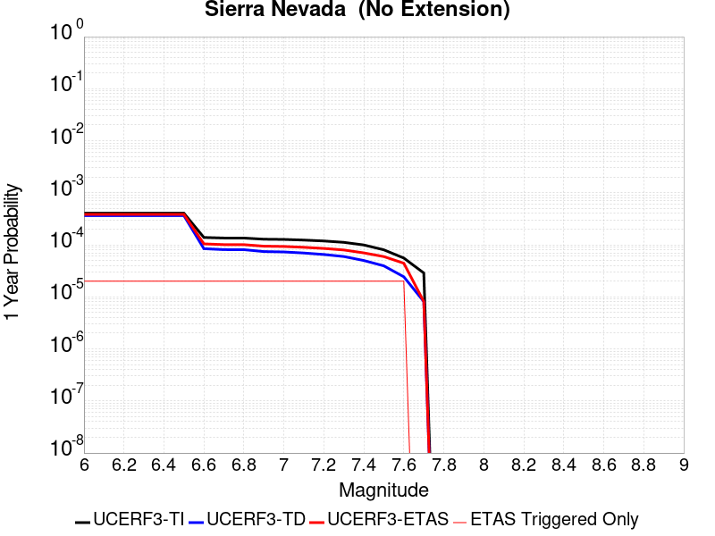 |  |

| Magnitude | 1 wk TI Prob | 1 wk TD Prob | 1 wk ETAS Prob | 1 wk ETAS/TD Gain | 1 wk ETAS Triggered Only | 1 mo TI Prob | 1 mo TD Prob | 1 mo ETAS Prob | 1 mo ETAS/TD Gain | 1 mo ETAS Triggered Only | 1 yr TI Prob | 1 yr TD Prob | 1 yr ETAS Prob | 1 yr ETAS/TD Gain | 1 yr ETAS Triggered Only | 10 yr TI Prob | 10 yr TD Prob | 10 yr ETAS Prob | 10 yr ETAS/TD Gain | 10 yr ETAS Triggered Only |
|-----|-----|-----|-----|-----|-----|-----|-----|-----|-----|-----|-----|-----|-----|-----|-----|-----|-----|-----|-----|-----|
| 6.0 | 7.7690465E-6 | 6.9763464E-6 | 6.9763464E-6 | 1.0 | 0.0 | 3.329549E-5 | 2.9898487E-5 | 2.9898487E-5 | 1.0 | 0.0 | 4.0529718E-4 | 3.6398912E-4 | 3.8398185E-4 | 1.0549268 | 2.0E-5 | 0.004045588 | 0.0036374456 | 0.0036773002 | 1.0109568 | 4.0E-5 |
| 6.1 | 7.7690465E-6 | 6.9763464E-6 | 6.9763464E-6 | 1.0 | 0.0 | 3.329549E-5 | 2.9898487E-5 | 2.9898487E-5 | 1.0 | 0.0 | 4.0529718E-4 | 3.6398912E-4 | 3.8398185E-4 | 1.0549268 | 2.0E-5 | 0.004045588 | 0.0036374456 | 0.0036773002 | 1.0109568 | 4.0E-5 |
| 6.2 | 7.7690465E-6 | 6.9763464E-6 | 6.9763464E-6 | 1.0 | 0.0 | 3.329549E-5 | 2.9898487E-5 | 2.9898487E-5 | 1.0 | 0.0 | 4.0529718E-4 | 3.6398912E-4 | 3.8398185E-4 | 1.0549268 | 2.0E-5 | 0.004045588 | 0.0036374456 | 0.0036773002 | 1.0109568 | 4.0E-5 |
| 6.3 | 7.7690465E-6 | 6.9763464E-6 | 6.9763464E-6 | 1.0 | 0.0 | 3.329549E-5 | 2.9898487E-5 | 2.9898487E-5 | 1.0 | 0.0 | 4.0529718E-4 | 3.6398912E-4 | 3.8398185E-4 | 1.0549268 | 2.0E-5 | 0.004045588 | 0.0036374456 | 0.0036773002 | 1.0109568 | 4.0E-5 |
| 6.4 | 7.7690465E-6 | 6.9763464E-6 | 6.9763464E-6 | 1.0 | 0.0 | 3.329549E-5 | 2.9898487E-5 | 2.9898487E-5 | 1.0 | 0.0 | 4.0529718E-4 | 3.6398912E-4 | 3.8398185E-4 | 1.0549268 | 2.0E-5 | 0.004045588 | 0.0036374456 | 0.0036773002 | 1.0109568 | 4.0E-5 |
| 6.5 | 7.7690465E-6 | 6.9763464E-6 | 6.9763464E-6 | 1.0 | 0.0 | 3.329549E-5 | 2.9898487E-5 | 2.9898487E-5 | 1.0 | 0.0 | 4.0529718E-4 | 3.6398912E-4 | 3.8398185E-4 | 1.0549268 | 2.0E-5 | 0.004045588 | 0.0036374456 | 0.0036773002 | 1.0109568 | 4.0E-5 |
| 6.6 | 2.653E-6 | 1.6148447E-6 | 1.6148447E-6 | 1.0 | 0.0 | 1.136995E-5 | 6.9207445E-6 | 6.9207445E-6 | 1.0 | 0.0 | 1.3842035E-4 | 8.425684E-5 | 1.0425516E-4 | 1.2373494 | 2.0E-5 | 0.0013833415 | 8.422524E-4 | 8.822187E-4 | 1.0474517 | 4.0E-5 |
| 6.7 | 2.5902466E-6 | 1.5501779E-6 | 1.5501779E-6 | 1.0 | 0.0 | 1.11010095E-5 | 6.643603E-6 | 6.643603E-6 | 1.0 | 0.0 | 1.351464E-4 | 8.088289E-5 | 1.00881276E-4 | 1.247251 | 2.0E-5 | 0.0013506424 | 8.0853753E-4 | 8.485052E-4 | 1.049432 | 4.0E-5 |
| 6.8 | 2.5853892E-6 | 1.5469781E-6 | 1.5469781E-6 | 1.0 | 0.0 | 1.1080193E-5 | 6.6298894E-6 | 6.6298894E-6 | 1.0 | 0.0 | 1.34893E-4 | 8.0715945E-5 | 1.0071433E-4 | 1.2477626 | 2.0E-5 | 0.0013481114 | 8.0686924E-4 | 8.4683695E-4 | 1.0495343 | 4.0E-5 |
| 6.9 | 2.458257E-6 | 1.4220519E-6 | 1.4220519E-6 | 1.0 | 0.0 | 1.0535345E-5 | 6.094494E-6 | 6.094494E-6 | 1.0 | 0.0 | 1.2826028E-4 | 7.419796E-5 | 9.4196475E-5 | 1.2695292 | 2.0E-5 | 0.0012818627 | 7.417338E-4 | 7.8170415E-4 | 1.0538877 | 4.0E-5 |
| 7.0 | 2.4341468E-6 | 1.3990157E-6 | 1.3990157E-6 | 1.0 | 0.0 | 1.0432016E-5 | 5.995768E-6 | 5.995768E-6 | 1.0 | 0.0 | 1.270024E-4 | 7.2996045E-5 | 9.299459E-5 | 1.2739674 | 2.0E-5 | 0.0012692984 | 7.297226E-4 | 7.696934E-4 | 1.0547754 | 4.0E-5 |
| 7.1 | 2.3652476E-6 | 1.3339652E-6 | 1.3339652E-6 | 1.0 | 0.0 | 1.0136736E-5 | 5.716981E-6 | 5.716981E-6 | 1.0 | 0.0 | 1.2340778E-4 | 6.9602036E-5 | 8.9600646E-5 | 1.2873279 | 2.0E-5 | 0.0012333926 | 6.958041E-4 | 7.3577627E-4 | 1.0574474 | 4.0E-5 |
| 7.2 | 2.272158E-6 | 1.2502717E-6 | 1.2502717E-6 | 1.0 | 0.0 | 9.737784E-6 | 5.358296E-6 | 5.358296E-6 | 1.0 | 0.0 | 1.1855107E-4 | 6.523532E-5 | 8.5234016E-5 | 1.3065624 | 2.0E-5 | 0.0011848784 | 6.521632E-4 | 6.921371E-4 | 1.0612943 | 4.0E-5 |
| 7.3 | 2.1382127E-6 | 1.1419595E-6 | 1.1419595E-6 | 1.0 | 0.0 | 9.163737E-6 | 4.8941033E-6 | 4.8941033E-6 | 1.0 | 0.0 | 1.1156279E-4 | 5.9584087E-5 | 7.95829E-5 | 1.3356401 | 2.0E-5 | 0.001115068 | 5.956823E-4 | 6.356585E-4 | 1.06711 | 4.0E-5 |
| 7.4 | 1.9048055E-6 | 9.57513E-7 | 9.57513E-7 | 1.0 | 0.0 | 8.163426E-6 | 4.1036205E-6 | 4.1036205E-6 | 1.0 | 0.0 | 9.9385186E-5 | 4.996044E-5 | 6.995944E-5 | 1.4002967 | 2.0E-5 | 9.934074E-4 | 4.9949274E-4 | 5.394728E-4 | 1.0800413 | 4.0E-5 |
| 7.5 | 1.5373403E-6 | 7.559938E-7 | 7.559938E-7 | 1.0 | 0.0 | 6.5885843E-6 | 3.2399694E-6 | 3.2399694E-6 | 1.0 | 0.0 | 8.021306E-5 | 3.944592E-5 | 5.944513E-5 | 1.5070033 | 2.0E-5 | 8.0184115E-4 | 3.9438964E-4 | 4.2437782E-4 | 1.0760369 | 3.0E-5 |
| 7.6 | 1.0680322E-6 | 4.6595343E-7 | 4.6595343E-7 | 1.0 | 0.0 | 4.577273E-6 | 1.9969418E-6 | 1.9969418E-6 | 1.0 | 0.0 | 5.5726876E-5 | 2.4312498E-5 | 4.431201E-5 | 1.8226022 | 2.0E-5 | 5.5712904E-4 | 2.4309864E-4 | 2.7309134E-4 | 1.1233767 | 3.0E-5 |
| 7.7 | 5.509146E-7 | 1.5579108E-7 | 1.5579108E-7 | 1.0 | 0.0 | 2.3610605E-6 | 6.676759E-7 | 6.676759E-7 | 1.0 | 0.0 | 2.8745531E-5 | 8.128925E-6 | 8.128925E-6 | 1.0 | 0.0 | 2.8741814E-4 | 8.1286395E-5 | 8.1286395E-5 | 1.0 | 0.0 |

## Calico-Hidalgo
*[(top)](#table-of-contents)*

| 1 Week | 1 Month | 1 Year | 10 Year |
|-----|-----|-----|-----|
|  |  |  |  |

| Magnitude | 1 wk TI Prob | 1 wk TD Prob | 1 wk ETAS Prob | 1 wk ETAS/TD Gain | 1 wk ETAS Triggered Only | 1 mo TI Prob | 1 mo TD Prob | 1 mo ETAS Prob | 1 mo ETAS/TD Gain | 1 mo ETAS Triggered Only | 1 yr TI Prob | 1 yr TD Prob | 1 yr ETAS Prob | 1 yr ETAS/TD Gain | 1 yr ETAS Triggered Only | 10 yr TI Prob | 10 yr TD Prob | 10 yr ETAS Prob | 10 yr ETAS/TD Gain | 10 yr ETAS Triggered Only |
|-----|-----|-----|-----|-----|-----|-----|-----|-----|-----|-----|-----|-----|-----|-----|-----|-----|-----|-----|-----|-----|
| 6.0 | 4.0906612E-5 | 5.0705254E-5 | 5.0705254E-5 | 1.0 | 0.0 | 1.7530227E-4 | 2.172924E-4 | 2.3728806E-4 | 1.0920218 | 2.0E-5 | 0.0021322158 | 0.0026427244 | 0.0026626717 | 1.007548 | 2.0E-5 | 0.02111873 | 0.026153268 | 0.026192222 | 1.0014894 | 4.0E-5 |
| 6.1 | 4.0906612E-5 | 5.0705254E-5 | 5.0705254E-5 | 1.0 | 0.0 | 1.7530227E-4 | 2.172924E-4 | 2.3728806E-4 | 1.0920218 | 2.0E-5 | 0.0021322158 | 0.0026427244 | 0.0026626717 | 1.007548 | 2.0E-5 | 0.02111873 | 0.026153268 | 0.026192222 | 1.0014894 | 4.0E-5 |
| 6.2 | 4.0906612E-5 | 5.0705254E-5 | 5.0705254E-5 | 1.0 | 0.0 | 1.7530227E-4 | 2.172924E-4 | 2.3728806E-4 | 1.0920218 | 2.0E-5 | 0.0021322158 | 0.0026427244 | 0.0026626717 | 1.007548 | 2.0E-5 | 0.02111873 | 0.026153268 | 0.026192222 | 1.0014894 | 4.0E-5 |
| 6.3 | 2.4242801E-5 | 3.0091267E-5 | 3.0091267E-5 | 1.0 | 0.0 | 1.0389358E-4 | 1.2895638E-4 | 1.389551E-4 | 1.0775356 | 1.0E-5 | 0.0012641704 | 0.0015689468 | 0.0015789311 | 1.0063637 | 1.0E-5 | 0.01257003 | 0.015582383 | 0.015611915 | 1.0018953 | 3.0E-5 |
| 6.4 | 2.4242801E-5 | 3.0091267E-5 | 3.0091267E-5 | 1.0 | 0.0 | 1.0389358E-4 | 1.2895638E-4 | 1.389551E-4 | 1.0775356 | 1.0E-5 | 0.0012641704 | 0.0015689468 | 0.0015789311 | 1.0063637 | 1.0E-5 | 0.01257003 | 0.015582383 | 0.015611915 | 1.0018953 | 3.0E-5 |
| 6.5 | 2.0286952E-5 | 2.531624E-5 | 2.531624E-5 | 1.0 | 0.0 | 8.694118E-5 | 1.08493754E-4 | 1.08493754E-4 | 1.0 | 0.0 | 0.0010579949 | 0.0013201282 | 0.0013201282 | 1.0 | 0.0 | 0.010529719 | 0.013124796 | 0.013144533 | 1.0015038 | 2.0E-5 |
| 6.6 | 2.0269223E-5 | 2.529719E-5 | 2.529719E-5 | 1.0 | 0.0 | 8.6865206E-5 | 1.0841212E-4 | 1.0841212E-4 | 1.0 | 0.0 | 0.0010570707 | 0.0013191354 | 0.0013191354 | 1.0 | 0.0 | 0.010520565 | 0.013114986 | 0.0131347235 | 1.001505 | 2.0E-5 |
| 6.7 | 1.799852E-5 | 2.2541075E-5 | 2.2541075E-5 | 1.0 | 0.0 | 7.713423E-5 | 9.6601114E-5 | 9.6601114E-5 | 1.0 | 0.0 | 9.3870464E-4 | 0.0011754986 | 0.0011754986 | 1.0 | 0.0 | 0.009347493 | 0.011694419 | 0.011714185 | 1.0016903 | 2.0E-5 |
| 6.8 | 1.7458793E-5 | 2.1842718E-5 | 2.1842718E-5 | 1.0 | 0.0 | 7.4821255E-5 | 9.360837E-5 | 9.360837E-5 | 1.0 | 0.0 | 9.10568E-4 | 0.0011391005 | 0.0011391005 | 1.0 | 0.0 | 0.009068459 | 0.011334201 | 0.011353975 | 1.0017446 | 2.0E-5 |
| 6.9 | 1.542884E-5 | 1.9026409E-5 | 1.9026409E-5 | 1.0 | 0.0 | 6.612192E-5 | 8.153928E-5 | 8.153928E-5 | 1.0 | 0.0 | 8.04737E-4 | 9.923017E-4 | 9.923017E-4 | 1.0 | 0.0 | 0.008018291 | 0.009880107 | 0.009899909 | 1.0020043 | 2.0E-5 |
| 7.0 | 1.468253E-5 | 1.8031209E-5 | 1.8031209E-5 | 1.0 | 0.0 | 6.292361E-5 | 7.7274395E-5 | 7.7274395E-5 | 1.0 | 0.0 | 7.658257E-4 | 9.404227E-4 | 9.404227E-4 | 1.0 | 0.0 | 0.0076319184 | 0.009365797 | 0.009385609 | 1.0021155 | 2.0E-5 |
| 7.1 | 1.3139281E-5 | 1.620149E-5 | 1.620149E-5 | 1.0 | 0.0 | 5.6309986E-5 | 6.9433176E-5 | 6.9433176E-5 | 1.0 | 0.0 | 6.853584E-4 | 8.450336E-4 | 8.450336E-4 | 1.0 | 0.0 | 0.0068324856 | 0.008419501 | 0.008439333 | 1.0023555 | 2.0E-5 |
| 7.2 | 1.1127404E-5 | 1.3867119E-5 | 1.3867119E-5 | 1.0 | 0.0 | 4.7688E-5 | 5.9429218E-5 | 5.9429218E-5 | 1.0 | 0.0 | 5.8044674E-4 | 7.233214E-4 | 7.233214E-4 | 1.0 | 0.0 | 0.0057893298 | 0.007210779 | 0.007230635 | 1.0027536 | 2.0E-5 |
| 7.3 | 9.808154E-6 | 1.2176658E-5 | 1.2176658E-5 | 1.0 | 0.0 | 4.2034266E-5 | 5.2184692E-5 | 5.2184692E-5 | 1.0 | 0.0 | 5.11647E-4 | 6.3517416E-4 | 6.3517416E-4 | 1.0 | 0.0 | 0.0051047057 | 0.006334663 | 0.006354536 | 1.0031372 | 2.0E-5 |
| 7.4 | 7.942452E-6 | 9.792409E-6 | 9.792409E-6 | 1.0 | 0.0 | 3.4038632E-5 | 4.1966847E-5 | 4.1966847E-5 | 1.0 | 0.0 | 4.1434157E-4 | 5.10836E-4 | 5.10836E-4 | 1.0 | 0.0 | 0.0041356985 | 0.005097559 | 0.005107508 | 1.0019517 | 1.0E-5 |
| 7.5 | 4.7121216E-6 | 5.7729853E-6 | 5.7729853E-6 | 1.0 | 0.0 | 2.019465E-5 | 2.4741174E-5 | 2.4741174E-5 | 1.0 | 0.0 | 2.4584212E-4 | 3.011898E-4 | 3.011898E-4 | 1.0 | 0.0 | 0.0024557032 | 0.0030085684 | 0.0030185385 | 1.0033139 | 1.0E-5 |
| 7.6 | 2.21172E-7 | 2.6040198E-7 | 2.6040198E-7 | 1.0 | 0.0 | 9.478797E-7 | 1.1160082E-6 | 1.1160082E-6 | 1.0 | 0.0 | 1.1540374E-5 | 1.3587343E-5 | 1.3587343E-5 | 1.0 | 0.0 | 1.1539775E-4 | 1.3586794E-4 | 1.4586658E-4 | 1.0735909 | 1.0E-5 |

## Scodie Lineament
*[(top)](#table-of-contents)*

| 1 Week | 1 Month | 1 Year | 10 Year |
|-----|-----|-----|-----|
|  |  |  |  |

| Magnitude | 1 wk TI Prob | 1 wk TD Prob | 1 wk ETAS Prob | 1 wk ETAS/TD Gain | 1 wk ETAS Triggered Only | 1 mo TI Prob | 1 mo TD Prob | 1 mo ETAS Prob | 1 mo ETAS/TD Gain | 1 mo ETAS Triggered Only | 1 yr TI Prob | 1 yr TD Prob | 1 yr ETAS Prob | 1 yr ETAS/TD Gain | 1 yr ETAS Triggered Only | 10 yr TI Prob | 10 yr TD Prob | 10 yr ETAS Prob | 10 yr ETAS/TD Gain | 10 yr ETAS Triggered Only |
|-----|-----|-----|-----|-----|-----|-----|-----|-----|-----|-----|-----|-----|-----|-----|-----|-----|-----|-----|-----|-----|
| 6.0 | 3.2919327E-6 | 3.0133451E-6 | 1.3013315E-5 | 4.318561 | 1.0E-5 | 1.4108206E-5 | 1.2914291E-5 | 2.291416E-5 | 1.774326 | 1.0E-5 | 1.7175387E-4 | 1.5722332E-4 | 1.7722018E-4 | 1.1271876 | 2.0E-5 | 0.0017162118 | 0.0015714325 | 0.0016113695 | 1.0254145 | 4.0E-5 |
| 6.1 | 1.8663811E-6 | 1.5490476E-6 | 1.5490476E-6 | 1.0 | 0.0 | 7.998751E-6 | 6.6387615E-6 | 6.6387615E-6 | 1.0 | 0.0 | 9.738045E-5 | 8.082442E-5 | 8.082442E-5 | 1.0 | 0.0 | 9.7337784E-4 | 8.0799905E-4 | 8.17991E-4 | 1.0123663 | 1.0E-5 |
| 6.2 | 1.8663811E-6 | 1.5490476E-6 | 1.5490476E-6 | 1.0 | 0.0 | 7.998751E-6 | 6.6387615E-6 | 6.6387615E-6 | 1.0 | 0.0 | 9.738045E-5 | 8.082442E-5 | 8.082442E-5 | 1.0 | 0.0 | 9.7337784E-4 | 8.0799905E-4 | 8.17991E-4 | 1.0123663 | 1.0E-5 |
| 6.3 | 1.8663811E-6 | 1.5490476E-6 | 1.5490476E-6 | 1.0 | 0.0 | 7.998751E-6 | 6.6387615E-6 | 6.6387615E-6 | 1.0 | 0.0 | 9.738045E-5 | 8.082442E-5 | 8.082442E-5 | 1.0 | 0.0 | 9.7337784E-4 | 8.0799905E-4 | 8.17991E-4 | 1.0123663 | 1.0E-5 |
| 6.4 | 1.8663811E-6 | 1.5490476E-6 | 1.5490476E-6 | 1.0 | 0.0 | 7.998751E-6 | 6.6387615E-6 | 6.6387615E-6 | 1.0 | 0.0 | 9.738045E-5 | 8.082442E-5 | 8.082442E-5 | 1.0 | 0.0 | 9.7337784E-4 | 8.0799905E-4 | 8.17991E-4 | 1.0123663 | 1.0E-5 |
| 6.5 | 1.8106311E-6 | 1.4909813E-6 | 1.4909813E-6 | 1.0 | 0.0 | 7.759824E-6 | 6.389907E-6 | 6.389907E-6 | 1.0 | 0.0 | 9.447177E-5 | 7.779484E-5 | 7.779484E-5 | 1.0 | 0.0 | 9.4431615E-4 | 7.777247E-4 | 7.8771694E-4 | 1.012848 | 1.0E-5 |
| 6.6 | 1.2414679E-6 | 8.997501E-7 | 8.997501E-7 | 1.0 | 0.0 | 5.320566E-6 | 3.8560665E-6 | 3.8560665E-6 | 1.0 | 0.0 | 6.477596E-5 | 4.6946687E-5 | 4.6946687E-5 | 1.0 | 0.0 | 6.475708E-4 | 4.6937633E-4 | 4.6937633E-4 | 1.0 | 0.0 |
| 6.7 | 1.1062215E-6 | 7.594247E-7 | 7.594247E-7 | 1.0 | 0.0 | 4.7409408E-6 | 3.2546736E-6 | 3.2546736E-6 | 1.0 | 0.0 | 5.7719422E-5 | 3.9625003E-5 | 3.9625003E-5 | 1.0 | 0.0 | 5.770443E-4 | 3.9618637E-4 | 3.9618637E-4 | 1.0 | 0.0 |
| 6.8 | 1.0006736E-6 | 6.5003275E-7 | 6.5003275E-7 | 1.0 | 0.0 | 4.288594E-6 | 2.785852E-6 | 2.785852E-6 | 1.0 | 0.0 | 5.221238E-5 | 3.3917284E-5 | 3.3917284E-5 | 1.0 | 0.0 | 5.220012E-4 | 3.3912715E-4 | 3.3912715E-4 | 1.0 | 0.0 |
| 6.9 | 9.167364E-7 | 5.6315514E-7 | 5.6315514E-7 | 1.0 | 0.0 | 3.9288643E-6 | 2.4135202E-6 | 2.4135202E-6 | 1.0 | 0.0 | 4.7832873E-5 | 2.938427E-5 | 2.938427E-5 | 1.0 | 0.0 | 4.782258E-4 | 2.938095E-4 | 2.938095E-4 | 1.0 | 0.0 |
| 7.0 | 7.6987664E-7 | 4.113303E-7 | 4.113303E-7 | 1.0 | 0.0 | 3.2994672E-6 | 1.7628431E-6 | 1.7628431E-6 | 1.0 | 0.0 | 4.0170275E-5 | 2.1462443E-5 | 2.1462443E-5 | 1.0 | 0.0 | 4.0163012E-4 | 2.1460756E-4 | 2.1460756E-4 | 1.0 | 0.0 |
| 7.1 | 7.1038727E-7 | 3.521066E-7 | 3.521066E-7 | 1.0 | 0.0 | 3.0445133E-6 | 1.5090276E-6 | 1.5090276E-6 | 1.0 | 0.0 | 3.706632E-5 | 1.8372291E-5 | 1.8372291E-5 | 1.0 | 0.0 | 3.7060137E-4 | 1.8371122E-4 | 1.8371122E-4 | 1.0 | 0.0 |
| 7.2 | 2.0799602E-7 | 3.1178946E-8 | 3.1178946E-8 | 1.0 | 0.0 | 8.914113E-7 | 1.3362404E-7 | 1.3362404E-7 | 1.0 | 0.0 | 1.0852878E-5 | 1.6268716E-6 | 1.6268716E-6 | 1.0 | 0.0 | 1.08523476E-4 | 1.6268605E-5 | 1.6268605E-5 | 1.0 | 0.0 |
| 7.3 | 1.5048182E-7 | 1.5939344E-8 | 1.5939344E-8 | 1.0 | 0.0 | 6.449219E-7 | 6.831147E-8 | 6.831147E-8 | 1.0 | 0.0 | 7.851896E-6 | 8.316919E-7 | 8.316919E-7 | 1.0 | 0.0 | 7.851618E-5 | 8.316891E-6 | 8.316891E-6 | 1.0 | 0.0 |
| 7.4 | 5.9334678E-8 | 4.8638475E-9 | 4.8638475E-9 | 1.0 | 0.0 | 2.5429145E-7 | 2.084506E-8 | 2.084506E-8 | 1.0 | 0.0 | 3.095994E-6 | 2.5378858E-7 | 2.5378858E-7 | 1.0 | 0.0 | 3.095951E-5 | 2.5378843E-6 | 2.5378843E-6 | 1.0 | 0.0 |

## White Wolf (Extension)
*[(top)](#table-of-contents)*

| 1 Week | 1 Month | 1 Year | 10 Year |
|-----|-----|-----|-----|
|  |  |  |  |

| Magnitude | 1 wk TI Prob | 1 wk TD Prob | 1 wk ETAS Prob | 1 wk ETAS/TD Gain | 1 wk ETAS Triggered Only | 1 mo TI Prob | 1 mo TD Prob | 1 mo ETAS Prob | 1 mo ETAS/TD Gain | 1 mo ETAS Triggered Only | 1 yr TI Prob | 1 yr TD Prob | 1 yr ETAS Prob | 1 yr ETAS/TD Gain | 1 yr ETAS Triggered Only | 10 yr TI Prob | 10 yr TD Prob | 10 yr ETAS Prob | 10 yr ETAS/TD Gain | 10 yr ETAS Triggered Only |
|-----|-----|-----|-----|-----|-----|-----|-----|-----|-----|-----|-----|-----|-----|-----|-----|-----|-----|-----|-----|-----|
| 6.0 | 8.222555E-6 | 6.0666557E-6 | 6.0666557E-6 | 1.0 | 0.0 | 3.5239045E-5 | 2.5999732E-5 | 2.5999732E-5 | 1.0 | 0.0 | 4.289509E-4 | 3.165074E-4 | 3.165074E-4 | 1.0 | 0.0 | 0.0042812387 | 0.0031612178 | 0.0032010914 | 1.0126133 | 4.0E-5 |
| 6.1 | 8.222555E-6 | 6.0666557E-6 | 6.0666557E-6 | 1.0 | 0.0 | 3.5239045E-5 | 2.5999732E-5 | 2.5999732E-5 | 1.0 | 0.0 | 4.289509E-4 | 3.165074E-4 | 3.165074E-4 | 1.0 | 0.0 | 0.0042812387 | 0.0031612178 | 0.0032010914 | 1.0126133 | 4.0E-5 |
| 6.2 | 8.222555E-6 | 6.0666557E-6 | 6.0666557E-6 | 1.0 | 0.0 | 3.5239045E-5 | 2.5999732E-5 | 2.5999732E-5 | 1.0 | 0.0 | 4.289509E-4 | 3.165074E-4 | 3.165074E-4 | 1.0 | 0.0 | 0.0042812387 | 0.0031612178 | 0.0032010914 | 1.0126133 | 4.0E-5 |
| 6.3 | 8.222555E-6 | 6.0666557E-6 | 6.0666557E-6 | 1.0 | 0.0 | 3.5239045E-5 | 2.5999732E-5 | 2.5999732E-5 | 1.0 | 0.0 | 4.289509E-4 | 3.165074E-4 | 3.165074E-4 | 1.0 | 0.0 | 0.0042812387 | 0.0031612178 | 0.0032010914 | 1.0126133 | 4.0E-5 |
| 6.4 | 5.821773E-6 | 3.5571516E-6 | 3.5571516E-6 | 1.0 | 0.0 | 2.4950215E-5 | 1.5244852E-5 | 1.5244852E-5 | 1.0 | 0.0 | 3.0372653E-4 | 1.8559136E-4 | 1.8559136E-4 | 1.0 | 0.0 | 0.0030331176 | 0.0018544721 | 0.0018844164 | 1.0161471 | 3.0E-5 |
| 6.5 | 5.766023E-6 | 3.4990853E-6 | 3.4990853E-6 | 1.0 | 0.0 | 2.4711293E-5 | 1.4996E-5 | 1.4996E-5 | 1.0 | 0.0 | 3.0081844E-4 | 1.825621E-4 | 1.825621E-4 | 1.0 | 0.0 | 0.0030041158 | 0.0018242294 | 0.0018541747 | 1.0164154 | 3.0E-5 |
| 6.6 | 4.643576E-6 | 2.3325927E-6 | 2.3325927E-6 | 1.0 | 0.0 | 1.9900888E-5 | 9.99679E-6 | 9.99679E-6 | 1.0 | 0.0 | 2.4226638E-4 | 1.2170455E-4 | 1.2170455E-4 | 1.0 | 0.0 | 0.0024200242 | 0.0012164214 | 0.0012363971 | 1.0164217 | 2.0E-5 |
| 6.7 | 3.9529173E-6 | 1.6483134E-6 | 1.6483134E-6 | 1.0 | 0.0 | 1.6940963E-5 | 7.0641822E-6 | 7.0641822E-6 | 1.0 | 0.0 | 2.0623671E-4 | 8.6003216E-5 | 8.6003216E-5 | 1.0 | 0.0 | 0.002060454 | 8.5971784E-4 | 8.6970924E-4 | 1.0116217 | 1.0E-5 |
| 6.8 | 3.4377522E-6 | 1.2244896E-6 | 1.2244896E-6 | 1.0 | 0.0 | 1.473314E-5 | 5.247802E-6 | 5.247802E-6 | 1.0 | 0.0 | 1.7936122E-4 | 6.389021E-5 | 6.389021E-5 | 1.0 | 0.0 | 0.0017921652 | 6.3872756E-4 | 6.487212E-4 | 1.0156461 | 1.0E-5 |
| 6.9 | 3.1367306E-6 | 1.0033432E-6 | 1.0033432E-6 | 1.0 | 0.0 | 1.3443062E-5 | 4.300036E-6 | 4.300036E-6 | 1.0 | 0.0 | 1.63657E-4 | 5.2351756E-5 | 5.2351756E-5 | 1.0 | 0.0 | 0.0016353652 | 5.234019E-4 | 5.333966E-4 | 1.0190958 | 1.0E-5 |
| 7.0 | 2.8298145E-6 | 7.4283355E-7 | 7.4283355E-7 | 1.0 | 0.0 | 1.2127721E-5 | 3.1835689E-6 | 3.1835689E-6 | 1.0 | 0.0 | 1.47645E-4 | 3.875931E-5 | 3.875931E-5 | 1.0 | 0.0 | 0.0014754693 | 3.875305E-4 | 3.9752663E-4 | 1.0257944 | 1.0E-5 |
| 7.1 | 2.4091064E-6 | 5.422472E-7 | 5.422472E-7 | 1.0 | 0.0 | 1.03247E-5 | 2.323915E-6 | 2.323915E-6 | 1.0 | 0.0 | 1.2569598E-4 | 2.8293338E-5 | 2.8293338E-5 | 1.0 | 0.0 | 0.001256249 | 2.829014E-4 | 2.9289856E-4 | 1.035338 | 1.0E-5 |
| 7.2 | 1.3875518E-6 | 1.074062E-7 | 1.074062E-7 | 1.0 | 0.0 | 5.9466374E-6 | 4.603122E-7 | 4.603122E-7 | 1.0 | 0.0 | 7.23979E-5 | 5.604288E-6 | 5.604288E-6 | 1.0 | 0.0 | 7.2374323E-4 | 5.604158E-5 | 5.604158E-5 | 1.0 | 0.0 |
| 7.3 | 7.056077E-7 | 5.0005806E-8 | 5.0005806E-8 | 1.0 | 0.0 | 3.0240296E-6 | 2.1431059E-7 | 2.1431059E-7 | 1.0 | 0.0 | 3.681694E-5 | 2.6092287E-6 | 2.6092287E-6 | 1.0 | 0.0 | 3.681084E-4 | 2.6092028E-5 | 2.6092028E-5 | 1.0 | 0.0 |
| 7.4 | 5.9334678E-8 | 4.8638475E-9 | 4.8638475E-9 | 1.0 | 0.0 | 2.5429145E-7 | 2.084506E-8 | 2.084506E-8 | 1.0 | 0.0 | 3.095994E-6 | 2.5378858E-7 | 2.5378858E-7 | 1.0 | 0.0 | 3.095951E-5 | 2.5378843E-6 | 2.5378843E-6 | 1.0 | 0.0 |

## San Jacinto (San Bernardino)
*[(top)](#table-of-contents)*

| 1 Week | 1 Month | 1 Year | 10 Year |
|-----|-----|-----|-----|
|  |  |  |  |

| Magnitude | 1 wk TI Prob | 1 wk TD Prob | 1 wk ETAS Prob | 1 wk ETAS/TD Gain | 1 wk ETAS Triggered Only | 1 mo TI Prob | 1 mo TD Prob | 1 mo ETAS Prob | 1 mo ETAS/TD Gain | 1 mo ETAS Triggered Only | 1 yr TI Prob | 1 yr TD Prob | 1 yr ETAS Prob | 1 yr ETAS/TD Gain | 1 yr ETAS Triggered Only | 10 yr TI Prob | 10 yr TD Prob | 10 yr ETAS Prob | 10 yr ETAS/TD Gain | 10 yr ETAS Triggered Only |
|-----|-----|-----|-----|-----|-----|-----|-----|-----|-----|-----|-----|-----|-----|-----|-----|-----|-----|-----|-----|-----|
| 6.0 | 3.409352E-5 | 3.6001682E-5 | 3.6001682E-5 | 1.0 | 0.0 | 1.461069E-4 | 1.542838E-4 | 1.6428226E-4 | 1.0648056 | 1.0E-5 | 0.0017774 | 0.0018767886 | 0.001896751 | 1.0106364 | 2.0E-5 | 0.01763251 | 0.01935761 | 0.01938703 | 1.0015198 | 3.0E-5 |
| 6.1 | 3.409352E-5 | 3.6001682E-5 | 3.6001682E-5 | 1.0 | 0.0 | 1.461069E-4 | 1.542838E-4 | 1.6428226E-4 | 1.0648056 | 1.0E-5 | 0.0017774 | 0.0018767886 | 0.001896751 | 1.0106364 | 2.0E-5 | 0.01763251 | 0.01935761 | 0.01938703 | 1.0015198 | 3.0E-5 |
| 6.2 | 3.409352E-5 | 3.6001682E-5 | 3.6001682E-5 | 1.0 | 0.0 | 1.461069E-4 | 1.542838E-4 | 1.6428226E-4 | 1.0648056 | 1.0E-5 | 0.0017774 | 0.0018767886 | 0.001896751 | 1.0106364 | 2.0E-5 | 0.01763251 | 0.01935761 | 0.01938703 | 1.0015198 | 3.0E-5 |
| 6.3 | 3.409352E-5 | 3.6001682E-5 | 3.6001682E-5 | 1.0 | 0.0 | 1.461069E-4 | 1.542838E-4 | 1.6428226E-4 | 1.0648056 | 1.0E-5 | 0.0017774 | 0.0018767886 | 0.001896751 | 1.0106364 | 2.0E-5 | 0.01763251 | 0.01935761 | 0.01938703 | 1.0015198 | 3.0E-5 |
| 6.4 | 3.400795E-5 | 3.5894343E-5 | 3.5894343E-5 | 1.0 | 0.0 | 1.4574021E-4 | 1.5382383E-4 | 1.638223E-4 | 1.0649995 | 1.0E-5 | 0.0017729428 | 0.0018711982 | 0.0018911607 | 1.0106684 | 2.0E-5 | 0.017588645 | 0.01930269 | 0.01933211 | 1.0015242 | 3.0E-5 |
| 6.5 | 3.341482E-5 | 3.515495E-5 | 3.515495E-5 | 1.0 | 0.0 | 1.4319851E-4 | 1.5065537E-4 | 1.6065387E-4 | 1.0663667 | 1.0E-5 | 0.0017420477 | 0.0018326874 | 0.0018526507 | 1.010893 | 2.0E-5 | 0.017284546 | 0.018924221 | 0.018953655 | 1.0015553 | 3.0E-5 |
| 6.6 | 3.3364955E-5 | 3.5092165E-5 | 3.5092165E-5 | 1.0 | 0.0 | 1.4298483E-4 | 1.5038633E-4 | 1.6038482E-4 | 1.0664854 | 1.0E-5 | 0.0017394501 | 0.0018294173 | 0.0018493807 | 1.0109124 | 2.0E-5 | 0.017258976 | 0.018892085 | 0.018921519 | 1.001558 | 3.0E-5 |
| 6.7 | 3.335922E-5 | 3.508194E-5 | 3.508194E-5 | 1.0 | 0.0 | 1.4296026E-4 | 1.503425E-4 | 1.60341E-4 | 1.0665048 | 1.0E-5 | 0.0017391514 | 0.0018288847 | 0.0018488481 | 1.0109156 | 2.0E-5 | 0.017256035 | 0.018886877 | 0.01891631 | 1.0015584 | 3.0E-5 |
| 6.8 | 3.327683E-5 | 3.4976E-5 | 3.4976E-5 | 1.0 | 0.0 | 1.4260718E-4 | 1.4988854E-4 | 1.5988704E-4 | 1.0667063 | 1.0E-5 | 0.0017348597 | 0.0018233669 | 0.0018433305 | 1.0109488 | 2.0E-5 | 0.017213784 | 0.018832648 | 0.018862082 | 1.001563 | 3.0E-5 |
| 6.9 | 3.3235785E-5 | 3.491695E-5 | 3.491695E-5 | 1.0 | 0.0 | 1.4243131E-4 | 1.496355E-4 | 1.59634E-4 | 1.0668191 | 1.0E-5 | 0.0017327217 | 0.0018202913 | 0.0018402549 | 1.0109673 | 2.0E-5 | 0.017192734 | 0.018802516 | 0.018831952 | 1.0015656 | 3.0E-5 |
| 7.0 | 3.3197095E-5 | 3.485688E-5 | 3.485688E-5 | 1.0 | 0.0 | 1.422655E-4 | 1.4937807E-4 | 1.5937658E-4 | 1.0669342 | 1.0E-5 | 0.0017307063 | 0.0018171624 | 0.001837126 | 1.0109862 | 2.0E-5 | 0.017172894 | 0.01877189 | 0.018801328 | 1.0015681 | 3.0E-5 |
| 7.1 | 3.3129716E-5 | 3.473708E-5 | 3.473708E-5 | 1.0 | 0.0 | 1.4197677E-4 | 1.4886471E-4 | 1.5886323E-4 | 1.0671651 | 1.0E-5 | 0.0017271966 | 0.0018109226 | 0.0018308865 | 1.0110241 | 2.0E-5 | 0.017138338 | 0.01871097 | 0.01874041 | 1.0015733 | 3.0E-5 |
| 7.2 | 3.3034008E-5 | 3.4604524E-5 | 3.4604524E-5 | 1.0 | 0.0 | 1.4156665E-4 | 1.4829668E-4 | 1.582952E-4 | 1.0674224 | 1.0E-5 | 0.0017222111 | 0.0018040182 | 0.0018239821 | 1.0110663 | 2.0E-5 | 0.017089253 | 0.018643353 | 0.018672794 | 1.0015792 | 3.0E-5 |
| 7.3 | 3.2956614E-5 | 3.447227E-5 | 3.447227E-5 | 1.0 | 0.0 | 1.4123498E-4 | 1.4772992E-4 | 1.5772846E-4 | 1.0676811 | 1.0E-5 | 0.0017181796 | 0.0017971295 | 0.0018170936 | 1.0111089 | 2.0E-5 | 0.017049557 | 0.018576099 | 0.018605541 | 1.001585 | 3.0E-5 |
| 7.4 | 3.2915937E-5 | 3.4393954E-5 | 3.4393954E-5 | 1.0 | 0.0 | 1.4106068E-4 | 1.4739433E-4 | 1.5739286E-4 | 1.0678352 | 1.0E-5 | 0.0017160608 | 0.0017930503 | 0.0018130145 | 1.0111341 | 2.0E-5 | 0.017028693 | 0.01853637 | 0.018565815 | 1.0015885 | 3.0E-5 |
| 7.5 | 3.281791E-5 | 3.4258854E-5 | 3.4258854E-5 | 1.0 | 0.0 | 1.406406E-4 | 1.468154E-4 | 1.5681393E-4 | 1.0681027 | 1.0E-5 | 0.0017109542 | 0.0017860134 | 0.0018059777 | 1.0111781 | 2.0E-5 | 0.016978411 | 0.01846725 | 0.018496696 | 1.0015945 | 3.0E-5 |
| 7.6 | 3.2521442E-5 | 3.3983775E-5 | 3.3983775E-5 | 1.0 | 0.0 | 1.3937015E-4 | 1.4563663E-4 | 1.5563516E-4 | 1.0686541 | 1.0E-5 | 0.0016955109 | 0.0017716853 | 0.0017916498 | 1.0112687 | 2.0E-5 | 0.016826328 | 0.018324887 | 0.018354338 | 1.0016071 | 3.0E-5 |
| 7.7 | 3.0287873E-5 | 3.2467702E-5 | 3.2467702E-5 | 1.0 | 0.0 | 1.297987E-4 | 1.3913988E-4 | 1.4913849E-4 | 1.0718601 | 1.0E-5 | 0.0015791537 | 0.001692713 | 0.001712679 | 1.0117954 | 2.0E-5 | 0.01567979 | 0.017535618 | 0.017565092 | 1.0016809 | 3.0E-5 |
| 7.8 | 2.6316151E-5 | 2.9678076E-5 | 2.9678076E-5 | 1.0 | 0.0 | 1.1277862E-4 | 1.2718556E-4 | 1.371843E-4 | 1.0786153 | 1.0E-5 | 0.0013722149 | 0.0015473852 | 0.0015673543 | 1.012905 | 2.0E-5 | 0.013637724 | 0.016076857 | 0.016106375 | 1.0018361 | 3.0E-5 |
| 7.9 | 2.0761147E-5 | 2.343051E-5 | 2.343051E-5 | 1.0 | 0.0 | 8.897331E-5 | 1.0041261E-4 | 1.1041161E-4 | 1.0995791 | 1.0E-5 | 0.0010827117 | 0.0012218388 | 0.0012318266 | 1.0081744 | 1.0E-5 | 0.010774517 | 0.012799647 | 0.012819391 | 1.0015426 | 2.0E-5 |
| 8.0 | 1.5738568E-5 | 1.604239E-5 | 1.604239E-5 | 1.0 | 0.0 | 6.744926E-5 | 6.875129E-5 | 6.875129E-5 | 1.0 | 0.0 | 8.2088535E-4 | 8.3672616E-4 | 8.3672616E-4 | 1.0 | 0.0 | 0.008178596 | 0.008870586 | 0.008870586 | 1.0 | 0.0 |
| 8.1 | 1.0105832E-5 | 8.335246E-6 | 8.335246E-6 | 1.0 | 0.0 | 4.3309992E-5 | 3.5721994E-5 | 3.5721994E-5 | 1.0 | 0.0 | 5.2717153E-4 | 4.34829E-4 | 4.34829E-4 | 1.0 | 0.0 | 0.005259227 | 0.0046798005 | 0.0046798005 | 1.0 | 0.0 |
| 8.2 | 4.189207E-6 | 1.5793896E-6 | 1.5793896E-6 | 1.0 | 0.0 | 1.7953622E-5 | 6.768795E-6 | 6.768795E-6 | 1.0 | 0.0 | 2.1856341E-4 | 8.2406994E-5 | 8.2406994E-5 | 1.0 | 0.0 | 0.0021834858 | 9.571454E-4 | 9.571454E-4 | 1.0 | 0.0 |
| 8.3 | 1.2758221E-6 | 3.6171858E-7 | 3.6171858E-7 | 1.0 | 0.0 | 5.4677976E-6 | 1.5502216E-6 | 1.5502216E-6 | 1.0 | 0.0 | 6.65684E-5 | 1.8873789E-5 | 1.8873789E-5 | 1.0 | 0.0 | 6.6548464E-4 | 2.2764095E-4 | 2.2764095E-4 | 1.0 | 0.0 |

## Bullion Mountains
*[(top)](#table-of-contents)*

| 1 Week | 1 Month | 1 Year | 10 Year |
|-----|-----|-----|-----|
|  |  |  |  |

| Magnitude | 1 wk TI Prob | 1 wk TD Prob | 1 wk ETAS Prob | 1 wk ETAS/TD Gain | 1 wk ETAS Triggered Only | 1 mo TI Prob | 1 mo TD Prob | 1 mo ETAS Prob | 1 mo ETAS/TD Gain | 1 mo ETAS Triggered Only | 1 yr TI Prob | 1 yr TD Prob | 1 yr ETAS Prob | 1 yr ETAS/TD Gain | 1 yr ETAS Triggered Only | 10 yr TI Prob | 10 yr TD Prob | 10 yr ETAS Prob | 10 yr ETAS/TD Gain | 10 yr ETAS Triggered Only |
|-----|-----|-----|-----|-----|-----|-----|-----|-----|-----|-----|-----|-----|-----|-----|-----|-----|-----|-----|-----|-----|
| 6.0 | 1.6420427E-5 | 1.4692201E-5 | 2.4692055E-5 | 1.6806232 | 1.0E-5 | 7.037136E-5 | 6.296527E-5 | 7.296464E-5 | 1.1588078 | 1.0E-5 | 8.5643446E-4 | 7.6637097E-4 | 7.8635564E-4 | 1.026077 | 2.0E-5 | 0.008531413 | 0.0076410742 | 0.007670845 | 1.0038961 | 3.0E-5 |
| 6.1 | 1.6420427E-5 | 1.4692201E-5 | 2.4692055E-5 | 1.6806232 | 1.0E-5 | 7.037136E-5 | 6.296527E-5 | 7.296464E-5 | 1.1588078 | 1.0E-5 | 8.5643446E-4 | 7.6637097E-4 | 7.8635564E-4 | 1.026077 | 2.0E-5 | 0.008531413 | 0.0076410742 | 0.007670845 | 1.0038961 | 3.0E-5 |
| 6.2 | 1.6420427E-5 | 1.4692201E-5 | 2.4692055E-5 | 1.6806232 | 1.0E-5 | 7.037136E-5 | 6.296527E-5 | 7.296464E-5 | 1.1588078 | 1.0E-5 | 8.5643446E-4 | 7.6637097E-4 | 7.8635564E-4 | 1.026077 | 2.0E-5 | 0.008531413 | 0.0076410742 | 0.007670845 | 1.0038961 | 3.0E-5 |
| 6.3 | 1.2046778E-5 | 9.8623805E-6 | 1.9862282E-5 | 2.013944 | 1.0E-5 | 5.1628023E-5 | 4.226679E-5 | 5.226637E-5 | 1.2365824 | 1.0E-5 | 6.283899E-4 | 5.1449984E-4 | 5.244947E-4 | 1.0194263 | 1.0E-5 | 0.0062661595 | 0.0051353686 | 0.005155266 | 1.0038745 | 2.0E-5 |
| 6.4 | 1.2046778E-5 | 9.8623805E-6 | 1.9862282E-5 | 2.013944 | 1.0E-5 | 5.1628023E-5 | 4.226679E-5 | 5.226637E-5 | 1.2365824 | 1.0E-5 | 6.283899E-4 | 5.1449984E-4 | 5.244947E-4 | 1.0194263 | 1.0E-5 | 0.0062661595 | 0.0051353686 | 0.005155266 | 1.0038745 | 2.0E-5 |
| 6.5 | 1.0244343E-5 | 7.879477E-6 | 1.7879398E-5 | 2.2691097 | 1.0E-5 | 4.390359E-5 | 3.376887E-5 | 4.376853E-5 | 1.2961208 | 1.0E-5 | 5.343951E-4 | 4.110791E-4 | 4.2107498E-4 | 1.0243162 | 1.0E-5 | 0.005331118 | 0.0041052178 | 0.004125136 | 1.0048518 | 2.0E-5 |
| 6.6 | 9.605408E-6 | 7.177506E-6 | 1.7177434E-5 | 2.3932316 | 1.0E-5 | 4.1165385E-5 | 3.0760493E-5 | 4.0760184E-5 | 1.3250823 | 1.0E-5 | 5.010733E-4 | 3.74465E-4 | 3.8446125E-4 | 1.0266948 | 1.0E-5 | 0.00499945 | 0.0037403372 | 0.0037602624 | 1.0053271 | 2.0E-5 |
| 6.7 | 8.60418E-6 | 6.124001E-6 | 1.612394E-5 | 2.6329093 | 1.0E-5 | 3.687454E-5 | 2.6245565E-5 | 3.6245303E-5 | 1.3810067 | 1.0E-5 | 4.48855E-4 | 3.1951242E-4 | 3.295092E-4 | 1.0312877 | 1.0E-5 | 0.004479495 | 0.0031924422 | 0.0032123784 | 1.0062448 | 2.0E-5 |
| 6.8 | 5.187994E-6 | 2.5631452E-6 | 1.25631195E-5 | 4.901447 | 1.0E-5 | 2.223407E-5 | 1.0984884E-5 | 2.0984775E-5 | 1.9103318 | 1.0E-5 | 2.7066618E-4 | 1.3373674E-4 | 1.4373541E-4 | 1.0747638 | 1.0E-5 | 0.0027033675 | 0.0013369543 | 0.0013569276 | 1.0149394 | 2.0E-5 |
| 6.9 | 4.5302368E-6 | 2.344301E-6 | 1.2344278E-5 | 5.265654 | 1.0E-5 | 1.9415156E-5 | 1.0046988E-5 | 2.0046888E-5 | 1.9953132 | 1.0E-5 | 2.3635388E-4 | 1.2231918E-4 | 1.3231796E-4 | 1.0817434 | 1.0E-5 | 0.0023610266 | 0.0012229076 | 0.0012428832 | 1.0163344 | 2.0E-5 |
| 7.0 | 3.431668E-6 | 1.688219E-6 | 1.688219E-6 | 1.0 | 0.0 | 1.4707065E-5 | 7.235224E-6 | 7.235224E-6 | 1.0 | 0.0 | 1.7904381E-4 | 8.8088855E-5 | 8.8088855E-5 | 1.0 | 0.0 | 0.0017889962 | 8.8088855E-4 | 8.908797E-4 | 1.0113422 | 1.0E-5 |

## Deep Springs
*[(top)](#table-of-contents)*

| 1 Week | 1 Month | 1 Year | 10 Year |
|-----|-----|-----|-----|
| 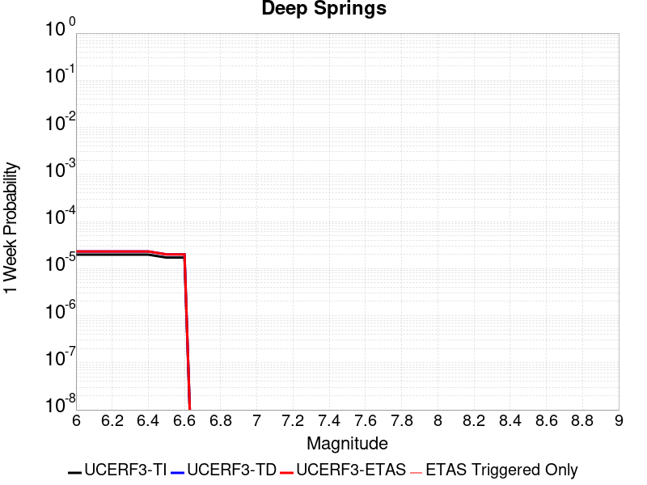 |  |  |  |

| Magnitude | 1 wk TI Prob | 1 wk TD Prob | 1 wk ETAS Prob | 1 wk ETAS/TD Gain | 1 wk ETAS Triggered Only | 1 mo TI Prob | 1 mo TD Prob | 1 mo ETAS Prob | 1 mo ETAS/TD Gain | 1 mo ETAS Triggered Only | 1 yr TI Prob | 1 yr TD Prob | 1 yr ETAS Prob | 1 yr ETAS/TD Gain | 1 yr ETAS Triggered Only | 10 yr TI Prob | 10 yr TD Prob | 10 yr ETAS Prob | 10 yr ETAS/TD Gain | 10 yr ETAS Triggered Only |
|-----|-----|-----|-----|-----|-----|-----|-----|-----|-----|-----|-----|-----|-----|-----|-----|-----|-----|-----|-----|-----|
| 6.0 | 1.9810619E-5 | 2.311303E-5 | 2.311303E-5 | 1.0 | 0.0 | 8.489989E-5 | 9.9054945E-5 | 1.19052966E-4 | 1.2018881 | 2.0E-5 | 0.001033166 | 0.0012058344 | 0.0012258104 | 1.016566 | 2.0E-5 | 0.010283757 | 0.012042696 | 0.012072334 | 1.0024612 | 3.0E-5 |
| 6.1 | 1.9810619E-5 | 2.311303E-5 | 2.311303E-5 | 1.0 | 0.0 | 8.489989E-5 | 9.9054945E-5 | 1.19052966E-4 | 1.2018881 | 2.0E-5 | 0.001033166 | 0.0012058344 | 0.0012258104 | 1.016566 | 2.0E-5 | 0.010283757 | 0.012042696 | 0.012072334 | 1.0024612 | 3.0E-5 |
| 6.2 | 1.9810619E-5 | 2.311303E-5 | 2.311303E-5 | 1.0 | 0.0 | 8.489989E-5 | 9.9054945E-5 | 1.19052966E-4 | 1.2018881 | 2.0E-5 | 0.001033166 | 0.0012058344 | 0.0012258104 | 1.016566 | 2.0E-5 | 0.010283757 | 0.012042696 | 0.012072334 | 1.0024612 | 3.0E-5 |
| 6.3 | 1.9810619E-5 | 2.311303E-5 | 2.311303E-5 | 1.0 | 0.0 | 8.489989E-5 | 9.9054945E-5 | 1.19052966E-4 | 1.2018881 | 2.0E-5 | 0.001033166 | 0.0012058344 | 0.0012258104 | 1.016566 | 2.0E-5 | 0.010283757 | 0.012042696 | 0.012072334 | 1.0024612 | 3.0E-5 |
| 6.4 | 1.9810619E-5 | 2.311303E-5 | 2.311303E-5 | 1.0 | 0.0 | 8.489989E-5 | 9.9054945E-5 | 1.19052966E-4 | 1.2018881 | 2.0E-5 | 0.001033166 | 0.0012058344 | 0.0012258104 | 1.016566 | 2.0E-5 | 0.010283757 | 0.012042696 | 0.012072334 | 1.0024612 | 3.0E-5 |
| 6.5 | 1.7190405E-5 | 2.0051E-5 | 2.0051E-5 | 1.0 | 0.0 | 7.367108E-5 | 8.593286E-5 | 1.0593114E-4 | 1.2327199 | 2.0E-5 | 8.9657627E-4 | 0.0010462323 | 0.0010662114 | 1.0190963 | 2.0E-5 | 0.008929676 | 0.010462292 | 0.010491977 | 1.0028374 | 3.0E-5 |
| 6.6 | 1.7190405E-5 | 2.0051E-5 | 2.0051E-5 | 1.0 | 0.0 | 7.367108E-5 | 8.593286E-5 | 1.0593114E-4 | 1.2327199 | 2.0E-5 | 8.9657627E-4 | 0.0010462323 | 0.0010662114 | 1.0190963 | 2.0E-5 | 0.008929676 | 0.010462292 | 0.010491977 | 1.0028374 | 3.0E-5 |

## Kern Canyon (North Kern) 2011
*[(top)](#table-of-contents)*

| 1 Week | 1 Month | 1 Year | 10 Year |
|-----|-----|-----|-----|
|  |  |  |  |

| Magnitude | 1 wk TI Prob | 1 wk TD Prob | 1 wk ETAS Prob | 1 wk ETAS/TD Gain | 1 wk ETAS Triggered Only | 1 mo TI Prob | 1 mo TD Prob | 1 mo ETAS Prob | 1 mo ETAS/TD Gain | 1 mo ETAS Triggered Only | 1 yr TI Prob | 1 yr TD Prob | 1 yr ETAS Prob | 1 yr ETAS/TD Gain | 1 yr ETAS Triggered Only | 10 yr TI Prob | 10 yr TD Prob | 10 yr ETAS Prob | 10 yr ETAS/TD Gain | 10 yr ETAS Triggered Only |
|-----|-----|-----|-----|-----|-----|-----|-----|-----|-----|-----|-----|-----|-----|-----|-----|-----|-----|-----|-----|-----|
| 6.0 | 6.6264497E-6 | 6.7573515E-6 | 1.6757283E-5 | 2.4798598 | 1.0E-5 | 2.8398761E-5 | 2.8959801E-5 | 3.895951E-5 | 1.3452963 | 1.0E-5 | 3.4570007E-4 | 3.5253656E-4 | 3.725295E-4 | 1.0567117 | 2.0E-5 | 0.0034516277 | 0.0035205614 | 0.003550456 | 1.0084914 | 3.0E-5 |
| 6.1 | 6.6264497E-6 | 6.7573515E-6 | 1.6757283E-5 | 2.4798598 | 1.0E-5 | 2.8398761E-5 | 2.8959801E-5 | 3.895951E-5 | 1.3452963 | 1.0E-5 | 3.4570007E-4 | 3.5253656E-4 | 3.725295E-4 | 1.0567117 | 2.0E-5 | 0.0034516277 | 0.0035205614 | 0.003550456 | 1.0084914 | 3.0E-5 |
| 6.2 | 6.6264497E-6 | 6.7573515E-6 | 1.6757283E-5 | 2.4798598 | 1.0E-5 | 2.8398761E-5 | 2.8959801E-5 | 3.895951E-5 | 1.3452963 | 1.0E-5 | 3.4570007E-4 | 3.5253656E-4 | 3.725295E-4 | 1.0567117 | 2.0E-5 | 0.0034516277 | 0.0035205614 | 0.003550456 | 1.0084914 | 3.0E-5 |
| 6.3 | 6.6264497E-6 | 6.7573515E-6 | 1.6757283E-5 | 2.4798598 | 1.0E-5 | 2.8398761E-5 | 2.8959801E-5 | 3.895951E-5 | 1.3452963 | 1.0E-5 | 3.4570007E-4 | 3.5253656E-4 | 3.725295E-4 | 1.0567117 | 2.0E-5 | 0.0034516277 | 0.0035205614 | 0.003550456 | 1.0084914 | 3.0E-5 |
| 6.4 | 6.6264497E-6 | 6.7573515E-6 | 1.6757283E-5 | 2.4798598 | 1.0E-5 | 2.8398761E-5 | 2.8959801E-5 | 3.895951E-5 | 1.3452963 | 1.0E-5 | 3.4570007E-4 | 3.5253656E-4 | 3.725295E-4 | 1.0567117 | 2.0E-5 | 0.0034516277 | 0.0035205614 | 0.003550456 | 1.0084914 | 3.0E-5 |
| 6.5 | 3.2162225E-6 | 3.2571006E-6 | 3.2571006E-6 | 1.0 | 0.0 | 1.3783738E-5 | 1.3958933E-5 | 1.3958933E-5 | 1.0 | 0.0 | 1.6780409E-4 | 1.6993756E-4 | 1.6993756E-4 | 1.0 | 0.0 | 0.0016767744 | 0.0016981558 | 0.0017081389 | 1.0058787 | 1.0E-5 |
| 6.6 | 3.2162225E-6 | 3.2571006E-6 | 3.2571006E-6 | 1.0 | 0.0 | 1.3783738E-5 | 1.3958933E-5 | 1.3958933E-5 | 1.0 | 0.0 | 1.6780409E-4 | 1.6993756E-4 | 1.6993756E-4 | 1.0 | 0.0 | 0.0016767744 | 0.0016981558 | 0.0017081389 | 1.0058787 | 1.0E-5 |
| 6.7 | 2.1908265E-6 | 2.207128E-6 | 2.207128E-6 | 1.0 | 0.0 | 9.389223E-6 | 9.459087E-6 | 9.459087E-6 | 1.0 | 0.0 | 1.1430779E-4 | 1.15158495E-4 | 1.15158495E-4 | 1.0 | 0.0 | 0.0011424901 | 0.0011510076 | 0.0011510076 | 1.0 | 0.0 |
| 6.8 | 1.7303895E-6 | 1.7365575E-6 | 1.7365575E-6 | 1.0 | 0.0 | 7.415934E-6 | 7.4423683E-6 | 7.4423683E-6 | 1.0 | 0.0 | 9.028525E-5 | 9.0607165E-5 | 9.0607165E-5 | 1.0 | 0.0 | 9.024858E-4 | 9.0571196E-4 | 9.0571196E-4 | 1.0 | 0.0 |
| 6.9 | 1.3700314E-6 | 1.3688658E-6 | 1.3688658E-6 | 1.0 | 0.0 | 5.87155E-6 | 5.8665546E-6 | 5.8665546E-6 | 1.0 | 0.0 | 7.148377E-5 | 7.142301E-5 | 7.142301E-5 | 1.0 | 0.0 | 7.146078E-4 | 7.140051E-4 | 7.140051E-4 | 1.0 | 0.0 |
| 7.0 | 1.1467797E-6 | 1.1413834E-6 | 1.1413834E-6 | 1.0 | 0.0 | 4.9147607E-6 | 4.8916345E-6 | 4.8916345E-6 | 1.0 | 0.0 | 5.983557E-5 | 5.955405E-5 | 5.955405E-5 | 1.0 | 0.0 | 5.981946E-4 | 5.9538404E-4 | 5.9538404E-4 | 1.0 | 0.0 |
| 7.1 | 9.3952065E-7 | 9.3027154E-7 | 9.3027154E-7 | 1.0 | 0.0 | 4.026511E-6 | 3.986872E-6 | 3.986872E-6 | 1.0 | 0.0 | 4.9021666E-5 | 4.8539103E-5 | 4.8539103E-5 | 1.0 | 0.0 | 4.901085E-4 | 4.852868E-4 | 4.852868E-4 | 1.0 | 0.0 |
| 7.2 | 6.858055E-7 | 6.719319E-7 | 6.719319E-7 | 1.0 | 0.0 | 2.939163E-6 | 2.879705E-6 | 2.879705E-6 | 1.0 | 0.0 | 3.5783723E-5 | 3.5059853E-5 | 3.5059853E-5 | 1.0 | 0.0 | 3.5777962E-4 | 3.505441E-4 | 3.505441E-4 | 1.0 | 0.0 |
| 7.3 | 5.1101983E-7 | 4.939314E-7 | 4.939314E-7 | 1.0 | 0.0 | 2.1900833E-6 | 2.116847E-6 | 2.116847E-6 | 1.0 | 0.0 | 2.6663936E-5 | 2.5772315E-5 | 2.5772315E-5 | 1.0 | 0.0 | 2.6660739E-4 | 2.5769373E-4 | 2.5769373E-4 | 1.0 | 0.0 |
| 7.4 | 3.4999414E-7 | 3.2996007E-7 | 3.2996007E-7 | 1.0 | 0.0 | 1.499974E-6 | 1.4141139E-6 | 1.4141139E-6 | 1.0 | 0.0 | 1.8262032E-5 | 1.7216704E-5 | 1.7216704E-5 | 1.0 | 0.0 | 1.826053E-4 | 1.7215393E-4 | 1.7215393E-4 | 1.0 | 0.0 |
| 7.5 | 1.7021522E-7 | 1.4750101E-7 | 1.4750101E-7 | 1.0 | 0.0 | 7.2949354E-7 | 6.321471E-7 | 6.321471E-7 | 1.0 | 0.0 | 8.881548E-6 | 7.696364E-6 | 7.696364E-6 | 1.0 | 0.0 | 8.8811925E-5 | 7.696106E-5 | 7.696106E-5 | 1.0 | 0.0 |
| 7.6 | 2.572245E-8 | 1.7352718E-8 | 1.7352718E-8 | 1.0 | 0.0 | 1.10239064E-7 | 7.436879E-8 | 7.436879E-8 | 1.0 | 0.0 | 1.3421597E-6 | 9.054397E-7 | 9.054397E-7 | 1.0 | 0.0 | 1.3421517E-5 | 9.054365E-6 | 9.054365E-6 | 1.0 | 0.0 |

## Greenville (So) 2011 CFM
*[(top)](#table-of-contents)*

| 1 Week | 1 Month | 1 Year | 10 Year |
|-----|-----|-----|-----|
|  |  |  |  |

| Magnitude | 1 wk TI Prob | 1 wk TD Prob | 1 wk ETAS Prob | 1 wk ETAS/TD Gain | 1 wk ETAS Triggered Only | 1 mo TI Prob | 1 mo TD Prob | 1 mo ETAS Prob | 1 mo ETAS/TD Gain | 1 mo ETAS Triggered Only | 1 yr TI Prob | 1 yr TD Prob | 1 yr ETAS Prob | 1 yr ETAS/TD Gain | 1 yr ETAS Triggered Only | 10 yr TI Prob | 10 yr TD Prob | 10 yr ETAS Prob | 10 yr ETAS/TD Gain | 10 yr ETAS Triggered Only |
|-----|-----|-----|-----|-----|-----|-----|-----|-----|-----|-----|-----|-----|-----|-----|-----|-----|-----|-----|-----|-----|
| 6.0 | 4.279693E-5 | 5.504253E-5 | 5.504253E-5 | 1.0 | 0.0 | 1.8340252E-4 | 2.3587665E-4 | 2.3587665E-4 | 1.0 | 0.0 | 0.0022306389 | 0.0028682668 | 0.0028782382 | 1.0034764 | 1.0E-5 | 0.022083808 | 0.028339608 | 0.02835904 | 1.0006857 | 2.0E-5 |
| 6.1 | 3.4037297E-5 | 4.319378E-5 | 4.319378E-5 | 1.0 | 0.0 | 1.4586597E-4 | 1.8510365E-4 | 1.8510365E-4 | 1.0 | 0.0 | 0.0017744715 | 0.00225147 | 0.0022614475 | 1.0044315 | 1.0E-5 | 0.01760369 | 0.02230374 | 0.022323294 | 1.0008767 | 2.0E-5 |
| 6.2 | 3.4037297E-5 | 4.319378E-5 | 4.319378E-5 | 1.0 | 0.0 | 1.4586597E-4 | 1.8510365E-4 | 1.8510365E-4 | 1.0 | 0.0 | 0.0017744715 | 0.00225147 | 0.0022614475 | 1.0044315 | 1.0E-5 | 0.01760369 | 0.02230374 | 0.022323294 | 1.0008767 | 2.0E-5 |
| 6.3 | 2.5956324E-5 | 3.243031E-5 | 3.243031E-5 | 1.0 | 0.0 | 1.11236644E-4 | 1.3898002E-4 | 1.3898002E-4 | 1.0 | 0.0 | 0.0013534647 | 0.0016908324 | 0.0017008155 | 1.0059042 | 1.0E-5 | 0.013452509 | 0.016786784 | 0.01680645 | 1.0011715 | 2.0E-5 |
| 6.4 | 2.1145053E-5 | 2.6198471E-5 | 2.6198471E-5 | 1.0 | 0.0 | 9.061851E-5 | 1.1227445E-4 | 1.1227445E-4 | 1.0 | 0.0 | 0.0011027219 | 0.001366116 | 0.0013761023 | 1.00731 | 1.0E-5 | 0.01097266 | 0.013580924 | 0.013600653 | 1.0014527 | 2.0E-5 |
| 6.5 | 2.0030959E-5 | 2.4796553E-5 | 2.4796553E-5 | 1.0 | 0.0 | 8.584414E-5 | 1.06266765E-4 | 1.06266765E-4 | 1.0 | 0.0 | 0.0010446513 | 0.0012930612 | 0.0013030482 | 1.0077236 | 1.0E-5 | 0.010397541 | 0.012859055 | 0.012878798 | 1.0015353 | 2.0E-5 |
| 6.6 | 1.8395405E-5 | 2.2755145E-5 | 2.2755145E-5 | 1.0 | 0.0 | 7.8835066E-5 | 9.751856E-5 | 9.751856E-5 | 1.0 | 0.0 | 9.5939427E-4 | 0.0011866703 | 0.0011966585 | 1.0084169 | 1.0E-5 | 0.009552629 | 0.011806721 | 0.011826484 | 1.0016739 | 2.0E-5 |
| 6.7 | 1.7883482E-5 | 2.2126169E-5 | 2.2126169E-5 | 1.0 | 0.0 | 7.664124E-5 | 9.482315E-5 | 9.482315E-5 | 1.0 | 0.0 | 9.3270757E-4 | 0.001153889 | 0.0011638774 | 1.0086564 | 1.0E-5 | 0.009288026 | 0.011482358 | 0.011502128 | 1.0017219 | 2.0E-5 |
| 6.8 | 1.3373564E-5 | 1.650644E-5 | 1.650644E-5 | 1.0 | 0.0 | 5.7314013E-5 | 7.0740054E-5 | 7.0740054E-5 | 1.0 | 0.0 | 6.975747E-4 | 8.609346E-4 | 8.7092596E-4 | 1.0116053 | 1.0E-5 | 0.0069538904 | 0.008577933 | 0.008587847 | 1.0011557 | 1.0E-5 |
| 6.9 | 1.06692905E-5 | 1.315295E-5 | 1.315295E-5 | 1.0 | 0.0 | 4.5724726E-5 | 5.6368626E-5 | 5.6368626E-5 | 1.0 | 0.0 | 5.5655633E-4 | 6.860832E-4 | 6.960763E-4 | 1.0145655 | 1.0E-5 | 0.005551645 | 0.0068412144 | 0.006851146 | 1.0014517 | 1.0E-5 |
| 7.0 | 8.157512E-6 | 1.0062912E-5 | 1.0062912E-5 | 1.0 | 0.0 | 3.4960296E-5 | 4.3126074E-5 | 4.3126074E-5 | 1.0 | 0.0 | 4.2555845E-4 | 5.249372E-4 | 5.349319E-4 | 1.0190399 | 1.0E-5 | 0.004247444 | 0.00523778 | 0.0052477275 | 1.0018992 | 1.0E-5 |
| 7.1 | 6.1467113E-6 | 7.627636E-6 | 7.627636E-6 | 1.0 | 0.0 | 2.6342783E-5 | 3.2689466E-5 | 3.2689466E-5 | 1.0 | 0.0 | 3.206762E-4 | 3.9792238E-4 | 3.9792238E-4 | 1.0 | 0.0 | 0.0032021382 | 0.0039726184 | 0.0039726184 | 1.0 | 0.0 |
| 7.2 | 4.713467E-6 | 5.9143304E-6 | 5.9143304E-6 | 1.0 | 0.0 | 2.0200418E-5 | 2.5346888E-5 | 2.5346888E-5 | 1.0 | 0.0 | 2.4591232E-4 | 3.0855526E-4 | 3.0855526E-4 | 1.0 | 0.0 | 0.0024564038 | 0.0030817043 | 0.0030817043 | 1.0 | 0.0 |
| 7.3 | 2.3266216E-6 | 2.954093E-6 | 2.954093E-6 | 1.0 | 0.0 | 9.971197E-6 | 1.2660337E-5 | 1.2660337E-5 | 1.0 | 0.0 | 1.2139256E-4 | 1.5412885E-4 | 1.5412885E-4 | 1.0 | 0.0 | 0.0012132627 | 0.0015404717 | 0.0015404717 | 1.0 | 0.0 |
| 7.4 | 1.3314E-6 | 1.7180038E-6 | 1.7180038E-6 | 1.0 | 0.0 | 5.7059874E-6 | 7.3628526E-6 | 7.3628526E-6 | 1.0 | 0.0 | 6.946818E-5 | 8.963909E-5 | 8.963909E-5 | 1.0 | 0.0 | 6.9446466E-4 | 8.9630444E-4 | 8.9630444E-4 | 1.0 | 0.0 |
| 7.5 | 1.0362941E-6 | 1.3469212E-6 | 1.3469212E-6 | 1.0 | 0.0 | 4.4412527E-6 | 5.772507E-6 | 5.772507E-6 | 1.0 | 0.0 | 5.407091E-5 | 7.027805E-5 | 7.027805E-5 | 1.0 | 0.0 | 5.405776E-4 | 7.028176E-4 | 7.028176E-4 | 1.0 | 0.0 |
| 7.6 | 7.764784E-7 | 1.0088914E-6 | 1.0088914E-6 | 1.0 | 0.0 | 3.3277602E-6 | 4.3238138E-6 | 4.3238138E-6 | 1.0 | 0.0 | 4.0514726E-5 | 5.2641197E-5 | 5.2641197E-5 | 1.0 | 0.0 | 4.050734E-4 | 5.2651245E-4 | 5.2651245E-4 | 1.0 | 0.0 |
| 7.7 | 1.6927763E-7 | 2.214027E-7 | 2.214027E-7 | 1.0 | 0.0 | 7.2547533E-7 | 9.4886843E-7 | 9.4886843E-7 | 1.0 | 0.0 | 8.832627E-6 | 1.1552414E-5 | 1.1552414E-5 | 1.0 | 0.0 | 8.8322755E-5 | 1.1554362E-4 | 1.1554362E-4 | 1.0 | 0.0 |

## Independence rev 2011
*[(top)](#table-of-contents)*

| 1 Week | 1 Month | 1 Year | 10 Year |
|-----|-----|-----|-----|
|  |  |  |  |

| Magnitude | 1 wk TI Prob | 1 wk TD Prob | 1 wk ETAS Prob | 1 wk ETAS/TD Gain | 1 wk ETAS Triggered Only | 1 mo TI Prob | 1 mo TD Prob | 1 mo ETAS Prob | 1 mo ETAS/TD Gain | 1 mo ETAS Triggered Only | 1 yr TI Prob | 1 yr TD Prob | 1 yr ETAS Prob | 1 yr ETAS/TD Gain | 1 yr ETAS Triggered Only | 10 yr TI Prob | 10 yr TD Prob | 10 yr ETAS Prob | 10 yr ETAS/TD Gain | 10 yr ETAS Triggered Only |
|-----|-----|-----|-----|-----|-----|-----|-----|-----|-----|-----|-----|-----|-----|-----|-----|-----|-----|-----|-----|-----|
| 6.0 | 4.422171E-6 | 4.3262453E-6 | 4.3262453E-6 | 1.0 | 0.0 | 1.8952025E-5 | 1.8540937E-5 | 1.8540937E-5 | 1.0 | 0.0 | 2.3071647E-4 | 2.257155E-4 | 2.3571325E-4 | 1.0442935 | 1.0E-5 | 0.0023047708 | 0.0022551562 | 0.002275111 | 1.0088485 | 2.0E-5 |
| 6.1 | 4.422171E-6 | 4.3262453E-6 | 4.3262453E-6 | 1.0 | 0.0 | 1.8952025E-5 | 1.8540937E-5 | 1.8540937E-5 | 1.0 | 0.0 | 2.3071647E-4 | 2.257155E-4 | 2.3571325E-4 | 1.0442935 | 1.0E-5 | 0.0023047708 | 0.0022551562 | 0.002275111 | 1.0088485 | 2.0E-5 |
| 6.2 | 4.422171E-6 | 4.3262453E-6 | 4.3262453E-6 | 1.0 | 0.0 | 1.8952025E-5 | 1.8540937E-5 | 1.8540937E-5 | 1.0 | 0.0 | 2.3071647E-4 | 2.257155E-4 | 2.3571325E-4 | 1.0442935 | 1.0E-5 | 0.0023047708 | 0.0022551562 | 0.002275111 | 1.0088485 | 2.0E-5 |
| 6.3 | 4.422171E-6 | 4.3262453E-6 | 4.3262453E-6 | 1.0 | 0.0 | 1.8952025E-5 | 1.8540937E-5 | 1.8540937E-5 | 1.0 | 0.0 | 2.3071647E-4 | 2.257155E-4 | 2.3571325E-4 | 1.0442935 | 1.0E-5 | 0.0023047708 | 0.0022551562 | 0.002275111 | 1.0088485 | 2.0E-5 |
| 6.4 | 4.422171E-6 | 4.3262453E-6 | 4.3262453E-6 | 1.0 | 0.0 | 1.8952025E-5 | 1.8540937E-5 | 1.8540937E-5 | 1.0 | 0.0 | 2.3071647E-4 | 2.257155E-4 | 2.3571325E-4 | 1.0442935 | 1.0E-5 | 0.0023047708 | 0.0022551562 | 0.002275111 | 1.0088485 | 2.0E-5 |
| 6.5 | 4.422171E-6 | 4.3262453E-6 | 4.3262453E-6 | 1.0 | 0.0 | 1.8952025E-5 | 1.8540937E-5 | 1.8540937E-5 | 1.0 | 0.0 | 2.3071647E-4 | 2.257155E-4 | 2.3571325E-4 | 1.0442935 | 1.0E-5 | 0.0023047708 | 0.0022551562 | 0.002275111 | 1.0088485 | 2.0E-5 |
| 6.6 | 2.663744E-6 | 2.5319996E-6 | 2.5319996E-6 | 1.0 | 0.0 | 1.1415996E-5 | 1.0851385E-5 | 1.0851385E-5 | 1.0 | 0.0 | 1.3898089E-4 | 1.3210809E-4 | 1.4210677E-4 | 1.0756856 | 1.0E-5 | 0.0013889399 | 0.0013203438 | 0.0013403174 | 1.0151275 | 2.0E-5 |
| 6.7 | 2.663744E-6 | 2.5319996E-6 | 2.5319996E-6 | 1.0 | 0.0 | 1.1415996E-5 | 1.0851385E-5 | 1.0851385E-5 | 1.0 | 0.0 | 1.3898089E-4 | 1.3210809E-4 | 1.4210677E-4 | 1.0756856 | 1.0E-5 | 0.0013889399 | 0.0013203438 | 0.0013403174 | 1.0151275 | 2.0E-5 |
| 6.8 | 1.9716529E-6 | 1.8322698E-6 | 1.8322698E-6 | 1.0 | 0.0 | 8.449913E-6 | 7.852562E-6 | 7.852562E-6 | 1.0 | 0.0 | 1.0287284E-4 | 9.560088E-5 | 1.05599924E-4 | 1.1045916 | 1.0E-5 | 0.0010282523 | 9.556104E-4 | 9.755913E-4 | 1.0209091 | 2.0E-5 |
| 6.9 | 1.8788617E-6 | 1.7430103E-6 | 1.7430103E-6 | 1.0 | 0.0 | 8.0522395E-6 | 7.4700233E-6 | 7.4700233E-6 | 1.0 | 0.0 | 9.80316E-5 | 9.094386E-5 | 1.00942954E-4 | 1.1099479 | 1.0E-5 | 9.798837E-4 | 9.0907846E-4 | 9.290603E-4 | 1.0219803 | 2.0E-5 |
| 7.0 | 1.5045488E-6 | 1.3849603E-6 | 1.3849603E-6 | 1.0 | 0.0 | 6.44805E-6 | 5.935531E-6 | 5.935531E-6 | 1.0 | 0.0 | 7.8502184E-5 | 7.226275E-5 | 8.226203E-5 | 1.1383739 | 1.0E-5 | 7.8474457E-4 | 7.2239764E-4 | 7.423832E-4 | 1.0276656 | 2.0E-5 |
| 7.1 | 1.272341E-6 | 1.1625186E-6 | 1.1625186E-6 | 1.0 | 0.0 | 5.4528787E-6 | 4.9822133E-6 | 4.9822133E-6 | 1.0 | 0.0 | 6.6386776E-5 | 6.065679E-5 | 7.0656184E-5 | 1.164852 | 1.0E-5 | 6.636695E-4 | 6.0640555E-4 | 6.263934E-4 | 1.0329612 | 2.0E-5 |
| 7.2 | 1.0416892E-6 | 9.4099533E-7 | 9.4099533E-7 | 1.0 | 0.0 | 4.464375E-6 | 4.032831E-6 | 4.032831E-6 | 1.0 | 0.0 | 5.4352407E-5 | 4.909863E-5 | 5.909814E-5 | 1.2036617 | 1.0E-5 | 5.4339116E-4 | 4.908797E-4 | 5.108699E-4 | 1.0407232 | 2.0E-5 |
| 7.3 | 7.9450155E-7 | 7.2350707E-7 | 7.2350707E-7 | 1.0 | 0.0 | 3.4050022E-6 | 3.100741E-6 | 3.100741E-6 | 1.0 | 0.0 | 4.1455114E-5 | 3.7750877E-5 | 4.7750502E-5 | 1.2648845 | 1.0E-5 | 4.144738E-4 | 3.7744577E-4 | 3.974382E-4 | 1.0529678 | 2.0E-5 |
| 7.4 | 5.3893444E-7 | 5.0195547E-7 | 5.0195547E-7 | 1.0 | 0.0 | 2.309717E-6 | 2.1512358E-6 | 2.1512358E-6 | 1.0 | 0.0 | 2.8120441E-5 | 2.6190986E-5 | 3.6190726E-5 | 1.3818008 | 1.0E-5 | 2.8116882E-4 | 2.6187944E-4 | 2.818742E-4 | 1.076351 | 2.0E-5 |
| 7.5 | 3.8852085E-7 | 3.6825836E-7 | 3.6825836E-7 | 1.0 | 0.0 | 1.6650882E-6 | 1.5782492E-6 | 1.5782492E-6 | 1.0 | 0.0 | 2.027226E-5 | 1.9215016E-5 | 2.9214825E-5 | 1.5204163 | 1.0E-5 | 2.0270412E-4 | 1.9213377E-4 | 2.1212992E-4 | 1.1040741 | 2.0E-5 |
| 7.6 | 2.414929E-7 | 2.3457733E-7 | 2.3457733E-7 | 1.0 | 0.0 | 1.0349692E-6 | 1.005331E-6 | 1.005331E-6 | 1.0 | 0.0 | 1.2600677E-5 | 1.2239838E-5 | 2.2239716E-5 | 1.8169943 | 1.0E-5 | 1.2599962E-4 | 1.2239176E-4 | 1.4238931E-4 | 1.1633897 | 2.0E-5 |
| 7.7 | 6.8298014E-8 | 6.858997E-8 | 6.858997E-8 | 1.0 | 0.0 | 2.9270575E-7 | 2.93957E-7 | 2.93957E-7 | 1.0 | 0.0 | 3.5636867E-6 | 3.578921E-6 | 3.578921E-6 | 1.0 | 0.0 | 3.5636294E-5 | 3.5788682E-5 | 3.5788682E-5 | 1.0 | 0.0 |

## Santa Ynez (West)
*[(top)](#table-of-contents)*

| 1 Week | 1 Month | 1 Year | 10 Year |
|-----|-----|-----|-----|
|  |  |  | 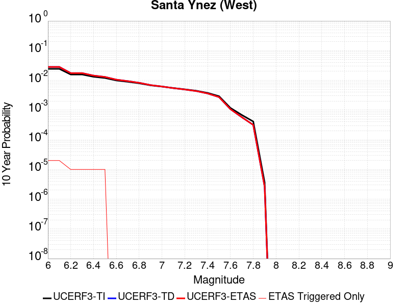 |

| Magnitude | 1 wk TI Prob | 1 wk TD Prob | 1 wk ETAS Prob | 1 wk ETAS/TD Gain | 1 wk ETAS Triggered Only | 1 mo TI Prob | 1 mo TD Prob | 1 mo ETAS Prob | 1 mo ETAS/TD Gain | 1 mo ETAS Triggered Only | 1 yr TI Prob | 1 yr TD Prob | 1 yr ETAS Prob | 1 yr ETAS/TD Gain | 1 yr ETAS Triggered Only | 10 yr TI Prob | 10 yr TD Prob | 10 yr ETAS Prob | 10 yr ETAS/TD Gain | 10 yr ETAS Triggered Only |
|-----|-----|-----|-----|-----|-----|-----|-----|-----|-----|-----|-----|-----|-----|-----|-----|-----|-----|-----|-----|-----|
| 6.0 | 4.7352758E-5 | 5.49722E-5 | 5.49722E-5 | 1.0 | 0.0 | 2.0292461E-4 | 2.3557546E-4 | 2.4557312E-4 | 1.0424392 | 1.0E-5 | 0.0024678076 | 0.0028646276 | 0.0028845703 | 1.0069617 | 2.0E-5 | 0.024405818 | 0.028305134 | 0.028324567 | 1.0006865 | 2.0E-5 |
| 6.1 | 4.7352758E-5 | 5.49722E-5 | 5.49722E-5 | 1.0 | 0.0 | 2.0292461E-4 | 2.3557546E-4 | 2.4557312E-4 | 1.0424392 | 1.0E-5 | 0.0024678076 | 0.0028646276 | 0.0028845703 | 1.0069617 | 2.0E-5 | 0.024405818 | 0.028305134 | 0.028324567 | 1.0006865 | 2.0E-5 |
| 6.2 | 3.0415853E-5 | 3.392567E-5 | 3.392567E-5 | 1.0 | 0.0 | 1.3034715E-4 | 1.4538778E-4 | 1.4538778E-4 | 1.0 | 0.0 | 0.0015858212 | 0.0017686938 | 0.001778676 | 1.0056438 | 1.0E-5 | 0.015745522 | 0.01755012 | 0.017559944 | 1.0005598 | 1.0E-5 |
| 6.3 | 3.0415853E-5 | 3.392567E-5 | 3.392567E-5 | 1.0 | 0.0 | 1.3034715E-4 | 1.4538778E-4 | 1.4538778E-4 | 1.0 | 0.0 | 0.0015858212 | 0.0017686938 | 0.001778676 | 1.0056438 | 1.0E-5 | 0.015745522 | 0.01755012 | 0.017559944 | 1.0005598 | 1.0E-5 |
| 6.4 | 2.5452082E-5 | 2.7912814E-5 | 2.7912814E-5 | 1.0 | 0.0 | 1.09075794E-4 | 1.1962098E-4 | 1.1962098E-4 | 1.0 | 0.0 | 0.0013271887 | 0.0014554313 | 0.0014654169 | 1.0068609 | 1.0E-5 | 0.013192902 | 0.014461164 | 0.01447102 | 1.0006815 | 1.0E-5 |
| 6.5 | 2.3143784E-5 | 2.5128551E-5 | 2.5128551E-5 | 1.0 | 0.0 | 9.9183875E-5 | 1.0768943E-4 | 1.0768943E-4 | 1.0 | 0.0 | 0.0012068948 | 0.0013103448 | 0.0013203317 | 1.0076215 | 1.0E-5 | 0.012003611 | 0.013027853 | 0.0130377235 | 1.0007576 | 1.0E-5 |
| 6.6 | 1.9118515E-5 | 2.0354546E-5 | 2.0354546E-5 | 1.0 | 0.0 | 8.193392E-5 | 8.7230896E-5 | 8.7230896E-5 | 1.0 | 0.0 | 9.97089E-4 | 0.0010615266 | 0.0010615266 | 1.0 | 0.0 | 0.00992627 | 0.010565472 | 0.010565472 | 1.0 | 0.0 |
| 6.7 | 1.722807E-5 | 1.8146504E-5 | 1.8146504E-5 | 1.0 | 0.0 | 7.3832496E-5 | 7.776845E-5 | 7.776845E-5 | 1.0 | 0.0 | 8.985399E-4 | 9.464251E-4 | 9.464251E-4 | 1.0 | 0.0 | 0.008949154 | 0.0094245905 | 0.0094245905 | 1.0 | 0.0 |
| 6.8 | 1.5317364E-5 | 1.5926595E-5 | 1.5926595E-5 | 1.0 | 0.0 | 6.56442E-5 | 6.825507E-5 | 6.825507E-5 | 1.0 | 0.0 | 7.98925E-4 | 8.3069294E-4 | 8.3069294E-4 | 1.0 | 0.0 | 0.007960589 | 0.008276366 | 0.008276366 | 1.0 | 0.0 |
| 6.9 | 1.3071226E-5 | 1.3329679E-5 | 1.3329679E-5 | 1.0 | 0.0 | 5.6018336E-5 | 5.7125955E-5 | 5.7125955E-5 | 1.0 | 0.0 | 6.8180985E-4 | 6.952888E-4 | 6.952888E-4 | 1.0 | 0.0 | 0.0067972173 | 0.0069313953 | 0.0069313953 | 1.0 | 0.0 |
| 7.0 | 1.1836986E-5 | 1.19328115E-5 | 1.19328115E-5 | 1.0 | 0.0 | 5.0728955E-5 | 5.113963E-5 | 5.113963E-5 | 1.0 | 0.0 | 6.1745E-4 | 6.224488E-4 | 6.224488E-4 | 1.0 | 0.0 | 0.006157372 | 0.006207247 | 0.006207247 | 1.0 | 0.0 |
| 7.1 | 1.0597169E-5 | 1.0542209E-5 | 1.0542209E-5 | 1.0 | 0.0 | 4.541565E-5 | 4.5180117E-5 | 4.5180117E-5 | 1.0 | 0.0 | 5.5279525E-4 | 5.499302E-4 | 5.499302E-4 | 1.0 | 0.0 | 0.0055142213 | 0.005485825 | 0.005485825 | 1.0 | 0.0 |
| 7.2 | 9.59113E-6 | 9.4591405E-6 | 9.4591405E-6 | 1.0 | 0.0 | 4.11042E-5 | 4.0538547E-5 | 4.0538547E-5 | 1.0 | 0.0 | 5.0032866E-4 | 4.9344613E-4 | 4.9344613E-4 | 1.0 | 0.0 | 0.004992037 | 0.0049236235 | 0.0049236235 | 1.0 | 0.0 |
| 7.3 | 8.586084E-6 | 8.3795685E-6 | 8.3795685E-6 | 1.0 | 0.0 | 3.679698E-5 | 3.5911948E-5 | 3.5911948E-5 | 1.0 | 0.0 | 4.4791115E-4 | 4.371413E-4 | 4.371413E-4 | 1.0 | 0.0 | 0.004470094 | 0.0043629254 | 0.0043629254 | 1.0 | 0.0 |
| 7.4 | 7.2622997E-6 | 6.9515127E-6 | 6.9515127E-6 | 1.0 | 0.0 | 3.112377E-5 | 2.9791861E-5 | 2.9791861E-5 | 1.0 | 0.0 | 3.78866E-4 | 3.6265652E-4 | 3.6265652E-4 | 1.0 | 0.0 | 0.0037822074 | 0.0036207472 | 0.0036207472 | 1.0 | 0.0 |
| 7.5 | 5.627296E-6 | 5.251543E-6 | 5.251543E-6 | 1.0 | 0.0 | 2.411676E-5 | 2.2506423E-5 | 2.2506423E-5 | 1.0 | 0.0 | 2.9358198E-4 | 2.7398195E-4 | 2.7398195E-4 | 1.0 | 0.0 | 0.0029319443 | 0.0027365137 | 0.0027365137 | 1.0 | 0.0 |
| 7.6 | 2.265244E-6 | 2.0608816E-6 | 2.0608816E-6 | 1.0 | 0.0 | 9.708152E-6 | 8.8323195E-6 | 8.8323195E-6 | 1.0 | 0.0 | 1.18190335E-4 | 1.0752828E-4 | 1.0752828E-4 | 1.0 | 0.0 | 0.001181275 | 0.001074771 | 0.001074771 | 1.0 | 0.0 |
| 7.7 | 1.3099874E-6 | 1.1016346E-6 | 1.1016346E-6 | 1.0 | 0.0 | 5.61422E-6 | 4.7212825E-6 | 4.7212825E-6 | 1.0 | 0.0 | 6.8350986E-5 | 5.748012E-5 | 5.748012E-5 | 1.0 | 0.0 | 6.832996E-4 | 5.7465496E-4 | 5.7465496E-4 | 1.0 | 0.0 |
| 7.8 | 7.903951E-7 | 6.0711466E-7 | 6.0711466E-7 | 1.0 | 0.0 | 3.3874032E-6 | 2.6019175E-6 | 2.6019175E-6 | 1.0 | 0.0 | 4.1240855E-5 | 3.1677897E-5 | 3.1677897E-5 | 1.0 | 0.0 | 4.12332E-4 | 3.1673515E-4 | 3.1673515E-4 | 1.0 | 0.0 |
| 7.9 | 7.0753297E-9 | 5.0900932E-9 | 5.0900932E-9 | 1.0 | 0.0 | 3.032284E-8 | 2.1814685E-8 | 2.1814685E-8 | 1.0 | 0.0 | 3.6918053E-7 | 2.6559377E-7 | 2.6559377E-7 | 1.0 | 0.0 | 3.691799E-6 | 2.6559355E-6 | 2.6559355E-6 | 1.0 | 0.0 |

## Red Pass
*[(top)](#table-of-contents)*

| 1 Week | 1 Month | 1 Year | 10 Year |
|-----|-----|-----|-----|
| 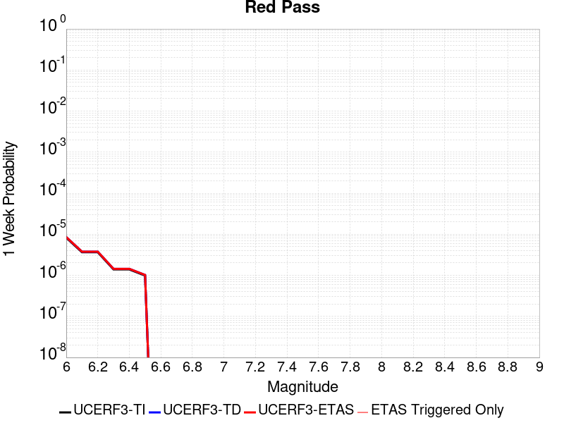 |  |  |  |

| Magnitude | 1 wk TI Prob | 1 wk TD Prob | 1 wk ETAS Prob | 1 wk ETAS/TD Gain | 1 wk ETAS Triggered Only | 1 mo TI Prob | 1 mo TD Prob | 1 mo ETAS Prob | 1 mo ETAS/TD Gain | 1 mo ETAS Triggered Only | 1 yr TI Prob | 1 yr TD Prob | 1 yr ETAS Prob | 1 yr ETAS/TD Gain | 1 yr ETAS Triggered Only | 10 yr TI Prob | 10 yr TD Prob | 10 yr ETAS Prob | 10 yr ETAS/TD Gain | 10 yr ETAS Triggered Only |
|-----|-----|-----|-----|-----|-----|-----|-----|-----|-----|-----|-----|-----|-----|-----|-----|-----|-----|-----|-----|-----|
| 6.0 | 8.258278E-6 | 8.551305E-6 | 8.551305E-6 | 1.0 | 0.0 | 3.539214E-5 | 3.6648038E-5 | 3.6648038E-5 | 1.0 | 0.0 | 4.308141E-4 | 4.4611638E-4 | 4.4611638E-4 | 1.0 | 0.0 | 0.0042997985 | 0.004453966 | 0.0044738767 | 1.0044703 | 2.0E-5 |
| 6.1 | 3.649988E-6 | 3.7753332E-6 | 3.7753332E-6 | 1.0 | 0.0 | 1.5642712E-5 | 1.6179927E-5 | 1.6179927E-5 | 1.0 | 0.0 | 1.9043336E-4 | 1.9697756E-4 | 1.9697756E-4 | 1.0 | 0.0 | 0.0019027026 | 0.001968497 | 0.0019784772 | 1.00507 | 1.0E-5 |
| 6.2 | 3.649988E-6 | 3.7753332E-6 | 3.7753332E-6 | 1.0 | 0.0 | 1.5642712E-5 | 1.6179927E-5 | 1.6179927E-5 | 1.0 | 0.0 | 1.9043336E-4 | 1.9697756E-4 | 1.9697756E-4 | 1.0 | 0.0 | 0.0019027026 | 0.001968497 | 0.0019784772 | 1.00507 | 1.0E-5 |
| 6.3 | 1.3924937E-6 | 1.4411233E-6 | 1.4411233E-6 | 1.0 | 0.0 | 5.9678164E-6 | 6.176236E-6 | 6.176236E-6 | 1.0 | 0.0 | 7.265574E-5 | 7.51945E-5 | 7.51945E-5 | 1.0 | 0.0 | 7.263199E-4 | 7.518293E-4 | 7.6182175E-4 | 1.0132909 | 1.0E-5 |
| 6.4 | 1.3924937E-6 | 1.4411233E-6 | 1.4411233E-6 | 1.0 | 0.0 | 5.9678164E-6 | 6.176236E-6 | 6.176236E-6 | 1.0 | 0.0 | 7.265574E-5 | 7.51945E-5 | 7.51945E-5 | 1.0 | 0.0 | 7.263199E-4 | 7.518293E-4 | 7.6182175E-4 | 1.0132909 | 1.0E-5 |
| 6.5 | 9.876812E-7 | 1.022196E-6 | 1.022196E-6 | 1.0 | 0.0 | 4.2329125E-6 | 4.38084E-6 | 4.38084E-6 | 1.0 | 0.0 | 5.153449E-5 | 5.3336724E-5 | 5.3336724E-5 | 1.0 | 0.0 | 5.1522546E-4 | 5.333672E-4 | 5.333672E-4 | 1.0 | 0.0 |

## Owens Valley
*[(top)](#table-of-contents)*

| 1 Week | 1 Month | 1 Year | 10 Year |
|-----|-----|-----|-----|
|  |  |  |  |

| Magnitude | 1 wk TI Prob | 1 wk TD Prob | 1 wk ETAS Prob | 1 wk ETAS/TD Gain | 1 wk ETAS Triggered Only | 1 mo TI Prob | 1 mo TD Prob | 1 mo ETAS Prob | 1 mo ETAS/TD Gain | 1 mo ETAS Triggered Only | 1 yr TI Prob | 1 yr TD Prob | 1 yr ETAS Prob | 1 yr ETAS/TD Gain | 1 yr ETAS Triggered Only | 10 yr TI Prob | 10 yr TD Prob | 10 yr ETAS Prob | 10 yr ETAS/TD Gain | 10 yr ETAS Triggered Only |
|-----|-----|-----|-----|-----|-----|-----|-----|-----|-----|-----|-----|-----|-----|-----|-----|-----|-----|-----|-----|-----|
| 6.0 | 4.83821E-5 | 3.621193E-6 | 3.621193E-6 | 1.0 | 0.0 | 2.0733538E-4 | 1.5519312E-5 | 1.5519312E-5 | 1.0 | 0.0 | 0.002521386 | 1.8893222E-4 | 1.9893033E-4 | 1.052919 | 1.0E-5 | 0.024929691 | 0.001929822 | 0.0019497834 | 1.0103437 | 2.0E-5 |
| 6.1 | 4.83821E-5 | 3.621193E-6 | 3.621193E-6 | 1.0 | 0.0 | 2.0733538E-4 | 1.5519312E-5 | 1.5519312E-5 | 1.0 | 0.0 | 0.002521386 | 1.8893222E-4 | 1.9893033E-4 | 1.052919 | 1.0E-5 | 0.024929691 | 0.001929822 | 0.0019497834 | 1.0103437 | 2.0E-5 |
| 6.2 | 4.83821E-5 | 3.621193E-6 | 3.621193E-6 | 1.0 | 0.0 | 2.0733538E-4 | 1.5519312E-5 | 1.5519312E-5 | 1.0 | 0.0 | 0.002521386 | 1.8893222E-4 | 1.9893033E-4 | 1.052919 | 1.0E-5 | 0.024929691 | 0.001929822 | 0.0019497834 | 1.0103437 | 2.0E-5 |
| 6.3 | 3.953008E-5 | 3.153231E-6 | 3.153231E-6 | 1.0 | 0.0 | 1.6940363E-4 | 1.3513782E-5 | 1.3513782E-5 | 1.0 | 0.0 | 0.002060538 | 1.645186E-4 | 1.7451696E-4 | 1.0607734 | 1.0E-5 | 0.020415364 | 0.0016622683 | 0.001682235 | 1.0120118 | 2.0E-5 |
| 6.4 | 3.953008E-5 | 3.153231E-6 | 3.153231E-6 | 1.0 | 0.0 | 1.6940363E-4 | 1.3513782E-5 | 1.3513782E-5 | 1.0 | 0.0 | 0.002060538 | 1.645186E-4 | 1.7451696E-4 | 1.0607734 | 1.0E-5 | 0.020415364 | 0.0016622683 | 0.001682235 | 1.0120118 | 2.0E-5 |
| 6.5 | 3.457342E-5 | 2.970874E-6 | 2.970874E-6 | 1.0 | 0.0 | 1.4816338E-4 | 1.2732259E-5 | 1.2732259E-5 | 1.0 | 0.0 | 0.0018023965 | 1.5500492E-4 | 1.6500337E-4 | 1.064504 | 1.0E-5 | 0.017878477 | 0.0015564174 | 0.0015763863 | 1.01283 | 2.0E-5 |
| 6.6 | 3.1127765E-5 | 2.8738657E-6 | 2.8738657E-6 | 1.0 | 0.0 | 1.3339789E-4 | 1.2316514E-5 | 1.2316514E-5 | 1.0 | 0.0 | 0.0016229092 | 1.4994392E-4 | 1.5994243E-4 | 1.0666816 | 1.0E-5 | 0.016111081 | 0.001501446 | 0.001521416 | 1.0133005 | 2.0E-5 |
| 6.7 | 2.806885E-5 | 2.8102859E-6 | 2.8102859E-6 | 1.0 | 0.0 | 1.2028952E-4 | 1.204403E-5 | 1.204403E-5 | 1.0 | 0.0 | 0.001463541 | 1.4662689E-4 | 1.5662542E-4 | 1.0681903 | 1.0E-5 | 0.014539397 | 0.0014657174 | 0.0014856881 | 1.0136251 | 2.0E-5 |
| 6.8 | 2.524524E-5 | 2.2352563E-6 | 2.2352563E-6 | 1.0 | 0.0 | 1.0818939E-4 | 9.579636E-6 | 9.579636E-6 | 1.0 | 0.0 | 0.0013164099 | 1.1662613E-4 | 1.2662496E-4 | 1.0857341 | 1.0E-5 | 0.01308639 | 0.0011659319 | 0.0011859086 | 1.0171337 | 2.0E-5 |
| 6.9 | 2.2704568E-5 | 1.6080646E-6 | 1.6080646E-6 | 1.0 | 0.0 | 9.730166E-5 | 6.8916875E-6 | 6.8916875E-6 | 1.0 | 0.0 | 0.0011840039 | 8.390308E-5 | 9.390224E-5 | 1.1191751 | 1.0E-5 | 0.011777153 | 8.3894585E-4 | 8.5892907E-4 | 1.0238194 | 2.0E-5 |
| 7.0 | 2.0871712E-5 | 1.5394511E-6 | 1.5394511E-6 | 1.0 | 0.0 | 8.944713E-5 | 6.597631E-6 | 6.597631E-6 | 1.0 | 0.0 | 0.0010884746 | 8.032321E-5 | 9.032241E-5 | 1.124487 | 1.0E-5 | 0.010831586 | 8.0313E-4 | 8.231139E-4 | 1.0248826 | 2.0E-5 |
| 7.1 | 1.944928E-5 | 1.3863316E-6 | 1.3863316E-6 | 1.0 | 0.0 | 8.335139E-5 | 5.941408E-6 | 5.941408E-6 | 1.0 | 0.0 | 0.0010143308 | 7.233425E-5 | 8.233353E-5 | 1.1382371 | 1.0E-5 | 0.010097133 | 7.232817E-4 | 7.4326724E-4 | 1.0276318 | 2.0E-5 |
| 7.2 | 1.7876306E-5 | 1.2488347E-6 | 1.2488347E-6 | 1.0 | 0.0 | 7.6610486E-5 | 5.352138E-6 | 5.352138E-6 | 1.0 | 0.0 | 9.3233347E-4 | 6.516034E-5 | 7.515969E-5 | 1.1534576 | 1.0E-5 | 0.009284316 | 6.5157266E-4 | 6.715596E-4 | 1.0306749 | 2.0E-5 |
| 7.3 | 1.2618672E-5 | 1.1114453E-6 | 1.1114453E-6 | 1.0 | 0.0 | 5.40789E-5 | 4.763328E-6 | 4.763328E-6 | 1.0 | 0.0 | 6.582117E-4 | 5.7991983E-5 | 6.79914E-5 | 1.1724277 | 1.0E-5 | 0.0065626553 | 5.7992374E-4 | 5.999122E-4 | 1.0344673 | 2.0E-5 |
| 7.4 | 7.4874442E-6 | 8.548014E-7 | 8.548014E-7 | 1.0 | 0.0 | 3.208865E-5 | 3.6634294E-6 | 3.6634294E-6 | 1.0 | 0.0 | 3.906093E-4 | 4.4601344E-5 | 5.46009E-5 | 1.2241985 | 1.0E-5 | 0.003899234 | 4.4603736E-4 | 4.6602843E-4 | 1.0448192 | 2.0E-5 |
| 7.5 | 2.4734156E-6 | 6.0683584E-7 | 6.0683584E-7 | 1.0 | 0.0 | 1.060031E-5 | 2.6007224E-6 | 2.6007224E-6 | 1.0 | 0.0 | 1.2905113E-4 | 3.1663338E-5 | 4.166302E-5 | 1.3158127 | 1.0E-5 | 0.0012897621 | 3.165886E-4 | 3.2658543E-4 | 1.0315768 | 1.0E-5 |
| 7.6 | 1.1328841E-6 | 3.1963748E-7 | 3.1963748E-7 | 1.0 | 0.0 | 4.8552088E-6 | 1.3698742E-6 | 1.3698742E-6 | 1.0 | 0.0 | 5.9110564E-5 | 1.6678092E-5 | 2.6677926E-5 | 1.599579 | 1.0E-5 | 5.9094845E-4 | 1.667686E-4 | 1.7676693E-4 | 1.0599533 | 1.0E-5 |
| 7.7 | 4.8613185E-7 | 8.9632934E-8 | 8.9632934E-8 | 1.0 | 0.0 | 2.0834207E-6 | 3.8414112E-7 | 3.8414112E-7 | 1.0 | 0.0 | 2.536535E-5 | 4.6769087E-6 | 4.6769087E-6 | 1.0 | 0.0 | 2.5362454E-4 | 4.676817E-5 | 4.676817E-5 | 1.0 | 0.0 |

## Elsinore (Glen Ivy) rev
*[(top)](#table-of-contents)*

| 1 Week | 1 Month | 1 Year | 10 Year |
|-----|-----|-----|-----|
|  |  |  |  |

| Magnitude | 1 wk TI Prob | 1 wk TD Prob | 1 wk ETAS Prob | 1 wk ETAS/TD Gain | 1 wk ETAS Triggered Only | 1 mo TI Prob | 1 mo TD Prob | 1 mo ETAS Prob | 1 mo ETAS/TD Gain | 1 mo ETAS Triggered Only | 1 yr TI Prob | 1 yr TD Prob | 1 yr ETAS Prob | 1 yr ETAS/TD Gain | 1 yr ETAS Triggered Only | 10 yr TI Prob | 10 yr TD Prob | 10 yr ETAS Prob | 10 yr ETAS/TD Gain | 10 yr ETAS Triggered Only |
|-----|-----|-----|-----|-----|-----|-----|-----|-----|-----|-----|-----|-----|-----|-----|-----|-----|-----|-----|-----|-----|
| 6.0 | 1.6204086E-4 | 2.9373635E-4 | 2.9373635E-4 | 1.0 | 0.0 | 6.94276E-4 | 0.0012584174 | 0.0012684049 | 1.0079365 | 1.0E-5 | 0.008420097 | 0.01523484 | 0.015244688 | 1.0006464 | 1.0E-5 | 0.081081145 | 0.13962553 | 0.13964275 | 1.0001233 | 2.0E-5 |
| 6.1 | 1.6204086E-4 | 2.9373635E-4 | 2.9373635E-4 | 1.0 | 0.0 | 6.94276E-4 | 0.0012584174 | 0.0012684049 | 1.0079365 | 1.0E-5 | 0.008420097 | 0.01523484 | 0.015244688 | 1.0006464 | 1.0E-5 | 0.081081145 | 0.13962553 | 0.13964275 | 1.0001233 | 2.0E-5 |
| 6.2 | 1.6204086E-4 | 2.9373635E-4 | 2.9373635E-4 | 1.0 | 0.0 | 6.94276E-4 | 0.0012584174 | 0.0012684049 | 1.0079365 | 1.0E-5 | 0.008420097 | 0.01523484 | 0.015244688 | 1.0006464 | 1.0E-5 | 0.081081145 | 0.13962553 | 0.13964275 | 1.0001233 | 2.0E-5 |
| 6.3 | 1.0111737E-4 | 1.7703637E-4 | 1.7703637E-4 | 1.0 | 0.0 | 4.332882E-4 | 7.586233E-4 | 7.6861575E-4 | 1.0131718 | 1.0E-5 | 0.005262531 | 0.009217811 | 0.009227719 | 1.0010749 | 1.0E-5 | 0.0513964 | 0.08707389 | 0.08709215 | 1.0002097 | 2.0E-5 |
| 6.4 | 1.0111737E-4 | 1.7703637E-4 | 1.7703637E-4 | 1.0 | 0.0 | 4.332882E-4 | 7.586233E-4 | 7.6861575E-4 | 1.0131718 | 1.0E-5 | 0.005262531 | 0.009217811 | 0.009227719 | 1.0010749 | 1.0E-5 | 0.0513964 | 0.08707389 | 0.08709215 | 1.0002097 | 2.0E-5 |
| 6.5 | 3.6624708E-5 | 4.6393732E-5 | 4.6393732E-5 | 1.0 | 0.0 | 1.569536E-4 | 1.9881714E-4 | 1.9881714E-4 | 1.0 | 0.0 | 0.001909235 | 0.0024182722 | 0.0024182722 | 1.0 | 0.0 | 0.01892915 | 0.023697015 | 0.023697015 | 1.0 | 0.0 |
| 6.6 | 2.5051324E-5 | 2.6148944E-5 | 2.6148944E-5 | 1.0 | 0.0 | 1.073584E-4 | 1.1206234E-4 | 1.1206234E-4 | 1.0 | 0.0 | 0.0013063047 | 0.0013635496 | 0.0013635496 | 1.0 | 0.0 | 0.012986525 | 0.013565712 | 0.013565712 | 1.0 | 0.0 |
| 6.7 | 2.2189772E-5 | 2.2073793E-5 | 2.2073793E-5 | 1.0 | 0.0 | 9.509556E-5 | 9.459874E-5 | 9.459874E-5 | 1.0 | 0.0 | 0.0011571734 | 0.0011511676 | 0.0011511676 | 1.0 | 0.0 | 0.011511663 | 0.011466403 | 0.011466403 | 1.0 | 0.0 |
| 6.8 | 1.6654378E-5 | 1.4438363E-5 | 1.4438363E-5 | 1.0 | 0.0 | 7.137396E-5 | 6.187726E-5 | 6.187726E-5 | 1.0 | 0.0 | 8.686314E-4 | 7.5310044E-4 | 7.5310044E-4 | 1.0 | 0.0 | 0.008652439 | 0.0075102663 | 0.0075102663 | 1.0 | 0.0 |
| 6.9 | 1.5042909E-5 | 1.2332568E-5 | 1.2332568E-5 | 1.0 | 0.0 | 6.446802E-5 | 5.285281E-5 | 5.285281E-5 | 1.0 | 0.0 | 7.8461546E-4 | 6.432961E-4 | 6.432961E-4 | 1.0 | 0.0 | 0.007818509 | 0.0064180964 | 0.0064180964 | 1.0 | 0.0 |
| 7.0 | 1.4361385E-5 | 1.1451833E-5 | 1.1451833E-5 | 1.0 | 0.0 | 6.154734E-5 | 4.907838E-5 | 4.907838E-5 | 1.0 | 0.0 | 7.490812E-4 | 5.973684E-4 | 5.973684E-4 | 1.0 | 0.0 | 0.007465612 | 0.0059608603 | 0.0059608603 | 1.0 | 0.0 |
| 7.1 | 1.3265571E-5 | 1.0245265E-5 | 1.0245265E-5 | 1.0 | 0.0 | 5.6851208E-5 | 4.3907552E-5 | 4.3907552E-5 | 1.0 | 0.0 | 6.919436E-4 | 5.3444586E-4 | 5.3444586E-4 | 1.0 | 0.0 | 0.006897931 | 0.005334682 | 0.005334682 | 1.0 | 0.0 |
| 7.2 | 1.1596403E-5 | 8.505279E-6 | 8.505279E-6 | 1.0 | 0.0 | 4.9697923E-5 | 3.6450696E-5 | 3.6450696E-5 | 1.0 | 0.0 | 6.049042E-4 | 4.4369852E-4 | 4.4369852E-4 | 1.0 | 0.0 | 0.006032603 | 0.004429451 | 0.004429451 | 1.0 | 0.0 |
| 7.3 | 1.0150827E-5 | 7.238911E-6 | 7.238911E-6 | 1.0 | 0.0 | 4.3502816E-5 | 3.1023545E-5 | 3.1023545E-5 | 1.0 | 0.0 | 5.2951806E-4 | 3.7764764E-4 | 3.7764764E-4 | 1.0 | 0.0 | 0.005282581 | 0.003770453 | 0.003770453 | 1.0 | 0.0 |
| 7.4 | 9.080705E-6 | 6.352632E-6 | 6.352632E-6 | 1.0 | 0.0 | 3.8916725E-5 | 2.7225291E-5 | 2.7225291E-5 | 1.0 | 0.0 | 4.7370812E-4 | 3.3141885E-4 | 3.3141885E-4 | 1.0 | 0.0 | 0.004726996 | 0.0033093947 | 0.0033093947 | 1.0 | 0.0 |
| 7.5 | 7.671649E-6 | 5.2257096E-6 | 5.2257096E-6 | 1.0 | 0.0 | 3.287808E-5 | 2.2395712E-5 | 2.2395712E-5 | 1.0 | 0.0 | 4.0021708E-4 | 2.7263493E-4 | 2.7263493E-4 | 1.0 | 0.0 | 0.0039949706 | 0.0027231297 | 0.0027231297 | 1.0 | 0.0 |
| 7.6 | 6.990086E-6 | 4.6875944E-6 | 4.6875944E-6 | 1.0 | 0.0 | 2.9957167E-5 | 2.0089543E-5 | 2.0089543E-5 | 1.0 | 0.0 | 3.6466747E-4 | 2.445639E-4 | 2.445639E-4 | 1.0 | 0.0 | 0.0036406964 | 0.0024430638 | 0.0024430638 | 1.0 | 0.0 |
| 7.7 | 4.163505E-6 | 2.3295045E-6 | 2.3295045E-6 | 1.0 | 0.0 | 1.7843471E-5 | 9.983556E-6 | 9.983556E-6 | 1.0 | 0.0 | 2.172226E-4 | 1.2154376E-4 | 1.2154376E-4 | 1.0 | 0.0 | 0.0021701038 | 0.0012148459 | 0.0012148459 | 1.0 | 0.0 |
| 7.8 | 2.2692414E-7 | 9.384624E-8 | 9.384624E-8 | 1.0 | 0.0 | 9.725317E-7 | 4.021981E-7 | 4.021981E-7 | 1.0 | 0.0 | 1.1840509E-5 | 4.8967545E-6 | 4.8967545E-6 | 1.0 | 0.0 | 1.1839878E-4 | 4.8966795E-5 | 4.8966795E-5 | 1.0 | 0.0 |
| 7.9 | 6.676829E-9 | 3.4397993E-9 | 3.4397993E-9 | 1.0 | 0.0 | 2.861498E-8 | 1.4741998E-8 | 1.4741998E-8 | 1.0 | 0.0 | 3.4838732E-7 | 1.794838E-7 | 1.794838E-7 | 1.0 | 0.0 | 3.4838679E-6 | 1.7948367E-6 | 1.7948367E-6 | 1.0 | 0.0 |

## Imperial
*[(top)](#table-of-contents)*

| 1 Week | 1 Month | 1 Year | 10 Year |
|-----|-----|-----|-----|
|  |  |  |  |

| Magnitude | 1 wk TI Prob | 1 wk TD Prob | 1 wk ETAS Prob | 1 wk ETAS/TD Gain | 1 wk ETAS Triggered Only | 1 mo TI Prob | 1 mo TD Prob | 1 mo ETAS Prob | 1 mo ETAS/TD Gain | 1 mo ETAS Triggered Only | 1 yr TI Prob | 1 yr TD Prob | 1 yr ETAS Prob | 1 yr ETAS/TD Gain | 1 yr ETAS Triggered Only | 10 yr TI Prob | 10 yr TD Prob | 10 yr ETAS Prob | 10 yr ETAS/TD Gain | 10 yr ETAS Triggered Only |
|-----|-----|-----|-----|-----|-----|-----|-----|-----|-----|-----|-----|-----|-----|-----|-----|-----|-----|-----|-----|-----|
| 6.0 | 2.7496446E-4 | 5.0567614E-4 | 5.0567614E-4 | 1.0 | 0.0 | 0.0011778869 | 0.0021654228 | 0.002175401 | 1.004608 | 1.0E-5 | 0.0142467655 | 0.02603894 | 0.026058419 | 1.000748 | 2.0E-5 | 0.13367249 | 0.22807938 | 0.22809482 | 1.0000677 | 2.0E-5 |
| 6.1 | 2.5356023E-4 | 4.8670304E-4 | 4.8670304E-4 | 1.0 | 0.0 | 0.001086234 | 0.002084241 | 0.0020942201 | 1.0047879 | 1.0E-5 | 0.013144928 | 0.025080038 | 0.025099536 | 1.0007775 | 2.0E-5 | 0.123940155 | 0.21950823 | 0.21952383 | 1.0000712 | 2.0E-5 |
| 6.2 | 2.4820742E-4 | 4.776551E-4 | 4.776551E-4 | 1.0 | 0.0 | 0.0010633124 | 0.0020455252 | 0.0020555048 | 1.0048788 | 1.0E-5 | 0.01286919 | 0.024619855 | 0.024639362 | 1.0007924 | 2.0E-5 | 0.12148927 | 0.21601348 | 0.21602917 | 1.0000726 | 2.0E-5 |
| 6.3 | 2.3205351E-4 | 4.590242E-4 | 4.590242E-4 | 1.0 | 0.0 | 9.94136E-4 | 0.0019658 | 0.0019757806 | 1.005077 | 1.0E-5 | 0.012036599 | 0.023666015 | 0.023685541 | 1.000825 | 2.0E-5 | 0.11405133 | 0.20796531 | 0.20798115 | 1.0000762 | 2.0E-5 |
| 6.4 | 2.0304754E-4 | 3.988816E-4 | 3.988816E-4 | 1.0 | 0.0 | 8.6991355E-4 | 0.001708387 | 0.00171837 | 1.0058435 | 1.0E-5 | 0.010539869 | 0.02060005 | 0.020609844 | 1.0004754 | 1.0E-5 | 0.100537635 | 0.185097 | 0.18510514 | 1.000044 | 1.0E-5 |
| 6.5 | 1.854992E-4 | 3.6999586E-4 | 3.6999586E-4 | 1.0 | 0.0 | 7.9475436E-4 | 0.0015847452 | 0.0015947294 | 1.0063002 | 1.0E-5 | 0.009633281 | 0.019126106 | 0.019135915 | 1.0005128 | 1.0E-5 | 0.0922623 | 0.17332682 | 0.17333508 | 1.0000477 | 1.0E-5 |
| 6.6 | 1.6586106E-4 | 3.4044893E-4 | 3.4044893E-4 | 1.0 | 0.0 | 7.106394E-4 | 0.001458261 | 0.0014682466 | 1.0068475 | 1.0E-5 | 0.008617763 | 0.017607149 | 0.017616972 | 1.0005579 | 1.0E-5 | 0.08291132 | 0.16080214 | 0.16081055 | 1.0000522 | 1.0E-5 |
| 6.7 | 1.4224656E-4 | 3.0775566E-4 | 3.0775566E-4 | 1.0 | 0.0 | 6.094856E-4 | 0.0013182943 | 0.0013282811 | 1.0075755 | 1.0E-5 | 0.0073952693 | 0.015934104 | 0.015943944 | 1.0006176 | 1.0E-5 | 0.07153955 | 0.146514 | 0.14652252 | 1.0000583 | 1.0E-5 |
| 6.8 | 1.2317259E-4 | 2.7798547E-4 | 2.7798547E-4 | 1.0 | 0.0 | 5.2777573E-4 | 0.0011908285 | 0.0012008166 | 1.0083876 | 1.0E-5 | 0.0064067547 | 0.01440334 | 0.014413197 | 1.0006843 | 1.0E-5 | 0.06225166 | 0.13296336 | 0.13297203 | 1.0000652 | 1.0E-5 |
| 6.9 | 9.859898E-5 | 2.5019908E-4 | 2.5019908E-4 | 1.0 | 0.0 | 4.2249862E-4 | 0.0010718454 | 0.0010818347 | 1.0093197 | 1.0E-5 | 0.0051317946 | 0.012972599 | 0.012982469 | 1.0007609 | 1.0E-5 | 0.05014893 | 0.119427115 | 0.11943592 | 1.0000738 | 1.0E-5 |
| 7.0 | 7.3191884E-5 | 2.1271173E-4 | 2.1271173E-4 | 1.0 | 0.0 | 3.136418E-4 | 9.113064E-4 | 9.212973E-4 | 1.0109632 | 1.0E-5 | 0.003811904 | 0.011039398 | 0.011049286 | 1.0008959 | 1.0E-5 | 0.037471764 | 0.10207956 | 0.10208854 | 1.000088 | 1.0E-5 |
| 7.1 | 7.1760296E-5 | 2.0972485E-4 | 2.0972485E-4 | 1.0 | 0.0 | 3.0750787E-4 | 8.9851435E-4 | 9.0850535E-4 | 1.0111195 | 1.0E-5 | 0.003737482 | 0.01088522 | 0.010895112 | 1.0009087 | 1.0E-5 | 0.03675245 | 0.1007159 | 0.10072489 | 1.0000893 | 1.0E-5 |
| 7.2 | 6.46614E-5 | 1.9140878E-4 | 1.9140878E-4 | 1.0 | 0.0 | 2.7709085E-4 | 8.2006847E-4 | 8.300603E-4 | 1.0121841 | 1.0E-5 | 0.0033683628 | 0.009939248 | 0.009949149 | 1.0009961 | 1.0E-5 | 0.033177625 | 0.092523254 | 0.09253233 | 1.0000981 | 1.0E-5 |
| 7.3 | 6.088115E-5 | 1.781241E-4 | 1.781241E-4 | 1.0 | 0.0 | 2.6089314E-4 | 7.631685E-4 | 7.731609E-4 | 1.0130932 | 1.0E-5 | 0.0031717476 | 0.009252568 | 0.009262475 | 1.0010707 | 1.0E-5 | 0.031268585 | 0.08657277 | 0.0865819 | 1.0001055 | 1.0E-5 |
| 7.4 | 4.199346E-5 | 1.1513443E-4 | 1.1513443E-4 | 1.0 | 0.0 | 1.7995955E-4 | 4.9334083E-4 | 4.9334083E-4 | 1.0 | 0.0 | 0.0021888057 | 0.005990052 | 0.005990052 | 1.0 | 0.0 | 0.02167372 | 0.057449117 | 0.057449117 | 1.0 | 0.0 |
| 7.5 | 3.130448E-5 | 8.3357954E-5 | 8.3357954E-5 | 1.0 | 0.0 | 1.3415517E-4 | 3.5719978E-4 | 3.5719978E-4 | 1.0 | 0.0 | 0.0016321153 | 0.0043402947 | 0.0043402947 | 1.0 | 0.0 | 0.016201803 | 0.042141106 | 0.042141106 | 1.0 | 0.0 |
| 7.6 | 2.3074248E-5 | 6.086575E-5 | 6.086575E-5 | 1.0 | 0.0 | 9.888588E-5 | 2.6082728E-4 | 2.6082728E-4 | 1.0 | 0.0 | 0.0012032706 | 0.003170971 | 0.003170971 | 1.0 | 0.0 | 0.011967761 | 0.031034198 | 0.031034198 | 1.0 | 0.0 |
| 7.7 | 1.45864815E-5 | 4.0141942E-5 | 4.0141942E-5 | 1.0 | 0.0 | 6.2511994E-5 | 1.7202558E-4 | 1.7202558E-4 | 1.0 | 0.0 | 7.608177E-4 | 0.002092405 | 0.002092405 | 1.0 | 0.0 | 0.007582182 | 0.02063468 | 0.02063468 | 1.0 | 0.0 |
| 7.8 | 1.0352979E-5 | 3.097546E-5 | 3.097546E-5 | 1.0 | 0.0 | 4.4369157E-5 | 1.3274523E-4 | 1.3274523E-4 | 1.0 | 0.0 | 5.400606E-4 | 0.0016149776 | 0.0016149776 | 1.0 | 0.0 | 0.0053875 | 0.016022595 | 0.016022595 | 1.0 | 0.0 |
| 7.9 | 8.137906E-6 | 2.216039E-5 | 2.216039E-5 | 1.0 | 0.0 | 3.4876273E-5 | 9.496964E-5 | 9.496964E-5 | 1.0 | 0.0 | 4.2453592E-4 | 0.001155643 | 0.001155643 | 1.0 | 0.0 | 0.004237258 | 0.011622993 | 0.011622993 | 1.0 | 0.0 |
| 8.0 | 6.93792E-6 | 1.8018303E-5 | 1.8018303E-5 | 1.0 | 0.0 | 2.9733603E-5 | 7.721902E-5 | 7.721902E-5 | 1.0 | 0.0 | 3.6194647E-4 | 9.397368E-4 | 9.397368E-4 | 1.0 | 0.0 | 0.0036135751 | 0.009505922 | 0.009505922 | 1.0 | 0.0 |
| 8.1 | 3.4286315E-6 | 6.383862E-6 | 6.383862E-6 | 1.0 | 0.0 | 1.4694053E-5 | 2.7359121E-5 | 2.7359121E-5 | 1.0 | 0.0 | 1.7888541E-4 | 3.330465E-4 | 3.330465E-4 | 1.0 | 0.0 | 0.0017874148 | 0.0034880012 | 0.0034880012 | 1.0 | 0.0 |
| 8.2 | 1.4906886E-6 | 1.9380652E-6 | 1.9380652E-6 | 1.0 | 0.0 | 6.3886496E-6 | 8.305968E-6 | 8.305968E-6 | 1.0 | 0.0 | 7.7779034E-5 | 1.01120495E-4 | 1.01120495E-4 | 1.0 | 0.0 | 7.775182E-4 | 0.0011082697 | 0.0011082697 | 1.0 | 0.0 |
| 8.3 | 2.5758007E-8 | 1.4511432E-8 | 1.4511432E-8 | 1.0 | 0.0 | 1.10391454E-7 | 6.219185E-8 | 6.219185E-8 | 1.0 | 0.0 | 1.3440151E-6 | 7.5718583E-7 | 7.5718583E-7 | 1.0 | 0.0 | 1.344007E-5 | 7.894757E-6 | 7.894757E-6 | 1.0 | 0.0 |

## Dry Mountain
*[(top)](#table-of-contents)*

| 1 Week | 1 Month | 1 Year | 10 Year |
|-----|-----|-----|-----|
|  |  |  |  |

| Magnitude | 1 wk TI Prob | 1 wk TD Prob | 1 wk ETAS Prob | 1 wk ETAS/TD Gain | 1 wk ETAS Triggered Only | 1 mo TI Prob | 1 mo TD Prob | 1 mo ETAS Prob | 1 mo ETAS/TD Gain | 1 mo ETAS Triggered Only | 1 yr TI Prob | 1 yr TD Prob | 1 yr ETAS Prob | 1 yr ETAS/TD Gain | 1 yr ETAS Triggered Only | 10 yr TI Prob | 10 yr TD Prob | 10 yr ETAS Prob | 10 yr ETAS/TD Gain | 10 yr ETAS Triggered Only |
|-----|-----|-----|-----|-----|-----|-----|-----|-----|-----|-----|-----|-----|-----|-----|-----|-----|-----|-----|-----|-----|
| 6.0 | 6.222801E-6 | 6.439411E-6 | 6.439411E-6 | 1.0 | 0.0 | 2.6668875E-5 | 2.7597274E-5 | 2.7597274E-5 | 1.0 | 0.0 | 3.2464517E-4 | 3.359609E-4 | 3.4595755E-4 | 1.0297554 | 1.0E-5 | 0.0032417132 | 0.0033560924 | 0.0033760252 | 1.0059394 | 2.0E-5 |
| 6.1 | 6.222801E-6 | 6.439411E-6 | 6.439411E-6 | 1.0 | 0.0 | 2.6668875E-5 | 2.7597274E-5 | 2.7597274E-5 | 1.0 | 0.0 | 3.2464517E-4 | 3.359609E-4 | 3.4595755E-4 | 1.0297554 | 1.0E-5 | 0.0032417132 | 0.0033560924 | 0.0033760252 | 1.0059394 | 2.0E-5 |
| 6.2 | 6.222801E-6 | 6.439411E-6 | 6.439411E-6 | 1.0 | 0.0 | 2.6668875E-5 | 2.7597274E-5 | 2.7597274E-5 | 1.0 | 0.0 | 3.2464517E-4 | 3.359609E-4 | 3.4595755E-4 | 1.0297554 | 1.0E-5 | 0.0032417132 | 0.0033560924 | 0.0033760252 | 1.0059394 | 2.0E-5 |
| 6.3 | 6.222801E-6 | 6.439411E-6 | 6.439411E-6 | 1.0 | 0.0 | 2.6668875E-5 | 2.7597274E-5 | 2.7597274E-5 | 1.0 | 0.0 | 3.2464517E-4 | 3.359609E-4 | 3.4595755E-4 | 1.0297554 | 1.0E-5 | 0.0032417132 | 0.0033560924 | 0.0033760252 | 1.0059394 | 2.0E-5 |
| 6.4 | 6.222801E-6 | 6.439411E-6 | 6.439411E-6 | 1.0 | 0.0 | 2.6668875E-5 | 2.7597274E-5 | 2.7597274E-5 | 1.0 | 0.0 | 3.2464517E-4 | 3.359609E-4 | 3.4595755E-4 | 1.0297554 | 1.0E-5 | 0.0032417132 | 0.0033560924 | 0.0033760252 | 1.0059394 | 2.0E-5 |
| 6.5 | 2.8528623E-6 | 2.952182E-6 | 2.952182E-6 | 1.0 | 0.0 | 1.22264955E-5 | 1.2652196E-5 | 1.2652196E-5 | 1.0 | 0.0 | 1.4884741E-4 | 1.5403831E-4 | 1.5403831E-4 | 1.0 | 0.0 | 0.0014874774 | 0.0015401688 | 0.0015401688 | 1.0 | 0.0 |
| 6.6 | 2.8528623E-6 | 2.952182E-6 | 2.952182E-6 | 1.0 | 0.0 | 1.22264955E-5 | 1.2652196E-5 | 1.2652196E-5 | 1.0 | 0.0 | 1.4884741E-4 | 1.5403831E-4 | 1.5403831E-4 | 1.0 | 0.0 | 0.0014874774 | 0.0015401688 | 0.0015401688 | 1.0 | 0.0 |
| 6.7 | 2.541E-6 | 2.62937E-6 | 2.62937E-6 | 1.0 | 0.0 | 1.0889954E-5 | 1.12687285E-5 | 1.12687285E-5 | 1.0 | 0.0 | 1.3257713E-4 | 1.3719677E-4 | 1.3719677E-4 | 1.0 | 0.0 | 0.0013249806 | 0.0013719677 | 0.0013719677 | 1.0 | 0.0 |

## Elysian Park (Upper)
*[(top)](#table-of-contents)*

| 1 Week | 1 Month | 1 Year | 10 Year |
|-----|-----|-----|-----|
|  |  |  |  |

| Magnitude | 1 wk TI Prob | 1 wk TD Prob | 1 wk ETAS Prob | 1 wk ETAS/TD Gain | 1 wk ETAS Triggered Only | 1 mo TI Prob | 1 mo TD Prob | 1 mo ETAS Prob | 1 mo ETAS/TD Gain | 1 mo ETAS Triggered Only | 1 yr TI Prob | 1 yr TD Prob | 1 yr ETAS Prob | 1 yr ETAS/TD Gain | 1 yr ETAS Triggered Only | 10 yr TI Prob | 10 yr TD Prob | 10 yr ETAS Prob | 10 yr ETAS/TD Gain | 10 yr ETAS Triggered Only |
|-----|-----|-----|-----|-----|-----|-----|-----|-----|-----|-----|-----|-----|-----|-----|-----|-----|-----|-----|-----|-----|
| 6.0 | 3.1876025E-5 | 3.703628E-5 | 4.703591E-5 | 1.2699956 | 1.0E-5 | 1.3660437E-4 | 1.5871998E-4 | 1.687184E-4 | 1.062994 | 1.0E-5 | 0.0016618895 | 0.0019311737 | 0.0019511351 | 1.0103364 | 2.0E-5 | 0.016495159 | 0.019190373 | 0.019209988 | 1.0010222 | 2.0E-5 |
| 6.1 | 3.1876025E-5 | 3.703628E-5 | 4.703591E-5 | 1.2699956 | 1.0E-5 | 1.3660437E-4 | 1.5871998E-4 | 1.687184E-4 | 1.062994 | 1.0E-5 | 0.0016618895 | 0.0019311737 | 0.0019511351 | 1.0103364 | 2.0E-5 | 0.016495159 | 0.019190373 | 0.019209988 | 1.0010222 | 2.0E-5 |
| 6.2 | 3.1876025E-5 | 3.703628E-5 | 4.703591E-5 | 1.2699956 | 1.0E-5 | 1.3660437E-4 | 1.5871998E-4 | 1.687184E-4 | 1.062994 | 1.0E-5 | 0.0016618895 | 0.0019311737 | 0.0019511351 | 1.0103364 | 2.0E-5 | 0.016495159 | 0.019190373 | 0.019209988 | 1.0010222 | 2.0E-5 |
| 6.3 | 3.1876025E-5 | 3.703628E-5 | 4.703591E-5 | 1.2699956 | 1.0E-5 | 1.3660437E-4 | 1.5871998E-4 | 1.687184E-4 | 1.062994 | 1.0E-5 | 0.0016618895 | 0.0019311737 | 0.0019511351 | 1.0103364 | 2.0E-5 | 0.016495159 | 0.019190373 | 0.019209988 | 1.0010222 | 2.0E-5 |
| 6.4 | 1.9273462E-5 | 2.1202904E-5 | 3.1202693E-5 | 1.4716235 | 1.0E-5 | 8.259794E-5 | 9.0867405E-5 | 1.008665E-4 | 1.1100404 | 1.0E-5 | 0.001005166 | 0.0011059209 | 0.0011159098 | 1.0090322 | 1.0E-5 | 0.010006315 | 0.011020984 | 0.011030873 | 1.0008974 | 1.0E-5 |
| 6.5 | 1.9273462E-5 | 2.1202904E-5 | 3.1202693E-5 | 1.4716235 | 1.0E-5 | 8.259794E-5 | 9.0867405E-5 | 1.008665E-4 | 1.1100404 | 1.0E-5 | 0.001005166 | 0.0011059209 | 0.0011159098 | 1.0090322 | 1.0E-5 | 0.010006315 | 0.011020984 | 0.011030873 | 1.0008974 | 1.0E-5 |
| 6.6 | 9.813258E-6 | 9.665716E-6 | 1.966562E-5 | 2.0345745 | 1.0E-5 | 4.205614E-5 | 4.1423882E-5 | 5.1423467E-5 | 1.2413967 | 1.0E-5 | 5.119132E-4 | 5.042263E-4 | 5.1422126E-4 | 1.0198224 | 1.0E-5 | 0.005107356 | 0.005031546 | 0.0050414954 | 1.0019774 | 1.0E-5 |
| 6.7 | 9.801478E-6 | 9.653286E-6 | 1.965319E-5 | 2.0359068 | 1.0E-5 | 4.2005657E-5 | 4.1370608E-5 | 5.1370193E-5 | 1.2417074 | 1.0E-5 | 5.112989E-4 | 5.03578E-4 | 5.1357294E-4 | 1.0198479 | 1.0E-5 | 0.0051012407 | 0.0050250925 | 0.0050350423 | 1.0019801 | 1.0E-5 |
| 6.8 | 8.102489E-6 | 7.773095E-6 | 1.7773016E-5 | 2.2864788 | 1.0E-5 | 3.4724493E-5 | 3.3312866E-5 | 4.331253E-5 | 1.3001744 | 1.0E-5 | 4.2268867E-4 | 4.0551362E-4 | 4.1550957E-4 | 1.0246501 | 1.0E-5 | 0.004218856 | 0.0040482306 | 0.00405819 | 1.0024602 | 1.0E-5 |
| 6.9 | 6.08275E-6 | 5.481501E-6 | 5.481501E-6 | 1.0 | 0.0 | 2.6068668E-5 | 2.349194E-5 | 2.349194E-5 | 1.0 | 0.0 | 3.173398E-4 | 2.859776E-4 | 2.859776E-4 | 1.0 | 0.0 | 0.0031688702 | 0.0028561736 | 0.0028561736 | 1.0 | 0.0 |
| 7.0 | 5.5995934E-6 | 4.982823E-6 | 4.982823E-6 | 1.0 | 0.0 | 2.3998036E-5 | 2.1354786E-5 | 2.1354786E-5 | 1.0 | 0.0 | 2.9213692E-4 | 2.5996417E-4 | 2.5996417E-4 | 1.0 | 0.0 | 0.0029175316 | 0.002596668 | 0.002596668 | 1.0 | 0.0 |
| 7.1 | 4.709881E-6 | 4.0874347E-6 | 4.0874347E-6 | 1.0 | 0.0 | 2.0185047E-5 | 1.7517461E-5 | 1.7517461E-5 | 1.0 | 0.0 | 2.4572524E-4 | 2.1325464E-4 | 2.1325464E-4 | 1.0 | 0.0 | 0.002454537 | 0.0021305413 | 0.0021305413 | 1.0 | 0.0 |
| 7.2 | 3.6063436E-6 | 2.9779728E-6 | 2.9779728E-6 | 1.0 | 0.0 | 1.5455667E-5 | 1.2762678E-5 | 1.2762678E-5 | 1.0 | 0.0 | 1.881565E-4 | 1.5537464E-4 | 1.5537464E-4 | 1.0 | 0.0 | 0.0018799726 | 0.0015526713 | 0.0015526713 | 1.0 | 0.0 |
| 7.3 | 2.471135E-6 | 2.0954792E-6 | 2.0954792E-6 | 1.0 | 0.0 | 1.0590536E-5 | 8.980594E-6 | 8.980594E-6 | 1.0 | 0.0 | 1.2893214E-4 | 1.0933332E-4 | 1.0933332E-4 | 1.0 | 0.0 | 0.0012885736 | 0.0010928025 | 0.0010928025 | 1.0 | 0.0 |
| 7.4 | 1.163943E-6 | 1.0275194E-6 | 1.0275194E-6 | 1.0 | 0.0 | 4.988318E-6 | 4.4036474E-6 | 4.4036474E-6 | 1.0 | 0.0 | 6.0731076E-5 | 5.3613116E-5 | 5.3613116E-5 | 1.0 | 0.0 | 6.071448E-4 | 5.360048E-4 | 5.360048E-4 | 1.0 | 0.0 |
| 7.5 | 4.99459E-7 | 4.917662E-7 | 4.917662E-7 | 1.0 | 0.0 | 2.140537E-6 | 2.1075678E-6 | 2.1075678E-6 | 1.0 | 0.0 | 2.6060725E-5 | 2.565935E-5 | 2.565935E-5 | 1.0 | 0.0 | 2.605767E-4 | 2.5656543E-4 | 2.5656543E-4 | 1.0 | 0.0 |
| 7.6 | 2.4667852E-7 | 2.4778686E-7 | 2.4778686E-7 | 1.0 | 0.0 | 1.0571932E-6 | 1.0619433E-6 | 1.0619433E-6 | 1.0 | 0.0 | 1.2871251E-5 | 1.2929087E-5 | 1.2929087E-5 | 1.0 | 0.0 | 1.2870505E-4 | 1.2928371E-4 | 1.2928371E-4 | 1.0 | 0.0 |
| 7.7 | 8.2312795E-8 | 7.386639E-8 | 7.386639E-8 | 1.0 | 0.0 | 3.527691E-7 | 3.165702E-7 | 3.165702E-7 | 1.0 | 0.0 | 4.294955E-6 | 3.8542366E-6 | 3.8542366E-6 | 1.0 | 0.0 | 4.2948723E-5 | 3.8541813E-5 | 3.8541813E-5 | 1.0 | 0.0 |
| 7.8 | 2.7819295E-8 | 1.7567253E-8 | 1.7567253E-8 | 1.0 | 0.0 | 1.1922555E-7 | 7.528822E-8 | 7.528822E-8 | 1.0 | 0.0 | 1.45157E-6 | 9.166339E-7 | 9.166339E-7 | 1.0 | 0.0 | 1.45156055E-5 | 9.166316E-6 | 9.166316E-6 | 1.0 | 0.0 |

## Greenville (No) 2011 CFM
*[(top)](#table-of-contents)*

| 1 Week | 1 Month | 1 Year | 10 Year |
|-----|-----|-----|-----|
|  |  |  |  |

| Magnitude | 1 wk TI Prob | 1 wk TD Prob | 1 wk ETAS Prob | 1 wk ETAS/TD Gain | 1 wk ETAS Triggered Only | 1 mo TI Prob | 1 mo TD Prob | 1 mo ETAS Prob | 1 mo ETAS/TD Gain | 1 mo ETAS Triggered Only | 1 yr TI Prob | 1 yr TD Prob | 1 yr ETAS Prob | 1 yr ETAS/TD Gain | 1 yr ETAS Triggered Only | 10 yr TI Prob | 10 yr TD Prob | 10 yr ETAS Prob | 10 yr ETAS/TD Gain | 10 yr ETAS Triggered Only |
|-----|-----|-----|-----|-----|-----|-----|-----|-----|-----|-----|-----|-----|-----|-----|-----|-----|-----|-----|-----|-----|
| 6.0 | 3.286654E-5 | 4.0367628E-5 | 4.0367628E-5 | 1.0 | 0.0 | 1.4084899E-4 | 1.7299286E-4 | 1.7299286E-4 | 1.0 | 0.0 | 0.0017134876 | 0.0021041913 | 0.0021141702 | 1.0047424 | 1.0E-5 | 0.017003356 | 0.020847926 | 0.02086751 | 1.0009394 | 2.0E-5 |
| 6.1 | 3.286654E-5 | 4.0367628E-5 | 4.0367628E-5 | 1.0 | 0.0 | 1.4084899E-4 | 1.7299286E-4 | 1.7299286E-4 | 1.0 | 0.0 | 0.0017134876 | 0.0021041913 | 0.0021141702 | 1.0047424 | 1.0E-5 | 0.017003356 | 0.020847926 | 0.02086751 | 1.0009394 | 2.0E-5 |
| 6.2 | 3.1697953E-5 | 3.8930488E-5 | 3.8930488E-5 | 1.0 | 0.0 | 1.358413E-4 | 1.6683448E-4 | 1.6683448E-4 | 1.0 | 0.0 | 0.0016526132 | 0.0020293547 | 0.0020393343 | 1.0049176 | 1.0E-5 | 0.01640377 | 0.020113297 | 0.020132896 | 1.0009744 | 2.0E-5 |
| 6.3 | 3.1363317E-5 | 3.8519345E-5 | 3.8519345E-5 | 1.0 | 0.0 | 1.344073E-4 | 1.6507268E-4 | 1.6507268E-4 | 1.0 | 0.0 | 0.0016351803 | 0.0020079445 | 0.0020179243 | 1.0049702 | 1.0E-5 | 0.016232004 | 0.019903058 | 0.01992266 | 1.0009849 | 2.0E-5 |
| 6.4 | 3.0228604E-5 | 3.712643E-5 | 3.712643E-5 | 1.0 | 0.0 | 1.2954473E-4 | 1.5910377E-4 | 1.5910377E-4 | 1.0 | 0.0 | 0.0015760659 | 0.0019354038 | 0.0019453844 | 1.0051569 | 1.0E-5 | 0.015649348 | 0.019190377 | 0.019209994 | 1.0010222 | 2.0E-5 |
| 6.5 | 2.9537814E-5 | 3.6281854E-5 | 3.6281854E-5 | 1.0 | 0.0 | 1.2658449E-4 | 1.554846E-4 | 1.554846E-4 | 1.0 | 0.0 | 0.0015400766 | 0.0018914177 | 0.0019013988 | 1.005277 | 1.0E-5 | 0.01529447 | 0.018758025 | 0.01877765 | 1.0010462 | 2.0E-5 |
| 6.6 | 2.7345395E-5 | 3.3591095E-5 | 3.3591095E-5 | 1.0 | 0.0 | 1.1718928E-4 | 1.4395406E-4 | 1.4395406E-4 | 1.0 | 0.0 | 0.0014258457 | 0.0017512628 | 0.0017612453 | 1.0057001 | 1.0E-5 | 0.014167317 | 0.017378807 | 0.01739846 | 1.0011308 | 2.0E-5 |
| 6.7 | 2.5615784E-5 | 3.156795E-5 | 3.156795E-5 | 1.0 | 0.0 | 1.09777306E-4 | 1.3528437E-4 | 1.3528437E-4 | 1.0 | 0.0 | 0.0013357193 | 0.0016458734 | 0.001655857 | 1.0060658 | 1.0E-5 | 0.013277191 | 0.016340878 | 0.016360551 | 1.0012039 | 2.0E-5 |
| 6.8 | 2.0059057E-5 | 2.4712723E-5 | 2.4712723E-5 | 1.0 | 0.0 | 8.596455E-5 | 1.0590746E-4 | 1.0590746E-4 | 1.0 | 0.0 | 0.0010461159 | 0.0012886769 | 0.001298664 | 1.0077499 | 1.0E-5 | 0.0104120495 | 0.01281443 | 0.012824302 | 1.0007703 | 1.0E-5 |
| 6.9 | 1.6321746E-5 | 2.018519E-5 | 2.018519E-5 | 1.0 | 0.0 | 6.9948466E-5 | 8.6505155E-5 | 8.6505155E-5 | 1.0 | 0.0 | 8.5128983E-4 | 0.0010527038 | 0.0010626933 | 1.0094893 | 1.0E-5 | 0.008480361 | 0.010479072 | 0.010488967 | 1.0009443 | 1.0E-5 |
| 7.0 | 1.22527645E-5 | 1.5136019E-5 | 1.5136019E-5 | 1.0 | 0.0 | 5.2510793E-5 | 6.486706E-5 | 6.486706E-5 | 1.0 | 0.0 | 6.3913135E-4 | 7.894746E-4 | 7.994667E-4 | 1.0126567 | 1.0E-5 | 0.0063729626 | 0.007867752 | 0.007877673 | 1.001261 | 1.0E-5 |
| 7.1 | 8.996482E-6 | 1.1165242E-5 | 1.1165242E-5 | 1.0 | 0.0 | 3.8555783E-5 | 4.7850164E-5 | 4.7850164E-5 | 1.0 | 0.0 | 4.6931554E-4 | 5.8242126E-4 | 5.8242126E-4 | 1.0 | 0.0 | 0.004683256 | 0.005809783 | 0.005809783 | 1.0 | 0.0 |
| 7.2 | 6.0273087E-6 | 7.5697E-6 | 7.5697E-6 | 1.0 | 0.0 | 2.5831067E-5 | 3.244117E-5 | 3.244117E-5 | 1.0 | 0.0 | 3.1444785E-4 | 3.9490036E-4 | 3.9490036E-4 | 1.0 | 0.0 | 0.0031400328 | 0.003942572 | 0.003942572 | 1.0 | 0.0 |
| 7.3 | 3.1209995E-6 | 3.966495E-6 | 3.966495E-6 | 1.0 | 0.0 | 1.3375643E-5 | 1.6999156E-5 | 1.6999156E-5 | 1.0 | 0.0 | 1.6283628E-4 | 2.0694522E-4 | 2.0694522E-4 | 1.0 | 0.0 | 0.0016271701 | 0.002067831 | 0.002067831 | 1.0 | 0.0 |
| 7.4 | 2.0254208E-6 | 2.6096925E-6 | 2.6096925E-6 | 1.0 | 0.0 | 8.680347E-6 | 1.1184348E-5 | 1.1184348E-5 | 1.0 | 0.0 | 1.0567809E-4 | 1.3616099E-4 | 1.3616099E-4 | 1.0 | 0.0 | 0.0010562785 | 0.0013611029 | 0.0013611029 | 1.0 | 0.0 |
| 7.5 | 1.6763418E-6 | 2.1734163E-6 | 2.1734163E-6 | 1.0 | 0.0 | 7.184302E-6 | 9.314608E-6 | 9.314608E-6 | 1.0 | 0.0 | 8.746537E-5 | 1.1339951E-4 | 1.1339951E-4 | 1.0 | 0.0 | 8.743095E-4 | 0.001133725 | 0.001133725 | 1.0 | 0.0 |
| 7.6 | 1.1935462E-6 | 1.5458975E-6 | 1.5458975E-6 | 1.0 | 0.0 | 5.115188E-6 | 6.6252583E-6 | 6.6252583E-6 | 1.0 | 0.0 | 6.2275634E-5 | 8.065958E-5 | 8.065958E-5 | 1.0 | 0.0 | 6.2258187E-4 | 8.0653606E-4 | 8.0653606E-4 | 1.0 | 0.0 |
| 7.7 | 3.0464201E-7 | 3.9848902E-7 | 3.9848902E-7 | 1.0 | 0.0 | 1.3056081E-6 | 1.707809E-6 | 1.707809E-6 | 1.0 | 0.0 | 1.589566E-5 | 2.079238E-5 | 2.079238E-5 | 1.0 | 0.0 | 1.5894524E-4 | 2.0793274E-4 | 2.0793274E-4 | 1.0 | 0.0 |

## Hector Mine
*[(top)](#table-of-contents)*

| 1 Week | 1 Month | 1 Year | 10 Year |
|-----|-----|-----|-----|
|  |  |  |  |

| Magnitude | 1 wk TI Prob | 1 wk TD Prob | 1 wk ETAS Prob | 1 wk ETAS/TD Gain | 1 wk ETAS Triggered Only | 1 mo TI Prob | 1 mo TD Prob | 1 mo ETAS Prob | 1 mo ETAS/TD Gain | 1 mo ETAS Triggered Only | 1 yr TI Prob | 1 yr TD Prob | 1 yr ETAS Prob | 1 yr ETAS/TD Gain | 1 yr ETAS Triggered Only | 10 yr TI Prob | 10 yr TD Prob | 10 yr ETAS Prob | 10 yr ETAS/TD Gain | 10 yr ETAS Triggered Only |
|-----|-----|-----|-----|-----|-----|-----|-----|-----|-----|-----|-----|-----|-----|-----|-----|-----|-----|-----|-----|-----|
| 6.0 | 1.8760093E-5 | 2.7963101E-6 | 1.2796282E-5 | 4.5761313 | 1.0E-5 | 8.039792E-5 | 1.1984153E-5 | 2.1984033E-5 | 1.8344252 | 1.0E-5 | 9.78405E-4 | 1.459013E-4 | 1.5589983E-4 | 1.0685295 | 1.0E-5 | 0.009741086 | 0.0014584473 | 0.0014784181 | 1.0136932 | 2.0E-5 |
| 6.1 | 1.8760093E-5 | 2.7963101E-6 | 1.2796282E-5 | 4.5761313 | 1.0E-5 | 8.039792E-5 | 1.1984153E-5 | 2.1984033E-5 | 1.8344252 | 1.0E-5 | 9.78405E-4 | 1.459013E-4 | 1.5589983E-4 | 1.0685295 | 1.0E-5 | 0.009741086 | 0.0014584473 | 0.0014784181 | 1.0136932 | 2.0E-5 |
| 6.2 | 1.8760093E-5 | 2.7963101E-6 | 1.2796282E-5 | 4.5761313 | 1.0E-5 | 8.039792E-5 | 1.1984153E-5 | 2.1984033E-5 | 1.8344252 | 1.0E-5 | 9.78405E-4 | 1.459013E-4 | 1.5589983E-4 | 1.0685295 | 1.0E-5 | 0.009741086 | 0.0014584473 | 0.0014784181 | 1.0136932 | 2.0E-5 |
| 6.3 | 1.8760093E-5 | 2.7963101E-6 | 1.2796282E-5 | 4.5761313 | 1.0E-5 | 8.039792E-5 | 1.1984153E-5 | 2.1984033E-5 | 1.8344252 | 1.0E-5 | 9.78405E-4 | 1.459013E-4 | 1.5589983E-4 | 1.0685295 | 1.0E-5 | 0.009741086 | 0.0014584473 | 0.0014784181 | 1.0136932 | 2.0E-5 |
| 6.4 | 1.0888055E-5 | 2.7963101E-6 | 1.2796282E-5 | 4.5761313 | 1.0E-5 | 4.666226E-5 | 1.1984153E-5 | 2.1984033E-5 | 1.8344252 | 1.0E-5 | 5.679649E-4 | 1.459013E-4 | 1.5589983E-4 | 1.0685295 | 1.0E-5 | 0.0056651547 | 0.0014584473 | 0.0014784181 | 1.0136932 | 2.0E-5 |
| 6.5 | 1.0888055E-5 | 2.7963101E-6 | 1.2796282E-5 | 4.5761313 | 1.0E-5 | 4.666226E-5 | 1.1984153E-5 | 2.1984033E-5 | 1.8344252 | 1.0E-5 | 5.679649E-4 | 1.459013E-4 | 1.5589983E-4 | 1.0685295 | 1.0E-5 | 0.0056651547 | 0.0014584473 | 0.0014784181 | 1.0136932 | 2.0E-5 |
| 6.6 | 1.0730738E-5 | 2.7963101E-6 | 1.2796282E-5 | 4.5761313 | 1.0E-5 | 4.5988065E-5 | 1.1984153E-5 | 2.1984033E-5 | 1.8344252 | 1.0E-5 | 5.5976084E-4 | 1.459013E-4 | 1.5589983E-4 | 1.0685295 | 1.0E-5 | 0.0055835294 | 0.0014584473 | 0.0014784181 | 1.0136932 | 2.0E-5 |
| 6.7 | 7.881326E-6 | 2.7709912E-6 | 1.2770964E-5 | 4.608807 | 1.0E-5 | 3.3776672E-5 | 1.1875645E-5 | 2.1875527E-5 | 1.8420495 | 1.0E-5 | 4.111534E-4 | 1.4458038E-4 | 1.5457894E-4 | 1.0691557 | 1.0E-5 | 0.0041039353 | 0.0014452554 | 0.0014652264 | 1.0138184 | 2.0E-5 |
| 6.8 | 7.5683483E-6 | 2.7327694E-6 | 1.2732742E-5 | 4.6592817 | 1.0E-5 | 3.2435375E-5 | 1.1711839E-5 | 2.1711721E-5 | 1.8538269 | 1.0E-5 | 3.9482914E-4 | 1.425863E-4 | 1.5258488E-4 | 1.070123 | 1.0E-5 | 0.0039412836 | 0.0014253402 | 0.0014453117 | 1.0140117 | 2.0E-5 |
| 6.9 | 6.473048E-6 | 2.5138563E-6 | 1.2513831E-5 | 4.977942 | 1.0E-5 | 2.7741338E-5 | 1.0773648E-5 | 2.077354E-5 | 1.9281807 | 1.0E-5 | 3.3769844E-4 | 1.3116523E-4 | 1.4116392E-4 | 1.0762297 | 1.0E-5 | 0.0033718573 | 0.0013112677 | 0.0013312415 | 1.0152324 | 2.0E-5 |
| 7.0 | 4.9959954E-6 | 1.8564691E-6 | 1.8564691E-6 | 1.0 | 0.0 | 2.1411232E-5 | 7.9562915E-6 | 7.9562915E-6 | 1.0 | 0.0 | 2.6065056E-4 | 9.686711E-5 | 9.686711E-5 | 1.0 | 0.0 | 0.0026034506 | 9.6859847E-4 | 9.785888E-4 | 1.0103142 | 1.0E-5 |
| 7.1 | 1.2997541E-6 | 1.5600176E-7 | 1.5600176E-7 | 1.0 | 0.0 | 5.5703626E-6 | 6.685788E-7 | 6.685788E-7 | 1.0 | 0.0 | 6.7817055E-5 | 8.13992E-6 | 8.13992E-6 | 1.0 | 0.0 | 6.779636E-4 | 8.139662E-5 | 8.139662E-5 | 1.0 | 0.0 |
| 7.2 | 8.392699E-7 | 9.726067E-8 | 9.726067E-8 | 1.0 | 0.0 | 3.596866E-6 | 4.1683137E-7 | 4.1683137E-7 | 1.0 | 0.0 | 4.3790962E-5 | 5.074912E-6 | 5.074912E-6 | 1.0 | 0.0 | 4.3782333E-4 | 5.0748153E-5 | 5.0748153E-5 | 1.0 | 0.0 |
| 7.3 | 3.13015E-7 | 4.8286488E-8 | 4.8286488E-8 | 1.0 | 0.0 | 1.3414921E-6 | 2.0694208E-7 | 2.0694208E-7 | 1.0 | 0.0 | 1.6332544E-5 | 2.5195177E-6 | 2.5195177E-6 | 1.0 | 0.0 | 1.6331344E-4 | 2.5194977E-5 | 2.5194977E-5 | 1.0 | 0.0 |

## San Andreas (Creeping Section) 2011 CFM
*[(top)](#table-of-contents)*

| 1 Week | 1 Month | 1 Year | 10 Year |
|-----|-----|-----|-----|
| 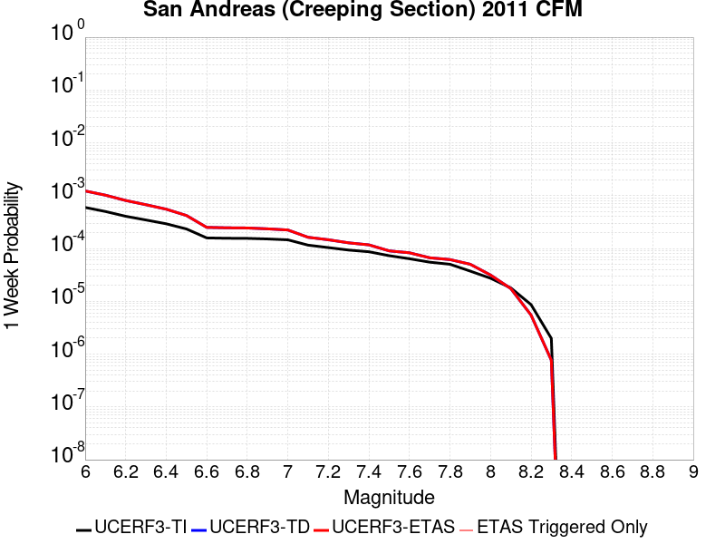 |  |  |  |

| Magnitude | 1 wk TI Prob | 1 wk TD Prob | 1 wk ETAS Prob | 1 wk ETAS/TD Gain | 1 wk ETAS Triggered Only | 1 mo TI Prob | 1 mo TD Prob | 1 mo ETAS Prob | 1 mo ETAS/TD Gain | 1 mo ETAS Triggered Only | 1 yr TI Prob | 1 yr TD Prob | 1 yr ETAS Prob | 1 yr ETAS/TD Gain | 1 yr ETAS Triggered Only | 10 yr TI Prob | 10 yr TD Prob | 10 yr ETAS Prob | 10 yr ETAS/TD Gain | 10 yr ETAS Triggered Only |
|-----|-----|-----|-----|-----|-----|-----|-----|-----|-----|-----|-----|-----|-----|-----|-----|-----|-----|-----|-----|-----|
| 6.0 | 5.986481E-4 | 0.001227701 | 0.001227701 | 1.0 | 0.0 | 0.0025631124 | 0.005246098 | 0.0052560456 | 1.0018961 | 1.0E-5 | 0.030762846 | 0.061211813 | 0.06123059 | 1.0003067 | 2.0E-5 | 0.26835477 | 0.42596716 | 0.42597863 | 1.000027 | 2.0E-5 |
| 6.1 | 5.015945E-4 | 0.0010218859 | 0.0010218859 | 1.0 | 0.0 | 0.00214792 | 0.0043683136 | 0.00437827 | 1.0022792 | 1.0E-5 | 0.025839351 | 0.051254056 | 0.05126354 | 1.0001851 | 1.0E-5 | 0.23032776 | 0.3728875 | 0.37289375 | 1.0000168 | 1.0E-5 |
| 6.2 | 4.073338E-4 | 8.1082666E-4 | 8.1082666E-4 | 1.0 | 0.0 | 0.0017445484 | 0.003467598 | 0.0034775634 | 1.0028739 | 1.0E-5 | 0.021034058 | 0.040938858 | 0.04094845 | 1.0002342 | 1.0E-5 | 0.19150782 | 0.31306726 | 0.3130741 | 1.0000219 | 1.0E-5 |
| 6.3 | 3.464099E-4 | 6.740175E-4 | 6.740175E-4 | 1.0 | 0.0 | 0.0014837692 | 0.0028834257 | 0.0028834257 | 1.0 | 0.0 | 0.017915873 | 0.034195323 | 0.034195323 | 1.0 | 0.0 | 0.16538359 | 0.27135244 | 0.27135244 | 1.0 | 0.0 |
| 6.4 | 2.935057E-4 | 5.545179E-4 | 5.545179E-4 | 1.0 | 0.0 | 0.0012572751 | 0.002372998 | 0.002372998 | 1.0 | 0.0 | 0.015200248 | 0.028270293 | 0.028270293 | 1.0 | 0.0 | 0.14201577 | 0.23302312 | 0.23302312 | 1.0 | 0.0 |
| 6.5 | 2.3409708E-4 | 4.2102532E-4 | 4.2102532E-4 | 1.0 | 0.0 | 0.0010028875 | 0.0018024362 | 0.0018024362 | 1.0 | 0.0 | 0.012141965 | 0.021593295 | 0.021593295 | 1.0 | 0.0 | 0.11499573 | 0.18686365 | 0.18686365 | 1.0 | 0.0 |
| 6.6 | 1.5842178E-4 | 2.5080625E-4 | 2.5080625E-4 | 1.0 | 0.0 | 6.7877385E-4 | 0.0010744325 | 0.0010744325 | 1.0 | 0.0 | 0.0082328 | 0.013001433 | 0.013001433 | 1.0 | 0.0 | 0.07934396 | 0.12318965 | 0.12318965 | 1.0 | 0.0 |
| 6.7 | 1.5616413E-4 | 2.4617155E-4 | 2.4617155E-4 | 1.0 | 0.0 | 6.691031E-4 | 0.0010545887 | 0.0010545887 | 1.0 | 0.0 | 0.0081159435 | 0.012763296 | 0.012763296 | 1.0 | 0.0 | 0.0782586 | 0.121216856 | 0.121216856 | 1.0 | 0.0 |
| 6.8 | 1.5538467E-4 | 2.4440986E-4 | 2.4440986E-4 | 1.0 | 0.0 | 6.6576427E-4 | 0.0010470453 | 0.0010470453 | 1.0 | 0.0 | 0.008075596 | 0.012672617 | 0.012672617 | 1.0 | 0.0 | 0.07788358 | 0.12044768 | 0.12044768 | 1.0 | 0.0 |
| 6.9 | 1.5153569E-4 | 2.3550174E-4 | 2.3550174E-4 | 1.0 | 0.0 | 6.49277E-4 | 0.0010089047 | 0.0010089047 | 1.0 | 0.0 | 0.007876333 | 0.012214754 | 0.012214754 | 1.0 | 0.0 | 0.07602952 | 0.1165177 | 0.1165177 | 1.0 | 0.0 |
| 7.0 | 1.4588932E-4 | 2.2407302E-4 | 2.2407302E-4 | 1.0 | 0.0 | 6.250901E-4 | 9.599615E-4 | 9.599615E-4 | 1.0 | 0.0 | 0.0075839474 | 0.011625397 | 0.011625397 | 1.0 | 0.0 | 0.073302895 | 0.1113634 | 0.1113634 | 1.0 | 0.0 |
| 7.1 | 1.1565079E-4 | 1.6291256E-4 | 1.6291256E-4 | 1.0 | 0.0 | 4.955521E-4 | 6.980107E-4 | 6.980107E-4 | 1.0 | 0.0 | 0.006016669 | 0.008465368 | 0.008465368 | 1.0 | 0.0 | 0.058563538 | 0.083707 | 0.083707 | 1.0 | 0.0 |
| 7.2 | 1.0393792E-4 | 1.4624851E-4 | 1.4624851E-4 | 1.0 | 0.0 | 4.4537216E-4 | 6.2662957E-4 | 6.2662957E-4 | 1.0 | 0.0 | 0.005408933 | 0.007602697 | 0.007602697 | 1.0 | 0.0 | 0.052791595 | 0.0756556 | 0.0756556 | 1.0 | 0.0 |
| 7.3 | 9.332884E-5 | 1.2788622E-4 | 1.2788622E-4 | 1.0 | 0.0 | 3.999194E-4 | 5.479693E-4 | 5.479693E-4 | 1.0 | 0.0 | 0.0048581534 | 0.006651253 | 0.006651253 | 1.0 | 0.0 | 0.047533102 | 0.06651429 | 0.06651429 | 1.0 | 0.0 |
| 7.4 | 8.670252E-5 | 1.1709979E-4 | 1.1709979E-4 | 1.0 | 0.0 | 3.715293E-4 | 5.0176034E-4 | 5.0176034E-4 | 1.0 | 0.0 | 0.004513991 | 0.0060919416 | 0.0060919416 | 1.0 | 0.0 | 0.044233937 | 0.0611787 | 0.0611787 | 1.0 | 0.0 |
| 7.5 | 7.3036405E-5 | 9.011361E-5 | 9.011361E-5 | 1.0 | 0.0 | 3.129756E-4 | 3.861441E-4 | 3.861441E-4 | 1.0 | 0.0 | 0.0038038217 | 0.0046911915 | 0.0046911915 | 1.0 | 0.0 | 0.03739367 | 0.047902368 | 0.047902368 | 1.0 | 0.0 |
| 7.6 | 6.3935775E-5 | 8.285012E-5 | 8.285012E-5 | 1.0 | 0.0 | 2.7398168E-4 | 3.5502372E-4 | 3.5502372E-4 | 1.0 | 0.0 | 0.0033306254 | 0.0043138657 | 0.0043138657 | 1.0 | 0.0 | 0.032811474 | 0.044012927 | 0.044012927 | 1.0 | 0.0 |
| 7.7 | 5.5050095E-5 | 6.6658926E-5 | 6.6658926E-5 | 1.0 | 0.0 | 2.3590765E-4 | 2.8564985E-4 | 2.8564985E-4 | 1.0 | 0.0 | 0.0028683927 | 0.0034722448 | 0.0034722448 | 1.0 | 0.0 | 0.0283165 | 0.03581521 | 0.03581521 | 1.0 | 0.0 |
| 7.8 | 5.027131E-5 | 6.166573E-5 | 6.166573E-5 | 1.0 | 0.0 | 2.1543067E-4 | 2.6425492E-4 | 2.6425492E-4 | 1.0 | 0.0 | 0.0026197135 | 0.0032125604 | 0.0032125604 | 1.0 | 0.0 | 0.025890453 | 0.03314427 | 0.03314427 | 1.0 | 0.0 |
| 7.9 | 3.7271806E-5 | 5.0254795E-5 | 5.0254795E-5 | 1.0 | 0.0 | 1.5972654E-4 | 2.1535992E-4 | 2.1535992E-4 | 1.0 | 0.0 | 0.0019429359 | 0.0026188563 | 0.0026188563 | 1.0 | 0.0 | 0.019260362 | 0.027081393 | 0.027081393 | 1.0 | 0.0 |
| 8.0 | 2.7310243E-5 | 3.1447296E-5 | 3.1447296E-5 | 1.0 | 0.0 | 1.17038646E-4 | 1.3476716E-4 | 1.3476716E-4 | 1.0 | 0.0 | 0.0014240141 | 0.0016395561 | 0.0016395561 | 1.0 | 0.0 | 0.014149235 | 0.017223299 | 0.017223299 | 1.0 | 0.0 |
| 8.1 | 1.7940547E-5 | 1.7411876E-5 | 1.7411876E-5 | 1.0 | 0.0 | 7.688579E-5 | 7.46202E-5 | 7.46202E-5 | 1.0 | 0.0 | 9.3568244E-4 | 9.0812275E-4 | 9.0812275E-4 | 1.0 | 0.0 | 0.009317525 | 0.009804959 | 0.009804959 | 1.0 | 0.0 |
| 8.2 | 8.643924E-6 | 5.478665E-6 | 5.478665E-6 | 1.0 | 0.0 | 3.704486E-5 | 2.3479783E-5 | 2.3479783E-5 | 1.0 | 0.0 | 4.5092785E-4 | 2.8582895E-4 | 2.8582895E-4 | 1.0 | 0.0 | 0.0045001395 | 0.0032508469 | 0.0032508469 | 1.0 | 0.0 |
| 8.3 | 1.983087E-6 | 7.6647797E-7 | 7.6647797E-7 | 1.0 | 0.0 | 8.498917E-6 | 3.2849016E-6 | 3.2849016E-6 | 1.0 | 0.0 | 1.034694E-4 | 3.999296E-5 | 3.999296E-5 | 1.0 | 0.0 | 0.0010342124 | 4.7228087E-4 | 4.7228087E-4 | 1.0 | 0.0 |

## Brawley (Seismic Zone) alt 1
*[(top)](#table-of-contents)*

| 1 Week | 1 Month | 1 Year | 10 Year |
|-----|-----|-----|-----|
|  | 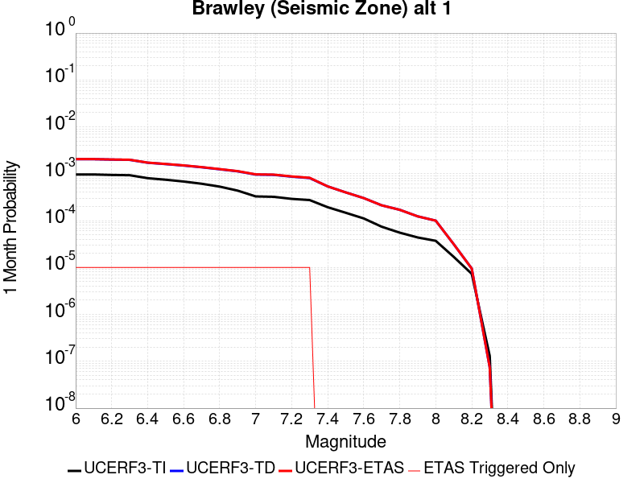 |  |  |

| Magnitude | 1 wk TI Prob | 1 wk TD Prob | 1 wk ETAS Prob | 1 wk ETAS/TD Gain | 1 wk ETAS Triggered Only | 1 mo TI Prob | 1 mo TD Prob | 1 mo ETAS Prob | 1 mo ETAS/TD Gain | 1 mo ETAS Triggered Only | 1 yr TI Prob | 1 yr TD Prob | 1 yr ETAS Prob | 1 yr ETAS/TD Gain | 1 yr ETAS Triggered Only | 10 yr TI Prob | 10 yr TD Prob | 10 yr ETAS Prob | 10 yr ETAS/TD Gain | 10 yr ETAS Triggered Only |
|-----|-----|-----|-----|-----|-----|-----|-----|-----|-----|-----|-----|-----|-----|-----|-----|-----|-----|-----|-----|-----|
| 6.0 | 2.2521618E-4 | 4.7643206E-4 | 4.7643206E-4 | 1.0 | 0.0 | 9.6485513E-4 | 0.002040291 | 0.0020502706 | 1.0048913 | 1.0E-5 | 0.011683988 | 0.024554973 | 0.024574483 | 1.0007945 | 2.0E-5 | 0.11088423 | 0.21353106 | 0.2135468 | 1.0000737 | 2.0E-5 |
| 6.1 | 2.2521618E-4 | 4.7643206E-4 | 4.7643206E-4 | 1.0 | 0.0 | 9.6485513E-4 | 0.002040291 | 0.0020502706 | 1.0048913 | 1.0E-5 | 0.011683988 | 0.024554973 | 0.024574483 | 1.0007945 | 2.0E-5 | 0.11088423 | 0.21353106 | 0.2135468 | 1.0000737 | 2.0E-5 |
| 6.2 | 2.198148E-4 | 4.672759E-4 | 4.672759E-4 | 1.0 | 0.0 | 9.417233E-4 | 0.0020011107 | 0.0020110907 | 1.0049872 | 1.0E-5 | 0.011405343 | 0.024089037 | 0.024108553 | 1.0008103 | 2.0E-5 | 0.10837428 | 0.20996717 | 0.20998298 | 1.0000752 | 2.0E-5 |
| 6.3 | 2.1704129E-4 | 4.6163241E-4 | 4.6163241E-4 | 1.0 | 0.0 | 9.298453E-4 | 0.001976961 | 0.0019869413 | 1.0050483 | 1.0E-5 | 0.011262234 | 0.023802388 | 0.023821913 | 1.0008203 | 2.0E-5 | 0.107082725 | 0.20785816 | 0.20787401 | 1.0000762 | 2.0E-5 |
| 6.4 | 1.876142E-4 | 4.0055066E-4 | 4.0055066E-4 | 1.0 | 0.0 | 8.038131E-4 | 0.0017155306 | 0.0017255135 | 1.0058191 | 1.0E-5 | 0.00974259 | 0.020688837 | 0.020698631 | 1.0004734 | 1.0E-5 | 0.093263686 | 0.18460822 | 0.18461637 | 1.0000442 | 1.0E-5 |
| 6.5 | 1.7390939E-4 | 3.7486907E-4 | 3.7486907E-4 | 1.0 | 0.0 | 7.45113E-4 | 0.0016056047 | 0.0016155886 | 1.0062182 | 1.0E-5 | 0.009034078 | 0.019377038 | 0.019386845 | 1.000506 | 1.0E-5 | 0.086755216 | 0.17442968 | 0.17443794 | 1.0000473 | 1.0E-5 |
| 6.6 | 1.591791E-4 | 3.490135E-4 | 3.490135E-4 | 1.0 | 0.0 | 6.8201777E-4 | 0.0014949249 | 0.00150491 | 1.0066793 | 1.0E-5 | 0.008271996 | 0.018051691 | 0.018061511 | 1.000544 | 1.0E-5 | 0.07970774 | 0.16383655 | 0.16384491 | 1.000051 | 1.0E-5 |
| 6.7 | 1.4268003E-4 | 3.2067046E-4 | 3.2067046E-4 | 1.0 | 0.0 | 6.1134255E-4 | 0.0013735864 | 0.0013835726 | 1.0072702 | 1.0E-5 | 0.007417723 | 0.016597226 | 0.016607061 | 1.0005925 | 1.0E-5 | 0.07174956 | 0.15196328 | 0.15197176 | 1.0000558 | 1.0E-5 |
| 6.8 | 1.239713E-4 | 2.906121E-4 | 2.906121E-4 | 1.0 | 0.0 | 5.3119735E-4 | 0.0012448921 | 0.0012548796 | 1.0080228 | 1.0E-5 | 0.0064481674 | 0.015052661 | 0.01506251 | 1.0006543 | 1.0E-5 | 0.06264243 | 0.13840474 | 0.13841335 | 1.0000622 | 1.0E-5 |
| 6.9 | 1.0180238E-4 | 2.6260383E-4 | 2.6260383E-4 | 1.0 | 0.0 | 4.3622297E-4 | 0.0011249639 | 0.0011349526 | 1.0088792 | 1.0E-5 | 0.005298089 | 0.013611422 | 0.0136212865 | 1.0007247 | 1.0E-5 | 0.05173543 | 0.12498361 | 0.124992356 | 1.00007 | 1.0E-5 |
| 7.0 | 7.6619996E-5 | 2.2404084E-4 | 2.2404084E-4 | 1.0 | 0.0 | 3.283301E-4 | 9.598249E-4 | 9.698153E-4 | 1.0104085 | 1.0E-5 | 0.0039900932 | 0.011623963 | 0.011633847 | 1.0008503 | 1.0E-5 | 0.039192066 | 0.10728301 | 0.10729194 | 1.0000832 | 1.0E-5 |
| 7.1 | 7.5127435E-5 | 2.2087194E-4 | 2.2087194E-4 | 1.0 | 0.0 | 3.2193496E-4 | 9.462538E-4 | 9.562443E-4 | 1.010558 | 1.0E-5 | 0.0039125155 | 0.011460485 | 0.01147037 | 1.0008626 | 1.0E-5 | 0.038443442 | 0.105846815 | 0.105855756 | 1.0000845 | 1.0E-5 |
| 7.2 | 6.788582E-5 | 2.0214771E-4 | 2.0214771E-4 | 1.0 | 0.0 | 2.9090676E-4 | 8.660627E-4 | 8.7605405E-4 | 1.0115365 | 1.0E-5 | 0.0035360386 | 0.010493974 | 0.0105038695 | 1.000943 | 1.0E-5 | 0.034803 | 0.09751713 | 0.097526155 | 1.0000925 | 1.0E-5 |
| 7.3 | 6.399602E-5 | 1.884553E-4 | 1.884553E-4 | 1.0 | 0.0 | 2.7423984E-4 | 8.074185E-4 | 8.174104E-4 | 1.0123751 | 1.0E-5 | 0.0033337586 | 0.009786601 | 0.009796504 | 1.0010118 | 1.0E-5 | 0.03284188 | 0.09141058 | 0.09141967 | 1.0000994 | 1.0E-5 |
| 7.4 | 4.506759E-5 | 1.2532667E-4 | 1.2532667E-4 | 1.0 | 0.0 | 1.9313251E-4 | 5.370046E-4 | 5.370046E-4 | 1.0 | 0.0 | 0.0023488526 | 0.006518606 | 0.006518606 | 1.0 | 0.0 | 0.023241805 | 0.06237464 | 0.06237464 | 1.0 | 0.0 |
| 7.5 | 3.43289E-5 | 9.338305E-5 | 9.338305E-5 | 1.0 | 0.0 | 1.4711556E-4 | 4.00152E-4 | 4.00152E-4 | 1.0 | 0.0 | 0.0017896603 | 0.00486103 | 0.00486103 | 1.0 | 0.0 | 0.01775316 | 0.04706593 | 0.04706593 | 1.0 | 0.0 |
| 7.6 | 2.5980507E-5 | 7.055588E-5 | 7.055588E-5 | 1.0 | 0.0 | 1.1134028E-4 | 3.023474E-4 | 3.023474E-4 | 1.0 | 0.0 | 0.001354725 | 0.0036748908 | 0.0036748908 | 1.0 | 0.0 | 0.013464959 | 0.035850268 | 0.035850268 | 1.0 | 0.0 |
| 7.7 | 1.7292105E-5 | 4.9428265E-5 | 4.9428265E-5 | 1.0 | 0.0 | 7.4106916E-5 | 2.1181825E-4 | 2.1181825E-4 | 1.0 | 0.0 | 9.018782E-4 | 0.002575843 | 0.002575843 | 1.0 | 0.0 | 0.008982267 | 0.025298944 | 0.025298944 | 1.0 | 0.0 |
| 7.8 | 1.2927471E-5 | 3.971141E-5 | 3.971141E-5 | 1.0 | 0.0 | 5.5402274E-5 | 1.7018066E-4 | 1.7018066E-4 | 1.0 | 0.0 | 6.743139E-4 | 0.0020699832 | 0.0020699832 | 1.0 | 0.0 | 0.0067227143 | 0.020439085 | 0.020439085 | 1.0 | 0.0 |
| 7.9 | 1.0200774E-5 | 2.8759863E-5 | 2.8759863E-5 | 1.0 | 0.0 | 4.371687E-5 | 1.2325073E-4 | 1.2325073E-4 | 1.0 | 0.0 | 5.321229E-4 | 0.0014995459 | 0.0014995459 | 1.0 | 0.0 | 0.005308505 | 0.0149981035 | 0.0149981035 | 1.0 | 0.0 |
| 8.0 | 8.650396E-6 | 2.3289316E-5 | 2.3289316E-5 | 1.0 | 0.0 | 3.70726E-5 | 9.980754E-5 | 9.980754E-5 | 1.0 | 0.0 | 4.5126543E-4 | 0.0012144803 | 0.0012144803 | 1.0 | 0.0 | 0.0045035016 | 0.012216583 | 0.012216583 | 1.0 | 0.0 |
| 8.1 | 3.9368224E-6 | 7.3325436E-6 | 7.3325436E-6 | 1.0 | 0.0 | 1.6871985E-5 | 3.142481E-5 | 3.142481E-5 | 1.0 | 0.0 | 2.0539707E-4 | 3.8253E-4 | 3.8253E-4 | 1.0 | 0.0 | 0.0020520731 | 0.0040034265 | 0.0040034265 | 1.0 | 0.0 |
| 8.2 | 1.7101195E-6 | 2.21947E-6 | 2.21947E-6 | 1.0 | 0.0 | 7.329063E-6 | 9.511979E-6 | 9.511979E-6 | 1.0 | 0.0 | 8.922769E-5 | 1.1580222E-4 | 1.1580222E-4 | 1.0 | 0.0 | 8.9191867E-4 | 0.0012675131 | 0.0012675131 | 1.0 | 0.0 |
| 8.3 | 3.0346666E-8 | 1.7229212E-8 | 1.7229212E-8 | 1.0 | 0.0 | 1.3005713E-7 | 7.383948E-8 | 7.383948E-8 | 1.0 | 0.0 | 1.5834444E-6 | 8.9899555E-7 | 8.9899555E-7 | 1.0 | 0.0 | 1.5834332E-5 | 9.375523E-6 | 9.375523E-6 | 1.0 | 0.0 |

## Mount Diablo Thrust South
*[(top)](#table-of-contents)*

| 1 Week | 1 Month | 1 Year | 10 Year |
|-----|-----|-----|-----|
|  |  | 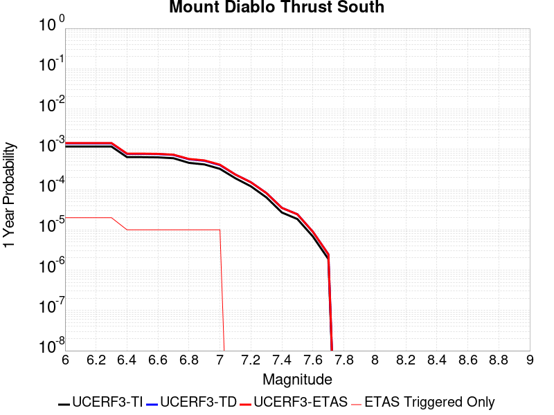 |  |

| Magnitude | 1 wk TI Prob | 1 wk TD Prob | 1 wk ETAS Prob | 1 wk ETAS/TD Gain | 1 wk ETAS Triggered Only | 1 mo TI Prob | 1 mo TD Prob | 1 mo ETAS Prob | 1 mo ETAS/TD Gain | 1 mo ETAS Triggered Only | 1 yr TI Prob | 1 yr TD Prob | 1 yr ETAS Prob | 1 yr ETAS/TD Gain | 1 yr ETAS Triggered Only | 10 yr TI Prob | 10 yr TD Prob | 10 yr ETAS Prob | 10 yr ETAS/TD Gain | 10 yr ETAS Triggered Only |
|-----|-----|-----|-----|-----|-----|-----|-----|-----|-----|-----|-----|-----|-----|-----|-----|-----|-----|-----|-----|-----|
| 6.0 | 2.2377444E-5 | 2.6956855E-5 | 2.6956855E-5 | 1.0 | 0.0 | 9.5899806E-5 | 1.15525385E-4 | 1.15525385E-4 | 1.0 | 0.0 | 0.0011669548 | 0.0014058118 | 0.0014257836 | 1.0142066 | 2.0E-5 | 0.011608457 | 0.013988916 | 0.014008637 | 1.0014096 | 2.0E-5 |
| 6.1 | 2.2377444E-5 | 2.6956855E-5 | 2.6956855E-5 | 1.0 | 0.0 | 9.5899806E-5 | 1.15525385E-4 | 1.15525385E-4 | 1.0 | 0.0 | 0.0011669548 | 0.0014058118 | 0.0014257836 | 1.0142066 | 2.0E-5 | 0.011608457 | 0.013988916 | 0.014008637 | 1.0014096 | 2.0E-5 |
| 6.2 | 2.2377444E-5 | 2.6956855E-5 | 2.6956855E-5 | 1.0 | 0.0 | 9.5899806E-5 | 1.15525385E-4 | 1.15525385E-4 | 1.0 | 0.0 | 0.0011669548 | 0.0014058118 | 0.0014257836 | 1.0142066 | 2.0E-5 | 0.011608457 | 0.013988916 | 0.014008637 | 1.0014096 | 2.0E-5 |
| 6.3 | 2.2377444E-5 | 2.6956855E-5 | 2.6956855E-5 | 1.0 | 0.0 | 9.5899806E-5 | 1.15525385E-4 | 1.15525385E-4 | 1.0 | 0.0 | 0.0011669548 | 0.0014058118 | 0.0014257836 | 1.0142066 | 2.0E-5 | 0.011608457 | 0.013988916 | 0.014008637 | 1.0014096 | 2.0E-5 |
| 6.4 | 1.2228463E-5 | 1.4747988E-5 | 1.4747988E-5 | 1.0 | 0.0 | 5.2406645E-5 | 6.32042E-5 | 6.32042E-5 | 1.0 | 0.0 | 6.378641E-4 | 7.692523E-4 | 7.7924464E-4 | 1.0129896 | 1.0E-5 | 0.0063603627 | 0.0076674037 | 0.0076773274 | 1.0012943 | 1.0E-5 |
| 6.5 | 1.2228463E-5 | 1.4747988E-5 | 1.4747988E-5 | 1.0 | 0.0 | 5.2406645E-5 | 6.32042E-5 | 6.32042E-5 | 1.0 | 0.0 | 6.378641E-4 | 7.692523E-4 | 7.7924464E-4 | 1.0129896 | 1.0E-5 | 0.0063603627 | 0.0076674037 | 0.0076773274 | 1.0012943 | 1.0E-5 |
| 6.6 | 1.2068118E-5 | 1.455278E-5 | 1.455278E-5 | 1.0 | 0.0 | 5.1719482E-5 | 6.236764E-5 | 6.236764E-5 | 1.0 | 0.0 | 6.2950276E-4 | 7.590743E-4 | 7.6906674E-4 | 1.0131639 | 1.0E-5 | 0.006277225 | 0.007566321 | 0.0075762453 | 1.0013117 | 1.0E-5 |
| 6.7 | 1.1499428E-5 | 1.3875425E-5 | 1.3875425E-5 | 1.0 | 0.0 | 4.9282335E-5 | 5.9464823E-5 | 5.9464823E-5 | 1.0 | 0.0 | 5.9984723E-4 | 7.237565E-4 | 7.3374924E-4 | 1.0138068 | 1.0E-5 | 0.0059823063 | 0.007215485 | 0.0072254124 | 1.0013759 | 1.0E-5 |
| 6.8 | 8.82118E-6 | 1.0830661E-5 | 1.0830661E-5 | 1.0 | 0.0 | 3.780451E-5 | 4.6416324E-5 | 4.6416324E-5 | 1.0 | 0.0 | 4.601727E-4 | 5.649778E-4 | 5.749722E-4 | 1.0176898 | 1.0E-5 | 0.0045922096 | 0.0056361877 | 0.0056461315 | 1.0017643 | 1.0E-5 |
| 6.9 | 8.047112E-6 | 9.939611E-6 | 9.939611E-6 | 1.0 | 0.0 | 3.4487166E-5 | 4.259767E-5 | 4.259767E-5 | 1.0 | 0.0 | 4.1980037E-4 | 5.185085E-4 | 5.2850327E-4 | 1.0192761 | 1.0E-5 | 0.004190082 | 0.0051737237 | 0.0051836716 | 1.0019228 | 1.0E-5 |
| 7.0 | 6.2574763E-6 | 7.748641E-6 | 7.748641E-6 | 1.0 | 0.0 | 2.681748E-5 | 3.320806E-5 | 3.320806E-5 | 1.0 | 0.0 | 3.264539E-4 | 4.0423684E-4 | 4.142328E-4 | 1.024728 | 1.0E-5 | 0.0032597475 | 0.0040357383 | 0.0040456983 | 1.0024679 | 1.0E-5 |
| 7.1 | 3.6485903E-6 | 4.513004E-6 | 4.513004E-6 | 1.0 | 0.0 | 1.5636722E-5 | 1.9341305E-5 | 1.9341305E-5 | 1.0 | 0.0 | 1.9036046E-4 | 2.3545536E-4 | 2.3545536E-4 | 1.0 | 0.0 | 0.0019019748 | 0.002352123 | 0.002352123 | 1.0 | 0.0 |
| 7.2 | 2.3034274E-6 | 2.905568E-6 | 2.905568E-6 | 1.0 | 0.0 | 9.871795E-6 | 1.2452376E-5 | 1.2452376E-5 | 1.0 | 0.0 | 1.2018247E-4 | 1.5159737E-4 | 1.5159737E-4 | 1.0 | 0.0 | 0.0012011749 | 0.0015150359 | 0.0015150359 | 1.0 | 0.0 |
| 7.3 | 1.224035E-6 | 1.568004E-6 | 1.568004E-6 | 1.0 | 0.0 | 5.245854E-6 | 6.720001E-6 | 6.720001E-6 | 1.0 | 0.0 | 6.38664E-5 | 8.181304E-5 | 8.181304E-5 | 1.0 | 0.0 | 6.384805E-4 | 8.177875E-4 | 8.177875E-4 | 1.0 | 0.0 |
| 7.4 | 5.1601154E-7 | 6.723497E-7 | 6.723497E-7 | 1.0 | 0.0 | 2.2114762E-6 | 2.8814957E-6 | 2.8814957E-6 | 1.0 | 0.0 | 2.6924388E-5 | 3.508166E-5 | 3.508166E-5 | 1.0 | 0.0 | 2.6921128E-4 | 3.5074085E-4 | 3.5074085E-4 | 1.0 | 0.0 |
| 7.5 | 3.552894E-7 | 4.6653378E-7 | 4.6653378E-7 | 1.0 | 0.0 | 1.5226678E-6 | 1.999429E-6 | 1.999429E-6 | 1.0 | 0.0 | 1.8538323E-5 | 2.4342791E-5 | 2.4342791E-5 | 1.0 | 0.0 | 1.8536777E-4 | 2.4340766E-4 | 2.4340766E-4 | 1.0 | 0.0 |
| 7.6 | 1.3124082E-7 | 1.7192048E-7 | 1.7192048E-7 | 1.0 | 0.0 | 5.6246057E-7 | 7.368019E-7 | 7.368019E-7 | 1.0 | 0.0 | 6.8479358E-6 | 8.9705345E-6 | 8.9705345E-6 | 1.0 | 0.0 | 6.8477246E-5 | 8.967447E-5 | 8.967447E-5 | 1.0 | 0.0 |
| 7.7 | 3.6193022E-8 | 4.7334797E-8 | 4.7334797E-8 | 1.0 | 0.0 | 1.5511293E-7 | 2.0286342E-7 | 2.0286342E-7 | 1.0 | 0.0 | 1.8884983E-6 | 2.4698604E-6 | 2.4698604E-6 | 1.0 | 0.0 | 1.8884823E-5 | 2.4698264E-5 | 2.4698264E-5 | 1.0 | 0.0 |

## Coyote Lake
*[(top)](#table-of-contents)*

| 1 Week | 1 Month | 1 Year | 10 Year |
|-----|-----|-----|-----|
|  |  |  |  |

| Magnitude | 1 wk TI Prob | 1 wk TD Prob | 1 wk ETAS Prob | 1 wk ETAS/TD Gain | 1 wk ETAS Triggered Only | 1 mo TI Prob | 1 mo TD Prob | 1 mo ETAS Prob | 1 mo ETAS/TD Gain | 1 mo ETAS Triggered Only | 1 yr TI Prob | 1 yr TD Prob | 1 yr ETAS Prob | 1 yr ETAS/TD Gain | 1 yr ETAS Triggered Only | 10 yr TI Prob | 10 yr TD Prob | 10 yr ETAS Prob | 10 yr ETAS/TD Gain | 10 yr ETAS Triggered Only |
|-----|-----|-----|-----|-----|-----|-----|-----|-----|-----|-----|-----|-----|-----|-----|-----|-----|-----|-----|-----|-----|
| 6.0 | 1.980352E-5 | 2.1707021E-5 | 2.1707021E-5 | 1.0 | 0.0 | 8.486947E-5 | 9.302718E-5 | 9.302718E-5 | 1.0 | 0.0 | 0.0010327959 | 0.0011320895 | 0.0011420782 | 1.0088233 | 1.0E-5 | 0.010280091 | 0.011270401 | 0.011290176 | 1.0017545 | 2.0E-5 |
| 6.1 | 1.980352E-5 | 2.1707021E-5 | 2.1707021E-5 | 1.0 | 0.0 | 8.486947E-5 | 9.302718E-5 | 9.302718E-5 | 1.0 | 0.0 | 0.0010327959 | 0.0011320895 | 0.0011420782 | 1.0088233 | 1.0E-5 | 0.010280091 | 0.011270401 | 0.011290176 | 1.0017545 | 2.0E-5 |
| 6.2 | 1.980352E-5 | 2.1707021E-5 | 2.1707021E-5 | 1.0 | 0.0 | 8.486947E-5 | 9.302718E-5 | 9.302718E-5 | 1.0 | 0.0 | 0.0010327959 | 0.0011320895 | 0.0011420782 | 1.0088233 | 1.0E-5 | 0.010280091 | 0.011270401 | 0.011290176 | 1.0017545 | 2.0E-5 |
| 6.3 | 1.5344787E-5 | 1.6820884E-5 | 1.6820884E-5 | 1.0 | 0.0 | 6.576172E-5 | 7.208785E-5 | 7.208785E-5 | 1.0 | 0.0 | 8.003548E-4 | 8.7737746E-4 | 8.7737746E-4 | 1.0 | 0.0 | 0.007974784 | 0.00874518 | 0.0087550925 | 1.0011334 | 1.0E-5 |
| 6.4 | 1.5344787E-5 | 1.6820884E-5 | 1.6820884E-5 | 1.0 | 0.0 | 6.576172E-5 | 7.208785E-5 | 7.208785E-5 | 1.0 | 0.0 | 8.003548E-4 | 8.7737746E-4 | 8.7737746E-4 | 1.0 | 0.0 | 0.007974784 | 0.00874518 | 0.0087550925 | 1.0011334 | 1.0E-5 |
| 6.5 | 1.4189697E-5 | 1.5558186E-5 | 1.5558186E-5 | 1.0 | 0.0 | 6.081157E-5 | 6.667658E-5 | 6.667658E-5 | 1.0 | 0.0 | 7.401293E-4 | 8.1154524E-4 | 8.1154524E-4 | 1.0 | 0.0 | 0.0073766913 | 0.008091759 | 0.008101678 | 1.0012258 | 1.0E-5 |
| 6.6 | 1.3469301E-5 | 1.47717665E-5 | 1.47717665E-5 | 1.0 | 0.0 | 5.7724297E-5 | 6.3306376E-5 | 6.3306376E-5 | 1.0 | 0.0 | 7.025667E-4 | 7.7054254E-4 | 7.7054254E-4 | 1.0 | 0.0 | 0.0070034964 | 0.0076846126 | 0.007694536 | 1.0012913 | 1.0E-5 |
| 6.7 | 1.3027966E-5 | 1.4281927E-5 | 1.4281927E-5 | 1.0 | 0.0 | 5.5832945E-5 | 6.120716E-5 | 6.120716E-5 | 1.0 | 0.0 | 6.7955407E-4 | 7.450021E-4 | 7.450021E-4 | 1.0 | 0.0 | 0.006774798 | 0.007430923 | 0.007440849 | 1.0013357 | 1.0E-5 |
| 6.8 | 5.695434E-6 | 6.2244944E-6 | 6.2244944E-6 | 1.0 | 0.0 | 2.4408775E-5 | 2.6676302E-5 | 2.6676302E-5 | 1.0 | 0.0 | 2.971363E-4 | 3.2476554E-4 | 3.2476554E-4 | 1.0 | 0.0 | 0.0029673933 | 0.0032458503 | 0.0032458503 | 1.0 | 0.0 |
| 6.9 | 4.385688E-6 | 4.7931144E-6 | 4.7931144E-6 | 1.0 | 0.0 | 1.879567E-5 | 2.0541918E-5 | 2.0541918E-5 | 1.0 | 0.0 | 2.2881327E-4 | 2.5009786E-4 | 2.5009786E-4 | 1.0 | 0.0 | 0.002285778 | 0.0025009785 | 0.0025009785 | 1.0 | 0.0 |

## Raymond
*[(top)](#table-of-contents)*

| 1 Week | 1 Month | 1 Year | 10 Year |
|-----|-----|-----|-----|
|  | 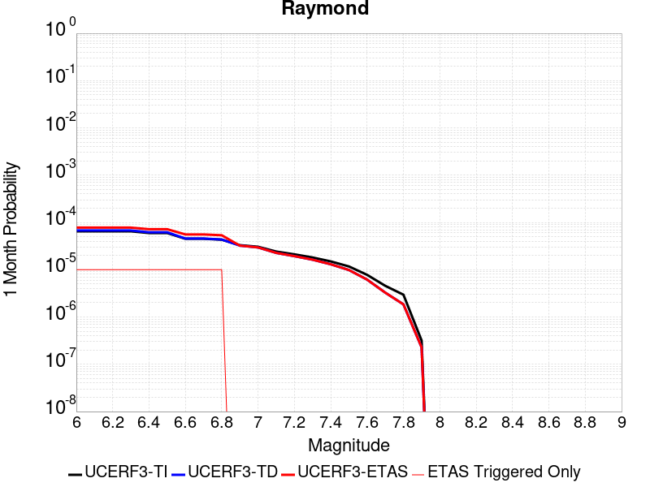 |  |  |

| Magnitude | 1 wk TI Prob | 1 wk TD Prob | 1 wk ETAS Prob | 1 wk ETAS/TD Gain | 1 wk ETAS Triggered Only | 1 mo TI Prob | 1 mo TD Prob | 1 mo ETAS Prob | 1 mo ETAS/TD Gain | 1 mo ETAS Triggered Only | 1 yr TI Prob | 1 yr TD Prob | 1 yr ETAS Prob | 1 yr ETAS/TD Gain | 1 yr ETAS Triggered Only | 10 yr TI Prob | 10 yr TD Prob | 10 yr ETAS Prob | 10 yr ETAS/TD Gain | 10 yr ETAS Triggered Only |
|-----|-----|-----|-----|-----|-----|-----|-----|-----|-----|-----|-----|-----|-----|-----|-----|-----|-----|-----|-----|-----|
| 6.0 | 1.5157413E-5 | 1.5810365E-5 | 2.5810208E-5 | 1.6324865 | 1.0E-5 | 6.4958724E-5 | 6.775709E-5 | 7.775641E-5 | 1.147576 | 1.0E-5 | 7.905855E-4 | 8.246554E-4 | 8.446389E-4 | 1.0242325 | 2.0E-5 | 0.007877788 | 0.008218473 | 0.008238308 | 1.0024135 | 2.0E-5 |
| 6.1 | 1.5157413E-5 | 1.5810365E-5 | 2.5810208E-5 | 1.6324865 | 1.0E-5 | 6.4958724E-5 | 6.775709E-5 | 7.775641E-5 | 1.147576 | 1.0E-5 | 7.905855E-4 | 8.246554E-4 | 8.446389E-4 | 1.0242325 | 2.0E-5 | 0.007877788 | 0.008218473 | 0.008238308 | 1.0024135 | 2.0E-5 |
| 6.2 | 1.5157413E-5 | 1.5810365E-5 | 2.5810208E-5 | 1.6324865 | 1.0E-5 | 6.4958724E-5 | 6.775709E-5 | 7.775641E-5 | 1.147576 | 1.0E-5 | 7.905855E-4 | 8.246554E-4 | 8.446389E-4 | 1.0242325 | 2.0E-5 | 0.007877788 | 0.008218473 | 0.008238308 | 1.0024135 | 2.0E-5 |
| 6.3 | 1.5157413E-5 | 1.5810365E-5 | 2.5810208E-5 | 1.6324865 | 1.0E-5 | 6.4958724E-5 | 6.775709E-5 | 7.775641E-5 | 1.147576 | 1.0E-5 | 7.905855E-4 | 8.246554E-4 | 8.446389E-4 | 1.0242325 | 2.0E-5 | 0.007877788 | 0.008218473 | 0.008238308 | 1.0024135 | 2.0E-5 |
| 6.4 | 1.3941944E-5 | 1.4454908E-5 | 2.4454763E-5 | 1.6917965 | 1.0E-5 | 5.9749822E-5 | 6.194826E-5 | 7.1947645E-5 | 1.161415 | 1.0E-5 | 7.2721124E-4 | 7.5398246E-4 | 7.7396736E-4 | 1.0265058 | 2.0E-5 | 0.007248361 | 0.0075165783 | 0.007536428 | 1.0026408 | 2.0E-5 |
| 6.5 | 1.3941944E-5 | 1.4454908E-5 | 2.4454763E-5 | 1.6917965 | 1.0E-5 | 5.9749822E-5 | 6.194826E-5 | 7.1947645E-5 | 1.161415 | 1.0E-5 | 7.2721124E-4 | 7.5398246E-4 | 7.7396736E-4 | 1.0265058 | 2.0E-5 | 0.007248361 | 0.0075165783 | 0.007536428 | 1.0026408 | 2.0E-5 |
| 6.6 | 1.0542609E-5 | 1.0671272E-5 | 2.0671167E-5 | 1.9370854 | 1.0E-5 | 4.5181827E-5 | 4.5733254E-5 | 5.57328E-5 | 1.2186493 | 1.0E-5 | 5.499499E-4 | 5.566656E-4 | 5.7665445E-4 | 1.0359082 | 2.0E-5 | 0.005485909 | 0.0055532744 | 0.0055731633 | 1.0035815 | 2.0E-5 |
| 6.7 | 1.0542609E-5 | 1.0671272E-5 | 2.0671167E-5 | 1.9370854 | 1.0E-5 | 4.5181827E-5 | 4.5733254E-5 | 5.57328E-5 | 1.2186493 | 1.0E-5 | 5.499499E-4 | 5.566656E-4 | 5.7665445E-4 | 1.0359082 | 2.0E-5 | 0.005485909 | 0.0055532744 | 0.0055731633 | 1.0035815 | 2.0E-5 |
| 6.8 | 1.0079132E-5 | 1.0176802E-5 | 2.01767E-5 | 1.982617 | 1.0E-5 | 4.3195567E-5 | 4.3614164E-5 | 5.3613727E-5 | 1.2292733 | 1.0E-5 | 5.257791E-4 | 5.3087843E-4 | 5.508678E-4 | 1.0376534 | 2.0E-5 | 0.0052453685 | 0.005296653 | 0.005316547 | 1.0037559 | 2.0E-5 |
| 6.9 | 7.721598E-6 | 7.5490198E-6 | 7.5490198E-6 | 1.0 | 0.0 | 3.3092143E-5 | 3.2352546E-5 | 3.2352546E-5 | 1.0 | 0.0 | 4.0282236E-4 | 3.938223E-4 | 4.0381835E-4 | 1.0253822 | 1.0E-5 | 0.0040209293 | 0.0039313785 | 0.0039413394 | 1.0025337 | 1.0E-5 |
| 7.0 | 7.137566E-6 | 6.911413E-6 | 6.911413E-6 | 1.0 | 0.0 | 3.058921E-5 | 2.962001E-5 | 2.962001E-5 | 1.0 | 0.0 | 3.7236E-4 | 3.6056503E-4 | 3.6056503E-4 | 1.0 | 0.0 | 0.0037173668 | 0.0035999198 | 0.0035999198 | 1.0 | 0.0 |
| 7.1 | 5.654976E-6 | 5.299629E-6 | 5.299629E-6 | 1.0 | 0.0 | 2.4235387E-5 | 2.2712498E-5 | 2.2712498E-5 | 1.0 | 0.0 | 2.9502588E-4 | 2.764898E-4 | 2.764898E-4 | 1.0 | 0.0 | 0.0029463451 | 0.0027614902 | 0.0027614902 | 1.0 | 0.0 |
| 7.2 | 4.9358455E-6 | 4.5267375E-6 | 4.5267375E-6 | 1.0 | 0.0 | 2.1153453E-5 | 1.940016E-5 | 1.940016E-5 | 1.0 | 0.0 | 2.5751285E-4 | 2.3617149E-4 | 2.3617149E-4 | 1.0 | 0.0 | 0.0025721465 | 0.0023592284 | 0.0023592284 | 1.0 | 0.0 |
| 7.3 | 4.2368597E-6 | 3.805688E-6 | 3.805688E-6 | 1.0 | 0.0 | 1.8157843E-5 | 1.630999E-5 | 1.630999E-5 | 1.0 | 0.0 | 2.2104931E-4 | 1.9855614E-4 | 1.9855614E-4 | 1.0 | 0.0 | 0.0022082955 | 0.0019838074 | 0.0019838074 | 1.0 | 0.0 |
| 7.4 | 3.4999923E-6 | 3.0438064E-6 | 3.0438064E-6 | 1.0 | 0.0 | 1.49998805E-5 | 1.3044819E-5 | 1.3044819E-5 | 1.0 | 0.0 | 1.8260824E-4 | 1.5880918E-4 | 1.5880918E-4 | 1.0 | 0.0 | 0.0018245826 | 0.0015869739 | 0.0015869739 | 1.0 | 0.0 |
| 7.5 | 2.738017E-6 | 2.3020955E-6 | 2.3020955E-6 | 1.0 | 0.0 | 1.1734306E-5 | 9.866087E-6 | 9.866087E-6 | 1.0 | 0.0 | 1.428558E-4 | 1.2011305E-4 | 1.2011305E-4 | 1.0 | 0.0 | 0.0014276401 | 0.0012004969 | 0.0012004969 | 1.0 | 0.0 |
| 7.6 | 1.8186392E-6 | 1.4423393E-6 | 1.4423393E-6 | 1.0 | 0.0 | 7.794145E-6 | 6.18144E-6 | 6.18144E-6 | 1.0 | 0.0 | 9.488958E-5 | 7.525647E-5 | 7.525647E-5 | 1.0 | 0.0 | 9.4849075E-4 | 7.5232267E-4 | 7.5232267E-4 | 1.0 | 0.0 |
| 7.7 | 1.0660348E-6 | 7.644004E-7 | 7.644004E-7 | 1.0 | 0.0 | 4.5687125E-6 | 3.2759976E-6 | 3.2759976E-6 | 1.0 | 0.0 | 5.5622655E-5 | 3.988456E-5 | 3.988456E-5 | 1.0 | 0.0 | 5.5608735E-4 | 3.987844E-4 | 3.987844E-4 | 1.0 | 0.0 |
| 7.8 | 6.913602E-7 | 4.3205526E-7 | 4.3205526E-7 | 1.0 | 0.0 | 2.962969E-6 | 1.8516641E-6 | 1.8516641E-6 | 1.0 | 0.0 | 3.607355E-5 | 2.2543783E-5 | 2.2543783E-5 | 1.0 | 0.0 | 3.6067693E-4 | 2.2542427E-4 | 2.2542427E-4 | 1.0 | 0.0 |
| 7.9 | 7.425201E-8 | 5.3225733E-8 | 5.3225733E-8 | 1.0 | 0.0 | 3.1822285E-7 | 2.2811027E-7 | 2.2811027E-7 | 1.0 | 0.0 | 3.874356E-6 | 2.7772403E-6 | 2.7772403E-6 | 1.0 | 0.0 | 3.8742884E-5 | 2.7772185E-5 | 2.7772185E-5 | 1.0 | 0.0 |

## Mission Ridge-Arroyo Parida-Santa Ana
*[(top)](#table-of-contents)*

| 1 Week | 1 Month | 1 Year | 10 Year |
|-----|-----|-----|-----|
|  |  |  |  |

| Magnitude | 1 wk TI Prob | 1 wk TD Prob | 1 wk ETAS Prob | 1 wk ETAS/TD Gain | 1 wk ETAS Triggered Only | 1 mo TI Prob | 1 mo TD Prob | 1 mo ETAS Prob | 1 mo ETAS/TD Gain | 1 mo ETAS Triggered Only | 1 yr TI Prob | 1 yr TD Prob | 1 yr ETAS Prob | 1 yr ETAS/TD Gain | 1 yr ETAS Triggered Only | 10 yr TI Prob | 10 yr TD Prob | 10 yr ETAS Prob | 10 yr ETAS/TD Gain | 10 yr ETAS Triggered Only |
|-----|-----|-----|-----|-----|-----|-----|-----|-----|-----|-----|-----|-----|-----|-----|-----|-----|-----|-----|-----|-----|
| 6.0 | 4.169034E-5 | 4.7138332E-5 | 5.713786E-5 | 1.2121316 | 1.0E-5 | 1.7866064E-4 | 2.0201063E-4 | 2.1200861E-4 | 1.0494924 | 1.0E-5 | 0.0021730233 | 0.0024575314 | 0.0024675068 | 1.0040591 | 1.0E-5 | 0.021518968 | 0.024385462 | 0.024395218 | 1.0004001 | 1.0E-5 |
| 6.1 | 1.73813E-5 | 1.685448E-5 | 1.685448E-5 | 1.0 | 0.0 | 7.4489166E-5 | 7.2231545E-5 | 7.2231545E-5 | 1.0 | 0.0 | 9.065282E-4 | 8.7907485E-4 | 8.7907485E-4 | 1.0 | 0.0 | 0.009028391 | 0.008757258 | 0.008757258 | 1.0 | 0.0 |
| 6.2 | 1.4622182E-5 | 1.3673473E-5 | 1.3673473E-5 | 1.0 | 0.0 | 6.2664985E-5 | 5.8599304E-5 | 5.8599304E-5 | 1.0 | 0.0 | 7.6267915E-4 | 7.1321684E-4 | 7.1321684E-4 | 1.0 | 0.0 | 0.007600669 | 0.0071098623 | 0.0071098623 | 1.0 | 0.0 |
| 6.3 | 1.3552434E-5 | 1.24823655E-5 | 1.24823655E-5 | 1.0 | 0.0 | 5.8080568E-5 | 5.3494776E-5 | 5.3494776E-5 | 1.0 | 0.0 | 7.069015E-4 | 6.511074E-4 | 6.511074E-4 | 1.0 | 0.0 | 0.00704657 | 0.006492501 | 0.006492501 | 1.0 | 0.0 |
| 6.4 | 1.30977305E-5 | 1.1979314E-5 | 1.1979314E-5 | 1.0 | 0.0 | 5.613192E-5 | 5.1338924E-5 | 5.1338924E-5 | 1.0 | 0.0 | 6.831918E-4 | 6.2487513E-4 | 6.2487513E-4 | 1.0 | 0.0 | 0.006810953 | 0.0062316665 | 0.0062316665 | 1.0 | 0.0 |
| 6.5 | 1.225205E-5 | 1.1048948E-5 | 1.1048948E-5 | 1.0 | 0.0 | 5.2507727E-5 | 4.735179E-5 | 4.735179E-5 | 1.0 | 0.0 | 6.3909404E-4 | 5.763583E-4 | 5.763583E-4 | 1.0 | 0.0 | 0.006372592 | 0.005749085 | 0.005749085 | 1.0 | 0.0 |
| 6.6 | 1.1352241E-5 | 1.0063668E-5 | 1.0063668E-5 | 1.0 | 0.0 | 4.8651553E-5 | 4.3129305E-5 | 4.3129305E-5 | 1.0 | 0.0 | 5.921717E-4 | 5.249749E-4 | 5.249749E-4 | 1.0 | 0.0 | 0.0059059616 | 0.005237734 | 0.005237734 | 1.0 | 0.0 |
| 6.7 | 1.0864116E-5 | 9.517152E-6 | 9.517152E-6 | 1.0 | 0.0 | 4.6559664E-5 | 4.0787167E-5 | 4.0787167E-5 | 1.0 | 0.0 | 5.667165E-4 | 4.964726E-4 | 4.964726E-4 | 1.0 | 0.0 | 0.005652734 | 0.004954009 | 0.004954009 | 1.0 | 0.0 |
| 6.8 | 1.0666365E-5 | 9.2999E-6 | 9.2999E-6 | 1.0 | 0.0 | 4.571219E-5 | 3.9856117E-5 | 3.9856117E-5 | 1.0 | 0.0 | 5.564038E-4 | 4.851422E-4 | 4.851422E-4 | 1.0 | 0.0 | 0.005550127 | 0.004841204 | 0.004841204 | 1.0 | 0.0 |
| 6.9 | 1.0038665E-5 | 8.592155E-6 | 8.592155E-6 | 1.0 | 0.0 | 4.302214E-5 | 3.682301E-5 | 3.682301E-5 | 1.0 | 0.0 | 5.236687E-4 | 4.4822975E-4 | 4.4822975E-4 | 1.0 | 0.0 | 0.005224364 | 0.0044736085 | 0.0044736085 | 1.0 | 0.0 |
| 7.0 | 9.5379955E-6 | 8.025172E-6 | 8.025172E-6 | 1.0 | 0.0 | 4.0876483E-5 | 3.4393153E-5 | 3.4393153E-5 | 1.0 | 0.0 | 4.975576E-4 | 4.1865787E-4 | 4.1865787E-4 | 1.0 | 0.0 | 0.00496445 | 0.0041790316 | 0.0041790316 | 1.0 | 0.0 |
| 7.1 | 9.207389E-6 | 7.652467E-6 | 7.652467E-6 | 1.0 | 0.0 | 3.945964E-5 | 3.2795884E-5 | 3.2795884E-5 | 1.0 | 0.0 | 4.803152E-4 | 3.992184E-4 | 3.992184E-4 | 1.0 | 0.0 | 0.004792784 | 0.0039853496 | 0.0039853496 | 1.0 | 0.0 |
| 7.2 | 7.638091E-6 | 5.931174E-6 | 5.931174E-6 | 1.0 | 0.0 | 3.2734264E-5 | 2.541907E-5 | 2.541907E-5 | 1.0 | 0.0 | 3.984668E-4 | 3.0943356E-4 | 3.0943356E-4 | 1.0 | 0.0 | 0.0039775306 | 0.0030902245 | 0.0030902245 | 1.0 | 0.0 |
| 7.3 | 7.2500147E-6 | 5.596204E-6 | 5.596204E-6 | 1.0 | 0.0 | 3.1071122E-5 | 2.3983514E-5 | 2.3983514E-5 | 1.0 | 0.0 | 3.7822526E-4 | 2.9196046E-4 | 2.9196046E-4 | 1.0 | 0.0 | 0.0037758215 | 0.002915965 | 0.002915965 | 1.0 | 0.0 |
| 7.4 | 6.3899715E-6 | 4.9185496E-6 | 4.9185496E-6 | 1.0 | 0.0 | 2.7385306E-5 | 2.107933E-5 | 2.107933E-5 | 1.0 | 0.0 | 3.3336508E-4 | 2.566108E-4 | 2.566108E-4 | 1.0 | 0.0 | 0.0033286542 | 0.0025633303 | 0.0025633303 | 1.0 | 0.0 |
| 7.5 | 5.379025E-6 | 4.0839013E-6 | 4.0839013E-6 | 1.0 | 0.0 | 2.305276E-5 | 1.7502318E-5 | 1.7502318E-5 | 1.0 | 0.0 | 2.806312E-4 | 2.1306999E-4 | 2.1306999E-4 | 1.0 | 0.0 | 0.0028027708 | 0.0021286684 | 0.0021286684 | 1.0 | 0.0 |
| 7.6 | 4.1270696E-6 | 3.088378E-6 | 3.088378E-6 | 1.0 | 0.0 | 1.768732E-5 | 1.3235838E-5 | 1.3235838E-5 | 1.0 | 0.0 | 2.1532185E-4 | 1.6113449E-4 | 1.6113449E-4 | 1.0 | 0.0 | 0.0021511333 | 0.0016101847 | 0.0016101847 | 1.0 | 0.0 |
| 7.7 | 2.5406805E-6 | 1.8282275E-6 | 1.8282275E-6 | 1.0 | 0.0 | 1.0888585E-5 | 7.835237E-6 | 7.835237E-6 | 1.0 | 0.0 | 1.3256045E-4 | 9.53899E-5 | 9.53899E-5 | 1.0 | 0.0 | 0.0013248142 | 9.5349574E-4 | 9.5349574E-4 | 1.0 | 0.0 |
| 7.8 | 4.8608285E-7 | 3.5099023E-7 | 3.5099023E-7 | 1.0 | 0.0 | 2.0832106E-6 | 1.504243E-6 | 1.504243E-6 | 1.0 | 0.0 | 2.5362791E-5 | 1.8314006E-5 | 1.8314006E-5 | 1.0 | 0.0 | 2.5359896E-4 | 1.8312508E-4 | 1.8312508E-4 | 1.0 | 0.0 |
| 7.9 | 2.0472514E-8 | 1.2688983E-8 | 1.2688983E-8 | 1.0 | 0.0 | 8.7739345E-8 | 5.4381356E-8 | 5.4381356E-8 | 1.0 | 0.0 | 1.068226E-6 | 6.620928E-7 | 6.620928E-7 | 1.0 | 0.0 | 1.0682209E-5 | 6.6209095E-6 | 6.6209095E-6 | 1.0 | 0.0 |
| 8.0 | 4.443582E-9 | 2.032151E-9 | 2.032151E-9 | 1.0 | 0.0 | 1.9043922E-8 | 8.709217E-9 | 8.709217E-9 | 1.0 | 0.0 | 2.3185973E-7 | 1.0603472E-7 | 1.0603472E-7 | 1.0 | 0.0 | 2.3185949E-6 | 1.0603468E-6 | 1.0603468E-6 | 1.0 | 0.0 |

## Mission Creek
*[(top)](#table-of-contents)*

| 1 Week | 1 Month | 1 Year | 10 Year |
|-----|-----|-----|-----|
|  |  |  |  |

| Magnitude | 1 wk TI Prob | 1 wk TD Prob | 1 wk ETAS Prob | 1 wk ETAS/TD Gain | 1 wk ETAS Triggered Only | 1 mo TI Prob | 1 mo TD Prob | 1 mo ETAS Prob | 1 mo ETAS/TD Gain | 1 mo ETAS Triggered Only | 1 yr TI Prob | 1 yr TD Prob | 1 yr ETAS Prob | 1 yr ETAS/TD Gain | 1 yr ETAS Triggered Only | 10 yr TI Prob | 10 yr TD Prob | 10 yr ETAS Prob | 10 yr ETAS/TD Gain | 10 yr ETAS Triggered Only |
|-----|-----|-----|-----|-----|-----|-----|-----|-----|-----|-----|-----|-----|-----|-----|-----|-----|-----|-----|-----|-----|
| 6.0 | 1.1549387E-5 | 1.6325142E-5 | 1.6325142E-5 | 1.0 | 0.0 | 4.9496433E-5 | 6.9963105E-5 | 6.9963105E-5 | 1.0 | 0.0 | 6.0245243E-4 | 8.514829E-4 | 8.714659E-4 | 1.0234684 | 2.0E-5 | 0.006008218 | 0.008511699 | 0.0085315285 | 1.0023297 | 2.0E-5 |
| 6.1 | 1.1549387E-5 | 1.6325142E-5 | 1.6325142E-5 | 1.0 | 0.0 | 4.9496433E-5 | 6.9963105E-5 | 6.9963105E-5 | 1.0 | 0.0 | 6.0245243E-4 | 8.514829E-4 | 8.714659E-4 | 1.0234684 | 2.0E-5 | 0.006008218 | 0.008511699 | 0.0085315285 | 1.0023297 | 2.0E-5 |
| 6.2 | 1.1549387E-5 | 1.6325142E-5 | 1.6325142E-5 | 1.0 | 0.0 | 4.9496433E-5 | 6.9963105E-5 | 6.9963105E-5 | 1.0 | 0.0 | 6.0245243E-4 | 8.514829E-4 | 8.714659E-4 | 1.0234684 | 2.0E-5 | 0.006008218 | 0.008511699 | 0.0085315285 | 1.0023297 | 2.0E-5 |
| 6.3 | 1.1549387E-5 | 1.6325142E-5 | 1.6325142E-5 | 1.0 | 0.0 | 4.9496433E-5 | 6.9963105E-5 | 6.9963105E-5 | 1.0 | 0.0 | 6.0245243E-4 | 8.514829E-4 | 8.714659E-4 | 1.0234684 | 2.0E-5 | 0.006008218 | 0.008511699 | 0.0085315285 | 1.0023297 | 2.0E-5 |
| 6.4 | 1.1549387E-5 | 1.6325142E-5 | 1.6325142E-5 | 1.0 | 0.0 | 4.9496433E-5 | 6.9963105E-5 | 6.9963105E-5 | 1.0 | 0.0 | 6.0245243E-4 | 8.514829E-4 | 8.714659E-4 | 1.0234684 | 2.0E-5 | 0.006008218 | 0.008511699 | 0.0085315285 | 1.0023297 | 2.0E-5 |
| 6.5 | 1.1549387E-5 | 1.6325142E-5 | 1.6325142E-5 | 1.0 | 0.0 | 4.9496433E-5 | 6.9963105E-5 | 6.9963105E-5 | 1.0 | 0.0 | 6.0245243E-4 | 8.514829E-4 | 8.714659E-4 | 1.0234684 | 2.0E-5 | 0.006008218 | 0.008511699 | 0.0085315285 | 1.0023297 | 2.0E-5 |
| 6.6 | 9.202681E-6 | 1.3848401E-5 | 1.3848401E-5 | 1.0 | 0.0 | 3.9439463E-5 | 5.934899E-5 | 5.934899E-5 | 1.0 | 0.0 | 4.800697E-4 | 7.2234345E-4 | 7.42329E-4 | 1.0276676 | 2.0E-5 | 0.004790339 | 0.0072288746 | 0.0072487304 | 1.0027467 | 2.0E-5 |
| 6.7 | 9.019164E-6 | 1.3654068E-5 | 1.3654068E-5 | 1.0 | 0.0 | 3.8652986E-5 | 5.8516176E-5 | 5.8516176E-5 | 1.0 | 0.0 | 4.7049852E-4 | 7.1221055E-4 | 7.321963E-4 | 1.0280616 | 2.0E-5 | 0.004695036 | 0.0071281986 | 0.007148056 | 1.0027858 | 2.0E-5 |
| 6.8 | 8.673558E-6 | 1.3276174E-5 | 1.3276174E-5 | 1.0 | 0.0 | 3.717186E-5 | 5.68967E-5 | 5.68967E-5 | 1.0 | 0.0 | 4.524734E-4 | 6.92506E-4 | 7.1249215E-4 | 1.0288606 | 2.0E-5 | 0.0045155324 | 0.0069323843 | 0.0069522457 | 1.002865 | 2.0E-5 |
| 6.9 | 7.002255E-6 | 1.1480386E-5 | 1.1480386E-5 | 1.0 | 0.0 | 3.000932E-5 | 4.9200764E-5 | 4.9200764E-5 | 1.0 | 0.0 | 3.653022E-4 | 5.988615E-4 | 6.1884953E-4 | 1.0333767 | 2.0E-5 | 0.0036470229 | 0.0060011996 | 0.0060210796 | 1.0033127 | 2.0E-5 |
| 7.0 | 5.84644E-6 | 9.677556E-6 | 9.677556E-6 | 1.0 | 0.0 | 2.5055931E-5 | 4.1474606E-5 | 4.1474606E-5 | 1.0 | 0.0 | 3.0501327E-4 | 5.0484086E-4 | 5.248308E-4 | 1.0395964 | 2.0E-5 | 0.0030459496 | 0.0050654565 | 0.005085355 | 1.0039283 | 2.0E-5 |
| 7.1 | 5.54703E-6 | 9.332022E-6 | 9.332022E-6 | 1.0 | 0.0 | 2.377277E-5 | 3.9993793E-5 | 3.9993793E-5 | 1.0 | 0.0 | 2.8939504E-4 | 4.868201E-4 | 5.068104E-4 | 1.041063 | 2.0E-5 | 0.0028901845 | 0.004886046 | 0.0049059484 | 1.0040733 | 2.0E-5 |
| 7.2 | 4.384709E-6 | 7.683992E-6 | 7.683992E-6 | 1.0 | 0.0 | 1.8791474E-5 | 3.2931002E-5 | 3.2931002E-5 | 1.0 | 0.0 | 2.2876218E-4 | 4.0086484E-4 | 4.208568E-4 | 1.0498722 | 2.0E-5 | 0.0022852682 | 0.0040298863 | 0.004049806 | 1.0049429 | 2.0E-5 |
| 7.3 | 3.7888456E-6 | 6.917821E-6 | 6.917821E-6 | 1.0 | 0.0 | 1.623781E-5 | 2.9647486E-5 | 2.9647486E-5 | 1.0 | 0.0 | 1.9767738E-4 | 3.609017E-4 | 3.808945E-4 | 1.0553968 | 2.0E-5 | 0.0019750162 | 0.0036316153 | 0.0036515428 | 1.0054872 | 2.0E-5 |
| 7.4 | 2.1982462E-6 | 5.026073E-6 | 5.026073E-6 | 1.0 | 0.0 | 9.421021E-6 | 2.1540136E-5 | 2.1540136E-5 | 1.0 | 0.0 | 1.1469489E-4 | 2.6221978E-4 | 2.8221455E-4 | 1.0762519 | 2.0E-5 | 0.0011463572 | 0.0026473494 | 0.0026672964 | 1.0075347 | 2.0E-5 |
| 7.5 | 2.051923E-6 | 4.617237E-6 | 4.617237E-6 | 1.0 | 0.0 | 8.793926E-6 | 1.978801E-5 | 1.978801E-5 | 1.0 | 0.0 | 1.0706078E-4 | 2.4089254E-4 | 2.6088773E-4 | 1.0830046 | 2.0E-5 | 0.0010700922 | 0.0024350125 | 0.0024549637 | 1.0081935 | 2.0E-5 |
| 7.6 | 1.8733427E-6 | 4.125508E-6 | 4.125508E-6 | 1.0 | 0.0 | 8.028587E-6 | 1.768063E-5 | 1.768063E-5 | 1.0 | 0.0 | 9.774366E-5 | 2.1524049E-4 | 2.3523618E-4 | 1.0928993 | 2.0E-5 | 9.770069E-4 | 0.002179529 | 0.0021994854 | 1.0091563 | 2.0E-5 |
| 7.7 | 1.8411953E-6 | 4.0451673E-6 | 4.0451673E-6 | 1.0 | 0.0 | 7.890813E-6 | 1.7336315E-5 | 1.7336315E-5 | 1.0 | 0.0 | 9.606641E-5 | 2.1104928E-4 | 2.3104507E-4 | 1.0947446 | 2.0E-5 | 9.6024893E-4 | 0.0021378102 | 0.0021577675 | 1.0093354 | 2.0E-5 |
| 7.8 | 1.7194251E-6 | 3.7123866E-6 | 3.7123866E-6 | 1.0 | 0.0 | 7.368944E-6 | 1.5910133E-5 | 1.5910133E-5 | 1.0 | 0.0 | 8.97132E-5 | 1.9368871E-4 | 2.1368483E-4 | 1.1032385 | 2.0E-5 | 8.967699E-4 | 0.0019636988 | 0.0019836596 | 1.0101649 | 2.0E-5 |
| 7.9 | 1.4035052E-6 | 2.9516495E-6 | 2.9516495E-6 | 1.0 | 0.0 | 6.0150082E-6 | 1.2649865E-5 | 1.2649865E-5 | 1.0 | 0.0 | 7.3230265E-5 | 1.5400129E-4 | 1.7399821E-4 | 1.1298491 | 2.0E-5 | 7.3206134E-4 | 0.0015642311 | 0.0015841998 | 1.0127659 | 2.0E-5 |
| 8.0 | 3.9318823E-7 | 5.531722E-7 | 5.531722E-7 | 1.0 | 0.0 | 1.6850913E-6 | 2.370736E-6 | 2.370736E-6 | 1.0 | 0.0 | 2.0515794E-5 | 2.8863333E-5 | 2.8863333E-5 | 1.0 | 0.0 | 2.0513899E-4 | 2.9927568E-4 | 2.9927568E-4 | 1.0 | 0.0 |
| 8.1 | 1.596793E-7 | 1.13891964E-7 | 1.13891964E-7 | 1.0 | 0.0 | 6.8433974E-7 | 4.881083E-7 | 4.881083E-7 | 1.0 | 0.0 | 8.331805E-6 | 5.942703E-6 | 5.942703E-6 | 1.0 | 0.0 | 8.331492E-5 | 6.555237E-5 | 6.555237E-5 | 1.0 | 0.0 |
| 8.2 | 4.9003038E-8 | 2.5465459E-8 | 2.5465459E-8 | 1.0 | 0.0 | 2.10013E-7 | 1.0913767E-7 | 1.0913767E-7 | 1.0 | 0.0 | 2.5569052E-6 | 1.3287504E-6 | 1.3287504E-6 | 1.0 | 0.0 | 2.556876E-5 | 1.49686575E-5 | 1.49686575E-5 | 1.0 | 0.0 |

## San Andreas (Parkfield)
*[(top)](#table-of-contents)*

| 1 Week | 1 Month | 1 Year | 10 Year |
|-----|-----|-----|-----|
|  |  |  |  |

| Magnitude | 1 wk TI Prob | 1 wk TD Prob | 1 wk ETAS Prob | 1 wk ETAS/TD Gain | 1 wk ETAS Triggered Only | 1 mo TI Prob | 1 mo TD Prob | 1 mo ETAS Prob | 1 mo ETAS/TD Gain | 1 mo ETAS Triggered Only | 1 yr TI Prob | 1 yr TD Prob | 1 yr ETAS Prob | 1 yr ETAS/TD Gain | 1 yr ETAS Triggered Only | 10 yr TI Prob | 10 yr TD Prob | 10 yr ETAS Prob | 10 yr ETAS/TD Gain | 10 yr ETAS Triggered Only |
|-----|-----|-----|-----|-----|-----|-----|-----|-----|-----|-----|-----|-----|-----|-----|-----|-----|-----|-----|-----|-----|
| 6.0 | 5.556969E-4 | 7.787764E-4 | 7.787764E-4 | 1.0 | 0.0 | 0.0023793848 | 0.0033338934 | 0.0033338934 | 1.0 | 0.0 | 0.028586963 | 0.04027906 | 0.040298257 | 1.0004765 | 2.0E-5 | 0.25176284 | 0.3373374 | 0.33735067 | 1.0000393 | 2.0E-5 |
| 6.1 | 1.925858E-4 | 3.0300187E-4 | 3.0300187E-4 | 1.0 | 0.0 | 8.2510663E-4 | 0.0012980271 | 0.0012980271 | 1.0 | 0.0 | 0.0099994885 | 0.01578479 | 0.01578479 | 1.0 | 0.0 | 0.095613256 | 0.14981315 | 0.14981315 | 1.0 | 0.0 |
| 6.2 | 9.4306815E-5 | 1.8251229E-4 | 1.8251229E-4 | 1.0 | 0.0 | 4.0410945E-4 | 7.8196224E-4 | 7.8196224E-4 | 1.0 | 0.0 | 0.0049089384 | 0.009479025 | 0.009479025 | 1.0 | 0.0 | 0.048019063 | 0.09188695 | 0.09188695 | 1.0 | 0.0 |
| 6.3 | 9.283051E-5 | 1.7947727E-4 | 1.7947727E-4 | 1.0 | 0.0 | 3.9778434E-4 | 7.689627E-4 | 7.689627E-4 | 1.0 | 0.0 | 0.0048322747 | 0.0093221245 | 0.0093221245 | 1.0 | 0.0 | 0.047285385 | 0.09053988 | 0.09053988 | 1.0 | 0.0 |
| 6.4 | 9.138826E-5 | 1.7709887E-4 | 1.7709887E-4 | 1.0 | 0.0 | 3.916052E-4 | 7.5877557E-4 | 7.5877557E-4 | 1.0 | 0.0 | 0.0047573745 | 0.009199142 | 0.009199142 | 1.0 | 0.0 | 0.046568092 | 0.08944346 | 0.08944346 | 1.0 | 0.0 |
| 6.5 | 9.000255E-5 | 1.7467843E-4 | 1.7467843E-4 | 1.0 | 0.0 | 3.8566816E-4 | 7.484082E-4 | 7.484082E-4 | 1.0 | 0.0 | 0.0046854047 | 0.009074002 | 0.009074002 | 1.0 | 0.0 | 0.045878403 | 0.08833238 | 0.08833238 | 1.0 | 0.0 |
| 6.6 | 8.8109264E-5 | 1.7148908E-4 | 1.7148908E-4 | 1.0 | 0.0 | 3.7755648E-4 | 7.347474E-4 | 7.347474E-4 | 1.0 | 0.0 | 0.0045870654 | 0.008909067 | 0.008909067 | 1.0 | 0.0 | 0.04493529 | 0.08686431 | 0.08686431 | 1.0 | 0.0 |
| 6.7 | 8.738073E-5 | 1.7015962E-4 | 1.7015962E-4 | 1.0 | 0.0 | 3.7443507E-4 | 7.290529E-4 | 7.290529E-4 | 1.0 | 0.0 | 0.0045492216 | 0.008840349 | 0.008840349 | 1.0 | 0.0 | 0.04457213 | 0.08626531 | 0.08626531 | 1.0 | 0.0 |
| 6.8 | 8.710195E-5 | 1.6961442E-4 | 1.6961442E-4 | 1.0 | 0.0 | 3.7324068E-4 | 7.267176E-4 | 7.267176E-4 | 1.0 | 0.0 | 0.0045347405 | 0.008812156 | 0.008812156 | 1.0 | 0.0 | 0.04443313 | 0.086012915 | 0.086012915 | 1.0 | 0.0 |
| 6.9 | 8.6801556E-5 | 1.6902383E-4 | 1.6902383E-4 | 1.0 | 0.0 | 3.7195362E-4 | 7.241879E-4 | 7.241879E-4 | 1.0 | 0.0 | 0.0045191357 | 0.0087816045 | 0.0087816045 | 1.0 | 0.0 | 0.044283327 | 0.08573886 | 0.08573886 | 1.0 | 0.0 |
| 7.0 | 8.5571606E-5 | 1.6655146E-4 | 1.6655146E-4 | 1.0 | 0.0 | 3.6668387E-4 | 7.1359787E-4 | 7.1359787E-4 | 1.0 | 0.0 | 0.004455241 | 0.008653701 | 0.008653701 | 1.0 | 0.0 | 0.043669727 | 0.08458771 | 0.08458771 | 1.0 | 0.0 |
| 7.1 | 7.82589E-5 | 1.513576E-4 | 1.513576E-4 | 1.0 | 0.0 | 3.3535215E-4 | 6.485149E-4 | 6.485149E-4 | 1.0 | 0.0 | 0.0040752706 | 0.007867255 | 0.007867255 | 1.0 | 0.0 | 0.040013418 | 0.07750286 | 0.07750286 | 1.0 | 0.0 |
| 7.2 | 7.690929E-5 | 1.4872964E-4 | 1.4872964E-4 | 1.0 | 0.0 | 3.2956956E-4 | 6.3725776E-4 | 6.3725776E-4 | 1.0 | 0.0 | 0.004005129 | 0.0077311797 | 0.0077311797 | 1.0 | 0.0 | 0.0393371 | 0.07627582 | 0.07627582 | 1.0 | 0.0 |
| 7.3 | 7.5543794E-5 | 1.4569426E-4 | 1.4569426E-4 | 1.0 | 0.0 | 3.2371894E-4 | 6.242553E-4 | 6.242553E-4 | 1.0 | 0.0 | 0.003934157 | 0.0075739846 | 0.0075739846 | 1.0 | 0.0 | 0.038652334 | 0.07484126 | 0.07484126 | 1.0 | 0.0 |
| 7.4 | 7.4214564E-5 | 1.4270298E-4 | 1.4270298E-4 | 1.0 | 0.0 | 3.1802364E-4 | 6.1144156E-4 | 6.1144156E-4 | 1.0 | 0.0 | 0.003865065 | 0.00741905 | 0.00741905 | 1.0 | 0.0 | 0.03798529 | 0.07341491 | 0.07341491 | 1.0 | 0.0 |
| 7.5 | 6.149578E-5 | 1.1197151E-4 | 1.1197151E-4 | 1.0 | 0.0 | 2.6352672E-4 | 4.7978974E-4 | 4.7978974E-4 | 1.0 | 0.0 | 0.0032037178 | 0.0058258264 | 0.0058258264 | 1.0 | 0.0 | 0.03157923 | 0.058584794 | 0.058584794 | 1.0 | 0.0 |
| 7.6 | 6.0643448E-5 | 1.10257475E-4 | 1.10257475E-4 | 1.0 | 0.0 | 2.598746E-4 | 4.7244655E-4 | 4.7244655E-4 | 1.0 | 0.0 | 0.0031593828 | 0.0057368972 | 0.0057368972 | 1.0 | 0.0 | 0.031148417 | 0.0577456 | 0.0577456 | 1.0 | 0.0 |
| 7.7 | 5.1652263E-5 | 9.180402E-5 | 9.180402E-5 | 1.0 | 0.0 | 2.2134806E-4 | 3.933865E-4 | 3.933865E-4 | 1.0 | 0.0 | 0.002691582 | 0.0047789724 | 0.0047789724 | 1.0 | 0.0 | 0.026592141 | 0.048558682 | 0.048558682 | 1.0 | 0.0 |
| 7.8 | 4.8090482E-5 | 8.564889E-5 | 8.564889E-5 | 1.0 | 0.0 | 2.060858E-4 | 3.6701505E-4 | 3.6701505E-4 | 1.0 | 0.0 | 0.0025062072 | 0.0044592614 | 0.0044592614 | 1.0 | 0.0 | 0.024781305 | 0.04532328 | 0.04532328 | 1.0 | 0.0 |
| 7.9 | 3.970278E-5 | 6.754373E-5 | 6.754373E-5 | 1.0 | 0.0 | 1.7014367E-4 | 2.8944103E-4 | 2.8944103E-4 | 1.0 | 0.0 | 0.002069531 | 0.003518254 | 0.003518254 | 1.0 | 0.0 | 0.020503636 | 0.03590036 | 0.03590036 | 1.0 | 0.0 |
| 8.0 | 2.8982335E-5 | 4.072156E-5 | 4.072156E-5 | 1.0 | 0.0 | 1.2420409E-4 | 1.745093E-4 | 1.745093E-4 | 1.0 | 0.0 | 0.0015111357 | 0.0021225815 | 0.0021225815 | 1.0 | 0.0 | 0.015009012 | 0.022022424 | 0.022022424 | 1.0 | 0.0 |
| 8.1 | 1.8836186E-5 | 1.8692857E-5 | 1.8692857E-5 | 1.0 | 0.0 | 8.0724014E-5 | 8.0109785E-5 | 8.0109785E-5 | 1.0 | 0.0 | 9.823717E-4 | 9.7490085E-4 | 9.7490085E-4 | 1.0 | 0.0 | 0.009780403 | 0.010494427 | 0.010494427 | 1.0 | 0.0 |
| 8.2 | 8.643924E-6 | 5.478665E-6 | 5.478665E-6 | 1.0 | 0.0 | 3.704486E-5 | 2.3479783E-5 | 2.3479783E-5 | 1.0 | 0.0 | 4.5092785E-4 | 2.8582895E-4 | 2.8582895E-4 | 1.0 | 0.0 | 0.0045001395 | 0.0032508469 | 0.0032508469 | 1.0 | 0.0 |
| 8.3 | 1.983087E-6 | 7.6647797E-7 | 7.6647797E-7 | 1.0 | 0.0 | 8.498917E-6 | 3.2849016E-6 | 3.2849016E-6 | 1.0 | 0.0 | 1.034694E-4 | 3.999296E-5 | 3.999296E-5 | 1.0 | 0.0 | 0.0010342124 | 4.7228087E-4 | 4.7228087E-4 | 1.0 | 0.0 |

## Santa Susana East (connector)
*[(top)](#table-of-contents)*

| 1 Week | 1 Month | 1 Year | 10 Year |
|-----|-----|-----|-----|
|  |  |  |  |

| Magnitude | 1 wk TI Prob | 1 wk TD Prob | 1 wk ETAS Prob | 1 wk ETAS/TD Gain | 1 wk ETAS Triggered Only | 1 mo TI Prob | 1 mo TD Prob | 1 mo ETAS Prob | 1 mo ETAS/TD Gain | 1 mo ETAS Triggered Only | 1 yr TI Prob | 1 yr TD Prob | 1 yr ETAS Prob | 1 yr ETAS/TD Gain | 1 yr ETAS Triggered Only | 10 yr TI Prob | 10 yr TD Prob | 10 yr ETAS Prob | 10 yr ETAS/TD Gain | 10 yr ETAS Triggered Only |
|-----|-----|-----|-----|-----|-----|-----|-----|-----|-----|-----|-----|-----|-----|-----|-----|-----|-----|-----|-----|-----|
| 6.0 | 2.858397E-5 | 3.202259E-5 | 3.202259E-5 | 1.0 | 0.0 | 1.2249697E-4 | 1.3723405E-4 | 1.3723405E-4 | 1.0 | 0.0 | 0.0014903803 | 0.0016698164 | 0.0016797998 | 1.0059787 | 1.0E-5 | 0.014804244 | 0.01659979 | 0.016609624 | 1.0005925 | 1.0E-5 |
| 6.1 | 2.858397E-5 | 3.202259E-5 | 3.202259E-5 | 1.0 | 0.0 | 1.2249697E-4 | 1.3723405E-4 | 1.3723405E-4 | 1.0 | 0.0 | 0.0014903803 | 0.0016698164 | 0.0016797998 | 1.0059787 | 1.0E-5 | 0.014804244 | 0.01659979 | 0.016609624 | 1.0005925 | 1.0E-5 |
| 6.2 | 2.858397E-5 | 3.202259E-5 | 3.202259E-5 | 1.0 | 0.0 | 1.2249697E-4 | 1.3723405E-4 | 1.3723405E-4 | 1.0 | 0.0 | 0.0014903803 | 0.0016698164 | 0.0016797998 | 1.0059787 | 1.0E-5 | 0.014804244 | 0.01659979 | 0.016609624 | 1.0005925 | 1.0E-5 |
| 6.3 | 1.943582E-5 | 2.036782E-5 | 2.036782E-5 | 1.0 | 0.0 | 8.329371E-5 | 8.728837E-5 | 8.728837E-5 | 1.0 | 0.0 | 0.001013629 | 0.0010623297 | 0.0010623297 | 1.0 | 0.0 | 0.010090181 | 0.010584113 | 0.010584113 | 1.0 | 0.0 |
| 6.4 | 1.943582E-5 | 2.036782E-5 | 2.036782E-5 | 1.0 | 0.0 | 8.329371E-5 | 8.728837E-5 | 8.728837E-5 | 1.0 | 0.0 | 0.001013629 | 0.0010623297 | 0.0010623297 | 1.0 | 0.0 | 0.010090181 | 0.010584113 | 0.010584113 | 1.0 | 0.0 |
| 6.5 | 1.943582E-5 | 2.036782E-5 | 2.036782E-5 | 1.0 | 0.0 | 8.329371E-5 | 8.728837E-5 | 8.728837E-5 | 1.0 | 0.0 | 0.001013629 | 0.0010623297 | 0.0010623297 | 1.0 | 0.0 | 0.010090181 | 0.010584113 | 0.010584113 | 1.0 | 0.0 |
| 6.6 | 1.943582E-5 | 2.036782E-5 | 2.036782E-5 | 1.0 | 0.0 | 8.329371E-5 | 8.728837E-5 | 8.728837E-5 | 1.0 | 0.0 | 0.001013629 | 0.0010623297 | 0.0010623297 | 1.0 | 0.0 | 0.010090181 | 0.010584113 | 0.010584113 | 1.0 | 0.0 |
| 6.7 | 1.9404439E-5 | 2.035524E-5 | 2.035524E-5 | 1.0 | 0.0 | 8.3159226E-5 | 8.723446E-5 | 8.723446E-5 | 1.0 | 0.0 | 0.0010119933 | 0.0010616741 | 0.0010616741 | 1.0 | 0.0 | 0.010073971 | 0.010577619 | 0.010577619 | 1.0 | 0.0 |
| 6.8 | 1.2217526E-5 | 1.159334E-5 | 1.159334E-5 | 1.0 | 0.0 | 5.2359774E-5 | 4.968489E-5 | 4.968489E-5 | 1.0 | 0.0 | 6.372938E-4 | 6.0476246E-4 | 6.0476246E-4 | 1.0 | 0.0 | 0.0063546924 | 0.0060333833 | 0.0060333833 | 1.0 | 0.0 |
| 6.9 | 1.2217526E-5 | 1.159334E-5 | 1.159334E-5 | 1.0 | 0.0 | 5.2359774E-5 | 4.968489E-5 | 4.968489E-5 | 1.0 | 0.0 | 6.372938E-4 | 6.0476246E-4 | 6.0476246E-4 | 1.0 | 0.0 | 0.0063546924 | 0.0060333833 | 0.0060333833 | 1.0 | 0.0 |
| 7.0 | 9.276017E-6 | 8.059356E-6 | 8.059356E-6 | 1.0 | 0.0 | 3.9753755E-5 | 3.4539662E-5 | 3.4539662E-5 | 1.0 | 0.0 | 4.8389446E-4 | 4.204427E-4 | 4.204427E-4 | 1.0 | 0.0 | 0.0048284214 | 0.004197368 | 0.004197368 | 1.0 | 0.0 |
| 7.1 | 9.130355E-6 | 7.942529E-6 | 7.942529E-6 | 1.0 | 0.0 | 3.9129503E-5 | 3.4038985E-5 | 3.4038985E-5 | 1.0 | 0.0 | 4.7629757E-4 | 4.1434926E-4 | 4.1434926E-4 | 1.0 | 0.0 | 0.00475278 | 0.0041366615 | 0.0041366615 | 1.0 | 0.0 |
| 7.2 | 8.851015E-6 | 7.74169E-6 | 7.74169E-6 | 1.0 | 0.0 | 3.7932372E-5 | 3.317827E-5 | 3.317827E-5 | 1.0 | 0.0 | 4.6172875E-4 | 4.0387394E-4 | 4.0387394E-4 | 1.0 | 0.0 | 0.0046077054 | 0.0040322915 | 0.0040322915 | 1.0 | 0.0 |
| 7.3 | 8.573006E-6 | 7.5504113E-6 | 7.5504113E-6 | 1.0 | 0.0 | 3.6740938E-5 | 3.2358523E-5 | 3.2358523E-5 | 1.0 | 0.0 | 4.472291E-4 | 3.938972E-4 | 3.938972E-4 | 1.0 | 0.0 | 0.004463301 | 0.003932873 | 0.003932873 | 1.0 | 0.0 |
| 7.4 | 7.852282E-6 | 6.8179206E-6 | 6.8179206E-6 | 1.0 | 0.0 | 3.36522E-5 | 2.9219349E-5 | 2.9219349E-5 | 1.0 | 0.0 | 4.096385E-4 | 3.5569054E-4 | 3.5569054E-4 | 1.0 | 0.0 | 0.0040888423 | 0.0035520305 | 0.0035520305 | 1.0 | 0.0 |
| 7.5 | 4.8869324E-6 | 4.27914E-6 | 4.27914E-6 | 1.0 | 0.0 | 2.0943828E-5 | 1.8339051E-5 | 1.8339051E-5 | 1.0 | 0.0 | 2.5496128E-4 | 2.2325672E-4 | 2.2325672E-4 | 1.0 | 0.0 | 0.0025466895 | 0.0022306633 | 0.0022306633 | 1.0 | 0.0 |
| 7.6 | 1.3894544E-6 | 1.1568442E-6 | 1.1568442E-6 | 1.0 | 0.0 | 5.954791E-6 | 4.9578953E-6 | 4.9578953E-6 | 1.0 | 0.0 | 7.249717E-5 | 6.0360926E-5 | 6.0360926E-5 | 1.0 | 0.0 | 7.247352E-4 | 6.0346717E-4 | 6.0346717E-4 | 1.0 | 0.0 |
| 7.7 | 2.9924632E-7 | 2.3719647E-7 | 2.3719647E-7 | 1.0 | 0.0 | 1.2824837E-6 | 1.016556E-6 | 1.016556E-6 | 1.0 | 0.0 | 1.5614127E-5 | 1.2376506E-5 | 1.2376506E-5 | 1.0 | 0.0 | 1.5613029E-4 | 1.2375889E-4 | 1.2375889E-4 | 1.0 | 0.0 |
| 7.8 | 4.8188564E-8 | 2.6323553E-8 | 2.6323553E-8 | 1.0 | 0.0 | 2.065224E-7 | 1.1281523E-7 | 1.1281523E-7 | 1.0 | 0.0 | 2.5144072E-6 | 1.3735246E-6 | 1.3735246E-6 | 1.0 | 0.0 | 2.5143789E-5 | 1.3735169E-5 | 1.3735169E-5 | 1.0 | 0.0 |
| 7.9 | 2.6127251E-9 | 2.768132E-9 | 2.768132E-9 | 1.0 | 0.0 | 1.1197393E-8 | 1.1863423E-8 | 1.1863423E-8 | 1.0 | 0.0 | 1.3632825E-7 | 1.4443718E-7 | 1.4443718E-7 | 1.0 | 0.0 | 1.3632817E-6 | 1.4443717E-6 | 1.4443717E-6 | 1.0 | 0.0 |

## San Clemente
*[(top)](#table-of-contents)*

| 1 Week | 1 Month | 1 Year | 10 Year |
|-----|-----|-----|-----|
|  |  | 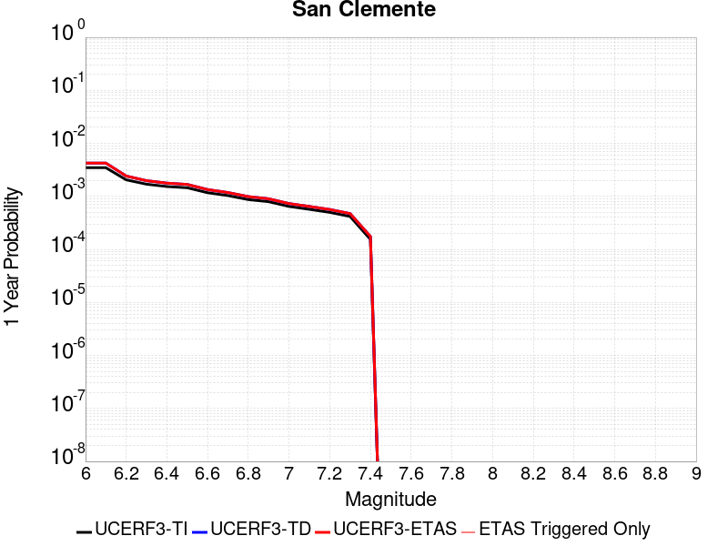 |  |

| Magnitude | 1 wk TI Prob | 1 wk TD Prob | 1 wk ETAS Prob | 1 wk ETAS/TD Gain | 1 wk ETAS Triggered Only | 1 mo TI Prob | 1 mo TD Prob | 1 mo ETAS Prob | 1 mo ETAS/TD Gain | 1 mo ETAS Triggered Only | 1 yr TI Prob | 1 yr TD Prob | 1 yr ETAS Prob | 1 yr ETAS/TD Gain | 1 yr ETAS Triggered Only | 10 yr TI Prob | 10 yr TD Prob | 10 yr ETAS Prob | 10 yr ETAS/TD Gain | 10 yr ETAS Triggered Only |
|-----|-----|-----|-----|-----|-----|-----|-----|-----|-----|-----|-----|-----|-----|-----|-----|-----|-----|-----|-----|-----|
| 6.0 | 6.681379E-5 | 8.164081E-5 | 8.164081E-5 | 1.0 | 0.0 | 2.8631336E-4 | 3.4984472E-4 | 3.4984472E-4 | 1.0 | 0.0 | 0.003480294 | 0.004251534 | 0.004251534 | 1.0 | 0.0 | 0.03426291 | 0.041757226 | 0.04176681 | 1.0002295 | 1.0E-5 |
| 6.1 | 6.681379E-5 | 8.164081E-5 | 8.164081E-5 | 1.0 | 0.0 | 2.8631336E-4 | 3.4984472E-4 | 3.4984472E-4 | 1.0 | 0.0 | 0.003480294 | 0.004251534 | 0.004251534 | 1.0 | 0.0 | 0.03426291 | 0.041757226 | 0.041757226 | 1.0 | 0.0 |
| 6.2 | 3.9400576E-5 | 4.645349E-5 | 4.645349E-5 | 1.0 | 0.0 | 1.6884868E-4 | 1.9907155E-4 | 1.9907155E-4 | 1.0 | 0.0 | 0.0020537945 | 0.0024210564 | 0.0024210564 | 1.0 | 0.0 | 0.020349167 | 0.02395347 | 0.02395347 | 1.0 | 0.0 |
| 6.3 | 3.2590255E-5 | 3.792995E-5 | 3.792995E-5 | 1.0 | 0.0 | 1.3966505E-4 | 1.6254697E-4 | 1.6254697E-4 | 1.0 | 0.0 | 0.0016990956 | 0.0019772432 | 0.0019772432 | 1.0 | 0.0 | 0.01686163 | 0.019600306 | 0.019600306 | 1.0 | 0.0 |
| 6.4 | 2.9454652E-5 | 3.409848E-5 | 3.409848E-5 | 1.0 | 0.0 | 1.2622811E-4 | 1.4612831E-4 | 1.4612831E-4 | 1.0 | 0.0 | 0.0015357438 | 0.0017776866 | 0.0017776866 | 1.0 | 0.0 | 0.015251739 | 0.017637838 | 0.017637838 | 1.0 | 0.0 |
| 6.5 | 2.790836E-5 | 3.2248132E-5 | 3.2248132E-5 | 1.0 | 0.0 | 1.1960178E-4 | 1.381991E-4 | 1.381991E-4 | 1.0 | 0.0 | 0.001455179 | 0.001681301 | 0.001681301 | 1.0 | 0.0 | 0.014456868 | 0.016688827 | 0.016688827 | 1.0 | 0.0 |
| 6.6 | 2.2492153E-5 | 2.57632E-5 | 2.57632E-5 | 1.0 | 0.0 | 9.639138E-5 | 1.1040912E-4 | 1.1040912E-4 | 1.0 | 0.0 | 0.0011729331 | 0.0013434169 | 0.0013434169 | 1.0 | 0.0 | 0.011667615 | 0.013354673 | 0.013354673 | 1.0 | 0.0 |
| 6.7 | 1.9862755E-5 | 2.2666847E-5 | 2.2666847E-5 | 1.0 | 0.0 | 8.512331E-5 | 9.714008E-5 | 9.714008E-5 | 1.0 | 0.0 | 0.0010358836 | 0.0011820501 | 0.0011820501 | 1.0 | 0.0 | 0.010310682 | 0.01175892 | 0.01175892 | 1.0 | 0.0 |
| 6.8 | 1.6697575E-5 | 1.8978053E-5 | 1.8978053E-5 | 1.0 | 0.0 | 7.155907E-5 | 8.133203E-5 | 8.133203E-5 | 1.0 | 0.0 | 8.7088346E-4 | 9.89777E-4 | 9.89777E-4 | 1.0 | 0.0 | 0.008674784 | 0.009854714 | 0.009854714 | 1.0 | 0.0 |
| 6.9 | 1.5218415E-5 | 1.726971E-5 | 1.726971E-5 | 1.0 | 0.0 | 6.522015E-5 | 7.401099E-5 | 7.401099E-5 | 1.0 | 0.0 | 7.93766E-4 | 9.0072013E-4 | 9.0072013E-4 | 1.0 | 0.0 | 0.007909367 | 0.00897164 | 0.00897164 | 1.0 | 0.0 |
| 7.0 | 1.2392958E-5 | 1.4033262E-5 | 1.4033262E-5 | 1.0 | 0.0 | 5.3111595E-5 | 6.0141207E-5 | 6.0141207E-5 | 1.0 | 0.0 | 6.4644177E-4 | 7.319808E-4 | 7.319808E-4 | 1.0 | 0.0 | 0.0064456454 | 0.0072964844 | 0.0072964844 | 1.0 | 0.0 |
| 7.1 | 1.0934128E-5 | 1.2375354E-5 | 1.2375354E-5 | 1.0 | 0.0 | 4.6859706E-5 | 5.3036194E-5 | 5.3036194E-5 | 1.0 | 0.0 | 5.7036756E-4 | 6.455317E-4 | 6.455317E-4 | 1.0 | 0.0 | 0.0056890585 | 0.006437312 | 0.006437312 | 1.0 | 0.0 |
| 7.2 | 9.5798805E-6 | 1.0845125E-5 | 1.0845125E-5 | 1.0 | 0.0 | 4.1055984E-5 | 4.647832E-5 | 4.647832E-5 | 1.0 | 0.0 | 4.9974193E-4 | 5.657338E-4 | 5.657338E-4 | 1.0 | 0.0 | 0.0049861963 | 0.00564366 | 0.00564366 | 1.0 | 0.0 |
| 7.3 | 8.0167365E-6 | 9.084078E-6 | 9.084078E-6 | 1.0 | 0.0 | 3.4356988E-5 | 3.8931223E-5 | 3.8931223E-5 | 1.0 | 0.0 | 4.1821605E-4 | 4.738916E-4 | 4.738916E-4 | 1.0 | 0.0 | 0.0041742986 | 0.004729513 | 0.004729513 | 1.0 | 0.0 |
| 7.4 | 2.9581017E-6 | 3.36244E-6 | 3.36244E-6 | 1.0 | 0.0 | 1.2677518E-5 | 1.4410407E-5 | 1.4410407E-5 | 1.0 | 0.0 | 1.5433785E-4 | 1.7543763E-4 | 1.7543763E-4 | 1.0 | 0.0 | 0.001542307 | 0.0017534863 | 0.0017534863 | 1.0 | 0.0 |

## Simi-Santa Rosa
*[(top)](#table-of-contents)*

| 1 Week | 1 Month | 1 Year | 10 Year |
|-----|-----|-----|-----|
|  |  |  |  |

| Magnitude | 1 wk TI Prob | 1 wk TD Prob | 1 wk ETAS Prob | 1 wk ETAS/TD Gain | 1 wk ETAS Triggered Only | 1 mo TI Prob | 1 mo TD Prob | 1 mo ETAS Prob | 1 mo ETAS/TD Gain | 1 mo ETAS Triggered Only | 1 yr TI Prob | 1 yr TD Prob | 1 yr ETAS Prob | 1 yr ETAS/TD Gain | 1 yr ETAS Triggered Only | 10 yr TI Prob | 10 yr TD Prob | 10 yr ETAS Prob | 10 yr ETAS/TD Gain | 10 yr ETAS Triggered Only |
|-----|-----|-----|-----|-----|-----|-----|-----|-----|-----|-----|-----|-----|-----|-----|-----|-----|-----|-----|-----|-----|
| 6.0 | 2.198912E-5 | 2.227584E-5 | 2.227584E-5 | 1.0 | 0.0 | 9.4235686E-5 | 9.5464646E-5 | 9.5464646E-5 | 1.0 | 0.0 | 0.0011467156 | 0.0011617062 | 0.0011617062 | 1.0 | 0.0 | 0.011408163 | 0.011560781 | 0.011570665 | 1.000855 | 1.0E-5 |
| 6.1 | 2.198912E-5 | 2.227584E-5 | 2.227584E-5 | 1.0 | 0.0 | 9.4235686E-5 | 9.5464646E-5 | 9.5464646E-5 | 1.0 | 0.0 | 0.0011467156 | 0.0011617062 | 0.0011617062 | 1.0 | 0.0 | 0.011408163 | 0.011560781 | 0.011570665 | 1.000855 | 1.0E-5 |
| 6.2 | 1.69983E-5 | 1.6668866E-5 | 1.6668866E-5 | 1.0 | 0.0 | 7.284782E-5 | 7.14362E-5 | 7.14362E-5 | 1.0 | 0.0 | 8.865613E-4 | 8.694179E-4 | 8.694179E-4 | 1.0 | 0.0 | 0.008830327 | 0.008663086 | 0.008672999 | 1.0011443 | 1.0E-5 |
| 6.3 | 1.69983E-5 | 1.6668866E-5 | 1.6668866E-5 | 1.0 | 0.0 | 7.284782E-5 | 7.14362E-5 | 7.14362E-5 | 1.0 | 0.0 | 8.865613E-4 | 8.694179E-4 | 8.694179E-4 | 1.0 | 0.0 | 0.008830327 | 0.008663086 | 0.008672999 | 1.0011443 | 1.0E-5 |
| 6.4 | 1.4666188E-5 | 1.4052807E-5 | 1.4052807E-5 | 1.0 | 0.0 | 6.285358E-5 | 6.0225066E-5 | 6.0225066E-5 | 1.0 | 0.0 | 7.6497364E-4 | 7.330184E-4 | 7.330184E-4 | 1.0 | 0.0 | 0.0076234564 | 0.0073084813 | 0.0073184078 | 1.0013583 | 1.0E-5 |
| 6.5 | 1.4666188E-5 | 1.4052807E-5 | 1.4052807E-5 | 1.0 | 0.0 | 6.285358E-5 | 6.0225066E-5 | 6.0225066E-5 | 1.0 | 0.0 | 7.6497364E-4 | 7.330184E-4 | 7.330184E-4 | 1.0 | 0.0 | 0.0076234564 | 0.0073084813 | 0.0073184078 | 1.0013583 | 1.0E-5 |
| 6.6 | 1.4377586E-5 | 1.3729842E-5 | 1.3729842E-5 | 1.0 | 0.0 | 6.1616774E-5 | 5.8840993E-5 | 5.8840993E-5 | 1.0 | 0.0 | 7.4992597E-4 | 7.1617845E-4 | 7.1617845E-4 | 1.0 | 0.0 | 0.007474003 | 0.007141173 | 0.0071511013 | 1.0013903 | 1.0E-5 |
| 6.7 | 1.3881404E-5 | 1.3207801E-5 | 1.3207801E-5 | 1.0 | 0.0 | 5.9490372E-5 | 5.6603774E-5 | 5.6603774E-5 | 1.0 | 0.0 | 7.240546E-4 | 6.8895775E-4 | 6.8895775E-4 | 1.0 | 0.0 | 0.007217 | 0.0068706684 | 0.0068805995 | 1.0014454 | 1.0E-5 |
| 6.8 | 1.0176516E-5 | 9.154335E-6 | 9.154335E-6 | 1.0 | 0.0 | 4.3612912E-5 | 3.923237E-5 | 3.923237E-5 | 1.0 | 0.0 | 5.308578E-4 | 4.7756598E-4 | 4.7756598E-4 | 1.0 | 0.0 | 0.0052959146 | 0.0047670305 | 0.004776983 | 1.0020877 | 1.0E-5 |
| 6.9 | 9.699797E-6 | 8.7748995E-6 | 8.7748995E-6 | 1.0 | 0.0 | 4.15699E-5 | 3.7606264E-5 | 3.7606264E-5 | 1.0 | 0.0 | 5.05996E-4 | 4.577765E-4 | 4.577765E-4 | 1.0 | 0.0 | 0.005048454 | 0.0045699533 | 0.0045799073 | 1.0021782 | 1.0E-5 |
| 7.0 | 7.4049476E-6 | 6.5594745E-6 | 6.5594745E-6 | 1.0 | 0.0 | 3.1735104E-5 | 2.8111803E-5 | 2.8111803E-5 | 1.0 | 0.0 | 3.8630638E-4 | 3.422201E-4 | 3.422201E-4 | 1.0 | 0.0 | 0.0038563553 | 0.0034181732 | 0.003428139 | 1.0029155 | 1.0E-5 |
| 7.1 | 3.873439E-6 | 2.7595852E-6 | 2.7595852E-6 | 1.0 | 0.0 | 1.6600346E-5 | 1.1826742E-5 | 1.1826742E-5 | 1.0 | 0.0 | 2.0209046E-4 | 1.439813E-4 | 1.439813E-4 | 1.0 | 0.0 | 0.0020190678 | 0.0014389037 | 0.0014488894 | 1.0069398 | 1.0E-5 |
| 7.2 | 3.417706E-6 | 2.3677217E-6 | 2.3677217E-6 | 1.0 | 0.0 | 1.4647229E-5 | 1.0147341E-5 | 1.0147341E-5 | 1.0 | 0.0 | 1.7831543E-4 | 1.2353709E-4 | 1.2353709E-4 | 1.0 | 0.0 | 0.0017817242 | 0.0012347065 | 0.0012446941 | 1.0080891 | 1.0E-5 |
| 7.3 | 1.90225E-6 | 1.4074603E-6 | 1.4074603E-6 | 1.0 | 0.0 | 8.152474E-6 | 6.031959E-6 | 6.031959E-6 | 1.0 | 0.0 | 9.9251854E-5 | 7.343665E-5 | 7.343665E-5 | 1.0 | 0.0 | 9.920754E-4 | 7.34126E-4 | 7.34126E-4 | 1.0 | 0.0 |
| 7.4 | 1.5170556E-6 | 1.1025613E-6 | 1.1025613E-6 | 1.0 | 0.0 | 6.5016507E-6 | 4.7252547E-6 | 4.7252547E-6 | 1.0 | 0.0 | 7.915472E-5 | 5.7528465E-5 | 5.7528465E-5 | 1.0 | 0.0 | 7.9126534E-4 | 5.7513686E-4 | 5.7513686E-4 | 1.0 | 0.0 |
| 7.5 | 1.178732E-6 | 8.535918E-7 | 8.535918E-7 | 1.0 | 0.0 | 5.0516987E-6 | 3.6582455E-6 | 3.6582455E-6 | 1.0 | 0.0 | 6.1502695E-5 | 4.453824E-5 | 4.453824E-5 | 1.0 | 0.0 | 6.148568E-4 | 4.4529408E-4 | 4.4529408E-4 | 1.0 | 0.0 |
| 7.6 | 6.8722386E-7 | 4.79399E-7 | 4.79399E-7 | 1.0 | 0.0 | 2.9452417E-6 | 2.0545656E-6 | 2.0545656E-6 | 1.0 | 0.0 | 3.5857727E-5 | 2.501405E-5 | 2.501405E-5 | 1.0 | 0.0 | 3.5851944E-4 | 2.5011247E-4 | 2.5011247E-4 | 1.0 | 0.0 |
| 7.7 | 5.5126515E-7 | 3.673879E-7 | 3.673879E-7 | 1.0 | 0.0 | 2.3625628E-6 | 1.5745187E-6 | 1.5745187E-6 | 1.0 | 0.0 | 2.8763823E-5 | 1.9169596E-5 | 1.9169596E-5 | 1.0 | 0.0 | 2.87601E-4 | 1.9167954E-4 | 1.9167954E-4 | 1.0 | 0.0 |
| 7.8 | 3.3860243E-7 | 2.0081076E-7 | 2.0081076E-7 | 1.0 | 0.0 | 1.4511525E-6 | 8.6061726E-7 | 8.6061726E-7 | 1.0 | 0.0 | 1.7667637E-5 | 1.0477966E-5 | 1.0477966E-5 | 1.0 | 0.0 | 1.7666233E-4 | 1.04774765E-4 | 1.04774765E-4 | 1.0 | 0.0 |
| 7.9 | 2.7955386E-7 | 1.465409E-7 | 1.465409E-7 | 1.0 | 0.0 | 1.1980875E-6 | 6.280323E-7 | 6.280323E-7 | 1.0 | 0.0 | 1.4586617E-5 | 7.646267E-6 | 7.646267E-6 | 1.0 | 0.0 | 1.458566E-4 | 7.646008E-5 | 7.646008E-5 | 1.0 | 0.0 |
| 8.0 | 5.6259015E-8 | 3.335468E-8 | 3.335468E-8 | 1.0 | 0.0 | 2.4111003E-7 | 1.4294862E-7 | 1.4294862E-7 | 1.0 | 0.0 | 2.9355108E-6 | 1.7403981E-6 | 1.7403981E-6 | 1.0 | 0.0 | 2.935472E-5 | 1.740386E-5 | 1.740386E-5 | 1.0 | 0.0 |

## Earthquake Valley (No  Extension)
*[(top)](#table-of-contents)*

| 1 Week | 1 Month | 1 Year | 10 Year |
|-----|-----|-----|-----|
|  |  |  |  |

| Magnitude | 1 wk TI Prob | 1 wk TD Prob | 1 wk ETAS Prob | 1 wk ETAS/TD Gain | 1 wk ETAS Triggered Only | 1 mo TI Prob | 1 mo TD Prob | 1 mo ETAS Prob | 1 mo ETAS/TD Gain | 1 mo ETAS Triggered Only | 1 yr TI Prob | 1 yr TD Prob | 1 yr ETAS Prob | 1 yr ETAS/TD Gain | 1 yr ETAS Triggered Only | 10 yr TI Prob | 10 yr TD Prob | 10 yr ETAS Prob | 10 yr ETAS/TD Gain | 10 yr ETAS Triggered Only |
|-----|-----|-----|-----|-----|-----|-----|-----|-----|-----|-----|-----|-----|-----|-----|-----|-----|-----|-----|-----|-----|
| 6.0 | 2.1859703E-5 | 2.5198877E-5 | 2.5198877E-5 | 1.0 | 0.0 | 9.3681076E-5 | 1.0799154E-4 | 1.1799046E-4 | 1.0925899 | 1.0E-5 | 0.0011399703 | 0.001314149 | 0.0013241359 | 1.0075995 | 1.0E-5 | 0.011341401 | 0.01307814 | 0.013088009 | 1.0007546 | 1.0E-5 |
| 6.1 | 2.1859703E-5 | 2.5198877E-5 | 2.5198877E-5 | 1.0 | 0.0 | 9.3681076E-5 | 1.0799154E-4 | 1.1799046E-4 | 1.0925899 | 1.0E-5 | 0.0011399703 | 0.001314149 | 0.0013241359 | 1.0075995 | 1.0E-5 | 0.011341401 | 0.01307814 | 0.013088009 | 1.0007546 | 1.0E-5 |
| 6.2 | 2.1859703E-5 | 2.5198877E-5 | 2.5198877E-5 | 1.0 | 0.0 | 9.3681076E-5 | 1.0799154E-4 | 1.1799046E-4 | 1.0925899 | 1.0E-5 | 0.0011399703 | 0.001314149 | 0.0013241359 | 1.0075995 | 1.0E-5 | 0.011341401 | 0.01307814 | 0.013088009 | 1.0007546 | 1.0E-5 |
| 6.3 | 2.1859703E-5 | 2.5198877E-5 | 2.5198877E-5 | 1.0 | 0.0 | 9.3681076E-5 | 1.0799154E-4 | 1.1799046E-4 | 1.0925899 | 1.0E-5 | 0.0011399703 | 0.001314149 | 0.0013241359 | 1.0075995 | 1.0E-5 | 0.011341401 | 0.01307814 | 0.013088009 | 1.0007546 | 1.0E-5 |
| 6.4 | 2.1859703E-5 | 2.5198877E-5 | 2.5198877E-5 | 1.0 | 0.0 | 9.3681076E-5 | 1.0799154E-4 | 1.1799046E-4 | 1.0925899 | 1.0E-5 | 0.0011399703 | 0.001314149 | 0.0013241359 | 1.0075995 | 1.0E-5 | 0.011341401 | 0.01307814 | 0.013088009 | 1.0007546 | 1.0E-5 |
| 6.5 | 2.1859703E-5 | 2.5198877E-5 | 2.5198877E-5 | 1.0 | 0.0 | 9.3681076E-5 | 1.0799154E-4 | 1.1799046E-4 | 1.0925899 | 1.0E-5 | 0.0011399703 | 0.001314149 | 0.0013241359 | 1.0075995 | 1.0E-5 | 0.011341401 | 0.01307814 | 0.013088009 | 1.0007546 | 1.0E-5 |
| 6.6 | 1.597E-5 | 1.8356648E-5 | 1.8356648E-5 | 1.0 | 0.0 | 6.8441055E-5 | 7.8669465E-5 | 8.866868E-5 | 1.1271042 | 1.0E-5 | 8.329513E-4 | 9.574672E-4 | 9.674576E-4 | 1.0104343 | 1.0E-5 | 0.008298361 | 0.009542028 | 0.009551933 | 1.001038 | 1.0E-5 |
| 6.7 | 1.597E-5 | 1.8356648E-5 | 1.8356648E-5 | 1.0 | 0.0 | 6.8441055E-5 | 7.8669465E-5 | 8.866868E-5 | 1.1271042 | 1.0E-5 | 8.329513E-4 | 9.574672E-4 | 9.674576E-4 | 1.0104343 | 1.0E-5 | 0.008298361 | 0.009542028 | 0.009551933 | 1.001038 | 1.0E-5 |
| 6.8 | 1.5315149E-5 | 1.760245E-5 | 1.760245E-5 | 1.0 | 0.0 | 6.5634704E-5 | 7.5437376E-5 | 8.543662E-5 | 1.1325502 | 1.0E-5 | 7.988095E-4 | 9.181497E-4 | 9.2814054E-4 | 1.0108814 | 1.0E-5 | 0.007959441 | 0.009152104 | 0.0091620125 | 1.0010827 | 1.0E-5 |
| 6.9 | 1.3634728E-5 | 1.5676142E-5 | 1.5676142E-5 | 1.0 | 0.0 | 5.8433237E-5 | 6.718219E-5 | 7.7181525E-5 | 1.148839 | 1.0E-5 | 7.1119244E-4 | 8.1771833E-4 | 8.2771014E-4 | 1.0122192 | 1.0E-5 | 0.007089207 | 0.008155166 | 0.008165085 | 1.0012162 | 1.0E-5 |
| 7.0 | 1.3496271E-5 | 1.551817E-5 | 1.551817E-5 | 1.0 | 0.0 | 5.783988E-5 | 6.6505214E-5 | 7.650455E-5 | 1.1503541 | 1.0E-5 | 7.03973E-4 | 8.0948224E-4 | 8.194741E-4 | 1.0123435 | 1.0E-5 | 0.007017471 | 0.008073405 | 0.008083324 | 1.0012287 | 1.0E-5 |
| 7.1 | 8.242798E-6 | 9.472796E-6 | 9.472796E-6 | 1.0 | 0.0 | 3.53258E-5 | 4.0597442E-5 | 5.059704E-5 | 1.246311 | 1.0E-5 | 4.300067E-4 | 4.9422885E-4 | 5.042239E-4 | 1.0202235 | 1.0E-5 | 0.004291756 | 0.0049378737 | 0.0049478244 | 1.0020151 | 1.0E-5 |
| 7.2 | 2.6506527E-7 | 2.2560344E-7 | 2.2560344E-7 | 1.0 | 0.0 | 1.1359936E-6 | 9.668715E-7 | 9.668715E-7 | 1.0 | 0.0 | 1.3830633E-5 | 1.1771602E-5 | 1.1771602E-5 | 1.0 | 0.0 | 1.3829772E-4 | 1.17710195E-4 | 1.17710195E-4 | 1.0 | 0.0 |
| 7.3 | 2.5810488E-7 | 2.1955466E-7 | 2.1955466E-7 | 1.0 | 0.0 | 1.1061633E-6 | 9.409482E-7 | 9.409482E-7 | 1.0 | 0.0 | 1.3467455E-5 | 1.1455989E-5 | 1.1455989E-5 | 1.0 | 0.0 | 1.3466639E-4 | 1.14554394E-4 | 1.14554394E-4 | 1.0 | 0.0 |
| 7.4 | 2.2676066E-7 | 1.9110627E-7 | 1.9110627E-7 | 1.0 | 0.0 | 9.71831E-7 | 8.1902664E-7 | 8.1902664E-7 | 1.0 | 0.0 | 1.1831979E-5 | 9.971608E-6 | 9.971608E-6 | 1.0 | 0.0 | 1.1831349E-4 | 9.971199E-5 | 9.971199E-5 | 1.0 | 0.0 |
| 7.5 | 1.5553917E-7 | 1.3112042E-7 | 1.3112042E-7 | 1.0 | 0.0 | 6.6659624E-7 | 5.619445E-7 | 5.619445E-7 | 1.0 | 0.0 | 8.115779E-6 | 6.8416552E-6 | 6.8416552E-6 | 1.0 | 0.0 | 8.115482E-5 | 6.8414665E-5 | 6.8414665E-5 | 1.0 | 0.0 |
| 7.6 | 1.3448629E-7 | 1.12883015E-7 | 1.12883015E-7 | 1.0 | 0.0 | 5.7636964E-7 | 4.837843E-7 | 4.837843E-7 | 1.0 | 0.0 | 7.017278E-6 | 5.8900596E-6 | 5.8900596E-6 | 1.0 | 0.0 | 7.0170565E-5 | 5.8899248E-5 | 5.8899248E-5 | 1.0 | 0.0 |
| 7.7 | 2.9719402E-8 | 1.4581605E-8 | 1.4581605E-8 | 1.0 | 0.0 | 1.2736886E-7 | 6.2492596E-8 | 6.2492596E-8 | 1.0 | 0.0 | 1.5507147E-6 | 7.608471E-7 | 7.608471E-7 | 1.0 | 0.0 | 1.550704E-5 | 7.6084502E-6 | 7.6084502E-6 | 1.0 | 0.0 |
| 7.8 | 7.4390196E-9 | 3.2500513E-9 | 3.2500513E-9 | 1.0 | 0.0 | 3.1881513E-8 | 1.39287915E-8 | 1.39287915E-8 | 1.0 | 0.0 | 3.8815733E-7 | 1.6958302E-7 | 1.6958302E-7 | 1.0 | 0.0 | 3.8815665E-6 | 1.6958292E-6 | 1.6958292E-6 | 1.0 | 0.0 |
| 7.9 | 1.5373532E-9 | 8.440192E-10 | 8.440192E-10 | 1.0 | 0.0 | 6.5886567E-9 | 3.6172252E-9 | 3.6172252E-9 | 1.0 | 0.0 | 8.021689E-8 | 4.4039716E-8 | 4.4039716E-8 | 1.0 | 0.0 | 8.0216864E-7 | 4.4039714E-7 | 4.4039714E-7 | 1.0 | 0.0 |

## Manix-Afton Hills
*[(top)](#table-of-contents)*

| 1 Week | 1 Month | 1 Year | 10 Year |
|-----|-----|-----|-----|
|  |  |  |  |

| Magnitude | 1 wk TI Prob | 1 wk TD Prob | 1 wk ETAS Prob | 1 wk ETAS/TD Gain | 1 wk ETAS Triggered Only | 1 mo TI Prob | 1 mo TD Prob | 1 mo ETAS Prob | 1 mo ETAS/TD Gain | 1 mo ETAS Triggered Only | 1 yr TI Prob | 1 yr TD Prob | 1 yr ETAS Prob | 1 yr ETAS/TD Gain | 1 yr ETAS Triggered Only | 10 yr TI Prob | 10 yr TD Prob | 10 yr ETAS Prob | 10 yr ETAS/TD Gain | 10 yr ETAS Triggered Only |
|-----|-----|-----|-----|-----|-----|-----|-----|-----|-----|-----|-----|-----|-----|-----|-----|-----|-----|-----|-----|-----|
| 6.0 | 1.3783202E-5 | 1.4711221E-5 | 1.4711221E-5 | 1.0 | 0.0 | 5.906953E-5 | 6.304667E-5 | 6.304667E-5 | 1.0 | 0.0 | 7.189342E-4 | 7.673403E-4 | 7.673403E-4 | 1.0 | 0.0 | 0.0071661277 | 0.007648664 | 0.007658588 | 1.0012975 | 1.0E-5 |
| 6.1 | 1.3783202E-5 | 1.4711221E-5 | 1.4711221E-5 | 1.0 | 0.0 | 5.906953E-5 | 6.304667E-5 | 6.304667E-5 | 1.0 | 0.0 | 7.189342E-4 | 7.673403E-4 | 7.673403E-4 | 1.0 | 0.0 | 0.0071661277 | 0.007648664 | 0.007658588 | 1.0012975 | 1.0E-5 |
| 6.2 | 1.3783202E-5 | 1.4711221E-5 | 1.4711221E-5 | 1.0 | 0.0 | 5.906953E-5 | 6.304667E-5 | 6.304667E-5 | 1.0 | 0.0 | 7.189342E-4 | 7.673403E-4 | 7.673403E-4 | 1.0 | 0.0 | 0.0071661277 | 0.007648664 | 0.007658588 | 1.0012975 | 1.0E-5 |
| 6.3 | 1.10494875E-5 | 1.1793241E-5 | 1.1793241E-5 | 1.0 | 0.0 | 4.7354086E-5 | 5.054154E-5 | 5.054154E-5 | 1.0 | 0.0 | 5.763835E-4 | 6.151799E-4 | 6.151799E-4 | 1.0 | 0.0 | 0.005748908 | 0.00613581 | 0.006145749 | 1.0016198 | 1.0E-5 |
| 6.4 | 1.10494875E-5 | 1.1793241E-5 | 1.1793241E-5 | 1.0 | 0.0 | 4.7354086E-5 | 5.054154E-5 | 5.054154E-5 | 1.0 | 0.0 | 5.763835E-4 | 6.151799E-4 | 6.151799E-4 | 1.0 | 0.0 | 0.005748908 | 0.00613581 | 0.006145749 | 1.0016198 | 1.0E-5 |
| 6.5 | 9.788949E-6 | 1.0454414E-5 | 1.0454414E-5 | 1.0 | 0.0 | 4.1951964E-5 | 4.4803914E-5 | 4.4803914E-5 | 1.0 | 0.0 | 5.1064545E-4 | 5.4536044E-4 | 5.4536044E-4 | 1.0 | 0.0 | 0.0050947363 | 0.005441148 | 0.005441148 | 1.0 | 0.0 |
| 6.6 | 8.810006E-6 | 9.413714E-6 | 9.413714E-6 | 1.0 | 0.0 | 3.775662E-5 | 4.0343915E-5 | 4.0343915E-5 | 1.0 | 0.0 | 4.5958988E-4 | 4.9108535E-4 | 4.9108535E-4 | 1.0 | 0.0 | 0.0045864056 | 0.004900884 | 0.004900884 | 1.0 | 0.0 |
| 6.7 | 8.80128E-6 | 9.404193E-6 | 9.404193E-6 | 1.0 | 0.0 | 3.7719226E-5 | 4.0303115E-5 | 4.0303115E-5 | 1.0 | 0.0 | 4.591348E-4 | 4.9058883E-4 | 4.9058883E-4 | 1.0 | 0.0 | 0.004581874 | 0.0048959404 | 0.0048959404 | 1.0 | 0.0 |
| 6.8 | 6.8994877E-6 | 7.3801443E-6 | 7.3801443E-6 | 1.0 | 0.0 | 2.9568899E-5 | 3.1628853E-5 | 3.1628853E-5 | 1.0 | 0.0 | 3.5994186E-4 | 3.850214E-4 | 3.850214E-4 | 1.0 | 0.0 | 0.003593594 | 0.0038443485 | 0.0038443485 | 1.0 | 0.0 |
| 6.9 | 4.9328037E-6 | 5.2710093E-6 | 5.2710093E-6 | 1.0 | 0.0 | 2.1140417E-5 | 2.258988E-5 | 2.258988E-5 | 1.0 | 0.0 | 2.5735417E-4 | 2.7500323E-4 | 2.7500323E-4 | 1.0 | 0.0 | 0.0025705635 | 0.0027472344 | 0.0027472344 | 1.0 | 0.0 |
| 7.0 | 3.347973E-6 | 3.5900646E-6 | 3.5900646E-6 | 1.0 | 0.0 | 1.4348378E-5 | 1.5385924E-5 | 1.5385924E-5 | 1.0 | 0.0 | 1.746775E-4 | 1.8731161E-4 | 1.8731161E-4 | 1.0 | 0.0 | 0.0017454025 | 0.00187194 | 0.00187194 | 1.0 | 0.0 |
| 7.1 | 1.2073567E-6 | 1.2934943E-6 | 1.2934943E-6 | 1.0 | 0.0 | 5.1743755E-6 | 5.5435444E-6 | 5.5435444E-6 | 1.0 | 0.0 | 6.29962E-5 | 6.74922E-5 | 6.74922E-5 | 1.0 | 0.0 | 6.297835E-4 | 6.7487714E-4 | 6.7487714E-4 | 1.0 | 0.0 |

## Sheephole
*[(top)](#table-of-contents)*

| 1 Week | 1 Month | 1 Year | 10 Year |
|-----|-----|-----|-----|
|  |  |  |  |

| Magnitude | 1 wk TI Prob | 1 wk TD Prob | 1 wk ETAS Prob | 1 wk ETAS/TD Gain | 1 wk ETAS Triggered Only | 1 mo TI Prob | 1 mo TD Prob | 1 mo ETAS Prob | 1 mo ETAS/TD Gain | 1 mo ETAS Triggered Only | 1 yr TI Prob | 1 yr TD Prob | 1 yr ETAS Prob | 1 yr ETAS/TD Gain | 1 yr ETAS Triggered Only | 10 yr TI Prob | 10 yr TD Prob | 10 yr ETAS Prob | 10 yr ETAS/TD Gain | 10 yr ETAS Triggered Only |
|-----|-----|-----|-----|-----|-----|-----|-----|-----|-----|-----|-----|-----|-----|-----|-----|-----|-----|-----|-----|-----|
| 6.0 | 4.5579695E-6 | 4.7412877E-6 | 4.7412877E-6 | 1.0 | 0.0 | 1.9534009E-5 | 2.0319678E-5 | 2.0319678E-5 | 1.0 | 0.0 | 2.3780059E-4 | 2.4736955E-4 | 2.5736706E-4 | 1.0404154 | 1.0E-5 | 0.0023754628 | 0.0024714863 | 0.0024814617 | 1.0040362 | 1.0E-5 |
| 6.1 | 4.5579695E-6 | 4.7412877E-6 | 4.7412877E-6 | 1.0 | 0.0 | 1.9534009E-5 | 2.0319678E-5 | 2.0319678E-5 | 1.0 | 0.0 | 2.3780059E-4 | 2.4736955E-4 | 2.5736706E-4 | 1.0404154 | 1.0E-5 | 0.0023754628 | 0.0024714863 | 0.0024814617 | 1.0040362 | 1.0E-5 |
| 6.2 | 2.6677674E-6 | 2.7874107E-6 | 2.7874107E-6 | 1.0 | 0.0 | 1.1433239E-5 | 1.1945997E-5 | 1.1945997E-5 | 1.0 | 0.0 | 1.3919079E-4 | 1.4543389E-4 | 1.5543244E-4 | 1.0687498 | 1.0E-5 | 0.0013910364 | 0.001453493 | 0.0014634785 | 1.00687 | 1.0E-5 |
| 6.3 | 2.6677674E-6 | 2.7874107E-6 | 2.7874107E-6 | 1.0 | 0.0 | 1.1433239E-5 | 1.1945997E-5 | 1.1945997E-5 | 1.0 | 0.0 | 1.3919079E-4 | 1.4543389E-4 | 1.5543244E-4 | 1.0687498 | 1.0E-5 | 0.0013910364 | 0.001453493 | 0.0014634785 | 1.00687 | 1.0E-5 |
| 6.4 | 2.2159759E-6 | 2.3228936E-6 | 2.3228936E-6 | 1.0 | 0.0 | 9.497005E-6 | 9.955224E-6 | 9.955224E-6 | 1.0 | 0.0 | 1.156199E-4 | 1.2119893E-4 | 1.2119893E-4 | 1.0 | 0.0 | 0.0011555976 | 0.0012114076 | 0.0012114076 | 1.0 | 0.0 |
| 6.5 | 2.1986082E-6 | 2.3047737E-6 | 2.3047737E-6 | 1.0 | 0.0 | 9.4225725E-6 | 9.877569E-6 | 9.877569E-6 | 1.0 | 0.0 | 1.1471378E-4 | 1.2025358E-4 | 1.2025358E-4 | 1.0 | 0.0 | 0.0011465458 | 0.0012019643 | 0.0012019643 | 1.0 | 0.0 |
| 6.6 | 1.5232331E-6 | 1.6019028E-6 | 1.6019028E-6 | 1.0 | 0.0 | 6.5281256E-6 | 6.8652807E-6 | 6.8652807E-6 | 1.0 | 0.0 | 7.947703E-5 | 8.358178E-5 | 8.358178E-5 | 1.0 | 0.0 | 7.9448614E-4 | 8.3552214E-4 | 8.3552214E-4 | 1.0 | 0.0 |
| 6.7 | 1.3137362E-6 | 1.3828287E-6 | 1.3828287E-6 | 1.0 | 0.0 | 5.6302856E-6 | 5.926396E-6 | 5.926396E-6 | 1.0 | 0.0 | 6.854657E-5 | 7.2151626E-5 | 7.2151626E-5 | 1.0 | 0.0 | 6.8525434E-4 | 7.212959E-4 | 7.212959E-4 | 1.0 | 0.0 |
| 6.8 | 1.2275751E-6 | 1.2922936E-6 | 1.2922936E-6 | 1.0 | 0.0 | 5.2610258E-6 | 5.5383903E-6 | 5.5383903E-6 | 1.0 | 0.0 | 6.4051106E-5 | 6.742795E-5 | 6.742795E-5 | 1.0 | 0.0 | 6.4032647E-4 | 6.740883E-4 | 6.740883E-4 | 1.0 | 0.0 |
| 6.9 | 1.1837088E-6 | 1.2461107E-6 | 1.2461107E-6 | 1.0 | 0.0 | 5.0730278E-6 | 5.340464E-6 | 5.340464E-6 | 1.0 | 0.0 | 6.176237E-5 | 6.501835E-5 | 6.501835E-5 | 1.0 | 0.0 | 6.17452E-4 | 6.500064E-4 | 6.500064E-4 | 1.0 | 0.0 |
| 7.0 | 9.849371E-7 | 1.036636E-6 | 1.036636E-6 | 1.0 | 0.0 | 4.2211523E-6 | 4.442719E-6 | 4.442719E-6 | 1.0 | 0.0 | 5.1391315E-5 | 5.408886E-5 | 5.408886E-5 | 1.0 | 0.0 | 5.137943E-4 | 5.4076704E-4 | 5.4076704E-4 | 1.0 | 0.0 |
| 7.1 | 8.1643645E-7 | 8.5917287E-7 | 8.5917287E-7 | 1.0 | 0.0 | 3.4990085E-6 | 3.6821648E-6 | 3.6821648E-6 | 1.0 | 0.0 | 4.2599597E-5 | 4.482952E-5 | 4.482952E-5 | 1.0 | 0.0 | 4.259143E-4 | 4.482134E-4 | 4.482134E-4 | 1.0 | 0.0 |
| 7.2 | 5.7295756E-7 | 6.029544E-7 | 6.029544E-7 | 1.0 | 0.0 | 2.45553E-6 | 2.584088E-6 | 2.584088E-6 | 1.0 | 0.0 | 2.9895667E-5 | 3.1460884E-5 | 3.1460884E-5 | 1.0 | 0.0 | 2.9891645E-4 | 3.14571E-4 | 3.14571E-4 | 1.0 | 0.0 |

## Great Valley 05 Pittsburg - Kirby Hills alt1
*[(top)](#table-of-contents)*

| 1 Week | 1 Month | 1 Year | 10 Year |
|-----|-----|-----|-----|
|  |  |  |  |

| Magnitude | 1 wk TI Prob | 1 wk TD Prob | 1 wk ETAS Prob | 1 wk ETAS/TD Gain | 1 wk ETAS Triggered Only | 1 mo TI Prob | 1 mo TD Prob | 1 mo ETAS Prob | 1 mo ETAS/TD Gain | 1 mo ETAS Triggered Only | 1 yr TI Prob | 1 yr TD Prob | 1 yr ETAS Prob | 1 yr ETAS/TD Gain | 1 yr ETAS Triggered Only | 10 yr TI Prob | 10 yr TD Prob | 10 yr ETAS Prob | 10 yr ETAS/TD Gain | 10 yr ETAS Triggered Only |
|-----|-----|-----|-----|-----|-----|-----|-----|-----|-----|-----|-----|-----|-----|-----|-----|-----|-----|-----|-----|-----|
| 6.0 | 4.187212E-5 | 5.3444855E-5 | 6.344432E-5 | 1.1870987 | 1.0E-5 | 1.794396E-4 | 2.2903502E-4 | 2.3903273E-4 | 1.0436515 | 1.0E-5 | 0.002182488 | 0.0027858997 | 0.0027958718 | 1.0035795 | 1.0E-5 | 0.021611776 | 0.027604194 | 0.027613917 | 1.0003523 | 1.0E-5 |
| 6.1 | 4.187212E-5 | 5.3444855E-5 | 6.344432E-5 | 1.1870987 | 1.0E-5 | 1.794396E-4 | 2.2903502E-4 | 2.3903273E-4 | 1.0436515 | 1.0E-5 | 0.002182488 | 0.0027858997 | 0.0027958718 | 1.0035795 | 1.0E-5 | 0.021611776 | 0.027604194 | 0.027613917 | 1.0003523 | 1.0E-5 |
| 6.2 | 1.7353306E-5 | 2.2155487E-5 | 2.2155487E-5 | 1.0 | 0.0 | 7.436919E-5 | 9.495095E-5 | 9.495095E-5 | 1.0 | 0.0 | 9.050688E-4 | 0.0011557989 | 0.0011557989 | 1.0 | 0.0 | 0.009013915 | 0.011535612 | 0.011535612 | 1.0 | 0.0 |
| 6.3 | 1.7353306E-5 | 2.2155487E-5 | 2.2155487E-5 | 1.0 | 0.0 | 7.436919E-5 | 9.495095E-5 | 9.495095E-5 | 1.0 | 0.0 | 9.050688E-4 | 0.0011557989 | 0.0011557989 | 1.0 | 0.0 | 0.009013915 | 0.011535612 | 0.011535612 | 1.0 | 0.0 |
| 6.4 | 1.4028824E-5 | 1.7901719E-5 | 1.7901719E-5 | 1.0 | 0.0 | 6.0122147E-5 | 7.672165E-5 | 7.672165E-5 | 1.0 | 0.0 | 7.3174125E-4 | 9.340638E-4 | 9.340638E-4 | 1.0 | 0.0 | 0.0072933645 | 0.009338545 | 0.009338545 | 1.0 | 0.0 |

## Cleghorn Lake
*[(top)](#table-of-contents)*

| 1 Week | 1 Month | 1 Year | 10 Year |
|-----|-----|-----|-----|
|  |  |  |  |

| Magnitude | 1 wk TI Prob | 1 wk TD Prob | 1 wk ETAS Prob | 1 wk ETAS/TD Gain | 1 wk ETAS Triggered Only | 1 mo TI Prob | 1 mo TD Prob | 1 mo ETAS Prob | 1 mo ETAS/TD Gain | 1 mo ETAS Triggered Only | 1 yr TI Prob | 1 yr TD Prob | 1 yr ETAS Prob | 1 yr ETAS/TD Gain | 1 yr ETAS Triggered Only | 10 yr TI Prob | 10 yr TD Prob | 10 yr ETAS Prob | 10 yr ETAS/TD Gain | 10 yr ETAS Triggered Only |
|-----|-----|-----|-----|-----|-----|-----|-----|-----|-----|-----|-----|-----|-----|-----|-----|-----|-----|-----|-----|-----|
| 6.0 | 1.5467183E-5 | 1.6794396E-5 | 1.6794396E-5 | 1.0 | 0.0 | 6.6286244E-5 | 7.1974304E-5 | 8.197359E-5 | 1.1389285 | 1.0E-5 | 8.067362E-4 | 8.7598973E-4 | 8.8598096E-4 | 1.0114057 | 1.0E-5 | 0.008038137 | 0.008730795 | 0.008740707 | 1.0011353 | 1.0E-5 |
| 6.1 | 1.5467183E-5 | 1.6794396E-5 | 1.6794396E-5 | 1.0 | 0.0 | 6.6286244E-5 | 7.1974304E-5 | 8.197359E-5 | 1.1389285 | 1.0E-5 | 8.067362E-4 | 8.7598973E-4 | 8.8598096E-4 | 1.0114057 | 1.0E-5 | 0.008038137 | 0.008730795 | 0.008740707 | 1.0011353 | 1.0E-5 |
| 6.2 | 1.2624631E-5 | 1.3681697E-5 | 1.3681697E-5 | 1.0 | 0.0 | 5.410444E-5 | 5.86348E-5 | 6.863422E-5 | 1.1705372 | 1.0E-5 | 6.585225E-4 | 7.1369356E-4 | 7.236864E-4 | 1.0140016 | 1.0E-5 | 0.0065657445 | 0.007118811 | 0.0071287397 | 1.0013947 | 1.0E-5 |
| 6.3 | 1.2624631E-5 | 1.3681697E-5 | 1.3681697E-5 | 1.0 | 0.0 | 5.410444E-5 | 5.86348E-5 | 6.863422E-5 | 1.1705372 | 1.0E-5 | 6.585225E-4 | 7.1369356E-4 | 7.236864E-4 | 1.0140016 | 1.0E-5 | 0.0065657445 | 0.007118811 | 0.0071287397 | 1.0013947 | 1.0E-5 |
| 6.4 | 9.417684E-6 | 1.0170226E-5 | 1.0170226E-5 | 1.0 | 0.0 | 4.036088E-5 | 4.3586184E-5 | 4.3586184E-5 | 1.0 | 0.0 | 4.912829E-4 | 5.305737E-4 | 5.305737E-4 | 1.0 | 0.0 | 0.004901982 | 0.0052971053 | 0.0052971053 | 1.0 | 0.0 |
| 6.5 | 9.368219E-6 | 1.0117652E-5 | 1.0117652E-5 | 1.0 | 0.0 | 4.014889E-5 | 4.3360877E-5 | 4.3360877E-5 | 1.0 | 0.0 | 4.8870314E-4 | 5.278319E-4 | 5.278319E-4 | 1.0 | 0.0 | 0.004876298 | 0.0052698175 | 0.0052698175 | 1.0 | 0.0 |
| 6.6 | 7.803798E-6 | 8.441923E-6 | 8.441923E-6 | 1.0 | 0.0 | 3.3444423E-5 | 3.6179394E-5 | 3.6179394E-5 | 1.0 | 0.0 | 4.0710976E-4 | 4.40435E-4 | 4.40435E-4 | 1.0 | 0.0 | 0.0040636472 | 0.004399538 | 0.004399538 | 1.0 | 0.0 |
| 6.7 | 2.3108669E-6 | 2.4438523E-6 | 2.4438523E-6 | 1.0 | 0.0 | 9.903678E-6 | 1.0473612E-5 | 1.0473612E-5 | 1.0 | 0.0 | 1.205706E-4 | 1.2750895E-4 | 1.2750895E-4 | 1.0 | 0.0 | 0.001205052 | 0.0012743765 | 0.0012743765 | 1.0 | 0.0 |
| 6.8 | 2.0882828E-6 | 2.2062986E-6 | 2.2062986E-6 | 1.0 | 0.0 | 8.949753E-6 | 9.455533E-6 | 9.455533E-6 | 1.0 | 0.0 | 1.08957785E-4 | 1.15115196E-4 | 1.15115196E-4 | 1.0 | 0.0 | 0.0010890438 | 0.0011505726 | 0.0011505726 | 1.0 | 0.0 |
| 6.9 | 1.876935E-6 | 1.9810657E-6 | 1.9810657E-6 | 1.0 | 0.0 | 8.043982E-6 | 8.490254E-6 | 8.490254E-6 | 1.0 | 0.0 | 9.7931086E-5 | 1.033641E-4 | 1.033641E-4 | 1.0 | 0.0 | 9.788794E-4 | 0.0010331762 | 0.0010331762 | 1.0 | 0.0 |
| 7.0 | 1.5357559E-6 | 1.6202926E-6 | 1.6202926E-6 | 1.0 | 0.0 | 6.5817944E-6 | 6.944093E-6 | 6.944093E-6 | 1.0 | 0.0 | 8.01304E-5 | 8.454118E-5 | 8.454118E-5 | 1.0 | 0.0 | 8.010151E-4 | 8.4510265E-4 | 8.4510265E-4 | 1.0 | 0.0 |
| 7.1 | 1.0905424E-6 | 1.1497702E-6 | 1.1497702E-6 | 1.0 | 0.0 | 4.6737446E-6 | 4.927578E-6 | 4.927578E-6 | 1.0 | 0.0 | 5.6901354E-5 | 5.999171E-5 | 5.999171E-5 | 1.0 | 0.0 | 5.6886784E-4 | 5.997649E-4 | 5.997649E-4 | 1.0 | 0.0 |
| 7.2 | 6.06668E-7 | 6.387322E-7 | 6.387322E-7 | 1.0 | 0.0 | 2.600003E-6 | 2.7374213E-6 | 2.7374213E-6 | 1.0 | 0.0 | 3.1654577E-5 | 3.3327666E-5 | 3.3327666E-5 | 1.0 | 0.0 | 3.1650066E-4 | 3.332335E-4 | 3.332335E-4 | 1.0 | 0.0 |

## Cleghorn Pass
*[(top)](#table-of-contents)*

| 1 Week | 1 Month | 1 Year | 10 Year |
|-----|-----|-----|-----|
|  |  |  |  |

| Magnitude | 1 wk TI Prob | 1 wk TD Prob | 1 wk ETAS Prob | 1 wk ETAS/TD Gain | 1 wk ETAS Triggered Only | 1 mo TI Prob | 1 mo TD Prob | 1 mo ETAS Prob | 1 mo ETAS/TD Gain | 1 mo ETAS Triggered Only | 1 yr TI Prob | 1 yr TD Prob | 1 yr ETAS Prob | 1 yr ETAS/TD Gain | 1 yr ETAS Triggered Only | 10 yr TI Prob | 10 yr TD Prob | 10 yr ETAS Prob | 10 yr ETAS/TD Gain | 10 yr ETAS Triggered Only |
|-----|-----|-----|-----|-----|-----|-----|-----|-----|-----|-----|-----|-----|-----|-----|-----|-----|-----|-----|-----|-----|
| 6.0 | 1.0522846E-5 | 1.1040714E-5 | 1.1040714E-5 | 1.0 | 0.0 | 4.509713E-5 | 4.7316782E-5 | 4.7316782E-5 | 1.0 | 0.0 | 5.4891926E-4 | 5.759822E-4 | 5.8597646E-4 | 1.0173516 | 1.0E-5 | 0.0054756533 | 0.005750059 | 0.005760002 | 1.0017291 | 1.0E-5 |
| 6.1 | 1.0522846E-5 | 1.1040714E-5 | 1.1040714E-5 | 1.0 | 0.0 | 4.509713E-5 | 4.7316782E-5 | 4.7316782E-5 | 1.0 | 0.0 | 5.4891926E-4 | 5.759822E-4 | 5.8597646E-4 | 1.0173516 | 1.0E-5 | 0.0054756533 | 0.005750059 | 0.005760002 | 1.0017291 | 1.0E-5 |
| 6.2 | 2.1045846E-6 | 2.2082168E-6 | 2.2082168E-6 | 1.0 | 0.0 | 9.019617E-6 | 9.463776E-6 | 9.463776E-6 | 1.0 | 0.0 | 1.098083E-4 | 1.1521958E-4 | 1.1521958E-4 | 1.0 | 0.0 | 0.0010975406 | 0.0011520098 | 0.0011520098 | 1.0 | 0.0 |
| 6.3 | 2.1045846E-6 | 2.2082168E-6 | 2.2082168E-6 | 1.0 | 0.0 | 9.019617E-6 | 9.463776E-6 | 9.463776E-6 | 1.0 | 0.0 | 1.098083E-4 | 1.1521958E-4 | 1.1521958E-4 | 1.0 | 0.0 | 0.0010975406 | 0.0011520098 | 0.0011520098 | 1.0 | 0.0 |
| 6.4 | 1.7259927E-6 | 1.8108889E-6 | 1.8108889E-6 | 1.0 | 0.0 | 7.3970905E-6 | 7.760952E-6 | 7.760952E-6 | 1.0 | 0.0 | 9.005586E-5 | 9.4489595E-5 | 9.4489595E-5 | 1.0 | 0.0 | 9.001937E-4 | 9.4489596E-4 | 9.4489596E-4 | 1.0 | 0.0 |

## Santa Rosa Island
*[(top)](#table-of-contents)*

| 1 Week | 1 Month | 1 Year | 10 Year |
|-----|-----|-----|-----|
|  |  |  | 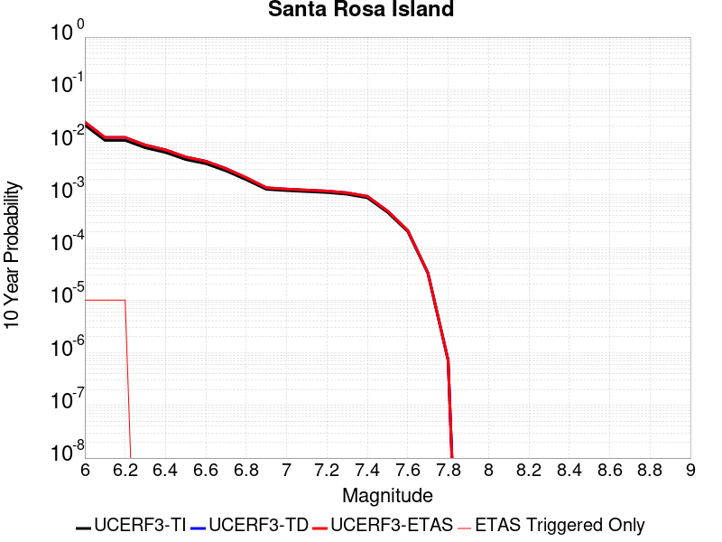 |

| Magnitude | 1 wk TI Prob | 1 wk TD Prob | 1 wk ETAS Prob | 1 wk ETAS/TD Gain | 1 wk ETAS Triggered Only | 1 mo TI Prob | 1 mo TD Prob | 1 mo ETAS Prob | 1 mo ETAS/TD Gain | 1 mo ETAS Triggered Only | 1 yr TI Prob | 1 yr TD Prob | 1 yr ETAS Prob | 1 yr ETAS/TD Gain | 1 yr ETAS Triggered Only | 10 yr TI Prob | 10 yr TD Prob | 10 yr ETAS Prob | 10 yr ETAS/TD Gain | 10 yr ETAS Triggered Only |
|-----|-----|-----|-----|-----|-----|-----|-----|-----|-----|-----|-----|-----|-----|-----|-----|-----|-----|-----|-----|-----|
| 6.0 | 4.1143165E-5 | 4.7092035E-5 | 5.7091565E-5 | 1.2123401 | 1.0E-5 | 1.7631594E-4 | 2.018085E-4 | 2.1180649E-4 | 1.049542 | 1.0E-5 | 0.002144533 | 0.0024544464 | 0.0024644218 | 1.0040642 | 1.0E-5 | 0.021239553 | 0.024294019 | 0.024303777 | 1.0004016 | 1.0E-5 |
| 6.1 | 2.1061249E-5 | 2.3865383E-5 | 3.3865144E-5 | 1.419007 | 1.0E-5 | 9.0259375E-5 | 1.0227637E-4 | 1.12275346E-4 | 1.0977643 | 1.0E-5 | 0.0010983539 | 0.0012445324 | 0.0012545199 | 1.0080252 | 1.0E-5 | 0.01092941 | 0.012378668 | 0.012388544 | 1.0007979 | 1.0E-5 |
| 6.2 | 2.1061249E-5 | 2.3865383E-5 | 3.3865144E-5 | 1.419007 | 1.0E-5 | 9.0259375E-5 | 1.0227637E-4 | 1.12275346E-4 | 1.0977643 | 1.0E-5 | 0.0010983539 | 0.0012445324 | 0.0012545199 | 1.0080252 | 1.0E-5 | 0.01092941 | 0.012378668 | 0.012388544 | 1.0007979 | 1.0E-5 |
| 6.3 | 1.5158236E-5 | 1.7074706E-5 | 1.7074706E-5 | 1.0 | 0.0 | 6.496225E-5 | 7.317533E-5 | 7.317533E-5 | 1.0 | 0.0 | 7.906284E-4 | 8.905575E-4 | 8.905575E-4 | 1.0 | 0.0 | 0.007878214 | 0.008871139 | 0.008871139 | 1.0 | 0.0 |
| 6.4 | 1.2341918E-5 | 1.3853143E-5 | 1.3853143E-5 | 1.0 | 0.0 | 5.2892858E-5 | 5.9369308E-5 | 5.9369308E-5 | 1.0 | 0.0 | 6.437803E-4 | 7.225897E-4 | 7.225897E-4 | 1.0 | 0.0 | 0.006419184 | 0.007203239 | 0.007203239 | 1.0 | 0.0 |
| 6.5 | 9.061158E-6 | 1.0117189E-5 | 1.0117189E-5 | 1.0 | 0.0 | 3.883296E-5 | 4.335869E-5 | 4.335869E-5 | 1.0 | 0.0 | 4.726887E-4 | 5.277695E-4 | 5.277695E-4 | 1.0 | 0.0 | 0.004716845 | 0.0052656992 | 0.0052656992 | 1.0 | 0.0 |
| 6.6 | 7.5461685E-6 | 8.400862E-6 | 8.400862E-6 | 1.0 | 0.0 | 3.2340322E-5 | 3.6003217E-5 | 3.6003217E-5 | 1.0 | 0.0 | 3.936723E-4 | 4.3825532E-4 | 4.3825532E-4 | 1.0 | 0.0 | 0.003929756 | 0.00437434 | 0.00437434 | 1.0 | 0.0 |
| 6.7 | 5.5023775E-6 | 6.0874677E-6 | 6.0874677E-6 | 1.0 | 0.0 | 2.3581404E-5 | 2.6088905E-5 | 2.6088905E-5 | 1.0 | 0.0 | 2.8706578E-4 | 3.1758938E-4 | 3.1758938E-4 | 1.0 | 0.0 | 0.0028669522 | 0.0031716768 | 0.0031716768 | 1.0 | 0.0 |
| 6.8 | 3.7351679E-6 | 4.083192E-6 | 4.083192E-6 | 1.0 | 0.0 | 1.6007763E-5 | 1.749929E-5 | 1.749929E-5 | 1.0 | 0.0 | 1.948771E-4 | 2.1303551E-4 | 2.1303551E-4 | 1.0 | 0.0 | 0.0019470629 | 0.0021285582 | 0.0021285582 | 1.0 | 0.0 |
| 6.9 | 2.456366E-6 | 2.6292955E-6 | 2.6292955E-6 | 1.0 | 0.0 | 1.0527241E-5 | 1.1268361E-5 | 1.1268361E-5 | 1.0 | 0.0 | 1.2816161E-4 | 1.3718368E-4 | 1.3718368E-4 | 1.0 | 0.0 | 0.0012808773 | 0.0013709929 | 0.0013709929 | 1.0 | 0.0 |
| 7.0 | 2.3245157E-6 | 2.4828012E-6 | 2.4828012E-6 | 1.0 | 0.0 | 9.962172E-6 | 1.0640533E-5 | 1.0640533E-5 | 1.0 | 0.0 | 1.2128269E-4 | 1.295408E-4 | 1.295408E-4 | 1.0 | 0.0 | 0.0012121652 | 0.0012946553 | 0.0012946553 | 1.0 | 0.0 |
| 7.1 | 2.2248344E-6 | 2.3732714E-6 | 2.3732714E-6 | 1.0 | 0.0 | 9.53497E-6 | 1.0171123E-5 | 1.0171123E-5 | 1.0 | 0.0 | 1.1608207E-4 | 1.2382641E-4 | 1.2382641E-4 | 1.0 | 0.0 | 0.0011602144 | 0.0012375761 | 0.0012375761 | 1.0 | 0.0 |
| 7.2 | 2.1350402E-6 | 2.2761742E-6 | 2.2761742E-6 | 1.0 | 0.0 | 9.150141E-6 | 9.754996E-6 | 9.754996E-6 | 1.0 | 0.0 | 1.1139726E-4 | 1.18760625E-4 | 1.18760625E-4 | 1.0 | 0.0 | 0.0011134144 | 0.0011869734 | 0.0011869734 | 1.0 | 0.0 |
| 7.3 | 1.9793572E-6 | 2.1087376E-6 | 2.1087376E-6 | 1.0 | 0.0 | 8.482932E-6 | 9.037416E-6 | 9.037416E-6 | 1.0 | 0.0 | 1.032748E-4 | 1.10025E-4 | 1.10025E-4 | 1.0 | 0.0 | 0.0010322682 | 0.0010997071 | 0.0010997071 | 1.0 | 0.0 |
| 7.4 | 1.6951194E-6 | 1.8045891E-6 | 1.8045891E-6 | 1.0 | 0.0 | 7.264777E-6 | 7.733931E-6 | 7.733931E-6 | 1.0 | 0.0 | 8.844508E-5 | 9.415655E-5 | 9.415655E-5 | 1.0 | 0.0 | 8.840988E-4 | 9.411683E-4 | 9.411683E-4 | 1.0 | 0.0 |
| 7.5 | 8.987207E-7 | 9.5122914E-7 | 9.5122914E-7 | 1.0 | 0.0 | 3.8516546E-6 | 4.07669E-6 | 4.07669E-6 | 1.0 | 0.0 | 4.6892885E-5 | 4.963258E-5 | 4.963258E-5 | 1.0 | 0.0 | 4.688299E-4 | 4.962162E-4 | 4.962162E-4 | 1.0 | 0.0 |
| 7.6 | 3.8783037E-7 | 4.0529594E-7 | 4.0529594E-7 | 1.0 | 0.0 | 1.6621291E-6 | 1.7369814E-6 | 1.7369814E-6 | 1.0 | 0.0 | 2.0236233E-5 | 2.114755E-5 | 2.114755E-5 | 1.0 | 0.0 | 2.023439E-4 | 2.1145603E-4 | 2.1145603E-4 | 1.0 | 0.0 |
| 7.7 | 6.181804E-8 | 6.339078E-8 | 6.339078E-8 | 1.0 | 0.0 | 2.6493444E-7 | 2.7167474E-7 | 2.7167474E-7 | 1.0 | 0.0 | 3.225572E-6 | 3.3076349E-6 | 3.3076349E-6 | 1.0 | 0.0 | 3.225525E-5 | 3.3075863E-5 | 3.3075863E-5 | 1.0 | 0.0 |
| 7.8 | 1.3704449E-9 | 1.3964188E-9 | 1.3964188E-9 | 1.0 | 0.0 | 5.873335E-9 | 5.984652E-9 | 5.984652E-9 | 1.0 | 0.0 | 7.1507856E-8 | 7.286314E-8 | 7.286314E-8 | 1.0 | 0.0 | 7.1507833E-7 | 7.286312E-7 | 7.286312E-7 | 1.0 | 0.0 |

## Earthquake Valley (So Extension)
*[(top)](#table-of-contents)*

| 1 Week | 1 Month | 1 Year | 10 Year |
|-----|-----|-----|-----|
|  |  |  | 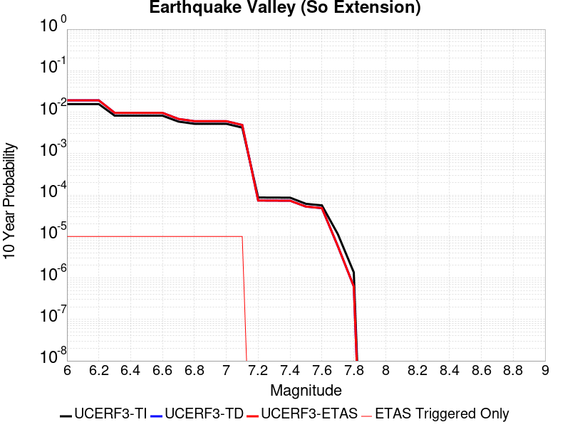 |

| Magnitude | 1 wk TI Prob | 1 wk TD Prob | 1 wk ETAS Prob | 1 wk ETAS/TD Gain | 1 wk ETAS Triggered Only | 1 mo TI Prob | 1 mo TD Prob | 1 mo ETAS Prob | 1 mo ETAS/TD Gain | 1 mo ETAS Triggered Only | 1 yr TI Prob | 1 yr TD Prob | 1 yr ETAS Prob | 1 yr ETAS/TD Gain | 1 yr ETAS Triggered Only | 10 yr TI Prob | 10 yr TD Prob | 10 yr ETAS Prob | 10 yr ETAS/TD Gain | 10 yr ETAS Triggered Only |
|-----|-----|-----|-----|-----|-----|-----|-----|-----|-----|-----|-----|-----|-----|-----|-----|-----|-----|-----|-----|-----|
| 6.0 | 3.0194888E-5 | 3.707323E-5 | 3.707323E-5 | 1.0 | 0.0 | 1.2940024E-4 | 1.5887865E-4 | 1.6887707E-4 | 1.0629311 | 1.0E-5 | 0.0015743093 | 0.0019331464 | 0.001943127 | 1.005163 | 1.0E-5 | 0.01563203 | 0.019213678 | 0.019223487 | 1.0005105 | 1.0E-5 |
| 6.1 | 3.0194888E-5 | 3.707323E-5 | 3.707323E-5 | 1.0 | 0.0 | 1.2940024E-4 | 1.5887865E-4 | 1.6887707E-4 | 1.0629311 | 1.0E-5 | 0.0015743093 | 0.0019331464 | 0.001943127 | 1.005163 | 1.0E-5 | 0.01563203 | 0.019213678 | 0.019223487 | 1.0005105 | 1.0E-5 |
| 6.2 | 3.0194888E-5 | 3.707323E-5 | 3.707323E-5 | 1.0 | 0.0 | 1.2940024E-4 | 1.5887865E-4 | 1.6887707E-4 | 1.0629311 | 1.0E-5 | 0.0015743093 | 0.0019331464 | 0.001943127 | 1.005163 | 1.0E-5 | 0.01563203 | 0.019213678 | 0.019223487 | 1.0005105 | 1.0E-5 |
| 6.3 | 1.5795305E-5 | 1.8447032E-5 | 1.8447032E-5 | 1.0 | 0.0 | 6.769241E-5 | 7.905694E-5 | 8.905615E-5 | 1.126481 | 1.0E-5 | 8.238434E-4 | 9.622042E-4 | 9.721946E-4 | 1.0103828 | 1.0E-5 | 0.008207959 | 0.0095912805 | 0.009601184 | 1.0010326 | 1.0E-5 |
| 6.4 | 1.5795305E-5 | 1.8447032E-5 | 1.8447032E-5 | 1.0 | 0.0 | 6.769241E-5 | 7.905694E-5 | 8.905615E-5 | 1.126481 | 1.0E-5 | 8.238434E-4 | 9.622042E-4 | 9.721946E-4 | 1.0103828 | 1.0E-5 | 0.008207959 | 0.0095912805 | 0.009601184 | 1.0010326 | 1.0E-5 |
| 6.5 | 1.5795305E-5 | 1.8447032E-5 | 1.8447032E-5 | 1.0 | 0.0 | 6.769241E-5 | 7.905694E-5 | 8.905615E-5 | 1.126481 | 1.0E-5 | 8.238434E-4 | 9.622042E-4 | 9.721946E-4 | 1.0103828 | 1.0E-5 | 0.008207959 | 0.0095912805 | 0.009601184 | 1.0010326 | 1.0E-5 |
| 6.6 | 1.5795305E-5 | 1.8447032E-5 | 1.8447032E-5 | 1.0 | 0.0 | 6.769241E-5 | 7.905694E-5 | 8.905615E-5 | 1.126481 | 1.0E-5 | 8.238434E-4 | 9.622042E-4 | 9.721946E-4 | 1.0103828 | 1.0E-5 | 0.008207959 | 0.0095912805 | 0.009601184 | 1.0010326 | 1.0E-5 |
| 6.7 | 1.1363076E-5 | 1.3138569E-5 | 1.3138569E-5 | 1.0 | 0.0 | 4.8697988E-5 | 5.6307366E-5 | 6.63068E-5 | 1.1775867 | 1.0E-5 | 5.927367E-4 | 6.8540266E-4 | 6.953958E-4 | 1.01458 | 1.0E-5 | 0.0059115817 | 0.006840361 | 0.0068502924 | 1.001452 | 1.0E-5 |
| 6.8 | 1.0049611E-5 | 1.1594572E-5 | 1.1594572E-5 | 1.0 | 0.0 | 4.306905E-5 | 4.969049E-5 | 5.968999E-5 | 1.2012358 | 1.0E-5 | 5.242395E-4 | 6.0488697E-4 | 6.148809E-4 | 1.016522 | 1.0E-5 | 0.0052300454 | 0.006039582 | 0.0060495217 | 1.0016457 | 1.0E-5 |
| 6.9 | 1.0049611E-5 | 1.1594572E-5 | 1.1594572E-5 | 1.0 | 0.0 | 4.306905E-5 | 4.969049E-5 | 5.968999E-5 | 1.2012358 | 1.0E-5 | 5.242395E-4 | 6.0488697E-4 | 6.148809E-4 | 1.016522 | 1.0E-5 | 0.0052300454 | 0.006039582 | 0.0060495217 | 1.0016457 | 1.0E-5 |
| 7.0 | 1.0049611E-5 | 1.1594572E-5 | 1.1594572E-5 | 1.0 | 0.0 | 4.306905E-5 | 4.969049E-5 | 5.968999E-5 | 1.2012358 | 1.0E-5 | 5.242395E-4 | 6.0488697E-4 | 6.148809E-4 | 1.016522 | 1.0E-5 | 0.0052300454 | 0.006039582 | 0.0060495217 | 1.0016457 | 1.0E-5 |
| 7.1 | 8.140254E-6 | 9.38365E-6 | 9.38365E-6 | 1.0 | 0.0 | 3.4886336E-5 | 4.02154E-5 | 5.0214996E-5 | 1.2486509 | 1.0E-5 | 4.2465836E-4 | 4.895796E-4 | 4.9957464E-4 | 1.0204157 | 1.0E-5 | 0.0042384774 | 0.0048915865 | 0.0049015377 | 1.0020343 | 1.0E-5 |
| 7.2 | 1.673835E-7 | 1.4153831E-7 | 1.4153831E-7 | 1.0 | 0.0 | 7.173577E-7 | 6.0659266E-7 | 6.0659266E-7 | 1.0 | 0.0 | 8.733795E-6 | 7.3852443E-6 | 7.3852443E-6 | 1.0 | 0.0 | 8.733451E-5 | 7.3850344E-5 | 7.3850344E-5 | 1.0 | 0.0 |
| 7.3 | 1.6632116E-7 | 1.4052058E-7 | 1.4052058E-7 | 1.0 | 0.0 | 7.1280476E-7 | 6.0223095E-7 | 6.0223095E-7 | 1.0 | 0.0 | 8.678364E-6 | 7.332141E-6 | 7.332141E-6 | 1.0 | 0.0 | 8.6780245E-5 | 7.3319345E-5 | 7.3319345E-5 | 1.0 | 0.0 |
| 7.4 | 1.6569169E-7 | 1.3996687E-7 | 1.3996687E-7 | 1.0 | 0.0 | 7.1010703E-7 | 5.998579E-7 | 5.998579E-7 | 1.0 | 0.0 | 8.645519E-6 | 7.3032493E-6 | 7.3032493E-6 | 1.0 | 0.0 | 8.645182E-5 | 7.3030445E-5 | 7.3030445E-5 | 1.0 | 0.0 |
| 7.5 | 1.1764555E-7 | 1.0095579E-7 | 1.0095579E-7 | 1.0 | 0.0 | 5.041951E-7 | 4.326676E-7 | 4.326676E-7 | 1.0 | 0.0 | 6.138558E-6 | 5.267718E-6 | 5.267718E-6 | 1.0 | 0.0 | 6.1383886E-5 | 5.2676143E-5 | 5.2676143E-5 | 1.0 | 0.0 |
| 7.6 | 1.07927605E-7 | 9.260366E-8 | 9.260366E-8 | 1.0 | 0.0 | 4.6254678E-7 | 3.9687282E-7 | 3.9687282E-7 | 1.0 | 0.0 | 5.6314925E-6 | 4.831918E-6 | 4.831918E-6 | 1.0 | 0.0 | 5.63135E-5 | 4.8318336E-5 | 4.8318336E-5 | 1.0 | 0.0 |
| 7.7 | 2.1826905E-8 | 1.118023E-8 | 1.118023E-8 | 1.0 | 0.0 | 9.3543875E-8 | 4.7915268E-8 | 4.7915268E-8 | 1.0 | 0.0 | 1.1388961E-6 | 5.833683E-7 | 5.833683E-7 | 1.0 | 0.0 | 1.1388902E-5 | 5.8336727E-6 | 5.8336727E-6 | 1.0 | 0.0 |
| 7.8 | 2.6169649E-9 | 1.1969211E-9 | 1.1969211E-9 | 1.0 | 0.0 | 1.1215564E-8 | 5.1296616E-9 | 5.1296616E-9 | 1.0 | 0.0 | 1.3654947E-7 | 6.245363E-8 | 6.245363E-8 | 1.0 | 0.0 | 1.365494E-6 | 6.2453626E-7 | 6.2453626E-7 | 1.0 | 0.0 |

## Pinto Mtn
*[(top)](#table-of-contents)*

| 1 Week | 1 Month | 1 Year | 10 Year |
|-----|-----|-----|-----|
|  |  |  |  |

| Magnitude | 1 wk TI Prob | 1 wk TD Prob | 1 wk ETAS Prob | 1 wk ETAS/TD Gain | 1 wk ETAS Triggered Only | 1 mo TI Prob | 1 mo TD Prob | 1 mo ETAS Prob | 1 mo ETAS/TD Gain | 1 mo ETAS Triggered Only | 1 yr TI Prob | 1 yr TD Prob | 1 yr ETAS Prob | 1 yr ETAS/TD Gain | 1 yr ETAS Triggered Only | 10 yr TI Prob | 10 yr TD Prob | 10 yr ETAS Prob | 10 yr ETAS/TD Gain | 10 yr ETAS Triggered Only |
|-----|-----|-----|-----|-----|-----|-----|-----|-----|-----|-----|-----|-----|-----|-----|-----|-----|-----|-----|-----|-----|
| 6.0 | 4.4194956E-5 | 4.7855512E-5 | 4.7855512E-5 | 1.0 | 0.0 | 1.893932E-4 | 2.0507984E-4 | 2.0507984E-4 | 1.0 | 0.0 | 0.0023034236 | 0.0024941512 | 0.0024941512 | 1.0 | 0.0 | 0.022796938 | 0.024679113 | 0.024688866 | 1.0003952 | 1.0E-5 |
| 6.1 | 4.4194956E-5 | 4.7855512E-5 | 4.7855512E-5 | 1.0 | 0.0 | 1.893932E-4 | 2.0507984E-4 | 2.0507984E-4 | 1.0 | 0.0 | 0.0023034236 | 0.0024941512 | 0.0024941512 | 1.0 | 0.0 | 0.022796938 | 0.024679113 | 0.024688866 | 1.0003952 | 1.0E-5 |
| 6.2 | 4.4194956E-5 | 4.7855512E-5 | 4.7855512E-5 | 1.0 | 0.0 | 1.893932E-4 | 2.0507984E-4 | 2.0507984E-4 | 1.0 | 0.0 | 0.0023034236 | 0.0024941512 | 0.0024941512 | 1.0 | 0.0 | 0.022796938 | 0.024679113 | 0.024688866 | 1.0003952 | 1.0E-5 |
| 6.3 | 4.4194956E-5 | 4.7855512E-5 | 4.7855512E-5 | 1.0 | 0.0 | 1.893932E-4 | 2.0507984E-4 | 2.0507984E-4 | 1.0 | 0.0 | 0.0023034236 | 0.0024941512 | 0.0024941512 | 1.0 | 0.0 | 0.022796938 | 0.024679113 | 0.024688866 | 1.0003952 | 1.0E-5 |
| 6.4 | 3.729929E-5 | 3.960486E-5 | 3.960486E-5 | 1.0 | 0.0 | 1.5984432E-4 | 1.697246E-4 | 1.697246E-4 | 1.0 | 0.0 | 0.0019443673 | 0.002064532 | 0.002064532 | 1.0 | 0.0 | 0.019274427 | 0.02046355 | 0.020473344 | 1.0004786 | 1.0E-5 |
| 6.5 | 3.729929E-5 | 3.960486E-5 | 3.960486E-5 | 1.0 | 0.0 | 1.5984432E-4 | 1.697246E-4 | 1.697246E-4 | 1.0 | 0.0 | 0.0019443673 | 0.002064532 | 0.002064532 | 1.0 | 0.0 | 0.019274427 | 0.02046355 | 0.020473344 | 1.0004786 | 1.0E-5 |
| 6.6 | 3.0204548E-5 | 3.1206768E-5 | 3.1206768E-5 | 1.0 | 0.0 | 1.2944164E-4 | 1.3373663E-4 | 1.3373663E-4 | 1.0 | 0.0 | 0.0015748127 | 0.001627062 | 0.001627062 | 1.0 | 0.0 | 0.015636992 | 0.016155364 | 0.016165202 | 1.000609 | 1.0E-5 |
| 6.7 | 2.9857754E-5 | 3.0816143E-5 | 3.0816143E-5 | 1.0 | 0.0 | 1.2795553E-4 | 1.320627E-4 | 1.320627E-4 | 1.0 | 0.0 | 0.0015567453 | 0.0016067121 | 0.0016067121 | 1.0 | 0.0 | 0.015458848 | 0.0159548 | 0.01596464 | 1.0006168 | 1.0E-5 |
| 6.8 | 2.4819734E-5 | 2.5010708E-5 | 2.5010708E-5 | 1.0 | 0.0 | 1.0636595E-4 | 1.0718447E-4 | 1.0718447E-4 | 1.0 | 0.0 | 0.0012942362 | 0.0013042113 | 0.0013042113 | 1.0 | 0.0 | 0.012867244 | 0.0129679395 | 0.012977811 | 1.0007612 | 1.0E-5 |
| 6.9 | 2.331124E-5 | 2.3338964E-5 | 2.3338964E-5 | 1.0 | 0.0 | 9.990149E-5 | 1.0002041E-4 | 1.0002041E-4 | 1.0 | 0.0 | 0.001215622 | 0.0012170885 | 0.0012170885 | 1.0 | 0.0 | 0.012089936 | 0.012106422 | 0.012116301 | 1.000816 | 1.0E-5 |
| 7.0 | 2.1818534E-5 | 2.176207E-5 | 2.176207E-5 | 1.0 | 0.0 | 9.3504656E-5 | 9.3262795E-5 | 9.3262795E-5 | 1.0 | 0.0 | 0.0011378246 | 0.0011349028 | 0.0011349028 | 1.0 | 0.0 | 0.011320163 | 0.011293174 | 0.011303061 | 1.0008755 | 1.0E-5 |
| 7.1 | 2.066081E-5 | 2.0541695E-5 | 2.0541695E-5 | 1.0 | 0.0 | 8.854332E-5 | 8.8032975E-5 | 8.8032975E-5 | 1.0 | 0.0 | 0.0010774818 | 0.001071294 | 0.001071294 | 1.0 | 0.0 | 0.010722724 | 0.010663347 | 0.010673241 | 1.0009278 | 1.0E-5 |
| 7.2 | 1.8990233E-5 | 1.905496E-5 | 1.905496E-5 | 1.0 | 0.0 | 8.138417E-5 | 8.166167E-5 | 8.166167E-5 | 1.0 | 0.0 | 9.904018E-4 | 9.937966E-4 | 9.937966E-4 | 1.0 | 0.0 | 0.009859995 | 0.009895524 | 0.009905425 | 1.0010005 | 1.0E-5 |
| 7.3 | 1.3335872E-5 | 1.4907597E-5 | 1.4907597E-5 | 1.0 | 0.0 | 5.7152483E-5 | 6.388821E-5 | 6.388821E-5 | 1.0 | 0.0 | 6.956093E-4 | 7.7757414E-4 | 7.7757414E-4 | 1.0 | 0.0 | 0.006934359 | 0.007749834 | 0.0077597564 | 1.0012803 | 1.0E-5 |
| 7.4 | 9.414066E-6 | 1.1861796E-5 | 1.1861796E-5 | 1.0 | 0.0 | 4.0345374E-5 | 5.0835333E-5 | 5.0835333E-5 | 1.0 | 0.0 | 4.910942E-4 | 6.1875384E-4 | 6.1875384E-4 | 1.0 | 0.0 | 0.0049001034 | 0.006171259 | 0.0061811972 | 1.0016104 | 1.0E-5 |
| 7.5 | 7.2101157E-6 | 9.15899E-6 | 9.15899E-6 | 1.0 | 0.0 | 3.090013E-5 | 3.925227E-5 | 3.925227E-5 | 1.0 | 0.0 | 3.7614413E-4 | 4.777994E-4 | 4.777994E-4 | 1.0 | 0.0 | 0.0037550807 | 0.004768497 | 0.004778449 | 1.0020871 | 1.0E-5 |
| 7.6 | 3.296375E-6 | 4.546278E-6 | 4.546278E-6 | 1.0 | 0.0 | 1.4127245E-5 | 1.948391E-5 | 1.948391E-5 | 1.0 | 0.0 | 1.7198564E-4 | 2.3719217E-4 | 2.3719217E-4 | 1.0 | 0.0 | 0.0017185259 | 0.0023695275 | 0.0023795038 | 1.0042102 | 1.0E-5 |
| 7.7 | 2.5741092E-6 | 3.5851394E-6 | 3.5851394E-6 | 1.0 | 0.0 | 1.103185E-5 | 1.53648E-5 | 1.53648E-5 | 1.0 | 0.0 | 1.3430449E-4 | 1.870517E-4 | 1.870517E-4 | 1.0 | 0.0 | 0.0013422335 | 0.0018690726 | 0.0018690726 | 1.0 | 0.0 |

## Hunting Creek - Bartlett Springs connector 2011
*[(top)](#table-of-contents)*

| 1 Week | 1 Month | 1 Year | 10 Year |
|-----|-----|-----|-----|
|  |  |  |  |

| Magnitude | 1 wk TI Prob | 1 wk TD Prob | 1 wk ETAS Prob | 1 wk ETAS/TD Gain | 1 wk ETAS Triggered Only | 1 mo TI Prob | 1 mo TD Prob | 1 mo ETAS Prob | 1 mo ETAS/TD Gain | 1 mo ETAS Triggered Only | 1 yr TI Prob | 1 yr TD Prob | 1 yr ETAS Prob | 1 yr ETAS/TD Gain | 1 yr ETAS Triggered Only | 10 yr TI Prob | 10 yr TD Prob | 10 yr ETAS Prob | 10 yr ETAS/TD Gain | 10 yr ETAS Triggered Only |
|-----|-----|-----|-----|-----|-----|-----|-----|-----|-----|-----|-----|-----|-----|-----|-----|-----|-----|-----|-----|-----|
| 6.0 | 4.940016E-5 | 6.7873414E-5 | 6.7873414E-5 | 1.0 | 0.0 | 2.1169778E-4 | 2.9085318E-4 | 2.9085318E-4 | 1.0 | 0.0 | 0.002574374 | 0.0035352195 | 0.0035352195 | 1.0 | 0.0 | 0.025447546 | 0.034775995 | 0.034785647 | 1.0002775 | 1.0E-5 |
| 6.1 | 4.940016E-5 | 6.7873414E-5 | 6.7873414E-5 | 1.0 | 0.0 | 2.1169778E-4 | 2.9085318E-4 | 2.9085318E-4 | 1.0 | 0.0 | 0.002574374 | 0.0035352195 | 0.0035352195 | 1.0 | 0.0 | 0.025447546 | 0.034775995 | 0.034785647 | 1.0002775 | 1.0E-5 |
| 6.2 | 4.472471E-5 | 6.100793E-5 | 6.100793E-5 | 1.0 | 0.0 | 1.9166325E-4 | 2.614367E-4 | 2.614367E-4 | 1.0 | 0.0 | 0.0023310026 | 0.0031782414 | 0.0031782414 | 1.0 | 0.0 | 0.02306703 | 0.03131888 | 0.031328566 | 1.0003093 | 1.0E-5 |
| 6.3 | 4.472471E-5 | 6.100793E-5 | 6.100793E-5 | 1.0 | 0.0 | 1.9166325E-4 | 2.614367E-4 | 2.614367E-4 | 1.0 | 0.0 | 0.0023310026 | 0.0031782414 | 0.0031782414 | 1.0 | 0.0 | 0.02306703 | 0.03131888 | 0.031328566 | 1.0003093 | 1.0E-5 |
| 6.4 | 4.0001003E-5 | 5.4106935E-5 | 5.4106935E-5 | 1.0 | 0.0 | 1.714216E-4 | 2.3186632E-4 | 2.3186632E-4 | 1.0 | 0.0 | 0.0020850603 | 0.0028192701 | 0.0028192701 | 1.0 | 0.0 | 0.02065605 | 0.027830102 | 0.027839825 | 1.0003493 | 1.0E-5 |
| 6.5 | 3.8033053E-5 | 5.1268355E-5 | 5.1268355E-5 | 1.0 | 0.0 | 1.6298861E-4 | 2.197032E-4 | 2.197032E-4 | 1.0 | 0.0 | 0.0019825802 | 0.0026715791 | 0.0026715791 | 1.0 | 0.0 | 0.019649856 | 0.026392108 | 0.026401844 | 1.000369 | 1.0E-5 |
| 6.6 | 3.653754E-5 | 4.9131297E-5 | 4.9131297E-5 | 1.0 | 0.0 | 1.5658008E-4 | 2.1054587E-4 | 2.1054587E-4 | 1.0 | 0.0 | 0.0019046954 | 0.0025603776 | 0.0025603776 | 1.0 | 0.0 | 0.018884527 | 0.025307981 | 0.025317729 | 1.0003852 | 1.0E-5 |
| 6.7 | 3.372024E-5 | 4.5141747E-5 | 4.5141747E-5 | 1.0 | 0.0 | 1.4450731E-4 | 1.934504E-4 | 1.934504E-4 | 1.0 | 0.0 | 0.0017579567 | 0.0023527322 | 0.0023527322 | 1.0 | 0.0 | 0.017441148 | 0.023279548 | 0.023279548 | 1.0 | 0.0 |
| 6.8 | 2.9650024E-5 | 3.941287E-5 | 3.941287E-5 | 1.0 | 0.0 | 1.2706534E-4 | 1.6890126E-4 | 1.6890126E-4 | 1.0 | 0.0 | 0.0015459227 | 0.0020544236 | 0.0020544236 | 1.0 | 0.0 | 0.015352124 | 0.020352496 | 0.020352496 | 1.0 | 0.0 |
| 6.9 | 2.860775E-5 | 3.7814003E-5 | 3.7814003E-5 | 1.0 | 0.0 | 1.2259888E-4 | 1.6204998E-4 | 1.6204998E-4 | 1.0 | 0.0 | 0.0014916194 | 0.0019711799 | 0.0019711799 | 1.0 | 0.0 | 0.014816469 | 0.019537043 | 0.019537043 | 1.0 | 0.0 |
| 7.0 | 2.6696067E-5 | 3.5068544E-5 | 3.5068544E-5 | 1.0 | 0.0 | 1.144067E-4 | 1.5028517E-4 | 1.5028517E-4 | 1.0 | 0.0 | 0.0013920115 | 0.001828195 | 0.001828195 | 1.0 | 0.0 | 0.013833242 | 0.018132268 | 0.018132268 | 1.0 | 0.0 |
| 7.1 | 2.456087E-5 | 3.2014224E-5 | 3.2014224E-5 | 1.0 | 0.0 | 1.0525662E-4 | 1.3719666E-4 | 1.3719666E-4 | 1.0 | 0.0 | 0.001280746 | 0.0016690986 | 0.0016690986 | 1.0 | 0.0 | 0.012733897 | 0.016567077 | 0.016567077 | 1.0 | 0.0 |
| 7.2 | 2.295761E-5 | 2.982398E-5 | 2.982398E-5 | 1.0 | 0.0 | 9.8386045E-5 | 1.2781084E-4 | 1.2781084E-4 | 1.0 | 0.0 | 0.0011971919 | 0.0015549955 | 0.0015549955 | 1.0 | 0.0 | 0.011907627 | 0.015442743 | 0.015442743 | 1.0 | 0.0 |
| 7.3 | 2.1256936E-5 | 2.7542896E-5 | 2.7542896E-5 | 1.0 | 0.0 | 9.109797E-5 | 1.1803569E-4 | 1.1803569E-4 | 1.0 | 0.0 | 0.0011085535 | 0.0014361461 | 0.0014361461 | 1.0 | 0.0 | 0.011030397 | 0.014270082 | 0.014270082 | 1.0 | 0.0 |
| 7.4 | 1.8784336E-5 | 2.430763E-5 | 2.430763E-5 | 1.0 | 0.0 | 8.050181E-5 | 1.0417144E-4 | 1.0417144E-4 | 1.0 | 0.0 | 9.796688E-4 | 0.0012675569 | 0.0012675569 | 1.0 | 0.0 | 0.009753612 | 0.012604473 | 0.012604473 | 1.0 | 0.0 |
| 7.5 | 1.7248298E-5 | 2.2269673E-5 | 2.2269673E-5 | 1.0 | 0.0 | 7.391918E-5 | 9.5438E-5 | 9.5438E-5 | 1.0 | 0.0 | 8.9959445E-4 | 0.0011613459 | 0.0011613459 | 1.0 | 0.0 | 0.008959615 | 0.011553904 | 0.011553904 | 1.0 | 0.0 |
| 7.6 | 1.0653709E-5 | 1.3722595E-5 | 1.3722595E-5 | 1.0 | 0.0 | 4.5657955E-5 | 5.8809812E-5 | 5.8809812E-5 | 1.0 | 0.0 | 5.557438E-4 | 7.157769E-4 | 7.157769E-4 | 1.0 | 0.0 | 0.0055435603 | 0.007135182 | 0.007135182 | 1.0 | 0.0 |
| 7.7 | 3.286316E-6 | 4.09049E-6 | 4.09049E-6 | 1.0 | 0.0 | 1.4084137E-5 | 1.7530556E-5 | 1.7530556E-5 | 1.0 | 0.0 | 1.7146087E-4 | 2.1341378E-4 | 2.1341378E-4 | 1.0 | 0.0 | 0.0017132863 | 0.0021321473 | 0.0021321473 | 1.0 | 0.0 |
| 7.8 | 5.1855085E-7 | 5.972202E-7 | 5.972202E-7 | 1.0 | 0.0 | 2.222359E-6 | 2.5595127E-6 | 2.5595127E-6 | 1.0 | 0.0 | 2.7056883E-5 | 3.116163E-5 | 3.116163E-5 | 1.0 | 0.0 | 2.705359E-4 | 3.1156646E-4 | 3.1156646E-4 | 1.0 | 0.0 |

## San Jacinto (Superstition Mtn)
*[(top)](#table-of-contents)*

| 1 Week | 1 Month | 1 Year | 10 Year |
|-----|-----|-----|-----|
|  |  |  | 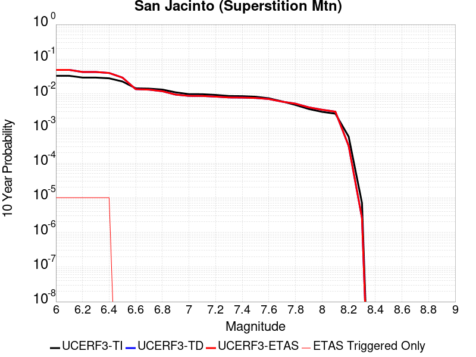 |

| Magnitude | 1 wk TI Prob | 1 wk TD Prob | 1 wk ETAS Prob | 1 wk ETAS/TD Gain | 1 wk ETAS Triggered Only | 1 mo TI Prob | 1 mo TD Prob | 1 mo ETAS Prob | 1 mo ETAS/TD Gain | 1 mo ETAS Triggered Only | 1 yr TI Prob | 1 yr TD Prob | 1 yr ETAS Prob | 1 yr ETAS/TD Gain | 1 yr ETAS Triggered Only | 10 yr TI Prob | 10 yr TD Prob | 10 yr ETAS Prob | 10 yr ETAS/TD Gain | 10 yr ETAS Triggered Only |
|-----|-----|-----|-----|-----|-----|-----|-----|-----|-----|-----|-----|-----|-----|-----|-----|-----|-----|-----|-----|-----|
| 6.0 | 6.4193904E-5 | 9.6002805E-5 | 1.0600185E-4 | 1.1041536 | 1.0E-5 | 2.7508775E-4 | 4.1138552E-4 | 4.213814E-4 | 1.0242981 | 1.0E-5 | 0.0033440501 | 0.004998534 | 0.0050084842 | 1.0019906 | 1.0E-5 | 0.03294174 | 0.048822355 | 0.048831865 | 1.0001948 | 1.0E-5 |
| 6.1 | 6.4193904E-5 | 9.6002805E-5 | 1.0600185E-4 | 1.1041536 | 1.0E-5 | 2.7508775E-4 | 4.1138552E-4 | 4.213814E-4 | 1.0242981 | 1.0E-5 | 0.0033440501 | 0.004998534 | 0.0050084842 | 1.0019906 | 1.0E-5 | 0.03294174 | 0.048822355 | 0.048831865 | 1.0001948 | 1.0E-5 |
| 6.2 | 5.7023593E-5 | 8.315118E-5 | 9.3150345E-5 | 1.1202528 | 1.0E-5 | 2.4436394E-4 | 3.5632294E-4 | 3.6631938E-4 | 1.0280545 | 1.0E-5 | 0.002971072 | 0.004331248 | 0.0043412047 | 1.0022988 | 1.0E-5 | 0.029316625 | 0.04250458 | 0.042514153 | 1.0002253 | 1.0E-5 |
| 6.3 | 5.6940098E-5 | 8.2996536E-5 | 9.299571E-5 | 1.120477 | 1.0E-5 | 2.4400617E-4 | 3.5566036E-4 | 3.656568E-4 | 1.0281067 | 1.0E-5 | 0.002966728 | 0.0043232134 | 0.00433317 | 1.0023031 | 1.0E-5 | 0.029274331 | 0.04242795 | 0.042437527 | 1.0002257 | 1.0E-5 |
| 6.4 | 5.4171585E-5 | 7.749044E-5 | 8.7489665E-5 | 1.1290382 | 1.0E-5 | 2.3214328E-4 | 3.320689E-4 | 3.420656E-4 | 1.0301043 | 1.0E-5 | 0.0028226813 | 0.004037093 | 0.0040470525 | 1.002467 | 1.0E-5 | 0.02787096 | 0.03971742 | 0.039727025 | 1.0002418 | 1.0E-5 |
| 6.5 | 4.375144E-5 | 5.6427816E-5 | 5.6427816E-5 | 1.0 | 0.0 | 1.874927E-4 | 2.4181772E-4 | 2.4181772E-4 | 1.0 | 0.0 | 0.0022803338 | 0.0029413316 | 0.0029413316 | 1.0 | 0.0 | 0.022570757 | 0.029237961 | 0.029237961 | 1.0 | 0.0 |
| 6.6 | 2.772192E-5 | 2.5494071E-5 | 2.5494071E-5 | 1.0 | 0.0 | 1.1880282E-4 | 1.09255845E-4 | 1.09255845E-4 | 1.0 | 0.0 | 0.0014454646 | 0.0013293975 | 0.0013293975 | 1.0 | 0.0 | 0.014360986 | 0.013542279 | 0.013542279 | 1.0 | 0.0 |
| 6.7 | 2.7124124E-5 | 2.4705068E-5 | 2.4705068E-5 | 1.0 | 0.0 | 1.1624106E-4 | 1.0587468E-4 | 1.0587468E-4 | 1.0 | 0.0 | 0.0014143161 | 0.0012882812 | 0.0012882812 | 1.0 | 0.0 | 0.014053487 | 0.0131356325 | 0.0131356325 | 1.0 | 0.0 |
| 6.8 | 2.5475807E-5 | 2.2169877E-5 | 2.2169877E-5 | 1.0 | 0.0 | 1.0917746E-4 | 9.501037E-5 | 9.501037E-5 | 1.0 | 0.0 | 0.001328425 | 0.0011561494 | 0.0011561494 | 1.0 | 0.0 | 0.0132051185 | 0.011823943 | 0.011823943 | 1.0 | 0.0 |
| 6.9 | 2.1162023E-5 | 1.7631051E-5 | 1.7631051E-5 | 1.0 | 0.0 | 9.069123E-5 | 7.555948E-5 | 7.555948E-5 | 1.0 | 0.0 | 0.0011036064 | 9.195522E-4 | 9.195522E-4 | 1.0 | 0.0 | 0.010981417 | 0.0094489865 | 0.0094489865 | 1.0 | 0.0 |
| 7.0 | 1.8754288E-5 | 1.616617E-5 | 1.616617E-5 | 1.0 | 0.0 | 8.037304E-5 | 6.928176E-5 | 6.928176E-5 | 1.0 | 0.0 | 9.781026E-4 | 8.4318145E-4 | 8.4318145E-4 | 1.0 | 0.0 | 0.009738087 | 0.008672153 | 0.008672153 | 1.0 | 0.0 |
| 7.1 | 1.8678527E-5 | 1.6091313E-5 | 1.6091313E-5 | 1.0 | 0.0 | 8.0048376E-5 | 6.8960966E-5 | 6.8960966E-5 | 1.0 | 0.0 | 9.7415317E-4 | 8.392788E-4 | 8.392788E-4 | 1.0 | 0.0 | 0.009698939 | 0.008633161 | 0.008633161 | 1.0 | 0.0 |
| 7.2 | 1.7804578E-5 | 1.5385827E-5 | 1.5385827E-5 | 1.0 | 0.0 | 7.6303106E-5 | 6.59376E-5 | 6.59376E-5 | 1.0 | 0.0 | 9.285943E-4 | 8.024969E-4 | 8.024969E-4 | 1.0 | 0.0 | 0.009247236 | 0.0082646 | 0.0082646 | 1.0 | 0.0 |
| 7.3 | 1.6583685E-5 | 1.4534898E-5 | 1.4534898E-5 | 1.0 | 0.0 | 7.1070994E-5 | 6.229094E-5 | 6.229094E-5 | 1.0 | 0.0 | 8.649459E-4 | 7.581304E-4 | 7.581304E-4 | 1.0 | 0.0 | 0.00861587 | 0.007819886 | 0.007819886 | 1.0 | 0.0 |
| 7.4 | 1.6387552E-5 | 1.4399775E-5 | 1.4399775E-5 | 1.0 | 0.0 | 7.023047E-5 | 6.171187E-5 | 6.171187E-5 | 1.0 | 0.0 | 8.5472054E-4 | 7.5108506E-4 | 7.5108506E-4 | 1.0 | 0.0 | 0.008514405 | 0.0077492767 | 0.0077492767 | 1.0 | 0.0 |
| 7.5 | 1.5790754E-5 | 1.4040427E-5 | 1.4040427E-5 | 1.0 | 0.0 | 6.767291E-5 | 6.0171882E-5 | 6.0171882E-5 | 1.0 | 0.0 | 8.236062E-4 | 7.323484E-4 | 7.323484E-4 | 1.0 | 0.0 | 0.008205604 | 0.0075598094 | 0.0075598094 | 1.0 | 0.0 |
| 7.6 | 1.4248672E-5 | 1.3059319E-5 | 1.3059319E-5 | 1.0 | 0.0 | 6.106431E-5 | 5.5967317E-5 | 5.5967317E-5 | 1.0 | 0.0 | 7.432043E-4 | 6.811908E-4 | 6.811908E-4 | 1.0 | 0.0 | 0.007407237 | 0.007042322 | 0.007042322 | 1.0 | 0.0 |
| 7.7 | 1.15449975E-5 | 1.0907912E-5 | 1.0907912E-5 | 1.0 | 0.0 | 4.947762E-5 | 4.6747362E-5 | 4.6747362E-5 | 1.0 | 0.0 | 6.022235E-4 | 5.6900125E-4 | 5.6900125E-4 | 1.0 | 0.0 | 0.006005941 | 0.005912308 | 0.005912308 | 1.0 | 0.0 |
| 7.8 | 9.1391985E-6 | 9.518418E-6 | 9.518418E-6 | 1.0 | 0.0 | 3.9167408E-5 | 4.0792587E-5 | 4.0792587E-5 | 1.0 | 0.0 | 4.767588E-4 | 4.9653713E-4 | 4.9653713E-4 | 1.0 | 0.0 | 0.0047573727 | 0.0051787267 | 0.0051787267 | 1.0 | 0.0 |
| 7.9 | 6.973017E-6 | 7.385764E-6 | 7.385764E-6 | 1.0 | 0.0 | 2.9884017E-5 | 3.1652893E-5 | 3.1652893E-5 | 1.0 | 0.0 | 3.6377716E-4 | 3.8530637E-4 | 3.8530637E-4 | 1.0 | 0.0 | 0.0036318225 | 0.0040537147 | 0.0040537147 | 1.0 | 0.0 |
| 8.0 | 5.7638235E-6 | 6.263249E-6 | 6.263249E-6 | 1.0 | 0.0 | 2.4701867E-5 | 2.6842223E-5 | 2.6842223E-5 | 1.0 | 0.0 | 3.0070372E-4 | 3.2675554E-4 | 3.2675554E-4 | 1.0 | 0.0 | 0.0030029714 | 0.0034551586 | 0.0034551586 | 1.0 | 0.0 |
| 8.1 | 5.1124434E-6 | 5.498651E-6 | 5.498651E-6 | 1.0 | 0.0 | 2.1910288E-5 | 2.3565437E-5 | 2.3565437E-5 | 1.0 | 0.0 | 2.6672508E-4 | 2.8687192E-4 | 2.8687192E-4 | 1.0 | 0.0 | 0.0026640517 | 0.0030418336 | 0.0030418336 | 1.0 | 0.0 |
| 8.2 | 1.1075938E-6 | 5.339512E-7 | 5.339512E-7 | 1.0 | 0.0 | 4.7468216E-6 | 2.2883605E-6 | 2.2883605E-6 | 1.0 | 0.0 | 5.779102E-5 | 2.7860455E-5 | 2.7860455E-5 | 1.0 | 0.0 | 5.777599E-4 | 3.136582E-4 | 3.136582E-4 | 1.0 | 0.0 |
| 8.3 | 1.3584393E-8 | 4.4764112E-9 | 4.4764112E-9 | 1.0 | 0.0 | 5.8218827E-8 | 1.918462E-8 | 1.918462E-8 | 1.0 | 0.0 | 7.0881396E-7 | 2.3357273E-7 | 2.3357273E-7 | 1.0 | 0.0 | 7.0881174E-6 | 2.6165987E-6 | 2.6165987E-6 | 1.0 | 0.0 |

## Red Mountain
*[(top)](#table-of-contents)*

| 1 Week | 1 Month | 1 Year | 10 Year |
|-----|-----|-----|-----|
|  |  |  |  |

| Magnitude | 1 wk TI Prob | 1 wk TD Prob | 1 wk ETAS Prob | 1 wk ETAS/TD Gain | 1 wk ETAS Triggered Only | 1 mo TI Prob | 1 mo TD Prob | 1 mo ETAS Prob | 1 mo ETAS/TD Gain | 1 mo ETAS Triggered Only | 1 yr TI Prob | 1 yr TD Prob | 1 yr ETAS Prob | 1 yr ETAS/TD Gain | 1 yr ETAS Triggered Only | 10 yr TI Prob | 10 yr TD Prob | 10 yr ETAS Prob | 10 yr ETAS/TD Gain | 10 yr ETAS Triggered Only |
|-----|-----|-----|-----|-----|-----|-----|-----|-----|-----|-----|-----|-----|-----|-----|-----|-----|-----|-----|-----|-----|
| 6.0 | 4.1810763E-5 | 4.7591075E-5 | 5.7590598E-5 | 1.2101134 | 1.0E-5 | 1.7917668E-4 | 2.0394672E-4 | 2.1394469E-4 | 1.0490224 | 1.0E-5 | 0.0021792934 | 0.0024803884 | 0.0024903635 | 1.0040216 | 1.0E-5 | 0.021580452 | 0.024544649 | 0.024554403 | 1.0003974 | 1.0E-5 |
| 6.1 | 4.1810763E-5 | 4.7591075E-5 | 5.7590598E-5 | 1.2101134 | 1.0E-5 | 1.7917668E-4 | 2.0394672E-4 | 2.1394469E-4 | 1.0490224 | 1.0E-5 | 0.0021792934 | 0.0024803884 | 0.0024903635 | 1.0040216 | 1.0E-5 | 0.021580452 | 0.024544649 | 0.024554403 | 1.0003974 | 1.0E-5 |
| 6.2 | 4.1810763E-5 | 4.7591075E-5 | 5.7590598E-5 | 1.2101134 | 1.0E-5 | 1.7917668E-4 | 2.0394672E-4 | 2.1394469E-4 | 1.0490224 | 1.0E-5 | 0.0021792934 | 0.0024803884 | 0.0024903635 | 1.0040216 | 1.0E-5 | 0.021580452 | 0.024544649 | 0.024554403 | 1.0003974 | 1.0E-5 |
| 6.3 | 4.1810763E-5 | 4.7591075E-5 | 5.7590598E-5 | 1.2101134 | 1.0E-5 | 1.7917668E-4 | 2.0394672E-4 | 2.1394469E-4 | 1.0490224 | 1.0E-5 | 0.0021792934 | 0.0024803884 | 0.0024903635 | 1.0040216 | 1.0E-5 | 0.021580452 | 0.024544649 | 0.024554403 | 1.0003974 | 1.0E-5 |
| 6.4 | 4.1810763E-5 | 4.7591075E-5 | 5.7590598E-5 | 1.2101134 | 1.0E-5 | 1.7917668E-4 | 2.0394672E-4 | 2.1394469E-4 | 1.0490224 | 1.0E-5 | 0.0021792934 | 0.0024803884 | 0.0024903635 | 1.0040216 | 1.0E-5 | 0.021580452 | 0.024544649 | 0.024554403 | 1.0003974 | 1.0E-5 |
| 6.5 | 3.154503E-5 | 3.5360503E-5 | 3.5360503E-5 | 1.0 | 0.0 | 1.3518598E-4 | 1.5153673E-4 | 1.5153673E-4 | 1.0 | 0.0 | 0.0016446467 | 0.0018434906 | 0.0018434906 | 1.0 | 0.0 | 0.01632528 | 0.018291628 | 0.018291628 | 1.0 | 0.0 |
| 6.6 | 3.1535834E-5 | 3.5349887E-5 | 3.5349887E-5 | 1.0 | 0.0 | 1.3514658E-4 | 1.5149123E-4 | 1.5149123E-4 | 1.0 | 0.0 | 0.0016441676 | 0.0018429377 | 0.0018429377 | 1.0 | 0.0 | 0.01632056 | 0.018286189 | 0.018286189 | 1.0 | 0.0 |
| 6.7 | 2.8267326E-5 | 3.1470005E-5 | 3.1470005E-5 | 1.0 | 0.0 | 1.2114006E-4 | 1.3486497E-4 | 1.3486497E-4 | 1.0 | 0.0 | 0.0014738824 | 0.0016408293 | 0.0016408293 | 1.0 | 0.0 | 0.014641452 | 0.016295906 | 0.016295906 | 1.0 | 0.0 |
| 6.8 | 2.8212884E-5 | 3.140789E-5 | 3.140789E-5 | 1.0 | 0.0 | 1.20906756E-4 | 1.3459878E-4 | 1.3459878E-4 | 1.0 | 0.0 | 0.0014710457 | 0.0016375934 | 0.0016375934 | 1.0 | 0.0 | 0.014613459 | 0.016264021 | 0.016264021 | 1.0 | 0.0 |
| 6.9 | 2.4227871E-5 | 2.6707532E-5 | 2.6707532E-5 | 1.0 | 0.0 | 1.03829596E-4 | 1.14456256E-4 | 1.14456256E-4 | 1.0 | 0.0 | 0.0012633923 | 0.00139269 | 0.00139269 | 1.0 | 0.0 | 0.012562336 | 0.013847311 | 0.013847311 | 1.0 | 0.0 |
| 7.0 | 2.348524E-5 | 2.5836296E-5 | 2.5836296E-5 | 1.0 | 0.0 | 1.0064714E-4 | 1.1072271E-4 | 1.1072271E-4 | 1.0 | 0.0 | 0.0012246901 | 0.001347291 | 0.001347291 | 1.0 | 0.0 | 0.012179627 | 0.013398864 | 0.013398864 | 1.0 | 0.0 |
| 7.1 | 2.2311642E-5 | 2.4463332E-5 | 2.4463332E-5 | 1.0 | 0.0 | 9.561782E-5 | 1.04839055E-4 | 1.04839055E-4 | 1.0 | 0.0 | 0.0011635252 | 0.0012757429 | 0.0012757429 | 1.0 | 0.0 | 0.01157452 | 0.01269171 | 0.01269171 | 1.0 | 0.0 |
| 7.2 | 1.6533986E-5 | 1.767069E-5 | 1.767069E-5 | 1.0 | 0.0 | 7.085802E-5 | 7.572969E-5 | 7.572969E-5 | 1.0 | 0.0 | 8.623549E-4 | 9.2168245E-4 | 9.2168245E-4 | 1.0 | 0.0 | 0.008590161 | 0.009184876 | 0.009184876 | 1.0 | 0.0 |
| 7.3 | 1.4703092E-5 | 1.555982E-5 | 1.555982E-5 | 1.0 | 0.0 | 6.301173E-5 | 6.668359E-5 | 6.668359E-5 | 1.0 | 0.0 | 7.668978E-4 | 8.116319E-4 | 8.116319E-4 | 1.0 | 0.0 | 0.0076425658 | 0.008092752 | 0.008092752 | 1.0 | 0.0 |
| 7.4 | 6.1331984E-6 | 5.5289447E-6 | 5.5289447E-6 | 1.0 | 0.0 | 2.6284872E-5 | 2.3695266E-5 | 2.3695266E-5 | 1.0 | 0.0 | 3.199713E-4 | 2.884522E-4 | 2.884522E-4 | 1.0 | 0.0 | 0.0031951098 | 0.0028808324 | 0.0028808324 | 1.0 | 0.0 |
| 7.5 | 5.954766E-6 | 5.3385725E-6 | 5.3385725E-6 | 1.0 | 0.0 | 2.5520176E-5 | 2.2879398E-5 | 2.2879398E-5 | 1.0 | 0.0 | 3.1066386E-4 | 2.785216E-4 | 2.785216E-4 | 1.0 | 0.0 | 0.003102299 | 0.0027817793 | 0.0027817793 | 1.0 | 0.0 |
| 7.6 | 4.9726646E-6 | 4.315354E-6 | 4.315354E-6 | 1.0 | 0.0 | 2.1311245E-5 | 1.8494246E-5 | 1.8494246E-5 | 1.0 | 0.0 | 2.5943352E-4 | 2.2514451E-4 | 2.2514451E-4 | 1.0 | 0.0 | 0.0025913084 | 0.0022491987 | 0.0022491987 | 1.0 | 0.0 |
| 7.7 | 3.3613894E-6 | 2.8527159E-6 | 2.8527159E-6 | 1.0 | 0.0 | 1.4405875E-5 | 1.222587E-5 | 1.222587E-5 | 1.0 | 0.0 | 1.7537741E-4 | 1.4884006E-4 | 1.4884006E-4 | 1.0 | 0.0 | 0.0017523908 | 0.00148743 | 0.00148743 | 1.0 | 0.0 |
| 7.8 | 1.1828961E-6 | 1.0123005E-6 | 1.0123005E-6 | 1.0 | 0.0 | 5.069545E-6 | 4.3384234E-6 | 4.3384234E-6 | 1.0 | 0.0 | 6.171996E-5 | 5.2819054E-5 | 5.2819054E-5 | 1.0 | 0.0 | 6.170282E-4 | 5.2806793E-4 | 5.2806793E-4 | 1.0 | 0.0 |
| 7.9 | 2.2967266E-7 | 1.8619376E-7 | 1.8619376E-7 | 1.0 | 0.0 | 9.843111E-7 | 7.9797303E-7 | 7.9797303E-7 | 1.0 | 0.0 | 1.19839215E-5 | 9.7152815E-6 | 9.7152815E-6 | 1.0 | 0.0 | 1.1983275E-4 | 9.7148855E-5 | 9.7148855E-5 | 1.0 | 0.0 |

## Elmore Ranch
*[(top)](#table-of-contents)*

| 1 Week | 1 Month | 1 Year | 10 Year |
|-----|-----|-----|-----|
|  |  |  |  |

| Magnitude | 1 wk TI Prob | 1 wk TD Prob | 1 wk ETAS Prob | 1 wk ETAS/TD Gain | 1 wk ETAS Triggered Only | 1 mo TI Prob | 1 mo TD Prob | 1 mo ETAS Prob | 1 mo ETAS/TD Gain | 1 mo ETAS Triggered Only | 1 yr TI Prob | 1 yr TD Prob | 1 yr ETAS Prob | 1 yr ETAS/TD Gain | 1 yr ETAS Triggered Only | 10 yr TI Prob | 10 yr TD Prob | 10 yr ETAS Prob | 10 yr ETAS/TD Gain | 10 yr ETAS Triggered Only |
|-----|-----|-----|-----|-----|-----|-----|-----|-----|-----|-----|-----|-----|-----|-----|-----|-----|-----|-----|-----|-----|
| 6.0 | 9.102099E-5 | 8.954244E-5 | 8.954244E-5 | 1.0 | 0.0 | 3.9003167E-4 | 3.8370665E-4 | 3.937028E-4 | 1.0260515 | 1.0E-5 | 0.0047383 | 0.0046622963 | 0.00467225 | 1.0021349 | 1.0E-5 | 0.046385348 | 0.045839358 | 0.045848902 | 1.0002081 | 1.0E-5 |
| 6.1 | 3.8306698E-5 | 4.1492345E-5 | 4.1492345E-5 | 1.0 | 0.0 | 1.6416123E-4 | 1.7781628E-4 | 1.8781451E-4 | 1.0562278 | 1.0E-5 | 0.0019968306 | 0.002163246 | 0.0021732245 | 1.0046127 | 1.0E-5 | 0.019789828 | 0.02159527 | 0.021605052 | 1.0004531 | 1.0E-5 |
| 6.2 | 3.8306698E-5 | 4.1492345E-5 | 4.1492345E-5 | 1.0 | 0.0 | 1.6416123E-4 | 1.7781628E-4 | 1.8781451E-4 | 1.0562278 | 1.0E-5 | 0.0019968306 | 0.002163246 | 0.0021732245 | 1.0046127 | 1.0E-5 | 0.019789828 | 0.02159527 | 0.021605052 | 1.0004531 | 1.0E-5 |
| 6.3 | 3.3197924E-5 | 3.655081E-5 | 3.655081E-5 | 1.0 | 0.0 | 1.4226905E-4 | 1.566409E-4 | 1.6663934E-4 | 1.0638303 | 1.0E-5 | 0.0017307495 | 0.0019059941 | 0.001915975 | 1.0052366 | 1.0E-5 | 0.017173318 | 0.019057546 | 0.019067355 | 1.0005147 | 1.0E-5 |
| 6.4 | 2.5148964E-5 | 2.7420736E-5 | 2.7420736E-5 | 1.0 | 0.0 | 1.0777682E-4 | 1.17515796E-4 | 1.2751462E-4 | 1.0850849 | 1.0E-5 | 0.0013113929 | 0.0014304637 | 0.0014404494 | 1.0069808 | 1.0E-5 | 0.01303681 | 0.014365338 | 0.014375194 | 1.0006862 | 1.0E-5 |
| 6.5 | 2.5148964E-5 | 2.7420736E-5 | 2.7420736E-5 | 1.0 | 0.0 | 1.0777682E-4 | 1.17515796E-4 | 1.2751462E-4 | 1.0850849 | 1.0E-5 | 0.0013113929 | 0.0014304637 | 0.0014404494 | 1.0069808 | 1.0E-5 | 0.01303681 | 0.014365338 | 0.014375194 | 1.0006862 | 1.0E-5 |

## Earthquake Valley
*[(top)](#table-of-contents)*

| 1 Week | 1 Month | 1 Year | 10 Year |
|-----|-----|-----|-----|
|  |  | 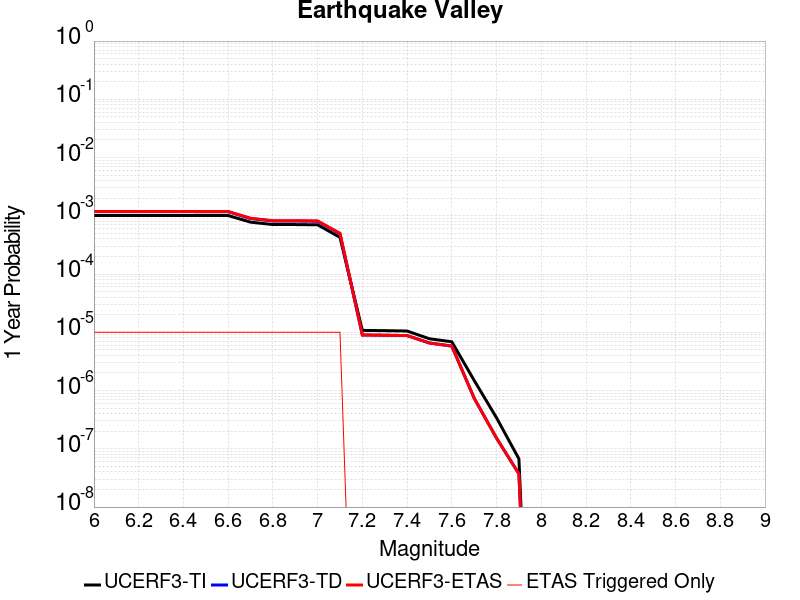 |  |

| Magnitude | 1 wk TI Prob | 1 wk TD Prob | 1 wk ETAS Prob | 1 wk ETAS/TD Gain | 1 wk ETAS Triggered Only | 1 mo TI Prob | 1 mo TD Prob | 1 mo ETAS Prob | 1 mo ETAS/TD Gain | 1 mo ETAS Triggered Only | 1 yr TI Prob | 1 yr TD Prob | 1 yr ETAS Prob | 1 yr ETAS/TD Gain | 1 yr ETAS Triggered Only | 10 yr TI Prob | 10 yr TD Prob | 10 yr ETAS Prob | 10 yr ETAS/TD Gain | 10 yr ETAS Triggered Only |
|-----|-----|-----|-----|-----|-----|-----|-----|-----|-----|-----|-----|-----|-----|-----|-----|-----|-----|-----|-----|-----|
| 6.0 | 1.9416384E-5 | 2.2584614E-5 | 2.2584614E-5 | 1.0 | 0.0 | 8.321042E-5 | 9.678829E-5 | 1.06787316E-4 | 1.1033083 | 1.0E-5 | 0.001012616 | 0.0011778802 | 0.0011878684 | 1.0084798 | 1.0E-5 | 0.010080142 | 0.011728205 | 0.011738088 | 1.0008427 | 1.0E-5 |
| 6.1 | 1.9416384E-5 | 2.2584614E-5 | 2.2584614E-5 | 1.0 | 0.0 | 8.321042E-5 | 9.678829E-5 | 1.06787316E-4 | 1.1033083 | 1.0E-5 | 0.001012616 | 0.0011778802 | 0.0011878684 | 1.0084798 | 1.0E-5 | 0.010080142 | 0.011728205 | 0.011738088 | 1.0008427 | 1.0E-5 |
| 6.2 | 1.9416384E-5 | 2.2584614E-5 | 2.2584614E-5 | 1.0 | 0.0 | 8.321042E-5 | 9.678829E-5 | 1.06787316E-4 | 1.1033083 | 1.0E-5 | 0.001012616 | 0.0011778802 | 0.0011878684 | 1.0084798 | 1.0E-5 | 0.010080142 | 0.011728205 | 0.011738088 | 1.0008427 | 1.0E-5 |
| 6.3 | 1.9416384E-5 | 2.2584614E-5 | 2.2584614E-5 | 1.0 | 0.0 | 8.321042E-5 | 9.678829E-5 | 1.06787316E-4 | 1.1033083 | 1.0E-5 | 0.001012616 | 0.0011778802 | 0.0011878684 | 1.0084798 | 1.0E-5 | 0.010080142 | 0.011728205 | 0.011738088 | 1.0008427 | 1.0E-5 |
| 6.4 | 1.9416384E-5 | 2.2584614E-5 | 2.2584614E-5 | 1.0 | 0.0 | 8.321042E-5 | 9.678829E-5 | 1.06787316E-4 | 1.1033083 | 1.0E-5 | 0.001012616 | 0.0011778802 | 0.0011878684 | 1.0084798 | 1.0E-5 | 0.010080142 | 0.011728205 | 0.011738088 | 1.0008427 | 1.0E-5 |
| 6.5 | 1.9389157E-5 | 2.2553202E-5 | 2.2553202E-5 | 1.0 | 0.0 | 8.309374E-5 | 9.6653675E-5 | 1.0665271E-4 | 1.1034522 | 1.0E-5 | 0.0010111968 | 0.0011762432 | 0.0011862314 | 1.0084916 | 1.0E-5 | 0.010066078 | 0.011712006 | 0.0117218895 | 1.0008439 | 1.0E-5 |
| 6.6 | 1.9389157E-5 | 2.2553202E-5 | 2.2553202E-5 | 1.0 | 0.0 | 8.309374E-5 | 9.6653675E-5 | 1.0665271E-4 | 1.1034522 | 1.0E-5 | 0.0010111968 | 0.0011762432 | 0.0011862314 | 1.0084916 | 1.0E-5 | 0.010066078 | 0.011712006 | 0.0117218895 | 1.0008439 | 1.0E-5 |
| 6.7 | 1.4925434E-5 | 1.7208584E-5 | 1.7208584E-5 | 1.0 | 0.0 | 6.396457E-5 | 7.374946E-5 | 8.3748724E-5 | 1.1355842 | 1.0E-5 | 7.7849044E-4 | 8.9761487E-4 | 9.076059E-4 | 1.0111307 | 1.0E-5 | 0.007757689 | 0.008948269 | 0.0089581795 | 1.0011076 | 1.0E-5 |
| 6.8 | 1.3570335E-5 | 1.5617163E-5 | 1.5617163E-5 | 1.0 | 0.0 | 5.8157282E-5 | 6.692944E-5 | 7.692877E-5 | 1.1494011 | 1.0E-5 | 7.0783484E-4 | 8.146434E-4 | 8.246352E-4 | 1.0122653 | 1.0E-5 | 0.0070558446 | 0.008124642 | 0.008134561 | 1.0012208 | 1.0E-5 |
| 6.9 | 1.3570335E-5 | 1.5617163E-5 | 1.5617163E-5 | 1.0 | 0.0 | 5.8157282E-5 | 6.692944E-5 | 7.692877E-5 | 1.1494011 | 1.0E-5 | 7.0783484E-4 | 8.146434E-4 | 8.246352E-4 | 1.0122653 | 1.0E-5 | 0.0070558446 | 0.008124642 | 0.008134561 | 1.0012208 | 1.0E-5 |
| 7.0 | 1.3433392E-5 | 1.5460702E-5 | 1.5460702E-5 | 1.0 | 0.0 | 5.757041E-5 | 6.625894E-5 | 7.625827E-5 | 1.150913 | 1.0E-5 | 7.0069433E-4 | 8.06486E-4 | 8.164779E-4 | 1.0123894 | 1.0E-5 | 0.006984891 | 0.008043661 | 0.00805358 | 1.0012332 | 1.0E-5 |
| 7.1 | 8.181609E-6 | 9.4170455E-6 | 9.4170455E-6 | 1.0 | 0.0 | 3.5063567E-5 | 4.035852E-5 | 5.0358118E-5 | 1.2477691 | 1.0E-5 | 4.268153E-4 | 4.9132126E-4 | 5.013164E-4 | 1.0203433 | 1.0E-5 | 0.0042599645 | 0.004908927 | 0.004918878 | 1.0020272 | 1.0E-5 |
| 7.2 | 2.0663983E-7 | 1.7262926E-7 | 1.7262926E-7 | 1.0 | 0.0 | 8.855989E-7 | 7.3983944E-7 | 7.3983944E-7 | 1.0 | 0.0 | 1.0782113E-5 | 9.007512E-6 | 9.007512E-6 | 1.0 | 0.0 | 1.07815904E-4 | 9.007182E-5 | 9.007182E-5 | 1.0 | 0.0 |
| 7.3 | 2.0462376E-7 | 1.7078415E-7 | 1.7078415E-7 | 1.0 | 0.0 | 8.7695867E-7 | 7.319319E-7 | 7.319319E-7 | 1.0 | 0.0 | 1.0676919E-5 | 8.911238E-6 | 8.911238E-6 | 1.0 | 0.0 | 1.0676406E-4 | 8.910916E-5 | 8.910916E-5 | 1.0 | 0.0 |
| 7.4 | 2.0171088E-7 | 1.6860893E-7 | 1.6860893E-7 | 1.0 | 0.0 | 8.644749E-7 | 7.2260957E-7 | 7.2260957E-7 | 1.0 | 0.0 | 1.0524931E-5 | 8.79774E-6 | 8.79774E-6 | 1.0 | 0.0 | 1.05244326E-4 | 8.797427E-5 | 8.797427E-5 | 1.0 | 0.0 |
| 7.5 | 1.4847944E-7 | 1.2559215E-7 | 1.2559215E-7 | 1.0 | 0.0 | 6.363403E-7 | 5.38252E-7 | 5.38252E-7 | 1.0 | 0.0 | 7.747416E-6 | 6.5532004E-6 | 6.5532004E-6 | 1.0 | 0.0 | 7.747146E-5 | 6.5530294E-5 | 6.5530294E-5 | 1.0 | 0.0 |
| 7.6 | 1.3185847E-7 | 1.1123105E-7 | 1.1123105E-7 | 1.0 | 0.0 | 5.6510765E-7 | 4.7670446E-7 | 4.7670446E-7 | 1.0 | 0.0 | 6.8801637E-6 | 5.803863E-6 | 5.803863E-6 | 1.0 | 0.0 | 6.8799505E-5 | 5.803733E-5 | 5.803733E-5 | 1.0 | 0.0 |
| 7.7 | 2.8609954E-8 | 1.4170576E-8 | 1.4170576E-8 | 1.0 | 0.0 | 1.2261408E-7 | 6.073103E-8 | 6.073103E-8 | 1.0 | 0.0 | 1.4928254E-6 | 7.3940015E-7 | 7.3940015E-7 | 1.0 | 0.0 | 1.4928154E-5 | 7.3939823E-6 | 7.3939823E-6 | 1.0 | 0.0 |
| 7.8 | 6.527266E-9 | 2.923321E-9 | 2.923321E-9 | 1.0 | 0.0 | 2.7973995E-8 | 1.2528518E-8 | 1.2528518E-8 | 1.0 | 0.0 | 3.4058334E-7 | 1.525347E-7 | 1.525347E-7 | 1.0 | 0.0 | 3.4058282E-6 | 1.5253461E-6 | 1.5253461E-6 | 1.0 | 0.0 |
| 7.9 | 1.2898267E-9 | 7.127704E-10 | 7.127704E-10 | 1.0 | 0.0 | 5.527829E-9 | 3.0547302E-9 | 3.0547302E-9 | 1.0 | 0.0 | 6.7301315E-8 | 3.719134E-8 | 3.719134E-8 | 1.0 | 0.0 | 6.7301295E-7 | 3.7191342E-7 | 3.7191342E-7 | 1.0 | 0.0 |

## Northridge
*[(top)](#table-of-contents)*

| 1 Week | 1 Month | 1 Year | 10 Year |
|-----|-----|-----|-----|
| 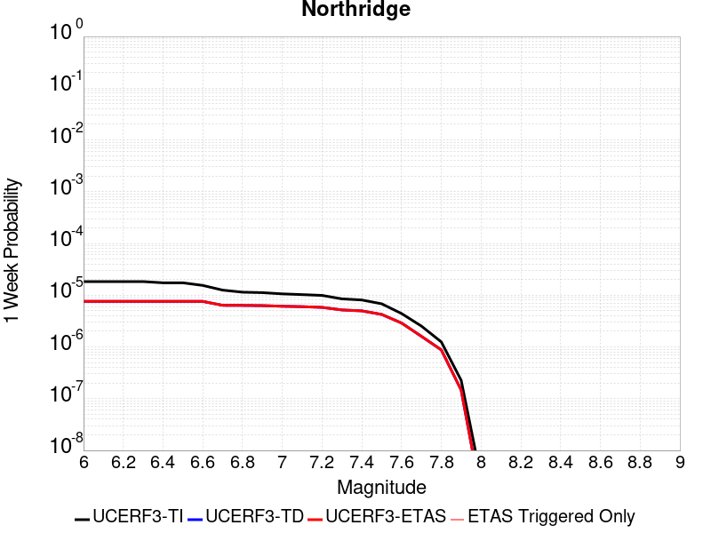 |  |  | 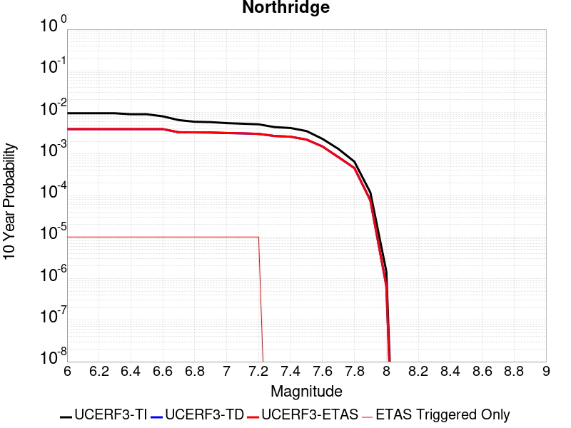 |

| Magnitude | 1 wk TI Prob | 1 wk TD Prob | 1 wk ETAS Prob | 1 wk ETAS/TD Gain | 1 wk ETAS Triggered Only | 1 mo TI Prob | 1 mo TD Prob | 1 mo ETAS Prob | 1 mo ETAS/TD Gain | 1 mo ETAS Triggered Only | 1 yr TI Prob | 1 yr TD Prob | 1 yr ETAS Prob | 1 yr ETAS/TD Gain | 1 yr ETAS Triggered Only | 10 yr TI Prob | 10 yr TD Prob | 10 yr ETAS Prob | 10 yr ETAS/TD Gain | 10 yr ETAS Triggered Only |
|-----|-----|-----|-----|-----|-----|-----|-----|-----|-----|-----|-----|-----|-----|-----|-----|-----|-----|-----|-----|-----|
| 6.0 | 1.8340852E-5 | 7.5880284E-6 | 7.5880284E-6 | 1.0 | 0.0 | 7.860128E-5 | 3.251973E-5 | 3.251973E-5 | 1.0 | 0.0 | 9.565505E-4 | 3.9585796E-4 | 3.9585796E-4 | 1.0 | 0.0 | 0.009524435 | 0.003951762 | 0.0039617224 | 1.0025206 | 1.0E-5 |
| 6.1 | 1.8340852E-5 | 7.5880284E-6 | 7.5880284E-6 | 1.0 | 0.0 | 7.860128E-5 | 3.251973E-5 | 3.251973E-5 | 1.0 | 0.0 | 9.565505E-4 | 3.9585796E-4 | 3.9585796E-4 | 1.0 | 0.0 | 0.009524435 | 0.003951762 | 0.0039617224 | 1.0025206 | 1.0E-5 |
| 6.2 | 1.8340852E-5 | 7.5880284E-6 | 7.5880284E-6 | 1.0 | 0.0 | 7.860128E-5 | 3.251973E-5 | 3.251973E-5 | 1.0 | 0.0 | 9.565505E-4 | 3.9585796E-4 | 3.9585796E-4 | 1.0 | 0.0 | 0.009524435 | 0.003951762 | 0.0039617224 | 1.0025206 | 1.0E-5 |
| 6.3 | 1.8340852E-5 | 7.5880284E-6 | 7.5880284E-6 | 1.0 | 0.0 | 7.860128E-5 | 3.251973E-5 | 3.251973E-5 | 1.0 | 0.0 | 9.565505E-4 | 3.9585796E-4 | 3.9585796E-4 | 1.0 | 0.0 | 0.009524435 | 0.003951762 | 0.0039617224 | 1.0025206 | 1.0E-5 |
| 6.4 | 1.7361892E-5 | 7.5880284E-6 | 7.5880284E-6 | 1.0 | 0.0 | 7.440598E-5 | 3.251973E-5 | 3.251973E-5 | 1.0 | 0.0 | 9.055163E-4 | 3.9585796E-4 | 3.9585796E-4 | 1.0 | 0.0 | 0.009018354 | 0.003951762 | 0.0039617224 | 1.0025206 | 1.0E-5 |
| 6.5 | 1.7361892E-5 | 7.5880284E-6 | 7.5880284E-6 | 1.0 | 0.0 | 7.440598E-5 | 3.251973E-5 | 3.251973E-5 | 1.0 | 0.0 | 9.055163E-4 | 3.9585796E-4 | 3.9585796E-4 | 1.0 | 0.0 | 0.009018354 | 0.003951762 | 0.0039617224 | 1.0025206 | 1.0E-5 |
| 6.6 | 1.5458201E-5 | 7.5880284E-6 | 7.5880284E-6 | 1.0 | 0.0 | 6.624775E-5 | 3.251973E-5 | 3.251973E-5 | 1.0 | 0.0 | 8.0626784E-4 | 3.9585796E-4 | 3.9585796E-4 | 1.0 | 0.0 | 0.008033488 | 0.003951762 | 0.0039617224 | 1.0025206 | 1.0E-5 |
| 6.7 | 1.2538368E-5 | 6.381612E-6 | 6.381612E-6 | 1.0 | 0.0 | 5.3734755E-5 | 2.734948E-5 | 2.734948E-5 | 1.0 | 0.0 | 6.5402425E-4 | 3.3292949E-4 | 3.3292949E-4 | 1.0 | 0.0 | 0.0065210275 | 0.0033243664 | 0.0033343332 | 1.0029981 | 1.0E-5 |
| 6.8 | 1.1438097E-5 | 6.3502694E-6 | 6.3502694E-6 | 1.0 | 0.0 | 4.9019498E-5 | 2.721516E-5 | 2.721516E-5 | 1.0 | 0.0 | 5.9664896E-4 | 3.312946E-4 | 3.312946E-4 | 1.0 | 0.0 | 0.005950495 | 0.0033080664 | 0.0033180332 | 1.0030129 | 1.0E-5 |
| 6.9 | 1.1204891E-5 | 6.2867225E-6 | 6.2867225E-6 | 1.0 | 0.0 | 4.8020076E-5 | 2.6942822E-5 | 2.6942822E-5 | 1.0 | 0.0 | 5.8448757E-4 | 3.279799E-4 | 3.279799E-4 | 1.0 | 0.0 | 0.0058295266 | 0.0032750175 | 0.0032849847 | 1.0030434 | 1.0E-5 |
| 7.0 | 1.061046E-5 | 6.115376E-6 | 6.115376E-6 | 1.0 | 0.0 | 4.5472607E-5 | 2.6208494E-5 | 2.6208494E-5 | 1.0 | 0.0 | 5.534883E-4 | 3.1904213E-4 | 3.1904213E-4 | 1.0 | 0.0 | 0.0055211177 | 0.003185887 | 0.003195855 | 1.0031289 | 1.0E-5 |
| 7.1 | 1.0266979E-5 | 6.004295E-6 | 6.004295E-6 | 1.0 | 0.0 | 4.40006E-5 | 2.5732441E-5 | 2.5732441E-5 | 1.0 | 0.0 | 5.355756E-4 | 3.1324785E-4 | 3.1324785E-4 | 1.0 | 0.0 | 0.0053428668 | 0.0031281086 | 0.0031380772 | 1.0031868 | 1.0E-5 |
| 7.2 | 9.91273E-6 | 5.820007E-6 | 5.820007E-6 | 1.0 | 0.0 | 4.248244E-5 | 2.494265E-5 | 2.494265E-5 | 1.0 | 0.0 | 5.171009E-4 | 3.0363488E-4 | 3.0363488E-4 | 1.0 | 0.0 | 0.0051589934 | 0.0030322452 | 0.0030422148 | 1.0032879 | 1.0E-5 |
| 7.3 | 8.4959265E-6 | 5.193102E-6 | 5.193102E-6 | 1.0 | 0.0 | 3.6410605E-5 | 2.2255961E-5 | 2.2255961E-5 | 1.0 | 0.0 | 4.4320893E-4 | 2.7093288E-4 | 2.7093288E-4 | 1.0 | 0.0 | 0.00442326 | 0.002706052 | 0.002706052 | 1.0 | 0.0 |
| 7.4 | 8.0847185E-6 | 4.9819787E-6 | 4.9819787E-6 | 1.0 | 0.0 | 3.4648332E-5 | 2.1351163E-5 | 2.1351163E-5 | 1.0 | 0.0 | 4.2176177E-4 | 2.5991965E-4 | 2.5991965E-4 | 1.0 | 0.0 | 0.0042096223 | 0.0025961823 | 0.0025961823 | 1.0 | 0.0 |
| 7.5 | 6.8220684E-6 | 4.2533266E-6 | 4.2533266E-6 | 1.0 | 0.0 | 2.9237108E-5 | 1.8228417E-5 | 1.8228417E-5 | 1.0 | 0.0 | 3.5590364E-4 | 2.2190856E-4 | 2.2190856E-4 | 1.0 | 0.0 | 0.0035533418 | 0.0022168907 | 0.0022168907 | 1.0 | 0.0 |
| 7.6 | 4.4224143E-6 | 2.899968E-6 | 2.899968E-6 | 1.0 | 0.0 | 1.8953066E-5 | 1.2428376E-5 | 1.2428376E-5 | 1.0 | 0.0 | 2.3072914E-4 | 1.5130508E-4 | 1.5130508E-4 | 1.0 | 0.0 | 0.0023048974 | 0.0015120322 | 0.0015120322 | 1.0 | 0.0 |
| 7.7 | 2.5297056E-6 | 1.6046126E-6 | 1.6046126E-6 | 1.0 | 0.0 | 1.0841551E-5 | 6.8768936E-6 | 6.8768936E-6 | 1.0 | 0.0 | 1.319879E-4 | 8.372301E-5 | 8.372301E-5 | 1.0 | 0.0 | 0.0013190953 | 8.3691935E-4 | 8.3691935E-4 | 1.0 | 0.0 |
| 7.8 | 1.2508156E-6 | 8.7802323E-7 | 8.7802323E-7 | 1.0 | 0.0 | 5.3606273E-6 | 3.7629513E-6 | 3.7629513E-6 | 1.0 | 0.0 | 6.526368E-5 | 4.5812983E-5 | 4.5812983E-5 | 1.0 | 0.0 | 6.524452E-4 | 4.5803667E-4 | 4.5803667E-4 | 1.0 | 0.0 |
| 7.9 | 2.262199E-7 | 1.4665106E-7 | 1.4665106E-7 | 1.0 | 0.0 | 9.695135E-7 | 6.285044E-7 | 6.285044E-7 | 1.0 | 0.0 | 1.1803763E-5 | 7.652015E-6 | 7.652015E-6 | 1.0 | 0.0 | 1.1803136E-4 | 7.6517594E-5 | 7.6517594E-5 | 1.0 | 0.0 |
| 8.0 | 2.865362E-9 | 1.2753111E-9 | 1.2753111E-9 | 1.0 | 0.0 | 1.2280123E-8 | 5.465619E-9 | 5.465619E-9 | 1.0 | 0.0 | 1.4951048E-7 | 6.654391E-8 | 6.654391E-8 | 1.0 | 0.0 | 1.4951038E-6 | 6.6543913E-7 | 6.6543913E-7 | 1.0 | 0.0 |

## Oak Ridge (Onshore)
*[(top)](#table-of-contents)*

| 1 Week | 1 Month | 1 Year | 10 Year |
|-----|-----|-----|-----|
|  |  |  |  |

| Magnitude | 1 wk TI Prob | 1 wk TD Prob | 1 wk ETAS Prob | 1 wk ETAS/TD Gain | 1 wk ETAS Triggered Only | 1 mo TI Prob | 1 mo TD Prob | 1 mo ETAS Prob | 1 mo ETAS/TD Gain | 1 mo ETAS Triggered Only | 1 yr TI Prob | 1 yr TD Prob | 1 yr ETAS Prob | 1 yr ETAS/TD Gain | 1 yr ETAS Triggered Only | 10 yr TI Prob | 10 yr TD Prob | 10 yr ETAS Prob | 10 yr ETAS/TD Gain | 10 yr ETAS Triggered Only |
|-----|-----|-----|-----|-----|-----|-----|-----|-----|-----|-----|-----|-----|-----|-----|-----|-----|-----|-----|-----|-----|
| 6.0 | 3.155064E-5 | 2.9526547E-5 | 2.9526547E-5 | 1.0 | 0.0 | 1.3521002E-4 | 1.2653643E-4 | 1.2653643E-4 | 1.0 | 0.0 | 0.001644939 | 0.0015395303 | 0.0015395303 | 1.0 | 0.0 | 0.01632816 | 0.015293304 | 0.015303151 | 1.0006438 | 1.0E-5 |
| 6.1 | 3.155064E-5 | 2.9526547E-5 | 2.9526547E-5 | 1.0 | 0.0 | 1.3521002E-4 | 1.2653643E-4 | 1.2653643E-4 | 1.0 | 0.0 | 0.001644939 | 0.0015395303 | 0.0015395303 | 1.0 | 0.0 | 0.01632816 | 0.015293304 | 0.015303151 | 1.0006438 | 1.0E-5 |
| 6.2 | 3.155064E-5 | 2.9526547E-5 | 2.9526547E-5 | 1.0 | 0.0 | 1.3521002E-4 | 1.2653643E-4 | 1.2653643E-4 | 1.0 | 0.0 | 0.001644939 | 0.0015395303 | 0.0015395303 | 1.0 | 0.0 | 0.01632816 | 0.015293304 | 0.015303151 | 1.0006438 | 1.0E-5 |
| 6.3 | 3.155064E-5 | 2.9526547E-5 | 2.9526547E-5 | 1.0 | 0.0 | 1.3521002E-4 | 1.2653643E-4 | 1.2653643E-4 | 1.0 | 0.0 | 0.001644939 | 0.0015395303 | 0.0015395303 | 1.0 | 0.0 | 0.01632816 | 0.015293304 | 0.015303151 | 1.0006438 | 1.0E-5 |
| 6.4 | 3.155064E-5 | 2.9526547E-5 | 2.9526547E-5 | 1.0 | 0.0 | 1.3521002E-4 | 1.2653643E-4 | 1.2653643E-4 | 1.0 | 0.0 | 0.001644939 | 0.0015395303 | 0.0015395303 | 1.0 | 0.0 | 0.01632816 | 0.015293304 | 0.015303151 | 1.0006438 | 1.0E-5 |
| 6.5 | 3.155064E-5 | 2.9526547E-5 | 2.9526547E-5 | 1.0 | 0.0 | 1.3521002E-4 | 1.2653643E-4 | 1.2653643E-4 | 1.0 | 0.0 | 0.001644939 | 0.0015395303 | 0.0015395303 | 1.0 | 0.0 | 0.01632816 | 0.015293304 | 0.015303151 | 1.0006438 | 1.0E-5 |
| 6.6 | 3.155064E-5 | 2.9526547E-5 | 2.9526547E-5 | 1.0 | 0.0 | 1.3521002E-4 | 1.2653643E-4 | 1.2653643E-4 | 1.0 | 0.0 | 0.001644939 | 0.0015395303 | 0.0015395303 | 1.0 | 0.0 | 0.01632816 | 0.015293304 | 0.015303151 | 1.0006438 | 1.0E-5 |
| 6.7 | 3.098897E-5 | 2.8864733E-5 | 2.8864733E-5 | 1.0 | 0.0 | 1.328031E-4 | 1.2370035E-4 | 1.2370035E-4 | 1.0 | 0.0 | 0.0016156785 | 0.001505049 | 0.001505049 | 1.0 | 0.0 | 0.016039822 | 0.01495315 | 0.014963001 | 1.0006588 | 1.0E-5 |
| 6.8 | 3.0449872E-5 | 2.8239918E-5 | 2.8239918E-5 | 1.0 | 0.0 | 1.3049292E-4 | 1.21022815E-4 | 1.21022815E-4 | 1.0 | 0.0 | 0.0015875935 | 0.0014724941 | 0.0014724941 | 1.0 | 0.0 | 0.015762992 | 0.014631892 | 0.014641746 | 1.0006734 | 1.0E-5 |
| 6.9 | 2.697928E-5 | 2.4220235E-5 | 2.4220235E-5 | 1.0 | 0.0 | 1.15620365E-4 | 1.03797E-4 | 1.03797E-4 | 1.0 | 0.0 | 0.0014067689 | 0.0012630174 | 0.0012630174 | 1.0 | 0.0 | 0.0139789665 | 0.012561257 | 0.012571132 | 1.0007861 | 1.0E-5 |
| 7.0 | 2.4893961E-5 | 2.1862457E-5 | 2.1862457E-5 | 1.0 | 0.0 | 1.0668404E-4 | 9.369298E-5 | 9.369298E-5 | 1.0 | 0.0 | 0.0012981043 | 0.0011401328 | 0.0011401328 | 1.0 | 0.0 | 0.012905477 | 0.011345269 | 0.011355156 | 1.0008714 | 1.0E-5 |
| 7.1 | 2.0945363E-5 | 1.7354816E-5 | 1.7354816E-5 | 1.0 | 0.0 | 8.976275E-5 | 7.437569E-5 | 7.437569E-5 | 1.0 | 0.0 | 0.0010923136 | 9.051526E-4 | 9.051526E-4 | 1.0 | 0.0 | 0.0108696 | 0.009015744 | 0.009025653 | 1.0010992 | 1.0E-5 |
| 7.2 | 2.0439404E-5 | 1.6809745E-5 | 1.6809745E-5 | 1.0 | 0.0 | 8.7594504E-5 | 7.2039795E-5 | 7.2039795E-5 | 1.0 | 0.0 | 0.0010659413 | 8.767363E-4 | 8.767363E-4 | 1.0 | 0.0 | 0.010608427 | 0.008733843 | 0.0087437555 | 1.001135 | 1.0E-5 |
| 7.3 | 1.8463334E-5 | 1.5382124E-5 | 1.5382124E-5 | 1.0 | 0.0 | 7.912617E-5 | 6.592175E-5 | 6.592175E-5 | 1.0 | 0.0 | 9.6293533E-4 | 8.0230605E-4 | 8.0230605E-4 | 1.0 | 0.0 | 0.009587734 | 0.00799511 | 0.00799511 | 1.0 | 0.0 |
| 7.4 | 1.763139E-5 | 1.4517136E-5 | 1.4517136E-5 | 1.0 | 0.0 | 7.556091E-5 | 6.2214836E-5 | 6.2214836E-5 | 1.0 | 0.0 | 9.1956573E-4 | 7.5720635E-4 | 7.5720635E-4 | 1.0 | 0.0 | 0.009157699 | 0.007547218 | 0.007547218 | 1.0 | 0.0 |
| 7.5 | 1.3594944E-5 | 1.1163481E-5 | 1.1163481E-5 | 1.0 | 0.0 | 5.8262744E-5 | 4.7842626E-5 | 4.7842626E-5 | 1.0 | 0.0 | 7.0911803E-4 | 5.8233086E-4 | 5.8233086E-4 | 1.0 | 0.0 | 0.007068595 | 0.0058084945 | 0.0058084945 | 1.0 | 0.0 |
| 7.6 | 6.9889534E-6 | 5.6367644E-6 | 5.6367644E-6 | 1.0 | 0.0 | 2.9952313E-5 | 2.4157342E-5 | 2.4157342E-5 | 1.0 | 0.0 | 3.646084E-4 | 2.9407637E-4 | 2.9407637E-4 | 1.0 | 0.0 | 0.0036401073 | 0.002936916 | 0.002936916 | 1.0 | 0.0 |
| 7.7 | 4.0824193E-6 | 3.2832984E-6 | 3.2832984E-6 | 1.0 | 0.0 | 1.7495966E-5 | 1.4071204E-5 | 1.4071204E-5 | 1.0 | 0.0 | 2.1299256E-4 | 1.7130356E-4 | 1.7130356E-4 | 1.0 | 0.0 | 0.0021278851 | 0.0017117286 | 0.0017117286 | 1.0 | 0.0 |
| 7.8 | 1.7023609E-6 | 1.4370712E-6 | 1.4370712E-6 | 1.0 | 0.0 | 7.295812E-6 | 6.158862E-6 | 6.158862E-6 | 1.0 | 0.0 | 8.882289E-5 | 7.4981595E-5 | 7.4981595E-5 | 1.0 | 0.0 | 8.8787393E-4 | 7.495657E-4 | 7.495657E-4 | 1.0 | 0.0 |
| 7.9 | 2.721225E-7 | 2.2617078E-7 | 2.2617078E-7 | 1.0 | 0.0 | 1.1662388E-6 | 9.69303E-7 | 9.69303E-7 | 1.0 | 0.0 | 1.4198865E-5 | 1.1801203E-5 | 1.1801203E-5 | 1.0 | 0.0 | 1.4197957E-4 | 1.1800604E-4 | 1.1800604E-4 | 1.0 | 0.0 |
| 8.0 | 9.364255E-9 | 5.1208513E-9 | 5.1208513E-9 | 1.0 | 0.0 | 4.0132523E-8 | 2.1946507E-8 | 2.1946507E-8 | 1.0 | 0.0 | 4.8861335E-7 | 2.671987E-7 | 2.671987E-7 | 1.0 | 0.0 | 4.8861225E-6 | 2.671984E-6 | 2.671984E-6 | 1.0 | 0.0 |

## Hartley Springs 2011 CFM
*[(top)](#table-of-contents)*

| 1 Week | 1 Month | 1 Year | 10 Year |
|-----|-----|-----|-----|
|  |  |  | 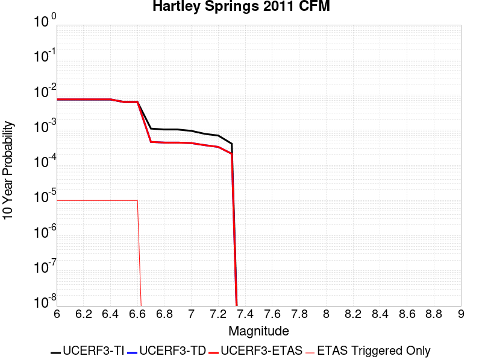 |

| Magnitude | 1 wk TI Prob | 1 wk TD Prob | 1 wk ETAS Prob | 1 wk ETAS/TD Gain | 1 wk ETAS Triggered Only | 1 mo TI Prob | 1 mo TD Prob | 1 mo ETAS Prob | 1 mo ETAS/TD Gain | 1 mo ETAS Triggered Only | 1 yr TI Prob | 1 yr TD Prob | 1 yr ETAS Prob | 1 yr ETAS/TD Gain | 1 yr ETAS Triggered Only | 10 yr TI Prob | 10 yr TD Prob | 10 yr ETAS Prob | 10 yr ETAS/TD Gain | 10 yr ETAS Triggered Only |
|-----|-----|-----|-----|-----|-----|-----|-----|-----|-----|-----|-----|-----|-----|-----|-----|-----|-----|-----|-----|-----|
| 6.0 | 1.4352418E-5 | 1.4434351E-5 | 2.4434206E-5 | 1.6927818 | 1.0E-5 | 6.1508916E-5 | 6.186096E-5 | 7.186035E-5 | 1.1616428 | 1.0E-5 | 7.486137E-4 | 7.530614E-4 | 7.6305383E-4 | 1.0132692 | 1.0E-5 | 0.007460968 | 0.0075212163 | 0.0075311414 | 1.0013195 | 1.0E-5 |
| 6.1 | 1.4352418E-5 | 1.4434351E-5 | 2.4434206E-5 | 1.6927818 | 1.0E-5 | 6.1508916E-5 | 6.186096E-5 | 7.186035E-5 | 1.1616428 | 1.0E-5 | 7.486137E-4 | 7.530614E-4 | 7.6305383E-4 | 1.0132692 | 1.0E-5 | 0.007460968 | 0.0075212163 | 0.0075311414 | 1.0013195 | 1.0E-5 |
| 6.2 | 1.4352418E-5 | 1.4434351E-5 | 2.4434206E-5 | 1.6927818 | 1.0E-5 | 6.1508916E-5 | 6.186096E-5 | 7.186035E-5 | 1.1616428 | 1.0E-5 | 7.486137E-4 | 7.530614E-4 | 7.6305383E-4 | 1.0132692 | 1.0E-5 | 0.007460968 | 0.0075212163 | 0.0075311414 | 1.0013195 | 1.0E-5 |
| 6.3 | 1.4352418E-5 | 1.4434351E-5 | 2.4434206E-5 | 1.6927818 | 1.0E-5 | 6.1508916E-5 | 6.186096E-5 | 7.186035E-5 | 1.1616428 | 1.0E-5 | 7.486137E-4 | 7.530614E-4 | 7.6305383E-4 | 1.0132692 | 1.0E-5 | 0.007460968 | 0.0075212163 | 0.0075311414 | 1.0013195 | 1.0E-5 |
| 6.4 | 1.4352418E-5 | 1.4434351E-5 | 2.4434206E-5 | 1.6927818 | 1.0E-5 | 6.1508916E-5 | 6.186096E-5 | 7.186035E-5 | 1.1616428 | 1.0E-5 | 7.486137E-4 | 7.530614E-4 | 7.6305383E-4 | 1.0132692 | 1.0E-5 | 0.007460968 | 0.0075212163 | 0.0075311414 | 1.0013195 | 1.0E-5 |
| 6.5 | 1.2279858E-5 | 1.2133241E-5 | 2.213312E-5 | 1.824172 | 1.0E-5 | 5.26269E-5 | 5.199946E-5 | 6.1998944E-5 | 1.1922997 | 1.0E-5 | 6.4054417E-4 | 6.3306774E-4 | 6.430614E-4 | 1.015786 | 1.0E-5 | 0.0063870098 | 0.0063281553 | 0.006338092 | 1.0015702 | 1.0E-5 |
| 6.6 | 1.2279858E-5 | 1.2133241E-5 | 2.213312E-5 | 1.824172 | 1.0E-5 | 5.26269E-5 | 5.199946E-5 | 6.1998944E-5 | 1.1922997 | 1.0E-5 | 6.4054417E-4 | 6.3306774E-4 | 6.430614E-4 | 1.015786 | 1.0E-5 | 0.0063870098 | 0.0063281553 | 0.006338092 | 1.0015702 | 1.0E-5 |
| 6.7 | 2.1282601E-6 | 8.8945814E-7 | 8.8945814E-7 | 1.0 | 0.0 | 9.121083E-6 | 3.8119592E-6 | 3.8119592E-6 | 1.0 | 0.0 | 1.11043526E-4 | 4.6409874E-5 | 4.6409874E-5 | 1.0 | 0.0 | 0.0011098806 | 4.6402714E-4 | 4.6402714E-4 | 1.0 | 0.0 |
| 6.8 | 2.00516E-6 | 8.5173434E-7 | 8.5173434E-7 | 1.0 | 0.0 | 8.593515E-6 | 3.6502865E-6 | 3.6502865E-6 | 1.0 | 0.0 | 1.04621024E-4 | 4.444159E-5 | 4.444159E-5 | 1.0 | 0.0 | 0.0010457177 | 4.4435216E-4 | 4.4435216E-4 | 1.0 | 0.0 |
| 6.9 | 2.00516E-6 | 8.5173434E-7 | 8.5173434E-7 | 1.0 | 0.0 | 8.593515E-6 | 3.6502865E-6 | 3.6502865E-6 | 1.0 | 0.0 | 1.04621024E-4 | 4.444159E-5 | 4.444159E-5 | 1.0 | 0.0 | 0.0010457177 | 4.4435216E-4 | 4.4435216E-4 | 1.0 | 0.0 |
| 7.0 | 1.8366732E-6 | 8.237064E-7 | 8.237064E-7 | 1.0 | 0.0 | 7.871433E-6 | 3.5301669E-6 | 3.5301669E-6 | 1.0 | 0.0 | 9.583048E-5 | 4.297919E-5 | 4.297919E-5 | 1.0 | 0.0 | 9.5789164E-4 | 4.2973383E-4 | 4.2973383E-4 | 1.0 | 0.0 |
| 7.1 | 1.5097997E-6 | 7.189996E-7 | 7.189996E-7 | 1.0 | 0.0 | 6.470554E-6 | 3.0814247E-6 | 3.0814247E-6 | 1.0 | 0.0 | 7.877615E-5 | 3.751594E-5 | 3.751594E-5 | 1.0 | 0.0 | 7.874823E-4 | 3.751198E-4 | 3.751198E-4 | 1.0 | 0.0 |
| 7.2 | 1.3490993E-6 | 6.405045E-7 | 6.405045E-7 | 1.0 | 0.0 | 5.7818415E-6 | 2.7450176E-6 | 2.7450176E-6 | 1.0 | 0.0 | 7.0391645E-5 | 3.342031E-5 | 3.342031E-5 | 1.0 | 0.0 | 7.0369354E-4 | 3.341758E-4 | 3.341758E-4 | 1.0 | 0.0 |
| 7.3 | 7.900015E-7 | 4.0890467E-7 | 4.0890467E-7 | 1.0 | 0.0 | 3.3857161E-6 | 1.7524486E-6 | 1.7524486E-6 | 1.0 | 0.0 | 4.1220315E-5 | 2.1336062E-5 | 2.1336062E-5 | 1.0 | 0.0 | 4.121267E-4 | 2.1336062E-4 | 2.1336062E-4 | 1.0 | 0.0 |

## Hollywood
*[(top)](#table-of-contents)*

| 1 Week | 1 Month | 1 Year | 10 Year |
|-----|-----|-----|-----|
|  |  |  | 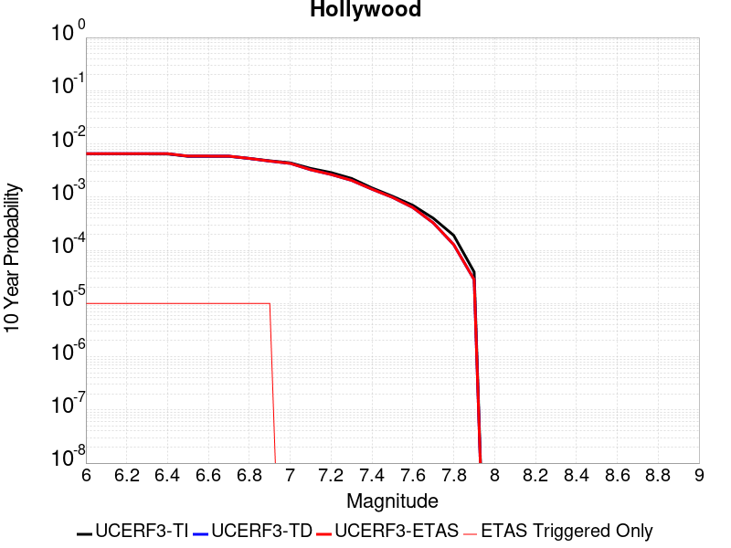 |

| Magnitude | 1 wk TI Prob | 1 wk TD Prob | 1 wk ETAS Prob | 1 wk ETAS/TD Gain | 1 wk ETAS Triggered Only | 1 mo TI Prob | 1 mo TD Prob | 1 mo ETAS Prob | 1 mo ETAS/TD Gain | 1 mo ETAS Triggered Only | 1 yr TI Prob | 1 yr TD Prob | 1 yr ETAS Prob | 1 yr ETAS/TD Gain | 1 yr ETAS Triggered Only | 10 yr TI Prob | 10 yr TD Prob | 10 yr ETAS Prob | 10 yr ETAS/TD Gain | 10 yr ETAS Triggered Only |
|-----|-----|-----|-----|-----|-----|-----|-----|-----|-----|-----|-----|-----|-----|-----|-----|-----|-----|-----|-----|-----|
| 6.0 | 1.24487615E-5 | 1.2593379E-5 | 1.2593379E-5 | 1.0 | 0.0 | 5.3350745E-5 | 5.3970536E-5 | 5.3970536E-5 | 1.0 | 0.0 | 6.4935174E-4 | 6.5689784E-4 | 6.668912E-4 | 1.015213 | 1.0E-5 | 0.0064745755 | 0.0065500485 | 0.006559983 | 1.0015167 | 1.0E-5 |
| 6.1 | 1.24487615E-5 | 1.2593379E-5 | 1.2593379E-5 | 1.0 | 0.0 | 5.3350745E-5 | 5.3970536E-5 | 5.3970536E-5 | 1.0 | 0.0 | 6.4935174E-4 | 6.5689784E-4 | 6.668912E-4 | 1.015213 | 1.0E-5 | 0.0064745755 | 0.0065500485 | 0.006559983 | 1.0015167 | 1.0E-5 |
| 6.2 | 1.24487615E-5 | 1.2593379E-5 | 1.2593379E-5 | 1.0 | 0.0 | 5.3350745E-5 | 5.3970536E-5 | 5.3970536E-5 | 1.0 | 0.0 | 6.4935174E-4 | 6.5689784E-4 | 6.668912E-4 | 1.015213 | 1.0E-5 | 0.0064745755 | 0.0065500485 | 0.006559983 | 1.0015167 | 1.0E-5 |
| 6.3 | 1.24487615E-5 | 1.2593379E-5 | 1.2593379E-5 | 1.0 | 0.0 | 5.3350745E-5 | 5.3970536E-5 | 5.3970536E-5 | 1.0 | 0.0 | 6.4935174E-4 | 6.5689784E-4 | 6.668912E-4 | 1.015213 | 1.0E-5 | 0.0064745755 | 0.0065500485 | 0.006559983 | 1.0015167 | 1.0E-5 |
| 6.4 | 1.2431024E-5 | 1.25739925E-5 | 1.25739925E-5 | 1.0 | 0.0 | 5.327473E-5 | 5.3887452E-5 | 5.3887452E-5 | 1.0 | 0.0 | 6.4842677E-4 | 6.558869E-4 | 6.6588033E-4 | 1.0152365 | 1.0E-5 | 0.0064653796 | 0.006539999 | 0.0065499335 | 1.0015191 | 1.0E-5 |
| 6.5 | 1.1242222E-5 | 1.1317944E-5 | 1.1317944E-5 | 1.0 | 0.0 | 4.8180063E-5 | 4.850459E-5 | 4.850459E-5 | 1.0 | 0.0 | 5.864344E-4 | 5.9038604E-4 | 6.003801E-4 | 1.0169281 | 1.0E-5 | 0.0058488925 | 0.0058884625 | 0.005898404 | 1.0016882 | 1.0E-5 |
| 6.6 | 1.1234066E-5 | 1.1309058E-5 | 1.1309058E-5 | 1.0 | 0.0 | 4.8145106E-5 | 4.8466507E-5 | 4.8466507E-5 | 1.0 | 0.0 | 5.86009E-4 | 5.8992265E-4 | 5.9991673E-4 | 1.0169414 | 1.0E-5 | 0.005844661 | 0.005883853 | 0.0058937944 | 1.0016896 | 1.0E-5 |
| 6.7 | 1.12294E-5 | 1.1303801E-5 | 1.1303801E-5 | 1.0 | 0.0 | 4.812511E-5 | 4.8443977E-5 | 4.8443977E-5 | 1.0 | 0.0 | 5.857657E-4 | 5.896485E-4 | 5.9964263E-4 | 1.0169493 | 1.0E-5 | 0.0058422405 | 0.0058811265 | 0.0058910674 | 1.0016904 | 1.0E-5 |
| 6.8 | 1.0252819E-5 | 1.0218572E-5 | 1.0218572E-5 | 1.0 | 0.0 | 4.3939912E-5 | 4.379316E-5 | 4.379316E-5 | 1.0 | 0.0 | 5.3483713E-4 | 5.3305336E-4 | 5.430481E-4 | 1.0187498 | 1.0E-5 | 0.005335517 | 0.005317974 | 0.0053279204 | 1.0018704 | 1.0E-5 |
| 6.9 | 9.252289E-6 | 9.1104175E-6 | 9.1104175E-6 | 1.0 | 0.0 | 3.9652066E-5 | 3.9044073E-5 | 3.9044073E-5 | 1.0 | 0.0 | 4.8265693E-4 | 4.7525953E-4 | 4.852548E-4 | 1.0210311 | 1.0E-5 | 0.0048161 | 0.004742605 | 0.0047525577 | 1.0020986 | 1.0E-5 |
| 7.0 | 8.474604E-6 | 8.258358E-6 | 8.258358E-6 | 1.0 | 0.0 | 3.6319227E-5 | 3.539249E-5 | 3.539249E-5 | 1.0 | 0.0 | 4.4209688E-4 | 4.308198E-4 | 4.308198E-4 | 1.0 | 0.0 | 0.004412184 | 0.0042999964 | 0.0042999964 | 1.0 | 0.0 |
| 7.1 | 6.643643E-6 | 6.2684435E-6 | 6.2684435E-6 | 1.0 | 0.0 | 2.8472443E-5 | 2.6864484E-5 | 2.6864484E-5 | 1.0 | 0.0 | 3.4659685E-4 | 3.270264E-4 | 3.270264E-4 | 1.0 | 0.0 | 0.0034605677 | 0.0032654977 | 0.0032654977 | 1.0 | 0.0 |
| 7.2 | 5.549002E-6 | 5.1087686E-6 | 5.1087686E-6 | 1.0 | 0.0 | 2.378122E-5 | 2.189454E-5 | 2.189454E-5 | 1.0 | 0.0 | 2.8949787E-4 | 2.6653355E-4 | 2.6653355E-4 | 1.0 | 0.0 | 0.0028912104 | 0.0026621553 | 0.0026621553 | 1.0 | 0.0 |
| 7.3 | 4.3059727E-6 | 3.959941E-6 | 3.959941E-6 | 1.0 | 0.0 | 1.8454039E-5 | 1.6971066E-5 | 1.6971066E-5 | 1.0 | 0.0 | 2.2465475E-4 | 2.0660323E-4 | 2.0660323E-4 | 1.0 | 0.0 | 0.0022442779 | 0.0020641217 | 0.0020641217 | 1.0 | 0.0 |
| 7.4 | 2.8550733E-6 | 2.7013398E-6 | 2.7013398E-6 | 1.0 | 0.0 | 1.2235971E-5 | 1.157712E-5 | 1.157712E-5 | 1.0 | 0.0 | 1.4896276E-4 | 1.4094236E-4 | 1.4094236E-4 | 1.0 | 0.0 | 0.0014886294 | 0.0014085348 | 0.0014085348 | 1.0 | 0.0 |
| 7.5 | 1.9927045E-6 | 1.8976706E-6 | 1.8976706E-6 | 1.0 | 0.0 | 8.540134E-6 | 8.132849E-6 | 8.132849E-6 | 1.0 | 0.0 | 1.0397117E-4 | 9.901297E-5 | 9.901297E-5 | 1.0 | 0.0 | 0.0010392254 | 9.896922E-4 | 9.896922E-4 | 1.0 | 0.0 |
| 7.6 | 1.345084E-6 | 1.2216213E-6 | 1.2216213E-6 | 1.0 | 0.0 | 5.764633E-6 | 5.2355094E-6 | 5.2355094E-6 | 1.0 | 0.0 | 7.018215E-5 | 6.374048E-5 | 6.374048E-5 | 1.0 | 0.0 | 7.0159987E-4 | 6.37224E-4 | 6.37224E-4 | 1.0 | 0.0 |
| 7.7 | 7.6835164E-7 | 6.2778383E-7 | 6.2778383E-7 | 1.0 | 0.0 | 3.2929315E-6 | 2.6904993E-6 | 2.6904993E-6 | 1.0 | 0.0 | 4.00907E-5 | 3.2756354E-5 | 3.2756354E-5 | 1.0 | 0.0 | 4.0083472E-4 | 3.2751673E-4 | 3.2751673E-4 | 1.0 | 0.0 |
| 7.8 | 3.6562128E-7 | 2.45358E-7 | 2.45358E-7 | 1.0 | 0.0 | 1.5669474E-6 | 1.0515338E-6 | 1.0515338E-6 | 1.0 | 0.0 | 1.9077417E-5 | 1.2802353E-5 | 1.2802353E-5 | 1.0 | 0.0 | 1.907578E-4 | 1.2801652E-4 | 1.2801652E-4 | 1.0 | 0.0 |
| 7.9 | 7.5024424E-8 | 5.3820486E-8 | 5.3820486E-8 | 1.0 | 0.0 | 3.215332E-7 | 2.3065921E-7 | 2.3065921E-7 | 1.0 | 0.0 | 3.91466E-6 | 2.8082736E-6 | 2.8082736E-6 | 1.0 | 0.0 | 3.9145907E-5 | 2.808251E-5 | 2.808251E-5 | 1.0 | 0.0 |

## Pisgah-Bullion Mtn-Mesquite Lk
*[(top)](#table-of-contents)*

| 1 Week | 1 Month | 1 Year | 10 Year |
|-----|-----|-----|-----|
|  |  |  |  |

| Magnitude | 1 wk TI Prob | 1 wk TD Prob | 1 wk ETAS Prob | 1 wk ETAS/TD Gain | 1 wk ETAS Triggered Only | 1 mo TI Prob | 1 mo TD Prob | 1 mo ETAS Prob | 1 mo ETAS/TD Gain | 1 mo ETAS Triggered Only | 1 yr TI Prob | 1 yr TD Prob | 1 yr ETAS Prob | 1 yr ETAS/TD Gain | 1 yr ETAS Triggered Only | 10 yr TI Prob | 10 yr TD Prob | 10 yr ETAS Prob | 10 yr ETAS/TD Gain | 10 yr ETAS Triggered Only |
|-----|-----|-----|-----|-----|-----|-----|-----|-----|-----|-----|-----|-----|-----|-----|-----|-----|-----|-----|-----|-----|
| 6.0 | 3.0240792E-5 | 2.4091287E-5 | 2.4091287E-5 | 1.0 | 0.0 | 1.2959696E-4 | 1.03244856E-4 | 1.03244856E-4 | 1.0 | 0.0 | 0.0015767008 | 0.001256382 | 0.0012663694 | 1.0079494 | 1.0E-5 | 0.015655609 | 0.012502813 | 0.012512688 | 1.0007898 | 1.0E-5 |
| 6.1 | 3.0240792E-5 | 2.4091287E-5 | 2.4091287E-5 | 1.0 | 0.0 | 1.2959696E-4 | 1.03244856E-4 | 1.03244856E-4 | 1.0 | 0.0 | 0.0015767008 | 0.001256382 | 0.0012663694 | 1.0079494 | 1.0E-5 | 0.015655609 | 0.012502813 | 0.012512688 | 1.0007898 | 1.0E-5 |
| 6.2 | 3.0240792E-5 | 2.4091287E-5 | 2.4091287E-5 | 1.0 | 0.0 | 1.2959696E-4 | 1.03244856E-4 | 1.03244856E-4 | 1.0 | 0.0 | 0.0015767008 | 0.001256382 | 0.0012663694 | 1.0079494 | 1.0E-5 | 0.015655609 | 0.012502813 | 0.012512688 | 1.0007898 | 1.0E-5 |
| 6.3 | 2.0498217E-5 | 1.36382505E-5 | 1.36382505E-5 | 1.0 | 0.0 | 8.784654E-5 | 5.8448426E-5 | 5.8448426E-5 | 1.0 | 0.0 | 0.0010690069 | 7.113935E-4 | 7.213864E-4 | 1.0140469 | 1.0E-5 | 0.01063879 | 0.0070927883 | 0.0071027176 | 1.0013999 | 1.0E-5 |
| 6.4 | 2.0498217E-5 | 1.36382505E-5 | 1.36382505E-5 | 1.0 | 0.0 | 8.784654E-5 | 5.8448426E-5 | 5.8448426E-5 | 1.0 | 0.0 | 0.0010690069 | 7.113935E-4 | 7.213864E-4 | 1.0140469 | 1.0E-5 | 0.01063879 | 0.0070927883 | 0.0071027176 | 1.0013999 | 1.0E-5 |
| 6.5 | 1.7316182E-5 | 1.04771225E-5 | 1.04771225E-5 | 1.0 | 0.0 | 7.42101E-5 | 4.4901237E-5 | 4.4901237E-5 | 1.0 | 0.0 | 9.0313336E-4 | 5.4654543E-4 | 5.5654E-4 | 1.0182867 | 1.0E-5 | 0.008994718 | 0.005453008 | 0.005462954 | 1.0018239 | 1.0E-5 |
| 6.6 | 1.5251077E-5 | 8.414257E-6 | 8.414257E-6 | 1.0 | 0.0 | 6.536012E-5 | 3.606064E-5 | 3.606064E-5 | 1.0 | 0.0 | 7.9546886E-4 | 4.389571E-4 | 4.389571E-4 | 1.0 | 0.0 | 0.007926274 | 0.0043816175 | 0.0043816175 | 1.0 | 0.0 |
| 6.7 | 1.2997425E-5 | 6.4113133E-6 | 6.4113133E-6 | 1.0 | 0.0 | 5.570206E-5 | 2.7476794E-5 | 2.7476794E-5 | 1.0 | 0.0 | 6.7796157E-4 | 3.3448328E-4 | 3.3448328E-4 | 1.0 | 0.0 | 0.0067589693 | 0.0033402585 | 0.0033402585 | 1.0 | 0.0 |
| 6.8 | 1.035386E-5 | 4.3332407E-6 | 4.3332407E-6 | 1.0 | 0.0 | 4.437293E-5 | 1.8570905E-5 | 1.8570905E-5 | 1.0 | 0.0 | 5.401065E-4 | 2.2607818E-4 | 2.2607818E-4 | 1.0 | 0.0 | 0.0053879567 | 0.0022585685 | 0.0022585685 | 1.0 | 0.0 |
| 6.9 | 8.816252E-6 | 3.5806777E-6 | 3.5806777E-6 | 1.0 | 0.0 | 3.778339E-5 | 1.5345675E-5 | 1.5345675E-5 | 1.0 | 0.0 | 4.5991567E-4 | 1.8681816E-4 | 1.8681816E-4 | 1.0 | 0.0 | 0.00458965 | 0.0018666695 | 0.0018666695 | 1.0 | 0.0 |
| 7.0 | 6.8232207E-6 | 2.5675185E-6 | 2.5675185E-6 | 1.0 | 0.0 | 2.9242048E-5 | 1.1003606E-5 | 1.1003606E-5 | 1.0 | 0.0 | 3.5596377E-4 | 1.3396099E-4 | 1.3396099E-4 | 1.0 | 0.0 | 0.0035539411 | 0.0013388334 | 0.0013388334 | 1.0 | 0.0 |
| 7.1 | 5.837013E-6 | 2.227375E-6 | 2.227375E-6 | 1.0 | 0.0 | 2.501553E-5 | 9.545859E-6 | 9.545859E-6 | 1.0 | 0.0 | 3.045215E-4 | 1.16214935E-4 | 1.16214935E-4 | 1.0 | 0.0 | 0.0030410455 | 0.0011615707 | 0.0011615707 | 1.0 | 0.0 |
| 7.2 | 4.278052E-6 | 1.6275252E-6 | 1.6275252E-6 | 1.0 | 0.0 | 1.833438E-5 | 6.975091E-6 | 6.975091E-6 | 1.0 | 0.0 | 2.231982E-4 | 8.4918654E-5 | 8.4918654E-5 | 1.0 | 0.0 | 0.0022297418 | 8.488853E-4 | 8.488853E-4 | 1.0 | 0.0 |
| 7.3 | 1.8803692E-6 | 8.3448816E-7 | 8.3448816E-7 | 1.0 | 0.0 | 8.0587E-6 | 3.5763737E-6 | 3.5763737E-6 | 1.0 | 0.0 | 9.811026E-5 | 4.354163E-5 | 4.354163E-5 | 1.0 | 0.0 | 9.806695E-4 | 4.3534543E-4 | 4.3534543E-4 | 1.0 | 0.0 |

## White Wolf
*[(top)](#table-of-contents)*

| 1 Week | 1 Month | 1 Year | 10 Year |
|-----|-----|-----|-----|
|  |  |  |  |

| Magnitude | 1 wk TI Prob | 1 wk TD Prob | 1 wk ETAS Prob | 1 wk ETAS/TD Gain | 1 wk ETAS Triggered Only | 1 mo TI Prob | 1 mo TD Prob | 1 mo ETAS Prob | 1 mo ETAS/TD Gain | 1 mo ETAS Triggered Only | 1 yr TI Prob | 1 yr TD Prob | 1 yr ETAS Prob | 1 yr ETAS/TD Gain | 1 yr ETAS Triggered Only | 10 yr TI Prob | 10 yr TD Prob | 10 yr ETAS Prob | 10 yr ETAS/TD Gain | 10 yr ETAS Triggered Only |
|-----|-----|-----|-----|-----|-----|-----|-----|-----|-----|-----|-----|-----|-----|-----|-----|-----|-----|-----|-----|-----|
| 6.0 | 2.0037822E-5 | 1.0468736E-6 | 1.0468736E-6 | 1.0 | 0.0 | 8.587355E-5 | 4.4865938E-6 | 4.4865938E-6 | 1.0 | 0.0 | 0.001045009 | 5.462296E-5 | 5.462296E-5 | 1.0 | 0.0 | 0.010401085 | 5.4610043E-4 | 5.56095E-4 | 1.0183016 | 1.0E-5 |
| 6.1 | 2.0037822E-5 | 1.0468736E-6 | 1.0468736E-6 | 1.0 | 0.0 | 8.587355E-5 | 4.4865938E-6 | 4.4865938E-6 | 1.0 | 0.0 | 0.001045009 | 5.462296E-5 | 5.462296E-5 | 1.0 | 0.0 | 0.010401085 | 5.4610043E-4 | 5.56095E-4 | 1.0183016 | 1.0E-5 |
| 6.2 | 2.0037822E-5 | 1.0468736E-6 | 1.0468736E-6 | 1.0 | 0.0 | 8.587355E-5 | 4.4865938E-6 | 4.4865938E-6 | 1.0 | 0.0 | 0.001045009 | 5.462296E-5 | 5.462296E-5 | 1.0 | 0.0 | 0.010401085 | 5.4610043E-4 | 5.56095E-4 | 1.0183016 | 1.0E-5 |
| 6.3 | 2.0037822E-5 | 1.0468736E-6 | 1.0468736E-6 | 1.0 | 0.0 | 8.587355E-5 | 4.4865938E-6 | 4.4865938E-6 | 1.0 | 0.0 | 0.001045009 | 5.462296E-5 | 5.462296E-5 | 1.0 | 0.0 | 0.010401085 | 5.4610043E-4 | 5.56095E-4 | 1.0183016 | 1.0E-5 |
| 6.4 | 1.132487E-5 | 1.0468736E-6 | 1.0468736E-6 | 1.0 | 0.0 | 4.8534253E-5 | 4.4865938E-6 | 4.4865938E-6 | 1.0 | 0.0 | 5.907443E-4 | 5.462296E-5 | 5.462296E-5 | 1.0 | 0.0 | 0.005891764 | 5.4610043E-4 | 5.56095E-4 | 1.0183016 | 1.0E-5 |
| 6.5 | 1.132487E-5 | 1.0468736E-6 | 1.0468736E-6 | 1.0 | 0.0 | 4.8534253E-5 | 4.4865938E-6 | 4.4865938E-6 | 1.0 | 0.0 | 5.907443E-4 | 5.462296E-5 | 5.462296E-5 | 1.0 | 0.0 | 0.005891764 | 5.4610043E-4 | 5.56095E-4 | 1.0183016 | 1.0E-5 |
| 6.6 | 9.347473E-6 | 1.0468736E-6 | 1.0468736E-6 | 1.0 | 0.0 | 4.0059982E-5 | 4.4865938E-6 | 4.4865938E-6 | 1.0 | 0.0 | 4.8762115E-4 | 5.462296E-5 | 5.462296E-5 | 1.0 | 0.0 | 0.0048655253 | 5.4610043E-4 | 5.56095E-4 | 1.0183016 | 1.0E-5 |
| 6.7 | 7.842647E-6 | 1.0047925E-6 | 1.0047925E-6 | 1.0 | 0.0 | 3.361091E-5 | 4.3062464E-6 | 4.3062464E-6 | 1.0 | 0.0 | 4.0913603E-4 | 5.242734E-5 | 5.242734E-5 | 1.0 | 0.0 | 0.004083836 | 5.241547E-4 | 5.341494E-4 | 1.0190684 | 1.0E-5 |
| 6.8 | 6.26597E-6 | 9.73443E-7 | 9.73443E-7 | 1.0 | 0.0 | 2.685388E-5 | 4.171892E-6 | 4.171892E-6 | 1.0 | 0.0 | 3.2689696E-4 | 5.0791652E-5 | 5.0791652E-5 | 1.0 | 0.0 | 0.003264165 | 5.078053E-4 | 5.178003E-4 | 1.0196825 | 1.0E-5 |
| 6.9 | 5.258436E-6 | 9.1828633E-7 | 9.1828633E-7 | 1.0 | 0.0 | 2.2535958E-5 | 3.9355073E-6 | 3.9355073E-6 | 1.0 | 0.0 | 2.7434074E-4 | 4.7913796E-5 | 4.7913796E-5 | 1.0 | 0.0 | 0.0027400232 | 4.7903945E-4 | 4.8903463E-4 | 1.0208651 | 1.0E-5 |
| 7.0 | 4.675028E-6 | 8.6608276E-7 | 8.6608276E-7 | 1.0 | 0.0 | 2.003568E-5 | 3.7117782E-6 | 3.7117782E-6 | 1.0 | 0.0 | 2.4390711E-4 | 4.519001E-5 | 4.519001E-5 | 1.0 | 0.0 | 0.0024363957 | 4.5181293E-4 | 4.618084E-4 | 1.0221231 | 1.0E-5 |
| 7.1 | 2.8270078E-6 | 6.873876E-7 | 6.873876E-7 | 1.0 | 0.0 | 1.2115692E-5 | 2.9459438E-6 | 2.9459438E-6 | 1.0 | 0.0 | 1.4749856E-4 | 3.5866316E-5 | 3.5866316E-5 | 1.0 | 0.0 | 0.001474007 | 3.586094E-4 | 3.686058E-4 | 1.0278755 | 1.0E-5 |
| 7.2 | 1.6881406E-6 | 2.2703898E-7 | 2.2703898E-7 | 1.0 | 0.0 | 7.2348685E-6 | 9.730238E-7 | 9.730238E-7 | 1.0 | 0.0 | 8.808096E-5 | 1.1846502E-5 | 1.1846502E-5 | 1.0 | 0.0 | 8.8046055E-4 | 1.1845886E-4 | 1.1845886E-4 | 1.0 | 0.0 |
| 7.3 | 9.086107E-7 | 1.5264881E-7 | 1.5264881E-7 | 1.0 | 0.0 | 3.8940398E-6 | 6.5420903E-7 | 6.5420903E-7 | 1.0 | 0.0 | 4.7408903E-5 | 7.964967E-6 | 7.964967E-6 | 1.0 | 0.0 | 4.739879E-4 | 7.9646896E-5 | 7.9646896E-5 | 1.0 | 0.0 |
| 7.4 | 1.9717383E-7 | 9.003459E-8 | 9.003459E-8 | 1.0 | 0.0 | 8.450304E-7 | 3.8586248E-7 | 3.8586248E-7 | 1.0 | 0.0 | 1.0288197E-5 | 4.6978657E-6 | 4.6978657E-6 | 1.0 | 0.0 | 1.028772E-4 | 4.6977697E-5 | 4.6977697E-5 | 1.0 | 0.0 |
| 7.5 | 1.086975E-7 | 6.659703E-8 | 6.659703E-8 | 1.0 | 0.0 | 4.6584634E-7 | 2.8541584E-7 | 2.8541584E-7 | 1.0 | 0.0 | 5.6716644E-6 | 3.4749323E-6 | 3.4749323E-6 | 1.0 | 0.0 | 5.6715195E-5 | 3.4748802E-5 | 3.4748802E-5 | 1.0 | 0.0 |
| 7.6 | 2.4217808E-8 | 1.5820925E-8 | 1.5820925E-8 | 1.0 | 0.0 | 1.03790605E-7 | 6.780396E-8 | 6.780396E-8 | 1.0 | 0.0 | 1.2636499E-6 | 8.255129E-7 | 8.255129E-7 | 1.0 | 0.0 | 1.2636427E-5 | 8.255104E-6 | 8.255104E-6 | 1.0 | 0.0 |

## San Andreas (Carrizo) rev
*[(top)](#table-of-contents)*

| 1 Week | 1 Month | 1 Year | 10 Year |
|-----|-----|-----|-----|
|  |  |  | 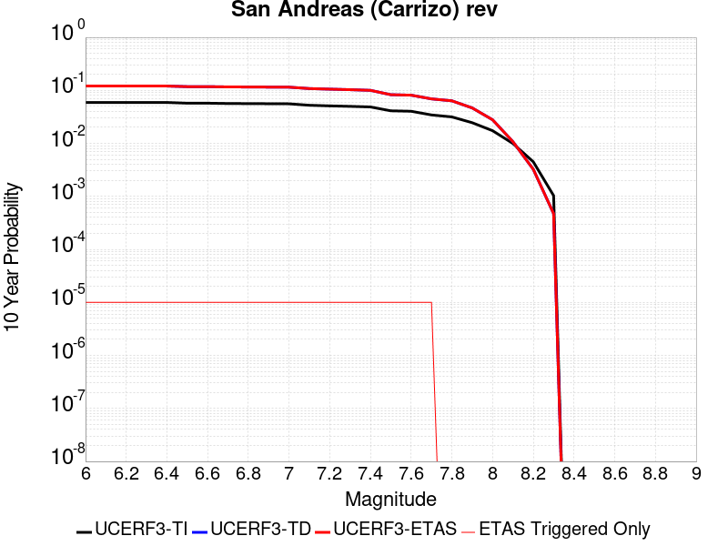 |

| Magnitude | 1 wk TI Prob | 1 wk TD Prob | 1 wk ETAS Prob | 1 wk ETAS/TD Gain | 1 wk ETAS Triggered Only | 1 mo TI Prob | 1 mo TD Prob | 1 mo ETAS Prob | 1 mo ETAS/TD Gain | 1 mo ETAS Triggered Only | 1 yr TI Prob | 1 yr TD Prob | 1 yr ETAS Prob | 1 yr ETAS/TD Gain | 1 yr ETAS Triggered Only | 10 yr TI Prob | 10 yr TD Prob | 10 yr ETAS Prob | 10 yr ETAS/TD Gain | 10 yr ETAS Triggered Only |
|-----|-----|-----|-----|-----|-----|-----|-----|-----|-----|-----|-----|-----|-----|-----|-----|-----|-----|-----|-----|-----|
| 6.0 | 1.1674632E-4 | 2.4333803E-4 | 2.533356E-4 | 1.0410851 | 1.0E-5 | 5.002454E-4 | 0.0010424621 | 0.0010524517 | 1.0095826 | 1.0E-5 | 0.006073493 | 0.012618599 | 0.012628473 | 1.0007825 | 1.0E-5 | 0.0591016 | 0.12066075 | 0.120669544 | 1.0000728 | 1.0E-5 |
| 6.1 | 1.1674632E-4 | 2.4333803E-4 | 2.533356E-4 | 1.0410851 | 1.0E-5 | 5.002454E-4 | 0.0010424621 | 0.0010524517 | 1.0095826 | 1.0E-5 | 0.006073493 | 0.012618599 | 0.012628473 | 1.0007825 | 1.0E-5 | 0.0591016 | 0.12066075 | 0.120669544 | 1.0000728 | 1.0E-5 |
| 6.2 | 1.1674632E-4 | 2.4333803E-4 | 2.533356E-4 | 1.0410851 | 1.0E-5 | 5.002454E-4 | 0.0010424621 | 0.0010524517 | 1.0095826 | 1.0E-5 | 0.006073493 | 0.012618599 | 0.012628473 | 1.0007825 | 1.0E-5 | 0.0591016 | 0.12066075 | 0.120669544 | 1.0000728 | 1.0E-5 |
| 6.3 | 1.1674632E-4 | 2.4333803E-4 | 2.533356E-4 | 1.0410851 | 1.0E-5 | 5.002454E-4 | 0.0010424621 | 0.0010524517 | 1.0095826 | 1.0E-5 | 0.006073493 | 0.012618599 | 0.012628473 | 1.0007825 | 1.0E-5 | 0.0591016 | 0.12066075 | 0.120669544 | 1.0000728 | 1.0E-5 |
| 6.4 | 1.1674632E-4 | 2.4333803E-4 | 2.533356E-4 | 1.0410851 | 1.0E-5 | 5.002454E-4 | 0.0010424621 | 0.0010524517 | 1.0095826 | 1.0E-5 | 0.006073493 | 0.012618599 | 0.012628473 | 1.0007825 | 1.0E-5 | 0.0591016 | 0.12066075 | 0.120669544 | 1.0000728 | 1.0E-5 |
| 6.5 | 1.13136164E-4 | 2.3653745E-4 | 2.4653508E-4 | 1.0422666 | 1.0E-5 | 4.847792E-4 | 0.0010133396 | 0.0010233296 | 1.0098584 | 1.0E-5 | 0.0058862255 | 0.012268067 | 0.012277945 | 1.0008051 | 1.0E-5 | 0.057327334 | 0.11763024 | 0.11763907 | 1.000075 | 1.0E-5 |
| 6.6 | 1.13136164E-4 | 2.3653745E-4 | 2.4653508E-4 | 1.0422666 | 1.0E-5 | 4.847792E-4 | 0.0010133396 | 0.0010233296 | 1.0098584 | 1.0E-5 | 0.0058862255 | 0.012268067 | 0.012277945 | 1.0008051 | 1.0E-5 | 0.057327334 | 0.11763024 | 0.11763907 | 1.000075 | 1.0E-5 |
| 6.7 | 1.1149675E-4 | 2.334492E-4 | 2.4344686E-4 | 1.0428258 | 1.0E-5 | 4.777557E-4 | 0.0010001145 | 0.0010101044 | 1.0099889 | 1.0E-5 | 0.0058011734 | 0.012108848 | 0.012118728 | 1.0008159 | 1.0E-5 | 0.05652051 | 0.11625791 | 0.11626675 | 1.000076 | 1.0E-5 |
| 6.8 | 1.1103589E-4 | 2.324707E-4 | 2.4246838E-4 | 1.0430062 | 1.0E-5 | 4.7578133E-4 | 9.959241E-4 | 0.0010059141 | 1.010031 | 1.0E-5 | 0.005777263 | 0.012058397 | 0.012068276 | 1.0008193 | 1.0E-5 | 0.056293584 | 0.11581856 | 0.115827404 | 1.0000763 | 1.0E-5 |
| 6.9 | 1.1053259E-4 | 2.3139441E-4 | 2.413921E-4 | 1.0432062 | 1.0E-5 | 4.7362508E-4 | 9.91315E-4 | 0.0010013051 | 1.0100776 | 1.0E-5 | 0.0057511497 | 0.0120029 | 0.01201278 | 1.0008231 | 1.0E-5 | 0.05604569 | 0.115334466 | 0.11534331 | 1.0000767 | 1.0E-5 |
| 7.0 | 1.1005377E-4 | 2.304026E-4 | 2.4040029E-4 | 1.0433923 | 1.0E-5 | 4.7157376E-4 | 9.870676E-4 | 9.970577E-4 | 1.010121 | 1.0E-5 | 0.0057263062 | 0.011951757 | 0.011961637 | 1.0008267 | 1.0E-5 | 0.055809796 | 0.1148876 | 0.114896454 | 1.000077 | 1.0E-5 |
| 7.1 | 1.0308142E-4 | 2.154949E-4 | 2.2549275E-4 | 1.0463948 | 1.0E-5 | 4.417027E-4 | 9.2322374E-4 | 9.332145E-4 | 1.0108216 | 1.0E-5 | 0.0053644776 | 0.011182634 | 0.011192522 | 1.0008843 | 1.0E-5 | 0.052368138 | 0.10815858 | 0.1081675 | 1.0000825 | 1.0E-5 |
| 7.2 | 1.0027479E-4 | 2.0957364E-4 | 2.1957155E-4 | 1.0477059 | 1.0E-5 | 4.296783E-4 | 8.978646E-4 | 9.0785563E-4 | 1.0111276 | 1.0E-5 | 0.0052187922 | 0.010877009 | 0.010886899 | 1.0009093 | 1.0E-5 | 0.050979212 | 0.10545821 | 0.105467156 | 1.0000849 | 1.0E-5 |
| 7.3 | 9.816942E-5 | 2.0432367E-4 | 2.1432164E-4 | 1.048932 | 1.0E-5 | 4.2065824E-4 | 8.7538E-4 | 8.853713E-4 | 1.0114136 | 1.0E-5 | 0.005109493 | 0.0106059555 | 0.01061585 | 1.0009328 | 1.0E-5 | 0.049935985 | 0.10304579 | 0.10305476 | 1.000087 | 1.0E-5 |
| 7.4 | 9.5634205E-5 | 1.980169E-4 | 2.0801491E-4 | 1.0504907 | 1.0E-5 | 4.0979648E-4 | 8.4836874E-4 | 8.5836026E-4 | 1.0117773 | 1.0E-5 | 0.0049778637 | 0.010280236 | 0.010290133 | 1.0009627 | 1.0E-5 | 0.048678253 | 0.100126535 | 0.100135535 | 1.0000899 | 1.0E-5 |
| 7.5 | 8.052417E-5 | 1.612143E-4 | 1.7121268E-4 | 1.0620192 | 1.0E-5 | 3.4505792E-4 | 6.9073564E-4 | 7.0072873E-4 | 1.0144674 | 1.0E-5 | 0.0041929903 | 0.00837736 | 0.008387277 | 1.0011837 | 1.0E-5 | 0.04114753 | 0.08285146 | 0.082860634 | 1.0001107 | 1.0E-5 |
| 7.6 | 7.897024E-5 | 1.5774513E-4 | 1.6774356E-4 | 1.0633833 | 1.0E-5 | 3.384E-4 | 6.758756E-4 | 6.8586884E-4 | 1.0147856 | 1.0E-5 | 0.0041122385 | 0.008197814 | 0.008207733 | 1.0012099 | 1.0E-5 | 0.040369697 | 0.08119292 | 0.081202105 | 1.0001131 | 1.0E-5 |
| 7.7 | 6.707427E-5 | 1.3283793E-4 | 1.4283661E-4 | 1.0752697 | 1.0E-5 | 2.8742946E-4 | 5.691813E-4 | 5.791756E-4 | 1.017559 | 1.0E-5 | 0.003493839 | 0.0069077956 | 0.0069177267 | 1.0014377 | 1.0E-5 | 0.034394164 | 0.069081694 | 0.069091 | 1.0001347 | 1.0E-5 |
| 7.8 | 6.147705E-5 | 1.2204444E-4 | 1.2204444E-4 | 1.0 | 0.0 | 2.6344648E-4 | 5.229428E-4 | 5.229428E-4 | 1.0 | 0.0 | 0.0032027436 | 0.0063482667 | 0.0063482667 | 1.0 | 0.0 | 0.031569764 | 0.06354592 | 0.06354592 | 1.0 | 0.0 |
| 7.9 | 4.7636717E-5 | 8.8847315E-5 | 8.8847315E-5 | 1.0 | 0.0 | 2.0414138E-4 | 3.8071864E-4 | 3.8071864E-4 | 1.0 | 0.0 | 0.0024825884 | 0.0046254057 | 0.0046254057 | 1.0 | 0.0 | 0.024550365 | 0.046651114 | 0.046651114 | 1.0 | 0.0 |
| 8.0 | 3.3554235E-5 | 5.216579E-5 | 5.216579E-5 | 1.0 | 0.0 | 1.4379594E-4 | 2.2354853E-4 | 2.2354853E-4 | 1.0 | 0.0 | 0.0017493097 | 0.002718308 | 0.002718308 | 1.0 | 0.0 | 0.017356034 | 0.027894866 | 0.027894866 | 1.0 | 0.0 |
| 8.1 | 1.9175432E-5 | 1.9196985E-5 | 1.9196985E-5 | 1.0 | 0.0 | 8.217783E-5 | 8.22702E-5 | 8.22702E-5 | 1.0 | 0.0 | 0.0010000558 | 0.00100118 | 0.00100118 | 1.0 | 0.0 | 0.009955673 | 0.010764282 | 0.010764282 | 1.0 | 0.0 |
| 8.2 | 8.643924E-6 | 5.478665E-6 | 5.478665E-6 | 1.0 | 0.0 | 3.704486E-5 | 2.3479783E-5 | 2.3479783E-5 | 1.0 | 0.0 | 4.5092785E-4 | 2.8582895E-4 | 2.8582895E-4 | 1.0 | 0.0 | 0.0045001395 | 0.0032508469 | 0.0032508469 | 1.0 | 0.0 |
| 8.3 | 1.983087E-6 | 7.6647797E-7 | 7.6647797E-7 | 1.0 | 0.0 | 8.498917E-6 | 3.2849016E-6 | 3.2849016E-6 | 1.0 | 0.0 | 1.034694E-4 | 3.999296E-5 | 3.999296E-5 | 1.0 | 0.0 | 0.0010342124 | 4.7228087E-4 | 4.7228087E-4 | 1.0 | 0.0 |

## Calaveras (So) - Paicines extension 2011 CFM
*[(top)](#table-of-contents)*

| 1 Week | 1 Month | 1 Year | 10 Year |
|-----|-----|-----|-----|
| 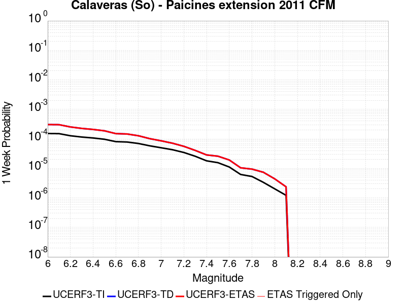 | 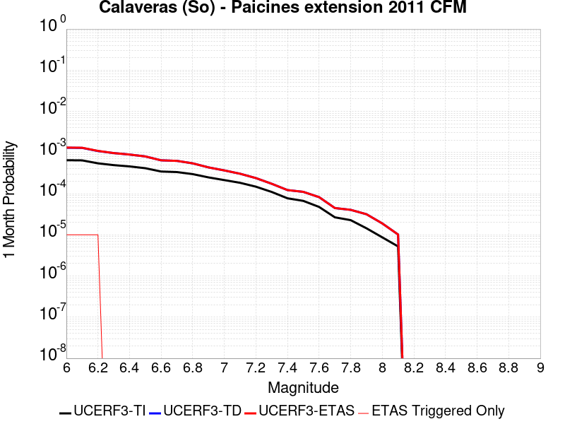 |  |  |

| Magnitude | 1 wk TI Prob | 1 wk TD Prob | 1 wk ETAS Prob | 1 wk ETAS/TD Gain | 1 wk ETAS Triggered Only | 1 mo TI Prob | 1 mo TD Prob | 1 mo ETAS Prob | 1 mo ETAS/TD Gain | 1 mo ETAS Triggered Only | 1 yr TI Prob | 1 yr TD Prob | 1 yr ETAS Prob | 1 yr ETAS/TD Gain | 1 yr ETAS Triggered Only | 10 yr TI Prob | 10 yr TD Prob | 10 yr ETAS Prob | 10 yr ETAS/TD Gain | 10 yr ETAS Triggered Only |
|-----|-----|-----|-----|-----|-----|-----|-----|-----|-----|-----|-----|-----|-----|-----|-----|-----|-----|-----|-----|-----|
| 6.0 | 1.5183659E-4 | 3.0524618E-4 | 3.0524618E-4 | 1.0 | 0.0 | 6.5056595E-4 | 0.001306982 | 0.0013169689 | 1.0076412 | 1.0E-5 | 0.007891912 | 0.015698127 | 0.01570797 | 1.000627 | 1.0E-5 | 0.076174594 | 0.13851054 | 0.13851915 | 1.0000622 | 1.0E-5 |
| 6.1 | 1.5024997E-4 | 3.0218763E-4 | 3.0218763E-4 | 1.0 | 0.0 | 6.437695E-4 | 0.001293891 | 0.001303878 | 1.0077187 | 1.0E-5 | 0.0078097614 | 0.0155415125 | 0.015551357 | 1.0006335 | 1.0E-5 | 0.075409345 | 0.1371801 | 0.13718873 | 1.000063 | 1.0E-5 |
| 6.2 | 1.2743923E-4 | 2.5316005E-4 | 2.5316005E-4 | 1.0 | 0.0 | 5.460538E-4 | 0.0010841485 | 0.0010941377 | 1.0092138 | 1.0E-5 | 0.0066279583 | 0.013048763 | 0.013058633 | 1.0007564 | 1.0E-5 | 0.064337276 | 0.11727778 | 0.11728661 | 1.0000752 | 1.0E-5 |
| 6.3 | 1.1525114E-4 | 2.2602278E-4 | 2.2602278E-4 | 1.0 | 0.0 | 4.9383997E-4 | 9.680288E-4 | 9.680288E-4 | 1.0 | 0.0 | 0.0059959386 | 0.011669963 | 0.011669963 | 1.0 | 0.0 | 0.058367174 | 0.10639406 | 0.10639406 | 1.0 | 0.0 |
| 6.4 | 1.07200925E-4 | 2.0843073E-4 | 2.0843073E-4 | 1.0 | 0.0 | 4.5935164E-4 | 8.9276396E-4 | 8.9276396E-4 | 1.0 | 0.0 | 0.0055782744 | 0.010774835 | 0.010774835 | 1.0 | 0.0 | 0.0544031 | 0.09921681 | 0.09921681 | 1.0 | 0.0 |
| 6.5 | 9.69631E-5 | 1.8736755E-4 | 1.8736755E-4 | 1.0 | 0.0 | 4.1548995E-4 | 8.026078E-4 | 8.026078E-4 | 1.0 | 0.0 | 0.0050468626 | 0.009696688 | 0.009696688 | 1.0 | 0.0 | 0.04933773 | 0.09010862 | 0.09010862 | 1.0 | 0.0 |
| 6.6 | 8.0552316E-5 | 1.5074162E-4 | 1.5074162E-4 | 1.0 | 0.0 | 3.4517853E-4 | 6.458456E-4 | 6.458456E-4 | 1.0 | 0.0 | 0.0041944524 | 0.007828356 | 0.007828356 | 1.0 | 0.0 | 0.04116161 | 0.07487867 | 0.07487867 | 1.0 | 0.0 |
| 6.7 | 7.815757E-5 | 1.4614697E-4 | 1.4614697E-4 | 1.0 | 0.0 | 3.34918E-4 | 6.2616763E-4 | 6.2616763E-4 | 1.0 | 0.0 | 0.004070005 | 0.007591149 | 0.007591149 | 1.0 | 0.0 | 0.039962657 | 0.07272815 | 0.07272815 | 1.0 | 0.0 |
| 6.8 | 6.965264E-5 | 1.2726107E-4 | 1.2726107E-4 | 1.0 | 0.0 | 2.9847719E-4 | 5.452736E-4 | 5.452736E-4 | 1.0 | 0.0 | 0.0036279052 | 0.00661528 | 0.00661528 | 1.0 | 0.0 | 0.03569247 | 0.06382228 | 0.06382228 | 1.0 | 0.0 |
| 6.9 | 5.8000453E-5 | 1.0146304E-4 | 1.0146304E-4 | 1.0 | 0.0 | 2.4854968E-4 | 4.3476955E-4 | 4.3476955E-4 | 1.0 | 0.0 | 0.0030218933 | 0.0052805697 | 0.0052805697 | 1.0 | 0.0 | 0.029811295 | 0.05151412 | 0.05151412 | 1.0 | 0.0 |
| 7.0 | 4.9865852E-5 | 8.570392E-5 | 8.570392E-5 | 1.0 | 0.0 | 2.1369329E-4 | 3.6725128E-4 | 3.6725128E-4 | 1.0 | 0.0 | 0.0025986114 | 0.0044622063 | 0.0044622063 | 1.0 | 0.0 | 0.025684336 | 0.043793347 | 0.043793347 | 1.0 | 0.0 |
| 7.1 | 4.283875E-5 | 7.114092E-5 | 7.114092E-5 | 1.0 | 0.0 | 1.8358172E-4 | 3.0485436E-4 | 3.0485436E-4 | 1.0 | 0.0 | 0.0022328163 | 0.0037053414 | 0.0037053414 | 1.0 | 0.0 | 0.022105146 | 0.036744222 | 0.036744222 | 1.0 | 0.0 |
| 7.2 | 3.450115E-5 | 5.5794262E-5 | 5.5794262E-5 | 1.0 | 0.0 | 1.478537E-4 | 2.3909652E-4 | 2.3909652E-4 | 1.0 | 0.0 | 0.0017986323 | 0.0029071432 | 0.0029071432 | 1.0 | 0.0 | 0.017841442 | 0.029087404 | 0.029087404 | 1.0 | 0.0 |
| 7.3 | 2.5709045E-5 | 4.060424E-5 | 4.060424E-5 | 1.0 | 0.0 | 1.1017697E-4 | 1.7400667E-4 | 1.7400667E-4 | 1.0 | 0.0 | 0.0013405791 | 0.0021164897 | 0.0021164897 | 1.0 | 0.0 | 0.013325208 | 0.021304648 | 0.021304648 | 1.0 | 0.0 |
| 7.4 | 1.8003093E-5 | 2.8519447E-5 | 2.8519447E-5 | 1.0 | 0.0 | 7.715383E-5 | 1.2222049E-4 | 1.2222049E-4 | 1.0 | 0.0 | 9.3894306E-4 | 0.0014870211 | 0.0014870211 | 1.0 | 0.0 | 0.009349857 | 0.015055191 | 0.015055191 | 1.0 | 0.0 |
| 7.5 | 1.5595824E-5 | 2.5831554E-5 | 2.5831554E-5 | 1.0 | 0.0 | 6.683753E-5 | 1.1070197E-4 | 1.1070197E-4 | 1.0 | 0.0 | 8.134431E-4 | 0.0013469654 | 0.0013469654 | 1.0 | 0.0 | 0.008104719 | 0.013655182 | 0.013655182 | 1.0 | 0.0 |
| 7.6 | 1.1110309E-5 | 1.9230012E-5 | 1.9230012E-5 | 1.0 | 0.0 | 4.761474E-5 | 8.241174E-5 | 8.241174E-5 | 1.0 | 0.0 | 5.795553E-4 | 0.0010029024 | 0.0010029024 | 1.0 | 0.0 | 0.0057804612 | 0.010206583 | 0.010206583 | 1.0 | 0.0 |
| 7.7 | 6.2140443E-6 | 1.04432265E-5 | 1.04432265E-5 | 1.0 | 0.0 | 2.6631347E-5 | 4.4755914E-5 | 4.4755914E-5 | 1.0 | 0.0 | 3.241884E-4 | 5.447671E-4 | 5.447671E-4 | 1.0 | 0.0 | 0.0032371588 | 0.0056228107 | 0.0056228107 | 1.0 | 0.0 |
| 7.8 | 5.305533E-6 | 9.438617E-6 | 9.438617E-6 | 1.0 | 0.0 | 2.27378E-5 | 4.0450588E-5 | 4.0450588E-5 | 1.0 | 0.0 | 2.7679754E-4 | 4.923747E-4 | 4.923747E-4 | 1.0 | 0.0 | 0.0027645302 | 0.005077038 | 0.005077038 | 1.0 | 0.0 |
| 7.9 | 3.363505E-6 | 7.389195E-6 | 7.389195E-6 | 1.0 | 0.0 | 1.4414942E-5 | 3.1667594E-5 | 3.1667594E-5 | 1.0 | 0.0 | 1.7548777E-4 | 3.8548483E-4 | 3.8548483E-4 | 1.0 | 0.0 | 0.0017534926 | 0.0039506406 | 0.0039506406 | 1.0 | 0.0 |
| 8.0 | 2.0271132E-6 | 4.4155477E-6 | 4.4155477E-6 | 1.0 | 0.0 | 8.687599E-6 | 1.8923638E-5 | 1.8923638E-5 | 1.0 | 0.0 | 1.05766376E-4 | 2.3037099E-4 | 2.3037099E-4 | 1.0 | 0.0 | 0.0010571606 | 0.0023523099 | 0.0023523099 | 1.0 | 0.0 |
| 8.1 | 1.2206116E-6 | 2.3764833E-6 | 2.3764833E-6 | 1.0 | 0.0 | 5.2311816E-6 | 1.0184889E-5 | 1.0184889E-5 | 1.0 | 0.0 | 6.3687774E-5 | 1.23994E-4 | 1.23994E-4 | 1.0 | 0.0 | 6.366953E-4 | 0.0012712508 | 0.0012712508 | 1.0 | 0.0 |

## Kern Canyon (South Kern) 2011
*[(top)](#table-of-contents)*

| 1 Week | 1 Month | 1 Year | 10 Year |
|-----|-----|-----|-----|
|  |  |  |  |

| Magnitude | 1 wk TI Prob | 1 wk TD Prob | 1 wk ETAS Prob | 1 wk ETAS/TD Gain | 1 wk ETAS Triggered Only | 1 mo TI Prob | 1 mo TD Prob | 1 mo ETAS Prob | 1 mo ETAS/TD Gain | 1 mo ETAS Triggered Only | 1 yr TI Prob | 1 yr TD Prob | 1 yr ETAS Prob | 1 yr ETAS/TD Gain | 1 yr ETAS Triggered Only | 10 yr TI Prob | 10 yr TD Prob | 10 yr ETAS Prob | 10 yr ETAS/TD Gain | 10 yr ETAS Triggered Only |
|-----|-----|-----|-----|-----|-----|-----|-----|-----|-----|-----|-----|-----|-----|-----|-----|-----|-----|-----|-----|-----|
| 6.0 | 4.105075E-6 | 4.1137364E-6 | 4.1137364E-6 | 1.0 | 0.0 | 1.7593058E-5 | 1.7630184E-5 | 1.7630184E-5 | 1.0 | 0.0 | 2.1417443E-4 | 2.1462698E-4 | 2.2462483E-4 | 1.0465825 | 1.0E-5 | 0.0021396813 | 0.0021442608 | 0.0021542395 | 1.0046536 | 1.0E-5 |
| 6.1 | 4.105075E-6 | 4.1137364E-6 | 4.1137364E-6 | 1.0 | 0.0 | 1.7593058E-5 | 1.7630184E-5 | 1.7630184E-5 | 1.0 | 0.0 | 2.1417443E-4 | 2.1462698E-4 | 2.2462483E-4 | 1.0465825 | 1.0E-5 | 0.0021396813 | 0.0021442608 | 0.0021542395 | 1.0046536 | 1.0E-5 |
| 6.2 | 4.105075E-6 | 4.1137364E-6 | 4.1137364E-6 | 1.0 | 0.0 | 1.7593058E-5 | 1.7630184E-5 | 1.7630184E-5 | 1.0 | 0.0 | 2.1417443E-4 | 2.1462698E-4 | 2.2462483E-4 | 1.0465825 | 1.0E-5 | 0.0021396813 | 0.0021442608 | 0.0021542395 | 1.0046536 | 1.0E-5 |
| 6.3 | 4.105075E-6 | 4.1137364E-6 | 4.1137364E-6 | 1.0 | 0.0 | 1.7593058E-5 | 1.7630184E-5 | 1.7630184E-5 | 1.0 | 0.0 | 2.1417443E-4 | 2.1462698E-4 | 2.2462483E-4 | 1.0465825 | 1.0E-5 | 0.0021396813 | 0.0021442608 | 0.0021542395 | 1.0046536 | 1.0E-5 |
| 6.4 | 4.105075E-6 | 4.1137364E-6 | 4.1137364E-6 | 1.0 | 0.0 | 1.7593058E-5 | 1.7630184E-5 | 1.7630184E-5 | 1.0 | 0.0 | 2.1417443E-4 | 2.1462698E-4 | 2.2462483E-4 | 1.0465825 | 1.0E-5 | 0.0021396813 | 0.0021442608 | 0.0021542395 | 1.0046536 | 1.0E-5 |
| 6.5 | 2.9849807E-6 | 2.9731618E-6 | 2.9731618E-6 | 1.0 | 0.0 | 1.2792712E-5 | 1.2742061E-5 | 1.2742061E-5 | 1.0 | 0.0 | 1.5574014E-4 | 1.551237E-4 | 1.6512215E-4 | 1.0644547 | 1.0E-5 | 0.0015563103 | 0.0015501693 | 0.0015601538 | 1.0064409 | 1.0E-5 |
| 6.6 | 2.9849807E-6 | 2.9731618E-6 | 2.9731618E-6 | 1.0 | 0.0 | 1.2792712E-5 | 1.2742061E-5 | 1.2742061E-5 | 1.0 | 0.0 | 1.5574014E-4 | 1.551237E-4 | 1.6512215E-4 | 1.0644547 | 1.0E-5 | 0.0015563103 | 0.0015501693 | 0.0015601538 | 1.0064409 | 1.0E-5 |
| 6.7 | 2.6756725E-6 | 2.6582272E-6 | 2.6582272E-6 | 1.0 | 0.0 | 1.1467117E-5 | 1.13923525E-5 | 1.13923525E-5 | 1.0 | 0.0 | 1.396032E-4 | 1.3869318E-4 | 1.4869179E-4 | 1.0720916 | 1.0E-5 | 0.0013951553 | 0.0013860771 | 0.0013960632 | 1.0072047 | 1.0E-5 |
| 6.8 | 2.3283721E-6 | 2.3047844E-6 | 2.3047844E-6 | 1.0 | 0.0 | 9.9787E-6 | 9.87761E-6 | 9.87761E-6 | 1.0 | 0.0 | 1.214839E-4 | 1.20253346E-4 | 1.3025214E-4 | 1.0831478 | 1.0E-5 | 0.001214175 | 0.0012018902 | 0.0012118781 | 1.0083102 | 1.0E-5 |
| 6.9 | 2.0972677E-6 | 2.0696461E-6 | 2.0696461E-6 | 1.0 | 0.0 | 8.988259E-6 | 8.869883E-6 | 8.869883E-6 | 1.0 | 0.0 | 1.0942656E-4 | 1.0798552E-4 | 1.1798444E-4 | 1.092595 | 1.0E-5 | 0.0010937268 | 0.0010793363 | 0.0010893255 | 1.0092549 | 1.0E-5 |
| 7.0 | 1.7132242E-6 | 1.6787077E-6 | 1.6787077E-6 | 1.0 | 0.0 | 7.3423685E-6 | 7.194442E-6 | 7.194442E-6 | 1.0 | 0.0 | 8.938967E-5 | 8.758884E-5 | 8.758884E-5 | 1.0 | 0.0 | 8.935372E-4 | 8.7554706E-4 | 8.7554706E-4 | 1.0 | 0.0 |
| 7.1 | 1.4215541E-6 | 1.3815785E-6 | 1.3815785E-6 | 1.0 | 0.0 | 6.0923603E-6 | 5.9210374E-6 | 5.9210374E-6 | 1.0 | 0.0 | 7.417196E-5 | 7.208627E-5 | 7.208627E-5 | 1.0 | 0.0 | 7.414721E-4 | 7.206316E-4 | 7.206316E-4 | 1.0 | 0.0 |
| 7.2 | 9.097853E-7 | 8.6037966E-7 | 8.6037966E-7 | 1.0 | 0.0 | 3.899074E-6 | 3.6873362E-6 | 3.6873362E-6 | 1.0 | 0.0 | 4.7470192E-5 | 4.4892404E-5 | 4.4892404E-5 | 1.0 | 0.0 | 4.7460053E-4 | 4.4883444E-4 | 4.4883444E-4 | 1.0 | 0.0 |
| 7.3 | 6.144169E-7 | 5.6282187E-7 | 5.6282187E-7 | 1.0 | 0.0 | 2.6332125E-6 | 2.4120914E-6 | 2.4120914E-6 | 1.0 | 0.0 | 3.205889E-5 | 2.9366824E-5 | 2.9366824E-5 | 1.0 | 0.0 | 3.2054266E-4 | 2.9362994E-4 | 2.9362994E-4 | 1.0 | 0.0 |
| 7.4 | 4.049844E-7 | 3.5728377E-7 | 3.5728377E-7 | 1.0 | 0.0 | 1.7356463E-6 | 1.5312153E-6 | 1.5312153E-6 | 1.0 | 0.0 | 2.1131287E-5 | 1.864239E-5 | 1.864239E-5 | 1.0 | 0.0 | 2.1129279E-4 | 1.864085E-4 | 1.864085E-4 | 1.0 | 0.0 |
| 7.5 | 1.9871162E-7 | 1.5830446E-7 | 1.5830446E-7 | 1.0 | 0.0 | 8.5162094E-7 | 6.784475E-7 | 6.784475E-7 | 1.0 | 0.0 | 1.0368436E-5 | 8.260068E-6 | 8.260068E-6 | 1.0 | 0.0 | 1.0367952E-4 | 8.25977E-5 | 8.25977E-5 | 1.0 | 0.0 |
| 7.6 | 2.572245E-8 | 1.7352718E-8 | 1.7352718E-8 | 1.0 | 0.0 | 1.10239064E-7 | 7.436879E-8 | 7.436879E-8 | 1.0 | 0.0 | 1.3421597E-6 | 9.054397E-7 | 9.054397E-7 | 1.0 | 0.0 | 1.3421517E-5 | 9.054365E-6 | 9.054365E-6 | 1.0 | 0.0 |

## San Andreas (North Coast) 2011 CFM
*[(top)](#table-of-contents)*

| 1 Week | 1 Month | 1 Year | 10 Year |
|-----|-----|-----|-----|
|  |  |  |  |

| Magnitude | 1 wk TI Prob | 1 wk TD Prob | 1 wk ETAS Prob | 1 wk ETAS/TD Gain | 1 wk ETAS Triggered Only | 1 mo TI Prob | 1 mo TD Prob | 1 mo ETAS Prob | 1 mo ETAS/TD Gain | 1 mo ETAS Triggered Only | 1 yr TI Prob | 1 yr TD Prob | 1 yr ETAS Prob | 1 yr ETAS/TD Gain | 1 yr ETAS Triggered Only | 10 yr TI Prob | 10 yr TD Prob | 10 yr ETAS Prob | 10 yr ETAS/TD Gain | 10 yr ETAS Triggered Only |
|-----|-----|-----|-----|-----|-----|-----|-----|-----|-----|-----|-----|-----|-----|-----|-----|-----|-----|-----|-----|-----|
| 6.0 | 1.5333705E-4 | 7.113417E-5 | 7.113417E-5 | 1.0 | 0.0 | 6.5699324E-4 | 3.0482528E-4 | 3.0482528E-4 | 1.0 | 0.0 | 0.007969595 | 0.003704966 | 0.003714929 | 1.0026891 | 1.0E-5 | 0.0768977 | 0.03937756 | 0.039387167 | 1.0002439 | 1.0E-5 |
| 6.1 | 1.5333705E-4 | 7.113417E-5 | 7.113417E-5 | 1.0 | 0.0 | 6.5699324E-4 | 3.0482528E-4 | 3.0482528E-4 | 1.0 | 0.0 | 0.007969595 | 0.003704966 | 0.003714929 | 1.0026891 | 1.0E-5 | 0.0768977 | 0.03937756 | 0.039387167 | 1.0002439 | 1.0E-5 |
| 6.2 | 1.3912938E-4 | 6.0527043E-5 | 6.0527043E-5 | 1.0 | 0.0 | 5.961325E-4 | 2.5937596E-4 | 2.5937596E-4 | 1.0 | 0.0 | 0.007233787 | 0.0031533565 | 0.0031633251 | 1.0031612 | 1.0E-5 | 0.07002798 | 0.03370408 | 0.033713743 | 1.0002867 | 1.0E-5 |
| 6.3 | 1.3912938E-4 | 6.0527043E-5 | 6.0527043E-5 | 1.0 | 0.0 | 5.961325E-4 | 2.5937596E-4 | 2.5937596E-4 | 1.0 | 0.0 | 0.007233787 | 0.0031533565 | 0.0031633251 | 1.0031612 | 1.0E-5 | 0.07002798 | 0.03370408 | 0.033713743 | 1.0002867 | 1.0E-5 |
| 6.4 | 1.2623647E-4 | 5.046254E-5 | 5.046254E-5 | 1.0 | 0.0 | 5.4090127E-4 | 2.162502E-4 | 2.162502E-4 | 1.0 | 0.0 | 0.0065656058 | 0.0026296873 | 0.002639661 | 1.0037928 | 1.0E-5 | 0.06374981 | 0.028314944 | 0.028324662 | 1.0003432 | 1.0E-5 |
| 6.5 | 1.1736096E-4 | 4.3539436E-5 | 4.3539436E-5 | 1.0 | 0.0 | 5.028786E-4 | 1.8658434E-4 | 1.8658434E-4 | 1.0 | 0.0 | 0.006105373 | 0.0022693137 | 0.0022792912 | 1.0043967 | 1.0E-5 | 0.05940335 | 0.02459431 | 0.024604065 | 1.0003966 | 1.0E-5 |
| 6.6 | 1.1586959E-4 | 4.2438805E-5 | 4.2438805E-5 | 1.0 | 0.0 | 4.964894E-4 | 1.8186802E-4 | 1.8186802E-4 | 1.0 | 0.0 | 0.006028018 | 0.0022120106 | 0.0022219885 | 1.0045108 | 1.0E-5 | 0.058671024 | 0.02399959 | 0.02400935 | 1.0004066 | 1.0E-5 |
| 6.7 | 1.13693764E-4 | 4.0750157E-5 | 4.0750157E-5 | 1.0 | 0.0 | 4.87168E-4 | 1.7463193E-4 | 1.7463193E-4 | 1.0 | 0.0 | 0.005915152 | 0.0021240865 | 0.0021240865 | 1.0 | 0.0 | 0.057601593 | 0.023090761 | 0.023090761 | 1.0 | 0.0 |
| 6.8 | 1.1204889E-4 | 3.9967555E-5 | 3.9967555E-5 | 1.0 | 0.0 | 4.8012115E-4 | 1.7127836E-4 | 1.7127836E-4 | 1.0 | 0.0 | 0.005829819 | 0.0020833355 | 0.0020833355 | 1.0 | 0.0 | 0.05679232 | 0.022650568 | 0.022650568 | 1.0 | 0.0 |
| 6.9 | 1.1005794E-4 | 3.902303E-5 | 3.902303E-5 | 1.0 | 0.0 | 4.7159163E-4 | 1.6723093E-4 | 1.6723093E-4 | 1.0 | 0.0 | 0.0057265228 | 0.002034151 | 0.002034151 | 1.0 | 0.0 | 0.055811852 | 0.022116682 | 0.022116682 | 1.0 | 0.0 |
| 7.0 | 1.0647948E-4 | 3.7180227E-5 | 3.7180227E-5 | 1.0 | 0.0 | 4.562608E-4 | 1.5933417E-4 | 1.5933417E-4 | 1.0 | 0.0 | 0.0055408357 | 0.0019381832 | 0.0019381832 | 1.0 | 0.0 | 0.054047033 | 0.021074895 | 0.021074895 | 1.0 | 0.0 |
| 7.1 | 1.04795035E-4 | 3.6229067E-5 | 3.6229067E-5 | 1.0 | 0.0 | 4.4904428E-4 | 1.5525827E-4 | 1.5525827E-4 | 1.0 | 0.0 | 0.0054534175 | 0.001888646 | 0.001888646 | 1.0 | 0.0 | 0.053215165 | 0.020543678 | 0.020543678 | 1.0 | 0.0 |
| 7.2 | 1.02724036E-4 | 3.513728E-5 | 3.513728E-5 | 1.0 | 0.0 | 4.401716E-4 | 1.5057974E-4 | 1.5057974E-4 | 1.0 | 0.0 | 0.0053459285 | 0.0018317822 | 0.0018317822 | 1.0 | 0.0 | 0.052191395 | 0.019931791 | 0.019931791 | 1.0 | 0.0 |
| 7.3 | 1.00650694E-4 | 3.4604338E-5 | 3.4604338E-5 | 1.0 | 0.0 | 4.312888E-4 | 1.4829596E-4 | 1.4829596E-4 | 1.0 | 0.0 | 0.005238306 | 0.0018040235 | 0.0018040235 | 1.0 | 0.0 | 0.051165357 | 0.019608546 | 0.019608546 | 1.0 | 0.0 |
| 7.4 | 9.672919E-5 | 3.3393557E-5 | 3.3393557E-5 | 1.0 | 0.0 | 4.144878E-4 | 1.4310748E-4 | 1.4310748E-4 | 1.0 | 0.0 | 0.005034718 | 0.0017409563 | 0.0017409563 | 1.0 | 0.0 | 0.049221683 | 0.018881155 | 0.018881155 | 1.0 | 0.0 |
| 7.5 | 8.7600405E-5 | 2.271003E-5 | 2.271003E-5 | 1.0 | 0.0 | 3.753763E-4 | 9.732508E-5 | 9.732508E-5 | 1.0 | 0.0 | 0.0045606326 | 0.0011842905 | 0.0011842905 | 1.0 | 0.0 | 0.04468165 | 0.013136679 | 0.013136679 | 1.0 | 0.0 |
| 7.6 | 7.9562284E-5 | 1.923447E-5 | 1.923447E-5 | 1.0 | 0.0 | 3.4093665E-4 | 8.243085E-5 | 8.243085E-5 | 1.0 | 0.0 | 0.0041430052 | 0.001003135 | 0.001003135 | 1.0 | 0.0 | 0.040666126 | 0.011227344 | 0.011227344 | 1.0 | 0.0 |
| 7.7 | 6.3866544E-5 | 1.19474835E-5 | 1.19474835E-5 | 1.0 | 0.0 | 2.7368503E-4 | 5.1202496E-5 | 5.1202496E-5 | 1.0 | 0.0 | 0.0033270244 | 6.2321237E-4 | 6.2321237E-4 | 1.0 | 0.0 | 0.032776527 | 0.0072138775 | 0.0072138775 | 1.0 | 0.0 |
| 7.8 | 4.2543215E-5 | 9.081718E-6 | 9.081718E-6 | 1.0 | 0.0 | 1.8231533E-4 | 3.892107E-5 | 3.892107E-5 | 1.0 | 0.0 | 0.0022174292 | 4.737611E-4 | 4.737611E-4 | 1.0 | 0.0 | 0.021954332 | 0.005493622 | 0.005493622 | 1.0 | 0.0 |
| 7.9 | 2.2636612E-5 | 7.819314E-6 | 7.819314E-6 | 1.0 | 0.0 | 9.7010445E-5 | 3.3510918E-5 | 3.3510918E-5 | 1.0 | 0.0 | 0.0011804621 | 4.0791914E-4 | 4.0791914E-4 | 1.0 | 0.0 | 0.011742111 | 0.004686101 | 0.004686101 | 1.0 | 0.0 |
| 8.0 | 1.5167874E-5 | 7.0542583E-6 | 7.0542583E-6 | 1.0 | 0.0 | 6.500356E-5 | 3.0232186E-5 | 3.0232186E-5 | 1.0 | 0.0 | 7.9113094E-4 | 3.680148E-4 | 3.680148E-4 | 1.0 | 0.0 | 0.007883203 | 0.0042183227 | 0.0042183227 | 1.0 | 0.0 |
| 8.1 | 1.0681047E-5 | 6.39152E-6 | 6.39152E-6 | 1.0 | 0.0 | 4.5775112E-5 | 2.7391941E-5 | 2.7391941E-5 | 1.0 | 0.0 | 5.5716943E-4 | 3.3344593E-4 | 3.3344593E-4 | 1.0 | 0.0 | 0.0055577457 | 0.0038199783 | 0.0038199783 | 1.0 | 0.0 |
| 8.2 | 8.226114E-6 | 5.1186294E-6 | 5.1186294E-6 | 1.0 | 0.0 | 3.52543E-5 | 2.1936798E-5 | 2.1936798E-5 | 1.0 | 0.0 | 4.2913653E-4 | 2.6704787E-4 | 2.6704787E-4 | 1.0 | 0.0 | 0.004283088 | 0.0030471033 | 0.0030471033 | 1.0 | 0.0 |
| 8.3 | 1.983087E-6 | 7.6647797E-7 | 7.6647797E-7 | 1.0 | 0.0 | 8.498917E-6 | 3.2849016E-6 | 3.2849016E-6 | 1.0 | 0.0 | 1.034694E-4 | 3.999296E-5 | 3.999296E-5 | 1.0 | 0.0 | 0.0010342124 | 4.7228087E-4 | 4.7228087E-4 | 1.0 | 0.0 |

## Cady
*[(top)](#table-of-contents)*

| 1 Week | 1 Month | 1 Year | 10 Year |
|-----|-----|-----|-----|
|  |  |  |  |

| Magnitude | 1 wk TI Prob | 1 wk TD Prob | 1 wk ETAS Prob | 1 wk ETAS/TD Gain | 1 wk ETAS Triggered Only | 1 mo TI Prob | 1 mo TD Prob | 1 mo ETAS Prob | 1 mo ETAS/TD Gain | 1 mo ETAS Triggered Only | 1 yr TI Prob | 1 yr TD Prob | 1 yr ETAS Prob | 1 yr ETAS/TD Gain | 1 yr ETAS Triggered Only | 10 yr TI Prob | 10 yr TD Prob | 10 yr ETAS Prob | 10 yr ETAS/TD Gain | 10 yr ETAS Triggered Only |
|-----|-----|-----|-----|-----|-----|-----|-----|-----|-----|-----|-----|-----|-----|-----|-----|-----|-----|-----|-----|-----|
| 6.0 | 1.9892565E-5 | 2.1859016E-5 | 2.1859016E-5 | 1.0 | 0.0 | 8.525106E-5 | 9.3678645E-5 | 9.3678645E-5 | 1.0 | 0.0 | 0.0010374374 | 0.0011400316 | 0.0011500203 | 1.0087616 | 1.0E-5 | 0.010326075 | 0.011350849 | 0.011360735 | 1.000871 | 1.0E-5 |
| 6.1 | 1.9892565E-5 | 2.1859016E-5 | 2.1859016E-5 | 1.0 | 0.0 | 8.525106E-5 | 9.3678645E-5 | 9.3678645E-5 | 1.0 | 0.0 | 0.0010374374 | 0.0011400316 | 0.0011500203 | 1.0087616 | 1.0E-5 | 0.010326075 | 0.011350849 | 0.011360735 | 1.000871 | 1.0E-5 |
| 6.2 | 1.9892565E-5 | 2.1859016E-5 | 2.1859016E-5 | 1.0 | 0.0 | 8.525106E-5 | 9.3678645E-5 | 9.3678645E-5 | 1.0 | 0.0 | 0.0010374374 | 0.0011400316 | 0.0011500203 | 1.0087616 | 1.0E-5 | 0.010326075 | 0.011350849 | 0.011360735 | 1.000871 | 1.0E-5 |
| 6.3 | 1.1117327E-5 | 1.2176738E-5 | 1.2176738E-5 | 1.0 | 0.0 | 4.764482E-5 | 5.218515E-5 | 5.218515E-5 | 1.0 | 0.0 | 5.7992124E-4 | 6.3520053E-4 | 6.3520053E-4 | 1.0 | 0.0 | 0.0057841022 | 0.0063369554 | 0.0063369554 | 1.0 | 0.0 |
| 6.4 | 1.1117327E-5 | 1.2176738E-5 | 1.2176738E-5 | 1.0 | 0.0 | 4.764482E-5 | 5.218515E-5 | 5.218515E-5 | 1.0 | 0.0 | 5.7992124E-4 | 6.3520053E-4 | 6.3520053E-4 | 1.0 | 0.0 | 0.0057841022 | 0.0063369554 | 0.0063369554 | 1.0 | 0.0 |
| 6.5 | 6.103093E-6 | 6.672103E-6 | 6.672103E-6 | 1.0 | 0.0 | 2.615585E-5 | 2.8594486E-5 | 2.8594486E-5 | 1.0 | 0.0 | 3.1840094E-4 | 3.4809482E-4 | 3.4809482E-4 | 1.0 | 0.0 | 0.0031794512 | 0.0034767296 | 0.0034767296 | 1.0 | 0.0 |
| 6.6 | 5.817237E-6 | 6.365738E-6 | 6.365738E-6 | 1.0 | 0.0 | 2.4930776E-5 | 2.728152E-5 | 2.728152E-5 | 1.0 | 0.0 | 3.034899E-4 | 3.3211432E-4 | 3.3211432E-4 | 1.0 | 0.0 | 0.0030307577 | 0.003317402 | 0.003317402 | 1.0 | 0.0 |
| 6.7 | 4.8846314E-6 | 5.3406343E-6 | 5.3406343E-6 | 1.0 | 0.0 | 2.0933967E-5 | 2.2888298E-5 | 2.2888298E-5 | 1.0 | 0.0 | 2.5484123E-4 | 2.7864118E-4 | 2.7864118E-4 | 1.0 | 0.0 | 0.0025454918 | 0.0027840736 | 0.0027840736 | 1.0 | 0.0 |
| 6.8 | 1.7788773E-6 | 1.9399313E-6 | 1.9399313E-6 | 1.0 | 0.0 | 7.6237375E-6 | 8.313974E-6 | 8.313974E-6 | 1.0 | 0.0 | 9.281505E-5 | 1.01219506E-4 | 1.01219506E-4 | 1.0 | 0.0 | 9.2776294E-4 | 0.0010118886 | 0.0010118886 | 1.0 | 0.0 |
| 6.9 | 7.5455404E-7 | 8.297202E-7 | 8.297202E-7 | 1.0 | 0.0 | 3.233799E-6 | 3.5559406E-6 | 3.5559406E-6 | 1.0 | 0.0 | 3.937079E-5 | 4.3293054E-5 | 4.3293054E-5 | 1.0 | 0.0 | 3.9363815E-4 | 4.3287914E-4 | 4.3287914E-4 | 1.0 | 0.0 |
| 7.0 | 6.8578805E-7 | 7.541916E-7 | 7.541916E-7 | 1.0 | 0.0 | 2.9390883E-6 | 3.2322475E-6 | 3.2322475E-6 | 1.0 | 0.0 | 3.578281E-5 | 3.9352235E-5 | 3.9352235E-5 | 1.0 | 0.0 | 3.577705E-4 | 3.9348513E-4 | 3.9348513E-4 | 1.0 | 0.0 |

## Blue Cut
*[(top)](#table-of-contents)*

| 1 Week | 1 Month | 1 Year | 10 Year |
|-----|-----|-----|-----|
|  |  |  |  |

| Magnitude | 1 wk TI Prob | 1 wk TD Prob | 1 wk ETAS Prob | 1 wk ETAS/TD Gain | 1 wk ETAS Triggered Only | 1 mo TI Prob | 1 mo TD Prob | 1 mo ETAS Prob | 1 mo ETAS/TD Gain | 1 mo ETAS Triggered Only | 1 yr TI Prob | 1 yr TD Prob | 1 yr ETAS Prob | 1 yr ETAS/TD Gain | 1 yr ETAS Triggered Only | 10 yr TI Prob | 10 yr TD Prob | 10 yr ETAS Prob | 10 yr ETAS/TD Gain | 10 yr ETAS Triggered Only |
|-----|-----|-----|-----|-----|-----|-----|-----|-----|-----|-----|-----|-----|-----|-----|-----|-----|-----|-----|-----|-----|
| 6.0 | 2.1227985E-5 | 2.2719787E-5 | 2.2719787E-5 | 1.0 | 0.0 | 9.097391E-5 | 9.736721E-5 | 9.736721E-5 | 1.0 | 0.0 | 0.0011070445 | 0.0011848592 | 0.0011848592 | 1.0 | 0.0 | 0.011015458 | 0.011791261 | 0.011801143 | 1.000838 | 1.0E-5 |
| 6.1 | 2.1227985E-5 | 2.2719787E-5 | 2.2719787E-5 | 1.0 | 0.0 | 9.097391E-5 | 9.736721E-5 | 9.736721E-5 | 1.0 | 0.0 | 0.0011070445 | 0.0011848592 | 0.0011848592 | 1.0 | 0.0 | 0.011015458 | 0.011791261 | 0.011801143 | 1.000838 | 1.0E-5 |
| 6.2 | 2.1227985E-5 | 2.2719787E-5 | 2.2719787E-5 | 1.0 | 0.0 | 9.097391E-5 | 9.736721E-5 | 9.736721E-5 | 1.0 | 0.0 | 0.0011070445 | 0.0011848592 | 0.0011848592 | 1.0 | 0.0 | 0.011015458 | 0.011791261 | 0.011801143 | 1.000838 | 1.0E-5 |
| 6.3 | 1.1613981E-5 | 1.23536465E-5 | 1.23536465E-5 | 1.0 | 0.0 | 4.9773254E-5 | 5.2943193E-5 | 5.2943193E-5 | 1.0 | 0.0 | 6.0582085E-4 | 6.444052E-4 | 6.444052E-4 | 1.0 | 0.0 | 0.0060417196 | 0.0064266133 | 0.0064266133 | 1.0 | 0.0 |
| 6.4 | 1.1613981E-5 | 1.23536465E-5 | 1.23536465E-5 | 1.0 | 0.0 | 4.9773254E-5 | 5.2943193E-5 | 5.2943193E-5 | 1.0 | 0.0 | 6.0582085E-4 | 6.444052E-4 | 6.444052E-4 | 1.0 | 0.0 | 0.0060417196 | 0.0064266133 | 0.0064266133 | 1.0 | 0.0 |
| 6.5 | 8.931326E-6 | 9.481677E-6 | 9.481677E-6 | 1.0 | 0.0 | 3.8276554E-5 | 4.063518E-5 | 4.063518E-5 | 1.0 | 0.0 | 4.6591737E-4 | 4.9463013E-4 | 4.9463013E-4 | 1.0 | 0.0 | 0.0046494175 | 0.0049362015 | 0.0049362015 | 1.0 | 0.0 |
| 6.6 | 7.345353E-6 | 7.790341E-6 | 7.790341E-6 | 1.0 | 0.0 | 3.1479703E-5 | 3.3386797E-5 | 3.3386797E-5 | 1.0 | 0.0 | 3.83198E-4 | 4.0641645E-4 | 4.0641645E-4 | 1.0 | 0.0 | 0.0038253788 | 0.0040575233 | 0.0040575233 | 1.0 | 0.0 |
| 6.7 | 6.2775666E-6 | 6.655202E-6 | 6.655202E-6 | 1.0 | 0.0 | 2.690358E-5 | 2.8522025E-5 | 2.8522025E-5 | 1.0 | 0.0 | 3.2750185E-4 | 3.4720785E-4 | 3.4720785E-4 | 1.0 | 0.0 | 0.0032701963 | 0.0034673947 | 0.0034673947 | 1.0 | 0.0 |
| 6.8 | 5.5234095E-6 | 5.8551577E-6 | 5.8551577E-6 | 1.0 | 0.0 | 2.367154E-5 | 2.5093334E-5 | 2.5093334E-5 | 1.0 | 0.0 | 2.8816288E-4 | 3.0547578E-4 | 3.0547578E-4 | 1.0 | 0.0 | 0.002877895 | 0.003051275 | 0.003051275 | 1.0 | 0.0 |
| 6.9 | 4.7780054E-6 | 5.0654608E-6 | 5.0654608E-6 | 1.0 | 0.0 | 2.0477004E-5 | 2.1708976E-5 | 2.1708976E-5 | 1.0 | 0.0 | 2.4927902E-4 | 2.6428179E-4 | 2.6428179E-4 | 1.0 | 0.0 | 0.0024899957 | 0.0026403673 | 0.0026403673 | 1.0 | 0.0 |
| 7.0 | 3.883171E-6 | 4.1185203E-6 | 4.1185203E-6 | 1.0 | 0.0 | 1.6642054E-5 | 1.765072E-5 | 1.765072E-5 | 1.0 | 0.0 | 2.0259817E-4 | 2.1488321E-4 | 2.1488321E-4 | 1.0 | 0.0 | 0.0020241356 | 0.00214743 | 0.00214743 | 1.0 | 0.0 |
| 7.1 | 2.8358215E-6 | 3.0097403E-6 | 3.0097403E-6 | 1.0 | 0.0 | 1.2153464E-5 | 1.289886E-5 | 1.289886E-5 | 1.0 | 0.0 | 1.4795837E-4 | 1.5703888E-4 | 1.5703888E-4 | 1.0 | 0.0 | 0.001478599 | 0.0015699244 | 0.0015699244 | 1.0 | 0.0 |

## Cleghorn
*[(top)](#table-of-contents)*

| 1 Week | 1 Month | 1 Year | 10 Year |
|-----|-----|-----|-----|
|  |  |  |  |

| Magnitude | 1 wk TI Prob | 1 wk TD Prob | 1 wk ETAS Prob | 1 wk ETAS/TD Gain | 1 wk ETAS Triggered Only | 1 mo TI Prob | 1 mo TD Prob | 1 mo ETAS Prob | 1 mo ETAS/TD Gain | 1 mo ETAS Triggered Only | 1 yr TI Prob | 1 yr TD Prob | 1 yr ETAS Prob | 1 yr ETAS/TD Gain | 1 yr ETAS Triggered Only | 10 yr TI Prob | 10 yr TD Prob | 10 yr ETAS Prob | 10 yr ETAS/TD Gain | 10 yr ETAS Triggered Only |
|-----|-----|-----|-----|-----|-----|-----|-----|-----|-----|-----|-----|-----|-----|-----|-----|-----|-----|-----|-----|-----|
| 6.0 | 7.9267165E-6 | 9.832763E-6 | 9.832763E-6 | 1.0 | 0.0 | 3.39712E-5 | 4.213979E-5 | 5.213937E-5 | 1.2372954 | 1.0E-5 | 4.1352084E-4 | 5.129418E-4 | 5.229367E-4 | 1.0194854 | 1.0E-5 | 0.004127522 | 0.005132704 | 0.005142653 | 1.0019383 | 1.0E-5 |
| 6.1 | 7.9267165E-6 | 9.832763E-6 | 9.832763E-6 | 1.0 | 0.0 | 3.39712E-5 | 4.213979E-5 | 5.213937E-5 | 1.2372954 | 1.0E-5 | 4.1352084E-4 | 5.129418E-4 | 5.229367E-4 | 1.0194854 | 1.0E-5 | 0.004127522 | 0.005132704 | 0.005142653 | 1.0019383 | 1.0E-5 |
| 6.2 | 7.9267165E-6 | 9.832763E-6 | 9.832763E-6 | 1.0 | 0.0 | 3.39712E-5 | 4.213979E-5 | 5.213937E-5 | 1.2372954 | 1.0E-5 | 4.1352084E-4 | 5.129418E-4 | 5.229367E-4 | 1.0194854 | 1.0E-5 | 0.004127522 | 0.005132704 | 0.005142653 | 1.0019383 | 1.0E-5 |
| 6.3 | 7.9267165E-6 | 9.832763E-6 | 9.832763E-6 | 1.0 | 0.0 | 3.39712E-5 | 4.213979E-5 | 5.213937E-5 | 1.2372954 | 1.0E-5 | 4.1352084E-4 | 5.129418E-4 | 5.229367E-4 | 1.0194854 | 1.0E-5 | 0.004127522 | 0.005132704 | 0.005142653 | 1.0019383 | 1.0E-5 |
| 6.4 | 4.3445207E-6 | 6.0926013E-6 | 6.0926013E-6 | 1.0 | 0.0 | 1.8619241E-5 | 2.6110894E-5 | 2.6110894E-5 | 1.0 | 0.0 | 2.2666567E-4 | 3.1785478E-4 | 3.1785478E-4 | 1.0 | 0.0 | 0.0022643462 | 0.003188204 | 0.003188204 | 1.0 | 0.0 |
| 6.5 | 4.3445207E-6 | 6.0926013E-6 | 6.0926013E-6 | 1.0 | 0.0 | 1.8619241E-5 | 2.6110894E-5 | 2.6110894E-5 | 1.0 | 0.0 | 2.2666567E-4 | 3.1785478E-4 | 3.1785478E-4 | 1.0 | 0.0 | 0.0022643462 | 0.003188204 | 0.003188204 | 1.0 | 0.0 |
| 6.6 | 4.040109E-6 | 5.7750076E-6 | 5.7750076E-6 | 1.0 | 0.0 | 1.7314638E-5 | 2.4749803E-5 | 2.4749803E-5 | 1.0 | 0.0 | 2.1078532E-4 | 3.0128812E-4 | 3.0128812E-4 | 1.0 | 0.0 | 0.002105855 | 0.003022993 | 0.003022993 | 1.0 | 0.0 |
| 6.7 | 3.3632055E-6 | 5.0685003E-6 | 5.0685003E-6 | 1.0 | 0.0 | 1.4413658E-5 | 2.1721964E-5 | 2.1721964E-5 | 1.0 | 0.0 | 1.7547216E-4 | 2.6443315E-4 | 2.6443315E-4 | 1.0 | 0.0 | 0.0017533366 | 0.0026553252 | 0.0026553252 | 1.0 | 0.0 |
| 6.8 | 3.2902772E-6 | 4.990407E-6 | 4.990407E-6 | 1.0 | 0.0 | 1.4101111E-5 | 2.1387285E-5 | 2.1387285E-5 | 1.0 | 0.0 | 1.716675E-4 | 2.603594E-4 | 2.603594E-4 | 1.0 | 0.0 | 0.0017153495 | 0.0026146837 | 0.0026146837 | 1.0 | 0.0 |
| 6.9 | 3.031547E-6 | 4.692163E-6 | 4.692163E-6 | 1.0 | 0.0 | 1.299228E-5 | 2.0109117E-5 | 2.0109117E-5 | 1.0 | 0.0 | 1.5816953E-4 | 2.4480128E-4 | 2.4480128E-4 | 1.0 | 0.0 | 0.00158057 | 0.0024594541 | 0.0024594541 | 1.0 | 0.0 |
| 7.0 | 2.8259715E-6 | 4.371714E-6 | 4.371714E-6 | 1.0 | 0.0 | 1.211125E-5 | 1.8735784E-5 | 1.8735784E-5 | 1.0 | 0.0 | 1.4744449E-4 | 2.2808454E-4 | 2.2808454E-4 | 1.0 | 0.0 | 0.001473467 | 0.0022926412 | 0.0022926412 | 1.0 | 0.0 |
| 7.1 | 2.5962665E-6 | 4.066925E-6 | 4.066925E-6 | 1.0 | 0.0 | 1.1126809E-5 | 1.7429564E-5 | 1.7429564E-5 | 1.0 | 0.0 | 1.3546048E-4 | 2.1218449E-4 | 2.1218449E-4 | 1.0 | 0.0 | 0.0013537793 | 0.0021339648 | 0.0021339648 | 1.0 | 0.0 |
| 7.2 | 2.3247253E-6 | 3.6774632E-6 | 3.6774632E-6 | 1.0 | 0.0 | 9.96307E-6 | 1.5760463E-5 | 1.5760463E-5 | 1.0 | 0.0 | 1.21293626E-4 | 1.9186691E-4 | 1.9186691E-4 | 1.0 | 0.0 | 0.0012122744 | 0.0019311808 | 0.0019311808 | 1.0 | 0.0 |
| 7.3 | 2.056928E-6 | 3.236149E-6 | 3.236149E-6 | 1.0 | 0.0 | 8.815376E-6 | 1.3869138E-5 | 1.3869138E-5 | 1.0 | 0.0 | 1.0732192E-4 | 1.6884382E-4 | 1.6884382E-4 | 1.0 | 0.0 | 0.001072701 | 0.0017013908 | 0.0017013908 | 1.0 | 0.0 |
| 7.4 | 1.8055999E-6 | 2.8265147E-6 | 2.8265147E-6 | 1.0 | 0.0 | 7.738263E-6 | 1.2113579E-5 | 1.2113579E-5 | 1.0 | 0.0 | 9.4209274E-5 | 1.4747298E-4 | 1.4747298E-4 | 1.0 | 0.0 | 9.4169343E-4 | 0.001488129 | 0.001488129 | 1.0 | 0.0 |
| 7.5 | 1.4683443E-6 | 2.4257406E-6 | 2.4257406E-6 | 1.0 | 0.0 | 6.292889E-6 | 1.039599E-5 | 1.039599E-5 | 1.0 | 0.0 | 7.661323E-5 | 1.2656393E-4 | 1.2656393E-4 | 1.0 | 0.0 | 7.658682E-4 | 0.0012793359 | 0.0012793359 | 1.0 | 0.0 |
| 7.6 | 9.804088E-7 | 1.9012458E-6 | 1.9012458E-6 | 1.0 | 0.0 | 4.201745E-6 | 8.148171E-6 | 8.148171E-6 | 1.0 | 0.0 | 5.1155046E-5 | 9.919951E-5 | 9.919951E-5 | 1.0 | 0.0 | 5.114327E-4 | 0.0010060034 | 0.0010060034 | 1.0 | 0.0 |
| 7.7 | 7.3434086E-7 | 1.6293816E-6 | 1.6293816E-6 | 1.0 | 0.0 | 3.1471714E-6 | 6.9830453E-6 | 6.9830453E-6 | 1.0 | 0.0 | 3.831614E-5 | 8.501529E-5 | 8.501529E-5 | 1.0 | 0.0 | 3.8309532E-4 | 8.6431357E-4 | 8.6431357E-4 | 1.0 | 0.0 |
| 7.8 | 6.434184E-7 | 1.522934E-6 | 1.522934E-6 | 1.0 | 0.0 | 2.7575045E-6 | 6.5268437E-6 | 6.5268437E-6 | 1.0 | 0.0 | 3.35721E-5 | 7.946145E-5 | 7.946145E-5 | 1.0 | 0.0 | 3.3567028E-4 | 8.0846256E-4 | 8.0846256E-4 | 1.0 | 0.0 |
| 7.9 | 3.4943926E-7 | 7.5794E-7 | 7.5794E-7 | 1.0 | 0.0 | 1.497596E-6 | 3.2483103E-6 | 3.2483103E-6 | 1.0 | 0.0 | 1.8233079E-5 | 3.9547467E-5 | 3.9547467E-5 | 1.0 | 0.0 | 1.8231584E-4 | 4.0426495E-4 | 4.0426495E-4 | 1.0 | 0.0 |
| 8.0 | 6.717524E-8 | 5.8437763E-8 | 5.8437763E-8 | 1.0 | 0.0 | 2.8789387E-7 | 2.5044753E-7 | 2.5044753E-7 | 1.0 | 0.0 | 3.505102E-6 | 3.0491944E-6 | 3.0491944E-6 | 1.0 | 0.0 | 3.5050467E-5 | 3.2754215E-5 | 3.2754215E-5 | 1.0 | 0.0 |
| 8.1 | 3.1984914E-8 | 1.2967114E-8 | 1.2967114E-8 | 1.0 | 0.0 | 1.370782E-7 | 5.5573338E-8 | 5.5573338E-8 | 1.0 | 0.0 | 1.6689258E-6 | 6.766052E-7 | 6.766052E-7 | 1.0 | 0.0 | 1.6689133E-5 | 7.750275E-6 | 7.750275E-6 | 1.0 | 0.0 |
| 8.2 | 1.21887656E-8 | 3.6524417E-9 | 3.6524417E-9 | 1.0 | 0.0 | 5.2237567E-8 | 1.565332E-8 | 1.565332E-8 | 1.0 | 0.0 | 6.359922E-7 | 1.9057916E-7 | 1.9057916E-7 | 1.0 | 0.0 | 6.3599036E-6 | 2.2488762E-6 | 2.2488762E-6 | 1.0 | 0.0 |

## San Jacinto (Lytle Creek connector)
*[(top)](#table-of-contents)*

| 1 Week | 1 Month | 1 Year | 10 Year |
|-----|-----|-----|-----|
|  |  |  | 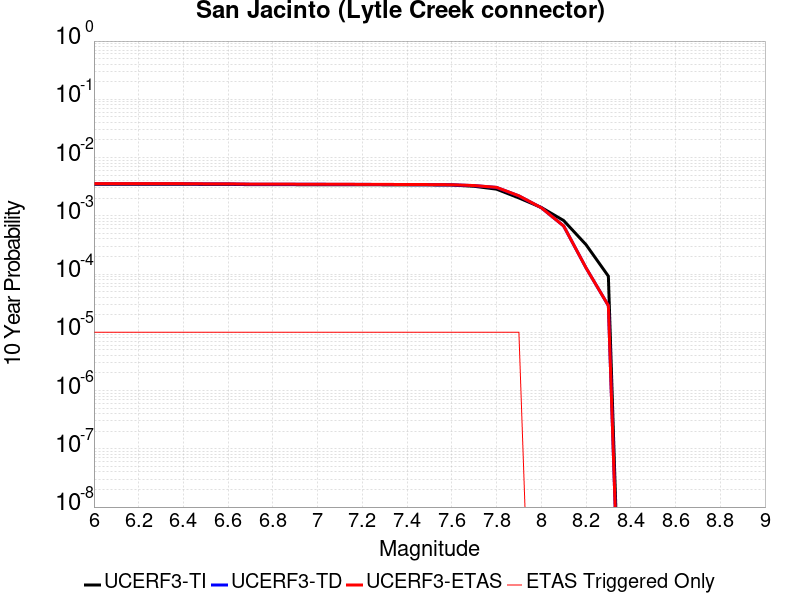 |

| Magnitude | 1 wk TI Prob | 1 wk TD Prob | 1 wk ETAS Prob | 1 wk ETAS/TD Gain | 1 wk ETAS Triggered Only | 1 mo TI Prob | 1 mo TD Prob | 1 mo ETAS Prob | 1 mo ETAS/TD Gain | 1 mo ETAS Triggered Only | 1 yr TI Prob | 1 yr TD Prob | 1 yr ETAS Prob | 1 yr ETAS/TD Gain | 1 yr ETAS Triggered Only | 10 yr TI Prob | 10 yr TD Prob | 10 yr ETAS Prob | 10 yr ETAS/TD Gain | 10 yr ETAS Triggered Only |
|-----|-----|-----|-----|-----|-----|-----|-----|-----|-----|-----|-----|-----|-----|-----|-----|-----|-----|-----|-----|-----|
| 6.0 | 6.693995E-6 | 6.6628318E-6 | 6.6628318E-6 | 1.0 | 0.0 | 2.8688235E-5 | 2.8554681E-5 | 2.8554681E-5 | 1.0 | 0.0 | 3.492233E-4 | 3.4759787E-4 | 3.575944E-4 | 1.0287589 | 1.0E-5 | 0.00348675 | 0.0035508901 | 0.0035608546 | 1.0028062 | 1.0E-5 |
| 6.1 | 6.693995E-6 | 6.6628318E-6 | 6.6628318E-6 | 1.0 | 0.0 | 2.8688235E-5 | 2.8554681E-5 | 2.8554681E-5 | 1.0 | 0.0 | 3.492233E-4 | 3.4759787E-4 | 3.575944E-4 | 1.0287589 | 1.0E-5 | 0.00348675 | 0.0035508901 | 0.0035608546 | 1.0028062 | 1.0E-5 |
| 6.2 | 6.693995E-6 | 6.6628318E-6 | 6.6628318E-6 | 1.0 | 0.0 | 2.8688235E-5 | 2.8554681E-5 | 2.8554681E-5 | 1.0 | 0.0 | 3.492233E-4 | 3.4759787E-4 | 3.575944E-4 | 1.0287589 | 1.0E-5 | 0.00348675 | 0.0035508901 | 0.0035608546 | 1.0028062 | 1.0E-5 |
| 6.3 | 6.693995E-6 | 6.6628318E-6 | 6.6628318E-6 | 1.0 | 0.0 | 2.8688235E-5 | 2.8554681E-5 | 2.8554681E-5 | 1.0 | 0.0 | 3.492233E-4 | 3.4759787E-4 | 3.575944E-4 | 1.0287589 | 1.0E-5 | 0.00348675 | 0.0035508901 | 0.0035608546 | 1.0028062 | 1.0E-5 |
| 6.4 | 6.693995E-6 | 6.6628318E-6 | 6.6628318E-6 | 1.0 | 0.0 | 2.8688235E-5 | 2.8554681E-5 | 2.8554681E-5 | 1.0 | 0.0 | 3.492233E-4 | 3.4759787E-4 | 3.575944E-4 | 1.0287589 | 1.0E-5 | 0.00348675 | 0.0035508901 | 0.0035608546 | 1.0028062 | 1.0E-5 |
| 6.5 | 6.6561875E-6 | 6.6230496E-6 | 6.6230496E-6 | 1.0 | 0.0 | 2.8526205E-5 | 2.838419E-5 | 2.838419E-5 | 1.0 | 0.0 | 3.472512E-4 | 3.455228E-4 | 3.5551933E-4 | 1.0289316 | 1.0E-5 | 0.0034670907 | 0.0035302055 | 0.0035401704 | 1.0028226 | 1.0E-5 |
| 6.6 | 6.6561875E-6 | 6.6230496E-6 | 6.6230496E-6 | 1.0 | 0.0 | 2.8526205E-5 | 2.838419E-5 | 2.838419E-5 | 1.0 | 0.0 | 3.472512E-4 | 3.455228E-4 | 3.5551933E-4 | 1.0289316 | 1.0E-5 | 0.0034670907 | 0.0035302055 | 0.0035401704 | 1.0028226 | 1.0E-5 |
| 6.7 | 6.5802237E-6 | 6.5422255E-6 | 6.5422255E-6 | 1.0 | 0.0 | 2.8200653E-5 | 2.803781E-5 | 2.803781E-5 | 1.0 | 0.0 | 3.4328885E-4 | 3.4130694E-4 | 3.5130352E-4 | 1.0292891 | 1.0E-5 | 0.0034275902 | 0.0034881798 | 0.003498145 | 1.0028569 | 1.0E-5 |
| 6.8 | 6.575632E-6 | 6.5367153E-6 | 6.5367153E-6 | 1.0 | 0.0 | 2.8180975E-5 | 2.8014192E-5 | 2.8014192E-5 | 1.0 | 0.0 | 3.4304935E-4 | 3.410195E-4 | 3.510161E-4 | 1.0293138 | 1.0E-5 | 0.0034252026 | 0.0034853143 | 0.0034952795 | 1.0028592 | 1.0E-5 |
| 6.9 | 6.570433E-6 | 6.5281088E-6 | 6.5281088E-6 | 1.0 | 0.0 | 2.8158694E-5 | 2.7977308E-5 | 2.7977308E-5 | 1.0 | 0.0 | 3.4277816E-4 | 3.4057058E-4 | 3.5056716E-4 | 1.0293525 | 1.0E-5 | 0.0034224992 | 0.0034808393 | 0.0034908045 | 1.0028628 | 1.0E-5 |
| 7.0 | 6.5643826E-6 | 6.5182294E-6 | 6.5182294E-6 | 1.0 | 0.0 | 2.8132765E-5 | 2.793497E-5 | 2.793497E-5 | 1.0 | 0.0 | 3.424626E-4 | 3.4005524E-4 | 3.5005185E-4 | 1.029397 | 1.0E-5 | 0.0034193532 | 0.0034757021 | 0.0034856675 | 1.0028671 | 1.0E-5 |
| 7.1 | 6.557402E-6 | 6.5069403E-6 | 6.5069403E-6 | 1.0 | 0.0 | 2.8102848E-5 | 2.788659E-5 | 2.788659E-5 | 1.0 | 0.0 | 3.4209844E-4 | 3.394664E-4 | 3.4946302E-4 | 1.029448 | 1.0E-5 | 0.0034157229 | 0.0034698334 | 0.0034797986 | 1.002872 | 1.0E-5 |
| 7.2 | 6.546394E-6 | 6.488906E-6 | 6.488906E-6 | 1.0 | 0.0 | 2.8055672E-5 | 2.7809301E-5 | 2.7809301E-5 | 1.0 | 0.0 | 3.4152428E-4 | 3.3852572E-4 | 3.4852233E-4 | 1.0295298 | 1.0E-5 | 0.0034099987 | 0.0034604599 | 0.0034704253 | 1.0028797 | 1.0E-5 |
| 7.3 | 6.5364216E-6 | 6.469689E-6 | 6.469689E-6 | 1.0 | 0.0 | 2.8012933E-5 | 2.7726945E-5 | 2.7726945E-5 | 1.0 | 0.0 | 3.4100408E-4 | 3.3752335E-4 | 3.4751996E-4 | 1.0296175 | 1.0E-5 | 0.003404813 | 0.003450482 | 0.0034604475 | 1.0028882 | 1.0E-5 |
| 7.4 | 6.5269523E-6 | 6.450774E-6 | 6.450774E-6 | 1.0 | 0.0 | 2.7972354E-5 | 2.7645881E-5 | 2.7645881E-5 | 1.0 | 0.0 | 3.4051016E-4 | 3.365367E-4 | 3.465333E-4 | 1.0297045 | 1.0E-5 | 0.0033998888 | 0.0034406635 | 0.003450629 | 1.0028964 | 1.0E-5 |
| 7.5 | 6.5111835E-6 | 6.4270453E-6 | 6.4270453E-6 | 1.0 | 0.0 | 2.7904773E-5 | 2.7544189E-5 | 2.7544189E-5 | 1.0 | 0.0 | 3.3968766E-4 | 3.3529897E-4 | 3.4529562E-4 | 1.0298141 | 1.0E-5 | 0.0033916887 | 0.0034283353 | 0.0034383012 | 1.0029069 | 1.0E-5 |
| 7.6 | 6.4768806E-6 | 6.3861507E-6 | 6.3861507E-6 | 1.0 | 0.0 | 2.7757764E-5 | 2.736893E-5 | 2.736893E-5 | 1.0 | 0.0 | 3.3789838E-4 | 3.3316584E-4 | 3.431625E-4 | 1.0300051 | 1.0E-5 | 0.0033738504 | 0.0034070655 | 0.0034170316 | 1.002925 | 1.0E-5 |
| 7.7 | 6.1655364E-6 | 6.1786222E-6 | 6.1786222E-6 | 1.0 | 0.0 | 2.642346E-5 | 2.6479542E-5 | 2.6479542E-5 | 1.0 | 0.0 | 3.2165812E-4 | 3.2234078E-4 | 3.3233757E-4 | 1.031013 | 1.0E-5 | 0.0032119295 | 0.0032986694 | 0.0033086364 | 1.0030215 | 1.0E-5 |
| 7.8 | 5.5043524E-6 | 5.739622E-6 | 5.739622E-6 | 1.0 | 0.0 | 2.3589868E-5 | 2.4598148E-5 | 2.4598148E-5 | 1.0 | 0.0 | 2.871688E-4 | 2.9944137E-4 | 3.0943836E-4 | 1.0333855 | 1.0E-5 | 0.0028679797 | 0.003068756 | 0.0030787254 | 1.0032487 | 1.0E-5 |
| 7.9 | 3.889249E-6 | 4.0787854E-6 | 4.0787854E-6 | 1.0 | 0.0 | 1.6668104E-5 | 1.7480392E-5 | 1.7480392E-5 | 1.0 | 0.0 | 2.0291525E-4 | 2.1280303E-4 | 2.2280091E-4 | 1.0469818 | 1.0E-5 | 0.0020273007 | 0.0021955092 | 0.002205487 | 1.0045447 | 1.0E-5 |
| 8.0 | 2.668535E-6 | 2.5328056E-6 | 2.5328056E-6 | 1.0 | 0.0 | 1.1436528E-5 | 1.0854836E-5 | 1.0854836E-5 | 1.0 | 0.0 | 1.3923083E-4 | 1.3214964E-4 | 1.3214964E-4 | 1.0 | 0.0 | 0.0013914363 | 0.0013765903 | 0.0013765903 | 1.0 | 0.0 |
| 8.1 | 1.5911459E-6 | 1.2193005E-6 | 1.2193005E-6 | 1.0 | 0.0 | 6.8191785E-6 | 5.225563E-6 | 5.225563E-6 | 1.0 | 0.0 | 8.3020335E-5 | 6.3619394E-5 | 6.3619394E-5 | 1.0 | 0.0 | 8.298933E-4 | 6.697524E-4 | 6.697524E-4 | 1.0 | 0.0 |
| 8.2 | 6.1294963E-7 | 2.1825215E-7 | 2.1825215E-7 | 1.0 | 0.0 | 2.6269242E-6 | 9.35366E-7 | 9.35366E-7 | 1.0 | 0.0 | 3.1982334E-5 | 1.1388021E-5 | 1.1388021E-5 | 1.0 | 0.0 | 3.1977732E-4 | 1.279216E-4 | 1.279216E-4 | 1.0 | 0.0 |
| 8.3 | 1.762871E-7 | 4.757476E-8 | 4.757476E-8 | 1.0 | 0.0 | 7.5551594E-7 | 2.038918E-7 | 2.038918E-7 | 1.0 | 0.0 | 9.1983675E-6 | 2.4823798E-6 | 2.4823798E-6 | 1.0 | 0.0 | 9.197987E-5 | 2.8703373E-5 | 2.8703373E-5 | 1.0 | 0.0 |

## San Pedro Basin
*[(top)](#table-of-contents)*

| 1 Week | 1 Month | 1 Year | 10 Year |
|-----|-----|-----|-----|
|  |  |  |  |

| Magnitude | 1 wk TI Prob | 1 wk TD Prob | 1 wk ETAS Prob | 1 wk ETAS/TD Gain | 1 wk ETAS Triggered Only | 1 mo TI Prob | 1 mo TD Prob | 1 mo ETAS Prob | 1 mo ETAS/TD Gain | 1 mo ETAS Triggered Only | 1 yr TI Prob | 1 yr TD Prob | 1 yr ETAS Prob | 1 yr ETAS/TD Gain | 1 yr ETAS Triggered Only | 10 yr TI Prob | 10 yr TD Prob | 10 yr ETAS Prob | 10 yr ETAS/TD Gain | 10 yr ETAS Triggered Only |
|-----|-----|-----|-----|-----|-----|-----|-----|-----|-----|-----|-----|-----|-----|-----|-----|-----|-----|-----|-----|-----|
| 6.0 | 5.3449043E-5 | 6.3371765E-5 | 6.3371765E-5 | 1.0 | 0.0 | 2.2904722E-4 | 2.7156848E-4 | 2.8156576E-4 | 1.0368131 | 1.0E-5 | 0.0027850836 | 0.0033019334 | 0.0033119004 | 1.0030185 | 1.0E-5 | 0.027504366 | 0.03259028 | 0.032599956 | 1.0002968 | 1.0E-5 |
| 6.1 | 5.3449043E-5 | 6.3371765E-5 | 6.3371765E-5 | 1.0 | 0.0 | 2.2904722E-4 | 2.7156848E-4 | 2.8156576E-4 | 1.0368131 | 1.0E-5 | 0.0027850836 | 0.0033019334 | 0.0033119004 | 1.0030185 | 1.0E-5 | 0.027504366 | 0.03259028 | 0.032599956 | 1.0002968 | 1.0E-5 |
| 6.2 | 2.3189454E-5 | 2.6643364E-5 | 2.6643364E-5 | 1.0 | 0.0 | 9.9379584E-5 | 1.1418111E-4 | 1.1418111E-4 | 1.0 | 0.0 | 0.0012092749 | 0.0013893156 | 0.0013893156 | 1.0 | 0.0 | 0.012027155 | 0.013811166 | 0.013811166 | 1.0 | 0.0 |
| 6.3 | 2.3189454E-5 | 2.6643364E-5 | 2.6643364E-5 | 1.0 | 0.0 | 9.9379584E-5 | 1.1418111E-4 | 1.1418111E-4 | 1.0 | 0.0 | 0.0012092749 | 0.0013893156 | 0.0013893156 | 1.0 | 0.0 | 0.012027155 | 0.013811166 | 0.013811166 | 1.0 | 0.0 |
| 6.4 | 1.966056E-5 | 2.2463855E-5 | 2.2463855E-5 | 1.0 | 0.0 | 8.425682E-5 | 9.627034E-5 | 9.627034E-5 | 1.0 | 0.0 | 0.001025344 | 0.0011715014 | 0.0011715014 | 1.0 | 0.0 | 0.010206259 | 0.011657343 | 0.011657343 | 1.0 | 0.0 |
| 6.5 | 1.7342953E-5 | 1.9745525E-5 | 1.9745525E-5 | 1.0 | 0.0 | 7.4324824E-5 | 8.462114E-5 | 8.462114E-5 | 1.0 | 0.0 | 9.04529E-4 | 0.0010298124 | 0.0010298124 | 1.0 | 0.0 | 0.009008561 | 0.010254125 | 0.010254125 | 1.0 | 0.0 |
| 6.6 | 1.439804E-5 | 1.6323016E-5 | 1.6323016E-5 | 1.0 | 0.0 | 6.170443E-5 | 6.995408E-5 | 6.995408E-5 | 1.0 | 0.0 | 7.509924E-4 | 8.513903E-4 | 8.513903E-4 | 1.0 | 0.0 | 0.0074845953 | 0.008484487 | 0.008484487 | 1.0 | 0.0 |
| 6.7 | 1.2634884E-5 | 1.4285555E-5 | 1.4285555E-5 | 1.0 | 0.0 | 5.414838E-5 | 6.122254E-5 | 6.122254E-5 | 1.0 | 0.0 | 6.590571E-4 | 7.4516E-4 | 7.4516E-4 | 1.0 | 0.0 | 0.006571059 | 0.0074296347 | 0.0074296347 | 1.0 | 0.0 |
| 6.8 | 1.146091E-5 | 1.2933422E-5 | 1.2933422E-5 | 1.0 | 0.0 | 4.911726E-5 | 5.5427943E-5 | 5.5427943E-5 | 1.0 | 0.0 | 5.9783855E-4 | 6.74656E-4 | 6.74656E-4 | 1.0 | 0.0 | 0.0059623276 | 0.006729019 | 0.006729019 | 1.0 | 0.0 |
| 6.9 | 9.109035E-6 | 1.023519E-5 | 1.023519E-5 | 1.0 | 0.0 | 3.9038136E-5 | 4.386452E-5 | 4.386452E-5 | 1.0 | 0.0 | 4.7518566E-4 | 5.339476E-4 | 5.339476E-4 | 1.0 | 0.0 | 0.0047417083 | 0.005329401 | 0.005329401 | 1.0 | 0.0 |
| 7.0 | 5.9351028E-6 | 6.584069E-6 | 6.584069E-6 | 1.0 | 0.0 | 2.5435906E-5 | 2.8217266E-5 | 2.8217266E-5 | 1.0 | 0.0 | 3.0963816E-4 | 3.4351466E-4 | 3.4351466E-4 | 1.0 | 0.0 | 0.0030920706 | 0.0034321537 | 0.0034321537 | 1.0 | 0.0 |
| 7.1 | 2.1557585E-6 | 2.2096617E-6 | 2.2096617E-6 | 1.0 | 0.0 | 9.238933E-6 | 9.469944E-6 | 9.469944E-6 | 1.0 | 0.0 | 1.1247819E-4 | 1.1529063E-4 | 1.1529063E-4 | 1.0 | 0.0 | 0.0011242128 | 0.0011523236 | 0.0011523236 | 1.0 | 0.0 |
| 7.2 | 2.1251979E-6 | 2.1780077E-6 | 2.1780077E-6 | 1.0 | 0.0 | 9.107958E-6 | 9.334286E-6 | 9.334286E-6 | 1.0 | 0.0 | 1.1088375E-4 | 1.13639166E-4 | 1.13639166E-4 | 1.0 | 0.0 | 0.0011082845 | 0.0011358259 | 0.0011358259 | 1.0 | 0.0 |
| 7.3 | 1.7145798E-6 | 1.7442975E-6 | 1.7442975E-6 | 1.0 | 0.0 | 7.3481783E-6 | 7.47554E-6 | 7.47554E-6 | 1.0 | 0.0 | 8.94604E-5 | 9.101099E-5 | 9.101099E-5 | 1.0 | 0.0 | 8.9424395E-4 | 9.097463E-4 | 9.097463E-4 | 1.0 | 0.0 |
| 7.4 | 1.4467993E-6 | 1.4641951E-6 | 1.4641951E-6 | 1.0 | 0.0 | 6.200554E-6 | 6.2751074E-6 | 6.2751074E-6 | 1.0 | 0.0 | 7.548913E-5 | 7.639683E-5 | 7.639683E-5 | 1.0 | 0.0 | 7.546349E-4 | 7.637129E-4 | 7.637129E-4 | 1.0 | 0.0 |
| 7.5 | 1.2803735E-6 | 1.293157E-6 | 1.293157E-6 | 1.0 | 0.0 | 5.487303E-6 | 5.54209E-6 | 5.54209E-6 | 1.0 | 0.0 | 6.680587E-5 | 6.747293E-5 | 6.747293E-5 | 1.0 | 0.0 | 6.678579E-4 | 6.745315E-4 | 6.745315E-4 | 1.0 | 0.0 |
| 7.6 | 6.755009E-7 | 6.769505E-7 | 6.769505E-7 | 1.0 | 0.0 | 2.8950008E-6 | 2.9012133E-6 | 2.9012133E-6 | 1.0 | 0.0 | 3.5246063E-5 | 3.532176E-5 | 3.532176E-5 | 1.0 | 0.0 | 3.5240475E-4 | 3.5316718E-4 | 3.5316718E-4 | 1.0 | 0.0 |
| 7.7 | 6.211885E-8 | 4.5700038E-8 | 4.5700038E-8 | 1.0 | 0.0 | 2.6622362E-7 | 1.9585728E-7 | 1.9585728E-7 | 1.0 | 0.0 | 3.2412677E-6 | 2.38456E-6 | 2.38456E-6 | 1.0 | 0.0 | 3.2412205E-5 | 2.3845365E-5 | 2.3845365E-5 | 1.0 | 0.0 |
| 7.8 | 2.6580573E-9 | 1.5138489E-9 | 1.5138489E-9 | 1.0 | 0.0 | 1.1391674E-8 | 6.487924E-9 | 6.487924E-9 | 1.0 | 0.0 | 1.3869362E-7 | 7.8990475E-8 | 7.8990475E-8 | 1.0 | 0.0 | 1.3869354E-6 | 7.8990473E-7 | 7.8990473E-7 | 1.0 | 0.0 |

## Clayton
*[(top)](#table-of-contents)*

| 1 Week | 1 Month | 1 Year | 10 Year |
|-----|-----|-----|-----|
| 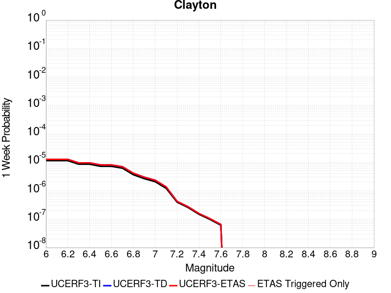 |  |  |  |

| Magnitude | 1 wk TI Prob | 1 wk TD Prob | 1 wk ETAS Prob | 1 wk ETAS/TD Gain | 1 wk ETAS Triggered Only | 1 mo TI Prob | 1 mo TD Prob | 1 mo ETAS Prob | 1 mo ETAS/TD Gain | 1 mo ETAS Triggered Only | 1 yr TI Prob | 1 yr TD Prob | 1 yr ETAS Prob | 1 yr ETAS/TD Gain | 1 yr ETAS Triggered Only | 10 yr TI Prob | 10 yr TD Prob | 10 yr ETAS Prob | 10 yr ETAS/TD Gain | 10 yr ETAS Triggered Only |
|-----|-----|-----|-----|-----|-----|-----|-----|-----|-----|-----|-----|-----|-----|-----|-----|-----|-----|-----|-----|-----|
| 6.0 | 1.1413061E-5 | 1.2667253E-5 | 1.2667253E-5 | 1.0 | 0.0 | 4.89122E-5 | 5.4287222E-5 | 5.4287222E-5 | 1.0 | 0.0 | 5.953433E-4 | 6.607687E-4 | 6.707621E-4 | 1.0151238 | 1.0E-5 | 0.005937509 | 0.006590243 | 0.006600177 | 1.0015074 | 1.0E-5 |
| 6.1 | 1.1413061E-5 | 1.2667253E-5 | 1.2667253E-5 | 1.0 | 0.0 | 4.89122E-5 | 5.4287222E-5 | 5.4287222E-5 | 1.0 | 0.0 | 5.953433E-4 | 6.607687E-4 | 6.707621E-4 | 1.0151238 | 1.0E-5 | 0.005937509 | 0.006590243 | 0.006600177 | 1.0015074 | 1.0E-5 |
| 6.2 | 1.1413061E-5 | 1.2667253E-5 | 1.2667253E-5 | 1.0 | 0.0 | 4.89122E-5 | 5.4287222E-5 | 5.4287222E-5 | 1.0 | 0.0 | 5.953433E-4 | 6.607687E-4 | 6.707621E-4 | 1.0151238 | 1.0E-5 | 0.005937509 | 0.006590243 | 0.006600177 | 1.0015074 | 1.0E-5 |
| 6.3 | 8.538689E-6 | 9.53291E-6 | 9.53291E-6 | 1.0 | 0.0 | 3.659387E-5 | 4.0854746E-5 | 4.0854746E-5 | 1.0 | 0.0 | 4.4543925E-4 | 4.973038E-4 | 5.072988E-4 | 1.0200984 | 1.0E-5 | 0.0044454746 | 0.004962975 | 0.0049729254 | 1.0020049 | 1.0E-5 |
| 6.4 | 8.538689E-6 | 9.53291E-6 | 9.53291E-6 | 1.0 | 0.0 | 3.659387E-5 | 4.0854746E-5 | 4.0854746E-5 | 1.0 | 0.0 | 4.4543925E-4 | 4.973038E-4 | 5.072988E-4 | 1.0200984 | 1.0E-5 | 0.0044454746 | 0.004962975 | 0.0049729254 | 1.0020049 | 1.0E-5 |
| 6.5 | 7.197462E-6 | 8.081092E-6 | 8.081092E-6 | 1.0 | 0.0 | 3.08459E-5 | 3.463284E-5 | 3.463284E-5 | 1.0 | 0.0 | 3.7548412E-4 | 4.2158147E-4 | 4.3157724E-4 | 1.0237103 | 1.0E-5 | 0.003748503 | 0.004208629 | 0.0042185867 | 1.0023661 | 1.0E-5 |
| 6.6 | 7.1760483E-6 | 8.057108E-6 | 8.057108E-6 | 1.0 | 0.0 | 3.075413E-5 | 3.4530054E-5 | 3.4530054E-5 | 1.0 | 0.0 | 3.743672E-4 | 4.203305E-4 | 4.303263E-4 | 1.0237808 | 1.0E-5 | 0.0037373714 | 0.0041961665 | 0.0042061247 | 1.0023731 | 1.0E-5 |
| 6.7 | 6.202582E-6 | 6.976818E-6 | 6.976818E-6 | 1.0 | 0.0 | 2.6582224E-5 | 2.990035E-5 | 2.990035E-5 | 1.0 | 0.0 | 3.235905E-4 | 3.639836E-4 | 3.7397997E-4 | 1.0274638 | 1.0E-5 | 0.0032311971 | 0.0036346302 | 0.003644594 | 1.0027413 | 1.0E-5 |
| 6.8 | 3.6417277E-6 | 4.1213766E-6 | 4.1213766E-6 | 1.0 | 0.0 | 1.5607311E-5 | 1.7662927E-5 | 1.7662927E-5 | 1.0 | 0.0 | 1.9000245E-4 | 2.1502568E-4 | 2.2502353E-4 | 1.046496 | 1.0E-5 | 0.0018984007 | 0.0021482527 | 0.002158231 | 1.004645 | 1.0E-5 |
| 6.9 | 2.6498485E-6 | 2.9995813E-6 | 2.9995813E-6 | 1.0 | 0.0 | 1.1356444E-5 | 1.2855287E-5 | 1.2855287E-5 | 1.0 | 0.0 | 1.3825593E-4 | 1.5650228E-4 | 1.6650071E-4 | 1.0638869 | 1.0E-5 | 0.0013816995 | 0.0015639602 | 0.0015739446 | 1.006384 | 1.0E-5 |
| 7.0 | 2.070442E-6 | 2.3407722E-6 | 2.3407722E-6 | 1.0 | 0.0 | 8.873292E-6 | 1.0031844E-5 | 1.0031844E-5 | 1.0 | 0.0 | 1.0802698E-4 | 1.2213115E-4 | 1.3212994E-4 | 1.0818692 | 1.0E-5 | 0.0010797448 | 0.0012206702 | 0.0012306579 | 1.0081822 | 1.0E-5 |
| 7.1 | 1.2111691E-6 | 1.358901E-6 | 1.358901E-6 | 1.0 | 0.0 | 5.190714E-6 | 5.8238493E-6 | 5.8238493E-6 | 1.0 | 0.0 | 6.319511E-5 | 7.0903225E-5 | 7.0903225E-5 | 1.0 | 0.0 | 6.3177146E-4 | 7.088224E-4 | 7.088224E-4 | 1.0 | 0.0 |
| 7.2 | 3.9541607E-7 | 4.2228655E-7 | 4.2228655E-7 | 1.0 | 0.0 | 1.6946392E-6 | 1.8097983E-6 | 1.8097983E-6 | 1.0 | 0.0 | 2.0632036E-5 | 2.2034073E-5 | 2.2034073E-5 | 1.0 | 0.0 | 2.063012E-4 | 2.2031902E-4 | 2.2031902E-4 | 1.0 | 0.0 |
| 7.3 | 2.5685637E-7 | 2.7457332E-7 | 2.7457332E-7 | 1.0 | 0.0 | 1.1008126E-6 | 1.1767423E-6 | 1.1767423E-6 | 1.0 | 0.0 | 1.3402311E-5 | 1.4326744E-5 | 1.4326744E-5 | 1.0 | 0.0 | 1.3401502E-4 | 1.4325828E-4 | 1.4325828E-4 | 1.0 | 0.0 |
| 7.4 | 1.482299E-7 | 1.580828E-7 | 1.580828E-7 | 1.0 | 0.0 | 6.3527085E-7 | 6.774975E-7 | 6.774975E-7 | 1.0 | 0.0 | 7.734395E-6 | 8.248501E-6 | 8.248501E-6 | 1.0 | 0.0 | 7.734126E-5 | 8.248198E-5 | 8.248198E-5 | 1.0 | 0.0 |
| 7.5 | 9.7969505E-8 | 1.0438406E-7 | 1.0438406E-7 | 1.0 | 0.0 | 4.1986925E-7 | 4.4736018E-7 | 4.4736018E-7 | 1.0 | 0.0 | 5.111896E-6 | 5.446597E-6 | 5.446597E-6 | 1.0 | 0.0 | 5.1117782E-5 | 5.446465E-5 | 5.446465E-5 | 1.0 | 0.0 |
| 7.6 | 6.125415E-8 | 6.523247E-8 | 6.523247E-8 | 1.0 | 0.0 | 2.6251774E-7 | 2.795677E-7 | 2.795677E-7 | 1.0 | 0.0 | 3.196149E-6 | 3.4037316E-6 | 3.4037316E-6 | 1.0 | 0.0 | 3.196103E-5 | 3.4036806E-5 | 3.4036806E-5 | 1.0 | 0.0 |

## Jess Valley
*[(top)](#table-of-contents)*

| 1 Week | 1 Month | 1 Year | 10 Year |
|-----|-----|-----|-----|
|  |  |  |  |

| Magnitude | 1 wk TI Prob | 1 wk TD Prob | 1 wk ETAS Prob | 1 wk ETAS/TD Gain | 1 wk ETAS Triggered Only | 1 mo TI Prob | 1 mo TD Prob | 1 mo ETAS Prob | 1 mo ETAS/TD Gain | 1 mo ETAS Triggered Only | 1 yr TI Prob | 1 yr TD Prob | 1 yr ETAS Prob | 1 yr ETAS/TD Gain | 1 yr ETAS Triggered Only | 10 yr TI Prob | 10 yr TD Prob | 10 yr ETAS Prob | 10 yr ETAS/TD Gain | 10 yr ETAS Triggered Only |
|-----|-----|-----|-----|-----|-----|-----|-----|-----|-----|-----|-----|-----|-----|-----|-----|-----|-----|-----|-----|-----|
| 6.0 | 3.3861274E-6 | 3.4340655E-6 | 3.4340655E-6 | 1.0 | 0.0 | 1.4511894E-5 | 1.4717357E-5 | 1.4717357E-5 | 1.0 | 0.0 | 1.7666799E-4 | 1.7917191E-4 | 1.8917011E-4 | 1.0558023 | 1.0E-5 | 0.001765276 | 0.001790551 | 0.001800533 | 1.0055748 | 1.0E-5 |
| 6.1 | 3.3861274E-6 | 3.4340655E-6 | 3.4340655E-6 | 1.0 | 0.0 | 1.4511894E-5 | 1.4717357E-5 | 1.4717357E-5 | 1.0 | 0.0 | 1.7666799E-4 | 1.7917191E-4 | 1.8917011E-4 | 1.0558023 | 1.0E-5 | 0.001765276 | 0.001790551 | 0.001800533 | 1.0055748 | 1.0E-5 |
| 6.2 | 3.3861274E-6 | 3.4340655E-6 | 3.4340655E-6 | 1.0 | 0.0 | 1.4511894E-5 | 1.4717357E-5 | 1.4717357E-5 | 1.0 | 0.0 | 1.7666799E-4 | 1.7917191E-4 | 1.8917011E-4 | 1.0558023 | 1.0E-5 | 0.001765276 | 0.001790551 | 0.001800533 | 1.0055748 | 1.0E-5 |
| 6.3 | 3.3861274E-6 | 3.4340655E-6 | 3.4340655E-6 | 1.0 | 0.0 | 1.4511894E-5 | 1.4717357E-5 | 1.4717357E-5 | 1.0 | 0.0 | 1.7666799E-4 | 1.7917191E-4 | 1.8917011E-4 | 1.0558023 | 1.0E-5 | 0.001765276 | 0.001790551 | 0.001800533 | 1.0055748 | 1.0E-5 |
| 6.4 | 1.5291708E-6 | 1.5502812E-6 | 1.5502812E-6 | 1.0 | 0.0 | 6.553573E-6 | 6.6440502E-6 | 6.6440502E-6 | 1.0 | 0.0 | 7.978683E-5 | 8.0889105E-5 | 8.0889105E-5 | 1.0 | 0.0 | 7.975819E-4 | 8.0867484E-4 | 8.0867484E-4 | 1.0 | 0.0 |
| 6.5 | 1.5291708E-6 | 1.5502812E-6 | 1.5502812E-6 | 1.0 | 0.0 | 6.553573E-6 | 6.6440502E-6 | 6.6440502E-6 | 1.0 | 0.0 | 7.978683E-5 | 8.0889105E-5 | 8.0889105E-5 | 1.0 | 0.0 | 7.975819E-4 | 8.0867484E-4 | 8.0867484E-4 | 1.0 | 0.0 |
| 6.6 | 5.396423E-7 | 5.4720056E-7 | 5.4720056E-7 | 1.0 | 0.0 | 2.312751E-6 | 2.3451441E-6 | 2.3451441E-6 | 1.0 | 0.0 | 2.8157378E-5 | 2.8551944E-5 | 2.8551944E-5 | 1.0 | 0.0 | 2.8153812E-4 | 2.8550118E-4 | 2.8550118E-4 | 1.0 | 0.0 |
| 6.7 | 5.396423E-7 | 5.4720056E-7 | 5.4720056E-7 | 1.0 | 0.0 | 2.312751E-6 | 2.3451441E-6 | 2.3451441E-6 | 1.0 | 0.0 | 2.8157378E-5 | 2.8551944E-5 | 2.8551944E-5 | 1.0 | 0.0 | 2.8153812E-4 | 2.8550118E-4 | 2.8550118E-4 | 1.0 | 0.0 |
| 6.8 | 3.6058395E-7 | 3.6563134E-7 | 3.6563134E-7 | 1.0 | 0.0 | 1.5453588E-6 | 1.5669915E-6 | 1.5669915E-6 | 1.0 | 0.0 | 1.8814582E-5 | 1.9078121E-5 | 1.9078121E-5 | 1.0 | 0.0 | 1.8812988E-4 | 1.9078121E-4 | 1.9078121E-4 | 1.0 | 0.0 |

