# Parent Section Magnitude-Probability Distributions

Only fault sections with at least one triggered aftershock are plotted. Sections are sorted by total supraseismogenic trigger rate (decreasing)

## Table Of Contents

* [Garlock (Central)](#garlock-central)
* [Little Lake](#little-lake)
* [Tank Canyon](#tank-canyon)
* [Airport Lake](#airport-lake)
* [Owl Lake](#owl-lake)
* [Panamint Valley](#panamint-valley)
* [Garlock (East)](#garlock-east)
* [Hunter Mountain-Saline Valley](#hunter-mountain-saline-valley)
* [Garlock (West)](#garlock-west)
* [Blackwater](#blackwater)
* [Ash Hill](#ash-hill)
* [Gravel Hills-Harper Lk](#gravel-hills-harper-lk)
* [San Andreas (Mojave N)](#san-andreas-mojave-n)
* [San Andreas (Mojave S)](#san-andreas-mojave-s)
* [So Sierra Nevada](#so-sierra-nevada)
* [Goldstone Lake](#goldstone-lake)
* [Lenwood-Lockhart-Old Woman Springs](#lenwood-lockhart-old-woman-springs)
* [McLean Lake](#mclean-lake)
* [San Andreas (San Bernardino N)](#san-andreas-san-bernardino-n)
* [Coyote Canyon](#coyote-canyon)
* [Death Valley (So)](#death-valley-so)
* [Nelson Lake](#nelson-lake)
* [Helendale-So Lockhart](#helendale-so-lockhart)
* [Death Valley (Black Mtns Frontal)](#death-valley-black-mtns-frontal)
* [Bicycle Lake](#bicycle-lake)
* [Towne Pass](#towne-pass)
* [Death Valley (No)](#death-valley-no)
* [San Andreas (San Bernardino S)](#san-andreas-san-bernardino-s)
* [Death Valley (Fish Lake Valley)](#death-valley-fish-lake-valley)
* [Paradise](#paradise)
* [Scodie Lineament](#scodie-lineament)
* [San Andreas (San Gorgonio Pass-Garnet HIll)](#san-andreas-san-gorgonio-pass-garnet-hill)
* [Sierra Nevada  (No Extension)](#sierra-nevada--no-extension)
* [Kern Canyon (North Kern) 2011](#kern-canyon-north-kern-2011)
* [Deep Springs](#deep-springs)
* [San Andreas (Big Bend)](#san-andreas-big-bend)
* [White Wolf (Extension)](#white-wolf-extension)
* [Calico-Hidalgo](#calico-hidalgo)
* [Lake Isabella (Seismicity)](#lake-isabella-seismicity)
* [Garlic Springs](#garlic-springs)
* [San Andreas (North Branch Mill Creek)](#san-andreas-north-branch-mill-creek)
* [Red Pass](#red-pass)
* [Elsinore (Glen Ivy) rev](#elsinore-glen-ivy-rev)
* [Bullion Mountains](#bullion-mountains)
* [San Jacinto (San Bernardino)](#san-jacinto-san-bernardino)
* [Independence rev 2011](#independence-rev-2011)
* [Mission Ridge-Arroyo Parida-Santa Ana](#mission-ridge-arroyo-parida-santa-ana)
* [Coyote Lake](#coyote-lake)
* [Owens Valley](#owens-valley)
* [Mission Creek](#mission-creek)
* [Santa Susana East (connector)](#santa-susana-east-connector)
* [Oak Ridge (Onshore)](#oak-ridge-onshore)
* [Simi-Santa Rosa](#simi-santa-rosa)
* [Earthquake Valley (So Extension)](#earthquake-valley-so-extension)
* [Red Mountain](#red-mountain)
* [San Clemente](#san-clemente)
* [Calaveras (So) - Paicines extension 2011 CFM](#calaveras-so---paicines-extension-2011-cfm)
* [Hunting Creek - Bartlett Springs connector 2011](#hunting-creek---bartlett-springs-connector-2011)
* [Hollywood](#hollywood)
* [White Wolf](#white-wolf)
* [Cleghorn](#cleghorn)
* [San Andreas (Creeping Section) 2011 CFM](#san-andreas-creeping-section-2011-cfm)
* [Earthquake Valley (No  Extension)](#earthquake-valley-no--extension)
* [San Andreas (Parkfield)](#san-andreas-parkfield)
* [Santa Ynez (West)](#santa-ynez-west)
* [Hartley Springs 2011 CFM](#hartley-springs-2011-cfm)
* [San Jacinto (Superstition Mtn)](#san-jacinto-superstition-mtn)
* [Northridge](#northridge)
* [San Andreas (North Coast) 2011 CFM](#san-andreas-north-coast-2011-cfm)
* [Dry Mountain](#dry-mountain)
* [Hector Mine](#hector-mine)
* [Imperial](#imperial)
* [San Pedro Basin](#san-pedro-basin)
* [Sheephole](#sheephole)
* [Cleghorn Pass](#cleghorn-pass)
* [Pinto Mtn](#pinto-mtn)
* [Cleghorn Lake](#cleghorn-lake)
* [Brawley (Seismic Zone) alt 1](#brawley-seismic-zone-alt-1)
* [Blue Cut](#blue-cut)
* [Cady](#cady)
* [Raymond](#raymond)
* [San Jacinto (Lytle Creek connector)](#san-jacinto-lytle-creek-connector)
* [Earthquake Valley](#earthquake-valley)
* [Great Valley 05 Pittsburg - Kirby Hills alt1](#great-valley-05-pittsburg---kirby-hills-alt1)
* [San Andreas (Coachella) rev](#san-andreas-coachella-rev)

## Garlock (Central)
*[(top)](#table-of-contents)*

| 1 Week | 1 Month | 1 Year | 10 Year |
|-----|-----|-----|-----|
|  |  |  |  |

| Magnitude | 1 wk TI Prob | 1 wk TD Prob | 1 wk ETAS Prob | 1 wk ETAS/TD Gain | 1 wk ETAS Triggered Only | 1 mo TI Prob | 1 mo TD Prob | 1 mo ETAS Prob | 1 mo ETAS/TD Gain | 1 mo ETAS Triggered Only | 1 yr TI Prob | 1 yr TD Prob | 1 yr ETAS Prob | 1 yr ETAS/TD Gain | 1 yr ETAS Triggered Only | 10 yr TI Prob | 10 yr TD Prob | 10 yr ETAS Prob | 10 yr ETAS/TD Gain | 10 yr ETAS Triggered Only |
|-----|-----|-----|-----|-----|-----|-----|-----|-----|-----|-----|-----|-----|-----|-----|-----|-----|-----|-----|-----|-----|
| 6.0 | 5.5131142E-5 | 7.0252914E-5 | 0.0043722764 | 62.236225 | 0.0043023257 | 2.3625491E-4 | 3.0104956E-4 | 0.010039719 | 33.34906 | 0.009741602 | 0.0028726095 | 0.0036591839 | 0.023791961 | 6.501986 | 0.020206718 | 0.028357591 | 0.03608289 | 0.062584385 | 1.7344615 | 0.02749354 |
| 6.1 | 5.5131142E-5 | 7.0252914E-5 | 0.0043722764 | 62.236225 | 0.0043023257 | 2.3625491E-4 | 3.0104956E-4 | 0.010039719 | 33.34906 | 0.009741602 | 0.0028726095 | 0.0036591839 | 0.023791961 | 6.501986 | 0.020206718 | 0.028357591 | 0.03608289 | 0.062584385 | 1.7344615 | 0.02749354 |
| 6.2 | 4.216245E-5 | 5.166702E-5 | 0.002583836 | 50.009388 | 0.0025322998 | 1.806837E-4 | 2.2141146E-4 | 0.0062149162 | 28.069532 | 0.005994832 | 0.0021976046 | 0.0026923837 | 0.0150234355 | 5.5799756 | 0.012364341 | 0.021759989 | 0.02669258 | 0.042864073 | 1.6058421 | 0.016614987 |
| 6.3 | 4.216245E-5 | 5.166702E-5 | 0.002583836 | 50.009388 | 0.0025322998 | 1.806837E-4 | 2.2141146E-4 | 0.0062149162 | 28.069532 | 0.005994832 | 0.0021976046 | 0.0026923837 | 0.0150234355 | 5.5799756 | 0.012364341 | 0.021759989 | 0.02669258 | 0.042864073 | 1.6058421 | 0.016614987 |
| 6.4 | 3.6858168E-5 | 4.411584E-5 | 0.0019303375 | 43.756107 | 0.0018863049 | 1.5795401E-4 | 1.8905434E-4 | 0.0047101635 | 24.914337 | 0.0045219637 | 0.0019213937 | 0.0022993318 | 0.011889633 | 5.1709075 | 0.009612403 | 0.019048655 | 0.02285164 | 0.035413172 | 1.5496994 | 0.012855297 |
| 6.5 | 3.39199E-5 | 4.0023286E-5 | 0.0017453814 | 43.609146 | 0.0017054264 | 1.453629E-4 | 1.7151721E-4 | 0.004214751 | 24.573343 | 0.0040439274 | 0.0017683565 | 0.0020862438 | 0.010698729 | 5.128226 | 0.008630491 | 0.017543508 | 0.02076252 | 0.03207309 | 1.5447592 | 0.011550387 |
| 6.6 | 3.3571985E-5 | 3.947746E-5 | 0.0017448365 | 44.198296 | 0.0017054264 | 1.4387199E-4 | 1.6917827E-4 | 0.004212422 | 24.899307 | 0.0040439274 | 0.0017502342 | 0.0020578213 | 0.010657659 | 5.179098 | 0.008617571 | 0.017365133 | 0.02048383 | 0.031772308 | 1.5510924 | 0.011524548 |
| 6.7 | 3.2580007E-5 | 3.8093858E-5 | 0.0016659388 | 43.73248 | 0.0016279069 | 1.3962112E-4 | 1.632493E-4 | 0.0040515033 | 24.817892 | 0.003888889 | 0.0016985617 | 0.0019857697 | 0.01013493 | 5.103779 | 0.008165374 | 0.016856372 | 0.019776449 | 0.030515848 | 1.5430399 | 0.010956072 |
| 6.8 | 3.2185937E-5 | 3.7521055E-5 | 0.0016395281 | 43.696217 | 0.0016020671 | 1.3793244E-4 | 1.6079473E-4 | 0.0039715515 | 24.699512 | 0.0038113694 | 0.0016780337 | 0.0019559395 | 0.009950608 | 5.08738 | 0.008010336 | 0.016654192 | 0.01948324 | 0.029997826 | 1.5396733 | 0.0107235145 |
| 6.9 | 3.165394E-5 | 3.672561E-5 | 0.0016128952 | 43.917446 | 0.0015762274 | 1.3565269E-4 | 1.5738611E-4 | 0.003929402 | 24.96664 | 0.0037726099 | 0.0016503202 | 0.0019145131 | 0.009716086 | 5.0749645 | 0.007816537 | 0.01638118 | 0.01907586 | 0.029341344 | 1.5381402 | 0.010465116 |
| 7.0 | 3.0903822E-5 | 3.5630834E-5 | 0.0015859632 | 44.510975 | 0.0015503876 | 1.3243823E-4 | 1.5269476E-4 | 0.0038730567 | 25.3647 | 0.0037209303 | 0.0016112428 | 0.0018574947 | 0.00954345 | 5.1378074 | 0.0077002584 | 0.015996104 | 0.018515008 | 0.028621513 | 1.5458548 | 0.010297158 |
| 7.1 | 3.0069863E-5 | 3.4397097E-5 | 0.001545973 | 44.944866 | 0.0015116279 | 1.2886449E-4 | 1.4740792E-4 | 0.0037902817 | 25.712877 | 0.0036434107 | 0.0015677959 | 0.0017932352 | 0.009170163 | 5.1137543 | 0.007390181 | 0.01556781 | 0.017882649 | 0.027640378 | 1.5456535 | 0.0099354 |
| 7.2 | 2.7957109E-5 | 3.1286367E-5 | 0.0012973966 | 41.468433 | 0.0012661499 | 1.1981068E-4 | 1.3407765E-4 | 0.0032473553 | 24.21996 | 0.0031136952 | 0.0014577188 | 0.0016311926 | 0.007835526 | 4.8035564 | 0.00621447 | 0.014481937 | 0.016286217 | 0.024458412 | 1.501786 | 0.008307493 |
| 7.3 | 2.4519275E-5 | 2.6719412E-5 | 9.698467E-4 | 36.297455 | 9.4315247E-4 | 1.0507837E-4 | 1.14506816E-4 | 0.0023235562 | 20.291859 | 0.0022093023 | 0.0012785783 | 0.0013932437 | 0.005702477 | 4.0929503 | 0.0043152454 | 0.012712469 | 0.013930428 | 0.01963791 | 1.4097134 | 0.005788114 |
| 7.4 | 2.3225532E-5 | 2.5203923E-5 | 8.64976E-4 | 34.319103 | 8.397933E-4 | 9.95342E-5 | 1.0801242E-4 | 0.0021620542 | 20.016718 | 0.0020542636 | 0.0012111551 | 0.0013142723 | 0.0052754674 | 4.0139837 | 0.0039664083 | 0.012045753 | 0.013148054 | 0.018375564 | 1.3975881 | 0.0052971574 |
| 7.5 | 2.097765E-5 | 2.2487986E-5 | 7.072271E-4 | 31.44911 | 6.847545E-4 | 8.9901114E-5 | 9.637359E-5 | 0.0016982864 | 17.621906 | 0.0016020671 | 0.0010939965 | 0.0011727286 | 0.004282772 | 3.651972 | 0.0031136952 | 0.010886264 | 0.011742581 | 0.015853936 | 1.3501236 | 0.0041602068 |
| 7.6 | 1.511254E-5 | 1.5995334E-5 | 3.5190728E-4 | 22.00062 | 3.359173E-4 | 6.476642E-5 | 6.854967E-5 | 8.6952833E-4 | 12.684647 | 8.010336E-4 | 7.882459E-4 | 8.342805E-4 | 0.0024995566 | 2.9960628 | 0.0016666667 | 0.007854558 | 0.008385628 | 0.010614839 | 1.2658371 | 0.002248062 |
| 7.7 | 9.934069E-6 | 1.0682508E-5 | 6.236154E-5 | 5.8377247 | 5.1679588E-5 | 4.2573887E-5 | 4.5781377E-5 | 1.8789373E-4 | 4.104152 | 1.4211886E-4 | 5.182138E-4 | 5.572461E-4 | 9.317143E-4 | 1.6719979 | 3.74677E-4 | 0.00517007 | 0.0056296107 | 0.0061306497 | 1.0890007 | 5.0387596E-4 |
| 7.8 | 6.7562896E-6 | 8.431477E-6 | 4.719084E-5 | 5.596984 | 3.875969E-5 | 2.8955206E-5 | 3.61344E-5 | 1.3948984E-4 | 3.860306 | 1.03359176E-4 | 3.5247262E-4 | 4.3984767E-4 | 6.4647506E-4 | 1.4697704 | 2.0671835E-4 | 0.0035191406 | 0.0044482257 | 0.0047440613 | 1.0665065 | 2.9715762E-4 |
| 7.9 | 3.975453E-6 | 5.3728795E-6 | 5.3728795E-6 | 1.0 | 0.0 | 1.7037546E-5 | 2.3026425E-5 | 7.470482E-5 | 3.2443082 | 5.1679588E-5 | 2.0741238E-4 | 2.8031075E-4 | 3.9655724E-4 | 1.4147058 | 1.1627907E-4 | 0.002072189 | 0.0028345888 | 0.0030149547 | 1.0636303 | 1.8087856E-4 |
| 8.0 | 1.6729537E-6 | 2.078155E-6 | 2.078155E-6 | 1.0 | 0.0 | 7.169782E-6 | 8.906349E-6 | 8.906349E-6 | 1.0 | 0.0 | 8.7288594E-5 | 1.08429434E-4 | 1.08429434E-4 | 1.0 | 0.0 | 8.7254314E-4 | 0.001097267 | 0.0011359842 | 1.0352851 | 3.875969E-5 |
| 8.1 | 3.6733252E-7 | 3.1499187E-7 | 3.1499187E-7 | 1.0 | 0.0 | 1.5742813E-6 | 1.3499646E-6 | 1.3499646E-6 | 1.0 | 0.0 | 1.9166706E-5 | 1.643571E-5 | 1.643571E-5 | 1.0 | 0.0 | 1.9165053E-4 | 1.6643589E-4 | 1.6643589E-4 | 1.0 | 0.0 |

## Little Lake
*[(top)](#table-of-contents)*

| 1 Week | 1 Month | 1 Year | 10 Year |
|-----|-----|-----|-----|
|  |  | 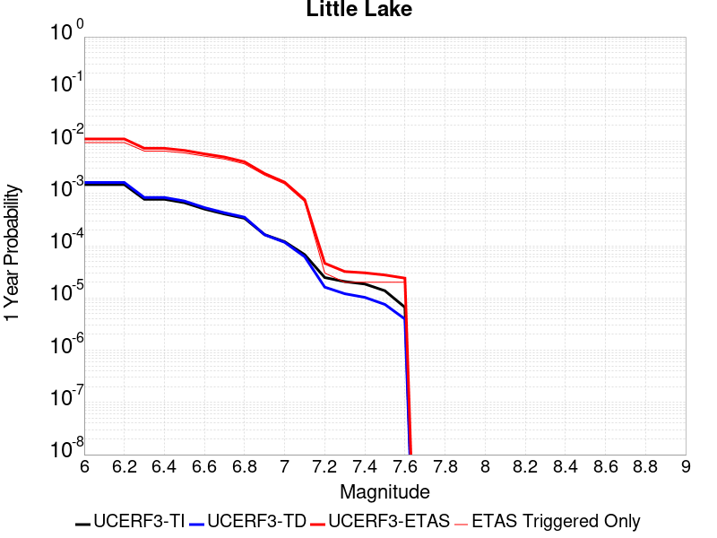 |  |

| Magnitude | 1 wk TI Prob | 1 wk TD Prob | 1 wk ETAS Prob | 1 wk ETAS/TD Gain | 1 wk ETAS Triggered Only | 1 mo TI Prob | 1 mo TD Prob | 1 mo ETAS Prob | 1 mo ETAS/TD Gain | 1 mo ETAS Triggered Only | 1 yr TI Prob | 1 yr TD Prob | 1 yr ETAS Prob | 1 yr ETAS/TD Gain | 1 yr ETAS Triggered Only | 10 yr TI Prob | 10 yr TD Prob | 10 yr ETAS Prob | 10 yr ETAS/TD Gain | 10 yr ETAS Triggered Only |
|-----|-----|-----|-----|-----|-----|-----|-----|-----|-----|-----|-----|-----|-----|-----|-----|-----|-----|-----|-----|-----|
| 6.0 | 2.8424427E-5 | 3.120616E-5 | 0.002201681 | 70.55277 | 0.0021705427 | 1.2181328E-4 | 1.3373457E-4 | 0.0051459842 | 38.479084 | 0.00501292 | 0.0014820677 | 0.0016271356 | 0.011533471 | 7.0882053 | 0.00992248 | 0.014722223 | 0.016165627 | 0.029270707 | 1.8106757 | 0.013320413 |
| 6.1 | 2.8424427E-5 | 3.120616E-5 | 0.002201681 | 70.55277 | 0.0021705427 | 1.2181328E-4 | 1.3373457E-4 | 0.0051459842 | 38.479084 | 0.00501292 | 0.0014820677 | 0.0016271356 | 0.011533471 | 7.0882053 | 0.00992248 | 0.014722223 | 0.016165627 | 0.029270707 | 1.8106757 | 0.013320413 |
| 6.2 | 2.8424427E-5 | 3.120616E-5 | 0.002201681 | 70.55277 | 0.0021705427 | 1.2181328E-4 | 1.3373457E-4 | 0.0051459842 | 38.479084 | 0.00501292 | 0.0014820677 | 0.0016271356 | 0.011533471 | 7.0882053 | 0.00992248 | 0.014722223 | 0.016165627 | 0.029270707 | 1.8106757 | 0.013320413 |
| 6.3 | 1.48860645E-5 | 1.6081593E-5 | 0.0015018458 | 93.389114 | 0.0014857881 | 6.379586E-5 | 6.891945E-5 | 0.0034924562 | 50.67446 | 0.0034237725 | 7.7643775E-4 | 8.387995E-4 | 0.007680601 | 9.156659 | 0.006847545 | 0.007737305 | 0.008359154 | 0.0174556 | 2.088202 | 0.009173127 |
| 6.4 | 1.48860645E-5 | 1.6081593E-5 | 0.0015018458 | 93.389114 | 0.0014857881 | 6.379586E-5 | 6.891945E-5 | 0.0034924562 | 50.67446 | 0.0034237725 | 7.7643775E-4 | 8.387995E-4 | 0.007680601 | 9.156659 | 0.006847545 | 0.007737305 | 0.008359154 | 0.0174556 | 2.088202 | 0.009173127 |
| 6.5 | 1.2797581E-5 | 1.3765735E-5 | 0.0014220151 | 103.30106 | 0.0014082687 | 5.4845623E-5 | 5.899482E-5 | 0.0032241826 | 54.651962 | 0.0031653747 | 6.675408E-4 | 7.180509E-4 | 0.0069797016 | 9.720344 | 0.0062661497 | 0.006655392 | 0.0071598585 | 0.015587455 | 2.1770618 | 0.008488372 |
| 6.6 | 9.661896E-6 | 1.0289158E-5 | 0.0012118272 | 117.7771 | 0.0012015504 | 4.1407468E-5 | 4.4095737E-5 | 0.0027959123 | 63.405502 | 0.002751938 | 5.040193E-4 | 5.367496E-4 | 0.0060505844 | 11.272638 | 0.005516796 | 0.005028777 | 0.0053561367 | 0.012745287 | 2.3795671 | 0.0074289404 |
| 6.7 | 7.767871E-6 | 8.199779E-6 | 9.513445E-4 | 116.02076 | 9.4315247E-4 | 3.329045E-5 | 3.514151E-5 | 0.0023606413 | 67.175285 | 0.0023255814 | 4.0523586E-4 | 4.2777765E-4 | 0.0052448376 | 12.260663 | 0.0048191217 | 0.004044977 | 0.0042708935 | 0.010728981 | 2.5121162 | 0.006485788 |
| 6.8 | 6.4235196E-6 | 6.735819E-6 | 7.819244E-4 | 116.08453 | 7.751938E-4 | 2.752908E-5 | 2.886755E-5 | 0.0019280375 | 66.7891 | 0.0018992248 | 3.35115E-4 | 3.5141854E-4 | 0.004316433 | 12.282883 | 0.0039664083 | 0.003346101 | 0.0035098887 | 0.008852826 | 2.5222528 | 0.0053617572 |
| 6.9 | 3.1283696E-6 | 3.1122067E-6 | 4.4238733E-4 | 142.14586 | 4.3927648E-4 | 1.3407229E-5 | 1.3337969E-5 | 0.0011244343 | 84.30326 | 0.0011111111 | 1.6322079E-4 | 1.6237919E-4 | 0.0025780075 | 15.876466 | 0.0024160207 | 0.0016310095 | 0.0016227537 | 0.0048861834 | 3.0110443 | 0.0032687339 |
| 7.0 | 2.290603E-6 | 2.2287015E-6 | 3.3814527E-4 | 151.72299 | 3.359173E-4 | 9.816834E-6 | 9.551549E-6 | 7.588984E-4 | 79.45292 | 7.49354E-4 | 1.19513395E-4 | 1.16284944E-4 | 0.0017698394 | 15.219851 | 0.0016537468 | 0.0011944914 | 0.0011623431 | 0.0033819822 | 2.9096248 | 0.0022222223 |
| 7.1 | 1.293693E-6 | 1.1776951E-6 | 1.3037652E-4 | 110.7048 | 1.2919896E-4 | 5.5443866E-6 | 5.047259E-6 | 3.0220338E-4 | 59.874752 | 2.9715762E-4 | 6.750081E-5 | 6.144935E-5 | 7.849191E-4 | 12.773434 | 7.2351424E-4 | 6.7480316E-4 | 6.14392E-4 | 0.0015698769 | 2.5551715 | 9.5607236E-4 |
| 7.2 | 4.715842E-7 | 3.0918443E-7 | 1.3229077E-5 | 42.78701 | 1.2919897E-5 | 2.0210737E-6 | 1.3250755E-6 | 1.4244955E-5 | 10.750298 | 1.2919897E-5 | 2.4606294E-5 | 1.613268E-5 | 5.4891745E-5 | 3.4025187 | 3.875969E-5 | 2.460357E-4 | 1.6131563E-4 | 2.0006907E-4 | 1.2402337 | 3.875969E-5 |
| 7.3 | 3.9430947E-7 | 2.3098025E-7 | 2.3098025E-7 | 1.0 | 0.0 | 1.6898966E-6 | 9.89915E-7 | 9.89915E-7 | 1.0 | 0.0 | 2.0574296E-5 | 1.2052149E-5 | 3.789163E-5 | 3.1439729 | 2.5839794E-5 | 2.0572392E-4 | 1.20515026E-4 | 1.4635171E-4 | 1.2143855 | 2.5839794E-5 |
| 7.4 | 3.547123E-7 | 1.9679635E-7 | 1.9679635E-7 | 1.0 | 0.0 | 1.5201948E-6 | 8.4341264E-7 | 8.4341264E-7 | 1.0 | 0.0 | 1.8508214E-5 | 1.0268501E-5 | 3.6108027E-5 | 3.5163875 | 2.5839794E-5 | 1.8506673E-4 | 1.0268033E-4 | 1.2851747E-4 | 1.251627 | 2.5839794E-5 |
| 7.5 | 2.6354266E-7 | 1.4423487E-7 | 1.4423487E-7 | 1.0 | 0.0 | 1.129468E-6 | 6.1814933E-7 | 6.1814933E-7 | 1.0 | 0.0 | 1.3751187E-5 | 7.5259427E-6 | 3.336554E-5 | 4.4334035 | 2.5839794E-5 | 1.3750336E-4 | 7.525693E-5 | 1.01094774E-4 | 1.3433285 | 2.5839794E-5 |
| 7.6 | 1.269913E-7 | 7.5727044E-8 | 7.5727044E-8 | 1.0 | 0.0 | 5.4424834E-7 | 3.2454443E-7 | 3.2454443E-7 | 1.0 | 0.0 | 6.6262032E-6 | 3.9513216E-6 | 2.9791014E-5 | 7.539506 | 2.5839794E-5 | 6.626006E-5 | 3.951255E-5 | 6.535132E-5 | 1.6539384 | 2.5839794E-5 |

## Tank Canyon
*[(top)](#table-of-contents)*

| 1 Week | 1 Month | 1 Year | 10 Year |
|-----|-----|-----|-----|
|  |  |  |  |

| Magnitude | 1 wk TI Prob | 1 wk TD Prob | 1 wk ETAS Prob | 1 wk ETAS/TD Gain | 1 wk ETAS Triggered Only | 1 mo TI Prob | 1 mo TD Prob | 1 mo ETAS Prob | 1 mo ETAS/TD Gain | 1 mo ETAS Triggered Only | 1 yr TI Prob | 1 yr TD Prob | 1 yr ETAS Prob | 1 yr ETAS/TD Gain | 1 yr ETAS Triggered Only | 10 yr TI Prob | 10 yr TD Prob | 10 yr ETAS Prob | 10 yr ETAS/TD Gain | 10 yr ETAS Triggered Only |
|-----|-----|-----|-----|-----|-----|-----|-----|-----|-----|-----|-----|-----|-----|-----|-----|-----|-----|-----|-----|-----|
| 6.0 | 4.8284557E-5 | 5.796635E-5 | 0.002034596 | 35.099606 | 0.0019767443 | 2.0691741E-4 | 2.484074E-4 | 0.004317164 | 17.37937 | 0.0040697674 | 0.0025163088 | 0.0030208372 | 0.011831351 | 3.91658 | 0.008837209 | 0.02488006 | 0.029864404 | 0.041508537 | 1.3899001 | 0.012002584 |
| 6.1 | 1.7796336E-5 | 2.0873764E-5 | 5.764177E-4 | 27.61446 | 5.5555557E-4 | 7.626778E-5 | 8.945614E-5 | 0.0011875491 | 13.275211 | 0.0010981912 | 9.281647E-4 | 0.0010886216 | 0.0036826937 | 3.3828964 | 0.0025968992 | 0.009242975 | 0.010836975 | 0.014428122 | 1.3313792 | 0.003630491 |
| 6.2 | 1.7796336E-5 | 2.0873764E-5 | 5.764177E-4 | 27.61446 | 5.5555557E-4 | 7.626778E-5 | 8.945614E-5 | 0.0011875491 | 13.275211 | 0.0010981912 | 9.281647E-4 | 0.0010886216 | 0.0036826937 | 3.3828964 | 0.0025968992 | 0.009242975 | 0.010836975 | 0.014428122 | 1.3313792 | 0.003630491 |
| 6.3 | 1.3515912E-5 | 1.575988E-5 | 3.645916E-4 | 23.13416 | 3.488372E-4 | 5.792405E-5 | 6.7540735E-5 | 7.7808707E-4 | 11.520264 | 7.105943E-4 | 7.049971E-4 | 8.220222E-4 | 0.0026035022 | 3.1671922 | 0.0017829457 | 0.007027647 | 0.008192427 | 0.010703982 | 1.3065702 | 0.0025322998 |
| 6.4 | 1.0870146E-5 | 1.2618259E-5 | 2.7101292E-4 | 21.47784 | 2.5839792E-4 | 4.658551E-5 | 5.407723E-5 | 6.096027E-4 | 11.272818 | 5.5555557E-4 | 5.67031E-4 | 6.582093E-4 | 0.0020139054 | 3.0596735 | 0.0013565891 | 0.005655863 | 0.006564614 | 0.008528382 | 1.2991444 | 0.0019767443 |
| 6.5 | 7.964826E-6 | 9.196251E-6 | 1.6423358E-4 | 17.858753 | 1.5503875E-4 | 3.4134522E-5 | 3.941197E-5 | 3.107191E-4 | 7.8838763 | 2.7131784E-4 | 4.1550855E-4 | 4.7974577E-4 | 0.0012287403 | 2.561232 | 7.49354E-4 | 0.0041473247 | 0.0047884025 | 0.0059199096 | 1.2363015 | 0.0011369509 |
| 6.6 | 6.6317E-6 | 7.6124184E-6 | 1.238906E-4 | 16.274801 | 1.1627907E-4 | 2.8421264E-5 | 3.2624295E-5 | 2.5225538E-4 | 7.732133 | 2.1963824E-4 | 3.4597394E-4 | 3.971375E-4 | 9.653872E-4 | 2.4308639 | 5.6847546E-4 | 0.0034543579 | 0.00396543 | 0.0048276307 | 1.2174293 | 8.656331E-4 |
| 6.7 | 4.793663E-6 | 5.4308543E-6 | 8.294982E-5 | 15.273806 | 7.751938E-5 | 2.0544108E-5 | 2.3274906E-5 | 1.6539046E-4 | 7.105956 | 1.4211886E-4 | 2.500958E-4 | 2.8333953E-4 | 5.933292E-4 | 2.0940573 | 3.100775E-4 | 0.0024981452 | 0.0028304753 | 0.003358692 | 1.1866176 | 5.297158E-4 |
| 6.8 | 4.382823E-6 | 4.969316E-6 | 8.248831E-5 | 16.599531 | 7.751938E-5 | 1.8783392E-5 | 2.1296917E-5 | 1.6341275E-4 | 7.6730704 | 1.4211886E-4 | 2.286638E-4 | 2.5926338E-4 | 5.56344E-4 | 2.145864 | 2.9715762E-4 | 0.0022842865 | 0.0025902835 | 0.0030799678 | 1.1890466 | 4.9095607E-4 |
| 6.9 | 2.729601E-6 | 3.0735694E-6 | 2.8913284E-5 | 9.40707 | 2.5839794E-5 | 1.1698237E-5 | 1.317238E-5 | 9.069074E-5 | 6.884917 | 7.751938E-5 | 1.4241673E-4 | 1.6036315E-4 | 3.0245923E-4 | 1.8860893 | 1.4211886E-4 | 0.001423255 | 0.0016026403 | 0.0018219264 | 1.1368281 | 2.1963824E-4 |
| 7.0 | 1.8987357E-6 | 2.126954E-6 | 2.7966693E-5 | 13.1487055 | 2.5839794E-5 | 8.137413E-6 | 9.115489E-6 | 4.7874826E-5 | 5.2520304 | 3.875969E-5 | 9.90685E-5 | 1.1097613E-4 | 1.6264999E-4 | 1.4656303 | 5.1679588E-5 | 9.902435E-4 | 0.0011092757 | 0.0011867092 | 1.0698054 | 7.751938E-5 |
| 7.1 | 1.4928986E-6 | 1.6641375E-6 | 1.4584012E-5 | 8.763706 | 1.2919897E-5 | 6.398121E-6 | 7.1320014E-6 | 2.0051806E-5 | 2.8115258 | 1.2919897E-5 | 7.789434E-5 | 8.682925E-5 | 1.126668E-4 | 1.2975674 | 2.5839794E-5 | 7.786704E-4 | 8.680111E-4 | 9.067372E-4 | 1.0446147 | 3.875969E-5 |
| 7.2 | 1.069082E-6 | 1.1828638E-6 | 1.1828638E-6 | 1.0 | 0.0 | 4.581772E-6 | 5.0694093E-6 | 5.0694093E-6 | 1.0 | 0.0 | 5.5781646E-5 | 6.171884E-5 | 6.171884E-5 | 1.0 | 0.0 | 5.576765E-4 | 6.170693E-4 | 6.170693E-4 | 1.0 | 0.0 |
| 7.3 | 8.776551E-7 | 9.770052E-7 | 9.770052E-7 | 1.0 | 0.0 | 3.7613736E-6 | 4.1871617E-6 | 4.1871617E-6 | 1.0 | 0.0 | 4.579376E-5 | 5.097802E-5 | 5.097802E-5 | 1.0 | 0.0 | 4.5784327E-4 | 5.0971424E-4 | 5.0971424E-4 | 1.0 | 0.0 |
| 7.4 | 7.55721E-7 | 8.510284E-7 | 8.510284E-7 | 1.0 | 0.0 | 3.2388E-6 | 3.6472622E-6 | 3.6472622E-6 | 1.0 | 0.0 | 3.9431678E-5 | 4.440503E-5 | 4.440503E-5 | 1.0 | 0.0 | 3.942468E-4 | 4.4401243E-4 | 4.4401243E-4 | 1.0 | 0.0 |
| 7.5 | 5.587665E-7 | 6.305647E-7 | 6.305647E-7 | 1.0 | 0.0 | 2.3947114E-6 | 2.7024203E-6 | 2.7024203E-6 | 1.0 | 0.0 | 2.915522E-5 | 3.2901968E-5 | 3.2901968E-5 | 1.0 | 0.0 | 2.9151395E-4 | 3.2901968E-4 | 3.2901968E-4 | 1.0 | 0.0 |

## Airport Lake
*[(top)](#table-of-contents)*

| 1 Week | 1 Month | 1 Year | 10 Year |
|-----|-----|-----|-----|
|  |  |  | 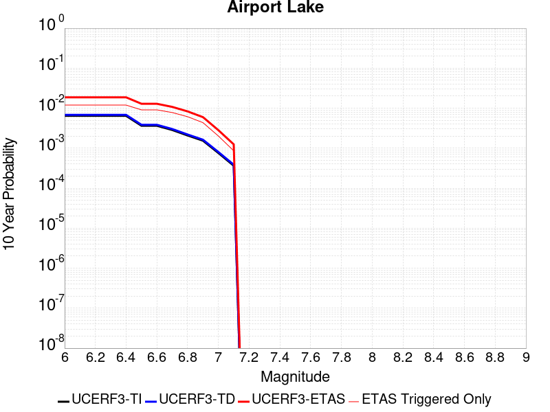 |

| Magnitude | 1 wk TI Prob | 1 wk TD Prob | 1 wk ETAS Prob | 1 wk ETAS/TD Gain | 1 wk ETAS Triggered Only | 1 mo TI Prob | 1 mo TD Prob | 1 mo ETAS Prob | 1 mo ETAS/TD Gain | 1 mo ETAS Triggered Only | 1 yr TI Prob | 1 yr TD Prob | 1 yr ETAS Prob | 1 yr ETAS/TD Gain | 1 yr ETAS Triggered Only | 10 yr TI Prob | 10 yr TD Prob | 10 yr ETAS Prob | 10 yr ETAS/TD Gain | 10 yr ETAS Triggered Only |
|-----|-----|-----|-----|-----|-----|-----|-----|-----|-----|-----|-----|-----|-----|-----|-----|-----|-----|-----|-----|-----|
| 6.0 | 1.2387061E-5 | 1.31032575E-5 | 0.0016668284 | 127.20718 | 0.0016537468 | 5.3086325E-5 | 5.6155768E-5 | 0.0042678057 | 75.99941 | 0.0042118863 | 6.461343E-4 | 6.835104E-4 | 0.009695434 | 14.184765 | 0.009018088 | 0.0064425888 | 0.0068168915 | 0.01884031 | 2.7637684 | 0.012105943 |
| 6.1 | 1.2387061E-5 | 1.31032575E-5 | 0.0016668284 | 127.20718 | 0.0016537468 | 5.3086325E-5 | 5.6155768E-5 | 0.0042678057 | 75.99941 | 0.0042118863 | 6.461343E-4 | 6.835104E-4 | 0.009695434 | 14.184765 | 0.009018088 | 0.0064425888 | 0.0068168915 | 0.01884031 | 2.7637684 | 0.012105943 |
| 6.2 | 1.2387061E-5 | 1.31032575E-5 | 0.0016668284 | 127.20718 | 0.0016537468 | 5.3086325E-5 | 5.6155768E-5 | 0.0042678057 | 75.99941 | 0.0042118863 | 6.461343E-4 | 6.835104E-4 | 0.009695434 | 14.184765 | 0.009018088 | 0.0064425888 | 0.0068168915 | 0.01884031 | 2.7637684 | 0.012105943 |
| 6.3 | 1.2387061E-5 | 1.31032575E-5 | 0.0016668284 | 127.20718 | 0.0016537468 | 5.3086325E-5 | 5.6155768E-5 | 0.0042678057 | 75.99941 | 0.0042118863 | 6.461343E-4 | 6.835104E-4 | 0.009695434 | 14.184765 | 0.009018088 | 0.0064425888 | 0.0068168915 | 0.01884031 | 2.7637684 | 0.012105943 |
| 6.4 | 1.2387061E-5 | 1.31032575E-5 | 0.0016668284 | 127.20718 | 0.0016537468 | 5.3086325E-5 | 5.6155768E-5 | 0.0042678057 | 75.99941 | 0.0042118863 | 6.461343E-4 | 6.835104E-4 | 0.009695434 | 14.184765 | 0.009018088 | 0.0064425888 | 0.0068168915 | 0.01884031 | 2.7637684 | 0.012105943 |
| 6.5 | 6.9922594E-6 | 7.38498E-6 | 0.0012993651 | 175.947 | 0.0012919897 | 2.996648E-5 | 3.164956E-5 | 0.003274441 | 103.45928 | 0.003242894 | 3.6478083E-4 | 3.8527072E-4 | 0.0072560078 | 18.83353 | 0.006873385 | 0.003641826 | 0.0038465653 | 0.013061628 | 3.3956602 | 0.009250646 |
| 6.6 | 6.9922594E-6 | 7.38498E-6 | 0.0012993651 | 175.947 | 0.0012919897 | 2.996648E-5 | 3.164956E-5 | 0.003274441 | 103.45928 | 0.003242894 | 3.6478083E-4 | 3.8527072E-4 | 0.0072560078 | 18.83353 | 0.006873385 | 0.003641826 | 0.0038465653 | 0.013061628 | 3.3956602 | 0.009250646 |
| 6.7 | 5.477277E-6 | 5.7861116E-6 | 0.0010393718 | 179.63219 | 0.0010335917 | 2.3473833E-5 | 2.4797408E-5 | 0.0027895868 | 112.495094 | 0.0027648578 | 2.8575645E-4 | 3.0187052E-4 | 0.006204481 | 20.553452 | 0.005904393 | 0.0028538927 | 0.0030149885 | 0.010936769 | 3.6274662 | 0.007945737 |
| 6.8 | 3.9950432E-6 | 4.2191186E-6 | 7.5356994E-4 | 178.6084 | 7.49354E-4 | 1.7121502E-5 | 1.8081826E-5 | 0.0021756655 | 120.323326 | 0.0021576227 | 2.0843433E-4 | 2.2012675E-4 | 0.0048185973 | 21.890104 | 0.004599483 | 0.0020823893 | 0.002199358 | 0.008451726 | 3.8428152 | 0.0062661497 |
| 6.9 | 2.95695E-6 | 3.1230477E-6 | 5.586769E-4 | 178.88837 | 5.5555557E-4 | 1.2672582E-5 | 1.3384434E-5 | 0.0015120724 | 112.97246 | 0.001498708 | 1.5427776E-4 | 1.6294557E-4 | 0.0034699002 | 21.294844 | 0.0033074936 | 0.001541707 | 0.0016284833 | 0.006052791 | 3.7168274 | 0.004431525 |
| 7.0 | 1.456072E-6 | 1.5408239E-6 | 3.2453774E-4 | 210.62611 | 3.2299742E-4 | 6.2402937E-6 | 6.60352E-6 | 7.3011295E-4 | 110.56421 | 7.2351424E-4 | 7.597293E-5 | 8.03959E-5 | 0.0016694154 | 20.764933 | 0.0015891473 | 7.594696E-4 | 8.03767E-4 | 0.0028821984 | 3.585863 | 0.0020801034 |
| 7.1 | 6.995192E-7 | 7.4090326E-7 | 1.1701989E-4 | 157.9422 | 1.1627907E-4 | 2.997936E-6 | 3.1752998E-6 | 2.7449225E-4 | 86.4461 | 2.7131784E-4 | 3.649926E-5 | 3.8659273E-5 | 7.104679E-4 | 18.377684 | 6.718346E-4 | 3.6493264E-4 | 3.8659273E-4 | 0.001264806 | 3.2716758 | 8.7855296E-4 |

## Owl Lake
*[(top)](#table-of-contents)*

| 1 Week | 1 Month | 1 Year | 10 Year |
|-----|-----|-----|-----|
|  |  |  |  |

| Magnitude | 1 wk TI Prob | 1 wk TD Prob | 1 wk ETAS Prob | 1 wk ETAS/TD Gain | 1 wk ETAS Triggered Only | 1 mo TI Prob | 1 mo TD Prob | 1 mo ETAS Prob | 1 mo ETAS/TD Gain | 1 mo ETAS Triggered Only | 1 yr TI Prob | 1 yr TD Prob | 1 yr ETAS Prob | 1 yr ETAS/TD Gain | 1 yr ETAS Triggered Only | 10 yr TI Prob | 10 yr TD Prob | 10 yr ETAS Prob | 10 yr ETAS/TD Gain | 10 yr ETAS Triggered Only |
|-----|-----|-----|-----|-----|-----|-----|-----|-----|-----|-----|-----|-----|-----|-----|-----|-----|-----|-----|-----|-----|
| 6.0 | 5.0320643E-5 | 6.636149E-5 | 7.252325E-4 | 10.928514 | 6.5891474E-4 | 2.1564208E-4 | 2.8438168E-4 | 0.0019118257 | 6.7227454 | 0.0016279069 | 0.0026222812 | 0.00345791 | 0.0071788486 | 2.0760658 | 0.00373385 | 0.02591553 | 0.0341423 | 0.039121334 | 1.1458318 | 0.0051550386 |
| 6.1 | 5.0320643E-5 | 6.636149E-5 | 7.252325E-4 | 10.928514 | 6.5891474E-4 | 2.1564208E-4 | 2.8438168E-4 | 0.0019118257 | 6.7227454 | 0.0016279069 | 0.0026222812 | 0.00345791 | 0.0071788486 | 2.0760658 | 0.00373385 | 0.02591553 | 0.0341423 | 0.039121334 | 1.1458318 | 0.0051550386 |
| 6.2 | 2.4125871E-5 | 3.098269E-5 | 5.8652106E-4 | 18.930603 | 5.5555557E-4 | 1.0339249E-4 | 1.3277736E-4 | 0.0015021046 | 11.312956 | 0.001369509 | 0.0012580766 | 0.0016155228 | 0.0047757835 | 2.9561846 | 0.0031653747 | 0.012509781 | 0.016071297 | 0.020329904 | 1.2649821 | 0.004328165 |
| 6.3 | 1.7433485E-5 | 2.2356835E-5 | 5.779E-4 | 25.848915 | 5.5555557E-4 | 7.471279E-5 | 9.5812386E-5 | 0.0014264343 | 14.887786 | 0.0013307494 | 9.0924866E-4 | 0.0011660426 | 0.0041728686 | 3.5786583 | 0.0030103358 | 0.009055373 | 0.01162957 | 0.015728626 | 1.3524684 | 0.004147287 |
| 6.4 | 1.7433485E-5 | 2.2356835E-5 | 5.779E-4 | 25.848915 | 5.5555557E-4 | 7.471279E-5 | 9.5812386E-5 | 0.0014264343 | 14.887786 | 0.0013307494 | 9.0924866E-4 | 0.0011660426 | 0.0041728686 | 3.5786583 | 0.0030103358 | 0.009055373 | 0.01162957 | 0.015728626 | 1.3524684 | 0.004147287 |
| 6.5 | 1.5182742E-5 | 1.9430352E-5 | 5.749751E-4 | 29.591595 | 5.5555557E-4 | 6.506727E-5 | 8.327114E-5 | 0.001388072 | 16.669306 | 0.0013049096 | 7.919061E-4 | 0.0010135059 | 0.003956257 | 3.903536 | 0.0029457365 | 0.0078909 | 0.010119047 | 0.014122053 | 1.3955913 | 0.0040439274 |
| 6.6 | 6.7271576E-6 | 8.548157E-6 | 5.253396E-4 | 61.456474 | 5.1679584E-4 | 2.8830356E-5 | 3.6634476E-5 | 0.0012381409 | 33.79715 | 0.0012015504 | 3.5095305E-4 | 4.4593913E-4 | 0.003093337 | 6.93668 | 0.0026485787 | 0.0035039932 | 0.004468226 | 0.008069633 | 1.8060038 | 0.003617571 |
| 6.7 | 6.682835E-6 | 8.4806015E-6 | 5.252721E-4 | 61.93807 | 5.1679584E-4 | 2.8640408E-5 | 3.634496E-5 | 0.0012378517 | 34.05841 | 0.0012015504 | 3.4864116E-4 | 4.424157E-4 | 0.0030898228 | 6.9839807 | 0.0026485787 | 0.003480947 | 0.004433152 | 0.008034686 | 1.8124094 | 0.003617571 |
| 6.8 | 6.5774975E-6 | 8.327072E-6 | 5.251186E-4 | 63.061623 | 5.1679584E-4 | 2.8188972E-5 | 3.5686993E-5 | 0.0012371945 | 34.66794 | 0.0012015504 | 3.4314668E-4 | 4.3440814E-4 | 0.0030818365 | 7.0943336 | 0.0026485787 | 0.0034261728 | 0.0043532955 | 0.007955118 | 1.8273784 | 0.003617571 |
| 6.9 | 6.363419E-6 | 8.0002355E-6 | 5.2479195E-4 | 65.59706 | 5.1679584E-4 | 2.727151E-5 | 3.4286306E-5 | 0.0012357954 | 36.043415 | 0.0012015504 | 3.3198006E-4 | 4.173614E-4 | 0.0030648347 | 7.3433595 | 0.0026485787 | 0.0033148455 | 0.004183282 | 0.007772854 | 1.8580755 | 0.0036046512 |
| 7.0 | 6.1342453E-6 | 7.632424E-6 | 5.2442437E-4 | 68.71007 | 5.1679584E-4 | 2.6289357E-5 | 3.271001E-5 | 0.001234221 | 37.732216 | 0.0012015504 | 3.2002592E-4 | 3.981771E-4 | 0.0030327865 | 7.6166778 | 0.002635659 | 0.0031956544 | 0.00399197 | 0.007556495 | 1.8929237 | 0.0035788114 |
| 7.1 | 5.842926E-6 | 7.142961E-6 | 5.1101536E-4 | 71.54111 | 5.0387596E-4 | 2.504087E-5 | 3.0612362E-5 | 0.001206287 | 39.405224 | 0.0011757106 | 3.0482994E-4 | 3.7264716E-4 | 0.0029040033 | 7.792903 | 0.0025322998 | 0.0030441214 | 0.0037374226 | 0.007199886 | 1.9264307 | 0.0034754523 |
| 7.2 | 4.77173E-6 | 5.3591634E-6 | 3.412747E-4 | 63.680588 | 3.359173E-4 | 2.045011E-5 | 2.2967664E-5 | 7.852241E-4 | 34.188244 | 7.622739E-4 | 2.4895166E-4 | 2.7959948E-4 | 0.0018812187 | 6.728263 | 0.0016020671 | 0.0024867293 | 0.0028089995 | 0.004960561 | 1.7659532 | 0.0021576227 |
| 7.3 | 3.0494948E-6 | 2.7109647E-6 | 1.18989716E-4 | 43.89202 | 1.1627907E-4 | 1.3069198E-5 | 1.1618369E-5 | 1.9249482E-4 | 16.568144 | 1.8087856E-4 | 1.5910587E-4 | 1.4144463E-4 | 5.031506E-4 | 3.5572264 | 3.6175712E-4 | 0.0015899199 | 0.0014235033 | 0.0019395634 | 1.3625283 | 5.1679584E-4 |
| 7.4 | 2.7263884E-6 | 2.3061473E-6 | 5.3985616E-5 | 23.40944 | 5.1679588E-5 | 1.1684469E-5 | 9.883452E-6 | 1.2616137E-4 | 12.76491 | 1.1627907E-4 | 1.4224913E-4 | 1.2032448E-4 | 3.6577298E-4 | 3.0398881 | 2.4547803E-4 | 0.0014215811 | 0.0012114698 | 0.0015469801 | 1.2769449 | 3.359173E-4 |
| 7.5 | 2.6090431E-6 | 2.1660758E-6 | 5.384555E-5 | 24.858572 | 5.1679588E-5 | 1.1181565E-5 | 9.283149E-6 | 8.680181E-5 | 9.350471 | 7.751938E-5 | 1.3612706E-4 | 1.1301658E-4 | 3.1971154E-4 | 2.8288908 | 2.0671835E-4 | 0.001360437 | 0.001138222 | 0.0014221363 | 1.2494365 | 2.8423773E-4 |
| 7.6 | 2.3008756E-6 | 1.8732376E-6 | 2.7712982E-5 | 14.794163 | 2.5839794E-5 | 9.860858E-6 | 8.028137E-6 | 4.6787514E-5 | 5.827942 | 3.875969E-5 | 1.20049335E-4 | 9.7738266E-5 | 2.5276188E-4 | 2.5861096 | 1.5503875E-4 | 0.001199845 | 9.852252E-4 | 0.001204647 | 1.2227124 | 2.1963824E-4 |
| 7.7 | 1.7184348E-6 | 1.3423282E-6 | 2.7182086E-5 | 20.249956 | 2.5839794E-5 | 7.3646997E-6 | 5.7528227E-6 | 4.451229E-5 | 7.737469 | 3.875969E-5 | 8.966153E-5 | 7.0038404E-5 | 1.8630933E-4 | 2.6601024 | 1.1627907E-4 | 8.962536E-4 | 7.080495E-4 | 8.629785E-4 | 1.2188109 | 1.5503875E-4 |
| 7.8 | 8.4612907E-7 | 8.4087924E-7 | 1.3760765E-5 | 16.364735 | 1.2919897E-5 | 3.6262625E-6 | 3.6037634E-6 | 2.9443463E-5 | 8.170199 | 2.5839794E-5 | 4.4148852E-5 | 4.3874956E-5 | 9.555228E-5 | 2.177832 | 5.1679588E-5 | 4.414008E-4 | 4.4413717E-4 | 5.0870795E-4 | 1.1453848 | 6.459948E-5 |
| 7.9 | 2.716738E-7 | 3.7694025E-7 | 3.7694025E-7 | 1.0 | 0.0 | 1.1643157E-6 | 1.6154573E-6 | 1.4535333E-5 | 8.997659 | 1.2919897E-5 | 1.4175452E-5 | 1.9668027E-5 | 5.8426955E-5 | 2.9706566 | 3.875969E-5 | 1.4174548E-4 | 1.9843443E-4 | 2.5010377E-4 | 1.2603849 | 5.1679588E-5 |
| 8.0 | 2.1995428E-8 | 3.386013E-8 | 3.386013E-8 | 1.0 | 0.0 | 9.426611E-8 | 1.4511484E-7 | 1.4511484E-7 | 1.0 | 0.0 | 1.1476893E-6 | 1.7667724E-6 | 1.7667724E-6 | 1.0 | 0.0 | 1.14768345E-5 | 1.7968985E-5 | 1.7968985E-5 | 1.0 | 0.0 |

## Panamint Valley
*[(top)](#table-of-contents)*

| 1 Week | 1 Month | 1 Year | 10 Year |
|-----|-----|-----|-----|
|  | 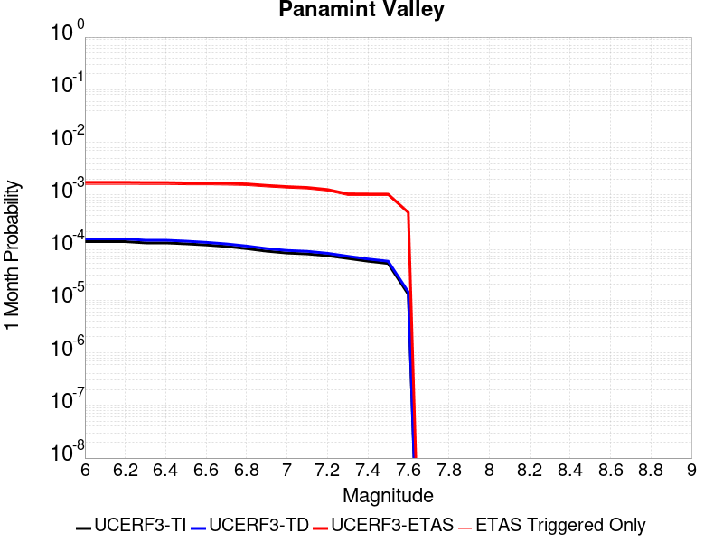 |  |  |

| Magnitude | 1 wk TI Prob | 1 wk TD Prob | 1 wk ETAS Prob | 1 wk ETAS/TD Gain | 1 wk ETAS Triggered Only | 1 mo TI Prob | 1 mo TD Prob | 1 mo ETAS Prob | 1 mo ETAS/TD Gain | 1 mo ETAS Triggered Only | 1 yr TI Prob | 1 yr TD Prob | 1 yr ETAS Prob | 1 yr ETAS/TD Gain | 1 yr ETAS Triggered Only | 10 yr TI Prob | 10 yr TD Prob | 10 yr ETAS Prob | 10 yr ETAS/TD Gain | 10 yr ETAS Triggered Only |
|-----|-----|-----|-----|-----|-----|-----|-----|-----|-----|-----|-----|-----|-----|-----|-----|-----|-----|-----|-----|-----|
| 6.0 | 3.0211835E-5 | 3.3985398E-5 | 7.7039446E-4 | 22.668398 | 7.364341E-4 | 1.2947287E-4 | 1.4564373E-4 | 0.0017733136 | 12.175694 | 0.0016279069 | 0.0015751923 | 0.0017717998 | 0.0051766094 | 2.921667 | 0.0034108527 | 0.015640736 | 0.01758359 | 0.022216434 | 1.2634753 | 0.004715762 |
| 6.1 | 3.0211835E-5 | 3.3985398E-5 | 7.7039446E-4 | 22.668398 | 7.364341E-4 | 1.2947287E-4 | 1.4564373E-4 | 0.0017733136 | 12.175694 | 0.0016279069 | 0.0015751923 | 0.0017717998 | 0.0051766094 | 2.921667 | 0.0034108527 | 0.015640736 | 0.01758359 | 0.022216434 | 1.2634753 | 0.004715762 |
| 6.2 | 3.0211835E-5 | 3.3985398E-5 | 7.7039446E-4 | 22.668398 | 7.364341E-4 | 1.2947287E-4 | 1.4564373E-4 | 0.0017733136 | 12.175694 | 0.0016279069 | 0.0015751923 | 0.0017717998 | 0.0051766094 | 2.921667 | 0.0034108527 | 0.015640736 | 0.01758359 | 0.022216434 | 1.2634753 | 0.004715762 |
| 6.3 | 2.8573924E-5 | 3.2103522E-5 | 7.68514E-4 | 23.93862 | 7.364341E-4 | 1.2245393E-4 | 1.3757942E-4 | 0.0017523443 | 12.736965 | 0.001614987 | 0.001489857 | 0.0016737703 | 0.005040219 | 3.011297 | 0.003372093 | 0.01479908 | 0.016618231 | 0.021179395 | 1.2744675 | 0.004638243 |
| 6.4 | 2.8573924E-5 | 3.2103522E-5 | 7.68514E-4 | 23.93862 | 7.364341E-4 | 1.2245393E-4 | 1.3757942E-4 | 0.0017523443 | 12.736965 | 0.001614987 | 0.001489857 | 0.0016737703 | 0.005040219 | 3.011297 | 0.003372093 | 0.01479908 | 0.016618231 | 0.021179395 | 1.2744675 | 0.004638243 |
| 6.5 | 2.7468774E-5 | 3.0829244E-5 | 7.414016E-4 | 24.048649 | 7.105943E-4 | 1.1771801E-4 | 1.3211879E-4 | 0.0017210562 | 13.026581 | 0.0015891473 | 0.0014322745 | 0.0016073869 | 0.004909564 | 3.0543761 | 0.0033074936 | 0.014230782 | 0.015964093 | 0.020452008 | 1.2811257 | 0.0045607234 |
| 6.6 | 2.6135967E-5 | 2.9253257E-5 | 7.3982676E-4 | 25.290407 | 7.105943E-4 | 1.1200648E-4 | 1.2536523E-4 | 0.0017143133 | 13.674552 | 0.0015891473 | 0.0013628257 | 0.0015252795 | 0.0047761276 | 3.1313128 | 0.0032558138 | 0.013544982 | 0.015154443 | 0.019569706 | 1.2913511 | 0.0044832043 |
| 6.7 | 2.4498746E-5 | 2.7342086E-5 | 7.2499743E-4 | 26.515804 | 6.976744E-4 | 1.04990395E-4 | 1.1717525E-4 | 0.0016802995 | 14.340055 | 0.0015633075 | 0.0012775084 | 0.0014257001 | 0.004612365 | 3.2351577 | 0.0031912145 | 0.012701893 | 0.014171662 | 0.01851491 | 1.3064742 | 0.004405685 |
| 6.8 | 2.2244329E-5 | 2.4936131E-5 | 6.96754E-4 | 27.941544 | 6.718346E-4 | 9.532935E-5 | 1.0686488E-4 | 0.0016441683 | 15.385488 | 0.0015374677 | 0.0011600169 | 0.0013003252 | 0.0044228747 | 3.4013605 | 0.003126615 | 0.011539802 | 0.012932883 | 0.017115803 | 1.3234329 | 0.0042377263 |
| 6.9 | 1.9902658E-5 | 2.2290924E-5 | 6.2951253E-4 | 28.240755 | 6.072351E-4 | 8.529431E-5 | 9.552913E-5 | 0.0015295007 | 16.01083 | 0.0014341085 | 0.0010379635 | 0.0011624652 | 0.0040918724 | 3.5199957 | 0.0029328165 | 0.010331288 | 0.011568946 | 0.015438385 | 1.3344678 | 0.0039147288 |
| 7.0 | 1.8353881E-5 | 2.056681E-5 | 6.277895E-4 | 30.524399 | 6.072351E-4 | 7.865712E-5 | 8.814059E-5 | 0.0014704476 | 16.68298 | 0.0013824289 | 9.5722964E-4 | 0.0010726011 | 0.0039119297 | 3.6471431 | 0.0028423772 | 0.009531168 | 0.0106791705 | 0.014411491 | 1.3494954 | 0.0037726099 |
| 7.1 | 1.7667631E-5 | 1.9773222E-5 | 6.011571E-4 | 30.402584 | 5.8139535E-4 | 7.571623E-5 | 8.473973E-5 | 0.0014282952 | 16.855083 | 0.0013436693 | 9.2145515E-4 | 0.0010312354 | 0.0038190552 | 3.7033784 | 0.0027906976 | 0.009176437 | 0.010269388 | 0.013913744 | 1.3548758 | 0.0036821705 |
| 7.2 | 1.6381597E-5 | 1.8158824E-5 | 5.09106E-4 | 28.036287 | 4.9095607E-4 | 7.020495E-5 | 7.782131E-5 | 0.0013180348 | 16.936684 | 0.00124031 | 8.544101E-4 | 9.4707985E-4 | 0.0034640736 | 3.6576364 | 0.0025193798 | 0.008511325 | 0.009435088 | 0.0127369715 | 1.3499578 | 0.0033333334 |
| 7.3 | 1.4520491E-5 | 1.5966963E-5 | 4.2939704E-4 | 26.892843 | 4.134367E-4 | 6.222919E-5 | 6.842814E-5 | 0.0010631921 | 15.537353 | 9.94832E-4 | 7.57377E-4 | 8.3281036E-4 | 0.002872454 | 3.4491093 | 0.0020413436 | 0.0075480095 | 0.008300003 | 0.010990662 | 1.3241756 | 0.0027131783 |
| 7.4 | 1.2852287E-5 | 1.4145856E-5 | 4.275767E-4 | 30.226286 | 4.134367E-4 | 5.5080065E-5 | 6.0623777E-5 | 0.0010553955 | 17.408937 | 9.94832E-4 | 6.7039346E-4 | 7.3786033E-4 | 0.002751877 | 3.7295363 | 0.0020155038 | 0.0066837464 | 0.007357025 | 0.010011768 | 1.3608446 | 0.0026744185 |
| 7.5 | 1.1637851E-5 | 1.2837149E-5 | 4.2626853E-4 | 33.205856 | 4.134367E-4 | 4.987555E-5 | 5.5015284E-5 | 0.0010497926 | 19.081835 | 9.94832E-4 | 6.070656E-4 | 6.6962093E-4 | 0.0026837753 | 4.007902 | 0.0020155038 | 0.006054099 | 0.0066789286 | 0.009335485 | 1.3977518 | 0.0026744185 |
| 7.6 | 3.0068115E-6 | 3.3331687E-6 | 2.1005083E-4 | 63.01836 | 2.0671835E-4 | 1.2886271E-5 | 1.4284972E-5 | 4.9231434E-4 | 34.463795 | 4.7803618E-4 | 1.5687906E-4 | 1.7391294E-4 | 0.0011169014 | 6.422187 | 9.4315247E-4 | 0.0015676835 | 0.001739208 | 0.0030160532 | 1.7341533 | 0.0012790698 |

## Garlock (East)
*[(top)](#table-of-contents)*

| 1 Week | 1 Month | 1 Year | 10 Year |
|-----|-----|-----|-----|
|  |  | 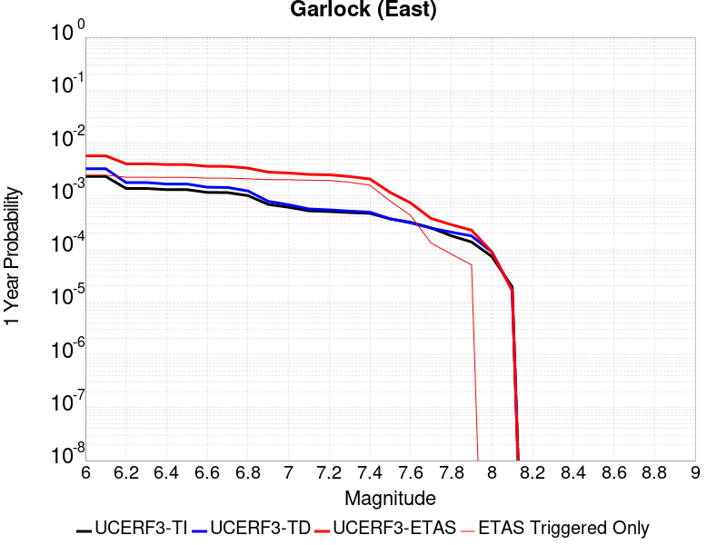 |  |

| Magnitude | 1 wk TI Prob | 1 wk TD Prob | 1 wk ETAS Prob | 1 wk ETAS/TD Gain | 1 wk ETAS Triggered Only | 1 mo TI Prob | 1 mo TD Prob | 1 mo ETAS Prob | 1 mo ETAS/TD Gain | 1 mo ETAS Triggered Only | 1 yr TI Prob | 1 yr TD Prob | 1 yr ETAS Prob | 1 yr ETAS/TD Gain | 1 yr ETAS Triggered Only | 10 yr TI Prob | 10 yr TD Prob | 10 yr ETAS Prob | 10 yr ETAS/TD Gain | 10 yr ETAS Triggered Only |
|-----|-----|-----|-----|-----|-----|-----|-----|-----|-----|-----|-----|-----|-----|-----|-----|-----|-----|-----|-----|-----|
| 6.0 | 4.5092507E-5 | 6.2906794E-5 | 5.2799383E-4 | 8.393271 | 4.651163E-4 | 1.9323928E-4 | 2.695752E-4 | 0.0013933032 | 5.1685143 | 0.001124031 | 0.0023501497 | 0.0032775842 | 0.0055955434 | 1.7072157 | 0.0023255814 | 0.023254504 | 0.03235364 | 0.035491616 | 1.0969899 | 0.003242894 |
| 6.1 | 4.5092507E-5 | 6.2906794E-5 | 5.2799383E-4 | 8.393271 | 4.651163E-4 | 1.9323928E-4 | 2.695752E-4 | 0.0013933032 | 5.1685143 | 0.001124031 | 0.0023501497 | 0.0032775842 | 0.0055955434 | 1.7072157 | 0.0023255814 | 0.023254504 | 0.03235364 | 0.035491616 | 1.0969899 | 0.003242894 |
| 6.2 | 2.6674514E-5 | 3.4512483E-5 | 4.737738E-4 | 13.727607 | 4.3927648E-4 | 1.1431433E-4 | 1.4790244E-4 | 0.0012200952 | 8.249325 | 0.0010723515 | 0.0013908884 | 0.001799258 | 0.003901412 | 2.168345 | 0.0021059432 | 0.01382215 | 0.017891733 | 0.020772075 | 1.1609874 | 0.0029328165 |
| 6.3 | 2.6674514E-5 | 3.4512483E-5 | 4.737738E-4 | 13.727607 | 4.3927648E-4 | 1.1431433E-4 | 1.4790244E-4 | 0.0012200952 | 8.249325 | 0.0010723515 | 0.0013908884 | 0.001799258 | 0.003901412 | 2.168345 | 0.0021059432 | 0.01382215 | 0.017891733 | 0.020772075 | 1.1609874 | 0.0029328165 |
| 6.4 | 2.5312667E-5 | 3.2341675E-5 | 4.7160394E-4 | 14.581927 | 4.3927648E-4 | 1.0847834E-4 | 1.3859998E-4 | 0.0012108028 | 8.735952 | 0.0010723515 | 0.0013199237 | 0.001686178 | 0.003775672 | 2.2391894 | 0.0020930232 | 0.013121112 | 0.01677974 | 0.019637939 | 1.1703362 | 0.0029069767 |
| 6.5 | 2.5312667E-5 | 3.2341675E-5 | 4.7160394E-4 | 14.581927 | 4.3927648E-4 | 1.0847834E-4 | 1.3859998E-4 | 0.0012108028 | 8.735952 | 0.0010723515 | 0.0013199237 | 0.001686178 | 0.003775672 | 2.2391894 | 0.0020930232 | 0.013121112 | 0.01677974 | 0.019637939 | 1.1703362 | 0.0029069767 |
| 6.6 | 2.246556E-5 | 2.813642E-5 | 4.6740053E-4 | 16.611942 | 4.3927648E-4 | 9.627742E-5 | 1.20579214E-4 | 0.001179883 | 9.785128 | 0.0010594316 | 0.0011715472 | 0.0014670868 | 0.0035054358 | 2.3893852 | 0.0020413436 | 0.011653901 | 0.014620015 | 0.017433569 | 1.1924453 | 0.0028552972 |
| 6.7 | 2.2241198E-5 | 2.7806154E-5 | 4.6707044E-4 | 16.797377 | 4.3927648E-4 | 9.531594E-5 | 1.1916392E-4 | 0.0011784692 | 9.88948 | 0.0010594316 | 0.0011598538 | 0.0014498787 | 0.0034882626 | 2.4058998 | 0.0020413436 | 0.011538187 | 0.0144502055 | 0.017264243 | 1.1947403 | 0.0028552972 |
| 6.8 | 1.9528685E-5 | 2.3900653E-5 | 4.5024705E-4 | 18.838274 | 4.263566E-4 | 8.369167E-5 | 1.0242746E-4 | 0.0011229947 | 10.963806 | 0.0010206718 | 0.0010184698 | 0.0012463606 | 0.0032335448 | 2.5943897 | 0.001989664 | 0.010138147 | 0.012437694 | 0.015180923 | 1.2205577 | 0.0027777778 |
| 6.9 | 1.3318621E-5 | 1.5201007E-5 | 4.4155112E-4 | 29.047491 | 4.263566E-4 | 5.7078556E-5 | 6.514558E-5 | 0.0010469938 | 16.071602 | 9.819121E-4 | 6.9470983E-4 | 7.928645E-4 | 0.0027164028 | 3.4260619 | 0.0019250646 | 0.0069254204 | 0.007940986 | 0.010594167 | 1.3341123 | 0.0026744185 |
| 7.0 | 1.1760853E-5 | 1.3109839E-5 | 4.3946083E-4 | 33.521454 | 4.263566E-4 | 5.0402683E-5 | 5.618384E-5 | 0.0010380408 | 18.47579 | 9.819121E-4 | 6.134799E-4 | 6.838286E-4 | 0.0026075768 | 3.8132024 | 0.0019250646 | 0.0061178906 | 0.006857582 | 0.009500829 | 1.3854489 | 0.0026614987 |
| 7.1 | 1.0064758E-5 | 1.090491E-5 | 4.243371E-4 | 38.912483 | 4.134367E-4 | 4.3133965E-5 | 4.673451E-5 | 0.0010156814 | 21.73301 | 9.6899224E-4 | 5.2502943E-4 | 5.688476E-4 | 0.0024540795 | 4.3141246 | 0.0018863049 | 0.005237907 | 0.005714025 | 0.008308931 | 1.4541293 | 0.0026098192 |
| 7.2 | 9.768808E-6 | 1.0500772E-5 | 4.2393312E-4 | 40.371613 | 4.134367E-4 | 4.186565E-5 | 4.500255E-5 | 0.0010139511 | 22.530972 | 9.6899224E-4 | 5.095951E-4 | 5.477718E-4 | 0.0024330434 | 4.4417095 | 0.0018863049 | 0.0050842804 | 0.005504284 | 0.0080997385 | 1.4715334 | 0.0026098192 |
| 7.3 | 9.344516E-6 | 9.946395E-6 | 3.9753944E-4 | 39.968193 | 3.875969E-4 | 4.004731E-5 | 4.2626732E-5 | 9.4698096E-4 | 22.21566 | 9.0439274E-4 | 4.8746695E-4 | 5.1886035E-4 | 0.0022492283 | 4.3349395 | 0.0017312662 | 0.0048639905 | 0.005215945 | 0.0075808065 | 1.4533907 | 0.002377261 |
| 7.4 | 9.023491E-6 | 9.49255E-6 | 3.5832645E-4 | 37.748177 | 3.488372E-4 | 3.867153E-5 | 4.068174E-5 | 8.5460214E-4 | 21.007019 | 8.1395346E-4 | 4.7072413E-4 | 4.95191E-4 | 0.002018984 | 4.0771823 | 0.0015245478 | 0.004697283 | 0.004979378 | 0.0070619793 | 1.4182453 | 0.0020930232 |
| 7.5 | 7.081253E-6 | 7.0893525E-6 | 2.0088642E-4 | 28.336359 | 1.9379845E-4 | 3.0347876E-5 | 3.038259E-5 | 4.5672624E-4 | 15.032498 | 4.263566E-4 | 3.6942272E-4 | 3.6984598E-4 | 0.0011060077 | 2.990455 | 7.364341E-4 | 0.003688092 | 0.0037251879 | 0.004767801 | 1.2798821 | 0.0010465116 |
| 7.6 | 6.116396E-6 | 5.9608415E-6 | 8.347976E-5 | 14.004693 | 7.751938E-5 | 2.6212863E-5 | 2.5546216E-5 | 2.1933971E-4 | 8.585997 | 1.9379845E-4 | 3.1909486E-4 | 3.1098103E-4 | 6.984574E-4 | 2.2459807 | 3.875969E-4 | 0.0031863707 | 0.003136586 | 0.003690399 | 1.1765655 | 5.5555557E-4 |
| 7.7 | 4.797145E-6 | 4.7587923E-6 | 3.059846E-5 | 6.42988 | 2.5839794E-5 | 2.055903E-5 | 2.0394666E-5 | 7.20732E-5 | 3.533924 | 5.1679588E-5 | 2.5027743E-4 | 2.482769E-4 | 3.7744376E-4 | 1.5202534 | 1.2919896E-4 | 0.0024999576 | 0.002510134 | 0.0027163334 | 1.0821468 | 2.0671835E-4 |
| 7.8 | 3.4028885E-6 | 3.979809E-6 | 2.98195E-5 | 7.4926953 | 2.5839794E-5 | 1.4583726E-5 | 1.7056214E-5 | 5.5815242E-5 | 3.2724285 | 3.875969E-5 | 1.775424E-4 | 2.076397E-4 | 2.8514297E-4 | 1.3732585 | 7.751938E-5 | 0.0017740062 | 0.0021019245 | 0.0022437447 | 1.0674716 | 1.4211886E-4 |
| 7.9 | 2.5928412E-6 | 3.373588E-6 | 3.373588E-6 | 1.0 | 0.0 | 1.1112129E-5 | 1.44581545E-5 | 2.7377864E-5 | 1.8935933 | 1.2919897E-5 | 1.3528178E-4 | 1.7601387E-4 | 2.2768436E-4 | 1.2935592 | 5.1679588E-5 | 0.0013519945 | 0.0017818334 | 0.0018721115 | 1.0506659 | 9.043928E-5 |
| 8.0 | 1.3743648E-6 | 1.673991E-6 | 1.673991E-6 | 1.0 | 0.0 | 5.8901214E-6 | 7.174228E-6 | 7.174228E-6 | 1.0 | 0.0 | 7.1709874E-5 | 8.7342756E-5 | 8.7342756E-5 | 1.0 | 0.0 | 7.1686733E-4 | 8.839922E-4 | 9.0980914E-4 | 1.029205 | 2.5839794E-5 |
| 8.1 | 3.6733252E-7 | 3.1499187E-7 | 3.1499187E-7 | 1.0 | 0.0 | 1.5742813E-6 | 1.3499646E-6 | 1.3499646E-6 | 1.0 | 0.0 | 1.9166706E-5 | 1.643571E-5 | 1.643571E-5 | 1.0 | 0.0 | 1.9165053E-4 | 1.6643589E-4 | 1.6643589E-4 | 1.0 | 0.0 |

## Hunter Mountain-Saline Valley
*[(top)](#table-of-contents)*

| 1 Week | 1 Month | 1 Year | 10 Year |
|-----|-----|-----|-----|
|  |  |  |  |

| Magnitude | 1 wk TI Prob | 1 wk TD Prob | 1 wk ETAS Prob | 1 wk ETAS/TD Gain | 1 wk ETAS Triggered Only | 1 mo TI Prob | 1 mo TD Prob | 1 mo ETAS Prob | 1 mo ETAS/TD Gain | 1 mo ETAS Triggered Only | 1 yr TI Prob | 1 yr TD Prob | 1 yr ETAS Prob | 1 yr ETAS/TD Gain | 1 yr ETAS Triggered Only | 10 yr TI Prob | 10 yr TD Prob | 10 yr ETAS Prob | 10 yr ETAS/TD Gain | 10 yr ETAS Triggered Only |
|-----|-----|-----|-----|-----|-----|-----|-----|-----|-----|-----|-----|-----|-----|-----|-----|-----|-----|-----|-----|-----|
| 6.0 | 4.5103672E-5 | 5.4571992E-5 | 4.8090532E-4 | 8.81231 | 4.263566E-4 | 1.9328714E-4 | 2.3385909E-4 | 0.0012542922 | 5.363453 | 0.0010206718 | 0.002350731 | 0.0028436056 | 0.004904911 | 1.7248914 | 0.0020671834 | 0.023260195 | 0.028092787 | 0.030729745 | 1.093866 | 0.0027131783 |
| 6.1 | 4.5103672E-5 | 5.4571992E-5 | 4.8090532E-4 | 8.81231 | 4.263566E-4 | 1.9328714E-4 | 2.3385909E-4 | 0.0012542922 | 5.363453 | 0.0010206718 | 0.002350731 | 0.0028436056 | 0.004904911 | 1.7248914 | 0.0020671834 | 0.023260195 | 0.028092787 | 0.030729745 | 1.093866 | 0.0027131783 |
| 6.2 | 3.9363465E-5 | 4.7064877E-5 | 4.734014E-4 | 10.058486 | 4.263566E-4 | 1.6868966E-4 | 2.0169078E-4 | 0.0012221568 | 6.059557 | 0.0010206718 | 0.002051862 | 0.0024528939 | 0.0045150067 | 1.8406857 | 0.0020671834 | 0.020330196 | 0.024274237 | 0.026921555 | 1.1090587 | 0.0027131783 |
| 6.3 | 3.9363465E-5 | 4.7064877E-5 | 4.734014E-4 | 10.058486 | 4.263566E-4 | 1.6868966E-4 | 2.0169078E-4 | 0.0012221568 | 6.059557 | 0.0010206718 | 0.002051862 | 0.0024528939 | 0.0045150067 | 1.8406857 | 0.0020671834 | 0.020330196 | 0.024274237 | 0.026921555 | 1.1090587 | 0.0027131783 |
| 6.4 | 3.2311684E-5 | 3.795214E-5 | 4.6429253E-4 | 12.233633 | 4.263566E-4 | 1.384713E-4 | 1.626423E-4 | 0.0011831481 | 7.2745414 | 0.0010206718 | 0.0016845843 | 0.0019784442 | 0.0040286435 | 2.0362685 | 0.0020542636 | 0.016718714 | 0.019617062 | 0.022264348 | 1.1349483 | 0.0027002585 |
| 6.5 | 3.2311684E-5 | 3.795214E-5 | 4.6429253E-4 | 12.233633 | 4.263566E-4 | 1.384713E-4 | 1.626423E-4 | 0.0011831481 | 7.2745414 | 0.0010206718 | 0.0016845843 | 0.0019784442 | 0.0040286435 | 2.0362685 | 0.0020542636 | 0.016718714 | 0.019617062 | 0.022264348 | 1.1349483 | 0.0027002585 |
| 6.6 | 2.9305844E-5 | 3.4182853E-5 | 4.6052487E-4 | 13.472394 | 4.263566E-4 | 1.2559042E-4 | 1.4649007E-4 | 0.0011670124 | 7.9664946 | 0.0010206718 | 0.0015279909 | 0.0017821203 | 0.003832723 | 2.1506534 | 0.0020542636 | 0.015175272 | 0.017686214 | 0.020338716 | 1.1499757 | 0.0027002585 |
| 6.7 | 2.7826512E-5 | 3.2345237E-5 | 4.5868804E-4 | 14.181006 | 4.263566E-4 | 1.19251024E-4 | 1.3861542E-4 | 0.0011591457 | 8.362314 | 0.0010206718 | 0.0014509142 | 0.0016863967 | 0.0037371959 | 2.2160835 | 0.0020542636 | 0.014414776 | 0.01674368 | 0.019398727 | 1.15857 | 0.0027002585 |
| 6.8 | 2.3389874E-5 | 2.6867507E-5 | 4.5321265E-4 | 16.86843 | 4.263566E-4 | 1.0023846E-4 | 1.1514164E-4 | 0.001135696 | 9.863468 | 0.0010206718 | 0.00121972 | 0.0014009953 | 0.003439479 | 2.4550254 | 0.0020413436 | 0.01213047 | 0.013927842 | 0.016577752 | 1.1902599 | 0.0026873385 |
| 6.9 | 2.069209E-5 | 2.3570727E-5 | 4.4991728E-4 | 19.087967 | 4.263566E-4 | 8.867737E-5 | 1.0101369E-4 | 0.0011215825 | 11.1032715 | 0.0010206718 | 0.0010791123 | 0.001229184 | 0.0032680186 | 2.6586895 | 0.0020413436 | 0.010738871 | 0.012228882 | 0.014883357 | 1.217066 | 0.0026873385 |
| 7.0 | 1.7462342E-5 | 1.9634126E-5 | 4.330627E-4 | 22.056631 | 4.134367E-4 | 7.483646E-5 | 8.414367E-5 | 0.001078892 | 12.822022 | 9.94832E-4 | 9.1075303E-4 | 0.0010239903 | 0.0030374303 | 2.9662685 | 0.0020155038 | 0.009070295 | 0.010196352 | 0.012843502 | 1.2596173 | 0.0026744185 |
| 7.1 | 1.4807709E-5 | 1.6442245E-5 | 4.2987213E-4 | 26.144371 | 4.134367E-4 | 6.3460066E-5 | 7.046495E-5 | 0.0010652269 | 15.117116 | 9.94832E-4 | 7.723524E-4 | 8.575896E-4 | 0.002871365 | 3.3481808 | 0.0020155038 | 0.007696735 | 0.008545788 | 0.011197352 | 1.3102772 | 0.0026744185 |
| 7.2 | 1.4180048E-5 | 1.5698814E-5 | 4.2912902E-4 | 27.335125 | 4.134367E-4 | 6.077022E-5 | 6.727898E-5 | 0.0010620441 | 15.785673 | 9.94832E-4 | 7.396263E-4 | 8.1883004E-4 | 0.0028326835 | 3.459428 | 0.0020155038 | 0.0073716943 | 0.00816108 | 0.010813673 | 1.3250296 | 0.0026744185 |
| 7.3 | 1.3730402E-5 | 1.5172541E-5 | 4.2860297E-4 | 28.248596 | 4.134367E-4 | 5.8843252E-5 | 6.502365E-5 | 0.001059791 | 16.298548 | 9.94832E-4 | 7.161811E-4 | 7.913914E-4 | 0.0028053003 | 3.5447698 | 0.0020155038 | 0.007138774 | 0.007888664 | 0.010541985 | 1.336346 | 0.0026744185 |
| 7.4 | 1.2810095E-5 | 1.410972E-5 | 4.2754057E-4 | 30.301138 | 4.134367E-4 | 5.489925E-5 | 6.0468916E-5 | 0.0010552407 | 17.450962 | 9.94832E-4 | 6.681934E-4 | 7.359762E-4 | 0.0027499967 | 3.7365294 | 0.0020155038 | 0.006661878 | 0.0073382827 | 0.009993075 | 1.361773 | 0.0026744185 |
| 7.5 | 1.1595659E-5 | 1.2801013E-5 | 4.262324E-4 | 33.296772 | 4.134367E-4 | 4.9694736E-5 | 5.4860422E-5 | 0.0010496379 | 19.132881 | 9.94832E-4 | 6.0486543E-4 | 6.677366E-4 | 0.0026818947 | 4.016396 | 0.0020155038 | 0.006032217 | 0.0066601736 | 0.00931678 | 1.3988795 | 0.0026744185 |
| 7.6 | 2.997694E-6 | 3.3252948E-6 | 2.1004296E-4 | 63.165215 | 2.0671835E-4 | 1.28471975E-5 | 1.4251226E-5 | 4.922806E-4 | 34.543034 | 4.7803618E-4 | 1.564034E-4 | 1.7350215E-4 | 0.0011164909 | 6.435027 | 9.4315247E-4 | 0.0015629337 | 0.0017351025 | 0.0030119529 | 1.7358934 | 0.0012790698 |

## Garlock (West)
*[(top)](#table-of-contents)*

| 1 Week | 1 Month | 1 Year | 10 Year |
|-----|-----|-----|-----|
|  |  |  |  |

| Magnitude | 1 wk TI Prob | 1 wk TD Prob | 1 wk ETAS Prob | 1 wk ETAS/TD Gain | 1 wk ETAS Triggered Only | 1 mo TI Prob | 1 mo TD Prob | 1 mo ETAS Prob | 1 mo ETAS/TD Gain | 1 mo ETAS Triggered Only | 1 yr TI Prob | 1 yr TD Prob | 1 yr ETAS Prob | 1 yr ETAS/TD Gain | 1 yr ETAS Triggered Only | 10 yr TI Prob | 10 yr TD Prob | 10 yr ETAS Prob | 10 yr ETAS/TD Gain | 10 yr ETAS Triggered Only |
|-----|-----|-----|-----|-----|-----|-----|-----|-----|-----|-----|-----|-----|-----|-----|-----|-----|-----|-----|-----|-----|
| 6.0 | 2.5181727E-5 | 2.5202135E-5 | 3.3527185E-4 | 13.303311 | 3.100775E-4 | 1.0791722E-4 | 1.080047E-4 | 8.443593E-4 | 7.8178015 | 7.364341E-4 | 0.0013131002 | 0.0013141674 | 0.002656071 | 2.0211053 | 0.0013436693 | 0.013053683 | 0.013144457 | 0.014929467 | 1.1357994 | 0.0018087855 |
| 6.1 | 2.5077732E-5 | 2.5103205E-5 | 3.3517295E-4 | 13.351799 | 3.100775E-4 | 1.0747157E-4 | 1.07580745E-4 | 8.4393565E-4 | 7.8446717 | 7.364341E-4 | 0.001307681 | 0.0013090121 | 0.0026509224 | 2.0251322 | 0.0013436693 | 0.013000126 | 0.0130935125 | 0.014878615 | 1.1363349 | 0.0018087855 |
| 6.2 | 2.494612E-5 | 2.498488E-5 | 3.3505465E-4 | 13.410296 | 3.100775E-4 | 1.0690756E-4 | 1.07073676E-4 | 8.4342895E-4 | 7.8770895 | 7.364341E-4 | 0.0013008224 | 0.0013028459 | 0.0026447645 | 2.0299904 | 0.0013436693 | 0.012932341 | 0.013032575 | 0.014817787 | 1.1369808 | 0.0018087855 |
| 6.3 | 2.4733758E-5 | 2.4804243E-5 | 3.3487406E-4 | 13.500677 | 3.100775E-4 | 1.0599751E-4 | 1.0629959E-4 | 8.426554E-4 | 7.927175 | 7.364341E-4 | 0.0012897556 | 0.0012934325 | 0.0026353637 | 2.037496 | 0.0013436693 | 0.012822957 | 0.012939542 | 0.014724922 | 1.1379787 | 0.0018087855 |
| 6.4 | 2.3237335E-5 | 2.318352E-5 | 3.3325385E-4 | 14.374601 | 3.100775E-4 | 9.958477E-5 | 9.935417E-5 | 8.357151E-4 | 8.411475 | 7.364341E-4 | 0.0012117702 | 0.0012089686 | 0.0025510134 | 2.110074 | 0.0013436693 | 0.012051838 | 0.012104375 | 0.013891267 | 1.1476235 | 0.0018087855 |
| 6.5 | 2.2732203E-5 | 2.2998063E-5 | 3.3306846E-4 | 14.482457 | 3.100775E-4 | 9.742009E-5 | 9.8559416E-5 | 8.3492097E-4 | 8.471245 | 7.364341E-4 | 0.0011854442 | 0.0011993032 | 0.002541361 | 2.1190314 | 0.0013436693 | 0.011791403 | 0.012008769 | 0.013795834 | 1.1488132 | 0.0018087855 |
| 6.6 | 2.1319436E-5 | 2.1778224E-5 | 3.3184898E-4 | 15.237653 | 3.100775E-4 | 9.136581E-5 | 9.333192E-5 | 8.296973E-4 | 8.889749 | 7.364341E-4 | 0.001111811 | 0.001135726 | 0.0024778692 | 2.181749 | 0.0013436693 | 0.011062649 | 0.0113796545 | 0.013167856 | 1.1571403 | 0.0018087855 |
| 6.7 | 1.970802E-5 | 2.0398069E-5 | 3.3046925E-4 | 16.201008 | 3.100775E-4 | 8.446021E-5 | 8.741738E-5 | 8.237871E-4 | 9.423608 | 7.364341E-4 | 0.001027818 | 0.0010637887 | 0.0024060286 | 2.2617543 | 0.0013436693 | 0.010230771 | 0.010667368 | 0.0124568585 | 1.1677537 | 0.0018087855 |
| 6.8 | 1.8744462E-5 | 1.9905692E-5 | 3.2997705E-4 | 16.57702 | 3.100775E-4 | 8.033094E-5 | 8.530733E-5 | 8.216786E-4 | 9.631982 | 7.364341E-4 | 9.775903E-4 | 0.0010381235 | 0.0023803979 | 2.2929814 | 0.0013436693 | 0.009733009 | 0.010413141 | 0.012203092 | 1.1718934 | 0.0018087855 |
| 6.9 | 1.7559682E-5 | 1.895803E-5 | 3.2902966E-4 | 17.355688 | 3.100775E-4 | 7.5253614E-5 | 8.124618E-5 | 8.176204E-4 | 10.063495 | 7.364341E-4 | 9.158276E-4 | 9.887248E-4 | 0.0023310655 | 2.3576486 | 0.0013436693 | 0.0091206245 | 0.009923607 | 0.011714443 | 1.1804622 | 0.0018087855 |
| 7.0 | 1.6794445E-5 | 1.8220819E-5 | 3.282927E-4 | 18.01745 | 3.100775E-4 | 7.197421E-5 | 7.8086894E-5 | 8.144635E-4 | 10.430221 | 7.364341E-4 | 8.759337E-4 | 9.5029466E-4 | 0.002292687 | 2.4126065 | 0.0013436693 | 0.008724891 | 0.0095425 | 0.011334024 | 1.1877418 | 0.0018087855 |
| 7.1 | 1.6337795E-5 | 1.7721602E-5 | 3.2779362E-4 | 18.49684 | 3.100775E-4 | 7.0017246E-5 | 7.5947515E-5 | 8.123257E-4 | 10.695882 | 7.364341E-4 | 8.521265E-4 | 9.2427013E-4 | 0.0022666974 | 2.4524188 | 0.0013436693 | 0.008488664 | 0.009284343 | 0.011076335 | 1.1930122 | 0.0018087855 |
| 7.2 | 1.5780008E-5 | 1.7170225E-5 | 3.2724242E-4 | 19.058716 | 3.100775E-4 | 6.762685E-5 | 7.358461E-5 | 8.0996455E-4 | 11.007255 | 7.364341E-4 | 8.2304585E-4 | 8.955257E-4 | 0.0022379917 | 2.4990814 | 0.0013436693 | 0.008200042 | 0.008999176 | 0.0107916845 | 1.1991857 | 0.0018087855 |
| 7.3 | 1.5058865E-5 | 1.6623266E-5 | 3.2669562E-4 | 19.652914 | 3.100775E-4 | 6.45364E-5 | 7.124063E-5 | 8.076223E-4 | 11.33654 | 7.364341E-4 | 7.854473E-4 | 8.6701073E-4 | 0.002209515 | 2.5484288 | 0.0013436693 | 0.00782677 | 0.00871586 | 0.01050888 | 1.2057192 | 0.0018087855 |
| 7.4 | 1.4887923E-5 | 1.6459222E-5 | 3.2653165E-4 | 19.838827 | 3.100775E-4 | 6.380382E-5 | 7.053762E-5 | 8.0691976E-4 | 11.439567 | 7.364341E-4 | 7.7653467E-4 | 8.5845834E-4 | 0.0022009742 | 2.5638683 | 0.0013436693 | 0.0077382675 | 0.0086307125 | 0.0104238875 | 1.2077667 | 0.0018087855 |
| 7.5 | 1.4509299E-5 | 1.6051208E-5 | 3.0028436E-4 | 18.7079 | 2.8423773E-4 | 6.218123E-5 | 6.8789086E-5 | 7.018205E-4 | 10.2024975 | 6.3307496E-4 | 7.567935E-4 | 8.3718647E-4 | 0.0020119129 | 2.4031837 | 0.0011757106 | 0.0075422134 | 0.008419003 | 0.009994771 | 1.187168 | 0.0015891473 |
| 7.6 | 1.2756717E-5 | 1.4055129E-5 | 1.4325228E-4 | 10.192171 | 1.2919896E-4 | 5.4670498E-5 | 6.023488E-5 | 3.8321284E-4 | 6.3619757 | 3.2299742E-4 | 6.6541E-4 | 7.331136E-4 | 0.0014560974 | 1.9861825 | 7.2351424E-4 | 0.006634211 | 0.007383898 | 0.008345735 | 1.1302614 | 9.6899224E-4 |
| 7.7 | 1.0328985E-5 | 1.1464573E-5 | 6.314357E-5 | 5.5077124 | 5.1679588E-5 | 4.4266326E-5 | 4.913296E-5 | 1.9124484E-4 | 3.892394 | 1.4211886E-4 | 5.388092E-4 | 5.9803E-4 | 9.724829E-4 | 1.626144 | 3.74677E-4 | 0.0053750467 | 0.0060405903 | 0.0065414226 | 1.0829111 | 5.0387596E-4 |
| 7.8 | 7.0306583E-6 | 8.902813E-6 | 4.7662157E-5 | 5.3536067 | 3.875969E-5 | 3.0131043E-5 | 3.8154354E-5 | 1.4150959E-4 | 3.7088711 | 1.03359176E-4 | 3.667837E-4 | 4.644304E-4 | 6.710527E-4 | 1.4448941 | 2.0671835E-4 | 0.003661789 | 0.0046969377 | 0.0049926997 | 1.0629691 | 2.9715762E-4 |
| 7.9 | 4.060633E-6 | 5.4672782E-6 | 5.4672782E-6 | 1.0 | 0.0 | 1.7402595E-5 | 2.3430983E-5 | 7.510936E-5 | 3.2055573 | 5.1679588E-5 | 2.11856E-4 | 2.8523497E-4 | 4.0148088E-4 | 1.4075444 | 1.1627907E-4 | 0.0021165414 | 0.0028851798 | 0.0030655365 | 1.0625114 | 1.8087856E-4 |
| 8.0 | 1.6729537E-6 | 2.078155E-6 | 2.078155E-6 | 1.0 | 0.0 | 7.169782E-6 | 8.906349E-6 | 8.906349E-6 | 1.0 | 0.0 | 8.7288594E-5 | 1.08429434E-4 | 1.08429434E-4 | 1.0 | 0.0 | 8.7254314E-4 | 0.001097267 | 0.0011359842 | 1.0352851 | 3.875969E-5 |
| 8.1 | 3.6733252E-7 | 3.1499187E-7 | 3.1499187E-7 | 1.0 | 0.0 | 1.5742813E-6 | 1.3499646E-6 | 1.3499646E-6 | 1.0 | 0.0 | 1.9166706E-5 | 1.643571E-5 | 1.643571E-5 | 1.0 | 0.0 | 1.9165053E-4 | 1.6643589E-4 | 1.6643589E-4 | 1.0 | 0.0 |

## Blackwater
*[(top)](#table-of-contents)*

| 1 Week | 1 Month | 1 Year | 10 Year |
|-----|-----|-----|-----|
|  |  |  |  |

| Magnitude | 1 wk TI Prob | 1 wk TD Prob | 1 wk ETAS Prob | 1 wk ETAS/TD Gain | 1 wk ETAS Triggered Only | 1 mo TI Prob | 1 mo TD Prob | 1 mo ETAS Prob | 1 mo ETAS/TD Gain | 1 mo ETAS Triggered Only | 1 yr TI Prob | 1 yr TD Prob | 1 yr ETAS Prob | 1 yr ETAS/TD Gain | 1 yr ETAS Triggered Only | 10 yr TI Prob | 10 yr TD Prob | 10 yr ETAS Prob | 10 yr ETAS/TD Gain | 10 yr ETAS Triggered Only |
|-----|-----|-----|-----|-----|-----|-----|-----|-----|-----|-----|-----|-----|-----|-----|-----|-----|-----|-----|-----|-----|
| 6.0 | 3.0708583E-5 | 3.309619E-5 | 2.0104929E-4 | 6.074696 | 1.6795866E-4 | 1.3160157E-4 | 1.4183388E-4 | 5.810481E-4 | 4.0966806 | 4.3927648E-4 | 0.0016010714 | 0.0017255963 | 0.0024994523 | 1.4484572 | 7.751938E-4 | 0.015895851 | 0.017135808 | 0.018291373 | 1.0674356 | 0.0011757106 |
| 6.1 | 3.0708583E-5 | 3.309619E-5 | 2.0104929E-4 | 6.074696 | 1.6795866E-4 | 1.3160157E-4 | 1.4183388E-4 | 5.810481E-4 | 4.0966806 | 4.3927648E-4 | 0.0016010714 | 0.0017255963 | 0.0024994523 | 1.4484572 | 7.751938E-4 | 0.015895851 | 0.017135808 | 0.018291373 | 1.0674356 | 0.0011757106 |
| 6.2 | 1.1707779E-5 | 1.2545242E-5 | 7.7143915E-5 | 6.149257 | 6.459948E-5 | 5.017523E-5 | 5.3764266E-5 | 2.733907E-4 | 5.084989 | 2.1963824E-4 | 6.107122E-4 | 6.5439293E-4 | 9.900904E-4 | 1.5129907 | 3.359173E-4 | 0.006090366 | 0.006525631 | 0.0069877123 | 1.0708102 | 4.651163E-4 |
| 6.3 | 1.1707779E-5 | 1.2545242E-5 | 7.7143915E-5 | 6.149257 | 6.459948E-5 | 5.017523E-5 | 5.3764266E-5 | 2.733907E-4 | 5.084989 | 2.1963824E-4 | 6.107122E-4 | 6.5439293E-4 | 9.900904E-4 | 1.5129907 | 3.359173E-4 | 0.006090366 | 0.006525631 | 0.0069877123 | 1.0708102 | 4.651163E-4 |
| 6.4 | 7.929244E-6 | 8.480176E-6 | 7.3079114E-5 | 8.6176405 | 6.459948E-5 | 3.3982033E-5 | 3.6343128E-5 | 1.6553739E-4 | 4.5548472 | 1.2919896E-4 | 4.136527E-4 | 4.4239179E-4 | 6.361045E-4 | 1.4378759 | 1.9379845E-4 | 0.0041288356 | 0.0044155167 | 0.004698499 | 1.0640882 | 2.8423773E-4 |
| 6.5 | 5.8832115E-6 | 6.286048E-6 | 5.796531E-5 | 9.221264 | 5.1679588E-5 | 2.521352E-5 | 2.6939942E-5 | 1.3029634E-4 | 4.8365483 | 1.03359176E-4 | 3.0693135E-4 | 3.2794697E-4 | 4.8293488E-4 | 1.4726006 | 1.5503875E-4 | 0.0030650778 | 0.0032748834 | 0.0034938024 | 1.0668478 | 2.1963824E-4 |
| 6.6 | 5.8832115E-6 | 6.286048E-6 | 5.796531E-5 | 9.221264 | 5.1679588E-5 | 2.521352E-5 | 2.6939942E-5 | 1.3029634E-4 | 4.8365483 | 1.03359176E-4 | 3.0693135E-4 | 3.2794697E-4 | 4.8293488E-4 | 1.4726006 | 1.5503875E-4 | 0.0030650778 | 0.0032748834 | 0.0034938024 | 1.0668478 | 2.1963824E-4 |
| 6.7 | 3.0715053E-6 | 3.281496E-6 | 3.281496E-6 | 1.0 | 0.0 | 1.3163528E-5 | 1.4063485E-5 | 3.9902916E-5 | 2.837342 | 2.5839794E-5 | 1.6025416E-4 | 1.7121063E-4 | 2.0996369E-4 | 1.2263472 | 3.875969E-5 | 0.0016013865 | 0.0017109019 | 0.001762493 | 1.0301543 | 5.1679588E-5 |
| 6.8 | 2.2722281E-6 | 2.4287758E-6 | 2.4287758E-6 | 1.0 | 0.0 | 9.738084E-6 | 1.0409003E-5 | 3.6248526E-5 | 3.4824207 | 2.5839794E-5 | 1.1855473E-4 | 1.2672316E-4 | 1.6547793E-4 | 1.3058224 | 3.875969E-5 | 0.001184915 | 0.0012665992 | 0.0013053097 | 1.0305626 | 3.875969E-5 |
| 6.9 | 9.952399E-7 | 1.0653588E-6 | 1.0653588E-6 | 1.0 | 0.0 | 4.265307E-6 | 4.5658185E-6 | 4.5658185E-6 | 1.0 | 0.0 | 5.1928873E-5 | 5.5587938E-5 | 5.5587938E-5 | 1.0 | 0.0 | 5.191674E-4 | 5.5579096E-4 | 5.5579096E-4 | 1.0 | 0.0 |
| 7.0 | 4.7385504E-7 | 5.0756074E-7 | 5.0756074E-7 | 1.0 | 0.0 | 2.0308057E-6 | 2.1752603E-6 | 2.1752603E-6 | 1.0 | 0.0 | 2.4724779E-5 | 2.6483794E-5 | 2.6483794E-5 | 1.0 | 0.0 | 2.4722028E-4 | 2.6483793E-4 | 2.6483793E-4 | 1.0 | 0.0 |

## Ash Hill
*[(top)](#table-of-contents)*

| 1 Week | 1 Month | 1 Year | 10 Year |
|-----|-----|-----|-----|
|  | 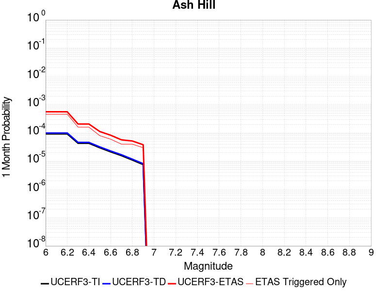 |  |  |

| Magnitude | 1 wk TI Prob | 1 wk TD Prob | 1 wk ETAS Prob | 1 wk ETAS/TD Gain | 1 wk ETAS Triggered Only | 1 mo TI Prob | 1 mo TD Prob | 1 mo ETAS Prob | 1 mo ETAS/TD Gain | 1 mo ETAS Triggered Only | 1 yr TI Prob | 1 yr TD Prob | 1 yr ETAS Prob | 1 yr ETAS/TD Gain | 1 yr ETAS Triggered Only | 10 yr TI Prob | 10 yr TD Prob | 10 yr ETAS Prob | 10 yr ETAS/TD Gain | 10 yr ETAS Triggered Only |
|-----|-----|-----|-----|-----|-----|-----|-----|-----|-----|-----|-----|-----|-----|-----|-----|-----|-----|-----|-----|-----|
| 6.0 | 2.1545662E-5 | 2.3194681E-5 | 2.4282782E-4 | 10.469116 | 2.1963824E-4 | 9.2335285E-5 | 9.9402445E-5 | 5.5155385E-4 | 5.548695 | 4.5219637E-4 | 0.0011236023 | 0.0012096328 | 0.0020484102 | 1.6934149 | 8.397933E-4 | 0.011179381 | 0.01203847 | 0.013161734 | 1.0933062 | 0.0011369509 |
| 6.1 | 2.1545662E-5 | 2.3194681E-5 | 2.4282782E-4 | 10.469116 | 2.1963824E-4 | 9.2335285E-5 | 9.9402445E-5 | 5.5155385E-4 | 5.548695 | 4.5219637E-4 | 0.0011236023 | 0.0012096328 | 0.0020484102 | 1.6934149 | 8.397933E-4 | 0.011179381 | 0.01203847 | 0.013161734 | 1.0933062 | 0.0011369509 |
| 6.2 | 2.1545662E-5 | 2.3194681E-5 | 2.4282782E-4 | 10.469116 | 2.1963824E-4 | 9.2335285E-5 | 9.9402445E-5 | 5.5155385E-4 | 5.548695 | 4.5219637E-4 | 0.0011236023 | 0.0012096328 | 0.0020484102 | 1.6934149 | 8.397933E-4 | 0.011179381 | 0.01203847 | 0.013161734 | 1.0933062 | 0.0011369509 |
| 6.3 | 1.0025529E-5 | 1.0747037E-5 | 1.14105096E-4 | 10.617354 | 1.03359176E-4 | 4.2965847E-5 | 4.605799E-5 | 2.3984752E-4 | 5.2075114 | 1.9379845E-4 | 5.229836E-4 | 5.60625E-4 | 9.0926664E-4 | 1.6218803 | 3.488372E-4 | 0.005217545 | 0.0055934195 | 0.006030239 | 1.0780952 | 4.3927648E-4 |
| 6.4 | 1.0025529E-5 | 1.0747037E-5 | 1.14105096E-4 | 10.617354 | 1.03359176E-4 | 4.2965847E-5 | 4.605799E-5 | 2.3984752E-4 | 5.2075114 | 1.9379845E-4 | 5.229836E-4 | 5.60625E-4 | 9.0926664E-4 | 1.6218803 | 3.488372E-4 | 0.005217545 | 0.0055934195 | 0.006030239 | 1.0780952 | 4.3927648E-4 |
| 6.5 | 6.9617327E-6 | 7.456704E-6 | 4.6216104E-5 | 6.1979265 | 3.875969E-5 | 2.9835655E-5 | 3.1956963E-5 | 1.3531283E-4 | 4.234221 | 1.03359176E-4 | 3.6318856E-4 | 3.8901521E-4 | 5.9565314E-4 | 1.5311822 | 2.0671835E-4 | 0.0036259557 | 0.0038841967 | 0.004141591 | 1.066267 | 2.5839792E-4 |
| 6.6 | 4.9919777E-6 | 5.346739E-6 | 1.8266566E-5 | 3.416394 | 1.2919897E-5 | 2.1394015E-5 | 2.2914432E-5 | 1.0043204E-4 | 4.3829165 | 7.751938E-5 | 2.60441E-4 | 2.789542E-4 | 4.339497E-4 | 1.5556307 | 1.5503875E-4 | 0.0026013597 | 0.0027866988 | 0.0029670733 | 1.064727 | 1.8087856E-4 |
| 6.7 | 3.6630722E-6 | 3.9246606E-6 | 3.9246606E-6 | 1.0 | 0.0 | 1.5698786E-5 | 1.6819899E-5 | 6.8498615E-5 | 4.072475 | 5.1679588E-5 | 1.9111596E-4 | 2.0476876E-4 | 3.21024E-4 | 1.5677392 | 1.1627907E-4 | 0.0019095168 | 0.002046364 | 0.002188192 | 1.0693073 | 1.4211886E-4 |
| 6.8 | 2.5599613E-6 | 2.7449514E-6 | 2.7449514E-6 | 1.0 | 0.0 | 1.0971216E-5 | 1.1764052E-5 | 6.344303E-5 | 5.392957 | 5.1679588E-5 | 1.3356637E-4 | 1.4322287E-4 | 2.4656724E-4 | 1.7215633 | 1.03359176E-4 | 0.0013348613 | 0.0014317906 | 0.0015479032 | 1.081096 | 1.1627907E-4 |
| 6.9 | 1.7684905E-6 | 1.896889E-6 | 1.896889E-6 | 1.0 | 0.0 | 7.579223E-6 | 8.129524E-6 | 4.6888897E-5 | 5.7677298 | 3.875969E-5 | 9.2273134E-5 | 9.8976954E-5 | 1.6357005E-4 | 1.6526073 | 6.459948E-5 | 9.223483E-4 | 9.897696E-4 | 0.0010543051 | 1.0652026 | 6.459948E-5 |

## Gravel Hills-Harper Lk
*[(top)](#table-of-contents)*

| 1 Week | 1 Month | 1 Year | 10 Year |
|-----|-----|-----|-----|
|  | 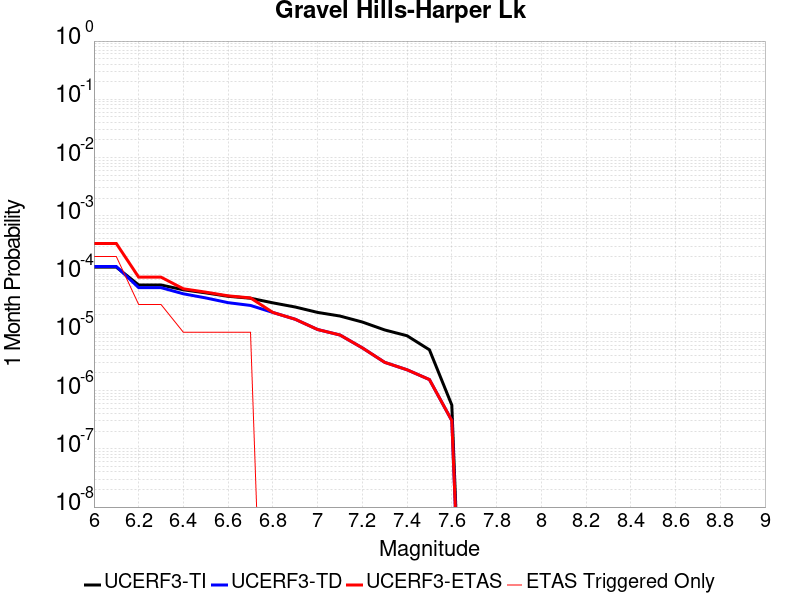 |  |  |

| Magnitude | 1 wk TI Prob | 1 wk TD Prob | 1 wk ETAS Prob | 1 wk ETAS/TD Gain | 1 wk ETAS Triggered Only | 1 mo TI Prob | 1 mo TD Prob | 1 mo ETAS Prob | 1 mo ETAS/TD Gain | 1 mo ETAS Triggered Only | 1 yr TI Prob | 1 yr TD Prob | 1 yr ETAS Prob | 1 yr ETAS/TD Gain | 1 yr ETAS Triggered Only | 10 yr TI Prob | 10 yr TD Prob | 10 yr ETAS Prob | 10 yr ETAS/TD Gain | 10 yr ETAS Triggered Only |
|-----|-----|-----|-----|-----|-----|-----|-----|-----|-----|-----|-----|-----|-----|-----|-----|-----|-----|-----|-----|-----|
| 6.0 | 3.0679566E-5 | 3.1465184E-5 | 9.6062635E-5 | 3.0529819 | 6.459948E-5 | 1.3147724E-4 | 1.3484505E-4 | 3.4153552E-4 | 2.5328 | 2.0671835E-4 | 0.0015995599 | 0.0016407187 | 0.002130869 | 1.2987413 | 4.9095607E-4 | 0.015880952 | 0.016307615 | 0.016930366 | 1.0381877 | 6.3307496E-4 |
| 6.1 | 3.0679566E-5 | 3.1465184E-5 | 9.6062635E-5 | 3.0529819 | 6.459948E-5 | 1.3147724E-4 | 1.3484505E-4 | 3.4153552E-4 | 2.5328 | 2.0671835E-4 | 0.0015995599 | 0.0016407187 | 0.002130869 | 1.2987413 | 4.9095607E-4 | 0.015880952 | 0.016307615 | 0.016930366 | 1.0381877 | 6.3307496E-4 |
| 6.2 | 1.514536E-5 | 1.3635392E-5 | 3.947483E-5 | 2.8950274 | 2.5839794E-5 | 6.490707E-5 | 5.843615E-5 | 9.719357E-5 | 1.663244 | 3.875969E-5 | 7.8995706E-4 | 7.112398E-4 | 7.7579333E-4 | 1.090762 | 6.459948E-5 | 0.007871548 | 0.0070908363 | 0.007206291 | 1.0162822 | 1.1627907E-4 |
| 6.3 | 1.514536E-5 | 1.3635392E-5 | 3.947483E-5 | 2.8950274 | 2.5839794E-5 | 6.490707E-5 | 5.843615E-5 | 9.719357E-5 | 1.663244 | 3.875969E-5 | 7.8995706E-4 | 7.112398E-4 | 7.7579333E-4 | 1.090762 | 6.459948E-5 | 0.007871548 | 0.0070908363 | 0.007206291 | 1.0162822 | 1.1627907E-4 |
| 6.4 | 1.2532521E-5 | 1.0689826E-5 | 2.3609584E-5 | 2.2086034 | 1.2919897E-5 | 5.37097E-5 | 4.581277E-5 | 5.8732072E-5 | 1.2820023 | 1.2919897E-5 | 6.537194E-4 | 5.576335E-4 | 5.963716E-4 | 1.0694687 | 3.875969E-5 | 0.0065179965 | 0.0055629327 | 0.005640021 | 1.0138575 | 7.751938E-5 |
| 6.5 | 1.1094058E-5 | 9.083774E-6 | 2.2003553E-5 | 2.422292 | 1.2919897E-5 | 4.7545094E-5 | 3.89299E-5 | 5.1849293E-5 | 1.331863 | 1.2919897E-5 | 5.787078E-4 | 4.738725E-4 | 5.126138E-4 | 1.0817547 | 3.875969E-5 | 0.0057720304 | 0.004729028 | 0.004780463 | 1.0108765 | 5.1679588E-5 |
| 6.6 | 9.688328E-6 | 7.531784E-6 | 2.0451584E-5 | 2.7153704 | 1.2919897E-5 | 4.1520743E-5 | 3.2278687E-5 | 4.519817E-5 | 1.4002479 | 1.2919897E-5 | 5.053978E-4 | 3.929247E-4 | 4.3166918E-4 | 1.0986053 | 3.875969E-5 | 0.0050424994 | 0.0039225565 | 0.003961164 | 1.0098425 | 3.875969E-5 |
| 6.7 | 8.974824E-6 | 6.7494916E-6 | 1.9669302E-5 | 2.91419 | 1.2919897E-5 | 3.8462964E-5 | 2.8926084E-5 | 4.1845607E-5 | 1.4466392 | 1.2919897E-5 | 4.6818596E-4 | 3.5212038E-4 | 3.9086642E-4 | 1.1100364 | 3.875969E-5 | 0.004672008 | 0.0035158454 | 0.0035544687 | 1.0109855 | 3.875969E-5 |
| 6.8 | 7.4780046E-6 | 5.116252E-6 | 5.116252E-6 | 1.0 | 0.0 | 3.20482E-5 | 2.1926619E-5 | 2.1926619E-5 | 1.0 | 0.0 | 3.9011694E-4 | 2.6692526E-4 | 2.798417E-4 | 1.0483898 | 1.2919897E-5 | 0.0038943281 | 0.002666185 | 0.0026790702 | 1.0048329 | 1.2919897E-5 |
| 6.9 | 6.3409307E-6 | 3.9075426E-6 | 3.9075426E-6 | 1.0 | 0.0 | 2.7175134E-5 | 1.674651E-5 | 1.674651E-5 | 1.0 | 0.0 | 3.3080703E-4 | 2.0387067E-4 | 2.0387067E-4 | 1.0 | 0.0 | 0.0033031502 | 0.0020369345 | 0.0020369345 | 1.0 | 0.0 |
| 7.0 | 5.1239335E-6 | 2.6058885E-6 | 2.6058885E-6 | 1.0 | 0.0 | 2.195953E-5 | 1.11680465E-5 | 1.11680465E-5 | 1.0 | 0.0 | 2.6732447E-4 | 1.3596273E-4 | 1.3596273E-4 | 1.0 | 0.0 | 0.0026700313 | 0.0013588208 | 0.0013588208 | 1.0 | 0.0 |
| 7.1 | 4.438899E-6 | 2.0984994E-6 | 2.0984994E-6 | 1.0 | 0.0 | 1.9023713E-5 | 8.993539E-6 | 8.993539E-6 | 1.0 | 0.0 | 2.315891E-4 | 1.0949106E-4 | 1.0949106E-4 | 1.0 | 0.0 | 0.002313479 | 0.0010943931 | 0.0010943931 | 1.0 | 0.0 |
| 7.2 | 3.50367E-6 | 1.2615911E-6 | 1.2615911E-6 | 1.0 | 0.0 | 1.5015643E-5 | 5.406808E-6 | 5.406808E-6 | 1.0 | 0.0 | 1.8280011E-4 | 6.582599E-5 | 6.582599E-5 | 1.0 | 0.0 | 0.0018264982 | 6.580731E-4 | 6.580731E-4 | 1.0 | 0.0 |
| 7.3 | 2.561638E-6 | 7.119307E-7 | 7.119307E-7 | 1.0 | 0.0 | 1.0978401E-5 | 3.051128E-6 | 3.051128E-6 | 1.0 | 0.0 | 1.3365384E-4 | 3.714687E-5 | 3.714687E-5 | 1.0 | 0.0 | 0.0013357349 | 3.7140862E-4 | 3.7140862E-4 | 1.0 | 0.0 |
| 7.4 | 2.0368864E-6 | 5.304955E-7 | 5.304955E-7 | 1.0 | 0.0 | 8.729483E-6 | 2.2735503E-6 | 2.2735503E-6 | 1.0 | 0.0 | 1.06276275E-4 | 2.768013E-5 | 2.768013E-5 | 1.0 | 0.0 | 0.0010622547 | 2.7676736E-4 | 2.7676736E-4 | 1.0 | 0.0 |
| 7.5 | 1.1681728E-6 | 3.6031287E-7 | 3.6031287E-7 | 1.0 | 0.0 | 5.0064455E-6 | 1.5441972E-6 | 1.5441972E-6 | 1.0 | 0.0 | 6.0951766E-5 | 1.8800443E-5 | 1.8800443E-5 | 1.0 | 0.0 | 6.093505E-4 | 1.8798899E-4 | 1.8798899E-4 | 1.0 | 0.0 |
| 7.6 | 1.3154387E-7 | 7.1198265E-8 | 7.1198265E-8 | 1.0 | 0.0 | 5.6375933E-7 | 3.051354E-7 | 3.051354E-7 | 1.0 | 0.0 | 6.863748E-6 | 3.7150185E-6 | 3.7150185E-6 | 1.0 | 0.0 | 6.863536E-5 | 3.7149723E-5 | 3.7149723E-5 | 1.0 | 0.0 |

## San Andreas (Mojave N)
*[(top)](#table-of-contents)*

| 1 Week | 1 Month | 1 Year | 10 Year |
|-----|-----|-----|-----|
| 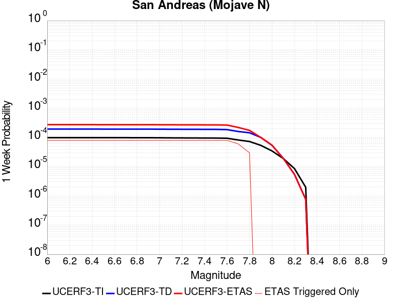 |  |  |  |

| Magnitude | 1 wk TI Prob | 1 wk TD Prob | 1 wk ETAS Prob | 1 wk ETAS/TD Gain | 1 wk ETAS Triggered Only | 1 mo TI Prob | 1 mo TD Prob | 1 mo ETAS Prob | 1 mo ETAS/TD Gain | 1 mo ETAS Triggered Only | 1 yr TI Prob | 1 yr TD Prob | 1 yr ETAS Prob | 1 yr ETAS/TD Gain | 1 yr ETAS Triggered Only | 10 yr TI Prob | 10 yr TD Prob | 10 yr ETAS Prob | 10 yr ETAS/TD Gain | 10 yr ETAS Triggered Only |
|-----|-----|-----|-----|-----|-----|-----|-----|-----|-----|-----|-----|-----|-----|-----|-----|-----|-----|-----|-----|-----|
| 6.0 | 9.877682E-5 | 1.9409315E-4 | 2.715975E-4 | 1.3993151 | 7.751938E-5 | 4.2326056E-4 | 8.315628E-4 | 0.0010252001 | 1.2328595 | 1.9379845E-4 | 0.0051410277 | 0.010077406 | 0.010550625 | 1.0469584 | 4.7803618E-4 | 0.05023708 | 0.09835201 | 0.098911166 | 1.0056853 | 6.20155E-4 |
| 6.1 | 9.877682E-5 | 1.9409315E-4 | 2.715975E-4 | 1.3993151 | 7.751938E-5 | 4.2326056E-4 | 8.315628E-4 | 0.0010252001 | 1.2328595 | 1.9379845E-4 | 0.0051410277 | 0.010077406 | 0.010550625 | 1.0469584 | 4.7803618E-4 | 0.05023708 | 0.09835201 | 0.098911166 | 1.0056853 | 6.20155E-4 |
| 6.2 | 9.877682E-5 | 1.9409315E-4 | 2.715975E-4 | 1.3993151 | 7.751938E-5 | 4.2326056E-4 | 8.315628E-4 | 0.0010252001 | 1.2328595 | 1.9379845E-4 | 0.0051410277 | 0.010077406 | 0.010550625 | 1.0469584 | 4.7803618E-4 | 0.05023708 | 0.09835201 | 0.098911166 | 1.0056853 | 6.20155E-4 |
| 6.3 | 9.877682E-5 | 1.9409315E-4 | 2.715975E-4 | 1.3993151 | 7.751938E-5 | 4.2326056E-4 | 8.315628E-4 | 0.0010252001 | 1.2328595 | 1.9379845E-4 | 0.0051410277 | 0.010077406 | 0.010550625 | 1.0469584 | 4.7803618E-4 | 0.05023708 | 0.09835201 | 0.098911166 | 1.0056853 | 6.20155E-4 |
| 6.4 | 9.877682E-5 | 1.9409315E-4 | 2.715975E-4 | 1.3993151 | 7.751938E-5 | 4.2326056E-4 | 8.315628E-4 | 0.0010252001 | 1.2328595 | 1.9379845E-4 | 0.0051410277 | 0.010077406 | 0.010550625 | 1.0469584 | 4.7803618E-4 | 0.05023708 | 0.09835201 | 0.098911166 | 1.0056853 | 6.20155E-4 |
| 6.5 | 9.861474E-5 | 1.9383078E-4 | 2.7133516E-4 | 1.3998557 | 7.751938E-5 | 4.2256617E-4 | 8.304391E-4 | 0.0010240766 | 1.2331748 | 1.9379845E-4 | 0.0051326132 | 0.010063851 | 0.010537077 | 1.0470223 | 4.7803618E-4 | 0.050156746 | 0.098229796 | 0.09878903 | 1.0056932 | 6.20155E-4 |
| 6.6 | 9.861474E-5 | 1.9383078E-4 | 2.7133516E-4 | 1.3998557 | 7.751938E-5 | 4.2256617E-4 | 8.304391E-4 | 0.0010240766 | 1.2331748 | 1.9379845E-4 | 0.0051326132 | 0.010063851 | 0.010537077 | 1.0470223 | 4.7803618E-4 | 0.050156746 | 0.098229796 | 0.09878903 | 1.0056932 | 6.20155E-4 |
| 6.7 | 9.8552715E-5 | 1.9373032E-4 | 2.7123466E-4 | 1.4000632 | 7.751938E-5 | 4.223004E-4 | 8.3000876E-4 | 0.0010236463 | 1.2332958 | 1.9379845E-4 | 0.0051293927 | 0.01005866 | 0.010531888 | 1.0470468 | 4.7803618E-4 | 0.050125998 | 0.098182976 | 0.09874225 | 1.0056962 | 6.20155E-4 |
| 6.8 | 9.8464974E-5 | 1.9358192E-4 | 2.710863E-4 | 1.4003699 | 7.751938E-5 | 4.219245E-4 | 8.293732E-4 | 0.0010230109 | 1.2334747 | 1.9379845E-4 | 0.0051248376 | 0.010050993 | 0.010524225 | 1.047083 | 4.7803618E-4 | 0.05008251 | 0.09811299 | 0.0986723 | 1.0057007 | 6.20155E-4 |
| 6.9 | 9.825824E-5 | 1.9326196E-4 | 2.7076635E-4 | 1.4010328 | 7.751938E-5 | 4.2103877E-4 | 8.280028E-4 | 0.0010216408 | 1.2338614 | 1.9379845E-4 | 0.0051141046 | 0.010034463 | 0.010507703 | 1.0471613 | 4.7803618E-4 | 0.049980022 | 0.09796208 | 0.09852148 | 1.0057104 | 6.20155E-4 |
| 7.0 | 9.781462E-5 | 1.9257552E-4 | 2.7007997E-4 | 1.4024626 | 7.751938E-5 | 4.1913814E-4 | 8.250628E-4 | 0.0010187014 | 1.2346956 | 1.9379845E-4 | 0.005091073 | 0.009998998 | 0.010472254 | 1.0473304 | 4.7803618E-4 | 0.04976007 | 0.097638436 | 0.09819804 | 1.0057313 | 6.20155E-4 |
| 7.1 | 9.7121134E-5 | 1.9159251E-4 | 2.6909704E-4 | 1.404528 | 7.751938E-5 | 4.1616702E-4 | 8.208525E-4 | 0.0010144919 | 1.2359003 | 1.9379845E-4 | 0.005055068 | 0.009948207 | 0.0104214875 | 1.0475744 | 4.7803618E-4 | 0.04941613 | 0.097174905 | 0.097734794 | 1.0057617 | 6.20155E-4 |
| 7.2 | 9.663819E-5 | 1.9090026E-4 | 2.6840484E-4 | 1.4059951 | 7.751938E-5 | 4.1409794E-4 | 8.178876E-4 | 0.0010115276 | 1.2367562 | 1.9379845E-4 | 0.0050299936 | 0.009912439 | 0.010385736 | 1.0477479 | 4.7803618E-4 | 0.049176537 | 0.09684814 | 0.097408235 | 1.0057832 | 6.20155E-4 |
| 7.3 | 9.6277574E-5 | 1.9042526E-4 | 2.679299E-4 | 1.407008 | 7.751938E-5 | 4.125529E-4 | 8.158532E-4 | 0.0010094936 | 1.237347 | 1.9379845E-4 | 0.0050112694 | 0.009887895 | 0.010361204 | 1.0478675 | 4.7803618E-4 | 0.04899759 | 0.09662155 | 0.09718178 | 1.0057982 | 6.20155E-4 |
| 7.4 | 9.593308E-5 | 1.8982294E-4 | 2.673276E-4 | 1.4082998 | 7.751938E-5 | 4.1107697E-4 | 8.132734E-4 | 0.0010069143 | 1.2381005 | 1.9379845E-4 | 0.0049933824 | 0.00985677 | 0.010330094 | 1.0480202 | 4.7803618E-4 | 0.04882661 | 0.09633968 | 0.09690009 | 1.005817 | 6.20155E-4 |
| 7.5 | 9.561707E-5 | 1.8928363E-4 | 2.6678832E-4 | 1.4094634 | 7.751938E-5 | 4.0972308E-4 | 8.109635E-4 | 0.0010046049 | 1.2387793 | 1.9379845E-4 | 0.0049769743 | 0.009828901 | 0.010302239 | 1.0481577 | 4.7803618E-4 | 0.048669744 | 0.09608582 | 0.09664638 | 1.005834 | 6.20155E-4 |
| 7.6 | 9.418194E-5 | 1.8580563E-4 | 2.6331062E-4 | 1.4171293 | 7.751938E-5 | 4.0357444E-4 | 7.96067E-4 | 9.768016E-4 | 1.2270343 | 1.8087856E-4 | 0.004902454 | 0.009649157 | 0.010109785 | 1.0477377 | 4.651163E-4 | 0.047957025 | 0.09446791 | 0.095017776 | 1.0058208 | 6.072351E-4 |
| 7.7 | 8.202141E-5 | 1.6029038E-4 | 2.1196168E-4 | 1.3223606 | 5.1679588E-5 | 3.51473E-4 | 6.86778E-4 | 8.287992E-4 | 1.2067935 | 1.4211886E-4 | 0.00427079 | 0.008329522 | 0.008701078 | 1.0446072 | 3.74677E-4 | 0.04189639 | 0.08226675 | 0.082729176 | 1.0056211 | 5.0387596E-4 |
| 7.8 | 7.2859846E-5 | 1.4523414E-4 | 1.839882E-4 | 1.2668386 | 3.875969E-5 | 3.1221908E-4 | 6.2228355E-4 | 7.255784E-4 | 1.1659932 | 1.03359176E-4 | 0.003794643 | 0.007550025 | 0.0077551827 | 1.0271732 | 2.0671835E-4 | 0.037304975 | 0.074755974 | 0.07503092 | 1.0036778 | 2.9715762E-4 |
| 7.9 | 5.3874453E-5 | 1.0050546E-4 | 1.0050546E-4 | 1.0 | 0.0 | 2.3087008E-4 | 4.3066658E-4 | 4.823239E-4 | 1.1199474 | 5.1679588E-5 | 0.0028072202 | 0.005230771 | 0.0053464416 | 1.0221136 | 1.1627907E-4 | 0.02772022 | 0.052447177 | 0.05261857 | 1.0032679 | 1.8087856E-4 |
| 8.0 | 3.468538E-5 | 5.4288335E-5 | 5.4288335E-5 | 1.0 | 0.0 | 1.4864317E-4 | 2.3264355E-4 | 2.3264355E-4 | 1.0 | 0.0 | 0.0018082283 | 0.0028287582 | 0.0028287582 | 1.0 | 0.0 | 0.017935853 | 0.028961267 | 0.028998906 | 1.0012996 | 3.875969E-5 |
| 8.1 | 1.9152367E-5 | 1.9415891E-5 | 1.9415891E-5 | 1.0 | 0.0 | 8.207899E-5 | 8.320831E-5 | 8.320831E-5 | 1.0 | 0.0 | 9.988535E-4 | 0.0010125911 | 0.0010125911 | 1.0 | 0.0 | 0.009943757 | 0.010863188 | 0.010863188 | 1.0 | 0.0 |
| 8.2 | 8.643924E-6 | 5.4798497E-6 | 5.4798497E-6 | 1.0 | 0.0 | 3.704486E-5 | 2.348486E-5 | 2.348486E-5 | 1.0 | 0.0 | 4.5092785E-4 | 2.858907E-4 | 2.858907E-4 | 1.0 | 0.0 | 0.0045001395 | 0.0032514327 | 0.0032514327 | 1.0 | 0.0 |
| 8.3 | 1.983087E-6 | 7.668296E-7 | 7.668296E-7 | 1.0 | 0.0 | 8.498917E-6 | 3.2864084E-6 | 3.2864084E-6 | 1.0 | 0.0 | 1.034694E-4 | 4.0011306E-5 | 4.0011306E-5 | 1.0 | 0.0 | 0.0010342124 | 4.724499E-4 | 4.724499E-4 | 1.0 | 0.0 |

## San Andreas (Mojave S)
*[(top)](#table-of-contents)*

| 1 Week | 1 Month | 1 Year | 10 Year |
|-----|-----|-----|-----|
|  |  |  | 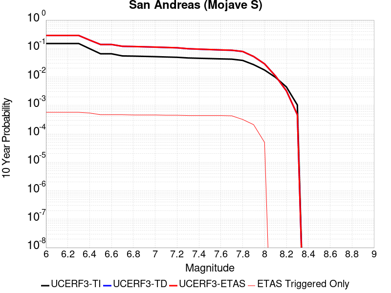 |

| Magnitude | 1 wk TI Prob | 1 wk TD Prob | 1 wk ETAS Prob | 1 wk ETAS/TD Gain | 1 wk ETAS Triggered Only | 1 mo TI Prob | 1 mo TD Prob | 1 mo ETAS Prob | 1 mo ETAS/TD Gain | 1 mo ETAS Triggered Only | 1 yr TI Prob | 1 yr TD Prob | 1 yr ETAS Prob | 1 yr ETAS/TD Gain | 1 yr ETAS Triggered Only | 10 yr TI Prob | 10 yr TD Prob | 10 yr ETAS Prob | 10 yr ETAS/TD Gain | 10 yr ETAS Triggered Only |
|-----|-----|-----|-----|-----|-----|-----|-----|-----|-----|-----|-----|-----|-----|-----|-----|-----|-----|-----|-----|-----|
| 6.0 | 3.1064058E-4 | 6.747043E-4 | 7.521714E-4 | 1.1148163 | 7.751938E-5 | 0.0013306376 | 0.002888514 | 0.00306887 | 1.0624391 | 1.8087856E-4 | 0.016080605 | 0.03462661 | 0.03506315 | 1.012607 | 4.5219637E-4 | 0.1496549 | 0.28663692 | 0.28704247 | 1.0014148 | 5.6847546E-4 |
| 6.1 | 3.1064058E-4 | 6.747043E-4 | 7.521714E-4 | 1.1148163 | 7.751938E-5 | 0.0013306376 | 0.002888514 | 0.00306887 | 1.0624391 | 1.8087856E-4 | 0.016080605 | 0.03462661 | 0.03506315 | 1.012607 | 4.5219637E-4 | 0.1496549 | 0.28663692 | 0.28704247 | 1.0014148 | 5.6847546E-4 |
| 6.2 | 3.1064058E-4 | 6.747043E-4 | 7.521714E-4 | 1.1148163 | 7.751938E-5 | 0.0013306376 | 0.002888514 | 0.00306887 | 1.0624391 | 1.8087856E-4 | 0.016080605 | 0.03462661 | 0.03506315 | 1.012607 | 4.5219637E-4 | 0.1496549 | 0.28663692 | 0.28704247 | 1.0014148 | 5.6847546E-4 |
| 6.3 | 3.1064058E-4 | 6.747043E-4 | 7.521714E-4 | 1.1148163 | 7.751938E-5 | 0.0013306376 | 0.002888514 | 0.00306887 | 1.0624391 | 1.8087856E-4 | 0.016080605 | 0.03462661 | 0.03506315 | 1.012607 | 4.5219637E-4 | 0.1496549 | 0.28663692 | 0.28704247 | 1.0014148 | 5.6847546E-4 |
| 6.4 | 1.9872203E-4 | 4.318848E-4 | 5.093707E-4 | 1.1794133 | 7.751938E-5 | 8.5138786E-4 | 0.0018496502 | 0.0020301943 | 1.0976098 | 1.8087856E-4 | 0.010316478 | 0.022293096 | 0.022697316 | 1.0181321 | 4.134367E-4 | 0.098504856 | 0.19703239 | 0.19745775 | 1.0021588 | 5.297158E-4 |
| 6.5 | 1.291105E-4 | 2.8761322E-4 | 3.3927793E-4 | 1.1796327 | 5.1679588E-5 | 5.5321335E-4 | 0.0012320485 | 0.0013868962 | 1.1256832 | 1.5503875E-4 | 0.006714592 | 0.0148978485 | 0.015254215 | 1.0239208 | 3.6175712E-4 | 0.065152965 | 0.13807017 | 0.1384822 | 1.0029843 | 4.7803618E-4 |
| 6.6 | 1.291105E-4 | 2.8761322E-4 | 3.3927793E-4 | 1.1796327 | 5.1679588E-5 | 5.5321335E-4 | 0.0012320485 | 0.0013868962 | 1.1256832 | 1.5503875E-4 | 0.006714592 | 0.0148978485 | 0.015254215 | 1.0239208 | 3.6175712E-4 | 0.065152965 | 0.13807017 | 0.1384822 | 1.0029843 | 4.7803618E-4 |
| 6.7 | 1.08001186E-4 | 2.4342406E-4 | 2.9509107E-4 | 1.2122511 | 5.1679588E-5 | 4.6278012E-4 | 0.0010428295 | 0.0011977066 | 1.1485162 | 1.5503875E-4 | 0.0056198016 | 0.012622835 | 0.012980026 | 1.0282972 | 3.6175712E-4 | 0.054797906 | 0.11921291 | 0.11963396 | 1.0035319 | 4.7803618E-4 |
| 6.8 | 1.0624356E-4 | 2.3860046E-4 | 2.9026772E-4 | 1.216543 | 5.1679588E-5 | 4.5525006E-4 | 0.0010221732 | 0.0011641468 | 1.1388938 | 1.4211886E-4 | 0.0055285925 | 0.01237422 | 0.012718741 | 1.0278418 | 3.488372E-4 | 0.053930566 | 0.117162056 | 0.11757268 | 1.0035048 | 4.651163E-4 |
| 6.9 | 1.0393785E-4 | 2.3230357E-4 | 2.8397117E-4 | 1.222414 | 5.1679588E-5 | 4.4537184E-4 | 9.952073E-4 | 0.0011371848 | 1.1426611 | 1.4211886E-4 | 0.0054089287 | 0.012049583 | 0.012394217 | 1.0286013 | 3.488372E-4 | 0.05279156 | 0.11445948 | 0.11487136 | 1.0035985 | 4.651163E-4 |
| 7.0 | 1.0155622E-4 | 2.2599897E-4 | 2.7766687E-4 | 1.22862 | 5.1679588E-5 | 4.3516833E-4 | 9.682079E-4 | 0.0011101891 | 1.1466434 | 1.4211886E-4 | 0.005285311 | 0.011724443 | 0.012069191 | 1.0294042 | 3.488372E-4 | 0.05161361 | 0.11171984 | 0.112133 | 1.0036981 | 4.651163E-4 |
| 7.1 | 9.885595E-5 | 2.1888265E-4 | 2.7055093E-4 | 1.2360547 | 5.1679588E-5 | 4.2359953E-4 | 9.377316E-4 | 0.0010668094 | 1.1376489 | 1.2919896E-4 | 0.0051451353 | 0.011357316 | 0.011689418 | 1.0292412 | 3.359173E-4 | 0.05027629 | 0.10860426 | 0.10900735 | 1.0037115 | 4.5219637E-4 |
| 7.2 | 9.6411415E-5 | 2.125122E-4 | 2.641808E-4 | 1.2431325 | 5.1679588E-5 | 4.1312634E-4 | 9.1044896E-4 | 0.0010395303 | 1.1417776 | 1.2919896E-4 | 0.005018219 | 0.01102856 | 0.011360773 | 1.030123 | 3.359173E-4 | 0.049064007 | 0.10579402 | 0.10619838 | 1.0038221 | 4.5219637E-4 |
| 7.3 | 9.1180635E-5 | 1.9479371E-4 | 2.4646323E-4 | 1.2652525 | 5.1679588E-5 | 3.907156E-4 | 8.345632E-4 | 9.6365437E-4 | 1.1546811 | 1.2919896E-4 | 0.004746591 | 0.010113581 | 0.0104333125 | 1.031614 | 3.2299742E-4 | 0.046464786 | 0.09798661 | 0.09838284 | 1.0040437 | 4.3927648E-4 |
| 7.4 | 8.887388E-5 | 1.8727897E-4 | 2.3894888E-4 | 1.2758981 | 5.1679588E-5 | 3.8083247E-4 | 8.023774E-4 | 9.314727E-4 | 1.160891 | 1.2919896E-4 | 0.0046267817 | 0.009725285 | 0.010045141 | 1.0328891 | 3.2299742E-4 | 0.045316286 | 0.09462135 | 0.095019065 | 1.0042032 | 4.3927648E-4 |
| 7.5 | 8.6750515E-5 | 1.8059391E-4 | 2.3226417E-4 | 1.2861129 | 5.1679588E-5 | 3.7173493E-4 | 7.7374437E-4 | 9.0284337E-4 | 1.1668497 | 1.2919896E-4 | 0.004516484 | 0.009379733 | 0.009699701 | 1.0341127 | 3.2299742E-4 | 0.04425787 | 0.09158487 | 0.091983914 | 1.0043571 | 4.3927648E-4 |
| 7.6 | 8.453092E-5 | 1.7446902E-4 | 2.261396E-4 | 1.296159 | 5.1679588E-5 | 3.6222505E-4 | 7.475102E-4 | 8.766126E-4 | 1.1727098 | 1.2919896E-4 | 0.0044011753 | 0.009063034 | 0.009383105 | 1.035316 | 3.2299742E-4 | 0.04315024 | 0.088743635 | 0.089143924 | 1.0045106 | 4.3927648E-4 |
| 7.7 | 8.259102E-5 | 1.6968958E-4 | 2.213604E-4 | 1.304502 | 5.1679588E-5 | 3.539135E-4 | 7.270384E-4 | 8.561435E-4 | 1.1775767 | 1.2919896E-4 | 0.004300386 | 0.008815835 | 0.009123179 | 1.0348628 | 3.100775E-4 | 0.042181134 | 0.08649418 | 0.08688366 | 1.004503 | 4.263566E-4 |
| 7.8 | 7.444844E-5 | 1.5290553E-4 | 1.916593E-4 | 1.2534491 | 3.875969E-5 | 3.1902574E-4 | 6.551449E-4 | 7.584364E-4 | 1.157662 | 1.03359176E-4 | 0.0038772223 | 0.007947266 | 0.008152342 | 1.0258045 | 2.0671835E-4 | 0.03810269 | 0.07832232 | 0.078596205 | 1.0034969 | 2.9715762E-4 |
| 7.9 | 5.2586525E-5 | 1.0011239E-4 | 1.0011239E-4 | 1.0 | 0.0 | 2.2535135E-4 | 4.2898257E-4 | 4.8063998E-4 | 1.1204184 | 5.1679588E-5 | 0.0027402006 | 0.005210366 | 0.0053260396 | 1.0222006 | 1.1627907E-4 | 0.027066574 | 0.052222524 | 0.052393958 | 1.0032828 | 1.8087856E-4 |
| 8.0 | 3.379877E-5 | 5.4101976E-5 | 5.4101976E-5 | 1.0 | 0.0 | 1.4484383E-4 | 2.3184501E-4 | 2.3184501E-4 | 1.0 | 0.0 | 0.0017620471 | 0.002819061 | 0.002819061 | 1.0 | 0.0 | 0.017481409 | 0.028848516 | 0.028886158 | 1.0013047 | 3.875969E-5 |
| 8.1 | 1.8668277E-5 | 1.9322531E-5 | 1.9322531E-5 | 1.0 | 0.0 | 8.000444E-5 | 8.280823E-5 | 8.280823E-5 | 1.0 | 0.0 | 9.736188E-4 | 0.0010077246 | 0.0010077246 | 1.0 | 0.0 | 0.009693642 | 0.010805754 | 0.010805754 | 1.0 | 0.0 |
| 8.2 | 8.541571E-6 | 5.465789E-6 | 5.465789E-6 | 1.0 | 0.0 | 3.660622E-5 | 2.34246E-5 | 2.34246E-5 | 1.0 | 0.0 | 4.455896E-4 | 2.8515726E-4 | 2.8515726E-4 | 1.0 | 0.0 | 0.0044469717 | 0.0032435213 | 0.0032435213 | 1.0 | 0.0 |
| 8.3 | 1.983087E-6 | 7.668296E-7 | 7.668296E-7 | 1.0 | 0.0 | 8.498917E-6 | 3.2864084E-6 | 3.2864084E-6 | 1.0 | 0.0 | 1.034694E-4 | 4.0011306E-5 | 4.0011306E-5 | 1.0 | 0.0 | 0.0010342124 | 4.724499E-4 | 4.724499E-4 | 1.0 | 0.0 |

## So Sierra Nevada
*[(top)](#table-of-contents)*

| 1 Week | 1 Month | 1 Year | 10 Year |
|-----|-----|-----|-----|
|  |  | 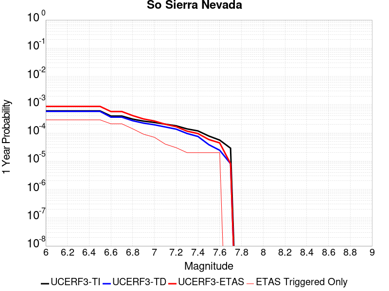 |  |

| Magnitude | 1 wk TI Prob | 1 wk TD Prob | 1 wk ETAS Prob | 1 wk ETAS/TD Gain | 1 wk ETAS Triggered Only | 1 mo TI Prob | 1 mo TD Prob | 1 mo ETAS Prob | 1 mo ETAS/TD Gain | 1 mo ETAS Triggered Only | 1 yr TI Prob | 1 yr TD Prob | 1 yr ETAS Prob | 1 yr ETAS/TD Gain | 1 yr ETAS Triggered Only | 10 yr TI Prob | 10 yr TD Prob | 10 yr ETAS Prob | 10 yr ETAS/TD Gain | 10 yr ETAS Triggered Only |
|-----|-----|-----|-----|-----|-----|-----|-----|-----|-----|-----|-----|-----|-----|-----|-----|-----|-----|-----|-----|-----|
| 6.0 | 1.15488665E-5 | 1.1079722E-5 | 1.1443775E-4 | 10.328576 | 1.03359176E-4 | 4.9494203E-5 | 4.748373E-5 | 1.8959584E-4 | 3.9928594 | 1.4211886E-4 | 6.024253E-4 | 5.779738E-4 | 8.878721E-4 | 1.5361805 | 3.100775E-4 | 0.006007948 | 0.005765975 | 0.006266946 | 1.0868839 | 5.0387596E-4 |
| 6.1 | 1.15488665E-5 | 1.1079722E-5 | 1.1443775E-4 | 10.328576 | 1.03359176E-4 | 4.9494203E-5 | 4.748373E-5 | 1.8959584E-4 | 3.9928594 | 1.4211886E-4 | 6.024253E-4 | 5.779738E-4 | 8.878721E-4 | 1.5361805 | 3.100775E-4 | 0.006007948 | 0.005765975 | 0.006266946 | 1.0868839 | 5.0387596E-4 |
| 6.2 | 1.15488665E-5 | 1.1079722E-5 | 1.1443775E-4 | 10.328576 | 1.03359176E-4 | 4.9494203E-5 | 4.748373E-5 | 1.8959584E-4 | 3.9928594 | 1.4211886E-4 | 6.024253E-4 | 5.779738E-4 | 8.878721E-4 | 1.5361805 | 3.100775E-4 | 0.006007948 | 0.005765975 | 0.006266946 | 1.0868839 | 5.0387596E-4 |
| 6.3 | 1.15488665E-5 | 1.1079722E-5 | 1.1443775E-4 | 10.328576 | 1.03359176E-4 | 4.9494203E-5 | 4.748373E-5 | 1.8959584E-4 | 3.9928594 | 1.4211886E-4 | 6.024253E-4 | 5.779738E-4 | 8.878721E-4 | 1.5361805 | 3.100775E-4 | 0.006007948 | 0.005765975 | 0.006266946 | 1.0868839 | 5.0387596E-4 |
| 6.4 | 1.15488665E-5 | 1.1079722E-5 | 1.1443775E-4 | 10.328576 | 1.03359176E-4 | 4.9494203E-5 | 4.748373E-5 | 1.8959584E-4 | 3.9928594 | 1.4211886E-4 | 6.024253E-4 | 5.779738E-4 | 8.878721E-4 | 1.5361805 | 3.100775E-4 | 0.006007948 | 0.005765975 | 0.006266946 | 1.0868839 | 5.0387596E-4 |
| 6.5 | 1.15488665E-5 | 1.1079722E-5 | 1.1443775E-4 | 10.328576 | 1.03359176E-4 | 4.9494203E-5 | 4.748373E-5 | 1.8959584E-4 | 3.9928594 | 1.4211886E-4 | 6.024253E-4 | 5.779738E-4 | 8.878721E-4 | 1.5361805 | 3.100775E-4 | 0.006007948 | 0.005765975 | 0.006266946 | 1.0868839 | 5.0387596E-4 |
| 6.6 | 7.587044E-6 | 6.935689E-6 | 9.737434E-5 | 14.039606 | 9.043928E-5 | 3.2515498E-5 | 2.9724059E-5 | 1.5891918E-4 | 5.346483 | 1.2919896E-4 | 3.9580427E-4 | 3.6183326E-4 | 6.0722244E-4 | 1.6781832 | 2.4547803E-4 | 0.003951 | 0.0036127327 | 0.003998929 | 1.1068988 | 3.875969E-4 |
| 6.7 | 7.587044E-6 | 6.935689E-6 | 9.737434E-5 | 14.039606 | 9.043928E-5 | 3.2515498E-5 | 2.9724059E-5 | 1.5891918E-4 | 5.346483 | 1.2919896E-4 | 3.9580427E-4 | 3.6183326E-4 | 6.0722244E-4 | 1.6781832 | 2.4547803E-4 | 0.003951 | 0.0036127327 | 0.003998929 | 1.1068988 | 3.875969E-4 |
| 6.8 | 5.9026956E-6 | 5.1794364E-6 | 4.3938926E-5 | 8.483341 | 3.875969E-5 | 2.5297022E-5 | 2.2197402E-5 | 8.679545E-5 | 3.9101624 | 6.459948E-5 | 3.0794772E-4 | 2.7022103E-4 | 4.252179E-4 | 1.5735929 | 1.5503875E-4 | 0.0030752132 | 0.0026990408 | 0.0029953963 | 1.1098003 | 2.9715762E-4 |
| 6.9 | 5.0118915E-6 | 4.2524644E-6 | 1.7172306E-5 | 4.0382013 | 1.2919897E-5 | 2.1479358E-5 | 1.8224722E-5 | 5.6983707E-5 | 3.1267254 | 3.875969E-5 | 2.614798E-4 | 2.2186415E-4 | 3.2520038E-4 | 1.4657636 | 1.03359176E-4 | 0.0026117235 | 0.002216499 | 0.002461433 | 1.1105049 | 2.4547803E-4 |
| 7.0 | 4.4924795E-6 | 3.713954E-6 | 1.6633803E-5 | 4.4787316 | 1.2919897E-5 | 1.925334E-5 | 1.5916852E-5 | 5.4675926E-5 | 3.4350967 | 3.875969E-5 | 2.3438422E-4 | 1.9377106E-4 | 2.8419282E-4 | 1.4666421 | 9.043928E-5 | 0.0023413717 | 0.001936084 | 0.002142402 | 1.1065646 | 2.0671835E-4 |
| 7.1 | 3.9118436E-6 | 3.1120105E-6 | 1.6031867E-5 | 5.151611 | 1.2919897E-5 | 1.6764936E-5 | 1.3337123E-5 | 3.917657E-5 | 2.937408 | 2.5839794E-5 | 2.0409399E-4 | 1.6236794E-4 | 2.1403914E-4 | 1.3182352 | 5.1679588E-5 | 0.0020390663 | 0.0016225493 | 0.0017386397 | 1.0715481 | 1.1627907E-4 |
| 7.2 | 3.4200818E-6 | 2.6054847E-6 | 1.5525347E-5 | 5.958718 | 1.2919897E-5 | 1.4657411E-5 | 1.11663185E-5 | 2.408607E-5 | 2.157029 | 1.2919897E-5 | 1.7843937E-4 | 1.3594194E-4 | 1.7469637E-4 | 1.2850807 | 3.875969E-5 | 0.0017829615 | 0.0013586376 | 0.0014231494 | 1.0474826 | 6.459948E-5 |
| 7.3 | 2.6593618E-6 | 1.8284468E-6 | 1.8284468E-6 | 1.0 | 0.0 | 1.13972155E-5 | 7.836179E-6 | 7.836179E-6 | 1.0 | 0.0 | 1.3875226E-4 | 9.540159E-5 | 1.21238925E-4 | 1.270827 | 2.5839794E-5 | 0.0013866565 | 9.536353E-4 | 0.0010052656 | 1.0541406 | 5.1679588E-5 |
| 7.4 | 2.2577992E-6 | 1.4364622E-6 | 1.4364622E-6 | 1.0 | 0.0 | 9.676246E-6 | 6.1562537E-6 | 6.1562537E-6 | 1.0 | 0.0 | 1.1780193E-4 | 7.495006E-5 | 1.0078792E-4 | 1.3447343 | 2.5839794E-5 | 0.001177395 | 7.4927293E-4 | 8.009138E-4 | 1.0689213 | 5.1679588E-5 |
| 7.5 | 1.489319E-6 | 7.3541264E-7 | 7.3541264E-7 | 1.0 | 0.0 | 6.3827797E-6 | 3.1517645E-6 | 3.1517645E-6 | 1.0 | 0.0 | 7.770758E-5 | 3.837206E-5 | 6.4210864E-5 | 1.6733754 | 2.5839794E-5 | 7.7680405E-4 | 3.836548E-4 | 4.2239964E-4 | 1.1009887 | 3.875969E-5 |
| 7.6 | 1.0680322E-6 | 4.659796E-7 | 4.659796E-7 | 1.0 | 0.0 | 4.577273E-6 | 1.997054E-6 | 1.997054E-6 | 1.0 | 0.0 | 5.5726876E-5 | 2.4313864E-5 | 5.0153027E-5 | 2.062734 | 2.5839794E-5 | 5.5712904E-4 | 2.431123E-4 | 2.8186257E-4 | 1.1593925 | 3.875969E-5 |
| 7.7 | 5.509146E-7 | 1.5581199E-7 | 1.5581199E-7 | 1.0 | 0.0 | 2.3610605E-6 | 6.677655E-7 | 6.677655E-7 | 1.0 | 0.0 | 2.8745531E-5 | 8.130016E-6 | 8.130016E-6 | 1.0 | 0.0 | 2.8741814E-4 | 8.12973E-5 | 8.12973E-5 | 1.0 | 0.0 |

## Goldstone Lake
*[(top)](#table-of-contents)*

| 1 Week | 1 Month | 1 Year | 10 Year |
|-----|-----|-----|-----|
|  |  |  |  |

| Magnitude | 1 wk TI Prob | 1 wk TD Prob | 1 wk ETAS Prob | 1 wk ETAS/TD Gain | 1 wk ETAS Triggered Only | 1 mo TI Prob | 1 mo TD Prob | 1 mo ETAS Prob | 1 mo ETAS/TD Gain | 1 mo ETAS Triggered Only | 1 yr TI Prob | 1 yr TD Prob | 1 yr ETAS Prob | 1 yr ETAS/TD Gain | 1 yr ETAS Triggered Only | 10 yr TI Prob | 10 yr TD Prob | 10 yr ETAS Prob | 10 yr ETAS/TD Gain | 10 yr ETAS Triggered Only |
|-----|-----|-----|-----|-----|-----|-----|-----|-----|-----|-----|-----|-----|-----|-----|-----|-----|-----|-----|-----|-----|
| 6.0 | 2.671352E-5 | 3.0376628E-5 | 1.07893655E-4 | 3.5518641 | 7.751938E-5 | 1.1448149E-4 | 1.3018015E-4 | 2.464441E-4 | 1.8931003 | 1.1627907E-4 | 0.001392921 | 0.0015839875 | 0.0018032779 | 1.1384419 | 2.1963824E-4 | 0.013842222 | 0.015746472 | 0.016102534 | 1.0226121 | 3.6175712E-4 |
| 6.1 | 2.671352E-5 | 3.0376628E-5 | 1.07893655E-4 | 3.5518641 | 7.751938E-5 | 1.1448149E-4 | 1.3018015E-4 | 2.464441E-4 | 1.8931003 | 1.1627907E-4 | 0.001392921 | 0.0015839875 | 0.0018032779 | 1.1384419 | 2.1963824E-4 | 0.013842222 | 0.015746472 | 0.016102534 | 1.0226121 | 3.6175712E-4 |
| 6.2 | 1.4197047E-5 | 1.6096516E-5 | 6.777527E-5 | 4.2105556 | 5.1679588E-5 | 6.0843064E-5 | 6.89838E-5 | 1.4649783E-4 | 2.1236556 | 7.751938E-5 | 7.4051257E-4 | 8.396528E-4 | 9.6874323E-4 | 1.1537427 | 1.2919896E-4 | 0.007380498 | 0.008374499 | 0.008579487 | 1.0244776 | 2.0671835E-4 |
| 6.3 | 1.4197047E-5 | 1.6096516E-5 | 6.777527E-5 | 4.2105556 | 5.1679588E-5 | 6.0843064E-5 | 6.89838E-5 | 1.4649783E-4 | 2.1236556 | 7.751938E-5 | 7.4051257E-4 | 8.396528E-4 | 9.6874323E-4 | 1.1537427 | 1.2919896E-4 | 0.007380498 | 0.008374499 | 0.008579487 | 1.0244776 | 2.0671835E-4 |
| 6.4 | 1.3238931E-5 | 1.5008711E-5 | 6.668752E-5 | 4.4432545 | 5.1679588E-5 | 5.6737044E-5 | 6.432201E-5 | 1.4183641E-4 | 2.2050989 | 7.751938E-5 | 6.9055456E-4 | 7.8293716E-4 | 9.1203494E-4 | 1.1648891 | 1.2919896E-4 | 0.006884126 | 0.007811414 | 0.008003699 | 1.0246159 | 1.9379845E-4 |
| 6.5 | 1.3238931E-5 | 1.5008711E-5 | 6.668752E-5 | 4.4432545 | 5.1679588E-5 | 5.6737044E-5 | 6.432201E-5 | 1.4183641E-4 | 2.2050989 | 7.751938E-5 | 6.9055456E-4 | 7.8293716E-4 | 9.1203494E-4 | 1.1648891 | 1.2919896E-4 | 0.006884126 | 0.007811414 | 0.008003699 | 1.0246159 | 1.9379845E-4 |
| 6.6 | 1.1328278E-5 | 1.2855381E-5 | 6.45343E-5 | 5.020023 | 5.1679588E-5 | 4.8548856E-5 | 5.5093864E-5 | 1.3260897E-4 | 2.4069645 | 7.751938E-5 | 5.90922E-4 | 6.706571E-4 | 7.8685815E-4 | 1.1732645 | 1.1627907E-4 | 0.0058935313 | 0.0066957204 | 0.006875388 | 1.0268332 | 1.8087856E-4 |
| 6.7 | 8.651175E-6 | 9.8247265E-6 | 3.5664267E-5 | 3.6300516 | 2.5839794E-5 | 3.707594E-5 | 4.2105803E-5 | 9.3783216E-5 | 2.2273228 | 5.1679588E-5 | 4.5130608E-4 | 5.126081E-4 | 6.0300104E-4 | 1.1763393 | 9.043928E-5 | 0.0045039062 | 0.0051231356 | 0.0052773803 | 1.0301074 | 1.5503875E-4 |
| 6.8 | 1.0215377E-6 | 1.1754793E-6 | 1.1754793E-6 | 1.0 | 0.0 | 4.378012E-6 | 5.037759E-6 | 5.037759E-6 | 1.0 | 0.0 | 5.3300988E-5 | 6.133311E-5 | 6.133311E-5 | 1.0 | 0.0 | 5.3288206E-4 | 6.13173E-4 | 6.26085E-4 | 1.0210576 | 1.2919897E-5 |
| 6.9 | 7.9360774E-7 | 9.2834586E-7 | 9.2834586E-7 | 1.0 | 0.0 | 3.4011714E-6 | 3.9786196E-6 | 3.9786196E-6 | 1.0 | 0.0 | 4.1408475E-5 | 4.8438687E-5 | 4.8438687E-5 | 1.0 | 0.0 | 4.140076E-4 | 4.842883E-4 | 4.972019E-4 | 1.0266652 | 1.2919897E-5 |
| 7.0 | 7.4382757E-7 | 8.7473853E-7 | 8.7473853E-7 | 1.0 | 0.0 | 3.1878285E-6 | 3.7488744E-6 | 3.7488744E-6 | 1.0 | 0.0 | 3.8811122E-5 | 4.5641656E-5 | 4.5641656E-5 | 1.0 | 0.0 | 3.8804344E-4 | 4.563295E-4 | 4.6924347E-4 | 1.0282997 | 1.2919897E-5 |
| 7.1 | 6.4709513E-7 | 7.711347E-7 | 7.711347E-7 | 1.0 | 0.0 | 2.773262E-6 | 3.304859E-6 | 3.304859E-6 | 1.0 | 0.0 | 3.376394E-5 | 4.0235976E-5 | 4.0235976E-5 | 1.0 | 0.0 | 3.375881E-4 | 4.0229288E-4 | 4.1520759E-4 | 1.0321027 | 1.2919897E-5 |
| 7.2 | 6.356704E-7 | 7.5884054E-7 | 7.5884054E-7 | 1.0 | 0.0 | 2.7242988E-6 | 3.25217E-6 | 3.25217E-6 | 1.0 | 0.0 | 3.3167835E-5 | 3.959451E-5 | 3.959451E-5 | 1.0 | 0.0 | 3.3162883E-4 | 3.958805E-4 | 4.0879528E-4 | 1.0326229 | 1.2919897E-5 |
| 7.3 | 5.7695723E-7 | 6.8966074E-7 | 6.8966074E-7 | 1.0 | 0.0 | 2.4726714E-6 | 2.9556859E-6 | 2.9556859E-6 | 1.0 | 0.0 | 3.0104358E-5 | 3.598494E-5 | 3.598494E-5 | 1.0 | 0.0 | 3.0100282E-4 | 3.5979686E-4 | 3.7271212E-4 | 1.035896 | 1.2919897E-5 |
| 7.4 | 5.209647E-7 | 6.193549E-7 | 6.193549E-7 | 1.0 | 0.0 | 2.232704E-6 | 2.654376E-6 | 2.654376E-6 | 1.0 | 0.0 | 2.718283E-5 | 3.2316606E-5 | 3.2316606E-5 | 1.0 | 0.0 | 2.7179506E-4 | 3.231246E-4 | 3.3604034E-4 | 1.0399714 | 1.2919897E-5 |
| 7.5 | 4.512955E-7 | 5.3489146E-7 | 5.3489146E-7 | 1.0 | 0.0 | 1.934122E-6 | 2.2923903E-6 | 2.2923903E-6 | 1.0 | 0.0 | 2.3547682E-5 | 2.7909547E-5 | 2.7909547E-5 | 1.0 | 0.0 | 2.3545188E-4 | 2.7906572E-4 | 2.9198203E-4 | 1.0462841 | 1.2919897E-5 |
| 7.6 | 2.21172E-7 | 2.6039737E-7 | 2.6039737E-7 | 1.0 | 0.0 | 9.478797E-7 | 1.1159884E-6 | 1.1159884E-6 | 1.0 | 0.0 | 1.1540374E-5 | 1.3587103E-5 | 1.3587103E-5 | 1.0 | 0.0 | 1.1539775E-4 | 1.3586554E-4 | 1.4878367E-4 | 1.0950804 | 1.2919897E-5 |

## Lenwood-Lockhart-Old Woman Springs
*[(top)](#table-of-contents)*

| 1 Week | 1 Month | 1 Year | 10 Year |
|-----|-----|-----|-----|
|  |  |  |  |

| Magnitude | 1 wk TI Prob | 1 wk TD Prob | 1 wk ETAS Prob | 1 wk ETAS/TD Gain | 1 wk ETAS Triggered Only | 1 mo TI Prob | 1 mo TD Prob | 1 mo ETAS Prob | 1 mo ETAS/TD Gain | 1 mo ETAS Triggered Only | 1 yr TI Prob | 1 yr TD Prob | 1 yr ETAS Prob | 1 yr ETAS/TD Gain | 1 yr ETAS Triggered Only | 10 yr TI Prob | 10 yr TD Prob | 10 yr ETAS Prob | 10 yr ETAS/TD Gain | 10 yr ETAS Triggered Only |
|-----|-----|-----|-----|-----|-----|-----|-----|-----|-----|-----|-----|-----|-----|-----|-----|-----|-----|-----|-----|-----|
| 6.0 | 3.744542E-5 | 4.3962966E-5 | 1.3439827E-4 | 3.057079 | 9.043928E-5 | 1.604705E-4 | 1.8840008E-4 | 3.175747E-4 | 1.68564 | 1.2919896E-4 | 0.0019519776 | 0.0022915301 | 0.002562226 | 1.118129 | 2.7131784E-4 | 0.019349206 | 0.022697017 | 0.023063188 | 1.0161331 | 3.74677E-4 |
| 6.1 | 3.744542E-5 | 4.3962966E-5 | 1.3439827E-4 | 3.057079 | 9.043928E-5 | 1.604705E-4 | 1.8840008E-4 | 3.175747E-4 | 1.68564 | 1.2919896E-4 | 0.0019519776 | 0.0022915301 | 0.002562226 | 1.118129 | 2.7131784E-4 | 0.019349206 | 0.022697017 | 0.023063188 | 1.0161331 | 3.74677E-4 |
| 6.2 | 3.744542E-5 | 4.3962966E-5 | 1.3439827E-4 | 3.057079 | 9.043928E-5 | 1.604705E-4 | 1.8840008E-4 | 3.175747E-4 | 1.68564 | 1.2919896E-4 | 0.0019519776 | 0.0022915301 | 0.002562226 | 1.118129 | 2.7131784E-4 | 0.019349206 | 0.022697017 | 0.023063188 | 1.0161331 | 3.74677E-4 |
| 6.3 | 2.1079984E-5 | 2.5353596E-5 | 7.703187E-5 | 3.0383017 | 5.1679588E-5 | 9.0339665E-5 | 1.0865386E-4 | 1.6032784E-4 | 1.4755834 | 5.1679588E-5 | 0.0010993304 | 0.0013220779 | 0.0014123976 | 1.0683165 | 9.043928E-5 | 0.010939079 | 0.013144341 | 0.0133100925 | 1.0126101 | 1.6795866E-4 |
| 6.4 | 2.1079984E-5 | 2.5353596E-5 | 7.703187E-5 | 3.0383017 | 5.1679588E-5 | 9.0339665E-5 | 1.0865386E-4 | 1.6032784E-4 | 1.4755834 | 5.1679588E-5 | 0.0010993304 | 0.0013220779 | 0.0014123976 | 1.0683165 | 9.043928E-5 | 0.010939079 | 0.013144341 | 0.0133100925 | 1.0126101 | 1.6795866E-4 |
| 6.5 | 1.7397282E-5 | 2.0662535E-5 | 5.9421425E-5 | 2.8758051 | 3.875969E-5 | 7.455765E-5 | 8.855078E-5 | 1.2730704E-4 | 1.4376726 | 3.875969E-5 | 9.073613E-4 | 0.0010775843 | 0.0011421142 | 1.0598838 | 6.459948E-5 | 0.009036654 | 0.010724886 | 0.010839918 | 1.0107257 | 1.1627907E-4 |
| 6.6 | 1.52050325E-5 | 1.76798E-5 | 5.6438803E-5 | 3.1922762 | 3.875969E-5 | 6.51628E-5 | 7.576841E-5 | 1.14525166E-4 | 1.511516 | 3.875969E-5 | 7.9306826E-4 | 9.220979E-4 | 9.737298E-4 | 1.055994 | 5.1679588E-5 | 0.007902439 | 0.009183581 | 0.009285991 | 1.0111514 | 1.03359176E-4 |
| 6.7 | 1.332523E-5 | 1.5264091E-5 | 5.402319E-5 | 3.539234 | 3.875969E-5 | 5.7106878E-5 | 6.541593E-5 | 1.0417308E-4 | 1.5924728 | 3.875969E-5 | 6.950544E-4 | 7.9615373E-4 | 8.477922E-4 | 1.0648599 | 5.1679588E-5 | 0.006928845 | 0.007933645 | 0.008023366 | 1.011309 | 9.043928E-5 |
| 6.8 | 1.1525329E-5 | 1.303105E-5 | 5.1790234E-5 | 3.9743717 | 3.875969E-5 | 4.9393333E-5 | 5.5846183E-5 | 9.460371E-5 | 1.6940049 | 3.875969E-5 | 6.011979E-4 | 6.7971944E-4 | 7.313639E-4 | 1.0759791 | 5.1679588E-5 | 0.00599574 | 0.006776856 | 0.0068410174 | 1.0094677 | 6.459948E-5 |
| 6.9 | 1.0253909E-5 | 1.15144985E-5 | 5.0273742E-5 | 4.366125 | 3.875969E-5 | 4.3944583E-5 | 4.9346934E-5 | 8.8104716E-5 | 1.7854141 | 3.875969E-5 | 5.3489394E-4 | 6.0063694E-4 | 6.393734E-4 | 1.0644922 | 3.875969E-5 | 0.0053360825 | 0.005990515 | 0.006041885 | 1.0085752 | 5.1679588E-5 |
| 7.0 | 8.104563E-6 | 8.991321E-6 | 2.19111E-5 | 2.4369168 | 1.2919897E-5 | 3.4733377E-5 | 3.8533675E-5 | 5.1453073E-5 | 1.3352755 | 1.2919897E-5 | 4.2279682E-4 | 4.6904891E-4 | 4.8196275E-4 | 1.027532 | 1.2919897E-5 | 0.0042199334 | 0.0046808375 | 0.0046936967 | 1.0027473 | 1.2919897E-5 |
| 7.1 | 6.7986157E-6 | 7.515848E-6 | 2.0435647E-5 | 2.7190075 | 1.2919897E-5 | 2.91366E-5 | 3.221039E-5 | 4.5129873E-5 | 1.4010966 | 1.2919897E-5 | 3.5468035E-4 | 3.9209312E-4 | 4.0500794E-4 | 1.0329381 | 1.2919897E-5 | 0.003541148 | 0.0039142296 | 0.003927099 | 1.0032878 | 1.2919897E-5 |
| 7.2 | 5.6893327E-6 | 6.280039E-6 | 1.9199855E-5 | 3.0572827 | 1.2919897E-5 | 2.4382627E-5 | 2.6914187E-5 | 3.9833736E-5 | 1.4800274 | 1.2919897E-5 | 2.9681803E-4 | 3.2763294E-4 | 3.405486E-4 | 1.0394211 | 1.2919897E-5 | 0.002964219 | 0.0032716978 | 0.0032845754 | 1.003936 | 1.2919897E-5 |
| 7.3 | 4.253348E-6 | 4.706927E-6 | 1.7626762E-5 | 3.7448556 | 1.2919897E-5 | 1.8228506E-5 | 2.01724E-5 | 3.3092034E-5 | 1.6404611 | 1.2919897E-5 | 2.2190946E-4 | 2.4557312E-4 | 2.5848983E-4 | 1.0525982 | 1.2919897E-5 | 0.00221688 | 0.0024531984 | 0.0024660865 | 1.0052537 | 1.2919897E-5 |
| 7.4 | 2.5448119E-6 | 2.8520535E-6 | 2.8520535E-6 | 1.0 | 0.0 | 1.0906291E-5 | 1.22230385E-5 | 1.22230385E-5 | 1.0 | 0.0 | 1.3277601E-4 | 1.4880698E-4 | 1.4880698E-4 | 1.0 | 0.0 | 0.001326967 | 0.0014872355 | 0.0014872355 | 1.0 | 0.0 |
| 7.5 | 4.3706837E-8 | 4.5629356E-8 | 4.5629356E-8 | 1.0 | 0.0 | 1.8731501E-7 | 1.9555438E-7 | 1.9555438E-7 | 1.0 | 0.0 | 2.2805577E-6 | 2.3808725E-6 | 2.3808725E-6 | 1.0 | 0.0 | 2.2805343E-5 | 2.3808525E-5 | 2.3808525E-5 | 1.0 | 0.0 |

## McLean Lake
*[(top)](#table-of-contents)*

| 1 Week | 1 Month | 1 Year | 10 Year |
|-----|-----|-----|-----|
|  |  |  |  |

| Magnitude | 1 wk TI Prob | 1 wk TD Prob | 1 wk ETAS Prob | 1 wk ETAS/TD Gain | 1 wk ETAS Triggered Only | 1 mo TI Prob | 1 mo TD Prob | 1 mo ETAS Prob | 1 mo ETAS/TD Gain | 1 mo ETAS Triggered Only | 1 yr TI Prob | 1 yr TD Prob | 1 yr ETAS Prob | 1 yr ETAS/TD Gain | 1 yr ETAS Triggered Only | 10 yr TI Prob | 10 yr TD Prob | 10 yr ETAS Prob | 10 yr ETAS/TD Gain | 10 yr ETAS Triggered Only |
|-----|-----|-----|-----|-----|-----|-----|-----|-----|-----|-----|-----|-----|-----|-----|-----|-----|-----|-----|-----|-----|
| 6.0 | 1.7360222E-5 | 1.8501789E-5 | 1.0893939E-4 | 5.8880463 | 9.043928E-5 | 7.439883E-5 | 7.929125E-5 | 2.0847996E-4 | 2.6292937 | 1.2919896E-4 | 9.0542925E-4 | 9.64992E-4 | 0.0012618628 | 1.3076408 | 2.9715762E-4 | 0.009017491 | 0.009612858 | 0.009932751 | 1.0332775 | 3.2299742E-4 |
| 6.1 | 9.062689E-6 | 9.592268E-6 | 4.8351587E-5 | 5.0406833 | 3.875969E-5 | 3.8839516E-5 | 4.110912E-5 | 1.18625314E-4 | 2.8856204 | 7.751938E-5 | 4.727685E-4 | 5.003975E-4 | 6.4244523E-4 | 1.2838699 | 1.4211886E-4 | 0.0047176396 | 0.0049935905 | 0.005147855 | 1.0308925 | 1.5503875E-4 |
| 6.2 | 9.062689E-6 | 9.592268E-6 | 4.8351587E-5 | 5.0406833 | 3.875969E-5 | 3.8839516E-5 | 4.110912E-5 | 1.18625314E-4 | 2.8856204 | 7.751938E-5 | 4.727685E-4 | 5.003975E-4 | 6.4244523E-4 | 1.2838699 | 1.4211886E-4 | 0.0047176396 | 0.0049935905 | 0.005147855 | 1.0308925 | 1.5503875E-4 |
| 6.3 | 7.2575485E-6 | 7.667767E-6 | 4.6427158E-5 | 6.0548477 | 3.875969E-5 | 3.110341E-5 | 3.2861484E-5 | 1.10378314E-4 | 3.3588963 | 7.751938E-5 | 3.786182E-4 | 4.0002225E-4 | 5.420843E-4 | 1.3551353 | 1.4211886E-4 | 0.0037797375 | 0.003993727 | 0.004148146 | 1.0386655 | 1.5503875E-4 |
| 6.4 | 7.2575485E-6 | 7.667767E-6 | 4.6427158E-5 | 6.0548477 | 3.875969E-5 | 3.110341E-5 | 3.2861484E-5 | 1.10378314E-4 | 3.3588963 | 7.751938E-5 | 3.786182E-4 | 4.0002225E-4 | 5.420843E-4 | 1.3551353 | 1.4211886E-4 | 0.0037797375 | 0.003993727 | 0.004148146 | 1.0386655 | 1.5503875E-4 |
| 6.5 | 6.06582E-6 | 6.4039245E-6 | 4.5163368E-5 | 7.0524516 | 3.875969E-5 | 2.5996113E-5 | 2.7445138E-5 | 1.0496239E-4 | 3.8244438 | 7.751938E-5 | 3.164567E-4 | 3.340998E-4 | 4.6325562E-4 | 1.3865784 | 1.2919896E-4 | 0.0031600643 | 0.0033366138 | 0.0034782586 | 1.0424516 | 1.4211886E-4 |
| 6.6 | 5.598744E-6 | 5.910306E-6 | 4.4669767E-5 | 7.557945 | 3.875969E-5 | 2.3994397E-5 | 2.5329673E-5 | 1.0284709E-4 | 4.0603404 | 7.751938E-5 | 2.9209262E-4 | 3.083515E-4 | 4.3751064E-4 | 1.4188697 | 1.2919896E-4 | 0.0029170897 | 0.0030798658 | 0.003221547 | 1.0460024 | 1.4211886E-4 |
| 6.7 | 5.246996E-6 | 5.539203E-6 | 4.429868E-5 | 7.997302 | 3.875969E-5 | 2.2486933E-5 | 2.3739261E-5 | 1.012568E-4 | 4.2653728 | 7.751938E-5 | 2.73744E-4 | 2.8899353E-4 | 4.0523897E-4 | 1.4022424 | 1.1627907E-4 | 0.0027340704 | 0.002886801 | 0.003015627 | 1.0446259 | 1.2919896E-4 |
| 6.8 | 4.02324E-6 | 4.246936E-6 | 4.300646E-5 | 10.126469 | 3.875969E-5 | 1.7242342E-5 | 1.820106E-5 | 8.2799364E-5 | 4.549151 | 6.459948E-5 | 2.099053E-4 | 2.2158133E-4 | 3.249176E-4 | 1.4663582 | 1.03359176E-4 | 0.0020970714 | 0.0022141882 | 0.0023302098 | 1.0523992 | 1.1627907E-4 |
| 6.9 | 6.835972E-7 | 7.1399705E-7 | 7.1399705E-7 | 1.0 | 0.0 | 2.9296991E-6 | 3.0599856E-6 | 1.5979842E-5 | 5.2221956 | 1.2919897E-5 | 3.56685E-5 | 3.7255006E-5 | 5.017442E-5 | 1.3467834 | 1.2919897E-5 | 3.5662777E-4 | 3.7251884E-4 | 3.8543393E-4 | 1.0346696 | 1.2919897E-5 |

## San Andreas (San Bernardino N)
*[(top)](#table-of-contents)*

| 1 Week | 1 Month | 1 Year | 10 Year |
|-----|-----|-----|-----|
|  |  |  |  |

| Magnitude | 1 wk TI Prob | 1 wk TD Prob | 1 wk ETAS Prob | 1 wk ETAS/TD Gain | 1 wk ETAS Triggered Only | 1 mo TI Prob | 1 mo TD Prob | 1 mo ETAS Prob | 1 mo ETAS/TD Gain | 1 mo ETAS Triggered Only | 1 yr TI Prob | 1 yr TD Prob | 1 yr ETAS Prob | 1 yr ETAS/TD Gain | 1 yr ETAS Triggered Only | 10 yr TI Prob | 10 yr TD Prob | 10 yr ETAS Prob | 10 yr ETAS/TD Gain | 10 yr ETAS Triggered Only |
|-----|-----|-----|-----|-----|-----|-----|-----|-----|-----|-----|-----|-----|-----|-----|-----|-----|-----|-----|-----|-----|
| 6.0 | 1.4273766E-4 | 3.161376E-4 | 3.161376E-4 | 1.0 | 0.0 | 6.115894E-4 | 0.0013541778 | 0.0014315922 | 1.057167 | 7.751938E-5 | 0.0074207084 | 0.016363978 | 0.016529188 | 1.010096 | 1.6795866E-4 | 0.07177748 | 0.15029658 | 0.15050516 | 1.0013878 | 2.4547803E-4 |
| 6.1 | 1.4273766E-4 | 3.161376E-4 | 3.161376E-4 | 1.0 | 0.0 | 6.115894E-4 | 0.0013541778 | 0.0014315922 | 1.057167 | 7.751938E-5 | 0.0074207084 | 0.016363978 | 0.016529188 | 1.010096 | 1.6795866E-4 | 0.07177748 | 0.15029658 | 0.15050516 | 1.0013878 | 2.4547803E-4 |
| 6.2 | 1.4273766E-4 | 3.161376E-4 | 3.161376E-4 | 1.0 | 0.0 | 6.115894E-4 | 0.0013541778 | 0.0014315922 | 1.057167 | 7.751938E-5 | 0.0074207084 | 0.016363978 | 0.016529188 | 1.010096 | 1.6795866E-4 | 0.07177748 | 0.15029658 | 0.15050516 | 1.0013878 | 2.4547803E-4 |
| 6.3 | 1.3730655E-4 | 3.0518573E-4 | 3.0518573E-4 | 1.0 | 0.0 | 5.883239E-4 | 0.001307289 | 0.001384707 | 1.0592203 | 7.751938E-5 | 0.0071393442 | 0.01580149 | 0.015966795 | 1.0104613 | 1.6795866E-4 | 0.06914291 | 0.14559646 | 0.14580621 | 1.0014405 | 2.4547803E-4 |
| 6.4 | 1.3730655E-4 | 3.0518573E-4 | 3.0518573E-4 | 1.0 | 0.0 | 5.883239E-4 | 0.001307289 | 0.001384707 | 1.0592203 | 7.751938E-5 | 0.0071393442 | 0.01580149 | 0.015966795 | 1.0104613 | 1.6795866E-4 | 0.06914291 | 0.14559646 | 0.14580621 | 1.0014405 | 2.4547803E-4 |
| 6.5 | 1.2942807E-4 | 2.8932988E-4 | 2.8932988E-4 | 1.0 | 0.0 | 5.545738E-4 | 0.0012394012 | 0.0013168245 | 1.0624683 | 7.751938E-5 | 0.0067310524 | 0.014986552 | 0.015151993 | 1.0110394 | 1.6795866E-4 | 0.06530788 | 0.13873914 | 0.13895056 | 1.0015239 | 2.4547803E-4 |
| 6.6 | 1.1125901E-4 | 2.537176E-4 | 2.537176E-4 | 1.0 | 0.0 | 4.767372E-4 | 0.0010869103 | 0.0011643453 | 1.0712434 | 7.751938E-5 | 0.005788839 | 0.013153472 | 0.013319221 | 1.0126011 | 1.6795866E-4 | 0.056403454 | 0.12302898 | 0.123244256 | 1.0017498 | 2.4547803E-4 |
| 6.7 | 1.02209575E-4 | 2.3506685E-4 | 2.3506685E-4 | 1.0 | 0.0 | 4.3796748E-4 | 0.0010070418 | 0.0010844831 | 1.0768998 | 7.751938E-5 | 0.0053192247 | 0.01219223 | 0.012358141 | 1.0136079 | 1.6795866E-4 | 0.051936906 | 0.11482068 | 0.11503797 | 1.0018924 | 2.4547803E-4 |
| 6.8 | 9.610582E-5 | 2.2032406E-4 | 2.2032406E-4 | 1.0 | 0.0 | 4.1181705E-4 | 9.439049E-4 | 0.0010213512 | 1.0820488 | 7.751938E-5 | 0.0050023515 | 0.011431754 | 0.011597792 | 1.0145243 | 1.6795866E-4 | 0.048912346 | 0.1082225 | 0.10844141 | 1.0020227 | 2.4547803E-4 |
| 6.9 | 9.3877505E-5 | 2.1487933E-4 | 2.1487933E-4 | 1.0 | 0.0 | 4.0227012E-4 | 9.2058704E-4 | 9.980351E-4 | 1.084129 | 7.751938E-5 | 0.0048866454 | 0.011150793 | 0.011316879 | 1.0148945 | 1.6795866E-4 | 0.04780577 | 0.10581279 | 0.1060323 | 1.0020745 | 2.4547803E-4 |
| 7.0 | 9.1019785E-5 | 2.0814833E-4 | 2.0814833E-4 | 1.0 | 0.0 | 3.900265E-4 | 8.917599E-4 | 9.692101E-4 | 1.086851 | 7.751938E-5 | 0.0047382377 | 0.010803353 | 0.010969497 | 1.015379 | 1.6795866E-4 | 0.046384744 | 0.10278319 | 0.103003435 | 1.0021428 | 2.4547803E-4 |
| 7.1 | 8.771155E-5 | 1.9989353E-4 | 1.9989353E-4 | 1.0 | 0.0 | 3.758525E-4 | 8.564058E-4 | 9.2094997E-4 | 1.0753664 | 6.459948E-5 | 0.0045664064 | 0.01037709 | 0.01053052 | 1.0147854 | 1.5503875E-4 | 0.044737056 | 0.09909467 | 0.09930418 | 1.0021143 | 2.3255814E-4 |
| 7.2 | 8.0830236E-5 | 1.8394848E-4 | 1.8394848E-4 | 1.0 | 0.0 | 3.4636928E-4 | 7.881126E-4 | 8.5266115E-4 | 1.0819027 | 6.459948E-5 | 0.0042088944 | 0.009553162 | 0.00970672 | 1.0160741 | 1.5503875E-4 | 0.041300658 | 0.09182531 | 0.09202477 | 1.0021722 | 2.1963824E-4 |
| 7.3 | 7.7668235E-5 | 1.7338296E-4 | 1.7338296E-4 | 1.0 | 0.0 | 3.328214E-4 | 7.428583E-4 | 8.0740976E-4 | 1.0868961 | 6.459948E-5 | 0.0040445733 | 0.009006873 | 0.009160515 | 1.0170584 | 1.5503875E-4 | 0.03971748 | 0.087092124 | 0.087292634 | 1.0023023 | 2.1963824E-4 |
| 7.4 | 7.520177E-5 | 1.6558339E-4 | 1.6558339E-4 | 1.0 | 0.0 | 3.2225347E-4 | 7.0945016E-4 | 7.7400386E-4 | 1.0909911 | 6.459948E-5 | 0.0039163795 | 0.0086034145 | 0.008757119 | 1.0178655 | 1.5503875E-4 | 0.038480744 | 0.08354814 | 0.083749436 | 1.0024092 | 2.1963824E-4 |
| 7.5 | 7.274697E-5 | 1.5845922E-4 | 1.5845922E-4 | 1.0 | 0.0 | 3.1173544E-4 | 6.789343E-4 | 7.434899E-4 | 1.0950837 | 6.459948E-5 | 0.003788775 | 0.008234753 | 0.008388515 | 1.0186723 | 1.5503875E-4 | 0.03724827 | 0.08026466 | 0.080466665 | 1.0025167 | 2.1963824E-4 |
| 7.6 | 7.1185845E-5 | 1.5415733E-4 | 1.5415733E-4 | 1.0 | 0.0 | 3.0504653E-4 | 6.6050707E-4 | 7.2506384E-4 | 1.0977383 | 6.459948E-5 | 0.0037076178 | 0.008012074 | 0.008165871 | 1.0191956 | 1.5503875E-4 | 0.036463667 | 0.078254156 | 0.07845661 | 1.0025871 | 2.1963824E-4 |
| 7.7 | 6.709961E-5 | 1.4324463E-4 | 1.4324463E-4 | 1.0 | 0.0 | 2.8753807E-4 | 6.1376113E-4 | 6.78321E-4 | 1.1051872 | 6.459948E-5 | 0.003495157 | 0.007446978 | 0.007588038 | 1.018942 | 1.4211886E-4 | 0.034406938 | 0.073082365 | 0.07327398 | 1.0026219 | 2.0671835E-4 |
| 7.8 | 6.300812E-5 | 1.3208245E-4 | 1.3208245E-4 | 1.0 | 0.0 | 2.7000686E-4 | 5.659449E-4 | 6.305078E-4 | 1.1140798 | 6.459948E-5 | 0.0032823787 | 0.0068686386 | 0.0070097814 | 1.0205488 | 1.4211886E-4 | 0.032343175 | 0.06773997 | 0.06793269 | 1.0028449 | 2.0671835E-4 |
| 7.9 | 4.983037E-5 | 9.728091E-5 | 9.728091E-5 | 1.0 | 0.0 | 2.1354125E-4 | 4.1685157E-4 | 4.6850962E-4 | 1.1239243 | 5.1679588E-5 | 0.0025967648 | 0.005063368 | 0.0051790583 | 1.0228485 | 1.1627907E-4 | 0.025666296 | 0.0506703 | 0.050842013 | 1.0033889 | 1.8087856E-4 |
| 8.0 | 3.2211527E-5 | 5.333152E-5 | 5.333152E-5 | 1.0 | 0.0 | 1.380421E-4 | 2.2854365E-4 | 2.2854365E-4 | 1.0 | 0.0 | 0.0016793669 | 0.0027789702 | 0.0027789702 | 1.0 | 0.0 | 0.016667323 | 0.02837451 | 0.028412169 | 1.0013273 | 3.875969E-5 |
| 8.1 | 1.743376E-5 | 1.8836954E-5 | 1.8836954E-5 | 1.0 | 0.0 | 7.471398E-5 | 8.07273E-5 | 8.07273E-5 | 1.0 | 0.0 | 9.0926304E-4 | 9.824124E-4 | 9.824124E-4 | 1.0 | 0.0 | 0.009055517 | 0.010490617 | 0.010490617 | 1.0 | 0.0 |
| 8.2 | 7.831616E-6 | 5.1597067E-6 | 5.1597067E-6 | 1.0 | 0.0 | 3.3563636E-5 | 2.2112841E-5 | 2.2112841E-5 | 1.0 | 0.0 | 4.0856065E-4 | 2.6919067E-4 | 2.6919067E-4 | 1.0 | 0.0 | 0.004078103 | 0.003044315 | 0.003044315 | 1.0 | 0.0 |
| 8.3 | 1.983087E-6 | 7.668296E-7 | 7.668296E-7 | 1.0 | 0.0 | 8.498917E-6 | 3.2864084E-6 | 3.2864084E-6 | 1.0 | 0.0 | 1.034694E-4 | 4.0011306E-5 | 4.0011306E-5 | 1.0 | 0.0 | 0.0010342124 | 4.724499E-4 | 4.724499E-4 | 1.0 | 0.0 |

## Coyote Canyon
*[(top)](#table-of-contents)*

| 1 Week | 1 Month | 1 Year | 10 Year |
|-----|-----|-----|-----|
|  |  |  |  |

| Magnitude | 1 wk TI Prob | 1 wk TD Prob | 1 wk ETAS Prob | 1 wk ETAS/TD Gain | 1 wk ETAS Triggered Only | 1 mo TI Prob | 1 mo TD Prob | 1 mo ETAS Prob | 1 mo ETAS/TD Gain | 1 mo ETAS Triggered Only | 1 yr TI Prob | 1 yr TD Prob | 1 yr ETAS Prob | 1 yr ETAS/TD Gain | 1 yr ETAS Triggered Only | 10 yr TI Prob | 10 yr TD Prob | 10 yr ETAS Prob | 10 yr ETAS/TD Gain | 10 yr ETAS Triggered Only |
|-----|-----|-----|-----|-----|-----|-----|-----|-----|-----|-----|-----|-----|-----|-----|-----|-----|-----|-----|-----|-----|
| 6.0 | 3.5090034E-5 | 4.036513E-5 | 6.620388E-5 | 1.6401255 | 2.5839794E-5 | 1.503772E-4 | 1.7298339E-4 | 2.2465404E-4 | 1.298703 | 5.1679588E-5 | 0.0018293047 | 0.0021042947 | 0.0022590072 | 1.0735222 | 1.5503875E-4 | 0.018143194 | 0.020869615 | 0.021084668 | 1.0103047 | 2.1963824E-4 |
| 6.1 | 3.5090034E-5 | 4.036513E-5 | 6.620388E-5 | 1.6401255 | 2.5839794E-5 | 1.503772E-4 | 1.7298339E-4 | 2.2465404E-4 | 1.298703 | 5.1679588E-5 | 0.0018293047 | 0.0021042947 | 0.0022590072 | 1.0735222 | 1.5503875E-4 | 0.018143194 | 0.020869615 | 0.021084668 | 1.0103047 | 2.1963824E-4 |
| 6.2 | 1.841879E-5 | 2.1060194E-5 | 3.3979817E-5 | 1.6134619 | 1.2919897E-5 | 7.8935285E-5 | 9.0255424E-5 | 1.1609289E-4 | 1.2862705 | 2.5839794E-5 | 9.606133E-4 | 0.0010984079 | 0.0011629363 | 1.0587473 | 6.459948E-5 | 0.0095647145 | 0.010939874 | 0.0110293245 | 1.0081764 | 9.043928E-5 |
| 6.3 | 1.841879E-5 | 2.1060194E-5 | 3.3979817E-5 | 1.6134619 | 1.2919897E-5 | 7.8935285E-5 | 9.0255424E-5 | 1.1609289E-4 | 1.2862705 | 2.5839794E-5 | 9.606133E-4 | 0.0010984079 | 0.0011629363 | 1.0587473 | 6.459948E-5 | 0.0095647145 | 0.010939874 | 0.0110293245 | 1.0081764 | 9.043928E-5 |
| 6.4 | 1.712201E-5 | 1.9565581E-5 | 3.2485226E-5 | 1.660325 | 1.2919897E-5 | 7.337798E-5 | 8.385037E-5 | 1.0968799E-4 | 1.3081397 | 2.5839794E-5 | 8.930107E-4 | 0.0010205007 | 0.0010850342 | 1.0632372 | 6.459948E-5 | 0.008894307 | 0.0101680625 | 0.010257582 | 1.008804 | 9.043928E-5 |
| 6.5 | 1.4744935E-5 | 1.6837288E-5 | 2.9756968E-5 | 1.7673254 | 1.2919897E-5 | 6.3191044E-5 | 7.215834E-5 | 9.799627E-5 | 1.3580726 | 2.5839794E-5 | 7.6907943E-4 | 8.7826716E-4 | 9.299014E-4 | 1.058791 | 5.1679588E-5 | 0.007664232 | 0.008757159 | 0.008833999 | 1.0087746 | 7.751938E-5 |
| 6.6 | 1.2017839E-5 | 1.3724348E-5 | 2.6644067E-5 | 1.9413722 | 1.2919897E-5 | 5.150401E-5 | 5.8817808E-5 | 8.465608E-5 | 1.4392934 | 2.5839794E-5 | 6.268809E-4 | 7.159601E-4 | 7.6760264E-4 | 1.0721306 | 5.1679588E-5 | 0.0062511545 | 0.007145228 | 0.0072093657 | 1.0089763 | 6.459948E-5 |
| 6.7 | 1.00956095E-5 | 1.1533734E-5 | 2.4453482E-5 | 2.1201704 | 1.2919897E-5 | 4.326618E-5 | 4.9429844E-5 | 7.526836E-5 | 1.5227311 | 2.5839794E-5 | 5.266384E-4 | 6.0172915E-4 | 6.533776E-4 | 1.0858334 | 5.1679588E-5 | 0.005253921 | 0.006009526 | 0.006060895 | 1.0085479 | 5.1679588E-5 |

## Death Valley (So)
*[(top)](#table-of-contents)*

| 1 Week | 1 Month | 1 Year | 10 Year |
|-----|-----|-----|-----|
| 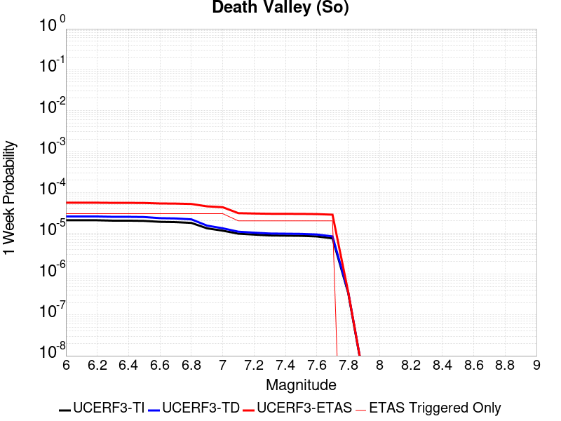 |  |  | 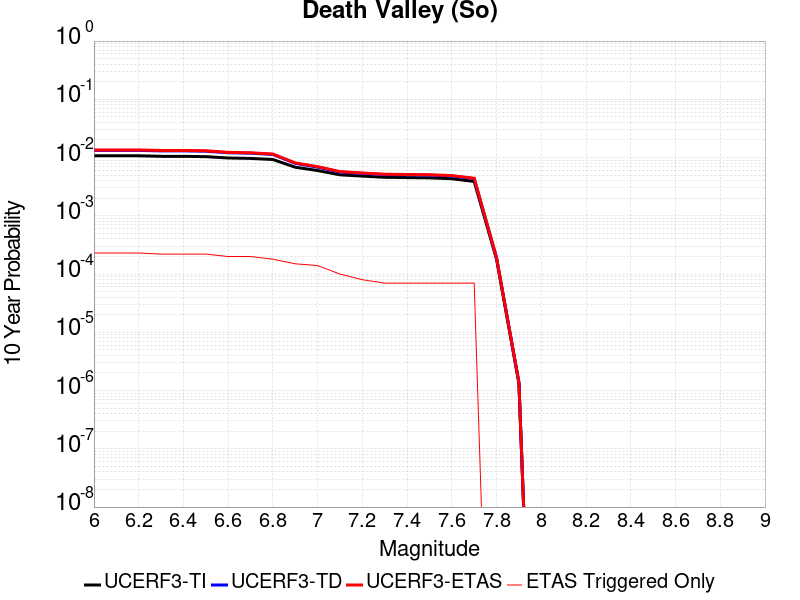 |

| Magnitude | 1 wk TI Prob | 1 wk TD Prob | 1 wk ETAS Prob | 1 wk ETAS/TD Gain | 1 wk ETAS Triggered Only | 1 mo TI Prob | 1 mo TD Prob | 1 mo ETAS Prob | 1 mo ETAS/TD Gain | 1 mo ETAS Triggered Only | 1 yr TI Prob | 1 yr TD Prob | 1 yr ETAS Prob | 1 yr ETAS/TD Gain | 1 yr ETAS Triggered Only | 10 yr TI Prob | 10 yr TD Prob | 10 yr ETAS Prob | 10 yr ETAS/TD Gain | 10 yr ETAS Triggered Only |
|-----|-----|-----|-----|-----|-----|-----|-----|-----|-----|-----|-----|-----|-----|-----|-----|-----|-----|-----|-----|-----|
| 6.0 | 2.0684236E-5 | 2.5618423E-5 | 5.1457555E-5 | 2.0086153 | 2.5839794E-5 | 8.864371E-5 | 1.09788714E-4 | 2.1313653E-4 | 1.9413338 | 1.03359176E-4 | 0.0010787029 | 0.0013358749 | 0.0015036091 | 1.1255614 | 1.6795866E-4 | 0.010734817 | 0.013281729 | 0.01349845 | 1.0163172 | 2.1963824E-4 |
| 6.1 | 2.0684236E-5 | 2.5618423E-5 | 5.1457555E-5 | 2.0086153 | 2.5839794E-5 | 8.864371E-5 | 1.09788714E-4 | 2.1313653E-4 | 1.9413338 | 1.03359176E-4 | 0.0010787029 | 0.0013358749 | 0.0015036091 | 1.1255614 | 1.6795866E-4 | 0.010734817 | 0.013281729 | 0.01349845 | 1.0163172 | 2.1963824E-4 |
| 6.2 | 2.0684236E-5 | 2.5618423E-5 | 5.1457555E-5 | 2.0086153 | 2.5839794E-5 | 8.864371E-5 | 1.09788714E-4 | 2.1313653E-4 | 1.9413338 | 1.03359176E-4 | 0.0010787029 | 0.0013358749 | 0.0015036091 | 1.1255614 | 1.6795866E-4 | 0.010734817 | 0.013281729 | 0.01349845 | 1.0163172 | 2.1963824E-4 |
| 6.3 | 2.0240292E-5 | 2.5118497E-5 | 5.0957642E-5 | 2.0286899 | 2.5839794E-5 | 8.6741224E-5 | 1.0764636E-4 | 2.109944E-4 | 1.96007 | 1.03359176E-4 | 0.0010555626 | 0.0013098232 | 0.0014646589 | 1.1182112 | 1.5503875E-4 | 0.010505628 | 0.013024284 | 0.01322831 | 1.015665 | 2.0671835E-4 |
| 6.4 | 2.0240292E-5 | 2.5118497E-5 | 5.0957642E-5 | 2.0286899 | 2.5839794E-5 | 8.6741224E-5 | 1.0764636E-4 | 2.109944E-4 | 1.96007 | 1.03359176E-4 | 0.0010555626 | 0.0013098232 | 0.0014646589 | 1.1182112 | 1.5503875E-4 | 0.010505628 | 0.013024284 | 0.01322831 | 1.015665 | 2.0671835E-4 |
| 6.5 | 1.9962767E-5 | 2.4807747E-5 | 5.06469E-5 | 2.041576 | 2.5839794E-5 | 8.55519E-5 | 1.0631468E-4 | 2.0966286E-4 | 1.972097 | 1.03359176E-4 | 0.0010410968 | 0.0012936293 | 0.0014484675 | 1.1196929 | 1.5503875E-4 | 0.010362327 | 0.012864228 | 0.013068287 | 1.0158625 | 2.0671835E-4 |
| 6.6 | 1.8937297E-5 | 2.3311568E-5 | 4.915076E-5 | 2.1084278 | 2.5839794E-5 | 8.115732E-5 | 9.990298E-5 | 1.9033322E-4 | 1.9051806 | 9.043928E-5 | 9.876423E-4 | 0.0012156547 | 0.0013576007 | 1.1167651 | 1.4211886E-4 | 0.009832645 | 0.0120931 | 0.012284555 | 1.0158317 | 1.9379845E-4 |
| 6.7 | 1.8621096E-5 | 2.2912203E-5 | 4.8751404E-5 | 2.1277485 | 2.5839794E-5 | 7.980225E-5 | 9.8191544E-5 | 1.8862194E-4 | 1.9209591 | 9.043928E-5 | 9.711593E-4 | 0.0011948409 | 0.0013367899 | 1.1188016 | 1.4211886E-4 | 0.009669261 | 0.011887211 | 0.012078706 | 1.0161093 | 1.9379845E-4 |
| 6.8 | 1.7830353E-5 | 2.1806247E-5 | 4.7645477E-5 | 2.184946 | 2.5839794E-5 | 7.641356E-5 | 9.345208E-5 | 1.838829E-4 | 1.9676706 | 9.043928E-5 | 9.29938E-4 | 0.0011371992 | 0.0012791564 | 1.1248306 | 1.4211886E-4 | 0.009260561 | 0.011316643 | 0.011508248 | 1.0169313 | 1.9379845E-4 |
| 6.9 | 1.3135183E-5 | 1.5304242E-5 | 4.1143638E-5 | 2.6883814 | 2.5839794E-5 | 5.6292425E-5 | 6.558799E-5 | 1.4310228E-4 | 2.1818366 | 7.751938E-5 | 6.8514474E-4 | 7.982477E-4 | 9.14434E-4 | 1.1455516 | 1.1627907E-4 | 0.006830362 | 0.007954813 | 0.008108618 | 1.0193349 | 1.5503875E-4 |
| 7.0 | 1.1507512E-5 | 1.3154444E-5 | 3.8993898E-5 | 2.9643135 | 2.5839794E-5 | 4.9316975E-5 | 5.6375004E-5 | 1.3389002E-4 | 2.374989 | 7.751938E-5 | 6.002687E-4 | 6.861553E-4 | 8.023546E-4 | 1.1693484 | 1.1627907E-4 | 0.0059864987 | 0.006841068 | 0.0069822147 | 1.0206323 | 1.4211886E-4 |
| 7.1 | 9.715903E-6 | 1.0865454E-5 | 2.3785211E-5 | 2.1890674 | 1.2919897E-5 | 4.1638916E-5 | 4.6565423E-5 | 1.111619E-4 | 2.3872197 | 6.459948E-5 | 5.068359E-4 | 5.667908E-4 | 6.571788E-4 | 1.1594733 | 9.043928E-5 | 0.0050568148 | 0.0056539057 | 0.0057566804 | 1.0181776 | 1.03359176E-4 |
| 7.2 | 9.233269E-6 | 1.0286473E-5 | 2.3206238E-5 | 2.2559955 | 1.2919897E-5 | 3.9570554E-5 | 4.4084165E-5 | 9.576147E-5 | 2.172242 | 5.1679588E-5 | 4.81665E-4 | 5.3659675E-4 | 6.140745E-4 | 1.1443874 | 7.751938E-5 | 0.0048062233 | 0.005353442 | 0.0054433974 | 1.0168033 | 9.043928E-5 |
| 7.3 | 8.8041315E-6 | 9.808313E-6 | 2.2728083E-5 | 2.3172264 | 1.2919897E-5 | 3.7731446E-5 | 4.2034975E-5 | 8.0793034E-5 | 1.9220432 | 3.875969E-5 | 4.592835E-4 | 5.1165983E-4 | 5.762263E-4 | 1.1261902 | 6.459948E-5 | 0.0045833546 | 0.0051052445 | 0.005182368 | 1.0151068 | 7.751938E-5 |
| 7.4 | 8.708749E-6 | 9.707323E-6 | 2.2627095E-5 | 2.3309305 | 1.2919897E-5 | 3.7322676E-5 | 4.1602176E-5 | 8.036025E-5 | 1.9316359 | 3.875969E-5 | 4.5430884E-4 | 5.06393E-4 | 5.709597E-4 | 1.1275033 | 6.459948E-5 | 0.004533812 | 0.0050528166 | 0.0051299445 | 1.0152643 | 7.751938E-5 |
| 7.5 | 8.612678E-6 | 9.604964E-6 | 2.2524737E-5 | 2.345114 | 1.2919897E-5 | 3.6910955E-5 | 4.116351E-5 | 7.99216E-5 | 1.9415644 | 3.875969E-5 | 4.492982E-4 | 5.010547E-4 | 5.6562177E-4 | 1.1288624 | 6.459948E-5 | 0.004483909 | 0.0049996753 | 0.005076807 | 1.0154274 | 7.751938E-5 |
| 7.6 | 8.319024E-6 | 9.28406E-6 | 2.2203836E-5 | 2.3916085 | 1.2919897E-5 | 3.5652476E-5 | 3.9788243E-5 | 7.854639E-5 | 1.9741105 | 3.875969E-5 | 4.3398244E-4 | 4.8431839E-4 | 5.488866E-4 | 1.1333177 | 6.459948E-5 | 0.0043313587 | 0.004833053 | 0.0049101976 | 1.0159619 | 7.751938E-5 |
| 7.7 | 7.4718328E-6 | 8.3453E-6 | 2.1265088E-5 | 2.5481515 | 1.2919897E-5 | 3.2021748E-5 | 3.57651E-5 | 7.452341E-5 | 2.0836906 | 3.875969E-5 | 3.8979502E-4 | 4.3535716E-4 | 4.9992854E-4 | 1.1483182 | 6.459948E-5 | 0.00389112 | 0.004345448 | 0.0044226306 | 1.0177617 | 7.751938E-5 |
| 7.8 | 3.4586725E-7 | 3.648288E-7 | 3.648288E-7 | 1.0 | 0.0 | 1.4822873E-6 | 1.5635511E-6 | 1.5635511E-6 | 1.0 | 0.0 | 1.80467E-5 | 1.9036073E-5 | 1.9036073E-5 | 1.0 | 0.0 | 1.8045233E-4 | 1.9034486E-4 | 1.9034486E-4 | 1.0 | 0.0 |
| 7.9 | 2.5591178E-9 | 2.6696871E-9 | 2.6696871E-9 | 1.0 | 0.0 | 1.0967647E-8 | 1.1441516E-8 | 1.1441516E-8 | 1.0 | 0.0 | 1.335311E-7 | 1.3930045E-7 | 1.3930045E-7 | 1.0 | 0.0 | 1.3353102E-6 | 1.3930046E-6 | 1.3930046E-6 | 1.0 | 0.0 |

## Nelson Lake
*[(top)](#table-of-contents)*

| 1 Week | 1 Month | 1 Year | 10 Year |
|-----|-----|-----|-----|
| 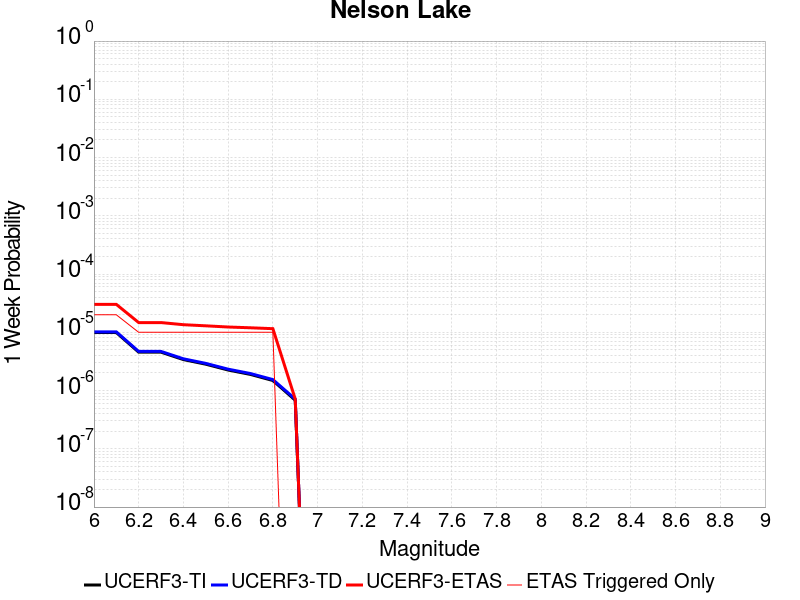 |  |  |  |

| Magnitude | 1 wk TI Prob | 1 wk TD Prob | 1 wk ETAS Prob | 1 wk ETAS/TD Gain | 1 wk ETAS Triggered Only | 1 mo TI Prob | 1 mo TD Prob | 1 mo ETAS Prob | 1 mo ETAS/TD Gain | 1 mo ETAS Triggered Only | 1 yr TI Prob | 1 yr TD Prob | 1 yr ETAS Prob | 1 yr ETAS/TD Gain | 1 yr ETAS Triggered Only | 10 yr TI Prob | 10 yr TD Prob | 10 yr ETAS Prob | 10 yr ETAS/TD Gain | 10 yr ETAS Triggered Only |
|-----|-----|-----|-----|-----|-----|-----|-----|-----|-----|-----|-----|-----|-----|-----|-----|-----|-----|-----|-----|-----|
| 6.0 | 9.913453E-6 | 1.0192293E-5 | 3.6031823E-5 | 3.5352027 | 2.5839794E-5 | 4.2485535E-5 | 4.3680586E-5 | 1.4703524E-4 | 3.3661463 | 1.03359176E-4 | 5.1713863E-4 | 5.316917E-4 | 6.73735E-4 | 1.2671535 | 1.4211886E-4 | 0.0051593683 | 0.0053052236 | 0.0054722913 | 1.0314912 | 1.6795866E-4 |
| 6.1 | 9.913453E-6 | 1.0192293E-5 | 3.6031823E-5 | 3.5352027 | 2.5839794E-5 | 4.2485535E-5 | 4.3680586E-5 | 1.4703524E-4 | 3.3661463 | 1.03359176E-4 | 5.1713863E-4 | 5.316917E-4 | 6.73735E-4 | 1.2671535 | 1.4211886E-4 | 0.0051593683 | 0.0053052236 | 0.0054722913 | 1.0314912 | 1.6795866E-4 |
| 6.2 | 4.5596407E-6 | 4.696332E-6 | 1.7616168E-5 | 3.7510483 | 1.2919897E-5 | 1.954117E-5 | 2.0126989E-5 | 7.180554E-5 | 3.5676243 | 5.1679588E-5 | 2.3788778E-4 | 2.450198E-4 | 2.9668672E-4 | 1.2108684 | 5.1679588E-5 | 0.0023763329 | 0.0024476226 | 0.0025120638 | 1.0263282 | 6.459948E-5 |
| 6.3 | 4.5596407E-6 | 4.696332E-6 | 1.7616168E-5 | 3.7510483 | 1.2919897E-5 | 1.954117E-5 | 2.0126989E-5 | 7.180554E-5 | 3.5676243 | 5.1679588E-5 | 2.3788778E-4 | 2.450198E-4 | 2.9668672E-4 | 1.2108684 | 5.1679588E-5 | 0.0023763329 | 0.0024476226 | 0.0025120638 | 1.0263282 | 6.459948E-5 |
| 6.4 | 3.4025713E-6 | 3.509912E-6 | 1.6429763E-5 | 4.6809616 | 1.2919897E-5 | 1.4582367E-5 | 1.50423975E-5 | 6.672121E-5 | 4.4355435 | 5.1679588E-5 | 1.7752586E-4 | 1.8312664E-4 | 2.3479677E-4 | 1.2821552 | 5.1679588E-5 | 0.001773841 | 0.0018298404 | 0.0018814254 | 1.028191 | 5.1679588E-5 |
| 6.5 | 2.8352947E-6 | 2.9278688E-6 | 1.5847727E-5 | 5.412718 | 1.2919897E-5 | 1.2151207E-5 | 1.2547953E-5 | 5.1307157E-5 | 4.0888867 | 3.875969E-5 | 1.479309E-4 | 1.5276136E-4 | 1.9151514E-4 | 1.2536883 | 3.875969E-5 | 0.0014783246 | 0.0015266375 | 0.001565338 | 1.0253502 | 3.875969E-5 |
| 6.6 | 2.251518E-6 | 2.3290781E-6 | 1.5248945E-5 | 6.5472016 | 1.2919897E-5 | 9.649328E-6 | 9.981729E-6 | 3.5821264E-5 | 3.5886834 | 2.5839794E-5 | 1.1747423E-4 | 1.2152141E-4 | 1.4735806E-4 | 1.2126099 | 2.5839794E-5 | 0.0011741214 | 0.0012146112 | 0.0012404197 | 1.0212483 | 2.5839794E-5 |
| 6.7 | 1.8911853E-6 | 1.9591491E-6 | 1.48790205E-5 | 7.594634 | 1.2919897E-5 | 8.105055E-6 | 8.39633E-6 | 3.4235905E-5 | 4.077485 | 2.5839794E-5 | 9.867457E-5 | 1.022211E-4 | 1.2805825E-4 | 1.2527575 | 2.5839794E-5 | 9.863076E-4 | 0.0010217984 | 0.0010476117 | 1.0252627 | 2.5839794E-5 |
| 6.8 | 1.4874814E-6 | 1.5438383E-6 | 1.4463715E-5 | 9.368672 | 1.2919897E-5 | 6.374905E-6 | 6.6164357E-6 | 3.2456057E-5 | 4.905369 | 2.5839794E-5 | 7.76117E-5 | 8.055265E-5 | 1.0639036E-4 | 1.3207556 | 2.5839794E-5 | 7.75846E-4 | 8.052856E-4 | 8.311046E-4 | 1.0320619 | 2.5839794E-5 |
| 6.9 | 6.835972E-7 | 7.1399705E-7 | 7.1399705E-7 | 1.0 | 0.0 | 2.9296991E-6 | 3.0599856E-6 | 1.5979842E-5 | 5.2221956 | 1.2919897E-5 | 3.56685E-5 | 3.7255006E-5 | 5.017442E-5 | 1.3467834 | 1.2919897E-5 | 3.5662777E-4 | 3.7251884E-4 | 3.8543393E-4 | 1.0346696 | 1.2919897E-5 |

## Helendale-So Lockhart
*[(top)](#table-of-contents)*

| 1 Week | 1 Month | 1 Year | 10 Year |
|-----|-----|-----|-----|
|  |  |  | 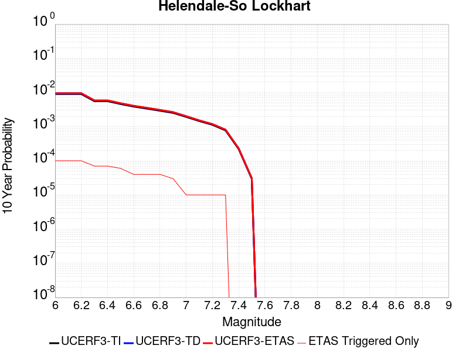 |

| Magnitude | 1 wk TI Prob | 1 wk TD Prob | 1 wk ETAS Prob | 1 wk ETAS/TD Gain | 1 wk ETAS Triggered Only | 1 mo TI Prob | 1 mo TD Prob | 1 mo ETAS Prob | 1 mo ETAS/TD Gain | 1 mo ETAS Triggered Only | 1 yr TI Prob | 1 yr TD Prob | 1 yr ETAS Prob | 1 yr ETAS/TD Gain | 1 yr ETAS Triggered Only | 10 yr TI Prob | 10 yr TD Prob | 10 yr ETAS Prob | 10 yr ETAS/TD Gain | 10 yr ETAS Triggered Only |
|-----|-----|-----|-----|-----|-----|-----|-----|-----|-----|-----|-----|-----|-----|-----|-----|-----|-----|-----|-----|-----|
| 6.0 | 1.7296055E-5 | 1.8103841E-5 | 4.3943168E-5 | 2.427284 | 2.5839794E-5 | 7.412385E-5 | 7.7585704E-5 | 1.0342349E-4 | 1.3330226 | 2.5839794E-5 | 9.0208417E-4 | 9.442173E-4 | 0.0010474789 | 1.1093621 | 1.03359176E-4 | 0.008984311 | 0.009404174 | 0.009532158 | 1.0136093 | 1.2919896E-4 |
| 6.1 | 1.7296055E-5 | 1.8103841E-5 | 4.3943168E-5 | 2.427284 | 2.5839794E-5 | 7.412385E-5 | 7.7585704E-5 | 1.0342349E-4 | 1.3330226 | 2.5839794E-5 | 9.0208417E-4 | 9.442173E-4 | 0.0010474789 | 1.1093621 | 1.03359176E-4 | 0.008984311 | 0.009404174 | 0.009532158 | 1.0136093 | 1.2919896E-4 |
| 6.2 | 1.7296055E-5 | 1.8103841E-5 | 4.3943168E-5 | 2.427284 | 2.5839794E-5 | 7.412385E-5 | 7.7585704E-5 | 1.0342349E-4 | 1.3330226 | 2.5839794E-5 | 9.0208417E-4 | 9.442173E-4 | 0.0010474789 | 1.1093621 | 1.03359176E-4 | 0.008984311 | 0.009404174 | 0.009532158 | 1.0136093 | 1.2919896E-4 |
| 6.3 | 1.0669118E-5 | 1.1135489E-5 | 3.6974994E-5 | 3.3204644 | 2.5839794E-5 | 4.5723988E-5 | 4.7722668E-5 | 7.356123E-5 | 1.5414315 | 2.5839794E-5 | 5.5654737E-4 | 5.8087136E-4 | 6.454333E-4 | 1.1111467 | 6.459948E-5 | 0.0055515557 | 0.005793827 | 0.0058837426 | 1.0155191 | 9.043928E-5 |
| 6.4 | 1.0669118E-5 | 1.1135489E-5 | 3.6974994E-5 | 3.3204644 | 2.5839794E-5 | 4.5723988E-5 | 4.7722668E-5 | 7.356123E-5 | 1.5414315 | 2.5839794E-5 | 5.5654737E-4 | 5.8087136E-4 | 6.454333E-4 | 1.1111467 | 6.459948E-5 | 0.0055515557 | 0.005793827 | 0.0058837426 | 1.0155191 | 9.043928E-5 |
| 6.5 | 8.790038E-6 | 9.1702495E-6 | 3.5009805E-5 | 3.8177593 | 2.5839794E-5 | 3.767105E-5 | 3.9300485E-5 | 6.513926E-5 | 1.6574671 | 2.5839794E-5 | 4.585485E-4 | 4.7837992E-4 | 5.3003477E-4 | 1.1079787 | 5.1679588E-5 | 0.0045760344 | 0.0047736657 | 0.004850815 | 1.0161614 | 7.751938E-5 |
| 6.6 | 7.396949E-6 | 7.715581E-6 | 3.3555174E-5 | 4.3490148 | 2.5839794E-5 | 3.1700827E-5 | 3.3066364E-5 | 5.89053E-5 | 1.7814267 | 2.5839794E-5 | 3.858892E-4 | 4.025096E-4 | 4.412537E-4 | 1.0962563 | 3.875969E-5 | 0.003852198 | 0.004017913 | 0.0040693847 | 1.0128106 | 5.1679588E-5 |
| 6.7 | 6.4600285E-6 | 6.7380697E-6 | 3.257769E-5 | 4.83487 | 2.5839794E-5 | 2.7685543E-5 | 2.8877126E-5 | 5.4716173E-5 | 1.8947929 | 2.5839794E-5 | 3.3701936E-4 | 3.5152308E-4 | 3.9026912E-4 | 1.1102234 | 3.875969E-5 | 0.0033650869 | 0.003509752 | 0.0035612502 | 1.0146729 | 5.1679588E-5 |
| 6.8 | 5.600104E-6 | 5.836042E-6 | 3.1675685E-5 | 5.427597 | 2.5839794E-5 | 2.4000226E-5 | 2.5011372E-5 | 5.0850518E-5 | 2.0330958 | 2.5839794E-5 | 2.9216358E-4 | 3.044715E-4 | 3.4321938E-4 | 1.1272628 | 3.875969E-5 | 0.0029177975 | 0.003040605 | 0.0030921274 | 1.0169448 | 5.1679588E-5 |
| 6.9 | 4.839122E-6 | 5.039537E-6 | 3.08792E-5 | 6.1273885 | 2.5839794E-5 | 2.0738931E-5 | 2.159784E-5 | 4.7437075E-5 | 2.1963806 | 2.5839794E-5 | 2.5246723E-4 | 2.6292243E-4 | 2.8875543E-4 | 1.0982534 | 2.5839794E-5 | 0.002521806 | 0.002626161 | 0.0026648191 | 1.0147203 | 3.875969E-5 |
| 7.0 | 3.6937633E-6 | 3.845229E-6 | 1.6765076E-5 | 4.359968 | 1.2919897E-5 | 1.5830317E-5 | 1.6479451E-5 | 2.9399134E-5 | 1.7839875 | 1.2919897E-5 | 1.9271708E-4 | 2.0061915E-4 | 2.1353645E-4 | 1.0643872 | 1.2919897E-5 | 0.0019255003 | 0.0020044118 | 0.002017306 | 1.0064328 | 1.2919897E-5 |
| 7.1 | 2.7858857E-6 | 2.8978693E-6 | 1.5817728E-5 | 5.4584 | 1.2919897E-5 | 1.1939455E-5 | 1.2419382E-5 | 2.5339117E-5 | 2.0402882 | 1.2919897E-5 | 1.4535317E-4 | 1.511957E-4 | 1.6411363E-4 | 1.0854386 | 1.2919897E-5 | 0.0014525814 | 0.0015109498 | 0.0015238501 | 1.0085379 | 1.2919897E-5 |
| 7.2 | 2.1672065E-6 | 2.2540248E-6 | 1.5173892E-5 | 6.73191 | 1.2919897E-5 | 9.2879945E-6 | 9.660072E-6 | 2.2579843E-5 | 2.3374407 | 1.2919897E-5 | 1.1307546E-4 | 1.176052E-4 | 1.3052358E-4 | 1.1098453 | 1.2919897E-5 | 0.0011301794 | 0.0011754478 | 0.0011883526 | 1.0109786 | 1.2919897E-5 |
| 7.3 | 1.4823496E-6 | 1.5422185E-6 | 1.4462095E-5 | 9.377462 | 1.2919897E-5 | 6.3529114E-6 | 6.6094917E-6 | 1.9529303E-5 | 2.954736 | 1.2919897E-5 | 7.734395E-5 | 8.046775E-5 | 9.33866E-5 | 1.160547 | 1.2919897E-5 | 7.731704E-4 | 8.044012E-4 | 8.173107E-4 | 1.0160486 | 1.2919897E-5 |
| 7.4 | 4.2321457E-7 | 4.4109012E-7 | 4.4109012E-7 | 1.0 | 0.0 | 1.8137755E-6 | 1.8903852E-6 | 1.8903852E-6 | 1.0 | 0.0 | 2.2082493E-5 | 2.3015242E-5 | 2.3015242E-5 | 1.0 | 0.0 | 2.2080299E-4 | 2.3013311E-4 | 2.3013311E-4 | 1.0 | 0.0 |
| 7.5 | 5.6942316E-8 | 5.941599E-8 | 5.941599E-8 | 1.0 | 0.0 | 2.440385E-7 | 2.5463993E-7 | 2.5463993E-7 | 1.0 | 0.0 | 2.9711643E-6 | 3.1002376E-6 | 3.1002376E-6 | 1.0 | 0.0 | 2.9711247E-5 | 3.1002022E-5 | 3.1002022E-5 | 1.0 | 0.0 |

## Death Valley (Black Mtns Frontal)
*[(top)](#table-of-contents)*

| 1 Week | 1 Month | 1 Year | 10 Year |
|-----|-----|-----|-----|
|  |  | 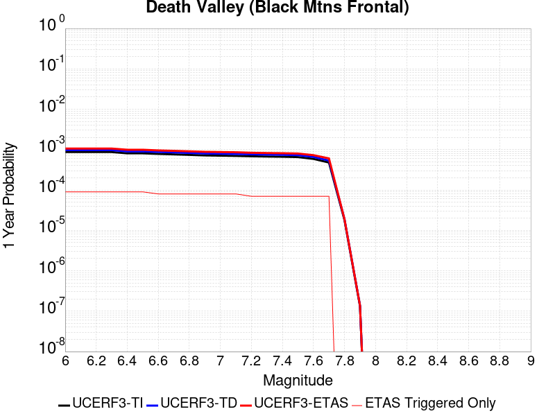 |  |

| Magnitude | 1 wk TI Prob | 1 wk TD Prob | 1 wk ETAS Prob | 1 wk ETAS/TD Gain | 1 wk ETAS Triggered Only | 1 mo TI Prob | 1 mo TD Prob | 1 mo ETAS Prob | 1 mo ETAS/TD Gain | 1 mo ETAS Triggered Only | 1 yr TI Prob | 1 yr TD Prob | 1 yr ETAS Prob | 1 yr ETAS/TD Gain | 1 yr ETAS Triggered Only | 10 yr TI Prob | 10 yr TD Prob | 10 yr ETAS Prob | 10 yr ETAS/TD Gain | 10 yr ETAS Triggered Only |
|-----|-----|-----|-----|-----|-----|-----|-----|-----|-----|-----|-----|-----|-----|-----|-----|-----|-----|-----|-----|-----|
| 6.0 | 1.6707214E-5 | 1.867056E-5 | 3.1590214E-5 | 1.69198 | 1.2919897E-5 | 7.160038E-5 | 8.001427E-5 | 1.3168973E-4 | 1.6458279 | 5.1679588E-5 | 8.71386E-4 | 9.7374606E-4 | 0.0010770046 | 1.1060425 | 1.03359176E-4 | 0.00867977 | 0.009695647 | 0.009823594 | 1.0131962 | 1.2919896E-4 |
| 6.1 | 1.6707214E-5 | 1.867056E-5 | 3.1590214E-5 | 1.69198 | 1.2919897E-5 | 7.160038E-5 | 8.001427E-5 | 1.3168973E-4 | 1.6458279 | 5.1679588E-5 | 8.71386E-4 | 9.7374606E-4 | 0.0010770046 | 1.1060425 | 1.03359176E-4 | 0.00867977 | 0.009695647 | 0.009823594 | 1.0131962 | 1.2919896E-4 |
| 6.2 | 1.6707214E-5 | 1.867056E-5 | 3.1590214E-5 | 1.69198 | 1.2919897E-5 | 7.160038E-5 | 8.001427E-5 | 1.3168973E-4 | 1.6458279 | 5.1679588E-5 | 8.71386E-4 | 9.7374606E-4 | 0.0010770046 | 1.1060425 | 1.03359176E-4 | 0.00867977 | 0.009695647 | 0.009823594 | 1.0131962 | 1.2919896E-4 |
| 6.3 | 1.6707214E-5 | 1.867056E-5 | 3.1590214E-5 | 1.69198 | 1.2919897E-5 | 7.160038E-5 | 8.001427E-5 | 1.3168973E-4 | 1.6458279 | 5.1679588E-5 | 8.71386E-4 | 9.7374606E-4 | 0.0010770046 | 1.1060425 | 1.03359176E-4 | 0.00867977 | 0.009695647 | 0.009823594 | 1.0131962 | 1.2919896E-4 |
| 6.4 | 1.5515609E-5 | 1.7338483E-5 | 3.0258157E-5 | 1.7451442 | 1.2919897E-5 | 6.649377E-5 | 7.430571E-5 | 1.2598146E-4 | 1.6954479 | 5.1679588E-5 | 8.0926094E-4 | 9.0430264E-4 | 0.0010075683 | 1.1141938 | 1.03359176E-4 | 0.008063202 | 0.009006913 | 0.009122144 | 1.0127937 | 1.1627907E-4 |
| 6.5 | 1.5515609E-5 | 1.7338483E-5 | 3.0258157E-5 | 1.7451442 | 1.2919897E-5 | 6.649377E-5 | 7.430571E-5 | 1.2598146E-4 | 1.6954479 | 5.1679588E-5 | 8.0926094E-4 | 9.0430264E-4 | 0.0010075683 | 1.1141938 | 1.03359176E-4 | 0.008063202 | 0.009006913 | 0.009122144 | 1.0127937 | 1.1627907E-4 |
| 6.6 | 1.5041828E-5 | 1.6809407E-5 | 2.9729086E-5 | 1.7685982 | 1.2919897E-5 | 6.4463384E-5 | 7.203836E-5 | 1.2371423E-4 | 1.7173381 | 5.1679588E-5 | 7.8455906E-4 | 8.7672E-4 | 9.6708E-4 | 1.103066 | 9.043928E-5 | 0.00781795 | 0.008733268 | 0.008835725 | 1.0117317 | 1.03359176E-4 |
| 6.7 | 1.4634985E-5 | 1.6356273E-5 | 2.9275958E-5 | 1.7898918 | 1.2919897E-5 | 6.271985E-5 | 7.009646E-5 | 1.2177242E-4 | 1.7372122 | 5.1679588E-5 | 7.6334673E-4 | 8.53096E-4 | 9.434581E-4 | 1.1059226 | 9.043928E-5 | 0.007607299 | 0.008498848 | 0.008601328 | 1.0120581 | 1.03359176E-4 |
| 6.8 | 1.4209158E-5 | 1.5882297E-5 | 2.8801987E-5 | 1.813465 | 1.2919897E-5 | 6.089497E-5 | 6.806524E-5 | 1.1974131E-4 | 1.7592138 | 5.1679588E-5 | 7.4114406E-4 | 8.2838483E-4 | 9.187492E-4 | 1.109085 | 9.043928E-5 | 0.007386771 | 0.008253585 | 0.008356092 | 1.0124196 | 1.03359176E-4 |
| 6.9 | 1.3780098E-5 | 1.5404834E-5 | 2.8324532E-5 | 1.8386781 | 1.2919897E-5 | 5.9056227E-5 | 6.601908E-5 | 1.1769526E-4 | 1.7827461 | 5.1679588E-5 | 7.1877235E-4 | 8.0349133E-4 | 8.9385797E-4 | 1.1124674 | 9.043928E-5 | 0.0071645193 | 0.008006458 | 0.008108989 | 1.012806 | 1.03359176E-4 |
| 7.0 | 1.3585064E-5 | 1.5188394E-5 | 2.8108094E-5 | 1.8506298 | 1.2919897E-5 | 5.8220405E-5 | 6.5091524E-5 | 1.1676775E-4 | 1.793901 | 5.1679588E-5 | 7.086029E-4 | 7.922066E-4 | 8.8257424E-4 | 1.1140708 | 9.043928E-5 | 0.007063476 | 0.007894417 | 0.007996961 | 1.0129893 | 1.03359176E-4 |
| 7.1 | 1.3398601E-5 | 1.4981575E-5 | 2.7901278E-5 | 1.8623729 | 1.2919897E-5 | 5.742131E-5 | 6.4205204E-5 | 1.1588147E-4 | 1.8048611 | 5.1679588E-5 | 6.9888023E-4 | 7.814234E-4 | 8.71792E-4 | 1.1156461 | 9.043928E-5 | 0.0069668638 | 0.007787346 | 0.0078899 | 1.0131694 | 1.03359176E-4 |
| 7.2 | 1.3126312E-5 | 1.4679792E-5 | 2.7599499E-5 | 1.8801016 | 1.2919897E-5 | 5.6254412E-5 | 6.291191E-5 | 1.0166916E-4 | 1.6160558 | 3.875969E-5 | 6.846822E-4 | 7.656887E-4 | 8.4314874E-4 | 1.1011639 | 7.751938E-5 | 0.006825765 | 0.00763109 | 0.0077208388 | 1.011761 | 9.043928E-5 |
| 7.3 | 1.2922429E-5 | 1.4454016E-5 | 2.7373726E-5 | 1.8938491 | 1.2919897E-5 | 5.5380664E-5 | 6.1944345E-5 | 1.0070163E-4 | 1.6256793 | 3.875969E-5 | 6.74051E-4 | 7.5391686E-4 | 8.3137775E-4 | 1.1027447 | 7.751938E-5 | 0.006720101 | 0.0075141727 | 0.0076039326 | 1.0119454 | 9.043928E-5 |
| 7.4 | 1.2768878E-5 | 1.4283997E-5 | 2.7203709E-5 | 1.9044886 | 1.2919897E-5 | 5.4722615E-5 | 6.1215724E-5 | 9.997304E-5 | 1.6331269 | 3.875969E-5 | 6.660441E-4 | 7.45052E-4 | 8.2251366E-4 | 1.103968 | 7.751938E-5 | 0.0066405144 | 0.0074261203 | 0.007515888 | 1.0120881 | 9.043928E-5 |
| 7.5 | 1.2521929E-5 | 1.40122365E-5 | 2.6931952E-5 | 1.9220309 | 1.2919897E-5 | 5.366431E-5 | 6.0051094E-5 | 9.880846E-5 | 1.6454065 | 3.875969E-5 | 6.531671E-4 | 7.308822E-4 | 8.083449E-4 | 1.1059853 | 7.751938E-5 | 0.006512506 | 0.0072853607 | 0.007375141 | 1.0123234 | 9.043928E-5 |
| 7.6 | 1.1301089E-5 | 1.2648349E-5 | 2.5568082E-5 | 2.021456 | 1.2919897E-5 | 4.8432343E-5 | 5.4206117E-5 | 9.29637E-5 | 1.715004 | 3.875969E-5 | 5.895042E-4 | 6.597649E-4 | 7.3723315E-4 | 1.1174179 | 7.751938E-5 | 0.0058794282 | 0.0065786145 | 0.0066684587 | 1.013657 | 9.043928E-5 |
| 7.7 | 9.189108E-6 | 1.0283521E-5 | 2.3203285E-5 | 2.256356 | 1.2919897E-5 | 3.93813E-5 | 4.407152E-5 | 8.28295E-5 | 1.8794338 | 3.875969E-5 | 4.7936183E-4 | 5.3644367E-4 | 6.1392144E-4 | 1.1444286 | 7.751938E-5 | 0.004783291 | 0.0053519984 | 0.005441954 | 1.0168078 | 9.043928E-5 |
| 7.8 | 3.4586725E-7 | 3.648288E-7 | 3.648288E-7 | 1.0 | 0.0 | 1.4822873E-6 | 1.5635511E-6 | 1.5635511E-6 | 1.0 | 0.0 | 1.80467E-5 | 1.9036073E-5 | 1.9036073E-5 | 1.0 | 0.0 | 1.8045233E-4 | 1.9034486E-4 | 1.9034486E-4 | 1.0 | 0.0 |
| 7.9 | 2.5591178E-9 | 2.6696871E-9 | 2.6696871E-9 | 1.0 | 0.0 | 1.0967647E-8 | 1.1441516E-8 | 1.1441516E-8 | 1.0 | 0.0 | 1.335311E-7 | 1.3930045E-7 | 1.3930045E-7 | 1.0 | 0.0 | 1.3353102E-6 | 1.3930046E-6 | 1.3930046E-6 | 1.0 | 0.0 |

## Bicycle Lake
*[(top)](#table-of-contents)*

| 1 Week | 1 Month | 1 Year | 10 Year |
|-----|-----|-----|-----|
|  |  |  |  |

| Magnitude | 1 wk TI Prob | 1 wk TD Prob | 1 wk ETAS Prob | 1 wk ETAS/TD Gain | 1 wk ETAS Triggered Only | 1 mo TI Prob | 1 mo TD Prob | 1 mo ETAS Prob | 1 mo ETAS/TD Gain | 1 mo ETAS Triggered Only | 1 yr TI Prob | 1 yr TD Prob | 1 yr ETAS Prob | 1 yr ETAS/TD Gain | 1 yr ETAS Triggered Only | 10 yr TI Prob | 10 yr TD Prob | 10 yr ETAS Prob | 10 yr ETAS/TD Gain | 10 yr ETAS Triggered Only |
|-----|-----|-----|-----|-----|-----|-----|-----|-----|-----|-----|-----|-----|-----|-----|-----|-----|-----|-----|-----|-----|
| 6.0 | 1.9621975E-5 | 2.2097447E-5 | 4.793667E-5 | 2.1693306 | 2.5839794E-5 | 8.4091465E-5 | 9.470067E-5 | 1.2053802E-4 | 1.2728317 | 2.5839794E-5 | 0.0010233327 | 0.0011525059 | 0.0012557459 | 1.0895787 | 1.03359176E-4 | 0.01018633 | 0.011478599 | 0.011606315 | 1.0111264 | 1.2919896E-4 |
| 6.1 | 1.9621975E-5 | 2.2097447E-5 | 4.793667E-5 | 2.1693306 | 2.5839794E-5 | 8.4091465E-5 | 9.470067E-5 | 1.2053802E-4 | 1.2728317 | 2.5839794E-5 | 0.0010233327 | 0.0011525059 | 0.0012557459 | 1.0895787 | 1.03359176E-4 | 0.01018633 | 0.011478599 | 0.011606315 | 1.0111264 | 1.2919896E-4 |
| 6.2 | 9.9971285E-6 | 1.1255827E-5 | 2.4175579E-5 | 2.1478279 | 1.2919897E-5 | 4.2844134E-5 | 4.823866E-5 | 6.115794E-5 | 1.2678199 | 1.2919897E-5 | 5.2150246E-4 | 5.8719947E-4 | 6.388487E-4 | 1.0879586 | 5.1679588E-5 | 0.0052028033 | 0.005861584 | 0.0059258053 | 1.0109562 | 6.459948E-5 |
| 6.3 | 9.589428E-6 | 1.0798527E-5 | 1.0798527E-5 | 1.0 | 0.0 | 4.10969E-5 | 4.627887E-5 | 4.627887E-5 | 1.0 | 0.0 | 5.002399E-4 | 5.6335144E-4 | 6.0208933E-4 | 1.0687633 | 3.875969E-5 | 0.0049911533 | 0.0056243236 | 0.0056757126 | 1.0091369 | 5.1679588E-5 |
| 6.4 | 9.589428E-6 | 1.0798527E-5 | 1.0798527E-5 | 1.0 | 0.0 | 4.10969E-5 | 4.627887E-5 | 4.627887E-5 | 1.0 | 0.0 | 5.002399E-4 | 5.6335144E-4 | 6.0208933E-4 | 1.0687633 | 3.875969E-5 | 0.0049911533 | 0.0056243236 | 0.0056757126 | 1.0091369 | 5.1679588E-5 |
| 6.5 | 5.557707E-6 | 6.2857107E-6 | 6.2857107E-6 | 1.0 | 0.0 | 2.3818526E-5 | 2.6938633E-5 | 2.6938633E-5 | 1.0 | 0.0 | 2.8995197E-4 | 3.2795538E-4 | 3.4087105E-4 | 1.0393823 | 1.2919897E-5 | 0.0028957394 | 0.0032773502 | 0.0033031055 | 1.0078585 | 2.5839794E-5 |
| 6.6 | 4.8742945E-6 | 5.5133855E-6 | 5.5133855E-6 | 1.0 | 0.0 | 2.0889667E-5 | 2.3628729E-5 | 2.3628729E-5 | 1.0 | 0.0 | 2.54302E-4 | 2.87668E-4 | 3.005842E-4 | 1.0448996 | 1.2919897E-5 | 0.002540112 | 0.0028755253 | 0.0029012908 | 1.0089602 | 2.5839794E-5 |
| 6.7 | 3.991108E-6 | 4.515989E-6 | 4.515989E-6 | 1.0 | 0.0 | 1.7104636E-5 | 1.9354238E-5 | 1.9354238E-5 | 1.0 | 0.0 | 2.0822904E-4 | 2.3563785E-4 | 2.4855472E-4 | 1.0548165 | 1.2919897E-5 | 0.0020803404 | 0.0023563786 | 0.002369268 | 1.00547 | 1.2919897E-5 |

## Towne Pass
*[(top)](#table-of-contents)*

| 1 Week | 1 Month | 1 Year | 10 Year |
|-----|-----|-----|-----|
|  |  |  |  |

| Magnitude | 1 wk TI Prob | 1 wk TD Prob | 1 wk ETAS Prob | 1 wk ETAS/TD Gain | 1 wk ETAS Triggered Only | 1 mo TI Prob | 1 mo TD Prob | 1 mo ETAS Prob | 1 mo ETAS/TD Gain | 1 mo ETAS Triggered Only | 1 yr TI Prob | 1 yr TD Prob | 1 yr ETAS Prob | 1 yr ETAS/TD Gain | 1 yr ETAS Triggered Only | 10 yr TI Prob | 10 yr TD Prob | 10 yr ETAS Prob | 10 yr ETAS/TD Gain | 10 yr ETAS Triggered Only |
|-----|-----|-----|-----|-----|-----|-----|-----|-----|-----|-----|-----|-----|-----|-----|-----|-----|-----|-----|-----|-----|
| 6.0 | 3.849728E-6 | 3.8945495E-6 | 1.6814396E-5 | 4.317417 | 1.2919897E-5 | 1.649873E-5 | 1.6690845E-5 | 4.2530206E-5 | 2.548116 | 2.5839794E-5 | 2.0085352E-4 | 2.0319645E-4 | 2.677828E-4 | 1.3178518 | 6.459948E-5 | 0.0020067208 | 0.0020305358 | 0.0021594723 | 1.0634989 | 1.2919896E-4 |
| 6.1 | 3.849728E-6 | 3.8945495E-6 | 1.6814396E-5 | 4.317417 | 1.2919897E-5 | 1.649873E-5 | 1.6690845E-5 | 4.2530206E-5 | 2.548116 | 2.5839794E-5 | 2.0085352E-4 | 2.0319645E-4 | 2.677828E-4 | 1.3178518 | 6.459948E-5 | 0.0020067208 | 0.0020305358 | 0.0021594723 | 1.0634989 | 1.2919896E-4 |
| 6.2 | 3.849728E-6 | 3.8945495E-6 | 1.6814396E-5 | 4.317417 | 1.2919897E-5 | 1.649873E-5 | 1.6690845E-5 | 4.2530206E-5 | 2.548116 | 2.5839794E-5 | 2.0085352E-4 | 2.0319645E-4 | 2.677828E-4 | 1.3178518 | 6.459948E-5 | 0.0020067208 | 0.0020305358 | 0.0021594723 | 1.0634989 | 1.2919896E-4 |
| 6.3 | 3.849728E-6 | 3.8945495E-6 | 1.6814396E-5 | 4.317417 | 1.2919897E-5 | 1.649873E-5 | 1.6690845E-5 | 4.2530206E-5 | 2.548116 | 2.5839794E-5 | 2.0085352E-4 | 2.0319645E-4 | 2.677828E-4 | 1.3178518 | 6.459948E-5 | 0.0020067208 | 0.0020305358 | 0.0021594723 | 1.0634989 | 1.2919896E-4 |
| 6.4 | 3.849728E-6 | 3.8945495E-6 | 1.6814396E-5 | 4.317417 | 1.2919897E-5 | 1.649873E-5 | 1.6690845E-5 | 4.2530206E-5 | 2.548116 | 2.5839794E-5 | 2.0085352E-4 | 2.0319645E-4 | 2.677828E-4 | 1.3178518 | 6.459948E-5 | 0.0020067208 | 0.0020305358 | 0.0021594723 | 1.0634989 | 1.2919896E-4 |
| 6.5 | 1.1953545E-6 | 1.2030553E-6 | 1.2030553E-6 | 1.0 | 0.0 | 5.1229376E-6 | 5.155942E-6 | 5.155942E-6 | 1.0 | 0.0 | 6.236998E-5 | 6.27719E-5 | 7.569099E-5 | 1.2058101 | 1.2919897E-5 | 6.235248E-4 | 6.2755344E-4 | 6.53377E-4 | 1.0411496 | 2.5839794E-5 |
| 6.6 | 1.1953545E-6 | 1.2030553E-6 | 1.2030553E-6 | 1.0 | 0.0 | 5.1229376E-6 | 5.155942E-6 | 5.155942E-6 | 1.0 | 0.0 | 6.236998E-5 | 6.27719E-5 | 7.569099E-5 | 1.2058101 | 1.2919897E-5 | 6.235248E-4 | 6.2755344E-4 | 6.53377E-4 | 1.0411496 | 2.5839794E-5 |
| 6.7 | 8.375951E-7 | 8.410697E-7 | 8.410697E-7 | 1.0 | 0.0 | 3.5896885E-6 | 3.60458E-6 | 3.60458E-6 | 1.0 | 0.0 | 4.370358E-5 | 4.3884935E-5 | 5.6804263E-5 | 1.294391 | 1.2919897E-5 | 4.3694986E-4 | 4.387684E-4 | 4.6459684E-4 | 1.0588658 | 2.5839794E-5 |
| 6.8 | 6.38041E-7 | 6.39218E-7 | 6.39218E-7 | 1.0 | 0.0 | 2.7344586E-6 | 2.739503E-6 | 2.739503E-6 | 1.0 | 0.0 | 3.3291526E-5 | 3.335298E-5 | 3.335298E-5 | 1.0 | 0.0 | 3.3286537E-4 | 3.3348353E-4 | 3.4639915E-4 | 1.0387293 | 1.2919897E-5 |
| 6.9 | 5.3460053E-7 | 5.345355E-7 | 5.345355E-7 | 1.0 | 0.0 | 2.2911431E-6 | 2.2908646E-6 | 2.2908646E-6 | 1.0 | 0.0 | 2.789431E-5 | 2.7890954E-5 | 2.7890954E-5 | 1.0 | 0.0 | 2.789081E-4 | 2.7887785E-4 | 2.9179416E-4 | 1.0463152 | 1.2919897E-5 |
| 7.0 | 3.557783E-7 | 3.5324413E-7 | 3.5324413E-7 | 1.0 | 0.0 | 1.5247632E-6 | 1.5139026E-6 | 1.5139026E-6 | 1.0 | 0.0 | 1.8563835E-5 | 1.8431618E-5 | 1.8431618E-5 | 1.0 | 0.0 | 1.8562283E-4 | 1.8430172E-4 | 1.8430172E-4 | 1.0 | 0.0 |
| 7.1 | 3.037942E-7 | 3.0002388E-7 | 3.0002388E-7 | 1.0 | 0.0 | 1.3019744E-6 | 1.2858161E-6 | 1.2858161E-6 | 1.0 | 0.0 | 1.5851423E-5 | 1.5654707E-5 | 1.5654707E-5 | 1.0 | 0.0 | 1.5850292E-4 | 1.5653679E-4 | 1.5653679E-4 | 1.0 | 0.0 |
| 7.2 | 2.0808248E-7 | 2.021783E-7 | 2.021783E-7 | 1.0 | 0.0 | 8.917818E-7 | 8.6647816E-7 | 8.6647816E-7 | 1.0 | 0.0 | 1.0857389E-5 | 1.0549325E-5 | 1.0549325E-5 | 1.0 | 0.0 | 1.0856859E-4 | 1.054887E-4 | 1.054887E-4 | 1.0 | 0.0 |
| 7.3 | 1.1162073E-7 | 1.06369825E-7 | 1.06369825E-7 | 1.0 | 0.0 | 4.7837443E-7 | 4.5587063E-7 | 4.5587063E-7 | 1.0 | 0.0 | 5.8241935E-6 | 5.550213E-6 | 5.550213E-6 | 1.0 | 0.0 | 5.8240406E-5 | 5.5500943E-5 | 5.5500943E-5 | 1.0 | 0.0 |

## Death Valley (No)
*[(top)](#table-of-contents)*

| 1 Week | 1 Month | 1 Year | 10 Year |
|-----|-----|-----|-----|
|  |  |  |  |

| Magnitude | 1 wk TI Prob | 1 wk TD Prob | 1 wk ETAS Prob | 1 wk ETAS/TD Gain | 1 wk ETAS Triggered Only | 1 mo TI Prob | 1 mo TD Prob | 1 mo ETAS Prob | 1 mo ETAS/TD Gain | 1 mo ETAS Triggered Only | 1 yr TI Prob | 1 yr TD Prob | 1 yr ETAS Prob | 1 yr ETAS/TD Gain | 1 yr ETAS Triggered Only | 10 yr TI Prob | 10 yr TD Prob | 10 yr ETAS Prob | 10 yr ETAS/TD Gain | 10 yr ETAS Triggered Only |
|-----|-----|-----|-----|-----|-----|-----|-----|-----|-----|-----|-----|-----|-----|-----|-----|-----|-----|-----|-----|-----|
| 6.0 | 2.0074807E-5 | 2.2500446E-5 | 3.5420053E-5 | 1.5741934 | 1.2919897E-5 | 8.603206E-5 | 9.642696E-5 | 1.3518291E-4 | 1.4019203 | 3.875969E-5 | 0.001046937 | 0.0011733733 | 0.0012508017 | 1.0659878 | 7.751938E-5 | 0.010420183 | 0.011672693 | 0.011787615 | 1.0098454 | 1.1627907E-4 |
| 6.1 | 2.0074807E-5 | 2.2500446E-5 | 3.5420053E-5 | 1.5741934 | 1.2919897E-5 | 8.603206E-5 | 9.642696E-5 | 1.3518291E-4 | 1.4019203 | 3.875969E-5 | 0.001046937 | 0.0011733733 | 0.0012508017 | 1.0659878 | 7.751938E-5 | 0.010420183 | 0.011672693 | 0.011787615 | 1.0098454 | 1.1627907E-4 |
| 6.2 | 2.0074807E-5 | 2.2500446E-5 | 3.5420053E-5 | 1.5741934 | 1.2919897E-5 | 8.603206E-5 | 9.642696E-5 | 1.3518291E-4 | 1.4019203 | 3.875969E-5 | 0.001046937 | 0.0011733733 | 0.0012508017 | 1.0659878 | 7.751938E-5 | 0.010420183 | 0.011672693 | 0.011787615 | 1.0098454 | 1.1627907E-4 |
| 6.3 | 1.9050609E-5 | 2.1337288E-5 | 3.425691E-5 | 1.605495 | 1.2919897E-5 | 8.164292E-5 | 9.144236E-5 | 1.301985E-4 | 1.4238315 | 3.875969E-5 | 9.935491E-4 | 0.0011127489 | 0.0011901819 | 1.0695872 | 7.751938E-5 | 0.009891188 | 0.011072595 | 0.011174809 | 1.0092313 | 1.03359176E-4 |
| 6.4 | 1.9050609E-5 | 2.1337288E-5 | 3.425691E-5 | 1.605495 | 1.2919897E-5 | 8.164292E-5 | 9.144236E-5 | 1.301985E-4 | 1.4238315 | 3.875969E-5 | 9.935491E-4 | 0.0011127489 | 0.0011901819 | 1.0695872 | 7.751938E-5 | 0.009891188 | 0.011072595 | 0.011174809 | 1.0092313 | 1.03359176E-4 |
| 6.5 | 1.8367004E-5 | 2.0561336E-5 | 3.3480967E-5 | 1.6283458 | 1.2919897E-5 | 7.8713354E-5 | 8.811707E-5 | 1.2687335E-4 | 1.4398271 | 3.875969E-5 | 9.5791375E-4 | 0.0010723039 | 0.0011497402 | 1.0722148 | 7.751938E-5 | 0.009537951 | 0.010672084 | 0.0107743405 | 1.0095817 | 1.03359176E-4 |
| 6.6 | 1.779439E-5 | 1.9911244E-5 | 3.283088E-5 | 1.6488615 | 1.2919897E-5 | 7.625944E-5 | 8.533114E-5 | 1.2408753E-4 | 1.454188 | 3.875969E-5 | 9.280632E-4 | 0.0010384179 | 0.0011158568 | 1.0745739 | 7.751938E-5 | 0.009241969 | 0.010336416 | 0.010438707 | 1.0098962 | 1.03359176E-4 |
| 6.7 | 1.7025437E-5 | 1.9043726E-5 | 3.1963376E-5 | 1.6784203 | 1.2919897E-5 | 7.296412E-5 | 8.161345E-5 | 1.2036998E-4 | 1.4748791 | 3.875969E-5 | 8.87976E-4 | 9.93197E-4 | 0.0010706394 | 1.0779729 | 7.751938E-5 | 0.008844362 | 0.009888301 | 0.0099778455 | 1.0090556 | 9.043928E-5 |
| 6.8 | 1.6545107E-5 | 1.851284E-5 | 3.1432497E-5 | 1.6978755 | 1.2919897E-5 | 7.090568E-5 | 7.933836E-5 | 1.1809498E-4 | 1.4884979 | 3.875969E-5 | 8.629347E-4 | 9.655226E-4 | 0.0010429671 | 1.08021 | 7.751938E-5 | 0.008595915 | 0.009613981 | 0.0097035505 | 1.0093166 | 9.043928E-5 |
| 6.9 | 1.615478E-5 | 1.8087881E-5 | 3.1007545E-5 | 1.7142718 | 1.2919897E-5 | 6.9232934E-5 | 7.751722E-5 | 1.1627391E-4 | 1.4999751 | 3.875969E-5 | 8.4258494E-4 | 9.433697E-4 | 0.0010208159 | 1.0820954 | 7.751938E-5 | 0.008393973 | 0.009394345 | 0.009483934 | 1.0095365 | 9.043928E-5 |
| 7.0 | 1.5894311E-5 | 1.7805834E-5 | 3.0725503E-5 | 1.7255862 | 1.2919897E-5 | 6.81167E-5 | 7.6308526E-5 | 1.1506525E-4 | 1.5078952 | 3.875969E-5 | 8.2900526E-4 | 9.286663E-4 | 0.0010061137 | 1.0833963 | 7.751938E-5 | 0.008259195 | 0.009248544 | 0.009338148 | 1.0096884 | 9.043928E-5 |
| 7.1 | 1.5602263E-5 | 1.7483784E-5 | 3.0403455E-5 | 1.7389517 | 1.2919897E-5 | 6.6865134E-5 | 7.4928386E-5 | 1.1368517E-4 | 1.517251 | 3.875969E-5 | 8.137789E-4 | 9.118773E-4 | 9.89326E-4 | 1.0849333 | 7.751938E-5 | 0.008108052 | 0.009082039 | 0.009171657 | 1.0098675 | 9.043928E-5 |
| 7.2 | 1.5323829E-5 | 1.7170905E-5 | 3.009058E-5 | 1.7524166 | 1.2919897E-5 | 6.56719E-5 | 7.358755E-5 | 1.12344394E-4 | 1.5266765 | 3.875969E-5 | 7.99262E-4 | 8.9556625E-4 | 9.730162E-4 | 1.0864816 | 7.751938E-5 | 0.007963934 | 0.008920249 | 0.009009882 | 1.0100482 | 9.043928E-5 |
| 7.3 | 1.4556212E-5 | 1.6302716E-5 | 2.9222401E-5 | 1.7924868 | 1.2919897E-5 | 6.238227E-5 | 6.986695E-5 | 1.0862393E-4 | 1.5547256 | 3.875969E-5 | 7.592395E-4 | 8.503039E-4 | 9.2775736E-4 | 1.0910891 | 7.751938E-5 | 0.0075665074 | 0.008471149 | 0.008560822 | 1.0105857 | 9.043928E-5 |
| 7.4 | 1.411725E-5 | 1.5808211E-5 | 2.8727904E-5 | 1.8172773 | 1.2919897E-5 | 6.0501097E-5 | 6.774775E-5 | 1.0650482E-4 | 1.572079 | 3.875969E-5 | 7.363519E-4 | 8.245226E-4 | 9.0197806E-4 | 1.0939398 | 7.751938E-5 | 0.0073391674 | 0.008215268 | 0.008304965 | 1.0109183 | 9.043928E-5 |
| 7.5 | 1.3503312E-5 | 1.5126531E-5 | 2.8046232E-5 | 1.8541087 | 1.2919897E-5 | 5.7870053E-5 | 6.482641E-5 | 1.0358359E-4 | 1.5978609 | 3.875969E-5 | 7.043401E-4 | 7.8898156E-4 | 8.664398E-4 | 1.0981749 | 7.751938E-5 | 0.007021119 | 0.007862429 | 0.007952157 | 1.0114123 | 9.043928E-5 |
| 7.6 | 1.1279839E-5 | 1.2626528E-5 | 2.554626E-5 | 2.0232215 | 1.2919897E-5 | 4.834127E-5 | 5.4112596E-5 | 9.287019E-5 | 1.7162398 | 3.875969E-5 | 5.88396E-4 | 6.58627E-4 | 7.3609536E-4 | 1.117621 | 7.751938E-5 | 0.005868405 | 0.0065673026 | 0.006657148 | 1.0136807 | 9.043928E-5 |
| 7.7 | 9.189108E-6 | 1.0283521E-5 | 2.3203285E-5 | 2.256356 | 1.2919897E-5 | 3.93813E-5 | 4.407152E-5 | 8.28295E-5 | 1.8794338 | 3.875969E-5 | 4.7936183E-4 | 5.3644367E-4 | 6.1392144E-4 | 1.1444286 | 7.751938E-5 | 0.004783291 | 0.0053519984 | 0.005441954 | 1.0168078 | 9.043928E-5 |
| 7.8 | 3.4586725E-7 | 3.648288E-7 | 3.648288E-7 | 1.0 | 0.0 | 1.4822873E-6 | 1.5635511E-6 | 1.5635511E-6 | 1.0 | 0.0 | 1.80467E-5 | 1.9036073E-5 | 1.9036073E-5 | 1.0 | 0.0 | 1.8045233E-4 | 1.9034486E-4 | 1.9034486E-4 | 1.0 | 0.0 |
| 7.9 | 2.5591178E-9 | 2.6696871E-9 | 2.6696871E-9 | 1.0 | 0.0 | 1.0967647E-8 | 1.1441516E-8 | 1.1441516E-8 | 1.0 | 0.0 | 1.335311E-7 | 1.3930045E-7 | 1.3930045E-7 | 1.0 | 0.0 | 1.3353102E-6 | 1.3930046E-6 | 1.3930046E-6 | 1.0 | 0.0 |

## San Andreas (San Bernardino S)
*[(top)](#table-of-contents)*

| 1 Week | 1 Month | 1 Year | 10 Year |
|-----|-----|-----|-----|
|  |  |  |  |

| Magnitude | 1 wk TI Prob | 1 wk TD Prob | 1 wk ETAS Prob | 1 wk ETAS/TD Gain | 1 wk ETAS Triggered Only | 1 mo TI Prob | 1 mo TD Prob | 1 mo ETAS Prob | 1 mo ETAS/TD Gain | 1 mo ETAS Triggered Only | 1 yr TI Prob | 1 yr TD Prob | 1 yr ETAS Prob | 1 yr ETAS/TD Gain | 1 yr ETAS Triggered Only | 10 yr TI Prob | 10 yr TD Prob | 10 yr ETAS Prob | 10 yr ETAS/TD Gain | 10 yr ETAS Triggered Only |
|-----|-----|-----|-----|-----|-----|-----|-----|-----|-----|-----|-----|-----|-----|-----|-----|-----|-----|-----|-----|-----|
| 6.0 | 1.2336002E-4 | 3.0008948E-4 | 3.0008948E-4 | 1.0 | 0.0 | 5.2857865E-4 | 0.0012854899 | 0.0013371031 | 1.0401505 | 5.1679588E-5 | 0.006416472 | 0.015543484 | 0.015619799 | 1.0049098 | 7.751938E-5 | 0.06234337 | 0.14285627 | 0.14295594 | 1.0006977 | 1.1627907E-4 |
| 6.1 | 1.2336002E-4 | 3.0008948E-4 | 3.0008948E-4 | 1.0 | 0.0 | 5.2857865E-4 | 0.0012854899 | 0.0013371031 | 1.0401505 | 5.1679588E-5 | 0.006416472 | 0.015543484 | 0.015619799 | 1.0049098 | 7.751938E-5 | 0.06234337 | 0.14285627 | 0.14295594 | 1.0006977 | 1.1627907E-4 |
| 6.2 | 1.2336002E-4 | 3.0008948E-4 | 3.0008948E-4 | 1.0 | 0.0 | 5.2857865E-4 | 0.0012854899 | 0.0013371031 | 1.0401505 | 5.1679588E-5 | 0.006416472 | 0.015543484 | 0.015619799 | 1.0049098 | 7.751938E-5 | 0.06234337 | 0.14285627 | 0.14295594 | 1.0006977 | 1.1627907E-4 |
| 6.3 | 1.1712257E-4 | 2.8797207E-4 | 2.8797207E-4 | 1.0 | 0.0 | 5.018573E-4 | 0.001233608 | 0.0012852238 | 1.0418414 | 5.1679588E-5 | 0.006093008 | 0.01492059 | 0.014996952 | 1.0051179 | 7.751938E-5 | 0.059286322 | 0.13756467 | 0.13766496 | 1.000729 | 1.1627907E-4 |
| 6.4 | 1.1712257E-4 | 2.8797207E-4 | 2.8797207E-4 | 1.0 | 0.0 | 5.018573E-4 | 0.001233608 | 0.0012852238 | 1.0418414 | 5.1679588E-5 | 0.006093008 | 0.01492059 | 0.014996952 | 1.0051179 | 7.751938E-5 | 0.059286322 | 0.13756467 | 0.13766496 | 1.000729 | 1.1627907E-4 |
| 6.5 | 1.0689076E-4 | 2.6809986E-4 | 2.6809986E-4 | 1.0 | 0.0 | 4.5802278E-4 | 0.0011485183 | 0.0012001385 | 1.0449451 | 5.1679588E-5 | 0.0055621783 | 0.013898174 | 0.013974616 | 1.0055002 | 7.751938E-5 | 0.05425003 | 0.12881182 | 0.12891312 | 1.0007864 | 1.1627907E-4 |
| 6.6 | 9.7648895E-5 | 2.5054725E-4 | 2.5054725E-4 | 1.0 | 0.0 | 4.1842813E-4 | 0.0010733557 | 0.0011249798 | 1.048096 | 5.1679588E-5 | 0.005082469 | 0.012994168 | 0.01307068 | 1.0058882 | 7.751938E-5 | 0.049677886 | 0.12097161 | 0.12107383 | 1.000845 | 1.1627907E-4 |
| 6.7 | 8.757013E-5 | 2.3125445E-4 | 2.3125445E-4 | 1.0 | 0.0 | 3.7524657E-4 | 9.907364E-4 | 0.0010423647 | 1.0521111 | 5.1679588E-5 | 0.00455906 | 0.011999588 | 0.012076178 | 1.0063827 | 7.751938E-5 | 0.04466656 | 0.11227982 | 0.11238304 | 1.0009193 | 1.1627907E-4 |
| 6.8 | 8.562978E-5 | 2.2685292E-4 | 2.2685292E-4 | 1.0 | 0.0 | 3.6693315E-4 | 9.7188674E-4 | 0.0010235162 | 1.0531228 | 5.1679588E-5 | 0.004458263 | 0.01177259 | 0.011849197 | 1.0065072 | 7.751938E-5 | 0.043698758 | 0.11029001 | 0.11039347 | 1.000938 | 1.1627907E-4 |
| 6.9 | 6.124075E-5 | 1.7069813E-4 | 1.7069813E-4 | 1.0 | 0.0 | 2.6243398E-4 | 7.313591E-4 | 7.830009E-4 | 1.0706108 | 5.1679588E-5 | 0.0031904527 | 0.00886815 | 0.008944983 | 1.0086638 | 7.751938E-5 | 0.031450346 | 0.08419993 | 0.08430642 | 1.0012647 | 1.1627907E-4 |
| 7.0 | 5.8598747E-5 | 1.6498787E-4 | 1.6498787E-4 | 1.0 | 0.0 | 2.5111332E-4 | 7.069001E-4 | 7.5854314E-4 | 1.0730556 | 5.1679588E-5 | 0.0030530186 | 0.008572741 | 0.008649596 | 1.008965 | 7.751938E-5 | 0.03011414 | 0.08151753 | 0.08162433 | 1.0013101 | 1.1627907E-4 |
| 7.1 | 5.613814E-5 | 1.5917298E-4 | 1.5917298E-4 | 1.0 | 0.0 | 2.4056983E-4 | 6.819924E-4 | 7.207256E-4 | 1.0567943 | 3.875969E-5 | 0.0029250039 | 0.008271826 | 0.008335891 | 1.007745 | 6.459948E-5 | 0.028868021 | 0.078816354 | 0.078911565 | 1.0012081 | 1.03359176E-4 |
| 7.2 | 4.991222E-5 | 1.4523676E-4 | 1.4523676E-4 | 1.0 | 0.0 | 2.1389198E-4 | 6.2229513E-4 | 6.610307E-4 | 1.0622463 | 3.875969E-5 | 0.002601025 | 0.0075502265 | 0.0076143383 | 1.0084914 | 6.459948E-5 | 0.025707912 | 0.072269924 | 0.072353825 | 1.001161 | 9.043928E-5 |
| 7.3 | 4.7410045E-5 | 1.3717797E-4 | 1.3717797E-4 | 1.0 | 0.0 | 2.0317009E-4 | 5.8777345E-4 | 6.2651036E-4 | 1.0659045 | 3.875969E-5 | 0.0024707897 | 0.0071327467 | 0.0071968855 | 1.0089922 | 6.459948E-5 | 0.024434982 | 0.06855203 | 0.06863627 | 1.0012288 | 9.043928E-5 |
| 7.4 | 4.5556746E-5 | 1.3125638E-4 | 1.3125638E-4 | 1.0 | 0.0 | 1.952286E-4 | 5.6240644E-4 | 6.0114433E-4 | 1.0688788 | 3.875969E-5 | 0.002374317 | 0.006825879 | 0.006890038 | 1.0093993 | 6.459948E-5 | 0.023491086 | 0.065804236 | 0.06588872 | 1.0012839 | 9.043928E-5 |
| 7.5 | 4.3084514E-5 | 1.2360894E-4 | 1.2360894E-4 | 1.0 | 0.0 | 1.8463485E-4 | 5.2964536E-4 | 5.6838454E-4 | 1.0731417 | 3.875969E-5 | 0.0022456115 | 0.006429438 | 0.006493622 | 1.0099828 | 6.459948E-5 | 0.022230545 | 0.062204733 | 0.062289547 | 1.0013635 | 9.043928E-5 |
| 7.6 | 3.408608E-5 | 9.838868E-5 | 9.838868E-5 | 1.0 | 0.0 | 1.4607502E-4 | 4.215977E-4 | 4.6034105E-4 | 1.0918965 | 3.875969E-5 | 0.0017770125 | 0.005120897 | 0.005185166 | 1.0125502 | 6.459948E-5 | 0.017628696 | 0.050035115 | 0.050121028 | 1.0017171 | 9.043928E-5 |
| 7.7 | 2.8315713E-5 | 8.251823E-5 | 8.251823E-5 | 1.0 | 0.0 | 1.2134742E-4 | 3.5360164E-4 | 3.9234763E-4 | 1.1095753 | 3.875969E-5 | 0.0014764034 | 0.004296611 | 0.004360933 | 1.0149704 | 6.459948E-5 | 0.01466633 | 0.04228543 | 0.042372048 | 1.0020484 | 9.043928E-5 |
| 7.8 | 2.6222975E-5 | 7.4660275E-5 | 7.4660275E-5 | 1.0 | 0.0 | 1.1237934E-4 | 3.1993337E-4 | 3.5868067E-4 | 1.1211104 | 3.875969E-5 | 0.0013673597 | 0.003888238 | 0.0039525866 | 1.0165495 | 6.459948E-5 | 0.013589768 | 0.03844993 | 0.038536888 | 1.0022616 | 9.043928E-5 |
| 7.9 | 2.1469694E-5 | 5.7903162E-5 | 5.7903162E-5 | 1.0 | 0.0 | 9.200973E-5 | 2.4813283E-4 | 2.868829E-4 | 1.1561667 | 3.875969E-5 | 0.0011196428 | 0.003016835 | 0.0030812398 | 1.0213484 | 6.459948E-5 | 0.011140184 | 0.030163256 | 0.030250968 | 1.0029079 | 9.043928E-5 |
| 8.0 | 1.2420249E-5 | 3.1332525E-5 | 3.1332525E-5 | 1.0 | 0.0 | 5.322855E-5 | 1.3427534E-4 | 1.3427534E-4 | 1.0 | 0.0 | 6.478649E-4 | 0.0016335774 | 0.0016335774 | 1.0 | 0.0 | 0.0064597935 | 0.016528832 | 0.016554246 | 1.0015374 | 2.5839794E-5 |
| 8.1 | 4.9197724E-6 | 7.827271E-6 | 7.827271E-6 | 1.0 | 0.0 | 2.1084568E-5 | 3.3545013E-5 | 3.3545013E-5 | 1.0 | 0.0 | 2.566744E-4 | 4.0833413E-4 | 4.0833413E-4 | 1.0 | 0.0 | 0.002563781 | 0.0043868436 | 0.0043868436 | 1.0 | 0.0 |
| 8.2 | 2.5634774E-6 | 2.9089954E-6 | 2.9089954E-6 | 1.0 | 0.0 | 1.0986286E-5 | 1.2467063E-5 | 1.2467063E-5 | 1.0 | 0.0 | 1.3374983E-4 | 1.5177597E-4 | 1.5177597E-4 | 1.0 | 0.0 | 0.0013366934 | 0.0017061684 | 0.0017061684 | 1.0 | 0.0 |
| 8.3 | 5.2850464E-7 | 3.211945E-7 | 3.211945E-7 | 1.0 | 0.0 | 2.2650179E-6 | 1.3765473E-6 | 1.3765473E-6 | 1.0 | 0.0 | 2.7576245E-5 | 1.6759346E-5 | 1.6759346E-5 | 1.0 | 0.0 | 2.7572823E-4 | 1.9887649E-4 | 1.9887649E-4 | 1.0 | 0.0 |

## Death Valley (Fish Lake Valley)
*[(top)](#table-of-contents)*

| 1 Week | 1 Month | 1 Year | 10 Year |
|-----|-----|-----|-----|
|  |  |  | 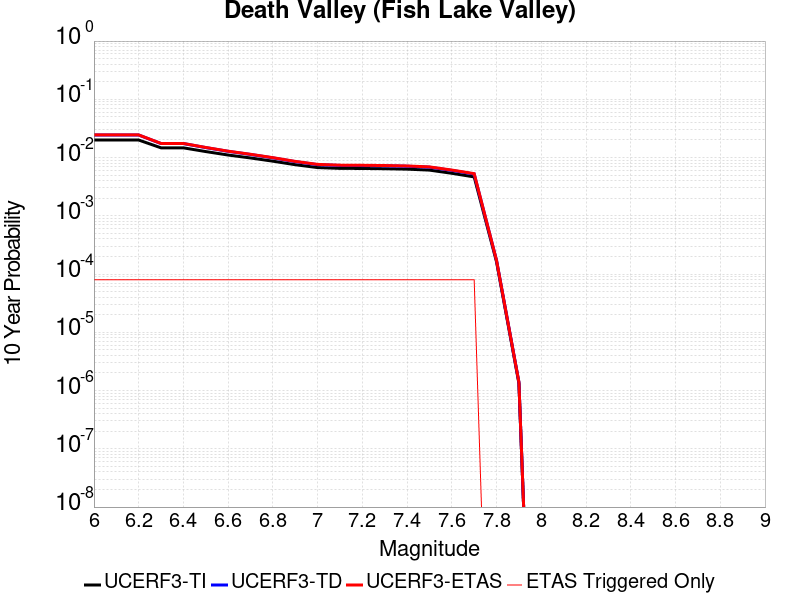 |

| Magnitude | 1 wk TI Prob | 1 wk TD Prob | 1 wk ETAS Prob | 1 wk ETAS/TD Gain | 1 wk ETAS Triggered Only | 1 mo TI Prob | 1 mo TD Prob | 1 mo ETAS Prob | 1 mo ETAS/TD Gain | 1 mo ETAS Triggered Only | 1 yr TI Prob | 1 yr TD Prob | 1 yr ETAS Prob | 1 yr ETAS/TD Gain | 1 yr ETAS Triggered Only | 10 yr TI Prob | 10 yr TD Prob | 10 yr ETAS Prob | 10 yr ETAS/TD Gain | 10 yr ETAS Triggered Only |
|-----|-----|-----|-----|-----|-----|-----|-----|-----|-----|-----|-----|-----|-----|-----|-----|-----|-----|-----|-----|-----|
| 6.0 | 3.872328E-5 | 4.7268895E-5 | 6.018818E-5 | 1.2733147 | 1.2919897E-5 | 1.6594635E-4 | 2.0256694E-4 | 2.4131878E-4 | 1.1913038 | 3.875969E-5 | 0.0020185246 | 0.0024636039 | 0.0025409323 | 1.0313883 | 7.751938E-5 | 0.02000288 | 0.024388881 | 0.024477115 | 1.0036178 | 9.043928E-5 |
| 6.1 | 3.872328E-5 | 4.7268895E-5 | 6.018818E-5 | 1.2733147 | 1.2919897E-5 | 1.6594635E-4 | 2.0256694E-4 | 2.4131878E-4 | 1.1913038 | 3.875969E-5 | 0.0020185246 | 0.0024636039 | 0.0025409323 | 1.0313883 | 7.751938E-5 | 0.02000288 | 0.024388881 | 0.024477115 | 1.0036178 | 9.043928E-5 |
| 6.2 | 3.872328E-5 | 4.7268895E-5 | 6.018818E-5 | 1.2733147 | 1.2919897E-5 | 1.6594635E-4 | 2.0256694E-4 | 2.4131878E-4 | 1.1913038 | 3.875969E-5 | 0.0020185246 | 0.0024636039 | 0.0025409323 | 1.0313883 | 7.751938E-5 | 0.02000288 | 0.024388881 | 0.024477115 | 1.0036178 | 9.043928E-5 |
| 6.3 | 2.8356371E-5 | 3.3610693E-5 | 4.6530156E-5 | 1.3843855 | 1.2919897E-5 | 1.2152165E-4 | 1.4403832E-4 | 1.8279243E-4 | 1.2690542 | 3.875969E-5 | 0.0014785219 | 0.001752335 | 0.0018297185 | 1.0441602 | 7.751938E-5 | 0.014687235 | 0.01739221 | 0.017481076 | 1.0051095 | 9.043928E-5 |
| 6.4 | 2.8356371E-5 | 3.3610693E-5 | 4.6530156E-5 | 1.3843855 | 1.2919897E-5 | 1.2152165E-4 | 1.4403832E-4 | 1.8279243E-4 | 1.2690542 | 3.875969E-5 | 0.0014785219 | 0.001752335 | 0.0018297185 | 1.0441602 | 7.751938E-5 | 0.014687235 | 0.01739221 | 0.017481076 | 1.0051095 | 9.043928E-5 |
| 6.5 | 2.4448687E-5 | 2.8608209E-5 | 4.1527735E-5 | 1.4516021 | 1.2919897E-5 | 1.0477588E-4 | 1.2260114E-4 | 1.6135607E-4 | 1.3161058 | 3.875969E-5 | 0.0012748998 | 0.0014916973 | 0.001569101 | 1.0518897 | 7.751938E-5 | 0.012676105 | 0.014821712 | 0.014910811 | 1.0060114 | 9.043928E-5 |
| 6.6 | 2.1298161E-5 | 2.4660607E-5 | 3.7580183E-5 | 1.5238954 | 1.2919897E-5 | 9.127464E-5 | 1.0568422E-4 | 1.4443982E-4 | 1.3667113 | 3.875969E-5 | 0.0011107022 | 0.0012859798 | 0.0013633994 | 1.0602028 | 7.751938E-5 | 0.011051672 | 0.012788794 | 0.012878077 | 1.0069814 | 9.043928E-5 |
| 6.7 | 1.8959729E-5 | 2.178146E-5 | 3.4701075E-5 | 1.5931474 | 1.2919897E-5 | 8.125345E-5 | 9.3345916E-5 | 1.32102E-4 | 1.4151876 | 3.875969E-5 | 9.888117E-4 | 0.0011359196 | 0.0012133509 | 1.0681663 | 7.751938E-5 | 0.009844234 | 0.011303794 | 0.011393211 | 1.0079104 | 9.043928E-5 |
| 6.8 | 1.6691629E-5 | 1.9018706E-5 | 3.1938358E-5 | 1.6793128 | 1.2919897E-5 | 7.153359E-5 | 8.150629E-5 | 1.2026282E-4 | 1.4755036 | 3.875969E-5 | 8.7057345E-4 | 9.919042E-4 | 0.0010693467 | 1.0780746 | 7.751938E-5 | 0.008671708 | 0.009876527 | 0.009966073 | 1.0090666 | 9.043928E-5 |
| 6.9 | 1.450505E-5 | 1.6389824E-5 | 2.9309509E-5 | 1.7882748 | 1.2919897E-5 | 6.216302E-5 | 7.024026E-5 | 1.0899723E-4 | 1.5517771 | 3.875969E-5 | 7.5657194E-4 | 8.548484E-4 | 9.323015E-4 | 1.0906045 | 7.751938E-5 | 0.007540013 | 0.008516532 | 0.008606202 | 1.0105288 | 9.043928E-5 |
| 7.0 | 1.2940855E-5 | 1.453821E-5 | 2.745792E-5 | 1.8886726 | 1.2919897E-5 | 5.545963E-5 | 6.230516E-5 | 1.0106243E-4 | 1.6220556 | 3.875969E-5 | 6.750118E-4 | 7.583071E-4 | 8.357677E-4 | 1.1021494 | 7.751938E-5 | 0.006729651 | 0.0075578135 | 0.0076475693 | 1.0118759 | 9.043928E-5 |
| 7.1 | 1.2544658E-5 | 1.4078437E-5 | 2.6998152E-5 | 1.9176953 | 1.2919897E-5 | 5.3761712E-5 | 6.033479E-5 | 9.909215E-5 | 1.6423715 | 3.875969E-5 | 6.5435225E-4 | 7.343341E-4 | 8.117966E-4 | 1.1054866 | 7.751938E-5 | 0.006524288 | 0.0073196692 | 0.007409447 | 1.0122652 | 9.043928E-5 |
| 7.2 | 1.2489416E-5 | 1.4015902E-5 | 2.6935617E-5 | 1.9217898 | 1.2919897E-5 | 5.3524967E-5 | 6.00668E-5 | 9.882416E-5 | 1.6452377 | 3.875969E-5 | 6.514716E-4 | 7.310735E-4 | 8.085362E-4 | 1.1059575 | 7.751938E-5 | 0.006495651 | 0.007287278 | 0.007377058 | 1.0123202 | 9.043928E-5 |
| 7.3 | 1.2368307E-5 | 1.3880038E-5 | 2.6799755E-5 | 1.9308128 | 1.2919897E-5 | 5.3005948E-5 | 5.948455E-5 | 9.824194E-5 | 1.6515538 | 3.875969E-5 | 6.451563E-4 | 7.239894E-4 | 8.014526E-4 | 1.106995 | 7.751938E-5 | 0.0064328653 | 0.0072168987 | 0.007306685 | 1.0124412 | 9.043928E-5 |
| 7.4 | 1.2161707E-5 | 1.3648089E-5 | 2.656781E-5 | 1.9466321 | 1.2919897E-5 | 5.212056E-5 | 5.8490532E-5 | 9.7247954E-5 | 1.6626273 | 3.875969E-5 | 6.3438306E-4 | 7.118952E-4 | 7.893593E-4 | 1.108814 | 7.751938E-5 | 0.006325751 | 0.0070967353 | 0.007186533 | 1.0126534 | 9.043928E-5 |
| 7.5 | 1.1707948E-5 | 1.314573E-5 | 2.6065456E-5 | 1.9828079 | 1.2919897E-5 | 5.0175953E-5 | 5.6337656E-5 | 9.5095165E-5 | 1.6879503 | 3.875969E-5 | 6.10721E-4 | 6.857007E-4 | 7.631669E-4 | 1.1129738 | 7.751938E-5 | 0.0060904534 | 0.0068364325 | 0.0069262534 | 1.0131385 | 9.043928E-5 |
| 7.6 | 1.0319538E-5 | 1.157981E-5 | 2.4499557E-5 | 2.1157131 | 1.2919897E-5 | 4.4225842E-5 | 4.9626844E-5 | 8.838461E-5 | 1.7809839 | 3.875969E-5 | 5.383166E-4 | 6.040445E-4 | 6.8151706E-4 | 1.1282563 | 7.751938E-5 | 0.0053701443 | 0.0060245576 | 0.006114452 | 1.0149213 | 9.043928E-5 |
| 7.7 | 8.937764E-6 | 1.0022941E-5 | 2.2942708E-5 | 2.2890196 | 1.2919897E-5 | 3.830414E-5 | 4.295478E-5 | 8.171281E-5 | 1.9022982 | 3.875969E-5 | 4.6625308E-4 | 5.2285404E-4 | 6.0033286E-4 | 1.1481844 | 7.751938E-5 | 0.0046527605 | 0.005216748 | 0.0053067156 | 1.0172459 | 9.043928E-5 |
| 7.8 | 3.108007E-7 | 3.2846788E-7 | 3.2846788E-7 | 1.0 | 0.0 | 1.3320023E-6 | 1.4077187E-6 | 1.4077187E-6 | 1.0 | 0.0 | 1.6217007E-5 | 1.7138846E-5 | 1.7138846E-5 | 1.0 | 0.0 | 1.6215823E-4 | 1.713756E-4 | 1.713756E-4 | 1.0 | 0.0 |
| 7.9 | 2.5591178E-9 | 2.6696871E-9 | 2.6696871E-9 | 1.0 | 0.0 | 1.0967647E-8 | 1.1441516E-8 | 1.1441516E-8 | 1.0 | 0.0 | 1.335311E-7 | 1.3930045E-7 | 1.3930045E-7 | 1.0 | 0.0 | 1.3353102E-6 | 1.3930046E-6 | 1.3930046E-6 | 1.0 | 0.0 |

## Paradise
*[(top)](#table-of-contents)*

| 1 Week | 1 Month | 1 Year | 10 Year |
|-----|-----|-----|-----|
|  | 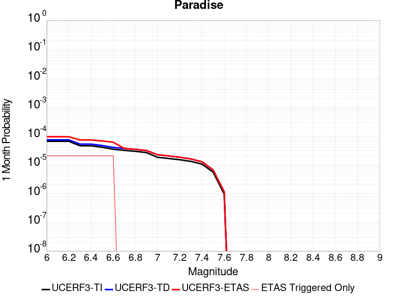 |  |  |

| Magnitude | 1 wk TI Prob | 1 wk TD Prob | 1 wk ETAS Prob | 1 wk ETAS/TD Gain | 1 wk ETAS Triggered Only | 1 mo TI Prob | 1 mo TD Prob | 1 mo ETAS Prob | 1 mo ETAS/TD Gain | 1 mo ETAS Triggered Only | 1 yr TI Prob | 1 yr TD Prob | 1 yr ETAS Prob | 1 yr ETAS/TD Gain | 1 yr ETAS Triggered Only | 10 yr TI Prob | 10 yr TD Prob | 10 yr ETAS Prob | 10 yr ETAS/TD Gain | 10 yr ETAS Triggered Only |
|-----|-----|-----|-----|-----|-----|-----|-----|-----|-----|-----|-----|-----|-----|-----|-----|-----|-----|-----|-----|-----|
| 6.0 | 1.4851273E-5 | 1.6694854E-5 | 4.2534215E-5 | 2.547744 | 2.5839794E-5 | 6.364676E-5 | 7.154755E-5 | 9.738549E-5 | 1.3611298 | 2.5839794E-5 | 7.7462377E-4 | 8.707668E-4 | 8.965841E-4 | 1.0296489 | 2.5839794E-5 | 0.0077192914 | 0.008675928 | 0.008752775 | 1.0088575 | 7.751938E-5 |
| 6.1 | 1.4851273E-5 | 1.6694854E-5 | 4.2534215E-5 | 2.547744 | 2.5839794E-5 | 6.364676E-5 | 7.154755E-5 | 9.738549E-5 | 1.3611298 | 2.5839794E-5 | 7.7462377E-4 | 8.707668E-4 | 8.965841E-4 | 1.0296489 | 2.5839794E-5 | 0.0077192914 | 0.008675928 | 0.008752775 | 1.0088575 | 7.751938E-5 |
| 6.2 | 1.4851273E-5 | 1.6694854E-5 | 4.2534215E-5 | 2.547744 | 2.5839794E-5 | 6.364676E-5 | 7.154755E-5 | 9.738549E-5 | 1.3611298 | 2.5839794E-5 | 7.7462377E-4 | 8.707668E-4 | 8.965841E-4 | 1.0296489 | 2.5839794E-5 | 0.0077192914 | 0.008675928 | 0.008752775 | 1.0088575 | 7.751938E-5 |
| 6.3 | 1.0426831E-5 | 1.1888727E-5 | 3.7728212E-5 | 3.1734443 | 2.5839794E-5 | 4.4685654E-5 | 5.0950726E-5 | 7.6789205E-5 | 1.5071267 | 2.5839794E-5 | 5.43912E-4 | 6.201545E-4 | 6.4597826E-4 | 1.0416409 | 2.5839794E-5 | 0.0054258266 | 0.006184847 | 0.006236207 | 1.0083041 | 5.1679588E-5 |
| 6.4 | 1.0426831E-5 | 1.1888727E-5 | 3.7728212E-5 | 3.1734443 | 2.5839794E-5 | 4.4685654E-5 | 5.0950726E-5 | 7.6789205E-5 | 1.5071267 | 2.5839794E-5 | 5.43912E-4 | 6.201545E-4 | 6.4597826E-4 | 1.0416409 | 2.5839794E-5 | 0.0054258266 | 0.006184847 | 0.006236207 | 1.0083041 | 5.1679588E-5 |
| 6.5 | 9.25027E-6 | 1.0620054E-5 | 3.6459573E-5 | 3.4330873 | 2.5839794E-5 | 3.964341E-5 | 4.551375E-5 | 7.135237E-5 | 1.5677102 | 2.5839794E-5 | 4.8255164E-4 | 5.539939E-4 | 5.798194E-4 | 1.0466169 | 2.5839794E-5 | 0.0048150513 | 0.0055266283 | 0.0055651735 | 1.0069745 | 3.875969E-5 |
| 6.6 | 7.904275E-6 | 9.159603E-6 | 3.499916E-5 | 3.8210347 | 2.5839794E-5 | 3.3875025E-5 | 3.925487E-5 | 6.509365E-5 | 1.6582311 | 2.5839794E-5 | 4.1235037E-4 | 4.7782718E-4 | 5.0365465E-4 | 1.0540519 | 2.5839794E-5 | 0.0041158604 | 0.004768395 | 0.00480697 | 1.0080897 | 3.875969E-5 |
| 6.7 | 7.2061953E-6 | 8.407318E-6 | 8.407318E-6 | 1.0 | 0.0 | 3.088333E-5 | 3.6030888E-5 | 3.6030888E-5 | 1.0 | 0.0 | 3.7593965E-4 | 4.385914E-4 | 4.385914E-4 | 1.0 | 0.0 | 0.003753043 | 0.0043776273 | 0.0043904907 | 1.0029384 | 1.2919897E-5 |
| 6.8 | 6.6948724E-6 | 7.84223E-6 | 7.84223E-6 | 1.0 | 0.0 | 2.8691995E-5 | 3.3609143E-5 | 3.3609143E-5 | 1.0 | 0.0 | 3.4926904E-4 | 4.0911807E-4 | 4.0911807E-4 | 1.0 | 0.0 | 0.003487206 | 0.0040840064 | 0.0040968736 | 1.0031506 | 1.2919897E-5 |
| 6.9 | 6.0421025E-6 | 7.130678E-6 | 7.130678E-6 | 1.0 | 0.0 | 2.5894467E-5 | 3.055971E-5 | 3.055971E-5 | 1.0 | 0.0 | 3.1521954E-4 | 3.7200435E-4 | 3.7200435E-4 | 1.0 | 0.0 | 0.0031477278 | 0.0037141545 | 0.0037270265 | 1.0034657 | 1.2919897E-5 |
| 7.0 | 4.134091E-6 | 5.0803487E-6 | 5.0803487E-6 | 1.0 | 0.0 | 1.7717413E-5 | 2.177275E-5 | 2.177275E-5 | 1.0 | 0.0 | 2.1568815E-4 | 2.6505254E-4 | 2.6505254E-4 | 1.0 | 0.0 | 0.0021547892 | 0.0026475172 | 0.0026604028 | 1.0048671 | 1.2919897E-5 |
| 7.1 | 3.7674888E-6 | 4.6319055E-6 | 4.6319055E-6 | 1.0 | 0.0 | 1.6146281E-5 | 1.985088E-5 | 1.985088E-5 | 1.0 | 0.0 | 1.9656324E-4 | 2.4165919E-4 | 2.4165919E-4 | 1.0 | 0.0 | 0.0019638946 | 0.0024141145 | 0.0024270033 | 1.0053389 | 1.2919897E-5 |
| 7.2 | 3.4065345E-6 | 4.156755E-6 | 4.156755E-6 | 1.0 | 0.0 | 1.4599351E-5 | 1.7814553E-5 | 1.7814553E-5 | 1.0 | 0.0 | 1.777326E-4 | 2.1687208E-4 | 2.1687208E-4 | 1.0 | 0.0 | 0.0017759053 | 0.0021667527 | 0.0021796445 | 1.0059499 | 1.2919897E-5 |
| 7.3 | 2.9934936E-6 | 3.6293434E-6 | 3.6293434E-6 | 1.0 | 0.0 | 1.2829195E-5 | 1.5554244E-5 | 1.5554244E-5 | 1.0 | 0.0 | 1.5618425E-4 | 1.8935793E-4 | 1.8935793E-4 | 1.0 | 0.0 | 0.0015607453 | 0.0018921113 | 0.0019050067 | 1.0068154 | 1.2919897E-5 |
| 7.4 | 2.4049796E-6 | 2.8890036E-6 | 2.8890036E-6 | 1.0 | 0.0 | 1.0307015E-5 | 1.2381393E-5 | 1.2381393E-5 | 1.0 | 0.0 | 1.2548068E-4 | 1.5073447E-4 | 1.5073447E-4 | 1.0 | 0.0 | 0.0012540985 | 0.0015064639 | 0.0015193642 | 1.0085634 | 1.2919897E-5 |
| 7.5 | 1.2710091E-6 | 1.5134775E-6 | 1.5134775E-6 | 1.0 | 0.0 | 5.44717E-6 | 6.486323E-6 | 6.486323E-6 | 1.0 | 0.0 | 6.631728E-5 | 7.896937E-5 | 7.896937E-5 | 1.0 | 0.0 | 6.6297496E-4 | 7.8953576E-4 | 8.024454E-4 | 1.016351 | 1.2919897E-5 |
| 7.6 | 2.21172E-7 | 2.6039737E-7 | 2.6039737E-7 | 1.0 | 0.0 | 9.478797E-7 | 1.1159884E-6 | 1.1159884E-6 | 1.0 | 0.0 | 1.1540374E-5 | 1.3587103E-5 | 1.3587103E-5 | 1.0 | 0.0 | 1.1539775E-4 | 1.3586554E-4 | 1.4878367E-4 | 1.0950804 | 1.2919897E-5 |

## Scodie Lineament
*[(top)](#table-of-contents)*

| 1 Week | 1 Month | 1 Year | 10 Year |
|-----|-----|-----|-----|
|  |  |  |  |

| Magnitude | 1 wk TI Prob | 1 wk TD Prob | 1 wk ETAS Prob | 1 wk ETAS/TD Gain | 1 wk ETAS Triggered Only | 1 mo TI Prob | 1 mo TD Prob | 1 mo ETAS Prob | 1 mo ETAS/TD Gain | 1 mo ETAS Triggered Only | 1 yr TI Prob | 1 yr TD Prob | 1 yr ETAS Prob | 1 yr ETAS/TD Gain | 1 yr ETAS Triggered Only | 10 yr TI Prob | 10 yr TD Prob | 10 yr ETAS Prob | 10 yr ETAS/TD Gain | 10 yr ETAS Triggered Only |
|-----|-----|-----|-----|-----|-----|-----|-----|-----|-----|-----|-----|-----|-----|-----|-----|-----|-----|-----|-----|-----|
| 6.0 | 3.2919327E-6 | 3.0133565E-6 | 1.5933214E-5 | 5.2875304 | 1.2919897E-5 | 1.4108206E-5 | 1.2914339E-5 | 2.5834068E-5 | 2.0004175 | 1.2919897E-5 | 1.7175387E-4 | 1.5722391E-4 | 1.8305964E-4 | 1.1643244 | 2.5839794E-5 | 0.0017162118 | 0.0015714383 | 0.0016230367 | 1.0328351 | 5.1679588E-5 |
| 6.1 | 1.8663811E-6 | 1.5490589E-6 | 1.5490589E-6 | 1.0 | 0.0 | 7.998751E-6 | 6.6388097E-6 | 6.6388097E-6 | 1.0 | 0.0 | 9.738045E-5 | 8.082501E-5 | 8.082501E-5 | 1.0 | 0.0 | 9.7337784E-4 | 8.0800493E-4 | 8.209144E-4 | 1.0159769 | 1.2919897E-5 |
| 6.2 | 1.8663811E-6 | 1.5490589E-6 | 1.5490589E-6 | 1.0 | 0.0 | 7.998751E-6 | 6.6388097E-6 | 6.6388097E-6 | 1.0 | 0.0 | 9.738045E-5 | 8.082501E-5 | 8.082501E-5 | 1.0 | 0.0 | 9.7337784E-4 | 8.0800493E-4 | 8.209144E-4 | 1.0159769 | 1.2919897E-5 |
| 6.3 | 1.8663811E-6 | 1.5490589E-6 | 1.5490589E-6 | 1.0 | 0.0 | 7.998751E-6 | 6.6388097E-6 | 6.6388097E-6 | 1.0 | 0.0 | 9.738045E-5 | 8.082501E-5 | 8.082501E-5 | 1.0 | 0.0 | 9.7337784E-4 | 8.0800493E-4 | 8.209144E-4 | 1.0159769 | 1.2919897E-5 |
| 6.4 | 1.8663811E-6 | 1.5490589E-6 | 1.5490589E-6 | 1.0 | 0.0 | 7.998751E-6 | 6.6388097E-6 | 6.6388097E-6 | 1.0 | 0.0 | 9.738045E-5 | 8.082501E-5 | 8.082501E-5 | 1.0 | 0.0 | 9.7337784E-4 | 8.0800493E-4 | 8.209144E-4 | 1.0159769 | 1.2919897E-5 |
| 6.5 | 1.8106311E-6 | 1.4909926E-6 | 1.4909926E-6 | 1.0 | 0.0 | 7.759824E-6 | 6.3899556E-6 | 6.3899556E-6 | 1.0 | 0.0 | 9.447177E-5 | 7.779543E-5 | 7.779543E-5 | 1.0 | 0.0 | 9.4431615E-4 | 7.777306E-4 | 7.906404E-4 | 1.0165994 | 1.2919897E-5 |
| 6.6 | 1.2414679E-6 | 8.9976135E-7 | 8.9976135E-7 | 1.0 | 0.0 | 5.320566E-6 | 3.8561147E-6 | 3.8561147E-6 | 1.0 | 0.0 | 6.477596E-5 | 4.6947276E-5 | 4.6947276E-5 | 1.0 | 0.0 | 6.475708E-4 | 4.6938224E-4 | 4.6938224E-4 | 1.0 | 0.0 |
| 6.7 | 1.1062215E-6 | 7.5943603E-7 | 7.5943603E-7 | 1.0 | 0.0 | 4.7409408E-6 | 3.254722E-6 | 3.254722E-6 | 1.0 | 0.0 | 5.7719422E-5 | 3.9625593E-5 | 3.9625593E-5 | 1.0 | 0.0 | 5.770443E-4 | 3.9619225E-4 | 3.9619225E-4 | 1.0 | 0.0 |
| 6.8 | 1.0006736E-6 | 6.5004406E-7 | 6.5004406E-7 | 1.0 | 0.0 | 4.288594E-6 | 2.7859005E-6 | 2.7859005E-6 | 1.0 | 0.0 | 5.221238E-5 | 3.3917873E-5 | 3.3917873E-5 | 1.0 | 0.0 | 5.220012E-4 | 3.3913302E-4 | 3.3913302E-4 | 1.0 | 0.0 |
| 6.9 | 9.167364E-7 | 5.6316645E-7 | 5.6316645E-7 | 1.0 | 0.0 | 3.9288643E-6 | 2.4135686E-6 | 2.4135686E-6 | 1.0 | 0.0 | 4.7832873E-5 | 2.9384859E-5 | 2.9384859E-5 | 1.0 | 0.0 | 4.782258E-4 | 2.9381542E-4 | 2.9381542E-4 | 1.0 | 0.0 |
| 7.0 | 7.6987664E-7 | 4.113416E-7 | 4.113416E-7 | 1.0 | 0.0 | 3.2994672E-6 | 1.7628915E-6 | 1.7628915E-6 | 1.0 | 0.0 | 4.0170275E-5 | 2.1463033E-5 | 2.1463033E-5 | 1.0 | 0.0 | 4.0163012E-4 | 2.1461345E-4 | 2.1461345E-4 | 1.0 | 0.0 |
| 7.1 | 7.1038727E-7 | 3.5211795E-7 | 3.5211795E-7 | 1.0 | 0.0 | 3.0445133E-6 | 1.5090762E-6 | 1.5090762E-6 | 1.0 | 0.0 | 3.706632E-5 | 1.8372884E-5 | 1.8372884E-5 | 1.0 | 0.0 | 3.7060137E-4 | 1.8371714E-4 | 1.8371714E-4 | 1.0 | 0.0 |
| 7.2 | 2.0799602E-7 | 3.1187685E-8 | 3.1187685E-8 | 1.0 | 0.0 | 8.914113E-7 | 1.336615E-7 | 1.336615E-7 | 1.0 | 0.0 | 1.0852878E-5 | 1.6273277E-6 | 1.6273277E-6 | 1.0 | 0.0 | 1.08523476E-4 | 1.6273165E-5 | 1.6273165E-5 | 1.0 | 0.0 |
| 7.3 | 1.5048182E-7 | 1.5946263E-8 | 1.5946263E-8 | 1.0 | 0.0 | 6.449219E-7 | 6.834112E-8 | 6.834112E-8 | 1.0 | 0.0 | 7.851896E-6 | 8.320529E-7 | 8.320529E-7 | 1.0 | 0.0 | 7.851618E-5 | 8.3205005E-6 | 8.3205005E-6 | 1.0 | 0.0 |
| 7.4 | 5.9334678E-8 | 4.8685624E-9 | 4.8685624E-9 | 1.0 | 0.0 | 2.5429145E-7 | 2.0865269E-8 | 2.0865269E-8 | 1.0 | 0.0 | 3.095994E-6 | 2.5403463E-7 | 2.5403463E-7 | 1.0 | 0.0 | 3.095951E-5 | 2.5403444E-6 | 2.5403444E-6 | 1.0 | 0.0 |

## San Andreas (San Gorgonio Pass-Garnet HIll)
*[(top)](#table-of-contents)*

| 1 Week | 1 Month | 1 Year | 10 Year |
|-----|-----|-----|-----|
|  |  |  |  |

| Magnitude | 1 wk TI Prob | 1 wk TD Prob | 1 wk ETAS Prob | 1 wk ETAS/TD Gain | 1 wk ETAS Triggered Only | 1 mo TI Prob | 1 mo TD Prob | 1 mo ETAS Prob | 1 mo ETAS/TD Gain | 1 mo ETAS Triggered Only | 1 yr TI Prob | 1 yr TD Prob | 1 yr ETAS Prob | 1 yr ETAS/TD Gain | 1 yr ETAS Triggered Only | 10 yr TI Prob | 10 yr TD Prob | 10 yr ETAS Prob | 10 yr ETAS/TD Gain | 10 yr ETAS Triggered Only |
|-----|-----|-----|-----|-----|-----|-----|-----|-----|-----|-----|-----|-----|-----|-----|-----|-----|-----|-----|-----|-----|
| 6.0 | 8.31567E-5 | 2.3386451E-4 | 2.3386451E-4 | 1.0 | 0.0 | 3.5633717E-4 | 0.0010018935 | 0.0010148005 | 1.0128826 | 1.2919897E-5 | 0.004329778 | 0.012129918 | 0.012155444 | 1.0021044 | 2.5839794E-5 | 0.042463828 | 0.11259502 | 0.11264088 | 1.0004073 | 5.1679588E-5 |
| 6.1 | 8.31567E-5 | 2.3386451E-4 | 2.3386451E-4 | 1.0 | 0.0 | 3.5633717E-4 | 0.0010018935 | 0.0010148005 | 1.0128826 | 1.2919897E-5 | 0.004329778 | 0.012129918 | 0.012155444 | 1.0021044 | 2.5839794E-5 | 0.042463828 | 0.11259502 | 0.11264088 | 1.0004073 | 5.1679588E-5 |
| 6.2 | 8.31567E-5 | 2.3386451E-4 | 2.3386451E-4 | 1.0 | 0.0 | 3.5633717E-4 | 0.0010018935 | 0.0010148005 | 1.0128826 | 1.2919897E-5 | 0.004329778 | 0.012129918 | 0.012155444 | 1.0021044 | 2.5839794E-5 | 0.042463828 | 0.11259502 | 0.11264088 | 1.0004073 | 5.1679588E-5 |
| 6.3 | 8.31567E-5 | 2.3386451E-4 | 2.3386451E-4 | 1.0 | 0.0 | 3.5633717E-4 | 0.0010018935 | 0.0010148005 | 1.0128826 | 1.2919897E-5 | 0.004329778 | 0.012129918 | 0.012155444 | 1.0021044 | 2.5839794E-5 | 0.042463828 | 0.11259502 | 0.11264088 | 1.0004073 | 5.1679588E-5 |
| 6.4 | 8.059055E-5 | 2.2944735E-4 | 2.2944735E-4 | 1.0 | 0.0 | 3.4534236E-4 | 9.829777E-4 | 9.958849E-4 | 1.0131307 | 1.2919897E-5 | 0.0041964394 | 0.011902156 | 0.0119276885 | 1.0021452 | 2.5839794E-5 | 0.041180745 | 0.110576175 | 0.110622145 | 1.0004157 | 5.1679588E-5 |
| 6.5 | 8.059055E-5 | 2.2944735E-4 | 2.2944735E-4 | 1.0 | 0.0 | 3.4534236E-4 | 9.829777E-4 | 9.958849E-4 | 1.0131307 | 1.2919897E-5 | 0.0041964394 | 0.011902156 | 0.0119276885 | 1.0021452 | 2.5839794E-5 | 0.041180745 | 0.110576175 | 0.110622145 | 1.0004157 | 5.1679588E-5 |
| 6.6 | 7.619237E-5 | 2.2189032E-4 | 2.2189032E-4 | 1.0 | 0.0 | 3.2649786E-4 | 9.506143E-4 | 9.635219E-4 | 1.0135782 | 1.2919897E-5 | 0.0039678677 | 0.0115128625 | 0.011538405 | 1.0022186 | 2.5839794E-5 | 0.03897764 | 0.10711278 | 0.10715892 | 1.0004308 | 5.1679588E-5 |
| 6.7 | 7.440636E-5 | 2.1864849E-4 | 2.1864849E-4 | 1.0 | 0.0 | 3.188454E-4 | 9.367307E-4 | 9.4963855E-4 | 1.0137796 | 1.2919897E-5 | 0.0038750346 | 0.011345596 | 0.011371143 | 1.0022516 | 2.5839794E-5 | 0.038081564 | 0.10562121 | 0.105667435 | 1.0004376 | 5.1679588E-5 |
| 6.8 | 7.3735864E-5 | 2.1712016E-4 | 2.1712016E-4 | 1.0 | 0.0 | 3.1597257E-4 | 9.3018543E-4 | 9.4309327E-4 | 1.0138767 | 1.2919897E-5 | 0.0038401815 | 0.011266734 | 0.011292283 | 1.0022676 | 2.5839794E-5 | 0.03774495 | 0.10492276 | 0.10496901 | 1.0004408 | 5.1679588E-5 |
| 6.9 | 7.27575E-5 | 2.1480983E-4 | 2.1480983E-4 | 1.0 | 0.0 | 3.117806E-4 | 9.20291E-4 | 9.33199E-4 | 1.014026 | 1.2919897E-5 | 0.003789323 | 0.011147508 | 0.01117306 | 1.0022922 | 2.5839794E-5 | 0.037253562 | 0.10387066 | 0.10391697 | 1.0004458 | 5.1679588E-5 |
| 7.0 | 7.102591E-5 | 2.1065009E-4 | 2.1065009E-4 | 1.0 | 0.0 | 3.0436125E-4 | 9.0247596E-4 | 9.153842E-4 | 1.0143031 | 1.2919897E-5 | 0.003699303 | 0.010932805 | 0.010958362 | 1.0023377 | 2.5839794E-5 | 0.03638325 | 0.101972826 | 0.102019235 | 1.0004551 | 5.1679588E-5 |
| 7.1 | 7.028513E-5 | 2.0900648E-4 | 2.0900648E-4 | 1.0 | 0.0 | 3.0118722E-4 | 8.954368E-4 | 9.083451E-4 | 1.0144156 | 1.2919897E-5 | 0.0036607897 | 0.01084796 | 0.010873519 | 1.0023562 | 2.5839794E-5 | 0.036010686 | 0.10121585 | 0.101262294 | 1.000459 | 5.1679588E-5 |
| 7.2 | 6.8498244E-5 | 2.0508505E-4 | 2.0508505E-4 | 1.0 | 0.0 | 2.9353087E-4 | 8.78642E-4 | 8.9155056E-4 | 1.0146915 | 1.2919897E-5 | 0.003567883 | 0.010645497 | 0.010671061 | 1.0024015 | 2.5839794E-5 | 0.035111405 | 0.09940783 | 0.09945437 | 1.0004683 | 5.1679588E-5 |
| 7.3 | 6.622592E-5 | 1.973576E-4 | 1.973576E-4 | 1.0 | 0.0 | 2.8379448E-4 | 8.4554625E-4 | 8.5845526E-4 | 1.015267 | 1.2919897E-5 | 0.0034497243 | 0.010246415 | 0.01027199 | 1.002496 | 2.5839794E-5 | 0.033966612 | 0.09590419 | 0.09595091 | 1.0004872 | 5.1679588E-5 |
| 7.4 | 5.1050705E-5 | 1.4692261E-4 | 1.4692261E-4 | 1.0 | 0.0 | 2.1877038E-4 | 6.295173E-4 | 6.4242905E-4 | 1.0205106 | 1.2919897E-5 | 0.002660276 | 0.0076376316 | 0.0076632737 | 1.0033574 | 2.5839794E-5 | 0.02628654 | 0.07287696 | 0.072924875 | 1.0006574 | 5.1679588E-5 |
| 7.5 | 3.9302922E-5 | 1.11326524E-4 | 1.11326524E-4 | 1.0 | 0.0 | 1.6843023E-4 | 4.7702674E-4 | 4.8994046E-4 | 1.0270714 | 1.2919897E-5 | 0.0020487092 | 0.005792404 | 0.005818094 | 1.0044352 | 2.5839794E-5 | 0.020299247 | 0.05602189 | 0.056070674 | 1.0008708 | 5.1679588E-5 |
| 7.6 | 2.9851626E-5 | 8.49747E-5 | 8.49747E-5 | 1.0 | 0.0 | 1.2792926E-4 | 3.6412658E-4 | 3.7704178E-4 | 1.0354689 | 1.2919897E-5 | 0.0015564259 | 0.004424255 | 0.0044499803 | 1.0058147 | 2.5839794E-5 | 0.0154556995 | 0.043204896 | 0.043254342 | 1.0011445 | 5.1679588E-5 |
| 7.7 | 2.1135214E-5 | 6.355116E-5 | 6.355116E-5 | 1.0 | 0.0 | 9.0576345E-5 | 2.723337E-4 | 2.8525008E-4 | 1.0474285 | 1.2919897E-5 | 0.0011022091 | 0.003310627 | 0.0033363814 | 1.0077792 | 2.5839794E-5 | 0.010967582 | 0.032592565 | 0.032642562 | 1.001534 | 5.1679588E-5 |
| 7.8 | 1.883379E-5 | 5.5660596E-5 | 5.5660596E-5 | 1.0 | 0.0 | 8.0713755E-5 | 2.3852361E-4 | 2.5144042E-4 | 1.0541532 | 1.2919897E-5 | 9.822468E-4 | 0.0029001608 | 0.0029259257 | 1.008884 | 2.5839794E-5 | 0.0097791655 | 0.028704397 | 0.028754594 | 1.0017487 | 5.1679588E-5 |
| 7.9 | 1.5156185E-5 | 4.1675128E-5 | 4.1675128E-5 | 1.0 | 0.0 | 6.495346E-5 | 1.7859548E-4 | 1.9151307E-4 | 1.0723288 | 1.2919897E-5 | 7.9052144E-4 | 0.0021722328 | 0.0021980165 | 1.0118697 | 2.5839794E-5 | 0.007877152 | 0.02176709 | 0.021817643 | 1.0023226 | 5.1679588E-5 |
| 8.0 | 1.1405907E-5 | 2.9986788E-5 | 2.9986788E-5 | 1.0 | 0.0 | 4.8881542E-5 | 1.2850849E-4 | 1.2850849E-4 | 1.0 | 0.0 | 5.9497025E-4 | 0.0015634688 | 0.0015634688 | 1.0 | 0.0 | 0.005933798 | 0.015778678 | 0.01580411 | 1.0016118 | 2.5839794E-5 |
| 8.1 | 4.3511436E-6 | 7.373693E-6 | 7.373693E-6 | 1.0 | 0.0 | 1.8647626E-5 | 3.160116E-5 | 3.160116E-5 | 1.0 | 0.0 | 2.2701119E-4 | 3.8467633E-4 | 3.8467633E-4 | 1.0 | 0.0 | 0.0022677942 | 0.004118566 | 0.004118566 | 1.0 | 0.0 |
| 8.2 | 2.3042528E-6 | 2.7350309E-6 | 2.7350309E-6 | 1.0 | 0.0 | 9.875332E-6 | 1.1721509E-5 | 1.1721509E-5 | 1.0 | 0.0 | 1.2022553E-4 | 1.4270007E-4 | 1.4270007E-4 | 1.0 | 0.0 | 0.0012016051 | 0.0015990696 | 0.0015990696 | 1.0 | 0.0 |
| 8.3 | 5.202968E-7 | 3.1628537E-7 | 3.1628537E-7 | 1.0 | 0.0 | 2.2298414E-6 | 1.3555081E-6 | 1.3555081E-6 | 1.0 | 0.0 | 2.714798E-5 | 1.6503198E-5 | 1.6503198E-5 | 1.0 | 0.0 | 2.7144665E-4 | 1.9580164E-4 | 1.9580164E-4 | 1.0 | 0.0 |

## Sierra Nevada  (No Extension)
*[(top)](#table-of-contents)*

| 1 Week | 1 Month | 1 Year | 10 Year |
|-----|-----|-----|-----|
|  |  |  |  |

| Magnitude | 1 wk TI Prob | 1 wk TD Prob | 1 wk ETAS Prob | 1 wk ETAS/TD Gain | 1 wk ETAS Triggered Only | 1 mo TI Prob | 1 mo TD Prob | 1 mo ETAS Prob | 1 mo ETAS/TD Gain | 1 mo ETAS Triggered Only | 1 yr TI Prob | 1 yr TD Prob | 1 yr ETAS Prob | 1 yr ETAS/TD Gain | 1 yr ETAS Triggered Only | 10 yr TI Prob | 10 yr TD Prob | 10 yr ETAS Prob | 10 yr ETAS/TD Gain | 10 yr ETAS Triggered Only |
|-----|-----|-----|-----|-----|-----|-----|-----|-----|-----|-----|-----|-----|-----|-----|-----|-----|-----|-----|-----|-----|
| 6.0 | 7.7690465E-6 | 6.9763832E-6 | 6.9763832E-6 | 1.0 | 0.0 | 3.329549E-5 | 2.9898645E-5 | 2.9898645E-5 | 1.0 | 0.0 | 4.0529718E-4 | 3.6399104E-4 | 3.8982142E-4 | 1.0709643 | 2.5839794E-5 | 0.004045588 | 0.0036374647 | 0.0036889564 | 1.0141559 | 5.1679588E-5 |
| 6.1 | 7.7690465E-6 | 6.9763832E-6 | 6.9763832E-6 | 1.0 | 0.0 | 3.329549E-5 | 2.9898645E-5 | 2.9898645E-5 | 1.0 | 0.0 | 4.0529718E-4 | 3.6399104E-4 | 3.8982142E-4 | 1.0709643 | 2.5839794E-5 | 0.004045588 | 0.0036374647 | 0.0036889564 | 1.0141559 | 5.1679588E-5 |
| 6.2 | 7.7690465E-6 | 6.9763832E-6 | 6.9763832E-6 | 1.0 | 0.0 | 3.329549E-5 | 2.9898645E-5 | 2.9898645E-5 | 1.0 | 0.0 | 4.0529718E-4 | 3.6399104E-4 | 3.8982142E-4 | 1.0709643 | 2.5839794E-5 | 0.004045588 | 0.0036374647 | 0.0036889564 | 1.0141559 | 5.1679588E-5 |
| 6.3 | 7.7690465E-6 | 6.9763832E-6 | 6.9763832E-6 | 1.0 | 0.0 | 3.329549E-5 | 2.9898645E-5 | 2.9898645E-5 | 1.0 | 0.0 | 4.0529718E-4 | 3.6399104E-4 | 3.8982142E-4 | 1.0709643 | 2.5839794E-5 | 0.004045588 | 0.0036374647 | 0.0036889564 | 1.0141559 | 5.1679588E-5 |
| 6.4 | 7.7690465E-6 | 6.9763832E-6 | 6.9763832E-6 | 1.0 | 0.0 | 3.329549E-5 | 2.9898645E-5 | 2.9898645E-5 | 1.0 | 0.0 | 4.0529718E-4 | 3.6399104E-4 | 3.8982142E-4 | 1.0709643 | 2.5839794E-5 | 0.004045588 | 0.0036374647 | 0.0036889564 | 1.0141559 | 5.1679588E-5 |
| 6.5 | 7.7690465E-6 | 6.9763832E-6 | 6.9763832E-6 | 1.0 | 0.0 | 3.329549E-5 | 2.9898645E-5 | 2.9898645E-5 | 1.0 | 0.0 | 4.0529718E-4 | 3.6399104E-4 | 3.8982142E-4 | 1.0709643 | 2.5839794E-5 | 0.004045588 | 0.0036374647 | 0.0036889564 | 1.0141559 | 5.1679588E-5 |
| 6.6 | 2.653E-6 | 1.6148814E-6 | 1.6148814E-6 | 1.0 | 0.0 | 1.136995E-5 | 6.920902E-6 | 6.920902E-6 | 1.0 | 0.0 | 1.3842035E-4 | 8.4258754E-5 | 1.1009637E-4 | 1.3066461 | 2.5839794E-5 | 0.0013833415 | 8.4227155E-4 | 8.939076E-4 | 1.0613058 | 5.1679588E-5 |
| 6.7 | 2.5902466E-6 | 1.5502146E-6 | 1.5502146E-6 | 1.0 | 0.0 | 1.11010095E-5 | 6.64376E-6 | 6.64376E-6 | 1.0 | 0.0 | 1.351464E-4 | 8.0884805E-5 | 1.0672251E-4 | 1.3194382 | 2.5839794E-5 | 0.0013506424 | 8.085567E-4 | 8.6019444E-4 | 1.0638641 | 5.1679588E-5 |
| 6.8 | 2.5853892E-6 | 1.5470148E-6 | 1.5470148E-6 | 1.0 | 0.0 | 1.1080193E-5 | 6.6300463E-6 | 6.6300463E-6 | 1.0 | 0.0 | 1.34893E-4 | 8.071786E-5 | 1.0655556E-4 | 1.320099 | 2.5839794E-5 | 0.0013481114 | 8.0688833E-4 | 8.5852627E-4 | 1.0639963 | 5.1679588E-5 |
| 6.9 | 2.458257E-6 | 1.4220883E-6 | 1.4220883E-6 | 1.0 | 0.0 | 1.0535345E-5 | 6.0946504E-6 | 6.0946504E-6 | 1.0 | 0.0 | 1.2826028E-4 | 7.419986E-5 | 1.0003774E-4 | 1.34822 | 2.5839794E-5 | 0.0012818627 | 7.417528E-4 | 7.9339405E-4 | 1.0696206 | 5.1679588E-5 |
| 7.0 | 2.4341468E-6 | 1.399052E-6 | 1.399052E-6 | 1.0 | 0.0 | 1.0432016E-5 | 5.995924E-6 | 5.995924E-6 | 1.0 | 0.0 | 1.270024E-4 | 7.2997944E-5 | 9.883585E-5 | 1.3539538 | 2.5839794E-5 | 0.0012692984 | 7.297416E-4 | 7.813835E-4 | 1.0707674 | 5.1679588E-5 |
| 7.1 | 2.3652476E-6 | 1.3340014E-6 | 1.3340014E-6 | 1.0 | 0.0 | 1.0136736E-5 | 5.717136E-6 | 5.717136E-6 | 1.0 | 0.0 | 1.2340778E-4 | 6.960393E-5 | 9.544192E-5 | 1.3712146 | 2.5839794E-5 | 0.0012333926 | 6.9582294E-4 | 7.474666E-4 | 1.0742195 | 5.1679588E-5 |
| 7.2 | 2.272158E-6 | 1.2503074E-6 | 1.2503074E-6 | 1.0 | 0.0 | 9.737784E-6 | 5.3584495E-6 | 5.3584495E-6 | 1.0 | 0.0 | 1.1855107E-4 | 6.523718E-5 | 9.107529E-5 | 1.3960642 | 2.5839794E-5 | 0.0011848784 | 6.5218186E-4 | 7.038277E-4 | 1.0791894 | 5.1679588E-5 |
| 7.3 | 2.1382127E-6 | 1.1419947E-6 | 1.1419947E-6 | 1.0 | 0.0 | 9.163737E-6 | 4.8942543E-6 | 4.8942543E-6 | 1.0 | 0.0 | 1.1156279E-4 | 5.9585927E-5 | 8.542418E-5 | 1.4336301 | 2.5839794E-5 | 0.001115068 | 5.957007E-4 | 6.4734946E-4 | 1.0867026 | 5.1679588E-5 |
| 7.4 | 1.9048055E-6 | 9.575474E-7 | 9.575474E-7 | 1.0 | 0.0 | 8.163426E-6 | 4.1037683E-6 | 4.1037683E-6 | 1.0 | 0.0 | 9.9385186E-5 | 4.996224E-5 | 7.5800745E-5 | 1.5171607 | 2.5839794E-5 | 9.934074E-4 | 4.995108E-4 | 5.5116456E-4 | 1.1034087 | 5.1679588E-5 |
| 7.5 | 1.5373403E-6 | 7.5602395E-7 | 7.5602395E-7 | 1.0 | 0.0 | 6.5885843E-6 | 3.2400987E-6 | 3.2400987E-6 | 1.0 | 0.0 | 8.021306E-5 | 3.9447492E-5 | 6.5286265E-5 | 1.6550169 | 2.5839794E-5 | 8.0184115E-4 | 3.944054E-4 | 4.3314978E-4 | 1.098235 | 3.875969E-5 |
| 7.6 | 1.0680322E-6 | 4.659796E-7 | 4.659796E-7 | 1.0 | 0.0 | 4.577273E-6 | 1.997054E-6 | 1.997054E-6 | 1.0 | 0.0 | 5.5726876E-5 | 2.4313864E-5 | 5.0153027E-5 | 2.062734 | 2.5839794E-5 | 5.5712904E-4 | 2.431123E-4 | 2.8186257E-4 | 1.1593925 | 3.875969E-5 |
| 7.7 | 5.509146E-7 | 1.5581199E-7 | 1.5581199E-7 | 1.0 | 0.0 | 2.3610605E-6 | 6.677655E-7 | 6.677655E-7 | 1.0 | 0.0 | 2.8745531E-5 | 8.130016E-6 | 8.130016E-6 | 1.0 | 0.0 | 2.8741814E-4 | 8.12973E-5 | 8.12973E-5 | 1.0 | 0.0 |

## Kern Canyon (North Kern) 2011
*[(top)](#table-of-contents)*

| 1 Week | 1 Month | 1 Year | 10 Year |
|-----|-----|-----|-----|
|  |  |  |  |

| Magnitude | 1 wk TI Prob | 1 wk TD Prob | 1 wk ETAS Prob | 1 wk ETAS/TD Gain | 1 wk ETAS Triggered Only | 1 mo TI Prob | 1 mo TD Prob | 1 mo ETAS Prob | 1 mo ETAS/TD Gain | 1 mo ETAS Triggered Only | 1 yr TI Prob | 1 yr TD Prob | 1 yr ETAS Prob | 1 yr ETAS/TD Gain | 1 yr ETAS Triggered Only | 10 yr TI Prob | 10 yr TD Prob | 10 yr ETAS Prob | 10 yr ETAS/TD Gain | 10 yr ETAS Triggered Only |
|-----|-----|-----|-----|-----|-----|-----|-----|-----|-----|-----|-----|-----|-----|-----|-----|-----|-----|-----|-----|-----|
| 6.0 | 6.6264497E-6 | 6.7573515E-6 | 1.9677162E-5 | 2.9119635 | 1.2919897E-5 | 2.8398761E-5 | 2.8959801E-5 | 4.1879324E-5 | 1.4461192 | 1.2919897E-5 | 3.4570007E-4 | 3.5253653E-4 | 3.7836723E-4 | 1.0732709 | 2.5839794E-5 | 0.0034516277 | 0.0035205614 | 0.0035591847 | 1.0109707 | 3.875969E-5 |
| 6.1 | 6.6264497E-6 | 6.7573515E-6 | 1.9677162E-5 | 2.9119635 | 1.2919897E-5 | 2.8398761E-5 | 2.8959801E-5 | 4.1879324E-5 | 1.4461192 | 1.2919897E-5 | 3.4570007E-4 | 3.5253653E-4 | 3.7836723E-4 | 1.0732709 | 2.5839794E-5 | 0.0034516277 | 0.0035205614 | 0.0035591847 | 1.0109707 | 3.875969E-5 |
| 6.2 | 6.6264497E-6 | 6.7573515E-6 | 1.9677162E-5 | 2.9119635 | 1.2919897E-5 | 2.8398761E-5 | 2.8959801E-5 | 4.1879324E-5 | 1.4461192 | 1.2919897E-5 | 3.4570007E-4 | 3.5253653E-4 | 3.7836723E-4 | 1.0732709 | 2.5839794E-5 | 0.0034516277 | 0.0035205614 | 0.0035591847 | 1.0109707 | 3.875969E-5 |
| 6.3 | 6.6264497E-6 | 6.7573515E-6 | 1.9677162E-5 | 2.9119635 | 1.2919897E-5 | 2.8398761E-5 | 2.8959801E-5 | 4.1879324E-5 | 1.4461192 | 1.2919897E-5 | 3.4570007E-4 | 3.5253653E-4 | 3.7836723E-4 | 1.0732709 | 2.5839794E-5 | 0.0034516277 | 0.0035205614 | 0.0035591847 | 1.0109707 | 3.875969E-5 |
| 6.4 | 6.6264497E-6 | 6.7573515E-6 | 1.9677162E-5 | 2.9119635 | 1.2919897E-5 | 2.8398761E-5 | 2.8959801E-5 | 4.1879324E-5 | 1.4461192 | 1.2919897E-5 | 3.4570007E-4 | 3.5253653E-4 | 3.7836723E-4 | 1.0732709 | 2.5839794E-5 | 0.0034516277 | 0.0035205614 | 0.0035591847 | 1.0109707 | 3.875969E-5 |
| 6.5 | 3.2162225E-6 | 3.2571006E-6 | 3.2571006E-6 | 1.0 | 0.0 | 1.3783738E-5 | 1.3958933E-5 | 1.3958933E-5 | 1.0 | 0.0 | 1.6780409E-4 | 1.6993756E-4 | 1.6993756E-4 | 1.0 | 0.0 | 0.0016767744 | 0.0016981558 | 0.0017110537 | 1.0075953 | 1.2919897E-5 |
| 6.6 | 3.2162225E-6 | 3.2571006E-6 | 3.2571006E-6 | 1.0 | 0.0 | 1.3783738E-5 | 1.3958933E-5 | 1.3958933E-5 | 1.0 | 0.0 | 1.6780409E-4 | 1.6993756E-4 | 1.6993756E-4 | 1.0 | 0.0 | 0.0016767744 | 0.0016981558 | 0.0017110537 | 1.0075953 | 1.2919897E-5 |
| 6.7 | 2.1908265E-6 | 2.2071279E-6 | 2.2071279E-6 | 1.0 | 0.0 | 9.389223E-6 | 9.459087E-6 | 9.459087E-6 | 1.0 | 0.0 | 1.1430779E-4 | 1.1515849E-4 | 1.1515849E-4 | 1.0 | 0.0 | 0.0011424901 | 0.0011510076 | 0.0011510076 | 1.0 | 0.0 |
| 6.8 | 1.7303895E-6 | 1.7365574E-6 | 1.7365574E-6 | 1.0 | 0.0 | 7.415934E-6 | 7.442368E-6 | 7.442368E-6 | 1.0 | 0.0 | 9.028525E-5 | 9.060716E-5 | 9.060716E-5 | 1.0 | 0.0 | 9.024858E-4 | 9.057119E-4 | 9.057119E-4 | 1.0 | 0.0 |
| 6.9 | 1.3700314E-6 | 1.3688657E-6 | 1.3688657E-6 | 1.0 | 0.0 | 5.87155E-6 | 5.866554E-6 | 5.866554E-6 | 1.0 | 0.0 | 7.148377E-5 | 7.1423005E-5 | 7.1423005E-5 | 1.0 | 0.0 | 7.146078E-4 | 7.1400503E-4 | 7.1400503E-4 | 1.0 | 0.0 |
| 7.0 | 1.1467797E-6 | 1.1413833E-6 | 1.1413833E-6 | 1.0 | 0.0 | 4.9147607E-6 | 4.8916336E-6 | 4.8916336E-6 | 1.0 | 0.0 | 5.983557E-5 | 5.9554044E-5 | 5.9554044E-5 | 1.0 | 0.0 | 5.981946E-4 | 5.95384E-4 | 5.95384E-4 | 1.0 | 0.0 |
| 7.1 | 9.3952065E-7 | 9.302714E-7 | 9.302714E-7 | 1.0 | 0.0 | 4.026511E-6 | 3.9868714E-6 | 3.9868714E-6 | 1.0 | 0.0 | 4.9021666E-5 | 4.8539096E-5 | 4.8539096E-5 | 1.0 | 0.0 | 4.901085E-4 | 4.8528673E-4 | 4.8528673E-4 | 1.0 | 0.0 |
| 7.2 | 6.858055E-7 | 6.719318E-7 | 6.719318E-7 | 1.0 | 0.0 | 2.939163E-6 | 2.8797044E-6 | 2.8797044E-6 | 1.0 | 0.0 | 3.5783723E-5 | 3.5059846E-5 | 3.5059846E-5 | 1.0 | 0.0 | 3.5777962E-4 | 3.5054405E-4 | 3.5054405E-4 | 1.0 | 0.0 |
| 7.3 | 5.1101983E-7 | 4.939313E-7 | 4.939313E-7 | 1.0 | 0.0 | 2.1900833E-6 | 2.1168466E-6 | 2.1168466E-6 | 1.0 | 0.0 | 2.6663936E-5 | 2.5772308E-5 | 2.5772308E-5 | 1.0 | 0.0 | 2.6660739E-4 | 2.5769367E-4 | 2.5769367E-4 | 1.0 | 0.0 |
| 7.4 | 3.4999414E-7 | 3.2995996E-7 | 3.2995996E-7 | 1.0 | 0.0 | 1.499974E-6 | 1.4141134E-6 | 1.4141134E-6 | 1.0 | 0.0 | 1.8262032E-5 | 1.7216697E-5 | 1.7216697E-5 | 1.0 | 0.0 | 1.826053E-4 | 1.7215387E-4 | 1.7215387E-4 | 1.0 | 0.0 |
| 7.5 | 1.7021522E-7 | 1.4750091E-7 | 1.4750091E-7 | 1.0 | 0.0 | 7.2949354E-7 | 6.3214657E-7 | 6.3214657E-7 | 1.0 | 0.0 | 8.881548E-6 | 7.696359E-6 | 7.696359E-6 | 1.0 | 0.0 | 8.8811925E-5 | 7.6961E-5 | 7.6961E-5 | 1.0 | 0.0 |
| 7.6 | 2.572245E-8 | 1.7352637E-8 | 1.7352637E-8 | 1.0 | 0.0 | 1.10239064E-7 | 7.4368444E-8 | 7.4368444E-8 | 1.0 | 0.0 | 1.3421597E-6 | 9.0543546E-7 | 9.0543546E-7 | 1.0 | 0.0 | 1.3421517E-5 | 9.0543235E-6 | 9.0543235E-6 | 1.0 | 0.0 |

## Deep Springs
*[(top)](#table-of-contents)*

| 1 Week | 1 Month | 1 Year | 10 Year |
|-----|-----|-----|-----|
|  | 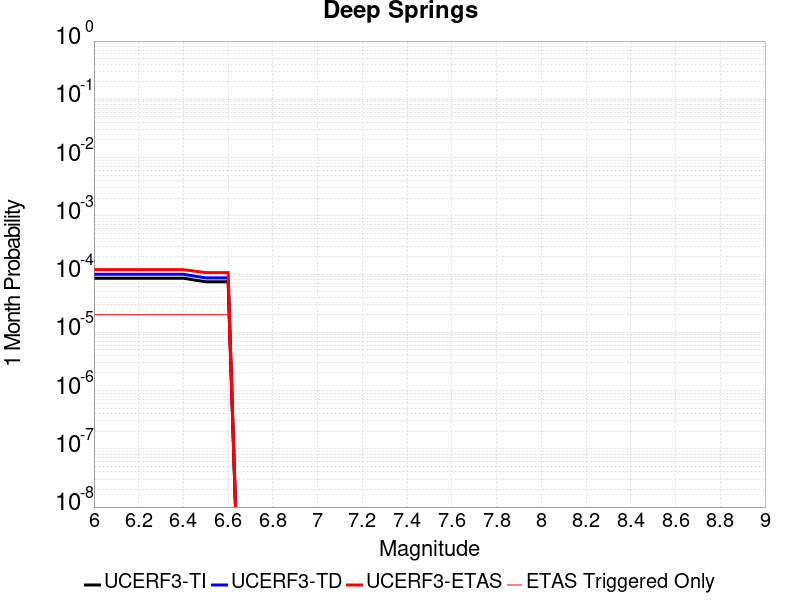 |  |  |

| Magnitude | 1 wk TI Prob | 1 wk TD Prob | 1 wk ETAS Prob | 1 wk ETAS/TD Gain | 1 wk ETAS Triggered Only | 1 mo TI Prob | 1 mo TD Prob | 1 mo ETAS Prob | 1 mo ETAS/TD Gain | 1 mo ETAS Triggered Only | 1 yr TI Prob | 1 yr TD Prob | 1 yr ETAS Prob | 1 yr ETAS/TD Gain | 1 yr ETAS Triggered Only | 10 yr TI Prob | 10 yr TD Prob | 10 yr ETAS Prob | 10 yr ETAS/TD Gain | 10 yr ETAS Triggered Only |
|-----|-----|-----|-----|-----|-----|-----|-----|-----|-----|-----|-----|-----|-----|-----|-----|-----|-----|-----|-----|-----|
| 6.0 | 1.9810619E-5 | 2.311303E-5 | 2.311303E-5 | 1.0 | 0.0 | 8.489989E-5 | 9.905495E-5 | 1.2489218E-4 | 1.2608374 | 2.5839794E-5 | 0.001033166 | 0.0012058346 | 0.0012316433 | 1.0214031 | 2.5839794E-5 | 0.010283757 | 0.01204269 | 0.012080983 | 1.0031798 | 3.875969E-5 |
| 6.1 | 1.9810619E-5 | 2.311303E-5 | 2.311303E-5 | 1.0 | 0.0 | 8.489989E-5 | 9.905495E-5 | 1.2489218E-4 | 1.2608374 | 2.5839794E-5 | 0.001033166 | 0.0012058346 | 0.0012316433 | 1.0214031 | 2.5839794E-5 | 0.010283757 | 0.01204269 | 0.012080983 | 1.0031798 | 3.875969E-5 |
| 6.2 | 1.9810619E-5 | 2.311303E-5 | 2.311303E-5 | 1.0 | 0.0 | 8.489989E-5 | 9.905495E-5 | 1.2489218E-4 | 1.2608374 | 2.5839794E-5 | 0.001033166 | 0.0012058346 | 0.0012316433 | 1.0214031 | 2.5839794E-5 | 0.010283757 | 0.01204269 | 0.012080983 | 1.0031798 | 3.875969E-5 |
| 6.3 | 1.9810619E-5 | 2.311303E-5 | 2.311303E-5 | 1.0 | 0.0 | 8.489989E-5 | 9.905495E-5 | 1.2489218E-4 | 1.2608374 | 2.5839794E-5 | 0.001033166 | 0.0012058346 | 0.0012316433 | 1.0214031 | 2.5839794E-5 | 0.010283757 | 0.01204269 | 0.012080983 | 1.0031798 | 3.875969E-5 |
| 6.4 | 1.9810619E-5 | 2.311303E-5 | 2.311303E-5 | 1.0 | 0.0 | 8.489989E-5 | 9.905495E-5 | 1.2489218E-4 | 1.2608374 | 2.5839794E-5 | 0.001033166 | 0.0012058346 | 0.0012316433 | 1.0214031 | 2.5839794E-5 | 0.010283757 | 0.01204269 | 0.012080983 | 1.0031798 | 3.875969E-5 |
| 6.5 | 1.7190405E-5 | 2.0050999E-5 | 2.0050999E-5 | 1.0 | 0.0 | 7.367108E-5 | 8.593285E-5 | 1.1177042E-4 | 1.3006717 | 2.5839794E-5 | 8.9657627E-4 | 0.0010462324 | 0.0010720452 | 1.0246722 | 2.5839794E-5 | 0.008929676 | 0.010462287 | 0.010500642 | 1.0036659 | 3.875969E-5 |
| 6.6 | 1.7190405E-5 | 2.0050999E-5 | 2.0050999E-5 | 1.0 | 0.0 | 7.367108E-5 | 8.593285E-5 | 1.1177042E-4 | 1.3006717 | 2.5839794E-5 | 8.9657627E-4 | 0.0010462324 | 0.0010720452 | 1.0246722 | 2.5839794E-5 | 0.008929676 | 0.010462287 | 0.010500642 | 1.0036659 | 3.875969E-5 |

## San Andreas (Big Bend)
*[(top)](#table-of-contents)*

| 1 Week | 1 Month | 1 Year | 10 Year |
|-----|-----|-----|-----|
|  |  |  |  |

| Magnitude | 1 wk TI Prob | 1 wk TD Prob | 1 wk ETAS Prob | 1 wk ETAS/TD Gain | 1 wk ETAS Triggered Only | 1 mo TI Prob | 1 mo TD Prob | 1 mo ETAS Prob | 1 mo ETAS/TD Gain | 1 mo ETAS Triggered Only | 1 yr TI Prob | 1 yr TD Prob | 1 yr ETAS Prob | 1 yr ETAS/TD Gain | 1 yr ETAS Triggered Only | 10 yr TI Prob | 10 yr TD Prob | 10 yr ETAS Prob | 10 yr ETAS/TD Gain | 10 yr ETAS Triggered Only |
|-----|-----|-----|-----|-----|-----|-----|-----|-----|-----|-----|-----|-----|-----|-----|-----|-----|-----|-----|-----|-----|
| 6.0 | 1.0179969E-4 | 2.0080687E-4 | 2.0080687E-4 | 1.0 | 0.0 | 4.362114E-4 | 8.60318E-4 | 8.732268E-4 | 1.0150046 | 1.2919897E-5 | 0.0052979486 | 0.010424351 | 0.010462707 | 1.0036794 | 3.875969E-5 | 0.051734097 | 0.1014857 | 0.10152052 | 1.0003432 | 3.875969E-5 |
| 6.1 | 1.0179969E-4 | 2.0080687E-4 | 2.0080687E-4 | 1.0 | 0.0 | 4.362114E-4 | 8.60318E-4 | 8.732268E-4 | 1.0150046 | 1.2919897E-5 | 0.0052979486 | 0.010424351 | 0.010462707 | 1.0036794 | 3.875969E-5 | 0.051734097 | 0.1014857 | 0.10152052 | 1.0003432 | 3.875969E-5 |
| 6.2 | 1.0179969E-4 | 2.0080687E-4 | 2.0080687E-4 | 1.0 | 0.0 | 4.362114E-4 | 8.60318E-4 | 8.732268E-4 | 1.0150046 | 1.2919897E-5 | 0.0052979486 | 0.010424351 | 0.010462707 | 1.0036794 | 3.875969E-5 | 0.051734097 | 0.1014857 | 0.10152052 | 1.0003432 | 3.875969E-5 |
| 6.3 | 1.0179969E-4 | 2.0080687E-4 | 2.0080687E-4 | 1.0 | 0.0 | 4.362114E-4 | 8.60318E-4 | 8.732268E-4 | 1.0150046 | 1.2919897E-5 | 0.0052979486 | 0.010424351 | 0.010462707 | 1.0036794 | 3.875969E-5 | 0.051734097 | 0.1014857 | 0.10152052 | 1.0003432 | 3.875969E-5 |
| 6.4 | 9.1639464E-5 | 1.8437792E-4 | 1.8437792E-4 | 1.0 | 0.0 | 3.9268145E-4 | 7.89952E-4 | 7.89952E-4 | 1.0 | 0.0 | 0.0047704205 | 0.009575372 | 0.009588168 | 1.0013363 | 1.2919897E-5 | 0.046693064 | 0.09381153 | 0.09382324 | 1.0001248 | 1.2919897E-5 |
| 6.5 | 9.1639464E-5 | 1.8437792E-4 | 1.8437792E-4 | 1.0 | 0.0 | 3.9268145E-4 | 7.89952E-4 | 7.89952E-4 | 1.0 | 0.0 | 0.0047704205 | 0.009575372 | 0.009588168 | 1.0013363 | 1.2919897E-5 | 0.046693064 | 0.09381153 | 0.09382324 | 1.0001248 | 1.2919897E-5 |
| 6.6 | 9.042622E-5 | 1.8244829E-4 | 1.8244829E-4 | 1.0 | 0.0 | 3.8748336E-4 | 7.8168715E-4 | 7.8168715E-4 | 1.0 | 0.0 | 0.0047074095 | 0.009475624 | 0.0094884215 | 1.0013505 | 1.2919897E-5 | 0.046089325 | 0.09290548 | 0.0929172 | 1.0001261 | 1.2919897E-5 |
| 6.7 | 8.9836685E-5 | 1.8159159E-4 | 1.8159159E-4 | 1.0 | 0.0 | 3.8495753E-4 | 7.7801774E-4 | 7.7801774E-4 | 1.0 | 0.0 | 0.00467679 | 0.009431336 | 0.009444134 | 1.001357 | 1.2919897E-5 | 0.045795817 | 0.09249973 | 0.09251146 | 1.0001267 | 1.2919897E-5 |
| 6.8 | 8.9471854E-5 | 1.8105932E-4 | 1.8105932E-4 | 1.0 | 0.0 | 3.8339442E-4 | 7.75738E-4 | 7.75738E-4 | 1.0 | 0.0 | 0.004657841 | 0.00940382 | 0.009416618 | 1.001361 | 1.2919897E-5 | 0.04561414 | 0.09224692 | 0.09225865 | 1.0001272 | 1.2919897E-5 |
| 6.9 | 8.858234E-5 | 1.7987892E-4 | 1.7987892E-4 | 1.0 | 0.0 | 3.7958333E-4 | 7.706821E-4 | 7.706821E-4 | 1.0 | 0.0 | 0.004611638 | 0.009342793 | 0.009355593 | 1.00137 | 1.2919897E-5 | 0.04517103 | 0.091686994 | 0.09169873 | 1.000128 | 1.2919897E-5 |
| 7.0 | 8.7433385E-5 | 1.7826671E-4 | 1.7826671E-4 | 1.0 | 0.0 | 3.746607E-4 | 7.6377665E-4 | 7.6377665E-4 | 1.0 | 0.0 | 0.004551957 | 0.009259437 | 0.009272238 | 1.0013824 | 1.2919897E-5 | 0.044598386 | 0.09092137 | 0.090933114 | 1.0001292 | 1.2919897E-5 |
| 7.1 | 8.684964E-5 | 1.7738611E-4 | 1.7738611E-4 | 1.0 | 0.0 | 3.7215967E-4 | 7.600049E-4 | 7.600049E-4 | 1.0 | 0.0 | 0.0045216335 | 0.009213906 | 0.009226707 | 1.0013893 | 1.2919897E-5 | 0.04430731 | 0.09050287 | 0.09051462 | 1.0001298 | 1.2919897E-5 |
| 7.2 | 8.606521E-5 | 1.7629213E-4 | 1.7629213E-4 | 1.0 | 0.0 | 3.6879873E-4 | 7.5531914E-4 | 7.5531914E-4 | 1.0 | 0.0 | 0.0044808835 | 0.009157337 | 0.009170139 | 1.001398 | 1.2919897E-5 | 0.043916024 | 0.08998334 | 0.08999509 | 1.0001307 | 1.2919897E-5 |
| 7.3 | 8.568266E-5 | 1.7571205E-4 | 1.7571205E-4 | 1.0 | 0.0 | 3.6715972E-4 | 7.528345E-4 | 7.528345E-4 | 1.0 | 0.0 | 0.0044610105 | 0.00912734 | 0.009140142 | 1.0014026 | 1.2919897E-5 | 0.043725148 | 0.08970444 | 0.089716196 | 1.0001311 | 1.2919897E-5 |
| 7.4 | 8.5432206E-5 | 1.7533782E-4 | 1.7533782E-4 | 1.0 | 0.0 | 3.6608664E-4 | 7.5123156E-4 | 7.5123156E-4 | 1.0 | 0.0 | 0.004447999 | 0.009107988 | 0.009120791 | 1.0014056 | 1.2919897E-5 | 0.043600157 | 0.08952458 | 0.08953635 | 1.0001314 | 1.2919897E-5 |
| 7.5 | 8.4791965E-5 | 1.7403076E-4 | 1.7403076E-4 | 1.0 | 0.0 | 3.633435E-4 | 7.4563315E-4 | 7.4563315E-4 | 1.0 | 0.0 | 0.0044147377 | 0.009040395 | 0.009053199 | 1.0014162 | 1.2919897E-5 | 0.043280575 | 0.0889021 | 0.08891387 | 1.0001324 | 1.2919897E-5 |
| 7.6 | 8.241105E-5 | 1.684837E-4 | 1.684837E-4 | 1.0 | 0.0 | 3.531424E-4 | 7.2187337E-4 | 7.2187337E-4 | 1.0 | 0.0 | 0.0042910352 | 0.008753479 | 0.008766286 | 1.001463 | 1.2919897E-5 | 0.042091176 | 0.08627858 | 0.08629038 | 1.0001369 | 1.2919897E-5 |
| 7.7 | 7.00432E-5 | 1.4211683E-4 | 1.4211683E-4 | 1.0 | 0.0 | 3.001506E-4 | 6.0893E-4 | 6.0893E-4 | 1.0 | 0.0 | 0.0036482112 | 0.007388561 | 0.007388561 | 1.0 | 0.0 | 0.035888977 | 0.07354971 | 0.07354971 | 1.0 | 0.0 |
| 7.8 | 6.415362E-5 | 1.297541E-4 | 1.297541E-4 | 1.0 | 0.0 | 2.749151E-4 | 5.5597053E-4 | 5.5597053E-4 | 1.0 | 0.0 | 0.0033419547 | 0.006747963 | 0.006747963 | 1.0 | 0.0 | 0.03292141 | 0.0672817 | 0.0672817 | 1.0 | 0.0 |
| 7.9 | 4.939911E-5 | 9.345801E-5 | 9.345801E-5 | 1.0 | 0.0 | 2.116933E-4 | 4.0047284E-4 | 4.0047284E-4 | 1.0 | 0.0 | 0.0025743195 | 0.0048648654 | 0.0048648654 | 1.0 | 0.0 | 0.025447013 | 0.048936196 | 0.048936196 | 1.0 | 0.0 |
| 8.0 | 3.344983E-5 | 5.225443E-5 | 5.225443E-5 | 1.0 | 0.0 | 1.4334853E-4 | 2.2392833E-4 | 2.2392833E-4 | 1.0 | 0.0 | 0.0017438711 | 0.0027229206 | 0.0027229206 | 1.0 | 0.0 | 0.017302496 | 0.02793573 | 0.02793573 | 1.0 | 0.0 |
| 8.1 | 1.9104898E-5 | 1.9186356E-5 | 1.9186356E-5 | 1.0 | 0.0 | 8.1875565E-5 | 8.222465E-5 | 8.222465E-5 | 1.0 | 0.0 | 9.963791E-4 | 0.001000626 | 0.001000626 | 1.0 | 0.0 | 0.009919235 | 0.010756767 | 0.010756767 | 1.0 | 0.0 |
| 8.2 | 8.643924E-6 | 5.4798497E-6 | 5.4798497E-6 | 1.0 | 0.0 | 3.704486E-5 | 2.348486E-5 | 2.348486E-5 | 1.0 | 0.0 | 4.5092785E-4 | 2.858907E-4 | 2.858907E-4 | 1.0 | 0.0 | 0.0045001395 | 0.0032514327 | 0.0032514327 | 1.0 | 0.0 |
| 8.3 | 1.983087E-6 | 7.668296E-7 | 7.668296E-7 | 1.0 | 0.0 | 8.498917E-6 | 3.2864084E-6 | 3.2864084E-6 | 1.0 | 0.0 | 1.034694E-4 | 4.0011306E-5 | 4.0011306E-5 | 1.0 | 0.0 | 0.0010342124 | 4.724499E-4 | 4.724499E-4 | 1.0 | 0.0 |

## White Wolf (Extension)
*[(top)](#table-of-contents)*

| 1 Week | 1 Month | 1 Year | 10 Year |
|-----|-----|-----|-----|
|  |  |  |  |

| Magnitude | 1 wk TI Prob | 1 wk TD Prob | 1 wk ETAS Prob | 1 wk ETAS/TD Gain | 1 wk ETAS Triggered Only | 1 mo TI Prob | 1 mo TD Prob | 1 mo ETAS Prob | 1 mo ETAS/TD Gain | 1 mo ETAS Triggered Only | 1 yr TI Prob | 1 yr TD Prob | 1 yr ETAS Prob | 1 yr ETAS/TD Gain | 1 yr ETAS Triggered Only | 10 yr TI Prob | 10 yr TD Prob | 10 yr ETAS Prob | 10 yr ETAS/TD Gain | 10 yr ETAS Triggered Only |
|-----|-----|-----|-----|-----|-----|-----|-----|-----|-----|-----|-----|-----|-----|-----|-----|-----|-----|-----|-----|-----|
| 6.0 | 8.222555E-6 | 6.0667057E-6 | 6.0667057E-6 | 1.0 | 0.0 | 3.5239045E-5 | 2.5999947E-5 | 2.5999947E-5 | 1.0 | 0.0 | 4.289509E-4 | 3.1650998E-4 | 3.1650998E-4 | 1.0 | 0.0 | 0.0042812387 | 0.0031612439 | 0.0031998812 | 1.0122222 | 3.875969E-5 |
| 6.1 | 8.222555E-6 | 6.0667057E-6 | 6.0667057E-6 | 1.0 | 0.0 | 3.5239045E-5 | 2.5999947E-5 | 2.5999947E-5 | 1.0 | 0.0 | 4.289509E-4 | 3.1650998E-4 | 3.1650998E-4 | 1.0 | 0.0 | 0.0042812387 | 0.0031612439 | 0.0031998812 | 1.0122222 | 3.875969E-5 |
| 6.2 | 8.222555E-6 | 6.0667057E-6 | 6.0667057E-6 | 1.0 | 0.0 | 3.5239045E-5 | 2.5999947E-5 | 2.5999947E-5 | 1.0 | 0.0 | 4.289509E-4 | 3.1650998E-4 | 3.1650998E-4 | 1.0 | 0.0 | 0.0042812387 | 0.0031612439 | 0.0031998812 | 1.0122222 | 3.875969E-5 |
| 6.3 | 8.222555E-6 | 6.0667057E-6 | 6.0667057E-6 | 1.0 | 0.0 | 3.5239045E-5 | 2.5999947E-5 | 2.5999947E-5 | 1.0 | 0.0 | 4.289509E-4 | 3.1650998E-4 | 3.1650998E-4 | 1.0 | 0.0 | 0.0042812387 | 0.0031612439 | 0.0031998812 | 1.0122222 | 3.875969E-5 |
| 6.4 | 5.821773E-6 | 3.5572016E-6 | 3.5572016E-6 | 1.0 | 0.0 | 2.4950215E-5 | 1.5245067E-5 | 1.5245067E-5 | 1.0 | 0.0 | 3.0372653E-4 | 1.8559398E-4 | 1.8559398E-4 | 1.0 | 0.0 | 0.0030331176 | 0.0018544982 | 0.001893186 | 1.0208616 | 3.875969E-5 |
| 6.5 | 5.766023E-6 | 3.4991353E-6 | 3.4991353E-6 | 1.0 | 0.0 | 2.4711293E-5 | 1.4996214E-5 | 1.4996214E-5 | 1.0 | 0.0 | 3.0081844E-4 | 1.8256472E-4 | 1.8256472E-4 | 1.0 | 0.0 | 0.0030041158 | 0.0018242556 | 0.0018629445 | 1.021208 | 3.875969E-5 |
| 6.6 | 4.643576E-6 | 2.332643E-6 | 2.332643E-6 | 1.0 | 0.0 | 1.9900888E-5 | 9.997005E-6 | 9.997005E-6 | 1.0 | 0.0 | 2.4226638E-4 | 1.2170716E-4 | 1.2170716E-4 | 1.0 | 0.0 | 0.0024200242 | 0.0012164476 | 0.0012422559 | 1.0212162 | 2.5839794E-5 |
| 6.7 | 3.9529173E-6 | 1.6483629E-6 | 1.6483629E-6 | 1.0 | 0.0 | 1.6940963E-5 | 7.064394E-6 | 7.064394E-6 | 1.0 | 0.0 | 2.0623671E-4 | 8.600579E-5 | 8.600579E-5 | 1.0 | 0.0 | 0.002060454 | 8.5974357E-4 | 8.7265234E-4 | 1.0150146 | 1.2919897E-5 |
| 6.8 | 3.4377522E-6 | 1.2245362E-6 | 1.2245362E-6 | 1.0 | 0.0 | 1.473314E-5 | 5.2480023E-6 | 5.2480023E-6 | 1.0 | 0.0 | 1.7936122E-4 | 6.389264E-5 | 6.389264E-5 | 1.0 | 0.0 | 0.0017921652 | 6.3875184E-4 | 6.516635E-4 | 1.0202138 | 1.2919897E-5 |
| 6.9 | 3.1367306E-6 | 1.0033893E-6 | 1.0033893E-6 | 1.0 | 0.0 | 1.3443062E-5 | 4.3002333E-6 | 4.3002333E-6 | 1.0 | 0.0 | 1.63657E-4 | 5.235416E-5 | 5.235416E-5 | 1.0 | 0.0 | 0.0016353652 | 5.234259E-4 | 5.36339E-4 | 1.0246704 | 1.2919897E-5 |
| 7.0 | 2.8298145E-6 | 7.4287595E-7 | 7.4287595E-7 | 1.0 | 0.0 | 1.2127721E-5 | 3.1837506E-6 | 3.1837506E-6 | 1.0 | 0.0 | 1.47645E-4 | 3.8761526E-5 | 3.8761526E-5 | 1.0 | 0.0 | 0.0014754693 | 3.8755263E-4 | 4.004675E-4 | 1.0333242 | 1.2919897E-5 |
| 7.1 | 2.4091064E-6 | 5.4228286E-7 | 5.4228286E-7 | 1.0 | 0.0 | 1.03247E-5 | 2.3240675E-6 | 2.3240675E-6 | 1.0 | 0.0 | 1.2569598E-4 | 2.8295197E-5 | 2.8295197E-5 | 1.0 | 0.0 | 0.001256249 | 2.8291997E-4 | 2.9583622E-4 | 1.0456533 | 1.2919897E-5 |
| 7.2 | 1.3875518E-6 | 1.07434374E-7 | 1.07434374E-7 | 1.0 | 0.0 | 5.9466374E-6 | 4.6043297E-7 | 4.6043297E-7 | 1.0 | 0.0 | 7.23979E-5 | 5.6057584E-6 | 5.6057584E-6 | 1.0 | 0.0 | 7.2374323E-4 | 5.605628E-5 | 5.605628E-5 | 1.0 | 0.0 |
| 7.3 | 7.056077E-7 | 5.0022493E-8 | 5.0022493E-8 | 1.0 | 0.0 | 3.0240296E-6 | 2.143821E-7 | 2.143821E-7 | 1.0 | 0.0 | 3.681694E-5 | 2.6100993E-6 | 2.6100993E-6 | 1.0 | 0.0 | 3.681084E-4 | 2.6100734E-5 | 2.6100734E-5 | 1.0 | 0.0 |
| 7.4 | 5.9334678E-8 | 4.8685624E-9 | 4.8685624E-9 | 1.0 | 0.0 | 2.5429145E-7 | 2.0865269E-8 | 2.0865269E-8 | 1.0 | 0.0 | 3.095994E-6 | 2.5403463E-7 | 2.5403463E-7 | 1.0 | 0.0 | 3.095951E-5 | 2.5403444E-6 | 2.5403444E-6 | 1.0 | 0.0 |

## Calico-Hidalgo
*[(top)](#table-of-contents)*

| 1 Week | 1 Month | 1 Year | 10 Year |
|-----|-----|-----|-----|
|  |  |  |  |

| Magnitude | 1 wk TI Prob | 1 wk TD Prob | 1 wk ETAS Prob | 1 wk ETAS/TD Gain | 1 wk ETAS Triggered Only | 1 mo TI Prob | 1 mo TD Prob | 1 mo ETAS Prob | 1 mo ETAS/TD Gain | 1 mo ETAS Triggered Only | 1 yr TI Prob | 1 yr TD Prob | 1 yr ETAS Prob | 1 yr ETAS/TD Gain | 1 yr ETAS Triggered Only | 10 yr TI Prob | 10 yr TD Prob | 10 yr ETAS Prob | 10 yr ETAS/TD Gain | 10 yr ETAS Triggered Only |
|-----|-----|-----|-----|-----|-----|-----|-----|-----|-----|-----|-----|-----|-----|-----|-----|-----|-----|-----|-----|-----|
| 6.0 | 4.0906612E-5 | 5.0704653E-5 | 5.0704653E-5 | 1.0 | 0.0 | 1.7530227E-4 | 2.1728984E-4 | 2.4312401E-4 | 1.1188927 | 2.5839794E-5 | 0.0021322158 | 0.0026426981 | 0.0026684697 | 1.0097519 | 2.5839794E-5 | 0.02111873 | 0.026153097 | 0.026190843 | 1.0014433 | 3.875969E-5 |
| 6.1 | 4.0906612E-5 | 5.0704653E-5 | 5.0704653E-5 | 1.0 | 0.0 | 1.7530227E-4 | 2.1728984E-4 | 2.4312401E-4 | 1.1188927 | 2.5839794E-5 | 0.0021322158 | 0.0026426981 | 0.0026684697 | 1.0097519 | 2.5839794E-5 | 0.02111873 | 0.026153097 | 0.026190843 | 1.0014433 | 3.875969E-5 |
| 6.2 | 4.0906612E-5 | 5.0704653E-5 | 5.0704653E-5 | 1.0 | 0.0 | 1.7530227E-4 | 2.1728984E-4 | 2.4312401E-4 | 1.1188927 | 2.5839794E-5 | 0.0021322158 | 0.0026426981 | 0.0026684697 | 1.0097519 | 2.5839794E-5 | 0.02111873 | 0.026153097 | 0.026190843 | 1.0014433 | 3.875969E-5 |
| 6.3 | 2.4242801E-5 | 3.009103E-5 | 3.009103E-5 | 1.0 | 0.0 | 1.0389358E-4 | 1.2895538E-4 | 1.418736E-4 | 1.100176 | 1.2919897E-5 | 0.0012641704 | 0.001568934 | 0.0015818336 | 1.0082219 | 1.2919897E-5 | 0.01257003 | 0.015582247 | 0.015607684 | 1.0016325 | 2.5839794E-5 |
| 6.4 | 2.4242801E-5 | 3.009103E-5 | 3.009103E-5 | 1.0 | 0.0 | 1.0389358E-4 | 1.2895538E-4 | 1.418736E-4 | 1.100176 | 1.2919897E-5 | 0.0012641704 | 0.001568934 | 0.0015818336 | 1.0082219 | 1.2919897E-5 | 0.01257003 | 0.015582247 | 0.015607684 | 1.0016325 | 2.5839794E-5 |
| 6.5 | 2.0286952E-5 | 2.5315985E-5 | 2.5315985E-5 | 1.0 | 0.0 | 8.694118E-5 | 1.0849266E-4 | 1.0849266E-4 | 1.0 | 0.0 | 0.0010579949 | 0.0013201149 | 0.0013201149 | 1.0 | 0.0 | 0.010529719 | 0.013124665 | 0.013137415 | 1.0009714 | 1.2919897E-5 |
| 6.6 | 2.0269223E-5 | 2.5296935E-5 | 2.5296935E-5 | 1.0 | 0.0 | 8.6865206E-5 | 1.08411026E-4 | 1.08411026E-4 | 1.0 | 0.0 | 0.0010570707 | 0.0013191222 | 0.0013191222 | 1.0 | 0.0 | 0.010520565 | 0.013114855 | 0.013127605 | 1.0009723 | 1.2919897E-5 |
| 6.7 | 1.799852E-5 | 2.25408E-5 | 2.25408E-5 | 1.0 | 0.0 | 7.713423E-5 | 9.6599935E-5 | 9.6599935E-5 | 1.0 | 0.0 | 9.3870464E-4 | 0.0011754843 | 0.0011754843 | 1.0 | 0.0 | 0.009347493 | 0.011694277 | 0.011707045 | 1.0010918 | 1.2919897E-5 |
| 6.8 | 1.7458793E-5 | 2.1842314E-5 | 2.1842314E-5 | 1.0 | 0.0 | 7.4821255E-5 | 9.3606635E-5 | 9.3606635E-5 | 1.0 | 0.0 | 9.10568E-4 | 0.0011390795 | 0.0011390795 | 1.0 | 0.0 | 0.009068459 | 0.011333993 | 0.011346767 | 1.001127 | 1.2919897E-5 |
| 6.9 | 1.542884E-5 | 1.9026087E-5 | 1.9026087E-5 | 1.0 | 0.0 | 6.612192E-5 | 8.1537895E-5 | 8.1537895E-5 | 1.0 | 0.0 | 8.04737E-4 | 9.92285E-4 | 9.92285E-4 | 1.0 | 0.0 | 0.008018291 | 0.00987994 | 0.009892733 | 1.0012947 | 1.2919897E-5 |
| 7.0 | 1.468253E-5 | 1.8030747E-5 | 1.8030747E-5 | 1.0 | 0.0 | 6.292361E-5 | 7.7272416E-5 | 7.7272416E-5 | 1.0 | 0.0 | 7.658257E-4 | 9.403986E-4 | 9.403986E-4 | 1.0 | 0.0 | 0.0076319184 | 0.009365558 | 0.009378357 | 1.0013666 | 1.2919897E-5 |
| 7.1 | 1.3139281E-5 | 1.620107E-5 | 1.620107E-5 | 1.0 | 0.0 | 5.6309986E-5 | 6.943138E-5 | 6.943138E-5 | 1.0 | 0.0 | 6.853584E-4 | 8.4501173E-4 | 8.4501173E-4 | 1.0 | 0.0 | 0.0068324856 | 0.008419285 | 0.008432095 | 1.0015216 | 1.2919897E-5 |
| 7.2 | 1.1127404E-5 | 1.3866703E-5 | 1.3866703E-5 | 1.0 | 0.0 | 4.7688E-5 | 5.9427435E-5 | 5.9427435E-5 | 1.0 | 0.0 | 5.8044674E-4 | 7.2329975E-4 | 7.2329975E-4 | 1.0 | 0.0 | 0.0057893298 | 0.0072105634 | 0.00722339 | 1.0017788 | 1.2919897E-5 |
| 7.3 | 9.808154E-6 | 1.2176301E-5 | 1.2176301E-5 | 1.0 | 0.0 | 4.2034266E-5 | 5.2183164E-5 | 5.2183164E-5 | 1.0 | 0.0 | 5.11647E-4 | 6.3515553E-4 | 6.3515553E-4 | 1.0 | 0.0 | 0.0051047057 | 0.0063344776 | 0.006347316 | 1.0020267 | 1.2919897E-5 |
| 7.4 | 7.942452E-6 | 9.7922075E-6 | 9.7922075E-6 | 1.0 | 0.0 | 3.4038632E-5 | 4.196598E-5 | 4.196598E-5 | 1.0 | 0.0 | 4.1434157E-4 | 5.1082554E-4 | 5.1082554E-4 | 1.0 | 0.0 | 0.0041356985 | 0.0050974544 | 0.0051103085 | 1.0025216 | 1.2919897E-5 |
| 7.5 | 4.7121216E-6 | 5.772871E-6 | 5.772871E-6 | 1.0 | 0.0 | 2.019465E-5 | 2.4740684E-5 | 2.4740684E-5 | 1.0 | 0.0 | 2.4584212E-4 | 3.0118387E-4 | 3.0118387E-4 | 1.0 | 0.0 | 0.0024557032 | 0.0030085093 | 0.0030213902 | 1.0042815 | 1.2919897E-5 |
| 7.6 | 2.21172E-7 | 2.6039737E-7 | 2.6039737E-7 | 1.0 | 0.0 | 9.478797E-7 | 1.1159884E-6 | 1.1159884E-6 | 1.0 | 0.0 | 1.1540374E-5 | 1.3587103E-5 | 1.3587103E-5 | 1.0 | 0.0 | 1.1539775E-4 | 1.3586554E-4 | 1.4878367E-4 | 1.0950804 | 1.2919897E-5 |

## Lake Isabella (Seismicity)
*[(top)](#table-of-contents)*

| 1 Week | 1 Month | 1 Year | 10 Year |
|-----|-----|-----|-----|
|  |  |  |  |

| Magnitude | 1 wk TI Prob | 1 wk TD Prob | 1 wk ETAS Prob | 1 wk ETAS/TD Gain | 1 wk ETAS Triggered Only | 1 mo TI Prob | 1 mo TD Prob | 1 mo ETAS Prob | 1 mo ETAS/TD Gain | 1 mo ETAS Triggered Only | 1 yr TI Prob | 1 yr TD Prob | 1 yr ETAS Prob | 1 yr ETAS/TD Gain | 1 yr ETAS Triggered Only | 10 yr TI Prob | 10 yr TD Prob | 10 yr ETAS Prob | 10 yr ETAS/TD Gain | 10 yr ETAS Triggered Only |
|-----|-----|-----|-----|-----|-----|-----|-----|-----|-----|-----|-----|-----|-----|-----|-----|-----|-----|-----|-----|-----|
| 6.0 | 9.431637E-6 | 9.741694E-6 | 9.741694E-6 | 1.0 | 0.0 | 4.0420677E-5 | 4.1749525E-5 | 5.466888E-5 | 1.3094492 | 1.2919897E-5 | 4.920106E-4 | 5.0819496E-4 | 5.4693496E-4 | 1.0762305 | 3.875969E-5 | 0.004909227 | 0.005071621 | 0.005110184 | 1.0076038 | 3.875969E-5 |
| 6.1 | 9.431637E-6 | 9.741694E-6 | 9.741694E-6 | 1.0 | 0.0 | 4.0420677E-5 | 4.1749525E-5 | 5.466888E-5 | 1.3094492 | 1.2919897E-5 | 4.920106E-4 | 5.0819496E-4 | 5.4693496E-4 | 1.0762305 | 3.875969E-5 | 0.004909227 | 0.005071621 | 0.005110184 | 1.0076038 | 3.875969E-5 |
| 6.2 | 9.431637E-6 | 9.741694E-6 | 9.741694E-6 | 1.0 | 0.0 | 4.0420677E-5 | 4.1749525E-5 | 5.466888E-5 | 1.3094492 | 1.2919897E-5 | 4.920106E-4 | 5.0819496E-4 | 5.4693496E-4 | 1.0762305 | 3.875969E-5 | 0.004909227 | 0.005071621 | 0.005110184 | 1.0076038 | 3.875969E-5 |
| 6.3 | 9.431637E-6 | 9.741694E-6 | 9.741694E-6 | 1.0 | 0.0 | 4.0420677E-5 | 4.1749525E-5 | 5.466888E-5 | 1.3094492 | 1.2919897E-5 | 4.920106E-4 | 5.0819496E-4 | 5.4693496E-4 | 1.0762305 | 3.875969E-5 | 0.004909227 | 0.005071621 | 0.005110184 | 1.0076038 | 3.875969E-5 |
| 6.4 | 5.144063E-6 | 5.3000977E-6 | 5.3000977E-6 | 1.0 | 0.0 | 2.2045799E-5 | 2.2714525E-5 | 2.2714525E-5 | 1.0 | 0.0 | 2.6837454E-4 | 2.765177E-4 | 3.0235035E-4 | 1.0934213 | 2.5839794E-5 | 0.0026805066 | 0.002762077 | 0.0027878452 | 1.0093293 | 2.5839794E-5 |
| 6.5 | 5.144063E-6 | 5.3000977E-6 | 5.3000977E-6 | 1.0 | 0.0 | 2.2045799E-5 | 2.2714525E-5 | 2.2714525E-5 | 1.0 | 0.0 | 2.6837454E-4 | 2.765177E-4 | 3.0235035E-4 | 1.0934213 | 2.5839794E-5 | 0.0026805066 | 0.002762077 | 0.0027878452 | 1.0093293 | 2.5839794E-5 |
| 6.6 | 3.4009804E-6 | 3.4987995E-6 | 3.4987995E-6 | 1.0 | 0.0 | 1.4575549E-5 | 1.4994778E-5 | 1.4994778E-5 | 1.0 | 0.0 | 1.7744285E-4 | 1.8254772E-4 | 1.9546527E-4 | 1.0707625 | 1.2919897E-5 | 0.0017730123 | 0.0018241355 | 0.0018370319 | 1.0070698 | 1.2919897E-5 |
| 6.7 | 3.3880428E-6 | 3.4856662E-6 | 3.4856662E-6 | 1.0 | 0.0 | 1.4520103E-5 | 1.4938492E-5 | 1.4938492E-5 | 1.0 | 0.0 | 1.767679E-4 | 1.8186258E-4 | 1.9478012E-4 | 1.0710292 | 1.2919897E-5 | 0.0017662736 | 0.0018172951 | 0.0018301916 | 1.0070965 | 1.2919897E-5 |
| 6.8 | 2.6582E-6 | 2.7337105E-6 | 2.7337105E-6 | 1.0 | 0.0 | 1.1392236E-5 | 1.1715857E-5 | 1.1715857E-5 | 1.0 | 0.0 | 1.3869164E-4 | 1.4263256E-4 | 1.5555062E-4 | 1.0905688 | 1.2919897E-5 | 0.0013860512 | 0.0014255423 | 0.0014384438 | 1.0090503 | 1.2919897E-5 |
| 6.9 | 2.406011E-6 | 2.474338E-6 | 2.474338E-6 | 1.0 | 0.0 | 1.0311434E-5 | 1.0604271E-5 | 1.0604271E-5 | 1.0 | 0.0 | 1.2553448E-4 | 1.2910066E-4 | 1.420189E-4 | 1.1000632 | 1.2919897E-5 | 0.0012546359 | 0.0012903863 | 0.0013032896 | 1.0099995 | 1.2919897E-5 |
| 7.0 | 1.6953097E-6 | 1.7429437E-6 | 1.7429437E-6 | 1.0 | 0.0 | 7.265593E-6 | 7.469743E-6 | 7.469743E-6 | 1.0 | 0.0 | 8.8455E-5 | 9.094137E-5 | 9.094137E-5 | 1.0 | 0.0 | 8.84198E-4 | 9.0914435E-4 | 9.0914435E-4 | 1.0 | 0.0 |
| 7.1 | 3.5013824E-7 | 3.571492E-7 | 3.571492E-7 | 1.0 | 0.0 | 1.5005916E-6 | 1.5306384E-6 | 1.5306384E-6 | 1.0 | 0.0 | 1.826955E-5 | 1.8635366E-5 | 1.8635366E-5 | 1.0 | 0.0 | 1.8268047E-4 | 1.863383E-4 | 1.863383E-4 | 1.0 | 0.0 |
| 7.2 | 2.2321095E-7 | 2.2750632E-7 | 2.2750632E-7 | 1.0 | 0.0 | 9.56618E-7 | 9.750268E-7 | 9.750268E-7 | 1.0 | 0.0 | 1.1646762E-5 | 1.1870887E-5 | 1.1870887E-5 | 1.0 | 0.0 | 1.1646151E-4 | 1.1870263E-4 | 1.1870263E-4 | 1.0 | 0.0 |
| 7.3 | 1.5760406E-7 | 1.6060963E-7 | 1.6060963E-7 | 1.0 | 0.0 | 6.7544585E-7 | 6.883268E-7 | 6.883268E-7 | 1.0 | 0.0 | 8.223522E-6 | 8.380347E-6 | 8.380347E-6 | 1.0 | 0.0 | 8.2232174E-5 | 8.3800376E-5 | 8.3800376E-5 | 1.0 | 0.0 |
| 7.4 | 1.1216497E-7 | 1.1431735E-7 | 1.1431735E-7 | 1.0 | 0.0 | 4.8070694E-7 | 4.8993144E-7 | 4.8993144E-7 | 1.0 | 0.0 | 5.852591E-6 | 5.964899E-6 | 5.964899E-6 | 1.0 | 0.0 | 5.8524372E-5 | 5.9647435E-5 | 5.9647435E-5 | 1.0 | 0.0 |
| 7.5 | 4.885185E-8 | 4.9787864E-8 | 4.9787864E-8 | 1.0 | 0.0 | 2.0936506E-7 | 2.1337654E-7 | 2.1337654E-7 | 1.0 | 0.0 | 2.5490165E-6 | 2.5978566E-6 | 2.5978566E-6 | 1.0 | 0.0 | 2.5489873E-5 | 2.597828E-5 | 2.597828E-5 | 1.0 | 0.0 |
| 7.6 | 1.504641E-9 | 1.5317939E-9 | 1.5317939E-9 | 1.0 | 0.0 | 6.4484613E-9 | 6.5648313E-9 | 6.5648313E-9 | 1.0 | 0.0 | 7.851001E-8 | 7.992682E-8 | 7.992682E-8 | 1.0 | 0.0 | 7.8509987E-7 | 7.992682E-7 | 7.992682E-7 | 1.0 | 0.0 |

## Garlic Springs
*[(top)](#table-of-contents)*

| 1 Week | 1 Month | 1 Year | 10 Year |
|-----|-----|-----|-----|
|  | 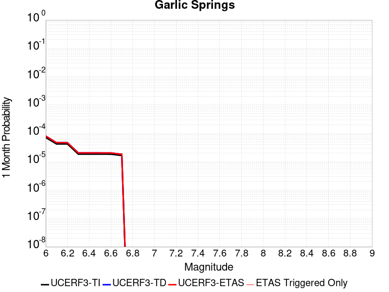 |  |  |

| Magnitude | 1 wk TI Prob | 1 wk TD Prob | 1 wk ETAS Prob | 1 wk ETAS/TD Gain | 1 wk ETAS Triggered Only | 1 mo TI Prob | 1 mo TD Prob | 1 mo ETAS Prob | 1 mo ETAS/TD Gain | 1 mo ETAS Triggered Only | 1 yr TI Prob | 1 yr TD Prob | 1 yr ETAS Prob | 1 yr ETAS/TD Gain | 1 yr ETAS Triggered Only | 10 yr TI Prob | 10 yr TD Prob | 10 yr ETAS Prob | 10 yr ETAS/TD Gain | 10 yr ETAS Triggered Only |
|-----|-----|-----|-----|-----|-----|-----|-----|-----|-----|-----|-----|-----|-----|-----|-----|-----|-----|-----|-----|-----|
| 6.0 | 1.6760017E-5 | 1.8777133E-5 | 1.8777133E-5 | 1.0 | 0.0 | 7.182667E-5 | 8.0471604E-5 | 8.0471604E-5 | 1.0 | 0.0 | 8.7413884E-4 | 9.794189E-4 | 9.923261E-4 | 1.0131785 | 1.2919897E-5 | 0.008707083 | 0.009762568 | 0.009800949 | 1.0039315 | 3.875969E-5 |
| 6.1 | 9.852767E-6 | 1.0973752E-5 | 1.0973752E-5 | 1.0 | 0.0 | 4.222546E-5 | 4.702992E-5 | 4.702992E-5 | 1.0 | 0.0 | 5.139737E-4 | 5.7250983E-4 | 5.7250983E-4 | 1.0 | 0.0 | 0.005127866 | 0.0057173073 | 0.0057429997 | 1.0044937 | 2.5839794E-5 |
| 6.2 | 9.852767E-6 | 1.0973752E-5 | 1.0973752E-5 | 1.0 | 0.0 | 4.222546E-5 | 4.702992E-5 | 4.702992E-5 | 1.0 | 0.0 | 5.139737E-4 | 5.7250983E-4 | 5.7250983E-4 | 1.0 | 0.0 | 0.005127866 | 0.0057173073 | 0.0057429997 | 1.0044937 | 2.5839794E-5 |
| 6.3 | 4.3167724E-6 | 4.7780964E-6 | 4.7780964E-6 | 1.0 | 0.0 | 1.8500323E-5 | 2.0477524E-5 | 2.0477524E-5 | 1.0 | 0.0 | 2.2521814E-4 | 2.4930836E-4 | 2.4930836E-4 | 1.0 | 0.0 | 0.0022499003 | 0.0024925452 | 0.002505433 | 1.0051705 | 1.2919897E-5 |
| 6.4 | 4.3167724E-6 | 4.7780964E-6 | 4.7780964E-6 | 1.0 | 0.0 | 1.8500323E-5 | 2.0477524E-5 | 2.0477524E-5 | 1.0 | 0.0 | 2.2521814E-4 | 2.4930836E-4 | 2.4930836E-4 | 1.0 | 0.0 | 0.0022499003 | 0.0024925452 | 0.002505433 | 1.0051705 | 1.2919897E-5 |
| 6.5 | 4.3167724E-6 | 4.7780964E-6 | 4.7780964E-6 | 1.0 | 0.0 | 1.8500323E-5 | 2.0477524E-5 | 2.0477524E-5 | 1.0 | 0.0 | 2.2521814E-4 | 2.4930836E-4 | 2.4930836E-4 | 1.0 | 0.0 | 0.0022499003 | 0.0024925452 | 0.002505433 | 1.0051705 | 1.2919897E-5 |
| 6.6 | 4.301311E-6 | 4.7609647E-6 | 4.7609647E-6 | 1.0 | 0.0 | 1.8434059E-5 | 2.0404104E-5 | 2.0404104E-5 | 1.0 | 0.0 | 2.2441156E-4 | 2.4841467E-4 | 2.4841467E-4 | 1.0 | 0.0 | 0.0022418506 | 0.0024836282 | 0.002496516 | 1.0051891 | 1.2919897E-5 |
| 6.7 | 3.8599724E-6 | 4.2711204E-6 | 4.2711204E-6 | 1.0 | 0.0 | 1.6542634E-5 | 1.8304801E-5 | 1.8304801E-5 | 1.0 | 0.0 | 2.0138794E-4 | 2.2286095E-4 | 2.2286095E-4 | 1.0 | 0.0 | 0.0020120554 | 0.0022286095 | 0.0022415007 | 1.0057844 | 1.2919897E-5 |

## San Andreas (North Branch Mill Creek)
*[(top)](#table-of-contents)*

| 1 Week | 1 Month | 1 Year | 10 Year |
|-----|-----|-----|-----|
|  |  | 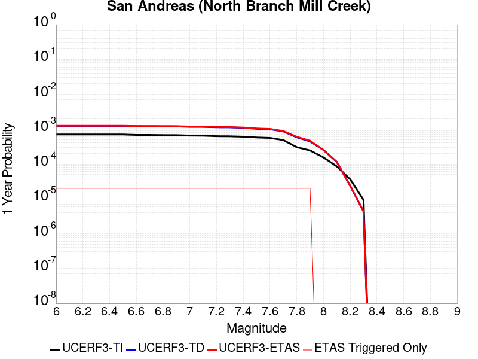 |  |

| Magnitude | 1 wk TI Prob | 1 wk TD Prob | 1 wk ETAS Prob | 1 wk ETAS/TD Gain | 1 wk ETAS Triggered Only | 1 mo TI Prob | 1 mo TD Prob | 1 mo ETAS Prob | 1 mo ETAS/TD Gain | 1 mo ETAS Triggered Only | 1 yr TI Prob | 1 yr TD Prob | 1 yr ETAS Prob | 1 yr ETAS/TD Gain | 1 yr ETAS Triggered Only | 10 yr TI Prob | 10 yr TD Prob | 10 yr ETAS Prob | 10 yr ETAS/TD Gain | 10 yr ETAS Triggered Only |
|-----|-----|-----|-----|-----|-----|-----|-----|-----|-----|-----|-----|-----|-----|-----|-----|-----|-----|-----|-----|-----|
| 6.0 | 1.3461156E-5 | 2.3506776E-5 | 2.3506776E-5 | 1.0 | 0.0 | 5.7689394E-5 | 1.0073945E-4 | 1.0073945E-4 | 1.0 | 0.0 | 7.02142E-4 | 0.0012258161 | 0.0012387201 | 1.0105269 | 1.2919897E-5 | 0.0069992766 | 0.012233093 | 0.012271379 | 1.0031297 | 3.875969E-5 |
| 6.1 | 1.3461156E-5 | 2.3506776E-5 | 2.3506776E-5 | 1.0 | 0.0 | 5.7689394E-5 | 1.0073945E-4 | 1.0073945E-4 | 1.0 | 0.0 | 7.02142E-4 | 0.0012258161 | 0.0012387201 | 1.0105269 | 1.2919897E-5 | 0.0069992766 | 0.012233093 | 0.012271379 | 1.0031297 | 3.875969E-5 |
| 6.2 | 1.3461156E-5 | 2.3506776E-5 | 2.3506776E-5 | 1.0 | 0.0 | 5.7689394E-5 | 1.0073945E-4 | 1.0073945E-4 | 1.0 | 0.0 | 7.02142E-4 | 0.0012258161 | 0.0012387201 | 1.0105269 | 1.2919897E-5 | 0.0069992766 | 0.012233093 | 0.012271379 | 1.0031297 | 3.875969E-5 |
| 6.3 | 1.3461156E-5 | 2.3506776E-5 | 2.3506776E-5 | 1.0 | 0.0 | 5.7689394E-5 | 1.0073945E-4 | 1.0073945E-4 | 1.0 | 0.0 | 7.02142E-4 | 0.0012258161 | 0.0012387201 | 1.0105269 | 1.2919897E-5 | 0.0069992766 | 0.012233093 | 0.012271379 | 1.0031297 | 3.875969E-5 |
| 6.4 | 1.3461156E-5 | 2.3506776E-5 | 2.3506776E-5 | 1.0 | 0.0 | 5.7689394E-5 | 1.0073945E-4 | 1.0073945E-4 | 1.0 | 0.0 | 7.02142E-4 | 0.0012258161 | 0.0012387201 | 1.0105269 | 1.2919897E-5 | 0.0069992766 | 0.012233093 | 0.012271379 | 1.0031297 | 3.875969E-5 |
| 6.5 | 1.3450706E-5 | 2.3495735E-5 | 2.3495735E-5 | 1.0 | 0.0 | 5.764461E-5 | 1.0069214E-4 | 1.0069214E-4 | 1.0 | 0.0 | 7.0159714E-4 | 0.0012252406 | 0.0012381447 | 1.0105319 | 1.2919897E-5 | 0.006993862 | 0.012227403 | 0.012265689 | 1.0031312 | 3.875969E-5 |
| 6.6 | 1.3074523E-5 | 2.3110017E-5 | 2.3110017E-5 | 1.0 | 0.0 | 5.6032466E-5 | 9.9039185E-5 | 9.9039185E-5 | 1.0 | 0.0 | 6.8198174E-4 | 0.0012051383 | 0.0012180426 | 1.0107077 | 1.2919897E-5 | 0.006798926 | 0.0120285675 | 0.012066861 | 1.0031835 | 3.875969E-5 |
| 6.7 | 1.3050216E-5 | 2.3085311E-5 | 2.3085311E-5 | 1.0 | 0.0 | 5.59283E-5 | 9.893332E-5 | 9.893332E-5 | 1.0 | 0.0 | 6.8071426E-4 | 0.0012038508 | 0.0012167551 | 1.0107192 | 1.2919897E-5 | 0.0067863287 | 0.012015832 | 0.012054126 | 1.003187 | 3.875969E-5 |
| 6.8 | 1.29049395E-5 | 2.293372E-5 | 2.293372E-5 | 1.0 | 0.0 | 5.530571E-5 | 9.828369E-5 | 9.828369E-5 | 1.0 | 0.0 | 6.73139E-4 | 0.0011959502 | 0.0012088546 | 1.0107901 | 1.2919897E-5 | 0.0067110364 | 0.011937677 | 0.011975974 | 1.003208 | 3.875969E-5 |
| 6.9 | 1.2867369E-5 | 2.2893122E-5 | 2.2893122E-5 | 1.0 | 0.0 | 5.51447E-5 | 9.810971E-5 | 9.810971E-5 | 1.0 | 0.0 | 6.711799E-4 | 0.0011938344 | 0.0012067389 | 1.0108093 | 1.2919897E-5 | 0.006691564 | 0.011916745 | 0.011955043 | 1.0032138 | 3.875969E-5 |
| 7.0 | 1.2495996E-5 | 2.2293154E-5 | 2.2293154E-5 | 1.0 | 0.0 | 5.3553173E-5 | 9.5538606E-5 | 9.5538606E-5 | 1.0 | 0.0 | 6.518148E-4 | 0.0011625647 | 0.0011754696 | 1.0111003 | 1.2919897E-5 | 0.0064990623 | 0.011607327 | 0.0116456365 | 1.0033004 | 3.875969E-5 |
| 7.1 | 1.2452067E-5 | 2.2238226E-5 | 2.2238226E-5 | 1.0 | 0.0 | 5.3364907E-5 | 9.5303214E-5 | 9.5303214E-5 | 1.0 | 0.0 | 6.4952404E-4 | 0.0011597018 | 0.0011726068 | 1.0111278 | 1.2919897E-5 | 0.0064762887 | 0.011578998 | 0.0116173085 | 1.0033087 | 3.875969E-5 |
| 7.2 | 1.2002777E-5 | 2.1616754E-5 | 2.1616754E-5 | 1.0 | 0.0 | 5.143946E-5 | 9.263996E-5 | 9.263996E-5 | 1.0 | 0.0 | 6.2609545E-4 | 0.0011273106 | 0.0011402159 | 1.0114479 | 1.2919897E-5 | 0.006243344 | 0.011258403 | 0.011296726 | 1.003404 | 3.875969E-5 |
| 7.3 | 1.1923425E-5 | 2.1486576E-5 | 2.1486576E-5 | 1.0 | 0.0 | 5.109939E-5 | 9.208209E-5 | 9.208209E-5 | 1.0 | 0.0 | 6.219575E-4 | 0.0011205255 | 0.001133431 | 1.0115173 | 1.2919897E-5 | 0.0062021962 | 0.011191265 | 0.0112295905 | 1.0034246 | 3.875969E-5 |
| 7.4 | 1.16105175E-5 | 2.0860489E-5 | 2.0860489E-5 | 1.0 | 0.0 | 4.975841E-5 | 8.9399044E-5 | 8.9399044E-5 | 1.0 | 0.0 | 6.0564023E-4 | 0.0010878925 | 0.0011007984 | 1.0118631 | 1.2919897E-5 | 0.006039923 | 0.01086884 | 0.010907178 | 1.0035274 | 3.875969E-5 |
| 7.5 | 1.1037265E-5 | 1.956039E-5 | 1.956039E-5 | 1.0 | 0.0 | 4.7301706E-5 | 8.382756E-5 | 8.382756E-5 | 1.0 | 0.0 | 5.757461E-4 | 0.0010201249 | 0.0010330315 | 1.012652 | 1.2919897E-5 | 0.005742567 | 0.010198223 | 0.010236588 | 1.0037619 | 3.875969E-5 |
| 7.6 | 1.0720915E-5 | 1.900222E-5 | 1.900222E-5 | 1.0 | 0.0 | 4.5945973E-5 | 8.143555E-5 | 8.143555E-5 | 1.0 | 0.0 | 5.592486E-4 | 9.910291E-4 | 0.0010039362 | 1.013024 | 1.2919897E-5 | 0.005578433 | 0.009909907 | 0.0099482825 | 1.0038724 | 3.875969E-5 |
| 7.7 | 9.276279E-6 | 1.6447744E-5 | 1.6447744E-5 | 1.0 | 0.0 | 3.9754876E-5 | 7.048844E-5 | 7.048844E-5 | 1.0 | 0.0 | 4.839081E-4 | 8.578605E-4 | 8.707693E-4 | 1.0150477 | 1.2919897E-5 | 0.0048285574 | 0.008589173 | 0.008627599 | 1.0044738 | 3.875969E-5 |
| 7.8 | 5.8346777E-6 | 1.1159965E-5 | 1.1159965E-5 | 1.0 | 0.0 | 2.5005522E-5 | 4.7827543E-5 | 4.7827543E-5 | 1.0 | 0.0 | 3.043997E-4 | 5.821449E-4 | 5.9505727E-4 | 1.0221807 | 1.2919897E-5 | 0.0030398308 | 0.005849473 | 0.005888006 | 1.0065874 | 3.875969E-5 |
| 7.9 | 4.690204E-6 | 8.513225E-6 | 8.513225E-6 | 1.0 | 0.0 | 2.0100719E-5 | 3.648474E-5 | 3.648474E-5 | 1.0 | 0.0 | 2.4469878E-4 | 4.4411127E-4 | 4.5702542E-4 | 1.0290786 | 1.2919897E-5 | 0.002444295 | 0.0044728746 | 0.0045114607 | 1.0086267 | 3.875969E-5 |
| 8.0 | 2.9570454E-6 | 4.8494758E-6 | 4.8494758E-6 | 1.0 | 0.0 | 1.267299E-5 | 2.0783302E-5 | 2.0783302E-5 | 1.0 | 0.0 | 1.5428272E-4 | 2.5300734E-4 | 2.5300734E-4 | 1.0 | 0.0 | 0.0015417566 | 0.0025509594 | 0.0025638463 | 1.0050519 | 1.2919897E-5 |
| 8.1 | 1.6376824E-6 | 2.198225E-6 | 2.198225E-6 | 1.0 | 0.0 | 7.01862E-6 | 9.420931E-6 | 9.420931E-6 | 1.0 | 0.0 | 8.544835E-5 | 1.1469381E-4 | 1.1469381E-4 | 1.0 | 0.0 | 8.54155E-4 | 0.0011613552 | 0.0011613552 | 1.0 | 0.0 |
| 8.2 | 6.9631557E-7 | 4.5401492E-7 | 4.5401492E-7 | 1.0 | 0.0 | 2.984206E-6 | 1.9457768E-6 | 1.9457768E-6 | 1.0 | 0.0 | 3.63321E-5 | 2.3689576E-5 | 2.3689576E-5 | 1.0 | 0.0 | 3.6326164E-4 | 2.453756E-4 | 2.453756E-4 | 1.0 | 0.0 |
| 8.3 | 1.7876137E-7 | 8.368747E-8 | 8.368747E-8 | 1.0 | 0.0 | 7.661199E-7 | 3.5866054E-7 | 3.5866054E-7 | 1.0 | 0.0 | 9.32747E-6 | 4.3666837E-6 | 4.3666837E-6 | 1.0 | 0.0 | 9.3270784E-5 | 4.5861943E-5 | 4.5861943E-5 | 1.0 | 0.0 |

## Red Pass
*[(top)](#table-of-contents)*

| 1 Week | 1 Month | 1 Year | 10 Year |
|-----|-----|-----|-----|
|  |  |  |  |

| Magnitude | 1 wk TI Prob | 1 wk TD Prob | 1 wk ETAS Prob | 1 wk ETAS/TD Gain | 1 wk ETAS Triggered Only | 1 mo TI Prob | 1 mo TD Prob | 1 mo ETAS Prob | 1 mo ETAS/TD Gain | 1 mo ETAS Triggered Only | 1 yr TI Prob | 1 yr TD Prob | 1 yr ETAS Prob | 1 yr ETAS/TD Gain | 1 yr ETAS Triggered Only | 10 yr TI Prob | 10 yr TD Prob | 10 yr ETAS Prob | 10 yr ETAS/TD Gain | 10 yr ETAS Triggered Only |
|-----|-----|-----|-----|-----|-----|-----|-----|-----|-----|-----|-----|-----|-----|-----|-----|-----|-----|-----|-----|-----|
| 6.0 | 8.258278E-6 | 8.551305E-6 | 8.551305E-6 | 1.0 | 0.0 | 3.539214E-5 | 3.6648038E-5 | 3.6648038E-5 | 1.0 | 0.0 | 4.308141E-4 | 4.4611638E-4 | 4.4611638E-4 | 1.0 | 0.0 | 0.0042997985 | 0.004453966 | 0.0044796905 | 1.0057757 | 2.5839794E-5 |
| 6.1 | 3.649988E-6 | 3.7753332E-6 | 3.7753332E-6 | 1.0 | 0.0 | 1.5642712E-5 | 1.6179927E-5 | 1.6179927E-5 | 1.0 | 0.0 | 1.9043336E-4 | 1.9697756E-4 | 1.9697756E-4 | 1.0 | 0.0 | 0.0019027026 | 0.001968497 | 0.0019813913 | 1.0065504 | 1.2919897E-5 |
| 6.2 | 3.649988E-6 | 3.7753332E-6 | 3.7753332E-6 | 1.0 | 0.0 | 1.5642712E-5 | 1.6179927E-5 | 1.6179927E-5 | 1.0 | 0.0 | 1.9043336E-4 | 1.9697756E-4 | 1.9697756E-4 | 1.0 | 0.0 | 0.0019027026 | 0.001968497 | 0.0019813913 | 1.0065504 | 1.2919897E-5 |
| 6.3 | 1.3924937E-6 | 1.4411233E-6 | 1.4411233E-6 | 1.0 | 0.0 | 5.9678164E-6 | 6.176236E-6 | 6.176236E-6 | 1.0 | 0.0 | 7.265574E-5 | 7.51945E-5 | 7.51945E-5 | 1.0 | 0.0 | 7.263199E-4 | 7.518293E-4 | 7.6473947E-4 | 1.0171717 | 1.2919897E-5 |
| 6.4 | 1.3924937E-6 | 1.4411233E-6 | 1.4411233E-6 | 1.0 | 0.0 | 5.9678164E-6 | 6.176236E-6 | 6.176236E-6 | 1.0 | 0.0 | 7.265574E-5 | 7.51945E-5 | 7.51945E-5 | 1.0 | 0.0 | 7.263199E-4 | 7.518293E-4 | 7.6473947E-4 | 1.0171717 | 1.2919897E-5 |
| 6.5 | 9.876812E-7 | 1.022196E-6 | 1.022196E-6 | 1.0 | 0.0 | 4.2329125E-6 | 4.38084E-6 | 4.38084E-6 | 1.0 | 0.0 | 5.153449E-5 | 5.3336724E-5 | 5.3336724E-5 | 1.0 | 0.0 | 5.1522546E-4 | 5.333672E-4 | 5.333672E-4 | 1.0 | 0.0 |

## Elsinore (Glen Ivy) rev
*[(top)](#table-of-contents)*

| 1 Week | 1 Month | 1 Year | 10 Year |
|-----|-----|-----|-----|
|  |  |  |  |

| Magnitude | 1 wk TI Prob | 1 wk TD Prob | 1 wk ETAS Prob | 1 wk ETAS/TD Gain | 1 wk ETAS Triggered Only | 1 mo TI Prob | 1 mo TD Prob | 1 mo ETAS Prob | 1 mo ETAS/TD Gain | 1 mo ETAS Triggered Only | 1 yr TI Prob | 1 yr TD Prob | 1 yr ETAS Prob | 1 yr ETAS/TD Gain | 1 yr ETAS Triggered Only | 10 yr TI Prob | 10 yr TD Prob | 10 yr ETAS Prob | 10 yr ETAS/TD Gain | 10 yr ETAS Triggered Only |
|-----|-----|-----|-----|-----|-----|-----|-----|-----|-----|-----|-----|-----|-----|-----|-----|-----|-----|-----|-----|-----|
| 6.0 | 1.6204086E-4 | 2.9362022E-4 | 2.9362022E-4 | 1.0 | 0.0 | 6.94276E-4 | 0.0012579202 | 0.0012708238 | 1.010258 | 1.2919897E-5 | 0.008420097 | 0.015235162 | 0.015247885 | 1.0008351 | 1.2919897E-5 | 0.081081145 | 0.13969512 | 0.13971736 | 1.0001591 | 2.5839794E-5 |
| 6.1 | 1.6204086E-4 | 2.9362022E-4 | 2.9362022E-4 | 1.0 | 0.0 | 6.94276E-4 | 0.0012579202 | 0.0012708238 | 1.010258 | 1.2919897E-5 | 0.008420097 | 0.015235162 | 0.015247885 | 1.0008351 | 1.2919897E-5 | 0.081081145 | 0.13969512 | 0.13971736 | 1.0001591 | 2.5839794E-5 |
| 6.2 | 1.6204086E-4 | 2.9362022E-4 | 2.9362022E-4 | 1.0 | 0.0 | 6.94276E-4 | 0.0012579202 | 0.0012708238 | 1.010258 | 1.2919897E-5 | 0.008420097 | 0.015235162 | 0.015247885 | 1.0008351 | 1.2919897E-5 | 0.081081145 | 0.13969512 | 0.13971736 | 1.0001591 | 2.5839794E-5 |
| 6.3 | 1.0111737E-4 | 1.7703768E-4 | 1.7703768E-4 | 1.0 | 0.0 | 4.332882E-4 | 7.58629E-4 | 7.715391E-4 | 1.0170177 | 1.2919897E-5 | 0.005262531 | 0.0092178825 | 0.009230684 | 1.0013887 | 1.2919897E-5 | 0.0513964 | 0.08702082 | 0.08704442 | 1.0002711 | 2.5839794E-5 |
| 6.4 | 1.0111737E-4 | 1.7703768E-4 | 1.7703768E-4 | 1.0 | 0.0 | 4.332882E-4 | 7.58629E-4 | 7.715391E-4 | 1.0170177 | 1.2919897E-5 | 0.005262531 | 0.0092178825 | 0.009230684 | 1.0013887 | 1.2919897E-5 | 0.0513964 | 0.08702082 | 0.08704442 | 1.0002711 | 2.5839794E-5 |
| 6.5 | 3.6624708E-5 | 4.639301E-5 | 4.639301E-5 | 1.0 | 0.0 | 1.569536E-4 | 1.9881407E-4 | 1.9881407E-4 | 1.0 | 0.0 | 0.001909235 | 0.0024182373 | 0.0024182373 | 1.0 | 0.0 | 0.01892915 | 0.023740914 | 0.023740914 | 1.0 | 0.0 |
| 6.6 | 2.5051324E-5 | 2.614908E-5 | 2.614908E-5 | 1.0 | 0.0 | 1.073584E-4 | 1.1206293E-4 | 1.1206293E-4 | 1.0 | 0.0 | 0.0013063047 | 0.0013635567 | 0.0013635567 | 1.0 | 0.0 | 0.012986525 | 0.013565315 | 0.013565315 | 1.0 | 0.0 |
| 6.7 | 2.2189772E-5 | 2.207403E-5 | 2.207403E-5 | 1.0 | 0.0 | 9.509556E-5 | 9.459976E-5 | 9.459976E-5 | 1.0 | 0.0 | 0.0011571734 | 0.0011511799 | 0.0011511799 | 1.0 | 0.0 | 0.011511663 | 0.011466023 | 0.011466023 | 1.0 | 0.0 |
| 6.8 | 1.6654378E-5 | 1.4438445E-5 | 1.4438445E-5 | 1.0 | 0.0 | 7.137396E-5 | 6.187761E-5 | 6.187761E-5 | 1.0 | 0.0 | 8.686314E-4 | 7.531047E-4 | 7.531047E-4 | 1.0 | 0.0 | 0.008652439 | 0.0075108632 | 0.0075108632 | 1.0 | 0.0 |
| 6.9 | 1.5042909E-5 | 1.23326745E-5 | 1.23326745E-5 | 1.0 | 0.0 | 6.446802E-5 | 5.2853266E-5 | 5.2853266E-5 | 1.0 | 0.0 | 7.8461546E-4 | 6.433017E-4 | 6.433017E-4 | 1.0 | 0.0 | 0.007818509 | 0.006418618 | 0.006418618 | 1.0 | 0.0 |
| 7.0 | 1.4361385E-5 | 1.14519435E-5 | 1.14519435E-5 | 1.0 | 0.0 | 6.154734E-5 | 4.907885E-5 | 4.907885E-5 | 1.0 | 0.0 | 7.490812E-4 | 5.973741E-4 | 5.973741E-4 | 1.0 | 0.0 | 0.007465612 | 0.0059616743 | 0.0059616743 | 1.0 | 0.0 |
| 7.1 | 1.3265571E-5 | 1.0245398E-5 | 1.0245398E-5 | 1.0 | 0.0 | 5.6851208E-5 | 4.3908123E-5 | 4.3908123E-5 | 1.0 | 0.0 | 6.919436E-4 | 5.344528E-4 | 5.344528E-4 | 1.0 | 0.0 | 0.006897931 | 0.0053350315 | 0.0053350315 | 1.0 | 0.0 |
| 7.2 | 1.1596403E-5 | 8.50544E-6 | 8.50544E-6 | 1.0 | 0.0 | 4.9697923E-5 | 3.6451387E-5 | 3.6451387E-5 | 1.0 | 0.0 | 6.049042E-4 | 4.4370696E-4 | 4.4370696E-4 | 1.0 | 0.0 | 0.006032603 | 0.004429626 | 0.004429626 | 1.0 | 0.0 |
| 7.3 | 1.0150827E-5 | 7.23907E-6 | 7.23907E-6 | 1.0 | 0.0 | 4.3502816E-5 | 3.1024225E-5 | 3.1024225E-5 | 1.0 | 0.0 | 5.2951806E-4 | 3.776559E-4 | 3.776559E-4 | 1.0 | 0.0 | 0.005282581 | 0.0037705277 | 0.0037705277 | 1.0 | 0.0 |
| 7.4 | 9.080705E-6 | 6.352785E-6 | 6.352785E-6 | 1.0 | 0.0 | 3.8916725E-5 | 2.7225946E-5 | 2.7225946E-5 | 1.0 | 0.0 | 4.7370812E-4 | 3.3142683E-4 | 3.3142683E-4 | 1.0 | 0.0 | 0.004726996 | 0.0033094764 | 0.0033094764 | 1.0 | 0.0 |
| 7.5 | 7.671649E-6 | 5.2258497E-6 | 5.2258497E-6 | 1.0 | 0.0 | 3.287808E-5 | 2.2396314E-5 | 2.2396314E-5 | 1.0 | 0.0 | 4.0021708E-4 | 2.7264224E-4 | 2.7264224E-4 | 1.0 | 0.0 | 0.0039949706 | 0.0027232026 | 0.0027232026 | 1.0 | 0.0 |
| 7.6 | 6.990086E-6 | 4.687739E-6 | 4.687739E-6 | 1.0 | 0.0 | 2.9957167E-5 | 2.0090161E-5 | 2.0090161E-5 | 1.0 | 0.0 | 3.6466747E-4 | 2.4457145E-4 | 2.4457145E-4 | 1.0 | 0.0 | 0.0036406964 | 0.002443139 | 0.002443139 | 1.0 | 0.0 |
| 7.7 | 4.163505E-6 | 2.3296475E-6 | 2.3296475E-6 | 1.0 | 0.0 | 1.7843471E-5 | 9.984169E-6 | 9.984169E-6 | 1.0 | 0.0 | 2.172226E-4 | 1.21551224E-4 | 1.21551224E-4 | 1.0 | 0.0 | 0.0021701038 | 0.0012149204 | 0.0012149204 | 1.0 | 0.0 |
| 7.8 | 2.2692414E-7 | 9.385943E-8 | 9.385943E-8 | 1.0 | 0.0 | 9.725317E-7 | 4.0225464E-7 | 4.0225464E-7 | 1.0 | 0.0 | 1.1840509E-5 | 4.8974425E-6 | 4.8974425E-6 | 1.0 | 0.0 | 1.1839878E-4 | 4.8973674E-5 | 4.8973674E-5 | 1.0 | 0.0 |
| 7.9 | 6.676829E-9 | 3.4399772E-9 | 3.4399772E-9 | 1.0 | 0.0 | 2.861498E-8 | 1.4742759E-8 | 1.4742759E-8 | 1.0 | 0.0 | 3.4838732E-7 | 1.7949307E-7 | 1.7949307E-7 | 1.0 | 0.0 | 3.4838679E-6 | 1.7949295E-6 | 1.7949295E-6 | 1.0 | 0.0 |

## Bullion Mountains
*[(top)](#table-of-contents)*

| 1 Week | 1 Month | 1 Year | 10 Year |
|-----|-----|-----|-----|
|  | 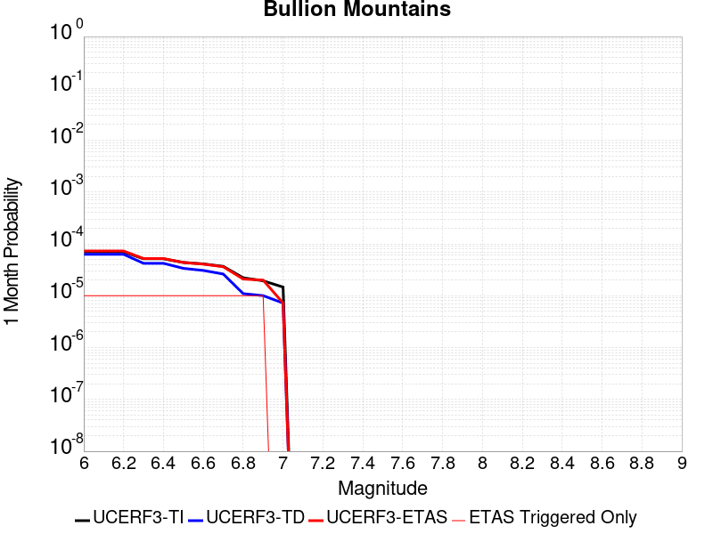 |  |  |

| Magnitude | 1 wk TI Prob | 1 wk TD Prob | 1 wk ETAS Prob | 1 wk ETAS/TD Gain | 1 wk ETAS Triggered Only | 1 mo TI Prob | 1 mo TD Prob | 1 mo ETAS Prob | 1 mo ETAS/TD Gain | 1 mo ETAS Triggered Only | 1 yr TI Prob | 1 yr TD Prob | 1 yr ETAS Prob | 1 yr ETAS/TD Gain | 1 yr ETAS Triggered Only | 10 yr TI Prob | 10 yr TD Prob | 10 yr ETAS Prob | 10 yr ETAS/TD Gain | 10 yr ETAS Triggered Only |
|-----|-----|-----|-----|-----|-----|-----|-----|-----|-----|-----|-----|-----|-----|-----|-----|-----|-----|-----|-----|-----|
| 6.0 | 1.6420427E-5 | 1.4692306E-5 | 1.4692306E-5 | 1.0 | 0.0 | 7.037136E-5 | 6.296572E-5 | 6.296572E-5 | 1.0 | 0.0 | 8.5643446E-4 | 7.663764E-4 | 7.792864E-4 | 1.0168455 | 1.2919897E-5 | 0.008531413 | 0.0076411283 | 0.007666771 | 1.0033559 | 2.5839794E-5 |
| 6.1 | 1.6420427E-5 | 1.4692306E-5 | 1.4692306E-5 | 1.0 | 0.0 | 7.037136E-5 | 6.296572E-5 | 6.296572E-5 | 1.0 | 0.0 | 8.5643446E-4 | 7.663764E-4 | 7.792864E-4 | 1.0168455 | 1.2919897E-5 | 0.008531413 | 0.0076411283 | 0.007666771 | 1.0033559 | 2.5839794E-5 |
| 6.2 | 1.6420427E-5 | 1.4692306E-5 | 1.4692306E-5 | 1.0 | 0.0 | 7.037136E-5 | 6.296572E-5 | 6.296572E-5 | 1.0 | 0.0 | 8.5643446E-4 | 7.663764E-4 | 7.792864E-4 | 1.0168455 | 1.2919897E-5 | 0.008531413 | 0.0076411283 | 0.007666771 | 1.0033559 | 2.5839794E-5 |
| 6.3 | 1.2046778E-5 | 9.862485E-6 | 9.862485E-6 | 1.0 | 0.0 | 5.1628023E-5 | 4.226724E-5 | 4.226724E-5 | 1.0 | 0.0 | 6.283899E-4 | 5.145053E-4 | 5.145053E-4 | 1.0 | 0.0 | 0.0062661595 | 0.0051354226 | 0.005148276 | 1.0025029 | 1.2919897E-5 |
| 6.4 | 1.2046778E-5 | 9.862485E-6 | 9.862485E-6 | 1.0 | 0.0 | 5.1628023E-5 | 4.226724E-5 | 4.226724E-5 | 1.0 | 0.0 | 6.283899E-4 | 5.145053E-4 | 5.145053E-4 | 1.0 | 0.0 | 0.0062661595 | 0.0051354226 | 0.005148276 | 1.0025029 | 1.2919897E-5 |
| 6.5 | 1.0244343E-5 | 7.879582E-6 | 7.879582E-6 | 1.0 | 0.0 | 4.390359E-5 | 3.3769316E-5 | 3.3769316E-5 | 1.0 | 0.0 | 5.343951E-4 | 4.1108453E-4 | 4.1108453E-4 | 1.0 | 0.0 | 0.005331118 | 0.0041052722 | 0.004118139 | 1.0031343 | 1.2919897E-5 |
| 6.6 | 9.605408E-6 | 7.1776108E-6 | 7.1776108E-6 | 1.0 | 0.0 | 4.1165385E-5 | 3.076094E-5 | 3.076094E-5 | 1.0 | 0.0 | 5.010733E-4 | 3.7447043E-4 | 3.7447043E-4 | 1.0 | 0.0 | 0.00499945 | 0.0037403915 | 0.003753263 | 1.0034412 | 1.2919897E-5 |
| 6.7 | 8.60418E-6 | 6.1241044E-6 | 6.1241044E-6 | 1.0 | 0.0 | 3.687454E-5 | 2.6246007E-5 | 2.6246007E-5 | 1.0 | 0.0 | 4.48855E-4 | 3.1951777E-4 | 3.1951777E-4 | 1.0 | 0.0 | 0.004479495 | 0.0031924958 | 0.0032053743 | 1.004034 | 1.2919897E-5 |
| 6.8 | 5.187994E-6 | 2.5632194E-6 | 2.5632194E-6 | 1.0 | 0.0 | 2.223407E-5 | 1.0985203E-5 | 1.0985203E-5 | 1.0 | 0.0 | 2.7066618E-4 | 1.3374063E-4 | 1.3374063E-4 | 1.0 | 0.0 | 0.0027033675 | 0.001336993 | 0.0013498956 | 1.0096505 | 1.2919897E-5 |
| 6.9 | 4.5302368E-6 | 2.3443622E-6 | 2.3443622E-6 | 1.0 | 0.0 | 1.9415156E-5 | 1.0047251E-5 | 1.0047251E-5 | 1.0 | 0.0 | 2.3635388E-4 | 1.2232238E-4 | 1.2232238E-4 | 1.0 | 0.0 | 0.0023610266 | 0.0012229396 | 0.0012358436 | 1.0105517 | 1.2919897E-5 |
| 7.0 | 3.431668E-6 | 1.6882757E-6 | 1.6882757E-6 | 1.0 | 0.0 | 1.4707065E-5 | 7.2354674E-6 | 7.2354674E-6 | 1.0 | 0.0 | 1.7904381E-4 | 8.8091816E-5 | 8.8091816E-5 | 1.0 | 0.0 | 0.0017889962 | 8.809181E-4 | 8.9382665E-4 | 1.0146534 | 1.2919897E-5 |

## San Jacinto (San Bernardino)
*[(top)](#table-of-contents)*

| 1 Week | 1 Month | 1 Year | 10 Year |
|-----|-----|-----|-----|
|  | 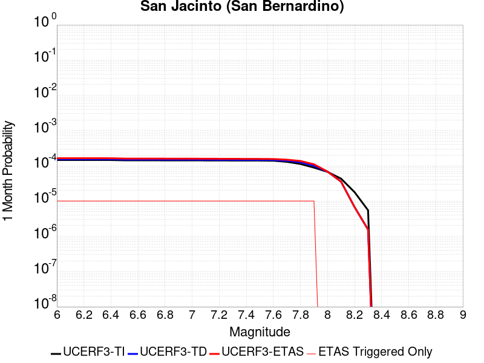 |  |  |

| Magnitude | 1 wk TI Prob | 1 wk TD Prob | 1 wk ETAS Prob | 1 wk ETAS/TD Gain | 1 wk ETAS Triggered Only | 1 mo TI Prob | 1 mo TD Prob | 1 mo ETAS Prob | 1 mo ETAS/TD Gain | 1 mo ETAS Triggered Only | 1 yr TI Prob | 1 yr TD Prob | 1 yr ETAS Prob | 1 yr ETAS/TD Gain | 1 yr ETAS Triggered Only | 10 yr TI Prob | 10 yr TD Prob | 10 yr ETAS Prob | 10 yr ETAS/TD Gain | 10 yr ETAS Triggered Only |
|-----|-----|-----|-----|-----|-----|-----|-----|-----|-----|-----|-----|-----|-----|-----|-----|-----|-----|-----|-----|-----|
| 6.0 | 3.409352E-5 | 3.600249E-5 | 3.600249E-5 | 1.0 | 0.0 | 1.461069E-4 | 1.5428728E-4 | 1.6720517E-4 | 1.0837263 | 1.2919897E-5 | 0.0017774 | 0.001876831 | 0.0018897267 | 1.006871 | 1.2919897E-5 | 0.01763251 | 0.019358097 | 0.019383438 | 1.001309 | 2.5839794E-5 |
| 6.1 | 3.409352E-5 | 3.600249E-5 | 3.600249E-5 | 1.0 | 0.0 | 1.461069E-4 | 1.5428728E-4 | 1.6720517E-4 | 1.0837263 | 1.2919897E-5 | 0.0017774 | 0.001876831 | 0.0018897267 | 1.006871 | 1.2919897E-5 | 0.01763251 | 0.019358097 | 0.019383438 | 1.001309 | 2.5839794E-5 |
| 6.2 | 3.409352E-5 | 3.600249E-5 | 3.600249E-5 | 1.0 | 0.0 | 1.461069E-4 | 1.5428728E-4 | 1.6720517E-4 | 1.0837263 | 1.2919897E-5 | 0.0017774 | 0.001876831 | 0.0018897267 | 1.006871 | 1.2919897E-5 | 0.01763251 | 0.019358097 | 0.019383438 | 1.001309 | 2.5839794E-5 |
| 6.3 | 3.409352E-5 | 3.600249E-5 | 3.600249E-5 | 1.0 | 0.0 | 1.461069E-4 | 1.5428728E-4 | 1.6720517E-4 | 1.0837263 | 1.2919897E-5 | 0.0017774 | 0.001876831 | 0.0018897267 | 1.006871 | 1.2919897E-5 | 0.01763251 | 0.019358097 | 0.019383438 | 1.001309 | 2.5839794E-5 |
| 6.4 | 3.400795E-5 | 3.589515E-5 | 3.589515E-5 | 1.0 | 0.0 | 1.4574021E-4 | 1.5382729E-4 | 1.667452E-4 | 1.0839767 | 1.2919897E-5 | 0.0017729428 | 0.0018712406 | 0.0018841362 | 1.0068915 | 1.2919897E-5 | 0.017588645 | 0.019303178 | 0.01932852 | 1.0013127 | 2.5839794E-5 |
| 6.5 | 3.341482E-5 | 3.5155765E-5 | 3.5155765E-5 | 1.0 | 0.0 | 1.4319851E-4 | 1.5065886E-4 | 1.6357681E-4 | 1.0857431 | 1.2919897E-5 | 0.0017420477 | 0.0018327299 | 0.0018456262 | 1.0070366 | 1.2919897E-5 | 0.017284546 | 0.018924711 | 0.018950062 | 1.0013396 | 2.5839794E-5 |
| 6.6 | 3.3364955E-5 | 3.509298E-5 | 3.509298E-5 | 1.0 | 0.0 | 1.4298483E-4 | 1.5038982E-4 | 1.6330778E-4 | 1.0858965 | 1.2919897E-5 | 0.0017394501 | 0.0018294598 | 0.001842356 | 1.0070492 | 1.2919897E-5 | 0.017258976 | 0.018892575 | 0.018917926 | 1.0013419 | 2.5839794E-5 |
| 6.7 | 3.335922E-5 | 3.5082754E-5 | 3.5082754E-5 | 1.0 | 0.0 | 1.4296026E-4 | 1.5034601E-4 | 1.6326396E-4 | 1.0859215 | 1.2919897E-5 | 0.0017391514 | 0.0018289272 | 0.0018418235 | 1.0070512 | 1.2919897E-5 | 0.017256035 | 0.018887365 | 0.018912718 | 1.0013423 | 2.5839794E-5 |
| 6.8 | 3.327683E-5 | 3.4976816E-5 | 3.4976816E-5 | 1.0 | 0.0 | 1.4260718E-4 | 1.4989203E-4 | 1.6281E-4 | 1.0861818 | 1.2919897E-5 | 0.0017348597 | 0.0018234095 | 0.0018363057 | 1.0070727 | 1.2919897E-5 | 0.017213784 | 0.018833136 | 0.018858489 | 1.0013462 | 2.5839794E-5 |
| 6.9 | 3.3235785E-5 | 3.4917768E-5 | 3.4917768E-5 | 1.0 | 0.0 | 1.4243131E-4 | 1.49639E-4 | 1.6255697E-4 | 1.0863276 | 1.2919897E-5 | 0.0017327217 | 0.0018203339 | 0.0018332303 | 1.0070846 | 1.2919897E-5 | 0.017192734 | 0.018803004 | 0.018828359 | 1.0013484 | 2.5839794E-5 |
| 7.0 | 3.3197095E-5 | 3.4857694E-5 | 3.4857694E-5 | 1.0 | 0.0 | 1.422655E-4 | 1.4938158E-4 | 1.6229955E-4 | 1.0864763 | 1.2919897E-5 | 0.0017307063 | 0.001817205 | 0.0018301014 | 1.0070969 | 1.2919897E-5 | 0.017172894 | 0.01877238 | 0.018797735 | 1.0013506 | 2.5839794E-5 |
| 7.1 | 3.3129716E-5 | 3.47379E-5 | 3.47379E-5 | 1.0 | 0.0 | 1.4197677E-4 | 1.4886823E-4 | 1.617862E-4 | 1.0867746 | 1.2919897E-5 | 0.0017271966 | 0.0018109654 | 0.0018238619 | 1.0071213 | 1.2919897E-5 | 0.017138338 | 0.018711457 | 0.018736813 | 1.0013552 | 2.5839794E-5 |
| 7.2 | 3.3034008E-5 | 3.4605342E-5 | 3.4605342E-5 | 1.0 | 0.0 | 1.4156665E-4 | 1.4830018E-4 | 1.6121817E-4 | 1.087107 | 1.2919897E-5 | 0.0017222111 | 0.001804061 | 0.0018169575 | 1.0071486 | 1.2919897E-5 | 0.017089253 | 0.018643849 | 0.018669207 | 1.0013602 | 2.5839794E-5 |
| 7.3 | 3.2956614E-5 | 3.447309E-5 | 3.447309E-5 | 1.0 | 0.0 | 1.4123498E-4 | 1.4773346E-4 | 1.6065144E-4 | 1.0874412 | 1.2919897E-5 | 0.0017181796 | 0.0017971725 | 0.0018100691 | 1.007176 | 1.2919897E-5 | 0.017049557 | 0.018576592 | 0.018601952 | 1.0013652 | 2.5839794E-5 |
| 7.4 | 3.2915937E-5 | 3.439478E-5 | 3.439478E-5 | 1.0 | 0.0 | 1.4106068E-4 | 1.4739788E-4 | 1.6031586E-4 | 1.0876403 | 1.2919897E-5 | 0.0017160608 | 0.0017930934 | 0.0018059901 | 1.0071925 | 1.2919897E-5 | 0.017028693 | 0.018536855 | 0.018562214 | 1.0013682 | 2.5839794E-5 |
| 7.5 | 3.281791E-5 | 3.4259683E-5 | 3.4259683E-5 | 1.0 | 0.0 | 1.406406E-4 | 1.4681896E-4 | 1.5973696E-4 | 1.0879859 | 1.2919897E-5 | 0.0017109542 | 0.0017860567 | 0.0017989534 | 1.0072209 | 1.2919897E-5 | 0.016978411 | 0.018467735 | 0.0184931 | 1.0013733 | 2.5839794E-5 |
| 7.6 | 3.2521442E-5 | 3.39846E-5 | 3.39846E-5 | 1.0 | 0.0 | 1.3937015E-4 | 1.4564018E-4 | 1.5855819E-4 | 1.0886981 | 1.2919897E-5 | 0.0016955109 | 0.0017717284 | 0.0017846255 | 1.0072793 | 1.2919897E-5 | 0.016826328 | 0.01832535 | 0.018350717 | 1.0013843 | 2.5839794E-5 |
| 7.7 | 3.0287873E-5 | 3.246845E-5 | 3.246845E-5 | 1.0 | 0.0 | 1.297987E-4 | 1.391431E-4 | 1.520612E-4 | 1.0928404 | 1.2919897E-5 | 0.0015791537 | 0.001692752 | 0.00170565 | 1.0076196 | 1.2919897E-5 | 0.01567979 | 0.017536119 | 0.017561506 | 1.0014477 | 2.5839794E-5 |
| 7.8 | 2.6316151E-5 | 2.9678711E-5 | 2.9678711E-5 | 1.0 | 0.0 | 1.1277862E-4 | 1.2718828E-4 | 1.4010654E-4 | 1.101568 | 1.2919897E-5 | 0.0013722149 | 0.0015474184 | 0.0015603183 | 1.0083364 | 1.2919897E-5 | 0.013637724 | 0.016077382 | 0.016102808 | 1.0015814 | 2.5839794E-5 |
| 7.9 | 2.0761147E-5 | 2.3431265E-5 | 2.3431265E-5 | 1.0 | 0.0 | 8.897331E-5 | 1.0041584E-4 | 1.1333444E-4 | 1.128651 | 1.2919897E-5 | 0.0010827117 | 0.0012218781 | 0.0012347822 | 1.0105609 | 1.2919897E-5 | 0.010774517 | 0.012799971 | 0.01282548 | 1.001993 | 2.5839794E-5 |
| 8.0 | 1.5738568E-5 | 1.6043394E-5 | 1.6043394E-5 | 1.0 | 0.0 | 6.744926E-5 | 6.8755595E-5 | 6.8755595E-5 | 1.0 | 0.0 | 8.2088535E-4 | 8.3677855E-4 | 8.3677855E-4 | 1.0 | 0.0 | 0.008178596 | 0.008871087 | 0.008871087 | 1.0 | 0.0 |
| 8.1 | 1.0105832E-5 | 8.336244E-6 | 8.336244E-6 | 1.0 | 0.0 | 4.3309992E-5 | 3.5726272E-5 | 3.5726272E-5 | 1.0 | 0.0 | 5.2717153E-4 | 4.3488108E-4 | 4.3488108E-4 | 1.0 | 0.0 | 0.005259227 | 0.00468032 | 0.00468032 | 1.0 | 0.0 |
| 8.2 | 4.189207E-6 | 1.5801045E-6 | 1.5801045E-6 | 1.0 | 0.0 | 1.7953622E-5 | 6.771859E-6 | 6.771859E-6 | 1.0 | 0.0 | 2.1856341E-4 | 8.244429E-5 | 8.244429E-5 | 1.0 | 0.0 | 0.0021834858 | 9.575395E-4 | 9.575395E-4 | 1.0 | 0.0 |
| 8.3 | 1.2758221E-6 | 3.6194777E-7 | 3.6194777E-7 | 1.0 | 0.0 | 5.4677976E-6 | 1.5512038E-6 | 1.5512038E-6 | 1.0 | 0.0 | 6.65684E-5 | 1.8885747E-5 | 1.8885747E-5 | 1.0 | 0.0 | 6.6548464E-4 | 2.2777634E-4 | 2.2777634E-4 | 1.0 | 0.0 |

## Independence rev 2011
*[(top)](#table-of-contents)*

| 1 Week | 1 Month | 1 Year | 10 Year |
|-----|-----|-----|-----|
|  |  |  | 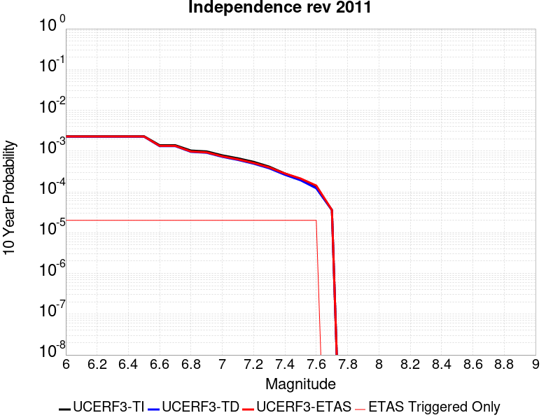 |

| Magnitude | 1 wk TI Prob | 1 wk TD Prob | 1 wk ETAS Prob | 1 wk ETAS/TD Gain | 1 wk ETAS Triggered Only | 1 mo TI Prob | 1 mo TD Prob | 1 mo ETAS Prob | 1 mo ETAS/TD Gain | 1 mo ETAS Triggered Only | 1 yr TI Prob | 1 yr TD Prob | 1 yr ETAS Prob | 1 yr ETAS/TD Gain | 1 yr ETAS Triggered Only | 10 yr TI Prob | 10 yr TD Prob | 10 yr ETAS Prob | 10 yr ETAS/TD Gain | 10 yr ETAS Triggered Only |
|-----|-----|-----|-----|-----|-----|-----|-----|-----|-----|-----|-----|-----|-----|-----|-----|-----|-----|-----|-----|-----|
| 6.0 | 4.422171E-6 | 4.3262453E-6 | 4.3262453E-6 | 1.0 | 0.0 | 1.8952025E-5 | 1.8540937E-5 | 1.8540937E-5 | 1.0 | 0.0 | 2.3071647E-4 | 2.257155E-4 | 2.3863248E-4 | 1.0572268 | 1.2919897E-5 | 0.0023047708 | 0.0022551562 | 0.0022809375 | 1.0114323 | 2.5839794E-5 |
| 6.1 | 4.422171E-6 | 4.3262453E-6 | 4.3262453E-6 | 1.0 | 0.0 | 1.8952025E-5 | 1.8540937E-5 | 1.8540937E-5 | 1.0 | 0.0 | 2.3071647E-4 | 2.257155E-4 | 2.3863248E-4 | 1.0572268 | 1.2919897E-5 | 0.0023047708 | 0.0022551562 | 0.0022809375 | 1.0114323 | 2.5839794E-5 |
| 6.2 | 4.422171E-6 | 4.3262453E-6 | 4.3262453E-6 | 1.0 | 0.0 | 1.8952025E-5 | 1.8540937E-5 | 1.8540937E-5 | 1.0 | 0.0 | 2.3071647E-4 | 2.257155E-4 | 2.3863248E-4 | 1.0572268 | 1.2919897E-5 | 0.0023047708 | 0.0022551562 | 0.0022809375 | 1.0114323 | 2.5839794E-5 |
| 6.3 | 4.422171E-6 | 4.3262453E-6 | 4.3262453E-6 | 1.0 | 0.0 | 1.8952025E-5 | 1.8540937E-5 | 1.8540937E-5 | 1.0 | 0.0 | 2.3071647E-4 | 2.257155E-4 | 2.3863248E-4 | 1.0572268 | 1.2919897E-5 | 0.0023047708 | 0.0022551562 | 0.0022809375 | 1.0114323 | 2.5839794E-5 |
| 6.4 | 4.422171E-6 | 4.3262453E-6 | 4.3262453E-6 | 1.0 | 0.0 | 1.8952025E-5 | 1.8540937E-5 | 1.8540937E-5 | 1.0 | 0.0 | 2.3071647E-4 | 2.257155E-4 | 2.3863248E-4 | 1.0572268 | 1.2919897E-5 | 0.0023047708 | 0.0022551562 | 0.0022809375 | 1.0114323 | 2.5839794E-5 |
| 6.5 | 4.422171E-6 | 4.3262453E-6 | 4.3262453E-6 | 1.0 | 0.0 | 1.8952025E-5 | 1.8540937E-5 | 1.8540937E-5 | 1.0 | 0.0 | 2.3071647E-4 | 2.257155E-4 | 2.3863248E-4 | 1.0572268 | 1.2919897E-5 | 0.0023047708 | 0.0022551562 | 0.0022809375 | 1.0114323 | 2.5839794E-5 |
| 6.6 | 2.663744E-6 | 2.5319996E-6 | 2.5319996E-6 | 1.0 | 0.0 | 1.1415996E-5 | 1.0851385E-5 | 1.0851385E-5 | 1.0 | 0.0 | 1.3898089E-4 | 1.3210809E-4 | 1.4502628E-4 | 1.097785 | 1.2919897E-5 | 0.0013889399 | 0.0013203438 | 0.0013461495 | 1.0195447 | 2.5839794E-5 |
| 6.7 | 2.663744E-6 | 2.5319996E-6 | 2.5319996E-6 | 1.0 | 0.0 | 1.1415996E-5 | 1.0851385E-5 | 1.0851385E-5 | 1.0 | 0.0 | 1.3898089E-4 | 1.3210809E-4 | 1.4502628E-4 | 1.097785 | 1.2919897E-5 | 0.0013889399 | 0.0013203438 | 0.0013461495 | 1.0195447 | 2.5839794E-5 |
| 6.8 | 1.9716529E-6 | 1.83227E-6 | 1.83227E-6 | 1.0 | 0.0 | 8.449913E-6 | 7.852563E-6 | 7.852563E-6 | 1.0 | 0.0 | 1.0287284E-4 | 9.560089E-5 | 1.0851955E-4 | 1.1351312 | 1.2919897E-5 | 0.0010282523 | 9.556105E-4 | 9.814256E-4 | 1.0270143 | 2.5839794E-5 |
| 6.9 | 1.8788617E-6 | 1.7430103E-6 | 1.7430103E-6 | 1.0 | 0.0 | 8.0522395E-6 | 7.470024E-6 | 7.470024E-6 | 1.0 | 0.0 | 9.80316E-5 | 9.094387E-5 | 1.03862585E-4 | 1.1420516 | 1.2919897E-5 | 9.798837E-4 | 9.090785E-4 | 9.348948E-4 | 1.0283983 | 2.5839794E-5 |
| 7.0 | 1.5045488E-6 | 1.3849595E-6 | 1.3849595E-6 | 1.0 | 0.0 | 6.44805E-6 | 5.9355275E-6 | 5.9355275E-6 | 1.0 | 0.0 | 7.8502184E-5 | 7.226271E-5 | 8.5181666E-5 | 1.1787777 | 1.2919897E-5 | 7.8474457E-4 | 7.2239724E-4 | 7.482183E-4 | 1.0357437 | 2.5839794E-5 |
| 7.1 | 1.272341E-6 | 1.1625177E-6 | 1.1625177E-6 | 1.0 | 0.0 | 5.4528787E-6 | 4.9822092E-6 | 4.9822092E-6 | 1.0 | 0.0 | 6.6386776E-5 | 6.065674E-5 | 7.357585E-5 | 1.2129873 | 1.2919897E-5 | 6.636695E-4 | 6.06405E-4 | 6.322292E-4 | 1.0425856 | 2.5839794E-5 |
| 7.2 | 1.0416892E-6 | 9.4099494E-7 | 9.4099494E-7 | 1.0 | 0.0 | 4.464375E-6 | 4.032829E-6 | 4.032829E-6 | 1.0 | 0.0 | 5.4352407E-5 | 4.909861E-5 | 6.201787E-5 | 1.2631289 | 1.2919897E-5 | 5.4339116E-4 | 4.9087947E-4 | 5.1670655E-4 | 1.052614 | 2.5839794E-5 |
| 7.3 | 7.9450155E-7 | 7.235053E-7 | 7.235053E-7 | 1.0 | 0.0 | 3.4050022E-6 | 3.1007335E-6 | 3.1007335E-6 | 1.0 | 0.0 | 4.1455114E-5 | 3.7750786E-5 | 5.0670194E-5 | 1.3422289 | 1.2919897E-5 | 4.144738E-4 | 3.7744487E-4 | 4.032749E-4 | 1.068434 | 2.5839794E-5 |
| 7.4 | 5.3893444E-7 | 5.0195445E-7 | 5.0195445E-7 | 1.0 | 0.0 | 2.309717E-6 | 2.1512315E-6 | 2.1512315E-6 | 1.0 | 0.0 | 2.8120441E-5 | 2.6190934E-5 | 3.911049E-5 | 1.4932836 | 1.2919897E-5 | 2.8116882E-4 | 2.6187891E-4 | 2.8771194E-4 | 1.098645 | 2.5839794E-5 |
| 7.5 | 3.8852085E-7 | 3.6825747E-7 | 3.6825747E-7 | 1.0 | 0.0 | 1.6650882E-6 | 1.5782454E-6 | 1.5782454E-6 | 1.0 | 0.0 | 2.027226E-5 | 1.9214971E-5 | 3.213462E-5 | 1.6723741 | 1.2919897E-5 | 2.0270412E-4 | 1.921333E-4 | 2.1796813E-4 | 1.1344631 | 2.5839794E-5 |
| 7.6 | 2.414929E-7 | 2.3457659E-7 | 2.3457659E-7 | 1.0 | 0.0 | 1.0349692E-6 | 1.0053279E-6 | 1.0053279E-6 | 1.0 | 0.0 | 1.2600677E-5 | 1.22398E-5 | 2.5159537E-5 | 2.0555515 | 1.2919897E-5 | 1.2599962E-4 | 1.2239137E-4 | 1.48228E-4 | 1.2110984 | 2.5839794E-5 |
| 7.7 | 6.8298014E-8 | 6.858993E-8 | 6.858993E-8 | 1.0 | 0.0 | 2.9270575E-7 | 2.939568E-7 | 2.939568E-7 | 1.0 | 0.0 | 3.5636867E-6 | 3.5789185E-6 | 3.5789185E-6 | 1.0 | 0.0 | 3.5636294E-5 | 3.5788657E-5 | 3.5788657E-5 | 1.0 | 0.0 |

## Mission Ridge-Arroyo Parida-Santa Ana
*[(top)](#table-of-contents)*

| 1 Week | 1 Month | 1 Year | 10 Year |
|-----|-----|-----|-----|
| 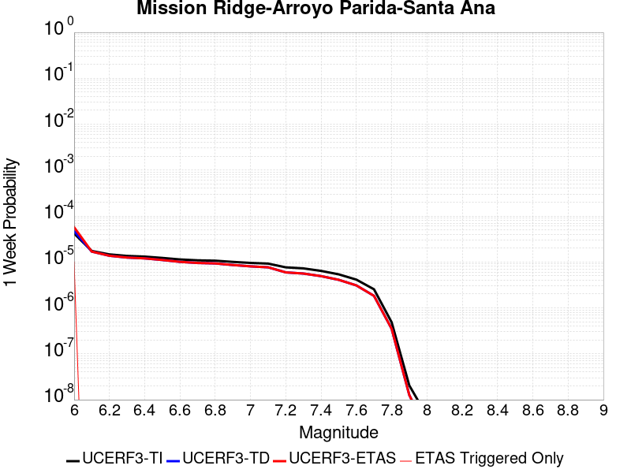 |  |  |  |

| Magnitude | 1 wk TI Prob | 1 wk TD Prob | 1 wk ETAS Prob | 1 wk ETAS/TD Gain | 1 wk ETAS Triggered Only | 1 mo TI Prob | 1 mo TD Prob | 1 mo ETAS Prob | 1 mo ETAS/TD Gain | 1 mo ETAS Triggered Only | 1 yr TI Prob | 1 yr TD Prob | 1 yr ETAS Prob | 1 yr ETAS/TD Gain | 1 yr ETAS Triggered Only | 10 yr TI Prob | 10 yr TD Prob | 10 yr ETAS Prob | 10 yr ETAS/TD Gain | 10 yr ETAS Triggered Only |
|-----|-----|-----|-----|-----|-----|-----|-----|-----|-----|-----|-----|-----|-----|-----|-----|-----|-----|-----|-----|-----|
| 6.0 | 4.169034E-5 | 4.7139558E-5 | 6.0058846E-5 | 1.2740647 | 1.2919897E-5 | 1.7866064E-4 | 2.0201589E-4 | 2.1493317E-4 | 1.063942 | 1.2919897E-5 | 0.0021730233 | 0.0024575135 | 0.0024704016 | 1.0052444 | 1.2919897E-5 | 0.021518968 | 0.024385266 | 0.02439787 | 1.0005169 | 1.2919897E-5 |
| 6.1 | 1.73813E-5 | 1.6854512E-5 | 1.6854512E-5 | 1.0 | 0.0 | 7.4489166E-5 | 7.223168E-5 | 7.223168E-5 | 1.0 | 0.0 | 9.065282E-4 | 8.790767E-4 | 8.790767E-4 | 1.0 | 0.0 | 0.009028391 | 0.008757136 | 0.008757136 | 1.0 | 0.0 |
| 6.2 | 1.4622182E-5 | 1.367351E-5 | 1.367351E-5 | 1.0 | 0.0 | 6.2664985E-5 | 5.8599464E-5 | 5.8599464E-5 | 1.0 | 0.0 | 7.6267915E-4 | 7.1321876E-4 | 7.1321876E-4 | 1.0 | 0.0 | 0.007600669 | 0.007109741 | 0.007109741 | 1.0 | 0.0 |
| 6.3 | 1.3552434E-5 | 1.2482403E-5 | 1.2482403E-5 | 1.0 | 0.0 | 5.8080568E-5 | 5.3494932E-5 | 5.3494932E-5 | 1.0 | 0.0 | 7.069015E-4 | 6.511093E-4 | 6.511093E-4 | 1.0 | 0.0 | 0.00704657 | 0.0064923796 | 0.0064923796 | 1.0 | 0.0 |
| 6.4 | 1.30977305E-5 | 1.1979351E-5 | 1.1979351E-5 | 1.0 | 0.0 | 5.613192E-5 | 5.133908E-5 | 5.133908E-5 | 1.0 | 0.0 | 6.831918E-4 | 6.2487705E-4 | 6.2487705E-4 | 1.0 | 0.0 | 0.006810953 | 0.0062315455 | 0.0062315455 | 1.0 | 0.0 |
| 6.5 | 1.225205E-5 | 1.10489855E-5 | 1.10489855E-5 | 1.0 | 0.0 | 5.2507727E-5 | 4.735195E-5 | 4.735195E-5 | 1.0 | 0.0 | 6.3909404E-4 | 5.763602E-4 | 5.763602E-4 | 1.0 | 0.0 | 0.006372592 | 0.005748964 | 0.005748964 | 1.0 | 0.0 |
| 6.6 | 1.1352241E-5 | 1.0063705E-5 | 1.0063705E-5 | 1.0 | 0.0 | 4.8651553E-5 | 4.3129465E-5 | 4.3129465E-5 | 1.0 | 0.0 | 5.921717E-4 | 5.249768E-4 | 5.249768E-4 | 1.0 | 0.0 | 0.0059059616 | 0.005237613 | 0.005237613 | 1.0 | 0.0 |
| 6.7 | 1.0864116E-5 | 9.517188E-6 | 9.517188E-6 | 1.0 | 0.0 | 4.6559664E-5 | 4.0787323E-5 | 4.0787323E-5 | 1.0 | 0.0 | 5.667165E-4 | 4.964745E-4 | 4.964745E-4 | 1.0 | 0.0 | 0.005652734 | 0.004953888 | 0.004953888 | 1.0 | 0.0 |
| 6.8 | 1.0666365E-5 | 9.299937E-6 | 9.299937E-6 | 1.0 | 0.0 | 4.571219E-5 | 3.9856277E-5 | 3.9856277E-5 | 1.0 | 0.0 | 5.564038E-4 | 4.8514412E-4 | 4.8514412E-4 | 1.0 | 0.0 | 0.005550127 | 0.0048410823 | 0.0048410823 | 1.0 | 0.0 |
| 6.9 | 1.0038665E-5 | 8.592192E-6 | 8.592192E-6 | 1.0 | 0.0 | 4.302214E-5 | 3.682317E-5 | 3.682317E-5 | 1.0 | 0.0 | 5.236687E-4 | 4.4823167E-4 | 4.4823167E-4 | 1.0 | 0.0 | 0.005224364 | 0.004473487 | 0.004473487 | 1.0 | 0.0 |
| 7.0 | 9.5379955E-6 | 8.025209E-6 | 8.025209E-6 | 1.0 | 0.0 | 4.0876483E-5 | 3.439331E-5 | 3.439331E-5 | 1.0 | 0.0 | 4.975576E-4 | 4.186598E-4 | 4.186598E-4 | 1.0 | 0.0 | 0.00496445 | 0.0041789105 | 0.0041789105 | 1.0 | 0.0 |
| 7.1 | 9.207389E-6 | 7.652504E-6 | 7.652504E-6 | 1.0 | 0.0 | 3.945964E-5 | 3.2796044E-5 | 3.2796044E-5 | 1.0 | 0.0 | 4.803152E-4 | 3.9922036E-4 | 3.9922036E-4 | 1.0 | 0.0 | 0.004792784 | 0.003985228 | 0.003985228 | 1.0 | 0.0 |
| 7.2 | 7.638091E-6 | 5.93121E-6 | 5.93121E-6 | 1.0 | 0.0 | 3.2734264E-5 | 2.5419227E-5 | 2.5419227E-5 | 1.0 | 0.0 | 3.984668E-4 | 3.0943545E-4 | 3.0943545E-4 | 1.0 | 0.0 | 0.0039775306 | 0.0030901027 | 0.0030901027 | 1.0 | 0.0 |
| 7.3 | 7.2500147E-6 | 5.596238E-6 | 5.596238E-6 | 1.0 | 0.0 | 3.1071122E-5 | 2.3983659E-5 | 2.3983659E-5 | 1.0 | 0.0 | 3.7822526E-4 | 2.919622E-4 | 2.919622E-4 | 1.0 | 0.0 | 0.0037758215 | 0.002915842 | 0.002915842 | 1.0 | 0.0 |
| 7.4 | 6.3899715E-6 | 4.918567E-6 | 4.918567E-6 | 1.0 | 0.0 | 2.7385306E-5 | 2.1079404E-5 | 2.1079404E-5 | 1.0 | 0.0 | 3.3336508E-4 | 2.566117E-4 | 2.566117E-4 | 1.0 | 0.0 | 0.0033286542 | 0.0025631986 | 0.0025631986 | 1.0 | 0.0 |
| 7.5 | 5.379025E-6 | 4.083909E-6 | 4.083909E-6 | 1.0 | 0.0 | 2.305276E-5 | 1.750235E-5 | 1.750235E-5 | 1.0 | 0.0 | 2.806312E-4 | 2.1307038E-4 | 2.1307038E-4 | 1.0 | 0.0 | 0.0028027708 | 0.0021286723 | 0.0021286723 | 1.0 | 0.0 |
| 7.6 | 4.1270696E-6 | 3.0883848E-6 | 3.0883848E-6 | 1.0 | 0.0 | 1.768732E-5 | 1.3235868E-5 | 1.3235868E-5 | 1.0 | 0.0 | 2.1532185E-4 | 1.6113486E-4 | 1.6113486E-4 | 1.0 | 0.0 | 0.0021511333 | 0.0016101883 | 0.0016101883 | 1.0 | 0.0 |
| 7.7 | 2.5406805E-6 | 1.8282261E-6 | 1.8282261E-6 | 1.0 | 0.0 | 1.0888585E-5 | 7.835231E-6 | 7.835231E-6 | 1.0 | 0.0 | 1.3256045E-4 | 9.538983E-5 | 9.538983E-5 | 1.0 | 0.0 | 0.0013248142 | 9.53495E-4 | 9.53495E-4 | 1.0 | 0.0 |
| 7.8 | 4.8608285E-7 | 3.5099296E-7 | 3.5099296E-7 | 1.0 | 0.0 | 2.0832106E-6 | 1.5042547E-6 | 1.5042547E-6 | 1.0 | 0.0 | 2.5362791E-5 | 1.8314147E-5 | 1.8314147E-5 | 1.0 | 0.0 | 2.5359896E-4 | 1.8312651E-4 | 1.8312651E-4 | 1.0 | 0.0 |
| 7.9 | 2.0472514E-8 | 1.2689093E-8 | 1.2689093E-8 | 1.0 | 0.0 | 8.7739345E-8 | 5.438183E-8 | 5.438183E-8 | 1.0 | 0.0 | 1.068226E-6 | 6.6209856E-7 | 6.6209856E-7 | 1.0 | 0.0 | 1.0682209E-5 | 6.620967E-6 | 6.620967E-6 | 1.0 | 0.0 |
| 8.0 | 4.443582E-9 | 2.0322608E-9 | 2.0322608E-9 | 1.0 | 0.0 | 1.9043922E-8 | 8.709689E-9 | 8.709689E-9 | 1.0 | 0.0 | 2.3185973E-7 | 1.0604046E-7 | 1.0604046E-7 | 1.0 | 0.0 | 2.3185949E-6 | 1.0604042E-6 | 1.0604042E-6 | 1.0 | 0.0 |

## Coyote Lake
*[(top)](#table-of-contents)*

| 1 Week | 1 Month | 1 Year | 10 Year |
|-----|-----|-----|-----|
|  |  |  | 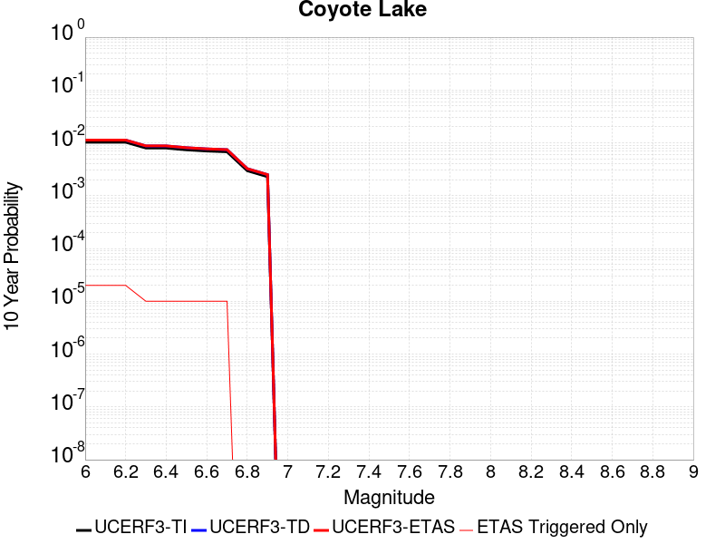 |

| Magnitude | 1 wk TI Prob | 1 wk TD Prob | 1 wk ETAS Prob | 1 wk ETAS/TD Gain | 1 wk ETAS Triggered Only | 1 mo TI Prob | 1 mo TD Prob | 1 mo ETAS Prob | 1 mo ETAS/TD Gain | 1 mo ETAS Triggered Only | 1 yr TI Prob | 1 yr TD Prob | 1 yr ETAS Prob | 1 yr ETAS/TD Gain | 1 yr ETAS Triggered Only | 10 yr TI Prob | 10 yr TD Prob | 10 yr ETAS Prob | 10 yr ETAS/TD Gain | 10 yr ETAS Triggered Only |
|-----|-----|-----|-----|-----|-----|-----|-----|-----|-----|-----|-----|-----|-----|-----|-----|-----|-----|-----|-----|-----|
| 6.0 | 1.980352E-5 | 2.1707021E-5 | 2.1707021E-5 | 1.0 | 0.0 | 8.486947E-5 | 9.302718E-5 | 9.302718E-5 | 1.0 | 0.0 | 0.0010327959 | 0.0011320895 | 0.0011449947 | 1.0113995 | 1.2919897E-5 | 0.010280091 | 0.011270401 | 0.01129595 | 1.0022669 | 2.5839794E-5 |
| 6.1 | 1.980352E-5 | 2.1707021E-5 | 2.1707021E-5 | 1.0 | 0.0 | 8.486947E-5 | 9.302718E-5 | 9.302718E-5 | 1.0 | 0.0 | 0.0010327959 | 0.0011320895 | 0.0011449947 | 1.0113995 | 1.2919897E-5 | 0.010280091 | 0.011270401 | 0.01129595 | 1.0022669 | 2.5839794E-5 |
| 6.2 | 1.980352E-5 | 2.1707021E-5 | 2.1707021E-5 | 1.0 | 0.0 | 8.486947E-5 | 9.302718E-5 | 9.302718E-5 | 1.0 | 0.0 | 0.0010327959 | 0.0011320895 | 0.0011449947 | 1.0113995 | 1.2919897E-5 | 0.010280091 | 0.011270401 | 0.01129595 | 1.0022669 | 2.5839794E-5 |
| 6.3 | 1.5344787E-5 | 1.6820884E-5 | 1.6820884E-5 | 1.0 | 0.0 | 6.576172E-5 | 7.208785E-5 | 7.208785E-5 | 1.0 | 0.0 | 8.003548E-4 | 8.7737746E-4 | 8.7737746E-4 | 1.0 | 0.0 | 0.007974784 | 0.00874518 | 0.008757987 | 1.0014645 | 1.2919897E-5 |
| 6.4 | 1.5344787E-5 | 1.6820884E-5 | 1.6820884E-5 | 1.0 | 0.0 | 6.576172E-5 | 7.208785E-5 | 7.208785E-5 | 1.0 | 0.0 | 8.003548E-4 | 8.7737746E-4 | 8.7737746E-4 | 1.0 | 0.0 | 0.007974784 | 0.00874518 | 0.008757987 | 1.0014645 | 1.2919897E-5 |
| 6.5 | 1.4189697E-5 | 1.5558186E-5 | 1.5558186E-5 | 1.0 | 0.0 | 6.081157E-5 | 6.667658E-5 | 6.667658E-5 | 1.0 | 0.0 | 7.401293E-4 | 8.1154524E-4 | 8.1154524E-4 | 1.0 | 0.0 | 0.0073766913 | 0.008091759 | 0.008104575 | 1.0015837 | 1.2919897E-5 |
| 6.6 | 1.3469301E-5 | 1.47717665E-5 | 1.47717665E-5 | 1.0 | 0.0 | 5.7724297E-5 | 6.3306376E-5 | 6.3306376E-5 | 1.0 | 0.0 | 7.025667E-4 | 7.7054254E-4 | 7.7054254E-4 | 1.0 | 0.0 | 0.0070034964 | 0.0076846126 | 0.0076974332 | 1.0016683 | 1.2919897E-5 |
| 6.7 | 1.3027966E-5 | 1.4281927E-5 | 1.4281927E-5 | 1.0 | 0.0 | 5.5832945E-5 | 6.120716E-5 | 6.120716E-5 | 1.0 | 0.0 | 6.7955407E-4 | 7.450021E-4 | 7.450021E-4 | 1.0 | 0.0 | 0.006774798 | 0.007430923 | 0.0074437475 | 1.0017258 | 1.2919897E-5 |
| 6.8 | 5.695434E-6 | 6.2244944E-6 | 6.2244944E-6 | 1.0 | 0.0 | 2.4408775E-5 | 2.6676302E-5 | 2.6676302E-5 | 1.0 | 0.0 | 2.971363E-4 | 3.2476554E-4 | 3.2476554E-4 | 1.0 | 0.0 | 0.0029673933 | 0.0032458503 | 0.0032458503 | 1.0 | 0.0 |
| 6.9 | 4.385688E-6 | 4.7931144E-6 | 4.7931144E-6 | 1.0 | 0.0 | 1.879567E-5 | 2.0541918E-5 | 2.0541918E-5 | 1.0 | 0.0 | 2.2881327E-4 | 2.5009786E-4 | 2.5009786E-4 | 1.0 | 0.0 | 0.002285778 | 0.0025009785 | 0.0025009785 | 1.0 | 0.0 |

## Owens Valley
*[(top)](#table-of-contents)*

| 1 Week | 1 Month | 1 Year | 10 Year |
|-----|-----|-----|-----|
|  | 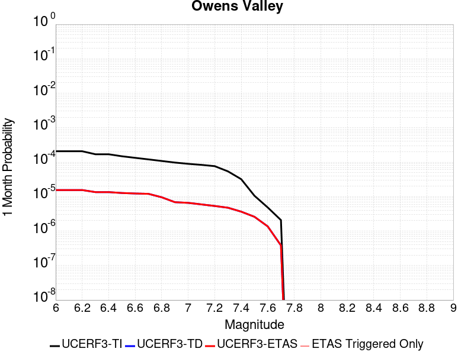 |  |  |

| Magnitude | 1 wk TI Prob | 1 wk TD Prob | 1 wk ETAS Prob | 1 wk ETAS/TD Gain | 1 wk ETAS Triggered Only | 1 mo TI Prob | 1 mo TD Prob | 1 mo ETAS Prob | 1 mo ETAS/TD Gain | 1 mo ETAS Triggered Only | 1 yr TI Prob | 1 yr TD Prob | 1 yr ETAS Prob | 1 yr ETAS/TD Gain | 1 yr ETAS Triggered Only | 10 yr TI Prob | 10 yr TD Prob | 10 yr ETAS Prob | 10 yr ETAS/TD Gain | 10 yr ETAS Triggered Only |
|-----|-----|-----|-----|-----|-----|-----|-----|-----|-----|-----|-----|-----|-----|-----|-----|-----|-----|-----|-----|-----|
| 6.0 | 4.83821E-5 | 3.627396E-6 | 3.627396E-6 | 1.0 | 0.0 | 2.0733538E-4 | 1.5545897E-5 | 1.5545897E-5 | 1.0 | 0.0 | 0.002521386 | 1.8925584E-4 | 2.021733E-4 | 1.0682539 | 1.2919897E-5 | 0.024929691 | 0.0019254381 | 0.0019512281 | 1.0133944 | 2.5839794E-5 |
| 6.1 | 4.83821E-5 | 3.627396E-6 | 3.627396E-6 | 1.0 | 0.0 | 2.0733538E-4 | 1.5545897E-5 | 1.5545897E-5 | 1.0 | 0.0 | 0.002521386 | 1.8925584E-4 | 2.021733E-4 | 1.0682539 | 1.2919897E-5 | 0.024929691 | 0.0019254381 | 0.0019512281 | 1.0133944 | 2.5839794E-5 |
| 6.2 | 4.83821E-5 | 3.627396E-6 | 3.627396E-6 | 1.0 | 0.0 | 2.0733538E-4 | 1.5545897E-5 | 1.5545897E-5 | 1.0 | 0.0 | 0.002521386 | 1.8925584E-4 | 2.021733E-4 | 1.0682539 | 1.2919897E-5 | 0.024929691 | 0.0019254381 | 0.0019512281 | 1.0133944 | 2.5839794E-5 |
| 6.3 | 3.953008E-5 | 3.1558448E-6 | 3.1558448E-6 | 1.0 | 0.0 | 1.6940363E-4 | 1.3524983E-5 | 1.3524983E-5 | 1.0 | 0.0 | 0.002060538 | 1.6465495E-4 | 1.7757273E-4 | 1.0784535 | 1.2919897E-5 | 0.020415364 | 0.0016594394 | 0.0016852363 | 1.0155456 | 2.5839794E-5 |
| 6.4 | 3.953008E-5 | 3.1558448E-6 | 3.1558448E-6 | 1.0 | 0.0 | 1.6940363E-4 | 1.3524983E-5 | 1.3524983E-5 | 1.0 | 0.0 | 0.002060538 | 1.6465495E-4 | 1.7757273E-4 | 1.0784535 | 1.2919897E-5 | 0.020415364 | 0.0016594394 | 0.0016852363 | 1.0155456 | 2.5839794E-5 |
| 6.5 | 3.457342E-5 | 2.9718876E-6 | 2.9718876E-6 | 1.0 | 0.0 | 1.4816338E-4 | 1.2736603E-5 | 1.2736603E-5 | 1.0 | 0.0 | 0.0018023965 | 1.5505782E-4 | 1.679757E-4 | 1.0833101 | 1.2919897E-5 | 0.017878477 | 0.0015558768 | 0.0015816764 | 1.016582 | 2.5839794E-5 |
| 6.6 | 3.1127765E-5 | 2.8746979E-6 | 2.8746979E-6 | 1.0 | 0.0 | 1.3339789E-4 | 1.232008E-5 | 1.232008E-5 | 1.0 | 0.0 | 0.0016229092 | 1.4998733E-4 | 1.6290529E-4 | 1.086127 | 1.2919897E-5 | 0.016111081 | 0.001501365 | 0.001527166 | 1.017185 | 2.5839794E-5 |
| 6.7 | 2.806885E-5 | 2.810566E-6 | 2.810566E-6 | 1.0 | 0.0 | 1.2028952E-4 | 1.2045231E-5 | 1.2045231E-5 | 1.0 | 0.0 | 0.001463541 | 1.4664151E-4 | 1.5955951E-4 | 1.0880924 | 1.2919897E-5 | 0.014539397 | 0.001465831 | 0.0014916329 | 1.0176022 | 2.5839794E-5 |
| 6.8 | 2.524524E-5 | 2.235501E-6 | 2.235501E-6 | 1.0 | 0.0 | 1.0818939E-4 | 9.5806845E-6 | 9.5806845E-6 | 1.0 | 0.0 | 0.0013164099 | 1.1663889E-4 | 1.2955729E-4 | 1.1107554 | 1.2919897E-5 | 0.01308639 | 0.0011660501 | 0.0011918597 | 1.0221343 | 2.5839794E-5 |
| 6.9 | 2.2704568E-5 | 1.6082656E-6 | 1.6082656E-6 | 1.0 | 0.0 | 9.730166E-5 | 6.8925488E-6 | 6.8925488E-6 | 1.0 | 0.0 | 0.0011840039 | 8.391357E-5 | 9.683238E-5 | 1.1539538 | 1.2919897E-5 | 0.011777153 | 8.390308E-4 | 8.648489E-4 | 1.0307714 | 2.5839794E-5 |
| 7.0 | 2.0871712E-5 | 1.5396373E-6 | 1.5396373E-6 | 1.0 | 0.0 | 8.944713E-5 | 6.598429E-6 | 6.598429E-6 | 1.0 | 0.0 | 0.0010884746 | 8.033293E-5 | 9.325179E-5 | 1.1608164 | 1.2919897E-5 | 0.010831586 | 8.0321095E-4 | 8.2903E-4 | 1.0321448 | 2.5839794E-5 |
| 7.1 | 1.944928E-5 | 1.3864965E-6 | 1.3864965E-6 | 1.0 | 0.0 | 8.335139E-5 | 5.942114E-6 | 5.942114E-6 | 1.0 | 0.0 | 0.0010143308 | 7.2342846E-5 | 8.526181E-5 | 1.1785797 | 1.2919897E-5 | 0.010097133 | 7.233511E-4 | 7.491722E-4 | 1.0356965 | 2.5839794E-5 |
| 7.2 | 1.7876306E-5 | 1.2489834E-6 | 1.2489834E-6 | 1.0 | 0.0 | 7.6610486E-5 | 5.3527747E-6 | 5.3527747E-6 | 1.0 | 0.0 | 9.3233347E-4 | 6.516809E-5 | 7.808715E-5 | 1.1982421 | 1.2919897E-5 | 0.009284316 | 6.516274E-4 | 6.774503E-4 | 1.0396284 | 2.5839794E-5 |
| 7.3 | 1.2618672E-5 | 1.1115851E-6 | 1.1115851E-6 | 1.0 | 0.0 | 5.40789E-5 | 4.763928E-6 | 4.763928E-6 | 1.0 | 0.0 | 6.582117E-4 | 5.799928E-5 | 7.091843E-5 | 1.2227467 | 1.2919897E-5 | 0.0065626553 | 5.799741E-4 | 6.057989E-4 | 1.0445275 | 2.5839794E-5 |
| 7.4 | 7.4874442E-6 | 8.549184E-7 | 8.549184E-7 | 1.0 | 0.0 | 3.208865E-5 | 3.663931E-6 | 3.663931E-6 | 1.0 | 0.0 | 3.906093E-4 | 4.4607452E-5 | 5.7526773E-5 | 1.2896224 | 1.2919897E-5 | 0.003899234 | 4.4607726E-4 | 4.719055E-4 | 1.0579009 | 2.5839794E-5 |
| 7.5 | 2.4734156E-6 | 6.068976E-7 | 6.068976E-7 | 1.0 | 0.0 | 1.060031E-5 | 2.6009868E-6 | 2.6009868E-6 | 1.0 | 0.0 | 1.2905113E-4 | 3.1666557E-5 | 4.4586046E-5 | 1.4079852 | 1.2919897E-5 | 0.0012897621 | 3.1662078E-4 | 3.295366E-4 | 1.0407927 | 1.2919897E-5 |
| 7.6 | 1.1328841E-6 | 3.1967096E-7 | 3.1967096E-7 | 1.0 | 0.0 | 4.8552088E-6 | 1.3700177E-6 | 1.3700177E-6 | 1.0 | 0.0 | 5.9110564E-5 | 1.6679838E-5 | 2.959952E-5 | 1.7745687 | 1.2919897E-5 | 5.9094845E-4 | 1.6678606E-4 | 1.797038E-4 | 1.077451 | 1.2919897E-5 |
| 7.7 | 4.8613185E-7 | 8.965384E-8 | 8.965384E-8 | 1.0 | 0.0 | 2.0834207E-6 | 3.842307E-7 | 3.842307E-7 | 1.0 | 0.0 | 2.536535E-5 | 4.677999E-6 | 4.677999E-6 | 1.0 | 0.0 | 2.5362454E-4 | 4.6779078E-5 | 4.6779078E-5 | 1.0 | 0.0 |

## Mission Creek
*[(top)](#table-of-contents)*

| 1 Week | 1 Month | 1 Year | 10 Year |
|-----|-----|-----|-----|
|  |  |  |  |

| Magnitude | 1 wk TI Prob | 1 wk TD Prob | 1 wk ETAS Prob | 1 wk ETAS/TD Gain | 1 wk ETAS Triggered Only | 1 mo TI Prob | 1 mo TD Prob | 1 mo ETAS Prob | 1 mo ETAS/TD Gain | 1 mo ETAS Triggered Only | 1 yr TI Prob | 1 yr TD Prob | 1 yr ETAS Prob | 1 yr ETAS/TD Gain | 1 yr ETAS Triggered Only | 10 yr TI Prob | 10 yr TD Prob | 10 yr ETAS Prob | 10 yr ETAS/TD Gain | 10 yr ETAS Triggered Only |
|-----|-----|-----|-----|-----|-----|-----|-----|-----|-----|-----|-----|-----|-----|-----|-----|-----|-----|-----|-----|-----|
| 6.0 | 1.1549387E-5 | 1.6324713E-5 | 1.6324713E-5 | 1.0 | 0.0 | 4.9496433E-5 | 6.9961265E-5 | 6.9961265E-5 | 1.0 | 0.0 | 6.0245243E-4 | 8.5146056E-4 | 8.6436945E-4 | 1.0151609 | 1.2919897E-5 | 0.006008218 | 0.008511184 | 0.008523994 | 1.001505 | 1.2919897E-5 |
| 6.1 | 1.1549387E-5 | 1.6324713E-5 | 1.6324713E-5 | 1.0 | 0.0 | 4.9496433E-5 | 6.9961265E-5 | 6.9961265E-5 | 1.0 | 0.0 | 6.0245243E-4 | 8.5146056E-4 | 8.6436945E-4 | 1.0151609 | 1.2919897E-5 | 0.006008218 | 0.008511184 | 0.008523994 | 1.001505 | 1.2919897E-5 |
| 6.2 | 1.1549387E-5 | 1.6324713E-5 | 1.6324713E-5 | 1.0 | 0.0 | 4.9496433E-5 | 6.9961265E-5 | 6.9961265E-5 | 1.0 | 0.0 | 6.0245243E-4 | 8.5146056E-4 | 8.6436945E-4 | 1.0151609 | 1.2919897E-5 | 0.006008218 | 0.008511184 | 0.008523994 | 1.001505 | 1.2919897E-5 |
| 6.3 | 1.1549387E-5 | 1.6324713E-5 | 1.6324713E-5 | 1.0 | 0.0 | 4.9496433E-5 | 6.9961265E-5 | 6.9961265E-5 | 1.0 | 0.0 | 6.0245243E-4 | 8.5146056E-4 | 8.6436945E-4 | 1.0151609 | 1.2919897E-5 | 0.006008218 | 0.008511184 | 0.008523994 | 1.001505 | 1.2919897E-5 |
| 6.4 | 1.1549387E-5 | 1.6324713E-5 | 1.6324713E-5 | 1.0 | 0.0 | 4.9496433E-5 | 6.9961265E-5 | 6.9961265E-5 | 1.0 | 0.0 | 6.0245243E-4 | 8.5146056E-4 | 8.6436945E-4 | 1.0151609 | 1.2919897E-5 | 0.006008218 | 0.008511184 | 0.008523994 | 1.001505 | 1.2919897E-5 |
| 6.5 | 1.1549387E-5 | 1.6324713E-5 | 1.6324713E-5 | 1.0 | 0.0 | 4.9496433E-5 | 6.9961265E-5 | 6.9961265E-5 | 1.0 | 0.0 | 6.0245243E-4 | 8.5146056E-4 | 8.6436945E-4 | 1.0151609 | 1.2919897E-5 | 0.006008218 | 0.008511184 | 0.008523994 | 1.001505 | 1.2919897E-5 |
| 6.6 | 9.202681E-6 | 1.3847972E-5 | 1.3847972E-5 | 1.0 | 0.0 | 3.9439463E-5 | 5.9347152E-5 | 5.9347152E-5 | 1.0 | 0.0 | 4.800697E-4 | 7.2232104E-4 | 7.352316E-4 | 1.0178738 | 1.2919897E-5 | 0.004790339 | 0.0072283596 | 0.007241186 | 1.0017744 | 1.2919897E-5 |
| 6.7 | 9.019164E-6 | 1.365364E-5 | 1.365364E-5 | 1.0 | 0.0 | 3.8652986E-5 | 5.8514335E-5 | 5.8514335E-5 | 1.0 | 0.0 | 4.7049852E-4 | 7.121882E-4 | 7.250989E-4 | 1.0181282 | 1.2919897E-5 | 0.004695036 | 0.0071276836 | 0.007140511 | 1.0017997 | 1.2919897E-5 |
| 6.8 | 8.673558E-6 | 1.3275746E-5 | 1.3275746E-5 | 1.0 | 0.0 | 3.717186E-5 | 5.6894864E-5 | 5.6894864E-5 | 1.0 | 0.0 | 4.524734E-4 | 6.924836E-4 | 7.053946E-4 | 1.0186445 | 1.2919897E-5 | 0.0045155324 | 0.0069318693 | 0.0069446997 | 1.001851 | 1.2919897E-5 |
| 6.9 | 7.002255E-6 | 1.1479958E-5 | 1.1479958E-5 | 1.0 | 0.0 | 3.000932E-5 | 4.9198927E-5 | 4.9198927E-5 | 1.0 | 0.0 | 3.653022E-4 | 5.988392E-4 | 6.1175134E-4 | 1.021562 | 1.2919897E-5 | 0.0036470229 | 0.0060006846 | 0.0060135266 | 1.0021402 | 1.2919897E-5 |
| 7.0 | 5.84644E-6 | 9.677164E-6 | 9.677164E-6 | 1.0 | 0.0 | 2.5055931E-5 | 4.1472922E-5 | 4.1472922E-5 | 1.0 | 0.0 | 3.0501327E-4 | 5.0482043E-4 | 5.177338E-4 | 1.0255802 | 1.2919897E-5 | 0.0030459496 | 0.0050649596 | 0.0050778138 | 1.002538 | 1.2919897E-5 |
| 7.1 | 5.54703E-6 | 9.331631E-6 | 9.331631E-6 | 1.0 | 0.0 | 2.377277E-5 | 3.999212E-5 | 3.999212E-5 | 1.0 | 0.0 | 2.8939504E-4 | 4.8679972E-4 | 4.997133E-4 | 1.0265275 | 1.2919897E-5 | 0.0028901845 | 0.0048855497 | 0.0048984066 | 1.0026315 | 1.2919897E-5 |
| 7.2 | 4.384709E-6 | 7.6836495E-6 | 7.6836495E-6 | 1.0 | 0.0 | 1.8791474E-5 | 3.292953E-5 | 3.292953E-5 | 1.0 | 0.0 | 2.2876218E-4 | 4.0084694E-4 | 4.1376165E-4 | 1.0322186 | 1.2919897E-5 | 0.0022852682 | 0.0040294197 | 0.0040422874 | 1.0031935 | 1.2919897E-5 |
| 7.3 | 3.7888456E-6 | 6.9174894E-6 | 6.9174894E-6 | 1.0 | 0.0 | 1.623781E-5 | 2.9646066E-5 | 2.9646066E-5 | 1.0 | 0.0 | 1.9767738E-4 | 3.608844E-4 | 3.7379964E-4 | 1.0357877 | 1.2919897E-5 | 0.0019750162 | 0.0036311483 | 0.0036440212 | 1.0035452 | 1.2919897E-5 |
| 7.4 | 2.1982462E-6 | 5.0257536E-6 | 5.0257536E-6 | 1.0 | 0.0 | 9.421021E-6 | 2.1538768E-5 | 2.1538768E-5 | 1.0 | 0.0 | 1.1469489E-4 | 2.6220313E-4 | 2.7511964E-4 | 1.0492615 | 1.2919897E-5 | 0.0011463572 | 0.0026468872 | 0.002659773 | 1.0048683 | 1.2919897E-5 |
| 7.5 | 2.051923E-6 | 4.6169393E-6 | 4.6169393E-6 | 1.0 | 0.0 | 8.793926E-6 | 1.9786734E-5 | 1.9786734E-5 | 1.0 | 0.0 | 1.0706078E-4 | 2.40877E-4 | 2.5379378E-4 | 1.053624 | 1.2919897E-5 | 0.0010700922 | 0.0024345173 | 0.0024474056 | 1.0052941 | 1.2919897E-5 |
| 7.6 | 1.8733427E-6 | 4.1252324E-6 | 4.1252324E-6 | 1.0 | 0.0 | 8.028587E-6 | 1.767945E-5 | 1.767945E-5 | 1.0 | 0.0 | 9.774366E-5 | 2.1522611E-4 | 2.2814322E-4 | 1.0600165 | 1.2919897E-5 | 9.770069E-4 | 0.0021790217 | 0.0021919133 | 1.0059164 | 1.2919897E-5 |
| 7.7 | 1.8411953E-6 | 4.044895E-6 | 4.044895E-6 | 1.0 | 0.0 | 7.890813E-6 | 1.733515E-5 | 1.733515E-5 | 1.0 | 0.0 | 9.606641E-5 | 2.1103508E-4 | 2.2395224E-4 | 1.0612086 | 1.2919897E-5 | 9.6024893E-4 | 0.0021373003 | 0.0021501926 | 1.006032 | 1.2919897E-5 |
| 7.8 | 1.7194251E-6 | 3.7121463E-6 | 3.7121463E-6 | 1.0 | 0.0 | 7.368944E-6 | 1.5909101E-5 | 1.5909101E-5 | 1.0 | 0.0 | 8.97132E-5 | 1.9367617E-4 | 2.0659357E-4 | 1.0666958 | 1.2919897E-5 | 8.967699E-4 | 0.0019632233 | 0.0019761177 | 1.0065681 | 1.2919897E-5 |
| 7.9 | 1.4035052E-6 | 2.9514722E-6 | 2.9514722E-6 | 1.0 | 0.0 | 6.0150082E-6 | 1.2649106E-5 | 1.2649106E-5 | 1.0 | 0.0 | 7.3230265E-5 | 1.5399205E-4 | 1.6690994E-4 | 1.0838869 | 1.2919897E-5 | 7.3206134E-4 | 0.0015638224 | 0.0015767221 | 1.0082488 | 1.2919897E-5 |
| 8.0 | 3.9318823E-7 | 5.5319464E-7 | 5.5319464E-7 | 1.0 | 0.0 | 1.6850913E-6 | 2.3708321E-6 | 2.3708321E-6 | 1.0 | 0.0 | 2.0515794E-5 | 2.8864504E-5 | 2.8864504E-5 | 1.0 | 0.0 | 2.0513899E-4 | 2.9916913E-4 | 2.9916913E-4 | 1.0 | 0.0 |
| 8.1 | 1.596793E-7 | 1.1391901E-7 | 1.1391901E-7 | 1.0 | 0.0 | 6.8433974E-7 | 4.8822426E-7 | 4.8822426E-7 | 1.0 | 0.0 | 8.331805E-6 | 5.944114E-6 | 5.944114E-6 | 1.0 | 0.0 | 8.331492E-5 | 6.5564316E-5 | 6.5564316E-5 | 1.0 | 0.0 |
| 8.2 | 4.9003038E-8 | 2.5475106E-8 | 2.5475106E-8 | 1.0 | 0.0 | 2.10013E-7 | 1.0917902E-7 | 1.0917902E-7 | 1.0 | 0.0 | 2.5569052E-6 | 1.3292538E-6 | 1.3292538E-6 | 1.0 | 0.0 | 2.556876E-5 | 1.4973085E-5 | 1.4973085E-5 | 1.0 | 0.0 |

## Santa Susana East (connector)
*[(top)](#table-of-contents)*

| 1 Week | 1 Month | 1 Year | 10 Year |
|-----|-----|-----|-----|
|  | 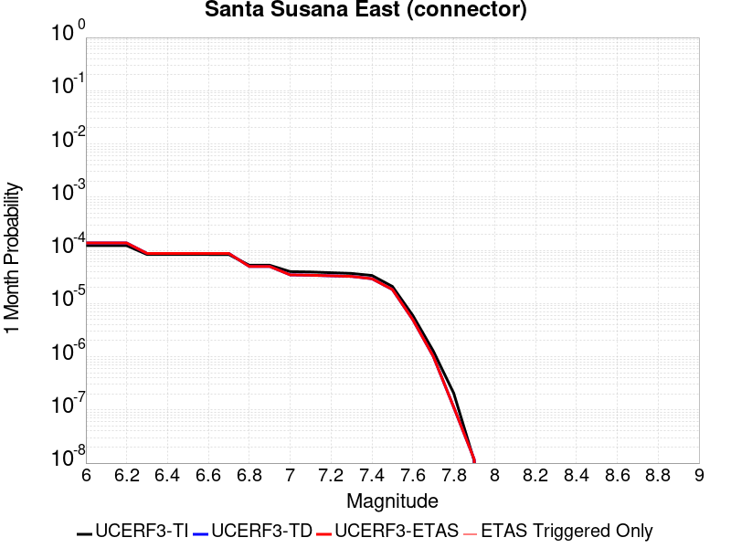 |  |  |

| Magnitude | 1 wk TI Prob | 1 wk TD Prob | 1 wk ETAS Prob | 1 wk ETAS/TD Gain | 1 wk ETAS Triggered Only | 1 mo TI Prob | 1 mo TD Prob | 1 mo ETAS Prob | 1 mo ETAS/TD Gain | 1 mo ETAS Triggered Only | 1 yr TI Prob | 1 yr TD Prob | 1 yr ETAS Prob | 1 yr ETAS/TD Gain | 1 yr ETAS Triggered Only | 10 yr TI Prob | 10 yr TD Prob | 10 yr ETAS Prob | 10 yr ETAS/TD Gain | 10 yr ETAS Triggered Only |
|-----|-----|-----|-----|-----|-----|-----|-----|-----|-----|-----|-----|-----|-----|-----|-----|-----|-----|-----|-----|-----|
| 6.0 | 2.858397E-5 | 3.202183E-5 | 3.202183E-5 | 1.0 | 0.0 | 1.2249697E-4 | 1.3723079E-4 | 1.3723079E-4 | 1.0 | 0.0 | 0.0014903803 | 0.0016697859 | 0.0016826843 | 1.0077245 | 1.2919897E-5 | 0.014804244 | 0.01659952 | 0.016612224 | 1.0007654 | 1.2919897E-5 |
| 6.1 | 2.858397E-5 | 3.202183E-5 | 3.202183E-5 | 1.0 | 0.0 | 1.2249697E-4 | 1.3723079E-4 | 1.3723079E-4 | 1.0 | 0.0 | 0.0014903803 | 0.0016697859 | 0.0016826843 | 1.0077245 | 1.2919897E-5 | 0.014804244 | 0.01659952 | 0.016612224 | 1.0007654 | 1.2919897E-5 |
| 6.2 | 2.858397E-5 | 3.202183E-5 | 3.202183E-5 | 1.0 | 0.0 | 1.2249697E-4 | 1.3723079E-4 | 1.3723079E-4 | 1.0 | 0.0 | 0.0014903803 | 0.0016697859 | 0.0016826843 | 1.0077245 | 1.2919897E-5 | 0.014804244 | 0.01659952 | 0.016612224 | 1.0007654 | 1.2919897E-5 |
| 6.3 | 1.943582E-5 | 2.0367674E-5 | 2.0367674E-5 | 1.0 | 0.0 | 8.329371E-5 | 8.728774E-5 | 8.728774E-5 | 1.0 | 0.0 | 0.001013629 | 0.0010623224 | 0.0010623224 | 1.0 | 0.0 | 0.010090181 | 0.010583875 | 0.010583875 | 1.0 | 0.0 |
| 6.4 | 1.943582E-5 | 2.0367674E-5 | 2.0367674E-5 | 1.0 | 0.0 | 8.329371E-5 | 8.728774E-5 | 8.728774E-5 | 1.0 | 0.0 | 0.001013629 | 0.0010623224 | 0.0010623224 | 1.0 | 0.0 | 0.010090181 | 0.010583875 | 0.010583875 | 1.0 | 0.0 |
| 6.5 | 1.943582E-5 | 2.0367674E-5 | 2.0367674E-5 | 1.0 | 0.0 | 8.329371E-5 | 8.728774E-5 | 8.728774E-5 | 1.0 | 0.0 | 0.001013629 | 0.0010623224 | 0.0010623224 | 1.0 | 0.0 | 0.010090181 | 0.010583875 | 0.010583875 | 1.0 | 0.0 |
| 6.6 | 1.943582E-5 | 2.0367674E-5 | 2.0367674E-5 | 1.0 | 0.0 | 8.329371E-5 | 8.728774E-5 | 8.728774E-5 | 1.0 | 0.0 | 0.001013629 | 0.0010623224 | 0.0010623224 | 1.0 | 0.0 | 0.010090181 | 0.010583875 | 0.010583875 | 1.0 | 0.0 |
| 6.7 | 1.9404439E-5 | 2.0355095E-5 | 2.0355095E-5 | 1.0 | 0.0 | 8.3159226E-5 | 8.7233835E-5 | 8.7233835E-5 | 1.0 | 0.0 | 0.0010119933 | 0.0010616668 | 0.0010616668 | 1.0 | 0.0 | 0.010073971 | 0.01057738 | 0.01057738 | 1.0 | 0.0 |
| 6.8 | 1.2217526E-5 | 1.1593199E-5 | 1.1593199E-5 | 1.0 | 0.0 | 5.2359774E-5 | 4.9684288E-5 | 4.9684288E-5 | 1.0 | 0.0 | 6.372938E-4 | 6.047551E-4 | 6.047551E-4 | 1.0 | 0.0 | 0.0063546924 | 0.006033141 | 0.006033141 | 1.0 | 0.0 |
| 6.9 | 1.2217526E-5 | 1.1593199E-5 | 1.1593199E-5 | 1.0 | 0.0 | 5.2359774E-5 | 4.9684288E-5 | 4.9684288E-5 | 1.0 | 0.0 | 6.372938E-4 | 6.047551E-4 | 6.047551E-4 | 1.0 | 0.0 | 0.0063546924 | 0.006033141 | 0.006033141 | 1.0 | 0.0 |
| 7.0 | 9.276017E-6 | 8.059215E-6 | 8.059215E-6 | 1.0 | 0.0 | 3.9753755E-5 | 3.4539054E-5 | 3.4539054E-5 | 1.0 | 0.0 | 4.8389446E-4 | 4.204353E-4 | 4.204353E-4 | 1.0 | 0.0 | 0.0048284214 | 0.0041971253 | 0.0041971253 | 1.0 | 0.0 |
| 7.1 | 9.130355E-6 | 7.942386E-6 | 7.942386E-6 | 1.0 | 0.0 | 3.9129503E-5 | 3.4038374E-5 | 3.4038374E-5 | 1.0 | 0.0 | 4.7629757E-4 | 4.1434186E-4 | 4.1434186E-4 | 1.0 | 0.0 | 0.00475278 | 0.004136419 | 0.004136419 | 1.0 | 0.0 |
| 7.2 | 8.851015E-6 | 7.741543E-6 | 7.741543E-6 | 1.0 | 0.0 | 3.7932372E-5 | 3.317764E-5 | 3.317764E-5 | 1.0 | 0.0 | 4.6172875E-4 | 4.0386632E-4 | 4.0386632E-4 | 1.0 | 0.0 | 0.0046077054 | 0.0040320465 | 0.0040320465 | 1.0 | 0.0 |
| 7.3 | 8.573006E-6 | 7.5502617E-6 | 7.5502617E-6 | 1.0 | 0.0 | 3.6740938E-5 | 3.2357882E-5 | 3.2357882E-5 | 1.0 | 0.0 | 4.472291E-4 | 3.9388944E-4 | 3.9388944E-4 | 1.0 | 0.0 | 0.004463301 | 0.00393263 | 0.00393263 | 1.0 | 0.0 |
| 7.4 | 7.852282E-6 | 6.8177665E-6 | 6.8177665E-6 | 1.0 | 0.0 | 3.36522E-5 | 2.9218689E-5 | 2.9218689E-5 | 1.0 | 0.0 | 4.096385E-4 | 3.556825E-4 | 3.556825E-4 | 1.0 | 0.0 | 0.0040888423 | 0.0035517968 | 0.0035517968 | 1.0 | 0.0 |
| 7.5 | 4.8869324E-6 | 4.279099E-6 | 4.279099E-6 | 1.0 | 0.0 | 2.0943828E-5 | 1.8338877E-5 | 1.8338877E-5 | 1.0 | 0.0 | 2.5496128E-4 | 2.232546E-4 | 2.232546E-4 | 1.0 | 0.0 | 0.0025466895 | 0.0022304675 | 0.0022304675 | 1.0 | 0.0 |
| 7.6 | 1.3894544E-6 | 1.1568255E-6 | 1.1568255E-6 | 1.0 | 0.0 | 5.954791E-6 | 4.9578157E-6 | 4.9578157E-6 | 1.0 | 0.0 | 7.249717E-5 | 6.035996E-5 | 6.035996E-5 | 1.0 | 0.0 | 7.247352E-4 | 6.0345745E-4 | 6.0345745E-4 | 1.0 | 0.0 |
| 7.7 | 2.9924632E-7 | 2.3719628E-7 | 2.3719628E-7 | 1.0 | 0.0 | 1.2824837E-6 | 1.0165551E-6 | 1.0165551E-6 | 1.0 | 0.0 | 1.5614127E-5 | 1.2376496E-5 | 1.2376496E-5 | 1.0 | 0.0 | 1.5613029E-4 | 1.2375879E-4 | 1.2375879E-4 | 1.0 | 0.0 |
| 7.8 | 4.8188564E-8 | 2.63245E-8 | 2.63245E-8 | 1.0 | 0.0 | 2.065224E-7 | 1.1281927E-7 | 1.1281927E-7 | 1.0 | 0.0 | 2.5144072E-6 | 1.3735739E-6 | 1.3735739E-6 | 1.0 | 0.0 | 2.5143789E-5 | 1.3735663E-5 | 1.3735663E-5 | 1.0 | 0.0 |
| 7.9 | 2.6127251E-9 | 2.768132E-9 | 2.768132E-9 | 1.0 | 0.0 | 1.1197393E-8 | 1.1863423E-8 | 1.1863423E-8 | 1.0 | 0.0 | 1.3632825E-7 | 1.4443718E-7 | 1.4443718E-7 | 1.0 | 0.0 | 1.3632817E-6 | 1.4443717E-6 | 1.4443717E-6 | 1.0 | 0.0 |

## Oak Ridge (Onshore)
*[(top)](#table-of-contents)*

| 1 Week | 1 Month | 1 Year | 10 Year |
|-----|-----|-----|-----|
|  |  |  | 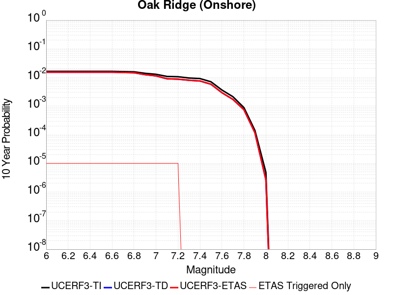 |

| Magnitude | 1 wk TI Prob | 1 wk TD Prob | 1 wk ETAS Prob | 1 wk ETAS/TD Gain | 1 wk ETAS Triggered Only | 1 mo TI Prob | 1 mo TD Prob | 1 mo ETAS Prob | 1 mo ETAS/TD Gain | 1 mo ETAS Triggered Only | 1 yr TI Prob | 1 yr TD Prob | 1 yr ETAS Prob | 1 yr ETAS/TD Gain | 1 yr ETAS Triggered Only | 10 yr TI Prob | 10 yr TD Prob | 10 yr ETAS Prob | 10 yr ETAS/TD Gain | 10 yr ETAS Triggered Only |
|-----|-----|-----|-----|-----|-----|-----|-----|-----|-----|-----|-----|-----|-----|-----|-----|-----|-----|-----|-----|-----|
| 6.0 | 3.155064E-5 | 2.952645E-5 | 2.952645E-5 | 1.0 | 0.0 | 1.3521002E-4 | 1.26536E-4 | 1.26536E-4 | 1.0 | 0.0 | 0.001644939 | 0.0015395252 | 0.0015395252 | 1.0 | 0.0 | 0.01632816 | 0.015293104 | 0.015305826 | 1.0008318 | 1.2919897E-5 |
| 6.1 | 3.155064E-5 | 2.952645E-5 | 2.952645E-5 | 1.0 | 0.0 | 1.3521002E-4 | 1.26536E-4 | 1.26536E-4 | 1.0 | 0.0 | 0.001644939 | 0.0015395252 | 0.0015395252 | 1.0 | 0.0 | 0.01632816 | 0.015293104 | 0.015305826 | 1.0008318 | 1.2919897E-5 |
| 6.2 | 3.155064E-5 | 2.952645E-5 | 2.952645E-5 | 1.0 | 0.0 | 1.3521002E-4 | 1.26536E-4 | 1.26536E-4 | 1.0 | 0.0 | 0.001644939 | 0.0015395252 | 0.0015395252 | 1.0 | 0.0 | 0.01632816 | 0.015293104 | 0.015305826 | 1.0008318 | 1.2919897E-5 |
| 6.3 | 3.155064E-5 | 2.952645E-5 | 2.952645E-5 | 1.0 | 0.0 | 1.3521002E-4 | 1.26536E-4 | 1.26536E-4 | 1.0 | 0.0 | 0.001644939 | 0.0015395252 | 0.0015395252 | 1.0 | 0.0 | 0.01632816 | 0.015293104 | 0.015305826 | 1.0008318 | 1.2919897E-5 |
| 6.4 | 3.155064E-5 | 2.952645E-5 | 2.952645E-5 | 1.0 | 0.0 | 1.3521002E-4 | 1.26536E-4 | 1.26536E-4 | 1.0 | 0.0 | 0.001644939 | 0.0015395252 | 0.0015395252 | 1.0 | 0.0 | 0.01632816 | 0.015293104 | 0.015305826 | 1.0008318 | 1.2919897E-5 |
| 6.5 | 3.155064E-5 | 2.952645E-5 | 2.952645E-5 | 1.0 | 0.0 | 1.3521002E-4 | 1.26536E-4 | 1.26536E-4 | 1.0 | 0.0 | 0.001644939 | 0.0015395252 | 0.0015395252 | 1.0 | 0.0 | 0.01632816 | 0.015293104 | 0.015305826 | 1.0008318 | 1.2919897E-5 |
| 6.6 | 3.155064E-5 | 2.952645E-5 | 2.952645E-5 | 1.0 | 0.0 | 1.3521002E-4 | 1.26536E-4 | 1.26536E-4 | 1.0 | 0.0 | 0.001644939 | 0.0015395252 | 0.0015395252 | 1.0 | 0.0 | 0.01632816 | 0.015293104 | 0.015305826 | 1.0008318 | 1.2919897E-5 |
| 6.7 | 3.098897E-5 | 2.8864635E-5 | 2.8864635E-5 | 1.0 | 0.0 | 1.328031E-4 | 1.2369992E-4 | 1.2369992E-4 | 1.0 | 0.0 | 0.0016156785 | 0.0015050438 | 0.0015050438 | 1.0 | 0.0 | 0.016039822 | 0.014952951 | 0.014965678 | 1.0008512 | 1.2919897E-5 |
| 6.8 | 3.0449872E-5 | 2.823982E-5 | 2.823982E-5 | 1.0 | 0.0 | 1.3049292E-4 | 1.2102239E-4 | 1.2102239E-4 | 1.0 | 0.0 | 0.0015875935 | 0.001472489 | 0.001472489 | 1.0 | 0.0 | 0.015762992 | 0.014631692 | 0.014644423 | 1.0008701 | 1.2919897E-5 |
| 6.9 | 2.697928E-5 | 2.4220137E-5 | 2.4220137E-5 | 1.0 | 0.0 | 1.15620365E-4 | 1.0379658E-4 | 1.0379658E-4 | 1.0 | 0.0 | 0.0014067689 | 0.0012630123 | 0.0012630123 | 1.0 | 0.0 | 0.0139789665 | 0.012561057 | 0.012573815 | 1.0010157 | 1.2919897E-5 |
| 7.0 | 2.4893961E-5 | 2.1862359E-5 | 2.1862359E-5 | 1.0 | 0.0 | 1.0668404E-4 | 9.369256E-5 | 9.369256E-5 | 1.0 | 0.0 | 0.0012981043 | 0.0011401277 | 0.0011401277 | 1.0 | 0.0 | 0.012905477 | 0.011345069 | 0.011357842 | 1.0011259 | 1.2919897E-5 |
| 7.1 | 2.0945363E-5 | 1.7354718E-5 | 1.7354718E-5 | 1.0 | 0.0 | 8.976275E-5 | 7.437527E-5 | 7.437527E-5 | 1.0 | 0.0 | 0.0010923136 | 9.051474E-4 | 9.051474E-4 | 1.0 | 0.0 | 0.0108696 | 0.009015542 | 0.009028345 | 1.0014201 | 1.2919897E-5 |
| 7.2 | 2.0439404E-5 | 1.6809645E-5 | 1.6809645E-5 | 1.0 | 0.0 | 8.7594504E-5 | 7.2039365E-5 | 7.2039365E-5 | 1.0 | 0.0 | 0.0010659413 | 8.7673106E-4 | 8.7673106E-4 | 1.0 | 0.0 | 0.010608427 | 0.00873364 | 0.008746447 | 1.0014664 | 1.2919897E-5 |
| 7.3 | 1.8463334E-5 | 1.5382002E-5 | 1.5382002E-5 | 1.0 | 0.0 | 7.912617E-5 | 6.5921224E-5 | 6.5921224E-5 | 1.0 | 0.0 | 9.6293533E-4 | 8.0229976E-4 | 8.0229976E-4 | 1.0 | 0.0 | 0.009587734 | 0.007994897 | 0.007994897 | 1.0 | 0.0 |
| 7.4 | 1.763139E-5 | 1.4517013E-5 | 1.4517013E-5 | 1.0 | 0.0 | 7.556091E-5 | 6.221431E-5 | 6.221431E-5 | 1.0 | 0.0 | 9.1956573E-4 | 7.5719994E-4 | 7.5719994E-4 | 1.0 | 0.0 | 0.009157699 | 0.007547003 | 0.007547003 | 1.0 | 0.0 |
| 7.5 | 1.3594944E-5 | 1.1163477E-5 | 1.1163477E-5 | 1.0 | 0.0 | 5.8262744E-5 | 4.7842612E-5 | 4.7842612E-5 | 1.0 | 0.0 | 7.0911803E-4 | 5.823306E-4 | 5.823306E-4 | 1.0 | 0.0 | 0.007068595 | 0.0058083185 | 0.0058083185 | 1.0 | 0.0 |
| 7.6 | 6.9889534E-6 | 5.6367617E-6 | 5.6367617E-6 | 1.0 | 0.0 | 2.9952313E-5 | 2.4157329E-5 | 2.4157329E-5 | 1.0 | 0.0 | 3.646084E-4 | 2.940762E-4 | 2.940762E-4 | 1.0 | 0.0 | 0.0036401073 | 0.0029369146 | 0.0029369146 | 1.0 | 0.0 |
| 7.7 | 4.0824193E-6 | 3.2832884E-6 | 3.2832884E-6 | 1.0 | 0.0 | 1.7495966E-5 | 1.4071161E-5 | 1.4071161E-5 | 1.0 | 0.0 | 2.1299256E-4 | 1.7130304E-4 | 1.7130304E-4 | 1.0 | 0.0 | 0.0021278851 | 0.0017117234 | 0.0017117234 | 1.0 | 0.0 |
| 7.8 | 1.7023609E-6 | 1.4370602E-6 | 1.4370602E-6 | 1.0 | 0.0 | 7.295812E-6 | 6.158815E-6 | 6.158815E-6 | 1.0 | 0.0 | 8.882289E-5 | 7.498102E-5 | 7.498102E-5 | 1.0 | 0.0 | 8.8787393E-4 | 7.4956E-4 | 7.4956E-4 | 1.0 | 0.0 |
| 7.9 | 2.721225E-7 | 2.2616715E-7 | 2.2616715E-7 | 1.0 | 0.0 | 1.1662388E-6 | 9.692874E-7 | 9.692874E-7 | 1.0 | 0.0 | 1.4198865E-5 | 1.1801013E-5 | 1.1801013E-5 | 1.0 | 0.0 | 1.4197957E-4 | 1.1800414E-4 | 1.1800414E-4 | 1.0 | 0.0 |
| 8.0 | 9.364255E-9 | 5.1209232E-9 | 5.1209232E-9 | 1.0 | 0.0 | 4.0132523E-8 | 2.1946814E-8 | 2.1946814E-8 | 1.0 | 0.0 | 4.8861335E-7 | 2.6720244E-7 | 2.6720244E-7 | 1.0 | 0.0 | 4.8861225E-6 | 2.6720215E-6 | 2.6720215E-6 | 1.0 | 0.0 |

## Simi-Santa Rosa
*[(top)](#table-of-contents)*

| 1 Week | 1 Month | 1 Year | 10 Year |
|-----|-----|-----|-----|
|  |  |  |  |

| Magnitude | 1 wk TI Prob | 1 wk TD Prob | 1 wk ETAS Prob | 1 wk ETAS/TD Gain | 1 wk ETAS Triggered Only | 1 mo TI Prob | 1 mo TD Prob | 1 mo ETAS Prob | 1 mo ETAS/TD Gain | 1 mo ETAS Triggered Only | 1 yr TI Prob | 1 yr TD Prob | 1 yr ETAS Prob | 1 yr ETAS/TD Gain | 1 yr ETAS Triggered Only | 10 yr TI Prob | 10 yr TD Prob | 10 yr ETAS Prob | 10 yr ETAS/TD Gain | 10 yr ETAS Triggered Only |
|-----|-----|-----|-----|-----|-----|-----|-----|-----|-----|-----|-----|-----|-----|-----|-----|-----|-----|-----|-----|-----|
| 6.0 | 2.198912E-5 | 2.2275886E-5 | 2.2275886E-5 | 1.0 | 0.0 | 9.4235686E-5 | 9.5464835E-5 | 9.5464835E-5 | 1.0 | 0.0 | 0.0011467156 | 0.0011617085 | 0.0011617085 | 1.0 | 0.0 | 0.011408163 | 0.011560804 | 0.0115735745 | 1.0011046 | 1.2919897E-5 |
| 6.1 | 2.198912E-5 | 2.2275886E-5 | 2.2275886E-5 | 1.0 | 0.0 | 9.4235686E-5 | 9.5464835E-5 | 9.5464835E-5 | 1.0 | 0.0 | 0.0011467156 | 0.0011617085 | 0.0011617085 | 1.0 | 0.0 | 0.011408163 | 0.011560804 | 0.0115735745 | 1.0011046 | 1.2919897E-5 |
| 6.2 | 1.69983E-5 | 1.6668911E-5 | 1.6668911E-5 | 1.0 | 0.0 | 7.284782E-5 | 7.14364E-5 | 7.14364E-5 | 1.0 | 0.0 | 8.865613E-4 | 8.694203E-4 | 8.694203E-4 | 1.0 | 0.0 | 0.008830327 | 0.0086631095 | 0.008675917 | 1.0014784 | 1.2919897E-5 |
| 6.3 | 1.69983E-5 | 1.6668911E-5 | 1.6668911E-5 | 1.0 | 0.0 | 7.284782E-5 | 7.14364E-5 | 7.14364E-5 | 1.0 | 0.0 | 8.865613E-4 | 8.694203E-4 | 8.694203E-4 | 1.0 | 0.0 | 0.008830327 | 0.0086631095 | 0.008675917 | 1.0014784 | 1.2919897E-5 |
| 6.4 | 1.4666188E-5 | 1.4052852E-5 | 1.4052852E-5 | 1.0 | 0.0 | 6.285358E-5 | 6.022526E-5 | 6.022526E-5 | 1.0 | 0.0 | 7.6497364E-4 | 7.330208E-4 | 7.330208E-4 | 1.0 | 0.0 | 0.0076234564 | 0.0073085045 | 0.00732133 | 1.0017549 | 1.2919897E-5 |
| 6.5 | 1.4666188E-5 | 1.4052852E-5 | 1.4052852E-5 | 1.0 | 0.0 | 6.285358E-5 | 6.022526E-5 | 6.022526E-5 | 1.0 | 0.0 | 7.6497364E-4 | 7.330208E-4 | 7.330208E-4 | 1.0 | 0.0 | 0.0076234564 | 0.0073085045 | 0.00732133 | 1.0017549 | 1.2919897E-5 |
| 6.6 | 1.4377586E-5 | 1.3729887E-5 | 1.3729887E-5 | 1.0 | 0.0 | 6.1616774E-5 | 5.8841186E-5 | 5.8841186E-5 | 1.0 | 0.0 | 7.4992597E-4 | 7.1618083E-4 | 7.1618083E-4 | 1.0 | 0.0 | 0.007474003 | 0.007141196 | 0.0071540237 | 1.0017962 | 1.2919897E-5 |
| 6.7 | 1.3881404E-5 | 1.3207847E-5 | 1.3207847E-5 | 1.0 | 0.0 | 5.9490372E-5 | 5.6603967E-5 | 5.6603967E-5 | 1.0 | 0.0 | 7.240546E-4 | 6.889601E-4 | 6.889601E-4 | 1.0 | 0.0 | 0.007217 | 0.0068706917 | 0.0068835225 | 1.0018675 | 1.2919897E-5 |
| 6.8 | 1.0176516E-5 | 9.154378E-6 | 9.154378E-6 | 1.0 | 0.0 | 4.3612912E-5 | 3.9232553E-5 | 3.9232553E-5 | 1.0 | 0.0 | 5.308578E-4 | 4.7756822E-4 | 4.7756822E-4 | 1.0 | 0.0 | 0.0052959146 | 0.004767053 | 0.004779911 | 1.0026973 | 1.2919897E-5 |
| 6.9 | 9.699797E-6 | 8.7749395E-6 | 8.7749395E-6 | 1.0 | 0.0 | 4.15699E-5 | 3.7606434E-5 | 3.7606434E-5 | 1.0 | 0.0 | 5.05996E-4 | 4.5777857E-4 | 4.5777857E-4 | 1.0 | 0.0 | 0.005048454 | 0.004569974 | 0.0045828344 | 1.0028142 | 1.2919897E-5 |
| 7.0 | 7.4049476E-6 | 6.559509E-6 | 6.559509E-6 | 1.0 | 0.0 | 3.1735104E-5 | 2.811195E-5 | 2.811195E-5 | 1.0 | 0.0 | 3.8630638E-4 | 3.422219E-4 | 3.422219E-4 | 1.0 | 0.0 | 0.0038563553 | 0.0034181913 | 0.003431067 | 1.0037668 | 1.2919897E-5 |
| 7.1 | 3.873439E-6 | 2.759614E-6 | 2.759614E-6 | 1.0 | 0.0 | 1.6600346E-5 | 1.1826865E-5 | 1.1826865E-5 | 1.0 | 0.0 | 2.0209046E-4 | 1.439828E-4 | 1.439828E-4 | 1.0 | 0.0 | 0.0020190678 | 0.0014389188 | 0.00145182 | 1.008966 | 1.2919897E-5 |
| 7.2 | 3.417706E-6 | 2.3677471E-6 | 2.3677471E-6 | 1.0 | 0.0 | 1.4647229E-5 | 1.014745E-5 | 1.014745E-5 | 1.0 | 0.0 | 1.7831543E-4 | 1.2353843E-4 | 1.2353843E-4 | 1.0 | 0.0 | 0.0017817242 | 0.0012347198 | 0.0012476237 | 1.010451 | 1.2919897E-5 |
| 7.3 | 1.90225E-6 | 1.4074596E-6 | 1.4074596E-6 | 1.0 | 0.0 | 8.152474E-6 | 6.0319558E-6 | 6.0319558E-6 | 1.0 | 0.0 | 9.9251854E-5 | 7.343661E-5 | 7.343661E-5 | 1.0 | 0.0 | 9.920754E-4 | 7.341257E-4 | 7.341257E-4 | 1.0 | 0.0 |
| 7.4 | 1.5170556E-6 | 1.1025584E-6 | 1.1025584E-6 | 1.0 | 0.0 | 6.5016507E-6 | 4.7252415E-6 | 4.7252415E-6 | 1.0 | 0.0 | 7.915472E-5 | 5.752831E-5 | 5.752831E-5 | 1.0 | 0.0 | 7.9126534E-4 | 5.751353E-4 | 5.751353E-4 | 1.0 | 0.0 |
| 7.5 | 1.178732E-6 | 8.5358926E-7 | 8.5358926E-7 | 1.0 | 0.0 | 5.0516987E-6 | 3.6582346E-6 | 3.6582346E-6 | 1.0 | 0.0 | 6.1502695E-5 | 4.4538105E-5 | 4.4538105E-5 | 1.0 | 0.0 | 6.148568E-4 | 4.4529274E-4 | 4.4529274E-4 | 1.0 | 0.0 |
| 7.6 | 6.8722386E-7 | 4.793958E-7 | 4.793958E-7 | 1.0 | 0.0 | 2.9452417E-6 | 2.0545517E-6 | 2.0545517E-6 | 1.0 | 0.0 | 3.5857727E-5 | 2.5013882E-5 | 2.5013882E-5 | 1.0 | 0.0 | 3.5851944E-4 | 2.5011078E-4 | 2.5011078E-4 | 1.0 | 0.0 |
| 7.7 | 5.5126515E-7 | 3.673869E-7 | 3.673869E-7 | 1.0 | 0.0 | 2.3625628E-6 | 1.5745143E-6 | 1.5745143E-6 | 1.0 | 0.0 | 2.8763823E-5 | 1.9169544E-5 | 1.9169544E-5 | 1.0 | 0.0 | 2.87601E-4 | 1.91679E-4 | 1.91679E-4 | 1.0 | 0.0 |
| 7.8 | 3.3860243E-7 | 2.0081488E-7 | 2.0081488E-7 | 1.0 | 0.0 | 1.4511525E-6 | 8.6063494E-7 | 8.6063494E-7 | 1.0 | 0.0 | 1.7667637E-5 | 1.047818E-5 | 1.047818E-5 | 1.0 | 0.0 | 1.7666233E-4 | 1.0477692E-4 | 1.0477692E-4 | 1.0 | 0.0 |
| 7.9 | 2.7955386E-7 | 1.4654502E-7 | 1.4654502E-7 | 1.0 | 0.0 | 1.1980875E-6 | 6.280499E-7 | 6.280499E-7 | 1.0 | 0.0 | 1.4586617E-5 | 7.646482E-6 | 7.646482E-6 | 1.0 | 0.0 | 1.458566E-4 | 7.646223E-5 | 7.646223E-5 | 1.0 | 0.0 |
| 8.0 | 5.6259015E-8 | 3.3357086E-8 | 3.3357086E-8 | 1.0 | 0.0 | 2.4111003E-7 | 1.4295894E-7 | 1.4295894E-7 | 1.0 | 0.0 | 2.9355108E-6 | 1.7405239E-6 | 1.7405239E-6 | 1.0 | 0.0 | 2.935472E-5 | 1.7405117E-5 | 1.7405117E-5 | 1.0 | 0.0 |

## Earthquake Valley (So Extension)
*[(top)](#table-of-contents)*

| 1 Week | 1 Month | 1 Year | 10 Year |
|-----|-----|-----|-----|
|  |  |  |  |

| Magnitude | 1 wk TI Prob | 1 wk TD Prob | 1 wk ETAS Prob | 1 wk ETAS/TD Gain | 1 wk ETAS Triggered Only | 1 mo TI Prob | 1 mo TD Prob | 1 mo ETAS Prob | 1 mo ETAS/TD Gain | 1 mo ETAS Triggered Only | 1 yr TI Prob | 1 yr TD Prob | 1 yr ETAS Prob | 1 yr ETAS/TD Gain | 1 yr ETAS Triggered Only | 10 yr TI Prob | 10 yr TD Prob | 10 yr ETAS Prob | 10 yr ETAS/TD Gain | 10 yr ETAS Triggered Only |
|-----|-----|-----|-----|-----|-----|-----|-----|-----|-----|-----|-----|-----|-----|-----|-----|-----|-----|-----|-----|-----|
| 6.0 | 3.0194888E-5 | 3.707326E-5 | 3.707326E-5 | 1.0 | 0.0 | 1.2940024E-4 | 1.588788E-4 | 1.7179664E-4 | 1.0813063 | 1.2919897E-5 | 0.0015743093 | 0.0019331772 | 0.0019460721 | 1.0066704 | 1.2919897E-5 | 0.01563203 | 0.019213596 | 0.019226268 | 1.0006595 | 1.2919897E-5 |
| 6.1 | 3.0194888E-5 | 3.707326E-5 | 3.707326E-5 | 1.0 | 0.0 | 1.2940024E-4 | 1.588788E-4 | 1.7179664E-4 | 1.0813063 | 1.2919897E-5 | 0.0015743093 | 0.0019331772 | 0.0019460721 | 1.0066704 | 1.2919897E-5 | 0.01563203 | 0.019213596 | 0.019226268 | 1.0006595 | 1.2919897E-5 |
| 6.2 | 3.0194888E-5 | 3.707326E-5 | 3.707326E-5 | 1.0 | 0.0 | 1.2940024E-4 | 1.588788E-4 | 1.7179664E-4 | 1.0813063 | 1.2919897E-5 | 0.0015743093 | 0.0019331772 | 0.0019460721 | 1.0066704 | 1.2919897E-5 | 0.01563203 | 0.019213596 | 0.019226268 | 1.0006595 | 1.2919897E-5 |
| 6.3 | 1.5795305E-5 | 1.8447001E-5 | 1.8447001E-5 | 1.0 | 0.0 | 6.769241E-5 | 7.905681E-5 | 9.1975686E-5 | 1.1634126 | 1.2919897E-5 | 8.238434E-4 | 9.622029E-4 | 9.7511034E-4 | 1.0134145 | 1.2919897E-5 | 0.008207959 | 0.009591279 | 0.009604075 | 1.0013341 | 1.2919897E-5 |
| 6.4 | 1.5795305E-5 | 1.8447001E-5 | 1.8447001E-5 | 1.0 | 0.0 | 6.769241E-5 | 7.905681E-5 | 9.1975686E-5 | 1.1634126 | 1.2919897E-5 | 8.238434E-4 | 9.622029E-4 | 9.7511034E-4 | 1.0134145 | 1.2919897E-5 | 0.008207959 | 0.009591279 | 0.009604075 | 1.0013341 | 1.2919897E-5 |
| 6.5 | 1.5795305E-5 | 1.8447001E-5 | 1.8447001E-5 | 1.0 | 0.0 | 6.769241E-5 | 7.905681E-5 | 9.1975686E-5 | 1.1634126 | 1.2919897E-5 | 8.238434E-4 | 9.622029E-4 | 9.7511034E-4 | 1.0134145 | 1.2919897E-5 | 0.008207959 | 0.009591279 | 0.009604075 | 1.0013341 | 1.2919897E-5 |
| 6.6 | 1.5795305E-5 | 1.8447001E-5 | 1.8447001E-5 | 1.0 | 0.0 | 6.769241E-5 | 7.905681E-5 | 9.1975686E-5 | 1.1634126 | 1.2919897E-5 | 8.238434E-4 | 9.622029E-4 | 9.7511034E-4 | 1.0134145 | 1.2919897E-5 | 0.008207959 | 0.009591279 | 0.009604075 | 1.0013341 | 1.2919897E-5 |
| 6.7 | 1.1363076E-5 | 1.3138576E-5 | 1.3138576E-5 | 1.0 | 0.0 | 4.8697988E-5 | 5.6307395E-5 | 6.922656E-5 | 1.22944 | 1.2919897E-5 | 5.927367E-4 | 6.85403E-4 | 6.9831405E-4 | 1.0188371 | 1.2919897E-5 | 0.0059115817 | 0.0068403645 | 0.006853196 | 1.0018759 | 1.2919897E-5 |
| 6.8 | 1.0049611E-5 | 1.15945795E-5 | 1.15945795E-5 | 1.0 | 0.0 | 4.306905E-5 | 4.969052E-5 | 6.2609775E-5 | 1.2599944 | 1.2919897E-5 | 5.242395E-4 | 6.048873E-4 | 6.177994E-4 | 1.0213462 | 1.2919897E-5 | 0.0052300454 | 0.0060395855 | 0.0060524275 | 1.0021263 | 1.2919897E-5 |
| 6.9 | 1.0049611E-5 | 1.15945795E-5 | 1.15945795E-5 | 1.0 | 0.0 | 4.306905E-5 | 4.969052E-5 | 6.2609775E-5 | 1.2599944 | 1.2919897E-5 | 5.242395E-4 | 6.048873E-4 | 6.177994E-4 | 1.0213462 | 1.2919897E-5 | 0.0052300454 | 0.0060395855 | 0.0060524275 | 1.0021263 | 1.2919897E-5 |
| 7.0 | 1.0049611E-5 | 1.15945795E-5 | 1.15945795E-5 | 1.0 | 0.0 | 4.306905E-5 | 4.969052E-5 | 6.2609775E-5 | 1.2599944 | 1.2919897E-5 | 5.242395E-4 | 6.048873E-4 | 6.177994E-4 | 1.0213462 | 1.2919897E-5 | 0.0052300454 | 0.0060395855 | 0.0060524275 | 1.0021263 | 1.2919897E-5 |
| 7.1 | 8.140254E-6 | 9.383657E-6 | 9.383657E-6 | 1.0 | 0.0 | 3.4886336E-5 | 4.021543E-5 | 5.3134805E-5 | 1.3212543 | 1.2919897E-5 | 4.2465836E-4 | 4.895799E-4 | 5.024935E-4 | 1.0263768 | 1.2919897E-5 | 0.0042384774 | 0.00489159 | 0.004904447 | 1.0026283 | 1.2919897E-5 |
| 7.2 | 1.673835E-7 | 1.4154533E-7 | 1.4154533E-7 | 1.0 | 0.0 | 7.173577E-7 | 6.066227E-7 | 6.066227E-7 | 1.0 | 0.0 | 8.733795E-6 | 7.38561E-6 | 7.38561E-6 | 1.0 | 0.0 | 8.733451E-5 | 7.3854E-5 | 7.3854E-5 | 1.0 | 0.0 |
| 7.3 | 1.6632116E-7 | 1.405276E-7 | 1.405276E-7 | 1.0 | 0.0 | 7.1280476E-7 | 6.02261E-7 | 6.02261E-7 | 1.0 | 0.0 | 8.678364E-6 | 7.332507E-6 | 7.332507E-6 | 1.0 | 0.0 | 8.6780245E-5 | 7.3323004E-5 | 7.3323004E-5 | 1.0 | 0.0 |
| 7.4 | 1.6569169E-7 | 1.3997388E-7 | 1.3997388E-7 | 1.0 | 0.0 | 7.1010703E-7 | 5.998879E-7 | 5.998879E-7 | 1.0 | 0.0 | 8.645519E-6 | 7.3036144E-6 | 7.3036144E-6 | 1.0 | 0.0 | 8.645182E-5 | 7.30341E-5 | 7.30341E-5 | 1.0 | 0.0 |
| 7.5 | 1.1764555E-7 | 1.0096232E-7 | 1.0096232E-7 | 1.0 | 0.0 | 5.041951E-7 | 4.3269557E-7 | 4.3269557E-7 | 1.0 | 0.0 | 6.138558E-6 | 5.268058E-6 | 5.268058E-6 | 1.0 | 0.0 | 6.1383886E-5 | 5.267955E-5 | 5.267955E-5 | 1.0 | 0.0 |
| 7.6 | 1.07927605E-7 | 9.261032E-8 | 9.261032E-8 | 1.0 | 0.0 | 4.6254678E-7 | 3.9690133E-7 | 3.9690133E-7 | 1.0 | 0.0 | 5.6314925E-6 | 4.832265E-6 | 4.832265E-6 | 1.0 | 0.0 | 5.63135E-5 | 4.832181E-5 | 4.832181E-5 | 1.0 | 0.0 |
| 7.7 | 2.1826905E-8 | 1.1181076E-8 | 1.1181076E-8 | 1.0 | 0.0 | 9.3543875E-8 | 4.7918892E-8 | 4.7918892E-8 | 1.0 | 0.0 | 1.1388961E-6 | 5.8341243E-7 | 5.8341243E-7 | 1.0 | 0.0 | 1.1388902E-5 | 5.8341143E-6 | 5.8341143E-6 | 1.0 | 0.0 |
| 7.8 | 2.6169649E-9 | 1.1970057E-9 | 1.1970057E-9 | 1.0 | 0.0 | 1.1215564E-8 | 5.130025E-9 | 5.130025E-9 | 1.0 | 0.0 | 1.3654947E-7 | 6.245805E-8 | 6.245805E-8 | 1.0 | 0.0 | 1.365494E-6 | 6.245805E-7 | 6.245805E-7 | 1.0 | 0.0 |

## Red Mountain
*[(top)](#table-of-contents)*

| 1 Week | 1 Month | 1 Year | 10 Year |
|-----|-----|-----|-----|
|  |  | 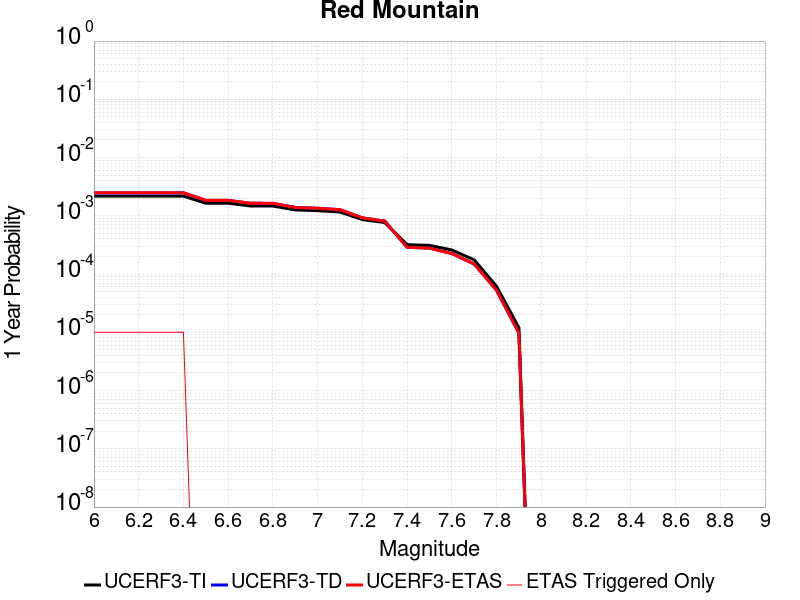 |  |

| Magnitude | 1 wk TI Prob | 1 wk TD Prob | 1 wk ETAS Prob | 1 wk ETAS/TD Gain | 1 wk ETAS Triggered Only | 1 mo TI Prob | 1 mo TD Prob | 1 mo ETAS Prob | 1 mo ETAS/TD Gain | 1 mo ETAS Triggered Only | 1 yr TI Prob | 1 yr TD Prob | 1 yr ETAS Prob | 1 yr ETAS/TD Gain | 1 yr ETAS Triggered Only | 10 yr TI Prob | 10 yr TD Prob | 10 yr ETAS Prob | 10 yr ETAS/TD Gain | 10 yr ETAS Triggered Only |
|-----|-----|-----|-----|-----|-----|-----|-----|-----|-----|-----|-----|-----|-----|-----|-----|-----|-----|-----|-----|-----|
| 6.0 | 4.1810763E-5 | 4.7591006E-5 | 6.0510287E-5 | 1.2714648 | 1.2919897E-5 | 1.7917668E-4 | 2.0394645E-4 | 2.168637E-4 | 1.0633365 | 1.2919897E-5 | 0.0021792934 | 0.0024803858 | 0.0024932735 | 1.0051959 | 1.2919897E-5 | 0.021580452 | 0.02454463 | 0.024557233 | 1.0005134 | 1.2919897E-5 |
| 6.1 | 4.1810763E-5 | 4.7591006E-5 | 6.0510287E-5 | 1.2714648 | 1.2919897E-5 | 1.7917668E-4 | 2.0394645E-4 | 2.168637E-4 | 1.0633365 | 1.2919897E-5 | 0.0021792934 | 0.0024803858 | 0.0024932735 | 1.0051959 | 1.2919897E-5 | 0.021580452 | 0.02454463 | 0.024557233 | 1.0005134 | 1.2919897E-5 |
| 6.2 | 4.1810763E-5 | 4.7591006E-5 | 6.0510287E-5 | 1.2714648 | 1.2919897E-5 | 1.7917668E-4 | 2.0394645E-4 | 2.168637E-4 | 1.0633365 | 1.2919897E-5 | 0.0021792934 | 0.0024803858 | 0.0024932735 | 1.0051959 | 1.2919897E-5 | 0.021580452 | 0.02454463 | 0.024557233 | 1.0005134 | 1.2919897E-5 |
| 6.3 | 4.1810763E-5 | 4.7591006E-5 | 6.0510287E-5 | 1.2714648 | 1.2919897E-5 | 1.7917668E-4 | 2.0394645E-4 | 2.168637E-4 | 1.0633365 | 1.2919897E-5 | 0.0021792934 | 0.0024803858 | 0.0024932735 | 1.0051959 | 1.2919897E-5 | 0.021580452 | 0.02454463 | 0.024557233 | 1.0005134 | 1.2919897E-5 |
| 6.4 | 4.1810763E-5 | 4.7591006E-5 | 6.0510287E-5 | 1.2714648 | 1.2919897E-5 | 1.7917668E-4 | 2.0394645E-4 | 2.168637E-4 | 1.0633365 | 1.2919897E-5 | 0.0021792934 | 0.0024803858 | 0.0024932735 | 1.0051959 | 1.2919897E-5 | 0.021580452 | 0.02454463 | 0.024557233 | 1.0005134 | 1.2919897E-5 |
| 6.5 | 3.154503E-5 | 3.5360477E-5 | 3.5360477E-5 | 1.0 | 0.0 | 1.3518598E-4 | 1.5153662E-4 | 1.5153662E-4 | 1.0 | 0.0 | 0.0016446467 | 0.0018434891 | 0.0018434891 | 1.0 | 0.0 | 0.01632528 | 0.018291617 | 0.018291617 | 1.0 | 0.0 |
| 6.6 | 3.1535834E-5 | 3.5349858E-5 | 3.5349858E-5 | 1.0 | 0.0 | 1.3514658E-4 | 1.5149111E-4 | 1.5149111E-4 | 1.0 | 0.0 | 0.0016441676 | 0.001842936 | 0.001842936 | 1.0 | 0.0 | 0.01632056 | 0.018286178 | 0.018286178 | 1.0 | 0.0 |
| 6.7 | 2.8267326E-5 | 3.146999E-5 | 3.146999E-5 | 1.0 | 0.0 | 1.2114006E-4 | 1.348649E-4 | 1.348649E-4 | 1.0 | 0.0 | 0.0014738824 | 0.0016408286 | 0.0016408286 | 1.0 | 0.0 | 0.014641452 | 0.016295899 | 0.016295899 | 1.0 | 0.0 |
| 6.8 | 2.8212884E-5 | 3.1407875E-5 | 3.1407875E-5 | 1.0 | 0.0 | 1.20906756E-4 | 1.3459871E-4 | 1.3459871E-4 | 1.0 | 0.0 | 0.0014710457 | 0.0016375926 | 0.0016375926 | 1.0 | 0.0 | 0.014613459 | 0.016264014 | 0.016264014 | 1.0 | 0.0 |
| 6.9 | 2.4227871E-5 | 2.6707517E-5 | 2.6707517E-5 | 1.0 | 0.0 | 1.03829596E-4 | 1.1445619E-4 | 1.1445619E-4 | 1.0 | 0.0 | 0.0012633923 | 0.0013926893 | 0.0013926893 | 1.0 | 0.0 | 0.012562336 | 0.013847304 | 0.013847304 | 1.0 | 0.0 |
| 7.0 | 2.348524E-5 | 2.5836282E-5 | 2.5836282E-5 | 1.0 | 0.0 | 1.0064714E-4 | 1.1072265E-4 | 1.1072265E-4 | 1.0 | 0.0 | 0.0012246901 | 0.0013472902 | 0.0013472902 | 1.0 | 0.0 | 0.012179627 | 0.013398857 | 0.013398857 | 1.0 | 0.0 |
| 7.1 | 2.2311642E-5 | 2.4463316E-5 | 2.4463316E-5 | 1.0 | 0.0 | 9.561782E-5 | 1.04839E-4 | 1.04839E-4 | 1.0 | 0.0 | 0.0011635252 | 0.0012757422 | 0.0012757422 | 1.0 | 0.0 | 0.01157452 | 0.012691703 | 0.012691703 | 1.0 | 0.0 |
| 7.2 | 1.6533986E-5 | 1.7670676E-5 | 1.7670676E-5 | 1.0 | 0.0 | 7.085802E-5 | 7.572963E-5 | 7.572963E-5 | 1.0 | 0.0 | 8.623549E-4 | 9.2168164E-4 | 9.2168164E-4 | 1.0 | 0.0 | 0.008590161 | 0.009184869 | 0.009184869 | 1.0 | 0.0 |
| 7.3 | 1.4703092E-5 | 1.5559806E-5 | 1.5559806E-5 | 1.0 | 0.0 | 6.301173E-5 | 6.6683526E-5 | 6.6683526E-5 | 1.0 | 0.0 | 7.668978E-4 | 8.1163115E-4 | 8.1163115E-4 | 1.0 | 0.0 | 0.0076425658 | 0.008092744 | 0.008092744 | 1.0 | 0.0 |
| 7.4 | 6.1331984E-6 | 5.52893E-6 | 5.52893E-6 | 1.0 | 0.0 | 2.6284872E-5 | 2.3695204E-5 | 2.3695204E-5 | 1.0 | 0.0 | 3.199713E-4 | 2.8845144E-4 | 2.8845144E-4 | 1.0 | 0.0 | 0.0031951098 | 0.0028808247 | 0.0028808247 | 1.0 | 0.0 |
| 7.5 | 5.954766E-6 | 5.338558E-6 | 5.338558E-6 | 1.0 | 0.0 | 2.5520176E-5 | 2.2879336E-5 | 2.2879336E-5 | 1.0 | 0.0 | 3.1066386E-4 | 2.7852083E-4 | 2.7852083E-4 | 1.0 | 0.0 | 0.003102299 | 0.0027817716 | 0.0027817716 | 1.0 | 0.0 |
| 7.6 | 4.9726646E-6 | 4.315341E-6 | 4.315341E-6 | 1.0 | 0.0 | 2.1311245E-5 | 1.8494187E-5 | 1.8494187E-5 | 1.0 | 0.0 | 2.5943352E-4 | 2.2514381E-4 | 2.2514381E-4 | 1.0 | 0.0 | 0.0025913084 | 0.0022491917 | 0.0022491917 | 1.0 | 0.0 |
| 7.7 | 3.3613894E-6 | 2.8526943E-6 | 2.8526943E-6 | 1.0 | 0.0 | 1.4405875E-5 | 1.2225777E-5 | 1.2225777E-5 | 1.0 | 0.0 | 1.7537741E-4 | 1.4883894E-4 | 1.4883894E-4 | 1.0 | 0.0 | 0.0017523908 | 0.0014874188 | 0.0014874188 | 1.0 | 0.0 |
| 7.8 | 1.1828961E-6 | 1.0122844E-6 | 1.0122844E-6 | 1.0 | 0.0 | 5.069545E-6 | 4.338355E-6 | 4.338355E-6 | 1.0 | 0.0 | 6.171996E-5 | 5.281822E-5 | 5.281822E-5 | 1.0 | 0.0 | 6.170282E-4 | 5.280596E-4 | 5.280596E-4 | 1.0 | 0.0 |
| 7.9 | 2.2967266E-7 | 1.8619119E-7 | 1.8619119E-7 | 1.0 | 0.0 | 9.843111E-7 | 7.9796195E-7 | 7.9796195E-7 | 1.0 | 0.0 | 1.19839215E-5 | 9.715147E-6 | 9.715147E-6 | 1.0 | 0.0 | 1.1983275E-4 | 9.714751E-5 | 9.714751E-5 | 1.0 | 0.0 |

## San Clemente
*[(top)](#table-of-contents)*

| 1 Week | 1 Month | 1 Year | 10 Year |
|-----|-----|-----|-----|
|  |  |  |  |

| Magnitude | 1 wk TI Prob | 1 wk TD Prob | 1 wk ETAS Prob | 1 wk ETAS/TD Gain | 1 wk ETAS Triggered Only | 1 mo TI Prob | 1 mo TD Prob | 1 mo ETAS Prob | 1 mo ETAS/TD Gain | 1 mo ETAS Triggered Only | 1 yr TI Prob | 1 yr TD Prob | 1 yr ETAS Prob | 1 yr ETAS/TD Gain | 1 yr ETAS Triggered Only | 10 yr TI Prob | 10 yr TD Prob | 10 yr ETAS Prob | 10 yr ETAS/TD Gain | 10 yr ETAS Triggered Only |
|-----|-----|-----|-----|-----|-----|-----|-----|-----|-----|-----|-----|-----|-----|-----|-----|-----|-----|-----|-----|-----|
| 6.0 | 6.681379E-5 | 8.163669E-5 | 8.163669E-5 | 1.0 | 0.0 | 2.8631336E-4 | 3.4982787E-4 | 3.4982787E-4 | 1.0 | 0.0 | 0.003480294 | 0.004251416 | 0.004251416 | 1.0 | 0.0 | 0.03426291 | 0.041756913 | 0.041769296 | 1.0002965 | 1.2919897E-5 |
| 6.1 | 6.681379E-5 | 8.163669E-5 | 8.163669E-5 | 1.0 | 0.0 | 2.8631336E-4 | 3.4982787E-4 | 3.4982787E-4 | 1.0 | 0.0 | 0.003480294 | 0.004251416 | 0.004251416 | 1.0 | 0.0 | 0.03426291 | 0.041756913 | 0.041756913 | 1.0 | 0.0 |
| 6.2 | 3.9400576E-5 | 4.6453104E-5 | 4.6453104E-5 | 1.0 | 0.0 | 1.6884868E-4 | 1.9906988E-4 | 1.9906988E-4 | 1.0 | 0.0 | 0.0020537945 | 0.0024210429 | 0.0024210429 | 1.0 | 0.0 | 0.020349167 | 0.023953425 | 0.023953425 | 1.0 | 0.0 |
| 6.3 | 3.2590255E-5 | 3.792992E-5 | 3.792992E-5 | 1.0 | 0.0 | 1.3966505E-4 | 1.6254683E-4 | 1.6254683E-4 | 1.0 | 0.0 | 0.0016990956 | 0.0019772416 | 0.0019772416 | 1.0 | 0.0 | 0.01686163 | 0.019600289 | 0.019600289 | 1.0 | 0.0 |
| 6.4 | 2.9454652E-5 | 3.4098495E-5 | 3.4098495E-5 | 1.0 | 0.0 | 1.2622811E-4 | 1.4612835E-4 | 1.4612835E-4 | 1.0 | 0.0 | 0.0015357438 | 0.0017776854 | 0.0017776854 | 1.0 | 0.0 | 0.015251739 | 0.017637825 | 0.017637825 | 1.0 | 0.0 |
| 6.5 | 2.790836E-5 | 3.2248132E-5 | 3.2248132E-5 | 1.0 | 0.0 | 1.1960178E-4 | 1.3819907E-4 | 1.3819907E-4 | 1.0 | 0.0 | 0.001455179 | 0.0016812999 | 0.0016812999 | 1.0 | 0.0 | 0.014456868 | 0.016688818 | 0.016688818 | 1.0 | 0.0 |
| 6.6 | 2.2492153E-5 | 2.5763205E-5 | 2.5763205E-5 | 1.0 | 0.0 | 9.639138E-5 | 1.1040914E-4 | 1.1040914E-4 | 1.0 | 0.0 | 0.0011729331 | 0.0013434167 | 0.0013434167 | 1.0 | 0.0 | 0.011667615 | 0.013354672 | 0.013354672 | 1.0 | 0.0 |
| 6.7 | 1.9862755E-5 | 2.2666847E-5 | 2.2666847E-5 | 1.0 | 0.0 | 8.512331E-5 | 9.714008E-5 | 9.714008E-5 | 1.0 | 0.0 | 0.0010358836 | 0.0011820501 | 0.0011820501 | 1.0 | 0.0 | 0.010310682 | 0.01175892 | 0.01175892 | 1.0 | 0.0 |
| 6.8 | 1.6697575E-5 | 1.8978053E-5 | 1.8978053E-5 | 1.0 | 0.0 | 7.155907E-5 | 8.133203E-5 | 8.133203E-5 | 1.0 | 0.0 | 8.7088346E-4 | 9.89777E-4 | 9.89777E-4 | 1.0 | 0.0 | 0.008674784 | 0.009854714 | 0.009854714 | 1.0 | 0.0 |
| 6.9 | 1.5218415E-5 | 1.726971E-5 | 1.726971E-5 | 1.0 | 0.0 | 6.522015E-5 | 7.401099E-5 | 7.401099E-5 | 1.0 | 0.0 | 7.93766E-4 | 9.0072013E-4 | 9.0072013E-4 | 1.0 | 0.0 | 0.007909367 | 0.00897164 | 0.00897164 | 1.0 | 0.0 |
| 7.0 | 1.2392958E-5 | 1.4033262E-5 | 1.4033262E-5 | 1.0 | 0.0 | 5.3111595E-5 | 6.0141207E-5 | 6.0141207E-5 | 1.0 | 0.0 | 6.4644177E-4 | 7.319808E-4 | 7.319808E-4 | 1.0 | 0.0 | 0.0064456454 | 0.0072964844 | 0.0072964844 | 1.0 | 0.0 |
| 7.1 | 1.0934128E-5 | 1.2375354E-5 | 1.2375354E-5 | 1.0 | 0.0 | 4.6859706E-5 | 5.3036194E-5 | 5.3036194E-5 | 1.0 | 0.0 | 5.7036756E-4 | 6.455317E-4 | 6.455317E-4 | 1.0 | 0.0 | 0.0056890585 | 0.006437312 | 0.006437312 | 1.0 | 0.0 |
| 7.2 | 9.5798805E-6 | 1.0845125E-5 | 1.0845125E-5 | 1.0 | 0.0 | 4.1055984E-5 | 4.647832E-5 | 4.647832E-5 | 1.0 | 0.0 | 4.9974193E-4 | 5.657338E-4 | 5.657338E-4 | 1.0 | 0.0 | 0.0049861963 | 0.00564366 | 0.00564366 | 1.0 | 0.0 |
| 7.3 | 8.0167365E-6 | 9.084078E-6 | 9.084078E-6 | 1.0 | 0.0 | 3.4356988E-5 | 3.8931223E-5 | 3.8931223E-5 | 1.0 | 0.0 | 4.1821605E-4 | 4.738916E-4 | 4.738916E-4 | 1.0 | 0.0 | 0.0041742986 | 0.004729513 | 0.004729513 | 1.0 | 0.0 |
| 7.4 | 2.9581017E-6 | 3.36244E-6 | 3.36244E-6 | 1.0 | 0.0 | 1.2677518E-5 | 1.4410407E-5 | 1.4410407E-5 | 1.0 | 0.0 | 1.5433785E-4 | 1.7543763E-4 | 1.7543763E-4 | 1.0 | 0.0 | 0.001542307 | 0.0017534863 | 0.0017534863 | 1.0 | 0.0 |

## Calaveras (So) - Paicines extension 2011 CFM
*[(top)](#table-of-contents)*

| 1 Week | 1 Month | 1 Year | 10 Year |
|-----|-----|-----|-----|
|  |  |  |  |

| Magnitude | 1 wk TI Prob | 1 wk TD Prob | 1 wk ETAS Prob | 1 wk ETAS/TD Gain | 1 wk ETAS Triggered Only | 1 mo TI Prob | 1 mo TD Prob | 1 mo ETAS Prob | 1 mo ETAS/TD Gain | 1 mo ETAS Triggered Only | 1 yr TI Prob | 1 yr TD Prob | 1 yr ETAS Prob | 1 yr ETAS/TD Gain | 1 yr ETAS Triggered Only | 10 yr TI Prob | 10 yr TD Prob | 10 yr ETAS Prob | 10 yr ETAS/TD Gain | 10 yr ETAS Triggered Only |
|-----|-----|-----|-----|-----|-----|-----|-----|-----|-----|-----|-----|-----|-----|-----|-----|-----|-----|-----|-----|-----|
| 6.0 | 1.5183659E-4 | 3.0539723E-4 | 3.0539723E-4 | 1.0 | 0.0 | 6.5056595E-4 | 0.0013070651 | 0.0013199681 | 1.0098717 | 1.2919897E-5 | 0.007891912 | 0.015697578 | 0.015710294 | 1.0008101 | 1.2919897E-5 | 0.076174594 | 0.13850221 | 0.13851334 | 1.0000803 | 1.2919897E-5 |
| 6.1 | 1.5024997E-4 | 3.0233792E-4 | 3.0233792E-4 | 1.0 | 0.0 | 6.437695E-4 | 0.0012939668 | 0.00130687 | 1.0099719 | 1.2919897E-5 | 0.0078097614 | 0.015540968 | 0.015553687 | 1.0008184 | 1.2919897E-5 | 0.075409345 | 0.13717179 | 0.13718294 | 1.0000813 | 1.2919897E-5 |
| 6.2 | 1.2743923E-4 | 2.5316013E-4 | 2.5316013E-4 | 1.0 | 0.0 | 5.460538E-4 | 0.0010844896 | 0.0010973956 | 1.0119004 | 1.2919897E-5 | 0.0066279583 | 0.013048578 | 0.01306133 | 1.0009773 | 1.2919897E-5 | 0.064337276 | 0.11726981 | 0.117281206 | 1.0000973 | 1.2919897E-5 |
| 6.3 | 1.1525114E-4 | 2.260286E-4 | 2.260286E-4 | 1.0 | 0.0 | 4.9383997E-4 | 9.683249E-4 | 9.683249E-4 | 1.0 | 0.0 | 0.0059959386 | 0.011669789 | 0.011669789 | 1.0 | 0.0 | 0.058367174 | 0.106385924 | 0.106385924 | 1.0 | 0.0 |
| 6.4 | 1.07200925E-4 | 2.0842902E-4 | 2.0842902E-4 | 1.0 | 0.0 | 4.5935164E-4 | 8.9295075E-4 | 8.9295075E-4 | 1.0 | 0.0 | 0.0055782744 | 0.010774614 | 0.010774614 | 1.0 | 0.0 | 0.0544031 | 0.099208504 | 0.099208504 | 1.0 | 0.0 |
| 6.5 | 9.69631E-5 | 1.8734904E-4 | 1.8734904E-4 | 1.0 | 0.0 | 4.1548995E-4 | 8.026659E-4 | 8.026659E-4 | 1.0 | 0.0 | 0.0050468626 | 0.009696479 | 0.009696479 | 1.0 | 0.0 | 0.04933773 | 0.090100124 | 0.090100124 | 1.0 | 0.0 |
| 6.6 | 8.0552316E-5 | 1.5074172E-4 | 1.5074172E-4 | 1.0 | 0.0 | 3.4517853E-4 | 6.458615E-4 | 6.458615E-4 | 1.0 | 0.0 | 0.0041944524 | 0.007828098 | 0.007828098 | 1.0 | 0.0 | 0.04116161 | 0.07487006 | 0.07487006 | 1.0 | 0.0 |
| 6.7 | 7.815757E-5 | 1.4614181E-4 | 1.4614181E-4 | 1.0 | 0.0 | 3.34918E-4 | 6.2616885E-4 | 6.2616885E-4 | 1.0 | 0.0 | 0.004070005 | 0.007590925 | 0.007590925 | 1.0 | 0.0 | 0.039962657 | 0.072719574 | 0.072719574 | 1.0 | 0.0 |
| 6.8 | 6.965264E-5 | 1.2724761E-4 | 1.2724761E-4 | 1.0 | 0.0 | 2.9847719E-4 | 5.4523296E-4 | 5.4523296E-4 | 1.0 | 0.0 | 0.0036279052 | 0.006615107 | 0.006615107 | 1.0 | 0.0 | 0.03569247 | 0.06381377 | 0.06381377 | 1.0 | 0.0 |
| 6.9 | 5.8000453E-5 | 1.0145923E-4 | 1.0145923E-4 | 1.0 | 0.0 | 2.4854968E-4 | 4.347534E-4 | 4.347534E-4 | 1.0 | 0.0 | 0.0030218933 | 0.0052803815 | 0.0052803815 | 1.0 | 0.0 | 0.029811295 | 0.051512837 | 0.051512837 | 1.0 | 0.0 |
| 7.0 | 4.9865852E-5 | 8.570066E-5 | 8.570066E-5 | 1.0 | 0.0 | 2.1369329E-4 | 3.672373E-4 | 3.672373E-4 | 1.0 | 0.0 | 0.0025986114 | 0.0044620372 | 0.0044620372 | 1.0 | 0.0 | 0.025684336 | 0.04379284 | 0.04379284 | 1.0 | 0.0 |
| 7.1 | 4.283875E-5 | 7.113806E-5 | 7.113806E-5 | 1.0 | 0.0 | 1.8358172E-4 | 3.048421E-4 | 3.048421E-4 | 1.0 | 0.0 | 0.0022328163 | 0.0037051928 | 0.0037051928 | 1.0 | 0.0 | 0.022105146 | 0.036743753 | 0.036743753 | 1.0 | 0.0 |
| 7.2 | 3.450115E-5 | 5.579191E-5 | 5.579191E-5 | 1.0 | 0.0 | 1.478537E-4 | 2.3908642E-4 | 2.3908642E-4 | 1.0 | 0.0 | 0.0017986323 | 0.0029070205 | 0.0029070205 | 1.0 | 0.0 | 0.017841442 | 0.02908689 | 0.02908689 | 1.0 | 0.0 |
| 7.3 | 2.5709045E-5 | 4.060244E-5 | 4.060244E-5 | 1.0 | 0.0 | 1.1017697E-4 | 1.7399895E-4 | 1.7399895E-4 | 1.0 | 0.0 | 0.0013405791 | 0.0021163959 | 0.0021163959 | 1.0 | 0.0 | 0.013325208 | 0.02130426 | 0.02130426 | 1.0 | 0.0 |
| 7.4 | 1.8003093E-5 | 2.8518018E-5 | 2.8518018E-5 | 1.0 | 0.0 | 7.715383E-5 | 1.2221436E-4 | 1.2221436E-4 | 1.0 | 0.0 | 9.3894306E-4 | 0.0014869466 | 0.0014869466 | 1.0 | 0.0 | 0.009349857 | 0.0150561305 | 0.0150561305 | 1.0 | 0.0 |
| 7.5 | 1.5595824E-5 | 2.5830264E-5 | 2.5830264E-5 | 1.0 | 0.0 | 6.683753E-5 | 1.1069645E-4 | 1.1069645E-4 | 1.0 | 0.0 | 8.134431E-4 | 0.0013468983 | 0.0013468983 | 1.0 | 0.0 | 0.008104719 | 0.013655912 | 0.013655912 | 1.0 | 0.0 |
| 7.6 | 1.1110309E-5 | 1.9228919E-5 | 1.9228919E-5 | 1.0 | 0.0 | 4.761474E-5 | 8.240705E-5 | 8.240705E-5 | 1.0 | 0.0 | 5.795553E-4 | 0.0010028455 | 0.0010028455 | 1.0 | 0.0 | 0.0057804612 | 0.010207267 | 0.010207267 | 1.0 | 0.0 |
| 7.7 | 6.2140443E-6 | 1.04426E-5 | 1.04426E-5 | 1.0 | 0.0 | 2.6631347E-5 | 4.4753233E-5 | 4.4753233E-5 | 1.0 | 0.0 | 3.241884E-4 | 5.447345E-4 | 5.447345E-4 | 1.0 | 0.0 | 0.0032371588 | 0.0056225345 | 0.0056225345 | 1.0 | 0.0 |
| 7.8 | 5.305533E-6 | 9.438008E-6 | 9.438008E-6 | 1.0 | 0.0 | 2.27378E-5 | 4.0447983E-5 | 4.0447983E-5 | 1.0 | 0.0 | 2.7679754E-4 | 4.92343E-4 | 4.92343E-4 | 1.0 | 0.0 | 0.0027645302 | 0.005076744 | 0.005076744 | 1.0 | 0.0 |
| 7.9 | 3.363505E-6 | 7.3886436E-6 | 7.3886436E-6 | 1.0 | 0.0 | 1.4414942E-5 | 3.1665233E-5 | 3.1665233E-5 | 1.0 | 0.0 | 1.7548777E-4 | 3.8545608E-4 | 3.8545608E-4 | 1.0 | 0.0 | 0.0017534926 | 0.00395034 | 0.00395034 | 1.0 | 0.0 |
| 8.0 | 2.0271132E-6 | 4.4152353E-6 | 4.4152353E-6 | 1.0 | 0.0 | 8.687599E-6 | 1.8922301E-5 | 1.8922301E-5 | 1.0 | 0.0 | 1.05766376E-4 | 2.3035471E-4 | 2.3035471E-4 | 1.0 | 0.0 | 0.0010571606 | 0.0023521425 | 0.0023521425 | 1.0 | 0.0 |
| 8.1 | 1.2206116E-6 | 2.3763587E-6 | 2.3763587E-6 | 1.0 | 0.0 | 5.2311816E-6 | 1.0184355E-5 | 1.0184355E-5 | 1.0 | 0.0 | 6.3687774E-5 | 1.239875E-4 | 1.239875E-4 | 1.0 | 0.0 | 6.366953E-4 | 0.0012711601 | 0.0012711601 | 1.0 | 0.0 |

## Hunting Creek - Bartlett Springs connector 2011
*[(top)](#table-of-contents)*

| 1 Week | 1 Month | 1 Year | 10 Year |
|-----|-----|-----|-----|
|  |  |  | 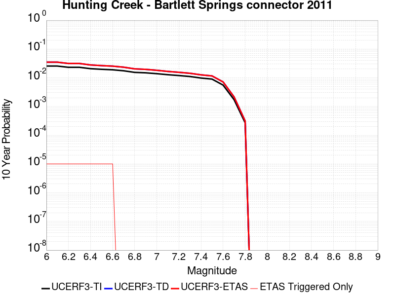 |

| Magnitude | 1 wk TI Prob | 1 wk TD Prob | 1 wk ETAS Prob | 1 wk ETAS/TD Gain | 1 wk ETAS Triggered Only | 1 mo TI Prob | 1 mo TD Prob | 1 mo ETAS Prob | 1 mo ETAS/TD Gain | 1 mo ETAS Triggered Only | 1 yr TI Prob | 1 yr TD Prob | 1 yr ETAS Prob | 1 yr ETAS/TD Gain | 1 yr ETAS Triggered Only | 10 yr TI Prob | 10 yr TD Prob | 10 yr ETAS Prob | 10 yr ETAS/TD Gain | 10 yr ETAS Triggered Only |
|-----|-----|-----|-----|-----|-----|-----|-----|-----|-----|-----|-----|-----|-----|-----|-----|-----|-----|-----|-----|-----|
| 6.0 | 4.940016E-5 | 6.787113E-5 | 6.787113E-5 | 1.0 | 0.0 | 2.1169778E-4 | 2.9084473E-4 | 2.9084473E-4 | 1.0 | 0.0 | 0.002574374 | 0.0035353133 | 0.0035353133 | 1.0 | 0.0 | 0.025447546 | 0.034775153 | 0.034787625 | 1.0003586 | 1.2919897E-5 |
| 6.1 | 4.940016E-5 | 6.787113E-5 | 6.787113E-5 | 1.0 | 0.0 | 2.1169778E-4 | 2.9084473E-4 | 2.9084473E-4 | 1.0 | 0.0 | 0.002574374 | 0.0035353133 | 0.0035353133 | 1.0 | 0.0 | 0.025447546 | 0.034775153 | 0.034787625 | 1.0003586 | 1.2919897E-5 |
| 6.2 | 4.472471E-5 | 6.1005278E-5 | 6.1005278E-5 | 1.0 | 0.0 | 1.9166325E-4 | 2.6142562E-4 | 2.6142562E-4 | 1.0 | 0.0 | 0.0023310026 | 0.0031782303 | 0.0031782303 | 1.0 | 0.0 | 0.02306703 | 0.03131807 | 0.03133058 | 1.0003996 | 1.2919897E-5 |
| 6.3 | 4.472471E-5 | 6.1005278E-5 | 6.1005278E-5 | 1.0 | 0.0 | 1.9166325E-4 | 2.6142562E-4 | 2.6142562E-4 | 1.0 | 0.0 | 0.0023310026 | 0.0031782303 | 0.0031782303 | 1.0 | 0.0 | 0.02306703 | 0.03131807 | 0.03133058 | 1.0003996 | 1.2919897E-5 |
| 6.4 | 4.0001003E-5 | 5.4105796E-5 | 5.4105796E-5 | 1.0 | 0.0 | 1.714216E-4 | 2.318617E-4 | 2.318617E-4 | 1.0 | 0.0 | 0.0020850603 | 0.0028192252 | 0.0028192252 | 1.0 | 0.0 | 0.02065605 | 0.027829293 | 0.027841855 | 1.0004513 | 1.2919897E-5 |
| 6.5 | 3.8033053E-5 | 5.1268413E-5 | 5.1268413E-5 | 1.0 | 0.0 | 1.6298861E-4 | 2.1970355E-4 | 2.1970355E-4 | 1.0 | 0.0 | 0.0019825802 | 0.0026715663 | 0.0026715663 | 1.0 | 0.0 | 0.019649856 | 0.026391363 | 0.026403941 | 1.0004766 | 1.2919897E-5 |
| 6.6 | 3.653754E-5 | 4.913191E-5 | 4.913191E-5 | 1.0 | 0.0 | 1.5658008E-4 | 2.1054859E-4 | 2.1054859E-4 | 1.0 | 0.0 | 0.0019046954 | 0.0025603706 | 0.0025603706 | 1.0 | 0.0 | 0.018884527 | 0.02530727 | 0.025319863 | 1.0004976 | 1.2919897E-5 |
| 6.7 | 3.372024E-5 | 4.514163E-5 | 4.514163E-5 | 1.0 | 0.0 | 1.4450731E-4 | 1.9345005E-4 | 1.9345005E-4 | 1.0 | 0.0 | 0.0017579567 | 0.0023527164 | 0.0023527164 | 1.0 | 0.0 | 0.017441148 | 0.023278859 | 0.023278859 | 1.0 | 0.0 |
| 6.8 | 2.9650024E-5 | 3.9412585E-5 | 3.9412585E-5 | 1.0 | 0.0 | 1.2706534E-4 | 1.6890021E-4 | 1.6890021E-4 | 1.0 | 0.0 | 0.0015459227 | 0.0020544082 | 0.0020544082 | 1.0 | 0.0 | 0.015352124 | 0.020351823 | 0.020351823 | 1.0 | 0.0 |
| 6.9 | 2.860775E-5 | 3.7813646E-5 | 3.7813646E-5 | 1.0 | 0.0 | 1.2259888E-4 | 1.620485E-4 | 1.620485E-4 | 1.0 | 0.0 | 0.0014916194 | 0.0019711645 | 0.0019711645 | 1.0 | 0.0 | 0.014816469 | 0.0195364 | 0.0195364 | 1.0 | 0.0 |
| 7.0 | 2.6696067E-5 | 3.5068253E-5 | 3.5068253E-5 | 1.0 | 0.0 | 1.144067E-4 | 1.5028391E-4 | 1.5028391E-4 | 1.0 | 0.0 | 0.0013920115 | 0.0018281818 | 0.0018281818 | 1.0 | 0.0 | 0.013833242 | 0.01813187 | 0.01813187 | 1.0 | 0.0 |
| 7.1 | 2.456087E-5 | 3.2013988E-5 | 3.2013988E-5 | 1.0 | 0.0 | 1.0525662E-4 | 1.3719565E-4 | 1.3719565E-4 | 1.0 | 0.0 | 0.001280746 | 0.0016690863 | 0.0016690863 | 1.0 | 0.0 | 0.012733897 | 0.016566826 | 0.016566826 | 1.0 | 0.0 |
| 7.2 | 2.295761E-5 | 2.9823757E-5 | 2.9823757E-5 | 1.0 | 0.0 | 9.8386045E-5 | 1.278099E-4 | 1.278099E-4 | 1.0 | 0.0 | 0.0011971919 | 0.001554984 | 0.001554984 | 1.0 | 0.0 | 0.011907627 | 0.015442514 | 0.015442514 | 1.0 | 0.0 |
| 7.3 | 2.1256936E-5 | 2.7542677E-5 | 2.7542677E-5 | 1.0 | 0.0 | 9.109797E-5 | 1.1803475E-4 | 1.1803475E-4 | 1.0 | 0.0 | 0.0011085535 | 0.0014361347 | 0.0014361347 | 1.0 | 0.0 | 0.011030397 | 0.014269866 | 0.014269866 | 1.0 | 0.0 |
| 7.4 | 1.8784336E-5 | 2.430742E-5 | 2.430742E-5 | 1.0 | 0.0 | 8.050181E-5 | 1.0417054E-4 | 1.0417054E-4 | 1.0 | 0.0 | 9.796688E-4 | 0.001267546 | 0.001267546 | 1.0 | 0.0 | 0.009753612 | 0.012604239 | 0.012604239 | 1.0 | 0.0 |
| 7.5 | 1.7248298E-5 | 2.2269496E-5 | 2.2269496E-5 | 1.0 | 0.0 | 7.391918E-5 | 9.5437244E-5 | 9.5437244E-5 | 1.0 | 0.0 | 8.9959445E-4 | 0.0011613365 | 0.0011613365 | 1.0 | 0.0 | 0.008959615 | 0.011553653 | 0.011553653 | 1.0 | 0.0 |
| 7.6 | 1.0653709E-5 | 1.3722448E-5 | 1.3722448E-5 | 1.0 | 0.0 | 4.5657955E-5 | 5.8809183E-5 | 5.8809183E-5 | 1.0 | 0.0 | 5.557438E-4 | 7.1576925E-4 | 7.1576925E-4 | 1.0 | 0.0 | 0.0055435603 | 0.0071349875 | 0.0071349875 | 1.0 | 0.0 |
| 7.7 | 3.286316E-6 | 4.090435E-6 | 4.090435E-6 | 1.0 | 0.0 | 1.4084137E-5 | 1.753032E-5 | 1.753032E-5 | 1.0 | 0.0 | 1.7146087E-4 | 2.1341088E-4 | 2.1341088E-4 | 1.0 | 0.0 | 0.0017132863 | 0.0021320751 | 0.0021320751 | 1.0 | 0.0 |
| 7.8 | 5.1855085E-7 | 5.972177E-7 | 5.972177E-7 | 1.0 | 0.0 | 2.222359E-6 | 2.559502E-6 | 2.559502E-6 | 1.0 | 0.0 | 2.7056883E-5 | 3.1161504E-5 | 3.1161504E-5 | 1.0 | 0.0 | 2.705359E-4 | 3.1157056E-4 | 3.1157056E-4 | 1.0 | 0.0 |

## Hollywood
*[(top)](#table-of-contents)*

| 1 Week | 1 Month | 1 Year | 10 Year |
|-----|-----|-----|-----|
|  |  |  |  |

| Magnitude | 1 wk TI Prob | 1 wk TD Prob | 1 wk ETAS Prob | 1 wk ETAS/TD Gain | 1 wk ETAS Triggered Only | 1 mo TI Prob | 1 mo TD Prob | 1 mo ETAS Prob | 1 mo ETAS/TD Gain | 1 mo ETAS Triggered Only | 1 yr TI Prob | 1 yr TD Prob | 1 yr ETAS Prob | 1 yr ETAS/TD Gain | 1 yr ETAS Triggered Only | 10 yr TI Prob | 10 yr TD Prob | 10 yr ETAS Prob | 10 yr ETAS/TD Gain | 10 yr ETAS Triggered Only |
|-----|-----|-----|-----|-----|-----|-----|-----|-----|-----|-----|-----|-----|-----|-----|-----|-----|-----|-----|-----|-----|
| 6.0 | 1.24487615E-5 | 1.2593381E-5 | 1.2593381E-5 | 1.0 | 0.0 | 5.3350745E-5 | 5.3970543E-5 | 5.3970543E-5 | 1.0 | 0.0 | 6.4935174E-4 | 6.568979E-4 | 6.6980935E-4 | 1.0196551 | 1.2919897E-5 | 0.0064745755 | 0.0065500494 | 0.006562885 | 1.0019596 | 1.2919897E-5 |
| 6.1 | 1.24487615E-5 | 1.2593381E-5 | 1.2593381E-5 | 1.0 | 0.0 | 5.3350745E-5 | 5.3970543E-5 | 5.3970543E-5 | 1.0 | 0.0 | 6.4935174E-4 | 6.568979E-4 | 6.6980935E-4 | 1.0196551 | 1.2919897E-5 | 0.0064745755 | 0.0065500494 | 0.006562885 | 1.0019596 | 1.2919897E-5 |
| 6.2 | 1.24487615E-5 | 1.2593381E-5 | 1.2593381E-5 | 1.0 | 0.0 | 5.3350745E-5 | 5.3970543E-5 | 5.3970543E-5 | 1.0 | 0.0 | 6.4935174E-4 | 6.568979E-4 | 6.6980935E-4 | 1.0196551 | 1.2919897E-5 | 0.0064745755 | 0.0065500494 | 0.006562885 | 1.0019596 | 1.2919897E-5 |
| 6.3 | 1.24487615E-5 | 1.2593381E-5 | 1.2593381E-5 | 1.0 | 0.0 | 5.3350745E-5 | 5.3970543E-5 | 5.3970543E-5 | 1.0 | 0.0 | 6.4935174E-4 | 6.568979E-4 | 6.6980935E-4 | 1.0196551 | 1.2919897E-5 | 0.0064745755 | 0.0065500494 | 0.006562885 | 1.0019596 | 1.2919897E-5 |
| 6.4 | 1.2431024E-5 | 1.2573994E-5 | 1.2573994E-5 | 1.0 | 0.0 | 5.327473E-5 | 5.3887463E-5 | 5.3887463E-5 | 1.0 | 0.0 | 6.4842677E-4 | 6.55887E-4 | 6.687984E-4 | 1.0196854 | 1.2919897E-5 | 0.0064653796 | 0.00654 | 0.0065528355 | 1.0019625 | 1.2919897E-5 |
| 6.5 | 1.1242222E-5 | 1.1317946E-5 | 1.1317946E-5 | 1.0 | 0.0 | 4.8180063E-5 | 4.8504597E-5 | 4.8504597E-5 | 1.0 | 0.0 | 5.864344E-4 | 5.9038616E-4 | 6.032984E-4 | 1.0218709 | 1.2919897E-5 | 0.0058488925 | 0.0058884635 | 0.0059013073 | 1.0021812 | 1.2919897E-5 |
| 6.6 | 1.1234066E-5 | 1.130906E-5 | 1.130906E-5 | 1.0 | 0.0 | 4.8145106E-5 | 4.8466514E-5 | 4.8466514E-5 | 1.0 | 0.0 | 5.86009E-4 | 5.899227E-4 | 6.0283503E-4 | 1.0218881 | 1.2919897E-5 | 0.005844661 | 0.0058838543 | 0.005896698 | 1.002183 | 1.2919897E-5 |
| 6.7 | 1.12294E-5 | 1.1303803E-5 | 1.1303803E-5 | 1.0 | 0.0 | 4.812511E-5 | 4.8443988E-5 | 4.8443988E-5 | 1.0 | 0.0 | 5.857657E-4 | 5.896486E-4 | 6.025609E-4 | 1.0218983 | 1.2919897E-5 | 0.0058422405 | 0.0058811274 | 0.0058939713 | 1.0021839 | 1.2919897E-5 |
| 6.8 | 1.0252819E-5 | 1.0218574E-5 | 1.0218574E-5 | 1.0 | 0.0 | 4.3939912E-5 | 4.3793167E-5 | 4.3793167E-5 | 1.0 | 0.0 | 5.3483713E-4 | 5.330535E-4 | 5.459665E-4 | 1.0242246 | 1.2919897E-5 | 0.005335517 | 0.005317975 | 0.005330826 | 1.0024166 | 1.2919897E-5 |
| 6.9 | 9.252289E-6 | 9.110419E-6 | 9.110419E-6 | 1.0 | 0.0 | 3.9652066E-5 | 3.904408E-5 | 3.904408E-5 | 1.0 | 0.0 | 4.8265693E-4 | 4.7525964E-4 | 4.881734E-4 | 1.027172 | 1.2919897E-5 | 0.0048161 | 0.004742606 | 0.0047554644 | 1.0027113 | 1.2919897E-5 |
| 7.0 | 8.474604E-6 | 8.25836E-6 | 8.25836E-6 | 1.0 | 0.0 | 3.6319227E-5 | 3.53925E-5 | 3.53925E-5 | 1.0 | 0.0 | 4.4209688E-4 | 4.308199E-4 | 4.308199E-4 | 1.0 | 0.0 | 0.004412184 | 0.0042999974 | 0.0042999974 | 1.0 | 0.0 |
| 7.1 | 6.643643E-6 | 6.2684458E-6 | 6.2684458E-6 | 1.0 | 0.0 | 2.8472443E-5 | 2.6864493E-5 | 2.6864493E-5 | 1.0 | 0.0 | 3.4659685E-4 | 3.2702653E-4 | 3.2702653E-4 | 1.0 | 0.0 | 0.0034605677 | 0.003265499 | 0.003265499 | 1.0 | 0.0 |
| 7.2 | 5.549002E-6 | 5.108774E-6 | 5.108774E-6 | 1.0 | 0.0 | 2.378122E-5 | 2.1894564E-5 | 2.1894564E-5 | 1.0 | 0.0 | 2.8949787E-4 | 2.6653384E-4 | 2.6653384E-4 | 1.0 | 0.0 | 0.0028912104 | 0.0026621583 | 0.0026621583 | 1.0 | 0.0 |
| 7.3 | 4.3059727E-6 | 3.959942E-6 | 3.959942E-6 | 1.0 | 0.0 | 1.8454039E-5 | 1.6971071E-5 | 1.6971071E-5 | 1.0 | 0.0 | 2.2465475E-4 | 2.0660329E-4 | 2.0660329E-4 | 1.0 | 0.0 | 0.0022442779 | 0.0020641224 | 0.0020641224 | 1.0 | 0.0 |
| 7.4 | 2.8550733E-6 | 2.7013389E-6 | 2.7013389E-6 | 1.0 | 0.0 | 1.2235971E-5 | 1.1577115E-5 | 1.1577115E-5 | 1.0 | 0.0 | 1.4896276E-4 | 1.4094231E-4 | 1.4094231E-4 | 1.0 | 0.0 | 0.0014886294 | 0.0014085344 | 0.0014085344 | 1.0 | 0.0 |
| 7.5 | 1.9927045E-6 | 1.8976702E-6 | 1.8976702E-6 | 1.0 | 0.0 | 8.540134E-6 | 8.132847E-6 | 8.132847E-6 | 1.0 | 0.0 | 1.0397117E-4 | 9.9012956E-5 | 9.9012956E-5 | 1.0 | 0.0 | 0.0010392254 | 9.896919E-4 | 9.896919E-4 | 1.0 | 0.0 |
| 7.6 | 1.345084E-6 | 1.221624E-6 | 1.221624E-6 | 1.0 | 0.0 | 5.764633E-6 | 5.235521E-6 | 5.235521E-6 | 1.0 | 0.0 | 7.018215E-5 | 6.374063E-5 | 6.374063E-5 | 1.0 | 0.0 | 7.0159987E-4 | 6.372254E-4 | 6.372254E-4 | 1.0 | 0.0 |
| 7.7 | 7.6835164E-7 | 6.2778713E-7 | 6.2778713E-7 | 1.0 | 0.0 | 3.2929315E-6 | 2.6905136E-6 | 2.6905136E-6 | 1.0 | 0.0 | 4.00907E-5 | 3.2756525E-5 | 3.2756525E-5 | 1.0 | 0.0 | 4.0083472E-4 | 3.2751844E-4 | 3.2751844E-4 | 1.0 | 0.0 |
| 7.8 | 3.6562128E-7 | 2.453623E-7 | 2.453623E-7 | 1.0 | 0.0 | 1.5669474E-6 | 1.0515523E-6 | 1.0515523E-6 | 1.0 | 0.0 | 1.9077417E-5 | 1.2802578E-5 | 1.2802578E-5 | 1.0 | 0.0 | 1.907578E-4 | 1.2801877E-4 | 1.2801877E-4 | 1.0 | 0.0 |
| 7.9 | 7.5024424E-8 | 5.3819846E-8 | 5.3819846E-8 | 1.0 | 0.0 | 3.215332E-7 | 2.3065647E-7 | 2.3065647E-7 | 1.0 | 0.0 | 3.91466E-6 | 2.8082402E-6 | 2.8082402E-6 | 1.0 | 0.0 | 3.9145907E-5 | 2.8082177E-5 | 2.8082177E-5 | 1.0 | 0.0 |

## White Wolf
*[(top)](#table-of-contents)*

| 1 Week | 1 Month | 1 Year | 10 Year |
|-----|-----|-----|-----|
|  |  |  | 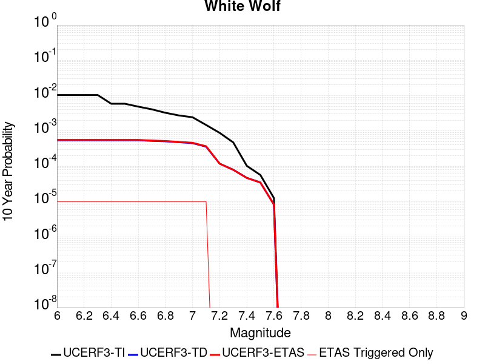 |

| Magnitude | 1 wk TI Prob | 1 wk TD Prob | 1 wk ETAS Prob | 1 wk ETAS/TD Gain | 1 wk ETAS Triggered Only | 1 mo TI Prob | 1 mo TD Prob | 1 mo ETAS Prob | 1 mo ETAS/TD Gain | 1 mo ETAS Triggered Only | 1 yr TI Prob | 1 yr TD Prob | 1 yr ETAS Prob | 1 yr ETAS/TD Gain | 1 yr ETAS Triggered Only | 10 yr TI Prob | 10 yr TD Prob | 10 yr ETAS Prob | 10 yr ETAS/TD Gain | 10 yr ETAS Triggered Only |
|-----|-----|-----|-----|-----|-----|-----|-----|-----|-----|-----|-----|-----|-----|-----|-----|-----|-----|-----|-----|-----|
| 6.0 | 2.0037822E-5 | 1.0469304E-6 | 1.0469304E-6 | 1.0 | 0.0 | 8.587355E-5 | 4.486837E-6 | 4.486837E-6 | 1.0 | 0.0 | 0.001045009 | 5.462592E-5 | 5.462592E-5 | 1.0 | 0.0 | 0.010401085 | 5.4613E-4 | 5.5904285E-4 | 1.0236442 | 1.2919897E-5 |
| 6.1 | 2.0037822E-5 | 1.0469304E-6 | 1.0469304E-6 | 1.0 | 0.0 | 8.587355E-5 | 4.486837E-6 | 4.486837E-6 | 1.0 | 0.0 | 0.001045009 | 5.462592E-5 | 5.462592E-5 | 1.0 | 0.0 | 0.010401085 | 5.4613E-4 | 5.5904285E-4 | 1.0236442 | 1.2919897E-5 |
| 6.2 | 2.0037822E-5 | 1.0469304E-6 | 1.0469304E-6 | 1.0 | 0.0 | 8.587355E-5 | 4.486837E-6 | 4.486837E-6 | 1.0 | 0.0 | 0.001045009 | 5.462592E-5 | 5.462592E-5 | 1.0 | 0.0 | 0.010401085 | 5.4613E-4 | 5.5904285E-4 | 1.0236442 | 1.2919897E-5 |
| 6.3 | 2.0037822E-5 | 1.0469304E-6 | 1.0469304E-6 | 1.0 | 0.0 | 8.587355E-5 | 4.486837E-6 | 4.486837E-6 | 1.0 | 0.0 | 0.001045009 | 5.462592E-5 | 5.462592E-5 | 1.0 | 0.0 | 0.010401085 | 5.4613E-4 | 5.5904285E-4 | 1.0236442 | 1.2919897E-5 |
| 6.4 | 1.132487E-5 | 1.0469304E-6 | 1.0469304E-6 | 1.0 | 0.0 | 4.8534253E-5 | 4.486837E-6 | 4.486837E-6 | 1.0 | 0.0 | 5.907443E-4 | 5.462592E-5 | 5.462592E-5 | 1.0 | 0.0 | 0.005891764 | 5.4613E-4 | 5.5904285E-4 | 1.0236442 | 1.2919897E-5 |
| 6.5 | 1.132487E-5 | 1.0469304E-6 | 1.0469304E-6 | 1.0 | 0.0 | 4.8534253E-5 | 4.486837E-6 | 4.486837E-6 | 1.0 | 0.0 | 5.907443E-4 | 5.462592E-5 | 5.462592E-5 | 1.0 | 0.0 | 0.005891764 | 5.4613E-4 | 5.5904285E-4 | 1.0236442 | 1.2919897E-5 |
| 6.6 | 9.347473E-6 | 1.0469304E-6 | 1.0469304E-6 | 1.0 | 0.0 | 4.0059982E-5 | 4.486837E-6 | 4.486837E-6 | 1.0 | 0.0 | 4.8762115E-4 | 5.462592E-5 | 5.462592E-5 | 1.0 | 0.0 | 0.0048655253 | 5.4613E-4 | 5.5904285E-4 | 1.0236442 | 1.2919897E-5 |
| 6.7 | 7.842647E-6 | 1.0048476E-6 | 1.0048476E-6 | 1.0 | 0.0 | 3.361091E-5 | 4.306483E-6 | 4.306483E-6 | 1.0 | 0.0 | 4.0913603E-4 | 5.243022E-5 | 5.243022E-5 | 1.0 | 0.0 | 0.004083836 | 5.2418344E-4 | 5.370966E-4 | 1.0246347 | 1.2919897E-5 |
| 6.8 | 6.26597E-6 | 9.734948E-7 | 9.734948E-7 | 1.0 | 0.0 | 2.685388E-5 | 4.172114E-6 | 4.172114E-6 | 1.0 | 0.0 | 3.2689696E-4 | 5.079436E-5 | 5.079436E-5 | 1.0 | 0.0 | 0.003264165 | 5.078324E-4 | 5.207457E-4 | 1.0254283 | 1.2919897E-5 |
| 6.9 | 5.258436E-6 | 9.183371E-7 | 9.183371E-7 | 1.0 | 0.0 | 2.2535958E-5 | 3.9357246E-6 | 3.9357246E-6 | 1.0 | 0.0 | 2.7434074E-4 | 4.7916445E-5 | 4.7916445E-5 | 1.0 | 0.0 | 0.0027400232 | 4.7906593E-4 | 4.9197965E-4 | 1.026956 | 1.2919897E-5 |
| 7.0 | 4.675028E-6 | 8.66129E-7 | 8.66129E-7 | 1.0 | 0.0 | 2.003568E-5 | 3.7119764E-6 | 3.7119764E-6 | 1.0 | 0.0 | 2.4390711E-4 | 4.5192424E-5 | 4.5192424E-5 | 1.0 | 0.0 | 0.0024363957 | 4.5183706E-4 | 4.6475112E-4 | 1.0285813 | 1.2919897E-5 |
| 7.1 | 2.8270078E-6 | 6.8742594E-7 | 6.8742594E-7 | 1.0 | 0.0 | 1.2115692E-5 | 2.9461082E-6 | 2.9461082E-6 | 1.0 | 0.0 | 1.4749856E-4 | 3.5868317E-5 | 3.5868317E-5 | 1.0 | 0.0 | 0.001474007 | 3.586294E-4 | 3.7154465E-4 | 1.0360129 | 1.2919897E-5 |
| 7.2 | 1.6881406E-6 | 2.2706854E-7 | 2.2706854E-7 | 1.0 | 0.0 | 7.2348685E-6 | 9.731506E-7 | 9.731506E-7 | 1.0 | 0.0 | 8.808096E-5 | 1.1848045E-5 | 1.1848045E-5 | 1.0 | 0.0 | 8.8046055E-4 | 1.1847429E-4 | 1.1847429E-4 | 1.0 | 0.0 |
| 7.3 | 9.086107E-7 | 1.5266669E-7 | 1.5266669E-7 | 1.0 | 0.0 | 3.8940398E-6 | 6.5428566E-7 | 6.5428566E-7 | 1.0 | 0.0 | 4.7408903E-5 | 7.965899E-6 | 7.965899E-6 | 1.0 | 0.0 | 4.739879E-4 | 7.965622E-5 | 7.965622E-5 | 1.0 | 0.0 |
| 7.4 | 1.9717383E-7 | 9.003981E-8 | 9.003981E-8 | 1.0 | 0.0 | 8.450304E-7 | 3.8588485E-7 | 3.8588485E-7 | 1.0 | 0.0 | 1.0288197E-5 | 4.698138E-6 | 4.698138E-6 | 1.0 | 0.0 | 1.028772E-4 | 4.6980418E-5 | 4.6980418E-5 | 1.0 | 0.0 |
| 7.5 | 1.086975E-7 | 6.659757E-8 | 6.659757E-8 | 1.0 | 0.0 | 4.6584634E-7 | 2.8541814E-7 | 2.8541814E-7 | 1.0 | 0.0 | 5.6716644E-6 | 3.4749605E-6 | 3.4749605E-6 | 1.0 | 0.0 | 5.6715195E-5 | 3.4749086E-5 | 3.4749086E-5 | 1.0 | 0.0 |
| 7.6 | 2.4217808E-8 | 1.5820843E-8 | 1.5820843E-8 | 1.0 | 0.0 | 1.03790605E-7 | 6.780361E-8 | 6.780361E-8 | 1.0 | 0.0 | 1.2636499E-6 | 8.255087E-7 | 8.255087E-7 | 1.0 | 0.0 | 1.2636427E-5 | 8.255061E-6 | 8.255061E-6 | 1.0 | 0.0 |

## Cleghorn
*[(top)](#table-of-contents)*

| 1 Week | 1 Month | 1 Year | 10 Year |
|-----|-----|-----|-----|
|  |  |  |  |

| Magnitude | 1 wk TI Prob | 1 wk TD Prob | 1 wk ETAS Prob | 1 wk ETAS/TD Gain | 1 wk ETAS Triggered Only | 1 mo TI Prob | 1 mo TD Prob | 1 mo ETAS Prob | 1 mo ETAS/TD Gain | 1 mo ETAS Triggered Only | 1 yr TI Prob | 1 yr TD Prob | 1 yr ETAS Prob | 1 yr ETAS/TD Gain | 1 yr ETAS Triggered Only | 10 yr TI Prob | 10 yr TD Prob | 10 yr ETAS Prob | 10 yr ETAS/TD Gain | 10 yr ETAS Triggered Only |
|-----|-----|-----|-----|-----|-----|-----|-----|-----|-----|-----|-----|-----|-----|-----|-----|-----|-----|-----|-----|-----|
| 6.0 | 7.9267165E-6 | 9.832575E-6 | 9.832575E-6 | 1.0 | 0.0 | 3.39712E-5 | 4.213899E-5 | 5.5058343E-5 | 1.306589 | 1.2919897E-5 | 4.1352084E-4 | 5.12932E-4 | 5.2584533E-4 | 1.0251755 | 1.2919897E-5 | 0.004127522 | 0.005132577 | 0.0051454306 | 1.0025043 | 1.2919897E-5 |
| 6.1 | 7.9267165E-6 | 9.832575E-6 | 9.832575E-6 | 1.0 | 0.0 | 3.39712E-5 | 4.213899E-5 | 5.5058343E-5 | 1.306589 | 1.2919897E-5 | 4.1352084E-4 | 5.12932E-4 | 5.2584533E-4 | 1.0251755 | 1.2919897E-5 | 0.004127522 | 0.005132577 | 0.0051454306 | 1.0025043 | 1.2919897E-5 |
| 6.2 | 7.9267165E-6 | 9.832575E-6 | 9.832575E-6 | 1.0 | 0.0 | 3.39712E-5 | 4.213899E-5 | 5.5058343E-5 | 1.306589 | 1.2919897E-5 | 4.1352084E-4 | 5.12932E-4 | 5.2584533E-4 | 1.0251755 | 1.2919897E-5 | 0.004127522 | 0.005132577 | 0.0051454306 | 1.0025043 | 1.2919897E-5 |
| 6.3 | 7.9267165E-6 | 9.832575E-6 | 9.832575E-6 | 1.0 | 0.0 | 3.39712E-5 | 4.213899E-5 | 5.5058343E-5 | 1.306589 | 1.2919897E-5 | 4.1352084E-4 | 5.12932E-4 | 5.2584533E-4 | 1.0251755 | 1.2919897E-5 | 0.004127522 | 0.005132577 | 0.0051454306 | 1.0025043 | 1.2919897E-5 |
| 6.4 | 4.3445207E-6 | 6.0924144E-6 | 6.0924144E-6 | 1.0 | 0.0 | 1.8619241E-5 | 2.6110092E-5 | 2.6110092E-5 | 1.0 | 0.0 | 2.2666567E-4 | 3.1784503E-4 | 3.1784503E-4 | 1.0 | 0.0 | 0.0022643462 | 0.0031880767 | 0.0031880767 | 1.0 | 0.0 |
| 6.5 | 4.3445207E-6 | 6.0924144E-6 | 6.0924144E-6 | 1.0 | 0.0 | 1.8619241E-5 | 2.6110092E-5 | 2.6110092E-5 | 1.0 | 0.0 | 2.2666567E-4 | 3.1784503E-4 | 3.1784503E-4 | 1.0 | 0.0 | 0.0022643462 | 0.0031880767 | 0.0031880767 | 1.0 | 0.0 |
| 6.6 | 4.040109E-6 | 5.7748202E-6 | 5.7748202E-6 | 1.0 | 0.0 | 1.7314638E-5 | 2.4749E-5 | 2.4749E-5 | 1.0 | 0.0 | 2.1078532E-4 | 3.0127834E-4 | 3.0127834E-4 | 1.0 | 0.0 | 0.002105855 | 0.0030228654 | 0.0030228654 | 1.0 | 0.0 |
| 6.7 | 3.3632055E-6 | 5.0683134E-6 | 5.0683134E-6 | 1.0 | 0.0 | 1.4413658E-5 | 2.1721164E-5 | 2.1721164E-5 | 1.0 | 0.0 | 1.7547216E-4 | 2.6442338E-4 | 2.6442338E-4 | 1.0 | 0.0 | 0.0017533366 | 0.0026551976 | 0.0026551976 | 1.0 | 0.0 |
| 6.8 | 3.2902772E-6 | 4.99022E-6 | 4.99022E-6 | 1.0 | 0.0 | 1.4101111E-5 | 2.1386484E-5 | 2.1386484E-5 | 1.0 | 0.0 | 1.716675E-4 | 2.6034965E-4 | 2.6034965E-4 | 1.0 | 0.0 | 0.0017153495 | 0.0026145563 | 0.0026145563 | 1.0 | 0.0 |
| 6.9 | 3.031547E-6 | 4.6919777E-6 | 4.6919777E-6 | 1.0 | 0.0 | 1.299228E-5 | 2.0108322E-5 | 2.0108322E-5 | 1.0 | 0.0 | 1.5816953E-4 | 2.447916E-4 | 2.447916E-4 | 1.0 | 0.0 | 0.00158057 | 0.0024593272 | 0.0024593272 | 1.0 | 0.0 |
| 7.0 | 2.8259715E-6 | 4.371534E-6 | 4.371534E-6 | 1.0 | 0.0 | 1.211125E-5 | 1.8735012E-5 | 1.8735012E-5 | 1.0 | 0.0 | 1.4744449E-4 | 2.2807514E-4 | 2.2807514E-4 | 1.0 | 0.0 | 0.001473467 | 0.002292517 | 0.002292517 | 1.0 | 0.0 |
| 7.1 | 2.5962665E-6 | 4.066747E-6 | 4.066747E-6 | 1.0 | 0.0 | 1.1126809E-5 | 1.74288E-5 | 1.74288E-5 | 1.0 | 0.0 | 1.3546048E-4 | 2.1217519E-4 | 2.1217519E-4 | 1.0 | 0.0 | 0.0013537793 | 0.0021338374 | 0.0021338374 | 1.0 | 0.0 |
| 7.2 | 2.3247253E-6 | 3.6772897E-6 | 3.6772897E-6 | 1.0 | 0.0 | 9.96307E-6 | 1.5759719E-5 | 1.5759719E-5 | 1.0 | 0.0 | 1.21293626E-4 | 1.9185786E-4 | 1.9185786E-4 | 1.0 | 0.0 | 0.0012122744 | 0.0019310551 | 0.0019310551 | 1.0 | 0.0 |
| 7.3 | 2.056928E-6 | 3.2359856E-6 | 3.2359856E-6 | 1.0 | 0.0 | 8.815376E-6 | 1.3868437E-5 | 1.3868437E-5 | 1.0 | 0.0 | 1.0732192E-4 | 1.688353E-4 | 1.688353E-4 | 1.0 | 0.0 | 0.001072701 | 0.0017012694 | 0.0017012694 | 1.0 | 0.0 |
| 7.4 | 1.8055999E-6 | 2.8263637E-6 | 2.8263637E-6 | 1.0 | 0.0 | 7.738263E-6 | 1.21129315E-5 | 1.21129315E-5 | 1.0 | 0.0 | 9.4209274E-5 | 1.474651E-4 | 1.474651E-4 | 1.0 | 0.0 | 9.4169343E-4 | 0.001488009 | 0.001488009 | 1.0 | 0.0 |
| 7.5 | 1.4683443E-6 | 2.425593E-6 | 2.425593E-6 | 1.0 | 0.0 | 6.292889E-6 | 1.0395358E-5 | 1.0395358E-5 | 1.0 | 0.0 | 7.661323E-5 | 1.2655623E-4 | 1.2655623E-4 | 1.0 | 0.0 | 7.658682E-4 | 0.0012792206 | 0.0012792206 | 1.0 | 0.0 |
| 7.6 | 9.804088E-7 | 1.901101E-6 | 1.901101E-6 | 1.0 | 0.0 | 4.201745E-6 | 8.147551E-6 | 8.147551E-6 | 1.0 | 0.0 | 5.1155046E-5 | 9.919196E-5 | 9.919196E-5 | 1.0 | 0.0 | 5.114327E-4 | 0.0010058905 | 0.0010058905 | 1.0 | 0.0 |
| 7.7 | 7.3434086E-7 | 1.6292396E-6 | 1.6292396E-6 | 1.0 | 0.0 | 3.1471714E-6 | 6.982437E-6 | 6.982437E-6 | 1.0 | 0.0 | 3.831614E-5 | 8.500788E-5 | 8.500788E-5 | 1.0 | 0.0 | 3.8309532E-4 | 8.642013E-4 | 8.642013E-4 | 1.0 | 0.0 |
| 7.8 | 6.434184E-7 | 1.522801E-6 | 1.522801E-6 | 1.0 | 0.0 | 2.7575045E-6 | 6.5262734E-6 | 6.5262734E-6 | 1.0 | 0.0 | 3.35721E-5 | 7.9454505E-5 | 7.9454505E-5 | 1.0 | 0.0 | 3.3567028E-4 | 8.083677E-4 | 8.083677E-4 | 1.0 | 0.0 |
| 7.9 | 3.4943926E-7 | 7.5788125E-7 | 7.5788125E-7 | 1.0 | 0.0 | 1.497596E-6 | 3.2480586E-6 | 3.2480586E-6 | 1.0 | 0.0 | 1.8233079E-5 | 3.9544404E-5 | 3.9544404E-5 | 1.0 | 0.0 | 1.8231584E-4 | 4.0423044E-4 | 4.0423044E-4 | 1.0 | 0.0 |
| 8.0 | 6.717524E-8 | 5.8440865E-8 | 5.8440865E-8 | 1.0 | 0.0 | 2.8789387E-7 | 2.5046083E-7 | 2.5046083E-7 | 1.0 | 0.0 | 3.505102E-6 | 3.0493563E-6 | 3.0493563E-6 | 1.0 | 0.0 | 3.5050467E-5 | 3.276327E-5 | 3.276327E-5 | 1.0 | 0.0 |
| 8.1 | 3.1984914E-8 | 1.2973213E-8 | 1.2973213E-8 | 1.0 | 0.0 | 1.370782E-7 | 5.5599482E-8 | 5.5599482E-8 | 1.0 | 0.0 | 1.6689258E-6 | 6.769235E-7 | 6.769235E-7 | 1.0 | 0.0 | 1.6689133E-5 | 7.754204E-6 | 7.754204E-6 | 1.0 | 0.0 |
| 8.2 | 1.21887656E-8 | 3.654808E-9 | 3.654808E-9 | 1.0 | 0.0 | 5.2237567E-8 | 1.5663463E-8 | 1.5663463E-8 | 1.0 | 0.0 | 6.359922E-7 | 1.9070265E-7 | 1.9070265E-7 | 1.0 | 0.0 | 6.3599036E-6 | 2.2501451E-6 | 2.2501451E-6 | 1.0 | 0.0 |

## San Andreas (Creeping Section) 2011 CFM
*[(top)](#table-of-contents)*

| 1 Week | 1 Month | 1 Year | 10 Year |
|-----|-----|-----|-----|
|  |  |  |  |

| Magnitude | 1 wk TI Prob | 1 wk TD Prob | 1 wk ETAS Prob | 1 wk ETAS/TD Gain | 1 wk ETAS Triggered Only | 1 mo TI Prob | 1 mo TD Prob | 1 mo ETAS Prob | 1 mo ETAS/TD Gain | 1 mo ETAS Triggered Only | 1 yr TI Prob | 1 yr TD Prob | 1 yr ETAS Prob | 1 yr ETAS/TD Gain | 1 yr ETAS Triggered Only | 10 yr TI Prob | 10 yr TD Prob | 10 yr ETAS Prob | 10 yr ETAS/TD Gain | 10 yr ETAS Triggered Only |
|-----|-----|-----|-----|-----|-----|-----|-----|-----|-----|-----|-----|-----|-----|-----|-----|-----|-----|-----|-----|-----|
| 6.0 | 5.986481E-4 | 0.0012278741 | 0.0012278741 | 1.0 | 0.0 | 0.0025631124 | 0.0052457973 | 0.0052586496 | 1.00245 | 1.2919897E-5 | 0.030762846 | 0.061208665 | 0.061220795 | 1.0001981 | 1.2919897E-5 | 0.26835477 | 0.4259623 | 0.42596972 | 1.0000174 | 1.2919897E-5 |
| 6.1 | 5.015945E-4 | 0.0010222398 | 0.0010222398 | 1.0 | 0.0 | 0.00214792 | 0.004368119 | 0.0043809824 | 1.0029448 | 1.2919897E-5 | 0.025839351 | 0.0512512 | 0.051263455 | 1.0002391 | 1.2919897E-5 | 0.23032776 | 0.37288252 | 0.37289062 | 1.0000217 | 1.2919897E-5 |
| 6.2 | 4.073338E-4 | 8.109135E-4 | 8.109135E-4 | 1.0 | 0.0 | 0.0017445484 | 0.0034676173 | 0.0034804924 | 1.0037129 | 1.2919897E-5 | 0.021034058 | 0.040936444 | 0.040948834 | 1.0003027 | 1.2919897E-5 | 0.19150782 | 0.3130621 | 0.31307095 | 1.0000284 | 1.2919897E-5 |
| 6.3 | 3.464099E-4 | 6.7394925E-4 | 6.7394925E-4 | 1.0 | 0.0 | 0.0014837692 | 0.00288274 | 0.00288274 | 1.0 | 0.0 | 0.017915873 | 0.034192428 | 0.034192428 | 1.0 | 0.0 | 0.16538359 | 0.27134693 | 0.27134693 | 1.0 | 0.0 |
| 6.4 | 2.935057E-4 | 5.545115E-4 | 5.545115E-4 | 1.0 | 0.0 | 0.0012572751 | 0.0023718805 | 0.0023718805 | 1.0 | 0.0 | 0.015200248 | 0.028267467 | 0.028267467 | 1.0 | 0.0 | 0.14201577 | 0.2330172 | 0.2330172 | 1.0 | 0.0 |
| 6.5 | 2.3409708E-4 | 4.2095222E-4 | 4.2095222E-4 | 1.0 | 0.0 | 0.0010028875 | 0.0018015768 | 0.0018015768 | 1.0 | 0.0 | 0.012141965 | 0.021591473 | 0.021591473 | 1.0 | 0.0 | 0.11499573 | 0.18685804 | 0.18685804 | 1.0 | 0.0 |
| 6.6 | 1.5842178E-4 | 2.5079807E-4 | 2.5079807E-4 | 1.0 | 0.0 | 6.7877385E-4 | 0.0010744074 | 0.0010744074 | 1.0 | 0.0 | 0.0082328 | 0.013001034 | 0.013001034 | 1.0 | 0.0 | 0.07934396 | 0.12318426 | 0.12318426 | 1.0 | 0.0 |
| 6.7 | 1.5616413E-4 | 2.461632E-4 | 2.461632E-4 | 1.0 | 0.0 | 6.691031E-4 | 0.0010545597 | 0.0010545597 | 1.0 | 0.0 | 0.0081159435 | 0.012762894 | 0.012762894 | 1.0 | 0.0 | 0.0782586 | 0.12121142 | 0.12121142 | 1.0 | 0.0 |
| 6.8 | 1.5538467E-4 | 2.4440174E-4 | 2.4440174E-4 | 1.0 | 0.0 | 6.6576427E-4 | 0.0010470168 | 0.0010470168 | 1.0 | 0.0 | 0.008075596 | 0.012672268 | 0.012672268 | 1.0 | 0.0 | 0.07788358 | 0.12044227 | 0.12044227 | 1.0 | 0.0 |
| 6.9 | 1.5153569E-4 | 2.3549511E-4 | 2.3549511E-4 | 1.0 | 0.0 | 6.49277E-4 | 0.0010088764 | 0.0010088764 | 1.0 | 0.0 | 0.007876333 | 0.012214421 | 0.012214421 | 1.0 | 0.0 | 0.07602952 | 0.11651233 | 0.11651233 | 1.0 | 0.0 |
| 7.0 | 1.4588932E-4 | 2.2406683E-4 | 2.2406683E-4 | 1.0 | 0.0 | 6.250901E-4 | 9.5993496E-4 | 9.5993496E-4 | 1.0 | 0.0 | 0.0075839474 | 0.011625077 | 0.011625077 | 1.0 | 0.0 | 0.073302895 | 0.111358546 | 0.111358546 | 1.0 | 0.0 |
| 7.1 | 1.1565079E-4 | 1.6290719E-4 | 1.6290719E-4 | 1.0 | 0.0 | 4.955521E-4 | 6.9798774E-4 | 6.9798774E-4 | 1.0 | 0.0 | 0.006016669 | 0.008465091 | 0.008465091 | 1.0 | 0.0 | 0.058563538 | 0.08370675 | 0.08370675 | 1.0 | 0.0 |
| 7.2 | 1.0393792E-4 | 1.4624344E-4 | 1.4624344E-4 | 1.0 | 0.0 | 4.4537216E-4 | 6.2660786E-4 | 6.2660786E-4 | 1.0 | 0.0 | 0.005408933 | 0.007602434 | 0.007602434 | 1.0 | 0.0 | 0.052791595 | 0.07565546 | 0.07565546 | 1.0 | 0.0 |
| 7.3 | 9.332884E-5 | 1.2788197E-4 | 1.2788197E-4 | 1.0 | 0.0 | 3.999194E-4 | 5.479511E-4 | 5.479511E-4 | 1.0 | 0.0 | 0.0048581534 | 0.0066510327 | 0.0066510327 | 1.0 | 0.0 | 0.047533102 | 0.06651482 | 0.06651482 | 1.0 | 0.0 |
| 7.4 | 8.670252E-5 | 1.17095995E-4 | 1.17095995E-4 | 1.0 | 0.0 | 3.715293E-4 | 5.0174404E-4 | 5.0174404E-4 | 1.0 | 0.0 | 0.004513991 | 0.006091744 | 0.006091744 | 1.0 | 0.0 | 0.044233937 | 0.061179653 | 0.061179653 | 1.0 | 0.0 |
| 7.5 | 7.3036405E-5 | 9.011144E-5 | 9.011144E-5 | 1.0 | 0.0 | 3.129756E-4 | 3.861348E-4 | 3.861348E-4 | 1.0 | 0.0 | 0.0038038217 | 0.004691079 | 0.004691079 | 1.0 | 0.0 | 0.03739367 | 0.047901772 | 0.047901772 | 1.0 | 0.0 |
| 7.6 | 6.3935775E-5 | 8.284792E-5 | 8.284792E-5 | 1.0 | 0.0 | 2.7398168E-4 | 3.550143E-4 | 3.550143E-4 | 1.0 | 0.0 | 0.0033306254 | 0.004313751 | 0.004313751 | 1.0 | 0.0 | 0.032811474 | 0.04401211 | 0.04401211 | 1.0 | 0.0 |
| 7.7 | 5.5050095E-5 | 6.6657536E-5 | 6.6657536E-5 | 1.0 | 0.0 | 2.3590765E-4 | 2.8564388E-4 | 2.8564388E-4 | 1.0 | 0.0 | 0.0028683927 | 0.0034721727 | 0.0034721727 | 1.0 | 0.0 | 0.0283165 | 0.035814673 | 0.035814673 | 1.0 | 0.0 |
| 7.8 | 5.027131E-5 | 6.166444E-5 | 6.166444E-5 | 1.0 | 0.0 | 2.1543067E-4 | 2.6424942E-4 | 2.6424942E-4 | 1.0 | 0.0 | 0.0026197135 | 0.0032124936 | 0.0032124936 | 1.0 | 0.0 | 0.025890453 | 0.033143617 | 0.033143617 | 1.0 | 0.0 |
| 7.9 | 3.7271806E-5 | 5.0253755E-5 | 5.0253755E-5 | 1.0 | 0.0 | 1.5972654E-4 | 2.1535547E-4 | 2.1535547E-4 | 1.0 | 0.0 | 0.0019429359 | 0.0026188022 | 0.0026188022 | 1.0 | 0.0 | 0.019260362 | 0.027081102 | 0.027081102 | 1.0 | 0.0 |
| 8.0 | 2.7310243E-5 | 3.144777E-5 | 3.144777E-5 | 1.0 | 0.0 | 1.17038646E-4 | 1.3476919E-4 | 1.3476919E-4 | 1.0 | 0.0 | 0.0014240141 | 0.0016395808 | 0.0016395808 | 1.0 | 0.0 | 0.014149235 | 0.0172237 | 0.0172237 | 1.0 | 0.0 |
| 8.1 | 1.7940547E-5 | 1.7413187E-5 | 1.7413187E-5 | 1.0 | 0.0 | 7.688579E-5 | 7.4625816E-5 | 7.4625816E-5 | 1.0 | 0.0 | 9.3568244E-4 | 9.081911E-4 | 9.081911E-4 | 1.0 | 0.0 | 0.009317525 | 0.009805583 | 0.009805583 | 1.0 | 0.0 |
| 8.2 | 8.643924E-6 | 5.4798497E-6 | 5.4798497E-6 | 1.0 | 0.0 | 3.704486E-5 | 2.348486E-5 | 2.348486E-5 | 1.0 | 0.0 | 4.5092785E-4 | 2.858907E-4 | 2.858907E-4 | 1.0 | 0.0 | 0.0045001395 | 0.0032514327 | 0.0032514327 | 1.0 | 0.0 |
| 8.3 | 1.983087E-6 | 7.668296E-7 | 7.668296E-7 | 1.0 | 0.0 | 8.498917E-6 | 3.2864084E-6 | 3.2864084E-6 | 1.0 | 0.0 | 1.034694E-4 | 4.0011306E-5 | 4.0011306E-5 | 1.0 | 0.0 | 0.0010342124 | 4.724499E-4 | 4.724499E-4 | 1.0 | 0.0 |

## Earthquake Valley (No  Extension)
*[(top)](#table-of-contents)*

| 1 Week | 1 Month | 1 Year | 10 Year |
|-----|-----|-----|-----|
|  |  |  |  |

| Magnitude | 1 wk TI Prob | 1 wk TD Prob | 1 wk ETAS Prob | 1 wk ETAS/TD Gain | 1 wk ETAS Triggered Only | 1 mo TI Prob | 1 mo TD Prob | 1 mo ETAS Prob | 1 mo ETAS/TD Gain | 1 mo ETAS Triggered Only | 1 yr TI Prob | 1 yr TD Prob | 1 yr ETAS Prob | 1 yr ETAS/TD Gain | 1 yr ETAS Triggered Only | 10 yr TI Prob | 10 yr TD Prob | 10 yr ETAS Prob | 10 yr ETAS/TD Gain | 10 yr ETAS Triggered Only |
|-----|-----|-----|-----|-----|-----|-----|-----|-----|-----|-----|-----|-----|-----|-----|-----|-----|-----|-----|-----|-----|
| 6.0 | 2.1859703E-5 | 2.5198888E-5 | 2.5198888E-5 | 1.0 | 0.0 | 9.3681076E-5 | 1.0799158E-4 | 1.2091008E-4 | 1.1196251 | 1.2919897E-5 | 0.0011399703 | 0.0013141495 | 0.0013270524 | 1.0098184 | 1.2919897E-5 | 0.011341401 | 0.013078143 | 0.013090894 | 1.000975 | 1.2919897E-5 |
| 6.1 | 2.1859703E-5 | 2.5198888E-5 | 2.5198888E-5 | 1.0 | 0.0 | 9.3681076E-5 | 1.0799158E-4 | 1.2091008E-4 | 1.1196251 | 1.2919897E-5 | 0.0011399703 | 0.0013141495 | 0.0013270524 | 1.0098184 | 1.2919897E-5 | 0.011341401 | 0.013078143 | 0.013090894 | 1.000975 | 1.2919897E-5 |
| 6.2 | 2.1859703E-5 | 2.5198888E-5 | 2.5198888E-5 | 1.0 | 0.0 | 9.3681076E-5 | 1.0799158E-4 | 1.2091008E-4 | 1.1196251 | 1.2919897E-5 | 0.0011399703 | 0.0013141495 | 0.0013270524 | 1.0098184 | 1.2919897E-5 | 0.011341401 | 0.013078143 | 0.013090894 | 1.000975 | 1.2919897E-5 |
| 6.3 | 2.1859703E-5 | 2.5198888E-5 | 2.5198888E-5 | 1.0 | 0.0 | 9.3681076E-5 | 1.0799158E-4 | 1.2091008E-4 | 1.1196251 | 1.2919897E-5 | 0.0011399703 | 0.0013141495 | 0.0013270524 | 1.0098184 | 1.2919897E-5 | 0.011341401 | 0.013078143 | 0.013090894 | 1.000975 | 1.2919897E-5 |
| 6.4 | 2.1859703E-5 | 2.5198888E-5 | 2.5198888E-5 | 1.0 | 0.0 | 9.3681076E-5 | 1.0799158E-4 | 1.2091008E-4 | 1.1196251 | 1.2919897E-5 | 0.0011399703 | 0.0013141495 | 0.0013270524 | 1.0098184 | 1.2919897E-5 | 0.011341401 | 0.013078143 | 0.013090894 | 1.000975 | 1.2919897E-5 |
| 6.5 | 2.1859703E-5 | 2.5198888E-5 | 2.5198888E-5 | 1.0 | 0.0 | 9.3681076E-5 | 1.0799158E-4 | 1.2091008E-4 | 1.1196251 | 1.2919897E-5 | 0.0011399703 | 0.0013141495 | 0.0013270524 | 1.0098184 | 1.2919897E-5 | 0.011341401 | 0.013078143 | 0.013090894 | 1.000975 | 1.2919897E-5 |
| 6.6 | 1.597E-5 | 1.8356655E-5 | 1.8356655E-5 | 1.0 | 0.0 | 6.8441055E-5 | 7.86695E-5 | 9.158838E-5 | 1.1642171 | 1.2919897E-5 | 8.329513E-4 | 9.574676E-4 | 9.7037514E-4 | 1.0134809 | 1.2919897E-5 | 0.008298361 | 0.009542032 | 0.009554829 | 1.0013411 | 1.2919897E-5 |
| 6.7 | 1.597E-5 | 1.8356655E-5 | 1.8356655E-5 | 1.0 | 0.0 | 6.8441055E-5 | 7.86695E-5 | 9.158838E-5 | 1.1642171 | 1.2919897E-5 | 8.329513E-4 | 9.574676E-4 | 9.7037514E-4 | 1.0134809 | 1.2919897E-5 | 0.008298361 | 0.009542032 | 0.009554829 | 1.0013411 | 1.2919897E-5 |
| 6.8 | 1.5315149E-5 | 1.7602457E-5 | 1.7602457E-5 | 1.0 | 0.0 | 6.5634704E-5 | 7.5437405E-5 | 8.8356326E-5 | 1.1712536 | 1.2919897E-5 | 7.988095E-4 | 9.181501E-4 | 9.3105814E-4 | 1.0140587 | 1.2919897E-5 | 0.007959441 | 0.009152108 | 0.00916491 | 1.0013988 | 1.2919897E-5 |
| 6.9 | 1.3634728E-5 | 1.5676149E-5 | 1.5676149E-5 | 1.0 | 0.0 | 5.8433237E-5 | 6.718223E-5 | 8.010126E-5 | 1.1922983 | 1.2919897E-5 | 7.1119244E-4 | 8.1771874E-4 | 8.306281E-4 | 1.015787 | 1.2919897E-5 | 0.007089207 | 0.00815517 | 0.008167985 | 1.0015713 | 1.2919897E-5 |
| 7.0 | 1.3496271E-5 | 1.5518177E-5 | 1.5518177E-5 | 1.0 | 0.0 | 5.783988E-5 | 6.650524E-5 | 7.942428E-5 | 1.194256 | 1.2919897E-5 | 7.03973E-4 | 8.094826E-4 | 8.2239206E-4 | 1.0159478 | 1.2919897E-5 | 0.007017471 | 0.008073409 | 0.008086225 | 1.0015874 | 1.2919897E-5 |
| 7.1 | 8.242798E-6 | 9.472804E-6 | 9.472804E-6 | 1.0 | 0.0 | 3.53258E-5 | 4.0597475E-5 | 5.3516847E-5 | 1.3182309 | 1.2919897E-5 | 4.300067E-4 | 4.9422926E-4 | 5.0714274E-4 | 1.0261285 | 1.2919897E-5 | 0.004291756 | 0.004937878 | 0.004950734 | 1.0026035 | 1.2919897E-5 |
| 7.2 | 2.6506527E-7 | 2.256113E-7 | 2.256113E-7 | 1.0 | 0.0 | 1.1359936E-6 | 9.669052E-7 | 9.669052E-7 | 1.0 | 0.0 | 1.3830633E-5 | 1.1772012E-5 | 1.1772012E-5 | 1.0 | 0.0 | 1.3829772E-4 | 1.177143E-4 | 1.177143E-4 | 1.0 | 0.0 |
| 7.3 | 2.5810488E-7 | 2.1956254E-7 | 2.1956254E-7 | 1.0 | 0.0 | 1.1061633E-6 | 9.40982E-7 | 9.40982E-7 | 1.0 | 0.0 | 1.3467455E-5 | 1.1456399E-5 | 1.1456399E-5 | 1.0 | 0.0 | 1.3466639E-4 | 1.145585E-4 | 1.145585E-4 | 1.0 | 0.0 |
| 7.4 | 2.2676066E-7 | 1.9111387E-7 | 1.9111387E-7 | 1.0 | 0.0 | 9.71831E-7 | 8.1905915E-7 | 8.1905915E-7 | 1.0 | 0.0 | 1.1831979E-5 | 9.972004E-6 | 9.972004E-6 | 1.0 | 0.0 | 1.1831349E-4 | 9.971595E-5 | 9.971595E-5 | 1.0 | 0.0 |
| 7.5 | 1.5553917E-7 | 1.3112768E-7 | 1.3112768E-7 | 1.0 | 0.0 | 6.6659624E-7 | 5.6197564E-7 | 5.6197564E-7 | 1.0 | 0.0 | 8.115779E-6 | 6.8420345E-6 | 6.8420345E-6 | 1.0 | 0.0 | 8.115482E-5 | 6.8418456E-5 | 6.8418456E-5 | 1.0 | 0.0 |
| 7.6 | 1.3448629E-7 | 1.1289034E-7 | 1.1289034E-7 | 1.0 | 0.0 | 5.7636964E-7 | 4.8381565E-7 | 4.8381565E-7 | 1.0 | 0.0 | 7.017278E-6 | 5.890442E-6 | 5.890442E-6 | 1.0 | 0.0 | 7.0170565E-5 | 5.890307E-5 | 5.890307E-5 | 1.0 | 0.0 |
| 7.7 | 2.9719402E-8 | 1.4582792E-8 | 1.4582792E-8 | 1.0 | 0.0 | 1.2736886E-7 | 6.2497676E-8 | 6.2497676E-8 | 1.0 | 0.0 | 1.5507147E-6 | 7.60909E-7 | 7.60909E-7 | 1.0 | 0.0 | 1.550704E-5 | 7.6090696E-6 | 7.6090696E-6 | 1.0 | 0.0 |
| 7.8 | 7.4390196E-9 | 3.2503715E-9 | 3.2503715E-9 | 1.0 | 0.0 | 3.1881513E-8 | 1.3930164E-8 | 1.3930164E-8 | 1.0 | 0.0 | 3.8815733E-7 | 1.6959973E-7 | 1.6959973E-7 | 1.0 | 0.0 | 3.8815665E-6 | 1.6959963E-6 | 1.6959963E-6 | 1.0 | 0.0 |
| 7.9 | 1.5373532E-9 | 8.4404506E-10 | 8.4404506E-10 | 1.0 | 0.0 | 6.5886567E-9 | 3.6173358E-9 | 3.6173358E-9 | 1.0 | 0.0 | 8.021689E-8 | 4.4041062E-8 | 4.4041062E-8 | 1.0 | 0.0 | 8.0216864E-7 | 4.4041062E-7 | 4.4041062E-7 | 1.0 | 0.0 |

## San Andreas (Parkfield)
*[(top)](#table-of-contents)*

| 1 Week | 1 Month | 1 Year | 10 Year |
|-----|-----|-----|-----|
|  |  |  |  |

| Magnitude | 1 wk TI Prob | 1 wk TD Prob | 1 wk ETAS Prob | 1 wk ETAS/TD Gain | 1 wk ETAS Triggered Only | 1 mo TI Prob | 1 mo TD Prob | 1 mo ETAS Prob | 1 mo ETAS/TD Gain | 1 mo ETAS Triggered Only | 1 yr TI Prob | 1 yr TD Prob | 1 yr ETAS Prob | 1 yr ETAS/TD Gain | 1 yr ETAS Triggered Only | 10 yr TI Prob | 10 yr TD Prob | 10 yr ETAS Prob | 10 yr ETAS/TD Gain | 10 yr ETAS Triggered Only |
|-----|-----|-----|-----|-----|-----|-----|-----|-----|-----|-----|-----|-----|-----|-----|-----|-----|-----|-----|-----|-----|
| 6.0 | 5.556969E-4 | 7.788437E-4 | 7.788437E-4 | 1.0 | 0.0 | 0.0023793848 | 0.0033341812 | 0.0033341812 | 1.0 | 0.0 | 0.028586963 | 0.04023991 | 0.040252313 | 1.0003082 | 1.2919897E-5 | 0.25176284 | 0.33731642 | 0.337325 | 1.0000254 | 1.2919897E-5 |
| 6.1 | 1.925858E-4 | 3.0304783E-4 | 3.0304783E-4 | 1.0 | 0.0 | 8.2510663E-4 | 0.0012982241 | 0.0012982241 | 1.0 | 0.0 | 0.0099994885 | 0.015792182 | 0.015792182 | 1.0 | 0.0 | 0.095613256 | 0.14979222 | 0.14979222 | 1.0 | 0.0 |
| 6.2 | 9.4306815E-5 | 1.8250331E-4 | 1.8250331E-4 | 1.0 | 0.0 | 4.0410945E-4 | 7.819238E-4 | 7.819238E-4 | 1.0 | 0.0 | 0.0049089384 | 0.009478576 | 0.009478576 | 1.0 | 0.0 | 0.048019063 | 0.09188674 | 0.09188674 | 1.0 | 0.0 |
| 6.3 | 9.283051E-5 | 1.7946832E-4 | 1.7946832E-4 | 1.0 | 0.0 | 3.9778434E-4 | 7.689244E-4 | 7.689244E-4 | 1.0 | 0.0 | 0.0048322747 | 0.009321672 | 0.009321672 | 1.0 | 0.0 | 0.047285385 | 0.09053965 | 0.09053965 | 1.0 | 0.0 |
| 6.4 | 9.138826E-5 | 1.770899E-4 | 1.770899E-4 | 1.0 | 0.0 | 3.916052E-4 | 7.5873715E-4 | 7.5873715E-4 | 1.0 | 0.0 | 0.0047573745 | 0.009198696 | 0.009198696 | 1.0 | 0.0 | 0.046568092 | 0.089441724 | 0.089441724 | 1.0 | 0.0 |
| 6.5 | 9.000255E-5 | 1.746699E-4 | 1.746699E-4 | 1.0 | 0.0 | 3.8566816E-4 | 7.483717E-4 | 7.483717E-4 | 1.0 | 0.0 | 0.0046854047 | 0.009073567 | 0.009073567 | 1.0 | 0.0 | 0.045878403 | 0.08832737 | 0.08832737 | 1.0 | 0.0 |
| 6.6 | 8.8109264E-5 | 1.7148067E-4 | 1.7148067E-4 | 1.0 | 0.0 | 3.7755648E-4 | 7.3471136E-4 | 7.3471136E-4 | 1.0 | 0.0 | 0.0045870654 | 0.008908638 | 0.008908638 | 1.0 | 0.0 | 0.04493529 | 0.086858675 | 0.086858675 | 1.0 | 0.0 |
| 6.7 | 8.738073E-5 | 1.7015127E-4 | 1.7015127E-4 | 1.0 | 0.0 | 3.7443507E-4 | 7.290171E-4 | 7.290171E-4 | 1.0 | 0.0 | 0.0045492216 | 0.008839916 | 0.008839916 | 1.0 | 0.0 | 0.04457213 | 0.086258985 | 0.086258985 | 1.0 | 0.0 |
| 6.8 | 8.710195E-5 | 1.6960612E-4 | 1.6960612E-4 | 1.0 | 0.0 | 3.7324068E-4 | 7.266821E-4 | 7.266821E-4 | 1.0 | 0.0 | 0.0045347405 | 0.008811726 | 0.008811726 | 1.0 | 0.0 | 0.04443313 | 0.08600653 | 0.08600653 | 1.0 | 0.0 |
| 6.9 | 8.6801556E-5 | 1.6901553E-4 | 1.6901553E-4 | 1.0 | 0.0 | 3.7195362E-4 | 7.2415237E-4 | 7.2415237E-4 | 1.0 | 0.0 | 0.0045191357 | 0.008781176 | 0.008781176 | 1.0 | 0.0 | 0.044283327 | 0.08573254 | 0.08573254 | 1.0 | 0.0 |
| 7.0 | 8.5571606E-5 | 1.6654332E-4 | 1.6654332E-4 | 1.0 | 0.0 | 3.6668387E-4 | 7.13563E-4 | 7.13563E-4 | 1.0 | 0.0 | 0.004455241 | 0.008653281 | 0.008653281 | 1.0 | 0.0 | 0.043669727 | 0.08458075 | 0.08458075 | 1.0 | 0.0 |
| 7.1 | 7.82589E-5 | 1.5135074E-4 | 1.5135074E-4 | 1.0 | 0.0 | 3.3535215E-4 | 6.484855E-4 | 6.484855E-4 | 1.0 | 0.0 | 0.0040752706 | 0.0078668995 | 0.0078668995 | 1.0 | 0.0 | 0.040013418 | 0.077491894 | 0.077491894 | 1.0 | 0.0 |
| 7.2 | 7.690929E-5 | 1.4872287E-4 | 1.4872287E-4 | 1.0 | 0.0 | 3.2956956E-4 | 6.372288E-4 | 6.372288E-4 | 1.0 | 0.0 | 0.004005129 | 0.007730829 | 0.007730829 | 1.0 | 0.0 | 0.0393371 | 0.07626493 | 0.07626493 | 1.0 | 0.0 |
| 7.3 | 7.5543794E-5 | 1.4568791E-4 | 1.4568791E-4 | 1.0 | 0.0 | 3.2371894E-4 | 6.242281E-4 | 6.242281E-4 | 1.0 | 0.0 | 0.003934157 | 0.007573656 | 0.007573656 | 1.0 | 0.0 | 0.038652334 | 0.07482772 | 0.07482772 | 1.0 | 0.0 |
| 7.4 | 7.4214564E-5 | 1.4269682E-4 | 1.4269682E-4 | 1.0 | 0.0 | 3.1802364E-4 | 6.114152E-4 | 6.114152E-4 | 1.0 | 0.0 | 0.003865065 | 0.007418731 | 0.007418731 | 1.0 | 0.0 | 0.03798529 | 0.07340127 | 0.07340127 | 1.0 | 0.0 |
| 7.5 | 6.149578E-5 | 1.1196503E-4 | 1.1196503E-4 | 1.0 | 0.0 | 2.6352672E-4 | 4.7976198E-4 | 4.7976198E-4 | 1.0 | 0.0 | 0.0032037178 | 0.00582549 | 0.00582549 | 1.0 | 0.0 | 0.03157923 | 0.058584154 | 0.058584154 | 1.0 | 0.0 |
| 7.6 | 6.0643448E-5 | 1.10251094E-4 | 1.10251094E-4 | 1.0 | 0.0 | 2.598746E-4 | 4.7241923E-4 | 4.7241923E-4 | 1.0 | 0.0 | 0.0031593828 | 0.0057365666 | 0.0057365666 | 1.0 | 0.0 | 0.031148417 | 0.057744972 | 0.057744972 | 1.0 | 0.0 |
| 7.7 | 5.1652263E-5 | 9.179838E-5 | 9.179838E-5 | 1.0 | 0.0 | 2.2134806E-4 | 3.9336234E-4 | 3.9336234E-4 | 1.0 | 0.0 | 0.002691582 | 0.0047786795 | 0.0047786795 | 1.0 | 0.0 | 0.026592141 | 0.048560265 | 0.048560265 | 1.0 | 0.0 |
| 7.8 | 4.8090482E-5 | 8.564368E-5 | 8.564368E-5 | 1.0 | 0.0 | 2.060858E-4 | 3.6699275E-4 | 3.6699275E-4 | 1.0 | 0.0 | 0.0025062072 | 0.004458991 | 0.004458991 | 1.0 | 0.0 | 0.024781305 | 0.045324653 | 0.045324653 | 1.0 | 0.0 |
| 7.9 | 3.970278E-5 | 6.754111E-5 | 6.754111E-5 | 1.0 | 0.0 | 1.7014367E-4 | 2.894298E-4 | 2.894298E-4 | 1.0 | 0.0 | 0.002069531 | 0.0035181176 | 0.0035181176 | 1.0 | 0.0 | 0.020503636 | 0.03589899 | 0.03589899 | 1.0 | 0.0 |
| 8.0 | 2.8982335E-5 | 4.072124E-5 | 4.072124E-5 | 1.0 | 0.0 | 1.2420409E-4 | 1.7450792E-4 | 1.7450792E-4 | 1.0 | 0.0 | 0.0015111357 | 0.002122565 | 0.002122565 | 1.0 | 0.0 | 0.015009012 | 0.02202231 | 0.02202231 | 1.0 | 0.0 |
| 8.1 | 1.8836186E-5 | 1.8694205E-5 | 1.8694205E-5 | 1.0 | 0.0 | 8.0724014E-5 | 8.011556E-5 | 8.011556E-5 | 1.0 | 0.0 | 9.823717E-4 | 9.749711E-4 | 9.749711E-4 | 1.0 | 0.0 | 0.009780403 | 0.010494972 | 0.010494972 | 1.0 | 0.0 |
| 8.2 | 8.643924E-6 | 5.4798497E-6 | 5.4798497E-6 | 1.0 | 0.0 | 3.704486E-5 | 2.348486E-5 | 2.348486E-5 | 1.0 | 0.0 | 4.5092785E-4 | 2.858907E-4 | 2.858907E-4 | 1.0 | 0.0 | 0.0045001395 | 0.0032514327 | 0.0032514327 | 1.0 | 0.0 |
| 8.3 | 1.983087E-6 | 7.668296E-7 | 7.668296E-7 | 1.0 | 0.0 | 8.498917E-6 | 3.2864084E-6 | 3.2864084E-6 | 1.0 | 0.0 | 1.034694E-4 | 4.0011306E-5 | 4.0011306E-5 | 1.0 | 0.0 | 0.0010342124 | 4.724499E-4 | 4.724499E-4 | 1.0 | 0.0 |

## Santa Ynez (West)
*[(top)](#table-of-contents)*

| 1 Week | 1 Month | 1 Year | 10 Year |
|-----|-----|-----|-----|
|  |  |  |  |

| Magnitude | 1 wk TI Prob | 1 wk TD Prob | 1 wk ETAS Prob | 1 wk ETAS/TD Gain | 1 wk ETAS Triggered Only | 1 mo TI Prob | 1 mo TD Prob | 1 mo ETAS Prob | 1 mo ETAS/TD Gain | 1 mo ETAS Triggered Only | 1 yr TI Prob | 1 yr TD Prob | 1 yr ETAS Prob | 1 yr ETAS/TD Gain | 1 yr ETAS Triggered Only | 10 yr TI Prob | 10 yr TD Prob | 10 yr ETAS Prob | 10 yr ETAS/TD Gain | 10 yr ETAS Triggered Only |
|-----|-----|-----|-----|-----|-----|-----|-----|-----|-----|-----|-----|-----|-----|-----|-----|-----|-----|-----|-----|-----|
| 6.0 | 4.7352758E-5 | 5.497349E-5 | 5.497349E-5 | 1.0 | 0.0 | 2.0292461E-4 | 2.3558107E-4 | 2.4849793E-4 | 1.0548297 | 1.2919897E-5 | 0.0024678076 | 0.0028645964 | 0.0028774792 | 1.0044973 | 1.2919897E-5 | 0.024405818 | 0.028305095 | 0.028317649 | 1.0004436 | 1.2919897E-5 |
| 6.1 | 4.7352758E-5 | 5.497349E-5 | 5.497349E-5 | 1.0 | 0.0 | 2.0292461E-4 | 2.3558107E-4 | 2.4849793E-4 | 1.0548297 | 1.2919897E-5 | 0.0024678076 | 0.0028645964 | 0.0028774792 | 1.0044973 | 1.2919897E-5 | 0.024405818 | 0.028305095 | 0.028317649 | 1.0004436 | 1.2919897E-5 |
| 6.2 | 3.0415853E-5 | 3.3925786E-5 | 3.3925786E-5 | 1.0 | 0.0 | 1.3034715E-4 | 1.4538833E-4 | 1.4538833E-4 | 1.0 | 0.0 | 0.0015858212 | 0.0017687011 | 0.0017687011 | 1.0 | 0.0 | 0.015745522 | 0.01755015 | 0.01755015 | 1.0 | 0.0 |
| 6.3 | 3.0415853E-5 | 3.3925786E-5 | 3.3925786E-5 | 1.0 | 0.0 | 1.3034715E-4 | 1.4538833E-4 | 1.4538833E-4 | 1.0 | 0.0 | 0.0015858212 | 0.0017687011 | 0.0017687011 | 1.0 | 0.0 | 0.015745522 | 0.01755015 | 0.01755015 | 1.0 | 0.0 |
| 6.4 | 2.5452082E-5 | 2.7912925E-5 | 2.7912925E-5 | 1.0 | 0.0 | 1.09075794E-4 | 1.1962145E-4 | 1.1962145E-4 | 1.0 | 0.0 | 0.0013271887 | 0.001455435 | 0.001455435 | 1.0 | 0.0 | 0.013192902 | 0.014461209 | 0.014461209 | 1.0 | 0.0 |
| 6.5 | 2.3143784E-5 | 2.5128682E-5 | 2.5128682E-5 | 1.0 | 0.0 | 9.9183875E-5 | 1.0768999E-4 | 1.0768999E-4 | 1.0 | 0.0 | 0.0012068948 | 0.0013103489 | 0.0013103489 | 1.0 | 0.0 | 0.012003611 | 0.013027899 | 0.013027899 | 1.0 | 0.0 |
| 6.6 | 1.9118515E-5 | 2.0354646E-5 | 2.0354646E-5 | 1.0 | 0.0 | 8.193392E-5 | 8.723133E-5 | 8.723133E-5 | 1.0 | 0.0 | 9.97089E-4 | 0.001061532 | 0.001061532 | 1.0 | 0.0 | 0.00992627 | 0.010565523 | 0.010565523 | 1.0 | 0.0 |
| 6.7 | 1.722807E-5 | 1.8146604E-5 | 1.8146604E-5 | 1.0 | 0.0 | 7.3832496E-5 | 7.776888E-5 | 7.776888E-5 | 1.0 | 0.0 | 8.985399E-4 | 9.464303E-4 | 9.464303E-4 | 1.0 | 0.0 | 0.008949154 | 0.009424643 | 0.009424643 | 1.0 | 0.0 |
| 6.8 | 1.5317364E-5 | 1.5926695E-5 | 1.5926695E-5 | 1.0 | 0.0 | 6.56442E-5 | 6.82555E-5 | 6.82555E-5 | 1.0 | 0.0 | 7.98925E-4 | 8.306982E-4 | 8.306982E-4 | 1.0 | 0.0 | 0.007960589 | 0.008276418 | 0.008276418 | 1.0 | 0.0 |
| 6.9 | 1.3071226E-5 | 1.3329779E-5 | 1.3329779E-5 | 1.0 | 0.0 | 5.6018336E-5 | 5.7126388E-5 | 5.7126388E-5 | 1.0 | 0.0 | 6.8180985E-4 | 6.9529406E-4 | 6.9529406E-4 | 1.0 | 0.0 | 0.0067972173 | 0.0069314474 | 0.0069314474 | 1.0 | 0.0 |
| 7.0 | 1.1836986E-5 | 1.19329125E-5 | 1.19329125E-5 | 1.0 | 0.0 | 5.0728955E-5 | 5.1140058E-5 | 5.1140058E-5 | 1.0 | 0.0 | 6.1745E-4 | 6.2245404E-4 | 6.2245404E-4 | 1.0 | 0.0 | 0.006157372 | 0.006207299 | 0.006207299 | 1.0 | 0.0 |
| 7.1 | 1.0597169E-5 | 1.0542309E-5 | 1.0542309E-5 | 1.0 | 0.0 | 4.541565E-5 | 4.5180546E-5 | 4.5180546E-5 | 1.0 | 0.0 | 5.5279525E-4 | 5.4993544E-4 | 5.4993544E-4 | 1.0 | 0.0 | 0.0055142213 | 0.005485877 | 0.005485877 | 1.0 | 0.0 |
| 7.2 | 9.59113E-6 | 9.459241E-6 | 9.459241E-6 | 1.0 | 0.0 | 4.11042E-5 | 4.053898E-5 | 4.053898E-5 | 1.0 | 0.0 | 5.0032866E-4 | 4.9345137E-4 | 4.9345137E-4 | 1.0 | 0.0 | 0.004992037 | 0.0049236757 | 0.0049236757 | 1.0 | 0.0 |
| 7.3 | 8.586084E-6 | 8.379669E-6 | 8.379669E-6 | 1.0 | 0.0 | 3.679698E-5 | 3.591238E-5 | 3.591238E-5 | 1.0 | 0.0 | 4.4791115E-4 | 4.3714655E-4 | 4.3714655E-4 | 1.0 | 0.0 | 0.004470094 | 0.0043629776 | 0.0043629776 | 1.0 | 0.0 |
| 7.4 | 7.2622997E-6 | 6.951613E-6 | 6.951613E-6 | 1.0 | 0.0 | 3.112377E-5 | 2.9792294E-5 | 2.9792294E-5 | 1.0 | 0.0 | 3.78866E-4 | 3.6266178E-4 | 3.6266178E-4 | 1.0 | 0.0 | 0.0037822074 | 0.0036207996 | 0.0036207996 | 1.0 | 0.0 |
| 7.5 | 5.627296E-6 | 5.251639E-6 | 5.251639E-6 | 1.0 | 0.0 | 2.411676E-5 | 2.2506834E-5 | 2.2506834E-5 | 1.0 | 0.0 | 2.9358198E-4 | 2.7398695E-4 | 2.7398695E-4 | 1.0 | 0.0 | 0.0029319443 | 0.0027365636 | 0.0027365636 | 1.0 | 0.0 |
| 7.6 | 2.265244E-6 | 2.0608784E-6 | 2.0608784E-6 | 1.0 | 0.0 | 9.708152E-6 | 8.832307E-6 | 8.832307E-6 | 1.0 | 0.0 | 1.18190335E-4 | 1.0752812E-4 | 1.0752812E-4 | 1.0 | 0.0 | 0.001181275 | 0.0010747695 | 0.0010747695 | 1.0 | 0.0 |
| 7.7 | 1.3099874E-6 | 1.1016341E-6 | 1.1016341E-6 | 1.0 | 0.0 | 5.61422E-6 | 4.7212807E-6 | 4.7212807E-6 | 1.0 | 0.0 | 6.8350986E-5 | 5.74801E-5 | 5.74801E-5 | 1.0 | 0.0 | 6.832996E-4 | 5.746547E-4 | 5.746547E-4 | 1.0 | 0.0 |
| 7.8 | 7.903951E-7 | 6.071191E-7 | 6.071191E-7 | 1.0 | 0.0 | 3.3874032E-6 | 2.6019363E-6 | 2.6019363E-6 | 1.0 | 0.0 | 4.1240855E-5 | 3.1678126E-5 | 3.1678126E-5 | 1.0 | 0.0 | 4.12332E-4 | 3.1673745E-4 | 3.1673745E-4 | 1.0 | 0.0 |
| 7.9 | 7.0753297E-9 | 5.089978E-9 | 5.089978E-9 | 1.0 | 0.0 | 3.032284E-8 | 2.1814193E-8 | 2.1814193E-8 | 1.0 | 0.0 | 3.6918053E-7 | 2.6558777E-7 | 2.6558777E-7 | 1.0 | 0.0 | 3.691799E-6 | 2.6558755E-6 | 2.6558755E-6 | 1.0 | 0.0 |

## Hartley Springs 2011 CFM
*[(top)](#table-of-contents)*

| 1 Week | 1 Month | 1 Year | 10 Year |
|-----|-----|-----|-----|
| 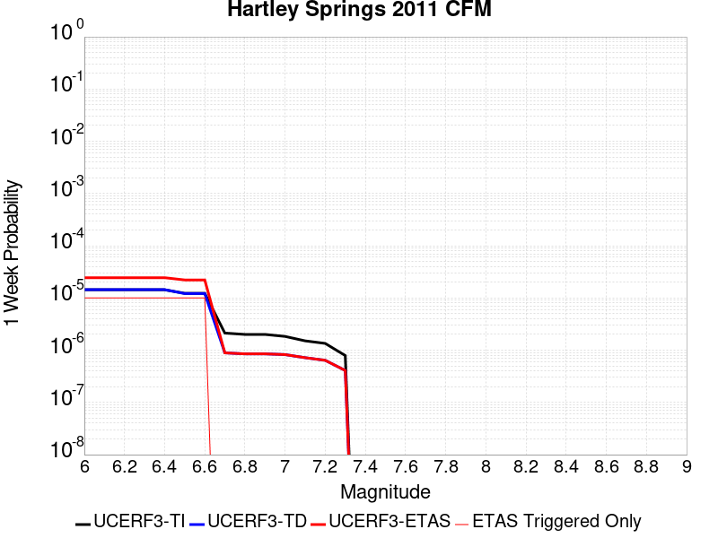 |  |  |  |

| Magnitude | 1 wk TI Prob | 1 wk TD Prob | 1 wk ETAS Prob | 1 wk ETAS/TD Gain | 1 wk ETAS Triggered Only | 1 mo TI Prob | 1 mo TD Prob | 1 mo ETAS Prob | 1 mo ETAS/TD Gain | 1 mo ETAS Triggered Only | 1 yr TI Prob | 1 yr TD Prob | 1 yr ETAS Prob | 1 yr ETAS/TD Gain | 1 yr ETAS Triggered Only | 10 yr TI Prob | 10 yr TD Prob | 10 yr ETAS Prob | 10 yr ETAS/TD Gain | 10 yr ETAS Triggered Only |
|-----|-----|-----|-----|-----|-----|-----|-----|-----|-----|-----|-----|-----|-----|-----|-----|-----|-----|-----|-----|-----|
| 6.0 | 1.4352418E-5 | 1.443441E-5 | 2.735412E-5 | 1.8950633 | 1.2919897E-5 | 6.1508916E-5 | 6.186122E-5 | 7.478031E-5 | 1.20884 | 1.2919897E-5 | 7.486137E-4 | 7.5306447E-4 | 7.6597463E-4 | 1.0171435 | 1.2919897E-5 | 0.007460968 | 0.007521247 | 0.00753407 | 1.0017048 | 1.2919897E-5 |
| 6.1 | 1.4352418E-5 | 1.443441E-5 | 2.735412E-5 | 1.8950633 | 1.2919897E-5 | 6.1508916E-5 | 6.186122E-5 | 7.478031E-5 | 1.20884 | 1.2919897E-5 | 7.486137E-4 | 7.5306447E-4 | 7.6597463E-4 | 1.0171435 | 1.2919897E-5 | 0.007460968 | 0.007521247 | 0.00753407 | 1.0017048 | 1.2919897E-5 |
| 6.2 | 1.4352418E-5 | 1.443441E-5 | 2.735412E-5 | 1.8950633 | 1.2919897E-5 | 6.1508916E-5 | 6.186122E-5 | 7.478031E-5 | 1.20884 | 1.2919897E-5 | 7.486137E-4 | 7.5306447E-4 | 7.6597463E-4 | 1.0171435 | 1.2919897E-5 | 0.007460968 | 0.007521247 | 0.00753407 | 1.0017048 | 1.2919897E-5 |
| 6.3 | 1.4352418E-5 | 1.443441E-5 | 2.735412E-5 | 1.8950633 | 1.2919897E-5 | 6.1508916E-5 | 6.186122E-5 | 7.478031E-5 | 1.20884 | 1.2919897E-5 | 7.486137E-4 | 7.5306447E-4 | 7.6597463E-4 | 1.0171435 | 1.2919897E-5 | 0.007460968 | 0.007521247 | 0.00753407 | 1.0017048 | 1.2919897E-5 |
| 6.4 | 1.4352418E-5 | 1.443441E-5 | 2.735412E-5 | 1.8950633 | 1.2919897E-5 | 6.1508916E-5 | 6.186122E-5 | 7.478031E-5 | 1.20884 | 1.2919897E-5 | 7.486137E-4 | 7.5306447E-4 | 7.6597463E-4 | 1.0171435 | 1.2919897E-5 | 0.007460968 | 0.007521247 | 0.00753407 | 1.0017048 | 1.2919897E-5 |
| 6.5 | 1.2279858E-5 | 1.21333005E-5 | 2.5053041E-5 | 2.0648165 | 1.2919897E-5 | 5.26269E-5 | 5.1999716E-5 | 6.491894E-5 | 1.248448 | 1.2919897E-5 | 6.4054417E-4 | 6.330708E-4 | 6.459825E-4 | 1.0203954 | 1.2919897E-5 | 0.0063870098 | 0.006328186 | 0.0063410243 | 1.0020287 | 1.2919897E-5 |
| 6.6 | 1.2279858E-5 | 1.21333005E-5 | 2.5053041E-5 | 2.0648165 | 1.2919897E-5 | 5.26269E-5 | 5.1999716E-5 | 6.491894E-5 | 1.248448 | 1.2919897E-5 | 6.4054417E-4 | 6.330708E-4 | 6.459825E-4 | 1.0203954 | 1.2919897E-5 | 0.0063870098 | 0.006328186 | 0.0063410243 | 1.0020287 | 1.2919897E-5 |
| 6.7 | 2.1282601E-6 | 8.8951737E-7 | 8.8951737E-7 | 1.0 | 0.0 | 9.121083E-6 | 3.8122132E-6 | 3.8122132E-6 | 1.0 | 0.0 | 1.11043526E-4 | 4.6412963E-5 | 4.6412963E-5 | 1.0 | 0.0 | 0.0011098806 | 4.6405804E-4 | 4.6405804E-4 | 1.0 | 0.0 |
| 6.8 | 2.00516E-6 | 8.517915E-7 | 8.517915E-7 | 1.0 | 0.0 | 8.593515E-6 | 3.6505314E-6 | 3.6505314E-6 | 1.0 | 0.0 | 1.04621024E-4 | 4.4444572E-5 | 4.4444572E-5 | 1.0 | 0.0 | 0.0010457177 | 4.4438196E-4 | 4.4438196E-4 | 1.0 | 0.0 |
| 6.9 | 2.00516E-6 | 8.517915E-7 | 8.517915E-7 | 1.0 | 0.0 | 8.593515E-6 | 3.6505314E-6 | 3.6505314E-6 | 1.0 | 0.0 | 1.04621024E-4 | 4.4444572E-5 | 4.4444572E-5 | 1.0 | 0.0 | 0.0010457177 | 4.4438196E-4 | 4.4438196E-4 | 1.0 | 0.0 |
| 7.0 | 1.8366732E-6 | 8.2375976E-7 | 8.2375976E-7 | 1.0 | 0.0 | 7.871433E-6 | 3.5303958E-6 | 3.5303958E-6 | 1.0 | 0.0 | 9.583048E-5 | 4.2981977E-5 | 4.2981977E-5 | 1.0 | 0.0 | 9.5789164E-4 | 4.2976168E-4 | 4.2976168E-4 | 1.0 | 0.0 |
| 7.1 | 1.5097997E-6 | 7.1904884E-7 | 7.1904884E-7 | 1.0 | 0.0 | 6.470554E-6 | 3.0816354E-6 | 3.0816354E-6 | 1.0 | 0.0 | 7.877615E-5 | 3.7518508E-5 | 3.7518508E-5 | 1.0 | 0.0 | 7.874823E-4 | 3.7514546E-4 | 3.7514546E-4 | 1.0 | 0.0 |
| 7.2 | 1.3490993E-6 | 6.405452E-7 | 6.405452E-7 | 1.0 | 0.0 | 5.7818415E-6 | 2.7451922E-6 | 2.7451922E-6 | 1.0 | 0.0 | 7.0391645E-5 | 3.3422435E-5 | 3.3422435E-5 | 1.0 | 0.0 | 7.0369354E-4 | 3.3419704E-4 | 3.3419704E-4 | 1.0 | 0.0 |
| 7.3 | 7.900015E-7 | 4.089063E-7 | 4.089063E-7 | 1.0 | 0.0 | 3.3857161E-6 | 1.7524555E-6 | 1.7524555E-6 | 1.0 | 0.0 | 4.1220315E-5 | 2.1336145E-5 | 2.1336145E-5 | 1.0 | 0.0 | 4.121267E-4 | 2.1336146E-4 | 2.1336146E-4 | 1.0 | 0.0 |

## San Jacinto (Superstition Mtn)
*[(top)](#table-of-contents)*

| 1 Week | 1 Month | 1 Year | 10 Year |
|-----|-----|-----|-----|
|  |  | 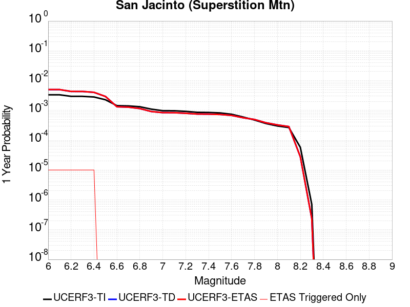 |  |

| Magnitude | 1 wk TI Prob | 1 wk TD Prob | 1 wk ETAS Prob | 1 wk ETAS/TD Gain | 1 wk ETAS Triggered Only | 1 mo TI Prob | 1 mo TD Prob | 1 mo ETAS Prob | 1 mo ETAS/TD Gain | 1 mo ETAS Triggered Only | 1 yr TI Prob | 1 yr TD Prob | 1 yr ETAS Prob | 1 yr ETAS/TD Gain | 1 yr ETAS Triggered Only | 10 yr TI Prob | 10 yr TD Prob | 10 yr ETAS Prob | 10 yr ETAS/TD Gain | 10 yr ETAS Triggered Only |
|-----|-----|-----|-----|-----|-----|-----|-----|-----|-----|-----|-----|-----|-----|-----|-----|-----|-----|-----|-----|-----|
| 6.0 | 6.4193904E-5 | 9.600102E-5 | 1.08919674E-4 | 1.1345679 | 1.2919897E-5 | 2.7508775E-4 | 4.1137784E-4 | 4.2429243E-4 | 1.0313935 | 1.2919897E-5 | 0.0033440501 | 0.004998455 | 0.00501131 | 1.0025718 | 1.2919897E-5 | 0.03294174 | 0.048827495 | 0.048839785 | 1.0002517 | 1.2919897E-5 |
| 6.1 | 6.4193904E-5 | 9.600102E-5 | 1.08919674E-4 | 1.1345679 | 1.2919897E-5 | 2.7508775E-4 | 4.1137784E-4 | 4.2429243E-4 | 1.0313935 | 1.2919897E-5 | 0.0033440501 | 0.004998455 | 0.00501131 | 1.0025718 | 1.2919897E-5 | 0.03294174 | 0.048827495 | 0.048839785 | 1.0002517 | 1.2919897E-5 |
| 6.2 | 5.7023593E-5 | 8.3151084E-5 | 9.60699E-5 | 1.1553657 | 1.2919897E-5 | 2.4436394E-4 | 3.5632253E-4 | 3.6923782E-4 | 1.0362461 | 1.2919897E-5 | 0.002971072 | 0.004331238 | 0.004344102 | 1.00297 | 1.2919897E-5 | 0.029316625 | 0.04250735 | 0.04251972 | 1.000291 | 1.2919897E-5 |
| 6.3 | 5.6940098E-5 | 8.299644E-5 | 9.591527E-5 | 1.1556551 | 1.2919897E-5 | 2.4400617E-4 | 3.5565995E-4 | 3.6857525E-4 | 1.0363137 | 1.2919897E-5 | 0.002966728 | 0.004323203 | 0.0043360675 | 1.0029756 | 1.2919897E-5 | 0.029274331 | 0.0424306 | 0.04244297 | 1.0002916 | 1.2919897E-5 |
| 6.4 | 5.4171585E-5 | 7.7490105E-5 | 9.0409005E-5 | 1.1667167 | 1.2919897E-5 | 2.3214328E-4 | 3.320675E-4 | 3.449831E-4 | 1.0388945 | 1.2919897E-5 | 0.0028226813 | 0.004037075 | 0.0040499433 | 1.0031874 | 1.2919897E-5 | 0.02787096 | 0.03971982 | 0.03973223 | 1.0003123 | 1.2919897E-5 |
| 6.5 | 4.375144E-5 | 5.6427685E-5 | 5.6427685E-5 | 1.0 | 0.0 | 1.874927E-4 | 2.4181715E-4 | 2.4181715E-4 | 1.0 | 0.0 | 0.0022803338 | 0.0029413246 | 0.0029413246 | 1.0 | 0.0 | 0.022570757 | 0.029240036 | 0.029240036 | 1.0 | 0.0 |
| 6.6 | 2.772192E-5 | 2.5494404E-5 | 2.5494404E-5 | 1.0 | 0.0 | 1.1880282E-4 | 1.0925727E-4 | 1.0925727E-4 | 1.0 | 0.0 | 0.0014454646 | 0.0013294149 | 0.0013294149 | 1.0 | 0.0 | 0.014360986 | 0.013543627 | 0.013543627 | 1.0 | 0.0 |
| 6.7 | 2.7124124E-5 | 2.4705407E-5 | 2.4705407E-5 | 1.0 | 0.0 | 1.1624106E-4 | 1.05876126E-4 | 1.05876126E-4 | 1.0 | 0.0 | 0.0014143161 | 0.0012882988 | 0.0012882988 | 1.0 | 0.0 | 0.014053487 | 0.013137068 | 0.013137068 | 1.0 | 0.0 |
| 6.8 | 2.5475807E-5 | 2.2170334E-5 | 2.2170334E-5 | 1.0 | 0.0 | 1.0917746E-4 | 9.501232E-5 | 9.501232E-5 | 1.0 | 0.0 | 0.001328425 | 0.0011561731 | 0.0011561731 | 1.0 | 0.0 | 0.0132051185 | 0.0118252365 | 0.0118252365 | 1.0 | 0.0 |
| 6.9 | 2.1162023E-5 | 1.7631666E-5 | 1.7631666E-5 | 1.0 | 0.0 | 9.069123E-5 | 7.5562115E-5 | 7.5562115E-5 | 1.0 | 0.0 | 0.0011036064 | 9.195843E-4 | 9.195843E-4 | 1.0 | 0.0 | 0.010981417 | 0.009449712 | 0.009449712 | 1.0 | 0.0 |
| 7.0 | 1.8754288E-5 | 1.6166736E-5 | 1.6166736E-5 | 1.0 | 0.0 | 8.037304E-5 | 6.9284186E-5 | 6.9284186E-5 | 1.0 | 0.0 | 9.781026E-4 | 8.4321096E-4 | 8.4321096E-4 | 1.0 | 0.0 | 0.009738087 | 0.008672746 | 0.008672746 | 1.0 | 0.0 |
| 7.1 | 1.8678527E-5 | 1.6091873E-5 | 1.6091873E-5 | 1.0 | 0.0 | 8.0048376E-5 | 6.896337E-5 | 6.896337E-5 | 1.0 | 0.0 | 9.7415317E-4 | 8.3930796E-4 | 8.3930796E-4 | 1.0 | 0.0 | 0.009698939 | 0.008633699 | 0.008633699 | 1.0 | 0.0 |
| 7.2 | 1.7804578E-5 | 1.5386398E-5 | 1.5386398E-5 | 1.0 | 0.0 | 7.6303106E-5 | 6.5940054E-5 | 6.5940054E-5 | 1.0 | 0.0 | 9.285943E-4 | 8.0252666E-4 | 8.0252666E-4 | 1.0 | 0.0 | 0.009247236 | 0.008264985 | 0.008264985 | 1.0 | 0.0 |
| 7.3 | 1.6583685E-5 | 1.4535444E-5 | 1.4535444E-5 | 1.0 | 0.0 | 7.1070994E-5 | 6.2293286E-5 | 6.2293286E-5 | 1.0 | 0.0 | 8.649459E-4 | 7.5815886E-4 | 7.5815886E-4 | 1.0 | 0.0 | 0.00861587 | 0.007820267 | 0.007820267 | 1.0 | 0.0 |
| 7.4 | 1.6387552E-5 | 1.4400321E-5 | 1.4400321E-5 | 1.0 | 0.0 | 7.023047E-5 | 6.171421E-5 | 6.171421E-5 | 1.0 | 0.0 | 8.5472054E-4 | 7.5111346E-4 | 7.5111346E-4 | 1.0 | 0.0 | 0.008514405 | 0.007749644 | 0.007749644 | 1.0 | 0.0 |
| 7.5 | 1.5790754E-5 | 1.4040957E-5 | 1.4040957E-5 | 1.0 | 0.0 | 6.767291E-5 | 6.017415E-5 | 6.017415E-5 | 1.0 | 0.0 | 8.236062E-4 | 7.32376E-4 | 7.32376E-4 | 1.0 | 0.0 | 0.008205604 | 0.007560181 | 0.007560181 | 1.0 | 0.0 |
| 7.6 | 1.4248672E-5 | 1.30597955E-5 | 1.30597955E-5 | 1.0 | 0.0 | 6.106431E-5 | 5.596936E-5 | 5.596936E-5 | 1.0 | 0.0 | 7.432043E-4 | 6.8121566E-4 | 6.8121566E-4 | 1.0 | 0.0 | 0.007407237 | 0.007042702 | 0.007042702 | 1.0 | 0.0 |
| 7.7 | 1.15449975E-5 | 1.09083485E-5 | 1.09083485E-5 | 1.0 | 0.0 | 4.947762E-5 | 4.6749232E-5 | 4.6749232E-5 | 1.0 | 0.0 | 6.022235E-4 | 5.69024E-4 | 5.69024E-4 | 1.0 | 0.0 | 0.006005941 | 0.005912628 | 0.005912628 | 1.0 | 0.0 |
| 7.8 | 9.1391985E-6 | 9.518787E-6 | 9.518787E-6 | 1.0 | 0.0 | 3.9167408E-5 | 4.0794166E-5 | 4.0794166E-5 | 1.0 | 0.0 | 4.767588E-4 | 4.9655634E-4 | 4.9655634E-4 | 1.0 | 0.0 | 0.0047573727 | 0.0051790397 | 0.0051790397 | 1.0 | 0.0 |
| 7.9 | 6.973017E-6 | 7.3861297E-6 | 7.3861297E-6 | 1.0 | 0.0 | 2.9884017E-5 | 3.165446E-5 | 3.165446E-5 | 1.0 | 0.0 | 3.6377716E-4 | 3.8532543E-4 | 3.8532543E-4 | 1.0 | 0.0 | 0.0036318225 | 0.004053871 | 0.004053871 | 1.0 | 0.0 |
| 8.0 | 5.7638235E-6 | 6.263572E-6 | 6.263572E-6 | 1.0 | 0.0 | 2.4701867E-5 | 2.6843605E-5 | 2.6843605E-5 | 1.0 | 0.0 | 3.0070372E-4 | 3.267724E-4 | 3.267724E-4 | 1.0 | 0.0 | 0.0030029714 | 0.0034553434 | 0.0034553434 | 1.0 | 0.0 |
| 8.1 | 5.1124434E-6 | 5.498948E-6 | 5.498948E-6 | 1.0 | 0.0 | 2.1910288E-5 | 2.3566712E-5 | 2.3566712E-5 | 1.0 | 0.0 | 2.6672508E-4 | 2.8688743E-4 | 2.8688743E-4 | 1.0 | 0.0 | 0.0026640517 | 0.0030420625 | 0.0030420625 | 1.0 | 0.0 |
| 8.2 | 1.1075938E-6 | 5.341373E-7 | 5.341373E-7 | 1.0 | 0.0 | 4.7468216E-6 | 2.289158E-6 | 2.289158E-6 | 1.0 | 0.0 | 5.779102E-5 | 2.7870163E-5 | 2.7870163E-5 | 1.0 | 0.0 | 5.777599E-4 | 3.1373248E-4 | 3.1373248E-4 | 1.0 | 0.0 |
| 8.3 | 1.3584393E-8 | 4.478424E-9 | 4.478424E-9 | 1.0 | 0.0 | 5.8218827E-8 | 1.9193244E-8 | 1.9193244E-8 | 1.0 | 0.0 | 7.0881396E-7 | 2.3367775E-7 | 2.3367775E-7 | 1.0 | 0.0 | 7.0881174E-6 | 2.6188773E-6 | 2.6188773E-6 | 1.0 | 0.0 |

## Northridge
*[(top)](#table-of-contents)*

| 1 Week | 1 Month | 1 Year | 10 Year |
|-----|-----|-----|-----|
|  |  |  |  |

| Magnitude | 1 wk TI Prob | 1 wk TD Prob | 1 wk ETAS Prob | 1 wk ETAS/TD Gain | 1 wk ETAS Triggered Only | 1 mo TI Prob | 1 mo TD Prob | 1 mo ETAS Prob | 1 mo ETAS/TD Gain | 1 mo ETAS Triggered Only | 1 yr TI Prob | 1 yr TD Prob | 1 yr ETAS Prob | 1 yr ETAS/TD Gain | 1 yr ETAS Triggered Only | 10 yr TI Prob | 10 yr TD Prob | 10 yr ETAS Prob | 10 yr ETAS/TD Gain | 10 yr ETAS Triggered Only |
|-----|-----|-----|-----|-----|-----|-----|-----|-----|-----|-----|-----|-----|-----|-----|-----|-----|-----|-----|-----|-----|
| 6.0 | 1.8340852E-5 | 7.5881535E-6 | 7.5881535E-6 | 1.0 | 0.0 | 7.860128E-5 | 3.2520264E-5 | 3.2520264E-5 | 1.0 | 0.0 | 9.565505E-4 | 3.9586448E-4 | 3.9586448E-4 | 1.0 | 0.0 | 0.009524435 | 0.003951816 | 0.0039646844 | 1.0032564 | 1.2919897E-5 |
| 6.1 | 1.8340852E-5 | 7.5881535E-6 | 7.5881535E-6 | 1.0 | 0.0 | 7.860128E-5 | 3.2520264E-5 | 3.2520264E-5 | 1.0 | 0.0 | 9.565505E-4 | 3.9586448E-4 | 3.9586448E-4 | 1.0 | 0.0 | 0.009524435 | 0.003951816 | 0.0039646844 | 1.0032564 | 1.2919897E-5 |
| 6.2 | 1.8340852E-5 | 7.5881535E-6 | 7.5881535E-6 | 1.0 | 0.0 | 7.860128E-5 | 3.2520264E-5 | 3.2520264E-5 | 1.0 | 0.0 | 9.565505E-4 | 3.9586448E-4 | 3.9586448E-4 | 1.0 | 0.0 | 0.009524435 | 0.003951816 | 0.0039646844 | 1.0032564 | 1.2919897E-5 |
| 6.3 | 1.8340852E-5 | 7.5881535E-6 | 7.5881535E-6 | 1.0 | 0.0 | 7.860128E-5 | 3.2520264E-5 | 3.2520264E-5 | 1.0 | 0.0 | 9.565505E-4 | 3.9586448E-4 | 3.9586448E-4 | 1.0 | 0.0 | 0.009524435 | 0.003951816 | 0.0039646844 | 1.0032564 | 1.2919897E-5 |
| 6.4 | 1.7361892E-5 | 7.5881535E-6 | 7.5881535E-6 | 1.0 | 0.0 | 7.440598E-5 | 3.2520264E-5 | 3.2520264E-5 | 1.0 | 0.0 | 9.055163E-4 | 3.9586448E-4 | 3.9586448E-4 | 1.0 | 0.0 | 0.009018354 | 0.003951816 | 0.0039646844 | 1.0032564 | 1.2919897E-5 |
| 6.5 | 1.7361892E-5 | 7.5881535E-6 | 7.5881535E-6 | 1.0 | 0.0 | 7.440598E-5 | 3.2520264E-5 | 3.2520264E-5 | 1.0 | 0.0 | 9.055163E-4 | 3.9586448E-4 | 3.9586448E-4 | 1.0 | 0.0 | 0.009018354 | 0.003951816 | 0.0039646844 | 1.0032564 | 1.2919897E-5 |
| 6.6 | 1.5458201E-5 | 7.5881535E-6 | 7.5881535E-6 | 1.0 | 0.0 | 6.624775E-5 | 3.2520264E-5 | 3.2520264E-5 | 1.0 | 0.0 | 8.0626784E-4 | 3.9586448E-4 | 3.9586448E-4 | 1.0 | 0.0 | 0.008033488 | 0.003951816 | 0.0039646844 | 1.0032564 | 1.2919897E-5 |
| 6.7 | 1.2538368E-5 | 6.381707E-6 | 6.381707E-6 | 1.0 | 0.0 | 5.3734755E-5 | 2.7349888E-5 | 2.7349888E-5 | 1.0 | 0.0 | 6.5402425E-4 | 3.3293446E-4 | 3.3293446E-4 | 1.0 | 0.0 | 0.0065210275 | 0.0033244046 | 0.0033372815 | 1.0038735 | 1.2919897E-5 |
| 6.8 | 1.1438097E-5 | 6.3503594E-6 | 6.3503594E-6 | 1.0 | 0.0 | 4.9019498E-5 | 2.7215545E-5 | 2.7215545E-5 | 1.0 | 0.0 | 5.9664896E-4 | 3.3129932E-4 | 3.3129932E-4 | 1.0 | 0.0 | 0.005950495 | 0.003308102 | 0.0033209792 | 1.0038927 | 1.2919897E-5 |
| 6.9 | 1.1204891E-5 | 6.2868094E-6 | 6.2868094E-6 | 1.0 | 0.0 | 4.8020076E-5 | 2.6943193E-5 | 2.6943193E-5 | 1.0 | 0.0 | 5.8448757E-4 | 3.2798442E-4 | 3.2798442E-4 | 1.0 | 0.0 | 0.0058295266 | 0.0032750512 | 0.0032879289 | 1.003932 | 1.2919897E-5 |
| 7.0 | 1.061046E-5 | 6.1154565E-6 | 6.1154565E-6 | 1.0 | 0.0 | 4.5472607E-5 | 2.6208838E-5 | 2.6208838E-5 | 1.0 | 0.0 | 5.534883E-4 | 3.1904632E-4 | 3.1904632E-4 | 1.0 | 0.0 | 0.0055211177 | 0.003185929 | 0.0031988078 | 1.0040424 | 1.2919897E-5 |
| 7.1 | 1.0266979E-5 | 6.0043685E-6 | 6.0043685E-6 | 1.0 | 0.0 | 4.40006E-5 | 2.5732756E-5 | 2.5732756E-5 | 1.0 | 0.0 | 5.355756E-4 | 3.132517E-4 | 3.132517E-4 | 1.0 | 0.0 | 0.0053428668 | 0.0031281472 | 0.0031410267 | 1.0041173 | 1.2919897E-5 |
| 7.2 | 9.91273E-6 | 5.820076E-6 | 5.820076E-6 | 1.0 | 0.0 | 4.248244E-5 | 2.4942945E-5 | 2.4942945E-5 | 1.0 | 0.0 | 5.171009E-4 | 3.0363846E-4 | 3.0363846E-4 | 1.0 | 0.0 | 0.0051589934 | 0.003032281 | 0.0030451617 | 1.0042479 | 1.2919897E-5 |
| 7.3 | 8.4959265E-6 | 5.1931415E-6 | 5.1931415E-6 | 1.0 | 0.0 | 3.6410605E-5 | 2.2256132E-5 | 2.2256132E-5 | 1.0 | 0.0 | 4.4320893E-4 | 2.7093495E-4 | 2.7093495E-4 | 1.0 | 0.0 | 0.00442326 | 0.0027060728 | 0.0027060728 | 1.0 | 0.0 |
| 7.4 | 8.0847185E-6 | 4.9820114E-6 | 4.9820114E-6 | 1.0 | 0.0 | 3.4648332E-5 | 2.1351305E-5 | 2.1351305E-5 | 1.0 | 0.0 | 4.2176177E-4 | 2.5992136E-4 | 2.5992136E-4 | 1.0 | 0.0 | 0.0042096223 | 0.0025961995 | 0.0025961995 | 1.0 | 0.0 |
| 7.5 | 6.8220684E-6 | 4.2533693E-6 | 4.2533693E-6 | 1.0 | 0.0 | 2.9237108E-5 | 1.8228598E-5 | 1.8228598E-5 | 1.0 | 0.0 | 3.5590364E-4 | 2.2191078E-4 | 2.2191078E-4 | 1.0 | 0.0 | 0.0035533418 | 0.0022169128 | 0.0022169128 | 1.0 | 0.0 |
| 7.6 | 4.4224143E-6 | 2.8999916E-6 | 2.8999916E-6 | 1.0 | 0.0 | 1.8953066E-5 | 1.2428477E-5 | 1.2428477E-5 | 1.0 | 0.0 | 2.3072914E-4 | 1.5130632E-4 | 1.5130632E-4 | 1.0 | 0.0 | 0.0023048974 | 0.0015120446 | 0.0015120446 | 1.0 | 0.0 |
| 7.7 | 2.5297056E-6 | 1.6046072E-6 | 1.6046072E-6 | 1.0 | 0.0 | 1.0841551E-5 | 6.87687E-6 | 6.87687E-6 | 1.0 | 0.0 | 1.319879E-4 | 8.372273E-5 | 8.372273E-5 | 1.0 | 0.0 | 0.0013190953 | 8.3691656E-4 | 8.3691656E-4 | 1.0 | 0.0 |
| 7.8 | 1.2508156E-6 | 8.78015E-7 | 8.78015E-7 | 1.0 | 0.0 | 5.3606273E-6 | 3.7629159E-6 | 3.7629159E-6 | 1.0 | 0.0 | 6.526368E-5 | 4.581255E-5 | 4.581255E-5 | 1.0 | 0.0 | 6.524452E-4 | 4.5803236E-4 | 4.5803236E-4 | 1.0 | 0.0 |
| 7.9 | 2.262199E-7 | 1.4664893E-7 | 1.4664893E-7 | 1.0 | 0.0 | 9.695135E-7 | 6.2849523E-7 | 6.2849523E-7 | 1.0 | 0.0 | 1.1803763E-5 | 7.651904E-6 | 7.651904E-6 | 1.0 | 0.0 | 1.1803136E-4 | 7.651648E-5 | 7.651648E-5 | 1.0 | 0.0 |
| 8.0 | 2.865362E-9 | 1.2753953E-9 | 1.2753953E-9 | 1.0 | 0.0 | 1.2280123E-8 | 5.46598E-9 | 5.46598E-9 | 1.0 | 0.0 | 1.4951048E-7 | 6.654831E-8 | 6.654831E-8 | 1.0 | 0.0 | 1.4951038E-6 | 6.6548307E-7 | 6.6548307E-7 | 1.0 | 0.0 |

## San Andreas (North Coast) 2011 CFM
*[(top)](#table-of-contents)*

| 1 Week | 1 Month | 1 Year | 10 Year |
|-----|-----|-----|-----|
|  |  |  |  |

| Magnitude | 1 wk TI Prob | 1 wk TD Prob | 1 wk ETAS Prob | 1 wk ETAS/TD Gain | 1 wk ETAS Triggered Only | 1 mo TI Prob | 1 mo TD Prob | 1 mo ETAS Prob | 1 mo ETAS/TD Gain | 1 mo ETAS Triggered Only | 1 yr TI Prob | 1 yr TD Prob | 1 yr ETAS Prob | 1 yr ETAS/TD Gain | 1 yr ETAS Triggered Only | 10 yr TI Prob | 10 yr TD Prob | 10 yr ETAS Prob | 10 yr ETAS/TD Gain | 10 yr ETAS Triggered Only |
|-----|-----|-----|-----|-----|-----|-----|-----|-----|-----|-----|-----|-----|-----|-----|-----|-----|-----|-----|-----|-----|
| 6.0 | 1.5333705E-4 | 7.1141556E-5 | 7.1141556E-5 | 1.0 | 0.0 | 6.5699324E-4 | 3.0485695E-4 | 3.0485695E-4 | 1.0 | 0.0 | 0.007969595 | 0.0037053502 | 0.0037182223 | 1.0034739 | 1.2919897E-5 | 0.0768977 | 0.03937111 | 0.039383523 | 1.0003152 | 1.2919897E-5 |
| 6.1 | 1.5333705E-4 | 7.1141556E-5 | 7.1141556E-5 | 1.0 | 0.0 | 6.5699324E-4 | 3.0485695E-4 | 3.0485695E-4 | 1.0 | 0.0 | 0.007969595 | 0.0037053502 | 0.0037182223 | 1.0034739 | 1.2919897E-5 | 0.0768977 | 0.03937111 | 0.039383523 | 1.0003152 | 1.2919897E-5 |
| 6.2 | 1.3912938E-4 | 6.0533035E-5 | 6.0533035E-5 | 1.0 | 0.0 | 5.961325E-4 | 2.5940166E-4 | 2.5940166E-4 | 1.0 | 0.0 | 0.007233787 | 0.0031536683 | 0.0031665475 | 1.0040839 | 1.2919897E-5 | 0.07002798 | 0.03370866 | 0.033721145 | 1.0003704 | 1.2919897E-5 |
| 6.3 | 1.3912938E-4 | 6.0533035E-5 | 6.0533035E-5 | 1.0 | 0.0 | 5.961325E-4 | 2.5940166E-4 | 2.5940166E-4 | 1.0 | 0.0 | 0.007233787 | 0.0031536683 | 0.0031665475 | 1.0040839 | 1.2919897E-5 | 0.07002798 | 0.03370866 | 0.033721145 | 1.0003704 | 1.2919897E-5 |
| 6.4 | 1.2623647E-4 | 5.0469214E-5 | 5.0469214E-5 | 1.0 | 0.0 | 5.4090127E-4 | 2.162788E-4 | 2.162788E-4 | 1.0 | 0.0 | 0.0065656058 | 0.0026300347 | 0.0026429207 | 1.0048995 | 1.2919897E-5 | 0.06374981 | 0.02831788 | 0.028330434 | 1.0004433 | 1.2919897E-5 |
| 6.5 | 1.1736096E-4 | 4.3548378E-5 | 4.3548378E-5 | 1.0 | 0.0 | 5.028786E-4 | 1.8662264E-4 | 1.8662264E-4 | 1.0 | 0.0 | 0.006105373 | 0.0022697793 | 0.0022826698 | 1.0056792 | 1.2919897E-5 | 0.05940335 | 0.024592753 | 0.024605356 | 1.0005125 | 1.2919897E-5 |
| 6.6 | 1.1586959E-4 | 4.244781E-5 | 4.244781E-5 | 1.0 | 0.0 | 4.964894E-4 | 1.8190658E-4 | 1.8190658E-4 | 1.0 | 0.0 | 0.006028018 | 0.0022124792 | 0.0022253706 | 1.0058266 | 1.2919897E-5 | 0.058671024 | 0.023998221 | 0.024010831 | 1.0005255 | 1.2919897E-5 |
| 6.7 | 1.13693764E-4 | 4.075945E-5 | 4.075945E-5 | 1.0 | 0.0 | 4.87168E-4 | 1.7467175E-4 | 1.7467175E-4 | 1.0 | 0.0 | 0.005915152 | 0.0021245703 | 0.0021245703 | 1.0 | 0.0 | 0.057601593 | 0.023089329 | 0.023089329 | 1.0 | 0.0 |
| 6.8 | 1.1204889E-4 | 3.9976534E-5 | 3.9976534E-5 | 1.0 | 0.0 | 4.8012115E-4 | 1.7131683E-4 | 1.7131683E-4 | 1.0 | 0.0 | 0.005829819 | 0.002083803 | 0.002083803 | 1.0 | 0.0 | 0.05679232 | 0.022649366 | 0.022649366 | 1.0 | 0.0 |
| 6.9 | 1.1005794E-4 | 3.903209E-5 | 3.903209E-5 | 1.0 | 0.0 | 4.7159163E-4 | 1.6726975E-4 | 1.6726975E-4 | 1.0 | 0.0 | 0.0057265228 | 0.002034623 | 0.002034623 | 1.0 | 0.0 | 0.055811852 | 0.02211497 | 0.02211497 | 1.0 | 0.0 |
| 7.0 | 1.0647948E-4 | 3.7187776E-5 | 3.7187776E-5 | 1.0 | 0.0 | 4.562608E-4 | 1.5936654E-4 | 1.5936654E-4 | 1.0 | 0.0 | 0.0055408357 | 0.0019385765 | 0.0019385765 | 1.0 | 0.0 | 0.054047033 | 0.021074155 | 0.021074155 | 1.0 | 0.0 |
| 7.1 | 1.04795035E-4 | 3.6236856E-5 | 3.6236856E-5 | 1.0 | 0.0 | 4.4904428E-4 | 1.5529165E-4 | 1.5529165E-4 | 1.0 | 0.0 | 0.0054534175 | 0.0018890519 | 0.0018890519 | 1.0 | 0.0 | 0.053215165 | 0.020541927 | 0.020541927 | 1.0 | 0.0 |
| 7.2 | 1.02724036E-4 | 3.514485E-5 | 3.514485E-5 | 1.0 | 0.0 | 4.401716E-4 | 1.5061218E-4 | 1.5061218E-4 | 1.0 | 0.0 | 0.0053459285 | 0.0018321763 | 0.0018321763 | 1.0 | 0.0 | 0.052191395 | 0.019930558 | 0.019930558 | 1.0 | 0.0 |
| 7.3 | 1.00650694E-4 | 3.4611825E-5 | 3.4611825E-5 | 1.0 | 0.0 | 4.312888E-4 | 1.4832805E-4 | 1.4832805E-4 | 1.0 | 0.0 | 0.005238306 | 0.0018044134 | 0.0018044134 | 1.0 | 0.0 | 0.051165357 | 0.019607486 | 0.019607486 | 1.0 | 0.0 |
| 7.4 | 9.672919E-5 | 3.3400014E-5 | 3.3400014E-5 | 1.0 | 0.0 | 4.144878E-4 | 1.4313516E-4 | 1.4313516E-4 | 1.0 | 0.0 | 0.005034718 | 0.0017412928 | 0.0017412928 | 1.0 | 0.0 | 0.049221683 | 0.018880244 | 0.018880244 | 1.0 | 0.0 |
| 7.5 | 8.7600405E-5 | 2.2716442E-5 | 2.2716442E-5 | 1.0 | 0.0 | 3.753763E-4 | 9.735256E-5 | 9.735256E-5 | 1.0 | 0.0 | 0.0045606326 | 0.0011846247 | 0.0011846247 | 1.0 | 0.0 | 0.04468165 | 0.013139147 | 0.013139147 | 1.0 | 0.0 |
| 7.6 | 7.9562284E-5 | 1.924054E-5 | 1.924054E-5 | 1.0 | 0.0 | 3.4093665E-4 | 8.2456856E-5 | 8.2456856E-5 | 1.0 | 0.0 | 0.0041430052 | 0.0010034514 | 0.0010034514 | 1.0 | 0.0 | 0.040666126 | 0.011229912 | 0.011229912 | 1.0 | 0.0 |
| 7.7 | 6.3866544E-5 | 1.1952783E-5 | 1.1952783E-5 | 1.0 | 0.0 | 2.7368503E-4 | 5.1225208E-5 | 5.1225208E-5 | 1.0 | 0.0 | 0.0033270244 | 6.2348874E-4 | 6.2348874E-4 | 1.0 | 0.0 | 0.032776527 | 0.007216897 | 0.007216897 | 1.0 | 0.0 |
| 7.8 | 4.2543215E-5 | 9.0854555E-6 | 9.0854555E-6 | 1.0 | 0.0 | 1.8231533E-4 | 3.8937087E-5 | 3.8937087E-5 | 1.0 | 0.0 | 0.0022174292 | 4.73956E-4 | 4.73956E-4 | 1.0 | 0.0 | 0.021954332 | 0.0054957564 | 0.0054957564 | 1.0 | 0.0 |
| 7.9 | 2.2636612E-5 | 7.821691E-6 | 7.821691E-6 | 1.0 | 0.0 | 9.7010445E-5 | 3.35211E-5 | 3.35211E-5 | 1.0 | 0.0 | 0.0011804621 | 4.080431E-4 | 4.080431E-4 | 1.0 | 0.0 | 0.011742111 | 0.004687419 | 0.004687419 | 1.0 | 0.0 |
| 8.0 | 1.5167874E-5 | 7.056108E-6 | 7.056108E-6 | 1.0 | 0.0 | 6.500356E-5 | 3.0240113E-5 | 3.0240113E-5 | 1.0 | 0.0 | 7.9113094E-4 | 3.6811127E-4 | 3.6811127E-4 | 1.0 | 0.0 | 0.007883203 | 0.0042192712 | 0.0042192712 | 1.0 | 0.0 |
| 8.1 | 1.0681047E-5 | 6.393015E-6 | 6.393015E-6 | 1.0 | 0.0 | 4.5775112E-5 | 2.739835E-5 | 2.739835E-5 | 1.0 | 0.0 | 5.5716943E-4 | 3.3352393E-4 | 3.3352393E-4 | 1.0 | 0.0 | 0.0055577457 | 0.0038207078 | 0.0038207078 | 1.0 | 0.0 |
| 8.2 | 8.226114E-6 | 5.1197717E-6 | 5.1197717E-6 | 1.0 | 0.0 | 3.52543E-5 | 2.1941696E-5 | 2.1941696E-5 | 1.0 | 0.0 | 4.2913653E-4 | 2.6710748E-4 | 2.6710748E-4 | 1.0 | 0.0 | 0.004283088 | 0.0030476742 | 0.0030476742 | 1.0 | 0.0 |
| 8.3 | 1.983087E-6 | 7.668296E-7 | 7.668296E-7 | 1.0 | 0.0 | 8.498917E-6 | 3.2864084E-6 | 3.2864084E-6 | 1.0 | 0.0 | 1.034694E-4 | 4.0011306E-5 | 4.0011306E-5 | 1.0 | 0.0 | 0.0010342124 | 4.724499E-4 | 4.724499E-4 | 1.0 | 0.0 |

## Dry Mountain
*[(top)](#table-of-contents)*

| 1 Week | 1 Month | 1 Year | 10 Year |
|-----|-----|-----|-----|
|  |  |  |  |

| Magnitude | 1 wk TI Prob | 1 wk TD Prob | 1 wk ETAS Prob | 1 wk ETAS/TD Gain | 1 wk ETAS Triggered Only | 1 mo TI Prob | 1 mo TD Prob | 1 mo ETAS Prob | 1 mo ETAS/TD Gain | 1 mo ETAS Triggered Only | 1 yr TI Prob | 1 yr TD Prob | 1 yr ETAS Prob | 1 yr ETAS/TD Gain | 1 yr ETAS Triggered Only | 10 yr TI Prob | 10 yr TD Prob | 10 yr ETAS Prob | 10 yr ETAS/TD Gain | 10 yr ETAS Triggered Only |
|-----|-----|-----|-----|-----|-----|-----|-----|-----|-----|-----|-----|-----|-----|-----|-----|-----|-----|-----|-----|-----|
| 6.0 | 6.222801E-6 | 6.439411E-6 | 6.439411E-6 | 1.0 | 0.0 | 2.6668875E-5 | 2.7597274E-5 | 2.7597274E-5 | 1.0 | 0.0 | 3.2464517E-4 | 3.359609E-4 | 3.4887646E-4 | 1.0384437 | 1.2919897E-5 | 0.0032417132 | 0.0033560924 | 0.0033689688 | 1.0038368 | 1.2919897E-5 |
| 6.1 | 6.222801E-6 | 6.439411E-6 | 6.439411E-6 | 1.0 | 0.0 | 2.6668875E-5 | 2.7597274E-5 | 2.7597274E-5 | 1.0 | 0.0 | 3.2464517E-4 | 3.359609E-4 | 3.4887646E-4 | 1.0384437 | 1.2919897E-5 | 0.0032417132 | 0.0033560924 | 0.0033689688 | 1.0038368 | 1.2919897E-5 |
| 6.2 | 6.222801E-6 | 6.439411E-6 | 6.439411E-6 | 1.0 | 0.0 | 2.6668875E-5 | 2.7597274E-5 | 2.7597274E-5 | 1.0 | 0.0 | 3.2464517E-4 | 3.359609E-4 | 3.4887646E-4 | 1.0384437 | 1.2919897E-5 | 0.0032417132 | 0.0033560924 | 0.0033689688 | 1.0038368 | 1.2919897E-5 |
| 6.3 | 6.222801E-6 | 6.439411E-6 | 6.439411E-6 | 1.0 | 0.0 | 2.6668875E-5 | 2.7597274E-5 | 2.7597274E-5 | 1.0 | 0.0 | 3.2464517E-4 | 3.359609E-4 | 3.4887646E-4 | 1.0384437 | 1.2919897E-5 | 0.0032417132 | 0.0033560924 | 0.0033689688 | 1.0038368 | 1.2919897E-5 |
| 6.4 | 6.222801E-6 | 6.439411E-6 | 6.439411E-6 | 1.0 | 0.0 | 2.6668875E-5 | 2.7597274E-5 | 2.7597274E-5 | 1.0 | 0.0 | 3.2464517E-4 | 3.359609E-4 | 3.4887646E-4 | 1.0384437 | 1.2919897E-5 | 0.0032417132 | 0.0033560924 | 0.0033689688 | 1.0038368 | 1.2919897E-5 |
| 6.5 | 2.8528623E-6 | 2.952182E-6 | 2.952182E-6 | 1.0 | 0.0 | 1.22264955E-5 | 1.2652196E-5 | 1.2652196E-5 | 1.0 | 0.0 | 1.4884741E-4 | 1.5403831E-4 | 1.5403831E-4 | 1.0 | 0.0 | 0.0014874774 | 0.0015401688 | 0.0015401688 | 1.0 | 0.0 |
| 6.6 | 2.8528623E-6 | 2.952182E-6 | 2.952182E-6 | 1.0 | 0.0 | 1.22264955E-5 | 1.2652196E-5 | 1.2652196E-5 | 1.0 | 0.0 | 1.4884741E-4 | 1.5403831E-4 | 1.5403831E-4 | 1.0 | 0.0 | 0.0014874774 | 0.0015401688 | 0.0015401688 | 1.0 | 0.0 |
| 6.7 | 2.541E-6 | 2.62937E-6 | 2.62937E-6 | 1.0 | 0.0 | 1.0889954E-5 | 1.12687285E-5 | 1.12687285E-5 | 1.0 | 0.0 | 1.3257713E-4 | 1.3719677E-4 | 1.3719677E-4 | 1.0 | 0.0 | 0.0013249806 | 0.0013719677 | 0.0013719677 | 1.0 | 0.0 |

## Hector Mine
*[(top)](#table-of-contents)*

| 1 Week | 1 Month | 1 Year | 10 Year |
|-----|-----|-----|-----|
|  |  |  |  |

| Magnitude | 1 wk TI Prob | 1 wk TD Prob | 1 wk ETAS Prob | 1 wk ETAS/TD Gain | 1 wk ETAS Triggered Only | 1 mo TI Prob | 1 mo TD Prob | 1 mo ETAS Prob | 1 mo ETAS/TD Gain | 1 mo ETAS Triggered Only | 1 yr TI Prob | 1 yr TD Prob | 1 yr ETAS Prob | 1 yr ETAS/TD Gain | 1 yr ETAS Triggered Only | 10 yr TI Prob | 10 yr TD Prob | 10 yr ETAS Prob | 10 yr ETAS/TD Gain | 10 yr ETAS Triggered Only |
|-----|-----|-----|-----|-----|-----|-----|-----|-----|-----|-----|-----|-----|-----|-----|-----|-----|-----|-----|-----|-----|
| 6.0 | 1.8760093E-5 | 2.796445E-6 | 2.796445E-6 | 1.0 | 0.0 | 8.039792E-5 | 1.1984732E-5 | 1.1984732E-5 | 1.0 | 0.0 | 9.78405E-4 | 1.4590833E-4 | 1.4590833E-4 | 1.0 | 0.0 | 0.009741086 | 0.0014585176 | 0.0014714187 | 1.0088453 | 1.2919897E-5 |
| 6.1 | 1.8760093E-5 | 2.796445E-6 | 2.796445E-6 | 1.0 | 0.0 | 8.039792E-5 | 1.1984732E-5 | 1.1984732E-5 | 1.0 | 0.0 | 9.78405E-4 | 1.4590833E-4 | 1.4590833E-4 | 1.0 | 0.0 | 0.009741086 | 0.0014585176 | 0.0014714187 | 1.0088453 | 1.2919897E-5 |
| 6.2 | 1.8760093E-5 | 2.796445E-6 | 2.796445E-6 | 1.0 | 0.0 | 8.039792E-5 | 1.1984732E-5 | 1.1984732E-5 | 1.0 | 0.0 | 9.78405E-4 | 1.4590833E-4 | 1.4590833E-4 | 1.0 | 0.0 | 0.009741086 | 0.0014585176 | 0.0014714187 | 1.0088453 | 1.2919897E-5 |
| 6.3 | 1.8760093E-5 | 2.796445E-6 | 2.796445E-6 | 1.0 | 0.0 | 8.039792E-5 | 1.1984732E-5 | 1.1984732E-5 | 1.0 | 0.0 | 9.78405E-4 | 1.4590833E-4 | 1.4590833E-4 | 1.0 | 0.0 | 0.009741086 | 0.0014585176 | 0.0014714187 | 1.0088453 | 1.2919897E-5 |
| 6.4 | 1.0888055E-5 | 2.796445E-6 | 2.796445E-6 | 1.0 | 0.0 | 4.666226E-5 | 1.1984732E-5 | 1.1984732E-5 | 1.0 | 0.0 | 5.679649E-4 | 1.4590833E-4 | 1.4590833E-4 | 1.0 | 0.0 | 0.0056651547 | 0.0014585176 | 0.0014714187 | 1.0088453 | 1.2919897E-5 |
| 6.5 | 1.0888055E-5 | 2.796445E-6 | 2.796445E-6 | 1.0 | 0.0 | 4.666226E-5 | 1.1984732E-5 | 1.1984732E-5 | 1.0 | 0.0 | 5.679649E-4 | 1.4590833E-4 | 1.4590833E-4 | 1.0 | 0.0 | 0.0056651547 | 0.0014585176 | 0.0014714187 | 1.0088453 | 1.2919897E-5 |
| 6.6 | 1.0730738E-5 | 2.796445E-6 | 2.796445E-6 | 1.0 | 0.0 | 4.5988065E-5 | 1.1984732E-5 | 1.1984732E-5 | 1.0 | 0.0 | 5.5976084E-4 | 1.4590833E-4 | 1.4590833E-4 | 1.0 | 0.0 | 0.0055835294 | 0.0014585176 | 0.0014714187 | 1.0088453 | 1.2919897E-5 |
| 6.7 | 7.881326E-6 | 2.7711246E-6 | 2.7711246E-6 | 1.0 | 0.0 | 3.3776672E-5 | 1.1876217E-5 | 1.1876217E-5 | 1.0 | 0.0 | 4.111534E-4 | 1.4458735E-4 | 1.4458735E-4 | 1.0 | 0.0 | 0.0041039353 | 0.0014453249 | 0.0014582261 | 1.0089262 | 1.2919897E-5 |
| 6.8 | 7.5683483E-6 | 2.7328742E-6 | 2.7328742E-6 | 1.0 | 0.0 | 3.2435375E-5 | 1.1712288E-5 | 1.1712288E-5 | 1.0 | 0.0 | 3.9482914E-4 | 1.4259177E-4 | 1.4259177E-4 | 1.0 | 0.0 | 0.0039412836 | 0.0014253948 | 0.0014382963 | 1.0090512 | 1.2919897E-5 |
| 6.9 | 6.473048E-6 | 2.513948E-6 | 2.513948E-6 | 1.0 | 0.0 | 2.7741338E-5 | 1.0774041E-5 | 1.0774041E-5 | 1.0 | 0.0 | 3.3769844E-4 | 1.3117002E-4 | 1.3117002E-4 | 1.0 | 0.0 | 0.0033718573 | 0.0013113155 | 0.0013242185 | 1.0098397 | 1.2919897E-5 |
| 7.0 | 4.9959954E-6 | 1.8565554E-6 | 1.8565554E-6 | 1.0 | 0.0 | 2.1411232E-5 | 7.956662E-6 | 7.956662E-6 | 1.0 | 0.0 | 2.6065056E-4 | 9.687162E-5 | 9.687162E-5 | 1.0 | 0.0 | 0.0026034506 | 9.686435E-4 | 9.815509E-4 | 1.0133252 | 1.2919897E-5 |
| 7.1 | 1.2997541E-6 | 1.5602835E-7 | 1.5602835E-7 | 1.0 | 0.0 | 5.5703626E-6 | 6.686928E-7 | 6.686928E-7 | 1.0 | 0.0 | 6.7817055E-5 | 8.141308E-6 | 8.141308E-6 | 1.0 | 0.0 | 6.779636E-4 | 8.141049E-5 | 8.141049E-5 | 1.0 | 0.0 |
| 7.2 | 8.392699E-7 | 9.728028E-8 | 9.728028E-8 | 1.0 | 0.0 | 3.596866E-6 | 4.1691544E-7 | 4.1691544E-7 | 1.0 | 0.0 | 4.3790962E-5 | 5.0759354E-6 | 5.0759354E-6 | 1.0 | 0.0 | 4.3782333E-4 | 5.075839E-5 | 5.075839E-5 | 1.0 | 0.0 |
| 7.3 | 3.13015E-7 | 4.8294503E-8 | 4.8294503E-8 | 1.0 | 0.0 | 1.3414921E-6 | 2.0697642E-7 | 2.0697642E-7 | 1.0 | 0.0 | 1.6332544E-5 | 2.5199358E-6 | 2.5199358E-6 | 1.0 | 0.0 | 1.6331344E-4 | 2.5199157E-5 | 2.5199157E-5 | 1.0 | 0.0 |

## Imperial
*[(top)](#table-of-contents)*

| 1 Week | 1 Month | 1 Year | 10 Year |
|-----|-----|-----|-----|
|  |  |  |  |

| Magnitude | 1 wk TI Prob | 1 wk TD Prob | 1 wk ETAS Prob | 1 wk ETAS/TD Gain | 1 wk ETAS Triggered Only | 1 mo TI Prob | 1 mo TD Prob | 1 mo ETAS Prob | 1 mo ETAS/TD Gain | 1 mo ETAS Triggered Only | 1 yr TI Prob | 1 yr TD Prob | 1 yr ETAS Prob | 1 yr ETAS/TD Gain | 1 yr ETAS Triggered Only | 10 yr TI Prob | 10 yr TD Prob | 10 yr ETAS Prob | 10 yr ETAS/TD Gain | 10 yr ETAS Triggered Only |
|-----|-----|-----|-----|-----|-----|-----|-----|-----|-----|-----|-----|-----|-----|-----|-----|-----|-----|-----|-----|-----|
| 6.0 | 2.7496446E-4 | 5.0565513E-4 | 5.0565513E-4 | 1.0 | 0.0 | 0.0011778869 | 0.002165333 | 0.002165333 | 1.0 | 0.0 | 0.0142467655 | 0.026045265 | 0.026057849 | 1.0004832 | 1.2919897E-5 | 0.13367249 | 0.22808637 | 0.22809634 | 1.0000437 | 1.2919897E-5 |
| 6.1 | 2.5356023E-4 | 4.8667885E-4 | 4.8667885E-4 | 1.0 | 0.0 | 0.001086234 | 0.0020841376 | 0.0020841376 | 1.0 | 0.0 | 0.013144928 | 0.02507692 | 0.025089517 | 1.0005023 | 1.2919897E-5 | 0.123940155 | 0.21951756 | 0.21952765 | 1.0000459 | 1.2919897E-5 |
| 6.2 | 2.4820742E-4 | 4.7763108E-4 | 4.7763108E-4 | 1.0 | 0.0 | 0.0010633124 | 0.0020454223 | 0.0020454223 | 1.0 | 0.0 | 0.01286919 | 0.024616843 | 0.024629444 | 1.0005119 | 1.2919897E-5 | 0.12148927 | 0.2160229 | 0.21603301 | 1.0000468 | 1.2919897E-5 |
| 6.3 | 2.3205351E-4 | 4.590021E-4 | 4.590021E-4 | 1.0 | 0.0 | 9.94136E-4 | 0.0019657058 | 0.0019657058 | 1.0 | 0.0 | 0.012036599 | 0.023666281 | 0.023678895 | 1.000533 | 1.2919897E-5 | 0.11405133 | 0.20796864 | 0.20797886 | 1.0000492 | 1.2919897E-5 |
| 6.4 | 2.0304754E-4 | 3.9885996E-4 | 3.9885996E-4 | 1.0 | 0.0 | 8.6991355E-4 | 0.0017082945 | 0.0017082945 | 1.0 | 0.0 | 0.010539869 | 0.020600514 | 0.020600514 | 1.0 | 0.0 | 0.100537635 | 0.18510117 | 0.18510117 | 1.0 | 0.0 |
| 6.5 | 1.854992E-4 | 3.6997703E-4 | 3.6997703E-4 | 1.0 | 0.0 | 7.9475436E-4 | 0.0015846646 | 0.0015846646 | 1.0 | 0.0 | 0.009633281 | 0.019123985 | 0.019123985 | 1.0 | 0.0 | 0.0922623 | 0.17333072 | 0.17333072 | 1.0 | 0.0 |
| 6.6 | 1.6586106E-4 | 3.4043082E-4 | 3.4043082E-4 | 1.0 | 0.0 | 7.106394E-4 | 0.0014581835 | 0.0014581835 | 1.0 | 0.0 | 0.008617763 | 0.017610526 | 0.017610526 | 1.0 | 0.0 | 0.08291132 | 0.16080588 | 0.16080588 | 1.0 | 0.0 |
| 6.7 | 1.4224656E-4 | 3.077392E-4 | 3.077392E-4 | 1.0 | 0.0 | 6.094856E-4 | 0.0013182238 | 0.0013182238 | 1.0 | 0.0 | 0.0073952693 | 0.015933173 | 0.015933173 | 1.0 | 0.0 | 0.07153955 | 0.1465114 | 0.1465114 | 1.0 | 0.0 |
| 6.8 | 1.2317259E-4 | 2.779711E-4 | 2.779711E-4 | 1.0 | 0.0 | 5.2777573E-4 | 0.0011907669 | 0.0011907669 | 1.0 | 0.0 | 0.0064067547 | 0.0144026 | 0.0144026 | 1.0 | 0.0 | 0.06225166 | 0.13296051 | 0.13296051 | 1.0 | 0.0 |
| 6.9 | 9.859898E-5 | 2.5018715E-4 | 2.5018715E-4 | 1.0 | 0.0 | 4.2249862E-4 | 0.0010717943 | 0.0010717943 | 1.0 | 0.0 | 0.0051317946 | 0.012971984 | 0.012971984 | 1.0 | 0.0 | 0.05014893 | 0.11942433 | 0.11942433 | 1.0 | 0.0 |
| 7.0 | 7.3191884E-5 | 2.1270063E-4 | 2.1270063E-4 | 1.0 | 0.0 | 3.136418E-4 | 9.1125886E-4 | 9.1125886E-4 | 1.0 | 0.0 | 0.003811904 | 0.011038825 | 0.011038825 | 1.0 | 0.0 | 0.037471764 | 0.10207849 | 0.10207849 | 1.0 | 0.0 |
| 7.1 | 7.1760296E-5 | 2.0971385E-4 | 2.0971385E-4 | 1.0 | 0.0 | 3.0750787E-4 | 8.984672E-4 | 8.984672E-4 | 1.0 | 0.0 | 0.003737482 | 0.010884652 | 0.010884652 | 1.0 | 0.0 | 0.03675245 | 0.100714855 | 0.100714855 | 1.0 | 0.0 |
| 7.2 | 6.46614E-5 | 1.9139807E-4 | 1.9139807E-4 | 1.0 | 0.0 | 2.7709085E-4 | 8.2002254E-4 | 8.2002254E-4 | 1.0 | 0.0 | 0.0033683628 | 0.009938694 | 0.009938694 | 1.0 | 0.0 | 0.033177625 | 0.09252202 | 0.09252202 | 1.0 | 0.0 |
| 7.3 | 6.088115E-5 | 1.781138E-4 | 1.781138E-4 | 1.0 | 0.0 | 2.6089314E-4 | 7.631244E-4 | 7.631244E-4 | 1.0 | 0.0 | 0.0031717476 | 0.009252035 | 0.009252035 | 1.0 | 0.0 | 0.031268585 | 0.08657247 | 0.08657247 | 1.0 | 0.0 |
| 7.4 | 4.199346E-5 | 1.15126604E-4 | 1.15126604E-4 | 1.0 | 0.0 | 1.7995955E-4 | 4.933073E-4 | 4.933073E-4 | 1.0 | 0.0 | 0.0021888057 | 0.005989646 | 0.005989646 | 1.0 | 0.0 | 0.02167372 | 0.057449933 | 0.057449933 | 1.0 | 0.0 |
| 7.5 | 3.130448E-5 | 8.335176E-5 | 8.335176E-5 | 1.0 | 0.0 | 1.3415517E-4 | 3.5717324E-4 | 3.5717324E-4 | 1.0 | 0.0 | 0.0016321153 | 0.0043399734 | 0.0043399734 | 1.0 | 0.0 | 0.016201803 | 0.042140562 | 0.042140562 | 1.0 | 0.0 |
| 7.6 | 2.3074248E-5 | 6.0860824E-5 | 6.0860824E-5 | 1.0 | 0.0 | 9.888588E-5 | 2.6080615E-4 | 2.6080615E-4 | 1.0 | 0.0 | 0.0012032706 | 0.0031707147 | 0.0031707147 | 1.0 | 0.0 | 0.011967761 | 0.031033779 | 0.031033779 | 1.0 | 0.0 |
| 7.7 | 1.45864815E-5 | 4.0138115E-5 | 4.0138115E-5 | 1.0 | 0.0 | 6.2511994E-5 | 1.7200918E-4 | 1.7200918E-4 | 1.0 | 0.0 | 7.608177E-4 | 0.0020922057 | 0.0020922057 | 1.0 | 0.0 | 0.007582182 | 0.020633917 | 0.020633917 | 1.0 | 0.0 |
| 7.8 | 1.0352979E-5 | 3.097231E-5 | 3.097231E-5 | 1.0 | 0.0 | 4.4369157E-5 | 1.3273173E-4 | 1.3273173E-4 | 1.0 | 0.0 | 5.400606E-4 | 0.0016148133 | 0.0016148133 | 1.0 | 0.0 | 0.0053875 | 0.016022068 | 0.016022068 | 1.0 | 0.0 |
| 7.9 | 8.137906E-6 | 2.2158269E-5 | 2.2158269E-5 | 1.0 | 0.0 | 3.4876273E-5 | 9.496055E-5 | 9.496055E-5 | 1.0 | 0.0 | 4.2453592E-4 | 0.0011555325 | 0.0011555325 | 1.0 | 0.0 | 0.004237258 | 0.011622174 | 0.011622174 | 1.0 | 0.0 |
| 8.0 | 6.93792E-6 | 1.801665E-5 | 1.801665E-5 | 1.0 | 0.0 | 2.9733603E-5 | 7.721193E-5 | 7.721193E-5 | 1.0 | 0.0 | 3.6194647E-4 | 9.396506E-4 | 9.396506E-4 | 1.0 | 0.0 | 0.0036135751 | 0.00950525 | 0.00950525 | 1.0 | 0.0 |
| 8.1 | 3.4286315E-6 | 6.3835337E-6 | 6.3835337E-6 | 1.0 | 0.0 | 1.4694053E-5 | 2.7357715E-5 | 2.7357715E-5 | 1.0 | 0.0 | 1.7888541E-4 | 3.330294E-4 | 3.330294E-4 | 1.0 | 0.0 | 0.0017874148 | 0.0034878491 | 0.0034878491 | 1.0 | 0.0 |
| 8.2 | 1.4906886E-6 | 1.9381007E-6 | 1.9381007E-6 | 1.0 | 0.0 | 6.3886496E-6 | 8.3061195E-6 | 8.3061195E-6 | 1.0 | 0.0 | 7.7779034E-5 | 1.0112235E-4 | 1.0112235E-4 | 1.0 | 0.0 | 7.775182E-4 | 0.0011082698 | 0.0011082698 | 1.0 | 0.0 |
| 8.3 | 2.5758007E-8 | 1.4514695E-8 | 1.4514695E-8 | 1.0 | 0.0 | 1.10391454E-7 | 6.2205835E-8 | 6.2205835E-8 | 1.0 | 0.0 | 1.3440151E-6 | 7.57356E-7 | 7.57356E-7 | 1.0 | 0.0 | 1.344007E-5 | 7.895551E-6 | 7.895551E-6 | 1.0 | 0.0 |

## San Pedro Basin
*[(top)](#table-of-contents)*

| 1 Week | 1 Month | 1 Year | 10 Year |
|-----|-----|-----|-----|
|  |  |  |  |

| Magnitude | 1 wk TI Prob | 1 wk TD Prob | 1 wk ETAS Prob | 1 wk ETAS/TD Gain | 1 wk ETAS Triggered Only | 1 mo TI Prob | 1 mo TD Prob | 1 mo ETAS Prob | 1 mo ETAS/TD Gain | 1 mo ETAS Triggered Only | 1 yr TI Prob | 1 yr TD Prob | 1 yr ETAS Prob | 1 yr ETAS/TD Gain | 1 yr ETAS Triggered Only | 10 yr TI Prob | 10 yr TD Prob | 10 yr ETAS Prob | 10 yr ETAS/TD Gain | 10 yr ETAS Triggered Only |
|-----|-----|-----|-----|-----|-----|-----|-----|-----|-----|-----|-----|-----|-----|-----|-----|-----|-----|-----|-----|-----|
| 6.0 | 5.3449043E-5 | 6.3371124E-5 | 6.3371124E-5 | 1.0 | 0.0 | 2.2904722E-4 | 2.7156572E-4 | 2.844821E-4 | 1.0475627 | 1.2919897E-5 | 0.0027850836 | 0.0033019078 | 0.0033147852 | 1.0038999 | 1.2919897E-5 | 0.027504366 | 0.032590248 | 0.03260275 | 1.0003835 | 1.2919897E-5 |
| 6.1 | 5.3449043E-5 | 6.3371124E-5 | 6.3371124E-5 | 1.0 | 0.0 | 2.2904722E-4 | 2.7156572E-4 | 2.844821E-4 | 1.0475627 | 1.2919897E-5 | 0.0027850836 | 0.0033019078 | 0.0033147852 | 1.0038999 | 1.2919897E-5 | 0.027504366 | 0.032590248 | 0.03260275 | 1.0003835 | 1.2919897E-5 |
| 6.2 | 2.3189454E-5 | 2.6643334E-5 | 2.6643334E-5 | 1.0 | 0.0 | 9.9379584E-5 | 1.14180984E-4 | 1.14180984E-4 | 1.0 | 0.0 | 0.0012092749 | 0.0013893144 | 0.0013893144 | 1.0 | 0.0 | 0.012027155 | 0.013811161 | 0.013811161 | 1.0 | 0.0 |
| 6.3 | 2.3189454E-5 | 2.6643334E-5 | 2.6643334E-5 | 1.0 | 0.0 | 9.9379584E-5 | 1.14180984E-4 | 1.14180984E-4 | 1.0 | 0.0 | 0.0012092749 | 0.0013893144 | 0.0013893144 | 1.0 | 0.0 | 0.012027155 | 0.013811161 | 0.013811161 | 1.0 | 0.0 |
| 6.4 | 1.966056E-5 | 2.2463848E-5 | 2.2463848E-5 | 1.0 | 0.0 | 8.425682E-5 | 9.627031E-5 | 9.627031E-5 | 1.0 | 0.0 | 0.001025344 | 0.001171501 | 0.001171501 | 1.0 | 0.0 | 0.010206259 | 0.011657341 | 0.011657341 | 1.0 | 0.0 |
| 6.5 | 1.7342953E-5 | 1.9745521E-5 | 1.9745521E-5 | 1.0 | 0.0 | 7.4324824E-5 | 8.4621126E-5 | 8.4621126E-5 | 1.0 | 0.0 | 9.04529E-4 | 0.0010298121 | 0.0010298121 | 1.0 | 0.0 | 0.009008561 | 0.010254124 | 0.010254124 | 1.0 | 0.0 |
| 6.6 | 1.439804E-5 | 1.6323014E-5 | 1.6323014E-5 | 1.0 | 0.0 | 6.170443E-5 | 6.995408E-5 | 6.995408E-5 | 1.0 | 0.0 | 7.509924E-4 | 8.513903E-4 | 8.513903E-4 | 1.0 | 0.0 | 0.0074845953 | 0.008484487 | 0.008484487 | 1.0 | 0.0 |
| 6.7 | 1.2634884E-5 | 1.4285554E-5 | 1.4285554E-5 | 1.0 | 0.0 | 5.414838E-5 | 6.1222534E-5 | 6.1222534E-5 | 1.0 | 0.0 | 6.590571E-4 | 7.451599E-4 | 7.451599E-4 | 1.0 | 0.0 | 0.006571059 | 0.007429634 | 0.007429634 | 1.0 | 0.0 |
| 6.8 | 1.146091E-5 | 1.2933421E-5 | 1.2933421E-5 | 1.0 | 0.0 | 4.911726E-5 | 5.542794E-5 | 5.542794E-5 | 1.0 | 0.0 | 5.9783855E-4 | 6.7465595E-4 | 6.7465595E-4 | 1.0 | 0.0 | 0.0059623276 | 0.0067290184 | 0.0067290184 | 1.0 | 0.0 |
| 6.9 | 9.109035E-6 | 1.0235189E-5 | 1.0235189E-5 | 1.0 | 0.0 | 3.9038136E-5 | 4.3864515E-5 | 4.3864515E-5 | 1.0 | 0.0 | 4.7518566E-4 | 5.339476E-4 | 5.339476E-4 | 1.0 | 0.0 | 0.0047417083 | 0.0053294008 | 0.0053294008 | 1.0 | 0.0 |
| 7.0 | 5.9351028E-6 | 6.584068E-6 | 6.584068E-6 | 1.0 | 0.0 | 2.5435906E-5 | 2.8217262E-5 | 2.8217262E-5 | 1.0 | 0.0 | 3.0963816E-4 | 3.4351464E-4 | 3.4351464E-4 | 1.0 | 0.0 | 0.0030920706 | 0.0034321535 | 0.0034321535 | 1.0 | 0.0 |
| 7.1 | 2.1557585E-6 | 2.2096608E-6 | 2.2096608E-6 | 1.0 | 0.0 | 9.238933E-6 | 9.469942E-6 | 9.469942E-6 | 1.0 | 0.0 | 1.1247819E-4 | 1.1529059E-4 | 1.1529059E-4 | 1.0 | 0.0 | 0.0011242128 | 0.0011523232 | 0.0011523232 | 1.0 | 0.0 |
| 7.2 | 2.1251979E-6 | 2.178007E-6 | 2.178007E-6 | 1.0 | 0.0 | 9.107958E-6 | 9.334282E-6 | 9.334282E-6 | 1.0 | 0.0 | 1.1088375E-4 | 1.1363912E-4 | 1.1363912E-4 | 1.0 | 0.0 | 0.0011082845 | 0.0011358254 | 0.0011358254 | 1.0 | 0.0 |
| 7.3 | 1.7145798E-6 | 1.7442967E-6 | 1.7442967E-6 | 1.0 | 0.0 | 7.3481783E-6 | 7.475536E-6 | 7.475536E-6 | 1.0 | 0.0 | 8.94604E-5 | 9.1010945E-5 | 9.1010945E-5 | 1.0 | 0.0 | 8.9424395E-4 | 9.0974587E-4 | 9.0974587E-4 | 1.0 | 0.0 |
| 7.4 | 1.4467993E-6 | 1.4641943E-6 | 1.4641943E-6 | 1.0 | 0.0 | 6.200554E-6 | 6.2751037E-6 | 6.2751037E-6 | 1.0 | 0.0 | 7.548913E-5 | 7.6396784E-5 | 7.6396784E-5 | 1.0 | 0.0 | 7.546349E-4 | 7.637125E-4 | 7.637125E-4 | 1.0 | 0.0 |
| 7.5 | 1.2803735E-6 | 1.2931564E-6 | 1.2931564E-6 | 1.0 | 0.0 | 5.487303E-6 | 5.5420874E-6 | 5.5420874E-6 | 1.0 | 0.0 | 6.680587E-5 | 6.7472894E-5 | 6.7472894E-5 | 1.0 | 0.0 | 6.678579E-4 | 6.7453115E-4 | 6.7453115E-4 | 1.0 | 0.0 |
| 7.6 | 6.755009E-7 | 6.769501E-7 | 6.769501E-7 | 1.0 | 0.0 | 2.8950008E-6 | 2.9012117E-6 | 2.9012117E-6 | 1.0 | 0.0 | 3.5246063E-5 | 3.5321737E-5 | 3.5321737E-5 | 1.0 | 0.0 | 3.5240475E-4 | 3.5316695E-4 | 3.5316695E-4 | 1.0 | 0.0 |
| 7.7 | 6.211885E-8 | 4.5699863E-8 | 4.5699863E-8 | 1.0 | 0.0 | 2.6622362E-7 | 1.9585654E-7 | 1.9585654E-7 | 1.0 | 0.0 | 3.2412677E-6 | 2.384551E-6 | 2.384551E-6 | 1.0 | 0.0 | 3.2412205E-5 | 2.3845274E-5 | 2.3845274E-5 | 1.0 | 0.0 |
| 7.8 | 2.6580573E-9 | 1.5138681E-9 | 1.5138681E-9 | 1.0 | 0.0 | 1.1391674E-8 | 6.488006E-9 | 6.488006E-9 | 1.0 | 0.0 | 1.3869362E-7 | 7.899148E-8 | 7.899148E-8 | 1.0 | 0.0 | 1.3869354E-6 | 7.8991474E-7 | 7.8991474E-7 | 1.0 | 0.0 |

## Sheephole
*[(top)](#table-of-contents)*

| 1 Week | 1 Month | 1 Year | 10 Year |
|-----|-----|-----|-----|
|  |  |  | 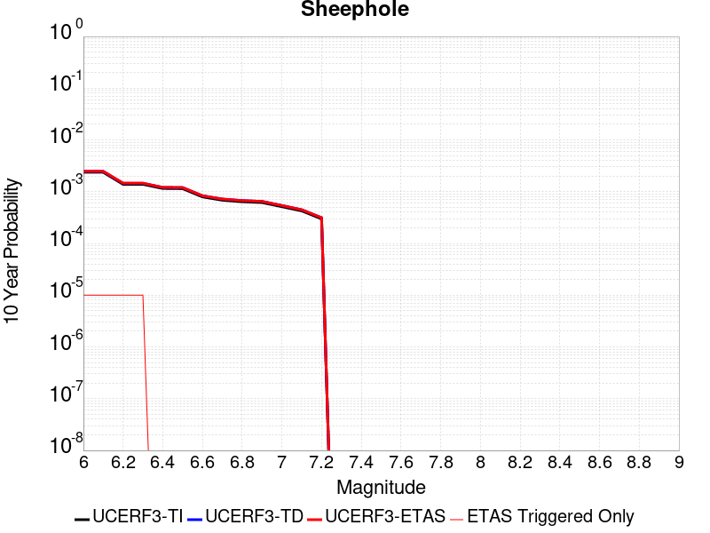 |

| Magnitude | 1 wk TI Prob | 1 wk TD Prob | 1 wk ETAS Prob | 1 wk ETAS/TD Gain | 1 wk ETAS Triggered Only | 1 mo TI Prob | 1 mo TD Prob | 1 mo ETAS Prob | 1 mo ETAS/TD Gain | 1 mo ETAS Triggered Only | 1 yr TI Prob | 1 yr TD Prob | 1 yr ETAS Prob | 1 yr ETAS/TD Gain | 1 yr ETAS Triggered Only | 10 yr TI Prob | 10 yr TD Prob | 10 yr ETAS Prob | 10 yr ETAS/TD Gain | 10 yr ETAS Triggered Only |
|-----|-----|-----|-----|-----|-----|-----|-----|-----|-----|-----|-----|-----|-----|-----|-----|-----|-----|-----|-----|-----|
| 6.0 | 4.5579695E-6 | 4.7412877E-6 | 4.7412877E-6 | 1.0 | 0.0 | 1.9534009E-5 | 2.0319678E-5 | 2.0319678E-5 | 1.0 | 0.0 | 2.3780059E-4 | 2.4736955E-4 | 2.6028624E-4 | 1.0522162 | 1.2919897E-5 | 0.0023754628 | 0.0024714863 | 0.0024843742 | 1.0052147 | 1.2919897E-5 |
| 6.1 | 4.5579695E-6 | 4.7412877E-6 | 4.7412877E-6 | 1.0 | 0.0 | 1.9534009E-5 | 2.0319678E-5 | 2.0319678E-5 | 1.0 | 0.0 | 2.3780059E-4 | 2.4736955E-4 | 2.6028624E-4 | 1.0522162 | 1.2919897E-5 | 0.0023754628 | 0.0024714863 | 0.0024843742 | 1.0052147 | 1.2919897E-5 |
| 6.2 | 2.6677674E-6 | 2.7874107E-6 | 2.7874107E-6 | 1.0 | 0.0 | 1.1433239E-5 | 1.1945997E-5 | 1.1945997E-5 | 1.0 | 0.0 | 1.3919079E-4 | 1.4543389E-4 | 1.583519E-4 | 1.088824 | 1.2919897E-5 | 0.0013910364 | 0.001453493 | 0.0014663942 | 1.008876 | 1.2919897E-5 |
| 6.3 | 2.6677674E-6 | 2.7874107E-6 | 2.7874107E-6 | 1.0 | 0.0 | 1.1433239E-5 | 1.1945997E-5 | 1.1945997E-5 | 1.0 | 0.0 | 1.3919079E-4 | 1.4543389E-4 | 1.583519E-4 | 1.088824 | 1.2919897E-5 | 0.0013910364 | 0.001453493 | 0.0014663942 | 1.008876 | 1.2919897E-5 |
| 6.4 | 2.2159759E-6 | 2.3228936E-6 | 2.3228936E-6 | 1.0 | 0.0 | 9.497005E-6 | 9.955224E-6 | 9.955224E-6 | 1.0 | 0.0 | 1.156199E-4 | 1.2119893E-4 | 1.2119893E-4 | 1.0 | 0.0 | 0.0011555976 | 0.0012114076 | 0.0012114076 | 1.0 | 0.0 |
| 6.5 | 2.1986082E-6 | 2.3047737E-6 | 2.3047737E-6 | 1.0 | 0.0 | 9.4225725E-6 | 9.877569E-6 | 9.877569E-6 | 1.0 | 0.0 | 1.1471378E-4 | 1.2025358E-4 | 1.2025358E-4 | 1.0 | 0.0 | 0.0011465458 | 0.0012019643 | 0.0012019643 | 1.0 | 0.0 |
| 6.6 | 1.5232331E-6 | 1.6019028E-6 | 1.6019028E-6 | 1.0 | 0.0 | 6.5281256E-6 | 6.8652807E-6 | 6.8652807E-6 | 1.0 | 0.0 | 7.947703E-5 | 8.358178E-5 | 8.358178E-5 | 1.0 | 0.0 | 7.9448614E-4 | 8.3552214E-4 | 8.3552214E-4 | 1.0 | 0.0 |
| 6.7 | 1.3137362E-6 | 1.3828287E-6 | 1.3828287E-6 | 1.0 | 0.0 | 5.6302856E-6 | 5.926396E-6 | 5.926396E-6 | 1.0 | 0.0 | 6.854657E-5 | 7.2151626E-5 | 7.2151626E-5 | 1.0 | 0.0 | 6.8525434E-4 | 7.212959E-4 | 7.212959E-4 | 1.0 | 0.0 |
| 6.8 | 1.2275751E-6 | 1.2922936E-6 | 1.2922936E-6 | 1.0 | 0.0 | 5.2610258E-6 | 5.5383903E-6 | 5.5383903E-6 | 1.0 | 0.0 | 6.4051106E-5 | 6.742795E-5 | 6.742795E-5 | 1.0 | 0.0 | 6.4032647E-4 | 6.740883E-4 | 6.740883E-4 | 1.0 | 0.0 |
| 6.9 | 1.1837088E-6 | 1.2461107E-6 | 1.2461107E-6 | 1.0 | 0.0 | 5.0730278E-6 | 5.340464E-6 | 5.340464E-6 | 1.0 | 0.0 | 6.176237E-5 | 6.501835E-5 | 6.501835E-5 | 1.0 | 0.0 | 6.17452E-4 | 6.500064E-4 | 6.500064E-4 | 1.0 | 0.0 |
| 7.0 | 9.849371E-7 | 1.036636E-6 | 1.036636E-6 | 1.0 | 0.0 | 4.2211523E-6 | 4.442719E-6 | 4.442719E-6 | 1.0 | 0.0 | 5.1391315E-5 | 5.408886E-5 | 5.408886E-5 | 1.0 | 0.0 | 5.137943E-4 | 5.4076704E-4 | 5.4076704E-4 | 1.0 | 0.0 |
| 7.1 | 8.1643645E-7 | 8.5917287E-7 | 8.5917287E-7 | 1.0 | 0.0 | 3.4990085E-6 | 3.6821648E-6 | 3.6821648E-6 | 1.0 | 0.0 | 4.2599597E-5 | 4.482952E-5 | 4.482952E-5 | 1.0 | 0.0 | 4.259143E-4 | 4.482134E-4 | 4.482134E-4 | 1.0 | 0.0 |
| 7.2 | 5.7295756E-7 | 6.029544E-7 | 6.029544E-7 | 1.0 | 0.0 | 2.45553E-6 | 2.584088E-6 | 2.584088E-6 | 1.0 | 0.0 | 2.9895667E-5 | 3.1460884E-5 | 3.1460884E-5 | 1.0 | 0.0 | 2.9891645E-4 | 3.14571E-4 | 3.14571E-4 | 1.0 | 0.0 |

## Cleghorn Pass
*[(top)](#table-of-contents)*

| 1 Week | 1 Month | 1 Year | 10 Year |
|-----|-----|-----|-----|
|  |  |  |  |

| Magnitude | 1 wk TI Prob | 1 wk TD Prob | 1 wk ETAS Prob | 1 wk ETAS/TD Gain | 1 wk ETAS Triggered Only | 1 mo TI Prob | 1 mo TD Prob | 1 mo ETAS Prob | 1 mo ETAS/TD Gain | 1 mo ETAS Triggered Only | 1 yr TI Prob | 1 yr TD Prob | 1 yr ETAS Prob | 1 yr ETAS/TD Gain | 1 yr ETAS Triggered Only | 10 yr TI Prob | 10 yr TD Prob | 10 yr ETAS Prob | 10 yr ETAS/TD Gain | 10 yr ETAS Triggered Only |
|-----|-----|-----|-----|-----|-----|-----|-----|-----|-----|-----|-----|-----|-----|-----|-----|-----|-----|-----|-----|-----|
| 6.0 | 1.0522846E-5 | 1.1040714E-5 | 1.1040714E-5 | 1.0 | 0.0 | 4.509713E-5 | 4.7316782E-5 | 4.7316782E-5 | 1.0 | 0.0 | 5.4891926E-4 | 5.759822E-4 | 5.8889465E-4 | 1.0224181 | 1.2919897E-5 | 0.0054756533 | 0.005750059 | 0.005762905 | 1.002234 | 1.2919897E-5 |
| 6.1 | 1.0522846E-5 | 1.1040714E-5 | 1.1040714E-5 | 1.0 | 0.0 | 4.509713E-5 | 4.7316782E-5 | 4.7316782E-5 | 1.0 | 0.0 | 5.4891926E-4 | 5.759822E-4 | 5.8889465E-4 | 1.0224181 | 1.2919897E-5 | 0.0054756533 | 0.005750059 | 0.005762905 | 1.002234 | 1.2919897E-5 |
| 6.2 | 2.1045846E-6 | 2.2082168E-6 | 2.2082168E-6 | 1.0 | 0.0 | 9.019617E-6 | 9.463776E-6 | 9.463776E-6 | 1.0 | 0.0 | 1.098083E-4 | 1.1521958E-4 | 1.1521958E-4 | 1.0 | 0.0 | 0.0010975406 | 0.0011520098 | 0.0011520098 | 1.0 | 0.0 |
| 6.3 | 2.1045846E-6 | 2.2082168E-6 | 2.2082168E-6 | 1.0 | 0.0 | 9.019617E-6 | 9.463776E-6 | 9.463776E-6 | 1.0 | 0.0 | 1.098083E-4 | 1.1521958E-4 | 1.1521958E-4 | 1.0 | 0.0 | 0.0010975406 | 0.0011520098 | 0.0011520098 | 1.0 | 0.0 |
| 6.4 | 1.7259927E-6 | 1.8108889E-6 | 1.8108889E-6 | 1.0 | 0.0 | 7.3970905E-6 | 7.760952E-6 | 7.760952E-6 | 1.0 | 0.0 | 9.005586E-5 | 9.4489595E-5 | 9.4489595E-5 | 1.0 | 0.0 | 9.001937E-4 | 9.4489596E-4 | 9.4489596E-4 | 1.0 | 0.0 |

## Pinto Mtn
*[(top)](#table-of-contents)*

| 1 Week | 1 Month | 1 Year | 10 Year |
|-----|-----|-----|-----|
| 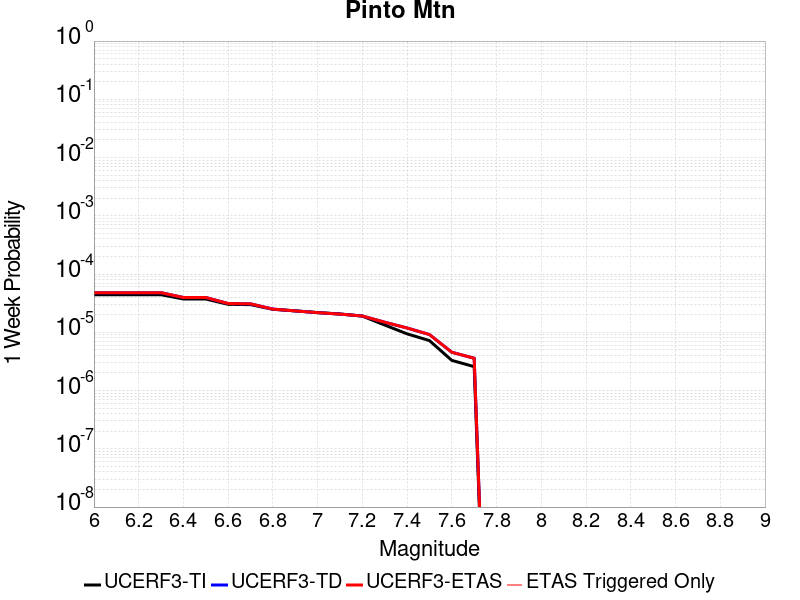 |  |  |  |

| Magnitude | 1 wk TI Prob | 1 wk TD Prob | 1 wk ETAS Prob | 1 wk ETAS/TD Gain | 1 wk ETAS Triggered Only | 1 mo TI Prob | 1 mo TD Prob | 1 mo ETAS Prob | 1 mo ETAS/TD Gain | 1 mo ETAS Triggered Only | 1 yr TI Prob | 1 yr TD Prob | 1 yr ETAS Prob | 1 yr ETAS/TD Gain | 1 yr ETAS Triggered Only | 10 yr TI Prob | 10 yr TD Prob | 10 yr ETAS Prob | 10 yr ETAS/TD Gain | 10 yr ETAS Triggered Only |
|-----|-----|-----|-----|-----|-----|-----|-----|-----|-----|-----|-----|-----|-----|-----|-----|-----|-----|-----|-----|-----|
| 6.0 | 4.4194956E-5 | 4.785523E-5 | 4.785523E-5 | 1.0 | 0.0 | 1.893932E-4 | 2.0507864E-4 | 2.0507864E-4 | 1.0 | 0.0 | 0.0023034236 | 0.002494138 | 0.002494138 | 1.0 | 0.0 | 0.022796938 | 0.024678964 | 0.024691565 | 1.0005106 | 1.2919897E-5 |
| 6.1 | 4.4194956E-5 | 4.785523E-5 | 4.785523E-5 | 1.0 | 0.0 | 1.893932E-4 | 2.0507864E-4 | 2.0507864E-4 | 1.0 | 0.0 | 0.0023034236 | 0.002494138 | 0.002494138 | 1.0 | 0.0 | 0.022796938 | 0.024678964 | 0.024691565 | 1.0005106 | 1.2919897E-5 |
| 6.2 | 4.4194956E-5 | 4.785523E-5 | 4.785523E-5 | 1.0 | 0.0 | 1.893932E-4 | 2.0507864E-4 | 2.0507864E-4 | 1.0 | 0.0 | 0.0023034236 | 0.002494138 | 0.002494138 | 1.0 | 0.0 | 0.022796938 | 0.024678964 | 0.024691565 | 1.0005106 | 1.2919897E-5 |
| 6.3 | 4.4194956E-5 | 4.785523E-5 | 4.785523E-5 | 1.0 | 0.0 | 1.893932E-4 | 2.0507864E-4 | 2.0507864E-4 | 1.0 | 0.0 | 0.0023034236 | 0.002494138 | 0.002494138 | 1.0 | 0.0 | 0.022796938 | 0.024678964 | 0.024691565 | 1.0005106 | 1.2919897E-5 |
| 6.4 | 3.729929E-5 | 3.960458E-5 | 3.960458E-5 | 1.0 | 0.0 | 1.5984432E-4 | 1.697234E-4 | 1.697234E-4 | 1.0 | 0.0 | 0.0019443673 | 0.0020645177 | 0.0020645177 | 1.0 | 0.0 | 0.019274427 | 0.020463403 | 0.020476058 | 1.0006185 | 1.2919897E-5 |
| 6.5 | 3.729929E-5 | 3.960458E-5 | 3.960458E-5 | 1.0 | 0.0 | 1.5984432E-4 | 1.697234E-4 | 1.697234E-4 | 1.0 | 0.0 | 0.0019443673 | 0.0020645177 | 0.0020645177 | 1.0 | 0.0 | 0.019274427 | 0.020463403 | 0.020476058 | 1.0006185 | 1.2919897E-5 |
| 6.6 | 3.0204548E-5 | 3.1206488E-5 | 3.1206488E-5 | 1.0 | 0.0 | 1.2944164E-4 | 1.3373543E-4 | 1.3373543E-4 | 1.0 | 0.0 | 0.0015748127 | 0.0016270474 | 0.0016270474 | 1.0 | 0.0 | 0.015636992 | 0.01615522 | 0.016167931 | 1.0007868 | 1.2919897E-5 |
| 6.7 | 2.9857754E-5 | 3.0815863E-5 | 3.0815863E-5 | 1.0 | 0.0 | 1.2795553E-4 | 1.320615E-4 | 1.320615E-4 | 1.0 | 0.0 | 0.0015567453 | 0.0016066976 | 0.0016066976 | 1.0 | 0.0 | 0.015458848 | 0.015954657 | 0.01596737 | 1.0007969 | 1.2919897E-5 |
| 6.8 | 2.4819734E-5 | 2.5010428E-5 | 2.5010428E-5 | 1.0 | 0.0 | 1.0636595E-4 | 1.0718327E-4 | 1.0718327E-4 | 1.0 | 0.0 | 0.0012942362 | 0.0013041968 | 0.0013041968 | 1.0 | 0.0 | 0.012867244 | 0.012967796 | 0.012980548 | 1.0009834 | 1.2919897E-5 |
| 6.9 | 2.331124E-5 | 2.3338684E-5 | 2.3338684E-5 | 1.0 | 0.0 | 9.990149E-5 | 1.00019206E-4 | 1.00019206E-4 | 1.0 | 0.0 | 0.001215622 | 0.001217074 | 0.001217074 | 1.0 | 0.0 | 0.012089936 | 0.012106278 | 0.012119041 | 1.0010543 | 1.2919897E-5 |
| 7.0 | 2.1818534E-5 | 2.1761793E-5 | 2.1761793E-5 | 1.0 | 0.0 | 9.3504656E-5 | 9.32616E-5 | 9.32616E-5 | 1.0 | 0.0 | 0.0011378246 | 0.0011348884 | 0.0011348884 | 1.0 | 0.0 | 0.011320163 | 0.01129303 | 0.011305804 | 1.0011312 | 1.2919897E-5 |
| 7.1 | 2.066081E-5 | 2.054142E-5 | 2.054142E-5 | 1.0 | 0.0 | 8.854332E-5 | 8.80318E-5 | 8.80318E-5 | 1.0 | 0.0 | 0.0010774818 | 0.0010712796 | 0.0010712796 | 1.0 | 0.0 | 0.010722724 | 0.010663206 | 0.010675987 | 1.0011988 | 1.2919897E-5 |
| 7.2 | 1.8990233E-5 | 1.9054683E-5 | 1.9054683E-5 | 1.0 | 0.0 | 8.138417E-5 | 8.166048E-5 | 8.166048E-5 | 1.0 | 0.0 | 9.904018E-4 | 9.937823E-4 | 9.937823E-4 | 1.0 | 0.0 | 0.009859995 | 0.0098953815 | 0.009908173 | 1.0012927 | 1.2919897E-5 |
| 7.3 | 1.3335872E-5 | 1.4907276E-5 | 1.4907276E-5 | 1.0 | 0.0 | 5.7152483E-5 | 6.388683E-5 | 6.388683E-5 | 1.0 | 0.0 | 6.956093E-4 | 7.775574E-4 | 7.775574E-4 | 1.0 | 0.0 | 0.006934359 | 0.0077496674 | 0.007762487 | 1.0016543 | 1.2919897E-5 |
| 7.4 | 9.414066E-6 | 1.186147E-5 | 1.186147E-5 | 1.0 | 0.0 | 4.0345374E-5 | 5.0833933E-5 | 5.0833933E-5 | 1.0 | 0.0 | 4.910942E-4 | 6.187368E-4 | 6.187368E-4 | 1.0 | 0.0 | 0.0049001034 | 0.0061710896 | 0.0061839297 | 1.0020807 | 1.2919897E-5 |
| 7.5 | 7.2101157E-6 | 9.158733E-6 | 9.158733E-6 | 1.0 | 0.0 | 3.090013E-5 | 3.9251165E-5 | 3.9251165E-5 | 1.0 | 0.0 | 3.7614413E-4 | 4.7778594E-4 | 4.7778594E-4 | 1.0 | 0.0 | 0.0037550807 | 0.0047683627 | 0.004781221 | 1.0026966 | 1.2919897E-5 |
| 7.6 | 3.296375E-6 | 4.546122E-6 | 4.546122E-6 | 1.0 | 0.0 | 1.4127245E-5 | 1.9483241E-5 | 1.9483241E-5 | 1.0 | 0.0 | 1.7198564E-4 | 2.3718402E-4 | 2.3718402E-4 | 1.0 | 0.0 | 0.0017185259 | 0.0023694462 | 0.0023823355 | 1.0054398 | 1.2919897E-5 |
| 7.7 | 2.5741092E-6 | 3.5850085E-6 | 3.5850085E-6 | 1.0 | 0.0 | 1.103185E-5 | 1.536424E-5 | 1.536424E-5 | 1.0 | 0.0 | 1.3430449E-4 | 1.8704488E-4 | 1.8704488E-4 | 1.0 | 0.0 | 0.0013422335 | 0.0018690043 | 0.0018690043 | 1.0 | 0.0 |

## Cleghorn Lake
*[(top)](#table-of-contents)*

| 1 Week | 1 Month | 1 Year | 10 Year |
|-----|-----|-----|-----|
|  |  |  | 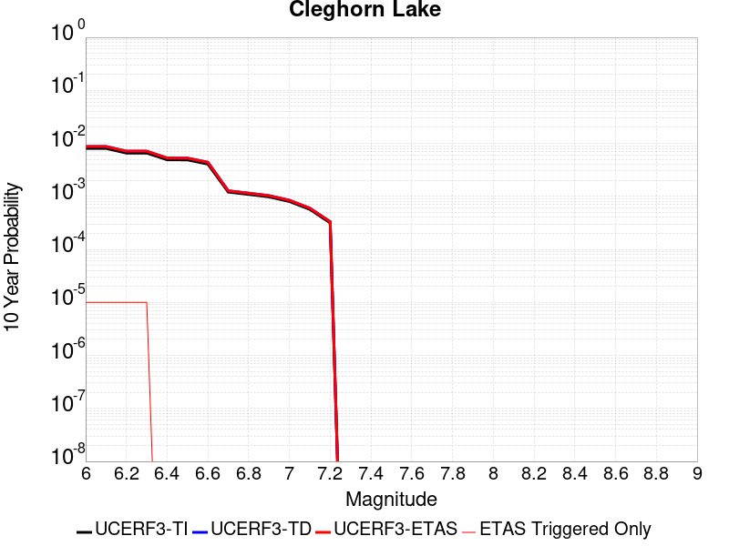 |

| Magnitude | 1 wk TI Prob | 1 wk TD Prob | 1 wk ETAS Prob | 1 wk ETAS/TD Gain | 1 wk ETAS Triggered Only | 1 mo TI Prob | 1 mo TD Prob | 1 mo ETAS Prob | 1 mo ETAS/TD Gain | 1 mo ETAS Triggered Only | 1 yr TI Prob | 1 yr TD Prob | 1 yr ETAS Prob | 1 yr ETAS/TD Gain | 1 yr ETAS Triggered Only | 10 yr TI Prob | 10 yr TD Prob | 10 yr ETAS Prob | 10 yr ETAS/TD Gain | 10 yr ETAS Triggered Only |
|-----|-----|-----|-----|-----|-----|-----|-----|-----|-----|-----|-----|-----|-----|-----|-----|-----|-----|-----|-----|-----|
| 6.0 | 1.5467183E-5 | 1.6794396E-5 | 1.6794396E-5 | 1.0 | 0.0 | 6.6286244E-5 | 7.1974304E-5 | 8.489327E-5 | 1.1794941 | 1.2919897E-5 | 8.067362E-4 | 8.7598973E-4 | 8.888983E-4 | 1.0147359 | 1.2919897E-5 | 0.008038137 | 0.008730795 | 0.008743602 | 1.0014669 | 1.2919897E-5 |
| 6.1 | 1.5467183E-5 | 1.6794396E-5 | 1.6794396E-5 | 1.0 | 0.0 | 6.6286244E-5 | 7.1974304E-5 | 8.489327E-5 | 1.1794941 | 1.2919897E-5 | 8.067362E-4 | 8.7598973E-4 | 8.888983E-4 | 1.0147359 | 1.2919897E-5 | 0.008038137 | 0.008730795 | 0.008743602 | 1.0014669 | 1.2919897E-5 |
| 6.2 | 1.2624631E-5 | 1.3681697E-5 | 1.3681697E-5 | 1.0 | 0.0 | 5.410444E-5 | 5.86348E-5 | 7.155394E-5 | 1.2203323 | 1.2919897E-5 | 6.585225E-4 | 7.1369356E-4 | 7.2660425E-4 | 1.0180899 | 1.2919897E-5 | 0.0065657445 | 0.007118811 | 0.007131639 | 1.001802 | 1.2919897E-5 |
| 6.3 | 1.2624631E-5 | 1.3681697E-5 | 1.3681697E-5 | 1.0 | 0.0 | 5.410444E-5 | 5.86348E-5 | 7.155394E-5 | 1.2203323 | 1.2919897E-5 | 6.585225E-4 | 7.1369356E-4 | 7.2660425E-4 | 1.0180899 | 1.2919897E-5 | 0.0065657445 | 0.007118811 | 0.007131639 | 1.001802 | 1.2919897E-5 |
| 6.4 | 9.417684E-6 | 1.0170226E-5 | 1.0170226E-5 | 1.0 | 0.0 | 4.036088E-5 | 4.3586184E-5 | 4.3586184E-5 | 1.0 | 0.0 | 4.912829E-4 | 5.305737E-4 | 5.305737E-4 | 1.0 | 0.0 | 0.004901982 | 0.0052971053 | 0.0052971053 | 1.0 | 0.0 |
| 6.5 | 9.368219E-6 | 1.0117652E-5 | 1.0117652E-5 | 1.0 | 0.0 | 4.014889E-5 | 4.3360877E-5 | 4.3360877E-5 | 1.0 | 0.0 | 4.8870314E-4 | 5.278319E-4 | 5.278319E-4 | 1.0 | 0.0 | 0.004876298 | 0.0052698175 | 0.0052698175 | 1.0 | 0.0 |
| 6.6 | 7.803798E-6 | 8.441923E-6 | 8.441923E-6 | 1.0 | 0.0 | 3.3444423E-5 | 3.6179394E-5 | 3.6179394E-5 | 1.0 | 0.0 | 4.0710976E-4 | 4.40435E-4 | 4.40435E-4 | 1.0 | 0.0 | 0.0040636472 | 0.004399538 | 0.004399538 | 1.0 | 0.0 |
| 6.7 | 2.3108669E-6 | 2.4438523E-6 | 2.4438523E-6 | 1.0 | 0.0 | 9.903678E-6 | 1.0473612E-5 | 1.0473612E-5 | 1.0 | 0.0 | 1.205706E-4 | 1.2750895E-4 | 1.2750895E-4 | 1.0 | 0.0 | 0.001205052 | 0.0012743765 | 0.0012743765 | 1.0 | 0.0 |
| 6.8 | 2.0882828E-6 | 2.2062986E-6 | 2.2062986E-6 | 1.0 | 0.0 | 8.949753E-6 | 9.455533E-6 | 9.455533E-6 | 1.0 | 0.0 | 1.08957785E-4 | 1.15115196E-4 | 1.15115196E-4 | 1.0 | 0.0 | 0.0010890438 | 0.0011505726 | 0.0011505726 | 1.0 | 0.0 |
| 6.9 | 1.876935E-6 | 1.9810657E-6 | 1.9810657E-6 | 1.0 | 0.0 | 8.043982E-6 | 8.490254E-6 | 8.490254E-6 | 1.0 | 0.0 | 9.7931086E-5 | 1.033641E-4 | 1.033641E-4 | 1.0 | 0.0 | 9.788794E-4 | 0.0010331762 | 0.0010331762 | 1.0 | 0.0 |
| 7.0 | 1.5357559E-6 | 1.6202926E-6 | 1.6202926E-6 | 1.0 | 0.0 | 6.5817944E-6 | 6.944093E-6 | 6.944093E-6 | 1.0 | 0.0 | 8.01304E-5 | 8.454118E-5 | 8.454118E-5 | 1.0 | 0.0 | 8.010151E-4 | 8.4510265E-4 | 8.4510265E-4 | 1.0 | 0.0 |
| 7.1 | 1.0905424E-6 | 1.1497702E-6 | 1.1497702E-6 | 1.0 | 0.0 | 4.6737446E-6 | 4.927578E-6 | 4.927578E-6 | 1.0 | 0.0 | 5.6901354E-5 | 5.999171E-5 | 5.999171E-5 | 1.0 | 0.0 | 5.6886784E-4 | 5.997649E-4 | 5.997649E-4 | 1.0 | 0.0 |
| 7.2 | 6.06668E-7 | 6.387322E-7 | 6.387322E-7 | 1.0 | 0.0 | 2.600003E-6 | 2.7374213E-6 | 2.7374213E-6 | 1.0 | 0.0 | 3.1654577E-5 | 3.3327666E-5 | 3.3327666E-5 | 1.0 | 0.0 | 3.1650066E-4 | 3.332335E-4 | 3.332335E-4 | 1.0 | 0.0 |

## Brawley (Seismic Zone) alt 1
*[(top)](#table-of-contents)*

| 1 Week | 1 Month | 1 Year | 10 Year |
|-----|-----|-----|-----|
|  |  |  | 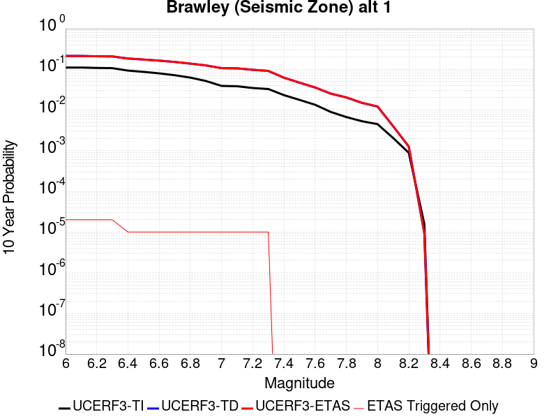 |

| Magnitude | 1 wk TI Prob | 1 wk TD Prob | 1 wk ETAS Prob | 1 wk ETAS/TD Gain | 1 wk ETAS Triggered Only | 1 mo TI Prob | 1 mo TD Prob | 1 mo ETAS Prob | 1 mo ETAS/TD Gain | 1 mo ETAS Triggered Only | 1 yr TI Prob | 1 yr TD Prob | 1 yr ETAS Prob | 1 yr ETAS/TD Gain | 1 yr ETAS Triggered Only | 10 yr TI Prob | 10 yr TD Prob | 10 yr ETAS Prob | 10 yr ETAS/TD Gain | 10 yr ETAS Triggered Only |
|-----|-----|-----|-----|-----|-----|-----|-----|-----|-----|-----|-----|-----|-----|-----|-----|-----|-----|-----|-----|-----|
| 6.0 | 2.2521618E-4 | 4.7641253E-4 | 4.7641253E-4 | 1.0 | 0.0 | 9.6485513E-4 | 0.0020402074 | 0.0020402074 | 1.0 | 0.0 | 0.011683988 | 0.02455069 | 0.024563292 | 1.0005133 | 1.2919897E-5 | 0.11088423 | 0.21353015 | 0.21354032 | 1.0000476 | 1.2919897E-5 |
| 6.1 | 2.2521618E-4 | 4.7641253E-4 | 4.7641253E-4 | 1.0 | 0.0 | 9.6485513E-4 | 0.0020402074 | 0.0020402074 | 1.0 | 0.0 | 0.011683988 | 0.02455069 | 0.024563292 | 1.0005133 | 1.2919897E-5 | 0.11088423 | 0.21353015 | 0.21354032 | 1.0000476 | 1.2919897E-5 |
| 6.2 | 2.198148E-4 | 4.6725658E-4 | 4.6725658E-4 | 1.0 | 0.0 | 9.417233E-4 | 0.002001028 | 0.002001028 | 1.0 | 0.0 | 0.011405343 | 0.024084855 | 0.024097465 | 1.0005236 | 1.2919897E-5 | 0.10837428 | 0.20996629 | 0.2099765 | 1.0000486 | 1.2919897E-5 |
| 6.3 | 2.1704129E-4 | 4.6161312E-4 | 4.6161312E-4 | 1.0 | 0.0 | 9.298453E-4 | 0.0019768786 | 0.0019768786 | 1.0 | 0.0 | 0.011262234 | 0.023797998 | 0.02381061 | 1.00053 | 1.2919897E-5 | 0.107082725 | 0.20785725 | 0.20786749 | 1.0000492 | 1.2919897E-5 |
| 6.4 | 1.876142E-4 | 4.0053183E-4 | 4.0053183E-4 | 1.0 | 0.0 | 8.038131E-4 | 0.0017154501 | 0.0017154501 | 1.0 | 0.0 | 0.00974259 | 0.02068463 | 0.02068463 | 1.0 | 0.0 | 0.093263686 | 0.184608 | 0.184608 | 1.0 | 0.0 |
| 6.5 | 1.7390939E-4 | 3.7485067E-4 | 3.7485067E-4 | 1.0 | 0.0 | 7.45113E-4 | 0.0016055258 | 0.0016055258 | 1.0 | 0.0 | 0.009034078 | 0.019372813 | 0.019372813 | 1.0 | 0.0 | 0.086755216 | 0.17442966 | 0.17442966 | 1.0 | 0.0 |
| 6.6 | 1.591791E-4 | 3.489955E-4 | 3.489955E-4 | 1.0 | 0.0 | 6.8201777E-4 | 0.0014948477 | 0.0014948477 | 1.0 | 0.0 | 0.008271996 | 0.018049458 | 0.018049458 | 1.0 | 0.0 | 0.07970774 | 0.16383699 | 0.16383699 | 1.0 | 0.0 |
| 6.7 | 1.4268003E-4 | 3.206533E-4 | 3.206533E-4 | 1.0 | 0.0 | 6.1134255E-4 | 0.0013735129 | 0.0013735129 | 1.0 | 0.0 | 0.007417723 | 0.016596261 | 0.016596261 | 1.0 | 0.0 | 0.07174956 | 0.15196045 | 0.15196045 | 1.0 | 0.0 |
| 6.8 | 1.239713E-4 | 2.9059697E-4 | 2.9059697E-4 | 1.0 | 0.0 | 5.3119735E-4 | 0.0012448273 | 0.0012448273 | 1.0 | 0.0 | 0.0064481674 | 0.015051884 | 0.015051884 | 1.0 | 0.0 | 0.06264243 | 0.13840161 | 0.13840161 | 1.0 | 0.0 |
| 6.9 | 1.0180238E-4 | 2.625907E-4 | 2.625907E-4 | 1.0 | 0.0 | 4.3622297E-4 | 0.0011249076 | 0.0011249076 | 1.0 | 0.0 | 0.005298089 | 0.013610746 | 0.013610746 | 1.0 | 0.0 | 0.05173543 | 0.12498065 | 0.12498065 | 1.0 | 0.0 |
| 7.0 | 7.6619996E-5 | 2.2402873E-4 | 2.2402873E-4 | 1.0 | 0.0 | 3.283301E-4 | 9.59773E-4 | 9.59773E-4 | 1.0 | 0.0 | 0.0039900932 | 0.011623339 | 0.011623339 | 1.0 | 0.0 | 0.039192066 | 0.10728151 | 0.10728151 | 1.0 | 0.0 |
| 7.1 | 7.5127435E-5 | 2.208599E-4 | 2.208599E-4 | 1.0 | 0.0 | 3.2193496E-4 | 9.4620226E-4 | 9.4620226E-4 | 1.0 | 0.0 | 0.0039125155 | 0.011459865 | 0.011459865 | 1.0 | 0.0 | 0.038443442 | 0.10584534 | 0.10584534 | 1.0 | 0.0 |
| 7.2 | 6.788582E-5 | 2.0213598E-4 | 2.0213598E-4 | 1.0 | 0.0 | 2.9090676E-4 | 8.660125E-4 | 8.660125E-4 | 1.0 | 0.0 | 0.0035360386 | 0.010493369 | 0.010493369 | 1.0 | 0.0 | 0.034803 | 0.09751546 | 0.09751546 | 1.0 | 0.0 |
| 7.3 | 6.399602E-5 | 1.88444E-4 | 1.88444E-4 | 1.0 | 0.0 | 2.7423984E-4 | 8.0737006E-4 | 8.0737006E-4 | 1.0 | 0.0 | 0.0033337586 | 0.009786017 | 0.009786017 | 1.0 | 0.0 | 0.03284188 | 0.091409855 | 0.091409855 | 1.0 | 0.0 |
| 7.4 | 4.506759E-5 | 1.2531783E-4 | 1.2531783E-4 | 1.0 | 0.0 | 1.9313251E-4 | 5.369668E-4 | 5.369668E-4 | 1.0 | 0.0 | 0.0023488526 | 0.0065181484 | 0.0065181484 | 1.0 | 0.0 | 0.023241805 | 0.062375 | 0.062375 | 1.0 | 0.0 |
| 7.5 | 3.43289E-5 | 9.337587E-5 | 9.337587E-5 | 1.0 | 0.0 | 1.4711556E-4 | 4.0012124E-4 | 4.0012124E-4 | 1.0 | 0.0 | 0.0017896603 | 0.004860657 | 0.004860657 | 1.0 | 0.0 | 0.01775316 | 0.04706493 | 0.04706493 | 1.0 | 0.0 |
| 7.6 | 2.5980507E-5 | 7.054998E-5 | 7.054998E-5 | 1.0 | 0.0 | 1.1134028E-4 | 3.0232212E-4 | 3.0232212E-4 | 1.0 | 0.0 | 0.001354725 | 0.0036745837 | 0.0036745837 | 1.0 | 0.0 | 0.013464959 | 0.035849415 | 0.035849415 | 1.0 | 0.0 |
| 7.7 | 1.7292105E-5 | 4.9423474E-5 | 4.9423474E-5 | 1.0 | 0.0 | 7.4106916E-5 | 2.1179771E-4 | 2.1179771E-4 | 1.0 | 0.0 | 9.018782E-4 | 0.0025755935 | 0.0025755935 | 1.0 | 0.0 | 0.008982267 | 0.025297757 | 0.025297757 | 1.0 | 0.0 |
| 7.8 | 1.2927471E-5 | 3.970735E-5 | 3.970735E-5 | 1.0 | 0.0 | 5.5402274E-5 | 1.7016326E-4 | 1.7016326E-4 | 1.0 | 0.0 | 6.743139E-4 | 0.0020697718 | 0.0020697718 | 1.0 | 0.0 | 0.0067227143 | 0.02043814 | 0.02043814 | 1.0 | 0.0 |
| 7.9 | 1.0200774E-5 | 2.8757075E-5 | 2.8757075E-5 | 1.0 | 0.0 | 4.371687E-5 | 1.2323879E-4 | 1.2323879E-4 | 1.0 | 0.0 | 5.321229E-4 | 0.0014994006 | 0.0014994006 | 1.0 | 0.0 | 0.005308505 | 0.0149969105 | 0.0149969105 | 1.0 | 0.0 |
| 8.0 | 8.650396E-6 | 2.3287128E-5 | 2.3287128E-5 | 1.0 | 0.0 | 3.70726E-5 | 9.979816E-5 | 9.979816E-5 | 1.0 | 0.0 | 4.5126543E-4 | 0.0012143662 | 0.0012143662 | 1.0 | 0.0 | 0.0045035016 | 0.012215644 | 0.012215644 | 1.0 | 0.0 |
| 8.1 | 3.9368224E-6 | 7.3321658E-6 | 7.3321658E-6 | 1.0 | 0.0 | 1.6871985E-5 | 3.1423187E-5 | 3.1423187E-5 | 1.0 | 0.0 | 2.0539707E-4 | 3.825103E-4 | 3.825103E-4 | 1.0 | 0.0 | 0.0020520731 | 0.00400326 | 0.00400326 | 1.0 | 0.0 |
| 8.2 | 1.7101195E-6 | 2.2195122E-6 | 2.2195122E-6 | 1.0 | 0.0 | 7.329063E-6 | 9.51216E-6 | 9.51216E-6 | 1.0 | 0.0 | 8.922769E-5 | 1.15804425E-4 | 1.15804425E-4 | 1.0 | 0.0 | 8.9191867E-4 | 0.0012675166 | 0.0012675166 | 1.0 | 0.0 |
| 8.3 | 3.0346666E-8 | 1.7233086E-8 | 1.7233086E-8 | 1.0 | 0.0 | 1.3005713E-7 | 7.385608E-8 | 7.385608E-8 | 1.0 | 0.0 | 1.5834444E-6 | 8.991977E-7 | 8.991977E-7 | 1.0 | 0.0 | 1.5834332E-5 | 9.37692E-6 | 9.37692E-6 | 1.0 | 0.0 |

## Blue Cut
*[(top)](#table-of-contents)*

| 1 Week | 1 Month | 1 Year | 10 Year |
|-----|-----|-----|-----|
|  |  |  |  |

| Magnitude | 1 wk TI Prob | 1 wk TD Prob | 1 wk ETAS Prob | 1 wk ETAS/TD Gain | 1 wk ETAS Triggered Only | 1 mo TI Prob | 1 mo TD Prob | 1 mo ETAS Prob | 1 mo ETAS/TD Gain | 1 mo ETAS Triggered Only | 1 yr TI Prob | 1 yr TD Prob | 1 yr ETAS Prob | 1 yr ETAS/TD Gain | 1 yr ETAS Triggered Only | 10 yr TI Prob | 10 yr TD Prob | 10 yr ETAS Prob | 10 yr ETAS/TD Gain | 10 yr ETAS Triggered Only |
|-----|-----|-----|-----|-----|-----|-----|-----|-----|-----|-----|-----|-----|-----|-----|-----|-----|-----|-----|-----|-----|
| 6.0 | 2.1227985E-5 | 2.2719787E-5 | 2.2719787E-5 | 1.0 | 0.0 | 9.097391E-5 | 9.736721E-5 | 9.736721E-5 | 1.0 | 0.0 | 0.0011070445 | 0.0011848592 | 0.0011848592 | 1.0 | 0.0 | 0.011015458 | 0.011791261 | 0.011804028 | 1.0010828 | 1.2919897E-5 |
| 6.1 | 2.1227985E-5 | 2.2719787E-5 | 2.2719787E-5 | 1.0 | 0.0 | 9.097391E-5 | 9.736721E-5 | 9.736721E-5 | 1.0 | 0.0 | 0.0011070445 | 0.0011848592 | 0.0011848592 | 1.0 | 0.0 | 0.011015458 | 0.011791261 | 0.011804028 | 1.0010828 | 1.2919897E-5 |
| 6.2 | 2.1227985E-5 | 2.2719787E-5 | 2.2719787E-5 | 1.0 | 0.0 | 9.097391E-5 | 9.736721E-5 | 9.736721E-5 | 1.0 | 0.0 | 0.0011070445 | 0.0011848592 | 0.0011848592 | 1.0 | 0.0 | 0.011015458 | 0.011791261 | 0.011804028 | 1.0010828 | 1.2919897E-5 |
| 6.3 | 1.1613981E-5 | 1.23536465E-5 | 1.23536465E-5 | 1.0 | 0.0 | 4.9773254E-5 | 5.2943193E-5 | 5.2943193E-5 | 1.0 | 0.0 | 6.0582085E-4 | 6.444052E-4 | 6.444052E-4 | 1.0 | 0.0 | 0.0060417196 | 0.0064266133 | 0.0064266133 | 1.0 | 0.0 |
| 6.4 | 1.1613981E-5 | 1.23536465E-5 | 1.23536465E-5 | 1.0 | 0.0 | 4.9773254E-5 | 5.2943193E-5 | 5.2943193E-5 | 1.0 | 0.0 | 6.0582085E-4 | 6.444052E-4 | 6.444052E-4 | 1.0 | 0.0 | 0.0060417196 | 0.0064266133 | 0.0064266133 | 1.0 | 0.0 |
| 6.5 | 8.931326E-6 | 9.481677E-6 | 9.481677E-6 | 1.0 | 0.0 | 3.8276554E-5 | 4.063518E-5 | 4.063518E-5 | 1.0 | 0.0 | 4.6591737E-4 | 4.9463013E-4 | 4.9463013E-4 | 1.0 | 0.0 | 0.0046494175 | 0.0049362015 | 0.0049362015 | 1.0 | 0.0 |
| 6.6 | 7.345353E-6 | 7.790341E-6 | 7.790341E-6 | 1.0 | 0.0 | 3.1479703E-5 | 3.3386797E-5 | 3.3386797E-5 | 1.0 | 0.0 | 3.83198E-4 | 4.0641645E-4 | 4.0641645E-4 | 1.0 | 0.0 | 0.0038253788 | 0.0040575233 | 0.0040575233 | 1.0 | 0.0 |
| 6.7 | 6.2775666E-6 | 6.655202E-6 | 6.655202E-6 | 1.0 | 0.0 | 2.690358E-5 | 2.8522025E-5 | 2.8522025E-5 | 1.0 | 0.0 | 3.2750185E-4 | 3.4720785E-4 | 3.4720785E-4 | 1.0 | 0.0 | 0.0032701963 | 0.0034673947 | 0.0034673947 | 1.0 | 0.0 |
| 6.8 | 5.5234095E-6 | 5.8551577E-6 | 5.8551577E-6 | 1.0 | 0.0 | 2.367154E-5 | 2.5093334E-5 | 2.5093334E-5 | 1.0 | 0.0 | 2.8816288E-4 | 3.0547578E-4 | 3.0547578E-4 | 1.0 | 0.0 | 0.002877895 | 0.003051275 | 0.003051275 | 1.0 | 0.0 |
| 6.9 | 4.7780054E-6 | 5.0654608E-6 | 5.0654608E-6 | 1.0 | 0.0 | 2.0477004E-5 | 2.1708976E-5 | 2.1708976E-5 | 1.0 | 0.0 | 2.4927902E-4 | 2.6428179E-4 | 2.6428179E-4 | 1.0 | 0.0 | 0.0024899957 | 0.0026403673 | 0.0026403673 | 1.0 | 0.0 |
| 7.0 | 3.883171E-6 | 4.1185203E-6 | 4.1185203E-6 | 1.0 | 0.0 | 1.6642054E-5 | 1.765072E-5 | 1.765072E-5 | 1.0 | 0.0 | 2.0259817E-4 | 2.1488321E-4 | 2.1488321E-4 | 1.0 | 0.0 | 0.0020241356 | 0.00214743 | 0.00214743 | 1.0 | 0.0 |
| 7.1 | 2.8358215E-6 | 3.0097403E-6 | 3.0097403E-6 | 1.0 | 0.0 | 1.2153464E-5 | 1.289886E-5 | 1.289886E-5 | 1.0 | 0.0 | 1.4795837E-4 | 1.5703888E-4 | 1.5703888E-4 | 1.0 | 0.0 | 0.001478599 | 0.0015699244 | 0.0015699244 | 1.0 | 0.0 |

## Cady
*[(top)](#table-of-contents)*

| 1 Week | 1 Month | 1 Year | 10 Year |
|-----|-----|-----|-----|
|  |  | 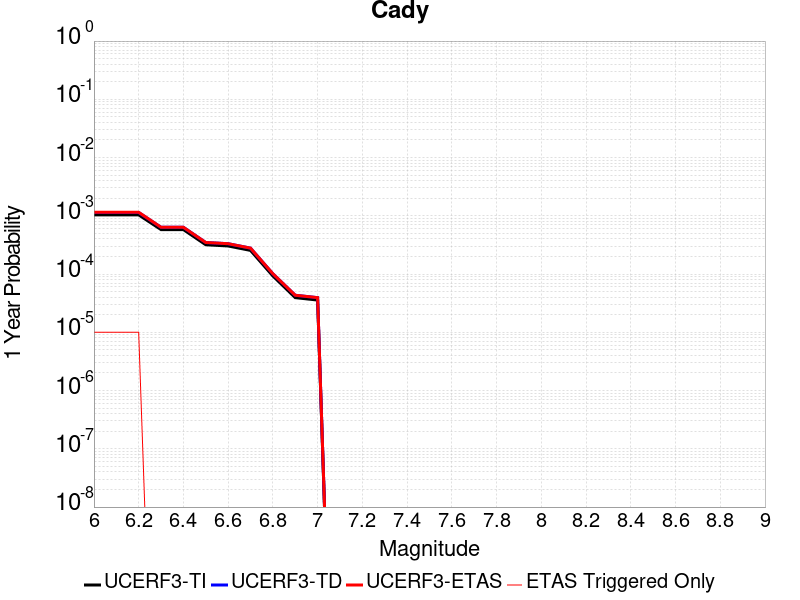 |  |

| Magnitude | 1 wk TI Prob | 1 wk TD Prob | 1 wk ETAS Prob | 1 wk ETAS/TD Gain | 1 wk ETAS Triggered Only | 1 mo TI Prob | 1 mo TD Prob | 1 mo ETAS Prob | 1 mo ETAS/TD Gain | 1 mo ETAS Triggered Only | 1 yr TI Prob | 1 yr TD Prob | 1 yr ETAS Prob | 1 yr ETAS/TD Gain | 1 yr ETAS Triggered Only | 10 yr TI Prob | 10 yr TD Prob | 10 yr ETAS Prob | 10 yr ETAS/TD Gain | 10 yr ETAS Triggered Only |
|-----|-----|-----|-----|-----|-----|-----|-----|-----|-----|-----|-----|-----|-----|-----|-----|-----|-----|-----|-----|-----|
| 6.0 | 1.9892565E-5 | 2.1859016E-5 | 2.1859016E-5 | 1.0 | 0.0 | 8.525106E-5 | 9.3678645E-5 | 9.3678645E-5 | 1.0 | 0.0 | 0.0010374374 | 0.0011400316 | 0.0011529368 | 1.01132 | 1.2919897E-5 | 0.010326075 | 0.011350849 | 0.011363622 | 1.0011253 | 1.2919897E-5 |
| 6.1 | 1.9892565E-5 | 2.1859016E-5 | 2.1859016E-5 | 1.0 | 0.0 | 8.525106E-5 | 9.3678645E-5 | 9.3678645E-5 | 1.0 | 0.0 | 0.0010374374 | 0.0011400316 | 0.0011529368 | 1.01132 | 1.2919897E-5 | 0.010326075 | 0.011350849 | 0.011363622 | 1.0011253 | 1.2919897E-5 |
| 6.2 | 1.9892565E-5 | 2.1859016E-5 | 2.1859016E-5 | 1.0 | 0.0 | 8.525106E-5 | 9.3678645E-5 | 9.3678645E-5 | 1.0 | 0.0 | 0.0010374374 | 0.0011400316 | 0.0011529368 | 1.01132 | 1.2919897E-5 | 0.010326075 | 0.011350849 | 0.011363622 | 1.0011253 | 1.2919897E-5 |
| 6.3 | 1.1117327E-5 | 1.2176738E-5 | 1.2176738E-5 | 1.0 | 0.0 | 4.764482E-5 | 5.218515E-5 | 5.218515E-5 | 1.0 | 0.0 | 5.7992124E-4 | 6.3520053E-4 | 6.3520053E-4 | 1.0 | 0.0 | 0.0057841022 | 0.0063369554 | 0.0063369554 | 1.0 | 0.0 |
| 6.4 | 1.1117327E-5 | 1.2176738E-5 | 1.2176738E-5 | 1.0 | 0.0 | 4.764482E-5 | 5.218515E-5 | 5.218515E-5 | 1.0 | 0.0 | 5.7992124E-4 | 6.3520053E-4 | 6.3520053E-4 | 1.0 | 0.0 | 0.0057841022 | 0.0063369554 | 0.0063369554 | 1.0 | 0.0 |
| 6.5 | 6.103093E-6 | 6.672103E-6 | 6.672103E-6 | 1.0 | 0.0 | 2.615585E-5 | 2.8594486E-5 | 2.8594486E-5 | 1.0 | 0.0 | 3.1840094E-4 | 3.4809482E-4 | 3.4809482E-4 | 1.0 | 0.0 | 0.0031794512 | 0.0034767296 | 0.0034767296 | 1.0 | 0.0 |
| 6.6 | 5.817237E-6 | 6.365738E-6 | 6.365738E-6 | 1.0 | 0.0 | 2.4930776E-5 | 2.728152E-5 | 2.728152E-5 | 1.0 | 0.0 | 3.034899E-4 | 3.3211432E-4 | 3.3211432E-4 | 1.0 | 0.0 | 0.0030307577 | 0.003317402 | 0.003317402 | 1.0 | 0.0 |
| 6.7 | 4.8846314E-6 | 5.3406343E-6 | 5.3406343E-6 | 1.0 | 0.0 | 2.0933967E-5 | 2.2888298E-5 | 2.2888298E-5 | 1.0 | 0.0 | 2.5484123E-4 | 2.7864118E-4 | 2.7864118E-4 | 1.0 | 0.0 | 0.0025454918 | 0.0027840736 | 0.0027840736 | 1.0 | 0.0 |
| 6.8 | 1.7788773E-6 | 1.9399313E-6 | 1.9399313E-6 | 1.0 | 0.0 | 7.6237375E-6 | 8.313974E-6 | 8.313974E-6 | 1.0 | 0.0 | 9.281505E-5 | 1.01219506E-4 | 1.01219506E-4 | 1.0 | 0.0 | 9.2776294E-4 | 0.0010118886 | 0.0010118886 | 1.0 | 0.0 |
| 6.9 | 7.5455404E-7 | 8.297202E-7 | 8.297202E-7 | 1.0 | 0.0 | 3.233799E-6 | 3.5559406E-6 | 3.5559406E-6 | 1.0 | 0.0 | 3.937079E-5 | 4.3293054E-5 | 4.3293054E-5 | 1.0 | 0.0 | 3.9363815E-4 | 4.3287914E-4 | 4.3287914E-4 | 1.0 | 0.0 |
| 7.0 | 6.8578805E-7 | 7.541916E-7 | 7.541916E-7 | 1.0 | 0.0 | 2.9390883E-6 | 3.2322475E-6 | 3.2322475E-6 | 1.0 | 0.0 | 3.578281E-5 | 3.9352235E-5 | 3.9352235E-5 | 1.0 | 0.0 | 3.577705E-4 | 3.9348513E-4 | 3.9348513E-4 | 1.0 | 0.0 |

## Raymond
*[(top)](#table-of-contents)*

| 1 Week | 1 Month | 1 Year | 10 Year |
|-----|-----|-----|-----|
|  |  |  |  |

| Magnitude | 1 wk TI Prob | 1 wk TD Prob | 1 wk ETAS Prob | 1 wk ETAS/TD Gain | 1 wk ETAS Triggered Only | 1 mo TI Prob | 1 mo TD Prob | 1 mo ETAS Prob | 1 mo ETAS/TD Gain | 1 mo ETAS Triggered Only | 1 yr TI Prob | 1 yr TD Prob | 1 yr ETAS Prob | 1 yr ETAS/TD Gain | 1 yr ETAS Triggered Only | 10 yr TI Prob | 10 yr TD Prob | 10 yr ETAS Prob | 10 yr ETAS/TD Gain | 10 yr ETAS Triggered Only |
|-----|-----|-----|-----|-----|-----|-----|-----|-----|-----|-----|-----|-----|-----|-----|-----|-----|-----|-----|-----|-----|
| 6.0 | 1.5157413E-5 | 1.5810376E-5 | 1.5810376E-5 | 1.0 | 0.0 | 6.4958724E-5 | 6.775714E-5 | 6.775714E-5 | 1.0 | 0.0 | 7.905855E-4 | 8.24656E-4 | 8.375652E-4 | 1.0156541 | 1.2919897E-5 | 0.007877788 | 0.008218477 | 0.008231291 | 1.0015591 | 1.2919897E-5 |
| 6.1 | 1.5157413E-5 | 1.5810376E-5 | 1.5810376E-5 | 1.0 | 0.0 | 6.4958724E-5 | 6.775714E-5 | 6.775714E-5 | 1.0 | 0.0 | 7.905855E-4 | 8.24656E-4 | 8.375652E-4 | 1.0156541 | 1.2919897E-5 | 0.007877788 | 0.008218477 | 0.008231291 | 1.0015591 | 1.2919897E-5 |
| 6.2 | 1.5157413E-5 | 1.5810376E-5 | 1.5810376E-5 | 1.0 | 0.0 | 6.4958724E-5 | 6.775714E-5 | 6.775714E-5 | 1.0 | 0.0 | 7.905855E-4 | 8.24656E-4 | 8.375652E-4 | 1.0156541 | 1.2919897E-5 | 0.007877788 | 0.008218477 | 0.008231291 | 1.0015591 | 1.2919897E-5 |
| 6.3 | 1.5157413E-5 | 1.5810376E-5 | 1.5810376E-5 | 1.0 | 0.0 | 6.4958724E-5 | 6.775714E-5 | 6.775714E-5 | 1.0 | 0.0 | 7.905855E-4 | 8.24656E-4 | 8.375652E-4 | 1.0156541 | 1.2919897E-5 | 0.007877788 | 0.008218477 | 0.008231291 | 1.0015591 | 1.2919897E-5 |
| 6.4 | 1.3941944E-5 | 1.4454918E-5 | 1.4454918E-5 | 1.0 | 0.0 | 5.9749822E-5 | 6.194831E-5 | 6.194831E-5 | 1.0 | 0.0 | 7.2721124E-4 | 7.53983E-4 | 7.6689315E-4 | 1.0171226 | 1.2919897E-5 | 0.007248361 | 0.0075165825 | 0.0075294054 | 1.0017059 | 1.2919897E-5 |
| 6.5 | 1.3941944E-5 | 1.4454918E-5 | 1.4454918E-5 | 1.0 | 0.0 | 5.9749822E-5 | 6.194831E-5 | 6.194831E-5 | 1.0 | 0.0 | 7.2721124E-4 | 7.53983E-4 | 7.6689315E-4 | 1.0171226 | 1.2919897E-5 | 0.007248361 | 0.0075165825 | 0.0075294054 | 1.0017059 | 1.2919897E-5 |
| 6.6 | 1.0542609E-5 | 1.0671283E-5 | 1.0671283E-5 | 1.0 | 0.0 | 4.5181827E-5 | 4.57333E-5 | 4.57333E-5 | 1.0 | 0.0 | 5.499499E-4 | 5.566662E-4 | 5.6957884E-4 | 1.0231965 | 1.2919897E-5 | 0.005485909 | 0.0055532786 | 0.005566127 | 1.0023136 | 1.2919897E-5 |
| 6.7 | 1.0542609E-5 | 1.0671283E-5 | 1.0671283E-5 | 1.0 | 0.0 | 4.5181827E-5 | 4.57333E-5 | 4.57333E-5 | 1.0 | 0.0 | 5.499499E-4 | 5.566662E-4 | 5.6957884E-4 | 1.0231965 | 1.2919897E-5 | 0.005485909 | 0.0055532786 | 0.005566127 | 1.0023136 | 1.2919897E-5 |
| 6.8 | 1.0079132E-5 | 1.0176812E-5 | 1.0176812E-5 | 1.0 | 0.0 | 4.3195567E-5 | 4.361421E-5 | 4.361421E-5 | 1.0 | 0.0 | 5.257791E-4 | 5.30879E-4 | 5.4379203E-4 | 1.0243239 | 1.2919897E-5 | 0.0052453685 | 0.0052966573 | 0.005309509 | 1.0024264 | 1.2919897E-5 |
| 6.9 | 7.721598E-6 | 7.5490307E-6 | 7.5490307E-6 | 1.0 | 0.0 | 3.3092143E-5 | 3.2352593E-5 | 3.2352593E-5 | 1.0 | 0.0 | 4.0282236E-4 | 3.9382285E-4 | 4.0673764E-4 | 1.0327934 | 1.2919897E-5 | 0.0040209293 | 0.003931383 | 0.003944252 | 1.0032735 | 1.2919897E-5 |
| 7.0 | 7.137566E-6 | 6.9114235E-6 | 6.9114235E-6 | 1.0 | 0.0 | 3.058921E-5 | 2.9620056E-5 | 2.9620056E-5 | 1.0 | 0.0 | 3.7236E-4 | 3.6056558E-4 | 3.6056558E-4 | 1.0 | 0.0 | 0.0037173668 | 0.003599924 | 0.003599924 | 1.0 | 0.0 |
| 7.1 | 5.654976E-6 | 5.2996397E-6 | 5.2996397E-6 | 1.0 | 0.0 | 2.4235387E-5 | 2.2712544E-5 | 2.2712544E-5 | 1.0 | 0.0 | 2.9502588E-4 | 2.7649035E-4 | 2.7649035E-4 | 1.0 | 0.0 | 0.0029463451 | 0.0027614946 | 0.0027614946 | 1.0 | 0.0 |
| 7.2 | 4.9358455E-6 | 4.5267484E-6 | 4.5267484E-6 | 1.0 | 0.0 | 2.1153453E-5 | 1.9400206E-5 | 1.9400206E-5 | 1.0 | 0.0 | 2.5751285E-4 | 2.3617204E-4 | 2.3617204E-4 | 1.0 | 0.0 | 0.0025721465 | 0.0023592326 | 0.0023592326 | 1.0 | 0.0 |
| 7.3 | 4.2368597E-6 | 3.8056999E-6 | 3.8056999E-6 | 1.0 | 0.0 | 1.8157843E-5 | 1.6310041E-5 | 1.6310041E-5 | 1.0 | 0.0 | 2.2104931E-4 | 1.9855677E-4 | 1.9855677E-4 | 1.0 | 0.0 | 0.0022082955 | 0.0019838123 | 0.0019838123 | 1.0 | 0.0 |
| 7.4 | 3.4999923E-6 | 3.0438184E-6 | 3.0438184E-6 | 1.0 | 0.0 | 1.49998805E-5 | 1.3044872E-5 | 1.3044872E-5 | 1.0 | 0.0 | 1.8260824E-4 | 1.5880981E-4 | 1.5880981E-4 | 1.0 | 0.0 | 0.0018245826 | 0.001586979 | 0.001586979 | 1.0 | 0.0 |
| 7.5 | 2.738017E-6 | 2.3021105E-6 | 2.3021105E-6 | 1.0 | 0.0 | 1.1734306E-5 | 9.86615E-6 | 9.86615E-6 | 1.0 | 0.0 | 1.428558E-4 | 1.2011383E-4 | 1.2011383E-4 | 1.0 | 0.0 | 0.0014276401 | 0.0012005034 | 0.0012005034 | 1.0 | 0.0 |
| 7.6 | 1.8186392E-6 | 1.4423566E-6 | 1.4423566E-6 | 1.0 | 0.0 | 7.794145E-6 | 6.181514E-6 | 6.181514E-6 | 1.0 | 0.0 | 9.488958E-5 | 7.5257376E-5 | 7.5257376E-5 | 1.0 | 0.0 | 9.4849075E-4 | 7.523304E-4 | 7.523304E-4 | 1.0 | 0.0 |
| 7.7 | 1.0660348E-6 | 7.644165E-7 | 7.644165E-7 | 1.0 | 0.0 | 4.5687125E-6 | 3.2760668E-6 | 3.2760668E-6 | 1.0 | 0.0 | 5.5622655E-5 | 3.98854E-5 | 3.98854E-5 | 1.0 | 0.0 | 5.5608735E-4 | 3.9879154E-4 | 3.9879154E-4 | 1.0 | 0.0 |
| 7.8 | 6.913602E-7 | 4.320714E-7 | 4.320714E-7 | 1.0 | 0.0 | 2.962969E-6 | 1.8517333E-6 | 1.8517333E-6 | 1.0 | 0.0 | 3.607355E-5 | 2.2544626E-5 | 2.2544626E-5 | 1.0 | 0.0 | 3.6067693E-4 | 2.2543124E-4 | 2.2543124E-4 | 1.0 | 0.0 |
| 7.9 | 7.425201E-8 | 5.322516E-8 | 5.322516E-8 | 1.0 | 0.0 | 3.1822285E-7 | 2.2810782E-7 | 2.2810782E-7 | 1.0 | 0.0 | 3.874356E-6 | 2.7772105E-6 | 2.7772105E-6 | 1.0 | 0.0 | 3.8742884E-5 | 2.7771888E-5 | 2.7771888E-5 | 1.0 | 0.0 |

## San Jacinto (Lytle Creek connector)
*[(top)](#table-of-contents)*

| 1 Week | 1 Month | 1 Year | 10 Year |
|-----|-----|-----|-----|
|  |  |  |  |

| Magnitude | 1 wk TI Prob | 1 wk TD Prob | 1 wk ETAS Prob | 1 wk ETAS/TD Gain | 1 wk ETAS Triggered Only | 1 mo TI Prob | 1 mo TD Prob | 1 mo ETAS Prob | 1 mo ETAS/TD Gain | 1 mo ETAS Triggered Only | 1 yr TI Prob | 1 yr TD Prob | 1 yr ETAS Prob | 1 yr ETAS/TD Gain | 1 yr ETAS Triggered Only | 10 yr TI Prob | 10 yr TD Prob | 10 yr ETAS Prob | 10 yr ETAS/TD Gain | 10 yr ETAS Triggered Only |
|-----|-----|-----|-----|-----|-----|-----|-----|-----|-----|-----|-----|-----|-----|-----|-----|-----|-----|-----|-----|-----|
| 6.0 | 6.693995E-6 | 6.662972E-6 | 6.662972E-6 | 1.0 | 0.0 | 2.8688235E-5 | 2.8555281E-5 | 2.8555281E-5 | 1.0 | 0.0 | 3.492233E-4 | 3.4760518E-4 | 3.605206E-4 | 1.0371554 | 1.2919897E-5 | 0.00348675 | 0.0035508168 | 0.003563691 | 1.0036256 | 1.2919897E-5 |
| 6.1 | 6.693995E-6 | 6.662972E-6 | 6.662972E-6 | 1.0 | 0.0 | 2.8688235E-5 | 2.8555281E-5 | 2.8555281E-5 | 1.0 | 0.0 | 3.492233E-4 | 3.4760518E-4 | 3.605206E-4 | 1.0371554 | 1.2919897E-5 | 0.00348675 | 0.0035508168 | 0.003563691 | 1.0036256 | 1.2919897E-5 |
| 6.2 | 6.693995E-6 | 6.662972E-6 | 6.662972E-6 | 1.0 | 0.0 | 2.8688235E-5 | 2.8555281E-5 | 2.8555281E-5 | 1.0 | 0.0 | 3.492233E-4 | 3.4760518E-4 | 3.605206E-4 | 1.0371554 | 1.2919897E-5 | 0.00348675 | 0.0035508168 | 0.003563691 | 1.0036256 | 1.2919897E-5 |
| 6.3 | 6.693995E-6 | 6.662972E-6 | 6.662972E-6 | 1.0 | 0.0 | 2.8688235E-5 | 2.8555281E-5 | 2.8555281E-5 | 1.0 | 0.0 | 3.492233E-4 | 3.4760518E-4 | 3.605206E-4 | 1.0371554 | 1.2919897E-5 | 0.00348675 | 0.0035508168 | 0.003563691 | 1.0036256 | 1.2919897E-5 |
| 6.4 | 6.693995E-6 | 6.662972E-6 | 6.662972E-6 | 1.0 | 0.0 | 2.8688235E-5 | 2.8555281E-5 | 2.8555281E-5 | 1.0 | 0.0 | 3.492233E-4 | 3.4760518E-4 | 3.605206E-4 | 1.0371554 | 1.2919897E-5 | 0.00348675 | 0.0035508168 | 0.003563691 | 1.0036256 | 1.2919897E-5 |
| 6.5 | 6.6561875E-6 | 6.6231896E-6 | 6.6231896E-6 | 1.0 | 0.0 | 2.8526205E-5 | 2.838479E-5 | 2.838479E-5 | 1.0 | 0.0 | 3.472512E-4 | 3.455301E-4 | 3.5844554E-4 | 1.0373785 | 1.2919897E-5 | 0.0034670907 | 0.0035301324 | 0.0035430065 | 1.003647 | 1.2919897E-5 |
| 6.6 | 6.6561875E-6 | 6.6231896E-6 | 6.6231896E-6 | 1.0 | 0.0 | 2.8526205E-5 | 2.838479E-5 | 2.838479E-5 | 1.0 | 0.0 | 3.472512E-4 | 3.455301E-4 | 3.5844554E-4 | 1.0373785 | 1.2919897E-5 | 0.0034670907 | 0.0035301324 | 0.0035430065 | 1.003647 | 1.2919897E-5 |
| 6.7 | 6.5802237E-6 | 6.5423656E-6 | 6.5423656E-6 | 1.0 | 0.0 | 2.8200653E-5 | 2.803841E-5 | 2.803841E-5 | 1.0 | 0.0 | 3.4328885E-4 | 3.4131424E-4 | 3.5422973E-4 | 1.0378405 | 1.2919897E-5 | 0.0034275902 | 0.0034881064 | 0.0035009813 | 1.0036911 | 1.2919897E-5 |
| 6.8 | 6.575632E-6 | 6.5368554E-6 | 6.5368554E-6 | 1.0 | 0.0 | 2.8180975E-5 | 2.8014794E-5 | 2.8014794E-5 | 1.0 | 0.0 | 3.4304935E-4 | 3.410268E-4 | 3.539423E-4 | 1.0378723 | 1.2919897E-5 | 0.0034252026 | 0.0034852412 | 0.003498116 | 1.003694 | 1.2919897E-5 |
| 6.9 | 6.570433E-6 | 6.528249E-6 | 6.528249E-6 | 1.0 | 0.0 | 2.8158694E-5 | 2.797791E-5 | 2.797791E-5 | 1.0 | 0.0 | 3.4277816E-4 | 3.4057788E-4 | 3.5349338E-4 | 1.0379223 | 1.2919897E-5 | 0.0034224992 | 0.003480766 | 0.003493641 | 1.0036988 | 1.2919897E-5 |
| 7.0 | 6.5643826E-6 | 6.5183694E-6 | 6.5183694E-6 | 1.0 | 0.0 | 2.8132765E-5 | 2.7935572E-5 | 2.7935572E-5 | 1.0 | 0.0 | 3.424626E-4 | 3.4006257E-4 | 3.5297807E-4 | 1.0379798 | 1.2919897E-5 | 0.0034193532 | 0.003475629 | 0.003488504 | 1.0037043 | 1.2919897E-5 |
| 7.1 | 6.557402E-6 | 6.5070813E-6 | 6.5070813E-6 | 1.0 | 0.0 | 2.8102848E-5 | 2.7887192E-5 | 2.7887192E-5 | 1.0 | 0.0 | 3.4209844E-4 | 3.3947374E-4 | 3.5238927E-4 | 1.0380456 | 1.2919897E-5 | 0.0034157229 | 0.0034697603 | 0.0034826354 | 1.0037106 | 1.2919897E-5 |
| 7.2 | 6.546394E-6 | 6.489047E-6 | 6.489047E-6 | 1.0 | 0.0 | 2.8055672E-5 | 2.7809905E-5 | 2.7809905E-5 | 1.0 | 0.0 | 3.4152428E-4 | 3.3853305E-4 | 3.5144857E-4 | 1.0381514 | 1.2919897E-5 | 0.0034099987 | 0.003460387 | 0.0034732623 | 1.0037208 | 1.2919897E-5 |
| 7.3 | 6.5364216E-6 | 6.469831E-6 | 6.469831E-6 | 1.0 | 0.0 | 2.8012933E-5 | 2.7727552E-5 | 2.7727552E-5 | 1.0 | 0.0 | 3.4100408E-4 | 3.3753074E-4 | 3.5044627E-4 | 1.0382648 | 1.2919897E-5 | 0.003404813 | 0.0034504079 | 0.0034632832 | 1.0037315 | 1.2919897E-5 |
| 7.4 | 6.5269523E-6 | 6.4509163E-6 | 6.4509163E-6 | 1.0 | 0.0 | 2.7972354E-5 | 2.764649E-5 | 2.764649E-5 | 1.0 | 0.0 | 3.4051016E-4 | 3.3654412E-4 | 3.4945967E-4 | 1.0383769 | 1.2919897E-5 | 0.0033998888 | 0.003440589 | 0.0034534645 | 1.0037422 | 1.2919897E-5 |
| 7.5 | 6.5111835E-6 | 6.4271885E-6 | 6.4271885E-6 | 1.0 | 0.0 | 2.7904773E-5 | 2.7544802E-5 | 2.7544802E-5 | 1.0 | 0.0 | 3.3968766E-4 | 3.3530645E-4 | 3.48222E-4 | 1.0385187 | 1.2919897E-5 | 0.0033916887 | 0.003428261 | 0.0034411366 | 1.0037557 | 1.2919897E-5 |
| 7.6 | 6.4768806E-6 | 6.3862944E-6 | 6.3862944E-6 | 1.0 | 0.0 | 2.7757764E-5 | 2.7369546E-5 | 2.7369546E-5 | 1.0 | 0.0 | 3.3789838E-4 | 3.3317335E-4 | 3.4608893E-4 | 1.0387654 | 1.2919897E-5 | 0.0033738504 | 0.0034069915 | 0.0034198675 | 1.0037793 | 1.2919897E-5 |
| 7.7 | 6.1655364E-6 | 6.1787587E-6 | 6.1787587E-6 | 1.0 | 0.0 | 2.642346E-5 | 2.6480126E-5 | 2.6480126E-5 | 1.0 | 0.0 | 3.2165812E-4 | 3.2234789E-4 | 3.352636E-4 | 1.0400677 | 1.2919897E-5 | 0.0032119295 | 0.003298596 | 0.0033114732 | 1.0039039 | 1.2919897E-5 |
| 7.8 | 5.5043524E-6 | 5.7397438E-6 | 5.7397438E-6 | 1.0 | 0.0 | 2.3589868E-5 | 2.459867E-5 | 2.459867E-5 | 1.0 | 0.0 | 2.871688E-4 | 2.994477E-4 | 3.1236373E-4 | 1.0431328 | 1.2919897E-5 | 0.0028679797 | 0.0030686588 | 0.0030815392 | 1.0041974 | 1.2919897E-5 |
| 7.9 | 3.889249E-6 | 4.0789296E-6 | 4.0789296E-6 | 1.0 | 0.0 | 1.6668104E-5 | 1.748101E-5 | 1.748101E-5 | 1.0 | 0.0 | 2.0291525E-4 | 2.1281054E-4 | 2.257277E-4 | 1.0606979 | 1.2919897E-5 | 0.0020273007 | 0.0021954647 | 0.0022083563 | 1.0058719 | 1.2919897E-5 |
| 8.0 | 2.668535E-6 | 2.5329996E-6 | 2.5329996E-6 | 1.0 | 0.0 | 1.1436528E-5 | 1.0855668E-5 | 1.0855668E-5 | 1.0 | 0.0 | 1.3923083E-4 | 1.3215977E-4 | 1.3215977E-4 | 1.0 | 0.0 | 0.0013914363 | 0.0013765821 | 0.0013765821 | 1.0 | 0.0 |
| 8.1 | 1.5911459E-6 | 1.2194711E-6 | 1.2194711E-6 | 1.0 | 0.0 | 6.8191785E-6 | 5.226294E-6 | 5.226294E-6 | 1.0 | 0.0 | 8.3020335E-5 | 6.362829E-5 | 6.362829E-5 | 1.0 | 0.0 | 8.298933E-4 | 6.6975754E-4 | 6.6975754E-4 | 1.0 | 0.0 |
| 8.2 | 6.1294963E-7 | 2.1835329E-7 | 2.1835329E-7 | 1.0 | 0.0 | 2.6269242E-6 | 9.357995E-7 | 9.357995E-7 | 1.0 | 0.0 | 3.1982334E-5 | 1.1393299E-5 | 1.1393299E-5 | 1.0 | 0.0 | 3.1977732E-4 | 1.2797497E-4 | 1.2797497E-4 | 1.0 | 0.0 |
| 8.3 | 1.762871E-7 | 4.7604622E-8 | 4.7604622E-8 | 1.0 | 0.0 | 7.5551594E-7 | 2.0401978E-7 | 2.0401978E-7 | 1.0 | 0.0 | 9.1983675E-6 | 2.4839383E-6 | 2.4839383E-6 | 1.0 | 0.0 | 9.197987E-5 | 2.8720697E-5 | 2.8720697E-5 | 1.0 | 0.0 |

## Earthquake Valley
*[(top)](#table-of-contents)*

| 1 Week | 1 Month | 1 Year | 10 Year |
|-----|-----|-----|-----|
|  |  |  |  |

| Magnitude | 1 wk TI Prob | 1 wk TD Prob | 1 wk ETAS Prob | 1 wk ETAS/TD Gain | 1 wk ETAS Triggered Only | 1 mo TI Prob | 1 mo TD Prob | 1 mo ETAS Prob | 1 mo ETAS/TD Gain | 1 mo ETAS Triggered Only | 1 yr TI Prob | 1 yr TD Prob | 1 yr ETAS Prob | 1 yr ETAS/TD Gain | 1 yr ETAS Triggered Only | 10 yr TI Prob | 10 yr TD Prob | 10 yr ETAS Prob | 10 yr ETAS/TD Gain | 10 yr ETAS Triggered Only |
|-----|-----|-----|-----|-----|-----|-----|-----|-----|-----|-----|-----|-----|-----|-----|-----|-----|-----|-----|-----|-----|
| 6.0 | 1.9416384E-5 | 2.2584583E-5 | 2.2584583E-5 | 1.0 | 0.0 | 8.321042E-5 | 9.678816E-5 | 1.097068E-4 | 1.1334734 | 1.2919897E-5 | 0.001012616 | 0.0011778789 | 0.0011907837 | 1.0109558 | 1.2919897E-5 | 0.010080142 | 0.011728203 | 0.011740971 | 1.0010887 | 1.2919897E-5 |
| 6.1 | 1.9416384E-5 | 2.2584583E-5 | 2.2584583E-5 | 1.0 | 0.0 | 8.321042E-5 | 9.678816E-5 | 1.097068E-4 | 1.1334734 | 1.2919897E-5 | 0.001012616 | 0.0011778789 | 0.0011907837 | 1.0109558 | 1.2919897E-5 | 0.010080142 | 0.011728203 | 0.011740971 | 1.0010887 | 1.2919897E-5 |
| 6.2 | 1.9416384E-5 | 2.2584583E-5 | 2.2584583E-5 | 1.0 | 0.0 | 8.321042E-5 | 9.678816E-5 | 1.097068E-4 | 1.1334734 | 1.2919897E-5 | 0.001012616 | 0.0011778789 | 0.0011907837 | 1.0109558 | 1.2919897E-5 | 0.010080142 | 0.011728203 | 0.011740971 | 1.0010887 | 1.2919897E-5 |
| 6.3 | 1.9416384E-5 | 2.2584583E-5 | 2.2584583E-5 | 1.0 | 0.0 | 8.321042E-5 | 9.678816E-5 | 1.097068E-4 | 1.1334734 | 1.2919897E-5 | 0.001012616 | 0.0011778789 | 0.0011907837 | 1.0109558 | 1.2919897E-5 | 0.010080142 | 0.011728203 | 0.011740971 | 1.0010887 | 1.2919897E-5 |
| 6.4 | 1.9416384E-5 | 2.2584583E-5 | 2.2584583E-5 | 1.0 | 0.0 | 8.321042E-5 | 9.678816E-5 | 1.097068E-4 | 1.1334734 | 1.2919897E-5 | 0.001012616 | 0.0011778789 | 0.0011907837 | 1.0109558 | 1.2919897E-5 | 0.010080142 | 0.011728203 | 0.011740971 | 1.0010887 | 1.2919897E-5 |
| 6.5 | 1.9389157E-5 | 2.2553171E-5 | 2.2553171E-5 | 1.0 | 0.0 | 8.309374E-5 | 9.6653544E-5 | 1.095722E-4 | 1.1336594 | 1.2919897E-5 | 0.0010111968 | 0.0011762419 | 0.0011891465 | 1.0109711 | 1.2919897E-5 | 0.010066078 | 0.011712004 | 0.011724774 | 1.0010902 | 1.2919897E-5 |
| 6.6 | 1.9389157E-5 | 2.2553171E-5 | 2.2553171E-5 | 1.0 | 0.0 | 8.309374E-5 | 9.6653544E-5 | 1.095722E-4 | 1.1336594 | 1.2919897E-5 | 0.0010111968 | 0.0011762419 | 0.0011891465 | 1.0109711 | 1.2919897E-5 | 0.010066078 | 0.011712004 | 0.011724774 | 1.0010902 | 1.2919897E-5 |
| 6.7 | 1.4925434E-5 | 1.7208591E-5 | 1.7208591E-5 | 1.0 | 0.0 | 6.396457E-5 | 7.37495E-5 | 8.666844E-5 | 1.1751733 | 1.2919897E-5 | 7.7849044E-4 | 8.976153E-4 | 9.105236E-4 | 1.0143807 | 1.2919897E-5 | 0.007757689 | 0.008948273 | 0.008961078 | 1.0014309 | 1.2919897E-5 |
| 6.8 | 1.3570335E-5 | 1.561717E-5 | 1.561717E-5 | 1.0 | 0.0 | 5.8157282E-5 | 6.6929475E-5 | 7.9848505E-5 | 1.1930245 | 1.2919897E-5 | 7.0783484E-4 | 8.1464375E-4 | 8.2755316E-4 | 1.0158466 | 1.2919897E-5 | 0.0070558446 | 0.008124646 | 0.008137461 | 1.0015773 | 1.2919897E-5 |
| 6.9 | 1.3570335E-5 | 1.561717E-5 | 1.561717E-5 | 1.0 | 0.0 | 5.8157282E-5 | 6.6929475E-5 | 7.9848505E-5 | 1.1930245 | 1.2919897E-5 | 7.0783484E-4 | 8.1464375E-4 | 8.2755316E-4 | 1.0158466 | 1.2919897E-5 | 0.0070558446 | 0.008124646 | 0.008137461 | 1.0015773 | 1.2919897E-5 |
| 7.0 | 1.3433392E-5 | 1.546071E-5 | 1.546071E-5 | 1.0 | 0.0 | 5.757041E-5 | 6.625897E-5 | 7.917801E-5 | 1.194978 | 1.2919897E-5 | 7.0069433E-4 | 8.064864E-4 | 8.193959E-4 | 1.0160071 | 1.2919897E-5 | 0.006984891 | 0.0080436645 | 0.00805648 | 1.0015934 | 1.2919897E-5 |
| 7.1 | 8.181609E-6 | 9.417054E-6 | 9.417054E-6 | 1.0 | 0.0 | 3.5063567E-5 | 4.0358555E-5 | 5.327793E-5 | 1.320115 | 1.2919897E-5 | 4.268153E-4 | 4.9132167E-4 | 5.042352E-4 | 1.0262833 | 1.2919897E-5 | 0.0042599645 | 0.004908931 | 0.0049217874 | 1.002619 | 1.2919897E-5 |
| 7.2 | 2.0663983E-7 | 1.72637E-7 | 1.72637E-7 | 1.0 | 0.0 | 8.855989E-7 | 7.398727E-7 | 7.398727E-7 | 1.0 | 0.0 | 1.0782113E-5 | 9.007917E-6 | 9.007917E-6 | 1.0 | 0.0 | 1.07815904E-4 | 9.007587E-5 | 9.007587E-5 | 1.0 | 0.0 |
| 7.3 | 2.0462376E-7 | 1.707919E-7 | 1.707919E-7 | 1.0 | 0.0 | 8.7695867E-7 | 7.319651E-7 | 7.319651E-7 | 1.0 | 0.0 | 1.0676919E-5 | 8.911642E-6 | 8.911642E-6 | 1.0 | 0.0 | 1.0676406E-4 | 8.911321E-5 | 8.911321E-5 | 1.0 | 0.0 |
| 7.4 | 2.0171088E-7 | 1.6861664E-7 | 1.6861664E-7 | 1.0 | 0.0 | 8.644749E-7 | 7.2264254E-7 | 7.2264254E-7 | 1.0 | 0.0 | 1.0524931E-5 | 8.798142E-6 | 8.798142E-6 | 1.0 | 0.0 | 1.05244326E-4 | 8.797829E-5 | 8.797829E-5 | 1.0 | 0.0 |
| 7.5 | 1.4847944E-7 | 1.2559924E-7 | 1.2559924E-7 | 1.0 | 0.0 | 6.363403E-7 | 5.382824E-7 | 5.382824E-7 | 1.0 | 0.0 | 7.747416E-6 | 6.5535705E-6 | 6.5535705E-6 | 1.0 | 0.0 | 7.747146E-5 | 6.553399E-5 | 6.553399E-5 | 1.0 | 0.0 |
| 7.6 | 1.3185847E-7 | 1.1123822E-7 | 1.1123822E-7 | 1.0 | 0.0 | 5.6510765E-7 | 4.7673515E-7 | 4.7673515E-7 | 1.0 | 0.0 | 6.8801637E-6 | 5.8042374E-6 | 5.8042374E-6 | 1.0 | 0.0 | 6.8799505E-5 | 5.8041067E-5 | 5.8041067E-5 | 1.0 | 0.0 |
| 7.7 | 2.8609954E-8 | 1.41716665E-8 | 1.41716665E-8 | 1.0 | 0.0 | 1.2261408E-7 | 6.073571E-8 | 6.073571E-8 | 1.0 | 0.0 | 1.4928254E-6 | 7.394571E-7 | 7.394571E-7 | 1.0 | 0.0 | 1.4928154E-5 | 7.3945516E-6 | 7.3945516E-6 | 1.0 | 0.0 |
| 7.8 | 6.527266E-9 | 2.9235552E-9 | 2.9235552E-9 | 1.0 | 0.0 | 2.7973995E-8 | 1.2529522E-8 | 1.2529522E-8 | 1.0 | 0.0 | 3.4058334E-7 | 1.5254693E-7 | 1.5254693E-7 | 1.0 | 0.0 | 3.4058282E-6 | 1.5254685E-6 | 1.5254685E-6 | 1.0 | 0.0 |
| 7.9 | 1.2898267E-9 | 7.127926E-10 | 7.127926E-10 | 1.0 | 0.0 | 5.527829E-9 | 3.0548253E-9 | 3.0548253E-9 | 1.0 | 0.0 | 6.7301315E-8 | 3.71925E-8 | 3.71925E-8 | 1.0 | 0.0 | 6.7301295E-7 | 3.7192498E-7 | 3.7192498E-7 | 1.0 | 0.0 |

## Great Valley 05 Pittsburg - Kirby Hills alt1
*[(top)](#table-of-contents)*

| 1 Week | 1 Month | 1 Year | 10 Year |
|-----|-----|-----|-----|
|  |  |  |  |

| Magnitude | 1 wk TI Prob | 1 wk TD Prob | 1 wk ETAS Prob | 1 wk ETAS/TD Gain | 1 wk ETAS Triggered Only | 1 mo TI Prob | 1 mo TD Prob | 1 mo ETAS Prob | 1 mo ETAS/TD Gain | 1 mo ETAS Triggered Only | 1 yr TI Prob | 1 yr TD Prob | 1 yr ETAS Prob | 1 yr ETAS/TD Gain | 1 yr ETAS Triggered Only | 10 yr TI Prob | 10 yr TD Prob | 10 yr ETAS Prob | 10 yr ETAS/TD Gain | 10 yr ETAS Triggered Only |
|-----|-----|-----|-----|-----|-----|-----|-----|-----|-----|-----|-----|-----|-----|-----|-----|-----|-----|-----|-----|-----|
| 6.0 | 4.187212E-5 | 5.3444037E-5 | 6.636324E-5 | 1.2417333 | 1.2919897E-5 | 1.794396E-4 | 2.2903152E-4 | 2.4194845E-4 | 1.056398 | 1.2919897E-5 | 0.002182488 | 0.0027858876 | 0.0027987715 | 1.0046247 | 1.2919897E-5 | 0.021611776 | 0.027604017 | 0.027616581 | 1.0004551 | 1.2919897E-5 |
| 6.1 | 4.187212E-5 | 5.3444037E-5 | 6.636324E-5 | 1.2417333 | 1.2919897E-5 | 1.794396E-4 | 2.2903152E-4 | 2.4194845E-4 | 1.056398 | 1.2919897E-5 | 0.002182488 | 0.0027858876 | 0.0027987715 | 1.0046247 | 1.2919897E-5 | 0.021611776 | 0.027604017 | 0.027616581 | 1.0004551 | 1.2919897E-5 |
| 6.2 | 1.7353306E-5 | 2.2155189E-5 | 2.2155189E-5 | 1.0 | 0.0 | 7.436919E-5 | 9.4949675E-5 | 9.4949675E-5 | 1.0 | 0.0 | 9.050688E-4 | 0.0011557965 | 0.0011557965 | 1.0 | 0.0 | 0.009013915 | 0.011535524 | 0.011535524 | 1.0 | 0.0 |
| 6.3 | 1.7353306E-5 | 2.2155189E-5 | 2.2155189E-5 | 1.0 | 0.0 | 7.436919E-5 | 9.4949675E-5 | 9.4949675E-5 | 1.0 | 0.0 | 9.050688E-4 | 0.0011557965 | 0.0011557965 | 1.0 | 0.0 | 0.009013915 | 0.011535524 | 0.011535524 | 1.0 | 0.0 |
| 6.4 | 1.4028824E-5 | 1.7901253E-5 | 1.7901253E-5 | 1.0 | 0.0 | 6.0122147E-5 | 7.6719654E-5 | 7.6719654E-5 | 1.0 | 0.0 | 7.3174125E-4 | 9.3406177E-4 | 9.3406177E-4 | 1.0 | 0.0 | 0.0072933645 | 0.00933847 | 0.00933847 | 1.0 | 0.0 |

## San Andreas (Coachella) rev
*[(top)](#table-of-contents)*

| 1 Week | 1 Month | 1 Year | 10 Year |
|-----|-----|-----|-----|
|  |  |  |  |

| Magnitude | 1 wk TI Prob | 1 wk TD Prob | 1 wk ETAS Prob | 1 wk ETAS/TD Gain | 1 wk ETAS Triggered Only | 1 mo TI Prob | 1 mo TD Prob | 1 mo ETAS Prob | 1 mo ETAS/TD Gain | 1 mo ETAS Triggered Only | 1 yr TI Prob | 1 yr TD Prob | 1 yr ETAS Prob | 1 yr ETAS/TD Gain | 1 yr ETAS Triggered Only | 10 yr TI Prob | 10 yr TD Prob | 10 yr ETAS Prob | 10 yr ETAS/TD Gain | 10 yr ETAS Triggered Only |
|-----|-----|-----|-----|-----|-----|-----|-----|-----|-----|-----|-----|-----|-----|-----|-----|-----|-----|-----|-----|-----|
| 6.0 | 1.1925945E-4 | 3.2733803E-4 | 3.2733803E-4 | 1.0 | 0.0 | 5.110118E-4 | 0.0014021277 | 0.0014021277 | 1.0 | 0.0 | 0.0062038354 | 0.016938623 | 0.016938623 | 1.0 | 0.0 | 0.060334753 | 0.15267034 | 0.15268129 | 1.0000718 | 1.2919897E-5 |
| 6.1 | 1.1925945E-4 | 3.2733803E-4 | 3.2733803E-4 | 1.0 | 0.0 | 5.110118E-4 | 0.0014021277 | 0.0014021277 | 1.0 | 0.0 | 0.0062038354 | 0.016938623 | 0.016938623 | 1.0 | 0.0 | 0.060334753 | 0.15267034 | 0.15268129 | 1.0000718 | 1.2919897E-5 |
| 6.2 | 1.07432395E-4 | 3.0234526E-4 | 3.0234526E-4 | 1.0 | 0.0 | 4.603433E-4 | 0.0012951259 | 0.0012951259 | 1.0 | 0.0 | 0.005590286 | 0.015655253 | 0.015655253 | 1.0 | 0.0 | 0.05451731 | 0.14184146 | 0.14185254 | 1.0000782 | 1.2919897E-5 |
| 6.3 | 1.0718766E-4 | 3.017983E-4 | 3.017983E-4 | 1.0 | 0.0 | 4.592948E-4 | 0.0012927842 | 0.0012927842 | 1.0 | 0.0 | 0.005577586 | 0.015627153 | 0.015627153 | 1.0 | 0.0 | 0.054396555 | 0.14160971 | 0.14162081 | 1.0000783 | 1.2919897E-5 |
| 6.4 | 1.0355944E-4 | 2.9387916E-4 | 2.9387916E-4 | 1.0 | 0.0 | 4.4375064E-4 | 0.0012588782 | 0.0012588782 | 1.0 | 0.0 | 0.0053892885 | 0.015220184 | 0.015220184 | 1.0 | 0.0 | 0.052604496 | 0.13816981 | 0.13818096 | 1.0000806 | 1.2919897E-5 |
| 6.5 | 1.0227914E-4 | 2.910735E-4 | 2.910735E-4 | 1.0 | 0.0 | 4.382655E-4 | 0.0012468654 | 0.0012468654 | 1.0 | 0.0 | 0.0053228354 | 0.015075962 | 0.015075962 | 1.0 | 0.0 | 0.051971316 | 0.136949 | 0.13696015 | 1.0000814 | 1.2919897E-5 |
| 6.6 | 1.0116757E-4 | 2.8873098E-4 | 2.8873098E-4 | 1.0 | 0.0 | 4.3350324E-4 | 0.0012368355 | 0.0012368355 | 1.0 | 0.0 | 0.0052651367 | 0.014955532 | 0.014955532 | 1.0 | 0.0 | 0.051421247 | 0.13592719 | 0.13593835 | 1.0000821 | 1.2919897E-5 |
| 6.7 | 1.0050676E-4 | 2.873166E-4 | 2.873166E-4 | 1.0 | 0.0 | 4.3067214E-4 | 0.0012307797 | 0.0012307797 | 1.0 | 0.0 | 0.005230834 | 0.01488281 | 0.01488281 | 1.0 | 0.0 | 0.051094085 | 0.13531192 | 0.13532309 | 1.0000826 | 1.2919897E-5 |
| 6.8 | 9.976819E-5 | 2.853531E-4 | 2.853531E-4 | 1.0 | 0.0 | 4.2750788E-4 | 0.0012223726 | 0.0012223726 | 1.0 | 0.0 | 0.0051924936 | 0.014781849 | 0.014781849 | 1.0 | 0.0 | 0.050728295 | 0.13446361 | 0.13447478 | 1.0000832 | 1.2919897E-5 |
| 6.9 | 9.77719E-5 | 2.8032195E-4 | 2.8032195E-4 | 1.0 | 0.0 | 4.1895514E-4 | 0.0012008306 | 0.0012008306 | 1.0 | 0.0 | 0.0050888555 | 0.014523101 | 0.014523101 | 1.0 | 0.0 | 0.049738888 | 0.13229203 | 0.13230325 | 1.0000848 | 1.2919897E-5 |
| 7.0 | 8.500761E-5 | 2.4766565E-4 | 2.4766565E-4 | 1.0 | 0.0 | 3.6426744E-4 | 0.0010609957 | 0.0010609957 | 1.0 | 0.0 | 0.0044259406 | 0.012841888 | 0.012841888 | 1.0 | 0.0 | 0.04338823 | 0.11814933 | 0.11816073 | 1.0000964 | 1.2919897E-5 |
| 7.1 | 8.319876E-5 | 2.4369264E-4 | 2.4369264E-4 | 1.0 | 0.0 | 3.5651738E-4 | 0.0010439822 | 0.0010439822 | 1.0 | 0.0 | 0.004331963 | 0.012637171 | 0.012637171 | 1.0 | 0.0 | 0.042484846 | 0.116369456 | 0.11638088 | 1.0000981 | 1.2919897E-5 |
| 7.2 | 7.563917E-5 | 2.2417592E-4 | 2.2417592E-4 | 1.0 | 0.0 | 3.2412758E-4 | 9.6040324E-4 | 9.6040324E-4 | 1.0 | 0.0 | 0.0039391145 | 0.0116309095 | 0.0116309095 | 1.0 | 0.0 | 0.03870018 | 0.10777538 | 0.10778691 | 1.0001069 | 1.2919897E-5 |
| 7.3 | 7.082985E-5 | 2.073362E-4 | 2.073362E-4 | 1.0 | 0.0 | 3.0352117E-4 | 8.88284E-4 | 8.88284E-4 | 1.0 | 0.0 | 0.0036891096 | 0.010761855 | 0.010761855 | 1.0 | 0.0 | 0.03628465 | 0.10029767 | 0.10030929 | 1.0001159 | 1.2919897E-5 |
| 7.4 | 5.146215E-5 | 1.4276853E-4 | 1.4276853E-4 | 1.0 | 0.0 | 2.2053342E-4 | 6.117225E-4 | 6.117225E-4 | 1.0 | 0.0 | 0.0026816884 | 0.007422478 | 0.007422478 | 1.0 | 0.0 | 0.02649557 | 0.07086292 | 0.07087492 | 1.0001694 | 1.2919897E-5 |
| 7.5 | 4.0285166E-5 | 1.0944253E-4 | 1.0944253E-4 | 1.0 | 0.0 | 1.7263928E-4 | 4.689554E-4 | 4.689554E-4 | 1.0 | 0.0 | 0.002099857 | 0.005694655 | 0.005694655 | 1.0 | 0.0 | 0.020801254 | 0.055022955 | 0.055035166 | 1.0002218 | 1.2919897E-5 |
| 7.6 | 3.1168736E-5 | 8.441267E-5 | 8.441267E-5 | 1.0 | 0.0 | 1.3357346E-4 | 3.6171856E-4 | 3.6171856E-4 | 1.0 | 0.0 | 0.0016250437 | 0.004395057 | 0.004395057 | 1.0 | 0.0 | 0.016132116 | 0.042820677 | 0.04283304 | 1.0002888 | 1.2919897E-5 |
| 7.7 | 2.2100989E-5 | 6.2408275E-5 | 6.2408275E-5 | 1.0 | 0.0 | 9.4715084E-5 | 2.6743664E-4 | 2.6743664E-4 | 1.0 | 0.0 | 0.001152546 | 0.003251186 | 0.003251186 | 1.0 | 0.0 | 0.011465867 | 0.03190961 | 0.031922117 | 1.000392 | 1.2919897E-5 |
| 7.8 | 1.7484861E-5 | 5.1814186E-5 | 5.1814186E-5 | 1.0 | 0.0 | 7.493296E-5 | 2.2204191E-4 | 2.2204191E-4 | 1.0 | 0.0 | 9.1192697E-4 | 0.002700012 | 0.002700012 | 1.0 | 0.0 | 0.009081938 | 0.026648527 | 0.026661104 | 1.000472 | 1.2919897E-5 |
| 7.9 | 1.3967285E-5 | 3.8237675E-5 | 3.8237675E-5 | 1.0 | 0.0 | 5.985842E-5 | 1.6386545E-4 | 1.6386545E-4 | 1.0 | 0.0 | 7.2853256E-4 | 0.0019932375 | 0.0019932375 | 1.0 | 0.0 | 0.0072614877 | 0.019916428 | 0.019929092 | 1.0006357 | 1.2919897E-5 |
| 8.0 | 1.1887396E-5 | 3.107819E-5 | 3.107819E-5 | 1.0 | 0.0 | 5.094499E-5 | 1.3318544E-4 | 1.3318544E-4 | 1.0 | 0.0 | 6.200787E-4 | 0.0016203277 | 0.0016203277 | 1.0 | 0.0 | 0.006183513 | 0.016285317 | 0.016298028 | 1.0007805 | 1.2919897E-5 |
| 8.1 | 5.100864E-6 | 8.978668E-6 | 8.978668E-6 | 1.0 | 0.0 | 2.1860664E-5 | 3.847944E-5 | 3.847944E-5 | 1.0 | 0.0 | 2.6612106E-4 | 4.6838663E-4 | 4.6838663E-4 | 1.0 | 0.0 | 0.002658026 | 0.004920349 | 0.004920349 | 1.0 | 0.0 |
| 8.2 | 2.3004484E-6 | 2.7885583E-6 | 2.7885583E-6 | 1.0 | 0.0 | 9.859027E-6 | 1.19509095E-5 | 1.19509095E-5 | 1.0 | 0.0 | 1.2002704E-4 | 1.4549264E-4 | 1.4549264E-4 | 1.0 | 0.0 | 0.0011996223 | 0.0015984807 | 0.0015984807 | 1.0 | 0.0 |
| 8.3 | 1.0424446E-7 | 5.8219563E-8 | 5.8219563E-8 | 1.0 | 0.0 | 4.4676187E-7 | 2.495124E-7 | 2.495124E-7 | 1.0 | 0.0 | 5.439312E-6 | 3.0378094E-6 | 3.0378094E-6 | 1.0 | 0.0 | 5.4391792E-5 | 3.193819E-5 | 3.193819E-5 | 1.0 | 0.0 |

