# Parent Section Magnitude-Probability Distributions

Only fault sections with at least one triggered aftershock are plotted. Sections are sorted by total supraseismogenic trigger rate (decreasing)

## Table Of Contents

* [Tank Canyon](#tank-canyon)
* [Garlock (Central)](#garlock-central)
* [Little Lake](#little-lake)
* [Owl Lake](#owl-lake)
* [Panamint Valley](#panamint-valley)
* [Airport Lake](#airport-lake)
* [Ash Hill](#ash-hill)
* [Garlock (East)](#garlock-east)
* [Blackwater](#blackwater)
* [Hunter Mountain-Saline Valley](#hunter-mountain-saline-valley)
* [Gravel Hills-Harper Lk](#gravel-hills-harper-lk)
* [Garlock (West)](#garlock-west)
* [McLean Lake](#mclean-lake)
* [Goldstone Lake](#goldstone-lake)
* [So Sierra Nevada](#so-sierra-nevada)
* [Coyote Canyon](#coyote-canyon)
* [San Andreas (Mojave S)](#san-andreas-mojave-s)
* [Lenwood-Lockhart-Old Woman Springs](#lenwood-lockhart-old-woman-springs)
* [Nelson Lake](#nelson-lake)
* [San Andreas (Mojave N)](#san-andreas-mojave-n)
* [Towne Pass](#towne-pass)
* [Death Valley (So)](#death-valley-so)
* [Paradise](#paradise)
* [Bicycle Lake](#bicycle-lake)
* [San Andreas (San Bernardino N)](#san-andreas-san-bernardino-n)
* [Garlic Springs](#garlic-springs)
* [Helendale-So Lockhart](#helendale-so-lockhart)
* [Death Valley (Black Mtns Frontal)](#death-valley-black-mtns-frontal)
* [San Andreas (Parkfield)](#san-andreas-parkfield)
* [San Andreas (Big Bend)](#san-andreas-big-bend)
* [San Andreas (San Bernardino S)](#san-andreas-san-bernardino-s)
* [Coyote Lake](#coyote-lake)
* [Sierra Nevada  (No Extension)](#sierra-nevada--no-extension)
* [Death Valley (No)](#death-valley-no)
* [Cady](#cady)
* [Elsinore (Glen Ivy) rev](#elsinore-glen-ivy-rev)
* [San Andreas (Cholame) rev](#san-andreas-cholame-rev)
* [San Andreas (Carrizo) rev](#san-andreas-carrizo-rev)
* [Lake Isabella (Seismicity)](#lake-isabella-seismicity)
* [Scodie Lineament](#scodie-lineament)
* [Manix-Afton Hills](#manix-afton-hills)
* [Ludlow](#ludlow)
* [White Wolf (Extension)](#white-wolf-extension)
* [Calico-Hidalgo](#calico-hidalgo)
* [Red Pass](#red-pass)
* [San Andreas (San Gorgonio Pass-Garnet HIll)](#san-andreas-san-gorgonio-pass-garnet-hill)
* [San Jacinto (San Bernardino)](#san-jacinto-san-bernardino)
* [Death Valley (Fish Lake Valley)](#death-valley-fish-lake-valley)
* [Owens Valley](#owens-valley)
* [San Andreas (Coachella) rev](#san-andreas-coachella-rev)
* [Baker](#baker)
* [San Andreas (Creeping Section) 2011 CFM](#san-andreas-creeping-section-2011-cfm)
* [White Mountains](#white-mountains)
* [Cleghorn Pass](#cleghorn-pass)
* [Channel Islands Thrust](#channel-islands-thrust)
* [Santa Rosa Island](#santa-rosa-island)
* [Independence rev 2011](#independence-rev-2011)
* [Ortigalita (North)](#ortigalita-north)
* [Mission Ridge-Arroyo Parida-Santa Ana](#mission-ridge-arroyo-parida-santa-ana)
* [Rose Canyon](#rose-canyon)
* [Cleghorn Lake](#cleghorn-lake)
* [Pinto Mtn](#pinto-mtn)
* [Lost Hills](#lost-hills)
* [San Jacinto (Stepovers Combined)](#san-jacinto-stepovers-combined)
* [Santa Ynez (West)](#santa-ynez-west)
* [San Jacinto (San Jacinto Valley) rev](#san-jacinto-san-jacinto-valley-rev)
* [San Jacinto (Lytle Creek connector)](#san-jacinto-lytle-creek-connector)
* [Big Pine (East)](#big-pine-east)
* [Santa Cruz Catalina Ridge alt1](#santa-cruz-catalina-ridge-alt1)
* [Tin Mountain](#tin-mountain)
* [San Andreas (North Branch Mill Creek)](#san-andreas-north-branch-mill-creek)
* [Red Mountain](#red-mountain)
* [San Gabriel](#san-gabriel)
* [San Clemente](#san-clemente)
* [Santa Ynez River](#santa-ynez-river)
* [Dry Mountain](#dry-mountain)
* [Deep Springs](#deep-springs)
* [Pisgah-Bullion Mtn-Mesquite Lk](#pisgah-bullion-mtn-mesquite-lk)
* [Kern Canyon (North Kern) 2011](#kern-canyon-north-kern-2011)
* [Brawley (Seismic Zone) alt 1](#brawley-seismic-zone-alt-1)
* [Big Pine (Central)](#big-pine-central)
* [San Jacinto (Anza) rev](#san-jacinto-anza-rev)
* [Imperial](#imperial)
* [Blue Cut](#blue-cut)
* [Pine Mtn](#pine-mtn)
* [Santa Ynez (East)](#santa-ynez-east)
* [Ventura-Pitas Point](#ventura-pitas-point)
* [Oceanic - West Huasna](#oceanic---west-huasna)
* [Monterey Bay-Tularcitos](#monterey-bay-tularcitos)
* [Sheephole](#sheephole)
* [Mission Creek](#mission-creek)
* [Fontana (Seismicity)](#fontana-seismicity)
* [Bullion Mountains](#bullion-mountains)
* [Palos Verdes](#palos-verdes)
* [San Diego Trough north alt1](#san-diego-trough-north-alt1)
* [Great Valley 08 (Quinto)](#great-valley-08-quinto)
* [Pleito](#pleito)
* [San Pedro Basin](#san-pedro-basin)
* [Cleghorn](#cleghorn)
* [Chino alt 1](#chino-alt-1)
* [Santa Cruz Island](#santa-cruz-island)
* [Great Valley 03 Mysterious Ridge](#great-valley-03-mysterious-ridge)
* [Coronado Bank alt1](#coronado-bank-alt1)
* [Robinson Creek](#robinson-creek)
* [San Luis Range 2011 CFM](#san-luis-range-2011-cfm)
* [Whittier alt 1](#whittier-alt-1)
* [Ortigalita (South)](#ortigalita-south)
* [Newport-Inglewood alt 1](#newport-inglewood-alt-1)
* [Cedar Mtn-Mahogany Mtn](#cedar-mtn-mahogany-mtn)
* [Owens Valley Keough Hot Springs](#owens-valley-keough-hot-springs)
* [San Jacinto (Superstition Mtn)](#san-jacinto-superstition-mtn)
* [Hunting Creek - Berryessa 2011 CFM](#hunting-creek---berryessa-2011-cfm)
* [Elysian Park (Upper)](#elysian-park-upper)
* [San Andreas (Santa Cruz Mts) 2011 CFM](#san-andreas-santa-cruz-mts-2011-cfm)
* [Sierra Madre](#sierra-madre)
* [Oak Ridge (Onshore)](#oak-ridge-onshore)
* [Oceanside alt1](#oceanside-alt1)
* [Holser alt 1](#holser-alt-1)
* [San Jacinto (Borrego)](#san-jacinto-borrego)
* [Trinidad (alt1)](#trinidad-alt1)
* [San Jacinto (Clark) rev](#san-jacinto-clark-rev)
* [Del Valle](#del-valle)
* [San Luis Range - Oceano 2011 CFM](#san-luis-range---oceano-2011-cfm)
* [San Juan](#san-juan)
* [Great Valley 05 Pittsburg - Kirby Hills alt1](#great-valley-05-pittsburg---kirby-hills-alt1)
* [Surprise Valley 2011 CFM](#surprise-valley-2011-cfm)
* [Homestead Valley 2011](#homestead-valley-2011)
* [Green Valley 2011 CFM](#green-valley-2011-cfm)
* [Great Valley 09 (Laguna Seca)](#great-valley-09-laguna-seca)
* [San Gabriel (Extension)](#san-gabriel-extension)
* [San Jacinto (Coyote Creek)](#san-jacinto-coyote-creek)
* [San Cayetano](#san-cayetano)
* [White Wolf](#white-wolf)
* [Hosgri](#hosgri)
* [Santa Susana alt 1](#santa-susana-alt-1)
* [Point Reyes 2011 CFM](#point-reyes-2011-cfm)
* [Elmore Ranch](#elmore-ranch)
* [Pittville 2011 CFM](#pittville-2011-cfm)
* [San Joaquin Hills](#san-joaquin-hills)
* [La Panza 2011](#la-panza-2011)
* [Malibu Coast alt 1](#malibu-coast-alt-1)
* [Elsinore (Coyote Mountains)](#elsinore-coyote-mountains)
* [Greenville (No) 2011 CFM](#greenville-no-2011-cfm)
* [Greenville (So) 2011 CFM](#greenville-so-2011-cfm)
* [Morales (West)](#morales-west)
* [Burnt Mtn](#burnt-mtn)
* [Carson Range (Genoa)](#carson-range-genoa)
* [Hartley Springs 2011 CFM](#hartley-springs-2011-cfm)
* [Mendocino](#mendocino)
* [Concord 2011 CFM](#concord-2011-cfm)
* [Little Salmon (Offshore)](#little-salmon-offshore)
* [Franklin 2011 CFM](#franklin-2011-cfm)
* [Simi-Santa Rosa](#simi-santa-rosa)
* [Calaveras (So) 2011 CFM](#calaveras-so-2011-cfm)
* [Northridge](#northridge)
* [Kern Canyon (Lake Isabella) 2011](#kern-canyon-lake-isabella-2011)
* [Great Valley 04b Gordon Valley](#great-valley-04b-gordon-valley)
* [Malibu Coast (Extension) alt 1](#malibu-coast-extension-alt-1)
* [Pitas Point (Lower)-Montalvo](#pitas-point-lower-montalvo)
* [Los Alamos 2011 CFM](#los-alamos-2011-cfm)
* [Round Valley](#round-valley)
* [Hosgri (Extension)](#hosgri-extension)
* [Shoreline](#shoreline)
* [Hayward (So) extension 2011 CFM](#hayward-so-extension-2011-cfm)
* [Casmalia 2011 CFM](#casmalia-2011-cfm)
* [Los Osos 2011](#los-osos-2011)
* [Pitas Point (Lower West)](#pitas-point-lower-west)
* [Cerro Prieto](#cerro-prieto)
* [Elsinore (Stepovers Combined)](#elsinore-stepovers-combined)
* [Earthquake Valley (So Extension)](#earthquake-valley-so-extension)
* [West Tahoe](#west-tahoe)
* [Big Pine (West)](#big-pine-west)
* [Superstition Hills](#superstition-hills)
* [Kern Canyon (South Kern) 2011](#kern-canyon-south-kern-2011)
* [Big Lagoon - Bald Mtn 2011 CFM](#big-lagoon---bald-mtn-2011-cfm)
* [Sisar](#sisar)
* [Davis Creek](#davis-creek)
* [Elsinore (Temecula) rev](#elsinore-temecula-rev)
* [San Gregorio (South) 2011 CFM](#san-gregorio-south-2011-cfm)
* [Newport-Inglewood (Offshore)](#newport-inglewood-offshore)
* [Fitzhugh Creek](#fitzhugh-creek)

## Tank Canyon
*[(top)](#table-of-contents)*

| 1 Week | 1 Month | 1 Year | 10 Year |
|-----|-----|-----|-----|
|  |  |  |  |

| Magnitude | 1 wk TI Prob | 1 wk TD Prob | 1 wk ETAS Prob | 1 wk ETAS/TD Gain | 1 wk ETAS Triggered Only | 1 mo TI Prob | 1 mo TD Prob | 1 mo ETAS Prob | 1 mo ETAS/TD Gain | 1 mo ETAS Triggered Only | 1 yr TI Prob | 1 yr TD Prob | 1 yr ETAS Prob | 1 yr ETAS/TD Gain | 1 yr ETAS Triggered Only | 10 yr TI Prob | 10 yr TD Prob | 10 yr ETAS Prob | 10 yr ETAS/TD Gain | 10 yr ETAS Triggered Only |
|-----|-----|-----|-----|-----|-----|-----|-----|-----|-----|-----|-----|-----|-----|-----|-----|-----|-----|-----|-----|-----|
| 6.0 | 4.8284557E-5 | 5.7965928E-5 | 0.0046576993 | 80.35236 | 0.0046 | 2.0691741E-4 | 2.484056E-4 | 0.012325405 | 49.618065 | 0.01208 | 0.0025163088 | 0.00302081 | 0.035951033 | 11.901124 | 0.03303 | 0.02488006 | 0.029864373 | 0.086326264 | 2.8906105 | 0.0582 |
| 6.1 | 1.7796336E-5 | 2.0873778E-5 | 0.00164084 | 78.60771 | 0.00162 | 7.626778E-5 | 8.94562E-5 | 0.0045690555 | 51.07589 | 0.00448 | 9.281647E-4 | 0.0010886233 | 0.014154384 | 13.002095 | 0.01308 | 0.009242975 | 0.010836863 | 0.03405252 | 3.142286 | 0.02347 |
| 6.2 | 1.7796336E-5 | 2.0873778E-5 | 0.00164084 | 78.60771 | 0.00162 | 7.626778E-5 | 8.94562E-5 | 0.0045690555 | 51.07589 | 0.00448 | 9.281647E-4 | 0.0010886233 | 0.014154384 | 13.002095 | 0.01308 | 0.009242975 | 0.010836863 | 0.03405252 | 3.142286 | 0.02347 |
| 6.3 | 1.3515912E-5 | 1.575992E-5 | 0.0010757432 | 68.258156 | 0.00106 | 5.792405E-5 | 6.754091E-5 | 0.003217328 | 47.635254 | 0.00315 | 7.049971E-4 | 8.2202395E-4 | 0.010404141 | 12.656736 | 0.00959 | 0.007027647 | 0.00819231 | 0.025578698 | 3.1222816 | 0.01753 |
| 6.4 | 1.0870146E-5 | 1.2618305E-5 | 8.7260746E-4 | 69.15409 | 8.6E-4 | 4.658551E-5 | 5.407743E-5 | 0.0024539477 | 45.378407 | 0.0024 | 5.67031E-4 | 6.5821153E-4 | 0.0079833865 | 12.128907 | 0.00733 | 0.005655863 | 0.006564494 | 0.019936137 | 3.0369644 | 0.01346 |
| 6.5 | 7.964826E-6 | 9.196297E-6 | 5.091917E-4 | 55.369213 | 5.0E-4 | 3.4134522E-5 | 3.9412163E-5 | 0.001539353 | 39.057816 | 0.0015 | 4.1550855E-4 | 4.79748E-4 | 0.005167498 | 10.7712755 | 0.00469 | 0.0041473247 | 0.004788282 | 0.013376959 | 2.7936866 | 0.00863 |
| 6.6 | 6.6317E-6 | 7.6124547E-6 | 3.7760963E-4 | 49.60419 | 3.7E-4 | 2.8421264E-5 | 3.2624448E-5 | 0.0011125893 | 34.10293 | 0.00108 | 3.4597394E-4 | 3.9713932E-4 | 0.0039257375 | 9.885038 | 0.00353 | 0.0034543579 | 0.0039653047 | 0.01042957 | 2.6302063 | 0.00649 |
| 6.7 | 4.793663E-6 | 5.4308844E-6 | 1.9542985E-4 | 35.984905 | 1.9E-4 | 2.0544108E-5 | 2.3275035E-5 | 6.332608E-4 | 27.207727 | 6.1E-4 | 2.500958E-4 | 2.833411E-4 | 0.0022927716 | 8.091913 | 0.00201 | 0.0024981452 | 0.0028303456 | 0.006430128 | 2.2718525 | 0.00361 |
| 6.8 | 4.382823E-6 | 4.969349E-6 | 1.549686E-4 | 31.184889 | 1.5E-4 | 1.8783392E-5 | 2.129706E-5 | 5.9128494E-4 | 27.763687 | 5.7E-4 | 2.286638E-4 | 2.5926513E-4 | 0.0020787932 | 8.018021 | 0.00182 | 0.0022842865 | 0.0025901678 | 0.0058217756 | 2.2476442 | 0.00324 |
| 6.9 | 2.729601E-6 | 3.0735978E-6 | 7.307338E-5 | 23.774544 | 7.0E-5 | 1.1698237E-5 | 1.3172503E-5 | 2.7316908E-4 | 20.737827 | 2.6E-4 | 1.4241673E-4 | 1.6036464E-4 | 0.0010302251 | 6.4242663 | 8.7E-4 | 0.001423255 | 0.0016027512 | 0.0031402828 | 1.9593079 | 0.00154 |
| 7.0 | 1.8987357E-6 | 2.1269796E-6 | 3.2126914E-5 | 15.104479 | 3.0E-5 | 8.137413E-6 | 9.115598E-6 | 1.3911442E-4 | 15.261139 | 1.3E-4 | 9.90685E-5 | 1.1097746E-4 | 5.809253E-4 | 5.2346244 | 4.7E-4 | 9.902435E-4 | 0.001109289 | 0.0019084016 | 1.7203827 | 8.0E-4 |
| 7.1 | 1.4928986E-6 | 1.6641586E-6 | 2.1664126E-5 | 13.0180645 | 2.0E-5 | 6.398121E-6 | 7.1320924E-6 | 9.713145E-5 | 13.618928 | 9.0E-5 | 7.789434E-5 | 8.6830354E-5 | 4.2680083E-4 | 4.9153414 | 3.4E-4 | 7.786704E-4 | 8.6802215E-4 | 0.0014075534 | 1.6215639 | 5.4E-4 |
| 7.2 | 1.069082E-6 | 1.1828818E-6 | 1.1828818E-6 | 1.0 | 0.0 | 4.581772E-6 | 5.069486E-6 | 4.5069282E-5 | 8.8903055 | 4.0E-5 | 5.5781646E-5 | 6.171978E-5 | 2.6170744E-4 | 4.240252 | 2.0E-4 | 5.576765E-4 | 6.170787E-4 | 9.1689354E-4 | 1.4858617 | 3.0E-4 |
| 7.3 | 8.776551E-7 | 9.770191E-7 | 9.770191E-7 | 1.0 | 0.0 | 3.7613736E-6 | 4.1872213E-6 | 3.4187095E-5 | 8.164626 | 3.0E-5 | 4.579376E-5 | 5.0978742E-5 | 1.8097211E-4 | 3.5499525 | 1.3E-4 | 4.5784327E-4 | 5.097215E-4 | 7.0961955E-4 | 1.3921711 | 2.0E-4 |
| 7.4 | 7.55721E-7 | 8.510419E-7 | 8.510419E-7 | 1.0 | 0.0 | 3.2388E-6 | 3.64732E-6 | 3.364721E-5 | 9.225187 | 3.0E-5 | 3.9431678E-5 | 4.4405737E-5 | 1.5440086E-4 | 3.4770474 | 1.1E-4 | 3.942468E-4 | 4.4401948E-4 | 6.039484E-4 | 1.3601846 | 1.6E-4 |
| 7.5 | 5.587665E-7 | 6.3057325E-7 | 6.3057325E-7 | 1.0 | 0.0 | 2.3947114E-6 | 2.7024569E-6 | 3.2702377E-5 | 12.10098 | 3.0E-5 | 2.915522E-5 | 3.290241E-5 | 1.2289945E-4 | 3.7352717 | 9.0E-5 | 2.9151395E-4 | 3.2902413E-4 | 4.6897805E-4 | 1.4253607 | 1.4E-4 |

## Garlock (Central)
*[(top)](#table-of-contents)*

| 1 Week | 1 Month | 1 Year | 10 Year |
|-----|-----|-----|-----|
| 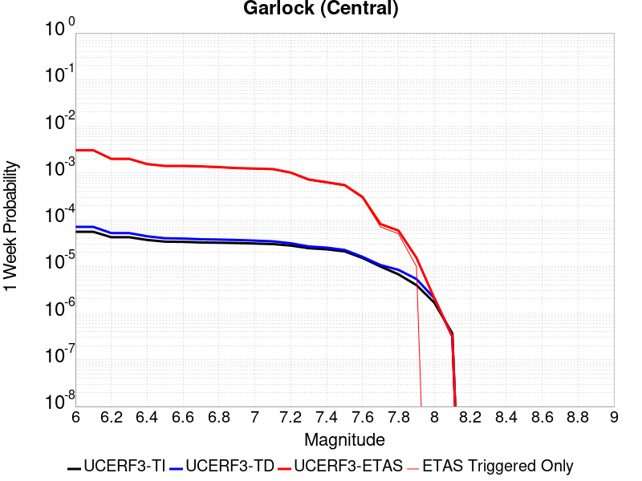 |  |  |  |

| Magnitude | 1 wk TI Prob | 1 wk TD Prob | 1 wk ETAS Prob | 1 wk ETAS/TD Gain | 1 wk ETAS Triggered Only | 1 mo TI Prob | 1 mo TD Prob | 1 mo ETAS Prob | 1 mo ETAS/TD Gain | 1 mo ETAS Triggered Only | 1 yr TI Prob | 1 yr TD Prob | 1 yr ETAS Prob | 1 yr ETAS/TD Gain | 1 yr ETAS Triggered Only | 10 yr TI Prob | 10 yr TD Prob | 10 yr ETAS Prob | 10 yr ETAS/TD Gain | 10 yr ETAS Triggered Only |
|-----|-----|-----|-----|-----|-----|-----|-----|-----|-----|-----|-----|-----|-----|-----|-----|-----|-----|-----|-----|-----|
| 6.0 | 5.5131142E-5 | 7.0252936E-5 | 0.0030700422 | 43.699844 | 0.003 | 2.3625491E-4 | 3.0104961E-4 | 0.008008729 | 26.602688 | 0.00771 | 0.0028726095 | 0.0036591832 | 0.022818817 | 6.236041 | 0.01923 | 0.028357591 | 0.0361412 | 0.066897936 | 1.8510158 | 0.03191 |
| 6.1 | 5.5131142E-5 | 7.0252936E-5 | 0.0030700422 | 43.699844 | 0.003 | 2.3625491E-4 | 3.0104961E-4 | 0.008008729 | 26.602688 | 0.00771 | 0.0028726095 | 0.0036591832 | 0.022818817 | 6.236041 | 0.01923 | 0.028357591 | 0.0361412 | 0.066897936 | 1.8510158 | 0.03191 |
| 6.2 | 4.216245E-5 | 5.166702E-5 | 0.0020115657 | 38.933266 | 0.00196 | 1.806837E-4 | 2.2141145E-4 | 0.0051303245 | 23.170998 | 0.00491 | 0.0021976046 | 0.0026923835 | 0.0148395905 | 5.5116925 | 0.01218 | 0.021759989 | 0.026704067 | 0.04637438 | 1.7366035 | 0.02021 |
| 6.3 | 4.216245E-5 | 5.166702E-5 | 0.0020115657 | 38.933266 | 0.00196 | 1.806837E-4 | 2.2141145E-4 | 0.0051303245 | 23.170998 | 0.00491 | 0.0021976046 | 0.0026923835 | 0.0148395905 | 5.5116925 | 0.01218 | 0.021759989 | 0.026704067 | 0.04637438 | 1.7366035 | 0.02021 |
| 6.4 | 3.6858168E-5 | 4.411544E-5 | 0.0015540489 | 35.22687 | 0.00151 | 1.5795401E-4 | 1.890526E-4 | 0.003978336 | 21.04354 | 0.00379 | 0.0019213937 | 0.0022993109 | 0.011717605 | 5.096138 | 0.00944 | 0.019048655 | 0.022868566 | 0.038219303 | 1.6712592 | 0.01571 |
| 6.5 | 3.39199E-5 | 4.0023602E-5 | 0.0014199683 | 35.478275 | 0.00138 | 1.453629E-4 | 1.7151856E-4 | 0.0036109285 | 21.052698 | 0.00344 | 0.0017683565 | 0.0020862604 | 0.010638381 | 5.0992584 | 0.00857 | 0.017543508 | 0.020761253 | 0.034588106 | 1.6659931 | 0.01412 |
| 6.6 | 3.3571985E-5 | 3.9477756E-5 | 0.0014194233 | 35.955017 | 0.00138 | 1.4387199E-4 | 1.6917953E-4 | 0.0035985992 | 21.270891 | 0.00343 | 0.0017502342 | 0.0020578366 | 0.010590242 | 5.146299 | 0.00855 | 0.017365133 | 0.020482505 | 0.034283906 | 1.6738142 | 0.01409 |
| 6.7 | 3.2580007E-5 | 3.8094186E-5 | 0.0013880428 | 36.43713 | 0.00135 | 1.3962112E-4 | 1.632507E-4 | 0.0034427152 | 21.088516 | 0.00328 | 0.0016985617 | 0.001985787 | 0.010149543 | 5.111094 | 0.00818 | 0.016856372 | 0.019771622 | 0.03306352 | 1.6722715 | 0.01356 |
| 6.8 | 3.2185937E-5 | 3.7521368E-5 | 0.0013374726 | 35.645626 | 0.0013 | 1.3793244E-4 | 1.6079607E-4 | 0.0033302864 | 20.711243 | 0.00317 | 0.0016780337 | 0.0019559558 | 0.0099103665 | 5.0667644 | 0.00797 | 0.016654192 | 0.01947876 | 0.03246086 | 1.6664747 | 0.01324 |
| 6.9 | 3.165394E-5 | 3.672589E-5 | 0.0012766804 | 34.762405 | 0.00124 | 1.3565269E-4 | 1.573873E-4 | 0.0032469009 | 20.630007 | 0.00309 | 0.0016503202 | 0.0019145276 | 0.009689613 | 5.0610986 | 0.00779 | 0.01638118 | 0.01907232 | 0.031755716 | 1.6650158 | 0.01293 |
| 7.0 | 3.0903822E-5 | 3.5631027E-5 | 0.001245588 | 34.95796 | 0.00121 | 1.3243823E-4 | 1.5269557E-4 | 0.0031522375 | 20.643934 | 0.003 | 0.0016112428 | 0.0018575046 | 0.009373518 | 5.0462956 | 0.00753 | 0.015996104 | 0.018513773 | 0.030841239 | 1.6658539 | 0.01256 |
| 7.1 | 3.0069863E-5 | 3.439724E-5 | 0.0012143566 | 35.3039 | 0.00118 | 1.2886449E-4 | 1.4740853E-4 | 0.003026984 | 20.53466 | 0.00288 | 0.0015677959 | 0.0017932425 | 0.00907017 | 5.057972 | 0.00729 | 0.01556781 | 0.017881477 | 0.029824039 | 1.6678733 | 0.01216 |
| 7.2 | 2.7957109E-5 | 3.1286352E-5 | 0.0010212554 | 32.6422 | 9.9E-4 | 1.1981068E-4 | 1.3407759E-4 | 0.002673737 | 19.941713 | 0.00254 | 0.0014577188 | 0.0016311919 | 0.007890964 | 4.837545 | 0.00627 | 0.014481937 | 0.01628507 | 0.026584566 | 1.6324502 | 0.01047 |
| 7.3 | 2.4519275E-5 | 2.6719234E-5 | 7.267005E-4 | 27.197657 | 7.0E-4 | 1.0507837E-4 | 1.1450605E-4 | 0.0020142884 | 17.591108 | 0.0019 | 0.0012785783 | 0.0013932344 | 0.006056728 | 4.347243 | 0.00467 | 0.012712469 | 0.013929329 | 0.021679845 | 1.556417 | 0.00786 |
| 7.4 | 2.3225532E-5 | 2.52037E-5 | 6.351883E-4 | 25.202185 | 6.1E-4 | 9.95342E-5 | 1.08011474E-4 | 0.0018078279 | 16.73737 | 0.0017 | 0.0012111551 | 0.0013142608 | 0.005548688 | 4.221908 | 0.00424 | 0.012045753 | 0.013146927 | 0.020202925 | 1.5367033 | 0.00715 |
| 7.5 | 2.097765E-5 | 2.2487684E-5 | 5.5247574E-4 | 24.567926 | 5.3E-4 | 8.9901114E-5 | 9.637229E-5 | 0.0014662403 | 15.2143345 | 0.00137 | 0.0010939965 | 0.0011727129 | 0.0045986907 | 3.921412 | 0.00343 | 0.010886264 | 0.011741684 | 0.017493347 | 1.4898499 | 0.00582 |
| 7.6 | 1.511254E-5 | 1.599496E-5 | 3.059903E-4 | 19.130423 | 2.9E-4 | 6.476642E-5 | 6.854807E-5 | 8.8849186E-4 | 12.961589 | 8.2E-4 | 7.882459E-4 | 8.34261E-4 | 0.002812609 | 3.371378 | 0.00198 | 0.007854558 | 0.008384922 | 0.011706832 | 1.3961767 | 0.00335 |
| 7.7 | 9.934069E-6 | 1.0682194E-5 | 8.068145E-5 | 7.552891 | 7.0E-5 | 4.2573887E-5 | 4.578003E-5 | 3.3576676E-4 | 7.3343496 | 2.9E-4 | 5.182138E-4 | 5.5722974E-4 | 0.0011968731 | 2.147899 | 6.4E-4 | 0.00517007 | 0.0056296214 | 0.006653823 | 1.1819308 | 0.00103 |
| 7.8 | 6.7562896E-6 | 8.431359E-6 | 5.843094E-5 | 6.9301925 | 5.0E-5 | 2.8955206E-5 | 3.6133893E-5 | 2.1612739E-4 | 5.9812922 | 1.8E-4 | 3.5247262E-4 | 4.3984153E-4 | 8.396656E-4 | 1.9090185 | 4.0E-4 | 0.0035191406 | 0.004448285 | 0.00512526 | 1.152188 | 6.8E-4 |
| 7.9 | 3.975453E-6 | 5.3728804E-6 | 1.5372827E-5 | 2.8611891 | 1.0E-5 | 1.7037546E-5 | 2.3026427E-5 | 1.03024584E-4 | 4.474189 | 8.0E-5 | 2.0741238E-4 | 2.8031078E-4 | 4.702575E-4 | 1.6776291 | 1.9E-4 | 0.002072189 | 0.00283465 | 0.0031836578 | 1.123122 | 3.5E-4 |
| 8.0 | 1.6729537E-6 | 2.0781215E-6 | 2.0781215E-6 | 1.0 | 0.0 | 7.169782E-6 | 8.906205E-6 | 3.890594E-5 | 4.368408 | 3.0E-5 | 8.7288594E-5 | 1.0842768E-4 | 1.4842335E-4 | 1.3688694 | 4.0E-5 | 8.7254314E-4 | 0.0010973068 | 0.0011971971 | 1.0910323 | 1.0E-4 |
| 8.1 | 3.6733252E-7 | 3.1497066E-7 | 3.1497066E-7 | 1.0 | 0.0 | 1.5742813E-6 | 1.3498736E-6 | 1.3498736E-6 | 1.0 | 0.0 | 1.9166706E-5 | 1.6434604E-5 | 1.6434604E-5 | 1.0 | 0.0 | 1.9165053E-4 | 1.6648426E-4 | 1.8648093E-4 | 1.1201115 | 2.0E-5 |

## Little Lake
*[(top)](#table-of-contents)*

| 1 Week | 1 Month | 1 Year | 10 Year |
|-----|-----|-----|-----|
|  |  |  |  |

| Magnitude | 1 wk TI Prob | 1 wk TD Prob | 1 wk ETAS Prob | 1 wk ETAS/TD Gain | 1 wk ETAS Triggered Only | 1 mo TI Prob | 1 mo TD Prob | 1 mo ETAS Prob | 1 mo ETAS/TD Gain | 1 mo ETAS Triggered Only | 1 yr TI Prob | 1 yr TD Prob | 1 yr ETAS Prob | 1 yr ETAS/TD Gain | 1 yr ETAS Triggered Only | 10 yr TI Prob | 10 yr TD Prob | 10 yr ETAS Prob | 10 yr ETAS/TD Gain | 10 yr ETAS Triggered Only |
|-----|-----|-----|-----|-----|-----|-----|-----|-----|-----|-----|-----|-----|-----|-----|-----|-----|-----|-----|-----|-----|
| 6.0 | 2.8424427E-5 | 3.1206153E-5 | 0.0019211472 | 61.563087 | 0.00189 | 1.2181328E-4 | 1.3373456E-4 | 0.00450315 | 33.672302 | 0.00437 | 0.0014820677 | 0.0016271353 | 0.0118504735 | 7.283029 | 0.01024 | 0.014722223 | 0.016165623 | 0.031847943 | 1.970103 | 0.01594 |
| 6.1 | 2.8424427E-5 | 3.1206153E-5 | 0.0019211472 | 61.563087 | 0.00189 | 1.2181328E-4 | 1.3373456E-4 | 0.00450315 | 33.672302 | 0.00437 | 0.0014820677 | 0.0016271353 | 0.0118504735 | 7.283029 | 0.01024 | 0.014722223 | 0.016165623 | 0.031847943 | 1.970103 | 0.01594 |
| 6.2 | 2.8424427E-5 | 3.1206153E-5 | 0.0019211472 | 61.563087 | 0.00189 | 1.2181328E-4 | 1.3373456E-4 | 0.00450315 | 33.672302 | 0.00437 | 0.0014820677 | 0.0016271353 | 0.0118504735 | 7.283029 | 0.01024 | 0.014722223 | 0.016165623 | 0.031847943 | 1.970103 | 0.01594 |
| 6.3 | 1.48860645E-5 | 1.6081587E-5 | 0.0011660631 | 72.5092 | 0.00115 | 6.379586E-5 | 6.891943E-5 | 0.002598745 | 37.707005 | 0.00253 | 7.7643775E-4 | 8.387992E-4 | 0.0067838086 | 8.087523 | 0.00595 | 0.007737305 | 0.00835915 | 0.017383082 | 2.0795274 | 0.0091 |
| 6.4 | 1.48860645E-5 | 1.6081587E-5 | 0.0011660631 | 72.5092 | 0.00115 | 6.379586E-5 | 6.891943E-5 | 0.002598745 | 37.707005 | 0.00253 | 7.7643775E-4 | 8.387992E-4 | 0.0067838086 | 8.087523 | 0.00595 | 0.007737305 | 0.00835915 | 0.017383082 | 2.0795274 | 0.0091 |
| 6.5 | 1.2797581E-5 | 1.376573E-5 | 9.937523E-4 | 72.19031 | 9.8E-4 | 5.4845623E-5 | 5.8994796E-5 | 0.002208868 | 37.441742 | 0.00215 | 6.675408E-4 | 7.1805064E-4 | 0.005964281 | 8.306212 | 0.00525 | 0.006655392 | 0.0071598557 | 0.015132362 | 2.113501 | 0.00803 |
| 6.6 | 9.661896E-6 | 1.0289153E-5 | 7.7028136E-4 | 74.86344 | 7.6E-4 | 4.1407468E-5 | 4.4095712E-5 | 0.0016440252 | 37.283108 | 0.0016 | 5.040193E-4 | 5.367493E-4 | 0.004814452 | 8.969647 | 0.00428 | 0.005028777 | 0.005356134 | 0.011751694 | 2.1940627 | 0.00643 |
| 6.7 | 7.767871E-6 | 8.199772E-6 | 6.581944E-4 | 80.269844 | 6.5E-4 | 3.329045E-5 | 3.5141486E-5 | 0.0013550951 | 38.56112 | 0.00132 | 4.0523586E-4 | 4.2777733E-4 | 0.003976259 | 9.29516 | 0.00355 | 0.004044977 | 0.0042708907 | 0.009617956 | 2.2519789 | 0.00537 |
| 6.8 | 6.4235196E-6 | 6.7358133E-6 | 5.66732E-4 | 84.13714 | 5.6E-4 | 2.752908E-5 | 2.8867524E-5 | 0.0011088364 | 38.411205 | 0.00108 | 3.35115E-4 | 3.5141825E-4 | 0.0033203745 | 9.448498 | 0.00297 | 0.003346101 | 0.0035098856 | 0.008004056 | 2.2804322 | 0.00451 |
| 6.9 | 3.1283696E-6 | 3.112201E-6 | 3.0311127E-4 | 97.3945 | 3.0E-4 | 1.3407229E-5 | 1.3337944E-5 | 6.533294E-4 | 48.982765 | 6.4E-4 | 1.6322079E-4 | 1.6237888E-4 | 0.0018321077 | 11.282919 | 0.00167 | 0.0016310095 | 0.0016227507 | 0.0041386615 | 2.5503988 | 0.00252 |
| 7.0 | 2.290603E-6 | 2.2286956E-6 | 2.1222823E-4 | 95.2253 | 2.1E-4 | 9.816834E-6 | 9.551524E-6 | 4.195476E-4 | 43.92468 | 4.1E-4 | 1.19513395E-4 | 1.1628464E-4 | 0.0011261672 | 9.684574 | 0.00101 | 0.0011944914 | 0.00116234 | 0.002720527 | 2.3405602 | 0.00156 |
| 7.1 | 1.293693E-6 | 1.1776893E-6 | 1.01177575E-4 | 85.911934 | 1.0E-4 | 5.5443866E-6 | 5.047234E-6 | 1.9504628E-4 | 38.644188 | 1.9E-4 | 6.750081E-5 | 6.144904E-5 | 6.31414E-4 | 10.275409 | 5.7E-4 | 6.7480316E-4 | 6.1438896E-4 | 0.0014039036 | 2.2850404 | 7.9E-4 |
| 7.2 | 4.715842E-7 | 3.0917863E-7 | 2.0309173E-5 | 65.6875 | 2.0E-5 | 2.0210737E-6 | 1.3250507E-6 | 2.1325024E-5 | 16.093742 | 2.0E-5 | 2.4606294E-5 | 1.6132379E-5 | 8.613125E-5 | 5.33903 | 7.0E-5 | 2.460357E-4 | 1.6131261E-4 | 2.512981E-4 | 1.557833 | 9.0E-5 |
| 7.3 | 3.9430947E-7 | 2.3097442E-7 | 2.023097E-5 | 87.58965 | 2.0E-5 | 1.6898966E-6 | 9.8989E-7 | 2.098987E-5 | 21.204245 | 2.0E-5 | 2.0574296E-5 | 1.2051845E-5 | 7.205112E-5 | 5.9784307 | 6.0E-5 | 2.0572392E-4 | 1.2051199E-4 | 2.0050234E-4 | 1.6637543 | 8.0E-5 |
| 7.4 | 3.547123E-7 | 1.9679048E-7 | 2.0196787E-5 | 102.63091 | 2.0E-5 | 1.5201948E-6 | 8.433875E-7 | 2.084337E-5 | 24.713873 | 2.0E-5 | 1.8508214E-5 | 1.0268195E-5 | 7.026758E-5 | 6.843226 | 6.0E-5 | 1.8506673E-4 | 1.0267727E-4 | 1.8266906E-4 | 1.7790604 | 8.0E-5 |
| 7.5 | 2.6354266E-7 | 1.4423068E-7 | 1.0144229E-5 | 70.33337 | 1.0E-5 | 1.129468E-6 | 6.1813137E-7 | 1.0618125E-5 | 17.177782 | 1.0E-5 | 1.3751187E-5 | 7.525724E-6 | 5.7525347E-5 | 7.6438293 | 5.0E-5 | 1.3750336E-4 | 7.525474E-5 | 1.3525023E-4 | 1.7972319 | 6.0E-5 |
| 7.6 | 1.269913E-7 | 7.572499E-8 | 1.0075724E-5 | 133.0568 | 1.0E-5 | 5.4424834E-7 | 3.2453565E-7 | 1.0324532E-5 | 31.813246 | 1.0E-5 | 6.6262032E-6 | 3.9512147E-6 | 2.3951136E-5 | 6.0617146 | 2.0E-5 | 6.626006E-5 | 3.951148E-5 | 5.951069E-5 | 1.506162 | 2.0E-5 |

## Owl Lake
*[(top)](#table-of-contents)*

| 1 Week | 1 Month | 1 Year | 10 Year |
|-----|-----|-----|-----|
|  |  |  | 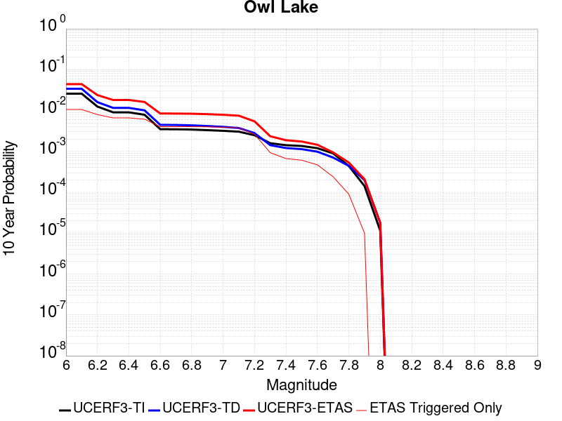 |

| Magnitude | 1 wk TI Prob | 1 wk TD Prob | 1 wk ETAS Prob | 1 wk ETAS/TD Gain | 1 wk ETAS Triggered Only | 1 mo TI Prob | 1 mo TD Prob | 1 mo ETAS Prob | 1 mo ETAS/TD Gain | 1 mo ETAS Triggered Only | 1 yr TI Prob | 1 yr TD Prob | 1 yr ETAS Prob | 1 yr ETAS/TD Gain | 1 yr ETAS Triggered Only | 10 yr TI Prob | 10 yr TD Prob | 10 yr ETAS Prob | 10 yr ETAS/TD Gain | 10 yr ETAS Triggered Only |
|-----|-----|-----|-----|-----|-----|-----|-----|-----|-----|-----|-----|-----|-----|-----|-----|-----|-----|-----|-----|-----|
| 6.0 | 5.0320643E-5 | 6.636041E-5 | 9.263033E-4 | 13.958674 | 8.6E-4 | 2.1564208E-4 | 2.84377E-4 | 0.0023637854 | 8.312155 | 0.00208 | 0.0026222812 | 0.0034577118 | 0.009257588 | 2.6773741 | 0.00582 | 0.02591553 | 0.034142397 | 0.044399805 | 1.3004302 | 0.01062 |
| 6.1 | 5.0320643E-5 | 6.636041E-5 | 9.263033E-4 | 13.958674 | 8.6E-4 | 2.1564208E-4 | 2.84377E-4 | 0.0023637854 | 8.312155 | 0.00208 | 0.0026222812 | 0.0034577118 | 0.009257588 | 2.6773741 | 0.00582 | 0.02591553 | 0.034142397 | 0.044399805 | 1.3004302 | 0.01062 |
| 6.2 | 2.4125871E-5 | 3.098217E-5 | 6.5096293E-4 | 21.010891 | 6.2E-4 | 1.0339249E-4 | 1.3277512E-4 | 0.0015925813 | 11.994576 | 0.00146 | 0.0012580766 | 0.0016155102 | 0.0058985795 | 3.651218 | 0.00429 | 0.012509781 | 0.016071098 | 0.023913011 | 1.4879513 | 0.00797 |
| 6.3 | 1.7433485E-5 | 2.2356866E-5 | 6.023439E-4 | 26.942232 | 5.8E-4 | 7.471279E-5 | 9.58125E-5 | 0.001415686 | 14.775588 | 0.00132 | 9.0924866E-4 | 0.0011660301 | 0.004781809 | 4.100931 | 0.00362 | 0.009055373 | 0.011629325 | 0.018162455 | 1.5617807 | 0.00661 |
| 6.4 | 1.7433485E-5 | 2.2356866E-5 | 6.023439E-4 | 26.942232 | 5.8E-4 | 7.471279E-5 | 9.58125E-5 | 0.001415686 | 14.775588 | 0.00132 | 9.0924866E-4 | 0.0011660301 | 0.004781809 | 4.100931 | 0.00362 | 0.009055373 | 0.011629325 | 0.018162455 | 1.5617807 | 0.00661 |
| 6.5 | 1.5182742E-5 | 1.9430483E-5 | 5.9941923E-4 | 30.849424 | 5.8E-4 | 6.506727E-5 | 8.32717E-5 | 0.0013331677 | 16.009853 | 0.00125 | 7.919061E-4 | 0.0010134967 | 0.0043700915 | 4.311895 | 0.00336 | 0.0078909 | 0.010118797 | 0.016216466 | 1.602608 | 0.00616 |
| 6.6 | 6.7271576E-6 | 8.548313E-6 | 4.6854437E-4 | 54.811325 | 4.6E-4 | 2.8830356E-5 | 3.6635145E-5 | 9.666011E-4 | 26.38453 | 9.3E-4 | 3.5095305E-4 | 4.4594728E-4 | 0.0028648681 | 6.4242306 | 0.00242 | 0.0035039932 | 0.004467926 | 0.00847992 | 1.8979545 | 0.00403 |
| 6.7 | 6.682835E-6 | 8.480754E-6 | 4.6847685E-4 | 55.239998 | 4.6E-4 | 2.8640408E-5 | 3.6345617E-5 | 9.6631184E-4 | 26.58675 | 9.3E-4 | 3.4864116E-4 | 4.4242368E-4 | 0.002861353 | 6.46745 | 0.00242 | 0.003480947 | 0.00443287 | 0.008445006 | 1.9050875 | 0.00403 |
| 6.8 | 6.5774975E-6 | 8.32722E-6 | 4.683234E-4 | 56.240067 | 4.6E-4 | 2.8188972E-5 | 3.5687626E-5 | 9.6565444E-4 | 27.058521 | 9.3E-4 | 3.4314668E-4 | 4.3441588E-4 | 0.0028533647 | 6.568279 | 0.00242 | 0.0034261728 | 0.0043530487 | 0.008365506 | 1.9217579 | 0.00403 |
| 6.9 | 6.363419E-6 | 8.000376E-6 | 4.5799676E-4 | 57.24691 | 4.5E-4 | 2.727151E-5 | 3.4286906E-5 | 9.5425535E-4 | 27.831482 | 9.2E-4 | 3.3198006E-4 | 4.173687E-4 | 0.0028263628 | 6.771861 | 0.00241 | 0.0033148455 | 0.004183012 | 0.00816628 | 1.9522487 | 0.004 |
| 7.0 | 6.1342453E-6 | 7.632552E-6 | 4.5762912E-4 | 59.95755 | 4.5E-4 | 2.6289357E-5 | 3.271056E-5 | 9.3268114E-4 | 28.513153 | 9.0E-4 | 3.2002592E-4 | 3.9818377E-4 | 0.002737252 | 6.8743434 | 0.00234 | 0.0031956544 | 0.003991678 | 0.00788607 | 1.975628 | 0.00391 |
| 7.1 | 5.842926E-6 | 7.1430604E-6 | 4.4713993E-4 | 62.597805 | 4.4E-4 | 2.504087E-5 | 3.0612788E-5 | 9.1058586E-4 | 29.745277 | 8.8E-4 | 3.0482994E-4 | 3.7265237E-4 | 0.0026418064 | 7.089198 | 0.00227 | 0.0030441214 | 0.0037372818 | 0.0074931923 | 2.0049846 | 0.00377 |
| 7.2 | 4.77173E-6 | 5.359158E-6 | 3.3535738E-4 | 62.576508 | 3.3E-4 | 2.045011E-5 | 2.296764E-5 | 7.129518E-4 | 31.041576 | 6.9E-4 | 2.4895166E-4 | 2.795992E-4 | 0.0019191407 | 6.8638988 | 0.00164 | 0.0024867293 | 0.002808747 | 0.005441332 | 1.9372809 | 0.00264 |
| 7.3 | 3.0494948E-6 | 2.7108347E-6 | 1.2271051E-4 | 45.26669 | 1.2E-4 | 1.3069198E-5 | 1.1617813E-5 | 2.616149E-4 | 22.51843 | 2.5E-4 | 1.5910587E-4 | 1.4143785E-4 | 6.9136004E-4 | 4.888084 | 5.5E-4 | 0.0015899199 | 0.0014233418 | 0.0023520181 | 1.6524619 | 9.3E-4 |
| 7.4 | 2.7263884E-6 | 2.3060104E-6 | 7.230585E-5 | 31.355389 | 7.0E-5 | 1.1684469E-5 | 9.882864E-6 | 1.5988138E-4 | 16.177635 | 1.5E-4 | 1.4224913E-4 | 1.2031734E-4 | 4.8027403E-4 | 3.9917276 | 3.6E-4 | 0.0014215811 | 0.0012113012 | 0.0018804895 | 1.5524542 | 6.7E-4 |
| 7.5 | 2.6090431E-6 | 2.1659357E-6 | 7.2165785E-5 | 33.318523 | 7.0E-5 | 1.1181565E-5 | 9.282549E-6 | 1.4928124E-4 | 16.081924 | 1.4E-4 | 1.3612706E-4 | 1.1300927E-4 | 4.5297085E-4 | 4.0082626 | 3.4E-4 | 0.001360437 | 0.0011380832 | 0.001747389 | 1.5353789 | 6.1E-4 |
| 7.6 | 2.3008756E-6 | 1.8730968E-6 | 5.1873005E-5 | 27.69371 | 5.0E-5 | 9.860858E-6 | 8.027534E-6 | 1.1802665E-4 | 14.702728 | 1.1E-4 | 1.20049335E-4 | 9.7730925E-5 | 3.5770552E-4 | 3.6601057 | 2.6E-4 | 0.001199845 | 9.851726E-4 | 0.0014547094 | 1.4766037 | 4.7E-4 |
| 7.7 | 1.7184348E-6 | 1.3421906E-6 | 2.1342164E-5 | 15.900993 | 2.0E-5 | 7.3646997E-6 | 5.752233E-6 | 6.575189E-5 | 11.430672 | 6.0E-5 | 8.966153E-5 | 7.003123E-5 | 2.1002142E-4 | 2.9989681 | 1.4E-4 | 8.962536E-4 | 7.08018E-4 | 9.478481E-4 | 1.3387344 | 2.4E-4 |
| 7.8 | 8.4612907E-7 | 8.408234E-7 | 8.408234E-7 | 1.0 | 0.0 | 3.6262625E-6 | 3.6035242E-6 | 2.3603452E-5 | 6.550102 | 2.0E-5 | 4.4148852E-5 | 4.3872045E-5 | 8.387029E-5 | 1.9117023 | 4.0E-5 | 4.414008E-4 | 4.440713E-4 | 5.3403137E-4 | 1.2025801 | 9.0E-5 |
| 7.9 | 2.716738E-7 | 3.7693766E-7 | 3.7693766E-7 | 1.0 | 0.0 | 1.1643157E-6 | 1.6154462E-6 | 1.6154462E-6 | 1.0 | 0.0 | 1.4175452E-5 | 1.9667892E-5 | 1.9667892E-5 | 1.0 | 0.0 | 1.4174548E-4 | 1.9836401E-4 | 2.0836203E-4 | 1.0504024 | 1.0E-5 |
| 8.0 | 2.1995428E-8 | 3.38572E-8 | 3.38572E-8 | 1.0 | 0.0 | 9.426611E-8 | 1.4510229E-7 | 1.4510229E-7 | 1.0 | 0.0 | 1.1476893E-6 | 1.7666197E-6 | 1.7666197E-6 | 1.0 | 0.0 | 1.14768345E-5 | 1.7871007E-5 | 1.7871007E-5 | 1.0 | 0.0 |

## Panamint Valley
*[(top)](#table-of-contents)*

| 1 Week | 1 Month | 1 Year | 10 Year |
|-----|-----|-----|-----|
|  |  |  |  |

| Magnitude | 1 wk TI Prob | 1 wk TD Prob | 1 wk ETAS Prob | 1 wk ETAS/TD Gain | 1 wk ETAS Triggered Only | 1 mo TI Prob | 1 mo TD Prob | 1 mo ETAS Prob | 1 mo ETAS/TD Gain | 1 mo ETAS Triggered Only | 1 yr TI Prob | 1 yr TD Prob | 1 yr ETAS Prob | 1 yr ETAS/TD Gain | 1 yr ETAS Triggered Only | 10 yr TI Prob | 10 yr TD Prob | 10 yr ETAS Prob | 10 yr ETAS/TD Gain | 10 yr ETAS Triggered Only |
|-----|-----|-----|-----|-----|-----|-----|-----|-----|-----|-----|-----|-----|-----|-----|-----|-----|-----|-----|-----|-----|
| 6.0 | 3.0211835E-5 | 3.3984965E-5 | 8.839561E-4 | 26.01021 | 8.5E-4 | 1.2947287E-4 | 1.4564188E-4 | 0.0024453069 | 16.78986 | 0.0023 | 0.0015751923 | 0.0017717773 | 0.008400013 | 4.741009 | 0.00664 | 0.015640736 | 0.017582124 | 0.029204126 | 1.6610125 | 0.01183 |
| 6.1 | 3.0211835E-5 | 3.3984965E-5 | 8.839561E-4 | 26.01021 | 8.5E-4 | 1.2947287E-4 | 1.4564188E-4 | 0.0024453069 | 16.78986 | 0.0023 | 0.0015751923 | 0.0017717773 | 0.008400013 | 4.741009 | 0.00664 | 0.015640736 | 0.017582124 | 0.029204126 | 1.6610125 | 0.01183 |
| 6.2 | 3.0211835E-5 | 3.3984965E-5 | 8.839561E-4 | 26.01021 | 8.5E-4 | 1.2947287E-4 | 1.4564188E-4 | 0.0024453069 | 16.78986 | 0.0023 | 0.0015751923 | 0.0017717773 | 0.008400013 | 4.741009 | 0.00664 | 0.015640736 | 0.017582124 | 0.029204126 | 1.6610125 | 0.01183 |
| 6.3 | 2.8573924E-5 | 3.2103115E-5 | 8.520768E-4 | 26.541874 | 8.2E-4 | 1.2245393E-4 | 1.3757768E-4 | 0.0023272764 | 16.91609 | 0.00219 | 0.001489857 | 0.0016737491 | 0.008023104 | 4.793493 | 0.00636 | 0.01479908 | 0.01661714 | 0.0277392 | 1.6693126 | 0.01131 |
| 6.4 | 2.8573924E-5 | 3.2103115E-5 | 8.520768E-4 | 26.541874 | 8.2E-4 | 1.2245393E-4 | 1.3757768E-4 | 0.0023272764 | 16.91609 | 0.00219 | 0.001489857 | 0.0016737491 | 0.008023104 | 4.793493 | 0.00636 | 0.01479908 | 0.01661714 | 0.0277392 | 1.6693126 | 0.01131 |
| 6.5 | 2.7468774E-5 | 3.0828793E-5 | 8.308041E-4 | 26.948969 | 8.0E-4 | 1.1771801E-4 | 1.3211685E-4 | 0.0022618354 | 17.11996 | 0.00213 | 0.0014322745 | 0.0016073632 | 0.007747478 | 4.819992 | 0.00615 | 0.014230782 | 0.015962977 | 0.026757862 | 1.6762452 | 0.01097 |
| 6.6 | 2.6135967E-5 | 2.925278E-5 | 8.0922997E-4 | 27.663353 | 7.8E-4 | 1.1200648E-4 | 1.2536318E-4 | 0.0021651075 | 17.270681 | 0.00204 | 0.0013628257 | 0.0015252546 | 0.007416256 | 4.8623066 | 0.0059 | 0.013544982 | 0.015153424 | 0.025543556 | 1.6856623 | 0.01055 |
| 6.7 | 2.4498746E-5 | 2.7341659E-5 | 7.6732144E-4 | 28.064186 | 7.4E-4 | 1.04990395E-4 | 1.1717342E-4 | 0.002066945 | 17.640049 | 0.00195 | 0.0012775084 | 0.0014256779 | 0.006987737 | 4.9013433 | 0.00557 | 0.012701893 | 0.014170669 | 0.023969812 | 1.6915089 | 0.00994 |
| 6.8 | 2.2244329E-5 | 2.4935984E-5 | 7.149188E-4 | 28.670166 | 6.9E-4 | 9.532935E-5 | 1.06864245E-4 | 0.0019866633 | 18.590534 | 0.00188 | 0.0011600169 | 0.0013003175 | 0.006483569 | 4.986143 | 0.00519 | 0.011539802 | 0.012932051 | 0.021904498 | 1.6938148 | 0.00909 |
| 6.9 | 1.9902658E-5 | 2.2290773E-5 | 6.122776E-4 | 27.46776 | 5.9E-4 | 8.529431E-5 | 9.552849E-5 | 0.0016353814 | 17.119305 | 0.00154 | 0.0010379635 | 0.0011624574 | 0.0053775515 | 4.626021 | 0.00422 | 0.010331288 | 0.011568334 | 0.018734463 | 1.6194608 | 0.00725 |
| 7.0 | 1.8353881E-5 | 2.0566635E-5 | 5.6055555E-4 | 27.255579 | 5.4E-4 | 7.865712E-5 | 8.8139845E-5 | 0.00144802 | 16.428665 | 0.00136 | 9.5722964E-4 | 0.001072592 | 0.0046986984 | 4.380695 | 0.00363 | 0.009531168 | 0.010678438 | 0.016832018 | 1.5762622 | 0.00622 |
| 7.1 | 1.7667631E-5 | 1.9773011E-5 | 5.2976294E-4 | 26.792223 | 5.1E-4 | 7.571623E-5 | 8.473882E-5 | 0.0013846287 | 16.339956 | 0.0013 | 9.2145515E-4 | 0.0010312245 | 0.0044776667 | 4.3420873 | 0.00345 | 0.009176437 | 0.010268626 | 0.016117938 | 1.5696295 | 0.00591 |
| 7.2 | 1.6381597E-5 | 1.8158586E-5 | 4.1815132E-4 | 23.027748 | 4.0E-4 | 7.020495E-5 | 7.782029E-5 | 0.0011677354 | 15.005541 | 0.00109 | 8.544101E-4 | 9.4706746E-4 | 0.0038942737 | 4.1119285 | 0.00295 | 0.008511325 | 0.009434342 | 0.01452585 | 1.5396781 | 0.00514 |
| 7.3 | 1.4520491E-5 | 1.596705E-5 | 3.4596177E-4 | 21.66723 | 3.3E-4 | 6.222919E-5 | 6.842852E-5 | 9.483683E-4 | 13.859256 | 8.8E-4 | 7.57377E-4 | 8.3281496E-4 | 0.0033007578 | 3.9633749 | 0.00247 | 0.0075480095 | 0.008299384 | 0.012573614 | 1.5150056 | 0.00431 |
| 7.4 | 1.2852287E-5 | 1.4145931E-5 | 3.4414127E-4 | 24.327932 | 3.3E-4 | 5.5080065E-5 | 6.06241E-5 | 9.105726E-4 | 15.019977 | 8.5E-4 | 6.7039346E-4 | 7.378643E-4 | 0.0030661451 | 4.155432 | 0.00233 | 0.0066837464 | 0.0073563983 | 0.011406384 | 1.5505393 | 0.00408 |
| 7.5 | 1.1637851E-5 | 1.28372185E-5 | 3.42833E-4 | 26.706173 | 3.3E-4 | 4.987555E-5 | 5.501558E-5 | 8.949694E-4 | 16.267563 | 8.4E-4 | 6.070656E-4 | 6.696245E-4 | 0.0029381046 | 4.3876896 | 0.00227 | 0.006054099 | 0.0066782837 | 0.010631704 | 1.5919815 | 0.00398 |
| 7.6 | 3.0068115E-6 | 3.3332262E-6 | 1.5333273E-4 | 46.001297 | 1.5E-4 | 1.2886271E-5 | 1.4285218E-5 | 3.8427993E-4 | 26.90053 | 3.7E-4 | 1.5687906E-4 | 1.7391593E-4 | 0.0011037542 | 6.3464813 | 9.3E-4 | 0.0015676835 | 0.0017386783 | 0.0034057747 | 1.9588296 | 0.00167 |

## Airport Lake
*[(top)](#table-of-contents)*

| 1 Week | 1 Month | 1 Year | 10 Year |
|-----|-----|-----|-----|
|  |  | 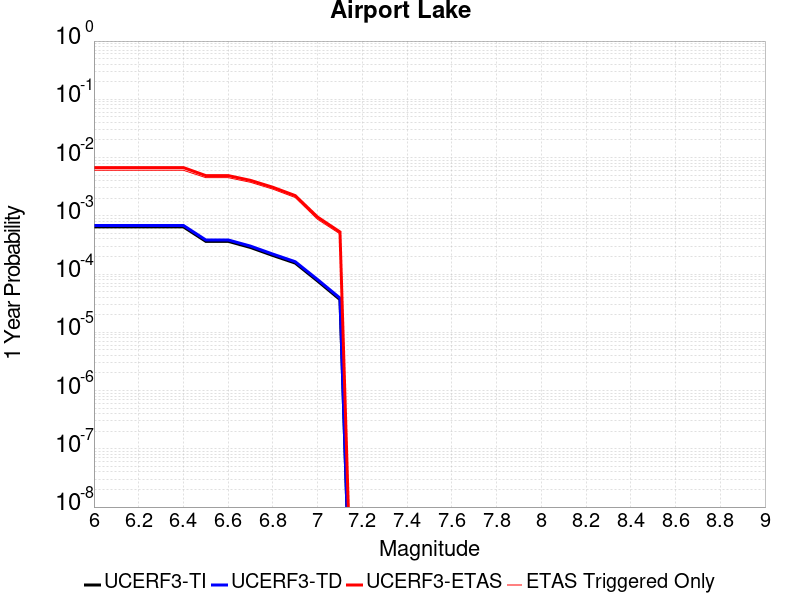 |  |

| Magnitude | 1 wk TI Prob | 1 wk TD Prob | 1 wk ETAS Prob | 1 wk ETAS/TD Gain | 1 wk ETAS Triggered Only | 1 mo TI Prob | 1 mo TD Prob | 1 mo ETAS Prob | 1 mo ETAS/TD Gain | 1 mo ETAS Triggered Only | 1 yr TI Prob | 1 yr TD Prob | 1 yr ETAS Prob | 1 yr ETAS/TD Gain | 1 yr ETAS Triggered Only | 10 yr TI Prob | 10 yr TD Prob | 10 yr ETAS Prob | 10 yr ETAS/TD Gain | 10 yr ETAS Triggered Only |
|-----|-----|-----|-----|-----|-----|-----|-----|-----|-----|-----|-----|-----|-----|-----|-----|-----|-----|-----|-----|-----|
| 6.0 | 1.2387061E-5 | 1.31032575E-5 | 0.0011430884 | 87.23697 | 0.00113 | 5.3086325E-5 | 5.6155768E-5 | 0.0025260171 | 44.982327 | 0.00247 | 6.461343E-4 | 6.835104E-4 | 0.006729375 | 9.845315 | 0.00605 | 0.0064425888 | 0.0068168915 | 0.015854858 | 2.3258193 | 0.0091 |
| 6.1 | 1.2387061E-5 | 1.31032575E-5 | 0.0011430884 | 87.23697 | 0.00113 | 5.3086325E-5 | 5.6155768E-5 | 0.0025260171 | 44.982327 | 0.00247 | 6.461343E-4 | 6.835104E-4 | 0.006729375 | 9.845315 | 0.00605 | 0.0064425888 | 0.0068168915 | 0.015854858 | 2.3258193 | 0.0091 |
| 6.2 | 1.2387061E-5 | 1.31032575E-5 | 0.0011430884 | 87.23697 | 0.00113 | 5.3086325E-5 | 5.6155768E-5 | 0.0025260171 | 44.982327 | 0.00247 | 6.461343E-4 | 6.835104E-4 | 0.006729375 | 9.845315 | 0.00605 | 0.0064425888 | 0.0068168915 | 0.015854858 | 2.3258193 | 0.0091 |
| 6.3 | 1.2387061E-5 | 1.31032575E-5 | 0.0011430884 | 87.23697 | 0.00113 | 5.3086325E-5 | 5.6155768E-5 | 0.0025260171 | 44.982327 | 0.00247 | 6.461343E-4 | 6.835104E-4 | 0.006729375 | 9.845315 | 0.00605 | 0.0064425888 | 0.0068168915 | 0.015854858 | 2.3258193 | 0.0091 |
| 6.4 | 1.2387061E-5 | 1.31032575E-5 | 0.0011430884 | 87.23697 | 0.00113 | 5.3086325E-5 | 5.6155768E-5 | 0.0025260171 | 44.982327 | 0.00247 | 6.461343E-4 | 6.835104E-4 | 0.006729375 | 9.845315 | 0.00605 | 0.0064425888 | 0.0068168915 | 0.015854858 | 2.3258193 | 0.0091 |
| 6.5 | 6.9922594E-6 | 7.38498E-6 | 8.973784E-4 | 121.51399 | 8.9E-4 | 2.996648E-5 | 3.164956E-5 | 0.001881591 | 59.450775 | 0.00185 | 3.6478083E-4 | 3.8527072E-4 | 0.0049035293 | 12.72749 | 0.00452 | 0.003641826 | 0.0038465653 | 0.010530755 | 2.7377033 | 0.00671 |
| 6.6 | 6.9922594E-6 | 7.38498E-6 | 8.973784E-4 | 121.51399 | 8.9E-4 | 2.996648E-5 | 3.164956E-5 | 0.001881591 | 59.450775 | 0.00185 | 3.6478083E-4 | 3.8527072E-4 | 0.0049035293 | 12.72749 | 0.00452 | 0.003641826 | 0.0038465653 | 0.010530755 | 2.7377033 | 0.00671 |
| 6.7 | 5.477277E-6 | 5.7861116E-6 | 7.0578203E-4 | 121.978645 | 7.0E-4 | 2.3473833E-5 | 2.4797408E-5 | 0.0015547595 | 62.698467 | 0.00153 | 2.8575645E-4 | 3.0187052E-4 | 0.0040607355 | 13.451912 | 0.00376 | 0.0028538927 | 0.0030149885 | 0.0086280145 | 2.8617072 | 0.00563 |
| 6.8 | 3.9950432E-6 | 4.2191186E-6 | 5.242169E-4 | 124.24798 | 5.2E-4 | 1.7121502E-5 | 1.8081826E-5 | 0.0011780609 | 65.15165 | 0.00116 | 2.0843433E-4 | 2.2012675E-4 | 0.003089495 | 14.035072 | 0.00287 | 0.0020823893 | 0.002199358 | 0.006519835 | 2.9644263 | 0.00433 |
| 6.9 | 2.95695E-6 | 3.1230477E-6 | 3.731219E-4 | 119.47365 | 3.7E-4 | 1.2672582E-5 | 1.3384434E-5 | 8.9337263E-4 | 66.74714 | 8.8E-4 | 1.5427776E-4 | 1.6294557E-4 | 0.00222261 | 13.640199 | 0.00206 | 0.001541707 | 0.0016284833 | 0.0046835 | 2.8759892 | 0.00306 |
| 7.0 | 1.456072E-6 | 1.5408239E-6 | 1.6154058E-4 | 104.84039 | 1.6E-4 | 6.2402937E-6 | 6.60352E-6 | 3.4660127E-4 | 52.48735 | 3.4E-4 | 7.597293E-5 | 8.03959E-5 | 9.50326E-4 | 11.820578 | 8.7E-4 | 7.594696E-4 | 8.03767E-4 | 0.002162674 | 2.6906726 | 0.00136 |
| 7.1 | 6.995192E-7 | 7.4090326E-7 | 8.074084E-5 | 108.976234 | 8.0E-5 | 2.997936E-6 | 3.1752998E-6 | 1.6317479E-4 | 51.388786 | 1.6E-4 | 3.649926E-5 | 3.8659273E-5 | 5.2864035E-4 | 13.674347 | 4.9E-4 | 3.6493264E-4 | 3.8659273E-4 | 0.001076326 | 2.784134 | 6.9E-4 |

## Ash Hill
*[(top)](#table-of-contents)*

| 1 Week | 1 Month | 1 Year | 10 Year |
|-----|-----|-----|-----|
|  |  |  |  |

| Magnitude | 1 wk TI Prob | 1 wk TD Prob | 1 wk ETAS Prob | 1 wk ETAS/TD Gain | 1 wk ETAS Triggered Only | 1 mo TI Prob | 1 mo TD Prob | 1 mo ETAS Prob | 1 mo ETAS/TD Gain | 1 mo ETAS Triggered Only | 1 yr TI Prob | 1 yr TD Prob | 1 yr ETAS Prob | 1 yr ETAS/TD Gain | 1 yr ETAS Triggered Only | 10 yr TI Prob | 10 yr TD Prob | 10 yr ETAS Prob | 10 yr ETAS/TD Gain | 10 yr ETAS Triggered Only |
|-----|-----|-----|-----|-----|-----|-----|-----|-----|-----|-----|-----|-----|-----|-----|-----|-----|-----|-----|-----|-----|
| 6.0 | 2.1545662E-5 | 2.3194681E-5 | 8.631752E-4 | 37.21436 | 8.4E-4 | 9.2335285E-5 | 9.9402445E-5 | 0.0020692067 | 20.816456 | 0.00197 | 0.0011236023 | 0.0012096328 | 0.0058739837 | 4.8560057 | 0.00467 | 0.011179381 | 0.01203847 | 0.020189153 | 1.677053 | 0.00825 |
| 6.1 | 2.1545662E-5 | 2.3194681E-5 | 8.631752E-4 | 37.21436 | 8.4E-4 | 9.2335285E-5 | 9.9402445E-5 | 0.0020692067 | 20.816456 | 0.00197 | 0.0011236023 | 0.0012096328 | 0.0058739837 | 4.8560057 | 0.00467 | 0.011179381 | 0.01203847 | 0.020189153 | 1.677053 | 0.00825 |
| 6.2 | 2.1545662E-5 | 2.3194681E-5 | 8.631752E-4 | 37.21436 | 8.4E-4 | 9.2335285E-5 | 9.9402445E-5 | 0.0020692067 | 20.816456 | 0.00197 | 0.0011236023 | 0.0012096328 | 0.0058739837 | 4.8560057 | 0.00467 | 0.011179381 | 0.01203847 | 0.020189153 | 1.677053 | 0.00825 |
| 6.3 | 1.0025529E-5 | 1.0747037E-5 | 2.6074436E-4 | 24.261976 | 2.5E-4 | 4.2965847E-5 | 4.605799E-5 | 7.2602666E-4 | 15.763316 | 6.8E-4 | 5.229836E-4 | 5.60625E-4 | 0.0023696104 | 4.22673 | 0.00181 | 0.005217545 | 0.0055934195 | 0.008815297 | 1.5760121 | 0.00324 |
| 6.4 | 1.0025529E-5 | 1.0747037E-5 | 2.6074436E-4 | 24.261976 | 2.5E-4 | 4.2965847E-5 | 4.605799E-5 | 7.2602666E-4 | 15.763316 | 6.8E-4 | 5.229836E-4 | 5.60625E-4 | 0.0023696104 | 4.22673 | 0.00181 | 0.005217545 | 0.0055934195 | 0.008815297 | 1.5760121 | 0.00324 |
| 6.5 | 6.9617327E-6 | 7.456704E-6 | 1.4745566E-4 | 19.77491 | 1.4E-4 | 2.9835655E-5 | 3.1956963E-5 | 4.4194385E-4 | 13.829346 | 4.1E-4 | 3.6318856E-4 | 3.8901521E-4 | 0.0015985445 | 4.109208 | 0.00121 | 0.0036259557 | 0.0038841967 | 0.0059959623 | 1.5436814 | 0.00212 |
| 6.6 | 4.9919777E-6 | 5.346739E-6 | 1.05346204E-4 | 19.70289 | 1.0E-4 | 2.1394015E-5 | 2.2914432E-5 | 3.02908E-4 | 13.219094 | 2.8E-4 | 2.60441E-4 | 2.789542E-4 | 0.0011687059 | 4.189598 | 8.9E-4 | 0.0026013597 | 0.0027866988 | 0.0043224073 | 1.5510852 | 0.00154 |
| 6.7 | 3.6630722E-6 | 3.9246606E-6 | 6.3924424E-5 | 16.287886 | 6.0E-5 | 1.5698786E-5 | 1.6819899E-5 | 2.0681671E-4 | 12.295954 | 1.9E-4 | 1.9111596E-4 | 2.0476876E-4 | 8.1464386E-4 | 3.97836 | 6.1E-4 | 0.0019095168 | 0.002046364 | 0.003164072 | 1.5461923 | 0.00112 |
| 6.8 | 2.5599613E-6 | 2.7449514E-6 | 3.274487E-5 | 11.929125 | 3.0E-5 | 1.0971216E-5 | 1.1764052E-5 | 1.4176252E-4 | 12.050484 | 1.3E-4 | 1.3356637E-4 | 1.4322287E-4 | 6.03157E-4 | 4.2113175 | 4.6E-4 | 0.0013348613 | 0.0014317906 | 0.0022406308 | 1.5649152 | 8.1E-4 |
| 6.9 | 1.7684905E-6 | 1.896889E-6 | 2.189685E-5 | 11.54356 | 2.0E-5 | 7.579223E-6 | 8.129524E-6 | 7.812896E-5 | 9.61052 | 7.0E-5 | 9.2273134E-5 | 9.8976954E-5 | 4.0894627E-4 | 4.131732 | 3.1E-4 | 9.223483E-4 | 9.897696E-4 | 0.0015392252 | 1.5551349 | 5.5E-4 |

## Garlock (East)
*[(top)](#table-of-contents)*

| 1 Week | 1 Month | 1 Year | 10 Year |
|-----|-----|-----|-----|
|  |  |  | 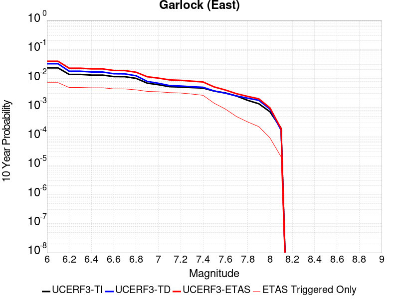 |

| Magnitude | 1 wk TI Prob | 1 wk TD Prob | 1 wk ETAS Prob | 1 wk ETAS/TD Gain | 1 wk ETAS Triggered Only | 1 mo TI Prob | 1 mo TD Prob | 1 mo ETAS Prob | 1 mo ETAS/TD Gain | 1 mo ETAS Triggered Only | 1 yr TI Prob | 1 yr TD Prob | 1 yr ETAS Prob | 1 yr ETAS/TD Gain | 1 yr ETAS Triggered Only | 10 yr TI Prob | 10 yr TD Prob | 10 yr ETAS Prob | 10 yr ETAS/TD Gain | 10 yr ETAS Triggered Only |
|-----|-----|-----|-----|-----|-----|-----|-----|-----|-----|-----|-----|-----|-----|-----|-----|-----|-----|-----|-----|-----|
| 6.0 | 4.5092507E-5 | 6.290799E-5 | 5.9287465E-4 | 9.424474 | 5.3E-4 | 1.9323928E-4 | 2.695803E-4 | 0.0017991678 | 6.673959 | 0.00153 | 0.0023501497 | 0.0032776468 | 0.0073542413 | 2.2437565 | 0.00409 | 0.023254504 | 0.032344494 | 0.03932129 | 1.2157028 | 0.00721 |
| 6.1 | 4.5092507E-5 | 6.290799E-5 | 5.9287465E-4 | 9.424474 | 5.3E-4 | 1.9323928E-4 | 2.695803E-4 | 0.0017991678 | 6.673959 | 0.00153 | 0.0023501497 | 0.0032776468 | 0.0073542413 | 2.2437565 | 0.00409 | 0.023254504 | 0.032344494 | 0.03932129 | 1.2157028 | 0.00721 |
| 6.2 | 2.6674514E-5 | 3.451465E-5 | 4.1450153E-4 | 12.009438 | 3.8E-4 | 1.1431433E-4 | 1.4791173E-4 | 0.0013077401 | 8.841355 | 0.00116 | 0.0013908884 | 0.0017993709 | 0.004664207 | 2.5921319 | 0.00287 | 0.01382215 | 0.017863318 | 0.022685608 | 1.2699549 | 0.00491 |
| 6.3 | 2.6674514E-5 | 3.451465E-5 | 4.1450153E-4 | 12.009438 | 3.8E-4 | 1.1431433E-4 | 1.4791173E-4 | 0.0013077401 | 8.841355 | 0.00116 | 0.0013908884 | 0.0017993709 | 0.004664207 | 2.5921319 | 0.00287 | 0.01382215 | 0.017863318 | 0.022685608 | 1.2699549 | 0.00491 |
| 6.4 | 2.5312667E-5 | 3.2343483E-5 | 4.123312E-4 | 12.748509 | 3.8E-4 | 1.0847834E-4 | 1.3860772E-4 | 0.0012984469 | 9.367782 | 0.00116 | 0.0013199237 | 0.0016862722 | 0.0044915336 | 2.6635876 | 0.00281 | 0.013121112 | 0.016764186 | 0.021464054 | 1.2803516 | 0.00478 |
| 6.5 | 2.5312667E-5 | 3.2343483E-5 | 4.123312E-4 | 12.748509 | 3.8E-4 | 1.0847834E-4 | 1.3860772E-4 | 0.0012984469 | 9.367782 | 0.00116 | 0.0013199237 | 0.0016862722 | 0.0044915336 | 2.6635876 | 0.00281 | 0.013121112 | 0.016764186 | 0.021464054 | 1.2803516 | 0.00478 |
| 6.6 | 2.246556E-5 | 2.8137678E-5 | 3.8812755E-4 | 13.793873 | 3.6E-4 | 9.627742E-5 | 1.20584606E-4 | 0.0012304508 | 10.204045 | 0.00111 | 0.0011715472 | 0.0014671524 | 0.0040932936 | 2.7899582 | 0.00263 | 0.011653901 | 0.014604934 | 0.018930819 | 1.2961934 | 0.00439 |
| 6.7 | 2.2241198E-5 | 2.7807404E-5 | 3.877974E-4 | 13.945832 | 3.6E-4 | 9.531594E-5 | 1.1916928E-4 | 0.001229037 | 10.313372 | 0.00111 | 0.0011598538 | 0.0014499439 | 0.0040761307 | 2.8112333 | 0.00263 | 0.011538187 | 0.014434824 | 0.018751599 | 1.2990528 | 0.00438 |
| 6.8 | 1.9528685E-5 | 2.3901322E-5 | 3.838927E-4 | 16.06157 | 3.6E-4 | 8.369167E-5 | 1.0243033E-4 | 0.0011823197 | 11.542672 | 0.00108 | 0.0010184698 | 0.0012463954 | 0.0036933417 | 2.9632182 | 0.00245 | 0.010138147 | 0.012438075 | 0.016457452 | 1.3231511 | 0.00407 |
| 6.9 | 1.3318621E-5 | 1.5200952E-5 | 3.351961E-4 | 22.050993 | 3.2E-4 | 5.7078556E-5 | 6.514534E-5 | 0.0010150834 | 15.581827 | 9.5E-4 | 6.9470983E-4 | 7.928616E-4 | 0.0029511491 | 3.722149 | 0.00216 | 0.0069254204 | 0.007940963 | 0.011512375 | 1.4497455 | 0.0036 |
| 7.0 | 1.1760853E-5 | 1.3109707E-5 | 3.2310563E-4 | 24.646292 | 3.1E-4 | 5.0402683E-5 | 5.6183275E-5 | 9.86131E-4 | 17.552038 | 9.3E-4 | 6.134799E-4 | 6.838217E-4 | 0.0027823858 | 4.068876 | 0.0021 | 0.0061178906 | 0.006857492 | 0.010323559 | 1.5054424 | 0.00349 |
| 7.1 | 1.0064758E-5 | 1.0904764E-5 | 3.209014E-4 | 29.427631 | 3.1E-4 | 4.3133965E-5 | 4.6733887E-5 | 9.1669324E-4 | 19.615171 | 8.7E-4 | 5.2502943E-4 | 5.6884E-4 | 0.0025377194 | 4.461218 | 0.00197 | 0.005237907 | 0.005713798 | 0.008965114 | 1.5690289 | 0.00327 |
| 7.2 | 9.768808E-6 | 1.0500609E-5 | 3.1049745E-4 | 29.569471 | 3.0E-4 | 4.186565E-5 | 4.5001856E-5 | 8.949636E-4 | 19.88726 | 8.5E-4 | 5.095951E-4 | 5.477633E-4 | 0.0024467225 | 4.466751 | 0.0019 | 0.0050842804 | 0.0055042095 | 0.008656762 | 1.5727528 | 0.00317 |
| 7.3 | 9.344516E-6 | 9.946213E-6 | 2.7994352E-4 | 28.14574 | 2.7E-4 | 4.004731E-5 | 4.262595E-5 | 8.4259186E-4 | 19.76711 | 8.0E-4 | 4.8746695E-4 | 5.188508E-4 | 0.0022779377 | 4.390352 | 0.00176 | 0.0048639905 | 0.005215881 | 0.008110703 | 1.5550015 | 0.00291 |
| 7.4 | 9.023491E-6 | 9.492341E-6 | 2.3949015E-4 | 25.229832 | 2.3E-4 | 3.867153E-5 | 4.0680847E-5 | 7.7065115E-4 | 18.943832 | 7.3E-4 | 4.7072413E-4 | 4.951801E-4 | 0.002134368 | 4.3102865 | 0.00164 | 0.004697283 | 0.0049793427 | 0.007606197 | 1.5275505 | 0.00264 |
| 7.5 | 7.081253E-6 | 7.089067E-6 | 1.57088E-4 | 22.159193 | 1.5E-4 | 3.0347876E-5 | 3.0381365E-5 | 4.503686E-4 | 14.823844 | 4.2E-4 | 3.6942272E-4 | 3.6983108E-4 | 0.0012395093 | 3.3515553 | 8.7E-4 | 0.003688092 | 0.0037253548 | 0.005130102 | 1.3770775 | 0.00141 |
| 7.6 | 6.116396E-6 | 5.960529E-6 | 8.5960055E-5 | 14.421548 | 8.0E-5 | 2.6212863E-5 | 2.5544876E-5 | 3.1553747E-4 | 12.352281 | 2.9E-4 | 3.1909486E-4 | 3.1096474E-4 | 8.907844E-4 | 2.8645833 | 5.8E-4 | 0.0031863707 | 0.003136776 | 0.004023984 | 1.2828408 | 8.9E-4 |
| 7.7 | 4.797145E-6 | 4.758607E-6 | 4.4758417E-5 | 9.405782 | 4.0E-5 | 2.055903E-5 | 2.039387E-5 | 1.903904E-4 | 9.335668 | 1.7E-4 | 2.5027743E-4 | 2.4826723E-4 | 5.4819277E-4 | 2.2080753 | 3.0E-4 | 0.0024999576 | 0.002510294 | 0.002999064 | 1.1947062 | 4.9E-4 |
| 7.8 | 3.4028885E-6 | 3.9797173E-6 | 4.397956E-5 | 11.050925 | 4.0E-5 | 1.4583726E-5 | 1.7055821E-5 | 1.17054115E-4 | 6.863001 | 1.0E-4 | 1.775424E-4 | 2.076349E-4 | 3.7759962E-4 | 1.8185748 | 1.7E-4 | 0.0017740062 | 0.00210206 | 0.0024213875 | 1.1519116 | 3.2E-4 |
| 7.9 | 2.5928412E-6 | 3.3735669E-6 | 1.3373533E-5 | 3.9642117 | 1.0E-5 | 1.1112129E-5 | 1.4458064E-5 | 7.4457195E-5 | 5.1498733 | 6.0E-5 | 1.3528178E-4 | 1.7601276E-4 | 2.8599342E-4 | 1.6248447 | 1.1E-4 | 0.0013519945 | 0.0017819697 | 0.0020015775 | 1.1232389 | 2.2E-4 |
| 8.0 | 1.3743648E-6 | 1.6739597E-6 | 1.6739597E-6 | 1.0 | 0.0 | 5.8901214E-6 | 7.1740933E-6 | 3.717388E-5 | 5.181683 | 3.0E-5 | 7.1709874E-5 | 8.734111E-5 | 1.2733763E-4 | 1.4579345 | 4.0E-5 | 7.1686733E-4 | 8.841624E-4 | 9.740828E-4 | 1.1017013 | 9.0E-5 |
| 8.1 | 3.6733252E-7 | 3.1497066E-7 | 3.1497066E-7 | 1.0 | 0.0 | 1.5742813E-6 | 1.3498736E-6 | 1.3498736E-6 | 1.0 | 0.0 | 1.9166706E-5 | 1.6434604E-5 | 1.6434604E-5 | 1.0 | 0.0 | 1.9165053E-4 | 1.6648426E-4 | 1.8648093E-4 | 1.1201115 | 2.0E-5 |

## Blackwater
*[(top)](#table-of-contents)*

| 1 Week | 1 Month | 1 Year | 10 Year |
|-----|-----|-----|-----|
|  |  |  |  |

| Magnitude | 1 wk TI Prob | 1 wk TD Prob | 1 wk ETAS Prob | 1 wk ETAS/TD Gain | 1 wk ETAS Triggered Only | 1 mo TI Prob | 1 mo TD Prob | 1 mo ETAS Prob | 1 mo ETAS/TD Gain | 1 mo ETAS Triggered Only | 1 yr TI Prob | 1 yr TD Prob | 1 yr ETAS Prob | 1 yr ETAS/TD Gain | 1 yr ETAS Triggered Only | 10 yr TI Prob | 10 yr TD Prob | 10 yr ETAS Prob | 10 yr ETAS/TD Gain | 10 yr ETAS Triggered Only |
|-----|-----|-----|-----|-----|-----|-----|-----|-----|-----|-----|-----|-----|-----|-----|-----|-----|-----|-----|-----|-----|
| 6.0 | 3.0708583E-5 | 3.309619E-5 | 4.4308262E-4 | 13.387723 | 4.1E-4 | 1.3160157E-4 | 1.4183388E-4 | 0.0010517047 | 7.4150467 | 9.1E-4 | 0.0016010714 | 0.0017255963 | 0.004191334 | 2.4289193 | 0.00247 | 0.015895851 | 0.017135808 | 0.021558698 | 1.258108 | 0.0045 |
| 6.1 | 3.0708583E-5 | 3.309619E-5 | 4.4308262E-4 | 13.387723 | 4.1E-4 | 1.3160157E-4 | 1.4183388E-4 | 0.0010517047 | 7.4150467 | 9.1E-4 | 0.0016010714 | 0.0017255963 | 0.004191334 | 2.4289193 | 0.00247 | 0.015895851 | 0.017135808 | 0.021558698 | 1.258108 | 0.0045 |
| 6.2 | 1.1707779E-5 | 1.2545242E-5 | 1.5254348E-4 | 12.15947 | 1.4E-4 | 5.017523E-5 | 5.3764266E-5 | 4.0374545E-4 | 7.50955 | 3.5E-4 | 6.107122E-4 | 6.5439293E-4 | 0.0016337517 | 2.496591 | 9.8E-4 | 0.006090366 | 0.006525631 | 0.008294015 | 1.2709905 | 0.00178 |
| 6.3 | 1.1707779E-5 | 1.2545242E-5 | 1.5254348E-4 | 12.15947 | 1.4E-4 | 5.017523E-5 | 5.3764266E-5 | 4.0374545E-4 | 7.50955 | 3.5E-4 | 6.107122E-4 | 6.5439293E-4 | 0.0016337517 | 2.496591 | 9.8E-4 | 0.006090366 | 0.006525631 | 0.008294015 | 1.2709905 | 0.00178 |
| 6.4 | 7.929244E-6 | 8.480176E-6 | 9.847941E-5 | 11.612897 | 9.0E-5 | 3.3982033E-5 | 3.6343128E-5 | 2.2633623E-4 | 6.2277584 | 1.9E-4 | 4.136527E-4 | 4.4239179E-4 | 0.0010021441 | 2.2652862 | 5.6E-4 | 0.0041288356 | 0.0044155167 | 0.00546088 | 1.2367477 | 0.00105 |
| 6.5 | 5.8832115E-6 | 6.286048E-6 | 7.628561E-5 | 12.135702 | 7.0E-5 | 2.521352E-5 | 2.6939942E-5 | 1.7693591E-4 | 6.567791 | 1.5E-4 | 3.0693135E-4 | 3.2794697E-4 | 7.078223E-4 | 2.158344 | 3.8E-4 | 0.0030650778 | 0.0032748834 | 0.0040224274 | 1.2282658 | 7.5E-4 |
| 6.6 | 5.8832115E-6 | 6.286048E-6 | 7.628561E-5 | 12.135702 | 7.0E-5 | 2.521352E-5 | 2.6939942E-5 | 1.7693591E-4 | 6.567791 | 1.5E-4 | 3.0693135E-4 | 3.2794697E-4 | 7.078223E-4 | 2.158344 | 3.8E-4 | 0.0030650778 | 0.0032748834 | 0.0040224274 | 1.2282658 | 7.5E-4 |
| 6.7 | 3.0715053E-6 | 3.281496E-6 | 4.3281365E-5 | 13.189523 | 4.0E-5 | 1.3163528E-5 | 1.4063485E-5 | 9.406236E-5 | 6.6884108 | 8.0E-5 | 1.6025416E-4 | 1.7121063E-4 | 3.3118326E-4 | 1.9343613 | 1.6E-4 | 0.0016013865 | 0.0017109019 | 0.0020503202 | 1.1983856 | 3.4E-4 |
| 6.8 | 2.2722281E-6 | 2.4287758E-6 | 3.2428703E-5 | 13.3518715 | 3.0E-5 | 9.738084E-6 | 1.0409003E-5 | 7.040838E-5 | 6.7641807 | 6.0E-5 | 1.1855473E-4 | 1.2672316E-4 | 2.567067E-4 | 2.0257282 | 1.3E-4 | 0.001184915 | 0.0012665992 | 0.0015162824 | 1.1971289 | 2.5E-4 |
| 6.9 | 9.952399E-7 | 1.0653588E-6 | 1.1065348E-5 | 10.386498 | 1.0E-5 | 4.265307E-6 | 4.5658185E-6 | 3.456568E-5 | 7.5705338 | 3.0E-5 | 5.1928873E-5 | 5.5587938E-5 | 9.558571E-5 | 1.7195406 | 4.0E-5 | 5.191674E-4 | 5.5579096E-4 | 6.3574646E-4 | 1.143859 | 8.0E-5 |
| 7.0 | 4.7385504E-7 | 5.0756074E-7 | 1.0507556E-5 | 20.702066 | 1.0E-5 | 2.0308057E-6 | 2.1752603E-6 | 2.2175216E-5 | 10.194282 | 2.0E-5 | 2.4724779E-5 | 2.6483794E-5 | 5.6483E-5 | 2.132738 | 3.0E-5 | 2.4722028E-4 | 2.6483793E-4 | 3.2482206E-4 | 1.2264936 | 6.0E-5 |

## Hunter Mountain-Saline Valley
*[(top)](#table-of-contents)*

| 1 Week | 1 Month | 1 Year | 10 Year |
|-----|-----|-----|-----|
|  |  |  |  |

| Magnitude | 1 wk TI Prob | 1 wk TD Prob | 1 wk ETAS Prob | 1 wk ETAS/TD Gain | 1 wk ETAS Triggered Only | 1 mo TI Prob | 1 mo TD Prob | 1 mo ETAS Prob | 1 mo ETAS/TD Gain | 1 mo ETAS Triggered Only | 1 yr TI Prob | 1 yr TD Prob | 1 yr ETAS Prob | 1 yr ETAS/TD Gain | 1 yr ETAS Triggered Only | 10 yr TI Prob | 10 yr TD Prob | 10 yr ETAS Prob | 10 yr ETAS/TD Gain | 10 yr ETAS Triggered Only |
|-----|-----|-----|-----|-----|-----|-----|-----|-----|-----|-----|-----|-----|-----|-----|-----|-----|-----|-----|-----|-----|
| 6.0 | 4.5103672E-5 | 5.4570846E-5 | 4.2455064E-4 | 7.779807 | 3.7E-4 | 1.9328714E-4 | 2.3385457E-4 | 0.0011736348 | 5.018652 | 9.4E-4 | 0.002350731 | 0.0028436389 | 0.005416302 | 1.9047083 | 0.00258 | 0.023260195 | 0.02809229 | 0.032426998 | 1.1543025 | 0.00446 |
| 6.1 | 4.5103672E-5 | 5.4570846E-5 | 4.2455064E-4 | 7.779807 | 3.7E-4 | 1.9328714E-4 | 2.3385457E-4 | 0.0011736348 | 5.018652 | 9.4E-4 | 0.002350731 | 0.0028436389 | 0.005416302 | 1.9047083 | 0.00258 | 0.023260195 | 0.02809229 | 0.032426998 | 1.1543025 | 0.00446 |
| 6.2 | 3.9363465E-5 | 4.7064215E-5 | 4.0704728E-4 | 8.648764 | 3.6E-4 | 1.6868966E-4 | 2.0168893E-4 | 0.0011315014 | 5.6101313 | 9.3E-4 | 0.002051862 | 0.0024529307 | 0.0050066514 | 2.0410895 | 0.00256 | 0.020330196 | 0.024273701 | 0.028605927 | 1.178474 | 0.00444 |
| 6.3 | 3.9363465E-5 | 4.7064215E-5 | 4.0704728E-4 | 8.648764 | 3.6E-4 | 1.6868966E-4 | 2.0168893E-4 | 0.0011315014 | 5.6101313 | 9.3E-4 | 0.002051862 | 0.0024529307 | 0.0050066514 | 2.0410895 | 0.00256 | 0.020330196 | 0.024273701 | 0.028605927 | 1.178474 | 0.00444 |
| 6.4 | 3.2311684E-5 | 3.7952268E-5 | 3.8793898E-4 | 10.221761 | 3.5E-4 | 1.384713E-4 | 1.6264283E-4 | 0.0010824932 | 6.655647 | 9.2E-4 | 0.0016845843 | 0.0019784467 | 0.004483481 | 2.2661622 | 0.00251 | 0.016718714 | 0.019616457 | 0.023900732 | 1.2184021 | 0.00437 |
| 6.5 | 3.2311684E-5 | 3.7952268E-5 | 3.8793898E-4 | 10.221761 | 3.5E-4 | 1.384713E-4 | 1.6264283E-4 | 0.0010824932 | 6.655647 | 9.2E-4 | 0.0016845843 | 0.0019784467 | 0.004483481 | 2.2661622 | 0.00251 | 0.016718714 | 0.019616457 | 0.023900732 | 1.2184021 | 0.00437 |
| 6.6 | 2.9305844E-5 | 3.4182984E-5 | 3.7417136E-4 | 10.94613 | 3.4E-4 | 1.2559042E-4 | 1.4649061E-4 | 0.0010463587 | 7.1428385 | 9.0E-4 | 0.0015279909 | 0.0017821258 | 0.004257706 | 2.3891165 | 0.00248 | 0.015175272 | 0.017685596 | 0.02194884 | 1.2410574 | 0.00434 |
| 6.7 | 2.7826512E-5 | 3.2345313E-5 | 3.7233433E-4 | 11.511229 | 3.4E-4 | 1.19251024E-4 | 1.3861575E-4 | 0.001038491 | 7.4918685 | 9.0E-4 | 0.0014509142 | 0.0016864006 | 0.0041422523 | 2.456268 | 0.00246 | 0.014414776 | 0.01674306 | 0.02099073 | 1.2536974 | 0.00432 |
| 6.8 | 2.3389874E-5 | 2.6867581E-5 | 3.6685844E-4 | 13.654316 | 3.4E-4 | 1.0023846E-4 | 1.15141964E-4 | 0.0010050394 | 8.728699 | 8.9E-4 | 0.00121972 | 0.0014009993 | 0.0038375808 | 2.7391741 | 0.00244 | 0.01213047 | 0.0139272185 | 0.018167332 | 1.3044479 | 0.0043 |
| 6.9 | 2.069209E-5 | 2.3570803E-5 | 3.6356278E-4 | 15.424285 | 3.4E-4 | 8.867737E-5 | 1.0101402E-4 | 9.809252E-4 | 9.710782 | 8.8E-4 | 0.0010791123 | 0.0012291879 | 0.0036462133 | 2.9663594 | 0.00242 | 0.010738871 | 0.012228257 | 0.01640653 | 1.3416901 | 0.00423 |
| 7.0 | 1.7462342E-5 | 1.9634203E-5 | 3.5962753E-4 | 18.316381 | 3.4E-4 | 7.483646E-5 | 8.4144E-5 | 9.6407E-4 | 11.457382 | 8.8E-4 | 9.1075303E-4 | 0.0010239943 | 0.0034215366 | 3.341363 | 0.0024 | 0.009070295 | 0.0101957265 | 0.014362802 | 1.4087081 | 0.00421 |
| 7.1 | 1.4807709E-5 | 1.644232E-5 | 3.464369E-4 | 21.06983 | 3.3E-4 | 6.3460066E-5 | 7.046528E-5 | 9.4040396E-4 | 13.345636 | 8.7E-4 | 7.723524E-4 | 8.5759355E-4 | 0.0032155695 | 3.7495263 | 0.00236 | 0.007696735 | 0.00854516 | 0.012669613 | 1.4826653 | 0.00416 |
| 7.2 | 1.4180048E-5 | 1.5698888E-5 | 3.456937E-4 | 22.020266 | 3.3E-4 | 6.077022E-5 | 6.727931E-5 | 9.2722144E-4 | 13.781673 | 8.6E-4 | 7.396263E-4 | 8.1883394E-4 | 0.0031669098 | 3.8675847 | 0.00235 | 0.0073716943 | 0.008160452 | 0.01225675 | 1.5019693 | 0.00413 |
| 7.3 | 1.3730402E-5 | 1.5172614E-5 | 3.4516762E-4 | 22.749382 | 3.3E-4 | 5.8843252E-5 | 6.502396E-5 | 9.1496867E-4 | 14.071255 | 8.5E-4 | 7.161811E-4 | 7.9139526E-4 | 0.0031195513 | 3.9418373 | 0.00233 | 0.007138774 | 0.007888035 | 0.011955693 | 1.5156746 | 0.0041 |
| 7.4 | 1.2810095E-5 | 1.4109794E-5 | 3.4410515E-4 | 24.387678 | 3.3E-4 | 5.489925E-5 | 6.0469236E-5 | 9.104178E-4 | 15.055884 | 8.5E-4 | 6.681934E-4 | 7.359801E-4 | 0.0030642652 | 4.1635165 | 0.00233 | 0.006661878 | 0.007337654 | 0.011387716 | 1.551956 | 0.00408 |
| 7.5 | 1.1595659E-5 | 1.2801082E-5 | 3.4279685E-4 | 26.77874 | 3.3E-4 | 4.9694736E-5 | 5.4860713E-5 | 8.948146E-4 | 16.310663 | 8.4E-4 | 6.0486543E-4 | 6.677402E-4 | 0.0029362245 | 4.397256 | 0.00227 | 0.006032217 | 0.006659527 | 0.010613021 | 1.5936601 | 0.00398 |
| 7.6 | 2.997694E-6 | 3.3253514E-6 | 1.5332486E-4 | 46.107864 | 1.5E-4 | 1.28471975E-5 | 1.4251469E-5 | 3.842462E-4 | 26.961864 | 3.7E-4 | 1.564034E-4 | 1.735051E-4 | 0.0011033438 | 6.359143 | 9.3E-4 | 0.0015629337 | 0.0017345662 | 0.0034016694 | 1.9611068 | 0.00167 |

## Gravel Hills-Harper Lk
*[(top)](#table-of-contents)*

| 1 Week | 1 Month | 1 Year | 10 Year |
|-----|-----|-----|-----|
| 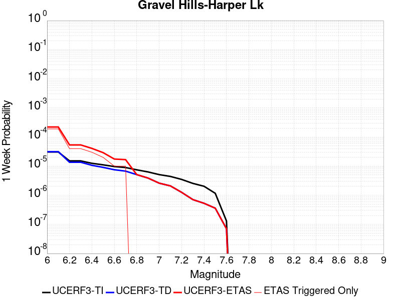 |  | 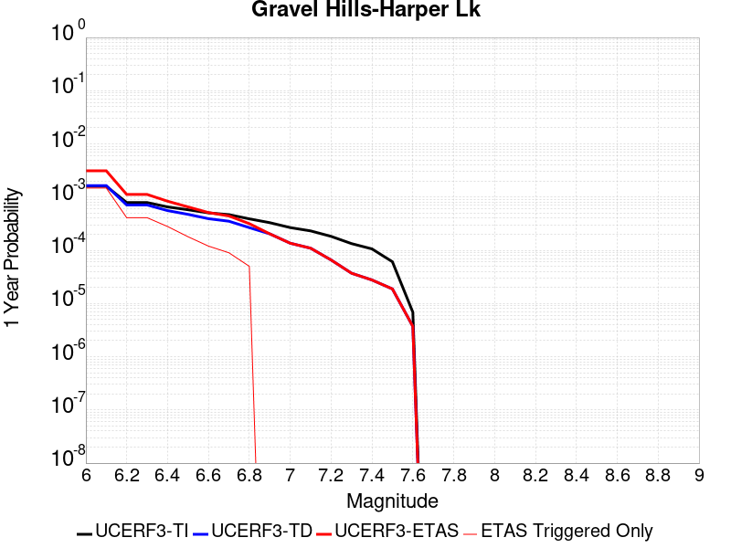 |  |

| Magnitude | 1 wk TI Prob | 1 wk TD Prob | 1 wk ETAS Prob | 1 wk ETAS/TD Gain | 1 wk ETAS Triggered Only | 1 mo TI Prob | 1 mo TD Prob | 1 mo ETAS Prob | 1 mo ETAS/TD Gain | 1 mo ETAS Triggered Only | 1 yr TI Prob | 1 yr TD Prob | 1 yr ETAS Prob | 1 yr ETAS/TD Gain | 1 yr ETAS Triggered Only | 10 yr TI Prob | 10 yr TD Prob | 10 yr ETAS Prob | 10 yr ETAS/TD Gain | 10 yr ETAS Triggered Only |
|-----|-----|-----|-----|-----|-----|-----|-----|-----|-----|-----|-----|-----|-----|-----|-----|-----|-----|-----|-----|-----|
| 6.0 | 3.0679566E-5 | 3.146516E-5 | 2.2145918E-4 | 7.038235 | 1.9E-4 | 1.3147724E-4 | 1.3484493E-4 | 6.3477753E-4 | 4.707463 | 5.0E-4 | 0.0015995599 | 0.0016407177 | 0.0031182894 | 1.9005643 | 0.00148 | 0.015880952 | 0.016307613 | 0.018943908 | 1.1616604 | 0.00268 |
| 6.1 | 3.0679566E-5 | 3.146516E-5 | 2.2145918E-4 | 7.038235 | 1.9E-4 | 1.3147724E-4 | 1.3484493E-4 | 6.3477753E-4 | 4.707463 | 5.0E-4 | 0.0015995599 | 0.0016407177 | 0.0031182894 | 1.9005643 | 0.00148 | 0.015880952 | 0.016307613 | 0.018943908 | 1.1616604 | 0.00268 |
| 6.2 | 1.514536E-5 | 1.363538E-5 | 5.3634834E-5 | 3.933505 | 4.0E-5 | 6.490707E-5 | 5.84361E-5 | 2.0842733E-4 | 3.5667565 | 1.5E-4 | 7.8995706E-4 | 7.112392E-4 | 0.0011209475 | 1.5760487 | 4.1E-4 | 0.007871548 | 0.0070908302 | 0.007994377 | 1.1274247 | 9.1E-4 |
| 6.3 | 1.514536E-5 | 1.363538E-5 | 5.3634834E-5 | 3.933505 | 4.0E-5 | 6.490707E-5 | 5.84361E-5 | 2.0842733E-4 | 3.5667565 | 1.5E-4 | 7.8995706E-4 | 7.112392E-4 | 0.0011209475 | 1.5760487 | 4.1E-4 | 0.007871548 | 0.0070908302 | 0.007994377 | 1.1274247 | 9.1E-4 |
| 6.4 | 1.2532521E-5 | 1.0689813E-5 | 4.0689494E-5 | 3.80638 | 3.0E-5 | 5.37097E-5 | 4.5812714E-5 | 1.5580768E-4 | 3.4009702 | 1.1E-4 | 6.537194E-4 | 5.576329E-4 | 8.3747675E-4 | 1.5018425 | 2.8E-4 | 0.0065179965 | 0.0055629266 | 0.0061297556 | 1.101894 | 5.7E-4 |
| 6.5 | 1.1094058E-5 | 9.083761E-6 | 2.908358E-5 | 3.2017112 | 2.0E-5 | 4.7545094E-5 | 3.8929848E-5 | 9.8927514E-5 | 2.541174 | 6.0E-5 | 5.787078E-4 | 4.7387183E-4 | 6.537865E-4 | 1.3796695 | 1.8E-4 | 0.0057720304 | 0.0047290213 | 0.005087319 | 1.0757657 | 3.6E-4 |
| 6.6 | 9.688328E-6 | 7.531771E-6 | 1.7531696E-5 | 2.327699 | 1.0E-5 | 4.1520743E-5 | 3.2278636E-5 | 7.227734E-5 | 2.2391698 | 4.0E-5 | 5.053978E-4 | 3.9292406E-4 | 5.128769E-4 | 1.3052825 | 1.2E-4 | 0.0050424994 | 0.00392255 | 0.0041815303 | 1.0660235 | 2.6E-4 |
| 6.7 | 8.974824E-6 | 6.7494793E-6 | 1.674941E-5 | 2.4815857 | 1.0E-5 | 3.8462964E-5 | 2.8926032E-5 | 6.892488E-5 | 2.3827975 | 4.0E-5 | 4.6818596E-4 | 3.521197E-4 | 4.4208803E-4 | 1.2555048 | 9.0E-5 | 0.004672008 | 0.0035158389 | 0.003695206 | 1.0510169 | 1.8E-4 |
| 6.8 | 7.4780046E-6 | 5.1162397E-6 | 5.1162397E-6 | 1.0 | 0.0 | 3.20482E-5 | 2.1926564E-5 | 3.1926345E-5 | 1.4560578 | 1.0E-5 | 3.9011694E-4 | 2.6692462E-4 | 3.1691126E-4 | 1.1872689 | 5.0E-5 | 0.0038943281 | 0.0026661782 | 0.002745965 | 1.0299255 | 8.0E-5 |
| 6.9 | 6.3409307E-6 | 3.9075294E-6 | 3.9075294E-6 | 1.0 | 0.0 | 2.7175134E-5 | 1.6746453E-5 | 1.6746453E-5 | 1.0 | 0.0 | 3.3080703E-4 | 2.0386997E-4 | 2.0386997E-4 | 1.0 | 0.0 | 0.0033031502 | 0.0020369277 | 0.0020668665 | 1.014698 | 3.0E-5 |
| 7.0 | 5.1239335E-6 | 2.605876E-6 | 2.605876E-6 | 1.0 | 0.0 | 2.195953E-5 | 1.1167994E-5 | 1.1167994E-5 | 1.0 | 0.0 | 2.6732447E-4 | 1.359621E-4 | 1.359621E-4 | 1.0 | 0.0 | 0.0026700313 | 0.0013588143 | 0.0013588143 | 1.0 | 0.0 |
| 7.1 | 4.438899E-6 | 2.0984924E-6 | 2.0984924E-6 | 1.0 | 0.0 | 1.9023713E-5 | 8.993509E-6 | 8.993509E-6 | 1.0 | 0.0 | 2.315891E-4 | 1.0949069E-4 | 1.0949069E-4 | 1.0 | 0.0 | 0.002313479 | 0.0010943894 | 0.0010943894 | 1.0 | 0.0 |
| 7.2 | 3.50367E-6 | 1.2615886E-6 | 1.2615886E-6 | 1.0 | 0.0 | 1.5015643E-5 | 5.4067978E-6 | 5.4067978E-6 | 1.0 | 0.0 | 1.8280011E-4 | 6.582586E-5 | 6.582586E-5 | 1.0 | 0.0 | 0.0018264982 | 6.5807183E-4 | 6.5807183E-4 | 1.0 | 0.0 |
| 7.3 | 2.561638E-6 | 7.1188435E-7 | 7.1188435E-7 | 1.0 | 0.0 | 1.0978401E-5 | 3.0509295E-6 | 3.0509295E-6 | 1.0 | 0.0 | 1.3365384E-4 | 3.7144455E-5 | 3.7144455E-5 | 1.0 | 0.0 | 0.0013357349 | 3.7138443E-4 | 3.7138443E-4 | 1.0 | 0.0 |
| 7.4 | 2.0368864E-6 | 5.3046045E-7 | 5.3046045E-7 | 1.0 | 0.0 | 8.729483E-6 | 2.2734E-6 | 2.2734E-6 | 1.0 | 0.0 | 1.06276275E-4 | 2.7678298E-5 | 2.7678298E-5 | 1.0 | 0.0 | 0.0010622547 | 2.7674905E-4 | 2.7674905E-4 | 1.0 | 0.0 |
| 7.5 | 1.1681728E-6 | 3.6029326E-7 | 3.6029326E-7 | 1.0 | 0.0 | 5.0064455E-6 | 1.544113E-6 | 1.544113E-6 | 1.0 | 0.0 | 6.0951766E-5 | 1.879942E-5 | 1.879942E-5 | 1.0 | 0.0 | 6.093505E-4 | 1.8797876E-4 | 1.8797876E-4 | 1.0 | 0.0 |
| 7.6 | 1.3154387E-7 | 7.119745E-8 | 7.119745E-8 | 1.0 | 0.0 | 5.6375933E-7 | 3.051319E-7 | 3.051319E-7 | 1.0 | 0.0 | 6.863748E-6 | 3.7149762E-6 | 3.7149762E-6 | 1.0 | 0.0 | 6.863536E-5 | 3.7149297E-5 | 3.7149297E-5 | 1.0 | 0.0 |

## Garlock (West)
*[(top)](#table-of-contents)*

| 1 Week | 1 Month | 1 Year | 10 Year |
|-----|-----|-----|-----|
|  |  |  |  |

| Magnitude | 1 wk TI Prob | 1 wk TD Prob | 1 wk ETAS Prob | 1 wk ETAS/TD Gain | 1 wk ETAS Triggered Only | 1 mo TI Prob | 1 mo TD Prob | 1 mo ETAS Prob | 1 mo ETAS/TD Gain | 1 mo ETAS Triggered Only | 1 yr TI Prob | 1 yr TD Prob | 1 yr ETAS Prob | 1 yr ETAS/TD Gain | 1 yr ETAS Triggered Only | 10 yr TI Prob | 10 yr TD Prob | 10 yr ETAS Prob | 10 yr ETAS/TD Gain | 10 yr ETAS Triggered Only |
|-----|-----|-----|-----|-----|-----|-----|-----|-----|-----|-----|-----|-----|-----|-----|-----|-----|-----|-----|-----|-----|
| 6.0 | 2.5181727E-5 | 2.5201914E-5 | 2.5519612E-4 | 10.1260605 | 2.3E-4 | 1.0791722E-4 | 1.08003755E-4 | 8.1792707E-4 | 7.573136 | 7.1E-4 | 0.0013131002 | 0.0013141559 | 0.002932027 | 2.2311103 | 0.00162 | 0.013053683 | 0.01314424 | 0.015848225 | 1.2057164 | 0.00274 |
| 6.1 | 2.5077732E-5 | 2.5102956E-5 | 2.5509717E-4 | 10.162038 | 2.3E-4 | 1.0747157E-4 | 1.07579675E-4 | 8.175033E-4 | 7.5990496 | 7.1E-4 | 0.001307681 | 0.001308999 | 0.0029268784 | 2.235967 | 0.00162 | 0.013000126 | 0.013093281 | 0.015797405 | 1.2065276 | 0.00274 |
| 6.2 | 2.494612E-5 | 2.4984645E-5 | 2.549789E-4 | 10.205424 | 2.3E-4 | 1.0690756E-4 | 1.0707267E-4 | 8.169967E-4 | 7.6303005 | 7.1E-4 | 0.0013008224 | 0.0013028337 | 0.002920723 | 2.2418234 | 0.00162 | 0.012932341 | 0.013032351 | 0.015736641 | 1.2075061 | 0.00274 |
| 6.3 | 2.4733758E-5 | 2.4804003E-5 | 2.547983E-4 | 10.272467 | 2.3E-4 | 1.0599751E-4 | 1.0629856E-4 | 8.162231E-4 | 7.6785903 | 7.1E-4 | 0.0012897556 | 0.0012934201 | 0.0029113246 | 2.2508733 | 0.00162 | 0.012822957 | 0.012939315 | 0.015643861 | 1.2090178 | 0.00274 |
| 6.4 | 2.3237335E-5 | 2.3183304E-5 | 2.5317798E-4 | 10.920703 | 2.3E-4 | 9.958477E-5 | 9.9353245E-5 | 8.092827E-4 | 8.145509 | 7.1E-4 | 0.0012117702 | 0.0012089573 | 0.0028269987 | 2.3383777 | 0.00162 | 0.012051838 | 0.01210416 | 0.014810995 | 1.2236284 | 0.00274 |
| 6.5 | 2.2732203E-5 | 2.299767E-5 | 2.5299238E-4 | 11.000783 | 2.3E-4 | 9.742009E-5 | 9.8557735E-5 | 8.0848776E-4 | 8.20319 | 7.1E-4 | 0.0011854442 | 0.0011992827 | 0.0028173397 | 2.3491874 | 0.00162 | 0.011791403 | 0.012008464 | 0.014715561 | 1.2254324 | 0.00274 |
| 6.6 | 2.1319436E-5 | 2.1777872E-5 | 2.5177287E-4 | 11.560949 | 2.3E-4 | 9.136581E-5 | 9.333041E-5 | 8.0326415E-4 | 8.606671 | 7.1E-4 | 0.001111811 | 0.0011357077 | 0.002753868 | 2.4248033 | 0.00162 | 0.011062649 | 0.01137937 | 0.014058531 | 1.2354403 | 0.00271 |
| 6.7 | 1.970802E-5 | 2.039774E-5 | 2.5039306E-4 | 12.275529 | 2.3E-4 | 8.446021E-5 | 8.741597E-5 | 7.973539E-4 | 9.121376 | 7.1E-4 | 0.001027818 | 0.0010637715 | 0.0026820481 | 2.5212634 | 0.00162 | 0.010230771 | 0.010667094 | 0.013348186 | 1.2513423 | 0.00271 |
| 6.8 | 1.8744462E-5 | 1.9905396E-5 | 2.4990083E-4 | 12.554425 | 2.3E-4 | 8.033094E-5 | 8.530606E-5 | 7.952455E-4 | 9.322263 | 7.1E-4 | 9.775903E-4 | 0.0010381081 | 0.0026564263 | 2.558911 | 0.00162 | 0.009733009 | 0.010412897 | 0.013074886 | 1.2556435 | 0.00269 |
| 6.9 | 1.7559682E-5 | 1.8957733E-5 | 2.4895338E-4 | 13.132022 | 2.3E-4 | 7.5253614E-5 | 8.124491E-5 | 7.911872E-4 | 9.738299 | 7.1E-4 | 9.158276E-4 | 9.887093E-4 | 0.0026071076 | 2.63688 | 0.00162 | 0.0091206245 | 0.009923427 | 0.012566932 | 1.2663903 | 0.00267 |
| 7.0 | 1.6794445E-5 | 1.8220519E-5 | 2.4821633E-4 | 13.622902 | 2.3E-4 | 7.197421E-5 | 7.8085606E-5 | 7.6803175E-4 | 9.835766 | 6.9E-4 | 8.759337E-4 | 9.5027895E-4 | 0.0025487584 | 2.682116 | 0.0016 | 0.008724891 | 0.009542331 | 0.012167044 | 1.2750599 | 0.00265 |
| 7.1 | 1.6337795E-5 | 1.7721295E-5 | 2.4771722E-4 | 13.978505 | 2.3E-4 | 7.0017246E-5 | 7.5946205E-5 | 7.558946E-4 | 9.953026 | 6.8E-4 | 8.521265E-4 | 9.242542E-4 | 0.002502794 | 2.7079065 | 0.00158 | 0.008488664 | 0.0092840865 | 0.011889669 | 1.2806504 | 0.00263 |
| 7.2 | 1.5780008E-5 | 1.716991E-5 | 2.4716597E-4 | 14.395297 | 2.3E-4 | 6.762685E-5 | 7.358326E-5 | 7.535332E-4 | 10.240552 | 6.8E-4 | 8.2304585E-4 | 8.9550926E-4 | 0.0024740943 | 2.7627792 | 0.00158 | 0.008200042 | 0.008998912 | 0.011595334 | 1.2885263 | 0.00262 |
| 7.3 | 1.5058865E-5 | 1.6622957E-5 | 2.4661914E-4 | 14.836057 | 2.3E-4 | 6.45364E-5 | 7.12393E-5 | 7.511909E-4 | 10.544613 | 6.8E-4 | 7.854473E-4 | 8.669946E-4 | 0.002425642 | 2.7977593 | 0.00156 | 0.00782677 | 0.00871559 | 0.011283018 | 1.2945787 | 0.00259 |
| 7.4 | 1.4887923E-5 | 1.6458913E-5 | 2.4645514E-4 | 14.973961 | 2.3E-4 | 6.380382E-5 | 7.05363E-5 | 7.4048905E-4 | 10.497986 | 6.7E-4 | 7.7653467E-4 | 8.584423E-4 | 0.0023771375 | 2.769129 | 0.00152 | 0.0077382675 | 0.008630417 | 0.0111484965 | 1.2917678 | 0.00254 |
| 7.5 | 1.4509299E-5 | 1.6050892E-5 | 2.460472E-4 | 15.329192 | 2.3E-4 | 6.218123E-5 | 6.8787725E-5 | 6.8874506E-4 | 10.012616 | 6.2E-4 | 7.567935E-4 | 8.3716994E-4 | 0.0022859562 | 2.7305758 | 0.00145 | 0.0075422134 | 0.008418757 | 0.010818383 | 1.2850333 | 0.00242 |
| 7.6 | 1.2756717E-5 | 1.40547745E-5 | 1.540528E-4 | 10.960888 | 1.4E-4 | 5.4670498E-5 | 6.023336E-5 | 5.2020565E-4 | 8.636504 | 4.6E-4 | 6.6541E-4 | 7.3309505E-4 | 0.001792318 | 2.4448643 | 0.00106 | 0.006634211 | 0.00738374 | 0.009071188 | 1.2285357 | 0.0017 |
| 7.7 | 1.0328985E-5 | 1.1464304E-5 | 8.14635E-5 | 7.1058393 | 7.0E-5 | 4.4266326E-5 | 4.913181E-5 | 3.3911757E-4 | 6.9021997 | 2.9E-4 | 5.388092E-4 | 5.98016E-4 | 0.0012376333 | 2.0695655 | 6.4E-4 | 0.0053750467 | 0.0060406122 | 0.0070643905 | 1.1694825 | 0.00103 |
| 7.8 | 7.0306583E-6 | 8.902713E-6 | 5.8902267E-5 | 6.6162157 | 5.0E-5 | 3.0131043E-5 | 3.815393E-5 | 2.1814706E-4 | 5.717552 | 1.8E-4 | 3.667837E-4 | 4.6442522E-4 | 8.6423947E-4 | 1.8608797 | 4.0E-4 | 0.003661789 | 0.004697 | 0.005373806 | 1.1440933 | 6.8E-4 |
| 7.9 | 4.060633E-6 | 5.467275E-6 | 1.546722E-5 | 2.8290548 | 1.0E-5 | 1.7402595E-5 | 2.3430968E-5 | 1.0342909E-4 | 4.414205 | 8.0E-5 | 2.11856E-4 | 2.852348E-4 | 4.751806E-4 | 1.6659279 | 1.9E-4 | 0.0021165414 | 0.0028852404 | 0.0032342304 | 1.120957 | 3.5E-4 |
| 8.0 | 1.6729537E-6 | 2.0781215E-6 | 2.0781215E-6 | 1.0 | 0.0 | 7.169782E-6 | 8.906205E-6 | 3.890594E-5 | 4.368408 | 3.0E-5 | 8.7288594E-5 | 1.0842768E-4 | 1.4842335E-4 | 1.3688694 | 4.0E-5 | 8.7254314E-4 | 0.0010973068 | 0.0011971971 | 1.0910323 | 1.0E-4 |
| 8.1 | 3.6733252E-7 | 3.1497066E-7 | 3.1497066E-7 | 1.0 | 0.0 | 1.5742813E-6 | 1.3498736E-6 | 1.3498736E-6 | 1.0 | 0.0 | 1.9166706E-5 | 1.6434604E-5 | 1.6434604E-5 | 1.0 | 0.0 | 1.9165053E-4 | 1.6648426E-4 | 1.8648093E-4 | 1.1201115 | 2.0E-5 |

## McLean Lake
*[(top)](#table-of-contents)*

| 1 Week | 1 Month | 1 Year | 10 Year |
|-----|-----|-----|-----|
|  |  |  |  |

| Magnitude | 1 wk TI Prob | 1 wk TD Prob | 1 wk ETAS Prob | 1 wk ETAS/TD Gain | 1 wk ETAS Triggered Only | 1 mo TI Prob | 1 mo TD Prob | 1 mo ETAS Prob | 1 mo ETAS/TD Gain | 1 mo ETAS Triggered Only | 1 yr TI Prob | 1 yr TD Prob | 1 yr ETAS Prob | 1 yr ETAS/TD Gain | 1 yr ETAS Triggered Only | 10 yr TI Prob | 10 yr TD Prob | 10 yr ETAS Prob | 10 yr ETAS/TD Gain | 10 yr ETAS Triggered Only |
|-----|-----|-----|-----|-----|-----|-----|-----|-----|-----|-----|-----|-----|-----|-----|-----|-----|-----|-----|-----|-----|
| 6.0 | 1.7360222E-5 | 1.8501789E-5 | 1.1849994E-4 | 6.404783 | 1.0E-4 | 7.439883E-5 | 7.929125E-5 | 4.1926428E-4 | 5.287649 | 3.4E-4 | 9.0542925E-4 | 9.64992E-4 | 0.002083911 | 2.1595113 | 0.00112 | 0.009017491 | 0.009612858 | 0.012039307 | 1.252417 | 0.00245 |
| 6.1 | 9.062689E-6 | 9.592268E-6 | 3.959198E-5 | 4.127489 | 3.0E-5 | 3.8839516E-5 | 4.110912E-5 | 2.2110173E-4 | 5.3784103 | 1.8E-4 | 4.727685E-4 | 5.003975E-4 | 0.0010901022 | 2.1784728 | 5.9E-4 | 0.0047176396 | 0.0049935905 | 0.006356749 | 1.2729816 | 0.00137 |
| 6.2 | 9.062689E-6 | 9.592268E-6 | 3.959198E-5 | 4.127489 | 3.0E-5 | 3.8839516E-5 | 4.110912E-5 | 2.2110173E-4 | 5.3784103 | 1.8E-4 | 4.727685E-4 | 5.003975E-4 | 0.0010901022 | 2.1784728 | 5.9E-4 | 0.0047176396 | 0.0049935905 | 0.006356749 | 1.2729816 | 0.00137 |
| 6.3 | 7.2575485E-6 | 7.667767E-6 | 2.7667613E-5 | 3.6083014 | 2.0E-5 | 3.110341E-5 | 3.2861484E-5 | 1.628572E-4 | 4.955869 | 1.3E-4 | 3.786182E-4 | 4.0002225E-4 | 8.2985027E-4 | 2.07451 | 4.3E-4 | 0.0037797375 | 0.003993727 | 0.005049493 | 1.2643563 | 0.00106 |
| 6.4 | 7.2575485E-6 | 7.667767E-6 | 2.7667613E-5 | 3.6083014 | 2.0E-5 | 3.110341E-5 | 3.2861484E-5 | 1.628572E-4 | 4.955869 | 1.3E-4 | 3.786182E-4 | 4.0002225E-4 | 8.2985027E-4 | 2.07451 | 4.3E-4 | 0.0037797375 | 0.003993727 | 0.005049493 | 1.2643563 | 0.00106 |
| 6.5 | 6.06582E-6 | 6.4039245E-6 | 2.6403797E-5 | 4.123065 | 2.0E-5 | 2.5996113E-5 | 2.7445138E-5 | 1.4744184E-4 | 5.372239 | 1.2E-4 | 3.164567E-4 | 3.340998E-4 | 7.039762E-4 | 2.1070836 | 3.7E-4 | 0.0031600643 | 0.0033366138 | 0.0042236443 | 1.2658474 | 8.9E-4 |
| 6.6 | 5.598744E-6 | 5.910306E-6 | 2.5910187E-5 | 4.3838997 | 2.0E-5 | 2.3994397E-5 | 2.5329673E-5 | 1.2532713E-4 | 4.947839 | 1.0E-4 | 2.9209262E-4 | 3.083515E-4 | 6.2825286E-4 | 2.0374568 | 3.2E-4 | 0.0029170897 | 0.0030798658 | 0.0038973403 | 1.2654253 | 8.2E-4 |
| 6.7 | 5.246996E-6 | 5.539203E-6 | 2.5539091E-5 | 4.6106076 | 2.0E-5 | 2.2486933E-5 | 2.3739261E-5 | 1.2373689E-4 | 5.212331 | 1.0E-4 | 2.73744E-4 | 2.8899353E-4 | 5.989039E-4 | 2.0723784 | 3.1E-4 | 0.0027340704 | 0.002886801 | 0.0036146936 | 1.252145 | 7.3E-4 |
| 6.8 | 4.02324E-6 | 4.246936E-6 | 1.4246893E-5 | 3.3546288 | 1.0E-5 | 1.7242342E-5 | 1.820106E-5 | 8.8199784E-5 | 4.84586 | 7.0E-5 | 2.099053E-4 | 2.2158133E-4 | 4.5153036E-4 | 2.0377636 | 2.3E-4 | 0.0020970714 | 0.0022141882 | 0.0027829262 | 1.2568607 | 5.7E-4 |
| 6.9 | 6.835972E-7 | 7.1399705E-7 | 7.1399705E-7 | 1.0 | 0.0 | 2.9296991E-6 | 3.0599856E-6 | 3.0599856E-6 | 1.0 | 0.0 | 3.56685E-5 | 3.7255006E-5 | 5.725426E-5 | 1.5368207 | 2.0E-5 | 3.5662777E-4 | 3.7251884E-4 | 4.4249278E-4 | 1.18784 | 7.0E-5 |

## Goldstone Lake
*[(top)](#table-of-contents)*

| 1 Week | 1 Month | 1 Year | 10 Year |
|-----|-----|-----|-----|
|  |  |  |  |

| Magnitude | 1 wk TI Prob | 1 wk TD Prob | 1 wk ETAS Prob | 1 wk ETAS/TD Gain | 1 wk ETAS Triggered Only | 1 mo TI Prob | 1 mo TD Prob | 1 mo ETAS Prob | 1 mo ETAS/TD Gain | 1 mo ETAS Triggered Only | 1 yr TI Prob | 1 yr TD Prob | 1 yr ETAS Prob | 1 yr ETAS/TD Gain | 1 yr ETAS Triggered Only | 10 yr TI Prob | 10 yr TD Prob | 10 yr ETAS Prob | 10 yr ETAS/TD Gain | 10 yr ETAS Triggered Only |
|-----|-----|-----|-----|-----|-----|-----|-----|-----|-----|-----|-----|-----|-----|-----|-----|-----|-----|-----|-----|-----|
| 6.0 | 2.671352E-5 | 3.0376643E-5 | 1.8037208E-4 | 5.937855 | 1.5E-4 | 1.1448149E-4 | 1.3018023E-4 | 5.401269E-4 | 4.14907 | 4.1E-4 | 0.001392921 | 0.0015839882 | 0.0027321666 | 1.7248656 | 0.00115 | 0.013842222 | 0.01574648 | 0.01803979 | 1.1456395 | 0.00233 |
| 6.1 | 2.671352E-5 | 3.0376643E-5 | 1.8037208E-4 | 5.937855 | 1.5E-4 | 1.1448149E-4 | 1.3018023E-4 | 5.401269E-4 | 4.14907 | 4.1E-4 | 0.001392921 | 0.0015839882 | 0.0027321666 | 1.7248656 | 0.00115 | 0.013842222 | 0.01574648 | 0.01803979 | 1.1456395 | 0.00233 |
| 6.2 | 1.4197047E-5 | 1.6096526E-5 | 7.609556E-5 | 4.7274523 | 6.0E-5 | 6.0843064E-5 | 6.898385E-5 | 2.7896935E-4 | 4.043981 | 2.1E-4 | 7.4051257E-4 | 8.396533E-4 | 0.0014391495 | 1.7139807 | 6.0E-4 | 0.007380498 | 0.008374506 | 0.009544623 | 1.1397239 | 0.00118 |
| 6.3 | 1.4197047E-5 | 1.6096526E-5 | 7.609556E-5 | 4.7274523 | 6.0E-5 | 6.0843064E-5 | 6.898385E-5 | 2.7896935E-4 | 4.043981 | 2.1E-4 | 7.4051257E-4 | 8.396533E-4 | 0.0014391495 | 1.7139807 | 6.0E-4 | 0.007380498 | 0.008374506 | 0.009544623 | 1.1397239 | 0.00118 |
| 6.4 | 1.3238931E-5 | 1.5008722E-5 | 7.500782E-5 | 4.9976153 | 6.0E-5 | 5.6737044E-5 | 6.432206E-5 | 2.643092E-4 | 4.1091533 | 2.0E-4 | 6.9055456E-4 | 7.8293774E-4 | 0.0013125228 | 1.6764076 | 5.3E-4 | 0.006884126 | 0.0078114197 | 0.00886314 | 1.1346388 | 0.00106 |
| 6.5 | 1.3238931E-5 | 1.5008722E-5 | 7.500782E-5 | 4.9976153 | 6.0E-5 | 5.6737044E-5 | 6.432206E-5 | 2.643092E-4 | 4.1091533 | 2.0E-4 | 6.9055456E-4 | 7.8293774E-4 | 0.0013125228 | 1.6764076 | 5.3E-4 | 0.006884126 | 0.0078114197 | 0.00886314 | 1.1346388 | 0.00106 |
| 6.6 | 1.1328278E-5 | 1.2855392E-5 | 6.285475E-5 | 4.8893685 | 5.0E-5 | 4.8548856E-5 | 5.509391E-5 | 2.0508564E-4 | 3.7224739 | 1.5E-4 | 5.90922E-4 | 6.706576E-4 | 0.0011103626 | 1.6556325 | 4.4E-4 | 0.0058935313 | 0.006695726 | 0.0075897 | 1.133514 | 9.0E-4 |
| 6.7 | 8.651175E-6 | 9.824737E-6 | 4.9824346E-5 | 5.071316 | 4.0E-5 | 3.707594E-5 | 4.210585E-5 | 1.621008E-4 | 3.8498404 | 1.2E-4 | 4.5130608E-4 | 5.126087E-4 | 8.524344E-4 | 1.662934 | 3.4E-4 | 0.0045039062 | 0.005123141 | 0.0058195554 | 1.135935 | 7.0E-4 |
| 6.8 | 1.0215377E-6 | 1.1754901E-6 | 1.1754901E-6 | 1.0 | 0.0 | 4.378012E-6 | 5.0378057E-6 | 2.5037705E-5 | 4.9699626 | 2.0E-5 | 5.3300988E-5 | 6.1333674E-5 | 1.0133122E-4 | 1.6521304 | 4.0E-5 | 5.3288206E-4 | 6.131787E-4 | 6.731419E-4 | 1.0977907 | 6.0E-5 |
| 6.9 | 7.9360774E-7 | 9.2835677E-7 | 9.2835677E-7 | 1.0 | 0.0 | 3.4011714E-6 | 3.978666E-6 | 2.3978586E-5 | 6.02679 | 2.0E-5 | 4.1408475E-5 | 4.8439255E-5 | 6.843828E-5 | 1.4128683 | 2.0E-5 | 4.140076E-4 | 4.8429397E-4 | 5.142794E-4 | 1.0619159 | 3.0E-5 |
| 7.0 | 7.4382757E-7 | 8.747494E-7 | 8.747494E-7 | 1.0 | 0.0 | 3.1878285E-6 | 3.748921E-6 | 2.3748846E-5 | 6.3348484 | 2.0E-5 | 3.8811122E-5 | 4.5642224E-5 | 6.564131E-5 | 1.4381707 | 2.0E-5 | 3.8804344E-4 | 4.5633517E-4 | 4.7632604E-4 | 1.0438074 | 2.0E-5 |
| 7.1 | 6.4709513E-7 | 7.711456E-7 | 7.711456E-7 | 1.0 | 0.0 | 2.773262E-6 | 3.3049057E-6 | 1.33048725E-5 | 4.025795 | 1.0E-5 | 3.376394E-5 | 4.0236544E-5 | 5.0236144E-5 | 1.2485203 | 1.0E-5 | 3.375881E-4 | 4.0229855E-4 | 4.1229452E-4 | 1.0248471 | 1.0E-5 |
| 7.2 | 6.356704E-7 | 7.588514E-7 | 7.588514E-7 | 1.0 | 0.0 | 2.7242988E-6 | 3.2522166E-6 | 1.32521845E-5 | 4.0748158 | 1.0E-5 | 3.3167835E-5 | 3.9595077E-5 | 4.9594684E-5 | 1.2525467 | 1.0E-5 | 3.3162883E-4 | 3.9588616E-4 | 4.0588222E-4 | 1.0252498 | 1.0E-5 |
| 7.3 | 5.7695723E-7 | 6.896703E-7 | 6.896703E-7 | 1.0 | 0.0 | 2.4726714E-6 | 2.9557268E-6 | 1.29556975E-5 | 4.3832526 | 1.0E-5 | 3.0104358E-5 | 3.598544E-5 | 4.5985078E-5 | 1.2778802 | 1.0E-5 | 3.0100282E-4 | 3.5980184E-4 | 3.6979825E-4 | 1.027783 | 1.0E-5 |
| 7.4 | 5.209647E-7 | 6.1936277E-7 | 6.1936277E-7 | 1.0 | 0.0 | 2.232704E-6 | 2.6544094E-6 | 2.6544094E-6 | 1.0 | 0.0 | 2.718283E-5 | 3.231701E-5 | 3.231701E-5 | 1.0 | 0.0 | 2.7179506E-4 | 3.2312868E-4 | 3.2312868E-4 | 1.0 | 0.0 |
| 7.5 | 4.512955E-7 | 5.3489794E-7 | 5.3489794E-7 | 1.0 | 0.0 | 1.934122E-6 | 2.292418E-6 | 2.292418E-6 | 1.0 | 0.0 | 2.3547682E-5 | 2.7909884E-5 | 2.7909884E-5 | 1.0 | 0.0 | 2.3545188E-4 | 2.790691E-4 | 2.790691E-4 | 1.0 | 0.0 |
| 7.6 | 2.21172E-7 | 2.6040198E-7 | 2.6040198E-7 | 1.0 | 0.0 | 9.478797E-7 | 1.1160082E-6 | 1.1160082E-6 | 1.0 | 0.0 | 1.1540374E-5 | 1.3587343E-5 | 1.3587343E-5 | 1.0 | 0.0 | 1.1539775E-4 | 1.3586794E-4 | 1.3586794E-4 | 1.0 | 0.0 |

## So Sierra Nevada
*[(top)](#table-of-contents)*

| 1 Week | 1 Month | 1 Year | 10 Year |
|-----|-----|-----|-----|
| 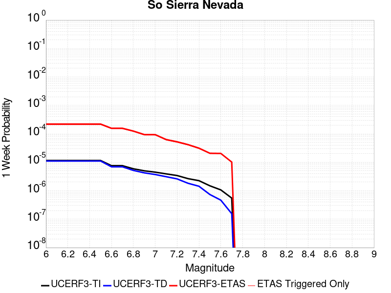 |  | 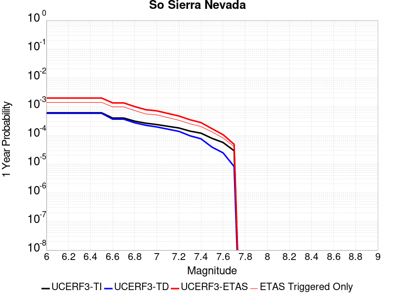 |  |

| Magnitude | 1 wk TI Prob | 1 wk TD Prob | 1 wk ETAS Prob | 1 wk ETAS/TD Gain | 1 wk ETAS Triggered Only | 1 mo TI Prob | 1 mo TD Prob | 1 mo ETAS Prob | 1 mo ETAS/TD Gain | 1 mo ETAS Triggered Only | 1 yr TI Prob | 1 yr TD Prob | 1 yr ETAS Prob | 1 yr ETAS/TD Gain | 1 yr ETAS Triggered Only | 10 yr TI Prob | 10 yr TD Prob | 10 yr ETAS Prob | 10 yr ETAS/TD Gain | 10 yr ETAS Triggered Only |
|-----|-----|-----|-----|-----|-----|-----|-----|-----|-----|-----|-----|-----|-----|-----|-----|-----|-----|-----|-----|-----|
| 6.0 | 1.15488665E-5 | 1.1079688E-5 | 2.2107737E-4 | 19.953392 | 2.1E-4 | 4.9494203E-5 | 4.7483583E-5 | 5.5745937E-4 | 11.740044 | 5.1E-4 | 6.024253E-4 | 5.7797204E-4 | 0.0019671686 | 3.4035707 | 0.00139 | 0.006007948 | 0.0057659578 | 0.007993042 | 1.386247 | 0.00224 |
| 6.1 | 1.15488665E-5 | 1.1079688E-5 | 2.2107737E-4 | 19.953392 | 2.1E-4 | 4.9494203E-5 | 4.7483583E-5 | 5.5745937E-4 | 11.740044 | 5.1E-4 | 6.024253E-4 | 5.7797204E-4 | 0.0019671686 | 3.4035707 | 0.00139 | 0.006007948 | 0.0057659578 | 0.007993042 | 1.386247 | 0.00224 |
| 6.2 | 1.15488665E-5 | 1.1079688E-5 | 2.2107737E-4 | 19.953392 | 2.1E-4 | 4.9494203E-5 | 4.7483583E-5 | 5.5745937E-4 | 11.740044 | 5.1E-4 | 6.024253E-4 | 5.7797204E-4 | 0.0019671686 | 3.4035707 | 0.00139 | 0.006007948 | 0.0057659578 | 0.007993042 | 1.386247 | 0.00224 |
| 6.3 | 1.15488665E-5 | 1.1079688E-5 | 2.2107737E-4 | 19.953392 | 2.1E-4 | 4.9494203E-5 | 4.7483583E-5 | 5.5745937E-4 | 11.740044 | 5.1E-4 | 6.024253E-4 | 5.7797204E-4 | 0.0019671686 | 3.4035707 | 0.00139 | 0.006007948 | 0.0057659578 | 0.007993042 | 1.386247 | 0.00224 |
| 6.4 | 1.15488665E-5 | 1.1079688E-5 | 2.2107737E-4 | 19.953392 | 2.1E-4 | 4.9494203E-5 | 4.7483583E-5 | 5.5745937E-4 | 11.740044 | 5.1E-4 | 6.024253E-4 | 5.7797204E-4 | 0.0019671686 | 3.4035707 | 0.00139 | 0.006007948 | 0.0057659578 | 0.007993042 | 1.386247 | 0.00224 |
| 6.5 | 1.15488665E-5 | 1.1079688E-5 | 2.2107737E-4 | 19.953392 | 2.1E-4 | 4.9494203E-5 | 4.7483583E-5 | 5.5745937E-4 | 11.740044 | 5.1E-4 | 6.024253E-4 | 5.7797204E-4 | 0.0019671686 | 3.4035707 | 0.00139 | 0.006007948 | 0.0057659578 | 0.007993042 | 1.386247 | 0.00224 |
| 6.6 | 7.587044E-6 | 6.935655E-6 | 1.5693462E-4 | 22.627222 | 1.5E-4 | 3.2515498E-5 | 2.9723915E-5 | 3.897132E-4 | 13.1111 | 3.6E-4 | 3.9580427E-4 | 3.6183148E-4 | 0.0013314806 | 3.6798358 | 9.7E-4 | 0.003951 | 0.0036127153 | 0.005037549 | 1.3943942 | 0.00143 |
| 6.7 | 7.587044E-6 | 6.935655E-6 | 1.5693462E-4 | 22.627222 | 1.5E-4 | 3.2515498E-5 | 2.9723915E-5 | 3.897132E-4 | 13.1111 | 3.6E-4 | 3.9580427E-4 | 3.6183148E-4 | 0.0013314806 | 3.6798358 | 9.7E-4 | 0.003951 | 0.0036127153 | 0.005037549 | 1.3943942 | 0.00143 |
| 6.8 | 5.9026956E-6 | 5.179403E-6 | 1.2517878E-4 | 24.168573 | 1.2E-4 | 2.5297022E-5 | 2.2197259E-5 | 3.0219104E-4 | 13.61389 | 2.8E-4 | 3.0794772E-4 | 2.702193E-4 | 9.900248E-4 | 3.6637828 | 7.2E-4 | 0.0030752132 | 0.0026990233 | 0.0037062974 | 1.3731995 | 0.00101 |
| 6.9 | 5.0118915E-6 | 4.2524307E-6 | 9.425205E-5 | 22.164276 | 9.0E-5 | 2.1479358E-5 | 1.8224579E-5 | 2.2822076E-4 | 12.52269 | 2.1E-4 | 2.614798E-4 | 2.2186238E-4 | 7.7174034E-4 | 3.4784641 | 5.5E-4 | 0.0026117235 | 0.0022164814 | 0.0030346639 | 1.3691357 | 8.2E-4 |
| 7.0 | 4.4924795E-6 | 3.7139203E-6 | 9.3713585E-5 | 25.233065 | 9.0E-5 | 1.925334E-5 | 1.5916707E-5 | 2.0591369E-4 | 12.936953 | 1.9E-4 | 2.3438422E-4 | 1.9376932E-4 | 7.036705E-4 | 3.6314857 | 5.1E-4 | 0.0023413717 | 0.0019360665 | 0.0026846144 | 1.3866334 | 7.5E-4 |
| 7.1 | 3.9118436E-6 | 3.111977E-6 | 6.311179E-5 | 20.280287 | 6.0E-5 | 1.6764936E-5 | 1.33369795E-5 | 1.5333512E-4 | 11.496989 | 1.4E-4 | 2.0409399E-4 | 1.623662E-4 | 5.7229964E-4 | 3.5247462 | 4.1E-4 | 0.0020390663 | 0.0016225318 | 0.002191607 | 1.3507328 | 5.7E-4 |
| 7.2 | 3.4200818E-6 | 2.6054513E-6 | 5.2605323E-5 | 20.190483 | 5.0E-5 | 1.4657411E-5 | 1.1166175E-5 | 1.0116517E-4 | 9.059967 | 9.0E-5 | 1.7843937E-4 | 1.359402E-4 | 4.6589534E-4 | 3.427208 | 3.3E-4 | 0.0017829615 | 0.0013586201 | 0.0018179952 | 1.3381188 | 4.6E-4 |
| 7.3 | 2.6593618E-6 | 1.8284135E-6 | 4.182834E-5 | 22.876848 | 4.0E-5 | 1.13972155E-5 | 7.836036E-6 | 6.7835565E-5 | 8.656873 | 6.0E-5 | 1.3875226E-4 | 9.539985E-5 | 3.45376E-4 | 3.620299 | 2.5E-4 | 0.0013866565 | 9.53618E-4 | 0.0012733128 | 1.3352442 | 3.2E-4 |
| 7.4 | 2.2577992E-6 | 1.4364293E-6 | 3.1436386E-5 | 21.885092 | 3.0E-5 | 9.676246E-6 | 6.1561127E-6 | 3.615593E-5 | 5.873175 | 3.0E-5 | 1.1780193E-4 | 7.4948344E-5 | 2.7493335E-4 | 3.6683044 | 2.0E-4 | 0.001177395 | 7.4925576E-4 | 9.990684E-4 | 1.3334144 | 2.5E-4 |
| 7.5 | 1.489319E-6 | 7.35383E-7 | 2.0735368E-5 | 28.19669 | 2.0E-5 | 6.3827797E-6 | 3.1516379E-6 | 2.3151575E-5 | 7.3458867 | 2.0E-5 | 7.770758E-5 | 3.837052E-5 | 1.6836553E-4 | 4.3878875 | 1.3E-4 | 7.7680405E-4 | 3.836394E-4 | 5.2358565E-4 | 1.364786 | 1.4E-4 |
| 7.6 | 1.0680322E-6 | 4.6595343E-7 | 2.0465945E-5 | 43.922726 | 2.0E-5 | 4.577273E-6 | 1.9969418E-6 | 2.1996902E-5 | 11.015294 | 2.0E-5 | 5.5726876E-5 | 2.4312498E-5 | 1.0431055E-4 | 4.2904086 | 8.0E-5 | 5.5712904E-4 | 2.4309864E-4 | 3.230792E-4 | 1.3290045 | 8.0E-5 |
| 7.7 | 5.509146E-7 | 1.5579108E-7 | 1.015579E-5 | 65.188515 | 1.0E-5 | 2.3610605E-6 | 6.676759E-7 | 1.0667669E-5 | 15.977316 | 1.0E-5 | 2.8745531E-5 | 8.128925E-6 | 4.81286E-5 | 5.9206595 | 4.0E-5 | 2.8741814E-4 | 8.1286395E-5 | 1.2128314E-4 | 1.4920473 | 4.0E-5 |

## Coyote Canyon
*[(top)](#table-of-contents)*

| 1 Week | 1 Month | 1 Year | 10 Year |
|-----|-----|-----|-----|
|  | 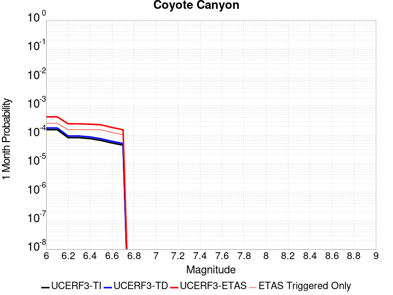 | 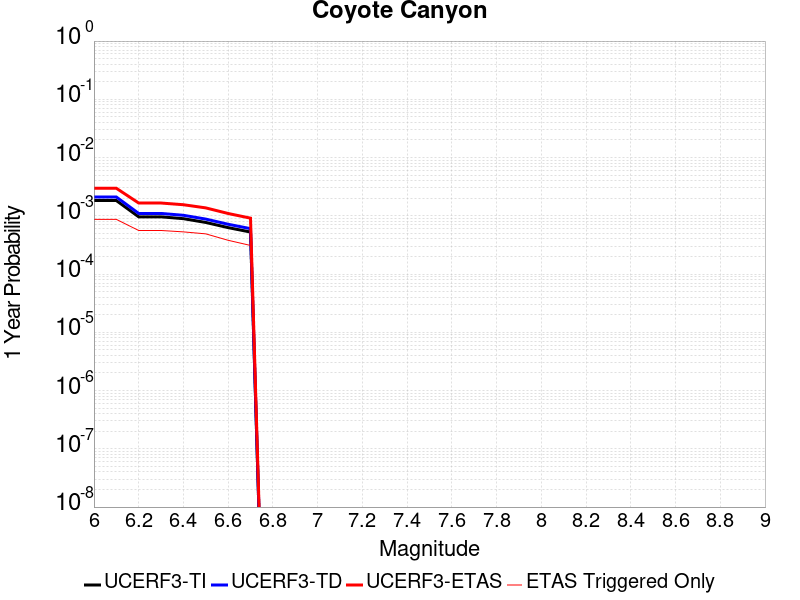 |  |

| Magnitude | 1 wk TI Prob | 1 wk TD Prob | 1 wk ETAS Prob | 1 wk ETAS/TD Gain | 1 wk ETAS Triggered Only | 1 mo TI Prob | 1 mo TD Prob | 1 mo ETAS Prob | 1 mo ETAS/TD Gain | 1 mo ETAS Triggered Only | 1 yr TI Prob | 1 yr TD Prob | 1 yr ETAS Prob | 1 yr ETAS/TD Gain | 1 yr ETAS Triggered Only | 10 yr TI Prob | 10 yr TD Prob | 10 yr ETAS Prob | 10 yr ETAS/TD Gain | 10 yr ETAS Triggered Only |
|-----|-----|-----|-----|-----|-----|-----|-----|-----|-----|-----|-----|-----|-----|-----|-----|-----|-----|-----|-----|-----|
| 6.0 | 3.5090034E-5 | 4.036512E-5 | 1.4036108E-4 | 3.4772863 | 1.0E-4 | 1.503772E-4 | 1.7298336E-4 | 4.2294012E-4 | 2.4449756 | 2.5E-4 | 0.0018293047 | 0.0021042954 | 0.0029724645 | 1.4125701 | 8.7E-4 | 0.018143194 | 0.020869616 | 0.022524348 | 1.079289 | 0.00169 |
| 6.1 | 3.5090034E-5 | 4.036512E-5 | 1.4036108E-4 | 3.4772863 | 1.0E-4 | 1.503772E-4 | 1.7298336E-4 | 4.2294012E-4 | 2.4449756 | 2.5E-4 | 0.0018293047 | 0.0021042954 | 0.0029724645 | 1.4125701 | 8.7E-4 | 0.018143194 | 0.020869616 | 0.022524348 | 1.079289 | 0.00169 |
| 6.2 | 1.841879E-5 | 2.1060194E-5 | 9.105872E-5 | 4.323736 | 7.0E-5 | 7.8935285E-5 | 9.0255424E-5 | 2.4024189E-4 | 2.6618 | 1.5E-4 | 9.606133E-4 | 0.0010984079 | 0.0016577928 | 1.5092688 | 5.6E-4 | 0.0095647145 | 0.010939875 | 0.011889373 | 1.0867923 | 9.6E-4 |
| 6.3 | 1.841879E-5 | 2.1060194E-5 | 9.105872E-5 | 4.323736 | 7.0E-5 | 7.8935285E-5 | 9.0255424E-5 | 2.4024189E-4 | 2.6618 | 1.5E-4 | 9.606133E-4 | 0.0010984079 | 0.0016577928 | 1.5092688 | 5.6E-4 | 0.0095647145 | 0.010939875 | 0.011889373 | 1.0867923 | 9.6E-4 |
| 6.4 | 1.712201E-5 | 1.9565581E-5 | 8.9564215E-5 | 4.577641 | 7.0E-5 | 7.337798E-5 | 8.385037E-5 | 2.3383778E-4 | 2.788751 | 1.5E-4 | 8.930107E-4 | 0.0010205007 | 0.0015499598 | 1.5188229 | 5.3E-4 | 0.008894307 | 0.0101680625 | 0.011058912 | 1.0876124 | 9.0E-4 |
| 6.5 | 1.4744935E-5 | 1.6837288E-5 | 8.683611E-5 | 5.157369 | 7.0E-5 | 6.3191044E-5 | 7.215834E-5 | 2.2214752E-4 | 3.0786119 | 1.5E-4 | 7.6907943E-4 | 8.782672E-4 | 0.0013678368 | 1.5574268 | 4.9E-4 | 0.007664232 | 0.008757159 | 0.00957989 | 1.0939496 | 8.3E-4 |
| 6.6 | 1.2017839E-5 | 1.3724348E-5 | 5.3723797E-5 | 3.9144883 | 4.0E-5 | 5.150401E-5 | 5.8817805E-5 | 1.7881075E-4 | 3.0400784 | 1.2E-4 | 6.268809E-4 | 7.159601E-4 | 0.001095688 | 1.5303758 | 3.8E-4 | 0.0062511545 | 0.0071452283 | 0.007810441 | 1.0930989 | 6.7E-4 |
| 6.7 | 1.00956095E-5 | 1.1533734E-5 | 5.1533272E-5 | 4.4680476 | 4.0E-5 | 4.326618E-5 | 4.9429844E-5 | 1.494249E-4 | 3.0229692 | 1.0E-4 | 5.266384E-4 | 6.0172915E-4 | 9.115426E-4 | 1.514872 | 3.1E-4 | 0.005253921 | 0.006009526 | 0.0065761004 | 1.0942794 | 5.7E-4 |

## San Andreas (Mojave S)
*[(top)](#table-of-contents)*

| 1 Week | 1 Month | 1 Year | 10 Year |
|-----|-----|-----|-----|
|  |  |  |  |

| Magnitude | 1 wk TI Prob | 1 wk TD Prob | 1 wk ETAS Prob | 1 wk ETAS/TD Gain | 1 wk ETAS Triggered Only | 1 mo TI Prob | 1 mo TD Prob | 1 mo ETAS Prob | 1 mo ETAS/TD Gain | 1 mo ETAS Triggered Only | 1 yr TI Prob | 1 yr TD Prob | 1 yr ETAS Prob | 1 yr ETAS/TD Gain | 1 yr ETAS Triggered Only | 10 yr TI Prob | 10 yr TD Prob | 10 yr ETAS Prob | 10 yr ETAS/TD Gain | 10 yr ETAS Triggered Only |
|-----|-----|-----|-----|-----|-----|-----|-----|-----|-----|-----|-----|-----|-----|-----|-----|-----|-----|-----|-----|-----|
| 6.0 | 3.1064058E-4 | 6.7471585E-4 | 7.546619E-4 | 1.1184884 | 8.0E-5 | 0.0013306376 | 0.0028885633 | 0.0031677545 | 1.096654 | 2.8E-4 | 0.016080605 | 0.03457021 | 0.035323244 | 1.0217828 | 7.8E-4 | 0.1496549 | 0.2866514 | 0.2876501 | 1.003484 | 0.0014 |
| 6.1 | 3.1064058E-4 | 6.7471585E-4 | 7.546619E-4 | 1.1184884 | 8.0E-5 | 0.0013306376 | 0.0028885633 | 0.0031677545 | 1.096654 | 2.8E-4 | 0.016080605 | 0.03457021 | 0.035323244 | 1.0217828 | 7.8E-4 | 0.1496549 | 0.2866514 | 0.2876501 | 1.003484 | 0.0014 |
| 6.2 | 3.1064058E-4 | 6.7471585E-4 | 7.546619E-4 | 1.1184884 | 8.0E-5 | 0.0013306376 | 0.0028885633 | 0.0031677545 | 1.096654 | 2.8E-4 | 0.016080605 | 0.03457021 | 0.035323244 | 1.0217828 | 7.8E-4 | 0.1496549 | 0.2866514 | 0.2876501 | 1.003484 | 0.0014 |
| 6.3 | 3.1064058E-4 | 6.7471585E-4 | 7.546619E-4 | 1.1184884 | 8.0E-5 | 0.0013306376 | 0.0028885633 | 0.0031677545 | 1.096654 | 2.8E-4 | 0.016080605 | 0.03457021 | 0.035323244 | 1.0217828 | 7.8E-4 | 0.1496549 | 0.2866514 | 0.2876501 | 1.003484 | 0.0014 |
| 6.4 | 1.9872203E-4 | 4.31896E-4 | 4.918701E-4 | 1.1388624 | 6.0E-5 | 8.5138786E-4 | 0.0018496981 | 0.0021092172 | 1.1403035 | 2.6E-4 | 0.010316478 | 0.02229367 | 0.02298784 | 1.0311376 | 7.1E-4 | 0.098504856 | 0.19705607 | 0.19806778 | 1.0051341 | 0.00126 |
| 6.5 | 1.291105E-4 | 2.8762486E-4 | 3.4760762E-4 | 1.2085451 | 6.0E-5 | 5.5321335E-4 | 0.0012320984 | 0.0014618151 | 1.1864434 | 2.3E-4 | 0.006714592 | 0.014898448 | 0.01549936 | 1.0403339 | 6.1E-4 | 0.065152965 | 0.138118 | 0.13902298 | 1.0065522 | 0.00105 |
| 6.6 | 1.291105E-4 | 2.8762486E-4 | 3.4760762E-4 | 1.2085451 | 6.0E-5 | 5.5321335E-4 | 0.0012320984 | 0.0014618151 | 1.1864434 | 2.3E-4 | 0.006714592 | 0.014898448 | 0.01549936 | 1.0403339 | 6.1E-4 | 0.065152965 | 0.138118 | 0.13902298 | 1.0065522 | 0.00105 |
| 6.7 | 1.08001186E-4 | 2.4343564E-4 | 3.0342102E-4 | 1.2464117 | 6.0E-5 | 4.6278012E-4 | 0.0010428791 | 0.0012426705 | 1.1915768 | 2.0E-4 | 0.0056198016 | 0.012623432 | 0.013176363 | 1.0438019 | 5.6E-4 | 0.054797906 | 0.119228184 | 0.120108955 | 1.0073873 | 0.001 |
| 6.8 | 1.0624356E-4 | 2.3861213E-4 | 2.9859782E-4 | 1.2513942 | 6.0E-5 | 4.5525006E-4 | 0.0010222232 | 0.0012220187 | 1.195452 | 2.0E-4 | 0.0055285925 | 0.012374822 | 0.012927892 | 1.0446932 | 5.6E-4 | 0.053930566 | 0.117172524 | 0.11805535 | 1.0075344 | 0.001 |
| 6.9 | 1.0393785E-4 | 2.3231508E-4 | 2.9230115E-4 | 1.25821 | 6.0E-5 | 4.4537184E-4 | 9.952566E-4 | 0.0011950575 | 1.2007532 | 2.0E-4 | 0.0054089287 | 0.012050176 | 0.012603428 | 1.0459124 | 5.6E-4 | 0.05279156 | 0.11446828 | 0.11535381 | 1.0077361 | 0.001 |
| 7.0 | 1.0155622E-4 | 2.2601044E-4 | 2.8599688E-4 | 1.2654145 | 6.0E-5 | 4.3516833E-4 | 9.68257E-4 | 0.0011680634 | 1.2063568 | 2.0E-4 | 0.005285311 | 0.011725035 | 0.012278469 | 1.047201 | 5.6E-4 | 0.05161361 | 0.11172433 | 0.11261261 | 1.0079505 | 0.001 |
| 7.1 | 9.885595E-5 | 2.188942E-4 | 2.7888105E-4 | 1.274045 | 6.0E-5 | 4.2359953E-4 | 9.3778106E-4 | 0.0011375935 | 1.2130694 | 2.0E-4 | 0.0051451353 | 0.011357912 | 0.0119115515 | 1.0487448 | 5.6E-4 | 0.05027629 | 0.108605 | 0.10949639 | 1.0082077 | 0.001 |
| 7.2 | 9.6411415E-5 | 2.1252372E-4 | 2.7251095E-4 | 1.2822615 | 6.0E-5 | 4.1312634E-4 | 9.104983E-4 | 0.0011103163 | 1.2194599 | 2.0E-4 | 0.005018219 | 0.011029154 | 0.011582978 | 1.0502145 | 5.6E-4 | 0.049064007 | 0.10579592 | 0.106672235 | 1.0082831 | 9.8E-4 |
| 7.3 | 9.1180635E-5 | 1.9480525E-4 | 2.5479356E-4 | 1.3079399 | 6.0E-5 | 3.907156E-4 | 8.3461264E-4 | 0.0010344457 | 1.2394321 | 2.0E-4 | 0.004746591 | 0.010114178 | 0.010668513 | 1.0548078 | 5.6E-4 | 0.046464786 | 0.09798997 | 0.098873936 | 1.009021 | 9.8E-4 |
| 7.4 | 8.887388E-5 | 1.8729005E-4 | 2.472788E-4 | 1.3202987 | 6.0E-5 | 3.8083247E-4 | 8.024248E-4 | 0.0010022643 | 1.2490445 | 2.0E-4 | 0.0046267817 | 0.0097258575 | 0.010270508 | 1.0560002 | 5.5E-4 | 0.045316286 | 0.0946256 | 0.095494755 | 1.0091852 | 9.6E-4 |
| 7.5 | 8.6750515E-5 | 1.8060463E-4 | 2.405938E-4 | 1.3321574 | 6.0E-5 | 3.7173493E-4 | 7.7379035E-4 | 9.736356E-4 | 1.258268 | 2.0E-4 | 0.004516484 | 0.009380288 | 0.009915223 | 1.0570276 | 5.4E-4 | 0.04425787 | 0.09158909 | 0.09245209 | 1.0094224 | 9.5E-4 |
| 7.6 | 8.453092E-5 | 1.7447997E-4 | 2.344695E-4 | 1.343819 | 6.0E-5 | 3.6222505E-4 | 7.4755703E-4 | 9.474075E-4 | 1.2673382 | 2.0E-4 | 0.0044011753 | 0.0090636 | 0.009598705 | 1.059039 | 5.4E-4 | 0.04315024 | 0.08874676 | 0.08959422 | 1.0095493 | 9.3E-4 |
| 7.7 | 8.259102E-5 | 1.6970029E-4 | 2.2969011E-4 | 1.3535045 | 6.0E-5 | 3.539135E-4 | 7.270843E-4 | 9.269389E-4 | 1.2748712 | 2.0E-4 | 0.004300386 | 0.008816389 | 0.009351629 | 1.0607096 | 5.4E-4 | 0.042181134 | 0.08649703 | 0.08734659 | 1.0098218 | 9.3E-4 |
| 7.8 | 7.444844E-5 | 1.5291499E-4 | 2.0290735E-4 | 1.3269291 | 5.0E-5 | 3.1902574E-4 | 6.5518543E-4 | 8.350675E-4 | 1.2745514 | 1.8E-4 | 0.0038772223 | 0.007947756 | 0.00839418 | 1.0561697 | 4.5E-4 | 0.03810269 | 0.078325555 | 0.07904446 | 1.0091784 | 7.8E-4 |
| 7.9 | 5.2586525E-5 | 1.0011774E-4 | 1.10116736E-4 | 1.0998724 | 1.0E-5 | 2.2535135E-4 | 4.2900548E-4 | 5.0897116E-4 | 1.1863978 | 8.0E-5 | 0.0027402006 | 0.005210644 | 0.0054394454 | 1.0439104 | 2.3E-4 | 0.027066574 | 0.052224807 | 0.05263235 | 1.0078037 | 4.3E-4 |
| 8.0 | 3.379877E-5 | 5.4103475E-5 | 5.4103475E-5 | 1.0 | 0.0 | 1.4484383E-4 | 2.3185145E-4 | 2.6184449E-4 | 1.1293632 | 3.0E-5 | 0.0017620471 | 0.002819139 | 0.002868998 | 1.0176859 | 5.0E-5 | 0.017481409 | 0.028849052 | 0.028985012 | 1.0047128 | 1.4E-4 |
| 8.1 | 1.8668277E-5 | 1.9321345E-5 | 1.9321345E-5 | 1.0 | 0.0 | 8.000444E-5 | 8.280314E-5 | 8.280314E-5 | 1.0 | 0.0 | 9.736188E-4 | 0.0010076626 | 0.0010076626 | 1.0 | 0.0 | 0.009693642 | 0.010805132 | 0.0108348075 | 1.0027465 | 3.0E-5 |
| 8.2 | 8.541571E-6 | 5.4646152E-6 | 5.4646152E-6 | 1.0 | 0.0 | 3.660622E-5 | 2.341957E-5 | 2.341957E-5 | 1.0 | 0.0 | 4.455896E-4 | 2.8509603E-4 | 2.8509603E-4 | 1.0 | 0.0 | 0.0044469717 | 0.0032429425 | 0.0032429425 | 1.0 | 0.0 |
| 8.3 | 1.983087E-6 | 7.6647797E-7 | 7.6647797E-7 | 1.0 | 0.0 | 8.498917E-6 | 3.2849016E-6 | 3.2849016E-6 | 1.0 | 0.0 | 1.034694E-4 | 3.999296E-5 | 3.999296E-5 | 1.0 | 0.0 | 0.0010342124 | 4.7228087E-4 | 4.7228087E-4 | 1.0 | 0.0 |

## Lenwood-Lockhart-Old Woman Springs
*[(top)](#table-of-contents)*

| 1 Week | 1 Month | 1 Year | 10 Year |
|-----|-----|-----|-----|
|  |  |  |  |

| Magnitude | 1 wk TI Prob | 1 wk TD Prob | 1 wk ETAS Prob | 1 wk ETAS/TD Gain | 1 wk ETAS Triggered Only | 1 mo TI Prob | 1 mo TD Prob | 1 mo ETAS Prob | 1 mo ETAS/TD Gain | 1 mo ETAS Triggered Only | 1 yr TI Prob | 1 yr TD Prob | 1 yr ETAS Prob | 1 yr ETAS/TD Gain | 1 yr ETAS Triggered Only | 10 yr TI Prob | 10 yr TD Prob | 10 yr ETAS Prob | 10 yr ETAS/TD Gain | 10 yr ETAS Triggered Only |
|-----|-----|-----|-----|-----|-----|-----|-----|-----|-----|-----|-----|-----|-----|-----|-----|-----|-----|-----|-----|-----|
| 6.0 | 3.744542E-5 | 4.3963868E-5 | 1.5395903E-4 | 3.5019448 | 1.1E-4 | 1.604705E-4 | 1.8840394E-4 | 4.183606E-4 | 2.2205513 | 2.3E-4 | 0.0019519776 | 0.002291577 | 0.00299995 | 1.3091203 | 7.1E-4 | 0.019349206 | 0.022697475 | 0.024114564 | 1.0624337 | 0.00145 |
| 6.1 | 3.744542E-5 | 4.3963868E-5 | 1.5395903E-4 | 3.5019448 | 1.1E-4 | 1.604705E-4 | 1.8840394E-4 | 4.183606E-4 | 2.2205513 | 2.3E-4 | 0.0019519776 | 0.002291577 | 0.00299995 | 1.3091203 | 7.1E-4 | 0.019349206 | 0.022697475 | 0.024114564 | 1.0624337 | 0.00145 |
| 6.2 | 3.744542E-5 | 4.3963868E-5 | 1.5395903E-4 | 3.5019448 | 1.1E-4 | 1.604705E-4 | 1.8840394E-4 | 4.183606E-4 | 2.2205513 | 2.3E-4 | 0.0019519776 | 0.002291577 | 0.00299995 | 1.3091203 | 7.1E-4 | 0.019349206 | 0.022697475 | 0.024114564 | 1.0624337 | 0.00145 |
| 6.3 | 2.1079984E-5 | 2.5354482E-5 | 8.5352964E-5 | 3.3663855 | 6.0E-5 | 9.0339665E-5 | 1.0865765E-4 | 2.4864243E-4 | 2.2883103 | 1.4E-4 | 0.0010993304 | 0.0013221242 | 0.0016317143 | 1.2341611 | 3.1E-4 | 0.010939079 | 0.013144798 | 0.013825728 | 1.0518023 | 6.9E-4 |
| 6.4 | 2.1079984E-5 | 2.5354482E-5 | 8.5352964E-5 | 3.3663855 | 6.0E-5 | 9.0339665E-5 | 1.0865765E-4 | 2.4864243E-4 | 2.2883103 | 1.4E-4 | 0.0010993304 | 0.0013221242 | 0.0016317143 | 1.2341611 | 3.1E-4 | 0.010939079 | 0.013144798 | 0.013825728 | 1.0518023 | 6.9E-4 |
| 6.5 | 1.7397282E-5 | 2.0663358E-5 | 7.0662325E-5 | 3.4196923 | 5.0E-5 | 7.455765E-5 | 8.855431E-5 | 2.0854369E-4 | 2.3549807 | 1.2E-4 | 9.073613E-4 | 0.0010776272 | 0.0013173686 | 1.2224715 | 2.4E-4 | 0.009036654 | 0.010725311 | 0.011239734 | 1.0479635 | 5.2E-4 |
| 6.6 | 1.52050325E-5 | 1.7680148E-5 | 4.7679616E-5 | 2.6967883 | 3.0E-5 | 6.51628E-5 | 7.57699E-5 | 1.7576232E-4 | 2.3196852 | 1.0E-4 | 7.9306826E-4 | 9.2211604E-4 | 0.0011419132 | 1.2383617 | 2.2E-4 | 0.007902439 | 0.009183761 | 0.009649444 | 1.0507073 | 4.7E-4 |
| 6.7 | 1.332523E-5 | 1.5264432E-5 | 4.5263976E-5 | 2.9653232 | 3.0E-5 | 5.7106878E-5 | 6.5417385E-5 | 1.554115E-4 | 2.375691 | 9.0E-5 | 6.950544E-4 | 7.961715E-4 | 9.860202E-4 | 1.2384521 | 1.9E-4 | 0.006928845 | 0.0079338215 | 0.008330648 | 1.0500171 | 4.0E-4 |
| 6.8 | 1.1525329E-5 | 1.3031408E-5 | 3.303115E-5 | 2.5347335 | 2.0E-5 | 4.9393333E-5 | 5.584772E-5 | 1.1584437E-4 | 2.07429 | 6.0E-5 | 6.011979E-4 | 6.797381E-4 | 8.1964297E-4 | 1.2058216 | 1.4E-4 | 0.00599574 | 0.0067770416 | 0.0070849406 | 1.0454327 | 3.1E-4 |
| 6.9 | 1.0253909E-5 | 1.15148705E-5 | 3.151464E-5 | 2.7368643 | 2.0E-5 | 4.3944583E-5 | 4.9348535E-5 | 1.0934557E-4 | 2.2157817 | 6.0E-5 | 5.3489394E-4 | 6.006564E-4 | 7.1059034E-4 | 1.183023 | 1.1E-4 | 0.0053360825 | 0.0059907082 | 0.0062392107 | 1.0414813 | 2.5E-4 |
| 7.0 | 8.104563E-6 | 8.9914565E-6 | 1.8991366E-5 | 2.1121569 | 1.0E-5 | 3.4733377E-5 | 3.8534257E-5 | 6.85331E-5 | 1.778498 | 3.0E-5 | 4.2279682E-4 | 4.69056E-4 | 5.2902784E-4 | 1.1278565 | 6.0E-5 | 0.0042199334 | 0.004680908 | 0.004840159 | 1.0340214 | 1.6E-4 |
| 7.1 | 6.7986157E-6 | 7.5159987E-6 | 1.7515924E-5 | 2.330485 | 1.0E-5 | 2.91366E-5 | 3.221104E-5 | 4.2210715E-5 | 1.3104426 | 1.0E-5 | 3.5468035E-4 | 3.9210095E-4 | 4.1209313E-4 | 1.0509872 | 2.0E-5 | 0.003541148 | 0.003914308 | 0.004023877 | 1.027992 | 1.1E-4 |
| 7.2 | 5.6893327E-6 | 6.2801455E-6 | 1.6280082E-5 | 2.5923097 | 1.0E-5 | 2.4382627E-5 | 2.6914644E-5 | 3.6914375E-5 | 1.371535 | 1.0E-5 | 2.9681803E-4 | 3.276385E-4 | 3.4763195E-4 | 1.0610229 | 2.0E-5 | 0.002964219 | 0.0032717532 | 0.0033813934 | 1.0335112 | 1.1E-4 |
| 7.3 | 4.253348E-6 | 4.707082E-6 | 1.4707035E-5 | 3.1244483 | 1.0E-5 | 1.8228506E-5 | 2.0173064E-5 | 3.0172861E-5 | 1.4957005 | 1.0E-5 | 2.2190946E-4 | 2.455812E-4 | 2.655763E-4 | 1.0814195 | 2.0E-5 | 0.00221688 | 0.0024532792 | 0.0025530339 | 1.0406618 | 1.0E-4 |
| 7.4 | 2.5448119E-6 | 2.8520615E-6 | 1.2852033E-5 | 4.5062256 | 1.0E-5 | 1.0906291E-5 | 1.2223072E-5 | 2.222295E-5 | 1.8181149 | 1.0E-5 | 1.3277601E-4 | 1.488074E-4 | 1.5880591E-4 | 1.067191 | 1.0E-5 | 0.001326967 | 0.0014872397 | 0.0015571356 | 1.0469971 | 7.0E-5 |
| 7.5 | 4.3706837E-8 | 4.5629356E-8 | 4.5629356E-8 | 1.0 | 0.0 | 1.8731501E-7 | 1.9555438E-7 | 1.9555438E-7 | 1.0 | 0.0 | 2.2805577E-6 | 2.3808725E-6 | 2.3808725E-6 | 1.0 | 0.0 | 2.2805343E-5 | 2.3808525E-5 | 2.3808525E-5 | 1.0 | 0.0 |

## Nelson Lake
*[(top)](#table-of-contents)*

| 1 Week | 1 Month | 1 Year | 10 Year |
|-----|-----|-----|-----|
|  |  |  |  |

| Magnitude | 1 wk TI Prob | 1 wk TD Prob | 1 wk ETAS Prob | 1 wk ETAS/TD Gain | 1 wk ETAS Triggered Only | 1 mo TI Prob | 1 mo TD Prob | 1 mo ETAS Prob | 1 mo ETAS/TD Gain | 1 mo ETAS Triggered Only | 1 yr TI Prob | 1 yr TD Prob | 1 yr ETAS Prob | 1 yr ETAS/TD Gain | 1 yr ETAS Triggered Only | 10 yr TI Prob | 10 yr TD Prob | 10 yr ETAS Prob | 10 yr ETAS/TD Gain | 10 yr ETAS Triggered Only |
|-----|-----|-----|-----|-----|-----|-----|-----|-----|-----|-----|-----|-----|-----|-----|-----|-----|-----|-----|-----|-----|
| 6.0 | 9.913453E-6 | 1.0192293E-5 | 5.0191884E-5 | 4.924494 | 4.0E-5 | 4.2485535E-5 | 4.3680586E-5 | 1.8367446E-4 | 4.204945 | 1.4E-4 | 5.1713863E-4 | 5.316917E-4 | 0.0010714045 | 2.0150862 | 5.4E-4 | 0.0051593683 | 0.0053052236 | 0.006568486 | 1.2381167 | 0.00127 |
| 6.1 | 9.913453E-6 | 1.0192293E-5 | 5.0191884E-5 | 4.924494 | 4.0E-5 | 4.2485535E-5 | 4.3680586E-5 | 1.8367446E-4 | 4.204945 | 1.4E-4 | 5.1713863E-4 | 5.316917E-4 | 0.0010714045 | 2.0150862 | 5.4E-4 | 0.0051593683 | 0.0053052236 | 0.006568486 | 1.2381167 | 0.00127 |
| 6.2 | 4.5596407E-6 | 4.696332E-6 | 2.4696237E-5 | 5.258623 | 2.0E-5 | 1.954117E-5 | 2.0126989E-5 | 1.1012518E-4 | 5.471518 | 9.0E-5 | 2.3788778E-4 | 2.450198E-4 | 4.84961E-4 | 1.9792727 | 2.4E-4 | 0.0023763329 | 0.0024476226 | 0.003006252 | 1.2282335 | 5.6E-4 |
| 6.3 | 4.5596407E-6 | 4.696332E-6 | 2.4696237E-5 | 5.258623 | 2.0E-5 | 1.954117E-5 | 2.0126989E-5 | 1.1012518E-4 | 5.471518 | 9.0E-5 | 2.3788778E-4 | 2.450198E-4 | 4.84961E-4 | 1.9792727 | 2.4E-4 | 0.0023763329 | 0.0024476226 | 0.003006252 | 1.2282335 | 5.6E-4 |
| 6.4 | 3.4025713E-6 | 3.509912E-6 | 2.3509841E-5 | 6.6981287 | 2.0E-5 | 1.4582367E-5 | 1.50423975E-5 | 7.50415E-5 | 4.9886656 | 6.0E-5 | 1.7752586E-4 | 1.8312664E-4 | 3.7309184E-4 | 2.0373433 | 1.9E-4 | 0.001773841 | 0.0018298404 | 0.0022690352 | 1.2400181 | 4.4E-4 |
| 6.5 | 2.8352947E-6 | 2.9278688E-6 | 2.292781E-5 | 7.8308873 | 2.0E-5 | 1.2151207E-5 | 1.2547953E-5 | 5.254745E-5 | 4.187731 | 4.0E-5 | 1.479309E-4 | 1.5276136E-4 | 2.9273998E-4 | 1.9163221 | 1.4E-4 | 0.0014783246 | 0.0015266375 | 0.0018761031 | 1.228912 | 3.5E-4 |
| 6.6 | 2.251518E-6 | 2.3290781E-6 | 2.2329032E-5 | 9.587069 | 2.0E-5 | 9.649328E-6 | 9.981729E-6 | 4.998133E-5 | 5.007282 | 4.0E-5 | 1.1747423E-4 | 1.2152141E-4 | 2.4150682E-4 | 1.9873604 | 1.2E-4 | 0.0011741214 | 0.0012146112 | 0.0015142469 | 1.2466927 | 3.0E-4 |
| 6.7 | 1.8911853E-6 | 1.9591491E-6 | 2.195911E-5 | 11.208494 | 2.0E-5 | 8.105055E-6 | 8.39633E-6 | 4.8395992E-5 | 5.7639465 | 4.0E-5 | 9.867457E-5 | 1.022211E-4 | 2.0221088E-4 | 1.9781716 | 1.0E-4 | 9.863076E-4 | 0.0010217984 | 0.0012715429 | 1.2444167 | 2.5E-4 |
| 6.8 | 1.4874814E-6 | 1.5438383E-6 | 2.1543807E-5 | 13.954705 | 2.0E-5 | 6.374905E-6 | 6.6164357E-6 | 3.661624E-5 | 5.5341334 | 3.0E-5 | 7.76117E-5 | 8.055265E-5 | 1.605462E-4 | 1.9930593 | 8.0E-5 | 7.75846E-4 | 8.052856E-4 | 0.0010251084 | 1.272975 | 2.2E-4 |
| 6.9 | 6.835972E-7 | 7.1399705E-7 | 7.1399705E-7 | 1.0 | 0.0 | 2.9296991E-6 | 3.0599856E-6 | 3.0599856E-6 | 1.0 | 0.0 | 3.56685E-5 | 3.7255006E-5 | 5.725426E-5 | 1.5368207 | 2.0E-5 | 3.5662777E-4 | 3.7251884E-4 | 4.4249278E-4 | 1.18784 | 7.0E-5 |

## San Andreas (Mojave N)
*[(top)](#table-of-contents)*

| 1 Week | 1 Month | 1 Year | 10 Year |
|-----|-----|-----|-----|
|  |  |  |  |

| Magnitude | 1 wk TI Prob | 1 wk TD Prob | 1 wk ETAS Prob | 1 wk ETAS/TD Gain | 1 wk ETAS Triggered Only | 1 mo TI Prob | 1 mo TD Prob | 1 mo ETAS Prob | 1 mo ETAS/TD Gain | 1 mo ETAS Triggered Only | 1 yr TI Prob | 1 yr TD Prob | 1 yr ETAS Prob | 1 yr ETAS/TD Gain | 1 yr ETAS Triggered Only | 10 yr TI Prob | 10 yr TD Prob | 10 yr ETAS Prob | 10 yr ETAS/TD Gain | 10 yr ETAS Triggered Only |
|-----|-----|-----|-----|-----|-----|-----|-----|-----|-----|-----|-----|-----|-----|-----|-----|-----|-----|-----|-----|-----|
| 6.0 | 9.877682E-5 | 1.9410432E-4 | 2.740888E-4 | 1.4120696 | 8.0E-5 | 4.2326056E-4 | 8.3161064E-4 | 0.0011313611 | 1.3604457 | 3.0E-4 | 0.0051410277 | 0.010077983 | 0.010840222 | 1.0756341 | 7.7E-4 | 0.05023708 | 0.098361015 | 0.09951511 | 1.0117333 | 0.00128 |
| 6.1 | 9.877682E-5 | 1.9410432E-4 | 2.740888E-4 | 1.4120696 | 8.0E-5 | 4.2326056E-4 | 8.3161064E-4 | 0.0011313611 | 1.3604457 | 3.0E-4 | 0.0051410277 | 0.010077983 | 0.010840222 | 1.0756341 | 7.7E-4 | 0.05023708 | 0.098361015 | 0.09951511 | 1.0117333 | 0.00128 |
| 6.2 | 9.877682E-5 | 1.9410432E-4 | 2.740888E-4 | 1.4120696 | 8.0E-5 | 4.2326056E-4 | 8.3161064E-4 | 0.0011313611 | 1.3604457 | 3.0E-4 | 0.0051410277 | 0.010077983 | 0.010840222 | 1.0756341 | 7.7E-4 | 0.05023708 | 0.098361015 | 0.09951511 | 1.0117333 | 0.00128 |
| 6.3 | 9.877682E-5 | 1.9410432E-4 | 2.740888E-4 | 1.4120696 | 8.0E-5 | 4.2326056E-4 | 8.3161064E-4 | 0.0011313611 | 1.3604457 | 3.0E-4 | 0.0051410277 | 0.010077983 | 0.010840222 | 1.0756341 | 7.7E-4 | 0.05023708 | 0.098361015 | 0.09951511 | 1.0117333 | 0.00128 |
| 6.4 | 9.877682E-5 | 1.9410432E-4 | 2.740888E-4 | 1.4120696 | 8.0E-5 | 4.2326056E-4 | 8.3161064E-4 | 0.0011313611 | 1.3604457 | 3.0E-4 | 0.0051410277 | 0.010077983 | 0.010840222 | 1.0756341 | 7.7E-4 | 0.05023708 | 0.098361015 | 0.09951511 | 1.0117333 | 0.00128 |
| 6.5 | 9.861474E-5 | 1.9384196E-4 | 2.7382644E-4 | 1.4126273 | 8.0E-5 | 4.2256617E-4 | 8.3048694E-4 | 0.0011302378 | 1.3609339 | 3.0E-4 | 0.0051326132 | 0.010064429 | 0.010826679 | 1.0757371 | 7.7E-4 | 0.050156746 | 0.09823856 | 0.09939282 | 1.0117495 | 0.00128 |
| 6.6 | 9.861474E-5 | 1.9384196E-4 | 2.7382644E-4 | 1.4126273 | 8.0E-5 | 4.2256617E-4 | 8.3048694E-4 | 0.0011302378 | 1.3609339 | 3.0E-4 | 0.0051326132 | 0.010064429 | 0.010826679 | 1.0757371 | 7.7E-4 | 0.050156746 | 0.09823856 | 0.09939282 | 1.0117495 | 0.00128 |
| 6.7 | 9.8552715E-5 | 1.9374148E-4 | 2.7372598E-4 | 1.4128413 | 8.0E-5 | 4.223004E-4 | 8.300566E-4 | 0.0011298076 | 1.3611212 | 3.0E-4 | 0.0051293927 | 0.0100592375 | 0.0108214915 | 1.0757766 | 7.7E-4 | 0.050125998 | 0.098191775 | 0.09934609 | 1.0117557 | 0.00128 |
| 6.8 | 9.8464974E-5 | 1.9359306E-4 | 2.7357758E-4 | 1.4131579 | 8.0E-5 | 4.219245E-4 | 8.294209E-4 | 0.0011291722 | 1.3613981 | 3.0E-4 | 0.0051248376 | 0.01005157 | 0.01081383 | 1.075835 | 7.7E-4 | 0.05008251 | 0.09812213 | 0.09927653 | 1.011765 | 0.00128 |
| 6.9 | 9.825824E-5 | 1.9327311E-4 | 2.7325764E-4 | 1.4138421 | 8.0E-5 | 4.2103877E-4 | 8.2805054E-4 | 0.0011278022 | 1.3619968 | 3.0E-4 | 0.0051141046 | 0.010035039 | 0.010797312 | 1.0759611 | 7.7E-4 | 0.049980022 | 0.09797137 | 0.09912597 | 1.011785 | 0.00128 |
| 7.0 | 9.781462E-5 | 1.9258665E-4 | 2.7257125E-4 | 1.4153174 | 8.0E-5 | 4.1913814E-4 | 8.251105E-4 | 0.0011248629 | 1.3632877 | 3.0E-4 | 0.005091073 | 0.009999573 | 0.010761873 | 1.0762333 | 7.7E-4 | 0.04976007 | 0.09764758 | 0.09880259 | 1.0118284 | 0.00128 |
| 7.1 | 9.7121134E-5 | 1.9160361E-4 | 2.715883E-4 | 1.4174486 | 8.0E-5 | 4.1616702E-4 | 8.2090014E-4 | 0.0011206538 | 1.3651525 | 3.0E-4 | 0.005055068 | 0.009948781 | 0.01071112 | 1.0766264 | 7.7E-4 | 0.04941613 | 0.09718397 | 0.09833957 | 1.0118909 | 0.00128 |
| 7.2 | 9.663819E-5 | 1.9091136E-4 | 2.708961E-4 | 1.4189626 | 8.0E-5 | 4.1409794E-4 | 8.179352E-4 | 0.0011176898 | 1.3664773 | 3.0E-4 | 0.0050299936 | 0.009913012 | 0.010675379 | 1.0769057 | 7.7E-4 | 0.049176537 | 0.09685706 | 0.09801309 | 1.0119354 | 0.00128 |
| 7.3 | 9.6277574E-5 | 1.9043636E-4 | 2.7042112E-4 | 1.4200078 | 8.0E-5 | 4.125529E-4 | 8.1590074E-4 | 0.001115656 | 1.3673918 | 3.0E-4 | 0.0050112694 | 0.009888468 | 0.010650854 | 1.0770985 | 7.7E-4 | 0.04899759 | 0.09663044 | 0.097786754 | 1.0119663 | 0.00128 |
| 7.4 | 9.593308E-5 | 1.8983395E-4 | 2.6981876E-4 | 1.421341 | 8.0E-5 | 4.1107697E-4 | 8.133206E-4 | 0.0011130766 | 1.3685583 | 3.0E-4 | 0.0049933824 | 0.00985734 | 0.010619749 | 1.0773444 | 7.7E-4 | 0.04882661 | 0.09634874 | 0.09750541 | 1.0120051 | 0.00128 |
| 7.5 | 9.561707E-5 | 1.892946E-4 | 2.6927947E-4 | 1.4225416 | 8.0E-5 | 4.0972308E-4 | 8.1101054E-4 | 0.0011107672 | 1.3696089 | 3.0E-4 | 0.0049769743 | 0.009829468 | 0.010581998 | 1.0765585 | 7.6E-4 | 0.048669744 | 0.09609495 | 0.097242914 | 1.0119461 | 0.00127 |
| 7.6 | 9.418194E-5 | 1.858169E-4 | 2.6580205E-4 | 1.4304514 | 8.0E-5 | 4.0357444E-4 | 7.961153E-4 | 0.0010958764 | 1.3765298 | 3.0E-4 | 0.004902454 | 0.009649739 | 0.010402405 | 1.0779986 | 7.6E-4 | 0.047957025 | 0.094475985 | 0.09560789 | 1.0119809 | 0.00125 |
| 7.7 | 8.202141E-5 | 1.6029968E-4 | 2.3028847E-4 | 1.4366121 | 7.0E-5 | 3.51473E-4 | 6.868178E-4 | 9.766186E-4 | 1.4219471 | 2.9E-4 | 0.00427079 | 0.008330002 | 0.009014255 | 1.0821431 | 6.9E-4 | 0.04189639 | 0.08226986 | 0.08332525 | 1.0128284 | 0.00115 |
| 7.8 | 7.2859846E-5 | 1.452426E-4 | 1.9523533E-4 | 1.3442017 | 5.0E-5 | 3.1221908E-4 | 6.223198E-4 | 8.022078E-4 | 1.2890604 | 1.8E-4 | 0.003794643 | 0.007550463 | 0.007997065 | 1.059149 | 4.5E-4 | 0.037304975 | 0.074759446 | 0.07548113 | 1.0096534 | 7.8E-4 |
| 7.9 | 5.3874453E-5 | 1.0051061E-4 | 1.105096E-4 | 1.0994819 | 1.0E-5 | 2.3087008E-4 | 4.3068864E-4 | 5.106542E-4 | 1.1856691 | 8.0E-5 | 0.0028072202 | 0.005231038 | 0.0054598353 | 1.0437384 | 2.3E-4 | 0.02772022 | 0.052449387 | 0.052856833 | 1.0077684 | 4.3E-4 |
| 8.0 | 3.468538E-5 | 5.4289703E-5 | 5.4289703E-5 | 1.0 | 0.0 | 1.4864317E-4 | 2.3264941E-4 | 2.6264242E-4 | 1.1289194 | 3.0E-5 | 0.0018082283 | 0.0028288292 | 0.0028786878 | 1.0176252 | 5.0E-5 | 0.017935853 | 0.028961731 | 0.029097676 | 1.004694 | 1.4E-4 |
| 8.1 | 1.9152367E-5 | 1.9414629E-5 | 1.9414629E-5 | 1.0 | 0.0 | 8.207899E-5 | 8.3202896E-5 | 8.3202896E-5 | 1.0 | 0.0 | 9.988535E-4 | 0.0010125252 | 0.0010125252 | 1.0 | 0.0 | 0.009943757 | 0.010862543 | 0.010892218 | 1.0027318 | 3.0E-5 |
| 8.2 | 8.643924E-6 | 5.478665E-6 | 5.478665E-6 | 1.0 | 0.0 | 3.704486E-5 | 2.3479783E-5 | 2.3479783E-5 | 1.0 | 0.0 | 4.5092785E-4 | 2.8582895E-4 | 2.8582895E-4 | 1.0 | 0.0 | 0.0045001395 | 0.0032508469 | 0.0032508469 | 1.0 | 0.0 |
| 8.3 | 1.983087E-6 | 7.6647797E-7 | 7.6647797E-7 | 1.0 | 0.0 | 8.498917E-6 | 3.2849016E-6 | 3.2849016E-6 | 1.0 | 0.0 | 1.034694E-4 | 3.999296E-5 | 3.999296E-5 | 1.0 | 0.0 | 0.0010342124 | 4.7228087E-4 | 4.7228087E-4 | 1.0 | 0.0 |

## Towne Pass
*[(top)](#table-of-contents)*

| 1 Week | 1 Month | 1 Year | 10 Year |
|-----|-----|-----|-----|
| 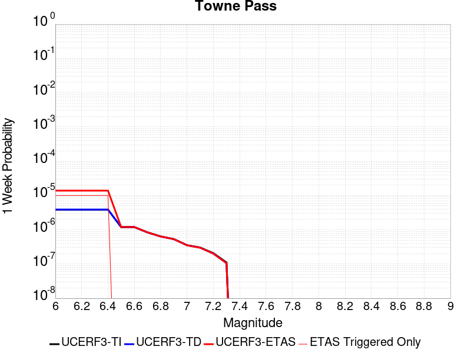 |  |  |  |

| Magnitude | 1 wk TI Prob | 1 wk TD Prob | 1 wk ETAS Prob | 1 wk ETAS/TD Gain | 1 wk ETAS Triggered Only | 1 mo TI Prob | 1 mo TD Prob | 1 mo ETAS Prob | 1 mo ETAS/TD Gain | 1 mo ETAS Triggered Only | 1 yr TI Prob | 1 yr TD Prob | 1 yr ETAS Prob | 1 yr ETAS/TD Gain | 1 yr ETAS Triggered Only | 10 yr TI Prob | 10 yr TD Prob | 10 yr ETAS Prob | 10 yr ETAS/TD Gain | 10 yr ETAS Triggered Only |
|-----|-----|-----|-----|-----|-----|-----|-----|-----|-----|-----|-----|-----|-----|-----|-----|-----|-----|-----|-----|-----|
| 6.0 | 3.849728E-6 | 3.8945495E-6 | 1.3894511E-5 | 3.5676808 | 1.0E-5 | 1.649873E-5 | 1.6690845E-5 | 1.26689E-4 | 7.590329 | 1.1E-4 | 2.0085352E-4 | 2.0319647E-4 | 7.530847E-4 | 3.70619 | 5.5E-4 | 0.0020067208 | 0.0020305358 | 0.0031782007 | 1.565203 | 0.00115 |
| 6.1 | 3.849728E-6 | 3.8945495E-6 | 1.3894511E-5 | 3.5676808 | 1.0E-5 | 1.649873E-5 | 1.6690845E-5 | 1.26689E-4 | 7.590329 | 1.1E-4 | 2.0085352E-4 | 2.0319647E-4 | 7.530847E-4 | 3.70619 | 5.5E-4 | 0.0020067208 | 0.0020305358 | 0.0031782007 | 1.565203 | 0.00115 |
| 6.2 | 3.849728E-6 | 3.8945495E-6 | 1.3894511E-5 | 3.5676808 | 1.0E-5 | 1.649873E-5 | 1.6690845E-5 | 1.26689E-4 | 7.590329 | 1.1E-4 | 2.0085352E-4 | 2.0319647E-4 | 7.530847E-4 | 3.70619 | 5.5E-4 | 0.0020067208 | 0.0020305358 | 0.0031782007 | 1.565203 | 0.00115 |
| 6.3 | 3.849728E-6 | 3.8945495E-6 | 1.3894511E-5 | 3.5676808 | 1.0E-5 | 1.649873E-5 | 1.6690845E-5 | 1.26689E-4 | 7.590329 | 1.1E-4 | 2.0085352E-4 | 2.0319647E-4 | 7.530847E-4 | 3.70619 | 5.5E-4 | 0.0020067208 | 0.0020305358 | 0.0031782007 | 1.565203 | 0.00115 |
| 6.4 | 3.849728E-6 | 3.8945495E-6 | 1.3894511E-5 | 3.5676808 | 1.0E-5 | 1.649873E-5 | 1.6690845E-5 | 1.26689E-4 | 7.590329 | 1.1E-4 | 2.0085352E-4 | 2.0319647E-4 | 7.530847E-4 | 3.70619 | 5.5E-4 | 0.0020067208 | 0.0020305358 | 0.0031782007 | 1.565203 | 0.00115 |
| 6.5 | 1.1953545E-6 | 1.2030554E-6 | 1.2030554E-6 | 1.0 | 0.0 | 5.1229376E-6 | 5.1559423E-6 | 2.515584E-5 | 4.8789997 | 2.0E-5 | 6.236998E-5 | 6.2771906E-5 | 2.1276249E-4 | 3.3894541 | 1.5E-4 | 6.235248E-4 | 6.275535E-4 | 8.97384E-4 | 1.4299722 | 2.7E-4 |
| 6.6 | 1.1953545E-6 | 1.2030554E-6 | 1.2030554E-6 | 1.0 | 0.0 | 5.1229376E-6 | 5.1559423E-6 | 2.515584E-5 | 4.8789997 | 2.0E-5 | 6.236998E-5 | 6.2771906E-5 | 2.1276249E-4 | 3.3894541 | 1.5E-4 | 6.235248E-4 | 6.275535E-4 | 8.97384E-4 | 1.4299722 | 2.7E-4 |
| 6.7 | 8.375951E-7 | 8.4106983E-7 | 8.4106983E-7 | 1.0 | 0.0 | 3.5896885E-6 | 3.6045803E-6 | 1.3604545E-5 | 3.774238 | 1.0E-5 | 4.370358E-5 | 4.388494E-5 | 1.2388143E-4 | 2.8228688 | 8.0E-5 | 4.3694986E-4 | 4.3876845E-4 | 6.2868505E-4 | 1.4328402 | 1.9E-4 |
| 6.8 | 6.38041E-7 | 6.392181E-7 | 6.392181E-7 | 1.0 | 0.0 | 2.7344586E-6 | 2.7395035E-6 | 1.2739476E-5 | 4.650286 | 1.0E-5 | 3.3291526E-5 | 3.3352986E-5 | 8.335132E-5 | 2.499066 | 5.0E-5 | 3.3286537E-4 | 3.334836E-4 | 4.534436E-4 | 1.3597178 | 1.2E-4 |
| 6.9 | 5.3460053E-7 | 5.345356E-7 | 5.345356E-7 | 1.0 | 0.0 | 2.2911431E-6 | 2.290865E-6 | 1.2290842E-5 | 5.3651533 | 1.0E-5 | 2.789431E-5 | 2.789096E-5 | 7.788956E-5 | 2.7926455 | 5.0E-5 | 2.789081E-4 | 2.788779E-4 | 3.8884723E-4 | 1.3943279 | 1.1E-4 |
| 7.0 | 3.557783E-7 | 3.5324425E-7 | 3.5324425E-7 | 1.0 | 0.0 | 1.5247632E-6 | 1.513903E-6 | 1.1513888E-5 | 7.6054325 | 1.0E-5 | 1.8563835E-5 | 1.8431623E-5 | 6.84307E-5 | 3.7126791 | 5.0E-5 | 1.8562283E-4 | 1.8430178E-4 | 2.9428152E-4 | 1.5967371 | 1.1E-4 |
| 7.1 | 3.037942E-7 | 3.00024E-7 | 3.00024E-7 | 1.0 | 0.0 | 1.3019744E-6 | 1.2858166E-6 | 1.1285803E-5 | 8.777149 | 1.0E-5 | 1.5851423E-5 | 1.5654712E-5 | 6.565393E-5 | 4.1938767 | 5.0E-5 | 1.5850292E-4 | 1.5653683E-4 | 2.665196E-4 | 1.7026 | 1.1E-4 |
| 7.2 | 2.0808248E-7 | 2.0217831E-7 | 2.0217831E-7 | 1.0 | 0.0 | 8.917818E-7 | 8.664782E-7 | 1.086647E-5 | 12.540961 | 1.0E-5 | 1.0857389E-5 | 1.0549326E-5 | 5.0548904E-5 | 4.7916713 | 4.0E-5 | 1.0856859E-4 | 1.0548872E-4 | 1.9547922E-4 | 1.8530818 | 9.0E-5 |
| 7.3 | 1.1162073E-7 | 1.0636953E-7 | 1.0636953E-7 | 1.0 | 0.0 | 4.7837443E-7 | 4.5586933E-7 | 4.5586933E-7 | 1.0 | 0.0 | 5.8241935E-6 | 5.550197E-6 | 3.555003E-5 | 6.405184 | 3.0E-5 | 5.8240406E-5 | 5.5500783E-5 | 1.0549801E-4 | 1.9008381 | 5.0E-5 |

## Death Valley (So)
*[(top)](#table-of-contents)*

| 1 Week | 1 Month | 1 Year | 10 Year |
|-----|-----|-----|-----|
|  |  |  |  |

| Magnitude | 1 wk TI Prob | 1 wk TD Prob | 1 wk ETAS Prob | 1 wk ETAS/TD Gain | 1 wk ETAS Triggered Only | 1 mo TI Prob | 1 mo TD Prob | 1 mo ETAS Prob | 1 mo ETAS/TD Gain | 1 mo ETAS Triggered Only | 1 yr TI Prob | 1 yr TD Prob | 1 yr ETAS Prob | 1 yr ETAS/TD Gain | 1 yr ETAS Triggered Only | 10 yr TI Prob | 10 yr TD Prob | 10 yr ETAS Prob | 10 yr ETAS/TD Gain | 10 yr ETAS Triggered Only |
|-----|-----|-----|-----|-----|-----|-----|-----|-----|-----|-----|-----|-----|-----|-----|-----|-----|-----|-----|-----|-----|
| 6.0 | 2.0684236E-5 | 2.5618914E-5 | 9.561712E-5 | 3.7322862 | 7.0E-5 | 8.864371E-5 | 1.09790824E-4 | 3.0976886E-4 | 2.821446 | 2.0E-4 | 0.0010787029 | 0.0013359005 | 0.0019750455 | 1.4784375 | 6.4E-4 | 0.010734817 | 0.01328137 | 0.014406229 | 1.0846945 | 0.00114 |
| 6.1 | 2.0684236E-5 | 2.5618914E-5 | 9.561712E-5 | 3.7322862 | 7.0E-5 | 8.864371E-5 | 1.09790824E-4 | 3.0976886E-4 | 2.821446 | 2.0E-4 | 0.0010787029 | 0.0013359005 | 0.0019750455 | 1.4784375 | 6.4E-4 | 0.010734817 | 0.01328137 | 0.014406229 | 1.0846945 | 0.00114 |
| 6.2 | 2.0684236E-5 | 2.5618914E-5 | 9.561712E-5 | 3.7322862 | 7.0E-5 | 8.864371E-5 | 1.09790824E-4 | 3.0976886E-4 | 2.821446 | 2.0E-4 | 0.0010787029 | 0.0013359005 | 0.0019750455 | 1.4784375 | 6.4E-4 | 0.010734817 | 0.01328137 | 0.014406229 | 1.0846945 | 0.00114 |
| 6.3 | 2.0240292E-5 | 2.511899E-5 | 9.511723E-5 | 3.7866662 | 7.0E-5 | 8.6741224E-5 | 1.0764847E-4 | 2.8762908E-4 | 2.6719294 | 1.8E-4 | 0.0010555626 | 0.0013098489 | 0.0018890891 | 1.4422191 | 5.8E-4 | 0.010505628 | 0.013023925 | 0.01407999 | 1.0810865 | 0.00107 |
| 6.4 | 2.0240292E-5 | 2.511899E-5 | 9.511723E-5 | 3.7866662 | 7.0E-5 | 8.6741224E-5 | 1.0764847E-4 | 2.8762908E-4 | 2.6719294 | 1.8E-4 | 0.0010555626 | 0.0013098489 | 0.0018890891 | 1.4422191 | 5.8E-4 | 0.010505628 | 0.013023925 | 0.01407999 | 1.0810865 | 0.00107 |
| 6.5 | 1.9962767E-5 | 2.4808238E-5 | 9.48065E-5 | 3.8215733 | 7.0E-5 | 8.55519E-5 | 1.0631679E-4 | 2.8629764E-4 | 2.6928735 | 1.8E-4 | 0.0010410968 | 0.0012936549 | 0.0018629176 | 1.4400421 | 5.7E-4 | 0.010362327 | 0.012863869 | 0.013880619 | 1.0790392 | 0.00103 |
| 6.6 | 1.8937297E-5 | 2.331202E-5 | 9.331039E-5 | 4.0026727 | 7.0E-5 | 8.115732E-5 | 9.9904915E-5 | 2.7988694E-4 | 2.8015332 | 1.8E-4 | 9.876423E-4 | 0.0012156782 | 0.0017450339 | 1.4354407 | 5.3E-4 | 0.009832645 | 0.012092765 | 0.012991761 | 1.0743417 | 9.1E-4 |
| 6.7 | 1.8621096E-5 | 2.2912649E-5 | 8.2911276E-5 | 3.6185808 | 6.0E-5 | 7.980225E-5 | 9.819346E-5 | 2.6817675E-4 | 2.7311063 | 1.7E-4 | 9.711593E-4 | 0.0011948642 | 0.0016842787 | 1.4095985 | 4.9E-4 | 0.009669261 | 0.011886865 | 0.012736642 | 1.0714887 | 8.6E-4 |
| 6.8 | 1.7830353E-5 | 2.1806614E-5 | 8.180531E-5 | 3.7513986 | 6.0E-5 | 7.641356E-5 | 9.345365E-5 | 2.534387E-4 | 2.7119186 | 1.6E-4 | 9.29938E-4 | 0.0011372183 | 0.0015867066 | 1.3952523 | 4.5E-4 | 0.009260561 | 0.011316919 | 0.012097979 | 1.0690169 | 7.9E-4 |
| 6.9 | 1.3135183E-5 | 1.5304342E-5 | 4.530388E-5 | 2.9601982 | 3.0E-5 | 5.6292425E-5 | 6.558842E-5 | 1.4558318E-4 | 2.2196474 | 8.0E-5 | 6.8514474E-4 | 7.9825294E-4 | 0.0010980135 | 1.3755207 | 3.0E-4 | 0.006830362 | 0.007954868 | 0.008510414 | 1.0698371 | 5.6E-4 |
| 7.0 | 1.1507512E-5 | 1.315447E-5 | 3.3154207E-5 | 2.5203757 | 2.0E-5 | 4.9316975E-5 | 5.6375116E-5 | 1.1637173E-4 | 2.0642393 | 6.0E-5 | 6.002687E-4 | 6.861567E-4 | 9.0600573E-4 | 1.3204064 | 2.2E-4 | 0.0059864987 | 0.0068410533 | 0.0072482484 | 1.0595223 | 4.1E-4 |
| 7.1 | 9.715903E-6 | 1.086547E-5 | 3.0865252E-5 | 2.8406734 | 2.0E-5 | 4.1638916E-5 | 4.6565492E-5 | 7.6564094E-5 | 1.6442239 | 3.0E-5 | 5.068359E-4 | 5.667917E-4 | 6.66735E-4 | 1.1763316 | 1.0E-4 | 0.0050568148 | 0.0056537534 | 0.005862566 | 1.0369334 | 2.1E-4 |
| 7.2 | 9.233269E-6 | 1.0286476E-5 | 3.028627E-5 | 2.9442804 | 2.0E-5 | 3.9570554E-5 | 4.4084176E-5 | 7.4082855E-5 | 1.6804863 | 3.0E-5 | 4.81665E-4 | 5.365969E-4 | 6.16554E-4 | 1.1490077 | 8.0E-5 | 0.0048062233 | 0.005353444 | 0.0055324803 | 1.0334432 | 1.8E-4 |
| 7.3 | 8.8041315E-6 | 9.808313E-6 | 2.9808118E-5 | 3.0390666 | 2.0E-5 | 3.7731446E-5 | 4.2034975E-5 | 7.203371E-5 | 1.7136614 | 3.0E-5 | 4.592835E-4 | 5.1165983E-4 | 5.916189E-4 | 1.1562738 | 8.0E-5 | 0.0045833546 | 0.0051052445 | 0.005264428 | 1.0311803 | 1.6E-4 |
| 7.4 | 8.708749E-6 | 9.707323E-6 | 2.970713E-5 | 3.06028 | 2.0E-5 | 3.7322676E-5 | 4.1602176E-5 | 7.160092E-5 | 1.7210861 | 3.0E-5 | 4.5430884E-4 | 5.06393E-4 | 5.7635753E-4 | 1.1381626 | 7.0E-5 | 0.004533812 | 0.0050528166 | 0.0052020587 | 1.0295364 | 1.5E-4 |
| 7.5 | 8.612678E-6 | 9.604964E-6 | 2.9604773E-5 | 3.0822365 | 2.0E-5 | 3.6910955E-5 | 4.116351E-5 | 7.116227E-5 | 1.7287709 | 3.0E-5 | 4.492982E-4 | 5.010547E-4 | 5.710196E-4 | 1.1396353 | 7.0E-5 | 0.004483909 | 0.0049996753 | 0.005138975 | 1.0278618 | 1.4E-4 |
| 7.6 | 8.319024E-6 | 9.28406E-6 | 1.9283967E-5 | 2.077105 | 1.0E-5 | 3.5652476E-5 | 3.9788243E-5 | 5.978745E-5 | 1.5026411 | 2.0E-5 | 4.3398244E-4 | 4.8431839E-4 | 5.4428936E-4 | 1.1238254 | 6.0E-5 | 0.0043313587 | 0.004833053 | 0.0049524726 | 1.024709 | 1.2E-4 |
| 7.7 | 7.4718328E-6 | 8.3453E-6 | 1.8345216E-5 | 2.1982694 | 1.0E-5 | 3.2021748E-5 | 3.57651E-5 | 5.5764387E-5 | 1.5591843 | 2.0E-5 | 3.8979502E-4 | 4.3535716E-4 | 4.9533107E-4 | 1.1377579 | 6.0E-5 | 0.00389112 | 0.004345448 | 0.0044649267 | 1.0274951 | 1.2E-4 |
| 7.8 | 3.4586725E-7 | 3.648288E-7 | 3.648288E-7 | 1.0 | 0.0 | 1.4822873E-6 | 1.5635511E-6 | 1.5635511E-6 | 1.0 | 0.0 | 1.80467E-5 | 1.9036073E-5 | 2.9035882E-5 | 1.5253085 | 1.0E-5 | 1.8045233E-4 | 1.9034486E-4 | 2.0034295E-4 | 1.0525262 | 1.0E-5 |
| 7.9 | 2.5591178E-9 | 2.6696871E-9 | 2.6696871E-9 | 1.0 | 0.0 | 1.0967647E-8 | 1.1441516E-8 | 1.1441516E-8 | 1.0 | 0.0 | 1.335311E-7 | 1.3930045E-7 | 1.3930045E-7 | 1.0 | 0.0 | 1.3353102E-6 | 1.3930046E-6 | 1.3930046E-6 | 1.0 | 0.0 |

## Paradise
*[(top)](#table-of-contents)*

| 1 Week | 1 Month | 1 Year | 10 Year |
|-----|-----|-----|-----|
|  |  |  | 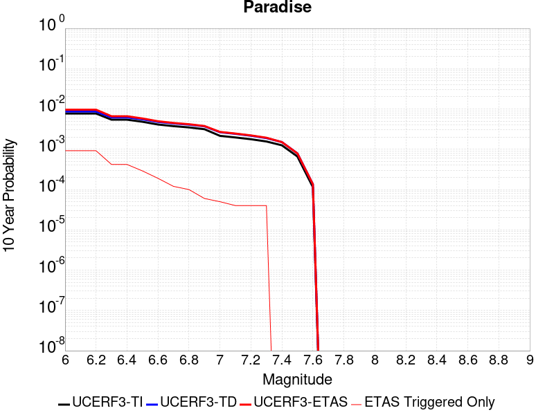 |

| Magnitude | 1 wk TI Prob | 1 wk TD Prob | 1 wk ETAS Prob | 1 wk ETAS/TD Gain | 1 wk ETAS Triggered Only | 1 mo TI Prob | 1 mo TD Prob | 1 mo ETAS Prob | 1 mo ETAS/TD Gain | 1 mo ETAS Triggered Only | 1 yr TI Prob | 1 yr TD Prob | 1 yr ETAS Prob | 1 yr ETAS/TD Gain | 1 yr ETAS Triggered Only | 10 yr TI Prob | 10 yr TD Prob | 10 yr ETAS Prob | 10 yr ETAS/TD Gain | 10 yr ETAS Triggered Only |
|-----|-----|-----|-----|-----|-----|-----|-----|-----|-----|-----|-----|-----|-----|-----|-----|-----|-----|-----|-----|-----|
| 6.0 | 1.4851273E-5 | 1.6694923E-5 | 3.669459E-5 | 2.197949 | 2.0E-5 | 6.364676E-5 | 7.1547845E-5 | 2.1153783E-4 | 2.9565926 | 1.4E-4 | 7.7462377E-4 | 8.707705E-4 | 0.0013403612 | 1.5392818 | 4.7E-4 | 0.0077192914 | 0.008675965 | 0.009587983 | 1.1051201 | 9.2E-4 |
| 6.1 | 1.4851273E-5 | 1.6694923E-5 | 3.669459E-5 | 2.197949 | 2.0E-5 | 6.364676E-5 | 7.1547845E-5 | 2.1153783E-4 | 2.9565926 | 1.4E-4 | 7.7462377E-4 | 8.707705E-4 | 0.0013403612 | 1.5392818 | 4.7E-4 | 0.0077192914 | 0.008675965 | 0.009587983 | 1.1051201 | 9.2E-4 |
| 6.2 | 1.4851273E-5 | 1.6694923E-5 | 3.669459E-5 | 2.197949 | 2.0E-5 | 6.364676E-5 | 7.1547845E-5 | 2.1153783E-4 | 2.9565926 | 1.4E-4 | 7.7462377E-4 | 8.707705E-4 | 0.0013403612 | 1.5392818 | 4.7E-4 | 0.0077192914 | 0.008675965 | 0.009587983 | 1.1051201 | 9.2E-4 |
| 6.3 | 1.0426831E-5 | 1.1888797E-5 | 2.1888678E-5 | 1.841118 | 1.0E-5 | 4.4685654E-5 | 5.095103E-5 | 1.3094695E-4 | 2.5700552 | 8.0E-5 | 5.43912E-4 | 6.2015816E-4 | 8.500155E-4 | 1.3706431 | 2.3E-4 | 0.0054258266 | 0.0061848834 | 0.006602286 | 1.0674875 | 4.2E-4 |
| 6.4 | 1.0426831E-5 | 1.1888797E-5 | 2.1888678E-5 | 1.841118 | 1.0E-5 | 4.4685654E-5 | 5.095103E-5 | 1.3094695E-4 | 2.5700552 | 8.0E-5 | 5.43912E-4 | 6.2015816E-4 | 8.500155E-4 | 1.3706431 | 2.3E-4 | 0.0054258266 | 0.0061848834 | 0.006602286 | 1.0674875 | 4.2E-4 |
| 6.5 | 9.25027E-6 | 1.0620124E-5 | 2.0620018E-5 | 1.9415985 | 1.0E-5 | 3.964341E-5 | 4.551405E-5 | 1.1551086E-4 | 2.5379167 | 7.0E-5 | 4.8255164E-4 | 5.539976E-4 | 7.139089E-4 | 1.2886499 | 1.6E-4 | 0.0048150513 | 0.0055266647 | 0.0058150617 | 1.0521829 | 2.9E-4 |
| 6.6 | 7.904275E-6 | 9.159673E-6 | 1.9159581E-5 | 2.091732 | 1.0E-5 | 3.3875025E-5 | 3.925517E-5 | 7.92536E-5 | 2.018934 | 4.0E-5 | 4.1235037E-4 | 4.7783085E-4 | 5.7778304E-4 | 1.209179 | 1.0E-4 | 0.0041158604 | 0.004768431 | 0.004957525 | 1.0396554 | 1.9E-4 |
| 6.7 | 7.2061953E-6 | 8.407388E-6 | 1.8407305E-5 | 2.18942 | 1.0E-5 | 3.088333E-5 | 3.6031186E-5 | 7.602975E-5 | 2.1101093 | 4.0E-5 | 3.7593965E-4 | 4.3859507E-4 | 5.285556E-4 | 1.2051107 | 9.0E-5 | 0.003753043 | 0.0043776636 | 0.0044971383 | 1.0272919 | 1.2E-4 |
| 6.8 | 6.6948724E-6 | 7.842299E-6 | 7.842299E-6 | 1.0 | 0.0 | 2.8691995E-5 | 3.360944E-5 | 6.360843E-5 | 1.8925763 | 3.0E-5 | 3.4926904E-4 | 4.0912168E-4 | 4.7909305E-4 | 1.1710283 | 7.0E-5 | 0.003487206 | 0.0040840427 | 0.004183634 | 1.0243856 | 1.0E-4 |
| 6.9 | 6.0421025E-6 | 7.130747E-6 | 7.130747E-6 | 1.0 | 0.0 | 2.5894467E-5 | 3.0560004E-5 | 5.0559393E-5 | 1.6544302 | 2.0E-5 | 3.1521954E-4 | 3.7200793E-4 | 4.1199307E-4 | 1.1074846 | 4.0E-5 | 0.0031477278 | 0.0037141903 | 0.0037739675 | 1.0160942 | 6.0E-5 |
| 7.0 | 4.134091E-6 | 5.080416E-6 | 5.080416E-6 | 1.0 | 0.0 | 1.7717413E-5 | 2.1773038E-5 | 4.1772604E-5 | 1.9185473 | 2.0E-5 | 2.1568815E-4 | 2.6505603E-4 | 3.0504543E-4 | 1.1508715 | 4.0E-5 | 0.0021547892 | 0.0026475522 | 0.0026974196 | 1.0188354 | 5.0E-5 |
| 7.1 | 3.7674888E-6 | 4.6319656E-6 | 4.6319656E-6 | 1.0 | 0.0 | 1.6146281E-5 | 1.9851139E-5 | 2.985094E-5 | 1.5037395 | 1.0E-5 | 1.9656324E-4 | 2.4166232E-4 | 2.7165507E-4 | 1.1241101 | 3.0E-5 | 0.0019638946 | 0.002414146 | 0.0024540494 | 1.016529 | 4.0E-5 |
| 7.2 | 3.4065345E-6 | 4.156807E-6 | 4.156807E-6 | 1.0 | 0.0 | 1.4599351E-5 | 1.7814775E-5 | 2.7814596E-5 | 1.5613219 | 1.0E-5 | 1.777326E-4 | 2.1687479E-4 | 2.468683E-4 | 1.1382986 | 3.0E-5 | 0.0017759053 | 0.0021667795 | 0.002206693 | 1.0184206 | 4.0E-5 |
| 7.3 | 2.9934936E-6 | 3.6293877E-6 | 3.6293877E-6 | 1.0 | 0.0 | 1.2829195E-5 | 1.5554435E-5 | 2.5554278E-5 | 1.6428934 | 1.0E-5 | 1.5618425E-4 | 1.8936026E-4 | 2.1935458E-4 | 1.1583982 | 3.0E-5 | 0.0015607453 | 0.0018921344 | 0.0019320587 | 1.0211002 | 4.0E-5 |
| 7.4 | 2.4049796E-6 | 2.8890327E-6 | 2.8890327E-6 | 1.0 | 0.0 | 1.0307015E-5 | 1.2381518E-5 | 1.2381518E-5 | 1.0 | 0.0 | 1.2548068E-4 | 1.5073598E-4 | 1.5073598E-4 | 1.0 | 0.0 | 0.0012540985 | 0.001506479 | 0.001506479 | 1.0 | 0.0 |
| 7.5 | 1.2710091E-6 | 1.513489E-6 | 1.513489E-6 | 1.0 | 0.0 | 5.44717E-6 | 6.486372E-6 | 6.486372E-6 | 1.0 | 0.0 | 6.631728E-5 | 7.896997E-5 | 7.896997E-5 | 1.0 | 0.0 | 6.6297496E-4 | 7.895417E-4 | 7.895417E-4 | 1.0 | 0.0 |
| 7.6 | 2.21172E-7 | 2.6040198E-7 | 2.6040198E-7 | 1.0 | 0.0 | 9.478797E-7 | 1.1160082E-6 | 1.1160082E-6 | 1.0 | 0.0 | 1.1540374E-5 | 1.3587343E-5 | 1.3587343E-5 | 1.0 | 0.0 | 1.1539775E-4 | 1.3586794E-4 | 1.3586794E-4 | 1.0 | 0.0 |

## Bicycle Lake
*[(top)](#table-of-contents)*

| 1 Week | 1 Month | 1 Year | 10 Year |
|-----|-----|-----|-----|
|  |  |  |  |

| Magnitude | 1 wk TI Prob | 1 wk TD Prob | 1 wk ETAS Prob | 1 wk ETAS/TD Gain | 1 wk ETAS Triggered Only | 1 mo TI Prob | 1 mo TD Prob | 1 mo ETAS Prob | 1 mo ETAS/TD Gain | 1 mo ETAS Triggered Only | 1 yr TI Prob | 1 yr TD Prob | 1 yr ETAS Prob | 1 yr ETAS/TD Gain | 1 yr ETAS Triggered Only | 10 yr TI Prob | 10 yr TD Prob | 10 yr ETAS Prob | 10 yr ETAS/TD Gain | 10 yr ETAS Triggered Only |
|-----|-----|-----|-----|-----|-----|-----|-----|-----|-----|-----|-----|-----|-----|-----|-----|-----|-----|-----|-----|-----|
| 6.0 | 1.9621975E-5 | 2.2097447E-5 | 5.2096784E-5 | 2.3575928 | 3.0E-5 | 8.4091465E-5 | 9.470067E-5 | 2.1468931E-4 | 2.2670305 | 1.2E-4 | 0.0010233327 | 0.0011525059 | 0.0015720217 | 1.3640033 | 4.2E-4 | 0.01018633 | 0.011478599 | 0.012299072 | 1.0714785 | 8.3E-4 |
| 6.1 | 1.9621975E-5 | 2.2097447E-5 | 5.2096784E-5 | 2.3575928 | 3.0E-5 | 8.4091465E-5 | 9.470067E-5 | 2.1468931E-4 | 2.2670305 | 1.2E-4 | 0.0010233327 | 0.0011525059 | 0.0015720217 | 1.3640033 | 4.2E-4 | 0.01018633 | 0.011478599 | 0.012299072 | 1.0714785 | 8.3E-4 |
| 6.2 | 9.9971285E-6 | 1.1255827E-5 | 2.1255715E-5 | 1.8884187 | 1.0E-5 | 4.2844134E-5 | 4.8238664E-5 | 1.0823577E-4 | 2.2437556 | 6.0E-5 | 5.2150246E-4 | 5.8719947E-4 | 8.470468E-4 | 1.4425197 | 2.6E-4 | 0.0052028033 | 0.0058615846 | 0.0064083603 | 1.0932813 | 5.5E-4 |
| 6.3 | 9.589428E-6 | 1.0798527E-5 | 2.079842E-5 | 1.9260422 | 1.0E-5 | 4.10969E-5 | 4.627887E-5 | 1.0627609E-4 | 2.296428 | 6.0E-5 | 5.002399E-4 | 5.633515E-4 | 8.23205E-4 | 1.4612637 | 2.6E-4 | 0.0049911533 | 0.0056243236 | 0.0061513428 | 1.0937035 | 5.3E-4 |
| 6.4 | 9.589428E-6 | 1.0798527E-5 | 2.079842E-5 | 1.9260422 | 1.0E-5 | 4.10969E-5 | 4.627887E-5 | 1.0627609E-4 | 2.296428 | 6.0E-5 | 5.002399E-4 | 5.633515E-4 | 8.23205E-4 | 1.4612637 | 2.6E-4 | 0.0049911533 | 0.0056243236 | 0.0061513428 | 1.0937035 | 5.3E-4 |
| 6.5 | 5.557707E-6 | 6.2857107E-6 | 6.2857107E-6 | 1.0 | 0.0 | 2.3818526E-5 | 2.6938633E-5 | 6.693756E-5 | 2.4848163 | 4.0E-5 | 2.8995197E-4 | 3.2795538E-4 | 4.779062E-4 | 1.4572293 | 1.5E-4 | 0.0028957394 | 0.0032773504 | 0.003606269 | 1.1003611 | 3.3E-4 |
| 6.6 | 4.8742945E-6 | 5.5133855E-6 | 5.5133855E-6 | 1.0 | 0.0 | 2.0889667E-5 | 2.3628729E-5 | 6.3627784E-5 | 2.6928146 | 4.0E-5 | 2.54302E-4 | 2.87668E-4 | 4.176306E-4 | 1.4517798 | 1.3E-4 | 0.002540112 | 0.0028755253 | 0.0031646914 | 1.1005611 | 2.9E-4 |
| 6.7 | 3.991108E-6 | 4.515989E-6 | 4.515989E-6 | 1.0 | 0.0 | 1.7104636E-5 | 1.9354238E-5 | 4.9353657E-5 | 2.550018 | 3.0E-5 | 2.0822904E-4 | 2.3563785E-4 | 3.3561428E-4 | 1.42428 | 1.0E-4 | 0.0020803404 | 0.0023563786 | 0.002595813 | 1.1016113 | 2.4E-4 |

## San Andreas (San Bernardino N)
*[(top)](#table-of-contents)*

| 1 Week | 1 Month | 1 Year | 10 Year |
|-----|-----|-----|-----|
|  |  | 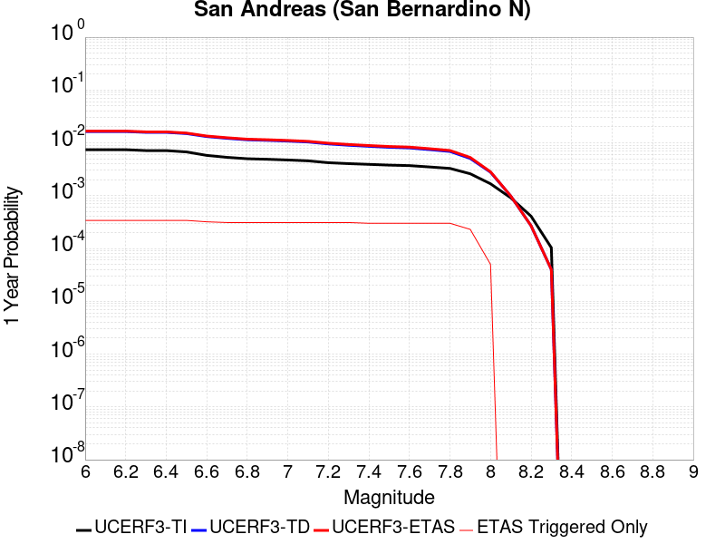 |  |

| Magnitude | 1 wk TI Prob | 1 wk TD Prob | 1 wk ETAS Prob | 1 wk ETAS/TD Gain | 1 wk ETAS Triggered Only | 1 mo TI Prob | 1 mo TD Prob | 1 mo ETAS Prob | 1 mo ETAS/TD Gain | 1 mo ETAS Triggered Only | 1 yr TI Prob | 1 yr TD Prob | 1 yr ETAS Prob | 1 yr ETAS/TD Gain | 1 yr ETAS Triggered Only | 10 yr TI Prob | 10 yr TD Prob | 10 yr ETAS Prob | 10 yr ETAS/TD Gain | 10 yr ETAS Triggered Only |
|-----|-----|-----|-----|-----|-----|-----|-----|-----|-----|-----|-----|-----|-----|-----|-----|-----|-----|-----|-----|-----|
| 6.0 | 1.4273766E-4 | 3.1614845E-4 | 3.3614214E-4 | 1.0632414 | 2.0E-5 | 6.115894E-4 | 0.0013542244 | 0.001454089 | 1.073743 | 1.0E-4 | 0.0074207084 | 0.016364535 | 0.016698971 | 1.0204366 | 3.4E-4 | 0.07177748 | 0.15036654 | 0.1509103 | 1.0036162 | 6.4E-4 |
| 6.1 | 1.4273766E-4 | 3.1614845E-4 | 3.3614214E-4 | 1.0632414 | 2.0E-5 | 6.115894E-4 | 0.0013542244 | 0.001454089 | 1.073743 | 1.0E-4 | 0.0074207084 | 0.016364535 | 0.016698971 | 1.0204366 | 3.4E-4 | 0.07177748 | 0.15036654 | 0.1509103 | 1.0036162 | 6.4E-4 |
| 6.2 | 1.4273766E-4 | 3.1614845E-4 | 3.3614214E-4 | 1.0632414 | 2.0E-5 | 6.115894E-4 | 0.0013542244 | 0.001454089 | 1.073743 | 1.0E-4 | 0.0074207084 | 0.016364535 | 0.016698971 | 1.0204366 | 3.4E-4 | 0.07177748 | 0.15036654 | 0.1509103 | 1.0036162 | 6.4E-4 |
| 6.3 | 1.3730655E-4 | 3.051962E-4 | 3.251901E-4 | 1.0655116 | 2.0E-5 | 5.883239E-4 | 0.0013073338 | 0.0014072031 | 1.0763916 | 1.0E-4 | 0.0071393442 | 0.015802028 | 0.016136656 | 1.0211762 | 3.4E-4 | 0.06914291 | 0.14567827 | 0.14622504 | 1.0037532 | 6.4E-4 |
| 6.4 | 1.3730655E-4 | 3.051962E-4 | 3.251901E-4 | 1.0655116 | 2.0E-5 | 5.883239E-4 | 0.0013073338 | 0.0014072031 | 1.0763916 | 1.0E-4 | 0.0071393442 | 0.015802028 | 0.016136656 | 1.0211762 | 3.4E-4 | 0.06914291 | 0.14567827 | 0.14622504 | 1.0037532 | 6.4E-4 |
| 6.5 | 1.2942807E-4 | 2.893405E-4 | 3.0933472E-4 | 1.0691028 | 2.0E-5 | 5.545738E-4 | 0.0012394466 | 0.0013393227 | 1.0805812 | 1.0E-4 | 0.0067310524 | 0.014987098 | 0.015322003 | 1.0223461 | 3.4E-4 | 0.06530788 | 0.13881195 | 0.13936311 | 1.0039705 | 6.4E-4 |
| 6.6 | 1.1125901E-4 | 2.537283E-4 | 2.7372324E-4 | 1.0788045 | 2.0E-5 | 4.767372E-4 | 0.0010869562 | 0.0011868476 | 1.0919 | 1.0E-4 | 0.005788839 | 0.013154025 | 0.013469816 | 1.0240072 | 3.2E-4 | 0.056403454 | 0.123056285 | 0.12359999 | 1.0044184 | 6.2E-4 |
| 6.7 | 1.02209575E-4 | 2.3507705E-4 | 2.5507234E-4 | 1.0850585 | 2.0E-5 | 4.3796748E-4 | 0.0010070855 | 0.0011069848 | 1.0991964 | 1.0E-4 | 0.0053192247 | 0.012192756 | 0.012498977 | 1.0251149 | 3.1E-4 | 0.051936906 | 0.11485627 | 0.11539622 | 1.004701 | 6.1E-4 |
| 6.8 | 9.610582E-5 | 2.2033554E-4 | 2.4033114E-4 | 1.0907507 | 2.0E-5 | 4.1181705E-4 | 9.4395416E-4 | 0.0010438598 | 1.1058373 | 1.0E-4 | 0.0050023515 | 0.011432346 | 0.011738802 | 1.026806 | 3.1E-4 | 0.048912346 | 0.10822741 | 0.10877139 | 1.0050262 | 6.1E-4 |
| 6.9 | 9.3877505E-5 | 2.1489074E-4 | 2.3488645E-4 | 1.0930506 | 2.0E-5 | 4.0227012E-4 | 9.2063594E-4 | 0.0010205439 | 1.1085206 | 1.0E-4 | 0.0048866454 | 0.011151383 | 0.011457926 | 1.0274892 | 3.1E-4 | 0.04780577 | 0.105814084 | 0.10635059 | 1.0050703 | 6.0E-4 |
| 7.0 | 9.1019785E-5 | 2.0815943E-4 | 2.2815526E-4 | 1.0960602 | 2.0E-5 | 3.900265E-4 | 8.9180743E-4 | 9.917183E-4 | 1.1120318 | 1.0E-4 | 0.0047382377 | 0.010803926 | 0.011110577 | 1.0283833 | 3.1E-4 | 0.046384744 | 0.10278599 | 0.103324324 | 1.0052373 | 6.0E-4 |
| 7.1 | 8.771155E-5 | 1.9990467E-4 | 2.1990067E-4 | 1.1000277 | 2.0E-5 | 3.758525E-4 | 8.564535E-4 | 9.563679E-4 | 1.1166606 | 1.0E-4 | 0.0045664064 | 0.010377665 | 0.010684448 | 1.0295619 | 3.1E-4 | 0.044737056 | 0.099094115 | 0.099634655 | 1.0054549 | 6.0E-4 |
| 7.2 | 8.0830236E-5 | 1.8396029E-4 | 2.0395662E-4 | 1.1086991 | 2.0E-5 | 3.4636928E-4 | 7.8816316E-4 | 8.8808435E-4 | 1.1267773 | 1.0E-4 | 0.0042088944 | 0.009553772 | 0.009860811 | 1.0321379 | 3.1E-4 | 0.041300658 | 0.09182046 | 0.09233812 | 1.0056378 | 5.7E-4 |
| 7.3 | 7.7668235E-5 | 1.7339372E-4 | 1.9339027E-4 | 1.1153244 | 2.0E-5 | 3.328214E-4 | 7.4290443E-4 | 8.4283017E-4 | 1.1345068 | 1.0E-4 | 0.0040445733 | 0.009007431 | 0.009314638 | 1.034106 | 3.1E-4 | 0.03971748 | 0.0870959 | 0.08761626 | 1.0059745 | 5.7E-4 |
| 7.4 | 7.520177E-5 | 1.6559374E-4 | 1.8559043E-4 | 1.1207575 | 2.0E-5 | 3.2225347E-4 | 7.0949446E-4 | 8.094235E-4 | 1.1408454 | 1.0E-4 | 0.0039163795 | 0.008603949 | 0.008901368 | 1.0345677 | 3.0E-4 | 0.038480744 | 0.083552666 | 0.08405671 | 1.0060327 | 5.5E-4 |
| 7.5 | 7.274697E-5 | 1.5846924E-4 | 1.7846607E-4 | 1.1261874 | 2.0E-5 | 3.1173544E-4 | 6.789772E-4 | 7.7890925E-4 | 1.1471803 | 1.0E-4 | 0.003788775 | 0.008235271 | 0.008532801 | 1.0361286 | 3.0E-4 | 0.03724827 | 0.08026917 | 0.08077502 | 1.006302 | 5.5E-4 |
| 7.6 | 7.1185845E-5 | 1.541672E-4 | 1.7416412E-4 | 1.1297092 | 2.0E-5 | 3.0504653E-4 | 6.605493E-4 | 7.6048326E-4 | 1.1512891 | 1.0E-4 | 0.0037076178 | 0.008012585 | 0.008310181 | 1.0371411 | 3.0E-4 | 0.036463667 | 0.078258425 | 0.078765385 | 1.006478 | 5.5E-4 |
| 7.7 | 6.709961E-5 | 1.4325391E-4 | 1.6325105E-4 | 1.1395923 | 2.0E-5 | 2.8753807E-4 | 6.1380095E-4 | 7.1373954E-4 | 1.1628193 | 1.0E-4 | 0.003495157 | 0.007447459 | 0.0077452245 | 1.0399822 | 3.0E-4 | 0.034406938 | 0.07308612 | 0.07358666 | 1.0068486 | 5.4E-4 |
| 7.8 | 6.300812E-5 | 1.3209098E-4 | 1.5208834E-4 | 1.1513908 | 2.0E-5 | 2.7000686E-4 | 5.6598143E-4 | 6.6592486E-4 | 1.1765842 | 1.0E-4 | 0.0032823787 | 0.006869081 | 0.0071670203 | 1.043374 | 3.0E-4 | 0.032343175 | 0.0677427 | 0.06824612 | 1.0074314 | 5.4E-4 |
| 7.9 | 4.983037E-5 | 9.7286385E-5 | 1.07285414E-4 | 1.1027793 | 1.0E-5 | 2.1354125E-4 | 4.1687503E-4 | 4.968417E-4 | 1.1918241 | 8.0E-5 | 0.0025967648 | 0.005063652 | 0.005292488 | 1.0451918 | 2.3E-4 | 0.025666296 | 0.050672647 | 0.051080856 | 1.0080558 | 4.3E-4 |
| 8.0 | 3.2211527E-5 | 5.3333257E-5 | 5.3333257E-5 | 1.0 | 0.0 | 1.380421E-4 | 2.2855109E-4 | 2.5854423E-4 | 1.1312317 | 3.0E-5 | 0.0016793669 | 0.0027790607 | 0.0028289217 | 1.0179417 | 5.0E-5 | 0.016667323 | 0.028375156 | 0.028511185 | 1.0047939 | 1.4E-4 |
| 8.1 | 1.743376E-5 | 1.8835979E-5 | 1.8835979E-5 | 1.0 | 0.0 | 7.471398E-5 | 8.0723126E-5 | 8.0723126E-5 | 1.0 | 0.0 | 9.0926304E-4 | 9.823616E-4 | 9.823616E-4 | 1.0 | 0.0 | 0.009055517 | 0.010490086 | 0.010519771 | 1.0028298 | 3.0E-5 |
| 8.2 | 7.831616E-6 | 5.158648E-6 | 5.158648E-6 | 1.0 | 0.0 | 3.3563636E-5 | 2.2108305E-5 | 2.2108305E-5 | 1.0 | 0.0 | 4.0856065E-4 | 2.6913546E-4 | 2.6913546E-4 | 1.0 | 0.0 | 0.004078103 | 0.003043787 | 0.003043787 | 1.0 | 0.0 |
| 8.3 | 1.983087E-6 | 7.6647797E-7 | 7.6647797E-7 | 1.0 | 0.0 | 8.498917E-6 | 3.2849016E-6 | 3.2849016E-6 | 1.0 | 0.0 | 1.034694E-4 | 3.999296E-5 | 3.999296E-5 | 1.0 | 0.0 | 0.0010342124 | 4.7228087E-4 | 4.7228087E-4 | 1.0 | 0.0 |

## Garlic Springs
*[(top)](#table-of-contents)*

| 1 Week | 1 Month | 1 Year | 10 Year |
|-----|-----|-----|-----|
|  |  |  |  |

| Magnitude | 1 wk TI Prob | 1 wk TD Prob | 1 wk ETAS Prob | 1 wk ETAS/TD Gain | 1 wk ETAS Triggered Only | 1 mo TI Prob | 1 mo TD Prob | 1 mo ETAS Prob | 1 mo ETAS/TD Gain | 1 mo ETAS Triggered Only | 1 yr TI Prob | 1 yr TD Prob | 1 yr ETAS Prob | 1 yr ETAS/TD Gain | 1 yr ETAS Triggered Only | 10 yr TI Prob | 10 yr TD Prob | 10 yr ETAS Prob | 10 yr ETAS/TD Gain | 10 yr ETAS Triggered Only |
|-----|-----|-----|-----|-----|-----|-----|-----|-----|-----|-----|-----|-----|-----|-----|-----|-----|-----|-----|-----|-----|
| 6.0 | 1.6760017E-5 | 1.8777133E-5 | 3.8776758E-5 | 2.0651054 | 2.0E-5 | 7.182667E-5 | 8.0471604E-5 | 1.7046437E-4 | 2.118317 | 9.0E-5 | 8.7413884E-4 | 9.794187E-4 | 0.0012091935 | 1.2346032 | 2.3E-4 | 0.008707083 | 0.009762568 | 0.010277492 | 1.0527446 | 5.2E-4 |
| 6.1 | 9.852767E-6 | 1.0973753E-5 | 1.0973753E-5 | 1.0 | 0.0 | 4.222546E-5 | 4.702992E-5 | 8.702804E-5 | 1.8504823 | 4.0E-5 | 5.139737E-4 | 5.7250983E-4 | 7.024354E-4 | 1.2269404 | 1.3E-4 | 0.005127866 | 0.0057173073 | 0.0060155923 | 1.0521723 | 3.0E-4 |
| 6.2 | 9.852767E-6 | 1.0973753E-5 | 1.0973753E-5 | 1.0 | 0.0 | 4.222546E-5 | 4.702992E-5 | 8.702804E-5 | 1.8504823 | 4.0E-5 | 5.139737E-4 | 5.7250983E-4 | 7.024354E-4 | 1.2269404 | 1.3E-4 | 0.005127866 | 0.0057173073 | 0.0060155923 | 1.0521723 | 3.0E-4 |
| 6.3 | 4.3167724E-6 | 4.7780964E-6 | 4.7780964E-6 | 1.0 | 0.0 | 1.8500323E-5 | 2.0477524E-5 | 5.047691E-5 | 2.4649909 | 3.0E-5 | 2.2521814E-4 | 2.4930836E-4 | 3.192909E-4 | 1.2807068 | 7.0E-5 | 0.0022499003 | 0.0024925452 | 0.0026421715 | 1.0600295 | 1.5E-4 |
| 6.4 | 4.3167724E-6 | 4.7780964E-6 | 4.7780964E-6 | 1.0 | 0.0 | 1.8500323E-5 | 2.0477524E-5 | 5.047691E-5 | 2.4649909 | 3.0E-5 | 2.2521814E-4 | 2.4930836E-4 | 3.192909E-4 | 1.2807068 | 7.0E-5 | 0.0022499003 | 0.0024925452 | 0.0026421715 | 1.0600295 | 1.5E-4 |
| 6.5 | 4.3167724E-6 | 4.7780964E-6 | 4.7780964E-6 | 1.0 | 0.0 | 1.8500323E-5 | 2.0477524E-5 | 5.047691E-5 | 2.4649909 | 3.0E-5 | 2.2521814E-4 | 2.4930836E-4 | 3.192909E-4 | 1.2807068 | 7.0E-5 | 0.0022499003 | 0.0024925452 | 0.0026421715 | 1.0600295 | 1.5E-4 |
| 6.6 | 4.301311E-6 | 4.7609647E-6 | 4.7609647E-6 | 1.0 | 0.0 | 1.8434059E-5 | 2.0404104E-5 | 5.040349E-5 | 2.4702625 | 3.0E-5 | 2.2441156E-4 | 2.4841467E-4 | 3.1839727E-4 | 1.281717 | 7.0E-5 | 0.0022418506 | 0.0024836282 | 0.0026332557 | 1.0602455 | 1.5E-4 |
| 6.7 | 3.8599724E-6 | 4.2711204E-6 | 4.2711204E-6 | 1.0 | 0.0 | 1.6542634E-5 | 1.8304801E-5 | 4.8304253E-5 | 2.6388843 | 3.0E-5 | 2.0138794E-4 | 2.2286095E-4 | 2.8284758E-4 | 1.2691661 | 6.0E-5 | 0.0020120554 | 0.0022286095 | 0.0023682974 | 1.0626794 | 1.4E-4 |

## Helendale-So Lockhart
*[(top)](#table-of-contents)*

| 1 Week | 1 Month | 1 Year | 10 Year |
|-----|-----|-----|-----|
| 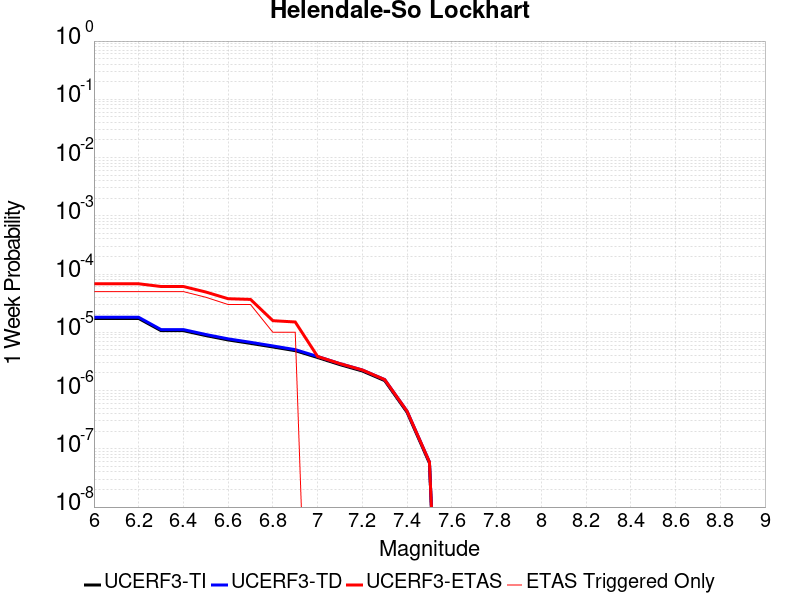 |  | 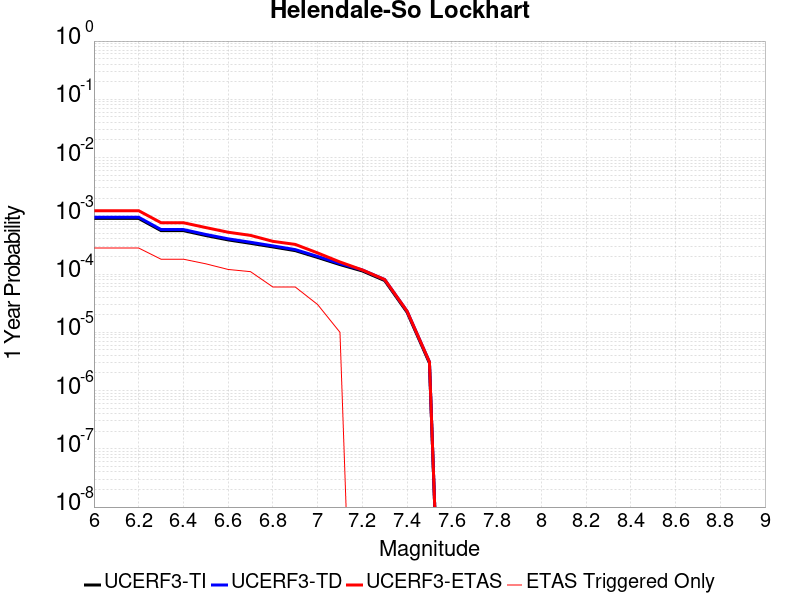 |  |

| Magnitude | 1 wk TI Prob | 1 wk TD Prob | 1 wk ETAS Prob | 1 wk ETAS/TD Gain | 1 wk ETAS Triggered Only | 1 mo TI Prob | 1 mo TD Prob | 1 mo ETAS Prob | 1 mo ETAS/TD Gain | 1 mo ETAS Triggered Only | 1 yr TI Prob | 1 yr TD Prob | 1 yr ETAS Prob | 1 yr ETAS/TD Gain | 1 yr ETAS Triggered Only | 10 yr TI Prob | 10 yr TD Prob | 10 yr ETAS Prob | 10 yr ETAS/TD Gain | 10 yr ETAS Triggered Only |
|-----|-----|-----|-----|-----|-----|-----|-----|-----|-----|-----|-----|-----|-----|-----|-----|-----|-----|-----|-----|-----|
| 6.0 | 1.7296055E-5 | 1.8103841E-5 | 6.8102934E-5 | 3.7617948 | 5.0E-5 | 7.412385E-5 | 7.7585704E-5 | 1.9757639E-4 | 2.5465567 | 1.2E-4 | 9.0208417E-4 | 9.442173E-4 | 0.001223953 | 1.2962619 | 2.8E-4 | 0.008984311 | 0.009404174 | 0.009899473 | 1.0526679 | 5.0E-4 |
| 6.1 | 1.7296055E-5 | 1.8103841E-5 | 6.8102934E-5 | 3.7617948 | 5.0E-5 | 7.412385E-5 | 7.7585704E-5 | 1.9757639E-4 | 2.5465567 | 1.2E-4 | 9.0208417E-4 | 9.442173E-4 | 0.001223953 | 1.2962619 | 2.8E-4 | 0.008984311 | 0.009404174 | 0.009899473 | 1.0526679 | 5.0E-4 |
| 6.2 | 1.7296055E-5 | 1.8103841E-5 | 6.8102934E-5 | 3.7617948 | 5.0E-5 | 7.412385E-5 | 7.7585704E-5 | 1.9757639E-4 | 2.5465567 | 1.2E-4 | 9.0208417E-4 | 9.442173E-4 | 0.001223953 | 1.2962619 | 2.8E-4 | 0.008984311 | 0.009404174 | 0.009899473 | 1.0526679 | 5.0E-4 |
| 6.3 | 1.0669118E-5 | 1.1135489E-5 | 6.113493E-5 | 5.4900985 | 5.0E-5 | 4.5723988E-5 | 4.7722668E-5 | 1.3771837E-4 | 2.8858063 | 9.0E-5 | 5.5654737E-4 | 5.8087136E-4 | 7.607668E-4 | 1.3096993 | 1.8E-4 | 0.0055515557 | 0.005793827 | 0.006102031 | 1.0531952 | 3.1E-4 |
| 6.4 | 1.0669118E-5 | 1.1135489E-5 | 6.113493E-5 | 5.4900985 | 5.0E-5 | 4.5723988E-5 | 4.7722668E-5 | 1.3771837E-4 | 2.8858063 | 9.0E-5 | 5.5654737E-4 | 5.8087136E-4 | 7.607668E-4 | 1.3096993 | 1.8E-4 | 0.0055515557 | 0.005793827 | 0.006102031 | 1.0531952 | 3.1E-4 |
| 6.5 | 8.790038E-6 | 9.1702495E-6 | 4.916988E-5 | 5.3618913 | 4.0E-5 | 3.767105E-5 | 3.9300485E-5 | 1.1929734E-4 | 3.0355182 | 8.0E-5 | 4.585485E-4 | 4.7837992E-4 | 6.2830816E-4 | 1.3134084 | 1.5E-4 | 0.0045760344 | 0.0047736657 | 0.005042377 | 1.0562903 | 2.7E-4 |
| 6.6 | 7.396949E-6 | 7.715581E-6 | 3.771535E-5 | 4.888206 | 3.0E-5 | 3.1700827E-5 | 3.3066364E-5 | 9.306438E-5 | 2.814473 | 6.0E-5 | 3.858892E-4 | 4.025096E-4 | 5.224613E-4 | 1.2980095 | 1.2E-4 | 0.003852198 | 0.004017913 | 0.004246989 | 1.0570136 | 2.3E-4 |
| 6.7 | 6.4600285E-6 | 6.7380697E-6 | 3.6737867E-5 | 5.452284 | 3.0E-5 | 2.7685543E-5 | 2.8877126E-5 | 8.887539E-5 | 3.0777092 | 6.0E-5 | 3.3701936E-4 | 3.5152308E-4 | 4.614844E-4 | 1.312814 | 1.1E-4 | 0.0033650869 | 0.003509752 | 0.0037289797 | 1.0624624 | 2.2E-4 |
| 6.8 | 5.600104E-6 | 5.836042E-6 | 1.5835984E-5 | 2.71348 | 1.0E-5 | 2.4000226E-5 | 2.5011372E-5 | 6.501037E-5 | 2.5992324 | 4.0E-5 | 2.9216358E-4 | 3.044715E-4 | 3.6445324E-4 | 1.1970028 | 6.0E-5 | 0.0029177975 | 0.003040605 | 0.0031801793 | 1.0459034 | 1.4E-4 |
| 6.9 | 4.839122E-6 | 5.039537E-6 | 1.5039486E-5 | 2.9842992 | 1.0E-5 | 2.0738931E-5 | 2.159784E-5 | 6.159698E-5 | 2.8519971 | 4.0E-5 | 2.5246723E-4 | 2.6292243E-4 | 3.2290665E-4 | 1.2281442 | 6.0E-5 | 0.002521806 | 0.002626161 | 0.002745846 | 1.0455741 | 1.2E-4 |
| 7.0 | 3.6937633E-6 | 3.845229E-6 | 3.845229E-6 | 1.0 | 0.0 | 1.5830317E-5 | 1.6479451E-5 | 2.6479285E-5 | 1.6068064 | 1.0E-5 | 1.9271708E-4 | 2.0061915E-4 | 2.3061312E-4 | 1.149507 | 3.0E-5 | 0.0019255003 | 0.0020044118 | 0.0020742714 | 1.034853 | 7.0E-5 |
| 7.1 | 2.7858857E-6 | 2.8978693E-6 | 2.8978693E-6 | 1.0 | 0.0 | 1.1939455E-5 | 1.2419382E-5 | 2.2419257E-5 | 1.805183 | 1.0E-5 | 1.4535317E-4 | 1.511957E-4 | 1.6119418E-4 | 1.0661294 | 1.0E-5 | 0.0014525814 | 0.0015109498 | 0.0015608743 | 1.0330417 | 5.0E-5 |
| 7.2 | 2.1672065E-6 | 2.2540248E-6 | 2.2540248E-6 | 1.0 | 0.0 | 9.2879945E-6 | 9.660072E-6 | 9.660072E-6 | 1.0 | 0.0 | 1.1307546E-4 | 1.176052E-4 | 1.176052E-4 | 1.0 | 0.0 | 0.0011301794 | 0.0011754478 | 0.0012154009 | 1.0339895 | 4.0E-5 |
| 7.3 | 1.4823496E-6 | 1.5422185E-6 | 1.5422185E-6 | 1.0 | 0.0 | 6.3529114E-6 | 6.6094917E-6 | 6.6094917E-6 | 1.0 | 0.0 | 7.734395E-5 | 8.046775E-5 | 8.046775E-5 | 1.0 | 0.0 | 7.731704E-4 | 8.044012E-4 | 8.243851E-4 | 1.0248432 | 2.0E-5 |
| 7.4 | 4.2321457E-7 | 4.4109012E-7 | 4.4109012E-7 | 1.0 | 0.0 | 1.8137755E-6 | 1.8903852E-6 | 1.8903852E-6 | 1.0 | 0.0 | 2.2082493E-5 | 2.3015242E-5 | 2.3015242E-5 | 1.0 | 0.0 | 2.2080299E-4 | 2.3013311E-4 | 2.3013311E-4 | 1.0 | 0.0 |
| 7.5 | 5.6942316E-8 | 5.941599E-8 | 5.941599E-8 | 1.0 | 0.0 | 2.440385E-7 | 2.5463993E-7 | 2.5463993E-7 | 1.0 | 0.0 | 2.9711643E-6 | 3.1002376E-6 | 3.1002376E-6 | 1.0 | 0.0 | 2.9711247E-5 | 3.1002022E-5 | 3.1002022E-5 | 1.0 | 0.0 |

## Death Valley (Black Mtns Frontal)
*[(top)](#table-of-contents)*

| 1 Week | 1 Month | 1 Year | 10 Year |
|-----|-----|-----|-----|
|  |  |  |  |

| Magnitude | 1 wk TI Prob | 1 wk TD Prob | 1 wk ETAS Prob | 1 wk ETAS/TD Gain | 1 wk ETAS Triggered Only | 1 mo TI Prob | 1 mo TD Prob | 1 mo ETAS Prob | 1 mo ETAS/TD Gain | 1 mo ETAS Triggered Only | 1 yr TI Prob | 1 yr TD Prob | 1 yr ETAS Prob | 1 yr ETAS/TD Gain | 1 yr ETAS Triggered Only | 10 yr TI Prob | 10 yr TD Prob | 10 yr ETAS Prob | 10 yr ETAS/TD Gain | 10 yr ETAS Triggered Only |
|-----|-----|-----|-----|-----|-----|-----|-----|-----|-----|-----|-----|-----|-----|-----|-----|-----|-----|-----|-----|-----|
| 6.0 | 1.6707214E-5 | 1.867056E-5 | 5.8669815E-5 | 3.1423702 | 4.0E-5 | 7.160038E-5 | 8.001427E-5 | 1.7000707E-4 | 2.1247094 | 9.0E-5 | 8.71386E-4 | 9.7374606E-4 | 0.0012135124 | 1.2462308 | 2.4E-4 | 0.00867977 | 0.009695647 | 0.010141284 | 1.0459626 | 4.5E-4 |
| 6.1 | 1.6707214E-5 | 1.867056E-5 | 5.8669815E-5 | 3.1423702 | 4.0E-5 | 7.160038E-5 | 8.001427E-5 | 1.7000707E-4 | 2.1247094 | 9.0E-5 | 8.71386E-4 | 9.7374606E-4 | 0.0012135124 | 1.2462308 | 2.4E-4 | 0.00867977 | 0.009695647 | 0.010141284 | 1.0459626 | 4.5E-4 |
| 6.2 | 1.6707214E-5 | 1.867056E-5 | 5.8669815E-5 | 3.1423702 | 4.0E-5 | 7.160038E-5 | 8.001427E-5 | 1.7000707E-4 | 2.1247094 | 9.0E-5 | 8.71386E-4 | 9.7374606E-4 | 0.0012135124 | 1.2462308 | 2.4E-4 | 0.00867977 | 0.009695647 | 0.010141284 | 1.0459626 | 4.5E-4 |
| 6.3 | 1.6707214E-5 | 1.867056E-5 | 5.8669815E-5 | 3.1423702 | 4.0E-5 | 7.160038E-5 | 8.001427E-5 | 1.7000707E-4 | 2.1247094 | 9.0E-5 | 8.71386E-4 | 9.7374606E-4 | 0.0012135124 | 1.2462308 | 2.4E-4 | 0.00867977 | 0.009695647 | 0.010141284 | 1.0459626 | 4.5E-4 |
| 6.4 | 1.5515609E-5 | 1.7338483E-5 | 5.733779E-5 | 3.3069668 | 4.0E-5 | 6.649377E-5 | 7.430571E-5 | 1.5429976E-4 | 2.0765533 | 8.0E-5 | 8.0926094E-4 | 9.0430264E-4 | 0.0011241037 | 1.2430614 | 2.2E-4 | 0.008063202 | 0.009006913 | 0.0093934005 | 1.0429101 | 3.9E-4 |
| 6.5 | 1.5515609E-5 | 1.7338483E-5 | 5.733779E-5 | 3.3069668 | 4.0E-5 | 6.649377E-5 | 7.430571E-5 | 1.5429976E-4 | 2.0765533 | 8.0E-5 | 8.0926094E-4 | 9.0430264E-4 | 0.0011241037 | 1.2430614 | 2.2E-4 | 0.008063202 | 0.009006913 | 0.0093934005 | 1.0429101 | 3.9E-4 |
| 6.6 | 1.5041828E-5 | 1.6809407E-5 | 4.6808902E-5 | 2.784685 | 3.0E-5 | 6.4463384E-5 | 7.203836E-5 | 1.4203331E-4 | 1.9716345 | 7.0E-5 | 7.8455906E-4 | 8.7672E-4 | 0.0010865359 | 1.2393192 | 2.1E-4 | 0.00781795 | 0.008733268 | 0.009100037 | 1.0419967 | 3.7E-4 |
| 6.7 | 1.4634985E-5 | 1.6356273E-5 | 4.635578E-5 | 2.8341289 | 3.0E-5 | 6.271985E-5 | 7.009646E-5 | 1.3009226E-4 | 1.8559034 | 6.0E-5 | 7.6334673E-4 | 8.53096E-4 | 0.0010429339 | 1.2225282 | 1.9E-4 | 0.007607299 | 0.008498848 | 0.008826043 | 1.0384988 | 3.3E-4 |
| 6.8 | 1.4209158E-5 | 1.5882297E-5 | 4.588182E-5 | 2.8888657 | 3.0E-5 | 6.089497E-5 | 6.806524E-5 | 1.18061835E-4 | 1.7345394 | 5.0E-5 | 7.4114406E-4 | 8.2838483E-4 | 9.98244E-4 | 1.2050487 | 1.7E-4 | 0.007386771 | 0.008253585 | 0.008551109 | 1.0360478 | 3.0E-4 |
| 6.9 | 1.3780098E-5 | 1.5404834E-5 | 3.5404526E-5 | 2.2982738 | 2.0E-5 | 5.9056227E-5 | 6.601908E-5 | 9.60171E-5 | 1.4543841 | 3.0E-5 | 7.1877235E-4 | 8.0349133E-4 | 9.333869E-4 | 1.1616639 | 1.3E-4 | 0.0071645193 | 0.008006458 | 0.008264376 | 1.0322138 | 2.6E-4 |
| 7.0 | 1.3585064E-5 | 1.5188394E-5 | 3.518809E-5 | 2.3167748 | 2.0E-5 | 5.8220405E-5 | 6.5091524E-5 | 9.508957E-5 | 1.4608595 | 3.0E-5 | 7.086029E-4 | 7.922066E-4 | 9.0211944E-4 | 1.1387427 | 1.1E-4 | 0.007063476 | 0.007894417 | 0.008132523 | 1.0301613 | 2.4E-4 |
| 7.1 | 1.3398601E-5 | 1.4981575E-5 | 3.4981276E-5 | 2.334953 | 2.0E-5 | 5.742131E-5 | 6.4205204E-5 | 9.420327E-5 | 1.4672219 | 3.0E-5 | 6.9888023E-4 | 7.814234E-4 | 8.713531E-4 | 1.1150844 | 9.0E-5 | 0.0069668638 | 0.007787346 | 0.007995711 | 1.0267569 | 2.1E-4 |
| 7.2 | 1.3126312E-5 | 1.4679792E-5 | 3.46795E-5 | 2.3623972 | 2.0E-5 | 5.6254412E-5 | 6.291191E-5 | 9.291002E-5 | 1.4768273 | 3.0E-5 | 6.846822E-4 | 7.656887E-4 | 8.5561984E-4 | 1.1174512 | 9.0E-5 | 0.006825765 | 0.00763109 | 0.007839487 | 1.0273091 | 2.1E-4 |
| 7.3 | 1.2922429E-5 | 1.4454016E-5 | 3.4453726E-5 | 2.3836784 | 2.0E-5 | 5.5380664E-5 | 6.1944345E-5 | 9.1942486E-5 | 1.4842757 | 3.0E-5 | 6.74051E-4 | 7.5391686E-4 | 8.43849E-4 | 1.1192865 | 9.0E-5 | 0.006720101 | 0.0075141727 | 0.007702745 | 1.0250956 | 1.9E-4 |
| 7.4 | 1.2768878E-5 | 1.4283997E-5 | 3.4283712E-5 | 2.4001484 | 2.0E-5 | 5.4722615E-5 | 6.1215724E-5 | 9.1213886E-5 | 1.4900402 | 3.0E-5 | 6.660441E-4 | 7.45052E-4 | 8.249924E-4 | 1.107295 | 8.0E-5 | 0.0066405144 | 0.0074261203 | 0.0076047834 | 1.0240588 | 1.8E-4 |
| 7.5 | 1.2521929E-5 | 1.40122365E-5 | 3.4011955E-5 | 2.4273038 | 2.0E-5 | 5.366431E-5 | 6.0051094E-5 | 9.004929E-5 | 1.4995446 | 3.0E-5 | 6.531671E-4 | 7.308822E-4 | 8.1082375E-4 | 1.1093768 | 8.0E-5 | 0.006512506 | 0.0072853607 | 0.007454122 | 1.0231645 | 1.7E-4 |
| 7.6 | 1.1301089E-5 | 1.2648349E-5 | 2.2648223E-5 | 1.790607 | 1.0E-5 | 4.8432343E-5 | 5.4206117E-5 | 7.420503E-5 | 1.368942 | 2.0E-5 | 5.895042E-4 | 6.597649E-4 | 7.297187E-4 | 1.1060284 | 7.0E-5 | 0.0058794282 | 0.0065786145 | 0.006717693 | 1.021141 | 1.4E-4 |
| 7.7 | 9.189108E-6 | 1.0283521E-5 | 2.0283418E-5 | 1.9724195 | 1.0E-5 | 3.93813E-5 | 4.407152E-5 | 6.4070635E-5 | 1.4537878 | 2.0E-5 | 4.7936183E-4 | 5.3644367E-4 | 5.9641147E-4 | 1.1117877 | 6.0E-5 | 0.004783291 | 0.0053519984 | 0.0054813027 | 1.02416 | 1.3E-4 |
| 7.8 | 3.4586725E-7 | 3.648288E-7 | 3.648288E-7 | 1.0 | 0.0 | 1.4822873E-6 | 1.5635511E-6 | 1.5635511E-6 | 1.0 | 0.0 | 1.80467E-5 | 1.9036073E-5 | 2.9035882E-5 | 1.5253085 | 1.0E-5 | 1.8045233E-4 | 1.9034486E-4 | 2.0034295E-4 | 1.0525262 | 1.0E-5 |
| 7.9 | 2.5591178E-9 | 2.6696871E-9 | 2.6696871E-9 | 1.0 | 0.0 | 1.0967647E-8 | 1.1441516E-8 | 1.1441516E-8 | 1.0 | 0.0 | 1.335311E-7 | 1.3930045E-7 | 1.3930045E-7 | 1.0 | 0.0 | 1.3353102E-6 | 1.3930046E-6 | 1.3930046E-6 | 1.0 | 0.0 |

## San Andreas (Parkfield)
*[(top)](#table-of-contents)*

| 1 Week | 1 Month | 1 Year | 10 Year |
|-----|-----|-----|-----|
|  |  |  |  |

| Magnitude | 1 wk TI Prob | 1 wk TD Prob | 1 wk ETAS Prob | 1 wk ETAS/TD Gain | 1 wk ETAS Triggered Only | 1 mo TI Prob | 1 mo TD Prob | 1 mo ETAS Prob | 1 mo ETAS/TD Gain | 1 mo ETAS Triggered Only | 1 yr TI Prob | 1 yr TD Prob | 1 yr ETAS Prob | 1 yr ETAS/TD Gain | 1 yr ETAS Triggered Only | 10 yr TI Prob | 10 yr TD Prob | 10 yr ETAS Prob | 10 yr ETAS/TD Gain | 10 yr ETAS Triggered Only |
|-----|-----|-----|-----|-----|-----|-----|-----|-----|-----|-----|-----|-----|-----|-----|-----|-----|-----|-----|-----|-----|
| 6.0 | 5.556969E-4 | 7.787764E-4 | 7.887686E-4 | 1.0128306 | 1.0E-5 | 0.0023793848 | 0.0033338934 | 0.0033837266 | 1.0149475 | 5.0E-5 | 0.028586963 | 0.04027906 | 0.040413424 | 1.0033357 | 1.4E-4 | 0.25176284 | 0.3373374 | 0.3375561 | 1.0006483 | 3.3E-4 |
| 6.1 | 1.925858E-4 | 3.0300187E-4 | 3.1299883E-4 | 1.0329931 | 1.0E-5 | 8.2510663E-4 | 0.0012980271 | 0.0013080142 | 1.007694 | 1.0E-5 | 0.0099994885 | 0.01578479 | 0.01582416 | 1.0024941 | 4.0E-5 | 0.095613256 | 0.14981315 | 0.14992367 | 1.0007378 | 1.3E-4 |
| 6.2 | 9.4306815E-5 | 1.8251229E-4 | 1.9251046E-4 | 1.0547808 | 1.0E-5 | 4.0410945E-4 | 7.8196224E-4 | 7.9195446E-4 | 1.0127783 | 1.0E-5 | 0.0049089384 | 0.009479025 | 0.009518647 | 1.0041798 | 4.0E-5 | 0.048019063 | 0.09188695 | 0.09200501 | 1.0012848 | 1.3E-4 |
| 6.3 | 9.283051E-5 | 1.7947727E-4 | 1.8947547E-4 | 1.0557073 | 1.0E-5 | 3.9778434E-4 | 7.689627E-4 | 7.7895506E-4 | 1.0129945 | 1.0E-5 | 0.0048322747 | 0.0093221245 | 0.009361751 | 1.0042509 | 4.0E-5 | 0.047285385 | 0.09053988 | 0.09065811 | 1.0013058 | 1.3E-4 |
| 6.4 | 9.138826E-5 | 1.7709887E-4 | 1.870971E-4 | 1.0564556 | 1.0E-5 | 3.916052E-4 | 7.5877557E-4 | 7.68768E-4 | 1.0131692 | 1.0E-5 | 0.0047573745 | 0.009199142 | 0.009238774 | 1.0043082 | 4.0E-5 | 0.046568092 | 0.08944346 | 0.089561835 | 1.0013235 | 1.3E-4 |
| 6.5 | 9.000255E-5 | 1.7467843E-4 | 1.8467668E-4 | 1.0572381 | 1.0E-5 | 3.8566816E-4 | 7.484082E-4 | 7.584007E-4 | 1.0133517 | 1.0E-5 | 0.0046854047 | 0.009074002 | 0.009113639 | 1.0043682 | 4.0E-5 | 0.045878403 | 0.08833238 | 0.088450894 | 1.0013417 | 1.3E-4 |
| 6.6 | 8.8109264E-5 | 1.7148908E-4 | 1.8148737E-4 | 1.0583028 | 1.0E-5 | 3.7755648E-4 | 7.347474E-4 | 7.4474E-4 | 1.0136001 | 1.0E-5 | 0.0045870654 | 0.008909067 | 0.008948712 | 1.0044498 | 4.0E-5 | 0.04493529 | 0.08686431 | 0.08698302 | 1.0013666 | 1.3E-4 |
| 6.7 | 8.738073E-5 | 1.7015962E-4 | 1.8015792E-4 | 1.0587584 | 1.0E-5 | 3.7443507E-4 | 7.290529E-4 | 7.3904556E-4 | 1.0137064 | 1.0E-5 | 0.0045492216 | 0.008840349 | 0.008879995 | 1.0044847 | 4.0E-5 | 0.04457213 | 0.08626531 | 0.0863841 | 1.001377 | 1.3E-4 |
| 6.8 | 8.710195E-5 | 1.6961442E-4 | 1.7961273E-4 | 1.0589472 | 1.0E-5 | 3.7324068E-4 | 7.267176E-4 | 7.367103E-4 | 1.0137506 | 1.0E-5 | 0.0045347405 | 0.008812156 | 0.008851803 | 1.0044992 | 4.0E-5 | 0.04443313 | 0.086012915 | 0.08613174 | 1.0013814 | 1.3E-4 |
| 6.9 | 8.6801556E-5 | 1.6902383E-4 | 1.7902213E-4 | 1.0591532 | 1.0E-5 | 3.7195362E-4 | 7.241879E-4 | 7.341806E-4 | 1.0137986 | 1.0E-5 | 0.0045191357 | 0.0087816045 | 0.008821254 | 1.0045149 | 4.0E-5 | 0.044283327 | 0.08573886 | 0.08585772 | 1.0013863 | 1.3E-4 |
| 7.0 | 8.5571606E-5 | 1.6655146E-4 | 1.7654979E-4 | 1.0600315 | 1.0E-5 | 3.6668387E-4 | 7.1359787E-4 | 7.235907E-4 | 1.0140035 | 1.0E-5 | 0.004455241 | 0.008653701 | 0.008693355 | 1.0045823 | 4.0E-5 | 0.043669727 | 0.08458771 | 0.084706716 | 1.0014069 | 1.3E-4 |
| 7.1 | 7.82589E-5 | 1.513576E-4 | 1.6135609E-4 | 1.0660588 | 1.0E-5 | 3.3535215E-4 | 6.485149E-4 | 6.585084E-4 | 1.0154098 | 1.0E-5 | 0.0040752706 | 0.007867255 | 0.00790694 | 1.0050443 | 4.0E-5 | 0.040013418 | 0.07750286 | 0.07761356 | 1.0014284 | 1.2E-4 |
| 7.2 | 7.690929E-5 | 1.4872964E-4 | 1.5872816E-4 | 1.067226 | 1.0E-5 | 3.2956956E-4 | 6.3725776E-4 | 6.4725144E-4 | 1.0156822 | 1.0E-5 | 0.004005129 | 0.0077311797 | 0.0077708703 | 1.0051339 | 4.0E-5 | 0.0393371 | 0.07627582 | 0.07638667 | 1.0014533 | 1.2E-4 |
| 7.3 | 7.5543794E-5 | 1.4569426E-4 | 1.556928E-4 | 1.0686269 | 1.0E-5 | 3.2371894E-4 | 6.242553E-4 | 6.34249E-4 | 1.0160091 | 1.0E-5 | 0.003934157 | 0.0075739846 | 0.0076136817 | 1.0052413 | 4.0E-5 | 0.038652334 | 0.07484126 | 0.074952275 | 1.0014834 | 1.2E-4 |
| 7.4 | 7.4214564E-5 | 1.4270298E-4 | 1.5270156E-4 | 1.0700656 | 1.0E-5 | 3.1802364E-4 | 6.1144156E-4 | 6.2143547E-4 | 1.0163448 | 1.0E-5 | 0.003865065 | 0.00741905 | 0.0074587534 | 1.0053515 | 4.0E-5 | 0.03798529 | 0.07341491 | 0.0735261 | 1.0015146 | 1.2E-4 |
| 7.5 | 6.149578E-5 | 1.1197151E-4 | 1.2197039E-4 | 1.0892985 | 1.0E-5 | 2.6352672E-4 | 4.7978974E-4 | 4.897849E-4 | 1.0208324 | 1.0E-5 | 0.0032037178 | 0.0058258264 | 0.005865593 | 1.0068259 | 4.0E-5 | 0.03157923 | 0.058584794 | 0.058678936 | 1.001607 | 1.0E-4 |
| 7.6 | 6.0643448E-5 | 1.10257475E-4 | 1.2025637E-4 | 1.0906868 | 1.0E-5 | 2.598746E-4 | 4.7244655E-4 | 4.8244183E-4 | 1.0211564 | 1.0E-5 | 0.0031593828 | 0.0057368972 | 0.005776668 | 1.0069324 | 4.0E-5 | 0.031148417 | 0.0577456 | 0.057839826 | 1.0016317 | 1.0E-4 |
| 7.7 | 5.1652263E-5 | 9.180402E-5 | 9.180402E-5 | 1.0 | 0.0 | 2.2134806E-4 | 3.933865E-4 | 3.933865E-4 | 1.0 | 0.0 | 0.002691582 | 0.0047789724 | 0.004808829 | 1.0062475 | 3.0E-5 | 0.026592141 | 0.048558682 | 0.04864431 | 1.0017635 | 9.0E-5 |
| 7.8 | 4.8090482E-5 | 8.564889E-5 | 8.564889E-5 | 1.0 | 0.0 | 2.060858E-4 | 3.6701505E-4 | 3.6701505E-4 | 1.0 | 0.0 | 0.0025062072 | 0.0044592614 | 0.0044891275 | 1.0066975 | 3.0E-5 | 0.024781305 | 0.04532328 | 0.045390107 | 1.0014745 | 7.0E-5 |
| 7.9 | 3.970278E-5 | 6.754373E-5 | 6.754373E-5 | 1.0 | 0.0 | 1.7014367E-4 | 2.8944103E-4 | 2.8944103E-4 | 1.0 | 0.0 | 0.002069531 | 0.003518254 | 0.0035481486 | 1.008497 | 3.0E-5 | 0.020503636 | 0.03590036 | 0.03596785 | 1.0018798 | 7.0E-5 |
| 8.0 | 2.8982335E-5 | 4.072156E-5 | 4.072156E-5 | 1.0 | 0.0 | 1.2420409E-4 | 1.745093E-4 | 1.745093E-4 | 1.0 | 0.0 | 0.0015111357 | 0.0021225815 | 0.0021325604 | 1.0047013 | 1.0E-5 | 0.015009012 | 0.022022424 | 0.022061544 | 1.0017763 | 4.0E-5 |
| 8.1 | 1.8836186E-5 | 1.8692857E-5 | 1.8692857E-5 | 1.0 | 0.0 | 8.0724014E-5 | 8.0109785E-5 | 8.0109785E-5 | 1.0 | 0.0 | 9.823717E-4 | 9.7490085E-4 | 9.7490085E-4 | 1.0 | 0.0 | 0.009780403 | 0.010494427 | 0.010504322 | 1.000943 | 1.0E-5 |
| 8.2 | 8.643924E-6 | 5.478665E-6 | 5.478665E-6 | 1.0 | 0.0 | 3.704486E-5 | 2.3479783E-5 | 2.3479783E-5 | 1.0 | 0.0 | 4.5092785E-4 | 2.8582895E-4 | 2.8582895E-4 | 1.0 | 0.0 | 0.0045001395 | 0.0032508469 | 0.0032508469 | 1.0 | 0.0 |
| 8.3 | 1.983087E-6 | 7.6647797E-7 | 7.6647797E-7 | 1.0 | 0.0 | 8.498917E-6 | 3.2849016E-6 | 3.2849016E-6 | 1.0 | 0.0 | 1.034694E-4 | 3.999296E-5 | 3.999296E-5 | 1.0 | 0.0 | 0.0010342124 | 4.7228087E-4 | 4.7228087E-4 | 1.0 | 0.0 |

## San Andreas (Big Bend)
*[(top)](#table-of-contents)*

| 1 Week | 1 Month | 1 Year | 10 Year |
|-----|-----|-----|-----|
|  |  |  |  |

| Magnitude | 1 wk TI Prob | 1 wk TD Prob | 1 wk ETAS Prob | 1 wk ETAS/TD Gain | 1 wk ETAS Triggered Only | 1 mo TI Prob | 1 mo TD Prob | 1 mo ETAS Prob | 1 mo ETAS/TD Gain | 1 mo ETAS Triggered Only | 1 yr TI Prob | 1 yr TD Prob | 1 yr ETAS Prob | 1 yr ETAS/TD Gain | 1 yr ETAS Triggered Only | 10 yr TI Prob | 10 yr TD Prob | 10 yr ETAS Prob | 10 yr ETAS/TD Gain | 10 yr ETAS Triggered Only |
|-----|-----|-----|-----|-----|-----|-----|-----|-----|-----|-----|-----|-----|-----|-----|-----|-----|-----|-----|-----|-----|
| 6.0 | 1.0179969E-4 | 2.0081972E-4 | 2.1081771E-4 | 1.0497859 | 1.0E-5 | 4.362114E-4 | 8.603731E-4 | 9.103301E-4 | 1.0580643 | 5.0E-5 | 0.0052979486 | 0.010425015 | 0.0106130345 | 1.0180354 | 1.9E-4 | 0.051734097 | 0.101484396 | 0.10178989 | 1.0030103 | 3.4E-4 |
| 6.1 | 1.0179969E-4 | 2.0081972E-4 | 2.1081771E-4 | 1.0497859 | 1.0E-5 | 4.362114E-4 | 8.603731E-4 | 9.103301E-4 | 1.0580643 | 5.0E-5 | 0.0052979486 | 0.010425015 | 0.0106130345 | 1.0180354 | 1.9E-4 | 0.051734097 | 0.101484396 | 0.10178989 | 1.0030103 | 3.4E-4 |
| 6.2 | 1.0179969E-4 | 2.0081972E-4 | 2.1081771E-4 | 1.0497859 | 1.0E-5 | 4.362114E-4 | 8.603731E-4 | 9.103301E-4 | 1.0580643 | 5.0E-5 | 0.0052979486 | 0.010425015 | 0.0106130345 | 1.0180354 | 1.9E-4 | 0.051734097 | 0.101484396 | 0.10178989 | 1.0030103 | 3.4E-4 |
| 6.3 | 1.0179969E-4 | 2.0081972E-4 | 2.1081771E-4 | 1.0497859 | 1.0E-5 | 4.362114E-4 | 8.603731E-4 | 9.103301E-4 | 1.0580643 | 5.0E-5 | 0.0052979486 | 0.010425015 | 0.0106130345 | 1.0180354 | 1.9E-4 | 0.051734097 | 0.101484396 | 0.10178989 | 1.0030103 | 3.4E-4 |
| 6.4 | 9.1639464E-5 | 1.8438944E-4 | 1.943876E-4 | 1.0542231 | 1.0E-5 | 3.9268145E-4 | 7.9000136E-4 | 8.0998556E-4 | 1.0252964 | 2.0E-5 | 0.0047704205 | 0.009575968 | 0.009684914 | 1.0113771 | 1.1E-4 | 0.046693064 | 0.09381712 | 0.09400742 | 1.0020283 | 2.1E-4 |
| 6.5 | 9.1639464E-5 | 1.8438944E-4 | 1.943876E-4 | 1.0542231 | 1.0E-5 | 3.9268145E-4 | 7.9000136E-4 | 8.0998556E-4 | 1.0252964 | 2.0E-5 | 0.0047704205 | 0.009575968 | 0.009684914 | 1.0113771 | 1.1E-4 | 0.046693064 | 0.09381712 | 0.09400742 | 1.0020283 | 2.1E-4 |
| 6.6 | 9.042622E-5 | 1.8245954E-4 | 1.9245771E-4 | 1.0547967 | 1.0E-5 | 3.8748336E-4 | 7.817353E-4 | 8.0171967E-4 | 1.0255641 | 2.0E-5 | 0.0047074095 | 0.009476205 | 0.009585164 | 1.011498 | 1.1E-4 | 0.046089325 | 0.09291417 | 0.09310465 | 1.0020502 | 2.1E-4 |
| 6.7 | 8.9836685E-5 | 1.8160277E-4 | 1.9160095E-4 | 1.0550553 | 1.0E-5 | 3.8495753E-4 | 7.7806565E-4 | 7.980501E-4 | 1.0256847 | 2.0E-5 | 0.00467679 | 0.0094319135 | 0.009540876 | 1.0115526 | 1.1E-4 | 0.045795817 | 0.0925084 | 0.09269897 | 1.00206 | 2.1E-4 |
| 6.8 | 8.9471854E-5 | 1.8107046E-4 | 1.9106866E-4 | 1.0552171 | 1.0E-5 | 3.8339442E-4 | 7.7578565E-4 | 7.9577015E-4 | 1.0257603 | 2.0E-5 | 0.004657841 | 0.009404396 | 0.009513361 | 1.0115867 | 1.1E-4 | 0.04561414 | 0.092256 | 0.092446625 | 1.0020663 | 2.1E-4 |
| 6.9 | 8.858234E-5 | 1.7989E-4 | 1.898882E-4 | 1.0555795 | 1.0E-5 | 3.7958333E-4 | 7.7072956E-4 | 7.8072184E-4 | 1.0129647 | 1.0E-5 | 0.004611638 | 0.009343366 | 0.009432525 | 1.0095425 | 9.0E-5 | 0.04517103 | 0.0916962 | 0.09186878 | 1.0018821 | 1.9E-4 |
| 7.0 | 8.7433385E-5 | 1.7827768E-4 | 1.8827591E-4 | 1.0560822 | 1.0E-5 | 3.746607E-4 | 7.638237E-4 | 7.738161E-4 | 1.013082 | 1.0E-5 | 0.004551957 | 0.009260005 | 0.009349172 | 1.0096292 | 9.0E-5 | 0.044598386 | 0.09093105 | 0.09109469 | 1.0017995 | 1.8E-4 |
| 7.1 | 8.684964E-5 | 1.7739709E-4 | 1.8739532E-4 | 1.0563607 | 1.0E-5 | 3.7215967E-4 | 7.6005195E-4 | 7.7004434E-4 | 1.013147 | 1.0E-5 | 0.0045216335 | 0.009214473 | 0.009303644 | 1.0096773 | 9.0E-5 | 0.04430731 | 0.09051253 | 0.09067624 | 1.0018086 | 1.8E-4 |
| 7.2 | 8.606521E-5 | 1.7630306E-4 | 1.8630129E-4 | 1.0567105 | 1.0E-5 | 3.6879873E-4 | 7.553659E-4 | 7.6535833E-4 | 1.0132287 | 1.0E-5 | 0.0044808835 | 0.009157902 | 0.009247078 | 1.0097376 | 9.0E-5 | 0.043916024 | 0.08999327 | 0.09015707 | 1.0018202 | 1.8E-4 |
| 7.3 | 8.568266E-5 | 1.7572299E-4 | 1.8572123E-4 | 1.0568978 | 1.0E-5 | 3.6715972E-4 | 7.528814E-4 | 7.6287385E-4 | 1.0132723 | 1.0E-5 | 0.0044610105 | 0.0091279065 | 0.009217085 | 1.0097699 | 9.0E-5 | 0.043725148 | 0.08971421 | 0.08987806 | 1.0018264 | 1.8E-4 |
| 7.4 | 8.5432206E-5 | 1.7534874E-4 | 1.8534699E-4 | 1.0570192 | 1.0E-5 | 3.6608664E-4 | 7.5127836E-4 | 7.612709E-4 | 1.0133007 | 1.0E-5 | 0.004447999 | 0.009108554 | 0.009197734 | 1.0097908 | 9.0E-5 | 0.043600157 | 0.08953439 | 0.08969827 | 1.0018305 | 1.8E-4 |
| 7.5 | 8.4791965E-5 | 1.7404204E-4 | 1.840403E-4 | 1.0574474 | 1.0E-5 | 3.633435E-4 | 7.456814E-4 | 7.55674E-4 | 1.0134006 | 1.0E-5 | 0.0044147377 | 0.009040978 | 0.0091103455 | 1.0076725 | 7.0E-5 | 0.043280575 | 0.088910125 | 0.089055896 | 1.0016396 | 1.6E-4 |
| 7.6 | 8.241105E-5 | 1.6849465E-4 | 1.7849296E-4 | 1.059339 | 1.0E-5 | 3.531424E-4 | 7.219202E-4 | 7.31913E-4 | 1.013842 | 1.0E-5 | 0.0042910352 | 0.008754046 | 0.008823433 | 1.0079263 | 7.0E-5 | 0.042091176 | 0.08628652 | 0.08642358 | 1.0015883 | 1.5E-4 |
| 7.7 | 7.00432E-5 | 1.4212567E-4 | 1.4212567E-4 | 1.0 | 0.0 | 3.001506E-4 | 6.089679E-4 | 6.089679E-4 | 1.0 | 0.0 | 0.0036482112 | 0.0073890192 | 0.00743865 | 1.0067168 | 5.0E-5 | 0.035888977 | 0.073552616 | 0.073663786 | 1.0015115 | 1.2E-4 |
| 7.8 | 6.415362E-5 | 1.2976197E-4 | 1.2976197E-4 | 1.0 | 0.0 | 2.749151E-4 | 5.5600423E-4 | 5.5600423E-4 | 1.0 | 0.0 | 0.0033419547 | 0.0067483704 | 0.0067980327 | 1.0073591 | 5.0E-5 | 0.03292141 | 0.06728497 | 0.067378245 | 1.0013862 | 1.0E-4 |
| 7.9 | 4.939911E-5 | 9.346299E-5 | 9.346299E-5 | 1.0 | 0.0 | 2.116933E-4 | 4.004942E-4 | 4.004942E-4 | 1.0 | 0.0 | 0.0025743195 | 0.0048651244 | 0.0049049295 | 1.0081818 | 4.0E-5 | 0.025447013 | 0.048938233 | 0.04901432 | 1.0015547 | 8.0E-5 |
| 8.0 | 3.344983E-5 | 5.2255753E-5 | 5.2255753E-5 | 1.0 | 0.0 | 1.4334853E-4 | 2.2393401E-4 | 2.2393401E-4 | 1.0 | 0.0 | 0.0017438711 | 0.0027229895 | 0.0027329624 | 1.0036625 | 1.0E-5 | 0.017302496 | 0.02793611 | 0.027974993 | 1.0013919 | 4.0E-5 |
| 8.1 | 1.9104898E-5 | 1.9185067E-5 | 1.9185067E-5 | 1.0 | 0.0 | 8.1875565E-5 | 8.221913E-5 | 8.221913E-5 | 1.0 | 0.0 | 9.963791E-4 | 0.0010005588 | 0.0010005588 | 1.0 | 0.0 | 0.009919235 | 0.010756051 | 0.010765944 | 1.0009197 | 1.0E-5 |
| 8.2 | 8.643924E-6 | 5.478665E-6 | 5.478665E-6 | 1.0 | 0.0 | 3.704486E-5 | 2.3479783E-5 | 2.3479783E-5 | 1.0 | 0.0 | 4.5092785E-4 | 2.8582895E-4 | 2.8582895E-4 | 1.0 | 0.0 | 0.0045001395 | 0.0032508469 | 0.0032508469 | 1.0 | 0.0 |
| 8.3 | 1.983087E-6 | 7.6647797E-7 | 7.6647797E-7 | 1.0 | 0.0 | 8.498917E-6 | 3.2849016E-6 | 3.2849016E-6 | 1.0 | 0.0 | 1.034694E-4 | 3.999296E-5 | 3.999296E-5 | 1.0 | 0.0 | 0.0010342124 | 4.7228087E-4 | 4.7228087E-4 | 1.0 | 0.0 |

## San Andreas (San Bernardino S)
*[(top)](#table-of-contents)*

| 1 Week | 1 Month | 1 Year | 10 Year |
|-----|-----|-----|-----|
|  |  | 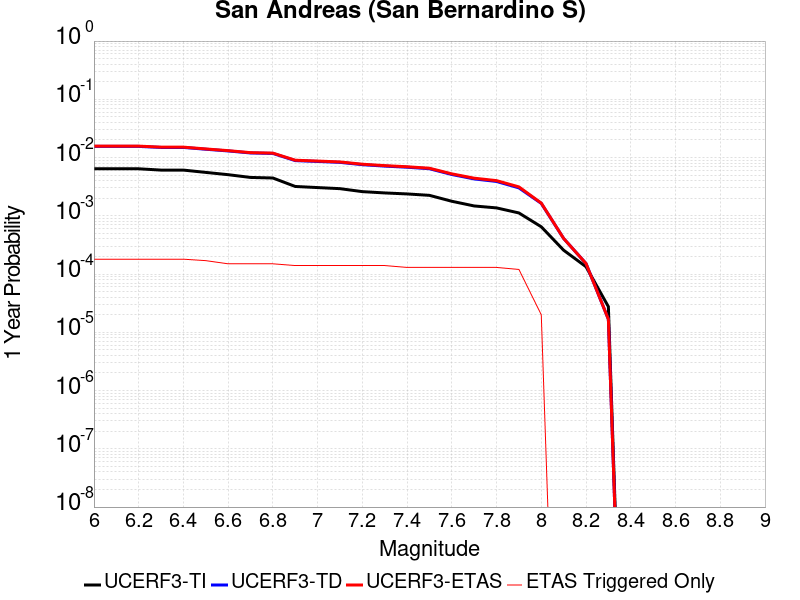 |  |

| Magnitude | 1 wk TI Prob | 1 wk TD Prob | 1 wk ETAS Prob | 1 wk ETAS/TD Gain | 1 wk ETAS Triggered Only | 1 mo TI Prob | 1 mo TD Prob | 1 mo ETAS Prob | 1 mo ETAS/TD Gain | 1 mo ETAS Triggered Only | 1 yr TI Prob | 1 yr TD Prob | 1 yr ETAS Prob | 1 yr ETAS/TD Gain | 1 yr ETAS Triggered Only | 10 yr TI Prob | 10 yr TD Prob | 10 yr ETAS Prob | 10 yr ETAS/TD Gain | 10 yr ETAS Triggered Only |
|-----|-----|-----|-----|-----|-----|-----|-----|-----|-----|-----|-----|-----|-----|-----|-----|-----|-----|-----|-----|-----|
| 6.0 | 1.2336002E-4 | 3.000988E-4 | 3.000988E-4 | 1.0 | 0.0 | 5.2857865E-4 | 0.0012855299 | 0.0013254784 | 1.0310756 | 4.0E-5 | 0.006416472 | 0.015543964 | 0.015721165 | 1.0114001 | 1.8E-4 | 0.06234337 | 0.14291926 | 0.14319353 | 1.001919 | 3.2E-4 |
| 6.1 | 1.2336002E-4 | 3.000988E-4 | 3.000988E-4 | 1.0 | 0.0 | 5.2857865E-4 | 0.0012855299 | 0.0013254784 | 1.0310756 | 4.0E-5 | 0.006416472 | 0.015543964 | 0.015721165 | 1.0114001 | 1.8E-4 | 0.06234337 | 0.14291926 | 0.14319353 | 1.001919 | 3.2E-4 |
| 6.2 | 1.2336002E-4 | 3.000988E-4 | 3.000988E-4 | 1.0 | 0.0 | 5.2857865E-4 | 0.0012855299 | 0.0013254784 | 1.0310756 | 4.0E-5 | 0.006416472 | 0.015543964 | 0.015721165 | 1.0114001 | 1.8E-4 | 0.06234337 | 0.14291926 | 0.14319353 | 1.001919 | 3.2E-4 |
| 6.3 | 1.1712257E-4 | 2.879813E-4 | 2.879813E-4 | 1.0 | 0.0 | 5.018573E-4 | 0.0012336475 | 0.0012735982 | 1.0323842 | 4.0E-5 | 0.006093008 | 0.0149210645 | 0.015098379 | 1.0118835 | 1.8E-4 | 0.059286322 | 0.13763407 | 0.13791002 | 1.002005 | 3.2E-4 |
| 6.4 | 1.1712257E-4 | 2.879813E-4 | 2.879813E-4 | 1.0 | 0.0 | 5.018573E-4 | 0.0012336475 | 0.0012735982 | 1.0323842 | 4.0E-5 | 0.006093008 | 0.0149210645 | 0.015098379 | 1.0118835 | 1.8E-4 | 0.059286322 | 0.13763407 | 0.13791002 | 1.002005 | 3.2E-4 |
| 6.5 | 1.0689076E-4 | 2.6810818E-4 | 2.6810818E-4 | 1.0 | 0.0 | 4.5802278E-4 | 0.0011485539 | 0.0011785195 | 1.0260898 | 3.0E-5 | 0.0055621783 | 0.013898602 | 0.014066239 | 1.0120615 | 1.7E-4 | 0.05425003 | 0.12891594 | 0.12918597 | 1.0020946 | 3.1E-4 |
| 6.6 | 9.7648895E-5 | 2.5055694E-4 | 2.5055694E-4 | 1.0 | 0.0 | 4.1842813E-4 | 0.0010733972 | 0.001103365 | 1.0279187 | 3.0E-5 | 0.005082469 | 0.012994667 | 0.013142718 | 1.0113932 | 1.5E-4 | 0.049677886 | 0.12101118 | 0.1212573 | 1.0020338 | 2.8E-4 |
| 6.7 | 8.757013E-5 | 2.3126253E-4 | 2.3126253E-4 | 1.0 | 0.0 | 3.7524657E-4 | 9.90771E-4 | 0.0010207412 | 1.0302495 | 3.0E-5 | 0.00455906 | 0.012000005 | 0.012148204 | 1.01235 | 1.5E-4 | 0.04466656 | 0.11236583 | 0.11261437 | 1.0022118 | 2.8E-4 |
| 6.8 | 8.562978E-5 | 2.268613E-4 | 2.268613E-4 | 1.0 | 0.0 | 3.6693315E-4 | 9.719227E-4 | 0.0010018935 | 1.0308367 | 3.0E-5 | 0.004458263 | 0.011773022 | 0.011921256 | 1.012591 | 1.5E-4 | 0.043698758 | 0.11037151 | 0.1106206 | 1.0022569 | 2.8E-4 |
| 6.9 | 6.124075E-5 | 1.7070957E-4 | 1.7070957E-4 | 1.0 | 0.0 | 2.6243398E-4 | 7.3140813E-4 | 7.613862E-4 | 1.0409868 | 3.0E-5 | 0.0031904527 | 0.008868743 | 0.009007501 | 1.0156457 | 1.4E-4 | 0.031450346 | 0.08419216 | 0.08443027 | 1.0028281 | 2.6E-4 |
| 7.0 | 5.8598747E-5 | 1.6499894E-4 | 1.6499894E-4 | 1.0 | 0.0 | 2.5111332E-4 | 7.069475E-4 | 7.369263E-4 | 1.042406 | 3.0E-5 | 0.0030530186 | 0.008573314 | 0.008712114 | 1.0161897 | 1.4E-4 | 0.03011414 | 0.08151563 | 0.08175444 | 1.0029296 | 2.6E-4 |
| 7.1 | 5.613814E-5 | 1.5918406E-4 | 1.5918406E-4 | 1.0 | 0.0 | 2.4056983E-4 | 6.8203977E-4 | 7.1201933E-4 | 1.0439557 | 3.0E-5 | 0.0029250039 | 0.008272399 | 0.008411241 | 1.0167837 | 1.4E-4 | 0.028868021 | 0.07881265 | 0.079052165 | 1.003039 | 2.6E-4 |
| 7.2 | 4.991222E-5 | 1.452485E-4 | 1.452485E-4 | 1.0 | 0.0 | 2.1389198E-4 | 6.223455E-4 | 6.523268E-4 | 1.0481747 | 3.0E-5 | 0.002601025 | 0.007550835 | 0.007689778 | 1.018401 | 1.4E-4 | 0.025707912 | 0.07226236 | 0.0724943 | 1.0032096 | 2.5E-4 |
| 7.3 | 4.7410045E-5 | 1.3718859E-4 | 1.3718859E-4 | 1.0 | 0.0 | 2.0317009E-4 | 5.8781897E-4 | 6.178013E-4 | 1.0510061 | 3.0E-5 | 0.0024707897 | 0.007133297 | 0.0072722984 | 1.0194863 | 1.4E-4 | 0.024434982 | 0.068555124 | 0.068787985 | 1.0033967 | 2.5E-4 |
| 7.4 | 4.5556746E-5 | 1.312667E-4 | 1.312667E-4 | 1.0 | 0.0 | 1.952286E-4 | 5.624506E-4 | 5.9243373E-4 | 1.053308 | 3.0E-5 | 0.002374317 | 0.006826414 | 0.0069555263 | 1.0189136 | 1.3E-4 | 0.023491086 | 0.0658083 | 0.06603251 | 1.003407 | 2.4E-4 |
| 7.5 | 4.3084514E-5 | 1.2361899E-4 | 1.2361899E-4 | 1.0 | 0.0 | 1.8463485E-4 | 5.296884E-4 | 5.596725E-4 | 1.0566071 | 3.0E-5 | 0.0022456115 | 0.006429958 | 0.0065591224 | 1.0200878 | 1.3E-4 | 0.022230545 | 0.062208522 | 0.062433593 | 1.003618 | 2.4E-4 |
| 7.6 | 3.408608E-5 | 9.8397344E-5 | 9.8397344E-5 | 1.0 | 0.0 | 1.4607502E-4 | 4.2163485E-4 | 4.516222E-4 | 1.0711216 | 3.0E-5 | 0.0017770125 | 0.0051213475 | 0.0052506817 | 1.0252539 | 1.3E-4 | 0.017628696 | 0.050038666 | 0.050257154 | 1.0043664 | 2.3E-4 |
| 7.7 | 2.8315713E-5 | 8.252603E-5 | 8.252603E-5 | 1.0 | 0.0 | 1.2134742E-4 | 3.5363509E-4 | 3.8362446E-4 | 1.0848032 | 3.0E-5 | 0.0014764034 | 0.004297016 | 0.0044264575 | 1.0301236 | 1.3E-4 | 0.01466633 | 0.042289194 | 0.04249989 | 1.0049822 | 2.2E-4 |
| 7.8 | 2.6222975E-5 | 7.466726E-5 | 7.466726E-5 | 1.0 | 0.0 | 1.1237934E-4 | 3.1996332E-4 | 3.4995374E-4 | 1.0937307 | 3.0E-5 | 0.0013673597 | 0.0038886012 | 0.004018096 | 1.033301 | 1.3E-4 | 0.013589768 | 0.03845329 | 0.03866483 | 1.0055013 | 2.2E-4 |
| 7.9 | 2.1469694E-5 | 5.7908495E-5 | 5.7908495E-5 | 1.0 | 0.0 | 9.200973E-5 | 2.4815567E-4 | 2.7814822E-4 | 1.1208619 | 3.0E-5 | 0.0011196428 | 0.0030171126 | 0.0031367505 | 1.0396532 | 1.2E-4 | 0.011140184 | 0.030165782 | 0.030369448 | 1.0067515 | 2.1E-4 |
| 8.0 | 1.2420249E-5 | 3.1335217E-5 | 3.1335217E-5 | 1.0 | 0.0 | 5.322855E-5 | 1.3428688E-4 | 1.3428688E-4 | 1.0 | 0.0 | 6.478649E-4 | 0.0016337177 | 0.001653685 | 1.012222 | 2.0E-5 | 0.0064597935 | 0.01652998 | 0.016588988 | 1.0035697 | 6.0E-5 |
| 8.1 | 4.9197724E-6 | 7.827452E-6 | 7.827452E-6 | 1.0 | 0.0 | 2.1084568E-5 | 3.354579E-5 | 3.354579E-5 | 1.0 | 0.0 | 2.566744E-4 | 4.0834362E-4 | 4.0834362E-4 | 1.0 | 0.0 | 0.002563781 | 0.004386937 | 0.004386937 | 1.0 | 0.0 |
| 8.2 | 2.5634774E-6 | 2.9088305E-6 | 2.9088305E-6 | 1.0 | 0.0 | 1.0986286E-5 | 1.24663575E-5 | 1.24663575E-5 | 1.0 | 0.0 | 1.3374983E-4 | 1.5176737E-4 | 1.5176737E-4 | 1.0 | 0.0 | 0.0013366934 | 0.0017061312 | 0.0017061312 | 1.0 | 0.0 |
| 8.3 | 5.2850464E-7 | 3.2110069E-7 | 3.2110069E-7 | 1.0 | 0.0 | 2.2650179E-6 | 1.3761452E-6 | 1.3761452E-6 | 1.0 | 0.0 | 2.7576245E-5 | 1.6754451E-5 | 1.6754451E-5 | 1.0 | 0.0 | 2.7572823E-4 | 1.9885681E-4 | 1.9885681E-4 | 1.0 | 0.0 |

## Coyote Lake
*[(top)](#table-of-contents)*

| 1 Week | 1 Month | 1 Year | 10 Year |
|-----|-----|-----|-----|
|  |  |  |  |

| Magnitude | 1 wk TI Prob | 1 wk TD Prob | 1 wk ETAS Prob | 1 wk ETAS/TD Gain | 1 wk ETAS Triggered Only | 1 mo TI Prob | 1 mo TD Prob | 1 mo ETAS Prob | 1 mo ETAS/TD Gain | 1 mo ETAS Triggered Only | 1 yr TI Prob | 1 yr TD Prob | 1 yr ETAS Prob | 1 yr ETAS/TD Gain | 1 yr ETAS Triggered Only | 10 yr TI Prob | 10 yr TD Prob | 10 yr ETAS Prob | 10 yr ETAS/TD Gain | 10 yr ETAS Triggered Only |
|-----|-----|-----|-----|-----|-----|-----|-----|-----|-----|-----|-----|-----|-----|-----|-----|-----|-----|-----|-----|-----|
| 6.0 | 1.980352E-5 | 2.1707021E-5 | 3.1706804E-5 | 1.4606705 | 1.0E-5 | 8.486947E-5 | 9.302718E-5 | 1.530216E-4 | 1.6449128 | 6.0E-5 | 0.0010327959 | 0.0011320895 | 0.001301897 | 1.1499949 | 1.7E-4 | 0.010280091 | 0.011270401 | 0.011586795 | 1.028073 | 3.2E-4 |
| 6.1 | 1.980352E-5 | 2.1707021E-5 | 3.1706804E-5 | 1.4606705 | 1.0E-5 | 8.486947E-5 | 9.302718E-5 | 1.530216E-4 | 1.6449128 | 6.0E-5 | 0.0010327959 | 0.0011320895 | 0.001301897 | 1.1499949 | 1.7E-4 | 0.010280091 | 0.011270401 | 0.011586795 | 1.028073 | 3.2E-4 |
| 6.2 | 1.980352E-5 | 2.1707021E-5 | 3.1706804E-5 | 1.4606705 | 1.0E-5 | 8.486947E-5 | 9.302718E-5 | 1.530216E-4 | 1.6449128 | 6.0E-5 | 0.0010327959 | 0.0011320895 | 0.001301897 | 1.1499949 | 1.7E-4 | 0.010280091 | 0.011270401 | 0.011586795 | 1.028073 | 3.2E-4 |
| 6.3 | 1.5344787E-5 | 1.6820884E-5 | 2.6820715E-5 | 1.5944891 | 1.0E-5 | 6.576172E-5 | 7.208785E-5 | 1.2208425E-4 | 1.6935481 | 5.0E-5 | 8.003548E-4 | 8.7737746E-4 | 0.0010172547 | 1.1594265 | 1.4E-4 | 0.007974784 | 0.00874518 | 0.009012819 | 1.0306041 | 2.7E-4 |
| 6.4 | 1.5344787E-5 | 1.6820884E-5 | 2.6820715E-5 | 1.5944891 | 1.0E-5 | 6.576172E-5 | 7.208785E-5 | 1.2208425E-4 | 1.6935481 | 5.0E-5 | 8.003548E-4 | 8.7737746E-4 | 0.0010172547 | 1.1594265 | 1.4E-4 | 0.007974784 | 0.00874518 | 0.009012819 | 1.0306041 | 2.7E-4 |
| 6.5 | 1.4189697E-5 | 1.5558186E-5 | 2.555803E-5 | 1.6427385 | 1.0E-5 | 6.081157E-5 | 6.667658E-5 | 1.06673906E-4 | 1.5998708 | 4.0E-5 | 7.401293E-4 | 8.1154524E-4 | 9.314479E-4 | 1.1477461 | 1.2E-4 | 0.0073766913 | 0.008091759 | 0.008329817 | 1.0294198 | 2.4E-4 |
| 6.6 | 1.3469301E-5 | 1.47717665E-5 | 2.477162E-5 | 1.6769571 | 1.0E-5 | 5.7724297E-5 | 6.3306376E-5 | 1.0330384E-4 | 1.6318079 | 4.0E-5 | 7.025667E-4 | 7.7054254E-4 | 8.8045775E-4 | 1.1426466 | 1.1E-4 | 0.0070034964 | 0.0076846126 | 0.007892999 | 1.0271174 | 2.1E-4 |
| 6.7 | 1.3027966E-5 | 1.4281927E-5 | 2.4281784E-5 | 1.7001756 | 1.0E-5 | 5.5832945E-5 | 6.120716E-5 | 1.01204714E-4 | 1.6534783 | 4.0E-5 | 6.7955407E-4 | 7.450021E-4 | 8.449276E-4 | 1.1341279 | 1.0E-4 | 0.006774798 | 0.007430923 | 0.0076294374 | 1.0267146 | 2.0E-4 |
| 6.8 | 5.695434E-6 | 6.2244944E-6 | 1.6224432E-5 | 2.6065462 | 1.0E-5 | 2.4408775E-5 | 2.6676302E-5 | 3.6676036E-5 | 1.3748546 | 1.0E-5 | 2.971363E-4 | 3.2476554E-4 | 3.5475582E-4 | 1.0923443 | 3.0E-5 | 0.0029673933 | 0.0032458503 | 0.0032857205 | 1.0122834 | 4.0E-5 |
| 6.9 | 4.385688E-6 | 4.7931144E-6 | 1.4793067E-5 | 3.086316 | 1.0E-5 | 1.879567E-5 | 2.0541918E-5 | 3.0541712E-5 | 1.4867995 | 1.0E-5 | 2.2881327E-4 | 2.5009786E-4 | 2.8009037E-4 | 1.119923 | 3.0E-5 | 0.002285778 | 0.0025009785 | 0.0025408785 | 1.0159538 | 4.0E-5 |

## Sierra Nevada  (No Extension)
*[(top)](#table-of-contents)*

| 1 Week | 1 Month | 1 Year | 10 Year |
|-----|-----|-----|-----|
|  |  |  |  |

| Magnitude | 1 wk TI Prob | 1 wk TD Prob | 1 wk ETAS Prob | 1 wk ETAS/TD Gain | 1 wk ETAS Triggered Only | 1 mo TI Prob | 1 mo TD Prob | 1 mo ETAS Prob | 1 mo ETAS/TD Gain | 1 mo ETAS Triggered Only | 1 yr TI Prob | 1 yr TD Prob | 1 yr ETAS Prob | 1 yr ETAS/TD Gain | 1 yr ETAS Triggered Only | 10 yr TI Prob | 10 yr TD Prob | 10 yr ETAS Prob | 10 yr ETAS/TD Gain | 10 yr ETAS Triggered Only |
|-----|-----|-----|-----|-----|-----|-----|-----|-----|-----|-----|-----|-----|-----|-----|-----|-----|-----|-----|-----|-----|
| 6.0 | 7.7690465E-6 | 6.9763464E-6 | 6.6975925E-5 | 9.6004305 | 6.0E-5 | 3.329549E-5 | 2.9898487E-5 | 8.989669E-5 | 3.0067306 | 6.0E-5 | 4.0529718E-4 | 3.6398912E-4 | 5.939054E-4 | 1.631657 | 2.3E-4 | 0.004045588 | 0.0036374456 | 0.0039363545 | 1.0821755 | 3.0E-4 |
| 6.1 | 7.7690465E-6 | 6.9763464E-6 | 6.6975925E-5 | 9.6004305 | 6.0E-5 | 3.329549E-5 | 2.9898487E-5 | 8.989669E-5 | 3.0067306 | 6.0E-5 | 4.0529718E-4 | 3.6398912E-4 | 5.939054E-4 | 1.631657 | 2.3E-4 | 0.004045588 | 0.0036374456 | 0.0039363545 | 1.0821755 | 3.0E-4 |
| 6.2 | 7.7690465E-6 | 6.9763464E-6 | 6.6975925E-5 | 9.6004305 | 6.0E-5 | 3.329549E-5 | 2.9898487E-5 | 8.989669E-5 | 3.0067306 | 6.0E-5 | 4.0529718E-4 | 3.6398912E-4 | 5.939054E-4 | 1.631657 | 2.3E-4 | 0.004045588 | 0.0036374456 | 0.0039363545 | 1.0821755 | 3.0E-4 |
| 6.3 | 7.7690465E-6 | 6.9763464E-6 | 6.6975925E-5 | 9.6004305 | 6.0E-5 | 3.329549E-5 | 2.9898487E-5 | 8.989669E-5 | 3.0067306 | 6.0E-5 | 4.0529718E-4 | 3.6398912E-4 | 5.939054E-4 | 1.631657 | 2.3E-4 | 0.004045588 | 0.0036374456 | 0.0039363545 | 1.0821755 | 3.0E-4 |
| 6.4 | 7.7690465E-6 | 6.9763464E-6 | 6.6975925E-5 | 9.6004305 | 6.0E-5 | 3.329549E-5 | 2.9898487E-5 | 8.989669E-5 | 3.0067306 | 6.0E-5 | 4.0529718E-4 | 3.6398912E-4 | 5.939054E-4 | 1.631657 | 2.3E-4 | 0.004045588 | 0.0036374456 | 0.0039363545 | 1.0821755 | 3.0E-4 |
| 6.5 | 7.7690465E-6 | 6.9763464E-6 | 6.6975925E-5 | 9.6004305 | 6.0E-5 | 3.329549E-5 | 2.9898487E-5 | 8.989669E-5 | 3.0067306 | 6.0E-5 | 4.0529718E-4 | 3.6398912E-4 | 5.939054E-4 | 1.631657 | 2.3E-4 | 0.004045588 | 0.0036374456 | 0.0039363545 | 1.0821755 | 3.0E-4 |
| 6.6 | 2.653E-6 | 1.6148447E-6 | 3.1614796E-5 | 19.577608 | 3.0E-5 | 1.136995E-5 | 6.9207445E-6 | 3.6920537E-5 | 5.3347635 | 3.0E-5 | 1.3842035E-4 | 8.425684E-5 | 2.342442E-4 | 2.7801208 | 1.5E-4 | 0.0013833415 | 8.422524E-4 | 0.0010121092 | 1.2016697 | 1.7E-4 |
| 6.7 | 2.5902466E-6 | 1.5501779E-6 | 3.155013E-5 | 20.352587 | 3.0E-5 | 1.11010095E-5 | 6.643603E-6 | 3.6643403E-5 | 5.515592 | 3.0E-5 | 1.351464E-4 | 8.088289E-5 | 2.3087076E-4 | 2.854383 | 1.5E-4 | 0.0013506424 | 8.0853753E-4 | 9.784001E-4 | 1.2100861 | 1.7E-4 |
| 6.8 | 2.5853892E-6 | 1.5469781E-6 | 3.1546933E-5 | 20.392616 | 3.0E-5 | 1.1080193E-5 | 6.6298894E-6 | 3.662969E-5 | 5.5249324 | 3.0E-5 | 1.34893E-4 | 8.0715945E-5 | 2.3070384E-4 | 2.858219 | 1.5E-4 | 0.0013481114 | 8.0686924E-4 | 9.767321E-4 | 1.2105209 | 1.7E-4 |
| 6.9 | 2.458257E-6 | 1.4220519E-6 | 3.142201E-5 | 22.096247 | 3.0E-5 | 1.0535345E-5 | 6.094494E-6 | 3.6094312E-5 | 5.922446 | 3.0E-5 | 1.2826028E-4 | 7.419796E-5 | 2.2418682E-4 | 3.021469 | 1.5E-4 | 0.0012818627 | 7.417338E-4 | 9.116077E-4 | 1.2290227 | 1.7E-4 |
| 7.0 | 2.4341468E-6 | 1.3990157E-6 | 3.1398973E-5 | 22.443619 | 3.0E-5 | 1.0432016E-5 | 5.995768E-6 | 3.599559E-5 | 6.0034995 | 3.0E-5 | 1.270024E-4 | 7.2996045E-5 | 2.229851E-4 | 3.054756 | 1.5E-4 | 0.0012692984 | 7.297226E-4 | 8.995985E-4 | 1.2327952 | 1.7E-4 |
| 7.1 | 2.3652476E-6 | 1.3339652E-6 | 3.1333926E-5 | 23.489313 | 3.0E-5 | 1.0136736E-5 | 5.716981E-6 | 3.571681E-5 | 6.2474947 | 3.0E-5 | 1.2340778E-4 | 6.9602036E-5 | 2.195916E-4 | 3.1549592 | 1.5E-4 | 0.0012333926 | 6.958041E-4 | 8.656858E-4 | 1.2441516 | 1.7E-4 |
| 7.2 | 2.272158E-6 | 1.2502717E-6 | 3.1250234E-5 | 24.994755 | 3.0E-5 | 9.737784E-6 | 5.358296E-6 | 3.5358134E-5 | 6.5987644 | 3.0E-5 | 1.1855107E-4 | 6.523532E-5 | 2.1522553E-4 | 3.299218 | 1.5E-4 | 0.0011848784 | 6.521632E-4 | 8.220523E-4 | 1.2605009 | 1.7E-4 |
| 7.3 | 2.1382127E-6 | 1.1419595E-6 | 3.1141924E-5 | 27.270603 | 3.0E-5 | 9.163737E-6 | 4.8941033E-6 | 3.4893957E-5 | 7.129796 | 3.0E-5 | 1.1156279E-4 | 5.9584087E-5 | 2.0957516E-4 | 3.5173006 | 1.5E-4 | 0.001115068 | 5.956823E-4 | 7.6558103E-4 | 1.285217 | 1.7E-4 |
| 7.4 | 1.9048055E-6 | 9.57513E-7 | 3.0957483E-5 | 32.33114 | 3.0E-5 | 8.163426E-6 | 4.1036205E-6 | 3.4103497E-5 | 8.310588 | 3.0E-5 | 9.9385186E-5 | 4.996044E-5 | 1.8995344E-4 | 3.8020773 | 1.4E-4 | 9.934074E-4 | 4.9949274E-4 | 6.594128E-4 | 1.3201649 | 1.6E-4 |
| 7.5 | 1.5373403E-6 | 7.559938E-7 | 2.0755979E-5 | 27.455223 | 2.0E-5 | 6.5885843E-6 | 3.2399694E-6 | 2.3239905E-5 | 7.172878 | 2.0E-5 | 8.021306E-5 | 3.944592E-5 | 1.6944078E-4 | 4.2955213 | 1.3E-4 | 8.0184115E-4 | 3.9438964E-4 | 5.3433445E-4 | 1.3548388 | 1.4E-4 |
| 7.6 | 1.0680322E-6 | 4.6595343E-7 | 2.0465945E-5 | 43.922726 | 2.0E-5 | 4.577273E-6 | 1.9969418E-6 | 2.1996902E-5 | 11.015294 | 2.0E-5 | 5.5726876E-5 | 2.4312498E-5 | 1.0431055E-4 | 4.2904086 | 8.0E-5 | 5.5712904E-4 | 2.4309864E-4 | 3.230792E-4 | 1.3290045 | 8.0E-5 |
| 7.7 | 5.509146E-7 | 1.5579108E-7 | 1.015579E-5 | 65.188515 | 1.0E-5 | 2.3610605E-6 | 6.676759E-7 | 1.0667669E-5 | 15.977316 | 1.0E-5 | 2.8745531E-5 | 8.128925E-6 | 4.81286E-5 | 5.9206595 | 4.0E-5 | 2.8741814E-4 | 8.1286395E-5 | 1.2128314E-4 | 1.4920473 | 4.0E-5 |

## Death Valley (No)
*[(top)](#table-of-contents)*

| 1 Week | 1 Month | 1 Year | 10 Year |
|-----|-----|-----|-----|
|  |  |  |  |

| Magnitude | 1 wk TI Prob | 1 wk TD Prob | 1 wk ETAS Prob | 1 wk ETAS/TD Gain | 1 wk ETAS Triggered Only | 1 mo TI Prob | 1 mo TD Prob | 1 mo ETAS Prob | 1 mo ETAS/TD Gain | 1 mo ETAS Triggered Only | 1 yr TI Prob | 1 yr TD Prob | 1 yr ETAS Prob | 1 yr ETAS/TD Gain | 1 yr ETAS Triggered Only | 10 yr TI Prob | 10 yr TD Prob | 10 yr ETAS Prob | 10 yr ETAS/TD Gain | 10 yr ETAS Triggered Only |
|-----|-----|-----|-----|-----|-----|-----|-----|-----|-----|-----|-----|-----|-----|-----|-----|-----|-----|-----|-----|-----|
| 6.0 | 2.0074807E-5 | 2.2500446E-5 | 4.2499996E-5 | 1.8888513 | 2.0E-5 | 8.603206E-5 | 9.642696E-5 | 1.364231E-4 | 1.4147817 | 4.0E-5 | 0.001046937 | 0.0011733733 | 0.001273256 | 1.0851244 | 1.0E-4 | 0.010420183 | 0.011672693 | 0.011880242 | 1.0177807 | 2.1E-4 |
| 6.1 | 2.0074807E-5 | 2.2500446E-5 | 4.2499996E-5 | 1.8888513 | 2.0E-5 | 8.603206E-5 | 9.642696E-5 | 1.364231E-4 | 1.4147817 | 4.0E-5 | 0.001046937 | 0.0011733733 | 0.001273256 | 1.0851244 | 1.0E-4 | 0.010420183 | 0.011672693 | 0.011880242 | 1.0177807 | 2.1E-4 |
| 6.2 | 2.0074807E-5 | 2.2500446E-5 | 4.2499996E-5 | 1.8888513 | 2.0E-5 | 8.603206E-5 | 9.642696E-5 | 1.364231E-4 | 1.4147817 | 4.0E-5 | 0.001046937 | 0.0011733733 | 0.001273256 | 1.0851244 | 1.0E-4 | 0.010420183 | 0.011672693 | 0.011880242 | 1.0177807 | 2.1E-4 |
| 6.3 | 1.9050609E-5 | 2.1337288E-5 | 4.133686E-5 | 1.9373062 | 2.0E-5 | 8.164292E-5 | 9.144236E-5 | 1.314387E-4 | 1.437394 | 4.0E-5 | 9.935491E-4 | 0.0011127489 | 0.0012126375 | 1.0897676 | 1.0E-4 | 0.009891188 | 0.011072595 | 0.011270381 | 1.0178626 | 2.0E-4 |
| 6.4 | 1.9050609E-5 | 2.1337288E-5 | 4.133686E-5 | 1.9373062 | 2.0E-5 | 8.164292E-5 | 9.144236E-5 | 1.314387E-4 | 1.437394 | 4.0E-5 | 9.935491E-4 | 0.0011127489 | 0.0012126375 | 1.0897676 | 1.0E-4 | 0.009891188 | 0.011072595 | 0.011270381 | 1.0178626 | 2.0E-4 |
| 6.5 | 1.8367004E-5 | 2.0561336E-5 | 4.0560924E-5 | 1.9726795 | 2.0E-5 | 7.8713354E-5 | 8.811707E-5 | 1.2811355E-4 | 1.4539015 | 4.0E-5 | 9.5791375E-4 | 0.0010723039 | 0.0011721967 | 1.0931572 | 1.0E-4 | 0.009537951 | 0.010672085 | 0.01086995 | 1.0185405 | 2.0E-4 |
| 6.6 | 1.779439E-5 | 1.9911244E-5 | 3.9910847E-5 | 2.0044377 | 2.0E-5 | 7.625944E-5 | 8.533114E-5 | 1.2532773E-4 | 1.468722 | 4.0E-5 | 9.280632E-4 | 0.0010384179 | 0.0011383141 | 1.0962003 | 1.0E-4 | 0.009241969 | 0.010336416 | 0.010524452 | 1.0181916 | 1.9E-4 |
| 6.7 | 1.7025437E-5 | 1.9043726E-5 | 3.9043345E-5 | 2.0501947 | 2.0E-5 | 7.296412E-5 | 8.161345E-5 | 1.2161019E-4 | 1.4900752 | 4.0E-5 | 8.87976E-4 | 9.93197E-4 | 0.0010930976 | 1.100585 | 1.0E-4 | 0.008844362 | 0.009888301 | 0.010076422 | 1.0190246 | 1.9E-4 |
| 6.8 | 1.6545107E-5 | 1.851284E-5 | 3.851247E-5 | 2.0803113 | 2.0E-5 | 7.090568E-5 | 7.933836E-5 | 1.19335185E-4 | 1.5041298 | 4.0E-5 | 8.629347E-4 | 9.655226E-4 | 0.001065426 | 1.1034708 | 1.0E-4 | 0.008595915 | 0.009613981 | 0.009802153 | 1.0195729 | 1.9E-4 |
| 6.9 | 1.615478E-5 | 1.8087881E-5 | 3.808752E-5 | 2.1056926 | 2.0E-5 | 6.9232934E-5 | 7.751722E-5 | 1.1751412E-4 | 1.5159743 | 4.0E-5 | 8.4258494E-4 | 9.433697E-4 | 0.0010332848 | 1.0953127 | 9.0E-5 | 0.008393973 | 0.009394345 | 0.009572653 | 1.0189805 | 1.8E-4 |
| 7.0 | 1.5894311E-5 | 1.7805834E-5 | 3.780548E-5 | 2.1232073 | 2.0E-5 | 6.81167E-5 | 7.6308526E-5 | 1.1630547E-4 | 1.5241479 | 4.0E-5 | 8.2900526E-4 | 9.286663E-4 | 0.0010185827 | 1.0968232 | 9.0E-5 | 0.008259195 | 0.009248544 | 0.00942688 | 1.0192826 | 1.8E-4 |
| 7.1 | 1.5602263E-5 | 1.7483784E-5 | 3.7483434E-5 | 2.143897 | 2.0E-5 | 6.6865134E-5 | 7.4928386E-5 | 1.04926134E-4 | 1.4003524 | 3.0E-5 | 8.137789E-4 | 9.118773E-4 | 9.918044E-4 | 1.0876511 | 8.0E-5 | 0.008108052 | 0.009082039 | 0.009250495 | 1.0185483 | 1.7E-4 |
| 7.2 | 1.5323829E-5 | 1.7170905E-5 | 3.717056E-5 | 2.164741 | 2.0E-5 | 6.56719E-5 | 7.358755E-5 | 1.0358535E-4 | 1.4076476 | 3.0E-5 | 7.99262E-4 | 8.9556625E-4 | 9.754946E-4 | 1.089249 | 8.0E-5 | 0.007963934 | 0.008920249 | 0.009088732 | 1.0188878 | 1.7E-4 |
| 7.3 | 1.4556212E-5 | 1.6302716E-5 | 3.630239E-5 | 2.2267694 | 2.0E-5 | 6.238227E-5 | 6.986695E-5 | 9.986485E-5 | 1.4293576 | 3.0E-5 | 7.592395E-4 | 8.503039E-4 | 9.302359E-4 | 1.094004 | 8.0E-5 | 0.0075665074 | 0.008471149 | 0.008639709 | 1.019898 | 1.7E-4 |
| 7.4 | 1.411725E-5 | 1.5808211E-5 | 3.5807894E-5 | 2.2651453 | 2.0E-5 | 6.0501097E-5 | 6.774775E-5 | 9.7745724E-5 | 1.4427891 | 3.0E-5 | 7.363519E-4 | 8.245226E-4 | 9.044566E-4 | 1.0969459 | 8.0E-5 | 0.0073391674 | 0.008215268 | 0.008383872 | 1.0205232 | 1.7E-4 |
| 7.5 | 1.3503312E-5 | 1.5126531E-5 | 3.5126228E-5 | 2.3221602 | 2.0E-5 | 5.7870053E-5 | 6.482641E-5 | 9.482446E-5 | 1.4627444 | 3.0E-5 | 7.043401E-4 | 7.8898156E-4 | 8.6891843E-4 | 1.1013166 | 8.0E-5 | 0.007021119 | 0.007862429 | 0.008031093 | 1.0214518 | 1.7E-4 |
| 7.6 | 1.1279839E-5 | 1.2626528E-5 | 2.2626402E-5 | 1.7919734 | 1.0E-5 | 4.834127E-5 | 5.4112596E-5 | 7.4111515E-5 | 1.3695797 | 2.0E-5 | 5.88396E-4 | 6.58627E-4 | 7.285809E-4 | 1.1062117 | 7.0E-5 | 0.005868405 | 0.0065673026 | 0.006706383 | 1.0211778 | 1.4E-4 |
| 7.7 | 9.189108E-6 | 1.0283521E-5 | 2.0283418E-5 | 1.9724195 | 1.0E-5 | 3.93813E-5 | 4.407152E-5 | 6.4070635E-5 | 1.4537878 | 2.0E-5 | 4.7936183E-4 | 5.3644367E-4 | 5.9641147E-4 | 1.1117877 | 6.0E-5 | 0.004783291 | 0.0053519984 | 0.0054813027 | 1.02416 | 1.3E-4 |
| 7.8 | 3.4586725E-7 | 3.648288E-7 | 3.648288E-7 | 1.0 | 0.0 | 1.4822873E-6 | 1.5635511E-6 | 1.5635511E-6 | 1.0 | 0.0 | 1.80467E-5 | 1.9036073E-5 | 2.9035882E-5 | 1.5253085 | 1.0E-5 | 1.8045233E-4 | 1.9034486E-4 | 2.0034295E-4 | 1.0525262 | 1.0E-5 |
| 7.9 | 2.5591178E-9 | 2.6696871E-9 | 2.6696871E-9 | 1.0 | 0.0 | 1.0967647E-8 | 1.1441516E-8 | 1.1441516E-8 | 1.0 | 0.0 | 1.335311E-7 | 1.3930045E-7 | 1.3930045E-7 | 1.0 | 0.0 | 1.3353102E-6 | 1.3930046E-6 | 1.3930046E-6 | 1.0 | 0.0 |

## Cady
*[(top)](#table-of-contents)*

| 1 Week | 1 Month | 1 Year | 10 Year |
|-----|-----|-----|-----|
|  |  |  | 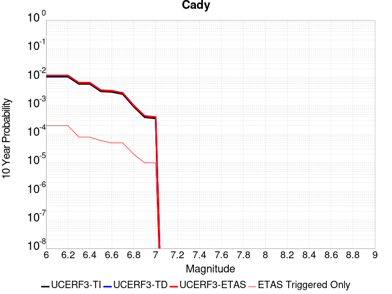 |

| Magnitude | 1 wk TI Prob | 1 wk TD Prob | 1 wk ETAS Prob | 1 wk ETAS/TD Gain | 1 wk ETAS Triggered Only | 1 mo TI Prob | 1 mo TD Prob | 1 mo ETAS Prob | 1 mo ETAS/TD Gain | 1 mo ETAS Triggered Only | 1 yr TI Prob | 1 yr TD Prob | 1 yr ETAS Prob | 1 yr ETAS/TD Gain | 1 yr ETAS Triggered Only | 10 yr TI Prob | 10 yr TD Prob | 10 yr ETAS Prob | 10 yr ETAS/TD Gain | 10 yr ETAS Triggered Only |
|-----|-----|-----|-----|-----|-----|-----|-----|-----|-----|-----|-----|-----|-----|-----|-----|-----|-----|-----|-----|-----|
| 6.0 | 1.9892565E-5 | 2.1859016E-5 | 3.18588E-5 | 1.4574671 | 1.0E-5 | 8.525106E-5 | 9.3678645E-5 | 1.13676775E-4 | 1.2134758 | 2.0E-5 | 0.0010374374 | 0.0011400316 | 0.0012499063 | 1.0963786 | 1.1E-4 | 0.010326075 | 0.011350849 | 0.011548579 | 1.0174198 | 2.0E-4 |
| 6.1 | 1.9892565E-5 | 2.1859016E-5 | 3.18588E-5 | 1.4574671 | 1.0E-5 | 8.525106E-5 | 9.3678645E-5 | 1.13676775E-4 | 1.2134758 | 2.0E-5 | 0.0010374374 | 0.0011400316 | 0.0012499063 | 1.0963786 | 1.1E-4 | 0.010326075 | 0.011350849 | 0.011548579 | 1.0174198 | 2.0E-4 |
| 6.2 | 1.9892565E-5 | 2.1859016E-5 | 3.18588E-5 | 1.4574671 | 1.0E-5 | 8.525106E-5 | 9.3678645E-5 | 1.13676775E-4 | 1.2134758 | 2.0E-5 | 0.0010374374 | 0.0011400316 | 0.0012499063 | 1.0963786 | 1.1E-4 | 0.010326075 | 0.011350849 | 0.011548579 | 1.0174198 | 2.0E-4 |
| 6.3 | 1.1117327E-5 | 1.2176738E-5 | 2.2176615E-5 | 1.821228 | 1.0E-5 | 4.764482E-5 | 5.218515E-5 | 6.218463E-5 | 1.1916153 | 1.0E-5 | 5.7992124E-4 | 6.3520053E-4 | 6.651815E-4 | 1.0471991 | 3.0E-5 | 0.0057841022 | 0.0063369554 | 0.0064164484 | 1.0125444 | 8.0E-5 |
| 6.4 | 1.1117327E-5 | 1.2176738E-5 | 2.2176615E-5 | 1.821228 | 1.0E-5 | 4.764482E-5 | 5.218515E-5 | 6.218463E-5 | 1.1916153 | 1.0E-5 | 5.7992124E-4 | 6.3520053E-4 | 6.651815E-4 | 1.0471991 | 3.0E-5 | 0.0057841022 | 0.0063369554 | 0.0064164484 | 1.0125444 | 8.0E-5 |
| 6.5 | 6.103093E-6 | 6.672103E-6 | 6.672103E-6 | 1.0 | 0.0 | 2.615585E-5 | 2.8594486E-5 | 2.8594486E-5 | 1.0 | 0.0 | 3.1840094E-4 | 3.4809482E-4 | 3.6808784E-4 | 1.0574356 | 2.0E-5 | 0.0031794512 | 0.0034767296 | 0.003536521 | 1.0171976 | 6.0E-5 |
| 6.6 | 5.817237E-6 | 6.365738E-6 | 6.365738E-6 | 1.0 | 0.0 | 2.4930776E-5 | 2.728152E-5 | 2.728152E-5 | 1.0 | 0.0 | 3.034899E-4 | 3.3211432E-4 | 3.521077E-4 | 1.0602002 | 2.0E-5 | 0.0030307577 | 0.003317402 | 0.0033672361 | 1.015022 | 5.0E-5 |
| 6.7 | 4.8846314E-6 | 5.3406343E-6 | 5.3406343E-6 | 1.0 | 0.0 | 2.0933967E-5 | 2.2888298E-5 | 2.2888298E-5 | 1.0 | 0.0 | 2.5484123E-4 | 2.7864118E-4 | 2.986356E-4 | 1.071757 | 2.0E-5 | 0.0025454918 | 0.0027840736 | 0.0028339343 | 1.0179093 | 5.0E-5 |
| 6.8 | 1.7788773E-6 | 1.9399313E-6 | 1.9399313E-6 | 1.0 | 0.0 | 7.6237375E-6 | 8.313974E-6 | 8.313974E-6 | 1.0 | 0.0 | 9.281505E-5 | 1.01219506E-4 | 1.01219506E-4 | 1.0 | 0.0 | 9.2776294E-4 | 0.0010118886 | 0.0010318684 | 1.019745 | 2.0E-5 |
| 6.9 | 7.5455404E-7 | 8.297202E-7 | 8.297202E-7 | 1.0 | 0.0 | 3.233799E-6 | 3.5559406E-6 | 3.5559406E-6 | 1.0 | 0.0 | 3.937079E-5 | 4.3293054E-5 | 4.3293054E-5 | 1.0 | 0.0 | 3.9363815E-4 | 4.3287914E-4 | 4.4287482E-4 | 1.0230911 | 1.0E-5 |
| 7.0 | 6.8578805E-7 | 7.541916E-7 | 7.541916E-7 | 1.0 | 0.0 | 2.9390883E-6 | 3.2322475E-6 | 3.2322475E-6 | 1.0 | 0.0 | 3.578281E-5 | 3.9352235E-5 | 3.9352235E-5 | 1.0 | 0.0 | 3.577705E-4 | 3.9348513E-4 | 4.034812E-4 | 1.025404 | 1.0E-5 |

## Elsinore (Glen Ivy) rev
*[(top)](#table-of-contents)*

| 1 Week | 1 Month | 1 Year | 10 Year |
|-----|-----|-----|-----|
|  |  |  |  |

| Magnitude | 1 wk TI Prob | 1 wk TD Prob | 1 wk ETAS Prob | 1 wk ETAS/TD Gain | 1 wk ETAS Triggered Only | 1 mo TI Prob | 1 mo TD Prob | 1 mo ETAS Prob | 1 mo ETAS/TD Gain | 1 mo ETAS Triggered Only | 1 yr TI Prob | 1 yr TD Prob | 1 yr ETAS Prob | 1 yr ETAS/TD Gain | 1 yr ETAS Triggered Only | 10 yr TI Prob | 10 yr TD Prob | 10 yr ETAS Prob | 10 yr ETAS/TD Gain | 10 yr ETAS Triggered Only |
|-----|-----|-----|-----|-----|-----|-----|-----|-----|-----|-----|-----|-----|-----|-----|-----|-----|-----|-----|-----|-----|
| 6.0 | 1.6204086E-4 | 2.9373635E-4 | 3.1373047E-4 | 1.0680683 | 2.0E-5 | 6.94276E-4 | 0.0012584174 | 0.0012883797 | 1.0238094 | 3.0E-5 | 0.008420097 | 0.01523484 | 0.015323469 | 1.0058175 | 9.0E-5 | 0.081081145 | 0.13962553 | 0.1397804 | 1.0011091 | 1.8E-4 |
| 6.1 | 1.6204086E-4 | 2.9373635E-4 | 3.1373047E-4 | 1.0680683 | 2.0E-5 | 6.94276E-4 | 0.0012584174 | 0.0012883797 | 1.0238094 | 3.0E-5 | 0.008420097 | 0.01523484 | 0.015323469 | 1.0058175 | 9.0E-5 | 0.081081145 | 0.13962553 | 0.1397804 | 1.0011091 | 1.8E-4 |
| 6.2 | 1.6204086E-4 | 2.9373635E-4 | 3.1373047E-4 | 1.0680683 | 2.0E-5 | 6.94276E-4 | 0.0012584174 | 0.0012883797 | 1.0238094 | 3.0E-5 | 0.008420097 | 0.01523484 | 0.015323469 | 1.0058175 | 9.0E-5 | 0.081081145 | 0.13962553 | 0.1397804 | 1.0011091 | 1.8E-4 |
| 6.3 | 1.0111737E-4 | 1.7703637E-4 | 1.9703283E-4 | 1.1129512 | 2.0E-5 | 4.332882E-4 | 7.586233E-4 | 7.7860814E-4 | 1.0263436 | 2.0E-5 | 0.005262531 | 0.009217811 | 0.009267351 | 1.0053743 | 5.0E-5 | 0.0513964 | 0.08707389 | 0.087165184 | 1.0010484 | 1.0E-4 |
| 6.4 | 1.0111737E-4 | 1.7703637E-4 | 1.9703283E-4 | 1.1129512 | 2.0E-5 | 4.332882E-4 | 7.586233E-4 | 7.7860814E-4 | 1.0263436 | 2.0E-5 | 0.005262531 | 0.009217811 | 0.009267351 | 1.0053743 | 5.0E-5 | 0.0513964 | 0.08707389 | 0.087165184 | 1.0010484 | 1.0E-4 |
| 6.5 | 3.6624708E-5 | 4.6393732E-5 | 4.6393732E-5 | 1.0 | 0.0 | 1.569536E-4 | 1.9881714E-4 | 1.9881714E-4 | 1.0 | 0.0 | 0.001909235 | 0.0024182722 | 0.002438224 | 1.0082504 | 2.0E-5 | 0.01892915 | 0.023697015 | 0.023726305 | 1.001236 | 3.0E-5 |
| 6.6 | 2.5051324E-5 | 2.6148944E-5 | 2.6148944E-5 | 1.0 | 0.0 | 1.073584E-4 | 1.1206234E-4 | 1.1206234E-4 | 1.0 | 0.0 | 0.0013063047 | 0.0013635496 | 0.001373536 | 1.0073237 | 1.0E-5 | 0.012986525 | 0.013565712 | 0.013575575 | 1.0007272 | 1.0E-5 |
| 6.7 | 2.2189772E-5 | 2.2073793E-5 | 2.2073793E-5 | 1.0 | 0.0 | 9.509556E-5 | 9.459874E-5 | 9.459874E-5 | 1.0 | 0.0 | 0.0011571734 | 0.0011511676 | 0.001161156 | 1.0086769 | 1.0E-5 | 0.011511663 | 0.011466403 | 0.011476289 | 1.0008621 | 1.0E-5 |
| 6.8 | 1.6654378E-5 | 1.4438363E-5 | 1.4438363E-5 | 1.0 | 0.0 | 7.137396E-5 | 6.187726E-5 | 6.187726E-5 | 1.0 | 0.0 | 8.686314E-4 | 7.5310044E-4 | 7.5310044E-4 | 1.0 | 0.0 | 0.008652439 | 0.0075102663 | 0.0075102663 | 1.0 | 0.0 |
| 6.9 | 1.5042909E-5 | 1.2332568E-5 | 1.2332568E-5 | 1.0 | 0.0 | 6.446802E-5 | 5.285281E-5 | 5.285281E-5 | 1.0 | 0.0 | 7.8461546E-4 | 6.432961E-4 | 6.432961E-4 | 1.0 | 0.0 | 0.007818509 | 0.0064180964 | 0.0064180964 | 1.0 | 0.0 |
| 7.0 | 1.4361385E-5 | 1.1451833E-5 | 1.1451833E-5 | 1.0 | 0.0 | 6.154734E-5 | 4.907838E-5 | 4.907838E-5 | 1.0 | 0.0 | 7.490812E-4 | 5.973684E-4 | 5.973684E-4 | 1.0 | 0.0 | 0.007465612 | 0.0059608603 | 0.0059608603 | 1.0 | 0.0 |
| 7.1 | 1.3265571E-5 | 1.0245265E-5 | 1.0245265E-5 | 1.0 | 0.0 | 5.6851208E-5 | 4.3907552E-5 | 4.3907552E-5 | 1.0 | 0.0 | 6.919436E-4 | 5.3444586E-4 | 5.3444586E-4 | 1.0 | 0.0 | 0.006897931 | 0.005334682 | 0.005334682 | 1.0 | 0.0 |
| 7.2 | 1.1596403E-5 | 8.505279E-6 | 8.505279E-6 | 1.0 | 0.0 | 4.9697923E-5 | 3.6450696E-5 | 3.6450696E-5 | 1.0 | 0.0 | 6.049042E-4 | 4.4369852E-4 | 4.4369852E-4 | 1.0 | 0.0 | 0.006032603 | 0.004429451 | 0.004429451 | 1.0 | 0.0 |
| 7.3 | 1.0150827E-5 | 7.238911E-6 | 7.238911E-6 | 1.0 | 0.0 | 4.3502816E-5 | 3.1023545E-5 | 3.1023545E-5 | 1.0 | 0.0 | 5.2951806E-4 | 3.7764764E-4 | 3.7764764E-4 | 1.0 | 0.0 | 0.005282581 | 0.003770453 | 0.003770453 | 1.0 | 0.0 |
| 7.4 | 9.080705E-6 | 6.352632E-6 | 6.352632E-6 | 1.0 | 0.0 | 3.8916725E-5 | 2.7225291E-5 | 2.7225291E-5 | 1.0 | 0.0 | 4.7370812E-4 | 3.3141885E-4 | 3.3141885E-4 | 1.0 | 0.0 | 0.004726996 | 0.0033093947 | 0.0033093947 | 1.0 | 0.0 |
| 7.5 | 7.671649E-6 | 5.2257096E-6 | 5.2257096E-6 | 1.0 | 0.0 | 3.287808E-5 | 2.2395712E-5 | 2.2395712E-5 | 1.0 | 0.0 | 4.0021708E-4 | 2.7263493E-4 | 2.7263493E-4 | 1.0 | 0.0 | 0.0039949706 | 0.0027231297 | 0.0027231297 | 1.0 | 0.0 |
| 7.6 | 6.990086E-6 | 4.6875944E-6 | 4.6875944E-6 | 1.0 | 0.0 | 2.9957167E-5 | 2.0089543E-5 | 2.0089543E-5 | 1.0 | 0.0 | 3.6466747E-4 | 2.445639E-4 | 2.445639E-4 | 1.0 | 0.0 | 0.0036406964 | 0.0024430638 | 0.0024430638 | 1.0 | 0.0 |
| 7.7 | 4.163505E-6 | 2.3295045E-6 | 2.3295045E-6 | 1.0 | 0.0 | 1.7843471E-5 | 9.983556E-6 | 9.983556E-6 | 1.0 | 0.0 | 2.172226E-4 | 1.2154376E-4 | 1.2154376E-4 | 1.0 | 0.0 | 0.0021701038 | 0.0012148459 | 0.0012148459 | 1.0 | 0.0 |
| 7.8 | 2.2692414E-7 | 9.384624E-8 | 9.384624E-8 | 1.0 | 0.0 | 9.725317E-7 | 4.021981E-7 | 4.021981E-7 | 1.0 | 0.0 | 1.1840509E-5 | 4.8967545E-6 | 4.8967545E-6 | 1.0 | 0.0 | 1.1839878E-4 | 4.8966795E-5 | 4.8966795E-5 | 1.0 | 0.0 |
| 7.9 | 6.676829E-9 | 3.4397993E-9 | 3.4397993E-9 | 1.0 | 0.0 | 2.861498E-8 | 1.4741998E-8 | 1.4741998E-8 | 1.0 | 0.0 | 3.4838732E-7 | 1.794838E-7 | 1.794838E-7 | 1.0 | 0.0 | 3.4838679E-6 | 1.7948367E-6 | 1.7948367E-6 | 1.0 | 0.0 |

## San Andreas (Cholame) rev
*[(top)](#table-of-contents)*

| 1 Week | 1 Month | 1 Year | 10 Year |
|-----|-----|-----|-----|
|  | 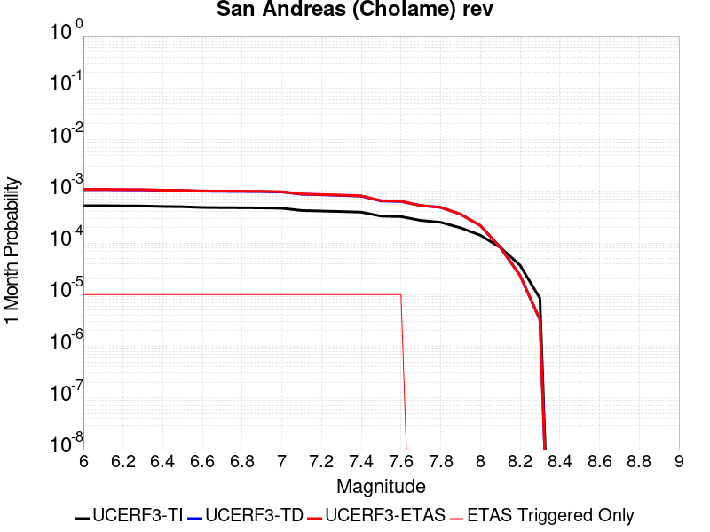 |  |  |

| Magnitude | 1 wk TI Prob | 1 wk TD Prob | 1 wk ETAS Prob | 1 wk ETAS/TD Gain | 1 wk ETAS Triggered Only | 1 mo TI Prob | 1 mo TD Prob | 1 mo ETAS Prob | 1 mo ETAS/TD Gain | 1 mo ETAS Triggered Only | 1 yr TI Prob | 1 yr TD Prob | 1 yr ETAS Prob | 1 yr ETAS/TD Gain | 1 yr ETAS Triggered Only | 10 yr TI Prob | 10 yr TD Prob | 10 yr ETAS Prob | 10 yr ETAS/TD Gain | 10 yr ETAS Triggered Only |
|-----|-----|-----|-----|-----|-----|-----|-----|-----|-----|-----|-----|-----|-----|-----|-----|-----|-----|-----|-----|-----|
| 6.0 | 1.2302514E-4 | 2.5215113E-4 | 2.6214862E-4 | 1.0396488 | 1.0E-5 | 5.27144E-4 | 0.0010802018 | 0.001090191 | 1.0092475 | 1.0E-5 | 0.0063991086 | 0.013072659 | 0.013151613 | 1.0060396 | 8.0E-5 | 0.06217949 | 0.12442699 | 0.1246021 | 1.0014074 | 2.0E-4 |
| 6.1 | 1.2302514E-4 | 2.5215113E-4 | 2.6214862E-4 | 1.0396488 | 1.0E-5 | 5.27144E-4 | 0.0010802018 | 0.001090191 | 1.0092475 | 1.0E-5 | 0.0063991086 | 0.013072659 | 0.013151613 | 1.0060396 | 8.0E-5 | 0.06217949 | 0.12442699 | 0.1246021 | 1.0014074 | 2.0E-4 |
| 6.2 | 1.2203569E-4 | 2.5031884E-4 | 2.6031636E-4 | 1.039939 | 1.0E-5 | 5.2290526E-4 | 0.0010723557 | 0.0010823449 | 1.0093153 | 1.0E-5 | 0.006347804 | 0.012978274 | 0.013057237 | 1.0060842 | 8.0E-5 | 0.061695136 | 0.12361445 | 0.12378973 | 1.0014179 | 2.0E-4 |
| 6.3 | 1.2142645E-4 | 2.4917856E-4 | 2.5917604E-4 | 1.0401219 | 1.0E-5 | 5.202953E-4 | 0.0010674726 | 0.001077462 | 1.0093579 | 1.0E-5 | 0.006316212 | 0.01291953 | 0.012998496 | 1.0061122 | 8.0E-5 | 0.06139677 | 0.1231077 | 0.12328308 | 1.0014246 | 2.0E-4 |
| 6.4 | 1.1865206E-4 | 2.4423326E-4 | 2.542308E-4 | 1.0409344 | 1.0E-5 | 5.0840975E-4 | 0.0010462956 | 0.0010562852 | 1.0095475 | 1.0E-5 | 0.006172335 | 0.012664723 | 0.012743711 | 1.0062368 | 8.0E-5 | 0.060036868 | 0.12090532 | 0.121081136 | 1.0014542 | 2.0E-4 |
| 6.5 | 1.17443946E-4 | 2.4216558E-4 | 2.5216315E-4 | 1.0412841 | 1.0E-5 | 5.032341E-4 | 0.0010374413 | 0.0010474309 | 1.0096291 | 1.0E-5 | 0.006109677 | 0.012558166 | 0.012637161 | 1.0062903 | 8.0E-5 | 0.059444077 | 0.11998259 | 0.1201586 | 1.0014669 | 2.0E-4 |
| 6.6 | 1.13579066E-4 | 2.3525437E-4 | 2.45252E-4 | 1.0424972 | 1.0E-5 | 4.866766E-4 | 0.0010078449 | 0.0010178349 | 1.0099121 | 1.0E-5 | 0.0059092017 | 0.012201919 | 0.012280944 | 1.0064764 | 8.0E-5 | 0.057545185 | 0.11690384 | 0.11707163 | 1.0014353 | 1.9E-4 |
| 6.7 | 1.1271412E-4 | 2.3369725E-4 | 2.4369491E-4 | 1.0427804 | 1.0E-5 | 4.829711E-4 | 0.0010011768 | 0.0010111667 | 1.0099783 | 1.0E-5 | 0.005864331 | 0.01212164 | 0.012200671 | 1.0065198 | 8.0E-5 | 0.057119697 | 0.11620769 | 0.11637561 | 1.001445 | 1.9E-4 |
| 6.8 | 1.1217975E-4 | 2.325812E-4 | 2.4257887E-4 | 1.0429857 | 1.0E-5 | 4.8068175E-4 | 9.963973E-4 | 0.0010063873 | 1.0100262 | 1.0E-5 | 0.005836608 | 0.0120640965 | 0.012143131 | 1.0065513 | 8.0E-5 | 0.056856725 | 0.11570667 | 0.115874685 | 1.0014521 | 1.9E-4 |
| 6.9 | 1.1146753E-4 | 2.3106842E-4 | 2.4106611E-4 | 1.0432673 | 1.0E-5 | 4.7763053E-4 | 9.89919E-4 | 9.99909E-4 | 1.0100918 | 1.0E-5 | 0.0057996577 | 0.011986093 | 0.012065134 | 1.0065944 | 8.0E-5 | 0.056506127 | 0.11502693 | 0.11519507 | 1.0014617 | 1.9E-4 |
| 7.0 | 1.0965793E-4 | 2.2730078E-4 | 2.3729852E-4 | 1.0439845 | 1.0E-5 | 4.698779E-4 | 9.737841E-4 | 9.837743E-4 | 1.0102593 | 1.0E-5 | 0.005705768 | 0.011791794 | 0.011870851 | 1.0067043 | 8.0E-5 | 0.055614736 | 0.1133308 | 0.11349926 | 1.0014865 | 1.9E-4 |
| 7.1 | 9.927982E-5 | 2.0548643E-4 | 2.1548438E-4 | 1.048655 | 1.0E-5 | 4.2541555E-4 | 8.8035996E-4 | 8.9035113E-4 | 1.011349 | 1.0E-5 | 0.0051671406 | 0.010666 | 0.010735253 | 1.0064929 | 7.0E-5 | 0.05048634 | 0.10343333 | 0.10357678 | 1.0013869 | 1.6E-4 |
| 7.2 | 9.696786E-5 | 2.005288E-4 | 2.1052679E-4 | 1.0498581 | 1.0E-5 | 4.1551032E-4 | 8.591271E-4 | 8.691185E-4 | 1.0116297 | 1.0E-5 | 0.00504711 | 0.010409988 | 0.010479259 | 1.0066543 | 7.0E-5 | 0.04934009 | 0.10116881 | 0.10131262 | 1.0014216 | 1.6E-4 |
| 7.3 | 9.4727984E-5 | 1.9481927E-4 | 2.0481732E-4 | 1.0513196 | 1.0E-5 | 4.0591392E-4 | 8.346735E-4 | 8.4466516E-4 | 1.0119708 | 1.0E-5 | 0.0049308087 | 0.010115068 | 0.010184361 | 1.0068504 | 7.0E-5 | 0.048228268 | 0.09854372 | 0.09868795 | 1.0014637 | 1.6E-4 |
| 7.4 | 9.220358E-5 | 1.8852325E-4 | 1.9852136E-4 | 1.0530338 | 1.0E-5 | 3.9509835E-4 | 8.077075E-4 | 8.176994E-4 | 1.0123707 | 1.0E-5 | 0.004799717 | 0.009789746 | 0.009859061 | 1.0070803 | 7.0E-5 | 0.046973653 | 0.095616065 | 0.09576077 | 1.0015134 | 1.6E-4 |
| 7.5 | 7.71631E-5 | 1.5186344E-4 | 1.6186193E-4 | 1.0658386 | 1.0E-5 | 3.306571E-4 | 6.5068115E-4 | 6.6067465E-4 | 1.0153586 | 1.0E-5 | 0.0040183207 | 0.007893339 | 0.007952865 | 1.0075413 | 6.0E-5 | 0.03946433 | 0.07832433 | 0.07844415 | 1.0015298 | 1.3E-4 |
| 7.6 | 7.5634416E-5 | 1.484566E-4 | 1.584551E-4 | 1.0673498 | 1.0E-5 | 3.241072E-4 | 6.360876E-4 | 6.4608123E-4 | 1.0157111 | 1.0E-5 | 0.0039388672 | 0.007716934 | 0.0077764713 | 1.0077151 | 6.0E-5 | 0.038697794 | 0.07668804 | 0.07680807 | 1.0015652 | 1.3E-4 |
| 7.7 | 6.3783E-5 | 1.2365977E-4 | 1.2365977E-4 | 1.0 | 0.0 | 2.7332708E-4 | 5.298629E-4 | 5.298629E-4 | 1.0 | 0.0 | 0.0033226798 | 0.006432025 | 0.006471768 | 1.0061789 | 4.0E-5 | 0.032734364 | 0.06457185 | 0.06466539 | 1.0014486 | 1.0E-4 |
| 7.8 | 5.863422E-5 | 1.1422686E-4 | 1.1422686E-4 | 1.0 | 0.0 | 2.512653E-4 | 4.8945186E-4 | 4.8945186E-4 | 1.0 | 0.0 | 0.003054864 | 0.0059428154 | 0.005982578 | 1.0066909 | 4.0E-5 | 0.030132094 | 0.05968955 | 0.059764776 | 1.0012603 | 8.0E-5 |
| 7.9 | 4.595283E-5 | 8.431093E-5 | 8.431093E-5 | 1.0 | 0.0 | 1.9692584E-4 | 3.6128255E-4 | 3.6128255E-4 | 1.0 | 0.0 | 0.0023949358 | 0.0043897503 | 0.0044196188 | 1.0068041 | 3.0E-5 | 0.023692891 | 0.044384085 | 0.044450976 | 1.0015072 | 7.0E-5 |
| 8.0 | 3.2950178E-5 | 5.08012E-5 | 5.08012E-5 | 1.0 | 0.0 | 1.412074E-4 | 2.1770128E-4 | 2.1770128E-4 | 1.0 | 0.0 | 0.0017178444 | 0.002647293 | 0.0026572666 | 1.0037675 | 1.0E-5 | 0.017046256 | 0.02719375 | 0.027232662 | 1.0014309 | 4.0E-5 |
| 8.1 | 1.9177472E-5 | 1.9197154E-5 | 1.9197154E-5 | 1.0 | 0.0 | 8.218658E-5 | 8.2270926E-5 | 8.2270926E-5 | 1.0 | 0.0 | 0.0010001622 | 0.0010011889 | 0.0010011889 | 1.0 | 0.0 | 0.009956728 | 0.010764398 | 0.01077429 | 1.000919 | 1.0E-5 |
| 8.2 | 8.643924E-6 | 5.478665E-6 | 5.478665E-6 | 1.0 | 0.0 | 3.704486E-5 | 2.3479783E-5 | 2.3479783E-5 | 1.0 | 0.0 | 4.5092785E-4 | 2.8582895E-4 | 2.8582895E-4 | 1.0 | 0.0 | 0.0045001395 | 0.0032508469 | 0.0032508469 | 1.0 | 0.0 |
| 8.3 | 1.983087E-6 | 7.6647797E-7 | 7.6647797E-7 | 1.0 | 0.0 | 8.498917E-6 | 3.2849016E-6 | 3.2849016E-6 | 1.0 | 0.0 | 1.034694E-4 | 3.999296E-5 | 3.999296E-5 | 1.0 | 0.0 | 0.0010342124 | 4.7228087E-4 | 4.7228087E-4 | 1.0 | 0.0 |

## San Andreas (Carrizo) rev
*[(top)](#table-of-contents)*

| 1 Week | 1 Month | 1 Year | 10 Year |
|-----|-----|-----|-----|
|  | 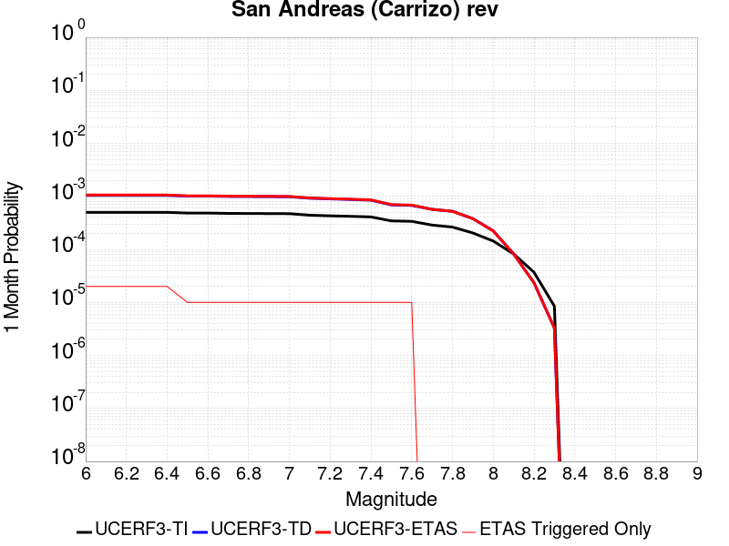 |  |  |

| Magnitude | 1 wk TI Prob | 1 wk TD Prob | 1 wk ETAS Prob | 1 wk ETAS/TD Gain | 1 wk ETAS Triggered Only | 1 mo TI Prob | 1 mo TD Prob | 1 mo ETAS Prob | 1 mo ETAS/TD Gain | 1 mo ETAS Triggered Only | 1 yr TI Prob | 1 yr TD Prob | 1 yr ETAS Prob | 1 yr ETAS/TD Gain | 1 yr ETAS Triggered Only | 10 yr TI Prob | 10 yr TD Prob | 10 yr ETAS Prob | 10 yr ETAS/TD Gain | 10 yr ETAS Triggered Only |
|-----|-----|-----|-----|-----|-----|-----|-----|-----|-----|-----|-----|-----|-----|-----|-----|-----|-----|-----|-----|-----|
| 6.0 | 1.1674632E-4 | 2.4333803E-4 | 2.533356E-4 | 1.0410851 | 1.0E-5 | 5.002454E-4 | 0.0010424621 | 0.0010624413 | 1.0191654 | 2.0E-5 | 0.006073493 | 0.012618599 | 0.012717337 | 1.0078248 | 1.0E-4 | 0.0591016 | 0.12066075 | 0.120836616 | 1.0014576 | 2.0E-4 |
| 6.1 | 1.1674632E-4 | 2.4333803E-4 | 2.533356E-4 | 1.0410851 | 1.0E-5 | 5.002454E-4 | 0.0010424621 | 0.0010624413 | 1.0191654 | 2.0E-5 | 0.006073493 | 0.012618599 | 0.012717337 | 1.0078248 | 1.0E-4 | 0.0591016 | 0.12066075 | 0.120836616 | 1.0014576 | 2.0E-4 |
| 6.2 | 1.1674632E-4 | 2.4333803E-4 | 2.533356E-4 | 1.0410851 | 1.0E-5 | 5.002454E-4 | 0.0010424621 | 0.0010624413 | 1.0191654 | 2.0E-5 | 0.006073493 | 0.012618599 | 0.012717337 | 1.0078248 | 1.0E-4 | 0.0591016 | 0.12066075 | 0.120836616 | 1.0014576 | 2.0E-4 |
| 6.3 | 1.1674632E-4 | 2.4333803E-4 | 2.533356E-4 | 1.0410851 | 1.0E-5 | 5.002454E-4 | 0.0010424621 | 0.0010624413 | 1.0191654 | 2.0E-5 | 0.006073493 | 0.012618599 | 0.012717337 | 1.0078248 | 1.0E-4 | 0.0591016 | 0.12066075 | 0.120836616 | 1.0014576 | 2.0E-4 |
| 6.4 | 1.1674632E-4 | 2.4333803E-4 | 2.533356E-4 | 1.0410851 | 1.0E-5 | 5.002454E-4 | 0.0010424621 | 0.0010624413 | 1.0191654 | 2.0E-5 | 0.006073493 | 0.012618599 | 0.012717337 | 1.0078248 | 1.0E-4 | 0.0591016 | 0.12066075 | 0.120836616 | 1.0014576 | 2.0E-4 |
| 6.5 | 1.13136164E-4 | 2.3653745E-4 | 2.4653508E-4 | 1.0422666 | 1.0E-5 | 4.847792E-4 | 0.0010133396 | 0.0010233296 | 1.0098584 | 1.0E-5 | 0.0058862255 | 0.012268067 | 0.012356963 | 1.0072461 | 9.0E-5 | 0.057327334 | 0.11763024 | 0.117797896 | 1.0014253 | 1.9E-4 |
| 6.6 | 1.13136164E-4 | 2.3653745E-4 | 2.4653508E-4 | 1.0422666 | 1.0E-5 | 4.847792E-4 | 0.0010133396 | 0.0010233296 | 1.0098584 | 1.0E-5 | 0.0058862255 | 0.012268067 | 0.012356963 | 1.0072461 | 9.0E-5 | 0.057327334 | 0.11763024 | 0.117797896 | 1.0014253 | 1.9E-4 |
| 6.7 | 1.1149675E-4 | 2.334492E-4 | 2.4344686E-4 | 1.0428258 | 1.0E-5 | 4.777557E-4 | 0.0010001145 | 0.0010101044 | 1.0099889 | 1.0E-5 | 0.0058011734 | 0.012108848 | 0.012197759 | 1.0073426 | 9.0E-5 | 0.05652051 | 0.11625791 | 0.11642583 | 1.0014443 | 1.9E-4 |
| 6.8 | 1.1103589E-4 | 2.324707E-4 | 2.4246838E-4 | 1.0430062 | 1.0E-5 | 4.7578133E-4 | 9.959241E-4 | 0.0010059141 | 1.010031 | 1.0E-5 | 0.005777263 | 0.012058397 | 0.012147311 | 1.0073737 | 9.0E-5 | 0.056293584 | 0.11581856 | 0.115986556 | 1.0014505 | 1.9E-4 |
| 6.9 | 1.1053259E-4 | 2.3139441E-4 | 2.413921E-4 | 1.0432062 | 1.0E-5 | 4.7362508E-4 | 9.91315E-4 | 0.0010013051 | 1.0100776 | 1.0E-5 | 0.0057511497 | 0.0120029 | 0.01208194 | 1.006585 | 8.0E-5 | 0.05604569 | 0.115334466 | 0.11549371 | 1.0013807 | 1.8E-4 |
| 7.0 | 1.1005377E-4 | 2.304026E-4 | 2.4040029E-4 | 1.0433923 | 1.0E-5 | 4.7157376E-4 | 9.870676E-4 | 9.970577E-4 | 1.010121 | 1.0E-5 | 0.0057263062 | 0.011951757 | 0.012030801 | 1.0066136 | 8.0E-5 | 0.055809796 | 0.1148876 | 0.115046926 | 1.0013868 | 1.8E-4 |
| 7.1 | 1.0308142E-4 | 2.154949E-4 | 2.2549275E-4 | 1.0463948 | 1.0E-5 | 4.417027E-4 | 9.2322374E-4 | 9.332145E-4 | 1.0108216 | 1.0E-5 | 0.0053644776 | 0.011182634 | 0.01126174 | 1.007074 | 8.0E-5 | 0.052368138 | 0.10815858 | 0.10831911 | 1.0014843 | 1.8E-4 |
| 7.2 | 1.0027479E-4 | 2.0957364E-4 | 2.1957155E-4 | 1.0477059 | 1.0E-5 | 4.296783E-4 | 8.978646E-4 | 9.0785563E-4 | 1.0111276 | 1.0E-5 | 0.0052187922 | 0.010877009 | 0.010956138 | 1.007275 | 8.0E-5 | 0.050979212 | 0.10545821 | 0.10561923 | 1.0015268 | 1.8E-4 |
| 7.3 | 9.816942E-5 | 2.0432367E-4 | 2.1432164E-4 | 1.048932 | 1.0E-5 | 4.2065824E-4 | 8.7538E-4 | 8.853713E-4 | 1.0114136 | 1.0E-5 | 0.005109493 | 0.0106059555 | 0.010685108 | 1.007463 | 8.0E-5 | 0.049935985 | 0.10304579 | 0.103207245 | 1.0015668 | 1.8E-4 |
| 7.4 | 9.5634205E-5 | 1.980169E-4 | 2.0801491E-4 | 1.0504907 | 1.0E-5 | 4.0979648E-4 | 8.4836874E-4 | 8.5836026E-4 | 1.0117773 | 1.0E-5 | 0.0049778637 | 0.010280236 | 0.010359413 | 1.0077019 | 8.0E-5 | 0.048678253 | 0.100126535 | 0.10028851 | 1.0016177 | 1.8E-4 |
| 7.5 | 8.052417E-5 | 1.612143E-4 | 1.7121268E-4 | 1.0620192 | 1.0E-5 | 3.4505792E-4 | 6.9073564E-4 | 7.0072873E-4 | 1.0144674 | 1.0E-5 | 0.0041929903 | 0.00837736 | 0.0084467735 | 1.0082859 | 7.0E-5 | 0.04114753 | 0.08285146 | 0.08298904 | 1.0016605 | 1.5E-4 |
| 7.6 | 7.897024E-5 | 1.5774513E-4 | 1.6774356E-4 | 1.0633833 | 1.0E-5 | 3.384E-4 | 6.758756E-4 | 6.8586884E-4 | 1.0147856 | 1.0E-5 | 0.0041122385 | 0.008197814 | 0.008267241 | 1.0084689 | 7.0E-5 | 0.040369697 | 0.08119292 | 0.08133074 | 1.0016974 | 1.5E-4 |
| 7.7 | 6.707427E-5 | 1.3283793E-4 | 1.3283793E-4 | 1.0 | 0.0 | 2.8742946E-4 | 5.691813E-4 | 5.691813E-4 | 1.0 | 0.0 | 0.003493839 | 0.0069077956 | 0.0069574504 | 1.0071882 | 5.0E-5 | 0.034394164 | 0.069081694 | 0.0691934 | 1.0016171 | 1.2E-4 |
| 7.8 | 6.147705E-5 | 1.2204444E-4 | 1.2204444E-4 | 1.0 | 0.0 | 2.6344648E-4 | 5.229428E-4 | 5.229428E-4 | 1.0 | 0.0 | 0.0032027436 | 0.0063482667 | 0.0063979495 | 1.0078262 | 5.0E-5 | 0.031569764 | 0.06354592 | 0.06363957 | 1.0014737 | 1.0E-4 |
| 7.9 | 4.7636717E-5 | 8.8847315E-5 | 8.8847315E-5 | 1.0 | 0.0 | 2.0414138E-4 | 3.8071864E-4 | 3.8071864E-4 | 1.0 | 0.0 | 0.0024825884 | 0.0046254057 | 0.0046652206 | 1.0086079 | 4.0E-5 | 0.024550365 | 0.046651114 | 0.04672738 | 1.0016348 | 8.0E-5 |
| 8.0 | 3.3554235E-5 | 5.216579E-5 | 5.216579E-5 | 1.0 | 0.0 | 1.4379594E-4 | 2.2354853E-4 | 2.2354853E-4 | 1.0 | 0.0 | 0.0017493097 | 0.002718308 | 0.0027282808 | 1.0036688 | 1.0E-5 | 0.017356034 | 0.027894866 | 0.02793375 | 1.0013939 | 4.0E-5 |
| 8.1 | 1.9175432E-5 | 1.9196985E-5 | 1.9196985E-5 | 1.0 | 0.0 | 8.217783E-5 | 8.22702E-5 | 8.22702E-5 | 1.0 | 0.0 | 0.0010000558 | 0.00100118 | 0.00100118 | 1.0 | 0.0 | 0.009955673 | 0.010764282 | 0.010774175 | 1.000919 | 1.0E-5 |
| 8.2 | 8.643924E-6 | 5.478665E-6 | 5.478665E-6 | 1.0 | 0.0 | 3.704486E-5 | 2.3479783E-5 | 2.3479783E-5 | 1.0 | 0.0 | 4.5092785E-4 | 2.8582895E-4 | 2.8582895E-4 | 1.0 | 0.0 | 0.0045001395 | 0.0032508469 | 0.0032508469 | 1.0 | 0.0 |
| 8.3 | 1.983087E-6 | 7.6647797E-7 | 7.6647797E-7 | 1.0 | 0.0 | 8.498917E-6 | 3.2849016E-6 | 3.2849016E-6 | 1.0 | 0.0 | 1.034694E-4 | 3.999296E-5 | 3.999296E-5 | 1.0 | 0.0 | 0.0010342124 | 4.7228087E-4 | 4.7228087E-4 | 1.0 | 0.0 |

## Lake Isabella (Seismicity)
*[(top)](#table-of-contents)*

| 1 Week | 1 Month | 1 Year | 10 Year |
|-----|-----|-----|-----|
|  |  |  |  |

| Magnitude | 1 wk TI Prob | 1 wk TD Prob | 1 wk ETAS Prob | 1 wk ETAS/TD Gain | 1 wk ETAS Triggered Only | 1 mo TI Prob | 1 mo TD Prob | 1 mo ETAS Prob | 1 mo ETAS/TD Gain | 1 mo ETAS Triggered Only | 1 yr TI Prob | 1 yr TD Prob | 1 yr ETAS Prob | 1 yr ETAS/TD Gain | 1 yr ETAS Triggered Only | 10 yr TI Prob | 10 yr TD Prob | 10 yr ETAS Prob | 10 yr ETAS/TD Gain | 10 yr ETAS Triggered Only |
|-----|-----|-----|-----|-----|-----|-----|-----|-----|-----|-----|-----|-----|-----|-----|-----|-----|-----|-----|-----|-----|
| 6.0 | 9.431637E-6 | 9.741694E-6 | 4.9741306E-5 | 5.106022 | 4.0E-5 | 4.0420677E-5 | 4.1749525E-5 | 9.174744E-5 | 2.1975684 | 5.0E-5 | 4.920106E-4 | 5.0819496E-4 | 6.1813905E-4 | 1.2163423 | 1.1E-4 | 0.004909227 | 0.005071621 | 0.0052606575 | 1.0372734 | 1.9E-4 |
| 6.1 | 9.431637E-6 | 9.741694E-6 | 4.9741306E-5 | 5.106022 | 4.0E-5 | 4.0420677E-5 | 4.1749525E-5 | 9.174744E-5 | 2.1975684 | 5.0E-5 | 4.920106E-4 | 5.0819496E-4 | 6.1813905E-4 | 1.2163423 | 1.1E-4 | 0.004909227 | 0.005071621 | 0.0052606575 | 1.0372734 | 1.9E-4 |
| 6.2 | 9.431637E-6 | 9.741694E-6 | 4.9741306E-5 | 5.106022 | 4.0E-5 | 4.0420677E-5 | 4.1749525E-5 | 9.174744E-5 | 2.1975684 | 5.0E-5 | 4.920106E-4 | 5.0819496E-4 | 6.1813905E-4 | 1.2163423 | 1.1E-4 | 0.004909227 | 0.005071621 | 0.0052606575 | 1.0372734 | 1.9E-4 |
| 6.3 | 9.431637E-6 | 9.741694E-6 | 4.9741306E-5 | 5.106022 | 4.0E-5 | 4.0420677E-5 | 4.1749525E-5 | 9.174744E-5 | 2.1975684 | 5.0E-5 | 4.920106E-4 | 5.0819496E-4 | 6.1813905E-4 | 1.2163423 | 1.1E-4 | 0.004909227 | 0.005071621 | 0.0052606575 | 1.0372734 | 1.9E-4 |
| 6.4 | 5.144063E-6 | 5.3000977E-6 | 4.5299887E-5 | 8.546991 | 4.0E-5 | 2.2045799E-5 | 2.2714525E-5 | 6.271362E-5 | 2.7609477 | 4.0E-5 | 2.6837454E-4 | 2.765177E-4 | 3.365011E-4 | 1.2169243 | 6.0E-5 | 0.0026805066 | 0.002762077 | 0.0028518282 | 1.0324942 | 9.0E-5 |
| 6.5 | 5.144063E-6 | 5.3000977E-6 | 4.5299887E-5 | 8.546991 | 4.0E-5 | 2.2045799E-5 | 2.2714525E-5 | 6.271362E-5 | 2.7609477 | 4.0E-5 | 2.6837454E-4 | 2.765177E-4 | 3.365011E-4 | 1.2169243 | 6.0E-5 | 0.0026805066 | 0.002762077 | 0.0028518282 | 1.0324942 | 9.0E-5 |
| 6.6 | 3.4009804E-6 | 3.4987995E-6 | 3.3498694E-5 | 9.57434 | 3.0E-5 | 1.4575549E-5 | 1.4994778E-5 | 4.499433E-5 | 3.0006666 | 3.0E-5 | 1.7744285E-4 | 1.8254772E-4 | 2.2254043E-4 | 1.2190808 | 4.0E-5 | 0.0017730123 | 0.0018241355 | 0.0018940079 | 1.0383043 | 7.0E-5 |
| 6.7 | 3.3880428E-6 | 3.4856662E-6 | 3.348556E-5 | 9.606647 | 3.0E-5 | 1.4520103E-5 | 1.4938492E-5 | 4.4938046E-5 | 3.0082047 | 3.0E-5 | 1.767679E-4 | 1.8186258E-4 | 2.218553E-4 | 1.2199063 | 4.0E-5 | 0.0017662736 | 0.0018172951 | 0.0018871679 | 1.0384488 | 7.0E-5 |
| 6.8 | 2.6582E-6 | 2.7337105E-6 | 2.2733655E-5 | 8.316044 | 2.0E-5 | 1.1392236E-5 | 1.1715857E-5 | 3.1715623E-5 | 2.707068 | 2.0E-5 | 1.3869164E-4 | 1.4263256E-4 | 1.726283E-4 | 1.2103007 | 3.0E-5 | 0.0013860512 | 0.0014255423 | 0.0014654853 | 1.0280195 | 4.0E-5 |
| 6.9 | 2.406011E-6 | 2.474338E-6 | 1.2474314E-5 | 5.041475 | 1.0E-5 | 1.0311434E-5 | 1.0604271E-5 | 2.0604164E-5 | 1.9430063 | 1.0E-5 | 1.2553448E-4 | 1.2910066E-4 | 1.4909808E-4 | 1.1548978 | 2.0E-5 | 0.0012546359 | 0.0012903863 | 0.0013103605 | 1.0154792 | 2.0E-5 |
| 7.0 | 1.6953097E-6 | 1.7429437E-6 | 1.7429437E-6 | 1.0 | 0.0 | 7.265593E-6 | 7.469743E-6 | 7.469743E-6 | 1.0 | 0.0 | 8.8455E-5 | 9.094137E-5 | 1.00940466E-4 | 1.1099509 | 1.0E-5 | 8.84198E-4 | 9.0914435E-4 | 9.1913523E-4 | 1.0109893 | 1.0E-5 |
| 7.1 | 3.5013824E-7 | 3.571492E-7 | 3.571492E-7 | 1.0 | 0.0 | 1.5005916E-6 | 1.5306384E-6 | 1.5306384E-6 | 1.0 | 0.0 | 1.826955E-5 | 1.8635366E-5 | 1.8635366E-5 | 1.0 | 0.0 | 1.8268047E-4 | 1.863383E-4 | 1.863383E-4 | 1.0 | 0.0 |
| 7.2 | 2.2321095E-7 | 2.2750632E-7 | 2.2750632E-7 | 1.0 | 0.0 | 9.56618E-7 | 9.750268E-7 | 9.750268E-7 | 1.0 | 0.0 | 1.1646762E-5 | 1.1870887E-5 | 1.1870887E-5 | 1.0 | 0.0 | 1.1646151E-4 | 1.1870263E-4 | 1.1870263E-4 | 1.0 | 0.0 |
| 7.3 | 1.5760406E-7 | 1.6060963E-7 | 1.6060963E-7 | 1.0 | 0.0 | 6.7544585E-7 | 6.883268E-7 | 6.883268E-7 | 1.0 | 0.0 | 8.223522E-6 | 8.380347E-6 | 8.380347E-6 | 1.0 | 0.0 | 8.2232174E-5 | 8.3800376E-5 | 8.3800376E-5 | 1.0 | 0.0 |
| 7.4 | 1.1216497E-7 | 1.1431735E-7 | 1.1431735E-7 | 1.0 | 0.0 | 4.8070694E-7 | 4.8993144E-7 | 4.8993144E-7 | 1.0 | 0.0 | 5.852591E-6 | 5.964899E-6 | 5.964899E-6 | 1.0 | 0.0 | 5.8524372E-5 | 5.9647435E-5 | 5.9647435E-5 | 1.0 | 0.0 |
| 7.5 | 4.885185E-8 | 4.9787864E-8 | 4.9787864E-8 | 1.0 | 0.0 | 2.0936506E-7 | 2.1337654E-7 | 2.1337654E-7 | 1.0 | 0.0 | 2.5490165E-6 | 2.5978566E-6 | 2.5978566E-6 | 1.0 | 0.0 | 2.5489873E-5 | 2.597828E-5 | 2.597828E-5 | 1.0 | 0.0 |
| 7.6 | 1.504641E-9 | 1.5317939E-9 | 1.5317939E-9 | 1.0 | 0.0 | 6.4484613E-9 | 6.5648313E-9 | 6.5648313E-9 | 1.0 | 0.0 | 7.851001E-8 | 7.992682E-8 | 7.992682E-8 | 1.0 | 0.0 | 7.8509987E-7 | 7.992682E-7 | 7.992682E-7 | 1.0 | 0.0 |

## Scodie Lineament
*[(top)](#table-of-contents)*

| 1 Week | 1 Month | 1 Year | 10 Year |
|-----|-----|-----|-----|
|  |  |  |  |

| Magnitude | 1 wk TI Prob | 1 wk TD Prob | 1 wk ETAS Prob | 1 wk ETAS/TD Gain | 1 wk ETAS Triggered Only | 1 mo TI Prob | 1 mo TD Prob | 1 mo ETAS Prob | 1 mo ETAS/TD Gain | 1 mo ETAS Triggered Only | 1 yr TI Prob | 1 yr TD Prob | 1 yr ETAS Prob | 1 yr ETAS/TD Gain | 1 yr ETAS Triggered Only | 10 yr TI Prob | 10 yr TD Prob | 10 yr ETAS Prob | 10 yr ETAS/TD Gain | 10 yr ETAS Triggered Only |
|-----|-----|-----|-----|-----|-----|-----|-----|-----|-----|-----|-----|-----|-----|-----|-----|-----|-----|-----|-----|-----|
| 6.0 | 3.2919327E-6 | 3.0133451E-6 | 1.3013315E-5 | 4.318561 | 1.0E-5 | 1.4108206E-5 | 1.2914291E-5 | 6.291364E-5 | 4.87163 | 5.0E-5 | 1.7175387E-4 | 1.5722332E-4 | 2.972013E-4 | 1.8903131 | 1.4E-4 | 0.0017162118 | 0.0015714325 | 0.0017611339 | 1.1207188 | 1.9E-4 |
| 6.1 | 1.8663811E-6 | 1.5490476E-6 | 1.1549032E-5 | 7.4555697 | 1.0E-5 | 7.998751E-6 | 6.6387615E-6 | 4.6638495E-5 | 7.0251803 | 4.0E-5 | 9.738045E-5 | 8.082442E-5 | 1.4081957E-4 | 1.7422899 | 6.0E-5 | 9.7337784E-4 | 8.0799905E-4 | 8.779425E-4 | 1.0865637 | 7.0E-5 |
| 6.2 | 1.8663811E-6 | 1.5490476E-6 | 1.1549032E-5 | 7.4555697 | 1.0E-5 | 7.998751E-6 | 6.6387615E-6 | 4.6638495E-5 | 7.0251803 | 4.0E-5 | 9.738045E-5 | 8.082442E-5 | 1.4081957E-4 | 1.7422899 | 6.0E-5 | 9.7337784E-4 | 8.0799905E-4 | 8.779425E-4 | 1.0865637 | 7.0E-5 |
| 6.3 | 1.8663811E-6 | 1.5490476E-6 | 1.1549032E-5 | 7.4555697 | 1.0E-5 | 7.998751E-6 | 6.6387615E-6 | 4.6638495E-5 | 7.0251803 | 4.0E-5 | 9.738045E-5 | 8.082442E-5 | 1.4081957E-4 | 1.7422899 | 6.0E-5 | 9.7337784E-4 | 8.0799905E-4 | 8.779425E-4 | 1.0865637 | 7.0E-5 |
| 6.4 | 1.8663811E-6 | 1.5490476E-6 | 1.1549032E-5 | 7.4555697 | 1.0E-5 | 7.998751E-6 | 6.6387615E-6 | 4.6638495E-5 | 7.0251803 | 4.0E-5 | 9.738045E-5 | 8.082442E-5 | 1.4081957E-4 | 1.7422899 | 6.0E-5 | 9.7337784E-4 | 8.0799905E-4 | 8.779425E-4 | 1.0865637 | 7.0E-5 |
| 6.5 | 1.8106311E-6 | 1.4909813E-6 | 1.1490966E-5 | 7.706982 | 1.0E-5 | 7.759824E-6 | 6.389907E-6 | 4.638965E-5 | 7.259832 | 4.0E-5 | 9.447177E-5 | 7.779484E-5 | 1.3779016E-4 | 1.7711995 | 6.0E-5 | 9.4431615E-4 | 7.777247E-4 | 8.4767025E-4 | 1.0899361 | 7.0E-5 |
| 6.6 | 1.2414679E-6 | 8.997501E-7 | 1.0899741E-5 | 12.114187 | 1.0E-5 | 5.320566E-6 | 3.8560665E-6 | 2.385599E-5 | 6.1866126 | 2.0E-5 | 6.477596E-5 | 4.6946687E-5 | 8.694481E-5 | 1.8519903 | 4.0E-5 | 6.475708E-4 | 4.6937633E-4 | 5.0935755E-4 | 1.0851794 | 4.0E-5 |
| 6.7 | 1.1062215E-6 | 7.594247E-7 | 1.0759417E-5 | 14.167852 | 1.0E-5 | 4.7409408E-6 | 3.2546736E-6 | 2.3254608E-5 | 7.1449895 | 2.0E-5 | 5.7719422E-5 | 3.9625003E-5 | 5.962421E-5 | 1.5047119 | 2.0E-5 | 5.770443E-4 | 3.9618637E-4 | 4.1617843E-4 | 1.0504613 | 2.0E-5 |
| 6.8 | 1.0006736E-6 | 6.5003275E-7 | 1.06500265E-5 | 16.383831 | 1.0E-5 | 4.288594E-6 | 2.785852E-6 | 2.2785796E-5 | 8.179112 | 2.0E-5 | 5.221238E-5 | 3.3917284E-5 | 5.3916603E-5 | 1.5896499 | 2.0E-5 | 5.220012E-4 | 3.3912715E-4 | 3.5912034E-4 | 1.058955 | 2.0E-5 |
| 6.9 | 9.167364E-7 | 5.6315514E-7 | 1.056315E-5 | 18.757086 | 1.0E-5 | 3.9288643E-6 | 2.4135202E-6 | 2.2413471E-5 | 9.286632 | 2.0E-5 | 4.7832873E-5 | 2.938427E-5 | 4.938368E-5 | 1.6806163 | 2.0E-5 | 4.782258E-4 | 2.938095E-4 | 3.1380364E-4 | 1.0680513 | 2.0E-5 |
| 7.0 | 7.6987664E-7 | 4.113303E-7 | 1.0411326E-5 | 25.311352 | 1.0E-5 | 3.2994672E-6 | 1.7628431E-6 | 2.1762808E-5 | 12.345289 | 2.0E-5 | 4.0170275E-5 | 2.1462443E-5 | 4.1462015E-5 | 1.9318403 | 2.0E-5 | 4.0163012E-4 | 2.1460756E-4 | 2.3460327E-4 | 1.0931734 | 2.0E-5 |
| 7.1 | 7.1038727E-7 | 3.521066E-7 | 1.0352103E-5 | 29.40048 | 1.0E-5 | 3.0445133E-6 | 1.5090276E-6 | 2.1508997E-5 | 14.253548 | 2.0E-5 | 3.706632E-5 | 1.8372291E-5 | 3.8371923E-5 | 2.0885758 | 2.0E-5 | 3.7060137E-4 | 1.8371122E-4 | 2.0370755E-4 | 1.1088465 | 2.0E-5 |
| 7.2 | 2.0799602E-7 | 3.1178946E-8 | 3.1178946E-8 | 1.0 | 0.0 | 8.914113E-7 | 1.3362404E-7 | 1.3362404E-7 | 1.0 | 0.0 | 1.0852878E-5 | 1.6268716E-6 | 1.6268716E-6 | 1.0 | 0.0 | 1.08523476E-4 | 1.6268605E-5 | 1.6268605E-5 | 1.0 | 0.0 |
| 7.3 | 1.5048182E-7 | 1.5939344E-8 | 1.5939344E-8 | 1.0 | 0.0 | 6.449219E-7 | 6.831147E-8 | 6.831147E-8 | 1.0 | 0.0 | 7.851896E-6 | 8.316919E-7 | 8.316919E-7 | 1.0 | 0.0 | 7.851618E-5 | 8.316891E-6 | 8.316891E-6 | 1.0 | 0.0 |
| 7.4 | 5.9334678E-8 | 4.8638475E-9 | 4.8638475E-9 | 1.0 | 0.0 | 2.5429145E-7 | 2.084506E-8 | 2.084506E-8 | 1.0 | 0.0 | 3.095994E-6 | 2.5378858E-7 | 2.5378858E-7 | 1.0 | 0.0 | 3.095951E-5 | 2.5378843E-6 | 2.5378843E-6 | 1.0 | 0.0 |

## Manix-Afton Hills
*[(top)](#table-of-contents)*

| 1 Week | 1 Month | 1 Year | 10 Year |
|-----|-----|-----|-----|
|  |  |  |  |

| Magnitude | 1 wk TI Prob | 1 wk TD Prob | 1 wk ETAS Prob | 1 wk ETAS/TD Gain | 1 wk ETAS Triggered Only | 1 mo TI Prob | 1 mo TD Prob | 1 mo ETAS Prob | 1 mo ETAS/TD Gain | 1 mo ETAS Triggered Only | 1 yr TI Prob | 1 yr TD Prob | 1 yr ETAS Prob | 1 yr ETAS/TD Gain | 1 yr ETAS Triggered Only | 10 yr TI Prob | 10 yr TD Prob | 10 yr ETAS Prob | 10 yr ETAS/TD Gain | 10 yr ETAS Triggered Only |
|-----|-----|-----|-----|-----|-----|-----|-----|-----|-----|-----|-----|-----|-----|-----|-----|-----|-----|-----|-----|-----|
| 6.0 | 1.3783202E-5 | 1.4711221E-5 | 5.4710632E-5 | 3.718973 | 4.0E-5 | 5.906953E-5 | 6.304667E-5 | 1.2304289E-4 | 1.951616 | 6.0E-5 | 7.189342E-4 | 7.673403E-4 | 8.372866E-4 | 1.0911542 | 7.0E-5 | 0.0071661277 | 0.007648664 | 0.007817363 | 1.0220561 | 1.7E-4 |
| 6.1 | 1.3783202E-5 | 1.4711221E-5 | 5.4710632E-5 | 3.718973 | 4.0E-5 | 5.906953E-5 | 6.304667E-5 | 1.2304289E-4 | 1.951616 | 6.0E-5 | 7.189342E-4 | 7.673403E-4 | 8.372866E-4 | 1.0911542 | 7.0E-5 | 0.0071661277 | 0.007648664 | 0.007817363 | 1.0220561 | 1.7E-4 |
| 6.2 | 1.3783202E-5 | 1.4711221E-5 | 5.4710632E-5 | 3.718973 | 4.0E-5 | 5.906953E-5 | 6.304667E-5 | 1.2304289E-4 | 1.951616 | 6.0E-5 | 7.189342E-4 | 7.673403E-4 | 8.372866E-4 | 1.0911542 | 7.0E-5 | 0.0071661277 | 0.007648664 | 0.007817363 | 1.0220561 | 1.7E-4 |
| 6.3 | 1.10494875E-5 | 1.1793241E-5 | 5.179277E-5 | 4.391733 | 4.0E-5 | 4.7354086E-5 | 5.054154E-5 | 1.00539015E-4 | 1.9892353 | 5.0E-5 | 5.763835E-4 | 6.151799E-4 | 6.75143E-4 | 1.0974724 | 6.0E-5 | 0.005748908 | 0.00613581 | 0.006255074 | 1.0194373 | 1.2E-4 |
| 6.4 | 1.10494875E-5 | 1.1793241E-5 | 5.179277E-5 | 4.391733 | 4.0E-5 | 4.7354086E-5 | 5.054154E-5 | 1.00539015E-4 | 1.9892353 | 5.0E-5 | 5.763835E-4 | 6.151799E-4 | 6.75143E-4 | 1.0974724 | 6.0E-5 | 0.005748908 | 0.00613581 | 0.006255074 | 1.0194373 | 1.2E-4 |
| 6.5 | 9.788949E-6 | 1.0454414E-5 | 3.0454205E-5 | 2.9130476 | 2.0E-5 | 4.1951964E-5 | 4.4803914E-5 | 7.480257E-5 | 1.6695544 | 3.0E-5 | 5.1064545E-4 | 5.4536044E-4 | 5.853386E-4 | 1.073306 | 4.0E-5 | 0.0050947363 | 0.005441148 | 0.005550549 | 1.0201063 | 1.1E-4 |
| 6.6 | 8.810006E-6 | 9.413714E-6 | 2.9413526E-5 | 3.12454 | 2.0E-5 | 3.775662E-5 | 4.0343915E-5 | 7.034271E-5 | 1.7435765 | 3.0E-5 | 4.5958988E-4 | 4.9108535E-4 | 5.310657E-4 | 1.0814122 | 4.0E-5 | 0.0045864056 | 0.004900884 | 0.0050003934 | 1.0203044 | 1.0E-4 |
| 6.7 | 8.80128E-6 | 9.404193E-6 | 2.9404006E-5 | 3.1266909 | 2.0E-5 | 3.7719226E-5 | 4.0303115E-5 | 7.03019E-5 | 1.7443293 | 3.0E-5 | 4.591348E-4 | 4.9058883E-4 | 5.305692E-4 | 1.0814947 | 4.0E-5 | 0.004581874 | 0.0048959404 | 0.004995451 | 1.0203251 | 1.0E-4 |
| 6.8 | 6.8994877E-6 | 7.3801443E-6 | 2.7379996E-5 | 3.709954 | 2.0E-5 | 2.9568899E-5 | 3.1628853E-5 | 6.162791E-5 | 1.9484711 | 3.0E-5 | 3.5994186E-4 | 3.850214E-4 | 4.1500985E-4 | 1.0778878 | 3.0E-5 | 0.003593594 | 0.0038443485 | 0.003924041 | 1.0207298 | 8.0E-5 |
| 6.9 | 4.9328037E-6 | 5.2710093E-6 | 2.5270903E-5 | 4.7943196 | 2.0E-5 | 2.1140417E-5 | 2.258988E-5 | 5.2589203E-5 | 2.3279984 | 3.0E-5 | 2.5735417E-4 | 2.7500323E-4 | 3.04995E-4 | 1.1090596 | 3.0E-5 | 0.0025705635 | 0.0027472344 | 0.0028070696 | 1.0217801 | 6.0E-5 |
| 7.0 | 3.347973E-6 | 3.5900646E-6 | 1.3590028E-5 | 3.7854552 | 1.0E-5 | 1.4348378E-5 | 1.5385924E-5 | 2.5385769E-5 | 1.6499348 | 1.0E-5 | 1.746775E-4 | 1.8731161E-4 | 1.9730974E-4 | 1.0533769 | 1.0E-5 | 0.0017454025 | 0.00187194 | 0.0019018837 | 1.0159961 | 3.0E-5 |
| 7.1 | 1.2073567E-6 | 1.2934943E-6 | 1.1293481E-5 | 8.730987 | 1.0E-5 | 5.1743755E-6 | 5.5435444E-6 | 1.5543488E-5 | 2.80389 | 1.0E-5 | 6.29962E-5 | 6.74922E-5 | 7.7491524E-5 | 1.1481553 | 1.0E-5 | 6.297835E-4 | 6.7487714E-4 | 6.848704E-4 | 1.0148075 | 1.0E-5 |

## Ludlow
*[(top)](#table-of-contents)*

| 1 Week | 1 Month | 1 Year | 10 Year |
|-----|-----|-----|-----|
|  |  |  |  |

| Magnitude | 1 wk TI Prob | 1 wk TD Prob | 1 wk ETAS Prob | 1 wk ETAS/TD Gain | 1 wk ETAS Triggered Only | 1 mo TI Prob | 1 mo TD Prob | 1 mo ETAS Prob | 1 mo ETAS/TD Gain | 1 mo ETAS Triggered Only | 1 yr TI Prob | 1 yr TD Prob | 1 yr ETAS Prob | 1 yr ETAS/TD Gain | 1 yr ETAS Triggered Only | 10 yr TI Prob | 10 yr TD Prob | 10 yr ETAS Prob | 10 yr ETAS/TD Gain | 10 yr ETAS Triggered Only |
|-----|-----|-----|-----|-----|-----|-----|-----|-----|-----|-----|-----|-----|-----|-----|-----|-----|-----|-----|-----|-----|
| 6.0 | 2.2407607E-5 | 2.3657429E-5 | 2.3657429E-5 | 1.0 | 0.0 | 9.602906E-5 | 1.0138529E-4 | 1.2138326E-4 | 1.1972473 | 2.0E-5 | 0.0011685267 | 0.001233711 | 0.0012736617 | 1.0323825 | 4.0E-5 | 0.011624013 | 0.012273132 | 0.012431169 | 1.0128766 | 1.6E-4 |
| 6.1 | 2.2407607E-5 | 2.3657429E-5 | 2.3657429E-5 | 1.0 | 0.0 | 9.602906E-5 | 1.0138529E-4 | 1.2138326E-4 | 1.1972473 | 2.0E-5 | 0.0011685267 | 0.001233711 | 0.0012736617 | 1.0323825 | 4.0E-5 | 0.011624013 | 0.012273132 | 0.012431169 | 1.0128766 | 1.6E-4 |
| 6.2 | 1.0781252E-5 | 1.1365745E-5 | 1.1365745E-5 | 1.0 | 0.0 | 4.620455E-5 | 4.870945E-5 | 6.8708476E-5 | 1.4105779 | 2.0E-5 | 5.623952E-4 | 5.9288024E-4 | 6.228624E-4 | 1.0505705 | 3.0E-5 | 0.00560974 | 0.005913404 | 0.0060028713 | 1.0151297 | 9.0E-5 |
| 6.3 | 1.0781252E-5 | 1.1365745E-5 | 1.1365745E-5 | 1.0 | 0.0 | 4.620455E-5 | 4.870945E-5 | 6.8708476E-5 | 1.4105779 | 2.0E-5 | 5.623952E-4 | 5.9288024E-4 | 6.228624E-4 | 1.0505705 | 3.0E-5 | 0.00560974 | 0.005913404 | 0.0060028713 | 1.0151297 | 9.0E-5 |
| 6.4 | 7.814439E-6 | 8.237788E-6 | 8.237788E-6 | 1.0 | 0.0 | 3.3490025E-5 | 3.5304336E-5 | 4.5303983E-5 | 1.2832413 | 1.0E-5 | 4.0766477E-4 | 4.2974693E-4 | 4.397426E-4 | 1.0232595 | 1.0E-5 | 0.0040691774 | 0.0042893053 | 0.004339091 | 1.0116069 | 5.0E-5 |
| 6.5 | 6.4986366E-6 | 6.850969E-6 | 6.850969E-6 | 1.0 | 0.0 | 2.7851002E-5 | 2.936097E-5 | 3.9360675E-5 | 1.3405782 | 1.0E-5 | 3.390332E-4 | 3.574121E-4 | 3.6740853E-4 | 1.0279689 | 1.0E-5 | 0.003385164 | 0.0035684688 | 0.0036182904 | 1.0139616 | 5.0E-5 |
| 6.6 | 5.582177E-6 | 5.8860483E-6 | 5.8860483E-6 | 1.0 | 0.0 | 2.3923398E-5 | 2.522568E-5 | 3.522543E-5 | 1.3964114 | 1.0E-5 | 2.9122844E-4 | 3.070801E-4 | 3.17077E-4 | 1.0325547 | 1.0E-5 | 0.0029084706 | 0.003066631 | 0.0031065084 | 1.0130036 | 4.0E-5 |
| 6.7 | 4.6858763E-6 | 4.940463E-6 | 4.940463E-6 | 1.0 | 0.0 | 2.0082172E-5 | 2.1173244E-5 | 3.1173033E-5 | 1.4722842 | 1.0E-5 | 2.4447302E-4 | 2.577543E-4 | 2.6775172E-4 | 1.0387866 | 1.0E-5 | 0.0024420423 | 0.0025746098 | 0.0026045325 | 1.0116223 | 3.0E-5 |
| 6.8 | 3.5584908E-6 | 3.7520454E-6 | 3.7520454E-6 | 1.0 | 0.0 | 1.5250586E-5 | 1.6080097E-5 | 2.6079937E-5 | 1.6218767 | 1.0E-5 | 1.8566006E-4 | 1.9575801E-4 | 2.0575605E-4 | 1.0510734 | 1.0E-5 | 0.0018550502 | 0.0019558968 | 0.0019758577 | 1.0102055 | 2.0E-5 |
| 6.9 | 2.532834E-6 | 2.6710227E-6 | 2.6710227E-6 | 1.0 | 0.0 | 1.0854958E-5 | 1.1447192E-5 | 1.1447192E-5 | 1.0 | 0.0 | 1.3215111E-4 | 1.3936093E-4 | 1.3936093E-4 | 1.0 | 0.0 | 0.0013207254 | 0.0013927629 | 0.001402749 | 1.00717 | 1.0E-5 |
| 7.0 | 1.7083285E-6 | 1.801957E-6 | 1.801957E-6 | 1.0 | 0.0 | 7.3213873E-6 | 7.7226505E-6 | 7.7226505E-6 | 1.0 | 0.0 | 8.913424E-5 | 9.4019386E-5 | 9.4019386E-5 | 1.0 | 0.0 | 8.9098496E-4 | 9.3981257E-4 | 9.4980316E-4 | 1.0106304 | 1.0E-5 |
| 7.1 | 1.0905424E-6 | 1.1497702E-6 | 1.1497702E-6 | 1.0 | 0.0 | 4.6737446E-6 | 4.927578E-6 | 4.927578E-6 | 1.0 | 0.0 | 5.6901354E-5 | 5.999171E-5 | 5.999171E-5 | 1.0 | 0.0 | 5.6886784E-4 | 5.997649E-4 | 5.997649E-4 | 1.0 | 0.0 |
| 7.2 | 6.06668E-7 | 6.387322E-7 | 6.387322E-7 | 1.0 | 0.0 | 2.600003E-6 | 2.7374213E-6 | 2.7374213E-6 | 1.0 | 0.0 | 3.1654577E-5 | 3.3327666E-5 | 3.3327666E-5 | 1.0 | 0.0 | 3.1650066E-4 | 3.332335E-4 | 3.332335E-4 | 1.0 | 0.0 |

## White Wolf (Extension)
*[(top)](#table-of-contents)*

| 1 Week | 1 Month | 1 Year | 10 Year |
|-----|-----|-----|-----|
|  |  |  |  |

| Magnitude | 1 wk TI Prob | 1 wk TD Prob | 1 wk ETAS Prob | 1 wk ETAS/TD Gain | 1 wk ETAS Triggered Only | 1 mo TI Prob | 1 mo TD Prob | 1 mo ETAS Prob | 1 mo ETAS/TD Gain | 1 mo ETAS Triggered Only | 1 yr TI Prob | 1 yr TD Prob | 1 yr ETAS Prob | 1 yr ETAS/TD Gain | 1 yr ETAS Triggered Only | 10 yr TI Prob | 10 yr TD Prob | 10 yr ETAS Prob | 10 yr ETAS/TD Gain | 10 yr ETAS Triggered Only |
|-----|-----|-----|-----|-----|-----|-----|-----|-----|-----|-----|-----|-----|-----|-----|-----|-----|-----|-----|-----|-----|
| 6.0 | 8.222555E-6 | 6.0666557E-6 | 2.6066535E-5 | 4.296689 | 2.0E-5 | 3.5239045E-5 | 2.5999732E-5 | 9.599791E-5 | 3.6922655 | 7.0E-5 | 4.289509E-4 | 3.165074E-4 | 4.364694E-4 | 1.3790181 | 1.2E-4 | 0.0042812387 | 0.0031612178 | 0.003340649 | 1.0567601 | 1.8E-4 |
| 6.1 | 8.222555E-6 | 6.0666557E-6 | 2.6066535E-5 | 4.296689 | 2.0E-5 | 3.5239045E-5 | 2.5999732E-5 | 9.599791E-5 | 3.6922655 | 7.0E-5 | 4.289509E-4 | 3.165074E-4 | 4.364694E-4 | 1.3790181 | 1.2E-4 | 0.0042812387 | 0.0031612178 | 0.003340649 | 1.0567601 | 1.8E-4 |
| 6.2 | 8.222555E-6 | 6.0666557E-6 | 2.6066535E-5 | 4.296689 | 2.0E-5 | 3.5239045E-5 | 2.5999732E-5 | 9.599791E-5 | 3.6922655 | 7.0E-5 | 4.289509E-4 | 3.165074E-4 | 4.364694E-4 | 1.3790181 | 1.2E-4 | 0.0042812387 | 0.0031612178 | 0.003340649 | 1.0567601 | 1.8E-4 |
| 6.3 | 8.222555E-6 | 6.0666557E-6 | 2.6066535E-5 | 4.296689 | 2.0E-5 | 3.5239045E-5 | 2.5999732E-5 | 9.599791E-5 | 3.6922655 | 7.0E-5 | 4.289509E-4 | 3.165074E-4 | 4.364694E-4 | 1.3790181 | 1.2E-4 | 0.0042812387 | 0.0031612178 | 0.003340649 | 1.0567601 | 1.8E-4 |
| 6.4 | 5.821773E-6 | 3.5571516E-6 | 2.355708E-5 | 6.622456 | 2.0E-5 | 2.4950215E-5 | 1.5244852E-5 | 6.524409E-5 | 4.2797456 | 5.0E-5 | 3.0372653E-4 | 1.8559136E-4 | 2.6557653E-4 | 1.4309745 | 8.0E-5 | 0.0030331176 | 0.0018544721 | 0.001964268 | 1.0592061 | 1.1E-4 |
| 6.5 | 5.766023E-6 | 3.4990853E-6 | 2.3499015E-5 | 6.7157593 | 2.0E-5 | 2.4711293E-5 | 1.4996E-5 | 6.499525E-5 | 4.3341722 | 5.0E-5 | 3.0081844E-4 | 1.825621E-4 | 2.625475E-4 | 1.438127 | 8.0E-5 | 0.0030041158 | 0.0018242294 | 0.0019340287 | 1.0601895 | 1.1E-4 |
| 6.6 | 4.643576E-6 | 2.3325927E-6 | 2.2332546E-5 | 9.57413 | 2.0E-5 | 1.9900888E-5 | 9.99679E-6 | 3.999649E-5 | 4.000933 | 3.0E-5 | 2.4226638E-4 | 1.2170455E-4 | 1.7169847E-4 | 1.410781 | 5.0E-5 | 0.0024200242 | 0.0012164214 | 0.0012763485 | 1.049265 | 6.0E-5 |
| 6.7 | 3.9529173E-6 | 1.6483134E-6 | 2.164828E-5 | 13.1335945 | 2.0E-5 | 1.6940963E-5 | 7.0641822E-6 | 3.7063972E-5 | 5.246746 | 3.0E-5 | 2.0623671E-4 | 8.6003216E-5 | 1.16000636E-4 | 1.3487942 | 3.0E-5 | 0.002060454 | 8.5971784E-4 | 8.9968345E-4 | 1.0464869 | 4.0E-5 |
| 6.8 | 3.4377522E-6 | 1.2244896E-6 | 1.1224477E-5 | 9.166658 | 1.0E-5 | 1.473314E-5 | 5.247802E-6 | 2.5247697E-5 | 4.811099 | 2.0E-5 | 1.7936122E-4 | 6.389021E-5 | 8.388893E-5 | 1.313017 | 2.0E-5 | 0.0017921652 | 6.3872756E-4 | 6.587148E-4 | 1.0312922 | 2.0E-5 |
| 6.9 | 3.1367306E-6 | 1.0033432E-6 | 1.1003333E-5 | 10.966669 | 1.0E-5 | 1.3443062E-5 | 4.300036E-6 | 2.429995E-5 | 5.651104 | 2.0E-5 | 1.63657E-4 | 5.2351756E-5 | 7.235071E-5 | 1.3820112 | 2.0E-5 | 0.0016353652 | 5.234019E-4 | 5.433914E-4 | 1.0381916 | 2.0E-5 |
| 7.0 | 2.8298145E-6 | 7.4283355E-7 | 1.0742826E-5 | 14.461956 | 1.0E-5 | 1.2127721E-5 | 3.1835689E-6 | 2.3183506E-5 | 7.282238 | 2.0E-5 | 1.47645E-4 | 3.875931E-5 | 5.875854E-5 | 1.515985 | 2.0E-5 | 0.0014754693 | 3.875305E-4 | 4.0752275E-4 | 1.0515889 | 2.0E-5 |
| 7.1 | 2.4091064E-6 | 5.422472E-7 | 1.0542241E-5 | 19.441761 | 1.0E-5 | 1.03247E-5 | 2.323915E-6 | 2.2323868E-5 | 9.606147 | 2.0E-5 | 1.2569598E-4 | 2.8293338E-5 | 4.829277E-5 | 1.7068602 | 2.0E-5 | 0.001256249 | 2.829014E-4 | 3.0289573E-4 | 1.070676 | 2.0E-5 |
| 7.2 | 1.3875518E-6 | 1.074062E-7 | 1.074062E-7 | 1.0 | 0.0 | 5.9466374E-6 | 4.603122E-7 | 4.603122E-7 | 1.0 | 0.0 | 7.23979E-5 | 5.604288E-6 | 5.604288E-6 | 1.0 | 0.0 | 7.2374323E-4 | 5.604158E-5 | 5.604158E-5 | 1.0 | 0.0 |
| 7.3 | 7.056077E-7 | 5.0005806E-8 | 5.0005806E-8 | 1.0 | 0.0 | 3.0240296E-6 | 2.1431059E-7 | 2.1431059E-7 | 1.0 | 0.0 | 3.681694E-5 | 2.6092287E-6 | 2.6092287E-6 | 1.0 | 0.0 | 3.681084E-4 | 2.6092028E-5 | 2.6092028E-5 | 1.0 | 0.0 |
| 7.4 | 5.9334678E-8 | 4.8638475E-9 | 4.8638475E-9 | 1.0 | 0.0 | 2.5429145E-7 | 2.084506E-8 | 2.084506E-8 | 1.0 | 0.0 | 3.095994E-6 | 2.5378858E-7 | 2.5378858E-7 | 1.0 | 0.0 | 3.095951E-5 | 2.5378843E-6 | 2.5378843E-6 | 1.0 | 0.0 |

## Calico-Hidalgo
*[(top)](#table-of-contents)*

| 1 Week | 1 Month | 1 Year | 10 Year |
|-----|-----|-----|-----|
|  |  |  |  |

| Magnitude | 1 wk TI Prob | 1 wk TD Prob | 1 wk ETAS Prob | 1 wk ETAS/TD Gain | 1 wk ETAS Triggered Only | 1 mo TI Prob | 1 mo TD Prob | 1 mo ETAS Prob | 1 mo ETAS/TD Gain | 1 mo ETAS Triggered Only | 1 yr TI Prob | 1 yr TD Prob | 1 yr ETAS Prob | 1 yr ETAS/TD Gain | 1 yr ETAS Triggered Only | 10 yr TI Prob | 10 yr TD Prob | 10 yr ETAS Prob | 10 yr ETAS/TD Gain | 10 yr ETAS Triggered Only |
|-----|-----|-----|-----|-----|-----|-----|-----|-----|-----|-----|-----|-----|-----|-----|-----|-----|-----|-----|-----|-----|
| 6.0 | 4.0906612E-5 | 5.0705254E-5 | 7.0704235E-5 | 1.3944165 | 2.0E-5 | 1.7530227E-4 | 2.172924E-4 | 2.4728588E-4 | 1.1380328 | 3.0E-5 | 0.0021322158 | 0.0026427244 | 0.0027324867 | 1.0339657 | 9.0E-5 | 0.02111873 | 0.026153268 | 0.026318822 | 1.0063301 | 1.7E-4 |
| 6.1 | 4.0906612E-5 | 5.0705254E-5 | 7.0704235E-5 | 1.3944165 | 2.0E-5 | 1.7530227E-4 | 2.172924E-4 | 2.4728588E-4 | 1.1380328 | 3.0E-5 | 0.0021322158 | 0.0026427244 | 0.0027324867 | 1.0339657 | 9.0E-5 | 0.02111873 | 0.026153268 | 0.026318822 | 1.0063301 | 1.7E-4 |
| 6.2 | 4.0906612E-5 | 5.0705254E-5 | 7.0704235E-5 | 1.3944165 | 2.0E-5 | 1.7530227E-4 | 2.172924E-4 | 2.4728588E-4 | 1.1380328 | 3.0E-5 | 0.0021322158 | 0.0026427244 | 0.0027324867 | 1.0339657 | 9.0E-5 | 0.02111873 | 0.026153268 | 0.026318822 | 1.0063301 | 1.7E-4 |
| 6.3 | 2.4242801E-5 | 3.0091267E-5 | 4.0090967E-5 | 1.3323123 | 1.0E-5 | 1.0389358E-4 | 1.2895638E-4 | 1.4895381E-4 | 1.1550711 | 2.0E-5 | 0.0012641704 | 0.0015689468 | 0.0016188683 | 1.0318185 | 5.0E-5 | 0.01257003 | 0.015582383 | 0.015661135 | 1.005054 | 8.0E-5 |
| 6.4 | 2.4242801E-5 | 3.0091267E-5 | 4.0090967E-5 | 1.3323123 | 1.0E-5 | 1.0389358E-4 | 1.2895638E-4 | 1.4895381E-4 | 1.1550711 | 2.0E-5 | 0.0012641704 | 0.0015689468 | 0.0016188683 | 1.0318185 | 5.0E-5 | 0.01257003 | 0.015582383 | 0.015661135 | 1.005054 | 8.0E-5 |
| 6.5 | 2.0286952E-5 | 2.531624E-5 | 3.531599E-5 | 1.3949934 | 1.0E-5 | 8.694118E-5 | 1.08493754E-4 | 1.2849158E-4 | 1.1843224 | 2.0E-5 | 0.0010579949 | 0.0013201282 | 0.0013600753 | 1.0302601 | 4.0E-5 | 0.010529719 | 0.013124796 | 0.013193877 | 1.0052634 | 7.0E-5 |
| 6.6 | 2.0269223E-5 | 2.529719E-5 | 3.5296936E-5 | 1.3952909 | 1.0E-5 | 8.6865206E-5 | 1.0841212E-4 | 1.2840994E-4 | 1.1844612 | 2.0E-5 | 0.0010570707 | 0.0013191354 | 0.0013590826 | 1.0302829 | 4.0E-5 | 0.010520565 | 0.013114986 | 0.013184068 | 1.0052674 | 7.0E-5 |
| 6.7 | 1.799852E-5 | 2.2541075E-5 | 3.254085E-5 | 1.4436245 | 1.0E-5 | 7.713423E-5 | 9.6601114E-5 | 1.16599185E-4 | 1.207017 | 2.0E-5 | 9.3870464E-4 | 0.0011754986 | 0.0012154515 | 1.0339881 | 4.0E-5 | 0.009347493 | 0.011694419 | 0.0117636 | 1.0059158 | 7.0E-5 |
| 6.8 | 1.7458793E-5 | 2.1842718E-5 | 3.18425E-5 | 1.4578085 | 1.0E-5 | 7.4821255E-5 | 9.360837E-5 | 1.136065E-4 | 1.2136362 | 2.0E-5 | 9.10568E-4 | 0.0011391005 | 0.001179055 | 1.0350754 | 4.0E-5 | 0.009068459 | 0.011334201 | 0.011403408 | 1.006106 | 7.0E-5 |
| 6.9 | 1.542884E-5 | 1.9026409E-5 | 2.9026218E-5 | 1.5255753 | 1.0E-5 | 6.612192E-5 | 8.153928E-5 | 1.0153765E-4 | 1.2452606 | 2.0E-5 | 8.04737E-4 | 9.923017E-4 | 0.001032262 | 1.0402703 | 4.0E-5 | 0.008018291 | 0.009880107 | 0.009949415 | 1.007015 | 7.0E-5 |
| 7.0 | 1.468253E-5 | 1.8031209E-5 | 2.8031029E-5 | 1.554584 | 1.0E-5 | 6.292361E-5 | 7.7274395E-5 | 9.727285E-5 | 1.258798 | 2.0E-5 | 7.658257E-4 | 9.404227E-4 | 9.803851E-4 | 1.042494 | 4.0E-5 | 0.0076319184 | 0.009365797 | 0.009435141 | 1.007404 | 7.0E-5 |
| 7.1 | 1.3139281E-5 | 1.620149E-5 | 2.6201327E-5 | 1.6172172 | 1.0E-5 | 5.6309986E-5 | 6.9433176E-5 | 8.9431785E-5 | 1.2880267 | 2.0E-5 | 6.853584E-4 | 8.450336E-4 | 8.849998E-4 | 1.0472955 | 4.0E-5 | 0.0068324856 | 0.008419501 | 0.008478996 | 1.0070664 | 6.0E-5 |
| 7.2 | 1.1127404E-5 | 1.3867119E-5 | 1.3867119E-5 | 1.0 | 0.0 | 4.7688E-5 | 5.9429218E-5 | 6.942862E-5 | 1.1682574 | 1.0E-5 | 5.8044674E-4 | 7.233214E-4 | 7.5329974E-4 | 1.0414454 | 3.0E-5 | 0.0057893298 | 0.007210779 | 0.0072604185 | 1.0068841 | 5.0E-5 |
| 7.3 | 9.808154E-6 | 1.2176658E-5 | 1.2176658E-5 | 1.0 | 0.0 | 4.2034266E-5 | 5.2184692E-5 | 6.2184175E-5 | 1.191617 | 1.0E-5 | 5.11647E-4 | 6.3517416E-4 | 6.6515506E-4 | 1.0472012 | 3.0E-5 | 0.0051047057 | 0.006334663 | 0.0063744094 | 1.0062745 | 4.0E-5 |
| 7.4 | 7.942452E-6 | 9.792409E-6 | 9.792409E-6 | 1.0 | 0.0 | 3.4038632E-5 | 4.1966847E-5 | 4.1966847E-5 | 1.0 | 0.0 | 4.1434157E-4 | 5.10836E-4 | 5.10836E-4 | 1.0 | 0.0 | 0.0041356985 | 0.005097559 | 0.005097559 | 1.0 | 0.0 |
| 7.5 | 4.7121216E-6 | 5.7729853E-6 | 5.7729853E-6 | 1.0 | 0.0 | 2.019465E-5 | 2.4741174E-5 | 2.4741174E-5 | 1.0 | 0.0 | 2.4584212E-4 | 3.011898E-4 | 3.011898E-4 | 1.0 | 0.0 | 0.0024557032 | 0.0030085684 | 0.0030085684 | 1.0 | 0.0 |
| 7.6 | 2.21172E-7 | 2.6040198E-7 | 2.6040198E-7 | 1.0 | 0.0 | 9.478797E-7 | 1.1160082E-6 | 1.1160082E-6 | 1.0 | 0.0 | 1.1540374E-5 | 1.3587343E-5 | 1.3587343E-5 | 1.0 | 0.0 | 1.1539775E-4 | 1.3586794E-4 | 1.3586794E-4 | 1.0 | 0.0 |

## Red Pass
*[(top)](#table-of-contents)*

| 1 Week | 1 Month | 1 Year | 10 Year |
|-----|-----|-----|-----|
|  |  | 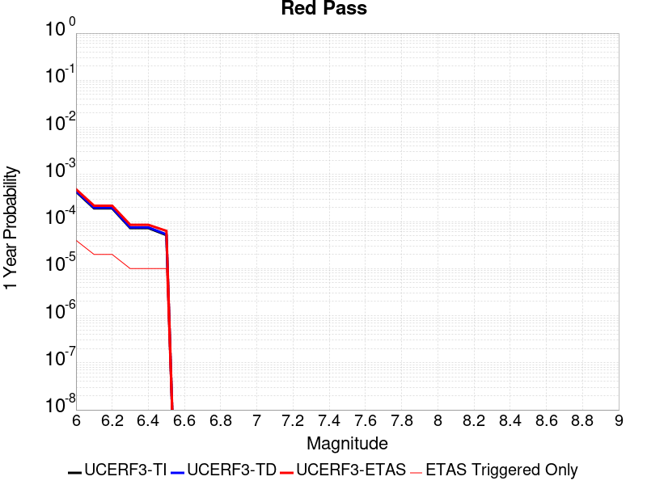 |  |

| Magnitude | 1 wk TI Prob | 1 wk TD Prob | 1 wk ETAS Prob | 1 wk ETAS/TD Gain | 1 wk ETAS Triggered Only | 1 mo TI Prob | 1 mo TD Prob | 1 mo ETAS Prob | 1 mo ETAS/TD Gain | 1 mo ETAS Triggered Only | 1 yr TI Prob | 1 yr TD Prob | 1 yr ETAS Prob | 1 yr ETAS/TD Gain | 1 yr ETAS Triggered Only | 10 yr TI Prob | 10 yr TD Prob | 10 yr ETAS Prob | 10 yr ETAS/TD Gain | 10 yr ETAS Triggered Only |
|-----|-----|-----|-----|-----|-----|-----|-----|-----|-----|-----|-----|-----|-----|-----|-----|-----|-----|-----|-----|-----|
| 6.0 | 8.258278E-6 | 8.551305E-6 | 8.551305E-6 | 1.0 | 0.0 | 3.539214E-5 | 3.6648038E-5 | 3.6648038E-5 | 1.0 | 0.0 | 4.308141E-4 | 4.4611638E-4 | 4.8609852E-4 | 1.0896227 | 4.0E-5 | 0.0042997985 | 0.004453966 | 0.0046032974 | 1.0335279 | 1.5E-4 |
| 6.1 | 3.649988E-6 | 3.7753332E-6 | 3.7753332E-6 | 1.0 | 0.0 | 1.5642712E-5 | 1.6179927E-5 | 1.6179927E-5 | 1.0 | 0.0 | 1.9043336E-4 | 1.9697756E-4 | 2.1697363E-4 | 1.1015145 | 2.0E-5 | 0.0019027026 | 0.001968497 | 0.0020483395 | 1.0405601 | 8.0E-5 |
| 6.2 | 3.649988E-6 | 3.7753332E-6 | 3.7753332E-6 | 1.0 | 0.0 | 1.5642712E-5 | 1.6179927E-5 | 1.6179927E-5 | 1.0 | 0.0 | 1.9043336E-4 | 1.9697756E-4 | 2.1697363E-4 | 1.1015145 | 2.0E-5 | 0.0019027026 | 0.001968497 | 0.0020483395 | 1.0405601 | 8.0E-5 |
| 6.3 | 1.3924937E-6 | 1.4411233E-6 | 1.4411233E-6 | 1.0 | 0.0 | 5.9678164E-6 | 6.176236E-6 | 6.176236E-6 | 1.0 | 0.0 | 7.265574E-5 | 7.51945E-5 | 8.5193744E-5 | 1.1329784 | 1.0E-5 | 7.263199E-4 | 7.518293E-4 | 7.7181426E-4 | 1.0265818 | 2.0E-5 |
| 6.4 | 1.3924937E-6 | 1.4411233E-6 | 1.4411233E-6 | 1.0 | 0.0 | 5.9678164E-6 | 6.176236E-6 | 6.176236E-6 | 1.0 | 0.0 | 7.265574E-5 | 7.51945E-5 | 8.5193744E-5 | 1.1329784 | 1.0E-5 | 7.263199E-4 | 7.518293E-4 | 7.7181426E-4 | 1.0265818 | 2.0E-5 |
| 6.5 | 9.876812E-7 | 1.022196E-6 | 1.022196E-6 | 1.0 | 0.0 | 4.2329125E-6 | 4.38084E-6 | 4.38084E-6 | 1.0 | 0.0 | 5.153449E-5 | 5.3336724E-5 | 6.333619E-5 | 1.1874781 | 1.0E-5 | 5.1522546E-4 | 5.333672E-4 | 5.4336194E-4 | 1.0187389 | 1.0E-5 |

## San Andreas (San Gorgonio Pass-Garnet HIll)
*[(top)](#table-of-contents)*

| 1 Week | 1 Month | 1 Year | 10 Year |
|-----|-----|-----|-----|
|  |  |  |  |

| Magnitude | 1 wk TI Prob | 1 wk TD Prob | 1 wk ETAS Prob | 1 wk ETAS/TD Gain | 1 wk ETAS Triggered Only | 1 mo TI Prob | 1 mo TD Prob | 1 mo ETAS Prob | 1 mo ETAS/TD Gain | 1 mo ETAS Triggered Only | 1 yr TI Prob | 1 yr TD Prob | 1 yr ETAS Prob | 1 yr ETAS/TD Gain | 1 yr ETAS Triggered Only | 10 yr TI Prob | 10 yr TD Prob | 10 yr ETAS Prob | 10 yr ETAS/TD Gain | 10 yr ETAS Triggered Only |
|-----|-----|-----|-----|-----|-----|-----|-----|-----|-----|-----|-----|-----|-----|-----|-----|-----|-----|-----|-----|-----|
| 6.0 | 8.31567E-5 | 2.338839E-4 | 2.338839E-4 | 1.0 | 0.0 | 3.5633717E-4 | 0.0010019708 | 0.0010219509 | 1.0199406 | 2.0E-5 | 0.004329778 | 0.01213065 | 0.01220968 | 1.0065149 | 8.0E-5 | 0.042463828 | 0.11259771 | 0.1127397 | 1.001261 | 1.6E-4 |
| 6.1 | 8.31567E-5 | 2.338839E-4 | 2.338839E-4 | 1.0 | 0.0 | 3.5633717E-4 | 0.0010019708 | 0.0010219509 | 1.0199406 | 2.0E-5 | 0.004329778 | 0.01213065 | 0.01220968 | 1.0065149 | 8.0E-5 | 0.042463828 | 0.11259771 | 0.1127397 | 1.001261 | 1.6E-4 |
| 6.2 | 8.31567E-5 | 2.338839E-4 | 2.338839E-4 | 1.0 | 0.0 | 3.5633717E-4 | 0.0010019708 | 0.0010219509 | 1.0199406 | 2.0E-5 | 0.004329778 | 0.01213065 | 0.01220968 | 1.0065149 | 8.0E-5 | 0.042463828 | 0.11259771 | 0.1127397 | 1.001261 | 1.6E-4 |
| 6.3 | 8.31567E-5 | 2.338839E-4 | 2.338839E-4 | 1.0 | 0.0 | 3.5633717E-4 | 0.0010019708 | 0.0010219509 | 1.0199406 | 2.0E-5 | 0.004329778 | 0.01213065 | 0.01220968 | 1.0065149 | 8.0E-5 | 0.042463828 | 0.11259771 | 0.1127397 | 1.001261 | 1.6E-4 |
| 6.4 | 8.059055E-5 | 2.2945837E-4 | 2.2945837E-4 | 1.0 | 0.0 | 3.4534236E-4 | 9.830239E-4 | 0.0010030043 | 1.0203254 | 2.0E-5 | 0.0041964394 | 0.011902837 | 0.011981885 | 1.006641 | 8.0E-5 | 0.041180745 | 0.11057874 | 0.11072105 | 1.001287 | 1.6E-4 |
| 6.5 | 8.059055E-5 | 2.2945837E-4 | 2.2945837E-4 | 1.0 | 0.0 | 3.4534236E-4 | 9.830239E-4 | 0.0010030043 | 1.0203254 | 2.0E-5 | 0.0041964394 | 0.011902837 | 0.011981885 | 1.006641 | 8.0E-5 | 0.041180745 | 0.11057874 | 0.11072105 | 1.001287 | 1.6E-4 |
| 6.6 | 7.619237E-5 | 2.2190346E-4 | 2.2190346E-4 | 1.0 | 0.0 | 3.2649786E-4 | 9.5067057E-4 | 9.6066104E-4 | 1.0105089 | 1.0E-5 | 0.0039678677 | 0.011513535 | 0.011572844 | 1.0051513 | 6.0E-5 | 0.03897764 | 0.107115194 | 0.1072402 | 1.001167 | 1.4E-4 |
| 6.7 | 7.440636E-5 | 2.1866155E-4 | 2.1866155E-4 | 1.0 | 0.0 | 3.188454E-4 | 9.367866E-4 | 9.4677723E-4 | 1.0106648 | 1.0E-5 | 0.0038750346 | 0.011346267 | 0.011405585 | 1.005228 | 6.0E-5 | 0.038081564 | 0.105623715 | 0.10574893 | 1.0011854 | 1.4E-4 |
| 6.8 | 7.3735864E-5 | 2.1713313E-4 | 2.1713313E-4 | 1.0 | 0.0 | 3.1597257E-4 | 9.3024096E-4 | 9.4023166E-4 | 1.0107399 | 1.0E-5 | 0.0038401815 | 0.011267403 | 0.0113267265 | 1.0052651 | 6.0E-5 | 0.03774495 | 0.10492511 | 0.10505042 | 1.0011942 | 1.4E-4 |
| 6.9 | 7.27575E-5 | 2.1482276E-4 | 2.1482276E-4 | 1.0 | 0.0 | 3.117806E-4 | 9.203464E-4 | 9.303372E-4 | 1.0108554 | 1.0E-5 | 0.003789323 | 0.011148175 | 0.011207507 | 1.0053221 | 6.0E-5 | 0.037253562 | 0.103873 | 0.1039895 | 1.0011215 | 1.3E-4 |
| 7.0 | 7.102591E-5 | 2.10663E-4 | 2.10663E-4 | 1.0 | 0.0 | 3.0436125E-4 | 9.0253126E-4 | 9.125222E-4 | 1.0110699 | 1.0E-5 | 0.003699303 | 0.010933471 | 0.010992815 | 1.0054277 | 6.0E-5 | 0.03638325 | 0.10197552 | 0.102092266 | 1.0011448 | 1.3E-4 |
| 7.1 | 7.028513E-5 | 2.0901936E-4 | 2.0901936E-4 | 1.0 | 0.0 | 3.0118722E-4 | 8.95492E-4 | 9.05483E-4 | 1.011157 | 1.0E-5 | 0.0036607897 | 0.010848625 | 0.010907974 | 1.0054706 | 6.0E-5 | 0.036010686 | 0.10121833 | 0.10133517 | 1.0011543 | 1.3E-4 |
| 7.2 | 6.8498244E-5 | 2.0509785E-4 | 2.0509785E-4 | 1.0 | 0.0 | 2.9353087E-4 | 8.786969E-4 | 8.886881E-4 | 1.0113705 | 1.0E-5 | 0.003567883 | 0.010646159 | 0.0107055195 | 1.0055758 | 6.0E-5 | 0.035111405 | 0.09941009 | 0.099527165 | 1.0011777 | 1.3E-4 |
| 7.3 | 6.622592E-5 | 1.9737013E-4 | 1.9737013E-4 | 1.0 | 0.0 | 2.8379448E-4 | 8.455999E-4 | 8.555915E-4 | 1.0118159 | 1.0E-5 | 0.0034497243 | 0.010247062 | 0.010306447 | 1.0057954 | 6.0E-5 | 0.033966612 | 0.09590662 | 0.096024156 | 1.0012255 | 1.3E-4 |
| 7.4 | 5.1050705E-5 | 1.4693316E-4 | 1.4693316E-4 | 1.0 | 0.0 | 2.1877038E-4 | 6.295625E-4 | 6.395562E-4 | 1.015874 | 1.0E-5 | 0.002660276 | 0.0076381783 | 0.0076977196 | 1.0077953 | 6.0E-5 | 0.02628654 | 0.07287833 | 0.07299886 | 1.0016538 | 1.3E-4 |
| 7.5 | 3.9302922E-5 | 1.1133535E-4 | 1.1133535E-4 | 1.0 | 0.0 | 1.6843023E-4 | 4.7706455E-4 | 4.870598E-4 | 1.0209515 | 1.0E-5 | 0.0020487092 | 0.0057928623 | 0.0058425725 | 1.0085813 | 5.0E-5 | 0.020299247 | 0.056023482 | 0.05613676 | 1.0020219 | 1.2E-4 |
| 7.6 | 2.9851626E-5 | 8.498211E-5 | 8.498211E-5 | 1.0 | 0.0 | 1.2792926E-4 | 3.6415833E-4 | 3.7415468E-4 | 1.0274506 | 1.0E-5 | 0.0015564259 | 0.00442464 | 0.0044744187 | 1.0112504 | 5.0E-5 | 0.0154556995 | 0.043206394 | 0.04331164 | 1.0024359 | 1.1E-4 |
| 7.7 | 2.1135214E-5 | 6.355745E-5 | 6.355745E-5 | 1.0 | 0.0 | 9.0576345E-5 | 2.7236066E-4 | 2.823579E-4 | 1.036706 | 1.0E-5 | 0.0011022091 | 0.0033109542 | 0.0033607886 | 1.0150514 | 5.0E-5 | 0.010967582 | 0.03259442 | 0.03269116 | 1.002968 | 1.0E-4 |
| 7.8 | 1.883379E-5 | 5.5666103E-5 | 5.5666103E-5 | 1.0 | 0.0 | 8.0713755E-5 | 2.3854722E-4 | 2.4854482E-4 | 1.0419104 | 1.0E-5 | 9.822468E-4 | 0.0029004475 | 0.0029503026 | 1.0171887 | 5.0E-5 | 0.0097791655 | 0.02870594 | 0.02880307 | 1.0033836 | 1.0E-4 |
| 7.9 | 1.5156185E-5 | 4.167907E-5 | 4.167907E-5 | 1.0 | 0.0 | 6.495346E-5 | 1.7861238E-4 | 1.8861059E-4 | 1.0559771 | 1.0E-5 | 7.9052144E-4 | 0.0021724382 | 0.0022223296 | 1.0229657 | 5.0E-5 | 0.007877152 | 0.021768799 | 0.021866621 | 1.0044937 | 1.0E-4 |
| 8.0 | 1.1405907E-5 | 2.9989498E-5 | 2.9989498E-5 | 1.0 | 0.0 | 4.8881542E-5 | 1.2852009E-4 | 1.2852009E-4 | 1.0 | 0.0 | 5.9497025E-4 | 0.00156361 | 0.0015835788 | 1.0127709 | 2.0E-5 | 0.005933798 | 0.015779829 | 0.015838882 | 1.0037423 | 6.0E-5 |
| 8.1 | 4.3511436E-6 | 7.3739657E-6 | 7.3739657E-6 | 1.0 | 0.0 | 1.8647626E-5 | 3.160233E-5 | 3.160233E-5 | 1.0 | 0.0 | 2.2701119E-4 | 3.8469053E-4 | 3.8469053E-4 | 1.0 | 0.0 | 0.0022677942 | 0.0041186865 | 0.0041186865 | 1.0 | 0.0 |
| 8.2 | 2.3042528E-6 | 2.7349201E-6 | 2.7349201E-6 | 1.0 | 0.0 | 9.875332E-6 | 1.1721034E-5 | 1.1721034E-5 | 1.0 | 0.0 | 1.2022553E-4 | 1.4269429E-4 | 1.4269429E-4 | 1.0 | 0.0 | 0.0012016051 | 0.0015990431 | 0.0015990431 | 1.0 | 0.0 |
| 8.3 | 5.202968E-7 | 3.1619535E-7 | 3.1619535E-7 | 1.0 | 0.0 | 2.2298414E-6 | 1.3551223E-6 | 1.3551223E-6 | 1.0 | 0.0 | 2.714798E-5 | 1.6498503E-5 | 1.6498503E-5 | 1.0 | 0.0 | 2.7144665E-4 | 1.9577713E-4 | 1.9577713E-4 | 1.0 | 0.0 |

## San Jacinto (San Bernardino)
*[(top)](#table-of-contents)*

| 1 Week | 1 Month | 1 Year | 10 Year |
|-----|-----|-----|-----|
|  |  |  |  |

| Magnitude | 1 wk TI Prob | 1 wk TD Prob | 1 wk ETAS Prob | 1 wk ETAS/TD Gain | 1 wk ETAS Triggered Only | 1 mo TI Prob | 1 mo TD Prob | 1 mo ETAS Prob | 1 mo ETAS/TD Gain | 1 mo ETAS Triggered Only | 1 yr TI Prob | 1 yr TD Prob | 1 yr ETAS Prob | 1 yr ETAS/TD Gain | 1 yr ETAS Triggered Only | 10 yr TI Prob | 10 yr TD Prob | 10 yr ETAS Prob | 10 yr ETAS/TD Gain | 10 yr ETAS Triggered Only |
|-----|-----|-----|-----|-----|-----|-----|-----|-----|-----|-----|-----|-----|-----|-----|-----|-----|-----|-----|-----|-----|
| 6.0 | 3.409352E-5 | 3.6001682E-5 | 4.600132E-5 | 1.2777548 | 1.0E-5 | 1.461069E-4 | 1.542838E-4 | 1.8427917E-4 | 1.1944169 | 3.0E-5 | 0.0017774 | 0.0018767886 | 0.0019666196 | 1.0478642 | 9.0E-5 | 0.01763251 | 0.01935761 | 0.019504705 | 1.0075989 | 1.5E-4 |
| 6.1 | 3.409352E-5 | 3.6001682E-5 | 4.600132E-5 | 1.2777548 | 1.0E-5 | 1.461069E-4 | 1.542838E-4 | 1.8427917E-4 | 1.1944169 | 3.0E-5 | 0.0017774 | 0.0018767886 | 0.0019666196 | 1.0478642 | 9.0E-5 | 0.01763251 | 0.01935761 | 0.019504705 | 1.0075989 | 1.5E-4 |
| 6.2 | 3.409352E-5 | 3.6001682E-5 | 4.600132E-5 | 1.2777548 | 1.0E-5 | 1.461069E-4 | 1.542838E-4 | 1.8427917E-4 | 1.1944169 | 3.0E-5 | 0.0017774 | 0.0018767886 | 0.0019666196 | 1.0478642 | 9.0E-5 | 0.01763251 | 0.01935761 | 0.019504705 | 1.0075989 | 1.5E-4 |
| 6.3 | 3.409352E-5 | 3.6001682E-5 | 4.600132E-5 | 1.2777548 | 1.0E-5 | 1.461069E-4 | 1.542838E-4 | 1.8427917E-4 | 1.1944169 | 3.0E-5 | 0.0017774 | 0.0018767886 | 0.0019666196 | 1.0478642 | 9.0E-5 | 0.01763251 | 0.01935761 | 0.019504705 | 1.0075989 | 1.5E-4 |
| 6.4 | 3.400795E-5 | 3.5894343E-5 | 4.5893983E-5 | 1.2785854 | 1.0E-5 | 1.4574021E-4 | 1.5382383E-4 | 1.8381923E-4 | 1.1949983 | 3.0E-5 | 0.0017729428 | 0.0018711982 | 0.0019610298 | 1.0480075 | 9.0E-5 | 0.017588645 | 0.01930269 | 0.019449795 | 1.0076209 | 1.5E-4 |
| 6.5 | 3.341482E-5 | 3.515495E-5 | 4.5154597E-5 | 1.2844449 | 1.0E-5 | 1.4319851E-4 | 1.5065537E-4 | 1.8065085E-4 | 1.1991 | 3.0E-5 | 0.0017420477 | 0.0018326874 | 0.0019125408 | 1.0435717 | 8.0E-5 | 0.017284546 | 0.018924221 | 0.019061573 | 1.0072579 | 1.4E-4 |
| 6.6 | 3.3364955E-5 | 3.5092165E-5 | 4.5091812E-5 | 1.284954 | 1.0E-5 | 1.4298483E-4 | 1.5038633E-4 | 1.8038182E-4 | 1.1994562 | 3.0E-5 | 0.0017394501 | 0.0018294173 | 0.001909271 | 1.0436498 | 8.0E-5 | 0.017258976 | 0.018892085 | 0.01902944 | 1.0072705 | 1.4E-4 |
| 6.7 | 3.335922E-5 | 3.508194E-5 | 4.5081586E-5 | 1.2850369 | 1.0E-5 | 1.4296026E-4 | 1.503425E-4 | 1.80338E-4 | 1.1995144 | 3.0E-5 | 0.0017391514 | 0.0018288847 | 0.0019087384 | 1.0436625 | 8.0E-5 | 0.017256035 | 0.018886877 | 0.019024232 | 1.0072726 | 1.4E-4 |
| 6.8 | 3.327683E-5 | 3.4976E-5 | 4.4975648E-5 | 1.2859004 | 1.0E-5 | 1.4260718E-4 | 1.4988854E-4 | 1.7988404E-4 | 1.2001188 | 3.0E-5 | 0.0017348597 | 0.0018233669 | 0.001903221 | 1.0437949 | 8.0E-5 | 0.017213784 | 0.018832648 | 0.01897001 | 1.0072939 | 1.4E-4 |
| 6.9 | 3.3235785E-5 | 3.491695E-5 | 4.49166E-5 | 1.2863839 | 1.0E-5 | 1.4243131E-4 | 1.496355E-4 | 1.7963101E-4 | 1.2004572 | 3.0E-5 | 0.0017327217 | 0.0018202913 | 0.0019001457 | 1.043869 | 8.0E-5 | 0.017192734 | 0.018802516 | 0.018939883 | 1.0073059 | 1.4E-4 |
| 7.0 | 3.3197095E-5 | 3.485688E-5 | 4.485653E-5 | 1.2868774 | 1.0E-5 | 1.422655E-4 | 1.4937807E-4 | 1.7937359E-4 | 1.2008027 | 3.0E-5 | 0.0017307063 | 0.0018171624 | 0.001897017 | 1.0439447 | 8.0E-5 | 0.017172894 | 0.01877189 | 0.018909262 | 1.0073179 | 1.4E-4 |
| 7.1 | 3.3129716E-5 | 3.473708E-5 | 4.4736735E-5 | 1.2878668 | 1.0E-5 | 1.4197677E-4 | 1.4886471E-4 | 1.7886025E-4 | 1.2014953 | 3.0E-5 | 0.0017271966 | 0.0018109226 | 0.0018907777 | 1.0440964 | 8.0E-5 | 0.017138338 | 0.01871097 | 0.018848352 | 1.0073422 | 1.4E-4 |
| 7.2 | 3.3034008E-5 | 3.4604524E-5 | 4.4604178E-5 | 1.2889695 | 1.0E-5 | 1.4156665E-4 | 1.4829668E-4 | 1.7829222E-4 | 1.2022672 | 3.0E-5 | 0.0017222111 | 0.0018040182 | 0.001883874 | 1.0442655 | 8.0E-5 | 0.017089253 | 0.018643353 | 0.018780742 | 1.0073694 | 1.4E-4 |
| 7.3 | 3.2956614E-5 | 3.447227E-5 | 4.4471923E-5 | 1.2900783 | 1.0E-5 | 1.4123498E-4 | 1.4772992E-4 | 1.777255E-4 | 1.2030432 | 3.0E-5 | 0.0017181796 | 0.0017971295 | 0.0018769858 | 1.0444354 | 8.0E-5 | 0.017049557 | 0.018576099 | 0.018713497 | 1.0073966 | 1.4E-4 |
| 7.4 | 3.2915937E-5 | 3.4393954E-5 | 4.4393608E-5 | 1.2907388 | 1.0E-5 | 1.4106068E-4 | 1.4739433E-4 | 1.7738991E-4 | 1.2035056 | 3.0E-5 | 0.0017160608 | 0.0017930503 | 0.0018729069 | 1.0445367 | 8.0E-5 | 0.017028693 | 0.01853637 | 0.018673776 | 1.0074127 | 1.4E-4 |
| 7.5 | 3.281791E-5 | 3.4258854E-5 | 4.425851E-5 | 1.2918854 | 1.0E-5 | 1.406406E-4 | 1.468154E-4 | 1.76811E-4 | 1.2043083 | 3.0E-5 | 0.0017109542 | 0.0017860134 | 0.0018658706 | 1.0447125 | 8.0E-5 | 0.016978411 | 0.01846725 | 0.018604664 | 1.007441 | 1.4E-4 |
| 7.6 | 3.2521442E-5 | 3.3983775E-5 | 4.3983437E-5 | 1.2942481 | 1.0E-5 | 1.3937015E-4 | 1.4563663E-4 | 1.7563226E-4 | 1.2059622 | 3.0E-5 | 0.0016955109 | 0.0017716853 | 0.0018515436 | 1.0450747 | 8.0E-5 | 0.016826328 | 0.018324887 | 0.01846232 | 1.0074999 | 1.4E-4 |
| 7.7 | 3.0287873E-5 | 3.2467702E-5 | 4.2467378E-5 | 1.3079884 | 1.0E-5 | 1.297987E-4 | 1.3913988E-4 | 1.6913572E-4 | 1.2155803 | 3.0E-5 | 0.0015791537 | 0.001692713 | 0.0017725775 | 1.0471814 | 8.0E-5 | 0.01567979 | 0.017535618 | 0.017673163 | 1.0078437 | 1.4E-4 |
| 7.8 | 2.6316151E-5 | 2.9678076E-5 | 3.967778E-5 | 1.3369391 | 1.0E-5 | 1.1277862E-4 | 1.2718556E-4 | 1.5718174E-4 | 1.2358458 | 3.0E-5 | 0.0013722149 | 0.0015473852 | 0.0016272615 | 1.0516201 | 8.0E-5 | 0.013637724 | 0.016076857 | 0.016214607 | 1.0085682 | 1.4E-4 |
| 7.9 | 2.0761147E-5 | 2.343051E-5 | 3.3430275E-5 | 1.4267839 | 1.0E-5 | 8.897331E-5 | 1.0041261E-4 | 1.304096E-4 | 1.2987373 | 3.0E-5 | 0.0010827117 | 0.0012218388 | 0.0012917533 | 1.0572207 | 7.0E-5 | 0.010774517 | 0.012799647 | 0.012918111 | 1.0092553 | 1.2E-4 |
| 8.0 | 1.5738568E-5 | 1.604239E-5 | 1.604239E-5 | 1.0 | 0.0 | 6.744926E-5 | 6.875129E-5 | 8.874991E-5 | 1.2908837 | 2.0E-5 | 8.2088535E-4 | 8.3672616E-4 | 8.5670943E-4 | 1.0238826 | 2.0E-5 | 0.008178596 | 0.008870586 | 0.008930054 | 1.006704 | 6.0E-5 |
| 8.1 | 1.0105832E-5 | 8.335246E-6 | 8.335246E-6 | 1.0 | 0.0 | 4.3309992E-5 | 3.5721994E-5 | 3.5721994E-5 | 1.0 | 0.0 | 5.2717153E-4 | 4.34829E-4 | 4.34829E-4 | 1.0 | 0.0 | 0.005259227 | 0.0046798005 | 0.00470966 | 1.0063806 | 3.0E-5 |
| 8.2 | 4.189207E-6 | 1.5793896E-6 | 1.5793896E-6 | 1.0 | 0.0 | 1.7953622E-5 | 6.768795E-6 | 6.768795E-6 | 1.0 | 0.0 | 2.1856341E-4 | 8.2406994E-5 | 8.2406994E-5 | 1.0 | 0.0 | 0.0021834858 | 9.571454E-4 | 9.571454E-4 | 1.0 | 0.0 |
| 8.3 | 1.2758221E-6 | 3.6171858E-7 | 3.6171858E-7 | 1.0 | 0.0 | 5.4677976E-6 | 1.5502216E-6 | 1.5502216E-6 | 1.0 | 0.0 | 6.65684E-5 | 1.8873789E-5 | 1.8873789E-5 | 1.0 | 0.0 | 6.6548464E-4 | 2.2764095E-4 | 2.2764095E-4 | 1.0 | 0.0 |

## Death Valley (Fish Lake Valley)
*[(top)](#table-of-contents)*

| 1 Week | 1 Month | 1 Year | 10 Year |
|-----|-----|-----|-----|
|  |  | 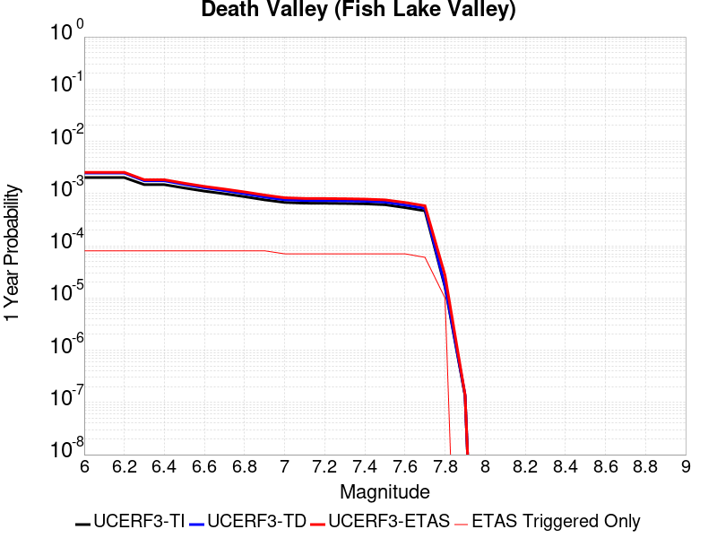 |  |

| Magnitude | 1 wk TI Prob | 1 wk TD Prob | 1 wk ETAS Prob | 1 wk ETAS/TD Gain | 1 wk ETAS Triggered Only | 1 mo TI Prob | 1 mo TD Prob | 1 mo ETAS Prob | 1 mo ETAS/TD Gain | 1 mo ETAS Triggered Only | 1 yr TI Prob | 1 yr TD Prob | 1 yr ETAS Prob | 1 yr ETAS/TD Gain | 1 yr ETAS Triggered Only | 10 yr TI Prob | 10 yr TD Prob | 10 yr ETAS Prob | 10 yr ETAS/TD Gain | 10 yr ETAS Triggered Only |
|-----|-----|-----|-----|-----|-----|-----|-----|-----|-----|-----|-----|-----|-----|-----|-----|-----|-----|-----|-----|-----|
| 6.0 | 3.872328E-5 | 4.7267124E-5 | 5.726665E-5 | 1.2115536 | 1.0E-5 | 1.6594635E-4 | 2.0255933E-4 | 2.2255527E-4 | 1.0987165 | 2.0E-5 | 0.0020185246 | 0.002463633 | 0.002543436 | 1.0323924 | 8.0E-5 | 0.02000288 | 0.024389042 | 0.024535382 | 1.0060003 | 1.5E-4 |
| 6.1 | 3.872328E-5 | 4.7267124E-5 | 5.726665E-5 | 1.2115536 | 1.0E-5 | 1.6594635E-4 | 2.0255933E-4 | 2.2255527E-4 | 1.0987165 | 2.0E-5 | 0.0020185246 | 0.002463633 | 0.002543436 | 1.0323924 | 8.0E-5 | 0.02000288 | 0.024389042 | 0.024535382 | 1.0060003 | 1.5E-4 |
| 6.2 | 3.872328E-5 | 4.7267124E-5 | 5.726665E-5 | 1.2115536 | 1.0E-5 | 1.6594635E-4 | 2.0255933E-4 | 2.2255527E-4 | 1.0987165 | 2.0E-5 | 0.0020185246 | 0.002463633 | 0.002543436 | 1.0323924 | 8.0E-5 | 0.02000288 | 0.024389042 | 0.024535382 | 1.0060003 | 1.5E-4 |
| 6.3 | 2.8356371E-5 | 3.361063E-5 | 4.3610296E-5 | 1.2975149 | 1.0E-5 | 1.2152165E-4 | 1.4403803E-4 | 1.6403515E-4 | 1.1388322 | 2.0E-5 | 0.0014785219 | 0.0017523223 | 0.0018321822 | 1.0455737 | 8.0E-5 | 0.014687235 | 0.017392244 | 0.017539635 | 1.0084746 | 1.5E-4 |
| 6.4 | 2.8356371E-5 | 3.361063E-5 | 4.3610296E-5 | 1.2975149 | 1.0E-5 | 1.2152165E-4 | 1.4403803E-4 | 1.6403515E-4 | 1.1388322 | 2.0E-5 | 0.0014785219 | 0.0017523223 | 0.0018321822 | 1.0455737 | 8.0E-5 | 0.014687235 | 0.017392244 | 0.017539635 | 1.0084746 | 1.5E-4 |
| 6.5 | 2.4448687E-5 | 2.8608241E-5 | 3.8607956E-5 | 1.3495396 | 1.0E-5 | 1.0477588E-4 | 1.2260124E-4 | 1.4259879E-4 | 1.1631105 | 2.0E-5 | 0.0012748998 | 0.0014916958 | 0.0015715763 | 1.0535502 | 8.0E-5 | 0.012676105 | 0.014821727 | 0.0149695035 | 1.0099703 | 1.5E-4 |
| 6.6 | 2.1298161E-5 | 2.4660607E-5 | 3.466036E-5 | 1.405495 | 1.0E-5 | 9.127464E-5 | 1.05684194E-4 | 1.2568208E-4 | 1.189223 | 2.0E-5 | 0.0011107022 | 0.0012859785 | 0.0013658756 | 1.0621295 | 8.0E-5 | 0.011051672 | 0.0127888 | 0.012936881 | 1.011579 | 1.5E-4 |
| 6.7 | 1.8959729E-5 | 2.178146E-5 | 3.178124E-5 | 1.4590961 | 1.0E-5 | 8.125345E-5 | 9.334592E-5 | 1.1334405E-4 | 1.2142369 | 2.0E-5 | 9.888117E-4 | 0.0011359196 | 0.0012158287 | 1.0703475 | 8.0E-5 | 0.009844234 | 0.011303795 | 0.011452098 | 1.0131199 | 1.5E-4 |
| 6.8 | 1.6691629E-5 | 1.9018706E-5 | 2.9018516E-5 | 1.5257881 | 1.0E-5 | 7.153359E-5 | 8.150629E-5 | 1.0150466E-4 | 1.2453598 | 2.0E-5 | 8.7057345E-4 | 9.919042E-4 | 0.0010718248 | 1.080573 | 8.0E-5 | 0.008671708 | 0.009876527 | 0.010025045 | 1.0150375 | 1.5E-4 |
| 6.9 | 1.450505E-5 | 1.6389824E-5 | 2.638966E-5 | 1.6101247 | 1.0E-5 | 6.216302E-5 | 7.024026E-5 | 9.023886E-5 | 1.284717 | 2.0E-5 | 7.5657194E-4 | 8.548484E-4 | 9.3478005E-4 | 1.0935038 | 8.0E-5 | 0.007540013 | 0.008516532 | 0.008665255 | 1.0174628 | 1.5E-4 |
| 7.0 | 1.2940855E-5 | 1.453821E-5 | 2.4538065E-5 | 1.6878326 | 1.0E-5 | 5.545963E-5 | 6.230516E-5 | 8.2303915E-5 | 1.3209807 | 2.0E-5 | 6.750118E-4 | 7.583071E-4 | 8.2825404E-4 | 1.0922409 | 7.0E-5 | 0.006729651 | 0.0075578135 | 0.007696755 | 1.0183839 | 1.4E-4 |
| 7.1 | 1.2544658E-5 | 1.4078437E-5 | 2.4078296E-5 | 1.7102962 | 1.0E-5 | 5.3761712E-5 | 6.033479E-5 | 8.0333586E-5 | 1.3314637 | 2.0E-5 | 6.5435225E-4 | 7.343341E-4 | 8.042827E-4 | 1.0952544 | 7.0E-5 | 0.006524288 | 0.0073196692 | 0.007458645 | 1.0189866 | 1.4E-4 |
| 7.2 | 1.2489416E-5 | 1.4015902E-5 | 2.4015762E-5 | 1.7134653 | 1.0E-5 | 5.3524967E-5 | 6.00668E-5 | 8.00656E-5 | 1.3329426 | 2.0E-5 | 6.514716E-4 | 7.310735E-4 | 8.0102234E-4 | 1.0956796 | 7.0E-5 | 0.006495651 | 0.007287278 | 0.0074262572 | 1.0190716 | 1.4E-4 |
| 7.3 | 1.2368307E-5 | 1.3880038E-5 | 2.3879898E-5 | 1.7204491 | 1.0E-5 | 5.3005948E-5 | 5.948455E-5 | 7.948336E-5 | 1.3362018 | 2.0E-5 | 6.451563E-4 | 7.239894E-4 | 7.939387E-4 | 1.0966165 | 7.0E-5 | 0.0064328653 | 0.0072168987 | 0.0073558884 | 1.0192589 | 1.4E-4 |
| 7.4 | 1.2161707E-5 | 1.3648089E-5 | 2.3647954E-5 | 1.7326933 | 1.0E-5 | 5.212056E-5 | 5.8490532E-5 | 7.8489364E-5 | 1.3419157 | 2.0E-5 | 6.3438306E-4 | 7.118952E-4 | 7.818453E-4 | 1.0982591 | 7.0E-5 | 0.006325751 | 0.0070967353 | 0.0072357417 | 1.0195874 | 1.4E-4 |
| 7.5 | 1.1707948E-5 | 1.314573E-5 | 2.3145598E-5 | 1.7606933 | 1.0E-5 | 5.0175953E-5 | 5.6337656E-5 | 7.633653E-5 | 1.3549824 | 2.0E-5 | 6.10721E-4 | 6.857007E-4 | 7.5565267E-4 | 1.1020154 | 7.0E-5 | 0.0060904534 | 0.0068364325 | 0.0069754752 | 1.0203385 | 1.4E-4 |
| 7.6 | 1.0319538E-5 | 1.157981E-5 | 2.1579694E-5 | 1.863562 | 1.0E-5 | 4.4225842E-5 | 4.9626844E-5 | 6.962585E-5 | 1.4029877 | 2.0E-5 | 5.383166E-4 | 6.040445E-4 | 6.740022E-4 | 1.1158155 | 7.0E-5 | 0.0053701443 | 0.0060245576 | 0.0061637145 | 1.0230982 | 1.4E-4 |
| 7.7 | 8.937764E-6 | 1.0022941E-5 | 2.002284E-5 | 1.9977012 | 1.0E-5 | 3.830414E-5 | 4.295478E-5 | 6.295392E-5 | 1.465586 | 2.0E-5 | 4.6625308E-4 | 5.2285404E-4 | 5.8282266E-4 | 1.1146948 | 6.0E-5 | 0.0046527605 | 0.005216748 | 0.00534607 | 1.0247897 | 1.3E-4 |
| 7.8 | 3.108007E-7 | 3.2846788E-7 | 3.2846788E-7 | 1.0 | 0.0 | 1.3320023E-6 | 1.4077187E-6 | 1.4077187E-6 | 1.0 | 0.0 | 1.6217007E-5 | 1.7138846E-5 | 2.7138674E-5 | 1.5834599 | 1.0E-5 | 1.6215823E-4 | 1.713756E-4 | 1.8137389E-4 | 1.0583414 | 1.0E-5 |
| 7.9 | 2.5591178E-9 | 2.6696871E-9 | 2.6696871E-9 | 1.0 | 0.0 | 1.0967647E-8 | 1.1441516E-8 | 1.1441516E-8 | 1.0 | 0.0 | 1.335311E-7 | 1.3930045E-7 | 1.3930045E-7 | 1.0 | 0.0 | 1.3353102E-6 | 1.3930046E-6 | 1.3930046E-6 | 1.0 | 0.0 |

## Owens Valley
*[(top)](#table-of-contents)*

| 1 Week | 1 Month | 1 Year | 10 Year |
|-----|-----|-----|-----|
|  |  |  |  |

| Magnitude | 1 wk TI Prob | 1 wk TD Prob | 1 wk ETAS Prob | 1 wk ETAS/TD Gain | 1 wk ETAS Triggered Only | 1 mo TI Prob | 1 mo TD Prob | 1 mo ETAS Prob | 1 mo ETAS/TD Gain | 1 mo ETAS Triggered Only | 1 yr TI Prob | 1 yr TD Prob | 1 yr ETAS Prob | 1 yr ETAS/TD Gain | 1 yr ETAS Triggered Only | 10 yr TI Prob | 10 yr TD Prob | 10 yr ETAS Prob | 10 yr ETAS/TD Gain | 10 yr ETAS Triggered Only |
|-----|-----|-----|-----|-----|-----|-----|-----|-----|-----|-----|-----|-----|-----|-----|-----|-----|-----|-----|-----|-----|
| 6.0 | 4.83821E-5 | 3.621193E-6 | 1.36211565E-5 | 3.7615108 | 1.0E-5 | 2.0733538E-4 | 1.5519312E-5 | 3.5519002E-5 | 2.288697 | 2.0E-5 | 0.002521386 | 1.8893222E-4 | 2.7891522E-4 | 1.4762713 | 9.0E-5 | 0.024929691 | 0.001929822 | 0.002069552 | 1.0724056 | 1.4E-4 |
| 6.1 | 4.83821E-5 | 3.621193E-6 | 1.36211565E-5 | 3.7615108 | 1.0E-5 | 2.0733538E-4 | 1.5519312E-5 | 3.5519002E-5 | 2.288697 | 2.0E-5 | 0.002521386 | 1.8893222E-4 | 2.7891522E-4 | 1.4762713 | 9.0E-5 | 0.024929691 | 0.001929822 | 0.002069552 | 1.0724056 | 1.4E-4 |
| 6.2 | 4.83821E-5 | 3.621193E-6 | 1.36211565E-5 | 3.7615108 | 1.0E-5 | 2.0733538E-4 | 1.5519312E-5 | 3.5519002E-5 | 2.288697 | 2.0E-5 | 0.002521386 | 1.8893222E-4 | 2.7891522E-4 | 1.4762713 | 9.0E-5 | 0.024929691 | 0.001929822 | 0.002069552 | 1.0724056 | 1.4E-4 |
| 6.3 | 3.953008E-5 | 3.153231E-6 | 1.31532E-5 | 4.1713405 | 1.0E-5 | 1.6940363E-4 | 1.3513782E-5 | 2.3513647E-5 | 1.7399753 | 1.0E-5 | 0.002060538 | 1.645186E-4 | 2.3450708E-4 | 1.4254138 | 7.0E-5 | 0.020415364 | 0.0016622683 | 0.0017521187 | 1.0540528 | 9.0E-5 |
| 6.4 | 3.953008E-5 | 3.153231E-6 | 1.31532E-5 | 4.1713405 | 1.0E-5 | 1.6940363E-4 | 1.3513782E-5 | 2.3513647E-5 | 1.7399753 | 1.0E-5 | 0.002060538 | 1.645186E-4 | 2.3450708E-4 | 1.4254138 | 7.0E-5 | 0.020415364 | 0.0016622683 | 0.0017521187 | 1.0540528 | 9.0E-5 |
| 6.5 | 3.457342E-5 | 2.970874E-6 | 1.2970844E-5 | 4.366003 | 1.0E-5 | 1.4816338E-4 | 1.2732259E-5 | 2.273213E-5 | 1.7853966 | 1.0E-5 | 0.0018023965 | 1.5500492E-4 | 2.2499407E-4 | 1.4515285 | 7.0E-5 | 0.017878477 | 0.0015564174 | 0.0016462773 | 1.0577351 | 9.0E-5 |
| 6.6 | 3.1127765E-5 | 2.8738657E-6 | 1.28738375E-5 | 4.479624 | 1.0E-5 | 1.3339789E-4 | 1.2316514E-5 | 2.231639E-5 | 1.8119081 | 1.0E-5 | 0.0016229092 | 1.4994392E-4 | 2.1993343E-4 | 1.4667712 | 7.0E-5 | 0.016111081 | 0.001501446 | 0.0015913108 | 1.0598522 | 9.0E-5 |
| 6.7 | 2.806885E-5 | 2.8102859E-6 | 1.2810257E-5 | 4.5583467 | 1.0E-5 | 1.2028952E-4 | 1.204403E-5 | 2.204391E-5 | 1.8302768 | 1.0E-5 | 0.001463541 | 1.4662689E-4 | 2.1661662E-4 | 1.4773322 | 7.0E-5 | 0.014539397 | 0.0014657174 | 0.0015555855 | 1.0613134 | 9.0E-5 |
| 6.8 | 2.524524E-5 | 2.2352563E-6 | 1.2235234E-5 | 5.47375 | 1.0E-5 | 1.0818939E-4 | 9.579636E-6 | 1.957954E-5 | 2.043871 | 1.0E-5 | 0.0013164099 | 1.1662613E-4 | 1.8661797E-4 | 1.6001385 | 7.0E-5 | 0.01308639 | 0.0011659319 | 0.001255827 | 1.0771015 | 9.0E-5 |
| 6.9 | 2.2704568E-5 | 1.6080646E-6 | 1.1608048E-5 | 7.2186456 | 1.0E-5 | 9.730166E-5 | 6.8916875E-6 | 1.689162E-5 | 2.4510133 | 1.0E-5 | 0.0011840039 | 8.390308E-5 | 1.5389721E-4 | 1.8342259 | 7.0E-5 | 0.011777153 | 8.3894585E-4 | 9.2887034E-4 | 1.1071875 | 9.0E-5 |
| 7.0 | 2.0871712E-5 | 1.5394511E-6 | 1.1539436E-5 | 7.495812 | 1.0E-5 | 8.944713E-5 | 6.597631E-6 | 1.6597565E-5 | 2.5156856 | 1.0E-5 | 0.0010884746 | 8.032321E-5 | 1.5031759E-4 | 1.871409 | 7.0E-5 | 0.010831586 | 8.0313E-4 | 8.930577E-4 | 1.1119716 | 9.0E-5 |
| 7.1 | 1.944928E-5 | 1.3863316E-6 | 1.1386318E-5 | 8.213271 | 1.0E-5 | 8.335139E-5 | 5.941408E-6 | 1.5941348E-5 | 2.6830928 | 1.0E-5 | 0.0010143308 | 7.233425E-5 | 1.4232918E-4 | 1.9676596 | 7.0E-5 | 0.010097133 | 7.232817E-4 | 8.132166E-4 | 1.1243428 | 9.0E-5 |
| 7.2 | 1.7876306E-5 | 1.2488347E-6 | 1.1248822E-5 | 9.007455 | 1.0E-5 | 7.6610486E-5 | 5.352138E-6 | 1.5352085E-5 | 2.8684022 | 1.0E-5 | 9.3233347E-4 | 6.516034E-5 | 1.3515577E-4 | 2.074203 | 7.0E-5 | 0.009284316 | 6.5157266E-4 | 7.4151397E-4 | 1.1380373 | 9.0E-5 |
| 7.3 | 1.2618672E-5 | 1.1114453E-6 | 1.1111434E-5 | 9.997284 | 1.0E-5 | 5.40789E-5 | 4.763328E-6 | 1.4763281E-5 | 3.0993624 | 1.0E-5 | 6.582117E-4 | 5.7991983E-5 | 1.2798792E-4 | 2.2069933 | 7.0E-5 | 0.0065626553 | 5.7992374E-4 | 6.698716E-4 | 1.1551028 | 9.0E-5 |
| 7.4 | 7.4874442E-6 | 8.548014E-7 | 1.0854793E-5 | 12.698614 | 1.0E-5 | 3.208865E-5 | 3.6634294E-6 | 1.3663393E-5 | 3.7296727 | 1.0E-5 | 3.906093E-4 | 4.4601344E-5 | 1.14598224E-4 | 2.5693893 | 7.0E-5 | 0.003899234 | 4.4603736E-4 | 5.359972E-4 | 1.2016869 | 9.0E-5 |
| 7.5 | 2.4734156E-6 | 6.0683584E-7 | 6.0683584E-7 | 1.0 | 0.0 | 1.060031E-5 | 2.6007224E-6 | 2.6007224E-6 | 1.0 | 0.0 | 1.2905113E-4 | 3.1663338E-5 | 9.166144E-5 | 2.894876 | 6.0E-5 | 0.0012897621 | 3.165886E-4 | 3.8656642E-4 | 1.2210371 | 7.0E-5 |
| 7.6 | 1.1328841E-6 | 3.1963748E-7 | 3.1963748E-7 | 1.0 | 0.0 | 4.8552088E-6 | 1.3698742E-6 | 1.3698742E-6 | 1.0 | 0.0 | 5.9110564E-5 | 1.6678092E-5 | 6.667726E-5 | 3.9978948 | 5.0E-5 | 5.9094845E-4 | 1.667686E-4 | 2.1676027E-4 | 1.2997667 | 5.0E-5 |
| 7.7 | 4.8613185E-7 | 8.9632934E-8 | 8.9632934E-8 | 1.0 | 0.0 | 2.0834207E-6 | 3.8414112E-7 | 3.8414112E-7 | 1.0 | 0.0 | 2.536535E-5 | 4.6769087E-6 | 3.4676767E-5 | 7.4144635 | 3.0E-5 | 2.5362454E-4 | 4.676817E-5 | 7.6766766E-5 | 1.6414319 | 3.0E-5 |

## San Andreas (Coachella) rev
*[(top)](#table-of-contents)*

| 1 Week | 1 Month | 1 Year | 10 Year |
|-----|-----|-----|-----|
|  | 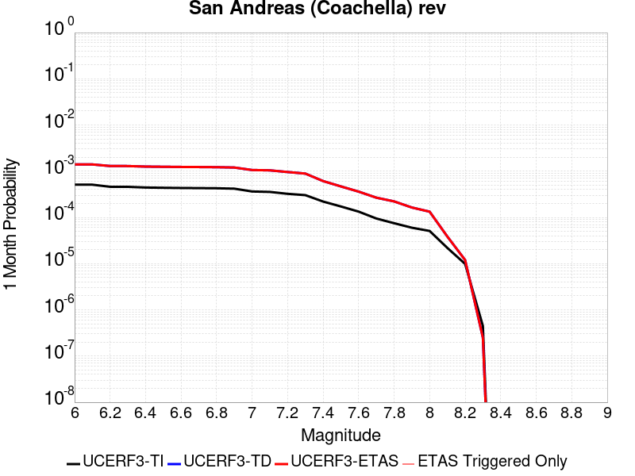 |  |  |

| Magnitude | 1 wk TI Prob | 1 wk TD Prob | 1 wk ETAS Prob | 1 wk ETAS/TD Gain | 1 wk ETAS Triggered Only | 1 mo TI Prob | 1 mo TD Prob | 1 mo ETAS Prob | 1 mo ETAS/TD Gain | 1 mo ETAS Triggered Only | 1 yr TI Prob | 1 yr TD Prob | 1 yr ETAS Prob | 1 yr ETAS/TD Gain | 1 yr ETAS Triggered Only | 10 yr TI Prob | 10 yr TD Prob | 10 yr ETAS Prob | 10 yr ETAS/TD Gain | 10 yr ETAS Triggered Only |
|-----|-----|-----|-----|-----|-----|-----|-----|-----|-----|-----|-----|-----|-----|-----|-----|-----|-----|-----|-----|-----|
| 6.0 | 1.1925945E-4 | 3.2735174E-4 | 3.2735174E-4 | 1.0 | 0.0 | 5.110118E-4 | 0.0014021865 | 0.0014021865 | 1.0 | 0.0 | 0.0062038354 | 0.016939327 | 0.01697865 | 1.0023214 | 4.0E-5 | 0.060334753 | 0.15269604 | 0.1528062 | 1.0007213 | 1.3E-4 |
| 6.1 | 1.1925945E-4 | 3.2735174E-4 | 3.2735174E-4 | 1.0 | 0.0 | 5.110118E-4 | 0.0014021865 | 0.0014021865 | 1.0 | 0.0 | 0.0062038354 | 0.016939327 | 0.01697865 | 1.0023214 | 4.0E-5 | 0.060334753 | 0.15269604 | 0.1528062 | 1.0007213 | 1.3E-4 |
| 6.2 | 1.07432395E-4 | 3.023596E-4 | 3.023596E-4 | 1.0 | 0.0 | 4.603433E-4 | 0.0012951873 | 0.0012951873 | 1.0 | 0.0 | 0.005590286 | 0.01565599 | 0.015695363 | 1.002515 | 4.0E-5 | 0.05451731 | 0.14184935 | 0.1419609 | 1.0007864 | 1.3E-4 |
| 6.3 | 1.0718766E-4 | 3.0181266E-4 | 3.0181266E-4 | 1.0 | 0.0 | 4.592948E-4 | 0.0012928456 | 0.0012928456 | 1.0 | 0.0 | 0.005577586 | 0.015627889 | 0.015667263 | 1.0025195 | 4.0E-5 | 0.054396555 | 0.14161763 | 0.14172922 | 1.000788 | 1.3E-4 |
| 6.4 | 1.0355944E-4 | 2.9389336E-4 | 2.9389336E-4 | 1.0 | 0.0 | 4.4375064E-4 | 0.001258939 | 0.001258939 | 1.0 | 0.0 | 0.0053892885 | 0.015220915 | 0.015260306 | 1.0025879 | 4.0E-5 | 0.052604496 | 0.13817544 | 0.13828747 | 1.0008109 | 1.3E-4 |
| 6.5 | 1.0227914E-4 | 2.9108766E-4 | 2.9108766E-4 | 1.0 | 0.0 | 4.382655E-4 | 0.0012469261 | 0.0012469261 | 1.0 | 0.0 | 0.0053228354 | 0.015076692 | 0.015116089 | 1.0026131 | 4.0E-5 | 0.051971316 | 0.13695958 | 0.13707179 | 1.0008192 | 1.3E-4 |
| 6.6 | 1.0116757E-4 | 2.8874516E-4 | 2.8874516E-4 | 1.0 | 0.0 | 4.3350324E-4 | 0.0012368963 | 0.0012368963 | 1.0 | 0.0 | 0.0052651367 | 0.014956261 | 0.014985813 | 1.0019759 | 3.0E-5 | 0.051421247 | 0.1359371 | 0.13604079 | 1.0007628 | 1.2E-4 |
| 6.7 | 1.0050676E-4 | 2.8733077E-4 | 2.8733077E-4 | 1.0 | 0.0 | 4.3067214E-4 | 0.0012308403 | 0.0012308403 | 1.0 | 0.0 | 0.005230834 | 0.01488354 | 0.014913093 | 1.0019857 | 3.0E-5 | 0.051094085 | 0.13532192 | 0.13542569 | 1.0007668 | 1.2E-4 |
| 6.8 | 9.976819E-5 | 2.8536728E-4 | 2.8536728E-4 | 1.0 | 0.0 | 4.2750788E-4 | 0.0012224333 | 0.0012224333 | 1.0 | 0.0 | 0.0051924936 | 0.014782578 | 0.014812134 | 1.0019994 | 3.0E-5 | 0.050728295 | 0.13447334 | 0.1345772 | 1.0007724 | 1.2E-4 |
| 6.9 | 9.77719E-5 | 2.8033604E-4 | 2.8033604E-4 | 1.0 | 0.0 | 4.1895514E-4 | 0.0012008909 | 0.0012008909 | 1.0 | 0.0 | 0.0050888555 | 0.014523826 | 0.0145533895 | 1.0020356 | 3.0E-5 | 0.049738888 | 0.13230172 | 0.13239717 | 1.0007215 | 1.1E-4 |
| 7.0 | 8.500761E-5 | 2.476793E-4 | 2.476793E-4 | 1.0 | 0.0 | 3.6426744E-4 | 0.0010610541 | 0.0010610541 | 1.0 | 0.0 | 0.0044259406 | 0.01284259 | 0.012872205 | 1.002306 | 3.0E-5 | 0.04338823 | 0.118151076 | 0.11824808 | 1.000821 | 1.1E-4 |
| 7.1 | 8.319876E-5 | 2.4370618E-4 | 2.4370618E-4 | 1.0 | 0.0 | 3.5651738E-4 | 0.0010440402 | 0.0010440402 | 1.0 | 0.0 | 0.004331963 | 0.0126378685 | 0.012667489 | 1.0023438 | 3.0E-5 | 0.042484846 | 0.11637106 | 0.11646826 | 1.0008353 | 1.1E-4 |
| 7.2 | 7.563917E-5 | 2.2418915E-4 | 2.2418915E-4 | 1.0 | 0.0 | 3.2412758E-4 | 9.604599E-4 | 9.604599E-4 | 1.0 | 0.0 | 0.0039391145 | 0.011631592 | 0.011661243 | 1.0025492 | 3.0E-5 | 0.03870018 | 0.107777216 | 0.107866436 | 1.0008278 | 1.0E-4 |
| 7.3 | 7.082985E-5 | 2.0734889E-4 | 2.0734889E-4 | 1.0 | 0.0 | 3.0352117E-4 | 8.8833837E-4 | 8.8833837E-4 | 1.0 | 0.0 | 0.0036891096 | 0.01076251 | 0.010792187 | 1.0027574 | 3.0E-5 | 0.03628465 | 0.10029867 | 0.10038864 | 1.000897 | 1.0E-4 |
| 7.4 | 5.146215E-5 | 1.4277869E-4 | 1.4277869E-4 | 1.0 | 0.0 | 2.2053342E-4 | 6.1176607E-4 | 6.1176607E-4 | 1.0 | 0.0 | 0.0026816884 | 0.007423004 | 0.0074527813 | 1.0040115 | 3.0E-5 | 0.02649557 | 0.07086286 | 0.07095577 | 1.0013112 | 1.0E-4 |
| 7.5 | 4.0285166E-5 | 1.09450986E-4 | 1.09450986E-4 | 1.0 | 0.0 | 1.7263928E-4 | 4.6899164E-4 | 4.6899164E-4 | 1.0 | 0.0 | 0.002099857 | 0.0056950934 | 0.0057149795 | 1.0034918 | 2.0E-5 | 0.020801254 | 0.055024315 | 0.055109363 | 1.0015457 | 9.0E-5 |
| 7.6 | 3.1168736E-5 | 8.441976E-5 | 8.441976E-5 | 1.0 | 0.0 | 1.3357346E-4 | 3.617489E-4 | 3.617489E-4 | 1.0 | 0.0 | 0.0016250437 | 0.0043954253 | 0.0044153375 | 1.0045302 | 2.0E-5 | 0.016132116 | 0.042821974 | 0.04290812 | 1.0020118 | 9.0E-5 |
| 7.7 | 2.2100989E-5 | 6.241421E-5 | 6.241421E-5 | 1.0 | 0.0 | 9.4715084E-5 | 2.674621E-4 | 2.674621E-4 | 1.0 | 0.0 | 0.001152546 | 0.003251495 | 0.0032714303 | 1.006131 | 2.0E-5 | 0.011465867 | 0.031911246 | 0.031988695 | 1.002427 | 8.0E-5 |
| 7.8 | 1.7484861E-5 | 5.181932E-5 | 5.181932E-5 | 1.0 | 0.0 | 7.493296E-5 | 2.220639E-4 | 2.220639E-4 | 1.0 | 0.0 | 9.1192697E-4 | 0.002700279 | 0.002720225 | 1.0073867 | 2.0E-5 | 0.009081938 | 0.026649911 | 0.026718045 | 1.0025567 | 7.0E-5 |
| 7.9 | 1.3967285E-5 | 3.8241284E-5 | 3.8241284E-5 | 1.0 | 0.0 | 5.985842E-5 | 1.6388092E-4 | 1.6388092E-4 | 1.0 | 0.0 | 7.2853256E-4 | 0.0019934257 | 0.0020133858 | 1.010013 | 2.0E-5 | 0.0072614877 | 0.019917965 | 0.019986572 | 1.0034444 | 7.0E-5 |
| 8.0 | 1.1887396E-5 | 3.1081006E-5 | 3.1081006E-5 | 1.0 | 0.0 | 5.094499E-5 | 1.3319752E-4 | 1.3319752E-4 | 1.0 | 0.0 | 6.200787E-4 | 0.0016204745 | 0.0016304583 | 1.006161 | 1.0E-5 | 0.006183513 | 0.016286531 | 0.016345553 | 1.0036241 | 6.0E-5 |
| 8.1 | 5.100864E-6 | 8.979058E-6 | 8.979058E-6 | 1.0 | 0.0 | 2.1860664E-5 | 3.8481114E-5 | 3.8481114E-5 | 1.0 | 0.0 | 2.6612106E-4 | 4.6840697E-4 | 4.6840697E-4 | 1.0 | 0.0 | 0.002658026 | 0.0049204906 | 0.0049204906 | 1.0 | 0.0 |
| 8.2 | 2.3004484E-6 | 2.7884673E-6 | 2.7884673E-6 | 1.0 | 0.0 | 9.859027E-6 | 1.195052E-5 | 1.195052E-5 | 1.0 | 0.0 | 1.2002704E-4 | 1.454879E-4 | 1.454879E-4 | 1.0 | 0.0 | 0.0011996223 | 0.0015984424 | 0.0015984424 | 1.0 | 0.0 |
| 8.3 | 1.0424446E-7 | 5.820319E-8 | 5.820319E-8 | 1.0 | 0.0 | 4.4676187E-7 | 2.4944222E-7 | 2.4944222E-7 | 1.0 | 0.0 | 5.439312E-6 | 3.0369551E-6 | 3.0369551E-6 | 1.0 | 0.0 | 5.4391792E-5 | 3.1931086E-5 | 3.1931086E-5 | 1.0 | 0.0 |

## Baker
*[(top)](#table-of-contents)*

| 1 Week | 1 Month | 1 Year | 10 Year |
|-----|-----|-----|-----|
|  |  |  |  |

| Magnitude | 1 wk TI Prob | 1 wk TD Prob | 1 wk ETAS Prob | 1 wk ETAS/TD Gain | 1 wk ETAS Triggered Only | 1 mo TI Prob | 1 mo TD Prob | 1 mo ETAS Prob | 1 mo ETAS/TD Gain | 1 mo ETAS Triggered Only | 1 yr TI Prob | 1 yr TD Prob | 1 yr ETAS Prob | 1 yr ETAS/TD Gain | 1 yr ETAS Triggered Only | 10 yr TI Prob | 10 yr TD Prob | 10 yr ETAS Prob | 10 yr ETAS/TD Gain | 10 yr ETAS Triggered Only |
|-----|-----|-----|-----|-----|-----|-----|-----|-----|-----|-----|-----|-----|-----|-----|-----|-----|-----|-----|-----|-----|
| 6.0 | 5.695525E-6 | 5.834856E-6 | 1.5834798E-5 | 2.7138283 | 1.0E-5 | 2.4409164E-5 | 2.500631E-5 | 4.500581E-5 | 1.7997781 | 2.0E-5 | 2.9714106E-4 | 3.044133E-4 | 3.8438893E-4 | 1.2627206 | 8.0E-5 | 0.0029674405 | 0.0030403587 | 0.0031699634 | 1.0426282 | 1.3E-4 |
| 6.1 | 5.695525E-6 | 5.834856E-6 | 1.5834798E-5 | 2.7138283 | 1.0E-5 | 2.4409164E-5 | 2.500631E-5 | 4.500581E-5 | 1.7997781 | 2.0E-5 | 2.9714106E-4 | 3.044133E-4 | 3.8438893E-4 | 1.2627206 | 8.0E-5 | 0.0029674405 | 0.0030403587 | 0.0031699634 | 1.0426282 | 1.3E-4 |
| 6.2 | 5.695525E-6 | 5.834856E-6 | 1.5834798E-5 | 2.7138283 | 1.0E-5 | 2.4409164E-5 | 2.500631E-5 | 4.500581E-5 | 1.7997781 | 2.0E-5 | 2.9714106E-4 | 3.044133E-4 | 3.8438893E-4 | 1.2627206 | 8.0E-5 | 0.0029674405 | 0.0030403587 | 0.0031699634 | 1.0426282 | 1.3E-4 |
| 6.3 | 3.2995713E-6 | 3.3836786E-6 | 1.3383645E-5 | 3.9553535 | 1.0E-5 | 1.4140943E-5 | 1.4501402E-5 | 2.4501256E-5 | 1.6895785 | 1.0E-5 | 1.7215237E-4 | 1.7654074E-4 | 2.1653368E-4 | 1.2265366 | 4.0E-5 | 0.0017201907 | 0.0017640521 | 0.0018239461 | 1.0339526 | 6.0E-5 |
| 6.4 | 3.2995713E-6 | 3.3836786E-6 | 1.3383645E-5 | 3.9553535 | 1.0E-5 | 1.4140943E-5 | 1.4501402E-5 | 2.4501256E-5 | 1.6895785 | 1.0E-5 | 1.7215237E-4 | 1.7654074E-4 | 2.1653368E-4 | 1.2265366 | 4.0E-5 | 0.0017201907 | 0.0017640521 | 0.0018239461 | 1.0339526 | 6.0E-5 |
| 6.5 | 2.782202E-6 | 2.8558507E-6 | 1.2855822E-5 | 4.5015736 | 1.0E-5 | 1.1923668E-5 | 1.2239304E-5 | 2.223918E-5 | 1.81703 | 1.0E-5 | 1.4516099E-4 | 1.4900367E-4 | 1.889977E-4 | 1.2684097 | 4.0E-5 | 0.001450662 | 0.0014890704 | 0.0015489811 | 1.0402336 | 6.0E-5 |
| 6.6 | 2.3163404E-6 | 2.380929E-6 | 1.2380905E-5 | 5.2000313 | 1.0E-5 | 9.927136E-6 | 1.0203942E-5 | 2.020384E-5 | 1.9800034 | 1.0E-5 | 1.20856166E-4 | 1.2422612E-4 | 1.5422239E-4 | 1.2414651 | 3.0E-5 | 0.0012079047 | 0.001241587 | 0.0012915249 | 1.0402211 | 5.0E-5 |
| 6.7 | 2.037056E-6 | 2.0965088E-6 | 1.2096488E-5 | 5.769825 | 1.0E-5 | 8.7302105E-6 | 8.985007E-6 | 1.8984918E-5 | 2.112955 | 1.0E-5 | 1.0628513E-4 | 1.0938713E-4 | 1.3938385E-4 | 1.2742252 | 3.0E-5 | 0.0010623431 | 0.0010933491 | 0.0011432944 | 1.045681 | 5.0E-5 |
| 6.8 | 1.8356744E-6 | 1.8915364E-6 | 1.1891518E-5 | 6.286698 | 1.0E-5 | 7.867153E-6 | 8.10656E-6 | 1.8106479E-5 | 2.233559 | 1.0E-5 | 9.577837E-5 | 9.869304E-5 | 1.2869008E-4 | 1.3039428 | 3.0E-5 | 9.57371E-4 | 9.865061E-4 | 0.0010364568 | 1.0506339 | 5.0E-5 |
| 6.9 | 1.6310546E-6 | 1.6832144E-6 | 1.6832144E-6 | 1.0 | 0.0 | 6.9902153E-6 | 7.213757E-6 | 7.213757E-6 | 1.0 | 0.0 | 8.510255E-5 | 8.782406E-5 | 1.0782231E-4 | 1.227708 | 2.0E-5 | 8.5069967E-4 | 8.779048E-4 | 9.178697E-4 | 1.045523 | 4.0E-5 |
| 7.0 | 1.2058036E-6 | 1.2508729E-6 | 1.2508729E-6 | 1.0 | 0.0 | 5.1677193E-6 | 5.3608724E-6 | 5.3608724E-6 | 1.0 | 0.0 | 6.291517E-5 | 6.526669E-5 | 7.526604E-5 | 1.1532075 | 1.0E-5 | 6.289736E-4 | 6.5247755E-4 | 6.724645E-4 | 1.0306324 | 2.0E-5 |
| 7.1 | 1.052382E-6 | 1.0951668E-6 | 1.0951668E-6 | 1.0 | 0.0 | 4.5102006E-6 | 4.693564E-6 | 4.693564E-6 | 1.0 | 0.0 | 5.491031E-5 | 5.7142646E-5 | 6.714208E-5 | 1.1749907 | 1.0E-5 | 5.4896745E-4 | 5.712804E-4 | 5.91269E-4 | 1.0349891 | 2.0E-5 |
| 7.2 | 1.0067454E-6 | 1.0487769E-6 | 1.0487769E-6 | 1.0 | 0.0 | 4.3146156E-6 | 4.4947506E-6 | 4.4947506E-6 | 1.0 | 0.0 | 5.252918E-5 | 5.4722223E-5 | 6.472167E-5 | 1.1827312 | 1.0E-5 | 5.251676E-4 | 5.4708833E-4 | 5.6707737E-4 | 1.0365372 | 2.0E-5 |
| 7.3 | 9.3596316E-7 | 9.76778E-7 | 9.76778E-7 | 1.0 | 0.0 | 4.0112645E-6 | 4.186185E-6 | 4.186185E-6 | 1.0 | 0.0 | 4.8836053E-5 | 5.0965617E-5 | 6.0965107E-5 | 1.1962007 | 1.0E-5 | 4.8825322E-4 | 5.095401E-4 | 5.295299E-4 | 1.0392311 | 2.0E-5 |
| 7.4 | 8.8117395E-7 | 9.2077187E-7 | 9.2077187E-7 | 1.0 | 0.0 | 3.7764542E-6 | 3.9461593E-6 | 3.9461593E-6 | 1.0 | 0.0 | 4.5977362E-5 | 4.8043436E-5 | 5.8042955E-5 | 1.208135 | 1.0E-5 | 4.596785E-4 | 4.8033125E-4 | 5.003217E-4 | 1.041618 | 2.0E-5 |
| 7.5 | 8.292386E-7 | 8.674649E-7 | 8.674649E-7 | 1.0 | 0.0 | 3.5538749E-6 | 3.7177015E-6 | 3.7177015E-6 | 1.0 | 0.0 | 4.326757E-5 | 4.5262084E-5 | 5.526163E-5 | 1.2209255 | 1.0E-5 | 4.3259145E-4 | 4.5252938E-4 | 4.6252485E-4 | 1.022088 | 1.0E-5 |
| 7.6 | 7.553842E-7 | 7.9145207E-7 | 7.9145207E-7 | 1.0 | 0.0 | 3.2373566E-6 | 3.3919332E-6 | 3.3919332E-6 | 1.0 | 0.0 | 3.9414106E-5 | 4.129601E-5 | 5.12956E-5 | 1.2421441 | 1.0E-5 | 3.9407116E-4 | 4.1288408E-4 | 4.2287994E-4 | 1.0242099 | 1.0E-5 |
| 7.7 | 6.5285366E-7 | 6.852842E-7 | 6.852842E-7 | 1.0 | 0.0 | 2.797941E-6 | 2.9369291E-6 | 2.9369291E-6 | 1.0 | 0.0 | 3.40644E-5 | 3.5756533E-5 | 4.5756173E-5 | 1.2796592 | 1.0E-5 | 3.405918E-4 | 3.5750846E-4 | 3.6750486E-4 | 1.0279614 | 1.0E-5 |
| 7.8 | 3.4586725E-7 | 3.648288E-7 | 3.648288E-7 | 1.0 | 0.0 | 1.4822873E-6 | 1.5635511E-6 | 1.5635511E-6 | 1.0 | 0.0 | 1.80467E-5 | 1.9036073E-5 | 2.9035882E-5 | 1.5253085 | 1.0E-5 | 1.8045233E-4 | 1.9034486E-4 | 2.0034295E-4 | 1.0525262 | 1.0E-5 |
| 7.9 | 2.5591178E-9 | 2.6696871E-9 | 2.6696871E-9 | 1.0 | 0.0 | 1.0967647E-8 | 1.1441516E-8 | 1.1441516E-8 | 1.0 | 0.0 | 1.335311E-7 | 1.3930045E-7 | 1.3930045E-7 | 1.0 | 0.0 | 1.3353102E-6 | 1.3930046E-6 | 1.3930046E-6 | 1.0 | 0.0 |

## San Andreas (Creeping Section) 2011 CFM
*[(top)](#table-of-contents)*

| 1 Week | 1 Month | 1 Year | 10 Year |
|-----|-----|-----|-----|
| 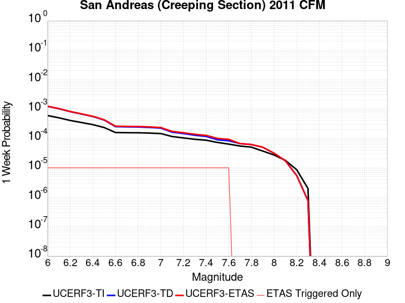 |  |  |  |

| Magnitude | 1 wk TI Prob | 1 wk TD Prob | 1 wk ETAS Prob | 1 wk ETAS/TD Gain | 1 wk ETAS Triggered Only | 1 mo TI Prob | 1 mo TD Prob | 1 mo ETAS Prob | 1 mo ETAS/TD Gain | 1 mo ETAS Triggered Only | 1 yr TI Prob | 1 yr TD Prob | 1 yr ETAS Prob | 1 yr ETAS/TD Gain | 1 yr ETAS Triggered Only | 10 yr TI Prob | 10 yr TD Prob | 10 yr ETAS Prob | 10 yr ETAS/TD Gain | 10 yr ETAS Triggered Only |
|-----|-----|-----|-----|-----|-----|-----|-----|-----|-----|-----|-----|-----|-----|-----|-----|-----|-----|-----|-----|-----|
| 6.0 | 5.986481E-4 | 0.001227701 | 0.0012376886 | 1.0081353 | 1.0E-5 | 0.0025631124 | 0.005246098 | 0.0052560456 | 1.0018961 | 1.0E-5 | 0.030762846 | 0.061211813 | 0.061249364 | 1.0006135 | 4.0E-5 | 0.26835477 | 0.42596716 | 0.42603603 | 1.0001618 | 1.2E-4 |
| 6.1 | 5.015945E-4 | 0.0010218859 | 0.0010318757 | 1.0097759 | 1.0E-5 | 0.00214792 | 0.0043683136 | 0.00437827 | 1.0022792 | 1.0E-5 | 0.025839351 | 0.051254056 | 0.051292006 | 1.0007404 | 4.0E-5 | 0.23032776 | 0.3728875 | 0.37295645 | 1.000185 | 1.1E-4 |
| 6.2 | 4.073338E-4 | 8.1082666E-4 | 8.208186E-4 | 1.0123231 | 1.0E-5 | 0.0017445484 | 0.003467598 | 0.0034775634 | 1.0028739 | 1.0E-5 | 0.021034058 | 0.040938858 | 0.04097722 | 1.0009371 | 4.0E-5 | 0.19150782 | 0.31306726 | 0.3131428 | 1.0002414 | 1.1E-4 |
| 6.3 | 3.464099E-4 | 6.740175E-4 | 6.8401074E-4 | 1.0148264 | 1.0E-5 | 0.0014837692 | 0.0028834257 | 0.002893397 | 1.0034581 | 1.0E-5 | 0.017915873 | 0.034195323 | 0.034224294 | 1.0008473 | 3.0E-5 | 0.16538359 | 0.27135244 | 0.2714253 | 1.0002686 | 1.0E-4 |
| 6.4 | 2.935057E-4 | 5.545179E-4 | 5.645124E-4 | 1.0180237 | 1.0E-5 | 0.0012572751 | 0.002372998 | 0.0023829744 | 1.004204 | 1.0E-5 | 0.015200248 | 0.028270293 | 0.028299443 | 1.0010312 | 3.0E-5 | 0.14201577 | 0.23302312 | 0.23309982 | 1.0003291 | 1.0E-4 |
| 6.5 | 2.3409708E-4 | 4.2102532E-4 | 4.3102112E-4 | 1.0237415 | 1.0E-5 | 0.0010028875 | 0.0018024362 | 0.0018124182 | 1.0055381 | 1.0E-5 | 0.012141965 | 0.021593295 | 0.021622648 | 1.0013593 | 3.0E-5 | 0.11499573 | 0.18686365 | 0.18694496 | 1.0004351 | 1.0E-4 |
| 6.6 | 1.5842178E-4 | 2.5080625E-4 | 2.6080373E-4 | 1.0398614 | 1.0E-5 | 6.7877385E-4 | 0.0010744325 | 0.0010844218 | 1.0092973 | 1.0E-5 | 0.0082328 | 0.013001433 | 0.013031043 | 1.0022775 | 3.0E-5 | 0.07934396 | 0.12318965 | 0.12327733 | 1.0007118 | 1.0E-4 |
| 6.7 | 1.5616413E-4 | 2.4617155E-4 | 2.561691E-4 | 1.0406121 | 1.0E-5 | 6.691031E-4 | 0.0010545887 | 0.0010645782 | 1.0094724 | 1.0E-5 | 0.0081159435 | 0.012763296 | 0.012792913 | 1.0023205 | 3.0E-5 | 0.0782586 | 0.121216856 | 0.12130473 | 1.0007249 | 1.0E-4 |
| 6.8 | 1.5538467E-4 | 2.4440986E-4 | 2.5440744E-4 | 1.0409049 | 1.0E-5 | 6.6576427E-4 | 0.0010470453 | 0.0010570349 | 1.0095407 | 1.0E-5 | 0.008075596 | 0.012672617 | 0.012702237 | 1.0023373 | 3.0E-5 | 0.07788358 | 0.12044768 | 0.120535634 | 1.0007303 | 1.0E-4 |
| 6.9 | 1.5153569E-4 | 2.3550174E-4 | 2.454994E-4 | 1.0424526 | 1.0E-5 | 6.49277E-4 | 0.0010089047 | 0.0010188946 | 1.0099018 | 1.0E-5 | 0.007876333 | 0.012214754 | 0.0122443875 | 1.002426 | 3.0E-5 | 0.07602952 | 0.1165177 | 0.11660605 | 1.0007583 | 1.0E-4 |
| 7.0 | 1.4588932E-4 | 2.2407302E-4 | 2.3407079E-4 | 1.0446182 | 1.0E-5 | 6.250901E-4 | 9.599615E-4 | 9.699519E-4 | 1.0104071 | 1.0E-5 | 0.0075839474 | 0.011625397 | 0.011655048 | 1.0025506 | 3.0E-5 | 0.073302895 | 0.1113634 | 0.11145227 | 1.000798 | 1.0E-4 |
| 7.1 | 1.1565079E-4 | 1.6291256E-4 | 1.7291094E-4 | 1.0613726 | 1.0E-5 | 4.955521E-4 | 6.980107E-4 | 7.0800376E-4 | 1.0143164 | 1.0E-5 | 0.006016669 | 0.008465368 | 0.008495115 | 1.0035138 | 3.0E-5 | 0.058563538 | 0.083707 | 0.083798625 | 1.0010947 | 1.0E-4 |
| 7.2 | 1.0393792E-4 | 1.4624851E-4 | 1.5624706E-4 | 1.0683668 | 1.0E-5 | 4.4537216E-4 | 6.2662957E-4 | 6.366233E-4 | 1.0159484 | 1.0E-5 | 0.005408933 | 0.007602697 | 0.007632469 | 1.003916 | 3.0E-5 | 0.052791595 | 0.0756556 | 0.07574804 | 1.0012218 | 1.0E-4 |
| 7.3 | 9.332884E-5 | 1.2788622E-4 | 1.3788494E-4 | 1.0781845 | 1.0E-5 | 3.999194E-4 | 5.479693E-4 | 5.5796385E-4 | 1.0182391 | 1.0E-5 | 0.0048581534 | 0.006651253 | 0.0066810534 | 1.0044805 | 3.0E-5 | 0.047533102 | 0.06651429 | 0.0665983 | 1.0012631 | 9.0E-5 |
| 7.4 | 8.670252E-5 | 1.1709979E-4 | 1.2709862E-4 | 1.0853872 | 1.0E-5 | 3.715293E-4 | 5.0176034E-4 | 5.117553E-4 | 1.0199199 | 1.0E-5 | 0.004513991 | 0.0060919416 | 0.006121759 | 1.0048945 | 3.0E-5 | 0.044233937 | 0.0611787 | 0.061263196 | 1.0013812 | 9.0E-5 |
| 7.5 | 7.3036405E-5 | 9.011361E-5 | 1.001127E-4 | 1.1109611 | 1.0E-5 | 3.129756E-4 | 3.861441E-4 | 3.9614024E-4 | 1.025887 | 1.0E-5 | 0.0038038217 | 0.0046911915 | 0.0047210506 | 1.006365 | 3.0E-5 | 0.03739367 | 0.047902368 | 0.047978535 | 1.00159 | 8.0E-5 |
| 7.6 | 6.3935775E-5 | 8.285012E-5 | 9.2849295E-5 | 1.1206899 | 1.0E-5 | 2.7398168E-4 | 3.5502372E-4 | 3.6502015E-4 | 1.0281571 | 1.0E-5 | 0.0033306254 | 0.0043138657 | 0.0043437365 | 1.0069243 | 3.0E-5 | 0.032811474 | 0.044012927 | 0.044089407 | 1.0017376 | 8.0E-5 |
| 7.7 | 5.5050095E-5 | 6.6658926E-5 | 6.6658926E-5 | 1.0 | 0.0 | 2.3590765E-4 | 2.8564985E-4 | 2.8564985E-4 | 1.0 | 0.0 | 0.0028683927 | 0.0034722448 | 0.0034921754 | 1.0057399 | 2.0E-5 | 0.0283165 | 0.03581521 | 0.035882704 | 1.0018845 | 7.0E-5 |
| 7.8 | 5.027131E-5 | 6.166573E-5 | 6.166573E-5 | 1.0 | 0.0 | 2.1543067E-4 | 2.6425492E-4 | 2.6425492E-4 | 1.0 | 0.0 | 0.0026197135 | 0.0032125604 | 0.0032324963 | 1.0062056 | 2.0E-5 | 0.025890453 | 0.03314427 | 0.03319261 | 1.0014585 | 5.0E-5 |
| 7.9 | 3.7271806E-5 | 5.0254795E-5 | 5.0254795E-5 | 1.0 | 0.0 | 1.5972654E-4 | 2.1535992E-4 | 2.1535992E-4 | 1.0 | 0.0 | 0.0019429359 | 0.0026188563 | 0.002638804 | 1.0076169 | 2.0E-5 | 0.019260362 | 0.027081393 | 0.027130038 | 1.0017962 | 5.0E-5 |
| 8.0 | 2.7310243E-5 | 3.1447296E-5 | 3.1447296E-5 | 1.0 | 0.0 | 1.17038646E-4 | 1.3476716E-4 | 1.3476716E-4 | 1.0 | 0.0 | 0.0014240141 | 0.0016395561 | 0.0016495398 | 1.0060892 | 1.0E-5 | 0.014149235 | 0.017223299 | 0.017252782 | 1.0017118 | 3.0E-5 |
| 8.1 | 1.7940547E-5 | 1.7411876E-5 | 1.7411876E-5 | 1.0 | 0.0 | 7.688579E-5 | 7.46202E-5 | 7.46202E-5 | 1.0 | 0.0 | 9.3568244E-4 | 9.0812275E-4 | 9.0812275E-4 | 1.0 | 0.0 | 0.009317525 | 0.009804959 | 0.009814861 | 1.00101 | 1.0E-5 |
| 8.2 | 8.643924E-6 | 5.478665E-6 | 5.478665E-6 | 1.0 | 0.0 | 3.704486E-5 | 2.3479783E-5 | 2.3479783E-5 | 1.0 | 0.0 | 4.5092785E-4 | 2.8582895E-4 | 2.8582895E-4 | 1.0 | 0.0 | 0.0045001395 | 0.0032508469 | 0.0032508469 | 1.0 | 0.0 |
| 8.3 | 1.983087E-6 | 7.6647797E-7 | 7.6647797E-7 | 1.0 | 0.0 | 8.498917E-6 | 3.2849016E-6 | 3.2849016E-6 | 1.0 | 0.0 | 1.034694E-4 | 3.999296E-5 | 3.999296E-5 | 1.0 | 0.0 | 0.0010342124 | 4.7228087E-4 | 4.7228087E-4 | 1.0 | 0.0 |

## White Mountains
*[(top)](#table-of-contents)*

| 1 Week | 1 Month | 1 Year | 10 Year |
|-----|-----|-----|-----|
|  |  |  |  |

| Magnitude | 1 wk TI Prob | 1 wk TD Prob | 1 wk ETAS Prob | 1 wk ETAS/TD Gain | 1 wk ETAS Triggered Only | 1 mo TI Prob | 1 mo TD Prob | 1 mo ETAS Prob | 1 mo ETAS/TD Gain | 1 mo ETAS Triggered Only | 1 yr TI Prob | 1 yr TD Prob | 1 yr ETAS Prob | 1 yr ETAS/TD Gain | 1 yr ETAS Triggered Only | 10 yr TI Prob | 10 yr TD Prob | 10 yr ETAS Prob | 10 yr ETAS/TD Gain | 10 yr ETAS Triggered Only |
|-----|-----|-----|-----|-----|-----|-----|-----|-----|-----|-----|-----|-----|-----|-----|-----|-----|-----|-----|-----|-----|
| 6.0 | 3.503579E-5 | 3.3784498E-5 | 3.3784498E-5 | 1.0 | 0.0 | 1.5014476E-4 | 1.4478335E-4 | 1.4478335E-4 | 1.0 | 0.0 | 0.0018264796 | 0.0017614327 | 0.0017813976 | 1.0113344 | 2.0E-5 | 0.018115403 | 0.017487047 | 0.017575474 | 1.0050566 | 9.0E-5 |
| 6.1 | 3.503579E-5 | 3.3784498E-5 | 3.3784498E-5 | 1.0 | 0.0 | 1.5014476E-4 | 1.4478335E-4 | 1.4478335E-4 | 1.0 | 0.0 | 0.0018264796 | 0.0017614327 | 0.0017813976 | 1.0113344 | 2.0E-5 | 0.018115403 | 0.017487047 | 0.017575474 | 1.0050566 | 9.0E-5 |
| 6.2 | 3.503579E-5 | 3.3784498E-5 | 3.3784498E-5 | 1.0 | 0.0 | 1.5014476E-4 | 1.4478335E-4 | 1.4478335E-4 | 1.0 | 0.0 | 0.0018264796 | 0.0017614327 | 0.0017813976 | 1.0113344 | 2.0E-5 | 0.018115403 | 0.017487047 | 0.017575474 | 1.0050566 | 9.0E-5 |
| 6.3 | 1.7818425E-5 | 1.591632E-5 | 1.591632E-5 | 1.0 | 0.0 | 7.636245E-5 | 6.821109E-5 | 6.821109E-5 | 1.0 | 0.0 | 9.293162E-4 | 8.301679E-4 | 8.401596E-4 | 1.0120357 | 1.0E-5 | 0.009254395 | 0.008272125 | 0.008321712 | 1.0059944 | 5.0E-5 |
| 6.4 | 1.7818425E-5 | 1.591632E-5 | 1.591632E-5 | 1.0 | 0.0 | 7.636245E-5 | 6.821109E-5 | 6.821109E-5 | 1.0 | 0.0 | 9.293162E-4 | 8.301679E-4 | 8.401596E-4 | 1.0120357 | 1.0E-5 | 0.009254395 | 0.008272125 | 0.008321712 | 1.0059944 | 5.0E-5 |
| 6.5 | 1.3397557E-5 | 1.1336486E-5 | 1.1336486E-5 | 1.0 | 0.0 | 5.741684E-5 | 4.8584072E-5 | 4.8584072E-5 | 1.0 | 0.0 | 6.988258E-4 | 5.9135753E-4 | 6.013516E-4 | 1.0169003 | 1.0E-5 | 0.006966323 | 0.0058985446 | 0.005928368 | 1.005056 | 3.0E-5 |
| 6.6 | 1.0818695E-5 | 8.625519E-6 | 8.625519E-6 | 1.0 | 0.0 | 4.6365014E-5 | 3.696601E-5 | 3.696601E-5 | 1.0 | 0.0 | 5.6434784E-4 | 4.4997258E-4 | 4.4997258E-4 | 1.0 | 0.0 | 0.005629168 | 0.004491051 | 0.0045010066 | 1.0022167 | 1.0E-5 |
| 6.7 | 9.067908E-6 | 6.802544E-6 | 6.802544E-6 | 1.0 | 0.0 | 3.8861883E-5 | 2.915345E-5 | 2.915345E-5 | 1.0 | 0.0 | 4.7304068E-4 | 3.5488865E-4 | 3.5488865E-4 | 1.0 | 0.0 | 0.00472035 | 0.0035435364 | 0.0035535009 | 1.002812 | 1.0E-5 |
| 6.8 | 7.295947E-6 | 4.9364785E-6 | 4.9364785E-6 | 1.0 | 0.0 | 3.126797E-5 | 2.1156171E-5 | 2.1156171E-5 | 1.0 | 0.0 | 3.8062103E-4 | 2.5754707E-4 | 2.5754707E-4 | 1.0 | 0.0 | 0.0037996976 | 0.0025725989 | 0.002582573 | 1.0038772 | 1.0E-5 |
| 6.9 | 6.2243444E-6 | 3.8322955E-6 | 3.8322955E-6 | 1.0 | 0.0 | 2.6675489E-5 | 1.6424025E-5 | 1.6424025E-5 | 1.0 | 0.0 | 3.2472567E-4 | 1.9994467E-4 | 1.9994467E-4 | 1.0 | 0.0 | 0.0032425157 | 0.0019977004 | 0.0020076805 | 1.0049957 | 1.0E-5 |
| 7.0 | 4.9878413E-6 | 2.6796004E-6 | 2.6796004E-6 | 1.0 | 0.0 | 2.1376287E-5 | 1.1483952E-5 | 1.1483952E-5 | 1.0 | 0.0 | 2.602252E-4 | 1.3980841E-4 | 1.3980841E-4 | 1.0 | 0.0 | 0.002599207 | 0.0013972308 | 0.0013972308 | 1.0 | 0.0 |
| 7.1 | 4.0252844E-6 | 1.885737E-6 | 1.885737E-6 | 1.0 | 0.0 | 1.7251105E-5 | 8.081706E-6 | 8.081706E-6 | 1.0 | 0.0 | 2.1001195E-4 | 9.8390454E-5 | 9.8390454E-5 | 1.0 | 0.0 | 0.0020981359 | 9.834818E-4 | 9.834818E-4 | 1.0 | 0.0 |
| 7.2 | 3.3284066E-6 | 1.2819264E-6 | 1.2819264E-6 | 1.0 | 0.0 | 1.4264522E-5 | 5.493959E-6 | 5.493959E-6 | 1.0 | 0.0 | 1.736567E-4 | 6.6887005E-5 | 6.6887005E-5 | 1.0 | 0.0 | 0.0017352107 | 6.686788E-4 | 6.686788E-4 | 1.0 | 0.0 |
| 7.3 | 2.458226E-6 | 6.0570005E-7 | 6.0570005E-7 | 1.0 | 0.0 | 1.0535211E-5 | 2.595855E-6 | 2.595855E-6 | 1.0 | 0.0 | 1.2825865E-4 | 3.1604115E-5 | 3.1604115E-5 | 1.0 | 0.0 | 0.0012818464 | 3.1599996E-4 | 3.1599996E-4 | 1.0 | 0.0 |
| 7.4 | 1.965953E-6 | 3.1087455E-7 | 3.1087455E-7 | 1.0 | 0.0 | 8.425486E-6 | 1.3323188E-6 | 1.3323188E-6 | 1.0 | 0.0 | 1.0257547E-4 | 1.6220862E-5 | 1.6220862E-5 | 1.0 | 0.0 | 0.0010252813 | 1.6219691E-4 | 1.6219691E-4 | 1.0 | 0.0 |
| 7.5 | 1.2014192E-6 | 1.8242919E-7 | 1.8242919E-7 | 1.0 | 0.0 | 5.148929E-6 | 7.8183916E-7 | 7.8183916E-7 | 1.0 | 0.0 | 6.2686406E-5 | 9.518851E-6 | 9.518851E-6 | 1.0 | 0.0 | 6.266873E-4 | 9.5184514E-5 | 9.5184514E-5 | 1.0 | 0.0 |
| 7.6 | 2.5612175E-7 | 4.8943498E-8 | 4.8943498E-8 | 1.0 | 0.0 | 1.0976642E-6 | 2.0975783E-7 | 2.0975783E-7 | 1.0 | 0.0 | 1.3363979E-5 | 2.553799E-6 | 2.553799E-6 | 1.0 | 0.0 | 1.3363175E-4 | 2.5537733E-5 | 2.5537733E-5 | 1.0 | 0.0 |

## Cleghorn Pass
*[(top)](#table-of-contents)*

| 1 Week | 1 Month | 1 Year | 10 Year |
|-----|-----|-----|-----|
|  |  |  | 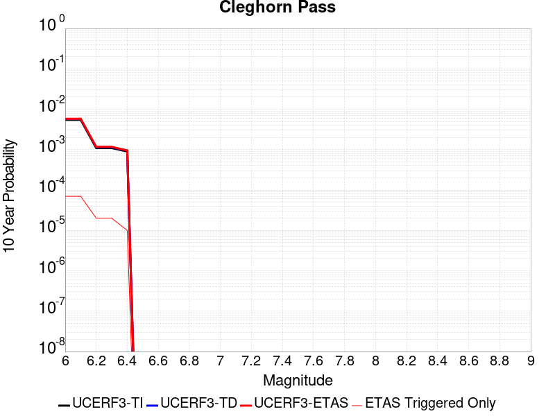 |

| Magnitude | 1 wk TI Prob | 1 wk TD Prob | 1 wk ETAS Prob | 1 wk ETAS/TD Gain | 1 wk ETAS Triggered Only | 1 mo TI Prob | 1 mo TD Prob | 1 mo ETAS Prob | 1 mo ETAS/TD Gain | 1 mo ETAS Triggered Only | 1 yr TI Prob | 1 yr TD Prob | 1 yr ETAS Prob | 1 yr ETAS/TD Gain | 1 yr ETAS Triggered Only | 10 yr TI Prob | 10 yr TD Prob | 10 yr ETAS Prob | 10 yr ETAS/TD Gain | 10 yr ETAS Triggered Only |
|-----|-----|-----|-----|-----|-----|-----|-----|-----|-----|-----|-----|-----|-----|-----|-----|-----|-----|-----|-----|-----|
| 6.0 | 1.0522846E-5 | 1.1040714E-5 | 1.1040714E-5 | 1.0 | 0.0 | 4.509713E-5 | 4.7316782E-5 | 7.7315366E-5 | 1.6339945 | 3.0E-5 | 5.4891926E-4 | 5.759822E-4 | 6.259534E-4 | 1.0867583 | 5.0E-5 | 0.0054756533 | 0.005750059 | 0.005819657 | 1.0121038 | 7.0E-5 |
| 6.1 | 1.0522846E-5 | 1.1040714E-5 | 1.1040714E-5 | 1.0 | 0.0 | 4.509713E-5 | 4.7316782E-5 | 7.7315366E-5 | 1.6339945 | 3.0E-5 | 5.4891926E-4 | 5.759822E-4 | 6.259534E-4 | 1.0867583 | 5.0E-5 | 0.0054756533 | 0.005750059 | 0.005819657 | 1.0121038 | 7.0E-5 |
| 6.2 | 2.1045846E-6 | 2.2082168E-6 | 2.2082168E-6 | 1.0 | 0.0 | 9.019617E-6 | 9.463776E-6 | 9.463776E-6 | 1.0 | 0.0 | 1.098083E-4 | 1.1521958E-4 | 1.2521842E-4 | 1.0867808 | 1.0E-5 | 0.0010975406 | 0.0011520098 | 0.0011719867 | 1.017341 | 2.0E-5 |
| 6.3 | 2.1045846E-6 | 2.2082168E-6 | 2.2082168E-6 | 1.0 | 0.0 | 9.019617E-6 | 9.463776E-6 | 9.463776E-6 | 1.0 | 0.0 | 1.098083E-4 | 1.1521958E-4 | 1.2521842E-4 | 1.0867808 | 1.0E-5 | 0.0010975406 | 0.0011520098 | 0.0011719867 | 1.017341 | 2.0E-5 |
| 6.4 | 1.7259927E-6 | 1.8108889E-6 | 1.8108889E-6 | 1.0 | 0.0 | 7.3970905E-6 | 7.760952E-6 | 7.760952E-6 | 1.0 | 0.0 | 9.005586E-5 | 9.4489595E-5 | 9.4489595E-5 | 1.0 | 0.0 | 9.001937E-4 | 9.4489596E-4 | 9.548865E-4 | 1.0105731 | 1.0E-5 |

## Channel Islands Thrust
*[(top)](#table-of-contents)*

| 1 Week | 1 Month | 1 Year | 10 Year |
|-----|-----|-----|-----|
|  |  |  |  |

| Magnitude | 1 wk TI Prob | 1 wk TD Prob | 1 wk ETAS Prob | 1 wk ETAS/TD Gain | 1 wk ETAS Triggered Only | 1 mo TI Prob | 1 mo TD Prob | 1 mo ETAS Prob | 1 mo ETAS/TD Gain | 1 mo ETAS Triggered Only | 1 yr TI Prob | 1 yr TD Prob | 1 yr ETAS Prob | 1 yr ETAS/TD Gain | 1 yr ETAS Triggered Only | 10 yr TI Prob | 10 yr TD Prob | 10 yr ETAS Prob | 10 yr ETAS/TD Gain | 10 yr ETAS Triggered Only |
|-----|-----|-----|-----|-----|-----|-----|-----|-----|-----|-----|-----|-----|-----|-----|-----|-----|-----|-----|-----|-----|
| 6.0 | 2.2156251E-5 | 2.4092304E-5 | 2.4092304E-5 | 1.0 | 0.0 | 9.495191E-5 | 1.03249244E-4 | 1.2324718E-4 | 1.193686 | 2.0E-5 | 0.0011554264 | 0.0012564411 | 0.0013163658 | 1.047694 | 6.0E-5 | 0.011494373 | 0.012503966 | 0.01257309 | 1.0055282 | 7.0E-5 |
| 6.1 | 2.2156251E-5 | 2.4092304E-5 | 2.4092304E-5 | 1.0 | 0.0 | 9.495191E-5 | 1.03249244E-4 | 1.2324718E-4 | 1.193686 | 2.0E-5 | 0.0011554264 | 0.0012564411 | 0.0013163658 | 1.047694 | 6.0E-5 | 0.011494373 | 0.012503966 | 0.01257309 | 1.0055282 | 7.0E-5 |
| 6.2 | 2.2156251E-5 | 2.4092304E-5 | 2.4092304E-5 | 1.0 | 0.0 | 9.495191E-5 | 1.03249244E-4 | 1.2324718E-4 | 1.193686 | 2.0E-5 | 0.0011554264 | 0.0012564411 | 0.0013163658 | 1.047694 | 6.0E-5 | 0.011494373 | 0.012503966 | 0.01257309 | 1.0055282 | 7.0E-5 |
| 6.3 | 2.2156251E-5 | 2.4092304E-5 | 2.4092304E-5 | 1.0 | 0.0 | 9.495191E-5 | 1.03249244E-4 | 1.2324718E-4 | 1.193686 | 2.0E-5 | 0.0011554264 | 0.0012564411 | 0.0013163658 | 1.047694 | 6.0E-5 | 0.011494373 | 0.012503966 | 0.01257309 | 1.0055282 | 7.0E-5 |
| 6.4 | 2.2156251E-5 | 2.4092304E-5 | 2.4092304E-5 | 1.0 | 0.0 | 9.495191E-5 | 1.03249244E-4 | 1.2324718E-4 | 1.193686 | 2.0E-5 | 0.0011554264 | 0.0012564411 | 0.0013163658 | 1.047694 | 6.0E-5 | 0.011494373 | 0.012503966 | 0.01257309 | 1.0055282 | 7.0E-5 |
| 6.5 | 2.2156251E-5 | 2.4092304E-5 | 2.4092304E-5 | 1.0 | 0.0 | 9.495191E-5 | 1.03249244E-4 | 1.2324718E-4 | 1.193686 | 2.0E-5 | 0.0011554264 | 0.0012564411 | 0.0013163658 | 1.047694 | 6.0E-5 | 0.011494373 | 0.012503966 | 0.01257309 | 1.0055282 | 7.0E-5 |
| 6.6 | 2.2156251E-5 | 2.4092304E-5 | 2.4092304E-5 | 1.0 | 0.0 | 9.495191E-5 | 1.03249244E-4 | 1.2324718E-4 | 1.193686 | 2.0E-5 | 0.0011554264 | 0.0012564411 | 0.0013163658 | 1.047694 | 6.0E-5 | 0.011494373 | 0.012503966 | 0.01257309 | 1.0055282 | 7.0E-5 |
| 6.7 | 1.0601296E-5 | 1.1379656E-5 | 1.1379656E-5 | 1.0 | 0.0 | 4.5433335E-5 | 4.876907E-5 | 5.8768583E-5 | 1.205038 | 1.0E-5 | 5.5301044E-4 | 5.9360656E-4 | 6.0360064E-4 | 1.0168362 | 1.0E-5 | 0.005516363 | 0.0059207114 | 0.0059306524 | 1.001679 | 1.0E-5 |
| 6.8 | 1.0246747E-5 | 1.0996777E-5 | 1.0996777E-5 | 1.0 | 0.0 | 4.391389E-5 | 4.7128222E-5 | 5.712775E-5 | 1.212177 | 1.0E-5 | 5.345204E-4 | 5.736398E-4 | 5.836341E-4 | 1.0174226 | 1.0E-5 | 0.0053323656 | 0.005722081 | 0.0057320236 | 1.0017376 | 1.0E-5 |
| 6.9 | 9.049551E-6 | 9.699738E-6 | 9.699738E-6 | 1.0 | 0.0 | 3.878322E-5 | 4.1569667E-5 | 5.156925E-5 | 1.24055 | 1.0E-5 | 4.7208337E-4 | 5.059973E-4 | 5.1599223E-4 | 1.019753 | 1.0E-5 | 0.0047108172 | 0.005048869 | 0.0050588185 | 1.0019706 | 1.0E-5 |
| 7.0 | 8.6542195E-6 | 9.274693E-6 | 9.274693E-6 | 1.0 | 0.0 | 3.7088983E-5 | 3.97481E-5 | 4.9747705E-5 | 1.2515744 | 1.0E-5 | 4.5146482E-4 | 4.8382976E-4 | 4.938249E-4 | 1.0206584 | 1.0E-5 | 0.004505487 | 0.0048281755 | 0.0048381276 | 1.0020611 | 1.0E-5 |
| 7.1 | 8.391028E-6 | 8.993012E-6 | 8.993012E-6 | 1.0 | 0.0 | 3.5961057E-5 | 3.8540933E-5 | 3.8540933E-5 | 1.0 | 0.0 | 4.3773788E-4 | 4.691389E-4 | 4.691389E-4 | 1.0 | 0.0 | 0.004368766 | 0.0046818955 | 0.0046818955 | 1.0 | 0.0 |
| 7.2 | 5.965188E-6 | 6.3717544E-6 | 6.3717544E-6 | 1.0 | 0.0 | 2.556484E-5 | 2.7307236E-5 | 2.7307236E-5 | 1.0 | 0.0 | 3.1120746E-4 | 3.3241542E-4 | 3.3241542E-4 | 1.0 | 0.0 | 0.00310772 | 0.00331924 | 0.00331924 | 1.0 | 0.0 |
| 7.3 | 4.877518E-6 | 5.2060545E-6 | 5.2060545E-6 | 1.0 | 0.0 | 2.0903482E-5 | 2.2311473E-5 | 2.2311473E-5 | 1.0 | 0.0 | 2.5447016E-4 | 2.716088E-4 | 2.716088E-4 | 1.0 | 0.0 | 0.0025417898 | 0.0027128146 | 0.0027128146 | 1.0 | 0.0 |
| 7.4 | 3.8829853E-6 | 4.1419007E-6 | 4.1419007E-6 | 1.0 | 0.0 | 1.664126E-5 | 1.7750885E-5 | 1.7750885E-5 | 1.0 | 0.0 | 2.0258849E-4 | 2.1609601E-4 | 2.1609601E-4 | 1.0 | 0.0 | 0.002024039 | 0.0021589005 | 0.0021589005 | 1.0 | 0.0 |
| 7.5 | 1.3489616E-6 | 1.4278028E-6 | 1.4278028E-6 | 1.0 | 0.0 | 5.7812517E-6 | 6.119141E-6 | 6.119141E-6 | 1.0 | 0.0 | 7.038446E-5 | 7.449803E-5 | 7.449803E-5 | 1.0 | 0.0 | 7.036218E-4 | 7.4473454E-4 | 7.4473454E-4 | 1.0 | 0.0 |
| 7.6 | 6.058192E-7 | 6.353833E-7 | 6.353833E-7 | 1.0 | 0.0 | 2.5963652E-6 | 2.7230685E-6 | 2.7230685E-6 | 1.0 | 0.0 | 3.161029E-5 | 3.315287E-5 | 3.315287E-5 | 1.0 | 0.0 | 3.1605794E-4 | 3.3148087E-4 | 3.3148087E-4 | 1.0 | 0.0 |
| 7.7 | 2.2170494E-7 | 2.2608089E-7 | 2.2608089E-7 | 1.0 | 0.0 | 9.5016367E-7 | 9.689178E-7 | 9.689178E-7 | 1.0 | 0.0 | 1.1568181E-5 | 1.1796522E-5 | 1.1796522E-5 | 1.0 | 0.0 | 1.1567579E-4 | 1.17960066E-4 | 1.17960066E-4 | 1.0 | 0.0 |
| 7.8 | 2.1613102E-8 | 1.5466844E-8 | 1.5466844E-8 | 1.0 | 0.0 | 9.262757E-8 | 6.6286475E-8 | 6.6286475E-8 | 1.0 | 0.0 | 1.1277401E-6 | 8.070376E-7 | 8.070376E-7 | 1.0 | 0.0 | 1.1277344E-5 | 8.070355E-6 | 8.070355E-6 | 1.0 | 0.0 |

## Santa Rosa Island
*[(top)](#table-of-contents)*

| 1 Week | 1 Month | 1 Year | 10 Year |
|-----|-----|-----|-----|
|  |  |  |  |

| Magnitude | 1 wk TI Prob | 1 wk TD Prob | 1 wk ETAS Prob | 1 wk ETAS/TD Gain | 1 wk ETAS Triggered Only | 1 mo TI Prob | 1 mo TD Prob | 1 mo ETAS Prob | 1 mo ETAS/TD Gain | 1 mo ETAS Triggered Only | 1 yr TI Prob | 1 yr TD Prob | 1 yr ETAS Prob | 1 yr ETAS/TD Gain | 1 yr ETAS Triggered Only | 10 yr TI Prob | 10 yr TD Prob | 10 yr ETAS Prob | 10 yr ETAS/TD Gain | 10 yr ETAS Triggered Only |
|-----|-----|-----|-----|-----|-----|-----|-----|-----|-----|-----|-----|-----|-----|-----|-----|-----|-----|-----|-----|-----|
| 6.0 | 4.1143165E-5 | 4.7092035E-5 | 5.7091565E-5 | 1.2123401 | 1.0E-5 | 1.7631594E-4 | 2.018085E-4 | 2.1180649E-4 | 1.049542 | 1.0E-5 | 0.002144533 | 0.0024544464 | 0.0024843728 | 1.0121927 | 3.0E-5 | 0.021239553 | 0.024294019 | 0.024381833 | 1.0036147 | 9.0E-5 |
| 6.1 | 2.1061249E-5 | 2.3865383E-5 | 2.3865383E-5 | 1.0 | 0.0 | 9.0259375E-5 | 1.0227637E-4 | 1.0227637E-4 | 1.0 | 0.0 | 0.0010983539 | 0.0012445324 | 0.0012445324 | 1.0 | 0.0 | 0.01092941 | 0.012378668 | 0.012378668 | 1.0 | 0.0 |
| 6.2 | 2.1061249E-5 | 2.3865383E-5 | 2.3865383E-5 | 1.0 | 0.0 | 9.0259375E-5 | 1.0227637E-4 | 1.0227637E-4 | 1.0 | 0.0 | 0.0010983539 | 0.0012445324 | 0.0012445324 | 1.0 | 0.0 | 0.01092941 | 0.012378668 | 0.012378668 | 1.0 | 0.0 |
| 6.3 | 1.5158236E-5 | 1.7074706E-5 | 1.7074706E-5 | 1.0 | 0.0 | 6.496225E-5 | 7.317533E-5 | 7.317533E-5 | 1.0 | 0.0 | 7.906284E-4 | 8.905575E-4 | 8.905575E-4 | 1.0 | 0.0 | 0.007878214 | 0.008871139 | 0.008871139 | 1.0 | 0.0 |
| 6.4 | 1.2341918E-5 | 1.3853143E-5 | 1.3853143E-5 | 1.0 | 0.0 | 5.2892858E-5 | 5.9369308E-5 | 5.9369308E-5 | 1.0 | 0.0 | 6.437803E-4 | 7.225897E-4 | 7.225897E-4 | 1.0 | 0.0 | 0.006419184 | 0.007203239 | 0.007203239 | 1.0 | 0.0 |
| 6.5 | 9.061158E-6 | 1.0117189E-5 | 1.0117189E-5 | 1.0 | 0.0 | 3.883296E-5 | 4.335869E-5 | 4.335869E-5 | 1.0 | 0.0 | 4.726887E-4 | 5.277695E-4 | 5.277695E-4 | 1.0 | 0.0 | 0.004716845 | 0.0052656992 | 0.0052656992 | 1.0 | 0.0 |
| 6.6 | 7.5461685E-6 | 8.400862E-6 | 8.400862E-6 | 1.0 | 0.0 | 3.2340322E-5 | 3.6003217E-5 | 3.6003217E-5 | 1.0 | 0.0 | 3.936723E-4 | 4.3825532E-4 | 4.3825532E-4 | 1.0 | 0.0 | 0.003929756 | 0.00437434 | 0.00437434 | 1.0 | 0.0 |
| 6.7 | 5.5023775E-6 | 6.0874677E-6 | 6.0874677E-6 | 1.0 | 0.0 | 2.3581404E-5 | 2.6088905E-5 | 2.6088905E-5 | 1.0 | 0.0 | 2.8706578E-4 | 3.1758938E-4 | 3.1758938E-4 | 1.0 | 0.0 | 0.0028669522 | 0.0031716768 | 0.0031716768 | 1.0 | 0.0 |
| 6.8 | 3.7351679E-6 | 4.083192E-6 | 4.083192E-6 | 1.0 | 0.0 | 1.6007763E-5 | 1.749929E-5 | 1.749929E-5 | 1.0 | 0.0 | 1.948771E-4 | 2.1303551E-4 | 2.1303551E-4 | 1.0 | 0.0 | 0.0019470629 | 0.0021285582 | 0.0021285582 | 1.0 | 0.0 |
| 6.9 | 2.456366E-6 | 2.6292955E-6 | 2.6292955E-6 | 1.0 | 0.0 | 1.0527241E-5 | 1.1268361E-5 | 1.1268361E-5 | 1.0 | 0.0 | 1.2816161E-4 | 1.3718368E-4 | 1.3718368E-4 | 1.0 | 0.0 | 0.0012808773 | 0.0013709929 | 0.0013709929 | 1.0 | 0.0 |
| 7.0 | 2.3245157E-6 | 2.4828012E-6 | 2.4828012E-6 | 1.0 | 0.0 | 9.962172E-6 | 1.0640533E-5 | 1.0640533E-5 | 1.0 | 0.0 | 1.2128269E-4 | 1.295408E-4 | 1.295408E-4 | 1.0 | 0.0 | 0.0012121652 | 0.0012946553 | 0.0012946553 | 1.0 | 0.0 |
| 7.1 | 2.2248344E-6 | 2.3732714E-6 | 2.3732714E-6 | 1.0 | 0.0 | 9.53497E-6 | 1.0171123E-5 | 1.0171123E-5 | 1.0 | 0.0 | 1.1608207E-4 | 1.2382641E-4 | 1.2382641E-4 | 1.0 | 0.0 | 0.0011602144 | 0.0012375761 | 0.0012375761 | 1.0 | 0.0 |
| 7.2 | 2.1350402E-6 | 2.2761742E-6 | 2.2761742E-6 | 1.0 | 0.0 | 9.150141E-6 | 9.754996E-6 | 9.754996E-6 | 1.0 | 0.0 | 1.1139726E-4 | 1.18760625E-4 | 1.18760625E-4 | 1.0 | 0.0 | 0.0011134144 | 0.0011869734 | 0.0011869734 | 1.0 | 0.0 |
| 7.3 | 1.9793572E-6 | 2.1087376E-6 | 2.1087376E-6 | 1.0 | 0.0 | 8.482932E-6 | 9.037416E-6 | 9.037416E-6 | 1.0 | 0.0 | 1.032748E-4 | 1.10025E-4 | 1.10025E-4 | 1.0 | 0.0 | 0.0010322682 | 0.0010997071 | 0.0010997071 | 1.0 | 0.0 |
| 7.4 | 1.6951194E-6 | 1.8045891E-6 | 1.8045891E-6 | 1.0 | 0.0 | 7.264777E-6 | 7.733931E-6 | 7.733931E-6 | 1.0 | 0.0 | 8.844508E-5 | 9.415655E-5 | 9.415655E-5 | 1.0 | 0.0 | 8.840988E-4 | 9.411683E-4 | 9.411683E-4 | 1.0 | 0.0 |
| 7.5 | 8.987207E-7 | 9.5122914E-7 | 9.5122914E-7 | 1.0 | 0.0 | 3.8516546E-6 | 4.07669E-6 | 4.07669E-6 | 1.0 | 0.0 | 4.6892885E-5 | 4.963258E-5 | 4.963258E-5 | 1.0 | 0.0 | 4.688299E-4 | 4.962162E-4 | 4.962162E-4 | 1.0 | 0.0 |
| 7.6 | 3.8783037E-7 | 4.0529594E-7 | 4.0529594E-7 | 1.0 | 0.0 | 1.6621291E-6 | 1.7369814E-6 | 1.7369814E-6 | 1.0 | 0.0 | 2.0236233E-5 | 2.114755E-5 | 2.114755E-5 | 1.0 | 0.0 | 2.023439E-4 | 2.1145603E-4 | 2.1145603E-4 | 1.0 | 0.0 |
| 7.7 | 6.181804E-8 | 6.339078E-8 | 6.339078E-8 | 1.0 | 0.0 | 2.6493444E-7 | 2.7167474E-7 | 2.7167474E-7 | 1.0 | 0.0 | 3.225572E-6 | 3.3076349E-6 | 3.3076349E-6 | 1.0 | 0.0 | 3.225525E-5 | 3.3075863E-5 | 3.3075863E-5 | 1.0 | 0.0 |
| 7.8 | 1.3704449E-9 | 1.3964188E-9 | 1.3964188E-9 | 1.0 | 0.0 | 5.873335E-9 | 5.984652E-9 | 5.984652E-9 | 1.0 | 0.0 | 7.1507856E-8 | 7.286314E-8 | 7.286314E-8 | 1.0 | 0.0 | 7.1507833E-7 | 7.286312E-7 | 7.286312E-7 | 1.0 | 0.0 |

## Independence rev 2011
*[(top)](#table-of-contents)*

| 1 Week | 1 Month | 1 Year | 10 Year |
|-----|-----|-----|-----|
|  |  |  |  |

| Magnitude | 1 wk TI Prob | 1 wk TD Prob | 1 wk ETAS Prob | 1 wk ETAS/TD Gain | 1 wk ETAS Triggered Only | 1 mo TI Prob | 1 mo TD Prob | 1 mo ETAS Prob | 1 mo ETAS/TD Gain | 1 mo ETAS Triggered Only | 1 yr TI Prob | 1 yr TD Prob | 1 yr ETAS Prob | 1 yr ETAS/TD Gain | 1 yr ETAS Triggered Only | 10 yr TI Prob | 10 yr TD Prob | 10 yr ETAS Prob | 10 yr ETAS/TD Gain | 10 yr ETAS Triggered Only |
|-----|-----|-----|-----|-----|-----|-----|-----|-----|-----|-----|-----|-----|-----|-----|-----|-----|-----|-----|-----|-----|
| 6.0 | 4.422171E-6 | 4.3262453E-6 | 2.4326158E-5 | 5.622926 | 2.0E-5 | 1.8952025E-5 | 1.8540937E-5 | 3.8540566E-5 | 2.078674 | 2.0E-5 | 2.3071647E-4 | 2.257155E-4 | 3.0569744E-4 | 1.3543484 | 8.0E-5 | 0.0023047708 | 0.0022551562 | 0.0023449531 | 1.0398185 | 9.0E-5 |
| 6.1 | 4.422171E-6 | 4.3262453E-6 | 2.4326158E-5 | 5.622926 | 2.0E-5 | 1.8952025E-5 | 1.8540937E-5 | 3.8540566E-5 | 2.078674 | 2.0E-5 | 2.3071647E-4 | 2.257155E-4 | 3.0569744E-4 | 1.3543484 | 8.0E-5 | 0.0023047708 | 0.0022551562 | 0.0023449531 | 1.0398185 | 9.0E-5 |
| 6.2 | 4.422171E-6 | 4.3262453E-6 | 2.4326158E-5 | 5.622926 | 2.0E-5 | 1.8952025E-5 | 1.8540937E-5 | 3.8540566E-5 | 2.078674 | 2.0E-5 | 2.3071647E-4 | 2.257155E-4 | 3.0569744E-4 | 1.3543484 | 8.0E-5 | 0.0023047708 | 0.0022551562 | 0.0023449531 | 1.0398185 | 9.0E-5 |
| 6.3 | 4.422171E-6 | 4.3262453E-6 | 2.4326158E-5 | 5.622926 | 2.0E-5 | 1.8952025E-5 | 1.8540937E-5 | 3.8540566E-5 | 2.078674 | 2.0E-5 | 2.3071647E-4 | 2.257155E-4 | 3.0569744E-4 | 1.3543484 | 8.0E-5 | 0.0023047708 | 0.0022551562 | 0.0023449531 | 1.0398185 | 9.0E-5 |
| 6.4 | 4.422171E-6 | 4.3262453E-6 | 2.4326158E-5 | 5.622926 | 2.0E-5 | 1.8952025E-5 | 1.8540937E-5 | 3.8540566E-5 | 2.078674 | 2.0E-5 | 2.3071647E-4 | 2.257155E-4 | 3.0569744E-4 | 1.3543484 | 8.0E-5 | 0.0023047708 | 0.0022551562 | 0.0023449531 | 1.0398185 | 9.0E-5 |
| 6.5 | 4.422171E-6 | 4.3262453E-6 | 2.4326158E-5 | 5.622926 | 2.0E-5 | 1.8952025E-5 | 1.8540937E-5 | 3.8540566E-5 | 2.078674 | 2.0E-5 | 2.3071647E-4 | 2.257155E-4 | 3.0569744E-4 | 1.3543484 | 8.0E-5 | 0.0023047708 | 0.0022551562 | 0.0023449531 | 1.0398185 | 9.0E-5 |
| 6.6 | 2.663744E-6 | 2.5319996E-6 | 2.2531949E-5 | 8.898875 | 2.0E-5 | 1.1415996E-5 | 1.0851385E-5 | 3.0851166E-5 | 2.8430626 | 2.0E-5 | 1.3898089E-4 | 1.3210809E-4 | 2.1209753E-4 | 1.6054847 | 8.0E-5 | 0.0013889399 | 0.0013203438 | 0.0014002381 | 1.0605103 | 8.0E-5 |
| 6.7 | 2.663744E-6 | 2.5319996E-6 | 2.2531949E-5 | 8.898875 | 2.0E-5 | 1.1415996E-5 | 1.0851385E-5 | 3.0851166E-5 | 2.8430626 | 2.0E-5 | 1.3898089E-4 | 1.3210809E-4 | 2.1209753E-4 | 1.6054847 | 8.0E-5 | 0.0013889399 | 0.0013203438 | 0.0014002381 | 1.0605103 | 8.0E-5 |
| 6.8 | 1.9716529E-6 | 1.8322698E-6 | 2.1832233E-5 | 11.915403 | 2.0E-5 | 8.449913E-6 | 7.852562E-6 | 2.7852406E-5 | 3.5469196 | 2.0E-5 | 1.0287284E-4 | 9.560088E-5 | 1.7559323E-4 | 1.8367324 | 8.0E-5 | 0.0010282523 | 9.556104E-4 | 0.001035534 | 1.0836362 | 8.0E-5 |
| 6.9 | 1.8788617E-6 | 1.7430103E-6 | 2.1742975E-5 | 12.474381 | 2.0E-5 | 8.0522395E-6 | 7.4700233E-6 | 2.7469874E-5 | 3.6773477 | 2.0E-5 | 9.80316E-5 | 9.094386E-5 | 1.7093659E-4 | 1.8795836 | 8.0E-5 | 9.798837E-4 | 9.0907846E-4 | 9.890058E-4 | 1.0879213 | 8.0E-5 |
| 7.0 | 1.5045488E-6 | 1.3849603E-6 | 2.1384933E-5 | 15.440826 | 2.0E-5 | 6.44805E-6 | 5.935531E-6 | 2.5935413E-5 | 4.3695183 | 2.0E-5 | 7.8502184E-5 | 7.226275E-5 | 1.5225697E-4 | 2.106991 | 8.0E-5 | 7.8474457E-4 | 7.2239764E-4 | 8.0233987E-4 | 1.1106623 | 8.0E-5 |
| 7.1 | 1.272341E-6 | 1.1625186E-6 | 2.1162496E-5 | 18.204006 | 2.0E-5 | 5.4528787E-6 | 4.9822133E-6 | 2.4982113E-5 | 5.0142603 | 2.0E-5 | 6.6386776E-5 | 6.065679E-5 | 1.4065193E-4 | 2.3188162 | 8.0E-5 | 6.636695E-4 | 6.0640555E-4 | 6.8635703E-4 | 1.1318449 | 8.0E-5 |
| 7.2 | 1.0416892E-6 | 9.4099533E-7 | 2.0940977E-5 | 22.25407 | 2.0E-5 | 4.464375E-6 | 4.032831E-6 | 2.403275E-5 | 5.9592752 | 2.0E-5 | 5.4352407E-5 | 4.909863E-5 | 1.290947E-4 | 2.6292932 | 8.0E-5 | 5.4339116E-4 | 4.908797E-4 | 5.7084044E-4 | 1.1628927 | 8.0E-5 |
| 7.3 | 7.9450155E-7 | 7.2350707E-7 | 2.0723493E-5 | 28.64311 | 2.0E-5 | 3.4050022E-6 | 3.100741E-6 | 2.310068E-5 | 7.4500513 | 2.0E-5 | 4.1455114E-5 | 3.7750877E-5 | 1.17747855E-4 | 3.119076 | 8.0E-5 | 4.144738E-4 | 3.7744577E-4 | 4.5741556E-4 | 1.211871 | 8.0E-5 |
| 7.4 | 5.3893444E-7 | 5.0195547E-7 | 2.0501946E-5 | 40.844154 | 2.0E-5 | 2.309717E-6 | 2.1512358E-6 | 2.2151193E-5 | 10.296962 | 2.0E-5 | 2.8120441E-5 | 2.6190986E-5 | 9.618916E-5 | 3.6726053 | 7.0E-5 | 2.8116882E-4 | 2.6187944E-4 | 3.318611E-4 | 1.2672286 | 7.0E-5 |
| 7.5 | 3.8852085E-7 | 3.6825836E-7 | 2.036825E-5 | 55.309677 | 2.0E-5 | 1.6650882E-6 | 1.5782492E-6 | 2.1578218E-5 | 13.67225 | 2.0E-5 | 2.027226E-5 | 1.9215016E-5 | 8.9213674E-5 | 4.6429143 | 7.0E-5 | 2.0270412E-4 | 1.9213377E-4 | 2.621203E-4 | 1.3642595 | 7.0E-5 |
| 7.6 | 2.414929E-7 | 2.3457733E-7 | 2.0234573E-5 | 86.25971 | 2.0E-5 | 1.0349692E-6 | 1.005331E-6 | 2.1005311E-5 | 20.893925 | 2.0E-5 | 1.2600677E-5 | 1.2239838E-5 | 4.223947E-5 | 3.4509828 | 3.0E-5 | 1.2599962E-4 | 1.2239176E-4 | 1.523881E-4 | 1.2450845 | 3.0E-5 |
| 7.7 | 6.8298014E-8 | 6.858997E-8 | 1.0068589E-5 | 146.7939 | 1.0E-5 | 2.9270575E-7 | 2.93957E-7 | 1.0293954E-5 | 35.018574 | 1.0E-5 | 3.5636867E-6 | 3.578921E-6 | 1.3578885E-5 | 3.7941282 | 1.0E-5 | 3.5636294E-5 | 3.5788682E-5 | 4.578832E-5 | 1.279408 | 1.0E-5 |

## Ortigalita (North)
*[(top)](#table-of-contents)*

| 1 Week | 1 Month | 1 Year | 10 Year |
|-----|-----|-----|-----|
|  |  |  |  |

| Magnitude | 1 wk TI Prob | 1 wk TD Prob | 1 wk ETAS Prob | 1 wk ETAS/TD Gain | 1 wk ETAS Triggered Only | 1 mo TI Prob | 1 mo TD Prob | 1 mo ETAS Prob | 1 mo ETAS/TD Gain | 1 mo ETAS Triggered Only | 1 yr TI Prob | 1 yr TD Prob | 1 yr ETAS Prob | 1 yr ETAS/TD Gain | 1 yr ETAS Triggered Only | 10 yr TI Prob | 10 yr TD Prob | 10 yr ETAS Prob | 10 yr ETAS/TD Gain | 10 yr ETAS Triggered Only |
|-----|-----|-----|-----|-----|-----|-----|-----|-----|-----|-----|-----|-----|-----|-----|-----|-----|-----|-----|-----|-----|
| 6.0 | 7.711876E-5 | 1.0505833E-4 | 1.1505728E-4 | 1.0951753 | 1.0E-5 | 3.3046713E-4 | 4.50182E-4 | 4.70173E-4 | 1.0444065 | 2.0E-5 | 0.004016016 | 0.005468294 | 0.0054881847 | 1.0036374 | 2.0E-5 | 0.039442103 | 0.053457875 | 0.053514667 | 1.0010624 | 6.0E-5 |
| 6.1 | 4.607858E-5 | 6.024242E-5 | 7.024182E-5 | 1.165986 | 1.0E-5 | 1.9746469E-4 | 2.5815787E-4 | 2.7815273E-4 | 1.077452 | 2.0E-5 | 0.0024014818 | 0.003138861 | 0.0031587982 | 1.0063517 | 2.0E-5 | 0.023756953 | 0.03097651 | 0.03101527 | 1.0012513 | 4.0E-5 |
| 6.2 | 4.607858E-5 | 6.024242E-5 | 7.024182E-5 | 1.165986 | 1.0E-5 | 1.9746469E-4 | 2.5815787E-4 | 2.7815273E-4 | 1.077452 | 2.0E-5 | 0.0024014818 | 0.003138861 | 0.0031587982 | 1.0063517 | 2.0E-5 | 0.023756953 | 0.03097651 | 0.03101527 | 1.0012513 | 4.0E-5 |
| 6.3 | 3.327423E-5 | 4.247773E-5 | 5.2477306E-5 | 1.2354075 | 1.0E-5 | 1.4259605E-4 | 1.8203634E-4 | 1.9203452E-4 | 1.0549241 | 1.0E-5 | 0.0017347244 | 0.0022142874 | 0.0022242651 | 1.0045061 | 1.0E-5 | 0.017212452 | 0.021946533 | 0.021975873 | 1.0013369 | 3.0E-5 |
| 6.4 | 2.7732503E-5 | 3.5000263E-5 | 4.4999913E-5 | 1.2857021 | 1.0E-5 | 1.1884817E-4 | 1.499939E-4 | 1.599924E-4 | 1.0666593 | 1.0E-5 | 0.001446016 | 0.0018248801 | 0.0018348618 | 1.0054698 | 1.0E-5 | 0.014366428 | 0.018121928 | 0.018151386 | 1.0016254 | 3.0E-5 |
| 6.5 | 2.7689714E-5 | 3.4950077E-5 | 4.4949727E-5 | 1.2861124 | 1.0E-5 | 1.186648E-4 | 1.4977883E-4 | 1.5977734E-4 | 1.066755 | 1.0E-5 | 0.0014437864 | 0.001822266 | 0.0018322478 | 1.0054777 | 1.0E-5 | 0.014344421 | 0.018096214 | 0.018125672 | 1.0016278 | 3.0E-5 |
| 6.6 | 2.2976905E-5 | 2.8719278E-5 | 3.871899E-5 | 1.3481882 | 1.0E-5 | 9.846873E-5 | 1.2307824E-4 | 1.33077E-4 | 1.0812391 | 1.0E-5 | 0.0011981975 | 0.0014976859 | 0.0015076709 | 1.006667 | 1.0E-5 | 0.011917574 | 0.014899237 | 0.01492879 | 1.0019835 | 3.0E-5 |
| 6.7 | 1.9871539E-5 | 2.4905505E-5 | 3.4905253E-5 | 1.4015076 | 1.0E-5 | 8.516096E-5 | 1.0673491E-4 | 1.1673384E-4 | 1.09368 | 1.0E-5 | 0.0010363415 | 0.001298965 | 0.001308952 | 1.0076884 | 1.0E-5 | 0.010315218 | 0.012937383 | 0.012966995 | 1.0022888 | 3.0E-5 |
| 6.8 | 6.5640475E-6 | 7.6056526E-6 | 1.7605576E-5 | 2.3148015 | 1.0E-5 | 2.813133E-5 | 3.2595264E-5 | 4.2594937E-5 | 1.3067831 | 1.0E-5 | 3.424451E-4 | 3.9677793E-4 | 4.0677396E-4 | 1.025193 | 1.0E-5 | 0.0034191788 | 0.0039609824 | 0.0039709425 | 1.0025146 | 1.0E-5 |
| 6.9 | 5.6219683E-6 | 6.5019726E-6 | 6.5019726E-6 | 1.0 | 0.0 | 2.4093928E-5 | 2.7865315E-5 | 2.7865315E-5 | 1.0 | 0.0 | 2.933041E-4 | 3.3920998E-4 | 3.3920998E-4 | 1.0 | 0.0 | 0.0029291727 | 0.0033871792 | 0.0033871792 | 1.0 | 0.0 |
| 7.0 | 3.875591E-6 | 4.4848484E-6 | 4.4848484E-6 | 1.0 | 0.0 | 1.6609569E-5 | 1.922065E-5 | 1.922065E-5 | 1.0 | 0.0 | 2.0220275E-4 | 2.339884E-4 | 2.339884E-4 | 1.0 | 0.0 | 0.0020201886 | 0.0023376285 | 0.0023376285 | 1.0 | 0.0 |
| 7.1 | 1.6017933E-6 | 1.8570811E-6 | 1.8570811E-6 | 1.0 | 0.0 | 6.8648105E-6 | 7.958901E-6 | 7.958901E-6 | 1.0 | 0.0 | 8.357586E-5 | 9.689637E-5 | 9.689637E-5 | 1.0 | 0.0 | 8.3544437E-4 | 9.686459E-4 | 9.686459E-4 | 1.0 | 0.0 |

## Mission Ridge-Arroyo Parida-Santa Ana
*[(top)](#table-of-contents)*

| 1 Week | 1 Month | 1 Year | 10 Year |
|-----|-----|-----|-----|
|  |  | 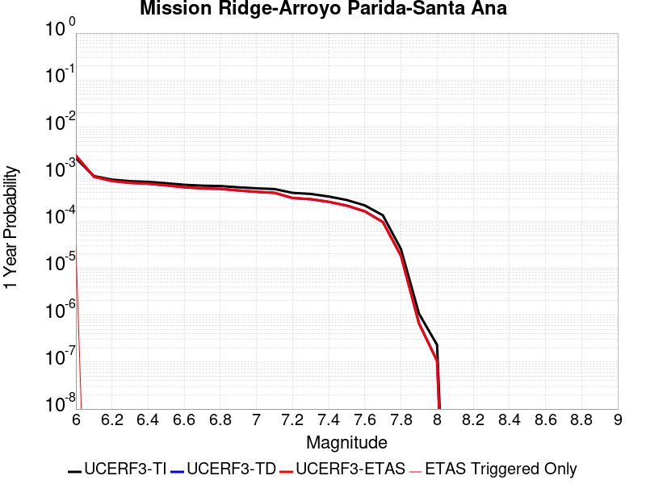 |  |

| Magnitude | 1 wk TI Prob | 1 wk TD Prob | 1 wk ETAS Prob | 1 wk ETAS/TD Gain | 1 wk ETAS Triggered Only | 1 mo TI Prob | 1 mo TD Prob | 1 mo ETAS Prob | 1 mo ETAS/TD Gain | 1 mo ETAS Triggered Only | 1 yr TI Prob | 1 yr TD Prob | 1 yr ETAS Prob | 1 yr ETAS/TD Gain | 1 yr ETAS Triggered Only | 10 yr TI Prob | 10 yr TD Prob | 10 yr ETAS Prob | 10 yr ETAS/TD Gain | 10 yr ETAS Triggered Only |
|-----|-----|-----|-----|-----|-----|-----|-----|-----|-----|-----|-----|-----|-----|-----|-----|-----|-----|-----|-----|-----|
| 6.0 | 4.169034E-5 | 4.7138332E-5 | 4.7138332E-5 | 1.0 | 0.0 | 1.7866064E-4 | 2.0201063E-4 | 2.0201063E-4 | 1.0 | 0.0 | 0.0021730233 | 0.0024575314 | 0.0024874578 | 1.0121773 | 3.0E-5 | 0.021518968 | 0.024385462 | 0.024453755 | 1.0028006 | 7.0E-5 |
| 6.1 | 1.73813E-5 | 1.685448E-5 | 1.685448E-5 | 1.0 | 0.0 | 7.4489166E-5 | 7.2231545E-5 | 7.2231545E-5 | 1.0 | 0.0 | 9.065282E-4 | 8.7907485E-4 | 8.7907485E-4 | 1.0 | 0.0 | 0.009028391 | 0.008757258 | 0.008777083 | 1.0022638 | 2.0E-5 |
| 6.2 | 1.4622182E-5 | 1.3673473E-5 | 1.3673473E-5 | 1.0 | 0.0 | 6.2664985E-5 | 5.8599304E-5 | 5.8599304E-5 | 1.0 | 0.0 | 7.6267915E-4 | 7.1321684E-4 | 7.1321684E-4 | 1.0 | 0.0 | 0.007600669 | 0.0071098623 | 0.0071297204 | 1.002793 | 2.0E-5 |
| 6.3 | 1.3552434E-5 | 1.24823655E-5 | 1.24823655E-5 | 1.0 | 0.0 | 5.8080568E-5 | 5.3494776E-5 | 5.3494776E-5 | 1.0 | 0.0 | 7.069015E-4 | 6.511074E-4 | 6.511074E-4 | 1.0 | 0.0 | 0.00704657 | 0.006492501 | 0.006512371 | 1.0030605 | 2.0E-5 |
| 6.4 | 1.30977305E-5 | 1.1979314E-5 | 1.1979314E-5 | 1.0 | 0.0 | 5.613192E-5 | 5.1338924E-5 | 5.1338924E-5 | 1.0 | 0.0 | 6.831918E-4 | 6.2487513E-4 | 6.2487513E-4 | 1.0 | 0.0 | 0.006810953 | 0.0062316665 | 0.006251542 | 1.0031894 | 2.0E-5 |
| 6.5 | 1.225205E-5 | 1.1048948E-5 | 1.1048948E-5 | 1.0 | 0.0 | 5.2507727E-5 | 4.735179E-5 | 4.735179E-5 | 1.0 | 0.0 | 6.3909404E-4 | 5.763583E-4 | 5.763583E-4 | 1.0 | 0.0 | 0.006372592 | 0.005749085 | 0.00576897 | 1.0034589 | 2.0E-5 |
| 6.6 | 1.1352241E-5 | 1.0063668E-5 | 1.0063668E-5 | 1.0 | 0.0 | 4.8651553E-5 | 4.3129305E-5 | 4.3129305E-5 | 1.0 | 0.0 | 5.921717E-4 | 5.249749E-4 | 5.249749E-4 | 1.0 | 0.0 | 0.0059059616 | 0.005237734 | 0.0052576293 | 1.0037985 | 2.0E-5 |
| 6.7 | 1.0864116E-5 | 9.517152E-6 | 9.517152E-6 | 1.0 | 0.0 | 4.6559664E-5 | 4.0787167E-5 | 4.0787167E-5 | 1.0 | 0.0 | 5.667165E-4 | 4.964726E-4 | 4.964726E-4 | 1.0 | 0.0 | 0.005652734 | 0.004954009 | 0.00497391 | 1.0040171 | 2.0E-5 |
| 6.8 | 1.0666365E-5 | 9.2999E-6 | 9.2999E-6 | 1.0 | 0.0 | 4.571219E-5 | 3.9856117E-5 | 3.9856117E-5 | 1.0 | 0.0 | 5.564038E-4 | 4.851422E-4 | 4.851422E-4 | 1.0 | 0.0 | 0.005550127 | 0.004841204 | 0.004861107 | 1.0041112 | 2.0E-5 |
| 6.9 | 1.0038665E-5 | 8.592155E-6 | 8.592155E-6 | 1.0 | 0.0 | 4.302214E-5 | 3.682301E-5 | 3.682301E-5 | 1.0 | 0.0 | 5.236687E-4 | 4.4822975E-4 | 4.4822975E-4 | 1.0 | 0.0 | 0.005224364 | 0.0044736085 | 0.0044935187 | 1.0044507 | 2.0E-5 |
| 7.0 | 9.5379955E-6 | 8.025172E-6 | 8.025172E-6 | 1.0 | 0.0 | 4.0876483E-5 | 3.4393153E-5 | 3.4393153E-5 | 1.0 | 0.0 | 4.975576E-4 | 4.1865787E-4 | 4.1865787E-4 | 1.0 | 0.0 | 0.00496445 | 0.0041790316 | 0.004198948 | 1.0047657 | 2.0E-5 |
| 7.1 | 9.207389E-6 | 7.652467E-6 | 7.652467E-6 | 1.0 | 0.0 | 3.945964E-5 | 3.2795884E-5 | 3.2795884E-5 | 1.0 | 0.0 | 4.803152E-4 | 3.992184E-4 | 3.992184E-4 | 1.0 | 0.0 | 0.004792784 | 0.0039853496 | 0.0040052696 | 1.0049983 | 2.0E-5 |
| 7.2 | 7.638091E-6 | 5.931174E-6 | 5.931174E-6 | 1.0 | 0.0 | 3.2734264E-5 | 2.541907E-5 | 2.541907E-5 | 1.0 | 0.0 | 3.984668E-4 | 3.0943356E-4 | 3.0943356E-4 | 1.0 | 0.0 | 0.0039775306 | 0.0030902245 | 0.0031001936 | 1.003226 | 1.0E-5 |
| 7.3 | 7.2500147E-6 | 5.596204E-6 | 5.596204E-6 | 1.0 | 0.0 | 3.1071122E-5 | 2.3983514E-5 | 2.3983514E-5 | 1.0 | 0.0 | 3.7822526E-4 | 2.9196046E-4 | 2.9196046E-4 | 1.0 | 0.0 | 0.0037758215 | 0.002915965 | 0.002925936 | 1.0034194 | 1.0E-5 |
| 7.4 | 6.3899715E-6 | 4.9185496E-6 | 4.9185496E-6 | 1.0 | 0.0 | 2.7385306E-5 | 2.107933E-5 | 2.107933E-5 | 1.0 | 0.0 | 3.3336508E-4 | 2.566108E-4 | 2.566108E-4 | 1.0 | 0.0 | 0.0033286542 | 0.0025633303 | 0.0025733046 | 1.0038912 | 1.0E-5 |
| 7.5 | 5.379025E-6 | 4.0839013E-6 | 4.0839013E-6 | 1.0 | 0.0 | 2.305276E-5 | 1.7502318E-5 | 1.7502318E-5 | 1.0 | 0.0 | 2.806312E-4 | 2.1306999E-4 | 2.1306999E-4 | 1.0 | 0.0 | 0.0028027708 | 0.0021286684 | 0.002138647 | 1.0046878 | 1.0E-5 |
| 7.6 | 4.1270696E-6 | 3.088378E-6 | 3.088378E-6 | 1.0 | 0.0 | 1.768732E-5 | 1.3235838E-5 | 1.3235838E-5 | 1.0 | 0.0 | 2.1532185E-4 | 1.6113449E-4 | 1.6113449E-4 | 1.0 | 0.0 | 0.0021511333 | 0.0016101847 | 0.0016201686 | 1.0062004 | 1.0E-5 |
| 7.7 | 2.5406805E-6 | 1.8282275E-6 | 1.8282275E-6 | 1.0 | 0.0 | 1.0888585E-5 | 7.835237E-6 | 7.835237E-6 | 1.0 | 0.0 | 1.3256045E-4 | 9.53899E-5 | 9.53899E-5 | 1.0 | 0.0 | 0.0013248142 | 9.5349574E-4 | 9.5349574E-4 | 1.0 | 0.0 |
| 7.8 | 4.8608285E-7 | 3.5099023E-7 | 3.5099023E-7 | 1.0 | 0.0 | 2.0832106E-6 | 1.504243E-6 | 1.504243E-6 | 1.0 | 0.0 | 2.5362791E-5 | 1.8314006E-5 | 1.8314006E-5 | 1.0 | 0.0 | 2.5359896E-4 | 1.8312508E-4 | 1.8312508E-4 | 1.0 | 0.0 |
| 7.9 | 2.0472514E-8 | 1.2688983E-8 | 1.2688983E-8 | 1.0 | 0.0 | 8.7739345E-8 | 5.4381356E-8 | 5.4381356E-8 | 1.0 | 0.0 | 1.068226E-6 | 6.620928E-7 | 6.620928E-7 | 1.0 | 0.0 | 1.0682209E-5 | 6.6209095E-6 | 6.6209095E-6 | 1.0 | 0.0 |
| 8.0 | 4.443582E-9 | 2.032151E-9 | 2.032151E-9 | 1.0 | 0.0 | 1.9043922E-8 | 8.709217E-9 | 8.709217E-9 | 1.0 | 0.0 | 2.3185973E-7 | 1.0603472E-7 | 1.0603472E-7 | 1.0 | 0.0 | 2.3185949E-6 | 1.0603468E-6 | 1.0603468E-6 | 1.0 | 0.0 |

## Rose Canyon
*[(top)](#table-of-contents)*

| 1 Week | 1 Month | 1 Year | 10 Year |
|-----|-----|-----|-----|
|  |  | 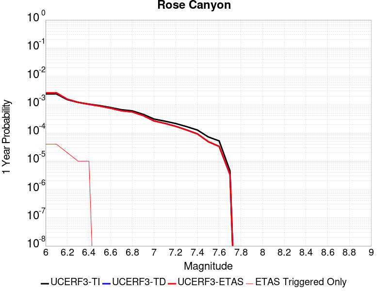 |  |

| Magnitude | 1 wk TI Prob | 1 wk TD Prob | 1 wk ETAS Prob | 1 wk ETAS/TD Gain | 1 wk ETAS Triggered Only | 1 mo TI Prob | 1 mo TD Prob | 1 mo ETAS Prob | 1 mo ETAS/TD Gain | 1 mo ETAS Triggered Only | 1 yr TI Prob | 1 yr TD Prob | 1 yr ETAS Prob | 1 yr ETAS/TD Gain | 1 yr ETAS Triggered Only | 10 yr TI Prob | 10 yr TD Prob | 10 yr ETAS Prob | 10 yr ETAS/TD Gain | 10 yr ETAS Triggered Only |
|-----|-----|-----|-----|-----|-----|-----|-----|-----|-----|-----|-----|-----|-----|-----|-----|-----|-----|-----|-----|-----|
| 6.0 | 4.5923203E-5 | 4.9717553E-5 | 4.9717553E-5 | 1.0 | 0.0 | 1.9679888E-4 | 2.1305913E-4 | 2.2305701E-4 | 1.0469253 | 1.0E-5 | 0.0023933933 | 0.0025910994 | 0.0026309956 | 1.0153974 | 4.0E-5 | 0.023677798 | 0.025618313 | 0.025686521 | 1.0026624 | 7.0E-5 |
| 6.1 | 4.5923203E-5 | 4.9717553E-5 | 4.9717553E-5 | 1.0 | 0.0 | 1.9679888E-4 | 2.1305913E-4 | 2.2305701E-4 | 1.0469253 | 1.0E-5 | 0.0023933933 | 0.0025910994 | 0.0026309956 | 1.0153974 | 4.0E-5 | 0.023677798 | 0.025618313 | 0.025676776 | 1.002282 | 6.0E-5 |
| 6.2 | 2.8844734E-5 | 2.9670837E-5 | 2.9670837E-5 | 1.0 | 0.0 | 1.2361443E-4 | 1.2715468E-4 | 1.2715468E-4 | 1.0 | 0.0 | 0.0015039665 | 0.0015470362 | 0.0015670053 | 1.012908 | 2.0E-5 | 0.0149382865 | 0.015357477 | 0.015396862 | 1.0025645 | 4.0E-5 |
| 6.3 | 2.3171577E-5 | 2.3163399E-5 | 2.3163399E-5 | 1.0 | 0.0 | 9.9302975E-5 | 9.9268E-5 | 9.9268E-5 | 1.0 | 0.0 | 0.0012083431 | 0.0012079312 | 0.001217919 | 1.0082686 | 1.0E-5 | 0.012017938 | 0.012004637 | 0.012034277 | 1.0024691 | 3.0E-5 |
| 6.4 | 2.0066604E-5 | 1.966902E-5 | 1.966902E-5 | 1.0 | 0.0 | 8.599689E-5 | 8.429313E-5 | 8.429313E-5 | 1.0 | 0.0 | 0.0010465092 | 0.0010257957 | 0.0010357854 | 1.0097386 | 1.0E-5 | 0.010415946 | 0.010203916 | 0.01023361 | 1.00291 | 3.0E-5 |
| 6.5 | 1.776989E-5 | 1.7115479E-5 | 1.7115479E-5 | 1.0 | 0.0 | 7.615444E-5 | 7.3350035E-5 | 7.3350035E-5 | 1.0 | 0.0 | 9.267859E-4 | 8.926777E-4 | 8.926777E-4 | 1.0 | 0.0 | 0.009229303 | 0.008879829 | 0.0088996515 | 1.0022323 | 2.0E-5 |
| 6.6 | 1.5227364E-5 | 1.4340938E-5 | 1.4340938E-5 | 1.0 | 0.0 | 6.52585E-5 | 6.1459745E-5 | 6.1459745E-5 | 1.0 | 0.0 | 7.942326E-4 | 7.480207E-4 | 7.480207E-4 | 1.0 | 0.0 | 0.007914 | 0.00744577 | 0.007465621 | 1.0026661 | 2.0E-5 |
| 6.7 | 1.2703898E-5 | 1.167434E-5 | 1.167434E-5 | 1.0 | 0.0 | 5.4444143E-5 | 5.0031955E-5 | 5.0031955E-5 | 1.0 | 0.0 | 6.626558E-4 | 6.0897303E-4 | 6.0897303E-4 | 1.0 | 0.0 | 0.006606833 | 0.00606576 | 0.0060856384 | 1.0032772 | 2.0E-5 |
| 6.8 | 1.1554917E-5 | 1.0610447E-5 | 1.0610447E-5 | 1.0 | 0.0 | 4.9520135E-5 | 4.5472574E-5 | 4.5472574E-5 | 1.0 | 0.0 | 6.0274085E-4 | 5.53492E-4 | 5.53492E-4 | 1.0 | 0.0 | 0.0060110865 | 0.005507283 | 0.0055271727 | 1.0036116 | 2.0E-5 |
| 6.9 | 8.732078E-6 | 7.882343E-6 | 7.882343E-6 | 1.0 | 0.0 | 3.7422655E-5 | 3.378105E-5 | 3.378105E-5 | 1.0 | 0.0 | 4.5552556E-4 | 4.112096E-4 | 4.112096E-4 | 1.0 | 0.0 | 0.0045459294 | 0.004089545 | 0.004099504 | 1.0024352 | 1.0E-5 |
| 7.0 | 5.9337494E-6 | 5.1074826E-6 | 5.1074826E-6 | 1.0 | 0.0 | 2.5430107E-5 | 2.1889029E-5 | 2.1889029E-5 | 1.0 | 0.0 | 3.0956755E-4 | 2.6646646E-4 | 2.6646646E-4 | 1.0 | 0.0 | 0.0030913667 | 0.0026614852 | 0.0026714585 | 1.0037473 | 1.0E-5 |
| 7.1 | 5.013409E-6 | 4.177376E-6 | 4.177376E-6 | 1.0 | 0.0 | 2.1485863E-5 | 1.7902918E-5 | 1.7902918E-5 | 1.0 | 0.0 | 2.6155898E-4 | 2.1794632E-4 | 2.1794632E-4 | 1.0 | 0.0 | 0.0026125133 | 0.0021773374 | 0.0021873156 | 1.0045828 | 1.0E-5 |
| 7.2 | 4.120763E-6 | 3.2821204E-6 | 3.2821204E-6 | 1.0 | 0.0 | 1.7660293E-5 | 1.4066155E-5 | 1.4066155E-5 | 1.0 | 0.0 | 2.1499286E-4 | 1.7124206E-4 | 1.7124206E-4 | 1.0 | 0.0 | 0.0021478499 | 0.0017111107 | 0.0017111107 | 1.0 | 0.0 |
| 7.3 | 3.2081239E-6 | 2.440515E-6 | 2.440515E-6 | 1.0 | 0.0 | 1.374903E-5 | 1.0459307E-5 | 1.0459307E-5 | 1.0 | 0.0 | 1.6738157E-4 | 1.273347E-4 | 1.273347E-4 | 1.0 | 0.0 | 0.0016725556 | 0.0012726244 | 0.0012726244 | 1.0 | 0.0 |
| 7.4 | 2.4194755E-6 | 1.7680458E-6 | 1.7680458E-6 | 1.0 | 0.0 | 1.0369139E-5 | 7.5773173E-6 | 7.5773173E-6 | 1.0 | 0.0 | 1.2623696E-4 | 9.224998E-5 | 9.224998E-5 | 1.0 | 0.0 | 0.0012616527 | 9.221223E-4 | 9.221223E-4 | 1.0 | 0.0 |
| 7.5 | 1.3842889E-6 | 9.378391E-7 | 9.378391E-7 | 1.0 | 0.0 | 5.9326535E-6 | 4.0193045E-6 | 4.0193045E-6 | 1.0 | 0.0 | 7.222766E-5 | 4.893397E-5 | 4.893397E-5 | 1.0 | 0.0 | 7.220419E-4 | 4.8923545E-4 | 4.8923545E-4 | 1.0 | 0.0 |
| 7.6 | 1.0021575E-6 | 6.4114187E-7 | 6.4114187E-7 | 1.0 | 0.0 | 4.2949537E-6 | 2.7477479E-6 | 2.7477479E-6 | 1.0 | 0.0 | 5.2289808E-5 | 3.345334E-5 | 3.345334E-5 | 1.0 | 0.0 | 5.2277505E-4 | 3.3448517E-4 | 3.3448517E-4 | 1.0 | 0.0 |
| 7.7 | 8.7620116E-8 | 6.449342E-8 | 6.449342E-8 | 1.0 | 0.0 | 3.7551473E-7 | 2.7640036E-7 | 2.7640036E-7 | 1.0 | 0.0 | 4.5718825E-6 | 3.3651693E-6 | 3.3651693E-6 | 1.0 | 0.0 | 4.5717883E-5 | 3.3651213E-5 | 3.3651213E-5 | 1.0 | 0.0 |

## Cleghorn Lake
*[(top)](#table-of-contents)*

| 1 Week | 1 Month | 1 Year | 10 Year |
|-----|-----|-----|-----|
|  |  |  |  |

| Magnitude | 1 wk TI Prob | 1 wk TD Prob | 1 wk ETAS Prob | 1 wk ETAS/TD Gain | 1 wk ETAS Triggered Only | 1 mo TI Prob | 1 mo TD Prob | 1 mo ETAS Prob | 1 mo ETAS/TD Gain | 1 mo ETAS Triggered Only | 1 yr TI Prob | 1 yr TD Prob | 1 yr ETAS Prob | 1 yr ETAS/TD Gain | 1 yr ETAS Triggered Only | 10 yr TI Prob | 10 yr TD Prob | 10 yr ETAS Prob | 10 yr ETAS/TD Gain | 10 yr ETAS Triggered Only |
|-----|-----|-----|-----|-----|-----|-----|-----|-----|-----|-----|-----|-----|-----|-----|-----|-----|-----|-----|-----|-----|
| 6.0 | 1.5467183E-5 | 1.6794396E-5 | 1.6794396E-5 | 1.0 | 0.0 | 6.6286244E-5 | 7.1974304E-5 | 7.1974304E-5 | 1.0 | 0.0 | 8.067362E-4 | 8.7598973E-4 | 8.959722E-4 | 1.0228113 | 2.0E-5 | 0.008038137 | 0.008730795 | 0.008780358 | 1.0056769 | 5.0E-5 |
| 6.1 | 1.5467183E-5 | 1.6794396E-5 | 1.6794396E-5 | 1.0 | 0.0 | 6.6286244E-5 | 7.1974304E-5 | 7.1974304E-5 | 1.0 | 0.0 | 8.067362E-4 | 8.7598973E-4 | 8.959722E-4 | 1.0228113 | 2.0E-5 | 0.008038137 | 0.008730795 | 0.008780358 | 1.0056769 | 5.0E-5 |
| 6.2 | 1.2624631E-5 | 1.3681697E-5 | 1.3681697E-5 | 1.0 | 0.0 | 5.410444E-5 | 5.86348E-5 | 5.86348E-5 | 1.0 | 0.0 | 6.585225E-4 | 7.1369356E-4 | 7.336793E-4 | 1.0280032 | 2.0E-5 | 0.0065657445 | 0.007118811 | 0.007168455 | 1.0069736 | 5.0E-5 |
| 6.3 | 1.2624631E-5 | 1.3681697E-5 | 1.3681697E-5 | 1.0 | 0.0 | 5.410444E-5 | 5.86348E-5 | 5.86348E-5 | 1.0 | 0.0 | 6.585225E-4 | 7.1369356E-4 | 7.336793E-4 | 1.0280032 | 2.0E-5 | 0.0065657445 | 0.007118811 | 0.007168455 | 1.0069736 | 5.0E-5 |
| 6.4 | 9.417684E-6 | 1.0170226E-5 | 1.0170226E-5 | 1.0 | 0.0 | 4.036088E-5 | 4.3586184E-5 | 4.3586184E-5 | 1.0 | 0.0 | 4.912829E-4 | 5.305737E-4 | 5.405684E-4 | 1.0188376 | 1.0E-5 | 0.004901982 | 0.0052971053 | 0.0053269463 | 1.0056335 | 3.0E-5 |
| 6.5 | 9.368219E-6 | 1.0117652E-5 | 1.0117652E-5 | 1.0 | 0.0 | 4.014889E-5 | 4.3360877E-5 | 4.3360877E-5 | 1.0 | 0.0 | 4.8870314E-4 | 5.278319E-4 | 5.378266E-4 | 1.0189354 | 1.0E-5 | 0.004876298 | 0.0052698175 | 0.0052996594 | 1.0056628 | 3.0E-5 |
| 6.6 | 7.803798E-6 | 8.441923E-6 | 8.441923E-6 | 1.0 | 0.0 | 3.3444423E-5 | 3.6179394E-5 | 3.6179394E-5 | 1.0 | 0.0 | 4.0710976E-4 | 4.40435E-4 | 4.504306E-4 | 1.0226948 | 1.0E-5 | 0.0040636472 | 0.004399538 | 0.004429406 | 1.0067888 | 3.0E-5 |
| 6.7 | 2.3108669E-6 | 2.4438523E-6 | 2.4438523E-6 | 1.0 | 0.0 | 9.903678E-6 | 1.0473612E-5 | 1.0473612E-5 | 1.0 | 0.0 | 1.205706E-4 | 1.2750895E-4 | 1.2750895E-4 | 1.0 | 0.0 | 0.001205052 | 0.0012743765 | 0.0012743765 | 1.0 | 0.0 |
| 6.8 | 2.0882828E-6 | 2.2062986E-6 | 2.2062986E-6 | 1.0 | 0.0 | 8.949753E-6 | 9.455533E-6 | 9.455533E-6 | 1.0 | 0.0 | 1.08957785E-4 | 1.15115196E-4 | 1.15115196E-4 | 1.0 | 0.0 | 0.0010890438 | 0.0011505726 | 0.0011505726 | 1.0 | 0.0 |
| 6.9 | 1.876935E-6 | 1.9810657E-6 | 1.9810657E-6 | 1.0 | 0.0 | 8.043982E-6 | 8.490254E-6 | 8.490254E-6 | 1.0 | 0.0 | 9.7931086E-5 | 1.033641E-4 | 1.033641E-4 | 1.0 | 0.0 | 9.788794E-4 | 0.0010331762 | 0.0010331762 | 1.0 | 0.0 |
| 7.0 | 1.5357559E-6 | 1.6202926E-6 | 1.6202926E-6 | 1.0 | 0.0 | 6.5817944E-6 | 6.944093E-6 | 6.944093E-6 | 1.0 | 0.0 | 8.01304E-5 | 8.454118E-5 | 8.454118E-5 | 1.0 | 0.0 | 8.010151E-4 | 8.4510265E-4 | 8.4510265E-4 | 1.0 | 0.0 |
| 7.1 | 1.0905424E-6 | 1.1497702E-6 | 1.1497702E-6 | 1.0 | 0.0 | 4.6737446E-6 | 4.927578E-6 | 4.927578E-6 | 1.0 | 0.0 | 5.6901354E-5 | 5.999171E-5 | 5.999171E-5 | 1.0 | 0.0 | 5.6886784E-4 | 5.997649E-4 | 5.997649E-4 | 1.0 | 0.0 |
| 7.2 | 6.06668E-7 | 6.387322E-7 | 6.387322E-7 | 1.0 | 0.0 | 2.600003E-6 | 2.7374213E-6 | 2.7374213E-6 | 1.0 | 0.0 | 3.1654577E-5 | 3.3327666E-5 | 3.3327666E-5 | 1.0 | 0.0 | 3.1650066E-4 | 3.332335E-4 | 3.332335E-4 | 1.0 | 0.0 |

## Pinto Mtn
*[(top)](#table-of-contents)*

| 1 Week | 1 Month | 1 Year | 10 Year |
|-----|-----|-----|-----|
|  |  |  | 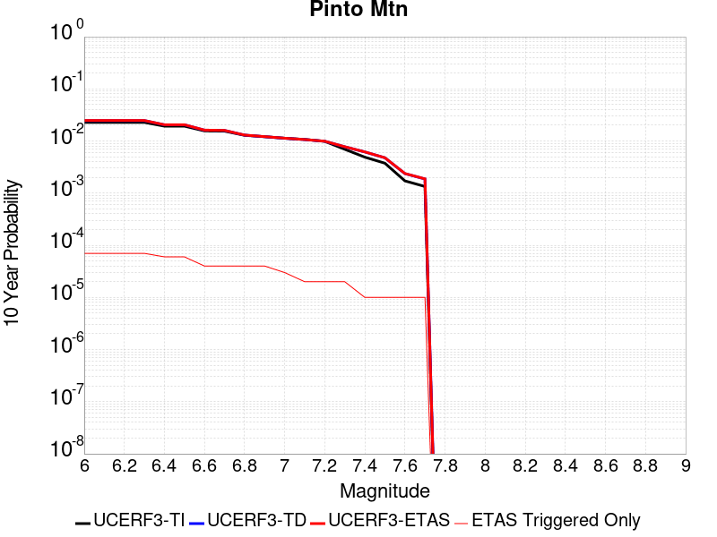 |

| Magnitude | 1 wk TI Prob | 1 wk TD Prob | 1 wk ETAS Prob | 1 wk ETAS/TD Gain | 1 wk ETAS Triggered Only | 1 mo TI Prob | 1 mo TD Prob | 1 mo ETAS Prob | 1 mo ETAS/TD Gain | 1 mo ETAS Triggered Only | 1 yr TI Prob | 1 yr TD Prob | 1 yr ETAS Prob | 1 yr ETAS/TD Gain | 1 yr ETAS Triggered Only | 10 yr TI Prob | 10 yr TD Prob | 10 yr ETAS Prob | 10 yr ETAS/TD Gain | 10 yr ETAS Triggered Only |
|-----|-----|-----|-----|-----|-----|-----|-----|-----|-----|-----|-----|-----|-----|-----|-----|-----|-----|-----|-----|-----|
| 6.0 | 4.4194956E-5 | 4.7855512E-5 | 5.785503E-5 | 1.2089523 | 1.0E-5 | 1.893932E-4 | 2.0507984E-4 | 2.3507368E-4 | 1.1462545 | 3.0E-5 | 0.0023034236 | 0.0024941512 | 0.0025240765 | 1.0119982 | 3.0E-5 | 0.022796938 | 0.024679113 | 0.024747385 | 1.0027664 | 7.0E-5 |
| 6.1 | 4.4194956E-5 | 4.7855512E-5 | 5.785503E-5 | 1.2089523 | 1.0E-5 | 1.893932E-4 | 2.0507984E-4 | 2.3507368E-4 | 1.1462545 | 3.0E-5 | 0.0023034236 | 0.0024941512 | 0.0025240765 | 1.0119982 | 3.0E-5 | 0.022796938 | 0.024679113 | 0.024747385 | 1.0027664 | 7.0E-5 |
| 6.2 | 4.4194956E-5 | 4.7855512E-5 | 5.785503E-5 | 1.2089523 | 1.0E-5 | 1.893932E-4 | 2.0507984E-4 | 2.3507368E-4 | 1.1462545 | 3.0E-5 | 0.0023034236 | 0.0024941512 | 0.0025240765 | 1.0119982 | 3.0E-5 | 0.022796938 | 0.024679113 | 0.024747385 | 1.0027664 | 7.0E-5 |
| 6.3 | 4.4194956E-5 | 4.7855512E-5 | 5.785503E-5 | 1.2089523 | 1.0E-5 | 1.893932E-4 | 2.0507984E-4 | 2.3507368E-4 | 1.1462545 | 3.0E-5 | 0.0023034236 | 0.0024941512 | 0.0025240765 | 1.0119982 | 3.0E-5 | 0.022796938 | 0.024679113 | 0.024747385 | 1.0027664 | 7.0E-5 |
| 6.4 | 3.729929E-5 | 3.960486E-5 | 3.960486E-5 | 1.0 | 0.0 | 1.5984432E-4 | 1.697246E-4 | 1.897212E-4 | 1.117818 | 2.0E-5 | 0.0019443673 | 0.002064532 | 0.0020844906 | 1.0096674 | 2.0E-5 | 0.019274427 | 0.02046355 | 0.020522323 | 1.002872 | 6.0E-5 |
| 6.5 | 3.729929E-5 | 3.960486E-5 | 3.960486E-5 | 1.0 | 0.0 | 1.5984432E-4 | 1.697246E-4 | 1.897212E-4 | 1.117818 | 2.0E-5 | 0.0019443673 | 0.002064532 | 0.0020844906 | 1.0096674 | 2.0E-5 | 0.019274427 | 0.02046355 | 0.020522323 | 1.002872 | 6.0E-5 |
| 6.6 | 3.0204548E-5 | 3.1206768E-5 | 3.1206768E-5 | 1.0 | 0.0 | 1.2944164E-4 | 1.3373663E-4 | 1.4373529E-4 | 1.0747638 | 1.0E-5 | 0.0015748127 | 0.001627062 | 0.0016370458 | 1.0061361 | 1.0E-5 | 0.015636992 | 0.016155364 | 0.016194718 | 1.0024359 | 4.0E-5 |
| 6.7 | 2.9857754E-5 | 3.0816143E-5 | 3.0816143E-5 | 1.0 | 0.0 | 1.2795553E-4 | 1.320627E-4 | 1.4206138E-4 | 1.0757116 | 1.0E-5 | 0.0015567453 | 0.0016067121 | 0.001616696 | 1.0062139 | 1.0E-5 | 0.015458848 | 0.0159548 | 0.015994161 | 1.002467 | 4.0E-5 |
| 6.8 | 2.4819734E-5 | 2.5010708E-5 | 2.5010708E-5 | 1.0 | 0.0 | 1.0636595E-4 | 1.0718447E-4 | 1.17183394E-4 | 1.0932871 | 1.0E-5 | 0.0012942362 | 0.0013042113 | 0.0013141982 | 1.0076575 | 1.0E-5 | 0.012867244 | 0.0129679395 | 0.013007421 | 1.0030445 | 4.0E-5 |
| 6.9 | 2.331124E-5 | 2.3338964E-5 | 2.3338964E-5 | 1.0 | 0.0 | 9.990149E-5 | 1.0002041E-4 | 1.10019406E-4 | 1.0999696 | 1.0E-5 | 0.001215622 | 0.0012170885 | 0.0012270764 | 1.0082064 | 1.0E-5 | 0.012089936 | 0.012106422 | 0.012145937 | 1.0032641 | 4.0E-5 |
| 7.0 | 2.1818534E-5 | 2.176207E-5 | 2.176207E-5 | 1.0 | 0.0 | 9.3504656E-5 | 9.3262795E-5 | 1.0326186E-4 | 1.1072139 | 1.0E-5 | 0.0011378246 | 0.0011349028 | 0.0011448915 | 1.0088013 | 1.0E-5 | 0.011320163 | 0.011293174 | 0.0113228345 | 1.0026264 | 3.0E-5 |
| 7.1 | 2.066081E-5 | 2.0541695E-5 | 2.0541695E-5 | 1.0 | 0.0 | 8.854332E-5 | 8.8032975E-5 | 9.803209E-5 | 1.1135838 | 1.0E-5 | 0.0010774818 | 0.001071294 | 0.0010812833 | 1.0093246 | 1.0E-5 | 0.010722724 | 0.010663347 | 0.010683134 | 1.0018556 | 2.0E-5 |
| 7.2 | 1.8990233E-5 | 1.905496E-5 | 1.905496E-5 | 1.0 | 0.0 | 8.138417E-5 | 8.166167E-5 | 9.1660855E-5 | 1.1224464 | 1.0E-5 | 9.904018E-4 | 9.937966E-4 | 0.0010037867 | 1.0100524 | 1.0E-5 | 0.009859995 | 0.009895524 | 0.009915326 | 1.0020012 | 2.0E-5 |
| 7.3 | 1.3335872E-5 | 1.4907597E-5 | 1.4907597E-5 | 1.0 | 0.0 | 5.7152483E-5 | 6.388821E-5 | 7.388757E-5 | 1.1565135 | 1.0E-5 | 6.956093E-4 | 7.7757414E-4 | 7.8756636E-4 | 1.0128505 | 1.0E-5 | 0.006934359 | 0.007749834 | 0.0077696787 | 1.0025607 | 2.0E-5 |
| 7.4 | 9.414066E-6 | 1.1861796E-5 | 1.1861796E-5 | 1.0 | 0.0 | 4.0345374E-5 | 5.0835333E-5 | 5.0835333E-5 | 1.0 | 0.0 | 4.910942E-4 | 6.1875384E-4 | 6.1875384E-4 | 1.0 | 0.0 | 0.0049001034 | 0.006171259 | 0.0061811972 | 1.0016104 | 1.0E-5 |
| 7.5 | 7.2101157E-6 | 9.15899E-6 | 9.15899E-6 | 1.0 | 0.0 | 3.090013E-5 | 3.925227E-5 | 3.925227E-5 | 1.0 | 0.0 | 3.7614413E-4 | 4.777994E-4 | 4.777994E-4 | 1.0 | 0.0 | 0.0037550807 | 0.004768497 | 0.004778449 | 1.0020871 | 1.0E-5 |
| 7.6 | 3.296375E-6 | 4.546278E-6 | 4.546278E-6 | 1.0 | 0.0 | 1.4127245E-5 | 1.948391E-5 | 1.948391E-5 | 1.0 | 0.0 | 1.7198564E-4 | 2.3719217E-4 | 2.3719217E-4 | 1.0 | 0.0 | 0.0017185259 | 0.0023695275 | 0.0023795038 | 1.0042102 | 1.0E-5 |
| 7.7 | 2.5741092E-6 | 3.5851394E-6 | 3.5851394E-6 | 1.0 | 0.0 | 1.103185E-5 | 1.53648E-5 | 1.53648E-5 | 1.0 | 0.0 | 1.3430449E-4 | 1.870517E-4 | 1.870517E-4 | 1.0 | 0.0 | 0.0013422335 | 0.0018690726 | 0.0018790538 | 1.0053402 | 1.0E-5 |

## Lost Hills
*[(top)](#table-of-contents)*

| 1 Week | 1 Month | 1 Year | 10 Year |
|-----|-----|-----|-----|
|  |  |  |  |

| Magnitude | 1 wk TI Prob | 1 wk TD Prob | 1 wk ETAS Prob | 1 wk ETAS/TD Gain | 1 wk ETAS Triggered Only | 1 mo TI Prob | 1 mo TD Prob | 1 mo ETAS Prob | 1 mo ETAS/TD Gain | 1 mo ETAS Triggered Only | 1 yr TI Prob | 1 yr TD Prob | 1 yr ETAS Prob | 1 yr ETAS/TD Gain | 1 yr ETAS Triggered Only | 10 yr TI Prob | 10 yr TD Prob | 10 yr ETAS Prob | 10 yr ETAS/TD Gain | 10 yr ETAS Triggered Only |
|-----|-----|-----|-----|-----|-----|-----|-----|-----|-----|-----|-----|-----|-----|-----|-----|-----|-----|-----|-----|-----|
| 6.0 | 2.233523E-5 | 2.5106996E-5 | 3.5106743E-5 | 1.3982854 | 1.0E-5 | 9.571891E-5 | 1.0759792E-4 | 1.2759576E-4 | 1.1858572 | 2.0E-5 | 0.0011647546 | 0.0013093855 | 0.0013393463 | 1.0228815 | 3.0E-5 | 0.011586686 | 0.013033304 | 0.013102392 | 1.0053009 | 7.0E-5 |
| 6.1 | 2.233523E-5 | 2.5106996E-5 | 3.5106743E-5 | 1.3982854 | 1.0E-5 | 9.571891E-5 | 1.0759792E-4 | 1.2759576E-4 | 1.1858572 | 2.0E-5 | 0.0011647546 | 0.0013093855 | 0.0013393463 | 1.0228815 | 3.0E-5 | 0.011586686 | 0.013033304 | 0.013102392 | 1.0053009 | 7.0E-5 |
| 6.2 | 2.233523E-5 | 2.5106996E-5 | 3.5106743E-5 | 1.3982854 | 1.0E-5 | 9.571891E-5 | 1.0759792E-4 | 1.2759576E-4 | 1.1858572 | 2.0E-5 | 0.0011647546 | 0.0013093855 | 0.0013393463 | 1.0228815 | 3.0E-5 | 0.011586686 | 0.013033304 | 0.013102392 | 1.0053009 | 7.0E-5 |
| 6.3 | 2.233523E-5 | 2.5106996E-5 | 3.5106743E-5 | 1.3982854 | 1.0E-5 | 9.571891E-5 | 1.0759792E-4 | 1.2759576E-4 | 1.1858572 | 2.0E-5 | 0.0011647546 | 0.0013093855 | 0.0013393463 | 1.0228815 | 3.0E-5 | 0.011586686 | 0.013033304 | 0.013102392 | 1.0053009 | 7.0E-5 |
| 6.4 | 1.2288092E-5 | 1.37813295E-5 | 2.3781191E-5 | 1.7256094 | 1.0E-5 | 5.2662188E-5 | 5.9062033E-5 | 6.906144E-5 | 1.1693035 | 1.0E-5 | 6.409735E-4 | 7.189368E-4 | 7.3892245E-4 | 1.0277989 | 2.0E-5 | 0.006391279 | 0.007175316 | 0.007215029 | 1.0055346 | 4.0E-5 |
| 6.5 | 1.2288092E-5 | 1.37813295E-5 | 2.3781191E-5 | 1.7256094 | 1.0E-5 | 5.2662188E-5 | 5.9062033E-5 | 6.906144E-5 | 1.1693035 | 1.0E-5 | 6.409735E-4 | 7.189368E-4 | 7.3892245E-4 | 1.0277989 | 2.0E-5 | 0.006391279 | 0.007175316 | 0.007215029 | 1.0055346 | 4.0E-5 |
| 6.6 | 8.58281E-6 | 9.633926E-6 | 1.963383E-5 | 2.0379884 | 1.0E-5 | 3.6782953E-5 | 4.1288073E-5 | 5.1287658E-5 | 1.2421907 | 1.0E-5 | 4.4774043E-4 | 5.026495E-4 | 5.226395E-4 | 1.0397692 | 2.0E-5 | 0.0044683935 | 0.0050232867 | 0.005053136 | 1.0059422 | 3.0E-5 |
| 6.7 | 7.205685E-6 | 8.088433E-6 | 1.8088353E-5 | 2.2363234 | 1.0E-5 | 3.088114E-5 | 3.4664714E-5 | 4.4664368E-5 | 1.2884678 | 1.0E-5 | 3.7591302E-4 | 4.2204288E-4 | 4.4203445E-4 | 1.0473685 | 2.0E-5 | 0.0037527776 | 0.004220429 | 0.0042503024 | 1.0070783 | 3.0E-5 |

## San Jacinto (Stepovers Combined)
*[(top)](#table-of-contents)*

| 1 Week | 1 Month | 1 Year | 10 Year |
|-----|-----|-----|-----|
|  | 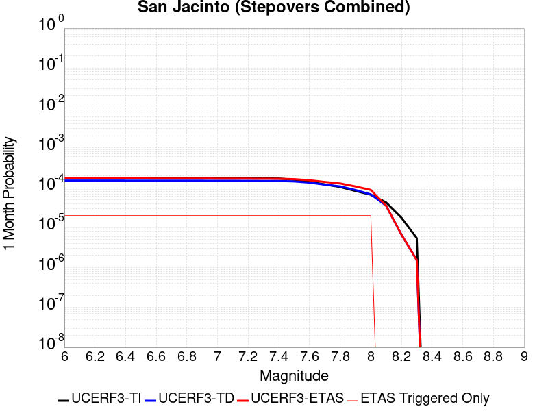 |  |  |

| Magnitude | 1 wk TI Prob | 1 wk TD Prob | 1 wk ETAS Prob | 1 wk ETAS/TD Gain | 1 wk ETAS Triggered Only | 1 mo TI Prob | 1 mo TD Prob | 1 mo ETAS Prob | 1 mo ETAS/TD Gain | 1 mo ETAS Triggered Only | 1 yr TI Prob | 1 yr TD Prob | 1 yr ETAS Prob | 1 yr ETAS/TD Gain | 1 yr ETAS Triggered Only | 10 yr TI Prob | 10 yr TD Prob | 10 yr ETAS Prob | 10 yr ETAS/TD Gain | 10 yr ETAS Triggered Only |
|-----|-----|-----|-----|-----|-----|-----|-----|-----|-----|-----|-----|-----|-----|-----|-----|-----|-----|-----|-----|-----|
| 6.0 | 4.0667746E-5 | 3.5285528E-5 | 3.5285528E-5 | 1.0 | 0.0 | 1.742787E-4 | 1.5121493E-4 | 1.7121191E-4 | 1.1322421 | 2.0E-5 | 0.0021197782 | 0.0018394884 | 0.0018694332 | 1.0162789 | 3.0E-5 | 0.020996714 | 0.018993655 | 0.019062325 | 1.0036155 | 7.0E-5 |
| 6.1 | 4.0667746E-5 | 3.5285528E-5 | 3.5285528E-5 | 1.0 | 0.0 | 1.742787E-4 | 1.5121493E-4 | 1.7121191E-4 | 1.1322421 | 2.0E-5 | 0.0021197782 | 0.0018394884 | 0.0018694332 | 1.0162789 | 3.0E-5 | 0.020996714 | 0.018993655 | 0.019062325 | 1.0036155 | 7.0E-5 |
| 6.2 | 4.0667746E-5 | 3.5285528E-5 | 3.5285528E-5 | 1.0 | 0.0 | 1.742787E-4 | 1.5121493E-4 | 1.7121191E-4 | 1.1322421 | 2.0E-5 | 0.0021197782 | 0.0018394884 | 0.0018694332 | 1.0162789 | 3.0E-5 | 0.020996714 | 0.018993655 | 0.019062325 | 1.0036155 | 7.0E-5 |
| 6.3 | 4.0667746E-5 | 3.5285528E-5 | 3.5285528E-5 | 1.0 | 0.0 | 1.742787E-4 | 1.5121493E-4 | 1.7121191E-4 | 1.1322421 | 2.0E-5 | 0.0021197782 | 0.0018394884 | 0.0018694332 | 1.0162789 | 3.0E-5 | 0.020996714 | 0.018993655 | 0.019062325 | 1.0036155 | 7.0E-5 |
| 6.4 | 4.0577226E-5 | 3.515743E-5 | 3.515743E-5 | 1.0 | 0.0 | 1.738908E-4 | 1.5066602E-4 | 1.7066301E-4 | 1.1327239 | 2.0E-5 | 0.0021150648 | 0.0018328178 | 0.0018627628 | 1.0163382 | 3.0E-5 | 0.020950472 | 0.018928219 | 0.018996894 | 1.0036281 | 7.0E-5 |
| 6.5 | 4.0577226E-5 | 3.515743E-5 | 3.515743E-5 | 1.0 | 0.0 | 1.738908E-4 | 1.5066602E-4 | 1.7066301E-4 | 1.1327239 | 2.0E-5 | 0.0021150648 | 0.0018328178 | 0.0018627628 | 1.0163382 | 3.0E-5 | 0.020950472 | 0.018928219 | 0.018996894 | 1.0036281 | 7.0E-5 |
| 6.6 | 4.053861E-5 | 3.510277E-5 | 3.510277E-5 | 1.0 | 0.0 | 1.7372532E-4 | 1.5043179E-4 | 1.7042879E-4 | 1.1329306 | 2.0E-5 | 0.0021130538 | 0.0018299713 | 0.0018599165 | 1.0163637 | 3.0E-5 | 0.020930743 | 0.018900296 | 0.018968973 | 1.0036336 | 7.0E-5 |
| 6.7 | 4.0516545E-5 | 3.5071844E-5 | 3.5071844E-5 | 1.0 | 0.0 | 1.7363077E-4 | 1.5029925E-4 | 1.7029625E-4 | 1.1330478 | 2.0E-5 | 0.002111905 | 0.0018283607 | 0.0018583059 | 1.0163782 | 3.0E-5 | 0.020919468 | 0.018884491 | 0.018953169 | 1.0036367 | 7.0E-5 |
| 6.8 | 4.049434E-5 | 3.5043406E-5 | 3.5043406E-5 | 1.0 | 0.0 | 1.7353562E-4 | 1.501774E-4 | 1.7017439E-4 | 1.1331558 | 2.0E-5 | 0.0021107488 | 0.0018268795 | 0.0018568247 | 1.0163914 | 3.0E-5 | 0.020908125 | 0.018869905 | 0.018938582 | 1.0036396 | 7.0E-5 |
| 6.9 | 4.046386E-5 | 3.5005964E-5 | 3.5005964E-5 | 1.0 | 0.0 | 1.73405E-4 | 1.5001695E-4 | 1.7001394E-4 | 1.1332983 | 2.0E-5 | 0.0021091616 | 0.0018249294 | 0.0018548745 | 1.016409 | 3.0E-5 | 0.020892553 | 0.018850677 | 0.018919356 | 1.0036434 | 7.0E-5 |
| 7.0 | 4.036382E-5 | 3.4886525E-5 | 3.4886525E-5 | 1.0 | 0.0 | 1.7297632E-4 | 1.4950513E-4 | 1.6950213E-4 | 1.1337547 | 2.0E-5 | 0.0021039525 | 0.0018187086 | 0.001848654 | 1.0164652 | 3.0E-5 | 0.02084144 | 0.018789288 | 0.018857973 | 1.0036556 | 7.0E-5 |
| 7.1 | 4.0343282E-5 | 3.486499E-5 | 3.486499E-5 | 1.0 | 0.0 | 1.7288832E-4 | 1.4941284E-4 | 1.6940985E-4 | 1.1338373 | 2.0E-5 | 0.002102883 | 0.0018175867 | 0.0018475322 | 1.0164754 | 3.0E-5 | 0.020830948 | 0.018778158 | 0.018846843 | 1.0036577 | 7.0E-5 |
| 7.2 | 4.0257353E-5 | 3.476948E-5 | 3.476948E-5 | 1.0 | 0.0 | 1.725201E-4 | 1.4900356E-4 | 1.6900059E-4 | 1.134205 | 2.0E-5 | 0.0020984085 | 0.0018126123 | 0.0018425579 | 1.0165207 | 3.0E-5 | 0.020787042 | 0.018728893 | 0.018797582 | 1.0036676 | 7.0E-5 |
| 7.3 | 3.9940667E-5 | 3.459712E-5 | 3.459712E-5 | 1.0 | 0.0 | 1.7116306E-4 | 1.4826495E-4 | 1.6826199E-4 | 1.1348736 | 2.0E-5 | 0.0020819185 | 0.0018036346 | 0.0018335804 | 1.0166031 | 3.0E-5 | 0.020625217 | 0.018637514 | 0.018706208 | 1.0036858 | 7.0E-5 |
| 7.4 | 3.9721202E-5 | 3.44825E-5 | 3.44825E-5 | 1.0 | 0.0 | 1.7022261E-4 | 1.4777378E-4 | 1.6777082E-4 | 1.135322 | 2.0E-5 | 0.0020704903 | 0.0017976643 | 0.0018276104 | 1.0166583 | 3.0E-5 | 0.020513052 | 0.018576635 | 0.018645335 | 1.0036982 | 7.0E-5 |
| 7.5 | 3.7036873E-5 | 3.354985E-5 | 3.354985E-5 | 1.0 | 0.0 | 1.5871979E-4 | 1.4377717E-4 | 1.637743E-4 | 1.1390841 | 2.0E-5 | 0.0019307006 | 0.0017490846 | 0.001779032 | 1.0171218 | 3.0E-5 | 0.019140124 | 0.018078115 | 0.018146848 | 1.0038021 | 7.0E-5 |
| 7.6 | 3.2940967E-5 | 3.1330474E-5 | 3.1330474E-5 | 1.0 | 0.0 | 1.4116794E-4 | 1.3426656E-4 | 1.5426388E-4 | 1.1489375 | 2.0E-5 | 0.0017173645 | 0.001633472 | 0.001663423 | 1.0183358 | 3.0E-5 | 0.01704153 | 0.01691088 | 0.016979696 | 1.0040693 | 7.0E-5 |
| 7.7 | 2.8236149E-5 | 2.7896147E-5 | 2.7896147E-5 | 1.0 | 0.0 | 1.2100645E-4 | 1.1954944E-4 | 1.3954705E-4 | 1.1672748 | 2.0E-5 | 0.0014722579 | 0.0014545437 | 0.0014845001 | 1.0205951 | 3.0E-5 | 0.014625421 | 0.015121453 | 0.015190395 | 1.0045592 | 7.0E-5 |
| 7.8 | 2.4329287E-5 | 2.5219388E-5 | 2.5219388E-5 | 1.0 | 0.0 | 1.042642E-4 | 1.0807862E-4 | 1.2807646E-4 | 1.1850305 | 2.0E-5 | 0.0012686774 | 0.0013150638 | 0.0013450243 | 1.0227826 | 3.0E-5 | 0.012614589 | 0.013718468 | 0.013787508 | 1.0050327 | 7.0E-5 |
| 7.9 | 1.9370926E-5 | 2.0432055E-5 | 2.0432055E-5 | 1.0 | 0.0 | 8.301561E-5 | 8.7563014E-5 | 1.0756126E-4 | 1.228387 | 2.0E-5 | 0.0010102465 | 0.001065559 | 0.0010955271 | 1.0281242 | 3.0E-5 | 0.0100566605 | 0.011205053 | 0.011274269 | 1.0061772 | 7.0E-5 |
| 8.0 | 1.5583017E-5 | 1.5895175E-5 | 1.5895175E-5 | 1.0 | 0.0 | 6.6782646E-5 | 6.8120404E-5 | 8.811904E-5 | 1.2935778 | 2.0E-5 | 8.127754E-4 | 8.29051E-4 | 8.490344E-4 | 1.024104 | 2.0E-5 | 0.008098091 | 0.008786416 | 0.008845888 | 1.0067687 | 6.0E-5 |
| 8.1 | 1.0024873E-5 | 8.297121E-6 | 8.297121E-6 | 1.0 | 0.0 | 4.2963035E-5 | 3.5558605E-5 | 3.5558605E-5 | 1.0 | 0.0 | 5.229494E-4 | 4.3284055E-4 | 4.3284055E-4 | 1.0 | 0.0 | 0.0052172043 | 0.00465596 | 0.00468582 | 1.0064133 | 3.0E-5 |
| 8.2 | 4.142796E-6 | 1.5619446E-6 | 1.5619446E-6 | 1.0 | 0.0 | 1.775472E-5 | 6.6940315E-6 | 6.6940315E-6 | 1.0 | 0.0 | 2.1614227E-4 | 8.1496815E-5 | 8.1496815E-5 | 1.0 | 0.0 | 0.0021593217 | 9.4601413E-4 | 9.4601413E-4 | 1.0 | 0.0 |
| 8.3 | 1.2750878E-6 | 3.6143226E-7 | 3.6143226E-7 | 1.0 | 0.0 | 5.4646503E-6 | 1.5489944E-6 | 1.5489944E-6 | 1.0 | 0.0 | 6.653009E-5 | 1.8858847E-5 | 1.8858847E-5 | 1.0 | 0.0 | 6.6510175E-4 | 2.2747046E-4 | 2.2747046E-4 | 1.0 | 0.0 |

## Santa Ynez (West)
*[(top)](#table-of-contents)*

| 1 Week | 1 Month | 1 Year | 10 Year |
|-----|-----|-----|-----|
|  |  |  |  |

| Magnitude | 1 wk TI Prob | 1 wk TD Prob | 1 wk ETAS Prob | 1 wk ETAS/TD Gain | 1 wk ETAS Triggered Only | 1 mo TI Prob | 1 mo TD Prob | 1 mo ETAS Prob | 1 mo ETAS/TD Gain | 1 mo ETAS Triggered Only | 1 yr TI Prob | 1 yr TD Prob | 1 yr ETAS Prob | 1 yr ETAS/TD Gain | 1 yr ETAS Triggered Only | 10 yr TI Prob | 10 yr TD Prob | 10 yr ETAS Prob | 10 yr ETAS/TD Gain | 10 yr ETAS Triggered Only |
|-----|-----|-----|-----|-----|-----|-----|-----|-----|-----|-----|-----|-----|-----|-----|-----|-----|-----|-----|-----|-----|
| 6.0 | 4.7352758E-5 | 5.49722E-5 | 5.49722E-5 | 1.0 | 0.0 | 2.0292461E-4 | 2.3557546E-4 | 2.3557546E-4 | 1.0 | 0.0 | 0.0024678076 | 0.0028646276 | 0.0029045132 | 1.0139234 | 4.0E-5 | 0.024405818 | 0.028305134 | 0.028353717 | 1.0017165 | 5.0E-5 |
| 6.1 | 4.7352758E-5 | 5.49722E-5 | 5.49722E-5 | 1.0 | 0.0 | 2.0292461E-4 | 2.3557546E-4 | 2.3557546E-4 | 1.0 | 0.0 | 0.0024678076 | 0.0028646276 | 0.0029045132 | 1.0139234 | 4.0E-5 | 0.024405818 | 0.028305134 | 0.028353717 | 1.0017165 | 5.0E-5 |
| 6.2 | 3.0415853E-5 | 3.392567E-5 | 3.392567E-5 | 1.0 | 0.0 | 1.3034715E-4 | 1.4538778E-4 | 1.4538778E-4 | 1.0 | 0.0 | 0.0015858212 | 0.0017686938 | 0.0017986407 | 1.0169317 | 3.0E-5 | 0.015745522 | 0.01755012 | 0.017589418 | 1.0022392 | 4.0E-5 |
| 6.3 | 3.0415853E-5 | 3.392567E-5 | 3.392567E-5 | 1.0 | 0.0 | 1.3034715E-4 | 1.4538778E-4 | 1.4538778E-4 | 1.0 | 0.0 | 0.0015858212 | 0.0017686938 | 0.0017986407 | 1.0169317 | 3.0E-5 | 0.015745522 | 0.01755012 | 0.017589418 | 1.0022392 | 4.0E-5 |
| 6.4 | 2.5452082E-5 | 2.7912814E-5 | 2.7912814E-5 | 1.0 | 0.0 | 1.09075794E-4 | 1.1962098E-4 | 1.1962098E-4 | 1.0 | 0.0 | 0.0013271887 | 0.0014554313 | 0.0014853877 | 1.0205824 | 3.0E-5 | 0.013192902 | 0.014461164 | 0.014500586 | 1.0027261 | 4.0E-5 |
| 6.5 | 2.3143784E-5 | 2.5128551E-5 | 2.5128551E-5 | 1.0 | 0.0 | 9.9183875E-5 | 1.0768943E-4 | 1.0768943E-4 | 1.0 | 0.0 | 0.0012068948 | 0.0013103448 | 0.0013403054 | 1.0228647 | 3.0E-5 | 0.012003611 | 0.013027853 | 0.013067332 | 1.0030303 | 4.0E-5 |
| 6.6 | 1.9118515E-5 | 2.0354546E-5 | 2.0354546E-5 | 1.0 | 0.0 | 8.193392E-5 | 8.7230896E-5 | 8.7230896E-5 | 1.0 | 0.0 | 9.97089E-4 | 0.0010615266 | 0.0010914948 | 1.0282311 | 3.0E-5 | 0.00992627 | 0.010565472 | 0.010605049 | 1.0037459 | 4.0E-5 |
| 6.7 | 1.722807E-5 | 1.8146504E-5 | 1.8146504E-5 | 1.0 | 0.0 | 7.3832496E-5 | 7.776845E-5 | 7.776845E-5 | 1.0 | 0.0 | 8.985399E-4 | 9.464251E-4 | 9.763967E-4 | 1.0316682 | 3.0E-5 | 0.008949154 | 0.0094245905 | 0.009464214 | 1.0042043 | 4.0E-5 |
| 6.8 | 1.5317364E-5 | 1.5926595E-5 | 1.5926595E-5 | 1.0 | 0.0 | 6.56442E-5 | 6.825507E-5 | 6.825507E-5 | 1.0 | 0.0 | 7.98925E-4 | 8.3069294E-4 | 8.60668E-4 | 1.0360844 | 3.0E-5 | 0.007960589 | 0.008276366 | 0.008316034 | 1.004793 | 4.0E-5 |
| 6.9 | 1.3071226E-5 | 1.3329679E-5 | 1.3329679E-5 | 1.0 | 0.0 | 5.6018336E-5 | 5.7125955E-5 | 5.7125955E-5 | 1.0 | 0.0 | 6.8180985E-4 | 6.952888E-4 | 7.0528185E-4 | 1.0143725 | 1.0E-5 | 0.0067972173 | 0.0069313953 | 0.0069512567 | 1.0028654 | 2.0E-5 |
| 7.0 | 1.1836986E-5 | 1.19328115E-5 | 1.19328115E-5 | 1.0 | 0.0 | 5.0728955E-5 | 5.113963E-5 | 5.113963E-5 | 1.0 | 0.0 | 6.1745E-4 | 6.224488E-4 | 6.3244253E-4 | 1.0160556 | 1.0E-5 | 0.006157372 | 0.006207247 | 0.0062271226 | 1.0032021 | 2.0E-5 |
| 7.1 | 1.0597169E-5 | 1.0542209E-5 | 1.0542209E-5 | 1.0 | 0.0 | 4.541565E-5 | 4.5180117E-5 | 4.5180117E-5 | 1.0 | 0.0 | 5.5279525E-4 | 5.499302E-4 | 5.5992475E-4 | 1.0181742 | 1.0E-5 | 0.0055142213 | 0.005485825 | 0.005505715 | 1.0036258 | 2.0E-5 |
| 7.2 | 9.59113E-6 | 9.4591405E-6 | 9.4591405E-6 | 1.0 | 0.0 | 4.11042E-5 | 4.0538547E-5 | 4.0538547E-5 | 1.0 | 0.0 | 5.0032866E-4 | 4.9344613E-4 | 5.034412E-4 | 1.0202557 | 1.0E-5 | 0.004992037 | 0.0049236235 | 0.0049335742 | 1.0020211 | 1.0E-5 |
| 7.3 | 8.586084E-6 | 8.3795685E-6 | 8.3795685E-6 | 1.0 | 0.0 | 3.679698E-5 | 3.5911948E-5 | 3.5911948E-5 | 1.0 | 0.0 | 4.4791115E-4 | 4.371413E-4 | 4.4713693E-4 | 1.0228659 | 1.0E-5 | 0.004470094 | 0.0043629254 | 0.0043728817 | 1.002282 | 1.0E-5 |
| 7.4 | 7.2622997E-6 | 6.9515127E-6 | 6.9515127E-6 | 1.0 | 0.0 | 3.112377E-5 | 2.9791861E-5 | 2.9791861E-5 | 1.0 | 0.0 | 3.78866E-4 | 3.6265652E-4 | 3.726529E-4 | 1.0275643 | 1.0E-5 | 0.0037822074 | 0.0036207472 | 0.003630711 | 1.0027518 | 1.0E-5 |
| 7.5 | 5.627296E-6 | 5.251543E-6 | 5.251543E-6 | 1.0 | 0.0 | 2.411676E-5 | 2.2506423E-5 | 2.2506423E-5 | 1.0 | 0.0 | 2.9358198E-4 | 2.7398195E-4 | 2.839792E-4 | 1.0364888 | 1.0E-5 | 0.0029319443 | 0.0027365137 | 0.0027464863 | 1.0036442 | 1.0E-5 |
| 7.6 | 2.265244E-6 | 2.0608816E-6 | 2.0608816E-6 | 1.0 | 0.0 | 9.708152E-6 | 8.8323195E-6 | 8.8323195E-6 | 1.0 | 0.0 | 1.18190335E-4 | 1.0752828E-4 | 1.0752828E-4 | 1.0 | 0.0 | 0.001181275 | 0.001074771 | 0.001074771 | 1.0 | 0.0 |
| 7.7 | 1.3099874E-6 | 1.1016346E-6 | 1.1016346E-6 | 1.0 | 0.0 | 5.61422E-6 | 4.7212825E-6 | 4.7212825E-6 | 1.0 | 0.0 | 6.8350986E-5 | 5.748012E-5 | 5.748012E-5 | 1.0 | 0.0 | 6.832996E-4 | 5.7465496E-4 | 5.7465496E-4 | 1.0 | 0.0 |
| 7.8 | 7.903951E-7 | 6.0711466E-7 | 6.0711466E-7 | 1.0 | 0.0 | 3.3874032E-6 | 2.6019175E-6 | 2.6019175E-6 | 1.0 | 0.0 | 4.1240855E-5 | 3.1677897E-5 | 3.1677897E-5 | 1.0 | 0.0 | 4.12332E-4 | 3.1673515E-4 | 3.1673515E-4 | 1.0 | 0.0 |
| 7.9 | 7.0753297E-9 | 5.0900932E-9 | 5.0900932E-9 | 1.0 | 0.0 | 3.032284E-8 | 2.1814685E-8 | 2.1814685E-8 | 1.0 | 0.0 | 3.6918053E-7 | 2.6559377E-7 | 2.6559377E-7 | 1.0 | 0.0 | 3.691799E-6 | 2.6559355E-6 | 2.6559355E-6 | 1.0 | 0.0 |

## San Jacinto (San Jacinto Valley) rev
*[(top)](#table-of-contents)*

| 1 Week | 1 Month | 1 Year | 10 Year |
|-----|-----|-----|-----|
|  |  | 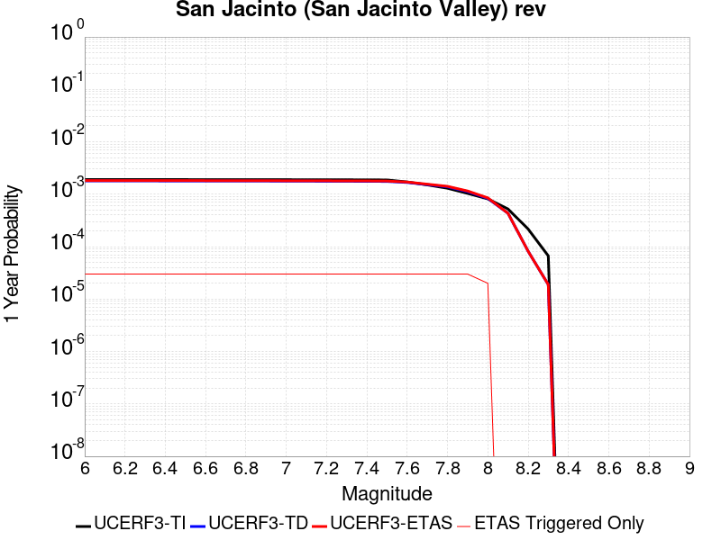 |  |

| Magnitude | 1 wk TI Prob | 1 wk TD Prob | 1 wk ETAS Prob | 1 wk ETAS/TD Gain | 1 wk ETAS Triggered Only | 1 mo TI Prob | 1 mo TD Prob | 1 mo ETAS Prob | 1 mo ETAS/TD Gain | 1 mo ETAS Triggered Only | 1 yr TI Prob | 1 yr TD Prob | 1 yr ETAS Prob | 1 yr ETAS/TD Gain | 1 yr ETAS Triggered Only | 10 yr TI Prob | 10 yr TD Prob | 10 yr ETAS Prob | 10 yr ETAS/TD Gain | 10 yr ETAS Triggered Only |
|-----|-----|-----|-----|-----|-----|-----|-----|-----|-----|-----|-----|-----|-----|-----|-----|-----|-----|-----|-----|-----|
| 6.0 | 3.652694E-5 | 3.441575E-5 | 3.441575E-5 | 1.0 | 0.0 | 1.5653463E-4 | 1.4748774E-4 | 1.6748479E-4 | 1.1355845 | 2.0E-5 | 0.0019041431 | 0.0017941861 | 0.0018241323 | 1.0166907 | 3.0E-5 | 0.018879099 | 0.01853357 | 0.018602272 | 1.0037069 | 7.0E-5 |
| 6.1 | 3.652694E-5 | 3.441575E-5 | 3.441575E-5 | 1.0 | 0.0 | 1.5653463E-4 | 1.4748774E-4 | 1.6748479E-4 | 1.1355845 | 2.0E-5 | 0.0019041431 | 0.0017941861 | 0.0018241323 | 1.0166907 | 3.0E-5 | 0.018879099 | 0.01853357 | 0.018602272 | 1.0037069 | 7.0E-5 |
| 6.2 | 3.652694E-5 | 3.441575E-5 | 3.441575E-5 | 1.0 | 0.0 | 1.5653463E-4 | 1.4748774E-4 | 1.6748479E-4 | 1.1355845 | 2.0E-5 | 0.0019041431 | 0.0017941861 | 0.0018241323 | 1.0166907 | 3.0E-5 | 0.018879099 | 0.01853357 | 0.018602272 | 1.0037069 | 7.0E-5 |
| 6.3 | 3.652694E-5 | 3.441575E-5 | 3.441575E-5 | 1.0 | 0.0 | 1.5653463E-4 | 1.4748774E-4 | 1.6748479E-4 | 1.1355845 | 2.0E-5 | 0.0019041431 | 0.0017941861 | 0.0018241323 | 1.0166907 | 3.0E-5 | 0.018879099 | 0.01853357 | 0.018602272 | 1.0037069 | 7.0E-5 |
| 6.4 | 3.646941E-5 | 3.4337318E-5 | 3.4337318E-5 | 1.0 | 0.0 | 1.5628811E-4 | 1.4715164E-4 | 1.6714871E-4 | 1.1358942 | 2.0E-5 | 0.0019011468 | 0.0017901013 | 0.0018200476 | 1.0167289 | 3.0E-5 | 0.018849645 | 0.01849345 | 0.018562155 | 1.0037152 | 7.0E-5 |
| 6.5 | 3.646941E-5 | 3.4337318E-5 | 3.4337318E-5 | 1.0 | 0.0 | 1.5628811E-4 | 1.4715164E-4 | 1.6714871E-4 | 1.1358942 | 2.0E-5 | 0.0019011468 | 0.0017901013 | 0.0018200476 | 1.0167289 | 3.0E-5 | 0.018849645 | 0.01849345 | 0.018562155 | 1.0037152 | 7.0E-5 |
| 6.6 | 3.6442503E-5 | 3.4300705E-5 | 3.4300705E-5 | 1.0 | 0.0 | 1.561728E-4 | 1.4699475E-4 | 1.6699181E-4 | 1.1360393 | 2.0E-5 | 0.0018997455 | 0.0017881944 | 0.0018181407 | 1.0167466 | 3.0E-5 | 0.018835869 | 0.018474717 | 0.018543424 | 1.003719 | 7.0E-5 |
| 6.7 | 3.6432113E-5 | 3.428628E-5 | 3.428628E-5 | 1.0 | 0.0 | 1.5612828E-4 | 1.4693293E-4 | 1.6693E-4 | 1.1360965 | 2.0E-5 | 0.0018992044 | 0.0017874431 | 0.0018173895 | 1.0167538 | 3.0E-5 | 0.018830549 | 0.01846734 | 0.018536048 | 1.0037205 | 7.0E-5 |
| 6.8 | 3.6409598E-5 | 3.4255332E-5 | 3.4255332E-5 | 1.0 | 0.0 | 1.560318E-4 | 1.4680032E-4 | 1.6679738E-4 | 1.1362195 | 2.0E-5 | 0.0018980318 | 0.0017858313 | 0.0018157776 | 1.0167689 | 3.0E-5 | 0.018819023 | 0.018451495 | 0.018520202 | 1.0037237 | 7.0E-5 |
| 6.9 | 3.638078E-5 | 3.4215755E-5 | 3.4215755E-5 | 1.0 | 0.0 | 1.5590832E-4 | 1.4663071E-4 | 1.6662778E-4 | 1.1363771 | 2.0E-5 | 0.0018965311 | 0.0017837697 | 0.0018137163 | 1.0167884 | 3.0E-5 | 0.018804269 | 0.018431228 | 0.018499937 | 1.0037279 | 7.0E-5 |
| 7.0 | 3.6294874E-5 | 3.4097768E-5 | 3.4097768E-5 | 1.0 | 0.0 | 1.5554018E-4 | 1.4612512E-4 | 1.6612219E-4 | 1.136849 | 2.0E-5 | 0.0018920569 | 0.0017776241 | 0.0018075708 | 1.0168464 | 3.0E-5 | 0.018760284 | 0.018370807 | 0.01843952 | 1.0037404 | 7.0E-5 |
| 7.1 | 3.6260717E-5 | 3.4054046E-5 | 3.4054046E-5 | 1.0 | 0.0 | 1.5539382E-4 | 1.4593777E-4 | 1.6593485E-4 | 1.1370248 | 2.0E-5 | 0.001890278 | 0.0017753469 | 0.0018052937 | 1.0168681 | 3.0E-5 | 0.018742796 | 0.018348401 | 0.018417116 | 1.0037451 | 7.0E-5 |
| 7.2 | 3.6210204E-5 | 3.3988264E-5 | 3.3988264E-5 | 1.0 | 0.0 | 1.5517735E-4 | 1.4565587E-4 | 1.6565296E-4 | 1.13729 | 2.0E-5 | 0.001887647 | 0.0017719205 | 0.0018018674 | 1.0169008 | 3.0E-5 | 0.01871693 | 0.018314669 | 0.018383387 | 1.0037521 | 7.0E-5 |
| 7.3 | 3.6119454E-5 | 3.3876542E-5 | 3.3876542E-5 | 1.0 | 0.0 | 1.5478847E-4 | 1.4517711E-4 | 1.651742E-4 | 1.1377428 | 2.0E-5 | 0.0018829206 | 0.0017661011 | 0.0017960481 | 1.0169566 | 3.0E-5 | 0.018670462 | 0.01825722 | 0.018325942 | 1.0037642 | 7.0E-5 |
| 7.4 | 3.607848E-5 | 3.382404E-5 | 3.382404E-5 | 1.0 | 0.0 | 1.5461289E-4 | 1.4495212E-4 | 1.6494922E-4 | 1.1379566 | 2.0E-5 | 0.0018807866 | 0.0017633662 | 0.0017933133 | 1.0169829 | 3.0E-5 | 0.018649481 | 0.018230215 | 0.018298937 | 1.0037698 | 7.0E-5 |
| 7.5 | 3.5856774E-5 | 3.363379E-5 | 3.363379E-5 | 1.0 | 0.0 | 1.5366284E-4 | 1.4413687E-4 | 1.6413399E-4 | 1.138737 | 2.0E-5 | 0.0018692396 | 0.0017534565 | 0.0017834039 | 1.0170791 | 3.0E-5 | 0.018535944 | 0.018131303 | 0.018200034 | 1.0037907 | 7.0E-5 |
| 7.6 | 3.286655E-5 | 3.2156633E-5 | 3.2156633E-5 | 1.0 | 0.0 | 1.4084904E-4 | 1.3780687E-4 | 1.5780413E-4 | 1.1451106 | 2.0E-5 | 0.001713488 | 0.0016765095 | 0.0017064592 | 1.0178643 | 3.0E-5 | 0.017003361 | 0.01735091 | 0.017419696 | 1.0039644 | 7.0E-5 |
| 7.7 | 2.8882527E-5 | 2.9249288E-5 | 2.9249288E-5 | 1.0 | 0.0 | 1.237764E-4 | 1.2534807E-4 | 1.4534556E-4 | 1.1595356 | 2.0E-5 | 0.0015059357 | 0.0015250455 | 0.0015549997 | 1.0196415 | 3.0E-5 | 0.014957713 | 0.015837153 | 0.015906043 | 1.00435 | 7.0E-5 |
| 7.8 | 2.4950225E-5 | 2.6539781E-5 | 2.6539781E-5 | 1.0 | 0.0 | 1.0692515E-4 | 1.1373697E-4 | 1.3373469E-4 | 1.1758243 | 2.0E-5 | 0.0013010362 | 0.0013838689 | 0.0014138273 | 1.0216484 | 3.0E-5 | 0.012934455 | 0.014418158 | 0.014487148 | 1.004785 | 7.0E-5 |
| 7.9 | 1.9881603E-5 | 2.1518656E-5 | 2.1518656E-5 | 1.0 | 0.0 | 8.520408E-5 | 9.2219554E-5 | 1.12217705E-4 | 1.2168537 | 2.0E-5 | 0.001036866 | 0.0011221955 | 0.0011521619 | 1.0267034 | 3.0E-5 | 0.010320415 | 0.011782875 | 0.011852051 | 1.0058708 | 7.0E-5 |
| 8.0 | 1.563292E-5 | 1.5946089E-5 | 1.5946089E-5 | 1.0 | 0.0 | 6.6996516E-5 | 6.8338595E-5 | 8.833723E-5 | 1.2926404 | 2.0E-5 | 8.153773E-4 | 8.3170546E-4 | 8.5168885E-4 | 1.024027 | 2.0E-5 | 0.00812392 | 0.00881513 | 0.008874602 | 1.0067465 | 6.0E-5 |
| 8.1 | 1.0045313E-5 | 8.306527E-6 | 8.306527E-6 | 1.0 | 0.0 | 4.305063E-5 | 3.5598918E-5 | 3.5598918E-5 | 1.0 | 0.0 | 5.2401534E-4 | 4.3333112E-4 | 4.3333112E-4 | 1.0 | 0.0 | 0.0052278144 | 0.0046616676 | 0.0046915277 | 1.0064055 | 3.0E-5 |
| 8.2 | 4.1554413E-6 | 1.5665041E-6 | 1.5665041E-6 | 1.0 | 0.0 | 1.7808914E-5 | 6.713572E-6 | 6.713572E-6 | 1.0 | 0.0 | 2.1680194E-4 | 8.17347E-5 | 8.17347E-5 | 1.0 | 0.0 | 0.0021659054 | 9.488419E-4 | 9.488419E-4 | 1.0 | 0.0 |
| 8.3 | 1.2758221E-6 | 3.6171858E-7 | 3.6171858E-7 | 1.0 | 0.0 | 5.4677976E-6 | 1.5502216E-6 | 1.5502216E-6 | 1.0 | 0.0 | 6.65684E-5 | 1.8873789E-5 | 1.8873789E-5 | 1.0 | 0.0 | 6.6548464E-4 | 2.2764095E-4 | 2.2764095E-4 | 1.0 | 0.0 |

## San Jacinto (Lytle Creek connector)
*[(top)](#table-of-contents)*

| 1 Week | 1 Month | 1 Year | 10 Year |
|-----|-----|-----|-----|
|  |  |  | 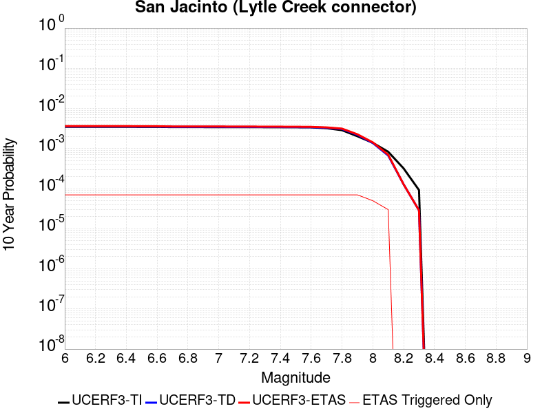 |

| Magnitude | 1 wk TI Prob | 1 wk TD Prob | 1 wk ETAS Prob | 1 wk ETAS/TD Gain | 1 wk ETAS Triggered Only | 1 mo TI Prob | 1 mo TD Prob | 1 mo ETAS Prob | 1 mo ETAS/TD Gain | 1 mo ETAS Triggered Only | 1 yr TI Prob | 1 yr TD Prob | 1 yr ETAS Prob | 1 yr ETAS/TD Gain | 1 yr ETAS Triggered Only | 10 yr TI Prob | 10 yr TD Prob | 10 yr ETAS Prob | 10 yr ETAS/TD Gain | 10 yr ETAS Triggered Only |
|-----|-----|-----|-----|-----|-----|-----|-----|-----|-----|-----|-----|-----|-----|-----|-----|-----|-----|-----|-----|-----|
| 6.0 | 6.693995E-6 | 6.6628318E-6 | 6.6628318E-6 | 1.0 | 0.0 | 2.8688235E-5 | 2.8554681E-5 | 3.8554397E-5 | 1.3501953 | 1.0E-5 | 3.492233E-4 | 3.4759787E-4 | 3.7758745E-4 | 1.0862767 | 3.0E-5 | 0.00348675 | 0.0035508901 | 0.0036206415 | 1.0196434 | 7.0E-5 |
| 6.1 | 6.693995E-6 | 6.6628318E-6 | 6.6628318E-6 | 1.0 | 0.0 | 2.8688235E-5 | 2.8554681E-5 | 3.8554397E-5 | 1.3501953 | 1.0E-5 | 3.492233E-4 | 3.4759787E-4 | 3.7758745E-4 | 1.0862767 | 3.0E-5 | 0.00348675 | 0.0035508901 | 0.0036206415 | 1.0196434 | 7.0E-5 |
| 6.2 | 6.693995E-6 | 6.6628318E-6 | 6.6628318E-6 | 1.0 | 0.0 | 2.8688235E-5 | 2.8554681E-5 | 3.8554397E-5 | 1.3501953 | 1.0E-5 | 3.492233E-4 | 3.4759787E-4 | 3.7758745E-4 | 1.0862767 | 3.0E-5 | 0.00348675 | 0.0035508901 | 0.0036206415 | 1.0196434 | 7.0E-5 |
| 6.3 | 6.693995E-6 | 6.6628318E-6 | 6.6628318E-6 | 1.0 | 0.0 | 2.8688235E-5 | 2.8554681E-5 | 3.8554397E-5 | 1.3501953 | 1.0E-5 | 3.492233E-4 | 3.4759787E-4 | 3.7758745E-4 | 1.0862767 | 3.0E-5 | 0.00348675 | 0.0035508901 | 0.0036206415 | 1.0196434 | 7.0E-5 |
| 6.4 | 6.693995E-6 | 6.6628318E-6 | 6.6628318E-6 | 1.0 | 0.0 | 2.8688235E-5 | 2.8554681E-5 | 3.8554397E-5 | 1.3501953 | 1.0E-5 | 3.492233E-4 | 3.4759787E-4 | 3.7758745E-4 | 1.0862767 | 3.0E-5 | 0.00348675 | 0.0035508901 | 0.0036206415 | 1.0196434 | 7.0E-5 |
| 6.5 | 6.6561875E-6 | 6.6230496E-6 | 6.6230496E-6 | 1.0 | 0.0 | 2.8526205E-5 | 2.838419E-5 | 3.8383907E-5 | 1.3522989 | 1.0E-5 | 3.472512E-4 | 3.455228E-4 | 3.7551243E-4 | 1.086795 | 3.0E-5 | 0.0034670907 | 0.0035302055 | 0.0035999585 | 1.0197588 | 7.0E-5 |
| 6.6 | 6.6561875E-6 | 6.6230496E-6 | 6.6230496E-6 | 1.0 | 0.0 | 2.8526205E-5 | 2.838419E-5 | 3.8383907E-5 | 1.3522989 | 1.0E-5 | 3.472512E-4 | 3.455228E-4 | 3.7551243E-4 | 1.086795 | 3.0E-5 | 0.0034670907 | 0.0035302055 | 0.0035999585 | 1.0197588 | 7.0E-5 |
| 6.7 | 6.5802237E-6 | 6.5422255E-6 | 6.5422255E-6 | 1.0 | 0.0 | 2.8200653E-5 | 2.803781E-5 | 3.8037528E-5 | 1.3566513 | 1.0E-5 | 3.4328885E-4 | 3.4130694E-4 | 3.712967E-4 | 1.0878674 | 3.0E-5 | 0.0034275902 | 0.0034881798 | 0.0035579356 | 1.0199977 | 7.0E-5 |
| 6.8 | 6.575632E-6 | 6.5367153E-6 | 6.5367153E-6 | 1.0 | 0.0 | 2.8180975E-5 | 2.8014192E-5 | 3.8013914E-5 | 1.356952 | 1.0E-5 | 3.4304935E-4 | 3.410195E-4 | 3.7100926E-4 | 1.0879415 | 3.0E-5 | 0.0034252026 | 0.0034853143 | 0.0035550704 | 1.0200143 | 7.0E-5 |
| 6.9 | 6.570433E-6 | 6.5281088E-6 | 6.5281088E-6 | 1.0 | 0.0 | 2.8158694E-5 | 2.7977308E-5 | 3.7977028E-5 | 1.3574225 | 1.0E-5 | 3.4277816E-4 | 3.4057058E-4 | 3.7056036E-4 | 1.0880575 | 3.0E-5 | 0.0034224992 | 0.0034808393 | 0.0035505956 | 1.02004 | 7.0E-5 |
| 7.0 | 6.5643826E-6 | 6.5182294E-6 | 6.5182294E-6 | 1.0 | 0.0 | 2.8132765E-5 | 2.793497E-5 | 3.793469E-5 | 1.3579643 | 1.0E-5 | 3.424626E-4 | 3.4005524E-4 | 3.7004505E-4 | 1.0881909 | 3.0E-5 | 0.0034193532 | 0.0034757021 | 0.003545459 | 1.0200698 | 7.0E-5 |
| 7.1 | 6.557402E-6 | 6.5069403E-6 | 6.5069403E-6 | 1.0 | 0.0 | 2.8102848E-5 | 2.788659E-5 | 3.788631E-5 | 1.3585852 | 1.0E-5 | 3.4209844E-4 | 3.394664E-4 | 3.6945622E-4 | 1.088344 | 3.0E-5 | 0.0034157229 | 0.0034698334 | 0.0035395904 | 1.0201039 | 7.0E-5 |
| 7.2 | 6.546394E-6 | 6.488906E-6 | 6.488906E-6 | 1.0 | 0.0 | 2.8055672E-5 | 2.7809301E-5 | 3.7809023E-5 | 1.359582 | 1.0E-5 | 3.4152428E-4 | 3.3852572E-4 | 3.6851555E-4 | 1.0885895 | 3.0E-5 | 0.0034099987 | 0.0034604599 | 0.0035302178 | 1.0201585 | 7.0E-5 |
| 7.3 | 6.5364216E-6 | 6.469689E-6 | 6.469689E-6 | 1.0 | 0.0 | 2.8012933E-5 | 2.7726945E-5 | 3.772667E-5 | 1.36065 | 1.0E-5 | 3.4100408E-4 | 3.3752335E-4 | 3.6751322E-4 | 1.0888528 | 3.0E-5 | 0.003404813 | 0.003450482 | 0.0035202403 | 1.0202171 | 7.0E-5 |
| 7.4 | 6.5269523E-6 | 6.450774E-6 | 6.450774E-6 | 1.0 | 0.0 | 2.7972354E-5 | 2.7645881E-5 | 3.7645605E-5 | 1.3617076 | 1.0E-5 | 3.4051016E-4 | 3.365367E-4 | 3.665266E-4 | 1.0891134 | 3.0E-5 | 0.0033998888 | 0.0034406635 | 0.0035104225 | 1.0202749 | 7.0E-5 |
| 7.5 | 6.5111835E-6 | 6.4270453E-6 | 6.4270453E-6 | 1.0 | 0.0 | 2.7904773E-5 | 2.7544189E-5 | 3.7543916E-5 | 1.363043 | 1.0E-5 | 3.3968766E-4 | 3.3529897E-4 | 3.6528893E-4 | 1.0894424 | 3.0E-5 | 0.0033916887 | 0.0034283353 | 0.0034980953 | 1.0203481 | 7.0E-5 |
| 7.6 | 6.4768806E-6 | 6.3861507E-6 | 6.3861507E-6 | 1.0 | 0.0 | 2.7757764E-5 | 2.736893E-5 | 3.7368656E-5 | 1.3653678 | 1.0E-5 | 3.3789838E-4 | 3.3316584E-4 | 3.6315585E-4 | 1.0900153 | 3.0E-5 | 0.0033738504 | 0.0034070655 | 0.0034768272 | 1.0204755 | 7.0E-5 |
| 7.7 | 6.1655364E-6 | 6.1786222E-6 | 6.1786222E-6 | 1.0 | 0.0 | 2.642346E-5 | 2.6479542E-5 | 3.6479276E-5 | 1.37764 | 1.0E-5 | 3.2165812E-4 | 3.2234078E-4 | 3.5233112E-4 | 1.0930392 | 3.0E-5 | 0.0032119295 | 0.0032986694 | 0.0033684385 | 1.0211507 | 7.0E-5 |
| 7.8 | 5.5043524E-6 | 5.739622E-6 | 5.739622E-6 | 1.0 | 0.0 | 2.3589868E-5 | 2.4598148E-5 | 3.4597902E-5 | 1.4065247 | 1.0E-5 | 2.871688E-4 | 2.9944137E-4 | 3.2943237E-4 | 1.1001565 | 3.0E-5 | 0.0028679797 | 0.003068756 | 0.0031385415 | 1.0227406 | 7.0E-5 |
| 7.9 | 3.889249E-6 | 4.0787854E-6 | 4.0787854E-6 | 1.0 | 0.0 | 1.6668104E-5 | 1.7480392E-5 | 2.7480217E-5 | 1.5720595 | 1.0E-5 | 2.0291525E-4 | 2.1280303E-4 | 2.4279665E-4 | 1.1409454 | 3.0E-5 | 0.0020273007 | 0.0021955092 | 0.0022653553 | 1.0318133 | 7.0E-5 |
| 8.0 | 2.668535E-6 | 2.5328056E-6 | 2.5328056E-6 | 1.0 | 0.0 | 1.1436528E-5 | 1.0854836E-5 | 2.0854728E-5 | 1.9212384 | 1.0E-5 | 1.3923083E-4 | 1.3214964E-4 | 1.4214832E-4 | 1.0756618 | 1.0E-5 | 0.0013914363 | 0.0013765903 | 0.0014265216 | 1.0362716 | 5.0E-5 |
| 8.1 | 1.5911459E-6 | 1.2193005E-6 | 1.2193005E-6 | 1.0 | 0.0 | 6.8191785E-6 | 5.225563E-6 | 5.225563E-6 | 1.0 | 0.0 | 8.3020335E-5 | 6.3619394E-5 | 6.3619394E-5 | 1.0 | 0.0 | 8.298933E-4 | 6.697524E-4 | 6.9973234E-4 | 1.0447627 | 3.0E-5 |
| 8.2 | 6.1294963E-7 | 2.1825215E-7 | 2.1825215E-7 | 1.0 | 0.0 | 2.6269242E-6 | 9.35366E-7 | 9.35366E-7 | 1.0 | 0.0 | 3.1982334E-5 | 1.1388021E-5 | 1.1388021E-5 | 1.0 | 0.0 | 3.1977732E-4 | 1.279216E-4 | 1.279216E-4 | 1.0 | 0.0 |
| 8.3 | 1.762871E-7 | 4.757476E-8 | 4.757476E-8 | 1.0 | 0.0 | 7.5551594E-7 | 2.038918E-7 | 2.038918E-7 | 1.0 | 0.0 | 9.1983675E-6 | 2.4823798E-6 | 2.4823798E-6 | 1.0 | 0.0 | 9.197987E-5 | 2.8703373E-5 | 2.8703373E-5 | 1.0 | 0.0 |

## Big Pine (East)
*[(top)](#table-of-contents)*

| 1 Week | 1 Month | 1 Year | 10 Year |
|-----|-----|-----|-----|
|  |  | 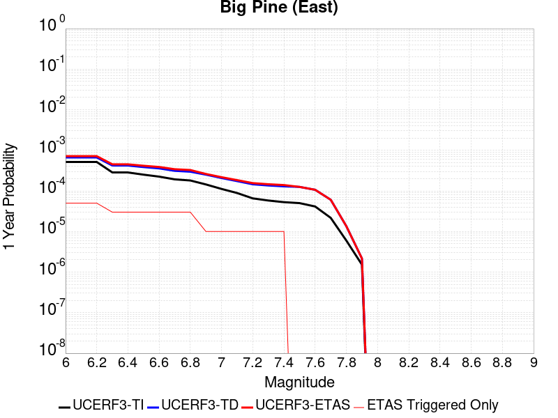 | 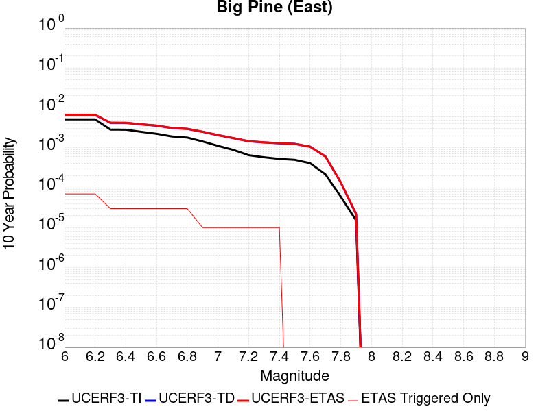 |

| Magnitude | 1 wk TI Prob | 1 wk TD Prob | 1 wk ETAS Prob | 1 wk ETAS/TD Gain | 1 wk ETAS Triggered Only | 1 mo TI Prob | 1 mo TD Prob | 1 mo ETAS Prob | 1 mo ETAS/TD Gain | 1 mo ETAS Triggered Only | 1 yr TI Prob | 1 yr TD Prob | 1 yr ETAS Prob | 1 yr ETAS/TD Gain | 1 yr ETAS Triggered Only | 10 yr TI Prob | 10 yr TD Prob | 10 yr ETAS Prob | 10 yr ETAS/TD Gain | 10 yr ETAS Triggered Only |
|-----|-----|-----|-----|-----|-----|-----|-----|-----|-----|-----|-----|-----|-----|-----|-----|-----|-----|-----|-----|-----|
| 6.0 | 9.916913E-6 | 1.281854E-5 | 1.281854E-5 | 1.0 | 0.0 | 4.250036E-5 | 5.4935572E-5 | 6.493502E-5 | 1.1820214 | 1.0E-5 | 5.173191E-4 | 6.686574E-4 | 7.18624E-4 | 1.0747267 | 5.0E-5 | 0.0051611643 | 0.00667124 | 0.006740773 | 1.0104228 | 7.0E-5 |
| 6.1 | 9.916913E-6 | 1.281854E-5 | 1.281854E-5 | 1.0 | 0.0 | 4.250036E-5 | 5.4935572E-5 | 6.493502E-5 | 1.1820214 | 1.0E-5 | 5.173191E-4 | 6.686574E-4 | 7.18624E-4 | 1.0747267 | 5.0E-5 | 0.0051611643 | 0.00667124 | 0.006740773 | 1.0104228 | 7.0E-5 |
| 6.2 | 9.916913E-6 | 1.281854E-5 | 1.281854E-5 | 1.0 | 0.0 | 4.250036E-5 | 5.4935572E-5 | 6.493502E-5 | 1.1820214 | 1.0E-5 | 5.173191E-4 | 6.686574E-4 | 7.18624E-4 | 1.0747267 | 5.0E-5 | 0.0051611643 | 0.00667124 | 0.006740773 | 1.0104228 | 7.0E-5 |
| 6.3 | 5.479711E-6 | 8.11447E-6 | 8.11447E-6 | 1.0 | 0.0 | 2.3484265E-5 | 3.4775854E-5 | 4.477551E-5 | 1.2875458 | 1.0E-5 | 2.858834E-4 | 4.2331696E-4 | 4.5330427E-4 | 1.0708389 | 3.0E-5 | 0.0028551589 | 0.0042280247 | 0.0042578983 | 1.0070655 | 3.0E-5 |
| 6.4 | 5.465009E-6 | 8.098763E-6 | 8.098763E-6 | 1.0 | 0.0 | 2.3421257E-5 | 3.470854E-5 | 4.4708195E-5 | 1.2881035 | 1.0E-5 | 2.851165E-4 | 4.2249775E-4 | 4.5248508E-4 | 1.0709763 | 3.0E-5 | 0.0028475097 | 0.004219864 | 0.004249737 | 1.0070792 | 3.0E-5 |
| 6.5 | 4.826767E-6 | 7.4238146E-6 | 7.4238146E-6 | 1.0 | 0.0 | 2.068598E-5 | 3.1815976E-5 | 4.1815656E-5 | 1.3142976 | 1.0E-5 | 2.518227E-4 | 3.8729343E-4 | 4.1728182E-4 | 1.0774306 | 3.0E-5 | 0.0025153751 | 0.0038690618 | 0.0038989459 | 1.0077238 | 3.0E-5 |
| 6.6 | 4.3146847E-6 | 6.8837467E-6 | 6.8837467E-6 | 1.0 | 0.0 | 1.8491375E-5 | 2.950145E-5 | 3.9501156E-5 | 1.3389564 | 1.0E-5 | 2.2510924E-4 | 3.5912343E-4 | 3.8911265E-4 | 1.0835067 | 3.0E-5 | 0.0022488134 | 0.0035882755 | 0.003618168 | 1.0083306 | 3.0E-5 |
| 6.7 | 3.6968106E-6 | 5.9968484E-6 | 5.9968484E-6 | 1.0 | 0.0 | 1.5843378E-5 | 2.5700534E-5 | 3.5700275E-5 | 1.389087 | 1.0E-5 | 1.9287605E-4 | 3.1286062E-4 | 3.428512E-4 | 1.0958594 | 3.0E-5 | 0.0019270873 | 0.003126956 | 0.0031568622 | 1.009564 | 3.0E-5 |
| 6.8 | 3.4671132E-6 | 5.703515E-6 | 5.703515E-6 | 1.0 | 0.0 | 1.4858972E-5 | 2.4443414E-5 | 3.444317E-5 | 1.4090981 | 1.0E-5 | 1.8089297E-4 | 2.9755937E-4 | 3.2755046E-4 | 1.1007903 | 3.0E-5 | 0.0018074579 | 0.0029743554 | 0.0030042662 | 1.0100563 | 3.0E-5 |
| 6.9 | 2.7686972E-6 | 4.8264656E-6 | 4.8264656E-6 | 1.0 | 0.0 | 1.1865792E-5 | 2.0684693E-5 | 2.0684693E-5 | 1.0 | 0.0 | 1.4445644E-4 | 2.518078E-4 | 2.6180525E-4 | 1.0397028 | 1.0E-5 | 0.0014436257 | 0.0025179028 | 0.0025278775 | 1.0039616 | 1.0E-5 |
| 7.0 | 2.1472624E-6 | 3.986174E-6 | 3.986174E-6 | 1.0 | 0.0 | 9.20252E-6 | 1.7083494E-5 | 1.7083494E-5 | 1.0 | 0.0 | 1.12034926E-4 | 2.0797222E-4 | 2.1797014E-4 | 1.0480733 | 1.0E-5 | 0.0011197845 | 0.0020804254 | 0.0020904047 | 1.0047967 | 1.0E-5 |
| 7.1 | 1.7018335E-6 | 3.3459255E-6 | 3.3459255E-6 | 1.0 | 0.0 | 7.293552E-6 | 1.4339605E-5 | 1.4339605E-5 | 1.0 | 0.0 | 8.879537E-5 | 1.7457105E-4 | 1.845693E-4 | 1.0572733 | 1.0E-5 | 8.87599E-4 | 0.0017469557 | 0.0017569382 | 1.0057143 | 1.0E-5 |
| 7.2 | 1.25603E-6 | 2.795471E-6 | 2.795471E-6 | 1.0 | 0.0 | 5.3829745E-6 | 1.1980536E-5 | 1.1980536E-5 | 1.0 | 0.0 | 6.553574E-5 | 1.458535E-4 | 1.5585203E-4 | 1.0685519 | 1.0E-5 | 6.551642E-4 | 0.0014601707 | 0.0014701561 | 1.0068386 | 1.0E-5 |
| 7.3 | 1.112297E-6 | 2.6112702E-6 | 2.6112702E-6 | 1.0 | 0.0 | 4.7669787E-6 | 1.1191111E-5 | 1.1191111E-5 | 1.0 | 0.0 | 5.803642E-5 | 1.3624349E-4 | 1.4624212E-4 | 1.073388 | 1.0E-5 | 5.802127E-4 | 0.00136402 | 0.0013740065 | 1.0073212 | 1.0E-5 |
| 7.4 | 1.0137181E-6 | 2.4843957E-6 | 2.4843957E-6 | 1.0 | 0.0 | 4.3444993E-6 | 1.0647368E-5 | 1.0647368E-5 | 1.0 | 0.0 | 5.2892992E-5 | 1.2962421E-4 | 1.3962292E-4 | 1.077136 | 1.0E-5 | 5.288041E-4 | 0.0012976775 | 0.0013076646 | 1.007696 | 1.0E-5 |
| 7.5 | 9.598608E-7 | 2.4080273E-6 | 2.4080273E-6 | 1.0 | 0.0 | 4.1136827E-6 | 1.0320077E-5 | 1.0320077E-5 | 1.0 | 0.0 | 5.0082934E-5 | 1.2563991E-4 | 1.2563991E-4 | 1.0 | 0.0 | 5.007165E-4 | 0.0012576841 | 0.0012576841 | 1.0 | 0.0 |
| 7.6 | 7.929459E-7 | 2.0456312E-6 | 2.0456312E-6 | 1.0 | 0.0 | 3.3983351E-6 | 8.766962E-6 | 8.766962E-6 | 1.0 | 0.0 | 4.1373947E-5 | 1.0673271E-4 | 1.0673271E-4 | 1.0 | 0.0 | 4.1366243E-4 | 0.0010689225 | 0.0010689225 | 1.0 | 0.0 |
| 7.7 | 4.155788E-7 | 1.1611139E-6 | 1.1611139E-6 | 1.0 | 0.0 | 1.7810507E-6 | 4.9761934E-6 | 4.9761934E-6 | 1.0 | 0.0 | 2.1684076E-5 | 6.0583512E-5 | 6.0583512E-5 | 1.0 | 0.0 | 2.1681961E-4 | 6.0889556E-4 | 6.0889556E-4 | 1.0 | 0.0 |
| 7.8 | 1.14666925E-7 | 2.5932084E-7 | 2.5932084E-7 | 1.0 | 0.0 | 4.914296E-7 | 1.1113746E-6 | 1.1113746E-6 | 1.0 | 0.0 | 5.9831386E-6 | 1.3530906E-5 | 1.3530906E-5 | 1.0 | 0.0 | 5.9829777E-5 | 1.364052E-4 | 1.364052E-4 | 1.0 | 0.0 |
| 7.9 | 2.9231824E-8 | 4.1479638E-8 | 4.1479638E-8 | 1.0 | 0.0 | 1.2527924E-7 | 1.7776986E-7 | 1.7776986E-7 | 1.0 | 0.0 | 1.5252737E-6 | 2.1643461E-6 | 2.1643461E-6 | 1.0 | 0.0 | 1.5252632E-5 | 2.1986685E-5 | 2.1986685E-5 | 1.0 | 0.0 |

## Santa Cruz Catalina Ridge alt1
*[(top)](#table-of-contents)*

| 1 Week | 1 Month | 1 Year | 10 Year |
|-----|-----|-----|-----|
|  |  |  | 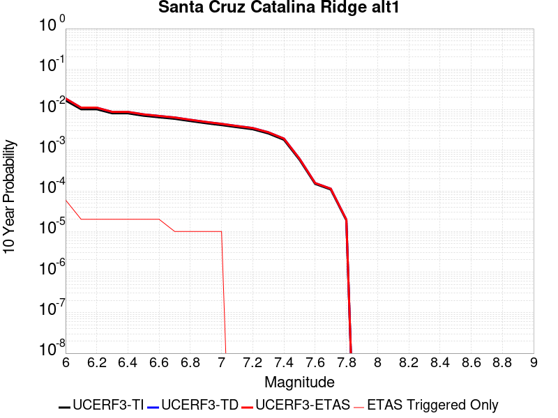 |

| Magnitude | 1 wk TI Prob | 1 wk TD Prob | 1 wk ETAS Prob | 1 wk ETAS/TD Gain | 1 wk ETAS Triggered Only | 1 mo TI Prob | 1 mo TD Prob | 1 mo ETAS Prob | 1 mo ETAS/TD Gain | 1 mo ETAS Triggered Only | 1 yr TI Prob | 1 yr TD Prob | 1 yr ETAS Prob | 1 yr ETAS/TD Gain | 1 yr ETAS Triggered Only | 10 yr TI Prob | 10 yr TD Prob | 10 yr ETAS Prob | 10 yr ETAS/TD Gain | 10 yr ETAS Triggered Only |
|-----|-----|-----|-----|-----|-----|-----|-----|-----|-----|-----|-----|-----|-----|-----|-----|-----|-----|-----|-----|-----|
| 6.0 | 3.2833184E-5 | 3.655896E-5 | 4.6558594E-5 | 1.2735207 | 1.0E-5 | 1.4070606E-4 | 1.5667279E-4 | 1.8666808E-4 | 1.1914519 | 3.0E-5 | 0.00171175 | 0.0019059886 | 0.0019359313 | 1.0157099 | 3.0E-5 | 0.016986247 | 0.01891332 | 0.018972185 | 1.0031123 | 6.0E-5 |
| 6.1 | 1.9835548E-5 | 2.1659771E-5 | 3.1659554E-5 | 1.4616754 | 1.0E-5 | 8.500672E-5 | 9.2824404E-5 | 1.1282255E-4 | 1.2154406 | 2.0E-5 | 0.0010344655 | 0.0011295713 | 0.0011495488 | 1.0176859 | 2.0E-5 | 0.010296632 | 0.011240433 | 0.011260209 | 1.0017593 | 2.0E-5 |
| 6.2 | 1.9835548E-5 | 2.1659771E-5 | 3.1659554E-5 | 1.4616754 | 1.0E-5 | 8.500672E-5 | 9.2824404E-5 | 1.1282255E-4 | 1.2154406 | 2.0E-5 | 0.0010344655 | 0.0011295713 | 0.0011495488 | 1.0176859 | 2.0E-5 | 0.010296632 | 0.011240433 | 0.011260209 | 1.0017593 | 2.0E-5 |
| 6.3 | 1.5728183E-5 | 1.7034137E-5 | 2.7033968E-5 | 1.5870464 | 1.0E-5 | 6.7404755E-5 | 7.3001436E-5 | 9.299998E-5 | 1.2739472 | 2.0E-5 | 8.2034385E-4 | 8.884362E-4 | 9.0841844E-4 | 1.0224915 | 2.0E-5 | 0.008173222 | 0.008849524 | 0.008869347 | 1.0022401 | 2.0E-5 |
| 6.4 | 1.5728183E-5 | 1.7034137E-5 | 2.7033968E-5 | 1.5870464 | 1.0E-5 | 6.7404755E-5 | 7.3001436E-5 | 9.299998E-5 | 1.2739472 | 2.0E-5 | 8.2034385E-4 | 8.884362E-4 | 9.0841844E-4 | 1.0224915 | 2.0E-5 | 0.008173222 | 0.008849524 | 0.008869347 | 1.0022401 | 2.0E-5 |
| 6.5 | 1.3707734E-5 | 1.4794678E-5 | 2.479453E-5 | 1.6759087 | 1.0E-5 | 5.8746107E-5 | 6.3404244E-5 | 8.340297E-5 | 1.3154163 | 2.0E-5 | 7.1499916E-4 | 7.716768E-4 | 7.916613E-4 | 1.0258976 | 2.0E-5 | 0.0071270303 | 0.0076903705 | 0.0077102166 | 1.0025806 | 2.0E-5 |
| 6.6 | 1.2539813E-5 | 1.3510358E-5 | 2.3510223E-5 | 1.7401628 | 1.0E-5 | 5.3740947E-5 | 5.7900266E-5 | 7.789911E-5 | 1.3454015 | 2.0E-5 | 6.540996E-4 | 7.0471043E-4 | 7.246963E-4 | 1.0283605 | 2.0E-5 | 0.0065217763 | 0.0070250607 | 0.0070449198 | 1.0028269 | 2.0E-5 |
| 6.7 | 1.1504083E-5 | 1.23775E-5 | 1.23775E-5 | 1.0 | 0.0 | 4.930228E-5 | 5.304536E-5 | 6.304483E-5 | 1.1885079 | 1.0E-5 | 6.0008996E-4 | 6.456379E-4 | 6.556315E-4 | 1.0154786 | 1.0E-5 | 0.005984721 | 0.0064378507 | 0.0064477865 | 1.0015433 | 1.0E-5 |
| 6.8 | 1.012739E-5 | 1.0877178E-5 | 1.0877178E-5 | 1.0 | 0.0 | 4.340238E-5 | 4.6615653E-5 | 5.6615187E-5 | 1.2145102 | 1.0E-5 | 5.282958E-4 | 5.673993E-4 | 5.773936E-4 | 1.0176142 | 1.0E-5 | 0.0052704164 | 0.005659675 | 0.0056696185 | 1.0017569 | 1.0E-5 |
| 6.9 | 8.9607865E-6 | 9.60921E-6 | 9.60921E-6 | 1.0 | 0.0 | 3.8402806E-5 | 4.1181684E-5 | 5.1181272E-5 | 1.2428164 | 1.0E-5 | 4.6745385E-4 | 5.0127273E-4 | 5.112677E-4 | 1.0199392 | 1.0E-5 | 0.0046647177 | 0.00500154 | 0.0050114896 | 1.0019894 | 1.0E-5 |
| 7.0 | 8.046829E-6 | 8.619827E-6 | 8.619827E-6 | 1.0 | 0.0 | 3.4485955E-5 | 3.6941598E-5 | 4.694123E-5 | 1.2706876 | 1.0E-5 | 4.1978562E-4 | 4.4967196E-4 | 4.5966747E-4 | 1.0222285 | 1.0E-5 | 0.004189935 | 0.004487711 | 0.0044976664 | 1.0022184 | 1.0E-5 |
| 7.1 | 7.136131E-6 | 7.637727E-6 | 7.637727E-6 | 1.0 | 0.0 | 3.0583058E-5 | 3.273271E-5 | 3.273271E-5 | 1.0 | 0.0 | 3.7228514E-4 | 3.9844858E-4 | 3.9844858E-4 | 1.0 | 0.0 | 0.0037166206 | 0.0039774184 | 0.0039774184 | 1.0 | 0.0 |
| 7.2 | 6.362014E-6 | 6.8050217E-6 | 6.8050217E-6 | 1.0 | 0.0 | 2.726549E-5 | 2.9164055E-5 | 2.9164055E-5 | 1.0 | 0.0 | 3.3190678E-4 | 3.5501516E-4 | 3.5501516E-4 | 1.0 | 0.0 | 0.0033141149 | 0.0035445488 | 0.0035445488 | 1.0 | 0.0 |
| 7.3 | 5.004101E-6 | 5.3517642E-6 | 5.3517642E-6 | 1.0 | 0.0 | 2.1445969E-5 | 2.2935934E-5 | 2.2935934E-5 | 1.0 | 0.0 | 2.6107338E-4 | 2.7920975E-4 | 2.7920975E-4 | 1.0 | 0.0 | 0.002607669 | 0.0027886443 | 0.0027886443 | 1.0 | 0.0 |
| 7.4 | 3.4901443E-6 | 3.732087E-6 | 3.732087E-6 | 1.0 | 0.0 | 1.4957676E-5 | 1.5994563E-5 | 1.5994563E-5 | 1.0 | 0.0 | 1.8209449E-4 | 1.9471678E-4 | 1.9471678E-4 | 1.0 | 0.0 | 0.0018194534 | 0.0019455003 | 0.0019455003 | 1.0 | 0.0 |
| 7.5 | 1.1215045E-6 | 1.1893966E-6 | 1.1893966E-6 | 1.0 | 0.0 | 4.806439E-6 | 5.0974045E-6 | 5.0974045E-6 | 1.0 | 0.0 | 5.851682E-5 | 6.205916E-5 | 6.205916E-5 | 1.0 | 0.0 | 5.850142E-4 | 6.204214E-4 | 6.204214E-4 | 1.0 | 0.0 |
| 7.6 | 2.8599047E-7 | 2.9952182E-7 | 2.9952182E-7 | 1.0 | 0.0 | 1.2256729E-6 | 1.2836642E-6 | 1.2836642E-6 | 1.0 | 0.0 | 1.4922465E-5 | 1.5628502E-5 | 1.5628502E-5 | 1.0 | 0.0 | 1.4921463E-4 | 1.5627417E-4 | 1.5627417E-4 | 1.0 | 0.0 |
| 7.7 | 2.0781519E-7 | 2.1744457E-7 | 2.1744457E-7 | 1.0 | 0.0 | 8.906362E-7 | 9.3190494E-7 | 9.3190494E-7 | 1.0 | 0.0 | 1.08434415E-5 | 1.1345885E-5 | 1.1345885E-5 | 1.0 | 0.0 | 1.0842913E-4 | 1.1345315E-4 | 1.1345315E-4 | 1.0 | 0.0 |
| 7.8 | 3.614776E-8 | 3.7641225E-8 | 3.7641225E-8 | 1.0 | 0.0 | 1.5491896E-7 | 1.6131952E-7 | 1.6131952E-7 | 1.0 | 0.0 | 1.8861368E-6 | 1.9640636E-6 | 1.9640636E-6 | 1.0 | 0.0 | 1.8861208E-5 | 1.9640474E-5 | 1.9640474E-5 | 1.0 | 0.0 |

## Tin Mountain
*[(top)](#table-of-contents)*

| 1 Week | 1 Month | 1 Year | 10 Year |
|-----|-----|-----|-----|
|  | 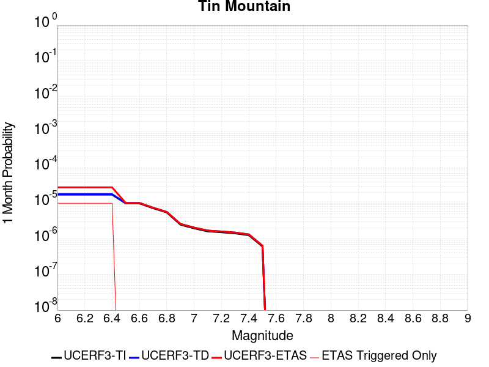 |  |  |

| Magnitude | 1 wk TI Prob | 1 wk TD Prob | 1 wk ETAS Prob | 1 wk ETAS/TD Gain | 1 wk ETAS Triggered Only | 1 mo TI Prob | 1 mo TD Prob | 1 mo ETAS Prob | 1 mo ETAS/TD Gain | 1 mo ETAS Triggered Only | 1 yr TI Prob | 1 yr TD Prob | 1 yr ETAS Prob | 1 yr ETAS/TD Gain | 1 yr ETAS Triggered Only | 10 yr TI Prob | 10 yr TD Prob | 10 yr ETAS Prob | 10 yr ETAS/TD Gain | 10 yr ETAS Triggered Only |
|-----|-----|-----|-----|-----|-----|-----|-----|-----|-----|-----|-----|-----|-----|-----|-----|-----|-----|-----|-----|-----|
| 6.0 | 4.083776E-6 | 4.18155E-6 | 4.18155E-6 | 1.0 | 0.0 | 1.750178E-5 | 1.7920827E-5 | 2.7920647E-5 | 1.558 | 1.0E-5 | 2.1306332E-4 | 2.1816794E-4 | 2.581592E-4 | 1.183305 | 4.0E-5 | 0.0021285915 | 0.0021799032 | 0.0022397726 | 1.0274642 | 6.0E-5 |
| 6.1 | 4.083776E-6 | 4.18155E-6 | 4.18155E-6 | 1.0 | 0.0 | 1.750178E-5 | 1.7920827E-5 | 2.7920647E-5 | 1.558 | 1.0E-5 | 2.1306332E-4 | 2.1816794E-4 | 2.581592E-4 | 1.183305 | 4.0E-5 | 0.0021285915 | 0.0021799032 | 0.0022397726 | 1.0274642 | 6.0E-5 |
| 6.2 | 4.083776E-6 | 4.18155E-6 | 4.18155E-6 | 1.0 | 0.0 | 1.750178E-5 | 1.7920827E-5 | 2.7920647E-5 | 1.558 | 1.0E-5 | 2.1306332E-4 | 2.1816794E-4 | 2.581592E-4 | 1.183305 | 4.0E-5 | 0.0021285915 | 0.0021799032 | 0.0022397726 | 1.0274642 | 6.0E-5 |
| 6.3 | 4.083776E-6 | 4.18155E-6 | 4.18155E-6 | 1.0 | 0.0 | 1.750178E-5 | 1.7920827E-5 | 2.7920647E-5 | 1.558 | 1.0E-5 | 2.1306332E-4 | 2.1816794E-4 | 2.581592E-4 | 1.183305 | 4.0E-5 | 0.0021285915 | 0.0021799032 | 0.0022397726 | 1.0274642 | 6.0E-5 |
| 6.4 | 4.083776E-6 | 4.18155E-6 | 4.18155E-6 | 1.0 | 0.0 | 1.750178E-5 | 1.7920827E-5 | 2.7920647E-5 | 1.558 | 1.0E-5 | 2.1306332E-4 | 2.1816794E-4 | 2.581592E-4 | 1.183305 | 4.0E-5 | 0.0021285915 | 0.0021799032 | 0.0022397726 | 1.0274642 | 6.0E-5 |
| 6.5 | 2.3143427E-6 | 2.3731652E-6 | 2.3731652E-6 | 1.0 | 0.0 | 9.9185745E-6 | 1.0170673E-5 | 1.0170673E-5 | 1.0 | 0.0 | 1.2075195E-4 | 1.2382168E-4 | 1.3382045E-4 | 1.0807513 | 1.0E-5 | 0.0012068636 | 0.0012376028 | 0.001257578 | 1.0161402 | 2.0E-5 |
| 6.6 | 2.3143427E-6 | 2.3731652E-6 | 2.3731652E-6 | 1.0 | 0.0 | 9.9185745E-6 | 1.0170673E-5 | 1.0170673E-5 | 1.0 | 0.0 | 1.2075195E-4 | 1.2382168E-4 | 1.3382045E-4 | 1.0807513 | 1.0E-5 | 0.0012068636 | 0.0012376028 | 0.001257578 | 1.0161402 | 2.0E-5 |
| 6.7 | 1.7029532E-6 | 1.7497979E-6 | 1.7497979E-6 | 1.0 | 0.0 | 7.2983503E-6 | 7.4991153E-6 | 7.4991153E-6 | 1.0 | 0.0 | 8.885379E-5 | 9.129844E-5 | 1.01297526E-4 | 1.1095209 | 1.0E-5 | 8.881827E-4 | 9.1266196E-4 | 9.2265283E-4 | 1.010947 | 1.0E-5 |
| 6.8 | 1.2914646E-6 | 1.3299432E-6 | 1.3299432E-6 | 1.0 | 0.0 | 5.534837E-6 | 5.6997465E-6 | 5.6997465E-6 | 1.0 | 0.0 | 6.738455E-5 | 6.939264E-5 | 7.939195E-5 | 1.1440974 | 1.0E-5 | 6.736412E-4 | 6.937531E-4 | 7.0374616E-4 | 1.0144043 | 1.0E-5 |
| 6.9 | 5.8708974E-7 | 6.117028E-7 | 6.117028E-7 | 1.0 | 0.0 | 2.5160964E-6 | 2.621581E-6 | 2.621581E-6 | 1.0 | 0.0 | 3.0633044E-5 | 3.1917323E-5 | 3.1917323E-5 | 1.0 | 0.0 | 3.0628822E-4 | 3.191315E-4 | 3.191315E-4 | 1.0 | 0.0 |
| 7.0 | 4.6248786E-7 | 4.832044E-7 | 4.832044E-7 | 1.0 | 0.0 | 1.9820893E-6 | 2.0708746E-6 | 2.0708746E-6 | 1.0 | 0.0 | 2.413167E-5 | 2.5212645E-5 | 2.5212645E-5 | 1.0 | 0.0 | 2.412905E-4 | 2.5210154E-4 | 2.5210154E-4 | 1.0 | 0.0 |
| 7.1 | 3.804606E-7 | 3.9871725E-7 | 3.9871725E-7 | 1.0 | 0.0 | 1.6305444E-6 | 1.7087873E-6 | 1.7087873E-6 | 1.0 | 0.0 | 1.9851697E-5 | 2.080432E-5 | 2.080432E-5 | 1.0 | 0.0 | 1.9849923E-4 | 2.080271E-4 | 2.080271E-4 | 1.0 | 0.0 |
| 7.2 | 3.5864858E-7 | 3.7617107E-7 | 3.7617107E-7 | 1.0 | 0.0 | 1.5370645E-6 | 1.6121609E-6 | 1.6121609E-6 | 1.0 | 0.0 | 1.87136E-5 | 1.9627916E-5 | 1.9627916E-5 | 1.0 | 0.0 | 1.8712023E-4 | 1.9626514E-4 | 1.9626514E-4 | 1.0 | 0.0 |
| 7.3 | 3.342063E-7 | 3.50637E-7 | 3.50637E-7 | 1.0 | 0.0 | 1.4323119E-6 | 1.5027293E-6 | 1.5027293E-6 | 1.0 | 0.0 | 1.7438259E-5 | 1.829561E-5 | 1.829561E-5 | 1.0 | 0.0 | 1.743689E-4 | 1.8294434E-4 | 1.8294434E-4 | 1.0 | 0.0 |
| 7.4 | 2.971242E-7 | 3.116602E-7 | 3.116602E-7 | 1.0 | 0.0 | 1.2733886E-6 | 1.3356861E-6 | 1.3356861E-6 | 1.0 | 0.0 | 1.5503398E-5 | 1.626189E-5 | 1.626189E-5 | 1.0 | 0.0 | 1.5502315E-4 | 1.6261027E-4 | 1.6261027E-4 | 1.0 | 0.0 |
| 7.5 | 1.4326713E-7 | 1.501262E-7 | 1.501262E-7 | 1.0 | 0.0 | 6.140018E-7 | 6.43398E-7 | 6.43398E-7 | 1.0 | 0.0 | 7.4754466E-6 | 7.833371E-6 | 7.833371E-6 | 1.0 | 0.0 | 7.475195E-5 | 7.83337E-5 | 7.83337E-5 | 1.0 | 0.0 |

## San Andreas (North Branch Mill Creek)
*[(top)](#table-of-contents)*

| 1 Week | 1 Month | 1 Year | 10 Year |
|-----|-----|-----|-----|
|  |  |  |  |

| Magnitude | 1 wk TI Prob | 1 wk TD Prob | 1 wk ETAS Prob | 1 wk ETAS/TD Gain | 1 wk ETAS Triggered Only | 1 mo TI Prob | 1 mo TD Prob | 1 mo ETAS Prob | 1 mo ETAS/TD Gain | 1 mo ETAS Triggered Only | 1 yr TI Prob | 1 yr TD Prob | 1 yr ETAS Prob | 1 yr ETAS/TD Gain | 1 yr ETAS Triggered Only | 10 yr TI Prob | 10 yr TD Prob | 10 yr ETAS Prob | 10 yr ETAS/TD Gain | 10 yr ETAS Triggered Only |
|-----|-----|-----|-----|-----|-----|-----|-----|-----|-----|-----|-----|-----|-----|-----|-----|-----|-----|-----|-----|-----|
| 6.0 | 1.3461156E-5 | 2.350783E-5 | 2.350783E-5 | 1.0 | 0.0 | 5.7689394E-5 | 1.0074397E-4 | 1.1074296E-4 | 1.0992515 | 1.0E-5 | 7.02142E-4 | 0.001225871 | 0.0012458465 | 1.016295 | 2.0E-5 | 0.0069992766 | 0.012232522 | 0.012291788 | 1.0048449 | 6.0E-5 |
| 6.1 | 1.3461156E-5 | 2.350783E-5 | 2.350783E-5 | 1.0 | 0.0 | 5.7689394E-5 | 1.0074397E-4 | 1.1074296E-4 | 1.0992515 | 1.0E-5 | 7.02142E-4 | 0.001225871 | 0.0012458465 | 1.016295 | 2.0E-5 | 0.0069992766 | 0.012232522 | 0.012291788 | 1.0048449 | 6.0E-5 |
| 6.2 | 1.3461156E-5 | 2.350783E-5 | 2.350783E-5 | 1.0 | 0.0 | 5.7689394E-5 | 1.0074397E-4 | 1.1074296E-4 | 1.0992515 | 1.0E-5 | 7.02142E-4 | 0.001225871 | 0.0012458465 | 1.016295 | 2.0E-5 | 0.0069992766 | 0.012232522 | 0.012291788 | 1.0048449 | 6.0E-5 |
| 6.3 | 1.3461156E-5 | 2.350783E-5 | 2.350783E-5 | 1.0 | 0.0 | 5.7689394E-5 | 1.0074397E-4 | 1.1074296E-4 | 1.0992515 | 1.0E-5 | 7.02142E-4 | 0.001225871 | 0.0012458465 | 1.016295 | 2.0E-5 | 0.0069992766 | 0.012232522 | 0.012291788 | 1.0048449 | 6.0E-5 |
| 6.4 | 1.3461156E-5 | 2.350783E-5 | 2.350783E-5 | 1.0 | 0.0 | 5.7689394E-5 | 1.0074397E-4 | 1.1074296E-4 | 1.0992515 | 1.0E-5 | 7.02142E-4 | 0.001225871 | 0.0012458465 | 1.016295 | 2.0E-5 | 0.0069992766 | 0.012232522 | 0.012291788 | 1.0048449 | 6.0E-5 |
| 6.5 | 1.3450706E-5 | 2.349679E-5 | 2.349679E-5 | 1.0 | 0.0 | 5.764461E-5 | 1.00696656E-4 | 1.1069565E-4 | 1.0992981 | 1.0E-5 | 7.0159714E-4 | 0.0012252956 | 0.0012452711 | 1.0163026 | 2.0E-5 | 0.006993862 | 0.012226831 | 0.012286098 | 1.0048473 | 6.0E-5 |
| 6.6 | 1.3074523E-5 | 2.3111072E-5 | 2.3111072E-5 | 1.0 | 0.0 | 5.6032466E-5 | 9.9043704E-5 | 1.0904272E-4 | 1.1009555 | 1.0E-5 | 6.8198174E-4 | 0.0012051932 | 0.0012251692 | 1.0165749 | 2.0E-5 | 0.006798926 | 0.012027997 | 0.012087274 | 1.0049284 | 6.0E-5 |
| 6.7 | 1.3050216E-5 | 2.3086368E-5 | 2.3086368E-5 | 1.0 | 0.0 | 5.59283E-5 | 9.893784E-5 | 1.0893685E-4 | 1.1010636 | 1.0E-5 | 6.8071426E-4 | 0.0012039058 | 0.0012238817 | 1.0165926 | 2.0E-5 | 0.0067863287 | 0.012015262 | 0.01207454 | 1.0049336 | 6.0E-5 |
| 6.8 | 1.29049395E-5 | 2.2934775E-5 | 2.2934775E-5 | 1.0 | 0.0 | 5.530571E-5 | 9.8288205E-5 | 1.08287226E-4 | 1.1017317 | 1.0E-5 | 6.73139E-4 | 0.0011960051 | 0.0012159813 | 1.0167023 | 2.0E-5 | 0.0067110364 | 0.011937105 | 0.011996389 | 1.0049664 | 6.0E-5 |
| 6.9 | 1.2867369E-5 | 2.2894177E-5 | 2.2894177E-5 | 1.0 | 0.0 | 5.51447E-5 | 9.811423E-5 | 1.0811325E-4 | 1.101912 | 1.0E-5 | 6.711799E-4 | 0.0011938893 | 0.0012138655 | 1.016732 | 2.0E-5 | 0.006691564 | 0.011916174 | 0.011975459 | 1.0049752 | 6.0E-5 |
| 7.0 | 1.2495996E-5 | 2.2294238E-5 | 2.2294238E-5 | 1.0 | 0.0 | 5.3553173E-5 | 9.5543255E-5 | 1.055423E-4 | 1.1046547 | 1.0E-5 | 6.518148E-4 | 0.0011626212 | 0.001182598 | 1.0171825 | 2.0E-5 | 0.0064990623 | 0.011606771 | 0.011666073 | 1.0051094 | 6.0E-5 |
| 7.1 | 1.2452067E-5 | 2.2239308E-5 | 2.2239308E-5 | 1.0 | 0.0 | 5.3364907E-5 | 9.5307856E-5 | 1.05306906E-4 | 1.1049131 | 1.0E-5 | 6.4952404E-4 | 0.0011597583 | 0.0011797351 | 1.017225 | 2.0E-5 | 0.0064762887 | 0.01157844 | 0.011637745 | 1.0051221 | 6.0E-5 |
| 7.2 | 1.2002777E-5 | 2.1617801E-5 | 2.1617801E-5 | 1.0 | 0.0 | 5.143946E-5 | 9.264445E-5 | 1.0264352E-4 | 1.1079296 | 1.0E-5 | 6.2609545E-4 | 0.0011273652 | 0.0011473426 | 1.0177205 | 2.0E-5 | 0.006243344 | 0.01125784 | 0.011317166 | 1.0052696 | 6.0E-5 |
| 7.3 | 1.1923425E-5 | 2.1487636E-5 | 2.1487636E-5 | 1.0 | 0.0 | 5.109939E-5 | 9.208664E-5 | 1.0208571E-4 | 1.1085835 | 1.0E-5 | 6.219575E-4 | 0.0011205808 | 0.0011405584 | 1.0178279 | 2.0E-5 | 0.0062021962 | 0.011190712 | 0.0112500405 | 1.0053016 | 6.0E-5 |
| 7.4 | 1.16105175E-5 | 2.0861535E-5 | 2.0861535E-5 | 1.0 | 0.0 | 4.975841E-5 | 8.9403526E-5 | 9.9402634E-5 | 1.1118424 | 1.0E-5 | 6.0564023E-4 | 0.0010879469 | 0.0011079252 | 1.0183632 | 2.0E-5 | 0.006039923 | 0.010868174 | 0.010927522 | 1.0054607 | 6.0E-5 |
| 7.5 | 1.1037265E-5 | 1.9561343E-5 | 1.9561343E-5 | 1.0 | 0.0 | 4.7301706E-5 | 8.383165E-5 | 9.383081E-5 | 1.1192766 | 1.0E-5 | 5.757461E-4 | 0.0010201746 | 0.0010401541 | 1.0195845 | 2.0E-5 | 0.005742567 | 0.010198631 | 0.010258019 | 1.0058231 | 6.0E-5 |
| 7.6 | 1.0720915E-5 | 1.9003148E-5 | 1.9003148E-5 | 1.0 | 0.0 | 4.5945973E-5 | 8.143953E-5 | 9.143871E-5 | 1.1227804 | 1.0E-5 | 5.592486E-4 | 9.910774E-4 | 0.0010110576 | 1.0201601 | 2.0E-5 | 0.005578433 | 0.009910301 | 0.009969707 | 1.0059943 | 6.0E-5 |
| 7.7 | 9.276279E-6 | 1.6448577E-5 | 1.6448577E-5 | 1.0 | 0.0 | 3.9754876E-5 | 7.0492E-5 | 8.04913E-5 | 1.1418501 | 1.0E-5 | 4.839081E-4 | 8.579039E-4 | 8.778867E-4 | 1.0232927 | 2.0E-5 | 0.0048285574 | 0.008589426 | 0.008648911 | 1.0069253 | 6.0E-5 |
| 7.8 | 5.8346777E-6 | 1.1160578E-5 | 1.1160578E-5 | 1.0 | 0.0 | 2.5005522E-5 | 4.783017E-5 | 5.782969E-5 | 1.209063 | 1.0E-5 | 3.043997E-4 | 5.8217684E-4 | 6.021652E-4 | 1.0343338 | 2.0E-5 | 0.0030398308 | 0.0058496357 | 0.0058993436 | 1.0084976 | 5.0E-5 |
| 7.9 | 4.690204E-6 | 8.513636E-6 | 8.513636E-6 | 1.0 | 0.0 | 2.0100719E-5 | 3.64865E-5 | 4.6486137E-5 | 1.274064 | 1.0E-5 | 2.4469878E-4 | 4.4413272E-4 | 4.6412382E-4 | 1.0450116 | 2.0E-5 | 0.002444295 | 0.004473071 | 0.004512892 | 1.0089024 | 4.0E-5 |
| 8.0 | 2.9570454E-6 | 4.8496286E-6 | 4.8496286E-6 | 1.0 | 0.0 | 1.267299E-5 | 2.0783957E-5 | 3.078375E-5 | 1.4811304 | 1.0E-5 | 1.5428272E-4 | 2.530153E-4 | 2.630128E-4 | 1.0395133 | 1.0E-5 | 0.0015417566 | 0.0025509798 | 0.0025709288 | 1.0078201 | 2.0E-5 |
| 8.1 | 1.6376824E-6 | 2.1982057E-6 | 2.1982057E-6 | 1.0 | 0.0 | 7.01862E-6 | 9.420847E-6 | 9.420847E-6 | 1.0 | 0.0 | 8.544835E-5 | 1.146928E-4 | 1.146928E-4 | 1.0 | 0.0 | 8.54155E-4 | 0.0011613306 | 0.0011613306 | 1.0 | 0.0 |
| 8.2 | 6.9631557E-7 | 4.5391383E-7 | 4.5391383E-7 | 1.0 | 0.0 | 2.984206E-6 | 1.9453435E-6 | 1.9453435E-6 | 1.0 | 0.0 | 3.63321E-5 | 2.36843E-5 | 2.36843E-5 | 1.0 | 0.0 | 3.6326164E-4 | 2.4532314E-4 | 2.4532314E-4 | 1.0 | 0.0 |
| 8.3 | 1.7876137E-7 | 8.3658875E-8 | 8.3658875E-8 | 1.0 | 0.0 | 7.661199E-7 | 3.58538E-7 | 3.58538E-7 | 1.0 | 0.0 | 9.32747E-6 | 4.3651917E-6 | 4.3651917E-6 | 1.0 | 0.0 | 9.3270784E-5 | 4.5847937E-5 | 4.5847937E-5 | 1.0 | 0.0 |

## Red Mountain
*[(top)](#table-of-contents)*

| 1 Week | 1 Month | 1 Year | 10 Year |
|-----|-----|-----|-----|
|  |  |  | 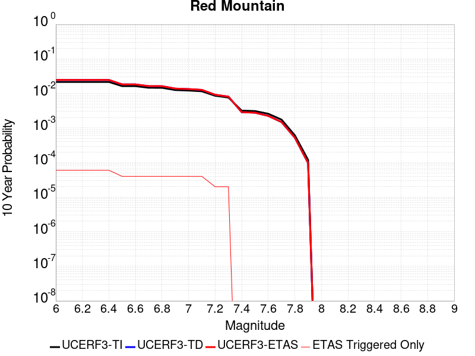 |

| Magnitude | 1 wk TI Prob | 1 wk TD Prob | 1 wk ETAS Prob | 1 wk ETAS/TD Gain | 1 wk ETAS Triggered Only | 1 mo TI Prob | 1 mo TD Prob | 1 mo ETAS Prob | 1 mo ETAS/TD Gain | 1 mo ETAS Triggered Only | 1 yr TI Prob | 1 yr TD Prob | 1 yr ETAS Prob | 1 yr ETAS/TD Gain | 1 yr ETAS Triggered Only | 10 yr TI Prob | 10 yr TD Prob | 10 yr ETAS Prob | 10 yr ETAS/TD Gain | 10 yr ETAS Triggered Only |
|-----|-----|-----|-----|-----|-----|-----|-----|-----|-----|-----|-----|-----|-----|-----|-----|-----|-----|-----|-----|-----|
| 6.0 | 4.1810763E-5 | 4.7591075E-5 | 5.7590598E-5 | 1.2101134 | 1.0E-5 | 1.7917668E-4 | 2.0394672E-4 | 2.1394469E-4 | 1.0490224 | 1.0E-5 | 0.0021792934 | 0.0024803884 | 0.0025202893 | 1.0160865 | 4.0E-5 | 0.021580452 | 0.024544649 | 0.024603177 | 1.0023845 | 6.0E-5 |
| 6.1 | 4.1810763E-5 | 4.7591075E-5 | 5.7590598E-5 | 1.2101134 | 1.0E-5 | 1.7917668E-4 | 2.0394672E-4 | 2.1394469E-4 | 1.0490224 | 1.0E-5 | 0.0021792934 | 0.0024803884 | 0.0025202893 | 1.0160865 | 4.0E-5 | 0.021580452 | 0.024544649 | 0.024603177 | 1.0023845 | 6.0E-5 |
| 6.2 | 4.1810763E-5 | 4.7591075E-5 | 5.7590598E-5 | 1.2101134 | 1.0E-5 | 1.7917668E-4 | 2.0394672E-4 | 2.1394469E-4 | 1.0490224 | 1.0E-5 | 0.0021792934 | 0.0024803884 | 0.0025202893 | 1.0160865 | 4.0E-5 | 0.021580452 | 0.024544649 | 0.024603177 | 1.0023845 | 6.0E-5 |
| 6.3 | 4.1810763E-5 | 4.7591075E-5 | 5.7590598E-5 | 1.2101134 | 1.0E-5 | 1.7917668E-4 | 2.0394672E-4 | 2.1394469E-4 | 1.0490224 | 1.0E-5 | 0.0021792934 | 0.0024803884 | 0.0025202893 | 1.0160865 | 4.0E-5 | 0.021580452 | 0.024544649 | 0.024603177 | 1.0023845 | 6.0E-5 |
| 6.4 | 4.1810763E-5 | 4.7591075E-5 | 5.7590598E-5 | 1.2101134 | 1.0E-5 | 1.7917668E-4 | 2.0394672E-4 | 2.1394469E-4 | 1.0490224 | 1.0E-5 | 0.0021792934 | 0.0024803884 | 0.0025202893 | 1.0160865 | 4.0E-5 | 0.021580452 | 0.024544649 | 0.024603177 | 1.0023845 | 6.0E-5 |
| 6.5 | 3.154503E-5 | 3.5360503E-5 | 3.5360503E-5 | 1.0 | 0.0 | 1.3518598E-4 | 1.5153673E-4 | 1.5153673E-4 | 1.0 | 0.0 | 0.0016446467 | 0.0018434906 | 0.0018634538 | 1.010829 | 2.0E-5 | 0.01632528 | 0.018291628 | 0.018330896 | 1.0021468 | 4.0E-5 |
| 6.6 | 3.1535834E-5 | 3.5349887E-5 | 3.5349887E-5 | 1.0 | 0.0 | 1.3514658E-4 | 1.5149123E-4 | 1.5149123E-4 | 1.0 | 0.0 | 0.0016441676 | 0.0018429377 | 0.0018629008 | 1.0108322 | 2.0E-5 | 0.01632056 | 0.018286189 | 0.018325457 | 1.0021474 | 4.0E-5 |
| 6.7 | 2.8267326E-5 | 3.1470005E-5 | 3.1470005E-5 | 1.0 | 0.0 | 1.2114006E-4 | 1.3486497E-4 | 1.3486497E-4 | 1.0 | 0.0 | 0.0014738824 | 0.0016408293 | 0.0016607965 | 1.012169 | 2.0E-5 | 0.014641452 | 0.016295906 | 0.016335255 | 1.0024146 | 4.0E-5 |
| 6.8 | 2.8212884E-5 | 3.140789E-5 | 3.140789E-5 | 1.0 | 0.0 | 1.20906756E-4 | 1.3459878E-4 | 1.3459878E-4 | 1.0 | 0.0 | 0.0014710457 | 0.0016375934 | 0.0016575606 | 1.0121931 | 2.0E-5 | 0.014613459 | 0.016264021 | 0.016303372 | 1.0024195 | 4.0E-5 |
| 6.9 | 2.4227871E-5 | 2.6707532E-5 | 2.6707532E-5 | 1.0 | 0.0 | 1.03829596E-4 | 1.14456256E-4 | 1.14456256E-4 | 1.0 | 0.0 | 0.0012633923 | 0.00139269 | 0.0014126622 | 1.0143406 | 2.0E-5 | 0.012562336 | 0.013847311 | 0.013886757 | 1.0028486 | 4.0E-5 |
| 7.0 | 2.348524E-5 | 2.5836296E-5 | 2.5836296E-5 | 1.0 | 0.0 | 1.0064714E-4 | 1.1072271E-4 | 1.1072271E-4 | 1.0 | 0.0 | 0.0012246901 | 0.001347291 | 0.0013672641 | 1.0148246 | 2.0E-5 | 0.012179627 | 0.013398864 | 0.013438328 | 1.0029453 | 4.0E-5 |
| 7.1 | 2.2311642E-5 | 2.4463332E-5 | 2.4463332E-5 | 1.0 | 0.0 | 9.561782E-5 | 1.04839055E-4 | 1.04839055E-4 | 1.0 | 0.0 | 0.0011635252 | 0.0012757429 | 0.0012957174 | 1.0156572 | 2.0E-5 | 0.01157452 | 0.01269171 | 0.012731203 | 1.0031117 | 4.0E-5 |
| 7.2 | 1.6533986E-5 | 1.767069E-5 | 1.767069E-5 | 1.0 | 0.0 | 7.085802E-5 | 7.572969E-5 | 7.572969E-5 | 1.0 | 0.0 | 8.623549E-4 | 9.2168245E-4 | 9.41664E-4 | 1.0216794 | 2.0E-5 | 0.008590161 | 0.009184876 | 0.009204693 | 1.0021574 | 2.0E-5 |
| 7.3 | 1.4703092E-5 | 1.555982E-5 | 1.555982E-5 | 1.0 | 0.0 | 6.301173E-5 | 6.668359E-5 | 6.668359E-5 | 1.0 | 0.0 | 7.668978E-4 | 8.116319E-4 | 8.316157E-4 | 1.0246217 | 2.0E-5 | 0.0076425658 | 0.008092752 | 0.00811259 | 1.0024513 | 2.0E-5 |
| 7.4 | 6.1331984E-6 | 5.5289447E-6 | 5.5289447E-6 | 1.0 | 0.0 | 2.6284872E-5 | 2.3695266E-5 | 2.3695266E-5 | 1.0 | 0.0 | 3.199713E-4 | 2.884522E-4 | 2.884522E-4 | 1.0 | 0.0 | 0.0031951098 | 0.0028808324 | 0.0028808324 | 1.0 | 0.0 |
| 7.5 | 5.954766E-6 | 5.3385725E-6 | 5.3385725E-6 | 1.0 | 0.0 | 2.5520176E-5 | 2.2879398E-5 | 2.2879398E-5 | 1.0 | 0.0 | 3.1066386E-4 | 2.785216E-4 | 2.785216E-4 | 1.0 | 0.0 | 0.003102299 | 0.0027817793 | 0.0027817793 | 1.0 | 0.0 |
| 7.6 | 4.9726646E-6 | 4.315354E-6 | 4.315354E-6 | 1.0 | 0.0 | 2.1311245E-5 | 1.8494246E-5 | 1.8494246E-5 | 1.0 | 0.0 | 2.5943352E-4 | 2.2514451E-4 | 2.2514451E-4 | 1.0 | 0.0 | 0.0025913084 | 0.0022491987 | 0.0022491987 | 1.0 | 0.0 |
| 7.7 | 3.3613894E-6 | 2.8527159E-6 | 2.8527159E-6 | 1.0 | 0.0 | 1.4405875E-5 | 1.222587E-5 | 1.222587E-5 | 1.0 | 0.0 | 1.7537741E-4 | 1.4884006E-4 | 1.4884006E-4 | 1.0 | 0.0 | 0.0017523908 | 0.00148743 | 0.00148743 | 1.0 | 0.0 |
| 7.8 | 1.1828961E-6 | 1.0123005E-6 | 1.0123005E-6 | 1.0 | 0.0 | 5.069545E-6 | 4.3384234E-6 | 4.3384234E-6 | 1.0 | 0.0 | 6.171996E-5 | 5.2819054E-5 | 5.2819054E-5 | 1.0 | 0.0 | 6.170282E-4 | 5.2806793E-4 | 5.2806793E-4 | 1.0 | 0.0 |
| 7.9 | 2.2967266E-7 | 1.8619376E-7 | 1.8619376E-7 | 1.0 | 0.0 | 9.843111E-7 | 7.9797303E-7 | 7.9797303E-7 | 1.0 | 0.0 | 1.19839215E-5 | 9.7152815E-6 | 9.7152815E-6 | 1.0 | 0.0 | 1.1983275E-4 | 9.7148855E-5 | 9.7148855E-5 | 1.0 | 0.0 |

## San Gabriel
*[(top)](#table-of-contents)*

| 1 Week | 1 Month | 1 Year | 10 Year |
|-----|-----|-----|-----|
|  | 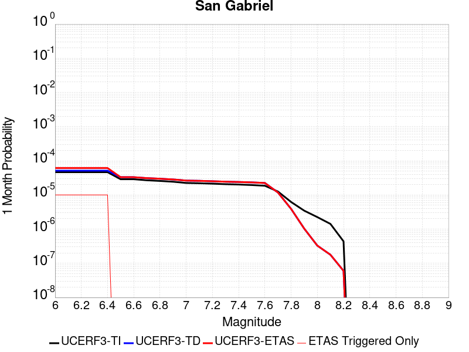 |  |  |

| Magnitude | 1 wk TI Prob | 1 wk TD Prob | 1 wk ETAS Prob | 1 wk ETAS/TD Gain | 1 wk ETAS Triggered Only | 1 mo TI Prob | 1 mo TD Prob | 1 mo ETAS Prob | 1 mo ETAS/TD Gain | 1 mo ETAS Triggered Only | 1 yr TI Prob | 1 yr TD Prob | 1 yr ETAS Prob | 1 yr ETAS/TD Gain | 1 yr ETAS Triggered Only | 10 yr TI Prob | 10 yr TD Prob | 10 yr ETAS Prob | 10 yr ETAS/TD Gain | 10 yr ETAS Triggered Only |
|-----|-----|-----|-----|-----|-----|-----|-----|-----|-----|-----|-----|-----|-----|-----|-----|-----|-----|-----|-----|-----|
| 6.0 | 1.083775E-5 | 1.1987373E-5 | 2.1987253E-5 | 1.8342011 | 1.0E-5 | 4.6446676E-5 | 5.1373507E-5 | 6.137299E-5 | 1.1946429 | 1.0E-5 | 5.653415E-4 | 6.253043E-4 | 6.652793E-4 | 1.0639288 | 4.0E-5 | 0.0056390543 | 0.006247348 | 0.0063069733 | 1.0095441 | 6.0E-5 |
| 6.1 | 1.083775E-5 | 1.1987373E-5 | 2.1987253E-5 | 1.8342011 | 1.0E-5 | 4.6446676E-5 | 5.1373507E-5 | 6.137299E-5 | 1.1946429 | 1.0E-5 | 5.653415E-4 | 6.253043E-4 | 6.652793E-4 | 1.0639288 | 4.0E-5 | 0.0056390543 | 0.006247348 | 0.0063069733 | 1.0095441 | 6.0E-5 |
| 6.2 | 1.083775E-5 | 1.1987373E-5 | 2.1987253E-5 | 1.8342011 | 1.0E-5 | 4.6446676E-5 | 5.1373507E-5 | 6.137299E-5 | 1.1946429 | 1.0E-5 | 5.653415E-4 | 6.253043E-4 | 6.652793E-4 | 1.0639288 | 4.0E-5 | 0.0056390543 | 0.006247348 | 0.0063069733 | 1.0095441 | 6.0E-5 |
| 6.3 | 1.083775E-5 | 1.1987373E-5 | 2.1987253E-5 | 1.8342011 | 1.0E-5 | 4.6446676E-5 | 5.1373507E-5 | 6.137299E-5 | 1.1946429 | 1.0E-5 | 5.653415E-4 | 6.253043E-4 | 6.652793E-4 | 1.0639288 | 4.0E-5 | 0.0056390543 | 0.006247348 | 0.0063069733 | 1.0095441 | 6.0E-5 |
| 6.4 | 1.083775E-5 | 1.1987373E-5 | 2.1987253E-5 | 1.8342011 | 1.0E-5 | 4.6446676E-5 | 5.1373507E-5 | 6.137299E-5 | 1.1946429 | 1.0E-5 | 5.653415E-4 | 6.253043E-4 | 6.652793E-4 | 1.0639288 | 4.0E-5 | 0.0056390543 | 0.006247348 | 0.0063069733 | 1.0095441 | 6.0E-5 |
| 6.5 | 6.7317824E-6 | 7.719108E-6 | 7.719108E-6 | 1.0 | 0.0 | 2.8850178E-5 | 3.3081476E-5 | 3.3081476E-5 | 1.0 | 0.0 | 3.511943E-4 | 4.026936E-4 | 4.3268153E-4 | 1.0744684 | 3.0E-5 | 0.003506398 | 0.004030539 | 0.004070378 | 1.0098842 | 4.0E-5 |
| 6.6 | 6.7317824E-6 | 7.719108E-6 | 7.719108E-6 | 1.0 | 0.0 | 2.8850178E-5 | 3.3081476E-5 | 3.3081476E-5 | 1.0 | 0.0 | 3.511943E-4 | 4.026936E-4 | 4.3268153E-4 | 1.0744684 | 3.0E-5 | 0.003506398 | 0.004030539 | 0.004070378 | 1.0098842 | 4.0E-5 |
| 6.7 | 6.274881E-6 | 7.248026E-6 | 7.248026E-6 | 1.0 | 0.0 | 2.6892068E-5 | 3.1062606E-5 | 3.1062606E-5 | 1.0 | 0.0 | 3.2736175E-4 | 3.7812255E-4 | 4.081112E-4 | 1.0793093 | 3.0E-5 | 0.0032687993 | 0.0037856852 | 0.003825534 | 1.0105261 | 4.0E-5 |
| 6.8 | 5.996209E-6 | 6.960745E-6 | 6.960745E-6 | 1.0 | 0.0 | 2.5697784E-5 | 2.9831428E-5 | 2.9831428E-5 | 1.0 | 0.0 | 3.128256E-4 | 3.6313804E-4 | 3.9312715E-4 | 1.0825832 | 3.0E-5 | 0.003123856 | 0.0036363378 | 0.0036761924 | 1.0109601 | 4.0E-5 |
| 6.9 | 5.686331E-6 | 6.6257817E-6 | 6.6257817E-6 | 1.0 | 0.0 | 2.4369761E-5 | 2.8395903E-5 | 2.8395903E-5 | 1.0 | 0.0 | 2.9666146E-4 | 3.456662E-4 | 3.5566272E-4 | 1.0289197 | 1.0E-5 | 0.0029626573 | 0.0034621747 | 0.0034821054 | 1.0057567 | 2.0E-5 |
| 7.0 | 5.2329838E-6 | 6.1496576E-6 | 6.1496576E-6 | 1.0 | 0.0 | 2.242688E-5 | 2.6355414E-5 | 2.6355414E-5 | 1.0 | 0.0 | 2.7301308E-4 | 3.2083067E-4 | 3.3082746E-4 | 1.031159 | 1.0E-5 | 0.002726779 | 0.0032145523 | 0.003234488 | 1.0062017 | 2.0E-5 |
| 7.1 | 5.135671E-6 | 6.039777E-6 | 6.039777E-6 | 1.0 | 0.0 | 2.2009834E-5 | 2.5884507E-5 | 2.5884507E-5 | 1.0 | 0.0 | 2.6793676E-4 | 3.1509905E-4 | 3.250959E-4 | 1.031726 | 1.0E-5 | 0.0026761394 | 0.0031574003 | 0.003177337 | 1.0063143 | 2.0E-5 |
| 7.2 | 4.989062E-6 | 5.8731457E-6 | 5.8731457E-6 | 1.0 | 0.0 | 2.1381518E-5 | 2.5170384E-5 | 2.5170384E-5 | 1.0 | 0.0 | 2.6028889E-4 | 3.064071E-4 | 3.1640404E-4 | 1.0326263 | 1.0E-5 | 0.0025998424 | 0.0030707237 | 0.0030906622 | 1.0064931 | 2.0E-5 |
| 7.3 | 4.8219395E-6 | 5.7046905E-6 | 5.7046905E-6 | 1.0 | 0.0 | 2.0665291E-5 | 2.4448447E-5 | 2.4448447E-5 | 1.0 | 0.0 | 2.5157086E-4 | 2.9761996E-4 | 3.0761698E-4 | 1.0335898 | 1.0E-5 | 0.0025128627 | 0.0029830914 | 0.0030030317 | 1.0066844 | 2.0E-5 |
| 7.4 | 4.7118383E-6 | 5.59324E-6 | 5.59324E-6 | 1.0 | 0.0 | 2.0193436E-5 | 2.3970813E-5 | 2.3970813E-5 | 1.0 | 0.0 | 2.4582737E-4 | 2.9180633E-4 | 3.018034E-4 | 1.0342593 | 1.0E-5 | 0.002455556 | 0.002925109 | 0.0029450504 | 1.0068173 | 2.0E-5 |
| 7.5 | 4.5506545E-6 | 5.438597E-6 | 5.438597E-6 | 1.0 | 0.0 | 1.9502659E-5 | 2.3308068E-5 | 2.3308068E-5 | 1.0 | 0.0 | 2.37419E-4 | 2.8373953E-4 | 2.937367E-4 | 1.0352336 | 1.0E-5 | 0.002371655 | 0.0028446494 | 0.0028645925 | 1.0070107 | 2.0E-5 |
| 7.6 | 4.343636E-6 | 5.231458E-6 | 5.231458E-6 | 1.0 | 0.0 | 1.861545E-5 | 2.2420347E-5 | 2.2420347E-5 | 1.0 | 0.0 | 2.2661954E-4 | 2.7293427E-4 | 2.8293155E-4 | 1.0366288 | 1.0E-5 | 0.0022638857 | 0.0027368597 | 0.002756805 | 1.0072876 | 2.0E-5 |
| 7.7 | 2.936235E-6 | 2.7452986E-6 | 2.7452986E-6 | 1.0 | 0.0 | 1.2583803E-5 | 1.1765513E-5 | 1.1765513E-5 | 1.0 | 0.0 | 1.5319703E-4 | 1.4323574E-4 | 1.4323574E-4 | 1.0 | 0.0 | 0.0015309147 | 0.0014387129 | 0.0014387129 | 1.0 | 0.0 |
| 7.8 | 1.4541639E-6 | 9.1280947E-7 | 9.1280947E-7 | 1.0 | 0.0 | 6.232116E-6 | 3.9120346E-6 | 3.9120346E-6 | 1.0 | 0.0 | 7.587337E-5 | 4.7627982E-5 | 4.7627982E-5 | 1.0 | 0.0 | 7.584747E-4 | 4.8106918E-4 | 4.8106918E-4 | 1.0 | 0.0 |
| 7.9 | 8.098958E-7 | 2.4187648E-7 | 2.4187648E-7 | 1.0 | 0.0 | 3.4709774E-6 | 1.036613E-6 | 1.036613E-6 | 1.0 | 0.0 | 4.225833E-5 | 1.262069E-5 | 1.262069E-5 | 1.0 | 0.0 | 4.2250296E-4 | 1.2928544E-4 | 1.2928544E-4 | 1.0 | 0.0 |
| 8.0 | 5.2473234E-7 | 7.6827554E-8 | 7.6827554E-8 | 1.0 | 0.0 | 2.248851E-6 | 3.292609E-7 | 3.292609E-7 | 1.0 | 0.0 | 2.7379416E-5 | 4.008744E-6 | 4.008744E-6 | 1.0 | 0.0 | 2.7376044E-4 | 4.2213585E-5 | 4.2213585E-5 | 1.0 | 0.0 |
| 8.1 | 3.3162388E-7 | 4.1511967E-8 | 4.1511967E-8 | 1.0 | 0.0 | 1.4212444E-6 | 1.7790842E-7 | 1.7790842E-7 | 1.0 | 0.0 | 1.7303513E-5 | 2.1660328E-6 | 2.1660328E-6 | 1.0 | 0.0 | 1.7302166E-4 | 2.2976306E-5 | 2.2976306E-5 | 1.0 | 0.0 |
| 8.2 | 1.0235345E-7 | 1.4050096E-8 | 1.4050096E-8 | 1.0 | 0.0 | 4.3865757E-7 | 6.0214695E-8 | 6.0214695E-8 | 1.0 | 0.0 | 5.340643E-6 | 7.3311367E-7 | 7.3311367E-7 | 1.0 | 0.0 | 5.3405143E-5 | 7.9302445E-6 | 7.9302445E-6 | 1.0 | 0.0 |

## San Clemente
*[(top)](#table-of-contents)*

| 1 Week | 1 Month | 1 Year | 10 Year |
|-----|-----|-----|-----|
|  |  |  |  |

| Magnitude | 1 wk TI Prob | 1 wk TD Prob | 1 wk ETAS Prob | 1 wk ETAS/TD Gain | 1 wk ETAS Triggered Only | 1 mo TI Prob | 1 mo TD Prob | 1 mo ETAS Prob | 1 mo ETAS/TD Gain | 1 mo ETAS Triggered Only | 1 yr TI Prob | 1 yr TD Prob | 1 yr ETAS Prob | 1 yr ETAS/TD Gain | 1 yr ETAS Triggered Only | 10 yr TI Prob | 10 yr TD Prob | 10 yr ETAS Prob | 10 yr ETAS/TD Gain | 10 yr ETAS Triggered Only |
|-----|-----|-----|-----|-----|-----|-----|-----|-----|-----|-----|-----|-----|-----|-----|-----|-----|-----|-----|-----|-----|
| 6.0 | 6.681379E-5 | 8.164081E-5 | 8.164081E-5 | 1.0 | 0.0 | 2.8631336E-4 | 3.4984472E-4 | 3.5984121E-4 | 1.0285741 | 1.0E-5 | 0.003480294 | 0.004251534 | 0.0042913645 | 1.0093684 | 4.0E-5 | 0.03426291 | 0.041757226 | 0.041814722 | 1.0013769 | 6.0E-5 |
| 6.1 | 6.681379E-5 | 8.164081E-5 | 8.164081E-5 | 1.0 | 0.0 | 2.8631336E-4 | 3.4984472E-4 | 3.5984121E-4 | 1.0285741 | 1.0E-5 | 0.003480294 | 0.004251534 | 0.0042913645 | 1.0093684 | 4.0E-5 | 0.03426291 | 0.041757226 | 0.041814722 | 1.0013769 | 6.0E-5 |
| 6.2 | 3.9400576E-5 | 4.645349E-5 | 4.645349E-5 | 1.0 | 0.0 | 1.6884868E-4 | 1.9907155E-4 | 2.0906956E-4 | 1.0502232 | 1.0E-5 | 0.0020537945 | 0.0024210564 | 0.0024509837 | 1.0123613 | 3.0E-5 | 0.020349167 | 0.02395347 | 0.02398275 | 1.0012224 | 3.0E-5 |
| 6.3 | 3.2590255E-5 | 3.792995E-5 | 3.792995E-5 | 1.0 | 0.0 | 1.3966505E-4 | 1.6254697E-4 | 1.7254535E-4 | 1.0615107 | 1.0E-5 | 0.0016990956 | 0.0019772432 | 0.0020071839 | 1.0151427 | 3.0E-5 | 0.01686163 | 0.019600306 | 0.019629719 | 1.0015006 | 3.0E-5 |
| 6.4 | 2.9454652E-5 | 3.409848E-5 | 3.409848E-5 | 1.0 | 0.0 | 1.2622811E-4 | 1.4612831E-4 | 1.5612684E-4 | 1.068423 | 1.0E-5 | 0.0015357438 | 0.0017776866 | 0.001797651 | 1.0112306 | 2.0E-5 | 0.015251739 | 0.017637838 | 0.017657485 | 1.0011139 | 2.0E-5 |
| 6.5 | 2.790836E-5 | 3.2248132E-5 | 3.2248132E-5 | 1.0 | 0.0 | 1.1960178E-4 | 1.381991E-4 | 1.4819772E-4 | 1.0723494 | 1.0E-5 | 0.001455179 | 0.001681301 | 0.0017012674 | 1.0118755 | 2.0E-5 | 0.014456868 | 0.016688827 | 0.016708493 | 1.0011784 | 2.0E-5 |
| 6.6 | 2.2492153E-5 | 2.57632E-5 | 2.57632E-5 | 1.0 | 0.0 | 9.639138E-5 | 1.1040912E-4 | 1.2040802E-4 | 1.0905622 | 1.0E-5 | 0.0011729331 | 0.0013434169 | 0.00136339 | 1.0148674 | 2.0E-5 | 0.011667615 | 0.013354673 | 0.013374406 | 1.0014776 | 2.0E-5 |
| 6.7 | 1.9862755E-5 | 2.2666847E-5 | 2.2666847E-5 | 1.0 | 0.0 | 8.512331E-5 | 9.714008E-5 | 1.0713911E-4 | 1.1029341 | 1.0E-5 | 0.0010358836 | 0.0011820501 | 0.0012020264 | 1.0168997 | 2.0E-5 | 0.010310682 | 0.01175892 | 0.011778684 | 1.0016809 | 2.0E-5 |
| 6.8 | 1.6697575E-5 | 1.8978053E-5 | 1.8978053E-5 | 1.0 | 0.0 | 7.155907E-5 | 8.133203E-5 | 9.133122E-5 | 1.1229428 | 1.0E-5 | 8.7088346E-4 | 9.89777E-4 | 0.0010097572 | 1.0201865 | 2.0E-5 | 0.008674784 | 0.009854714 | 0.009874517 | 1.0020095 | 2.0E-5 |
| 6.9 | 1.5218415E-5 | 1.726971E-5 | 1.726971E-5 | 1.0 | 0.0 | 6.522015E-5 | 7.401099E-5 | 8.401025E-5 | 1.135105 | 1.0E-5 | 7.93766E-4 | 9.0072013E-4 | 9.2070206E-4 | 1.0221845 | 2.0E-5 | 0.007909367 | 0.00897164 | 0.00899146 | 1.0022093 | 2.0E-5 |
| 7.0 | 1.2392958E-5 | 1.4033262E-5 | 1.4033262E-5 | 1.0 | 0.0 | 5.3111595E-5 | 6.0141207E-5 | 6.0141207E-5 | 1.0 | 0.0 | 6.4644177E-4 | 7.319808E-4 | 7.4197346E-4 | 1.0136516 | 1.0E-5 | 0.0064456454 | 0.0072964844 | 0.0073064114 | 1.0013605 | 1.0E-5 |
| 7.1 | 1.0934128E-5 | 1.2375354E-5 | 1.2375354E-5 | 1.0 | 0.0 | 4.6859706E-5 | 5.3036194E-5 | 5.3036194E-5 | 1.0 | 0.0 | 5.7036756E-4 | 6.455317E-4 | 6.5552525E-4 | 1.0154811 | 1.0E-5 | 0.0056890585 | 0.006437312 | 0.0064472477 | 1.0015434 | 1.0E-5 |
| 7.2 | 9.5798805E-6 | 1.0845125E-5 | 1.0845125E-5 | 1.0 | 0.0 | 4.1055984E-5 | 4.647832E-5 | 4.647832E-5 | 1.0 | 0.0 | 4.9974193E-4 | 5.657338E-4 | 5.757282E-4 | 1.0176661 | 1.0E-5 | 0.0049861963 | 0.00564366 | 0.0056536035 | 1.0017619 | 1.0E-5 |
| 7.3 | 8.0167365E-6 | 9.084078E-6 | 9.084078E-6 | 1.0 | 0.0 | 3.4356988E-5 | 3.8931223E-5 | 3.8931223E-5 | 1.0 | 0.0 | 4.1821605E-4 | 4.738916E-4 | 4.8388686E-4 | 1.0210918 | 1.0E-5 | 0.0041742986 | 0.004729513 | 0.004739466 | 1.0021044 | 1.0E-5 |
| 7.4 | 2.9581017E-6 | 3.36244E-6 | 3.36244E-6 | 1.0 | 0.0 | 1.2677518E-5 | 1.4410407E-5 | 1.4410407E-5 | 1.0 | 0.0 | 1.5433785E-4 | 1.7543763E-4 | 1.7543763E-4 | 1.0 | 0.0 | 0.001542307 | 0.0017534863 | 0.0017534863 | 1.0 | 0.0 |

## Santa Ynez River
*[(top)](#table-of-contents)*

| 1 Week | 1 Month | 1 Year | 10 Year |
|-----|-----|-----|-----|
|  |  |  |  |

| Magnitude | 1 wk TI Prob | 1 wk TD Prob | 1 wk ETAS Prob | 1 wk ETAS/TD Gain | 1 wk ETAS Triggered Only | 1 mo TI Prob | 1 mo TD Prob | 1 mo ETAS Prob | 1 mo ETAS/TD Gain | 1 mo ETAS Triggered Only | 1 yr TI Prob | 1 yr TD Prob | 1 yr ETAS Prob | 1 yr ETAS/TD Gain | 1 yr ETAS Triggered Only | 10 yr TI Prob | 10 yr TD Prob | 10 yr ETAS Prob | 10 yr ETAS/TD Gain | 10 yr ETAS Triggered Only |
|-----|-----|-----|-----|-----|-----|-----|-----|-----|-----|-----|-----|-----|-----|-----|-----|-----|-----|-----|-----|-----|
| 6.0 | 1.6396456E-5 | 1.7209572E-5 | 1.7209572E-5 | 1.0 | 0.0 | 7.026863E-5 | 7.375342E-5 | 7.375342E-5 | 1.0 | 0.0 | 8.551848E-4 | 8.976135E-4 | 9.175956E-4 | 1.0222613 | 2.0E-5 | 0.0085190125 | 0.008943428 | 0.008992981 | 1.0055407 | 5.0E-5 |
| 6.1 | 1.6396456E-5 | 1.7209572E-5 | 1.7209572E-5 | 1.0 | 0.0 | 7.026863E-5 | 7.375342E-5 | 7.375342E-5 | 1.0 | 0.0 | 8.551848E-4 | 8.976135E-4 | 9.175956E-4 | 1.0222613 | 2.0E-5 | 0.0085190125 | 0.008943428 | 0.008992981 | 1.0055407 | 5.0E-5 |
| 6.2 | 1.6396456E-5 | 1.7209572E-5 | 1.7209572E-5 | 1.0 | 0.0 | 7.026863E-5 | 7.375342E-5 | 7.375342E-5 | 1.0 | 0.0 | 8.551848E-4 | 8.976135E-4 | 9.175956E-4 | 1.0222613 | 2.0E-5 | 0.0085190125 | 0.008943428 | 0.008992981 | 1.0055407 | 5.0E-5 |
| 6.3 | 9.736976E-6 | 1.0122406E-5 | 1.0122406E-5 | 1.0 | 0.0 | 4.172923E-5 | 4.3381046E-5 | 4.3381046E-5 | 1.0 | 0.0 | 5.0793495E-4 | 5.280412E-4 | 5.4803066E-4 | 1.0378559 | 2.0E-5 | 0.005067755 | 0.005268371 | 0.005298213 | 1.0056643 | 3.0E-5 |
| 6.4 | 9.736976E-6 | 1.0122406E-5 | 1.0122406E-5 | 1.0 | 0.0 | 4.172923E-5 | 4.3381046E-5 | 4.3381046E-5 | 1.0 | 0.0 | 5.0793495E-4 | 5.280412E-4 | 5.4803066E-4 | 1.0378559 | 2.0E-5 | 0.005067755 | 0.005268371 | 0.005298213 | 1.0056643 | 3.0E-5 |
| 6.5 | 7.081964E-6 | 7.3299525E-6 | 7.3299525E-6 | 1.0 | 0.0 | 3.035092E-5 | 3.1413714E-5 | 3.1413714E-5 | 1.0 | 0.0 | 3.694598E-4 | 3.8239642E-4 | 4.0238877E-4 | 1.0522817 | 2.0E-5 | 0.0036884616 | 0.003817546 | 0.0038474314 | 1.0078285 | 3.0E-5 |
| 6.6 | 5.873247E-6 | 6.0597904E-6 | 6.0597904E-6 | 1.0 | 0.0 | 2.5170815E-5 | 2.5970277E-5 | 2.5970277E-5 | 1.0 | 0.0 | 3.064116E-4 | 3.161431E-4 | 3.3613679E-4 | 1.0632424 | 2.0E-5 | 0.0030598943 | 0.003157021 | 0.0031869262 | 1.0094726 | 3.0E-5 |
| 6.7 | 4.973277E-6 | 5.1159423E-6 | 5.1159423E-6 | 1.0 | 0.0 | 2.1313872E-5 | 2.1925287E-5 | 2.1925287E-5 | 1.0 | 0.0 | 2.5946548E-4 | 2.6690814E-4 | 2.869028E-4 | 1.0749122 | 2.0E-5 | 0.0025916274 | 0.0026659246 | 0.0026958447 | 1.0112231 | 3.0E-5 |
| 6.8 | 4.396492E-6 | 4.511015E-6 | 4.511015E-6 | 1.0 | 0.0 | 1.884197E-5 | 1.9332781E-5 | 1.9332781E-5 | 1.0 | 0.0 | 2.2937685E-4 | 2.3535153E-4 | 2.5534682E-4 | 1.0849593 | 2.0E-5 | 0.0022914023 | 0.0023510582 | 0.0023809876 | 1.0127302 | 3.0E-5 |
| 6.9 | 3.5255632E-6 | 3.6013655E-6 | 3.6013655E-6 | 1.0 | 0.0 | 1.5109469E-5 | 1.5434332E-5 | 1.5434332E-5 | 1.0 | 0.0 | 1.8394225E-4 | 1.8789696E-4 | 1.9789507E-4 | 1.0532106 | 1.0E-5 | 0.0018379007 | 0.0018773971 | 0.0018973595 | 1.010633 | 2.0E-5 |
| 7.0 | 3.211603E-6 | 3.2736843E-6 | 3.2736843E-6 | 1.0 | 0.0 | 1.376394E-5 | 1.4030001E-5 | 1.4030001E-5 | 1.0 | 0.0 | 1.6756308E-4 | 1.7080201E-4 | 1.808003E-4 | 1.0585374 | 1.0E-5 | 0.0016743679 | 0.0017067215 | 0.0017266874 | 1.0116984 | 2.0E-5 |
| 7.1 | 2.5094619E-6 | 2.5409465E-6 | 2.5409465E-6 | 1.0 | 0.0 | 1.0754793E-5 | 1.0889726E-5 | 1.0889726E-5 | 1.0 | 0.0 | 1.3093173E-4 | 1.325744E-4 | 1.4257307E-4 | 1.0754193 | 1.0E-5 | 0.0013085462 | 0.0013249591 | 0.0013449326 | 1.0150748 | 2.0E-5 |
| 7.2 | 2.0515774E-6 | 2.0619607E-6 | 2.0619607E-6 | 1.0 | 0.0 | 8.792445E-6 | 8.836944E-6 | 8.836944E-6 | 1.0 | 0.0 | 1.0704277E-4 | 1.0758453E-4 | 1.17583455E-4 | 1.0929402 | 1.0E-5 | 0.0010699122 | 0.0010753288 | 0.001085318 | 1.0092895 | 1.0E-5 |
| 7.3 | 1.6845745E-6 | 1.6774113E-6 | 1.6774113E-6 | 1.0 | 0.0 | 7.219585E-6 | 7.188886E-6 | 7.188886E-6 | 1.0 | 0.0 | 8.78949E-5 | 8.75212E-5 | 9.752032E-5 | 1.114248 | 1.0E-5 | 8.7860145E-4 | 8.7487017E-4 | 8.848614E-4 | 1.0114202 | 1.0E-5 |
| 7.4 | 1.3600285E-6 | 1.3333537E-6 | 1.3333537E-6 | 1.0 | 0.0 | 5.82868E-6 | 5.71436E-6 | 5.71436E-6 | 1.0 | 0.0 | 7.096187E-5 | 6.957014E-5 | 7.956944E-5 | 1.1437298 | 1.0E-5 | 7.0939213E-4 | 6.954858E-4 | 7.0547883E-4 | 1.0143684 | 1.0E-5 |
| 7.5 | 9.735342E-7 | 9.290247E-7 | 9.290247E-7 | 1.0 | 0.0 | 4.172283E-6 | 3.981528E-6 | 3.981528E-6 | 1.0 | 0.0 | 5.079636E-5 | 4.8474045E-5 | 5.847356E-5 | 1.206286 | 1.0E-5 | 5.0784746E-4 | 4.8463643E-4 | 4.946316E-4 | 1.020624 | 1.0E-5 |
| 7.6 | 5.067187E-7 | 4.77864E-7 | 4.77864E-7 | 1.0 | 0.0 | 2.1716498E-6 | 2.047987E-6 | 2.047987E-6 | 1.0 | 0.0 | 2.6439517E-5 | 2.4933963E-5 | 2.4933963E-5 | 1.0 | 0.0 | 2.643637E-4 | 2.493124E-4 | 2.493124E-4 | 1.0 | 0.0 |
| 7.7 | 2.769089E-7 | 2.575952E-7 | 2.575952E-7 | 1.0 | 0.0 | 1.1867519E-6 | 1.1039789E-6 | 1.1039789E-6 | 1.0 | 0.0 | 1.4448608E-5 | 1.344086E-5 | 1.344086E-5 | 1.0 | 0.0 | 1.444767E-4 | 1.344005E-4 | 1.344005E-4 | 1.0 | 0.0 |
| 7.8 | 1.7044663E-7 | 1.5449315E-7 | 1.5449315E-7 | 1.0 | 0.0 | 7.3048534E-7 | 6.621133E-7 | 6.621133E-7 | 1.0 | 0.0 | 8.893623E-6 | 8.0612E-6 | 8.0612E-6 | 1.0 | 0.0 | 8.893267E-5 | 8.06091E-5 | 8.06091E-5 | 1.0 | 0.0 |
| 7.9 | 4.8344287E-8 | 4.0911427E-8 | 4.0911427E-8 | 1.0 | 0.0 | 2.0718979E-7 | 1.7533468E-7 | 1.7533468E-7 | 1.0 | 0.0 | 2.5225327E-6 | 2.1346975E-6 | 2.1346975E-6 | 1.0 | 0.0 | 2.5225041E-5 | 2.1346776E-5 | 2.1346776E-5 | 1.0 | 0.0 |

## Dry Mountain
*[(top)](#table-of-contents)*

| 1 Week | 1 Month | 1 Year | 10 Year |
|-----|-----|-----|-----|
|  |  |  |  |

| Magnitude | 1 wk TI Prob | 1 wk TD Prob | 1 wk ETAS Prob | 1 wk ETAS/TD Gain | 1 wk ETAS Triggered Only | 1 mo TI Prob | 1 mo TD Prob | 1 mo ETAS Prob | 1 mo ETAS/TD Gain | 1 mo ETAS Triggered Only | 1 yr TI Prob | 1 yr TD Prob | 1 yr ETAS Prob | 1 yr ETAS/TD Gain | 1 yr ETAS Triggered Only | 10 yr TI Prob | 10 yr TD Prob | 10 yr ETAS Prob | 10 yr ETAS/TD Gain | 10 yr ETAS Triggered Only |
|-----|-----|-----|-----|-----|-----|-----|-----|-----|-----|-----|-----|-----|-----|-----|-----|-----|-----|-----|-----|-----|
| 6.0 | 6.222801E-6 | 6.439411E-6 | 1.6439346E-5 | 2.552927 | 1.0E-5 | 2.6668875E-5 | 2.7597274E-5 | 3.7596998E-5 | 1.3623446 | 1.0E-5 | 3.2464517E-4 | 3.359609E-4 | 3.7594748E-4 | 1.1190214 | 4.0E-5 | 0.0032417132 | 0.0033560924 | 0.003415891 | 1.017818 | 6.0E-5 |
| 6.1 | 6.222801E-6 | 6.439411E-6 | 1.6439346E-5 | 2.552927 | 1.0E-5 | 2.6668875E-5 | 2.7597274E-5 | 3.7596998E-5 | 1.3623446 | 1.0E-5 | 3.2464517E-4 | 3.359609E-4 | 3.7594748E-4 | 1.1190214 | 4.0E-5 | 0.0032417132 | 0.0033560924 | 0.003415891 | 1.017818 | 6.0E-5 |
| 6.2 | 6.222801E-6 | 6.439411E-6 | 1.6439346E-5 | 2.552927 | 1.0E-5 | 2.6668875E-5 | 2.7597274E-5 | 3.7596998E-5 | 1.3623446 | 1.0E-5 | 3.2464517E-4 | 3.359609E-4 | 3.7594748E-4 | 1.1190214 | 4.0E-5 | 0.0032417132 | 0.0033560924 | 0.003415891 | 1.017818 | 6.0E-5 |
| 6.3 | 6.222801E-6 | 6.439411E-6 | 1.6439346E-5 | 2.552927 | 1.0E-5 | 2.6668875E-5 | 2.7597274E-5 | 3.7596998E-5 | 1.3623446 | 1.0E-5 | 3.2464517E-4 | 3.359609E-4 | 3.7594748E-4 | 1.1190214 | 4.0E-5 | 0.0032417132 | 0.0033560924 | 0.003415891 | 1.017818 | 6.0E-5 |
| 6.4 | 6.222801E-6 | 6.439411E-6 | 1.6439346E-5 | 2.552927 | 1.0E-5 | 2.6668875E-5 | 2.7597274E-5 | 3.7596998E-5 | 1.3623446 | 1.0E-5 | 3.2464517E-4 | 3.359609E-4 | 3.7594748E-4 | 1.1190214 | 4.0E-5 | 0.0032417132 | 0.0033560924 | 0.003415891 | 1.017818 | 6.0E-5 |
| 6.5 | 2.8528623E-6 | 2.952182E-6 | 1.2952152E-5 | 4.387315 | 1.0E-5 | 1.22264955E-5 | 1.2652196E-5 | 2.265207E-5 | 1.7903666 | 1.0E-5 | 1.4884741E-4 | 1.5403831E-4 | 1.8403368E-4 | 1.1947267 | 3.0E-5 | 0.0014874774 | 0.0015401688 | 0.0015701225 | 1.0194484 | 3.0E-5 |
| 6.6 | 2.8528623E-6 | 2.952182E-6 | 1.2952152E-5 | 4.387315 | 1.0E-5 | 1.22264955E-5 | 1.2652196E-5 | 2.265207E-5 | 1.7903666 | 1.0E-5 | 1.4884741E-4 | 1.5403831E-4 | 1.8403368E-4 | 1.1947267 | 3.0E-5 | 0.0014874774 | 0.0015401688 | 0.0015701225 | 1.0194484 | 3.0E-5 |
| 6.7 | 2.541E-6 | 2.62937E-6 | 1.26293435E-5 | 4.8031826 | 1.0E-5 | 1.0889954E-5 | 1.12687285E-5 | 2.1268615E-5 | 1.8874016 | 1.0E-5 | 1.3257713E-4 | 1.3719677E-4 | 1.6719266E-4 | 1.218634 | 3.0E-5 | 0.0013249806 | 0.0013719677 | 0.0014019265 | 1.0218364 | 3.0E-5 |

## Deep Springs
*[(top)](#table-of-contents)*

| 1 Week | 1 Month | 1 Year | 10 Year |
|-----|-----|-----|-----|
|  |  | 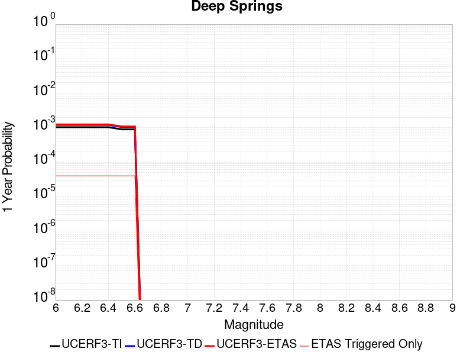 |  |

| Magnitude | 1 wk TI Prob | 1 wk TD Prob | 1 wk ETAS Prob | 1 wk ETAS/TD Gain | 1 wk ETAS Triggered Only | 1 mo TI Prob | 1 mo TD Prob | 1 mo ETAS Prob | 1 mo ETAS/TD Gain | 1 mo ETAS Triggered Only | 1 yr TI Prob | 1 yr TD Prob | 1 yr ETAS Prob | 1 yr ETAS/TD Gain | 1 yr ETAS Triggered Only | 10 yr TI Prob | 10 yr TD Prob | 10 yr ETAS Prob | 10 yr ETAS/TD Gain | 10 yr ETAS Triggered Only |
|-----|-----|-----|-----|-----|-----|-----|-----|-----|-----|-----|-----|-----|-----|-----|-----|-----|-----|-----|-----|-----|
| 6.0 | 1.9810619E-5 | 2.311303E-5 | 3.31128E-5 | 1.4326464 | 1.0E-5 | 8.489989E-5 | 9.9054945E-5 | 1.0905396E-4 | 1.100944 | 1.0E-5 | 0.001033166 | 0.0012058344 | 0.0012457862 | 1.0331321 | 4.0E-5 | 0.010283757 | 0.012042696 | 0.012101973 | 1.0049223 | 6.0E-5 |
| 6.1 | 1.9810619E-5 | 2.311303E-5 | 3.31128E-5 | 1.4326464 | 1.0E-5 | 8.489989E-5 | 9.9054945E-5 | 1.0905396E-4 | 1.100944 | 1.0E-5 | 0.001033166 | 0.0012058344 | 0.0012457862 | 1.0331321 | 4.0E-5 | 0.010283757 | 0.012042696 | 0.012101973 | 1.0049223 | 6.0E-5 |
| 6.2 | 1.9810619E-5 | 2.311303E-5 | 3.31128E-5 | 1.4326464 | 1.0E-5 | 8.489989E-5 | 9.9054945E-5 | 1.0905396E-4 | 1.100944 | 1.0E-5 | 0.001033166 | 0.0012058344 | 0.0012457862 | 1.0331321 | 4.0E-5 | 0.010283757 | 0.012042696 | 0.012101973 | 1.0049223 | 6.0E-5 |
| 6.3 | 1.9810619E-5 | 2.311303E-5 | 3.31128E-5 | 1.4326464 | 1.0E-5 | 8.489989E-5 | 9.9054945E-5 | 1.0905396E-4 | 1.100944 | 1.0E-5 | 0.001033166 | 0.0012058344 | 0.0012457862 | 1.0331321 | 4.0E-5 | 0.010283757 | 0.012042696 | 0.012101973 | 1.0049223 | 6.0E-5 |
| 6.4 | 1.9810619E-5 | 2.311303E-5 | 3.31128E-5 | 1.4326464 | 1.0E-5 | 8.489989E-5 | 9.9054945E-5 | 1.0905396E-4 | 1.100944 | 1.0E-5 | 0.001033166 | 0.0012058344 | 0.0012457862 | 1.0331321 | 4.0E-5 | 0.010283757 | 0.012042696 | 0.012101973 | 1.0049223 | 6.0E-5 |
| 6.5 | 1.7190405E-5 | 2.0051E-5 | 3.00508E-5 | 1.4987183 | 1.0E-5 | 7.367108E-5 | 8.593286E-5 | 9.5931995E-5 | 1.11636 | 1.0E-5 | 8.9657627E-4 | 0.0010462323 | 0.0010861905 | 1.0381924 | 4.0E-5 | 0.008929676 | 0.010462292 | 0.010521664 | 1.0056748 | 6.0E-5 |
| 6.6 | 1.7190405E-5 | 2.0051E-5 | 3.00508E-5 | 1.4987183 | 1.0E-5 | 7.367108E-5 | 8.593286E-5 | 9.5931995E-5 | 1.11636 | 1.0E-5 | 8.9657627E-4 | 0.0010462323 | 0.0010861905 | 1.0381924 | 4.0E-5 | 0.008929676 | 0.010462292 | 0.010521664 | 1.0056748 | 6.0E-5 |

## Pisgah-Bullion Mtn-Mesquite Lk
*[(top)](#table-of-contents)*

| 1 Week | 1 Month | 1 Year | 10 Year |
|-----|-----|-----|-----|
|  | 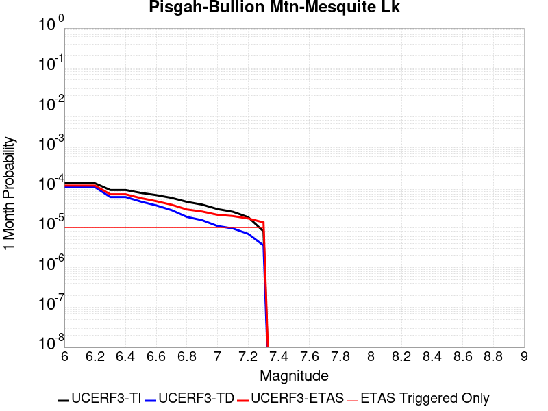 | 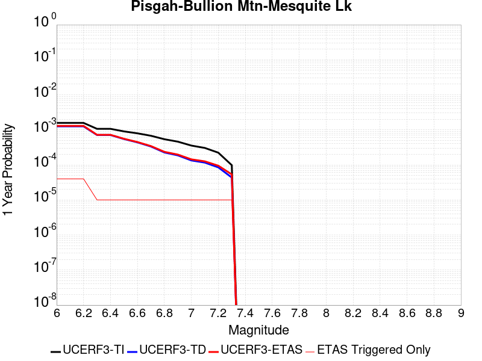 |  |

| Magnitude | 1 wk TI Prob | 1 wk TD Prob | 1 wk ETAS Prob | 1 wk ETAS/TD Gain | 1 wk ETAS Triggered Only | 1 mo TI Prob | 1 mo TD Prob | 1 mo ETAS Prob | 1 mo ETAS/TD Gain | 1 mo ETAS Triggered Only | 1 yr TI Prob | 1 yr TD Prob | 1 yr ETAS Prob | 1 yr ETAS/TD Gain | 1 yr ETAS Triggered Only | 10 yr TI Prob | 10 yr TD Prob | 10 yr ETAS Prob | 10 yr ETAS/TD Gain | 10 yr ETAS Triggered Only |
|-----|-----|-----|-----|-----|-----|-----|-----|-----|-----|-----|-----|-----|-----|-----|-----|-----|-----|-----|-----|-----|
| 6.0 | 3.0240792E-5 | 2.4091287E-5 | 2.4091287E-5 | 1.0 | 0.0 | 1.2959696E-4 | 1.03244856E-4 | 1.1324382E-4 | 1.0968472 | 1.0E-5 | 0.0015767008 | 0.001256382 | 0.0012963318 | 1.0317974 | 4.0E-5 | 0.015655609 | 0.012502813 | 0.012552188 | 1.003949 | 5.0E-5 |
| 6.1 | 3.0240792E-5 | 2.4091287E-5 | 2.4091287E-5 | 1.0 | 0.0 | 1.2959696E-4 | 1.03244856E-4 | 1.1324382E-4 | 1.0968472 | 1.0E-5 | 0.0015767008 | 0.001256382 | 0.0012963318 | 1.0317974 | 4.0E-5 | 0.015655609 | 0.012502813 | 0.012552188 | 1.003949 | 5.0E-5 |
| 6.2 | 3.0240792E-5 | 2.4091287E-5 | 2.4091287E-5 | 1.0 | 0.0 | 1.2959696E-4 | 1.03244856E-4 | 1.1324382E-4 | 1.0968472 | 1.0E-5 | 0.0015767008 | 0.001256382 | 0.0012963318 | 1.0317974 | 4.0E-5 | 0.015655609 | 0.012502813 | 0.012552188 | 1.003949 | 5.0E-5 |
| 6.3 | 2.0498217E-5 | 1.36382505E-5 | 1.36382505E-5 | 1.0 | 0.0 | 8.784654E-5 | 5.8448426E-5 | 6.8447844E-5 | 1.171081 | 1.0E-5 | 0.0010690069 | 7.113935E-4 | 7.213864E-4 | 1.0140469 | 1.0E-5 | 0.01063879 | 0.0070927883 | 0.0071027176 | 1.0013999 | 1.0E-5 |
| 6.4 | 2.0498217E-5 | 1.36382505E-5 | 1.36382505E-5 | 1.0 | 0.0 | 8.784654E-5 | 5.8448426E-5 | 6.8447844E-5 | 1.171081 | 1.0E-5 | 0.0010690069 | 7.113935E-4 | 7.213864E-4 | 1.0140469 | 1.0E-5 | 0.01063879 | 0.0070927883 | 0.0071027176 | 1.0013999 | 1.0E-5 |
| 6.5 | 1.7316182E-5 | 1.04771225E-5 | 1.04771225E-5 | 1.0 | 0.0 | 7.42101E-5 | 4.4901237E-5 | 5.490079E-5 | 1.222701 | 1.0E-5 | 9.0313336E-4 | 5.4654543E-4 | 5.5654E-4 | 1.0182867 | 1.0E-5 | 0.008994718 | 0.005453008 | 0.005462954 | 1.0018239 | 1.0E-5 |
| 6.6 | 1.5251077E-5 | 8.414257E-6 | 8.414257E-6 | 1.0 | 0.0 | 6.536012E-5 | 3.606064E-5 | 4.606028E-5 | 1.2773007 | 1.0E-5 | 7.9546886E-4 | 4.389571E-4 | 4.489527E-4 | 1.0227712 | 1.0E-5 | 0.007926274 | 0.0043816175 | 0.004391574 | 1.0022722 | 1.0E-5 |
| 6.7 | 1.2997425E-5 | 6.4113133E-6 | 6.4113133E-6 | 1.0 | 0.0 | 5.570206E-5 | 2.7476794E-5 | 3.747652E-5 | 1.3639334 | 1.0E-5 | 6.7796157E-4 | 3.3448328E-4 | 3.4447992E-4 | 1.0298868 | 1.0E-5 | 0.0067589693 | 0.0033402585 | 0.003350225 | 1.0029838 | 1.0E-5 |
| 6.8 | 1.035386E-5 | 4.3332407E-6 | 4.3332407E-6 | 1.0 | 0.0 | 4.437293E-5 | 1.8570905E-5 | 2.857072E-5 | 1.5384667 | 1.0E-5 | 5.401065E-4 | 2.2607818E-4 | 2.3607591E-4 | 1.0442225 | 1.0E-5 | 0.0053879567 | 0.0022585685 | 0.002268546 | 1.0044175 | 1.0E-5 |
| 6.9 | 8.816252E-6 | 3.5806777E-6 | 3.5806777E-6 | 1.0 | 0.0 | 3.778339E-5 | 1.5345675E-5 | 2.5345522E-5 | 1.6516395 | 1.0E-5 | 4.5991567E-4 | 1.8681816E-4 | 1.9681628E-4 | 1.0535179 | 1.0E-5 | 0.00458965 | 0.0018666695 | 0.0018766508 | 1.0053471 | 1.0E-5 |
| 7.0 | 6.8232207E-6 | 2.5675185E-6 | 2.5675185E-6 | 1.0 | 0.0 | 2.9242048E-5 | 1.1003606E-5 | 2.1003496E-5 | 1.908783 | 1.0E-5 | 3.5596377E-4 | 1.3396099E-4 | 1.4395965E-4 | 1.0746386 | 1.0E-5 | 0.0035539411 | 0.0013388334 | 0.00134882 | 1.0074592 | 1.0E-5 |
| 7.1 | 5.837013E-6 | 2.227375E-6 | 2.227375E-6 | 1.0 | 0.0 | 2.501553E-5 | 9.545859E-6 | 1.9545763E-5 | 2.0475645 | 1.0E-5 | 3.045215E-4 | 1.16214935E-4 | 1.2621377E-4 | 1.0860375 | 1.0E-5 | 0.0030410455 | 0.0011615707 | 0.001171559 | 1.008599 | 1.0E-5 |
| 7.2 | 4.278052E-6 | 1.6275252E-6 | 1.6275252E-6 | 1.0 | 0.0 | 1.833438E-5 | 6.975091E-6 | 1.697502E-5 | 2.4336631 | 1.0E-5 | 2.231982E-4 | 8.4918654E-5 | 9.491781E-5 | 1.1177498 | 1.0E-5 | 0.0022297418 | 8.488853E-4 | 8.588768E-4 | 1.0117701 | 1.0E-5 |
| 7.3 | 1.8803692E-6 | 8.3448816E-7 | 8.3448816E-7 | 1.0 | 0.0 | 8.0587E-6 | 3.5763737E-6 | 1.35763385E-5 | 3.7961183 | 1.0E-5 | 9.811026E-5 | 4.354163E-5 | 5.3541193E-5 | 1.2296553 | 1.0E-5 | 9.806695E-4 | 4.3534543E-4 | 4.4534108E-4 | 1.0229603 | 1.0E-5 |

## Kern Canyon (North Kern) 2011
*[(top)](#table-of-contents)*

| 1 Week | 1 Month | 1 Year | 10 Year |
|-----|-----|-----|-----|
|  |  |  |  |

| Magnitude | 1 wk TI Prob | 1 wk TD Prob | 1 wk ETAS Prob | 1 wk ETAS/TD Gain | 1 wk ETAS Triggered Only | 1 mo TI Prob | 1 mo TD Prob | 1 mo ETAS Prob | 1 mo ETAS/TD Gain | 1 mo ETAS Triggered Only | 1 yr TI Prob | 1 yr TD Prob | 1 yr ETAS Prob | 1 yr ETAS/TD Gain | 1 yr ETAS Triggered Only | 10 yr TI Prob | 10 yr TD Prob | 10 yr ETAS Prob | 10 yr ETAS/TD Gain | 10 yr ETAS Triggered Only |
|-----|-----|-----|-----|-----|-----|-----|-----|-----|-----|-----|-----|-----|-----|-----|-----|-----|-----|-----|-----|-----|
| 6.0 | 6.6264497E-6 | 6.7573515E-6 | 6.7573515E-6 | 1.0 | 0.0 | 2.8398761E-5 | 2.8959801E-5 | 3.895951E-5 | 1.3452963 | 1.0E-5 | 3.4570007E-4 | 3.5253656E-4 | 3.8252596E-4 | 1.0850675 | 3.0E-5 | 0.0034516277 | 0.0035205614 | 0.0035703855 | 1.0141523 | 5.0E-5 |
| 6.1 | 6.6264497E-6 | 6.7573515E-6 | 6.7573515E-6 | 1.0 | 0.0 | 2.8398761E-5 | 2.8959801E-5 | 3.895951E-5 | 1.3452963 | 1.0E-5 | 3.4570007E-4 | 3.5253656E-4 | 3.8252596E-4 | 1.0850675 | 3.0E-5 | 0.0034516277 | 0.0035205614 | 0.0035703855 | 1.0141523 | 5.0E-5 |
| 6.2 | 6.6264497E-6 | 6.7573515E-6 | 6.7573515E-6 | 1.0 | 0.0 | 2.8398761E-5 | 2.8959801E-5 | 3.895951E-5 | 1.3452963 | 1.0E-5 | 3.4570007E-4 | 3.5253656E-4 | 3.8252596E-4 | 1.0850675 | 3.0E-5 | 0.0034516277 | 0.0035205614 | 0.0035703855 | 1.0141523 | 5.0E-5 |
| 6.3 | 6.6264497E-6 | 6.7573515E-6 | 6.7573515E-6 | 1.0 | 0.0 | 2.8398761E-5 | 2.8959801E-5 | 3.895951E-5 | 1.3452963 | 1.0E-5 | 3.4570007E-4 | 3.5253656E-4 | 3.8252596E-4 | 1.0850675 | 3.0E-5 | 0.0034516277 | 0.0035205614 | 0.0035703855 | 1.0141523 | 5.0E-5 |
| 6.4 | 6.6264497E-6 | 6.7573515E-6 | 6.7573515E-6 | 1.0 | 0.0 | 2.8398761E-5 | 2.8959801E-5 | 3.895951E-5 | 1.3452963 | 1.0E-5 | 3.4570007E-4 | 3.5253656E-4 | 3.8252596E-4 | 1.0850675 | 3.0E-5 | 0.0034516277 | 0.0035205614 | 0.0035703855 | 1.0141523 | 5.0E-5 |
| 6.5 | 3.2162225E-6 | 3.2571006E-6 | 3.2571006E-6 | 1.0 | 0.0 | 1.3783738E-5 | 1.3958933E-5 | 1.3958933E-5 | 1.0 | 0.0 | 1.6780409E-4 | 1.6993756E-4 | 1.7993586E-4 | 1.0588351 | 1.0E-5 | 0.0016767744 | 0.0016981558 | 0.0017081389 | 1.0058787 | 1.0E-5 |
| 6.6 | 3.2162225E-6 | 3.2571006E-6 | 3.2571006E-6 | 1.0 | 0.0 | 1.3783738E-5 | 1.3958933E-5 | 1.3958933E-5 | 1.0 | 0.0 | 1.6780409E-4 | 1.6993756E-4 | 1.7993586E-4 | 1.0588351 | 1.0E-5 | 0.0016767744 | 0.0016981558 | 0.0017081389 | 1.0058787 | 1.0E-5 |
| 6.7 | 2.1908265E-6 | 2.207128E-6 | 2.207128E-6 | 1.0 | 0.0 | 9.389223E-6 | 9.459087E-6 | 9.459087E-6 | 1.0 | 0.0 | 1.1430779E-4 | 1.15158495E-4 | 1.15158495E-4 | 1.0 | 0.0 | 0.0011424901 | 0.0011510076 | 0.0011510076 | 1.0 | 0.0 |
| 6.8 | 1.7303895E-6 | 1.7365575E-6 | 1.7365575E-6 | 1.0 | 0.0 | 7.415934E-6 | 7.4423683E-6 | 7.4423683E-6 | 1.0 | 0.0 | 9.028525E-5 | 9.0607165E-5 | 9.0607165E-5 | 1.0 | 0.0 | 9.024858E-4 | 9.0571196E-4 | 9.0571196E-4 | 1.0 | 0.0 |
| 6.9 | 1.3700314E-6 | 1.3688658E-6 | 1.3688658E-6 | 1.0 | 0.0 | 5.87155E-6 | 5.8665546E-6 | 5.8665546E-6 | 1.0 | 0.0 | 7.148377E-5 | 7.142301E-5 | 7.142301E-5 | 1.0 | 0.0 | 7.146078E-4 | 7.140051E-4 | 7.140051E-4 | 1.0 | 0.0 |
| 7.0 | 1.1467797E-6 | 1.1413834E-6 | 1.1413834E-6 | 1.0 | 0.0 | 4.9147607E-6 | 4.8916345E-6 | 4.8916345E-6 | 1.0 | 0.0 | 5.983557E-5 | 5.955405E-5 | 5.955405E-5 | 1.0 | 0.0 | 5.981946E-4 | 5.9538404E-4 | 5.9538404E-4 | 1.0 | 0.0 |
| 7.1 | 9.3952065E-7 | 9.3027154E-7 | 9.3027154E-7 | 1.0 | 0.0 | 4.026511E-6 | 3.986872E-6 | 3.986872E-6 | 1.0 | 0.0 | 4.9021666E-5 | 4.8539103E-5 | 4.8539103E-5 | 1.0 | 0.0 | 4.901085E-4 | 4.852868E-4 | 4.852868E-4 | 1.0 | 0.0 |
| 7.2 | 6.858055E-7 | 6.719319E-7 | 6.719319E-7 | 1.0 | 0.0 | 2.939163E-6 | 2.879705E-6 | 2.879705E-6 | 1.0 | 0.0 | 3.5783723E-5 | 3.5059853E-5 | 3.5059853E-5 | 1.0 | 0.0 | 3.5777962E-4 | 3.505441E-4 | 3.505441E-4 | 1.0 | 0.0 |
| 7.3 | 5.1101983E-7 | 4.939314E-7 | 4.939314E-7 | 1.0 | 0.0 | 2.1900833E-6 | 2.116847E-6 | 2.116847E-6 | 1.0 | 0.0 | 2.6663936E-5 | 2.5772315E-5 | 2.5772315E-5 | 1.0 | 0.0 | 2.6660739E-4 | 2.5769373E-4 | 2.5769373E-4 | 1.0 | 0.0 |
| 7.4 | 3.4999414E-7 | 3.2996007E-7 | 3.2996007E-7 | 1.0 | 0.0 | 1.499974E-6 | 1.4141139E-6 | 1.4141139E-6 | 1.0 | 0.0 | 1.8262032E-5 | 1.7216704E-5 | 1.7216704E-5 | 1.0 | 0.0 | 1.826053E-4 | 1.7215393E-4 | 1.7215393E-4 | 1.0 | 0.0 |
| 7.5 | 1.7021522E-7 | 1.4750101E-7 | 1.4750101E-7 | 1.0 | 0.0 | 7.2949354E-7 | 6.321471E-7 | 6.321471E-7 | 1.0 | 0.0 | 8.881548E-6 | 7.696364E-6 | 7.696364E-6 | 1.0 | 0.0 | 8.8811925E-5 | 7.696106E-5 | 7.696106E-5 | 1.0 | 0.0 |
| 7.6 | 2.572245E-8 | 1.7352718E-8 | 1.7352718E-8 | 1.0 | 0.0 | 1.10239064E-7 | 7.436879E-8 | 7.436879E-8 | 1.0 | 0.0 | 1.3421597E-6 | 9.054397E-7 | 9.054397E-7 | 1.0 | 0.0 | 1.3421517E-5 | 9.054365E-6 | 9.054365E-6 | 1.0 | 0.0 |

## Brawley (Seismic Zone) alt 1
*[(top)](#table-of-contents)*

| 1 Week | 1 Month | 1 Year | 10 Year |
|-----|-----|-----|-----|
| 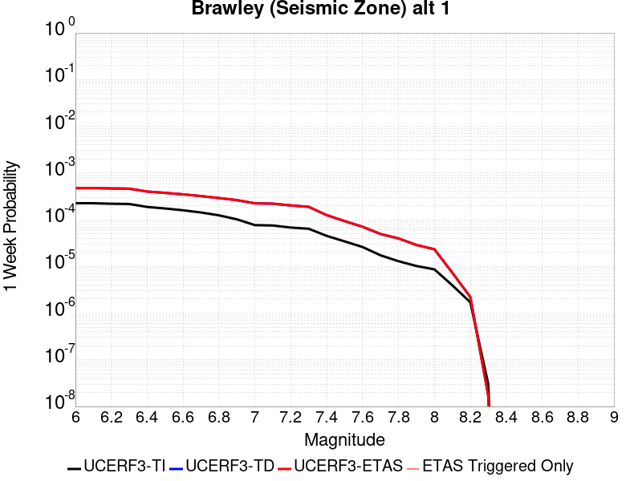 |  |  |  |

| Magnitude | 1 wk TI Prob | 1 wk TD Prob | 1 wk ETAS Prob | 1 wk ETAS/TD Gain | 1 wk ETAS Triggered Only | 1 mo TI Prob | 1 mo TD Prob | 1 mo ETAS Prob | 1 mo ETAS/TD Gain | 1 mo ETAS Triggered Only | 1 yr TI Prob | 1 yr TD Prob | 1 yr ETAS Prob | 1 yr ETAS/TD Gain | 1 yr ETAS Triggered Only | 10 yr TI Prob | 10 yr TD Prob | 10 yr ETAS Prob | 10 yr ETAS/TD Gain | 10 yr ETAS Triggered Only |
|-----|-----|-----|-----|-----|-----|-----|-----|-----|-----|-----|-----|-----|-----|-----|-----|-----|-----|-----|-----|-----|
| 6.0 | 2.2521618E-4 | 4.7643206E-4 | 4.7643206E-4 | 1.0 | 0.0 | 9.6485513E-4 | 0.002040291 | 0.002040291 | 1.0 | 0.0 | 0.011683988 | 0.024554973 | 0.024574483 | 1.0007945 | 2.0E-5 | 0.11088423 | 0.21353106 | 0.21357039 | 1.0001842 | 5.0E-5 |
| 6.1 | 2.2521618E-4 | 4.7643206E-4 | 4.7643206E-4 | 1.0 | 0.0 | 9.6485513E-4 | 0.002040291 | 0.002040291 | 1.0 | 0.0 | 0.011683988 | 0.024554973 | 0.024574483 | 1.0007945 | 2.0E-5 | 0.11088423 | 0.21353106 | 0.21357039 | 1.0001842 | 5.0E-5 |
| 6.2 | 2.198148E-4 | 4.672759E-4 | 4.672759E-4 | 1.0 | 0.0 | 9.417233E-4 | 0.0020011107 | 0.0020011107 | 1.0 | 0.0 | 0.011405343 | 0.024089037 | 0.024108553 | 1.0008103 | 2.0E-5 | 0.10837428 | 0.20996717 | 0.21000667 | 1.0001881 | 5.0E-5 |
| 6.3 | 2.1704129E-4 | 4.6163241E-4 | 4.6163241E-4 | 1.0 | 0.0 | 9.298453E-4 | 0.001976961 | 0.001976961 | 1.0 | 0.0 | 0.011262234 | 0.023802388 | 0.023821913 | 1.0008203 | 2.0E-5 | 0.107082725 | 0.20785816 | 0.20789777 | 1.0001905 | 5.0E-5 |
| 6.4 | 1.876142E-4 | 4.0055066E-4 | 4.0055066E-4 | 1.0 | 0.0 | 8.038131E-4 | 0.0017155306 | 0.0017155306 | 1.0 | 0.0 | 0.00974259 | 0.020688837 | 0.020708423 | 1.0009468 | 2.0E-5 | 0.093263686 | 0.18460822 | 0.18464899 | 1.0002209 | 5.0E-5 |
| 6.5 | 1.7390939E-4 | 3.7486907E-4 | 3.7486907E-4 | 1.0 | 0.0 | 7.45113E-4 | 0.0016056047 | 0.0016056047 | 1.0 | 0.0 | 0.009034078 | 0.019377038 | 0.019396652 | 1.0010122 | 2.0E-5 | 0.086755216 | 0.17442968 | 0.17447098 | 1.0002366 | 5.0E-5 |
| 6.6 | 1.591791E-4 | 3.490135E-4 | 3.490135E-4 | 1.0 | 0.0 | 6.8201777E-4 | 0.0014949249 | 0.0014949249 | 1.0 | 0.0 | 0.008271996 | 0.018051691 | 0.018071331 | 1.0010879 | 2.0E-5 | 0.07970774 | 0.16383655 | 0.16387837 | 1.0002552 | 5.0E-5 |
| 6.7 | 1.4268003E-4 | 3.2067046E-4 | 3.2067046E-4 | 1.0 | 0.0 | 6.1134255E-4 | 0.0013735864 | 0.0013735864 | 1.0 | 0.0 | 0.007417723 | 0.016597226 | 0.016616894 | 1.001185 | 2.0E-5 | 0.07174956 | 0.15196328 | 0.15200567 | 1.0002791 | 5.0E-5 |
| 6.8 | 1.239713E-4 | 2.906121E-4 | 2.906121E-4 | 1.0 | 0.0 | 5.3119735E-4 | 0.0012448921 | 0.0012448921 | 1.0 | 0.0 | 0.0064481674 | 0.015052661 | 0.01507236 | 1.0013087 | 2.0E-5 | 0.06264243 | 0.13840474 | 0.13844782 | 1.0003113 | 5.0E-5 |
| 6.9 | 1.0180238E-4 | 2.6260383E-4 | 2.6260383E-4 | 1.0 | 0.0 | 4.3622297E-4 | 0.0011249639 | 0.0011249639 | 1.0 | 0.0 | 0.005298089 | 0.013611422 | 0.01363115 | 1.0014493 | 2.0E-5 | 0.05173543 | 0.12498361 | 0.12502736 | 1.00035 | 5.0E-5 |
| 7.0 | 7.6619996E-5 | 2.2404084E-4 | 2.2404084E-4 | 1.0 | 0.0 | 3.283301E-4 | 9.598249E-4 | 9.598249E-4 | 1.0 | 0.0 | 0.0039900932 | 0.011623963 | 0.011643731 | 1.0017006 | 2.0E-5 | 0.039192066 | 0.10728301 | 0.10732765 | 1.000416 | 5.0E-5 |
| 7.1 | 7.5127435E-5 | 2.2087194E-4 | 2.2087194E-4 | 1.0 | 0.0 | 3.2193496E-4 | 9.462538E-4 | 9.462538E-4 | 1.0 | 0.0 | 0.0039125155 | 0.011460485 | 0.011480255 | 1.0017251 | 2.0E-5 | 0.038443442 | 0.105846815 | 0.105891526 | 1.0004224 | 5.0E-5 |
| 7.2 | 6.788582E-5 | 2.0214771E-4 | 2.0214771E-4 | 1.0 | 0.0 | 2.9090676E-4 | 8.660627E-4 | 8.660627E-4 | 1.0 | 0.0 | 0.0035360386 | 0.010493974 | 0.010513765 | 1.0018859 | 2.0E-5 | 0.034803 | 0.09751713 | 0.09755323 | 1.0003701 | 4.0E-5 |
| 7.3 | 6.399602E-5 | 1.884553E-4 | 1.884553E-4 | 1.0 | 0.0 | 2.7423984E-4 | 8.074185E-4 | 8.074185E-4 | 1.0 | 0.0 | 0.0033337586 | 0.009786601 | 0.009806406 | 1.0020236 | 2.0E-5 | 0.03284188 | 0.09141058 | 0.09144692 | 1.0003976 | 4.0E-5 |
| 7.4 | 4.506759E-5 | 1.2532667E-4 | 1.2532667E-4 | 1.0 | 0.0 | 1.9313251E-4 | 5.370046E-4 | 5.370046E-4 | 1.0 | 0.0 | 0.0023488526 | 0.006518606 | 0.006538476 | 1.0030482 | 2.0E-5 | 0.023241805 | 0.06237464 | 0.062412143 | 1.0006013 | 4.0E-5 |
| 7.5 | 3.43289E-5 | 9.338305E-5 | 9.338305E-5 | 1.0 | 0.0 | 1.4711556E-4 | 4.00152E-4 | 4.00152E-4 | 1.0 | 0.0 | 0.0017896603 | 0.00486103 | 0.0048709814 | 1.0020472 | 1.0E-5 | 0.01775316 | 0.04706593 | 0.047094516 | 1.0006074 | 3.0E-5 |
| 7.6 | 2.5980507E-5 | 7.055588E-5 | 7.055588E-5 | 1.0 | 0.0 | 1.1134028E-4 | 3.023474E-4 | 3.023474E-4 | 1.0 | 0.0 | 0.001354725 | 0.0036748908 | 0.0036848541 | 1.0027112 | 1.0E-5 | 0.013464959 | 0.035850268 | 0.03587919 | 1.0008068 | 3.0E-5 |
| 7.7 | 1.7292105E-5 | 4.9428265E-5 | 4.9428265E-5 | 1.0 | 0.0 | 7.4106916E-5 | 2.1181825E-4 | 2.1181825E-4 | 1.0 | 0.0 | 9.018782E-4 | 0.002575843 | 0.0025858171 | 1.0038723 | 1.0E-5 | 0.008982267 | 0.025298944 | 0.025318438 | 1.0007706 | 2.0E-5 |
| 7.8 | 1.2927471E-5 | 3.971141E-5 | 3.971141E-5 | 1.0 | 0.0 | 5.5402274E-5 | 1.7018066E-4 | 1.7018066E-4 | 1.0 | 0.0 | 6.743139E-4 | 0.0020699832 | 0.0020799625 | 1.004821 | 1.0E-5 | 0.0067227143 | 0.020439085 | 0.02044888 | 1.0004792 | 1.0E-5 |
| 7.9 | 1.0200774E-5 | 2.8759863E-5 | 2.8759863E-5 | 1.0 | 0.0 | 4.371687E-5 | 1.2325073E-4 | 1.2325073E-4 | 1.0 | 0.0 | 5.321229E-4 | 0.0014995459 | 0.0015095309 | 1.0066587 | 1.0E-5 | 0.005308505 | 0.0149981035 | 0.015007953 | 1.0006567 | 1.0E-5 |
| 8.0 | 8.650396E-6 | 2.3289316E-5 | 2.3289316E-5 | 1.0 | 0.0 | 3.70726E-5 | 9.980754E-5 | 9.980754E-5 | 1.0 | 0.0 | 4.5126543E-4 | 0.0012144803 | 0.0012244681 | 1.008224 | 1.0E-5 | 0.0045035016 | 0.012216583 | 0.0122264605 | 1.0008086 | 1.0E-5 |
| 8.1 | 3.9368224E-6 | 7.3325436E-6 | 7.3325436E-6 | 1.0 | 0.0 | 1.6871985E-5 | 3.142481E-5 | 3.142481E-5 | 1.0 | 0.0 | 2.0539707E-4 | 3.8253E-4 | 3.8253E-4 | 1.0 | 0.0 | 0.0020520731 | 0.0040034265 | 0.0040034265 | 1.0 | 0.0 |
| 8.2 | 1.7101195E-6 | 2.21947E-6 | 2.21947E-6 | 1.0 | 0.0 | 7.329063E-6 | 9.511979E-6 | 9.511979E-6 | 1.0 | 0.0 | 8.922769E-5 | 1.1580222E-4 | 1.1580222E-4 | 1.0 | 0.0 | 8.9191867E-4 | 0.0012675131 | 0.0012675131 | 1.0 | 0.0 |
| 8.3 | 3.0346666E-8 | 1.7229212E-8 | 1.7229212E-8 | 1.0 | 0.0 | 1.3005713E-7 | 7.383948E-8 | 7.383948E-8 | 1.0 | 0.0 | 1.5834444E-6 | 8.9899555E-7 | 8.9899555E-7 | 1.0 | 0.0 | 1.5834332E-5 | 9.375523E-6 | 9.375523E-6 | 1.0 | 0.0 |

## Big Pine (Central)
*[(top)](#table-of-contents)*

| 1 Week | 1 Month | 1 Year | 10 Year |
|-----|-----|-----|-----|
|  |  | 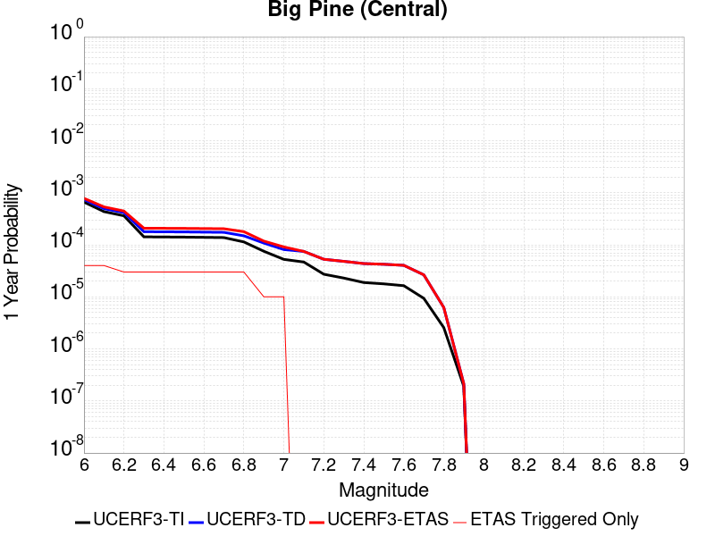 |  |

| Magnitude | 1 wk TI Prob | 1 wk TD Prob | 1 wk ETAS Prob | 1 wk ETAS/TD Gain | 1 wk ETAS Triggered Only | 1 mo TI Prob | 1 mo TD Prob | 1 mo ETAS Prob | 1 mo ETAS/TD Gain | 1 mo ETAS Triggered Only | 1 yr TI Prob | 1 yr TD Prob | 1 yr ETAS Prob | 1 yr ETAS/TD Gain | 1 yr ETAS Triggered Only | 10 yr TI Prob | 10 yr TD Prob | 10 yr ETAS Prob | 10 yr ETAS/TD Gain | 10 yr ETAS Triggered Only |
|-----|-----|-----|-----|-----|-----|-----|-----|-----|-----|-----|-----|-----|-----|-----|-----|-----|-----|-----|-----|-----|
| 6.0 | 1.2706755E-5 | 1.4251083E-5 | 1.4251083E-5 | 1.0 | 0.0 | 5.4456385E-5 | 6.107485E-5 | 8.1073624E-5 | 1.327447 | 2.0E-5 | 6.628048E-4 | 7.433691E-4 | 7.833394E-4 | 1.0537691 | 4.0E-5 | 0.006608314 | 0.0074138264 | 0.0074634557 | 1.0066942 | 5.0E-5 |
| 6.1 | 8.342579E-6 | 9.511262E-6 | 9.511262E-6 | 1.0 | 0.0 | 3.5753423E-5 | 4.0762035E-5 | 6.076122E-5 | 1.4906327 | 2.0E-5 | 4.3521097E-4 | 4.961865E-4 | 5.3616666E-4 | 1.0805749 | 4.0E-5 | 0.0043435963 | 0.004954315 | 0.0049941163 | 1.0080338 | 4.0E-5 |
| 6.2 | 6.923899E-6 | 7.967629E-6 | 7.967629E-6 | 1.0 | 0.0 | 2.9673516E-5 | 3.4146644E-5 | 5.4145963E-5 | 1.5856891 | 2.0E-5 | 3.6121515E-4 | 4.1567534E-4 | 4.4566288E-4 | 1.0721418 | 3.0E-5 | 0.003606286 | 0.00415226 | 0.004182135 | 1.007195 | 3.0E-5 |
| 6.3 | 2.728396E-6 | 3.4247232E-6 | 3.4247232E-6 | 1.0 | 0.0 | 1.1693074E-5 | 1.4677307E-5 | 3.4677014E-5 | 2.3626277 | 2.0E-5 | 1.4235388E-4 | 1.7868243E-4 | 2.0867707E-4 | 1.1678656 | 3.0E-5 | 0.0014226272 | 0.001786868 | 0.0018168144 | 1.0167592 | 3.0E-5 |
| 6.4 | 2.7136944E-6 | 3.4090162E-6 | 3.4090162E-6 | 1.0 | 0.0 | 1.1630066E-5 | 1.4609993E-5 | 3.46097E-5 | 2.368906 | 2.0E-5 | 1.4158686E-4 | 1.7786301E-4 | 2.0785768E-4 | 1.1686392 | 3.0E-5 | 0.0014149669 | 0.001778687 | 0.0018086336 | 1.0168364 | 3.0E-5 |
| 6.5 | 2.6971882E-6 | 3.3913614E-6 | 3.3913614E-6 | 1.0 | 0.0 | 1.1559327E-5 | 1.4534329E-5 | 3.4534038E-5 | 2.3760326 | 2.0E-5 | 1.4072572E-4 | 1.7694196E-4 | 2.0693665E-4 | 1.1695172 | 3.0E-5 | 0.0014063664 | 0.0017694911 | 0.001799438 | 1.016924 | 3.0E-5 |
| 6.6 | 2.669092E-6 | 3.3613815E-6 | 3.3613815E-6 | 1.0 | 0.0 | 1.1438916E-5 | 1.4405846E-5 | 3.440556E-5 | 2.3883052 | 2.0E-5 | 1.3925991E-4 | 1.7537792E-4 | 2.0537266E-4 | 1.1710292 | 3.0E-5 | 0.0013917267 | 0.0017538755 | 0.0017838229 | 1.017075 | 3.0E-5 |
| 6.7 | 2.6408059E-6 | 3.3314068E-6 | 3.3314068E-6 | 1.0 | 0.0 | 1.1317691E-5 | 1.4277384E-5 | 3.4277098E-5 | 2.400797 | 2.0E-5 | 1.3778417E-4 | 1.7381416E-4 | 2.0380894E-4 | 1.1725681 | 3.0E-5 | 0.0013769877 | 0.0017382624 | 0.0017682102 | 1.0172286 | 3.0E-5 |
| 6.8 | 2.1786943E-6 | 2.8548623E-6 | 2.8548623E-6 | 1.0 | 0.0 | 9.337228E-6 | 1.223507E-5 | 3.2234824E-5 | 2.6346252 | 2.0E-5 | 1.1367482E-4 | 1.4895253E-4 | 1.7894806E-4 | 1.2013764 | 3.0E-5 | 0.0011361669 | 0.0014899937 | 0.001519949 | 1.0201043 | 3.0E-5 |
| 6.9 | 1.4411696E-6 | 2.0689088E-6 | 2.0689088E-6 | 1.0 | 0.0 | 6.1764263E-6 | 8.866724E-6 | 1.8866634E-5 | 2.1278024 | 1.0E-5 | 7.51954E-5 | 1.07947286E-4 | 1.17946205E-4 | 1.0926278 | 1.0E-5 | 7.5169955E-4 | 0.0010803706 | 0.0010903598 | 1.0092461 | 1.0E-5 |
| 7.0 | 1.0073411E-6 | 1.5546336E-6 | 1.5546336E-6 | 1.0 | 0.0 | 4.317169E-6 | 6.662699E-6 | 1.6662632E-5 | 2.500883 | 1.0E-5 | 5.2560266E-5 | 8.11155E-5 | 9.1114685E-5 | 1.123271 | 1.0E-5 | 5.2547833E-4 | 8.1226975E-4 | 8.222616E-4 | 1.0123012 | 1.0E-5 |
| 7.1 | 8.947104E-7 | 1.4306167E-6 | 1.4306167E-6 | 1.0 | 0.0 | 3.834468E-6 | 6.1312007E-6 | 6.1312007E-6 | 1.0 | 0.0 | 4.6683643E-5 | 7.4644966E-5 | 7.4644966E-5 | 1.0 | 0.0 | 4.6673836E-4 | 7.4760953E-4 | 7.4760953E-4 | 1.0 | 0.0 |
| 7.2 | 5.215166E-7 | 1.0115094E-6 | 1.0115094E-6 | 1.0 | 0.0 | 2.2350691E-6 | 4.3350337E-6 | 4.3350337E-6 | 1.0 | 0.0 | 2.7211627E-5 | 5.27778E-5 | 5.27778E-5 | 1.0 | 0.0 | 2.7208295E-4 | 5.2905316E-4 | 5.2905316E-4 | 1.0 | 0.0 |
| 7.3 | 4.4024807E-7 | 9.2229175E-7 | 9.2229175E-7 | 1.0 | 0.0 | 1.8867761E-6 | 3.952673E-6 | 3.952673E-6 | 1.0 | 0.0 | 2.2971257E-5 | 4.8122773E-5 | 4.8122773E-5 | 1.0 | 0.0 | 2.2968883E-4 | 4.8252378E-4 | 4.8252378E-4 | 1.0 | 0.0 |
| 7.4 | 3.6130905E-7 | 8.3617664E-7 | 8.3617664E-7 | 1.0 | 0.0 | 1.5484665E-6 | 3.5836094E-6 | 3.5836094E-6 | 1.0 | 0.0 | 1.8852415E-5 | 4.362961E-5 | 4.362961E-5 | 1.0 | 0.0 | 1.8850817E-4 | 4.3760161E-4 | 4.3760161E-4 | 1.0 | 0.0 |
| 7.5 | 3.408184E-7 | 8.111325E-7 | 8.111325E-7 | 1.0 | 0.0 | 1.4606494E-6 | 3.4762777E-6 | 3.4762777E-6 | 1.0 | 0.0 | 1.7783263E-5 | 4.2322896E-5 | 4.2322896E-5 | 1.0 | 0.0 | 1.778184E-4 | 4.2451447E-4 | 4.2451447E-4 | 1.0 | 0.0 |
| 7.6 | 3.1428627E-7 | 7.734672E-7 | 7.734672E-7 | 1.0 | 0.0 | 1.3469405E-6 | 3.3148556E-6 | 3.3148556E-6 | 1.0 | 0.0 | 1.6398877E-5 | 4.0357656E-5 | 4.0357656E-5 | 1.0 | 0.0 | 1.6397667E-4 | 4.0484127E-4 | 4.0484127E-4 | 1.0 | 0.0 |
| 7.7 | 1.7972785E-7 | 5.0801975E-7 | 5.0801975E-7 | 1.0 | 0.0 | 7.70262E-7 | 2.1772257E-6 | 2.1772257E-6 | 1.0 | 0.0 | 9.377899E-6 | 2.650741E-5 | 2.650741E-5 | 1.0 | 0.0 | 9.377503E-5 | 2.6640965E-4 | 2.6640965E-4 | 1.0 | 0.0 |
| 7.8 | 4.9230927E-8 | 1.1986405E-7 | 1.1986405E-7 | 1.0 | 0.0 | 2.1098968E-7 | 5.13703E-7 | 5.13703E-7 | 1.0 | 0.0 | 2.5687964E-6 | 6.2543177E-6 | 6.2543177E-6 | 1.0 | 0.0 | 2.5687666E-5 | 6.29837E-5 | 6.29837E-5 | 1.0 | 0.0 |
| 7.9 | 3.6805972E-9 | 4.1069246E-9 | 4.1069246E-9 | 1.0 | 0.0 | 1.5773987E-8 | 1.7601105E-8 | 1.7601105E-8 | 1.0 | 0.0 | 1.9204828E-7 | 2.1429342E-7 | 2.1429342E-7 | 1.0 | 0.0 | 1.920481E-6 | 2.1908222E-6 | 2.1908222E-6 | 1.0 | 0.0 |

## San Jacinto (Anza) rev
*[(top)](#table-of-contents)*

| 1 Week | 1 Month | 1 Year | 10 Year |
|-----|-----|-----|-----|
|  |  |  |  |

| Magnitude | 1 wk TI Prob | 1 wk TD Prob | 1 wk ETAS Prob | 1 wk ETAS/TD Gain | 1 wk ETAS Triggered Only | 1 mo TI Prob | 1 mo TD Prob | 1 mo ETAS Prob | 1 mo ETAS/TD Gain | 1 mo ETAS Triggered Only | 1 yr TI Prob | 1 yr TD Prob | 1 yr ETAS Prob | 1 yr ETAS/TD Gain | 1 yr ETAS Triggered Only | 10 yr TI Prob | 10 yr TD Prob | 10 yr ETAS Prob | 10 yr ETAS/TD Gain | 10 yr ETAS Triggered Only |
|-----|-----|-----|-----|-----|-----|-----|-----|-----|-----|-----|-----|-----|-----|-----|-----|-----|-----|-----|-----|-----|
| 6.0 | 6.3015636E-5 | 4.3312386E-5 | 4.3312386E-5 | 1.0 | 0.0 | 2.7003905E-4 | 1.8561137E-4 | 1.9560951E-4 | 1.053866 | 1.0E-5 | 0.0032827691 | 0.0022574882 | 0.0022674657 | 1.0044197 | 1.0E-5 | 0.032346968 | 0.023307782 | 0.023356615 | 1.0020952 | 5.0E-5 |
| 6.1 | 6.3015636E-5 | 4.3312386E-5 | 4.3312386E-5 | 1.0 | 0.0 | 2.7003905E-4 | 1.8561137E-4 | 1.9560951E-4 | 1.053866 | 1.0E-5 | 0.0032827691 | 0.0022574882 | 0.0022674657 | 1.0044197 | 1.0E-5 | 0.032346968 | 0.023307782 | 0.023356615 | 1.0020952 | 5.0E-5 |
| 6.2 | 6.3015636E-5 | 4.3312386E-5 | 4.3312386E-5 | 1.0 | 0.0 | 2.7003905E-4 | 1.8561137E-4 | 1.9560951E-4 | 1.053866 | 1.0E-5 | 0.0032827691 | 0.0022574882 | 0.0022674657 | 1.0044197 | 1.0E-5 | 0.032346968 | 0.023307782 | 0.023356615 | 1.0020952 | 5.0E-5 |
| 6.3 | 6.3015636E-5 | 4.3312386E-5 | 4.3312386E-5 | 1.0 | 0.0 | 2.7003905E-4 | 1.8561137E-4 | 1.9560951E-4 | 1.053866 | 1.0E-5 | 0.0032827691 | 0.0022574882 | 0.0022674657 | 1.0044197 | 1.0E-5 | 0.032346968 | 0.023307782 | 0.023356615 | 1.0020952 | 5.0E-5 |
| 6.4 | 6.3015636E-5 | 4.3312386E-5 | 4.3312386E-5 | 1.0 | 0.0 | 2.7003905E-4 | 1.8561137E-4 | 1.9560951E-4 | 1.053866 | 1.0E-5 | 0.0032827691 | 0.0022574882 | 0.0022674657 | 1.0044197 | 1.0E-5 | 0.032346968 | 0.023307782 | 0.023356615 | 1.0020952 | 5.0E-5 |
| 6.5 | 5.811017E-5 | 4.009432E-5 | 4.009432E-5 | 1.0 | 0.0 | 2.4901982E-4 | 1.7182152E-4 | 1.818198E-4 | 1.0581899 | 1.0E-5 | 0.0030276014 | 0.0020899256 | 0.0020999047 | 1.0047748 | 1.0E-5 | 0.02986684 | 0.021605028 | 0.021653948 | 1.0022643 | 5.0E-5 |
| 6.6 | 5.811017E-5 | 4.009432E-5 | 4.009432E-5 | 1.0 | 0.0 | 2.4901982E-4 | 1.7182152E-4 | 1.818198E-4 | 1.0581899 | 1.0E-5 | 0.0030276014 | 0.0020899256 | 0.0020999047 | 1.0047748 | 1.0E-5 | 0.02986684 | 0.021605028 | 0.021653948 | 1.0022643 | 5.0E-5 |
| 6.7 | 5.712442E-5 | 3.951705E-5 | 3.951705E-5 | 1.0 | 0.0 | 2.4479596E-4 | 1.6934783E-4 | 1.7934613E-4 | 1.0590401 | 1.0E-5 | 0.0029763177 | 0.0020598655 | 0.0020698449 | 1.0048447 | 1.0E-5 | 0.029367693 | 0.021297079 | 0.021346014 | 1.0022978 | 5.0E-5 |
| 6.8 | 5.6967532E-5 | 3.9373335E-5 | 3.9373335E-5 | 1.0 | 0.0 | 2.4412372E-4 | 1.6873197E-4 | 1.7873029E-4 | 1.0592556 | 1.0E-5 | 0.0029681553 | 0.0020523819 | 0.0020623612 | 1.0048624 | 1.0E-5 | 0.029288229 | 0.02122268 | 0.02127162 | 1.002306 | 5.0E-5 |
| 6.9 | 5.6211324E-5 | 3.9078248E-5 | 3.9078248E-5 | 1.0 | 0.0 | 2.4088343E-4 | 1.6746749E-4 | 1.7746582E-4 | 1.0597031 | 1.0E-5 | 0.0029288116 | 0.0020370155 | 0.002046995 | 1.0048991 | 1.0E-5 | 0.028905109 | 0.021060992 | 0.021109939 | 1.0023241 | 5.0E-5 |
| 7.0 | 5.4383527E-5 | 3.793897E-5 | 3.793897E-5 | 1.0 | 0.0 | 2.3305144E-4 | 1.6258548E-4 | 1.7258387E-4 | 1.0614961 | 1.0E-5 | 0.0028337094 | 0.001977686 | 0.0019876661 | 1.0050464 | 1.0E-5 | 0.027978465 | 0.020454587 | 0.020503564 | 1.0023944 | 5.0E-5 |
| 7.1 | 5.1393665E-5 | 3.6401827E-5 | 3.6401827E-5 | 1.0 | 0.0 | 2.2023996E-4 | 1.5599852E-4 | 1.6599697E-4 | 1.0640931 | 1.0E-5 | 0.0026781242 | 0.0018976318 | 0.0019076128 | 1.0052598 | 1.0E-5 | 0.026460782 | 0.019625481 | 0.0196745 | 1.0024977 | 5.0E-5 |
| 7.2 | 4.785222E-5 | 3.4752728E-5 | 3.4752728E-5 | 1.0 | 0.0 | 2.0506482E-4 | 1.4893178E-4 | 1.589303E-4 | 1.0671349 | 1.0E-5 | 0.0024938055 | 0.0018117399 | 0.0018217218 | 1.0055096 | 1.0E-5 | 0.024660049 | 0.018735653 | 0.018784715 | 1.0026187 | 5.0E-5 |
| 7.3 | 4.2143256E-5 | 3.384821E-5 | 3.384821E-5 | 1.0 | 0.0 | 1.8060145E-4 | 1.4505572E-4 | 1.5505427E-4 | 1.0689291 | 1.0E-5 | 0.002196605 | 0.0017646261 | 0.0017746085 | 1.005657 | 1.0E-5 | 0.02175019 | 0.018243507 | 0.018292595 | 1.0026907 | 5.0E-5 |
| 7.4 | 4.0264713E-5 | 3.348636E-5 | 3.348636E-5 | 1.0 | 0.0 | 1.7255165E-4 | 1.4350511E-4 | 1.5350367E-4 | 1.0696739 | 1.0E-5 | 0.002098792 | 0.0017457779 | 0.0017557604 | 1.0057181 | 1.0E-5 | 0.020790804 | 0.018048115 | 0.018097213 | 1.0027204 | 5.0E-5 |
| 7.5 | 3.694492E-5 | 3.2200267E-5 | 3.2200267E-5 | 1.0 | 0.0 | 1.5832575E-4 | 1.3799386E-4 | 1.4799248E-4 | 1.072457 | 1.0E-5 | 0.0019259118 | 0.0016787836 | 0.0016887669 | 1.0059466 | 1.0E-5 | 0.01909306 | 0.017364455 | 0.017413586 | 1.0028294 | 5.0E-5 |
| 7.6 | 3.200565E-5 | 2.9515684E-5 | 2.9515684E-5 | 1.0 | 0.0 | 1.3715986E-4 | 1.2648967E-4 | 1.3648841E-4 | 1.0790478 | 1.0E-5 | 0.001668642 | 0.001538926 | 0.0015489106 | 1.0064881 | 1.0E-5 | 0.01656168 | 0.015952358 | 0.01600156 | 1.0030843 | 5.0E-5 |
| 7.7 | 2.731642E-5 | 2.6104135E-5 | 2.6104135E-5 | 1.0 | 0.0 | 1.1706512E-4 | 1.11870075E-4 | 1.2186896E-4 | 1.0893794 | 1.0E-5 | 0.001424336 | 0.0013611682 | 0.0013711546 | 1.0073366 | 1.0E-5 | 0.014152412 | 0.014172893 | 0.014222184 | 1.0034778 | 5.0E-5 |
| 7.8 | 2.3466424E-5 | 2.3515782E-5 | 2.3515782E-5 | 1.0 | 0.0 | 1.0056651E-4 | 1.0077804E-4 | 1.1077703E-4 | 1.099218 | 1.0E-5 | 0.0012237094 | 0.0012262828 | 0.0012362705 | 1.0081447 | 1.0E-5 | 0.012169928 | 0.012814545 | 0.012863904 | 1.0038518 | 5.0E-5 |
| 7.9 | 1.8611925E-5 | 1.8917919E-5 | 1.8917919E-5 | 1.0 | 0.0 | 7.9762955E-5 | 8.107428E-5 | 9.107347E-5 | 1.1233337 | 1.0E-5 | 9.7068126E-4 | 9.86633E-4 | 9.966232E-4 | 1.0101255 | 1.0E-5 | 0.0096645225 | 0.010399014 | 0.010448494 | 1.0047581 | 5.0E-5 |
| 8.0 | 1.5460775E-5 | 1.5749598E-5 | 1.5749598E-5 | 1.0 | 0.0 | 6.6258784E-5 | 6.7496534E-5 | 7.749586E-5 | 1.1481458 | 1.0E-5 | 8.0640207E-4 | 8.2146114E-4 | 8.3145296E-4 | 1.0121634 | 1.0E-5 | 0.008034821 | 0.008707448 | 0.008757013 | 1.0056922 | 5.0E-5 |
| 8.1 | 9.983884E-6 | 8.274653E-6 | 8.274653E-6 | 1.0 | 0.0 | 4.2787375E-5 | 3.546232E-5 | 3.546232E-5 | 1.0 | 0.0 | 5.2081177E-4 | 4.316687E-4 | 4.316687E-4 | 1.0 | 0.0 | 0.0051959283 | 0.0046425606 | 0.004672421 | 1.0064319 | 3.0E-5 |
| 8.2 | 4.1226E-6 | 1.5539142E-6 | 1.5539142E-6 | 1.0 | 0.0 | 1.7668166E-5 | 6.6596153E-6 | 6.6596153E-6 | 1.0 | 0.0 | 2.1508869E-4 | 8.107783E-5 | 8.107783E-5 | 1.0 | 0.0 | 0.0021488064 | 9.410467E-4 | 9.410467E-4 | 1.0 | 0.0 |
| 8.3 | 1.2750878E-6 | 3.6143226E-7 | 3.6143226E-7 | 1.0 | 0.0 | 5.4646503E-6 | 1.5489944E-6 | 1.5489944E-6 | 1.0 | 0.0 | 6.653009E-5 | 1.8858847E-5 | 1.8858847E-5 | 1.0 | 0.0 | 6.6510175E-4 | 2.2747046E-4 | 2.2747046E-4 | 1.0 | 0.0 |

## Imperial
*[(top)](#table-of-contents)*

| 1 Week | 1 Month | 1 Year | 10 Year |
|-----|-----|-----|-----|
|  |  |  |  |

| Magnitude | 1 wk TI Prob | 1 wk TD Prob | 1 wk ETAS Prob | 1 wk ETAS/TD Gain | 1 wk ETAS Triggered Only | 1 mo TI Prob | 1 mo TD Prob | 1 mo ETAS Prob | 1 mo ETAS/TD Gain | 1 mo ETAS Triggered Only | 1 yr TI Prob | 1 yr TD Prob | 1 yr ETAS Prob | 1 yr ETAS/TD Gain | 1 yr ETAS Triggered Only | 10 yr TI Prob | 10 yr TD Prob | 10 yr ETAS Prob | 10 yr ETAS/TD Gain | 10 yr ETAS Triggered Only |
|-----|-----|-----|-----|-----|-----|-----|-----|-----|-----|-----|-----|-----|-----|-----|-----|-----|-----|-----|-----|-----|
| 6.0 | 2.7496446E-4 | 5.0567614E-4 | 5.0567614E-4 | 1.0 | 0.0 | 0.0011778869 | 0.0021654228 | 0.0021654228 | 1.0 | 0.0 | 0.0142467655 | 0.02603894 | 0.026048679 | 1.0003741 | 1.0E-5 | 0.13367249 | 0.22807938 | 0.22811025 | 1.0001354 | 4.0E-5 |
| 6.1 | 2.5356023E-4 | 4.8670304E-4 | 4.8670304E-4 | 1.0 | 0.0 | 0.001086234 | 0.002084241 | 0.002084241 | 1.0 | 0.0 | 0.013144928 | 0.025080038 | 0.025089787 | 1.0003887 | 1.0E-5 | 0.123940155 | 0.21950823 | 0.21953945 | 1.0001422 | 4.0E-5 |
| 6.2 | 2.4820742E-4 | 4.776551E-4 | 4.776551E-4 | 1.0 | 0.0 | 0.0010633124 | 0.0020455252 | 0.0020455252 | 1.0 | 0.0 | 0.01286919 | 0.024619855 | 0.02462961 | 1.0003961 | 1.0E-5 | 0.12148927 | 0.21601348 | 0.21604484 | 1.0001452 | 4.0E-5 |
| 6.3 | 2.3205351E-4 | 4.590242E-4 | 4.590242E-4 | 1.0 | 0.0 | 9.94136E-4 | 0.0019658 | 0.0019658 | 1.0 | 0.0 | 0.012036599 | 0.023666015 | 0.023675779 | 1.0004126 | 1.0E-5 | 0.11405133 | 0.20796531 | 0.207997 | 1.0001523 | 4.0E-5 |
| 6.4 | 2.0304754E-4 | 3.988816E-4 | 3.988816E-4 | 1.0 | 0.0 | 8.6991355E-4 | 0.001708387 | 0.001708387 | 1.0 | 0.0 | 0.010539869 | 0.02060005 | 0.020609844 | 1.0004754 | 1.0E-5 | 0.100537635 | 0.185097 | 0.1851296 | 1.0001761 | 4.0E-5 |
| 6.5 | 1.854992E-4 | 3.6999586E-4 | 3.6999586E-4 | 1.0 | 0.0 | 7.9475436E-4 | 0.0015847452 | 0.0015847452 | 1.0 | 0.0 | 0.009633281 | 0.019126106 | 0.019135915 | 1.0005128 | 1.0E-5 | 0.0922623 | 0.17332682 | 0.17335989 | 1.0001907 | 4.0E-5 |
| 6.6 | 1.6586106E-4 | 3.4044893E-4 | 3.4044893E-4 | 1.0 | 0.0 | 7.106394E-4 | 0.001458261 | 0.001458261 | 1.0 | 0.0 | 0.008617763 | 0.017607149 | 0.017616972 | 1.0005579 | 1.0E-5 | 0.08291132 | 0.16080214 | 0.16083571 | 1.0002087 | 4.0E-5 |
| 6.7 | 1.4224656E-4 | 3.0775566E-4 | 3.0775566E-4 | 1.0 | 0.0 | 6.094856E-4 | 0.0013182943 | 0.0013182943 | 1.0 | 0.0 | 0.0073952693 | 0.015934104 | 0.015943944 | 1.0006176 | 1.0E-5 | 0.07153955 | 0.146514 | 0.14654814 | 1.000233 | 4.0E-5 |
| 6.8 | 1.2317259E-4 | 2.7798547E-4 | 2.7798547E-4 | 1.0 | 0.0 | 5.2777573E-4 | 0.0011908285 | 0.0011908285 | 1.0 | 0.0 | 0.0064067547 | 0.01440334 | 0.014413197 | 1.0006843 | 1.0E-5 | 0.06225166 | 0.13296336 | 0.13299805 | 1.0002608 | 4.0E-5 |
| 6.9 | 9.859898E-5 | 2.5019908E-4 | 2.5019908E-4 | 1.0 | 0.0 | 4.2249862E-4 | 0.0010718454 | 0.0010718454 | 1.0 | 0.0 | 0.0051317946 | 0.012972599 | 0.012982469 | 1.0007609 | 1.0E-5 | 0.05014893 | 0.119427115 | 0.11946233 | 1.0002949 | 4.0E-5 |
| 7.0 | 7.3191884E-5 | 2.1271173E-4 | 2.1271173E-4 | 1.0 | 0.0 | 3.136418E-4 | 9.113064E-4 | 9.113064E-4 | 1.0 | 0.0 | 0.003811904 | 0.011039398 | 0.011049286 | 1.0008959 | 1.0E-5 | 0.037471764 | 0.10207956 | 0.102115475 | 1.0003519 | 4.0E-5 |
| 7.1 | 7.1760296E-5 | 2.0972485E-4 | 2.0972485E-4 | 1.0 | 0.0 | 3.0750787E-4 | 8.9851435E-4 | 8.9851435E-4 | 1.0 | 0.0 | 0.003737482 | 0.01088522 | 0.010895112 | 1.0009087 | 1.0E-5 | 0.03675245 | 0.1007159 | 0.10075187 | 1.0003572 | 4.0E-5 |
| 7.2 | 6.46614E-5 | 1.9140878E-4 | 1.9140878E-4 | 1.0 | 0.0 | 2.7709085E-4 | 8.2006847E-4 | 8.2006847E-4 | 1.0 | 0.0 | 0.0033683628 | 0.009939248 | 0.009949149 | 1.0009961 | 1.0E-5 | 0.033177625 | 0.092523254 | 0.09255048 | 1.0002942 | 3.0E-5 |
| 7.3 | 6.088115E-5 | 1.781241E-4 | 1.781241E-4 | 1.0 | 0.0 | 2.6089314E-4 | 7.631685E-4 | 7.631685E-4 | 1.0 | 0.0 | 0.0031717476 | 0.009252568 | 0.009262475 | 1.0010707 | 1.0E-5 | 0.031268585 | 0.08657277 | 0.08660016 | 1.0003165 | 3.0E-5 |
| 7.4 | 4.199346E-5 | 1.1513443E-4 | 1.1513443E-4 | 1.0 | 0.0 | 1.7995955E-4 | 4.9334083E-4 | 4.9334083E-4 | 1.0 | 0.0 | 0.0021888057 | 0.005990052 | 0.005999992 | 1.0016594 | 1.0E-5 | 0.02167372 | 0.057449117 | 0.057477392 | 1.0004922 | 3.0E-5 |
| 7.5 | 3.130448E-5 | 8.3357954E-5 | 8.3357954E-5 | 1.0 | 0.0 | 1.3415517E-4 | 3.5719978E-4 | 3.5719978E-4 | 1.0 | 0.0 | 0.0016321153 | 0.0043402947 | 0.0043402947 | 1.0 | 0.0 | 0.016201803 | 0.042141106 | 0.04216026 | 1.0004545 | 2.0E-5 |
| 7.6 | 2.3074248E-5 | 6.086575E-5 | 6.086575E-5 | 1.0 | 0.0 | 9.888588E-5 | 2.6082728E-4 | 2.6082728E-4 | 1.0 | 0.0 | 0.0012032706 | 0.003170971 | 0.003170971 | 1.0 | 0.0 | 0.011967761 | 0.031034198 | 0.031053578 | 1.0006244 | 2.0E-5 |
| 7.7 | 1.45864815E-5 | 4.0141942E-5 | 4.0141942E-5 | 1.0 | 0.0 | 6.2511994E-5 | 1.7202558E-4 | 1.7202558E-4 | 1.0 | 0.0 | 7.608177E-4 | 0.002092405 | 0.002092405 | 1.0 | 0.0 | 0.007582182 | 0.02063468 | 0.020644473 | 1.0004746 | 1.0E-5 |
| 7.8 | 1.0352979E-5 | 3.097546E-5 | 3.097546E-5 | 1.0 | 0.0 | 4.4369157E-5 | 1.3274523E-4 | 1.3274523E-4 | 1.0 | 0.0 | 5.400606E-4 | 0.0016149776 | 0.0016149776 | 1.0 | 0.0 | 0.0053875 | 0.016022595 | 0.016022595 | 1.0 | 0.0 |
| 7.9 | 8.137906E-6 | 2.216039E-5 | 2.216039E-5 | 1.0 | 0.0 | 3.4876273E-5 | 9.496964E-5 | 9.496964E-5 | 1.0 | 0.0 | 4.2453592E-4 | 0.001155643 | 0.001155643 | 1.0 | 0.0 | 0.004237258 | 0.011622993 | 0.011622993 | 1.0 | 0.0 |
| 8.0 | 6.93792E-6 | 1.8018303E-5 | 1.8018303E-5 | 1.0 | 0.0 | 2.9733603E-5 | 7.721902E-5 | 7.721902E-5 | 1.0 | 0.0 | 3.6194647E-4 | 9.397368E-4 | 9.397368E-4 | 1.0 | 0.0 | 0.0036135751 | 0.009505922 | 0.009505922 | 1.0 | 0.0 |
| 8.1 | 3.4286315E-6 | 6.383862E-6 | 6.383862E-6 | 1.0 | 0.0 | 1.4694053E-5 | 2.7359121E-5 | 2.7359121E-5 | 1.0 | 0.0 | 1.7888541E-4 | 3.330465E-4 | 3.330465E-4 | 1.0 | 0.0 | 0.0017874148 | 0.0034880012 | 0.0034880012 | 1.0 | 0.0 |
| 8.2 | 1.4906886E-6 | 1.9380652E-6 | 1.9380652E-6 | 1.0 | 0.0 | 6.3886496E-6 | 8.305968E-6 | 8.305968E-6 | 1.0 | 0.0 | 7.7779034E-5 | 1.01120495E-4 | 1.01120495E-4 | 1.0 | 0.0 | 7.775182E-4 | 0.0011082697 | 0.0011082697 | 1.0 | 0.0 |
| 8.3 | 2.5758007E-8 | 1.4511432E-8 | 1.4511432E-8 | 1.0 | 0.0 | 1.10391454E-7 | 6.219185E-8 | 6.219185E-8 | 1.0 | 0.0 | 1.3440151E-6 | 7.5718583E-7 | 7.5718583E-7 | 1.0 | 0.0 | 1.344007E-5 | 7.894757E-6 | 7.894757E-6 | 1.0 | 0.0 |

## Blue Cut
*[(top)](#table-of-contents)*

| 1 Week | 1 Month | 1 Year | 10 Year |
|-----|-----|-----|-----|
|  |  |  | 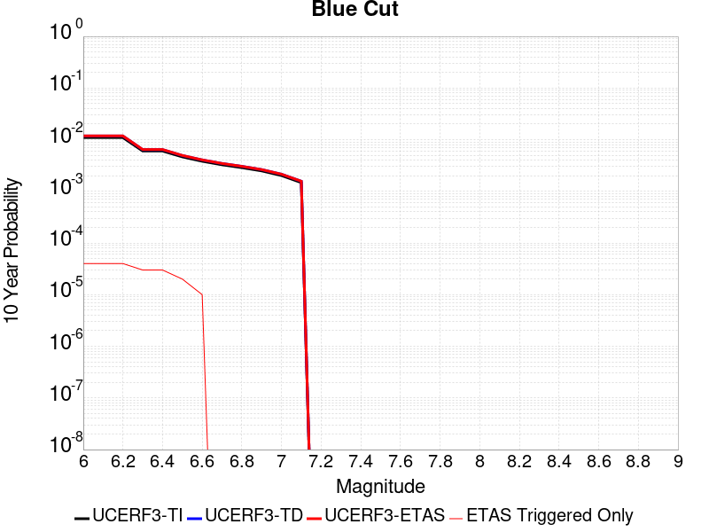 |

| Magnitude | 1 wk TI Prob | 1 wk TD Prob | 1 wk ETAS Prob | 1 wk ETAS/TD Gain | 1 wk ETAS Triggered Only | 1 mo TI Prob | 1 mo TD Prob | 1 mo ETAS Prob | 1 mo ETAS/TD Gain | 1 mo ETAS Triggered Only | 1 yr TI Prob | 1 yr TD Prob | 1 yr ETAS Prob | 1 yr ETAS/TD Gain | 1 yr ETAS Triggered Only | 10 yr TI Prob | 10 yr TD Prob | 10 yr ETAS Prob | 10 yr ETAS/TD Gain | 10 yr ETAS Triggered Only |
|-----|-----|-----|-----|-----|-----|-----|-----|-----|-----|-----|-----|-----|-----|-----|-----|-----|-----|-----|-----|-----|
| 6.0 | 2.1227985E-5 | 2.2719787E-5 | 2.2719787E-5 | 1.0 | 0.0 | 9.097391E-5 | 9.736721E-5 | 1.07366235E-4 | 1.102694 | 1.0E-5 | 0.0011070445 | 0.0011848592 | 0.0011948473 | 1.0084298 | 1.0E-5 | 0.011015458 | 0.011791261 | 0.011830789 | 1.0033523 | 4.0E-5 |
| 6.1 | 2.1227985E-5 | 2.2719787E-5 | 2.2719787E-5 | 1.0 | 0.0 | 9.097391E-5 | 9.736721E-5 | 1.07366235E-4 | 1.102694 | 1.0E-5 | 0.0011070445 | 0.0011848592 | 0.0011948473 | 1.0084298 | 1.0E-5 | 0.011015458 | 0.011791261 | 0.011830789 | 1.0033523 | 4.0E-5 |
| 6.2 | 2.1227985E-5 | 2.2719787E-5 | 2.2719787E-5 | 1.0 | 0.0 | 9.097391E-5 | 9.736721E-5 | 1.07366235E-4 | 1.102694 | 1.0E-5 | 0.0011070445 | 0.0011848592 | 0.0011948473 | 1.0084298 | 1.0E-5 | 0.011015458 | 0.011791261 | 0.011830789 | 1.0033523 | 4.0E-5 |
| 6.3 | 1.1613981E-5 | 1.23536465E-5 | 1.23536465E-5 | 1.0 | 0.0 | 4.9773254E-5 | 5.2943193E-5 | 5.2943193E-5 | 1.0 | 0.0 | 6.0582085E-4 | 6.444052E-4 | 6.444052E-4 | 1.0 | 0.0 | 0.0060417196 | 0.0064266133 | 0.0064564208 | 1.0046381 | 3.0E-5 |
| 6.4 | 1.1613981E-5 | 1.23536465E-5 | 1.23536465E-5 | 1.0 | 0.0 | 4.9773254E-5 | 5.2943193E-5 | 5.2943193E-5 | 1.0 | 0.0 | 6.0582085E-4 | 6.444052E-4 | 6.444052E-4 | 1.0 | 0.0 | 0.0060417196 | 0.0064266133 | 0.0064564208 | 1.0046381 | 3.0E-5 |
| 6.5 | 8.931326E-6 | 9.481677E-6 | 9.481677E-6 | 1.0 | 0.0 | 3.8276554E-5 | 4.063518E-5 | 4.063518E-5 | 1.0 | 0.0 | 4.6591737E-4 | 4.9463013E-4 | 4.9463013E-4 | 1.0 | 0.0 | 0.0046494175 | 0.0049362015 | 0.0049561025 | 1.0040317 | 2.0E-5 |
| 6.6 | 7.345353E-6 | 7.790341E-6 | 7.790341E-6 | 1.0 | 0.0 | 3.1479703E-5 | 3.3386797E-5 | 3.3386797E-5 | 1.0 | 0.0 | 3.83198E-4 | 4.0641645E-4 | 4.0641645E-4 | 1.0 | 0.0 | 0.0038253788 | 0.0040575233 | 0.004067483 | 1.0024545 | 1.0E-5 |
| 6.7 | 6.2775666E-6 | 6.655202E-6 | 6.655202E-6 | 1.0 | 0.0 | 2.690358E-5 | 2.8522025E-5 | 2.8522025E-5 | 1.0 | 0.0 | 3.2750185E-4 | 3.4720785E-4 | 3.4720785E-4 | 1.0 | 0.0 | 0.0032701963 | 0.0034673947 | 0.0034673947 | 1.0 | 0.0 |
| 6.8 | 5.5234095E-6 | 5.8551577E-6 | 5.8551577E-6 | 1.0 | 0.0 | 2.367154E-5 | 2.5093334E-5 | 2.5093334E-5 | 1.0 | 0.0 | 2.8816288E-4 | 3.0547578E-4 | 3.0547578E-4 | 1.0 | 0.0 | 0.002877895 | 0.003051275 | 0.003051275 | 1.0 | 0.0 |
| 6.9 | 4.7780054E-6 | 5.0654608E-6 | 5.0654608E-6 | 1.0 | 0.0 | 2.0477004E-5 | 2.1708976E-5 | 2.1708976E-5 | 1.0 | 0.0 | 2.4927902E-4 | 2.6428179E-4 | 2.6428179E-4 | 1.0 | 0.0 | 0.0024899957 | 0.0026403673 | 0.0026403673 | 1.0 | 0.0 |
| 7.0 | 3.883171E-6 | 4.1185203E-6 | 4.1185203E-6 | 1.0 | 0.0 | 1.6642054E-5 | 1.765072E-5 | 1.765072E-5 | 1.0 | 0.0 | 2.0259817E-4 | 2.1488321E-4 | 2.1488321E-4 | 1.0 | 0.0 | 0.0020241356 | 0.00214743 | 0.00214743 | 1.0 | 0.0 |
| 7.1 | 2.8358215E-6 | 3.0097403E-6 | 3.0097403E-6 | 1.0 | 0.0 | 1.2153464E-5 | 1.289886E-5 | 1.289886E-5 | 1.0 | 0.0 | 1.4795837E-4 | 1.5703888E-4 | 1.5703888E-4 | 1.0 | 0.0 | 0.001478599 | 0.0015699244 | 0.0015699244 | 1.0 | 0.0 |

## Pine Mtn
*[(top)](#table-of-contents)*

| 1 Week | 1 Month | 1 Year | 10 Year |
|-----|-----|-----|-----|
|  |  |  |  |

| Magnitude | 1 wk TI Prob | 1 wk TD Prob | 1 wk ETAS Prob | 1 wk ETAS/TD Gain | 1 wk ETAS Triggered Only | 1 mo TI Prob | 1 mo TD Prob | 1 mo ETAS Prob | 1 mo ETAS/TD Gain | 1 mo ETAS Triggered Only | 1 yr TI Prob | 1 yr TD Prob | 1 yr ETAS Prob | 1 yr ETAS/TD Gain | 1 yr ETAS Triggered Only | 10 yr TI Prob | 10 yr TD Prob | 10 yr ETAS Prob | 10 yr ETAS/TD Gain | 10 yr ETAS Triggered Only |
|-----|-----|-----|-----|-----|-----|-----|-----|-----|-----|-----|-----|-----|-----|-----|-----|-----|-----|-----|-----|-----|
| 6.0 | 6.894797E-6 | 7.225567E-6 | 7.225567E-6 | 1.0 | 0.0 | 2.9548795E-5 | 3.0966366E-5 | 4.0966057E-5 | 1.322921 | 1.0E-5 | 3.596972E-4 | 3.7695325E-4 | 4.0694195E-4 | 1.0795555 | 3.0E-5 | 0.0035911554 | 0.0037634359 | 0.0038032855 | 1.0105885 | 4.0E-5 |
| 6.1 | 6.894797E-6 | 7.225567E-6 | 7.225567E-6 | 1.0 | 0.0 | 2.9548795E-5 | 3.0966366E-5 | 4.0966057E-5 | 1.322921 | 1.0E-5 | 3.596972E-4 | 3.7695325E-4 | 4.0694195E-4 | 1.0795555 | 3.0E-5 | 0.0035911554 | 0.0037634359 | 0.0038032855 | 1.0105885 | 4.0E-5 |
| 6.2 | 6.894797E-6 | 7.225567E-6 | 7.225567E-6 | 1.0 | 0.0 | 2.9548795E-5 | 3.0966366E-5 | 4.0966057E-5 | 1.322921 | 1.0E-5 | 3.596972E-4 | 3.7695325E-4 | 4.0694195E-4 | 1.0795555 | 3.0E-5 | 0.0035911554 | 0.0037634359 | 0.0038032855 | 1.0105885 | 4.0E-5 |
| 6.3 | 6.894797E-6 | 7.225567E-6 | 7.225567E-6 | 1.0 | 0.0 | 2.9548795E-5 | 3.0966366E-5 | 4.0966057E-5 | 1.322921 | 1.0E-5 | 3.596972E-4 | 3.7695325E-4 | 4.0694195E-4 | 1.0795555 | 3.0E-5 | 0.0035911554 | 0.0037634359 | 0.0038032855 | 1.0105885 | 4.0E-5 |
| 6.4 | 6.894797E-6 | 7.225567E-6 | 7.225567E-6 | 1.0 | 0.0 | 2.9548795E-5 | 3.0966366E-5 | 4.0966057E-5 | 1.322921 | 1.0E-5 | 3.596972E-4 | 3.7695325E-4 | 4.0694195E-4 | 1.0795555 | 3.0E-5 | 0.0035911554 | 0.0037634359 | 0.0038032855 | 1.0105885 | 4.0E-5 |
| 6.5 | 6.894797E-6 | 7.225567E-6 | 7.225567E-6 | 1.0 | 0.0 | 2.9548795E-5 | 3.0966366E-5 | 4.0966057E-5 | 1.322921 | 1.0E-5 | 3.596972E-4 | 3.7695325E-4 | 4.0694195E-4 | 1.0795555 | 3.0E-5 | 0.0035911554 | 0.0037634359 | 0.0038032855 | 1.0105885 | 4.0E-5 |
| 6.6 | 6.894797E-6 | 7.225567E-6 | 7.225567E-6 | 1.0 | 0.0 | 2.9548795E-5 | 3.0966366E-5 | 4.0966057E-5 | 1.322921 | 1.0E-5 | 3.596972E-4 | 3.7695325E-4 | 4.0694195E-4 | 1.0795555 | 3.0E-5 | 0.0035911554 | 0.0037634359 | 0.0038032855 | 1.0105885 | 4.0E-5 |
| 6.7 | 6.0867933E-6 | 6.397216E-6 | 6.397216E-6 | 1.0 | 0.0 | 2.6085996E-5 | 2.7416365E-5 | 3.741609E-5 | 1.3647356 | 1.0E-5 | 3.1755073E-4 | 3.3374532E-4 | 3.637353E-4 | 1.0898589 | 3.0E-5 | 0.0031709734 | 0.00333266 | 0.0033725267 | 1.0119624 | 4.0E-5 |
| 6.8 | 5.6530425E-6 | 5.950697E-6 | 5.950697E-6 | 1.0 | 0.0 | 2.42271E-5 | 2.5502748E-5 | 3.5502493E-5 | 1.3921046 | 1.0E-5 | 2.94925E-4 | 3.104538E-4 | 3.4044447E-4 | 1.0966028 | 3.0E-5 | 0.002945339 | 0.0031004054 | 0.0031402814 | 1.0128615 | 4.0E-5 |
| 6.9 | 4.6015225E-6 | 4.8639304E-6 | 4.8639304E-6 | 1.0 | 0.0 | 1.9720663E-5 | 2.0845258E-5 | 3.084505E-5 | 1.4797155 | 1.0E-5 | 2.4007261E-4 | 2.537629E-4 | 2.7375785E-4 | 1.0787938 | 2.0E-5 | 0.0023981342 | 0.0025348756 | 0.0025647995 | 1.0118049 | 3.0E-5 |
| 7.0 | 4.4875965E-6 | 4.747569E-6 | 4.747569E-6 | 1.0 | 0.0 | 1.9232413E-5 | 2.0346575E-5 | 3.0346371E-5 | 1.4914732 | 1.0E-5 | 2.3412947E-4 | 2.4769283E-4 | 2.676879E-4 | 1.0807252 | 2.0E-5 | 0.0023388295 | 0.0024743115 | 0.0025042372 | 1.0120946 | 3.0E-5 |
| 7.1 | 3.203907E-6 | 3.429501E-6 | 3.429501E-6 | 1.0 | 0.0 | 1.3730958E-5 | 1.4697782E-5 | 1.4697782E-5 | 1.0 | 0.0 | 1.6716159E-4 | 1.7893147E-4 | 1.8892968E-4 | 1.0558773 | 1.0E-5 | 0.0016703589 | 0.0017879402 | 0.0018079043 | 1.0111661 | 2.0E-5 |
| 7.2 | 2.2060601E-6 | 2.3785537E-6 | 2.3785537E-6 | 1.0 | 0.0 | 9.4545085E-6 | 1.0193765E-5 | 1.0193765E-5 | 1.0 | 0.0 | 1.15102564E-4 | 1.2410247E-4 | 1.2410247E-4 | 1.0 | 0.0 | 0.0011504296 | 0.0012403765 | 0.0012503641 | 1.0080521 | 1.0E-5 |
| 7.3 | 1.3765207E-6 | 1.5217132E-6 | 1.5217132E-6 | 1.0 | 0.0 | 5.899361E-6 | 6.5216122E-6 | 6.5216122E-6 | 1.0 | 0.0 | 7.182235E-5 | 7.9397825E-5 | 7.9397825E-5 | 1.0 | 0.0 | 7.1799144E-4 | 7.937037E-4 | 7.937037E-4 | 1.0 | 0.0 |
| 7.4 | 1.1245983E-6 | 1.2587666E-6 | 1.2587666E-6 | 1.0 | 0.0 | 4.819698E-6 | 5.3947033E-6 | 5.3947033E-6 | 1.0 | 0.0 | 5.8678244E-5 | 6.567862E-5 | 6.567862E-5 | 1.0 | 0.0 | 5.866275E-4 | 6.566004E-4 | 6.566004E-4 | 1.0 | 0.0 |
| 7.5 | 8.031682E-7 | 9.2774985E-7 | 9.2774985E-7 | 1.0 | 0.0 | 3.4421448E-6 | 3.9760653E-6 | 3.9760653E-6 | 1.0 | 0.0 | 4.1907308E-5 | 4.8407586E-5 | 4.8407586E-5 | 1.0 | 0.0 | 4.1899405E-4 | 4.8397717E-4 | 4.8397717E-4 | 1.0 | 0.0 |
| 7.6 | 4.8953444E-7 | 6.003492E-7 | 6.003492E-7 | 1.0 | 0.0 | 2.098003E-6 | 2.572923E-6 | 2.572923E-6 | 1.0 | 0.0 | 2.5542888E-5 | 3.1324937E-5 | 3.1324937E-5 | 1.0 | 0.0 | 2.5539953E-4 | 3.1321007E-4 | 3.1321007E-4 | 1.0 | 0.0 |
| 7.7 | 6.634529E-8 | 6.788847E-8 | 6.788847E-8 | 1.0 | 0.0 | 2.843369E-7 | 2.9095054E-7 | 2.9095054E-7 | 1.0 | 0.0 | 3.4617963E-6 | 3.5423177E-6 | 3.5423177E-6 | 1.0 | 0.0 | 3.4617424E-5 | 3.542266E-5 | 3.542266E-5 | 1.0 | 0.0 |
| 7.8 | 9.235578E-9 | 9.488601E-9 | 9.488601E-9 | 1.0 | 0.0 | 3.9581046E-8 | 4.0665434E-8 | 4.0665434E-8 | 1.0 | 0.0 | 4.818991E-7 | 4.951016E-7 | 4.951016E-7 | 1.0 | 0.0 | 4.8189804E-6 | 4.9510063E-6 | 4.9510063E-6 | 1.0 | 0.0 |

## Santa Ynez (East)
*[(top)](#table-of-contents)*

| 1 Week | 1 Month | 1 Year | 10 Year |
|-----|-----|-----|-----|
|  |  |  |  |

| Magnitude | 1 wk TI Prob | 1 wk TD Prob | 1 wk ETAS Prob | 1 wk ETAS/TD Gain | 1 wk ETAS Triggered Only | 1 mo TI Prob | 1 mo TD Prob | 1 mo ETAS Prob | 1 mo ETAS/TD Gain | 1 mo ETAS Triggered Only | 1 yr TI Prob | 1 yr TD Prob | 1 yr ETAS Prob | 1 yr ETAS/TD Gain | 1 yr ETAS Triggered Only | 10 yr TI Prob | 10 yr TD Prob | 10 yr ETAS Prob | 10 yr ETAS/TD Gain | 10 yr ETAS Triggered Only |
|-----|-----|-----|-----|-----|-----|-----|-----|-----|-----|-----|-----|-----|-----|-----|-----|-----|-----|-----|-----|-----|
| 6.0 | 3.2269712E-5 | 3.6751615E-5 | 3.6751615E-5 | 1.0 | 0.0 | 1.3829143E-4 | 1.5750073E-4 | 1.5750073E-4 | 1.0 | 0.0 | 0.0016823979 | 0.001916469 | 0.0019264497 | 1.0052079 | 1.0E-5 | 0.016697178 | 0.01905687 | 0.019086298 | 1.0015442 | 3.0E-5 |
| 6.1 | 3.2269712E-5 | 3.6751615E-5 | 3.6751615E-5 | 1.0 | 0.0 | 1.3829143E-4 | 1.5750073E-4 | 1.5750073E-4 | 1.0 | 0.0 | 0.0016823979 | 0.001916469 | 0.0019264497 | 1.0052079 | 1.0E-5 | 0.016697178 | 0.01905687 | 0.019086298 | 1.0015442 | 3.0E-5 |
| 6.2 | 3.2269712E-5 | 3.6751615E-5 | 3.6751615E-5 | 1.0 | 0.0 | 1.3829143E-4 | 1.5750073E-4 | 1.5750073E-4 | 1.0 | 0.0 | 0.0016823979 | 0.001916469 | 0.0019264497 | 1.0052079 | 1.0E-5 | 0.016697178 | 0.01905687 | 0.019086298 | 1.0015442 | 3.0E-5 |
| 6.3 | 3.2269712E-5 | 3.6751615E-5 | 3.6751615E-5 | 1.0 | 0.0 | 1.3829143E-4 | 1.5750073E-4 | 1.5750073E-4 | 1.0 | 0.0 | 0.0016823979 | 0.001916469 | 0.0019264497 | 1.0052079 | 1.0E-5 | 0.016697178 | 0.01905687 | 0.019086298 | 1.0015442 | 3.0E-5 |
| 6.4 | 1.4404779E-5 | 1.4849478E-5 | 1.4849478E-5 | 1.0 | 0.0 | 6.1733306E-5 | 6.36391E-5 | 6.36391E-5 | 1.0 | 0.0 | 7.513438E-4 | 7.7453564E-4 | 7.845279E-4 | 1.012901 | 1.0E-5 | 0.0074880854 | 0.0077189123 | 0.0077486807 | 1.0038565 | 3.0E-5 |
| 6.5 | 1.4404779E-5 | 1.4849478E-5 | 1.4849478E-5 | 1.0 | 0.0 | 6.1733306E-5 | 6.36391E-5 | 6.36391E-5 | 1.0 | 0.0 | 7.513438E-4 | 7.7453564E-4 | 7.845279E-4 | 1.012901 | 1.0E-5 | 0.0074880854 | 0.0077189123 | 0.0077486807 | 1.0038565 | 3.0E-5 |
| 6.6 | 1.280208E-5 | 1.3012008E-5 | 1.3012008E-5 | 1.0 | 0.0 | 5.4864904E-5 | 5.576457E-5 | 5.576457E-5 | 1.0 | 0.0 | 6.6777546E-4 | 6.787239E-4 | 6.887171E-4 | 1.0147235 | 1.0E-5 | 0.006657724 | 0.00676672 | 0.0067965174 | 1.0044035 | 3.0E-5 |
| 6.7 | 1.2457027E-5 | 1.2628523E-5 | 1.2628523E-5 | 1.0 | 0.0 | 5.3386164E-5 | 5.4121127E-5 | 5.4121127E-5 | 1.0 | 0.0 | 6.497827E-4 | 6.587272E-4 | 6.6872063E-4 | 1.0151708 | 1.0E-5 | 0.00647886 | 0.006567944 | 0.0065977466 | 1.0045376 | 3.0E-5 |
| 6.8 | 1.2095134E-5 | 1.2230965E-5 | 1.2230965E-5 | 1.0 | 0.0 | 5.1835254E-5 | 5.2417377E-5 | 5.2417377E-5 | 1.0 | 0.0 | 6.309115E-4 | 6.379963E-4 | 6.479899E-4 | 1.0156641 | 1.0E-5 | 0.0062912325 | 0.006361835 | 0.006391644 | 1.0046856 | 3.0E-5 |
| 6.9 | 1.1104036E-5 | 1.1157385E-5 | 1.1157385E-5 | 1.0 | 0.0 | 4.758786E-5 | 4.78165E-5 | 4.78165E-5 | 1.0 | 0.0 | 5.7922816E-4 | 5.820116E-4 | 5.920058E-4 | 1.0171717 | 1.0E-5 | 0.005777207 | 0.005805019 | 0.005834845 | 1.0051379 | 3.0E-5 |
| 7.0 | 1.0577444E-5 | 1.0581712E-5 | 1.0581712E-5 | 1.0 | 0.0 | 4.5331115E-5 | 4.534941E-5 | 4.534941E-5 | 1.0 | 0.0 | 5.5176654E-4 | 5.519904E-4 | 5.619849E-4 | 1.0181062 | 1.0E-5 | 0.0055039856 | 0.0055063316 | 0.0055361665 | 1.0054183 | 3.0E-5 |
| 7.1 | 1.0021775E-5 | 9.981012E-6 | 9.981012E-6 | 1.0 | 0.0 | 4.294976E-5 | 4.277507E-5 | 4.277507E-5 | 1.0 | 0.0 | 5.2278786E-4 | 5.206632E-4 | 5.30658E-4 | 1.0191963 | 1.0E-5 | 0.0052155964 | 0.005194566 | 0.0052244104 | 1.0057453 | 3.0E-5 |
| 7.2 | 8.874109E-6 | 8.748804E-6 | 8.748804E-6 | 1.0 | 0.0 | 3.8031343E-5 | 3.749434E-5 | 3.749434E-5 | 1.0 | 0.0 | 4.629332E-4 | 4.5639908E-4 | 4.6639453E-4 | 1.0219007 | 1.0E-5 | 0.0046197 | 0.0045547355 | 0.0045845993 | 1.0065565 | 3.0E-5 |
| 7.3 | 7.5504267E-6 | 7.5050975E-6 | 7.5050975E-6 | 1.0 | 0.0 | 3.235857E-5 | 3.2164313E-5 | 3.2164313E-5 | 1.0 | 0.0 | 3.9389438E-4 | 3.9153118E-4 | 4.0152724E-4 | 1.0255307 | 1.0E-5 | 0.0039319694 | 0.0039085206 | 0.0039284425 | 1.005097 | 2.0E-5 |
| 7.4 | 6.309394E-6 | 6.1831197E-6 | 6.1831197E-6 | 1.0 | 0.0 | 2.703998E-5 | 2.6498821E-5 | 2.6498821E-5 | 1.0 | 0.0 | 3.2916202E-4 | 3.2257635E-4 | 3.325731E-4 | 1.0309904 | 1.0E-5 | 0.003286749 | 0.0032211784 | 0.0032411139 | 1.0061889 | 2.0E-5 |
| 7.5 | 4.6103073E-6 | 4.4408375E-6 | 4.4408375E-6 | 1.0 | 0.0 | 1.975831E-5 | 1.9032026E-5 | 1.9032026E-5 | 1.0 | 0.0 | 2.4053088E-4 | 2.3169098E-4 | 2.4168867E-4 | 1.0431509 | 1.0E-5 | 0.002402707 | 0.0023145638 | 0.0023345174 | 1.008621 | 2.0E-5 |
| 7.6 | 1.2858658E-6 | 1.3008295E-6 | 1.3008295E-6 | 1.0 | 0.0 | 5.5108417E-6 | 5.574972E-6 | 5.574972E-6 | 1.0 | 0.0 | 6.7092435E-5 | 6.787324E-5 | 6.787324E-5 | 1.0 | 0.0 | 6.707218E-4 | 6.78532E-4 | 6.885252E-4 | 1.0147277 | 1.0E-5 |
| 7.7 | 5.3302307E-7 | 5.612178E-7 | 5.612178E-7 | 1.0 | 0.0 | 2.2843826E-6 | 2.4052172E-6 | 2.4052172E-6 | 1.0 | 0.0 | 2.7812002E-5 | 2.9283161E-5 | 2.9283161E-5 | 1.0 | 0.0 | 2.7808524E-4 | 2.927966E-4 | 2.927966E-4 | 1.0 | 0.0 |
| 7.8 | 4.613933E-8 | 4.803036E-8 | 4.803036E-8 | 1.0 | 0.0 | 1.9773998E-7 | 2.0584437E-7 | 2.0584437E-7 | 1.0 | 0.0 | 2.4074816E-6 | 2.5061524E-6 | 2.5061524E-6 | 1.0 | 0.0 | 2.4074554E-5 | 2.5061252E-5 | 2.5061252E-5 | 1.0 | 0.0 |

## Ventura-Pitas Point
*[(top)](#table-of-contents)*

| 1 Week | 1 Month | 1 Year | 10 Year |
|-----|-----|-----|-----|
|  |  |  | 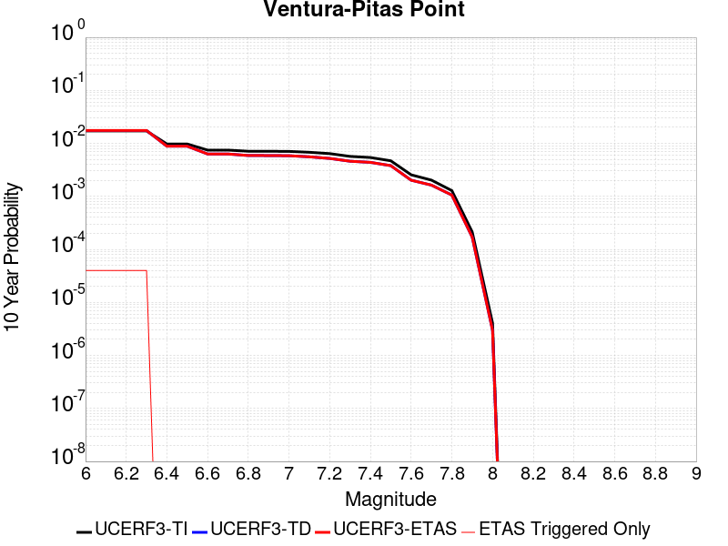 |

| Magnitude | 1 wk TI Prob | 1 wk TD Prob | 1 wk ETAS Prob | 1 wk ETAS/TD Gain | 1 wk ETAS Triggered Only | 1 mo TI Prob | 1 mo TD Prob | 1 mo ETAS Prob | 1 mo ETAS/TD Gain | 1 mo ETAS Triggered Only | 1 yr TI Prob | 1 yr TD Prob | 1 yr ETAS Prob | 1 yr ETAS/TD Gain | 1 yr ETAS Triggered Only | 10 yr TI Prob | 10 yr TD Prob | 10 yr ETAS Prob | 10 yr ETAS/TD Gain | 10 yr ETAS Triggered Only |
|-----|-----|-----|-----|-----|-----|-----|-----|-----|-----|-----|-----|-----|-----|-----|-----|-----|-----|-----|-----|-----|
| 6.0 | 3.3179622E-5 | 3.37358E-5 | 3.37358E-5 | 1.0 | 0.0 | 1.4219063E-4 | 1.4457543E-4 | 1.4457543E-4 | 1.0 | 0.0 | 0.0017297962 | 0.0017590416 | 0.0017790063 | 1.0113498 | 2.0E-5 | 0.017163932 | 0.01747688 | 0.01751618 | 1.0022488 | 4.0E-5 |
| 6.1 | 3.3179622E-5 | 3.37358E-5 | 3.37358E-5 | 1.0 | 0.0 | 1.4219063E-4 | 1.4457543E-4 | 1.4457543E-4 | 1.0 | 0.0 | 0.0017297962 | 0.0017590416 | 0.0017790063 | 1.0113498 | 2.0E-5 | 0.017163932 | 0.01747688 | 0.01751618 | 1.0022488 | 4.0E-5 |
| 6.2 | 3.3179622E-5 | 3.37358E-5 | 3.37358E-5 | 1.0 | 0.0 | 1.4219063E-4 | 1.4457543E-4 | 1.4457543E-4 | 1.0 | 0.0 | 0.0017297962 | 0.0017590416 | 0.0017790063 | 1.0113498 | 2.0E-5 | 0.017163932 | 0.01747688 | 0.01751618 | 1.0022488 | 4.0E-5 |
| 6.3 | 3.3179622E-5 | 3.37358E-5 | 3.37358E-5 | 1.0 | 0.0 | 1.4219063E-4 | 1.4457543E-4 | 1.4457543E-4 | 1.0 | 0.0 | 0.0017297962 | 0.0017590416 | 0.0017790063 | 1.0113498 | 2.0E-5 | 0.017163932 | 0.01747688 | 0.01751618 | 1.0022488 | 4.0E-5 |
| 6.4 | 1.8754668E-5 | 1.7019853E-5 | 1.7019853E-5 | 1.0 | 0.0 | 8.037467E-5 | 7.294031E-5 | 7.294031E-5 | 1.0 | 0.0 | 9.781223E-4 | 8.877096E-4 | 8.877096E-4 | 1.0 | 0.0 | 0.009738282 | 0.008844146 | 0.008844146 | 1.0 | 0.0 |
| 6.5 | 1.8754668E-5 | 1.7019853E-5 | 1.7019853E-5 | 1.0 | 0.0 | 8.037467E-5 | 7.294031E-5 | 7.294031E-5 | 1.0 | 0.0 | 9.781223E-4 | 8.877096E-4 | 8.877096E-4 | 1.0 | 0.0 | 0.009738282 | 0.008844146 | 0.008844146 | 1.0 | 0.0 |
| 6.6 | 1.4361558E-5 | 1.2122441E-5 | 1.2122441E-5 | 1.0 | 0.0 | 6.154808E-5 | 5.19523E-5 | 5.19523E-5 | 1.0 | 0.0 | 7.490902E-4 | 6.32338E-4 | 6.32338E-4 | 1.0 | 0.0 | 0.0074657016 | 0.0063058166 | 0.0063058166 | 1.0 | 0.0 |
| 6.7 | 1.4361558E-5 | 1.2122441E-5 | 1.2122441E-5 | 1.0 | 0.0 | 6.154808E-5 | 5.19523E-5 | 5.19523E-5 | 1.0 | 0.0 | 7.490902E-4 | 6.32338E-4 | 6.32338E-4 | 1.0 | 0.0 | 0.0074657016 | 0.0063058166 | 0.0063058166 | 1.0 | 0.0 |
| 6.8 | 1.3663846E-5 | 1.1344573E-5 | 1.1344573E-5 | 1.0 | 0.0 | 5.8558027E-5 | 4.8618702E-5 | 4.8618702E-5 | 1.0 | 0.0 | 7.127108E-4 | 5.917739E-4 | 5.917739E-4 | 1.0 | 0.0 | 0.007104293 | 0.0059023695 | 0.0059023695 | 1.0 | 0.0 |
| 6.9 | 1.3644157E-5 | 1.1322673E-5 | 1.1322673E-5 | 1.0 | 0.0 | 5.8473648E-5 | 4.852485E-5 | 4.852485E-5 | 1.0 | 0.0 | 7.116841E-4 | 5.9063185E-4 | 5.9063185E-4 | 1.0 | 0.0 | 0.007094092 | 0.0058910097 | 0.0058910097 | 1.0 | 0.0 |
| 7.0 | 1.3568845E-5 | 1.12422385E-5 | 1.12422385E-5 | 1.0 | 0.0 | 5.8150898E-5 | 4.8180143E-5 | 4.8180143E-5 | 1.0 | 0.0 | 7.077572E-4 | 5.864373E-4 | 5.864373E-4 | 1.0 | 0.0 | 0.007055073 | 0.0058492855 | 0.0058492855 | 1.0 | 0.0 |
| 7.1 | 1.306572E-5 | 1.072068E-5 | 1.072068E-5 | 1.0 | 0.0 | 5.599474E-5 | 4.5944973E-5 | 4.5944973E-5 | 1.0 | 0.0 | 6.815227E-4 | 5.5923837E-4 | 5.5923837E-4 | 1.0 | 0.0 | 0.0067943637 | 0.005578688 | 0.005578688 | 1.0 | 0.0 |
| 7.2 | 1.232604E-5 | 9.9952695E-6 | 9.9952695E-6 | 1.0 | 0.0 | 5.2824813E-5 | 4.2836175E-5 | 4.2836175E-5 | 1.0 | 0.0 | 6.429523E-4 | 5.214074E-4 | 5.214074E-4 | 1.0 | 0.0 | 0.0064109527 | 0.0052022054 | 0.0052022054 | 1.0 | 0.0 |
| 7.3 | 1.0917261E-5 | 8.843945E-6 | 8.843945E-6 | 1.0 | 0.0 | 4.678742E-5 | 3.790208E-5 | 3.790208E-5 | 1.0 | 0.0 | 5.69488E-4 | 4.6136163E-4 | 4.6136163E-4 | 1.0 | 0.0 | 0.0056803077 | 0.0046043773 | 0.0046043773 | 1.0 | 0.0 |
| 7.4 | 1.039959E-5 | 8.423664E-6 | 8.423664E-6 | 1.0 | 0.0 | 4.456891E-5 | 3.6100926E-5 | 3.6100926E-5 | 1.0 | 0.0 | 5.424914E-4 | 4.3944168E-4 | 4.3944168E-4 | 1.0 | 0.0 | 0.0054116896 | 0.004386062 | 0.004386062 | 1.0 | 0.0 |
| 7.5 | 9.015877E-6 | 7.297624E-6 | 7.297624E-6 | 1.0 | 0.0 | 3.86389E-5 | 3.1275165E-5 | 3.1275165E-5 | 1.0 | 0.0 | 4.7032707E-4 | 3.8071E-4 | 3.8071E-4 | 1.0 | 0.0 | 0.004693329 | 0.0038008976 | 0.0038008976 | 1.0 | 0.0 |
| 7.6 | 4.900162E-6 | 3.874157E-6 | 3.874157E-6 | 1.0 | 0.0 | 2.1000526E-5 | 1.6603424E-5 | 1.6603424E-5 | 1.0 | 0.0 | 2.556514E-4 | 2.0212808E-4 | 2.0212808E-4 | 1.0 | 0.0 | 0.0025535747 | 0.002019456 | 0.002019456 | 1.0 | 0.0 |
| 7.7 | 3.8850626E-6 | 3.1267878E-6 | 3.1267878E-6 | 1.0 | 0.0 | 1.6650163E-5 | 1.3400451E-5 | 1.3400451E-5 | 1.0 | 0.0 | 2.0269687E-4 | 1.6313836E-4 | 1.6313836E-4 | 1.0 | 0.0 | 0.002025121 | 0.0016301954 | 0.0016301954 | 1.0 | 0.0 |
| 7.8 | 2.4654719E-6 | 2.0299206E-6 | 2.0299206E-6 | 1.0 | 0.0 | 1.0566265E-5 | 8.6996315E-6 | 8.6996315E-6 | 1.0 | 0.0 | 1.2863669E-4 | 1.05912906E-4 | 1.05912906E-4 | 1.0 | 0.0 | 0.0012856225 | 0.001058629 | 0.001058629 | 1.0 | 0.0 |
| 7.9 | 4.095894E-7 | 3.2765396E-7 | 3.2765396E-7 | 1.0 | 0.0 | 1.7553821E-6 | 1.4042306E-6 | 1.4042306E-6 | 1.0 | 0.0 | 2.1371567E-5 | 1.7096376E-5 | 1.7096376E-5 | 1.0 | 0.0 | 2.1369511E-4 | 1.7095092E-4 | 1.7095092E-4 | 1.0 | 0.0 |
| 8.0 | 7.791402E-9 | 5.6836416E-9 | 5.6836416E-9 | 1.0 | 0.0 | 3.3391725E-8 | 2.4358464E-8 | 2.4358464E-8 | 1.0 | 0.0 | 4.0654416E-7 | 2.9656428E-7 | 2.9656428E-7 | 1.0 | 0.0 | 4.065434E-6 | 2.9656408E-6 | 2.9656408E-6 | 1.0 | 0.0 |

## Oceanic - West Huasna
*[(top)](#table-of-contents)*

| 1 Week | 1 Month | 1 Year | 10 Year |
|-----|-----|-----|-----|
|  |  |  |  |

| Magnitude | 1 wk TI Prob | 1 wk TD Prob | 1 wk ETAS Prob | 1 wk ETAS/TD Gain | 1 wk ETAS Triggered Only | 1 mo TI Prob | 1 mo TD Prob | 1 mo ETAS Prob | 1 mo ETAS/TD Gain | 1 mo ETAS Triggered Only | 1 yr TI Prob | 1 yr TD Prob | 1 yr ETAS Prob | 1 yr ETAS/TD Gain | 1 yr ETAS Triggered Only | 10 yr TI Prob | 10 yr TD Prob | 10 yr ETAS Prob | 10 yr ETAS/TD Gain | 10 yr ETAS Triggered Only |
|-----|-----|-----|-----|-----|-----|-----|-----|-----|-----|-----|-----|-----|-----|-----|-----|-----|-----|-----|-----|-----|
| 6.0 | 3.195567E-5 | 2.7926611E-5 | 2.7926611E-5 | 1.0 | 0.0 | 1.3694567E-4 | 1.1968023E-4 | 1.1968023E-4 | 1.0 | 0.0 | 0.0016660384 | 0.001456176 | 0.0014761469 | 1.0137146 | 2.0E-5 | 0.016536033 | 0.014470896 | 0.0145004615 | 1.0020431 | 3.0E-5 |
| 6.1 | 2.1156782E-5 | 1.7573251E-5 | 1.7573251E-5 | 1.0 | 0.0 | 9.066878E-5 | 7.531181E-5 | 7.531181E-5 | 1.0 | 0.0 | 0.0011033333 | 9.1654493E-4 | 9.3652663E-4 | 1.0218011 | 2.0E-5 | 0.010978713 | 0.009128656 | 0.009148473 | 1.0021709 | 2.0E-5 |
| 6.2 | 1.6195117E-5 | 1.332732E-5 | 1.332732E-5 | 1.0 | 0.0 | 6.9405796E-5 | 5.7115845E-5 | 5.7115845E-5 | 1.0 | 0.0 | 8.44688E-4 | 6.951662E-4 | 7.1515224E-4 | 1.0287501 | 2.0E-5 | 0.008414844 | 0.0069302097 | 0.006950071 | 1.0028659 | 2.0E-5 |
| 6.3 | 1.3559345E-5 | 1.1179085E-5 | 1.1179085E-5 | 1.0 | 0.0 | 5.811018E-5 | 4.7909492E-5 | 4.7909492E-5 | 1.0 | 0.0 | 7.072618E-4 | 5.831429E-4 | 6.0313125E-4 | 1.034277 | 2.0E-5 | 0.0070501505 | 0.0058162455 | 0.005836129 | 1.0034187 | 2.0E-5 |
| 6.4 | 1.2120619E-5 | 1.0000936E-5 | 1.0000936E-5 | 1.0 | 0.0 | 5.1944477E-5 | 4.286045E-5 | 4.286045E-5 | 1.0 | 0.0 | 6.322405E-4 | 5.217015E-4 | 5.316963E-4 | 1.019158 | 1.0E-5 | 0.006304447 | 0.0052048354 | 0.0052147834 | 1.0019113 | 1.0E-5 |
| 6.5 | 1.13511915E-5 | 9.367435E-6 | 9.367435E-6 | 1.0 | 0.0 | 4.8647056E-5 | 4.0145536E-5 | 4.0145536E-5 | 1.0 | 0.0 | 5.9211696E-4 | 4.8866274E-4 | 4.986578E-4 | 1.020454 | 1.0E-5 | 0.0059054173 | 0.0048759407 | 0.004885892 | 1.0020409 | 1.0E-5 |
| 6.6 | 9.850605E-6 | 8.135364E-6 | 8.135364E-6 | 1.0 | 0.0 | 4.2216197E-5 | 3.4865378E-5 | 3.4865378E-5 | 1.0 | 0.0 | 5.1386096E-4 | 4.2440352E-4 | 4.3439926E-4 | 1.0235525 | 1.0E-5 | 0.0051267436 | 0.0042359624 | 0.00424592 | 1.0023507 | 1.0E-5 |
| 6.7 | 8.8558645E-6 | 7.318384E-6 | 7.318384E-6 | 1.0 | 0.0 | 3.7953152E-5 | 3.1364125E-5 | 3.1364125E-5 | 1.0 | 0.0 | 4.6198163E-4 | 3.817915E-4 | 3.917877E-4 | 1.0261823 | 1.0E-5 | 0.004610224 | 0.0038113813 | 0.0038213432 | 1.0026137 | 1.0E-5 |
| 6.8 | 7.67136E-6 | 6.3917278E-6 | 6.3917278E-6 | 1.0 | 0.0 | 3.2876844E-5 | 2.7392833E-5 | 2.7392833E-5 | 1.0 | 0.0 | 4.0020206E-4 | 3.3345685E-4 | 3.3345685E-4 | 1.0 | 0.0 | 0.003994821 | 0.003329586 | 0.003329586 | 1.0 | 0.0 |
| 6.9 | 6.534529E-6 | 5.4582943E-6 | 5.4582943E-6 | 1.0 | 0.0 | 2.8004823E-5 | 2.339248E-5 | 2.339248E-5 | 1.0 | 0.0 | 3.4090536E-4 | 2.8476634E-4 | 2.8476634E-4 | 1.0 | 0.0 | 0.0034038287 | 0.0028440312 | 0.0028440312 | 1.0 | 0.0 |
| 7.0 | 5.460525E-6 | 4.5699494E-6 | 4.5699494E-6 | 1.0 | 0.0 | 2.3402039E-5 | 1.9585352E-5 | 1.9585352E-5 | 1.0 | 0.0 | 2.8488258E-4 | 2.3842567E-4 | 2.3842567E-4 | 1.0 | 0.0 | 0.0028451765 | 0.0023817124 | 0.0023817124 | 1.0 | 0.0 |
| 7.1 | 4.4825083E-6 | 3.7524424E-6 | 3.7524424E-6 | 1.0 | 0.0 | 1.9210609E-5 | 1.6081798E-5 | 1.6081798E-5 | 1.0 | 0.0 | 2.3386406E-4 | 1.957784E-4 | 1.957784E-4 | 1.0 | 0.0 | 0.002336181 | 0.001956071 | 0.001956071 | 1.0 | 0.0 |
| 7.2 | 2.821708E-6 | 2.4249653E-6 | 2.4249653E-6 | 1.0 | 0.0 | 1.2092979E-5 | 1.0392667E-5 | 1.0392667E-5 | 1.0 | 0.0 | 1.4722206E-4 | 1.2652339E-4 | 1.2652339E-4 | 1.0 | 0.0 | 0.0014712457 | 0.0012645158 | 0.0012645158 | 1.0 | 0.0 |
| 7.3 | 2.0644757E-6 | 1.7687719E-6 | 1.7687719E-6 | 1.0 | 0.0 | 8.847723E-6 | 7.580429E-6 | 7.580429E-6 | 1.0 | 0.0 | 1.0771569E-4 | 9.228782E-5 | 9.228782E-5 | 1.0 | 0.0 | 0.001076635 | 9.2249655E-4 | 9.2249655E-4 | 1.0 | 0.0 |
| 7.4 | 1.6980367E-6 | 1.4380173E-6 | 1.4380173E-6 | 1.0 | 0.0 | 7.27728E-6 | 6.1629166E-6 | 6.1629166E-6 | 1.0 | 0.0 | 8.8597284E-5 | 7.503093E-5 | 7.503093E-5 | 1.0 | 0.0 | 8.8561967E-4 | 7.5005746E-4 | 7.5005746E-4 | 1.0 | 0.0 |
| 7.5 | 1.3637683E-6 | 1.1302892E-6 | 1.1302892E-6 | 1.0 | 0.0 | 5.844708E-6 | 4.8440875E-6 | 4.8440875E-6 | 1.0 | 0.0 | 7.1156996E-5 | 5.897517E-5 | 5.897517E-5 | 1.0 | 0.0 | 7.1134215E-4 | 5.895966E-4 | 5.895966E-4 | 1.0 | 0.0 |
| 7.6 | 9.802994E-7 | 7.677469E-7 | 7.677469E-7 | 1.0 | 0.0 | 4.2012766E-6 | 3.2903397E-6 | 3.2903397E-6 | 1.0 | 0.0 | 5.1149345E-5 | 4.005915E-5 | 4.005915E-5 | 1.0 | 0.0 | 5.113757E-4 | 4.0052057E-4 | 4.0052057E-4 | 1.0 | 0.0 |
| 7.7 | 5.986191E-7 | 4.0052444E-7 | 4.0052444E-7 | 1.0 | 0.0 | 2.5655079E-6 | 1.7165321E-6 | 1.7165321E-6 | 1.0 | 0.0 | 3.1234613E-5 | 2.0898578E-5 | 2.0898578E-5 | 1.0 | 0.0 | 3.123022E-4 | 2.0896735E-4 | 2.0896735E-4 | 1.0 | 0.0 |
| 7.8 | 2.9189815E-7 | 1.5286729E-7 | 1.5286729E-7 | 1.0 | 0.0 | 1.2509914E-6 | 6.5514536E-7 | 6.5514536E-7 | 1.0 | 0.0 | 1.5230714E-5 | 7.976366E-6 | 7.976366E-6 | 1.0 | 0.0 | 1.522967E-4 | 7.976198E-5 | 7.976198E-5 | 1.0 | 0.0 |
| 7.9 | 1.2057845E-7 | 4.621617E-8 | 4.621617E-8 | 1.0 | 0.0 | 5.1676466E-7 | 1.9806929E-7 | 1.9806929E-7 | 1.0 | 0.0 | 6.2915915E-6 | 2.4114909E-6 | 2.4114909E-6 | 1.0 | 0.0 | 6.2914136E-5 | 2.4115825E-5 | 2.4115825E-5 | 1.0 | 0.0 |
| 8.0 | 3.3806387E-9 | 9.0127306E-10 | 9.0127306E-10 | 1.0 | 0.0 | 1.4488451E-8 | 3.8625965E-9 | 3.8625965E-9 | 1.0 | 0.0 | 1.7639688E-7 | 4.7027115E-8 | 4.7027115E-8 | 1.0 | 0.0 | 1.7639674E-6 | 4.7134822E-7 | 4.7134822E-7 | 1.0 | 0.0 |

## Monterey Bay-Tularcitos
*[(top)](#table-of-contents)*

| 1 Week | 1 Month | 1 Year | 10 Year |
|-----|-----|-----|-----|
|  |  |  |  |

| Magnitude | 1 wk TI Prob | 1 wk TD Prob | 1 wk ETAS Prob | 1 wk ETAS/TD Gain | 1 wk ETAS Triggered Only | 1 mo TI Prob | 1 mo TD Prob | 1 mo ETAS Prob | 1 mo ETAS/TD Gain | 1 mo ETAS Triggered Only | 1 yr TI Prob | 1 yr TD Prob | 1 yr ETAS Prob | 1 yr ETAS/TD Gain | 1 yr ETAS Triggered Only | 10 yr TI Prob | 10 yr TD Prob | 10 yr ETAS Prob | 10 yr ETAS/TD Gain | 10 yr ETAS Triggered Only |
|-----|-----|-----|-----|-----|-----|-----|-----|-----|-----|-----|-----|-----|-----|-----|-----|-----|-----|-----|-----|-----|
| 6.0 | 3.0131365E-5 | 3.2799162E-5 | 3.2799162E-5 | 1.0 | 0.0 | 1.2912804E-4 | 1.4056085E-4 | 1.5055946E-4 | 1.0711336 | 1.0E-5 | 0.001571 | 0.0017100906 | 0.0017500222 | 1.0233506 | 4.0E-5 | 0.015599402 | 0.016980117 | 0.017019438 | 1.0023156 | 4.0E-5 |
| 6.1 | 3.0131365E-5 | 3.2799162E-5 | 3.2799162E-5 | 1.0 | 0.0 | 1.2912804E-4 | 1.4056085E-4 | 1.5055946E-4 | 1.0711336 | 1.0E-5 | 0.001571 | 0.0017100906 | 0.0017500222 | 1.0233506 | 4.0E-5 | 0.015599402 | 0.016980117 | 0.017019438 | 1.0023156 | 4.0E-5 |
| 6.2 | 3.0131365E-5 | 3.2799162E-5 | 3.2799162E-5 | 1.0 | 0.0 | 1.2912804E-4 | 1.4056085E-4 | 1.5055946E-4 | 1.0711336 | 1.0E-5 | 0.001571 | 0.0017100906 | 0.0017500222 | 1.0233506 | 4.0E-5 | 0.015599402 | 0.016980117 | 0.017019438 | 1.0023156 | 4.0E-5 |
| 6.3 | 1.6998249E-5 | 1.8330993E-5 | 1.8330993E-5 | 1.0 | 0.0 | 7.28476E-5 | 7.855914E-5 | 8.855835E-5 | 1.1272826 | 1.0E-5 | 8.865586E-4 | 9.560565E-4 | 9.860279E-4 | 1.031349 | 3.0E-5 | 0.0088303005 | 0.009521359 | 0.009551073 | 1.0031208 | 3.0E-5 |
| 6.4 | 1.6998249E-5 | 1.8330993E-5 | 1.8330993E-5 | 1.0 | 0.0 | 7.28476E-5 | 7.855914E-5 | 8.855835E-5 | 1.1272826 | 1.0E-5 | 8.865586E-4 | 9.560565E-4 | 9.860279E-4 | 1.031349 | 3.0E-5 | 0.0088303005 | 0.009521359 | 0.009551073 | 1.0031208 | 3.0E-5 |
| 6.5 | 1.27470785E-5 | 1.3693452E-5 | 1.3693452E-5 | 1.0 | 0.0 | 5.4629192E-5 | 5.868496E-5 | 5.868496E-5 | 1.0 | 0.0 | 6.649074E-4 | 7.142655E-4 | 7.2425837E-4 | 1.0139904 | 1.0E-5 | 0.0066292146 | 0.0071207504 | 0.007130679 | 1.0013944 | 1.0E-5 |
| 6.6 | 1.2739422E-5 | 1.3685539E-5 | 1.3685539E-5 | 1.0 | 0.0 | 5.4596385E-5 | 5.865105E-5 | 5.865105E-5 | 1.0 | 0.0 | 6.645082E-4 | 7.1385293E-4 | 7.238458E-4 | 1.0139985 | 1.0E-5 | 0.0066252467 | 0.007116651 | 0.00712658 | 1.0013951 | 1.0E-5 |
| 6.7 | 1.0160109E-5 | 1.0885862E-5 | 1.0885862E-5 | 1.0 | 0.0 | 4.35426E-5 | 4.6652898E-5 | 4.6652898E-5 | 1.0 | 0.0 | 5.300022E-4 | 5.678581E-4 | 5.678581E-4 | 1.0 | 0.0 | 0.005287399 | 0.005664782 | 0.005664782 | 1.0 | 0.0 |
| 6.8 | 8.349859E-6 | 8.932674E-6 | 8.932674E-6 | 1.0 | 0.0 | 3.578462E-5 | 3.8282356E-5 | 3.8282356E-5 | 1.0 | 0.0 | 4.3559066E-4 | 4.6599368E-4 | 4.6599368E-4 | 1.0 | 0.0 | 0.004347378 | 0.00465073 | 0.00465073 | 1.0 | 0.0 |
| 6.9 | 5.193639E-6 | 5.5364826E-6 | 5.5364826E-6 | 1.0 | 0.0 | 2.2258262E-5 | 2.3727585E-5 | 2.3727585E-5 | 1.0 | 0.0 | 2.7096065E-4 | 2.888483E-4 | 2.888483E-4 | 1.0 | 0.0 | 0.0027063051 | 0.0028850497 | 0.0028850497 | 1.0 | 0.0 |
| 7.0 | 4.359381E-6 | 4.64341E-6 | 4.64341E-6 | 1.0 | 0.0 | 1.8682927E-5 | 1.9900195E-5 | 1.9900195E-5 | 1.0 | 0.0 | 2.274409E-4 | 2.4226091E-4 | 2.4226091E-4 | 1.0 | 0.0 | 0.0022720827 | 0.002420261 | 0.002420261 | 1.0 | 0.0 |
| 7.1 | 3.0398533E-6 | 3.2310738E-6 | 3.2310738E-6 | 1.0 | 0.0 | 1.3027877E-5 | 1.3847401E-5 | 1.3847401E-5 | 1.0 | 0.0 | 1.5860285E-4 | 1.6858168E-4 | 1.6858168E-4 | 1.0 | 0.0 | 0.001584897 | 0.0016847956 | 0.0016847956 | 1.0 | 0.0 |
| 7.2 | 1.642335E-6 | 1.7333323E-6 | 1.7333323E-6 | 1.0 | 0.0 | 7.0385595E-6 | 7.428557E-6 | 7.428557E-6 | 1.0 | 0.0 | 8.569109E-5 | 9.0441E-5 | 9.0441E-5 | 1.0 | 0.0 | 8.5658056E-4 | 9.042446E-4 | 9.042446E-4 | 1.0 | 0.0 |
| 7.3 | 3.356842E-7 | 3.295269E-7 | 3.295269E-7 | 1.0 | 0.0 | 1.4386458E-6 | 1.4122573E-6 | 1.4122573E-6 | 1.0 | 0.0 | 1.7515373E-5 | 1.71941E-5 | 1.71941E-5 | 1.0 | 0.0 | 1.7513991E-4 | 1.7192778E-4 | 1.7192778E-4 | 1.0 | 0.0 |
| 7.4 | 2.1973483E-7 | 2.1006667E-7 | 2.1006667E-7 | 1.0 | 0.0 | 9.417204E-7 | 9.0028544E-7 | 9.0028544E-7 | 1.0 | 0.0 | 1.1465385E-5 | 1.096092E-5 | 1.096092E-5 | 1.0 | 0.0 | 1.1464794E-4 | 1.0960383E-4 | 1.0960383E-4 | 1.0 | 0.0 |
| 7.5 | 1.1944135E-7 | 1.06962446E-7 | 1.06962446E-7 | 1.0 | 0.0 | 5.118914E-7 | 4.584104E-7 | 4.584104E-7 | 1.0 | 0.0 | 6.23226E-6 | 5.5811324E-6 | 5.5811324E-6 | 1.0 | 0.0 | 6.2320854E-5 | 5.5809935E-5 | 5.5809935E-5 | 1.0 | 0.0 |
| 7.6 | 4.636058E-8 | 3.3366177E-8 | 3.3366177E-8 | 1.0 | 0.0 | 1.9868818E-7 | 1.4299789E-7 | 1.4299789E-7 | 1.0 | 0.0 | 2.419026E-6 | 1.7409978E-6 | 1.7409978E-6 | 1.0 | 0.0 | 2.4189996E-5 | 1.7409844E-5 | 1.7409844E-5 | 1.0 | 0.0 |
| 7.7 | 1.8588572E-8 | 8.004356E-9 | 8.004356E-9 | 1.0 | 0.0 | 7.9665305E-8 | 3.4304385E-8 | 3.4304385E-8 | 1.0 | 0.0 | 9.699246E-7 | 4.176558E-7 | 4.176558E-7 | 1.0 | 0.0 | 9.699204E-6 | 4.1765506E-6 | 4.1765506E-6 | 1.0 | 0.0 |
| 7.8 | 2.7960154E-9 | 7.610521E-10 | 7.610521E-10 | 1.0 | 0.0 | 1.1982923E-8 | 3.2616516E-9 | 3.2616516E-9 | 1.0 | 0.0 | 1.4589209E-7 | 3.9710606E-8 | 3.9710606E-8 | 1.0 | 0.0 | 1.4589199E-6 | 3.9710605E-7 | 3.9710605E-7 | 1.0 | 0.0 |

## Sheephole
*[(top)](#table-of-contents)*

| 1 Week | 1 Month | 1 Year | 10 Year |
|-----|-----|-----|-----|
|  |  |  |  |

| Magnitude | 1 wk TI Prob | 1 wk TD Prob | 1 wk ETAS Prob | 1 wk ETAS/TD Gain | 1 wk ETAS Triggered Only | 1 mo TI Prob | 1 mo TD Prob | 1 mo ETAS Prob | 1 mo ETAS/TD Gain | 1 mo ETAS Triggered Only | 1 yr TI Prob | 1 yr TD Prob | 1 yr ETAS Prob | 1 yr ETAS/TD Gain | 1 yr ETAS Triggered Only | 10 yr TI Prob | 10 yr TD Prob | 10 yr ETAS Prob | 10 yr ETAS/TD Gain | 10 yr ETAS Triggered Only |
|-----|-----|-----|-----|-----|-----|-----|-----|-----|-----|-----|-----|-----|-----|-----|-----|-----|-----|-----|-----|-----|
| 6.0 | 4.5579695E-6 | 4.7412877E-6 | 4.7412877E-6 | 1.0 | 0.0 | 1.9534009E-5 | 2.0319678E-5 | 2.0319678E-5 | 1.0 | 0.0 | 2.3780059E-4 | 2.4736955E-4 | 2.5736706E-4 | 1.0404154 | 1.0E-5 | 0.0023754628 | 0.0024714863 | 0.0025014123 | 1.0121084 | 3.0E-5 |
| 6.1 | 4.5579695E-6 | 4.7412877E-6 | 4.7412877E-6 | 1.0 | 0.0 | 1.9534009E-5 | 2.0319678E-5 | 2.0319678E-5 | 1.0 | 0.0 | 2.3780059E-4 | 2.4736955E-4 | 2.5736706E-4 | 1.0404154 | 1.0E-5 | 0.0023754628 | 0.0024714863 | 0.0025014123 | 1.0121084 | 3.0E-5 |
| 6.2 | 2.6677674E-6 | 2.7874107E-6 | 2.7874107E-6 | 1.0 | 0.0 | 1.1433239E-5 | 1.1945997E-5 | 1.1945997E-5 | 1.0 | 0.0 | 1.3919079E-4 | 1.4543389E-4 | 1.4543389E-4 | 1.0 | 0.0 | 0.0013910364 | 0.001453493 | 0.0014834495 | 1.02061 | 3.0E-5 |
| 6.3 | 2.6677674E-6 | 2.7874107E-6 | 2.7874107E-6 | 1.0 | 0.0 | 1.1433239E-5 | 1.1945997E-5 | 1.1945997E-5 | 1.0 | 0.0 | 1.3919079E-4 | 1.4543389E-4 | 1.4543389E-4 | 1.0 | 0.0 | 0.0013910364 | 0.001453493 | 0.0014834495 | 1.02061 | 3.0E-5 |
| 6.4 | 2.2159759E-6 | 2.3228936E-6 | 2.3228936E-6 | 1.0 | 0.0 | 9.497005E-6 | 9.955224E-6 | 9.955224E-6 | 1.0 | 0.0 | 1.156199E-4 | 1.2119893E-4 | 1.2119893E-4 | 1.0 | 0.0 | 0.0011555976 | 0.0012114076 | 0.0012213956 | 1.0082449 | 1.0E-5 |
| 6.5 | 2.1986082E-6 | 2.3047737E-6 | 2.3047737E-6 | 1.0 | 0.0 | 9.4225725E-6 | 9.877569E-6 | 9.877569E-6 | 1.0 | 0.0 | 1.1471378E-4 | 1.2025358E-4 | 1.2025358E-4 | 1.0 | 0.0 | 0.0011465458 | 0.0012019643 | 0.0012119523 | 1.0083097 | 1.0E-5 |
| 6.6 | 1.5232331E-6 | 1.6019028E-6 | 1.6019028E-6 | 1.0 | 0.0 | 6.5281256E-6 | 6.8652807E-6 | 6.8652807E-6 | 1.0 | 0.0 | 7.947703E-5 | 8.358178E-5 | 8.358178E-5 | 1.0 | 0.0 | 7.9448614E-4 | 8.3552214E-4 | 8.3552214E-4 | 1.0 | 0.0 |
| 6.7 | 1.3137362E-6 | 1.3828287E-6 | 1.3828287E-6 | 1.0 | 0.0 | 5.6302856E-6 | 5.926396E-6 | 5.926396E-6 | 1.0 | 0.0 | 6.854657E-5 | 7.2151626E-5 | 7.2151626E-5 | 1.0 | 0.0 | 6.8525434E-4 | 7.212959E-4 | 7.212959E-4 | 1.0 | 0.0 |
| 6.8 | 1.2275751E-6 | 1.2922936E-6 | 1.2922936E-6 | 1.0 | 0.0 | 5.2610258E-6 | 5.5383903E-6 | 5.5383903E-6 | 1.0 | 0.0 | 6.4051106E-5 | 6.742795E-5 | 6.742795E-5 | 1.0 | 0.0 | 6.4032647E-4 | 6.740883E-4 | 6.740883E-4 | 1.0 | 0.0 |
| 6.9 | 1.1837088E-6 | 1.2461107E-6 | 1.2461107E-6 | 1.0 | 0.0 | 5.0730278E-6 | 5.340464E-6 | 5.340464E-6 | 1.0 | 0.0 | 6.176237E-5 | 6.501835E-5 | 6.501835E-5 | 1.0 | 0.0 | 6.17452E-4 | 6.500064E-4 | 6.500064E-4 | 1.0 | 0.0 |
| 7.0 | 9.849371E-7 | 1.036636E-6 | 1.036636E-6 | 1.0 | 0.0 | 4.2211523E-6 | 4.442719E-6 | 4.442719E-6 | 1.0 | 0.0 | 5.1391315E-5 | 5.408886E-5 | 5.408886E-5 | 1.0 | 0.0 | 5.137943E-4 | 5.4076704E-4 | 5.4076704E-4 | 1.0 | 0.0 |
| 7.1 | 8.1643645E-7 | 8.5917287E-7 | 8.5917287E-7 | 1.0 | 0.0 | 3.4990085E-6 | 3.6821648E-6 | 3.6821648E-6 | 1.0 | 0.0 | 4.2599597E-5 | 4.482952E-5 | 4.482952E-5 | 1.0 | 0.0 | 4.259143E-4 | 4.482134E-4 | 4.482134E-4 | 1.0 | 0.0 |
| 7.2 | 5.7295756E-7 | 6.029544E-7 | 6.029544E-7 | 1.0 | 0.0 | 2.45553E-6 | 2.584088E-6 | 2.584088E-6 | 1.0 | 0.0 | 2.9895667E-5 | 3.1460884E-5 | 3.1460884E-5 | 1.0 | 0.0 | 2.9891645E-4 | 3.14571E-4 | 3.14571E-4 | 1.0 | 0.0 |

## Mission Creek
*[(top)](#table-of-contents)*

| 1 Week | 1 Month | 1 Year | 10 Year |
|-----|-----|-----|-----|
|  |  |  |  |

| Magnitude | 1 wk TI Prob | 1 wk TD Prob | 1 wk ETAS Prob | 1 wk ETAS/TD Gain | 1 wk ETAS Triggered Only | 1 mo TI Prob | 1 mo TD Prob | 1 mo ETAS Prob | 1 mo ETAS/TD Gain | 1 mo ETAS Triggered Only | 1 yr TI Prob | 1 yr TD Prob | 1 yr ETAS Prob | 1 yr ETAS/TD Gain | 1 yr ETAS Triggered Only | 10 yr TI Prob | 10 yr TD Prob | 10 yr ETAS Prob | 10 yr ETAS/TD Gain | 10 yr ETAS Triggered Only |
|-----|-----|-----|-----|-----|-----|-----|-----|-----|-----|-----|-----|-----|-----|-----|-----|-----|-----|-----|-----|-----|
| 6.0 | 1.1549387E-5 | 1.6325142E-5 | 1.6325142E-5 | 1.0 | 0.0 | 4.9496433E-5 | 6.9963105E-5 | 6.9963105E-5 | 1.0 | 0.0 | 6.0245243E-4 | 8.514829E-4 | 8.614744E-4 | 1.0117342 | 1.0E-5 | 0.006008218 | 0.008511699 | 0.008541443 | 1.0034946 | 3.0E-5 |
| 6.1 | 1.1549387E-5 | 1.6325142E-5 | 1.6325142E-5 | 1.0 | 0.0 | 4.9496433E-5 | 6.9963105E-5 | 6.9963105E-5 | 1.0 | 0.0 | 6.0245243E-4 | 8.514829E-4 | 8.614744E-4 | 1.0117342 | 1.0E-5 | 0.006008218 | 0.008511699 | 0.008541443 | 1.0034946 | 3.0E-5 |
| 6.2 | 1.1549387E-5 | 1.6325142E-5 | 1.6325142E-5 | 1.0 | 0.0 | 4.9496433E-5 | 6.9963105E-5 | 6.9963105E-5 | 1.0 | 0.0 | 6.0245243E-4 | 8.514829E-4 | 8.614744E-4 | 1.0117342 | 1.0E-5 | 0.006008218 | 0.008511699 | 0.008541443 | 1.0034946 | 3.0E-5 |
| 6.3 | 1.1549387E-5 | 1.6325142E-5 | 1.6325142E-5 | 1.0 | 0.0 | 4.9496433E-5 | 6.9963105E-5 | 6.9963105E-5 | 1.0 | 0.0 | 6.0245243E-4 | 8.514829E-4 | 8.614744E-4 | 1.0117342 | 1.0E-5 | 0.006008218 | 0.008511699 | 0.008541443 | 1.0034946 | 3.0E-5 |
| 6.4 | 1.1549387E-5 | 1.6325142E-5 | 1.6325142E-5 | 1.0 | 0.0 | 4.9496433E-5 | 6.9963105E-5 | 6.9963105E-5 | 1.0 | 0.0 | 6.0245243E-4 | 8.514829E-4 | 8.614744E-4 | 1.0117342 | 1.0E-5 | 0.006008218 | 0.008511699 | 0.008541443 | 1.0034946 | 3.0E-5 |
| 6.5 | 1.1549387E-5 | 1.6325142E-5 | 1.6325142E-5 | 1.0 | 0.0 | 4.9496433E-5 | 6.9963105E-5 | 6.9963105E-5 | 1.0 | 0.0 | 6.0245243E-4 | 8.514829E-4 | 8.614744E-4 | 1.0117342 | 1.0E-5 | 0.006008218 | 0.008511699 | 0.008541443 | 1.0034946 | 3.0E-5 |
| 6.6 | 9.202681E-6 | 1.3848401E-5 | 1.3848401E-5 | 1.0 | 0.0 | 3.9439463E-5 | 5.934899E-5 | 5.934899E-5 | 1.0 | 0.0 | 4.800697E-4 | 7.2234345E-4 | 7.323362E-4 | 1.0138339 | 1.0E-5 | 0.004790339 | 0.0072288746 | 0.007258658 | 1.00412 | 3.0E-5 |
| 6.7 | 9.019164E-6 | 1.3654068E-5 | 1.3654068E-5 | 1.0 | 0.0 | 3.8652986E-5 | 5.8516176E-5 | 5.8516176E-5 | 1.0 | 0.0 | 4.7049852E-4 | 7.1221055E-4 | 7.2220346E-4 | 1.0140308 | 1.0E-5 | 0.004695036 | 0.0071281986 | 0.0071579847 | 1.0041786 | 3.0E-5 |
| 6.8 | 8.673558E-6 | 1.3276174E-5 | 1.3276174E-5 | 1.0 | 0.0 | 3.717186E-5 | 5.68967E-5 | 5.68967E-5 | 1.0 | 0.0 | 4.524734E-4 | 6.92506E-4 | 7.0249906E-4 | 1.0144303 | 1.0E-5 | 0.0045155324 | 0.0069323843 | 0.0069621764 | 1.0042975 | 3.0E-5 |
| 6.9 | 7.002255E-6 | 1.1480386E-5 | 1.1480386E-5 | 1.0 | 0.0 | 3.000932E-5 | 4.9200764E-5 | 4.9200764E-5 | 1.0 | 0.0 | 3.653022E-4 | 5.988615E-4 | 6.088555E-4 | 1.0166883 | 1.0E-5 | 0.0036470229 | 0.0060011996 | 0.0060310196 | 1.004969 | 3.0E-5 |
| 7.0 | 5.84644E-6 | 9.677556E-6 | 9.677556E-6 | 1.0 | 0.0 | 2.5055931E-5 | 4.1474606E-5 | 4.1474606E-5 | 1.0 | 0.0 | 3.0501327E-4 | 5.0484086E-4 | 5.148358E-4 | 1.0197983 | 1.0E-5 | 0.0030459496 | 0.0050654565 | 0.0050953045 | 1.0058925 | 3.0E-5 |
| 7.1 | 5.54703E-6 | 9.332022E-6 | 9.332022E-6 | 1.0 | 0.0 | 2.377277E-5 | 3.9993793E-5 | 3.9993793E-5 | 1.0 | 0.0 | 2.8939504E-4 | 4.868201E-4 | 4.9681525E-4 | 1.0205314 | 1.0E-5 | 0.0028901845 | 0.004886046 | 0.0049059484 | 1.0040733 | 2.0E-5 |
| 7.2 | 4.384709E-6 | 7.683992E-6 | 7.683992E-6 | 1.0 | 0.0 | 1.8791474E-5 | 3.2931002E-5 | 3.2931002E-5 | 1.0 | 0.0 | 2.2876218E-4 | 4.0086484E-4 | 4.108608E-4 | 1.0249361 | 1.0E-5 | 0.0022852682 | 0.0040298863 | 0.004049806 | 1.0049429 | 2.0E-5 |
| 7.3 | 3.7888456E-6 | 6.917821E-6 | 6.917821E-6 | 1.0 | 0.0 | 1.623781E-5 | 2.9647486E-5 | 2.9647486E-5 | 1.0 | 0.0 | 1.9767738E-4 | 3.609017E-4 | 3.7089808E-4 | 1.0276984 | 1.0E-5 | 0.0019750162 | 0.0036316153 | 0.0036515428 | 1.0054872 | 2.0E-5 |
| 7.4 | 2.1982462E-6 | 5.026073E-6 | 5.026073E-6 | 1.0 | 0.0 | 9.421021E-6 | 2.1540136E-5 | 2.1540136E-5 | 1.0 | 0.0 | 1.1469489E-4 | 2.6221978E-4 | 2.7221715E-4 | 1.038126 | 1.0E-5 | 0.0011463572 | 0.0026473494 | 0.0026672964 | 1.0075347 | 2.0E-5 |
| 7.5 | 2.051923E-6 | 4.617237E-6 | 4.617237E-6 | 1.0 | 0.0 | 8.793926E-6 | 1.978801E-5 | 1.978801E-5 | 1.0 | 0.0 | 1.0706078E-4 | 2.4089254E-4 | 2.5089012E-4 | 1.0415022 | 1.0E-5 | 0.0010700922 | 0.0024350125 | 0.0024549637 | 1.0081935 | 2.0E-5 |
| 7.6 | 1.8733427E-6 | 4.125508E-6 | 4.125508E-6 | 1.0 | 0.0 | 8.028587E-6 | 1.768063E-5 | 1.768063E-5 | 1.0 | 0.0 | 9.774366E-5 | 2.1524049E-4 | 2.2523833E-4 | 1.0464497 | 1.0E-5 | 9.770069E-4 | 0.002179529 | 0.0021994854 | 1.0091563 | 2.0E-5 |
| 7.7 | 1.8411953E-6 | 4.0451673E-6 | 4.0451673E-6 | 1.0 | 0.0 | 7.890813E-6 | 1.7336315E-5 | 1.7336315E-5 | 1.0 | 0.0 | 9.606641E-5 | 2.1104928E-4 | 2.2104717E-4 | 1.0473723 | 1.0E-5 | 9.6024893E-4 | 0.0021378102 | 0.0021577675 | 1.0093354 | 2.0E-5 |
| 7.8 | 1.7194251E-6 | 3.7123866E-6 | 3.7123866E-6 | 1.0 | 0.0 | 7.368944E-6 | 1.5910133E-5 | 1.5910133E-5 | 1.0 | 0.0 | 8.97132E-5 | 1.9368871E-4 | 2.0368678E-4 | 1.0516193 | 1.0E-5 | 8.967699E-4 | 0.0019636988 | 0.0019836596 | 1.0101649 | 2.0E-5 |
| 7.9 | 1.4035052E-6 | 2.9516495E-6 | 2.9516495E-6 | 1.0 | 0.0 | 6.0150082E-6 | 1.2649865E-5 | 1.2649865E-5 | 1.0 | 0.0 | 7.3230265E-5 | 1.5400129E-4 | 1.6399975E-4 | 1.0649245 | 1.0E-5 | 7.3206134E-4 | 0.0015642311 | 0.0015841998 | 1.0127659 | 2.0E-5 |
| 8.0 | 3.9318823E-7 | 5.531722E-7 | 5.531722E-7 | 1.0 | 0.0 | 1.6850913E-6 | 2.370736E-6 | 2.370736E-6 | 1.0 | 0.0 | 2.0515794E-5 | 2.8863333E-5 | 2.8863333E-5 | 1.0 | 0.0 | 2.0513899E-4 | 2.9927568E-4 | 2.9927568E-4 | 1.0 | 0.0 |
| 8.1 | 1.596793E-7 | 1.13891964E-7 | 1.13891964E-7 | 1.0 | 0.0 | 6.8433974E-7 | 4.881083E-7 | 4.881083E-7 | 1.0 | 0.0 | 8.331805E-6 | 5.942703E-6 | 5.942703E-6 | 1.0 | 0.0 | 8.331492E-5 | 6.555237E-5 | 6.555237E-5 | 1.0 | 0.0 |
| 8.2 | 4.9003038E-8 | 2.5465459E-8 | 2.5465459E-8 | 1.0 | 0.0 | 2.10013E-7 | 1.0913767E-7 | 1.0913767E-7 | 1.0 | 0.0 | 2.5569052E-6 | 1.3287504E-6 | 1.3287504E-6 | 1.0 | 0.0 | 2.556876E-5 | 1.49686575E-5 | 1.49686575E-5 | 1.0 | 0.0 |

## Fontana (Seismicity)
*[(top)](#table-of-contents)*

| 1 Week | 1 Month | 1 Year | 10 Year |
|-----|-----|-----|-----|
|  |  |  | 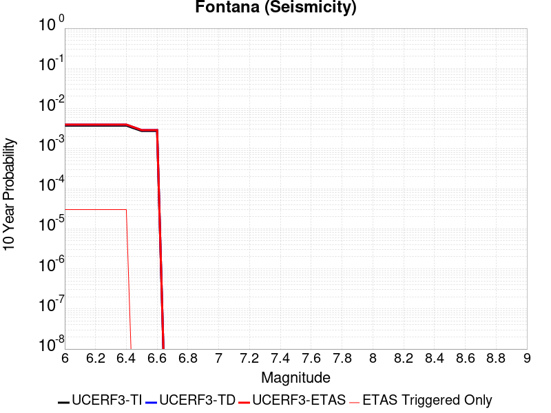 |

| Magnitude | 1 wk TI Prob | 1 wk TD Prob | 1 wk ETAS Prob | 1 wk ETAS/TD Gain | 1 wk ETAS Triggered Only | 1 mo TI Prob | 1 mo TD Prob | 1 mo ETAS Prob | 1 mo ETAS/TD Gain | 1 mo ETAS Triggered Only | 1 yr TI Prob | 1 yr TD Prob | 1 yr ETAS Prob | 1 yr ETAS/TD Gain | 1 yr ETAS Triggered Only | 10 yr TI Prob | 10 yr TD Prob | 10 yr ETAS Prob | 10 yr ETAS/TD Gain | 10 yr ETAS Triggered Only |
|-----|-----|-----|-----|-----|-----|-----|-----|-----|-----|-----|-----|-----|-----|-----|-----|-----|-----|-----|-----|-----|
| 6.0 | 7.1789214E-6 | 7.552053E-6 | 7.552053E-6 | 1.0 | 0.0 | 3.076644E-5 | 3.236577E-5 | 3.236577E-5 | 1.0 | 0.0 | 3.7451705E-4 | 3.9402276E-4 | 4.0401882E-4 | 1.0253693 | 1.0E-5 | 0.003738865 | 0.003937241 | 0.003967123 | 1.0075896 | 3.0E-5 |
| 6.1 | 7.1789214E-6 | 7.552053E-6 | 7.552053E-6 | 1.0 | 0.0 | 3.076644E-5 | 3.236577E-5 | 3.236577E-5 | 1.0 | 0.0 | 3.7451705E-4 | 3.9402276E-4 | 4.0401882E-4 | 1.0253693 | 1.0E-5 | 0.003738865 | 0.003937241 | 0.003967123 | 1.0075896 | 3.0E-5 |
| 6.2 | 7.1789214E-6 | 7.552053E-6 | 7.552053E-6 | 1.0 | 0.0 | 3.076644E-5 | 3.236577E-5 | 3.236577E-5 | 1.0 | 0.0 | 3.7451705E-4 | 3.9402276E-4 | 4.0401882E-4 | 1.0253693 | 1.0E-5 | 0.003738865 | 0.003937241 | 0.003967123 | 1.0075896 | 3.0E-5 |
| 6.3 | 7.1789214E-6 | 7.552053E-6 | 7.552053E-6 | 1.0 | 0.0 | 3.076644E-5 | 3.236577E-5 | 3.236577E-5 | 1.0 | 0.0 | 3.7451705E-4 | 3.9402276E-4 | 4.0401882E-4 | 1.0253693 | 1.0E-5 | 0.003738865 | 0.003937241 | 0.003967123 | 1.0075896 | 3.0E-5 |
| 6.4 | 7.1789214E-6 | 7.552053E-6 | 7.552053E-6 | 1.0 | 0.0 | 3.076644E-5 | 3.236577E-5 | 3.236577E-5 | 1.0 | 0.0 | 3.7451705E-4 | 3.9402276E-4 | 4.0401882E-4 | 1.0253693 | 1.0E-5 | 0.003738865 | 0.003937241 | 0.003967123 | 1.0075896 | 3.0E-5 |
| 6.5 | 5.2611317E-6 | 5.5327637E-6 | 5.5327637E-6 | 1.0 | 0.0 | 2.2547512E-5 | 2.3711844E-5 | 2.3711844E-5 | 1.0 | 0.0 | 2.744814E-4 | 2.886917E-4 | 2.886917E-4 | 1.0 | 0.0 | 0.002741426 | 0.002886917 | 0.002886917 | 1.0 | 0.0 |
| 6.6 | 5.2611317E-6 | 5.5327637E-6 | 5.5327637E-6 | 1.0 | 0.0 | 2.2547512E-5 | 2.3711844E-5 | 2.3711844E-5 | 1.0 | 0.0 | 2.744814E-4 | 2.886917E-4 | 2.886917E-4 | 1.0 | 0.0 | 0.002741426 | 0.002886917 | 0.002886917 | 1.0 | 0.0 |

## Bullion Mountains
*[(top)](#table-of-contents)*

| 1 Week | 1 Month | 1 Year | 10 Year |
|-----|-----|-----|-----|
|  |  | 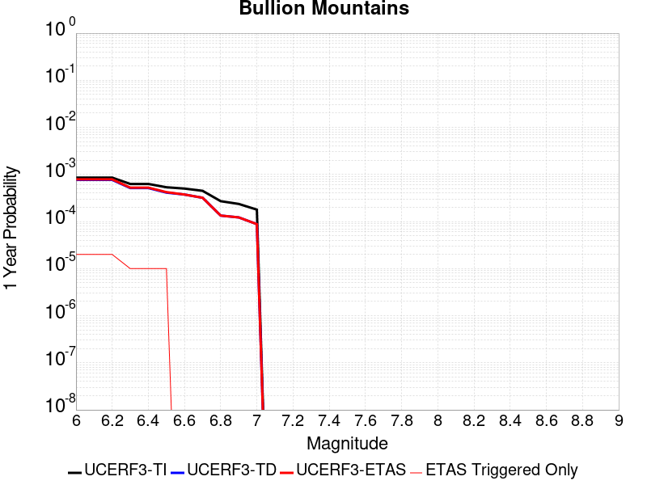 |  |

| Magnitude | 1 wk TI Prob | 1 wk TD Prob | 1 wk ETAS Prob | 1 wk ETAS/TD Gain | 1 wk ETAS Triggered Only | 1 mo TI Prob | 1 mo TD Prob | 1 mo ETAS Prob | 1 mo ETAS/TD Gain | 1 mo ETAS Triggered Only | 1 yr TI Prob | 1 yr TD Prob | 1 yr ETAS Prob | 1 yr ETAS/TD Gain | 1 yr ETAS Triggered Only | 10 yr TI Prob | 10 yr TD Prob | 10 yr ETAS Prob | 10 yr ETAS/TD Gain | 10 yr ETAS Triggered Only |
|-----|-----|-----|-----|-----|-----|-----|-----|-----|-----|-----|-----|-----|-----|-----|-----|-----|-----|-----|-----|-----|
| 6.0 | 1.6420427E-5 | 1.4692201E-5 | 1.4692201E-5 | 1.0 | 0.0 | 7.037136E-5 | 6.296527E-5 | 6.296527E-5 | 1.0 | 0.0 | 8.5643446E-4 | 7.6637097E-4 | 7.8635564E-4 | 1.026077 | 2.0E-5 | 0.008531413 | 0.0076410742 | 0.007670845 | 1.0038961 | 3.0E-5 |
| 6.1 | 1.6420427E-5 | 1.4692201E-5 | 1.4692201E-5 | 1.0 | 0.0 | 7.037136E-5 | 6.296527E-5 | 6.296527E-5 | 1.0 | 0.0 | 8.5643446E-4 | 7.6637097E-4 | 7.8635564E-4 | 1.026077 | 2.0E-5 | 0.008531413 | 0.0076410742 | 0.007670845 | 1.0038961 | 3.0E-5 |
| 6.2 | 1.6420427E-5 | 1.4692201E-5 | 1.4692201E-5 | 1.0 | 0.0 | 7.037136E-5 | 6.296527E-5 | 6.296527E-5 | 1.0 | 0.0 | 8.5643446E-4 | 7.6637097E-4 | 7.8635564E-4 | 1.026077 | 2.0E-5 | 0.008531413 | 0.0076410742 | 0.007670845 | 1.0038961 | 3.0E-5 |
| 6.3 | 1.2046778E-5 | 9.8623805E-6 | 9.8623805E-6 | 1.0 | 0.0 | 5.1628023E-5 | 4.226679E-5 | 4.226679E-5 | 1.0 | 0.0 | 6.283899E-4 | 5.1449984E-4 | 5.244947E-4 | 1.0194263 | 1.0E-5 | 0.0062661595 | 0.0051353686 | 0.005155266 | 1.0038745 | 2.0E-5 |
| 6.4 | 1.2046778E-5 | 9.8623805E-6 | 9.8623805E-6 | 1.0 | 0.0 | 5.1628023E-5 | 4.226679E-5 | 4.226679E-5 | 1.0 | 0.0 | 6.283899E-4 | 5.1449984E-4 | 5.244947E-4 | 1.0194263 | 1.0E-5 | 0.0062661595 | 0.0051353686 | 0.005155266 | 1.0038745 | 2.0E-5 |
| 6.5 | 1.0244343E-5 | 7.879477E-6 | 7.879477E-6 | 1.0 | 0.0 | 4.390359E-5 | 3.376887E-5 | 3.376887E-5 | 1.0 | 0.0 | 5.343951E-4 | 4.110791E-4 | 4.2107498E-4 | 1.0243162 | 1.0E-5 | 0.005331118 | 0.0041052178 | 0.004125136 | 1.0048518 | 2.0E-5 |
| 6.6 | 9.605408E-6 | 7.177506E-6 | 7.177506E-6 | 1.0 | 0.0 | 4.1165385E-5 | 3.0760493E-5 | 3.0760493E-5 | 1.0 | 0.0 | 5.010733E-4 | 3.74465E-4 | 3.74465E-4 | 1.0 | 0.0 | 0.00499945 | 0.0037403372 | 0.0037502998 | 1.0026636 | 1.0E-5 |
| 6.7 | 8.60418E-6 | 6.124001E-6 | 6.124001E-6 | 1.0 | 0.0 | 3.687454E-5 | 2.6245565E-5 | 2.6245565E-5 | 1.0 | 0.0 | 4.48855E-4 | 3.1951242E-4 | 3.1951242E-4 | 1.0 | 0.0 | 0.004479495 | 0.0031924422 | 0.0032024102 | 1.0031224 | 1.0E-5 |
| 6.8 | 5.187994E-6 | 2.5631452E-6 | 2.5631452E-6 | 1.0 | 0.0 | 2.223407E-5 | 1.0984884E-5 | 1.0984884E-5 | 1.0 | 0.0 | 2.7066618E-4 | 1.3373674E-4 | 1.3373674E-4 | 1.0 | 0.0 | 0.0027033675 | 0.0013369543 | 0.0013369543 | 1.0 | 0.0 |
| 6.9 | 4.5302368E-6 | 2.344301E-6 | 2.344301E-6 | 1.0 | 0.0 | 1.9415156E-5 | 1.0046988E-5 | 1.0046988E-5 | 1.0 | 0.0 | 2.3635388E-4 | 1.2231918E-4 | 1.2231918E-4 | 1.0 | 0.0 | 0.0023610266 | 0.0012229076 | 0.0012229076 | 1.0 | 0.0 |
| 7.0 | 3.431668E-6 | 1.688219E-6 | 1.688219E-6 | 1.0 | 0.0 | 1.4707065E-5 | 7.235224E-6 | 7.235224E-6 | 1.0 | 0.0 | 1.7904381E-4 | 8.8088855E-5 | 8.8088855E-5 | 1.0 | 0.0 | 0.0017889962 | 8.8088855E-4 | 8.8088855E-4 | 1.0 | 0.0 |

## Palos Verdes
*[(top)](#table-of-contents)*

| 1 Week | 1 Month | 1 Year | 10 Year |
|-----|-----|-----|-----|
|  |  |  |  |

| Magnitude | 1 wk TI Prob | 1 wk TD Prob | 1 wk ETAS Prob | 1 wk ETAS/TD Gain | 1 wk ETAS Triggered Only | 1 mo TI Prob | 1 mo TD Prob | 1 mo ETAS Prob | 1 mo ETAS/TD Gain | 1 mo ETAS Triggered Only | 1 yr TI Prob | 1 yr TD Prob | 1 yr ETAS Prob | 1 yr ETAS/TD Gain | 1 yr ETAS Triggered Only | 10 yr TI Prob | 10 yr TD Prob | 10 yr ETAS Prob | 10 yr ETAS/TD Gain | 10 yr ETAS Triggered Only |
|-----|-----|-----|-----|-----|-----|-----|-----|-----|-----|-----|-----|-----|-----|-----|-----|-----|-----|-----|-----|-----|
| 6.0 | 6.126063E-5 | 7.622823E-5 | 7.622823E-5 | 1.0 | 0.0 | 2.6251914E-4 | 3.2665484E-4 | 3.3665157E-4 | 1.0306034 | 1.0E-5 | 0.0031914865 | 0.0039703017 | 0.0039802617 | 1.0025088 | 1.0E-5 | 0.031460393 | 0.03905032 | 0.039079145 | 1.0007383 | 3.0E-5 |
| 6.1 | 6.126063E-5 | 7.622823E-5 | 7.622823E-5 | 1.0 | 0.0 | 2.6251914E-4 | 3.2665484E-4 | 3.3665157E-4 | 1.0306034 | 1.0E-5 | 0.0031914865 | 0.0039703017 | 0.0039802617 | 1.0025088 | 1.0E-5 | 0.031460393 | 0.03905032 | 0.039079145 | 1.0007383 | 3.0E-5 |
| 6.2 | 6.126063E-5 | 7.622823E-5 | 7.622823E-5 | 1.0 | 0.0 | 2.6251914E-4 | 3.2665484E-4 | 3.3665157E-4 | 1.0306034 | 1.0E-5 | 0.0031914865 | 0.0039703017 | 0.0039802617 | 1.0025088 | 1.0E-5 | 0.031460393 | 0.03905032 | 0.039079145 | 1.0007383 | 3.0E-5 |
| 6.3 | 4.0838047E-5 | 4.9750462E-5 | 4.9750462E-5 | 1.0 | 0.0 | 1.7500846E-4 | 2.1320012E-4 | 2.1320012E-4 | 1.0 | 0.0 | 0.0021286458 | 0.0025928293 | 0.0025928293 | 1.0 | 0.0 | 0.021083709 | 0.02564748 | 0.025657224 | 1.0003799 | 1.0E-5 |
| 6.4 | 4.0838047E-5 | 4.9750462E-5 | 4.9750462E-5 | 1.0 | 0.0 | 1.7500846E-4 | 2.1320012E-4 | 2.1320012E-4 | 1.0 | 0.0 | 0.0021286458 | 0.0025928293 | 0.0025928293 | 1.0 | 0.0 | 0.021083709 | 0.02564748 | 0.025657224 | 1.0003799 | 1.0E-5 |
| 6.5 | 3.0512005E-5 | 3.6562564E-5 | 3.6562564E-5 | 1.0 | 0.0 | 1.3075917E-4 | 1.5668797E-4 | 1.5668797E-4 | 1.0 | 0.0 | 0.0015908304 | 0.0019061224 | 0.0019061224 | 1.0 | 0.0 | 0.015794903 | 0.018909669 | 0.01891948 | 1.0005188 | 1.0E-5 |
| 6.6 | 2.9255087E-5 | 3.515534E-5 | 3.515534E-5 | 1.0 | 0.0 | 1.2537291E-4 | 1.506577E-4 | 1.506577E-4 | 1.0 | 0.0 | 0.0015253464 | 0.0018328275 | 0.0018328275 | 1.0 | 0.0 | 0.015149189 | 0.018188728 | 0.018198546 | 1.0005398 | 1.0E-5 |
| 6.7 | 2.287198E-5 | 2.7248976E-5 | 2.7248976E-5 | 1.0 | 0.0 | 9.801909E-5 | 1.1677662E-4 | 1.1677662E-4 | 1.0 | 0.0 | 0.001192729 | 0.0014209197 | 0.0014209197 | 1.0 | 0.0 | 0.011863477 | 0.014127577 | 0.014137436 | 1.0006979 | 1.0E-5 |
| 6.8 | 2.1325764E-5 | 2.5432533E-5 | 2.5432533E-5 | 1.0 | 0.0 | 9.139293E-5 | 1.0899252E-4 | 1.0899252E-4 | 1.0 | 0.0 | 0.001112141 | 0.0013262664 | 0.0013262664 | 1.0 | 0.0 | 0.011065915 | 0.013192549 | 0.013202417 | 1.000748 | 1.0E-5 |
| 6.9 | 1.9009392E-5 | 2.2614122E-5 | 2.2614122E-5 | 1.0 | 0.0 | 8.1466285E-5 | 9.6914555E-5 | 9.6914555E-5 | 1.0 | 0.0 | 9.914007E-4 | 0.0011793834 | 0.0011793834 | 1.0 | 0.0 | 0.009869894 | 0.011739929 | 0.0117498115 | 1.0008417 | 1.0E-5 |
| 7.0 | 1.7098473E-5 | 2.0319867E-5 | 2.0319867E-5 | 1.0 | 0.0 | 7.3277115E-5 | 8.708272E-5 | 8.708272E-5 | 1.0 | 0.0 | 8.917837E-4 | 0.0010598017 | 0.0010598017 | 1.0 | 0.0 | 0.008882134 | 0.010555912 | 0.010565806 | 1.0009373 | 1.0E-5 |
| 7.1 | 1.5982785E-5 | 1.8995239E-5 | 1.8995239E-5 | 1.0 | 0.0 | 6.849585E-5 | 8.1406106E-5 | 8.1406106E-5 | 1.0 | 0.0 | 8.336179E-4 | 9.907534E-4 | 9.907534E-4 | 1.0 | 0.0 | 0.008304977 | 0.009871728 | 0.009871728 | 1.0 | 0.0 |
| 7.2 | 1.4468002E-5 | 1.719767E-5 | 1.719767E-5 | 1.0 | 0.0 | 6.200425E-5 | 7.370269E-5 | 7.370269E-5 | 1.0 | 0.0 | 7.546402E-4 | 8.970449E-4 | 8.970449E-4 | 1.0 | 0.0 | 0.007520827 | 0.008942509 | 0.008942509 | 1.0 | 0.0 |
| 7.3 | 5.288233E-6 | 6.2038207E-6 | 6.2038207E-6 | 1.0 | 0.0 | 2.2663658E-5 | 2.658773E-5 | 2.658773E-5 | 1.0 | 0.0 | 2.7589512E-4 | 3.2369242E-4 | 3.2369242E-4 | 1.0 | 0.0 | 0.0027555283 | 0.0032356323 | 0.0032356323 | 1.0 | 0.0 |
| 7.4 | 8.279556E-7 | 8.408364E-7 | 8.408364E-7 | 1.0 | 0.0 | 3.5483763E-6 | 3.60358E-6 | 3.60358E-6 | 1.0 | 0.0 | 4.3200624E-5 | 4.3872777E-5 | 4.3872777E-5 | 1.0 | 0.0 | 4.3192226E-4 | 4.3864836E-4 | 4.3864836E-4 | 1.0 | 0.0 |
| 7.5 | 6.559831E-7 | 6.667243E-7 | 6.667243E-7 | 1.0 | 0.0 | 2.8113532E-6 | 2.8573872E-6 | 2.8573872E-6 | 1.0 | 0.0 | 3.4227687E-5 | 3.47882E-5 | 3.47882E-5 | 1.0 | 0.0 | 3.4222414E-4 | 3.478342E-4 | 3.478342E-4 | 1.0 | 0.0 |
| 7.6 | 3.5018968E-7 | 3.562011E-7 | 3.562011E-7 | 1.0 | 0.0 | 1.500812E-6 | 1.5265755E-6 | 1.5265755E-6 | 1.0 | 0.0 | 1.8272232E-5 | 1.8585944E-5 | 1.8585944E-5 | 1.0 | 0.0 | 1.8270731E-4 | 1.858485E-4 | 1.858485E-4 | 1.0 | 0.0 |
| 7.7 | 1.1986104E-7 | 1.2198406E-7 | 1.2198406E-7 | 1.0 | 0.0 | 5.1369005E-7 | 5.227887E-7 | 5.227887E-7 | 1.0 | 0.0 | 6.2541585E-6 | 6.364934E-6 | 6.364934E-6 | 1.0 | 0.0 | 6.2539824E-5 | 6.364756E-5 | 6.364756E-5 | 1.0 | 0.0 |
| 7.8 | 3.0445005E-8 | 3.1027664E-8 | 3.1027664E-8 | 1.0 | 0.0 | 1.3047858E-7 | 1.3297569E-7 | 1.3297569E-7 | 1.0 | 0.0 | 1.5885756E-6 | 1.6189781E-6 | 1.6189781E-6 | 1.0 | 0.0 | 1.5885644E-5 | 1.6189684E-5 | 1.6189684E-5 | 1.0 | 0.0 |

## San Diego Trough north alt1
*[(top)](#table-of-contents)*

| 1 Week | 1 Month | 1 Year | 10 Year |
|-----|-----|-----|-----|
|  |  |  | 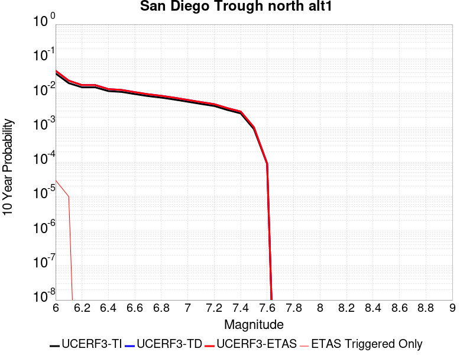 |

| Magnitude | 1 wk TI Prob | 1 wk TD Prob | 1 wk ETAS Prob | 1 wk ETAS/TD Gain | 1 wk ETAS Triggered Only | 1 mo TI Prob | 1 mo TD Prob | 1 mo ETAS Prob | 1 mo ETAS/TD Gain | 1 mo ETAS Triggered Only | 1 yr TI Prob | 1 yr TD Prob | 1 yr ETAS Prob | 1 yr ETAS/TD Gain | 1 yr ETAS Triggered Only | 10 yr TI Prob | 10 yr TD Prob | 10 yr ETAS Prob | 10 yr ETAS/TD Gain | 10 yr ETAS Triggered Only |
|-----|-----|-----|-----|-----|-----|-----|-----|-----|-----|-----|-----|-----|-----|-----|-----|-----|-----|-----|-----|-----|
| 6.0 | 7.329252E-5 | 8.821515E-5 | 9.821427E-5 | 1.1133492 | 1.0E-5 | 3.14073E-4 | 3.780138E-4 | 3.8801E-4 | 1.0264441 | 1.0E-5 | 0.0038171355 | 0.004593173 | 0.004603127 | 1.0021671 | 1.0E-5 | 0.03752231 | 0.04504633 | 0.045074977 | 1.000636 | 3.0E-5 |
| 6.1 | 3.7940346E-5 | 4.4886026E-5 | 5.4885575E-5 | 1.2227765 | 1.0E-5 | 1.6259136E-4 | 1.9235504E-4 | 2.0235313E-4 | 1.0519772 | 1.0E-5 | 0.0019777524 | 0.0023394884 | 0.0023494652 | 1.0042645 | 1.0E-5 | 0.019602431 | 0.023157293 | 0.023167063 | 1.0004219 | 1.0E-5 |
| 6.2 | 2.8645263E-5 | 3.3297452E-5 | 3.3297452E-5 | 1.0 | 0.0 | 1.2275964E-4 | 1.4269572E-4 | 1.4269572E-4 | 1.0 | 0.0 | 0.0014935739 | 0.0017359584 | 0.0017359584 | 1.0 | 0.0 | 0.0148357535 | 0.017226638 | 0.017226638 | 1.0 | 0.0 |
| 6.3 | 2.8645263E-5 | 3.3297452E-5 | 3.3297452E-5 | 1.0 | 0.0 | 1.2275964E-4 | 1.4269572E-4 | 1.4269572E-4 | 1.0 | 0.0 | 0.0014935739 | 0.0017359584 | 0.0017359584 | 1.0 | 0.0 | 0.0148357535 | 0.017226638 | 0.017226638 | 1.0 | 0.0 |
| 6.4 | 2.2204576E-5 | 2.5448819E-5 | 2.5448819E-5 | 1.0 | 0.0 | 9.5159E-5 | 1.0906186E-4 | 1.0906186E-4 | 1.0 | 0.0 | 0.001157945 | 0.0013270287 | 0.0013270287 | 1.0 | 0.0 | 0.011519298 | 0.013192215 | 0.013192215 | 1.0 | 0.0 |
| 6.5 | 2.1004838E-5 | 2.402516E-5 | 2.402516E-5 | 1.0 | 0.0 | 9.0017624E-5 | 1.02960956E-4 | 1.02960956E-4 | 1.0 | 0.0 | 0.0010954136 | 0.0012528376 | 0.0012528376 | 1.0 | 0.0 | 0.010900296 | 0.01245883 | 0.01245883 | 1.0 | 0.0 |
| 6.6 | 1.820557E-5 | 2.070517E-5 | 2.070517E-5 | 1.0 | 0.0 | 7.802154E-5 | 8.873346E-5 | 8.873346E-5 | 1.0 | 0.0 | 9.4949827E-4 | 0.0010797998 | 0.0010797998 | 1.0 | 0.0 | 0.009454516 | 0.0107462015 | 0.0107462015 | 1.0 | 0.0 |
| 6.7 | 1.5884485E-5 | 1.7983964E-5 | 1.7983964E-5 | 1.0 | 0.0 | 6.807459E-5 | 7.707187E-5 | 7.707187E-5 | 1.0 | 0.0 | 8.284929E-4 | 9.379488E-4 | 9.379488E-4 | 1.0 | 0.0 | 0.008254109 | 0.009340268 | 0.009340268 | 1.0 | 0.0 |
| 6.8 | 1.4331171E-5 | 1.6201348E-5 | 1.6201348E-5 | 1.0 | 0.0 | 6.141786E-5 | 6.9432506E-5 | 6.9432506E-5 | 1.0 | 0.0 | 7.4750587E-4 | 8.4501493E-4 | 8.4501493E-4 | 1.0 | 0.0 | 0.0074499645 | 0.008418285 | 0.008418285 | 1.0 | 0.0 |
| 6.9 | 1.2574203E-5 | 1.4206081E-5 | 1.4206081E-5 | 1.0 | 0.0 | 5.3888325E-5 | 6.088179E-5 | 6.088179E-5 | 1.0 | 0.0 | 6.558929E-4 | 7.4098515E-4 | 7.4098515E-4 | 1.0 | 0.0 | 0.0065396037 | 0.0073853307 | 0.0073853307 | 1.0 | 0.0 |
| 7.0 | 1.0883844E-5 | 1.22894735E-5 | 1.22894735E-5 | 1.0 | 0.0 | 4.664421E-5 | 5.2668114E-5 | 5.2668114E-5 | 1.0 | 0.0 | 5.677453E-4 | 6.410466E-4 | 6.410466E-4 | 1.0 | 0.0 | 0.00566297 | 0.0063921027 | 0.0063921027 | 1.0 | 0.0 |
| 7.1 | 9.393088E-6 | 1.0607203E-5 | 1.0607203E-5 | 1.0 | 0.0 | 4.025547E-5 | 4.5458655E-5 | 4.5458655E-5 | 1.0 | 0.0 | 4.900001E-4 | 5.5331935E-4 | 5.5331935E-4 | 1.0 | 0.0 | 0.0048892107 | 0.005519513 | 0.005519513 | 1.0 | 0.0 |
| 7.2 | 8.190791E-6 | 9.258787E-6 | 9.258787E-6 | 1.0 | 0.0 | 3.510292E-5 | 3.9679915E-5 | 3.9679915E-5 | 1.0 | 0.0 | 4.2729423E-4 | 4.8299658E-4 | 4.8299658E-4 | 1.0 | 0.0 | 0.0042647356 | 0.004819548 | 0.004819548 | 1.0 | 0.0 |
| 7.3 | 6.268162E-6 | 7.08984E-6 | 7.08984E-6 | 1.0 | 0.0 | 2.6863276E-5 | 3.0384675E-5 | 3.0384675E-5 | 1.0 | 0.0 | 3.2701128E-4 | 3.6987104E-4 | 3.6987104E-4 | 1.0 | 0.0 | 0.003265305 | 0.0036926004 | 0.0036926004 | 1.0 | 0.0 |
| 7.4 | 4.985186E-6 | 5.6427807E-6 | 5.6427807E-6 | 1.0 | 0.0 | 2.1364907E-5 | 2.4183124E-5 | 2.4183124E-5 | 1.0 | 0.0 | 2.600867E-4 | 2.9439016E-4 | 2.9439016E-4 | 1.0 | 0.0 | 0.002597825 | 0.002940043 | 0.002940043 | 1.0 | 0.0 |
| 7.5 | 1.7489613E-6 | 1.9697113E-6 | 1.9697113E-6 | 1.0 | 0.0 | 7.495527E-6 | 8.441594E-6 | 8.441594E-6 | 1.0 | 0.0 | 9.125422E-5 | 1.0277178E-4 | 1.0277178E-4 | 1.0 | 0.0 | 9.1216754E-4 | 0.0010272645 | 0.0010272645 | 1.0 | 0.0 |
| 7.6 | 1.6988751E-7 | 1.7533898E-7 | 1.7533898E-7 | 1.0 | 0.0 | 7.2808916E-7 | 7.5145255E-7 | 7.5145255E-7 | 1.0 | 0.0 | 8.864449E-6 | 9.148898E-6 | 9.148898E-6 | 1.0 | 0.0 | 8.8640954E-5 | 9.148542E-5 | 9.148542E-5 | 1.0 | 0.0 |

## Great Valley 08 (Quinto)
*[(top)](#table-of-contents)*

| 1 Week | 1 Month | 1 Year | 10 Year |
|-----|-----|-----|-----|
|  | 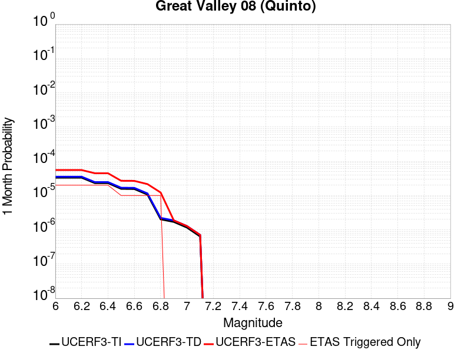 | 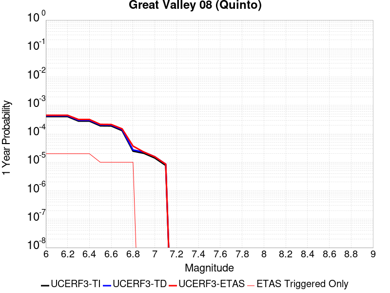 |  |

| Magnitude | 1 wk TI Prob | 1 wk TD Prob | 1 wk ETAS Prob | 1 wk ETAS/TD Gain | 1 wk ETAS Triggered Only | 1 mo TI Prob | 1 mo TD Prob | 1 mo ETAS Prob | 1 mo ETAS/TD Gain | 1 mo ETAS Triggered Only | 1 yr TI Prob | 1 yr TD Prob | 1 yr ETAS Prob | 1 yr ETAS/TD Gain | 1 yr ETAS Triggered Only | 10 yr TI Prob | 10 yr TD Prob | 10 yr ETAS Prob | 10 yr ETAS/TD Gain | 10 yr ETAS Triggered Only |
|-----|-----|-----|-----|-----|-----|-----|-----|-----|-----|-----|-----|-----|-----|-----|-----|-----|-----|-----|-----|-----|
| 6.0 | 7.737697E-6 | 8.253111E-6 | 1.825303E-5 | 2.2116542 | 1.0E-5 | 3.3161137E-5 | 3.5370103E-5 | 5.5369397E-5 | 1.5654293 | 2.0E-5 | 4.0366207E-4 | 4.3056477E-4 | 4.5055617E-4 | 1.0464306 | 2.0E-5 | 0.004029296 | 0.0042991587 | 0.0043290295 | 1.0069481 | 3.0E-5 |
| 6.1 | 7.737697E-6 | 8.253111E-6 | 1.825303E-5 | 2.2116542 | 1.0E-5 | 3.3161137E-5 | 3.5370103E-5 | 5.5369397E-5 | 1.5654293 | 2.0E-5 | 4.0366207E-4 | 4.3056477E-4 | 4.5055617E-4 | 1.0464306 | 2.0E-5 | 0.004029296 | 0.0042991587 | 0.0043290295 | 1.0069481 | 3.0E-5 |
| 6.2 | 7.737697E-6 | 8.253111E-6 | 1.825303E-5 | 2.2116542 | 1.0E-5 | 3.3161137E-5 | 3.5370103E-5 | 5.5369397E-5 | 1.5654293 | 2.0E-5 | 4.0366207E-4 | 4.3056477E-4 | 4.5055617E-4 | 1.0464306 | 2.0E-5 | 0.004029296 | 0.0042991587 | 0.0043290295 | 1.0069481 | 3.0E-5 |
| 6.3 | 5.374012E-6 | 5.750627E-6 | 1.575057E-5 | 2.7389307 | 1.0E-5 | 2.3031276E-5 | 2.4645375E-5 | 4.4644883E-5 | 1.8114913 | 2.0E-5 | 2.803697E-4 | 3.0002726E-4 | 3.2002127E-4 | 1.0666406 | 2.0E-5 | 0.0028001624 | 0.0029973155 | 0.0030272254 | 1.009979 | 3.0E-5 |
| 6.4 | 5.374012E-6 | 5.750627E-6 | 1.575057E-5 | 2.7389307 | 1.0E-5 | 2.3031276E-5 | 2.4645375E-5 | 4.4644883E-5 | 1.8114913 | 2.0E-5 | 2.803697E-4 | 3.0002726E-4 | 3.2002127E-4 | 1.0666406 | 2.0E-5 | 0.0028001624 | 0.0029973155 | 0.0030272254 | 1.009979 | 3.0E-5 |
| 6.5 | 3.65427E-6 | 3.941365E-6 | 1.3941326E-5 | 3.537182 | 1.0E-5 | 1.5661062E-5 | 1.6891494E-5 | 2.6891326E-5 | 1.592004 | 1.0E-5 | 1.9065675E-4 | 2.056416E-4 | 2.1563953E-4 | 1.0486183 | 1.0E-5 | 0.0019049325 | 0.0020552047 | 0.0020751636 | 1.0097114 | 2.0E-5 |
| 6.6 | 3.6143538E-6 | 3.8985513E-6 | 1.3898512E-5 | 3.5650454 | 1.0E-5 | 1.5489995E-5 | 1.6708009E-5 | 2.6707843E-5 | 1.5985054 | 1.0E-5 | 1.8857437E-4 | 2.0340808E-4 | 2.1340605E-4 | 1.0491523 | 1.0E-5 | 0.0018841444 | 0.0020329105 | 0.0020528699 | 1.0098181 | 2.0E-5 |
| 6.7 | 2.4821015E-6 | 2.685736E-6 | 1.2685709E-5 | 4.723364 | 1.0E-5 | 1.0637535E-5 | 1.15102785E-5 | 2.1510163E-5 | 1.8687787 | 1.0E-5 | 1.2950429E-4 | 1.4013429E-4 | 1.5013288E-4 | 1.0713501 | 1.0E-5 | 0.0012942884 | 0.0014010142 | 0.0014209861 | 1.0142554 | 2.0E-5 |
| 6.8 | 4.7110538E-7 | 5.1930914E-7 | 1.0519304E-5 | 20.256342 | 1.0E-5 | 2.0190216E-6 | 2.2256088E-6 | 1.2225587E-5 | 5.4931426 | 1.0E-5 | 2.458131E-5 | 2.7096468E-5 | 3.7096197E-5 | 1.3690418 | 1.0E-5 | 2.457859E-4 | 2.7093347E-4 | 2.8093075E-4 | 1.0368994 | 1.0E-5 |
| 6.9 | 3.958685E-7 | 4.3704054E-7 | 4.3704054E-7 | 1.0 | 0.0 | 1.6965782E-6 | 1.8730296E-6 | 1.8730296E-6 | 1.0 | 0.0 | 2.0655643E-5 | 2.2803915E-5 | 2.2803915E-5 | 1.0 | 0.0 | 2.0653724E-4 | 2.2801736E-4 | 2.2801736E-4 | 1.0 | 0.0 |
| 7.0 | 2.70294E-7 | 2.9920432E-7 | 2.9920432E-7 | 1.0 | 0.0 | 1.1584025E-6 | 1.2823037E-6 | 1.2823037E-6 | 1.0 | 0.0 | 1.4103458E-5 | 1.561195E-5 | 1.561195E-5 | 1.0 | 0.0 | 1.4102564E-4 | 1.561098E-4 | 1.561098E-4 | 1.0 | 0.0 |
| 7.1 | 1.4828602E-7 | 1.6469349E-7 | 1.6469349E-7 | 1.0 | 0.0 | 6.3551136E-7 | 7.058291E-7 | 7.058291E-7 | 1.0 | 0.0 | 7.737323E-6 | 8.593443E-6 | 8.593443E-6 | 1.0 | 0.0 | 7.737054E-5 | 8.593191E-5 | 8.593191E-5 | 1.0 | 0.0 |

## Pleito
*[(top)](#table-of-contents)*

| 1 Week | 1 Month | 1 Year | 10 Year |
|-----|-----|-----|-----|
|  |  |  |  |

| Magnitude | 1 wk TI Prob | 1 wk TD Prob | 1 wk ETAS Prob | 1 wk ETAS/TD Gain | 1 wk ETAS Triggered Only | 1 mo TI Prob | 1 mo TD Prob | 1 mo ETAS Prob | 1 mo ETAS/TD Gain | 1 mo ETAS Triggered Only | 1 yr TI Prob | 1 yr TD Prob | 1 yr ETAS Prob | 1 yr ETAS/TD Gain | 1 yr ETAS Triggered Only | 10 yr TI Prob | 10 yr TD Prob | 10 yr ETAS Prob | 10 yr ETAS/TD Gain | 10 yr ETAS Triggered Only |
|-----|-----|-----|-----|-----|-----|-----|-----|-----|-----|-----|-----|-----|-----|-----|-----|-----|-----|-----|-----|-----|
| 6.0 | 1.6763008E-5 | 2.4771325E-5 | 3.4771077E-5 | 1.4036826 | 1.0E-5 | 7.183948E-5 | 1.0615891E-4 | 1.1615785E-4 | 1.0941885 | 1.0E-5 | 8.742947E-4 | 0.0012917904 | 0.0013117646 | 1.0154624 | 2.0E-5 | 0.00870863 | 0.01295784 | 0.012987452 | 1.0022852 | 3.0E-5 |
| 6.1 | 1.6763008E-5 | 2.4771325E-5 | 3.4771077E-5 | 1.4036826 | 1.0E-5 | 7.183948E-5 | 1.0615891E-4 | 1.1615785E-4 | 1.0941885 | 1.0E-5 | 8.742947E-4 | 0.0012917904 | 0.0013117646 | 1.0154624 | 2.0E-5 | 0.00870863 | 0.01295784 | 0.012987452 | 1.0022852 | 3.0E-5 |
| 6.2 | 1.6763008E-5 | 2.4771325E-5 | 3.4771077E-5 | 1.4036826 | 1.0E-5 | 7.183948E-5 | 1.0615891E-4 | 1.1615785E-4 | 1.0941885 | 1.0E-5 | 8.742947E-4 | 0.0012917904 | 0.0013117646 | 1.0154624 | 2.0E-5 | 0.00870863 | 0.01295784 | 0.012987452 | 1.0022852 | 3.0E-5 |
| 6.3 | 1.6763008E-5 | 2.4771325E-5 | 3.4771077E-5 | 1.4036826 | 1.0E-5 | 7.183948E-5 | 1.0615891E-4 | 1.1615785E-4 | 1.0941885 | 1.0E-5 | 8.742947E-4 | 0.0012917904 | 0.0013117646 | 1.0154624 | 2.0E-5 | 0.00870863 | 0.01295784 | 0.012987452 | 1.0022852 | 3.0E-5 |
| 6.4 | 1.6763008E-5 | 2.4771325E-5 | 3.4771077E-5 | 1.4036826 | 1.0E-5 | 7.183948E-5 | 1.0615891E-4 | 1.1615785E-4 | 1.0941885 | 1.0E-5 | 8.742947E-4 | 0.0012917904 | 0.0013117646 | 1.0154624 | 2.0E-5 | 0.00870863 | 0.01295784 | 0.012987452 | 1.0022852 | 3.0E-5 |
| 6.5 | 1.6763008E-5 | 2.4771325E-5 | 3.4771077E-5 | 1.4036826 | 1.0E-5 | 7.183948E-5 | 1.0615891E-4 | 1.1615785E-4 | 1.0941885 | 1.0E-5 | 8.742947E-4 | 0.0012917904 | 0.0013117646 | 1.0154624 | 2.0E-5 | 0.00870863 | 0.01295784 | 0.012987452 | 1.0022852 | 3.0E-5 |
| 6.6 | 9.910213E-6 | 1.7222008E-5 | 1.7222008E-5 | 1.0 | 0.0 | 4.247165E-5 | 7.380654E-5 | 7.380654E-5 | 1.0 | 0.0 | 5.169696E-4 | 8.982279E-4 | 9.082189E-4 | 1.0111231 | 1.0E-5 | 0.0051576863 | 0.009054615 | 0.009074434 | 1.0021888 | 2.0E-5 |
| 6.7 | 9.910213E-6 | 1.7222008E-5 | 1.7222008E-5 | 1.0 | 0.0 | 4.247165E-5 | 7.380654E-5 | 7.380654E-5 | 1.0 | 0.0 | 5.169696E-4 | 8.982279E-4 | 9.082189E-4 | 1.0111231 | 1.0E-5 | 0.0051576863 | 0.009054615 | 0.009074434 | 1.0021888 | 2.0E-5 |
| 6.8 | 8.300162E-6 | 1.5481599E-5 | 1.5481599E-5 | 1.0 | 0.0 | 3.557164E-5 | 6.634803E-5 | 6.634803E-5 | 1.0 | 0.0 | 4.3299864E-4 | 8.074893E-4 | 8.1748125E-4 | 1.012374 | 1.0E-5 | 0.004321559 | 0.008154046 | 0.008173882 | 1.0024328 | 2.0E-5 |
| 6.9 | 8.183114E-6 | 1.535281E-5 | 1.535281E-5 | 1.0 | 0.0 | 3.5070017E-5 | 6.5796106E-5 | 6.5796106E-5 | 1.0 | 0.0 | 4.2689382E-4 | 8.007746E-4 | 8.107666E-4 | 1.0124779 | 1.0E-5 | 0.0042607468 | 0.008087389 | 0.008107227 | 1.002453 | 2.0E-5 |
| 7.0 | 7.1748823E-6 | 1.41397095E-5 | 1.41397095E-5 | 1.0 | 0.0 | 3.0749135E-5 | 6.059735E-5 | 6.059735E-5 | 1.0 | 0.0 | 3.743064E-4 | 7.3752354E-4 | 7.4751617E-4 | 1.0135489 | 1.0E-5 | 0.0037367654 | 0.0074588493 | 0.0074787 | 1.0026613 | 2.0E-5 |
| 7.1 | 7.1671807E-6 | 1.4130079E-5 | 1.4130079E-5 | 1.0 | 0.0 | 3.0716128E-5 | 6.0556078E-5 | 6.0556078E-5 | 1.0 | 0.0 | 3.7390468E-4 | 7.370214E-4 | 7.47014E-4 | 1.0135581 | 1.0E-5 | 0.0037327618 | 0.0074538616 | 0.0074737123 | 1.0026631 | 2.0E-5 |
| 7.2 | 7.0649667E-6 | 1.3977344E-5 | 1.3977344E-5 | 1.0 | 0.0 | 3.0278077E-5 | 5.990153E-5 | 5.990153E-5 | 1.0 | 0.0 | 3.6857324E-4 | 7.290576E-4 | 7.390503E-4 | 1.0137063 | 1.0E-5 | 0.0036796255 | 0.007374603 | 0.0073944554 | 1.002692 | 2.0E-5 |
| 7.3 | 7.02082E-6 | 1.3920784E-5 | 1.3920784E-5 | 1.0 | 0.0 | 3.008888E-5 | 5.965914E-5 | 5.965914E-5 | 1.0 | 0.0 | 3.6627054E-4 | 7.261085E-4 | 7.3610124E-4 | 1.013762 | 1.0E-5 | 0.0036566744 | 0.007345096 | 0.007364949 | 1.002703 | 2.0E-5 |
| 7.4 | 6.987146E-6 | 1.3880338E-5 | 1.3880338E-5 | 1.0 | 0.0 | 2.9944567E-5 | 5.948581E-5 | 5.948581E-5 | 1.0 | 0.0 | 3.6451413E-4 | 7.239996E-4 | 7.339923E-4 | 1.0138022 | 1.0E-5 | 0.0036391679 | 0.0073240283 | 0.0073438818 | 1.0027107 | 2.0E-5 |
| 7.5 | 6.9494554E-6 | 1.3837237E-5 | 1.3837237E-5 | 1.0 | 0.0 | 2.9783041E-5 | 5.93011E-5 | 5.93011E-5 | 1.0 | 0.0 | 3.625482E-4 | 7.2175224E-4 | 7.3174504E-4 | 1.0138452 | 1.0E-5 | 0.0036195726 | 0.0073016533 | 0.007321507 | 1.0027192 | 2.0E-5 |
| 7.6 | 6.92694E-6 | 1.3796339E-5 | 1.3796339E-5 | 1.0 | 0.0 | 2.9686547E-5 | 5.9125832E-5 | 5.9125832E-5 | 1.0 | 0.0 | 3.6137376E-4 | 7.1961974E-4 | 7.2961254E-4 | 1.0138862 | 1.0E-5 | 0.0036078666 | 0.0072804 | 0.0073002544 | 1.0027272 | 2.0E-5 |
| 7.7 | 6.395867E-6 | 1.2675077E-5 | 1.2675077E-5 | 1.0 | 0.0 | 2.741057E-5 | 5.4320633E-5 | 5.4320633E-5 | 1.0 | 0.0 | 3.336726E-4 | 6.6115335E-4 | 6.711467E-4 | 1.0151151 | 1.0E-5 | 0.0033317201 | 0.0066988943 | 0.0067187604 | 1.0029656 | 2.0E-5 |
| 7.8 | 5.8664327E-6 | 1.15421135E-5 | 1.15421135E-5 | 1.0 | 0.0 | 2.5141611E-5 | 4.9465263E-5 | 4.9465263E-5 | 1.0 | 0.0 | 3.060561E-4 | 6.020734E-4 | 6.1206735E-4 | 1.0165993 | 1.0E-5 | 0.0030563495 | 0.0061040027 | 0.0061238804 | 1.0032566 | 2.0E-5 |
| 7.9 | 3.7167474E-6 | 7.117878E-6 | 7.117878E-6 | 1.0 | 0.0 | 1.592882E-5 | 3.0504834E-5 | 3.0504834E-5 | 1.0 | 0.0 | 1.9391612E-4 | 3.713332E-4 | 3.813295E-4 | 1.02692 | 1.0E-5 | 0.0019374699 | 0.0037694757 | 0.0037894004 | 1.0052857 | 2.0E-5 |
| 8.0 | 1.0903841E-6 | 1.2886559E-6 | 1.2886559E-6 | 1.0 | 0.0 | 4.6730665E-6 | 5.5227993E-6 | 5.5227993E-6 | 1.0 | 0.0 | 5.68931E-5 | 6.723802E-5 | 6.723802E-5 | 1.0 | 0.0 | 5.6878536E-4 | 6.9462E-4 | 6.9462E-4 | 1.0 | 0.0 |
| 8.1 | 2.6894583E-7 | 1.106846E-7 | 1.106846E-7 | 1.0 | 0.0 | 1.1526245E-6 | 4.7436248E-7 | 4.7436248E-7 | 1.0 | 0.0 | 1.4033113E-5 | 5.775348E-6 | 5.775348E-6 | 1.0 | 0.0 | 1.4032227E-4 | 6.461821E-5 | 6.461821E-5 | 1.0 | 0.0 |
| 8.2 | 5.2967013E-9 | 2.4599007E-9 | 2.4599007E-9 | 1.0 | 0.0 | 2.2700148E-8 | 1.0542432E-8 | 1.0542432E-8 | 1.0 | 0.0 | 2.7637427E-7 | 1.283541E-7 | 1.283541E-7 | 1.0 | 0.0 | 2.7637393E-6 | 1.4601666E-6 | 1.4601666E-6 | 1.0 | 0.0 |

## San Pedro Basin
*[(top)](#table-of-contents)*

| 1 Week | 1 Month | 1 Year | 10 Year |
|-----|-----|-----|-----|
|  |  |  | 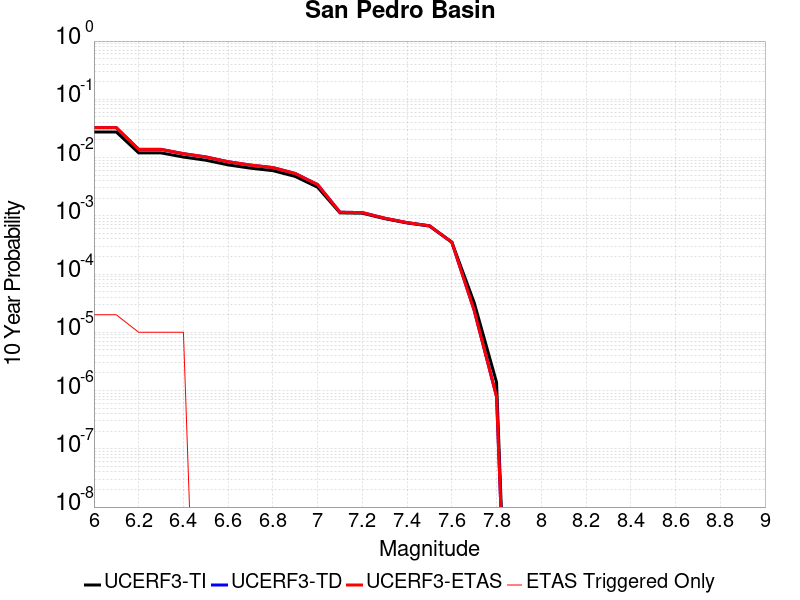 |

| Magnitude | 1 wk TI Prob | 1 wk TD Prob | 1 wk ETAS Prob | 1 wk ETAS/TD Gain | 1 wk ETAS Triggered Only | 1 mo TI Prob | 1 mo TD Prob | 1 mo ETAS Prob | 1 mo ETAS/TD Gain | 1 mo ETAS Triggered Only | 1 yr TI Prob | 1 yr TD Prob | 1 yr ETAS Prob | 1 yr ETAS/TD Gain | 1 yr ETAS Triggered Only | 10 yr TI Prob | 10 yr TD Prob | 10 yr ETAS Prob | 10 yr ETAS/TD Gain | 10 yr ETAS Triggered Only |
|-----|-----|-----|-----|-----|-----|-----|-----|-----|-----|-----|-----|-----|-----|-----|-----|-----|-----|-----|-----|-----|
| 6.0 | 5.3449043E-5 | 6.3371765E-5 | 6.3371765E-5 | 1.0 | 0.0 | 2.2904722E-4 | 2.7156848E-4 | 2.7156848E-4 | 1.0 | 0.0 | 0.0027850836 | 0.0033019334 | 0.0033019334 | 1.0 | 0.0 | 0.027504366 | 0.03259028 | 0.03260963 | 1.0005937 | 2.0E-5 |
| 6.1 | 5.3449043E-5 | 6.3371765E-5 | 6.3371765E-5 | 1.0 | 0.0 | 2.2904722E-4 | 2.7156848E-4 | 2.7156848E-4 | 1.0 | 0.0 | 0.0027850836 | 0.0033019334 | 0.0033019334 | 1.0 | 0.0 | 0.027504366 | 0.03259028 | 0.03260963 | 1.0005937 | 2.0E-5 |
| 6.2 | 2.3189454E-5 | 2.6643364E-5 | 2.6643364E-5 | 1.0 | 0.0 | 9.9379584E-5 | 1.1418111E-4 | 1.1418111E-4 | 1.0 | 0.0 | 0.0012092749 | 0.0013893156 | 0.0013893156 | 1.0 | 0.0 | 0.012027155 | 0.013811166 | 0.013821028 | 1.0007141 | 1.0E-5 |
| 6.3 | 2.3189454E-5 | 2.6643364E-5 | 2.6643364E-5 | 1.0 | 0.0 | 9.9379584E-5 | 1.1418111E-4 | 1.1418111E-4 | 1.0 | 0.0 | 0.0012092749 | 0.0013893156 | 0.0013893156 | 1.0 | 0.0 | 0.012027155 | 0.013811166 | 0.013821028 | 1.0007141 | 1.0E-5 |
| 6.4 | 1.966056E-5 | 2.2463855E-5 | 2.2463855E-5 | 1.0 | 0.0 | 8.425682E-5 | 9.627034E-5 | 9.627034E-5 | 1.0 | 0.0 | 0.001025344 | 0.0011715014 | 0.0011715014 | 1.0 | 0.0 | 0.010206259 | 0.011657343 | 0.011667227 | 1.0008478 | 1.0E-5 |
| 6.5 | 1.7342953E-5 | 1.9745525E-5 | 1.9745525E-5 | 1.0 | 0.0 | 7.4324824E-5 | 8.462114E-5 | 8.462114E-5 | 1.0 | 0.0 | 9.04529E-4 | 0.0010298124 | 0.0010298124 | 1.0 | 0.0 | 0.009008561 | 0.010254125 | 0.010254125 | 1.0 | 0.0 |
| 6.6 | 1.439804E-5 | 1.6323016E-5 | 1.6323016E-5 | 1.0 | 0.0 | 6.170443E-5 | 6.995408E-5 | 6.995408E-5 | 1.0 | 0.0 | 7.509924E-4 | 8.513903E-4 | 8.513903E-4 | 1.0 | 0.0 | 0.0074845953 | 0.008484487 | 0.008484487 | 1.0 | 0.0 |
| 6.7 | 1.2634884E-5 | 1.4285555E-5 | 1.4285555E-5 | 1.0 | 0.0 | 5.414838E-5 | 6.122254E-5 | 6.122254E-5 | 1.0 | 0.0 | 6.590571E-4 | 7.4516E-4 | 7.4516E-4 | 1.0 | 0.0 | 0.006571059 | 0.0074296347 | 0.0074296347 | 1.0 | 0.0 |
| 6.8 | 1.146091E-5 | 1.2933422E-5 | 1.2933422E-5 | 1.0 | 0.0 | 4.911726E-5 | 5.5427943E-5 | 5.5427943E-5 | 1.0 | 0.0 | 5.9783855E-4 | 6.74656E-4 | 6.74656E-4 | 1.0 | 0.0 | 0.0059623276 | 0.006729019 | 0.006729019 | 1.0 | 0.0 |
| 6.9 | 9.109035E-6 | 1.023519E-5 | 1.023519E-5 | 1.0 | 0.0 | 3.9038136E-5 | 4.386452E-5 | 4.386452E-5 | 1.0 | 0.0 | 4.7518566E-4 | 5.339476E-4 | 5.339476E-4 | 1.0 | 0.0 | 0.0047417083 | 0.005329401 | 0.005329401 | 1.0 | 0.0 |
| 7.0 | 5.9351028E-6 | 6.584069E-6 | 6.584069E-6 | 1.0 | 0.0 | 2.5435906E-5 | 2.8217266E-5 | 2.8217266E-5 | 1.0 | 0.0 | 3.0963816E-4 | 3.4351466E-4 | 3.4351466E-4 | 1.0 | 0.0 | 0.0030920706 | 0.0034321537 | 0.0034321537 | 1.0 | 0.0 |
| 7.1 | 2.1557585E-6 | 2.2096617E-6 | 2.2096617E-6 | 1.0 | 0.0 | 9.238933E-6 | 9.469944E-6 | 9.469944E-6 | 1.0 | 0.0 | 1.1247819E-4 | 1.1529063E-4 | 1.1529063E-4 | 1.0 | 0.0 | 0.0011242128 | 0.0011523236 | 0.0011523236 | 1.0 | 0.0 |
| 7.2 | 2.1251979E-6 | 2.1780077E-6 | 2.1780077E-6 | 1.0 | 0.0 | 9.107958E-6 | 9.334286E-6 | 9.334286E-6 | 1.0 | 0.0 | 1.1088375E-4 | 1.13639166E-4 | 1.13639166E-4 | 1.0 | 0.0 | 0.0011082845 | 0.0011358259 | 0.0011358259 | 1.0 | 0.0 |
| 7.3 | 1.7145798E-6 | 1.7442975E-6 | 1.7442975E-6 | 1.0 | 0.0 | 7.3481783E-6 | 7.47554E-6 | 7.47554E-6 | 1.0 | 0.0 | 8.94604E-5 | 9.101099E-5 | 9.101099E-5 | 1.0 | 0.0 | 8.9424395E-4 | 9.097463E-4 | 9.097463E-4 | 1.0 | 0.0 |
| 7.4 | 1.4467993E-6 | 1.4641951E-6 | 1.4641951E-6 | 1.0 | 0.0 | 6.200554E-6 | 6.2751074E-6 | 6.2751074E-6 | 1.0 | 0.0 | 7.548913E-5 | 7.639683E-5 | 7.639683E-5 | 1.0 | 0.0 | 7.546349E-4 | 7.637129E-4 | 7.637129E-4 | 1.0 | 0.0 |
| 7.5 | 1.2803735E-6 | 1.293157E-6 | 1.293157E-6 | 1.0 | 0.0 | 5.487303E-6 | 5.54209E-6 | 5.54209E-6 | 1.0 | 0.0 | 6.680587E-5 | 6.747293E-5 | 6.747293E-5 | 1.0 | 0.0 | 6.678579E-4 | 6.745315E-4 | 6.745315E-4 | 1.0 | 0.0 |
| 7.6 | 6.755009E-7 | 6.769505E-7 | 6.769505E-7 | 1.0 | 0.0 | 2.8950008E-6 | 2.9012133E-6 | 2.9012133E-6 | 1.0 | 0.0 | 3.5246063E-5 | 3.532176E-5 | 3.532176E-5 | 1.0 | 0.0 | 3.5240475E-4 | 3.5316718E-4 | 3.5316718E-4 | 1.0 | 0.0 |
| 7.7 | 6.211885E-8 | 4.5700038E-8 | 4.5700038E-8 | 1.0 | 0.0 | 2.6622362E-7 | 1.9585728E-7 | 1.9585728E-7 | 1.0 | 0.0 | 3.2412677E-6 | 2.38456E-6 | 2.38456E-6 | 1.0 | 0.0 | 3.2412205E-5 | 2.3845365E-5 | 2.3845365E-5 | 1.0 | 0.0 |
| 7.8 | 2.6580573E-9 | 1.5138489E-9 | 1.5138489E-9 | 1.0 | 0.0 | 1.1391674E-8 | 6.487924E-9 | 6.487924E-9 | 1.0 | 0.0 | 1.3869362E-7 | 7.8990475E-8 | 7.8990475E-8 | 1.0 | 0.0 | 1.3869354E-6 | 7.8990473E-7 | 7.8990473E-7 | 1.0 | 0.0 |

## Cleghorn
*[(top)](#table-of-contents)*

| 1 Week | 1 Month | 1 Year | 10 Year |
|-----|-----|-----|-----|
|  |  |  |  |

| Magnitude | 1 wk TI Prob | 1 wk TD Prob | 1 wk ETAS Prob | 1 wk ETAS/TD Gain | 1 wk ETAS Triggered Only | 1 mo TI Prob | 1 mo TD Prob | 1 mo ETAS Prob | 1 mo ETAS/TD Gain | 1 mo ETAS Triggered Only | 1 yr TI Prob | 1 yr TD Prob | 1 yr ETAS Prob | 1 yr ETAS/TD Gain | 1 yr ETAS Triggered Only | 10 yr TI Prob | 10 yr TD Prob | 10 yr ETAS Prob | 10 yr ETAS/TD Gain | 10 yr ETAS Triggered Only |
|-----|-----|-----|-----|-----|-----|-----|-----|-----|-----|-----|-----|-----|-----|-----|-----|-----|-----|-----|-----|-----|
| 6.0 | 7.9267165E-6 | 9.832763E-6 | 9.832763E-6 | 1.0 | 0.0 | 3.39712E-5 | 4.213979E-5 | 4.213979E-5 | 1.0 | 0.0 | 4.1352084E-4 | 5.129418E-4 | 5.129418E-4 | 1.0 | 0.0 | 0.004127522 | 0.005132704 | 0.00516255 | 1.0058149 | 3.0E-5 |
| 6.1 | 7.9267165E-6 | 9.832763E-6 | 9.832763E-6 | 1.0 | 0.0 | 3.39712E-5 | 4.213979E-5 | 4.213979E-5 | 1.0 | 0.0 | 4.1352084E-4 | 5.129418E-4 | 5.129418E-4 | 1.0 | 0.0 | 0.004127522 | 0.005132704 | 0.00516255 | 1.0058149 | 3.0E-5 |
| 6.2 | 7.9267165E-6 | 9.832763E-6 | 9.832763E-6 | 1.0 | 0.0 | 3.39712E-5 | 4.213979E-5 | 4.213979E-5 | 1.0 | 0.0 | 4.1352084E-4 | 5.129418E-4 | 5.129418E-4 | 1.0 | 0.0 | 0.004127522 | 0.005132704 | 0.00516255 | 1.0058149 | 3.0E-5 |
| 6.3 | 7.9267165E-6 | 9.832763E-6 | 9.832763E-6 | 1.0 | 0.0 | 3.39712E-5 | 4.213979E-5 | 4.213979E-5 | 1.0 | 0.0 | 4.1352084E-4 | 5.129418E-4 | 5.129418E-4 | 1.0 | 0.0 | 0.004127522 | 0.005132704 | 0.00516255 | 1.0058149 | 3.0E-5 |
| 6.4 | 4.3445207E-6 | 6.0926013E-6 | 6.0926013E-6 | 1.0 | 0.0 | 1.8619241E-5 | 2.6110894E-5 | 2.6110894E-5 | 1.0 | 0.0 | 2.2666567E-4 | 3.1785478E-4 | 3.1785478E-4 | 1.0 | 0.0 | 0.0022643462 | 0.003188204 | 0.0031981722 | 1.0031266 | 1.0E-5 |
| 6.5 | 4.3445207E-6 | 6.0926013E-6 | 6.0926013E-6 | 1.0 | 0.0 | 1.8619241E-5 | 2.6110894E-5 | 2.6110894E-5 | 1.0 | 0.0 | 2.2666567E-4 | 3.1785478E-4 | 3.1785478E-4 | 1.0 | 0.0 | 0.0022643462 | 0.003188204 | 0.0031981722 | 1.0031266 | 1.0E-5 |
| 6.6 | 4.040109E-6 | 5.7750076E-6 | 5.7750076E-6 | 1.0 | 0.0 | 1.7314638E-5 | 2.4749803E-5 | 2.4749803E-5 | 1.0 | 0.0 | 2.1078532E-4 | 3.0128812E-4 | 3.0128812E-4 | 1.0 | 0.0 | 0.002105855 | 0.003022993 | 0.0030329628 | 1.0032979 | 1.0E-5 |
| 6.7 | 3.3632055E-6 | 5.0685003E-6 | 5.0685003E-6 | 1.0 | 0.0 | 1.4413658E-5 | 2.1721964E-5 | 2.1721964E-5 | 1.0 | 0.0 | 1.7547216E-4 | 2.6443315E-4 | 2.6443315E-4 | 1.0 | 0.0 | 0.0017533366 | 0.0026553252 | 0.0026652988 | 1.003756 | 1.0E-5 |
| 6.8 | 3.2902772E-6 | 4.990407E-6 | 4.990407E-6 | 1.0 | 0.0 | 1.4101111E-5 | 2.1387285E-5 | 2.1387285E-5 | 1.0 | 0.0 | 1.716675E-4 | 2.603594E-4 | 2.603594E-4 | 1.0 | 0.0 | 0.0017153495 | 0.0026146837 | 0.0026246577 | 1.0038146 | 1.0E-5 |
| 6.9 | 3.031547E-6 | 4.692163E-6 | 4.692163E-6 | 1.0 | 0.0 | 1.299228E-5 | 2.0109117E-5 | 2.0109117E-5 | 1.0 | 0.0 | 1.5816953E-4 | 2.4480128E-4 | 2.4480128E-4 | 1.0 | 0.0 | 0.00158057 | 0.0024594541 | 0.0024694295 | 1.004056 | 1.0E-5 |
| 7.0 | 2.8259715E-6 | 4.371714E-6 | 4.371714E-6 | 1.0 | 0.0 | 1.211125E-5 | 1.8735784E-5 | 1.8735784E-5 | 1.0 | 0.0 | 1.4744449E-4 | 2.2808454E-4 | 2.2808454E-4 | 1.0 | 0.0 | 0.001473467 | 0.0022926412 | 0.0023026182 | 1.0043517 | 1.0E-5 |
| 7.1 | 2.5962665E-6 | 4.066925E-6 | 4.066925E-6 | 1.0 | 0.0 | 1.1126809E-5 | 1.7429564E-5 | 1.7429564E-5 | 1.0 | 0.0 | 1.3546048E-4 | 2.1218449E-4 | 2.1218449E-4 | 1.0 | 0.0 | 0.0013537793 | 0.0021339648 | 0.0021439434 | 1.0046761 | 1.0E-5 |
| 7.2 | 2.3247253E-6 | 3.6774632E-6 | 3.6774632E-6 | 1.0 | 0.0 | 9.96307E-6 | 1.5760463E-5 | 1.5760463E-5 | 1.0 | 0.0 | 1.21293626E-4 | 1.9186691E-4 | 1.9186691E-4 | 1.0 | 0.0 | 0.0012122744 | 0.0019311808 | 0.0019411615 | 1.0051682 | 1.0E-5 |
| 7.3 | 2.056928E-6 | 3.236149E-6 | 3.236149E-6 | 1.0 | 0.0 | 8.815376E-6 | 1.3869138E-5 | 1.3869138E-5 | 1.0 | 0.0 | 1.0732192E-4 | 1.6884382E-4 | 1.6884382E-4 | 1.0 | 0.0 | 0.001072701 | 0.0017013908 | 0.0017113738 | 1.0058676 | 1.0E-5 |
| 7.4 | 1.8055999E-6 | 2.8265147E-6 | 2.8265147E-6 | 1.0 | 0.0 | 7.738263E-6 | 1.2113579E-5 | 1.2113579E-5 | 1.0 | 0.0 | 9.4209274E-5 | 1.4747298E-4 | 1.4747298E-4 | 1.0 | 0.0 | 9.4169343E-4 | 0.001488129 | 0.0014981141 | 1.0067098 | 1.0E-5 |
| 7.5 | 1.4683443E-6 | 2.4257406E-6 | 2.4257406E-6 | 1.0 | 0.0 | 6.292889E-6 | 1.039599E-5 | 1.039599E-5 | 1.0 | 0.0 | 7.661323E-5 | 1.2656393E-4 | 1.2656393E-4 | 1.0 | 0.0 | 7.658682E-4 | 0.0012793359 | 0.0012893231 | 1.0078065 | 1.0E-5 |
| 7.6 | 9.804088E-7 | 1.9012458E-6 | 1.9012458E-6 | 1.0 | 0.0 | 4.201745E-6 | 8.148171E-6 | 8.148171E-6 | 1.0 | 0.0 | 5.1155046E-5 | 9.919951E-5 | 9.919951E-5 | 1.0 | 0.0 | 5.114327E-4 | 0.0010060034 | 0.0010159933 | 1.0099304 | 1.0E-5 |
| 7.7 | 7.3434086E-7 | 1.6293816E-6 | 1.6293816E-6 | 1.0 | 0.0 | 3.1471714E-6 | 6.9830453E-6 | 6.9830453E-6 | 1.0 | 0.0 | 3.831614E-5 | 8.501529E-5 | 8.501529E-5 | 1.0 | 0.0 | 3.8309532E-4 | 8.6431357E-4 | 8.743049E-4 | 1.0115598 | 1.0E-5 |
| 7.8 | 6.434184E-7 | 1.522934E-6 | 1.522934E-6 | 1.0 | 0.0 | 2.7575045E-6 | 6.5268437E-6 | 6.5268437E-6 | 1.0 | 0.0 | 3.35721E-5 | 7.946145E-5 | 7.946145E-5 | 1.0 | 0.0 | 3.3567028E-4 | 8.0846256E-4 | 8.184545E-4 | 1.0123591 | 1.0E-5 |
| 7.9 | 3.4943926E-7 | 7.5794E-7 | 7.5794E-7 | 1.0 | 0.0 | 1.497596E-6 | 3.2483103E-6 | 3.2483103E-6 | 1.0 | 0.0 | 1.8233079E-5 | 3.9547467E-5 | 3.9547467E-5 | 1.0 | 0.0 | 1.8231584E-4 | 4.0426495E-4 | 4.0426495E-4 | 1.0 | 0.0 |
| 8.0 | 6.717524E-8 | 5.8437763E-8 | 5.8437763E-8 | 1.0 | 0.0 | 2.8789387E-7 | 2.5044753E-7 | 2.5044753E-7 | 1.0 | 0.0 | 3.505102E-6 | 3.0491944E-6 | 3.0491944E-6 | 1.0 | 0.0 | 3.5050467E-5 | 3.2754215E-5 | 3.2754215E-5 | 1.0 | 0.0 |
| 8.1 | 3.1984914E-8 | 1.2967114E-8 | 1.2967114E-8 | 1.0 | 0.0 | 1.370782E-7 | 5.5573338E-8 | 5.5573338E-8 | 1.0 | 0.0 | 1.6689258E-6 | 6.766052E-7 | 6.766052E-7 | 1.0 | 0.0 | 1.6689133E-5 | 7.750275E-6 | 7.750275E-6 | 1.0 | 0.0 |
| 8.2 | 1.21887656E-8 | 3.6524417E-9 | 3.6524417E-9 | 1.0 | 0.0 | 5.2237567E-8 | 1.565332E-8 | 1.565332E-8 | 1.0 | 0.0 | 6.359922E-7 | 1.9057916E-7 | 1.9057916E-7 | 1.0 | 0.0 | 6.3599036E-6 | 2.2488762E-6 | 2.2488762E-6 | 1.0 | 0.0 |

## Chino alt 1
*[(top)](#table-of-contents)*

| 1 Week | 1 Month | 1 Year | 10 Year |
|-----|-----|-----|-----|
|  | 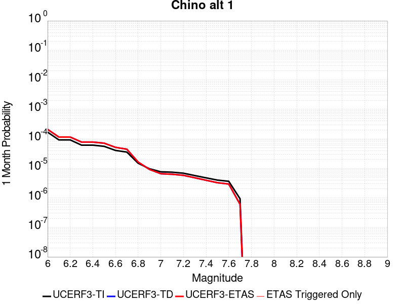 |  | 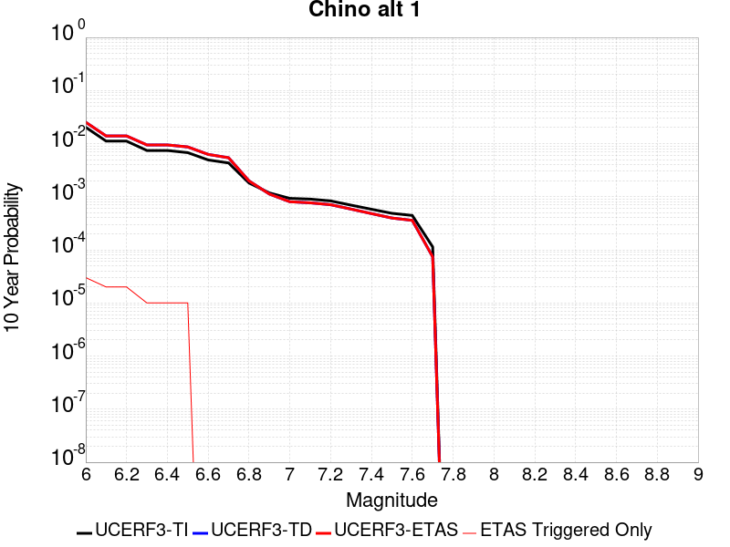 |

| Magnitude | 1 wk TI Prob | 1 wk TD Prob | 1 wk ETAS Prob | 1 wk ETAS/TD Gain | 1 wk ETAS Triggered Only | 1 mo TI Prob | 1 mo TD Prob | 1 mo ETAS Prob | 1 mo ETAS/TD Gain | 1 mo ETAS Triggered Only | 1 yr TI Prob | 1 yr TD Prob | 1 yr ETAS Prob | 1 yr ETAS/TD Gain | 1 yr ETAS Triggered Only | 10 yr TI Prob | 10 yr TD Prob | 10 yr ETAS Prob | 10 yr ETAS/TD Gain | 10 yr ETAS Triggered Only |
|-----|-----|-----|-----|-----|-----|-----|-----|-----|-----|-----|-----|-----|-----|-----|-----|-----|-----|-----|-----|-----|
| 6.0 | 3.939946E-5 | 4.8949914E-5 | 4.8949914E-5 | 1.0 | 0.0 | 1.6884391E-4 | 2.0977142E-4 | 2.0977142E-4 | 1.0 | 0.0 | 0.0020537362 | 0.0025514853 | 0.0025514853 | 1.0 | 0.0 | 0.020348595 | 0.025280792 | 0.025310034 | 1.0011567 | 3.0E-5 |
| 6.1 | 2.1505624E-5 | 2.688007E-5 | 2.688007E-5 | 1.0 | 0.0 | 9.2163704E-5 | 1.1519585E-4 | 1.1519585E-4 | 1.0 | 0.0 | 0.0011215154 | 0.0014017166 | 0.0014017166 | 1.0 | 0.0 | 0.011158722 | 0.013947706 | 0.0139674265 | 1.001414 | 2.0E-5 |
| 6.2 | 2.1505624E-5 | 2.688007E-5 | 2.688007E-5 | 1.0 | 0.0 | 9.2163704E-5 | 1.1519585E-4 | 1.1519585E-4 | 1.0 | 0.0 | 0.0011215154 | 0.0014017166 | 0.0014017166 | 1.0 | 0.0 | 0.011158722 | 0.013947706 | 0.0139674265 | 1.001414 | 2.0E-5 |
| 6.3 | 1.4290785E-5 | 1.816584E-5 | 1.816584E-5 | 1.0 | 0.0 | 6.1244784E-5 | 7.785153E-5 | 7.785153E-5 | 1.0 | 0.0 | 7.454001E-4 | 9.4747543E-4 | 9.4747543E-4 | 1.0 | 0.0 | 0.007429048 | 0.009446898 | 0.009456803 | 1.0010486 | 1.0E-5 |
| 6.4 | 1.4290785E-5 | 1.816584E-5 | 1.816584E-5 | 1.0 | 0.0 | 6.1244784E-5 | 7.785153E-5 | 7.785153E-5 | 1.0 | 0.0 | 7.454001E-4 | 9.4747543E-4 | 9.4747543E-4 | 1.0 | 0.0 | 0.007429048 | 0.009446898 | 0.009456803 | 1.0010486 | 1.0E-5 |
| 6.5 | 1.3017944E-5 | 1.6652762E-5 | 1.6652762E-5 | 1.0 | 0.0 | 5.5789995E-5 | 7.136728E-5 | 7.136728E-5 | 1.0 | 0.0 | 6.790315E-4 | 8.685939E-4 | 8.685939E-4 | 1.0 | 0.0 | 0.0067696036 | 0.008664371 | 0.008674284 | 1.0011442 | 1.0E-5 |
| 6.6 | 9.470016E-6 | 1.2039946E-5 | 1.2039946E-5 | 1.0 | 0.0 | 4.058515E-5 | 5.159894E-5 | 5.159894E-5 | 1.0 | 0.0 | 4.940122E-4 | 6.2807E-4 | 6.2807E-4 | 1.0 | 0.0 | 0.004929154 | 0.006273371 | 0.006273371 | 1.0 | 0.0 |
| 6.7 | 8.314155E-6 | 1.0408143E-5 | 1.0408143E-5 | 1.0 | 0.0 | 3.5631605E-5 | 4.4605746E-5 | 4.4605746E-5 | 1.0 | 0.0 | 4.3372845E-4 | 5.429719E-4 | 5.429719E-4 | 1.0 | 0.0 | 0.004328829 | 0.005427294 | 0.005427294 | 1.0 | 0.0 |
| 6.8 | 3.4856364E-6 | 3.8135686E-6 | 3.8135686E-6 | 1.0 | 0.0 | 1.4938357E-5 | 1.6343774E-5 | 1.6343774E-5 | 1.0 | 0.0 | 1.8185932E-4 | 1.9896936E-4 | 1.9896936E-4 | 1.0 | 0.0 | 0.0018171056 | 0.0019897262 | 0.0019897262 | 1.0 | 0.0 |
| 6.9 | 2.2645952E-6 | 2.153006E-6 | 2.153006E-6 | 1.0 | 0.0 | 9.705372E-6 | 9.2271375E-6 | 9.2271375E-6 | 1.0 | 0.0 | 1.18156495E-4 | 1.1233483E-4 | 1.1233483E-4 | 1.0 | 0.0 | 0.0011809369 | 0.0011235814 | 0.0011235814 | 1.0 | 0.0 |
| 7.0 | 1.7864003E-6 | 1.5431655E-6 | 1.5431655E-6 | 1.0 | 0.0 | 7.655979E-6 | 6.61355E-6 | 6.61355E-6 | 1.0 | 0.0 | 9.3207556E-5 | 8.051705E-5 | 8.051705E-5 | 1.0 | 0.0 | 9.316847E-4 | 8.0526597E-4 | 8.0526597E-4 | 1.0 | 0.0 |
| 7.1 | 1.7315456E-6 | 1.4734359E-6 | 1.4734359E-6 | 1.0 | 0.0 | 7.420889E-6 | 6.31471E-6 | 6.31471E-6 | 1.0 | 0.0 | 9.034557E-5 | 7.687894E-5 | 7.687894E-5 | 1.0 | 0.0 | 9.0308854E-4 | 7.689018E-4 | 7.689018E-4 | 1.0 | 0.0 |
| 7.2 | 1.6008337E-6 | 1.3574833E-6 | 1.3574833E-6 | 1.0 | 0.0 | 6.860698E-6 | 5.817773E-6 | 5.817773E-6 | 1.0 | 0.0 | 8.352579E-5 | 7.082913E-5 | 7.082913E-5 | 1.0 | 0.0 | 8.34944E-4 | 7.084325E-4 | 7.084325E-4 | 1.0 | 0.0 |
| 7.3 | 1.3320939E-6 | 1.1218311E-6 | 1.1218311E-6 | 1.0 | 0.0 | 5.7089615E-6 | 4.807839E-6 | 4.807839E-6 | 1.0 | 0.0 | 6.9504385E-5 | 5.8533915E-5 | 5.8533915E-5 | 1.0 | 0.0 | 6.9482654E-4 | 5.8530783E-4 | 5.8530783E-4 | 1.0 | 0.0 |
| 7.4 | 1.114294E-6 | 9.2374944E-7 | 9.2374944E-7 | 1.0 | 0.0 | 4.775537E-6 | 3.9589204E-6 | 3.9589204E-6 | 1.0 | 0.0 | 5.8140613E-5 | 4.8198825E-5 | 4.8198825E-5 | 1.0 | 0.0 | 5.81254E-4 | 4.8189829E-4 | 4.8189829E-4 | 1.0 | 0.0 |
| 7.5 | 9.354081E-7 | 7.623722E-7 | 7.623722E-7 | 1.0 | 0.0 | 4.0088858E-6 | 3.2673056E-6 | 3.2673056E-6 | 1.0 | 0.0 | 4.8807087E-5 | 3.9778755E-5 | 3.9778755E-5 | 1.0 | 0.0 | 4.879637E-4 | 3.9771973E-4 | 3.9771973E-4 | 1.0 | 0.0 |
| 7.6 | 8.521771E-7 | 6.880951E-7 | 6.880951E-7 | 1.0 | 0.0 | 3.6521824E-6 | 2.9489759E-6 | 2.9489759E-6 | 1.0 | 0.0 | 4.4464414E-5 | 3.590322E-5 | 3.590322E-5 | 1.0 | 0.0 | 4.4455516E-4 | 3.5897738E-4 | 3.5897738E-4 | 1.0 | 0.0 |
| 7.7 | 2.1803626E-7 | 1.418694E-7 | 1.418694E-7 | 1.0 | 0.0 | 9.344408E-7 | 6.0801165E-7 | 6.0801165E-7 | 1.0 | 0.0 | 1.1376757E-5 | 7.4025265E-6 | 7.4025265E-6 | 1.0 | 0.0 | 1.13761744E-4 | 7.402376E-5 | 7.402376E-5 | 1.0 | 0.0 |

## Santa Cruz Island
*[(top)](#table-of-contents)*

| 1 Week | 1 Month | 1 Year | 10 Year |
|-----|-----|-----|-----|
|  |  |  |  |

| Magnitude | 1 wk TI Prob | 1 wk TD Prob | 1 wk ETAS Prob | 1 wk ETAS/TD Gain | 1 wk ETAS Triggered Only | 1 mo TI Prob | 1 mo TD Prob | 1 mo ETAS Prob | 1 mo ETAS/TD Gain | 1 mo ETAS Triggered Only | 1 yr TI Prob | 1 yr TD Prob | 1 yr ETAS Prob | 1 yr ETAS/TD Gain | 1 yr ETAS Triggered Only | 10 yr TI Prob | 10 yr TD Prob | 10 yr ETAS Prob | 10 yr ETAS/TD Gain | 10 yr ETAS Triggered Only |
|-----|-----|-----|-----|-----|-----|-----|-----|-----|-----|-----|-----|-----|-----|-----|-----|-----|-----|-----|-----|-----|
| 6.0 | 2.9164563E-5 | 3.1600095E-5 | 3.1600095E-5 | 1.0 | 0.0 | 1.2498499E-4 | 1.3542273E-4 | 1.3542273E-4 | 1.0 | 0.0 | 0.0015206301 | 0.001647661 | 0.0016576444 | 1.0060592 | 1.0E-5 | 0.015102667 | 0.01636818 | 0.01639769 | 1.0018028 | 3.0E-5 |
| 6.1 | 2.9164563E-5 | 3.1600095E-5 | 3.1600095E-5 | 1.0 | 0.0 | 1.2498499E-4 | 1.3542273E-4 | 1.3542273E-4 | 1.0 | 0.0 | 0.0015206301 | 0.001647661 | 0.0016576444 | 1.0060592 | 1.0E-5 | 0.015102667 | 0.01636818 | 0.01639769 | 1.0018028 | 3.0E-5 |
| 6.2 | 2.9164563E-5 | 3.1600095E-5 | 3.1600095E-5 | 1.0 | 0.0 | 1.2498499E-4 | 1.3542273E-4 | 1.3542273E-4 | 1.0 | 0.0 | 0.0015206301 | 0.001647661 | 0.0016576444 | 1.0060592 | 1.0E-5 | 0.015102667 | 0.01636818 | 0.01639769 | 1.0018028 | 3.0E-5 |
| 6.3 | 1.6635553E-5 | 1.7804527E-5 | 1.7804527E-5 | 1.0 | 0.0 | 7.1293274E-5 | 7.630298E-5 | 7.630298E-5 | 1.0 | 0.0 | 8.6765E-4 | 9.2861115E-4 | 9.2861115E-4 | 1.0 | 0.0 | 0.008642701 | 0.009249181 | 0.009268995 | 1.0021423 | 2.0E-5 |
| 6.4 | 1.6635553E-5 | 1.7804527E-5 | 1.7804527E-5 | 1.0 | 0.0 | 7.1293274E-5 | 7.630298E-5 | 7.630298E-5 | 1.0 | 0.0 | 8.6765E-4 | 9.2861115E-4 | 9.2861115E-4 | 1.0 | 0.0 | 0.008642701 | 0.009249181 | 0.009268995 | 1.0021423 | 2.0E-5 |
| 6.5 | 1.2238748E-5 | 1.3043111E-5 | 1.3043111E-5 | 1.0 | 0.0 | 5.2450723E-5 | 5.5897868E-5 | 5.5897868E-5 | 1.0 | 0.0 | 6.3840044E-4 | 6.8034773E-4 | 6.8034773E-4 | 1.0 | 0.0 | 0.0063656955 | 0.0067830477 | 0.00679298 | 1.0014642 | 1.0E-5 |
| 6.6 | 1.0489767E-5 | 1.11567315E-5 | 1.11567315E-5 | 1.0 | 0.0 | 4.495537E-5 | 4.78137E-5 | 4.78137E-5 | 1.0 | 0.0 | 5.4719415E-4 | 5.8197853E-4 | 5.8197853E-4 | 1.0 | 0.0 | 0.005458487 | 0.0058047855 | 0.0058147274 | 1.0017127 | 1.0E-5 |
| 6.7 | 8.699222E-6 | 9.236859E-6 | 9.236859E-6 | 1.0 | 0.0 | 3.7281847E-5 | 3.9585942E-5 | 3.9585942E-5 | 1.0 | 0.0 | 4.5381195E-4 | 4.8185283E-4 | 4.8185283E-4 | 1.0 | 0.0 | 0.0045288634 | 0.004808148 | 0.004808148 | 1.0 | 0.0 |
| 6.8 | 8.307732E-6 | 8.816977E-6 | 8.816977E-6 | 1.0 | 0.0 | 3.560408E-5 | 3.77865E-5 | 3.77865E-5 | 1.0 | 0.0 | 4.3339343E-4 | 4.5995397E-4 | 4.5995397E-4 | 1.0 | 0.0 | 0.004325492 | 0.004590073 | 0.004590073 | 1.0 | 0.0 |
| 6.9 | 8.073121E-6 | 8.56501E-6 | 8.56501E-6 | 1.0 | 0.0 | 3.459863E-5 | 3.670667E-5 | 3.670667E-5 | 1.0 | 0.0 | 4.2115687E-4 | 4.4681248E-4 | 4.4681248E-4 | 1.0 | 0.0 | 0.004203596 | 0.0044591925 | 0.0044591925 | 1.0 | 0.0 |
| 7.0 | 7.617019E-6 | 8.07473E-6 | 8.07473E-6 | 1.0 | 0.0 | 3.264396E-5 | 3.4605528E-5 | 3.4605528E-5 | 1.0 | 0.0 | 3.9736772E-4 | 4.2124125E-4 | 4.2124125E-4 | 1.0 | 0.0 | 0.003966579 | 0.0042044753 | 0.0042044753 | 1.0 | 0.0 |
| 7.1 | 7.1224836E-6 | 7.545849E-6 | 7.545849E-6 | 1.0 | 0.0 | 3.052457E-5 | 3.2338954E-5 | 3.2338954E-5 | 1.0 | 0.0 | 3.715733E-4 | 3.9365597E-4 | 3.9365597E-4 | 1.0 | 0.0 | 0.003709526 | 0.0039296295 | 0.0039296295 | 1.0 | 0.0 |
| 7.2 | 6.441115E-6 | 6.827439E-6 | 6.827439E-6 | 1.0 | 0.0 | 2.7604487E-5 | 2.9260125E-5 | 2.9260125E-5 | 1.0 | 0.0 | 3.360328E-4 | 3.5618403E-4 | 3.5618403E-4 | 1.0 | 0.0 | 0.0033552512 | 0.00355616 | 0.00355616 | 1.0 | 0.0 |
| 7.3 | 5.494274E-6 | 5.820041E-6 | 5.820041E-6 | 1.0 | 0.0 | 2.3546674E-5 | 2.4942798E-5 | 2.4942798E-5 | 1.0 | 0.0 | 2.8664304E-4 | 3.0363645E-4 | 3.0363645E-4 | 1.0 | 0.0 | 0.002862736 | 0.003032239 | 0.003032239 | 1.0 | 0.0 |
| 7.4 | 4.0802624E-6 | 4.31229E-6 | 4.31229E-6 | 1.0 | 0.0 | 1.7486722E-5 | 1.8481112E-5 | 1.8481112E-5 | 1.0 | 0.0 | 2.1288003E-4 | 2.2498438E-4 | 2.2498438E-4 | 1.0 | 0.0 | 0.0021267622 | 0.002247575 | 0.002247575 | 1.0 | 0.0 |
| 7.5 | 2.3584746E-6 | 2.475327E-6 | 2.475327E-6 | 1.0 | 0.0 | 1.0107709E-5 | 1.0608502E-5 | 1.0608502E-5 | 1.0 | 0.0 | 1.2305441E-4 | 1.291509E-4 | 1.291509E-4 | 1.0 | 0.0 | 0.0012298629 | 0.0012907635 | 0.0012907635 | 1.0 | 0.0 |
| 7.6 | 9.4981914E-7 | 9.86099E-7 | 9.86099E-7 | 1.0 | 0.0 | 4.0706473E-6 | 4.226132E-6 | 4.226132E-6 | 1.0 | 0.0 | 4.9559E-5 | 5.1451956E-5 | 5.1451956E-5 | 1.0 | 0.0 | 4.954795E-4 | 5.144017E-4 | 5.144017E-4 | 1.0 | 0.0 |
| 7.7 | 2.6013532E-7 | 2.6416743E-7 | 2.6416743E-7 | 1.0 | 0.0 | 1.1148652E-6 | 1.1321456E-6 | 1.1321456E-6 | 1.0 | 0.0 | 1.3573399E-5 | 1.3783787E-5 | 1.3783787E-5 | 1.0 | 0.0 | 1.357257E-4 | 1.3782938E-4 | 1.3782938E-4 | 1.0 | 0.0 |
| 7.8 | 4.1522263E-8 | 3.9657085E-8 | 3.9657085E-8 | 1.0 | 0.0 | 1.7795254E-7 | 1.6995892E-7 | 1.6995892E-7 | 1.0 | 0.0 | 2.16657E-6 | 2.069248E-6 | 2.069248E-6 | 1.0 | 0.0 | 2.1665488E-5 | 2.0692309E-5 | 2.0692309E-5 | 1.0 | 0.0 |
| 7.9 | 7.7242046E-10 | 5.9475247E-10 | 5.9475247E-10 | 1.0 | 0.0 | 3.3103735E-9 | 2.5489395E-9 | 2.5489395E-9 | 1.0 | 0.0 | 4.0303796E-8 | 3.1033338E-8 | 3.1033338E-8 | 1.0 | 0.0 | 4.030379E-7 | 3.1033335E-7 | 3.1033335E-7 | 1.0 | 0.0 |

## Great Valley 03 Mysterious Ridge
*[(top)](#table-of-contents)*

| 1 Week | 1 Month | 1 Year | 10 Year |
|-----|-----|-----|-----|
|  | 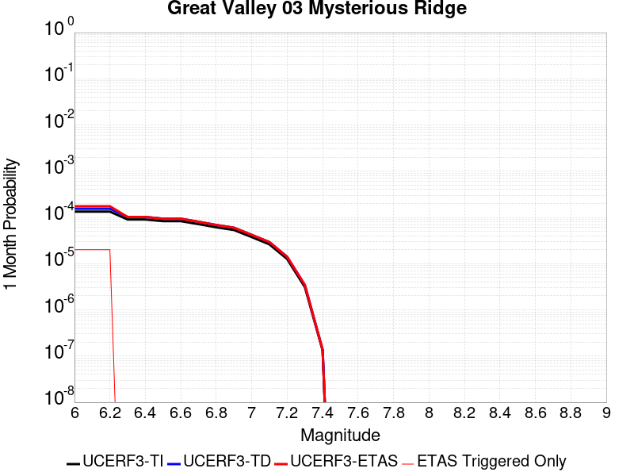 |  |  |

| Magnitude | 1 wk TI Prob | 1 wk TD Prob | 1 wk ETAS Prob | 1 wk ETAS/TD Gain | 1 wk ETAS Triggered Only | 1 mo TI Prob | 1 mo TD Prob | 1 mo ETAS Prob | 1 mo ETAS/TD Gain | 1 mo ETAS Triggered Only | 1 yr TI Prob | 1 yr TD Prob | 1 yr ETAS Prob | 1 yr ETAS/TD Gain | 1 yr ETAS Triggered Only | 10 yr TI Prob | 10 yr TD Prob | 10 yr ETAS Prob | 10 yr ETAS/TD Gain | 10 yr ETAS Triggered Only |
|-----|-----|-----|-----|-----|-----|-----|-----|-----|-----|-----|-----|-----|-----|-----|-----|-----|-----|-----|-----|-----|
| 6.0 | 3.1182444E-5 | 3.6034882E-5 | 3.6034882E-5 | 1.0 | 0.0 | 1.336322E-4 | 1.5442709E-4 | 1.74424E-4 | 1.129491 | 2.0E-5 | 0.0016257578 | 0.0018787142 | 0.0018986766 | 1.0106256 | 2.0E-5 | 0.016139153 | 0.018647056 | 0.018666685 | 1.0010525 | 2.0E-5 |
| 6.1 | 3.1182444E-5 | 3.6034882E-5 | 3.6034882E-5 | 1.0 | 0.0 | 1.336322E-4 | 1.5442709E-4 | 1.74424E-4 | 1.129491 | 2.0E-5 | 0.0016257578 | 0.0018787142 | 0.0018986766 | 1.0106256 | 2.0E-5 | 0.016139153 | 0.018647056 | 0.018666685 | 1.0010525 | 2.0E-5 |
| 6.2 | 3.1182444E-5 | 3.6034882E-5 | 3.6034882E-5 | 1.0 | 0.0 | 1.336322E-4 | 1.5442709E-4 | 1.74424E-4 | 1.129491 | 2.0E-5 | 0.0016257578 | 0.0018787142 | 0.0018986766 | 1.0106256 | 2.0E-5 | 0.016139153 | 0.018647056 | 0.018666685 | 1.0010525 | 2.0E-5 |
| 6.3 | 2.106934E-5 | 2.3850724E-5 | 2.3850724E-5 | 1.0 | 0.0 | 9.0294045E-5 | 1.02213555E-4 | 1.02213555E-4 | 1.0 | 0.0 | 0.0010987755 | 0.0012437707 | 0.0012437707 | 1.0 | 0.0 | 0.010933585 | 0.0123713445 | 0.01238122 | 1.0007983 | 1.0E-5 |
| 6.4 | 2.106934E-5 | 2.3850724E-5 | 2.3850724E-5 | 1.0 | 0.0 | 9.0294045E-5 | 1.02213555E-4 | 1.02213555E-4 | 1.0 | 0.0 | 0.0010987755 | 0.0012437707 | 0.0012437707 | 1.0 | 0.0 | 0.010933585 | 0.0123713445 | 0.01238122 | 1.0007983 | 1.0E-5 |
| 6.5 | 1.9389783E-5 | 2.1885357E-5 | 2.1885357E-5 | 1.0 | 0.0 | 8.309642E-5 | 9.379117E-5 | 9.379117E-5 | 1.0 | 0.0 | 0.0010112294 | 0.0011413371 | 0.0011413371 | 1.0 | 0.0 | 0.010066401 | 0.011357628 | 0.011357628 | 1.0 | 0.0 |
| 6.6 | 1.9370193E-5 | 2.1865279E-5 | 2.1865279E-5 | 1.0 | 0.0 | 8.301247E-5 | 9.370512E-5 | 9.370512E-5 | 1.0 | 0.0 | 0.0010102082 | 0.0011402905 | 0.0011402905 | 1.0 | 0.0 | 0.010056281 | 0.01134727 | 0.01134727 | 1.0 | 0.0 |
| 6.7 | 1.6723505E-5 | 1.8799592E-5 | 1.8799592E-5 | 1.0 | 0.0 | 7.16702E-5 | 8.0567304E-5 | 8.0567304E-5 | 1.0 | 0.0 | 8.722353E-4 | 9.80485E-4 | 9.80485E-4 | 1.0 | 0.0 | 0.008688197 | 0.0097636 | 0.0097636 | 1.0 | 0.0 |
| 6.8 | 1.426937E-5 | 1.5997468E-5 | 1.5997468E-5 | 1.0 | 0.0 | 6.115301E-5 | 6.855885E-5 | 6.855885E-5 | 1.0 | 0.0 | 7.4428355E-4 | 8.3439884E-4 | 8.3439884E-4 | 1.0 | 0.0 | 0.007417957 | 0.008314138 | 0.008314138 | 1.0 | 0.0 |
| 6.9 | 1.2469891E-5 | 1.395715E-5 | 1.395715E-5 | 1.0 | 0.0 | 5.3441294E-5 | 5.9815055E-5 | 5.9815055E-5 | 1.0 | 0.0 | 6.504535E-4 | 7.28017E-4 | 7.28017E-4 | 1.0 | 0.0 | 0.006485529 | 0.007257545 | 0.007257545 | 1.0 | 0.0 |
| 7.0 | 8.7746275E-6 | 9.791885E-6 | 9.791885E-6 | 1.0 | 0.0 | 3.7605005E-5 | 4.1964588E-5 | 4.1964588E-5 | 1.0 | 0.0 | 4.5774475E-4 | 5.108064E-4 | 5.108064E-4 | 1.0 | 0.0 | 0.00456803 | 0.005097056 | 0.005097056 | 1.0 | 0.0 |
| 7.1 | 6.1067153E-6 | 6.81383E-6 | 6.81383E-6 | 1.0 | 0.0 | 2.6171374E-5 | 2.9201834E-5 | 2.9201834E-5 | 1.0 | 0.0 | 3.1858988E-4 | 3.5547992E-4 | 3.5547992E-4 | 1.0 | 0.0 | 0.0031813353 | 0.0035496636 | 0.0035496636 | 1.0 | 0.0 |
| 7.2 | 2.939283E-6 | 3.2741555E-6 | 3.2741555E-6 | 1.0 | 0.0 | 1.2596866E-5 | 1.4032029E-5 | 1.4032029E-5 | 1.0 | 0.0 | 1.5335606E-4 | 1.7082831E-4 | 1.7082831E-4 | 1.0 | 0.0 | 0.0015325027 | 0.001707142 | 0.001707142 | 1.0 | 0.0 |
| 7.3 | 7.2387763E-7 | 8.008619E-7 | 8.008619E-7 | 1.0 | 0.0 | 3.102329E-6 | 3.4322634E-6 | 3.4322634E-6 | 1.0 | 0.0 | 3.77702E-5 | 4.1787465E-5 | 4.1787465E-5 | 1.0 | 0.0 | 3.7763783E-4 | 4.1784105E-4 | 4.1784105E-4 | 1.0 | 0.0 |
| 7.4 | 3.112171E-8 | 3.2068495E-8 | 3.2068495E-8 | 1.0 | 0.0 | 1.3337875E-7 | 1.374364E-7 | 1.374364E-7 | 1.0 | 0.0 | 1.6238852E-6 | 1.673287E-6 | 1.673287E-6 | 1.0 | 0.0 | 1.6238733E-5 | 1.6732753E-5 | 1.6732753E-5 | 1.0 | 0.0 |

## Coronado Bank alt1
*[(top)](#table-of-contents)*

| 1 Week | 1 Month | 1 Year | 10 Year |
|-----|-----|-----|-----|
| 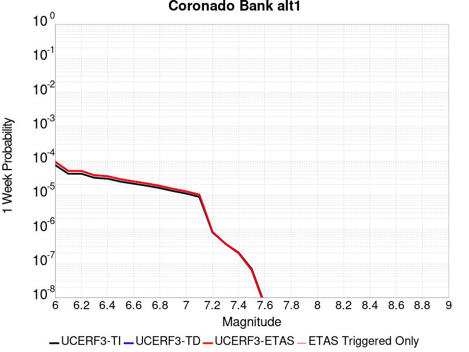 |  |  | 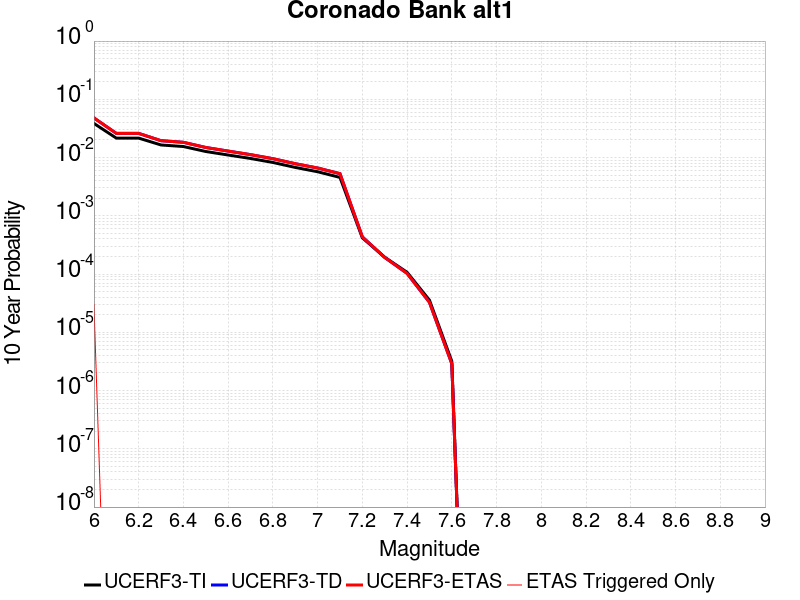 |

| Magnitude | 1 wk TI Prob | 1 wk TD Prob | 1 wk ETAS Prob | 1 wk ETAS/TD Gain | 1 wk ETAS Triggered Only | 1 mo TI Prob | 1 mo TD Prob | 1 mo ETAS Prob | 1 mo ETAS/TD Gain | 1 mo ETAS Triggered Only | 1 yr TI Prob | 1 yr TD Prob | 1 yr ETAS Prob | 1 yr ETAS/TD Gain | 1 yr ETAS Triggered Only | 10 yr TI Prob | 10 yr TD Prob | 10 yr ETAS Prob | 10 yr ETAS/TD Gain | 10 yr ETAS Triggered Only |
|-----|-----|-----|-----|-----|-----|-----|-----|-----|-----|-----|-----|-----|-----|-----|-----|-----|-----|-----|-----|-----|
| 6.0 | 7.533492E-5 | 9.395439E-5 | 9.395439E-5 | 1.0 | 0.0 | 3.22824E-4 | 4.026023E-4 | 4.026023E-4 | 1.0 | 0.0 | 0.0039233007 | 0.0048912787 | 0.00490123 | 1.0020344 | 1.0E-5 | 0.03854755 | 0.04790551 | 0.04793407 | 1.0005963 | 3.0E-5 |
| 6.1 | 4.1807285E-5 | 5.049452E-5 | 5.049452E-5 | 1.0 | 0.0 | 1.7916178E-4 | 2.1638718E-4 | 2.1638718E-4 | 1.0 | 0.0 | 0.0021791123 | 0.0026314093 | 0.0026314093 | 1.0 | 0.0 | 0.021578677 | 0.026011832 | 0.026011832 | 1.0 | 0.0 |
| 6.2 | 4.1807285E-5 | 5.049452E-5 | 5.049452E-5 | 1.0 | 0.0 | 1.7916178E-4 | 2.1638718E-4 | 2.1638718E-4 | 1.0 | 0.0 | 0.0021791123 | 0.0026314093 | 0.0026314093 | 1.0 | 0.0 | 0.021578677 | 0.026011832 | 0.026011832 | 1.0 | 0.0 |
| 6.3 | 3.1793104E-5 | 3.7712067E-5 | 3.7712067E-5 | 1.0 | 0.0 | 1.3624904E-4 | 1.616133E-4 | 1.616133E-4 | 1.0 | 0.0 | 0.0016575698 | 0.0019658979 | 0.0019658979 | 1.0 | 0.0 | 0.016452603 | 0.019488975 | 0.019488975 | 1.0 | 0.0 |
| 6.4 | 2.9878007E-5 | 3.5336667E-5 | 3.5336667E-5 | 1.0 | 0.0 | 1.2804232E-4 | 1.5143424E-4 | 1.5143424E-4 | 1.0 | 0.0 | 0.0015578003 | 0.0018421846 | 0.0018421846 | 1.0 | 0.0 | 0.015469253 | 0.018272907 | 0.018272907 | 1.0 | 0.0 |
| 6.5 | 2.4512565E-5 | 2.876477E-5 | 2.876477E-5 | 1.0 | 0.0 | 1.0504962E-4 | 1.2327192E-4 | 1.2327192E-4 | 1.0 | 0.0 | 0.0012782287 | 0.0014998292 | 0.0014998292 | 1.0 | 0.0 | 0.012709012 | 0.014900037 | 0.014900037 | 1.0 | 0.0 |
| 6.6 | 2.1317413E-5 | 2.4907235E-5 | 2.4907235E-5 | 1.0 | 0.0 | 9.135714E-5 | 1.0674105E-4 | 1.0674105E-4 | 1.0 | 0.0 | 0.0011117056 | 0.0012988197 | 0.0012988197 | 1.0 | 0.0 | 0.011061605 | 0.012914698 | 0.012914698 | 1.0 | 0.0 |
| 6.7 | 1.8585655E-5 | 2.1635358E-5 | 2.1635358E-5 | 1.0 | 0.0 | 7.9650374E-5 | 9.271978E-5 | 9.271978E-5 | 1.0 | 0.0 | 9.6931186E-4 | 0.0011282993 | 0.0011282993 | 1.0 | 0.0 | 0.0096509475 | 0.011227869 | 0.011227869 | 1.0 | 0.0 |
| 6.8 | 1.5862879E-5 | 1.8419876E-5 | 1.8419876E-5 | 1.0 | 0.0 | 6.798199E-5 | 7.8940044E-5 | 7.8940044E-5 | 1.0 | 0.0 | 8.273665E-4 | 9.6069055E-4 | 9.6069055E-4 | 1.0 | 0.0 | 0.008242928 | 0.009567358 | 0.009567358 | 1.0 | 0.0 |
| 6.9 | 1.3021509E-5 | 1.509559E-5 | 1.509559E-5 | 1.0 | 0.0 | 5.5805274E-5 | 6.4693886E-5 | 6.4693886E-5 | 1.0 | 0.0 | 6.792174E-4 | 7.873815E-4 | 7.873815E-4 | 1.0 | 0.0 | 0.006771452 | 0.007847741 | 0.007847741 | 1.0 | 0.0 |
| 7.0 | 1.0974371E-5 | 1.2720379E-5 | 1.2720379E-5 | 1.0 | 0.0 | 4.7032172E-5 | 5.451487E-5 | 5.451487E-5 | 1.0 | 0.0 | 5.7246623E-4 | 6.63534E-4 | 6.63534E-4 | 1.0 | 0.0 | 0.0057099373 | 0.0066172774 | 0.0066172774 | 1.0 | 0.0 |
| 7.1 | 8.766221E-6 | 1.01640535E-5 | 1.01640535E-5 | 1.0 | 0.0 | 3.7568978E-5 | 4.3559598E-5 | 4.3559598E-5 | 1.0 | 0.0 | 4.573063E-4 | 5.302263E-4 | 5.302263E-4 | 1.0 | 0.0 | 0.0045636636 | 0.0052913115 | 0.0052913115 | 1.0 | 0.0 |
| 7.2 | 8.026024E-7 | 8.3318497E-7 | 8.3318497E-7 | 1.0 | 0.0 | 3.43972E-6 | 3.5707878E-6 | 3.5707878E-6 | 1.0 | 0.0 | 4.1877785E-5 | 4.3473487E-5 | 4.3473487E-5 | 1.0 | 0.0 | 4.1869894E-4 | 4.346509E-4 | 4.346509E-4 | 1.0 | 0.0 |
| 7.3 | 3.7293114E-7 | 3.700131E-7 | 3.700131E-7 | 1.0 | 0.0 | 1.5982754E-6 | 1.5857695E-6 | 1.5857695E-6 | 1.0 | 0.0 | 1.9458828E-5 | 1.9306573E-5 | 1.9306573E-5 | 1.0 | 0.0 | 1.9457124E-4 | 1.9304903E-4 | 1.9304903E-4 | 1.0 | 0.0 |
| 7.4 | 2.0557036E-7 | 1.9674545E-7 | 1.9674545E-7 | 1.0 | 0.0 | 8.810155E-7 | 8.4319447E-7 | 8.4319447E-7 | 1.0 | 0.0 | 1.0726311E-5 | 1.0265845E-5 | 1.0265845E-5 | 1.0 | 0.0 | 1.0725793E-4 | 1.02653736E-4 | 1.02653736E-4 | 1.0 | 0.0 |
| 7.5 | 6.845446E-8 | 6.279429E-8 | 6.279429E-8 | 1.0 | 0.0 | 2.9337625E-7 | 2.6911837E-7 | 2.6911837E-7 | 1.0 | 0.0 | 3.5718497E-6 | 3.2765113E-6 | 3.2765113E-6 | 1.0 | 0.0 | 3.5717923E-5 | 3.2764638E-5 | 3.2764638E-5 | 1.0 | 0.0 |
| 7.6 | 6.0975145E-9 | 5.5319123E-9 | 5.5319123E-9 | 1.0 | 0.0 | 2.6132206E-8 | 2.3708195E-8 | 2.3708195E-8 | 1.0 | 0.0 | 3.1815955E-7 | 2.8864724E-7 | 2.8864724E-7 | 1.0 | 0.0 | 3.181591E-6 | 2.8864697E-6 | 2.8864697E-6 | 1.0 | 0.0 |

## Robinson Creek
*[(top)](#table-of-contents)*

| 1 Week | 1 Month | 1 Year | 10 Year |
|-----|-----|-----|-----|
|  |  |  |  |

| Magnitude | 1 wk TI Prob | 1 wk TD Prob | 1 wk ETAS Prob | 1 wk ETAS/TD Gain | 1 wk ETAS Triggered Only | 1 mo TI Prob | 1 mo TD Prob | 1 mo ETAS Prob | 1 mo ETAS/TD Gain | 1 mo ETAS Triggered Only | 1 yr TI Prob | 1 yr TD Prob | 1 yr ETAS Prob | 1 yr ETAS/TD Gain | 1 yr ETAS Triggered Only | 10 yr TI Prob | 10 yr TD Prob | 10 yr ETAS Prob | 10 yr ETAS/TD Gain | 10 yr ETAS Triggered Only |
|-----|-----|-----|-----|-----|-----|-----|-----|-----|-----|-----|-----|-----|-----|-----|-----|-----|-----|-----|-----|-----|
| 6.0 | 1.3705327E-5 | 1.5285246E-5 | 2.5285093E-5 | 1.6542156 | 1.0E-5 | 5.8735794E-5 | 6.5508204E-5 | 9.5506235E-5 | 1.457928 | 3.0E-5 | 7.1487366E-4 | 7.9756236E-4 | 8.2753843E-4 | 1.0375847 | 3.0E-5 | 0.0071257832 | 0.007975623 | 0.008005384 | 1.0037315 | 3.0E-5 |
| 6.1 | 1.3705327E-5 | 1.5285246E-5 | 2.5285093E-5 | 1.6542156 | 1.0E-5 | 5.8735794E-5 | 6.5508204E-5 | 9.5506235E-5 | 1.457928 | 3.0E-5 | 7.1487366E-4 | 7.9756236E-4 | 8.2753843E-4 | 1.0375847 | 3.0E-5 | 0.0071257832 | 0.007975623 | 0.008005384 | 1.0037315 | 3.0E-5 |
| 6.2 | 1.3705327E-5 | 1.5285246E-5 | 2.5285093E-5 | 1.6542156 | 1.0E-5 | 5.8735794E-5 | 6.5508204E-5 | 9.5506235E-5 | 1.457928 | 3.0E-5 | 7.1487366E-4 | 7.9756236E-4 | 8.2753843E-4 | 1.0375847 | 3.0E-5 | 0.0071257832 | 0.007975623 | 0.008005384 | 1.0037315 | 3.0E-5 |
| 6.3 | 1.3705327E-5 | 1.5285246E-5 | 2.5285093E-5 | 1.6542156 | 1.0E-5 | 5.8735794E-5 | 6.5508204E-5 | 9.5506235E-5 | 1.457928 | 3.0E-5 | 7.1487366E-4 | 7.9756236E-4 | 8.2753843E-4 | 1.0375847 | 3.0E-5 | 0.0071257832 | 0.007975623 | 0.008005384 | 1.0037315 | 3.0E-5 |
| 6.4 | 1.3705327E-5 | 1.5285246E-5 | 2.5285093E-5 | 1.6542156 | 1.0E-5 | 5.8735794E-5 | 6.5508204E-5 | 9.5506235E-5 | 1.457928 | 3.0E-5 | 7.1487366E-4 | 7.9756236E-4 | 8.2753843E-4 | 1.0375847 | 3.0E-5 | 0.0071257832 | 0.007975623 | 0.008005384 | 1.0037315 | 3.0E-5 |

## San Luis Range 2011 CFM
*[(top)](#table-of-contents)*

| 1 Week | 1 Month | 1 Year | 10 Year |
|-----|-----|-----|-----|
|  |  |  |  |

| Magnitude | 1 wk TI Prob | 1 wk TD Prob | 1 wk ETAS Prob | 1 wk ETAS/TD Gain | 1 wk ETAS Triggered Only | 1 mo TI Prob | 1 mo TD Prob | 1 mo ETAS Prob | 1 mo ETAS/TD Gain | 1 mo ETAS Triggered Only | 1 yr TI Prob | 1 yr TD Prob | 1 yr ETAS Prob | 1 yr ETAS/TD Gain | 1 yr ETAS Triggered Only | 10 yr TI Prob | 10 yr TD Prob | 10 yr ETAS Prob | 10 yr ETAS/TD Gain | 10 yr ETAS Triggered Only |
|-----|-----|-----|-----|-----|-----|-----|-----|-----|-----|-----|-----|-----|-----|-----|-----|-----|-----|-----|-----|-----|
| 6.0 | 8.8368415E-6 | 8.965478E-6 | 1.896539E-5 | 2.1153796 | 1.0E-5 | 3.787163E-5 | 3.8422957E-5 | 4.842257E-5 | 1.260251 | 1.0E-5 | 4.609895E-4 | 4.6770697E-4 | 4.976929E-4 | 1.0641128 | 3.0E-5 | 0.0046003438 | 0.004668009 | 0.004697869 | 1.0063968 | 3.0E-5 |
| 6.1 | 8.8368415E-6 | 8.965478E-6 | 1.896539E-5 | 2.1153796 | 1.0E-5 | 3.787163E-5 | 3.8422957E-5 | 4.842257E-5 | 1.260251 | 1.0E-5 | 4.609895E-4 | 4.6770697E-4 | 4.976929E-4 | 1.0641128 | 3.0E-5 | 0.0046003438 | 0.004668009 | 0.004697869 | 1.0063968 | 3.0E-5 |
| 6.2 | 8.8368415E-6 | 8.965478E-6 | 1.896539E-5 | 2.1153796 | 1.0E-5 | 3.787163E-5 | 3.8422957E-5 | 4.842257E-5 | 1.260251 | 1.0E-5 | 4.609895E-4 | 4.6770697E-4 | 4.976929E-4 | 1.0641128 | 3.0E-5 | 0.0046003438 | 0.004668009 | 0.004697869 | 1.0063968 | 3.0E-5 |
| 6.3 | 8.8368415E-6 | 8.965478E-6 | 1.896539E-5 | 2.1153796 | 1.0E-5 | 3.787163E-5 | 3.8422957E-5 | 4.842257E-5 | 1.260251 | 1.0E-5 | 4.609895E-4 | 4.6770697E-4 | 4.976929E-4 | 1.0641128 | 3.0E-5 | 0.0046003438 | 0.004668009 | 0.004697869 | 1.0063968 | 3.0E-5 |
| 6.4 | 3.9094193E-6 | 3.941214E-6 | 1.3941175E-5 | 3.5372794 | 1.0E-5 | 1.6754546E-5 | 1.689081E-5 | 2.689064E-5 | 1.5920279 | 1.0E-5 | 2.039675E-4 | 2.0562648E-4 | 2.1562443E-4 | 1.0486219 | 1.0E-5 | 0.0020378039 | 0.002054391 | 0.0020643706 | 1.0048577 | 1.0E-5 |
| 6.5 | 3.9094193E-6 | 3.941214E-6 | 1.3941175E-5 | 3.5372794 | 1.0E-5 | 1.6754546E-5 | 1.689081E-5 | 2.689064E-5 | 1.5920279 | 1.0E-5 | 2.039675E-4 | 2.0562648E-4 | 2.1562443E-4 | 1.0486219 | 1.0E-5 | 0.0020378039 | 0.002054391 | 0.0020643706 | 1.0048577 | 1.0E-5 |
| 6.6 | 3.0587726E-6 | 3.0753974E-6 | 1.3075367E-5 | 4.251602 | 1.0E-5 | 1.3108959E-5 | 1.3180209E-5 | 2.3180077E-5 | 1.7587034 | 1.0E-5 | 1.595899E-4 | 1.6045735E-4 | 1.7045575E-4 | 1.0623119 | 1.0E-5 | 0.0015947534 | 0.0016034269 | 0.0016134109 | 1.0062267 | 1.0E-5 |
| 6.7 | 2.6160574E-6 | 2.6251355E-6 | 1.262511E-5 | 4.809317 | 1.0E-5 | 1.1211626E-5 | 1.1250533E-5 | 2.125042E-5 | 1.8888367 | 1.0E-5 | 1.3649299E-4 | 1.3696669E-4 | 1.4696532E-4 | 1.0730004 | 1.0E-5 | 0.0013640919 | 0.0013688289 | 0.0013788152 | 1.0072955 | 1.0E-5 |
| 6.8 | 2.5110312E-6 | 2.5181482E-6 | 1.2518123E-5 | 4.9711623 | 1.0E-5 | 1.0761518E-5 | 1.079202E-5 | 2.0791911E-5 | 1.9266007 | 1.0E-5 | 1.310136E-4 | 1.3138496E-4 | 1.4138366E-4 | 1.0761023 | 1.0E-5 | 0.0013093639 | 0.0013130788 | 0.0013230657 | 1.0076057 | 1.0E-5 |
| 6.9 | 1.8564405E-6 | 1.8524935E-6 | 1.1852475E-5 | 6.3981194 | 1.0E-5 | 7.95615E-6 | 7.939234E-6 | 1.7939154E-5 | 2.2595575 | 1.0E-5 | 9.686181E-5 | 9.66559E-5 | 1.0665494E-4 | 1.1034498 | 1.0E-5 | 9.68196E-4 | 9.6614065E-4 | 9.76131E-4 | 1.0103405 | 1.0E-5 |
| 7.0 | 1.546127E-6 | 1.5369595E-6 | 1.1536944E-5 | 7.506342 | 1.0E-5 | 6.626242E-6 | 6.586953E-6 | 1.6586888E-5 | 2.5181427 | 1.0E-5 | 8.06715E-5 | 8.0193204E-5 | 9.019241E-5 | 1.1246889 | 1.0E-5 | 8.0642226E-4 | 8.016434E-4 | 8.116354E-4 | 1.0124644 | 1.0E-5 |
| 7.1 | 1.3368208E-6 | 1.3235378E-6 | 1.1323525E-5 | 8.555497 | 1.0E-5 | 5.7292195E-6 | 5.672293E-6 | 1.5672236E-5 | 2.7629457 | 1.0E-5 | 6.975101E-5 | 6.905798E-5 | 7.905729E-5 | 1.1447959 | 1.0E-5 | 6.972912E-4 | 6.903657E-4 | 7.0035877E-4 | 1.0144751 | 1.0E-5 |
| 7.2 | 1.0623363E-6 | 1.0454412E-6 | 1.0454412E-6 | 1.0 | 0.0 | 4.5528623E-6 | 4.4804547E-6 | 4.4804547E-6 | 1.0 | 0.0 | 5.5429686E-5 | 5.4548174E-5 | 5.4548174E-5 | 1.0 | 0.0 | 5.5415864E-4 | 5.453481E-4 | 5.453481E-4 | 1.0 | 0.0 |
| 7.3 | 7.831679E-7 | 7.7274274E-7 | 7.7274274E-7 | 1.0 | 0.0 | 3.3564295E-6 | 3.3117506E-6 | 3.3117506E-6 | 1.0 | 0.0 | 4.086376E-5 | 4.0319817E-5 | 4.0319817E-5 | 1.0 | 0.0 | 4.0856248E-4 | 4.0312516E-4 | 4.0312516E-4 | 1.0 | 0.0 |
| 7.4 | 5.9558846E-7 | 5.9106696E-7 | 5.9106696E-7 | 1.0 | 0.0 | 2.5525194E-6 | 2.5331417E-6 | 2.5331417E-6 | 1.0 | 0.0 | 3.107648E-5 | 3.0840565E-5 | 3.0840565E-5 | 1.0 | 0.0 | 3.1072134E-4 | 3.083629E-4 | 3.083629E-4 | 1.0 | 0.0 |
| 7.5 | 4.1616502E-7 | 4.1196597E-7 | 4.1196597E-7 | 1.0 | 0.0 | 1.7835631E-6 | 1.7655673E-6 | 1.7655673E-6 | 1.0 | 0.0 | 2.1714664E-5 | 2.1495569E-5 | 2.1495569E-5 | 1.0 | 0.0 | 2.1712543E-4 | 2.1493496E-4 | 2.1493496E-4 | 1.0 | 0.0 |
| 7.6 | 2.3816014E-7 | 2.3376762E-7 | 2.3376762E-7 | 1.0 | 0.0 | 1.0206859E-6 | 1.0018608E-6 | 1.0018608E-6 | 1.0 | 0.0 | 1.242678E-5 | 1.2197587E-5 | 1.2197587E-5 | 1.0 | 0.0 | 1.2426086E-4 | 1.219692E-4 | 1.219692E-4 | 1.0 | 0.0 |
| 7.7 | 9.918777E-8 | 9.386922E-8 | 9.386922E-8 | 1.0 | 0.0 | 4.2509038E-7 | 4.0229656E-7 | 4.0229656E-7 | 1.0 | 0.0 | 5.1754632E-6 | 4.8979496E-6 | 4.8979496E-6 | 1.0 | 0.0 | 5.1753424E-5 | 4.897842E-5 | 4.897842E-5 | 1.0 | 0.0 |
| 7.8 | 3.4982556E-8 | 2.9687648E-8 | 2.9687648E-8 | 1.0 | 0.0 | 1.4992524E-7 | 1.2723277E-7 | 1.2723277E-7 | 1.0 | 0.0 | 1.8253382E-6 | 1.5490579E-6 | 1.5490579E-6 | 1.0 | 0.0 | 1.8253233E-5 | 1.5490472E-5 | 1.5490472E-5 | 1.0 | 0.0 |
| 7.9 | 1.6624908E-8 | 1.147785E-8 | 1.147785E-8 | 1.0 | 0.0 | 7.12496E-8 | 4.9190785E-8 | 4.9190785E-8 | 1.0 | 0.0 | 8.6746354E-7 | 5.9889766E-7 | 5.9889766E-7 | 1.0 | 0.0 | 8.674601E-6 | 5.9889603E-6 | 5.9889603E-6 | 1.0 | 0.0 |
| 8.0 | 6.3352315E-9 | 3.0891683E-9 | 3.0891683E-9 | 1.0 | 0.0 | 2.715099E-8 | 1.3239292E-8 | 1.3239292E-8 | 1.0 | 0.0 | 3.3056327E-7 | 1.6118838E-7 | 1.6118838E-7 | 1.0 | 0.0 | 3.3056278E-6 | 1.6118827E-6 | 1.6118827E-6 | 1.0 | 0.0 |

## Whittier alt 1
*[(top)](#table-of-contents)*

| 1 Week | 1 Month | 1 Year | 10 Year |
|-----|-----|-----|-----|
|  |  |  |  |

| Magnitude | 1 wk TI Prob | 1 wk TD Prob | 1 wk ETAS Prob | 1 wk ETAS/TD Gain | 1 wk ETAS Triggered Only | 1 mo TI Prob | 1 mo TD Prob | 1 mo ETAS Prob | 1 mo ETAS/TD Gain | 1 mo ETAS Triggered Only | 1 yr TI Prob | 1 yr TD Prob | 1 yr ETAS Prob | 1 yr ETAS/TD Gain | 1 yr ETAS Triggered Only | 10 yr TI Prob | 10 yr TD Prob | 10 yr ETAS Prob | 10 yr ETAS/TD Gain | 10 yr ETAS Triggered Only |
|-----|-----|-----|-----|-----|-----|-----|-----|-----|-----|-----|-----|-----|-----|-----|-----|-----|-----|-----|-----|-----|
| 6.0 | 4.2554693E-5 | 4.7253456E-5 | 4.7253456E-5 | 1.0 | 0.0 | 1.8236451E-4 | 2.0250089E-4 | 2.0250089E-4 | 1.0 | 0.0 | 0.002218027 | 0.0024629827 | 0.002472958 | 1.0040501 | 1.0E-5 | 0.02196019 | 0.024390515 | 0.024419783 | 1.0012 | 3.0E-5 |
| 6.1 | 4.2554693E-5 | 4.7253456E-5 | 4.7253456E-5 | 1.0 | 0.0 | 1.8236451E-4 | 2.0250089E-4 | 2.0250089E-4 | 1.0 | 0.0 | 0.002218027 | 0.0024629827 | 0.002472958 | 1.0040501 | 1.0E-5 | 0.02196019 | 0.024390515 | 0.024419783 | 1.0012 | 3.0E-5 |
| 6.2 | 4.2554693E-5 | 4.7253456E-5 | 4.7253456E-5 | 1.0 | 0.0 | 1.8236451E-4 | 2.0250089E-4 | 2.0250089E-4 | 1.0 | 0.0 | 0.002218027 | 0.0024629827 | 0.002472958 | 1.0040501 | 1.0E-5 | 0.02196019 | 0.024390515 | 0.024419783 | 1.0012 | 3.0E-5 |
| 6.3 | 1.9617712E-5 | 1.8269147E-5 | 1.8269147E-5 | 1.0 | 0.0 | 8.40732E-5 | 7.8294106E-5 | 7.8294106E-5 | 1.0 | 0.0 | 0.0010231105 | 9.5283287E-4 | 9.6282334E-4 | 1.010485 | 1.0E-5 | 0.01018413 | 0.009490375 | 0.009500281 | 1.0010437 | 1.0E-5 |
| 6.4 | 1.5611336E-5 | 1.3604728E-5 | 1.3604728E-5 | 1.0 | 0.0 | 6.690401E-5 | 5.8304708E-5 | 5.8304708E-5 | 1.0 | 0.0 | 8.142519E-4 | 7.096346E-4 | 7.1962754E-4 | 1.0140817 | 1.0E-5 | 0.008112748 | 0.0070752627 | 0.007085192 | 1.0014033 | 1.0E-5 |
| 6.5 | 1.5150166E-5 | 1.3101376E-5 | 1.3101376E-5 | 1.0 | 0.0 | 6.492767E-5 | 5.614758E-5 | 5.614758E-5 | 1.0 | 0.0 | 7.9020765E-4 | 6.8338827E-4 | 6.933814E-4 | 1.0146229 | 1.0E-5 | 0.007874036 | 0.0068144295 | 0.006824361 | 1.0014575 | 1.0E-5 |
| 6.6 | 1.295588E-5 | 1.0381098E-5 | 1.0381098E-5 | 1.0 | 0.0 | 5.552402E-5 | 4.4489672E-5 | 4.4489672E-5 | 1.0 | 0.0 | 6.7579525E-4 | 5.415291E-4 | 5.415291E-4 | 1.0 | 0.0 | 0.006737438 | 0.005403255 | 0.005403255 | 1.0 | 0.0 |
| 6.7 | 1.2542085E-5 | 9.899731E-6 | 9.899731E-6 | 1.0 | 0.0 | 5.3750682E-5 | 4.242674E-5 | 4.242674E-5 | 1.0 | 0.0 | 6.542181E-4 | 5.16425E-4 | 5.16425E-4 | 1.0 | 0.0 | 0.006522954 | 0.0051533743 | 0.0051533743 | 1.0 | 0.0 |
| 6.8 | 1.2195878E-5 | 9.495758E-6 | 9.495758E-6 | 1.0 | 0.0 | 5.2267E-5 | 4.069548E-5 | 4.069548E-5 | 1.0 | 0.0 | 6.36165E-4 | 4.953567E-4 | 4.953567E-4 | 1.0 | 0.0 | 0.0063434686 | 0.00494359 | 0.00494359 | 1.0 | 0.0 |
| 6.9 | 1.1580298E-5 | 8.773248E-6 | 8.773248E-6 | 1.0 | 0.0 | 4.9628903E-5 | 3.75991E-5 | 3.75991E-5 | 1.0 | 0.0 | 6.040644E-4 | 4.5767453E-4 | 4.5767453E-4 | 1.0 | 0.0 | 0.00602425 | 0.00456835 | 0.00456835 | 1.0 | 0.0 |
| 7.0 | 1.0964795E-5 | 8.084284E-6 | 8.084284E-6 | 1.0 | 0.0 | 4.6991136E-5 | 3.4646477E-5 | 3.4646477E-5 | 1.0 | 0.0 | 5.7196687E-4 | 4.2174075E-4 | 4.2174075E-4 | 1.0 | 0.0 | 0.0057049696 | 0.0042103273 | 0.0042103273 | 1.0 | 0.0 |
| 7.1 | 1.0230601E-5 | 7.3268325E-6 | 7.3268325E-6 | 1.0 | 0.0 | 4.3844695E-5 | 3.140034E-5 | 3.140034E-5 | 1.0 | 0.0 | 5.336784E-4 | 3.8223338E-4 | 3.8223338E-4 | 1.0 | 0.0 | 0.005323986 | 0.0038168596 | 0.0038168596 | 1.0 | 0.0 |
| 7.2 | 9.40865E-6 | 6.5434065E-6 | 6.5434065E-6 | 1.0 | 0.0 | 4.032216E-5 | 2.8042878E-5 | 2.8042878E-5 | 1.0 | 0.0 | 4.908117E-4 | 3.4136974E-4 | 3.4136974E-4 | 1.0 | 0.0 | 0.0048972913 | 0.0034095005 | 0.0034095005 | 1.0 | 0.0 |
| 7.3 | 8.237384E-6 | 5.5978335E-6 | 5.5978335E-6 | 1.0 | 0.0 | 3.5302593E-5 | 2.39905E-5 | 2.39905E-5 | 1.0 | 0.0 | 4.2972428E-4 | 2.9204623E-4 | 2.9204623E-4 | 1.0 | 0.0 | 0.0042889426 | 0.0029169612 | 0.0029169612 | 1.0 | 0.0 |
| 7.4 | 7.5316966E-6 | 5.0278804E-6 | 5.0278804E-6 | 1.0 | 0.0 | 3.2278298E-5 | 2.1547887E-5 | 2.1547887E-5 | 1.0 | 0.0 | 3.9291743E-4 | 2.6231495E-4 | 2.6231495E-4 | 1.0 | 0.0 | 0.0039222343 | 0.0026201624 | 0.0026201624 | 1.0 | 0.0 |
| 7.5 | 6.149649E-6 | 3.9338697E-6 | 3.9338697E-6 | 1.0 | 0.0 | 2.6355372E-5 | 1.6859338E-5 | 1.6859338E-5 | 1.0 | 0.0 | 3.208294E-4 | 2.05244E-4 | 2.05244E-4 | 1.0 | 0.0 | 0.003203666 | 0.0020506335 | 0.0020506335 | 1.0 | 0.0 |
| 7.6 | 5.457711E-6 | 3.395382E-6 | 3.395382E-6 | 1.0 | 0.0 | 2.338998E-5 | 1.45515605E-5 | 1.45515605E-5 | 1.0 | 0.0 | 2.8473578E-4 | 1.7715165E-4 | 1.7715165E-4 | 1.0 | 0.0 | 0.0028437122 | 0.0017701852 | 0.0017701852 | 1.0 | 0.0 |
| 7.7 | 4.1676276E-6 | 2.3331656E-6 | 2.3331656E-6 | 1.0 | 0.0 | 1.7861139E-5 | 9.999248E-6 | 9.999248E-6 | 1.0 | 0.0 | 2.1743766E-4 | 1.2173478E-4 | 1.2173478E-4 | 1.0 | 0.0 | 0.0021722503 | 0.001216754 | 0.001216754 | 1.0 | 0.0 |
| 7.8 | 2.2692414E-7 | 9.384624E-8 | 9.384624E-8 | 1.0 | 0.0 | 9.725317E-7 | 4.021981E-7 | 4.021981E-7 | 1.0 | 0.0 | 1.1840509E-5 | 4.8967545E-6 | 4.8967545E-6 | 1.0 | 0.0 | 1.1839878E-4 | 4.8966795E-5 | 4.8966795E-5 | 1.0 | 0.0 |
| 7.9 | 6.676829E-9 | 3.4397993E-9 | 3.4397993E-9 | 1.0 | 0.0 | 2.861498E-8 | 1.4741998E-8 | 1.4741998E-8 | 1.0 | 0.0 | 3.4838732E-7 | 1.794838E-7 | 1.794838E-7 | 1.0 | 0.0 | 3.4838679E-6 | 1.7948367E-6 | 1.7948367E-6 | 1.0 | 0.0 |

## Ortigalita (South)
*[(top)](#table-of-contents)*

| 1 Week | 1 Month | 1 Year | 10 Year |
|-----|-----|-----|-----|
|  |  |  | 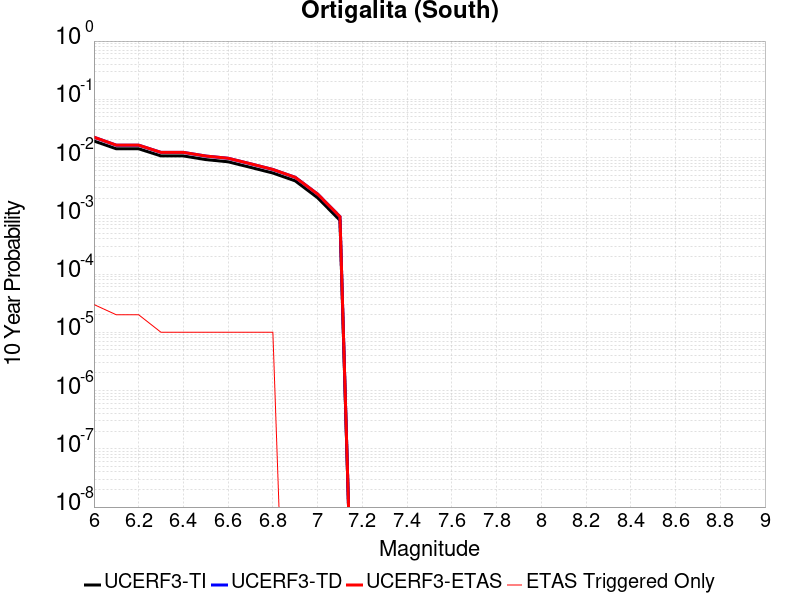 |

| Magnitude | 1 wk TI Prob | 1 wk TD Prob | 1 wk ETAS Prob | 1 wk ETAS/TD Gain | 1 wk ETAS Triggered Only | 1 mo TI Prob | 1 mo TD Prob | 1 mo ETAS Prob | 1 mo ETAS/TD Gain | 1 mo ETAS Triggered Only | 1 yr TI Prob | 1 yr TD Prob | 1 yr ETAS Prob | 1 yr ETAS/TD Gain | 1 yr ETAS Triggered Only | 10 yr TI Prob | 10 yr TD Prob | 10 yr ETAS Prob | 10 yr ETAS/TD Gain | 10 yr ETAS Triggered Only |
|-----|-----|-----|-----|-----|-----|-----|-----|-----|-----|-----|-----|-----|-----|-----|-----|-----|-----|-----|-----|-----|
| 6.0 | 3.72394E-5 | 4.3256532E-5 | 5.32561E-5 | 1.231169 | 1.0E-5 | 1.5958765E-4 | 1.8537285E-4 | 1.9537099E-4 | 1.0539353 | 1.0E-5 | 0.0019412481 | 0.0022547347 | 0.0022746897 | 1.0088502 | 2.0E-5 | 0.019243775 | 0.022334976 | 0.022364307 | 1.0013132 | 3.0E-5 |
| 6.1 | 2.7299884E-5 | 3.149268E-5 | 4.1492363E-5 | 1.3175241 | 1.0E-5 | 1.16994255E-4 | 1.3496196E-4 | 1.449606E-4 | 1.074085 | 1.0E-5 | 0.0014234743 | 0.0016419792 | 0.0016519629 | 1.0060803 | 1.0E-5 | 0.014143906 | 0.016304404 | 0.016324077 | 1.0012066 | 2.0E-5 |
| 6.2 | 2.7299884E-5 | 3.149268E-5 | 4.1492363E-5 | 1.3175241 | 1.0E-5 | 1.16994255E-4 | 1.3496196E-4 | 1.449606E-4 | 1.074085 | 1.0E-5 | 0.0014234743 | 0.0016419792 | 0.0016519629 | 1.0060803 | 1.0E-5 | 0.014143906 | 0.016304404 | 0.016324077 | 1.0012066 | 2.0E-5 |
| 6.3 | 2.0546433E-5 | 2.3631925E-5 | 3.3631688E-5 | 1.4231464 | 1.0E-5 | 8.805317E-5 | 1.0127585E-4 | 1.1127484E-4 | 1.0987302 | 1.0E-5 | 0.00107152 | 0.001232355 | 0.0012423426 | 1.0081046 | 1.0E-5 | 0.010663681 | 0.012257274 | 0.012267152 | 1.0008059 | 1.0E-5 |
| 6.4 | 2.0546433E-5 | 2.3631925E-5 | 3.3631688E-5 | 1.4231464 | 1.0E-5 | 8.805317E-5 | 1.0127585E-4 | 1.1127484E-4 | 1.0987302 | 1.0E-5 | 0.00107152 | 0.001232355 | 0.0012423426 | 1.0081046 | 1.0E-5 | 0.010663681 | 0.012257274 | 0.012267152 | 1.0008059 | 1.0E-5 |
| 6.5 | 1.7779594E-5 | 2.0447384E-5 | 3.044718E-5 | 1.4890501 | 1.0E-5 | 7.619603E-5 | 8.7628774E-5 | 9.76279E-5 | 1.1141077 | 1.0E-5 | 9.272918E-4 | 0.0010663718 | 0.001076361 | 1.0093676 | 1.0E-5 | 0.009234319 | 0.010614014 | 0.010623909 | 1.0009321 | 1.0E-5 |
| 6.6 | 1.6272212E-5 | 1.8715342E-5 | 2.8715154E-5 | 1.534311 | 1.0E-5 | 6.973618E-5 | 8.0206206E-5 | 9.020541E-5 | 1.1246686 | 1.0E-5 | 8.487073E-4 | 9.760854E-4 | 9.860756E-4 | 1.010235 | 1.0E-5 | 0.008454733 | 0.009719283 | 0.009729187 | 1.0010189 | 1.0E-5 |
| 6.7 | 1.3051484E-5 | 1.5039062E-5 | 2.5038913E-5 | 1.6649251 | 1.0E-5 | 5.593373E-5 | 6.445159E-5 | 7.4450945E-5 | 1.1551452 | 1.0E-5 | 6.807804E-4 | 7.8442506E-4 | 7.944172E-4 | 1.0127382 | 1.0E-5 | 0.006786986 | 0.007817546 | 0.007827467 | 1.0012692 | 1.0E-5 |
| 6.8 | 1.04277415E-5 | 1.1987473E-5 | 2.1987353E-5 | 1.8341942 | 1.0E-5 | 4.4689557E-5 | 5.1373918E-5 | 6.13734E-5 | 1.1946414 | 1.0E-5 | 5.439595E-4 | 6.2530534E-4 | 6.3529913E-4 | 1.0159822 | 1.0E-5 | 0.0054262993 | 0.0062362133 | 0.006246151 | 1.0015936 | 1.0E-5 |
| 6.9 | 7.639968E-6 | 8.79168E-6 | 8.79168E-6 | 1.0 | 0.0 | 3.274231E-5 | 3.7678114E-5 | 3.7678114E-5 | 1.0 | 0.0 | 3.9856473E-4 | 4.5864037E-4 | 4.5864037E-4 | 1.0 | 0.0 | 0.003978506 | 0.0045775245 | 0.0045775245 | 1.0 | 0.0 |
| 7.0 | 3.919831E-6 | 4.5334955E-6 | 4.5334955E-6 | 1.0 | 0.0 | 1.679917E-5 | 1.9429133E-5 | 1.9429133E-5 | 1.0 | 0.0 | 2.045107E-4 | 2.3652615E-4 | 2.3652615E-4 | 1.0 | 0.0 | 0.0020432258 | 0.0023629526 | 0.0023629526 | 1.0 | 0.0 |
| 7.1 | 1.6017933E-6 | 1.8570811E-6 | 1.8570811E-6 | 1.0 | 0.0 | 6.8648105E-6 | 7.958901E-6 | 7.958901E-6 | 1.0 | 0.0 | 8.357586E-5 | 9.689637E-5 | 9.689637E-5 | 1.0 | 0.0 | 8.3544437E-4 | 9.686459E-4 | 9.686459E-4 | 1.0 | 0.0 |

## Newport-Inglewood alt 1
*[(top)](#table-of-contents)*

| 1 Week | 1 Month | 1 Year | 10 Year |
|-----|-----|-----|-----|
|  |  |  | 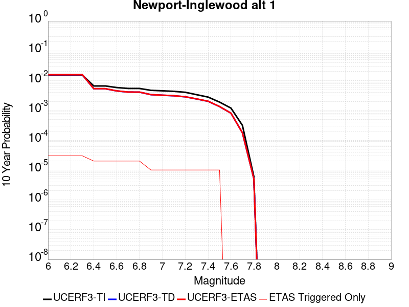 |

| Magnitude | 1 wk TI Prob | 1 wk TD Prob | 1 wk ETAS Prob | 1 wk ETAS/TD Gain | 1 wk ETAS Triggered Only | 1 mo TI Prob | 1 mo TD Prob | 1 mo ETAS Prob | 1 mo ETAS/TD Gain | 1 mo ETAS Triggered Only | 1 yr TI Prob | 1 yr TD Prob | 1 yr ETAS Prob | 1 yr ETAS/TD Gain | 1 yr ETAS Triggered Only | 10 yr TI Prob | 10 yr TD Prob | 10 yr ETAS Prob | 10 yr ETAS/TD Gain | 10 yr ETAS Triggered Only |
|-----|-----|-----|-----|-----|-----|-----|-----|-----|-----|-----|-----|-----|-----|-----|-----|-----|-----|-----|-----|-----|
| 6.0 | 2.9668912E-5 | 3.040552E-5 | 3.040552E-5 | 1.0 | 0.0 | 1.2714628E-4 | 1.303056E-4 | 1.303056E-4 | 1.0 | 0.0 | 0.0015469068 | 0.0015858014 | 0.0016157537 | 1.0188879 | 3.0E-5 | 0.015361829 | 0.015792465 | 0.015821991 | 1.0018697 | 3.0E-5 |
| 6.1 | 2.9668912E-5 | 3.040552E-5 | 3.040552E-5 | 1.0 | 0.0 | 1.2714628E-4 | 1.303056E-4 | 1.303056E-4 | 1.0 | 0.0 | 0.0015469068 | 0.0015858014 | 0.0016157537 | 1.0188879 | 3.0E-5 | 0.015361829 | 0.015792465 | 0.015821991 | 1.0018697 | 3.0E-5 |
| 6.2 | 2.9668912E-5 | 3.040552E-5 | 3.040552E-5 | 1.0 | 0.0 | 1.2714628E-4 | 1.303056E-4 | 1.303056E-4 | 1.0 | 0.0 | 0.0015469068 | 0.0015858014 | 0.0016157537 | 1.0188879 | 3.0E-5 | 0.015361829 | 0.015792465 | 0.015821991 | 1.0018697 | 3.0E-5 |
| 6.3 | 2.9668912E-5 | 3.040552E-5 | 3.040552E-5 | 1.0 | 0.0 | 1.2714628E-4 | 1.303056E-4 | 1.303056E-4 | 1.0 | 0.0 | 0.0015469068 | 0.0015858014 | 0.0016157537 | 1.0188879 | 3.0E-5 | 0.015361829 | 0.015792465 | 0.015821991 | 1.0018697 | 3.0E-5 |
| 6.4 | 1.275942E-5 | 1.0272689E-5 | 1.0272689E-5 | 1.0 | 0.0 | 5.4682085E-5 | 4.402509E-5 | 4.402509E-5 | 1.0 | 0.0 | 6.65551E-4 | 5.358778E-4 | 5.558671E-4 | 1.0373019 | 2.0E-5 | 0.0066356123 | 0.005346281 | 0.005366174 | 1.0037209 | 2.0E-5 |
| 6.5 | 1.275942E-5 | 1.0272689E-5 | 1.0272689E-5 | 1.0 | 0.0 | 5.4682085E-5 | 4.402509E-5 | 4.402509E-5 | 1.0 | 0.0 | 6.65551E-4 | 5.358778E-4 | 5.558671E-4 | 1.0373019 | 2.0E-5 | 0.0066356123 | 0.005346281 | 0.005366174 | 1.0037209 | 2.0E-5 |
| 6.6 | 1.1255358E-5 | 8.66204E-6 | 8.66204E-6 | 1.0 | 0.0 | 4.8236358E-5 | 3.712251E-5 | 3.712251E-5 | 1.0 | 0.0 | 5.871194E-4 | 4.518745E-4 | 4.718655E-4 | 1.0442401 | 2.0E-5 | 0.005855706 | 0.004509734 | 0.004529644 | 1.0044148 | 2.0E-5 |
| 6.7 | 1.0504745E-5 | 7.899962E-6 | 7.899962E-6 | 1.0 | 0.0 | 4.5019555E-5 | 3.3856548E-5 | 3.3856548E-5 | 1.0 | 0.0 | 5.4797524E-4 | 4.1212674E-4 | 4.3211848E-4 | 1.0485088 | 2.0E-5 | 0.0054662596 | 0.0041137543 | 0.004133672 | 1.0048417 | 2.0E-5 |
| 6.8 | 1.0476007E-5 | 7.881343E-6 | 7.881343E-6 | 1.0 | 0.0 | 4.4896402E-5 | 3.3776756E-5 | 3.3776756E-5 | 1.0 | 0.0 | 5.464766E-4 | 4.1115563E-4 | 4.311474E-4 | 1.0486233 | 2.0E-5 | 0.005451347 | 0.004104079 | 0.0041239974 | 1.0048532 | 2.0E-5 |
| 6.9 | 9.076797E-6 | 6.4897567E-6 | 6.4897567E-6 | 1.0 | 0.0 | 3.889998E-5 | 2.7812948E-5 | 2.7812948E-5 | 1.0 | 0.0 | 4.7350433E-4 | 3.3857036E-4 | 3.48567E-4 | 1.029526 | 1.0E-5 | 0.004724967 | 0.003380583 | 0.0033905492 | 1.002948 | 1.0E-5 |
| 7.0 | 8.73795E-6 | 6.21215E-6 | 6.21215E-6 | 1.0 | 0.0 | 3.7447822E-5 | 2.662323E-5 | 2.662323E-5 | 1.0 | 0.0 | 4.5583185E-4 | 3.240899E-4 | 3.3408665E-4 | 1.0308456 | 1.0E-5 | 0.0045489795 | 0.0032362042 | 0.0032461716 | 1.00308 | 1.0E-5 |
| 7.1 | 8.391299E-6 | 5.955852E-6 | 5.955852E-6 | 1.0 | 0.0 | 3.5962214E-5 | 2.5524832E-5 | 2.5524832E-5 | 1.0 | 0.0 | 4.37752E-4 | 3.107208E-4 | 3.2071766E-4 | 1.0321733 | 1.0E-5 | 0.004368907 | 0.003102893 | 0.003112862 | 1.0032128 | 1.0E-5 |
| 7.2 | 7.796882E-6 | 5.4965785E-6 | 5.4965785E-6 | 1.0 | 0.0 | 3.341478E-5 | 2.3556555E-5 | 2.3556555E-5 | 1.0 | 0.0 | 4.06749E-4 | 2.8676353E-4 | 2.9676064E-4 | 1.0348619 | 1.0E-5 | 0.0040600533 | 0.0028639587 | 0.0028739301 | 1.0034816 | 1.0E-5 |
| 7.3 | 6.4738833E-6 | 4.647811E-6 | 4.647811E-6 | 1.0 | 0.0 | 2.774492E-5 | 1.9919036E-5 | 1.9919036E-5 | 1.0 | 0.0 | 3.3774204E-4 | 2.4248744E-4 | 2.52485E-4 | 1.0412292 | 1.0E-5 | 0.0033722918 | 0.0024222452 | 0.0024322208 | 1.0041184 | 1.0E-5 |
| 7.4 | 5.382145E-6 | 3.885752E-6 | 3.885752E-6 | 1.0 | 0.0 | 2.3066134E-5 | 1.6653117E-5 | 1.6653117E-5 | 1.0 | 0.0 | 2.8079396E-4 | 2.0273299E-4 | 2.1273096E-4 | 1.0493159 | 1.0E-5 | 0.0028043943 | 0.0020254948 | 0.0020354746 | 1.004927 | 1.0E-5 |
| 7.5 | 3.648244E-6 | 2.573781E-6 | 2.573781E-6 | 1.0 | 0.0 | 1.5635238E-5 | 1.10304445E-5 | 1.10304445E-5 | 1.0 | 0.0 | 1.9034238E-4 | 1.3428749E-4 | 1.4428614E-4 | 1.074457 | 1.0E-5 | 0.0019017943 | 0.0013420738 | 0.0013520604 | 1.0074412 | 1.0E-5 |
| 7.6 | 2.2906888E-6 | 1.5479967E-6 | 1.5479967E-6 | 1.0 | 0.0 | 9.817201E-6 | 6.634255E-6 | 6.634255E-6 | 1.0 | 0.0 | 1.1951787E-4 | 8.076913E-5 | 8.076913E-5 | 1.0 | 0.0 | 0.0011945361 | 8.0740446E-4 | 8.0740446E-4 | 1.0 | 0.0 |
| 7.7 | 6.0479874E-7 | 3.397505E-7 | 3.397505E-7 | 1.0 | 0.0 | 2.5919921E-6 | 1.4560729E-6 | 1.4560729E-6 | 1.0 | 0.0 | 3.1557047E-5 | 1.7727558E-5 | 1.7727558E-5 | 1.0 | 0.0 | 3.1552566E-4 | 1.772628E-4 | 1.772628E-4 | 1.0 | 0.0 |
| 7.8 | 1.16056995E-8 | 9.782997E-9 | 9.782997E-9 | 1.0 | 0.0 | 4.9738713E-8 | 4.1927127E-8 | 4.1927127E-8 | 1.0 | 0.0 | 6.0556863E-7 | 5.1046277E-7 | 5.1046277E-7 | 1.0 | 0.0 | 6.05567E-6 | 5.1046277E-6 | 5.1046277E-6 | 1.0 | 0.0 |

## Cedar Mtn-Mahogany Mtn
*[(top)](#table-of-contents)*

| 1 Week | 1 Month | 1 Year | 10 Year |
|-----|-----|-----|-----|
|  |  |  |  |

| Magnitude | 1 wk TI Prob | 1 wk TD Prob | 1 wk ETAS Prob | 1 wk ETAS/TD Gain | 1 wk ETAS Triggered Only | 1 mo TI Prob | 1 mo TD Prob | 1 mo ETAS Prob | 1 mo ETAS/TD Gain | 1 mo ETAS Triggered Only | 1 yr TI Prob | 1 yr TD Prob | 1 yr ETAS Prob | 1 yr ETAS/TD Gain | 1 yr ETAS Triggered Only | 10 yr TI Prob | 10 yr TD Prob | 10 yr ETAS Prob | 10 yr ETAS/TD Gain | 10 yr ETAS Triggered Only |
|-----|-----|-----|-----|-----|-----|-----|-----|-----|-----|-----|-----|-----|-----|-----|-----|-----|-----|-----|-----|-----|
| 6.0 | 2.7763876E-5 | 2.9589124E-5 | 2.9589124E-5 | 1.0 | 0.0 | 1.1898261E-4 | 1.2680476E-4 | 1.2680476E-4 | 1.0 | 0.0 | 0.0014476506 | 0.0015428247 | 0.0015528093 | 1.0064716 | 1.0E-5 | 0.0143825635 | 0.015328358 | 0.015348052 | 1.0012847 | 2.0E-5 |
| 6.1 | 1.6162443E-5 | 1.7143104E-5 | 1.7143104E-5 | 1.0 | 0.0 | 6.926578E-5 | 7.346847E-5 | 7.346847E-5 | 1.0 | 0.0 | 8.4298453E-4 | 8.9412933E-4 | 8.9412933E-4 | 1.0 | 0.0 | 0.008397939 | 0.00890713 | 0.008917041 | 1.0011127 | 1.0E-5 |
| 6.2 | 1.6162443E-5 | 1.7143104E-5 | 1.7143104E-5 | 1.0 | 0.0 | 6.926578E-5 | 7.346847E-5 | 7.346847E-5 | 1.0 | 0.0 | 8.4298453E-4 | 8.9412933E-4 | 8.9412933E-4 | 1.0 | 0.0 | 0.008397939 | 0.00890713 | 0.008917041 | 1.0011127 | 1.0E-5 |
| 6.3 | 9.746053E-6 | 1.030323E-5 | 1.030323E-5 | 1.0 | 0.0 | 4.1768133E-5 | 4.4155975E-5 | 4.4155975E-5 | 1.0 | 0.0 | 5.0840835E-4 | 5.374705E-4 | 5.374705E-4 | 1.0 | 0.0 | 0.0050724675 | 0.005362125 | 0.005362125 | 1.0 | 0.0 |
| 6.4 | 9.746053E-6 | 1.030323E-5 | 1.030323E-5 | 1.0 | 0.0 | 4.1768133E-5 | 4.4155975E-5 | 4.4155975E-5 | 1.0 | 0.0 | 5.0840835E-4 | 5.374705E-4 | 5.374705E-4 | 1.0 | 0.0 | 0.0050724675 | 0.005362125 | 0.005362125 | 1.0 | 0.0 |
| 6.5 | 7.290083E-6 | 7.695381E-6 | 7.695381E-6 | 1.0 | 0.0 | 3.124284E-5 | 3.2979802E-5 | 3.2979802E-5 | 1.0 | 0.0 | 3.8031515E-4 | 4.0145728E-4 | 4.0145728E-4 | 1.0 | 0.0 | 0.0037966494 | 0.0040075406 | 0.0040075406 | 1.0 | 0.0 |
| 6.6 | 5.67907E-6 | 5.9891963E-6 | 5.9891963E-6 | 1.0 | 0.0 | 2.4338644E-5 | 2.5667738E-5 | 2.5667738E-5 | 1.0 | 0.0 | 2.962827E-4 | 3.1246126E-4 | 3.1246126E-4 | 1.0 | 0.0 | 0.0029588798 | 0.0031203553 | 0.0031203553 | 1.0 | 0.0 |
| 6.7 | 3.4853963E-6 | 3.6726572E-6 | 3.6726572E-6 | 1.0 | 0.0 | 1.4937327E-5 | 1.5739868E-5 | 1.5739868E-5 | 1.0 | 0.0 | 1.8184677E-4 | 1.9161667E-4 | 1.9161667E-4 | 1.0 | 0.0 | 0.0018169804 | 0.0019145765 | 0.0019145765 | 1.0 | 0.0 |
| 6.8 | 2.7535168E-6 | 2.901597E-6 | 2.901597E-6 | 1.0 | 0.0 | 1.1800733E-5 | 1.2435359E-5 | 1.2435359E-5 | 1.0 | 0.0 | 1.4366445E-4 | 1.5139046E-4 | 1.5139046E-4 | 1.0 | 0.0 | 0.0014357162 | 0.0015129205 | 0.0015129205 | 1.0 | 0.0 |
| 6.9 | 1.6594106E-6 | 1.7497113E-6 | 1.7497113E-6 | 1.0 | 0.0 | 7.1117406E-6 | 7.4987424E-6 | 7.4987424E-6 | 1.0 | 0.0 | 8.6582E-5 | 9.1293674E-5 | 9.1293674E-5 | 1.0 | 0.0 | 8.654827E-4 | 9.1259216E-4 | 9.1259216E-4 | 1.0 | 0.0 |
| 7.0 | 5.10215E-7 | 5.389294E-7 | 5.389294E-7 | 1.0 | 0.0 | 2.186634E-6 | 2.3096961E-6 | 2.3096961E-6 | 1.0 | 0.0 | 2.6621943E-5 | 2.8120316E-5 | 2.8120316E-5 | 1.0 | 0.0 | 2.6618753E-4 | 2.811801E-4 | 2.811801E-4 | 1.0 | 0.0 |

## Owens Valley Keough Hot Springs
*[(top)](#table-of-contents)*

| 1 Week | 1 Month | 1 Year | 10 Year |
|-----|-----|-----|-----|
|  |  |  |  |

| Magnitude | 1 wk TI Prob | 1 wk TD Prob | 1 wk ETAS Prob | 1 wk ETAS/TD Gain | 1 wk ETAS Triggered Only | 1 mo TI Prob | 1 mo TD Prob | 1 mo ETAS Prob | 1 mo ETAS/TD Gain | 1 mo ETAS Triggered Only | 1 yr TI Prob | 1 yr TD Prob | 1 yr ETAS Prob | 1 yr ETAS/TD Gain | 1 yr ETAS Triggered Only | 10 yr TI Prob | 10 yr TD Prob | 10 yr ETAS Prob | 10 yr ETAS/TD Gain | 10 yr ETAS Triggered Only |
|-----|-----|-----|-----|-----|-----|-----|-----|-----|-----|-----|-----|-----|-----|-----|-----|-----|-----|-----|-----|-----|
| 6.0 | 1.5708529E-5 | 4.95061E-6 | 4.95061E-6 | 1.0 | 0.0 | 6.7320536E-5 | 2.1216758E-5 | 2.1216758E-5 | 1.0 | 0.0 | 8.193192E-4 | 2.5828852E-4 | 2.7828338E-4 | 1.0774128 | 2.0E-5 | 0.008163051 | 0.0025805589 | 0.0026005073 | 1.0077302 | 2.0E-5 |
| 6.1 | 1.5708529E-5 | 4.95061E-6 | 4.95061E-6 | 1.0 | 0.0 | 6.7320536E-5 | 2.1216758E-5 | 2.1216758E-5 | 1.0 | 0.0 | 8.193192E-4 | 2.5828852E-4 | 2.7828338E-4 | 1.0774128 | 2.0E-5 | 0.008163051 | 0.0025805589 | 0.0026005073 | 1.0077302 | 2.0E-5 |
| 6.2 | 1.5708529E-5 | 4.95061E-6 | 4.95061E-6 | 1.0 | 0.0 | 6.7320536E-5 | 2.1216758E-5 | 2.1216758E-5 | 1.0 | 0.0 | 8.193192E-4 | 2.5828852E-4 | 2.7828338E-4 | 1.0774128 | 2.0E-5 | 0.008163051 | 0.0025805589 | 0.0026005073 | 1.0077302 | 2.0E-5 |
| 6.3 | 1.5708529E-5 | 4.95061E-6 | 4.95061E-6 | 1.0 | 0.0 | 6.7320536E-5 | 2.1216758E-5 | 2.1216758E-5 | 1.0 | 0.0 | 8.193192E-4 | 2.5828852E-4 | 2.7828338E-4 | 1.0774128 | 2.0E-5 | 0.008163051 | 0.0025805589 | 0.0026005073 | 1.0077302 | 2.0E-5 |
| 6.4 | 1.4622509E-5 | 3.7264542E-6 | 3.7264542E-6 | 1.0 | 0.0 | 6.266639E-5 | 1.597044E-5 | 1.597044E-5 | 1.0 | 0.0 | 7.626962E-4 | 1.9442604E-4 | 2.1442217E-4 | 1.1028469 | 2.0E-5 | 0.007600839 | 0.0019430561 | 0.0019630173 | 1.0102731 | 2.0E-5 |
| 6.5 | 1.3335527E-5 | 2.2776267E-6 | 2.2776267E-6 | 1.0 | 0.0 | 5.7151006E-5 | 9.761225E-6 | 9.761225E-6 | 1.0 | 0.0 | 6.955913E-4 | 1.1883711E-4 | 1.3883473E-4 | 1.1682776 | 2.0E-5 | 0.0069341804 | 0.001187975 | 0.0012079512 | 1.0168154 | 2.0E-5 |
| 6.6 | 1.3332855E-5 | 2.2747759E-6 | 2.2747759E-6 | 1.0 | 0.0 | 5.7139558E-5 | 9.7490065E-6 | 9.7490065E-6 | 1.0 | 0.0 | 6.9545204E-4 | 1.18688375E-4 | 1.38686E-4 | 1.1684885 | 2.0E-5 | 0.0069327964 | 0.0011864892 | 0.0012064655 | 1.0168364 | 2.0E-5 |
| 6.7 | 1.3318214E-5 | 2.2640058E-6 | 2.2640058E-6 | 1.0 | 0.0 | 5.707681E-5 | 9.70285E-6 | 9.70285E-6 | 1.0 | 0.0 | 6.946886E-4 | 1.18126474E-4 | 1.3812412E-4 | 1.1692901 | 2.0E-5 | 0.0069252094 | 0.0011808762 | 0.0012008526 | 1.0169166 | 2.0E-5 |
| 6.8 | 1.2441338E-5 | 1.6776884E-6 | 1.6776884E-6 | 1.0 | 0.0 | 5.331893E-5 | 7.190075E-6 | 7.190075E-6 | 1.0 | 0.0 | 6.489646E-4 | 8.753594E-5 | 1.0753419E-4 | 1.2284576 | 2.0E-5 | 0.0064707273 | 8.752164E-4 | 8.951989E-4 | 1.0228314 | 2.0E-5 |
| 6.9 | 1.1130476E-5 | 1.0302945E-6 | 1.0302945E-6 | 1.0 | 0.0 | 4.7701167E-5 | 4.4155404E-6 | 4.4155404E-6 | 1.0 | 0.0 | 5.806069E-4 | 5.3757893E-5 | 7.375682E-5 | 1.3720183 | 2.0E-5 | 0.0057909233 | 5.3762126E-4 | 5.5761053E-4 | 1.0371809 | 2.0E-5 |
| 7.0 | 1.0986073E-5 | 9.5785E-7 | 9.5785E-7 | 1.0 | 0.0 | 4.7082318E-5 | 4.1050653E-6 | 4.1050653E-6 | 1.0 | 0.0 | 5.730765E-4 | 4.9978033E-5 | 6.997703E-5 | 1.4001558 | 2.0E-5 | 0.0057160086 | 4.998395E-4 | 5.1982945E-4 | 1.0399928 | 2.0E-5 |
| 7.1 | 1.0451338E-5 | 7.999411E-7 | 7.999411E-7 | 1.0 | 0.0 | 4.4790682E-5 | 3.4283146E-6 | 3.4283146E-6 | 1.0 | 0.0 | 5.451901E-4 | 4.173894E-5 | 6.17381E-5 | 1.4791489 | 2.0E-5 | 0.005438545 | 4.1747853E-4 | 4.3747018E-4 | 1.0478866 | 2.0E-5 |
| 7.2 | 9.989061E-6 | 6.544159E-7 | 6.544159E-7 | 1.0 | 0.0 | 4.280956E-5 | 2.8046366E-6 | 2.8046366E-6 | 1.0 | 0.0 | 5.2108173E-4 | 3.4145916E-5 | 5.4145235E-5 | 1.5857016 | 2.0E-5 | 0.0051986156 | 3.4156654E-4 | 3.615597E-4 | 1.0585338 | 2.0E-5 |
| 7.3 | 9.465365E-6 | 5.4592874E-7 | 5.4592874E-7 | 1.0 | 0.0 | 4.056522E-5 | 2.3396926E-6 | 2.3396926E-6 | 1.0 | 0.0 | 4.937696E-4 | 2.8485389E-5 | 4.8484817E-5 | 1.7020943 | 2.0E-5 | 0.0049267393 | 2.849722E-4 | 3.049665E-4 | 1.0701623 | 2.0E-5 |
| 7.4 | 6.3824805E-6 | 4.0157266E-7 | 4.0157266E-7 | 1.0 | 0.0 | 2.73532E-5 | 1.7210247E-6 | 1.7210247E-6 | 1.0 | 0.0 | 3.3297433E-4 | 2.0953275E-5 | 4.0952855E-5 | 1.9544847 | 2.0E-5 | 0.0033247585 | 2.0962617E-4 | 2.2962199E-4 | 1.0953879 | 2.0E-5 |
| 7.5 | 1.6192645E-6 | 2.5158894E-7 | 2.5158894E-7 | 1.0 | 0.0 | 6.9396865E-6 | 1.0782379E-6 | 1.0782379E-6 | 1.0 | 0.0 | 8.448741E-5 | 1.3127469E-5 | 3.3127206E-5 | 2.523503 | 2.0E-5 | 8.4455294E-4 | 1.3126706E-4 | 1.5126444E-4 | 1.1523411 | 2.0E-5 |
| 7.6 | 5.7062545E-7 | 1.0791249E-7 | 1.0791249E-7 | 1.0 | 0.0 | 2.4455355E-6 | 4.6248203E-7 | 4.6248203E-7 | 1.0 | 0.0 | 2.9773988E-5 | 5.6307053E-6 | 2.5630592E-5 | 4.551933 | 2.0E-5 | 2.977E-4 | 5.6305707E-5 | 7.630458E-5 | 1.3551838 | 2.0E-5 |
| 7.7 | 2.5988817E-7 | 4.5449596E-8 | 4.5449596E-8 | 1.0 | 0.0 | 1.113806E-6 | 1.9478398E-7 | 1.9478398E-7 | 1.0 | 0.0 | 1.3560503E-5 | 2.3714929E-6 | 2.2371445E-5 | 9.433487 | 2.0E-5 | 1.3559677E-4 | 2.3714718E-5 | 4.3714244E-5 | 1.8433381 | 2.0E-5 |

## San Jacinto (Superstition Mtn)
*[(top)](#table-of-contents)*

| 1 Week | 1 Month | 1 Year | 10 Year |
|-----|-----|-----|-----|
|  |  |  |  |

| Magnitude | 1 wk TI Prob | 1 wk TD Prob | 1 wk ETAS Prob | 1 wk ETAS/TD Gain | 1 wk ETAS Triggered Only | 1 mo TI Prob | 1 mo TD Prob | 1 mo ETAS Prob | 1 mo ETAS/TD Gain | 1 mo ETAS Triggered Only | 1 yr TI Prob | 1 yr TD Prob | 1 yr ETAS Prob | 1 yr ETAS/TD Gain | 1 yr ETAS Triggered Only | 10 yr TI Prob | 10 yr TD Prob | 10 yr ETAS Prob | 10 yr ETAS/TD Gain | 10 yr ETAS Triggered Only |
|-----|-----|-----|-----|-----|-----|-----|-----|-----|-----|-----|-----|-----|-----|-----|-----|-----|-----|-----|-----|-----|
| 6.0 | 6.4193904E-5 | 9.6002805E-5 | 9.6002805E-5 | 1.0 | 0.0 | 2.7508775E-4 | 4.1138552E-4 | 4.1138552E-4 | 1.0 | 0.0 | 0.0033440501 | 0.004998534 | 0.004998534 | 1.0 | 0.0 | 0.03294174 | 0.048822355 | 0.04884138 | 1.0003897 | 2.0E-5 |
| 6.1 | 6.4193904E-5 | 9.6002805E-5 | 9.6002805E-5 | 1.0 | 0.0 | 2.7508775E-4 | 4.1138552E-4 | 4.1138552E-4 | 1.0 | 0.0 | 0.0033440501 | 0.004998534 | 0.004998534 | 1.0 | 0.0 | 0.03294174 | 0.048822355 | 0.04884138 | 1.0003897 | 2.0E-5 |
| 6.2 | 5.7023593E-5 | 8.315118E-5 | 8.315118E-5 | 1.0 | 0.0 | 2.4436394E-4 | 3.5632294E-4 | 3.5632294E-4 | 1.0 | 0.0 | 0.002971072 | 0.004331248 | 0.004331248 | 1.0 | 0.0 | 0.029316625 | 0.04250458 | 0.042514153 | 1.0002253 | 1.0E-5 |
| 6.3 | 5.6940098E-5 | 8.2996536E-5 | 8.2996536E-5 | 1.0 | 0.0 | 2.4400617E-4 | 3.5566036E-4 | 3.5566036E-4 | 1.0 | 0.0 | 0.002966728 | 0.0043232134 | 0.0043232134 | 1.0 | 0.0 | 0.029274331 | 0.04242795 | 0.042437527 | 1.0002257 | 1.0E-5 |
| 6.4 | 5.4171585E-5 | 7.749044E-5 | 7.749044E-5 | 1.0 | 0.0 | 2.3214328E-4 | 3.320689E-4 | 3.320689E-4 | 1.0 | 0.0 | 0.0028226813 | 0.004037093 | 0.004037093 | 1.0 | 0.0 | 0.02787096 | 0.03971742 | 0.039727025 | 1.0002418 | 1.0E-5 |
| 6.5 | 4.375144E-5 | 5.6427816E-5 | 5.6427816E-5 | 1.0 | 0.0 | 1.874927E-4 | 2.4181772E-4 | 2.4181772E-4 | 1.0 | 0.0 | 0.0022803338 | 0.0029413316 | 0.0029413316 | 1.0 | 0.0 | 0.022570757 | 0.029237961 | 0.02924767 | 1.000332 | 1.0E-5 |
| 6.6 | 2.772192E-5 | 2.5494071E-5 | 2.5494071E-5 | 1.0 | 0.0 | 1.1880282E-4 | 1.09255845E-4 | 1.09255845E-4 | 1.0 | 0.0 | 0.0014454646 | 0.0013293975 | 0.0013293975 | 1.0 | 0.0 | 0.014360986 | 0.013542279 | 0.013552143 | 1.0007284 | 1.0E-5 |
| 6.7 | 2.7124124E-5 | 2.4705068E-5 | 2.4705068E-5 | 1.0 | 0.0 | 1.1624106E-4 | 1.0587468E-4 | 1.0587468E-4 | 1.0 | 0.0 | 0.0014143161 | 0.0012882812 | 0.0012882812 | 1.0 | 0.0 | 0.014053487 | 0.0131356325 | 0.013145502 | 1.0007513 | 1.0E-5 |
| 6.8 | 2.5475807E-5 | 2.2169877E-5 | 2.2169877E-5 | 1.0 | 0.0 | 1.0917746E-4 | 9.501037E-5 | 9.501037E-5 | 1.0 | 0.0 | 0.001328425 | 0.0011561494 | 0.0011561494 | 1.0 | 0.0 | 0.0132051185 | 0.011823943 | 0.011833825 | 1.0008358 | 1.0E-5 |
| 6.9 | 2.1162023E-5 | 1.7631051E-5 | 1.7631051E-5 | 1.0 | 0.0 | 9.069123E-5 | 7.555948E-5 | 7.555948E-5 | 1.0 | 0.0 | 0.0011036064 | 9.195522E-4 | 9.195522E-4 | 1.0 | 0.0 | 0.010981417 | 0.0094489865 | 0.009458892 | 1.0010483 | 1.0E-5 |
| 7.0 | 1.8754288E-5 | 1.616617E-5 | 1.616617E-5 | 1.0 | 0.0 | 8.037304E-5 | 6.928176E-5 | 6.928176E-5 | 1.0 | 0.0 | 9.781026E-4 | 8.4318145E-4 | 8.4318145E-4 | 1.0 | 0.0 | 0.009738087 | 0.008672153 | 0.008682066 | 1.0011431 | 1.0E-5 |
| 7.1 | 1.8678527E-5 | 1.6091313E-5 | 1.6091313E-5 | 1.0 | 0.0 | 8.0048376E-5 | 6.8960966E-5 | 6.8960966E-5 | 1.0 | 0.0 | 9.7415317E-4 | 8.392788E-4 | 8.392788E-4 | 1.0 | 0.0 | 0.009698939 | 0.008633161 | 0.008643075 | 1.0011483 | 1.0E-5 |
| 7.2 | 1.7804578E-5 | 1.5385827E-5 | 1.5385827E-5 | 1.0 | 0.0 | 7.6303106E-5 | 6.59376E-5 | 6.59376E-5 | 1.0 | 0.0 | 9.285943E-4 | 8.024969E-4 | 8.024969E-4 | 1.0 | 0.0 | 0.009247236 | 0.0082646 | 0.008274518 | 1.0012 | 1.0E-5 |
| 7.3 | 1.6583685E-5 | 1.4534898E-5 | 1.4534898E-5 | 1.0 | 0.0 | 7.1070994E-5 | 6.229094E-5 | 6.229094E-5 | 1.0 | 0.0 | 8.649459E-4 | 7.581304E-4 | 7.581304E-4 | 1.0 | 0.0 | 0.00861587 | 0.007819886 | 0.007829809 | 1.0012687 | 1.0E-5 |
| 7.4 | 1.6387552E-5 | 1.4399775E-5 | 1.4399775E-5 | 1.0 | 0.0 | 7.023047E-5 | 6.171187E-5 | 6.171187E-5 | 1.0 | 0.0 | 8.5472054E-4 | 7.5108506E-4 | 7.5108506E-4 | 1.0 | 0.0 | 0.008514405 | 0.0077492767 | 0.0077591995 | 1.0012804 | 1.0E-5 |
| 7.5 | 1.5790754E-5 | 1.4040427E-5 | 1.4040427E-5 | 1.0 | 0.0 | 6.767291E-5 | 6.0171882E-5 | 6.0171882E-5 | 1.0 | 0.0 | 8.236062E-4 | 7.323484E-4 | 7.323484E-4 | 1.0 | 0.0 | 0.008205604 | 0.0075598094 | 0.007569734 | 1.0013127 | 1.0E-5 |
| 7.6 | 1.4248672E-5 | 1.3059319E-5 | 1.3059319E-5 | 1.0 | 0.0 | 6.106431E-5 | 5.5967317E-5 | 5.5967317E-5 | 1.0 | 0.0 | 7.432043E-4 | 6.811908E-4 | 6.811908E-4 | 1.0 | 0.0 | 0.007407237 | 0.007042322 | 0.0070522516 | 1.00141 | 1.0E-5 |
| 7.7 | 1.15449975E-5 | 1.0907912E-5 | 1.0907912E-5 | 1.0 | 0.0 | 4.947762E-5 | 4.6747362E-5 | 4.6747362E-5 | 1.0 | 0.0 | 6.022235E-4 | 5.6900125E-4 | 5.6900125E-4 | 1.0 | 0.0 | 0.006005941 | 0.005912308 | 0.0059222486 | 1.0016813 | 1.0E-5 |
| 7.8 | 9.1391985E-6 | 9.518418E-6 | 9.518418E-6 | 1.0 | 0.0 | 3.9167408E-5 | 4.0792587E-5 | 4.0792587E-5 | 1.0 | 0.0 | 4.767588E-4 | 4.9653713E-4 | 4.9653713E-4 | 1.0 | 0.0 | 0.0047573727 | 0.0051787267 | 0.0051886747 | 1.0019209 | 1.0E-5 |
| 7.9 | 6.973017E-6 | 7.385764E-6 | 7.385764E-6 | 1.0 | 0.0 | 2.9884017E-5 | 3.1652893E-5 | 3.1652893E-5 | 1.0 | 0.0 | 3.6377716E-4 | 3.8530637E-4 | 3.8530637E-4 | 1.0 | 0.0 | 0.0036318225 | 0.0040537147 | 0.0040636742 | 1.0024569 | 1.0E-5 |
| 8.0 | 5.7638235E-6 | 6.263249E-6 | 6.263249E-6 | 1.0 | 0.0 | 2.4701867E-5 | 2.6842223E-5 | 2.6842223E-5 | 1.0 | 0.0 | 3.0070372E-4 | 3.2675554E-4 | 3.2675554E-4 | 1.0 | 0.0 | 0.0030029714 | 0.0034551586 | 0.003465124 | 1.0028843 | 1.0E-5 |
| 8.1 | 5.1124434E-6 | 5.498651E-6 | 5.498651E-6 | 1.0 | 0.0 | 2.1910288E-5 | 2.3565437E-5 | 2.3565437E-5 | 1.0 | 0.0 | 2.6672508E-4 | 2.8687192E-4 | 2.8687192E-4 | 1.0 | 0.0 | 0.0026640517 | 0.0030418336 | 0.0030518032 | 1.0032775 | 1.0E-5 |
| 8.2 | 1.1075938E-6 | 5.339512E-7 | 5.339512E-7 | 1.0 | 0.0 | 4.7468216E-6 | 2.2883605E-6 | 2.2883605E-6 | 1.0 | 0.0 | 5.779102E-5 | 2.7860455E-5 | 2.7860455E-5 | 1.0 | 0.0 | 5.777599E-4 | 3.136582E-4 | 3.136582E-4 | 1.0 | 0.0 |
| 8.3 | 1.3584393E-8 | 4.4764112E-9 | 4.4764112E-9 | 1.0 | 0.0 | 5.8218827E-8 | 1.918462E-8 | 1.918462E-8 | 1.0 | 0.0 | 7.0881396E-7 | 2.3357273E-7 | 2.3357273E-7 | 1.0 | 0.0 | 7.0881174E-6 | 2.6165987E-6 | 2.6165987E-6 | 1.0 | 0.0 |

## Hunting Creek - Berryessa 2011 CFM
*[(top)](#table-of-contents)*

| 1 Week | 1 Month | 1 Year | 10 Year |
|-----|-----|-----|-----|
|  |  |  |  |

| Magnitude | 1 wk TI Prob | 1 wk TD Prob | 1 wk ETAS Prob | 1 wk ETAS/TD Gain | 1 wk ETAS Triggered Only | 1 mo TI Prob | 1 mo TD Prob | 1 mo ETAS Prob | 1 mo ETAS/TD Gain | 1 mo ETAS Triggered Only | 1 yr TI Prob | 1 yr TD Prob | 1 yr ETAS Prob | 1 yr ETAS/TD Gain | 1 yr ETAS Triggered Only | 10 yr TI Prob | 10 yr TD Prob | 10 yr ETAS Prob | 10 yr ETAS/TD Gain | 10 yr ETAS Triggered Only |
|-----|-----|-----|-----|-----|-----|-----|-----|-----|-----|-----|-----|-----|-----|-----|-----|-----|-----|-----|-----|-----|
| 6.0 | 1.1270982E-4 | 2.003E-4 | 2.003E-4 | 1.0 | 0.0 | 4.8295266E-4 | 8.580158E-4 | 8.580158E-4 | 1.0 | 0.0 | 0.0058641075 | 0.010386613 | 0.010386613 | 1.0 | 0.0 | 0.057117578 | 0.098045476 | 0.09806352 | 1.0001839 | 2.0E-5 |
| 6.1 | 1.1239393E-4 | 1.9978137E-4 | 1.9978137E-4 | 1.0 | 0.0 | 4.8159933E-4 | 8.5579476E-4 | 8.5579476E-4 | 1.0 | 0.0 | 0.0058477195 | 0.010359855 | 0.010359855 | 1.0 | 0.0 | 0.056962132 | 0.09780394 | 0.09782198 | 1.0001845 | 2.0E-5 |
| 6.2 | 7.596265E-5 | 1.2934073E-4 | 1.2934073E-4 | 1.0 | 0.0 | 3.2551357E-4 | 5.5417913E-4 | 5.5417913E-4 | 1.0 | 0.0 | 0.0039559277 | 0.0067216344 | 0.0067216344 | 1.0 | 0.0 | 0.038862433 | 0.06459614 | 0.06461485 | 1.0002896 | 2.0E-5 |
| 6.3 | 6.78794E-5 | 1.14485956E-4 | 1.14485956E-4 | 1.0 | 0.0 | 2.9087928E-4 | 4.9054454E-4 | 4.9054454E-4 | 1.0 | 0.0 | 0.003535705 | 0.0059528984 | 0.0059528984 | 1.0 | 0.0 | 0.034799766 | 0.05746977 | 0.05748862 | 1.0003281 | 2.0E-5 |
| 6.4 | 6.2165134E-5 | 1.0435045E-4 | 1.0435045E-4 | 1.0 | 0.0 | 2.6639478E-4 | 4.4712838E-4 | 4.4712838E-4 | 1.0 | 0.0 | 0.0032385332 | 0.0054276367 | 0.0054276367 | 1.0 | 0.0 | 0.03191742 | 0.052554645 | 0.05257359 | 1.0003606 | 2.0E-5 |
| 6.5 | 5.4368087E-5 | 9.0704736E-5 | 9.0704736E-5 | 1.0 | 0.0 | 2.3298527E-4 | 3.8866926E-4 | 3.8866926E-4 | 1.0 | 0.0 | 0.0028329059 | 0.0047198907 | 0.0047198907 | 1.0 | 0.0 | 0.027970633 | 0.04588404 | 0.045893583 | 1.0002079 | 1.0E-5 |
| 6.6 | 4.729947E-5 | 7.8472214E-5 | 7.8472214E-5 | 1.0 | 0.0 | 2.0269625E-4 | 3.362585E-4 | 3.362585E-4 | 1.0 | 0.0 | 0.002465034 | 0.004084906 | 0.004084906 | 1.0 | 0.0 | 0.02437869 | 0.039855294 | 0.039864898 | 1.0002409 | 1.0E-5 |
| 6.7 | 3.6875328E-5 | 6.044355E-5 | 6.044355E-5 | 1.0 | 0.0 | 1.5802756E-4 | 2.5902048E-4 | 2.5902048E-4 | 1.0 | 0.0 | 0.0019222875 | 0.003148399 | 0.003148399 | 1.0 | 0.0 | 0.019057442 | 0.030895488 | 0.030895488 | 1.0 | 0.0 |
| 6.8 | 2.0292036E-5 | 2.8977376E-5 | 2.8977376E-5 | 1.0 | 0.0 | 8.6962966E-5 | 1.2418274E-4 | 1.2418274E-4 | 1.0 | 0.0 | 0.0010582599 | 0.0015108638 | 0.0015108638 | 1.0 | 0.0 | 0.010532344 | 0.014979384 | 0.014979384 | 1.0 | 0.0 |
| 6.9 | 1.7871042E-5 | 2.4473193E-5 | 2.4473193E-5 | 1.0 | 0.0 | 7.658793E-5 | 1.04880906E-4 | 1.04880906E-4 | 1.0 | 0.0 | 9.320591E-4 | 0.0012761768 | 0.0012761768 | 1.0 | 0.0 | 0.009281595 | 0.012680746 | 0.012680746 | 1.0 | 0.0 |
| 7.0 | 1.6415532E-5 | 2.1907066E-5 | 2.1907066E-5 | 1.0 | 0.0 | 7.035038E-5 | 9.388406E-5 | 9.388406E-5 | 1.0 | 0.0 | 8.561793E-4 | 0.0011424406 | 0.0011424406 | 1.0 | 0.0 | 0.008528882 | 0.01136518 | 0.01136518 | 1.0 | 0.0 |
| 7.1 | 1.5409885E-5 | 2.0347048E-5 | 2.0347048E-5 | 1.0 | 0.0 | 6.6040695E-5 | 8.719874E-5 | 8.719874E-5 | 1.0 | 0.0 | 8.0374884E-4 | 0.0010611303 | 0.0010611303 | 1.0 | 0.0 | 0.00800848 | 0.010561098 | 0.010561098 | 1.0 | 0.0 |
| 7.2 | 1.4497423E-5 | 1.905562E-5 | 1.905562E-5 | 1.0 | 0.0 | 6.213033E-5 | 8.166441E-5 | 8.166441E-5 | 1.0 | 0.0 | 7.5617427E-4 | 9.938137E-4 | 9.938137E-4 | 1.0 | 0.0 | 0.0075360634 | 0.009894406 | 0.009894406 | 1.0 | 0.0 |
| 7.3 | 1.3615175E-5 | 1.7826764E-5 | 1.7826764E-5 | 1.0 | 0.0 | 5.8349444E-5 | 7.6398195E-5 | 7.6398195E-5 | 1.0 | 0.0 | 7.101729E-4 | 9.29754E-4 | 9.29754E-4 | 1.0 | 0.0 | 0.0070790765 | 0.009259279 | 0.009259279 | 1.0 | 0.0 |
| 7.4 | 1.2252825E-5 | 1.6026825E-5 | 1.6026825E-5 | 1.0 | 0.0 | 5.251105E-5 | 6.8684596E-5 | 6.8684596E-5 | 1.0 | 0.0 | 6.391345E-4 | 8.3591696E-4 | 8.3591696E-4 | 1.0 | 0.0 | 0.0063729943 | 0.008328301 | 0.008328301 | 1.0 | 0.0 |
| 7.5 | 1.0913301E-5 | 1.4241617E-5 | 1.4241617E-5 | 1.0 | 0.0 | 4.6770452E-5 | 6.1034087E-5 | 6.1034087E-5 | 1.0 | 0.0 | 5.6928146E-4 | 7.4283936E-4 | 7.4283936E-4 | 1.0 | 0.0 | 0.0056782532 | 0.0074040988 | 0.0074040988 | 1.0 | 0.0 |
| 7.6 | 8.623192E-6 | 1.1235044E-5 | 1.1235044E-5 | 1.0 | 0.0 | 3.6956015E-5 | 4.8149315E-5 | 4.8149315E-5 | 1.0 | 0.0 | 4.4984656E-4 | 5.860628E-4 | 5.860628E-4 | 1.0 | 0.0 | 0.00448937 | 0.005845606 | 0.005845606 | 1.0 | 0.0 |
| 7.7 | 2.0993634E-6 | 2.662692E-6 | 2.662692E-6 | 1.0 | 0.0 | 8.997241E-6 | 1.1411487E-5 | 1.1411487E-5 | 1.0 | 0.0 | 1.09535904E-4 | 1.3892607E-4 | 1.3892607E-4 | 1.0 | 0.0 | 0.0010948193 | 0.0013884421 | 0.0013884421 | 1.0 | 0.0 |
| 7.8 | 1.8428308E-7 | 2.1675E-7 | 2.1675E-7 | 1.0 | 0.0 | 7.897844E-7 | 9.289282E-7 | 9.289282E-7 | 1.0 | 0.0 | 9.615583E-6 | 1.1309647E-5 | 1.1309647E-5 | 1.0 | 0.0 | 9.615166E-5 | 1.13083915E-4 | 1.13083915E-4 | 1.0 | 0.0 |

## Elysian Park (Upper)
*[(top)](#table-of-contents)*

| 1 Week | 1 Month | 1 Year | 10 Year |
|-----|-----|-----|-----|
|  | 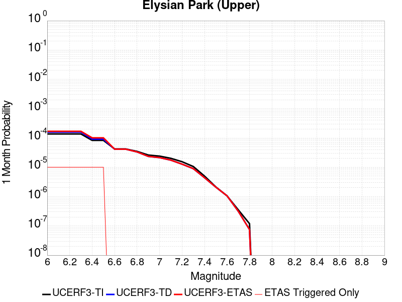 |  |  |

| Magnitude | 1 wk TI Prob | 1 wk TD Prob | 1 wk ETAS Prob | 1 wk ETAS/TD Gain | 1 wk ETAS Triggered Only | 1 mo TI Prob | 1 mo TD Prob | 1 mo ETAS Prob | 1 mo ETAS/TD Gain | 1 mo ETAS Triggered Only | 1 yr TI Prob | 1 yr TD Prob | 1 yr ETAS Prob | 1 yr ETAS/TD Gain | 1 yr ETAS Triggered Only | 10 yr TI Prob | 10 yr TD Prob | 10 yr ETAS Prob | 10 yr ETAS/TD Gain | 10 yr ETAS Triggered Only |
|-----|-----|-----|-----|-----|-----|-----|-----|-----|-----|-----|-----|-----|-----|-----|-----|-----|-----|-----|-----|-----|
| 6.0 | 3.1876025E-5 | 3.703628E-5 | 3.703628E-5 | 1.0 | 0.0 | 1.3660437E-4 | 1.5871998E-4 | 1.687184E-4 | 1.062994 | 1.0E-5 | 0.0016618895 | 0.0019311737 | 0.0019411545 | 1.0051682 | 1.0E-5 | 0.016495159 | 0.019190373 | 0.019209988 | 1.0010222 | 2.0E-5 |
| 6.1 | 3.1876025E-5 | 3.703628E-5 | 3.703628E-5 | 1.0 | 0.0 | 1.3660437E-4 | 1.5871998E-4 | 1.687184E-4 | 1.062994 | 1.0E-5 | 0.0016618895 | 0.0019311737 | 0.0019411545 | 1.0051682 | 1.0E-5 | 0.016495159 | 0.019190373 | 0.019209988 | 1.0010222 | 2.0E-5 |
| 6.2 | 3.1876025E-5 | 3.703628E-5 | 3.703628E-5 | 1.0 | 0.0 | 1.3660437E-4 | 1.5871998E-4 | 1.687184E-4 | 1.062994 | 1.0E-5 | 0.0016618895 | 0.0019311737 | 0.0019411545 | 1.0051682 | 1.0E-5 | 0.016495159 | 0.019190373 | 0.019209988 | 1.0010222 | 2.0E-5 |
| 6.3 | 3.1876025E-5 | 3.703628E-5 | 3.703628E-5 | 1.0 | 0.0 | 1.3660437E-4 | 1.5871998E-4 | 1.687184E-4 | 1.062994 | 1.0E-5 | 0.0016618895 | 0.0019311737 | 0.0019411545 | 1.0051682 | 1.0E-5 | 0.016495159 | 0.019190373 | 0.019209988 | 1.0010222 | 2.0E-5 |
| 6.4 | 1.9273462E-5 | 2.1202904E-5 | 2.1202904E-5 | 1.0 | 0.0 | 8.259794E-5 | 9.0867405E-5 | 1.008665E-4 | 1.1100404 | 1.0E-5 | 0.001005166 | 0.0011059209 | 0.0011159098 | 1.0090322 | 1.0E-5 | 0.010006315 | 0.011020984 | 0.011030873 | 1.0008974 | 1.0E-5 |
| 6.5 | 1.9273462E-5 | 2.1202904E-5 | 2.1202904E-5 | 1.0 | 0.0 | 8.259794E-5 | 9.0867405E-5 | 1.008665E-4 | 1.1100404 | 1.0E-5 | 0.001005166 | 0.0011059209 | 0.0011159098 | 1.0090322 | 1.0E-5 | 0.010006315 | 0.011020984 | 0.011030873 | 1.0008974 | 1.0E-5 |
| 6.6 | 9.813258E-6 | 9.665716E-6 | 9.665716E-6 | 1.0 | 0.0 | 4.205614E-5 | 4.1423882E-5 | 4.1423882E-5 | 1.0 | 0.0 | 5.119132E-4 | 5.042263E-4 | 5.042263E-4 | 1.0 | 0.0 | 0.005107356 | 0.005031546 | 0.005031546 | 1.0 | 0.0 |
| 6.7 | 9.801478E-6 | 9.653286E-6 | 9.653286E-6 | 1.0 | 0.0 | 4.2005657E-5 | 4.1370608E-5 | 4.1370608E-5 | 1.0 | 0.0 | 5.112989E-4 | 5.03578E-4 | 5.03578E-4 | 1.0 | 0.0 | 0.0051012407 | 0.0050250925 | 0.0050250925 | 1.0 | 0.0 |
| 6.8 | 8.102489E-6 | 7.773095E-6 | 7.773095E-6 | 1.0 | 0.0 | 3.4724493E-5 | 3.3312866E-5 | 3.3312866E-5 | 1.0 | 0.0 | 4.2268867E-4 | 4.0551362E-4 | 4.0551362E-4 | 1.0 | 0.0 | 0.004218856 | 0.0040482306 | 0.0040482306 | 1.0 | 0.0 |
| 6.9 | 6.08275E-6 | 5.481501E-6 | 5.481501E-6 | 1.0 | 0.0 | 2.6068668E-5 | 2.349194E-5 | 2.349194E-5 | 1.0 | 0.0 | 3.173398E-4 | 2.859776E-4 | 2.859776E-4 | 1.0 | 0.0 | 0.0031688702 | 0.0028561736 | 0.0028561736 | 1.0 | 0.0 |
| 7.0 | 5.5995934E-6 | 4.982823E-6 | 4.982823E-6 | 1.0 | 0.0 | 2.3998036E-5 | 2.1354786E-5 | 2.1354786E-5 | 1.0 | 0.0 | 2.9213692E-4 | 2.5996417E-4 | 2.5996417E-4 | 1.0 | 0.0 | 0.0029175316 | 0.002596668 | 0.002596668 | 1.0 | 0.0 |
| 7.1 | 4.709881E-6 | 4.0874347E-6 | 4.0874347E-6 | 1.0 | 0.0 | 2.0185047E-5 | 1.7517461E-5 | 1.7517461E-5 | 1.0 | 0.0 | 2.4572524E-4 | 2.1325464E-4 | 2.1325464E-4 | 1.0 | 0.0 | 0.002454537 | 0.0021305413 | 0.0021305413 | 1.0 | 0.0 |
| 7.2 | 3.6063436E-6 | 2.9779728E-6 | 2.9779728E-6 | 1.0 | 0.0 | 1.5455667E-5 | 1.2762678E-5 | 1.2762678E-5 | 1.0 | 0.0 | 1.881565E-4 | 1.5537464E-4 | 1.5537464E-4 | 1.0 | 0.0 | 0.0018799726 | 0.0015526713 | 0.0015526713 | 1.0 | 0.0 |
| 7.3 | 2.471135E-6 | 2.0954792E-6 | 2.0954792E-6 | 1.0 | 0.0 | 1.0590536E-5 | 8.980594E-6 | 8.980594E-6 | 1.0 | 0.0 | 1.2893214E-4 | 1.0933332E-4 | 1.0933332E-4 | 1.0 | 0.0 | 0.0012885736 | 0.0010928025 | 0.0010928025 | 1.0 | 0.0 |
| 7.4 | 1.163943E-6 | 1.0275194E-6 | 1.0275194E-6 | 1.0 | 0.0 | 4.988318E-6 | 4.4036474E-6 | 4.4036474E-6 | 1.0 | 0.0 | 6.0731076E-5 | 5.3613116E-5 | 5.3613116E-5 | 1.0 | 0.0 | 6.071448E-4 | 5.360048E-4 | 5.360048E-4 | 1.0 | 0.0 |
| 7.5 | 4.99459E-7 | 4.917662E-7 | 4.917662E-7 | 1.0 | 0.0 | 2.140537E-6 | 2.1075678E-6 | 2.1075678E-6 | 1.0 | 0.0 | 2.6060725E-5 | 2.565935E-5 | 2.565935E-5 | 1.0 | 0.0 | 2.605767E-4 | 2.5656543E-4 | 2.5656543E-4 | 1.0 | 0.0 |
| 7.6 | 2.4667852E-7 | 2.4778686E-7 | 2.4778686E-7 | 1.0 | 0.0 | 1.0571932E-6 | 1.0619433E-6 | 1.0619433E-6 | 1.0 | 0.0 | 1.2871251E-5 | 1.2929087E-5 | 1.2929087E-5 | 1.0 | 0.0 | 1.2870505E-4 | 1.2928371E-4 | 1.2928371E-4 | 1.0 | 0.0 |
| 7.7 | 8.2312795E-8 | 7.386639E-8 | 7.386639E-8 | 1.0 | 0.0 | 3.527691E-7 | 3.165702E-7 | 3.165702E-7 | 1.0 | 0.0 | 4.294955E-6 | 3.8542366E-6 | 3.8542366E-6 | 1.0 | 0.0 | 4.2948723E-5 | 3.8541813E-5 | 3.8541813E-5 | 1.0 | 0.0 |
| 7.8 | 2.7819295E-8 | 1.7567253E-8 | 1.7567253E-8 | 1.0 | 0.0 | 1.1922555E-7 | 7.528822E-8 | 7.528822E-8 | 1.0 | 0.0 | 1.45157E-6 | 9.166339E-7 | 9.166339E-7 | 1.0 | 0.0 | 1.45156055E-5 | 9.166316E-6 | 9.166316E-6 | 1.0 | 0.0 |

## San Andreas (Santa Cruz Mts) 2011 CFM
*[(top)](#table-of-contents)*

| 1 Week | 1 Month | 1 Year | 10 Year |
|-----|-----|-----|-----|
| 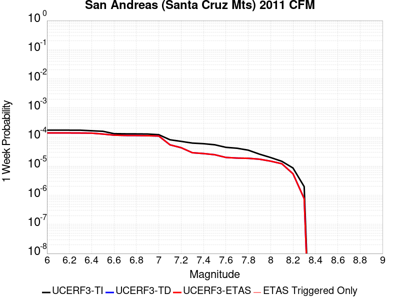 |  |  |  |

| Magnitude | 1 wk TI Prob | 1 wk TD Prob | 1 wk ETAS Prob | 1 wk ETAS/TD Gain | 1 wk ETAS Triggered Only | 1 mo TI Prob | 1 mo TD Prob | 1 mo ETAS Prob | 1 mo ETAS/TD Gain | 1 mo ETAS Triggered Only | 1 yr TI Prob | 1 yr TD Prob | 1 yr ETAS Prob | 1 yr ETAS/TD Gain | 1 yr ETAS Triggered Only | 10 yr TI Prob | 10 yr TD Prob | 10 yr ETAS Prob | 10 yr ETAS/TD Gain | 10 yr ETAS Triggered Only |
|-----|-----|-----|-----|-----|-----|-----|-----|-----|-----|-----|-----|-----|-----|-----|-----|-----|-----|-----|-----|-----|
| 6.0 | 1.7221631E-4 | 1.3799455E-4 | 1.3799455E-4 | 1.0 | 0.0 | 7.378611E-4 | 5.912732E-4 | 5.912732E-4 | 1.0 | 0.0 | 0.008946515 | 0.007175434 | 0.007175434 | 1.0 | 0.0 | 0.08594794 | 0.0705909 | 0.07060949 | 1.0002633 | 2.0E-5 |
| 6.1 | 1.7221631E-4 | 1.3799455E-4 | 1.3799455E-4 | 1.0 | 0.0 | 7.378611E-4 | 5.912732E-4 | 5.912732E-4 | 1.0 | 0.0 | 0.008946515 | 0.007175434 | 0.007175434 | 1.0 | 0.0 | 0.08594794 | 0.0705909 | 0.07060949 | 1.0002633 | 2.0E-5 |
| 6.2 | 1.7221631E-4 | 1.3799455E-4 | 1.3799455E-4 | 1.0 | 0.0 | 7.378611E-4 | 5.912732E-4 | 5.912732E-4 | 1.0 | 0.0 | 0.008946515 | 0.007175434 | 0.007175434 | 1.0 | 0.0 | 0.08594794 | 0.0705909 | 0.07060949 | 1.0002633 | 2.0E-5 |
| 6.3 | 1.716926E-4 | 1.3718852E-4 | 1.3718852E-4 | 1.0 | 0.0 | 7.3561794E-4 | 5.8782037E-4 | 5.8782037E-4 | 1.0 | 0.0 | 0.008919428 | 0.0071336706 | 0.0071336706 | 1.0 | 0.0 | 0.08569809 | 0.07020574 | 0.07022434 | 1.0002649 | 2.0E-5 |
| 6.4 | 1.6392978E-4 | 1.3594677E-4 | 1.3594677E-4 | 1.0 | 0.0 | 7.02367E-4 | 5.82501E-4 | 5.82501E-4 | 1.0 | 0.0 | 0.008517839 | 0.007069328 | 0.007069328 | 1.0 | 0.0 | 0.08198654 | 0.06943973 | 0.06945834 | 1.000268 | 2.0E-5 |
| 6.5 | 1.5742714E-4 | 1.2654555E-4 | 1.2654555E-4 | 1.0 | 0.0 | 6.745133E-4 | 5.4222706E-4 | 5.4222706E-4 | 1.0 | 0.0 | 0.00818132 | 0.0065820105 | 0.0065820105 | 1.0 | 0.0 | 0.078865945 | 0.06490567 | 0.064924374 | 1.0002881 | 2.0E-5 |
| 6.6 | 1.3038084E-4 | 1.1594578E-4 | 1.1594578E-4 | 1.0 | 0.0 | 5.5865536E-4 | 4.9681717E-4 | 4.9681717E-4 | 1.0 | 0.0 | 0.006780438 | 0.006032269 | 0.006032269 | 1.0 | 0.0 | 0.0657725 | 0.05936088 | 0.059379693 | 1.000317 | 2.0E-5 |
| 6.7 | 1.2867592E-4 | 1.1321072E-4 | 1.1321072E-4 | 1.0 | 0.0 | 5.5135164E-4 | 4.8509985E-4 | 4.8509985E-4 | 1.0 | 0.0 | 0.0066920654 | 0.0058903894 | 0.0058903894 | 1.0 | 0.0 | 0.06494093 | 0.0580718 | 0.05809064 | 1.0003244 | 2.0E-5 |
| 6.8 | 1.2801298E-4 | 1.12586225E-4 | 1.12586225E-4 | 1.0 | 0.0 | 5.485117E-4 | 4.8242445E-4 | 4.8242445E-4 | 1.0 | 0.0 | 0.0066577005 | 0.005857939 | 0.005857939 | 1.0 | 0.0 | 0.06461738 | 0.05778563 | 0.057804476 | 1.0003262 | 2.0E-5 |
| 6.9 | 1.269149E-4 | 1.1100813E-4 | 1.1100813E-4 | 1.0 | 0.0 | 5.4380763E-4 | 4.7566366E-4 | 4.7566366E-4 | 1.0 | 0.0 | 0.006600777 | 0.0057760654 | 0.0057760654 | 1.0 | 0.0 | 0.06408122 | 0.05705746 | 0.057076316 | 1.0003306 | 2.0E-5 |
| 7.0 | 1.2030331E-4 | 1.0830798E-4 | 1.0830798E-4 | 1.0 | 0.0 | 5.154837E-4 | 4.6409573E-4 | 4.6409573E-4 | 1.0 | 0.0 | 0.006257969 | 0.0056359624 | 0.0056359624 | 1.0 | 0.0 | 0.06084648 | 0.055730198 | 0.05574908 | 1.0003389 | 2.0E-5 |
| 7.1 | 8.049617E-5 | 5.3974167E-5 | 5.3974167E-5 | 1.0 | 0.0 | 3.4493793E-4 | 2.3129754E-4 | 2.3129754E-4 | 1.0 | 0.0 | 0.0041915346 | 0.0028124459 | 0.0028124459 | 1.0 | 0.0 | 0.041133516 | 0.02964185 | 0.029661257 | 1.0006547 | 2.0E-5 |
| 7.2 | 7.093979E-5 | 4.2981093E-5 | 4.2981093E-5 | 1.0 | 0.0 | 3.0399222E-4 | 1.8419181E-4 | 1.8419181E-4 | 1.0 | 0.0 | 0.0036948253 | 0.0022402517 | 0.0022402517 | 1.0 | 0.0 | 0.03633994 | 0.023962723 | 0.023982244 | 1.0008147 | 2.0E-5 |
| 7.3 | 6.193693E-5 | 2.892363E-5 | 2.892363E-5 | 1.0 | 0.0 | 2.6541698E-4 | 1.2395254E-4 | 1.2395254E-4 | 1.0 | 0.0 | 0.0032266637 | 0.0015080792 | 0.0015080792 | 1.0 | 0.0 | 0.031802133 | 0.016514132 | 0.016523967 | 1.0005956 | 1.0E-5 |
| 7.4 | 5.906492E-5 | 2.704955E-5 | 2.704955E-5 | 1.0 | 0.0 | 2.5311083E-4 | 1.15921495E-4 | 1.15921495E-4 | 1.0 | 0.0 | 0.0030772698 | 0.0014104319 | 0.0014104319 | 1.0 | 0.0 | 0.030350044 | 0.015484477 | 0.015494322 | 1.0006359 | 1.0E-5 |
| 7.5 | 5.424296E-5 | 2.4700184E-5 | 2.4700184E-5 | 1.0 | 0.0 | 2.324491E-4 | 1.0585365E-4 | 1.0585365E-4 | 1.0 | 0.0 | 0.002826395 | 0.0012880075 | 0.0012880075 | 1.0 | 0.0 | 0.027907165 | 0.01417464 | 0.014184499 | 1.0006955 | 1.0E-5 |
| 7.6 | 4.43084E-5 | 1.9918234E-5 | 1.9918234E-5 | 1.0 | 0.0 | 1.8987931E-4 | 8.536106E-5 | 8.536106E-5 | 1.0 | 0.0 | 0.0023093296 | 0.0010387758 | 0.0010387758 | 1.0 | 0.0 | 0.022854783 | 0.011420152 | 0.011430038 | 1.0008657 | 1.0E-5 |
| 7.7 | 4.118098E-5 | 1.8949535E-5 | 1.8949535E-5 | 1.0 | 0.0 | 1.7647797E-4 | 8.1209764E-5 | 8.1209764E-5 | 1.0 | 0.0 | 0.002146502 | 9.882806E-4 | 9.882806E-4 | 1.0 | 0.0 | 0.021258866 | 0.0108775245 | 0.010887415 | 1.0009093 | 1.0E-5 |
| 7.8 | 3.5408906E-5 | 1.85772E-5 | 1.85772E-5 | 1.0 | 0.0 | 1.5174363E-4 | 7.961415E-5 | 7.961415E-5 | 1.0 | 0.0 | 0.0018459131 | 9.688714E-4 | 9.688714E-4 | 1.0 | 0.0 | 0.018306552 | 0.010658879 | 0.010668772 | 1.0009282 | 1.0E-5 |
| 7.9 | 2.5860836E-5 | 1.7327653E-5 | 1.7327653E-5 | 1.0 | 0.0 | 1.10827445E-4 | 7.425925E-5 | 7.425925E-5 | 1.0 | 0.0 | 0.001348489 | 9.037317E-4 | 9.037317E-4 | 1.0 | 0.0 | 0.013403354 | 0.00991376 | 0.009923661 | 1.0009987 | 1.0E-5 |
| 8.0 | 1.9777332E-5 | 1.4849638E-5 | 1.4849638E-5 | 1.0 | 0.0 | 8.4757245E-5 | 6.363975E-5 | 6.363975E-5 | 1.0 | 0.0 | 0.0010314309 | 7.745388E-4 | 7.745388E-4 | 1.0 | 0.0 | 0.010266567 | 0.008514252 | 0.008524166 | 1.0011646 | 1.0E-5 |
| 8.1 | 1.468494E-5 | 1.21155035E-5 | 1.21155035E-5 | 1.0 | 0.0 | 6.293394E-5 | 5.1922554E-5 | 5.1922554E-5 | 1.0 | 0.0 | 7.6595135E-4 | 6.319739E-4 | 6.319739E-4 | 1.0 | 0.0 | 0.0076331664 | 0.00697351 | 0.00697351 | 1.0 | 0.0 |
| 8.2 | 8.63836E-6 | 5.472861E-6 | 5.472861E-6 | 1.0 | 0.0 | 3.7021015E-5 | 2.3454908E-5 | 2.3454908E-5 | 1.0 | 0.0 | 4.5063766E-4 | 2.8552618E-4 | 2.8552618E-4 | 1.0 | 0.0 | 0.004497249 | 0.0032478282 | 0.0032478282 | 1.0 | 0.0 |
| 8.3 | 1.983087E-6 | 7.6647797E-7 | 7.6647797E-7 | 1.0 | 0.0 | 8.498917E-6 | 3.2849016E-6 | 3.2849016E-6 | 1.0 | 0.0 | 1.034694E-4 | 3.999296E-5 | 3.999296E-5 | 1.0 | 0.0 | 0.0010342124 | 4.7228087E-4 | 4.7228087E-4 | 1.0 | 0.0 |

## Sierra Madre
*[(top)](#table-of-contents)*

| 1 Week | 1 Month | 1 Year | 10 Year |
|-----|-----|-----|-----|
|  |  |  |  |

| Magnitude | 1 wk TI Prob | 1 wk TD Prob | 1 wk ETAS Prob | 1 wk ETAS/TD Gain | 1 wk ETAS Triggered Only | 1 mo TI Prob | 1 mo TD Prob | 1 mo ETAS Prob | 1 mo ETAS/TD Gain | 1 mo ETAS Triggered Only | 1 yr TI Prob | 1 yr TD Prob | 1 yr ETAS Prob | 1 yr ETAS/TD Gain | 1 yr ETAS Triggered Only | 10 yr TI Prob | 10 yr TD Prob | 10 yr ETAS Prob | 10 yr ETAS/TD Gain | 10 yr ETAS Triggered Only |
|-----|-----|-----|-----|-----|-----|-----|-----|-----|-----|-----|-----|-----|-----|-----|-----|-----|-----|-----|-----|-----|
| 6.0 | 1.3379373E-5 | 1.1001147E-5 | 1.1001147E-5 | 1.0 | 0.0 | 5.7338908E-5 | 4.7146932E-5 | 4.7146932E-5 | 1.0 | 0.0 | 6.978776E-4 | 5.7386415E-4 | 5.8385846E-4 | 1.0174158 | 1.0E-5 | 0.0069569005 | 0.0057240664 | 0.0057439515 | 1.003474 | 2.0E-5 |
| 6.1 | 1.3379373E-5 | 1.1001147E-5 | 1.1001147E-5 | 1.0 | 0.0 | 5.7338908E-5 | 4.7146932E-5 | 4.7146932E-5 | 1.0 | 0.0 | 6.978776E-4 | 5.7386415E-4 | 5.8385846E-4 | 1.0174158 | 1.0E-5 | 0.0069569005 | 0.0057240664 | 0.0057439515 | 1.003474 | 2.0E-5 |
| 6.2 | 1.3379373E-5 | 1.1001147E-5 | 1.1001147E-5 | 1.0 | 0.0 | 5.7338908E-5 | 4.7146932E-5 | 4.7146932E-5 | 1.0 | 0.0 | 6.978776E-4 | 5.7386415E-4 | 5.8385846E-4 | 1.0174158 | 1.0E-5 | 0.0069569005 | 0.0057240664 | 0.0057439515 | 1.003474 | 2.0E-5 |
| 6.3 | 1.3379373E-5 | 1.1001147E-5 | 1.1001147E-5 | 1.0 | 0.0 | 5.7338908E-5 | 4.7146932E-5 | 4.7146932E-5 | 1.0 | 0.0 | 6.978776E-4 | 5.7386415E-4 | 5.8385846E-4 | 1.0174158 | 1.0E-5 | 0.0069569005 | 0.0057240664 | 0.0057439515 | 1.003474 | 2.0E-5 |
| 6.4 | 1.3379373E-5 | 1.1001147E-5 | 1.1001147E-5 | 1.0 | 0.0 | 5.7338908E-5 | 4.7146932E-5 | 4.7146932E-5 | 1.0 | 0.0 | 6.978776E-4 | 5.7386415E-4 | 5.8385846E-4 | 1.0174158 | 1.0E-5 | 0.0069569005 | 0.0057240664 | 0.0057439515 | 1.003474 | 2.0E-5 |
| 6.5 | 1.26563245E-5 | 1.0230597E-5 | 1.0230597E-5 | 1.0 | 0.0 | 5.4240263E-5 | 4.3844684E-5 | 4.3844684E-5 | 1.0 | 0.0 | 6.601751E-4 | 5.336793E-4 | 5.336793E-4 | 1.0 | 0.0 | 0.006582173 | 0.0053241784 | 0.0053241784 | 1.0 | 0.0 |
| 6.6 | 1.26563245E-5 | 1.0230597E-5 | 1.0230597E-5 | 1.0 | 0.0 | 5.4240263E-5 | 4.3844684E-5 | 4.3844684E-5 | 1.0 | 0.0 | 6.601751E-4 | 5.336793E-4 | 5.336793E-4 | 1.0 | 0.0 | 0.006582173 | 0.0053241784 | 0.0053241784 | 1.0 | 0.0 |
| 6.7 | 1.2502474E-5 | 1.0066739E-5 | 1.0066739E-5 | 1.0 | 0.0 | 5.3580934E-5 | 4.314246E-5 | 4.314246E-5 | 1.0 | 0.0 | 6.521526E-4 | 5.251339E-4 | 5.251339E-4 | 1.0 | 0.0 | 0.0065024206 | 0.0052391286 | 0.0052391286 | 1.0 | 0.0 |
| 6.8 | 1.2454966E-5 | 1.0019025E-5 | 1.0019025E-5 | 1.0 | 0.0 | 5.3377335E-5 | 4.2937972E-5 | 4.2937972E-5 | 1.0 | 0.0 | 6.4967526E-4 | 5.226455E-4 | 5.226455E-4 | 1.0 | 0.0 | 0.006477792 | 0.005214361 | 0.005214361 | 1.0 | 0.0 |
| 6.9 | 1.2225574E-5 | 9.793E-6 | 9.793E-6 | 1.0 | 0.0 | 5.2394265E-5 | 4.1969328E-5 | 4.1969328E-5 | 1.0 | 0.0 | 6.3771347E-4 | 5.108578E-4 | 5.108578E-4 | 1.0 | 0.0 | 0.006358865 | 0.0050970297 | 0.0050970297 | 1.0 | 0.0 |
| 7.0 | 1.182946E-5 | 9.399537E-6 | 9.399537E-6 | 1.0 | 0.0 | 5.06967E-5 | 4.0283114E-5 | 4.0283114E-5 | 1.0 | 0.0 | 6.1705755E-4 | 4.9033755E-4 | 4.9033755E-4 | 1.0 | 0.0 | 0.006153469 | 0.0048927474 | 0.0048927474 | 1.0 | 0.0 |
| 7.1 | 1.14369095E-5 | 8.986543E-6 | 8.986543E-6 | 1.0 | 0.0 | 4.9014405E-5 | 3.8513193E-5 | 3.8513193E-5 | 1.0 | 0.0 | 5.9658696E-4 | 4.6879821E-4 | 4.6879821E-4 | 1.0 | 0.0 | 0.005949879 | 0.0046782778 | 0.0046782778 | 1.0 | 0.0 |
| 7.2 | 1.0836419E-5 | 8.399933E-6 | 8.399933E-6 | 1.0 | 0.0 | 4.644097E-5 | 3.599922E-5 | 3.599922E-5 | 1.0 | 0.0 | 5.652721E-4 | 4.3820328E-4 | 4.3820328E-4 | 1.0 | 0.0 | 0.0056383642 | 0.0043735686 | 0.0043735686 | 1.0 | 0.0 |
| 7.3 | 1.0403439E-5 | 8.021192E-6 | 8.021192E-6 | 1.0 | 0.0 | 4.4585406E-5 | 3.437609E-5 | 3.437609E-5 | 1.0 | 0.0 | 5.426921E-4 | 4.1844943E-4 | 4.1844943E-4 | 1.0 | 0.0 | 0.005413687 | 0.0041767894 | 0.0041767894 | 1.0 | 0.0 |
| 7.4 | 9.768864E-6 | 7.4148143E-6 | 7.4148143E-6 | 1.0 | 0.0 | 4.186589E-5 | 3.1777392E-5 | 3.1777392E-5 | 1.0 | 0.0 | 5.09598E-4 | 3.8682195E-4 | 3.8682195E-4 | 1.0 | 0.0 | 0.0050843097 | 0.0038616573 | 0.0038616573 | 1.0 | 0.0 |
| 7.5 | 8.687089E-6 | 6.450497E-6 | 6.450497E-6 | 1.0 | 0.0 | 3.722985E-5 | 2.7644699E-5 | 2.7644699E-5 | 1.0 | 0.0 | 4.5317915E-4 | 3.3652308E-4 | 3.3652308E-4 | 1.0 | 0.0 | 0.004522561 | 0.003360301 | 0.003360301 | 1.0 | 0.0 |
| 7.6 | 6.3506063E-6 | 4.4306207E-6 | 4.4306207E-6 | 1.0 | 0.0 | 2.72166E-5 | 1.8988238E-5 | 1.8988238E-5 | 1.0 | 0.0 | 3.3131172E-4 | 2.3115752E-4 | 2.3115752E-4 | 1.0 | 0.0 | 0.003308182 | 0.0023092744 | 0.0023092744 | 1.0 | 0.0 |
| 7.7 | 4.62223E-6 | 2.9332343E-6 | 2.9332343E-6 | 1.0 | 0.0 | 1.9809406E-5 | 1.2570943E-5 | 1.2570943E-5 | 1.0 | 0.0 | 2.4115283E-4 | 1.5304051E-4 | 1.5304051E-4 | 1.0 | 0.0 | 0.0024089129 | 0.0015294303 | 0.0015294303 | 1.0 | 0.0 |
| 7.8 | 3.2145008E-6 | 1.949628E-6 | 1.949628E-6 | 1.0 | 0.0 | 1.3776359E-5 | 8.355522E-6 | 8.355522E-6 | 1.0 | 0.0 | 1.6771426E-4 | 1.0172375E-4 | 1.0172375E-4 | 1.0 | 0.0 | 0.0016758774 | 0.0010167895 | 0.0010167895 | 1.0 | 0.0 |
| 7.9 | 1.0391769E-6 | 5.6032485E-7 | 5.6032485E-7 | 1.0 | 0.0 | 4.4536077E-6 | 2.40139E-6 | 2.40139E-6 | 1.0 | 0.0 | 5.4221324E-5 | 2.9236535E-5 | 2.9236535E-5 | 1.0 | 0.0 | 5.4208096E-4 | 2.923273E-4 | 2.923273E-4 | 1.0 | 0.0 |
| 8.0 | 1.210983E-7 | 6.6138576E-8 | 6.6138576E-8 | 1.0 | 0.0 | 5.1899264E-7 | 2.8345102E-7 | 2.8345102E-7 | 1.0 | 0.0 | 6.3187167E-6 | 3.4510108E-6 | 3.4510108E-6 | 1.0 | 0.0 | 6.318537E-5 | 3.450959E-5 | 3.450959E-5 | 1.0 | 0.0 |

## Oak Ridge (Onshore)
*[(top)](#table-of-contents)*

| 1 Week | 1 Month | 1 Year | 10 Year |
|-----|-----|-----|-----|
|  |  |  |  |

| Magnitude | 1 wk TI Prob | 1 wk TD Prob | 1 wk ETAS Prob | 1 wk ETAS/TD Gain | 1 wk ETAS Triggered Only | 1 mo TI Prob | 1 mo TD Prob | 1 mo ETAS Prob | 1 mo ETAS/TD Gain | 1 mo ETAS Triggered Only | 1 yr TI Prob | 1 yr TD Prob | 1 yr ETAS Prob | 1 yr ETAS/TD Gain | 1 yr ETAS Triggered Only | 10 yr TI Prob | 10 yr TD Prob | 10 yr ETAS Prob | 10 yr ETAS/TD Gain | 10 yr ETAS Triggered Only |
|-----|-----|-----|-----|-----|-----|-----|-----|-----|-----|-----|-----|-----|-----|-----|-----|-----|-----|-----|-----|-----|
| 6.0 | 3.155064E-5 | 2.9526547E-5 | 2.9526547E-5 | 1.0 | 0.0 | 1.3521002E-4 | 1.2653643E-4 | 1.2653643E-4 | 1.0 | 0.0 | 0.001644939 | 0.0015395303 | 0.001549515 | 1.0064855 | 1.0E-5 | 0.01632816 | 0.015293304 | 0.015312998 | 1.0012878 | 2.0E-5 |
| 6.1 | 3.155064E-5 | 2.9526547E-5 | 2.9526547E-5 | 1.0 | 0.0 | 1.3521002E-4 | 1.2653643E-4 | 1.2653643E-4 | 1.0 | 0.0 | 0.001644939 | 0.0015395303 | 0.001549515 | 1.0064855 | 1.0E-5 | 0.01632816 | 0.015293304 | 0.015312998 | 1.0012878 | 2.0E-5 |
| 6.2 | 3.155064E-5 | 2.9526547E-5 | 2.9526547E-5 | 1.0 | 0.0 | 1.3521002E-4 | 1.2653643E-4 | 1.2653643E-4 | 1.0 | 0.0 | 0.001644939 | 0.0015395303 | 0.001549515 | 1.0064855 | 1.0E-5 | 0.01632816 | 0.015293304 | 0.015312998 | 1.0012878 | 2.0E-5 |
| 6.3 | 3.155064E-5 | 2.9526547E-5 | 2.9526547E-5 | 1.0 | 0.0 | 1.3521002E-4 | 1.2653643E-4 | 1.2653643E-4 | 1.0 | 0.0 | 0.001644939 | 0.0015395303 | 0.001549515 | 1.0064855 | 1.0E-5 | 0.01632816 | 0.015293304 | 0.015312998 | 1.0012878 | 2.0E-5 |
| 6.4 | 3.155064E-5 | 2.9526547E-5 | 2.9526547E-5 | 1.0 | 0.0 | 1.3521002E-4 | 1.2653643E-4 | 1.2653643E-4 | 1.0 | 0.0 | 0.001644939 | 0.0015395303 | 0.001549515 | 1.0064855 | 1.0E-5 | 0.01632816 | 0.015293304 | 0.015312998 | 1.0012878 | 2.0E-5 |
| 6.5 | 3.155064E-5 | 2.9526547E-5 | 2.9526547E-5 | 1.0 | 0.0 | 1.3521002E-4 | 1.2653643E-4 | 1.2653643E-4 | 1.0 | 0.0 | 0.001644939 | 0.0015395303 | 0.001549515 | 1.0064855 | 1.0E-5 | 0.01632816 | 0.015293304 | 0.015312998 | 1.0012878 | 2.0E-5 |
| 6.6 | 3.155064E-5 | 2.9526547E-5 | 2.9526547E-5 | 1.0 | 0.0 | 1.3521002E-4 | 1.2653643E-4 | 1.2653643E-4 | 1.0 | 0.0 | 0.001644939 | 0.0015395303 | 0.001549515 | 1.0064855 | 1.0E-5 | 0.01632816 | 0.015293304 | 0.015312998 | 1.0012878 | 2.0E-5 |
| 6.7 | 3.098897E-5 | 2.8864733E-5 | 2.8864733E-5 | 1.0 | 0.0 | 1.328031E-4 | 1.2370035E-4 | 1.2370035E-4 | 1.0 | 0.0 | 0.0016156785 | 0.001505049 | 0.0015150339 | 1.0066344 | 1.0E-5 | 0.016039822 | 0.01495315 | 0.014972852 | 1.0013175 | 2.0E-5 |
| 6.8 | 3.0449872E-5 | 2.8239918E-5 | 2.8239918E-5 | 1.0 | 0.0 | 1.3049292E-4 | 1.21022815E-4 | 1.21022815E-4 | 1.0 | 0.0 | 0.0015875935 | 0.0014724941 | 0.0014824794 | 1.0067812 | 1.0E-5 | 0.015762992 | 0.014631892 | 0.014651599 | 1.0013468 | 2.0E-5 |
| 6.9 | 2.697928E-5 | 2.4220235E-5 | 2.4220235E-5 | 1.0 | 0.0 | 1.15620365E-4 | 1.03797E-4 | 1.03797E-4 | 1.0 | 0.0 | 0.0014067689 | 0.0012630174 | 0.0012730047 | 1.0079075 | 1.0E-5 | 0.0139789665 | 0.012561257 | 0.012581006 | 1.0015723 | 2.0E-5 |
| 7.0 | 2.4893961E-5 | 2.1862457E-5 | 2.1862457E-5 | 1.0 | 0.0 | 1.0668404E-4 | 9.369298E-5 | 9.369298E-5 | 1.0 | 0.0 | 0.0012981043 | 0.0011401328 | 0.0011501214 | 1.0087609 | 1.0E-5 | 0.012905477 | 0.011345269 | 0.011365043 | 1.0017428 | 2.0E-5 |
| 7.1 | 2.0945363E-5 | 1.7354816E-5 | 1.7354816E-5 | 1.0 | 0.0 | 8.976275E-5 | 7.437569E-5 | 7.437569E-5 | 1.0 | 0.0 | 0.0010923136 | 9.051526E-4 | 9.151436E-4 | 1.0110378 | 1.0E-5 | 0.0108696 | 0.009015744 | 0.009025653 | 1.0010992 | 1.0E-5 |
| 7.2 | 2.0439404E-5 | 1.6809745E-5 | 1.6809745E-5 | 1.0 | 0.0 | 8.7594504E-5 | 7.2039795E-5 | 7.2039795E-5 | 1.0 | 0.0 | 0.0010659413 | 8.767363E-4 | 8.8672753E-4 | 1.0113959 | 1.0E-5 | 0.010608427 | 0.008733843 | 0.0087437555 | 1.001135 | 1.0E-5 |
| 7.3 | 1.8463334E-5 | 1.5382124E-5 | 1.5382124E-5 | 1.0 | 0.0 | 7.912617E-5 | 6.592175E-5 | 6.592175E-5 | 1.0 | 0.0 | 9.6293533E-4 | 8.0230605E-4 | 8.1229804E-4 | 1.012454 | 1.0E-5 | 0.009587734 | 0.00799511 | 0.0080050295 | 1.0012407 | 1.0E-5 |
| 7.4 | 1.763139E-5 | 1.4517136E-5 | 1.4517136E-5 | 1.0 | 0.0 | 7.556091E-5 | 6.2214836E-5 | 6.2214836E-5 | 1.0 | 0.0 | 9.1956573E-4 | 7.5720635E-4 | 7.671988E-4 | 1.0131965 | 1.0E-5 | 0.009157699 | 0.007547218 | 0.007557142 | 1.001315 | 1.0E-5 |
| 7.5 | 1.3594944E-5 | 1.1163481E-5 | 1.1163481E-5 | 1.0 | 0.0 | 5.8262744E-5 | 4.7842626E-5 | 4.7842626E-5 | 1.0 | 0.0 | 7.0911803E-4 | 5.8233086E-4 | 5.8233086E-4 | 1.0 | 0.0 | 0.007068595 | 0.0058084945 | 0.0058084945 | 1.0 | 0.0 |
| 7.6 | 6.9889534E-6 | 5.6367644E-6 | 5.6367644E-6 | 1.0 | 0.0 | 2.9952313E-5 | 2.4157342E-5 | 2.4157342E-5 | 1.0 | 0.0 | 3.646084E-4 | 2.9407637E-4 | 2.9407637E-4 | 1.0 | 0.0 | 0.0036401073 | 0.002936916 | 0.002936916 | 1.0 | 0.0 |
| 7.7 | 4.0824193E-6 | 3.2832984E-6 | 3.2832984E-6 | 1.0 | 0.0 | 1.7495966E-5 | 1.4071204E-5 | 1.4071204E-5 | 1.0 | 0.0 | 2.1299256E-4 | 1.7130356E-4 | 1.7130356E-4 | 1.0 | 0.0 | 0.0021278851 | 0.0017117286 | 0.0017117286 | 1.0 | 0.0 |
| 7.8 | 1.7023609E-6 | 1.4370712E-6 | 1.4370712E-6 | 1.0 | 0.0 | 7.295812E-6 | 6.158862E-6 | 6.158862E-6 | 1.0 | 0.0 | 8.882289E-5 | 7.4981595E-5 | 7.4981595E-5 | 1.0 | 0.0 | 8.8787393E-4 | 7.495657E-4 | 7.495657E-4 | 1.0 | 0.0 |
| 7.9 | 2.721225E-7 | 2.2617078E-7 | 2.2617078E-7 | 1.0 | 0.0 | 1.1662388E-6 | 9.69303E-7 | 9.69303E-7 | 1.0 | 0.0 | 1.4198865E-5 | 1.1801203E-5 | 1.1801203E-5 | 1.0 | 0.0 | 1.4197957E-4 | 1.1800604E-4 | 1.1800604E-4 | 1.0 | 0.0 |
| 8.0 | 9.364255E-9 | 5.1208513E-9 | 5.1208513E-9 | 1.0 | 0.0 | 4.0132523E-8 | 2.1946507E-8 | 2.1946507E-8 | 1.0 | 0.0 | 4.8861335E-7 | 2.671987E-7 | 2.671987E-7 | 1.0 | 0.0 | 4.8861225E-6 | 2.671984E-6 | 2.671984E-6 | 1.0 | 0.0 |

## Oceanside alt1
*[(top)](#table-of-contents)*

| 1 Week | 1 Month | 1 Year | 10 Year |
|-----|-----|-----|-----|
|  | 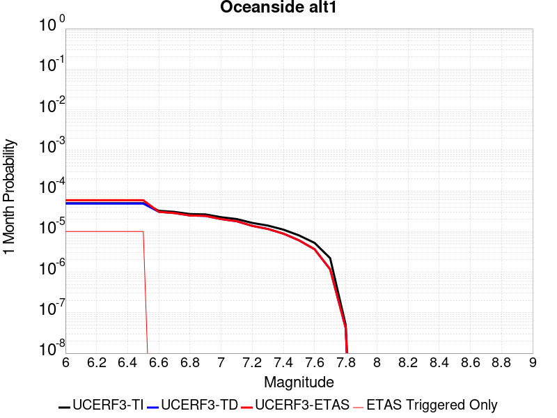 |  | 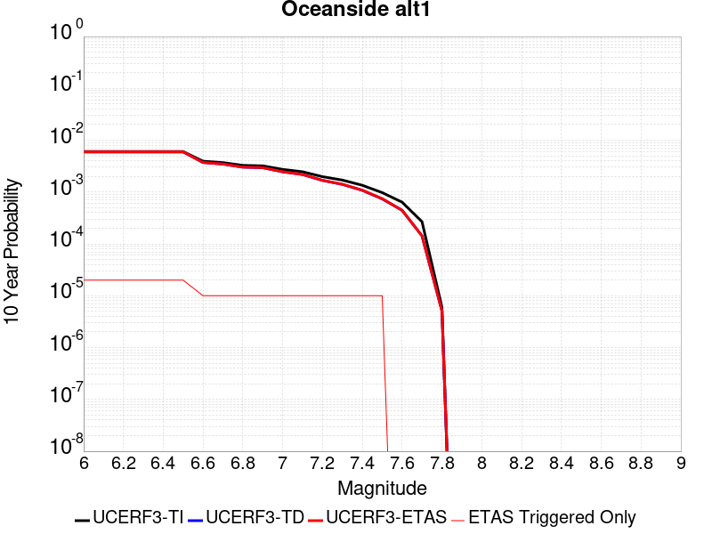 |

| Magnitude | 1 wk TI Prob | 1 wk TD Prob | 1 wk ETAS Prob | 1 wk ETAS/TD Gain | 1 wk ETAS Triggered Only | 1 mo TI Prob | 1 mo TD Prob | 1 mo ETAS Prob | 1 mo ETAS/TD Gain | 1 mo ETAS Triggered Only | 1 yr TI Prob | 1 yr TD Prob | 1 yr ETAS Prob | 1 yr ETAS/TD Gain | 1 yr ETAS Triggered Only | 10 yr TI Prob | 10 yr TD Prob | 10 yr ETAS Prob | 10 yr ETAS/TD Gain | 10 yr ETAS Triggered Only |
|-----|-----|-----|-----|-----|-----|-----|-----|-----|-----|-----|-----|-----|-----|-----|-----|-----|-----|-----|-----|-----|
| 6.0 | 1.1617542E-5 | 1.1423561E-5 | 1.1423561E-5 | 1.0 | 0.0 | 4.9788516E-5 | 4.895729E-5 | 5.89568E-5 | 1.2042496 | 1.0E-5 | 6.060066E-4 | 5.959081E-4 | 6.158962E-4 | 1.0335423 | 2.0E-5 | 0.0060435664 | 0.0059446995 | 0.005964581 | 1.0033443 | 2.0E-5 |
| 6.1 | 1.1617542E-5 | 1.1423561E-5 | 1.1423561E-5 | 1.0 | 0.0 | 4.9788516E-5 | 4.895729E-5 | 5.89568E-5 | 1.2042496 | 1.0E-5 | 6.060066E-4 | 5.959081E-4 | 6.158962E-4 | 1.0335423 | 2.0E-5 | 0.0060435664 | 0.0059446995 | 0.005964581 | 1.0033443 | 2.0E-5 |
| 6.2 | 1.1617542E-5 | 1.1423561E-5 | 1.1423561E-5 | 1.0 | 0.0 | 4.9788516E-5 | 4.895729E-5 | 5.89568E-5 | 1.2042496 | 1.0E-5 | 6.060066E-4 | 5.959081E-4 | 6.158962E-4 | 1.0335423 | 2.0E-5 | 0.0060435664 | 0.0059446995 | 0.005964581 | 1.0033443 | 2.0E-5 |
| 6.3 | 1.1617542E-5 | 1.1423561E-5 | 1.1423561E-5 | 1.0 | 0.0 | 4.9788516E-5 | 4.895729E-5 | 5.89568E-5 | 1.2042496 | 1.0E-5 | 6.060066E-4 | 5.959081E-4 | 6.158962E-4 | 1.0335423 | 2.0E-5 | 0.0060435664 | 0.0059446995 | 0.005964581 | 1.0033443 | 2.0E-5 |
| 6.4 | 1.1617542E-5 | 1.1423561E-5 | 1.1423561E-5 | 1.0 | 0.0 | 4.9788516E-5 | 4.895729E-5 | 5.89568E-5 | 1.2042496 | 1.0E-5 | 6.060066E-4 | 5.959081E-4 | 6.158962E-4 | 1.0335423 | 2.0E-5 | 0.0060435664 | 0.0059446995 | 0.005964581 | 1.0033443 | 2.0E-5 |
| 6.5 | 1.1617542E-5 | 1.1423561E-5 | 1.1423561E-5 | 1.0 | 0.0 | 4.9788516E-5 | 4.895729E-5 | 5.89568E-5 | 1.2042496 | 1.0E-5 | 6.060066E-4 | 5.959081E-4 | 6.158962E-4 | 1.0335423 | 2.0E-5 | 0.0060435664 | 0.0059446995 | 0.005964581 | 1.0033443 | 2.0E-5 |
| 6.6 | 7.561768E-6 | 7.133651E-6 | 7.133651E-6 | 1.0 | 0.0 | 3.2407173E-5 | 3.057244E-5 | 3.057244E-5 | 1.0 | 0.0 | 3.9448592E-4 | 3.7215694E-4 | 3.821532E-4 | 1.0268604 | 1.0E-5 | 0.0039378637 | 0.0037154485 | 0.0037254114 | 1.0026815 | 1.0E-5 |
| 6.7 | 7.1042605E-6 | 6.655718E-6 | 6.655718E-6 | 1.0 | 0.0 | 3.0446476E-5 | 2.85242E-5 | 2.85242E-5 | 1.0 | 0.0 | 3.706228E-4 | 3.472276E-4 | 3.572241E-4 | 1.0287895 | 1.0E-5 | 0.0037000529 | 0.003466934 | 0.0034768994 | 1.0028744 | 1.0E-5 |
| 6.8 | 6.285554E-6 | 5.799733E-6 | 5.799733E-6 | 1.0 | 0.0 | 2.693781E-5 | 2.4855766E-5 | 2.4855766E-5 | 1.0 | 0.0 | 3.2791847E-4 | 3.0257748E-4 | 3.1257447E-4 | 1.0330393 | 1.0E-5 | 0.0032743502 | 0.0030217124 | 0.0030316822 | 1.0032994 | 1.0E-5 |
| 6.9 | 6.148883E-6 | 5.656571E-6 | 5.656571E-6 | 1.0 | 0.0 | 2.635209E-5 | 2.4242225E-5 | 2.4242225E-5 | 1.0 | 0.0 | 3.2078946E-4 | 2.9510967E-4 | 3.0510672E-4 | 1.0338757 | 1.0E-5 | 0.003203268 | 0.0029472348 | 0.0029572053 | 1.003383 | 1.0E-5 |
| 7.0 | 5.253857E-6 | 4.722425E-6 | 4.722425E-6 | 1.0 | 0.0 | 2.2516335E-5 | 2.023881E-5 | 2.023881E-5 | 1.0 | 0.0 | 2.7410188E-4 | 2.4637993E-4 | 2.5637748E-4 | 1.0405778 | 1.0E-5 | 0.0027376404 | 0.0024610993 | 0.0024710747 | 1.0040532 | 1.0E-5 |
| 7.1 | 4.730754E-6 | 4.1785274E-6 | 4.1785274E-6 | 1.0 | 0.0 | 2.0274503E-5 | 1.7907852E-5 | 1.7907852E-5 | 1.0 | 0.0 | 2.468141E-4 | 2.1800655E-4 | 2.2800437E-4 | 1.0458602 | 1.0E-5 | 0.0024654015 | 0.0021779535 | 0.0021879317 | 1.0045815 | 1.0E-5 |
| 7.2 | 3.7998386E-6 | 3.2140354E-6 | 3.2140354E-6 | 1.0 | 0.0 | 1.6284921E-5 | 1.37743655E-5 | 1.37743655E-5 | 1.0 | 0.0 | 1.9825088E-4 | 1.6769012E-4 | 1.7768843E-4 | 1.0596238 | 1.0E-5 | 0.001980741 | 0.001675648 | 0.0016856312 | 1.0059578 | 1.0E-5 |
| 7.3 | 3.2656465E-6 | 2.6983823E-6 | 2.6983823E-6 | 1.0 | 0.0 | 1.3995553E-5 | 1.1564445E-5 | 1.1564445E-5 | 1.0 | 0.0 | 1.7038253E-4 | 1.4078814E-4 | 1.5078673E-4 | 1.0710187 | 1.0E-5 | 0.0017025196 | 0.0014070006 | 0.0014169865 | 1.0070974 | 1.0E-5 |
| 7.4 | 2.593703E-6 | 2.0680366E-6 | 2.0680366E-6 | 1.0 | 0.0 | 1.1115822E-5 | 8.862984E-6 | 8.862984E-6 | 1.0 | 0.0 | 1.3532673E-4 | 1.0790158E-4 | 1.17900505E-4 | 1.0926671 | 1.0E-5 | 0.0013524436 | 0.0010785008 | 0.00108849 | 1.0092621 | 1.0E-5 |
| 7.5 | 1.8715585E-6 | 1.4137331E-6 | 1.4137331E-6 | 1.0 | 0.0 | 8.020941E-6 | 6.0588427E-6 | 6.0588427E-6 | 1.0 | 0.0 | 9.7650576E-5 | 7.376397E-5 | 8.376324E-5 | 1.1355575 | 1.0E-5 | 9.7607676E-4 | 7.3740096E-4 | 7.473936E-4 | 1.0135511 | 1.0E-5 |
| 7.6 | 1.2246786E-6 | 8.526984E-7 | 8.526984E-7 | 1.0 | 0.0 | 5.248612E-6 | 3.6544168E-6 | 3.6544168E-6 | 1.0 | 0.0 | 6.389998E-5 | 4.4491662E-5 | 4.4491662E-5 | 1.0 | 0.0 | 6.3881604E-4 | 4.4483205E-4 | 4.4483205E-4 | 1.0 | 0.0 |
| 7.7 | 5.140719E-7 | 2.7346863E-7 | 2.7346863E-7 | 1.0 | 0.0 | 2.2031636E-6 | 1.172008E-6 | 1.172008E-6 | 1.0 | 0.0 | 2.6823185E-5 | 1.4269117E-5 | 1.4269117E-5 | 1.0 | 0.0 | 2.6819948E-4 | 1.4268335E-4 | 1.4268335E-4 | 1.0 | 0.0 |
| 7.8 | 1.16056995E-8 | 9.782997E-9 | 9.782997E-9 | 1.0 | 0.0 | 4.9738713E-8 | 4.1927127E-8 | 4.1927127E-8 | 1.0 | 0.0 | 6.0556863E-7 | 5.1046277E-7 | 5.1046277E-7 | 1.0 | 0.0 | 6.05567E-6 | 5.1046277E-6 | 5.1046277E-6 | 1.0 | 0.0 |

## Holser alt 1
*[(top)](#table-of-contents)*

| 1 Week | 1 Month | 1 Year | 10 Year |
|-----|-----|-----|-----|
|  |  |  |  |

| Magnitude | 1 wk TI Prob | 1 wk TD Prob | 1 wk ETAS Prob | 1 wk ETAS/TD Gain | 1 wk ETAS Triggered Only | 1 mo TI Prob | 1 mo TD Prob | 1 mo ETAS Prob | 1 mo ETAS/TD Gain | 1 mo ETAS Triggered Only | 1 yr TI Prob | 1 yr TD Prob | 1 yr ETAS Prob | 1 yr ETAS/TD Gain | 1 yr ETAS Triggered Only | 10 yr TI Prob | 10 yr TD Prob | 10 yr ETAS Prob | 10 yr ETAS/TD Gain | 10 yr ETAS Triggered Only |
|-----|-----|-----|-----|-----|-----|-----|-----|-----|-----|-----|-----|-----|-----|-----|-----|-----|-----|-----|-----|-----|
| 6.0 | 6.2746653E-6 | 5.7900243E-6 | 5.7900243E-6 | 1.0 | 0.0 | 2.6891146E-5 | 2.4814219E-5 | 2.4814219E-5 | 1.0 | 0.0 | 3.273505E-4 | 3.0208277E-4 | 3.1207973E-4 | 1.0330935 | 1.0E-5 | 0.0032686873 | 0.0030178542 | 0.003037794 | 1.0066072 | 2.0E-5 |
| 6.1 | 6.2746653E-6 | 5.7900243E-6 | 5.7900243E-6 | 1.0 | 0.0 | 2.6891146E-5 | 2.4814219E-5 | 2.4814219E-5 | 1.0 | 0.0 | 3.273505E-4 | 3.0208277E-4 | 3.1207973E-4 | 1.0330935 | 1.0E-5 | 0.0032686873 | 0.0030178542 | 0.003037794 | 1.0066072 | 2.0E-5 |
| 6.2 | 6.2746653E-6 | 5.7900243E-6 | 5.7900243E-6 | 1.0 | 0.0 | 2.6891146E-5 | 2.4814219E-5 | 2.4814219E-5 | 1.0 | 0.0 | 3.273505E-4 | 3.0208277E-4 | 3.1207973E-4 | 1.0330935 | 1.0E-5 | 0.0032686873 | 0.0030178542 | 0.003037794 | 1.0066072 | 2.0E-5 |
| 6.3 | 6.2746653E-6 | 5.7900243E-6 | 5.7900243E-6 | 1.0 | 0.0 | 2.6891146E-5 | 2.4814219E-5 | 2.4814219E-5 | 1.0 | 0.0 | 3.273505E-4 | 3.0208277E-4 | 3.1207973E-4 | 1.0330935 | 1.0E-5 | 0.0032686873 | 0.0030178542 | 0.003037794 | 1.0066072 | 2.0E-5 |
| 6.4 | 6.2746653E-6 | 5.7900243E-6 | 5.7900243E-6 | 1.0 | 0.0 | 2.6891146E-5 | 2.4814219E-5 | 2.4814219E-5 | 1.0 | 0.0 | 3.273505E-4 | 3.0208277E-4 | 3.1207973E-4 | 1.0330935 | 1.0E-5 | 0.0032686873 | 0.0030178542 | 0.003037794 | 1.0066072 | 2.0E-5 |
| 6.5 | 6.2746653E-6 | 5.7900243E-6 | 5.7900243E-6 | 1.0 | 0.0 | 2.6891146E-5 | 2.4814219E-5 | 2.4814219E-5 | 1.0 | 0.0 | 3.273505E-4 | 3.0208277E-4 | 3.1207973E-4 | 1.0330935 | 1.0E-5 | 0.0032686873 | 0.0030178542 | 0.003037794 | 1.0066072 | 2.0E-5 |
| 6.6 | 3.375825E-6 | 2.7712324E-6 | 2.7712324E-6 | 1.0 | 0.0 | 1.4467741E-5 | 1.18766575E-5 | 1.18766575E-5 | 1.0 | 0.0 | 1.761305E-4 | 1.4458888E-4 | 1.5458743E-4 | 1.0691516 | 1.0E-5 | 0.0017599097 | 0.001444965 | 0.0014649361 | 1.0138211 | 2.0E-5 |
| 6.7 | 3.375825E-6 | 2.7712324E-6 | 2.7712324E-6 | 1.0 | 0.0 | 1.4467741E-5 | 1.18766575E-5 | 1.18766575E-5 | 1.0 | 0.0 | 1.761305E-4 | 1.4458888E-4 | 1.5458743E-4 | 1.0691516 | 1.0E-5 | 0.0017599097 | 0.001444965 | 0.0014649361 | 1.0138211 | 2.0E-5 |
| 6.8 | 3.366533E-6 | 2.761632E-6 | 2.761632E-6 | 1.0 | 0.0 | 1.4427919E-5 | 1.1835513E-5 | 1.1835513E-5 | 1.0 | 0.0 | 1.7564575E-4 | 1.44088E-4 | 1.5408656E-4 | 1.0693921 | 1.0E-5 | 0.0017550698 | 0.0014399628 | 0.0014599339 | 1.0138693 | 2.0E-5 |
| 6.9 | 3.253174E-6 | 2.6438533E-6 | 2.6438533E-6 | 1.0 | 0.0 | 1.39421E-5 | 1.13307515E-5 | 1.13307515E-5 | 1.0 | 0.0 | 1.6973184E-4 | 1.3794332E-4 | 1.3794332E-4 | 1.0 | 0.0 | 0.0016960226 | 0.0013785929 | 0.0013885791 | 1.0072438 | 1.0E-5 |
| 7.0 | 2.9336593E-6 | 2.3118396E-6 | 2.3118396E-6 | 1.0 | 0.0 | 1.2572766E-5 | 9.907846E-6 | 9.907846E-6 | 1.0 | 0.0 | 1.5306266E-4 | 1.2062137E-4 | 1.2062137E-4 | 1.0 | 0.0 | 0.0015295728 | 0.0012055614 | 0.0012155494 | 1.0082849 | 1.0E-5 |
| 7.1 | 2.9087812E-6 | 2.2876916E-6 | 2.2876916E-6 | 1.0 | 0.0 | 1.2466146E-5 | 9.804356E-6 | 9.804356E-6 | 1.0 | 0.0 | 1.5176475E-4 | 1.1936151E-4 | 1.1936151E-4 | 1.0 | 0.0 | 0.0015166114 | 0.0011929765 | 0.0012029646 | 1.0083724 | 1.0E-5 |
| 7.2 | 2.8674524E-6 | 2.2475824E-6 | 2.2475824E-6 | 1.0 | 0.0 | 1.2289024E-5 | 9.632461E-6 | 9.632461E-6 | 1.0 | 0.0 | 1.4960859E-4 | 1.1726892E-4 | 1.1726892E-4 | 1.0 | 0.0 | 0.0014950791 | 0.0011720727 | 0.001182061 | 1.0085219 | 1.0E-5 |
| 7.3 | 2.8057775E-6 | 2.1954718E-6 | 2.1954718E-6 | 1.0 | 0.0 | 1.2024705E-5 | 9.409131E-6 | 9.409131E-6 | 1.0 | 0.0 | 1.4639096E-4 | 1.1455017E-4 | 1.1455017E-4 | 1.0 | 0.0 | 0.0014629456 | 0.0011449135 | 0.001154902 | 1.0087243 | 1.0E-5 |
| 7.4 | 2.683666E-6 | 2.1092687E-6 | 2.1092687E-6 | 1.0 | 0.0 | 1.1501375E-5 | 9.039692E-6 | 9.039692E-6 | 1.0 | 0.0 | 1.4002025E-4 | 1.1005271E-4 | 1.1005271E-4 | 1.0 | 0.0 | 0.0013993206 | 0.0010999843 | 0.0011099733 | 1.009081 | 1.0E-5 |
| 7.5 | 2.434495E-6 | 1.9195734E-6 | 1.9195734E-6 | 1.0 | 0.0 | 1.0433508E-5 | 8.226717E-6 | 8.226717E-6 | 1.0 | 0.0 | 1.2702055E-4 | 1.00155696E-4 | 1.00155696E-4 | 1.0 | 0.0 | 0.0012694797 | 0.0010011076 | 0.0010110976 | 1.0099789 | 1.0E-5 |
| 7.6 | 1.9914562E-6 | 1.573175E-6 | 1.573175E-6 | 1.0 | 0.0 | 8.534785E-6 | 6.7421615E-6 | 6.7421615E-6 | 1.0 | 0.0 | 1.03906044E-4 | 8.208273E-5 | 8.208273E-5 | 1.0 | 0.0 | 0.0010385747 | 8.2052575E-4 | 8.3051756E-4 | 1.0121773 | 1.0E-5 |
| 7.7 | 1.5229501E-6 | 1.1896288E-6 | 1.1896288E-6 | 1.0 | 0.0 | 6.526913E-6 | 5.0983995E-6 | 5.0983995E-6 | 1.0 | 0.0 | 7.946226E-5 | 6.207125E-5 | 6.207125E-5 | 1.0 | 0.0 | 7.943385E-4 | 6.2054046E-4 | 6.2054046E-4 | 1.0 | 0.0 |
| 7.8 | 6.3489426E-7 | 4.687924E-7 | 4.687924E-7 | 1.0 | 0.0 | 2.7209726E-6 | 2.0091086E-6 | 2.0091086E-6 | 1.0 | 0.0 | 3.312734E-5 | 2.4460625E-5 | 2.4460625E-5 | 1.0 | 0.0 | 3.31224E-4 | 2.445795E-4 | 2.445795E-4 | 1.0 | 0.0 |
| 7.9 | 1.5459432E-7 | 1.01939754E-7 | 1.01939754E-7 | 1.0 | 0.0 | 6.6254694E-7 | 4.3688456E-7 | 4.3688456E-7 | 1.0 | 0.0 | 8.066479E-6 | 5.319057E-6 | 5.319057E-6 | 1.0 | 0.0 | 8.066186E-5 | 5.3189313E-5 | 5.3189313E-5 | 1.0 | 0.0 |
| 8.0 | 1.8307812E-8 | 9.6906785E-9 | 9.6906785E-9 | 1.0 | 0.0 | 7.846205E-8 | 4.153148E-8 | 4.153148E-8 | 1.0 | 0.0 | 9.55275E-7 | 5.0564563E-7 | 5.0564563E-7 | 1.0 | 0.0 | 9.552709E-6 | 5.0564454E-6 | 5.0564454E-6 | 1.0 | 0.0 |

## San Jacinto (Borrego)
*[(top)](#table-of-contents)*

| 1 Week | 1 Month | 1 Year | 10 Year |
|-----|-----|-----|-----|
|  |  |  | 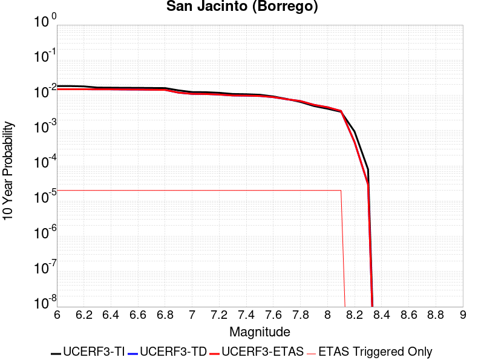 |

| Magnitude | 1 wk TI Prob | 1 wk TD Prob | 1 wk ETAS Prob | 1 wk ETAS/TD Gain | 1 wk ETAS Triggered Only | 1 mo TI Prob | 1 mo TD Prob | 1 mo ETAS Prob | 1 mo ETAS/TD Gain | 1 mo ETAS Triggered Only | 1 yr TI Prob | 1 yr TD Prob | 1 yr ETAS Prob | 1 yr ETAS/TD Gain | 1 yr ETAS Triggered Only | 10 yr TI Prob | 10 yr TD Prob | 10 yr ETAS Prob | 10 yr ETAS/TD Gain | 10 yr ETAS Triggered Only |
|-----|-----|-----|-----|-----|-----|-----|-----|-----|-----|-----|-----|-----|-----|-----|-----|-----|-----|-----|-----|-----|
| 6.0 | 3.543992E-5 | 2.7933444E-5 | 2.7933444E-5 | 1.0 | 0.0 | 1.5187653E-4 | 1.1970933E-4 | 1.1970933E-4 | 1.0 | 0.0 | 0.0018475284 | 0.001456499 | 0.001456499 | 1.0 | 0.0 | 0.018322436 | 0.014871439 | 0.014891142 | 1.0013249 | 2.0E-5 |
| 6.1 | 3.542281E-5 | 2.7933444E-5 | 2.7933444E-5 | 1.0 | 0.0 | 1.5180321E-4 | 1.1970933E-4 | 1.1970933E-4 | 1.0 | 0.0 | 0.0018466372 | 0.001456499 | 0.001456499 | 1.0 | 0.0 | 0.018313672 | 0.014871439 | 0.014891142 | 1.0013249 | 2.0E-5 |
| 6.2 | 3.4688688E-5 | 2.7933444E-5 | 2.7933444E-5 | 1.0 | 0.0 | 1.4865733E-4 | 1.1970933E-4 | 1.1970933E-4 | 1.0 | 0.0 | 0.0018084005 | 0.001456499 | 0.001456499 | 1.0 | 0.0 | 0.017937548 | 0.014871439 | 0.014891142 | 1.0013249 | 2.0E-5 |
| 6.3 | 3.2087122E-5 | 2.7778793E-5 | 2.7778793E-5 | 1.0 | 0.0 | 1.3750899E-4 | 1.1904661E-4 | 1.1904661E-4 | 1.0 | 0.0 | 0.0016728862 | 0.0014484411 | 0.0014484411 | 1.0 | 0.0 | 0.016603488 | 0.014792597 | 0.014812301 | 1.001332 | 2.0E-5 |
| 6.4 | 3.1828724E-5 | 2.774577E-5 | 2.774577E-5 | 1.0 | 0.0 | 1.364017E-4 | 1.1890509E-4 | 1.1890509E-4 | 1.0 | 0.0 | 0.0016594254 | 0.0014467203 | 0.0014467203 | 1.0 | 0.0 | 0.016470885 | 0.01477579 | 0.014795494 | 1.0013336 | 2.0E-5 |
| 6.5 | 3.1563577E-5 | 2.7485452E-5 | 2.7485452E-5 | 1.0 | 0.0 | 1.3526545E-4 | 1.1778954E-4 | 1.1778954E-4 | 1.0 | 0.0 | 0.0016456128 | 0.0014331564 | 0.0014331564 | 1.0 | 0.0 | 0.0163348 | 0.014643186 | 0.0146628935 | 1.0013459 | 2.0E-5 |
| 6.6 | 3.1467625E-5 | 2.7329666E-5 | 2.7329666E-5 | 1.0 | 0.0 | 1.3485427E-4 | 1.17121956E-4 | 1.17121956E-4 | 1.0 | 0.0 | 0.0016406142 | 0.0014250393 | 0.0014250393 | 1.0 | 0.0 | 0.016285548 | 0.014563348 | 0.014583057 | 1.0013533 | 2.0E-5 |
| 6.7 | 3.1223695E-5 | 2.6947682E-5 | 2.6947682E-5 | 1.0 | 0.0 | 1.3380898E-4 | 1.1548502E-4 | 1.1548502E-4 | 1.0 | 0.0 | 0.0016279068 | 0.0014051354 | 0.0014051354 | 1.0 | 0.0 | 0.01616033 | 0.01436762 | 0.014387334 | 1.001372 | 2.0E-5 |
| 6.8 | 3.1015585E-5 | 2.6768674E-5 | 2.6768674E-5 | 1.0 | 0.0 | 1.3291716E-4 | 1.1471791E-4 | 1.1471791E-4 | 1.0 | 0.0 | 0.001617065 | 0.0013958078 | 0.0013958078 | 1.0 | 0.0 | 0.016053487 | 0.014274874 | 0.014294588 | 1.001381 | 2.0E-5 |
| 6.9 | 2.6641965E-5 | 2.2190488E-5 | 2.2190488E-5 | 1.0 | 0.0 | 1.1417485E-4 | 9.509865E-5 | 9.509865E-5 | 1.0 | 0.0 | 0.0013891924 | 0.001157215 | 0.001157215 | 1.0 | 0.0 | 0.0138054015 | 0.011885386 | 0.011905149 | 1.0016627 | 2.0E-5 |
| 7.0 | 2.3854353E-5 | 2.0485062E-5 | 2.0485062E-5 | 1.0 | 0.0 | 1.02228936E-4 | 8.7790184E-5 | 8.7790184E-5 | 1.0 | 0.0 | 0.0012439266 | 0.001068324 | 0.001068324 | 1.0 | 0.0 | 0.012369866 | 0.010985749 | 0.011005528 | 1.0018005 | 2.0E-5 |
| 7.1 | 2.3672901E-5 | 2.0321548E-5 | 2.0321548E-5 | 1.0 | 0.0 | 1.0145135E-4 | 8.708945E-5 | 8.708945E-5 | 1.0 | 0.0 | 0.0012344702 | 0.0010598009 | 0.0010598009 | 1.0 | 0.0 | 0.0122763505 | 0.01090098 | 0.010920762 | 1.0018147 | 2.0E-5 |
| 7.2 | 2.2717244E-5 | 1.9548863E-5 | 1.9548863E-5 | 1.0 | 0.0 | 9.735599E-5 | 8.377816E-5 | 8.377816E-5 | 1.0 | 0.0 | 0.0011846646 | 0.0010195242 | 0.0010195242 | 1.0 | 0.0 | 0.01178369 | 0.010498457 | 0.010518246 | 1.001885 | 2.0E-5 |
| 7.3 | 2.1016205E-5 | 1.8390432E-5 | 1.8390432E-5 | 1.0 | 0.0 | 9.006634E-5 | 7.881377E-5 | 7.881377E-5 | 1.0 | 0.0 | 0.001096006 | 9.5913734E-4 | 9.5913734E-4 | 1.0 | 0.0 | 0.010906163 | 0.009894083 | 0.009913885 | 1.0020014 | 2.0E-5 |
| 7.4 | 2.0683625E-5 | 1.819294E-5 | 1.819294E-5 | 1.0 | 0.0 | 8.86411E-5 | 7.796742E-5 | 7.796742E-5 | 1.0 | 0.0 | 0.001078671 | 9.4884203E-4 | 9.4884203E-4 | 1.0 | 0.0 | 0.010734501 | 0.009790815 | 0.00981062 | 1.0020227 | 2.0E-5 |
| 7.5 | 1.9993966E-5 | 1.7787928E-5 | 1.7787928E-5 | 1.0 | 0.0 | 8.568561E-5 | 7.6231765E-5 | 7.6231765E-5 | 1.0 | 0.0 | 0.001042723 | 9.2772854E-4 | 9.2772854E-4 | 1.0 | 0.0 | 0.010378438 | 0.009577702 | 0.009597511 | 1.0020682 | 2.0E-5 |
| 7.6 | 1.788966E-5 | 1.6441034E-5 | 1.6441034E-5 | 1.0 | 0.0 | 7.666772E-5 | 7.045968E-5 | 7.045968E-5 | 1.0 | 0.0 | 9.3302975E-4 | 8.575107E-4 | 8.575107E-4 | 1.0 | 0.0 | 0.00929122 | 0.00886951 | 0.008889332 | 1.0022349 | 2.0E-5 |
| 7.7 | 1.5125781E-5 | 1.4242966E-5 | 1.4242966E-5 | 1.0 | 0.0 | 6.4823165E-5 | 6.1039864E-5 | 6.1039864E-5 | 1.0 | 0.0 | 7.889362E-4 | 7.4290775E-4 | 7.4290775E-4 | 1.0 | 0.0 | 0.007861412 | 0.007717176 | 0.007737022 | 1.0025716 | 2.0E-5 |
| 7.8 | 1.250089E-5 | 1.2635926E-5 | 1.2635926E-5 | 1.0 | 0.0 | 5.3574146E-5 | 5.415285E-5 | 5.415285E-5 | 1.0 | 0.0 | 6.5207E-4 | 6.591121E-4 | 6.591121E-4 | 1.0 | 0.0 | 0.006501599 | 0.0068706553 | 0.006890518 | 1.002891 | 2.0E-5 |
| 7.9 | 9.561E-6 | 9.759346E-6 | 9.759346E-6 | 1.0 | 0.0 | 4.0975072E-5 | 4.1825097E-5 | 4.1825097E-5 | 1.0 | 0.0 | 4.987573E-4 | 5.0910213E-4 | 5.0910213E-4 | 1.0 | 0.0 | 0.0049763937 | 0.005354963 | 0.0053748554 | 1.0037148 | 2.0E-5 |
| 8.0 | 8.01699E-6 | 8.297771E-6 | 8.297771E-6 | 1.0 | 0.0 | 3.4358076E-5 | 3.5561392E-5 | 3.5561392E-5 | 1.0 | 0.0 | 4.1822926E-4 | 4.3287448E-4 | 4.3287448E-4 | 1.0 | 0.0 | 0.0041744304 | 0.004575734 | 0.0045956424 | 1.0043509 | 2.0E-5 |
| 8.1 | 6.541947E-6 | 6.465709E-6 | 6.465709E-6 | 1.0 | 0.0 | 2.8036617E-5 | 2.7709888E-5 | 2.7709888E-5 | 1.0 | 0.0 | 3.4129233E-4 | 3.3731616E-4 | 3.3731616E-4 | 1.0 | 0.0 | 0.0034076865 | 0.0035825386 | 0.003602467 | 1.0055627 | 2.0E-5 |
| 8.2 | 1.7968189E-6 | 7.9757825E-7 | 7.9757825E-7 | 1.0 | 0.0 | 7.70063E-6 | 3.4181883E-6 | 3.4181883E-6 | 1.0 | 0.0 | 9.3751136E-5 | 4.161567E-5 | 4.161567E-5 | 1.0 | 0.0 | 9.371159E-4 | 4.7149012E-4 | 4.7149012E-4 | 1.0 | 0.0 |
| 8.3 | 1.5167889E-7 | 4.9005383E-8 | 4.9005383E-8 | 1.0 | 0.0 | 6.500522E-7 | 2.1002305E-7 | 2.1002305E-7 | 1.0 | 0.0 | 7.9143565E-6 | 2.557028E-6 | 2.557028E-6 | 1.0 | 0.0 | 7.914075E-5 | 2.9710194E-5 | 2.9710194E-5 | 1.0 | 0.0 |

## Trinidad (alt1)
*[(top)](#table-of-contents)*

| 1 Week | 1 Month | 1 Year | 10 Year |
|-----|-----|-----|-----|
| 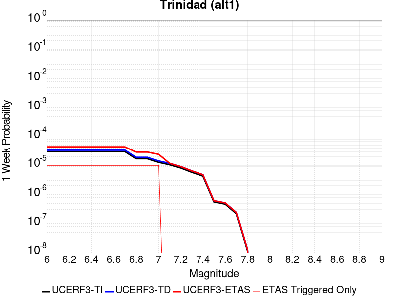 |  | 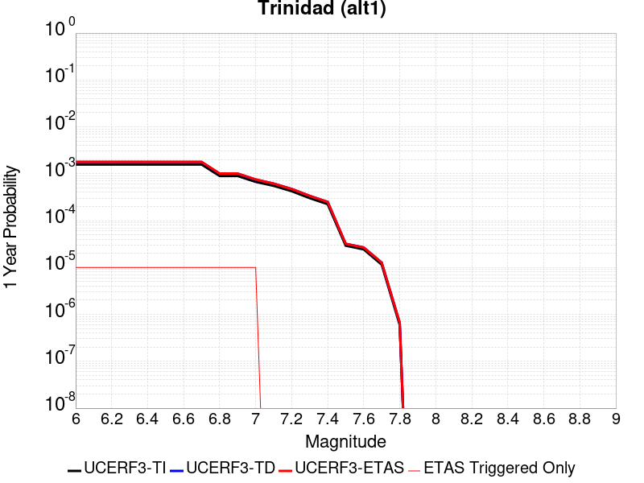 | 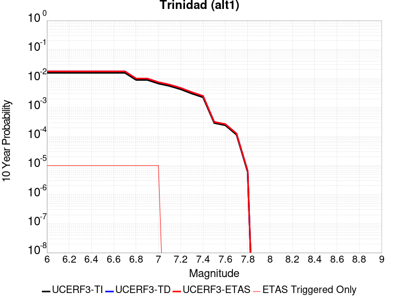 |

| Magnitude | 1 wk TI Prob | 1 wk TD Prob | 1 wk ETAS Prob | 1 wk ETAS/TD Gain | 1 wk ETAS Triggered Only | 1 mo TI Prob | 1 mo TD Prob | 1 mo ETAS Prob | 1 mo ETAS/TD Gain | 1 mo ETAS Triggered Only | 1 yr TI Prob | 1 yr TD Prob | 1 yr ETAS Prob | 1 yr ETAS/TD Gain | 1 yr ETAS Triggered Only | 10 yr TI Prob | 10 yr TD Prob | 10 yr ETAS Prob | 10 yr ETAS/TD Gain | 10 yr ETAS Triggered Only |
|-----|-----|-----|-----|-----|-----|-----|-----|-----|-----|-----|-----|-----|-----|-----|-----|-----|-----|-----|-----|-----|
| 6.0 | 3.0167168E-5 | 3.4033765E-5 | 4.4033422E-5 | 1.2938159 | 1.0E-5 | 1.2928146E-4 | 1.4585178E-4 | 1.5585033E-4 | 1.0685527 | 1.0E-5 | 0.0015728653 | 0.0017744675 | 0.0017844498 | 1.0056255 | 1.0E-5 | 0.0156177925 | 0.017619943 | 0.017629767 | 1.0005575 | 1.0E-5 |
| 6.1 | 3.0167168E-5 | 3.4033765E-5 | 4.4033422E-5 | 1.2938159 | 1.0E-5 | 1.2928146E-4 | 1.4585178E-4 | 1.5585033E-4 | 1.0685527 | 1.0E-5 | 0.0015728653 | 0.0017744675 | 0.0017844498 | 1.0056255 | 1.0E-5 | 0.0156177925 | 0.017619943 | 0.017629767 | 1.0005575 | 1.0E-5 |
| 6.2 | 3.0167168E-5 | 3.4033765E-5 | 4.4033422E-5 | 1.2938159 | 1.0E-5 | 1.2928146E-4 | 1.4585178E-4 | 1.5585033E-4 | 1.0685527 | 1.0E-5 | 0.0015728653 | 0.0017744675 | 0.0017844498 | 1.0056255 | 1.0E-5 | 0.0156177925 | 0.017619943 | 0.017629767 | 1.0005575 | 1.0E-5 |
| 6.3 | 3.0167168E-5 | 3.4033765E-5 | 4.4033422E-5 | 1.2938159 | 1.0E-5 | 1.2928146E-4 | 1.4585178E-4 | 1.5585033E-4 | 1.0685527 | 1.0E-5 | 0.0015728653 | 0.0017744675 | 0.0017844498 | 1.0056255 | 1.0E-5 | 0.0156177925 | 0.017619943 | 0.017629767 | 1.0005575 | 1.0E-5 |
| 6.4 | 3.0167168E-5 | 3.4033765E-5 | 4.4033422E-5 | 1.2938159 | 1.0E-5 | 1.2928146E-4 | 1.4585178E-4 | 1.5585033E-4 | 1.0685527 | 1.0E-5 | 0.0015728653 | 0.0017744675 | 0.0017844498 | 1.0056255 | 1.0E-5 | 0.0156177925 | 0.017619943 | 0.017629767 | 1.0005575 | 1.0E-5 |
| 6.5 | 3.0167168E-5 | 3.4033765E-5 | 4.4033422E-5 | 1.2938159 | 1.0E-5 | 1.2928146E-4 | 1.4585178E-4 | 1.5585033E-4 | 1.0685527 | 1.0E-5 | 0.0015728653 | 0.0017744675 | 0.0017844498 | 1.0056255 | 1.0E-5 | 0.0156177925 | 0.017619943 | 0.017629767 | 1.0005575 | 1.0E-5 |
| 6.6 | 3.0167168E-5 | 3.4033765E-5 | 4.4033422E-5 | 1.2938159 | 1.0E-5 | 1.2928146E-4 | 1.4585178E-4 | 1.5585033E-4 | 1.0685527 | 1.0E-5 | 0.0015728653 | 0.0017744675 | 0.0017844498 | 1.0056255 | 1.0E-5 | 0.0156177925 | 0.017619943 | 0.017629767 | 1.0005575 | 1.0E-5 |
| 6.7 | 3.0167168E-5 | 3.4033765E-5 | 4.4033422E-5 | 1.2938159 | 1.0E-5 | 1.2928146E-4 | 1.4585178E-4 | 1.5585033E-4 | 1.0685527 | 1.0E-5 | 0.0015728653 | 0.0017744675 | 0.0017844498 | 1.0056255 | 1.0E-5 | 0.0156177925 | 0.017619943 | 0.017629767 | 1.0005575 | 1.0E-5 |
| 6.8 | 1.717077E-5 | 1.9195984E-5 | 2.9195791E-5 | 1.5209323 | 1.0E-5 | 7.358694E-5 | 8.226616E-5 | 9.2265334E-5 | 1.1215466 | 1.0E-5 | 8.9555274E-4 | 0.0010011748 | 0.0010111647 | 1.0099783 | 1.0E-5 | 0.008919522 | 0.009971094 | 0.009980994 | 1.0009929 | 1.0E-5 |
| 6.9 | 1.717077E-5 | 1.9195984E-5 | 2.9195791E-5 | 1.5209323 | 1.0E-5 | 7.358694E-5 | 8.226616E-5 | 9.2265334E-5 | 1.1215466 | 1.0E-5 | 8.9555274E-4 | 0.0010011748 | 0.0010111647 | 1.0099783 | 1.0E-5 | 0.008919522 | 0.009971094 | 0.009980994 | 1.0009929 | 1.0E-5 |
| 7.0 | 1.2858572E-5 | 1.4337589E-5 | 2.4337445E-5 | 1.6974573 | 1.0E-5 | 5.5107E-5 | 6.144554E-5 | 7.144493E-5 | 1.1627357 | 1.0E-5 | 6.707212E-4 | 7.4787484E-4 | 7.5786735E-4 | 1.0133612 | 1.0E-5 | 0.006687004 | 0.007456759 | 0.0074666846 | 1.0013311 | 1.0E-5 |
| 7.1 | 1.0588431E-5 | 1.1801449E-5 | 1.1801449E-5 | 1.0 | 0.0 | 4.53782E-5 | 5.057682E-5 | 5.057682E-5 | 1.0 | 0.0 | 5.5233954E-4 | 6.156277E-4 | 6.156277E-4 | 1.0 | 0.0 | 0.005509687 | 0.006142072 | 0.006142072 | 1.0 | 0.0 |
| 7.2 | 8.138061E-6 | 9.067351E-6 | 9.067351E-6 | 1.0 | 0.0 | 3.487694E-5 | 3.8859635E-5 | 3.8859635E-5 | 1.0 | 0.0 | 4.2454398E-4 | 4.730382E-4 | 4.730382E-4 | 1.0 | 0.0 | 0.0042373384 | 0.004722754 | 0.004722754 | 1.0 | 0.0 |
| 7.3 | 5.787542E-6 | 6.4604196E-6 | 6.4604196E-6 | 1.0 | 0.0 | 2.4803514E-5 | 2.7687342E-5 | 2.7687342E-5 | 1.0 | 0.0 | 3.0194095E-4 | 3.3706275E-4 | 3.3706275E-4 | 1.0 | 0.0 | 0.00301531 | 0.003367626 | 0.003367626 | 1.0 | 0.0 |
| 7.4 | 4.303563E-6 | 4.8009247E-6 | 4.8009247E-6 | 1.0 | 0.0 | 1.844371E-5 | 2.057534E-5 | 2.057534E-5 | 1.0 | 0.0 | 2.2452902E-4 | 2.5049574E-4 | 2.5049574E-4 | 1.0 | 0.0 | 0.0022430231 | 0.0025040722 | 0.0025040722 | 1.0 | 0.0 |
| 7.5 | 5.6063425E-7 | 6.1430603E-7 | 6.1430603E-7 | 1.0 | 0.0 | 2.402716E-6 | 2.6327375E-6 | 2.6327375E-6 | 1.0 | 0.0 | 2.9252675E-5 | 3.205312E-5 | 3.205312E-5 | 1.0 | 0.0 | 2.9248823E-4 | 3.2048655E-4 | 3.2048655E-4 | 1.0 | 0.0 |
| 7.6 | 4.6699128E-7 | 5.125866E-7 | 5.125866E-7 | 1.0 | 0.0 | 2.0013897E-6 | 2.1967978E-6 | 2.1967978E-6 | 1.0 | 0.0 | 2.4366647E-5 | 2.67457E-5 | 2.67457E-5 | 1.0 | 0.0 | 2.4363975E-4 | 2.6742622E-4 | 2.6742622E-4 | 1.0 | 0.0 |
| 7.7 | 2.2080937E-7 | 2.4347227E-7 | 2.4347227E-7 | 1.0 | 0.0 | 9.4632554E-7 | 1.0434522E-6 | 1.0434522E-6 | 1.0 | 0.0 | 1.15214525E-5 | 1.2703963E-5 | 1.2703963E-5 | 1.0 | 0.0 | 1.1520855E-4 | 1.2703297E-4 | 1.2703297E-4 | 1.0 | 0.0 |
| 7.8 | 1.1438307E-8 | 1.2683146E-8 | 1.2683146E-8 | 1.0 | 0.0 | 4.9021317E-8 | 5.435634E-8 | 5.435634E-8 | 1.0 | 0.0 | 5.9683435E-7 | 6.617884E-7 | 6.617884E-7 | 1.0 | 0.0 | 5.9683275E-6 | 6.6178845E-6 | 6.6178845E-6 | 1.0 | 0.0 |

## San Jacinto (Clark) rev
*[(top)](#table-of-contents)*

| 1 Week | 1 Month | 1 Year | 10 Year |
|-----|-----|-----|-----|
|  |  |  |  |

| Magnitude | 1 wk TI Prob | 1 wk TD Prob | 1 wk ETAS Prob | 1 wk ETAS/TD Gain | 1 wk ETAS Triggered Only | 1 mo TI Prob | 1 mo TD Prob | 1 mo ETAS Prob | 1 mo ETAS/TD Gain | 1 mo ETAS Triggered Only | 1 yr TI Prob | 1 yr TD Prob | 1 yr ETAS Prob | 1 yr ETAS/TD Gain | 1 yr ETAS Triggered Only | 10 yr TI Prob | 10 yr TD Prob | 10 yr ETAS Prob | 10 yr ETAS/TD Gain | 10 yr ETAS Triggered Only |
|-----|-----|-----|-----|-----|-----|-----|-----|-----|-----|-----|-----|-----|-----|-----|-----|-----|-----|-----|-----|-----|
| 6.0 | 4.482615E-5 | 2.1158266E-5 | 2.1158266E-5 | 1.0 | 0.0 | 1.9209793E-4 | 9.067519E-5 | 1.0067428E-4 | 1.1102737 | 1.0E-5 | 0.0023362834 | 0.0011034205 | 0.0011134095 | 1.0090528 | 1.0E-5 | 0.02311874 | 0.0114991795 | 0.01151895 | 1.0017192 | 2.0E-5 |
| 6.1 | 4.482615E-5 | 2.1158266E-5 | 2.1158266E-5 | 1.0 | 0.0 | 1.9209793E-4 | 9.067519E-5 | 1.0067428E-4 | 1.1102737 | 1.0E-5 | 0.0023362834 | 0.0011034205 | 0.0011134095 | 1.0090528 | 1.0E-5 | 0.02311874 | 0.0114991795 | 0.01151895 | 1.0017192 | 2.0E-5 |
| 6.2 | 4.482615E-5 | 2.1158266E-5 | 2.1158266E-5 | 1.0 | 0.0 | 1.9209793E-4 | 9.067519E-5 | 1.0067428E-4 | 1.1102737 | 1.0E-5 | 0.0023362834 | 0.0011034205 | 0.0011134095 | 1.0090528 | 1.0E-5 | 0.02311874 | 0.0114991795 | 0.01151895 | 1.0017192 | 2.0E-5 |
| 6.3 | 4.482615E-5 | 2.1158266E-5 | 2.1158266E-5 | 1.0 | 0.0 | 1.9209793E-4 | 9.067519E-5 | 1.0067428E-4 | 1.1102737 | 1.0E-5 | 0.0023362834 | 0.0011034205 | 0.0011134095 | 1.0090528 | 1.0E-5 | 0.02311874 | 0.0114991795 | 0.01151895 | 1.0017192 | 2.0E-5 |
| 6.4 | 4.482615E-5 | 2.1158266E-5 | 2.1158266E-5 | 1.0 | 0.0 | 1.9209793E-4 | 9.067519E-5 | 1.0067428E-4 | 1.1102737 | 1.0E-5 | 0.0023362834 | 0.0011034205 | 0.0011134095 | 1.0090528 | 1.0E-5 | 0.02311874 | 0.0114991795 | 0.01151895 | 1.0017192 | 2.0E-5 |
| 6.5 | 3.7294863E-5 | 1.7359873E-5 | 1.7359873E-5 | 1.0 | 0.0 | 1.5982533E-4 | 7.4397365E-5 | 8.439662E-5 | 1.1344033 | 1.0E-5 | 0.0019441366 | 9.05416E-4 | 9.154069E-4 | 1.0110346 | 1.0E-5 | 0.01927216 | 0.009499401 | 0.009519211 | 1.0020854 | 2.0E-5 |
| 6.6 | 3.7294863E-5 | 1.7359873E-5 | 1.7359873E-5 | 1.0 | 0.0 | 1.5982533E-4 | 7.4397365E-5 | 8.439662E-5 | 1.1344033 | 1.0E-5 | 0.0019441366 | 9.05416E-4 | 9.154069E-4 | 1.0110346 | 1.0E-5 | 0.01927216 | 0.009499401 | 0.009519211 | 1.0020854 | 2.0E-5 |
| 6.7 | 3.6039248E-5 | 1.6607892E-5 | 1.6607892E-5 | 1.0 | 0.0 | 1.5444479E-4 | 7.1174756E-5 | 8.117405E-5 | 1.1404892 | 1.0E-5 | 0.0018787434 | 8.662123E-4 | 8.7620365E-4 | 1.0115346 | 1.0E-5 | 0.01862939 | 0.009098875 | 0.009118694 | 1.0021781 | 2.0E-5 |
| 6.8 | 3.5031844E-5 | 1.623633E-5 | 1.623633E-5 | 1.0 | 0.0 | 1.5012783E-4 | 6.958244E-5 | 7.958175E-5 | 1.1437044 | 1.0E-5 | 0.0018262739 | 8.46841E-4 | 8.5683254E-4 | 1.0117986 | 1.0E-5 | 0.01811338 | 0.008899476 | 0.008919298 | 1.0022273 | 2.0E-5 |
| 6.9 | 3.435112E-5 | 1.6066866E-5 | 1.6066866E-5 | 1.0 | 0.0 | 1.4721078E-4 | 6.88562E-5 | 7.885551E-5 | 1.1452202 | 1.0E-5 | 0.0017908178 | 8.380059E-4 | 8.4799755E-4 | 1.0119231 | 1.0E-5 | 0.017764548 | 0.008805986 | 0.008825809 | 1.0022511 | 2.0E-5 |
| 7.0 | 2.8959772E-5 | 1.4340704E-5 | 1.4340704E-5 | 1.0 | 0.0 | 1.241074E-4 | 6.145873E-5 | 7.145812E-5 | 1.1627008 | 1.0E-5 | 0.0015099603 | 7.480059E-4 | 7.5799844E-4 | 1.0133588 | 1.0E-5 | 0.014997416 | 0.00787791 | 0.007897752 | 1.0025188 | 2.0E-5 |
| 7.1 | 2.6002877E-5 | 1.2832878E-5 | 1.2832878E-5 | 1.0 | 0.0 | 1.11436144E-4 | 5.49969E-5 | 6.4996355E-5 | 1.1818184 | 1.0E-5 | 0.0013558907 | 6.693837E-4 | 6.79377E-4 | 1.014929 | 1.0E-5 | 0.013476475 | 0.0070536323 | 0.0070734913 | 1.0028154 | 2.0E-5 |
| 7.2 | 2.2544838E-5 | 1.1265443E-5 | 1.1265443E-5 | 1.0 | 0.0 | 9.661716E-5 | 4.8279588E-5 | 5.8279104E-5 | 1.2071168 | 1.0E-5 | 0.001175679 | 5.876469E-4 | 5.97641E-4 | 1.017007 | 1.0E-5 | 0.011694785 | 0.006195283 | 0.0062151593 | 1.0032083 | 2.0E-5 |
| 7.3 | 1.75334E-5 | 1.081565E-5 | 1.081565E-5 | 1.0 | 0.0 | 7.514098E-5 | 4.6351972E-5 | 5.635151E-5 | 1.2157305 | 1.0E-5 | 9.144575E-4 | 5.641905E-4 | 5.741849E-4 | 1.0177145 | 1.0E-5 | 0.009107036 | 0.005935912 | 0.005955793 | 1.0033493 | 2.0E-5 |
| 7.4 | 1.5924552E-5 | 1.0615435E-5 | 1.0615435E-5 | 1.0 | 0.0 | 6.82463E-5 | 4.5493933E-5 | 5.5493478E-5 | 1.2197995 | 1.0E-5 | 8.305819E-4 | 5.5374927E-4 | 5.637437E-4 | 1.0180488 | 1.0E-5 | 0.008274844 | 0.0058232066 | 0.0058430904 | 1.0034145 | 2.0E-5 |
| 7.5 | 1.3428931E-5 | 9.855765E-6 | 9.855765E-6 | 1.0 | 0.0 | 5.7551293E-5 | 4.2238313E-5 | 5.223789E-5 | 1.2367419 | 1.0E-5 | 7.004617E-4 | 5.141312E-4 | 5.2412605E-4 | 1.0194403 | 1.0E-5 | 0.006982579 | 0.005408683 | 0.005428575 | 1.0036777 | 2.0E-5 |
| 7.6 | 1.0688787E-5 | 8.618602E-6 | 8.618602E-6 | 1.0 | 0.0 | 4.5808283E-5 | 3.6936344E-5 | 4.6935977E-5 | 1.2707261 | 1.0E-5 | 5.5757316E-4 | 4.4960767E-4 | 4.5960318E-4 | 1.0222316 | 1.0E-5 | 0.005561762 | 0.004743673 | 0.004763578 | 1.0041962 | 2.0E-5 |
| 7.7 | 8.81236E-6 | 7.471723E-6 | 7.471723E-6 | 1.0 | 0.0 | 3.776671E-5 | 3.202128E-5 | 4.2020958E-5 | 1.3122823 | 1.0E-5 | 4.597127E-4 | 3.8978952E-4 | 3.9978564E-4 | 1.0256449 | 1.0E-5 | 0.0045876284 | 0.004136559 | 0.0041564764 | 1.004815 | 2.0E-5 |
| 7.8 | 7.780431E-6 | 6.7000988E-6 | 6.7000988E-6 | 1.0 | 0.0 | 3.3344273E-5 | 2.8714394E-5 | 3.8714108E-5 | 1.3482474 | 1.0E-5 | 4.0589093E-4 | 3.4954186E-4 | 3.5953836E-4 | 1.0285989 | 1.0E-5 | 0.0040515037 | 0.0037245536 | 0.003744479 | 1.0053498 | 2.0E-5 |
| 7.9 | 6.5437994E-6 | 5.7836955E-6 | 5.7836955E-6 | 1.0 | 0.0 | 2.8044553E-5 | 2.4787032E-5 | 3.4786783E-5 | 1.4034268 | 1.0E-5 | 3.4138895E-4 | 3.0174048E-4 | 3.1173747E-4 | 1.033131 | 1.0E-5 | 0.0034086495 | 0.0032361387 | 0.003256074 | 1.0061603 | 2.0E-5 |
| 8.0 | 5.4488164E-6 | 4.8162797E-6 | 4.8162797E-6 | 1.0 | 0.0 | 2.3351862E-5 | 2.0641035E-5 | 3.064083E-5 | 1.4844618 | 1.0E-5 | 2.8427184E-4 | 2.5127578E-4 | 2.6127326E-4 | 1.0397869 | 1.0E-5 | 0.0028390845 | 0.0027122858 | 0.0027322315 | 1.0073539 | 2.0E-5 |
| 8.1 | 2.8397242E-6 | 1.3679883E-6 | 1.3679883E-6 | 1.0 | 0.0 | 1.217019E-5 | 5.8627934E-6 | 5.8627934E-6 | 1.0 | 0.0 | 1.4816198E-4 | 7.137719E-5 | 7.137719E-5 | 1.0 | 0.0 | 0.0014806325 | 8.120884E-4 | 8.220803E-4 | 1.012304 | 1.0E-5 |
| 8.2 | 2.030244E-6 | 6.323106E-7 | 6.323106E-7 | 1.0 | 0.0 | 8.701017E-6 | 2.7099E-6 | 2.7099E-6 | 1.0 | 0.0 | 1.05929736E-4 | 3.2992535E-5 | 3.2992535E-5 | 1.0 | 0.0 | 0.0010587925 | 3.9508488E-4 | 3.9508488E-4 | 1.0 | 0.0 |
| 8.3 | 1.0659804E-6 | 2.926802E-7 | 2.926802E-7 | 1.0 | 0.0 | 4.568479E-6 | 1.2543431E-6 | 1.2543431E-6 | 1.0 | 0.0 | 5.5619817E-5 | 1.5271524E-5 | 1.5271524E-5 | 1.0 | 0.0 | 5.5605895E-4 | 1.8576543E-4 | 1.8576543E-4 | 1.0 | 0.0 |

## Del Valle
*[(top)](#table-of-contents)*

| 1 Week | 1 Month | 1 Year | 10 Year |
|-----|-----|-----|-----|
|  |  |  | 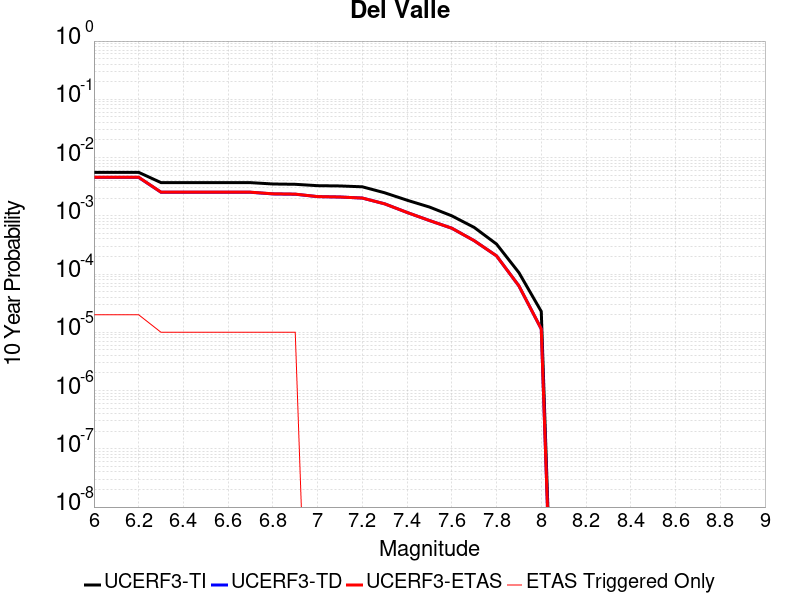 |

| Magnitude | 1 wk TI Prob | 1 wk TD Prob | 1 wk ETAS Prob | 1 wk ETAS/TD Gain | 1 wk ETAS Triggered Only | 1 mo TI Prob | 1 mo TD Prob | 1 mo ETAS Prob | 1 mo ETAS/TD Gain | 1 mo ETAS Triggered Only | 1 yr TI Prob | 1 yr TD Prob | 1 yr ETAS Prob | 1 yr ETAS/TD Gain | 1 yr ETAS Triggered Only | 10 yr TI Prob | 10 yr TD Prob | 10 yr ETAS Prob | 10 yr ETAS/TD Gain | 10 yr ETAS Triggered Only |
|-----|-----|-----|-----|-----|-----|-----|-----|-----|-----|-----|-----|-----|-----|-----|-----|-----|-----|-----|-----|-----|
| 6.0 | 1.0716125E-5 | 8.768021E-6 | 8.768021E-6 | 1.0 | 0.0 | 4.592544E-5 | 3.7576803E-5 | 4.757643E-5 | 1.2661116 | 1.0E-5 | 5.589988E-4 | 4.574213E-4 | 4.7741213E-4 | 1.0437033 | 2.0E-5 | 0.0055759475 | 0.004566771 | 0.0045866794 | 1.0043595 | 2.0E-5 |
| 6.1 | 1.0716125E-5 | 8.768021E-6 | 8.768021E-6 | 1.0 | 0.0 | 4.592544E-5 | 3.7576803E-5 | 4.757643E-5 | 1.2661116 | 1.0E-5 | 5.589988E-4 | 4.574213E-4 | 4.7741213E-4 | 1.0437033 | 2.0E-5 | 0.0055759475 | 0.004566771 | 0.0045866794 | 1.0043595 | 2.0E-5 |
| 6.2 | 1.0716125E-5 | 8.768021E-6 | 8.768021E-6 | 1.0 | 0.0 | 4.592544E-5 | 3.7576803E-5 | 4.757643E-5 | 1.2661116 | 1.0E-5 | 5.589988E-4 | 4.574213E-4 | 4.7741213E-4 | 1.0437033 | 2.0E-5 | 0.0055759475 | 0.004566771 | 0.0045866794 | 1.0043595 | 2.0E-5 |
| 6.3 | 7.1293784E-6 | 4.8659167E-6 | 4.8659167E-6 | 1.0 | 0.0 | 3.055412E-5 | 2.0853766E-5 | 2.0853766E-5 | 1.0 | 0.0 | 3.7193293E-4 | 2.5386576E-4 | 2.638632E-4 | 1.0393809 | 1.0E-5 | 0.0037131102 | 0.002535862 | 0.0025458364 | 1.0039334 | 1.0E-5 |
| 6.4 | 7.1293784E-6 | 4.8659167E-6 | 4.8659167E-6 | 1.0 | 0.0 | 3.055412E-5 | 2.0853766E-5 | 2.0853766E-5 | 1.0 | 0.0 | 3.7193293E-4 | 2.5386576E-4 | 2.638632E-4 | 1.0393809 | 1.0E-5 | 0.0037131102 | 0.002535862 | 0.0025458364 | 1.0039334 | 1.0E-5 |
| 6.5 | 7.1293784E-6 | 4.8659167E-6 | 4.8659167E-6 | 1.0 | 0.0 | 3.055412E-5 | 2.0853766E-5 | 2.0853766E-5 | 1.0 | 0.0 | 3.7193293E-4 | 2.5386576E-4 | 2.638632E-4 | 1.0393809 | 1.0E-5 | 0.0037131102 | 0.002535862 | 0.0025458364 | 1.0039334 | 1.0E-5 |
| 6.6 | 7.1293784E-6 | 4.8659167E-6 | 4.8659167E-6 | 1.0 | 0.0 | 3.055412E-5 | 2.0853766E-5 | 2.0853766E-5 | 1.0 | 0.0 | 3.7193293E-4 | 2.5386576E-4 | 2.638632E-4 | 1.0393809 | 1.0E-5 | 0.0037131102 | 0.002535862 | 0.0025458364 | 1.0039334 | 1.0E-5 |
| 6.7 | 7.12272E-6 | 4.8632924E-6 | 4.8632924E-6 | 1.0 | 0.0 | 3.0525585E-5 | 2.0842519E-5 | 2.0842519E-5 | 1.0 | 0.0 | 3.7158563E-4 | 2.5372885E-4 | 2.637263E-4 | 1.0394021 | 1.0E-5 | 0.003709649 | 0.002534496 | 0.0025444706 | 1.0039356 | 1.0E-5 |
| 6.8 | 6.7558703E-6 | 4.559491E-6 | 4.559491E-6 | 1.0 | 0.0 | 2.895341E-5 | 1.9540534E-5 | 1.9540534E-5 | 1.0 | 0.0 | 3.5245073E-4 | 2.3788065E-4 | 2.4787828E-4 | 1.0420278 | 1.0E-5 | 0.0035189227 | 0.002376354 | 0.0023863302 | 1.0041981 | 1.0E-5 |
| 6.9 | 6.6700386E-6 | 4.5026277E-6 | 4.5026277E-6 | 1.0 | 0.0 | 2.8585566E-5 | 1.9296836E-5 | 1.9296836E-5 | 1.0 | 0.0 | 3.479737E-4 | 2.3491429E-4 | 2.4491193E-4 | 1.0425587 | 1.0E-5 | 0.003474293 | 0.0023467531 | 0.0023567297 | 1.0042512 | 1.0E-5 |
| 7.0 | 6.3181424E-6 | 4.098784E-6 | 4.098784E-6 | 1.0 | 0.0 | 2.7077473E-5 | 1.75661E-5 | 1.75661E-5 | 1.0 | 0.0 | 3.2961834E-4 | 2.1384671E-4 | 2.1384671E-4 | 1.0 | 0.0 | 0.0032912986 | 0.0021364824 | 0.0021364824 | 1.0 | 0.0 |
| 7.1 | 6.248759E-6 | 4.0339737E-6 | 4.0339737E-6 | 1.0 | 0.0 | 2.678012E-5 | 1.7288346E-5 | 1.7288346E-5 | 1.0 | 0.0 | 3.2599916E-4 | 2.104657E-4 | 2.104657E-4 | 1.0 | 0.0 | 0.0032552136 | 0.0021027366 | 0.0021027366 | 1.0 | 0.0 |
| 7.2 | 6.0411944E-6 | 3.869962E-6 | 3.869962E-6 | 1.0 | 0.0 | 2.5890577E-5 | 1.6585447E-5 | 1.6585447E-5 | 1.0 | 0.0 | 3.1517216E-4 | 2.0190953E-4 | 2.0190953E-4 | 1.0 | 0.0 | 0.0031472554 | 0.0020173325 | 0.0020173325 | 1.0 | 0.0 |
| 7.3 | 4.7691183E-6 | 3.0781514E-6 | 3.0781514E-6 | 1.0 | 0.0 | 2.0438918E-5 | 1.3192012E-5 | 1.3192012E-5 | 1.0 | 0.0 | 2.488154E-4 | 1.6060112E-4 | 1.6060112E-4 | 1.0 | 0.0 | 0.00248537 | 0.0016048873 | 0.0016048873 | 1.0 | 0.0 |
| 7.4 | 3.5524722E-6 | 2.1893625E-6 | 2.1893625E-6 | 1.0 | 0.0 | 1.5224792E-5 | 9.3829485E-6 | 9.3829485E-6 | 1.0 | 0.0 | 1.8534607E-4 | 1.14231494E-4 | 1.14231494E-4 | 1.0 | 0.0 | 0.0018519156 | 0.001141736 | 0.001141736 | 1.0 | 0.0 |
| 7.5 | 2.7133442E-6 | 1.5916223E-6 | 1.5916223E-6 | 1.0 | 0.0 | 1.1628566E-5 | 6.821221E-6 | 6.821221E-6 | 1.0 | 0.0 | 1.415686E-4 | 8.304522E-5 | 8.304522E-5 | 1.0 | 0.0 | 0.0014147845 | 8.301438E-4 | 8.301438E-4 | 1.0 | 0.0 |
| 7.6 | 1.915338E-6 | 1.1739246E-6 | 1.1739246E-6 | 1.0 | 0.0 | 8.208566E-6 | 5.031096E-6 | 5.031096E-6 | 1.0 | 0.0 | 9.993471E-5 | 6.125188E-5 | 6.125188E-5 | 1.0 | 0.0 | 9.988978E-4 | 6.123509E-4 | 6.123509E-4 | 1.0 | 0.0 |
| 7.7 | 1.2120448E-6 | 7.1803703E-7 | 7.1803703E-7 | 1.0 | 0.0 | 5.194467E-6 | 3.077298E-6 | 3.077298E-6 | 1.0 | 0.0 | 6.3240805E-5 | 3.7465463E-5 | 3.7465463E-5 | 1.0 | 0.0 | 6.322281E-4 | 3.7459185E-4 | 3.7459185E-4 | 1.0 | 0.0 |
| 7.8 | 6.272381E-7 | 3.9325712E-7 | 3.9325712E-7 | 1.0 | 0.0 | 2.6881603E-6 | 1.6853867E-6 | 1.6853867E-6 | 1.0 | 0.0 | 3.272786E-5 | 2.051939E-5 | 2.051939E-5 | 1.0 | 0.0 | 3.272304E-4 | 2.0517512E-4 | 2.0517512E-4 | 1.0 | 0.0 |
| 7.9 | 2.0292627E-7 | 1.2004664E-7 | 1.2004664E-7 | 1.0 | 0.0 | 8.6968373E-7 | 5.1448546E-7 | 5.1448546E-7 | 1.0 | 0.0 | 1.0588348E-5 | 6.263843E-6 | 6.263843E-6 | 1.0 | 0.0 | 1.0587843E-4 | 6.263668E-5 | 6.263668E-5 | 1.0 | 0.0 |
| 8.0 | 4.374492E-8 | 2.1900265E-8 | 2.1900265E-8 | 1.0 | 0.0 | 1.8747821E-7 | 9.3858276E-8 | 9.3858276E-8 | 1.0 | 0.0 | 2.2825448E-6 | 1.1427239E-6 | 1.1427239E-6 | 1.0 | 0.0 | 2.2825214E-5 | 1.1427184E-5 | 1.1427184E-5 | 1.0 | 0.0 |

## San Luis Range - Oceano 2011 CFM
*[(top)](#table-of-contents)*

| 1 Week | 1 Month | 1 Year | 10 Year |
|-----|-----|-----|-----|
|  |  |  |  |

| Magnitude | 1 wk TI Prob | 1 wk TD Prob | 1 wk ETAS Prob | 1 wk ETAS/TD Gain | 1 wk ETAS Triggered Only | 1 mo TI Prob | 1 mo TD Prob | 1 mo ETAS Prob | 1 mo ETAS/TD Gain | 1 mo ETAS Triggered Only | 1 yr TI Prob | 1 yr TD Prob | 1 yr ETAS Prob | 1 yr ETAS/TD Gain | 1 yr ETAS Triggered Only | 10 yr TI Prob | 10 yr TD Prob | 10 yr ETAS Prob | 10 yr ETAS/TD Gain | 10 yr ETAS Triggered Only |
|-----|-----|-----|-----|-----|-----|-----|-----|-----|-----|-----|-----|-----|-----|-----|-----|-----|-----|-----|-----|-----|
| 6.0 | 1.6025788E-6 | 1.6201213E-6 | 1.6201213E-6 | 1.0 | 0.0 | 6.8681766E-6 | 6.943361E-6 | 6.943361E-6 | 1.0 | 0.0 | 8.361684E-5 | 8.4532556E-5 | 9.453171E-5 | 1.1182876 | 1.0E-5 | 8.3585386E-4 | 8.450448E-4 | 8.650279E-4 | 1.0236474 | 2.0E-5 |
| 6.1 | 1.6025788E-6 | 1.6201213E-6 | 1.6201213E-6 | 1.0 | 0.0 | 6.8681766E-6 | 6.943361E-6 | 6.943361E-6 | 1.0 | 0.0 | 8.361684E-5 | 8.4532556E-5 | 9.453171E-5 | 1.1182876 | 1.0E-5 | 8.3585386E-4 | 8.450448E-4 | 8.650279E-4 | 1.0236474 | 2.0E-5 |
| 6.2 | 1.6025788E-6 | 1.6201213E-6 | 1.6201213E-6 | 1.0 | 0.0 | 6.8681766E-6 | 6.943361E-6 | 6.943361E-6 | 1.0 | 0.0 | 8.361684E-5 | 8.4532556E-5 | 9.453171E-5 | 1.1182876 | 1.0E-5 | 8.3585386E-4 | 8.450448E-4 | 8.650279E-4 | 1.0236474 | 2.0E-5 |
| 6.3 | 1.6025788E-6 | 1.6201213E-6 | 1.6201213E-6 | 1.0 | 0.0 | 6.8681766E-6 | 6.943361E-6 | 6.943361E-6 | 1.0 | 0.0 | 8.361684E-5 | 8.4532556E-5 | 9.453171E-5 | 1.1182876 | 1.0E-5 | 8.3585386E-4 | 8.450448E-4 | 8.650279E-4 | 1.0236474 | 2.0E-5 |
| 6.4 | 1.1621186E-6 | 1.1749911E-6 | 1.1749911E-6 | 1.0 | 0.0 | 4.980499E-6 | 5.035668E-6 | 5.035668E-6 | 1.0 | 0.0 | 6.0635884E-5 | 6.130781E-5 | 7.130719E-5 | 1.1631013 | 1.0E-5 | 6.0619344E-4 | 6.129355E-4 | 6.229294E-4 | 1.016305 | 1.0E-5 |
| 6.5 | 1.1621186E-6 | 1.1749911E-6 | 1.1749911E-6 | 1.0 | 0.0 | 4.980499E-6 | 5.035668E-6 | 5.035668E-6 | 1.0 | 0.0 | 6.0635884E-5 | 6.130781E-5 | 7.130719E-5 | 1.1631013 | 1.0E-5 | 6.0619344E-4 | 6.129355E-4 | 6.229294E-4 | 1.016305 | 1.0E-5 |
| 6.6 | 7.164729E-7 | 7.248589E-7 | 7.248589E-7 | 1.0 | 0.0 | 3.0705946E-6 | 3.1065347E-6 | 3.1065347E-6 | 1.0 | 0.0 | 3.738385E-5 | 3.782142E-5 | 3.782142E-5 | 1.0 | 0.0 | 3.737756E-4 | 3.7815163E-4 | 3.7815163E-4 | 1.0 | 0.0 |
| 6.7 | 7.164729E-7 | 7.248589E-7 | 7.248589E-7 | 1.0 | 0.0 | 3.0705946E-6 | 3.1065347E-6 | 3.1065347E-6 | 1.0 | 0.0 | 3.738385E-5 | 3.782142E-5 | 3.782142E-5 | 1.0 | 0.0 | 3.737756E-4 | 3.7815163E-4 | 3.7815163E-4 | 1.0 | 0.0 |
| 6.8 | 6.700177E-7 | 6.77745E-7 | 6.77745E-7 | 1.0 | 0.0 | 2.8715012E-6 | 2.9046184E-6 | 2.9046184E-6 | 1.0 | 0.0 | 3.495997E-5 | 3.536317E-5 | 3.536317E-5 | 1.0 | 0.0 | 3.495447E-4 | 3.5357708E-4 | 3.5357708E-4 | 1.0 | 0.0 |
| 6.9 | 5.657865E-7 | 5.721795E-7 | 5.721795E-7 | 1.0 | 0.0 | 2.424797E-6 | 2.4521955E-6 | 2.4521955E-6 | 1.0 | 0.0 | 2.9521503E-5 | 2.9855084E-5 | 2.9855084E-5 | 1.0 | 0.0 | 2.9517582E-4 | 2.985118E-4 | 2.985118E-4 | 1.0 | 0.0 |
| 7.0 | 4.608413E-7 | 4.6601758E-7 | 4.6601758E-7 | 1.0 | 0.0 | 1.9750328E-6 | 1.9972167E-6 | 1.9972167E-6 | 1.0 | 0.0 | 2.4045758E-5 | 2.4315847E-5 | 2.4315847E-5 | 1.0 | 0.0 | 2.4043156E-4 | 2.4313215E-4 | 2.4313215E-4 | 1.0 | 0.0 |
| 7.1 | 3.9177846E-7 | 3.9621662E-7 | 3.9621662E-7 | 1.0 | 0.0 | 1.6790494E-6 | 1.6980702E-6 | 1.6980702E-6 | 1.0 | 0.0 | 2.0442236E-5 | 2.067381E-5 | 2.067381E-5 | 1.0 | 0.0 | 2.0440355E-4 | 2.06719E-4 | 2.06719E-4 | 1.0 | 0.0 |
| 7.2 | 3.3974752E-7 | 3.4366582E-7 | 3.4366582E-7 | 1.0 | 0.0 | 1.45606E-6 | 1.4728527E-6 | 1.4728527E-6 | 1.0 | 0.0 | 1.7727387E-5 | 1.7931836E-5 | 1.7931836E-5 | 1.0 | 0.0 | 1.7725973E-4 | 1.79304E-4 | 1.79304E-4 | 1.0 | 0.0 |
| 7.3 | 2.8900928E-7 | 2.9234062E-7 | 2.9234062E-7 | 1.0 | 0.0 | 1.2386106E-6 | 1.2528878E-6 | 1.2528878E-6 | 1.0 | 0.0 | 1.5079979E-5 | 1.5253803E-5 | 1.5253803E-5 | 1.0 | 0.0 | 1.5078956E-4 | 1.5252765E-4 | 1.5252765E-4 | 1.0 | 0.0 |
| 7.4 | 2.1881527E-7 | 2.2139628E-7 | 2.2139628E-7 | 1.0 | 0.0 | 9.3777936E-7 | 9.4884086E-7 | 9.4884086E-7 | 1.0 | 0.0 | 1.14174045E-5 | 1.1552077E-5 | 1.1552077E-5 | 1.0 | 0.0 | 1.1416818E-4 | 1.1551482E-4 | 1.1551482E-4 | 1.0 | 0.0 |
| 7.5 | 1.356398E-7 | 1.371866E-7 | 1.371866E-7 | 1.0 | 0.0 | 5.813133E-7 | 5.8794245E-7 | 5.8794245E-7 | 1.0 | 0.0 | 7.0774663E-6 | 7.158176E-6 | 7.158176E-6 | 1.0 | 0.0 | 7.077241E-5 | 7.157948E-5 | 7.157948E-5 | 1.0 | 0.0 |
| 7.6 | 5.9269272E-8 | 6.001375E-8 | 6.001375E-8 | 1.0 | 0.0 | 2.5401116E-7 | 2.5720172E-7 | 2.5720172E-7 | 1.0 | 0.0 | 3.0925814E-6 | 3.1314266E-6 | 3.1314266E-6 | 1.0 | 0.0 | 3.0925385E-5 | 3.1313837E-5 | 3.1313837E-5 | 1.0 | 0.0 |
| 7.7 | 5.946232E-9 | 6.0369403E-9 | 6.0369403E-9 | 1.0 | 0.0 | 2.5483851E-8 | 2.58726E-8 | 2.58726E-8 | 1.0 | 0.0 | 3.1026585E-7 | 3.1499889E-7 | 3.1499889E-7 | 1.0 | 0.0 | 3.102654E-6 | 3.149985E-6 | 3.149985E-6 | 1.0 | 0.0 |

## San Juan
*[(top)](#table-of-contents)*

| 1 Week | 1 Month | 1 Year | 10 Year |
|-----|-----|-----|-----|
|  |  |  |  |

| Magnitude | 1 wk TI Prob | 1 wk TD Prob | 1 wk ETAS Prob | 1 wk ETAS/TD Gain | 1 wk ETAS Triggered Only | 1 mo TI Prob | 1 mo TD Prob | 1 mo ETAS Prob | 1 mo ETAS/TD Gain | 1 mo ETAS Triggered Only | 1 yr TI Prob | 1 yr TD Prob | 1 yr ETAS Prob | 1 yr ETAS/TD Gain | 1 yr ETAS Triggered Only | 10 yr TI Prob | 10 yr TD Prob | 10 yr ETAS Prob | 10 yr ETAS/TD Gain | 10 yr ETAS Triggered Only |
|-----|-----|-----|-----|-----|-----|-----|-----|-----|-----|-----|-----|-----|-----|-----|-----|-----|-----|-----|-----|-----|
| 6.0 | 8.682808E-6 | 8.749572E-6 | 8.749572E-6 | 1.0 | 0.0 | 3.72115E-5 | 3.7497655E-5 | 3.7497655E-5 | 1.0 | 0.0 | 4.5295584E-4 | 4.5644314E-4 | 4.6643856E-4 | 1.0218985 | 1.0E-5 | 0.004520337 | 0.004555597 | 0.004575506 | 1.0043702 | 2.0E-5 |
| 6.1 | 8.682808E-6 | 8.749572E-6 | 8.749572E-6 | 1.0 | 0.0 | 3.72115E-5 | 3.7497655E-5 | 3.7497655E-5 | 1.0 | 0.0 | 4.5295584E-4 | 4.5644314E-4 | 4.6643856E-4 | 1.0218985 | 1.0E-5 | 0.004520337 | 0.004555597 | 0.004575506 | 1.0043702 | 2.0E-5 |
| 6.2 | 8.682808E-6 | 8.749572E-6 | 8.749572E-6 | 1.0 | 0.0 | 3.72115E-5 | 3.7497655E-5 | 3.7497655E-5 | 1.0 | 0.0 | 4.5295584E-4 | 4.5644314E-4 | 4.6643856E-4 | 1.0218985 | 1.0E-5 | 0.004520337 | 0.004555597 | 0.004575506 | 1.0043702 | 2.0E-5 |
| 6.3 | 6.3054235E-6 | 6.2829813E-6 | 6.2829813E-6 | 1.0 | 0.0 | 2.7022963E-5 | 2.6926793E-5 | 2.6926793E-5 | 1.0 | 0.0 | 3.2895492E-4 | 3.277858E-4 | 3.277858E-4 | 1.0 | 0.0 | 0.003284684 | 0.0032732226 | 0.0032732226 | 1.0 | 0.0 |
| 6.4 | 6.1490473E-6 | 6.114809E-6 | 6.114809E-6 | 1.0 | 0.0 | 2.6352795E-5 | 2.6206068E-5 | 2.6206068E-5 | 1.0 | 0.0 | 3.2079802E-4 | 3.1901355E-4 | 3.1901355E-4 | 1.0 | 0.0 | 0.0032033534 | 0.0031857518 | 0.0031857518 | 1.0 | 0.0 |
| 6.5 | 5.204848E-6 | 5.1375655E-6 | 5.1375655E-6 | 1.0 | 0.0 | 2.23063E-5 | 2.2017957E-5 | 2.2017957E-5 | 1.0 | 0.0 | 2.7154534E-4 | 2.6803662E-4 | 2.6803662E-4 | 1.0 | 0.0 | 0.0027121378 | 0.0026772867 | 0.0026772867 | 1.0 | 0.0 |
| 6.6 | 4.5179986E-6 | 4.4152753E-6 | 4.4152753E-6 | 1.0 | 0.0 | 1.9362706E-5 | 1.8922474E-5 | 1.8922474E-5 | 1.0 | 0.0 | 2.3571544E-4 | 2.3035756E-4 | 2.3035756E-4 | 1.0 | 0.0 | 0.0023546559 | 0.0023013244 | 0.0023013244 | 1.0 | 0.0 |
| 6.7 | 3.9442616E-6 | 3.8200474E-6 | 3.8200474E-6 | 1.0 | 0.0 | 1.6903869E-5 | 1.6371532E-5 | 1.6371532E-5 | 1.0 | 0.0 | 2.0578515E-4 | 1.9930584E-4 | 1.9930584E-4 | 1.0 | 0.0 | 0.002055947 | 0.0019913954 | 0.0019913954 | 1.0 | 0.0 |
| 6.8 | 3.4536245E-6 | 3.3165454E-6 | 3.3165454E-6 | 1.0 | 0.0 | 1.4801163E-5 | 1.4213692E-5 | 1.4213692E-5 | 1.0 | 0.0 | 1.8018926E-4 | 1.7303857E-4 | 1.7303857E-4 | 1.0 | 0.0 | 0.0018004322 | 0.0017291567 | 0.0017291567 | 1.0 | 0.0 |
| 6.9 | 3.059865E-6 | 2.9122323E-6 | 2.9122323E-6 | 1.0 | 0.0 | 1.3113641E-5 | 1.2480939E-5 | 1.2480939E-5 | 1.0 | 0.0 | 1.596469E-4 | 1.5194541E-4 | 1.5194541E-4 | 1.0 | 0.0 | 0.0015953224 | 0.0015185294 | 0.0015185294 | 1.0 | 0.0 |
| 7.0 | 2.6504351E-6 | 2.4921894E-6 | 2.4921894E-6 | 1.0 | 0.0 | 1.1358958E-5 | 1.0680771E-5 | 1.0680771E-5 | 1.0 | 0.0 | 1.3828653E-4 | 1.3003117E-4 | 1.3003117E-4 | 1.0 | 0.0 | 0.0013820052 | 0.0012996623 | 0.0012996623 | 1.0 | 0.0 |
| 7.1 | 2.2039317E-6 | 2.0339817E-6 | 2.0339817E-6 | 1.0 | 0.0 | 9.445387E-6 | 8.717038E-6 | 8.717038E-6 | 1.0 | 0.0 | 1.1499152E-4 | 1.061253E-4 | 1.061253E-4 | 1.0 | 0.0 | 0.0011493203 | 0.0010608557 | 0.0010608557 | 1.0 | 0.0 |
| 7.2 | 1.0786707E-6 | 8.7714795E-7 | 8.7714795E-7 | 1.0 | 0.0 | 4.622866E-6 | 3.7592E-6 | 3.7592E-6 | 1.0 | 0.0 | 5.628194E-5 | 4.576731E-5 | 4.576731E-5 | 1.0 | 0.0 | 5.6267687E-4 | 4.5763733E-4 | 4.5763733E-4 | 1.0 | 0.0 |
| 7.3 | 6.846433E-7 | 4.869599E-7 | 4.869599E-7 | 1.0 | 0.0 | 2.9341822E-6 | 2.086969E-6 | 2.086969E-6 | 1.0 | 0.0 | 3.5723086E-5 | 2.5408553E-5 | 2.5408553E-5 | 1.0 | 0.0 | 3.571734E-4 | 2.5409024E-4 | 2.5409024E-4 | 1.0 | 0.0 |
| 7.4 | 5.23043E-7 | 3.26338E-7 | 3.26338E-7 | 1.0 | 0.0 | 2.2416111E-6 | 1.3985907E-6 | 1.3985907E-6 | 1.0 | 0.0 | 2.7291273E-5 | 1.7027709E-5 | 1.7027709E-5 | 1.0 | 0.0 | 2.7287923E-4 | 1.7029612E-4 | 1.7029612E-4 | 1.0 | 0.0 |
| 7.5 | 4.648444E-7 | 2.7239713E-7 | 2.7239713E-7 | 1.0 | 0.0 | 1.9921886E-6 | 1.1674158E-6 | 1.1674158E-6 | 1.0 | 0.0 | 2.4254627E-5 | 1.4213195E-5 | 1.4213195E-5 | 1.0 | 0.0 | 2.425198E-4 | 1.4215261E-4 | 1.4215261E-4 | 1.0 | 0.0 |
| 7.6 | 3.9906567E-7 | 2.2087056E-7 | 2.2087056E-7 | 1.0 | 0.0 | 1.7102802E-6 | 9.4658776E-7 | 9.4658776E-7 | 1.0 | 0.0 | 2.0822463E-5 | 1.1524646E-5 | 1.1524646E-5 | 1.0 | 0.0 | 2.0820512E-4 | 1.1526561E-4 | 1.1526561E-4 | 1.0 | 0.0 |
| 7.7 | 1.8784601E-7 | 5.3678413E-8 | 5.3678413E-8 | 1.0 | 0.0 | 8.0505407E-7 | 2.300503E-7 | 2.300503E-7 | 1.0 | 0.0 | 9.80149E-6 | 2.800859E-6 | 2.800859E-6 | 1.0 | 0.0 | 9.801057E-5 | 2.8017048E-5 | 2.8017048E-5 | 1.0 | 0.0 |
| 7.8 | 1.00154914E-7 | 1.2418047E-8 | 1.2418047E-8 | 1.0 | 0.0 | 4.2923529E-7 | 5.3220194E-8 | 5.3220194E-8 | 1.0 | 0.0 | 5.225927E-6 | 6.479557E-7 | 6.479557E-7 | 1.0 | 0.0 | 5.225804E-5 | 6.48537E-6 | 6.48537E-6 | 1.0 | 0.0 |
| 7.9 | 6.171429E-8 | 4.2973958E-9 | 4.2973958E-9 | 1.0 | 0.0 | 2.6448978E-7 | 1.8417403E-8 | 1.8417403E-8 | 1.0 | 0.0 | 3.2201583E-6 | 2.2423187E-7 | 2.2423187E-7 | 1.0 | 0.0 | 3.2201115E-5 | 2.2475485E-6 | 2.2475485E-6 | 1.0 | 0.0 |
| 8.0 | 1.3974572E-8 | 3.3787872E-10 | 3.3787872E-10 | 1.0 | 0.0 | 5.989102E-8 | 1.4480476E-9 | 1.4480476E-9 | 1.0 | 0.0 | 7.2917294E-7 | 1.7629972E-8 | 1.7629972E-8 | 1.0 | 0.0 | 7.2917055E-6 | 1.8054902E-7 | 1.8054902E-7 | 1.0 | 0.0 |
| 8.1 | 1.8403477E-9 | 1.1305712E-10 | 1.1305712E-10 | 1.0 | 0.0 | 7.887204E-9 | 4.845303E-10 | 4.845303E-10 | 1.0 | 0.0 | 9.602671E-8 | 5.8991594E-9 | 5.8991594E-9 | 1.0 | 0.0 | 9.602667E-7 | 6.018756E-8 | 6.018756E-8 | 1.0 | 0.0 |

## Great Valley 05 Pittsburg - Kirby Hills alt1
*[(top)](#table-of-contents)*

| 1 Week | 1 Month | 1 Year | 10 Year |
|-----|-----|-----|-----|
| 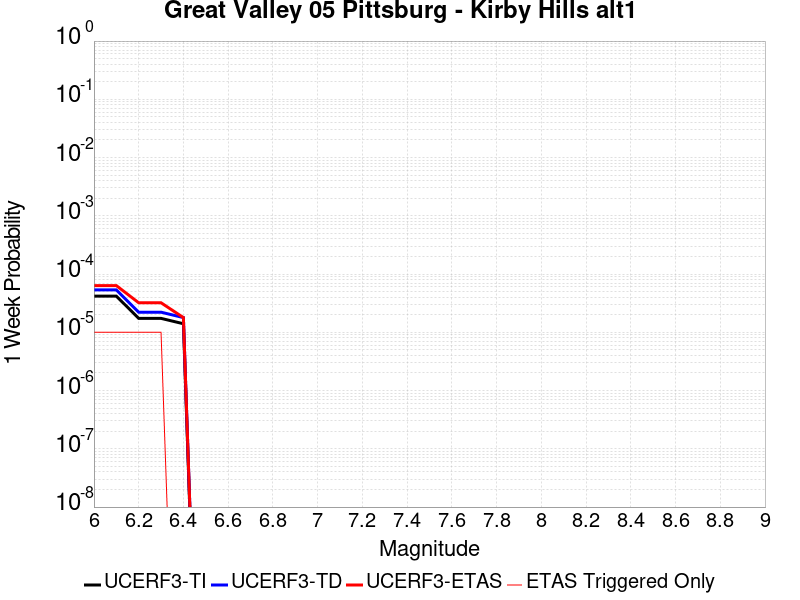 |  |  |  |

| Magnitude | 1 wk TI Prob | 1 wk TD Prob | 1 wk ETAS Prob | 1 wk ETAS/TD Gain | 1 wk ETAS Triggered Only | 1 mo TI Prob | 1 mo TD Prob | 1 mo ETAS Prob | 1 mo ETAS/TD Gain | 1 mo ETAS Triggered Only | 1 yr TI Prob | 1 yr TD Prob | 1 yr ETAS Prob | 1 yr ETAS/TD Gain | 1 yr ETAS Triggered Only | 10 yr TI Prob | 10 yr TD Prob | 10 yr ETAS Prob | 10 yr ETAS/TD Gain | 10 yr ETAS Triggered Only |
|-----|-----|-----|-----|-----|-----|-----|-----|-----|-----|-----|-----|-----|-----|-----|-----|-----|-----|-----|-----|-----|
| 6.0 | 4.187212E-5 | 5.3444855E-5 | 6.344432E-5 | 1.1870987 | 1.0E-5 | 1.794396E-4 | 2.2903502E-4 | 2.3903273E-4 | 1.0436515 | 1.0E-5 | 0.002182488 | 0.0027858997 | 0.0027958718 | 1.0035795 | 1.0E-5 | 0.021611776 | 0.027604194 | 0.027613917 | 1.0003523 | 1.0E-5 |
| 6.1 | 4.187212E-5 | 5.3444855E-5 | 6.344432E-5 | 1.1870987 | 1.0E-5 | 1.794396E-4 | 2.2903502E-4 | 2.3903273E-4 | 1.0436515 | 1.0E-5 | 0.002182488 | 0.0027858997 | 0.0027958718 | 1.0035795 | 1.0E-5 | 0.021611776 | 0.027604194 | 0.027613917 | 1.0003523 | 1.0E-5 |
| 6.2 | 1.7353306E-5 | 2.2155487E-5 | 3.2155265E-5 | 1.4513454 | 1.0E-5 | 7.436919E-5 | 9.495095E-5 | 1.0495E-4 | 1.1053076 | 1.0E-5 | 9.050688E-4 | 0.0011557989 | 0.0011657873 | 1.0086421 | 1.0E-5 | 0.009013915 | 0.011535612 | 0.011545497 | 1.0008569 | 1.0E-5 |
| 6.3 | 1.7353306E-5 | 2.2155487E-5 | 3.2155265E-5 | 1.4513454 | 1.0E-5 | 7.436919E-5 | 9.495095E-5 | 1.0495E-4 | 1.1053076 | 1.0E-5 | 9.050688E-4 | 0.0011557989 | 0.0011657873 | 1.0086421 | 1.0E-5 | 0.009013915 | 0.011535612 | 0.011545497 | 1.0008569 | 1.0E-5 |
| 6.4 | 1.4028824E-5 | 1.7901719E-5 | 1.7901719E-5 | 1.0 | 0.0 | 6.0122147E-5 | 7.672165E-5 | 7.672165E-5 | 1.0 | 0.0 | 7.3174125E-4 | 9.340638E-4 | 9.340638E-4 | 1.0 | 0.0 | 0.0072933645 | 0.009338545 | 0.009338545 | 1.0 | 0.0 |

## Surprise Valley 2011 CFM
*[(top)](#table-of-contents)*

| 1 Week | 1 Month | 1 Year | 10 Year |
|-----|-----|-----|-----|
|  |  |  |  |

| Magnitude | 1 wk TI Prob | 1 wk TD Prob | 1 wk ETAS Prob | 1 wk ETAS/TD Gain | 1 wk ETAS Triggered Only | 1 mo TI Prob | 1 mo TD Prob | 1 mo ETAS Prob | 1 mo ETAS/TD Gain | 1 mo ETAS Triggered Only | 1 yr TI Prob | 1 yr TD Prob | 1 yr ETAS Prob | 1 yr ETAS/TD Gain | 1 yr ETAS Triggered Only | 10 yr TI Prob | 10 yr TD Prob | 10 yr ETAS Prob | 10 yr ETAS/TD Gain | 10 yr ETAS Triggered Only |
|-----|-----|-----|-----|-----|-----|-----|-----|-----|-----|-----|-----|-----|-----|-----|-----|-----|-----|-----|-----|-----|
| 6.0 | 4.0396248E-5 | 4.4851968E-5 | 4.4851968E-5 | 1.0 | 0.0 | 1.7311527E-4 | 1.9220974E-4 | 1.9220974E-4 | 1.0 | 0.0 | 0.002105641 | 0.002337852 | 0.0023478286 | 1.0042675 | 1.0E-5 | 0.020858008 | 0.023154303 | 0.02317384 | 1.0008438 | 2.0E-5 |
| 6.1 | 4.0396248E-5 | 4.4851968E-5 | 4.4851968E-5 | 1.0 | 0.0 | 1.7311527E-4 | 1.9220974E-4 | 1.9220974E-4 | 1.0 | 0.0 | 0.002105641 | 0.002337852 | 0.0023478286 | 1.0042675 | 1.0E-5 | 0.020858008 | 0.023154303 | 0.02317384 | 1.0008438 | 2.0E-5 |
| 6.2 | 2.2295266E-5 | 2.4401555E-5 | 2.4401555E-5 | 1.0 | 0.0 | 9.554764E-5 | 1.0457408E-4 | 1.0457408E-4 | 1.0 | 0.0 | 0.0011626717 | 0.0012724766 | 0.0012724766 | 1.0 | 0.0 | 0.011566074 | 0.012655139 | 0.012655139 | 1.0 | 0.0 |
| 6.3 | 1.572643E-5 | 1.7097005E-5 | 1.7097005E-5 | 1.0 | 0.0 | 6.7397246E-5 | 7.327088E-5 | 7.327088E-5 | 1.0 | 0.0 | 8.202525E-4 | 8.917184E-4 | 8.917184E-4 | 1.0 | 0.0 | 0.008172315 | 0.00888251 | 0.00888251 | 1.0 | 0.0 |
| 6.4 | 1.5714395E-5 | 1.7084827E-5 | 1.7084827E-5 | 1.0 | 0.0 | 6.734567E-5 | 7.321869E-5 | 7.321869E-5 | 1.0 | 0.0 | 8.1962504E-4 | 8.910835E-4 | 8.910835E-4 | 1.0 | 0.0 | 0.008166086 | 0.008876211 | 0.008876211 | 1.0 | 0.0 |
| 6.5 | 1.2733495E-5 | 1.3801754E-5 | 1.3801754E-5 | 1.0 | 0.0 | 5.457098E-5 | 5.914907E-5 | 5.914907E-5 | 1.0 | 0.0 | 6.641992E-4 | 7.199087E-4 | 7.199087E-4 | 1.0 | 0.0 | 0.0066221743 | 0.0071764593 | 0.0071764593 | 1.0 | 0.0 |
| 6.6 | 1.0983784E-5 | 1.1886684E-5 | 1.1886684E-5 | 1.0 | 0.0 | 4.7072506E-5 | 5.0941966E-5 | 5.0941966E-5 | 1.0 | 0.0 | 5.7295704E-4 | 6.2004727E-4 | 6.2004727E-4 | 1.0 | 0.0 | 0.0057148207 | 0.006183722 | 0.006183722 | 1.0 | 0.0 |
| 6.7 | 9.104806E-6 | 9.839597E-6 | 9.839597E-6 | 1.0 | 0.0 | 3.902001E-5 | 4.2169042E-5 | 4.2169042E-5 | 1.0 | 0.0 | 4.7496508E-4 | 5.1329104E-4 | 5.1329104E-4 | 1.0 | 0.0 | 0.004739512 | 0.005121452 | 0.005121452 | 1.0 | 0.0 |
| 6.8 | 6.2162403E-6 | 6.7042038E-6 | 6.7042038E-6 | 1.0 | 0.0 | 2.6640759E-5 | 2.8731998E-5 | 2.8731998E-5 | 1.0 | 0.0 | 3.2430296E-4 | 3.4975816E-4 | 3.4975816E-4 | 1.0 | 0.0 | 0.003238301 | 0.0034923002 | 0.0034923002 | 1.0 | 0.0 |
| 6.9 | 4.1792696E-6 | 4.5032766E-6 | 4.5032766E-6 | 1.0 | 0.0 | 1.7911032E-5 | 1.9299621E-5 | 1.9299621E-5 | 1.0 | 0.0 | 2.1804498E-4 | 2.3494911E-4 | 2.3494911E-4 | 1.0 | 0.0 | 0.0021783116 | 0.0023471604 | 0.0023471604 | 1.0 | 0.0 |
| 7.0 | 2.7478413E-6 | 2.9622734E-6 | 2.9622734E-6 | 1.0 | 0.0 | 1.177641E-5 | 1.2695402E-5 | 1.2695402E-5 | 1.0 | 0.0 | 1.4336836E-4 | 1.5455681E-4 | 1.5455681E-4 | 1.0 | 0.0 | 0.001432759 | 0.0015446156 | 0.0015446156 | 1.0 | 0.0 |
| 7.1 | 8.128648E-7 | 8.725007E-7 | 8.725007E-7 | 1.0 | 0.0 | 3.4837017E-6 | 3.739287E-6 | 3.739287E-6 | 1.0 | 0.0 | 4.2413245E-5 | 4.5525467E-5 | 4.5525467E-5 | 1.0 | 0.0 | 4.2405148E-4 | 4.5522023E-4 | 4.5522023E-4 | 1.0 | 0.0 |
| 7.2 | 4.8641045E-8 | 4.9402168E-8 | 4.9402168E-8 | 1.0 | 0.0 | 2.084616E-7 | 2.1172356E-7 | 2.1172356E-7 | 1.0 | 0.0 | 2.538017E-6 | 2.5777315E-6 | 2.5777315E-6 | 1.0 | 0.0 | 2.537988E-5 | 2.5777028E-5 | 2.5777028E-5 | 1.0 | 0.0 |
| 7.3 | 5.3911844E-9 | 5.4758256E-9 | 5.4758256E-9 | 1.0 | 0.0 | 2.3105075E-8 | 2.3467823E-8 | 2.3467823E-8 | 1.0 | 0.0 | 2.8130427E-7 | 2.8572074E-7 | 2.8572074E-7 | 1.0 | 0.0 | 2.8130391E-6 | 2.8572053E-6 | 2.8572053E-6 | 1.0 | 0.0 |

## Homestead Valley 2011
*[(top)](#table-of-contents)*

| 1 Week | 1 Month | 1 Year | 10 Year |
|-----|-----|-----|-----|
|  |  |  |  |

| Magnitude | 1 wk TI Prob | 1 wk TD Prob | 1 wk ETAS Prob | 1 wk ETAS/TD Gain | 1 wk ETAS Triggered Only | 1 mo TI Prob | 1 mo TD Prob | 1 mo ETAS Prob | 1 mo ETAS/TD Gain | 1 mo ETAS Triggered Only | 1 yr TI Prob | 1 yr TD Prob | 1 yr ETAS Prob | 1 yr ETAS/TD Gain | 1 yr ETAS Triggered Only | 10 yr TI Prob | 10 yr TD Prob | 10 yr ETAS Prob | 10 yr ETAS/TD Gain | 10 yr ETAS Triggered Only |
|-----|-----|-----|-----|-----|-----|-----|-----|-----|-----|-----|-----|-----|-----|-----|-----|-----|-----|-----|-----|-----|
| 6.0 | 1.539795E-5 | 6.2865097E-6 | 6.2865097E-6 | 1.0 | 0.0 | 6.5989545E-5 | 2.6942023E-5 | 2.6942023E-5 | 1.0 | 0.0 | 8.0312655E-4 | 3.2799036E-4 | 3.379871E-4 | 1.0304787 | 1.0E-5 | 0.008002302 | 0.0032770839 | 0.0032970184 | 1.006083 | 2.0E-5 |
| 6.1 | 1.539795E-5 | 6.2865097E-6 | 6.2865097E-6 | 1.0 | 0.0 | 6.5989545E-5 | 2.6942023E-5 | 2.6942023E-5 | 1.0 | 0.0 | 8.0312655E-4 | 3.2799036E-4 | 3.379871E-4 | 1.0304787 | 1.0E-5 | 0.008002302 | 0.0032770839 | 0.0032970184 | 1.006083 | 2.0E-5 |
| 6.2 | 1.539795E-5 | 6.2865097E-6 | 6.2865097E-6 | 1.0 | 0.0 | 6.5989545E-5 | 2.6942023E-5 | 2.6942023E-5 | 1.0 | 0.0 | 8.0312655E-4 | 3.2799036E-4 | 3.379871E-4 | 1.0304787 | 1.0E-5 | 0.008002302 | 0.0032770839 | 0.0032970184 | 1.006083 | 2.0E-5 |
| 6.3 | 1.539795E-5 | 6.2865097E-6 | 6.2865097E-6 | 1.0 | 0.0 | 6.5989545E-5 | 2.6942023E-5 | 2.6942023E-5 | 1.0 | 0.0 | 8.0312655E-4 | 3.2799036E-4 | 3.379871E-4 | 1.0304787 | 1.0E-5 | 0.008002302 | 0.0032770839 | 0.0032970184 | 1.006083 | 2.0E-5 |
| 6.4 | 1.539795E-5 | 6.2865097E-6 | 6.2865097E-6 | 1.0 | 0.0 | 6.5989545E-5 | 2.6942023E-5 | 2.6942023E-5 | 1.0 | 0.0 | 8.0312655E-4 | 3.2799036E-4 | 3.379871E-4 | 1.0304787 | 1.0E-5 | 0.008002302 | 0.0032770839 | 0.0032970184 | 1.006083 | 2.0E-5 |
| 6.5 | 1.0265258E-5 | 2.8786953E-6 | 2.8786953E-6 | 1.0 | 0.0 | 4.3993223E-5 | 1.23372465E-5 | 1.23372465E-5 | 1.0 | 0.0 | 5.3548586E-4 | 1.5020258E-4 | 1.5020258E-4 | 1.0 | 0.0 | 0.005341973 | 0.0015016927 | 0.0015016927 | 1.0 | 0.0 |
| 6.6 | 6.664671E-6 | 5.3439356E-7 | 5.3439356E-7 | 1.0 | 0.0 | 2.8562565E-5 | 2.2902568E-6 | 2.2902568E-6 | 1.0 | 0.0 | 3.476937E-4 | 2.788364E-5 | 2.788364E-5 | 1.0 | 0.0 | 0.003471502 | 2.7881304E-4 | 2.7881304E-4 | 1.0 | 0.0 |
| 6.7 | 6.5954046E-6 | 5.3439356E-7 | 5.3439356E-7 | 1.0 | 0.0 | 2.8265715E-5 | 2.2902568E-6 | 2.2902568E-6 | 1.0 | 0.0 | 3.4408073E-4 | 2.788364E-5 | 2.788364E-5 | 1.0 | 0.0 | 0.0034354846 | 2.7881304E-4 | 2.7881304E-4 | 1.0 | 0.0 |
| 6.8 | 4.648189E-6 | 2.3258009E-7 | 2.3258009E-7 | 1.0 | 0.0 | 1.9920659E-5 | 9.967714E-7 | 9.967714E-7 | 1.0 | 0.0 | 2.4250703E-4 | 1.213563E-5 | 1.213563E-5 | 1.0 | 0.0 | 0.0024224254 | 1.21350145E-4 | 1.21350145E-4 | 1.0 | 0.0 |
| 6.9 | 4.1428534E-6 | 1.9343548E-7 | 1.9343548E-7 | 1.0 | 0.0 | 1.7754966E-5 | 8.2900897E-7 | 8.2900897E-7 | 1.0 | 0.0 | 2.1614527E-4 | 1.009314E-5 | 1.009314E-5 | 1.0 | 0.0 | 0.0021593515 | 1.00927115E-4 | 1.00927115E-4 | 1.0 | 0.0 |
| 7.0 | 3.0673707E-6 | 1.5365111E-7 | 1.5365111E-7 | 1.0 | 0.0 | 1.3145808E-5 | 6.5850463E-7 | 6.5850463E-7 | 1.0 | 0.0 | 1.6003846E-4 | 8.017266E-6 | 8.017266E-6 | 1.0 | 0.0 | 0.0015992324 | 8.016987E-5 | 8.016987E-5 | 1.0 | 0.0 |
| 7.1 | 2.340854E-6 | 1.4685426E-7 | 1.4685426E-7 | 1.0 | 0.0 | 1.0032193E-5 | 6.293753E-7 | 6.293753E-7 | 1.0 | 0.0 | 1.221351E-4 | 7.6626175E-6 | 7.6626175E-6 | 1.0 | 0.0 | 0.00122068 | 7.662363E-5 | 7.662363E-5 | 1.0 | 0.0 |
| 7.2 | 1.3754182E-6 | 1.3920776E-7 | 1.3920776E-7 | 1.0 | 0.0 | 5.8946357E-6 | 5.9660454E-7 | 5.9660454E-7 | 1.0 | 0.0 | 7.176483E-5 | 7.2636367E-6 | 7.2636367E-6 | 1.0 | 0.0 | 7.174166E-4 | 7.263409E-5 | 7.263409E-5 | 1.0 | 0.0 |
| 7.3 | 1.2573237E-6 | 1.3825318E-7 | 1.3825318E-7 | 1.0 | 0.0 | 5.388519E-6 | 5.925135E-7 | 5.925135E-7 | 1.0 | 0.0 | 6.560324E-5 | 7.213829E-6 | 7.213829E-6 | 1.0 | 0.0 | 6.558388E-4 | 7.213604E-5 | 7.213604E-5 | 1.0 | 0.0 |
| 7.4 | 1.0994207E-6 | 1.3104471E-7 | 1.3104471E-7 | 1.0 | 0.0 | 4.7117946E-6 | 5.616201E-7 | 5.616201E-7 | 1.0 | 0.0 | 5.736459E-5 | 6.8377044E-6 | 6.8377044E-6 | 1.0 | 0.0 | 5.734978E-4 | 6.837503E-5 | 6.837503E-5 | 1.0 | 0.0 |
| 7.5 | 5.5569126E-7 | 6.7720926E-8 | 6.7720926E-8 | 1.0 | 0.0 | 2.3815317E-6 | 2.9023252E-7 | 2.9023252E-7 | 1.0 | 0.0 | 2.8994764E-5 | 3.5335759E-6 | 3.5335759E-6 | 1.0 | 0.0 | 2.899098E-4 | 3.533526E-5 | 3.533526E-5 | 1.0 | 0.0 |

## Green Valley 2011 CFM
*[(top)](#table-of-contents)*

| 1 Week | 1 Month | 1 Year | 10 Year |
|-----|-----|-----|-----|
|  |  |  |  |

| Magnitude | 1 wk TI Prob | 1 wk TD Prob | 1 wk ETAS Prob | 1 wk ETAS/TD Gain | 1 wk ETAS Triggered Only | 1 mo TI Prob | 1 mo TD Prob | 1 mo ETAS Prob | 1 mo ETAS/TD Gain | 1 mo ETAS Triggered Only | 1 yr TI Prob | 1 yr TD Prob | 1 yr ETAS Prob | 1 yr ETAS/TD Gain | 1 yr ETAS Triggered Only | 10 yr TI Prob | 10 yr TD Prob | 10 yr ETAS Prob | 10 yr ETAS/TD Gain | 10 yr ETAS Triggered Only |
|-----|-----|-----|-----|-----|-----|-----|-----|-----|-----|-----|-----|-----|-----|-----|-----|-----|-----|-----|-----|-----|
| 6.0 | 9.9629346E-5 | 1.7303096E-4 | 1.7303096E-4 | 1.0 | 0.0 | 4.2691303E-4 | 7.413446E-4 | 7.413446E-4 | 1.0 | 0.0 | 0.0051852856 | 0.008987141 | 0.008987141 | 1.0 | 0.0 | 0.050659515 | 0.08554168 | 0.08555997 | 1.0002139 | 2.0E-5 |
| 6.1 | 9.88615E-5 | 1.7150394E-4 | 1.7150394E-4 | 1.0 | 0.0 | 4.2362334E-4 | 7.348039E-4 | 7.348039E-4 | 1.0 | 0.0 | 0.0051454236 | 0.0089081675 | 0.0089081675 | 1.0 | 0.0 | 0.050279044 | 0.08482929 | 0.0848476 | 1.0002158 | 2.0E-5 |
| 6.2 | 9.696895E-5 | 1.6789426E-4 | 1.6789426E-4 | 1.0 | 0.0 | 4.15515E-4 | 7.193438E-4 | 7.193438E-4 | 1.0 | 0.0 | 0.0050471667 | 0.008721547 | 0.008721547 | 1.0 | 0.0 | 0.04934063 | 0.08313806 | 0.0831564 | 1.0002205 | 2.0E-5 |
| 6.3 | 9.275224E-5 | 1.5968755E-4 | 1.5968755E-4 | 1.0 | 0.0 | 3.9744904E-4 | 6.8419095E-4 | 6.8419095E-4 | 1.0 | 0.0 | 0.0048282105 | 0.008296867 | 0.008296867 | 1.0 | 0.0 | 0.047246475 | 0.07927713 | 0.07929554 | 1.0002323 | 2.0E-5 |
| 6.4 | 8.391499E-5 | 1.4366042E-4 | 1.4366042E-4 | 1.0 | 0.0 | 3.595861E-4 | 6.155415E-4 | 6.155415E-4 | 1.0 | 0.0 | 0.004369175 | 0.007467382 | 0.007467382 | 1.0 | 0.0 | 0.04284265 | 0.07164556 | 0.071664125 | 1.0002592 | 2.0E-5 |
| 6.5 | 5.9519385E-5 | 9.932708E-5 | 9.932708E-5 | 1.0 | 0.0 | 2.5505814E-4 | 4.2561657E-4 | 4.2561657E-4 | 1.0 | 0.0 | 0.0031009112 | 0.005168488 | 0.005168488 | 1.0 | 0.0 | 0.030579966 | 0.05014941 | 0.05015891 | 1.0001894 | 1.0E-5 |
| 6.6 | 4.5361558E-5 | 7.40199E-5 | 7.40199E-5 | 1.0 | 0.0 | 1.9439218E-4 | 3.1718693E-4 | 3.1718693E-4 | 1.0 | 0.0 | 0.0023641558 | 0.003853991 | 0.003853991 | 1.0 | 0.0 | 0.023391623 | 0.037669275 | 0.037678897 | 1.0002555 | 1.0E-5 |
| 6.7 | 3.8808106E-5 | 6.264344E-5 | 6.264344E-5 | 1.0 | 0.0 | 1.6630985E-4 | 2.6844675E-4 | 2.6844675E-4 | 1.0 | 0.0 | 0.0020229418 | 0.0032628388 | 0.0032628388 | 1.0 | 0.0 | 0.020046256 | 0.032008745 | 0.032008745 | 1.0 | 0.0 |
| 6.8 | 2.2284667E-5 | 3.128603E-5 | 3.128603E-5 | 1.0 | 0.0 | 9.550222E-5 | 1.3407608E-4 | 1.3407608E-4 | 1.0 | 0.0 | 0.0011621192 | 0.0016311527 | 0.0016311527 | 1.0 | 0.0 | 0.011560607 | 0.016166579 | 0.016166579 | 1.0 | 0.0 |
| 6.9 | 1.8050168E-5 | 2.4448742E-5 | 2.4448742E-5 | 1.0 | 0.0 | 7.735557E-5 | 1.04776154E-4 | 1.04776154E-4 | 1.0 | 0.0 | 9.4139716E-4 | 0.0012749061 | 0.0012749061 | 1.0 | 0.0 | 0.009374191 | 0.012668985 | 0.012668985 | 1.0 | 0.0 |
| 7.0 | 1.4763166E-5 | 1.9583402E-5 | 1.9583402E-5 | 1.0 | 0.0 | 6.326917E-5 | 8.392618E-5 | 8.392618E-5 | 1.0 | 0.0 | 7.7002996E-4 | 0.0010213237 | 0.0010213237 | 1.0 | 0.0 | 0.007673672 | 0.010166345 | 0.010166345 | 1.0 | 0.0 |
| 7.1 | 1.2399713E-5 | 1.6304173E-5 | 1.6304173E-5 | 1.0 | 0.0 | 5.3140546E-5 | 6.987317E-5 | 6.987317E-5 | 1.0 | 0.0 | 6.467941E-4 | 8.5037574E-4 | 8.5037574E-4 | 1.0 | 0.0 | 0.006449148 | 0.008471897 | 0.008471897 | 1.0 | 0.0 |
| 7.2 | 1.0584195E-5 | 1.392217E-5 | 1.392217E-5 | 1.0 | 0.0 | 4.5360044E-5 | 5.9665086E-5 | 5.9665086E-5 | 1.0 | 0.0 | 5.521186E-4 | 7.2618196E-4 | 7.2618196E-4 | 1.0 | 0.0 | 0.0055074887 | 0.007238742 | 0.007238742 | 1.0 | 0.0 |
| 7.3 | 7.998173E-6 | 1.0544361E-5 | 1.0544361E-5 | 1.0 | 0.0 | 3.4277433E-5 | 4.5189343E-5 | 4.5189343E-5 | 1.0 | 0.0 | 4.1724785E-4 | 5.5004243E-4 | 5.5004243E-4 | 1.0 | 0.0 | 0.004164653 | 0.005487132 | 0.005487132 | 1.0 | 0.0 |
| 7.4 | 6.7571127E-6 | 8.932998E-6 | 8.932998E-6 | 1.0 | 0.0 | 2.8958733E-5 | 3.828372E-5 | 3.828372E-5 | 1.0 | 0.0 | 3.5251552E-4 | 4.6600556E-4 | 4.6600556E-4 | 1.0 | 0.0 | 0.0035195686 | 0.00465062 | 0.00465062 | 1.0 | 0.0 |
| 7.5 | 5.69878E-6 | 7.516554E-6 | 7.516554E-6 | 1.0 | 0.0 | 2.4423114E-5 | 3.221341E-5 | 3.221341E-5 | 1.0 | 0.0 | 2.9731085E-4 | 3.9212857E-4 | 3.9212857E-4 | 1.0 | 0.0 | 0.002969134 | 0.0039146794 | 0.0039146794 | 1.0 | 0.0 |
| 7.6 | 4.503664E-6 | 5.9358817E-6 | 5.9358817E-6 | 1.0 | 0.0 | 1.9301275E-5 | 2.5439249E-5 | 2.5439249E-5 | 1.0 | 0.0 | 2.3496768E-4 | 3.0967966E-4 | 3.0967966E-4 | 1.0 | 0.0 | 0.002347194 | 0.0030927253 | 0.0030927253 | 1.0 | 0.0 |
| 7.7 | 1.0873546E-6 | 1.4107662E-6 | 1.4107662E-6 | 1.0 | 0.0 | 4.6600826E-6 | 6.046127E-6 | 6.046127E-6 | 1.0 | 0.0 | 5.6735033E-5 | 7.360914E-5 | 7.360914E-5 | 1.0 | 0.0 | 5.672055E-4 | 7.358931E-4 | 7.358931E-4 | 1.0 | 0.0 |
| 7.8 | 4.9373917E-8 | 6.178036E-8 | 6.178036E-8 | 1.0 | 0.0 | 2.1160248E-7 | 2.6477298E-7 | 2.6477298E-7 | 1.0 | 0.0 | 2.5762572E-6 | 3.2236076E-6 | 3.2236076E-6 | 1.0 | 0.0 | 2.5762274E-5 | 3.222859E-5 | 3.222859E-5 | 1.0 | 0.0 |

## Great Valley 09 (Laguna Seca)
*[(top)](#table-of-contents)*

| 1 Week | 1 Month | 1 Year | 10 Year |
|-----|-----|-----|-----|
|  |  |  |  |

| Magnitude | 1 wk TI Prob | 1 wk TD Prob | 1 wk ETAS Prob | 1 wk ETAS/TD Gain | 1 wk ETAS Triggered Only | 1 mo TI Prob | 1 mo TD Prob | 1 mo ETAS Prob | 1 mo ETAS/TD Gain | 1 mo ETAS Triggered Only | 1 yr TI Prob | 1 yr TD Prob | 1 yr ETAS Prob | 1 yr ETAS/TD Gain | 1 yr ETAS Triggered Only | 10 yr TI Prob | 10 yr TD Prob | 10 yr ETAS Prob | 10 yr ETAS/TD Gain | 10 yr ETAS Triggered Only |
|-----|-----|-----|-----|-----|-----|-----|-----|-----|-----|-----|-----|-----|-----|-----|-----|-----|-----|-----|-----|-----|
| 6.0 | 5.4353277E-5 | 7.050336E-5 | 7.050336E-5 | 1.0 | 0.0 | 2.3292181E-4 | 3.0212323E-4 | 3.0212323E-4 | 1.0 | 0.0 | 0.0028321352 | 0.0036721565 | 0.0036821198 | 1.0027132 | 1.0E-5 | 0.02796312 | 0.036117274 | 0.036136553 | 1.0005337 | 2.0E-5 |
| 6.1 | 4.5578287E-5 | 5.8223057E-5 | 5.8223057E-5 | 1.0 | 0.0 | 1.953209E-4 | 2.4950382E-4 | 2.4950382E-4 | 1.0 | 0.0 | 0.0023754383 | 0.0030334755 | 0.0030334755 | 1.0 | 0.0 | 0.023502063 | 0.029921044 | 0.029921044 | 1.0 | 0.0 |
| 6.2 | 2.8536782E-5 | 3.4737728E-5 | 3.4737728E-5 | 1.0 | 0.0 | 1.2229476E-4 | 1.4886676E-4 | 1.4886676E-4 | 1.0 | 0.0 | 0.0014879217 | 0.0018109222 | 0.0018109222 | 1.0 | 0.0 | 0.014779986 | 0.017958904 | 0.017958904 | 1.0 | 0.0 |
| 6.3 | 2.3698774E-5 | 2.8214345E-5 | 2.8214345E-5 | 1.0 | 0.0 | 1.01562226E-4 | 1.2091216E-4 | 1.2091216E-4 | 1.0 | 0.0 | 0.0012358186 | 0.001471101 | 0.001471101 | 1.0 | 0.0 | 0.012289686 | 0.014611942 | 0.014611942 | 1.0 | 0.0 |
| 6.4 | 1.9191197E-5 | 2.2123615E-5 | 2.2123615E-5 | 1.0 | 0.0 | 8.2245395E-5 | 9.481171E-5 | 9.481171E-5 | 1.0 | 0.0 | 0.0010008777 | 0.0011537268 | 0.0011537268 | 1.0 | 0.0 | 0.009963818 | 0.011477377 | 0.011477377 | 1.0 | 0.0 |
| 6.5 | 1.5203241E-5 | 1.6801783E-5 | 1.6801783E-5 | 1.0 | 0.0 | 6.5155116E-5 | 7.200525E-5 | 7.200525E-5 | 1.0 | 0.0 | 7.9297484E-4 | 8.763255E-4 | 8.763255E-4 | 1.0 | 0.0 | 0.007901512 | 0.008729823 | 0.008729823 | 1.0 | 0.0 |
| 6.6 | 1.0984925E-5 | 1.1242807E-5 | 1.1242807E-5 | 1.0 | 0.0 | 4.70774E-5 | 4.8182592E-5 | 4.8182592E-5 | 1.0 | 0.0 | 5.730166E-4 | 5.864689E-4 | 5.864689E-4 | 1.0 | 0.0 | 0.005715413 | 0.0058496036 | 0.0058496036 | 1.0 | 0.0 |
| 6.7 | 9.134616E-6 | 9.020056E-6 | 9.020056E-6 | 1.0 | 0.0 | 3.9147766E-5 | 3.8656824E-5 | 3.8656824E-5 | 1.0 | 0.0 | 4.7651984E-4 | 4.7054756E-4 | 4.7054756E-4 | 1.0 | 0.0 | 0.004754993 | 0.0046957573 | 0.0046957573 | 1.0 | 0.0 |
| 6.8 | 7.785589E-6 | 7.4520726E-6 | 7.4520726E-6 | 1.0 | 0.0 | 3.3366385E-5 | 3.1937074E-5 | 3.1937074E-5 | 1.0 | 0.0 | 4.0616E-4 | 3.8876652E-4 | 3.8876652E-4 | 1.0 | 0.0 | 0.0040541845 | 0.0038810682 | 0.0038810682 | 1.0 | 0.0 |
| 6.9 | 5.579095E-6 | 4.898567E-6 | 4.898567E-6 | 1.0 | 0.0 | 2.3910188E-5 | 2.0993697E-5 | 2.0993697E-5 | 1.0 | 0.0 | 2.9106764E-4 | 2.5556967E-4 | 2.5556967E-4 | 1.0 | 0.0 | 0.002906867 | 0.002552895 | 0.002552895 | 1.0 | 0.0 |
| 7.0 | 2.6816688E-6 | 1.5216133E-6 | 1.5216133E-6 | 1.0 | 0.0 | 1.1492816E-5 | 6.521184E-6 | 6.521184E-6 | 1.0 | 0.0 | 1.3991605E-4 | 7.939261E-5 | 7.939261E-5 | 1.0 | 0.0 | 0.0013982799 | 7.9365115E-4 | 7.9365115E-4 | 1.0 | 0.0 |
| 7.1 | 1.9951021E-6 | 7.453698E-7 | 7.453698E-7 | 1.0 | 0.0 | 8.55041E-6 | 3.1944382E-6 | 3.1944382E-6 | 1.0 | 0.0 | 1.0409627E-4 | 3.8891634E-5 | 3.8891634E-5 | 1.0 | 0.0 | 0.0010404752 | 3.8885244E-4 | 3.8885244E-4 | 1.0 | 0.0 |
| 7.2 | 1.9951021E-6 | 7.453698E-7 | 7.453698E-7 | 1.0 | 0.0 | 8.55041E-6 | 3.1944382E-6 | 3.1944382E-6 | 1.0 | 0.0 | 1.0409627E-4 | 3.8891634E-5 | 3.8891634E-5 | 1.0 | 0.0 | 0.0010404752 | 3.8885244E-4 | 3.8885244E-4 | 1.0 | 0.0 |
| 7.3 | 1.7087556E-6 | 6.5787674E-7 | 6.5787674E-7 | 1.0 | 0.0 | 7.3232177E-6 | 2.8194688E-6 | 2.8194688E-6 | 1.0 | 0.0 | 8.915652E-5 | 3.4326535E-5 | 3.4326535E-5 | 1.0 | 0.0 | 8.9120766E-4 | 3.4321635E-4 | 3.4321635E-4 | 1.0 | 0.0 |
| 7.4 | 1.3804846E-6 | 6.0737995E-7 | 6.0737995E-7 | 1.0 | 0.0 | 5.916349E-6 | 2.6030546E-6 | 2.6030546E-6 | 1.0 | 0.0 | 7.2029165E-5 | 3.169177E-5 | 3.169177E-5 | 1.0 | 0.0 | 7.200583E-4 | 3.168765E-4 | 3.168765E-4 | 1.0 | 0.0 |
| 7.5 | 1.3804846E-6 | 6.0737995E-7 | 6.0737995E-7 | 1.0 | 0.0 | 5.916349E-6 | 2.6030546E-6 | 2.6030546E-6 | 1.0 | 0.0 | 7.2029165E-5 | 3.169177E-5 | 3.169177E-5 | 1.0 | 0.0 | 7.200583E-4 | 3.168765E-4 | 3.168765E-4 | 1.0 | 0.0 |

## San Gabriel (Extension)
*[(top)](#table-of-contents)*

| 1 Week | 1 Month | 1 Year | 10 Year |
|-----|-----|-----|-----|
|  |  |  |  |

| Magnitude | 1 wk TI Prob | 1 wk TD Prob | 1 wk ETAS Prob | 1 wk ETAS/TD Gain | 1 wk ETAS Triggered Only | 1 mo TI Prob | 1 mo TD Prob | 1 mo ETAS Prob | 1 mo ETAS/TD Gain | 1 mo ETAS Triggered Only | 1 yr TI Prob | 1 yr TD Prob | 1 yr ETAS Prob | 1 yr ETAS/TD Gain | 1 yr ETAS Triggered Only | 10 yr TI Prob | 10 yr TD Prob | 10 yr ETAS Prob | 10 yr ETAS/TD Gain | 10 yr ETAS Triggered Only |
|-----|-----|-----|-----|-----|-----|-----|-----|-----|-----|-----|-----|-----|-----|-----|-----|-----|-----|-----|-----|-----|
| 6.0 | 5.6486106E-6 | 5.7171515E-6 | 5.7171515E-6 | 1.0 | 0.0 | 2.4208108E-5 | 2.4501855E-5 | 2.4501855E-5 | 1.0 | 0.0 | 2.9469383E-4 | 2.9827052E-4 | 2.9827052E-4 | 1.0 | 0.0 | 0.0029430336 | 0.0029788336 | 0.0029987742 | 1.0066941 | 2.0E-5 |
| 6.1 | 5.6486106E-6 | 5.7171515E-6 | 5.7171515E-6 | 1.0 | 0.0 | 2.4208108E-5 | 2.4501855E-5 | 2.4501855E-5 | 1.0 | 0.0 | 2.9469383E-4 | 2.9827052E-4 | 2.9827052E-4 | 1.0 | 0.0 | 0.0029430336 | 0.0029788336 | 0.0029987742 | 1.0066941 | 2.0E-5 |
| 6.2 | 5.6486106E-6 | 5.7171515E-6 | 5.7171515E-6 | 1.0 | 0.0 | 2.4208108E-5 | 2.4501855E-5 | 2.4501855E-5 | 1.0 | 0.0 | 2.9469383E-4 | 2.9827052E-4 | 2.9827052E-4 | 1.0 | 0.0 | 0.0029430336 | 0.0029788336 | 0.0029987742 | 1.0066941 | 2.0E-5 |
| 6.3 | 5.6486106E-6 | 5.7171515E-6 | 5.7171515E-6 | 1.0 | 0.0 | 2.4208108E-5 | 2.4501855E-5 | 2.4501855E-5 | 1.0 | 0.0 | 2.9469383E-4 | 2.9827052E-4 | 2.9827052E-4 | 1.0 | 0.0 | 0.0029430336 | 0.0029788336 | 0.0029987742 | 1.0066941 | 2.0E-5 |
| 6.4 | 5.6486106E-6 | 5.7171515E-6 | 5.7171515E-6 | 1.0 | 0.0 | 2.4208108E-5 | 2.4501855E-5 | 2.4501855E-5 | 1.0 | 0.0 | 2.9469383E-4 | 2.9827052E-4 | 2.9827052E-4 | 1.0 | 0.0 | 0.0029430336 | 0.0029788336 | 0.0029987742 | 1.0066941 | 2.0E-5 |
| 6.5 | 4.7134554E-6 | 4.754572E-6 | 4.754572E-6 | 1.0 | 0.0 | 2.0200367E-5 | 2.0376581E-5 | 2.0376581E-5 | 1.0 | 0.0 | 2.459117E-4 | 2.4805748E-4 | 2.4805748E-4 | 1.0 | 0.0 | 0.0024563975 | 0.0024778957 | 0.002497846 | 1.0080514 | 2.0E-5 |
| 6.6 | 4.7134554E-6 | 4.754572E-6 | 4.754572E-6 | 1.0 | 0.0 | 2.0200367E-5 | 2.0376581E-5 | 2.0376581E-5 | 1.0 | 0.0 | 2.459117E-4 | 2.4805748E-4 | 2.4805748E-4 | 1.0 | 0.0 | 0.0024563975 | 0.0024778957 | 0.002497846 | 1.0080514 | 2.0E-5 |
| 6.7 | 4.2468837E-6 | 4.2743873E-6 | 4.2743873E-6 | 1.0 | 0.0 | 1.8200803E-5 | 1.8318677E-5 | 1.8318677E-5 | 1.0 | 0.0 | 2.2157225E-4 | 2.230078E-4 | 2.230078E-4 | 1.0 | 0.0 | 0.0022135144 | 0.0022279175 | 0.0022378953 | 1.0044785 | 1.0E-5 |
| 6.8 | 4.1180615E-6 | 4.141776E-6 | 4.141776E-6 | 1.0 | 0.0 | 1.7648716E-5 | 1.7750353E-5 | 1.7750353E-5 | 1.0 | 0.0 | 2.1485193E-4 | 2.1608983E-4 | 2.1608983E-4 | 1.0 | 0.0 | 0.0021464431 | 0.0021588737 | 0.0021688521 | 1.0046221 | 1.0E-5 |
| 6.9 | 3.863861E-6 | 3.8800904E-6 | 3.8800904E-6 | 1.0 | 0.0 | 1.65593E-5 | 1.6628857E-5 | 1.6628857E-5 | 1.0 | 0.0 | 2.0159081E-4 | 2.0243821E-4 | 2.0243821E-4 | 1.0 | 0.0 | 0.0020140803 | 0.002022611 | 0.0020325908 | 1.0049341 | 1.0E-5 |
| 7.0 | 3.6947372E-6 | 3.705989E-6 | 3.705989E-6 | 1.0 | 0.0 | 1.5834492E-5 | 1.5882717E-5 | 1.5882717E-5 | 1.0 | 0.0 | 1.9276788E-4 | 1.9335559E-4 | 1.9335559E-4 | 1.0 | 0.0 | 0.0019260074 | 0.0019319453 | 0.0019419261 | 1.0051662 | 1.0E-5 |
| 7.1 | 3.5686835E-6 | 3.5732085E-6 | 3.5732085E-6 | 1.0 | 0.0 | 1.5294268E-5 | 1.5313664E-5 | 1.5313664E-5 | 1.0 | 0.0 | 1.861918E-4 | 1.8642857E-4 | 1.8642857E-4 | 1.0 | 0.0 | 0.0018603588 | 0.001862793 | 0.0018727743 | 1.0053583 | 1.0E-5 |
| 7.2 | 2.8023446E-6 | 2.7770957E-6 | 2.7770957E-6 | 1.0 | 0.0 | 1.2009994E-5 | 1.1901785E-5 | 1.1901785E-5 | 1.0 | 0.0 | 1.4621185E-4 | 1.448947E-4 | 1.448947E-4 | 1.0 | 0.0 | 0.001461157 | 0.0014480185 | 0.001458004 | 1.006896 | 1.0E-5 |
| 7.3 | 2.5843012E-6 | 2.546268E-6 | 2.546268E-6 | 1.0 | 0.0 | 1.1075529E-5 | 1.0912532E-5 | 1.0912532E-5 | 1.0 | 0.0 | 1.3483623E-4 | 1.3285207E-4 | 1.3285207E-4 | 1.0 | 0.0 | 0.0013475444 | 0.0013277415 | 0.0013377282 | 1.0075216 | 1.0E-5 |
| 7.4 | 2.4464468E-6 | 2.3969635E-6 | 2.3969635E-6 | 1.0 | 0.0 | 1.04847295E-5 | 1.0272661E-5 | 1.0272661E-5 | 1.0 | 0.0 | 1.276441E-4 | 1.2506256E-4 | 1.2506256E-4 | 1.0 | 0.0 | 0.0012757082 | 0.0012499366 | 0.0012599241 | 1.0079904 | 1.0E-5 |
| 7.5 | 2.0420266E-6 | 1.891297E-6 | 1.891297E-6 | 1.0 | 0.0 | 8.751514E-6 | 8.105533E-6 | 8.105533E-6 | 1.0 | 0.0 | 1.0654447E-4 | 9.868044E-5 | 9.868044E-5 | 1.0 | 0.0 | 0.001064934 | 9.863748E-4 | 9.96365E-4 | 1.0101281 | 1.0E-5 |
| 7.6 | 1.8326596E-6 | 1.6400626E-6 | 1.6400626E-6 | 1.0 | 0.0 | 7.854232E-6 | 7.028821E-6 | 7.028821E-6 | 1.0 | 0.0 | 9.562107E-5 | 8.557256E-5 | 8.557256E-5 | 1.0 | 0.0 | 9.5579936E-4 | 8.5540337E-4 | 8.6539483E-4 | 1.0116804 | 1.0E-5 |
| 7.7 | 1.4786998E-6 | 1.2525887E-6 | 1.2525887E-6 | 1.0 | 0.0 | 6.3372695E-6 | 5.368226E-6 | 5.368226E-6 | 1.0 | 0.0 | 7.715353E-5 | 6.535621E-5 | 6.535621E-5 | 1.0 | 0.0 | 7.7126746E-4 | 6.5337884E-4 | 6.5337884E-4 | 1.0 | 0.0 |
| 7.8 | 7.6975533E-7 | 6.071072E-7 | 6.071072E-7 | 1.0 | 0.0 | 3.2989474E-6 | 2.6018854E-6 | 2.6018854E-6 | 1.0 | 0.0 | 4.0163945E-5 | 3.1677497E-5 | 3.1677497E-5 | 1.0 | 0.0 | 4.0156685E-4 | 3.1673696E-4 | 3.1673696E-4 | 1.0 | 0.0 |
| 7.9 | 1.7645915E-7 | 9.217281E-8 | 9.217281E-8 | 1.0 | 0.0 | 7.562533E-7 | 3.950263E-7 | 3.950263E-7 | 1.0 | 0.0 | 9.207345E-6 | 4.8094344E-6 | 4.8094344E-6 | 1.0 | 0.0 | 9.206964E-5 | 4.8098358E-5 | 4.8098358E-5 | 1.0 | 0.0 |
| 8.0 | 1.0463461E-7 | 2.4959572E-8 | 2.4959572E-8 | 1.0 | 0.0 | 4.4843398E-7 | 1.0696959E-7 | 1.0696959E-7 | 1.0 | 0.0 | 5.45967E-6 | 1.302354E-6 | 1.302354E-6 | 1.0 | 0.0 | 5.459536E-5 | 1.3028511E-5 | 1.3028511E-5 | 1.0 | 0.0 |
| 8.1 | 7.875717E-8 | 1.3871283E-8 | 1.3871283E-8 | 1.0 | 0.0 | 3.3753068E-7 | 5.9448354E-8 | 5.9448354E-8 | 1.0 | 0.0 | 4.109428E-6 | 7.2378344E-7 | 7.2378344E-7 | 1.0 | 0.0 | 4.109352E-5 | 7.2428584E-6 | 7.2428584E-6 | 1.0 | 0.0 |
| 8.2 | 1.33163E-8 | 1.7741913E-9 | 1.7741913E-9 | 1.0 | 0.0 | 5.7069855E-8 | 7.603677E-9 | 7.603677E-9 | 1.0 | 0.0 | 6.9482525E-7 | 9.257475E-8 | 9.257475E-8 | 1.0 | 0.0 | 6.9482307E-6 | 9.27746E-7 | 9.27746E-7 | 1.0 | 0.0 |

## San Jacinto (Coyote Creek)
*[(top)](#table-of-contents)*

| 1 Week | 1 Month | 1 Year | 10 Year |
|-----|-----|-----|-----|
|  |  |  |  |

| Magnitude | 1 wk TI Prob | 1 wk TD Prob | 1 wk ETAS Prob | 1 wk ETAS/TD Gain | 1 wk ETAS Triggered Only | 1 mo TI Prob | 1 mo TD Prob | 1 mo ETAS Prob | 1 mo ETAS/TD Gain | 1 mo ETAS Triggered Only | 1 yr TI Prob | 1 yr TD Prob | 1 yr ETAS Prob | 1 yr ETAS/TD Gain | 1 yr ETAS Triggered Only | 10 yr TI Prob | 10 yr TD Prob | 10 yr ETAS Prob | 10 yr ETAS/TD Gain | 10 yr ETAS Triggered Only |
|-----|-----|-----|-----|-----|-----|-----|-----|-----|-----|-----|-----|-----|-----|-----|-----|-----|-----|-----|-----|-----|
| 6.0 | 2.7374346E-5 | 2.4152421E-5 | 2.4152421E-5 | 1.0 | 0.0 | 1.1731335E-4 | 1.0350628E-4 | 1.0350628E-4 | 1.0 | 0.0 | 0.0014273542 | 0.001259463 | 0.001259463 | 1.0 | 0.0 | 0.01418221 | 0.012931943 | 0.012951684 | 1.0015266 | 2.0E-5 |
| 6.1 | 2.7374346E-5 | 2.4152421E-5 | 2.4152421E-5 | 1.0 | 0.0 | 1.1731335E-4 | 1.0350628E-4 | 1.0350628E-4 | 1.0 | 0.0 | 0.0014273542 | 0.001259463 | 0.001259463 | 1.0 | 0.0 | 0.01418221 | 0.012931943 | 0.012951684 | 1.0015266 | 2.0E-5 |
| 6.2 | 2.7374346E-5 | 2.4152421E-5 | 2.4152421E-5 | 1.0 | 0.0 | 1.1731335E-4 | 1.0350628E-4 | 1.0350628E-4 | 1.0 | 0.0 | 0.0014273542 | 0.001259463 | 0.001259463 | 1.0 | 0.0 | 0.01418221 | 0.012931943 | 0.012951684 | 1.0015266 | 2.0E-5 |
| 6.3 | 2.7374346E-5 | 2.4152421E-5 | 2.4152421E-5 | 1.0 | 0.0 | 1.1731335E-4 | 1.0350628E-4 | 1.0350628E-4 | 1.0 | 0.0 | 0.0014273542 | 0.001259463 | 0.001259463 | 1.0 | 0.0 | 0.01418221 | 0.012931943 | 0.012951684 | 1.0015266 | 2.0E-5 |
| 6.4 | 2.7374346E-5 | 2.4152421E-5 | 2.4152421E-5 | 1.0 | 0.0 | 1.1731335E-4 | 1.0350628E-4 | 1.0350628E-4 | 1.0 | 0.0 | 0.0014273542 | 0.001259463 | 0.001259463 | 1.0 | 0.0 | 0.01418221 | 0.012931943 | 0.012951684 | 1.0015266 | 2.0E-5 |
| 6.5 | 2.7282445E-5 | 2.4038494E-5 | 2.4038494E-5 | 1.0 | 0.0 | 1.16919524E-4 | 1.03018065E-4 | 1.03018065E-4 | 1.0 | 0.0 | 0.0014225657 | 0.001253526 | 0.001253526 | 1.0 | 0.0 | 0.014134934 | 0.012873269 | 0.012893011 | 1.0015336 | 2.0E-5 |
| 6.6 | 2.7282445E-5 | 2.4038494E-5 | 2.4038494E-5 | 1.0 | 0.0 | 1.16919524E-4 | 1.03018065E-4 | 1.03018065E-4 | 1.0 | 0.0 | 0.0014225657 | 0.001253526 | 0.001253526 | 1.0 | 0.0 | 0.014134934 | 0.012873269 | 0.012893011 | 1.0015336 | 2.0E-5 |
| 6.7 | 2.7216198E-5 | 2.3963614E-5 | 2.3963614E-5 | 1.0 | 0.0 | 1.1663563E-4 | 1.0269717E-4 | 1.0269717E-4 | 1.0 | 0.0 | 0.0014191137 | 0.0012496236 | 0.0012496236 | 1.0 | 0.0 | 0.014100855 | 0.012834677 | 0.01285442 | 1.0015383 | 2.0E-5 |
| 6.8 | 2.7078617E-5 | 2.3880828E-5 | 2.3880828E-5 | 1.0 | 0.0 | 1.1604605E-4 | 1.02342405E-4 | 1.02342405E-4 | 1.0 | 0.0 | 0.001411945 | 0.0012453091 | 0.0012453091 | 1.0 | 0.0 | 0.014030075 | 0.012791819 | 0.012811564 | 1.0015435 | 2.0E-5 |
| 6.9 | 2.6982952E-5 | 2.3800336E-5 | 2.3800336E-5 | 1.0 | 0.0 | 1.15636096E-4 | 1.01997466E-4 | 1.01997466E-4 | 1.0 | 0.0 | 0.0014069602 | 0.0012411143 | 0.0012411143 | 1.0 | 0.0 | 0.013980856 | 0.012750106 | 0.012769851 | 1.0015486 | 2.0E-5 |
| 7.0 | 2.6449972E-5 | 2.3377343E-5 | 2.3377343E-5 | 1.0 | 0.0 | 1.1335209E-4 | 1.00184785E-4 | 1.00184785E-4 | 1.0 | 0.0 | 0.001379188 | 0.0012190698 | 0.0012190698 | 1.0 | 0.0 | 0.0137065975 | 0.012531462 | 0.012551212 | 1.001576 | 2.0E-5 |
| 7.1 | 2.6257849E-5 | 2.3203378E-5 | 2.3203378E-5 | 1.0 | 0.0 | 1.1252879E-4 | 9.943927E-5 | 9.943927E-5 | 1.0 | 0.0 | 0.0013691769 | 0.0012100033 | 0.0012100033 | 1.0 | 0.0 | 0.013607717 | 0.012441383 | 0.012461134 | 1.0015875 | 2.0E-5 |
| 7.2 | 2.5270041E-5 | 2.2398073E-5 | 2.2398073E-5 | 1.0 | 0.0 | 1.0829568E-4 | 9.598822E-5 | 9.598822E-5 | 1.0 | 0.0 | 0.0013177024 | 0.0011680324 | 0.0011680324 | 1.0 | 0.0 | 0.013099162 | 0.012022524 | 0.012042284 | 1.0016435 | 2.0E-5 |
| 7.3 | 2.339701E-5 | 2.1129852E-5 | 2.1129852E-5 | 1.0 | 0.0 | 1.0026905E-4 | 9.0553374E-5 | 9.0553374E-5 | 1.0 | 0.0 | 0.001220092 | 0.0011019319 | 0.0011019319 | 1.0 | 0.0 | 0.012134149 | 0.011361412 | 0.011381185 | 1.0017403 | 2.0E-5 |
| 7.4 | 2.296333E-5 | 2.0860187E-5 | 2.0860187E-5 | 1.0 | 0.0 | 9.841056E-5 | 8.939775E-5 | 8.939775E-5 | 1.0 | 0.0 | 0.0011974899 | 0.0010878762 | 0.0010878762 | 1.0 | 0.0 | 0.011910575 | 0.011220528 | 0.0112403035 | 1.0017624 | 2.0E-5 |
| 7.5 | 2.2188895E-5 | 2.0383068E-5 | 2.0383068E-5 | 1.0 | 0.0 | 9.50918E-5 | 8.735309E-5 | 8.735309E-5 | 1.0 | 0.0 | 0.0011571277 | 0.001063007 | 0.001063007 | 1.0 | 0.0 | 0.011511209 | 0.010970126 | 0.010989906 | 1.0018032 | 2.0E-5 |
| 7.6 | 2.0013189E-5 | 1.8969224E-5 | 1.8969224E-5 | 1.0 | 0.0 | 8.5767984E-5 | 8.129415E-5 | 8.129415E-5 | 1.0 | 0.0 | 0.001043725 | 9.893086E-4 | 9.893086E-4 | 1.0 | 0.0 | 0.010388365 | 0.010228057 | 0.010247853 | 1.0019354 | 2.0E-5 |
| 7.7 | 1.7230794E-5 | 1.6750411E-5 | 1.6750411E-5 | 1.0 | 0.0 | 7.384417E-5 | 7.178551E-5 | 7.178551E-5 | 1.0 | 0.0 | 8.986819E-4 | 8.7363896E-4 | 8.7363896E-4 | 1.0 | 0.0 | 0.008950562 | 0.009066527 | 0.009086345 | 1.002186 | 2.0E-5 |
| 7.8 | 1.4478809E-5 | 1.4997487E-5 | 1.4997487E-5 | 1.0 | 0.0 | 6.205057E-5 | 6.4273365E-5 | 6.4273365E-5 | 1.0 | 0.0 | 7.552038E-4 | 7.8224787E-4 | 7.8224787E-4 | 1.0 | 0.0 | 0.0075264242 | 0.008144863 | 0.0081647 | 1.0024356 | 2.0E-5 |
| 7.9 | 1.1114467E-5 | 1.1650795E-5 | 1.1650795E-5 | 1.0 | 0.0 | 4.7632562E-5 | 4.9931026E-5 | 4.9931026E-5 | 1.0 | 0.0 | 5.797721E-4 | 6.0774124E-4 | 6.0774124E-4 | 1.0 | 0.0 | 0.0057826187 | 0.00638346 | 0.006403332 | 1.0031132 | 2.0E-5 |
| 8.0 | 9.327402E-6 | 9.904316E-6 | 9.904316E-6 | 1.0 | 0.0 | 3.9973966E-5 | 4.2446383E-5 | 4.2446383E-5 | 1.0 | 0.0 | 4.8657437E-4 | 5.1666267E-4 | 5.1666267E-4 | 1.0 | 0.0 | 0.0048551033 | 0.005452786 | 0.0054726773 | 1.0036478 | 2.0E-5 |
| 8.1 | 7.0235833E-6 | 6.831197E-6 | 6.831197E-6 | 1.0 | 0.0 | 3.0100724E-5 | 2.9276232E-5 | 2.9276232E-5 | 1.0 | 0.0 | 3.664147E-4 | 3.5638033E-4 | 3.5638033E-4 | 1.0 | 0.0 | 0.003658111 | 0.0037895683 | 0.0038094926 | 1.0052576 | 2.0E-5 |
| 8.2 | 2.0358202E-6 | 8.9996047E-7 | 8.9996047E-7 | 1.0 | 0.0 | 8.724915E-6 | 3.856968E-6 | 3.856968E-6 | 1.0 | 0.0 | 1.06220665E-4 | 4.6957593E-5 | 4.6957593E-5 | 1.0 | 0.0 | 0.001061699 | 5.3285924E-4 | 5.3285924E-4 | 1.0 | 0.0 |
| 8.3 | 2.0051264E-7 | 6.621079E-8 | 6.621079E-8 | 1.0 | 0.0 | 8.5933965E-7 | 2.837605E-7 | 2.837605E-7 | 1.0 | 0.0 | 1.046241E-5 | 3.454779E-6 | 3.454779E-6 | 1.0 | 0.0 | 1.0461917E-4 | 4.016238E-5 | 4.016238E-5 | 1.0 | 0.0 |

## San Cayetano
*[(top)](#table-of-contents)*

| 1 Week | 1 Month | 1 Year | 10 Year |
|-----|-----|-----|-----|
|  |  |  |  |

| Magnitude | 1 wk TI Prob | 1 wk TD Prob | 1 wk ETAS Prob | 1 wk ETAS/TD Gain | 1 wk ETAS Triggered Only | 1 mo TI Prob | 1 mo TD Prob | 1 mo ETAS Prob | 1 mo ETAS/TD Gain | 1 mo ETAS Triggered Only | 1 yr TI Prob | 1 yr TD Prob | 1 yr ETAS Prob | 1 yr ETAS/TD Gain | 1 yr ETAS Triggered Only | 10 yr TI Prob | 10 yr TD Prob | 10 yr ETAS Prob | 10 yr ETAS/TD Gain | 10 yr ETAS Triggered Only |
|-----|-----|-----|-----|-----|-----|-----|-----|-----|-----|-----|-----|-----|-----|-----|-----|-----|-----|-----|-----|-----|
| 6.0 | 2.3476267E-5 | 1.8169507E-5 | 1.8169507E-5 | 1.0 | 0.0 | 1.0060869E-4 | 7.786701E-5 | 7.786701E-5 | 1.0 | 0.0 | 0.0012242225 | 9.476222E-4 | 9.576127E-4 | 1.0105428 | 1.0E-5 | 0.012175002 | 0.009437101 | 0.009456912 | 1.0020993 | 2.0E-5 |
| 6.1 | 2.3476267E-5 | 1.8169507E-5 | 1.8169507E-5 | 1.0 | 0.0 | 1.0060869E-4 | 7.786701E-5 | 7.786701E-5 | 1.0 | 0.0 | 0.0012242225 | 9.476222E-4 | 9.576127E-4 | 1.0105428 | 1.0E-5 | 0.012175002 | 0.009437101 | 0.009456912 | 1.0020993 | 2.0E-5 |
| 6.2 | 2.3476267E-5 | 1.8169507E-5 | 1.8169507E-5 | 1.0 | 0.0 | 1.0060869E-4 | 7.786701E-5 | 7.786701E-5 | 1.0 | 0.0 | 0.0012242225 | 9.476222E-4 | 9.576127E-4 | 1.0105428 | 1.0E-5 | 0.012175002 | 0.009437101 | 0.009456912 | 1.0020993 | 2.0E-5 |
| 6.3 | 2.3476267E-5 | 1.8169507E-5 | 1.8169507E-5 | 1.0 | 0.0 | 1.0060869E-4 | 7.786701E-5 | 7.786701E-5 | 1.0 | 0.0 | 0.0012242225 | 9.476222E-4 | 9.576127E-4 | 1.0105428 | 1.0E-5 | 0.012175002 | 0.009437101 | 0.009456912 | 1.0020993 | 2.0E-5 |
| 6.4 | 2.3476267E-5 | 1.8169507E-5 | 1.8169507E-5 | 1.0 | 0.0 | 1.0060869E-4 | 7.786701E-5 | 7.786701E-5 | 1.0 | 0.0 | 0.0012242225 | 9.476222E-4 | 9.576127E-4 | 1.0105428 | 1.0E-5 | 0.012175002 | 0.009437101 | 0.009456912 | 1.0020993 | 2.0E-5 |
| 6.5 | 2.3476267E-5 | 1.8169507E-5 | 1.8169507E-5 | 1.0 | 0.0 | 1.0060869E-4 | 7.786701E-5 | 7.786701E-5 | 1.0 | 0.0 | 0.0012242225 | 9.476222E-4 | 9.576127E-4 | 1.0105428 | 1.0E-5 | 0.012175002 | 0.009437101 | 0.009456912 | 1.0020993 | 2.0E-5 |
| 6.6 | 2.3476267E-5 | 1.8169507E-5 | 1.8169507E-5 | 1.0 | 0.0 | 1.0060869E-4 | 7.786701E-5 | 7.786701E-5 | 1.0 | 0.0 | 0.0012242225 | 9.476222E-4 | 9.576127E-4 | 1.0105428 | 1.0E-5 | 0.012175002 | 0.009437101 | 0.009456912 | 1.0020993 | 2.0E-5 |
| 6.7 | 2.3476267E-5 | 1.8169507E-5 | 1.8169507E-5 | 1.0 | 0.0 | 1.0060869E-4 | 7.786701E-5 | 7.786701E-5 | 1.0 | 0.0 | 0.0012242225 | 9.476222E-4 | 9.576127E-4 | 1.0105428 | 1.0E-5 | 0.012175002 | 0.009437101 | 0.009456912 | 1.0020993 | 2.0E-5 |
| 6.8 | 2.3241924E-5 | 1.7937233E-5 | 1.7937233E-5 | 1.0 | 0.0 | 9.960445E-5 | 7.6871605E-5 | 7.6871605E-5 | 1.0 | 0.0 | 0.0012120095 | 9.355136E-4 | 9.4550423E-4 | 1.0106794 | 1.0E-5 | 0.012054204 | 0.009316779 | 0.009336592 | 1.0021267 | 2.0E-5 |
| 6.9 | 2.2761007E-5 | 1.743266E-5 | 1.743266E-5 | 1.0 | 0.0 | 9.7543525E-5 | 7.470928E-5 | 7.470928E-5 | 1.0 | 0.0 | 0.0011869454 | 9.092093E-4 | 9.1920025E-4 | 1.0109886 | 1.0E-5 | 0.011806256 | 0.009055895 | 0.009075714 | 1.0021886 | 2.0E-5 |
| 7.0 | 2.240283E-5 | 1.7066408E-5 | 1.7066408E-5 | 1.0 | 0.0 | 9.600859E-5 | 7.3139716E-5 | 7.3139716E-5 | 1.0 | 0.0 | 0.0011682777 | 8.901157E-4 | 9.001068E-4 | 1.0112245 | 1.0E-5 | 0.011621549 | 0.008866488 | 0.00888631 | 1.0022357 | 2.0E-5 |
| 7.1 | 2.1871154E-5 | 1.6586284E-5 | 1.6586284E-5 | 1.0 | 0.0 | 9.373015E-5 | 7.1082155E-5 | 7.1082155E-5 | 1.0 | 0.0 | 0.0011405671 | 8.6508493E-4 | 8.7507634E-4 | 1.0115496 | 1.0E-5 | 0.011347309 | 0.008618144 | 0.008637972 | 1.0023007 | 2.0E-5 |
| 7.2 | 2.0714133E-5 | 1.5564807E-5 | 1.5564807E-5 | 1.0 | 0.0 | 8.8771834E-5 | 6.670463E-5 | 6.670463E-5 | 1.0 | 0.0 | 0.0010802611 | 8.118295E-4 | 8.218214E-4 | 1.0123079 | 1.0E-5 | 0.010750249 | 0.008089582 | 0.008109421 | 1.0024524 | 2.0E-5 |
| 7.3 | 1.8408395E-5 | 1.3997041E-5 | 1.3997041E-5 | 1.0 | 0.0 | 7.8890735E-5 | 5.9985956E-5 | 5.9985956E-5 | 1.0 | 0.0 | 9.600714E-4 | 7.300873E-4 | 7.4007997E-4 | 1.013687 | 1.0E-5 | 0.009559342 | 0.007277768 | 0.0072976225 | 1.0027281 | 2.0E-5 |
| 7.4 | 1.6856795E-5 | 1.2850253E-5 | 1.2850253E-5 | 1.0 | 0.0 | 7.2241404E-5 | 5.5071367E-5 | 5.5071367E-5 | 1.0 | 0.0 | 8.7918417E-4 | 6.702905E-4 | 6.8028376E-4 | 1.0149089 | 1.0E-5 | 0.00875714 | 0.006683518 | 0.0067033847 | 1.0029725 | 2.0E-5 |
| 7.5 | 1.2822778E-5 | 9.577563E-6 | 9.577563E-6 | 1.0 | 0.0 | 5.495361E-5 | 4.1046063E-5 | 4.1046063E-5 | 1.0 | 0.0 | 6.688548E-4 | 4.9962284E-4 | 5.0961785E-4 | 1.0200051 | 1.0E-5 | 0.006668452 | 0.004985341 | 0.0050052414 | 1.0039917 | 2.0E-5 |
| 7.6 | 5.6272684E-6 | 3.8549674E-6 | 3.8549674E-6 | 1.0 | 0.0 | 2.4116642E-5 | 1.6521184E-5 | 1.6521184E-5 | 1.0 | 0.0 | 2.9358055E-4 | 2.0112695E-4 | 2.0112695E-4 | 1.0 | 0.0 | 0.0029319301 | 0.0020094602 | 0.00201944 | 1.0049665 | 1.0E-5 |
| 7.7 | 3.5261346E-6 | 2.3407508E-6 | 2.3407508E-6 | 1.0 | 0.0 | 1.5111918E-5 | 1.0031751E-5 | 1.0031751E-5 | 1.0 | 0.0 | 1.8397206E-4 | 1.221298E-4 | 1.221298E-4 | 1.0 | 0.0 | 0.0018381984 | 0.0012206341 | 0.0012206341 | 1.0 | 0.0 |
| 7.8 | 1.4826929E-6 | 1.0564586E-6 | 1.0564586E-6 | 1.0 | 0.0 | 6.354383E-6 | 4.527672E-6 | 4.527672E-6 | 1.0 | 0.0 | 7.736187E-5 | 5.512303E-5 | 5.512303E-5 | 1.0 | 0.0 | 7.733494E-4 | 5.510956E-4 | 5.510956E-4 | 1.0 | 0.0 |
| 7.9 | 2.7568166E-7 | 1.6978433E-7 | 1.6978433E-7 | 1.0 | 0.0 | 1.1814923E-6 | 7.276469E-7 | 7.276469E-7 | 1.0 | 0.0 | 1.4384574E-5 | 8.859066E-6 | 8.859066E-6 | 1.0 | 0.0 | 1.4383643E-4 | 8.858716E-5 | 8.858716E-5 | 1.0 | 0.0 |
| 8.0 | 5.407832E-8 | 2.68885E-8 | 2.68885E-8 | 1.0 | 0.0 | 2.3176422E-7 | 1.15236425E-7 | 1.15236425E-7 | 1.0 | 0.0 | 2.8217257E-6 | 1.4030026E-6 | 1.4030026E-6 | 1.0 | 0.0 | 2.8216898E-5 | 1.4029942E-5 | 1.4029942E-5 | 1.0 | 0.0 |

## White Wolf
*[(top)](#table-of-contents)*

| 1 Week | 1 Month | 1 Year | 10 Year |
|-----|-----|-----|-----|
| 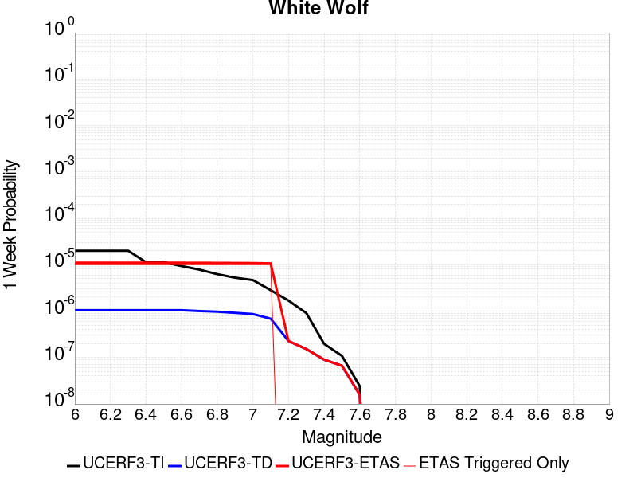 |  |  |  |

| Magnitude | 1 wk TI Prob | 1 wk TD Prob | 1 wk ETAS Prob | 1 wk ETAS/TD Gain | 1 wk ETAS Triggered Only | 1 mo TI Prob | 1 mo TD Prob | 1 mo ETAS Prob | 1 mo ETAS/TD Gain | 1 mo ETAS Triggered Only | 1 yr TI Prob | 1 yr TD Prob | 1 yr ETAS Prob | 1 yr ETAS/TD Gain | 1 yr ETAS Triggered Only | 10 yr TI Prob | 10 yr TD Prob | 10 yr ETAS Prob | 10 yr ETAS/TD Gain | 10 yr ETAS Triggered Only |
|-----|-----|-----|-----|-----|-----|-----|-----|-----|-----|-----|-----|-----|-----|-----|-----|-----|-----|-----|-----|-----|
| 6.0 | 2.0037822E-5 | 1.0468736E-6 | 1.1046863E-5 | 10.552241 | 1.0E-5 | 8.587355E-5 | 4.4865938E-6 | 2.4486504E-5 | 5.4577045 | 2.0E-5 | 0.001045009 | 5.462296E-5 | 7.462187E-5 | 1.3661264 | 2.0E-5 | 0.010401085 | 5.4610043E-4 | 5.660895E-4 | 1.0366033 | 2.0E-5 |
| 6.1 | 2.0037822E-5 | 1.0468736E-6 | 1.1046863E-5 | 10.552241 | 1.0E-5 | 8.587355E-5 | 4.4865938E-6 | 2.4486504E-5 | 5.4577045 | 2.0E-5 | 0.001045009 | 5.462296E-5 | 7.462187E-5 | 1.3661264 | 2.0E-5 | 0.010401085 | 5.4610043E-4 | 5.660895E-4 | 1.0366033 | 2.0E-5 |
| 6.2 | 2.0037822E-5 | 1.0468736E-6 | 1.1046863E-5 | 10.552241 | 1.0E-5 | 8.587355E-5 | 4.4865938E-6 | 2.4486504E-5 | 5.4577045 | 2.0E-5 | 0.001045009 | 5.462296E-5 | 7.462187E-5 | 1.3661264 | 2.0E-5 | 0.010401085 | 5.4610043E-4 | 5.660895E-4 | 1.0366033 | 2.0E-5 |
| 6.3 | 2.0037822E-5 | 1.0468736E-6 | 1.1046863E-5 | 10.552241 | 1.0E-5 | 8.587355E-5 | 4.4865938E-6 | 2.4486504E-5 | 5.4577045 | 2.0E-5 | 0.001045009 | 5.462296E-5 | 7.462187E-5 | 1.3661264 | 2.0E-5 | 0.010401085 | 5.4610043E-4 | 5.660895E-4 | 1.0366033 | 2.0E-5 |
| 6.4 | 1.132487E-5 | 1.0468736E-6 | 1.1046863E-5 | 10.552241 | 1.0E-5 | 4.8534253E-5 | 4.4865938E-6 | 2.4486504E-5 | 5.4577045 | 2.0E-5 | 5.907443E-4 | 5.462296E-5 | 7.462187E-5 | 1.3661264 | 2.0E-5 | 0.005891764 | 5.4610043E-4 | 5.660895E-4 | 1.0366033 | 2.0E-5 |
| 6.5 | 1.132487E-5 | 1.0468736E-6 | 1.1046863E-5 | 10.552241 | 1.0E-5 | 4.8534253E-5 | 4.4865938E-6 | 2.4486504E-5 | 5.4577045 | 2.0E-5 | 5.907443E-4 | 5.462296E-5 | 7.462187E-5 | 1.3661264 | 2.0E-5 | 0.005891764 | 5.4610043E-4 | 5.660895E-4 | 1.0366033 | 2.0E-5 |
| 6.6 | 9.347473E-6 | 1.0468736E-6 | 1.1046863E-5 | 10.552241 | 1.0E-5 | 4.0059982E-5 | 4.4865938E-6 | 2.4486504E-5 | 5.4577045 | 2.0E-5 | 4.8762115E-4 | 5.462296E-5 | 7.462187E-5 | 1.3661264 | 2.0E-5 | 0.0048655253 | 5.4610043E-4 | 5.660895E-4 | 1.0366033 | 2.0E-5 |
| 6.7 | 7.842647E-6 | 1.0047925E-6 | 1.1004782E-5 | 10.952294 | 1.0E-5 | 3.361091E-5 | 4.3062464E-6 | 2.430616E-5 | 5.644396 | 2.0E-5 | 4.0913603E-4 | 5.242734E-5 | 7.242629E-5 | 1.3814603 | 2.0E-5 | 0.004083836 | 5.241547E-4 | 5.441442E-4 | 1.0381367 | 2.0E-5 |
| 6.8 | 6.26597E-6 | 9.73443E-7 | 1.0973433E-5 | 11.272805 | 1.0E-5 | 2.685388E-5 | 4.171892E-6 | 2.4171808E-5 | 5.7939677 | 2.0E-5 | 3.2689696E-4 | 5.0791652E-5 | 7.079064E-5 | 1.3937455 | 2.0E-5 | 0.003264165 | 5.078053E-4 | 5.277952E-4 | 1.0393652 | 2.0E-5 |
| 6.9 | 5.258436E-6 | 9.1828633E-7 | 1.0918277E-5 | 11.889839 | 1.0E-5 | 2.2535958E-5 | 3.9355073E-6 | 2.3935429E-5 | 6.081917 | 2.0E-5 | 2.7434074E-4 | 4.7913796E-5 | 6.7912835E-5 | 1.4173963 | 2.0E-5 | 0.0027400232 | 4.7903945E-4 | 4.990299E-4 | 1.0417302 | 2.0E-5 |
| 7.0 | 4.675028E-6 | 8.6608276E-7 | 1.0866074E-5 | 12.546231 | 1.0E-5 | 2.003568E-5 | 3.7117782E-6 | 2.3711704E-5 | 6.388233 | 2.0E-5 | 2.4390711E-4 | 4.519001E-5 | 6.518911E-5 | 1.4425557 | 2.0E-5 | 0.0024363957 | 4.5181293E-4 | 4.7180388E-4 | 1.0442461 | 2.0E-5 |
| 7.1 | 2.8270078E-6 | 6.873876E-7 | 1.068738E-5 | 15.547823 | 1.0E-5 | 1.2115692E-5 | 2.9459438E-6 | 2.2945886E-5 | 7.7889757 | 2.0E-5 | 1.4749856E-4 | 3.5866316E-5 | 5.58656E-5 | 1.5576062 | 2.0E-5 | 0.001474007 | 3.586094E-4 | 3.786022E-4 | 1.055751 | 2.0E-5 |
| 7.2 | 1.6881406E-6 | 2.2703898E-7 | 2.2703898E-7 | 1.0 | 0.0 | 7.2348685E-6 | 9.730238E-7 | 9.730238E-7 | 1.0 | 0.0 | 8.808096E-5 | 1.1846502E-5 | 1.1846502E-5 | 1.0 | 0.0 | 8.8046055E-4 | 1.1845886E-4 | 1.1845886E-4 | 1.0 | 0.0 |
| 7.3 | 9.086107E-7 | 1.5264881E-7 | 1.5264881E-7 | 1.0 | 0.0 | 3.8940398E-6 | 6.5420903E-7 | 6.5420903E-7 | 1.0 | 0.0 | 4.7408903E-5 | 7.964967E-6 | 7.964967E-6 | 1.0 | 0.0 | 4.739879E-4 | 7.9646896E-5 | 7.9646896E-5 | 1.0 | 0.0 |
| 7.4 | 1.9717383E-7 | 9.003459E-8 | 9.003459E-8 | 1.0 | 0.0 | 8.450304E-7 | 3.8586248E-7 | 3.8586248E-7 | 1.0 | 0.0 | 1.0288197E-5 | 4.6978657E-6 | 4.6978657E-6 | 1.0 | 0.0 | 1.028772E-4 | 4.6977697E-5 | 4.6977697E-5 | 1.0 | 0.0 |
| 7.5 | 1.086975E-7 | 6.659703E-8 | 6.659703E-8 | 1.0 | 0.0 | 4.6584634E-7 | 2.8541584E-7 | 2.8541584E-7 | 1.0 | 0.0 | 5.6716644E-6 | 3.4749323E-6 | 3.4749323E-6 | 1.0 | 0.0 | 5.6715195E-5 | 3.4748802E-5 | 3.4748802E-5 | 1.0 | 0.0 |
| 7.6 | 2.4217808E-8 | 1.5820925E-8 | 1.5820925E-8 | 1.0 | 0.0 | 1.03790605E-7 | 6.780396E-8 | 6.780396E-8 | 1.0 | 0.0 | 1.2636499E-6 | 8.255129E-7 | 8.255129E-7 | 1.0 | 0.0 | 1.2636427E-5 | 8.255104E-6 | 8.255104E-6 | 1.0 | 0.0 |

## Hosgri
*[(top)](#table-of-contents)*

| 1 Week | 1 Month | 1 Year | 10 Year |
|-----|-----|-----|-----|
|  |  |  | 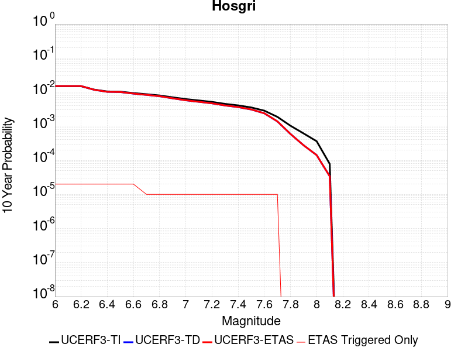 |

| Magnitude | 1 wk TI Prob | 1 wk TD Prob | 1 wk ETAS Prob | 1 wk ETAS/TD Gain | 1 wk ETAS Triggered Only | 1 mo TI Prob | 1 mo TD Prob | 1 mo ETAS Prob | 1 mo ETAS/TD Gain | 1 mo ETAS Triggered Only | 1 yr TI Prob | 1 yr TD Prob | 1 yr ETAS Prob | 1 yr ETAS/TD Gain | 1 yr ETAS Triggered Only | 10 yr TI Prob | 10 yr TD Prob | 10 yr ETAS Prob | 10 yr ETAS/TD Gain | 10 yr ETAS Triggered Only |
|-----|-----|-----|-----|-----|-----|-----|-----|-----|-----|-----|-----|-----|-----|-----|-----|-----|-----|-----|-----|-----|
| 6.0 | 2.883978E-5 | 2.9128816E-5 | 2.9128816E-5 | 1.0 | 0.0 | 1.235932E-4 | 1.2483196E-4 | 1.2483196E-4 | 1.0 | 0.0 | 0.0015037085 | 0.0015187968 | 0.0015287816 | 1.0065742 | 1.0E-5 | 0.01493574 | 0.015087956 | 0.015107654 | 1.0013056 | 2.0E-5 |
| 6.1 | 2.883978E-5 | 2.9128816E-5 | 2.9128816E-5 | 1.0 | 0.0 | 1.235932E-4 | 1.2483196E-4 | 1.2483196E-4 | 1.0 | 0.0 | 0.0015037085 | 0.0015187968 | 0.0015287816 | 1.0065742 | 1.0E-5 | 0.01493574 | 0.015087956 | 0.015107654 | 1.0013056 | 2.0E-5 |
| 6.2 | 2.883978E-5 | 2.9128816E-5 | 2.9128816E-5 | 1.0 | 0.0 | 1.235932E-4 | 1.2483196E-4 | 1.2483196E-4 | 1.0 | 0.0 | 0.0015037085 | 0.0015187968 | 0.0015287816 | 1.0065742 | 1.0E-5 | 0.01493574 | 0.015087956 | 0.015107654 | 1.0013056 | 2.0E-5 |
| 6.3 | 2.2914428E-5 | 2.2642287E-5 | 2.2642287E-5 | 1.0 | 0.0 | 9.8200995E-5 | 9.703479E-5 | 9.703479E-5 | 1.0 | 0.0 | 0.0011949413 | 0.0011807632 | 0.0011907514 | 1.0084591 | 1.0E-5 | 0.011885363 | 0.011746307 | 0.011766072 | 1.0016826 | 2.0E-5 |
| 6.4 | 2.0195741E-5 | 1.9696845E-5 | 1.9696845E-5 | 1.0 | 0.0 | 8.65503E-5 | 8.441233E-5 | 8.441233E-5 | 1.0 | 0.0 | 0.0010532405 | 0.0010272375 | 0.0010372273 | 1.0097249 | 1.0E-5 | 0.010482626 | 0.010225951 | 0.010245746 | 1.0019358 | 2.0E-5 |
| 6.5 | 1.9924333E-5 | 1.9409264E-5 | 1.9409264E-5 | 1.0 | 0.0 | 8.53872E-5 | 8.317992E-5 | 8.317992E-5 | 1.0 | 0.0 | 0.0010390934 | 0.0010122469 | 0.0010222368 | 1.009869 | 1.0E-5 | 0.010342481 | 0.010077409 | 0.010097208 | 1.0019647 | 2.0E-5 |
| 6.6 | 1.809694E-5 | 1.7458564E-5 | 1.7458564E-5 | 1.0 | 0.0 | 7.7556004E-5 | 7.482028E-5 | 7.482028E-5 | 1.0 | 0.0 | 9.438353E-4 | 9.105575E-4 | 9.205484E-4 | 1.0109723 | 1.0E-5 | 0.009398366 | 0.00906922 | 0.009089039 | 1.0021852 | 2.0E-5 |
| 6.7 | 1.675989E-5 | 1.6043017E-5 | 1.6043017E-5 | 1.0 | 0.0 | 7.182612E-5 | 6.875398E-5 | 6.875398E-5 | 1.0 | 0.0 | 8.7413215E-4 | 8.3675934E-4 | 8.46751E-4 | 1.0119408 | 1.0E-5 | 0.008707017 | 0.008337004 | 0.008346921 | 1.0011895 | 1.0E-5 |
| 6.8 | 1.5401129E-5 | 1.4614321E-5 | 1.4614321E-5 | 1.0 | 0.0 | 6.6003166E-5 | 6.2631305E-5 | 6.2631305E-5 | 1.0 | 0.0 | 8.032922E-4 | 7.6227024E-4 | 7.7226263E-4 | 1.0131087 | 1.0E-5 | 0.008003947 | 0.0075974306 | 0.0076073543 | 1.0013062 | 1.0E-5 |
| 6.9 | 1.356559E-5 | 1.269019E-5 | 1.269019E-5 | 1.0 | 0.0 | 5.8136946E-5 | 5.4385397E-5 | 5.4385397E-5 | 1.0 | 0.0 | 7.0758746E-4 | 6.619415E-4 | 6.7193486E-4 | 1.015097 | 1.0E-5 | 0.007053386 | 0.0066005136 | 0.0066104475 | 1.001505 | 1.0E-5 |
| 7.0 | 1.2030819E-5 | 1.1096171E-5 | 1.1096171E-5 | 1.0 | 0.0 | 5.155963E-5 | 4.755415E-5 | 4.755415E-5 | 1.0 | 0.0 | 6.275577E-4 | 5.788181E-4 | 5.888123E-4 | 1.0172666 | 1.0E-5 | 0.006257884 | 0.005773876 | 0.005783818 | 1.001722 | 1.0E-5 |
| 7.1 | 1.0972698E-5 | 1.0022381E-5 | 1.0022381E-5 | 1.0 | 0.0 | 4.7025E-5 | 4.2952353E-5 | 4.2952353E-5 | 1.0 | 0.0 | 5.72379E-4 | 5.228195E-4 | 5.3281424E-4 | 1.0191171 | 1.0E-5 | 0.0057090693 | 0.005216657 | 0.005226605 | 1.001907 | 1.0E-5 |
| 7.2 | 9.961926E-6 | 9.0349395E-6 | 9.0349395E-6 | 1.0 | 0.0 | 4.2693267E-5 | 3.8720595E-5 | 3.8720595E-5 | 1.0 | 0.0 | 5.1966653E-4 | 4.713213E-4 | 4.8131662E-4 | 1.021207 | 1.0E-5 | 0.00518453 | 0.004703974 | 0.0047139265 | 1.0021158 | 1.0E-5 |
| 7.3 | 8.700929E-6 | 7.828288E-6 | 7.828288E-6 | 1.0 | 0.0 | 3.7289166E-5 | 3.3549375E-5 | 3.3549375E-5 | 1.0 | 0.0 | 4.53901E-4 | 4.083871E-4 | 4.1838302E-4 | 1.0244765 | 1.0E-5 | 0.00452975 | 0.004077116 | 0.0040870756 | 1.0024427 | 1.0E-5 |
| 7.4 | 7.866285E-6 | 6.9989205E-6 | 6.9989205E-6 | 1.0 | 0.0 | 3.3712215E-5 | 2.999503E-5 | 2.999503E-5 | 1.0 | 0.0 | 4.103689E-4 | 3.651283E-4 | 3.7512465E-4 | 1.0273776 | 1.0E-5 | 0.004096119 | 0.0036460315 | 0.003655995 | 1.0027328 | 1.0E-5 |
| 7.5 | 6.8381305E-6 | 5.959869E-6 | 5.959869E-6 | 1.0 | 0.0 | 2.9305946E-5 | 2.5542047E-5 | 2.5542047E-5 | 1.0 | 0.0 | 3.5674145E-4 | 3.1093007E-4 | 3.2092698E-4 | 1.0321516 | 1.0E-5 | 0.0035616932 | 0.0031056956 | 0.0031156647 | 1.00321 | 1.0E-5 |
| 7.6 | 5.503376E-6 | 4.595407E-6 | 4.595407E-6 | 1.0 | 0.0 | 2.3585684E-5 | 1.9694453E-5 | 1.9694453E-5 | 1.0 | 0.0 | 2.8711787E-4 | 2.3975359E-4 | 2.497512E-4 | 1.0416995 | 1.0E-5 | 0.002867472 | 0.0023956925 | 0.0024056686 | 1.0041641 | 1.0E-5 |
| 7.7 | 3.6144982E-6 | 2.6523571E-6 | 2.6523571E-6 | 1.0 | 0.0 | 1.5490614E-5 | 1.1367195E-5 | 1.1367195E-5 | 1.0 | 0.0 | 1.8858191E-4 | 1.3838682E-4 | 1.4838543E-4 | 1.0722512 | 1.0E-5 | 0.0018842196 | 0.0013837479 | 0.001393734 | 1.0072167 | 1.0E-5 |
| 7.8 | 1.9853494E-6 | 1.1362197E-6 | 1.1362197E-6 | 1.0 | 0.0 | 8.508612E-6 | 4.8695038E-6 | 4.8695038E-6 | 1.0 | 0.0 | 1.0358743E-4 | 5.9284594E-5 | 5.9284594E-5 | 1.0 | 0.0 | 0.0010353916 | 5.9342675E-4 | 5.9342675E-4 | 1.0 | 0.0 |
| 7.9 | 1.1818757E-6 | 5.2958796E-7 | 5.2958796E-7 | 1.0 | 0.0 | 5.0651715E-6 | 2.2696604E-6 | 2.2696604E-6 | 1.0 | 0.0 | 6.1666724E-5 | 2.7632766E-5 | 2.7632766E-5 | 1.0 | 0.0 | 6.1649614E-4 | 2.7697708E-4 | 2.7697708E-4 | 1.0 | 0.0 |
| 8.0 | 6.962958E-7 | 2.714428E-7 | 2.714428E-7 | 1.0 | 0.0 | 2.9841215E-6 | 1.1633257E-6 | 1.1633257E-6 | 1.0 | 0.0 | 3.6331072E-5 | 1.4163398E-5 | 1.4163398E-5 | 1.0 | 0.0 | 3.6325134E-4 | 1.4218807E-4 | 1.4218807E-4 | 1.0 | 0.0 |
| 8.1 | 1.5033264E-7 | 6.528495E-8 | 6.528495E-8 | 1.0 | 0.0 | 6.442826E-7 | 2.7979263E-7 | 2.7979263E-7 | 1.0 | 0.0 | 7.844113E-6 | 3.4064701E-6 | 3.4064701E-6 | 1.0 | 0.0 | 7.843835E-5 | 3.408197E-5 | 3.408197E-5 | 1.0 | 0.0 |

## Santa Susana alt 1
*[(top)](#table-of-contents)*

| 1 Week | 1 Month | 1 Year | 10 Year |
|-----|-----|-----|-----|
|  | 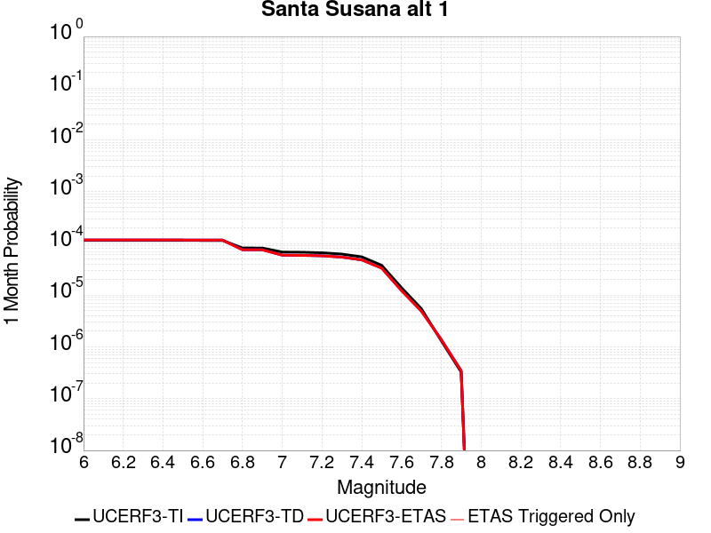 | 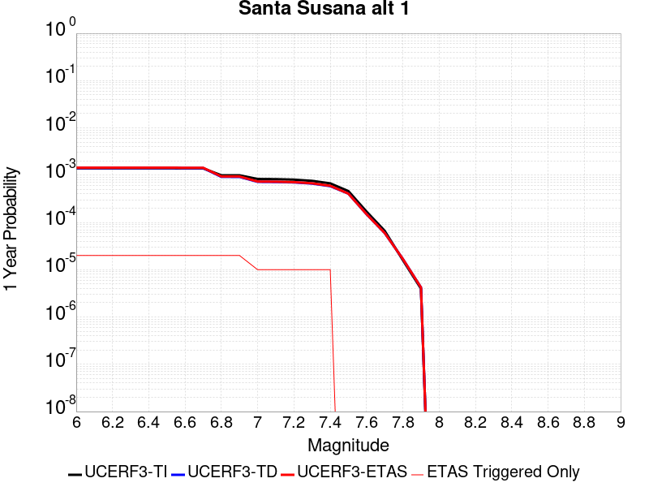 |  |

| Magnitude | 1 wk TI Prob | 1 wk TD Prob | 1 wk ETAS Prob | 1 wk ETAS/TD Gain | 1 wk ETAS Triggered Only | 1 mo TI Prob | 1 mo TD Prob | 1 mo ETAS Prob | 1 mo ETAS/TD Gain | 1 mo ETAS Triggered Only | 1 yr TI Prob | 1 yr TD Prob | 1 yr ETAS Prob | 1 yr ETAS/TD Gain | 1 yr ETAS Triggered Only | 10 yr TI Prob | 10 yr TD Prob | 10 yr ETAS Prob | 10 yr ETAS/TD Gain | 10 yr ETAS Triggered Only |
|-----|-----|-----|-----|-----|-----|-----|-----|-----|-----|-----|-----|-----|-----|-----|-----|-----|-----|-----|-----|-----|
| 6.0 | 2.674877E-5 | 2.7198794E-5 | 2.7198794E-5 | 1.0 | 0.0 | 1.1463255E-4 | 1.1656169E-4 | 1.1656169E-4 | 1.0 | 0.0 | 0.0013947578 | 0.0014183284 | 0.0014383 | 1.0140811 | 2.0E-5 | 0.013860362 | 0.014104702 | 0.01412442 | 1.001398 | 2.0E-5 |
| 6.1 | 2.674877E-5 | 2.7198794E-5 | 2.7198794E-5 | 1.0 | 0.0 | 1.1463255E-4 | 1.1656169E-4 | 1.1656169E-4 | 1.0 | 0.0 | 0.0013947578 | 0.0014183284 | 0.0014383 | 1.0140811 | 2.0E-5 | 0.013860362 | 0.014104702 | 0.01412442 | 1.001398 | 2.0E-5 |
| 6.2 | 2.674877E-5 | 2.7198794E-5 | 2.7198794E-5 | 1.0 | 0.0 | 1.1463255E-4 | 1.1656169E-4 | 1.1656169E-4 | 1.0 | 0.0 | 0.0013947578 | 0.0014183284 | 0.0014383 | 1.0140811 | 2.0E-5 | 0.013860362 | 0.014104702 | 0.01412442 | 1.001398 | 2.0E-5 |
| 6.3 | 2.674877E-5 | 2.7198794E-5 | 2.7198794E-5 | 1.0 | 0.0 | 1.1463255E-4 | 1.1656169E-4 | 1.1656169E-4 | 1.0 | 0.0 | 0.0013947578 | 0.0014183284 | 0.0014383 | 1.0140811 | 2.0E-5 | 0.013860362 | 0.014104702 | 0.01412442 | 1.001398 | 2.0E-5 |
| 6.4 | 2.674877E-5 | 2.7198794E-5 | 2.7198794E-5 | 1.0 | 0.0 | 1.1463255E-4 | 1.1656169E-4 | 1.1656169E-4 | 1.0 | 0.0 | 0.0013947578 | 0.0014183284 | 0.0014383 | 1.0140811 | 2.0E-5 | 0.013860362 | 0.014104702 | 0.01412442 | 1.001398 | 2.0E-5 |
| 6.5 | 2.674877E-5 | 2.7198794E-5 | 2.7198794E-5 | 1.0 | 0.0 | 1.1463255E-4 | 1.1656169E-4 | 1.1656169E-4 | 1.0 | 0.0 | 0.0013947578 | 0.0014183284 | 0.0014383 | 1.0140811 | 2.0E-5 | 0.013860362 | 0.014104702 | 0.01412442 | 1.001398 | 2.0E-5 |
| 6.6 | 2.6647976E-5 | 2.707513E-5 | 2.707513E-5 | 1.0 | 0.0 | 1.14200615E-4 | 1.1603175E-4 | 1.1603175E-4 | 1.0 | 0.0 | 0.0013895056 | 0.0014118847 | 0.0014318564 | 1.0141455 | 2.0E-5 | 0.013808494 | 0.014041085 | 0.014060804 | 1.0014044 | 2.0E-5 |
| 6.7 | 2.6647976E-5 | 2.707513E-5 | 2.707513E-5 | 1.0 | 0.0 | 1.14200615E-4 | 1.1603175E-4 | 1.1603175E-4 | 1.0 | 0.0 | 0.0013895056 | 0.0014118847 | 0.0014318564 | 1.0141455 | 2.0E-5 | 0.013808494 | 0.014041085 | 0.014060804 | 1.0014044 | 2.0E-5 |
| 6.8 | 1.9073179E-5 | 1.7637734E-5 | 1.7637734E-5 | 1.0 | 0.0 | 8.1739636E-5 | 7.558821E-5 | 7.558821E-5 | 1.0 | 0.0 | 9.947256E-4 | 9.1991597E-4 | 9.3989755E-4 | 1.0217211 | 2.0E-5 | 0.009902848 | 0.009163515 | 0.009183331 | 1.0021626 | 2.0E-5 |
| 6.9 | 1.9041876E-5 | 1.7619866E-5 | 1.7619866E-5 | 1.0 | 0.0 | 8.160549E-5 | 7.551163E-5 | 7.551163E-5 | 1.0 | 0.0 | 9.930939E-4 | 9.189845E-4 | 9.3896606E-4 | 1.0217432 | 2.0E-5 | 0.0098866755 | 0.009154276 | 0.009174093 | 1.0021647 | 2.0E-5 |
| 7.0 | 1.5917482E-5 | 1.386421E-5 | 1.386421E-5 | 1.0 | 0.0 | 6.8215995E-5 | 5.9416718E-5 | 5.9416718E-5 | 1.0 | 0.0 | 8.302132E-4 | 7.231631E-4 | 7.331559E-4 | 1.0138181 | 1.0E-5 | 0.008271185 | 0.0072091618 | 0.0072190897 | 1.0013771 | 1.0E-5 |
| 7.1 | 1.577788E-5 | 1.3744216E-5 | 1.3744216E-5 | 1.0 | 0.0 | 6.761774E-5 | 5.890248E-5 | 5.890248E-5 | 1.0 | 0.0 | 8.2293496E-4 | 7.1690633E-4 | 7.268992E-4 | 1.0139388 | 1.0E-5 | 0.008198941 | 0.0071469983 | 0.007156927 | 1.0013891 | 1.0E-5 |
| 7.2 | 1.5416446E-5 | 1.3470286E-5 | 1.3470286E-5 | 1.0 | 0.0 | 6.606882E-5 | 5.7728546E-5 | 5.7728546E-5 | 1.0 | 0.0 | 8.0409093E-4 | 7.0262305E-4 | 7.12616E-4 | 1.0142224 | 1.0E-5 | 0.008011877 | 0.0070050703 | 0.007015 | 1.0014175 | 1.0E-5 |
| 7.3 | 1.4534083E-5 | 1.2718177E-5 | 1.2718177E-5 | 1.0 | 0.0 | 6.228744E-5 | 5.4505355E-5 | 5.4505355E-5 | 1.0 | 0.0 | 7.580857E-4 | 6.634051E-4 | 6.733985E-4 | 1.0150638 | 1.0E-5 | 0.007555048 | 0.00661526 | 0.006625194 | 1.0015017 | 1.0E-5 |
| 7.4 | 1.2858995E-5 | 1.1229932E-5 | 1.1229932E-5 | 1.0 | 0.0 | 5.5108816E-5 | 4.8127415E-5 | 4.8127415E-5 | 1.0 | 0.0 | 6.7074323E-4 | 5.857977E-4 | 5.9579185E-4 | 1.0170608 | 1.0E-5 | 0.0066872234 | 0.005843461 | 0.005853403 | 1.0017014 | 1.0E-5 |
| 7.5 | 8.827668E-6 | 7.805573E-6 | 7.805573E-6 | 1.0 | 0.0 | 3.7832317E-5 | 3.3452037E-5 | 3.3452037E-5 | 1.0 | 0.0 | 4.605111E-4 | 4.072049E-4 | 4.072049E-4 | 1.0 | 0.0 | 0.0045955796 | 0.0040650107 | 0.0040650107 | 1.0 | 0.0 |
| 7.6 | 3.2533426E-6 | 2.8720272E-6 | 2.8720272E-6 | 1.0 | 0.0 | 1.3942822E-5 | 1.2308632E-5 | 1.2308632E-5 | 1.0 | 0.0 | 1.6974064E-4 | 1.4984766E-4 | 1.4984766E-4 | 1.0 | 0.0 | 0.0016961104 | 0.001497503 | 0.001497503 | 1.0 | 0.0 |
| 7.7 | 1.2751709E-6 | 1.1491396E-6 | 1.1491396E-6 | 1.0 | 0.0 | 5.4650063E-6 | 4.924875E-6 | 4.924875E-6 | 1.0 | 0.0 | 6.653442E-5 | 5.9958795E-5 | 5.9958795E-5 | 1.0 | 0.0 | 6.6514505E-4 | 5.994351E-4 | 5.994351E-4 | 1.0 | 0.0 |
| 7.8 | 3.067544E-7 | 3.2400797E-7 | 3.2400797E-7 | 1.0 | 0.0 | 1.3146611E-6 | 1.3886049E-6 | 1.3886049E-6 | 1.0 | 0.0 | 1.600588E-5 | 1.6906144E-5 | 1.6906144E-5 | 1.0 | 0.0 | 1.6004729E-4 | 1.6904961E-4 | 1.6904961E-4 | 1.0 | 0.0 |
| 7.9 | 7.622999E-8 | 8.08804E-8 | 8.08804E-8 | 1.0 | 0.0 | 3.2669993E-7 | 3.4663023E-7 | 3.4663023E-7 | 1.0 | 0.0 | 3.977564E-6 | 4.2202173E-6 | 4.2202173E-6 | 1.0 | 0.0 | 3.977493E-5 | 4.220158E-5 | 4.220158E-5 | 1.0 | 0.0 |

## Point Reyes 2011 CFM
*[(top)](#table-of-contents)*

| 1 Week | 1 Month | 1 Year | 10 Year |
|-----|-----|-----|-----|
|  |  |  | 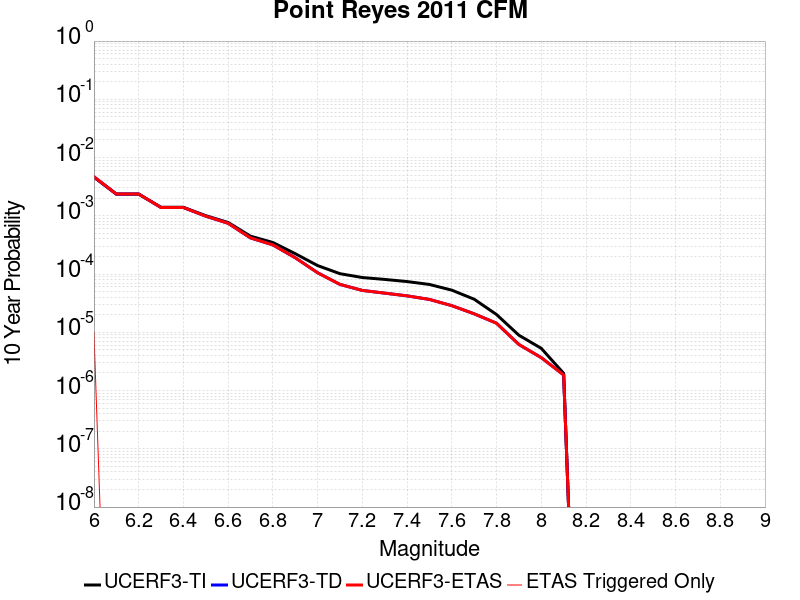 |

| Magnitude | 1 wk TI Prob | 1 wk TD Prob | 1 wk ETAS Prob | 1 wk ETAS/TD Gain | 1 wk ETAS Triggered Only | 1 mo TI Prob | 1 mo TD Prob | 1 mo ETAS Prob | 1 mo ETAS/TD Gain | 1 mo ETAS Triggered Only | 1 yr TI Prob | 1 yr TD Prob | 1 yr ETAS Prob | 1 yr ETAS/TD Gain | 1 yr ETAS Triggered Only | 10 yr TI Prob | 10 yr TD Prob | 10 yr ETAS Prob | 10 yr ETAS/TD Gain | 10 yr ETAS Triggered Only |
|-----|-----|-----|-----|-----|-----|-----|-----|-----|-----|-----|-----|-----|-----|-----|-----|-----|-----|-----|-----|-----|
| 6.0 | 8.8644965E-6 | 8.9671985E-6 | 8.9671985E-6 | 1.0 | 0.0 | 3.7990147E-5 | 3.843032E-5 | 3.843032E-5 | 1.0 | 0.0 | 4.624319E-4 | 4.67795E-4 | 4.777903E-4 | 1.0213668 | 1.0E-5 | 0.0046147075 | 0.0046687312 | 0.0046786848 | 1.0021319 | 1.0E-5 |
| 6.1 | 4.526405E-6 | 4.5392417E-6 | 4.5392417E-6 | 1.0 | 0.0 | 1.9398734E-5 | 1.9453753E-5 | 1.9453753E-5 | 1.0 | 0.0 | 2.36154E-4 | 2.3682477E-4 | 2.3682477E-4 | 1.0 | 0.0 | 0.002359032 | 0.00236583 | 0.00236583 | 1.0 | 0.0 |
| 6.2 | 4.526405E-6 | 4.5392417E-6 | 4.5392417E-6 | 1.0 | 0.0 | 1.9398734E-5 | 1.9453753E-5 | 1.9453753E-5 | 1.0 | 0.0 | 2.36154E-4 | 2.3682477E-4 | 2.3682477E-4 | 1.0 | 0.0 | 0.002359032 | 0.00236583 | 0.00236583 | 1.0 | 0.0 |
| 6.3 | 2.6842322E-6 | 2.6606945E-6 | 2.6606945E-6 | 1.0 | 0.0 | 1.1503801E-5 | 1.1402927E-5 | 1.1402927E-5 | 1.0 | 0.0 | 1.4004979E-4 | 1.38822E-4 | 1.38822E-4 | 1.0 | 0.0 | 0.0013996155 | 0.0013873745 | 0.0013873745 | 1.0 | 0.0 |
| 6.4 | 2.6842322E-6 | 2.6606945E-6 | 2.6606945E-6 | 1.0 | 0.0 | 1.1503801E-5 | 1.1402927E-5 | 1.1402927E-5 | 1.0 | 0.0 | 1.4004979E-4 | 1.38822E-4 | 1.38822E-4 | 1.0 | 0.0 | 0.0013996155 | 0.0013873745 | 0.0013873745 | 1.0 | 0.0 |
| 6.5 | 1.9281833E-6 | 1.8906428E-6 | 1.8906428E-6 | 1.0 | 0.0 | 8.263617E-6 | 8.10273E-6 | 8.10273E-6 | 1.0 | 0.0 | 1.0060489E-4 | 9.864636E-5 | 9.864636E-5 | 1.0 | 0.0 | 0.0010055936 | 9.860365E-4 | 9.860365E-4 | 1.0 | 0.0 |
| 6.6 | 1.4726726E-6 | 1.4269731E-6 | 1.4269731E-6 | 1.0 | 0.0 | 6.3114385E-6 | 6.115585E-6 | 6.115585E-6 | 1.0 | 0.0 | 7.683905E-5 | 7.445475E-5 | 7.445475E-5 | 1.0 | 0.0 | 7.6812494E-4 | 7.4430514E-4 | 7.4430514E-4 | 1.0 | 0.0 |
| 6.7 | 8.572307E-7 | 8.0073517E-7 | 8.0073517E-7 | 1.0 | 0.0 | 3.6738406E-6 | 3.4317177E-6 | 3.4317177E-6 | 1.0 | 0.0 | 4.472809E-5 | 4.178038E-5 | 4.178038E-5 | 1.0 | 0.0 | 4.471909E-4 | 4.1772908E-4 | 4.1772908E-4 | 1.0 | 0.0 |
| 6.8 | 6.6745434E-7 | 6.077435E-7 | 6.077435E-7 | 1.0 | 0.0 | 2.8605155E-6 | 2.6046125E-6 | 2.6046125E-6 | 1.0 | 0.0 | 3.482622E-5 | 3.1710704E-5 | 3.1710704E-5 | 1.0 | 0.0 | 3.4820763E-4 | 3.1706505E-4 | 3.1706505E-4 | 1.0 | 0.0 |
| 6.9 | 4.291521E-7 | 3.6537236E-7 | 3.6537236E-7 | 1.0 | 0.0 | 1.839222E-6 | 1.5658807E-6 | 1.5658807E-6 | 1.0 | 0.0 | 2.2392298E-5 | 1.9064433E-5 | 1.9064433E-5 | 1.0 | 0.0 | 2.2390042E-4 | 1.9063058E-4 | 1.9063058E-4 | 1.0 | 0.0 |
| 7.0 | 2.6812808E-7 | 2.0188676E-7 | 2.0188676E-7 | 1.0 | 0.0 | 1.1491198E-6 | 8.652287E-7 | 8.652287E-7 | 1.0 | 0.0 | 1.3990444E-5 | 1.0534109E-5 | 1.0534109E-5 | 1.0 | 0.0 | 1.3989564E-4 | 1.0533839E-4 | 1.0533839E-4 | 1.0 | 0.0 |
| 7.1 | 1.9451231E-7 | 1.2726741E-7 | 1.2726741E-7 | 1.0 | 0.0 | 8.336239E-7 | 5.4543165E-7 | 5.4543165E-7 | 1.0 | 0.0 | 1.0149324E-5 | 6.64061E-6 | 6.64061E-6 | 1.0 | 0.0 | 1.014886E-4 | 6.640634E-5 | 6.640634E-5 | 1.0 | 0.0 |
| 7.2 | 1.6715143E-7 | 1.00440445E-7 | 1.00440445E-7 | 1.0 | 0.0 | 7.1636305E-7 | 4.3045898E-7 | 4.3045898E-7 | 1.0 | 0.0 | 8.721685E-6 | 5.2408254E-6 | 5.2408254E-6 | 1.0 | 0.0 | 8.721343E-5 | 5.240924E-5 | 5.240924E-5 | 1.0 | 0.0 |
| 7.3 | 1.5503173E-7 | 9.014282E-8 | 9.014282E-8 | 1.0 | 0.0 | 6.644215E-7 | 3.863263E-7 | 3.863263E-7 | 1.0 | 0.0 | 8.089301E-6 | 4.7035123E-6 | 4.7035123E-6 | 1.0 | 0.0 | 8.089007E-5 | 4.703635E-5 | 4.703635E-5 | 1.0 | 0.0 |
| 7.4 | 1.4251614E-7 | 8.09877E-8 | 8.09877E-8 | 1.0 | 0.0 | 6.1078333E-7 | 3.4709007E-7 | 3.4709007E-7 | 1.0 | 0.0 | 7.4362615E-6 | 4.225813E-6 | 4.225813E-6 | 1.0 | 0.0 | 7.436013E-5 | 4.2259548E-5 | 4.2259548E-5 | 1.0 | 0.0 |
| 7.5 | 1.2710186E-7 | 7.030747E-8 | 7.030747E-8 | 1.0 | 0.0 | 5.447221E-7 | 3.013177E-7 | 3.013177E-7 | 1.0 | 0.0 | 6.6319717E-6 | 3.6685367E-6 | 3.6685367E-6 | 1.0 | 0.0 | 6.6317734E-5 | 3.6686983E-5 | 3.6686983E-5 | 1.0 | 0.0 |
| 7.6 | 1.0144708E-7 | 5.4962506E-8 | 5.4962506E-8 | 1.0 | 0.0 | 4.347731E-7 | 2.3555357E-7 | 2.3555357E-7 | 1.0 | 0.0 | 5.2933497E-6 | 2.8678608E-6 | 2.8678608E-6 | 1.0 | 0.0 | 5.293224E-5 | 2.8680459E-5 | 2.8680459E-5 | 1.0 | 0.0 |
| 7.7 | 7.090527E-8 | 3.983186E-8 | 3.983186E-8 | 1.0 | 0.0 | 3.038797E-7 | 1.7070796E-7 | 1.7070796E-7 | 1.0 | 0.0 | 3.699729E-6 | 2.0783675E-6 | 2.0783675E-6 | 1.0 | 0.0 | 3.6996673E-5 | 2.0785701E-5 | 2.0785701E-5 | 1.0 | 0.0 |
| 7.8 | 3.8712045E-8 | 2.7447635E-8 | 2.7447635E-8 | 1.0 | 0.0 | 1.6590876E-7 | 1.1763272E-7 | 1.1763272E-7 | 1.0 | 0.0 | 2.0199373E-6 | 1.4321774E-6 | 1.4321774E-6 | 1.0 | 0.0 | 2.0199188E-5 | 1.4323902E-5 | 1.4323902E-5 | 1.0 | 0.0 |
| 7.9 | 1.7068782E-8 | 1.1839267E-8 | 1.1839267E-8 | 1.0 | 0.0 | 7.315192E-8 | 5.0739715E-8 | 5.0739715E-8 | 1.0 | 0.0 | 8.906242E-7 | 6.1775586E-7 | 6.1775586E-7 | 1.0 | 0.0 | 8.906207E-6 | 6.1797623E-6 | 6.1797623E-6 | 1.0 | 0.0 |
| 8.0 | 1.0172592E-8 | 7.0329933E-9 | 7.0329933E-9 | 1.0 | 0.0 | 4.359682E-8 | 3.01414E-8 | 3.01414E-8 | 1.0 | 0.0 | 5.3079117E-7 | 3.6697148E-7 | 3.6697148E-7 | 1.0 | 0.0 | 5.307899E-6 | 3.6719296E-6 | 3.6719296E-6 | 1.0 | 0.0 |
| 8.1 | 3.7861243E-9 | 3.5478485E-9 | 3.5478485E-9 | 1.0 | 0.0 | 1.6226247E-8 | 1.5205064E-8 | 1.5205064E-8 | 1.0 | 0.0 | 1.9755454E-7 | 1.8512165E-7 | 1.8512165E-7 | 1.0 | 0.0 | 1.9755437E-6 | 1.8530355E-6 | 1.8530355E-6 | 1.0 | 0.0 |

## Elmore Ranch
*[(top)](#table-of-contents)*

| 1 Week | 1 Month | 1 Year | 10 Year |
|-----|-----|-----|-----|
|  | 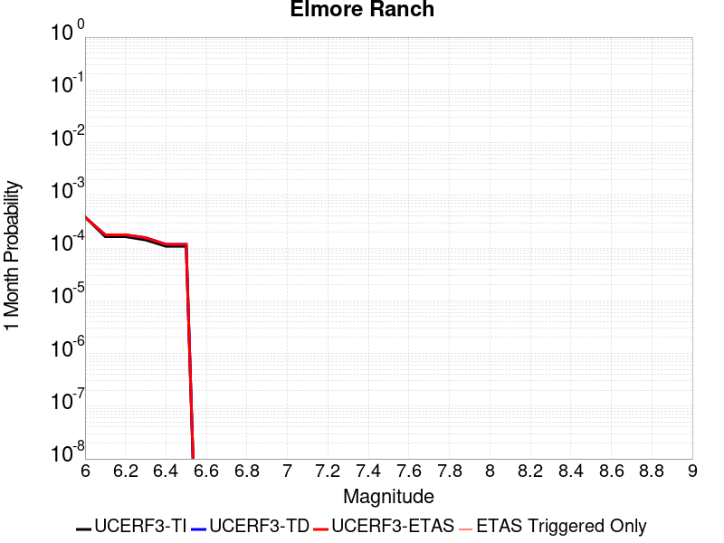 |  | 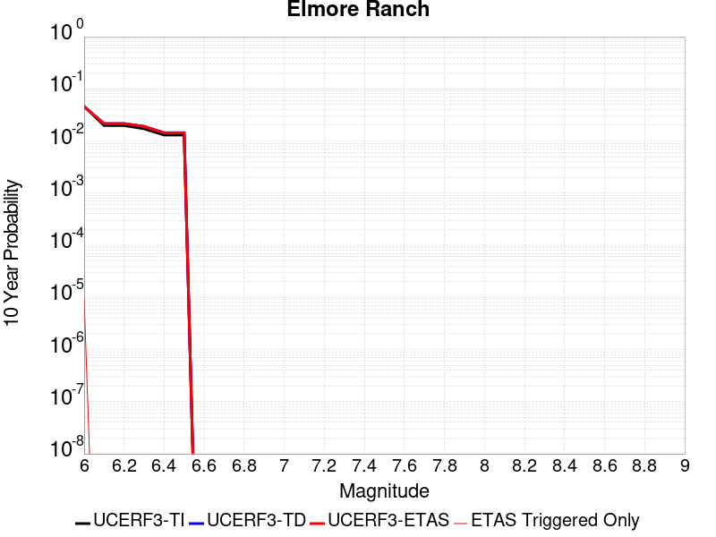 |

| Magnitude | 1 wk TI Prob | 1 wk TD Prob | 1 wk ETAS Prob | 1 wk ETAS/TD Gain | 1 wk ETAS Triggered Only | 1 mo TI Prob | 1 mo TD Prob | 1 mo ETAS Prob | 1 mo ETAS/TD Gain | 1 mo ETAS Triggered Only | 1 yr TI Prob | 1 yr TD Prob | 1 yr ETAS Prob | 1 yr ETAS/TD Gain | 1 yr ETAS Triggered Only | 10 yr TI Prob | 10 yr TD Prob | 10 yr ETAS Prob | 10 yr ETAS/TD Gain | 10 yr ETAS Triggered Only |
|-----|-----|-----|-----|-----|-----|-----|-----|-----|-----|-----|-----|-----|-----|-----|-----|-----|-----|-----|-----|-----|
| 6.0 | 9.102099E-5 | 8.954244E-5 | 8.954244E-5 | 1.0 | 0.0 | 3.9003167E-4 | 3.8370665E-4 | 3.8370665E-4 | 1.0 | 0.0 | 0.0047383 | 0.0046622963 | 0.0046622963 | 1.0 | 0.0 | 0.046385348 | 0.045839358 | 0.045848902 | 1.0002081 | 1.0E-5 |
| 6.1 | 3.8306698E-5 | 4.1492345E-5 | 4.1492345E-5 | 1.0 | 0.0 | 1.6416123E-4 | 1.7781628E-4 | 1.7781628E-4 | 1.0 | 0.0 | 0.0019968306 | 0.002163246 | 0.002163246 | 1.0 | 0.0 | 0.019789828 | 0.02159527 | 0.02159527 | 1.0 | 0.0 |
| 6.2 | 3.8306698E-5 | 4.1492345E-5 | 4.1492345E-5 | 1.0 | 0.0 | 1.6416123E-4 | 1.7781628E-4 | 1.7781628E-4 | 1.0 | 0.0 | 0.0019968306 | 0.002163246 | 0.002163246 | 1.0 | 0.0 | 0.019789828 | 0.02159527 | 0.02159527 | 1.0 | 0.0 |
| 6.3 | 3.3197924E-5 | 3.655081E-5 | 3.655081E-5 | 1.0 | 0.0 | 1.4226905E-4 | 1.566409E-4 | 1.566409E-4 | 1.0 | 0.0 | 0.0017307495 | 0.0019059941 | 0.0019059941 | 1.0 | 0.0 | 0.017173318 | 0.019057546 | 0.019057546 | 1.0 | 0.0 |
| 6.4 | 2.5148964E-5 | 2.7420736E-5 | 2.7420736E-5 | 1.0 | 0.0 | 1.0777682E-4 | 1.17515796E-4 | 1.17515796E-4 | 1.0 | 0.0 | 0.0013113929 | 0.0014304637 | 0.0014304637 | 1.0 | 0.0 | 0.01303681 | 0.014365338 | 0.014365338 | 1.0 | 0.0 |
| 6.5 | 2.5148964E-5 | 2.7420736E-5 | 2.7420736E-5 | 1.0 | 0.0 | 1.0777682E-4 | 1.17515796E-4 | 1.17515796E-4 | 1.0 | 0.0 | 0.0013113929 | 0.0014304637 | 0.0014304637 | 1.0 | 0.0 | 0.01303681 | 0.014365338 | 0.014365338 | 1.0 | 0.0 |

## Pittville 2011 CFM
*[(top)](#table-of-contents)*

| 1 Week | 1 Month | 1 Year | 10 Year |
|-----|-----|-----|-----|
|  |  |  |  |

| Magnitude | 1 wk TI Prob | 1 wk TD Prob | 1 wk ETAS Prob | 1 wk ETAS/TD Gain | 1 wk ETAS Triggered Only | 1 mo TI Prob | 1 mo TD Prob | 1 mo ETAS Prob | 1 mo ETAS/TD Gain | 1 mo ETAS Triggered Only | 1 yr TI Prob | 1 yr TD Prob | 1 yr ETAS Prob | 1 yr ETAS/TD Gain | 1 yr ETAS Triggered Only | 10 yr TI Prob | 10 yr TD Prob | 10 yr ETAS Prob | 10 yr ETAS/TD Gain | 10 yr ETAS Triggered Only |
|-----|-----|-----|-----|-----|-----|-----|-----|-----|-----|-----|-----|-----|-----|-----|-----|-----|-----|-----|-----|-----|
| 6.0 | 2.5031832E-5 | 2.705726E-5 | 2.705726E-5 | 1.0 | 0.0 | 1.0727487E-4 | 1.1595508E-4 | 1.1595508E-4 | 1.0 | 0.0 | 0.001305289 | 0.0014109362 | 0.0014109362 | 1.0 | 0.0 | 0.012976485 | 0.014029565 | 0.014039425 | 1.0007027 | 1.0E-5 |
| 6.1 | 1.2540113E-5 | 1.3513205E-5 | 1.3513205E-5 | 1.0 | 0.0 | 5.3742235E-5 | 5.7912577E-5 | 5.7912577E-5 | 1.0 | 0.0 | 6.541153E-4 | 7.0488005E-4 | 7.0488005E-4 | 1.0 | 0.0 | 0.0065219323 | 0.0070286766 | 0.0070286766 | 1.0 | 0.0 |
| 6.2 | 6.603218E-6 | 7.107261E-6 | 7.107261E-6 | 1.0 | 0.0 | 2.8299199E-5 | 3.045937E-5 | 3.045937E-5 | 1.0 | 0.0 | 3.4448825E-4 | 3.7078623E-4 | 3.7078623E-4 | 1.0 | 0.0 | 0.0034395473 | 0.0037023167 | 0.0037023167 | 1.0 | 0.0 |
| 6.3 | 6.603218E-6 | 7.107261E-6 | 7.107261E-6 | 1.0 | 0.0 | 2.8299199E-5 | 3.045937E-5 | 3.045937E-5 | 1.0 | 0.0 | 3.4448825E-4 | 3.7078623E-4 | 3.7078623E-4 | 1.0 | 0.0 | 0.0034395473 | 0.0037023167 | 0.0037023167 | 1.0 | 0.0 |
| 6.4 | 3.9389015E-6 | 4.239218E-6 | 4.239218E-6 | 1.0 | 0.0 | 1.6880897E-5 | 1.8167968E-5 | 1.8167968E-5 | 1.0 | 0.0 | 2.0550552E-4 | 2.2117565E-4 | 2.2117565E-4 | 1.0 | 0.0 | 0.0020531558 | 0.0022098604 | 0.0022098604 | 1.0 | 0.0 |
| 6.5 | 2.4533072E-6 | 2.6412954E-6 | 2.6412954E-6 | 1.0 | 0.0 | 1.0514132E-5 | 1.1319799E-5 | 1.1319799E-5 | 1.0 | 0.0 | 1.2800204E-4 | 1.3781177E-4 | 1.3781177E-4 | 1.0 | 0.0 | 0.0012792832 | 0.0013774533 | 0.0013774533 | 1.0 | 0.0 |
| 6.6 | 1.3482367E-6 | 1.453008E-6 | 1.453008E-6 | 1.0 | 0.0 | 5.778144E-6 | 6.227169E-6 | 6.227169E-6 | 1.0 | 0.0 | 7.0346636E-5 | 7.581428E-5 | 7.581428E-5 | 1.0 | 0.0 | 7.032437E-4 | 7.5799524E-4 | 7.5799524E-4 | 1.0 | 0.0 |

## San Joaquin Hills
*[(top)](#table-of-contents)*

| 1 Week | 1 Month | 1 Year | 10 Year |
|-----|-----|-----|-----|
|  |  |  |  |

| Magnitude | 1 wk TI Prob | 1 wk TD Prob | 1 wk ETAS Prob | 1 wk ETAS/TD Gain | 1 wk ETAS Triggered Only | 1 mo TI Prob | 1 mo TD Prob | 1 mo ETAS Prob | 1 mo ETAS/TD Gain | 1 mo ETAS Triggered Only | 1 yr TI Prob | 1 yr TD Prob | 1 yr ETAS Prob | 1 yr ETAS/TD Gain | 1 yr ETAS Triggered Only | 10 yr TI Prob | 10 yr TD Prob | 10 yr ETAS Prob | 10 yr ETAS/TD Gain | 10 yr ETAS Triggered Only |
|-----|-----|-----|-----|-----|-----|-----|-----|-----|-----|-----|-----|-----|-----|-----|-----|-----|-----|-----|-----|-----|
| 6.0 | 3.4525704E-6 | 2.8139823E-6 | 2.8139823E-6 | 1.0 | 0.0 | 1.4796647E-5 | 1.2059869E-5 | 1.2059869E-5 | 1.0 | 0.0 | 1.8013427E-4 | 1.4681915E-4 | 1.5681768E-4 | 1.068101 | 1.0E-5 | 0.0017998833 | 0.0014672347 | 0.0014772201 | 1.0068055 | 1.0E-5 |
| 6.1 | 3.4525704E-6 | 2.8139823E-6 | 2.8139823E-6 | 1.0 | 0.0 | 1.4796647E-5 | 1.2059869E-5 | 1.2059869E-5 | 1.0 | 0.0 | 1.8013427E-4 | 1.4681915E-4 | 1.5681768E-4 | 1.068101 | 1.0E-5 | 0.0017998833 | 0.0014672347 | 0.0014772201 | 1.0068055 | 1.0E-5 |
| 6.2 | 3.4525704E-6 | 2.8139823E-6 | 2.8139823E-6 | 1.0 | 0.0 | 1.4796647E-5 | 1.2059869E-5 | 1.2059869E-5 | 1.0 | 0.0 | 1.8013427E-4 | 1.4681915E-4 | 1.5681768E-4 | 1.068101 | 1.0E-5 | 0.0017998833 | 0.0014672347 | 0.0014772201 | 1.0068055 | 1.0E-5 |
| 6.3 | 3.4525704E-6 | 2.8139823E-6 | 2.8139823E-6 | 1.0 | 0.0 | 1.4796647E-5 | 1.2059869E-5 | 1.2059869E-5 | 1.0 | 0.0 | 1.8013427E-4 | 1.4681915E-4 | 1.5681768E-4 | 1.068101 | 1.0E-5 | 0.0017998833 | 0.0014672347 | 0.0014772201 | 1.0068055 | 1.0E-5 |
| 6.4 | 3.4525704E-6 | 2.8139823E-6 | 2.8139823E-6 | 1.0 | 0.0 | 1.4796647E-5 | 1.2059869E-5 | 1.2059869E-5 | 1.0 | 0.0 | 1.8013427E-4 | 1.4681915E-4 | 1.5681768E-4 | 1.068101 | 1.0E-5 | 0.0017998833 | 0.0014672347 | 0.0014772201 | 1.0068055 | 1.0E-5 |
| 6.5 | 3.4525704E-6 | 2.8139823E-6 | 2.8139823E-6 | 1.0 | 0.0 | 1.4796647E-5 | 1.2059869E-5 | 1.2059869E-5 | 1.0 | 0.0 | 1.8013427E-4 | 1.4681915E-4 | 1.5681768E-4 | 1.068101 | 1.0E-5 | 0.0017998833 | 0.0014672347 | 0.0014772201 | 1.0068055 | 1.0E-5 |
| 6.6 | 3.4525704E-6 | 2.8139823E-6 | 2.8139823E-6 | 1.0 | 0.0 | 1.4796647E-5 | 1.2059869E-5 | 1.2059869E-5 | 1.0 | 0.0 | 1.8013427E-4 | 1.4681915E-4 | 1.5681768E-4 | 1.068101 | 1.0E-5 | 0.0017998833 | 0.0014672347 | 0.0014772201 | 1.0068055 | 1.0E-5 |
| 6.7 | 3.4525704E-6 | 2.8139823E-6 | 2.8139823E-6 | 1.0 | 0.0 | 1.4796647E-5 | 1.2059869E-5 | 1.2059869E-5 | 1.0 | 0.0 | 1.8013427E-4 | 1.4681915E-4 | 1.5681768E-4 | 1.068101 | 1.0E-5 | 0.0017998833 | 0.0014672347 | 0.0014772201 | 1.0068055 | 1.0E-5 |
| 6.8 | 3.388654E-6 | 2.7484205E-6 | 2.7484205E-6 | 1.0 | 0.0 | 1.4522722E-5 | 1.1778892E-5 | 1.1778892E-5 | 1.0 | 0.0 | 1.767998E-4 | 1.433987E-4 | 1.5339727E-4 | 1.0697256 | 1.0E-5 | 0.001766592 | 0.0014330746 | 0.0014430602 | 1.006968 | 1.0E-5 |
| 6.9 | 3.2694352E-6 | 2.6283344E-6 | 2.6283344E-6 | 1.0 | 0.0 | 1.401179E-5 | 1.1264243E-5 | 1.1264243E-5 | 1.0 | 0.0 | 1.7058018E-4 | 1.3713363E-4 | 1.4713226E-4 | 1.0729116 | 1.0E-5 | 0.0017044931 | 0.0013705014 | 0.0013804877 | 1.0072865 | 1.0E-5 |
| 7.0 | 3.246912E-6 | 2.6069913E-6 | 2.6069913E-6 | 1.0 | 0.0 | 1.39152635E-5 | 1.1172773E-5 | 1.1172773E-5 | 1.0 | 0.0 | 1.6940516E-4 | 1.3602013E-4 | 1.4601876E-4 | 1.0735085 | 1.0E-5 | 0.0016927607 | 0.00135938 | 0.0013693664 | 1.0073463 | 1.0E-5 |
| 7.1 | 3.1864927E-6 | 2.5523188E-6 | 2.5523188E-6 | 1.0 | 0.0 | 1.3656326E-5 | 1.0938464E-5 | 1.0938464E-5 | 1.0 | 0.0 | 1.6625308E-4 | 1.3316776E-4 | 1.4316644E-4 | 1.0750833 | 1.0E-5 | 0.0016612876 | 0.0013308907 | 0.0013408774 | 1.0075037 | 1.0E-5 |
| 7.2 | 3.0220644E-6 | 2.399166E-6 | 2.399166E-6 | 1.0 | 0.0 | 1.295164E-5 | 1.02821E-5 | 1.02821E-5 | 1.0 | 0.0 | 1.576748E-4 | 1.2517748E-4 | 1.3517623E-4 | 1.0798765 | 1.0E-5 | 0.0015756298 | 0.0012510801 | 0.0012610676 | 1.0079831 | 1.0E-5 |
| 7.3 | 2.787619E-6 | 2.2173829E-6 | 2.2173829E-6 | 1.0 | 0.0 | 1.1946884E-5 | 9.5030355E-6 | 9.5030355E-6 | 1.0 | 0.0 | 1.454436E-4 | 1.15693416E-4 | 1.2569226E-4 | 1.0864253 | 1.0E-5 | 0.0014534845 | 0.0011563416 | 0.0011663302 | 1.0086379 | 1.0E-5 |
| 7.4 | 2.4593792E-6 | 1.9226234E-6 | 1.9226234E-6 | 1.0 | 0.0 | 1.0540153E-5 | 8.239789E-6 | 8.239789E-6 | 1.0 | 0.0 | 1.2831882E-4 | 1.0031491E-4 | 1.103139E-4 | 1.0996761 | 1.0E-5 | 0.0012824474 | 0.001002705 | 0.001012695 | 1.009963 | 1.0E-5 |
| 7.5 | 1.926764E-6 | 1.4383096E-6 | 1.4383096E-6 | 1.0 | 0.0 | 8.257534E-6 | 6.1641695E-6 | 6.1641695E-6 | 1.0 | 0.0 | 1.00530844E-4 | 7.504624E-5 | 8.5045496E-5 | 1.1332412 | 1.0E-5 | 0.0010048538 | 7.502154E-4 | 7.602079E-4 | 1.0133195 | 1.0E-5 |
| 7.6 | 1.1609359E-6 | 8.145684E-7 | 8.145684E-7 | 1.0 | 0.0 | 4.97543E-6 | 3.4910029E-6 | 3.4910029E-6 | 1.0 | 0.0 | 6.0574173E-5 | 4.2502175E-5 | 4.2502175E-5 | 1.0 | 0.0 | 6.055767E-4 | 4.2494482E-4 | 4.2494482E-4 | 1.0 | 0.0 |
| 7.7 | 5.1168536E-7 | 2.715573E-7 | 2.715573E-7 | 1.0 | 0.0 | 2.1929354E-6 | 1.1638166E-6 | 1.1638166E-6 | 1.0 | 0.0 | 2.669866E-5 | 1.4169388E-5 | 1.4169388E-5 | 1.0 | 0.0 | 2.6695454E-4 | 1.4168619E-4 | 1.4168619E-4 | 1.0 | 0.0 |
| 7.8 | 1.16056995E-8 | 9.782997E-9 | 9.782997E-9 | 1.0 | 0.0 | 4.9738713E-8 | 4.1927127E-8 | 4.1927127E-8 | 1.0 | 0.0 | 6.0556863E-7 | 5.1046277E-7 | 5.1046277E-7 | 1.0 | 0.0 | 6.05567E-6 | 5.1046277E-6 | 5.1046277E-6 | 1.0 | 0.0 |

## La Panza 2011
*[(top)](#table-of-contents)*

| 1 Week | 1 Month | 1 Year | 10 Year |
|-----|-----|-----|-----|
|  |  |  |  |

| Magnitude | 1 wk TI Prob | 1 wk TD Prob | 1 wk ETAS Prob | 1 wk ETAS/TD Gain | 1 wk ETAS Triggered Only | 1 mo TI Prob | 1 mo TD Prob | 1 mo ETAS Prob | 1 mo ETAS/TD Gain | 1 mo ETAS Triggered Only | 1 yr TI Prob | 1 yr TD Prob | 1 yr ETAS Prob | 1 yr ETAS/TD Gain | 1 yr ETAS Triggered Only | 10 yr TI Prob | 10 yr TD Prob | 10 yr ETAS Prob | 10 yr ETAS/TD Gain | 10 yr ETAS Triggered Only |
|-----|-----|-----|-----|-----|-----|-----|-----|-----|-----|-----|-----|-----|-----|-----|-----|-----|-----|-----|-----|-----|
| 6.0 | 4.6754544E-6 | 4.717608E-6 | 4.717608E-6 | 1.0 | 0.0 | 2.0037509E-5 | 2.0218175E-5 | 2.0218175E-5 | 1.0 | 0.0 | 2.4392935E-4 | 2.4613045E-4 | 2.4613045E-4 | 1.0 | 0.0 | 0.0024366176 | 0.0024587729 | 0.0024687483 | 1.004057 | 1.0E-5 |
| 6.1 | 4.6754544E-6 | 4.717608E-6 | 4.717608E-6 | 1.0 | 0.0 | 2.0037509E-5 | 2.0218175E-5 | 2.0218175E-5 | 1.0 | 0.0 | 2.4392935E-4 | 2.4613045E-4 | 2.4613045E-4 | 1.0 | 0.0 | 0.0024366176 | 0.0024587729 | 0.0024687483 | 1.004057 | 1.0E-5 |
| 6.2 | 4.6754544E-6 | 4.717608E-6 | 4.717608E-6 | 1.0 | 0.0 | 2.0037509E-5 | 2.0218175E-5 | 2.0218175E-5 | 1.0 | 0.0 | 2.4392935E-4 | 2.4613045E-4 | 2.4613045E-4 | 1.0 | 0.0 | 0.0024366176 | 0.0024587729 | 0.0024687483 | 1.004057 | 1.0E-5 |
| 6.3 | 4.6754544E-6 | 4.717608E-6 | 4.717608E-6 | 1.0 | 0.0 | 2.0037509E-5 | 2.0218175E-5 | 2.0218175E-5 | 1.0 | 0.0 | 2.4392935E-4 | 2.4613045E-4 | 2.4613045E-4 | 1.0 | 0.0 | 0.0024366176 | 0.0024587729 | 0.0024687483 | 1.004057 | 1.0E-5 |
| 6.4 | 4.6754544E-6 | 4.717608E-6 | 4.717608E-6 | 1.0 | 0.0 | 2.0037509E-5 | 2.0218175E-5 | 2.0218175E-5 | 1.0 | 0.0 | 2.4392935E-4 | 2.4613045E-4 | 2.4613045E-4 | 1.0 | 0.0 | 0.0024366176 | 0.0024587729 | 0.0024687483 | 1.004057 | 1.0E-5 |
| 6.5 | 2.485343E-6 | 2.5006163E-6 | 2.5006163E-6 | 1.0 | 0.0 | 1.0651426E-5 | 1.0716885E-5 | 1.0716885E-5 | 1.0 | 0.0 | 1.296734E-4 | 1.3047065E-4 | 1.3047065E-4 | 1.0 | 0.0 | 0.0012959775 | 0.001303979 | 0.001313966 | 1.0076588 | 1.0E-5 |
| 6.6 | 2.485343E-6 | 2.5006163E-6 | 2.5006163E-6 | 1.0 | 0.0 | 1.0651426E-5 | 1.0716885E-5 | 1.0716885E-5 | 1.0 | 0.0 | 1.296734E-4 | 1.3047065E-4 | 1.3047065E-4 | 1.0 | 0.0 | 0.0012959775 | 0.001303979 | 0.001313966 | 1.0076588 | 1.0E-5 |
| 6.7 | 1.5108508E-6 | 1.5146534E-6 | 1.5146534E-6 | 1.0 | 0.0 | 6.4750584E-6 | 6.491356E-6 | 6.491356E-6 | 1.0 | 0.0 | 7.8830984E-5 | 7.90295E-5 | 7.90295E-5 | 1.0 | 0.0 | 7.880303E-4 | 7.900248E-4 | 8.000169E-4 | 1.0126479 | 1.0E-5 |
| 6.8 | 1.3865837E-6 | 1.3885259E-6 | 1.3885259E-6 | 1.0 | 0.0 | 5.942488E-6 | 5.950812E-6 | 5.950812E-6 | 1.0 | 0.0 | 7.234739E-5 | 7.244883E-5 | 7.244883E-5 | 1.0 | 0.0 | 7.232384E-4 | 7.242619E-4 | 7.3425466E-4 | 1.0137972 | 1.0E-5 |
| 6.9 | 9.826583E-7 | 9.796437E-7 | 9.796437E-7 | 1.0 | 0.0 | 4.2113857E-6 | 4.1984663E-6 | 4.1984663E-6 | 1.0 | 0.0 | 5.1272415E-5 | 5.1115185E-5 | 5.1115185E-5 | 1.0 | 0.0 | 5.126059E-4 | 5.1103963E-4 | 5.210345E-4 | 1.019558 | 1.0E-5 |
| 7.0 | 6.7797646E-7 | 6.71036E-7 | 6.71036E-7 | 1.0 | 0.0 | 2.9056102E-6 | 2.8758654E-6 | 2.8758654E-6 | 1.0 | 0.0 | 3.537523E-5 | 3.501313E-5 | 3.501313E-5 | 1.0 | 0.0 | 3.5369597E-4 | 3.5007924E-4 | 3.6007573E-4 | 1.0285549 | 1.0E-5 |
| 7.1 | 3.4979826E-7 | 3.3875276E-7 | 3.3875276E-7 | 1.0 | 0.0 | 1.4991346E-6 | 1.4517968E-6 | 1.4517968E-6 | 1.0 | 0.0 | 1.825181E-5 | 1.7675495E-5 | 1.7675495E-5 | 1.0 | 0.0 | 1.825031E-4 | 1.7674205E-4 | 1.8674029E-4 | 1.0565696 | 1.0E-5 |
| 7.2 | 2.5088332E-7 | 2.3833275E-7 | 2.3833275E-7 | 1.0 | 0.0 | 1.0752137E-6 | 1.0214256E-6 | 1.0214256E-6 | 1.0 | 0.0 | 1.3090649E-5 | 1.2435796E-5 | 1.2435796E-5 | 1.0 | 0.0 | 1.3089878E-4 | 1.2435185E-4 | 1.343506E-4 | 1.080407 | 1.0E-5 |
| 7.3 | 1.0159086E-7 | 8.64596E-8 | 8.64596E-8 | 1.0 | 0.0 | 4.3538932E-7 | 3.705411E-7 | 3.705411E-7 | 1.0 | 0.0 | 5.300852E-6 | 4.511329E-6 | 4.511329E-6 | 1.0 | 0.0 | 5.3007258E-5 | 4.5112414E-5 | 4.5112414E-5 | 1.0 | 0.0 |
| 7.4 | 3.5006252E-8 | 1.9407974E-8 | 1.9407974E-8 | 1.0 | 0.0 | 1.5002678E-7 | 8.317703E-8 | 8.317703E-8 | 1.0 | 0.0 | 1.8265745E-6 | 1.0126798E-6 | 1.0126798E-6 | 1.0 | 0.0 | 1.8265595E-5 | 1.0126755E-5 | 1.0126755E-5 | 1.0 | 0.0 |
| 7.5 | 2.592274E-8 | 1.0241491E-8 | 1.0241491E-8 | 1.0 | 0.0 | 1.1109746E-7 | 4.3892104E-8 | 4.3892104E-8 | 1.0 | 0.0 | 1.3526106E-6 | 5.3438623E-7 | 5.3438623E-7 | 1.0 | 0.0 | 1.3526024E-5 | 5.3438503E-6 | 5.3438503E-6 | 1.0 | 0.0 |
| 7.6 | 1.9016717E-8 | 5.246079E-9 | 5.246079E-9 | 1.0 | 0.0 | 8.150022E-8 | 2.2483196E-8 | 2.2483196E-8 | 1.0 | 0.0 | 9.922647E-7 | 2.7373287E-7 | 2.7373287E-7 | 1.0 | 0.0 | 9.922603E-6 | 2.7373255E-6 | 2.7373255E-6 | 1.0 | 0.0 |
| 7.7 | 1.17738495E-8 | 1.24002E-9 | 1.24002E-9 | 1.0 | 0.0 | 5.0459356E-8 | 5.3143716E-9 | 5.3143716E-9 | 1.0 | 0.0 | 6.1434247E-7 | 6.470247E-8 | 6.470247E-8 | 1.0 | 0.0 | 6.143408E-6 | 6.4702454E-7 | 6.4702454E-7 | 1.0 | 0.0 |
| 7.8 | 5.489079E-9 | 2.0114244E-10 | 2.0114244E-10 | 1.0 | 0.0 | 2.3524624E-8 | 8.6204055E-10 | 8.6204055E-10 | 1.0 | 0.0 | 2.8641225E-7 | 1.0495341E-8 | 1.0495341E-8 | 1.0 | 0.0 | 2.8641189E-6 | 1.049534E-7 | 1.049534E-7 | 1.0 | 0.0 |
| 7.9 | 2.5081048E-9 | 6.6833206E-11 | 6.6833206E-11 | 1.0 | 0.0 | 1.0749021E-8 | 2.864291E-10 | 2.864291E-10 | 1.0 | 0.0 | 1.3086932E-7 | 3.4872727E-9 | 3.4872727E-9 | 1.0 | 0.0 | 1.3086925E-6 | 3.487273E-8 | 3.487273E-8 | 1.0 | 0.0 |

## Malibu Coast alt 1
*[(top)](#table-of-contents)*

| 1 Week | 1 Month | 1 Year | 10 Year |
|-----|-----|-----|-----|
|  |  | 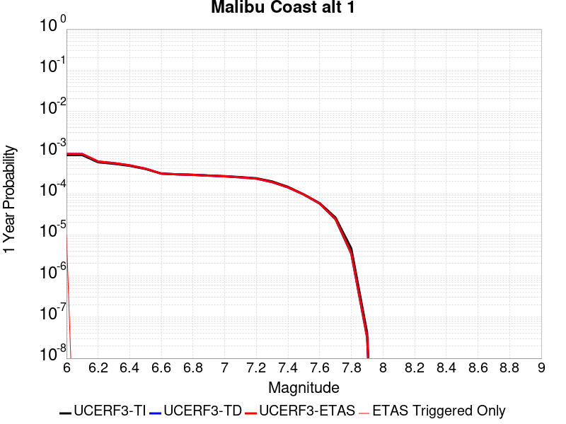 | 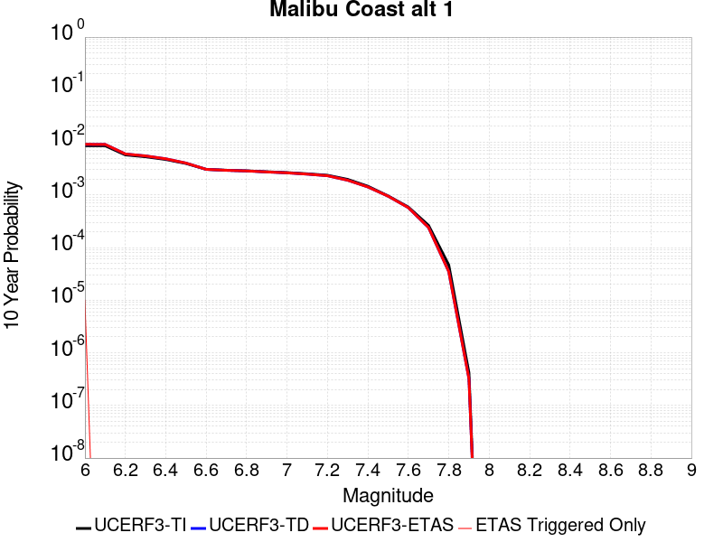 |

| Magnitude | 1 wk TI Prob | 1 wk TD Prob | 1 wk ETAS Prob | 1 wk ETAS/TD Gain | 1 wk ETAS Triggered Only | 1 mo TI Prob | 1 mo TD Prob | 1 mo ETAS Prob | 1 mo ETAS/TD Gain | 1 mo ETAS Triggered Only | 1 yr TI Prob | 1 yr TD Prob | 1 yr ETAS Prob | 1 yr ETAS/TD Gain | 1 yr ETAS Triggered Only | 10 yr TI Prob | 10 yr TD Prob | 10 yr ETAS Prob | 10 yr ETAS/TD Gain | 10 yr ETAS Triggered Only |
|-----|-----|-----|-----|-----|-----|-----|-----|-----|-----|-----|-----|-----|-----|-----|-----|-----|-----|-----|-----|-----|
| 6.0 | 1.6572556E-5 | 1.7598271E-5 | 1.7598271E-5 | 1.0 | 0.0 | 7.102331E-5 | 7.5419084E-5 | 7.5419084E-5 | 1.0 | 0.0 | 8.6436566E-4 | 9.178595E-4 | 9.278503E-4 | 1.0108849 | 1.0E-5 | 0.0086101135 | 0.009142619 | 0.009152527 | 1.0010837 | 1.0E-5 |
| 6.1 | 1.6572556E-5 | 1.7598271E-5 | 1.7598271E-5 | 1.0 | 0.0 | 7.102331E-5 | 7.5419084E-5 | 7.5419084E-5 | 1.0 | 0.0 | 8.6436566E-4 | 9.178595E-4 | 9.178595E-4 | 1.0 | 0.0 | 0.0086101135 | 0.009142619 | 0.009142619 | 1.0 | 0.0 |
| 6.2 | 1.1085717E-5 | 1.155727E-5 | 1.155727E-5 | 1.0 | 0.0 | 4.750935E-5 | 4.953024E-5 | 4.953024E-5 | 1.0 | 0.0 | 5.782728E-4 | 6.0286734E-4 | 6.0286734E-4 | 1.0 | 0.0 | 0.0057677035 | 0.00601269 | 0.00601269 | 1.0 | 0.0 |
| 6.3 | 1.0208568E-5 | 1.0592348E-5 | 1.0592348E-5 | 1.0 | 0.0 | 4.375027E-5 | 4.5395005E-5 | 4.5395005E-5 | 1.0 | 0.0 | 5.325294E-4 | 5.52547E-4 | 5.52547E-4 | 1.0 | 0.0 | 0.0053125503 | 0.005512039 | 0.005512039 | 1.0 | 0.0 |
| 6.4 | 9.0682315E-6 | 9.3427325E-6 | 9.3427325E-6 | 1.0 | 0.0 | 3.8863272E-5 | 4.003968E-5 | 4.003968E-5 | 1.0 | 0.0 | 4.730576E-4 | 4.8737606E-4 | 4.8737606E-4 | 1.0 | 0.0 | 0.0047205184 | 0.0048632855 | 0.0048632855 | 1.0 | 0.0 |
| 6.5 | 7.605796E-6 | 7.748663E-6 | 7.748663E-6 | 1.0 | 0.0 | 3.259586E-5 | 3.320814E-5 | 3.320814E-5 | 1.0 | 0.0 | 3.9678233E-4 | 4.0423544E-4 | 4.0423544E-4 | 1.0 | 0.0 | 0.0039607463 | 0.004035139 | 0.004035139 | 1.0 | 0.0 |
| 6.6 | 5.889873E-6 | 5.879592E-6 | 5.879592E-6 | 1.0 | 0.0 | 2.5242069E-5 | 2.519801E-5 | 2.519801E-5 | 1.0 | 0.0 | 3.0727885E-4 | 3.0674267E-4 | 3.0674267E-4 | 1.0 | 0.0 | 0.003068543 | 0.0030632056 | 0.0030632056 | 1.0 | 0.0 |
| 6.7 | 5.66586E-6 | 5.641693E-6 | 5.641693E-6 | 1.0 | 0.0 | 2.428203E-5 | 2.417846E-5 | 2.417846E-5 | 1.0 | 0.0 | 2.955936E-4 | 2.943331E-4 | 2.943331E-4 | 1.0 | 0.0 | 0.0029520073 | 0.0029394445 | 0.0029394445 | 1.0 | 0.0 |
| 6.8 | 5.521556E-6 | 5.4894776E-6 | 5.4894776E-6 | 1.0 | 0.0 | 2.3663597E-5 | 2.352612E-5 | 2.352612E-5 | 1.0 | 0.0 | 2.880662E-4 | 2.8639295E-4 | 2.8639295E-4 | 1.0 | 0.0 | 0.0028769306 | 0.0028602504 | 0.0028602504 | 1.0 | 0.0 |
| 6.9 | 5.29752E-6 | 5.24998E-6 | 5.24998E-6 | 1.0 | 0.0 | 2.270346E-5 | 2.249972E-5 | 2.249972E-5 | 1.0 | 0.0 | 2.7637955E-4 | 2.7389973E-4 | 2.7389973E-4 | 1.0 | 0.0 | 0.0027603607 | 0.0027356318 | 0.0027356318 | 1.0 | 0.0 |
| 7.0 | 5.106743E-6 | 5.047725E-6 | 5.047725E-6 | 1.0 | 0.0 | 2.1885859E-5 | 2.163293E-5 | 2.163293E-5 | 1.0 | 0.0 | 2.6642776E-4 | 2.6334915E-4 | 2.6334915E-4 | 1.0 | 0.0 | 0.0026610855 | 0.0026303804 | 0.0026303804 | 1.0 | 0.0 |
| 7.1 | 4.8469647E-6 | 4.770417E-6 | 4.770417E-6 | 1.0 | 0.0 | 2.0772539E-5 | 2.0444484E-5 | 2.0444484E-5 | 1.0 | 0.0 | 2.528763E-4 | 2.4888324E-4 | 2.4888324E-4 | 1.0 | 0.0 | 0.0025258875 | 0.0024860532 | 0.0024860532 | 1.0 | 0.0 |
| 7.2 | 4.545514E-6 | 4.448235E-6 | 4.448235E-6 | 1.0 | 0.0 | 1.9480629E-5 | 1.9063724E-5 | 1.9063724E-5 | 1.0 | 0.0 | 2.3715083E-4 | 2.3207619E-4 | 2.3207619E-4 | 1.0 | 0.0 | 0.0023689792 | 0.0023183457 | 0.0023183457 | 1.0 | 0.0 |
| 7.3 | 3.794097E-6 | 3.6519675E-6 | 3.6519675E-6 | 1.0 | 0.0 | 1.6260314E-5 | 1.5651196E-5 | 1.5651196E-5 | 1.0 | 0.0 | 1.9795135E-4 | 1.9053668E-4 | 1.9053668E-4 | 1.0 | 0.0 | 0.001977751 | 0.0019037378 | 0.0019037378 | 1.0 | 0.0 |
| 7.4 | 2.808217E-6 | 2.7191002E-6 | 2.7191002E-6 | 1.0 | 0.0 | 1.203516E-5 | 1.1653235E-5 | 1.1653235E-5 | 1.0 | 0.0 | 1.4651821E-4 | 1.4186892E-4 | 1.4186892E-4 | 1.0 | 0.0 | 0.0014642165 | 0.0014177862 | 0.0014177862 | 1.0 | 0.0 |
| 7.5 | 1.83809E-6 | 1.819086E-6 | 1.819086E-6 | 1.0 | 0.0 | 7.877505E-6 | 7.79606E-6 | 7.79606E-6 | 1.0 | 0.0 | 9.59044E-5 | 9.491292E-5 | 9.491292E-5 | 1.0 | 0.0 | 9.5863023E-4 | 9.487258E-4 | 9.487258E-4 | 1.0 | 0.0 |
| 7.6 | 1.1292672E-6 | 1.1001556E-6 | 1.1001556E-6 | 1.0 | 0.0 | 4.839708E-6 | 4.7149438E-6 | 4.7149438E-6 | 1.0 | 0.0 | 5.8921847E-5 | 5.7402947E-5 | 5.7402947E-5 | 1.0 | 0.0 | 5.890623E-4 | 5.7388283E-4 | 5.7388283E-4 | 1.0 | 0.0 |
| 7.7 | 5.065272E-7 | 4.6092035E-7 | 4.6092035E-7 | 1.0 | 0.0 | 2.170829E-6 | 1.9753716E-6 | 1.9753716E-6 | 1.0 | 0.0 | 2.6429525E-5 | 2.4049894E-5 | 2.4049894E-5 | 1.0 | 0.0 | 2.642638E-4 | 2.4047404E-4 | 2.4047404E-4 | 1.0 | 0.0 |
| 7.8 | 8.952991E-8 | 6.708018E-8 | 6.708018E-8 | 1.0 | 0.0 | 3.8369956E-7 | 2.8748644E-7 | 2.8748644E-7 | 1.0 | 0.0 | 4.671532E-6 | 3.5001422E-6 | 3.5001422E-6 | 1.0 | 0.0 | 4.671434E-5 | 3.500089E-5 | 3.500089E-5 | 1.0 | 0.0 |
| 7.9 | 8.007447E-10 | 6.1615857E-10 | 6.1615857E-10 | 1.0 | 0.0 | 3.4317629E-9 | 2.64068E-9 | 2.64068E-9 | 1.0 | 0.0 | 4.1781714E-8 | 3.215028E-8 | 3.215028E-8 | 1.0 | 0.0 | 4.1781706E-7 | 3.2150274E-7 | 3.2150274E-7 | 1.0 | 0.0 |

## Elsinore (Coyote Mountains)
*[(top)](#table-of-contents)*

| 1 Week | 1 Month | 1 Year | 10 Year |
|-----|-----|-----|-----|
|  |  |  | 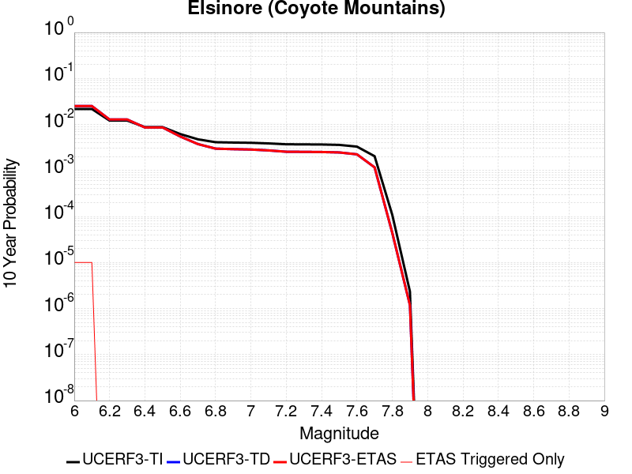 |

| Magnitude | 1 wk TI Prob | 1 wk TD Prob | 1 wk ETAS Prob | 1 wk ETAS/TD Gain | 1 wk ETAS Triggered Only | 1 mo TI Prob | 1 mo TD Prob | 1 mo ETAS Prob | 1 mo ETAS/TD Gain | 1 mo ETAS Triggered Only | 1 yr TI Prob | 1 yr TD Prob | 1 yr ETAS Prob | 1 yr ETAS/TD Gain | 1 yr ETAS Triggered Only | 10 yr TI Prob | 10 yr TD Prob | 10 yr ETAS Prob | 10 yr ETAS/TD Gain | 10 yr ETAS Triggered Only |
|-----|-----|-----|-----|-----|-----|-----|-----|-----|-----|-----|-----|-----|-----|-----|-----|-----|-----|-----|-----|-----|
| 6.0 | 4.20513E-5 | 4.863269E-5 | 4.863269E-5 | 1.0 | 0.0 | 1.8020741E-4 | 2.084124E-4 | 2.084124E-4 | 1.0 | 0.0 | 0.0021918174 | 0.0025349946 | 0.0025349946 | 1.0 | 0.0 | 0.021703249 | 0.025112068 | 0.025121817 | 1.0003883 | 1.0E-5 |
| 6.1 | 4.20513E-5 | 4.863269E-5 | 4.863269E-5 | 1.0 | 0.0 | 1.8020741E-4 | 2.084124E-4 | 2.084124E-4 | 1.0 | 0.0 | 0.0021918174 | 0.0025349946 | 0.0025349946 | 1.0 | 0.0 | 0.021703249 | 0.025112068 | 0.025121817 | 1.0003883 | 1.0E-5 |
| 6.2 | 2.3413893E-5 | 2.469625E-5 | 2.469625E-5 | 1.0 | 0.0 | 1.0034139E-4 | 1.0583731E-4 | 1.0583731E-4 | 1.0 | 0.0 | 0.0012209718 | 0.001287895 | 0.001287895 | 1.0 | 0.0 | 0.012142851 | 0.012812992 | 0.012812992 | 1.0 | 0.0 |
| 6.3 | 2.3413893E-5 | 2.469625E-5 | 2.469625E-5 | 1.0 | 0.0 | 1.0034139E-4 | 1.0583731E-4 | 1.0583731E-4 | 1.0 | 0.0 | 0.0012209718 | 0.001287895 | 0.001287895 | 1.0 | 0.0 | 0.012142851 | 0.012812992 | 0.012812992 | 1.0 | 0.0 |
| 6.4 | 1.6894814E-5 | 1.6568772E-5 | 1.6568772E-5 | 1.0 | 0.0 | 7.240433E-5 | 7.10073E-5 | 7.10073E-5 | 1.0 | 0.0 | 8.811662E-4 | 8.642079E-4 | 8.642079E-4 | 1.0 | 0.0 | 0.0087768035 | 0.008612131 | 0.008612131 | 1.0 | 0.0 |
| 6.5 | 1.6894814E-5 | 1.6568772E-5 | 1.6568772E-5 | 1.0 | 0.0 | 7.240433E-5 | 7.10073E-5 | 7.10073E-5 | 1.0 | 0.0 | 8.811662E-4 | 8.642079E-4 | 8.642079E-4 | 1.0 | 0.0 | 0.0087768035 | 0.008612131 | 0.008612131 | 1.0 | 0.0 |
| 6.6 | 1.1910969E-5 | 1.0530927E-5 | 1.0530927E-5 | 1.0 | 0.0 | 5.1046012E-5 | 4.513184E-5 | 4.513184E-5 | 1.0 | 0.0 | 6.21308E-4 | 5.4935494E-4 | 5.4935494E-4 | 1.0 | 0.0 | 0.0061957375 | 0.00548127 | 0.00548127 | 1.0 | 0.0 |
| 6.7 | 9.1486E-6 | 7.2029457E-6 | 7.2029457E-6 | 1.0 | 0.0 | 3.9207694E-5 | 3.0869425E-5 | 3.0869425E-5 | 1.0 | 0.0 | 4.7724912E-4 | 3.7577422E-4 | 3.7577422E-4 | 1.0 | 0.0 | 0.0047622547 | 0.0037517678 | 0.0037517678 | 1.0 | 0.0 |
| 6.8 | 7.90441E-6 | 5.729078E-6 | 5.729078E-6 | 1.0 | 0.0 | 3.3875604E-5 | 2.4552968E-5 | 2.4552968E-5 | 1.0 | 0.0 | 4.1235742E-4 | 2.9889264E-4 | 2.9889264E-4 | 1.0 | 0.0 | 0.0041159308 | 0.002985035 | 0.002985035 | 1.0 | 0.0 |
| 6.9 | 7.77015E-6 | 5.5830305E-6 | 5.5830305E-6 | 1.0 | 0.0 | 3.3300217E-5 | 2.3927061E-5 | 2.3927061E-5 | 1.0 | 0.0 | 4.0535472E-4 | 2.912743E-4 | 2.912743E-4 | 1.0 | 0.0 | 0.004046161 | 0.0029090524 | 0.0029090524 | 1.0 | 0.0 |
| 7.0 | 7.675798E-6 | 5.479888E-6 | 5.479888E-6 | 1.0 | 0.0 | 3.289586E-5 | 2.3485029E-5 | 2.3485029E-5 | 1.0 | 0.0 | 4.004335E-4 | 2.8589397E-4 | 2.8589397E-4 | 1.0 | 0.0 | 0.003997127 | 0.0028553882 | 0.0028553882 | 1.0 | 0.0 |
| 7.1 | 7.447814E-6 | 5.2387572E-6 | 5.2387572E-6 | 1.0 | 0.0 | 3.191881E-5 | 2.2451632E-5 | 2.2451632E-5 | 1.0 | 0.0 | 3.8854225E-4 | 2.7331559E-4 | 2.7331559E-4 | 1.0 | 0.0 | 0.003878636 | 0.0027299186 | 0.0027299186 | 1.0 | 0.0 |
| 7.2 | 7.128185E-6 | 4.9054033E-6 | 4.9054033E-6 | 1.0 | 0.0 | 3.0549007E-5 | 2.1022995E-5 | 2.1022995E-5 | 1.0 | 0.0 | 3.7187067E-4 | 2.5592608E-4 | 2.5592608E-4 | 1.0 | 0.0 | 0.00371249 | 0.002556432 | 0.002556432 | 1.0 | 0.0 |
| 7.3 | 7.0913875E-6 | 4.874078E-6 | 4.874078E-6 | 1.0 | 0.0 | 3.0391306E-5 | 2.0888747E-5 | 2.0888747E-5 | 1.0 | 0.0 | 3.6995133E-4 | 2.5429198E-4 | 2.5429198E-4 | 1.0 | 0.0 | 0.0036933604 | 0.0025401285 | 0.0025401285 | 1.0 | 0.0 |
| 7.4 | 7.051521E-6 | 4.8379297E-6 | 4.8379297E-6 | 1.0 | 0.0 | 3.0220453E-5 | 2.0733825E-5 | 2.0733825E-5 | 1.0 | 0.0 | 3.6787192E-4 | 2.524063E-4 | 2.524063E-4 | 1.0 | 0.0 | 0.0036726352 | 0.0025213142 | 0.0025213142 | 1.0 | 0.0 |
| 7.5 | 6.910666E-6 | 4.733479E-6 | 4.733479E-6 | 1.0 | 0.0 | 2.9616802E-5 | 2.0286187E-5 | 2.0286187E-5 | 1.0 | 0.0 | 3.605249E-4 | 2.4695753E-4 | 2.4695753E-4 | 1.0 | 0.0 | 0.0035994058 | 0.0024669487 | 0.0024669487 | 1.0 | 0.0 |
| 7.6 | 6.341753E-6 | 4.306589E-6 | 4.306589E-6 | 1.0 | 0.0 | 2.7178658E-5 | 1.8456685E-5 | 1.8456685E-5 | 1.0 | 0.0 | 3.3084993E-4 | 2.2468815E-4 | 2.2468815E-4 | 1.0 | 0.0 | 0.0033035777 | 0.002244725 | 0.002244725 | 1.0 | 0.0 |
| 7.7 | 3.9205916E-6 | 2.2439156E-6 | 2.2439156E-6 | 1.0 | 0.0 | 1.6802427E-5 | 9.61675E-6 | 9.61675E-6 | 1.0 | 0.0 | 2.0455034E-4 | 1.1707837E-4 | 1.1707837E-4 | 1.0 | 0.0 | 0.0020436216 | 0.0011702399 | 0.0011702399 | 1.0 | 0.0 |
| 7.8 | 2.0846227E-7 | 8.485576E-8 | 8.485576E-8 | 1.0 | 0.0 | 8.9340944E-7 | 3.6366754E-7 | 3.6366754E-7 | 1.0 | 0.0 | 1.0877206E-5 | 4.4276467E-6 | 4.4276467E-6 | 1.0 | 0.0 | 1.0876673E-4 | 4.4275912E-5 | 4.4275912E-5 | 1.0 | 0.0 |
| 7.9 | 4.4969806E-9 | 2.26915E-9 | 2.26915E-9 | 1.0 | 0.0 | 1.9272775E-8 | 9.724928E-9 | 9.724928E-9 | 1.0 | 0.0 | 2.3464601E-7 | 1.18401E-7 | 1.18401E-7 | 1.0 | 0.0 | 2.3464577E-6 | 1.1840094E-6 | 1.1840094E-6 | 1.0 | 0.0 |

## Greenville (No) 2011 CFM
*[(top)](#table-of-contents)*

| 1 Week | 1 Month | 1 Year | 10 Year |
|-----|-----|-----|-----|
|  |  |  |  |

| Magnitude | 1 wk TI Prob | 1 wk TD Prob | 1 wk ETAS Prob | 1 wk ETAS/TD Gain | 1 wk ETAS Triggered Only | 1 mo TI Prob | 1 mo TD Prob | 1 mo ETAS Prob | 1 mo ETAS/TD Gain | 1 mo ETAS Triggered Only | 1 yr TI Prob | 1 yr TD Prob | 1 yr ETAS Prob | 1 yr ETAS/TD Gain | 1 yr ETAS Triggered Only | 10 yr TI Prob | 10 yr TD Prob | 10 yr ETAS Prob | 10 yr ETAS/TD Gain | 10 yr ETAS Triggered Only |
|-----|-----|-----|-----|-----|-----|-----|-----|-----|-----|-----|-----|-----|-----|-----|-----|-----|-----|-----|-----|-----|
| 6.0 | 3.286654E-5 | 4.0367628E-5 | 4.0367628E-5 | 1.0 | 0.0 | 1.4084899E-4 | 1.7299286E-4 | 1.8299113E-4 | 1.0577959 | 1.0E-5 | 0.0017134876 | 0.0021041913 | 0.0021141702 | 1.0047424 | 1.0E-5 | 0.017003356 | 0.020847926 | 0.020857718 | 1.0004697 | 1.0E-5 |
| 6.1 | 3.286654E-5 | 4.0367628E-5 | 4.0367628E-5 | 1.0 | 0.0 | 1.4084899E-4 | 1.7299286E-4 | 1.8299113E-4 | 1.0577959 | 1.0E-5 | 0.0017134876 | 0.0021041913 | 0.0021141702 | 1.0047424 | 1.0E-5 | 0.017003356 | 0.020847926 | 0.020857718 | 1.0004697 | 1.0E-5 |
| 6.2 | 3.1697953E-5 | 3.8930488E-5 | 3.8930488E-5 | 1.0 | 0.0 | 1.358413E-4 | 1.6683448E-4 | 1.7683282E-4 | 1.0599296 | 1.0E-5 | 0.0016526132 | 0.0020293547 | 0.0020393343 | 1.0049176 | 1.0E-5 | 0.01640377 | 0.020113297 | 0.020123096 | 1.0004872 | 1.0E-5 |
| 6.3 | 3.1363317E-5 | 3.8519345E-5 | 3.8519345E-5 | 1.0 | 0.0 | 1.344073E-4 | 1.6507268E-4 | 1.7507104E-4 | 1.0605694 | 1.0E-5 | 0.0016351803 | 0.0020079445 | 0.0020179243 | 1.0049702 | 1.0E-5 | 0.016232004 | 0.019903058 | 0.01991286 | 1.0004925 | 1.0E-5 |
| 6.4 | 3.0228604E-5 | 3.712643E-5 | 3.712643E-5 | 1.0 | 0.0 | 1.2954473E-4 | 1.5910377E-4 | 1.6910218E-4 | 1.062842 | 1.0E-5 | 0.0015760659 | 0.0019354038 | 0.0019453844 | 1.0051569 | 1.0E-5 | 0.015649348 | 0.019190377 | 0.019200185 | 1.000511 | 1.0E-5 |
| 6.5 | 2.9537814E-5 | 3.6281854E-5 | 3.6281854E-5 | 1.0 | 0.0 | 1.2658449E-4 | 1.554846E-4 | 1.6548304E-4 | 1.0643051 | 1.0E-5 | 0.0015400766 | 0.0018914177 | 0.0019013988 | 1.005277 | 1.0E-5 | 0.01529447 | 0.018758025 | 0.018767837 | 1.0005231 | 1.0E-5 |
| 6.6 | 2.7345395E-5 | 3.3591095E-5 | 3.3591095E-5 | 1.0 | 0.0 | 1.1718928E-4 | 1.4395406E-4 | 1.5395263E-4 | 1.0694566 | 1.0E-5 | 0.0014258457 | 0.0017512628 | 0.0017612453 | 1.0057001 | 1.0E-5 | 0.014167317 | 0.017378807 | 0.017388634 | 1.0005654 | 1.0E-5 |
| 6.7 | 2.5615784E-5 | 3.156795E-5 | 3.156795E-5 | 1.0 | 0.0 | 1.09777306E-4 | 1.3528437E-4 | 1.4528302E-4 | 1.0739083 | 1.0E-5 | 0.0013357193 | 0.0016458734 | 0.001655857 | 1.0060658 | 1.0E-5 | 0.013277191 | 0.016340878 | 0.016350714 | 1.000602 | 1.0E-5 |
| 6.8 | 2.0059057E-5 | 2.4712723E-5 | 2.4712723E-5 | 1.0 | 0.0 | 8.596455E-5 | 1.0590746E-4 | 1.159064E-4 | 1.0944121 | 1.0E-5 | 0.0010461159 | 0.0012886769 | 0.001298664 | 1.0077499 | 1.0E-5 | 0.0104120495 | 0.01281443 | 0.012824302 | 1.0007703 | 1.0E-5 |
| 6.9 | 1.6321746E-5 | 2.018519E-5 | 2.018519E-5 | 1.0 | 0.0 | 6.9948466E-5 | 8.6505155E-5 | 8.6505155E-5 | 1.0 | 0.0 | 8.5128983E-4 | 0.0010527038 | 0.0010527038 | 1.0 | 0.0 | 0.008480361 | 0.010479072 | 0.010479072 | 1.0 | 0.0 |
| 7.0 | 1.22527645E-5 | 1.5136019E-5 | 1.5136019E-5 | 1.0 | 0.0 | 5.2510793E-5 | 6.486706E-5 | 6.486706E-5 | 1.0 | 0.0 | 6.3913135E-4 | 7.894746E-4 | 7.894746E-4 | 1.0 | 0.0 | 0.0063729626 | 0.007867752 | 0.007867752 | 1.0 | 0.0 |
| 7.1 | 8.996482E-6 | 1.1165242E-5 | 1.1165242E-5 | 1.0 | 0.0 | 3.8555783E-5 | 4.7850164E-5 | 4.7850164E-5 | 1.0 | 0.0 | 4.6931554E-4 | 5.8242126E-4 | 5.8242126E-4 | 1.0 | 0.0 | 0.004683256 | 0.005809783 | 0.005809783 | 1.0 | 0.0 |
| 7.2 | 6.0273087E-6 | 7.5697E-6 | 7.5697E-6 | 1.0 | 0.0 | 2.5831067E-5 | 3.244117E-5 | 3.244117E-5 | 1.0 | 0.0 | 3.1444785E-4 | 3.9490036E-4 | 3.9490036E-4 | 1.0 | 0.0 | 0.0031400328 | 0.003942572 | 0.003942572 | 1.0 | 0.0 |
| 7.3 | 3.1209995E-6 | 3.966495E-6 | 3.966495E-6 | 1.0 | 0.0 | 1.3375643E-5 | 1.6999156E-5 | 1.6999156E-5 | 1.0 | 0.0 | 1.6283628E-4 | 2.0694522E-4 | 2.0694522E-4 | 1.0 | 0.0 | 0.0016271701 | 0.002067831 | 0.002067831 | 1.0 | 0.0 |
| 7.4 | 2.0254208E-6 | 2.6096925E-6 | 2.6096925E-6 | 1.0 | 0.0 | 8.680347E-6 | 1.1184348E-5 | 1.1184348E-5 | 1.0 | 0.0 | 1.0567809E-4 | 1.3616099E-4 | 1.3616099E-4 | 1.0 | 0.0 | 0.0010562785 | 0.0013611029 | 0.0013611029 | 1.0 | 0.0 |
| 7.5 | 1.6763418E-6 | 2.1734163E-6 | 2.1734163E-6 | 1.0 | 0.0 | 7.184302E-6 | 9.314608E-6 | 9.314608E-6 | 1.0 | 0.0 | 8.746537E-5 | 1.1339951E-4 | 1.1339951E-4 | 1.0 | 0.0 | 8.743095E-4 | 0.001133725 | 0.001133725 | 1.0 | 0.0 |
| 7.6 | 1.1935462E-6 | 1.5458975E-6 | 1.5458975E-6 | 1.0 | 0.0 | 5.115188E-6 | 6.6252583E-6 | 6.6252583E-6 | 1.0 | 0.0 | 6.2275634E-5 | 8.065958E-5 | 8.065958E-5 | 1.0 | 0.0 | 6.2258187E-4 | 8.0653606E-4 | 8.0653606E-4 | 1.0 | 0.0 |
| 7.7 | 3.0464201E-7 | 3.9848902E-7 | 3.9848902E-7 | 1.0 | 0.0 | 1.3056081E-6 | 1.707809E-6 | 1.707809E-6 | 1.0 | 0.0 | 1.589566E-5 | 2.079238E-5 | 2.079238E-5 | 1.0 | 0.0 | 1.5894524E-4 | 2.0793274E-4 | 2.0793274E-4 | 1.0 | 0.0 |

## Greenville (So) 2011 CFM
*[(top)](#table-of-contents)*

| 1 Week | 1 Month | 1 Year | 10 Year |
|-----|-----|-----|-----|
|  |  |  | 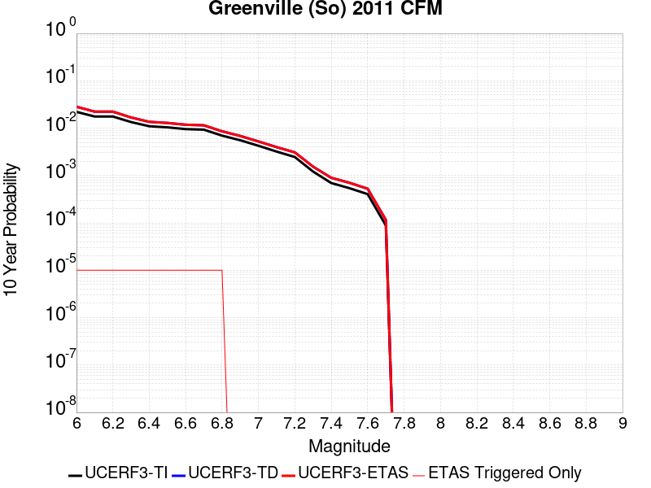 |

| Magnitude | 1 wk TI Prob | 1 wk TD Prob | 1 wk ETAS Prob | 1 wk ETAS/TD Gain | 1 wk ETAS Triggered Only | 1 mo TI Prob | 1 mo TD Prob | 1 mo ETAS Prob | 1 mo ETAS/TD Gain | 1 mo ETAS Triggered Only | 1 yr TI Prob | 1 yr TD Prob | 1 yr ETAS Prob | 1 yr ETAS/TD Gain | 1 yr ETAS Triggered Only | 10 yr TI Prob | 10 yr TD Prob | 10 yr ETAS Prob | 10 yr ETAS/TD Gain | 10 yr ETAS Triggered Only |
|-----|-----|-----|-----|-----|-----|-----|-----|-----|-----|-----|-----|-----|-----|-----|-----|-----|-----|-----|-----|-----|
| 6.0 | 4.279693E-5 | 5.504253E-5 | 5.504253E-5 | 1.0 | 0.0 | 1.8340252E-4 | 2.3587665E-4 | 2.4587428E-4 | 1.042385 | 1.0E-5 | 0.0022306389 | 0.0028682668 | 0.0028782382 | 1.0034764 | 1.0E-5 | 0.022083808 | 0.028339608 | 0.028349325 | 1.0003428 | 1.0E-5 |
| 6.1 | 3.4037297E-5 | 4.319378E-5 | 4.319378E-5 | 1.0 | 0.0 | 1.4586597E-4 | 1.8510365E-4 | 1.9510179E-4 | 1.0540137 | 1.0E-5 | 0.0017744715 | 0.00225147 | 0.0022614475 | 1.0044315 | 1.0E-5 | 0.01760369 | 0.02230374 | 0.022313517 | 1.0004383 | 1.0E-5 |
| 6.2 | 3.4037297E-5 | 4.319378E-5 | 4.319378E-5 | 1.0 | 0.0 | 1.4586597E-4 | 1.8510365E-4 | 1.9510179E-4 | 1.0540137 | 1.0E-5 | 0.0017744715 | 0.00225147 | 0.0022614475 | 1.0044315 | 1.0E-5 | 0.01760369 | 0.02230374 | 0.022313517 | 1.0004383 | 1.0E-5 |
| 6.3 | 2.5956324E-5 | 3.243031E-5 | 3.243031E-5 | 1.0 | 0.0 | 1.11236644E-4 | 1.3898002E-4 | 1.4897862E-4 | 1.0719428 | 1.0E-5 | 0.0013534647 | 0.0016908324 | 0.0017008155 | 1.0059042 | 1.0E-5 | 0.013452509 | 0.016786784 | 0.016796617 | 1.0005857 | 1.0E-5 |
| 6.4 | 2.1145053E-5 | 2.6198471E-5 | 2.6198471E-5 | 1.0 | 0.0 | 9.061851E-5 | 1.1227445E-4 | 1.2227333E-4 | 1.0890574 | 1.0E-5 | 0.0011027219 | 0.001366116 | 0.0013761023 | 1.00731 | 1.0E-5 | 0.01097266 | 0.013580924 | 0.0135907885 | 1.0007263 | 1.0E-5 |
| 6.5 | 2.0030959E-5 | 2.4796553E-5 | 2.4796553E-5 | 1.0 | 0.0 | 8.584414E-5 | 1.06266765E-4 | 1.16265706E-4 | 1.0940928 | 1.0E-5 | 0.0010446513 | 0.0012930612 | 0.0013030482 | 1.0077236 | 1.0E-5 | 0.010397541 | 0.012859055 | 0.012868926 | 1.0007677 | 1.0E-5 |
| 6.6 | 1.8395405E-5 | 2.2755145E-5 | 2.2755145E-5 | 1.0 | 0.0 | 7.8835066E-5 | 9.751856E-5 | 1.0751758E-4 | 1.1025345 | 1.0E-5 | 9.5939427E-4 | 0.0011866703 | 0.0011966585 | 1.0084169 | 1.0E-5 | 0.009552629 | 0.011806721 | 0.011816603 | 1.000837 | 1.0E-5 |
| 6.7 | 1.7883482E-5 | 2.2126169E-5 | 2.2126169E-5 | 1.0 | 0.0 | 7.664124E-5 | 9.482315E-5 | 1.04822204E-4 | 1.1054494 | 1.0E-5 | 9.3270757E-4 | 0.001153889 | 0.0011638774 | 1.0086564 | 1.0E-5 | 0.009288026 | 0.011482358 | 0.011492243 | 1.0008609 | 1.0E-5 |
| 6.8 | 1.3373564E-5 | 1.650644E-5 | 1.650644E-5 | 1.0 | 0.0 | 5.7314013E-5 | 7.0740054E-5 | 8.0739344E-5 | 1.1413527 | 1.0E-5 | 6.975747E-4 | 8.609346E-4 | 8.7092596E-4 | 1.0116053 | 1.0E-5 | 0.0069538904 | 0.008577933 | 0.008587847 | 1.0011557 | 1.0E-5 |
| 6.9 | 1.06692905E-5 | 1.315295E-5 | 1.315295E-5 | 1.0 | 0.0 | 4.5724726E-5 | 5.6368626E-5 | 5.6368626E-5 | 1.0 | 0.0 | 5.5655633E-4 | 6.860832E-4 | 6.860832E-4 | 1.0 | 0.0 | 0.005551645 | 0.0068412144 | 0.0068412144 | 1.0 | 0.0 |
| 7.0 | 8.157512E-6 | 1.0062912E-5 | 1.0062912E-5 | 1.0 | 0.0 | 3.4960296E-5 | 4.3126074E-5 | 4.3126074E-5 | 1.0 | 0.0 | 4.2555845E-4 | 5.249372E-4 | 5.249372E-4 | 1.0 | 0.0 | 0.004247444 | 0.00523778 | 0.00523778 | 1.0 | 0.0 |
| 7.1 | 6.1467113E-6 | 7.627636E-6 | 7.627636E-6 | 1.0 | 0.0 | 2.6342783E-5 | 3.2689466E-5 | 3.2689466E-5 | 1.0 | 0.0 | 3.206762E-4 | 3.9792238E-4 | 3.9792238E-4 | 1.0 | 0.0 | 0.0032021382 | 0.0039726184 | 0.0039726184 | 1.0 | 0.0 |
| 7.2 | 4.713467E-6 | 5.9143304E-6 | 5.9143304E-6 | 1.0 | 0.0 | 2.0200418E-5 | 2.5346888E-5 | 2.5346888E-5 | 1.0 | 0.0 | 2.4591232E-4 | 3.0855526E-4 | 3.0855526E-4 | 1.0 | 0.0 | 0.0024564038 | 0.0030817043 | 0.0030817043 | 1.0 | 0.0 |
| 7.3 | 2.3266216E-6 | 2.954093E-6 | 2.954093E-6 | 1.0 | 0.0 | 9.971197E-6 | 1.2660337E-5 | 1.2660337E-5 | 1.0 | 0.0 | 1.2139256E-4 | 1.5412885E-4 | 1.5412885E-4 | 1.0 | 0.0 | 0.0012132627 | 0.0015404717 | 0.0015404717 | 1.0 | 0.0 |
| 7.4 | 1.3314E-6 | 1.7180038E-6 | 1.7180038E-6 | 1.0 | 0.0 | 5.7059874E-6 | 7.3628526E-6 | 7.3628526E-6 | 1.0 | 0.0 | 6.946818E-5 | 8.963909E-5 | 8.963909E-5 | 1.0 | 0.0 | 6.9446466E-4 | 8.9630444E-4 | 8.9630444E-4 | 1.0 | 0.0 |
| 7.5 | 1.0362941E-6 | 1.3469212E-6 | 1.3469212E-6 | 1.0 | 0.0 | 4.4412527E-6 | 5.772507E-6 | 5.772507E-6 | 1.0 | 0.0 | 5.407091E-5 | 7.027805E-5 | 7.027805E-5 | 1.0 | 0.0 | 5.405776E-4 | 7.028176E-4 | 7.028176E-4 | 1.0 | 0.0 |
| 7.6 | 7.764784E-7 | 1.0088914E-6 | 1.0088914E-6 | 1.0 | 0.0 | 3.3277602E-6 | 4.3238138E-6 | 4.3238138E-6 | 1.0 | 0.0 | 4.0514726E-5 | 5.2641197E-5 | 5.2641197E-5 | 1.0 | 0.0 | 4.050734E-4 | 5.2651245E-4 | 5.2651245E-4 | 1.0 | 0.0 |
| 7.7 | 1.6927763E-7 | 2.214027E-7 | 2.214027E-7 | 1.0 | 0.0 | 7.2547533E-7 | 9.4886843E-7 | 9.4886843E-7 | 1.0 | 0.0 | 8.832627E-6 | 1.1552414E-5 | 1.1552414E-5 | 1.0 | 0.0 | 8.8322755E-5 | 1.1554362E-4 | 1.1554362E-4 | 1.0 | 0.0 |

## Morales (West)
*[(top)](#table-of-contents)*

| 1 Week | 1 Month | 1 Year | 10 Year |
|-----|-----|-----|-----|
|  |  | 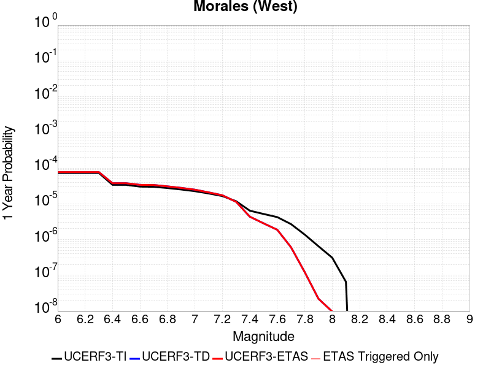 |  |

| Magnitude | 1 wk TI Prob | 1 wk TD Prob | 1 wk ETAS Prob | 1 wk ETAS/TD Gain | 1 wk ETAS Triggered Only | 1 mo TI Prob | 1 mo TD Prob | 1 mo ETAS Prob | 1 mo ETAS/TD Gain | 1 mo ETAS Triggered Only | 1 yr TI Prob | 1 yr TD Prob | 1 yr ETAS Prob | 1 yr ETAS/TD Gain | 1 yr ETAS Triggered Only | 10 yr TI Prob | 10 yr TD Prob | 10 yr ETAS Prob | 10 yr ETAS/TD Gain | 10 yr ETAS Triggered Only |
|-----|-----|-----|-----|-----|-----|-----|-----|-----|-----|-----|-----|-----|-----|-----|-----|-----|-----|-----|-----|-----|
| 6.0 | 1.4027072E-6 | 1.4792528E-6 | 1.4792528E-6 | 1.0 | 0.0 | 6.0115885E-6 | 6.3396433E-6 | 6.3396433E-6 | 1.0 | 0.0 | 7.318863E-5 | 7.718312E-5 | 7.718312E-5 | 1.0 | 0.0 | 7.316453E-4 | 7.716317E-4 | 7.81624E-4 | 1.0129496 | 1.0E-5 |
| 6.1 | 1.4027072E-6 | 1.4792528E-6 | 1.4792528E-6 | 1.0 | 0.0 | 6.0115885E-6 | 6.3396433E-6 | 6.3396433E-6 | 1.0 | 0.0 | 7.318863E-5 | 7.718312E-5 | 7.718312E-5 | 1.0 | 0.0 | 7.316453E-4 | 7.716317E-4 | 7.81624E-4 | 1.0129496 | 1.0E-5 |
| 6.2 | 1.4027072E-6 | 1.4792528E-6 | 1.4792528E-6 | 1.0 | 0.0 | 6.0115885E-6 | 6.3396433E-6 | 6.3396433E-6 | 1.0 | 0.0 | 7.318863E-5 | 7.718312E-5 | 7.718312E-5 | 1.0 | 0.0 | 7.316453E-4 | 7.716317E-4 | 7.81624E-4 | 1.0129496 | 1.0E-5 |
| 6.3 | 1.4027072E-6 | 1.4792528E-6 | 1.4792528E-6 | 1.0 | 0.0 | 6.0115885E-6 | 6.3396433E-6 | 6.3396433E-6 | 1.0 | 0.0 | 7.318863E-5 | 7.718312E-5 | 7.718312E-5 | 1.0 | 0.0 | 7.316453E-4 | 7.716317E-4 | 7.81624E-4 | 1.0129496 | 1.0E-5 |
| 6.4 | 6.504502E-7 | 7.204825E-7 | 7.204825E-7 | 1.0 | 0.0 | 2.7876408E-6 | 3.0877784E-6 | 3.0877784E-6 | 1.0 | 0.0 | 3.3939E-5 | 3.7593065E-5 | 3.7593065E-5 | 1.0 | 0.0 | 3.3933815E-4 | 3.7586826E-4 | 3.7586826E-4 | 1.0 | 0.0 |
| 6.5 | 6.504502E-7 | 7.204825E-7 | 7.204825E-7 | 1.0 | 0.0 | 2.7876408E-6 | 3.0877784E-6 | 3.0877784E-6 | 1.0 | 0.0 | 3.3939E-5 | 3.7593065E-5 | 3.7593065E-5 | 1.0 | 0.0 | 3.3933815E-4 | 3.7586826E-4 | 3.7586826E-4 | 1.0 | 0.0 |
| 6.6 | 5.8056526E-7 | 6.501084E-7 | 6.501084E-7 | 1.0 | 0.0 | 2.4881344E-6 | 2.7861759E-6 | 2.7861759E-6 | 1.0 | 0.0 | 3.0292615E-5 | 3.392117E-5 | 3.392117E-5 | 1.0 | 0.0 | 3.0288487E-4 | 3.3916053E-4 | 3.3916053E-4 | 1.0 | 0.0 |
| 6.7 | 5.741448E-7 | 6.436395E-7 | 6.436395E-7 | 1.0 | 0.0 | 2.4606184E-6 | 2.7584522E-6 | 2.7584522E-6 | 1.0 | 0.0 | 2.9957617E-5 | 3.3583645E-5 | 3.3583645E-5 | 1.0 | 0.0 | 2.9953578E-4 | 3.357863E-4 | 3.357863E-4 | 1.0 | 0.0 |
| 6.8 | 5.299428E-7 | 5.891805E-7 | 5.891805E-7 | 1.0 | 0.0 | 2.2711813E-6 | 2.5250567E-6 | 2.5250567E-6 | 1.0 | 0.0 | 2.7651282E-5 | 3.0742136E-5 | 3.0742136E-5 | 1.0 | 0.0 | 2.7647841E-4 | 3.0737932E-4 | 3.0737932E-4 | 1.0 | 0.0 |
| 6.9 | 4.82394E-7 | 5.342556E-7 | 5.342556E-7 | 1.0 | 0.0 | 2.0674013E-6 | 2.2896647E-6 | 2.2896647E-6 | 1.0 | 0.0 | 2.517032E-5 | 2.7876316E-5 | 2.7876316E-5 | 1.0 | 0.0 | 2.516747E-4 | 2.787286E-4 | 2.787286E-4 | 1.0 | 0.0 |
| 7.0 | 4.3264512E-7 | 4.760705E-7 | 4.760705E-7 | 1.0 | 0.0 | 1.8541921E-6 | 2.0403006E-6 | 2.0403006E-6 | 1.0 | 0.0 | 2.2574555E-5 | 2.484038E-5 | 2.484038E-5 | 1.0 | 0.0 | 2.2572262E-4 | 2.4837637E-4 | 2.4837637E-4 | 1.0 | 0.0 |
| 7.1 | 3.7388565E-7 | 4.0011574E-7 | 4.0011574E-7 | 1.0 | 0.0 | 1.6023661E-6 | 1.7147806E-6 | 1.7147806E-6 | 1.0 | 0.0 | 1.9508632E-5 | 2.0877256E-5 | 2.0877256E-5 | 1.0 | 0.0 | 1.950692E-4 | 2.0875318E-4 | 2.0875318E-4 | 1.0 | 0.0 |
| 7.2 | 3.1592543E-7 | 3.3206416E-7 | 3.3206416E-7 | 1.0 | 0.0 | 1.3539654E-6 | 1.4231314E-6 | 1.4231314E-6 | 1.0 | 0.0 | 1.6484404E-5 | 1.7326489E-5 | 1.7326489E-5 | 1.0 | 0.0 | 1.6483181E-4 | 1.7325155E-4 | 1.7325155E-4 | 1.0 | 0.0 |
| 7.3 | 2.2677783E-7 | 2.179975E-7 | 2.179975E-7 | 1.0 | 0.0 | 9.719047E-7 | 9.342746E-7 | 9.342746E-7 | 1.0 | 0.0 | 1.1832874E-5 | 1.1374735E-5 | 1.1374735E-5 | 1.0 | 0.0 | 1.18322445E-4 | 1.13741575E-4 | 1.13741575E-4 | 1.0 | 0.0 |
| 7.4 | 1.2295531E-7 | 8.353023E-8 | 8.353023E-8 | 1.0 | 0.0 | 5.269512E-7 | 3.5798666E-7 | 3.5798666E-7 | 1.0 | 0.0 | 6.4156125E-6 | 4.3584787E-6 | 4.3584787E-6 | 1.0 | 0.0 | 6.415427E-5 | 4.358394E-5 | 4.358394E-5 | 1.0 | 0.0 |
| 7.5 | 9.9632544E-8 | 5.444591E-8 | 5.444591E-8 | 1.0 | 0.0 | 4.2699656E-7 | 2.3333959E-7 | 2.3333959E-7 | 1.0 | 0.0 | 5.198671E-6 | 2.8409058E-6 | 2.8409058E-6 | 1.0 | 0.0 | 5.198549E-5 | 2.8408698E-5 | 2.8408698E-5 | 1.0 | 0.0 |
| 7.6 | 8.125894E-8 | 3.595985E-8 | 3.595985E-8 | 1.0 | 0.0 | 3.4825257E-7 | 1.5411364E-7 | 1.5411364E-7 | 1.0 | 0.0 | 4.2399665E-6 | 1.8763319E-6 | 1.8763319E-6 | 1.0 | 0.0 | 4.2398857E-5 | 1.8763163E-5 | 1.8763163E-5 | 1.0 | 0.0 |
| 7.7 | 5.1810765E-8 | 1.1647039E-8 | 1.1647039E-8 | 1.0 | 0.0 | 2.2204613E-7 | 4.991588E-8 | 4.991588E-8 | 1.0 | 0.0 | 2.7034082E-6 | 6.0772567E-7 | 6.0772567E-7 | 1.0 | 0.0 | 2.7033753E-5 | 6.0772413E-6 | 6.0772413E-6 | 1.0 | 0.0 |
| 7.8 | 2.6315043E-8 | 2.339196E-9 | 2.339196E-9 | 1.0 | 0.0 | 1.1277875E-7 | 1.0025128E-8 | 1.0025128E-8 | 1.0 | 0.0 | 1.3730804E-6 | 1.2205594E-7 | 1.2205594E-7 | 1.0 | 0.0 | 1.3730719E-5 | 1.2205599E-6 | 1.2205599E-6 | 1.0 | 0.0 |
| 7.9 | 1.24281545E-8 | 4.2077652E-10 | 4.2077652E-10 | 1.0 | 0.0 | 5.3263516E-8 | 1.803329E-9 | 1.803329E-9 | 1.0 | 0.0 | 6.4848314E-7 | 2.195553E-8 | 2.195553E-8 | 1.0 | 0.0 | 6.4848123E-6 | 2.1955654E-7 | 2.1955654E-7 | 1.0 | 0.0 |
| 8.0 | 5.954214E-9 | 1.851086E-10 | 1.851086E-10 | 1.0 | 0.0 | 2.551806E-8 | 7.9332363E-10 | 7.9332363E-10 | 1.0 | 0.0 | 3.1068234E-7 | 9.658708E-9 | 9.658708E-9 | 1.0 | 0.0 | 3.1068191E-6 | 9.658834E-8 | 9.658834E-8 | 1.0 | 0.0 |
| 8.1 | 1.2586262E-9 | 8.3489105E-11 | 8.3489105E-11 | 1.0 | 0.0 | 5.3941123E-9 | 3.5781134E-10 | 3.5781134E-10 | 1.0 | 0.0 | 6.567332E-8 | 4.356351E-9 | 4.356351E-9 | 1.0 | 0.0 | 6.56733E-7 | 4.356477E-8 | 4.356477E-8 | 1.0 | 0.0 |

## Burnt Mtn
*[(top)](#table-of-contents)*

| 1 Week | 1 Month | 1 Year | 10 Year |
|-----|-----|-----|-----|
|  |  |  | 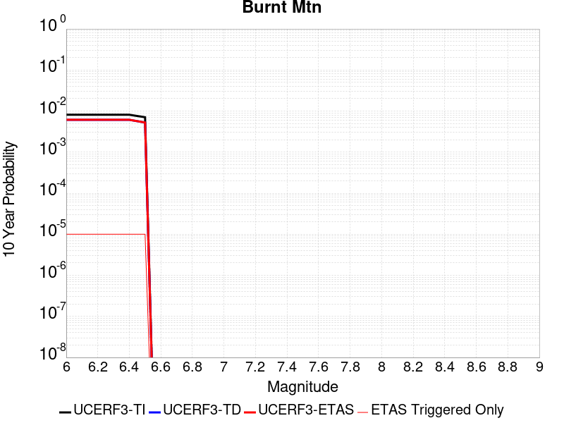 |

| Magnitude | 1 wk TI Prob | 1 wk TD Prob | 1 wk ETAS Prob | 1 wk ETAS/TD Gain | 1 wk ETAS Triggered Only | 1 mo TI Prob | 1 mo TD Prob | 1 mo ETAS Prob | 1 mo ETAS/TD Gain | 1 mo ETAS Triggered Only | 1 yr TI Prob | 1 yr TD Prob | 1 yr ETAS Prob | 1 yr ETAS/TD Gain | 1 yr ETAS Triggered Only | 10 yr TI Prob | 10 yr TD Prob | 10 yr ETAS Prob | 10 yr ETAS/TD Gain | 10 yr ETAS Triggered Only |
|-----|-----|-----|-----|-----|-----|-----|-----|-----|-----|-----|-----|-----|-----|-----|-----|-----|-----|-----|-----|-----|
| 6.0 | 1.5673151E-5 | 1.1749267E-5 | 1.1749267E-5 | 1.0 | 0.0 | 6.716892E-5 | 5.0353756E-5 | 5.0353756E-5 | 1.0 | 0.0 | 8.1747473E-4 | 6.1301346E-4 | 6.230073E-4 | 1.0163028 | 1.0E-5 | 0.008144741 | 0.006125865 | 0.0061358036 | 1.0016224 | 1.0E-5 |
| 6.1 | 1.5673151E-5 | 1.1749267E-5 | 1.1749267E-5 | 1.0 | 0.0 | 6.716892E-5 | 5.0353756E-5 | 5.0353756E-5 | 1.0 | 0.0 | 8.1747473E-4 | 6.1301346E-4 | 6.230073E-4 | 1.0163028 | 1.0E-5 | 0.008144741 | 0.006125865 | 0.0061358036 | 1.0016224 | 1.0E-5 |
| 6.2 | 1.5673151E-5 | 1.1749267E-5 | 1.1749267E-5 | 1.0 | 0.0 | 6.716892E-5 | 5.0353756E-5 | 5.0353756E-5 | 1.0 | 0.0 | 8.1747473E-4 | 6.1301346E-4 | 6.230073E-4 | 1.0163028 | 1.0E-5 | 0.008144741 | 0.006125865 | 0.0061358036 | 1.0016224 | 1.0E-5 |
| 6.3 | 1.5673151E-5 | 1.1749267E-5 | 1.1749267E-5 | 1.0 | 0.0 | 6.716892E-5 | 5.0353756E-5 | 5.0353756E-5 | 1.0 | 0.0 | 8.1747473E-4 | 6.1301346E-4 | 6.230073E-4 | 1.0163028 | 1.0E-5 | 0.008144741 | 0.006125865 | 0.0061358036 | 1.0016224 | 1.0E-5 |
| 6.4 | 1.5673151E-5 | 1.1749267E-5 | 1.1749267E-5 | 1.0 | 0.0 | 6.716892E-5 | 5.0353756E-5 | 5.0353756E-5 | 1.0 | 0.0 | 8.1747473E-4 | 6.1301346E-4 | 6.230073E-4 | 1.0163028 | 1.0E-5 | 0.008144741 | 0.006125865 | 0.0061358036 | 1.0016224 | 1.0E-5 |
| 6.5 | 1.36191375E-5 | 1.007816E-5 | 1.007816E-5 | 1.0 | 0.0 | 5.8366426E-5 | 4.319211E-5 | 4.319211E-5 | 1.0 | 0.0 | 7.103795E-4 | 5.2586396E-4 | 5.358587E-4 | 1.0190064 | 1.0E-5 | 0.0070811296 | 0.00525864 | 0.0052685873 | 1.0018916 | 1.0E-5 |

## Carson Range (Genoa)
*[(top)](#table-of-contents)*

| 1 Week | 1 Month | 1 Year | 10 Year |
|-----|-----|-----|-----|
|  |  |  |  |

| Magnitude | 1 wk TI Prob | 1 wk TD Prob | 1 wk ETAS Prob | 1 wk ETAS/TD Gain | 1 wk ETAS Triggered Only | 1 mo TI Prob | 1 mo TD Prob | 1 mo ETAS Prob | 1 mo ETAS/TD Gain | 1 mo ETAS Triggered Only | 1 yr TI Prob | 1 yr TD Prob | 1 yr ETAS Prob | 1 yr ETAS/TD Gain | 1 yr ETAS Triggered Only | 10 yr TI Prob | 10 yr TD Prob | 10 yr ETAS Prob | 10 yr ETAS/TD Gain | 10 yr ETAS Triggered Only |
|-----|-----|-----|-----|-----|-----|-----|-----|-----|-----|-----|-----|-----|-----|-----|-----|-----|-----|-----|-----|-----|
| 6.0 | 4.1268457E-5 | 5.0148312E-5 | 5.0148312E-5 | 1.0 | 0.0 | 1.7685282E-4 | 2.1490589E-4 | 2.1490589E-4 | 1.0 | 0.0 | 0.0021510567 | 0.0026137335 | 0.0026137335 | 1.0 | 0.0 | 0.02130354 | 0.025869591 | 0.025879333 | 1.0003766 | 1.0E-5 |
| 6.1 | 4.1268457E-5 | 5.0148312E-5 | 5.0148312E-5 | 1.0 | 0.0 | 1.7685282E-4 | 2.1490589E-4 | 2.1490589E-4 | 1.0 | 0.0 | 0.0021510567 | 0.0026137335 | 0.0026137335 | 1.0 | 0.0 | 0.02130354 | 0.025869591 | 0.025879333 | 1.0003766 | 1.0E-5 |
| 6.2 | 4.1268457E-5 | 5.0148312E-5 | 5.0148312E-5 | 1.0 | 0.0 | 1.7685282E-4 | 2.1490589E-4 | 2.1490589E-4 | 1.0 | 0.0 | 0.0021510567 | 0.0026137335 | 0.0026137335 | 1.0 | 0.0 | 0.02130354 | 0.025869591 | 0.025879333 | 1.0003766 | 1.0E-5 |
| 6.3 | 4.1268457E-5 | 5.0148312E-5 | 5.0148312E-5 | 1.0 | 0.0 | 1.7685282E-4 | 2.1490589E-4 | 2.1490589E-4 | 1.0 | 0.0 | 0.0021510567 | 0.0026137335 | 0.0026137335 | 1.0 | 0.0 | 0.02130354 | 0.025869591 | 0.025879333 | 1.0003766 | 1.0E-5 |
| 6.4 | 4.1268457E-5 | 5.0148312E-5 | 5.0148312E-5 | 1.0 | 0.0 | 1.7685282E-4 | 2.1490589E-4 | 2.1490589E-4 | 1.0 | 0.0 | 0.0021510567 | 0.0026137335 | 0.0026137335 | 1.0 | 0.0 | 0.02130354 | 0.025869591 | 0.025879333 | 1.0003766 | 1.0E-5 |
| 6.5 | 2.5677185E-5 | 3.0979143E-5 | 3.0979143E-5 | 1.0 | 0.0 | 1.1004044E-4 | 1.3276203E-4 | 1.3276203E-4 | 1.0 | 0.0 | 0.0013389189 | 0.0016153594 | 0.0016153594 | 1.0 | 0.0 | 0.0133088045 | 0.016054096 | 0.016063936 | 1.0006129 | 1.0E-5 |
| 6.6 | 2.5677185E-5 | 3.0979143E-5 | 3.0979143E-5 | 1.0 | 0.0 | 1.1004044E-4 | 1.3276203E-4 | 1.3276203E-4 | 1.0 | 0.0 | 0.0013389189 | 0.0016153594 | 0.0016153594 | 1.0 | 0.0 | 0.0133088045 | 0.016054096 | 0.016063936 | 1.0006129 | 1.0E-5 |
| 6.7 | 1.9969408E-5 | 2.4064128E-5 | 2.4064128E-5 | 1.0 | 0.0 | 8.558037E-5 | 1.0312876E-4 | 1.0312876E-4 | 1.0 | 0.0 | 0.0010414429 | 0.001255023 | 0.001255023 | 1.0 | 0.0 | 0.010365757 | 0.012494512 | 0.012504388 | 1.0007904 | 1.0E-5 |
| 6.8 | 1.4783156E-5 | 1.7818054E-5 | 1.7818054E-5 | 1.0 | 0.0 | 6.335485E-5 | 7.636159E-5 | 7.636159E-5 | 1.0 | 0.0 | 7.710722E-4 | 9.2943595E-4 | 9.2943595E-4 | 1.0 | 0.0 | 0.0076840227 | 0.009268275 | 0.009278183 | 1.001069 | 1.0E-5 |
| 6.9 | 1.06660555E-5 | 1.2877381E-5 | 1.2877381E-5 | 1.0 | 0.0 | 4.5710865E-5 | 5.518826E-5 | 5.518826E-5 | 1.0 | 0.0 | 5.5638765E-4 | 6.7182514E-4 | 6.7182514E-4 | 1.0 | 0.0 | 0.005549967 | 0.0067092404 | 0.0067092404 | 1.0 | 0.0 |
| 7.0 | 7.664838E-6 | 9.258562E-6 | 9.258562E-6 | 1.0 | 0.0 | 3.2848893E-5 | 3.967955E-5 | 3.967955E-5 | 1.0 | 0.0 | 3.998619E-4 | 4.8309853E-4 | 4.8309853E-4 | 1.0 | 0.0 | 0.0039914316 | 0.004830983 | 0.004830983 | 1.0 | 0.0 |

## Hartley Springs 2011 CFM
*[(top)](#table-of-contents)*

| 1 Week | 1 Month | 1 Year | 10 Year |
|-----|-----|-----|-----|
|  |  |  |  |

| Magnitude | 1 wk TI Prob | 1 wk TD Prob | 1 wk ETAS Prob | 1 wk ETAS/TD Gain | 1 wk ETAS Triggered Only | 1 mo TI Prob | 1 mo TD Prob | 1 mo ETAS Prob | 1 mo ETAS/TD Gain | 1 mo ETAS Triggered Only | 1 yr TI Prob | 1 yr TD Prob | 1 yr ETAS Prob | 1 yr ETAS/TD Gain | 1 yr ETAS Triggered Only | 10 yr TI Prob | 10 yr TD Prob | 10 yr ETAS Prob | 10 yr ETAS/TD Gain | 10 yr ETAS Triggered Only |
|-----|-----|-----|-----|-----|-----|-----|-----|-----|-----|-----|-----|-----|-----|-----|-----|-----|-----|-----|-----|-----|
| 6.0 | 1.4352418E-5 | 1.4434351E-5 | 1.4434351E-5 | 1.0 | 0.0 | 6.1508916E-5 | 6.186096E-5 | 6.186096E-5 | 1.0 | 0.0 | 7.486137E-4 | 7.530614E-4 | 7.6305383E-4 | 1.0132692 | 1.0E-5 | 0.007460968 | 0.0075212163 | 0.0075311414 | 1.0013195 | 1.0E-5 |
| 6.1 | 1.4352418E-5 | 1.4434351E-5 | 1.4434351E-5 | 1.0 | 0.0 | 6.1508916E-5 | 6.186096E-5 | 6.186096E-5 | 1.0 | 0.0 | 7.486137E-4 | 7.530614E-4 | 7.6305383E-4 | 1.0132692 | 1.0E-5 | 0.007460968 | 0.0075212163 | 0.0075311414 | 1.0013195 | 1.0E-5 |
| 6.2 | 1.4352418E-5 | 1.4434351E-5 | 1.4434351E-5 | 1.0 | 0.0 | 6.1508916E-5 | 6.186096E-5 | 6.186096E-5 | 1.0 | 0.0 | 7.486137E-4 | 7.530614E-4 | 7.6305383E-4 | 1.0132692 | 1.0E-5 | 0.007460968 | 0.0075212163 | 0.0075311414 | 1.0013195 | 1.0E-5 |
| 6.3 | 1.4352418E-5 | 1.4434351E-5 | 1.4434351E-5 | 1.0 | 0.0 | 6.1508916E-5 | 6.186096E-5 | 6.186096E-5 | 1.0 | 0.0 | 7.486137E-4 | 7.530614E-4 | 7.6305383E-4 | 1.0132692 | 1.0E-5 | 0.007460968 | 0.0075212163 | 0.0075311414 | 1.0013195 | 1.0E-5 |
| 6.4 | 1.4352418E-5 | 1.4434351E-5 | 1.4434351E-5 | 1.0 | 0.0 | 6.1508916E-5 | 6.186096E-5 | 6.186096E-5 | 1.0 | 0.0 | 7.486137E-4 | 7.530614E-4 | 7.6305383E-4 | 1.0132692 | 1.0E-5 | 0.007460968 | 0.0075212163 | 0.0075311414 | 1.0013195 | 1.0E-5 |
| 6.5 | 1.2279858E-5 | 1.2133241E-5 | 1.2133241E-5 | 1.0 | 0.0 | 5.26269E-5 | 5.199946E-5 | 5.199946E-5 | 1.0 | 0.0 | 6.4054417E-4 | 6.3306774E-4 | 6.430614E-4 | 1.015786 | 1.0E-5 | 0.0063870098 | 0.0063281553 | 0.006338092 | 1.0015702 | 1.0E-5 |
| 6.6 | 1.2279858E-5 | 1.2133241E-5 | 1.2133241E-5 | 1.0 | 0.0 | 5.26269E-5 | 5.199946E-5 | 5.199946E-5 | 1.0 | 0.0 | 6.4054417E-4 | 6.3306774E-4 | 6.430614E-4 | 1.015786 | 1.0E-5 | 0.0063870098 | 0.0063281553 | 0.006338092 | 1.0015702 | 1.0E-5 |
| 6.7 | 2.1282601E-6 | 8.8945814E-7 | 8.8945814E-7 | 1.0 | 0.0 | 9.121083E-6 | 3.8119592E-6 | 3.8119592E-6 | 1.0 | 0.0 | 1.11043526E-4 | 4.6409874E-5 | 4.6409874E-5 | 1.0 | 0.0 | 0.0011098806 | 4.6402714E-4 | 4.6402714E-4 | 1.0 | 0.0 |
| 6.8 | 2.00516E-6 | 8.5173434E-7 | 8.5173434E-7 | 1.0 | 0.0 | 8.593515E-6 | 3.6502865E-6 | 3.6502865E-6 | 1.0 | 0.0 | 1.04621024E-4 | 4.444159E-5 | 4.444159E-5 | 1.0 | 0.0 | 0.0010457177 | 4.4435216E-4 | 4.4435216E-4 | 1.0 | 0.0 |
| 6.9 | 2.00516E-6 | 8.5173434E-7 | 8.5173434E-7 | 1.0 | 0.0 | 8.593515E-6 | 3.6502865E-6 | 3.6502865E-6 | 1.0 | 0.0 | 1.04621024E-4 | 4.444159E-5 | 4.444159E-5 | 1.0 | 0.0 | 0.0010457177 | 4.4435216E-4 | 4.4435216E-4 | 1.0 | 0.0 |
| 7.0 | 1.8366732E-6 | 8.237064E-7 | 8.237064E-7 | 1.0 | 0.0 | 7.871433E-6 | 3.5301669E-6 | 3.5301669E-6 | 1.0 | 0.0 | 9.583048E-5 | 4.297919E-5 | 4.297919E-5 | 1.0 | 0.0 | 9.5789164E-4 | 4.2973383E-4 | 4.2973383E-4 | 1.0 | 0.0 |
| 7.1 | 1.5097997E-6 | 7.189996E-7 | 7.189996E-7 | 1.0 | 0.0 | 6.470554E-6 | 3.0814247E-6 | 3.0814247E-6 | 1.0 | 0.0 | 7.877615E-5 | 3.751594E-5 | 3.751594E-5 | 1.0 | 0.0 | 7.874823E-4 | 3.751198E-4 | 3.751198E-4 | 1.0 | 0.0 |
| 7.2 | 1.3490993E-6 | 6.405045E-7 | 6.405045E-7 | 1.0 | 0.0 | 5.7818415E-6 | 2.7450176E-6 | 2.7450176E-6 | 1.0 | 0.0 | 7.0391645E-5 | 3.342031E-5 | 3.342031E-5 | 1.0 | 0.0 | 7.0369354E-4 | 3.341758E-4 | 3.341758E-4 | 1.0 | 0.0 |
| 7.3 | 7.900015E-7 | 4.0890467E-7 | 4.0890467E-7 | 1.0 | 0.0 | 3.3857161E-6 | 1.7524486E-6 | 1.7524486E-6 | 1.0 | 0.0 | 4.1220315E-5 | 2.1336062E-5 | 2.1336062E-5 | 1.0 | 0.0 | 4.121267E-4 | 2.1336062E-4 | 2.1336062E-4 | 1.0 | 0.0 |

## Mendocino
*[(top)](#table-of-contents)*

| 1 Week | 1 Month | 1 Year | 10 Year |
|-----|-----|-----|-----|
|  |  |  | 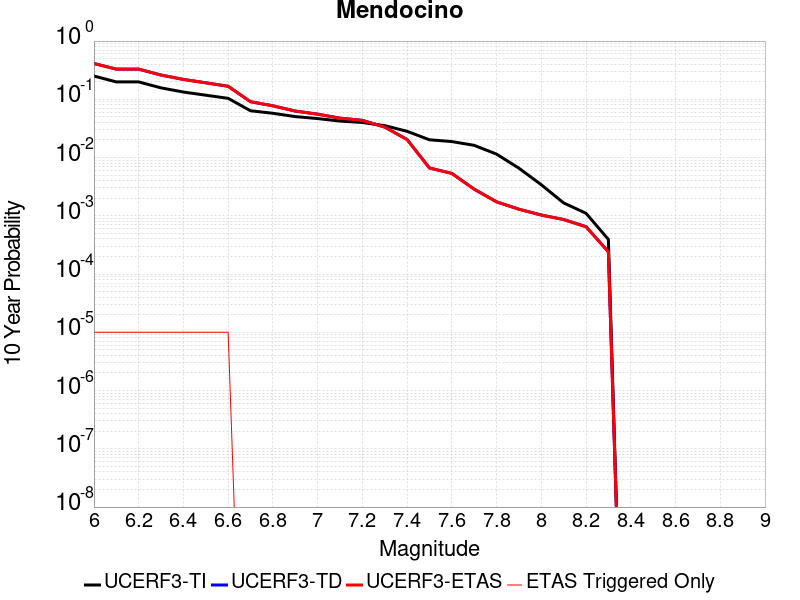 |

| Magnitude | 1 wk TI Prob | 1 wk TD Prob | 1 wk ETAS Prob | 1 wk ETAS/TD Gain | 1 wk ETAS Triggered Only | 1 mo TI Prob | 1 mo TD Prob | 1 mo ETAS Prob | 1 mo ETAS/TD Gain | 1 mo ETAS Triggered Only | 1 yr TI Prob | 1 yr TD Prob | 1 yr ETAS Prob | 1 yr ETAS/TD Gain | 1 yr ETAS Triggered Only | 10 yr TI Prob | 10 yr TD Prob | 10 yr ETAS Prob | 10 yr ETAS/TD Gain | 10 yr ETAS Triggered Only |
|-----|-----|-----|-----|-----|-----|-----|-----|-----|-----|-----|-----|-----|-----|-----|-----|-----|-----|-----|-----|-----|
| 6.0 | 5.5409013E-4 | 0.0010841201 | 0.0010841201 | 1.0 | 0.0 | 0.0023725112 | 0.0046359147 | 0.0046359147 | 1.0 | 0.0 | 0.028505474 | 0.054679915 | 0.054689366 | 1.0001729 | 1.0E-5 | 0.25113493 | 0.41189867 | 0.41190454 | 1.0000143 | 1.0E-5 |
| 6.1 | 4.2515888E-4 | 8.228778E-4 | 8.228778E-4 | 1.0 | 0.0 | 0.0018208373 | 0.0035202901 | 0.0035202901 | 1.0 | 0.0 | 0.021944538 | 0.04175331 | 0.041762892 | 1.0002295 | 1.0E-5 | 0.19899574 | 0.32996938 | 0.32997608 | 1.0000203 | 1.0E-5 |
| 6.2 | 4.2515888E-4 | 8.228778E-4 | 8.228778E-4 | 1.0 | 0.0 | 0.0018208373 | 0.0035202901 | 0.0035202901 | 1.0 | 0.0 | 0.021944538 | 0.04175331 | 0.041762892 | 1.0002295 | 1.0E-5 | 0.19899574 | 0.32996938 | 0.32997608 | 1.0000203 | 1.0E-5 |
| 6.3 | 3.2773745E-4 | 6.193402E-4 | 6.193402E-4 | 1.0 | 0.0 | 0.0014038329 | 0.0026504898 | 0.0026504898 | 1.0 | 0.0 | 0.016958237 | 0.0315951 | 0.031604785 | 1.0003065 | 1.0E-5 | 0.1572094 | 0.26079226 | 0.26079965 | 1.0000284 | 1.0E-5 |
| 6.4 | 2.7417165E-4 | 5.0476106E-4 | 5.0476106E-4 | 1.0 | 0.0 | 0.0011744922 | 0.0021606716 | 0.0021606716 | 1.0 | 0.0 | 0.014205975 | 0.025840323 | 0.025850065 | 1.0003769 | 1.0E-5 | 0.13331394 | 0.21949455 | 0.21950236 | 1.0000355 | 1.0E-5 |
| 6.5 | 2.3984899E-4 | 4.323338E-4 | 4.323338E-4 | 1.0 | 0.0 | 0.0010275192 | 0.0018509448 | 0.0018509448 | 1.0 | 0.0 | 0.012438473 | 0.022183063 | 0.022192841 | 1.0004408 | 1.0E-5 | 0.11764851 | 0.19205177 | 0.19205984 | 1.0000421 | 1.0E-5 |
| 6.6 | 2.1023539E-4 | 3.693326E-4 | 3.693326E-4 | 1.0 | 0.0 | 9.0069766E-4 | 0.0015814424 | 0.0015814424 | 1.0 | 0.0 | 0.010910975 | 0.018992087 | 0.019001896 | 1.0005165 | 1.0E-5 | 0.10390546 | 0.16750823 | 0.16751656 | 1.0000497 | 1.0E-5 |
| 6.7 | 1.2592976E-4 | 1.8429005E-4 | 1.8429005E-4 | 1.0 | 0.0 | 5.395873E-4 | 7.894828E-4 | 7.894828E-4 | 1.0 | 0.0 | 0.006549705 | 0.009558139 | 0.009558139 | 1.0 | 0.0 | 0.063599944 | 0.09098435 | 0.09098435 | 1.0 | 0.0 |
| 6.8 | 1.13663555E-4 | 1.5403815E-4 | 1.5403815E-4 | 1.0 | 0.0 | 4.8703855E-4 | 6.5997004E-4 | 6.5997004E-4 | 1.0 | 0.0 | 0.0059135845 | 0.008001428 | 0.008001428 | 1.0 | 0.0 | 0.057586733 | 0.077407256 | 0.077407256 | 1.0 | 0.0 |
| 6.9 | 9.926894E-5 | 1.2302451E-4 | 1.2302451E-4 | 1.0 | 0.0 | 4.2536893E-4 | 5.271368E-4 | 5.271368E-4 | 1.0 | 0.0 | 0.0051665753 | 0.0063980487 | 0.0063980487 | 1.0 | 0.0 | 0.050480947 | 0.062873654 | 0.062873654 | 1.0 | 0.0 |
| 7.0 | 9.168125E-5 | 1.0786131E-4 | 1.0786131E-4 | 1.0 | 0.0 | 3.9286047E-4 | 4.621785E-4 | 4.621785E-4 | 1.0 | 0.0 | 0.004772591 | 0.0056121536 | 0.0056121536 | 1.0 | 0.0 | 0.04671385 | 0.05563458 | 0.05563458 | 1.0 | 0.0 |
| 7.1 | 8.2854116E-5 | 9.1070666E-5 | 9.1070666E-5 | 1.0 | 0.0 | 3.5504074E-4 | 3.9024488E-4 | 3.9024488E-4 | 1.0 | 0.0 | 0.004314056 | 0.0047409474 | 0.0047409474 | 1.0 | 0.0 | 0.042312626 | 0.047494013 | 0.047494013 | 1.0 | 0.0 |
| 7.2 | 7.8255274E-5 | 8.302269E-5 | 8.302269E-5 | 1.0 | 0.0 | 3.3533663E-4 | 3.5576386E-4 | 3.5576386E-4 | 1.0 | 0.0 | 0.0040750825 | 0.00432297 | 0.00432297 | 1.0 | 0.0 | 0.040011603 | 0.043538645 | 0.043538645 | 1.0 | 0.0 |
| 7.3 | 6.887904E-5 | 6.2603714E-5 | 6.2603714E-5 | 1.0 | 0.0 | 2.9516246E-4 | 2.6827457E-4 | 2.6827457E-4 | 1.0 | 0.0 | 0.0035876823 | 0.0032614481 | 0.0032614481 | 1.0 | 0.0 | 0.035303112 | 0.033361845 | 0.033361845 | 1.0 | 0.0 |
| 7.4 | 5.4898497E-5 | 3.740954E-5 | 3.740954E-5 | 1.0 | 0.0 | 2.3525805E-4 | 1.6031707E-4 | 1.6031707E-4 | 1.0 | 0.0 | 0.0028605047 | 0.0019501693 | 0.0019501693 | 1.0 | 0.0 | 0.02823963 | 0.02041806 | 0.02041806 | 1.0 | 0.0 |
| 7.5 | 3.9103943E-5 | 1.1310907E-5 | 1.1310907E-5 | 1.0 | 0.0 | 1.6757756E-4 | 4.8474423E-5 | 4.8474423E-5 | 1.0 | 0.0 | 0.0020383475 | 5.900179E-4 | 5.900179E-4 | 1.0 | 0.0 | 0.020197518 | 0.0066267774 | 0.0066267774 | 1.0 | 0.0 |
| 7.6 | 3.641042E-5 | 8.987128E-6 | 8.987128E-6 | 1.0 | 0.0 | 1.5603533E-4 | 3.8515704E-5 | 3.8515704E-5 | 1.0 | 0.0 | 0.0018980748 | 4.6882915E-4 | 4.6882915E-4 | 1.0 | 0.0 | 0.018819444 | 0.0053501204 | 0.0053501204 | 1.0 | 0.0 |
| 7.7 | 3.1318774E-5 | 4.4567864E-6 | 4.4567864E-6 | 1.0 | 0.0 | 1.342164E-4 | 1.9100375E-5 | 1.9100375E-5 | 1.0 | 0.0 | 0.0016328598 | 2.3252242E-4 | 2.3252242E-4 | 1.0 | 0.0 | 0.016209139 | 0.0028669934 | 0.0028669934 | 1.0 | 0.0 |
| 7.8 | 2.209241E-5 | 2.6825483E-6 | 2.6825483E-6 | 1.0 | 0.0 | 9.467832E-5 | 1.1496585E-5 | 1.1496585E-5 | 1.0 | 0.0 | 0.001152099 | 1.3996197E-4 | 1.3996197E-4 | 1.0 | 0.0 | 0.011461443 | 0.0017385797 | 0.0017385797 | 1.0 | 0.0 |
| 7.9 | 1.2640477E-5 | 2.0433822E-6 | 2.0433822E-6 | 1.0 | 0.0 | 5.4172346E-5 | 8.7573235E-6 | 8.7573235E-6 | 1.0 | 0.0 | 6.593487E-4 | 1.0661522E-4 | 1.0661522E-4 | 1.0 | 0.0 | 0.006573958 | 0.0012987719 | 0.0012987719 | 1.0 | 0.0 |
| 8.0 | 6.5548907E-6 | 1.6397267E-6 | 1.6397267E-6 | 1.0 | 0.0 | 2.8092087E-5 | 7.0273813E-6 | 7.0273813E-6 | 1.0 | 0.0 | 3.4196748E-4 | 8.555503E-5 | 8.555503E-5 | 1.0 | 0.0 | 0.0034144172 | 0.0010317067 | 0.0010317067 | 1.0 | 0.0 |
| 8.1 | 3.1916707E-6 | 1.359273E-6 | 1.359273E-6 | 1.0 | 0.0 | 1.3678517E-5 | 5.8254427E-6 | 5.8254427E-6 | 1.0 | 0.0 | 1.6652321E-4 | 7.092248E-5 | 7.092248E-5 | 1.0 | 0.0 | 0.0016639848 | 8.633958E-4 | 8.633958E-4 | 1.0 | 0.0 |
| 8.2 | 2.1193785E-6 | 1.0308772E-6 | 1.0308772E-6 | 1.0 | 0.0 | 9.083019E-6 | 4.418038E-6 | 4.418038E-6 | 1.0 | 0.0 | 1.1058014E-4 | 5.3788302E-5 | 5.3788302E-5 | 1.0 | 0.0 | 0.0011052513 | 6.5076887E-4 | 6.5076887E-4 | 1.0 | 0.0 |
| 8.3 | 7.536878E-7 | 3.9299417E-7 | 3.9299417E-7 | 1.0 | 0.0 | 3.2300866E-6 | 1.6842597E-6 | 1.6842597E-6 | 1.0 | 0.0 | 3.9325594E-5 | 2.0505682E-5 | 2.0505682E-5 | 1.0 | 0.0 | 3.9318635E-4 | 2.4148257E-4 | 2.4148257E-4 | 1.0 | 0.0 |

## Concord 2011 CFM
*[(top)](#table-of-contents)*

| 1 Week | 1 Month | 1 Year | 10 Year |
|-----|-----|-----|-----|
|  |  |  | 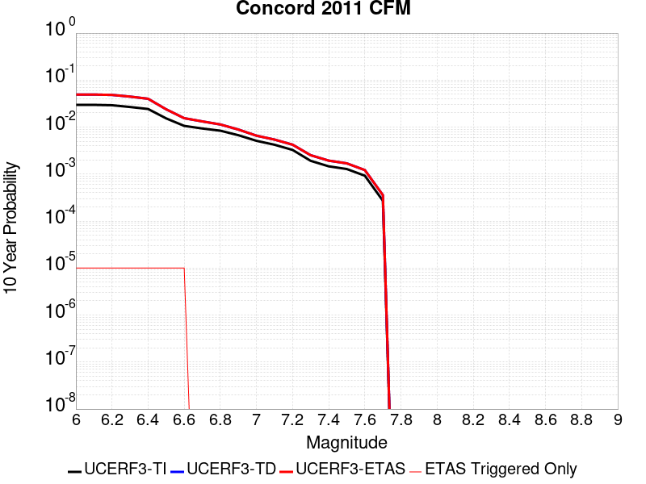 |

| Magnitude | 1 wk TI Prob | 1 wk TD Prob | 1 wk ETAS Prob | 1 wk ETAS/TD Gain | 1 wk ETAS Triggered Only | 1 mo TI Prob | 1 mo TD Prob | 1 mo ETAS Prob | 1 mo ETAS/TD Gain | 1 mo ETAS Triggered Only | 1 yr TI Prob | 1 yr TD Prob | 1 yr ETAS Prob | 1 yr ETAS/TD Gain | 1 yr ETAS Triggered Only | 10 yr TI Prob | 10 yr TD Prob | 10 yr ETAS Prob | 10 yr ETAS/TD Gain | 10 yr ETAS Triggered Only |
|-----|-----|-----|-----|-----|-----|-----|-----|-----|-----|-----|-----|-----|-----|-----|-----|-----|-----|-----|-----|-----|
| 6.0 | 5.7865112E-5 | 9.7586984E-5 | 9.7586984E-5 | 1.0 | 0.0 | 2.4796976E-4 | 4.1816765E-4 | 4.1816765E-4 | 1.0 | 0.0 | 0.0030148525 | 0.0050798147 | 0.0050798147 | 1.0 | 0.0 | 0.029742775 | 0.04926655 | 0.049276058 | 1.000193 | 1.0E-5 |
| 6.1 | 5.7865112E-5 | 9.7586984E-5 | 9.7586984E-5 | 1.0 | 0.0 | 2.4796976E-4 | 4.1816765E-4 | 4.1816765E-4 | 1.0 | 0.0 | 0.0030148525 | 0.0050798147 | 0.0050798147 | 1.0 | 0.0 | 0.029742775 | 0.04926655 | 0.049276058 | 1.000193 | 1.0E-5 |
| 6.2 | 5.6789337E-5 | 9.578944E-5 | 9.578944E-5 | 1.0 | 0.0 | 2.4336016E-4 | 4.104663E-4 | 4.104663E-4 | 1.0 | 0.0 | 0.0029588845 | 0.0049865367 | 0.0049865367 | 1.0 | 0.0 | 0.029197963 | 0.048383076 | 0.04839259 | 1.0001967 | 1.0E-5 |
| 6.3 | 5.203322E-5 | 8.8033295E-5 | 8.8033295E-5 | 1.0 | 0.0 | 2.2298045E-4 | 3.772354E-4 | 3.772354E-4 | 1.0 | 0.0 | 0.0027114071 | 0.004583953 | 0.004583953 | 1.0 | 0.0 | 0.026785625 | 0.044554338 | 0.044563893 | 1.0002145 | 1.0E-5 |
| 6.4 | 4.7120942E-5 | 7.897668E-5 | 7.897668E-5 | 1.0 | 0.0 | 2.0193127E-4 | 3.3843177E-4 | 3.3843177E-4 | 1.0 | 0.0 | 0.0024557412 | 0.004113367 | 0.004113367 | 1.0 | 0.0 | 0.024287801 | 0.040077757 | 0.040087357 | 1.0002395 | 1.0E-5 |
| 6.5 | 2.9598437E-5 | 4.667605E-5 | 4.667605E-5 | 1.0 | 0.0 | 1.2684427E-4 | 2.0002606E-4 | 2.0002606E-4 | 1.0 | 0.0 | 0.001543235 | 0.0024328078 | 0.0024328078 | 1.0 | 0.0 | 0.015325619 | 0.023910793 | 0.023920555 | 1.0004082 | 1.0E-5 |
| 6.6 | 2.0443718E-5 | 2.9985074E-5 | 2.9985074E-5 | 1.0 | 0.0 | 8.7613E-5 | 1.2850134E-4 | 1.2850134E-4 | 1.0 | 0.0 | 0.0010661662 | 0.0015634173 | 0.0015634173 | 1.0 | 0.0 | 0.010610655 | 0.015467657 | 0.015477502 | 1.0006365 | 1.0E-5 |
| 6.7 | 1.798539E-5 | 2.5558082E-5 | 2.5558082E-5 | 1.0 | 0.0 | 7.7077966E-5 | 1.09530156E-4 | 1.09530156E-4 | 1.0 | 0.0 | 9.380202E-4 | 0.0013327354 | 0.0013327354 | 1.0 | 0.0 | 0.009340706 | 0.013217801 | 0.013217801 | 1.0 | 0.0 |
| 6.8 | 1.613555E-5 | 2.1959771E-5 | 2.1959771E-5 | 1.0 | 0.0 | 6.915052E-5 | 9.410999E-5 | 9.410999E-5 | 1.0 | 0.0 | 8.4158237E-4 | 0.0011452008 | 0.0011452008 | 1.0 | 0.0 | 0.008384023 | 0.011378255 | 0.011378255 | 1.0 | 0.0 |
| 6.9 | 1.2916435E-5 | 1.7081482E-5 | 1.7081482E-5 | 1.0 | 0.0 | 5.5354973E-5 | 7.320433E-5 | 7.320433E-5 | 1.0 | 0.0 | 6.7373837E-4 | 8.909041E-4 | 8.909041E-4 | 1.0 | 0.0 | 0.006716994 | 0.008867769 | 0.008867769 | 1.0 | 0.0 |
| 7.0 | 9.81129E-6 | 1.2631147E-5 | 1.2631147E-5 | 1.0 | 0.0 | 4.2047708E-5 | 5.4132375E-5 | 5.4132375E-5 | 1.0 | 0.0 | 5.118106E-4 | 6.58864E-4 | 6.58864E-4 | 1.0 | 0.0 | 0.005106334 | 0.006569876 | 0.006569876 | 1.0 | 0.0 |
| 7.1 | 8.0889195E-6 | 1.041855E-5 | 1.041855E-5 | 1.0 | 0.0 | 3.4666336E-5 | 4.4650173E-5 | 4.4650173E-5 | 1.0 | 0.0 | 4.219809E-4 | 5.434813E-4 | 5.434813E-4 | 1.0 | 0.0 | 0.004211805 | 0.0054221074 | 0.0054221074 | 1.0 | 0.0 |
| 7.2 | 6.267438E-6 | 8.115953E-6 | 8.115953E-6 | 1.0 | 0.0 | 2.6860173E-5 | 3.47822E-5 | 3.47822E-5 | 1.0 | 0.0 | 3.2697353E-4 | 4.233917E-4 | 4.233917E-4 | 1.0 | 0.0 | 0.0032649285 | 0.004226314 | 0.004226314 | 1.0 | 0.0 |
| 7.3 | 3.6761196E-6 | 4.840322E-6 | 4.840322E-6 | 1.0 | 0.0 | 1.5754704E-5 | 2.0744073E-5 | 2.0744073E-5 | 1.0 | 0.0 | 1.9179663E-4 | 2.5253004E-4 | 2.5253004E-4 | 1.0 | 0.0 | 0.0019163118 | 0.0025226148 | 0.0025226148 | 1.0 | 0.0 |
| 7.4 | 2.8044356E-6 | 3.7097311E-6 | 3.7097311E-6 | 1.0 | 0.0 | 1.2018954E-5 | 1.5898751E-5 | 1.5898751E-5 | 1.0 | 0.0 | 1.4632095E-4 | 1.9355022E-4 | 1.9355022E-4 | 1.0 | 0.0 | 0.0014622464 | 0.0019340167 | 0.0019340167 | 1.0 | 0.0 |
| 7.5 | 2.4578699E-6 | 3.2448463E-6 | 3.2448463E-6 | 1.0 | 0.0 | 1.0533685E-5 | 1.39064105E-5 | 1.39064105E-5 | 1.0 | 0.0 | 1.2824008E-4 | 1.692975E-4 | 1.692975E-4 | 1.0 | 0.0 | 0.0012816609 | 0.0016918638 | 0.0016918638 | 1.0 | 0.0 |
| 7.6 | 1.7713267E-6 | 2.3352E-6 | 2.3352E-6 | 1.0 | 0.0 | 7.591378E-6 | 1.0007962E-5 | 1.0007962E-5 | 1.0 | 0.0 | 9.2421105E-5 | 1.2184022E-4 | 1.2184022E-4 | 1.0 | 0.0 | 9.2382677E-4 | 0.0012178535 | 0.0012178535 | 1.0 | 0.0 |
| 7.7 | 5.1912366E-7 | 6.82937E-7 | 6.82937E-7 | 1.0 | 0.0 | 2.2248137E-6 | 2.9268697E-6 | 2.9268697E-6 | 1.0 | 0.0 | 2.708677E-5 | 3.5634068E-5 | 3.5634068E-5 | 1.0 | 0.0 | 2.708347E-4 | 3.563112E-4 | 3.563112E-4 | 1.0 | 0.0 |

## Little Salmon (Offshore)
*[(top)](#table-of-contents)*

| 1 Week | 1 Month | 1 Year | 10 Year |
|-----|-----|-----|-----|
|  |  |  |  |

| Magnitude | 1 wk TI Prob | 1 wk TD Prob | 1 wk ETAS Prob | 1 wk ETAS/TD Gain | 1 wk ETAS Triggered Only | 1 mo TI Prob | 1 mo TD Prob | 1 mo ETAS Prob | 1 mo ETAS/TD Gain | 1 mo ETAS Triggered Only | 1 yr TI Prob | 1 yr TD Prob | 1 yr ETAS Prob | 1 yr ETAS/TD Gain | 1 yr ETAS Triggered Only | 10 yr TI Prob | 10 yr TD Prob | 10 yr ETAS Prob | 10 yr ETAS/TD Gain | 10 yr ETAS Triggered Only |
|-----|-----|-----|-----|-----|-----|-----|-----|-----|-----|-----|-----|-----|-----|-----|-----|-----|-----|-----|-----|-----|
| 6.0 | 2.3052053E-5 | 2.1606105E-5 | 2.1606105E-5 | 1.0 | 0.0 | 9.879077E-5 | 9.259496E-5 | 9.259496E-5 | 1.0 | 0.0 | 0.0012021139 | 0.0011268755 | 0.0011368642 | 1.008864 | 1.0E-5 | 0.011956319 | 0.011243663 | 0.01125355 | 1.0008794 | 1.0E-5 |
| 6.1 | 2.3052053E-5 | 2.1606105E-5 | 2.1606105E-5 | 1.0 | 0.0 | 9.879077E-5 | 9.259496E-5 | 9.259496E-5 | 1.0 | 0.0 | 0.0012021139 | 0.0011268755 | 0.0011368642 | 1.008864 | 1.0E-5 | 0.011956319 | 0.011243663 | 0.01125355 | 1.0008794 | 1.0E-5 |
| 6.2 | 2.3052053E-5 | 2.1606105E-5 | 2.1606105E-5 | 1.0 | 0.0 | 9.879077E-5 | 9.259496E-5 | 9.259496E-5 | 1.0 | 0.0 | 0.0012021139 | 0.0011268755 | 0.0011368642 | 1.008864 | 1.0E-5 | 0.011956319 | 0.011243663 | 0.01125355 | 1.0008794 | 1.0E-5 |
| 6.3 | 2.3052053E-5 | 2.1606105E-5 | 2.1606105E-5 | 1.0 | 0.0 | 9.879077E-5 | 9.259496E-5 | 9.259496E-5 | 1.0 | 0.0 | 0.0012021139 | 0.0011268755 | 0.0011368642 | 1.008864 | 1.0E-5 | 0.011956319 | 0.011243663 | 0.01125355 | 1.0008794 | 1.0E-5 |
| 6.4 | 2.3052053E-5 | 2.1606105E-5 | 2.1606105E-5 | 1.0 | 0.0 | 9.879077E-5 | 9.259496E-5 | 9.259496E-5 | 1.0 | 0.0 | 0.0012021139 | 0.0011268755 | 0.0011368642 | 1.008864 | 1.0E-5 | 0.011956319 | 0.011243663 | 0.01125355 | 1.0008794 | 1.0E-5 |
| 6.5 | 2.3052053E-5 | 2.1606105E-5 | 2.1606105E-5 | 1.0 | 0.0 | 9.879077E-5 | 9.259496E-5 | 9.259496E-5 | 1.0 | 0.0 | 0.0012021139 | 0.0011268755 | 0.0011368642 | 1.008864 | 1.0E-5 | 0.011956319 | 0.011243663 | 0.01125355 | 1.0008794 | 1.0E-5 |
| 6.6 | 2.3052053E-5 | 2.1606105E-5 | 2.1606105E-5 | 1.0 | 0.0 | 9.879077E-5 | 9.259496E-5 | 9.259496E-5 | 1.0 | 0.0 | 0.0012021139 | 0.0011268755 | 0.0011368642 | 1.008864 | 1.0E-5 | 0.011956319 | 0.011243663 | 0.01125355 | 1.0008794 | 1.0E-5 |
| 6.7 | 2.3052053E-5 | 2.1606105E-5 | 2.1606105E-5 | 1.0 | 0.0 | 9.879077E-5 | 9.259496E-5 | 9.259496E-5 | 1.0 | 0.0 | 0.0012021139 | 0.0011268755 | 0.0011368642 | 1.008864 | 1.0E-5 | 0.011956319 | 0.011243663 | 0.01125355 | 1.0008794 | 1.0E-5 |
| 6.8 | 1.683878E-5 | 1.4385235E-5 | 1.4385235E-5 | 1.0 | 0.0 | 7.21642E-5 | 6.164984E-5 | 6.164984E-5 | 1.0 | 0.0 | 8.78245E-4 | 7.5037923E-4 | 7.5037923E-4 | 1.0 | 0.0 | 0.008747822 | 0.0075042536 | 0.0075042536 | 1.0 | 0.0 |
| 6.9 | 1.683878E-5 | 1.4385235E-5 | 1.4385235E-5 | 1.0 | 0.0 | 7.21642E-5 | 6.164984E-5 | 6.164984E-5 | 1.0 | 0.0 | 8.78245E-4 | 7.5037923E-4 | 7.5037923E-4 | 1.0 | 0.0 | 0.008747822 | 0.0075042536 | 0.0075042536 | 1.0 | 0.0 |
| 7.0 | 1.5051273E-5 | 1.2333252E-5 | 1.2333252E-5 | 1.0 | 0.0 | 6.450386E-5 | 5.285598E-5 | 5.285598E-5 | 1.0 | 0.0 | 7.8505155E-4 | 6.4337754E-4 | 6.4337754E-4 | 1.0 | 0.0 | 0.00782284 | 0.006440471 | 0.006440471 | 1.0 | 0.0 |
| 7.1 | 1.5051273E-5 | 1.2333252E-5 | 1.2333252E-5 | 1.0 | 0.0 | 6.450386E-5 | 5.285598E-5 | 5.285598E-5 | 1.0 | 0.0 | 7.8505155E-4 | 6.4337754E-4 | 6.4337754E-4 | 1.0 | 0.0 | 0.00782284 | 0.006440471 | 0.006440471 | 1.0 | 0.0 |
| 7.2 | 1.24301405E-5 | 9.903296E-6 | 9.903296E-6 | 1.0 | 0.0 | 5.3270942E-5 | 4.2442232E-5 | 4.2442232E-5 | 1.0 | 0.0 | 6.483807E-4 | 5.1665166E-4 | 5.1665166E-4 | 1.0 | 0.0 | 0.006464922 | 0.0051788646 | 0.0051788646 | 1.0 | 0.0 |
| 7.3 | 9.3599865E-6 | 7.695359E-6 | 7.695359E-6 | 1.0 | 0.0 | 4.011361E-5 | 3.2979897E-5 | 3.2979897E-5 | 1.0 | 0.0 | 4.8827377E-4 | 4.014919E-4 | 4.014919E-4 | 1.0 | 0.0 | 0.004872023 | 0.0040241014 | 0.0040241014 | 1.0 | 0.0 |
| 7.4 | 5.941556E-6 | 4.9513474E-6 | 4.9513474E-6 | 1.0 | 0.0 | 2.5463563E-5 | 2.1220061E-5 | 2.1220061E-5 | 1.0 | 0.0 | 3.0997477E-4 | 2.5835424E-4 | 2.5835424E-4 | 1.0 | 0.0 | 0.0030954275 | 0.002591817 | 0.002591817 | 1.0 | 0.0 |

## Franklin 2011 CFM
*[(top)](#table-of-contents)*

| 1 Week | 1 Month | 1 Year | 10 Year |
|-----|-----|-----|-----|
| 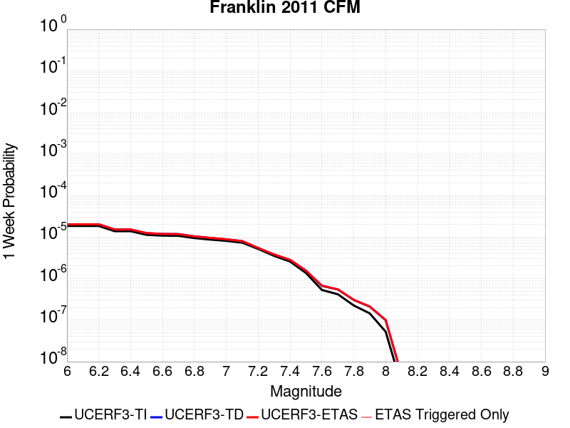 | 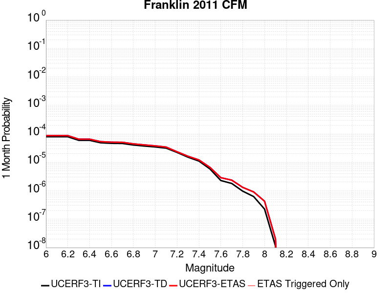 |  |  |

| Magnitude | 1 wk TI Prob | 1 wk TD Prob | 1 wk ETAS Prob | 1 wk ETAS/TD Gain | 1 wk ETAS Triggered Only | 1 mo TI Prob | 1 mo TD Prob | 1 mo ETAS Prob | 1 mo ETAS/TD Gain | 1 mo ETAS Triggered Only | 1 yr TI Prob | 1 yr TD Prob | 1 yr ETAS Prob | 1 yr ETAS/TD Gain | 1 yr ETAS Triggered Only | 10 yr TI Prob | 10 yr TD Prob | 10 yr ETAS Prob | 10 yr ETAS/TD Gain | 10 yr ETAS Triggered Only |
|-----|-----|-----|-----|-----|-----|-----|-----|-----|-----|-----|-----|-----|-----|-----|-----|-----|-----|-----|-----|-----|
| 6.0 | 1.845602E-5 | 2.0213321E-5 | 2.0213321E-5 | 1.0 | 0.0 | 7.9094825E-5 | 8.6625805E-5 | 8.6625805E-5 | 1.0 | 0.0 | 9.6255407E-4 | 0.0010541879 | 0.0010541879 | 1.0 | 0.0 | 0.009583955 | 0.0105092805 | 0.010519176 | 1.0009415 | 1.0E-5 |
| 6.1 | 1.845602E-5 | 2.0213321E-5 | 2.0213321E-5 | 1.0 | 0.0 | 7.9094825E-5 | 8.6625805E-5 | 8.6625805E-5 | 1.0 | 0.0 | 9.6255407E-4 | 0.0010541879 | 0.0010541879 | 1.0 | 0.0 | 0.009583955 | 0.0105092805 | 0.010519176 | 1.0009415 | 1.0E-5 |
| 6.2 | 1.845602E-5 | 2.0213321E-5 | 2.0213321E-5 | 1.0 | 0.0 | 7.9094825E-5 | 8.6625805E-5 | 8.6625805E-5 | 1.0 | 0.0 | 9.6255407E-4 | 0.0010541879 | 0.0010541879 | 1.0 | 0.0 | 0.009583955 | 0.0105092805 | 0.010519176 | 1.0009415 | 1.0E-5 |
| 6.3 | 1.3813506E-5 | 1.5155469E-5 | 1.5155469E-5 | 1.0 | 0.0 | 5.9199396E-5 | 6.4950436E-5 | 6.4950436E-5 | 1.0 | 0.0 | 7.205143E-4 | 7.9049234E-4 | 7.9049234E-4 | 1.0 | 0.0 | 0.007181826 | 0.007892098 | 0.007892098 | 1.0 | 0.0 |
| 6.4 | 1.3813506E-5 | 1.5155469E-5 | 1.5155469E-5 | 1.0 | 0.0 | 5.9199396E-5 | 6.4950436E-5 | 6.4950436E-5 | 1.0 | 0.0 | 7.205143E-4 | 7.9049234E-4 | 7.9049234E-4 | 1.0 | 0.0 | 0.007181826 | 0.007892098 | 0.007892098 | 1.0 | 0.0 |
| 6.5 | 1.1308949E-5 | 1.2418408E-5 | 1.2418408E-5 | 1.0 | 0.0 | 4.8466023E-5 | 5.3220672E-5 | 5.3220672E-5 | 1.0 | 0.0 | 5.899141E-4 | 6.477711E-4 | 6.477711E-4 | 1.0 | 0.0 | 0.0058835056 | 0.006473568 | 0.006473568 | 1.0 | 0.0 |
| 6.6 | 1.0813164E-5 | 1.1876624E-5 | 1.1876624E-5 | 1.0 | 0.0 | 4.6341313E-5 | 5.0898834E-5 | 5.0898834E-5 | 1.0 | 0.0 | 5.640594E-4 | 6.19519E-4 | 6.19519E-4 | 1.0 | 0.0 | 0.005626298 | 0.006192642 | 0.006192642 | 1.0 | 0.0 |
| 6.7 | 1.0706348E-5 | 1.1758386E-5 | 1.1758386E-5 | 1.0 | 0.0 | 4.5883542E-5 | 5.0392122E-5 | 5.0392122E-5 | 1.0 | 0.0 | 5.5848894E-4 | 6.133533E-4 | 6.133533E-4 | 1.0 | 0.0 | 0.005570874 | 0.0061313263 | 0.0061313263 | 1.0 | 0.0 |
| 6.8 | 9.443655E-6 | 1.0349687E-5 | 1.0349687E-5 | 1.0 | 0.0 | 4.0472176E-5 | 4.4355053E-5 | 4.4355053E-5 | 1.0 | 0.0 | 4.9263734E-4 | 5.398903E-4 | 5.398903E-4 | 1.0 | 0.0 | 0.0049154665 | 0.0054004593 | 0.0054004593 | 1.0 | 0.0 |
| 6.9 | 8.7001645E-6 | 9.522744E-6 | 9.522744E-6 | 1.0 | 0.0 | 3.728589E-5 | 4.081113E-5 | 4.081113E-5 | 1.0 | 0.0 | 4.538611E-4 | 4.9676344E-4 | 4.9676344E-4 | 1.0 | 0.0 | 0.0045293528 | 0.00497119 | 0.00497119 | 1.0 | 0.0 |
| 7.0 | 8.074731E-6 | 8.816349E-6 | 8.816349E-6 | 1.0 | 0.0 | 3.460553E-5 | 3.778381E-5 | 3.778381E-5 | 1.0 | 0.0 | 4.212409E-4 | 4.599219E-4 | 4.599219E-4 | 1.0 | 0.0 | 0.004204433 | 0.004604345 | 0.004604345 | 1.0 | 0.0 |
| 7.1 | 7.3370957E-6 | 7.962205E-6 | 7.962205E-6 | 1.0 | 0.0 | 3.1444317E-5 | 3.412329E-5 | 3.412329E-5 | 1.0 | 0.0 | 3.8276732E-4 | 4.1537292E-4 | 4.1537292E-4 | 1.0 | 0.0 | 0.0038210868 | 0.0041604843 | 0.0041604843 | 1.0 | 0.0 |
| 7.2 | 5.1750103E-6 | 5.4575976E-6 | 5.4575976E-6 | 1.0 | 0.0 | 2.2178427E-5 | 2.3389495E-5 | 2.3389495E-5 | 1.0 | 0.0 | 2.699889E-4 | 2.8473022E-4 | 2.8473022E-4 | 1.0 | 0.0 | 0.002696611 | 0.0028576327 | 0.0028576327 | 1.0 | 0.0 |
| 7.3 | 3.5221371E-6 | 3.7964899E-6 | 3.7964899E-6 | 1.0 | 0.0 | 1.5094786E-5 | 1.6270571E-5 | 1.6270571E-5 | 1.0 | 0.0 | 1.8376352E-4 | 1.9807629E-4 | 1.9807629E-4 | 1.0 | 0.0 | 0.0018361164 | 0.001992395 | 0.001992395 | 1.0 | 0.0 |
| 7.4 | 2.5749775E-6 | 2.8186137E-6 | 2.8186137E-6 | 1.0 | 0.0 | 1.1035571E-5 | 1.2079717E-5 | 1.2079717E-5 | 1.0 | 0.0 | 1.343498E-4 | 1.470607E-4 | 1.470607E-4 | 1.0 | 0.0 | 0.001342686 | 0.0014816469 | 0.0014816469 | 1.0 | 0.0 |
| 7.5 | 1.3642131E-6 | 1.5501096E-6 | 1.5501096E-6 | 1.0 | 0.0 | 5.8466144E-6 | 6.6433095E-6 | 6.6433095E-6 | 1.0 | 0.0 | 7.1180206E-5 | 8.087931E-5 | 8.087931E-5 | 1.0 | 0.0 | 7.115741E-4 | 8.190689E-4 | 8.190689E-4 | 1.0 | 0.0 |
| 7.6 | 5.329124E-7 | 6.7040963E-7 | 6.7040963E-7 | 1.0 | 0.0 | 2.2839083E-6 | 2.873181E-6 | 2.873181E-6 | 1.0 | 0.0 | 2.7806227E-5 | 3.498042E-5 | 3.498042E-5 | 1.0 | 0.0 | 2.780275E-4 | 3.6014136E-4 | 3.6014136E-4 | 1.0 | 0.0 |
| 7.7 | 4.199127E-7 | 5.489599E-7 | 5.489599E-7 | 1.0 | 0.0 | 1.7996247E-6 | 2.3526832E-6 | 2.3526832E-6 | 1.0 | 0.0 | 2.191021E-5 | 2.8643546E-5 | 2.8643546E-5 | 1.0 | 0.0 | 2.190805E-4 | 2.9660197E-4 | 2.9660197E-4 | 1.0 | 0.0 |
| 7.8 | 2.2586491E-7 | 3.067841E-7 | 3.067841E-7 | 1.0 | 0.0 | 9.67992E-7 | 1.3147884E-6 | 1.3147884E-6 | 1.0 | 0.0 | 1.178524E-5 | 1.6007432E-5 | 1.6007432E-5 | 1.0 | 0.0 | 1.17846146E-4 | 1.6637355E-4 | 1.6637355E-4 | 1.0 | 0.0 |
| 7.9 | 1.4568845E-7 | 2.1214606E-7 | 2.1214606E-7 | 1.0 | 0.0 | 6.243789E-7 | 9.0919707E-7 | 9.0919707E-7 | 1.0 | 0.0 | 7.601787E-6 | 1.1069418E-5 | 1.1069418E-5 | 1.0 | 0.0 | 7.601527E-5 | 1.1513837E-4 | 1.1513837E-4 | 1.0 | 0.0 |
| 8.0 | 5.2868224E-8 | 1.0002668E-7 | 1.0002668E-7 | 1.0 | 0.0 | 2.2657808E-7 | 4.286857E-7 | 4.286857E-7 | 1.0 | 0.0 | 2.7585847E-6 | 5.2192363E-6 | 5.2192363E-6 | 1.0 | 0.0 | 2.7585504E-5 | 5.404011E-5 | 5.404011E-5 | 1.0 | 0.0 |
| 8.1 | 2.654434E-9 | 4.724904E-9 | 4.724904E-9 | 1.0 | 0.0 | 1.1376145E-8 | 2.0249589E-8 | 2.0249589E-8 | 1.0 | 0.0 | 1.3850456E-7 | 2.4653872E-7 | 2.4653872E-7 | 1.0 | 0.0 | 1.3850448E-6 | 2.5345444E-6 | 2.5345444E-6 | 1.0 | 0.0 |

## Simi-Santa Rosa
*[(top)](#table-of-contents)*

| 1 Week | 1 Month | 1 Year | 10 Year |
|-----|-----|-----|-----|
|  |  |  |  |

| Magnitude | 1 wk TI Prob | 1 wk TD Prob | 1 wk ETAS Prob | 1 wk ETAS/TD Gain | 1 wk ETAS Triggered Only | 1 mo TI Prob | 1 mo TD Prob | 1 mo ETAS Prob | 1 mo ETAS/TD Gain | 1 mo ETAS Triggered Only | 1 yr TI Prob | 1 yr TD Prob | 1 yr ETAS Prob | 1 yr ETAS/TD Gain | 1 yr ETAS Triggered Only | 10 yr TI Prob | 10 yr TD Prob | 10 yr ETAS Prob | 10 yr ETAS/TD Gain | 10 yr ETAS Triggered Only |
|-----|-----|-----|-----|-----|-----|-----|-----|-----|-----|-----|-----|-----|-----|-----|-----|-----|-----|-----|-----|-----|
| 6.0 | 2.198912E-5 | 2.227584E-5 | 2.227584E-5 | 1.0 | 0.0 | 9.4235686E-5 | 9.5464646E-5 | 9.5464646E-5 | 1.0 | 0.0 | 0.0011467156 | 0.0011617062 | 0.0011617062 | 1.0 | 0.0 | 0.011408163 | 0.011560781 | 0.011570665 | 1.000855 | 1.0E-5 |
| 6.1 | 2.198912E-5 | 2.227584E-5 | 2.227584E-5 | 1.0 | 0.0 | 9.4235686E-5 | 9.5464646E-5 | 9.5464646E-5 | 1.0 | 0.0 | 0.0011467156 | 0.0011617062 | 0.0011617062 | 1.0 | 0.0 | 0.011408163 | 0.011560781 | 0.011570665 | 1.000855 | 1.0E-5 |
| 6.2 | 1.69983E-5 | 1.6668866E-5 | 1.6668866E-5 | 1.0 | 0.0 | 7.284782E-5 | 7.14362E-5 | 7.14362E-5 | 1.0 | 0.0 | 8.865613E-4 | 8.694179E-4 | 8.694179E-4 | 1.0 | 0.0 | 0.008830327 | 0.008663086 | 0.008672999 | 1.0011443 | 1.0E-5 |
| 6.3 | 1.69983E-5 | 1.6668866E-5 | 1.6668866E-5 | 1.0 | 0.0 | 7.284782E-5 | 7.14362E-5 | 7.14362E-5 | 1.0 | 0.0 | 8.865613E-4 | 8.694179E-4 | 8.694179E-4 | 1.0 | 0.0 | 0.008830327 | 0.008663086 | 0.008672999 | 1.0011443 | 1.0E-5 |
| 6.4 | 1.4666188E-5 | 1.4052807E-5 | 1.4052807E-5 | 1.0 | 0.0 | 6.285358E-5 | 6.0225066E-5 | 6.0225066E-5 | 1.0 | 0.0 | 7.6497364E-4 | 7.330184E-4 | 7.330184E-4 | 1.0 | 0.0 | 0.0076234564 | 0.0073084813 | 0.0073184078 | 1.0013583 | 1.0E-5 |
| 6.5 | 1.4666188E-5 | 1.4052807E-5 | 1.4052807E-5 | 1.0 | 0.0 | 6.285358E-5 | 6.0225066E-5 | 6.0225066E-5 | 1.0 | 0.0 | 7.6497364E-4 | 7.330184E-4 | 7.330184E-4 | 1.0 | 0.0 | 0.0076234564 | 0.0073084813 | 0.0073184078 | 1.0013583 | 1.0E-5 |
| 6.6 | 1.4377586E-5 | 1.3729842E-5 | 1.3729842E-5 | 1.0 | 0.0 | 6.1616774E-5 | 5.8840993E-5 | 5.8840993E-5 | 1.0 | 0.0 | 7.4992597E-4 | 7.1617845E-4 | 7.1617845E-4 | 1.0 | 0.0 | 0.007474003 | 0.007141173 | 0.0071511013 | 1.0013903 | 1.0E-5 |
| 6.7 | 1.3881404E-5 | 1.3207801E-5 | 1.3207801E-5 | 1.0 | 0.0 | 5.9490372E-5 | 5.6603774E-5 | 5.6603774E-5 | 1.0 | 0.0 | 7.240546E-4 | 6.8895775E-4 | 6.8895775E-4 | 1.0 | 0.0 | 0.007217 | 0.0068706684 | 0.0068805995 | 1.0014454 | 1.0E-5 |
| 6.8 | 1.0176516E-5 | 9.154335E-6 | 9.154335E-6 | 1.0 | 0.0 | 4.3612912E-5 | 3.923237E-5 | 3.923237E-5 | 1.0 | 0.0 | 5.308578E-4 | 4.7756598E-4 | 4.7756598E-4 | 1.0 | 0.0 | 0.0052959146 | 0.0047670305 | 0.004776983 | 1.0020877 | 1.0E-5 |
| 6.9 | 9.699797E-6 | 8.7748995E-6 | 8.7748995E-6 | 1.0 | 0.0 | 4.15699E-5 | 3.7606264E-5 | 3.7606264E-5 | 1.0 | 0.0 | 5.05996E-4 | 4.577765E-4 | 4.577765E-4 | 1.0 | 0.0 | 0.005048454 | 0.0045699533 | 0.0045799073 | 1.0021782 | 1.0E-5 |
| 7.0 | 7.4049476E-6 | 6.5594745E-6 | 6.5594745E-6 | 1.0 | 0.0 | 3.1735104E-5 | 2.8111803E-5 | 2.8111803E-5 | 1.0 | 0.0 | 3.8630638E-4 | 3.422201E-4 | 3.422201E-4 | 1.0 | 0.0 | 0.0038563553 | 0.0034181732 | 0.003428139 | 1.0029155 | 1.0E-5 |
| 7.1 | 3.873439E-6 | 2.7595852E-6 | 2.7595852E-6 | 1.0 | 0.0 | 1.6600346E-5 | 1.1826742E-5 | 1.1826742E-5 | 1.0 | 0.0 | 2.0209046E-4 | 1.439813E-4 | 1.439813E-4 | 1.0 | 0.0 | 0.0020190678 | 0.0014389037 | 0.0014389037 | 1.0 | 0.0 |
| 7.2 | 3.417706E-6 | 2.3677217E-6 | 2.3677217E-6 | 1.0 | 0.0 | 1.4647229E-5 | 1.0147341E-5 | 1.0147341E-5 | 1.0 | 0.0 | 1.7831543E-4 | 1.2353709E-4 | 1.2353709E-4 | 1.0 | 0.0 | 0.0017817242 | 0.0012347065 | 0.0012347065 | 1.0 | 0.0 |
| 7.3 | 1.90225E-6 | 1.4074603E-6 | 1.4074603E-6 | 1.0 | 0.0 | 8.152474E-6 | 6.031959E-6 | 6.031959E-6 | 1.0 | 0.0 | 9.9251854E-5 | 7.343665E-5 | 7.343665E-5 | 1.0 | 0.0 | 9.920754E-4 | 7.34126E-4 | 7.34126E-4 | 1.0 | 0.0 |
| 7.4 | 1.5170556E-6 | 1.1025613E-6 | 1.1025613E-6 | 1.0 | 0.0 | 6.5016507E-6 | 4.7252547E-6 | 4.7252547E-6 | 1.0 | 0.0 | 7.915472E-5 | 5.7528465E-5 | 5.7528465E-5 | 1.0 | 0.0 | 7.9126534E-4 | 5.7513686E-4 | 5.7513686E-4 | 1.0 | 0.0 |
| 7.5 | 1.178732E-6 | 8.535918E-7 | 8.535918E-7 | 1.0 | 0.0 | 5.0516987E-6 | 3.6582455E-6 | 3.6582455E-6 | 1.0 | 0.0 | 6.1502695E-5 | 4.453824E-5 | 4.453824E-5 | 1.0 | 0.0 | 6.148568E-4 | 4.4529408E-4 | 4.4529408E-4 | 1.0 | 0.0 |
| 7.6 | 6.8722386E-7 | 4.79399E-7 | 4.79399E-7 | 1.0 | 0.0 | 2.9452417E-6 | 2.0545656E-6 | 2.0545656E-6 | 1.0 | 0.0 | 3.5857727E-5 | 2.501405E-5 | 2.501405E-5 | 1.0 | 0.0 | 3.5851944E-4 | 2.5011247E-4 | 2.5011247E-4 | 1.0 | 0.0 |
| 7.7 | 5.5126515E-7 | 3.673879E-7 | 3.673879E-7 | 1.0 | 0.0 | 2.3625628E-6 | 1.5745187E-6 | 1.5745187E-6 | 1.0 | 0.0 | 2.8763823E-5 | 1.9169596E-5 | 1.9169596E-5 | 1.0 | 0.0 | 2.87601E-4 | 1.9167954E-4 | 1.9167954E-4 | 1.0 | 0.0 |
| 7.8 | 3.3860243E-7 | 2.0081076E-7 | 2.0081076E-7 | 1.0 | 0.0 | 1.4511525E-6 | 8.6061726E-7 | 8.6061726E-7 | 1.0 | 0.0 | 1.7667637E-5 | 1.0477966E-5 | 1.0477966E-5 | 1.0 | 0.0 | 1.7666233E-4 | 1.04774765E-4 | 1.04774765E-4 | 1.0 | 0.0 |
| 7.9 | 2.7955386E-7 | 1.465409E-7 | 1.465409E-7 | 1.0 | 0.0 | 1.1980875E-6 | 6.280323E-7 | 6.280323E-7 | 1.0 | 0.0 | 1.4586617E-5 | 7.646267E-6 | 7.646267E-6 | 1.0 | 0.0 | 1.458566E-4 | 7.646008E-5 | 7.646008E-5 | 1.0 | 0.0 |
| 8.0 | 5.6259015E-8 | 3.335468E-8 | 3.335468E-8 | 1.0 | 0.0 | 2.4111003E-7 | 1.4294862E-7 | 1.4294862E-7 | 1.0 | 0.0 | 2.9355108E-6 | 1.7403981E-6 | 1.7403981E-6 | 1.0 | 0.0 | 2.935472E-5 | 1.740386E-5 | 1.740386E-5 | 1.0 | 0.0 |

## Calaveras (So) 2011 CFM
*[(top)](#table-of-contents)*

| 1 Week | 1 Month | 1 Year | 10 Year |
|-----|-----|-----|-----|
|  |  |  |  |

| Magnitude | 1 wk TI Prob | 1 wk TD Prob | 1 wk ETAS Prob | 1 wk ETAS/TD Gain | 1 wk ETAS Triggered Only | 1 mo TI Prob | 1 mo TD Prob | 1 mo ETAS Prob | 1 mo ETAS/TD Gain | 1 mo ETAS Triggered Only | 1 yr TI Prob | 1 yr TD Prob | 1 yr ETAS Prob | 1 yr ETAS/TD Gain | 1 yr ETAS Triggered Only | 10 yr TI Prob | 10 yr TD Prob | 10 yr ETAS Prob | 10 yr ETAS/TD Gain | 10 yr ETAS Triggered Only |
|-----|-----|-----|-----|-----|-----|-----|-----|-----|-----|-----|-----|-----|-----|-----|-----|-----|-----|-----|-----|-----|
| 6.0 | 1.5950744E-4 | 3.07182E-4 | 3.07182E-4 | 1.0 | 0.0 | 6.834242E-4 | 0.0013155838 | 0.0013155838 | 1.0 | 0.0 | 0.00828899 | 0.01586041 | 0.01587025 | 1.0006205 | 1.0E-5 | 0.079865426 | 0.14442472 | 0.14443329 | 1.0000592 | 1.0E-5 |
| 6.1 | 1.3584697E-4 | 2.6039843E-4 | 2.6039843E-4 | 1.0 | 0.0 | 5.8207137E-4 | 0.0011153528 | 0.0011153528 | 1.0 | 0.0 | 0.007063716 | 0.013463387 | 0.013473253 | 1.0007328 | 1.0E-5 | 0.06843361 | 0.1240527 | 0.124061465 | 1.0000706 | 1.0E-5 |
| 6.2 | 1.14676266E-4 | 2.171953E-4 | 2.171953E-4 | 1.0 | 0.0 | 4.9137714E-4 | 9.3039346E-4 | 9.3039346E-4 | 1.0 | 0.0 | 0.0059661185 | 0.011246999 | 0.011256887 | 1.0008792 | 1.0E-5 | 0.058084648 | 0.10504322 | 0.105052166 | 1.0000852 | 1.0E-5 |
| 6.3 | 8.691518E-5 | 1.5991413E-4 | 1.5991413E-4 | 1.0 | 0.0 | 3.7244044E-4 | 6.85134E-4 | 6.85134E-4 | 1.0 | 0.0 | 0.004525038 | 0.008302956 | 0.008302956 | 1.0 | 0.0 | 0.044339992 | 0.07935925 | 0.07935925 | 1.0 | 0.0 |
| 6.4 | 8.50982E-5 | 1.5697793E-4 | 1.5697793E-4 | 1.0 | 0.0 | 3.646556E-4 | 6.725568E-4 | 6.725568E-4 | 1.0 | 0.0 | 0.0044306475 | 0.008150981 | 0.008150981 | 1.0 | 0.0 | 0.04343345 | 0.07796543 | 0.07796543 | 1.0 | 0.0 |
| 6.5 | 8.4062965E-5 | 1.5522187E-4 | 1.5522187E-4 | 1.0 | 0.0 | 3.602201E-4 | 6.6503574E-4 | 6.6503574E-4 | 1.0 | 0.0 | 0.004376863 | 0.008060186 | 0.008060186 | 1.0 | 0.0 | 0.042916555 | 0.0771368 | 0.0771368 | 1.0 | 0.0 |
| 6.6 | 8.194716E-5 | 1.5157944E-4 | 1.5157944E-4 | 1.0 | 0.0 | 3.5115483E-4 | 6.494359E-4 | 6.494359E-4 | 1.0 | 0.0 | 0.0042669317 | 0.007872019 | 0.007872019 | 1.0 | 0.0 | 0.04185927 | 0.07542207 | 0.07542207 | 1.0 | 0.0 |
| 6.7 | 8.012326E-5 | 1.4825833E-4 | 1.4825833E-4 | 1.0 | 0.0 | 3.433402E-4 | 6.3521194E-4 | 6.3521194E-4 | 1.0 | 0.0 | 0.004172157 | 0.007700504 | 0.007700504 | 1.0 | 0.0 | 0.040946912 | 0.07386414 | 0.07386414 | 1.0 | 0.0 |
| 6.8 | 7.119773E-5 | 1.2885146E-4 | 1.2885146E-4 | 1.0 | 0.0 | 3.0509746E-4 | 5.5208657E-4 | 5.5208657E-4 | 1.0 | 0.0 | 0.0037082357 | 0.0066977087 | 0.0066977087 | 1.0 | 0.0 | 0.036469642 | 0.06470736 | 0.06470736 | 1.0 | 0.0 |
| 6.9 | 5.7343088E-5 | 9.9215715E-5 | 9.9215715E-5 | 1.0 | 0.0 | 2.4573295E-4 | 4.2514122E-4 | 4.2514122E-4 | 1.0 | 0.0 | 0.0029876942 | 0.0051638843 | 0.0051638843 | 1.0 | 0.0 | 0.02947844 | 0.050521772 | 0.050521772 | 1.0 | 0.0 |
| 7.0 | 4.8746577E-5 | 8.2872946E-5 | 8.2872946E-5 | 1.0 | 0.0 | 2.0889717E-4 | 3.5512177E-4 | 3.5512177E-4 | 1.0 | 0.0 | 0.0025403565 | 0.0043151025 | 0.0043151025 | 1.0 | 0.0 | 0.025115121 | 0.042496696 | 0.042496696 | 1.0 | 0.0 |
| 7.1 | 4.2998014E-5 | 7.266674E-5 | 7.266674E-5 | 1.0 | 0.0 | 1.8426418E-4 | 3.1139204E-4 | 3.1139204E-4 | 1.0 | 0.0 | 0.002241108 | 0.0037846677 | 0.0037846677 | 1.0 | 0.0 | 0.022186412 | 0.03743137 | 0.03743137 | 1.0 | 0.0 |
| 7.2 | 3.221292E-5 | 5.3921813E-5 | 5.3921813E-5 | 1.0 | 0.0 | 1.3804805E-4 | 2.3107318E-4 | 2.3107318E-4 | 1.0 | 0.0 | 0.0016794393 | 0.0028097143 | 0.0028097143 | 1.0 | 0.0 | 0.016668037 | 0.028043631 | 0.028043631 | 1.0 | 0.0 |
| 7.3 | 2.3756531E-5 | 3.9486065E-5 | 3.9486065E-5 | 1.0 | 0.0 | 1.0180973E-4 | 1.6921511E-4 | 1.6921511E-4 | 1.0 | 0.0 | 0.0012388286 | 0.0020582643 | 0.0020582643 | 1.0 | 0.0 | 0.012319452 | 0.020650236 | 0.020650236 | 1.0 | 0.0 |
| 7.4 | 1.5997684E-5 | 2.734871E-5 | 2.734871E-5 | 1.0 | 0.0 | 6.8559704E-5 | 1.172035E-4 | 1.172035E-4 | 1.0 | 0.0 | 8.343947E-4 | 0.001426021 | 0.001426021 | 1.0 | 0.0 | 0.008312687 | 0.014378974 | 0.014378974 | 1.0 | 0.0 |
| 7.5 | 1.3814293E-5 | 2.4790226E-5 | 2.4790226E-5 | 1.0 | 0.0 | 5.9202768E-5 | 1.0623951E-4 | 1.0623951E-4 | 1.0 | 0.0 | 7.205553E-4 | 0.001292701 | 0.001292701 | 1.0 | 0.0 | 0.007182234 | 0.013058075 | 0.013058075 | 1.0 | 0.0 |
| 7.6 | 8.817309E-6 | 1.6436143E-5 | 1.6436143E-5 | 1.0 | 0.0 | 3.7787922E-5 | 7.043872E-5 | 7.043872E-5 | 1.0 | 0.0 | 4.5997082E-4 | 8.5725536E-4 | 8.5725536E-4 | 1.0 | 0.0 | 0.004590199 | 0.008721771 | 0.008721771 | 1.0 | 0.0 |
| 7.7 | 4.0352206E-6 | 7.711456E-6 | 7.711456E-6 | 1.0 | 0.0 | 1.7293689E-5 | 3.304868E-5 | 3.304868E-5 | 1.0 | 0.0 | 2.1053031E-4 | 4.0229346E-4 | 4.0229346E-4 | 1.0 | 0.0 | 0.0021033096 | 0.004167241 | 0.004167241 | 1.0 | 0.0 |
| 7.8 | 3.413169E-6 | 6.79093E-6 | 6.79093E-6 | 1.0 | 0.0 | 1.4627784E-5 | 2.9103661E-5 | 2.9103661E-5 | 1.0 | 0.0 | 1.7807873E-4 | 3.5427953E-4 | 3.5427953E-4 | 1.0 | 0.0 | 0.0017793609 | 0.0036683267 | 0.0036683267 | 1.0 | 0.0 |
| 7.9 | 2.4740732E-6 | 5.28193E-6 | 5.28193E-6 | 1.0 | 0.0 | 1.06031275E-5 | 2.2636646E-5 | 2.2636646E-5 | 1.0 | 0.0 | 1.2908543E-4 | 2.7556636E-4 | 2.7556636E-4 | 1.0 | 0.0 | 0.0012901047 | 0.002836207 | 0.002836207 | 1.0 | 0.0 |
| 8.0 | 1.5231818E-6 | 3.2905639E-6 | 3.2905639E-6 | 1.0 | 0.0 | 6.527906E-6 | 1.4102341E-5 | 1.4102341E-5 | 1.0 | 0.0 | 7.9474354E-5 | 1.716825E-4 | 1.716825E-4 | 1.0 | 0.0 | 7.944594E-4 | 0.0017573038 | 0.0017573038 | 1.0 | 0.0 |
| 8.1 | 1.0104524E-6 | 2.046827E-6 | 2.046827E-6 | 1.0 | 0.0 | 4.330503E-6 | 8.7720855E-6 | 8.7720855E-6 | 1.0 | 0.0 | 5.2722597E-5 | 1.0679494E-4 | 1.0679494E-4 | 1.0 | 0.0 | 5.271009E-4 | 0.0010935272 | 0.0010935272 | 1.0 | 0.0 |

## Northridge
*[(top)](#table-of-contents)*

| 1 Week | 1 Month | 1 Year | 10 Year |
|-----|-----|-----|-----|
|  |  | 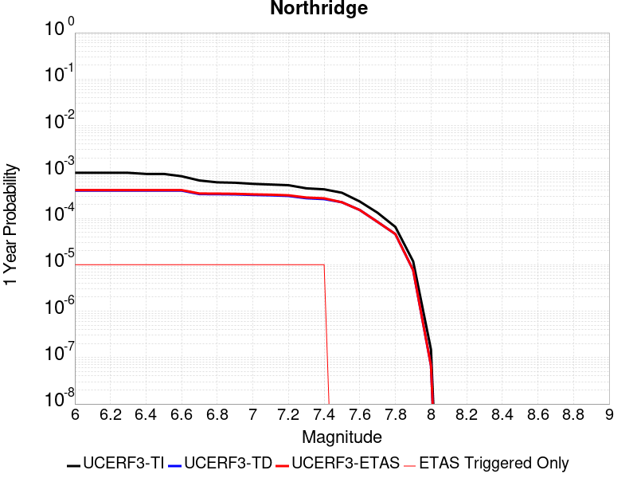 |  |

| Magnitude | 1 wk TI Prob | 1 wk TD Prob | 1 wk ETAS Prob | 1 wk ETAS/TD Gain | 1 wk ETAS Triggered Only | 1 mo TI Prob | 1 mo TD Prob | 1 mo ETAS Prob | 1 mo ETAS/TD Gain | 1 mo ETAS Triggered Only | 1 yr TI Prob | 1 yr TD Prob | 1 yr ETAS Prob | 1 yr ETAS/TD Gain | 1 yr ETAS Triggered Only | 10 yr TI Prob | 10 yr TD Prob | 10 yr ETAS Prob | 10 yr ETAS/TD Gain | 10 yr ETAS Triggered Only |
|-----|-----|-----|-----|-----|-----|-----|-----|-----|-----|-----|-----|-----|-----|-----|-----|-----|-----|-----|-----|-----|
| 6.0 | 1.8340852E-5 | 7.5880284E-6 | 7.5880284E-6 | 1.0 | 0.0 | 7.860128E-5 | 3.251973E-5 | 3.251973E-5 | 1.0 | 0.0 | 9.565505E-4 | 3.9585796E-4 | 4.05854E-4 | 1.0252516 | 1.0E-5 | 0.009524435 | 0.003951762 | 0.0039617224 | 1.0025206 | 1.0E-5 |
| 6.1 | 1.8340852E-5 | 7.5880284E-6 | 7.5880284E-6 | 1.0 | 0.0 | 7.860128E-5 | 3.251973E-5 | 3.251973E-5 | 1.0 | 0.0 | 9.565505E-4 | 3.9585796E-4 | 4.05854E-4 | 1.0252516 | 1.0E-5 | 0.009524435 | 0.003951762 | 0.0039617224 | 1.0025206 | 1.0E-5 |
| 6.2 | 1.8340852E-5 | 7.5880284E-6 | 7.5880284E-6 | 1.0 | 0.0 | 7.860128E-5 | 3.251973E-5 | 3.251973E-5 | 1.0 | 0.0 | 9.565505E-4 | 3.9585796E-4 | 4.05854E-4 | 1.0252516 | 1.0E-5 | 0.009524435 | 0.003951762 | 0.0039617224 | 1.0025206 | 1.0E-5 |
| 6.3 | 1.8340852E-5 | 7.5880284E-6 | 7.5880284E-6 | 1.0 | 0.0 | 7.860128E-5 | 3.251973E-5 | 3.251973E-5 | 1.0 | 0.0 | 9.565505E-4 | 3.9585796E-4 | 4.05854E-4 | 1.0252516 | 1.0E-5 | 0.009524435 | 0.003951762 | 0.0039617224 | 1.0025206 | 1.0E-5 |
| 6.4 | 1.7361892E-5 | 7.5880284E-6 | 7.5880284E-6 | 1.0 | 0.0 | 7.440598E-5 | 3.251973E-5 | 3.251973E-5 | 1.0 | 0.0 | 9.055163E-4 | 3.9585796E-4 | 4.05854E-4 | 1.0252516 | 1.0E-5 | 0.009018354 | 0.003951762 | 0.0039617224 | 1.0025206 | 1.0E-5 |
| 6.5 | 1.7361892E-5 | 7.5880284E-6 | 7.5880284E-6 | 1.0 | 0.0 | 7.440598E-5 | 3.251973E-5 | 3.251973E-5 | 1.0 | 0.0 | 9.055163E-4 | 3.9585796E-4 | 4.05854E-4 | 1.0252516 | 1.0E-5 | 0.009018354 | 0.003951762 | 0.0039617224 | 1.0025206 | 1.0E-5 |
| 6.6 | 1.5458201E-5 | 7.5880284E-6 | 7.5880284E-6 | 1.0 | 0.0 | 6.624775E-5 | 3.251973E-5 | 3.251973E-5 | 1.0 | 0.0 | 8.0626784E-4 | 3.9585796E-4 | 4.05854E-4 | 1.0252516 | 1.0E-5 | 0.008033488 | 0.003951762 | 0.0039617224 | 1.0025206 | 1.0E-5 |
| 6.7 | 1.2538368E-5 | 6.381612E-6 | 6.381612E-6 | 1.0 | 0.0 | 5.3734755E-5 | 2.734948E-5 | 2.734948E-5 | 1.0 | 0.0 | 6.5402425E-4 | 3.3292949E-4 | 3.4292616E-4 | 1.0300264 | 1.0E-5 | 0.0065210275 | 0.0033243664 | 0.0033343332 | 1.0029981 | 1.0E-5 |
| 6.8 | 1.1438097E-5 | 6.3502694E-6 | 6.3502694E-6 | 1.0 | 0.0 | 4.9019498E-5 | 2.721516E-5 | 2.721516E-5 | 1.0 | 0.0 | 5.9664896E-4 | 3.312946E-4 | 3.412913E-4 | 1.0301746 | 1.0E-5 | 0.005950495 | 0.0033080664 | 0.0033180332 | 1.0030129 | 1.0E-5 |
| 6.9 | 1.1204891E-5 | 6.2867225E-6 | 6.2867225E-6 | 1.0 | 0.0 | 4.8020076E-5 | 2.6942822E-5 | 2.6942822E-5 | 1.0 | 0.0 | 5.8448757E-4 | 3.279799E-4 | 3.379766E-4 | 1.0304797 | 1.0E-5 | 0.0058295266 | 0.0032750175 | 0.0032849847 | 1.0030434 | 1.0E-5 |
| 7.0 | 1.061046E-5 | 6.115376E-6 | 6.115376E-6 | 1.0 | 0.0 | 4.5472607E-5 | 2.6208494E-5 | 2.6208494E-5 | 1.0 | 0.0 | 5.534883E-4 | 3.1904213E-4 | 3.290389E-4 | 1.0313338 | 1.0E-5 | 0.0055211177 | 0.003185887 | 0.003195855 | 1.0031289 | 1.0E-5 |
| 7.1 | 1.0266979E-5 | 6.004295E-6 | 6.004295E-6 | 1.0 | 0.0 | 4.40006E-5 | 2.5732441E-5 | 2.5732441E-5 | 1.0 | 0.0 | 5.355756E-4 | 3.1324785E-4 | 3.2324472E-4 | 1.0319136 | 1.0E-5 | 0.0053428668 | 0.0031281086 | 0.0031380772 | 1.0031868 | 1.0E-5 |
| 7.2 | 9.91273E-6 | 5.820007E-6 | 5.820007E-6 | 1.0 | 0.0 | 4.248244E-5 | 2.494265E-5 | 2.494265E-5 | 1.0 | 0.0 | 5.171009E-4 | 3.0363488E-4 | 3.1363184E-4 | 1.0329243 | 1.0E-5 | 0.0051589934 | 0.0030322452 | 0.0030422148 | 1.0032879 | 1.0E-5 |
| 7.3 | 8.4959265E-6 | 5.193102E-6 | 5.193102E-6 | 1.0 | 0.0 | 3.6410605E-5 | 2.2255961E-5 | 2.2255961E-5 | 1.0 | 0.0 | 4.4320893E-4 | 2.7093288E-4 | 2.8093017E-4 | 1.0368996 | 1.0E-5 | 0.00442326 | 0.002706052 | 0.0027160249 | 1.0036855 | 1.0E-5 |
| 7.4 | 8.0847185E-6 | 4.9819787E-6 | 4.9819787E-6 | 1.0 | 0.0 | 3.4648332E-5 | 2.1351163E-5 | 2.1351163E-5 | 1.0 | 0.0 | 4.2176177E-4 | 2.5991965E-4 | 2.6991704E-4 | 1.0384635 | 1.0E-5 | 0.0042096223 | 0.0025961823 | 0.0026061563 | 1.0038418 | 1.0E-5 |
| 7.5 | 6.8220684E-6 | 4.2533266E-6 | 4.2533266E-6 | 1.0 | 0.0 | 2.9237108E-5 | 1.8228417E-5 | 1.8228417E-5 | 1.0 | 0.0 | 3.5590364E-4 | 2.2190856E-4 | 2.2190856E-4 | 1.0 | 0.0 | 0.0035533418 | 0.0022168907 | 0.0022168907 | 1.0 | 0.0 |
| 7.6 | 4.4224143E-6 | 2.899968E-6 | 2.899968E-6 | 1.0 | 0.0 | 1.8953066E-5 | 1.2428376E-5 | 1.2428376E-5 | 1.0 | 0.0 | 2.3072914E-4 | 1.5130508E-4 | 1.5130508E-4 | 1.0 | 0.0 | 0.0023048974 | 0.0015120322 | 0.0015120322 | 1.0 | 0.0 |
| 7.7 | 2.5297056E-6 | 1.6046126E-6 | 1.6046126E-6 | 1.0 | 0.0 | 1.0841551E-5 | 6.8768936E-6 | 6.8768936E-6 | 1.0 | 0.0 | 1.319879E-4 | 8.372301E-5 | 8.372301E-5 | 1.0 | 0.0 | 0.0013190953 | 8.3691935E-4 | 8.3691935E-4 | 1.0 | 0.0 |
| 7.8 | 1.2508156E-6 | 8.7802323E-7 | 8.7802323E-7 | 1.0 | 0.0 | 5.3606273E-6 | 3.7629513E-6 | 3.7629513E-6 | 1.0 | 0.0 | 6.526368E-5 | 4.5812983E-5 | 4.5812983E-5 | 1.0 | 0.0 | 6.524452E-4 | 4.5803667E-4 | 4.5803667E-4 | 1.0 | 0.0 |
| 7.9 | 2.262199E-7 | 1.4665106E-7 | 1.4665106E-7 | 1.0 | 0.0 | 9.695135E-7 | 6.285044E-7 | 6.285044E-7 | 1.0 | 0.0 | 1.1803763E-5 | 7.652015E-6 | 7.652015E-6 | 1.0 | 0.0 | 1.1803136E-4 | 7.6517594E-5 | 7.6517594E-5 | 1.0 | 0.0 |
| 8.0 | 2.865362E-9 | 1.2753111E-9 | 1.2753111E-9 | 1.0 | 0.0 | 1.2280123E-8 | 5.465619E-9 | 5.465619E-9 | 1.0 | 0.0 | 1.4951048E-7 | 6.654391E-8 | 6.654391E-8 | 1.0 | 0.0 | 1.4951038E-6 | 6.6543913E-7 | 6.6543913E-7 | 1.0 | 0.0 |

## Kern Canyon (Lake Isabella) 2011
*[(top)](#table-of-contents)*

| 1 Week | 1 Month | 1 Year | 10 Year |
|-----|-----|-----|-----|
|  | 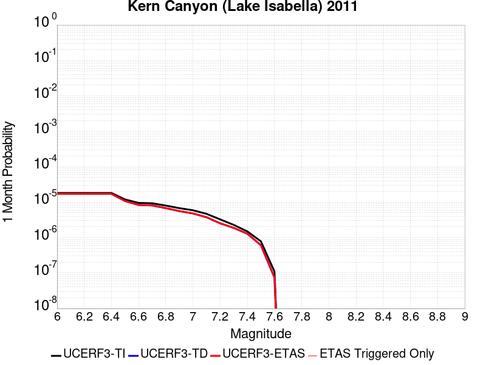 |  |  |

| Magnitude | 1 wk TI Prob | 1 wk TD Prob | 1 wk ETAS Prob | 1 wk ETAS/TD Gain | 1 wk ETAS Triggered Only | 1 mo TI Prob | 1 mo TD Prob | 1 mo ETAS Prob | 1 mo ETAS/TD Gain | 1 mo ETAS Triggered Only | 1 yr TI Prob | 1 yr TD Prob | 1 yr ETAS Prob | 1 yr ETAS/TD Gain | 1 yr ETAS Triggered Only | 10 yr TI Prob | 10 yr TD Prob | 10 yr ETAS Prob | 10 yr ETAS/TD Gain | 10 yr ETAS Triggered Only |
|-----|-----|-----|-----|-----|-----|-----|-----|-----|-----|-----|-----|-----|-----|-----|-----|-----|-----|-----|-----|-----|
| 6.0 | 4.2387383E-6 | 4.001647E-6 | 4.001647E-6 | 1.0 | 0.0 | 1.8165894E-5 | 1.7149814E-5 | 1.7149814E-5 | 1.0 | 0.0 | 2.2114732E-4 | 2.0878084E-4 | 2.0878084E-4 | 1.0 | 0.0 | 0.0022092736 | 0.0020860308 | 0.00209601 | 1.0047837 | 1.0E-5 |
| 6.1 | 4.2387383E-6 | 4.001647E-6 | 4.001647E-6 | 1.0 | 0.0 | 1.8165894E-5 | 1.7149814E-5 | 1.7149814E-5 | 1.0 | 0.0 | 2.2114732E-4 | 2.0878084E-4 | 2.0878084E-4 | 1.0 | 0.0 | 0.0022092736 | 0.0020860308 | 0.00209601 | 1.0047837 | 1.0E-5 |
| 6.2 | 4.2387383E-6 | 4.001647E-6 | 4.001647E-6 | 1.0 | 0.0 | 1.8165894E-5 | 1.7149814E-5 | 1.7149814E-5 | 1.0 | 0.0 | 2.2114732E-4 | 2.0878084E-4 | 2.0878084E-4 | 1.0 | 0.0 | 0.0022092736 | 0.0020860308 | 0.00209601 | 1.0047837 | 1.0E-5 |
| 6.3 | 4.2387383E-6 | 4.001647E-6 | 4.001647E-6 | 1.0 | 0.0 | 1.8165894E-5 | 1.7149814E-5 | 1.7149814E-5 | 1.0 | 0.0 | 2.2114732E-4 | 2.0878084E-4 | 2.0878084E-4 | 1.0 | 0.0 | 0.0022092736 | 0.0020860308 | 0.00209601 | 1.0047837 | 1.0E-5 |
| 6.4 | 4.2387383E-6 | 4.001647E-6 | 4.001647E-6 | 1.0 | 0.0 | 1.8165894E-5 | 1.7149814E-5 | 1.7149814E-5 | 1.0 | 0.0 | 2.2114732E-4 | 2.0878084E-4 | 2.0878084E-4 | 1.0 | 0.0 | 0.0022092736 | 0.0020860308 | 0.00209601 | 1.0047837 | 1.0E-5 |
| 6.5 | 2.7857532E-6 | 2.517871E-6 | 2.517871E-6 | 1.0 | 0.0 | 1.1938888E-5 | 1.0790834E-5 | 1.0790834E-5 | 1.0 | 0.0 | 1.4534626E-4 | 1.313708E-4 | 1.313708E-4 | 1.0 | 0.0 | 0.0014525123 | 0.0013129641 | 0.001322951 | 1.0076064 | 1.0E-5 |
| 6.6 | 2.2233348E-6 | 1.944126E-6 | 1.944126E-6 | 1.0 | 0.0 | 9.528543E-6 | 8.331944E-6 | 8.331944E-6 | 1.0 | 0.0 | 1.1600384E-4 | 1.0143677E-4 | 1.0143677E-4 | 1.0 | 0.0 | 0.001159433 | 0.0010139133 | 0.0010139133 | 1.0 | 0.0 |
| 6.7 | 2.1635126E-6 | 1.8835061E-6 | 1.8835061E-6 | 1.0 | 0.0 | 9.272164E-6 | 8.072145E-6 | 8.072145E-6 | 1.0 | 0.0 | 1.1288274E-4 | 9.827401E-5 | 9.827401E-5 | 1.0 | 0.0 | 0.0011282542 | 9.823136E-4 | 9.823136E-4 | 1.0 | 0.0 |
| 6.8 | 1.8685711E-6 | 1.5831444E-6 | 1.5831444E-6 | 1.0 | 0.0 | 8.008137E-6 | 6.784887E-6 | 6.784887E-6 | 1.0 | 0.0 | 9.74947E-5 | 8.260291E-5 | 8.260291E-5 | 1.0 | 0.0 | 9.745194E-4 | 8.25727E-4 | 8.25727E-4 | 1.0 | 0.0 |
| 6.9 | 1.5815071E-6 | 1.3064939E-6 | 1.3064939E-6 | 1.0 | 0.0 | 6.77787E-6 | 5.5992477E-6 | 5.5992477E-6 | 1.0 | 0.0 | 8.251744E-5 | 6.816874E-5 | 6.816874E-5 | 1.0 | 0.0 | 8.248681E-4 | 6.814809E-4 | 6.814809E-4 | 1.0 | 0.0 |
| 7.0 | 1.3772564E-6 | 1.1210726E-6 | 1.1210726E-6 | 1.0 | 0.0 | 5.9025137E-6 | 4.804588E-6 | 4.804588E-6 | 1.0 | 0.0 | 7.186073E-5 | 5.849431E-5 | 5.849431E-5 | 1.0 | 0.0 | 7.18375E-4 | 5.847912E-4 | 5.847912E-4 | 1.0 | 0.0 |
| 7.1 | 1.0916998E-6 | 8.7637835E-7 | 8.7637835E-7 | 1.0 | 0.0 | 4.678705E-6 | 3.7559018E-6 | 3.7559018E-6 | 1.0 | 0.0 | 5.6961744E-5 | 4.572716E-5 | 4.572716E-5 | 1.0 | 0.0 | 5.6947145E-4 | 4.5717886E-4 | 4.5717886E-4 | 1.0 | 0.0 |
| 7.2 | 7.6277024E-7 | 5.9014616E-7 | 5.9014616E-7 | 1.0 | 0.0 | 3.2690114E-6 | 2.5291954E-6 | 2.5291954E-6 | 1.0 | 0.0 | 3.9799485E-5 | 3.0792526E-5 | 3.0792526E-5 | 1.0 | 0.0 | 3.9792358E-4 | 3.078832E-4 | 3.078832E-4 | 1.0 | 0.0 |
| 7.3 | 5.3265916E-7 | 4.3824443E-7 | 4.3824443E-7 | 1.0 | 0.0 | 2.282823E-6 | 1.8781891E-6 | 1.8781891E-6 | 1.0 | 0.0 | 2.7793016E-5 | 2.2866716E-5 | 2.2866716E-5 | 1.0 | 0.0 | 2.778954E-4 | 2.2864401E-4 | 2.2864401E-4 | 1.0 | 0.0 |
| 7.4 | 3.4946007E-7 | 3.0065758E-7 | 3.0065758E-7 | 1.0 | 0.0 | 1.497685E-6 | 1.2885318E-6 | 1.2885318E-6 | 1.0 | 0.0 | 1.8234163E-5 | 1.5687765E-5 | 1.5687765E-5 | 1.0 | 0.0 | 1.8232666E-4 | 1.568668E-4 | 1.568668E-4 | 1.0 | 0.0 |
| 7.5 | 1.8317026E-7 | 1.4244814E-7 | 1.4244814E-7 | 1.0 | 0.0 | 7.850152E-7 | 6.104919E-7 | 6.104919E-7 | 1.0 | 0.0 | 9.557518E-6 | 7.4327145E-6 | 7.4327145E-6 | 1.0 | 0.0 | 9.5571064E-5 | 7.432474E-5 | 7.432474E-5 | 1.0 | 0.0 |
| 7.6 | 2.572245E-8 | 1.7352718E-8 | 1.7352718E-8 | 1.0 | 0.0 | 1.10239064E-7 | 7.436879E-8 | 7.436879E-8 | 1.0 | 0.0 | 1.3421597E-6 | 9.054397E-7 | 9.054397E-7 | 1.0 | 0.0 | 1.3421517E-5 | 9.054365E-6 | 9.054365E-6 | 1.0 | 0.0 |

## Great Valley 04b Gordon Valley
*[(top)](#table-of-contents)*

| 1 Week | 1 Month | 1 Year | 10 Year |
|-----|-----|-----|-----|
|  |  |  |  |

| Magnitude | 1 wk TI Prob | 1 wk TD Prob | 1 wk ETAS Prob | 1 wk ETAS/TD Gain | 1 wk ETAS Triggered Only | 1 mo TI Prob | 1 mo TD Prob | 1 mo ETAS Prob | 1 mo ETAS/TD Gain | 1 mo ETAS Triggered Only | 1 yr TI Prob | 1 yr TD Prob | 1 yr ETAS Prob | 1 yr ETAS/TD Gain | 1 yr ETAS Triggered Only | 10 yr TI Prob | 10 yr TD Prob | 10 yr ETAS Prob | 10 yr ETAS/TD Gain | 10 yr ETAS Triggered Only |
|-----|-----|-----|-----|-----|-----|-----|-----|-----|-----|-----|-----|-----|-----|-----|-----|-----|-----|-----|-----|-----|
| 6.0 | 2.1181217E-5 | 2.3982373E-5 | 2.3982373E-5 | 1.0 | 0.0 | 9.077348E-5 | 1.0277849E-4 | 1.0277849E-4 | 1.0 | 0.0 | 0.0011046068 | 0.0012507765 | 0.001260764 | 1.007985 | 1.0E-5 | 0.010991322 | 0.012453819 | 0.0124636935 | 1.000793 | 1.0E-5 |
| 6.1 | 2.1181217E-5 | 2.3982373E-5 | 2.3982373E-5 | 1.0 | 0.0 | 9.077348E-5 | 1.0277849E-4 | 1.0277849E-4 | 1.0 | 0.0 | 0.0011046068 | 0.0012507765 | 0.001260764 | 1.007985 | 1.0E-5 | 0.010991322 | 0.012453819 | 0.0124636935 | 1.000793 | 1.0E-5 |
| 6.2 | 2.1181217E-5 | 2.3982373E-5 | 2.3982373E-5 | 1.0 | 0.0 | 9.077348E-5 | 1.0277849E-4 | 1.0277849E-4 | 1.0 | 0.0 | 0.0011046068 | 0.0012507765 | 0.001260764 | 1.007985 | 1.0E-5 | 0.010991322 | 0.012453819 | 0.0124636935 | 1.000793 | 1.0E-5 |
| 6.3 | 2.1181217E-5 | 2.3982373E-5 | 2.3982373E-5 | 1.0 | 0.0 | 9.077348E-5 | 1.0277849E-4 | 1.0277849E-4 | 1.0 | 0.0 | 0.0011046068 | 0.0012507765 | 0.001260764 | 1.007985 | 1.0E-5 | 0.010991322 | 0.012453819 | 0.0124636935 | 1.000793 | 1.0E-5 |
| 6.4 | 1.0988268E-5 | 1.2254686E-5 | 1.2254686E-5 | 1.0 | 0.0 | 4.7091726E-5 | 5.2519114E-5 | 5.2519114E-5 | 1.0 | 0.0 | 5.731909E-4 | 6.392486E-4 | 6.392486E-4 | 1.0 | 0.0 | 0.005717147 | 0.006375685 | 0.006375685 | 1.0 | 0.0 |
| 6.5 | 1.0988268E-5 | 1.2254686E-5 | 1.2254686E-5 | 1.0 | 0.0 | 4.7091726E-5 | 5.2519114E-5 | 5.2519114E-5 | 1.0 | 0.0 | 5.731909E-4 | 6.392486E-4 | 6.392486E-4 | 1.0 | 0.0 | 0.005717147 | 0.006375685 | 0.006375685 | 1.0 | 0.0 |
| 6.6 | 1.0517822E-5 | 1.172424E-5 | 1.172424E-5 | 1.0 | 0.0 | 4.5075605E-5 | 5.0245864E-5 | 5.0245864E-5 | 1.0 | 0.0 | 5.4865726E-4 | 6.115873E-4 | 6.115873E-4 | 1.0 | 0.0 | 0.0054730466 | 0.006100596 | 0.006100596 | 1.0 | 0.0 |
| 6.7 | 7.789219E-6 | 8.677775E-6 | 8.677775E-6 | 1.0 | 0.0 | 3.3381937E-5 | 3.7189966E-5 | 3.7189966E-5 | 1.0 | 0.0 | 4.063493E-4 | 4.5269894E-4 | 4.5269894E-4 | 1.0 | 0.0 | 0.004056071 | 0.004518285 | 0.004518285 | 1.0 | 0.0 |
| 6.8 | 7.5850853E-6 | 8.452517E-6 | 8.452517E-6 | 1.0 | 0.0 | 3.2507105E-5 | 3.62246E-5 | 3.62246E-5 | 1.0 | 0.0 | 3.957021E-4 | 4.409504E-4 | 4.409504E-4 | 1.0 | 0.0 | 0.0039499826 | 0.004401267 | 0.004401267 | 1.0 | 0.0 |
| 6.9 | 6.604105E-6 | 7.3586607E-6 | 7.3586607E-6 | 1.0 | 0.0 | 2.8303E-5 | 3.1536758E-5 | 3.1536758E-5 | 1.0 | 0.0 | 3.4453452E-4 | 3.8389626E-4 | 3.8389626E-4 | 1.0 | 0.0 | 0.0034400085 | 0.0038327174 | 0.0038327174 | 1.0 | 0.0 |
| 7.0 | 5.3701115E-6 | 5.9885097E-6 | 5.9885097E-6 | 1.0 | 0.0 | 2.301456E-5 | 2.5664805E-5 | 2.5664805E-5 | 1.0 | 0.0 | 2.8016625E-4 | 3.1242712E-4 | 3.1242712E-4 | 1.0 | 0.0 | 0.0027981328 | 0.0031201674 | 0.0031201674 | 1.0 | 0.0 |
| 7.1 | 4.4685607E-6 | 4.986555E-6 | 4.986555E-6 | 1.0 | 0.0 | 1.9150835E-5 | 2.1370788E-5 | 2.1370788E-5 | 1.0 | 0.0 | 2.3313647E-4 | 2.6016077E-4 | 2.6016077E-4 | 1.0 | 0.0 | 0.0023289204 | 0.0025988068 | 0.0025988068 | 1.0 | 0.0 |
| 7.2 | 2.833378E-6 | 3.1644681E-6 | 3.1644681E-6 | 1.0 | 0.0 | 1.2142991E-5 | 1.3561946E-5 | 1.3561946E-5 | 1.0 | 0.0 | 1.4783088E-4 | 1.6510593E-4 | 1.6510593E-4 | 1.0 | 0.0 | 0.0014773258 | 0.0016500045 | 0.0016500045 | 1.0 | 0.0 |
| 7.3 | 7.0087293E-7 | 7.772929E-7 | 7.772929E-7 | 1.0 | 0.0 | 3.0037377E-6 | 3.3312535E-6 | 3.3312535E-6 | 1.0 | 0.0 | 3.656989E-5 | 4.0557716E-5 | 4.0557716E-5 | 1.0 | 0.0 | 3.6563876E-4 | 4.055481E-4 | 4.055481E-4 | 1.0 | 0.0 |
| 7.4 | 3.112171E-8 | 3.2068495E-8 | 3.2068495E-8 | 1.0 | 0.0 | 1.3337875E-7 | 1.374364E-7 | 1.374364E-7 | 1.0 | 0.0 | 1.6238852E-6 | 1.673287E-6 | 1.673287E-6 | 1.0 | 0.0 | 1.6238733E-5 | 1.6732753E-5 | 1.6732753E-5 | 1.0 | 0.0 |

## Malibu Coast (Extension) alt 1
*[(top)](#table-of-contents)*

| 1 Week | 1 Month | 1 Year | 10 Year |
|-----|-----|-----|-----|
|  |  |  |  |

| Magnitude | 1 wk TI Prob | 1 wk TD Prob | 1 wk ETAS Prob | 1 wk ETAS/TD Gain | 1 wk ETAS Triggered Only | 1 mo TI Prob | 1 mo TD Prob | 1 mo ETAS Prob | 1 mo ETAS/TD Gain | 1 mo ETAS Triggered Only | 1 yr TI Prob | 1 yr TD Prob | 1 yr ETAS Prob | 1 yr ETAS/TD Gain | 1 yr ETAS Triggered Only | 10 yr TI Prob | 10 yr TD Prob | 10 yr ETAS Prob | 10 yr ETAS/TD Gain | 10 yr ETAS Triggered Only |
|-----|-----|-----|-----|-----|-----|-----|-----|-----|-----|-----|-----|-----|-----|-----|-----|-----|-----|-----|-----|-----|
| 6.0 | 8.930738E-6 | 9.329346E-6 | 9.329346E-6 | 1.0 | 0.0 | 3.827403E-5 | 3.9982307E-5 | 4.9981907E-5 | 1.2501006 | 1.0E-5 | 4.6588664E-4 | 4.8667757E-4 | 4.966727E-4 | 1.0205375 | 1.0E-5 | 0.0046491115 | 0.0048563 | 0.0048662517 | 1.0020492 | 1.0E-5 |
| 6.1 | 7.199952E-6 | 7.530357E-6 | 7.530357E-6 | 1.0 | 0.0 | 3.0856572E-5 | 3.227256E-5 | 4.227224E-5 | 1.3098507 | 1.0E-5 | 3.75614E-4 | 3.9284822E-4 | 4.0284428E-4 | 1.0254451 | 1.0E-5 | 0.0037497976 | 0.003921604 | 0.0039315643 | 1.00254 | 1.0E-5 |
| 6.2 | 6.3721413E-6 | 6.666847E-6 | 6.666847E-6 | 1.0 | 0.0 | 2.7308892E-5 | 2.857189E-5 | 3.8571605E-5 | 1.3499843 | 1.0E-5 | 3.3243504E-4 | 3.478076E-4 | 3.5780412E-4 | 1.0287415 | 1.0E-5 | 0.0033193815 | 0.0034726725 | 0.003482638 | 1.0028696 | 1.0E-5 |
| 6.3 | 6.016345E-6 | 6.2952113E-6 | 6.2952113E-6 | 1.0 | 0.0 | 2.578408E-5 | 2.69792E-5 | 3.697893E-5 | 1.3706459 | 1.0E-5 | 3.1387596E-4 | 3.2842258E-4 | 3.384193E-4 | 1.0304385 | 1.0E-5 | 0.00313433 | 0.0032794084 | 0.0032893757 | 1.0030394 | 1.0E-5 |
| 6.4 | 5.8104883E-6 | 6.0795965E-6 | 6.0795965E-6 | 1.0 | 0.0 | 2.4901856E-5 | 2.6055155E-5 | 3.6054895E-5 | 1.3837912 | 1.0E-5 | 3.031379E-4 | 3.1717564E-4 | 3.2717249E-4 | 1.0315182 | 1.0E-5 | 0.0030272473 | 0.0031672644 | 0.0031772326 | 1.0031472 | 1.0E-5 |
| 6.5 | 5.476925E-6 | 5.7275624E-6 | 5.7275624E-6 | 1.0 | 0.0 | 2.3472323E-5 | 2.4546467E-5 | 3.454622E-5 | 1.4073806 | 1.0E-5 | 2.8573806E-4 | 2.9881255E-4 | 3.0880957E-4 | 1.0334558 | 1.0E-5 | 0.0028537093 | 0.0029841396 | 0.0029941096 | 1.0033411 | 1.0E-5 |
| 6.6 | 5.222387E-6 | 5.458627E-6 | 5.458627E-6 | 1.0 | 0.0 | 2.2381464E-5 | 2.3393908E-5 | 3.3393673E-5 | 1.4274517 | 1.0E-5 | 2.7246025E-4 | 2.847839E-4 | 2.9478103E-4 | 1.0351044 | 1.0E-5 | 0.0027212645 | 0.00284422 | 0.0028541917 | 1.003506 | 1.0E-5 |
| 6.7 | 5.0337076E-6 | 5.259149E-6 | 5.259149E-6 | 1.0 | 0.0 | 2.1572854E-5 | 2.2539016E-5 | 3.2538792E-5 | 1.443665 | 1.0E-5 | 2.6261783E-4 | 2.7437825E-4 | 2.843755E-4 | 1.0364361 | 1.0E-5 | 0.002623077 | 0.002740425 | 0.0027503977 | 1.0036391 | 1.0E-5 |
| 6.8 | 4.5675624E-6 | 4.7587573E-6 | 4.7587573E-6 | 1.0 | 0.0 | 1.9575122E-5 | 2.0394516E-5 | 3.0394312E-5 | 1.490318 | 1.0E-5 | 2.3830103E-4 | 2.4827512E-4 | 2.5827263E-4 | 1.040268 | 1.0E-5 | 0.0023804565 | 0.0024799972 | 0.0024899724 | 1.0040222 | 1.0E-5 |
| 6.9 | 4.2802412E-6 | 4.452059E-6 | 4.452059E-6 | 1.0 | 0.0 | 1.8343762E-5 | 1.9080113E-5 | 2.9079922E-5 | 1.5240959 | 1.0E-5 | 2.2331243E-4 | 2.3227576E-4 | 2.4227344E-4 | 1.0430423 | 1.0E-5 | 0.0022308815 | 0.0023203467 | 0.0023303234 | 1.0042998 | 1.0E-5 |
| 7.0 | 3.9794063E-6 | 4.130134E-6 | 4.130134E-6 | 1.0 | 0.0 | 1.7054486E-5 | 1.7700457E-5 | 1.7700457E-5 | 1.0 | 0.0 | 2.0761859E-4 | 2.1548186E-4 | 2.1548186E-4 | 1.0 | 0.0 | 0.0020742472 | 0.0021527428 | 0.0021527428 | 1.0 | 0.0 |
| 7.1 | 3.7730424E-6 | 3.9112506E-6 | 3.9112506E-6 | 1.0 | 0.0 | 1.6170083E-5 | 1.6762395E-5 | 1.6762395E-5 | 1.0 | 0.0 | 1.9685295E-4 | 2.0406317E-4 | 2.0406317E-4 | 1.0 | 0.0 | 0.0019667868 | 0.0020387708 | 0.0020387708 | 1.0 | 0.0 |
| 7.2 | 3.424985E-6 | 3.5413673E-6 | 3.5413673E-6 | 1.0 | 0.0 | 1.4678424E-5 | 1.5177201E-5 | 1.5177201E-5 | 1.0 | 0.0 | 1.7869516E-4 | 1.8476688E-4 | 1.8476688E-4 | 1.0 | 0.0 | 0.0017855153 | 0.0018461446 | 0.0018461446 | 1.0 | 0.0 |
| 7.3 | 2.6966375E-6 | 2.759676E-6 | 2.759676E-6 | 1.0 | 0.0 | 1.15569665E-5 | 1.1827129E-5 | 1.1827129E-5 | 1.0 | 0.0 | 1.4069698E-4 | 1.4398582E-4 | 1.4398582E-4 | 1.0 | 0.0 | 0.0014060794 | 0.0014389295 | 0.0014389295 | 1.0 | 0.0 |
| 7.4 | 2.215957E-6 | 2.2493962E-6 | 2.2493962E-6 | 1.0 | 0.0 | 9.496924E-6 | 9.640234E-6 | 9.640234E-6 | 1.0 | 0.0 | 1.1561892E-4 | 1.1736356E-4 | 1.1736356E-4 | 1.0 | 0.0 | 0.0011555878 | 0.0011730195 | 0.0011730195 | 1.0 | 0.0 |
| 7.5 | 1.2040218E-6 | 1.2219166E-6 | 1.2219166E-6 | 1.0 | 0.0 | 5.160083E-6 | 5.236775E-6 | 5.236775E-6 | 1.0 | 0.0 | 6.2822204E-5 | 6.3755884E-5 | 6.3755884E-5 | 1.0 | 0.0 | 6.280445E-4 | 6.3737785E-4 | 6.3737785E-4 | 1.0 | 0.0 |
| 7.6 | 6.6157446E-7 | 6.67903E-7 | 6.67903E-7 | 1.0 | 0.0 | 2.835316E-6 | 2.8624384E-6 | 2.8624384E-6 | 1.0 | 0.0 | 3.4519428E-5 | 3.4849647E-5 | 3.4849647E-5 | 1.0 | 0.0 | 3.4514067E-4 | 3.4844334E-4 | 3.4844334E-4 | 1.0 | 0.0 |
| 7.7 | 2.6012302E-7 | 2.4357752E-7 | 2.4357752E-7 | 1.0 | 0.0 | 1.1148124E-6 | 1.0439032E-6 | 1.0439032E-6 | 1.0 | 0.0 | 1.3572758E-5 | 1.2709459E-5 | 1.2709459E-5 | 1.0 | 0.0 | 1.3571928E-4 | 1.2708838E-4 | 1.2708838E-4 | 1.0 | 0.0 |
| 7.8 | 2.8323132E-8 | 2.0266684E-8 | 2.0266684E-8 | 1.0 | 0.0 | 1.2138484E-7 | 8.685721E-8 | 8.685721E-8 | 1.0 | 0.0 | 1.4778595E-6 | 1.0574862E-6 | 1.0574862E-6 | 1.0 | 0.0 | 1.4778497E-5 | 1.05748195E-5 | 1.05748195E-5 | 1.0 | 0.0 |

## Pitas Point (Lower)-Montalvo
*[(top)](#table-of-contents)*

| 1 Week | 1 Month | 1 Year | 10 Year |
|-----|-----|-----|-----|
|  |  |  |  |

| Magnitude | 1 wk TI Prob | 1 wk TD Prob | 1 wk ETAS Prob | 1 wk ETAS/TD Gain | 1 wk ETAS Triggered Only | 1 mo TI Prob | 1 mo TD Prob | 1 mo ETAS Prob | 1 mo ETAS/TD Gain | 1 mo ETAS Triggered Only | 1 yr TI Prob | 1 yr TD Prob | 1 yr ETAS Prob | 1 yr ETAS/TD Gain | 1 yr ETAS Triggered Only | 10 yr TI Prob | 10 yr TD Prob | 10 yr ETAS Prob | 10 yr ETAS/TD Gain | 10 yr ETAS Triggered Only |
|-----|-----|-----|-----|-----|-----|-----|-----|-----|-----|-----|-----|-----|-----|-----|-----|-----|-----|-----|-----|-----|
| 6.0 | 5.2543637E-6 | 4.837943E-6 | 4.837943E-6 | 1.0 | 0.0 | 2.2518509E-5 | 2.0733878E-5 | 2.0733878E-5 | 1.0 | 0.0 | 2.7412834E-4 | 2.5240605E-4 | 2.5240605E-4 | 1.0 | 0.0 | 0.0027379042 | 0.0025212262 | 0.0025312009 | 1.0039563 | 1.0E-5 |
| 6.1 | 5.2543637E-6 | 4.837943E-6 | 4.837943E-6 | 1.0 | 0.0 | 2.2518509E-5 | 2.0733878E-5 | 2.0733878E-5 | 1.0 | 0.0 | 2.7412834E-4 | 2.5240605E-4 | 2.5240605E-4 | 1.0 | 0.0 | 0.0027379042 | 0.0025212262 | 0.0025312009 | 1.0039563 | 1.0E-5 |
| 6.2 | 5.2543637E-6 | 4.837943E-6 | 4.837943E-6 | 1.0 | 0.0 | 2.2518509E-5 | 2.0733878E-5 | 2.0733878E-5 | 1.0 | 0.0 | 2.7412834E-4 | 2.5240605E-4 | 2.5240605E-4 | 1.0 | 0.0 | 0.0027379042 | 0.0025212262 | 0.0025312009 | 1.0039563 | 1.0E-5 |
| 6.3 | 5.2543637E-6 | 4.837943E-6 | 4.837943E-6 | 1.0 | 0.0 | 2.2518509E-5 | 2.0733878E-5 | 2.0733878E-5 | 1.0 | 0.0 | 2.7412834E-4 | 2.5240605E-4 | 2.5240605E-4 | 1.0 | 0.0 | 0.0027379042 | 0.0025212262 | 0.0025312009 | 1.0039563 | 1.0E-5 |
| 6.4 | 5.2543637E-6 | 4.837943E-6 | 4.837943E-6 | 1.0 | 0.0 | 2.2518509E-5 | 2.0733878E-5 | 2.0733878E-5 | 1.0 | 0.0 | 2.7412834E-4 | 2.5240605E-4 | 2.5240605E-4 | 1.0 | 0.0 | 0.0027379042 | 0.0025212262 | 0.0025312009 | 1.0039563 | 1.0E-5 |
| 6.5 | 5.2543637E-6 | 4.837943E-6 | 4.837943E-6 | 1.0 | 0.0 | 2.2518509E-5 | 2.0733878E-5 | 2.0733878E-5 | 1.0 | 0.0 | 2.7412834E-4 | 2.5240605E-4 | 2.5240605E-4 | 1.0 | 0.0 | 0.0027379042 | 0.0025212262 | 0.0025312009 | 1.0039563 | 1.0E-5 |
| 6.6 | 5.2543637E-6 | 4.837943E-6 | 4.837943E-6 | 1.0 | 0.0 | 2.2518509E-5 | 2.0733878E-5 | 2.0733878E-5 | 1.0 | 0.0 | 2.7412834E-4 | 2.5240605E-4 | 2.5240605E-4 | 1.0 | 0.0 | 0.0027379042 | 0.0025212262 | 0.0025312009 | 1.0039563 | 1.0E-5 |
| 6.7 | 5.2543637E-6 | 4.837943E-6 | 4.837943E-6 | 1.0 | 0.0 | 2.2518509E-5 | 2.0733878E-5 | 2.0733878E-5 | 1.0 | 0.0 | 2.7412834E-4 | 2.5240605E-4 | 2.5240605E-4 | 1.0 | 0.0 | 0.0027379042 | 0.0025212262 | 0.0025312009 | 1.0039563 | 1.0E-5 |
| 6.8 | 5.2543637E-6 | 4.837943E-6 | 4.837943E-6 | 1.0 | 0.0 | 2.2518509E-5 | 2.0733878E-5 | 2.0733878E-5 | 1.0 | 0.0 | 2.7412834E-4 | 2.5240605E-4 | 2.5240605E-4 | 1.0 | 0.0 | 0.0027379042 | 0.0025212262 | 0.0025312009 | 1.0039563 | 1.0E-5 |
| 6.9 | 5.2543637E-6 | 4.837943E-6 | 4.837943E-6 | 1.0 | 0.0 | 2.2518509E-5 | 2.0733878E-5 | 2.0733878E-5 | 1.0 | 0.0 | 2.7412834E-4 | 2.5240605E-4 | 2.5240605E-4 | 1.0 | 0.0 | 0.0027379042 | 0.0025212262 | 0.0025312009 | 1.0039563 | 1.0E-5 |
| 7.0 | 5.2543637E-6 | 4.837943E-6 | 4.837943E-6 | 1.0 | 0.0 | 2.2518509E-5 | 2.0733878E-5 | 2.0733878E-5 | 1.0 | 0.0 | 2.7412834E-4 | 2.5240605E-4 | 2.5240605E-4 | 1.0 | 0.0 | 0.0027379042 | 0.0025212262 | 0.0025312009 | 1.0039563 | 1.0E-5 |
| 7.1 | 5.2543637E-6 | 4.837943E-6 | 4.837943E-6 | 1.0 | 0.0 | 2.2518509E-5 | 2.0733878E-5 | 2.0733878E-5 | 1.0 | 0.0 | 2.7412834E-4 | 2.5240605E-4 | 2.5240605E-4 | 1.0 | 0.0 | 0.0027379042 | 0.0025212262 | 0.0025312009 | 1.0039563 | 1.0E-5 |
| 7.2 | 5.2458695E-6 | 4.8290967E-6 | 4.8290967E-6 | 1.0 | 0.0 | 2.2482105E-5 | 2.0695967E-5 | 2.0695967E-5 | 1.0 | 0.0 | 2.7368523E-4 | 2.5194458E-4 | 2.5194458E-4 | 1.0 | 0.0 | 0.0027334841 | 0.002516622 | 0.0025265967 | 1.0039636 | 1.0E-5 |
| 7.3 | 5.22665E-6 | 4.809014E-6 | 4.809014E-6 | 1.0 | 0.0 | 2.2399736E-5 | 2.06099E-5 | 2.06099E-5 | 1.0 | 0.0 | 2.7268266E-4 | 2.5089693E-4 | 2.5089693E-4 | 1.0 | 0.0 | 0.002723483 | 0.0025061693 | 0.0025161442 | 1.0039802 | 1.0E-5 |
| 7.4 | 5.210642E-6 | 4.7922263E-6 | 4.7922263E-6 | 1.0 | 0.0 | 2.233113E-5 | 2.0537953E-5 | 2.0537953E-5 | 1.0 | 0.0 | 2.718476E-4 | 2.500212E-4 | 2.500212E-4 | 1.0 | 0.0 | 0.002715153 | 0.0024974316 | 0.0025074065 | 1.0039941 | 1.0E-5 |
| 7.5 | 5.1226016E-6 | 4.700112E-6 | 4.700112E-6 | 1.0 | 0.0 | 2.1953823E-5 | 2.0143185E-5 | 2.0143185E-5 | 1.0 | 0.0 | 2.67255E-4 | 2.4521598E-4 | 2.4521598E-4 | 1.0 | 0.0 | 0.0026693381 | 0.0024494857 | 0.002459461 | 1.0040725 | 1.0E-5 |
| 7.6 | 4.8796987E-6 | 4.4450103E-6 | 4.4450103E-6 | 1.0 | 0.0 | 2.0912828E-5 | 1.9049907E-5 | 1.9049907E-5 | 1.0 | 0.0 | 2.5458392E-4 | 2.3190824E-4 | 2.3190824E-4 | 1.0 | 0.0 | 0.0025429246 | 0.0023166928 | 0.0023266696 | 1.0043066 | 1.0E-5 |
| 7.7 | 4.0834398E-6 | 3.609176E-6 | 3.609176E-6 | 1.0 | 0.0 | 1.7500339E-5 | 1.5467807E-5 | 1.5467807E-5 | 1.0 | 0.0 | 2.1304579E-4 | 1.883045E-4 | 1.883045E-4 | 1.0 | 0.0 | 0.0021284167 | 0.0018814732 | 0.0018814732 | 1.0 | 0.0 |
| 7.8 | 2.5445438E-6 | 2.1212754E-6 | 2.1212754E-6 | 1.0 | 0.0 | 1.0905142E-5 | 9.091149E-6 | 9.091149E-6 | 1.0 | 0.0 | 1.3276201E-4 | 1.1067916E-4 | 1.1067916E-4 | 1.0 | 0.0 | 0.0013268272 | 0.0011062451 | 0.0011062451 | 1.0 | 0.0 |
| 7.9 | 4.1677114E-7 | 3.329434E-7 | 3.329434E-7 | 1.0 | 0.0 | 1.7861609E-6 | 1.4268995E-6 | 1.4268995E-6 | 1.0 | 0.0 | 2.1746291E-5 | 1.7372366E-5 | 1.7372366E-5 | 1.0 | 0.0 | 2.1744163E-4 | 1.7371039E-4 | 1.7371039E-4 | 1.0 | 0.0 |
| 8.0 | 7.791402E-9 | 5.6836416E-9 | 5.6836416E-9 | 1.0 | 0.0 | 3.3391725E-8 | 2.4358464E-8 | 2.4358464E-8 | 1.0 | 0.0 | 4.0654416E-7 | 2.9656428E-7 | 2.9656428E-7 | 1.0 | 0.0 | 4.065434E-6 | 2.9656408E-6 | 2.9656408E-6 | 1.0 | 0.0 |

## Los Alamos 2011 CFM
*[(top)](#table-of-contents)*

| 1 Week | 1 Month | 1 Year | 10 Year |
|-----|-----|-----|-----|
|  |  | 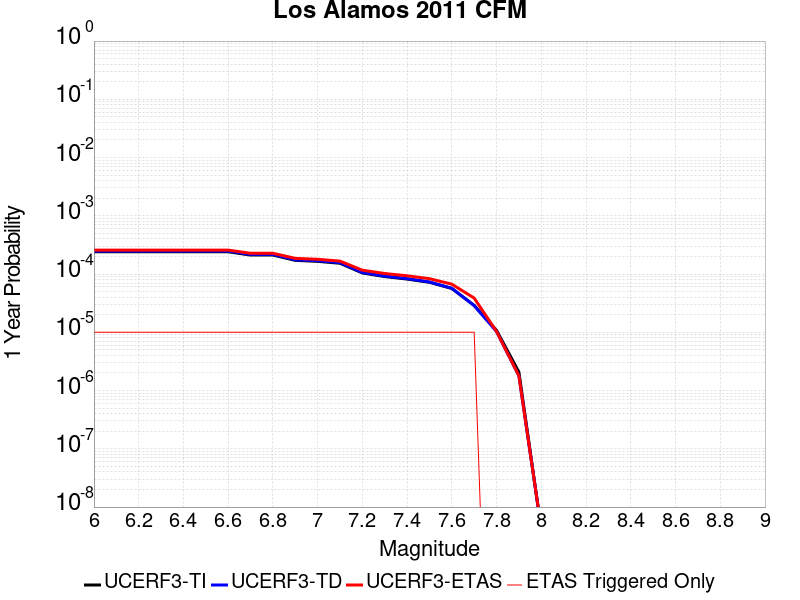 |  |

| Magnitude | 1 wk TI Prob | 1 wk TD Prob | 1 wk ETAS Prob | 1 wk ETAS/TD Gain | 1 wk ETAS Triggered Only | 1 mo TI Prob | 1 mo TD Prob | 1 mo ETAS Prob | 1 mo ETAS/TD Gain | 1 mo ETAS Triggered Only | 1 yr TI Prob | 1 yr TD Prob | 1 yr ETAS Prob | 1 yr ETAS/TD Gain | 1 yr ETAS Triggered Only | 10 yr TI Prob | 10 yr TD Prob | 10 yr ETAS Prob | 10 yr ETAS/TD Gain | 10 yr ETAS Triggered Only |
|-----|-----|-----|-----|-----|-----|-----|-----|-----|-----|-----|-----|-----|-----|-----|-----|-----|-----|-----|-----|-----|
| 6.0 | 4.6284417E-6 | 4.751756E-6 | 4.751756E-6 | 1.0 | 0.0 | 1.9836029E-5 | 2.036452E-5 | 2.036452E-5 | 1.0 | 0.0 | 2.4147688E-4 | 2.4791158E-4 | 2.579091E-4 | 1.040327 | 1.0E-5 | 0.0024121467 | 0.0024765243 | 0.0024864995 | 1.004028 | 1.0E-5 |
| 6.1 | 4.6284417E-6 | 4.751756E-6 | 4.751756E-6 | 1.0 | 0.0 | 1.9836029E-5 | 2.036452E-5 | 2.036452E-5 | 1.0 | 0.0 | 2.4147688E-4 | 2.4791158E-4 | 2.579091E-4 | 1.040327 | 1.0E-5 | 0.0024121467 | 0.0024765243 | 0.0024864995 | 1.004028 | 1.0E-5 |
| 6.2 | 4.6284417E-6 | 4.751756E-6 | 4.751756E-6 | 1.0 | 0.0 | 1.9836029E-5 | 2.036452E-5 | 2.036452E-5 | 1.0 | 0.0 | 2.4147688E-4 | 2.4791158E-4 | 2.579091E-4 | 1.040327 | 1.0E-5 | 0.0024121467 | 0.0024765243 | 0.0024864995 | 1.004028 | 1.0E-5 |
| 6.3 | 4.6284417E-6 | 4.751756E-6 | 4.751756E-6 | 1.0 | 0.0 | 1.9836029E-5 | 2.036452E-5 | 2.036452E-5 | 1.0 | 0.0 | 2.4147688E-4 | 2.4791158E-4 | 2.579091E-4 | 1.040327 | 1.0E-5 | 0.0024121467 | 0.0024765243 | 0.0024864995 | 1.004028 | 1.0E-5 |
| 6.4 | 4.6284417E-6 | 4.751756E-6 | 4.751756E-6 | 1.0 | 0.0 | 1.9836029E-5 | 2.036452E-5 | 2.036452E-5 | 1.0 | 0.0 | 2.4147688E-4 | 2.4791158E-4 | 2.579091E-4 | 1.040327 | 1.0E-5 | 0.0024121467 | 0.0024765243 | 0.0024864995 | 1.004028 | 1.0E-5 |
| 6.5 | 4.6284417E-6 | 4.751756E-6 | 4.751756E-6 | 1.0 | 0.0 | 1.9836029E-5 | 2.036452E-5 | 2.036452E-5 | 1.0 | 0.0 | 2.4147688E-4 | 2.4791158E-4 | 2.579091E-4 | 1.040327 | 1.0E-5 | 0.0024121467 | 0.0024765243 | 0.0024864995 | 1.004028 | 1.0E-5 |
| 6.6 | 4.6284417E-6 | 4.751756E-6 | 4.751756E-6 | 1.0 | 0.0 | 1.9836029E-5 | 2.036452E-5 | 2.036452E-5 | 1.0 | 0.0 | 2.4147688E-4 | 2.4791158E-4 | 2.579091E-4 | 1.040327 | 1.0E-5 | 0.0024121467 | 0.0024765243 | 0.0024864995 | 1.004028 | 1.0E-5 |
| 6.7 | 4.062321E-6 | 4.1663707E-6 | 4.1663707E-6 | 1.0 | 0.0 | 1.7409831E-5 | 1.7855762E-5 | 1.7855762E-5 | 1.0 | 0.0 | 2.1194408E-4 | 2.1737372E-4 | 2.2737155E-4 | 1.0459937 | 1.0E-5 | 0.0021174205 | 0.0021717607 | 0.0021817388 | 1.0045946 | 1.0E-5 |
| 6.8 | 4.062321E-6 | 4.1663707E-6 | 4.1663707E-6 | 1.0 | 0.0 | 1.7409831E-5 | 1.7855762E-5 | 1.7855762E-5 | 1.0 | 0.0 | 2.1194408E-4 | 2.1737372E-4 | 2.2737155E-4 | 1.0459937 | 1.0E-5 | 0.0021174205 | 0.0021717607 | 0.0021817388 | 1.0045946 | 1.0E-5 |
| 6.9 | 3.2936077E-6 | 3.3729766E-6 | 3.3729766E-6 | 1.0 | 0.0 | 1.4115385E-5 | 1.4455539E-5 | 1.4455539E-5 | 1.0 | 0.0 | 1.7184127E-4 | 1.7598292E-4 | 1.8598115E-4 | 1.0568137 | 1.0E-5 | 0.0017170844 | 0.0017585282 | 0.0017685106 | 1.0056766 | 1.0E-5 |
| 7.0 | 3.1687898E-6 | 3.2448338E-6 | 3.2448338E-6 | 1.0 | 0.0 | 1.3580457E-5 | 1.3906361E-5 | 1.3906361E-5 | 1.0 | 0.0 | 1.6532952E-4 | 1.6929772E-4 | 1.7929604E-4 | 1.0590576 | 1.0E-5 | 0.0016520657 | 0.0016917791 | 0.0017017622 | 1.005901 | 1.0E-5 |
| 7.1 | 2.9379228E-6 | 3.0073431E-6 | 3.0073431E-6 | 1.0 | 0.0 | 1.25910365E-5 | 1.2888555E-5 | 1.2888555E-5 | 1.0 | 0.0 | 1.5328509E-4 | 1.5690776E-4 | 1.6690619E-4 | 1.0637217 | 1.0E-5 | 0.001531794 | 0.0015680589 | 0.0015780432 | 1.0063673 | 1.0E-5 |
| 7.2 | 2.0020686E-6 | 2.041643E-6 | 2.041643E-6 | 1.0 | 0.0 | 8.580266E-6 | 8.749869E-6 | 8.749869E-6 | 1.0 | 0.0 | 1.0445973E-4 | 1.065245E-4 | 1.16523435E-4 | 1.0938652 | 1.0E-5 | 0.0010441064 | 0.0010647388 | 0.0010747282 | 1.009382 | 1.0E-5 |
| 7.3 | 1.7364243E-6 | 1.7678924E-6 | 1.7678924E-6 | 1.0 | 0.0 | 7.441797E-6 | 7.5766598E-6 | 7.5766598E-6 | 1.0 | 0.0 | 9.0600115E-5 | 9.224196E-5 | 1.02241036E-4 | 1.1084006 | 1.0E-5 | 9.0563187E-4 | 9.2203985E-4 | 9.320306E-4 | 1.0108355 | 1.0E-5 |
| 7.4 | 1.5718434E-6 | 1.598329E-6 | 1.598329E-6 | 1.0 | 0.0 | 6.7364545E-6 | 6.849964E-6 | 6.849964E-6 | 1.0 | 0.0 | 8.201325E-5 | 8.339515E-5 | 9.3394316E-5 | 1.1199011 | 1.0E-5 | 8.198299E-4 | 8.3364156E-4 | 8.436332E-4 | 1.0119855 | 1.0E-5 |
| 7.5 | 1.3841119E-6 | 1.4042898E-6 | 1.4042898E-6 | 1.0 | 0.0 | 5.9318945E-6 | 6.018371E-6 | 6.018371E-6 | 1.0 | 0.0 | 7.221842E-5 | 7.3271236E-5 | 8.32705E-5 | 1.1364692 | 1.0E-5 | 7.2194956E-4 | 7.324736E-4 | 7.424663E-4 | 1.0136423 | 1.0E-5 |
| 7.6 | 1.0843726E-6 | 1.0934511E-6 | 1.0934511E-6 | 1.0 | 0.0 | 4.647303E-6 | 4.686211E-6 | 4.686211E-6 | 1.0 | 0.0 | 5.6579443E-5 | 5.705315E-5 | 6.705258E-5 | 1.1752652 | 1.0E-5 | 5.656504E-4 | 5.7038764E-4 | 5.803819E-4 | 1.017522 | 1.0E-5 |
| 7.7 | 5.544814E-7 | 5.501919E-7 | 5.501919E-7 | 1.0 | 0.0 | 2.3763469E-6 | 2.357963E-6 | 2.357963E-6 | 1.0 | 0.0 | 2.8931638E-5 | 2.8707824E-5 | 3.8707538E-5 | 1.348327 | 1.0E-5 | 2.8927872E-4 | 2.870413E-4 | 2.9703844E-4 | 1.0348282 | 1.0E-5 |
| 7.8 | 2.0707465E-7 | 1.977874E-7 | 1.977874E-7 | 1.0 | 0.0 | 8.874625E-7 | 8.4766003E-7 | 8.4766003E-7 | 1.0 | 0.0 | 1.08048025E-5 | 1.0320213E-5 | 1.0320213E-5 | 1.0 | 0.0 | 1.0804277E-4 | 1.0319738E-4 | 1.0319738E-4 | 1.0 | 0.0 |
| 7.9 | 3.9821284E-8 | 3.433199E-8 | 3.433199E-8 | 1.0 | 0.0 | 1.7066264E-7 | 1.4713709E-7 | 1.4713709E-7 | 1.0 | 0.0 | 2.0778157E-6 | 1.7913927E-6 | 1.7913927E-6 | 1.0 | 0.0 | 2.0777963E-5 | 1.7913788E-5 | 1.7913788E-5 | 1.0 | 0.0 |
| 8.0 | 7.880441E-11 | 8.235368E-11 | 8.235368E-11 | 1.0 | 0.0 | 3.3773329E-10 | 3.5294412E-10 | 3.5294412E-10 | 1.0 | 0.0 | 4.1119033E-9 | 4.297095E-9 | 4.297095E-9 | 1.0 | 0.0 | 4.1119034E-8 | 4.2970953E-8 | 4.2970953E-8 | 1.0 | 0.0 |

## Round Valley
*[(top)](#table-of-contents)*

| 1 Week | 1 Month | 1 Year | 10 Year |
|-----|-----|-----|-----|
|  |  |  |  |

| Magnitude | 1 wk TI Prob | 1 wk TD Prob | 1 wk ETAS Prob | 1 wk ETAS/TD Gain | 1 wk ETAS Triggered Only | 1 mo TI Prob | 1 mo TD Prob | 1 mo ETAS Prob | 1 mo ETAS/TD Gain | 1 mo ETAS Triggered Only | 1 yr TI Prob | 1 yr TD Prob | 1 yr ETAS Prob | 1 yr ETAS/TD Gain | 1 yr ETAS Triggered Only | 10 yr TI Prob | 10 yr TD Prob | 10 yr ETAS Prob | 10 yr ETAS/TD Gain | 10 yr ETAS Triggered Only |
|-----|-----|-----|-----|-----|-----|-----|-----|-----|-----|-----|-----|-----|-----|-----|-----|-----|-----|-----|-----|-----|
| 6.0 | 1.588152E-5 | 1.3670716E-5 | 1.3670716E-5 | 1.0 | 0.0 | 6.806188E-5 | 5.8587688E-5 | 5.8587688E-5 | 1.0 | 0.0 | 8.283384E-4 | 7.131111E-4 | 7.131111E-4 | 1.0 | 0.0 | 0.008252576 | 0.007112115 | 0.007122044 | 1.0013961 | 1.0E-5 |
| 6.1 | 1.588152E-5 | 1.3670716E-5 | 1.3670716E-5 | 1.0 | 0.0 | 6.806188E-5 | 5.8587688E-5 | 5.8587688E-5 | 1.0 | 0.0 | 8.283384E-4 | 7.131111E-4 | 7.131111E-4 | 1.0 | 0.0 | 0.008252576 | 0.007112115 | 0.007122044 | 1.0013961 | 1.0E-5 |
| 6.2 | 1.588152E-5 | 1.3670716E-5 | 1.3670716E-5 | 1.0 | 0.0 | 6.806188E-5 | 5.8587688E-5 | 5.8587688E-5 | 1.0 | 0.0 | 8.283384E-4 | 7.131111E-4 | 7.131111E-4 | 1.0 | 0.0 | 0.008252576 | 0.007112115 | 0.007122044 | 1.0013961 | 1.0E-5 |
| 6.3 | 1.588152E-5 | 1.3670716E-5 | 1.3670716E-5 | 1.0 | 0.0 | 6.806188E-5 | 5.8587688E-5 | 5.8587688E-5 | 1.0 | 0.0 | 8.283384E-4 | 7.131111E-4 | 7.131111E-4 | 1.0 | 0.0 | 0.008252576 | 0.007112115 | 0.007122044 | 1.0013961 | 1.0E-5 |
| 6.4 | 1.588152E-5 | 1.3670716E-5 | 1.3670716E-5 | 1.0 | 0.0 | 6.806188E-5 | 5.8587688E-5 | 5.8587688E-5 | 1.0 | 0.0 | 8.283384E-4 | 7.131111E-4 | 7.131111E-4 | 1.0 | 0.0 | 0.008252576 | 0.007112115 | 0.007122044 | 1.0013961 | 1.0E-5 |
| 6.5 | 1.0646776E-5 | 7.952968E-6 | 7.952968E-6 | 1.0 | 0.0 | 4.5628243E-5 | 3.408375E-5 | 3.408375E-5 | 1.0 | 0.0 | 5.553823E-4 | 4.1489903E-4 | 4.1489903E-4 | 1.0 | 0.0 | 0.005539963 | 0.004142073 | 0.004142073 | 1.0 | 0.0 |
| 6.6 | 8.632956E-6 | 5.768648E-6 | 5.768648E-6 | 1.0 | 0.0 | 3.6997862E-5 | 2.4722565E-5 | 2.4722565E-5 | 1.0 | 0.0 | 4.5035584E-4 | 3.0095948E-4 | 3.0095948E-4 | 1.0 | 0.0 | 0.0044944426 | 0.003005897 | 0.003005897 | 1.0 | 0.0 |
| 6.7 | 8.632956E-6 | 5.768648E-6 | 5.768648E-6 | 1.0 | 0.0 | 3.6997862E-5 | 2.4722565E-5 | 2.4722565E-5 | 1.0 | 0.0 | 4.5035584E-4 | 3.0095948E-4 | 3.0095948E-4 | 1.0 | 0.0 | 0.0044944426 | 0.003005897 | 0.003005897 | 1.0 | 0.0 |
| 6.8 | 7.143895E-6 | 4.2017227E-6 | 4.2017227E-6 | 1.0 | 0.0 | 3.0616335E-5 | 1.800727E-5 | 1.800727E-5 | 1.0 | 0.0 | 3.726901E-4 | 2.1921811E-4 | 2.1921811E-4 | 1.0 | 0.0 | 0.0037206567 | 0.0021901834 | 0.0021901834 | 1.0 | 0.0 |
| 6.9 | 6.5120694E-6 | 3.6643512E-6 | 3.6643512E-6 | 1.0 | 0.0 | 2.790857E-5 | 1.5704276E-5 | 1.5704276E-5 | 1.0 | 0.0 | 3.3973387E-4 | 1.911843E-4 | 1.911843E-4 | 1.0 | 0.0 | 0.0033921495 | 0.0019103473 | 0.0019103473 | 1.0 | 0.0 |
| 7.0 | 5.0614435E-6 | 2.6835412E-6 | 2.6835412E-6 | 1.0 | 0.0 | 2.169172E-5 | 1.1500846E-5 | 1.1500846E-5 | 1.0 | 0.0 | 2.6406467E-4 | 1.4001483E-4 | 1.4001483E-4 | 1.0 | 0.0 | 0.0026375111 | 0.0013993676 | 0.0013993676 | 1.0 | 0.0 |
| 7.1 | 4.41728E-6 | 2.3573723E-6 | 2.3573723E-6 | 1.0 | 0.0 | 1.8931061E-5 | 1.0102991E-5 | 1.0102991E-5 | 1.0 | 0.0 | 2.304613E-4 | 1.2299795E-4 | 1.2299795E-4 | 1.0 | 0.0 | 0.0023022245 | 0.0012293953 | 0.0012293953 | 1.0 | 0.0 |
| 7.2 | 2.535495E-6 | 1.1208174E-6 | 1.1208174E-6 | 1.0 | 0.0 | 1.0866362E-5 | 4.803497E-6 | 4.803497E-6 | 1.0 | 0.0 | 1.3228992E-4 | 5.8481528E-5 | 5.8481528E-5 | 1.0 | 0.0 | 0.0013221119 | 5.847126E-4 | 5.847126E-4 | 1.0 | 0.0 |
| 7.3 | 7.900015E-7 | 4.0890467E-7 | 4.0890467E-7 | 1.0 | 0.0 | 3.3857161E-6 | 1.7524486E-6 | 1.7524486E-6 | 1.0 | 0.0 | 4.1220315E-5 | 2.1336062E-5 | 2.1336062E-5 | 1.0 | 0.0 | 4.121267E-4 | 2.1336062E-4 | 2.1336062E-4 | 1.0 | 0.0 |

## Hosgri (Extension)
*[(top)](#table-of-contents)*

| 1 Week | 1 Month | 1 Year | 10 Year |
|-----|-----|-----|-----|
|  |  |  | 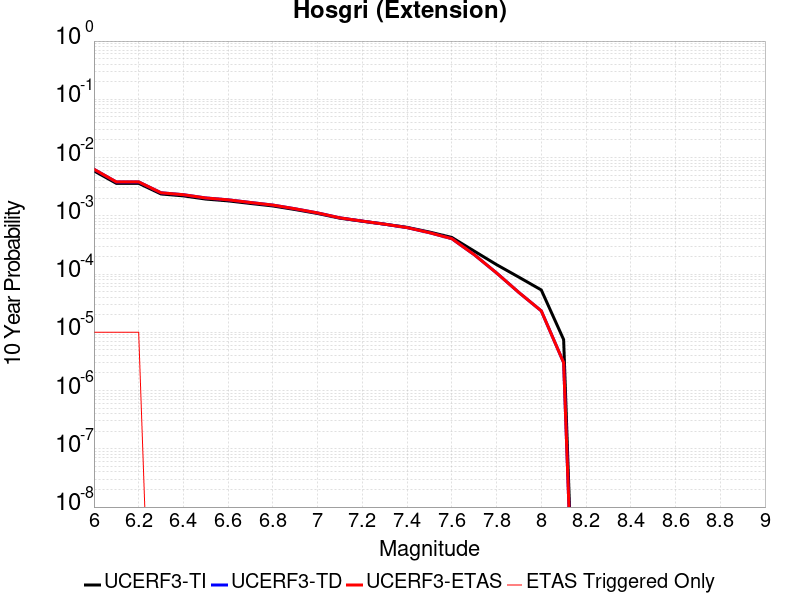 |

| Magnitude | 1 wk TI Prob | 1 wk TD Prob | 1 wk ETAS Prob | 1 wk ETAS/TD Gain | 1 wk ETAS Triggered Only | 1 mo TI Prob | 1 mo TD Prob | 1 mo ETAS Prob | 1 mo ETAS/TD Gain | 1 mo ETAS Triggered Only | 1 yr TI Prob | 1 yr TD Prob | 1 yr ETAS Prob | 1 yr ETAS/TD Gain | 1 yr ETAS Triggered Only | 10 yr TI Prob | 10 yr TD Prob | 10 yr ETAS Prob | 10 yr ETAS/TD Gain | 10 yr ETAS Triggered Only |
|-----|-----|-----|-----|-----|-----|-----|-----|-----|-----|-----|-----|-----|-----|-----|-----|-----|-----|-----|-----|-----|
| 6.0 | 1.1369135E-5 | 1.20832E-5 | 1.20832E-5 | 1.0 | 0.0 | 4.8723956E-5 | 5.1784245E-5 | 5.1784245E-5 | 1.0 | 0.0 | 5.9305265E-4 | 6.3031353E-4 | 6.3031353E-4 | 1.0 | 0.0 | 0.005914725 | 0.0062875063 | 0.0062974435 | 1.0015805 | 1.0E-5 |
| 6.1 | 6.934979E-6 | 7.324637E-6 | 7.324637E-6 | 1.0 | 0.0 | 2.9721E-5 | 3.1390948E-5 | 3.1390948E-5 | 1.0 | 0.0 | 3.617931E-4 | 3.821219E-4 | 3.821219E-4 | 1.0 | 0.0 | 0.0036120464 | 0.0038150612 | 0.003825023 | 1.0026112 | 1.0E-5 |
| 6.2 | 6.934979E-6 | 7.324637E-6 | 7.324637E-6 | 1.0 | 0.0 | 2.9721E-5 | 3.1390948E-5 | 3.1390948E-5 | 1.0 | 0.0 | 3.617931E-4 | 3.821219E-4 | 3.821219E-4 | 1.0 | 0.0 | 0.0036120464 | 0.0038150612 | 0.003825023 | 1.0026112 | 1.0E-5 |
| 6.3 | 4.5484676E-6 | 4.7693884E-6 | 4.7693884E-6 | 1.0 | 0.0 | 1.9493287E-5 | 2.0440079E-5 | 2.0440079E-5 | 1.0 | 0.0 | 2.3730492E-4 | 2.4882995E-4 | 2.4882995E-4 | 1.0 | 0.0 | 0.0023705168 | 0.002485556 | 0.002485556 | 1.0 | 0.0 |
| 6.4 | 4.218095E-6 | 4.4169165E-6 | 4.4169165E-6 | 1.0 | 0.0 | 1.8077424E-5 | 1.8929508E-5 | 1.8929508E-5 | 1.0 | 0.0 | 2.2007042E-4 | 2.304427E-4 | 2.304427E-4 | 1.0 | 0.0 | 0.002198526 | 0.0023020708 | 0.0023020708 | 1.0 | 0.0 |
| 6.5 | 3.717374E-6 | 3.883928E-6 | 3.883928E-6 | 1.0 | 0.0 | 1.5931506E-5 | 1.6645301E-5 | 1.6645301E-5 | 1.0 | 0.0 | 1.9394881E-4 | 2.0263788E-4 | 2.0263788E-4 | 1.0 | 0.0 | 0.0019377962 | 0.0020245498 | 0.0020245498 | 1.0 | 0.0 |
| 6.6 | 3.4605036E-6 | 3.6083538E-6 | 3.6083538E-6 | 1.0 | 0.0 | 1.4830645E-5 | 1.5464282E-5 | 1.5464282E-5 | 1.0 | 0.0 | 1.8054814E-4 | 1.8826152E-4 | 1.8826152E-4 | 1.0 | 0.0 | 0.0018040152 | 0.001881035 | 0.001881035 | 1.0 | 0.0 |
| 6.7 | 3.123439E-6 | 3.246613E-6 | 3.246613E-6 | 1.0 | 0.0 | 1.33860985E-5 | 1.3913982E-5 | 1.3913982E-5 | 1.0 | 0.0 | 1.6296357E-4 | 1.6938966E-4 | 1.6938966E-4 | 1.0 | 0.0 | 0.001628441 | 0.0016926165 | 0.0016926165 | 1.0 | 0.0 |
| 6.8 | 2.8290783E-6 | 2.9305816E-6 | 2.9305816E-6 | 1.0 | 0.0 | 1.2124565E-5 | 1.2559575E-5 | 1.2559575E-5 | 1.0 | 0.0 | 1.4760658E-4 | 1.5290218E-4 | 1.5290218E-4 | 1.0 | 0.0 | 0.0014750857 | 0.0015279786 | 0.0015279786 | 1.0 | 0.0 |
| 6.9 | 2.454112E-6 | 2.5283568E-6 | 2.5283568E-6 | 1.0 | 0.0 | 1.0517581E-5 | 1.0835771E-5 | 1.0835771E-5 | 1.0 | 0.0 | 1.2804402E-4 | 1.3191758E-4 | 1.3191758E-4 | 1.0 | 0.0 | 0.0012797028 | 0.0013183989 | 0.0013183989 | 1.0 | 0.0 |
| 7.0 | 2.1008145E-6 | 2.149904E-6 | 2.149904E-6 | 1.0 | 0.0 | 9.003459E-6 | 9.2138425E-6 | 9.2138425E-6 | 1.0 | 0.0 | 1.096116E-4 | 1.1217279E-4 | 1.1217279E-4 | 1.0 | 0.0 | 0.0010955755 | 0.0011211655 | 0.0011211655 | 1.0 | 0.0 |
| 7.1 | 1.744384E-6 | 1.7686655E-6 | 1.7686655E-6 | 1.0 | 0.0 | 7.47591E-6 | 7.579973E-6 | 7.579973E-6 | 1.0 | 0.0 | 9.1015405E-5 | 9.228228E-5 | 9.228228E-5 | 1.0 | 0.0 | 9.097813E-4 | 9.224413E-4 | 9.224413E-4 | 1.0 | 0.0 |
| 7.2 | 1.5456587E-6 | 1.5563166E-6 | 1.5563166E-6 | 1.0 | 0.0 | 6.6242346E-6 | 6.6699113E-6 | 6.6699113E-6 | 1.0 | 0.0 | 8.064707E-5 | 8.120316E-5 | 8.120316E-5 | 1.0 | 0.0 | 8.0617814E-4 | 8.117361E-4 | 8.117361E-4 | 1.0 | 0.0 |
| 7.3 | 1.3775123E-6 | 1.3766349E-6 | 1.3766349E-6 | 1.0 | 0.0 | 5.9036106E-6 | 5.8998507E-6 | 5.8998507E-6 | 1.0 | 0.0 | 7.187409E-5 | 7.1828326E-5 | 7.1828326E-5 | 1.0 | 0.0 | 7.185085E-4 | 7.180521E-4 | 7.180521E-4 | 1.0 | 0.0 |
| 7.4 | 1.214491E-6 | 1.2023712E-6 | 1.2023712E-6 | 1.0 | 0.0 | 5.2049513E-6 | 5.153009E-6 | 5.153009E-6 | 1.0 | 0.0 | 6.336844E-5 | 6.2736086E-5 | 6.2736086E-5 | 1.0 | 0.0 | 6.335037E-4 | 6.271846E-4 | 6.271846E-4 | 1.0 | 0.0 |
| 7.5 | 1.0101123E-6 | 9.842478E-7 | 9.842478E-7 | 1.0 | 0.0 | 4.3290456E-6 | 4.218198E-6 | 4.218198E-6 | 1.0 | 0.0 | 5.2704854E-5 | 5.1355353E-5 | 5.1355353E-5 | 1.0 | 0.0 | 5.2692357E-4 | 5.1343546E-4 | 5.1343546E-4 | 1.0 | 0.0 |
| 7.6 | 8.1558215E-7 | 7.766179E-7 | 7.766179E-7 | 1.0 | 0.0 | 3.4953473E-6 | 3.3283584E-6 | 3.3283584E-6 | 1.0 | 0.0 | 4.255502E-5 | 4.0522013E-5 | 4.0522013E-5 | 1.0 | 0.0 | 4.2546875E-4 | 4.0514668E-4 | 4.0514668E-4 | 1.0 | 0.0 |
| 7.7 | 4.757816E-7 | 4.1310682E-7 | 4.1310682E-7 | 1.0 | 0.0 | 2.0390623E-6 | 1.7704566E-6 | 1.7704566E-6 | 1.0 | 0.0 | 2.4825302E-5 | 2.1555097E-5 | 2.1555097E-5 | 1.0 | 0.0 | 2.482253E-4 | 2.1553019E-4 | 2.1553019E-4 | 1.0 | 0.0 |
| 7.8 | 2.782787E-7 | 2.00493E-7 | 2.00493E-7 | 1.0 | 0.0 | 1.1926223E-6 | 8.5925547E-7 | 8.5925547E-7 | 1.0 | 0.0 | 1.452008E-5 | 1.04613855E-5 | 1.04613855E-5 | 1.0 | 0.0 | 1.4519131E-4 | 1.0460896E-4 | 1.0460896E-4 | 1.0 | 0.0 |
| 7.9 | 1.6948086E-7 | 9.2453185E-8 | 9.2453185E-8 | 1.0 | 0.0 | 7.2634634E-7 | 3.9622788E-7 | 3.9622788E-7 | 1.0 | 0.0 | 8.843231E-6 | 4.8240636E-6 | 4.8240636E-6 | 1.0 | 0.0 | 8.842879E-5 | 4.8239595E-5 | 4.8239595E-5 | 1.0 | 0.0 |
| 8.0 | 1.0225492E-7 | 4.4745146E-8 | 4.4745146E-8 | 1.0 | 0.0 | 4.382353E-7 | 1.917649E-7 | 1.917649E-7 | 1.0 | 0.0 | 5.335502E-6 | 2.3347352E-6 | 2.3347352E-6 | 1.0 | 0.0 | 5.335374E-5 | 2.334711E-5 | 2.334711E-5 | 1.0 | 0.0 |
| 8.1 | 1.43711345E-8 | 5.7886886E-9 | 5.7886886E-9 | 1.0 | 0.0 | 6.1590576E-8 | 2.4808667E-8 | 2.4808667E-8 | 1.0 | 0.0 | 7.4986497E-7 | 3.0204546E-7 | 3.0204546E-7 | 1.0 | 0.0 | 7.4986247E-6 | 3.0204512E-6 | 3.0204512E-6 | 1.0 | 0.0 |

## Shoreline
*[(top)](#table-of-contents)*

| 1 Week | 1 Month | 1 Year | 10 Year |
|-----|-----|-----|-----|
|  |  |  |  |

| Magnitude | 1 wk TI Prob | 1 wk TD Prob | 1 wk ETAS Prob | 1 wk ETAS/TD Gain | 1 wk ETAS Triggered Only | 1 mo TI Prob | 1 mo TD Prob | 1 mo ETAS Prob | 1 mo ETAS/TD Gain | 1 mo ETAS Triggered Only | 1 yr TI Prob | 1 yr TD Prob | 1 yr ETAS Prob | 1 yr ETAS/TD Gain | 1 yr ETAS Triggered Only | 10 yr TI Prob | 10 yr TD Prob | 10 yr ETAS Prob | 10 yr ETAS/TD Gain | 10 yr ETAS Triggered Only |
|-----|-----|-----|-----|-----|-----|-----|-----|-----|-----|-----|-----|-----|-----|-----|-----|-----|-----|-----|-----|-----|
| 6.0 | 3.9888673E-6 | 4.0479445E-6 | 4.0479445E-6 | 1.0 | 0.0 | 1.7095033E-5 | 1.734825E-5 | 1.734825E-5 | 1.0 | 0.0 | 2.0811215E-4 | 2.1120005E-4 | 2.2119794E-4 | 1.0473385 | 1.0E-5 | 0.0020791737 | 0.002110542 | 0.002120521 | 1.0047281 | 1.0E-5 |
| 6.1 | 3.9888673E-6 | 4.0479445E-6 | 4.0479445E-6 | 1.0 | 0.0 | 1.7095033E-5 | 1.734825E-5 | 1.734825E-5 | 1.0 | 0.0 | 2.0811215E-4 | 2.1120005E-4 | 2.2119794E-4 | 1.0473385 | 1.0E-5 | 0.0020791737 | 0.002110542 | 0.002120521 | 1.0047281 | 1.0E-5 |
| 6.2 | 1.4039653E-6 | 1.4100972E-6 | 1.4100972E-6 | 1.0 | 0.0 | 6.0169805E-6 | 6.04326E-6 | 6.04326E-6 | 1.0 | 0.0 | 7.325427E-5 | 7.3574265E-5 | 7.3574265E-5 | 1.0 | 0.0 | 7.3230127E-4 | 7.355051E-4 | 7.355051E-4 | 1.0 | 0.0 |
| 6.3 | 1.4039653E-6 | 1.4100972E-6 | 1.4100972E-6 | 1.0 | 0.0 | 6.0169805E-6 | 6.04326E-6 | 6.04326E-6 | 1.0 | 0.0 | 7.325427E-5 | 7.3574265E-5 | 7.3574265E-5 | 1.0 | 0.0 | 7.3230127E-4 | 7.355051E-4 | 7.355051E-4 | 1.0 | 0.0 |
| 6.4 | 1.3314152E-6 | 1.3361685E-6 | 1.3361685E-6 | 1.0 | 0.0 | 5.7060524E-6 | 5.7264238E-6 | 5.7264238E-6 | 1.0 | 0.0 | 6.946897E-5 | 6.971703E-5 | 6.971703E-5 | 1.0 | 0.0 | 6.9447263E-4 | 6.96957E-4 | 6.96957E-4 | 1.0 | 0.0 |
| 6.5 | 1.1187026E-6 | 1.1203715E-6 | 1.1203715E-6 | 1.0 | 0.0 | 4.794431E-6 | 4.801583E-6 | 4.801583E-6 | 1.0 | 0.0 | 5.8370628E-5 | 5.8457732E-5 | 5.8457732E-5 | 1.0 | 0.0 | 5.83553E-4 | 5.844261E-4 | 5.844261E-4 | 1.0 | 0.0 |
| 6.6 | 9.793089E-7 | 9.784991E-7 | 9.784991E-7 | 1.0 | 0.0 | 4.1970316E-6 | 4.193561E-6 | 4.193561E-6 | 1.0 | 0.0 | 5.1097657E-5 | 5.105542E-5 | 5.105542E-5 | 1.0 | 0.0 | 5.108591E-4 | 5.104382E-4 | 5.104382E-4 | 1.0 | 0.0 |
| 6.7 | 8.995986E-7 | 8.9728695E-7 | 8.9728695E-7 | 1.0 | 0.0 | 3.8554167E-6 | 3.84551E-6 | 3.84551E-6 | 1.0 | 0.0 | 4.693869E-5 | 4.6818088E-5 | 4.6818088E-5 | 1.0 | 0.0 | 4.6928777E-4 | 4.680832E-4 | 4.680832E-4 | 1.0 | 0.0 |
| 6.8 | 7.931612E-7 | 7.8804686E-7 | 7.8804686E-7 | 1.0 | 0.0 | 3.3992578E-6 | 3.3773392E-6 | 3.3773392E-6 | 1.0 | 0.0 | 4.1385178E-5 | 4.1118336E-5 | 4.1118336E-5 | 1.0 | 0.0 | 4.1377472E-4 | 4.1110782E-4 | 4.1110782E-4 | 1.0 | 0.0 |
| 6.9 | 7.1465956E-7 | 7.078069E-7 | 7.078069E-7 | 1.0 | 0.0 | 3.062823E-6 | 3.0334547E-6 | 3.0334547E-6 | 1.0 | 0.0 | 3.7289232E-5 | 3.6931688E-5 | 3.6931688E-5 | 1.0 | 0.0 | 3.7282976E-4 | 3.6925587E-4 | 3.6925587E-4 | 1.0 | 0.0 |
| 7.0 | 6.389046E-7 | 6.2995184E-7 | 6.2995184E-7 | 1.0 | 0.0 | 2.7381598E-6 | 2.699791E-6 | 2.699791E-6 | 1.0 | 0.0 | 3.3336586E-5 | 3.2869462E-5 | 3.2869462E-5 | 1.0 | 0.0 | 3.3331584E-4 | 3.2864625E-4 | 3.2864625E-4 | 1.0 | 0.0 |
| 7.1 | 5.4300875E-7 | 5.3111876E-7 | 5.3111876E-7 | 1.0 | 0.0 | 2.3271782E-6 | 2.2762213E-6 | 2.2762213E-6 | 1.0 | 0.0 | 2.8333026E-5 | 2.7712642E-5 | 2.7712642E-5 | 1.0 | 0.0 | 2.8329415E-4 | 2.7709195E-4 | 2.7709195E-4 | 1.0 | 0.0 |
| 7.2 | 4.6768855E-7 | 4.5349486E-7 | 4.5349486E-7 | 1.0 | 0.0 | 2.0043778E-6 | 1.9435479E-6 | 1.9435479E-6 | 1.0 | 0.0 | 2.4403027E-5 | 2.366244E-5 | 2.366244E-5 | 1.0 | 0.0 | 2.4400349E-4 | 2.3659926E-4 | 2.3659926E-4 | 1.0 | 0.0 |
| 7.3 | 4.0966103E-7 | 3.9386174E-7 | 3.9386174E-7 | 1.0 | 0.0 | 1.7556889E-6 | 1.6879777E-6 | 1.6879777E-6 | 1.0 | 0.0 | 2.1375303E-5 | 2.0550935E-5 | 2.0550935E-5 | 1.0 | 0.0 | 2.1373246E-4 | 2.0549039E-4 | 2.0549039E-4 | 1.0 | 0.0 |
| 7.4 | 3.5105785E-7 | 3.3364464E-7 | 3.3364464E-7 | 1.0 | 0.0 | 1.5045327E-6 | 1.4299047E-6 | 1.4299047E-6 | 1.0 | 0.0 | 1.8317533E-5 | 1.7408951E-5 | 1.7408951E-5 | 1.0 | 0.0 | 1.8316023E-4 | 1.740759E-4 | 1.740759E-4 | 1.0 | 0.0 |
| 7.5 | 2.8737534E-7 | 2.6820504E-7 | 2.6820504E-7 | 1.0 | 0.0 | 1.2316079E-6 | 1.1494496E-6 | 1.1494496E-6 | 1.0 | 0.0 | 1.4994724E-5 | 1.399446E-5 | 1.399446E-5 | 1.0 | 0.0 | 1.4993713E-4 | 1.399358E-4 | 1.399358E-4 | 1.0 | 0.0 |
| 7.6 | 2.0924051E-7 | 1.8779421E-7 | 1.8779421E-7 | 1.0 | 0.0 | 8.967448E-7 | 8.0483204E-7 | 8.0483204E-7 | 1.0 | 0.0 | 1.0917813E-5 | 9.798786E-6 | 9.798786E-6 | 1.0 | 0.0 | 1.0917276E-4 | 9.798355E-5 | 9.798355E-5 | 1.0 | 0.0 |
| 7.7 | 1.392265E-7 | 1.1543791E-7 | 1.1543791E-7 | 1.0 | 0.0 | 5.9668486E-7 | 4.947338E-7 | 4.947338E-7 | 1.0 | 0.0 | 7.2646135E-6 | 6.0233674E-6 | 6.0233674E-6 | 1.0 | 0.0 | 7.2643765E-5 | 6.0232047E-5 | 6.0232047E-5 | 1.0 | 0.0 |
| 7.8 | 8.1080074E-8 | 5.587054E-8 | 5.587054E-8 | 1.0 | 0.0 | 3.4748598E-7 | 2.3944517E-7 | 2.3944517E-7 | 1.0 | 0.0 | 4.2306337E-6 | 2.9152409E-6 | 2.9152409E-6 | 1.0 | 0.0 | 4.230553E-5 | 2.9152028E-5 | 2.9152028E-5 | 1.0 | 0.0 |
| 7.9 | 5.0859036E-8 | 2.724731E-8 | 2.724731E-8 | 1.0 | 0.0 | 2.1796728E-7 | 1.1677419E-7 | 1.1677419E-7 | 1.0 | 0.0 | 2.6537484E-6 | 1.4217248E-6 | 1.4217248E-6 | 1.0 | 0.0 | 2.6537167E-5 | 1.42171575E-5 | 1.42171575E-5 | 1.0 | 0.0 |
| 8.0 | 3.1760536E-8 | 1.3578924E-8 | 1.3578924E-8 | 1.0 | 0.0 | 1.3611657E-7 | 5.8195386E-8 | 5.8195386E-8 | 1.0 | 0.0 | 1.6572179E-6 | 7.085286E-7 | 7.085286E-7 | 1.0 | 0.0 | 1.6572056E-5 | 7.085264E-6 | 7.085264E-6 | 1.0 | 0.0 |
| 8.1 | 1.2947896E-8 | 5.663641E-9 | 5.663641E-9 | 1.0 | 0.0 | 5.5490982E-8 | 2.4272747E-8 | 2.4272747E-8 | 1.0 | 0.0 | 6.756025E-7 | 2.9552066E-7 | 2.9552066E-7 | 1.0 | 0.0 | 6.7560045E-6 | 2.9552027E-6 | 2.9552027E-6 | 1.0 | 0.0 |

## Hayward (So) extension 2011 CFM
*[(top)](#table-of-contents)*

| 1 Week | 1 Month | 1 Year | 10 Year |
|-----|-----|-----|-----|
|  |  | 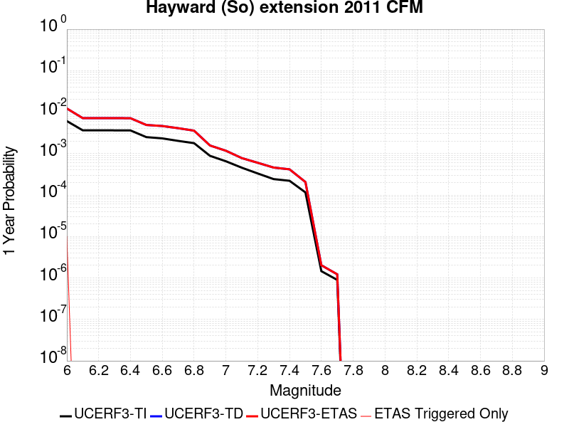 |  |

| Magnitude | 1 wk TI Prob | 1 wk TD Prob | 1 wk ETAS Prob | 1 wk ETAS/TD Gain | 1 wk ETAS Triggered Only | 1 mo TI Prob | 1 mo TD Prob | 1 mo ETAS Prob | 1 mo ETAS/TD Gain | 1 mo ETAS Triggered Only | 1 yr TI Prob | 1 yr TD Prob | 1 yr ETAS Prob | 1 yr ETAS/TD Gain | 1 yr ETAS Triggered Only | 10 yr TI Prob | 10 yr TD Prob | 10 yr ETAS Prob | 10 yr ETAS/TD Gain | 10 yr ETAS Triggered Only |
|-----|-----|-----|-----|-----|-----|-----|-----|-----|-----|-----|-----|-----|-----|-----|-----|-----|-----|-----|-----|-----|
| 6.0 | 1.1721256E-4 | 2.3668875E-4 | 2.3668875E-4 | 1.0 | 0.0 | 5.022428E-4 | 0.001013942 | 0.001013942 | 1.0 | 0.0 | 0.0060976758 | 0.012251345 | 0.012261222 | 1.0008062 | 1.0E-5 | 0.0593305 | 0.11285027 | 0.112859145 | 1.0000786 | 1.0E-5 |
| 6.1 | 6.99169E-5 | 1.3807592E-4 | 1.3807592E-4 | 1.0 | 0.0 | 2.9960944E-4 | 5.9160154E-4 | 5.9160154E-4 | 1.0 | 0.0 | 0.0036416445 | 0.0071729235 | 0.0071729235 | 1.0 | 0.0 | 0.035825435 | 0.06780929 | 0.06780929 | 1.0 | 0.0 |
| 6.2 | 6.99169E-5 | 1.3807592E-4 | 1.3807592E-4 | 1.0 | 0.0 | 2.9960944E-4 | 5.9160154E-4 | 5.9160154E-4 | 1.0 | 0.0 | 0.0036416445 | 0.0071729235 | 0.0071729235 | 1.0 | 0.0 | 0.035825435 | 0.06780929 | 0.06780929 | 1.0 | 0.0 |
| 6.3 | 6.970908E-5 | 1.3775735E-4 | 1.3775735E-4 | 1.0 | 0.0 | 2.9871898E-4 | 5.902371E-4 | 5.902371E-4 | 1.0 | 0.0 | 0.0036308395 | 0.0071564596 | 0.0071564596 | 1.0 | 0.0 | 0.035720866 | 0.067658246 | 0.067658246 | 1.0 | 0.0 |
| 6.4 | 6.9517155E-5 | 1.3742656E-4 | 1.3742656E-4 | 1.0 | 0.0 | 2.9789665E-4 | 5.8882026E-4 | 5.8882026E-4 | 1.0 | 0.0 | 0.0036208609 | 0.0071393726 | 0.0071393726 | 1.0 | 0.0 | 0.03562429 | 0.06750228 | 0.06750228 | 1.0 | 0.0 |
| 6.5 | 4.786248E-5 | 9.416201E-5 | 9.416201E-5 | 1.0 | 0.0 | 2.0510878E-4 | 4.034916E-4 | 4.034916E-4 | 1.0 | 0.0 | 0.0024943394 | 0.0049018837 | 0.0049018837 | 1.0 | 0.0 | 0.02466527 | 0.046905063 | 0.046905063 | 1.0 | 0.0 |
| 6.6 | 4.4662214E-5 | 8.88287E-5 | 8.88287E-5 | 1.0 | 0.0 | 1.9139545E-4 | 3.806415E-4 | 3.806415E-4 | 1.0 | 0.0 | 0.0023277493 | 0.0046249265 | 0.0046249265 | 1.0 | 0.0 | 0.02303517 | 0.04429662 | 0.04429662 | 1.0 | 0.0 |
| 6.7 | 3.884542E-5 | 7.865968E-5 | 7.865968E-5 | 1.0 | 0.0 | 1.6646975E-4 | 3.3707183E-4 | 3.3707183E-4 | 1.0 | 0.0 | 0.002024885 | 0.004096572 | 0.004096572 | 1.0 | 0.0 | 0.020065336 | 0.039336286 | 0.039336286 | 1.0 | 0.0 |
| 6.8 | 3.4221863E-5 | 6.856697E-5 | 6.856697E-5 | 1.0 | 0.0 | 1.4665688E-4 | 2.938277E-4 | 2.938277E-4 | 1.0 | 0.0 | 0.0017840851 | 0.0035719054 | 0.0035719054 | 1.0 | 0.0 | 0.017698295 | 0.03442411 | 0.03442411 | 1.0 | 0.0 |
| 6.9 | 1.6927712E-5 | 3.006747E-5 | 3.006747E-5 | 1.0 | 0.0 | 7.2545314E-5 | 1.2885455E-4 | 1.2885455E-4 | 1.0 | 0.0 | 8.828813E-4 | 0.0015677321 | 0.0015677321 | 1.0 | 0.0 | 0.008793819 | 0.01546639 | 0.01546639 | 1.0 | 0.0 |
| 7.0 | 1.2509653E-5 | 2.2467882E-5 | 2.2467882E-5 | 1.0 | 0.0 | 5.3611697E-5 | 9.6287615E-5 | 9.6287615E-5 | 1.0 | 0.0 | 6.525269E-4 | 0.0011717153 | 0.0011717153 | 1.0 | 0.0 | 0.0065061417 | 0.011585745 | 0.011585745 | 1.0 | 0.0 |
| 7.1 | 8.751583E-6 | 1.4929939E-5 | 1.4929939E-5 | 1.0 | 0.0 | 3.750624E-5 | 6.398392E-5 | 6.398392E-5 | 1.0 | 0.0 | 4.5654282E-4 | 7.787316E-4 | 7.787316E-4 | 1.0 | 0.0 | 0.0045560603 | 0.007766068 | 0.007766068 | 1.0 | 0.0 |
| 7.2 | 6.354379E-6 | 1.1502712E-5 | 1.1502712E-5 | 1.0 | 0.0 | 2.7232769E-5 | 4.9296432E-5 | 4.9296432E-5 | 1.0 | 0.0 | 3.3150852E-4 | 6.000236E-4 | 6.000236E-4 | 1.0 | 0.0 | 0.0033101442 | 0.00600267 | 0.00600267 | 1.0 | 0.0 |
| 7.3 | 4.645554E-6 | 8.821787E-6 | 8.821787E-6 | 1.0 | 0.0 | 1.9909365E-5 | 3.780713E-5 | 3.780713E-5 | 1.0 | 0.0 | 2.4236954E-4 | 4.6020854E-4 | 4.6020854E-4 | 1.0 | 0.0 | 0.0024210536 | 0.0046127294 | 0.0046127294 | 1.0 | 0.0 |
| 7.4 | 4.23437E-6 | 7.996007E-6 | 7.996007E-6 | 1.0 | 0.0 | 1.8147173E-5 | 3.4268174E-5 | 3.4268174E-5 | 1.0 | 0.0 | 2.2091944E-4 | 4.17139E-4 | 4.17139E-4 | 1.0 | 0.0 | 0.0022069993 | 0.004183855 | 0.004183855 | 1.0 | 0.0 |
| 7.5 | 2.2187417E-6 | 3.9529277E-6 | 3.9529277E-6 | 1.0 | 0.0 | 9.508858E-6 | 1.6941023E-5 | 1.6941023E-5 | 1.0 | 0.0 | 1.157642E-4 | 2.0624005E-4 | 2.0624005E-4 | 1.0 | 0.0 | 0.0011570391 | 0.0020735457 | 0.0020735457 | 1.0 | 0.0 |
| 7.6 | 2.7952495E-8 | 3.87977E-8 | 3.87977E-8 | 1.0 | 0.0 | 1.1979641E-7 | 1.6627585E-7 | 1.6627585E-7 | 1.0 | 0.0 | 1.4585203E-6 | 2.0244067E-6 | 2.0244067E-6 | 1.0 | 0.0 | 1.4585107E-5 | 2.0324771E-5 | 2.0324771E-5 | 1.0 | 0.0 |
| 7.7 | 1.7192724E-8 | 2.3447004E-8 | 2.3447004E-8 | 1.0 | 0.0 | 7.36831E-8 | 1.0048716E-7 | 1.0048716E-7 | 1.0 | 0.0 | 8.9709135E-7 | 1.2234306E-6 | 1.2234306E-6 | 1.0 | 0.0 | 8.970877E-6 | 1.2292382E-5 | 1.2292382E-5 | 1.0 | 0.0 |

## Casmalia 2011 CFM
*[(top)](#table-of-contents)*

| 1 Week | 1 Month | 1 Year | 10 Year |
|-----|-----|-----|-----|
|  |  |  |  |

| Magnitude | 1 wk TI Prob | 1 wk TD Prob | 1 wk ETAS Prob | 1 wk ETAS/TD Gain | 1 wk ETAS Triggered Only | 1 mo TI Prob | 1 mo TD Prob | 1 mo ETAS Prob | 1 mo ETAS/TD Gain | 1 mo ETAS Triggered Only | 1 yr TI Prob | 1 yr TD Prob | 1 yr ETAS Prob | 1 yr ETAS/TD Gain | 1 yr ETAS Triggered Only | 10 yr TI Prob | 10 yr TD Prob | 10 yr ETAS Prob | 10 yr ETAS/TD Gain | 10 yr ETAS Triggered Only |
|-----|-----|-----|-----|-----|-----|-----|-----|-----|-----|-----|-----|-----|-----|-----|-----|-----|-----|-----|-----|-----|
| 6.0 | 4.1704893E-6 | 4.262503E-6 | 4.262503E-6 | 1.0 | 0.0 | 1.7873403E-5 | 1.8267743E-5 | 1.8267743E-5 | 1.0 | 0.0 | 2.1758694E-4 | 2.2238727E-4 | 2.3238505E-4 | 1.0449566 | 1.0E-5 | 0.0021737402 | 0.0022216684 | 0.002231646 | 1.0044911 | 1.0E-5 |
| 6.1 | 4.1704893E-6 | 4.262503E-6 | 4.262503E-6 | 1.0 | 0.0 | 1.7873403E-5 | 1.8267743E-5 | 1.8267743E-5 | 1.0 | 0.0 | 2.1758694E-4 | 2.2238727E-4 | 2.3238505E-4 | 1.0449566 | 1.0E-5 | 0.0021737402 | 0.0022216684 | 0.002231646 | 1.0044911 | 1.0E-5 |
| 6.2 | 3.457312E-6 | 3.5370404E-6 | 3.5370404E-6 | 1.0 | 0.0 | 1.4816967E-5 | 1.5158656E-5 | 1.5158656E-5 | 1.0 | 0.0 | 1.8038164E-4 | 1.845411E-4 | 1.9453926E-4 | 1.0541785 | 1.0E-5 | 0.001802353 | 0.0018438881 | 0.0018538696 | 1.0054133 | 1.0E-5 |
| 6.3 | 3.457312E-6 | 3.5370404E-6 | 3.5370404E-6 | 1.0 | 0.0 | 1.4816967E-5 | 1.5158656E-5 | 1.5158656E-5 | 1.0 | 0.0 | 1.8038164E-4 | 1.845411E-4 | 1.9453926E-4 | 1.0541785 | 1.0E-5 | 0.001802353 | 0.0018438881 | 0.0018538696 | 1.0054133 | 1.0E-5 |
| 6.4 | 3.0957337E-6 | 3.1692434E-6 | 3.1692434E-6 | 1.0 | 0.0 | 1.3267363E-5 | 1.3582401E-5 | 1.3582401E-5 | 1.0 | 0.0 | 1.6151817E-4 | 1.6535325E-4 | 1.753516E-4 | 1.0604665 | 1.0E-5 | 0.0016140083 | 0.0016523083 | 0.0016622918 | 1.0060421 | 1.0E-5 |
| 6.5 | 3.0957337E-6 | 3.1692434E-6 | 3.1692434E-6 | 1.0 | 0.0 | 1.3267363E-5 | 1.3582401E-5 | 1.3582401E-5 | 1.0 | 0.0 | 1.6151817E-4 | 1.6535325E-4 | 1.753516E-4 | 1.0604665 | 1.0E-5 | 0.0016140083 | 0.0016523083 | 0.0016622918 | 1.0060421 | 1.0E-5 |
| 6.6 | 2.9459152E-6 | 3.0165925E-6 | 3.0165925E-6 | 1.0 | 0.0 | 1.262529E-5 | 1.292819E-5 | 1.292819E-5 | 1.0 | 0.0 | 1.5370206E-4 | 1.573894E-4 | 1.6738781E-4 | 1.0635266 | 1.0E-5 | 0.0015359579 | 0.0015727849 | 0.0015827691 | 1.0063481 | 1.0E-5 |
| 6.7 | 2.8634809E-6 | 2.9324897E-6 | 2.9324897E-6 | 1.0 | 0.0 | 1.2272003E-5 | 1.25677525E-5 | 1.25677525E-5 | 1.0 | 0.0 | 1.4940138E-4 | 1.5300169E-4 | 1.6300016E-4 | 1.0653487 | 1.0E-5 | 0.0014930099 | 0.001528969 | 0.0015389537 | 1.0065304 | 1.0E-5 |
| 6.8 | 2.7999822E-6 | 2.8676136E-6 | 2.8676136E-6 | 1.0 | 0.0 | 1.1999869E-5 | 1.22897145E-5 | 1.22897145E-5 | 1.0 | 0.0 | 1.460886E-4 | 1.4961706E-4 | 1.5961556E-4 | 1.0668273 | 1.0E-5 | 0.001459926 | 0.0014951685 | 0.0015051536 | 1.0066782 | 1.0E-5 |
| 6.9 | 2.551052E-6 | 2.6119808E-6 | 2.6119808E-6 | 1.0 | 0.0 | 1.0933034E-5 | 1.1194155E-5 | 1.1194155E-5 | 1.0 | 0.0 | 1.3310155E-4 | 1.3628036E-4 | 1.46279E-4 | 1.0733682 | 1.0E-5 | 0.0013302186 | 0.001361972 | 0.0013719583 | 1.0073323 | 1.0E-5 |
| 7.0 | 2.3081875E-6 | 2.3624239E-6 | 2.3624239E-6 | 1.0 | 0.0 | 9.892195E-6 | 1.0124635E-5 | 1.0124635E-5 | 1.0 | 0.0 | 1.20430814E-4 | 1.2326048E-4 | 1.3325925E-4 | 1.0811191 | 1.0E-5 | 0.0012036557 | 0.001231924 | 0.0012419117 | 1.0081074 | 1.0E-5 |
| 7.1 | 2.093245E-6 | 2.1417386E-6 | 2.1417386E-6 | 1.0 | 0.0 | 8.971019E-6 | 9.178848E-6 | 9.178848E-6 | 1.0 | 0.0 | 1.09216686E-4 | 1.11746755E-4 | 1.2174564E-4 | 1.089478 | 1.0E-5 | 0.0010916302 | 0.0011169077 | 0.0011268965 | 1.0089433 | 1.0E-5 |
| 7.2 | 1.9714576E-6 | 2.016523E-6 | 2.016523E-6 | 1.0 | 0.0 | 8.449076E-6 | 8.642212E-6 | 8.642212E-6 | 1.0 | 0.0 | 1.0286264E-4 | 1.05213876E-4 | 1.15212824E-4 | 1.0950345 | 1.0E-5 | 0.0010281504 | 0.0010516425 | 0.001061632 | 1.009499 | 1.0E-5 |
| 7.3 | 1.6689512E-6 | 1.7047256E-6 | 1.7047256E-6 | 1.0 | 0.0 | 7.1526288E-6 | 7.3059464E-6 | 7.3059464E-6 | 1.0 | 0.0 | 8.7079774E-5 | 8.8946275E-5 | 9.8945384E-5 | 1.1124175 | 1.0E-5 | 8.7045657E-4 | 8.891075E-4 | 8.9909864E-4 | 1.0112373 | 1.0E-5 |
| 7.4 | 1.4490954E-6 | 1.4779024E-6 | 1.4779024E-6 | 1.0 | 0.0 | 6.210394E-6 | 6.333852E-6 | 6.333852E-6 | 1.0 | 0.0 | 7.560892E-5 | 7.711192E-5 | 8.7111155E-5 | 1.1296716 | 1.0E-5 | 7.55832E-4 | 7.708523E-4 | 7.808446E-4 | 1.0129627 | 1.0E-5 |
| 7.5 | 1.226873E-6 | 1.2481808E-6 | 1.2481808E-6 | 1.0 | 0.0 | 5.2580162E-6 | 5.349335E-6 | 5.349335E-6 | 1.0 | 0.0 | 6.401447E-5 | 6.512621E-5 | 7.512556E-5 | 1.153538 | 1.0E-5 | 6.399603E-4 | 6.510718E-4 | 6.610653E-4 | 1.0153493 | 1.0E-5 |
| 7.6 | 9.2561345E-7 | 9.3620145E-7 | 9.3620145E-7 | 1.0 | 0.0 | 3.966909E-6 | 4.0122854E-6 | 4.0122854E-6 | 1.0 | 0.0 | 4.8296046E-5 | 4.8848487E-5 | 5.8848E-5 | 1.2047046 | 1.0E-5 | 4.828555E-4 | 4.883779E-4 | 4.98373E-4 | 1.020466 | 1.0E-5 |
| 7.7 | 5.4367933E-7 | 5.3929585E-7 | 5.3929585E-7 | 1.0 | 0.0 | 2.3300522E-6 | 2.311266E-6 | 2.311266E-6 | 1.0 | 0.0 | 2.8368017E-5 | 2.81393E-5 | 3.813902E-5 | 1.3553648 | 1.0E-5 | 2.8364395E-4 | 2.813575E-4 | 2.913547E-4 | 1.035532 | 1.0E-5 |
| 7.8 | 1.8825742E-7 | 1.7342788E-7 | 1.7342788E-7 | 1.0 | 0.0 | 8.068173E-7 | 7.4326215E-7 | 7.4326215E-7 | 1.0 | 0.0 | 9.822956E-6 | 9.049179E-6 | 9.049179E-6 | 1.0 | 0.0 | 9.822522E-5 | 9.048813E-5 | 9.048813E-5 | 1.0 | 0.0 |
| 7.9 | 6.342771E-8 | 4.6793062E-8 | 4.6793062E-8 | 1.0 | 0.0 | 2.7183304E-7 | 2.0054168E-7 | 2.0054168E-7 | 1.0 | 0.0 | 3.3095623E-6 | 2.4415922E-6 | 2.4415922E-6 | 1.0 | 0.0 | 3.309513E-5 | 2.4415658E-5 | 2.4415658E-5 | 1.0 | 0.0 |
| 8.0 | 1.2574819E-8 | 6.473506E-9 | 6.473506E-9 | 1.0 | 0.0 | 5.3892084E-8 | 2.7743598E-8 | 2.7743598E-8 | 1.0 | 0.0 | 6.561359E-7 | 3.3777826E-7 | 3.3777826E-7 | 1.0 | 0.0 | 6.56134E-6 | 3.3777776E-6 | 3.3777776E-6 | 1.0 | 0.0 |

## Los Osos 2011
*[(top)](#table-of-contents)*

| 1 Week | 1 Month | 1 Year | 10 Year |
|-----|-----|-----|-----|
|  | 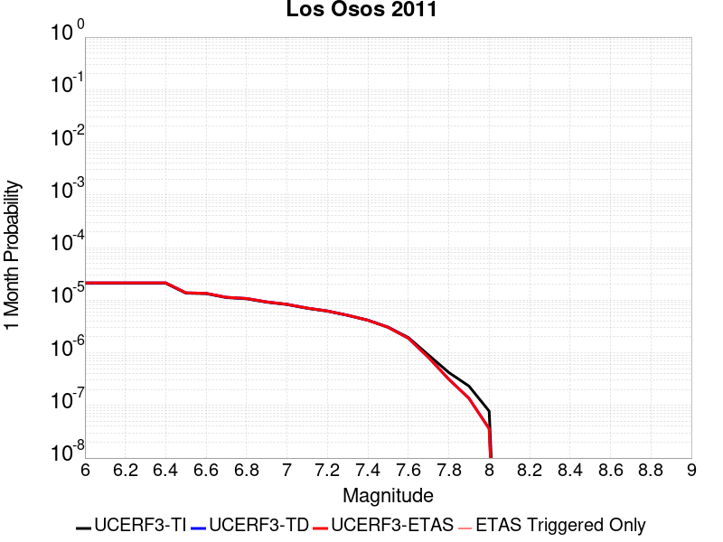 | 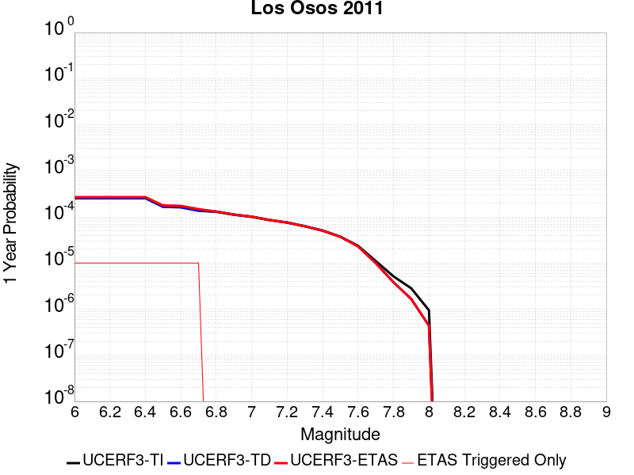 |  |

| Magnitude | 1 wk TI Prob | 1 wk TD Prob | 1 wk ETAS Prob | 1 wk ETAS/TD Gain | 1 wk ETAS Triggered Only | 1 mo TI Prob | 1 mo TD Prob | 1 mo ETAS Prob | 1 mo ETAS/TD Gain | 1 mo ETAS Triggered Only | 1 yr TI Prob | 1 yr TD Prob | 1 yr ETAS Prob | 1 yr ETAS/TD Gain | 1 yr ETAS Triggered Only | 10 yr TI Prob | 10 yr TD Prob | 10 yr ETAS Prob | 10 yr ETAS/TD Gain | 10 yr ETAS Triggered Only |
|-----|-----|-----|-----|-----|-----|-----|-----|-----|-----|-----|-----|-----|-----|-----|-----|-----|-----|-----|-----|-----|
| 6.0 | 4.8871775E-6 | 4.9815035E-6 | 4.9815035E-6 | 1.0 | 0.0 | 2.0944879E-5 | 2.134914E-5 | 2.134914E-5 | 1.0 | 0.0 | 2.5497406E-4 | 2.5989758E-4 | 2.6989498E-4 | 1.0384667 | 1.0E-5 | 0.002546817 | 0.0025962107 | 0.0026061847 | 1.0038418 | 1.0E-5 |
| 6.1 | 4.8871775E-6 | 4.9815035E-6 | 4.9815035E-6 | 1.0 | 0.0 | 2.0944879E-5 | 2.134914E-5 | 2.134914E-5 | 1.0 | 0.0 | 2.5497406E-4 | 2.5989758E-4 | 2.6989498E-4 | 1.0384667 | 1.0E-5 | 0.002546817 | 0.0025962107 | 0.0026061847 | 1.0038418 | 1.0E-5 |
| 6.2 | 4.8871775E-6 | 4.9815035E-6 | 4.9815035E-6 | 1.0 | 0.0 | 2.0944879E-5 | 2.134914E-5 | 2.134914E-5 | 1.0 | 0.0 | 2.5497406E-4 | 2.5989758E-4 | 2.6989498E-4 | 1.0384667 | 1.0E-5 | 0.002546817 | 0.0025962107 | 0.0026061847 | 1.0038418 | 1.0E-5 |
| 6.3 | 4.8871775E-6 | 4.9815035E-6 | 4.9815035E-6 | 1.0 | 0.0 | 2.0944879E-5 | 2.134914E-5 | 2.134914E-5 | 1.0 | 0.0 | 2.5497406E-4 | 2.5989758E-4 | 2.6989498E-4 | 1.0384667 | 1.0E-5 | 0.002546817 | 0.0025962107 | 0.0026061847 | 1.0038418 | 1.0E-5 |
| 6.4 | 4.8871775E-6 | 4.9815035E-6 | 4.9815035E-6 | 1.0 | 0.0 | 2.0944879E-5 | 2.134914E-5 | 2.134914E-5 | 1.0 | 0.0 | 2.5497406E-4 | 2.5989758E-4 | 2.6989498E-4 | 1.0384667 | 1.0E-5 | 0.002546817 | 0.0025962107 | 0.0026061847 | 1.0038418 | 1.0E-5 |
| 6.5 | 3.1724062E-6 | 3.223409E-6 | 3.223409E-6 | 1.0 | 0.0 | 1.3595956E-5 | 1.3814538E-5 | 1.3814538E-5 | 1.0 | 0.0 | 1.6551818E-4 | 1.6817915E-4 | 1.7817746E-4 | 1.0594504 | 1.0E-5 | 0.0016539496 | 0.0016805322 | 0.0016905154 | 1.0059404 | 1.0E-5 |
| 6.6 | 3.1022591E-6 | 3.151118E-6 | 3.151118E-6 | 1.0 | 0.0 | 1.3295328E-5 | 1.3504723E-5 | 1.3504723E-5 | 1.0 | 0.0 | 1.618586E-4 | 1.6440773E-4 | 1.7440609E-4 | 1.0608144 | 1.0E-5 | 0.0016174077 | 0.0016428737 | 0.0016528573 | 1.0060769 | 1.0E-5 |
| 6.7 | 2.611518E-6 | 2.6491955E-6 | 2.6491955E-6 | 1.0 | 0.0 | 1.1192172E-5 | 1.1353646E-5 | 1.1353646E-5 | 1.0 | 0.0 | 1.3625617E-4 | 1.382219E-4 | 1.4822053E-4 | 1.0723374 | 1.0E-5 | 0.0013617266 | 0.001381364 | 0.0013913501 | 1.0072292 | 1.0E-5 |
| 6.8 | 2.4780884E-6 | 2.512171E-6 | 2.512171E-6 | 1.0 | 0.0 | 1.0620336E-5 | 1.0766403E-5 | 1.0766403E-5 | 1.0 | 0.0 | 1.2929492E-4 | 1.3107312E-4 | 1.3107312E-4 | 1.0 | 0.0 | 0.0012921972 | 0.0013099621 | 0.0013099621 | 1.0 | 0.0 |
| 6.9 | 2.1376322E-6 | 2.1635162E-6 | 2.1635162E-6 | 1.0 | 0.0 | 9.161248E-6 | 9.272179E-6 | 9.272179E-6 | 1.0 | 0.0 | 1.1153249E-4 | 1.1288296E-4 | 1.1288296E-4 | 1.0 | 0.0 | 0.0011147653 | 0.0011282581 | 0.0011282581 | 1.0 | 0.0 |
| 7.0 | 1.9282882E-6 | 1.9494685E-6 | 1.9494685E-6 | 1.0 | 0.0 | 8.264066E-6 | 8.354838E-6 | 8.354838E-6 | 1.0 | 0.0 | 1.0061036E-4 | 1.0171542E-4 | 1.0171542E-4 | 1.0 | 0.0 | 0.0010056482 | 0.00101669 | 0.00101669 | 1.0 | 0.0 |
| 7.1 | 1.6353226E-6 | 1.6501209E-6 | 1.6501209E-6 | 1.0 | 0.0 | 7.0085066E-6 | 7.071928E-6 | 7.071928E-6 | 1.0 | 0.0 | 8.532523E-5 | 8.609732E-5 | 8.609732E-5 | 1.0 | 0.0 | 8.529247E-4 | 8.606405E-4 | 8.606405E-4 | 1.0 | 0.0 |
| 7.2 | 1.4446276E-6 | 1.4553427E-6 | 1.4553427E-6 | 1.0 | 0.0 | 6.191247E-6 | 6.2371682E-6 | 6.2371682E-6 | 1.0 | 0.0 | 7.537582E-5 | 7.5934884E-5 | 7.5934884E-5 | 1.0 | 0.0 | 7.535026E-4 | 7.5908995E-4 | 7.5908995E-4 | 1.0 | 0.0 |
| 7.3 | 1.2014582E-6 | 1.2069152E-6 | 1.2069152E-6 | 1.0 | 0.0 | 5.149096E-6 | 5.1724833E-6 | 5.1724833E-6 | 1.0 | 0.0 | 6.268844E-5 | 6.2973166E-5 | 6.2973166E-5 | 1.0 | 0.0 | 6.267076E-4 | 6.2955363E-4 | 6.2955363E-4 | 1.0 | 0.0 |
| 7.4 | 9.707733E-7 | 9.709845E-7 | 9.709845E-7 | 1.0 | 0.0 | 4.16045E-6 | 4.1613553E-6 | 4.1613553E-6 | 1.0 | 0.0 | 5.0652303E-5 | 5.0663326E-5 | 5.0663326E-5 | 1.0 | 0.0 | 5.064076E-4 | 5.0651806E-4 | 5.0651806E-4 | 1.0 | 0.0 |
| 7.5 | 7.174908E-7 | 7.114977E-7 | 7.114977E-7 | 1.0 | 0.0 | 3.074957E-6 | 3.0492722E-6 | 3.0492722E-6 | 1.0 | 0.0 | 3.743696E-5 | 3.712426E-5 | 3.712426E-5 | 1.0 | 0.0 | 3.7430652E-4 | 3.7118077E-4 | 3.7118077E-4 | 1.0 | 0.0 |
| 7.6 | 4.5535776E-7 | 4.4208457E-7 | 4.4208457E-7 | 1.0 | 0.0 | 1.9515319E-6 | 1.8946467E-6 | 1.8946467E-6 | 1.0 | 0.0 | 2.3759641E-5 | 2.3067081E-5 | 2.3067081E-5 | 1.0 | 0.0 | 2.37571E-4 | 2.3064695E-4 | 2.3064695E-4 | 1.0 | 0.0 |
| 7.7 | 2.1173553E-7 | 1.9061224E-7 | 1.9061224E-7 | 1.0 | 0.0 | 9.0743765E-7 | 8.1690933E-7 | 8.1690933E-7 | 1.0 | 0.0 | 1.1047998E-5 | 9.945827E-6 | 9.945827E-6 | 1.0 | 0.0 | 1.1047449E-4 | 9.945384E-5 | 9.945384E-5 | 1.0 | 0.0 |
| 7.8 | 9.873608E-8 | 7.3678876E-8 | 7.3678876E-8 | 1.0 | 0.0 | 4.2315455E-7 | 3.1576658E-7 | 3.1576658E-7 | 1.0 | 0.0 | 5.1518946E-6 | 3.8444514E-6 | 3.8444514E-6 | 1.0 | 0.0 | 5.1517753E-5 | 3.8443854E-5 | 3.8443854E-5 | 1.0 | 0.0 |
| 7.9 | 5.4399106E-8 | 3.1883175E-8 | 3.1883175E-8 | 1.0 | 0.0 | 2.33139E-7 | 1.3664217E-7 | 1.3664217E-7 | 1.0 | 0.0 | 2.8384638E-6 | 1.6636172E-6 | 1.6636172E-6 | 1.0 | 0.0 | 2.8384275E-5 | 1.663605E-5 | 1.663605E-5 | 1.0 | 0.0 |
| 8.0 | 1.817203E-8 | 8.421595E-9 | 8.421595E-9 | 1.0 | 0.0 | 7.7880124E-8 | 3.6092548E-8 | 3.6092548E-8 | 1.0 | 0.0 | 9.481901E-7 | 4.3942669E-7 | 4.3942669E-7 | 1.0 | 0.0 | 9.481861E-6 | 4.3942587E-6 | 4.3942587E-6 | 1.0 | 0.0 |

## Pitas Point (Lower West)
*[(top)](#table-of-contents)*

| 1 Week | 1 Month | 1 Year | 10 Year |
|-----|-----|-----|-----|
|  |  | 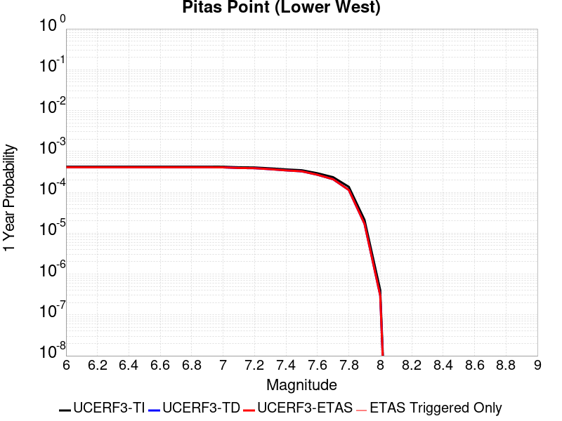 |  |

| Magnitude | 1 wk TI Prob | 1 wk TD Prob | 1 wk ETAS Prob | 1 wk ETAS/TD Gain | 1 wk ETAS Triggered Only | 1 mo TI Prob | 1 mo TD Prob | 1 mo ETAS Prob | 1 mo ETAS/TD Gain | 1 mo ETAS Triggered Only | 1 yr TI Prob | 1 yr TD Prob | 1 yr ETAS Prob | 1 yr ETAS/TD Gain | 1 yr ETAS Triggered Only | 10 yr TI Prob | 10 yr TD Prob | 10 yr ETAS Prob | 10 yr ETAS/TD Gain | 10 yr ETAS Triggered Only |
|-----|-----|-----|-----|-----|-----|-----|-----|-----|-----|-----|-----|-----|-----|-----|-----|-----|-----|-----|-----|-----|
| 6.0 | 8.151497E-6 | 7.855864E-6 | 7.855864E-6 | 1.0 | 0.0 | 3.493452E-5 | 3.366756E-5 | 3.366756E-5 | 1.0 | 0.0 | 4.252448E-4 | 4.0982617E-4 | 4.0982617E-4 | 1.0 | 0.0 | 0.0042443196 | 0.0040907846 | 0.0041007437 | 1.0024345 | 1.0E-5 |
| 6.1 | 8.151497E-6 | 7.855864E-6 | 7.855864E-6 | 1.0 | 0.0 | 3.493452E-5 | 3.366756E-5 | 3.366756E-5 | 1.0 | 0.0 | 4.252448E-4 | 4.0982617E-4 | 4.0982617E-4 | 1.0 | 0.0 | 0.0042443196 | 0.0040907846 | 0.0041007437 | 1.0024345 | 1.0E-5 |
| 6.2 | 8.151497E-6 | 7.855864E-6 | 7.855864E-6 | 1.0 | 0.0 | 3.493452E-5 | 3.366756E-5 | 3.366756E-5 | 1.0 | 0.0 | 4.252448E-4 | 4.0982617E-4 | 4.0982617E-4 | 1.0 | 0.0 | 0.0042443196 | 0.0040907846 | 0.0041007437 | 1.0024345 | 1.0E-5 |
| 6.3 | 8.151497E-6 | 7.855864E-6 | 7.855864E-6 | 1.0 | 0.0 | 3.493452E-5 | 3.366756E-5 | 3.366756E-5 | 1.0 | 0.0 | 4.252448E-4 | 4.0982617E-4 | 4.0982617E-4 | 1.0 | 0.0 | 0.0042443196 | 0.0040907846 | 0.0041007437 | 1.0024345 | 1.0E-5 |
| 6.4 | 8.151497E-6 | 7.855864E-6 | 7.855864E-6 | 1.0 | 0.0 | 3.493452E-5 | 3.366756E-5 | 3.366756E-5 | 1.0 | 0.0 | 4.252448E-4 | 4.0982617E-4 | 4.0982617E-4 | 1.0 | 0.0 | 0.0042443196 | 0.0040907846 | 0.0041007437 | 1.0024345 | 1.0E-5 |
| 6.5 | 8.151497E-6 | 7.855864E-6 | 7.855864E-6 | 1.0 | 0.0 | 3.493452E-5 | 3.366756E-5 | 3.366756E-5 | 1.0 | 0.0 | 4.252448E-4 | 4.0982617E-4 | 4.0982617E-4 | 1.0 | 0.0 | 0.0042443196 | 0.0040907846 | 0.0041007437 | 1.0024345 | 1.0E-5 |
| 6.6 | 8.151497E-6 | 7.855864E-6 | 7.855864E-6 | 1.0 | 0.0 | 3.493452E-5 | 3.366756E-5 | 3.366756E-5 | 1.0 | 0.0 | 4.252448E-4 | 4.0982617E-4 | 4.0982617E-4 | 1.0 | 0.0 | 0.0042443196 | 0.0040907846 | 0.0041007437 | 1.0024345 | 1.0E-5 |
| 6.7 | 8.151497E-6 | 7.855864E-6 | 7.855864E-6 | 1.0 | 0.0 | 3.493452E-5 | 3.366756E-5 | 3.366756E-5 | 1.0 | 0.0 | 4.252448E-4 | 4.0982617E-4 | 4.0982617E-4 | 1.0 | 0.0 | 0.0042443196 | 0.0040907846 | 0.0041007437 | 1.0024345 | 1.0E-5 |
| 6.8 | 8.151497E-6 | 7.855864E-6 | 7.855864E-6 | 1.0 | 0.0 | 3.493452E-5 | 3.366756E-5 | 3.366756E-5 | 1.0 | 0.0 | 4.252448E-4 | 4.0982617E-4 | 4.0982617E-4 | 1.0 | 0.0 | 0.0042443196 | 0.0040907846 | 0.0041007437 | 1.0024345 | 1.0E-5 |
| 6.9 | 8.151497E-6 | 7.855864E-6 | 7.855864E-6 | 1.0 | 0.0 | 3.493452E-5 | 3.366756E-5 | 3.366756E-5 | 1.0 | 0.0 | 4.252448E-4 | 4.0982617E-4 | 4.0982617E-4 | 1.0 | 0.0 | 0.0042443196 | 0.0040907846 | 0.0041007437 | 1.0024345 | 1.0E-5 |
| 7.0 | 8.103535E-6 | 7.8052935E-6 | 7.8052935E-6 | 1.0 | 0.0 | 3.4728975E-5 | 3.3450833E-5 | 3.3450833E-5 | 1.0 | 0.0 | 4.2274324E-4 | 4.0718852E-4 | 4.0718852E-4 | 1.0 | 0.0 | 0.0042193993 | 0.0040645045 | 0.004074464 | 1.0024503 | 1.0E-5 |
| 7.1 | 7.853298E-6 | 7.5409826E-6 | 7.5409826E-6 | 1.0 | 0.0 | 3.3656554E-5 | 3.23181E-5 | 3.23181E-5 | 1.0 | 0.0 | 4.096915E-4 | 3.9340253E-4 | 3.9340253E-4 | 1.0 | 0.0 | 0.00408937 | 0.0039271372 | 0.003937098 | 1.0025364 | 1.0E-5 |
| 7.2 | 7.771102E-6 | 7.4532636E-6 | 7.4532636E-6 | 1.0 | 0.0 | 3.33043E-5 | 3.194217E-5 | 3.194217E-5 | 1.0 | 0.0 | 4.0540437E-4 | 3.8882723E-4 | 3.8882723E-4 | 1.0 | 0.0 | 0.0040466557 | 0.0038815448 | 0.003891506 | 1.0025663 | 1.0E-5 |
| 7.3 | 7.3945344E-6 | 7.0493643E-6 | 7.0493643E-6 | 1.0 | 0.0 | 3.1690477E-5 | 3.0211215E-5 | 3.0211215E-5 | 1.0 | 0.0 | 3.8576324E-4 | 3.677601E-4 | 3.677601E-4 | 1.0 | 0.0 | 0.0038509427 | 0.0036715828 | 0.0036815458 | 1.0027137 | 1.0E-5 |
| 7.4 | 6.964645E-6 | 6.5902095E-6 | 6.5902095E-6 | 1.0 | 0.0 | 2.9848137E-5 | 2.8243452E-5 | 2.8243452E-5 | 1.0 | 0.0 | 3.6334046E-4 | 3.4381024E-4 | 3.4381024E-4 | 1.0 | 0.0 | 0.0036274698 | 0.0034328368 | 0.0034428025 | 1.002903 | 1.0E-5 |
| 7.5 | 6.6525035E-6 | 6.2592453E-6 | 6.2592453E-6 | 1.0 | 0.0 | 2.851042E-5 | 2.6825064E-5 | 2.6825064E-5 | 1.0 | 0.0 | 3.4705905E-4 | 3.265467E-4 | 3.265467E-4 | 1.0 | 0.0 | 0.0034651754 | 0.00326072 | 0.0032706875 | 1.0030568 | 1.0E-5 |
| 7.6 | 5.613338E-6 | 5.1514635E-6 | 5.1514635E-6 | 1.0 | 0.0 | 2.405694E-5 | 2.2077516E-5 | 2.2077516E-5 | 1.0 | 0.0 | 2.928539E-4 | 2.687609E-4 | 2.687609E-4 | 1.0 | 0.0 | 0.0029246826 | 0.0026843904 | 0.0026943635 | 1.0037153 | 1.0E-5 |
| 7.7 | 4.494704E-6 | 3.99698E-6 | 3.99698E-6 | 1.0 | 0.0 | 1.9262876E-5 | 1.7129803E-5 | 1.7129803E-5 | 1.0 | 0.0 | 2.3450027E-4 | 2.0853562E-4 | 2.0853562E-4 | 1.0 | 0.0 | 0.0023425296 | 0.0020834235 | 0.0020834235 | 1.0 | 0.0 |
| 7.8 | 2.6075882E-6 | 2.1836859E-6 | 2.1836859E-6 | 1.0 | 0.0 | 1.117533E-5 | 9.35862E-6 | 9.35862E-6 | 1.0 | 0.0 | 1.3605114E-4 | 1.1393529E-4 | 1.1393529E-4 | 1.0 | 0.0 | 0.0013596788 | 0.0011387735 | 0.0011387735 | 1.0 | 0.0 |
| 7.9 | 4.045984E-7 | 3.2424379E-7 | 3.2424379E-7 | 1.0 | 0.0 | 1.733992E-6 | 1.3896155E-6 | 1.3896155E-6 | 1.0 | 0.0 | 2.1111147E-5 | 1.691844E-5 | 1.691844E-5 | 1.0 | 0.0 | 2.1109142E-4 | 1.6917182E-4 | 1.6917182E-4 | 1.0 | 0.0 |
| 8.0 | 7.791402E-9 | 5.6836416E-9 | 5.6836416E-9 | 1.0 | 0.0 | 3.3391725E-8 | 2.4358464E-8 | 2.4358464E-8 | 1.0 | 0.0 | 4.0654416E-7 | 2.9656428E-7 | 2.9656428E-7 | 1.0 | 0.0 | 4.065434E-6 | 2.9656408E-6 | 2.9656408E-6 | 1.0 | 0.0 |

## Cerro Prieto
*[(top)](#table-of-contents)*

| 1 Week | 1 Month | 1 Year | 10 Year |
|-----|-----|-----|-----|
|  |  |  |  |

| Magnitude | 1 wk TI Prob | 1 wk TD Prob | 1 wk ETAS Prob | 1 wk ETAS/TD Gain | 1 wk ETAS Triggered Only | 1 mo TI Prob | 1 mo TD Prob | 1 mo ETAS Prob | 1 mo ETAS/TD Gain | 1 mo ETAS Triggered Only | 1 yr TI Prob | 1 yr TD Prob | 1 yr ETAS Prob | 1 yr ETAS/TD Gain | 1 yr ETAS Triggered Only | 10 yr TI Prob | 10 yr TD Prob | 10 yr ETAS Prob | 10 yr ETAS/TD Gain | 10 yr ETAS Triggered Only |
|-----|-----|-----|-----|-----|-----|-----|-----|-----|-----|-----|-----|-----|-----|-----|-----|-----|-----|-----|-----|-----|
| 6.0 | 2.9101528E-4 | 5.966029E-4 | 5.966029E-4 | 1.0 | 0.0 | 0.0012466122 | 0.0025546064 | 0.0025546064 | 1.0 | 0.0 | 0.015072231 | 0.03062004 | 0.03062004 | 1.0 | 0.0 | 0.14089979 | 0.25390467 | 0.25391212 | 1.0000293 | 1.0E-5 |
| 6.1 | 2.9101528E-4 | 5.966029E-4 | 5.966029E-4 | 1.0 | 0.0 | 0.0012466122 | 0.0025546064 | 0.0025546064 | 1.0 | 0.0 | 0.015072231 | 0.03062004 | 0.03062004 | 1.0 | 0.0 | 0.14089979 | 0.25390467 | 0.25391212 | 1.0000293 | 1.0E-5 |
| 6.2 | 2.9101528E-4 | 5.966029E-4 | 5.966029E-4 | 1.0 | 0.0 | 0.0012466122 | 0.0025546064 | 0.0025546064 | 1.0 | 0.0 | 0.015072231 | 0.03062004 | 0.03062004 | 1.0 | 0.0 | 0.14089979 | 0.25390467 | 0.25391212 | 1.0000293 | 1.0E-5 |
| 6.3 | 2.9101528E-4 | 5.966029E-4 | 5.966029E-4 | 1.0 | 0.0 | 0.0012466122 | 0.0025546064 | 0.0025546064 | 1.0 | 0.0 | 0.015072231 | 0.03062004 | 0.03062004 | 1.0 | 0.0 | 0.14089979 | 0.25390467 | 0.25391212 | 1.0000293 | 1.0E-5 |
| 6.4 | 2.508648E-4 | 5.140895E-4 | 5.140895E-4 | 1.0 | 0.0 | 0.0010746918 | 0.002201579 | 0.002201579 | 1.0 | 0.0 | 0.013006088 | 0.026445232 | 0.026445232 | 1.0 | 0.0 | 0.12270685 | 0.2243541 | 0.22436185 | 1.0000346 | 1.0E-5 |
| 6.5 | 2.508648E-4 | 5.140895E-4 | 5.140895E-4 | 1.0 | 0.0 | 0.0010746918 | 0.002201579 | 0.002201579 | 1.0 | 0.0 | 0.013006088 | 0.026445232 | 0.026445232 | 1.0 | 0.0 | 0.12270685 | 0.2243541 | 0.22436185 | 1.0000346 | 1.0E-5 |
| 6.6 | 2.294914E-4 | 4.7127923E-4 | 4.7127923E-4 | 1.0 | 0.0 | 9.831638E-4 | 0.0020183923 | 0.0020183923 | 1.0 | 0.0 | 0.011904482 | 0.024282733 | 0.024282733 | 1.0 | 0.0 | 0.11286586 | 0.20855607 | 0.208564 | 1.0000379 | 1.0E-5 |
| 6.7 | 1.9621674E-4 | 4.0429502E-4 | 4.0429502E-4 | 1.0 | 0.0 | 8.4065786E-4 | 0.0017317008 | 0.0017317008 | 1.0 | 0.0 | 0.010187071 | 0.020900695 | 0.020900695 | 1.0 | 0.0 | 0.09732539 | 0.18291695 | 0.18292512 | 1.0000447 | 1.0E-5 |
| 6.8 | 1.5476145E-4 | 3.0572733E-4 | 3.0572733E-4 | 1.0 | 0.0 | 6.6309475E-4 | 0.0013097044 | 0.0013097044 | 1.0 | 0.0 | 0.008043335 | 0.015837038 | 0.015837038 | 1.0 | 0.0 | 0.07758363 | 0.1433783 | 0.14338687 | 1.0000597 | 1.0E-5 |
| 6.9 | 1.20509176E-4 | 2.2588576E-4 | 2.2588576E-4 | 1.0 | 0.0 | 5.1636563E-4 | 9.6778595E-4 | 9.6778595E-4 | 1.0 | 0.0 | 0.006268645 | 0.011734081 | 0.011734081 | 1.0 | 0.0 | 0.060947374 | 0.1094662 | 0.1094662 | 1.0 | 0.0 |
| 7.0 | 9.3269155E-5 | 1.6721571E-4 | 1.6721571E-4 | 1.0 | 0.0 | 3.9966372E-4 | 7.16485E-4 | 7.16485E-4 | 1.0 | 0.0 | 0.0048550544 | 0.008695972 | 0.008695972 | 1.0 | 0.0 | 0.04750344 | 0.083130896 | 0.083130896 | 1.0 | 0.0 |
| 7.1 | 5.029709E-5 | 8.174014E-5 | 8.174014E-5 | 1.0 | 0.0 | 2.1554115E-4 | 3.5028713E-4 | 3.5028713E-4 | 1.0 | 0.0 | 0.0026210553 | 0.004259823 | 0.004259823 | 1.0 | 0.0 | 0.025903556 | 0.042324014 | 0.042324014 | 1.0 | 0.0 |
| 7.2 | 6.5445185E-8 | 6.824737E-8 | 6.824737E-8 | 1.0 | 0.0 | 2.8047933E-7 | 2.9248872E-7 | 2.9248872E-7 | 1.0 | 0.0 | 3.4148304E-6 | 3.56105E-6 | 3.56105E-6 | 1.0 | 0.0 | 3.414778E-5 | 3.56105E-5 | 3.56105E-5 | 1.0 | 0.0 |

## Elsinore (Stepovers Combined)
*[(top)](#table-of-contents)*

| 1 Week | 1 Month | 1 Year | 10 Year |
|-----|-----|-----|-----|
|  |  |  |  |

| Magnitude | 1 wk TI Prob | 1 wk TD Prob | 1 wk ETAS Prob | 1 wk ETAS/TD Gain | 1 wk ETAS Triggered Only | 1 mo TI Prob | 1 mo TD Prob | 1 mo ETAS Prob | 1 mo ETAS/TD Gain | 1 mo ETAS Triggered Only | 1 yr TI Prob | 1 yr TD Prob | 1 yr ETAS Prob | 1 yr ETAS/TD Gain | 1 yr ETAS Triggered Only | 10 yr TI Prob | 10 yr TD Prob | 10 yr ETAS Prob | 10 yr ETAS/TD Gain | 10 yr ETAS Triggered Only |
|-----|-----|-----|-----|-----|-----|-----|-----|-----|-----|-----|-----|-----|-----|-----|-----|-----|-----|-----|-----|-----|
| 6.0 | 2.144392E-5 | 1.9761088E-5 | 1.9761088E-5 | 1.0 | 0.0 | 9.189928E-5 | 8.4687716E-5 | 8.4687716E-5 | 1.0 | 0.0 | 0.0011182994 | 0.0010306045 | 0.0010405942 | 1.009693 | 1.0E-5 | 0.011126885 | 0.010265615 | 0.010275513 | 1.0009642 | 1.0E-5 |
| 6.1 | 2.144392E-5 | 1.9761088E-5 | 1.9761088E-5 | 1.0 | 0.0 | 9.189928E-5 | 8.4687716E-5 | 8.4687716E-5 | 1.0 | 0.0 | 0.0011182994 | 0.0010306045 | 0.0010405942 | 1.009693 | 1.0E-5 | 0.011126885 | 0.010265615 | 0.010275513 | 1.0009642 | 1.0E-5 |
| 6.2 | 2.144392E-5 | 1.9761088E-5 | 1.9761088E-5 | 1.0 | 0.0 | 9.189928E-5 | 8.4687716E-5 | 8.4687716E-5 | 1.0 | 0.0 | 0.0011182994 | 0.0010306045 | 0.0010405942 | 1.009693 | 1.0E-5 | 0.011126885 | 0.010265615 | 0.010275513 | 1.0009642 | 1.0E-5 |
| 6.3 | 1.9751555E-5 | 1.7742292E-5 | 1.7742292E-5 | 1.0 | 0.0 | 8.4646774E-5 | 7.603623E-5 | 7.603623E-5 | 1.0 | 0.0 | 0.0010300872 | 9.253622E-4 | 9.35353E-4 | 1.0107965 | 1.0E-5 | 0.010253254 | 0.009221947 | 0.009231855 | 1.0010743 | 1.0E-5 |
| 6.4 | 1.9751555E-5 | 1.7742292E-5 | 1.7742292E-5 | 1.0 | 0.0 | 8.4646774E-5 | 7.603623E-5 | 7.603623E-5 | 1.0 | 0.0 | 0.0010300872 | 9.253622E-4 | 9.35353E-4 | 1.0107965 | 1.0E-5 | 0.010253254 | 0.009221947 | 0.009231855 | 1.0010743 | 1.0E-5 |
| 6.5 | 1.9751555E-5 | 1.7742292E-5 | 1.7742292E-5 | 1.0 | 0.0 | 8.4646774E-5 | 7.603623E-5 | 7.603623E-5 | 1.0 | 0.0 | 0.0010300872 | 9.253622E-4 | 9.35353E-4 | 1.0107965 | 1.0E-5 | 0.010253254 | 0.009221947 | 0.009231855 | 1.0010743 | 1.0E-5 |
| 6.6 | 1.9188685E-5 | 1.7004182E-5 | 1.7004182E-5 | 1.0 | 0.0 | 8.2234634E-5 | 7.2873125E-5 | 7.2873125E-5 | 1.0 | 0.0 | 0.0010007467 | 8.868853E-4 | 8.9687645E-4 | 1.0112654 | 1.0E-5 | 0.00996252 | 0.008840504 | 0.008850415 | 1.0011212 | 1.0E-5 |
| 6.7 | 1.7608272E-5 | 1.4733256E-5 | 1.4733256E-5 | 1.0 | 0.0 | 7.546184E-5 | 6.314105E-5 | 6.314105E-5 | 1.0 | 0.0 | 9.183606E-4 | 7.6848094E-4 | 7.784732E-4 | 1.0130026 | 1.0E-5 | 0.009145746 | 0.00766544 | 0.007675363 | 1.0012946 | 1.0E-5 |
| 6.8 | 1.697165E-5 | 1.3783935E-5 | 1.3783935E-5 | 1.0 | 0.0 | 7.273361E-5 | 5.9072718E-5 | 5.9072718E-5 | 1.0 | 0.0 | 8.8517193E-4 | 7.189817E-4 | 7.189817E-4 | 1.0 | 0.0 | 0.008816543 | 0.007173273 | 0.007173273 | 1.0 | 0.0 |
| 6.9 | 1.600365E-5 | 1.2847236E-5 | 1.2847236E-5 | 1.0 | 0.0 | 6.858527E-5 | 5.5058463E-5 | 5.5058463E-5 | 1.0 | 0.0 | 8.347058E-4 | 6.701384E-4 | 6.701384E-4 | 1.0 | 0.0 | 0.008315775 | 0.0066868146 | 0.0066868146 | 1.0 | 0.0 |
| 7.0 | 1.3314581E-5 | 1.0447994E-5 | 1.0447994E-5 | 1.0 | 0.0 | 5.7061243E-5 | 4.4776363E-5 | 4.4776363E-5 | 1.0 | 0.0 | 6.944992E-4 | 5.450186E-4 | 5.450186E-4 | 1.0 | 0.0 | 0.006923327 | 0.0054402184 | 0.0054402184 | 1.0 | 0.0 |
| 7.1 | 1.2865345E-5 | 9.937844E-6 | 9.937844E-6 | 1.0 | 0.0 | 5.5136024E-5 | 4.259008E-5 | 4.259008E-5 | 1.0 | 0.0 | 6.710743E-4 | 5.1841344E-4 | 5.1841344E-4 | 1.0 | 0.0 | 0.0066905143 | 0.0051750923 | 0.0051750923 | 1.0 | 0.0 |
| 7.2 | 1.1650051E-5 | 8.634011E-6 | 8.634011E-6 | 1.0 | 0.0 | 4.9927836E-5 | 3.7002388E-5 | 3.7002388E-5 | 1.0 | 0.0 | 6.0770183E-4 | 4.504127E-4 | 4.504127E-4 | 1.0 | 0.0 | 0.0060604266 | 0.0044963313 | 0.0044963313 | 1.0 | 0.0 |
| 7.3 | 1.0008533E-5 | 7.201187E-6 | 7.201187E-6 | 1.0 | 0.0 | 4.2893007E-5 | 3.0861873E-5 | 3.0861873E-5 | 1.0 | 0.0 | 5.220972E-4 | 3.7567996E-4 | 3.7567996E-4 | 1.0 | 0.0 | 0.005208723 | 0.0037508437 | 0.0037508437 | 1.0 | 0.0 |
| 7.4 | 9.116759E-6 | 6.4101755E-6 | 6.4101755E-6 | 1.0 | 0.0 | 3.907124E-5 | 2.74719E-5 | 2.74719E-5 | 1.0 | 0.0 | 4.7558855E-4 | 3.3442042E-4 | 3.3442042E-4 | 1.0 | 0.0 | 0.00474572 | 0.0033393216 | 0.0033393216 | 1.0 | 0.0 |
| 7.5 | 7.870524E-6 | 5.382608E-6 | 5.382608E-6 | 1.0 | 0.0 | 3.3730383E-5 | 2.3068123E-5 | 2.3068123E-5 | 1.0 | 0.0 | 4.1059E-4 | 2.8081945E-4 | 2.8081945E-4 | 1.0 | 0.0 | 0.0040983222 | 0.0028047727 | 0.0028047727 | 1.0 | 0.0 |
| 7.6 | 6.9774537E-6 | 4.6776568E-6 | 4.6776568E-6 | 1.0 | 0.0 | 2.990303E-5 | 2.0046953E-5 | 2.0046953E-5 | 1.0 | 0.0 | 3.640086E-4 | 2.4404548E-4 | 2.4404548E-4 | 1.0 | 0.0 | 0.003634129 | 0.002437891 | 0.002437891 | 1.0 | 0.0 |
| 7.7 | 4.1616954E-6 | 2.3283103E-6 | 2.3283103E-6 | 1.0 | 0.0 | 1.7835715E-5 | 9.978439E-6 | 9.978439E-6 | 1.0 | 0.0 | 2.171282E-4 | 1.2148147E-4 | 1.2148147E-4 | 1.0 | 0.0 | 0.0021691616 | 0.0012142237 | 0.0012142237 | 1.0 | 0.0 |
| 7.8 | 2.2692414E-7 | 9.384624E-8 | 9.384624E-8 | 1.0 | 0.0 | 9.725317E-7 | 4.021981E-7 | 4.021981E-7 | 1.0 | 0.0 | 1.1840509E-5 | 4.8967545E-6 | 4.8967545E-6 | 1.0 | 0.0 | 1.1839878E-4 | 4.8966795E-5 | 4.8966795E-5 | 1.0 | 0.0 |
| 7.9 | 6.676829E-9 | 3.4397993E-9 | 3.4397993E-9 | 1.0 | 0.0 | 2.861498E-8 | 1.4741998E-8 | 1.4741998E-8 | 1.0 | 0.0 | 3.4838732E-7 | 1.794838E-7 | 1.794838E-7 | 1.0 | 0.0 | 3.4838679E-6 | 1.7948367E-6 | 1.7948367E-6 | 1.0 | 0.0 |

## Earthquake Valley (So Extension)
*[(top)](#table-of-contents)*

| 1 Week | 1 Month | 1 Year | 10 Year |
|-----|-----|-----|-----|
|  |  |  | 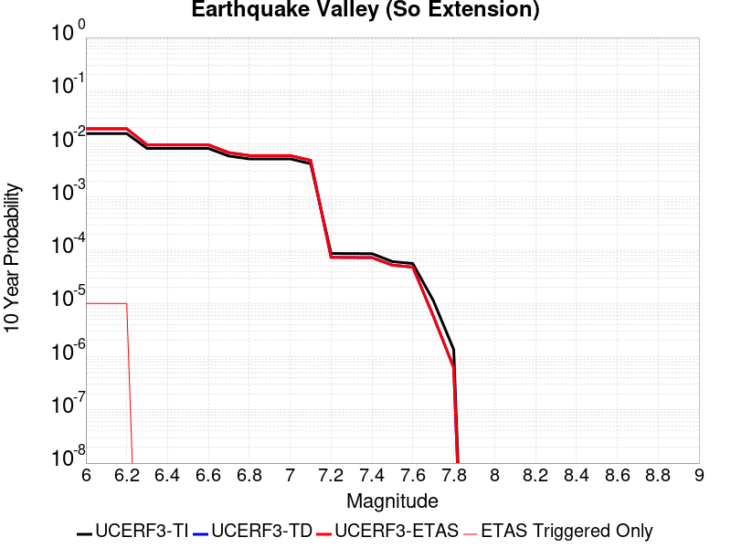 |

| Magnitude | 1 wk TI Prob | 1 wk TD Prob | 1 wk ETAS Prob | 1 wk ETAS/TD Gain | 1 wk ETAS Triggered Only | 1 mo TI Prob | 1 mo TD Prob | 1 mo ETAS Prob | 1 mo ETAS/TD Gain | 1 mo ETAS Triggered Only | 1 yr TI Prob | 1 yr TD Prob | 1 yr ETAS Prob | 1 yr ETAS/TD Gain | 1 yr ETAS Triggered Only | 10 yr TI Prob | 10 yr TD Prob | 10 yr ETAS Prob | 10 yr ETAS/TD Gain | 10 yr ETAS Triggered Only |
|-----|-----|-----|-----|-----|-----|-----|-----|-----|-----|-----|-----|-----|-----|-----|-----|-----|-----|-----|-----|-----|
| 6.0 | 3.0194888E-5 | 3.707323E-5 | 3.707323E-5 | 1.0 | 0.0 | 1.2940024E-4 | 1.5887865E-4 | 1.5887865E-4 | 1.0 | 0.0 | 0.0015743093 | 0.0019331464 | 0.0019331464 | 1.0 | 0.0 | 0.01563203 | 0.019213678 | 0.019223487 | 1.0005105 | 1.0E-5 |
| 6.1 | 3.0194888E-5 | 3.707323E-5 | 3.707323E-5 | 1.0 | 0.0 | 1.2940024E-4 | 1.5887865E-4 | 1.5887865E-4 | 1.0 | 0.0 | 0.0015743093 | 0.0019331464 | 0.0019331464 | 1.0 | 0.0 | 0.01563203 | 0.019213678 | 0.019223487 | 1.0005105 | 1.0E-5 |
| 6.2 | 3.0194888E-5 | 3.707323E-5 | 3.707323E-5 | 1.0 | 0.0 | 1.2940024E-4 | 1.5887865E-4 | 1.5887865E-4 | 1.0 | 0.0 | 0.0015743093 | 0.0019331464 | 0.0019331464 | 1.0 | 0.0 | 0.01563203 | 0.019213678 | 0.019223487 | 1.0005105 | 1.0E-5 |
| 6.3 | 1.5795305E-5 | 1.8447032E-5 | 1.8447032E-5 | 1.0 | 0.0 | 6.769241E-5 | 7.905694E-5 | 7.905694E-5 | 1.0 | 0.0 | 8.238434E-4 | 9.622042E-4 | 9.622042E-4 | 1.0 | 0.0 | 0.008207959 | 0.0095912805 | 0.0095912805 | 1.0 | 0.0 |
| 6.4 | 1.5795305E-5 | 1.8447032E-5 | 1.8447032E-5 | 1.0 | 0.0 | 6.769241E-5 | 7.905694E-5 | 7.905694E-5 | 1.0 | 0.0 | 8.238434E-4 | 9.622042E-4 | 9.622042E-4 | 1.0 | 0.0 | 0.008207959 | 0.0095912805 | 0.0095912805 | 1.0 | 0.0 |
| 6.5 | 1.5795305E-5 | 1.8447032E-5 | 1.8447032E-5 | 1.0 | 0.0 | 6.769241E-5 | 7.905694E-5 | 7.905694E-5 | 1.0 | 0.0 | 8.238434E-4 | 9.622042E-4 | 9.622042E-4 | 1.0 | 0.0 | 0.008207959 | 0.0095912805 | 0.0095912805 | 1.0 | 0.0 |
| 6.6 | 1.5795305E-5 | 1.8447032E-5 | 1.8447032E-5 | 1.0 | 0.0 | 6.769241E-5 | 7.905694E-5 | 7.905694E-5 | 1.0 | 0.0 | 8.238434E-4 | 9.622042E-4 | 9.622042E-4 | 1.0 | 0.0 | 0.008207959 | 0.0095912805 | 0.0095912805 | 1.0 | 0.0 |
| 6.7 | 1.1363076E-5 | 1.3138569E-5 | 1.3138569E-5 | 1.0 | 0.0 | 4.8697988E-5 | 5.6307366E-5 | 5.6307366E-5 | 1.0 | 0.0 | 5.927367E-4 | 6.8540266E-4 | 6.8540266E-4 | 1.0 | 0.0 | 0.0059115817 | 0.006840361 | 0.006840361 | 1.0 | 0.0 |
| 6.8 | 1.0049611E-5 | 1.1594572E-5 | 1.1594572E-5 | 1.0 | 0.0 | 4.306905E-5 | 4.969049E-5 | 4.969049E-5 | 1.0 | 0.0 | 5.242395E-4 | 6.0488697E-4 | 6.0488697E-4 | 1.0 | 0.0 | 0.0052300454 | 0.006039582 | 0.006039582 | 1.0 | 0.0 |
| 6.9 | 1.0049611E-5 | 1.1594572E-5 | 1.1594572E-5 | 1.0 | 0.0 | 4.306905E-5 | 4.969049E-5 | 4.969049E-5 | 1.0 | 0.0 | 5.242395E-4 | 6.0488697E-4 | 6.0488697E-4 | 1.0 | 0.0 | 0.0052300454 | 0.006039582 | 0.006039582 | 1.0 | 0.0 |
| 7.0 | 1.0049611E-5 | 1.1594572E-5 | 1.1594572E-5 | 1.0 | 0.0 | 4.306905E-5 | 4.969049E-5 | 4.969049E-5 | 1.0 | 0.0 | 5.242395E-4 | 6.0488697E-4 | 6.0488697E-4 | 1.0 | 0.0 | 0.0052300454 | 0.006039582 | 0.006039582 | 1.0 | 0.0 |
| 7.1 | 8.140254E-6 | 9.38365E-6 | 9.38365E-6 | 1.0 | 0.0 | 3.4886336E-5 | 4.02154E-5 | 4.02154E-5 | 1.0 | 0.0 | 4.2465836E-4 | 4.895796E-4 | 4.895796E-4 | 1.0 | 0.0 | 0.0042384774 | 0.0048915865 | 0.0048915865 | 1.0 | 0.0 |
| 7.2 | 1.673835E-7 | 1.4153831E-7 | 1.4153831E-7 | 1.0 | 0.0 | 7.173577E-7 | 6.0659266E-7 | 6.0659266E-7 | 1.0 | 0.0 | 8.733795E-6 | 7.3852443E-6 | 7.3852443E-6 | 1.0 | 0.0 | 8.733451E-5 | 7.3850344E-5 | 7.3850344E-5 | 1.0 | 0.0 |
| 7.3 | 1.6632116E-7 | 1.4052058E-7 | 1.4052058E-7 | 1.0 | 0.0 | 7.1280476E-7 | 6.0223095E-7 | 6.0223095E-7 | 1.0 | 0.0 | 8.678364E-6 | 7.332141E-6 | 7.332141E-6 | 1.0 | 0.0 | 8.6780245E-5 | 7.3319345E-5 | 7.3319345E-5 | 1.0 | 0.0 |
| 7.4 | 1.6569169E-7 | 1.3996687E-7 | 1.3996687E-7 | 1.0 | 0.0 | 7.1010703E-7 | 5.998579E-7 | 5.998579E-7 | 1.0 | 0.0 | 8.645519E-6 | 7.3032493E-6 | 7.3032493E-6 | 1.0 | 0.0 | 8.645182E-5 | 7.3030445E-5 | 7.3030445E-5 | 1.0 | 0.0 |
| 7.5 | 1.1764555E-7 | 1.0095579E-7 | 1.0095579E-7 | 1.0 | 0.0 | 5.041951E-7 | 4.326676E-7 | 4.326676E-7 | 1.0 | 0.0 | 6.138558E-6 | 5.267718E-6 | 5.267718E-6 | 1.0 | 0.0 | 6.1383886E-5 | 5.2676143E-5 | 5.2676143E-5 | 1.0 | 0.0 |
| 7.6 | 1.07927605E-7 | 9.260366E-8 | 9.260366E-8 | 1.0 | 0.0 | 4.6254678E-7 | 3.9687282E-7 | 3.9687282E-7 | 1.0 | 0.0 | 5.6314925E-6 | 4.831918E-6 | 4.831918E-6 | 1.0 | 0.0 | 5.63135E-5 | 4.8318336E-5 | 4.8318336E-5 | 1.0 | 0.0 |
| 7.7 | 2.1826905E-8 | 1.118023E-8 | 1.118023E-8 | 1.0 | 0.0 | 9.3543875E-8 | 4.7915268E-8 | 4.7915268E-8 | 1.0 | 0.0 | 1.1388961E-6 | 5.833683E-7 | 5.833683E-7 | 1.0 | 0.0 | 1.1388902E-5 | 5.8336727E-6 | 5.8336727E-6 | 1.0 | 0.0 |
| 7.8 | 2.6169649E-9 | 1.1969211E-9 | 1.1969211E-9 | 1.0 | 0.0 | 1.1215564E-8 | 5.1296616E-9 | 5.1296616E-9 | 1.0 | 0.0 | 1.3654947E-7 | 6.245363E-8 | 6.245363E-8 | 1.0 | 0.0 | 1.365494E-6 | 6.2453626E-7 | 6.2453626E-7 | 1.0 | 0.0 |

## West Tahoe
*[(top)](#table-of-contents)*

| 1 Week | 1 Month | 1 Year | 10 Year |
|-----|-----|-----|-----|
|  |  |  |  |

| Magnitude | 1 wk TI Prob | 1 wk TD Prob | 1 wk ETAS Prob | 1 wk ETAS/TD Gain | 1 wk ETAS Triggered Only | 1 mo TI Prob | 1 mo TD Prob | 1 mo ETAS Prob | 1 mo ETAS/TD Gain | 1 mo ETAS Triggered Only | 1 yr TI Prob | 1 yr TD Prob | 1 yr ETAS Prob | 1 yr ETAS/TD Gain | 1 yr ETAS Triggered Only | 10 yr TI Prob | 10 yr TD Prob | 10 yr ETAS Prob | 10 yr ETAS/TD Gain | 10 yr ETAS Triggered Only |
|-----|-----|-----|-----|-----|-----|-----|-----|-----|-----|-----|-----|-----|-----|-----|-----|-----|-----|-----|-----|-----|
| 6.0 | 1.952444E-5 | 2.1183409E-5 | 2.1183409E-5 | 1.0 | 0.0 | 8.367348E-5 | 9.0783185E-5 | 9.0783185E-5 | 1.0 | 0.0 | 0.0010182485 | 0.0011047797 | 0.0011047797 | 1.0 | 0.0 | 0.010135954 | 0.010998359 | 0.011008249 | 1.0008992 | 1.0E-5 |
| 6.1 | 1.952444E-5 | 2.1183409E-5 | 2.1183409E-5 | 1.0 | 0.0 | 8.367348E-5 | 9.0783185E-5 | 9.0783185E-5 | 1.0 | 0.0 | 0.0010182485 | 0.0011047797 | 0.0011047797 | 1.0 | 0.0 | 0.010135954 | 0.010998359 | 0.011008249 | 1.0008992 | 1.0E-5 |
| 6.2 | 1.952444E-5 | 2.1183409E-5 | 2.1183409E-5 | 1.0 | 0.0 | 8.367348E-5 | 9.0783185E-5 | 9.0783185E-5 | 1.0 | 0.0 | 0.0010182485 | 0.0011047797 | 0.0011047797 | 1.0 | 0.0 | 0.010135954 | 0.010998359 | 0.011008249 | 1.0008992 | 1.0E-5 |
| 6.3 | 1.952444E-5 | 2.1183409E-5 | 2.1183409E-5 | 1.0 | 0.0 | 8.367348E-5 | 9.0783185E-5 | 9.0783185E-5 | 1.0 | 0.0 | 0.0010182485 | 0.0011047797 | 0.0011047797 | 1.0 | 0.0 | 0.010135954 | 0.010998359 | 0.011008249 | 1.0008992 | 1.0E-5 |
| 6.4 | 1.952444E-5 | 2.1183409E-5 | 2.1183409E-5 | 1.0 | 0.0 | 8.367348E-5 | 9.0783185E-5 | 9.0783185E-5 | 1.0 | 0.0 | 0.0010182485 | 0.0011047797 | 0.0011047797 | 1.0 | 0.0 | 0.010135954 | 0.010998359 | 0.011008249 | 1.0008992 | 1.0E-5 |
| 6.5 | 1.2685271E-5 | 1.3690772E-5 | 1.3690772E-5 | 1.0 | 0.0 | 5.4364315E-5 | 5.8673508E-5 | 5.8673508E-5 | 1.0 | 0.0 | 6.616845E-4 | 7.1413233E-4 | 7.1413233E-4 | 1.0 | 0.0 | 0.0065971776 | 0.0071200244 | 0.0071299532 | 1.0013945 | 1.0E-5 |
| 6.6 | 1.2685271E-5 | 1.3690772E-5 | 1.3690772E-5 | 1.0 | 0.0 | 5.4364315E-5 | 5.8673508E-5 | 5.8673508E-5 | 1.0 | 0.0 | 6.616845E-4 | 7.1413233E-4 | 7.1413233E-4 | 1.0 | 0.0 | 0.0065971776 | 0.0071200244 | 0.0071299532 | 1.0013945 | 1.0E-5 |
| 6.7 | 9.117886E-6 | 9.809945E-6 | 9.809945E-6 | 1.0 | 0.0 | 3.9076072E-5 | 4.2041986E-5 | 4.2041986E-5 | 1.0 | 0.0 | 4.756473E-4 | 5.1174813E-4 | 5.1174813E-4 | 1.0 | 0.0 | 0.0047463053 | 0.0051064147 | 0.005116364 | 1.0019484 | 1.0E-5 |
| 6.8 | 8.786828E-6 | 9.457959E-6 | 9.457959E-6 | 1.0 | 0.0 | 3.7657293E-5 | 4.053352E-5 | 4.053352E-5 | 1.0 | 0.0 | 4.5838108E-4 | 4.933909E-4 | 4.933909E-4 | 1.0 | 0.0 | 0.0045743673 | 0.004923656 | 0.004933607 | 1.002021 | 1.0E-5 |
| 6.9 | 6.7562123E-6 | 7.263881E-6 | 7.263881E-6 | 1.0 | 0.0 | 2.8954875E-5 | 3.1130574E-5 | 3.1130574E-5 | 1.0 | 0.0 | 3.5246857E-4 | 3.7895358E-4 | 3.7895358E-4 | 1.0 | 0.0 | 0.0035191004 | 0.0037835457 | 0.003793508 | 1.002633 | 1.0E-5 |
| 7.0 | 5.1792854E-6 | 5.5673936E-6 | 5.5673936E-6 | 1.0 | 0.0 | 2.2196748E-5 | 2.386006E-5 | 2.386006E-5 | 1.0 | 0.0 | 2.702119E-4 | 2.9046132E-4 | 2.9046132E-4 | 1.0 | 0.0 | 0.0026988357 | 0.002901192 | 0.002901192 | 1.0 | 0.0 |
| 7.1 | 4.090765E-6 | 4.3974665E-6 | 4.3974665E-6 | 1.0 | 0.0 | 1.7531731E-5 | 1.8846167E-5 | 1.8846167E-5 | 1.0 | 0.0 | 2.134279E-4 | 2.2943133E-4 | 2.2943133E-4 | 1.0 | 0.0 | 0.0021322304 | 0.0022922792 | 0.0022922792 | 1.0 | 0.0 |
| 7.2 | 2.2356758E-6 | 2.402392E-6 | 2.402392E-6 | 1.0 | 0.0 | 9.581432E-6 | 1.0295936E-5 | 1.0295936E-5 | 1.0 | 0.0 | 1.1664769E-4 | 1.2534771E-4 | 1.2534771E-4 | 1.0 | 0.0 | 0.0011658648 | 0.0012529559 | 0.0012529559 | 1.0 | 0.0 |

## Big Pine (West)
*[(top)](#table-of-contents)*

| 1 Week | 1 Month | 1 Year | 10 Year |
|-----|-----|-----|-----|
|  |  |  |  |

| Magnitude | 1 wk TI Prob | 1 wk TD Prob | 1 wk ETAS Prob | 1 wk ETAS/TD Gain | 1 wk ETAS Triggered Only | 1 mo TI Prob | 1 mo TD Prob | 1 mo ETAS Prob | 1 mo ETAS/TD Gain | 1 mo ETAS Triggered Only | 1 yr TI Prob | 1 yr TD Prob | 1 yr ETAS Prob | 1 yr ETAS/TD Gain | 1 yr ETAS Triggered Only | 10 yr TI Prob | 10 yr TD Prob | 10 yr ETAS Prob | 10 yr ETAS/TD Gain | 10 yr ETAS Triggered Only |
|-----|-----|-----|-----|-----|-----|-----|-----|-----|-----|-----|-----|-----|-----|-----|-----|-----|-----|-----|-----|-----|
| 6.0 | 6.8306974E-7 | 6.881837E-7 | 6.881837E-7 | 1.0 | 0.0 | 2.9274386E-6 | 2.949356E-6 | 1.2949326E-5 | 4.3905606 | 1.0E-5 | 3.564098E-5 | 3.5907913E-5 | 4.5907553E-5 | 1.2784802 | 1.0E-5 | 3.5635266E-4 | 3.590305E-4 | 3.690269E-4 | 1.0278428 | 1.0E-5 |
| 6.1 | 6.8306974E-7 | 6.881837E-7 | 6.881837E-7 | 1.0 | 0.0 | 2.9274386E-6 | 2.949356E-6 | 1.2949326E-5 | 4.3905606 | 1.0E-5 | 3.564098E-5 | 3.5907913E-5 | 4.5907553E-5 | 1.2784802 | 1.0E-5 | 3.5635266E-4 | 3.590305E-4 | 3.690269E-4 | 1.0278428 | 1.0E-5 |
| 6.2 | 6.8306974E-7 | 6.881837E-7 | 6.881837E-7 | 1.0 | 0.0 | 2.9274386E-6 | 2.949356E-6 | 1.2949326E-5 | 4.3905606 | 1.0E-5 | 3.564098E-5 | 3.5907913E-5 | 4.5907553E-5 | 1.2784802 | 1.0E-5 | 3.5635266E-4 | 3.590305E-4 | 3.690269E-4 | 1.0278428 | 1.0E-5 |
| 6.3 | 4.227652E-7 | 4.2665656E-7 | 4.2665656E-7 | 1.0 | 0.0 | 1.8118495E-6 | 1.8285269E-6 | 1.1828509E-5 | 6.468873 | 1.0E-5 | 2.2059045E-5 | 2.2262107E-5 | 3.2261883E-5 | 1.4491838 | 1.0E-5 | 2.2056856E-4 | 2.2260059E-4 | 2.3259837E-4 | 1.0449135 | 1.0E-5 |
| 6.4 | 4.227652E-7 | 4.2665656E-7 | 4.2665656E-7 | 1.0 | 0.0 | 1.8118495E-6 | 1.8285269E-6 | 1.1828509E-5 | 6.468873 | 1.0E-5 | 2.2059045E-5 | 2.2262107E-5 | 3.2261883E-5 | 1.4491838 | 1.0E-5 | 2.2056856E-4 | 2.2260059E-4 | 2.3259837E-4 | 1.0449135 | 1.0E-5 |
| 6.5 | 3.1538403E-7 | 3.1884574E-7 | 3.1884574E-7 | 1.0 | 0.0 | 1.3516451E-6 | 1.366481E-6 | 1.1366467E-5 | 8.318057 | 1.0E-5 | 1.6456155E-5 | 1.6636784E-5 | 2.6636617E-5 | 1.6010677 | 1.0E-5 | 1.6454936E-4 | 1.6635578E-4 | 1.7635412E-4 | 1.0601021 | 1.0E-5 |
| 6.6 | 3.1538403E-7 | 3.1884574E-7 | 3.1884574E-7 | 1.0 | 0.0 | 1.3516451E-6 | 1.366481E-6 | 1.1366467E-5 | 8.318057 | 1.0E-5 | 1.6456155E-5 | 1.6636784E-5 | 2.6636617E-5 | 1.6010677 | 1.0E-5 | 1.6454936E-4 | 1.6635578E-4 | 1.7635412E-4 | 1.0601021 | 1.0E-5 |
| 6.7 | 3.1538403E-7 | 3.1884574E-7 | 3.1884574E-7 | 1.0 | 0.0 | 1.3516451E-6 | 1.366481E-6 | 1.1366467E-5 | 8.318057 | 1.0E-5 | 1.6456155E-5 | 1.6636784E-5 | 2.6636617E-5 | 1.6010677 | 1.0E-5 | 1.6454936E-4 | 1.6635578E-4 | 1.7635412E-4 | 1.0601021 | 1.0E-5 |
| 6.8 | 3.1538403E-7 | 3.1884574E-7 | 3.1884574E-7 | 1.0 | 0.0 | 1.3516451E-6 | 1.366481E-6 | 1.1366467E-5 | 8.318057 | 1.0E-5 | 1.6456155E-5 | 1.6636784E-5 | 2.6636617E-5 | 1.6010677 | 1.0E-5 | 1.6454936E-4 | 1.6635578E-4 | 1.7635412E-4 | 1.0601021 | 1.0E-5 |
| 6.9 | 3.0402092E-7 | 3.0739844E-7 | 3.0739844E-7 | 1.0 | 0.0 | 1.3029462E-6 | 1.3174212E-6 | 1.1317408E-5 | 8.590577 | 1.0E-5 | 1.5863254E-5 | 1.6039488E-5 | 2.6039328E-5 | 1.6234512 | 1.0E-5 | 1.5862122E-4 | 1.603837E-4 | 1.703821E-4 | 1.0623405 | 1.0E-5 |
| 7.0 | 2.3673063E-7 | 2.394435E-7 | 2.394435E-7 | 1.0 | 0.0 | 1.0145594E-6 | 1.026186E-6 | 1.1026176E-5 | 10.744811 | 1.0E-5 | 1.235219E-5 | 1.2493747E-5 | 2.2493621E-5 | 1.8003904 | 1.0E-5 | 1.2351504E-4 | 1.2493072E-4 | 1.3492948E-4 | 1.0800344 | 1.0E-5 |
| 7.1 | 1.632138E-7 | 1.6514538E-7 | 1.6514538E-7 | 1.0 | 0.0 | 6.9948754E-7 | 7.077657E-7 | 7.077657E-7 | 1.0 | 0.0 | 8.516227E-6 | 8.617015E-6 | 8.617015E-6 | 1.0 | 0.0 | 8.5159016E-5 | 8.616698E-5 | 8.616698E-5 | 1.0 | 0.0 |
| 7.2 | 1.1523723E-7 | 1.16571826E-7 | 1.16571826E-7 | 1.0 | 0.0 | 4.9387376E-7 | 4.9959345E-7 | 4.9959345E-7 | 1.0 | 0.0 | 6.0128964E-6 | 6.0825346E-6 | 6.0825346E-6 | 1.0 | 0.0 | 6.0127335E-5 | 6.082379E-5 | 6.082379E-5 | 1.0 | 0.0 |
| 7.3 | 7.777805E-8 | 7.862457E-8 | 7.862457E-8 | 1.0 | 0.0 | 3.3333444E-7 | 3.3696242E-7 | 3.3696242E-7 | 1.0 | 0.0 | 4.0583395E-6 | 4.10251E-6 | 4.10251E-6 | 1.0 | 0.0 | 4.0582654E-5 | 4.1024403E-5 | 4.1024403E-5 | 1.0 | 0.0 |
| 7.4 | 4.609946E-8 | 4.652219E-8 | 4.652219E-8 | 1.0 | 0.0 | 1.975691E-7 | 1.9938079E-7 | 1.9938079E-7 | 1.0 | 0.0 | 2.4054011E-6 | 2.4274586E-6 | 2.4274586E-6 | 1.0 | 0.0 | 2.405375E-5 | 2.4274339E-5 | 2.4274339E-5 | 1.0 | 0.0 |
| 7.5 | 2.3439137E-8 | 2.3608306E-8 | 2.3608306E-8 | 1.0 | 0.0 | 1.00453434E-7 | 1.0117845E-7 | 1.0117845E-7 | 1.0 | 0.0 | 1.2230199E-6 | 1.231847E-6 | 1.231847E-6 | 1.0 | 0.0 | 1.2230132E-5 | 1.23184045E-5 | 1.23184045E-5 | 1.0 | 0.0 |
| 7.6 | 1.6699769E-8 | 1.6817088E-8 | 1.6817088E-8 | 1.0 | 0.0 | 7.157044E-8 | 7.2073234E-8 | 7.2073234E-8 | 1.0 | 0.0 | 8.713697E-7 | 8.774913E-7 | 8.774913E-7 | 1.0 | 0.0 | 8.713663E-6 | 8.7748795E-6 | 8.7748795E-6 | 1.0 | 0.0 |
| 7.7 | 7.4061512E-9 | 7.45417E-9 | 7.45417E-9 | 1.0 | 0.0 | 3.1740647E-8 | 3.1946442E-8 | 3.1946442E-8 | 1.0 | 0.0 | 3.864423E-7 | 3.8894788E-7 | 3.8894788E-7 | 1.0 | 0.0 | 3.8644166E-6 | 3.8894727E-6 | 3.8894727E-6 | 1.0 | 0.0 |
| 7.8 | 1.2189427E-9 | 1.2270773E-9 | 1.2270773E-9 | 1.0 | 0.0 | 5.2240403E-9 | 5.258903E-9 | 5.258903E-9 | 1.0 | 0.0 | 6.3602684E-8 | 6.402714E-8 | 6.402714E-8 | 1.0 | 0.0 | 6.360267E-7 | 6.402713E-7 | 6.402713E-7 | 1.0 | 0.0 |

## Superstition Hills
*[(top)](#table-of-contents)*

| 1 Week | 1 Month | 1 Year | 10 Year |
|-----|-----|-----|-----|
|  |  |  |  |

| Magnitude | 1 wk TI Prob | 1 wk TD Prob | 1 wk ETAS Prob | 1 wk ETAS/TD Gain | 1 wk ETAS Triggered Only | 1 mo TI Prob | 1 mo TD Prob | 1 mo ETAS Prob | 1 mo ETAS/TD Gain | 1 mo ETAS Triggered Only | 1 yr TI Prob | 1 yr TD Prob | 1 yr ETAS Prob | 1 yr ETAS/TD Gain | 1 yr ETAS Triggered Only | 10 yr TI Prob | 10 yr TD Prob | 10 yr ETAS Prob | 10 yr ETAS/TD Gain | 10 yr ETAS Triggered Only |
|-----|-----|-----|-----|-----|-----|-----|-----|-----|-----|-----|-----|-----|-----|-----|-----|-----|-----|-----|-----|-----|
| 6.0 | 6.6865185E-5 | 1.4140681E-5 | 1.4140681E-5 | 1.0 | 0.0 | 2.8653358E-4 | 6.0601604E-5 | 6.0601604E-5 | 1.0 | 0.0 | 0.0034829667 | 7.3759095E-4 | 7.3759095E-4 | 1.0 | 0.0 | 0.03428881 | 0.007520847 | 0.0075307717 | 1.0013196 | 1.0E-5 |
| 6.1 | 6.544851E-5 | 1.4140681E-5 | 1.4140681E-5 | 1.0 | 0.0 | 2.8046346E-4 | 6.06016E-5 | 6.06016E-5 | 1.0 | 0.0 | 0.0034092965 | 7.3759095E-4 | 7.3759095E-4 | 1.0 | 0.0 | 0.033574644 | 0.007520846 | 0.007530771 | 1.0013196 | 1.0E-5 |
| 6.2 | 6.544851E-5 | 1.4140681E-5 | 1.4140681E-5 | 1.0 | 0.0 | 2.8046346E-4 | 6.06016E-5 | 6.06016E-5 | 1.0 | 0.0 | 0.0034092965 | 7.3759095E-4 | 7.3759095E-4 | 1.0 | 0.0 | 0.033574644 | 0.007520846 | 0.007530771 | 1.0013196 | 1.0E-5 |
| 6.3 | 5.2402065E-5 | 1.414068E-5 | 1.414068E-5 | 1.0 | 0.0 | 2.2456095E-4 | 6.0601596E-5 | 6.0601596E-5 | 1.0 | 0.0 | 0.0027306017 | 7.375909E-4 | 7.375909E-4 | 1.0 | 0.0 | 0.02697292 | 0.0075208414 | 0.007530766 | 1.0013196 | 1.0E-5 |
| 6.4 | 4.542238E-5 | 1.414068E-5 | 1.414068E-5 | 1.0 | 0.0 | 1.9465282E-4 | 6.0601596E-5 | 6.0601596E-5 | 1.0 | 0.0 | 0.0023673223 | 7.3759083E-4 | 7.3759083E-4 | 1.0 | 0.0 | 0.023422617 | 0.007520839 | 0.0075307637 | 1.0013196 | 1.0E-5 |
| 6.5 | 2.9672969E-5 | 1.4140678E-5 | 1.4140678E-5 | 1.0 | 0.0 | 1.2716366E-4 | 6.0601593E-5 | 6.0601593E-5 | 1.0 | 0.0 | 0.0015471181 | 7.3759083E-4 | 7.3759083E-4 | 1.0 | 0.0 | 0.015363912 | 0.0075208335 | 0.0075307586 | 1.0013196 | 1.0E-5 |
| 6.6 | 2.6056105E-5 | 1.380642E-5 | 1.380642E-5 | 1.0 | 0.0 | 1.1166424E-4 | 5.916912E-5 | 5.916912E-5 | 1.0 | 0.0 | 0.0013586642 | 7.20162E-4 | 7.20162E-4 | 1.0 | 0.0 | 0.013503874 | 0.0073452997 | 0.007355226 | 1.0013514 | 1.0E-5 |
| 6.7 | 1.4611248E-5 | 1.3386292E-5 | 1.3386292E-5 | 1.0 | 0.0 | 6.261813E-5 | 5.7368656E-5 | 5.7368656E-5 | 1.0 | 0.0 | 7.6210906E-4 | 6.982555E-4 | 6.982555E-4 | 1.0 | 0.0 | 0.0075950073 | 0.0071264883 | 0.007136417 | 1.0013932 | 1.0E-5 |
| 6.8 | 1.30607E-5 | 1.0981476E-5 | 1.0981476E-5 | 1.0 | 0.0 | 5.597323E-5 | 4.706267E-5 | 4.706267E-5 | 1.0 | 0.0 | 6.8126095E-4 | 5.728461E-4 | 5.728461E-4 | 1.0 | 0.0 | 0.006791762 | 0.0058749495 | 0.005884891 | 1.0016922 | 1.0E-5 |
| 6.9 | 1.0443096E-5 | 8.19765E-6 | 8.19765E-6 | 1.0 | 0.0 | 4.4755358E-5 | 3.513232E-5 | 3.513232E-5 | 1.0 | 0.0 | 5.447602E-4 | 4.2765442E-4 | 4.2765442E-4 | 1.0 | 0.0 | 0.005434267 | 0.0044104243 | 0.00442038 | 1.0022573 | 1.0E-5 |
| 7.0 | 8.045912E-6 | 6.741796E-6 | 6.741796E-6 | 1.0 | 0.0 | 3.4482026E-5 | 2.8893097E-5 | 2.8893097E-5 | 1.0 | 0.0 | 4.197378E-4 | 3.517177E-4 | 3.517177E-4 | 1.0 | 0.0 | 0.0041894587 | 0.003634384 | 0.0036443474 | 1.0027415 | 1.0E-5 |
| 7.1 | 8.045912E-6 | 6.741796E-6 | 6.741796E-6 | 1.0 | 0.0 | 3.4482026E-5 | 2.8893097E-5 | 2.8893097E-5 | 1.0 | 0.0 | 4.197378E-4 | 3.517177E-4 | 3.517177E-4 | 1.0 | 0.0 | 0.0041894587 | 0.003634384 | 0.0036443474 | 1.0027415 | 1.0E-5 |
| 7.2 | 7.375506E-6 | 6.24868E-6 | 6.24868E-6 | 1.0 | 0.0 | 3.1608928E-5 | 2.6779788E-5 | 2.6779788E-5 | 1.0 | 0.0 | 3.8477074E-4 | 3.25996E-4 | 3.25996E-4 | 1.0 | 0.0 | 0.003841052 | 0.0033749773 | 0.0033849434 | 1.0029529 | 1.0E-5 |
| 7.3 | 6.6063913E-6 | 5.8010883E-6 | 5.8010883E-6 | 1.0 | 0.0 | 2.8312797E-5 | 2.4861574E-5 | 2.4861574E-5 | 1.0 | 0.0 | 3.446538E-4 | 3.0264835E-4 | 3.0264835E-4 | 1.0 | 0.0 | 0.0034411973 | 0.0031392311 | 0.0031491998 | 1.0031755 | 1.0E-5 |
| 7.4 | 6.4313126E-6 | 5.6825056E-6 | 5.6825056E-6 | 1.0 | 0.0 | 2.7562477E-5 | 2.4353372E-5 | 2.4353372E-5 | 1.0 | 0.0 | 3.355215E-4 | 2.9646268E-4 | 2.9646268E-4 | 1.0 | 0.0 | 0.0033501536 | 0.0030770004 | 0.0030869695 | 1.0032399 | 1.0E-5 |
| 7.5 | 6.0742927E-6 | 5.4783154E-6 | 5.4783154E-6 | 1.0 | 0.0 | 2.6032423E-5 | 2.3478287E-5 | 2.3478287E-5 | 1.0 | 0.0 | 3.1689866E-4 | 2.8581134E-4 | 2.8581134E-4 | 1.0 | 0.0 | 0.0031644711 | 0.0029688284 | 0.0029787987 | 1.0033584 | 1.0E-5 |
| 7.6 | 5.6987187E-6 | 5.29651E-6 | 5.29651E-6 | 1.0 | 0.0 | 2.4422852E-5 | 2.2699136E-5 | 2.2699136E-5 | 1.0 | 0.0 | 2.9730765E-4 | 2.7632757E-4 | 2.7632757E-4 | 1.0 | 0.0 | 0.002969102 | 0.0028720777 | 0.0028820492 | 1.0034719 | 1.0E-5 |
| 7.7 | 5.1658035E-6 | 4.9275045E-6 | 4.9275045E-6 | 1.0 | 0.0 | 2.2138971E-5 | 2.1117708E-5 | 2.1117708E-5 | 1.0 | 0.0 | 2.6950863E-4 | 2.5707835E-4 | 2.5707835E-4 | 1.0 | 0.0 | 0.00269182 | 0.002677121 | 0.002687094 | 1.0037254 | 1.0E-5 |
| 7.8 | 3.6864697E-6 | 4.1984263E-6 | 4.1984263E-6 | 1.0 | 0.0 | 1.579906E-5 | 1.7993134E-5 | 1.7993134E-5 | 1.0 | 0.0 | 1.9233658E-4 | 2.1904484E-4 | 2.1904484E-4 | 1.0 | 0.0 | 0.0019217018 | 0.0022902628 | 0.00230024 | 1.0043563 | 1.0E-5 |
| 7.9 | 3.0265903E-6 | 3.5655014E-6 | 3.5655014E-6 | 1.0 | 0.0 | 1.2971037E-5 | 1.5280633E-5 | 1.5280633E-5 | 1.0 | 0.0 | 1.5791094E-4 | 1.8602627E-4 | 1.8602627E-4 | 1.0 | 0.0 | 0.0015779877 | 0.0019543984 | 0.0019643789 | 1.0051067 | 1.0E-5 |
| 8.0 | 2.5271493E-6 | 3.0883666E-6 | 3.0883666E-6 | 1.0 | 0.0 | 1.0830595E-5 | 1.3235793E-5 | 1.3235793E-5 | 1.0 | 0.0 | 1.3185451E-4 | 1.6113427E-4 | 1.6113427E-4 | 1.0 | 0.0 | 0.0013177631 | 0.0016981832 | 0.0017081662 | 1.0058787 | 1.0E-5 |
| 8.1 | 2.3749135E-6 | 2.9189414E-6 | 2.9189414E-6 | 1.0 | 0.0 | 1.0178161E-5 | 1.250969E-5 | 1.250969E-5 | 1.0 | 0.0 | 1.2391206E-4 | 1.5229525E-4 | 1.5229525E-4 | 1.0 | 0.0 | 0.0012384299 | 0.0016057007 | 0.0016156846 | 1.0062178 | 1.0E-5 |
| 8.2 | 1.7186406E-9 | 1.1447435E-9 | 1.1447435E-9 | 1.0 | 0.0 | 7.3656024E-9 | 4.9060436E-9 | 4.9060436E-9 | 1.0 | 0.0 | 8.9676206E-8 | 5.973108E-8 | 5.973108E-8 | 1.0 | 0.0 | 8.9676166E-7 | 6.391136E-7 | 6.391136E-7 | 1.0 | 0.0 |

## Kern Canyon (South Kern) 2011
*[(top)](#table-of-contents)*

| 1 Week | 1 Month | 1 Year | 10 Year |
|-----|-----|-----|-----|
|  |  |  |  |

| Magnitude | 1 wk TI Prob | 1 wk TD Prob | 1 wk ETAS Prob | 1 wk ETAS/TD Gain | 1 wk ETAS Triggered Only | 1 mo TI Prob | 1 mo TD Prob | 1 mo ETAS Prob | 1 mo ETAS/TD Gain | 1 mo ETAS Triggered Only | 1 yr TI Prob | 1 yr TD Prob | 1 yr ETAS Prob | 1 yr ETAS/TD Gain | 1 yr ETAS Triggered Only | 10 yr TI Prob | 10 yr TD Prob | 10 yr ETAS Prob | 10 yr ETAS/TD Gain | 10 yr ETAS Triggered Only |
|-----|-----|-----|-----|-----|-----|-----|-----|-----|-----|-----|-----|-----|-----|-----|-----|-----|-----|-----|-----|-----|
| 6.0 | 4.105075E-6 | 4.1137364E-6 | 4.1137364E-6 | 1.0 | 0.0 | 1.7593058E-5 | 1.7630184E-5 | 1.7630184E-5 | 1.0 | 0.0 | 2.1417443E-4 | 2.1462698E-4 | 2.2462483E-4 | 1.0465825 | 1.0E-5 | 0.0021396813 | 0.0021442608 | 0.0021542395 | 1.0046536 | 1.0E-5 |
| 6.1 | 4.105075E-6 | 4.1137364E-6 | 4.1137364E-6 | 1.0 | 0.0 | 1.7593058E-5 | 1.7630184E-5 | 1.7630184E-5 | 1.0 | 0.0 | 2.1417443E-4 | 2.1462698E-4 | 2.2462483E-4 | 1.0465825 | 1.0E-5 | 0.0021396813 | 0.0021442608 | 0.0021542395 | 1.0046536 | 1.0E-5 |
| 6.2 | 4.105075E-6 | 4.1137364E-6 | 4.1137364E-6 | 1.0 | 0.0 | 1.7593058E-5 | 1.7630184E-5 | 1.7630184E-5 | 1.0 | 0.0 | 2.1417443E-4 | 2.1462698E-4 | 2.2462483E-4 | 1.0465825 | 1.0E-5 | 0.0021396813 | 0.0021442608 | 0.0021542395 | 1.0046536 | 1.0E-5 |
| 6.3 | 4.105075E-6 | 4.1137364E-6 | 4.1137364E-6 | 1.0 | 0.0 | 1.7593058E-5 | 1.7630184E-5 | 1.7630184E-5 | 1.0 | 0.0 | 2.1417443E-4 | 2.1462698E-4 | 2.2462483E-4 | 1.0465825 | 1.0E-5 | 0.0021396813 | 0.0021442608 | 0.0021542395 | 1.0046536 | 1.0E-5 |
| 6.4 | 4.105075E-6 | 4.1137364E-6 | 4.1137364E-6 | 1.0 | 0.0 | 1.7593058E-5 | 1.7630184E-5 | 1.7630184E-5 | 1.0 | 0.0 | 2.1417443E-4 | 2.1462698E-4 | 2.2462483E-4 | 1.0465825 | 1.0E-5 | 0.0021396813 | 0.0021442608 | 0.0021542395 | 1.0046536 | 1.0E-5 |
| 6.5 | 2.9849807E-6 | 2.9731618E-6 | 2.9731618E-6 | 1.0 | 0.0 | 1.2792712E-5 | 1.2742061E-5 | 1.2742061E-5 | 1.0 | 0.0 | 1.5574014E-4 | 1.551237E-4 | 1.6512215E-4 | 1.0644547 | 1.0E-5 | 0.0015563103 | 0.0015501693 | 0.0015601538 | 1.0064409 | 1.0E-5 |
| 6.6 | 2.9849807E-6 | 2.9731618E-6 | 2.9731618E-6 | 1.0 | 0.0 | 1.2792712E-5 | 1.2742061E-5 | 1.2742061E-5 | 1.0 | 0.0 | 1.5574014E-4 | 1.551237E-4 | 1.6512215E-4 | 1.0644547 | 1.0E-5 | 0.0015563103 | 0.0015501693 | 0.0015601538 | 1.0064409 | 1.0E-5 |
| 6.7 | 2.6756725E-6 | 2.6582272E-6 | 2.6582272E-6 | 1.0 | 0.0 | 1.1467117E-5 | 1.13923525E-5 | 1.13923525E-5 | 1.0 | 0.0 | 1.396032E-4 | 1.3869318E-4 | 1.4869179E-4 | 1.0720916 | 1.0E-5 | 0.0013951553 | 0.0013860771 | 0.0013960632 | 1.0072047 | 1.0E-5 |
| 6.8 | 2.3283721E-6 | 2.3047844E-6 | 2.3047844E-6 | 1.0 | 0.0 | 9.9787E-6 | 9.87761E-6 | 9.87761E-6 | 1.0 | 0.0 | 1.214839E-4 | 1.20253346E-4 | 1.20253346E-4 | 1.0 | 0.0 | 0.001214175 | 0.0012018902 | 0.0012018902 | 1.0 | 0.0 |
| 6.9 | 2.0972677E-6 | 2.0696461E-6 | 2.0696461E-6 | 1.0 | 0.0 | 8.988259E-6 | 8.869883E-6 | 8.869883E-6 | 1.0 | 0.0 | 1.0942656E-4 | 1.0798552E-4 | 1.0798552E-4 | 1.0 | 0.0 | 0.0010937268 | 0.0010793363 | 0.0010793363 | 1.0 | 0.0 |
| 7.0 | 1.7132242E-6 | 1.6787077E-6 | 1.6787077E-6 | 1.0 | 0.0 | 7.3423685E-6 | 7.194442E-6 | 7.194442E-6 | 1.0 | 0.0 | 8.938967E-5 | 8.758884E-5 | 8.758884E-5 | 1.0 | 0.0 | 8.935372E-4 | 8.7554706E-4 | 8.7554706E-4 | 1.0 | 0.0 |
| 7.1 | 1.4215541E-6 | 1.3815785E-6 | 1.3815785E-6 | 1.0 | 0.0 | 6.0923603E-6 | 5.9210374E-6 | 5.9210374E-6 | 1.0 | 0.0 | 7.417196E-5 | 7.208627E-5 | 7.208627E-5 | 1.0 | 0.0 | 7.414721E-4 | 7.206316E-4 | 7.206316E-4 | 1.0 | 0.0 |
| 7.2 | 9.097853E-7 | 8.6037966E-7 | 8.6037966E-7 | 1.0 | 0.0 | 3.899074E-6 | 3.6873362E-6 | 3.6873362E-6 | 1.0 | 0.0 | 4.7470192E-5 | 4.4892404E-5 | 4.4892404E-5 | 1.0 | 0.0 | 4.7460053E-4 | 4.4883444E-4 | 4.4883444E-4 | 1.0 | 0.0 |
| 7.3 | 6.144169E-7 | 5.6282187E-7 | 5.6282187E-7 | 1.0 | 0.0 | 2.6332125E-6 | 2.4120914E-6 | 2.4120914E-6 | 1.0 | 0.0 | 3.205889E-5 | 2.9366824E-5 | 2.9366824E-5 | 1.0 | 0.0 | 3.2054266E-4 | 2.9362994E-4 | 2.9362994E-4 | 1.0 | 0.0 |
| 7.4 | 4.049844E-7 | 3.5728377E-7 | 3.5728377E-7 | 1.0 | 0.0 | 1.7356463E-6 | 1.5312153E-6 | 1.5312153E-6 | 1.0 | 0.0 | 2.1131287E-5 | 1.864239E-5 | 1.864239E-5 | 1.0 | 0.0 | 2.1129279E-4 | 1.864085E-4 | 1.864085E-4 | 1.0 | 0.0 |
| 7.5 | 1.9871162E-7 | 1.5830446E-7 | 1.5830446E-7 | 1.0 | 0.0 | 8.5162094E-7 | 6.784475E-7 | 6.784475E-7 | 1.0 | 0.0 | 1.0368436E-5 | 8.260068E-6 | 8.260068E-6 | 1.0 | 0.0 | 1.0367952E-4 | 8.25977E-5 | 8.25977E-5 | 1.0 | 0.0 |
| 7.6 | 2.572245E-8 | 1.7352718E-8 | 1.7352718E-8 | 1.0 | 0.0 | 1.10239064E-7 | 7.436879E-8 | 7.436879E-8 | 1.0 | 0.0 | 1.3421597E-6 | 9.054397E-7 | 9.054397E-7 | 1.0 | 0.0 | 1.3421517E-5 | 9.054365E-6 | 9.054365E-6 | 1.0 | 0.0 |

## Big Lagoon - Bald Mtn 2011 CFM
*[(top)](#table-of-contents)*

| 1 Week | 1 Month | 1 Year | 10 Year |
|-----|-----|-----|-----|
|  |  | 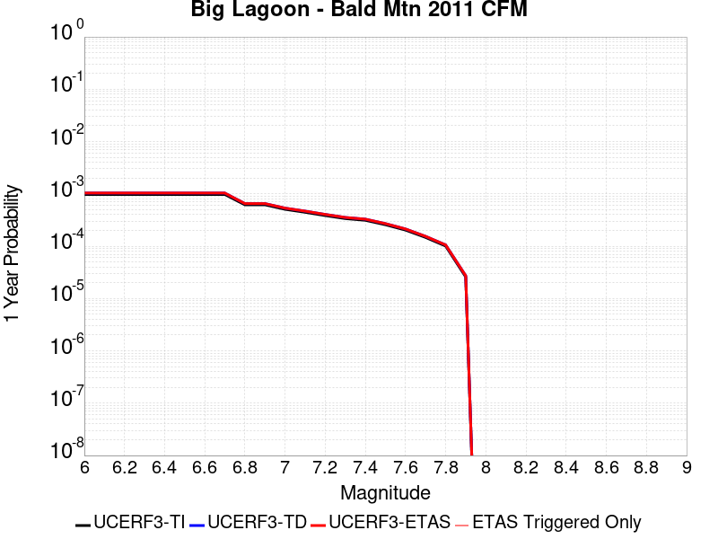 |  |

| Magnitude | 1 wk TI Prob | 1 wk TD Prob | 1 wk ETAS Prob | 1 wk ETAS/TD Gain | 1 wk ETAS Triggered Only | 1 mo TI Prob | 1 mo TD Prob | 1 mo ETAS Prob | 1 mo ETAS/TD Gain | 1 mo ETAS Triggered Only | 1 yr TI Prob | 1 yr TD Prob | 1 yr ETAS Prob | 1 yr ETAS/TD Gain | 1 yr ETAS Triggered Only | 10 yr TI Prob | 10 yr TD Prob | 10 yr ETAS Prob | 10 yr ETAS/TD Gain | 10 yr ETAS Triggered Only |
|-----|-----|-----|-----|-----|-----|-----|-----|-----|-----|-----|-----|-----|-----|-----|-----|-----|-----|-----|-----|-----|
| 6.0 | 1.8699735E-5 | 1.9850344E-5 | 1.9850344E-5 | 1.0 | 0.0 | 8.013926E-5 | 8.5070336E-5 | 8.5070336E-5 | 1.0 | 0.0 | 9.752587E-4 | 0.001035277 | 0.001035277 | 1.0 | 0.0 | 0.009709897 | 0.010308358 | 0.010318255 | 1.0009601 | 1.0E-5 |
| 6.1 | 1.8699735E-5 | 1.9850344E-5 | 1.9850344E-5 | 1.0 | 0.0 | 8.013926E-5 | 8.5070336E-5 | 8.5070336E-5 | 1.0 | 0.0 | 9.752587E-4 | 0.001035277 | 0.001035277 | 1.0 | 0.0 | 0.009709897 | 0.010308358 | 0.010318255 | 1.0009601 | 1.0E-5 |
| 6.2 | 1.8699735E-5 | 1.9850344E-5 | 1.9850344E-5 | 1.0 | 0.0 | 8.013926E-5 | 8.5070336E-5 | 8.5070336E-5 | 1.0 | 0.0 | 9.752587E-4 | 0.001035277 | 0.001035277 | 1.0 | 0.0 | 0.009709897 | 0.010308358 | 0.010318255 | 1.0009601 | 1.0E-5 |
| 6.3 | 1.8699735E-5 | 1.9850344E-5 | 1.9850344E-5 | 1.0 | 0.0 | 8.013926E-5 | 8.5070336E-5 | 8.5070336E-5 | 1.0 | 0.0 | 9.752587E-4 | 0.001035277 | 0.001035277 | 1.0 | 0.0 | 0.009709897 | 0.010308358 | 0.010318255 | 1.0009601 | 1.0E-5 |
| 6.4 | 1.8699735E-5 | 1.9850344E-5 | 1.9850344E-5 | 1.0 | 0.0 | 8.013926E-5 | 8.5070336E-5 | 8.5070336E-5 | 1.0 | 0.0 | 9.752587E-4 | 0.001035277 | 0.001035277 | 1.0 | 0.0 | 0.009709897 | 0.010308358 | 0.010318255 | 1.0009601 | 1.0E-5 |
| 6.5 | 1.8699735E-5 | 1.9850344E-5 | 1.9850344E-5 | 1.0 | 0.0 | 8.013926E-5 | 8.5070336E-5 | 8.5070336E-5 | 1.0 | 0.0 | 9.752587E-4 | 0.001035277 | 0.001035277 | 1.0 | 0.0 | 0.009709897 | 0.010308358 | 0.010318255 | 1.0009601 | 1.0E-5 |
| 6.6 | 1.8699735E-5 | 1.9850344E-5 | 1.9850344E-5 | 1.0 | 0.0 | 8.013926E-5 | 8.5070336E-5 | 8.5070336E-5 | 1.0 | 0.0 | 9.752587E-4 | 0.001035277 | 0.001035277 | 1.0 | 0.0 | 0.009709897 | 0.010308358 | 0.010318255 | 1.0009601 | 1.0E-5 |
| 6.7 | 1.8699735E-5 | 1.9850344E-5 | 1.9850344E-5 | 1.0 | 0.0 | 8.013926E-5 | 8.5070336E-5 | 8.5070336E-5 | 1.0 | 0.0 | 9.752587E-4 | 0.001035277 | 0.001035277 | 1.0 | 0.0 | 0.009709897 | 0.010308358 | 0.010318255 | 1.0009601 | 1.0E-5 |
| 6.8 | 1.18505095E-5 | 1.2499895E-5 | 1.2499895E-5 | 1.0 | 0.0 | 5.078691E-5 | 5.3569907E-5 | 5.3569907E-5 | 1.0 | 0.0 | 6.181552E-4 | 6.5202324E-4 | 6.5202324E-4 | 1.0 | 0.0 | 0.006164385 | 0.006501606 | 0.006501606 | 1.0 | 0.0 |
| 6.9 | 1.18505095E-5 | 1.2499895E-5 | 1.2499895E-5 | 1.0 | 0.0 | 5.078691E-5 | 5.3569907E-5 | 5.3569907E-5 | 1.0 | 0.0 | 6.181552E-4 | 6.5202324E-4 | 6.5202324E-4 | 1.0 | 0.0 | 0.006164385 | 0.006501606 | 0.006501606 | 1.0 | 0.0 |
| 7.0 | 9.719786E-6 | 1.023556E-5 | 1.023556E-5 | 1.0 | 0.0 | 4.1655563E-5 | 4.386596E-5 | 4.386596E-5 | 1.0 | 0.0 | 5.0703844E-4 | 5.339395E-4 | 5.339395E-4 | 1.0 | 0.0 | 0.005058831 | 0.005326813 | 0.005326813 | 1.0 | 0.0 |
| 7.1 | 8.523418E-6 | 8.969526E-6 | 8.969526E-6 | 1.0 | 0.0 | 3.652842E-5 | 3.8440267E-5 | 3.8440267E-5 | 1.0 | 0.0 | 4.4464276E-4 | 4.679113E-4 | 4.679113E-4 | 1.0 | 0.0 | 0.0044375416 | 0.0046694246 | 0.0046694246 | 1.0 | 0.0 |
| 7.2 | 7.378894E-6 | 7.761166E-6 | 7.761166E-6 | 1.0 | 0.0 | 3.162345E-5 | 3.326172E-5 | 3.326172E-5 | 1.0 | 0.0 | 3.8494746E-4 | 4.0488708E-4 | 4.0488708E-4 | 1.0 | 0.0 | 0.0038428132 | 0.0040415903 | 0.0040415903 | 1.0 | 0.0 |
| 7.3 | 6.4640294E-6 | 6.7924893E-6 | 6.7924893E-6 | 1.0 | 0.0 | 2.7702688E-5 | 2.9110348E-5 | 2.9110348E-5 | 1.0 | 0.0 | 3.3722803E-4 | 3.5436152E-4 | 3.5436152E-4 | 1.0 | 0.0 | 0.0033671674 | 0.0035380346 | 0.0035380346 | 1.0 | 0.0 |
| 7.4 | 5.9959093E-6 | 6.2988424E-6 | 6.2988424E-6 | 1.0 | 0.0 | 2.5696501E-5 | 2.6994763E-5 | 2.6994763E-5 | 1.0 | 0.0 | 3.1280998E-4 | 3.2861225E-4 | 3.2861225E-4 | 1.0 | 0.0 | 0.0031237002 | 0.0032813256 | 0.0032813256 | 1.0 | 0.0 |
| 7.5 | 4.929265E-6 | 5.1764305E-6 | 5.1764305E-6 | 1.0 | 0.0 | 2.112525E-5 | 2.2184515E-5 | 2.2184515E-5 | 1.0 | 0.0 | 2.5716957E-4 | 2.7006338E-4 | 2.7006338E-4 | 1.0 | 0.0 | 0.0025687215 | 0.0026973928 | 0.0026973928 | 1.0 | 0.0 |
| 7.6 | 3.8982403E-6 | 4.088953E-6 | 4.088953E-6 | 1.0 | 0.0 | 1.6706637E-5 | 1.752397E-5 | 1.752397E-5 | 1.0 | 0.0 | 2.0338432E-4 | 2.1333371E-4 | 2.1333371E-4 | 1.0 | 0.0 | 0.0020319829 | 0.002131317 | 0.002131317 | 1.0 | 0.0 |
| 7.7 | 2.820968E-6 | 2.9572307E-6 | 2.9572307E-6 | 1.0 | 0.0 | 1.2089806E-5 | 1.2673785E-5 | 1.2673785E-5 | 1.0 | 0.0 | 1.4718344E-4 | 1.5429257E-4 | 1.5429257E-4 | 1.0 | 0.0 | 0.00147086 | 0.0015418723 | 0.0015418723 | 1.0 | 0.0 |
| 7.8 | 1.9314455E-6 | 2.0260316E-6 | 2.0260316E-6 | 1.0 | 0.0 | 8.277597E-6 | 8.682965E-6 | 8.682965E-6 | 1.0 | 0.0 | 1.0077508E-4 | 1.05710096E-4 | 1.05710096E-4 | 1.0 | 0.0 | 0.0010072939 | 0.001056611 | 0.001056611 | 1.0 | 0.0 |
| 7.9 | 4.9586197E-7 | 5.2189574E-7 | 5.2189574E-7 | 1.0 | 0.0 | 2.125121E-6 | 2.2366944E-6 | 2.2366944E-6 | 1.0 | 0.0 | 2.5873042E-5 | 2.7231436E-5 | 2.7231436E-5 | 1.0 | 0.0 | 2.5870028E-4 | 2.7228307E-4 | 2.7228307E-4 | 1.0 | 0.0 |

## Sisar
*[(top)](#table-of-contents)*

| 1 Week | 1 Month | 1 Year | 10 Year |
|-----|-----|-----|-----|
|  |  | 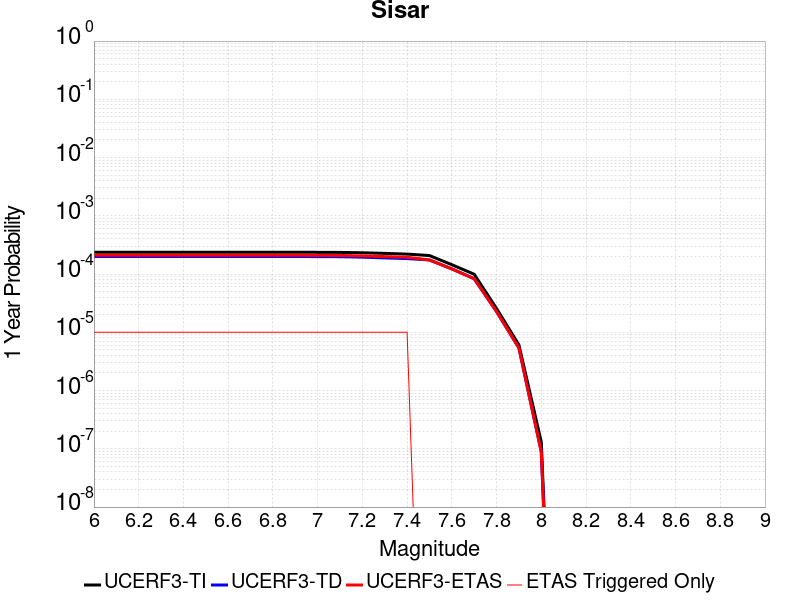 |  |

| Magnitude | 1 wk TI Prob | 1 wk TD Prob | 1 wk ETAS Prob | 1 wk ETAS/TD Gain | 1 wk ETAS Triggered Only | 1 mo TI Prob | 1 mo TD Prob | 1 mo ETAS Prob | 1 mo ETAS/TD Gain | 1 mo ETAS Triggered Only | 1 yr TI Prob | 1 yr TD Prob | 1 yr ETAS Prob | 1 yr ETAS/TD Gain | 1 yr ETAS Triggered Only | 10 yr TI Prob | 10 yr TD Prob | 10 yr ETAS Prob | 10 yr ETAS/TD Gain | 10 yr ETAS Triggered Only |
|-----|-----|-----|-----|-----|-----|-----|-----|-----|-----|-----|-----|-----|-----|-----|-----|-----|-----|-----|-----|-----|
| 6.0 | 4.544193E-6 | 3.83965E-6 | 3.83965E-6 | 1.0 | 0.0 | 1.9474966E-5 | 1.645554E-5 | 1.645554E-5 | 1.0 | 0.0 | 2.3708193E-4 | 2.0032813E-4 | 2.1032612E-4 | 1.0499082 | 1.0E-5 | 0.0023682916 | 0.002001509 | 0.0020114891 | 1.0049863 | 1.0E-5 |
| 6.1 | 4.544193E-6 | 3.83965E-6 | 3.83965E-6 | 1.0 | 0.0 | 1.9474966E-5 | 1.645554E-5 | 1.645554E-5 | 1.0 | 0.0 | 2.3708193E-4 | 2.0032813E-4 | 2.1032612E-4 | 1.0499082 | 1.0E-5 | 0.0023682916 | 0.002001509 | 0.0020114891 | 1.0049863 | 1.0E-5 |
| 6.2 | 4.544193E-6 | 3.83965E-6 | 3.83965E-6 | 1.0 | 0.0 | 1.9474966E-5 | 1.645554E-5 | 1.645554E-5 | 1.0 | 0.0 | 2.3708193E-4 | 2.0032813E-4 | 2.1032612E-4 | 1.0499082 | 1.0E-5 | 0.0023682916 | 0.002001509 | 0.0020114891 | 1.0049863 | 1.0E-5 |
| 6.3 | 4.544193E-6 | 3.83965E-6 | 3.83965E-6 | 1.0 | 0.0 | 1.9474966E-5 | 1.645554E-5 | 1.645554E-5 | 1.0 | 0.0 | 2.3708193E-4 | 2.0032813E-4 | 2.1032612E-4 | 1.0499082 | 1.0E-5 | 0.0023682916 | 0.002001509 | 0.0020114891 | 1.0049863 | 1.0E-5 |
| 6.4 | 4.544193E-6 | 3.83965E-6 | 3.83965E-6 | 1.0 | 0.0 | 1.9474966E-5 | 1.645554E-5 | 1.645554E-5 | 1.0 | 0.0 | 2.3708193E-4 | 2.0032813E-4 | 2.1032612E-4 | 1.0499082 | 1.0E-5 | 0.0023682916 | 0.002001509 | 0.0020114891 | 1.0049863 | 1.0E-5 |
| 6.5 | 4.544193E-6 | 3.83965E-6 | 3.83965E-6 | 1.0 | 0.0 | 1.9474966E-5 | 1.645554E-5 | 1.645554E-5 | 1.0 | 0.0 | 2.3708193E-4 | 2.0032813E-4 | 2.1032612E-4 | 1.0499082 | 1.0E-5 | 0.0023682916 | 0.002001509 | 0.0020114891 | 1.0049863 | 1.0E-5 |
| 6.6 | 4.544193E-6 | 3.83965E-6 | 3.83965E-6 | 1.0 | 0.0 | 1.9474966E-5 | 1.645554E-5 | 1.645554E-5 | 1.0 | 0.0 | 2.3708193E-4 | 2.0032813E-4 | 2.1032612E-4 | 1.0499082 | 1.0E-5 | 0.0023682916 | 0.002001509 | 0.0020114891 | 1.0049863 | 1.0E-5 |
| 6.7 | 4.544193E-6 | 3.83965E-6 | 3.83965E-6 | 1.0 | 0.0 | 1.9474966E-5 | 1.645554E-5 | 1.645554E-5 | 1.0 | 0.0 | 2.3708193E-4 | 2.0032813E-4 | 2.1032612E-4 | 1.0499082 | 1.0E-5 | 0.0023682916 | 0.002001509 | 0.0020114891 | 1.0049863 | 1.0E-5 |
| 6.8 | 4.544193E-6 | 3.83965E-6 | 3.83965E-6 | 1.0 | 0.0 | 1.9474966E-5 | 1.645554E-5 | 1.645554E-5 | 1.0 | 0.0 | 2.3708193E-4 | 2.0032813E-4 | 2.1032612E-4 | 1.0499082 | 1.0E-5 | 0.0023682916 | 0.002001509 | 0.0020114891 | 1.0049863 | 1.0E-5 |
| 6.9 | 4.542225E-6 | 3.837612E-6 | 3.837612E-6 | 1.0 | 0.0 | 1.9466532E-5 | 1.6446806E-5 | 1.6446806E-5 | 1.0 | 0.0 | 2.3697925E-4 | 2.002218E-4 | 2.1021979E-4 | 1.0499346 | 1.0E-5 | 0.002367267 | 0.0020004478 | 0.0020104279 | 1.0049889 | 1.0E-5 |
| 7.0 | 4.5278484E-6 | 3.822676E-6 | 3.822676E-6 | 1.0 | 0.0 | 1.940492E-5 | 1.6382795E-5 | 1.6382795E-5 | 1.0 | 0.0 | 2.3622929E-4 | 1.9944261E-4 | 2.0944062E-4 | 1.0501298 | 1.0E-5 | 0.0023597833 | 0.00199267 | 0.0020026502 | 1.0050083 | 1.0E-5 |
| 7.1 | 4.5132488E-6 | 3.8074631E-6 | 3.8074631E-6 | 1.0 | 0.0 | 1.9342351E-5 | 1.63176E-5 | 1.63176E-5 | 1.0 | 0.0 | 2.3546767E-4 | 1.98649E-4 | 2.08647E-4 | 1.05033 | 1.0E-5 | 0.0023521832 | 0.001984748 | 0.001994728 | 1.0050284 | 1.0E-5 |
| 7.2 | 4.448859E-6 | 3.7399232E-6 | 3.7399232E-6 | 1.0 | 0.0 | 1.9066398E-5 | 1.6028145E-5 | 1.6028145E-5 | 1.0 | 0.0 | 2.3210866E-4 | 1.9512554E-4 | 2.0512358E-4 | 1.051239 | 1.0E-5 | 0.0023186638 | 0.0019495757 | 0.0019595562 | 1.0051193 | 1.0E-5 |
| 7.3 | 4.3424366E-6 | 3.6337567E-6 | 3.6337567E-6 | 1.0 | 0.0 | 1.861031E-5 | 1.5573152E-5 | 1.5573152E-5 | 1.0 | 0.0 | 2.2655698E-4 | 1.8958695E-4 | 1.9958506E-4 | 1.0527363 | 1.0E-5 | 0.0022632615 | 0.0018942857 | 0.0019042667 | 1.005269 | 1.0E-5 |
| 7.4 | 4.218641E-6 | 3.533109E-6 | 3.533109E-6 | 1.0 | 0.0 | 1.8079765E-5 | 1.514181E-5 | 1.514181E-5 | 1.0 | 0.0 | 2.2009891E-4 | 1.8433627E-4 | 1.9433443E-4 | 1.0542387 | 1.0E-5 | 0.0021988105 | 0.001841867 | 0.0018518486 | 1.0054193 | 1.0E-5 |
| 7.5 | 3.983779E-6 | 3.3478766E-6 | 3.3478766E-6 | 1.0 | 0.0 | 1.7073227E-5 | 1.4347966E-5 | 1.4347966E-5 | 1.0 | 0.0 | 2.0784672E-4 | 1.7467281E-4 | 1.7467281E-4 | 1.0 | 0.0 | 0.0020765243 | 0.0017453883 | 0.0017453883 | 1.0 | 0.0 |
| 7.6 | 2.777393E-6 | 2.3523016E-6 | 2.3523016E-6 | 1.0 | 0.0 | 1.1903058E-5 | 1.0081254E-5 | 1.0081254E-5 | 1.0 | 0.0 | 1.449101E-4 | 1.2273244E-4 | 1.2273244E-4 | 1.0 | 0.0 | 0.0014481564 | 0.0012266543 | 0.0012266543 | 1.0 | 0.0 |
| 7.7 | 1.9028433E-6 | 1.593904E-6 | 1.593904E-6 | 1.0 | 0.0 | 8.155017E-6 | 6.8309996E-6 | 6.8309996E-6 | 1.0 | 0.0 | 9.928281E-5 | 8.31643E-5 | 8.31643E-5 | 1.0 | 0.0 | 9.923846E-4 | 8.313365E-4 | 8.313365E-4 | 1.0 | 0.0 |
| 7.8 | 4.9095956E-7 | 4.3584367E-7 | 4.3584367E-7 | 1.0 | 0.0 | 2.1041105E-6 | 1.8679001E-6 | 1.8679001E-6 | 1.0 | 0.0 | 2.5617246E-5 | 2.2741448E-5 | 2.2741448E-5 | 1.0 | 0.0 | 2.5614293E-4 | 2.2739139E-4 | 2.2739139E-4 | 1.0 | 0.0 |
| 7.9 | 1.16657894E-7 | 1.033569E-7 | 1.033569E-7 | 1.0 | 0.0 | 4.999623E-7 | 4.4295808E-7 | 4.4295808E-7 | 1.0 | 0.0 | 6.087024E-6 | 5.3930016E-6 | 5.3930016E-6 | 1.0 | 0.0 | 6.0868573E-5 | 5.3928736E-5 | 5.3928736E-5 | 1.0 | 0.0 |
| 8.0 | 2.5100346E-9 | 1.7068482E-9 | 1.7068482E-9 | 1.0 | 0.0 | 1.0757291E-8 | 7.315065E-9 | 7.315065E-9 | 1.0 | 0.0 | 1.3097001E-7 | 8.906091E-8 | 8.906091E-8 | 1.0 | 0.0 | 1.3096993E-6 | 8.906088E-7 | 8.906088E-7 | 1.0 | 0.0 |

## Davis Creek
*[(top)](#table-of-contents)*

| 1 Week | 1 Month | 1 Year | 10 Year |
|-----|-----|-----|-----|
|  |  | 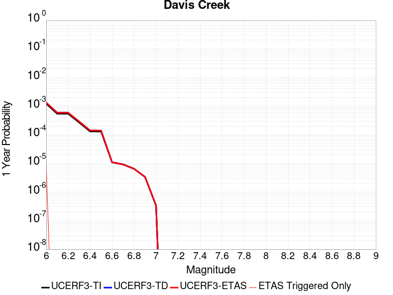 |  |

| Magnitude | 1 wk TI Prob | 1 wk TD Prob | 1 wk ETAS Prob | 1 wk ETAS/TD Gain | 1 wk ETAS Triggered Only | 1 mo TI Prob | 1 mo TD Prob | 1 mo ETAS Prob | 1 mo ETAS/TD Gain | 1 mo ETAS Triggered Only | 1 yr TI Prob | 1 yr TD Prob | 1 yr ETAS Prob | 1 yr ETAS/TD Gain | 1 yr ETAS Triggered Only | 10 yr TI Prob | 10 yr TD Prob | 10 yr ETAS Prob | 10 yr ETAS/TD Gain | 10 yr ETAS Triggered Only |
|-----|-----|-----|-----|-----|-----|-----|-----|-----|-----|-----|-----|-----|-----|-----|-----|-----|-----|-----|-----|-----|
| 6.0 | 2.331472E-5 | 2.5417517E-5 | 3.5417263E-5 | 1.3934195 | 1.0E-5 | 9.99164E-5 | 1.0892834E-4 | 1.1892725E-4 | 1.0917934 | 1.0E-5 | 0.0012158032 | 0.0013255142 | 0.001335501 | 1.0075343 | 1.0E-5 | 0.01209173 | 0.013187861 | 0.013197729 | 1.0007483 | 1.0E-5 |
| 6.1 | 1.0407654E-5 | 1.1317118E-5 | 1.1317118E-5 | 1.0 | 0.0 | 4.4603472E-5 | 4.8501184E-5 | 4.8501184E-5 | 1.0 | 0.0 | 5.4291193E-4 | 5.9036905E-4 | 5.9036905E-4 | 1.0 | 0.0 | 0.0054158745 | 0.005890679 | 0.005890679 | 1.0 | 0.0 |
| 6.2 | 1.0407654E-5 | 1.1317118E-5 | 1.1317118E-5 | 1.0 | 0.0 | 4.4603472E-5 | 4.8501184E-5 | 4.8501184E-5 | 1.0 | 0.0 | 5.4291193E-4 | 5.9036905E-4 | 5.9036905E-4 | 1.0 | 0.0 | 0.0054158745 | 0.005890679 | 0.005890679 | 1.0 | 0.0 |
| 6.3 | 5.1323277E-6 | 5.5686187E-6 | 5.5686187E-6 | 1.0 | 0.0 | 2.1995505E-5 | 2.386534E-5 | 2.386534E-5 | 1.0 | 0.0 | 2.6776237E-4 | 2.9053038E-4 | 2.9053038E-4 | 1.0 | 0.0 | 0.0026743996 | 0.0029023518 | 0.0029023518 | 1.0 | 0.0 |
| 6.4 | 2.4985154E-6 | 2.7045678E-6 | 2.7045678E-6 | 1.0 | 0.0 | 1.07078795E-5 | 1.1590974E-5 | 1.1590974E-5 | 1.0 | 0.0 | 1.3036063E-4 | 1.411146E-4 | 1.411146E-4 | 1.0 | 0.0 | 0.0013028418 | 0.0014106046 | 0.0014106046 | 1.0 | 0.0 |
| 6.5 | 2.4846438E-6 | 2.690502E-6 | 2.690502E-6 | 1.0 | 0.0 | 1.064843E-5 | 1.1530692E-5 | 1.1530692E-5 | 1.0 | 0.0 | 1.2963692E-4 | 1.4038075E-4 | 1.4038075E-4 | 1.0 | 0.0 | 0.0012956132 | 0.0014032754 | 0.0014032754 | 1.0 | 0.0 |
| 6.6 | 2.072566E-7 | 2.1018127E-7 | 2.1018127E-7 | 1.0 | 0.0 | 8.882423E-7 | 9.0077657E-7 | 9.0077657E-7 | 1.0 | 0.0 | 1.0814296E-5 | 1.0966901E-5 | 1.0966901E-5 | 1.0 | 0.0 | 1.081377E-4 | 1.09663786E-4 | 1.09663786E-4 | 1.0 | 0.0 |
| 6.7 | 1.7544528E-7 | 1.7790859E-7 | 1.7790859E-7 | 1.0 | 0.0 | 7.5190815E-7 | 7.6246516E-7 | 7.6246516E-7 | 1.0 | 0.0 | 9.154443E-6 | 9.282975E-6 | 9.282975E-6 | 1.0 | 0.0 | 9.1540656E-5 | 9.2826034E-5 | 9.2826034E-5 | 1.0 | 0.0 |
| 6.8 | 1.2320395E-7 | 1.2481159E-7 | 1.2481159E-7 | 1.0 | 0.0 | 5.280168E-7 | 5.3490675E-7 | 5.3490675E-7 | 1.0 | 0.0 | 6.428586E-6 | 6.512471E-6 | 6.512471E-6 | 1.0 | 0.0 | 6.4284E-5 | 6.512291E-5 | 6.512291E-5 | 1.0 | 0.0 |
| 6.9 | 6.399997E-8 | 6.486069E-8 | 6.486069E-8 | 1.0 | 0.0 | 2.7428555E-7 | 2.7797438E-7 | 2.7797438E-7 | 1.0 | 0.0 | 3.3394215E-6 | 3.3843335E-6 | 3.3843335E-6 | 1.0 | 0.0 | 3.3393713E-5 | 3.3842884E-5 | 3.3842884E-5 | 1.0 | 0.0 |
| 7.0 | 6.4455685E-9 | 6.5352763E-9 | 6.5352763E-9 | 1.0 | 0.0 | 2.7623864E-8 | 2.8008326E-8 | 2.8008326E-8 | 1.0 | 0.0 | 3.3632048E-7 | 3.4100137E-7 | 3.4100137E-7 | 1.0 | 0.0 | 3.3631998E-6 | 3.4100137E-6 | 3.4100137E-6 | 1.0 | 0.0 |

## Elsinore (Temecula) rev
*[(top)](#table-of-contents)*

| 1 Week | 1 Month | 1 Year | 10 Year |
|-----|-----|-----|-----|
|  |  |  | 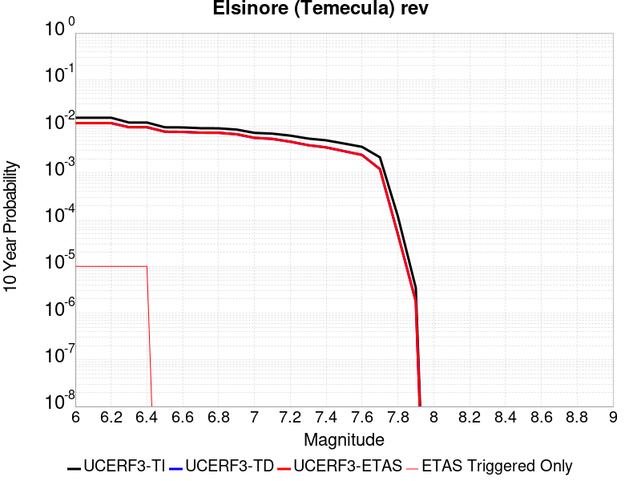 |

| Magnitude | 1 wk TI Prob | 1 wk TD Prob | 1 wk ETAS Prob | 1 wk ETAS/TD Gain | 1 wk ETAS Triggered Only | 1 mo TI Prob | 1 mo TD Prob | 1 mo ETAS Prob | 1 mo ETAS/TD Gain | 1 mo ETAS Triggered Only | 1 yr TI Prob | 1 yr TD Prob | 1 yr ETAS Prob | 1 yr ETAS/TD Gain | 1 yr ETAS Triggered Only | 10 yr TI Prob | 10 yr TD Prob | 10 yr ETAS Prob | 10 yr ETAS/TD Gain | 10 yr ETAS Triggered Only |
|-----|-----|-----|-----|-----|-----|-----|-----|-----|-----|-----|-----|-----|-----|-----|-----|-----|-----|-----|-----|-----|
| 6.0 | 2.9514995E-5 | 2.2519711E-5 | 2.2519711E-5 | 1.0 | 0.0 | 1.264867E-4 | 9.65096E-5 | 9.65096E-5 | 1.0 | 0.0 | 0.0015388876 | 0.001174393 | 0.0011843813 | 1.008505 | 1.0E-5 | 0.015282745 | 0.0117053585 | 0.011715242 | 1.0008444 | 1.0E-5 |
| 6.1 | 2.9514995E-5 | 2.2519711E-5 | 2.2519711E-5 | 1.0 | 0.0 | 1.264867E-4 | 9.65096E-5 | 9.65096E-5 | 1.0 | 0.0 | 0.0015388876 | 0.001174393 | 0.0011843813 | 1.008505 | 1.0E-5 | 0.015282745 | 0.0117053585 | 0.011715242 | 1.0008444 | 1.0E-5 |
| 6.2 | 2.9514995E-5 | 2.2519711E-5 | 2.2519711E-5 | 1.0 | 0.0 | 1.264867E-4 | 9.65096E-5 | 9.65096E-5 | 1.0 | 0.0 | 0.0015388876 | 0.001174393 | 0.0011843813 | 1.008505 | 1.0E-5 | 0.015282745 | 0.0117053585 | 0.011715242 | 1.0008444 | 1.0E-5 |
| 6.3 | 2.3223649E-5 | 1.8409017E-5 | 1.8409017E-5 | 1.0 | 0.0 | 9.952613E-5 | 7.889349E-5 | 7.889349E-5 | 1.0 | 0.0 | 0.001211057 | 9.601222E-4 | 9.701126E-4 | 1.0104053 | 1.0E-5 | 0.012044783 | 0.009568522 | 0.009578426 | 1.0010351 | 1.0E-5 |
| 6.4 | 2.3223649E-5 | 1.8409017E-5 | 1.8409017E-5 | 1.0 | 0.0 | 9.952613E-5 | 7.889349E-5 | 7.889349E-5 | 1.0 | 0.0 | 0.001211057 | 9.601222E-4 | 9.701126E-4 | 1.0104053 | 1.0E-5 | 0.012044783 | 0.009568522 | 0.009578426 | 1.0010351 | 1.0E-5 |
| 6.5 | 1.8338875E-5 | 1.4750807E-5 | 1.4750807E-5 | 1.0 | 0.0 | 7.8592806E-5 | 6.321626E-5 | 6.321626E-5 | 1.0 | 0.0 | 9.5644733E-4 | 7.69395E-4 | 7.69395E-4 | 1.0 | 0.0 | 0.009523412 | 0.0076706978 | 0.0076706978 | 1.0 | 0.0 |
| 6.6 | 1.8223333E-5 | 1.461336E-5 | 1.461336E-5 | 1.0 | 0.0 | 7.809766E-5 | 6.262723E-5 | 6.262723E-5 | 1.0 | 0.0 | 9.504242E-4 | 7.622285E-4 | 7.622285E-4 | 1.0 | 0.0 | 0.009463696 | 0.0075995247 | 0.0075995247 | 1.0 | 0.0 |
| 6.7 | 1.7512752E-5 | 1.40276925E-5 | 1.40276925E-5 | 1.0 | 0.0 | 7.505249E-5 | 6.0117345E-5 | 6.0117345E-5 | 1.0 | 0.0 | 9.13381E-4 | 7.316914E-4 | 7.316914E-4 | 1.0 | 0.0 | 0.00909636 | 0.0072990605 | 0.0072990605 | 1.0 | 0.0 |
| 6.8 | 1.7417142E-5 | 1.3951659E-5 | 1.3951659E-5 | 1.0 | 0.0 | 7.4642754E-5 | 5.9791502E-5 | 5.9791502E-5 | 1.0 | 0.0 | 9.083966E-4 | 7.2772696E-4 | 7.2772696E-4 | 1.0 | 0.0 | 0.009046922 | 0.0072600874 | 0.0072600874 | 1.0 | 0.0 |
| 6.9 | 1.6402591E-5 | 1.2989093E-5 | 1.2989093E-5 | 1.0 | 0.0 | 7.0294926E-5 | 5.5666394E-5 | 5.5666394E-5 | 1.0 | 0.0 | 8.5550465E-4 | 6.775353E-4 | 6.775353E-4 | 1.0 | 0.0 | 0.008522186 | 0.006759923 | 0.006759923 | 1.0 | 0.0 |
| 7.0 | 1.3912486E-5 | 1.0878599E-5 | 1.0878599E-5 | 1.0 | 0.0 | 5.9623577E-5 | 4.662175E-5 | 4.662175E-5 | 1.0 | 0.0 | 7.2567526E-4 | 5.674747E-4 | 5.674747E-4 | 1.0 | 0.0 | 0.0072331014 | 0.0056636394 | 0.0056636394 | 1.0 | 0.0 |
| 7.1 | 1.3405147E-5 | 1.0327708E-5 | 1.0327708E-5 | 1.0 | 0.0 | 5.7449364E-5 | 4.426087E-5 | 4.426087E-5 | 1.0 | 0.0 | 6.9922156E-4 | 5.3874543E-4 | 5.3874543E-4 | 1.0 | 0.0 | 0.0069702556 | 0.0053774444 | 0.0053774444 | 1.0 | 0.0 |
| 7.2 | 1.21402E-5 | 8.9969135E-6 | 8.9969135E-6 | 1.0 | 0.0 | 5.202839E-5 | 3.855764E-5 | 3.855764E-5 | 1.0 | 0.0 | 6.332616E-4 | 4.6933992E-4 | 4.6933992E-4 | 1.0 | 0.0 | 0.0063146 | 0.004684822 | 0.004684822 | 1.0 | 0.0 |
| 7.3 | 1.05047775E-5 | 7.5718904E-6 | 7.5718904E-6 | 1.0 | 0.0 | 4.5019697E-5 | 3.2450564E-5 | 3.2450564E-5 | 1.0 | 0.0 | 5.4797693E-4 | 3.9501544E-4 | 3.9501544E-4 | 1.0 | 0.0 | 0.005466277 | 0.00394353 | 0.00394353 | 1.0 | 0.0 |
| 7.4 | 9.624483E-6 | 6.7869523E-6 | 6.7869523E-6 | 1.0 | 0.0 | 4.124713E-5 | 2.9086623E-5 | 2.9086623E-5 | 1.0 | 0.0 | 5.0206814E-4 | 3.5407348E-4 | 3.5407348E-4 | 1.0 | 0.0 | 0.005009353 | 0.003535245 | 0.003535245 | 1.0 | 0.0 |
| 7.5 | 8.215151E-6 | 5.6356125E-6 | 5.6356125E-6 | 1.0 | 0.0 | 3.5207315E-5 | 2.4152409E-5 | 2.4152409E-5 | 1.0 | 0.0 | 4.2856473E-4 | 2.9401717E-4 | 2.9401717E-4 | 1.0 | 0.0 | 0.004277392 | 0.0029364098 | 0.0029364098 | 1.0 | 0.0 |
| 7.6 | 6.975058E-6 | 4.6760947E-6 | 4.6760947E-6 | 1.0 | 0.0 | 2.9892764E-5 | 2.0040257E-5 | 2.0040257E-5 | 1.0 | 0.0 | 3.6388362E-4 | 2.43964E-4 | 2.43964E-4 | 1.0 | 0.0 | 0.0036328835 | 0.002437078 | 0.002437078 | 1.0 | 0.0 |
| 7.7 | 4.159604E-6 | 2.3269624E-6 | 2.3269624E-6 | 1.0 | 0.0 | 1.7826753E-5 | 9.972662E-6 | 9.972662E-6 | 1.0 | 0.0 | 2.1701909E-4 | 1.2141114E-4 | 1.2141114E-4 | 1.0 | 0.0 | 0.0021680726 | 0.0012135211 | 0.0012135211 | 1.0 | 0.0 |
| 7.8 | 2.2692414E-7 | 9.384624E-8 | 9.384624E-8 | 1.0 | 0.0 | 9.725317E-7 | 4.021981E-7 | 4.021981E-7 | 1.0 | 0.0 | 1.1840509E-5 | 4.8967545E-6 | 4.8967545E-6 | 1.0 | 0.0 | 1.1839878E-4 | 4.8966795E-5 | 4.8966795E-5 | 1.0 | 0.0 |
| 7.9 | 6.676829E-9 | 3.4397993E-9 | 3.4397993E-9 | 1.0 | 0.0 | 2.861498E-8 | 1.4741998E-8 | 1.4741998E-8 | 1.0 | 0.0 | 3.4838732E-7 | 1.794838E-7 | 1.794838E-7 | 1.0 | 0.0 | 3.4838679E-6 | 1.7948367E-6 | 1.7948367E-6 | 1.0 | 0.0 |

## San Gregorio (South) 2011 CFM
*[(top)](#table-of-contents)*

| 1 Week | 1 Month | 1 Year | 10 Year |
|-----|-----|-----|-----|
|  |  |  |  |

| Magnitude | 1 wk TI Prob | 1 wk TD Prob | 1 wk ETAS Prob | 1 wk ETAS/TD Gain | 1 wk ETAS Triggered Only | 1 mo TI Prob | 1 mo TD Prob | 1 mo ETAS Prob | 1 mo ETAS/TD Gain | 1 mo ETAS Triggered Only | 1 yr TI Prob | 1 yr TD Prob | 1 yr ETAS Prob | 1 yr ETAS/TD Gain | 1 yr ETAS Triggered Only | 10 yr TI Prob | 10 yr TD Prob | 10 yr ETAS Prob | 10 yr ETAS/TD Gain | 10 yr ETAS Triggered Only |
|-----|-----|-----|-----|-----|-----|-----|-----|-----|-----|-----|-----|-----|-----|-----|-----|-----|-----|-----|-----|-----|
| 6.0 | 1.8770423E-5 | 1.6280237E-5 | 1.6280237E-5 | 1.0 | 0.0 | 8.044219E-5 | 6.97706E-5 | 6.97706E-5 | 1.0 | 0.0 | 9.789435E-4 | 8.4912975E-4 | 8.5912127E-4 | 1.0117668 | 1.0E-5 | 0.009746423 | 0.008471773 | 0.008481689 | 1.0011704 | 1.0E-5 |
| 6.1 | 1.8770423E-5 | 1.6280237E-5 | 1.6280237E-5 | 1.0 | 0.0 | 8.044219E-5 | 6.97706E-5 | 6.97706E-5 | 1.0 | 0.0 | 9.789435E-4 | 8.4912975E-4 | 8.5912127E-4 | 1.0117668 | 1.0E-5 | 0.009746423 | 0.008471773 | 0.008481689 | 1.0011704 | 1.0E-5 |
| 6.2 | 1.7508692E-5 | 1.4899725E-5 | 1.4899725E-5 | 1.0 | 0.0 | 7.5035096E-5 | 6.3854415E-5 | 6.3854415E-5 | 1.0 | 0.0 | 9.1316935E-4 | 7.7715324E-4 | 7.871455E-4 | 1.0128574 | 1.0E-5 | 0.00909426 | 0.007757193 | 0.0077671153 | 1.0012791 | 1.0E-5 |
| 6.3 | 1.7508692E-5 | 1.4899725E-5 | 1.4899725E-5 | 1.0 | 0.0 | 7.5035096E-5 | 6.3854415E-5 | 6.3854415E-5 | 1.0 | 0.0 | 9.1316935E-4 | 7.7715324E-4 | 7.871455E-4 | 1.0128574 | 1.0E-5 | 0.00909426 | 0.007757193 | 0.0077671153 | 1.0012791 | 1.0E-5 |
| 6.4 | 1.6004591E-5 | 1.3249541E-5 | 1.3249541E-5 | 1.0 | 0.0 | 6.85893E-5 | 5.6782515E-5 | 5.6782515E-5 | 1.0 | 0.0 | 8.347548E-4 | 6.911089E-4 | 7.0110196E-4 | 1.0144595 | 1.0E-5 | 0.008316261 | 0.006902233 | 0.0069121644 | 1.0014389 | 1.0E-5 |
| 6.5 | 1.6004591E-5 | 1.3249541E-5 | 1.3249541E-5 | 1.0 | 0.0 | 6.85893E-5 | 5.6782515E-5 | 5.6782515E-5 | 1.0 | 0.0 | 8.347548E-4 | 6.911089E-4 | 7.0110196E-4 | 1.0144595 | 1.0E-5 | 0.008316261 | 0.006902233 | 0.0069121644 | 1.0014389 | 1.0E-5 |
| 6.6 | 1.5442201E-5 | 1.2634164E-5 | 1.2634164E-5 | 1.0 | 0.0 | 6.617918E-5 | 5.4145297E-5 | 5.4145297E-5 | 1.0 | 0.0 | 8.0543366E-4 | 6.590205E-4 | 6.690139E-4 | 1.015164 | 1.0E-5 | 0.008025207 | 0.006583281 | 0.0065932153 | 1.001509 | 1.0E-5 |
| 6.7 | 1.489921E-5 | 1.2042667E-5 | 1.2042667E-5 | 1.0 | 0.0 | 6.3852196E-5 | 5.161041E-5 | 5.161041E-5 | 1.0 | 0.0 | 7.7712315E-4 | 6.2817626E-4 | 6.3817E-4 | 1.0159091 | 1.0E-5 | 0.0077441116 | 0.006276611 | 0.006286548 | 1.0015832 | 1.0E-5 |
| 6.8 | 1.3876024E-5 | 1.0921603E-5 | 1.0921603E-5 | 1.0 | 0.0 | 5.9467322E-5 | 4.6806028E-5 | 4.6806028E-5 | 1.0 | 0.0 | 7.237741E-4 | 5.6971476E-4 | 5.7970907E-4 | 1.0175426 | 1.0E-5 | 0.0072142133 | 0.0056951125 | 0.005705056 | 1.0017459 | 1.0E-5 |
| 6.9 | 1.33922495E-5 | 1.0393098E-5 | 1.0393098E-5 | 1.0 | 0.0 | 5.7394092E-5 | 4.454109E-5 | 4.454109E-5 | 1.0 | 0.0 | 6.9854903E-4 | 5.4215314E-4 | 5.521477E-4 | 1.018435 | 1.0E-5 | 0.0069635725 | 0.005420867 | 0.0054308125 | 1.0018348 | 1.0E-5 |
| 7.0 | 1.2807324E-5 | 9.753052E-6 | 9.753052E-6 | 1.0 | 0.0 | 5.4887376E-5 | 4.1798125E-5 | 4.1798125E-5 | 1.0 | 0.0 | 6.680489E-4 | 5.0877355E-4 | 5.1876844E-4 | 1.0196451 | 1.0E-5 | 0.006660442 | 0.0050886413 | 0.00509859 | 1.0019552 | 1.0E-5 |
| 7.1 | 1.2191438E-5 | 9.061928E-6 | 9.061928E-6 | 1.0 | 0.0 | 5.224797E-5 | 3.8836257E-5 | 3.8836257E-5 | 1.0 | 0.0 | 6.3593336E-4 | 4.7272892E-4 | 4.827242E-4 | 1.0211438 | 1.0E-5 | 0.0063411663 | 0.0047297794 | 0.004739732 | 1.0021043 | 1.0E-5 |
| 7.2 | 1.1769438E-5 | 8.582114E-6 | 8.582114E-6 | 1.0 | 0.0 | 5.0439474E-5 | 3.677997E-5 | 3.677997E-5 | 1.0 | 0.0 | 6.1392755E-4 | 4.477042E-4 | 4.576997E-4 | 1.0223262 | 1.0E-5 | 0.0061223423 | 0.0044805673 | 0.0044905227 | 1.0022218 | 1.0E-5 |
| 7.3 | 1.150374E-5 | 8.297538E-6 | 8.297538E-6 | 1.0 | 0.0 | 4.9300812E-5 | 3.5560395E-5 | 3.5560395E-5 | 1.0 | 0.0 | 6.0007203E-4 | 4.3286185E-4 | 4.4285753E-4 | 1.023092 | 1.0E-5 | 0.0059845424 | 0.0043327045 | 0.0043426612 | 1.002298 | 1.0E-5 |
| 7.4 | 1.12514E-5 | 8.0432765E-6 | 8.0432765E-6 | 1.0 | 0.0 | 4.8219394E-5 | 3.447073E-5 | 3.447073E-5 | 1.0 | 0.0 | 5.8691297E-4 | 4.196004E-4 | 4.295962E-4 | 1.0238222 | 1.0E-5 | 0.005853653 | 0.0042005833 | 0.0042105415 | 1.0023706 | 1.0E-5 |
| 7.5 | 1.059696E-5 | 7.3935516E-6 | 7.3935516E-6 | 1.0 | 0.0 | 4.5414752E-5 | 3.1686264E-5 | 3.1686264E-5 | 1.0 | 0.0 | 5.5278436E-4 | 3.8571205E-4 | 3.9570816E-4 | 1.0259161 | 1.0E-5 | 0.0055141128 | 0.0038628688 | 0.0038728302 | 1.0025787 | 1.0E-5 |
| 7.6 | 9.018592E-6 | 5.8372852E-6 | 5.8372852E-6 | 1.0 | 0.0 | 3.8650534E-5 | 2.5016698E-5 | 2.5016698E-5 | 1.0 | 0.0 | 4.7046866E-4 | 3.0453576E-4 | 3.1453272E-4 | 1.0328269 | 1.0E-5 | 0.004694739 | 0.0030532526 | 0.003063222 | 1.0032651 | 1.0E-5 |
| 7.7 | 6.243489E-6 | 3.2397822E-6 | 3.2397822E-6 | 1.0 | 0.0 | 2.6757538E-5 | 1.3884707E-5 | 1.3884707E-5 | 1.0 | 0.0 | 3.257243E-4 | 1.690332E-4 | 1.7903151E-4 | 1.05915 | 1.0E-5 | 0.003252473 | 0.0016992823 | 0.0017092653 | 1.0058749 | 1.0E-5 |
| 7.8 | 3.1941963E-6 | 1.3811459E-6 | 1.3811459E-6 | 1.0 | 0.0 | 1.368934E-5 | 5.919183E-6 | 5.919183E-6 | 1.0 | 0.0 | 1.6665498E-4 | 7.2063674E-5 | 7.2063674E-5 | 1.0 | 0.0 | 0.0016653005 | 7.263882E-4 | 7.263882E-4 | 1.0 | 0.0 |
| 7.9 | 2.0098398E-6 | 6.917116E-7 | 6.917116E-7 | 1.0 | 0.0 | 8.6135715E-6 | 2.9644748E-6 | 2.9644748E-6 | 1.0 | 0.0 | 1.0486518E-4 | 3.6091882E-5 | 3.6091882E-5 | 1.0 | 0.0 | 0.0010481571 | 3.6575383E-4 | 3.6575383E-4 | 1.0 | 0.0 |
| 8.0 | 8.353119E-7 | 3.1628775E-7 | 3.1628775E-7 | 1.0 | 0.0 | 3.579903E-6 | 1.3555182E-6 | 1.3555182E-6 | 1.0 | 0.0 | 4.358445E-5 | 1.6503309E-5 | 1.6503309E-5 | 1.0 | 0.0 | 4.3575902E-4 | 1.6621267E-4 | 1.6621267E-4 | 1.0 | 0.0 |
| 8.1 | 1.5033264E-7 | 6.528495E-8 | 6.528495E-8 | 1.0 | 0.0 | 6.442826E-7 | 2.7979263E-7 | 2.7979263E-7 | 1.0 | 0.0 | 7.844113E-6 | 3.4064701E-6 | 3.4064701E-6 | 1.0 | 0.0 | 7.843835E-5 | 3.408197E-5 | 3.408197E-5 | 1.0 | 0.0 |

## Newport-Inglewood (Offshore)
*[(top)](#table-of-contents)*

| 1 Week | 1 Month | 1 Year | 10 Year |
|-----|-----|-----|-----|
|  |  |  |  |

| Magnitude | 1 wk TI Prob | 1 wk TD Prob | 1 wk ETAS Prob | 1 wk ETAS/TD Gain | 1 wk ETAS Triggered Only | 1 mo TI Prob | 1 mo TD Prob | 1 mo ETAS Prob | 1 mo ETAS/TD Gain | 1 mo ETAS Triggered Only | 1 yr TI Prob | 1 yr TD Prob | 1 yr ETAS Prob | 1 yr ETAS/TD Gain | 1 yr ETAS Triggered Only | 10 yr TI Prob | 10 yr TD Prob | 10 yr ETAS Prob | 10 yr ETAS/TD Gain | 10 yr ETAS Triggered Only |
|-----|-----|-----|-----|-----|-----|-----|-----|-----|-----|-----|-----|-----|-----|-----|-----|-----|-----|-----|-----|-----|
| 6.0 | 1.9626508E-5 | 1.8965571E-5 | 1.8965571E-5 | 1.0 | 0.0 | 8.411089E-5 | 8.127856E-5 | 8.127856E-5 | 1.0 | 0.0 | 0.001023569 | 9.891298E-4 | 9.891298E-4 | 1.0 | 0.0 | 0.010188672 | 0.009848615 | 0.009858516 | 1.0010054 | 1.0E-5 |
| 6.1 | 1.331886E-5 | 1.2218245E-5 | 1.2218245E-5 | 1.0 | 0.0 | 5.707958E-5 | 5.2362862E-5 | 5.2362862E-5 | 1.0 | 0.0 | 6.947222E-4 | 6.373329E-4 | 6.373329E-4 | 1.0 | 0.0 | 0.006925544 | 0.0063552284 | 0.0063651646 | 1.0015635 | 1.0E-5 |
| 6.2 | 1.2250852E-5 | 1.1076171E-5 | 1.1076171E-5 | 1.0 | 0.0 | 5.2502597E-5 | 4.746845E-5 | 4.746845E-5 | 1.0 | 0.0 | 6.3903164E-4 | 5.777761E-4 | 5.777761E-4 | 1.0 | 0.0 | 0.006371971 | 0.0057628606 | 0.005772803 | 1.0017252 | 1.0E-5 |
| 6.3 | 1.2106258E-5 | 1.0919031E-5 | 1.0919031E-5 | 1.0 | 0.0 | 5.1882926E-5 | 4.6795016E-5 | 4.6795016E-5 | 1.0 | 0.0 | 6.3149154E-4 | 5.6958135E-4 | 5.6958135E-4 | 1.0 | 0.0 | 0.0062970007 | 0.0056813317 | 0.005691275 | 1.0017501 | 1.0E-5 |
| 6.4 | 1.1348758E-5 | 1.0109495E-5 | 1.0109495E-5 | 1.0 | 0.0 | 4.8636626E-5 | 4.332569E-5 | 4.332569E-5 | 1.0 | 0.0 | 5.919901E-4 | 5.2736345E-4 | 5.2736345E-4 | 1.0 | 0.0 | 0.005904155 | 0.0052612154 | 0.005271163 | 1.0018907 | 1.0E-5 |
| 6.5 | 1.100837E-5 | 9.743519E-6 | 9.743519E-6 | 1.0 | 0.0 | 4.7177873E-5 | 4.175727E-5 | 4.175727E-5 | 1.0 | 0.0 | 5.7423924E-4 | 5.08277E-4 | 5.08277E-4 | 1.0 | 0.0 | 0.005727576 | 0.005071236 | 0.005081185 | 1.001962 | 1.0E-5 |
| 6.6 | 1.0634696E-5 | 9.345668E-6 | 9.345668E-6 | 1.0 | 0.0 | 4.557647E-5 | 4.0052255E-5 | 4.0052255E-5 | 1.0 | 0.0 | 5.5475225E-4 | 4.8752784E-4 | 4.8752784E-4 | 1.0 | 0.0 | 0.0055336943 | 0.00486467 | 0.004874621 | 1.0020456 | 1.0E-5 |
| 6.7 | 9.9780855E-6 | 8.668028E-6 | 8.668028E-6 | 1.0 | 0.0 | 4.276252E-5 | 3.714817E-5 | 3.714817E-5 | 1.0 | 0.0 | 5.205093E-4 | 4.521858E-4 | 4.521858E-4 | 1.0 | 0.0 | 0.0051929182 | 0.004512736 | 0.004522691 | 1.002206 | 1.0E-5 |
| 6.8 | 9.59546E-6 | 8.273059E-6 | 8.273059E-6 | 1.0 | 0.0 | 4.1122752E-5 | 3.545549E-5 | 3.545549E-5 | 1.0 | 0.0 | 5.0055445E-4 | 4.3158577E-4 | 4.3158577E-4 | 1.0 | 0.0 | 0.004994285 | 0.004307552 | 0.0043175085 | 1.0023115 | 1.0E-5 |
| 6.9 | 9.000614E-6 | 7.7069435E-6 | 7.7069435E-6 | 1.0 | 0.0 | 3.857349E-5 | 3.3029344E-5 | 3.3029344E-5 | 1.0 | 0.0 | 4.6953102E-4 | 4.0205874E-4 | 4.0205874E-4 | 1.0 | 0.0 | 0.004685402 | 0.0040133847 | 0.0040233447 | 1.0024817 | 1.0E-5 |
| 7.0 | 7.4070194E-6 | 6.148973E-6 | 6.148973E-6 | 1.0 | 0.0 | 3.1743984E-5 | 2.6352478E-5 | 2.6352478E-5 | 1.0 | 0.0 | 3.8641447E-4 | 3.2079432E-4 | 3.2079432E-4 | 1.0 | 0.0 | 0.0038574322 | 0.0032033324 | 0.0032133004 | 1.0031117 | 1.0E-5 |
| 7.1 | 6.299615E-6 | 5.056658E-6 | 5.056658E-6 | 1.0 | 0.0 | 2.699807E-5 | 2.1671214E-5 | 2.1671214E-5 | 1.0 | 0.0 | 3.2865192E-4 | 2.6381522E-4 | 2.6381522E-4 | 1.0 | 0.0 | 0.003281663 | 0.002635035 | 0.0026450087 | 1.003785 | 1.0E-5 |
| 7.2 | 5.096653E-6 | 3.89282E-6 | 3.89282E-6 | 1.0 | 0.0 | 2.1842614E-5 | 1.6683409E-5 | 1.6683409E-5 | 1.0 | 0.0 | 2.6590136E-4 | 2.0310168E-4 | 2.0310168E-4 | 1.0 | 0.0 | 0.0026558342 | 0.0020291717 | 0.0020291717 | 1.0 | 0.0 |
| 7.3 | 3.9753018E-6 | 2.909908E-6 | 2.909908E-6 | 1.0 | 0.0 | 1.7036897E-5 | 1.2470975E-5 | 1.2470975E-5 | 1.0 | 0.0 | 2.0740448E-4 | 1.5182362E-4 | 1.5182362E-4 | 1.0 | 0.0 | 0.00207211 | 0.0015172071 | 0.0015172071 | 1.0 | 0.0 |
| 7.4 | 3.0568392E-6 | 2.1449978E-6 | 2.1449978E-6 | 1.0 | 0.0 | 1.3100675E-5 | 9.192815E-6 | 9.192815E-6 | 1.0 | 0.0 | 1.5948903E-4 | 1.11916845E-4 | 1.11916845E-4 | 1.0 | 0.0 | 0.0015937461 | 0.0011186111 | 0.0011186111 | 1.0 | 0.0 |
| 7.5 | 1.7279019E-6 | 1.1469773E-6 | 1.1469773E-6 | 1.0 | 0.0 | 7.405273E-6 | 4.915608E-6 | 4.915608E-6 | 1.0 | 0.0 | 9.015547E-5 | 5.9845923E-5 | 5.9845923E-5 | 1.0 | 0.0 | 9.01189E-4 | 5.9830194E-4 | 5.9830194E-4 | 1.0 | 0.0 |
| 7.6 | 1.1156416E-6 | 7.2230335E-7 | 7.2230335E-7 | 1.0 | 0.0 | 4.7813123E-6 | 3.0955823E-6 | 3.0955823E-6 | 1.0 | 0.0 | 5.821092E-5 | 3.7688085E-5 | 3.7688085E-5 | 1.0 | 0.0 | 5.8195676E-4 | 3.7681928E-4 | 3.7681928E-4 | 1.0 | 0.0 |
| 7.7 | 9.117973E-8 | 6.734264E-8 | 6.734264E-8 | 1.0 | 0.0 | 3.907702E-7 | 2.886113E-7 | 2.886113E-7 | 1.0 | 0.0 | 4.757617E-6 | 3.513837E-6 | 3.513837E-6 | 1.0 | 0.0 | 4.7575148E-5 | 3.5137844E-5 | 3.5137844E-5 | 1.0 | 0.0 |

## Fitzhugh Creek
*[(top)](#table-of-contents)*

| 1 Week | 1 Month | 1 Year | 10 Year |
|-----|-----|-----|-----|
|  | 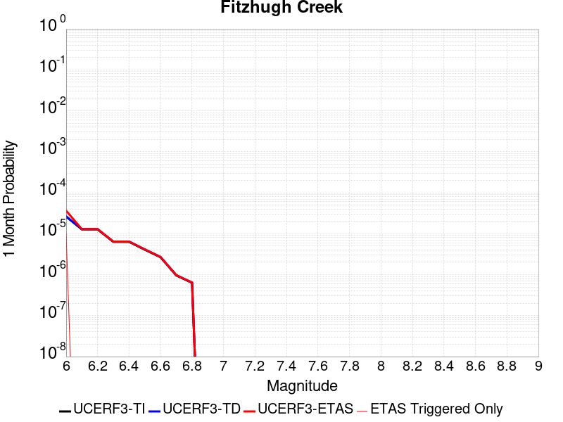 | 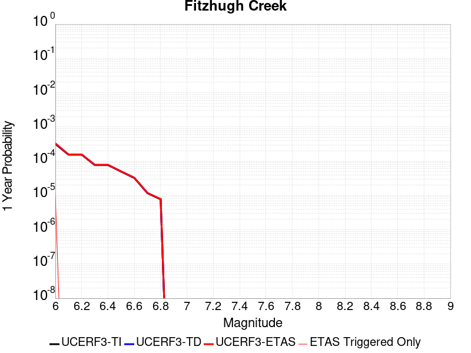 |  |

| Magnitude | 1 wk TI Prob | 1 wk TD Prob | 1 wk ETAS Prob | 1 wk ETAS/TD Gain | 1 wk ETAS Triggered Only | 1 mo TI Prob | 1 mo TD Prob | 1 mo ETAS Prob | 1 mo ETAS/TD Gain | 1 mo ETAS Triggered Only | 1 yr TI Prob | 1 yr TD Prob | 1 yr ETAS Prob | 1 yr ETAS/TD Gain | 1 yr ETAS Triggered Only | 10 yr TI Prob | 10 yr TD Prob | 10 yr ETAS Prob | 10 yr ETAS/TD Gain | 10 yr ETAS Triggered Only |
|-----|-----|-----|-----|-----|-----|-----|-----|-----|-----|-----|-----|-----|-----|-----|-----|-----|-----|-----|-----|-----|
| 6.0 | 6.1090436E-6 | 6.21017E-6 | 1.6210108E-5 | 2.610252 | 1.0E-5 | 2.6181353E-5 | 2.6614767E-5 | 3.66145E-5 | 1.3757212 | 1.0E-5 | 3.1871133E-4 | 3.2399112E-4 | 3.3398787E-4 | 1.0308551 | 1.0E-5 | 0.0031825465 | 0.0032356316 | 0.0032455993 | 1.0030806 | 1.0E-5 |
| 6.1 | 2.9741811E-6 | 3.0215874E-6 | 3.0215874E-6 | 1.0 | 0.0 | 1.2746428E-5 | 1.2949601E-5 | 1.2949601E-5 | 1.0 | 0.0 | 1.5517672E-4 | 1.5765094E-4 | 1.5765094E-4 | 1.0 | 0.0 | 0.001550684 | 0.0015754839 | 0.0015754839 | 1.0 | 0.0 |
| 6.2 | 2.9741811E-6 | 3.0215874E-6 | 3.0215874E-6 | 1.0 | 0.0 | 1.2746428E-5 | 1.2949601E-5 | 1.2949601E-5 | 1.0 | 0.0 | 1.5517672E-4 | 1.5765094E-4 | 1.5765094E-4 | 1.0 | 0.0 | 0.001550684 | 0.0015754839 | 0.0015754839 | 1.0 | 0.0 |
| 6.3 | 1.4781198E-6 | 1.501274E-6 | 1.501274E-6 | 1.0 | 0.0 | 6.3347834E-6 | 6.4340165E-6 | 6.4340165E-6 | 1.0 | 0.0 | 7.712326E-5 | 7.833154E-5 | 7.833154E-5 | 1.0 | 0.0 | 7.70965E-4 | 7.830592E-4 | 7.830592E-4 | 1.0 | 0.0 |
| 6.4 | 1.4781198E-6 | 1.501274E-6 | 1.501274E-6 | 1.0 | 0.0 | 6.3347834E-6 | 6.4340165E-6 | 6.4340165E-6 | 1.0 | 0.0 | 7.712326E-5 | 7.833154E-5 | 7.833154E-5 | 1.0 | 0.0 | 7.70965E-4 | 7.830592E-4 | 7.830592E-4 | 1.0 | 0.0 |
| 6.5 | 9.5176676E-7 | 9.66608E-7 | 9.66608E-7 | 1.0 | 0.0 | 4.078994E-6 | 4.1425997E-6 | 4.1425997E-6 | 1.0 | 0.0 | 4.9660623E-5 | 5.043509E-5 | 5.043509E-5 | 1.0 | 0.0 | 4.964952E-4 | 5.0424685E-4 | 5.0424685E-4 | 1.0 | 0.0 |
| 6.6 | 6.21145E-7 | 6.3085986E-7 | 6.3085986E-7 | 1.0 | 0.0 | 2.662047E-6 | 2.7036829E-6 | 2.7036829E-6 | 1.0 | 0.0 | 3.2409942E-5 | 3.291691E-5 | 3.291691E-5 | 1.0 | 0.0 | 3.2405215E-4 | 3.291269E-4 | 3.291269E-4 | 1.0 | 0.0 |
| 6.7 | 2.2377962E-7 | 2.2734685E-7 | 2.2734685E-7 | 1.0 | 0.0 | 9.590551E-7 | 9.743434E-7 | 9.743434E-7 | 1.0 | 0.0 | 1.1676434E-5 | 1.18625985E-5 | 1.18625985E-5 | 1.0 | 0.0 | 1.1675821E-4 | 1.1862279E-4 | 1.1862279E-4 | 1.0 | 0.0 |
| 6.8 | 1.4785022E-7 | 1.5021524E-7 | 1.5021524E-7 | 1.0 | 0.0 | 6.3364365E-7 | 6.4377963E-7 | 6.4377963E-7 | 1.0 | 0.0 | 7.714584E-6 | 7.838016E-6 | 7.838016E-6 | 1.0 | 0.0 | 7.714316E-5 | 7.8380166E-5 | 7.8380166E-5 | 1.0 | 0.0 |

