# Parent Section Magnitude-Probability Distributions

Only fault sections with at least one triggered aftershock are plotted. Sections are sorted by total supraseismogenic trigger rate (decreasing)

## Table Of Contents

* [Tank Canyon](#tank-canyon)
* [Garlock (Central)](#garlock-central)
* [Little Lake](#little-lake)
* [Panamint Valley](#panamint-valley)
* [Owl Lake](#owl-lake)
* [Airport Lake](#airport-lake)
* [Ash Hill](#ash-hill)
* [Garlock (East)](#garlock-east)
* [Hunter Mountain-Saline Valley](#hunter-mountain-saline-valley)
* [Blackwater](#blackwater)
* [Gravel Hills-Harper Lk](#gravel-hills-harper-lk)
* [Garlock (West)](#garlock-west)
* [Goldstone Lake](#goldstone-lake)
* [McLean Lake](#mclean-lake)
* [So Sierra Nevada](#so-sierra-nevada)
* [Coyote Canyon](#coyote-canyon)
* [Lenwood-Lockhart-Old Woman Springs](#lenwood-lockhart-old-woman-springs)
* [Nelson Lake](#nelson-lake)
* [San Andreas (Mojave S)](#san-andreas-mojave-s)
* [Towne Pass](#towne-pass)
* [Death Valley (So)](#death-valley-so)
* [San Andreas (Mojave N)](#san-andreas-mojave-n)
* [Paradise](#paradise)
* [Bicycle Lake](#bicycle-lake)
* [San Andreas (San Bernardino N)](#san-andreas-san-bernardino-n)
* [Garlic Springs](#garlic-springs)
* [Helendale-So Lockhart](#helendale-so-lockhart)
* [Death Valley (Black Mtns Frontal)](#death-valley-black-mtns-frontal)
* [San Andreas (Parkfield)](#san-andreas-parkfield)
* [Sierra Nevada  (No Extension)](#sierra-nevada--no-extension)
* [San Andreas (San Bernardino S)](#san-andreas-san-bernardino-s)
* [Coyote Lake](#coyote-lake)
* [San Andreas (Big Bend)](#san-andreas-big-bend)
* [Cady](#cady)
* [Manix-Afton Hills](#manix-afton-hills)
* [Death Valley (No)](#death-valley-no)
* [Elsinore (Glen Ivy) rev](#elsinore-glen-ivy-rev)
* [Ludlow](#ludlow)
* [Red Pass](#red-pass)
* [White Wolf (Extension)](#white-wolf-extension)
* [Death Valley (Fish Lake Valley)](#death-valley-fish-lake-valley)
* [Baker](#baker)
* [Scodie Lineament](#scodie-lineament)
* [Lake Isabella (Seismicity)](#lake-isabella-seismicity)
* [Channel Islands Thrust](#channel-islands-thrust)
* [Calico-Hidalgo](#calico-hidalgo)
* [San Andreas (San Gorgonio Pass-Garnet HIll)](#san-andreas-san-gorgonio-pass-garnet-hill)
* [San Andreas (Carrizo) rev](#san-andreas-carrizo-rev)
* [San Andreas (Cholame) rev](#san-andreas-cholame-rev)
* [San Andreas (Coachella) rev](#san-andreas-coachella-rev)
* [Owens Valley](#owens-valley)
* [Independence rev 2011](#independence-rev-2011)
* [San Jacinto (San Bernardino)](#san-jacinto-san-bernardino)
* [White Mountains](#white-mountains)
* [Cleghorn Pass](#cleghorn-pass)
* [Tin Mountain](#tin-mountain)
* [Santa Ynez (West)](#santa-ynez-west)
* [San Jacinto (Lytle Creek connector)](#san-jacinto-lytle-creek-connector)
* [Santa Cruz Catalina Ridge alt1](#santa-cruz-catalina-ridge-alt1)
* [Pinto Mtn](#pinto-mtn)
* [San Andreas (Creeping Section) 2011 CFM](#san-andreas-creeping-section-2011-cfm)
* [San Jacinto (Stepovers Combined)](#san-jacinto-stepovers-combined)
* [Cleghorn Lake](#cleghorn-lake)
* [Dry Mountain](#dry-mountain)
* [San Jacinto (San Jacinto Valley) rev](#san-jacinto-san-jacinto-valley-rev)
* [Mission Ridge-Arroyo Parida-Santa Ana](#mission-ridge-arroyo-parida-santa-ana)
* [Monterey Bay-Tularcitos](#monterey-bay-tularcitos)
* [Deep Springs](#deep-springs)
* [San Jacinto (Anza) rev](#san-jacinto-anza-rev)
* [Red Mountain](#red-mountain)
* [San Andreas (North Branch Mill Creek)](#san-andreas-north-branch-mill-creek)
* [Kern Canyon (North Kern) 2011](#kern-canyon-north-kern-2011)
* [Rose Canyon](#rose-canyon)
* [Santa Rosa Island](#santa-rosa-island)
* [Big Pine (East)](#big-pine-east)
* [Pisgah-Bullion Mtn-Mesquite Lk](#pisgah-bullion-mtn-mesquite-lk)
* [Santa Cruz Island](#santa-cruz-island)
* [Santa Ynez (East)](#santa-ynez-east)
* [Bullion Mountains](#bullion-mountains)
* [Palos Verdes](#palos-verdes)
* [Sheephole](#sheephole)
* [Brawley (Seismic Zone) alt 1](#brawley-seismic-zone-alt-1)
* [Pine Mtn](#pine-mtn)
* [San Gabriel](#san-gabriel)
* [San Cayetano](#san-cayetano)
* [Holser alt 1](#holser-alt-1)
* [Great Valley 05 Pittsburg - Kirby Hills alt1](#great-valley-05-pittsburg---kirby-hills-alt1)
* [San Gabriel (Extension)](#san-gabriel-extension)
* [Oceanic - West Huasna](#oceanic---west-huasna)
* [San Luis Range 2011 CFM](#san-luis-range-2011-cfm)
* [Chino alt 1](#chino-alt-1)
* [San Pedro Basin](#san-pedro-basin)
* [Ventura-Pitas Point](#ventura-pitas-point)
* [Robinson Creek](#robinson-creek)
* [San Juan](#san-juan)
* [Hunting Creek - Berryessa 2011 CFM](#hunting-creek---berryessa-2011-cfm)
* [Santa Ynez River](#santa-ynez-river)
* [San Clemente](#san-clemente)
* [Whittier alt 1](#whittier-alt-1)
* [Lost Hills](#lost-hills)
* [Imperial](#imperial)
* [San Jacinto (Clark) rev](#san-jacinto-clark-rev)
* [Homestead Valley 2011](#homestead-valley-2011)
* [Big Pine (Central)](#big-pine-central)
* [Green Valley 2011 CFM](#green-valley-2011-cfm)
* [Superstition Hills](#superstition-hills)
* [Malibu Coast alt 1](#malibu-coast-alt-1)
* [Greenville (No) 2011 CFM](#greenville-no-2011-cfm)
* [Elsinore (Stepovers Combined)](#elsinore-stepovers-combined)
* [West Tahoe](#west-tahoe)
* [Cerro Prieto](#cerro-prieto)
* [Cleghorn](#cleghorn)
* [Oak Ridge (Onshore)](#oak-ridge-onshore)
* [San Luis Range - Oceano 2011 CFM](#san-luis-range---oceano-2011-cfm)
* [Blue Cut](#blue-cut)
* [San Jacinto (Superstition Mtn)](#san-jacinto-superstition-mtn)
* [Fontana (Seismicity)](#fontana-seismicity)
* [Big Pine (West)](#big-pine-west)
* [La Panza 2011](#la-panza-2011)
* [Great Valley 04b Gordon Valley](#great-valley-04b-gordon-valley)
* [Kern Canyon (South Kern) 2011](#kern-canyon-south-kern-2011)
* [Cedar Mtn-Mahogany Mtn](#cedar-mtn-mahogany-mtn)
* [Greenville (So) 2011 CFM](#greenville-so-2011-cfm)
* [White Wolf](#white-wolf)
* [Elysian Park (Upper)](#elysian-park-upper)
* [Newport-Inglewood alt 1](#newport-inglewood-alt-1)
* [Pittville 2011 CFM](#pittville-2011-cfm)
* [Fitzhugh Creek](#fitzhugh-creek)
* [Calaveras (So) 2011 CFM](#calaveras-so-2011-cfm)
* [Del Valle](#del-valle)
* [Morales (West)](#morales-west)
* [San Jacinto (Borrego)](#san-jacinto-borrego)
* [Burnt Mtn](#burnt-mtn)
* [Carson Range (Genoa)](#carson-range-genoa)
* [Franklin 2011 CFM](#franklin-2011-cfm)
* [San Andreas (Santa Cruz Mts) 2011 CFM](#san-andreas-santa-cruz-mts-2011-cfm)
* [Owens Valley Keough Hot Springs](#owens-valley-keough-hot-springs)
* [Hartley Springs 2011 CFM](#hartley-springs-2011-cfm)
* [Great Valley 09 (Laguna Seca)](#great-valley-09-laguna-seca)
* [Hayward (So) extension 2011 CFM](#hayward-so-extension-2011-cfm)
* [Kern Canyon (Lake Isabella) 2011](#kern-canyon-lake-isabella-2011)
* [Concord 2011 CFM](#concord-2011-cfm)
* [San Jacinto (Coyote Creek)](#san-jacinto-coyote-creek)
* [Shoreline](#shoreline)
* [Davis Creek](#davis-creek)
* [Malibu Coast (Extension) alt 1](#malibu-coast-extension-alt-1)
* [Simi-Santa Rosa](#simi-santa-rosa)
* [Surprise Valley 2011 CFM](#surprise-valley-2011-cfm)
* [Great Valley 03 Mysterious Ridge](#great-valley-03-mysterious-ridge)
* [Big Lagoon - Bald Mtn 2011 CFM](#big-lagoon---bald-mtn-2011-cfm)

## Tank Canyon
*[(top)](#table-of-contents)*

| 1 Week | 1 Month | 1 Year | 10 Year |
|-----|-----|-----|-----|
|  |  | 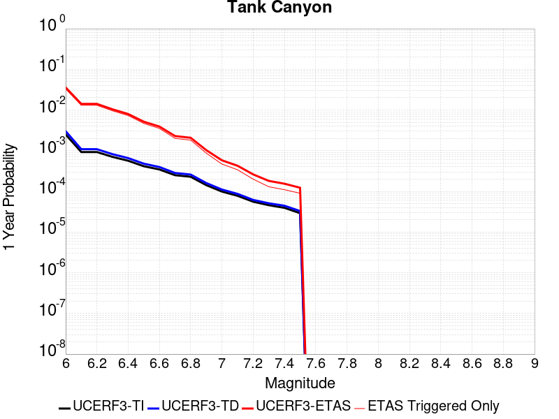 |  |

| Magnitude | 1 wk TI Prob | 1 wk TD Prob | 1 wk ETAS Prob | 1 wk ETAS/TD Gain | 1 wk ETAS Triggered Only | 1 mo TI Prob | 1 mo TD Prob | 1 mo ETAS Prob | 1 mo ETAS/TD Gain | 1 mo ETAS Triggered Only | 1 yr TI Prob | 1 yr TD Prob | 1 yr ETAS Prob | 1 yr ETAS/TD Gain | 1 yr ETAS Triggered Only | 10 yr TI Prob | 10 yr TD Prob | 10 yr ETAS Prob | 10 yr ETAS/TD Gain | 10 yr ETAS Triggered Only |
|-----|-----|-----|-----|-----|-----|-----|-----|-----|-----|-----|-----|-----|-----|-----|-----|-----|-----|-----|-----|-----|
| 6.0 | 4.8284557E-5 | 5.796635E-5 | 0.00473783 | 81.73414 | 0.004680135 | 2.0691741E-4 | 2.484074E-4 | 0.012619071 | 50.7999 | 0.012373737 | 0.0025163088 | 0.0030208372 | 0.03632061 | 12.023359 | 0.033400673 | 0.02488006 | 0.029864404 | 0.08756624 | 2.9321275 | 0.059478115 |
| 6.1 | 1.7796336E-5 | 2.0873764E-5 | 0.001519159 | 72.7784 | 0.0014983165 | 7.626778E-5 | 8.945614E-5 | 0.0044830022 | 50.11397 | 0.0043939394 | 9.281647E-4 | 0.0010886216 | 0.014054289 | 12.910171 | 0.012979798 | 0.009242975 | 0.010836975 | 0.03453359 | 3.1866448 | 0.023956228 |
| 6.2 | 1.7796336E-5 | 2.0873764E-5 | 0.001519159 | 72.7784 | 0.0014983165 | 7.626778E-5 | 8.945614E-5 | 0.0044830022 | 50.11397 | 0.0043939394 | 9.281647E-4 | 0.0010886216 | 0.014054289 | 12.910171 | 0.012979798 | 0.009242975 | 0.010836975 | 0.03453359 | 3.1866448 | 0.023956228 |
| 6.3 | 1.3515912E-5 | 1.575988E-5 | 9.753407E-4 | 61.88757 | 9.5959596E-4 | 5.792405E-5 | 6.7540735E-5 | 0.0031818084 | 47.109474 | 0.0031144782 | 7.049971E-4 | 8.220222E-4 | 0.010376452 | 12.623079 | 0.009562289 | 0.007027647 | 0.008192427 | 0.025908047 | 3.1624384 | 0.017861953 |
| 6.4 | 1.0870146E-5 | 1.2618259E-5 | 7.7018444E-4 | 61.037304 | 7.5757573E-4 | 4.658551E-5 | 5.407723E-5 | 0.0024276862 | 44.89295 | 0.0023737373 | 5.67031E-4 | 6.582093E-4 | 0.007909326 | 12.016429 | 0.0072558923 | 0.005655863 | 0.006564614 | 0.020195082 | 3.076355 | 0.0137205385 |
| 6.5 | 7.964826E-6 | 9.196251E-6 | 4.6373752E-4 | 50.4268 | 4.5454546E-4 | 3.4134522E-5 | 3.941197E-5 | 0.0016050069 | 40.723843 | 0.0015656565 | 4.1550855E-4 | 4.7974577E-4 | 0.0050566737 | 10.540319 | 0.0045791245 | 0.0041473247 | 0.0047884025 | 0.013601219 | 2.84045 | 0.008855219 |
| 6.6 | 6.6317E-6 | 7.6124184E-6 | 3.106404E-4 | 40.80706 | 3.030303E-4 | 2.8421264E-5 | 3.2624295E-5 | 0.0011436992 | 35.05667 | 0.0011111111 | 3.4597394E-4 | 3.971375E-4 | 0.003914259 | 9.856179 | 0.0035185185 | 0.0034543579 | 0.00396543 | 0.010588893 | 2.6703012 | 0.006649832 |
| 6.7 | 4.793663E-6 | 5.4308543E-6 | 2.0744996E-4 | 38.198402 | 2.0202021E-4 | 2.0544108E-5 | 2.3274906E-5 | 7.1349455E-4 | 30.655096 | 6.902357E-4 | 2.500958E-4 | 2.8333953E-4 | 0.0023366297 | 8.246748 | 0.002053872 | 0.0024981452 | 0.0028304753 | 0.0066747824 | 2.358184 | 0.0038552189 |
| 6.8 | 4.382823E-6 | 4.969316E-6 | 1.7331865E-4 | 34.87777 | 1.6835016E-4 | 1.8783392E-5 | 2.1296917E-5 | 6.778486E-4 | 31.828484 | 6.5656565E-4 | 2.286638E-4 | 2.5926338E-4 | 0.0021274658 | 8.205809 | 0.0018686869 | 0.0022842865 | 0.0025902835 | 0.0060661053 | 2.341869 | 0.0034848484 |
| 6.9 | 2.729601E-6 | 3.0735694E-6 | 8.7248394E-5 | 28.38667 | 8.417508E-5 | 1.1698237E-5 | 1.317238E-5 | 3.498683E-4 | 26.56075 | 3.3670032E-4 | 1.4241673E-4 | 1.6036315E-4 | 0.0011029729 | 6.8779697 | 9.4276096E-4 | 0.001423255 | 0.0016026403 | 0.0032834439 | 2.0487716 | 0.0016835016 |
| 7.0 | 1.8987357E-6 | 2.126954E-6 | 3.5796915E-5 | 16.830132 | 3.3670032E-5 | 8.137413E-6 | 9.115489E-6 | 1.7746413E-4 | 19.468414 | 1.6835016E-4 | 9.90685E-5 | 1.1097613E-4 | 6.159706E-4 | 5.550478 | 5.050505E-4 | 9.902435E-4 | 0.0011092757 | 0.0019164602 | 1.7276679 | 8.0808083E-4 |
| 7.1 | 1.4928986E-6 | 1.6641375E-6 | 3.5334117E-5 | 21.23269 | 3.3670032E-5 | 6.398121E-6 | 7.1320014E-6 | 1.2497627E-4 | 17.52331 | 1.1784512E-4 | 7.789434E-5 | 8.682925E-5 | 4.7400102E-4 | 5.4590015 | 3.872054E-4 | 7.786704E-4 | 8.680111E-4 | 0.0014230844 | 1.6394773 | 5.5555557E-4 |
| 7.2 | 1.069082E-6 | 1.1828638E-6 | 1.1828638E-6 | 1.0 | 0.0 | 4.581772E-6 | 5.0694093E-6 | 5.5574204E-5 | 10.962658 | 5.0505052E-5 | 5.5781646E-5 | 6.171884E-5 | 2.9739452E-4 | 4.8185368 | 2.3569024E-4 | 5.576765E-4 | 6.170693E-4 | 9.5356186E-4 | 1.5453076 | 3.3670032E-4 |
| 7.3 | 8.776551E-7 | 9.770052E-7 | 9.770052E-7 | 1.0 | 0.0 | 3.7613736E-6 | 4.1871617E-6 | 5.4692002E-5 | 13.061832 | 5.0505052E-5 | 4.579376E-5 | 5.097802E-5 | 2.3615376E-4 | 4.6324625 | 1.8518518E-4 | 4.5784327E-4 | 5.0971424E-4 | 7.7893725E-4 | 1.528184 | 2.6936026E-4 |
| 7.4 | 7.55721E-7 | 8.510284E-7 | 8.510284E-7 | 1.0 | 0.0 | 3.2388E-6 | 3.6472622E-6 | 5.415213E-5 | 14.847336 | 5.0505052E-5 | 3.9431678E-5 | 4.440503E-5 | 1.9591345E-4 | 4.4119654 | 1.5151515E-4 | 3.942468E-4 | 4.4401243E-4 | 6.627705E-4 | 1.4926845 | 2.1885522E-4 |
| 7.5 | 5.587665E-7 | 6.305647E-7 | 6.305647E-7 | 1.0 | 0.0 | 2.3947114E-6 | 2.7024203E-6 | 5.3207335E-5 | 19.68877 | 5.0505052E-5 | 2.915522E-5 | 3.2901968E-5 | 1.6757767E-4 | 5.0932417 | 1.3468013E-4 | 2.9151395E-4 | 3.2901968E-4 | 5.309734E-4 | 1.6138045 | 2.0202021E-4 |

## Garlock (Central)
*[(top)](#table-of-contents)*

| 1 Week | 1 Month | 1 Year | 10 Year |
|-----|-----|-----|-----|
|  |  |  |  |

| Magnitude | 1 wk TI Prob | 1 wk TD Prob | 1 wk ETAS Prob | 1 wk ETAS/TD Gain | 1 wk ETAS Triggered Only | 1 mo TI Prob | 1 mo TD Prob | 1 mo ETAS Prob | 1 mo ETAS/TD Gain | 1 mo ETAS Triggered Only | 1 yr TI Prob | 1 yr TD Prob | 1 yr ETAS Prob | 1 yr ETAS/TD Gain | 1 yr ETAS Triggered Only | 10 yr TI Prob | 10 yr TD Prob | 10 yr ETAS Prob | 10 yr ETAS/TD Gain | 10 yr ETAS Triggered Only |
|-----|-----|-----|-----|-----|-----|-----|-----|-----|-----|-----|-----|-----|-----|-----|-----|-----|-----|-----|-----|-----|
| 6.0 | 5.5131142E-5 | 7.0252914E-5 | 0.0029488385 | 41.974606 | 0.002878788 | 2.3625491E-4 | 3.0104956E-4 | 0.007807207 | 25.933294 | 0.0075084176 | 0.0028726095 | 0.0036591839 | 0.022881517 | 6.2531753 | 0.01929293 | 0.028357591 | 0.03608289 | 0.06715867 | 1.8612331 | 0.032239057 |
| 6.1 | 5.5131142E-5 | 7.0252914E-5 | 0.0029488385 | 41.974606 | 0.002878788 | 2.3625491E-4 | 3.0104956E-4 | 0.007807207 | 25.933294 | 0.0075084176 | 0.0028726095 | 0.0036591839 | 0.022881517 | 6.2531753 | 0.01929293 | 0.028357591 | 0.03608289 | 0.06715867 | 1.8612331 | 0.032239057 |
| 6.2 | 4.216245E-5 | 5.166702E-5 | 0.0020212622 | 39.120937 | 0.001969697 | 1.806837E-4 | 2.2141146E-4 | 0.005136148 | 23.1973 | 0.004915825 | 0.0021976046 | 0.0026923837 | 0.015049596 | 5.589692 | 0.012390573 | 0.021759989 | 0.02669258 | 0.04656837 | 1.7446185 | 0.020420875 |
| 6.3 | 4.216245E-5 | 5.166702E-5 | 0.0020212622 | 39.120937 | 0.001969697 | 1.806837E-4 | 2.2141146E-4 | 0.005136148 | 23.1973 | 0.004915825 | 0.0021976046 | 0.0026923837 | 0.015049596 | 5.589692 | 0.012390573 | 0.021759989 | 0.02669258 | 0.04656837 | 1.7446185 | 0.020420875 |
| 6.4 | 3.6858168E-5 | 4.411584E-5 | 0.0015760348 | 35.72492 | 0.0015319865 | 1.5795401E-4 | 1.8905434E-4 | 0.003875226 | 20.49795 | 0.0036868686 | 0.0019213937 | 0.0022993318 | 0.0117892455 | 5.1272483 | 0.009511785 | 0.019048655 | 0.02285164 | 0.03828203 | 1.6752421 | 0.015791247 |
| 6.5 | 3.39199E-5 | 4.0023286E-5 | 0.001454108 | 36.33155 | 0.0014141414 | 1.453629E-4 | 1.7151721E-4 | 0.0035716074 | 20.823608 | 0.0034006734 | 0.0017683565 | 0.0020862438 | 0.010805389 | 5.179351 | 0.008737374 | 0.017543508 | 0.02076252 | 0.034709238 | 1.6717255 | 0.014242425 |
| 6.6 | 3.3571985E-5 | 3.947746E-5 | 0.0014535631 | 36.820076 | 0.0014141414 | 1.4387199E-4 | 1.6917827E-4 | 0.0035692763 | 21.097723 | 0.0034006734 | 0.0017502342 | 0.0020578213 | 0.010760414 | 5.2290325 | 0.008720539 | 0.017365133 | 0.02048383 | 0.034401532 | 1.6794484 | 0.0142087545 |
| 6.7 | 3.2580007E-5 | 3.8093858E-5 | 0.0014185127 | 37.23731 | 0.0013804714 | 1.3962112E-4 | 1.632493E-4 | 0.0033782127 | 20.693583 | 0.0032154883 | 0.0016985617 | 0.0019857697 | 0.010235349 | 5.1543484 | 0.008265994 | 0.016856372 | 0.019776449 | 0.033093628 | 1.6733857 | 0.013585859 |
| 6.8 | 3.2185937E-5 | 3.7521055E-5 | 0.0013506031 | 35.995872 | 0.0013131313 | 1.3793244E-4 | 1.6079473E-4 | 0.0032916043 | 20.470848 | 0.003131313 | 0.0016780337 | 0.0019559395 | 0.0099705355 | 5.0975685 | 0.008030303 | 0.016654192 | 0.01948324 | 0.032441247 | 1.6650848 | 0.013215488 |
| 6.9 | 3.165394E-5 | 3.672561E-5 | 0.0012993055 | 35.37873 | 0.0012626263 | 1.3565269E-4 | 1.5738611E-4 | 0.0032377094 | 20.57176 | 0.003080808 | 0.0016503202 | 0.0019145131 | 0.009727809 | 5.0810876 | 0.007828283 | 0.01638118 | 0.01907586 | 0.031708974 | 1.6622566 | 0.012878788 |
| 7.0 | 3.0903822E-5 | 3.5630834E-5 | 0.0012645433 | 35.49014 | 0.0012289563 | 1.3243823E-4 | 1.5269476E-4 | 0.0031152053 | 20.40152 | 0.002962963 | 0.0016112428 | 0.0018574947 | 0.009402377 | 5.061859 | 0.0075589227 | 0.015996104 | 0.018515008 | 0.030791832 | 1.6630741 | 0.0125084175 |
| 7.1 | 3.0069863E-5 | 3.4397097E-5 | 0.0012128077 | 35.259014 | 0.0011784512 | 1.2886449E-4 | 1.4740792E-4 | 0.0029247762 | 19.841377 | 0.0027777778 | 0.0015677959 | 0.0017932352 | 0.0090193115 | 5.029631 | 0.007239057 | 0.01556781 | 0.017882649 | 0.029720966 | 1.6620002 | 0.012053872 |
| 7.2 | 2.7957109E-5 | 3.1286367E-5 | 0.0010245213 | 32.74657 | 9.93266E-4 | 1.1981068E-4 | 1.3407765E-4 | 0.0025916605 | 19.32955 | 0.0024579125 | 0.0014577188 | 0.0016311926 | 0.007866796 | 4.8227262 | 0.0062457914 | 0.014481937 | 0.016286217 | 0.026504252 | 1.627404 | 0.0103872055 |
| 7.3 | 2.4519275E-5 | 2.6719412E-5 | 7.3377124E-4 | 27.462103 | 7.070707E-4 | 1.0507837E-4 | 1.14506816E-4 | 0.0020166459 | 17.611578 | 0.0019023569 | 0.0012785783 | 0.0013932437 | 0.006050046 | 4.3424177 | 0.0046633 | 0.012712469 | 0.013930428 | 0.021716062 | 1.558894 | 0.007895623 |
| 7.4 | 2.3225532E-5 | 2.5203923E-5 | 6.6491845E-4 | 26.381546 | 6.3973066E-4 | 9.95342E-5 | 1.0801242E-4 | 0.0018249986 | 16.896193 | 0.0017171717 | 0.0012111551 | 0.0013142723 | 0.0055511207 | 4.223722 | 0.0042424244 | 0.012045753 | 0.013148054 | 0.020258704 | 1.5408139 | 0.007205387 |
| 7.5 | 2.097765E-5 | 2.2487986E-5 | 6.1170035E-4 | 27.201206 | 5.892256E-4 | 8.9901114E-5 | 9.637359E-5 | 0.0015272121 | 15.846791 | 0.0014309764 | 0.0010939965 | 0.0011727286 | 0.0046871207 | 3.9967651 | 0.0035185185 | 0.010886264 | 0.011742581 | 0.017698744 | 1.5072279 | 0.006026936 |
| 7.6 | 1.511254E-5 | 1.5995334E-5 | 2.6851654E-4 | 16.78718 | 2.5252526E-4 | 6.476642E-5 | 6.854967E-5 | 8.7657507E-4 | 12.787444 | 8.0808083E-4 | 7.882459E-4 | 8.342805E-4 | 0.0027518712 | 3.2984965 | 0.0019191919 | 0.007854558 | 0.008385628 | 0.0117410915 | 1.4001445 | 0.0033838383 |
| 7.7 | 9.934069E-6 | 1.0682508E-5 | 7.8021854E-5 | 7.3037024 | 6.7340065E-5 | 4.2573887E-5 | 4.5781377E-5 | 3.1512932E-4 | 6.883352 | 2.6936026E-4 | 5.182138E-4 | 5.572461E-4 | 0.001112492 | 1.9964107 | 5.5555557E-4 | 0.00517007 | 0.0056296107 | 0.0065838043 | 1.1694956 | 9.5959596E-4 |
| 7.8 | 6.7562896E-6 | 8.431477E-6 | 5.89361E-5 | 6.9900093 | 5.0505052E-5 | 2.8955206E-5 | 3.61344E-5 | 2.2131289E-4 | 6.124715 | 1.8518518E-4 | 3.5247262E-4 | 4.3984767E-4 | 8.100551E-4 | 1.841672 | 3.7037037E-4 | 0.0035191406 | 0.0044482257 | 0.0050851107 | 1.1431773 | 6.3973066E-4 |
| 7.9 | 3.975453E-6 | 5.3728795E-6 | 5.3728795E-6 | 1.0 | 0.0 | 1.7037546E-5 | 2.3026425E-5 | 9.036494E-5 | 3.9244018 | 6.7340065E-5 | 2.0741238E-4 | 2.8031075E-4 | 4.4861372E-4 | 1.6004157 | 1.6835016E-4 | 0.002072189 | 0.0028345888 | 0.003187122 | 1.1243684 | 3.5353535E-4 |
| 8.0 | 1.6729537E-6 | 2.078155E-6 | 2.078155E-6 | 1.0 | 0.0 | 7.169782E-6 | 8.906349E-6 | 5.9410948E-5 | 6.6706295 | 5.0505052E-5 | 8.7288594E-5 | 1.08429434E-4 | 1.58929E-4 | 1.4657367 | 5.0505052E-5 | 8.7254314E-4 | 0.001097267 | 0.0011981663 | 1.0919551 | 1.01010104E-4 |
| 8.1 | 3.6733252E-7 | 3.1499187E-7 | 3.1499187E-7 | 1.0 | 0.0 | 1.5742813E-6 | 1.3499646E-6 | 1.3499646E-6 | 1.0 | 0.0 | 1.9166706E-5 | 1.643571E-5 | 1.643571E-5 | 1.0 | 0.0 | 1.9165053E-4 | 1.6643589E-4 | 1.832681E-4 | 1.1011333 | 1.6835016E-5 |

## Little Lake
*[(top)](#table-of-contents)*

| 1 Week | 1 Month | 1 Year | 10 Year |
|-----|-----|-----|-----|
|  |  |  |  |

| Magnitude | 1 wk TI Prob | 1 wk TD Prob | 1 wk ETAS Prob | 1 wk ETAS/TD Gain | 1 wk ETAS Triggered Only | 1 mo TI Prob | 1 mo TD Prob | 1 mo ETAS Prob | 1 mo ETAS/TD Gain | 1 mo ETAS Triggered Only | 1 yr TI Prob | 1 yr TD Prob | 1 yr ETAS Prob | 1 yr ETAS/TD Gain | 1 yr ETAS Triggered Only | 10 yr TI Prob | 10 yr TD Prob | 10 yr ETAS Prob | 10 yr ETAS/TD Gain | 10 yr ETAS Triggered Only |
|-----|-----|-----|-----|-----|-----|-----|-----|-----|-----|-----|-----|-----|-----|-----|-----|-----|-----|-----|-----|-----|
| 6.0 | 2.8424427E-5 | 3.120616E-5 | 0.0021355175 | 68.43256 | 0.0021043771 | 1.2181328E-4 | 1.3373457E-4 | 0.0048805745 | 36.494484 | 0.0047474746 | 0.0014820677 | 0.0016271356 | 0.012098285 | 7.435327 | 0.010488216 | 0.014722223 | 0.016165627 | 0.032148793 | 1.9887131 | 0.016245792 |
| 6.1 | 2.8424427E-5 | 3.120616E-5 | 0.0021355175 | 68.43256 | 0.0021043771 | 1.2181328E-4 | 1.3373457E-4 | 0.0048805745 | 36.494484 | 0.0047474746 | 0.0014820677 | 0.0016271356 | 0.012098285 | 7.435327 | 0.010488216 | 0.014722223 | 0.016165627 | 0.032148793 | 1.9887131 | 0.016245792 |
| 6.2 | 2.8424427E-5 | 3.120616E-5 | 0.0021355175 | 68.43256 | 0.0021043771 | 1.2181328E-4 | 1.3373457E-4 | 0.0048805745 | 36.494484 | 0.0047474746 | 0.0014820677 | 0.0016271356 | 0.012098285 | 7.435327 | 0.010488216 | 0.014722223 | 0.016165627 | 0.032148793 | 1.9887131 | 0.016245792 |
| 6.3 | 1.48860645E-5 | 1.6081593E-5 | 0.0013796961 | 85.79349 | 0.0013636363 | 6.379586E-5 | 6.891945E-5 | 0.0027960043 | 40.56916 | 0.0027272727 | 7.7643775E-4 | 8.387995E-4 | 0.0066420087 | 7.9184694 | 0.005808081 | 0.007737305 | 0.008359154 | 0.017223822 | 2.0604744 | 0.008939394 |
| 6.4 | 1.48860645E-5 | 1.6081593E-5 | 0.0013796961 | 85.79349 | 0.0013636363 | 6.379586E-5 | 6.891945E-5 | 0.0027960043 | 40.56916 | 0.0027272727 | 7.7643775E-4 | 8.387995E-4 | 0.0066420087 | 7.9184694 | 0.005808081 | 0.007737305 | 0.008359154 | 0.017223822 | 2.0604744 | 0.008939394 |
| 6.5 | 1.2797581E-5 | 1.3765735E-5 | 0.0011585312 | 84.1605 | 0.0011447811 | 5.4845623E-5 | 5.899482E-5 | 0.002449426 | 41.519344 | 0.0023905723 | 6.675408E-4 | 7.180509E-4 | 0.0058995127 | 8.216009 | 0.005185185 | 0.006655392 | 0.0071598585 | 0.015115951 | 2.1112082 | 0.008013468 |
| 6.6 | 9.661896E-6 | 1.0289158E-5 | 8.6886616E-4 | 84.444824 | 8.585859E-4 | 4.1407468E-5 | 4.4095737E-5 | 0.0018285288 | 41.467247 | 0.0017845118 | 5.040193E-4 | 5.367496E-4 | 0.0047264188 | 8.805631 | 0.004191919 | 0.005028777 | 0.0053561367 | 0.011719178 | 2.187991 | 0.0063973065 |
| 6.7 | 7.767871E-6 | 8.199779E-6 | 7.320996E-4 | 89.282845 | 7.2390574E-4 | 3.329045E-5 | 3.514151E-5 | 0.0014829021 | 42.198017 | 0.0014478115 | 4.0523586E-4 | 4.2777765E-4 | 0.0038774798 | 9.064241 | 0.0034511785 | 0.004044977 | 0.0042708935 | 0.009635091 | 2.2559893 | 0.005387205 |
| 6.8 | 6.4235196E-6 | 6.735819E-6 | 6.4646214E-4 | 95.9738 | 6.3973066E-4 | 2.752908E-5 | 2.886755E-5 | 0.0011904502 | 41.238354 | 0.0011616162 | 3.35115E-4 | 3.5141854E-4 | 0.0031787076 | 9.045361 | 0.0028282828 | 0.003346101 | 0.0035098887 | 0.008039389 | 2.2904968 | 0.0045454544 |
| 6.9 | 3.1283696E-6 | 3.1122067E-6 | 3.7348142E-4 | 120.00534 | 3.7037037E-4 | 1.3407229E-5 | 1.3337969E-5 | 7.37234E-4 | 55.273335 | 7.2390574E-4 | 1.6322079E-4 | 1.6237919E-4 | 0.0018287753 | 11.262375 | 0.0016666667 | 0.0016310095 | 0.0016227537 | 0.004261562 | 2.62613 | 0.0026430977 |
| 7.0 | 2.290603E-6 | 2.2287015E-6 | 2.8842335E-4 | 129.41318 | 2.8619528E-4 | 9.816834E-6 | 9.551549E-6 | 5.145972E-4 | 53.87579 | 5.050505E-4 | 1.19513395E-4 | 1.16284944E-4 | 0.0011431016 | 9.830177 | 0.001026936 | 0.0011944914 | 0.0011623431 | 0.002810257 | 2.4177518 | 0.0016498317 |
| 7.1 | 1.293693E-6 | 1.1776951E-6 | 1.3585767E-4 | 115.35895 | 1.3468013E-4 | 5.5443866E-6 | 5.047259E-6 | 2.2390137E-4 | 44.360985 | 2.1885522E-4 | 6.750081E-5 | 6.144935E-5 | 5.3280086E-4 | 8.67057 | 4.7138048E-4 | 6.7480316E-4 | 6.14392E-4 | 0.0014051517 | 2.2870605 | 7.912458E-4 |
| 7.2 | 4.715842E-7 | 3.0918443E-7 | 3.3979206E-5 | 109.89948 | 3.3670032E-5 | 2.0210737E-6 | 1.3250755E-6 | 3.4995064E-5 | 26.409864 | 3.3670032E-5 | 2.4606294E-5 | 1.613268E-5 | 1.003064E-4 | 6.2175913 | 8.417508E-5 | 2.460357E-4 | 1.6131563E-4 | 2.7914174E-4 | 1.7304072 | 1.1784512E-4 |
| 7.3 | 3.9430947E-7 | 2.3098025E-7 | 3.3901008E-5 | 146.77016 | 3.3670032E-5 | 1.6898966E-6 | 9.89915E-7 | 3.4659915E-5 | 35.013023 | 3.3670032E-5 | 2.0574296E-5 | 1.2052149E-5 | 9.622622E-5 | 7.984154 | 8.417508E-5 | 2.0572392E-4 | 1.20515026E-4 | 2.3834595E-4 | 1.977728 | 1.1784512E-4 |
| 7.4 | 3.547123E-7 | 1.9679635E-7 | 3.3866825E-5 | 172.09071 | 3.3670032E-5 | 1.5201948E-6 | 8.4341264E-7 | 3.4513418E-5 | 40.921154 | 3.3670032E-5 | 1.8508214E-5 | 1.0268501E-5 | 9.444272E-5 | 9.197323 | 8.417508E-5 | 1.8506673E-4 | 1.0268033E-4 | 2.2051335E-4 | 2.1475716 | 1.1784512E-4 |
| 7.5 | 2.6354266E-7 | 1.4423487E-7 | 1.697925E-5 | 117.719444 | 1.6835016E-5 | 1.129468E-6 | 6.1814933E-7 | 1.7453156E-5 | 28.23453 | 1.6835016E-5 | 1.3751187E-5 | 7.5259427E-6 | 7.48655E-5 | 9.947658 | 6.7340065E-5 | 1.3750336E-4 | 7.525693E-5 | 1.5942568E-4 | 2.1184187 | 8.417508E-5 |
| 7.6 | 1.269913E-7 | 7.5727044E-8 | 1.6910742E-5 | 223.3118 | 1.6835016E-5 | 5.4424834E-7 | 3.2454443E-7 | 1.7159557E-5 | 52.872746 | 1.6835016E-5 | 6.6262032E-6 | 3.9513216E-6 | 2.0786272E-5 | 5.260587 | 1.6835016E-5 | 6.626006E-5 | 3.951255E-5 | 5.63469E-5 | 1.4260508 | 1.6835016E-5 |

## Panamint Valley
*[(top)](#table-of-contents)*

| 1 Week | 1 Month | 1 Year | 10 Year |
|-----|-----|-----|-----|
|  |  |  |  |

| Magnitude | 1 wk TI Prob | 1 wk TD Prob | 1 wk ETAS Prob | 1 wk ETAS/TD Gain | 1 wk ETAS Triggered Only | 1 mo TI Prob | 1 mo TD Prob | 1 mo ETAS Prob | 1 mo ETAS/TD Gain | 1 mo ETAS Triggered Only | 1 yr TI Prob | 1 yr TD Prob | 1 yr ETAS Prob | 1 yr ETAS/TD Gain | 1 yr ETAS Triggered Only | 10 yr TI Prob | 10 yr TD Prob | 10 yr ETAS Prob | 10 yr ETAS/TD Gain | 10 yr ETAS Triggered Only |
|-----|-----|-----|-----|-----|-----|-----|-----|-----|-----|-----|-----|-----|-----|-----|-----|-----|-----|-----|-----|-----|
| 6.0 | 3.0211835E-5 | 3.3985398E-5 | 9.5987984E-4 | 28.24389 | 9.259259E-4 | 1.2947287E-4 | 1.4564373E-4 | 0.0025863657 | 17.758165 | 0.0024410775 | 0.0015751923 | 0.0017717998 | 0.008645122 | 4.879288 | 0.006885522 | 0.015640736 | 0.01758359 | 0.029723214 | 1.690395 | 0.0123569025 |
| 6.1 | 3.0211835E-5 | 3.3985398E-5 | 9.5987984E-4 | 28.24389 | 9.259259E-4 | 1.2947287E-4 | 1.4564373E-4 | 0.0025863657 | 17.758165 | 0.0024410775 | 0.0015751923 | 0.0017717998 | 0.008645122 | 4.879288 | 0.006885522 | 0.015640736 | 0.01758359 | 0.029723214 | 1.690395 | 0.0123569025 |
| 6.2 | 3.0211835E-5 | 3.3985398E-5 | 9.5987984E-4 | 28.24389 | 9.259259E-4 | 1.2947287E-4 | 1.4564373E-4 | 0.0025863657 | 17.758165 | 0.0024410775 | 0.0015751923 | 0.0017717998 | 0.008645122 | 4.879288 | 0.006885522 | 0.015640736 | 0.01758359 | 0.029723214 | 1.690395 | 0.0123569025 |
| 6.3 | 2.8573924E-5 | 3.2103522E-5 | 9.243308E-4 | 28.792192 | 8.922559E-4 | 1.2245393E-4 | 1.3757942E-4 | 0.002460492 | 17.88416 | 0.0023232324 | 0.001489857 | 0.0016737703 | 0.00821163 | 4.906068 | 0.0065488215 | 0.01479908 | 0.016618231 | 0.028240018 | 1.6993394 | 0.011818182 |
| 6.4 | 2.8573924E-5 | 3.2103522E-5 | 9.243308E-4 | 28.792192 | 8.922559E-4 | 1.2245393E-4 | 1.3757942E-4 | 0.002460492 | 17.88416 | 0.0023232324 | 0.001489857 | 0.0016737703 | 0.00821163 | 4.906068 | 0.0065488215 | 0.01479908 | 0.016618231 | 0.028240018 | 1.6993394 | 0.011818182 |
| 6.5 | 2.7468774E-5 | 3.0829244E-5 | 9.0622314E-4 | 29.394918 | 8.7542087E-4 | 1.1771801E-4 | 1.3211879E-4 | 0.002404546 | 18.199877 | 0.0022727272 | 0.0014322745 | 0.0016073869 | 0.007910371 | 4.9212613 | 0.006313131 | 0.014230782 | 0.015964093 | 0.027212584 | 1.704612 | 0.011430976 |
| 6.6 | 2.6135967E-5 | 2.9253257E-5 | 8.7097945E-4 | 29.77376 | 8.417508E-4 | 1.1200648E-4 | 1.2536523E-4 | 0.002313643 | 18.455221 | 0.0021885522 | 0.0013628257 | 0.0015252795 | 0.0075766416 | 4.967379 | 0.006060606 | 0.013544982 | 0.015154443 | 0.026047431 | 1.7187984 | 0.011060606 |
| 6.7 | 2.4498746E-5 | 2.7342086E-5 | 8.354008E-4 | 30.55366 | 8.0808083E-4 | 1.04990395E-4 | 1.1717525E-4 | 0.0022044727 | 18.813467 | 0.002087542 | 0.0012775084 | 0.0014257001 | 0.0072086896 | 5.056245 | 0.005791246 | 0.012701893 | 0.014171662 | 0.024461452 | 1.7260822 | 0.01043771 |
| 6.8 | 2.2244329E-5 | 2.4936131E-5 | 7.993276E-4 | 32.054996 | 7.744108E-4 | 9.532935E-5 | 1.0686488E-4 | 0.0021605175 | 20.217281 | 0.002053872 | 0.0011600169 | 0.0013003252 | 0.0066805254 | 5.137581 | 0.005387205 | 0.011539802 | 0.012932883 | 0.022354888 | 1.7285309 | 0.009545455 |
| 6.9 | 1.9902658E-5 | 2.2290924E-5 | 6.7884196E-4 | 30.453737 | 6.5656565E-4 | 8.529431E-5 | 9.552913E-5 | 0.0018125369 | 18.973654 | 0.0017171717 | 0.0010379635 | 0.0011624652 | 0.0056353738 | 4.847779 | 0.0044781147 | 0.010331288 | 0.011568946 | 0.01910698 | 1.6515749 | 0.0076262625 |
| 7.0 | 1.8353881E-5 | 2.056681E-5 | 6.2661496E-4 | 30.46729 | 6.060606E-4 | 7.865712E-5 | 8.814059E-5 | 0.001586325 | 17.997667 | 0.0014983165 | 9.5722964E-4 | 0.0010726011 | 0.004940502 | 4.6060944 | 0.003872054 | 0.009531168 | 0.0106791705 | 0.017091434 | 1.600446 | 0.0064814813 |
| 7.1 | 1.7667631E-5 | 1.9773222E-5 | 5.921525E-4 | 29.947191 | 5.7239056E-4 | 7.571623E-5 | 8.473973E-5 | 0.0014987614 | 17.686644 | 0.0014141414 | 9.2145515E-4 | 0.0010312354 | 0.0047143023 | 4.571509 | 0.0036868686 | 0.009176437 | 0.010269388 | 0.016367728 | 1.5938368 | 0.006161616 |
| 7.2 | 1.6381597E-5 | 1.8158824E-5 | 4.7269603E-4 | 26.031202 | 4.5454546E-4 | 7.020495E-5 | 7.782131E-5 | 0.0012730145 | 16.358175 | 0.0011952862 | 8.544101E-4 | 9.4707985E-4 | 0.0041427035 | 4.3741865 | 0.0031986532 | 0.008511325 | 0.009435088 | 0.014804818 | 1.5691234 | 0.0054208753 |
| 7.3 | 1.4520491E-5 | 1.5966963E-5 | 4.0316617E-4 | 25.250021 | 3.872054E-4 | 6.222919E-5 | 6.842814E-5 | 0.00107846 | 15.760476 | 0.001010101 | 7.57377E-4 | 8.3281036E-4 | 0.003591454 | 4.312451 | 0.0027609428 | 0.0075480095 | 0.008300003 | 0.012957988 | 1.5612028 | 0.00469697 |
| 7.4 | 1.2852287E-5 | 1.4145856E-5 | 4.0134578E-4 | 28.371967 | 3.872054E-4 | 5.5080065E-5 | 6.0623777E-5 | 0.0010369956 | 17.105427 | 9.7643095E-4 | 6.7039346E-4 | 7.3786033E-4 | 0.0033117174 | 4.488271 | 0.0025757577 | 0.0066837464 | 0.007357025 | 0.011768771 | 1.5996644 | 0.0044444446 |
| 7.5 | 1.1637851E-5 | 1.2837149E-5 | 4.0003756E-4 | 31.16249 | 3.872054E-4 | 4.987555E-5 | 5.5015284E-5 | 0.0010145585 | 18.441393 | 9.5959596E-4 | 6.070656E-4 | 6.6962093E-4 | 0.003159535 | 4.718394 | 0.0024915824 | 0.006054099 | 0.0066789286 | 0.011010076 | 1.6484793 | 0.0043602693 |
| 7.6 | 3.0068115E-6 | 3.3331687E-6 | 1.3801285E-4 | 41.4059 | 1.3468013E-4 | 1.2886271E-5 | 1.4284972E-5 | 4.183196E-4 | 29.283894 | 4.0404042E-4 | 1.5687906E-4 | 1.7391294E-4 | 0.0011501741 | 6.6135054 | 9.7643095E-4 | 0.0015676835 | 0.001739208 | 0.0035710332 | 2.0532527 | 0.0018350169 |

## Owl Lake
*[(top)](#table-of-contents)*

| 1 Week | 1 Month | 1 Year | 10 Year |
|-----|-----|-----|-----|
|  |  |  |  |

| Magnitude | 1 wk TI Prob | 1 wk TD Prob | 1 wk ETAS Prob | 1 wk ETAS/TD Gain | 1 wk ETAS Triggered Only | 1 mo TI Prob | 1 mo TD Prob | 1 mo ETAS Prob | 1 mo ETAS/TD Gain | 1 mo ETAS Triggered Only | 1 yr TI Prob | 1 yr TD Prob | 1 yr ETAS Prob | 1 yr ETAS/TD Gain | 1 yr ETAS Triggered Only | 10 yr TI Prob | 10 yr TD Prob | 10 yr ETAS Prob | 10 yr ETAS/TD Gain | 10 yr ETAS Triggered Only |
|-----|-----|-----|-----|-----|-----|-----|-----|-----|-----|-----|-----|-----|-----|-----|-----|-----|-----|-----|-----|-----|
| 6.0 | 5.0320643E-5 | 6.636149E-5 | 0.0010763955 | 16.22018 | 0.001010101 | 2.1564208E-4 | 2.8438168E-4 | 0.0024723115 | 8.693639 | 0.0021885522 | 0.0026222812 | 0.00345791 | 0.009396899 | 2.717508 | 0.005959596 | 0.02591553 | 0.0341423 | 0.044369984 | 1.2995605 | 0.010589225 |
| 6.1 | 5.0320643E-5 | 6.636149E-5 | 0.0010763955 | 16.22018 | 0.001010101 | 2.1564208E-4 | 2.8438168E-4 | 0.0024723115 | 8.693639 | 0.0021885522 | 0.0026222812 | 0.00345791 | 0.009396899 | 2.717508 | 0.005959596 | 0.02591553 | 0.0341423 | 0.044369984 | 1.2995605 | 0.010589225 |
| 6.2 | 2.4125871E-5 | 3.098269E-5 | 7.3803146E-4 | 23.820768 | 7.070707E-4 | 1.0339249E-4 | 1.3277736E-4 | 0.0016477277 | 12.409702 | 0.0015151515 | 0.0012580766 | 0.0016155228 | 0.0059183245 | 3.6634114 | 0.004309764 | 0.012509781 | 0.016071297 | 0.023757206 | 1.4782381 | 0.0078114476 |
| 6.3 | 1.7433485E-5 | 2.2356835E-5 | 6.789078E-4 | 30.366901 | 6.5656565E-4 | 7.471279E-5 | 9.5812386E-5 | 0.0014424847 | 15.0553055 | 0.0013468013 | 9.0924866E-4 | 0.0011660426 | 0.0048149815 | 4.1293354 | 0.0036531987 | 0.009055373 | 0.01162957 | 0.017935839 | 1.5422616 | 0.0063804714 |
| 6.4 | 1.7433485E-5 | 2.2356835E-5 | 6.789078E-4 | 30.366901 | 6.5656565E-4 | 7.471279E-5 | 9.5812386E-5 | 0.0014424847 | 15.0553055 | 0.0013468013 | 9.0924866E-4 | 0.0011660426 | 0.0048149815 | 4.1293354 | 0.0036531987 | 0.009055373 | 0.01162957 | 0.017935839 | 1.5422616 | 0.0063804714 |
| 6.5 | 1.5182742E-5 | 1.9430352E-5 | 6.7598326E-4 | 34.790066 | 6.5656565E-4 | 6.506727E-5 | 8.327114E-5 | 0.0013626259 | 16.363724 | 0.0012794613 | 7.919061E-4 | 0.0010135059 | 0.0044107325 | 4.351956 | 0.0034006734 | 0.0078909 | 0.010119047 | 0.016001672 | 1.5813419 | 0.005942761 |
| 6.6 | 6.7271576E-6 | 8.548157E-6 | 5.3042924E-4 | 62.05188 | 5.218855E-4 | 2.8830356E-5 | 3.6634476E-5 | 0.0010130297 | 27.652359 | 9.7643095E-4 | 3.5095305E-4 | 4.4593913E-4 | 0.0029364105 | 6.584779 | 0.0024915824 | 0.0035039932 | 0.004468226 | 0.008322978 | 1.8627032 | 0.003872054 |
| 6.7 | 6.682835E-6 | 8.4806015E-6 | 5.303617E-4 | 62.538216 | 5.218855E-4 | 2.8640408E-5 | 3.634496E-5 | 0.0010127404 | 27.864672 | 9.7643095E-4 | 3.4864116E-4 | 4.424157E-4 | 0.002932896 | 6.629276 | 0.0024915824 | 0.003480947 | 0.004433152 | 0.00828804 | 1.8695594 | 0.003872054 |
| 6.8 | 6.5774975E-6 | 8.327072E-6 | 5.302082E-4 | 63.672836 | 5.218855E-4 | 2.8188972E-5 | 3.5686993E-5 | 0.0010120831 | 28.36 | 9.7643095E-4 | 3.4314668E-4 | 4.3440814E-4 | 0.0029249082 | 6.733088 | 0.0024915824 | 0.0034261728 | 0.0043532955 | 0.008208493 | 1.8855814 | 0.003872054 |
| 6.9 | 6.363419E-6 | 8.0002355E-6 | 5.130467E-4 | 64.12895 | 5.050505E-4 | 2.727151E-5 | 3.4286306E-5 | 9.938494E-4 | 28.986774 | 9.5959596E-4 | 3.3198006E-4 | 4.173614E-4 | 0.002891076 | 6.9270325 | 0.0024747474 | 0.0033148455 | 0.004183282 | 0.007988845 | 1.9097072 | 0.0038215488 |
| 7.0 | 6.1342453E-6 | 7.632424E-6 | 5.1267905E-4 | 67.1712 | 5.050505E-4 | 2.6289357E-5 | 3.271001E-5 | 9.5860567E-4 | 29.306187 | 9.259259E-4 | 3.2002592E-4 | 3.981771E-4 | 0.002804626 | 7.043665 | 0.0024074074 | 0.0031956544 | 0.00399197 | 0.0077144243 | 1.9324856 | 0.0037373737 |
| 7.1 | 5.842926E-6 | 7.142961E-6 | 4.9535494E-4 | 69.34869 | 4.8821548E-4 | 2.504087E-5 | 3.0612362E-5 | 9.2284096E-4 | 30.146023 | 8.922559E-4 | 3.0482994E-4 | 3.7264716E-4 | 0.0026950138 | 7.232079 | 0.0023232324 | 0.0030441214 | 0.0037374226 | 0.0073434236 | 1.9648362 | 0.0036195286 |
| 7.2 | 4.77173E-6 | 5.3591634E-6 | 3.5889263E-4 | 66.96803 | 3.5353535E-4 | 2.045011E-5 | 2.2967664E-5 | 7.131875E-4 | 31.05181 | 6.902357E-4 | 2.4895166E-4 | 2.7959948E-4 | 0.0019626305 | 7.0194354 | 0.0016835016 | 0.0024867293 | 0.0028089995 | 0.0053103706 | 1.8904848 | 0.0025084175 |
| 7.3 | 3.0494948E-6 | 2.7109647E-6 | 1.3739073E-4 | 50.679646 | 1.3468013E-4 | 1.3069198E-5 | 1.1618369E-5 | 2.809755E-4 | 24.183731 | 2.6936026E-4 | 1.5910587E-4 | 1.4144463E-4 | 6.8008894E-4 | 4.808164 | 5.387205E-4 | 0.0015899199 | 0.0014235033 | 0.0022472448 | 1.578672 | 8.249158E-4 |
| 7.4 | 2.7263884E-6 | 2.3061473E-6 | 8.6481035E-5 | 37.50022 | 8.417508E-5 | 1.1684469E-5 | 9.883452E-6 | 1.7823196E-4 | 18.033371 | 1.6835016E-4 | 1.4224913E-4 | 1.2032448E-4 | 4.906503E-4 | 4.077726 | 3.7037037E-4 | 0.0014215811 | 0.0012114698 | 0.0017999816 | 1.4857833 | 5.892256E-4 |
| 7.5 | 2.6090431E-6 | 2.1660758E-6 | 8.634098E-5 | 39.860554 | 8.417508E-5 | 1.1181565E-5 | 9.283149E-6 | 1.7763175E-4 | 19.13486 | 1.6835016E-4 | 1.3612706E-4 | 1.1301658E-4 | 4.833451E-4 | 4.276763 | 3.7037037E-4 | 0.001360437 | 0.001138222 | 0.0016931454 | 1.4875351 | 5.5555557E-4 |
| 7.6 | 2.3008756E-6 | 1.8732376E-6 | 5.2378193E-5 | 27.961319 | 5.0505052E-5 | 9.860858E-6 | 8.028137E-6 | 1.258723E-4 | 15.678894 | 1.1784512E-4 | 1.20049335E-4 | 9.7738266E-5 | 3.5023884E-4 | 3.5834363 | 2.5252526E-4 | 0.001199845 | 9.852252E-4 | 0.0013888675 | 1.4096955 | 4.0404042E-4 |
| 7.7 | 1.7184348E-6 | 1.3423282E-6 | 1.8177323E-5 | 13.541637 | 1.6835016E-5 | 7.3646997E-6 | 5.7528227E-6 | 5.6257584E-5 | 9.779127 | 5.0505052E-5 | 8.966153E-5 | 7.0038404E-5 | 1.8787527E-4 | 2.6824608 | 1.1784512E-4 | 8.962536E-4 | 7.080495E-4 | 8.931036E-4 | 1.2613575 | 1.8518518E-4 |
| 7.8 | 8.4612907E-7 | 8.4087924E-7 | 8.4087924E-7 | 1.0 | 0.0 | 3.6262625E-6 | 3.6037634E-6 | 2.043872E-5 | 5.671493 | 1.6835016E-5 | 4.4148852E-5 | 4.3874956E-5 | 7.754351E-5 | 1.7673752 | 3.3670032E-5 | 4.414008E-4 | 4.4413717E-4 | 4.946198E-4 | 1.1136645 | 5.0505052E-5 |
| 7.9 | 2.716738E-7 | 3.7694025E-7 | 3.7694025E-7 | 1.0 | 0.0 | 1.1643157E-6 | 1.6154573E-6 | 1.6154573E-6 | 1.0 | 0.0 | 1.4175452E-5 | 1.9668027E-5 | 1.9668027E-5 | 1.0 | 0.0 | 1.4174548E-4 | 1.9843443E-4 | 1.9843443E-4 | 1.0 | 0.0 |
| 8.0 | 2.1995428E-8 | 3.386013E-8 | 3.386013E-8 | 1.0 | 0.0 | 9.426611E-8 | 1.4511484E-7 | 1.4511484E-7 | 1.0 | 0.0 | 1.1476893E-6 | 1.7667724E-6 | 1.7667724E-6 | 1.0 | 0.0 | 1.14768345E-5 | 1.7968985E-5 | 1.7968985E-5 | 1.0 | 0.0 |

## Airport Lake
*[(top)](#table-of-contents)*

| 1 Week | 1 Month | 1 Year | 10 Year |
|-----|-----|-----|-----|
| 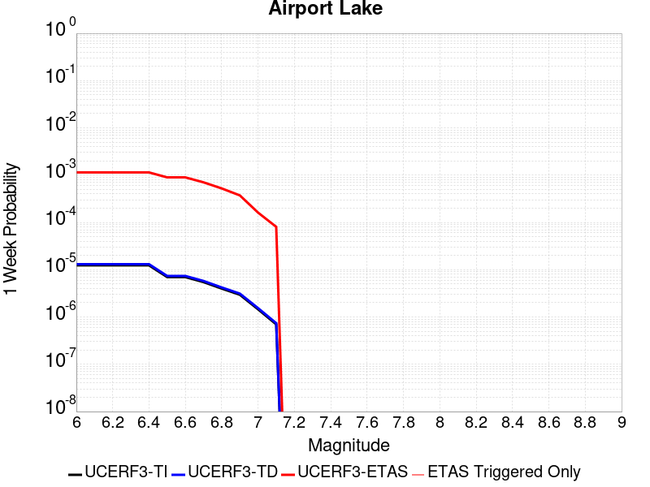 | 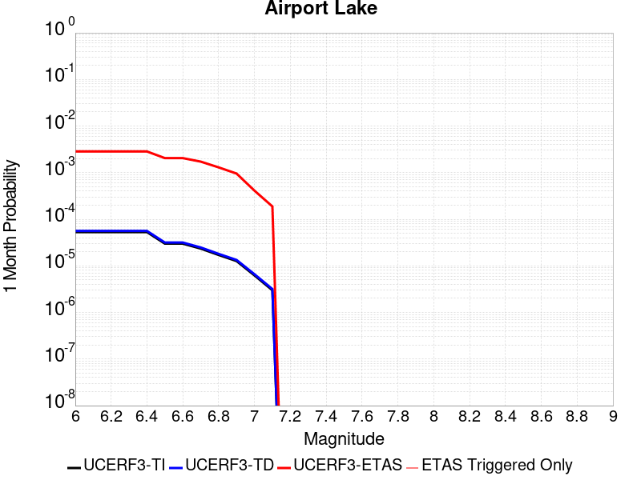 | 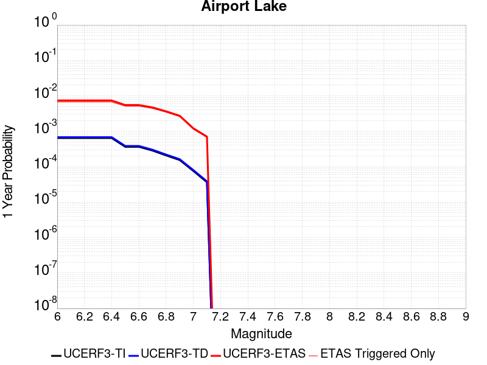 | 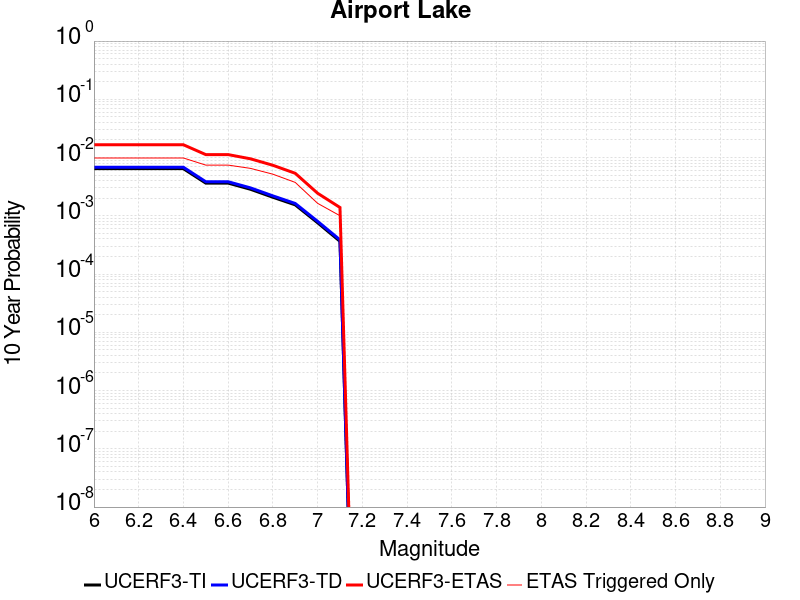 |

| Magnitude | 1 wk TI Prob | 1 wk TD Prob | 1 wk ETAS Prob | 1 wk ETAS/TD Gain | 1 wk ETAS Triggered Only | 1 mo TI Prob | 1 mo TD Prob | 1 mo ETAS Prob | 1 mo ETAS/TD Gain | 1 mo ETAS Triggered Only | 1 yr TI Prob | 1 yr TD Prob | 1 yr ETAS Prob | 1 yr ETAS/TD Gain | 1 yr ETAS Triggered Only | 10 yr TI Prob | 10 yr TD Prob | 10 yr ETAS Prob | 10 yr ETAS/TD Gain | 10 yr ETAS Triggered Only |
|-----|-----|-----|-----|-----|-----|-----|-----|-----|-----|-----|-----|-----|-----|-----|-----|-----|-----|-----|-----|-----|
| 6.0 | 1.2387061E-5 | 1.31032575E-5 | 0.001191539 | 90.93456 | 0.0011784512 | 5.3086325E-5 | 5.6155768E-5 | 0.0028506117 | 50.76258 | 0.002794613 | 6.461343E-4 | 6.835104E-4 | 0.0067063267 | 9.811594 | 0.006026936 | 0.0064425888 | 0.0068168915 | 0.015795669 | 2.3171365 | 0.009040404 |
| 6.1 | 1.2387061E-5 | 1.31032575E-5 | 0.001191539 | 90.93456 | 0.0011784512 | 5.3086325E-5 | 5.6155768E-5 | 0.0028506117 | 50.76258 | 0.002794613 | 6.461343E-4 | 6.835104E-4 | 0.0067063267 | 9.811594 | 0.006026936 | 0.0064425888 | 0.0068168915 | 0.015795669 | 2.3171365 | 0.009040404 |
| 6.2 | 1.2387061E-5 | 1.31032575E-5 | 0.001191539 | 90.93456 | 0.0011784512 | 5.3086325E-5 | 5.6155768E-5 | 0.0028506117 | 50.76258 | 0.002794613 | 6.461343E-4 | 6.835104E-4 | 0.0067063267 | 9.811594 | 0.006026936 | 0.0064425888 | 0.0068168915 | 0.015795669 | 2.3171365 | 0.009040404 |
| 6.3 | 1.2387061E-5 | 1.31032575E-5 | 0.001191539 | 90.93456 | 0.0011784512 | 5.3086325E-5 | 5.6155768E-5 | 0.0028506117 | 50.76258 | 0.002794613 | 6.461343E-4 | 6.835104E-4 | 0.0067063267 | 9.811594 | 0.006026936 | 0.0064425888 | 0.0068168915 | 0.015795669 | 2.3171365 | 0.009040404 |
| 6.4 | 1.2387061E-5 | 1.31032575E-5 | 0.001191539 | 90.93456 | 0.0011784512 | 5.3086325E-5 | 5.6155768E-5 | 0.0028506117 | 50.76258 | 0.002794613 | 6.461343E-4 | 6.835104E-4 | 0.0067063267 | 9.811594 | 0.006026936 | 0.0064425888 | 0.0068168915 | 0.015795669 | 2.3171365 | 0.009040404 |
| 6.5 | 6.9922594E-6 | 7.38498E-6 | 9.333041E-4 | 126.378685 | 9.259259E-4 | 2.996648E-5 | 3.164956E-5 | 0.0020517877 | 64.82831 | 0.002020202 | 3.6478083E-4 | 3.8527072E-4 | 0.0049458025 | 12.837214 | 0.0045622895 | 0.003641826 | 0.0038465653 | 0.01065529 | 2.7700794 | 0.006835017 |
| 6.6 | 6.9922594E-6 | 7.38498E-6 | 9.333041E-4 | 126.378685 | 9.259259E-4 | 2.996648E-5 | 3.164956E-5 | 0.0020517877 | 64.82831 | 0.002020202 | 3.6478083E-4 | 3.8527072E-4 | 0.0049458025 | 12.837214 | 0.0045622895 | 0.003641826 | 0.0038465653 | 0.01065529 | 2.7700794 | 0.006835017 |
| 6.7 | 5.477277E-6 | 5.7861116E-6 | 7.801924E-4 | 134.8388 | 7.744108E-4 | 2.3473833E-5 | 2.4797408E-5 | 0.001725092 | 69.56743 | 0.0017003367 | 2.8575645E-4 | 3.0187052E-4 | 0.0041054357 | 13.59999 | 0.0038047137 | 0.0028538927 | 0.0030149885 | 0.008788774 | 2.9150274 | 0.005791246 |
| 6.8 | 3.9950432E-6 | 4.2191186E-6 | 5.9344224E-4 | 140.6555 | 5.892256E-4 | 1.7121502E-5 | 1.8081826E-5 | 0.00129752 | 71.75823 | 0.0012794613 | 2.0843433E-4 | 2.2012675E-4 | 0.003047787 | 13.8456 | 0.0028282828 | 0.0020823893 | 0.002199358 | 0.0066676238 | 3.0316226 | 0.0044781147 |
| 6.9 | 2.95695E-6 | 3.1230477E-6 | 4.2399715E-4 | 135.76392 | 4.208754E-4 | 1.2672582E-5 | 1.3384434E-5 | 9.561328E-4 | 71.43617 | 9.4276096E-4 | 1.5427776E-4 | 1.6294557E-4 | 0.0021828185 | 13.395998 | 0.002020202 | 0.001541707 | 0.0016284833 | 0.0047715046 | 2.9300299 | 0.003148148 |
| 7.0 | 1.456072E-6 | 1.5408239E-6 | 2.0356072E-4 | 132.1116 | 2.0202021E-4 | 6.2402937E-6 | 6.60352E-6 | 4.1064125E-4 | 62.185207 | 4.0404042E-4 | 7.597293E-5 | 8.03959E-5 | 9.3891274E-4 | 11.678615 | 8.585859E-4 | 7.594696E-4 | 8.03767E-4 | 0.0021999504 | 2.7370498 | 0.0013973064 |
| 7.1 | 6.995192E-7 | 7.4090326E-7 | 1.0175093E-4 | 137.33362 | 1.01010104E-4 | 2.997936E-6 | 3.1752998E-6 | 1.883599E-4 | 59.320354 | 1.8518518E-4 | 3.649926E-5 | 3.8659273E-5 | 4.258497E-4 | 11.01546 | 3.872054E-4 | 3.6493264E-4 | 3.8659273E-4 | 0.0010597331 | 2.741213 | 6.7340065E-4 |

## Ash Hill
*[(top)](#table-of-contents)*

| 1 Week | 1 Month | 1 Year | 10 Year |
|-----|-----|-----|-----|
| 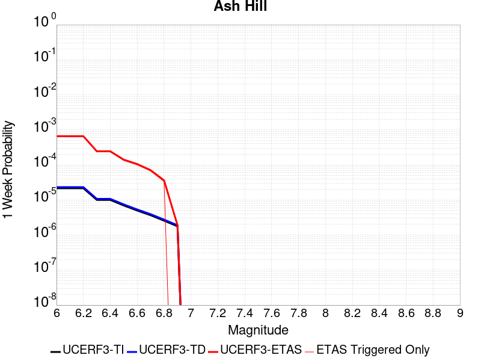 | 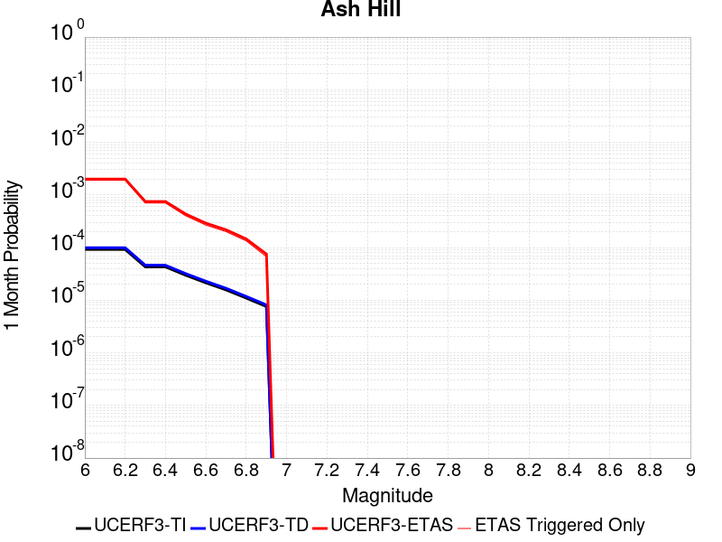 | 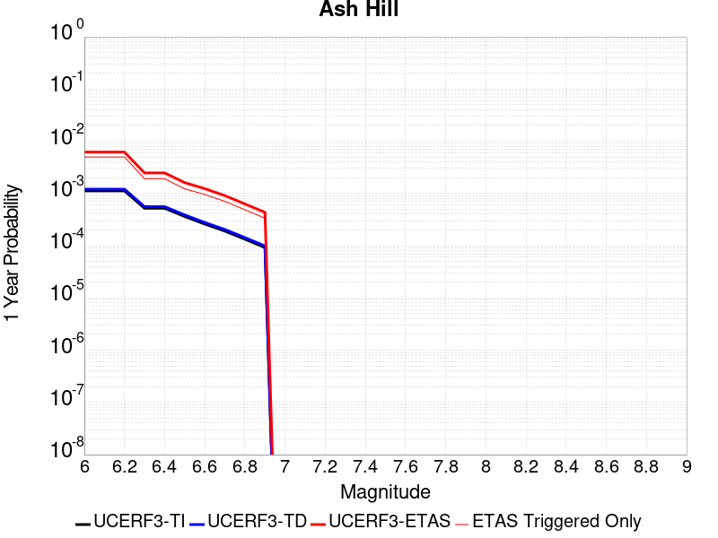 | 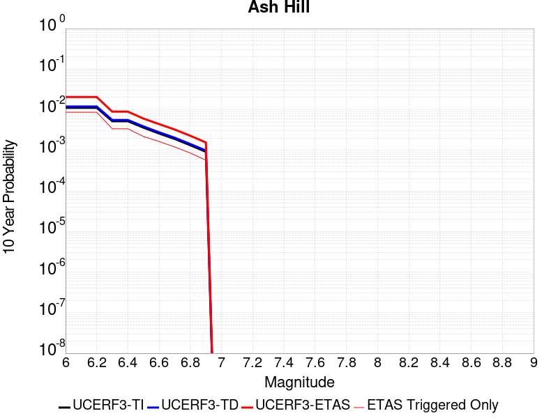 |

| Magnitude | 1 wk TI Prob | 1 wk TD Prob | 1 wk ETAS Prob | 1 wk ETAS/TD Gain | 1 wk ETAS Triggered Only | 1 mo TI Prob | 1 mo TD Prob | 1 mo ETAS Prob | 1 mo ETAS/TD Gain | 1 mo ETAS Triggered Only | 1 yr TI Prob | 1 yr TD Prob | 1 yr ETAS Prob | 1 yr ETAS/TD Gain | 1 yr ETAS Triggered Only | 10 yr TI Prob | 10 yr TD Prob | 10 yr ETAS Prob | 10 yr ETAS/TD Gain | 10 yr ETAS Triggered Only |
|-----|-----|-----|-----|-----|-----|-----|-----|-----|-----|-----|-----|-----|-----|-----|-----|-----|-----|-----|-----|-----|
| 6.0 | 2.1545662E-5 | 2.3194681E-5 | 9.659338E-4 | 41.644623 | 9.4276096E-4 | 9.2335285E-5 | 9.9402445E-5 | 0.0022709037 | 22.845552 | 0.0021717171 | 0.0011236023 | 0.0012096328 | 0.006203585 | 5.1284857 | 0.005 | 0.011179381 | 0.01203847 | 0.02060413 | 1.7115239 | 0.008670034 |
| 6.1 | 2.1545662E-5 | 2.3194681E-5 | 9.659338E-4 | 41.644623 | 9.4276096E-4 | 9.2335285E-5 | 9.9402445E-5 | 0.0022709037 | 22.845552 | 0.0021717171 | 0.0011236023 | 0.0012096328 | 0.006203585 | 5.1284857 | 0.005 | 0.011179381 | 0.01203847 | 0.02060413 | 1.7115239 | 0.008670034 |
| 6.2 | 2.1545662E-5 | 2.3194681E-5 | 9.659338E-4 | 41.644623 | 9.4276096E-4 | 9.2335285E-5 | 9.9402445E-5 | 0.0022709037 | 22.845552 | 0.0021717171 | 0.0011236023 | 0.0012096328 | 0.006203585 | 5.1284857 | 0.005 | 0.011179381 | 0.01203847 | 0.02060413 | 1.7115239 | 0.008670034 |
| 6.3 | 1.0025529E-5 | 1.0747037E-5 | 3.3060892E-4 | 30.762798 | 3.1986533E-4 | 4.2965847E-5 | 4.605799E-5 | 7.6993037E-4 | 16.716543 | 7.2390574E-4 | 5.229836E-4 | 5.60625E-4 | 0.0024787409 | 4.4213886 | 0.0019191919 | 0.005217545 | 0.0055934195 | 0.008975072 | 1.6045768 | 0.0034006734 |
| 6.4 | 1.0025529E-5 | 1.0747037E-5 | 3.3060892E-4 | 30.762798 | 3.1986533E-4 | 4.2965847E-5 | 4.605799E-5 | 7.6993037E-4 | 16.716543 | 7.2390574E-4 | 5.229836E-4 | 5.60625E-4 | 0.0024787409 | 4.4213886 | 0.0019191919 | 0.005217545 | 0.0055934195 | 0.008975072 | 1.6045768 | 0.0034006734 |
| 6.5 | 6.9617327E-6 | 7.456704E-6 | 1.9264051E-4 | 25.834538 | 1.8518518E-4 | 2.9835655E-5 | 3.1956963E-5 | 5.0332234E-4 | 15.750007 | 4.7138048E-4 | 3.6318856E-4 | 3.8901521E-4 | 0.0016174933 | 4.157918 | 0.0012289563 | 0.0036259557 | 0.0038841967 | 0.0060642483 | 1.5612618 | 0.0021885522 |
| 6.6 | 4.9919777E-6 | 5.346739E-6 | 1.2319123E-4 | 23.040443 | 1.1784512E-4 | 2.1394015E-5 | 2.2914432E-5 | 3.5960705E-4 | 15.693476 | 3.3670032E-4 | 2.60441E-4 | 2.789542E-4 | 0.0012382824 | 4.4390173 | 9.5959596E-4 | 0.0026013597 | 0.0027866988 | 0.0044319327 | 1.5903882 | 0.0016498317 |
| 6.7 | 3.6630722E-6 | 3.9246606E-6 | 8.809941E-5 | 22.44765 | 8.417508E-5 | 1.5698786E-5 | 1.6819899E-5 | 2.5250617E-4 | 15.012347 | 2.3569024E-4 | 1.9111596E-4 | 2.0476876E-4 | 9.1169466E-4 | 4.4523134 | 7.070707E-4 | 0.0019095168 | 0.002046364 | 0.0032560048 | 1.5911171 | 0.0012121212 |
| 6.8 | 2.5599613E-6 | 2.7449514E-6 | 5.3249863E-5 | 19.3992 | 5.0505052E-5 | 1.0971216E-5 | 1.1764052E-5 | 1.6327742E-4 | 13.879352 | 1.5151515E-4 | 1.3356637E-4 | 1.4322287E-4 | 6.313684E-4 | 4.4082932 | 4.8821548E-4 | 0.0013348613 | 0.0014317906 | 0.002289147 | 1.5988002 | 8.585859E-4 |
| 6.9 | 1.7684905E-6 | 1.896889E-6 | 3.556686E-5 | 18.750101 | 3.3670032E-5 | 7.579223E-6 | 8.129524E-6 | 1.09138804E-4 | 13.424993 | 1.01010104E-4 | 9.2273134E-5 | 9.8976954E-5 | 4.3564397E-4 | 4.4014688 | 3.3670032E-4 | 9.223483E-4 | 9.897696E-4 | 0.0015615936 | 1.5777345 | 5.7239056E-4 |

## Garlock (East)
*[(top)](#table-of-contents)*

| 1 Week | 1 Month | 1 Year | 10 Year |
|-----|-----|-----|-----|
| 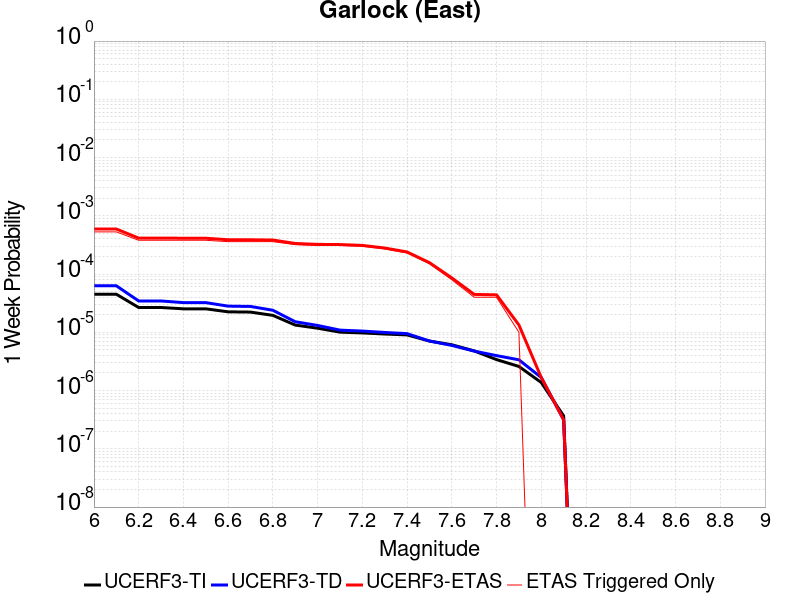 | 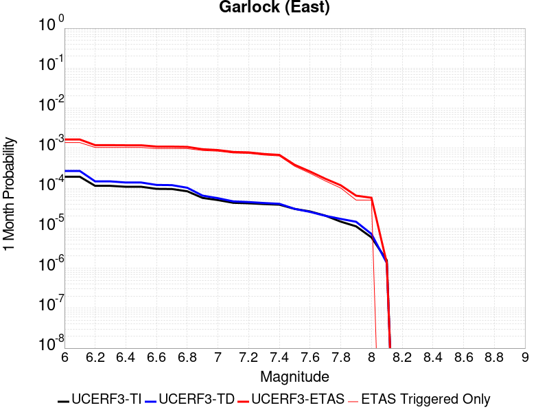 | 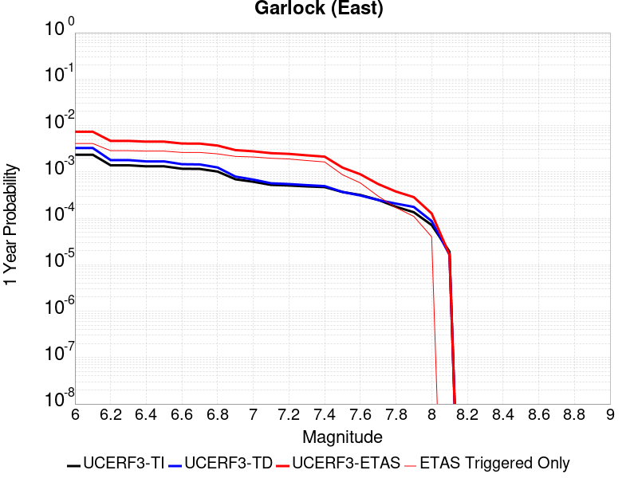 | 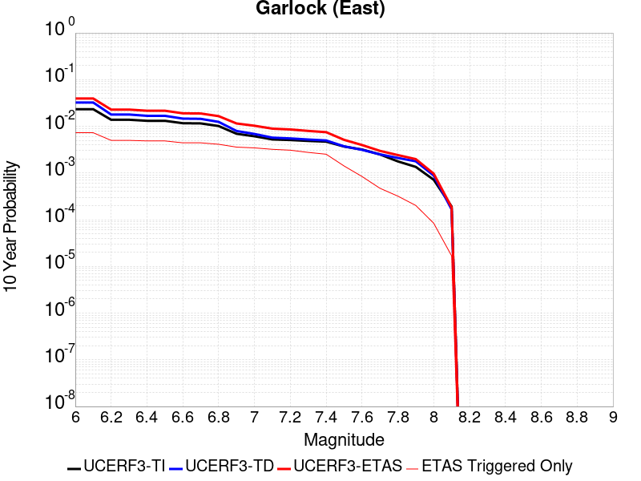 |

| Magnitude | 1 wk TI Prob | 1 wk TD Prob | 1 wk ETAS Prob | 1 wk ETAS/TD Gain | 1 wk ETAS Triggered Only | 1 mo TI Prob | 1 mo TD Prob | 1 mo ETAS Prob | 1 mo ETAS/TD Gain | 1 mo ETAS Triggered Only | 1 yr TI Prob | 1 yr TD Prob | 1 yr ETAS Prob | 1 yr ETAS/TD Gain | 1 yr ETAS Triggered Only | 10 yr TI Prob | 10 yr TD Prob | 10 yr ETAS Prob | 10 yr ETAS/TD Gain | 10 yr ETAS Triggered Only |
|-----|-----|-----|-----|-----|-----|-----|-----|-----|-----|-----|-----|-----|-----|-----|-----|-----|-----|-----|-----|-----|
| 6.0 | 4.5092507E-5 | 6.2906794E-5 | 5.0058967E-4 | 7.957641 | 4.3771043E-4 | 1.9323928E-4 | 2.695752E-4 | 0.0016496745 | 6.1195335 | 0.0013804714 | 0.0023501497 | 0.0032775842 | 0.007355085 | 2.2440567 | 0.004090909 | 0.023254504 | 0.03235364 | 0.03940736 | 1.2180192 | 0.0072895624 |
| 6.1 | 4.5092507E-5 | 6.2906794E-5 | 5.0058967E-4 | 7.957641 | 4.3771043E-4 | 1.9323928E-4 | 2.695752E-4 | 0.0016496745 | 6.1195335 | 0.0013804714 | 0.0023501497 | 0.0032775842 | 0.007355085 | 2.2440567 | 0.004090909 | 0.023254504 | 0.03235364 | 0.03940736 | 1.2180192 | 0.0072895624 |
| 6.2 | 2.6674514E-5 | 3.4512483E-5 | 3.375323E-4 | 9.780007 | 3.030303E-4 | 1.1431433E-4 | 1.4790244E-4 | 0.0011915191 | 8.056115 | 0.001043771 | 0.0013908884 | 0.001799258 | 0.004605647 | 2.5597482 | 0.0028114477 | 0.01382215 | 0.017891733 | 0.022802275 | 1.2744586 | 0.005 |
| 6.3 | 2.6674514E-5 | 3.4512483E-5 | 3.375323E-4 | 9.780007 | 3.030303E-4 | 1.1431433E-4 | 1.4790244E-4 | 0.0011915191 | 8.056115 | 0.001043771 | 0.0013908884 | 0.001799258 | 0.004605647 | 2.5597482 | 0.0028114477 | 0.01382215 | 0.017891733 | 0.022802275 | 1.2744586 | 0.005 |
| 6.4 | 2.5312667E-5 | 3.2341675E-5 | 3.353622E-4 | 10.369351 | 3.030303E-4 | 1.0847834E-4 | 1.3859998E-4 | 0.0011822263 | 8.529773 | 0.001043771 | 0.0013199237 | 0.001686178 | 0.004408852 | 2.6147015 | 0.0027272727 | 0.013121112 | 0.01677974 | 0.02156342 | 1.2850868 | 0.00486532 |
| 6.5 | 2.5312667E-5 | 3.2341675E-5 | 3.353622E-4 | 10.369351 | 3.030303E-4 | 1.0847834E-4 | 1.3859998E-4 | 0.0011822263 | 8.529773 | 0.001043771 | 0.0013199237 | 0.001686178 | 0.004408852 | 2.6147015 | 0.0027272727 | 0.013121112 | 0.01677974 | 0.02156342 | 1.2850868 | 0.00486532 |
| 6.6 | 2.246556E-5 | 2.813642E-5 | 3.1432364E-4 | 11.171416 | 2.8619528E-4 | 9.627742E-5 | 1.20579214E-4 | 0.0010968924 | 9.096862 | 9.7643095E-4 | 0.0011715472 | 0.0014670868 | 0.0040054447 | 2.7302032 | 0.0025420876 | 0.011653901 | 0.014620015 | 0.018982893 | 1.2984182 | 0.0044276095 |
| 6.7 | 2.2241198E-5 | 2.7806154E-5 | 3.1399349E-4 | 11.29223 | 2.8619528E-4 | 9.531594E-5 | 1.1916392E-4 | 0.0010954785 | 9.193039 | 9.7643095E-4 | 0.0011598538 | 0.0014498787 | 0.0039882804 | 2.7507684 | 0.0025420876 | 0.011538187 | 0.0144502055 | 0.018813835 | 1.301977 | 0.0044276095 |
| 6.8 | 1.9528685E-5 | 2.3900653E-5 | 3.100891E-4 | 12.974085 | 2.8619528E-4 | 8.369167E-5 | 1.0242746E-4 | 0.0010787584 | 10.531926 | 9.7643095E-4 | 0.0010184698 | 0.0012463606 | 0.0036339534 | 2.9156518 | 0.0023905723 | 0.010138147 | 0.012437694 | 0.016510973 | 1.3274947 | 0.004124579 |
| 6.9 | 1.3318621E-5 | 1.5201007E-5 | 2.677224E-4 | 17.61215 | 2.5252526E-4 | 5.7078556E-5 | 6.514558E-5 | 9.4050943E-4 | 14.437042 | 8.7542087E-4 | 6.9470983E-4 | 7.928645E-4 | 0.0028787514 | 3.630824 | 0.002087542 | 0.0069254204 | 0.007940986 | 0.011498369 | 1.4479775 | 0.0035858585 |
| 7.0 | 1.1760853E-5 | 1.3109839E-5 | 2.4879698E-4 | 18.977884 | 2.3569024E-4 | 5.0402683E-5 | 5.618384E-5 | 8.978874E-4 | 15.981239 | 8.417508E-4 | 6.134799E-4 | 6.838286E-4 | 0.0026858256 | 3.92763 | 0.002003367 | 0.0061178906 | 0.006857582 | 0.010285093 | 1.4998134 | 0.0034511785 |
| 7.1 | 1.0064758E-5 | 1.090491E-5 | 2.4659256E-4 | 22.612988 | 2.3569024E-4 | 4.3133965E-5 | 4.673451E-5 | 8.0427487E-4 | 17.209442 | 7.5757573E-4 | 5.2502943E-4 | 5.688476E-4 | 0.0024028206 | 4.2240148 | 0.0018350169 | 0.005237907 | 0.005714025 | 0.00891114 | 1.5595206 | 0.0032154883 |
| 7.2 | 9.768808E-6 | 1.0500772E-5 | 2.4618855E-4 | 23.444803 | 2.3569024E-4 | 4.186565E-5 | 4.500255E-5 | 7.8570994E-4 | 17.45923 | 7.4074074E-4 | 5.095951E-4 | 5.477718E-4 | 0.0022976545 | 4.1945467 | 0.0017508417 | 0.0050842804 | 0.005504284 | 0.008568134 | 1.5566301 | 0.003080808 |
| 7.3 | 9.344516E-6 | 9.946395E-6 | 2.119646E-4 | 21.310694 | 2.0202021E-4 | 4.004731E-5 | 4.2626732E-5 | 7.159987E-4 | 16.796942 | 6.7340065E-4 | 4.8746695E-4 | 5.1886035E-4 | 0.0021005308 | 4.048355 | 0.0015824916 | 0.0048639905 | 0.005215945 | 0.007962487 | 1.5265665 | 0.0027609428 |
| 7.4 | 9.023491E-6 | 9.49255E-6 | 1.9467597E-4 | 20.508291 | 1.8518518E-4 | 3.867153E-5 | 4.068174E-5 | 6.803864E-4 | 16.724611 | 6.3973066E-4 | 4.7072413E-4 | 4.95191E-4 | 0.0019927656 | 4.024236 | 0.0014983165 | 0.004697283 | 0.004979378 | 0.0074920566 | 1.5046169 | 0.0025252525 |
| 7.5 | 7.081253E-6 | 7.0893525E-6 | 1.4176853E-4 | 19.997389 | 1.3468013E-4 | 3.0347876E-5 | 3.038259E-5 | 3.839072E-4 | 12.635763 | 3.5353535E-4 | 3.6942272E-4 | 3.6984598E-4 | 0.001177628 | 3.1841037 | 8.0808083E-4 | 0.003688092 | 0.0037251879 | 0.0051340614 | 1.378202 | 0.0014141414 |
| 7.6 | 6.116396E-6 | 5.9608415E-6 | 5.6465593E-5 | 9.4727545 | 5.0505052E-5 | 2.6212863E-5 | 2.5546216E-5 | 2.6123042E-4 | 10.225798 | 2.3569024E-4 | 3.1909486E-4 | 3.1098103E-4 | 8.158745E-4 | 2.6235507 | 5.050505E-4 | 0.0031863707 | 0.003136586 | 0.0039756964 | 1.2675235 | 8.417508E-4 |
| 7.7 | 4.797145E-6 | 4.7587923E-6 | 3.8428665E-5 | 8.075298 | 3.3670032E-5 | 2.055903E-5 | 2.0394666E-5 | 1.7190672E-4 | 8.429005 | 1.5151515E-4 | 2.5027743E-4 | 2.482769E-4 | 5.0073944E-4 | 2.0168588 | 2.5252526E-4 | 0.0024999576 | 0.002510134 | 0.0029803312 | 1.1873196 | 4.7138048E-4 |
| 7.8 | 3.4028885E-6 | 3.979809E-6 | 3.764971E-5 | 9.460179 | 3.3670032E-5 | 1.4583726E-5 | 1.7056214E-5 | 1.1806459E-4 | 6.9220862 | 1.01010104E-4 | 1.775424E-4 | 2.076397E-4 | 3.591234E-4 | 1.7295507 | 1.5151515E-4 | 0.0017740062 | 0.0021019245 | 0.0024211174 | 1.1518575 | 3.1986533E-4 |
| 7.9 | 2.5928412E-6 | 3.373588E-6 | 3.373588E-6 | 1.0 | 0.0 | 1.1112129E-5 | 1.44581545E-5 | 6.496248E-5 | 4.4931374 | 5.0505052E-5 | 1.3528178E-4 | 1.7601387E-4 | 2.4334209E-4 | 1.3825165 | 6.7340065E-5 | 0.0013519945 | 0.0017818334 | 0.0019834936 | 1.1131757 | 2.0202021E-4 |
| 8.0 | 1.3743648E-6 | 1.673991E-6 | 1.673991E-6 | 1.0 | 0.0 | 5.8901214E-6 | 7.174228E-6 | 5.7678917E-5 | 8.039739 | 5.0505052E-5 | 7.1709874E-5 | 8.7342756E-5 | 1.378434E-4 | 1.5781893 | 5.0505052E-5 | 7.1686733E-4 | 8.839922E-4 | 9.680928E-4 | 1.0951374 | 8.417508E-5 |
| 8.1 | 3.6733252E-7 | 3.1499187E-7 | 3.1499187E-7 | 1.0 | 0.0 | 1.5742813E-6 | 1.3499646E-6 | 1.3499646E-6 | 1.0 | 0.0 | 1.9166706E-5 | 1.643571E-5 | 1.643571E-5 | 1.0 | 0.0 | 1.9165053E-4 | 1.6643589E-4 | 1.832681E-4 | 1.1011333 | 1.6835016E-5 |

## Hunter Mountain-Saline Valley
*[(top)](#table-of-contents)*

| 1 Week | 1 Month | 1 Year | 10 Year |
|-----|-----|-----|-----|
| 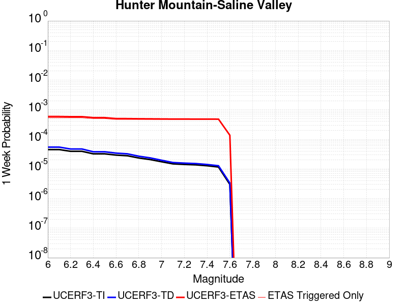 | 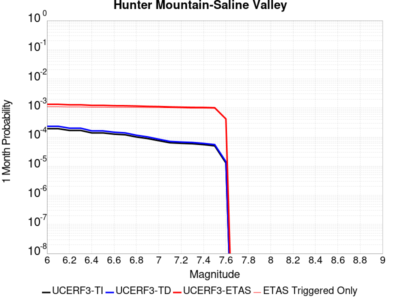 | 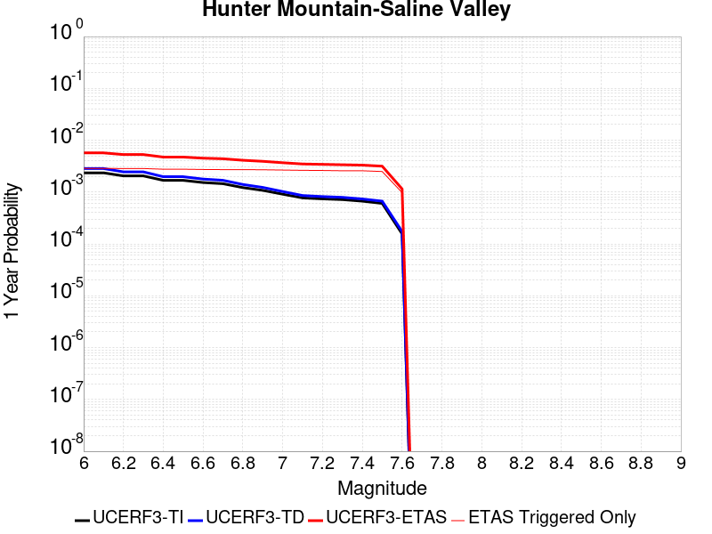 | 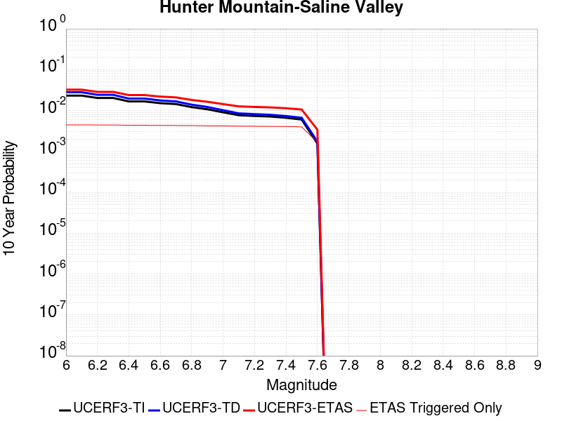 |

| Magnitude | 1 wk TI Prob | 1 wk TD Prob | 1 wk ETAS Prob | 1 wk ETAS/TD Gain | 1 wk ETAS Triggered Only | 1 mo TI Prob | 1 mo TD Prob | 1 mo ETAS Prob | 1 mo ETAS/TD Gain | 1 mo ETAS Triggered Only | 1 yr TI Prob | 1 yr TD Prob | 1 yr ETAS Prob | 1 yr ETAS/TD Gain | 1 yr ETAS Triggered Only | 10 yr TI Prob | 10 yr TD Prob | 10 yr ETAS Prob | 10 yr ETAS/TD Gain | 10 yr ETAS Triggered Only |
|-----|-----|-----|-----|-----|-----|-----|-----|-----|-----|-----|-----|-----|-----|-----|-----|-----|-----|-----|-----|-----|
| 6.0 | 4.5103672E-5 | 5.4571992E-5 | 5.0909264E-4 | 9.328827 | 4.5454546E-4 | 1.9328714E-4 | 2.3385909E-4 | 0.0013278793 | 5.6781173 | 0.0010942761 | 0.002350731 | 0.0028436056 | 0.0056974203 | 2.00359 | 0.0028619529 | 0.023260195 | 0.028092787 | 0.0327887 | 1.1671573 | 0.00483165 |
| 6.1 | 4.5103672E-5 | 5.4571992E-5 | 5.0909264E-4 | 9.328827 | 4.5454546E-4 | 1.9328714E-4 | 2.3385909E-4 | 0.0013278793 | 5.6781173 | 0.0010942761 | 0.002350731 | 0.0028436056 | 0.0056974203 | 2.00359 | 0.0028619529 | 0.023260195 | 0.028092787 | 0.0327887 | 1.1671573 | 0.00483165 |
| 6.2 | 3.9363465E-5 | 4.7064877E-5 | 4.847547E-4 | 10.299713 | 4.3771043E-4 | 1.6868966E-4 | 2.0169078E-4 | 0.0012789145 | 6.340967 | 0.001077441 | 0.002051862 | 0.0024528939 | 0.005291033 | 2.1570575 | 0.0028451178 | 0.020330196 | 0.024274237 | 0.028972177 | 1.193536 | 0.004814815 |
| 6.3 | 3.9363465E-5 | 4.7064877E-5 | 4.847547E-4 | 10.299713 | 4.3771043E-4 | 1.6868966E-4 | 2.0169078E-4 | 0.0012789145 | 6.340967 | 0.001077441 | 0.002051862 | 0.0024528939 | 0.005291033 | 2.1570575 | 0.0028451178 | 0.020330196 | 0.024274237 | 0.028972177 | 1.193536 | 0.004814815 |
| 6.4 | 3.2311684E-5 | 3.795214E-5 | 4.5881158E-4 | 12.089215 | 4.208754E-4 | 1.384713E-4 | 1.626423E-4 | 0.0012230759 | 7.5200357 | 0.0010606061 | 0.0016845843 | 0.0019784442 | 0.0047339248 | 2.392751 | 0.0027609428 | 0.016718714 | 0.019617062 | 0.024238395 | 1.2355772 | 0.004713805 |
| 6.5 | 3.2311684E-5 | 3.795214E-5 | 4.5881158E-4 | 12.089215 | 4.208754E-4 | 1.384713E-4 | 1.626423E-4 | 0.0012230759 | 7.5200357 | 0.0010606061 | 0.0016845843 | 0.0019784442 | 0.0047339248 | 2.392751 | 0.0027609428 | 0.016718714 | 0.019617062 | 0.024238395 | 1.2355772 | 0.004713805 |
| 6.6 | 2.9305844E-5 | 3.4182853E-5 | 4.3820945E-4 | 12.819569 | 4.0404042E-4 | 1.2559042E-4 | 1.4649007E-4 | 0.0011901082 | 8.124156 | 0.001043771 | 0.0015279909 | 0.0017821203 | 0.0045045326 | 2.5276256 | 0.0027272727 | 0.015175272 | 0.017686214 | 0.022283576 | 1.2599404 | 0.004680135 |
| 6.7 | 2.7826512E-5 | 3.2345237E-5 | 4.3637256E-4 | 13.491092 | 4.0404042E-4 | 1.19251024E-4 | 1.3861542E-4 | 0.0011822418 | 8.528934 | 0.001043771 | 0.0014509142 | 0.0016863967 | 0.0043922635 | 2.6045258 | 0.0027104376 | 0.014414776 | 0.01674368 | 0.0213289 | 1.2738477 | 0.0046633 |
| 6.8 | 2.3389874E-5 | 2.6867507E-5 | 4.3089705E-4 | 16.037851 | 4.0404042E-4 | 1.0023846E-4 | 1.1514164E-4 | 0.0011587925 | 10.064061 | 0.001043771 | 0.00121972 | 0.0014009953 | 0.0041076355 | 2.9319413 | 0.0027104376 | 0.01213047 | 0.013927842 | 0.01852619 | 1.3301553 | 0.0046633 |
| 6.9 | 2.069209E-5 | 2.3570727E-5 | 4.276016E-4 | 18.141214 | 4.0404042E-4 | 8.867737E-5 | 1.0101369E-4 | 0.001127846 | 11.165278 | 0.001026936 | 0.0010791123 | 0.001229184 | 0.0039194757 | 3.1886811 | 0.0026936026 | 0.010738871 | 0.012228882 | 0.016768638 | 1.3712323 | 0.0045959596 |
| 7.0 | 1.7462342E-5 | 1.9634126E-5 | 4.2366658E-4 | 21.578072 | 4.0404042E-4 | 7.483646E-5 | 8.414367E-5 | 0.0011109933 | 13.203527 | 0.001026936 | 9.1075303E-4 | 0.0010239903 | 0.0036811994 | 3.594955 | 0.0026599327 | 0.009070295 | 0.010196352 | 0.014712123 | 1.442881 | 0.0045622895 |
| 7.1 | 1.4807709E-5 | 1.6442245E-5 | 4.0364126E-4 | 24.549036 | 3.872054E-4 | 6.3460066E-5 | 7.046495E-5 | 0.0010804948 | 15.33379 | 0.001010101 | 7.723524E-4 | 8.575896E-4 | 0.0034816 | 4.0597506 | 0.0026262626 | 0.007696735 | 0.008545788 | 0.013035707 | 1.5253955 | 0.0045286193 |
| 7.2 | 1.4180048E-5 | 1.5698814E-5 | 4.0289812E-4 | 25.66424 | 3.872054E-4 | 6.077022E-5 | 6.727898E-5 | 0.0010604782 | 15.762398 | 9.93266E-4 | 7.396263E-4 | 8.1883004E-4 | 0.0034261208 | 4.1841664 | 0.0026094276 | 0.0073716943 | 0.00816108 | 0.012619346 | 1.5462838 | 0.0044949497 |
| 7.3 | 1.3730402E-5 | 1.5172541E-5 | 4.0237204E-4 | 26.519754 | 3.872054E-4 | 5.8843252E-5 | 6.502365E-5 | 0.0010413912 | 16.015575 | 9.7643095E-4 | 7.161811E-4 | 7.913914E-4 | 0.0033651106 | 4.2521443 | 0.0025757577 | 0.007138774 | 0.007888664 | 0.01231475 | 1.5610691 | 0.0044612796 |
| 7.4 | 1.2810095E-5 | 1.410972E-5 | 4.0130963E-4 | 28.44207 | 3.872054E-4 | 5.489925E-5 | 6.0468916E-5 | 0.0010368408 | 17.146675 | 9.7643095E-4 | 6.681934E-4 | 7.359762E-4 | 0.003309838 | 4.497208 | 0.0025757577 | 0.006661878 | 0.0073382827 | 0.011750112 | 1.6012074 | 0.0044444446 |
| 7.5 | 1.1595659E-5 | 1.2801013E-5 | 4.0000145E-4 | 31.247639 | 3.872054E-4 | 4.9694736E-5 | 5.4860422E-5 | 0.0010144038 | 18.49063 | 9.5959596E-4 | 6.0486543E-4 | 6.677366E-4 | 0.0031576555 | 4.7288938 | 0.0024915824 | 0.006032217 | 0.0066601736 | 0.010991403 | 1.6503178 | 0.0043602693 |
| 7.6 | 2.997694E-6 | 3.3252948E-6 | 1.3800498E-4 | 41.50158 | 1.3468013E-4 | 1.28471975E-5 | 1.4251226E-5 | 4.1828587E-4 | 29.350868 | 4.0404042E-4 | 1.564034E-4 | 1.7350215E-4 | 0.0011497637 | 6.626798 | 9.7643095E-4 | 0.0015629337 | 0.0017351025 | 0.0035669354 | 2.0557492 | 0.0018350169 |

## Blackwater
*[(top)](#table-of-contents)*

| 1 Week | 1 Month | 1 Year | 10 Year |
|-----|-----|-----|-----|
| 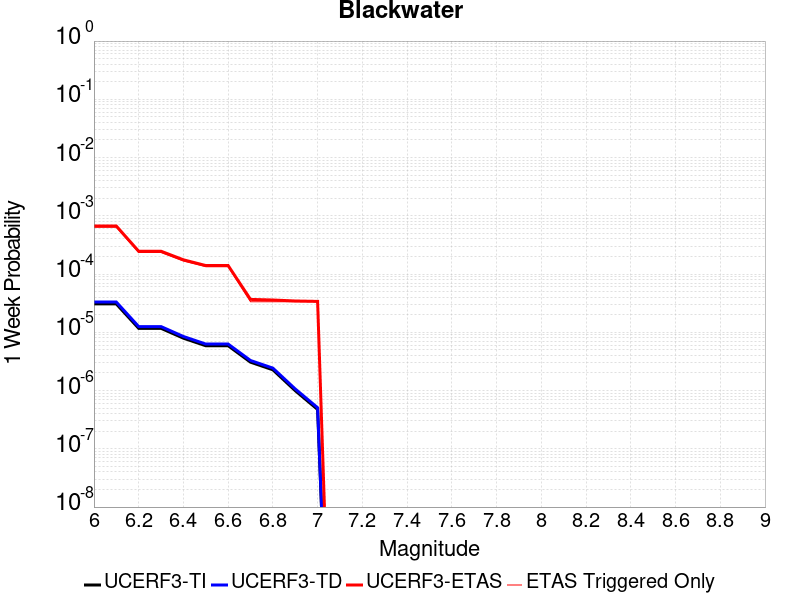 | 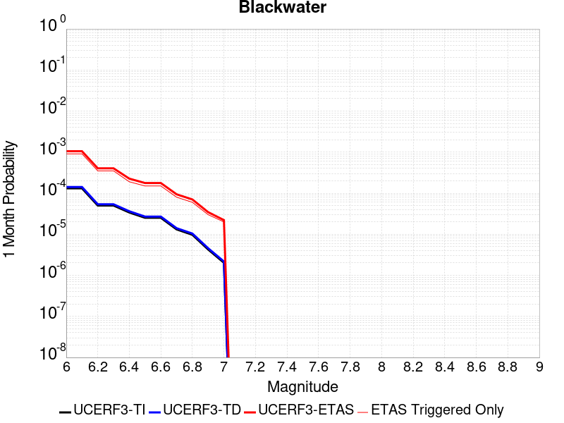 | 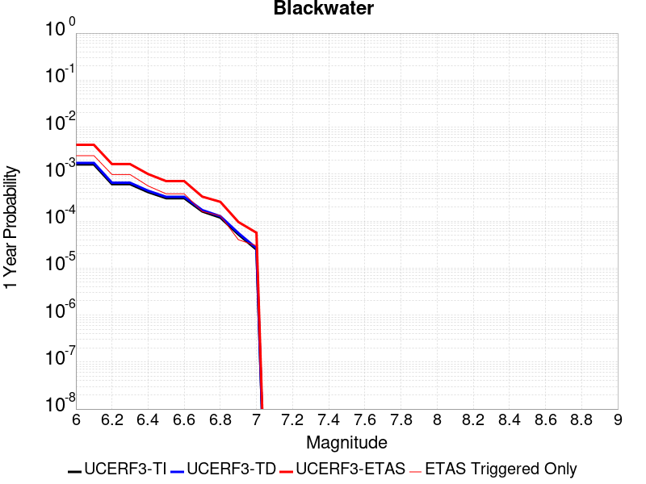 | 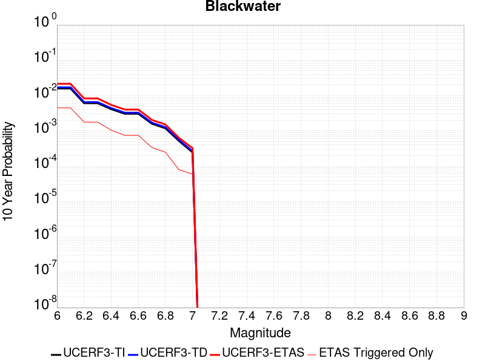 |

| Magnitude | 1 wk TI Prob | 1 wk TD Prob | 1 wk ETAS Prob | 1 wk ETAS/TD Gain | 1 wk ETAS Triggered Only | 1 mo TI Prob | 1 mo TD Prob | 1 mo ETAS Prob | 1 mo ETAS/TD Gain | 1 mo ETAS Triggered Only | 1 yr TI Prob | 1 yr TD Prob | 1 yr ETAS Prob | 1 yr ETAS/TD Gain | 1 yr ETAS Triggered Only | 10 yr TI Prob | 10 yr TD Prob | 10 yr ETAS Prob | 10 yr ETAS/TD Gain | 10 yr ETAS Triggered Only |
|-----|-----|-----|-----|-----|-----|-----|-----|-----|-----|-----|-----|-----|-----|-----|-----|-----|-----|-----|-----|-----|
| 6.0 | 3.0708583E-5 | 3.309619E-5 | 5.2129553E-4 | 15.750922 | 4.8821548E-4 | 1.3160157E-4 | 1.4183388E-4 | 0.0011012937 | 7.7646737 | 9.5959596E-4 | 0.0016010714 | 0.0017255963 | 0.004179267 | 2.4219265 | 0.0024579125 | 0.015895851 | 0.017135808 | 0.021752292 | 1.2694056 | 0.00469697 |
| 6.1 | 3.0708583E-5 | 3.309619E-5 | 5.2129553E-4 | 15.750922 | 4.8821548E-4 | 1.3160157E-4 | 1.4183388E-4 | 0.0011012937 | 7.7646737 | 9.5959596E-4 | 0.0016010714 | 0.0017255963 | 0.004179267 | 2.4219265 | 0.0024579125 | 0.015895851 | 0.017135808 | 0.021752292 | 1.2694056 | 0.00469697 |
| 6.2 | 1.1707779E-5 | 1.2545242E-5 | 1.808933E-4 | 14.419276 | 1.6835016E-4 | 5.017523E-5 | 5.3764266E-5 | 4.2411473E-4 | 7.888413 | 3.7037037E-4 | 6.107122E-4 | 6.5439293E-4 | 0.0016301849 | 2.4911408 | 9.7643095E-4 | 0.006090366 | 0.006525631 | 0.008331948 | 1.2768034 | 0.0018181818 |
| 6.3 | 1.1707779E-5 | 1.2545242E-5 | 1.808933E-4 | 14.419276 | 1.6835016E-4 | 5.017523E-5 | 5.3764266E-5 | 4.2411473E-4 | 7.888413 | 3.7037037E-4 | 6.107122E-4 | 6.5439293E-4 | 0.0016301849 | 2.4911408 | 9.7643095E-4 | 0.006090366 | 0.006525631 | 0.008331948 | 1.2768034 | 0.0018181818 |
| 6.4 | 7.929244E-6 | 8.480176E-6 | 1.4315917E-4 | 16.881626 | 1.3468013E-4 | 3.3982033E-5 | 3.6343128E-5 | 2.3835599E-4 | 6.5584884 | 2.0202021E-4 | 4.136527E-4 | 4.4239179E-4 | 9.977015E-4 | 2.2552443 | 5.5555557E-4 | 0.0041288356 | 0.0044155167 | 0.0054714396 | 1.2391392 | 0.0010606061 |
| 6.5 | 5.8832115E-6 | 6.286048E-6 | 1.0729551E-4 | 17.068834 | 1.01010104E-4 | 2.521352E-5 | 2.6939942E-5 | 1.9528558E-4 | 7.2489233 | 1.6835016E-4 | 3.0693135E-4 | 3.2794697E-4 | 7.486844E-4 | 2.2829435 | 4.208754E-4 | 0.0030650778 | 0.0032748834 | 0.004063538 | 1.2408191 | 7.912458E-4 |
| 6.6 | 5.8832115E-6 | 6.286048E-6 | 1.0729551E-4 | 17.068834 | 1.01010104E-4 | 2.521352E-5 | 2.6939942E-5 | 1.9528558E-4 | 7.2489233 | 1.6835016E-4 | 3.0693135E-4 | 3.2794697E-4 | 7.486844E-4 | 2.2829435 | 4.208754E-4 | 0.0030650778 | 0.0032748834 | 0.004063538 | 1.2408191 | 7.912458E-4 |
| 6.7 | 3.0715053E-6 | 3.281496E-6 | 5.378638E-5 | 16.390812 | 5.0505052E-5 | 1.3163528E-5 | 1.4063485E-5 | 9.823738E-5 | 6.9852805 | 8.417508E-5 | 1.6025416E-4 | 1.7121063E-4 | 3.3953198E-4 | 1.9831244 | 1.6835016E-4 | 0.0016013865 | 0.0017109019 | 0.0020638325 | 1.2062833 | 3.5353535E-4 |
| 6.8 | 2.2722281E-6 | 2.4287758E-6 | 3.609873E-5 | 14.862931 | 3.3670032E-5 | 9.738084E-6 | 1.0409003E-5 | 7.774837E-5 | 7.469339 | 6.7340065E-5 | 1.1855473E-4 | 1.2672316E-4 | 2.6138622E-4 | 2.0626554 | 1.3468013E-4 | 0.001184915 | 0.0012665992 | 0.0015019908 | 1.1858455 | 2.3569024E-4 |
| 6.9 | 9.952399E-7 | 1.0653588E-6 | 1.7900358E-5 | 16.802187 | 1.6835016E-5 | 4.265307E-6 | 4.5658185E-6 | 3.82357E-5 | 8.374336 | 3.3670032E-5 | 5.1928873E-5 | 5.5587938E-5 | 8.92561E-5 | 1.6056739 | 3.3670032E-5 | 5.191674E-4 | 5.5579096E-4 | 6.2309357E-4 | 1.1210934 | 6.7340065E-5 |
| 7.0 | 4.7385504E-7 | 5.0756074E-7 | 1.7342569E-5 | 34.16846 | 1.6835016E-5 | 2.0308057E-6 | 2.1752603E-6 | 1.901024E-5 | 8.739295 | 1.6835016E-5 | 2.4724779E-5 | 2.6483794E-5 | 4.3318363E-5 | 1.6356555 | 1.6835016E-5 | 2.4722028E-4 | 2.6483793E-4 | 3.153296E-4 | 1.1906512 | 5.0505052E-5 |

## Gravel Hills-Harper Lk
*[(top)](#table-of-contents)*

| 1 Week | 1 Month | 1 Year | 10 Year |
|-----|-----|-----|-----|
| 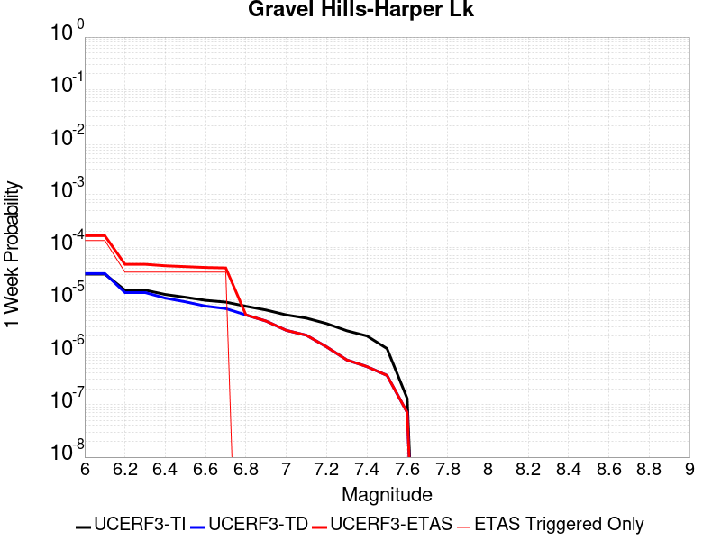 | 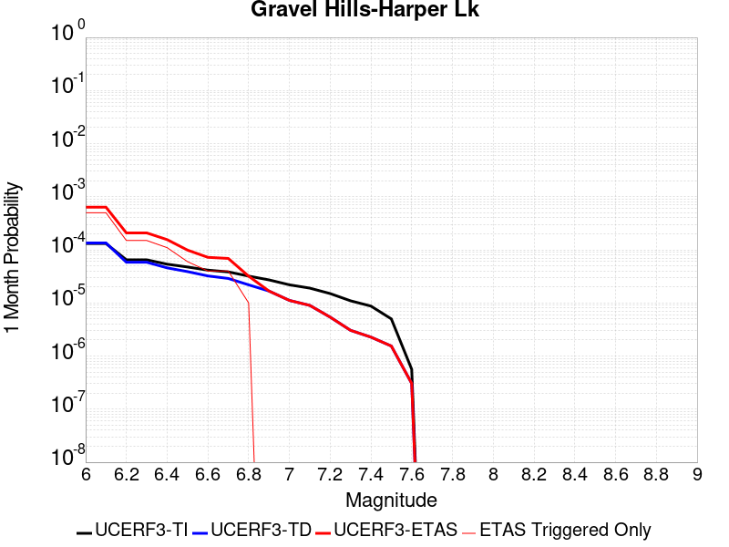 | 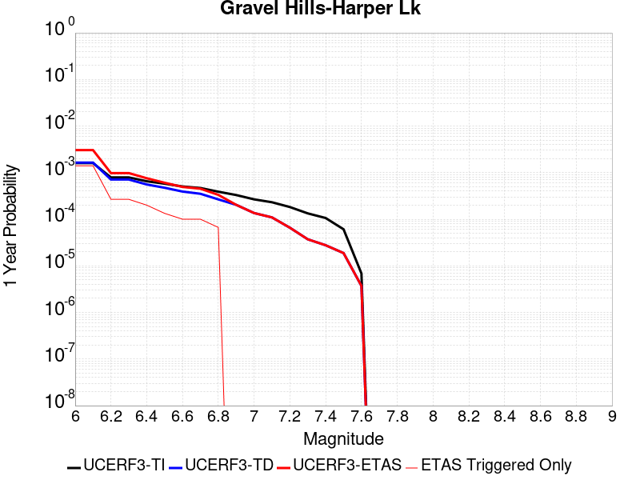 | 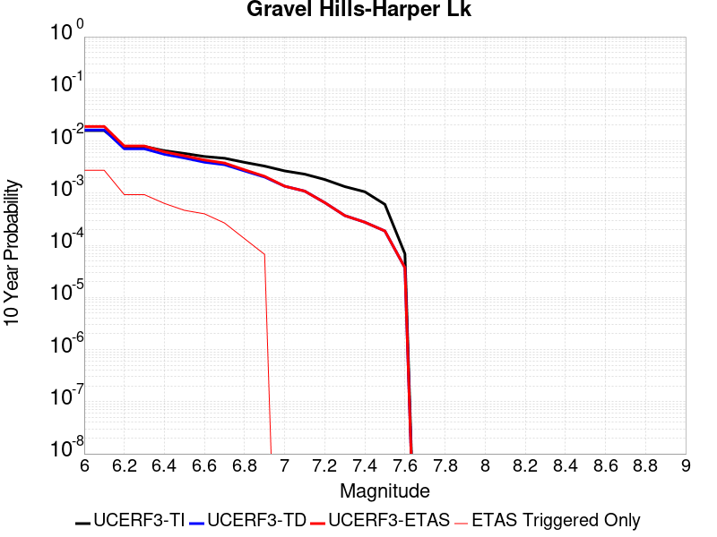 |

| Magnitude | 1 wk TI Prob | 1 wk TD Prob | 1 wk ETAS Prob | 1 wk ETAS/TD Gain | 1 wk ETAS Triggered Only | 1 mo TI Prob | 1 mo TD Prob | 1 mo ETAS Prob | 1 mo ETAS/TD Gain | 1 mo ETAS Triggered Only | 1 yr TI Prob | 1 yr TD Prob | 1 yr ETAS Prob | 1 yr ETAS/TD Gain | 1 yr ETAS Triggered Only | 10 yr TI Prob | 10 yr TD Prob | 10 yr ETAS Prob | 10 yr ETAS/TD Gain | 10 yr ETAS Triggered Only |
|-----|-----|-----|-----|-----|-----|-----|-----|-----|-----|-----|-----|-----|-----|-----|-----|-----|-----|-----|-----|-----|
| 6.0 | 3.0679566E-5 | 3.1465184E-5 | 2.1664455E-4 | 6.8852143 | 1.8518518E-4 | 1.3147724E-4 | 1.3484505E-4 | 6.566602E-4 | 4.869739 | 5.218855E-4 | 0.0015995599 | 0.0016407187 | 0.0030693472 | 1.8707335 | 0.0014309764 | 0.015880952 | 0.016307615 | 0.01884137 | 1.1553724 | 0.0025757577 |
| 6.1 | 3.0679566E-5 | 3.1465184E-5 | 2.1664455E-4 | 6.8852143 | 1.8518518E-4 | 1.3147724E-4 | 1.3484505E-4 | 6.566602E-4 | 4.869739 | 5.218855E-4 | 0.0015995599 | 0.0016407187 | 0.0030693472 | 1.8707335 | 0.0014309764 | 0.015880952 | 0.016307615 | 0.01884137 | 1.1553724 | 0.0025757577 |
| 6.2 | 1.514536E-5 | 1.3635392E-5 | 6.413976E-5 | 4.703917 | 5.0505052E-5 | 6.490707E-5 | 5.843615E-5 | 2.4361051E-4 | 4.1688323 | 1.8518518E-4 | 7.8995706E-4 | 7.112398E-4 | 0.0010813468 | 1.5203687 | 3.7037037E-4 | 0.007871548 | 0.0070908363 | 0.007960049 | 1.1225827 | 8.7542087E-4 |
| 6.3 | 1.514536E-5 | 1.3635392E-5 | 6.413976E-5 | 4.703917 | 5.0505052E-5 | 6.490707E-5 | 5.843615E-5 | 2.4361051E-4 | 4.1688323 | 1.8518518E-4 | 7.8995706E-4 | 7.112398E-4 | 0.0010813468 | 1.5203687 | 3.7037037E-4 | 0.007871548 | 0.0070908363 | 0.007960049 | 1.1225827 | 8.7542087E-4 |
| 6.4 | 1.2532521E-5 | 1.0689826E-5 | 4.4359498E-5 | 4.1496935 | 3.3670032E-5 | 5.37097E-5 | 4.581277E-5 | 1.6365248E-4 | 3.5722027 | 1.1784512E-4 | 6.537194E-4 | 5.576335E-4 | 8.268436E-4 | 1.4827724 | 2.6936026E-4 | 0.0065179965 | 0.0055629327 | 0.0061656223 | 1.1083401 | 6.060606E-4 |
| 6.5 | 1.1094058E-5 | 9.083774E-6 | 2.5918638E-5 | 2.8532896 | 1.6835016E-5 | 4.7545094E-5 | 3.89299E-5 | 8.9432986E-5 | 2.2972827 | 5.0505052E-5 | 5.787078E-4 | 4.738725E-4 | 6.421429E-4 | 1.3550963 | 1.6835016E-4 | 0.0057720304 | 0.004729028 | 0.0050976467 | 1.0779481 | 3.7037037E-4 |
| 6.6 | 9.688328E-6 | 7.531784E-6 | 2.4366675E-5 | 3.2351797 | 1.6835016E-5 | 4.1520743E-5 | 3.2278687E-5 | 8.2782106E-5 | 2.5646057 | 5.0505052E-5 | 5.053978E-4 | 3.929247E-4 | 5.107235E-4 | 1.2997999 | 1.1784512E-4 | 0.0050424994 | 0.0039225565 | 0.004224398 | 1.0769502 | 3.030303E-4 |
| 6.7 | 8.974824E-6 | 6.7494916E-6 | 2.3584395E-5 | 3.4942477 | 1.6835016E-5 | 3.8462964E-5 | 2.8926084E-5 | 7.942967E-5 | 2.745953 | 5.0505052E-5 | 4.6818596E-4 | 3.5212038E-4 | 4.530949E-4 | 1.2867614 | 1.01010104E-4 | 0.004672008 | 0.0035158454 | 0.0037171554 | 1.0572579 | 2.0202021E-4 |
| 6.8 | 7.4780046E-6 | 5.116252E-6 | 5.116252E-6 | 1.0 | 0.0 | 3.20482E-5 | 2.1926619E-5 | 3.8761267E-5 | 1.7677722 | 1.6835016E-5 | 3.9011694E-4 | 2.6692526E-4 | 3.3424736E-4 | 1.2522132 | 6.7340065E-5 | 0.0038943281 | 0.002666185 | 0.0027669256 | 1.0377846 | 1.01010104E-4 |
| 6.9 | 6.3409307E-6 | 3.9075426E-6 | 3.9075426E-6 | 1.0 | 0.0 | 2.7175134E-5 | 1.674651E-5 | 1.674651E-5 | 1.0 | 0.0 | 3.3080703E-4 | 2.0387067E-4 | 2.0387067E-4 | 1.0 | 0.0 | 0.0033031502 | 0.0020369345 | 0.002070536 | 1.0164961 | 3.3670032E-5 |
| 7.0 | 5.1239335E-6 | 2.6058885E-6 | 2.6058885E-6 | 1.0 | 0.0 | 2.195953E-5 | 1.11680465E-5 | 1.11680465E-5 | 1.0 | 0.0 | 2.6732447E-4 | 1.3596273E-4 | 1.3596273E-4 | 1.0 | 0.0 | 0.0026700313 | 0.0013588208 | 0.0013588208 | 1.0 | 0.0 |
| 7.1 | 4.438899E-6 | 2.0984994E-6 | 2.0984994E-6 | 1.0 | 0.0 | 1.9023713E-5 | 8.993539E-6 | 8.993539E-6 | 1.0 | 0.0 | 2.315891E-4 | 1.0949106E-4 | 1.0949106E-4 | 1.0 | 0.0 | 0.002313479 | 0.0010943931 | 0.0010943931 | 1.0 | 0.0 |
| 7.2 | 3.50367E-6 | 1.2615911E-6 | 1.2615911E-6 | 1.0 | 0.0 | 1.5015643E-5 | 5.406808E-6 | 5.406808E-6 | 1.0 | 0.0 | 1.8280011E-4 | 6.582599E-5 | 6.582599E-5 | 1.0 | 0.0 | 0.0018264982 | 6.580731E-4 | 6.580731E-4 | 1.0 | 0.0 |
| 7.3 | 2.561638E-6 | 7.119307E-7 | 7.119307E-7 | 1.0 | 0.0 | 1.0978401E-5 | 3.051128E-6 | 3.051128E-6 | 1.0 | 0.0 | 1.3365384E-4 | 3.714687E-5 | 3.714687E-5 | 1.0 | 0.0 | 0.0013357349 | 3.7140862E-4 | 3.7140862E-4 | 1.0 | 0.0 |
| 7.4 | 2.0368864E-6 | 5.304955E-7 | 5.304955E-7 | 1.0 | 0.0 | 8.729483E-6 | 2.2735503E-6 | 2.2735503E-6 | 1.0 | 0.0 | 1.06276275E-4 | 2.768013E-5 | 2.768013E-5 | 1.0 | 0.0 | 0.0010622547 | 2.7676736E-4 | 2.7676736E-4 | 1.0 | 0.0 |
| 7.5 | 1.1681728E-6 | 3.6031287E-7 | 3.6031287E-7 | 1.0 | 0.0 | 5.0064455E-6 | 1.5441972E-6 | 1.5441972E-6 | 1.0 | 0.0 | 6.0951766E-5 | 1.8800443E-5 | 1.8800443E-5 | 1.0 | 0.0 | 6.093505E-4 | 1.8798899E-4 | 1.8798899E-4 | 1.0 | 0.0 |
| 7.6 | 1.3154387E-7 | 7.1198265E-8 | 7.1198265E-8 | 1.0 | 0.0 | 5.6375933E-7 | 3.051354E-7 | 3.051354E-7 | 1.0 | 0.0 | 6.863748E-6 | 3.7150185E-6 | 3.7150185E-6 | 1.0 | 0.0 | 6.863536E-5 | 3.7149723E-5 | 3.7149723E-5 | 1.0 | 0.0 |

## Garlock (West)
*[(top)](#table-of-contents)*

| 1 Week | 1 Month | 1 Year | 10 Year |
|-----|-----|-----|-----|
| 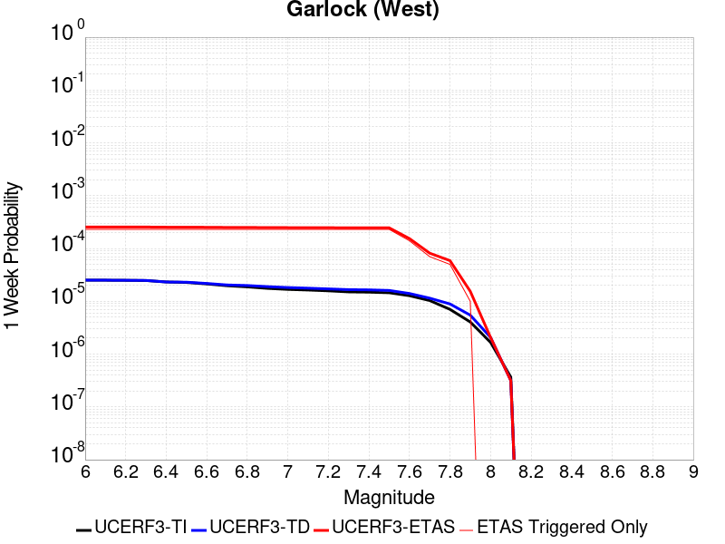 | 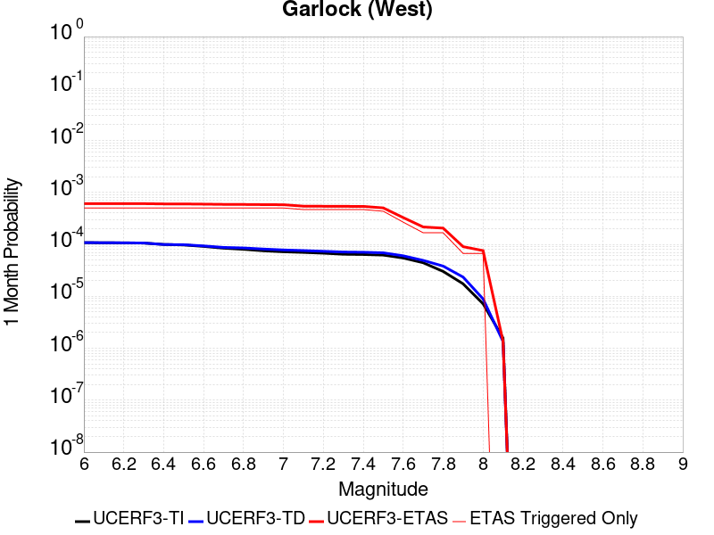 | 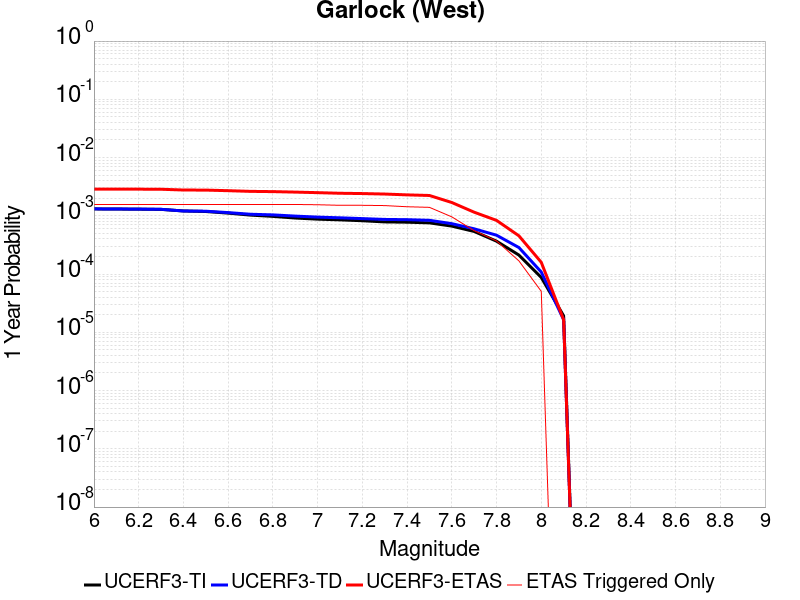 | 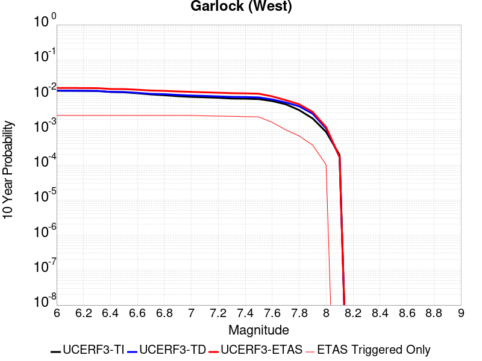 |

| Magnitude | 1 wk TI Prob | 1 wk TD Prob | 1 wk ETAS Prob | 1 wk ETAS/TD Gain | 1 wk ETAS Triggered Only | 1 mo TI Prob | 1 mo TD Prob | 1 mo ETAS Prob | 1 mo ETAS/TD Gain | 1 mo ETAS Triggered Only | 1 yr TI Prob | 1 yr TD Prob | 1 yr ETAS Prob | 1 yr ETAS/TD Gain | 1 yr ETAS Triggered Only | 10 yr TI Prob | 10 yr TD Prob | 10 yr ETAS Prob | 10 yr ETAS/TD Gain | 10 yr ETAS Triggered Only |
|-----|-----|-----|-----|-----|-----|-----|-----|-----|-----|-----|-----|-----|-----|-----|-----|-----|-----|-----|-----|-----|
| 6.0 | 2.5181727E-5 | 2.5202135E-5 | 2.6088642E-4 | 10.351759 | 2.3569024E-4 | 1.0791722E-4 | 1.080047E-4 | 7.644994E-4 | 7.0783906 | 6.5656565E-4 | 0.0013131002 | 0.0013141674 | 0.0028777665 | 2.189802 | 0.0015656565 | 0.013053683 | 0.013144457 | 0.015819268 | 1.2034934 | 0.0027104376 |
| 6.1 | 2.5077732E-5 | 2.5103205E-5 | 2.6078752E-4 | 10.388615 | 2.3569024E-4 | 1.0747157E-4 | 1.07580745E-4 | 7.640758E-4 | 7.102347 | 6.5656565E-4 | 0.001307681 | 0.0013090121 | 0.002872619 | 2.194494 | 0.0015656565 | 0.013000126 | 0.0130935125 | 0.01576846 | 1.2042958 | 0.0027104376 |
| 6.2 | 2.494612E-5 | 2.498488E-5 | 2.606692E-4 | 10.433079 | 2.3569024E-4 | 1.0690756E-4 | 1.07073676E-4 | 7.63569E-4 | 7.1312485 | 6.5656565E-4 | 0.0013008224 | 0.0013028459 | 0.0028664626 | 2.2001548 | 0.0015656565 | 0.012932341 | 0.013032575 | 0.015707688 | 1.2052636 | 0.0027104376 |
| 6.3 | 2.4733758E-5 | 2.4804243E-5 | 2.6048862E-4 | 10.501778 | 2.3569024E-4 | 1.0599751E-4 | 1.0629959E-4 | 7.6279545E-4 | 7.1759024 | 6.5656565E-4 | 0.0012897556 | 0.0012934325 | 0.002857064 | 2.2089007 | 0.0015656565 | 0.012822957 | 0.012939542 | 0.015614907 | 1.206759 | 0.0027104376 |
| 6.4 | 2.3237335E-5 | 2.318352E-5 | 2.588683E-4 | 11.166048 | 2.3569024E-4 | 9.958477E-5 | 9.935417E-5 | 7.558546E-4 | 7.6076784 | 6.5656565E-4 | 0.0012117702 | 0.0012089686 | 0.0027727324 | 2.2934692 | 0.0015656565 | 0.012051838 | 0.012104375 | 0.014782005 | 1.2212117 | 0.0027104376 |
| 6.5 | 2.2732203E-5 | 2.2998063E-5 | 2.5868288E-4 | 11.248029 | 2.3569024E-4 | 9.742009E-5 | 9.8559416E-5 | 7.5506035E-4 | 7.6609664 | 6.5656565E-4 | 0.0011854442 | 0.0011993032 | 0.002763082 | 2.3039062 | 0.0015656565 | 0.011791403 | 0.012008769 | 0.014686658 | 1.2229944 | 0.0027104376 |
| 6.6 | 2.1319436E-5 | 2.1778224E-5 | 2.5746334E-4 | 11.822054 | 2.3569024E-4 | 9.136581E-5 | 9.333192E-5 | 7.4983627E-4 | 8.034082 | 6.5656565E-4 | 0.001111811 | 0.001135726 | 0.0026996045 | 2.3769855 | 0.0015656565 | 0.011062649 | 0.0113796545 | 0.014009317 | 1.2310847 | 0.0026599327 |
| 6.7 | 1.970802E-5 | 2.0398069E-5 | 2.560835E-4 | 12.554301 | 2.3569024E-4 | 8.446021E-5 | 8.741738E-5 | 7.4392563E-4 | 8.510043 | 6.5656565E-4 | 0.001027818 | 0.0010637887 | 0.0026277797 | 2.4702084 | 0.0015656565 | 0.010230771 | 0.010667368 | 0.013298926 | 1.2466923 | 0.0026599327 |
| 6.8 | 1.8744462E-5 | 1.9905692E-5 | 2.5559124E-4 | 12.840109 | 2.3569024E-4 | 8.033094E-5 | 8.530733E-5 | 7.41817E-4 | 8.695818 | 6.5656565E-4 | 9.775903E-4 | 0.0010381235 | 0.0026021546 | 2.5065947 | 0.0015656565 | 0.009733009 | 0.010413141 | 0.013012056 | 1.2495803 | 0.0026262626 |
| 6.9 | 1.7559682E-5 | 1.895803E-5 | 2.546438E-4 | 13.431975 | 2.3569024E-4 | 7.5253614E-5 | 8.124618E-5 | 7.3775847E-4 | 9.080532 | 6.5656565E-4 | 9.158276E-4 | 9.887248E-4 | 0.0025528334 | 2.5819454 | 0.0015656565 | 0.0091206245 | 0.009923607 | 0.01250714 | 1.2603421 | 0.0026094276 |
| 7.0 | 1.6794445E-5 | 1.8220819E-5 | 2.5390676E-4 | 13.934981 | 2.3569024E-4 | 7.197421E-5 | 7.8086894E-5 | 7.177676E-4 | 9.191909 | 6.3973066E-4 | 8.759337E-4 | 9.5029466E-4 | 0.0024976444 | 2.6282842 | 0.0015488216 | 0.008724891 | 0.0095425 | 0.0121103525 | 1.2690965 | 0.0025925925 |
| 7.1 | 1.6337795E-5 | 1.7721602E-5 | 2.5340766E-4 | 14.299366 | 2.3569024E-4 | 7.0017246E-5 | 7.5947515E-5 | 6.9879583E-4 | 9.2010355 | 6.228956E-4 | 8.521265E-4 | 9.2427013E-4 | 0.0024380211 | 2.63778 | 0.0015151515 | 0.008488664 | 0.009284343 | 0.011819508 | 1.273058 | 0.0025589226 |
| 7.2 | 1.5780008E-5 | 1.7170225E-5 | 2.528564E-4 | 14.726447 | 2.3569024E-4 | 6.762685E-5 | 7.358461E-5 | 6.964344E-4 | 9.464403 | 6.228956E-4 | 8.2304585E-4 | 8.955257E-4 | 0.0024093203 | 2.6903977 | 0.0015151515 | 0.008200042 | 0.008999176 | 0.011518387 | 1.279938 | 0.0025420876 |
| 7.3 | 1.5058865E-5 | 1.6623266E-5 | 2.5230958E-4 | 15.1781 | 2.3569024E-4 | 6.45364E-5 | 7.124063E-5 | 6.940919E-4 | 9.742922 | 6.228956E-4 | 7.854473E-4 | 8.6701073E-4 | 0.0023640282 | 2.7266424 | 0.0014983165 | 0.00782677 | 0.00871586 | 0.011219102 | 1.2872055 | 0.0025252525 |
| 7.4 | 1.4887923E-5 | 1.6459222E-5 | 2.5214558E-4 | 15.319411 | 2.3569024E-4 | 6.380382E-5 | 7.053762E-5 | 6.765555E-4 | 9.5914135 | 6.060606E-4 | 7.7653467E-4 | 8.5845834E-4 | 0.0022882062 | 2.6654832 | 0.0014309764 | 0.0077382675 | 0.0086307125 | 0.011050722 | 1.280395 | 0.0024410775 |
| 7.5 | 1.4509299E-5 | 1.6051208E-5 | 2.5173766E-4 | 15.68341 | 2.3569024E-4 | 6.218123E-5 | 6.8789086E-5 | 6.5797416E-4 | 9.565096 | 5.892256E-4 | 7.567935E-4 | 8.3718647E-4 | 0.002233323 | 2.667653 | 0.0013973064 | 0.0075422134 | 0.008419003 | 0.010772756 | 1.2795762 | 0.0023737373 |
| 7.6 | 1.2756717E-5 | 1.4055129E-5 | 1.3189859E-4 | 9.384374 | 1.1784512E-4 | 5.4670498E-5 | 6.023488E-5 | 4.8108495E-4 | 7.9868164 | 4.208754E-4 | 6.6541E-4 | 7.331136E-4 | 0.001692006 | 2.3079727 | 9.5959596E-4 | 0.006634211 | 0.007383898 | 0.008954705 | 1.2127341 | 0.0015824916 |
| 7.7 | 1.0328985E-5 | 1.1464573E-5 | 7.880387E-5 | 6.873686 | 6.7340065E-5 | 4.4266326E-5 | 4.913296E-5 | 3.1848E-4 | 6.482003 | 2.6936026E-4 | 5.388092E-4 | 5.9803E-4 | 0.0011532533 | 1.9284205 | 5.5555557E-4 | 0.0053750467 | 0.0060405903 | 0.0069943895 | 1.1578984 | 9.5959596E-4 |
| 7.8 | 7.0306583E-6 | 8.902813E-6 | 5.940741E-5 | 6.6728816 | 5.0505052E-5 | 3.0131043E-5 | 3.8154354E-5 | 2.2333248E-4 | 5.853394 | 1.8518518E-4 | 3.667837E-4 | 4.644304E-4 | 8.3462877E-4 | 1.7971019 | 3.7037037E-4 | 0.003661789 | 0.0046969377 | 0.0053336634 | 1.135562 | 6.3973066E-4 |
| 7.9 | 4.060633E-6 | 5.4672782E-6 | 5.4672782E-6 | 1.0 | 0.0 | 1.7402595E-5 | 2.3430983E-5 | 9.076947E-5 | 3.873908 | 6.7340065E-5 | 2.11856E-4 | 2.8523497E-4 | 4.5353713E-4 | 1.5900474 | 1.6835016E-4 | 0.0021165414 | 0.0028851798 | 0.0032376952 | 1.1221814 | 3.5353535E-4 |
| 8.0 | 1.6729537E-6 | 2.078155E-6 | 2.078155E-6 | 1.0 | 0.0 | 7.169782E-6 | 8.906349E-6 | 5.9410948E-5 | 6.6706295 | 5.0505052E-5 | 8.7288594E-5 | 1.08429434E-4 | 1.58929E-4 | 1.4657367 | 5.0505052E-5 | 8.7254314E-4 | 0.001097267 | 0.0011981663 | 1.0919551 | 1.01010104E-4 |
| 8.1 | 3.6733252E-7 | 3.1499187E-7 | 3.1499187E-7 | 1.0 | 0.0 | 1.5742813E-6 | 1.3499646E-6 | 1.3499646E-6 | 1.0 | 0.0 | 1.9166706E-5 | 1.643571E-5 | 1.643571E-5 | 1.0 | 0.0 | 1.9165053E-4 | 1.6643589E-4 | 1.832681E-4 | 1.1011333 | 1.6835016E-5 |

## Goldstone Lake
*[(top)](#table-of-contents)*

| 1 Week | 1 Month | 1 Year | 10 Year |
|-----|-----|-----|-----|
| 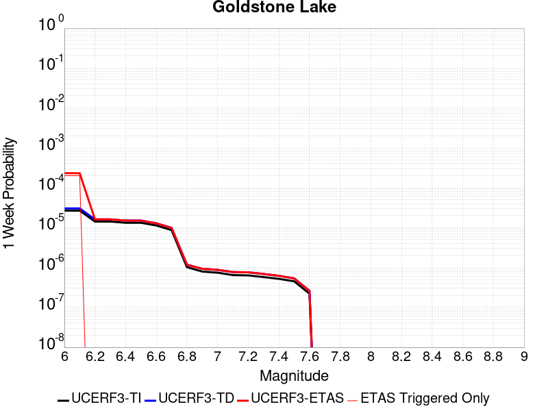 | 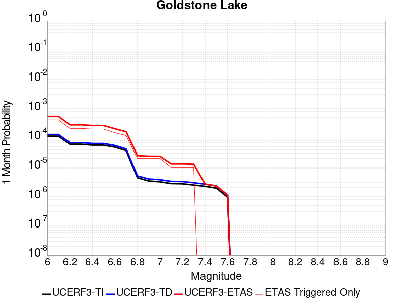 | 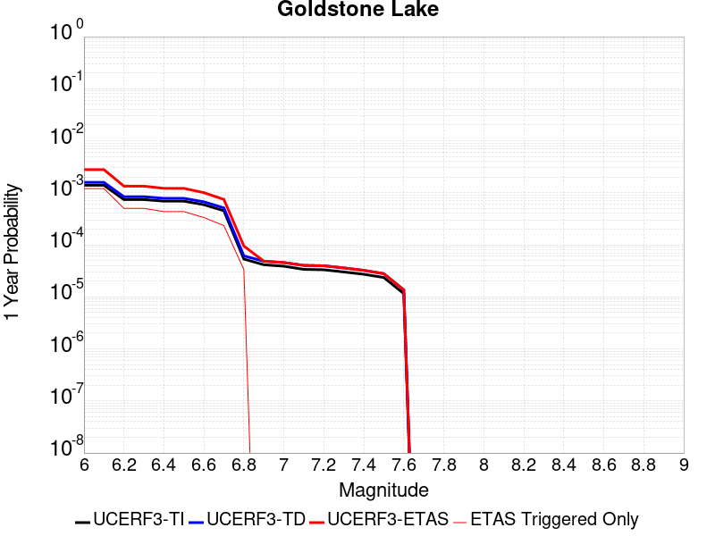 | 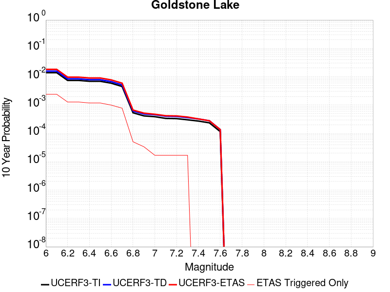 |

| Magnitude | 1 wk TI Prob | 1 wk TD Prob | 1 wk ETAS Prob | 1 wk ETAS/TD Gain | 1 wk ETAS Triggered Only | 1 mo TI Prob | 1 mo TD Prob | 1 mo ETAS Prob | 1 mo ETAS/TD Gain | 1 mo ETAS Triggered Only | 1 yr TI Prob | 1 yr TD Prob | 1 yr ETAS Prob | 1 yr ETAS/TD Gain | 1 yr ETAS Triggered Only | 10 yr TI Prob | 10 yr TD Prob | 10 yr ETAS Prob | 10 yr ETAS/TD Gain | 10 yr ETAS Triggered Only |
|-----|-----|-----|-----|-----|-----|-----|-----|-----|-----|-----|-----|-----|-----|-----|-----|-----|-----|-----|-----|-----|
| 6.0 | 2.671352E-5 | 3.0376628E-5 | 1.8188718E-4 | 5.9877343 | 1.5151515E-4 | 1.1448149E-4 | 1.3018015E-4 | 6.014993E-4 | 4.620514 | 4.7138048E-4 | 0.001392921 | 0.0015839875 | 0.0027773804 | 1.7534106 | 0.0011952862 | 0.013842222 | 0.015746472 | 0.018099403 | 1.1494257 | 0.0023905723 |
| 6.1 | 2.671352E-5 | 3.0376628E-5 | 1.8188718E-4 | 5.9877343 | 1.5151515E-4 | 1.1448149E-4 | 1.3018015E-4 | 6.014993E-4 | 4.620514 | 4.7138048E-4 | 0.001392921 | 0.0015839875 | 0.0027773804 | 1.7534106 | 0.0011952862 | 0.013842222 | 0.015746472 | 0.018099403 | 1.1494257 | 0.0023905723 |
| 6.2 | 1.4197047E-5 | 1.6096516E-5 | 4.9766008E-5 | 3.0917253 | 3.3670032E-5 | 6.0843064E-5 | 6.89838E-5 | 2.8782393E-4 | 4.172341 | 2.1885522E-4 | 7.4051257E-4 | 8.396528E-4 | 0.001512488 | 1.8013256 | 6.7340065E-4 | 0.007380498 | 0.008374499 | 0.009643246 | 1.1515012 | 0.0012794613 |
| 6.3 | 1.4197047E-5 | 1.6096516E-5 | 4.9766008E-5 | 3.0917253 | 3.3670032E-5 | 6.0843064E-5 | 6.89838E-5 | 2.8782393E-4 | 4.172341 | 2.1885522E-4 | 7.4051257E-4 | 8.396528E-4 | 0.001512488 | 1.8013256 | 6.7340065E-4 | 0.007380498 | 0.008374499 | 0.009643246 | 1.1515012 | 0.0012794613 |
| 6.4 | 1.3238931E-5 | 1.5008711E-5 | 4.867824E-5 | 3.2433324 | 3.3670032E-5 | 5.6737044E-5 | 6.432201E-5 | 2.8316316E-4 | 4.4022746 | 2.1885522E-4 | 6.9055456E-4 | 7.8293716E-4 | 0.0013885233 | 1.7734798 | 6.060606E-4 | 0.006884126 | 0.007811414 | 0.00898066 | 1.1496843 | 0.0011784512 |
| 6.5 | 1.3238931E-5 | 1.5008711E-5 | 4.867824E-5 | 3.2433324 | 3.3670032E-5 | 5.6737044E-5 | 6.432201E-5 | 2.8316316E-4 | 4.4022746 | 2.1885522E-4 | 6.9055456E-4 | 7.8293716E-4 | 0.0013885233 | 1.7734798 | 6.060606E-4 | 0.006884126 | 0.007811414 | 0.00898066 | 1.1496843 | 0.0011784512 |
| 6.6 | 1.1328278E-5 | 1.2855381E-5 | 2.9690182E-5 | 2.309553 | 1.6835016E-5 | 4.8548856E-5 | 5.5093864E-5 | 1.8976658E-4 | 3.444423 | 1.3468013E-4 | 5.90922E-4 | 6.706571E-4 | 0.0011585451 | 1.7274777 | 4.8821548E-4 | 0.0058935313 | 0.0066957204 | 0.007682336 | 1.1473502 | 9.93266E-4 |
| 6.7 | 8.651175E-6 | 9.8247265E-6 | 2.6659578E-5 | 2.7135186 | 1.6835016E-5 | 3.707594E-5 | 4.2105803E-5 | 1.4311165E-4 | 3.398858 | 1.01010104E-4 | 4.5130608E-4 | 5.126081E-4 | 8.99615E-4 | 1.7549762 | 3.872054E-4 | 0.0045039062 | 0.0051231356 | 0.005893579 | 1.1503851 | 7.744108E-4 |
| 6.8 | 1.0215377E-6 | 1.1754793E-6 | 1.1754793E-6 | 1.0 | 0.0 | 4.378012E-6 | 5.037759E-6 | 2.1872691E-5 | 4.34175 | 1.6835016E-5 | 5.3300988E-5 | 6.133311E-5 | 9.500107E-5 | 1.5489364 | 3.3670032E-5 | 5.3288206E-4 | 6.13173E-4 | 6.6364714E-4 | 1.0823162 | 5.0505052E-5 |
| 6.9 | 7.9360774E-7 | 9.2834586E-7 | 9.2834586E-7 | 1.0 | 0.0 | 3.4011714E-6 | 3.9786196E-6 | 2.081357E-5 | 5.2313547 | 1.6835016E-5 | 4.1408475E-5 | 4.8438687E-5 | 6.5272885E-5 | 1.3475363 | 1.6835016E-5 | 4.140076E-4 | 4.842883E-4 | 5.17942E-4 | 1.0694911 | 3.3670032E-5 |
| 7.0 | 7.4382757E-7 | 8.7473853E-7 | 8.7473853E-7 | 1.0 | 0.0 | 3.1878285E-6 | 3.7488744E-6 | 2.0583828E-5 | 5.490669 | 1.6835016E-5 | 3.8811122E-5 | 4.5641656E-5 | 6.2475905E-5 | 1.3688352 | 1.6835016E-5 | 3.8804344E-4 | 4.563295E-4 | 4.731568E-4 | 1.0368754 | 1.6835016E-5 |
| 7.1 | 6.4709513E-7 | 7.711347E-7 | 7.711347E-7 | 1.0 | 0.0 | 2.773262E-6 | 3.304859E-6 | 2.013982E-5 | 6.0940027 | 1.6835016E-5 | 3.376394E-5 | 4.0235976E-5 | 5.7070316E-5 | 1.4183903 | 1.6835016E-5 | 3.375881E-4 | 4.0229288E-4 | 4.1912112E-4 | 1.0418308 | 1.6835016E-5 |
| 7.2 | 6.356704E-7 | 7.5884054E-7 | 7.5884054E-7 | 1.0 | 0.0 | 2.7242988E-6 | 3.25217E-6 | 2.0087133E-5 | 6.176532 | 1.6835016E-5 | 3.3167835E-5 | 3.959451E-5 | 5.642886E-5 | 1.4251688 | 1.6835016E-5 | 3.3162883E-4 | 3.958805E-4 | 4.1270885E-4 | 1.0425087 | 1.6835016E-5 |
| 7.3 | 5.7695723E-7 | 6.8966074E-7 | 6.8966074E-7 | 1.0 | 0.0 | 2.4726714E-6 | 2.9556859E-6 | 1.9790654E-5 | 6.6957903 | 1.6835016E-5 | 3.0104358E-5 | 3.598494E-5 | 5.2819352E-5 | 1.4678183 | 1.6835016E-5 | 3.0100282E-4 | 3.5979686E-4 | 3.7662583E-4 | 1.0467736 | 1.6835016E-5 |
| 7.4 | 5.209647E-7 | 6.193549E-7 | 6.193549E-7 | 1.0 | 0.0 | 2.232704E-6 | 2.654376E-6 | 2.654376E-6 | 1.0 | 0.0 | 2.718283E-5 | 3.2316606E-5 | 3.2316606E-5 | 1.0 | 0.0 | 2.7179506E-4 | 3.231246E-4 | 3.231246E-4 | 1.0 | 0.0 |
| 7.5 | 4.512955E-7 | 5.3489146E-7 | 5.3489146E-7 | 1.0 | 0.0 | 1.934122E-6 | 2.2923903E-6 | 2.2923903E-6 | 1.0 | 0.0 | 2.3547682E-5 | 2.7909547E-5 | 2.7909547E-5 | 1.0 | 0.0 | 2.3545188E-4 | 2.7906572E-4 | 2.7906572E-4 | 1.0 | 0.0 |
| 7.6 | 2.21172E-7 | 2.6039737E-7 | 2.6039737E-7 | 1.0 | 0.0 | 9.478797E-7 | 1.1159884E-6 | 1.1159884E-6 | 1.0 | 0.0 | 1.1540374E-5 | 1.3587103E-5 | 1.3587103E-5 | 1.0 | 0.0 | 1.1539775E-4 | 1.3586554E-4 | 1.3586554E-4 | 1.0 | 0.0 |

## McLean Lake
*[(top)](#table-of-contents)*

| 1 Week | 1 Month | 1 Year | 10 Year |
|-----|-----|-----|-----|
| 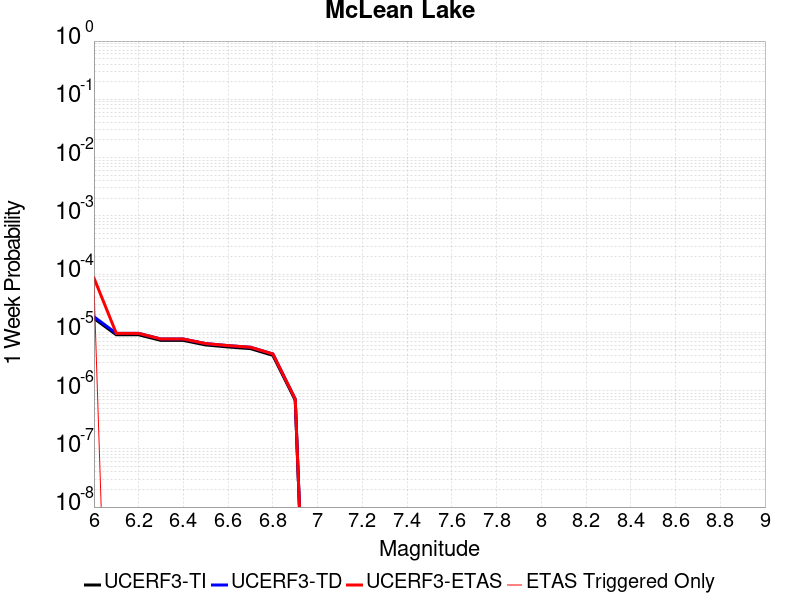 | 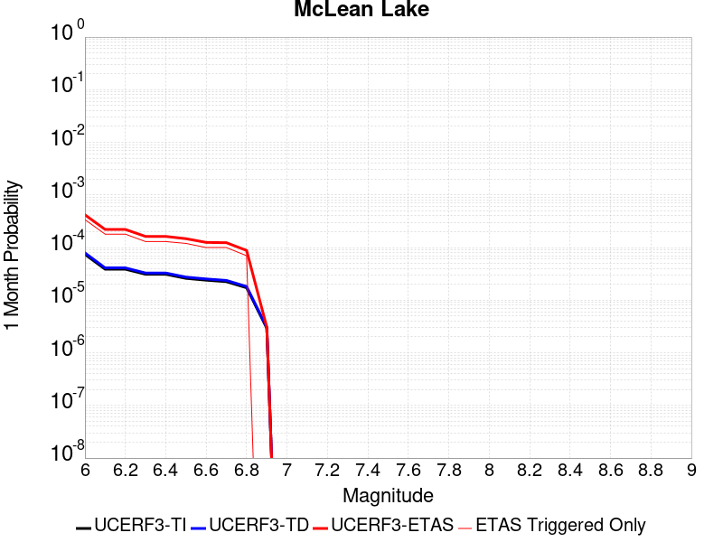 | 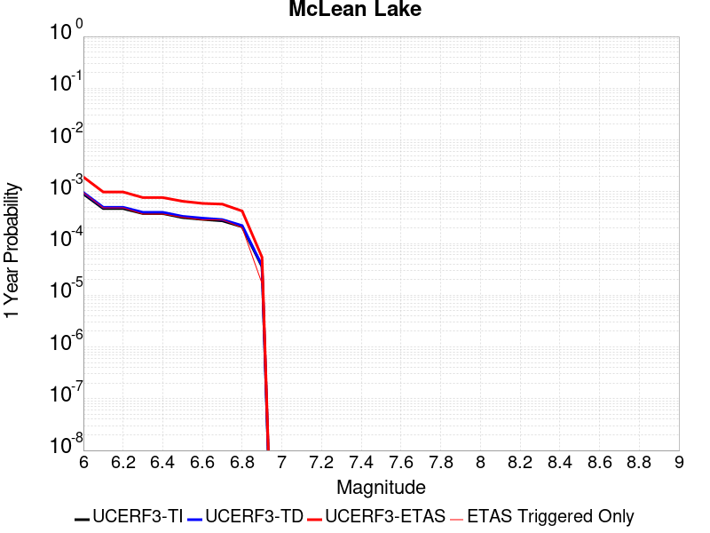 | 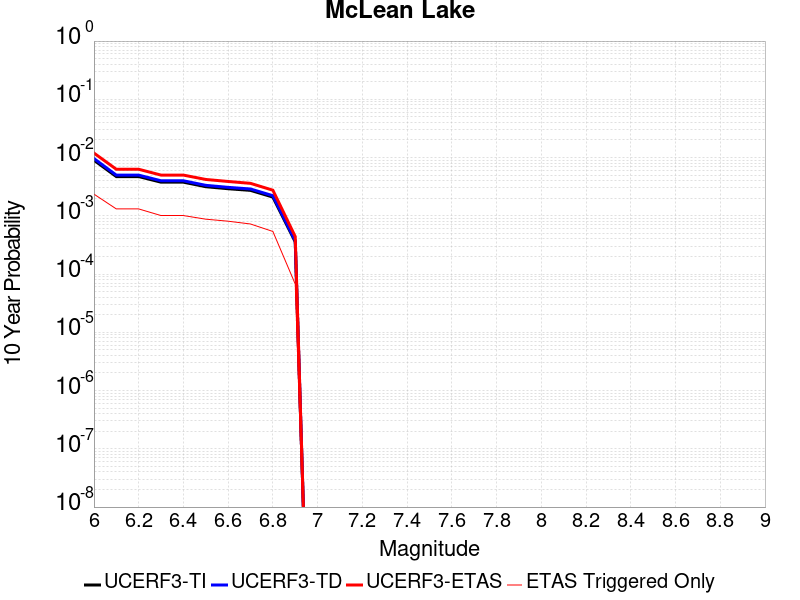 |

| Magnitude | 1 wk TI Prob | 1 wk TD Prob | 1 wk ETAS Prob | 1 wk ETAS/TD Gain | 1 wk ETAS Triggered Only | 1 mo TI Prob | 1 mo TD Prob | 1 mo ETAS Prob | 1 mo ETAS/TD Gain | 1 mo ETAS Triggered Only | 1 yr TI Prob | 1 yr TD Prob | 1 yr ETAS Prob | 1 yr ETAS/TD Gain | 1 yr ETAS Triggered Only | 10 yr TI Prob | 10 yr TD Prob | 10 yr ETAS Prob | 10 yr ETAS/TD Gain | 10 yr ETAS Triggered Only |
|-----|-----|-----|-----|-----|-----|-----|-----|-----|-----|-----|-----|-----|-----|-----|-----|-----|-----|-----|-----|-----|
| 6.0 | 1.7360222E-5 | 1.8501789E-5 | 8.584061E-5 | 4.6395845 | 6.7340065E-5 | 7.439883E-5 | 7.929125E-5 | 3.4863016E-4 | 4.3968306 | 2.6936026E-4 | 9.0542925E-4 | 9.64992E-4 | 0.0019236619 | 1.9934486 | 9.5959596E-4 | 0.009017491 | 0.009612858 | 0.011947104 | 1.2428254 | 0.0023569025 |
| 6.1 | 9.062689E-6 | 9.592268E-6 | 9.592268E-6 | 1.0 | 0.0 | 3.8839516E-5 | 4.110912E-5 | 1.5894939E-4 | 3.8665237 | 1.1784512E-4 | 4.727685E-4 | 5.003975E-4 | 9.883686E-4 | 1.9751672 | 4.8821548E-4 | 0.0047176396 | 0.0049935905 | 0.0063001644 | 1.2616502 | 0.0013131313 |
| 6.2 | 9.062689E-6 | 9.592268E-6 | 9.592268E-6 | 1.0 | 0.0 | 3.8839516E-5 | 4.110912E-5 | 1.5894939E-4 | 3.8665237 | 1.1784512E-4 | 4.727685E-4 | 5.003975E-4 | 9.883686E-4 | 1.9751672 | 4.8821548E-4 | 0.0047176396 | 0.0049935905 | 0.0063001644 | 1.2616502 | 0.0013131313 |
| 6.3 | 7.2575485E-6 | 7.667767E-6 | 7.667767E-6 | 1.0 | 0.0 | 3.110341E-5 | 3.2861484E-5 | 1.170338E-4 | 3.5614278 | 8.417508E-5 | 3.786182E-4 | 4.0002225E-4 | 7.7024446E-4 | 1.9255041 | 3.7037037E-4 | 0.0037797375 | 0.003993727 | 0.0049997936 | 1.2519118 | 0.001010101 |
| 6.4 | 7.2575485E-6 | 7.667767E-6 | 7.667767E-6 | 1.0 | 0.0 | 3.110341E-5 | 3.2861484E-5 | 1.170338E-4 | 3.5614278 | 8.417508E-5 | 3.786182E-4 | 4.0002225E-4 | 7.7024446E-4 | 1.9255041 | 3.7037037E-4 | 0.0037797375 | 0.003993727 | 0.0049997936 | 1.2519118 | 0.001010101 |
| 6.5 | 6.06582E-6 | 6.4039245E-6 | 6.4039245E-6 | 1.0 | 0.0 | 2.5996113E-5 | 2.7445138E-5 | 1.1161791E-4 | 4.0669465 | 8.417508E-5 | 3.164567E-4 | 3.340998E-4 | 6.5385824E-4 | 1.9570746 | 3.1986533E-4 | 0.0031600643 | 0.0033366138 | 0.004209114 | 1.2614926 | 8.7542087E-4 |
| 6.6 | 5.598744E-6 | 5.910306E-6 | 5.910306E-6 | 1.0 | 0.0 | 2.3994397E-5 | 2.5329673E-5 | 1.09502624E-4 | 4.3230968 | 8.417508E-5 | 2.9209262E-4 | 3.083515E-4 | 5.9445854E-4 | 1.92786 | 2.8619528E-4 | 0.0029170897 | 0.0030798658 | 0.0038854578 | 1.2615672 | 8.0808083E-4 |
| 6.7 | 5.246996E-6 | 5.539203E-6 | 5.539203E-6 | 1.0 | 0.0 | 2.2486933E-5 | 2.3739261E-5 | 1.0791235E-4 | 4.545733 | 8.417508E-5 | 2.73744E-4 | 2.8899353E-4 | 5.7510607E-4 | 1.9900311 | 2.8619528E-4 | 0.0027340704 | 0.002886801 | 0.003608617 | 1.25004 | 7.2390574E-4 |
| 6.8 | 4.02324E-6 | 4.246936E-6 | 4.246936E-6 | 1.0 | 0.0 | 1.7242342E-5 | 1.820106E-5 | 8.5539905E-5 | 4.699721 | 6.7340065E-5 | 2.099053E-4 | 2.2158133E-4 | 4.2355678E-4 | 1.9115183 | 2.0202021E-4 | 0.0020970714 | 0.0022141882 | 0.002751716 | 1.2427652 | 5.387205E-4 |
| 6.9 | 6.835972E-7 | 7.1399705E-7 | 7.1399705E-7 | 1.0 | 0.0 | 2.9296991E-6 | 3.0599856E-6 | 3.0599856E-6 | 1.0 | 0.0 | 3.56685E-5 | 3.7255006E-5 | 5.4089396E-5 | 1.4518692 | 1.6835016E-5 | 3.5662777E-4 | 3.7251884E-4 | 4.3983385E-4 | 1.1807022 | 6.7340065E-5 |

## So Sierra Nevada
*[(top)](#table-of-contents)*

| 1 Week | 1 Month | 1 Year | 10 Year |
|-----|-----|-----|-----|
| 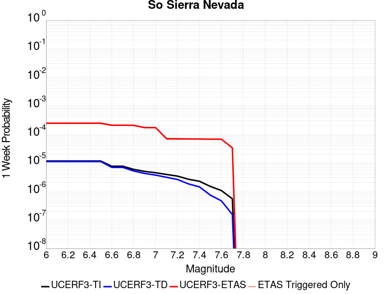 | 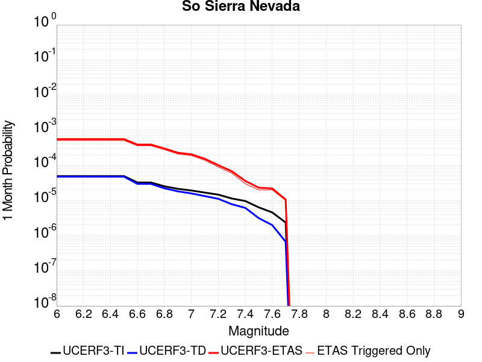 | 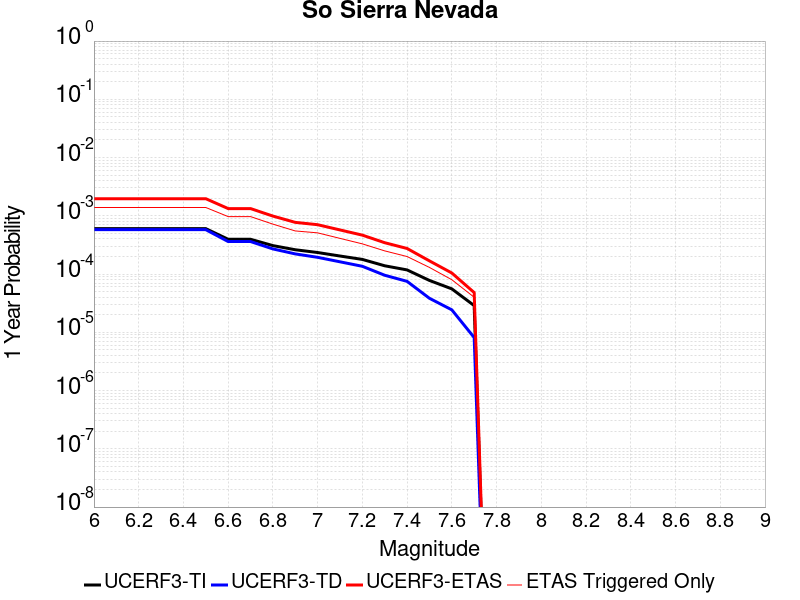 | 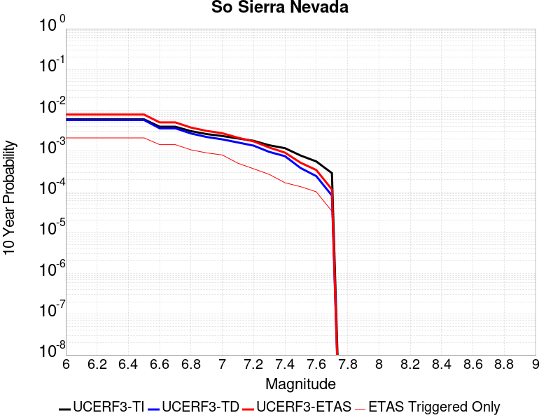 |

| Magnitude | 1 wk TI Prob | 1 wk TD Prob | 1 wk ETAS Prob | 1 wk ETAS/TD Gain | 1 wk ETAS Triggered Only | 1 mo TI Prob | 1 mo TD Prob | 1 mo ETAS Prob | 1 mo ETAS/TD Gain | 1 mo ETAS Triggered Only | 1 yr TI Prob | 1 yr TD Prob | 1 yr ETAS Prob | 1 yr ETAS/TD Gain | 1 yr ETAS Triggered Only | 10 yr TI Prob | 10 yr TD Prob | 10 yr ETAS Prob | 10 yr ETAS/TD Gain | 10 yr ETAS Triggered Only |
|-----|-----|-----|-----|-----|-----|-----|-----|-----|-----|-----|-----|-----|-----|-----|-----|-----|-----|-----|-----|-----|
| 6.0 | 1.15488665E-5 | 1.1079722E-5 | 1.9626286E-4 | 17.7137 | 1.8518518E-4 | 4.9494203E-5 | 4.748373E-5 | 5.020076E-4 | 10.572203 | 4.5454546E-4 | 6.024253E-4 | 5.779738E-4 | 0.0018735209 | 3.2415326 | 0.0012962963 | 0.006007948 | 0.005765975 | 0.007975384 | 1.3831805 | 0.0022222223 |
| 6.1 | 1.15488665E-5 | 1.1079722E-5 | 1.9626286E-4 | 17.7137 | 1.8518518E-4 | 4.9494203E-5 | 4.748373E-5 | 5.020076E-4 | 10.572203 | 4.5454546E-4 | 6.024253E-4 | 5.779738E-4 | 0.0018735209 | 3.2415326 | 0.0012962963 | 0.006007948 | 0.005765975 | 0.007975384 | 1.3831805 | 0.0022222223 |
| 6.2 | 1.15488665E-5 | 1.1079722E-5 | 1.9626286E-4 | 17.7137 | 1.8518518E-4 | 4.9494203E-5 | 4.748373E-5 | 5.020076E-4 | 10.572203 | 4.5454546E-4 | 6.024253E-4 | 5.779738E-4 | 0.0018735209 | 3.2415326 | 0.0012962963 | 0.006007948 | 0.005765975 | 0.007975384 | 1.3831805 | 0.0022222223 |
| 6.3 | 1.15488665E-5 | 1.1079722E-5 | 1.9626286E-4 | 17.7137 | 1.8518518E-4 | 4.9494203E-5 | 4.748373E-5 | 5.020076E-4 | 10.572203 | 4.5454546E-4 | 6.024253E-4 | 5.779738E-4 | 0.0018735209 | 3.2415326 | 0.0012962963 | 0.006007948 | 0.005765975 | 0.007975384 | 1.3831805 | 0.0022222223 |
| 6.4 | 1.15488665E-5 | 1.1079722E-5 | 1.9626286E-4 | 17.7137 | 1.8518518E-4 | 4.9494203E-5 | 4.748373E-5 | 5.020076E-4 | 10.572203 | 4.5454546E-4 | 6.024253E-4 | 5.779738E-4 | 0.0018735209 | 3.2415326 | 0.0012962963 | 0.006007948 | 0.005765975 | 0.007975384 | 1.3831805 | 0.0022222223 |
| 6.5 | 1.15488665E-5 | 1.1079722E-5 | 1.9626286E-4 | 17.7137 | 1.8518518E-4 | 4.9494203E-5 | 4.748373E-5 | 5.020076E-4 | 10.572203 | 4.5454546E-4 | 6.024253E-4 | 5.779738E-4 | 0.0018735209 | 3.2415326 | 0.0012962963 | 0.006007948 | 0.005765975 | 0.007975384 | 1.3831805 | 0.0022222223 |
| 6.6 | 7.587044E-6 | 6.935689E-6 | 1.4161489E-4 | 20.418287 | 1.3468013E-4 | 3.2515498E-5 | 2.9724059E-5 | 3.3274535E-4 | 11.194479 | 3.030303E-4 | 3.9580427E-4 | 3.6183326E-4 | 0.0012874241 | 3.5580592 | 9.259259E-4 | 0.003951 | 0.0036127327 | 0.005105636 | 1.4132339 | 0.0014983165 |
| 6.7 | 7.587044E-6 | 6.935689E-6 | 1.4161489E-4 | 20.418287 | 1.3468013E-4 | 3.2515498E-5 | 2.9724059E-5 | 3.3274535E-4 | 11.194479 | 3.030303E-4 | 3.9580427E-4 | 3.6183326E-4 | 0.0012874241 | 3.5580592 | 9.259259E-4 | 0.003951 | 0.0036127327 | 0.005105636 | 1.4132339 | 0.0014983165 |
| 6.8 | 5.9026956E-6 | 5.1794364E-6 | 1.2302394E-4 | 23.75238 | 1.1784512E-4 | 2.5297022E-5 | 2.2197402E-5 | 2.578824E-4 | 11.617683 | 2.3569024E-4 | 3.0794772E-4 | 2.7022103E-4 | 9.602702E-4 | 3.5536473 | 6.902357E-4 | 0.0030752132 | 0.0026990408 | 0.0037567841 | 1.391896 | 0.0010606061 |
| 6.9 | 5.0118915E-6 | 4.2524644E-6 | 1.0526214E-4 | 24.75321 | 1.01010104E-4 | 2.1479358E-5 | 1.8224722E-5 | 2.2024124E-4 | 12.084751 | 2.0202021E-4 | 2.614798E-4 | 2.2186415E-4 | 7.6046516E-4 | 3.4276164 | 5.387205E-4 | 0.0026117235 | 0.002216499 | 0.003123575 | 1.4092381 | 9.090909E-4 |
| 7.0 | 4.4924795E-6 | 3.713954E-6 | 1.0472368E-4 | 28.197357 | 1.01010104E-4 | 1.925334E-5 | 1.5916852E-5 | 2.0109909E-4 | 12.634351 | 1.8518518E-4 | 2.3438422E-4 | 1.9377106E-4 | 6.81892E-4 | 3.5190597 | 4.8821548E-4 | 0.0023413717 | 0.001936084 | 0.0027426004 | 1.4165709 | 8.0808083E-4 |
| 7.1 | 3.9118436E-6 | 3.1120105E-6 | 5.3616903E-5 | 17.229023 | 5.0505052E-5 | 1.6764936E-5 | 1.3337123E-5 | 1.1434588E-4 | 8.5735035 | 1.01010104E-4 | 2.0409399E-4 | 1.6236794E-4 | 5.3267815E-4 | 3.2806857 | 3.7037037E-4 | 0.0020390663 | 0.0016225493 | 0.0022108187 | 1.3625588 | 5.892256E-4 |
| 7.2 | 3.4200818E-6 | 2.6054847E-6 | 5.3110405E-5 | 20.384077 | 5.0505052E-5 | 1.4657411E-5 | 1.11663185E-5 | 9.534046E-5 | 8.5382185 | 8.417508E-5 | 1.7843937E-4 | 1.3594194E-4 | 4.5576377E-4 | 3.3526354 | 3.1986533E-4 | 0.0017829615 | 0.0013586376 | 0.001863002 | 1.371228 | 5.050505E-4 |
| 7.3 | 2.6593618E-6 | 1.8284468E-6 | 5.2333406E-5 | 28.62178 | 5.0505052E-5 | 1.13972155E-5 | 7.836179E-6 | 7.517572E-5 | 9.593415 | 6.7340065E-5 | 1.3875226E-4 | 9.540159E-5 | 3.6473616E-4 | 3.8231664 | 2.6936026E-4 | 0.0013866565 | 9.536353E-4 | 0.0013068335 | 1.3703703 | 3.5353535E-4 |
| 7.4 | 2.2577992E-6 | 1.4364622E-6 | 5.194144E-5 | 36.15928 | 5.0505052E-5 | 9.676246E-6 | 6.1562537E-6 | 5.6660992E-5 | 9.203811 | 5.0505052E-5 | 1.1780193E-4 | 7.495006E-5 | 3.1062262E-4 | 4.1443944 | 2.3569024E-4 | 0.001177395 | 7.4927293E-4 | 0.0010352538 | 1.3816779 | 2.8619528E-4 |
| 7.5 | 1.489319E-6 | 7.3541264E-7 | 3.440542E-5 | 46.783833 | 3.3670032E-5 | 6.3827797E-6 | 3.1517645E-6 | 3.6821693E-5 | 11.682881 | 3.3670032E-5 | 7.770758E-5 | 3.837206E-5 | 2.0671578E-4 | 5.3871427 | 1.6835016E-4 | 7.7680405E-4 | 3.836548E-4 | 5.6876894E-4 | 1.4825019 | 1.8518518E-4 |
| 7.6 | 1.0680322E-6 | 4.659796E-7 | 3.4136E-5 | 73.25642 | 3.3670032E-5 | 4.577273E-6 | 1.997054E-6 | 3.566702E-5 | 17.859818 | 3.3670032E-5 | 5.5726876E-5 | 2.4313864E-5 | 1.253215E-4 | 5.154323 | 1.01010104E-4 | 5.5712904E-4 | 2.431123E-4 | 3.4409785E-4 | 1.4153864 | 1.01010104E-4 |
| 7.7 | 5.509146E-7 | 1.5581199E-7 | 1.6990825E-5 | 109.046974 | 1.6835016E-5 | 2.3610605E-6 | 6.677655E-7 | 1.750277E-5 | 26.210953 | 1.6835016E-5 | 2.8745531E-5 | 8.130016E-6 | 5.8634658E-5 | 7.2121205 | 5.0505052E-5 | 2.8741814E-4 | 8.12973E-5 | 1.3179825E-4 | 1.6211884 | 5.0505052E-5 |

## Coyote Canyon
*[(top)](#table-of-contents)*

| 1 Week | 1 Month | 1 Year | 10 Year |
|-----|-----|-----|-----|
| 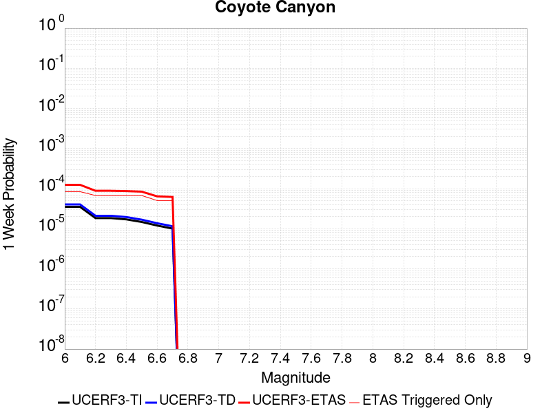 | 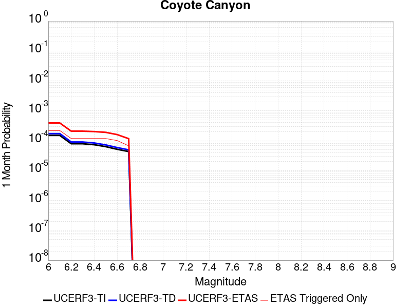 | 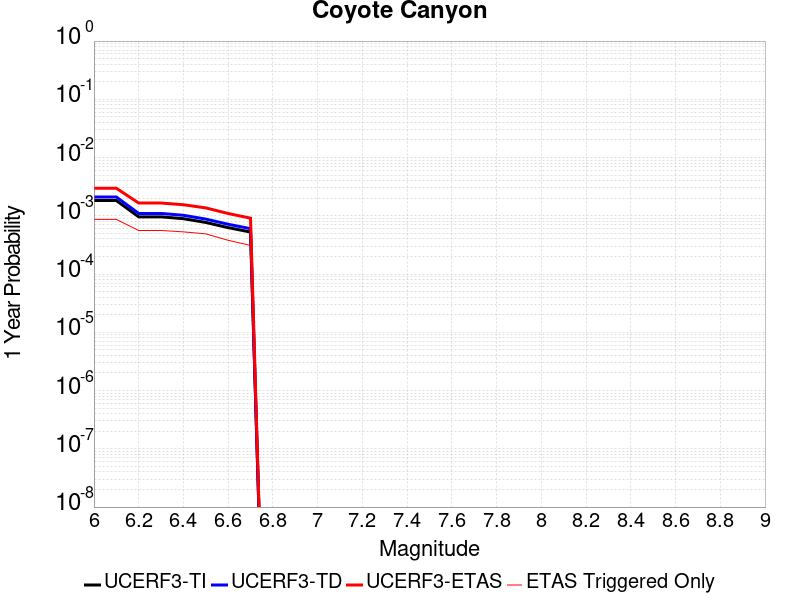 | 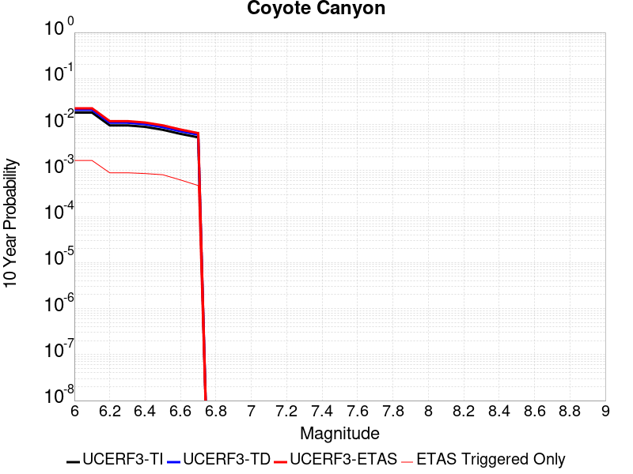 |

| Magnitude | 1 wk TI Prob | 1 wk TD Prob | 1 wk ETAS Prob | 1 wk ETAS/TD Gain | 1 wk ETAS Triggered Only | 1 mo TI Prob | 1 mo TD Prob | 1 mo ETAS Prob | 1 mo ETAS/TD Gain | 1 mo ETAS Triggered Only | 1 yr TI Prob | 1 yr TD Prob | 1 yr ETAS Prob | 1 yr ETAS/TD Gain | 1 yr ETAS Triggered Only | 10 yr TI Prob | 10 yr TD Prob | 10 yr ETAS Prob | 10 yr ETAS/TD Gain | 10 yr ETAS Triggered Only |
|-----|-----|-----|-----|-----|-----|-----|-----|-----|-----|-----|-----|-----|-----|-----|-----|-----|-----|-----|-----|-----|
| 6.0 | 3.5090034E-5 | 4.036513E-5 | 1.2453682E-4 | 3.0852575 | 8.417508E-5 | 1.503772E-4 | 1.7298339E-4 | 3.9180074E-4 | 2.2649617 | 2.1885522E-4 | 0.0018293047 | 0.0021042947 | 0.0029778734 | 1.4151409 | 8.7542087E-4 | 0.018143194 | 0.020869615 | 0.022485014 | 1.0774044 | 0.0016498317 |
| 6.1 | 3.5090034E-5 | 4.036513E-5 | 1.2453682E-4 | 3.0852575 | 8.417508E-5 | 1.503772E-4 | 1.7298339E-4 | 3.9180074E-4 | 2.2649617 | 2.1885522E-4 | 0.0018293047 | 0.0021042947 | 0.0029778734 | 1.4151409 | 8.7542087E-4 | 0.018143194 | 0.020869615 | 0.022485014 | 1.0774044 | 0.0016498317 |
| 6.2 | 1.841879E-5 | 2.1060194E-5 | 8.839884E-5 | 4.1974373 | 6.7340065E-5 | 7.8935285E-5 | 9.0255424E-5 | 2.0808991E-4 | 2.3055668 | 1.1784512E-4 | 9.606133E-4 | 0.0010984079 | 0.0016029036 | 1.4592973 | 5.050505E-4 | 0.0095647145 | 0.010939874 | 0.011822369 | 1.0806677 | 8.922559E-4 |
| 6.3 | 1.841879E-5 | 2.1060194E-5 | 8.839884E-5 | 4.1974373 | 6.7340065E-5 | 7.8935285E-5 | 9.0255424E-5 | 2.0808991E-4 | 2.3055668 | 1.1784512E-4 | 9.606133E-4 | 0.0010984079 | 0.0016029036 | 1.4592973 | 5.050505E-4 | 0.0095647145 | 0.010939874 | 0.011822369 | 1.0806677 | 8.922559E-4 |
| 6.4 | 1.712201E-5 | 1.9565581E-5 | 8.690433E-5 | 4.4416943 | 6.7340065E-5 | 7.337798E-5 | 8.385037E-5 | 2.016856E-4 | 2.4053037 | 1.1784512E-4 | 8.930107E-4 | 0.0010205007 | 0.0014914001 | 1.4614396 | 4.7138048E-4 | 0.008894307 | 0.0101680625 | 0.011017918 | 1.0835809 | 8.585859E-4 |
| 6.5 | 1.4744935E-5 | 1.6837288E-5 | 8.417622E-5 | 4.999393 | 6.7340065E-5 | 6.3191044E-5 | 7.215834E-5 | 1.8999496E-4 | 2.6330283 | 1.1784512E-4 | 7.6907943E-4 | 8.7826716E-4 | 0.0013155931 | 1.4979419 | 4.3771043E-4 | 0.007664232 | 0.008757159 | 0.009558163 | 1.0914686 | 8.0808083E-4 |
| 6.6 | 1.2017839E-5 | 1.3724348E-5 | 6.4228705E-5 | 4.6799097 | 5.0505052E-5 | 5.150401E-5 | 5.8817808E-5 | 1.5982197E-4 | 2.7172377 | 1.01010104E-4 | 6.268809E-4 | 7.159601E-4 | 0.0010355964 | 1.4464443 | 3.1986533E-4 | 0.0062511545 | 0.007145228 | 0.007763673 | 1.0865536 | 6.228956E-4 |
| 6.7 | 1.00956095E-5 | 1.1533734E-5 | 6.2038205E-5 | 5.3788476 | 5.0505052E-5 | 4.326618E-5 | 4.9429844E-5 | 1.1676658E-4 | 2.362269 | 6.7340065E-5 | 5.266384E-4 | 6.0172915E-4 | 8.204527E-4 | 1.3634917 | 2.1885522E-4 | 0.005253921 | 0.006009526 | 0.0064780735 | 1.0779675 | 4.7138048E-4 |

## Lenwood-Lockhart-Old Woman Springs
*[(top)](#table-of-contents)*

| 1 Week | 1 Month | 1 Year | 10 Year |
|-----|-----|-----|-----|
| 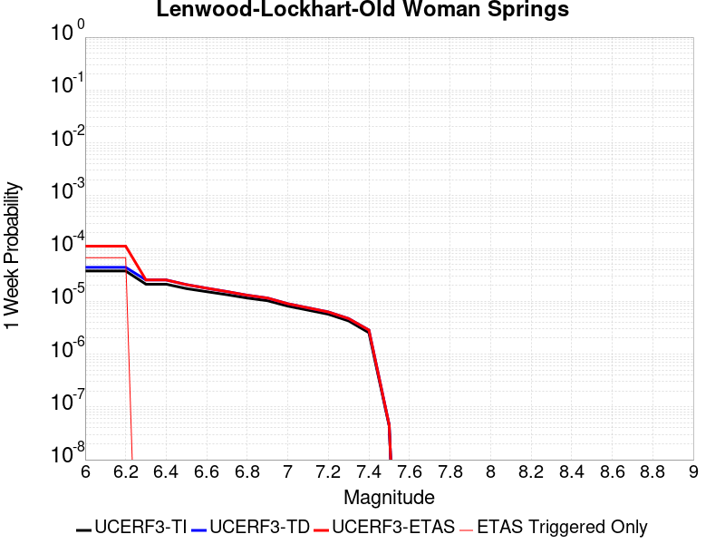 | 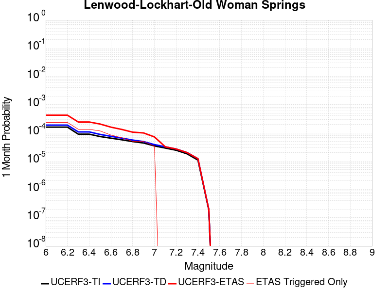 | 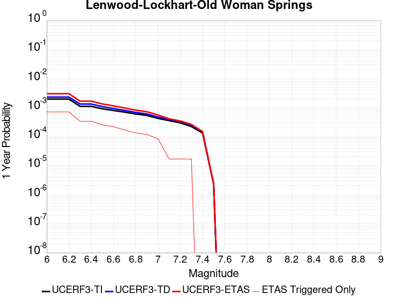 | 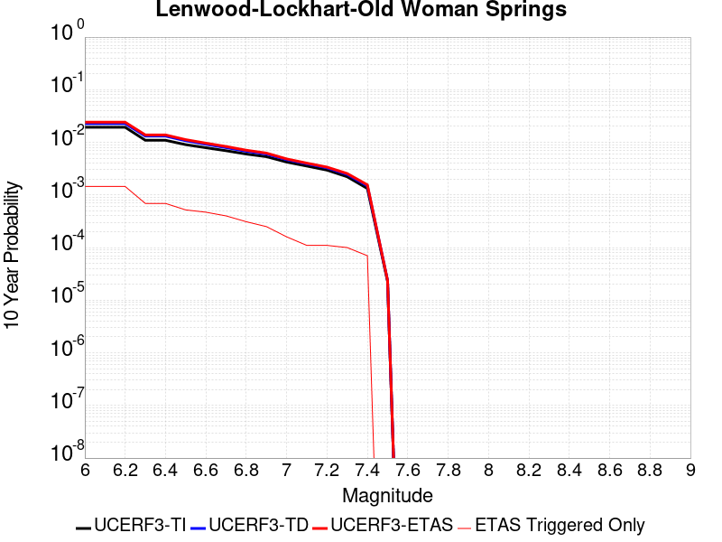 |

| Magnitude | 1 wk TI Prob | 1 wk TD Prob | 1 wk ETAS Prob | 1 wk ETAS/TD Gain | 1 wk ETAS Triggered Only | 1 mo TI Prob | 1 mo TD Prob | 1 mo ETAS Prob | 1 mo ETAS/TD Gain | 1 mo ETAS Triggered Only | 1 yr TI Prob | 1 yr TD Prob | 1 yr ETAS Prob | 1 yr ETAS/TD Gain | 1 yr ETAS Triggered Only | 10 yr TI Prob | 10 yr TD Prob | 10 yr ETAS Prob | 10 yr ETAS/TD Gain | 10 yr ETAS Triggered Only |
|-----|-----|-----|-----|-----|-----|-----|-----|-----|-----|-----|-----|-----|-----|-----|-----|-----|-----|-----|-----|-----|
| 6.0 | 3.744542E-5 | 4.3962966E-5 | 1.618029E-4 | 3.6804364 | 1.1784512E-4 | 1.604705E-4 | 1.8840008E-4 | 4.240459E-4 | 2.2507734 | 2.3569024E-4 | 0.0019519776 | 0.0022915301 | 0.0029969804 | 1.3078513 | 7.070707E-4 | 0.019349206 | 0.022697017 | 0.024194231 | 1.0659653 | 0.0015319865 |
| 6.1 | 3.744542E-5 | 4.3962966E-5 | 1.618029E-4 | 3.6804364 | 1.1784512E-4 | 1.604705E-4 | 1.8840008E-4 | 4.240459E-4 | 2.2507734 | 2.3569024E-4 | 0.0019519776 | 0.0022915301 | 0.0029969804 | 1.3078513 | 7.070707E-4 | 0.019349206 | 0.022697017 | 0.024194231 | 1.0659653 | 0.0015319865 |
| 6.2 | 3.744542E-5 | 4.3962966E-5 | 1.618029E-4 | 3.6804364 | 1.1784512E-4 | 1.604705E-4 | 1.8840008E-4 | 4.240459E-4 | 2.2507734 | 2.3569024E-4 | 0.0019519776 | 0.0022915301 | 0.0029969804 | 1.3078513 | 7.070707E-4 | 0.019349206 | 0.022697017 | 0.024194231 | 1.0659653 | 0.0015319865 |
| 6.3 | 2.1079984E-5 | 2.5353596E-5 | 9.269196E-5 | 3.6559687 | 6.7340065E-5 | 9.0339665E-5 | 1.0865386E-4 | 2.4331936E-4 | 2.2393992 | 1.3468013E-4 | 0.0010993304 | 0.0013220779 | 0.0016583331 | 1.2543384 | 3.3670032E-4 | 0.010939079 | 0.013144341 | 0.013875346 | 1.0556136 | 7.4074074E-4 |
| 6.4 | 2.1079984E-5 | 2.5353596E-5 | 9.269196E-5 | 3.6559687 | 6.7340065E-5 | 9.0339665E-5 | 1.0865386E-4 | 2.4331936E-4 | 2.2393992 | 1.3468013E-4 | 0.0010993304 | 0.0013220779 | 0.0016583331 | 1.2543384 | 3.3670032E-4 | 0.010939079 | 0.013144341 | 0.013875346 | 1.0556136 | 7.4074074E-4 |
| 6.5 | 1.7397282E-5 | 2.0662535E-5 | 7.116654E-5 | 3.4442308 | 5.0505052E-5 | 7.455765E-5 | 8.855078E-5 | 2.0638546E-4 | 2.3307018 | 1.1784512E-4 | 9.073613E-4 | 0.0010775843 | 0.0013298375 | 1.2340913 | 2.5252526E-4 | 0.009036654 | 0.010724886 | 0.011291138 | 1.0527979 | 5.7239056E-4 |
| 6.6 | 1.52050325E-5 | 1.76798E-5 | 3.451452E-5 | 1.9522008 | 1.6835016E-5 | 6.51628E-5 | 7.576841E-5 | 1.5993712E-4 | 2.110868 | 8.417508E-5 | 7.9306826E-4 | 9.220979E-4 | 0.0011407513 | 1.237126 | 2.1885522E-4 | 0.007902439 | 0.009183581 | 0.009683994 | 1.0544899 | 5.050505E-4 |
| 6.7 | 1.332523E-5 | 1.5264091E-5 | 3.209885E-5 | 2.1028996 | 1.6835016E-5 | 5.7106878E-5 | 6.541593E-5 | 1.327516E-4 | 2.0293467 | 6.7340065E-5 | 6.950544E-4 | 7.9615373E-4 | 9.6436986E-4 | 1.211286 | 1.6835016E-4 | 0.006928845 | 0.007933645 | 0.008351182 | 1.0526285 | 4.208754E-4 |
| 6.8 | 1.1525329E-5 | 1.303105E-5 | 2.9865847E-5 | 2.2918987 | 1.6835016E-5 | 4.9393333E-5 | 5.5846183E-5 | 1.06348416E-4 | 1.9043094 | 5.0505052E-5 | 6.011979E-4 | 6.7971944E-4 | 8.14308E-4 | 1.1980062 | 1.3468013E-4 | 0.00599574 | 0.006776856 | 0.007127995 | 1.0518146 | 3.5353535E-4 |
| 6.9 | 1.0253909E-5 | 1.15144985E-5 | 2.8349321E-5 | 2.4620545 | 1.6835016E-5 | 4.3944583E-5 | 4.9346934E-5 | 9.9849494E-5 | 2.0234184 | 5.0505052E-5 | 5.3489394E-4 | 6.0063694E-4 | 7.184113E-4 | 1.1960824 | 1.1784512E-4 | 0.0053360825 | 0.005990515 | 0.006274996 | 1.0474886 | 2.8619528E-4 |
| 7.0 | 8.104563E-6 | 8.991321E-6 | 8.991321E-6 | 1.0 | 0.0 | 3.4733377E-5 | 3.8533675E-5 | 7.220241E-5 | 1.8737484 | 3.3670032E-5 | 4.2279682E-4 | 4.6904891E-4 | 5.5318454E-4 | 1.1793749 | 8.417508E-5 | 0.0042199334 | 0.0046808375 | 0.004881912 | 1.042957 | 2.0202021E-4 |
| 7.1 | 6.7986157E-6 | 7.515848E-6 | 7.515848E-6 | 1.0 | 0.0 | 2.91366E-5 | 3.221039E-5 | 3.221039E-5 | 1.0 | 0.0 | 3.5468035E-4 | 3.9209312E-4 | 4.0892154E-4 | 1.0429194 | 1.6835016E-5 | 0.003541148 | 0.0039142296 | 0.0040316135 | 1.029989 | 1.1784512E-4 |
| 7.2 | 5.6893327E-6 | 6.280039E-6 | 6.280039E-6 | 1.0 | 0.0 | 2.4382627E-5 | 2.6914187E-5 | 2.6914187E-5 | 1.0 | 0.0 | 2.9681803E-4 | 3.2763294E-4 | 3.4446243E-4 | 1.0513669 | 1.6835016E-5 | 0.002964219 | 0.0032716978 | 0.0033891574 | 1.0359017 | 1.1784512E-4 |
| 7.3 | 4.253348E-6 | 4.706927E-6 | 4.706927E-6 | 1.0 | 0.0 | 1.8228506E-5 | 2.01724E-5 | 2.01724E-5 | 1.0 | 0.0 | 2.2190946E-4 | 2.4557312E-4 | 2.6240398E-4 | 1.0685371 | 1.6835016E-5 | 0.00221688 | 0.0024531984 | 0.0025539608 | 1.0410738 | 1.01010104E-4 |
| 7.4 | 2.5448119E-6 | 2.8520535E-6 | 2.8520535E-6 | 1.0 | 0.0 | 1.0906291E-5 | 1.22230385E-5 | 1.22230385E-5 | 1.0 | 0.0 | 1.3277601E-4 | 1.4880698E-4 | 1.4880698E-4 | 1.0 | 0.0 | 0.001326967 | 0.0014872355 | 0.0015544754 | 1.0452113 | 6.7340065E-5 |
| 7.5 | 4.3706837E-8 | 4.5629356E-8 | 4.5629356E-8 | 1.0 | 0.0 | 1.8731501E-7 | 1.9555438E-7 | 1.9555438E-7 | 1.0 | 0.0 | 2.2805577E-6 | 2.3808725E-6 | 2.3808725E-6 | 1.0 | 0.0 | 2.2805343E-5 | 2.3808525E-5 | 2.3808525E-5 | 1.0 | 0.0 |

## Nelson Lake
*[(top)](#table-of-contents)*

| 1 Week | 1 Month | 1 Year | 10 Year |
|-----|-----|-----|-----|
| 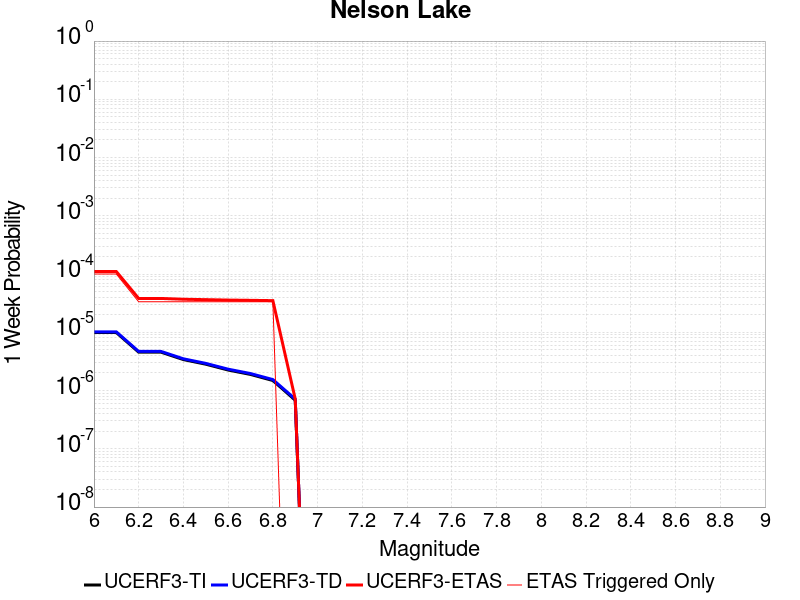 | 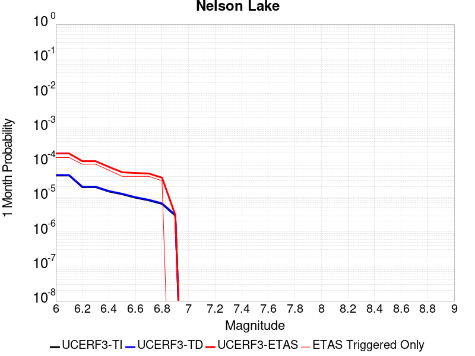 |  | 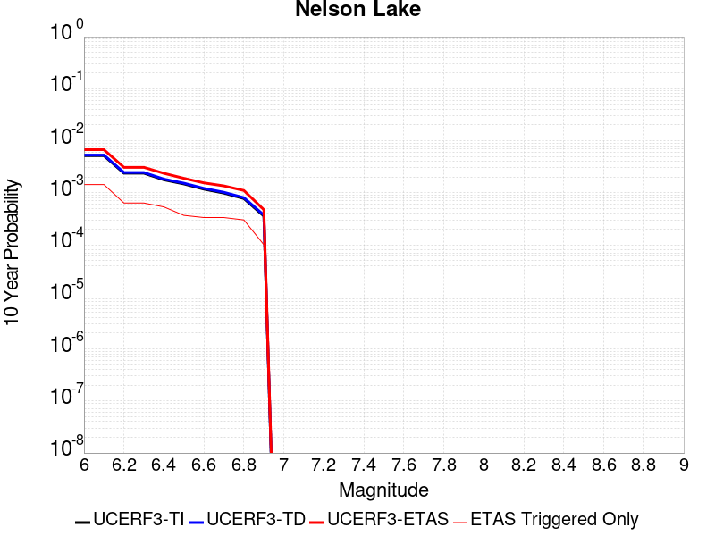 |

| Magnitude | 1 wk TI Prob | 1 wk TD Prob | 1 wk ETAS Prob | 1 wk ETAS/TD Gain | 1 wk ETAS Triggered Only | 1 mo TI Prob | 1 mo TD Prob | 1 mo ETAS Prob | 1 mo ETAS/TD Gain | 1 mo ETAS Triggered Only | 1 yr TI Prob | 1 yr TD Prob | 1 yr ETAS Prob | 1 yr ETAS/TD Gain | 1 yr ETAS Triggered Only | 10 yr TI Prob | 10 yr TD Prob | 10 yr ETAS Prob | 10 yr ETAS/TD Gain | 10 yr ETAS Triggered Only |
|-----|-----|-----|-----|-----|-----|-----|-----|-----|-----|-----|-----|-----|-----|-----|-----|-----|-----|-----|-----|-----|
| 6.0 | 9.913453E-6 | 1.0192293E-5 | 6.0696828E-5 | 5.9551687 | 5.0505052E-5 | 4.2485535E-5 | 4.3680586E-5 | 1.9518912E-4 | 4.4685555 | 1.5151515E-4 | 5.1713863E-4 | 5.316917E-4 | 0.0010701258 | 2.012681 | 5.387205E-4 | 0.0051593683 | 0.0053052236 | 0.00664488 | 1.2525165 | 0.0013468013 |
| 6.1 | 9.913453E-6 | 1.0192293E-5 | 6.0696828E-5 | 5.9551687 | 5.0505052E-5 | 4.2485535E-5 | 4.3680586E-5 | 1.9518912E-4 | 4.4685555 | 1.5151515E-4 | 5.1713863E-4 | 5.316917E-4 | 0.0010701258 | 2.012681 | 5.387205E-4 | 0.0051593683 | 0.0053052236 | 0.00664488 | 1.2525165 | 0.0013468013 |
| 6.2 | 4.5596407E-6 | 4.696332E-6 | 2.153127E-5 | 4.5846996 | 1.6835016E-5 | 1.954117E-5 | 2.0126989E-5 | 1.0430038E-4 | 5.1821156 | 8.417508E-5 | 2.3788778E-4 | 2.450198E-4 | 4.974832E-4 | 2.0303795 | 2.5252526E-4 | 0.0023763329 | 0.0024476226 | 0.003018612 | 1.2332834 | 5.7239056E-4 |
| 6.3 | 4.5596407E-6 | 4.696332E-6 | 2.153127E-5 | 4.5846996 | 1.6835016E-5 | 1.954117E-5 | 2.0126989E-5 | 1.0430038E-4 | 5.1821156 | 8.417508E-5 | 2.3788778E-4 | 2.450198E-4 | 4.974832E-4 | 2.0303795 | 2.5252526E-4 | 0.0023763329 | 0.0024476226 | 0.003018612 | 1.2332834 | 5.7239056E-4 |
| 6.4 | 3.4025713E-6 | 3.509912E-6 | 2.0344869E-5 | 5.7964044 | 1.6835016E-5 | 1.4582367E-5 | 1.50423975E-5 | 6.554669E-5 | 4.357463 | 5.0505052E-5 | 1.7752586E-4 | 1.8312664E-4 | 3.8510986E-4 | 2.1029701 | 2.0202021E-4 | 0.001773841 | 0.0018298404 | 0.002283554 | 1.2479526 | 4.5454546E-4 |
| 6.5 | 2.8352947E-6 | 2.9278688E-6 | 1.9762836E-5 | 6.749905 | 1.6835016E-5 | 1.2151207E-5 | 1.2547953E-5 | 4.6217563E-5 | 3.6832752 | 3.3670032E-5 | 1.479309E-4 | 1.5276136E-4 | 2.8742093E-4 | 1.8815027 | 1.3468013E-4 | 0.0014783246 | 0.0015266375 | 0.0018628237 | 1.2202135 | 3.3670032E-4 |
| 6.6 | 2.251518E-6 | 2.3290781E-6 | 1.9164056E-5 | 8.228171 | 1.6835016E-5 | 9.649328E-6 | 9.981729E-6 | 4.3651427E-5 | 4.3731327 | 3.3670032E-5 | 1.1747423E-4 | 1.2152141E-4 | 2.393522E-4 | 1.96963 | 1.1784512E-4 | 0.0011741214 | 0.0012146112 | 0.0015004589 | 1.2353408 | 2.8619528E-4 |
| 6.7 | 1.8911853E-6 | 1.9591491E-6 | 1.8794133E-5 | 9.593008 | 1.6835016E-5 | 8.105055E-6 | 8.39633E-6 | 4.206608E-5 | 5.010056 | 3.3670032E-5 | 9.867457E-5 | 1.022211E-4 | 2.0322087E-4 | 1.9880521 | 1.01010104E-4 | 9.863076E-4 | 0.0010217984 | 0.0012740656 | 1.2468855 | 2.5252526E-4 |
| 6.8 | 1.4874814E-6 | 1.5438383E-6 | 1.8378829E-5 | 11.9046335 | 1.6835016E-5 | 6.374905E-6 | 6.6164357E-6 | 4.0286246E-5 | 6.088814 | 3.3670032E-5 | 7.76117E-5 | 8.055265E-5 | 1.6472096E-4 | 2.0448856 | 8.417508E-5 | 7.75846E-4 | 8.052856E-4 | 0.0010239646 | 1.2715546 | 2.1885522E-4 |
| 6.9 | 6.835972E-7 | 7.1399705E-7 | 7.1399705E-7 | 1.0 | 0.0 | 2.9296991E-6 | 3.0599856E-6 | 3.0599856E-6 | 1.0 | 0.0 | 3.56685E-5 | 3.7255006E-5 | 5.4089396E-5 | 1.4518692 | 1.6835016E-5 | 3.5662777E-4 | 3.7251884E-4 | 4.3983385E-4 | 1.1807022 | 6.7340065E-5 |

## San Andreas (Mojave S)
*[(top)](#table-of-contents)*

| 1 Week | 1 Month | 1 Year | 10 Year |
|-----|-----|-----|-----|
| 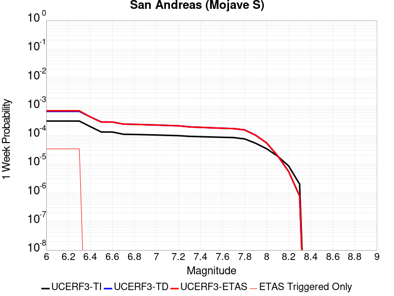 | 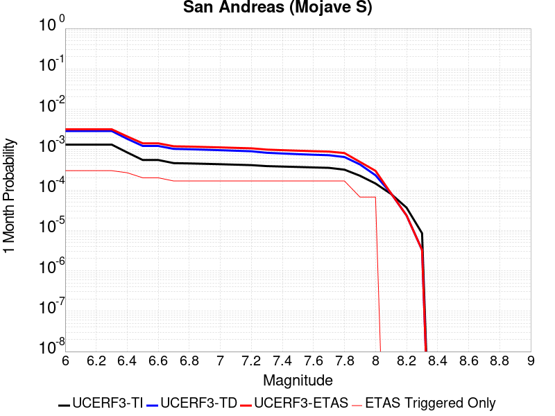 | 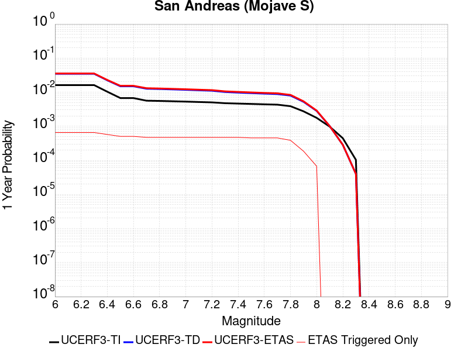 | 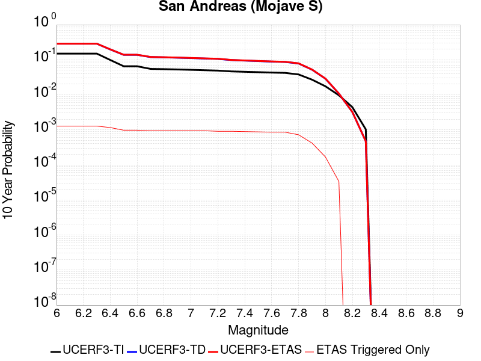 |

| Magnitude | 1 wk TI Prob | 1 wk TD Prob | 1 wk ETAS Prob | 1 wk ETAS/TD Gain | 1 wk ETAS Triggered Only | 1 mo TI Prob | 1 mo TD Prob | 1 mo ETAS Prob | 1 mo ETAS/TD Gain | 1 mo ETAS Triggered Only | 1 yr TI Prob | 1 yr TD Prob | 1 yr ETAS Prob | 1 yr ETAS/TD Gain | 1 yr ETAS Triggered Only | 10 yr TI Prob | 10 yr TD Prob | 10 yr ETAS Prob | 10 yr ETAS/TD Gain | 10 yr ETAS Triggered Only |
|-----|-----|-----|-----|-----|-----|-----|-----|-----|-----|-----|-----|-----|-----|-----|-----|-----|-----|-----|-----|-----|
| 6.0 | 3.1064058E-4 | 6.747043E-4 | 7.4199896E-4 | 1.0997394 | 6.7340065E-5 | 0.0013306376 | 0.002888514 | 0.003157096 | 1.0929829 | 2.6936026E-4 | 0.016080605 | 0.03462661 | 0.035260443 | 1.0183047 | 6.5656565E-4 | 0.1496549 | 0.28663692 | 0.28754964 | 1.0031842 | 0.0012794613 |
| 6.1 | 3.1064058E-4 | 6.747043E-4 | 7.4199896E-4 | 1.0997394 | 6.7340065E-5 | 0.0013306376 | 0.002888514 | 0.003157096 | 1.0929829 | 2.6936026E-4 | 0.016080605 | 0.03462661 | 0.035260443 | 1.0183047 | 6.5656565E-4 | 0.1496549 | 0.28663692 | 0.28754964 | 1.0031842 | 0.0012794613 |
| 6.2 | 3.1064058E-4 | 6.747043E-4 | 7.4199896E-4 | 1.0997394 | 6.7340065E-5 | 0.0013306376 | 0.002888514 | 0.003157096 | 1.0929829 | 2.6936026E-4 | 0.016080605 | 0.03462661 | 0.035260443 | 1.0183047 | 6.5656565E-4 | 0.1496549 | 0.28663692 | 0.28754964 | 1.0031842 | 0.0012794613 |
| 6.3 | 3.1064058E-4 | 6.747043E-4 | 7.4199896E-4 | 1.0997394 | 6.7340065E-5 | 0.0013306376 | 0.002888514 | 0.003157096 | 1.0929829 | 2.6936026E-4 | 0.016080605 | 0.03462661 | 0.035260443 | 1.0183047 | 6.5656565E-4 | 0.1496549 | 0.28663692 | 0.28754964 | 1.0031842 | 0.0012794613 |
| 6.4 | 1.9872203E-4 | 4.318848E-4 | 4.8236805E-4 | 1.1168905 | 5.0505052E-5 | 8.5138786E-4 | 0.0018496502 | 0.0021017084 | 1.1362734 | 2.5252526E-4 | 0.010316478 | 0.022293096 | 0.022852728 | 1.0251033 | 5.7239056E-4 | 0.098504856 | 0.19703239 | 0.19796515 | 1.0047339 | 0.0011616162 |
| 6.5 | 1.291105E-4 | 2.8761322E-4 | 3.3810374E-4 | 1.1755501 | 5.0505052E-5 | 5.5321335E-4 | 0.0012320485 | 0.0014506341 | 1.1774163 | 2.1885522E-4 | 0.006714592 | 0.0148978485 | 0.015395374 | 1.0333959 | 5.050505E-4 | 0.065152965 | 0.13807017 | 0.13891178 | 1.0060955 | 9.7643095E-4 |
| 6.6 | 1.291105E-4 | 2.8761322E-4 | 3.3810374E-4 | 1.1755501 | 5.0505052E-5 | 5.5321335E-4 | 0.0012320485 | 0.0014506341 | 1.1774163 | 2.1885522E-4 | 0.006714592 | 0.0148978485 | 0.015395374 | 1.0333959 | 5.050505E-4 | 0.065152965 | 0.13807017 | 0.13891178 | 1.0060955 | 9.7643095E-4 |
| 6.7 | 1.08001186E-4 | 2.4342406E-4 | 2.9391682E-4 | 1.2074271 | 5.0505052E-5 | 4.6278012E-4 | 0.0010428295 | 0.0012446389 | 1.1935211 | 2.0202021E-4 | 0.0056198016 | 0.012622835 | 0.013088265 | 1.0368721 | 4.7138048E-4 | 0.054797906 | 0.11921291 | 0.12004328 | 1.0069654 | 9.4276096E-4 |
| 6.8 | 1.0624356E-4 | 2.3860046E-4 | 2.8909347E-4 | 1.2116215 | 5.0505052E-5 | 4.5525006E-4 | 0.0010221732 | 0.001223987 | 1.1974359 | 2.0202021E-4 | 0.0055285925 | 0.01237422 | 0.012839768 | 1.0376223 | 4.7138048E-4 | 0.053930566 | 0.117162056 | 0.11799436 | 1.0071039 | 9.4276096E-4 |
| 6.9 | 1.0393785E-4 | 2.3230357E-4 | 2.827969E-4 | 1.2173592 | 5.0505052E-5 | 4.4537184E-4 | 9.952073E-4 | 0.0011970265 | 1.2027911 | 2.0202021E-4 | 0.0054089287 | 0.012049583 | 0.012515283 | 1.0386487 | 4.7138048E-4 | 0.05279156 | 0.11445948 | 0.11529434 | 1.0072938 | 9.4276096E-4 |
| 7.0 | 1.0155622E-4 | 2.2599897E-4 | 2.7649262E-4 | 1.2234242 | 5.0505052E-5 | 4.3516833E-4 | 9.682079E-4 | 0.0011700325 | 1.2084517 | 2.0202021E-4 | 0.005285311 | 0.011724443 | 0.012190297 | 1.0397335 | 4.7138048E-4 | 0.05161361 | 0.11171984 | 0.11255728 | 1.0074959 | 9.4276096E-4 |
| 7.1 | 9.885595E-5 | 2.1888265E-4 | 2.6937664E-4 | 1.2306898 | 5.0505052E-5 | 4.2359953E-4 | 9.377316E-4 | 0.0011395623 | 1.215233 | 2.0202021E-4 | 0.0051451353 | 0.011357316 | 0.011823343 | 1.0410331 | 4.7138048E-4 | 0.05027629 | 0.10860426 | 0.10944463 | 1.007738 | 9.4276096E-4 |
| 7.2 | 9.6411415E-5 | 2.125122E-4 | 2.630065E-4 | 1.2376066 | 5.0505052E-5 | 4.1312634E-4 | 9.1044896E-4 | 0.0011122852 | 1.2216887 | 2.0202021E-4 | 0.005018219 | 0.01102856 | 0.011494742 | 1.0422704 | 4.7138048E-4 | 0.049064007 | 0.10579402 | 0.10660693 | 1.007684 | 9.090909E-4 |
| 7.3 | 9.1180635E-5 | 1.9479371E-4 | 2.4528892E-4 | 1.259224 | 5.0505052E-5 | 3.907156E-4 | 8.345632E-4 | 0.0010364149 | 1.2418649 | 2.0202021E-4 | 0.004746591 | 0.010113581 | 0.010580195 | 1.0461373 | 4.7138048E-4 | 0.046464786 | 0.09798661 | 0.09880662 | 1.0083686 | 9.090909E-4 |
| 7.4 | 8.887388E-5 | 1.8727897E-4 | 2.3777457E-4 | 1.2696277 | 5.0505052E-5 | 3.8083247E-4 | 8.023774E-4 | 0.0010042355 | 1.251575 | 2.0202021E-4 | 0.0046267817 | 0.009725285 | 0.010192081 | 1.0479982 | 4.7138048E-4 | 0.045316286 | 0.09462135 | 0.09542918 | 1.0085375 | 8.922559E-4 |
| 7.5 | 8.6750515E-5 | 1.8059391E-4 | 2.3108984E-4 | 1.2796104 | 5.0505052E-5 | 3.7173493E-4 | 7.7374437E-4 | 9.756083E-4 | 1.2608923 | 2.0202021E-4 | 0.004516484 | 0.009379733 | 0.009830016 | 1.0480058 | 4.5454546E-4 | 0.04425787 | 0.09158487 | 0.092380114 | 1.0086832 | 8.7542087E-4 |
| 7.6 | 8.453092E-5 | 1.7446902E-4 | 2.2496528E-4 | 1.2894281 | 5.0505052E-5 | 3.6222505E-4 | 7.475102E-4 | 9.493794E-4 | 1.2700554 | 2.0202021E-4 | 0.0044011753 | 0.009063034 | 0.00951346 | 1.0496992 | 4.5454546E-4 | 0.04315024 | 0.088743635 | 0.08952603 | 1.0088164 | 8.585859E-4 |
| 7.7 | 8.259102E-5 | 1.6968958E-4 | 2.2018606E-4 | 1.2975816 | 5.0505052E-5 | 3.539135E-4 | 7.270384E-4 | 9.2891173E-4 | 1.2776653 | 2.0202021E-4 | 0.004300386 | 0.008815835 | 0.009266374 | 1.0511056 | 4.5454546E-4 | 0.042181134 | 0.08649418 | 0.0872785 | 1.0090679 | 8.585859E-4 |
| 7.8 | 7.444844E-5 | 1.5290553E-4 | 2.0340286E-4 | 1.3302518 | 5.0505052E-5 | 3.1902574E-4 | 6.551449E-4 | 8.402088E-4 | 1.2824777 | 1.8518518E-4 | 0.0038772223 | 0.007947266 | 0.008331395 | 1.0483346 | 3.872054E-4 | 0.03810269 | 0.07832232 | 0.07898953 | 1.0085187 | 7.2390574E-4 |
| 7.9 | 5.2586525E-5 | 1.0011239E-4 | 1.0011239E-4 | 1.0 | 0.0 | 2.2535135E-4 | 4.2898257E-4 | 4.9629377E-4 | 1.1569089 | 6.7340065E-5 | 0.0027402006 | 0.005210366 | 0.005394587 | 1.0353565 | 1.8518518E-4 | 0.027066574 | 0.052222524 | 0.05262142 | 1.0076383 | 4.208754E-4 |
| 8.0 | 3.379877E-5 | 5.4101976E-5 | 5.4101976E-5 | 1.0 | 0.0 | 1.4484383E-4 | 2.3184501E-4 | 2.8233835E-4 | 1.2177892 | 5.0505052E-5 | 0.0017620471 | 0.002819061 | 0.0028862113 | 1.02382 | 6.7340065E-5 | 0.017481409 | 0.028848516 | 0.02901201 | 1.0056673 | 1.6835016E-4 |
| 8.1 | 1.8668277E-5 | 1.9322531E-5 | 1.9322531E-5 | 1.0 | 0.0 | 8.000444E-5 | 8.280823E-5 | 8.280823E-5 | 1.0 | 0.0 | 9.736188E-4 | 0.0010077246 | 0.0010077246 | 1.0 | 0.0 | 0.009693642 | 0.010805754 | 0.01083906 | 1.0030823 | 3.3670032E-5 |
| 8.2 | 8.541571E-6 | 5.465789E-6 | 5.465789E-6 | 1.0 | 0.0 | 3.660622E-5 | 2.34246E-5 | 2.34246E-5 | 1.0 | 0.0 | 4.455896E-4 | 2.8515726E-4 | 2.8515726E-4 | 1.0 | 0.0 | 0.0044469717 | 0.0032435213 | 0.0032435213 | 1.0 | 0.0 |
| 8.3 | 1.983087E-6 | 7.668296E-7 | 7.668296E-7 | 1.0 | 0.0 | 8.498917E-6 | 3.2864084E-6 | 3.2864084E-6 | 1.0 | 0.0 | 1.034694E-4 | 4.0011306E-5 | 4.0011306E-5 | 1.0 | 0.0 | 0.0010342124 | 4.724499E-4 | 4.724499E-4 | 1.0 | 0.0 |

## Towne Pass
*[(top)](#table-of-contents)*

| 1 Week | 1 Month | 1 Year | 10 Year |
|-----|-----|-----|-----|
| 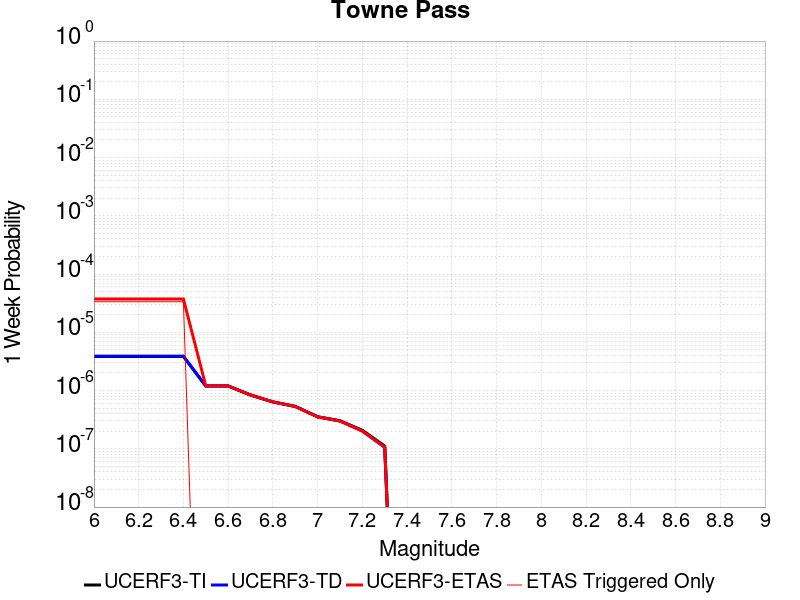 | 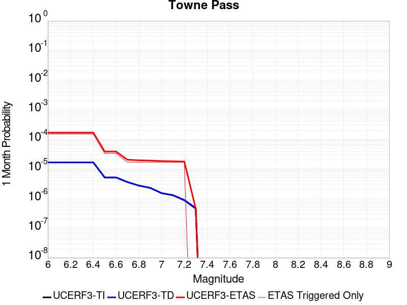 | 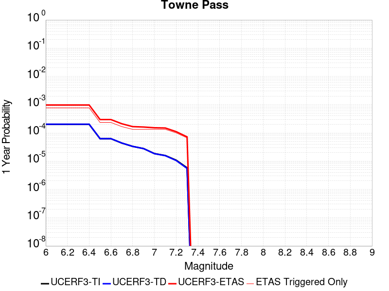 | 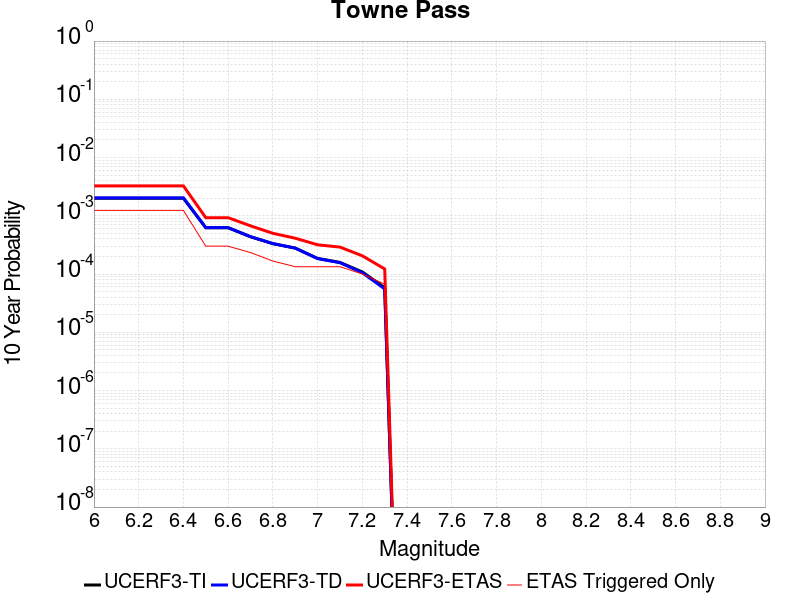 |

| Magnitude | 1 wk TI Prob | 1 wk TD Prob | 1 wk ETAS Prob | 1 wk ETAS/TD Gain | 1 wk ETAS Triggered Only | 1 mo TI Prob | 1 mo TD Prob | 1 mo ETAS Prob | 1 mo ETAS/TD Gain | 1 mo ETAS Triggered Only | 1 yr TI Prob | 1 yr TD Prob | 1 yr ETAS Prob | 1 yr ETAS/TD Gain | 1 yr ETAS Triggered Only | 10 yr TI Prob | 10 yr TD Prob | 10 yr ETAS Prob | 10 yr ETAS/TD Gain | 10 yr ETAS Triggered Only |
|-----|-----|-----|-----|-----|-----|-----|-----|-----|-----|-----|-----|-----|-----|-----|-----|-----|-----|-----|-----|-----|
| 6.0 | 3.849728E-6 | 3.8945495E-6 | 2.0729502E-5 | 5.3226953 | 1.6835016E-5 | 1.649873E-5 | 1.6690845E-5 | 1.6820346E-4 | 10.077589 | 1.5151515E-4 | 2.0085352E-4 | 2.0319645E-4 | 8.764603E-4 | 4.313364 | 6.7340065E-4 | 0.0020067208 | 0.0020305358 | 0.0032065941 | 1.5791862 | 0.0011784512 |
| 6.1 | 3.849728E-6 | 3.8945495E-6 | 2.0729502E-5 | 5.3226953 | 1.6835016E-5 | 1.649873E-5 | 1.6690845E-5 | 1.6820346E-4 | 10.077589 | 1.5151515E-4 | 2.0085352E-4 | 2.0319645E-4 | 8.764603E-4 | 4.313364 | 6.7340065E-4 | 0.0020067208 | 0.0020305358 | 0.0032065941 | 1.5791862 | 0.0011784512 |
| 6.2 | 3.849728E-6 | 3.8945495E-6 | 2.0729502E-5 | 5.3226953 | 1.6835016E-5 | 1.649873E-5 | 1.6690845E-5 | 1.6820346E-4 | 10.077589 | 1.5151515E-4 | 2.0085352E-4 | 2.0319645E-4 | 8.764603E-4 | 4.313364 | 6.7340065E-4 | 0.0020067208 | 0.0020305358 | 0.0032065941 | 1.5791862 | 0.0011784512 |
| 6.3 | 3.849728E-6 | 3.8945495E-6 | 2.0729502E-5 | 5.3226953 | 1.6835016E-5 | 1.649873E-5 | 1.6690845E-5 | 1.6820346E-4 | 10.077589 | 1.5151515E-4 | 2.0085352E-4 | 2.0319645E-4 | 8.764603E-4 | 4.313364 | 6.7340065E-4 | 0.0020067208 | 0.0020305358 | 0.0032065941 | 1.5791862 | 0.0011784512 |
| 6.4 | 3.849728E-6 | 3.8945495E-6 | 2.0729502E-5 | 5.3226953 | 1.6835016E-5 | 1.649873E-5 | 1.6690845E-5 | 1.6820346E-4 | 10.077589 | 1.5151515E-4 | 2.0085352E-4 | 2.0319645E-4 | 8.764603E-4 | 4.313364 | 6.7340065E-4 | 0.0020067208 | 0.0020305358 | 0.0032065941 | 1.5791862 | 0.0011784512 |
| 6.5 | 1.1953545E-6 | 1.2030553E-6 | 1.2030553E-6 | 1.0 | 0.0 | 5.1229376E-6 | 5.155942E-6 | 3.88258E-5 | 7.530303 | 3.3670032E-5 | 6.236998E-5 | 6.27719E-5 | 2.4794546E-4 | 3.9499435 | 1.8518518E-4 | 6.235248E-4 | 6.2755344E-4 | 9.303936E-4 | 1.4825727 | 3.030303E-4 |
| 6.6 | 1.1953545E-6 | 1.2030553E-6 | 1.2030553E-6 | 1.0 | 0.0 | 5.1229376E-6 | 5.155942E-6 | 3.88258E-5 | 7.530303 | 3.3670032E-5 | 6.236998E-5 | 6.27719E-5 | 2.4794546E-4 | 3.9499435 | 1.8518518E-4 | 6.235248E-4 | 6.2755344E-4 | 9.303936E-4 | 1.4825727 | 3.030303E-4 |
| 6.7 | 8.375951E-7 | 8.410697E-7 | 8.410697E-7 | 1.0 | 0.0 | 3.5896885E-6 | 3.60458E-6 | 2.0439536E-5 | 5.670435 | 1.6835016E-5 | 4.370358E-5 | 4.3884935E-5 | 1.7855916E-4 | 4.0688033 | 1.3468013E-4 | 4.3694986E-4 | 4.387684E-4 | 6.9118285E-4 | 1.5752795 | 2.5252526E-4 |
| 6.8 | 6.38041E-7 | 6.39218E-7 | 6.39218E-7 | 1.0 | 0.0 | 2.7344586E-6 | 2.739503E-6 | 1.9574474E-5 | 7.145264 | 1.6835016E-5 | 3.3291526E-5 | 3.335298E-5 | 1.17525255E-4 | 3.523681 | 8.417508E-5 | 3.3286537E-4 | 3.3348353E-4 | 4.6811876E-4 | 1.4037237 | 1.3468013E-4 |
| 6.9 | 5.3460053E-7 | 5.345355E-7 | 5.345355E-7 | 1.0 | 0.0 | 2.2911431E-6 | 2.2908646E-6 | 1.9125842E-5 | 8.348744 | 1.6835016E-5 | 2.789431E-5 | 2.7890954E-5 | 1.1206369E-4 | 4.0179224 | 8.417508E-5 | 2.789081E-4 | 2.7887785E-4 | 3.966901E-4 | 1.4224511 | 1.1784512E-4 |
| 7.0 | 3.557783E-7 | 3.5324413E-7 | 3.5324413E-7 | 1.0 | 0.0 | 1.5247632E-6 | 1.5139026E-6 | 1.8348894E-5 | 12.12026 | 1.6835016E-5 | 1.8563835E-5 | 1.8431618E-5 | 1.0260515E-4 | 5.566801 | 8.417508E-5 | 1.8562283E-4 | 1.8430172E-4 | 3.0212512E-4 | 1.6392962 | 1.1784512E-4 |
| 7.1 | 3.037942E-7 | 3.0002388E-7 | 3.0002388E-7 | 1.0 | 0.0 | 1.3019744E-6 | 1.2858161E-6 | 1.812081E-5 | 14.092849 | 1.6835016E-5 | 1.5851423E-5 | 1.5654707E-5 | 9.9828474E-5 | 6.376899 | 8.417508E-5 | 1.5850292E-4 | 1.5653679E-4 | 2.7436344E-4 | 1.7527092 | 1.1784512E-4 |
| 7.2 | 2.0808248E-7 | 2.021783E-7 | 2.021783E-7 | 1.0 | 0.0 | 8.917818E-7 | 8.6647816E-7 | 1.770148E-5 | 20.42923 | 1.6835016E-5 | 1.0857389E-5 | 1.0549325E-5 | 7.788868E-5 | 7.383286 | 6.7340065E-5 | 1.0856859E-4 | 1.054887E-4 | 2.0648816E-4 | 1.9574432 | 1.01010104E-4 |
| 7.3 | 1.1162073E-7 | 1.06369825E-7 | 1.06369825E-7 | 1.0 | 0.0 | 4.7837443E-7 | 4.5587063E-7 | 4.5587063E-7 | 1.0 | 0.0 | 5.8241935E-6 | 5.550213E-6 | 5.605498E-5 | 10.099609 | 5.0505052E-5 | 5.8240406E-5 | 5.5500943E-5 | 1.2283727E-4 | 2.2132466 | 6.7340065E-5 |

## Death Valley (So)
*[(top)](#table-of-contents)*

| 1 Week | 1 Month | 1 Year | 10 Year |
|-----|-----|-----|-----|
| 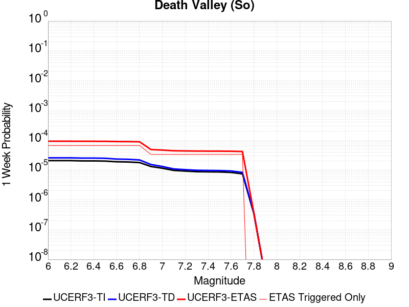 | 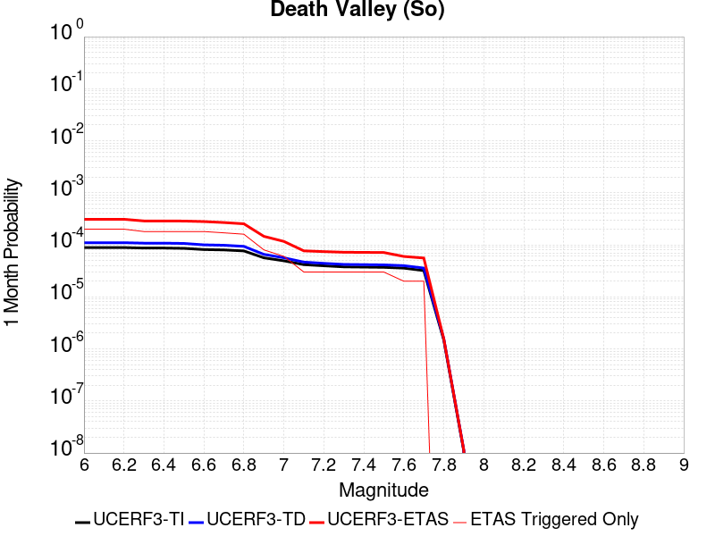 | 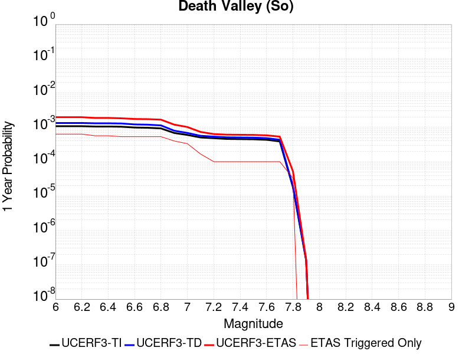 | 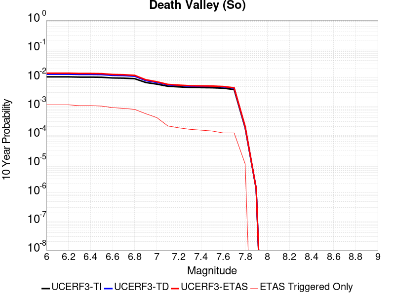 |

| Magnitude | 1 wk TI Prob | 1 wk TD Prob | 1 wk ETAS Prob | 1 wk ETAS/TD Gain | 1 wk ETAS Triggered Only | 1 mo TI Prob | 1 mo TD Prob | 1 mo ETAS Prob | 1 mo ETAS/TD Gain | 1 mo ETAS Triggered Only | 1 yr TI Prob | 1 yr TD Prob | 1 yr ETAS Prob | 1 yr ETAS/TD Gain | 1 yr ETAS Triggered Only | 10 yr TI Prob | 10 yr TD Prob | 10 yr ETAS Prob | 10 yr ETAS/TD Gain | 10 yr ETAS Triggered Only |
|-----|-----|-----|-----|-----|-----|-----|-----|-----|-----|-----|-----|-----|-----|-----|-----|-----|-----|-----|-----|-----|
| 6.0 | 2.0684236E-5 | 2.5618423E-5 | 9.295676E-5 | 3.6285124 | 6.7340065E-5 | 8.864371E-5 | 1.09788714E-4 | 3.286199E-4 | 2.993203 | 2.1885522E-4 | 0.0010787029 | 0.0013358749 | 0.002042001 | 1.5285871 | 7.070707E-4 | 0.010734817 | 0.013281729 | 0.014427917 | 1.0862981 | 0.0011616162 |
| 6.1 | 2.0684236E-5 | 2.5618423E-5 | 9.295676E-5 | 3.6285124 | 6.7340065E-5 | 8.864371E-5 | 1.09788714E-4 | 3.286199E-4 | 2.993203 | 2.1885522E-4 | 0.0010787029 | 0.0013358749 | 0.002042001 | 1.5285871 | 7.070707E-4 | 0.010734817 | 0.013281729 | 0.014427917 | 1.0862981 | 0.0011616162 |
| 6.2 | 2.0684236E-5 | 2.5618423E-5 | 9.295676E-5 | 3.6285124 | 6.7340065E-5 | 8.864371E-5 | 1.09788714E-4 | 3.286199E-4 | 2.993203 | 2.1885522E-4 | 0.0010787029 | 0.0013358749 | 0.002042001 | 1.5285871 | 7.070707E-4 | 0.010734817 | 0.013281729 | 0.014427917 | 1.0862981 | 0.0011616162 |
| 6.3 | 2.0240292E-5 | 2.5118497E-5 | 9.2456874E-5 | 3.680828 | 6.7340065E-5 | 8.6741224E-5 | 1.0764636E-4 | 2.928116E-4 | 2.7201254 | 1.8518518E-4 | 0.0010555626 | 0.0013098232 | 0.0019487159 | 1.4877702 | 6.3973066E-4 | 0.010505628 | 0.013024284 | 0.014087692 | 1.0816481 | 0.001077441 |
| 6.4 | 2.0240292E-5 | 2.5118497E-5 | 9.2456874E-5 | 3.680828 | 6.7340065E-5 | 8.6741224E-5 | 1.0764636E-4 | 2.928116E-4 | 2.7201254 | 1.8518518E-4 | 0.0010555626 | 0.0013098232 | 0.0019487159 | 1.4877702 | 6.3973066E-4 | 0.010505628 | 0.013024284 | 0.014087692 | 1.0816481 | 0.001077441 |
| 6.5 | 1.9962767E-5 | 2.4807747E-5 | 9.214615E-5 | 3.71441 | 6.7340065E-5 | 8.55519E-5 | 1.0631468E-4 | 2.9148016E-4 | 2.741674 | 1.8518518E-4 | 0.0010410968 | 0.0012936293 | 0.0019157191 | 1.4808873 | 6.228956E-4 | 0.010362327 | 0.012864228 | 0.013894572 | 1.0800937 | 0.001043771 |
| 6.6 | 1.8937297E-5 | 2.3311568E-5 | 9.0650065E-5 | 3.8886302 | 6.7340065E-5 | 8.115732E-5 | 9.990298E-5 | 2.8506966E-4 | 2.853465 | 1.8518518E-4 | 9.876423E-4 | 0.0012156547 | 0.0017873493 | 1.4702773 | 5.7239056E-4 | 0.009832645 | 0.0120931 | 0.013007828 | 1.0756406 | 9.259259E-4 |
| 6.7 | 1.8621096E-5 | 2.2912203E-5 | 9.025073E-5 | 3.9389808 | 6.7340065E-5 | 7.980225E-5 | 9.8191544E-5 | 2.8335856E-4 | 2.8857734 | 1.8518518E-4 | 9.711593E-4 | 0.0011948409 | 0.0017329177 | 1.4503335 | 5.387205E-4 | 0.009669261 | 0.011887211 | 0.012752226 | 1.0727684 | 8.7542087E-4 |
| 6.8 | 1.7830353E-5 | 2.1806247E-5 | 8.914484E-5 | 4.088042 | 6.7340065E-5 | 7.641356E-5 | 9.345208E-5 | 2.7861996E-4 | 2.9814208 | 1.8518518E-4 | 9.29938E-4 | 0.0011371992 | 0.0016248595 | 1.4288257 | 4.8821548E-4 | 0.009260561 | 0.011316643 | 0.012115579 | 1.0705984 | 8.0808083E-4 |
| 6.9 | 1.3135183E-5 | 1.5304242E-5 | 4.897376E-5 | 3.2000122 | 3.3670032E-5 | 5.6292425E-5 | 6.558799E-5 | 1.6659148E-4 | 2.539969 | 1.01010104E-4 | 6.8514474E-4 | 7.982477E-4 | 0.0011178578 | 1.4003894 | 3.1986533E-4 | 0.006830362 | 0.007954813 | 0.008522649 | 1.0713829 | 5.7239056E-4 |
| 7.0 | 1.1507512E-5 | 1.3154444E-5 | 2.998924E-5 | 2.2797801 | 1.6835016E-5 | 4.9316975E-5 | 5.6375004E-5 | 1.2371127E-4 | 2.194435 | 6.7340065E-5 | 6.002687E-4 | 6.861553E-4 | 9.3850726E-4 | 1.3677768 | 2.5252526E-4 | 0.0059864987 | 0.006841068 | 0.0072590644 | 1.061101 | 4.208754E-4 |
| 7.1 | 9.715903E-6 | 1.0865454E-5 | 2.7700287E-5 | 2.5493908 | 1.6835016E-5 | 4.1638916E-5 | 4.6565423E-5 | 8.023389E-5 | 1.7230357 | 3.3670032E-5 | 5.068359E-4 | 5.667908E-4 | 6.845691E-4 | 1.2077986 | 1.1784512E-4 | 0.0050568148 | 0.0056539057 | 0.0058882637 | 1.0414506 | 2.3569024E-4 |
| 7.2 | 9.233269E-6 | 1.0286473E-5 | 2.7121318E-5 | 2.6366003 | 1.6835016E-5 | 3.9570554E-5 | 4.4084165E-5 | 7.775271E-5 | 1.7637334 | 3.3670032E-5 | 4.81665E-4 | 5.3659675E-4 | 6.2072667E-4 | 1.1567843 | 8.417508E-5 | 0.0048062233 | 0.005353442 | 0.005537636 | 1.0344067 | 1.8518518E-4 |
| 7.3 | 8.8041315E-6 | 9.808313E-6 | 2.6643165E-5 | 2.716386 | 1.6835016E-5 | 3.7731446E-5 | 4.2034975E-5 | 7.570359E-5 | 1.8009669 | 3.3670032E-5 | 4.592835E-4 | 5.1165983E-4 | 5.9579185E-4 | 1.1644295 | 8.417508E-5 | 0.0045833546 | 0.0051052445 | 0.0052727354 | 1.0328076 | 1.6835016E-4 |
| 7.4 | 8.708749E-6 | 9.707323E-6 | 2.6542177E-5 | 2.7342427 | 1.6835016E-5 | 3.7322676E-5 | 4.1602176E-5 | 7.527081E-5 | 1.8092998 | 3.3670032E-5 | 4.5430884E-4 | 5.06393E-4 | 5.736989E-4 | 1.1329125 | 6.7340065E-5 | 0.004533812 | 0.0050528166 | 0.005203566 | 1.0298347 | 1.5151515E-4 |
| 7.5 | 8.612678E-6 | 9.604964E-6 | 2.643982E-5 | 2.7527244 | 1.6835016E-5 | 3.6910955E-5 | 4.116351E-5 | 7.4832154E-5 | 1.8179246 | 3.3670032E-5 | 4.492982E-4 | 5.010547E-4 | 5.68361E-4 | 1.1343293 | 6.7340065E-5 | 0.004483909 | 0.0049996753 | 0.005133682 | 1.0268031 | 1.3468013E-4 |
| 7.6 | 8.319024E-6 | 9.28406E-6 | 2.611892E-5 | 2.813308 | 1.6835016E-5 | 3.5652476E-5 | 3.9788243E-5 | 7.345694E-5 | 1.846197 | 3.3670032E-5 | 4.3398244E-4 | 4.8431839E-4 | 5.5162585E-4 | 1.1389736 | 6.7340065E-5 | 0.0043313587 | 0.004833053 | 0.004967082 | 1.0277318 | 1.3468013E-4 |
| 7.7 | 7.4718328E-6 | 8.3453E-6 | 2.5180176E-5 | 3.0172884 | 1.6835016E-5 | 3.2021748E-5 | 3.57651E-5 | 6.943393E-5 | 1.9413878 | 3.3670032E-5 | 3.8979502E-4 | 4.3535716E-4 | 5.026679E-4 | 1.1546104 | 6.7340065E-5 | 0.00389112 | 0.004345448 | 0.004479543 | 1.0308588 | 1.3468013E-4 |
| 7.8 | 3.4586725E-7 | 3.648288E-7 | 3.648288E-7 | 1.0 | 0.0 | 1.4822873E-6 | 1.5635511E-6 | 1.5635511E-6 | 1.0 | 0.0 | 1.80467E-5 | 1.9036073E-5 | 3.587077E-5 | 1.8843577 | 1.6835016E-5 | 1.8045233E-4 | 1.9034486E-4 | 2.0717668E-4 | 1.088428 | 1.6835016E-5 |
| 7.9 | 2.5591178E-9 | 2.6696871E-9 | 2.6696871E-9 | 1.0 | 0.0 | 1.0967647E-8 | 1.1441516E-8 | 1.1441516E-8 | 1.0 | 0.0 | 1.335311E-7 | 1.3930045E-7 | 1.3930045E-7 | 1.0 | 0.0 | 1.3353102E-6 | 1.3930046E-6 | 1.3930046E-6 | 1.0 | 0.0 |

## San Andreas (Mojave N)
*[(top)](#table-of-contents)*

| 1 Week | 1 Month | 1 Year | 10 Year |
|-----|-----|-----|-----|
| 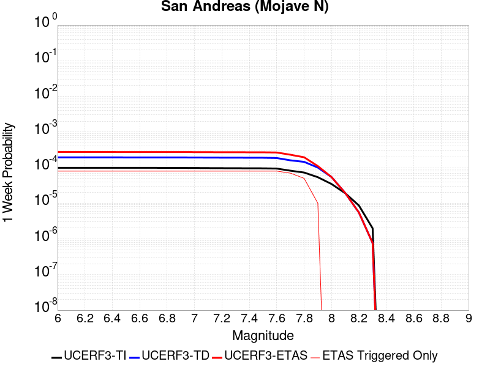 | 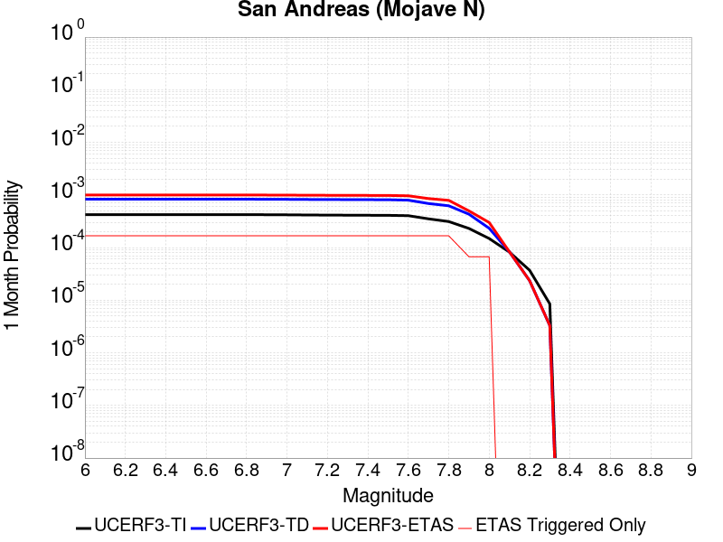 | 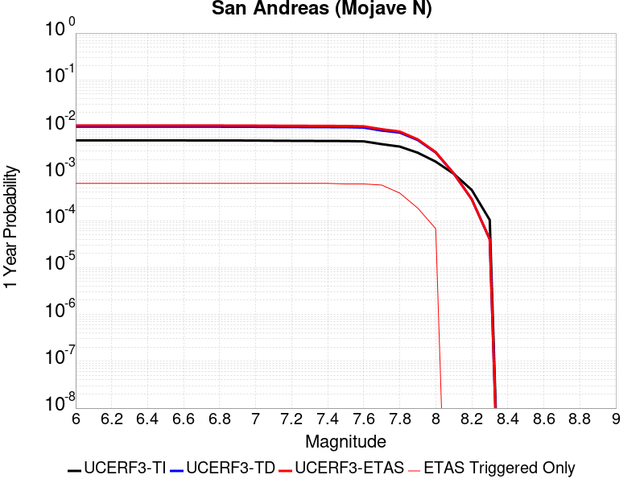 | 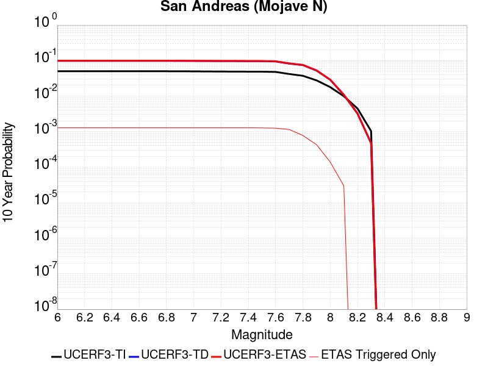 |

| Magnitude | 1 wk TI Prob | 1 wk TD Prob | 1 wk ETAS Prob | 1 wk ETAS/TD Gain | 1 wk ETAS Triggered Only | 1 mo TI Prob | 1 mo TD Prob | 1 mo ETAS Prob | 1 mo ETAS/TD Gain | 1 mo ETAS Triggered Only | 1 yr TI Prob | 1 yr TD Prob | 1 yr ETAS Prob | 1 yr ETAS/TD Gain | 1 yr ETAS Triggered Only | 10 yr TI Prob | 10 yr TD Prob | 10 yr ETAS Prob | 10 yr ETAS/TD Gain | 10 yr ETAS Triggered Only |
|-----|-----|-----|-----|-----|-----|-----|-----|-----|-----|-----|-----|-----|-----|-----|-----|-----|-----|-----|-----|-----|
| 6.0 | 9.877682E-5 | 1.9409315E-4 | 2.6142015E-4 | 1.3468798 | 6.7340065E-5 | 4.2326056E-4 | 8.315628E-4 | 0.0011006991 | 1.3236512 | 2.6936026E-4 | 0.0051410277 | 0.010077406 | 0.010694024 | 1.0611882 | 6.228956E-4 | 0.05023708 | 0.09835201 | 0.09936901 | 1.0103406 | 0.0011279461 |
| 6.1 | 9.877682E-5 | 1.9409315E-4 | 2.6142015E-4 | 1.3468798 | 6.7340065E-5 | 4.2326056E-4 | 8.315628E-4 | 0.0011006991 | 1.3236512 | 2.6936026E-4 | 0.0051410277 | 0.010077406 | 0.010694024 | 1.0611882 | 6.228956E-4 | 0.05023708 | 0.09835201 | 0.09936901 | 1.0103406 | 0.0011279461 |
| 6.2 | 9.877682E-5 | 1.9409315E-4 | 2.6142015E-4 | 1.3468798 | 6.7340065E-5 | 4.2326056E-4 | 8.315628E-4 | 0.0011006991 | 1.3236512 | 2.6936026E-4 | 0.0051410277 | 0.010077406 | 0.010694024 | 1.0611882 | 6.228956E-4 | 0.05023708 | 0.09835201 | 0.09936901 | 1.0103406 | 0.0011279461 |
| 6.3 | 9.877682E-5 | 1.9409315E-4 | 2.6142015E-4 | 1.3468798 | 6.7340065E-5 | 4.2326056E-4 | 8.315628E-4 | 0.0011006991 | 1.3236512 | 2.6936026E-4 | 0.0051410277 | 0.010077406 | 0.010694024 | 1.0611882 | 6.228956E-4 | 0.05023708 | 0.09835201 | 0.09936901 | 1.0103406 | 0.0011279461 |
| 6.4 | 9.877682E-5 | 1.9409315E-4 | 2.6142015E-4 | 1.3468798 | 6.7340065E-5 | 4.2326056E-4 | 8.315628E-4 | 0.0011006991 | 1.3236512 | 2.6936026E-4 | 0.0051410277 | 0.010077406 | 0.010694024 | 1.0611882 | 6.228956E-4 | 0.05023708 | 0.09835201 | 0.09936901 | 1.0103406 | 0.0011279461 |
| 6.5 | 9.861474E-5 | 1.9383078E-4 | 2.611578E-4 | 1.3473494 | 6.7340065E-5 | 4.2256617E-4 | 8.304391E-4 | 0.0010995757 | 1.3240895 | 2.6936026E-4 | 0.0051326132 | 0.010063851 | 0.010680478 | 1.0612714 | 6.228956E-4 | 0.050156746 | 0.098229796 | 0.09924694 | 1.0103548 | 0.0011279461 |
| 6.6 | 9.861474E-5 | 1.9383078E-4 | 2.611578E-4 | 1.3473494 | 6.7340065E-5 | 4.2256617E-4 | 8.304391E-4 | 0.0010995757 | 1.3240895 | 2.6936026E-4 | 0.0051326132 | 0.010063851 | 0.010680478 | 1.0612714 | 6.228956E-4 | 0.050156746 | 0.098229796 | 0.09924694 | 1.0103548 | 0.0011279461 |
| 6.7 | 9.8552715E-5 | 1.9373032E-4 | 2.6105734E-4 | 1.3475296 | 6.7340065E-5 | 4.223004E-4 | 8.3000876E-4 | 0.0010991455 | 1.3242576 | 2.6936026E-4 | 0.0051293927 | 0.01005866 | 0.010675291 | 1.0613034 | 6.228956E-4 | 0.050125998 | 0.098182976 | 0.09920018 | 1.0103602 | 0.0011279461 |
| 6.8 | 9.8464974E-5 | 1.9358192E-4 | 2.6090894E-4 | 1.3477961 | 6.7340065E-5 | 4.219245E-4 | 8.293732E-4 | 0.00109851 | 1.3245064 | 2.6936026E-4 | 0.0051248376 | 0.010050993 | 0.010667629 | 1.0613506 | 6.228956E-4 | 0.05008251 | 0.09811299 | 0.09913027 | 1.0103685 | 0.0011279461 |
| 6.9 | 9.825824E-5 | 1.9326196E-4 | 2.60589E-4 | 1.348372 | 6.7340065E-5 | 4.2103877E-4 | 8.280028E-4 | 0.0010971401 | 1.3250439 | 2.6936026E-4 | 0.0051141046 | 0.010034463 | 0.010651109 | 1.0614527 | 6.228956E-4 | 0.049980022 | 0.09796208 | 0.098979525 | 1.0103861 | 0.0011279461 |
| 7.0 | 9.781462E-5 | 1.9257552E-4 | 2.5990262E-4 | 1.349614 | 6.7340065E-5 | 4.1913814E-4 | 8.250628E-4 | 0.0010942009 | 1.3262031 | 2.6936026E-4 | 0.005091073 | 0.009998998 | 0.010615665 | 1.0616729 | 6.228956E-4 | 0.04976007 | 0.097638436 | 0.09865625 | 1.0104244 | 0.0011279461 |
| 7.1 | 9.7121134E-5 | 1.9159251E-4 | 2.5891967E-4 | 1.3514081 | 6.7340065E-5 | 4.1616702E-4 | 8.208525E-4 | 0.0010899917 | 1.3278776 | 2.6936026E-4 | 0.005055068 | 0.009948207 | 0.010564906 | 1.061991 | 6.228956E-4 | 0.04941613 | 0.097174905 | 0.09819324 | 1.0104795 | 0.0011279461 |
| 7.2 | 9.663819E-5 | 1.9090026E-4 | 2.5822746E-4 | 1.3526827 | 6.7340065E-5 | 4.1409794E-4 | 8.178876E-4 | 0.0010870276 | 1.3290671 | 2.6936026E-4 | 0.0050299936 | 0.009912439 | 0.01052916 | 1.0622169 | 6.228956E-4 | 0.049176537 | 0.09684814 | 0.09786685 | 1.0105186 | 0.0011279461 |
| 7.3 | 9.6277574E-5 | 1.9042526E-4 | 2.5775252E-4 | 1.3535626 | 6.7340065E-5 | 4.125529E-4 | 8.158532E-4 | 0.0010849937 | 1.3298883 | 2.6936026E-4 | 0.0050112694 | 0.009887895 | 0.010504631 | 1.0623729 | 6.228956E-4 | 0.04899759 | 0.09662155 | 0.097640514 | 1.010546 | 0.0011279461 |
| 7.4 | 9.593308E-5 | 1.8982294E-4 | 2.571502E-4 | 1.3546847 | 6.7340065E-5 | 4.1107697E-4 | 8.132734E-4 | 0.0010824146 | 1.3309357 | 2.6936026E-4 | 0.0049933824 | 0.00985677 | 0.010473526 | 1.0625718 | 6.228956E-4 | 0.04882661 | 0.09633968 | 0.097358964 | 1.0105801 | 0.0011279461 |
| 7.5 | 9.561707E-5 | 1.8928363E-4 | 2.5661095E-4 | 1.3556955 | 6.7340065E-5 | 4.0972308E-4 | 8.109635E-4 | 0.0010801053 | 1.3318791 | 2.6936026E-4 | 0.0049769743 | 0.009828901 | 0.010429005 | 1.0610551 | 6.060606E-4 | 0.048669744 | 0.09608582 | 0.09709016 | 1.0104526 | 0.0011111111 |
| 7.6 | 9.418194E-5 | 1.8580563E-4 | 2.5313318E-4 | 1.3623548 | 6.7340065E-5 | 4.0357444E-4 | 7.96067E-4 | 0.0010652129 | 1.3380945 | 2.6936026E-4 | 0.004902454 | 0.009649157 | 0.010249369 | 1.0622036 | 6.060606E-4 | 0.047957025 | 0.09446791 | 0.095458806 | 1.0104893 | 0.0010942761 |
| 7.7 | 8.202141E-5 | 1.6029038E-4 | 2.2761966E-4 | 1.4200456 | 6.7340065E-5 | 3.51473E-4 | 6.86778E-4 | 9.5595326E-4 | 1.3919393 | 2.6936026E-4 | 0.00427079 | 0.008329522 | 0.008897144 | 1.0681459 | 5.7239056E-4 | 0.04189639 | 0.08226675 | 0.083224654 | 1.0116439 | 0.001043771 |
| 7.8 | 7.2859846E-5 | 1.4523414E-4 | 1.9573185E-4 | 1.3476987 | 5.0505052E-5 | 3.1221908E-4 | 6.2228355E-4 | 8.073535E-4 | 1.2974045 | 1.8518518E-4 | 0.003794643 | 0.007550025 | 0.007934307 | 1.0508981 | 3.872054E-4 | 0.037304975 | 0.074755974 | 0.07542577 | 1.0089597 | 7.2390574E-4 |
| 7.9 | 5.3874453E-5 | 1.0050546E-4 | 1.0050546E-4 | 1.0 | 0.0 | 2.3087008E-4 | 4.3066658E-4 | 4.9797766E-4 | 1.1562951 | 6.7340065E-5 | 0.0028072202 | 0.005230771 | 0.0054149874 | 1.0352179 | 1.8518518E-4 | 0.02772022 | 0.052447177 | 0.05284598 | 1.0076039 | 4.208754E-4 |
| 8.0 | 3.468538E-5 | 5.4288335E-5 | 5.4288335E-5 | 1.0 | 0.0 | 1.4864317E-4 | 2.3264355E-4 | 2.8313685E-4 | 1.2170415 | 5.0505052E-5 | 0.0018082283 | 0.0028287582 | 0.0028959077 | 1.0237381 | 6.7340065E-5 | 0.017935853 | 0.028961267 | 0.029124742 | 1.0056446 | 1.6835016E-4 |
| 8.1 | 1.9152367E-5 | 1.9415891E-5 | 1.9415891E-5 | 1.0 | 0.0 | 8.207899E-5 | 8.320831E-5 | 8.320831E-5 | 1.0 | 0.0 | 9.988535E-4 | 0.0010125911 | 0.0010125911 | 1.0 | 0.0 | 0.009943757 | 0.010863188 | 0.010896493 | 1.0030658 | 3.3670032E-5 |
| 8.2 | 8.643924E-6 | 5.4798497E-6 | 5.4798497E-6 | 1.0 | 0.0 | 3.704486E-5 | 2.348486E-5 | 2.348486E-5 | 1.0 | 0.0 | 4.5092785E-4 | 2.858907E-4 | 2.858907E-4 | 1.0 | 0.0 | 0.0045001395 | 0.0032514327 | 0.0032514327 | 1.0 | 0.0 |
| 8.3 | 1.983087E-6 | 7.668296E-7 | 7.668296E-7 | 1.0 | 0.0 | 8.498917E-6 | 3.2864084E-6 | 3.2864084E-6 | 1.0 | 0.0 | 1.034694E-4 | 4.0011306E-5 | 4.0011306E-5 | 1.0 | 0.0 | 0.0010342124 | 4.724499E-4 | 4.724499E-4 | 1.0 | 0.0 |

## Paradise
*[(top)](#table-of-contents)*

| 1 Week | 1 Month | 1 Year | 10 Year |
|-----|-----|-----|-----|
| 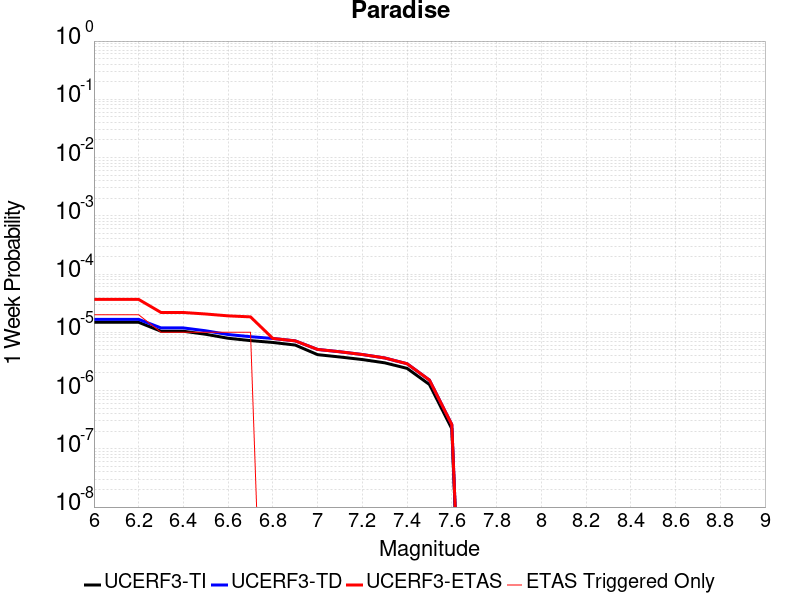 | 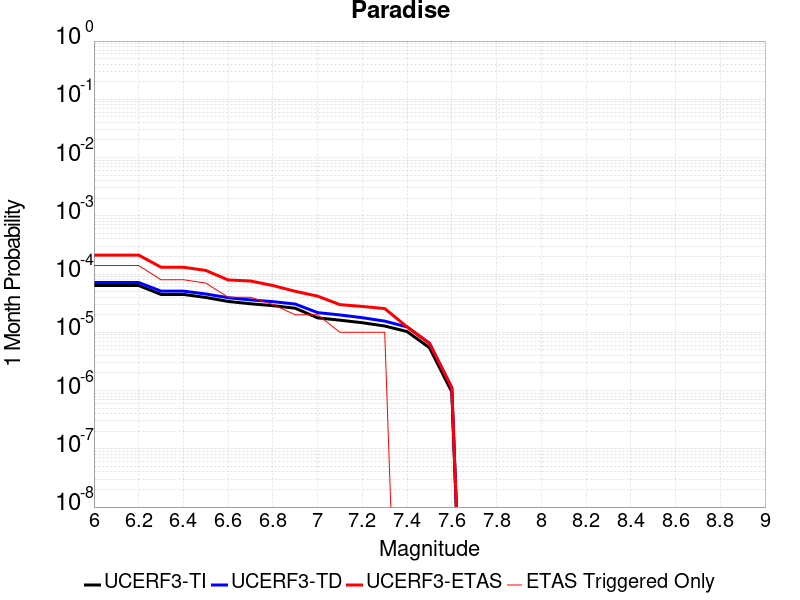 | 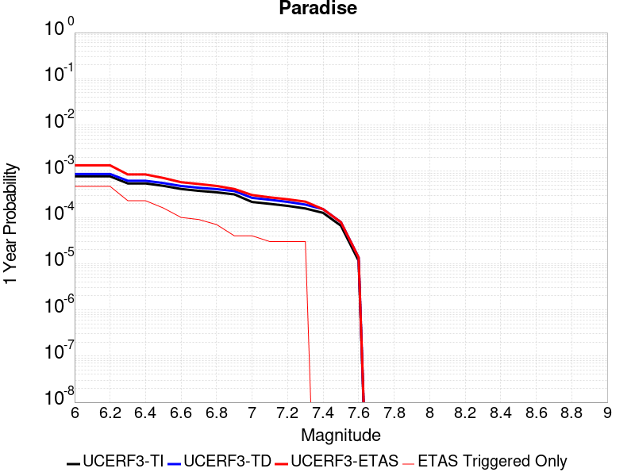 | 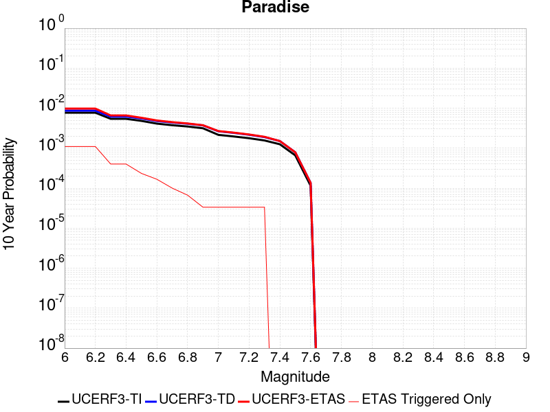 |

| Magnitude | 1 wk TI Prob | 1 wk TD Prob | 1 wk ETAS Prob | 1 wk ETAS/TD Gain | 1 wk ETAS Triggered Only | 1 mo TI Prob | 1 mo TD Prob | 1 mo ETAS Prob | 1 mo ETAS/TD Gain | 1 mo ETAS Triggered Only | 1 yr TI Prob | 1 yr TD Prob | 1 yr ETAS Prob | 1 yr ETAS/TD Gain | 1 yr ETAS Triggered Only | 10 yr TI Prob | 10 yr TD Prob | 10 yr ETAS Prob | 10 yr ETAS/TD Gain | 10 yr ETAS Triggered Only |
|-----|-----|-----|-----|-----|-----|-----|-----|-----|-----|-----|-----|-----|-----|-----|-----|-----|-----|-----|-----|-----|
| 6.0 | 1.4851273E-5 | 1.6694854E-5 | 5.0364324E-5 | 3.0167575 | 3.3670032E-5 | 6.364676E-5 | 7.154755E-5 | 2.3988567E-4 | 3.352815 | 1.6835016E-4 | 7.7462377E-4 | 8.707668E-4 | 0.0014594793 | 1.6760851 | 5.892256E-4 | 0.0077192914 | 0.008675928 | 0.0096605765 | 1.113492 | 9.93266E-4 |
| 6.1 | 1.4851273E-5 | 1.6694854E-5 | 5.0364324E-5 | 3.0167575 | 3.3670032E-5 | 6.364676E-5 | 7.154755E-5 | 2.3988567E-4 | 3.352815 | 1.6835016E-4 | 7.7462377E-4 | 8.707668E-4 | 0.0014594793 | 1.6760851 | 5.892256E-4 | 0.0077192914 | 0.008675928 | 0.0096605765 | 1.113492 | 9.93266E-4 |
| 6.2 | 1.4851273E-5 | 1.6694854E-5 | 5.0364324E-5 | 3.0167575 | 3.3670032E-5 | 6.364676E-5 | 7.154755E-5 | 2.3988567E-4 | 3.352815 | 1.6835016E-4 | 7.7462377E-4 | 8.707668E-4 | 0.0014594793 | 1.6760851 | 5.892256E-4 | 0.0077192914 | 0.008675928 | 0.0096605765 | 1.113492 | 9.93266E-4 |
| 6.3 | 1.0426831E-5 | 1.1888727E-5 | 2.8723543E-5 | 2.4160318 | 1.6835016E-5 | 4.4685654E-5 | 5.0950726E-5 | 1.5195568E-4 | 2.9824045 | 1.01010104E-4 | 5.43912E-4 | 6.201545E-4 | 9.398215E-4 | 1.5154635 | 3.1986533E-4 | 0.0054258266 | 0.006184847 | 0.006653312 | 1.075744 | 4.7138048E-4 |
| 6.4 | 1.0426831E-5 | 1.1888727E-5 | 2.8723543E-5 | 2.4160318 | 1.6835016E-5 | 4.4685654E-5 | 5.0950726E-5 | 1.5195568E-4 | 2.9824045 | 1.01010104E-4 | 5.43912E-4 | 6.201545E-4 | 9.398215E-4 | 1.5154635 | 3.1986533E-4 | 0.0054258266 | 0.006184847 | 0.006653312 | 1.075744 | 4.7138048E-4 |
| 6.5 | 9.25027E-6 | 1.0620054E-5 | 2.7454891E-5 | 2.5851934 | 1.6835016E-5 | 3.964341E-5 | 4.551375E-5 | 1.2968501E-4 | 2.8493588 | 8.417508E-5 | 4.8255164E-4 | 5.539939E-4 | 7.727279E-4 | 1.394831 | 2.1885522E-4 | 0.0048150513 | 0.0055266283 | 0.0058447258 | 1.0575572 | 3.1986533E-4 |
| 6.6 | 7.904275E-6 | 9.159603E-6 | 2.5994465E-5 | 2.837947 | 1.6835016E-5 | 3.3875025E-5 | 3.925487E-5 | 7.292358E-5 | 1.8576951 | 3.3670032E-5 | 4.1235037E-4 | 4.7782718E-4 | 5.95616E-4 | 1.2465092 | 1.1784512E-4 | 0.0041158604 | 0.004768395 | 0.0049694516 | 1.0421644 | 2.0202021E-4 |
| 6.7 | 7.2061953E-6 | 8.407318E-6 | 2.5242194E-5 | 3.0024073 | 1.6835016E-5 | 3.088333E-5 | 3.6030888E-5 | 6.969971E-5 | 1.9344432 | 3.3670032E-5 | 3.7593965E-4 | 4.385914E-4 | 5.395572E-4 | 1.2302047 | 1.01010104E-4 | 0.003753043 | 0.0043776273 | 0.0045117177 | 1.0306308 | 1.3468013E-4 |
| 6.8 | 6.6948724E-6 | 7.84223E-6 | 7.84223E-6 | 1.0 | 0.0 | 2.8691995E-5 | 3.3609143E-5 | 5.0443596E-5 | 1.500889 | 1.6835016E-5 | 3.4926904E-4 | 4.0911807E-4 | 4.764306E-4 | 1.1645308 | 6.7340065E-5 | 0.003487206 | 0.0040840064 | 0.004184604 | 1.0246321 | 1.01010104E-4 |
| 6.9 | 6.0421025E-6 | 7.130678E-6 | 7.130678E-6 | 1.0 | 0.0 | 2.5894467E-5 | 3.055971E-5 | 4.7394213E-5 | 1.5508724 | 1.6835016E-5 | 3.1521954E-4 | 3.7200435E-4 | 4.2249062E-4 | 1.1357142 | 5.0505052E-5 | 0.0031477278 | 0.0037141545 | 0.003798017 | 1.0225792 | 8.417508E-5 |
| 7.0 | 4.134091E-6 | 5.0803487E-6 | 5.0803487E-6 | 1.0 | 0.0 | 1.7717413E-5 | 2.177275E-5 | 3.8607403E-5 | 1.7731981 | 1.6835016E-5 | 2.1568815E-4 | 2.6505254E-4 | 3.155442E-4 | 1.1904968 | 5.0505052E-5 | 0.0021547892 | 0.0026475172 | 0.0027146789 | 1.0253679 | 6.7340065E-5 |
| 7.1 | 3.7674888E-6 | 4.6319055E-6 | 4.6319055E-6 | 1.0 | 0.0 | 1.6146281E-5 | 1.985088E-5 | 3.6685564E-5 | 1.8480573 | 1.6835016E-5 | 1.9656324E-4 | 2.4165919E-4 | 2.9215202E-4 | 1.2089424 | 5.0505052E-5 | 0.0019638946 | 0.0024141145 | 0.0024812922 | 1.027827 | 6.7340065E-5 |
| 7.2 | 3.4065345E-6 | 4.156755E-6 | 4.156755E-6 | 1.0 | 0.0 | 1.4599351E-5 | 1.7814553E-5 | 3.464927E-5 | 1.944998 | 1.6835016E-5 | 1.777326E-4 | 2.1687208E-4 | 2.6736618E-4 | 1.232829 | 5.0505052E-5 | 0.0017759053 | 0.0021667527 | 0.0022339467 | 1.0310115 | 6.7340065E-5 |
| 7.3 | 2.9934936E-6 | 3.6293434E-6 | 3.6293434E-6 | 1.0 | 0.0 | 1.2829195E-5 | 1.5554244E-5 | 3.2388998E-5 | 2.0823255 | 1.6835016E-5 | 1.5618425E-4 | 1.8935793E-4 | 2.3985343E-4 | 1.2666669 | 5.0505052E-5 | 0.0015607453 | 0.0018921113 | 0.0019593239 | 1.0355226 | 6.7340065E-5 |
| 7.4 | 2.4049796E-6 | 2.8890036E-6 | 2.8890036E-6 | 1.0 | 0.0 | 1.0307015E-5 | 1.2381393E-5 | 1.2381393E-5 | 1.0 | 0.0 | 1.2548068E-4 | 1.5073447E-4 | 1.5073447E-4 | 1.0 | 0.0 | 0.0012540985 | 0.0015064639 | 0.0015064639 | 1.0 | 0.0 |
| 7.5 | 1.2710091E-6 | 1.5134775E-6 | 1.5134775E-6 | 1.0 | 0.0 | 5.44717E-6 | 6.486323E-6 | 6.486323E-6 | 1.0 | 0.0 | 6.631728E-5 | 7.896937E-5 | 7.896937E-5 | 1.0 | 0.0 | 6.6297496E-4 | 7.8953576E-4 | 7.8953576E-4 | 1.0 | 0.0 |
| 7.6 | 2.21172E-7 | 2.6039737E-7 | 2.6039737E-7 | 1.0 | 0.0 | 9.478797E-7 | 1.1159884E-6 | 1.1159884E-6 | 1.0 | 0.0 | 1.1540374E-5 | 1.3587103E-5 | 1.3587103E-5 | 1.0 | 0.0 | 1.1539775E-4 | 1.3586554E-4 | 1.3586554E-4 | 1.0 | 0.0 |

## Bicycle Lake
*[(top)](#table-of-contents)*

| 1 Week | 1 Month | 1 Year | 10 Year |
|-----|-----|-----|-----|
| 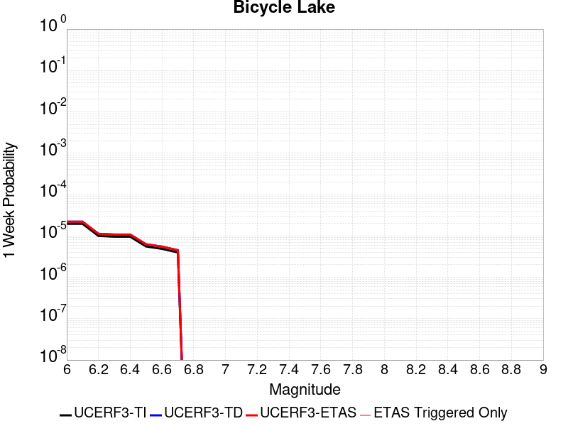 |  | 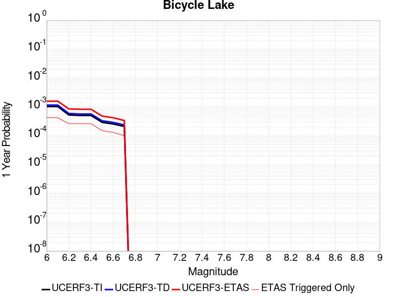 | 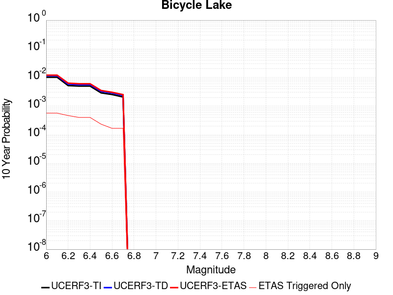 |

| Magnitude | 1 wk TI Prob | 1 wk TD Prob | 1 wk ETAS Prob | 1 wk ETAS/TD Gain | 1 wk ETAS Triggered Only | 1 mo TI Prob | 1 mo TD Prob | 1 mo ETAS Prob | 1 mo ETAS/TD Gain | 1 mo ETAS Triggered Only | 1 yr TI Prob | 1 yr TD Prob | 1 yr ETAS Prob | 1 yr ETAS/TD Gain | 1 yr ETAS Triggered Only | 10 yr TI Prob | 10 yr TD Prob | 10 yr ETAS Prob | 10 yr ETAS/TD Gain | 10 yr ETAS Triggered Only |
|-----|-----|-----|-----|-----|-----|-----|-----|-----|-----|-----|-----|-----|-----|-----|-----|-----|-----|-----|-----|-----|
| 6.0 | 1.9621975E-5 | 2.2097447E-5 | 3.8932092E-5 | 1.7618366 | 1.6835016E-5 | 8.4091465E-5 | 9.470067E-5 | 1.9570121E-4 | 2.066524 | 1.01010104E-4 | 0.0010233327 | 0.0011525059 | 0.0014551869 | 1.2626287 | 3.030303E-4 | 0.01018633 | 0.011478599 | 0.012177554 | 1.060892 | 7.070707E-4 |
| 6.1 | 1.9621975E-5 | 2.2097447E-5 | 3.8932092E-5 | 1.7618366 | 1.6835016E-5 | 8.4091465E-5 | 9.470067E-5 | 1.9570121E-4 | 2.066524 | 1.01010104E-4 | 0.0010233327 | 0.0011525059 | 0.0014551869 | 1.2626287 | 3.030303E-4 | 0.01018633 | 0.011478599 | 0.012177554 | 1.060892 | 7.070707E-4 |
| 6.2 | 9.9971285E-6 | 1.1255827E-5 | 2.8090655E-5 | 2.4956543 | 1.6835016E-5 | 4.2844134E-5 | 4.823866E-5 | 1.1557548E-4 | 2.3959098 | 6.7340065E-5 | 5.2150246E-4 | 5.8719947E-4 | 7.722759E-4 | 1.315185 | 1.8518518E-4 | 0.0052028033 | 0.005861584 | 0.006346938 | 1.0828025 | 4.8821548E-4 |
| 6.3 | 9.589428E-6 | 1.0798527E-5 | 2.7633361E-5 | 2.5589938 | 1.6835016E-5 | 4.10969E-5 | 4.627887E-5 | 1.13615824E-4 | 2.4550257 | 6.7340065E-5 | 5.002399E-4 | 5.6335144E-4 | 7.484323E-4 | 1.3285353 | 1.8518518E-4 | 0.0049911533 | 0.0056243236 | 0.0060763126 | 1.0803633 | 4.5454546E-4 |
| 6.4 | 9.589428E-6 | 1.0798527E-5 | 2.7633361E-5 | 2.5589938 | 1.6835016E-5 | 4.10969E-5 | 4.627887E-5 | 1.13615824E-4 | 2.4550257 | 6.7340065E-5 | 5.002399E-4 | 5.6335144E-4 | 7.484323E-4 | 1.3285353 | 1.8518518E-4 | 0.0049911533 | 0.0056243236 | 0.0060763126 | 1.0803633 | 4.5454546E-4 |
| 6.5 | 5.557707E-6 | 6.2857107E-6 | 6.2857107E-6 | 1.0 | 0.0 | 2.3818526E-5 | 2.6938633E-5 | 6.060776E-5 | 2.2498455 | 3.3670032E-5 | 2.8995197E-4 | 3.2795538E-4 | 4.4576186E-4 | 1.3592149 | 1.1784512E-4 | 0.0028957394 | 0.0032773502 | 0.0035626076 | 1.087039 | 2.8619528E-4 |
| 6.6 | 4.8742945E-6 | 5.5133855E-6 | 5.5133855E-6 | 1.0 | 0.0 | 2.0889667E-5 | 2.3628729E-5 | 5.7297966E-5 | 2.424928 | 3.3670032E-5 | 2.54302E-4 | 2.87668E-4 | 3.8864903E-4 | 1.3510333 | 1.01010104E-4 | 0.002540112 | 0.0028755253 | 0.0031105378 | 1.0817286 | 2.3569024E-4 |
| 6.7 | 3.991108E-6 | 4.515989E-6 | 4.515989E-6 | 1.0 | 0.0 | 1.7104636E-5 | 1.9354238E-5 | 3.618893E-5 | 1.8698193 | 1.6835016E-5 | 2.0822904E-4 | 2.3563785E-4 | 3.0296206E-4 | 1.2857105 | 6.7340065E-5 | 0.0020803404 | 0.0023563786 | 0.0025243321 | 1.0712761 | 1.6835016E-4 |

## San Andreas (San Bernardino N)
*[(top)](#table-of-contents)*

| 1 Week | 1 Month | 1 Year | 10 Year |
|-----|-----|-----|-----|
| 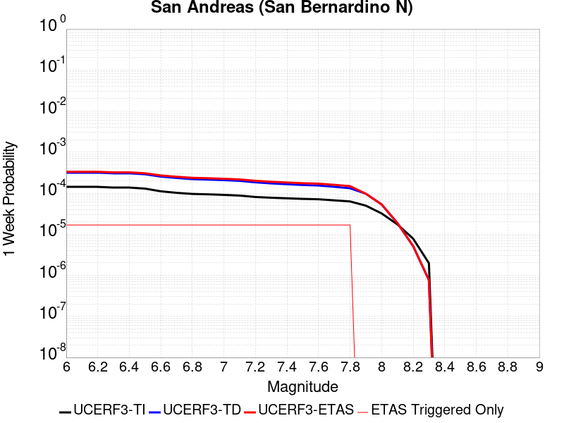 | 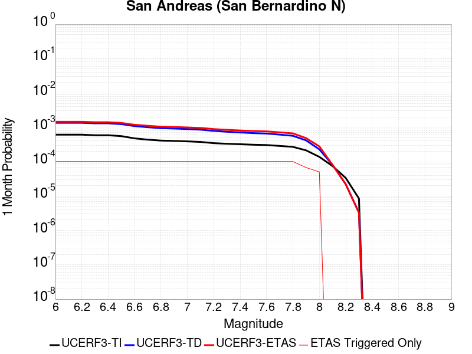 | 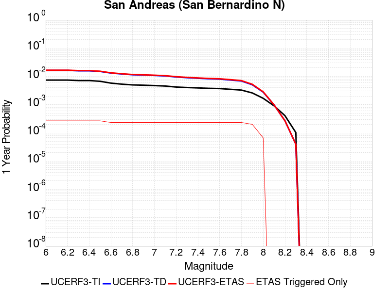 | 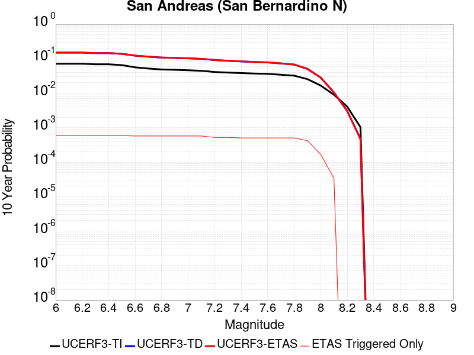 |

| Magnitude | 1 wk TI Prob | 1 wk TD Prob | 1 wk ETAS Prob | 1 wk ETAS/TD Gain | 1 wk ETAS Triggered Only | 1 mo TI Prob | 1 mo TD Prob | 1 mo ETAS Prob | 1 mo ETAS/TD Gain | 1 mo ETAS Triggered Only | 1 yr TI Prob | 1 yr TD Prob | 1 yr ETAS Prob | 1 yr ETAS/TD Gain | 1 yr ETAS Triggered Only | 10 yr TI Prob | 10 yr TD Prob | 10 yr ETAS Prob | 10 yr ETAS/TD Gain | 10 yr ETAS Triggered Only |
|-----|-----|-----|-----|-----|-----|-----|-----|-----|-----|-----|-----|-----|-----|-----|-----|-----|-----|-----|-----|-----|
| 6.0 | 1.4273766E-4 | 3.161376E-4 | 3.329673E-4 | 1.0532353 | 1.6835016E-5 | 6.115894E-4 | 0.0013541778 | 0.0014550511 | 1.0744904 | 1.01010104E-4 | 0.0074207084 | 0.016363978 | 0.016612371 | 1.0151793 | 2.5252526E-4 | 0.07177748 | 0.15029658 | 0.15079725 | 1.0033312 | 5.892256E-4 |
| 6.1 | 1.4273766E-4 | 3.161376E-4 | 3.329673E-4 | 1.0532353 | 1.6835016E-5 | 6.115894E-4 | 0.0013541778 | 0.0014550511 | 1.0744904 | 1.01010104E-4 | 0.0074207084 | 0.016363978 | 0.016612371 | 1.0151793 | 2.5252526E-4 | 0.07177748 | 0.15029658 | 0.15079725 | 1.0033312 | 5.892256E-4 |
| 6.2 | 1.4273766E-4 | 3.161376E-4 | 3.329673E-4 | 1.0532353 | 1.6835016E-5 | 6.115894E-4 | 0.0013541778 | 0.0014550511 | 1.0744904 | 1.01010104E-4 | 0.0074207084 | 0.016363978 | 0.016612371 | 1.0151793 | 2.5252526E-4 | 0.07177748 | 0.15029658 | 0.15079725 | 1.0033312 | 5.892256E-4 |
| 6.3 | 1.3730655E-4 | 3.0518573E-4 | 3.2201564E-4 | 1.0551463 | 1.6835016E-5 | 5.883239E-4 | 0.001307289 | 0.0014081671 | 1.0771658 | 1.01010104E-4 | 0.0071393442 | 0.01580149 | 0.016050024 | 1.0157286 | 2.5252526E-4 | 0.06914291 | 0.14559646 | 0.1460999 | 1.0034578 | 5.892256E-4 |
| 6.4 | 1.3730655E-4 | 3.0518573E-4 | 3.2201564E-4 | 1.0551463 | 1.6835016E-5 | 5.883239E-4 | 0.001307289 | 0.0014081671 | 1.0771658 | 1.01010104E-4 | 0.0071393442 | 0.01580149 | 0.016050024 | 1.0157286 | 2.5252526E-4 | 0.06914291 | 0.14559646 | 0.1460999 | 1.0034578 | 5.892256E-4 |
| 6.5 | 1.2942807E-4 | 2.8932988E-4 | 3.0616004E-4 | 1.0581694 | 1.6835016E-5 | 5.545738E-4 | 0.0012394012 | 0.001340286 | 1.0813981 | 1.01010104E-4 | 0.0067310524 | 0.014986552 | 0.015235293 | 1.0165976 | 2.5252526E-4 | 0.06530788 | 0.13873914 | 0.13924661 | 1.0036578 | 5.892256E-4 |
| 6.6 | 1.1125901E-4 | 2.537176E-4 | 2.7054833E-4 | 1.0663365 | 1.6835016E-5 | 4.767372E-4 | 0.0010869103 | 0.0011878106 | 1.0928322 | 1.01010104E-4 | 0.005788839 | 0.013153472 | 0.013386062 | 1.0176828 | 2.3569024E-4 | 0.056403454 | 0.12302898 | 0.12353095 | 1.00408 | 5.7239056E-4 |
| 6.7 | 1.02209575E-4 | 2.3506685E-4 | 2.518979E-4 | 1.0716012 | 1.6835016E-5 | 4.3796748E-4 | 0.0010070418 | 0.0011079501 | 1.1002028 | 1.01010104E-4 | 0.0053192247 | 0.01219223 | 0.012425046 | 1.0190955 | 2.3569024E-4 | 0.051936906 | 0.11482068 | 0.11532735 | 1.0044127 | 5.7239056E-4 |
| 6.8 | 9.610582E-5 | 2.2032406E-4 | 2.3715536E-4 | 1.0763934 | 1.6835016E-5 | 4.1181705E-4 | 9.439049E-4 | 0.0010448197 | 1.106912 | 1.01010104E-4 | 0.0050023515 | 0.011431754 | 0.011664749 | 1.0203815 | 2.3569024E-4 | 0.048912346 | 0.1082225 | 0.108732946 | 1.0047166 | 5.7239056E-4 |
| 6.9 | 9.3877505E-5 | 2.1487933E-4 | 2.3171073E-4 | 1.0783296 | 1.6835016E-5 | 4.0227012E-4 | 9.2058704E-4 | 0.0010215042 | 1.1096226 | 1.01010104E-4 | 0.0048866454 | 0.011150793 | 0.011383856 | 1.020901 | 2.3569024E-4 | 0.04780577 | 0.10581279 | 0.10632461 | 1.004837 | 5.7239056E-4 |
| 7.0 | 9.1019785E-5 | 2.0814833E-4 | 2.2497984E-4 | 1.0808631 | 1.6835016E-5 | 3.900265E-4 | 8.917599E-4 | 9.9268E-4 | 1.1131696 | 1.01010104E-4 | 0.0047382377 | 0.010803353 | 0.011036497 | 1.0215807 | 2.3569024E-4 | 0.046384744 | 0.10278319 | 0.10329674 | 1.0049965 | 5.7239056E-4 |
| 7.1 | 8.771155E-5 | 1.9989353E-4 | 2.1672518E-4 | 1.0842031 | 1.6835016E-5 | 3.758525E-4 | 8.564058E-4 | 9.573294E-4 | 1.1178455 | 1.01010104E-4 | 0.0045664064 | 0.01037709 | 0.010610335 | 1.0224769 | 2.3569024E-4 | 0.044737056 | 0.09909467 | 0.099610336 | 1.0052038 | 5.7239056E-4 |
| 7.2 | 8.0830236E-5 | 1.8394848E-4 | 2.007804E-4 | 1.0915035 | 1.6835016E-5 | 3.4636928E-4 | 7.881126E-4 | 8.890431E-4 | 1.1280661 | 1.01010104E-4 | 0.0042088944 | 0.009553162 | 0.0097866 | 1.0244358 | 2.3569024E-4 | 0.041300658 | 0.09182531 | 0.09229927 | 1.0051615 | 5.218855E-4 |
| 7.3 | 7.7668235E-5 | 1.7338296E-4 | 1.9021505E-4 | 1.0970805 | 1.6835016E-5 | 3.328214E-4 | 7.428583E-4 | 8.437933E-4 | 1.1358739 | 1.01010104E-4 | 0.0040445733 | 0.009006873 | 0.00924044 | 1.0259321 | 2.3569024E-4 | 0.03971748 | 0.087092124 | 0.08756856 | 1.0054704 | 5.218855E-4 |
| 7.4 | 7.520177E-5 | 1.6558339E-4 | 1.8241562E-4 | 1.101654 | 1.6835016E-5 | 3.2225347E-4 | 7.0945016E-4 | 8.103886E-4 | 1.142277 | 1.01010104E-4 | 0.0039163795 | 0.0086034145 | 0.008837077 | 1.0271593 | 2.3569024E-4 | 0.038480744 | 0.08354814 | 0.084010996 | 1.00554 | 5.050505E-4 |
| 7.5 | 7.274697E-5 | 1.5845922E-4 | 1.7529157E-4 | 1.1062251 | 1.6835016E-5 | 3.1173544E-4 | 6.789343E-4 | 7.798758E-4 | 1.1486764 | 1.01010104E-4 | 0.003788775 | 0.008234753 | 0.008468502 | 1.0283858 | 2.3569024E-4 | 0.03724827 | 0.08026466 | 0.08072917 | 1.0057873 | 5.050505E-4 |
| 7.6 | 7.1185845E-5 | 1.5415733E-4 | 1.7098975E-4 | 1.1091899 | 1.6835016E-5 | 3.0504653E-4 | 6.6050707E-4 | 7.6145044E-4 | 1.1528271 | 1.01010104E-4 | 0.0037076178 | 0.008012074 | 0.008245876 | 1.0291812 | 2.3569024E-4 | 0.036463667 | 0.078254156 | 0.07871968 | 1.0059489 | 5.050505E-4 |
| 7.7 | 6.709961E-5 | 1.4324463E-4 | 1.6007724E-4 | 1.1175095 | 1.6835016E-5 | 2.8753807E-4 | 6.1376113E-4 | 7.147092E-4 | 1.1644746 | 1.01010104E-4 | 0.003495157 | 0.007446978 | 0.007680913 | 1.0314134 | 2.3569024E-4 | 0.034406938 | 0.073082365 | 0.07355051 | 1.0064057 | 5.050505E-4 |
| 7.8 | 6.300812E-5 | 1.3208245E-4 | 1.4891525E-4 | 1.1274415 | 1.6835016E-5 | 2.7000686E-4 | 5.659449E-4 | 6.668978E-4 | 1.1783794 | 1.01010104E-4 | 0.0032823787 | 0.0068686386 | 0.00710271 | 1.0340782 | 2.3569024E-4 | 0.032343175 | 0.06773997 | 0.06821081 | 1.0069506 | 5.050505E-4 |
| 7.9 | 4.983037E-5 | 9.728091E-5 | 9.728091E-5 | 1.0 | 0.0 | 2.1354125E-4 | 4.1685157E-4 | 4.8416355E-4 | 1.1614771 | 6.7340065E-5 | 0.0025967648 | 0.005063368 | 0.0052476153 | 1.0363883 | 1.8518518E-4 | 0.025666296 | 0.0506703 | 0.05106985 | 1.0078853 | 4.208754E-4 |
| 8.0 | 3.2211527E-5 | 5.333152E-5 | 5.333152E-5 | 1.0 | 0.0 | 1.380421E-4 | 2.2854365E-4 | 2.7903717E-4 | 1.220936 | 5.0505052E-5 | 0.0016793669 | 0.0027789702 | 0.0028461232 | 1.0241647 | 6.7340065E-5 | 0.016667323 | 0.02837451 | 0.028538082 | 1.0057648 | 1.6835016E-4 |
| 8.1 | 1.743376E-5 | 1.8836954E-5 | 1.8836954E-5 | 1.0 | 0.0 | 7.471398E-5 | 8.07273E-5 | 8.07273E-5 | 1.0 | 0.0 | 9.0926304E-4 | 9.824124E-4 | 9.824124E-4 | 1.0 | 0.0 | 0.009055517 | 0.010490617 | 0.010523934 | 1.0031759 | 3.3670032E-5 |
| 8.2 | 7.831616E-6 | 5.1597067E-6 | 5.1597067E-6 | 1.0 | 0.0 | 3.3563636E-5 | 2.2112841E-5 | 2.2112841E-5 | 1.0 | 0.0 | 4.0856065E-4 | 2.6919067E-4 | 2.6919067E-4 | 1.0 | 0.0 | 0.004078103 | 0.003044315 | 0.003044315 | 1.0 | 0.0 |
| 8.3 | 1.983087E-6 | 7.668296E-7 | 7.668296E-7 | 1.0 | 0.0 | 8.498917E-6 | 3.2864084E-6 | 3.2864084E-6 | 1.0 | 0.0 | 1.034694E-4 | 4.0011306E-5 | 4.0011306E-5 | 1.0 | 0.0 | 0.0010342124 | 4.724499E-4 | 4.724499E-4 | 1.0 | 0.0 |

## Garlic Springs
*[(top)](#table-of-contents)*

| 1 Week | 1 Month | 1 Year | 10 Year |
|-----|-----|-----|-----|
| 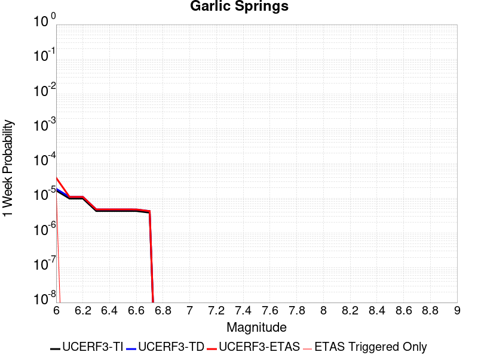 | 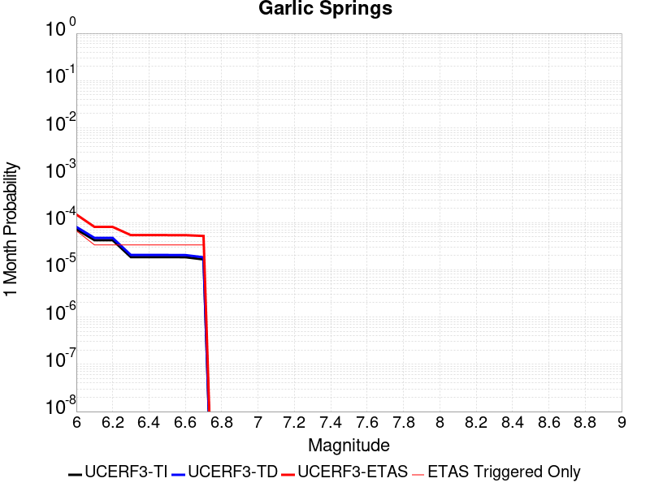 | 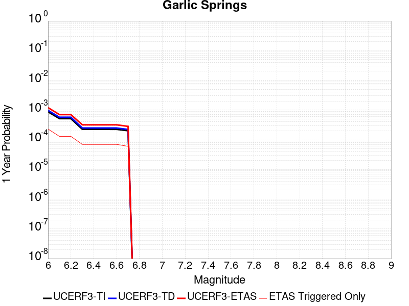 | 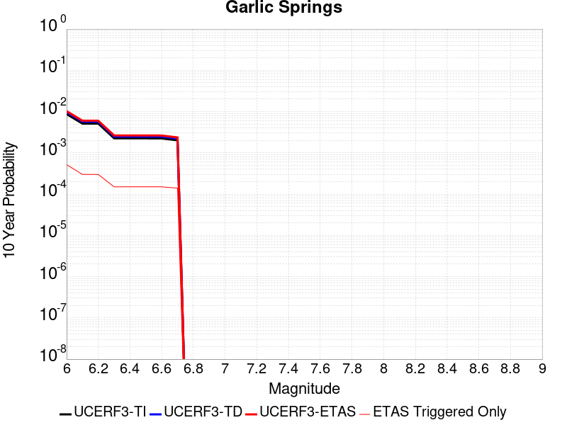 |

| Magnitude | 1 wk TI Prob | 1 wk TD Prob | 1 wk ETAS Prob | 1 wk ETAS/TD Gain | 1 wk ETAS Triggered Only | 1 mo TI Prob | 1 mo TD Prob | 1 mo ETAS Prob | 1 mo ETAS/TD Gain | 1 mo ETAS Triggered Only | 1 yr TI Prob | 1 yr TD Prob | 1 yr ETAS Prob | 1 yr ETAS/TD Gain | 1 yr ETAS Triggered Only | 10 yr TI Prob | 10 yr TD Prob | 10 yr ETAS Prob | 10 yr ETAS/TD Gain | 10 yr ETAS Triggered Only |
|-----|-----|-----|-----|-----|-----|-----|-----|-----|-----|-----|-----|-----|-----|-----|-----|-----|-----|-----|-----|-----|
| 6.0 | 1.6760017E-5 | 1.8777133E-5 | 1.8777133E-5 | 1.0 | 0.0 | 7.182667E-5 | 8.0471604E-5 | 1.6463992E-4 | 2.045938 | 8.417508E-5 | 8.7413884E-4 | 9.794189E-4 | 0.0012148782 | 1.2404072 | 2.3569024E-4 | 0.008707083 | 0.009762568 | 0.01032937 | 1.0580587 | 5.7239056E-4 |
| 6.1 | 9.852767E-6 | 1.0973752E-5 | 1.0973752E-5 | 1.0 | 0.0 | 4.222546E-5 | 4.702992E-5 | 9.75326E-5 | 2.0738413 | 5.0505052E-5 | 5.139737E-4 | 5.7250983E-4 | 7.5758895E-4 | 1.3232769 | 1.8518518E-4 | 0.005127866 | 0.0057173073 | 0.006052083 | 1.0585548 | 3.3670032E-4 |
| 6.2 | 9.852767E-6 | 1.0973752E-5 | 1.0973752E-5 | 1.0 | 0.0 | 4.222546E-5 | 4.702992E-5 | 9.75326E-5 | 2.0738413 | 5.0505052E-5 | 5.139737E-4 | 5.7250983E-4 | 7.5758895E-4 | 1.3232769 | 1.8518518E-4 | 0.005127866 | 0.0057173073 | 0.006052083 | 1.0585548 | 3.3670032E-4 |
| 6.3 | 4.3167724E-6 | 4.7780964E-6 | 4.7780964E-6 | 1.0 | 0.0 | 1.8500323E-5 | 2.0477524E-5 | 5.414687E-5 | 2.6442096 | 3.3670032E-5 | 2.2521814E-4 | 2.4930836E-4 | 3.502933E-4 | 1.4050603 | 1.01010104E-4 | 0.0022499003 | 0.0024925452 | 0.002660476 | 1.0673732 | 1.6835016E-4 |
| 6.4 | 4.3167724E-6 | 4.7780964E-6 | 4.7780964E-6 | 1.0 | 0.0 | 1.8500323E-5 | 2.0477524E-5 | 5.414687E-5 | 2.6442096 | 3.3670032E-5 | 2.2521814E-4 | 2.4930836E-4 | 3.502933E-4 | 1.4050603 | 1.01010104E-4 | 0.0022499003 | 0.0024925452 | 0.002660476 | 1.0673732 | 1.6835016E-4 |
| 6.5 | 4.3167724E-6 | 4.7780964E-6 | 4.7780964E-6 | 1.0 | 0.0 | 1.8500323E-5 | 2.0477524E-5 | 5.414687E-5 | 2.6442096 | 3.3670032E-5 | 2.2521814E-4 | 2.4930836E-4 | 3.502933E-4 | 1.4050603 | 1.01010104E-4 | 0.0022499003 | 0.0024925452 | 0.002660476 | 1.0673732 | 1.6835016E-4 |
| 6.6 | 4.301311E-6 | 4.7609647E-6 | 4.7609647E-6 | 1.0 | 0.0 | 1.8434059E-5 | 2.0404104E-5 | 5.407345E-5 | 2.6501262 | 3.3670032E-5 | 2.2441156E-4 | 2.4841467E-4 | 3.493997E-4 | 1.4065179 | 1.01010104E-4 | 0.0022418506 | 0.0024836282 | 0.0026515604 | 1.0676156 | 1.6835016E-4 |
| 6.7 | 3.8599724E-6 | 4.2711204E-6 | 4.2711204E-6 | 1.0 | 0.0 | 1.6542634E-5 | 1.8304801E-5 | 5.1974217E-5 | 2.8393764 | 3.3670032E-5 | 2.0138794E-4 | 2.2286095E-4 | 3.0701727E-4 | 1.3776181 | 8.417508E-5 | 0.0020120554 | 0.0022286095 | 0.002379787 | 1.0678349 | 1.5151515E-4 |

## Helendale-So Lockhart
*[(top)](#table-of-contents)*

| 1 Week | 1 Month | 1 Year | 10 Year |
|-----|-----|-----|-----|
| 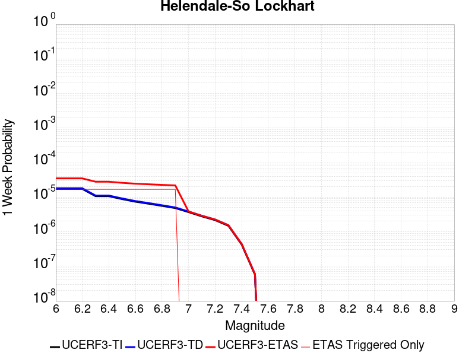 | 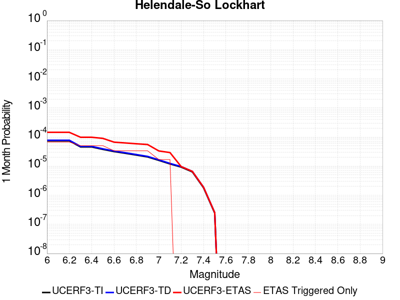 | 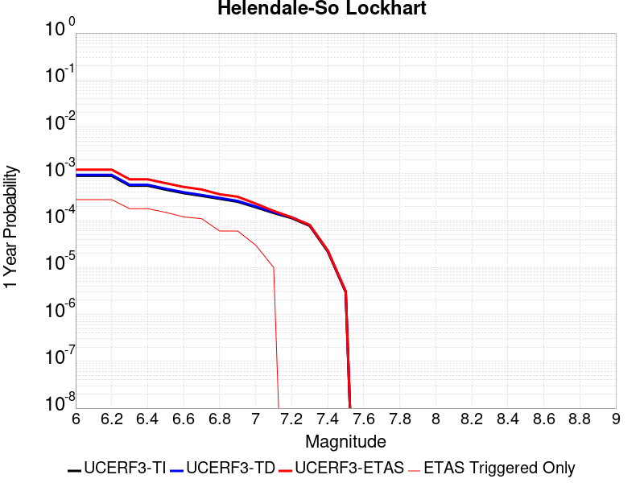 | 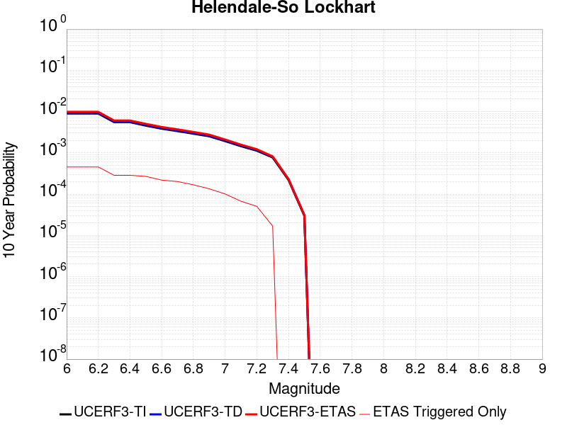 |

| Magnitude | 1 wk TI Prob | 1 wk TD Prob | 1 wk ETAS Prob | 1 wk ETAS/TD Gain | 1 wk ETAS Triggered Only | 1 mo TI Prob | 1 mo TD Prob | 1 mo ETAS Prob | 1 mo ETAS/TD Gain | 1 mo ETAS Triggered Only | 1 yr TI Prob | 1 yr TD Prob | 1 yr ETAS Prob | 1 yr ETAS/TD Gain | 1 yr ETAS Triggered Only | 10 yr TI Prob | 10 yr TD Prob | 10 yr ETAS Prob | 10 yr ETAS/TD Gain | 10 yr ETAS Triggered Only |
|-----|-----|-----|-----|-----|-----|-----|-----|-----|-----|-----|-----|-----|-----|-----|-----|-----|-----|-----|-----|-----|
| 6.0 | 1.7296055E-5 | 1.8103841E-5 | 3.4938555E-5 | 1.9298972 | 1.6835016E-5 | 7.412385E-5 | 7.7585704E-5 | 1.4492054E-4 | 1.867877 | 6.7340065E-5 | 9.0208417E-4 | 9.442173E-4 | 0.0011628659 | 1.231566 | 2.1885522E-4 | 0.008984311 | 0.009404174 | 0.009854445 | 1.0478799 | 4.5454546E-4 |
| 6.1 | 1.7296055E-5 | 1.8103841E-5 | 3.4938555E-5 | 1.9298972 | 1.6835016E-5 | 7.412385E-5 | 7.7585704E-5 | 1.4492054E-4 | 1.867877 | 6.7340065E-5 | 9.0208417E-4 | 9.442173E-4 | 0.0011628659 | 1.231566 | 2.1885522E-4 | 0.008984311 | 0.009404174 | 0.009854445 | 1.0478799 | 4.5454546E-4 |
| 6.2 | 1.7296055E-5 | 1.8103841E-5 | 3.4938555E-5 | 1.9298972 | 1.6835016E-5 | 7.412385E-5 | 7.7585704E-5 | 1.4492054E-4 | 1.867877 | 6.7340065E-5 | 9.0208417E-4 | 9.442173E-4 | 0.0011628659 | 1.231566 | 2.1885522E-4 | 0.008984311 | 0.009404174 | 0.009854445 | 1.0478799 | 4.5454546E-4 |
| 6.3 | 1.0669118E-5 | 1.1135489E-5 | 2.7970318E-5 | 2.5118177 | 1.6835016E-5 | 4.5723988E-5 | 4.7722668E-5 | 9.8225304E-5 | 2.0582526 | 5.0505052E-5 | 5.5654737E-4 | 5.8087136E-4 | 7.1547326E-4 | 1.2317241 | 1.3468013E-4 | 0.0055515557 | 0.005793827 | 0.0060783643 | 1.0491104 | 2.8619528E-4 |
| 6.4 | 1.0669118E-5 | 1.1135489E-5 | 2.7970318E-5 | 2.5118177 | 1.6835016E-5 | 4.5723988E-5 | 4.7722668E-5 | 9.8225304E-5 | 2.0582526 | 5.0505052E-5 | 5.5654737E-4 | 5.8087136E-4 | 7.1547326E-4 | 1.2317241 | 1.3468013E-4 | 0.0055515557 | 0.005793827 | 0.0060783643 | 1.0491104 | 2.8619528E-4 |
| 6.5 | 8.790038E-6 | 9.1702495E-6 | 2.6005111E-5 | 2.8358128 | 1.6835016E-5 | 3.767105E-5 | 3.9300485E-5 | 8.980355E-5 | 2.2850494 | 5.0505052E-5 | 4.585485E-4 | 4.7837992E-4 | 5.961687E-4 | 1.2462243 | 1.1784512E-4 | 0.0045760344 | 0.0047736657 | 0.0050417404 | 1.056157 | 2.6936026E-4 |
| 6.6 | 7.396949E-6 | 7.715581E-6 | 2.4550469E-5 | 3.1819339 | 1.6835016E-5 | 3.1700827E-5 | 3.3066364E-5 | 6.673528E-5 | 2.0182226 | 3.3670032E-5 | 3.858892E-4 | 4.025096E-4 | 4.8665082E-4 | 1.2090415 | 8.417508E-5 | 0.003852198 | 0.004017913 | 0.004235889 | 1.0542511 | 2.1885522E-4 |
| 6.7 | 6.4600285E-6 | 6.7380697E-6 | 2.3572973E-5 | 3.4984758 | 1.6835016E-5 | 2.7685543E-5 | 2.8877126E-5 | 6.254618E-5 | 2.1659422 | 3.3670032E-5 | 3.3701936E-4 | 3.5152308E-4 | 4.1883945E-4 | 1.1914992 | 6.7340065E-5 | 0.0033650869 | 0.003509752 | 0.0037110632 | 1.0573577 | 2.0202021E-4 |
| 6.8 | 5.600104E-6 | 5.836042E-6 | 2.267096E-5 | 3.8846467 | 1.6835016E-5 | 2.4000226E-5 | 2.5011372E-5 | 5.8680565E-5 | 2.3461554 | 3.3670032E-5 | 2.9216358E-4 | 3.044715E-4 | 3.7179107E-4 | 1.221103 | 6.7340065E-5 | 0.0029177975 | 0.003040605 | 0.0032084433 | 1.055199 | 1.6835016E-4 |
| 6.9 | 4.839122E-6 | 5.039537E-6 | 2.1874468E-5 | 4.3405714 | 1.6835016E-5 | 2.0738931E-5 | 2.159784E-5 | 5.5267144E-5 | 2.5589201 | 3.3670032E-5 | 2.5246723E-4 | 2.6292243E-4 | 3.302448E-4 | 1.256054 | 6.7340065E-5 | 0.002521806 | 0.002626161 | 0.0027604876 | 1.0511494 | 1.3468013E-4 |
| 7.0 | 3.6937633E-6 | 3.845229E-6 | 3.845229E-6 | 1.0 | 0.0 | 1.5830317E-5 | 1.6479451E-5 | 3.331419E-5 | 2.0215595 | 1.6835016E-5 | 1.9271708E-4 | 2.0061915E-4 | 2.5111408E-4 | 1.2516954 | 5.0505052E-5 | 0.0019255003 | 0.0020044118 | 0.0021052195 | 1.0502928 | 1.01010104E-4 |
| 7.1 | 2.7858857E-6 | 2.8978693E-6 | 2.8978693E-6 | 1.0 | 0.0 | 1.1939455E-5 | 1.2419382E-5 | 2.925419E-5 | 2.355527 | 1.6835016E-5 | 1.4535317E-4 | 1.511957E-4 | 1.6802817E-4 | 1.1113291 | 1.6835016E-5 | 0.0014525814 | 0.0015109498 | 0.0015781882 | 1.0445007 | 6.7340065E-5 |
| 7.2 | 2.1672065E-6 | 2.2540248E-6 | 2.2540248E-6 | 1.0 | 0.0 | 9.2879945E-6 | 9.660072E-6 | 9.660072E-6 | 1.0 | 0.0 | 1.1307546E-4 | 1.176052E-4 | 1.176052E-4 | 1.0 | 0.0 | 0.0011301794 | 0.0011754478 | 0.0012258936 | 1.0429162 | 5.0505052E-5 |
| 7.3 | 1.4823496E-6 | 1.5422185E-6 | 1.5422185E-6 | 1.0 | 0.0 | 6.3529114E-6 | 6.6094917E-6 | 6.6094917E-6 | 1.0 | 0.0 | 7.734395E-5 | 8.046775E-5 | 8.046775E-5 | 1.0 | 0.0 | 7.731704E-4 | 8.044012E-4 | 8.2122267E-4 | 1.0209118 | 1.6835016E-5 |
| 7.4 | 4.2321457E-7 | 4.4109012E-7 | 4.4109012E-7 | 1.0 | 0.0 | 1.8137755E-6 | 1.8903852E-6 | 1.8903852E-6 | 1.0 | 0.0 | 2.2082493E-5 | 2.3015242E-5 | 2.3015242E-5 | 1.0 | 0.0 | 2.2080299E-4 | 2.3013311E-4 | 2.3013311E-4 | 1.0 | 0.0 |
| 7.5 | 5.6942316E-8 | 5.941599E-8 | 5.941599E-8 | 1.0 | 0.0 | 2.440385E-7 | 2.5463993E-7 | 2.5463993E-7 | 1.0 | 0.0 | 2.9711643E-6 | 3.1002376E-6 | 3.1002376E-6 | 1.0 | 0.0 | 2.9711247E-5 | 3.1002022E-5 | 3.1002022E-5 | 1.0 | 0.0 |

## Death Valley (Black Mtns Frontal)
*[(top)](#table-of-contents)*

| 1 Week | 1 Month | 1 Year | 10 Year |
|-----|-----|-----|-----|
| 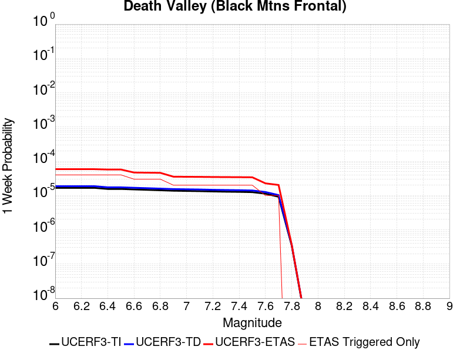 |  | 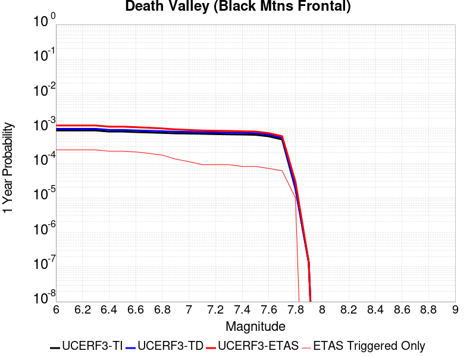 |  |

| Magnitude | 1 wk TI Prob | 1 wk TD Prob | 1 wk ETAS Prob | 1 wk ETAS/TD Gain | 1 wk ETAS Triggered Only | 1 mo TI Prob | 1 mo TD Prob | 1 mo ETAS Prob | 1 mo ETAS/TD Gain | 1 mo ETAS Triggered Only | 1 yr TI Prob | 1 yr TD Prob | 1 yr ETAS Prob | 1 yr ETAS/TD Gain | 1 yr ETAS Triggered Only | 10 yr TI Prob | 10 yr TD Prob | 10 yr ETAS Prob | 10 yr ETAS/TD Gain | 10 yr ETAS Triggered Only |
|-----|-----|-----|-----|-----|-----|-----|-----|-----|-----|-----|-----|-----|-----|-----|-----|-----|-----|-----|-----|-----|
| 6.0 | 1.6707214E-5 | 1.867056E-5 | 6.917467E-5 | 3.705013 | 5.0505052E-5 | 7.160038E-5 | 8.001427E-5 | 1.810163E-4 | 2.2623 | 1.01010104E-4 | 8.71386E-4 | 9.7374606E-4 | 0.001242844 | 1.2763534 | 2.6936026E-4 | 0.00867977 | 0.009695647 | 0.010145786 | 1.0464269 | 4.5454546E-4 |
| 6.1 | 1.6707214E-5 | 1.867056E-5 | 6.917467E-5 | 3.705013 | 5.0505052E-5 | 7.160038E-5 | 8.001427E-5 | 1.810163E-4 | 2.2623 | 1.01010104E-4 | 8.71386E-4 | 9.7374606E-4 | 0.001242844 | 1.2763534 | 2.6936026E-4 | 0.00867977 | 0.009695647 | 0.010145786 | 1.0464269 | 4.5454546E-4 |
| 6.2 | 1.6707214E-5 | 1.867056E-5 | 6.917467E-5 | 3.705013 | 5.0505052E-5 | 7.160038E-5 | 8.001427E-5 | 1.810163E-4 | 2.2623 | 1.01010104E-4 | 8.71386E-4 | 9.7374606E-4 | 0.001242844 | 1.2763534 | 2.6936026E-4 | 0.00867977 | 0.009695647 | 0.010145786 | 1.0464269 | 4.5454546E-4 |
| 6.3 | 1.6707214E-5 | 1.867056E-5 | 6.917467E-5 | 3.705013 | 5.0505052E-5 | 7.160038E-5 | 8.001427E-5 | 1.810163E-4 | 2.2623 | 1.01010104E-4 | 8.71386E-4 | 9.7374606E-4 | 0.001242844 | 1.2763534 | 2.6936026E-4 | 0.00867977 | 0.009695647 | 0.010145786 | 1.0464269 | 4.5454546E-4 |
| 6.4 | 1.5515609E-5 | 1.7338483E-5 | 6.784266E-5 | 3.9128368 | 5.0505052E-5 | 6.649377E-5 | 7.430571E-5 | 1.5847453E-4 | 2.1327372 | 8.417508E-5 | 8.0926094E-4 | 9.0430264E-4 | 0.0011397797 | 1.2603964 | 2.3569024E-4 | 0.008063202 | 0.009006913 | 0.009423997 | 1.0463072 | 4.208754E-4 |
| 6.5 | 1.5515609E-5 | 1.7338483E-5 | 6.784266E-5 | 3.9128368 | 5.0505052E-5 | 6.649377E-5 | 7.430571E-5 | 1.5847453E-4 | 2.1327372 | 8.417508E-5 | 8.0926094E-4 | 9.0430264E-4 | 0.0011397797 | 1.2603964 | 2.3569024E-4 | 0.008063202 | 0.009006913 | 0.009423997 | 1.0463072 | 4.208754E-4 |
| 6.6 | 1.5041828E-5 | 1.6809407E-5 | 5.0478877E-5 | 3.0030134 | 3.3670032E-5 | 6.4463384E-5 | 7.203836E-5 | 1.3937357E-4 | 1.9347134 | 6.7340065E-5 | 7.8455906E-4 | 8.7672E-4 | 0.0010953833 | 1.2494106 | 2.1885522E-4 | 0.00781795 | 0.008733268 | 0.009117092 | 1.0439496 | 3.872054E-4 |
| 6.7 | 1.4634985E-5 | 1.6356273E-5 | 5.0025756E-5 | 3.058506 | 3.3670032E-5 | 6.271985E-5 | 7.009646E-5 | 1.3743181E-4 | 1.9606098 | 6.7340065E-5 | 7.6334673E-4 | 8.53096E-4 | 0.0010549439 | 1.2366062 | 2.0202021E-4 | 0.007607299 | 0.008498848 | 0.008832687 | 1.0392804 | 3.3670032E-4 |
| 6.8 | 1.4209158E-5 | 1.5882297E-5 | 4.9551796E-5 | 3.1199389 | 3.3670032E-5 | 6.089497E-5 | 6.806524E-5 | 1.1856685E-4 | 1.741959 | 5.0505052E-5 | 7.4114406E-4 | 8.2838483E-4 | 9.965956E-4 | 1.2030586 | 1.6835016E-4 | 0.007386771 | 0.008253585 | 0.008554114 | 1.036412 | 3.030303E-4 |
| 6.9 | 1.3780098E-5 | 1.5404834E-5 | 3.2239594E-5 | 2.092823 | 1.6835016E-5 | 5.9056227E-5 | 6.601908E-5 | 9.968689E-5 | 1.5099709 | 3.3670032E-5 | 7.1877235E-4 | 8.0349133E-4 | 9.3806325E-4 | 1.1674839 | 1.3468013E-4 | 0.0071645193 | 0.008006458 | 0.008273661 | 1.0333735 | 2.6936026E-4 |
| 7.0 | 1.3585064E-5 | 1.5188394E-5 | 3.2023156E-5 | 2.1083963 | 1.6835016E-5 | 5.8220405E-5 | 6.5091524E-5 | 9.875937E-5 | 1.5172385 | 3.3670032E-5 | 7.086029E-4 | 7.922066E-4 | 9.099584E-4 | 1.1486377 | 1.1784512E-4 | 0.007063476 | 0.007894417 | 0.008144949 | 1.0317353 | 2.5252526E-4 |
| 7.1 | 1.3398601E-5 | 1.4981575E-5 | 3.181634E-5 | 2.123698 | 1.6835016E-5 | 5.742131E-5 | 6.4205204E-5 | 9.7873075E-5 | 1.5243793 | 3.3670032E-5 | 6.9888023E-4 | 7.814234E-4 | 8.8235456E-4 | 1.1291633 | 1.01010104E-4 | 0.0069668638 | 0.007787346 | 0.008004497 | 1.0278851 | 2.1885522E-4 |
| 7.2 | 1.3126312E-5 | 1.4679792E-5 | 3.1514563E-5 | 2.1467988 | 1.6835016E-5 | 5.6254412E-5 | 6.291191E-5 | 9.6579824E-5 | 1.5351597 | 3.3670032E-5 | 6.846822E-4 | 7.656887E-4 | 8.666215E-4 | 1.1318196 | 1.01010104E-4 | 0.006825765 | 0.00763109 | 0.007848275 | 1.0284606 | 2.1885522E-4 |
| 7.3 | 1.2922429E-5 | 1.4454016E-5 | 3.128879E-5 | 2.1647124 | 1.6835016E-5 | 5.5380664E-5 | 6.1944345E-5 | 9.561229E-5 | 1.5435194 | 3.3670032E-5 | 6.74051E-4 | 7.5391686E-4 | 8.548508E-4 | 1.1338794 | 1.01010104E-4 | 0.006720101 | 0.0075141727 | 0.007714675 | 1.0266832 | 2.0202021E-4 |
| 7.4 | 1.2768878E-5 | 1.4283997E-5 | 3.1118772E-5 | 2.178576 | 1.6835016E-5 | 5.4722615E-5 | 6.1215724E-5 | 9.48837E-5 | 1.549989 | 3.3670032E-5 | 6.660441E-4 | 7.45052E-4 | 8.2916435E-4 | 1.1128947 | 8.417508E-5 | 0.0066405144 | 0.0074261203 | 0.0076099304 | 1.0247518 | 1.8518518E-4 |
| 7.5 | 1.2521929E-5 | 1.40122365E-5 | 3.084702E-5 | 2.2014341 | 1.6835016E-5 | 5.366431E-5 | 6.0051094E-5 | 9.371911E-5 | 1.5606561 | 3.3670032E-5 | 6.531671E-4 | 7.308822E-4 | 8.149958E-4 | 1.115085 | 8.417508E-5 | 0.006512506 | 0.0072853607 | 0.007452484 | 1.0229397 | 1.6835016E-4 |
| 7.6 | 1.1301089E-5 | 1.2648349E-5 | 2.9483153E-5 | 2.3309882 | 1.6835016E-5 | 4.8432343E-5 | 5.4206117E-5 | 8.787432E-5 | 1.6211146 | 3.3670032E-5 | 5.895042E-4 | 6.597649E-4 | 7.438845E-4 | 1.1274992 | 8.417508E-5 | 0.0058794282 | 0.0065786145 | 0.0067458567 | 1.0254222 | 1.6835016E-4 |
| 7.7 | 9.189108E-6 | 1.0283521E-5 | 2.7118365E-5 | 2.63707 | 1.6835016E-5 | 3.93813E-5 | 4.407152E-5 | 7.774007E-5 | 1.7639526 | 3.3670032E-5 | 4.7936183E-4 | 5.3644367E-4 | 6.037476E-4 | 1.1254632 | 6.7340065E-5 | 0.004783291 | 0.0053519984 | 0.0055027027 | 1.0281585 | 1.5151515E-4 |
| 7.8 | 3.4586725E-7 | 3.648288E-7 | 3.648288E-7 | 1.0 | 0.0 | 1.4822873E-6 | 1.5635511E-6 | 1.5635511E-6 | 1.0 | 0.0 | 1.80467E-5 | 1.9036073E-5 | 3.587077E-5 | 1.8843577 | 1.6835016E-5 | 1.8045233E-4 | 1.9034486E-4 | 2.0717668E-4 | 1.088428 | 1.6835016E-5 |
| 7.9 | 2.5591178E-9 | 2.6696871E-9 | 2.6696871E-9 | 1.0 | 0.0 | 1.0967647E-8 | 1.1441516E-8 | 1.1441516E-8 | 1.0 | 0.0 | 1.335311E-7 | 1.3930045E-7 | 1.3930045E-7 | 1.0 | 0.0 | 1.3353102E-6 | 1.3930046E-6 | 1.3930046E-6 | 1.0 | 0.0 |

## San Andreas (Parkfield)
*[(top)](#table-of-contents)*

| 1 Week | 1 Month | 1 Year | 10 Year |
|-----|-----|-----|-----|
| 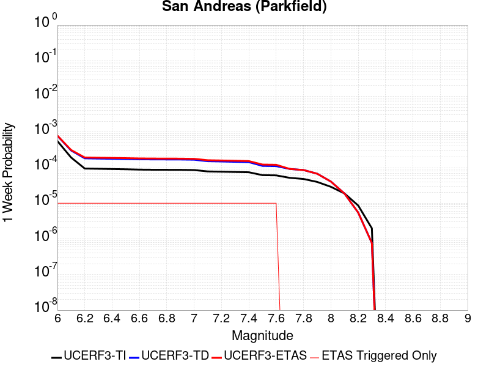 | 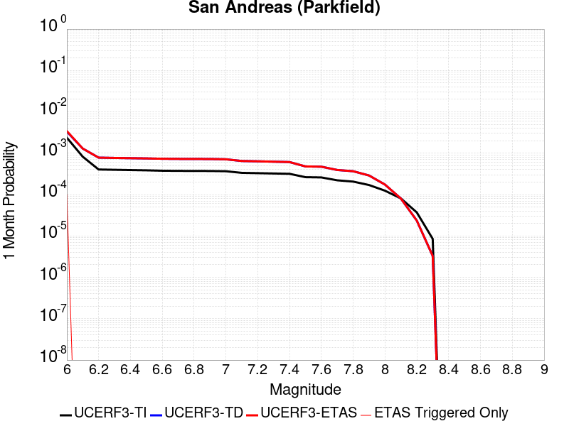 | 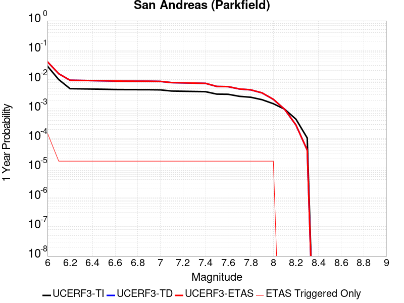 | 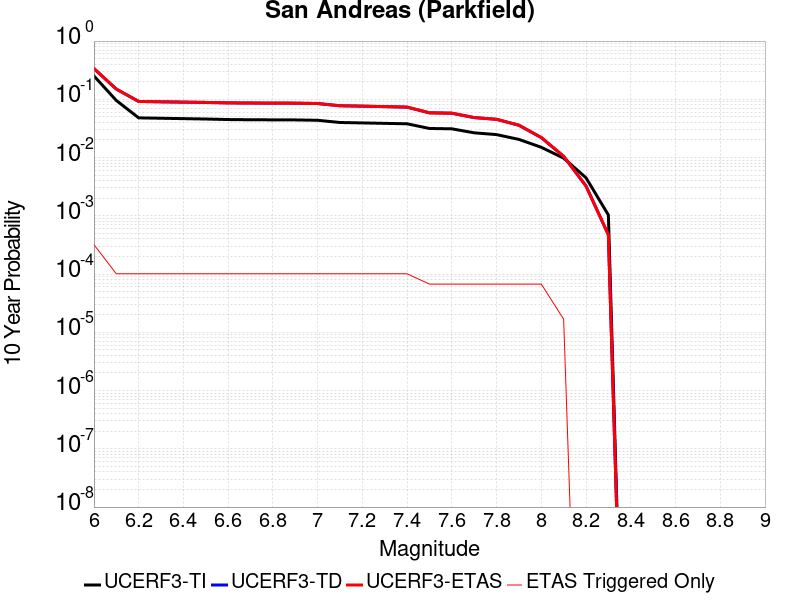 |

| Magnitude | 1 wk TI Prob | 1 wk TD Prob | 1 wk ETAS Prob | 1 wk ETAS/TD Gain | 1 wk ETAS Triggered Only | 1 mo TI Prob | 1 mo TD Prob | 1 mo ETAS Prob | 1 mo ETAS/TD Gain | 1 mo ETAS Triggered Only | 1 yr TI Prob | 1 yr TD Prob | 1 yr ETAS Prob | 1 yr ETAS/TD Gain | 1 yr ETAS Triggered Only | 10 yr TI Prob | 10 yr TD Prob | 10 yr ETAS Prob | 10 yr ETAS/TD Gain | 10 yr ETAS Triggered Only |
|-----|-----|-----|-----|-----|-----|-----|-----|-----|-----|-----|-----|-----|-----|-----|-----|-----|-----|-----|-----|-----|
| 6.0 | 5.556969E-4 | 7.788437E-4 | 7.788437E-4 | 1.0 | 0.0 | 0.0023793848 | 0.0033341812 | 0.0033845177 | 1.0150971 | 5.0505052E-5 | 0.028586963 | 0.04023991 | 0.04038533 | 1.0036138 | 1.5151515E-4 | 0.25176284 | 0.33731642 | 0.3375284 | 1.0006284 | 3.1986533E-4 |
| 6.1 | 1.925858E-4 | 3.0304783E-4 | 3.0304783E-4 | 1.0 | 0.0 | 8.2510663E-4 | 0.0012982241 | 0.0012982241 | 1.0 | 0.0 | 0.0099994885 | 0.015792182 | 0.01580875 | 1.0010492 | 1.6835016E-5 | 0.095613256 | 0.14979222 | 0.1498781 | 1.0005733 | 1.01010104E-4 |
| 6.2 | 9.4306815E-5 | 1.8250331E-4 | 1.8250331E-4 | 1.0 | 0.0 | 4.0410945E-4 | 7.819238E-4 | 7.819238E-4 | 1.0 | 0.0 | 0.0049089384 | 0.009478576 | 0.009495251 | 1.0017593 | 1.6835016E-5 | 0.048019063 | 0.09188674 | 0.09197846 | 1.0009983 | 1.01010104E-4 |
| 6.3 | 9.283051E-5 | 1.7946832E-4 | 1.7946832E-4 | 1.0 | 0.0 | 3.9778434E-4 | 7.689244E-4 | 7.689244E-4 | 1.0 | 0.0 | 0.0048322747 | 0.009321672 | 0.00933835 | 1.0017892 | 1.6835016E-5 | 0.047285385 | 0.09053965 | 0.090631515 | 1.0010146 | 1.01010104E-4 |
| 6.4 | 9.138826E-5 | 1.770899E-4 | 1.770899E-4 | 1.0 | 0.0 | 3.916052E-4 | 7.5873715E-4 | 7.5873715E-4 | 1.0 | 0.0 | 0.0047573745 | 0.009198696 | 0.009215377 | 1.0018133 | 1.6835016E-5 | 0.046568092 | 0.089441724 | 0.0895337 | 1.0010283 | 1.01010104E-4 |
| 6.5 | 9.000255E-5 | 1.746699E-4 | 1.746699E-4 | 1.0 | 0.0 | 3.8566816E-4 | 7.483717E-4 | 7.483717E-4 | 1.0 | 0.0 | 0.0046854047 | 0.009073567 | 0.0090902485 | 1.0018386 | 1.6835016E-5 | 0.045878403 | 0.08832737 | 0.08841946 | 1.0010426 | 1.01010104E-4 |
| 6.6 | 8.8109264E-5 | 1.7148067E-4 | 1.7148067E-4 | 1.0 | 0.0 | 3.7755648E-4 | 7.3471136E-4 | 7.3471136E-4 | 1.0 | 0.0 | 0.0045870654 | 0.008908638 | 0.008925323 | 1.0018729 | 1.6835016E-5 | 0.04493529 | 0.086858675 | 0.08695091 | 1.0010619 | 1.01010104E-4 |
| 6.7 | 8.738073E-5 | 1.7015127E-4 | 1.7015127E-4 | 1.0 | 0.0 | 3.7443507E-4 | 7.290171E-4 | 7.290171E-4 | 1.0 | 0.0 | 0.0045492216 | 0.008839916 | 0.008856603 | 1.0018876 | 1.6835016E-5 | 0.04457213 | 0.086258985 | 0.08635128 | 1.00107 | 1.01010104E-4 |
| 6.8 | 8.710195E-5 | 1.6960612E-4 | 1.6960612E-4 | 1.0 | 0.0 | 3.7324068E-4 | 7.266821E-4 | 7.266821E-4 | 1.0 | 0.0 | 0.0045347405 | 0.008811726 | 0.008828413 | 1.0018936 | 1.6835016E-5 | 0.04443313 | 0.08600653 | 0.08609885 | 1.0010735 | 1.01010104E-4 |
| 6.9 | 8.6801556E-5 | 1.6901553E-4 | 1.6901553E-4 | 1.0 | 0.0 | 3.7195362E-4 | 7.2415237E-4 | 7.2415237E-4 | 1.0 | 0.0 | 0.0045191357 | 0.008781176 | 0.008797863 | 1.0019003 | 1.6835016E-5 | 0.044283327 | 0.08573254 | 0.08582489 | 1.0010772 | 1.01010104E-4 |
| 7.0 | 8.5571606E-5 | 1.6654332E-4 | 1.6654332E-4 | 1.0 | 0.0 | 3.6668387E-4 | 7.13563E-4 | 7.13563E-4 | 1.0 | 0.0 | 0.004455241 | 0.008653281 | 0.008669971 | 1.0019287 | 1.6835016E-5 | 0.043669727 | 0.08458075 | 0.08467322 | 1.0010933 | 1.01010104E-4 |
| 7.1 | 7.82589E-5 | 1.5135074E-4 | 1.5135074E-4 | 1.0 | 0.0 | 3.3535215E-4 | 6.484855E-4 | 6.484855E-4 | 1.0 | 0.0 | 0.0040752706 | 0.0078668995 | 0.007883602 | 1.0021231 | 1.6835016E-5 | 0.040013418 | 0.077491894 | 0.07758508 | 1.0012025 | 1.01010104E-4 |
| 7.2 | 7.690929E-5 | 1.4872287E-4 | 1.4872287E-4 | 1.0 | 0.0 | 3.2956956E-4 | 6.372288E-4 | 6.372288E-4 | 1.0 | 0.0 | 0.004005129 | 0.007730829 | 0.007747534 | 1.0021608 | 1.6835016E-5 | 0.0393371 | 0.07626493 | 0.076358244 | 1.0012234 | 1.01010104E-4 |
| 7.3 | 7.5543794E-5 | 1.4568791E-4 | 1.4568791E-4 | 1.0 | 0.0 | 3.2371894E-4 | 6.242281E-4 | 6.242281E-4 | 1.0 | 0.0 | 0.003934157 | 0.007573656 | 0.0075903637 | 1.002206 | 1.6835016E-5 | 0.038652334 | 0.07482772 | 0.074921176 | 1.0012488 | 1.01010104E-4 |
| 7.4 | 7.4214564E-5 | 1.4269682E-4 | 1.4269682E-4 | 1.0 | 0.0 | 3.1802364E-4 | 6.114152E-4 | 6.114152E-4 | 1.0 | 0.0 | 0.003865065 | 0.007418731 | 0.0074354415 | 1.0022525 | 1.6835016E-5 | 0.03798529 | 0.07340127 | 0.07349487 | 1.0012752 | 1.01010104E-4 |
| 7.5 | 6.149578E-5 | 1.1196503E-4 | 1.1196503E-4 | 1.0 | 0.0 | 2.6352672E-4 | 4.7976198E-4 | 4.7976198E-4 | 1.0 | 0.0 | 0.0032037178 | 0.00582549 | 0.005842227 | 1.0028731 | 1.6835016E-5 | 0.03157923 | 0.058584154 | 0.058647547 | 1.0010821 | 6.7340065E-5 |
| 7.6 | 6.0643448E-5 | 1.10251094E-4 | 1.10251094E-4 | 1.0 | 0.0 | 2.598746E-4 | 4.7241923E-4 | 4.7241923E-4 | 1.0 | 0.0 | 0.0031593828 | 0.0057365666 | 0.005753305 | 1.0029179 | 1.6835016E-5 | 0.031148417 | 0.057744972 | 0.057808425 | 1.0010989 | 6.7340065E-5 |
| 7.7 | 5.1652263E-5 | 9.179838E-5 | 9.179838E-5 | 1.0 | 0.0 | 2.2134806E-4 | 3.9336234E-4 | 3.9336234E-4 | 1.0 | 0.0 | 0.002691582 | 0.0047786795 | 0.0047954344 | 1.0035061 | 1.6835016E-5 | 0.026592141 | 0.048560265 | 0.048624333 | 1.0013194 | 6.7340065E-5 |
| 7.8 | 4.8090482E-5 | 8.564368E-5 | 8.564368E-5 | 1.0 | 0.0 | 2.060858E-4 | 3.6699275E-4 | 3.6699275E-4 | 1.0 | 0.0 | 0.0025062072 | 0.004458991 | 0.004475751 | 1.0037587 | 1.6835016E-5 | 0.024781305 | 0.045324653 | 0.04538894 | 1.0014184 | 6.7340065E-5 |
| 7.9 | 3.970278E-5 | 6.754111E-5 | 6.754111E-5 | 1.0 | 0.0 | 1.7014367E-4 | 2.894298E-4 | 2.894298E-4 | 1.0 | 0.0 | 0.002069531 | 0.0035181176 | 0.0035348935 | 1.0047684 | 1.6835016E-5 | 0.020503636 | 0.03589899 | 0.03596391 | 1.0018085 | 6.7340065E-5 |
| 8.0 | 2.8982335E-5 | 4.072124E-5 | 4.072124E-5 | 1.0 | 0.0 | 1.2420409E-4 | 1.7450792E-4 | 1.7450792E-4 | 1.0 | 0.0 | 0.0015111357 | 0.002122565 | 0.0021393641 | 1.0079147 | 1.6835016E-5 | 0.015009012 | 0.02202231 | 0.022088168 | 1.0029905 | 6.7340065E-5 |
| 8.1 | 1.8836186E-5 | 1.8694205E-5 | 1.8694205E-5 | 1.0 | 0.0 | 8.0724014E-5 | 8.011556E-5 | 8.011556E-5 | 1.0 | 0.0 | 9.823717E-4 | 9.749711E-4 | 9.749711E-4 | 1.0 | 0.0 | 0.009780403 | 0.010494972 | 0.010511629 | 1.0015873 | 1.6835016E-5 |
| 8.2 | 8.643924E-6 | 5.4798497E-6 | 5.4798497E-6 | 1.0 | 0.0 | 3.704486E-5 | 2.348486E-5 | 2.348486E-5 | 1.0 | 0.0 | 4.5092785E-4 | 2.858907E-4 | 2.858907E-4 | 1.0 | 0.0 | 0.0045001395 | 0.0032514327 | 0.0032514327 | 1.0 | 0.0 |
| 8.3 | 1.983087E-6 | 7.668296E-7 | 7.668296E-7 | 1.0 | 0.0 | 8.498917E-6 | 3.2864084E-6 | 3.2864084E-6 | 1.0 | 0.0 | 1.034694E-4 | 4.0011306E-5 | 4.0011306E-5 | 1.0 | 0.0 | 0.0010342124 | 4.724499E-4 | 4.724499E-4 | 1.0 | 0.0 |

## Sierra Nevada  (No Extension)
*[(top)](#table-of-contents)*

| 1 Week | 1 Month | 1 Year | 10 Year |
|-----|-----|-----|-----|
| 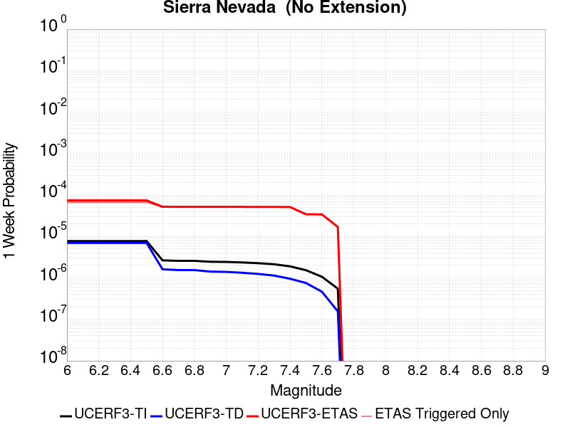 | 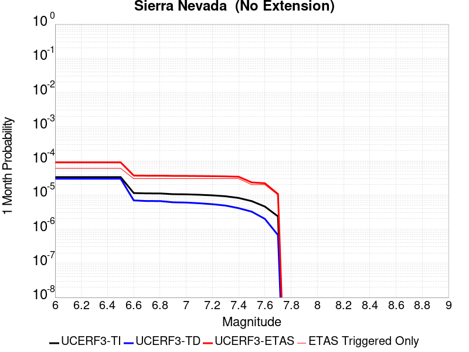 | 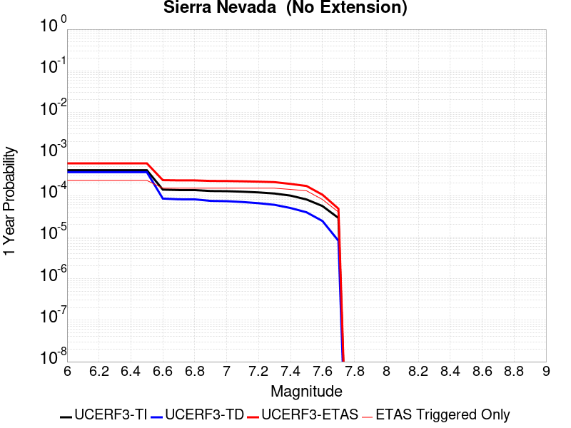 | 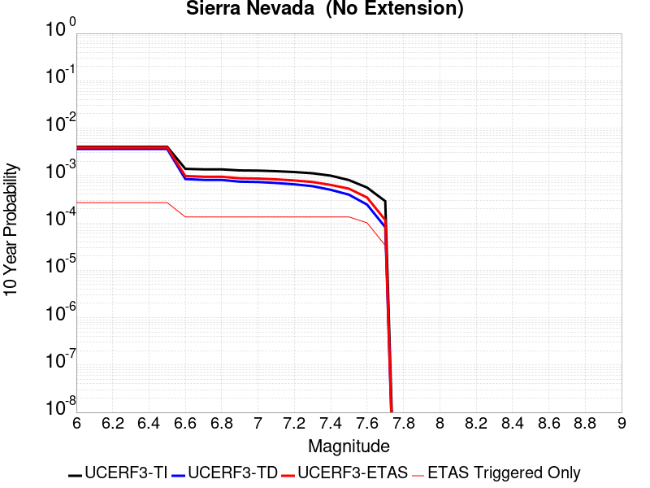 |

| Magnitude | 1 wk TI Prob | 1 wk TD Prob | 1 wk ETAS Prob | 1 wk ETAS/TD Gain | 1 wk ETAS Triggered Only | 1 mo TI Prob | 1 mo TD Prob | 1 mo ETAS Prob | 1 mo ETAS/TD Gain | 1 mo ETAS Triggered Only | 1 yr TI Prob | 1 yr TD Prob | 1 yr ETAS Prob | 1 yr ETAS/TD Gain | 1 yr ETAS Triggered Only | 10 yr TI Prob | 10 yr TD Prob | 10 yr ETAS Prob | 10 yr ETAS/TD Gain | 10 yr ETAS Triggered Only |
|-----|-----|-----|-----|-----|-----|-----|-----|-----|-----|-----|-----|-----|-----|-----|-----|-----|-----|-----|-----|-----|
| 6.0 | 7.7690465E-6 | 6.9763832E-6 | 7.431598E-5 | 10.652509 | 6.7340065E-5 | 3.329549E-5 | 2.9898645E-5 | 9.72367E-5 | 3.2522109 | 6.7340065E-5 | 4.0529718E-4 | 3.6399104E-4 | 5.995955E-4 | 1.6472809 | 2.3569024E-4 | 0.004045588 | 0.0036374647 | 0.0039561666 | 1.0876164 | 3.1986533E-4 |
| 6.1 | 7.7690465E-6 | 6.9763832E-6 | 7.431598E-5 | 10.652509 | 6.7340065E-5 | 3.329549E-5 | 2.9898645E-5 | 9.72367E-5 | 3.2522109 | 6.7340065E-5 | 4.0529718E-4 | 3.6399104E-4 | 5.995955E-4 | 1.6472809 | 2.3569024E-4 | 0.004045588 | 0.0036374647 | 0.0039561666 | 1.0876164 | 3.1986533E-4 |
| 6.2 | 7.7690465E-6 | 6.9763832E-6 | 7.431598E-5 | 10.652509 | 6.7340065E-5 | 3.329549E-5 | 2.9898645E-5 | 9.72367E-5 | 3.2522109 | 6.7340065E-5 | 4.0529718E-4 | 3.6399104E-4 | 5.995955E-4 | 1.6472809 | 2.3569024E-4 | 0.004045588 | 0.0036374647 | 0.0039561666 | 1.0876164 | 3.1986533E-4 |
| 6.3 | 7.7690465E-6 | 6.9763832E-6 | 7.431598E-5 | 10.652509 | 6.7340065E-5 | 3.329549E-5 | 2.9898645E-5 | 9.72367E-5 | 3.2522109 | 6.7340065E-5 | 4.0529718E-4 | 3.6399104E-4 | 5.995955E-4 | 1.6472809 | 2.3569024E-4 | 0.004045588 | 0.0036374647 | 0.0039561666 | 1.0876164 | 3.1986533E-4 |
| 6.4 | 7.7690465E-6 | 6.9763832E-6 | 7.431598E-5 | 10.652509 | 6.7340065E-5 | 3.329549E-5 | 2.9898645E-5 | 9.72367E-5 | 3.2522109 | 6.7340065E-5 | 4.0529718E-4 | 3.6399104E-4 | 5.995955E-4 | 1.6472809 | 2.3569024E-4 | 0.004045588 | 0.0036374647 | 0.0039561666 | 1.0876164 | 3.1986533E-4 |
| 6.5 | 7.7690465E-6 | 6.9763832E-6 | 7.431598E-5 | 10.652509 | 6.7340065E-5 | 3.329549E-5 | 2.9898645E-5 | 9.72367E-5 | 3.2522109 | 6.7340065E-5 | 4.0529718E-4 | 3.6399104E-4 | 5.995955E-4 | 1.6472809 | 2.3569024E-4 | 0.004045588 | 0.0036374647 | 0.0039561666 | 1.0876164 | 3.1986533E-4 |
| 6.6 | 2.653E-6 | 1.6148814E-6 | 5.211985E-5 | 32.274723 | 5.0505052E-5 | 1.136995E-5 | 6.920902E-6 | 5.7425605E-5 | 8.297416 | 5.0505052E-5 | 1.3842035E-4 | 8.4258754E-5 | 2.6942833E-4 | 3.1976302 | 1.8518518E-4 | 0.0013833415 | 8.4227155E-4 | 0.0010609424 | 1.2596204 | 2.1885522E-4 |
| 6.7 | 2.5902466E-6 | 1.5502146E-6 | 5.2055188E-5 | 33.57934 | 5.0505052E-5 | 1.11010095E-5 | 6.64376E-6 | 5.7148474E-5 | 8.601827 | 5.0505052E-5 | 1.351464E-4 | 8.0884805E-5 | 2.6605502E-4 | 3.2893076 | 1.8518518E-4 | 0.0013506424 | 8.085567E-4 | 0.001027235 | 1.2704551 | 2.1885522E-4 |
| 6.8 | 2.5853892E-6 | 1.5470148E-6 | 5.2051986E-5 | 33.64673 | 5.0505052E-5 | 1.1080193E-5 | 6.6300463E-6 | 5.7134763E-5 | 8.617551 | 5.0505052E-5 | 1.34893E-4 | 8.071786E-5 | 2.6588808E-4 | 3.294043 | 1.8518518E-4 | 0.0013481114 | 8.0688833E-4 | 0.001025567 | 1.2710147 | 2.1885522E-4 |
| 6.9 | 2.458257E-6 | 1.4220883E-6 | 5.192707E-5 | 36.514656 | 5.0505052E-5 | 1.0535345E-5 | 6.0946504E-6 | 5.6599394E-5 | 9.286734 | 5.0505052E-5 | 1.2826028E-4 | 7.419986E-5 | 2.593713E-4 | 3.4955769 | 1.8518518E-4 | 0.0012818627 | 7.417528E-4 | 9.604457E-4 | 1.2948326 | 2.1885522E-4 |
| 7.0 | 2.4341468E-6 | 1.399052E-6 | 5.1904033E-5 | 37.099426 | 5.0505052E-5 | 1.0432016E-5 | 5.995924E-6 | 5.650067E-5 | 9.423181 | 5.0505052E-5 | 1.270024E-4 | 7.2997944E-5 | 2.581696E-4 | 3.5366695 | 1.8518518E-4 | 0.0012692984 | 7.297416E-4 | 9.484371E-4 | 1.2996889 | 2.1885522E-4 |
| 7.1 | 2.3652476E-6 | 1.3340014E-6 | 5.1838986E-5 | 38.85977 | 5.0505052E-5 | 1.0136736E-5 | 5.717136E-6 | 5.62219E-5 | 9.833927 | 5.0505052E-5 | 1.2340778E-4 | 6.960393E-5 | 2.547762E-4 | 3.6603715 | 1.8518518E-4 | 0.0012333926 | 6.9582294E-4 | 9.145259E-4 | 1.3143083 | 2.1885522E-4 |
| 7.2 | 2.272158E-6 | 1.2503074E-6 | 5.1755294E-5 | 41.394054 | 5.0505052E-5 | 9.737784E-6 | 5.3584495E-6 | 5.586323E-5 | 10.425261 | 5.0505052E-5 | 1.1855107E-4 | 6.523718E-5 | 2.504103E-4 | 3.8384595 | 1.8518518E-4 | 0.0011848784 | 6.5218186E-4 | 8.708943E-4 | 1.335355 | 2.1885522E-4 |
| 7.3 | 2.1382127E-6 | 1.1419947E-6 | 5.1646988E-5 | 45.225243 | 5.0505052E-5 | 9.163737E-6 | 4.8942543E-6 | 5.5399058E-5 | 11.319203 | 5.0505052E-5 | 1.1156279E-4 | 5.9585927E-5 | 2.4476007E-4 | 4.1076827 | 1.8518518E-4 | 0.001115068 | 5.957007E-4 | 8.144255E-4 | 1.3671724 | 2.1885522E-4 |
| 7.4 | 1.9048055E-6 | 9.575474E-7 | 5.146255E-5 | 53.744125 | 5.0505052E-5 | 8.163426E-6 | 4.1037683E-6 | 5.4608612E-5 | 13.306944 | 5.0505052E-5 | 9.9385186E-5 | 4.996224E-5 | 2.3513817E-4 | 4.706318 | 1.8518518E-4 | 9.934074E-4 | 4.995108E-4 | 7.1825663E-4 | 1.4379203 | 2.1885522E-4 |
| 7.5 | 1.5373403E-6 | 7.5602395E-7 | 3.4426033E-5 | 45.535637 | 3.3670032E-5 | 6.5885843E-6 | 3.2400987E-6 | 3.6910023E-5 | 11.391635 | 3.3670032E-5 | 8.021306E-5 | 3.9447492E-5 | 2.0779102E-4 | 5.2675343 | 1.6835016E-4 | 8.0184115E-4 | 3.944054E-4 | 5.795175E-4 | 1.4693449 | 1.8518518E-4 |
| 7.6 | 1.0680322E-6 | 4.659796E-7 | 3.4136E-5 | 73.25642 | 3.3670032E-5 | 4.577273E-6 | 1.997054E-6 | 3.566702E-5 | 17.859818 | 3.3670032E-5 | 5.5726876E-5 | 2.4313864E-5 | 1.253215E-4 | 5.154323 | 1.01010104E-4 | 5.5712904E-4 | 2.431123E-4 | 3.4409785E-4 | 1.4153864 | 1.01010104E-4 |
| 7.7 | 5.509146E-7 | 1.5581199E-7 | 1.6990825E-5 | 109.046974 | 1.6835016E-5 | 2.3610605E-6 | 6.677655E-7 | 1.750277E-5 | 26.210953 | 1.6835016E-5 | 2.8745531E-5 | 8.130016E-6 | 5.8634658E-5 | 7.2121205 | 5.0505052E-5 | 2.8741814E-4 | 8.12973E-5 | 1.3179825E-4 | 1.6211884 | 5.0505052E-5 |

## San Andreas (San Bernardino S)
*[(top)](#table-of-contents)*

| 1 Week | 1 Month | 1 Year | 10 Year |
|-----|-----|-----|-----|
| 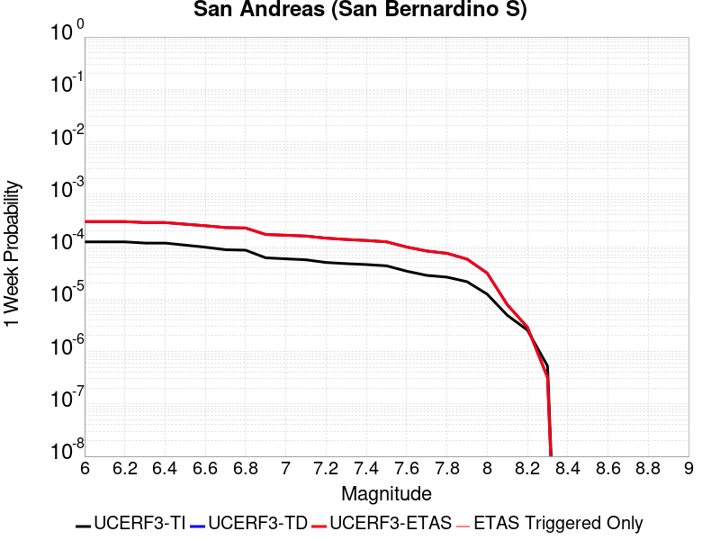 | 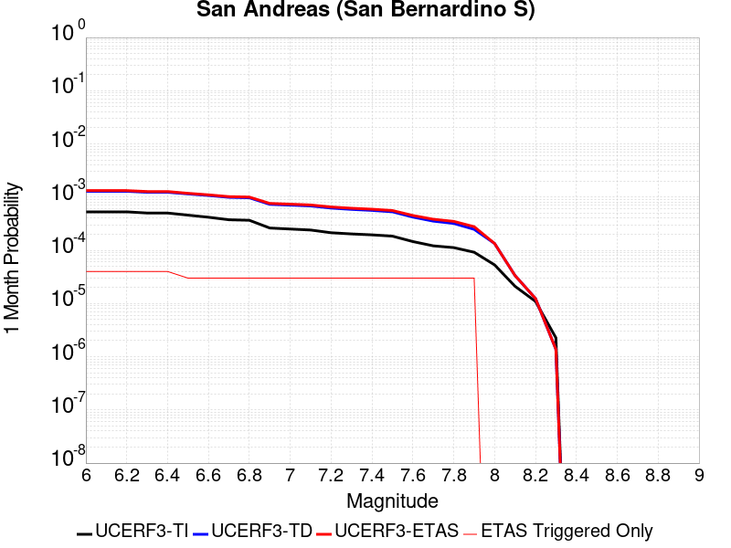 |  | 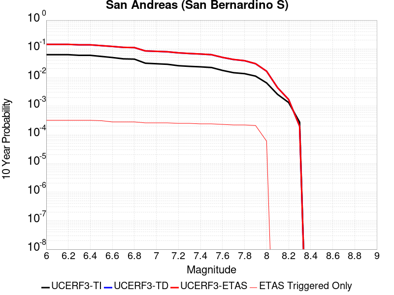 |

| Magnitude | 1 wk TI Prob | 1 wk TD Prob | 1 wk ETAS Prob | 1 wk ETAS/TD Gain | 1 wk ETAS Triggered Only | 1 mo TI Prob | 1 mo TD Prob | 1 mo ETAS Prob | 1 mo ETAS/TD Gain | 1 mo ETAS Triggered Only | 1 yr TI Prob | 1 yr TD Prob | 1 yr ETAS Prob | 1 yr ETAS/TD Gain | 1 yr ETAS Triggered Only | 10 yr TI Prob | 10 yr TD Prob | 10 yr ETAS Prob | 10 yr ETAS/TD Gain | 10 yr ETAS Triggered Only |
|-----|-----|-----|-----|-----|-----|-----|-----|-----|-----|-----|-----|-----|-----|-----|-----|-----|-----|-----|-----|-----|
| 6.0 | 1.2336002E-4 | 3.0008948E-4 | 3.0008948E-4 | 1.0 | 0.0 | 5.2857865E-4 | 0.0012854899 | 0.0013191167 | 1.0261587 | 3.3670032E-5 | 0.006416472 | 0.015543484 | 0.015676072 | 1.00853 | 1.3468013E-4 | 0.06234337 | 0.14285627 | 0.14310159 | 1.0017172 | 2.8619528E-4 |
| 6.1 | 1.2336002E-4 | 3.0008948E-4 | 3.0008948E-4 | 1.0 | 0.0 | 5.2857865E-4 | 0.0012854899 | 0.0013191167 | 1.0261587 | 3.3670032E-5 | 0.006416472 | 0.015543484 | 0.015676072 | 1.00853 | 1.3468013E-4 | 0.06234337 | 0.14285627 | 0.14310159 | 1.0017172 | 2.8619528E-4 |
| 6.2 | 1.2336002E-4 | 3.0008948E-4 | 3.0008948E-4 | 1.0 | 0.0 | 5.2857865E-4 | 0.0012854899 | 0.0013191167 | 1.0261587 | 3.3670032E-5 | 0.006416472 | 0.015543484 | 0.015676072 | 1.00853 | 1.3468013E-4 | 0.06234337 | 0.14285627 | 0.14310159 | 1.0017172 | 2.8619528E-4 |
| 6.3 | 1.1712257E-4 | 2.8797207E-4 | 2.8797207E-4 | 1.0 | 0.0 | 5.018573E-4 | 0.001233608 | 0.0012672364 | 1.0272603 | 3.3670032E-5 | 0.006093008 | 0.01492059 | 0.015053261 | 1.0088918 | 1.3468013E-4 | 0.059286322 | 0.13756467 | 0.1378115 | 1.0017942 | 2.8619528E-4 |
| 6.4 | 1.1712257E-4 | 2.8797207E-4 | 2.8797207E-4 | 1.0 | 0.0 | 5.018573E-4 | 0.001233608 | 0.0012672364 | 1.0272603 | 3.3670032E-5 | 0.006093008 | 0.01492059 | 0.015053261 | 1.0088918 | 1.3468013E-4 | 0.059286322 | 0.13756467 | 0.1378115 | 1.0017942 | 2.8619528E-4 |
| 6.5 | 1.0689076E-4 | 2.6809986E-4 | 2.6809986E-4 | 1.0 | 0.0 | 4.5802278E-4 | 0.0011485183 | 0.0011653339 | 1.0146412 | 1.6835016E-5 | 0.0055621783 | 0.013898174 | 0.014014381 | 1.0083613 | 1.1784512E-4 | 0.05425003 | 0.12881182 | 0.12904648 | 1.0018218 | 2.6936026E-4 |
| 6.6 | 9.7648895E-5 | 2.5054725E-4 | 2.5054725E-4 | 1.0 | 0.0 | 4.1842813E-4 | 0.0010733557 | 0.0010901727 | 1.0156677 | 1.6835016E-5 | 0.005082469 | 0.012994168 | 0.0130938655 | 1.0076724 | 1.01010104E-4 | 0.049677886 | 0.12097161 | 0.12119359 | 1.001835 | 2.5252526E-4 |
| 6.7 | 8.757013E-5 | 2.3125445E-4 | 2.3125445E-4 | 1.0 | 0.0 | 3.7524657E-4 | 9.907364E-4 | 0.0010075547 | 1.0169756 | 1.6835016E-5 | 0.00455906 | 0.011999588 | 0.012099386 | 1.0083168 | 1.01010104E-4 | 0.04466656 | 0.11227982 | 0.11250398 | 1.0019965 | 2.5252526E-4 |
| 6.8 | 8.562978E-5 | 2.2685292E-4 | 2.2685292E-4 | 1.0 | 0.0 | 3.6693315E-4 | 9.7188674E-4 | 9.887054E-4 | 1.0173051 | 1.6835016E-5 | 0.004458263 | 0.01177259 | 0.011872411 | 1.0084791 | 1.01010104E-4 | 0.043698758 | 0.11029001 | 0.11051469 | 1.0020372 | 2.5252526E-4 |
| 6.9 | 6.124075E-5 | 1.7069813E-4 | 1.7069813E-4 | 1.0 | 0.0 | 2.6243398E-4 | 7.313591E-4 | 7.4818183E-4 | 1.023002 | 1.6835016E-5 | 0.0031904527 | 0.00886815 | 0.008968265 | 1.0112892 | 1.01010104E-4 | 0.031450346 | 0.08419993 | 0.08441578 | 1.0025635 | 2.3569024E-4 |
| 7.0 | 5.8598747E-5 | 1.6498787E-4 | 1.6498787E-4 | 1.0 | 0.0 | 2.5111332E-4 | 7.069001E-4 | 7.237232E-4 | 1.0237985 | 1.6835016E-5 | 0.0030530186 | 0.008572741 | 0.008672886 | 1.0116817 | 1.01010104E-4 | 0.03011414 | 0.08151753 | 0.08173401 | 1.0026556 | 2.3569024E-4 |
| 7.1 | 5.613814E-5 | 1.5917298E-4 | 1.5917298E-4 | 1.0 | 0.0 | 2.4056983E-4 | 6.819924E-4 | 6.988159E-4 | 1.0246682 | 1.6835016E-5 | 0.0029250039 | 0.008271826 | 0.008372001 | 1.0121104 | 1.01010104E-4 | 0.028868021 | 0.078816354 | 0.07903347 | 1.0027547 | 2.3569024E-4 |
| 7.2 | 4.991222E-5 | 1.4523676E-4 | 1.4523676E-4 | 1.0 | 0.0 | 2.1389198E-4 | 6.2229513E-4 | 6.3911965E-4 | 1.0270363 | 1.6835016E-5 | 0.002601025 | 0.0075502265 | 0.007650474 | 1.0132774 | 1.01010104E-4 | 0.025707912 | 0.072269924 | 0.07247296 | 1.0028094 | 2.1885522E-4 |
| 7.3 | 4.7410045E-5 | 1.3717797E-4 | 1.3717797E-4 | 1.0 | 0.0 | 2.0317009E-4 | 5.8777345E-4 | 6.0459855E-4 | 1.0286251 | 1.6835016E-5 | 0.0024707897 | 0.0071327467 | 0.007233036 | 1.0140605 | 1.01010104E-4 | 0.024434982 | 0.06855203 | 0.06875589 | 1.0029737 | 2.1885522E-4 |
| 7.4 | 4.5556746E-5 | 1.3125638E-4 | 1.3125638E-4 | 1.0 | 0.0 | 1.952286E-4 | 5.6240644E-4 | 5.7923194E-4 | 1.0299171 | 1.6835016E-5 | 0.002374317 | 0.006825879 | 0.0069262 | 1.0146971 | 1.01010104E-4 | 0.023491086 | 0.065804236 | 0.06600869 | 1.003107 | 2.1885522E-4 |
| 7.5 | 4.3084514E-5 | 1.2360894E-4 | 1.2360894E-4 | 1.0 | 0.0 | 1.8463485E-4 | 5.2964536E-4 | 5.4647145E-4 | 1.0317686 | 1.6835016E-5 | 0.0022456115 | 0.006429438 | 0.0065297987 | 1.0156095 | 1.01010104E-4 | 0.022230545 | 0.062204733 | 0.062409975 | 1.0032995 | 2.1885522E-4 |
| 7.6 | 3.408608E-5 | 9.838868E-5 | 9.838868E-5 | 1.0 | 0.0 | 1.4607502E-4 | 4.215977E-4 | 4.3842563E-4 | 1.0399146 | 1.6835016E-5 | 0.0017770125 | 0.005120897 | 0.00522139 | 1.0196241 | 1.01010104E-4 | 0.017628696 | 0.050035115 | 0.050227027 | 1.0038356 | 2.0202021E-4 |
| 7.7 | 2.8315713E-5 | 8.251823E-5 | 8.251823E-5 | 1.0 | 0.0 | 1.2134742E-4 | 3.5360164E-4 | 3.7043073E-4 | 1.0475932 | 1.6835016E-5 | 0.0014764034 | 0.004296611 | 0.004397187 | 1.0234083 | 1.01010104E-4 | 0.01466633 | 0.04228543 | 0.04247891 | 1.0045755 | 2.0202021E-4 |
| 7.8 | 2.6222975E-5 | 7.4660275E-5 | 7.4660275E-5 | 1.0 | 0.0 | 1.1237934E-4 | 3.1993337E-4 | 3.36763E-4 | 1.0526036 | 1.6835016E-5 | 0.0013673597 | 0.003888238 | 0.0039888555 | 1.0258774 | 1.01010104E-4 | 0.013589768 | 0.03844993 | 0.03864418 | 1.0050521 | 2.0202021E-4 |
| 7.9 | 2.1469694E-5 | 5.7903162E-5 | 5.7903162E-5 | 1.0 | 0.0 | 9.200973E-5 | 2.4813283E-4 | 2.6496366E-4 | 1.06783 | 1.6835016E-5 | 0.0011196428 | 0.003016835 | 0.0031175404 | 1.0333811 | 1.01010104E-4 | 0.011140184 | 0.030163256 | 0.030359184 | 1.0064956 | 2.0202021E-4 |
| 8.0 | 1.2420249E-5 | 3.1332525E-5 | 3.1332525E-5 | 1.0 | 0.0 | 5.322855E-5 | 1.3427534E-4 | 1.3427534E-4 | 1.0 | 0.0 | 6.478649E-4 | 0.0016335774 | 0.0016503849 | 1.0102888 | 1.6835016E-5 | 0.0064597935 | 0.016528832 | 0.01659506 | 1.0040067 | 6.7340065E-5 |
| 8.1 | 4.9197724E-6 | 7.827271E-6 | 7.827271E-6 | 1.0 | 0.0 | 2.1084568E-5 | 3.3545013E-5 | 3.3545013E-5 | 1.0 | 0.0 | 2.566744E-4 | 4.0833413E-4 | 4.0833413E-4 | 1.0 | 0.0 | 0.002563781 | 0.0043868436 | 0.0043868436 | 1.0 | 0.0 |
| 8.2 | 2.5634774E-6 | 2.9089954E-6 | 2.9089954E-6 | 1.0 | 0.0 | 1.0986286E-5 | 1.2467063E-5 | 1.2467063E-5 | 1.0 | 0.0 | 1.3374983E-4 | 1.5177597E-4 | 1.5177597E-4 | 1.0 | 0.0 | 0.0013366934 | 0.0017061684 | 0.0017061684 | 1.0 | 0.0 |
| 8.3 | 5.2850464E-7 | 3.211945E-7 | 3.211945E-7 | 1.0 | 0.0 | 2.2650179E-6 | 1.3765473E-6 | 1.3765473E-6 | 1.0 | 0.0 | 2.7576245E-5 | 1.6759346E-5 | 1.6759346E-5 | 1.0 | 0.0 | 2.7572823E-4 | 1.9887649E-4 | 1.9887649E-4 | 1.0 | 0.0 |

## Coyote Lake
*[(top)](#table-of-contents)*

| 1 Week | 1 Month | 1 Year | 10 Year |
|-----|-----|-----|-----|
| 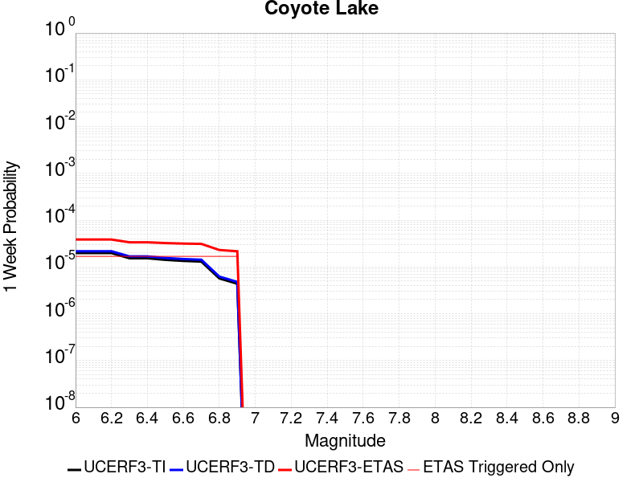 | 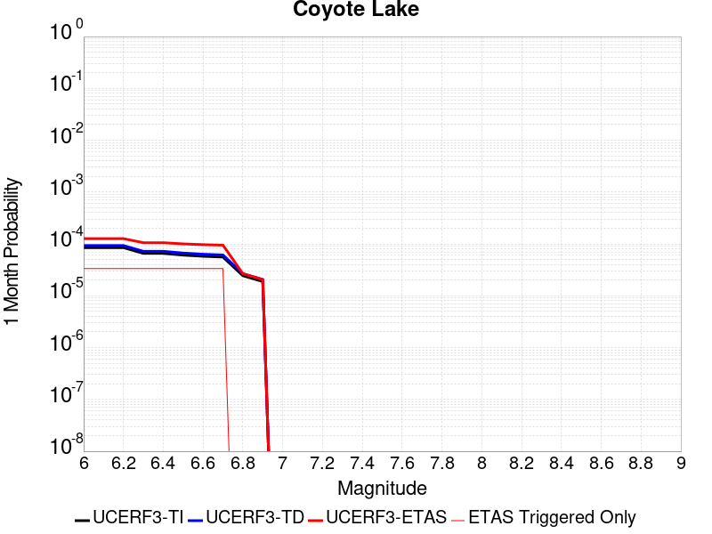 | 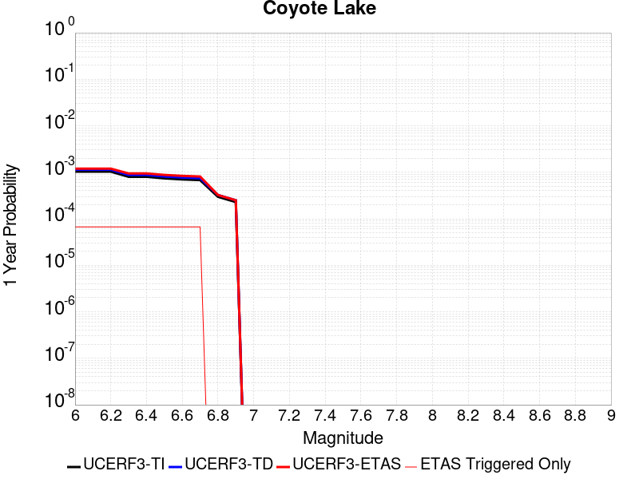 | 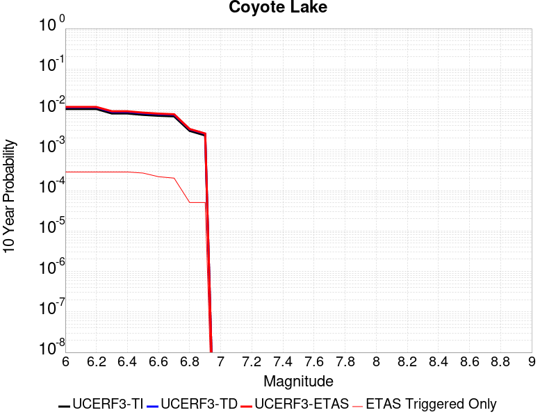 |

| Magnitude | 1 wk TI Prob | 1 wk TD Prob | 1 wk ETAS Prob | 1 wk ETAS/TD Gain | 1 wk ETAS Triggered Only | 1 mo TI Prob | 1 mo TD Prob | 1 mo ETAS Prob | 1 mo ETAS/TD Gain | 1 mo ETAS Triggered Only | 1 yr TI Prob | 1 yr TD Prob | 1 yr ETAS Prob | 1 yr ETAS/TD Gain | 1 yr ETAS Triggered Only | 10 yr TI Prob | 10 yr TD Prob | 10 yr ETAS Prob | 10 yr ETAS/TD Gain | 10 yr ETAS Triggered Only |
|-----|-----|-----|-----|-----|-----|-----|-----|-----|-----|-----|-----|-----|-----|-----|-----|-----|-----|-----|-----|-----|
| 6.0 | 1.980352E-5 | 2.1707021E-5 | 3.854167E-5 | 1.7755394 | 1.6835016E-5 | 8.486947E-5 | 9.302718E-5 | 1.4352753E-4 | 1.5428559 | 5.0505052E-5 | 0.0010327959 | 0.0011320895 | 0.001283433 | 1.1336852 | 1.5151515E-4 | 0.010280091 | 0.011270401 | 0.01155337 | 1.0251074 | 2.8619528E-4 |
| 6.1 | 1.980352E-5 | 2.1707021E-5 | 3.854167E-5 | 1.7755394 | 1.6835016E-5 | 8.486947E-5 | 9.302718E-5 | 1.4352753E-4 | 1.5428559 | 5.0505052E-5 | 0.0010327959 | 0.0011320895 | 0.001283433 | 1.1336852 | 1.5151515E-4 | 0.010280091 | 0.011270401 | 0.01155337 | 1.0251074 | 2.8619528E-4 |
| 6.2 | 1.980352E-5 | 2.1707021E-5 | 3.854167E-5 | 1.7755394 | 1.6835016E-5 | 8.486947E-5 | 9.302718E-5 | 1.4352753E-4 | 1.5428559 | 5.0505052E-5 | 0.0010327959 | 0.0011320895 | 0.001283433 | 1.1336852 | 1.5151515E-4 | 0.010280091 | 0.011270401 | 0.01155337 | 1.0251074 | 2.8619528E-4 |
| 6.3 | 1.5344787E-5 | 1.6820884E-5 | 3.365562E-5 | 2.0008233 | 1.6835016E-5 | 6.576172E-5 | 7.208785E-5 | 1.2258926E-4 | 1.7005537 | 5.0505052E-5 | 8.003548E-4 | 8.7737746E-4 | 0.0010287596 | 1.1725395 | 1.5151515E-4 | 0.007974784 | 0.00874518 | 0.0090288725 | 1.0324398 | 2.8619528E-4 |
| 6.4 | 1.5344787E-5 | 1.6820884E-5 | 3.365562E-5 | 2.0008233 | 1.6835016E-5 | 6.576172E-5 | 7.208785E-5 | 1.2258926E-4 | 1.7005537 | 5.0505052E-5 | 8.003548E-4 | 8.7737746E-4 | 0.0010287596 | 1.1725395 | 1.5151515E-4 | 0.007974784 | 0.00874518 | 0.0090288725 | 1.0324398 | 2.8619528E-4 |
| 6.5 | 1.4189697E-5 | 1.5558186E-5 | 3.239294E-5 | 2.0820513 | 1.6835016E-5 | 6.081157E-5 | 6.667658E-5 | 1.1717826E-4 | 1.7574127 | 5.0505052E-5 | 7.401293E-4 | 8.1154524E-4 | 9.629374E-4 | 1.1865481 | 1.5151515E-4 | 0.0073766913 | 0.008091759 | 0.00835894 | 1.0330188 | 2.6936026E-4 |
| 6.6 | 1.3469301E-5 | 1.47717665E-5 | 3.1606534E-5 | 2.1396585 | 1.6835016E-5 | 5.7724297E-5 | 6.3306376E-5 | 1.1380823E-4 | 1.7977372 | 5.0505052E-5 | 7.025667E-4 | 7.7054254E-4 | 9.051189E-4 | 1.1746514 | 1.3468013E-4 | 0.0070034964 | 0.0076846126 | 0.007901786 | 1.0282608 | 2.1885522E-4 |
| 6.7 | 1.3027966E-5 | 1.4281927E-5 | 3.1116702E-5 | 2.1787467 | 1.6835016E-5 | 5.5832945E-5 | 6.120716E-5 | 1.1170912E-4 | 1.8250989 | 5.0505052E-5 | 6.7955407E-4 | 7.450021E-4 | 8.627595E-4 | 1.158063 | 1.1784512E-4 | 0.006774798 | 0.007430923 | 0.0076314425 | 1.0269845 | 2.0202021E-4 |
| 6.8 | 5.695434E-6 | 6.2244944E-6 | 2.3059407E-5 | 3.7046232 | 1.6835016E-5 | 2.4408775E-5 | 2.6676302E-5 | 4.351087E-5 | 1.6310683 | 1.6835016E-5 | 2.971363E-4 | 3.2476554E-4 | 3.5842464E-4 | 1.1036413 | 3.3670032E-5 | 0.0029673933 | 0.0032458503 | 0.0032961916 | 1.0155094 | 5.0505052E-5 |
| 6.9 | 4.385688E-6 | 4.7931144E-6 | 2.1628051E-5 | 4.5123167 | 1.6835016E-5 | 1.879567E-5 | 2.0541918E-5 | 3.737659E-5 | 1.8195276 | 1.6835016E-5 | 2.2881327E-4 | 2.5009786E-4 | 2.8375947E-4 | 1.1345937 | 3.3670032E-5 | 0.002285778 | 0.0025009785 | 0.0025513573 | 1.0201436 | 5.0505052E-5 |

## San Andreas (Big Bend)
*[(top)](#table-of-contents)*

| 1 Week | 1 Month | 1 Year | 10 Year |
|-----|-----|-----|-----|
| 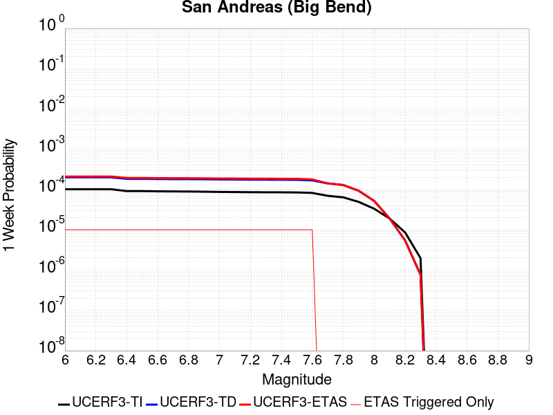 | 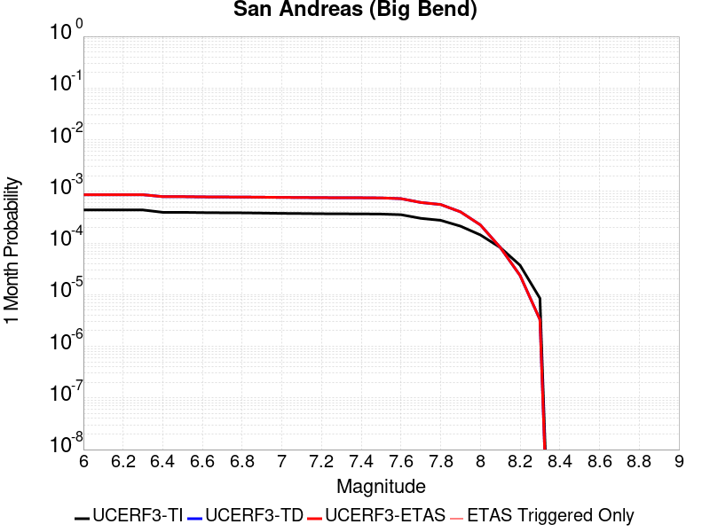 | 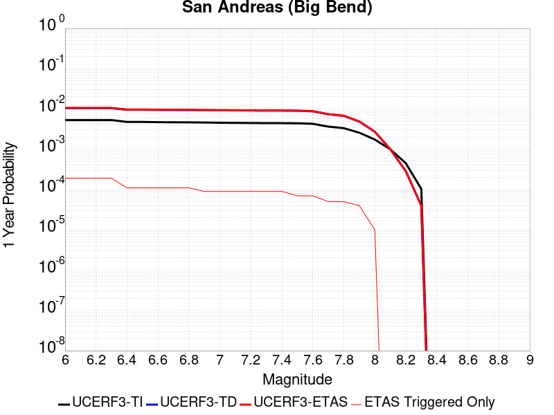 | 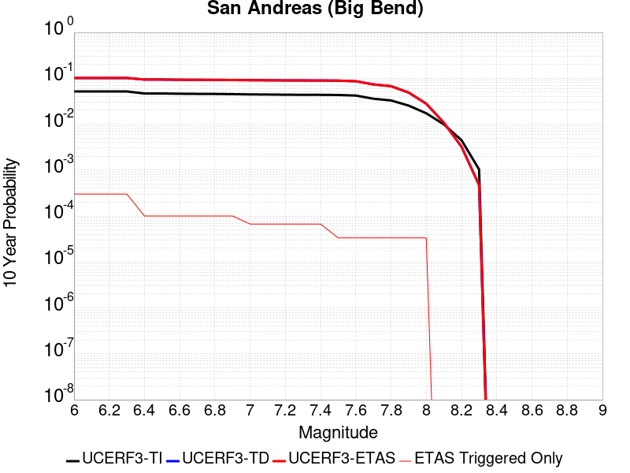 |

| Magnitude | 1 wk TI Prob | 1 wk TD Prob | 1 wk ETAS Prob | 1 wk ETAS/TD Gain | 1 wk ETAS Triggered Only | 1 mo TI Prob | 1 mo TD Prob | 1 mo ETAS Prob | 1 mo ETAS/TD Gain | 1 mo ETAS Triggered Only | 1 yr TI Prob | 1 yr TD Prob | 1 yr ETAS Prob | 1 yr ETAS/TD Gain | 1 yr ETAS Triggered Only | 10 yr TI Prob | 10 yr TD Prob | 10 yr ETAS Prob | 10 yr ETAS/TD Gain | 10 yr ETAS Triggered Only |
|-----|-----|-----|-----|-----|-----|-----|-----|-----|-----|-----|-----|-----|-----|-----|-----|-----|-----|-----|-----|-----|
| 6.0 | 1.0179969E-4 | 2.0080687E-4 | 2.0080687E-4 | 1.0 | 0.0 | 4.362114E-4 | 8.60318E-4 | 8.60318E-4 | 1.0 | 0.0 | 0.0052979486 | 0.010424351 | 0.010524308 | 1.0095888 | 1.01010104E-4 | 0.051734097 | 0.1014857 | 0.10172772 | 1.0023848 | 2.6936026E-4 |
| 6.1 | 1.0179969E-4 | 2.0080687E-4 | 2.0080687E-4 | 1.0 | 0.0 | 4.362114E-4 | 8.60318E-4 | 8.60318E-4 | 1.0 | 0.0 | 0.0052979486 | 0.010424351 | 0.010524308 | 1.0095888 | 1.01010104E-4 | 0.051734097 | 0.1014857 | 0.10172772 | 1.0023848 | 2.6936026E-4 |
| 6.2 | 1.0179969E-4 | 2.0080687E-4 | 2.0080687E-4 | 1.0 | 0.0 | 4.362114E-4 | 8.60318E-4 | 8.60318E-4 | 1.0 | 0.0 | 0.0052979486 | 0.010424351 | 0.010524308 | 1.0095888 | 1.01010104E-4 | 0.051734097 | 0.1014857 | 0.10172772 | 1.0023848 | 2.6936026E-4 |
| 6.3 | 1.0179969E-4 | 2.0080687E-4 | 2.0080687E-4 | 1.0 | 0.0 | 4.362114E-4 | 8.60318E-4 | 8.60318E-4 | 1.0 | 0.0 | 0.0052979486 | 0.010424351 | 0.010524308 | 1.0095888 | 1.01010104E-4 | 0.051734097 | 0.1014857 | 0.10172772 | 1.0023848 | 2.6936026E-4 |
| 6.4 | 9.1639464E-5 | 1.8437792E-4 | 1.8437792E-4 | 1.0 | 0.0 | 3.9268145E-4 | 7.89952E-4 | 7.89952E-4 | 1.0 | 0.0 | 0.0047704205 | 0.009575372 | 0.009625393 | 1.005224 | 5.0505052E-5 | 0.046693064 | 0.09381153 | 0.093948826 | 1.0014635 | 1.5151515E-4 |
| 6.5 | 9.1639464E-5 | 1.8437792E-4 | 1.8437792E-4 | 1.0 | 0.0 | 3.9268145E-4 | 7.89952E-4 | 7.89952E-4 | 1.0 | 0.0 | 0.0047704205 | 0.009575372 | 0.009625393 | 1.005224 | 5.0505052E-5 | 0.046693064 | 0.09381153 | 0.093948826 | 1.0014635 | 1.5151515E-4 |
| 6.6 | 9.042622E-5 | 1.8244829E-4 | 1.8244829E-4 | 1.0 | 0.0 | 3.8748336E-4 | 7.8168715E-4 | 7.8168715E-4 | 1.0 | 0.0 | 0.0047074095 | 0.009475624 | 0.009525651 | 1.0052795 | 5.0505052E-5 | 0.046089325 | 0.09290548 | 0.09304292 | 1.0014794 | 1.5151515E-4 |
| 6.7 | 8.9836685E-5 | 1.8159159E-4 | 1.8159159E-4 | 1.0 | 0.0 | 3.8495753E-4 | 7.7801774E-4 | 7.7801774E-4 | 1.0 | 0.0 | 0.00467679 | 0.009431336 | 0.009481365 | 1.0053046 | 5.0505052E-5 | 0.045795817 | 0.09249973 | 0.09263723 | 1.0014865 | 1.5151515E-4 |
| 6.8 | 8.9471854E-5 | 1.8105932E-4 | 1.8105932E-4 | 1.0 | 0.0 | 3.8339442E-4 | 7.75738E-4 | 7.75738E-4 | 1.0 | 0.0 | 0.004657841 | 0.00940382 | 0.00945385 | 1.0053202 | 5.0505052E-5 | 0.04561414 | 0.09224692 | 0.09238446 | 1.001491 | 1.5151515E-4 |
| 6.9 | 8.858234E-5 | 1.7987892E-4 | 1.7987892E-4 | 1.0 | 0.0 | 3.7958333E-4 | 7.706821E-4 | 7.706821E-4 | 1.0 | 0.0 | 0.004611638 | 0.009342793 | 0.009392827 | 1.0053552 | 5.0505052E-5 | 0.04517103 | 0.091686994 | 0.09182462 | 1.001501 | 1.5151515E-4 |
| 7.0 | 8.7433385E-5 | 1.7826671E-4 | 1.7826671E-4 | 1.0 | 0.0 | 3.746607E-4 | 7.6377665E-4 | 7.6377665E-4 | 1.0 | 0.0 | 0.004551957 | 0.009259437 | 0.009309475 | 1.0054039 | 5.0505052E-5 | 0.044598386 | 0.09092137 | 0.09104381 | 1.0013466 | 1.3468013E-4 |
| 7.1 | 8.684964E-5 | 1.7738611E-4 | 1.7738611E-4 | 1.0 | 0.0 | 3.7215967E-4 | 7.600049E-4 | 7.600049E-4 | 1.0 | 0.0 | 0.0045216335 | 0.009213906 | 0.009263945 | 1.0054309 | 5.0505052E-5 | 0.04430731 | 0.09050287 | 0.09062536 | 1.0013535 | 1.3468013E-4 |
| 7.2 | 8.606521E-5 | 1.7629213E-4 | 1.7629213E-4 | 1.0 | 0.0 | 3.6879873E-4 | 7.5531914E-4 | 7.5531914E-4 | 1.0 | 0.0 | 0.0044808835 | 0.009157337 | 0.00920738 | 1.0054648 | 5.0505052E-5 | 0.043916024 | 0.08998334 | 0.0901059 | 1.0013621 | 1.3468013E-4 |
| 7.3 | 8.568266E-5 | 1.7571205E-4 | 1.7571205E-4 | 1.0 | 0.0 | 3.6715972E-4 | 7.528345E-4 | 7.528345E-4 | 1.0 | 0.0 | 0.0044610105 | 0.00912734 | 0.009177384 | 1.0054829 | 5.0505052E-5 | 0.043725148 | 0.08970444 | 0.08982704 | 1.0013667 | 1.3468013E-4 |
| 7.4 | 8.5432206E-5 | 1.7533782E-4 | 1.7533782E-4 | 1.0 | 0.0 | 3.6608664E-4 | 7.5123156E-4 | 7.5123156E-4 | 1.0 | 0.0 | 0.004447999 | 0.009107988 | 0.009158034 | 1.0054946 | 5.0505052E-5 | 0.043600157 | 0.08952458 | 0.0896472 | 1.0013697 | 1.3468013E-4 |
| 7.5 | 8.4791965E-5 | 1.7403076E-4 | 1.7403076E-4 | 1.0 | 0.0 | 3.633435E-4 | 7.4563315E-4 | 7.4563315E-4 | 1.0 | 0.0 | 0.0044147377 | 0.009040395 | 0.009057078 | 1.0018454 | 1.6835016E-5 | 0.043280575 | 0.0889021 | 0.08899413 | 1.0010352 | 1.01010104E-4 |
| 7.6 | 8.241105E-5 | 1.684837E-4 | 1.684837E-4 | 1.0 | 0.0 | 3.531424E-4 | 7.2187337E-4 | 7.2187337E-4 | 1.0 | 0.0 | 0.0042910352 | 0.008753479 | 0.008770167 | 1.0019064 | 1.6835016E-5 | 0.042091176 | 0.08627858 | 0.08635549 | 1.0008914 | 8.417508E-5 |
| 7.7 | 7.00432E-5 | 1.4211683E-4 | 1.4211683E-4 | 1.0 | 0.0 | 3.001506E-4 | 6.0893E-4 | 6.0893E-4 | 1.0 | 0.0 | 0.0036482112 | 0.007388561 | 0.0074052718 | 1.0022616 | 1.6835016E-5 | 0.035888977 | 0.07354971 | 0.073627695 | 1.0010602 | 8.417508E-5 |
| 7.8 | 6.415362E-5 | 1.297541E-4 | 1.297541E-4 | 1.0 | 0.0 | 2.749151E-4 | 5.5597053E-4 | 5.5597053E-4 | 1.0 | 0.0 | 0.0033419547 | 0.006747963 | 0.0067646843 | 1.002478 | 1.6835016E-5 | 0.03292141 | 0.0672817 | 0.067360215 | 1.0011669 | 8.417508E-5 |
| 7.9 | 4.939911E-5 | 9.345801E-5 | 9.345801E-5 | 1.0 | 0.0 | 2.116933E-4 | 4.0047284E-4 | 4.0047284E-4 | 1.0 | 0.0 | 0.0025743195 | 0.0048648654 | 0.0048816185 | 1.0034437 | 1.6835016E-5 | 0.025447013 | 0.048936196 | 0.049000237 | 1.0013087 | 6.7340065E-5 |
| 8.0 | 3.344983E-5 | 5.225443E-5 | 5.225443E-5 | 1.0 | 0.0 | 1.4334853E-4 | 2.2392833E-4 | 2.2392833E-4 | 1.0 | 0.0 | 0.0017438711 | 0.0027229206 | 0.0027397098 | 1.0061659 | 1.6835016E-5 | 0.017302496 | 0.02793573 | 0.02800119 | 1.0023432 | 6.7340065E-5 |
| 8.1 | 1.9104898E-5 | 1.9186356E-5 | 1.9186356E-5 | 1.0 | 0.0 | 8.1875565E-5 | 8.222465E-5 | 8.222465E-5 | 1.0 | 0.0 | 9.963791E-4 | 0.001000626 | 0.001000626 | 1.0 | 0.0 | 0.009919235 | 0.010756767 | 0.010773421 | 1.0015482 | 1.6835016E-5 |
| 8.2 | 8.643924E-6 | 5.4798497E-6 | 5.4798497E-6 | 1.0 | 0.0 | 3.704486E-5 | 2.348486E-5 | 2.348486E-5 | 1.0 | 0.0 | 4.5092785E-4 | 2.858907E-4 | 2.858907E-4 | 1.0 | 0.0 | 0.0045001395 | 0.0032514327 | 0.0032514327 | 1.0 | 0.0 |
| 8.3 | 1.983087E-6 | 7.668296E-7 | 7.668296E-7 | 1.0 | 0.0 | 8.498917E-6 | 3.2864084E-6 | 3.2864084E-6 | 1.0 | 0.0 | 1.034694E-4 | 4.0011306E-5 | 4.0011306E-5 | 1.0 | 0.0 | 0.0010342124 | 4.724499E-4 | 4.724499E-4 | 1.0 | 0.0 |

## Cady
*[(top)](#table-of-contents)*

| 1 Week | 1 Month | 1 Year | 10 Year |
|-----|-----|-----|-----|
| 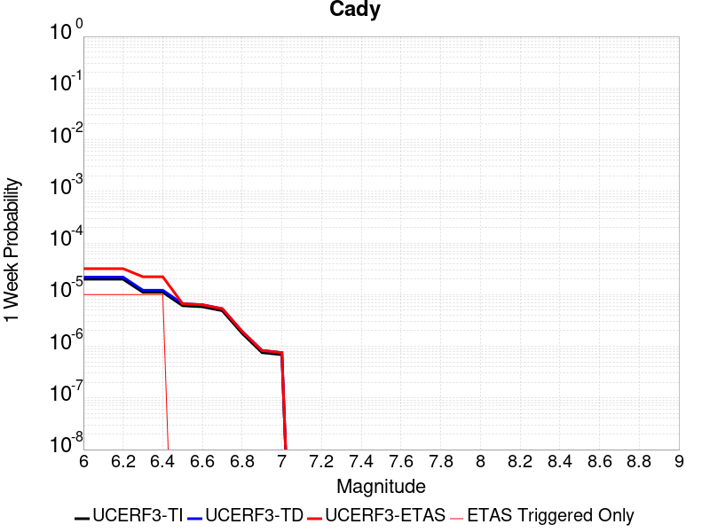 | 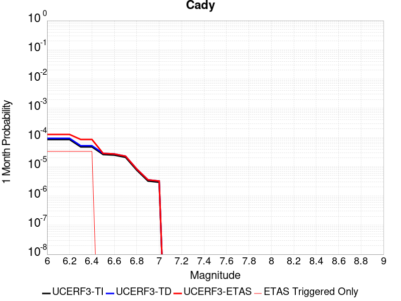 | 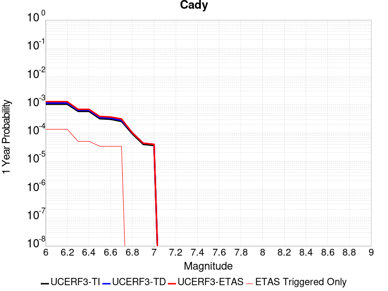 | 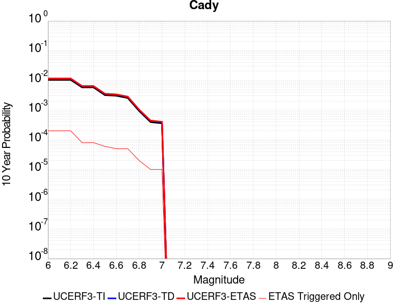 |

| Magnitude | 1 wk TI Prob | 1 wk TD Prob | 1 wk ETAS Prob | 1 wk ETAS/TD Gain | 1 wk ETAS Triggered Only | 1 mo TI Prob | 1 mo TD Prob | 1 mo ETAS Prob | 1 mo ETAS/TD Gain | 1 mo ETAS Triggered Only | 1 yr TI Prob | 1 yr TD Prob | 1 yr ETAS Prob | 1 yr ETAS/TD Gain | 1 yr ETAS Triggered Only | 10 yr TI Prob | 10 yr TD Prob | 10 yr ETAS Prob | 10 yr ETAS/TD Gain | 10 yr ETAS Triggered Only |
|-----|-----|-----|-----|-----|-----|-----|-----|-----|-----|-----|-----|-----|-----|-----|-----|-----|-----|-----|-----|-----|
| 6.0 | 1.9892565E-5 | 2.1859016E-5 | 3.8693666E-5 | 1.7701467 | 1.6835016E-5 | 8.525106E-5 | 9.3678645E-5 | 1.2734553E-4 | 1.3593869 | 3.3670032E-5 | 0.0010374374 | 0.0011400316 | 0.0012745582 | 1.1180025 | 1.3468013E-4 | 0.010326075 | 0.011350849 | 0.011583864 | 1.0205284 | 2.3569024E-4 |
| 6.1 | 1.9892565E-5 | 2.1859016E-5 | 3.8693666E-5 | 1.7701467 | 1.6835016E-5 | 8.525106E-5 | 9.3678645E-5 | 1.2734553E-4 | 1.3593869 | 3.3670032E-5 | 0.0010374374 | 0.0011400316 | 0.0012745582 | 1.1180025 | 1.3468013E-4 | 0.010326075 | 0.011350849 | 0.011583864 | 1.0205284 | 2.3569024E-4 |
| 6.2 | 1.9892565E-5 | 2.1859016E-5 | 3.8693666E-5 | 1.7701467 | 1.6835016E-5 | 8.525106E-5 | 9.3678645E-5 | 1.2734553E-4 | 1.3593869 | 3.3670032E-5 | 0.0010374374 | 0.0011400316 | 0.0012745582 | 1.1180025 | 1.3468013E-4 | 0.010326075 | 0.011350849 | 0.011583864 | 1.0205284 | 2.3569024E-4 |
| 6.3 | 1.1117327E-5 | 1.2176738E-5 | 2.901155E-5 | 2.3825388 | 1.6835016E-5 | 4.764482E-5 | 5.218515E-5 | 6.901929E-5 | 1.3225849 | 1.6835016E-5 | 5.7992124E-4 | 6.3520053E-4 | 6.856735E-4 | 1.0794599 | 5.0505052E-5 | 0.0057841022 | 0.0063369554 | 0.0064373254 | 1.0158389 | 1.01010104E-4 |
| 6.4 | 1.1117327E-5 | 1.2176738E-5 | 2.901155E-5 | 2.3825388 | 1.6835016E-5 | 4.764482E-5 | 5.218515E-5 | 6.901929E-5 | 1.3225849 | 1.6835016E-5 | 5.7992124E-4 | 6.3520053E-4 | 6.856735E-4 | 1.0794599 | 5.0505052E-5 | 0.0057841022 | 0.0063369554 | 0.0064373254 | 1.0158389 | 1.01010104E-4 |
| 6.5 | 6.103093E-6 | 6.672103E-6 | 6.672103E-6 | 1.0 | 0.0 | 2.615585E-5 | 2.8594486E-5 | 2.8594486E-5 | 1.0 | 0.0 | 3.1840094E-4 | 3.4809482E-4 | 3.817531E-4 | 1.0966929 | 3.3670032E-5 | 0.0031794512 | 0.0034767296 | 0.0035438356 | 1.0193014 | 6.7340065E-5 |
| 6.6 | 5.817237E-6 | 6.365738E-6 | 6.365738E-6 | 1.0 | 0.0 | 2.4930776E-5 | 2.728152E-5 | 2.728152E-5 | 1.0 | 0.0 | 3.034899E-4 | 3.3211432E-4 | 3.657732E-4 | 1.1013472 | 3.3670032E-5 | 0.0030307577 | 0.003317402 | 0.0033845187 | 1.0202317 | 6.7340065E-5 |
| 6.7 | 4.8846314E-6 | 5.3406343E-6 | 5.3406343E-6 | 1.0 | 0.0 | 2.0933967E-5 | 2.2888298E-5 | 2.2888298E-5 | 1.0 | 0.0 | 2.5484123E-4 | 2.7864118E-4 | 3.1230183E-4 | 1.1208029 | 3.3670032E-5 | 0.0025454918 | 0.0027840736 | 0.0028512261 | 1.0241202 | 6.7340065E-5 |
| 6.8 | 1.7788773E-6 | 1.9399313E-6 | 1.9399313E-6 | 1.0 | 0.0 | 7.6237375E-6 | 8.313974E-6 | 8.313974E-6 | 1.0 | 0.0 | 9.281505E-5 | 1.01219506E-4 | 1.01219506E-4 | 1.0 | 0.0 | 9.2776294E-4 | 0.0010118886 | 0.0010287066 | 1.0166204 | 1.6835016E-5 |
| 6.9 | 7.5455404E-7 | 8.297202E-7 | 8.297202E-7 | 1.0 | 0.0 | 3.233799E-6 | 3.5559406E-6 | 3.5559406E-6 | 1.0 | 0.0 | 3.937079E-5 | 4.3293054E-5 | 4.3293054E-5 | 1.0 | 0.0 | 3.9363815E-4 | 4.3287914E-4 | 4.3287914E-4 | 1.0 | 0.0 |
| 7.0 | 6.8578805E-7 | 7.541916E-7 | 7.541916E-7 | 1.0 | 0.0 | 2.9390883E-6 | 3.2322475E-6 | 3.2322475E-6 | 1.0 | 0.0 | 3.578281E-5 | 3.9352235E-5 | 3.9352235E-5 | 1.0 | 0.0 | 3.577705E-4 | 3.9348513E-4 | 3.9348513E-4 | 1.0 | 0.0 |

## Manix-Afton Hills
*[(top)](#table-of-contents)*

| 1 Week | 1 Month | 1 Year | 10 Year |
|-----|-----|-----|-----|
| 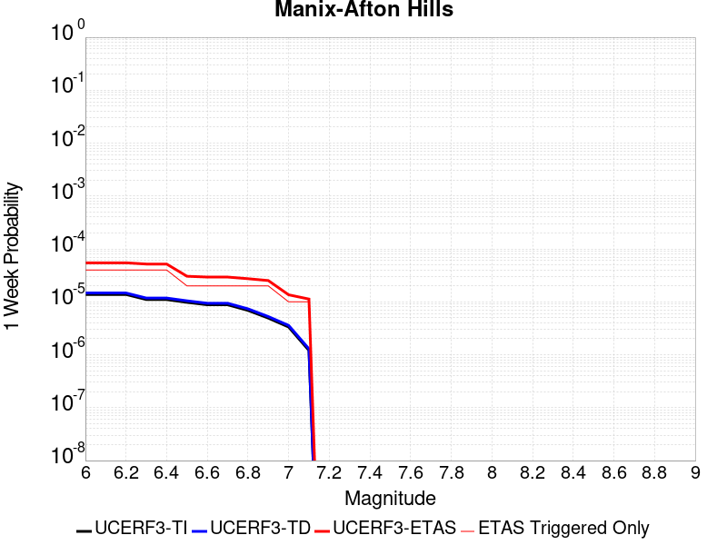 | 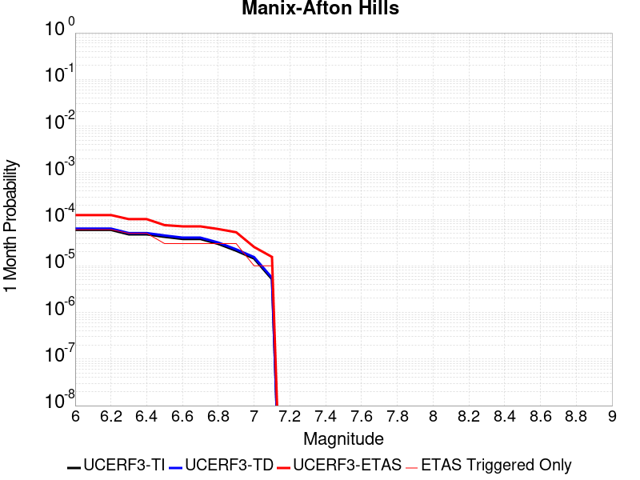 | 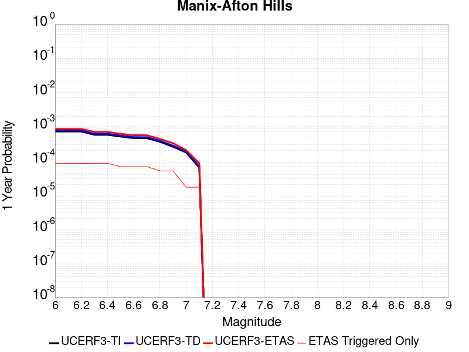 | 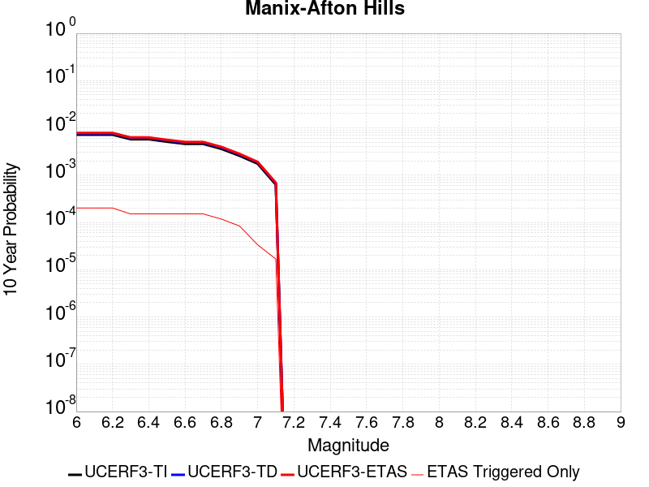 |

| Magnitude | 1 wk TI Prob | 1 wk TD Prob | 1 wk ETAS Prob | 1 wk ETAS/TD Gain | 1 wk ETAS Triggered Only | 1 mo TI Prob | 1 mo TD Prob | 1 mo ETAS Prob | 1 mo ETAS/TD Gain | 1 mo ETAS Triggered Only | 1 yr TI Prob | 1 yr TD Prob | 1 yr ETAS Prob | 1 yr ETAS/TD Gain | 1 yr ETAS Triggered Only | 10 yr TI Prob | 10 yr TD Prob | 10 yr ETAS Prob | 10 yr ETAS/TD Gain | 10 yr ETAS Triggered Only |
|-----|-----|-----|-----|-----|-----|-----|-----|-----|-----|-----|-----|-----|-----|-----|-----|-----|-----|-----|-----|-----|
| 6.0 | 1.3783202E-5 | 1.4711221E-5 | 6.521553E-5 | 4.4330463 | 5.0505052E-5 | 5.906953E-5 | 6.304667E-5 | 1.3038248E-4 | 2.0680313 | 6.7340065E-5 | 7.189342E-4 | 7.673403E-4 | 8.514508E-4 | 1.1096131 | 8.417508E-5 | 0.0071661277 | 0.007648664 | 0.007849139 | 1.0262104 | 2.0202021E-4 |
| 6.1 | 1.3783202E-5 | 1.4711221E-5 | 6.521553E-5 | 4.4330463 | 5.0505052E-5 | 5.906953E-5 | 6.304667E-5 | 1.3038248E-4 | 2.0680313 | 6.7340065E-5 | 7.189342E-4 | 7.673403E-4 | 8.514508E-4 | 1.1096131 | 8.417508E-5 | 0.0071661277 | 0.007648664 | 0.007849139 | 1.0262104 | 2.0202021E-4 |
| 6.2 | 1.3783202E-5 | 1.4711221E-5 | 6.521553E-5 | 4.4330463 | 5.0505052E-5 | 5.906953E-5 | 6.304667E-5 | 1.3038248E-4 | 2.0680313 | 6.7340065E-5 | 7.189342E-4 | 7.673403E-4 | 8.514508E-4 | 1.1096131 | 8.417508E-5 | 0.0071661277 | 0.007648664 | 0.007849139 | 1.0262104 | 2.0202021E-4 |
| 6.3 | 1.10494875E-5 | 1.1793241E-5 | 6.2297695E-5 | 5.2824917 | 5.0505052E-5 | 4.7354086E-5 | 5.054154E-5 | 1.17878204E-4 | 2.3323033 | 6.7340065E-5 | 5.763835E-4 | 6.151799E-4 | 6.9930323E-4 | 1.1367458 | 8.417508E-5 | 0.005748908 | 0.00613581 | 0.0062863957 | 1.0245421 | 1.5151515E-4 |
| 6.4 | 1.10494875E-5 | 1.1793241E-5 | 6.2297695E-5 | 5.2824917 | 5.0505052E-5 | 4.7354086E-5 | 5.054154E-5 | 1.17878204E-4 | 2.3323033 | 6.7340065E-5 | 5.763835E-4 | 6.151799E-4 | 6.9930323E-4 | 1.1367458 | 8.417508E-5 | 0.005748908 | 0.00613581 | 0.0062863957 | 1.0245421 | 1.5151515E-4 |
| 6.5 | 9.788949E-6 | 1.0454414E-5 | 4.4124095E-5 | 4.2206187 | 3.3670032E-5 | 4.1951964E-5 | 4.4803914E-5 | 9.53067E-5 | 2.1271958 | 5.0505052E-5 | 5.1064545E-4 | 5.4536044E-4 | 6.1266375E-4 | 1.1234107 | 6.7340065E-5 | 0.0050947363 | 0.005441148 | 0.005591838 | 1.0276947 | 1.5151515E-4 |
| 6.6 | 8.810006E-6 | 9.413714E-6 | 4.308343E-5 | 4.576667 | 3.3670032E-5 | 3.775662E-5 | 4.0343915E-5 | 9.084693E-5 | 2.2518125 | 5.0505052E-5 | 4.5958988E-4 | 4.9108535E-4 | 5.583923E-4 | 1.1370577 | 6.7340065E-5 | 0.0045864056 | 0.004900884 | 0.005051656 | 1.0307643 | 1.5151515E-4 |
| 6.7 | 8.80128E-6 | 9.404193E-6 | 4.307391E-5 | 4.5802875 | 3.3670032E-5 | 3.7719226E-5 | 4.0303115E-5 | 9.080613E-5 | 2.2530797 | 5.0505052E-5 | 4.591348E-4 | 4.9058883E-4 | 5.5789587E-4 | 1.1371964 | 6.7340065E-5 | 0.004581874 | 0.0048959404 | 0.0050467136 | 1.0307956 | 1.5151515E-4 |
| 6.8 | 6.8994877E-6 | 7.3801443E-6 | 4.104993E-5 | 5.5622125 | 3.3670032E-5 | 2.9568899E-5 | 3.1628853E-5 | 8.2132305E-5 | 2.5967526 | 5.0505052E-5 | 3.5994186E-4 | 3.850214E-4 | 4.35507E-4 | 1.1311241 | 5.0505052E-5 | 0.003593594 | 0.0038443485 | 0.0039617405 | 1.0305363 | 1.1784512E-4 |
| 6.9 | 4.9328037E-6 | 5.2710093E-6 | 3.8940867E-5 | 7.3877435 | 3.3670032E-5 | 2.1140417E-5 | 2.258988E-5 | 7.309379E-5 | 3.2356875 | 5.0505052E-5 | 2.5735417E-4 | 2.7500323E-4 | 3.254944E-4 | 1.1836021 | 5.0505052E-5 | 0.0025705635 | 0.0027472344 | 0.0028311783 | 1.0305557 | 8.417508E-5 |
| 7.0 | 3.347973E-6 | 3.5900646E-6 | 2.0425021E-5 | 5.6893187 | 1.6835016E-5 | 1.4348378E-5 | 1.5385924E-5 | 3.222068E-5 | 2.0941663 | 1.6835016E-5 | 1.746775E-4 | 1.8731161E-4 | 2.0414348E-4 | 1.0898602 | 1.6835016E-5 | 0.0017454025 | 0.00187194 | 0.001905547 | 1.017953 | 3.3670032E-5 |
| 7.1 | 1.2073567E-6 | 1.2934943E-6 | 1.8128489E-5 | 14.015129 | 1.6835016E-5 | 5.1743755E-6 | 5.5435444E-6 | 2.2378468E-5 | 4.036852 | 1.6835016E-5 | 6.29962E-5 | 6.74922E-5 | 8.432608E-5 | 1.2494197 | 1.6835016E-5 | 6.297835E-4 | 6.7487714E-4 | 6.917008E-4 | 1.0249285 | 1.6835016E-5 |

## Death Valley (No)
*[(top)](#table-of-contents)*

| 1 Week | 1 Month | 1 Year | 10 Year |
|-----|-----|-----|-----|
| 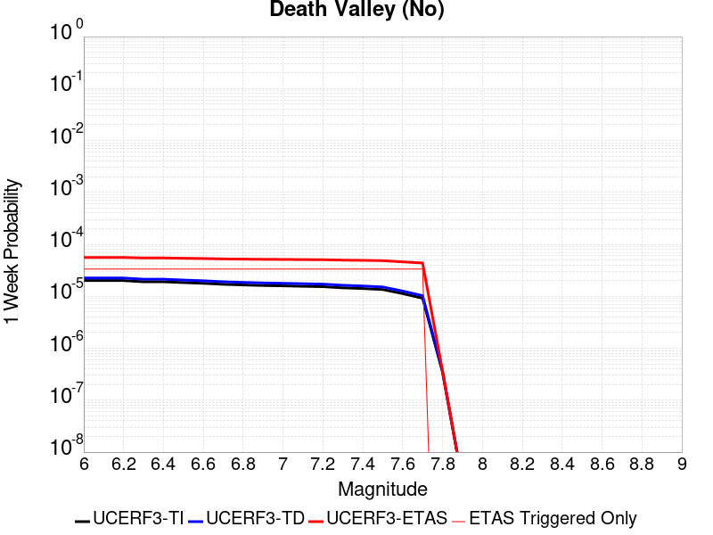 | 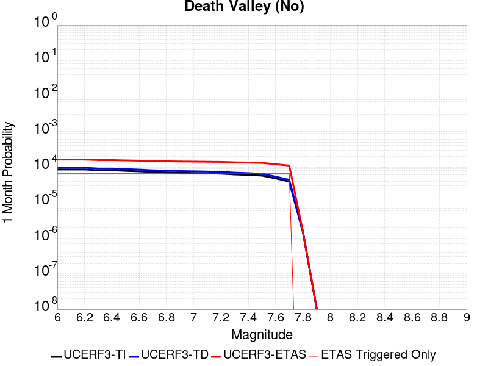 |  | 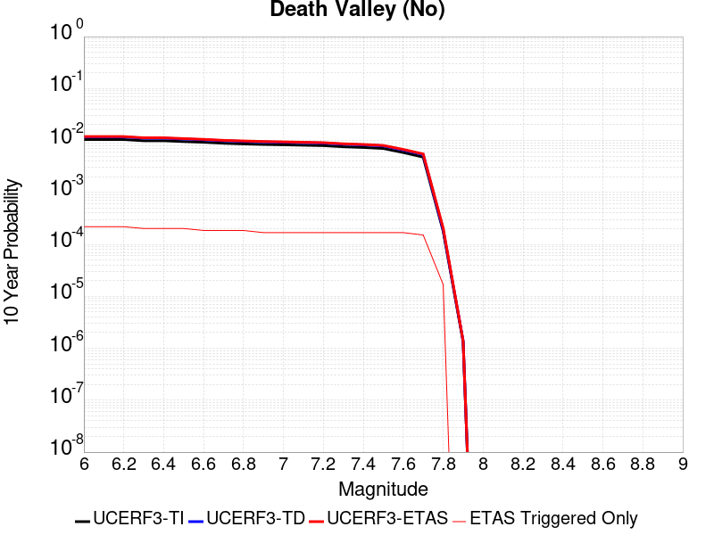 |

| Magnitude | 1 wk TI Prob | 1 wk TD Prob | 1 wk ETAS Prob | 1 wk ETAS/TD Gain | 1 wk ETAS Triggered Only | 1 mo TI Prob | 1 mo TD Prob | 1 mo ETAS Prob | 1 mo ETAS/TD Gain | 1 mo ETAS Triggered Only | 1 yr TI Prob | 1 yr TD Prob | 1 yr ETAS Prob | 1 yr ETAS/TD Gain | 1 yr ETAS Triggered Only | 10 yr TI Prob | 10 yr TD Prob | 10 yr ETAS Prob | 10 yr ETAS/TD Gain | 10 yr ETAS Triggered Only |
|-----|-----|-----|-----|-----|-----|-----|-----|-----|-----|-----|-----|-----|-----|-----|-----|-----|-----|-----|-----|-----|
| 6.0 | 2.0074807E-5 | 2.2500446E-5 | 3.9335082E-5 | 1.7481914 | 1.6835016E-5 | 8.603206E-5 | 9.642696E-5 | 1.3009374E-4 | 1.3491429 | 3.3670032E-5 | 0.001046937 | 0.0011733733 | 0.0012742649 | 1.0859842 | 1.01010104E-4 | 0.010420183 | 0.011672693 | 0.011888994 | 1.0185305 | 2.1885522E-4 |
| 6.1 | 2.0074807E-5 | 2.2500446E-5 | 3.9335082E-5 | 1.7481914 | 1.6835016E-5 | 8.603206E-5 | 9.642696E-5 | 1.3009374E-4 | 1.3491429 | 3.3670032E-5 | 0.001046937 | 0.0011733733 | 0.0012742649 | 1.0859842 | 1.01010104E-4 | 0.010420183 | 0.011672693 | 0.011888994 | 1.0185305 | 2.1885522E-4 |
| 6.2 | 2.0074807E-5 | 2.2500446E-5 | 3.9335082E-5 | 1.7481914 | 1.6835016E-5 | 8.603206E-5 | 9.642696E-5 | 1.3009374E-4 | 1.3491429 | 3.3670032E-5 | 0.001046937 | 0.0011733733 | 0.0012742649 | 1.0859842 | 1.01010104E-4 | 0.010420183 | 0.011672693 | 0.011888994 | 1.0185305 | 2.1885522E-4 |
| 6.3 | 1.9050609E-5 | 2.1337288E-5 | 3.8171947E-5 | 1.7889783 | 1.6835016E-5 | 8.164292E-5 | 9.144236E-5 | 1.251093E-4 | 1.3681768 | 3.3670032E-5 | 9.935491E-4 | 0.0011127489 | 0.0012136465 | 1.0906743 | 1.01010104E-4 | 0.009891188 | 0.011072595 | 0.011272378 | 1.018043 | 2.0202021E-4 |
| 6.4 | 1.9050609E-5 | 2.1337288E-5 | 3.8171947E-5 | 1.7889783 | 1.6835016E-5 | 8.164292E-5 | 9.144236E-5 | 1.251093E-4 | 1.3681768 | 3.3670032E-5 | 9.935491E-4 | 0.0011127489 | 0.0012136465 | 1.0906743 | 1.01010104E-4 | 0.009891188 | 0.011072595 | 0.011272378 | 1.018043 | 2.0202021E-4 |
| 6.5 | 1.8367004E-5 | 2.0561336E-5 | 3.7396007E-5 | 1.8187537 | 1.6835016E-5 | 7.8713354E-5 | 8.811707E-5 | 1.21784135E-4 | 1.382072 | 3.3670032E-5 | 9.5791375E-4 | 0.0010723039 | 0.0011732057 | 1.0940981 | 1.01010104E-4 | 0.009537951 | 0.010672084 | 0.010871949 | 1.0187278 | 2.0202021E-4 |
| 6.6 | 1.779439E-5 | 1.9911244E-5 | 3.6745925E-5 | 1.8454862 | 1.6835016E-5 | 7.625944E-5 | 8.533114E-5 | 1.1899831E-4 | 1.3945471 | 3.3670032E-5 | 9.280632E-4 | 0.0010384179 | 0.0011393231 | 1.097172 | 1.01010104E-4 | 0.009241969 | 0.010336416 | 0.010519687 | 1.0177306 | 1.8518518E-4 |
| 6.7 | 1.7025437E-5 | 1.9043726E-5 | 3.5878424E-5 | 1.8840022 | 1.6835016E-5 | 7.296412E-5 | 8.161345E-5 | 1.1528074E-4 | 1.4125212 | 3.3670032E-5 | 8.87976E-4 | 9.93197E-4 | 0.0010941068 | 1.101601 | 1.01010104E-4 | 0.008844362 | 0.009888301 | 0.010071655 | 1.0185425 | 1.8518518E-4 |
| 6.8 | 1.6545107E-5 | 1.851284E-5 | 3.5347544E-5 | 1.909353 | 1.6835016E-5 | 7.090568E-5 | 7.933836E-5 | 1.1300572E-4 | 1.4243517 | 3.3670032E-5 | 8.629347E-4 | 9.655226E-4 | 0.0010664351 | 1.104516 | 1.01010104E-4 | 0.008595915 | 0.009613981 | 0.009797385 | 1.019077 | 1.8518518E-4 |
| 6.9 | 1.615478E-5 | 1.8087881E-5 | 3.4922596E-5 | 1.9307177 | 1.6835016E-5 | 6.9232934E-5 | 7.751722E-5 | 1.1118465E-4 | 1.4343219 | 3.3670032E-5 | 8.4258494E-4 | 9.433697E-4 | 0.0010274653 | 1.0891439 | 8.417508E-5 | 0.008393973 | 0.009394345 | 0.009561113 | 1.017752 | 1.6835016E-4 |
| 7.0 | 1.5894311E-5 | 1.7805834E-5 | 3.464055E-5 | 1.9454607 | 1.6835016E-5 | 6.81167E-5 | 7.6308526E-5 | 1.0997599E-4 | 1.4412019 | 3.3670032E-5 | 8.2900526E-4 | 9.286663E-4 | 0.0010127632 | 1.0905566 | 8.417508E-5 | 0.008259195 | 0.009248544 | 0.009415338 | 1.0180346 | 1.6835016E-4 |
| 7.1 | 1.5602263E-5 | 1.7483784E-5 | 3.4318506E-5 | 1.9628764 | 1.6835016E-5 | 6.6865134E-5 | 7.4928386E-5 | 1.08595894E-4 | 1.4493293 | 3.3670032E-5 | 8.137789E-4 | 9.118773E-4 | 9.959757E-4 | 1.0922254 | 8.417508E-5 | 0.008108052 | 0.009082039 | 0.00924886 | 1.0183682 | 1.6835016E-4 |
| 7.2 | 1.5323829E-5 | 1.7170905E-5 | 3.4005632E-5 | 1.9804217 | 1.6835016E-5 | 6.56719E-5 | 7.358755E-5 | 1.0725511E-4 | 1.457517 | 3.3670032E-5 | 7.99262E-4 | 8.9556625E-4 | 9.79666E-4 | 1.0939068 | 8.417508E-5 | 0.007963934 | 0.008920249 | 0.009087098 | 1.0187044 | 1.6835016E-4 |
| 7.3 | 1.4556212E-5 | 1.6302716E-5 | 3.3137458E-5 | 2.0326343 | 1.6835016E-5 | 6.238227E-5 | 6.986695E-5 | 1.0353462E-4 | 1.4818828 | 3.3670032E-5 | 7.592395E-4 | 8.503039E-4 | 9.344074E-4 | 1.09891 | 8.417508E-5 | 0.0075665074 | 0.008471149 | 0.008638073 | 1.019705 | 1.6835016E-4 |
| 7.4 | 1.411725E-5 | 1.5808211E-5 | 3.264296E-5 | 2.064937 | 1.6835016E-5 | 6.0501097E-5 | 6.774775E-5 | 1.01415506E-4 | 1.4969574 | 3.3670032E-5 | 7.363519E-4 | 8.245226E-4 | 9.086283E-4 | 1.1020054 | 8.417508E-5 | 0.0073391674 | 0.008215268 | 0.008382236 | 1.020324 | 1.6835016E-4 |
| 7.5 | 1.3503312E-5 | 1.5126531E-5 | 3.1961292E-5 | 2.1129296 | 1.6835016E-5 | 5.7870053E-5 | 6.482641E-5 | 9.849426E-5 | 1.5193539 | 3.3670032E-5 | 7.043401E-4 | 7.8898156E-4 | 8.7309023E-4 | 1.1066041 | 8.417508E-5 | 0.007021119 | 0.007862429 | 0.008029456 | 1.0212436 | 1.6835016E-4 |
| 7.6 | 1.1279839E-5 | 1.2626528E-5 | 2.9461331E-5 | 2.3332884 | 1.6835016E-5 | 4.834127E-5 | 5.4112596E-5 | 8.7780805E-5 | 1.6221881 | 3.3670032E-5 | 5.88396E-4 | 6.58627E-4 | 7.4274663E-4 | 1.1277196 | 8.417508E-5 | 0.005868405 | 0.0065673026 | 0.006734547 | 1.0254662 | 1.6835016E-4 |
| 7.7 | 9.189108E-6 | 1.0283521E-5 | 2.7118365E-5 | 2.63707 | 1.6835016E-5 | 3.93813E-5 | 4.407152E-5 | 7.774007E-5 | 1.7639526 | 3.3670032E-5 | 4.7936183E-4 | 5.3644367E-4 | 6.037476E-4 | 1.1254632 | 6.7340065E-5 | 0.004783291 | 0.0053519984 | 0.0055027027 | 1.0281585 | 1.5151515E-4 |
| 7.8 | 3.4586725E-7 | 3.648288E-7 | 3.648288E-7 | 1.0 | 0.0 | 1.4822873E-6 | 1.5635511E-6 | 1.5635511E-6 | 1.0 | 0.0 | 1.80467E-5 | 1.9036073E-5 | 3.587077E-5 | 1.8843577 | 1.6835016E-5 | 1.8045233E-4 | 1.9034486E-4 | 2.0717668E-4 | 1.088428 | 1.6835016E-5 |
| 7.9 | 2.5591178E-9 | 2.6696871E-9 | 2.6696871E-9 | 1.0 | 0.0 | 1.0967647E-8 | 1.1441516E-8 | 1.1441516E-8 | 1.0 | 0.0 | 1.335311E-7 | 1.3930045E-7 | 1.3930045E-7 | 1.0 | 0.0 | 1.3353102E-6 | 1.3930046E-6 | 1.3930046E-6 | 1.0 | 0.0 |

## Elsinore (Glen Ivy) rev
*[(top)](#table-of-contents)*

| 1 Week | 1 Month | 1 Year | 10 Year |
|-----|-----|-----|-----|
| 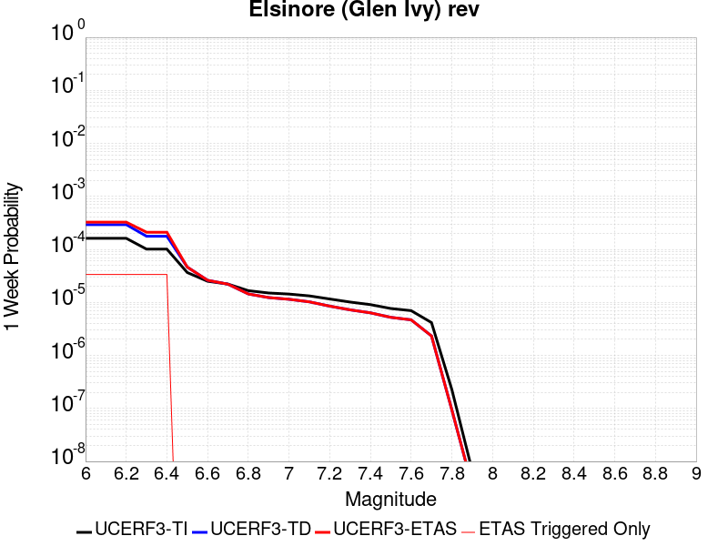 | 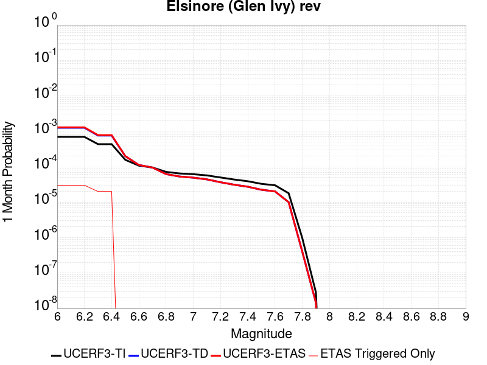 |  | 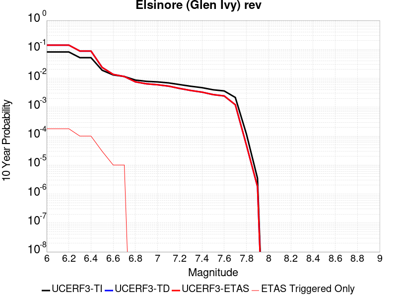 |

| Magnitude | 1 wk TI Prob | 1 wk TD Prob | 1 wk ETAS Prob | 1 wk ETAS/TD Gain | 1 wk ETAS Triggered Only | 1 mo TI Prob | 1 mo TD Prob | 1 mo ETAS Prob | 1 mo ETAS/TD Gain | 1 mo ETAS Triggered Only | 1 yr TI Prob | 1 yr TD Prob | 1 yr ETAS Prob | 1 yr ETAS/TD Gain | 1 yr ETAS Triggered Only | 10 yr TI Prob | 10 yr TD Prob | 10 yr ETAS Prob | 10 yr ETAS/TD Gain | 10 yr ETAS Triggered Only |
|-----|-----|-----|-----|-----|-----|-----|-----|-----|-----|-----|-----|-----|-----|-----|-----|-----|-----|-----|-----|-----|
| 6.0 | 1.6204086E-4 | 2.9362022E-4 | 3.2728034E-4 | 1.1146383 | 3.3670032E-5 | 6.94276E-4 | 0.0012579202 | 0.0013083617 | 1.0400991 | 5.0505052E-5 | 0.008420097 | 0.015235162 | 0.015351213 | 1.0076172 | 1.1784512E-4 | 0.081081145 | 0.13969512 | 0.13985445 | 1.0011405 | 1.8518518E-4 |
| 6.1 | 1.6204086E-4 | 2.9362022E-4 | 3.2728034E-4 | 1.1146383 | 3.3670032E-5 | 6.94276E-4 | 0.0012579202 | 0.0013083617 | 1.0400991 | 5.0505052E-5 | 0.008420097 | 0.015235162 | 0.015351213 | 1.0076172 | 1.1784512E-4 | 0.081081145 | 0.13969512 | 0.13985445 | 1.0011405 | 1.8518518E-4 |
| 6.2 | 1.6204086E-4 | 2.9362022E-4 | 3.2728034E-4 | 1.1146383 | 3.3670032E-5 | 6.94276E-4 | 0.0012579202 | 0.0013083617 | 1.0400991 | 5.0505052E-5 | 0.008420097 | 0.015235162 | 0.015351213 | 1.0076172 | 1.1784512E-4 | 0.081081145 | 0.13969512 | 0.13985445 | 1.0011405 | 1.8518518E-4 |
| 6.3 | 1.0111737E-4 | 1.7703768E-4 | 2.1070176E-4 | 1.190152 | 3.3670032E-5 | 4.332882E-4 | 7.58629E-4 | 7.922735E-4 | 1.0443491 | 3.3670032E-5 | 0.005262531 | 0.0092178825 | 0.0092846025 | 1.007238 | 6.7340065E-5 | 0.0513964 | 0.08702082 | 0.087097675 | 1.0008831 | 8.417508E-5 |
| 6.4 | 1.0111737E-4 | 1.7703768E-4 | 2.1070176E-4 | 1.190152 | 3.3670032E-5 | 4.332882E-4 | 7.58629E-4 | 7.922735E-4 | 1.0443491 | 3.3670032E-5 | 0.005262531 | 0.0092178825 | 0.0092846025 | 1.007238 | 6.7340065E-5 | 0.0513964 | 0.08702082 | 0.087097675 | 1.0008831 | 8.417508E-5 |
| 6.5 | 3.6624708E-5 | 4.639301E-5 | 4.639301E-5 | 1.0 | 0.0 | 1.569536E-4 | 1.9881407E-4 | 1.9881407E-4 | 1.0 | 0.0 | 0.001909235 | 0.0024182373 | 0.002451826 | 1.0138897 | 3.3670032E-5 | 0.01892915 | 0.023740914 | 0.023773784 | 1.0013846 | 3.3670032E-5 |
| 6.6 | 2.5051324E-5 | 2.614908E-5 | 2.614908E-5 | 1.0 | 0.0 | 1.073584E-4 | 1.1206293E-4 | 1.1206293E-4 | 1.0 | 0.0 | 0.0013063047 | 0.0013635567 | 0.0013803688 | 1.0123296 | 1.6835016E-5 | 0.012986525 | 0.013565315 | 0.013581921 | 1.0012242 | 1.6835016E-5 |
| 6.7 | 2.2189772E-5 | 2.207403E-5 | 2.207403E-5 | 1.0 | 0.0 | 9.509556E-5 | 9.459976E-5 | 9.459976E-5 | 1.0 | 0.0 | 0.0011571734 | 0.0011511799 | 0.0011679955 | 1.0146073 | 1.6835016E-5 | 0.011511663 | 0.011466023 | 0.011482664 | 1.0014514 | 1.6835016E-5 |
| 6.8 | 1.6654378E-5 | 1.4438445E-5 | 1.4438445E-5 | 1.0 | 0.0 | 7.137396E-5 | 6.187761E-5 | 6.187761E-5 | 1.0 | 0.0 | 8.686314E-4 | 7.531047E-4 | 7.531047E-4 | 1.0 | 0.0 | 0.008652439 | 0.0075108632 | 0.0075108632 | 1.0 | 0.0 |
| 6.9 | 1.5042909E-5 | 1.23326745E-5 | 1.23326745E-5 | 1.0 | 0.0 | 6.446802E-5 | 5.2853266E-5 | 5.2853266E-5 | 1.0 | 0.0 | 7.8461546E-4 | 6.433017E-4 | 6.433017E-4 | 1.0 | 0.0 | 0.007818509 | 0.006418618 | 0.006418618 | 1.0 | 0.0 |
| 7.0 | 1.4361385E-5 | 1.14519435E-5 | 1.14519435E-5 | 1.0 | 0.0 | 6.154734E-5 | 4.907885E-5 | 4.907885E-5 | 1.0 | 0.0 | 7.490812E-4 | 5.973741E-4 | 5.973741E-4 | 1.0 | 0.0 | 0.007465612 | 0.0059616743 | 0.0059616743 | 1.0 | 0.0 |
| 7.1 | 1.3265571E-5 | 1.0245398E-5 | 1.0245398E-5 | 1.0 | 0.0 | 5.6851208E-5 | 4.3908123E-5 | 4.3908123E-5 | 1.0 | 0.0 | 6.919436E-4 | 5.344528E-4 | 5.344528E-4 | 1.0 | 0.0 | 0.006897931 | 0.0053350315 | 0.0053350315 | 1.0 | 0.0 |
| 7.2 | 1.1596403E-5 | 8.50544E-6 | 8.50544E-6 | 1.0 | 0.0 | 4.9697923E-5 | 3.6451387E-5 | 3.6451387E-5 | 1.0 | 0.0 | 6.049042E-4 | 4.4370696E-4 | 4.4370696E-4 | 1.0 | 0.0 | 0.006032603 | 0.004429626 | 0.004429626 | 1.0 | 0.0 |
| 7.3 | 1.0150827E-5 | 7.23907E-6 | 7.23907E-6 | 1.0 | 0.0 | 4.3502816E-5 | 3.1024225E-5 | 3.1024225E-5 | 1.0 | 0.0 | 5.2951806E-4 | 3.776559E-4 | 3.776559E-4 | 1.0 | 0.0 | 0.005282581 | 0.0037705277 | 0.0037705277 | 1.0 | 0.0 |
| 7.4 | 9.080705E-6 | 6.352785E-6 | 6.352785E-6 | 1.0 | 0.0 | 3.8916725E-5 | 2.7225946E-5 | 2.7225946E-5 | 1.0 | 0.0 | 4.7370812E-4 | 3.3142683E-4 | 3.3142683E-4 | 1.0 | 0.0 | 0.004726996 | 0.0033094764 | 0.0033094764 | 1.0 | 0.0 |
| 7.5 | 7.671649E-6 | 5.2258497E-6 | 5.2258497E-6 | 1.0 | 0.0 | 3.287808E-5 | 2.2396314E-5 | 2.2396314E-5 | 1.0 | 0.0 | 4.0021708E-4 | 2.7264224E-4 | 2.7264224E-4 | 1.0 | 0.0 | 0.0039949706 | 0.0027232026 | 0.0027232026 | 1.0 | 0.0 |
| 7.6 | 6.990086E-6 | 4.687739E-6 | 4.687739E-6 | 1.0 | 0.0 | 2.9957167E-5 | 2.0090161E-5 | 2.0090161E-5 | 1.0 | 0.0 | 3.6466747E-4 | 2.4457145E-4 | 2.4457145E-4 | 1.0 | 0.0 | 0.0036406964 | 0.002443139 | 0.002443139 | 1.0 | 0.0 |
| 7.7 | 4.163505E-6 | 2.3296475E-6 | 2.3296475E-6 | 1.0 | 0.0 | 1.7843471E-5 | 9.984169E-6 | 9.984169E-6 | 1.0 | 0.0 | 2.172226E-4 | 1.21551224E-4 | 1.21551224E-4 | 1.0 | 0.0 | 0.0021701038 | 0.0012149204 | 0.0012149204 | 1.0 | 0.0 |
| 7.8 | 2.2692414E-7 | 9.385943E-8 | 9.385943E-8 | 1.0 | 0.0 | 9.725317E-7 | 4.0225464E-7 | 4.0225464E-7 | 1.0 | 0.0 | 1.1840509E-5 | 4.8974425E-6 | 4.8974425E-6 | 1.0 | 0.0 | 1.1839878E-4 | 4.8973674E-5 | 4.8973674E-5 | 1.0 | 0.0 |
| 7.9 | 6.676829E-9 | 3.4399772E-9 | 3.4399772E-9 | 1.0 | 0.0 | 2.861498E-8 | 1.4742759E-8 | 1.4742759E-8 | 1.0 | 0.0 | 3.4838732E-7 | 1.7949307E-7 | 1.7949307E-7 | 1.0 | 0.0 | 3.4838679E-6 | 1.7949295E-6 | 1.7949295E-6 | 1.0 | 0.0 |

## Ludlow
*[(top)](#table-of-contents)*

| 1 Week | 1 Month | 1 Year | 10 Year |
|-----|-----|-----|-----|
|  | 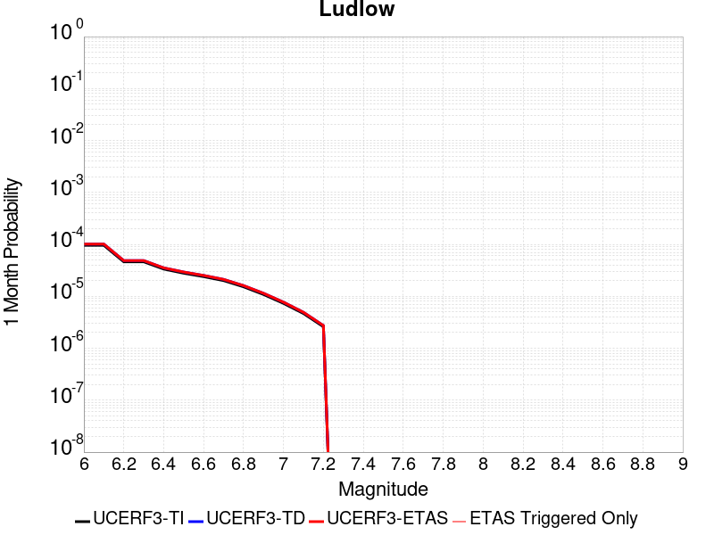 | 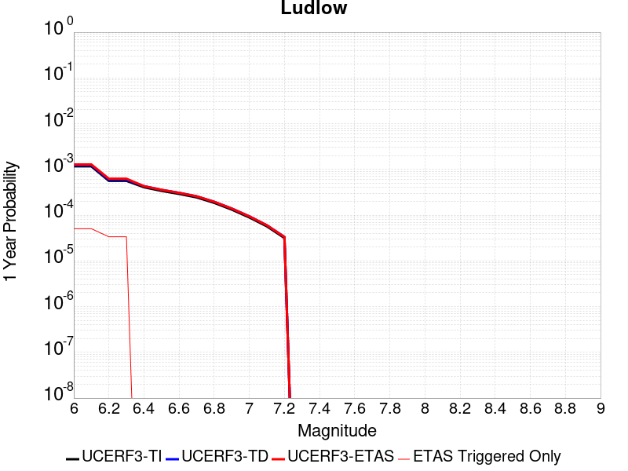 | 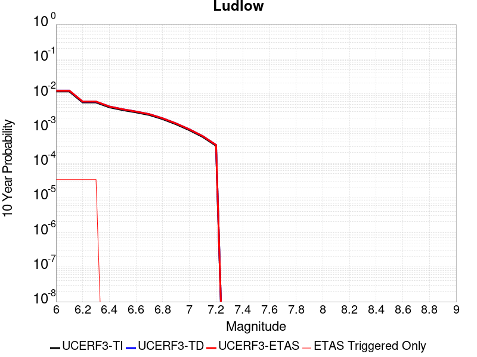 |

| Magnitude | 1 wk TI Prob | 1 wk TD Prob | 1 wk ETAS Prob | 1 wk ETAS/TD Gain | 1 wk ETAS Triggered Only | 1 mo TI Prob | 1 mo TD Prob | 1 mo ETAS Prob | 1 mo ETAS/TD Gain | 1 mo ETAS Triggered Only | 1 yr TI Prob | 1 yr TD Prob | 1 yr ETAS Prob | 1 yr ETAS/TD Gain | 1 yr ETAS Triggered Only | 10 yr TI Prob | 10 yr TD Prob | 10 yr ETAS Prob | 10 yr ETAS/TD Gain | 10 yr ETAS Triggered Only |
|-----|-----|-----|-----|-----|-----|-----|-----|-----|-----|-----|-----|-----|-----|-----|-----|-----|-----|-----|-----|-----|
| 6.0 | 2.2407607E-5 | 2.3657429E-5 | 2.3657429E-5 | 1.0 | 0.0 | 9.602906E-5 | 1.0138529E-4 | 1.18218595E-4 | 1.166033 | 1.6835016E-5 | 0.0011685267 | 0.001233711 | 0.0012841538 | 1.040887 | 5.0505052E-5 | 0.011624013 | 0.012273132 | 0.012456045 | 1.0149034 | 1.8518518E-4 |
| 6.1 | 2.2407607E-5 | 2.3657429E-5 | 2.3657429E-5 | 1.0 | 0.0 | 9.602906E-5 | 1.0138529E-4 | 1.18218595E-4 | 1.166033 | 1.6835016E-5 | 0.0011685267 | 0.001233711 | 0.0012841538 | 1.040887 | 5.0505052E-5 | 0.011624013 | 0.012273132 | 0.012456045 | 1.0149034 | 1.8518518E-4 |
| 6.2 | 1.0781252E-5 | 1.1365745E-5 | 1.1365745E-5 | 1.0 | 0.0 | 4.620455E-5 | 4.870945E-5 | 6.5543645E-5 | 1.3456043 | 1.6835016E-5 | 5.623952E-4 | 5.9288024E-4 | 6.265303E-4 | 1.056757 | 3.3670032E-5 | 0.00560974 | 0.005913404 | 0.006030552 | 1.0198107 | 1.1784512E-4 |
| 6.3 | 1.0781252E-5 | 1.1365745E-5 | 1.1365745E-5 | 1.0 | 0.0 | 4.620455E-5 | 4.870945E-5 | 6.5543645E-5 | 1.3456043 | 1.6835016E-5 | 5.623952E-4 | 5.9288024E-4 | 6.265303E-4 | 1.056757 | 3.3670032E-5 | 0.00560974 | 0.005913404 | 0.006030552 | 1.0198107 | 1.1784512E-4 |
| 6.4 | 7.814439E-6 | 8.237788E-6 | 8.237788E-6 | 1.0 | 0.0 | 3.3490025E-5 | 3.5304336E-5 | 3.5304336E-5 | 1.0 | 0.0 | 4.0766477E-4 | 4.2974693E-4 | 4.2974693E-4 | 1.0 | 0.0 | 0.0040691774 | 0.0042893053 | 0.004339594 | 1.0117241 | 5.0505052E-5 |
| 6.5 | 6.4986366E-6 | 6.850969E-6 | 6.850969E-6 | 1.0 | 0.0 | 2.7851002E-5 | 2.936097E-5 | 2.936097E-5 | 1.0 | 0.0 | 3.390332E-4 | 3.574121E-4 | 3.574121E-4 | 1.0 | 0.0 | 0.003385164 | 0.0035684688 | 0.0036187938 | 1.0141027 | 5.0505052E-5 |
| 6.6 | 5.582177E-6 | 5.8860483E-6 | 5.8860483E-6 | 1.0 | 0.0 | 2.3923398E-5 | 2.522568E-5 | 2.522568E-5 | 1.0 | 0.0 | 2.9122844E-4 | 3.070801E-4 | 3.070801E-4 | 1.0 | 0.0 | 0.0029084706 | 0.003066631 | 0.0031001978 | 1.0109458 | 3.3670032E-5 |
| 6.7 | 4.6858763E-6 | 4.940463E-6 | 4.940463E-6 | 1.0 | 0.0 | 2.0082172E-5 | 2.1173244E-5 | 2.1173244E-5 | 1.0 | 0.0 | 2.4447302E-4 | 2.577543E-4 | 2.577543E-4 | 1.0 | 0.0 | 0.0024420423 | 0.0025746098 | 0.002608193 | 1.013044 | 3.3670032E-5 |
| 6.8 | 3.5584908E-6 | 3.7520454E-6 | 3.7520454E-6 | 1.0 | 0.0 | 1.5250586E-5 | 1.6080097E-5 | 1.6080097E-5 | 1.0 | 0.0 | 1.8566006E-4 | 1.9575801E-4 | 1.9575801E-4 | 1.0 | 0.0 | 0.0018550502 | 0.0019558968 | 0.0019726988 | 1.0085905 | 1.6835016E-5 |
| 6.9 | 2.532834E-6 | 2.6710227E-6 | 2.6710227E-6 | 1.0 | 0.0 | 1.0854958E-5 | 1.1447192E-5 | 1.1447192E-5 | 1.0 | 0.0 | 1.3215111E-4 | 1.3936093E-4 | 1.3936093E-4 | 1.0 | 0.0 | 0.0013207254 | 0.0013927629 | 0.0014095745 | 1.0120707 | 1.6835016E-5 |
| 7.0 | 1.7083285E-6 | 1.801957E-6 | 1.801957E-6 | 1.0 | 0.0 | 7.3213873E-6 | 7.7226505E-6 | 7.7226505E-6 | 1.0 | 0.0 | 8.913424E-5 | 9.4019386E-5 | 9.4019386E-5 | 1.0 | 0.0 | 8.9098496E-4 | 9.3981257E-4 | 9.566318E-4 | 1.0178963 | 1.6835016E-5 |
| 7.1 | 1.0905424E-6 | 1.1497702E-6 | 1.1497702E-6 | 1.0 | 0.0 | 4.6737446E-6 | 4.927578E-6 | 4.927578E-6 | 1.0 | 0.0 | 5.6901354E-5 | 5.999171E-5 | 5.999171E-5 | 1.0 | 0.0 | 5.6886784E-4 | 5.997649E-4 | 5.997649E-4 | 1.0 | 0.0 |
| 7.2 | 6.06668E-7 | 6.387322E-7 | 6.387322E-7 | 1.0 | 0.0 | 2.600003E-6 | 2.7374213E-6 | 2.7374213E-6 | 1.0 | 0.0 | 3.1654577E-5 | 3.3327666E-5 | 3.3327666E-5 | 1.0 | 0.0 | 3.1650066E-4 | 3.332335E-4 | 3.332335E-4 | 1.0 | 0.0 |

## Red Pass
*[(top)](#table-of-contents)*

| 1 Week | 1 Month | 1 Year | 10 Year |
|-----|-----|-----|-----|
| 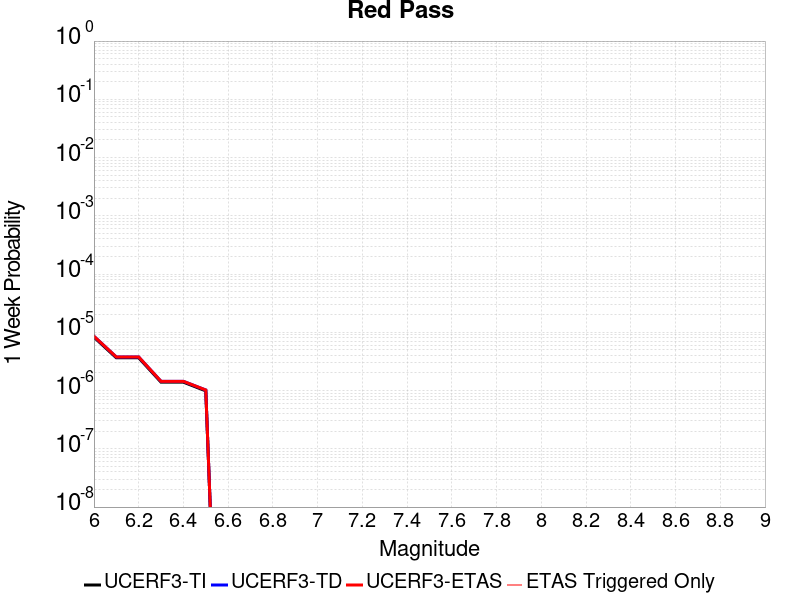 | 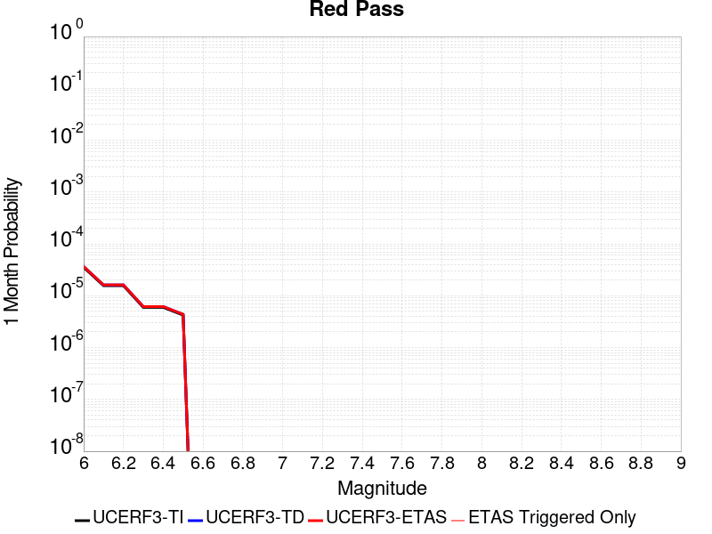 | 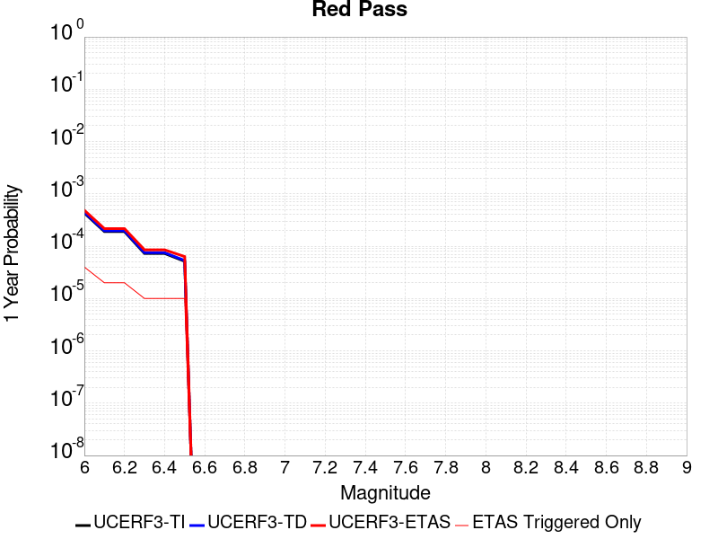 | 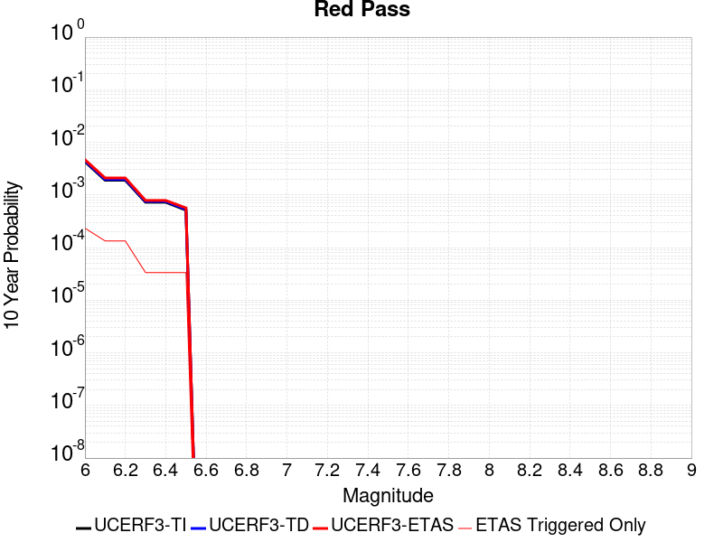 |

| Magnitude | 1 wk TI Prob | 1 wk TD Prob | 1 wk ETAS Prob | 1 wk ETAS/TD Gain | 1 wk ETAS Triggered Only | 1 mo TI Prob | 1 mo TD Prob | 1 mo ETAS Prob | 1 mo ETAS/TD Gain | 1 mo ETAS Triggered Only | 1 yr TI Prob | 1 yr TD Prob | 1 yr ETAS Prob | 1 yr ETAS/TD Gain | 1 yr ETAS Triggered Only | 10 yr TI Prob | 10 yr TD Prob | 10 yr ETAS Prob | 10 yr ETAS/TD Gain | 10 yr ETAS Triggered Only |
|-----|-----|-----|-----|-----|-----|-----|-----|-----|-----|-----|-----|-----|-----|-----|-----|-----|-----|-----|-----|-----|
| 6.0 | 8.258278E-6 | 8.551305E-6 | 8.551305E-6 | 1.0 | 0.0 | 3.539214E-5 | 3.6648038E-5 | 3.6648038E-5 | 1.0 | 0.0 | 4.308141E-4 | 4.4611638E-4 | 5.134264E-4 | 1.15088 | 6.7340065E-5 | 0.0042997985 | 0.004453966 | 0.0046383264 | 1.0413924 | 1.8518518E-4 |
| 6.1 | 3.649988E-6 | 3.7753332E-6 | 3.7753332E-6 | 1.0 | 0.0 | 1.5642712E-5 | 1.6179927E-5 | 1.6179927E-5 | 1.0 | 0.0 | 1.9043336E-4 | 1.9697756E-4 | 2.3064096E-4 | 1.1708996 | 3.3670032E-5 | 0.0019027026 | 0.001968497 | 0.0020693082 | 1.0512123 | 1.01010104E-4 |
| 6.2 | 3.649988E-6 | 3.7753332E-6 | 3.7753332E-6 | 1.0 | 0.0 | 1.5642712E-5 | 1.6179927E-5 | 1.6179927E-5 | 1.0 | 0.0 | 1.9043336E-4 | 1.9697756E-4 | 2.3064096E-4 | 1.1708996 | 3.3670032E-5 | 0.0019027026 | 0.001968497 | 0.0020693082 | 1.0512123 | 1.01010104E-4 |
| 6.3 | 1.3924937E-6 | 1.4411233E-6 | 1.4411233E-6 | 1.0 | 0.0 | 5.9678164E-6 | 6.176236E-6 | 6.176236E-6 | 1.0 | 0.0 | 7.265574E-5 | 7.51945E-5 | 9.202825E-5 | 1.2238694 | 1.6835016E-5 | 7.263199E-4 | 7.518293E-4 | 7.6865166E-4 | 1.0223752 | 1.6835016E-5 |
| 6.4 | 1.3924937E-6 | 1.4411233E-6 | 1.4411233E-6 | 1.0 | 0.0 | 5.9678164E-6 | 6.176236E-6 | 6.176236E-6 | 1.0 | 0.0 | 7.265574E-5 | 7.51945E-5 | 9.202825E-5 | 1.2238694 | 1.6835016E-5 | 7.263199E-4 | 7.518293E-4 | 7.6865166E-4 | 1.0223752 | 1.6835016E-5 |
| 6.5 | 9.876812E-7 | 1.022196E-6 | 1.022196E-6 | 1.0 | 0.0 | 4.2329125E-6 | 4.38084E-6 | 4.38084E-6 | 1.0 | 0.0 | 5.153449E-5 | 5.3336724E-5 | 7.017084E-5 | 1.3156197 | 1.6835016E-5 | 5.1522546E-4 | 5.333672E-4 | 5.501933E-4 | 1.0315468 | 1.6835016E-5 |

## White Wolf (Extension)
*[(top)](#table-of-contents)*

| 1 Week | 1 Month | 1 Year | 10 Year |
|-----|-----|-----|-----|
| 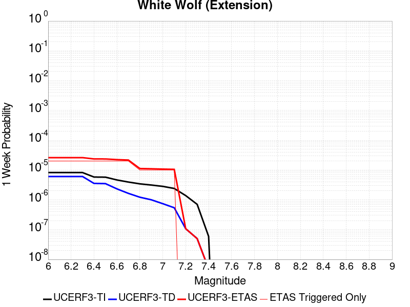 |  |  | 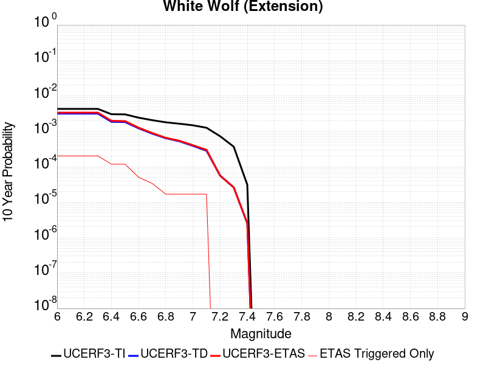 |

| Magnitude | 1 wk TI Prob | 1 wk TD Prob | 1 wk ETAS Prob | 1 wk ETAS/TD Gain | 1 wk ETAS Triggered Only | 1 mo TI Prob | 1 mo TD Prob | 1 mo ETAS Prob | 1 mo ETAS/TD Gain | 1 mo ETAS Triggered Only | 1 yr TI Prob | 1 yr TD Prob | 1 yr ETAS Prob | 1 yr ETAS/TD Gain | 1 yr ETAS Triggered Only | 10 yr TI Prob | 10 yr TD Prob | 10 yr ETAS Prob | 10 yr ETAS/TD Gain | 10 yr ETAS Triggered Only |
|-----|-----|-----|-----|-----|-----|-----|-----|-----|-----|-----|-----|-----|-----|-----|-----|-----|-----|-----|-----|-----|
| 6.0 | 8.222555E-6 | 6.0667057E-6 | 2.290162E-5 | 3.774968 | 1.6835016E-5 | 3.5239045E-5 | 2.5999947E-5 | 9.333826E-5 | 3.5899405 | 6.7340065E-5 | 4.289509E-4 | 3.1650998E-4 | 4.343178E-4 | 1.3722088 | 1.1784512E-4 | 0.0042812387 | 0.0031612439 | 0.0033626256 | 1.0637033 | 2.0202021E-4 |
| 6.1 | 8.222555E-6 | 6.0667057E-6 | 2.290162E-5 | 3.774968 | 1.6835016E-5 | 3.5239045E-5 | 2.5999947E-5 | 9.333826E-5 | 3.5899405 | 6.7340065E-5 | 4.289509E-4 | 3.1650998E-4 | 4.343178E-4 | 1.3722088 | 1.1784512E-4 | 0.0042812387 | 0.0031612439 | 0.0033626256 | 1.0637033 | 2.0202021E-4 |
| 6.2 | 8.222555E-6 | 6.0667057E-6 | 2.290162E-5 | 3.774968 | 1.6835016E-5 | 3.5239045E-5 | 2.5999947E-5 | 9.333826E-5 | 3.5899405 | 6.7340065E-5 | 4.289509E-4 | 3.1650998E-4 | 4.343178E-4 | 1.3722088 | 1.1784512E-4 | 0.0042812387 | 0.0031612439 | 0.0033626256 | 1.0637033 | 2.0202021E-4 |
| 6.3 | 8.222555E-6 | 6.0667057E-6 | 2.290162E-5 | 3.774968 | 1.6835016E-5 | 3.5239045E-5 | 2.5999947E-5 | 9.333826E-5 | 3.5899405 | 6.7340065E-5 | 4.289509E-4 | 3.1650998E-4 | 4.343178E-4 | 1.3722088 | 1.1784512E-4 | 0.0042812387 | 0.0031612439 | 0.0033626256 | 1.0637033 | 2.0202021E-4 |
| 6.4 | 5.821773E-6 | 3.5572016E-6 | 2.0392159E-5 | 5.7326407 | 1.6835016E-5 | 2.4950215E-5 | 1.5245067E-5 | 4.8914586E-5 | 3.208552 | 3.3670032E-5 | 3.0372653E-4 | 1.8559398E-4 | 2.5292154E-4 | 1.362768 | 6.7340065E-5 | 0.0030331176 | 0.0018544982 | 0.0019721247 | 1.0634277 | 1.1784512E-4 |
| 6.5 | 5.766023E-6 | 3.4991353E-6 | 2.0334093E-5 | 5.8111763 | 1.6835016E-5 | 2.4711293E-5 | 1.4996214E-5 | 4.8665745E-5 | 3.2452018 | 3.3670032E-5 | 3.0081844E-4 | 1.8256472E-4 | 2.4989247E-4 | 1.3687885 | 6.7340065E-5 | 0.0030041158 | 0.0018242556 | 0.0019418857 | 1.0644811 | 1.1784512E-4 |
| 6.6 | 4.643576E-6 | 2.332643E-6 | 1.916762E-5 | 8.217126 | 1.6835016E-5 | 1.9900888E-5 | 9.997005E-6 | 2.6831853E-5 | 2.6839893 | 1.6835016E-5 | 2.4226638E-4 | 1.2170716E-4 | 1.553731E-4 | 1.2766142 | 3.3670032E-5 | 0.0024200242 | 0.0012164476 | 0.0012668911 | 1.041468 | 5.0505052E-5 |
| 6.7 | 3.9529173E-6 | 1.6483629E-6 | 1.8483352E-5 | 11.213158 | 1.6835016E-5 | 1.6940963E-5 | 7.064394E-6 | 2.3899293E-5 | 3.3830633 | 1.6835016E-5 | 2.0623671E-4 | 8.600579E-5 | 1.0283936E-4 | 1.195726 | 1.6835016E-5 | 0.002060454 | 8.5974357E-4 | 8.933846E-4 | 1.0391293 | 3.3670032E-5 |
| 6.8 | 3.4377522E-6 | 1.2245362E-6 | 1.8059533E-5 | 14.74806 | 1.6835016E-5 | 1.473314E-5 | 5.2480023E-6 | 2.208293E-5 | 4.207874 | 1.6835016E-5 | 1.7936122E-4 | 6.389264E-5 | 8.072658E-5 | 1.2634723 | 1.6835016E-5 | 0.0017921652 | 6.3875184E-4 | 6.555761E-4 | 1.0263393 | 1.6835016E-5 |
| 6.9 | 3.1367306E-6 | 1.0033893E-6 | 1.7838389E-5 | 17.778133 | 1.6835016E-5 | 1.3443062E-5 | 4.3002333E-6 | 2.1135178E-5 | 4.9148912 | 1.6835016E-5 | 1.63657E-4 | 5.235416E-5 | 6.9188296E-5 | 1.3215435 | 1.6835016E-5 | 0.0016353652 | 5.234259E-4 | 5.402521E-4 | 1.0321463 | 1.6835016E-5 |
| 7.0 | 2.8298145E-6 | 7.4287595E-7 | 1.757788E-5 | 23.661932 | 1.6835016E-5 | 1.2127721E-5 | 3.1837506E-6 | 2.0018713E-5 | 6.287777 | 1.6835016E-5 | 1.47645E-4 | 3.8761526E-5 | 5.559589E-5 | 1.434306 | 1.6835016E-5 | 0.0014754693 | 3.8755263E-4 | 4.0438114E-4 | 1.0434225 | 1.6835016E-5 |
| 7.1 | 2.4091064E-6 | 5.4228286E-7 | 1.7377291E-5 | 32.044697 | 1.6835016E-5 | 1.03247E-5 | 2.3240675E-6 | 1.9159046E-5 | 8.243755 | 1.6835016E-5 | 1.2569598E-4 | 2.8295197E-5 | 4.512974E-5 | 1.594961 | 1.6835016E-5 | 0.001256249 | 2.8291997E-4 | 2.9975025E-4 | 1.0594877 | 1.6835016E-5 |
| 7.2 | 1.3875518E-6 | 1.07434374E-7 | 1.07434374E-7 | 1.0 | 0.0 | 5.9466374E-6 | 4.6043297E-7 | 4.6043297E-7 | 1.0 | 0.0 | 7.23979E-5 | 5.6057584E-6 | 5.6057584E-6 | 1.0 | 0.0 | 7.2374323E-4 | 5.605628E-5 | 5.605628E-5 | 1.0 | 0.0 |
| 7.3 | 7.056077E-7 | 5.0022493E-8 | 5.0022493E-8 | 1.0 | 0.0 | 3.0240296E-6 | 2.143821E-7 | 2.143821E-7 | 1.0 | 0.0 | 3.681694E-5 | 2.6100993E-6 | 2.6100993E-6 | 1.0 | 0.0 | 3.681084E-4 | 2.6100734E-5 | 2.6100734E-5 | 1.0 | 0.0 |
| 7.4 | 5.9334678E-8 | 4.8685624E-9 | 4.8685624E-9 | 1.0 | 0.0 | 2.5429145E-7 | 2.0865269E-8 | 2.0865269E-8 | 1.0 | 0.0 | 3.095994E-6 | 2.5403463E-7 | 2.5403463E-7 | 1.0 | 0.0 | 3.095951E-5 | 2.5403444E-6 | 2.5403444E-6 | 1.0 | 0.0 |

## Death Valley (Fish Lake Valley)
*[(top)](#table-of-contents)*

| 1 Week | 1 Month | 1 Year | 10 Year |
|-----|-----|-----|-----|
| 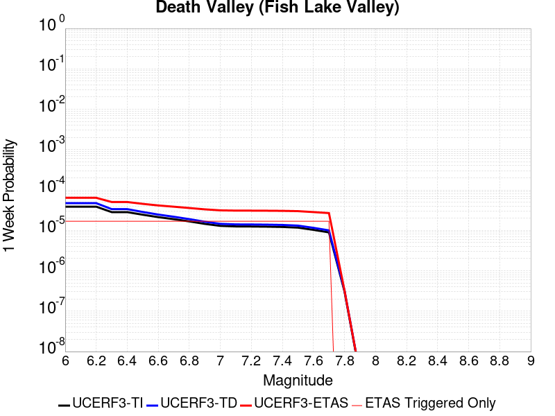 | 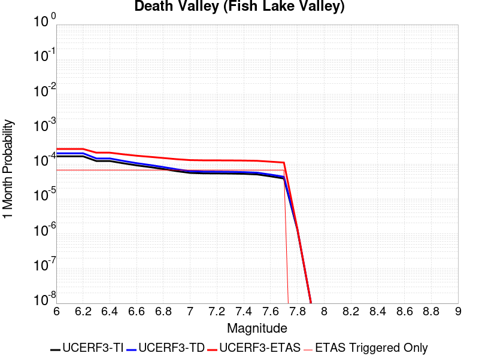 | 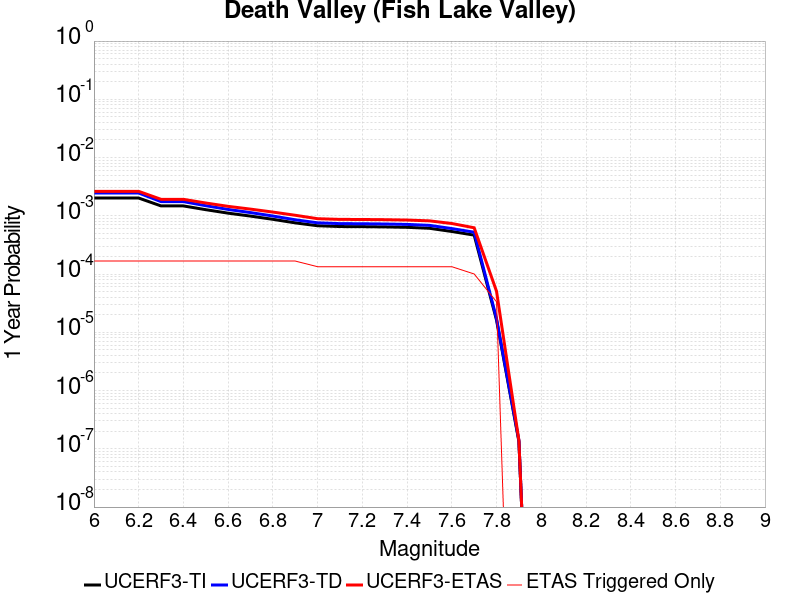 | 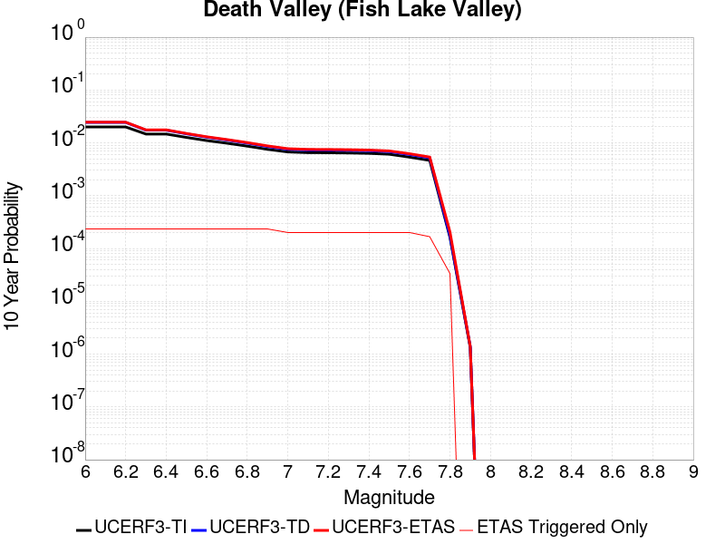 |

| Magnitude | 1 wk TI Prob | 1 wk TD Prob | 1 wk ETAS Prob | 1 wk ETAS/TD Gain | 1 wk ETAS Triggered Only | 1 mo TI Prob | 1 mo TD Prob | 1 mo ETAS Prob | 1 mo ETAS/TD Gain | 1 mo ETAS Triggered Only | 1 yr TI Prob | 1 yr TD Prob | 1 yr ETAS Prob | 1 yr ETAS/TD Gain | 1 yr ETAS Triggered Only | 10 yr TI Prob | 10 yr TD Prob | 10 yr ETAS Prob | 10 yr ETAS/TD Gain | 10 yr ETAS Triggered Only |
|-----|-----|-----|-----|-----|-----|-----|-----|-----|-----|-----|-----|-----|-----|-----|-----|-----|-----|-----|-----|-----|
| 6.0 | 3.872328E-5 | 4.7268895E-5 | 6.4103115E-5 | 1.3561374 | 1.6835016E-5 | 1.6594635E-4 | 2.0256694E-4 | 2.3623015E-4 | 1.1661831 | 3.3670032E-5 | 0.0020185246 | 0.0024636039 | 0.002564365 | 1.0409 | 1.01010104E-4 | 0.02000288 | 0.024388881 | 0.02456955 | 1.0074078 | 1.8518518E-4 |
| 6.1 | 3.872328E-5 | 4.7268895E-5 | 6.4103115E-5 | 1.3561374 | 1.6835016E-5 | 1.6594635E-4 | 2.0256694E-4 | 2.3623015E-4 | 1.1661831 | 3.3670032E-5 | 0.0020185246 | 0.0024636039 | 0.002564365 | 1.0409 | 1.01010104E-4 | 0.02000288 | 0.024388881 | 0.02456955 | 1.0074078 | 1.8518518E-4 |
| 6.2 | 3.872328E-5 | 4.7268895E-5 | 6.4103115E-5 | 1.3561374 | 1.6835016E-5 | 1.6594635E-4 | 2.0256694E-4 | 2.3623015E-4 | 1.1661831 | 3.3670032E-5 | 0.0020185246 | 0.0024636039 | 0.002564365 | 1.0409 | 1.01010104E-4 | 0.02000288 | 0.024388881 | 0.02456955 | 1.0074078 | 1.8518518E-4 |
| 6.3 | 2.8356371E-5 | 3.3610693E-5 | 5.0445145E-5 | 1.5008659 | 1.6835016E-5 | 1.2152165E-4 | 1.4403832E-4 | 1.777035E-4 | 1.2337238 | 3.3670032E-5 | 0.0014785219 | 0.001752335 | 0.0018531681 | 1.0575421 | 1.01010104E-4 | 0.014687235 | 0.01739221 | 0.017574174 | 1.0104624 | 1.8518518E-4 |
| 6.4 | 2.8356371E-5 | 3.3610693E-5 | 5.0445145E-5 | 1.5008659 | 1.6835016E-5 | 1.2152165E-4 | 1.4403832E-4 | 1.777035E-4 | 1.2337238 | 3.3670032E-5 | 0.0014785219 | 0.001752335 | 0.0018531681 | 1.0575421 | 1.01010104E-4 | 0.014687235 | 0.01739221 | 0.017574174 | 1.0104624 | 1.8518518E-4 |
| 6.5 | 2.4448687E-5 | 2.8608209E-5 | 4.5442743E-5 | 1.5884513 | 1.6835016E-5 | 1.0477588E-4 | 1.2260114E-4 | 1.5626704E-4 | 1.274597 | 3.3670032E-5 | 0.0012748998 | 0.0014916973 | 0.0015925567 | 1.0676138 | 1.01010104E-4 | 0.012676105 | 0.014821712 | 0.015004152 | 1.012309 | 1.8518518E-4 |
| 6.6 | 2.1298161E-5 | 2.4660607E-5 | 4.149521E-5 | 1.6826515 | 1.6835016E-5 | 9.127464E-5 | 1.0568422E-4 | 1.393507E-4 | 1.3185573 | 3.3670032E-5 | 0.0011107022 | 0.0012859798 | 0.00138686 | 1.0784461 | 1.01010104E-4 | 0.011051672 | 0.012788794 | 0.012971611 | 1.0142951 | 1.8518518E-4 |
| 6.7 | 1.8959729E-5 | 2.178146E-5 | 3.861611E-5 | 1.772889 | 1.6835016E-5 | 8.125345E-5 | 9.3345916E-5 | 1.2701281E-4 | 1.3606681 | 3.3670032E-5 | 9.888117E-4 | 0.0011359196 | 0.001236815 | 1.0888226 | 1.01010104E-4 | 0.009844234 | 0.011303794 | 0.011486886 | 1.0161974 | 1.8518518E-4 |
| 6.8 | 1.6691629E-5 | 1.9018706E-5 | 3.58534E-5 | 1.8851652 | 1.6835016E-5 | 7.153359E-5 | 8.150629E-5 | 1.1517358E-4 | 1.4130636 | 3.3670032E-5 | 8.7057345E-4 | 9.919042E-4 | 0.001092814 | 1.1017336 | 1.01010104E-4 | 0.008671708 | 0.009876527 | 0.010059883 | 1.0185648 | 1.8518518E-4 |
| 6.9 | 1.450505E-5 | 1.6389824E-5 | 3.3224565E-5 | 2.0271459 | 1.6835016E-5 | 6.216302E-5 | 7.024026E-5 | 1.0390793E-4 | 1.4793215 | 3.3670032E-5 | 7.5657194E-4 | 8.548484E-4 | 9.557722E-4 | 1.1180604 | 1.01010104E-4 | 0.007540013 | 0.008516532 | 0.008700141 | 1.021559 | 1.8518518E-4 |
| 7.0 | 1.2940855E-5 | 1.453821E-5 | 3.1372983E-5 | 2.1579673 | 1.6835016E-5 | 5.545963E-5 | 6.230516E-5 | 9.59731E-5 | 1.5403715 | 3.3670032E-5 | 6.750118E-4 | 7.583071E-4 | 8.424184E-4 | 1.1109197 | 8.417508E-5 | 0.006729651 | 0.0075578135 | 0.0077248914 | 1.0221066 | 1.6835016E-4 |
| 7.1 | 1.2544658E-5 | 1.4078437E-5 | 3.0913216E-5 | 2.1957848 | 1.6835016E-5 | 5.3761712E-5 | 6.033479E-5 | 9.40028E-5 | 1.5580196 | 3.3670032E-5 | 6.5435225E-4 | 7.343341E-4 | 8.184474E-4 | 1.1145436 | 8.417508E-5 | 0.006524288 | 0.0073196692 | 0.007486787 | 1.0228313 | 1.6835016E-4 |
| 7.2 | 1.2489416E-5 | 1.4015902E-5 | 3.0850682E-5 | 2.2011201 | 1.6835016E-5 | 5.3524967E-5 | 6.00668E-5 | 9.373481E-5 | 1.5605094 | 3.3670032E-5 | 6.514716E-4 | 7.310735E-4 | 8.1518706E-4 | 1.1150548 | 8.417508E-5 | 0.006495651 | 0.007287278 | 0.007454401 | 1.0229336 | 1.6835016E-4 |
| 7.3 | 1.2368307E-5 | 1.3880038E-5 | 3.0714822E-5 | 2.2128773 | 1.6835016E-5 | 5.3005948E-5 | 5.948455E-5 | 9.315259E-5 | 1.5659962 | 3.3670032E-5 | 6.451563E-4 | 7.239894E-4 | 8.0810353E-4 | 1.1161815 | 8.417508E-5 | 0.0064328653 | 0.0072168987 | 0.007384034 | 1.0231589 | 1.6835016E-4 |
| 7.4 | 1.2161707E-5 | 1.3648089E-5 | 3.0482877E-5 | 2.2334905 | 1.6835016E-5 | 5.212056E-5 | 5.8490532E-5 | 9.2158596E-5 | 1.5756156 | 3.3670032E-5 | 6.3438306E-4 | 7.118952E-4 | 7.960103E-4 | 1.1181567 | 8.417508E-5 | 0.006325751 | 0.0070967353 | 0.007263891 | 1.0235538 | 1.6835016E-4 |
| 7.5 | 1.1707948E-5 | 1.314573E-5 | 2.9980525E-5 | 2.2806284 | 1.6835016E-5 | 5.0175953E-5 | 5.6337656E-5 | 9.000579E-5 | 1.5976133 | 3.3670032E-5 | 6.10721E-4 | 6.857007E-4 | 7.69818E-4 | 1.1226736 | 8.417508E-5 | 0.0060904534 | 0.0068364325 | 0.0070036314 | 1.0244571 | 1.6835016E-4 |
| 7.6 | 1.0319538E-5 | 1.157981E-5 | 2.8414632E-5 | 2.453808 | 1.6835016E-5 | 4.4225842E-5 | 4.9626844E-5 | 8.329521E-5 | 1.6784304 | 3.3670032E-5 | 5.383166E-4 | 6.040445E-4 | 6.8816874E-4 | 1.1392683 | 8.417508E-5 | 0.0053701443 | 0.0060245576 | 0.006191894 | 1.0277756 | 1.6835016E-4 |
| 7.7 | 8.937764E-6 | 1.0022941E-5 | 2.685779E-5 | 2.6796317 | 1.6835016E-5 | 3.830414E-5 | 4.295478E-5 | 7.662337E-5 | 1.7838147 | 3.3670032E-5 | 4.6625308E-4 | 5.2285404E-4 | 5.9015886E-4 | 1.1287259 | 6.7340065E-5 | 0.0046527605 | 0.005216748 | 0.005367473 | 1.0288925 | 1.5151515E-4 |
| 7.8 | 3.108007E-7 | 3.2846788E-7 | 3.2846788E-7 | 1.0 | 0.0 | 1.3320023E-6 | 1.4077187E-6 | 1.4077187E-6 | 1.0 | 0.0 | 1.6217007E-5 | 1.7138846E-5 | 3.3973574E-5 | 1.9822557 | 1.6835016E-5 | 1.6215823E-4 | 1.713756E-4 | 1.8820775E-4 | 1.0982177 | 1.6835016E-5 |
| 7.9 | 2.5591178E-9 | 2.6696871E-9 | 2.6696871E-9 | 1.0 | 0.0 | 1.0967647E-8 | 1.1441516E-8 | 1.1441516E-8 | 1.0 | 0.0 | 1.335311E-7 | 1.3930045E-7 | 1.3930045E-7 | 1.0 | 0.0 | 1.3353102E-6 | 1.3930046E-6 | 1.3930046E-6 | 1.0 | 0.0 |

## Baker
*[(top)](#table-of-contents)*

| 1 Week | 1 Month | 1 Year | 10 Year |
|-----|-----|-----|-----|
| 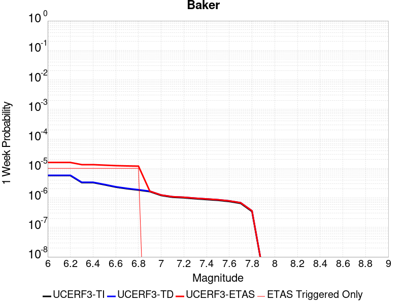 | 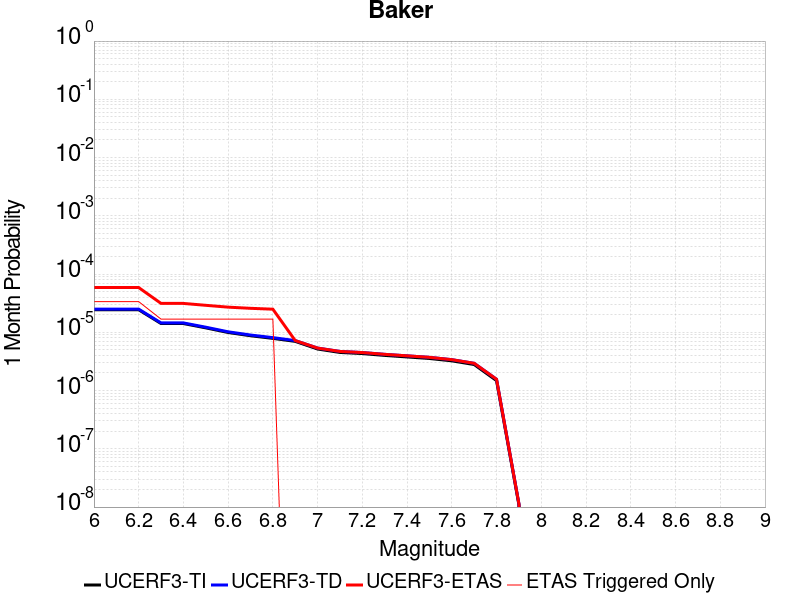 | 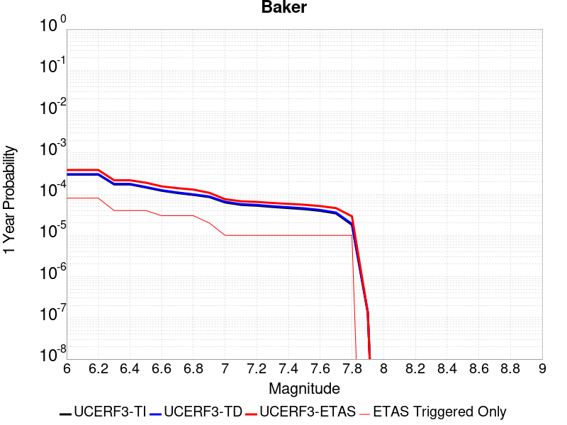 | 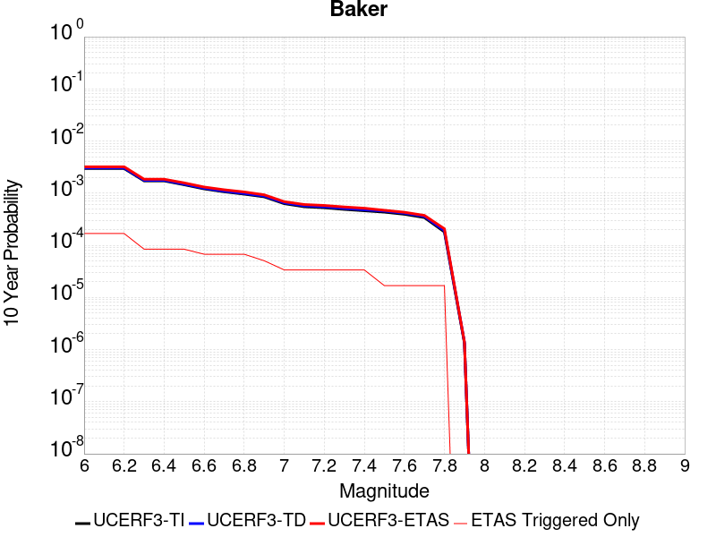 |

| Magnitude | 1 wk TI Prob | 1 wk TD Prob | 1 wk ETAS Prob | 1 wk ETAS/TD Gain | 1 wk ETAS Triggered Only | 1 mo TI Prob | 1 mo TD Prob | 1 mo ETAS Prob | 1 mo ETAS/TD Gain | 1 mo ETAS Triggered Only | 1 yr TI Prob | 1 yr TD Prob | 1 yr ETAS Prob | 1 yr ETAS/TD Gain | 1 yr ETAS Triggered Only | 10 yr TI Prob | 10 yr TD Prob | 10 yr ETAS Prob | 10 yr ETAS/TD Gain | 10 yr ETAS Triggered Only |
|-----|-----|-----|-----|-----|-----|-----|-----|-----|-----|-----|-----|-----|-----|-----|-----|-----|-----|-----|-----|-----|
| 6.0 | 5.695525E-6 | 5.834856E-6 | 2.2669774E-5 | 3.885233 | 1.6835016E-5 | 2.4409164E-5 | 2.500631E-5 | 5.86755E-5 | 2.346428 | 3.3670032E-5 | 2.9714106E-4 | 3.044133E-4 | 4.2222254E-4 | 1.3870043 | 1.1784512E-4 | 0.0029674405 | 0.0030403587 | 0.003208197 | 1.0552034 | 1.6835016E-4 |
| 6.1 | 5.695525E-6 | 5.834856E-6 | 2.2669774E-5 | 3.885233 | 1.6835016E-5 | 2.4409164E-5 | 2.500631E-5 | 5.86755E-5 | 2.346428 | 3.3670032E-5 | 2.9714106E-4 | 3.044133E-4 | 4.2222254E-4 | 1.3870043 | 1.1784512E-4 | 0.0029674405 | 0.0030403587 | 0.003208197 | 1.0552034 | 1.6835016E-4 |
| 6.2 | 5.695525E-6 | 5.834856E-6 | 2.2669774E-5 | 3.885233 | 1.6835016E-5 | 2.4409164E-5 | 2.500631E-5 | 5.86755E-5 | 2.346428 | 3.3670032E-5 | 2.9714106E-4 | 3.044133E-4 | 4.2222254E-4 | 1.3870043 | 1.1784512E-4 | 0.0029674405 | 0.0030403587 | 0.003208197 | 1.0552034 | 1.6835016E-4 |
| 6.3 | 3.2995713E-6 | 3.3836786E-6 | 2.0218638E-5 | 5.9753423 | 1.6835016E-5 | 1.4140943E-5 | 1.4501402E-5 | 3.1336174E-5 | 2.1609066 | 1.6835016E-5 | 1.7215237E-4 | 1.7654074E-4 | 2.4386891E-4 | 1.3813747 | 6.7340065E-5 | 0.0017201907 | 0.0017640521 | 0.0018480786 | 1.0476327 | 8.417508E-5 |
| 6.4 | 3.2995713E-6 | 3.3836786E-6 | 2.0218638E-5 | 5.9753423 | 1.6835016E-5 | 1.4140943E-5 | 1.4501402E-5 | 3.1336174E-5 | 2.1609066 | 1.6835016E-5 | 1.7215237E-4 | 1.7654074E-4 | 2.4386891E-4 | 1.3813747 | 6.7340065E-5 | 0.0017201907 | 0.0017640521 | 0.0018480786 | 1.0476327 | 8.417508E-5 |
| 6.5 | 2.782202E-6 | 2.8558507E-6 | 1.9690819E-5 | 6.8949056 | 1.6835016E-5 | 1.1923668E-5 | 1.2239304E-5 | 2.9074115E-5 | 2.3754714 | 1.6835016E-5 | 1.4516099E-4 | 1.4900367E-4 | 2.163337E-4 | 1.4518683 | 6.7340065E-5 | 0.001450662 | 0.0014890704 | 0.0015731201 | 1.0564444 | 8.417508E-5 |
| 6.6 | 2.3163404E-6 | 2.380929E-6 | 1.9215906E-5 | 8.07076 | 1.6835016E-5 | 9.927136E-6 | 1.0203942E-5 | 2.7038786E-5 | 2.6498375 | 1.6835016E-5 | 1.20856166E-4 | 1.2422612E-4 | 1.7472489E-4 | 1.4065069 | 5.0505052E-5 | 0.0012079047 | 0.001241587 | 0.0013088434 | 1.0541698 | 6.7340065E-5 |
| 6.7 | 2.037056E-6 | 2.0965088E-6 | 1.893149E-5 | 9.030008 | 1.6835016E-5 | 8.7302105E-6 | 8.985007E-6 | 2.5819872E-5 | 2.873662 | 1.6835016E-5 | 1.0628513E-4 | 1.0938713E-4 | 1.5988667E-4 | 1.4616587 | 5.0505052E-5 | 0.0010623431 | 0.0010933491 | 0.0011606155 | 1.0615233 | 6.7340065E-5 |
| 6.8 | 1.8356744E-6 | 1.8915364E-6 | 1.8726521E-5 | 9.900165 | 1.6835016E-5 | 7.867153E-6 | 8.10656E-6 | 2.494144E-5 | 3.0766983 | 1.6835016E-5 | 9.577837E-5 | 9.869304E-5 | 1.491931E-4 | 1.5116882 | 5.0505052E-5 | 9.57371E-4 | 9.865061E-4 | 0.0010537797 | 1.0681938 | 6.7340065E-5 |
| 6.9 | 1.6310546E-6 | 1.6832144E-6 | 1.6832144E-6 | 1.0 | 0.0 | 6.9902153E-6 | 7.213757E-6 | 7.213757E-6 | 1.0 | 0.0 | 8.510255E-5 | 8.782406E-5 | 1.2149114E-4 | 1.3833468 | 3.3670032E-5 | 8.5069967E-4 | 8.779048E-4 | 9.283655E-4 | 1.0574785 | 5.0505052E-5 |
| 7.0 | 1.2058036E-6 | 1.2508729E-6 | 1.2508729E-6 | 1.0 | 0.0 | 5.1677193E-6 | 5.3608724E-6 | 5.3608724E-6 | 1.0 | 0.0 | 6.291517E-5 | 6.526669E-5 | 8.210061E-5 | 1.2579252 | 1.6835016E-5 | 6.289736E-4 | 6.5247755E-4 | 6.861256E-4 | 1.0515697 | 3.3670032E-5 |
| 7.1 | 1.052382E-6 | 1.0951668E-6 | 1.0951668E-6 | 1.0 | 0.0 | 4.5102006E-6 | 4.693564E-6 | 4.693564E-6 | 1.0 | 0.0 | 5.491031E-5 | 5.7142646E-5 | 7.3976706E-5 | 1.294597 | 1.6835016E-5 | 5.4896745E-4 | 5.712804E-4 | 6.049312E-4 | 1.0589042 | 3.3670032E-5 |
| 7.2 | 1.0067454E-6 | 1.0487769E-6 | 1.0487769E-6 | 1.0 | 0.0 | 4.3146156E-6 | 4.4947506E-6 | 4.4947506E-6 | 1.0 | 0.0 | 5.252918E-5 | 5.4722223E-5 | 7.1556315E-5 | 1.3076282 | 1.6835016E-5 | 5.251676E-4 | 5.4708833E-4 | 5.807399E-4 | 1.0615103 | 3.3670032E-5 |
| 7.3 | 9.3596316E-7 | 9.76778E-7 | 9.76778E-7 | 1.0 | 0.0 | 4.0112645E-6 | 4.186185E-6 | 4.186185E-6 | 1.0 | 0.0 | 4.8836053E-5 | 5.0965617E-5 | 6.7799774E-5 | 1.3303043 | 1.6835016E-5 | 4.8825322E-4 | 5.095401E-4 | 5.4319296E-4 | 1.0660456 | 3.3670032E-5 |
| 7.4 | 8.8117395E-7 | 9.2077187E-7 | 9.2077187E-7 | 1.0 | 0.0 | 3.7764542E-6 | 3.9461593E-6 | 3.9461593E-6 | 1.0 | 0.0 | 4.5977362E-5 | 4.8043436E-5 | 6.487765E-5 | 1.3503956 | 1.6835016E-5 | 4.596785E-4 | 4.8033125E-4 | 5.139851E-4 | 1.0700638 | 3.3670032E-5 |
| 7.5 | 8.292386E-7 | 8.674649E-7 | 8.674649E-7 | 1.0 | 0.0 | 3.5538749E-6 | 3.7177015E-6 | 3.7177015E-6 | 1.0 | 0.0 | 4.326757E-5 | 4.5262084E-5 | 6.209634E-5 | 1.3719285 | 1.6835016E-5 | 4.3259145E-4 | 4.5252938E-4 | 4.6935678E-4 | 1.0371852 | 1.6835016E-5 |
| 7.6 | 7.553842E-7 | 7.9145207E-7 | 7.9145207E-7 | 1.0 | 0.0 | 3.2373566E-6 | 3.3919332E-6 | 3.3919332E-6 | 1.0 | 0.0 | 3.9414106E-5 | 4.129601E-5 | 5.8130332E-5 | 1.4076501 | 1.6835016E-5 | 3.9407116E-4 | 4.1288408E-4 | 4.2971215E-4 | 1.0407574 | 1.6835016E-5 |
| 7.7 | 6.5285366E-7 | 6.852842E-7 | 6.852842E-7 | 1.0 | 0.0 | 2.797941E-6 | 2.9369291E-6 | 2.9369291E-6 | 1.0 | 0.0 | 3.40644E-5 | 3.5756533E-5 | 5.2590945E-5 | 1.4708067 | 1.6835016E-5 | 3.405918E-4 | 3.5750846E-4 | 3.7433745E-4 | 1.047073 | 1.6835016E-5 |
| 7.8 | 3.4586725E-7 | 3.648288E-7 | 3.648288E-7 | 1.0 | 0.0 | 1.4822873E-6 | 1.5635511E-6 | 1.5635511E-6 | 1.0 | 0.0 | 1.80467E-5 | 1.9036073E-5 | 3.587077E-5 | 1.8843577 | 1.6835016E-5 | 1.8045233E-4 | 1.9034486E-4 | 2.0717668E-4 | 1.088428 | 1.6835016E-5 |
| 7.9 | 2.5591178E-9 | 2.6696871E-9 | 2.6696871E-9 | 1.0 | 0.0 | 1.0967647E-8 | 1.1441516E-8 | 1.1441516E-8 | 1.0 | 0.0 | 1.335311E-7 | 1.3930045E-7 | 1.3930045E-7 | 1.0 | 0.0 | 1.3353102E-6 | 1.3930046E-6 | 1.3930046E-6 | 1.0 | 0.0 |

## Scodie Lineament
*[(top)](#table-of-contents)*

| 1 Week | 1 Month | 1 Year | 10 Year |
|-----|-----|-----|-----|
| 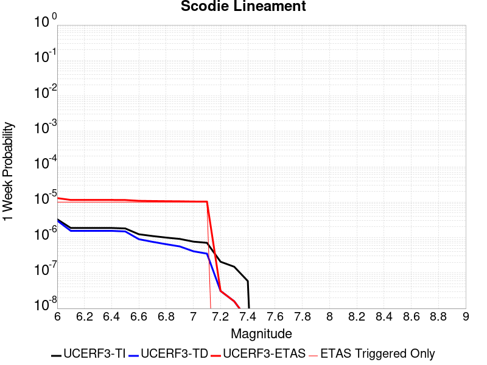 | 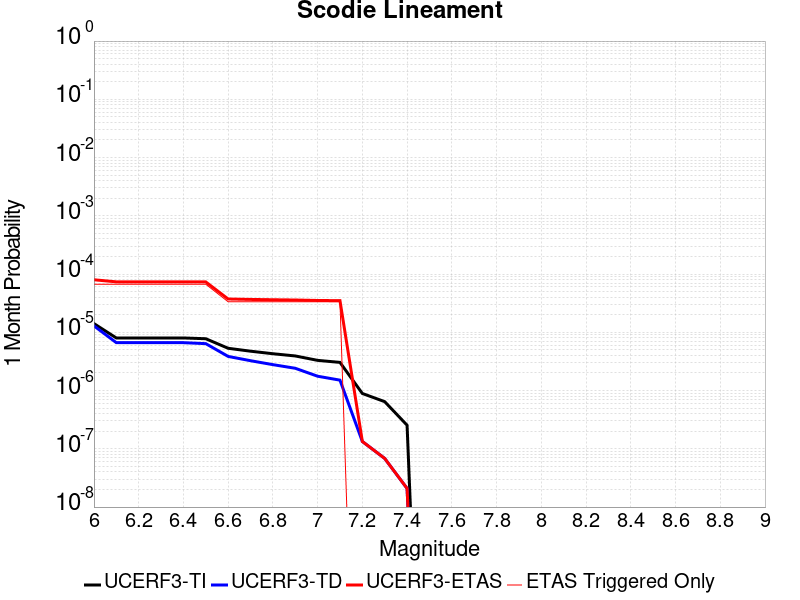 | 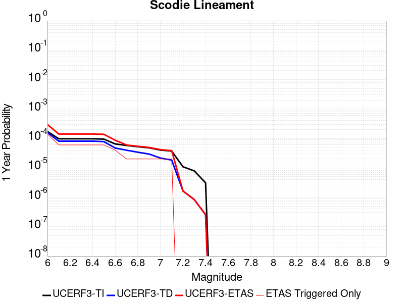 | 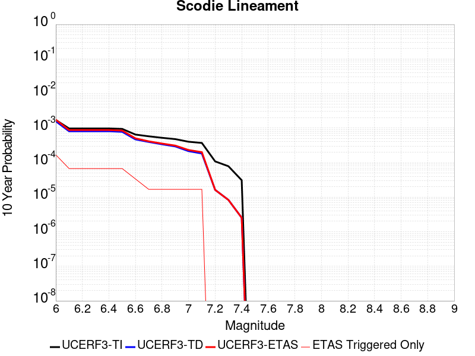 |

| Magnitude | 1 wk TI Prob | 1 wk TD Prob | 1 wk ETAS Prob | 1 wk ETAS/TD Gain | 1 wk ETAS Triggered Only | 1 mo TI Prob | 1 mo TD Prob | 1 mo ETAS Prob | 1 mo ETAS/TD Gain | 1 mo ETAS Triggered Only | 1 yr TI Prob | 1 yr TD Prob | 1 yr ETAS Prob | 1 yr ETAS/TD Gain | 1 yr ETAS Triggered Only | 10 yr TI Prob | 10 yr TD Prob | 10 yr ETAS Prob | 10 yr ETAS/TD Gain | 10 yr ETAS Triggered Only |
|-----|-----|-----|-----|-----|-----|-----|-----|-----|-----|-----|-----|-----|-----|-----|-----|-----|-----|-----|-----|-----|
| 6.0 | 3.2919327E-6 | 3.0133565E-6 | 1.9848323E-5 | 6.586782 | 1.6835016E-5 | 1.4108206E-5 | 1.2914339E-5 | 4.6583937E-5 | 3.6071484 | 3.3670032E-5 | 1.7175387E-4 | 1.5722391E-4 | 2.9188287E-4 | 1.8564789 | 1.3468013E-4 | 0.0017162118 | 0.0015714383 | 0.001739524 | 1.1069629 | 1.6835016E-4 |
| 6.1 | 1.8663811E-6 | 1.5490589E-6 | 1.838405E-5 | 11.867883 | 1.6835016E-5 | 7.998751E-6 | 6.6388097E-6 | 4.030862E-5 | 6.071664 | 3.3670032E-5 | 9.738045E-5 | 8.082501E-5 | 1.3132597E-4 | 1.6248186 | 5.0505052E-5 | 9.7337784E-4 | 8.0800493E-4 | 8.752906E-4 | 1.0832738 | 6.7340065E-5 |
| 6.2 | 1.8663811E-6 | 1.5490589E-6 | 1.838405E-5 | 11.867883 | 1.6835016E-5 | 7.998751E-6 | 6.6388097E-6 | 4.030862E-5 | 6.071664 | 3.3670032E-5 | 9.738045E-5 | 8.082501E-5 | 1.3132597E-4 | 1.6248186 | 5.0505052E-5 | 9.7337784E-4 | 8.0800493E-4 | 8.752906E-4 | 1.0832738 | 6.7340065E-5 |
| 6.3 | 1.8663811E-6 | 1.5490589E-6 | 1.838405E-5 | 11.867883 | 1.6835016E-5 | 7.998751E-6 | 6.6388097E-6 | 4.030862E-5 | 6.071664 | 3.3670032E-5 | 9.738045E-5 | 8.082501E-5 | 1.3132597E-4 | 1.6248186 | 5.0505052E-5 | 9.7337784E-4 | 8.0800493E-4 | 8.752906E-4 | 1.0832738 | 6.7340065E-5 |
| 6.4 | 1.8663811E-6 | 1.5490589E-6 | 1.838405E-5 | 11.867883 | 1.6835016E-5 | 7.998751E-6 | 6.6388097E-6 | 4.030862E-5 | 6.071664 | 3.3670032E-5 | 9.738045E-5 | 8.082501E-5 | 1.3132597E-4 | 1.6248186 | 5.0505052E-5 | 9.7337784E-4 | 8.0800493E-4 | 8.752906E-4 | 1.0832738 | 6.7340065E-5 |
| 6.5 | 1.8106311E-6 | 1.4909926E-6 | 1.8325984E-5 | 12.29113 | 1.6835016E-5 | 7.759824E-6 | 6.3899556E-6 | 4.0059775E-5 | 6.269179 | 3.3670032E-5 | 9.447177E-5 | 7.779543E-5 | 1.2829655E-4 | 1.6491529 | 5.0505052E-5 | 9.4431615E-4 | 7.777306E-4 | 8.450183E-4 | 1.086518 | 6.7340065E-5 |
| 6.6 | 1.2414679E-6 | 8.9976135E-7 | 1.7734763E-5 | 19.710518 | 1.6835016E-5 | 5.320566E-6 | 3.8561147E-6 | 2.0691066E-5 | 5.365781 | 1.6835016E-5 | 6.477596E-5 | 4.6947276E-5 | 8.0615726E-5 | 1.7171545 | 3.3670032E-5 | 6.475708E-4 | 4.6938224E-4 | 5.030365E-4 | 1.071699 | 3.3670032E-5 |
| 6.7 | 1.1062215E-6 | 7.5943603E-7 | 1.759444E-5 | 23.167772 | 1.6835016E-5 | 4.7409408E-6 | 3.254722E-6 | 2.0089685E-5 | 6.172473 | 1.6835016E-5 | 5.7719422E-5 | 3.9625593E-5 | 5.6459943E-5 | 1.4248353 | 1.6835016E-5 | 5.770443E-4 | 3.9619225E-4 | 4.130206E-4 | 1.0424752 | 1.6835016E-5 |
| 6.8 | 1.0006736E-6 | 6.5004406E-7 | 1.748505E-5 | 26.898254 | 1.6835016E-5 | 4.288594E-6 | 2.7859005E-6 | 1.9620871E-5 | 7.0429187 | 1.6835016E-5 | 5.221238E-5 | 3.3917873E-5 | 5.075232E-5 | 1.4963297 | 1.6835016E-5 | 5.220012E-4 | 3.3913302E-4 | 3.5596234E-4 | 1.0496244 | 1.6835016E-5 |
| 6.9 | 9.167364E-7 | 5.6316645E-7 | 1.7398173E-5 | 30.893484 | 1.6835016E-5 | 3.9288643E-6 | 2.4135686E-6 | 1.9248544E-5 | 7.975139 | 1.6835016E-5 | 4.7832873E-5 | 2.9384859E-5 | 4.6219382E-5 | 1.5728978 | 1.6835016E-5 | 4.782258E-4 | 2.9381542E-4 | 3.1064547E-4 | 1.0572811 | 1.6835016E-5 |
| 7.0 | 7.6987664E-7 | 4.113416E-7 | 1.7246351E-5 | 41.92708 | 1.6835016E-5 | 3.2994672E-6 | 1.7628915E-6 | 1.8597879E-5 | 10.549644 | 1.6835016E-5 | 4.0170275E-5 | 2.1463033E-5 | 3.8297687E-5 | 1.7843559 | 1.6835016E-5 | 4.0163012E-4 | 2.1461345E-4 | 2.3144486E-4 | 1.0784266 | 1.6835016E-5 |
| 7.1 | 7.1038727E-7 | 3.5211795E-7 | 1.7187129E-5 | 48.810715 | 1.6835016E-5 | 3.0445133E-6 | 1.5090762E-6 | 1.8344068E-5 | 12.155826 | 1.6835016E-5 | 3.706632E-5 | 1.8372884E-5 | 3.520759E-5 | 1.91628 | 1.6835016E-5 | 3.7060137E-4 | 1.8371714E-4 | 2.0054907E-4 | 1.0916187 | 1.6835016E-5 |
| 7.2 | 2.0799602E-7 | 3.1187685E-8 | 3.1187685E-8 | 1.0 | 0.0 | 8.914113E-7 | 1.336615E-7 | 1.336615E-7 | 1.0 | 0.0 | 1.0852878E-5 | 1.6273277E-6 | 1.6273277E-6 | 1.0 | 0.0 | 1.08523476E-4 | 1.6273165E-5 | 1.6273165E-5 | 1.0 | 0.0 |
| 7.3 | 1.5048182E-7 | 1.5946263E-8 | 1.5946263E-8 | 1.0 | 0.0 | 6.449219E-7 | 6.834112E-8 | 6.834112E-8 | 1.0 | 0.0 | 7.851896E-6 | 8.320529E-7 | 8.320529E-7 | 1.0 | 0.0 | 7.851618E-5 | 8.3205005E-6 | 8.3205005E-6 | 1.0 | 0.0 |
| 7.4 | 5.9334678E-8 | 4.8685624E-9 | 4.8685624E-9 | 1.0 | 0.0 | 2.5429145E-7 | 2.0865269E-8 | 2.0865269E-8 | 1.0 | 0.0 | 3.095994E-6 | 2.5403463E-7 | 2.5403463E-7 | 1.0 | 0.0 | 3.095951E-5 | 2.5403444E-6 | 2.5403444E-6 | 1.0 | 0.0 |

## Lake Isabella (Seismicity)
*[(top)](#table-of-contents)*

| 1 Week | 1 Month | 1 Year | 10 Year |
|-----|-----|-----|-----|
| 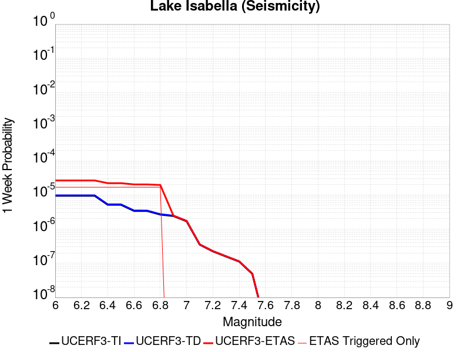 | 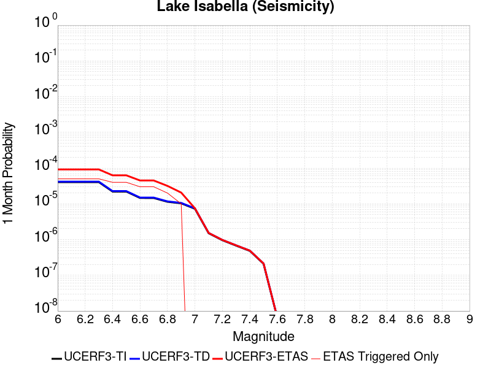 | 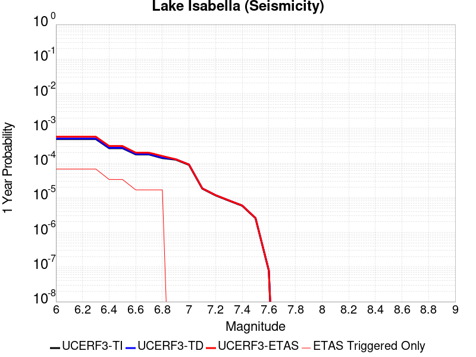 | 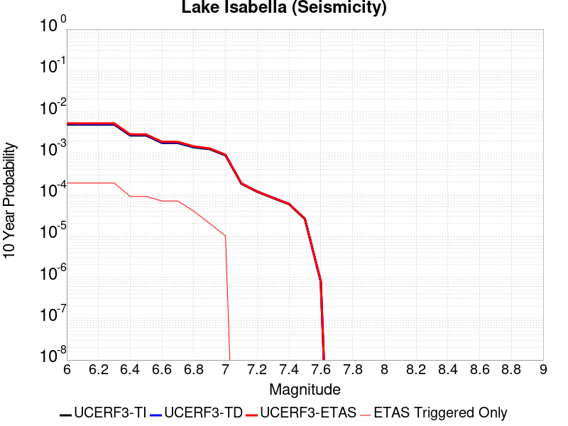 |

| Magnitude | 1 wk TI Prob | 1 wk TD Prob | 1 wk ETAS Prob | 1 wk ETAS/TD Gain | 1 wk ETAS Triggered Only | 1 mo TI Prob | 1 mo TD Prob | 1 mo ETAS Prob | 1 mo ETAS/TD Gain | 1 mo ETAS Triggered Only | 1 yr TI Prob | 1 yr TD Prob | 1 yr ETAS Prob | 1 yr ETAS/TD Gain | 1 yr ETAS Triggered Only | 10 yr TI Prob | 10 yr TD Prob | 10 yr ETAS Prob | 10 yr ETAS/TD Gain | 10 yr ETAS Triggered Only |
|-----|-----|-----|-----|-----|-----|-----|-----|-----|-----|-----|-----|-----|-----|-----|-----|-----|-----|-----|-----|-----|
| 6.0 | 9.431637E-6 | 9.741694E-6 | 2.6576547E-5 | 2.7281237 | 1.6835016E-5 | 4.0420677E-5 | 4.1749525E-5 | 5.858384E-5 | 1.4032217 | 1.6835016E-5 | 4.920106E-4 | 5.0819496E-4 | 5.7550083E-4 | 1.132441 | 6.7340065E-5 | 0.004909227 | 0.005071621 | 0.0052391174 | 1.0330262 | 1.6835016E-4 |
| 6.1 | 9.431637E-6 | 9.741694E-6 | 2.6576547E-5 | 2.7281237 | 1.6835016E-5 | 4.0420677E-5 | 4.1749525E-5 | 5.858384E-5 | 1.4032217 | 1.6835016E-5 | 4.920106E-4 | 5.0819496E-4 | 5.7550083E-4 | 1.132441 | 6.7340065E-5 | 0.004909227 | 0.005071621 | 0.0052391174 | 1.0330262 | 1.6835016E-4 |
| 6.2 | 9.431637E-6 | 9.741694E-6 | 2.6576547E-5 | 2.7281237 | 1.6835016E-5 | 4.0420677E-5 | 4.1749525E-5 | 5.858384E-5 | 1.4032217 | 1.6835016E-5 | 4.920106E-4 | 5.0819496E-4 | 5.7550083E-4 | 1.132441 | 6.7340065E-5 | 0.004909227 | 0.005071621 | 0.0052391174 | 1.0330262 | 1.6835016E-4 |
| 6.3 | 9.431637E-6 | 9.741694E-6 | 2.6576547E-5 | 2.7281237 | 1.6835016E-5 | 4.0420677E-5 | 4.1749525E-5 | 5.858384E-5 | 1.4032217 | 1.6835016E-5 | 4.920106E-4 | 5.0819496E-4 | 5.7550083E-4 | 1.132441 | 6.7340065E-5 | 0.004909227 | 0.005071621 | 0.0052391174 | 1.0330262 | 1.6835016E-4 |
| 6.4 | 5.144063E-6 | 5.3000977E-6 | 2.2135026E-5 | 4.176343 | 1.6835016E-5 | 2.2045799E-5 | 2.2714525E-5 | 3.954916E-5 | 1.7411397 | 1.6835016E-5 | 2.6837454E-4 | 2.765177E-4 | 3.1017844E-4 | 1.1217308 | 3.3670032E-5 | 0.0026805066 | 0.002762077 | 0.0028292309 | 1.0243129 | 6.7340065E-5 |
| 6.5 | 5.144063E-6 | 5.3000977E-6 | 2.2135026E-5 | 4.176343 | 1.6835016E-5 | 2.2045799E-5 | 2.2714525E-5 | 3.954916E-5 | 1.7411397 | 1.6835016E-5 | 2.6837454E-4 | 2.765177E-4 | 3.1017844E-4 | 1.1217308 | 3.3670032E-5 | 0.0026805066 | 0.002762077 | 0.0028292309 | 1.0243129 | 6.7340065E-5 |
| 6.6 | 3.4009804E-6 | 3.4987995E-6 | 2.0333757E-5 | 5.8116384 | 1.6835016E-5 | 1.4575549E-5 | 1.4994778E-5 | 3.1829542E-5 | 2.1227086 | 1.6835016E-5 | 1.7744285E-4 | 1.8254772E-4 | 1.9937968E-4 | 1.0922058 | 1.6835016E-5 | 0.0017730123 | 0.0018241355 | 0.0018745485 | 1.0276366 | 5.0505052E-5 |
| 6.7 | 3.3880428E-6 | 3.4856662E-6 | 2.0320624E-5 | 5.8297677 | 1.6835016E-5 | 1.4520103E-5 | 1.4938492E-5 | 3.177326E-5 | 2.1269388 | 1.6835016E-5 | 1.767679E-4 | 1.8186258E-4 | 1.9869453E-4 | 1.0925531 | 1.6835016E-5 | 0.0017662736 | 0.0018172951 | 0.0018677084 | 1.0277408 | 5.0505052E-5 |
| 6.8 | 2.6582E-6 | 2.7337105E-6 | 1.956868E-5 | 7.158286 | 1.6835016E-5 | 1.1392236E-5 | 1.1715857E-5 | 2.8550678E-5 | 2.436926 | 1.6835016E-5 | 1.3869164E-4 | 1.4263256E-4 | 1.5946518E-4 | 1.1180139 | 1.6835016E-5 | 0.0013860512 | 0.0014255423 | 0.0014591643 | 1.0235854 | 3.3670032E-5 |
| 6.9 | 2.406011E-6 | 2.474338E-6 | 2.474338E-6 | 1.0 | 0.0 | 1.0311434E-5 | 1.0604271E-5 | 1.0604271E-5 | 1.0 | 0.0 | 1.2553448E-4 | 1.2910066E-4 | 1.2910066E-4 | 1.0 | 0.0 | 0.0012546359 | 0.0012903863 | 0.0012903863 | 1.0 | 0.0 |
| 7.0 | 1.6953097E-6 | 1.7429437E-6 | 1.7429437E-6 | 1.0 | 0.0 | 7.265593E-6 | 7.469743E-6 | 7.469743E-6 | 1.0 | 0.0 | 8.8455E-5 | 9.094137E-5 | 9.094137E-5 | 1.0 | 0.0 | 8.84198E-4 | 9.0914435E-4 | 9.0914435E-4 | 1.0 | 0.0 |
| 7.1 | 3.5013824E-7 | 3.571492E-7 | 3.571492E-7 | 1.0 | 0.0 | 1.5005916E-6 | 1.5306384E-6 | 1.5306384E-6 | 1.0 | 0.0 | 1.826955E-5 | 1.8635366E-5 | 1.8635366E-5 | 1.0 | 0.0 | 1.8268047E-4 | 1.863383E-4 | 1.863383E-4 | 1.0 | 0.0 |
| 7.2 | 2.2321095E-7 | 2.2750632E-7 | 2.2750632E-7 | 1.0 | 0.0 | 9.56618E-7 | 9.750268E-7 | 9.750268E-7 | 1.0 | 0.0 | 1.1646762E-5 | 1.1870887E-5 | 1.1870887E-5 | 1.0 | 0.0 | 1.1646151E-4 | 1.1870263E-4 | 1.1870263E-4 | 1.0 | 0.0 |
| 7.3 | 1.5760406E-7 | 1.6060963E-7 | 1.6060963E-7 | 1.0 | 0.0 | 6.7544585E-7 | 6.883268E-7 | 6.883268E-7 | 1.0 | 0.0 | 8.223522E-6 | 8.380347E-6 | 8.380347E-6 | 1.0 | 0.0 | 8.2232174E-5 | 8.3800376E-5 | 8.3800376E-5 | 1.0 | 0.0 |
| 7.4 | 1.1216497E-7 | 1.1431735E-7 | 1.1431735E-7 | 1.0 | 0.0 | 4.8070694E-7 | 4.8993144E-7 | 4.8993144E-7 | 1.0 | 0.0 | 5.852591E-6 | 5.964899E-6 | 5.964899E-6 | 1.0 | 0.0 | 5.8524372E-5 | 5.9647435E-5 | 5.9647435E-5 | 1.0 | 0.0 |
| 7.5 | 4.885185E-8 | 4.9787864E-8 | 4.9787864E-8 | 1.0 | 0.0 | 2.0936506E-7 | 2.1337654E-7 | 2.1337654E-7 | 1.0 | 0.0 | 2.5490165E-6 | 2.5978566E-6 | 2.5978566E-6 | 1.0 | 0.0 | 2.5489873E-5 | 2.597828E-5 | 2.597828E-5 | 1.0 | 0.0 |
| 7.6 | 1.504641E-9 | 1.5317939E-9 | 1.5317939E-9 | 1.0 | 0.0 | 6.4484613E-9 | 6.5648313E-9 | 6.5648313E-9 | 1.0 | 0.0 | 7.851001E-8 | 7.992682E-8 | 7.992682E-8 | 1.0 | 0.0 | 7.8509987E-7 | 7.992682E-7 | 7.992682E-7 | 1.0 | 0.0 |

## Channel Islands Thrust
*[(top)](#table-of-contents)*

| 1 Week | 1 Month | 1 Year | 10 Year |
|-----|-----|-----|-----|
| 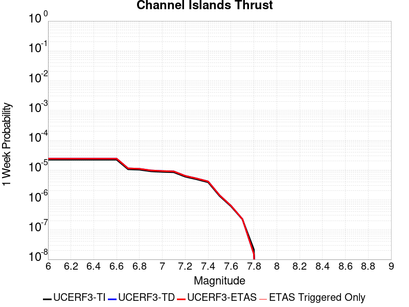 | 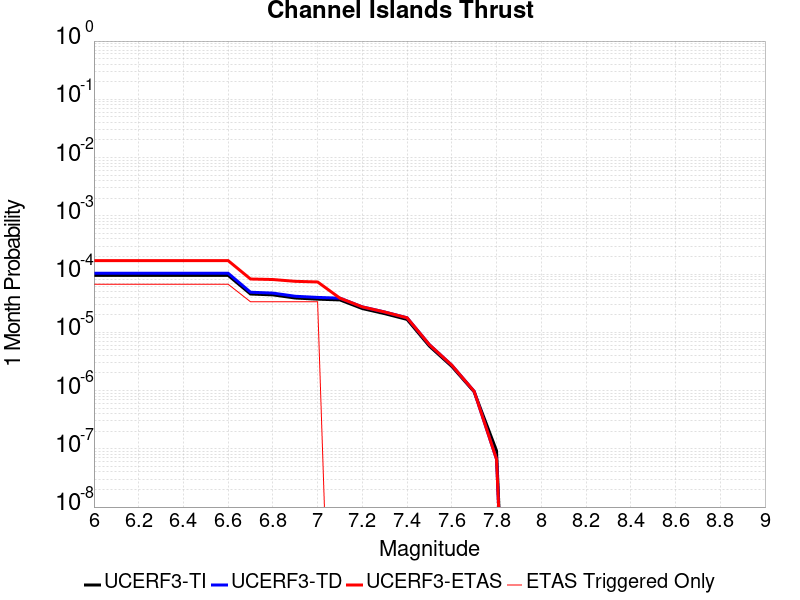 | 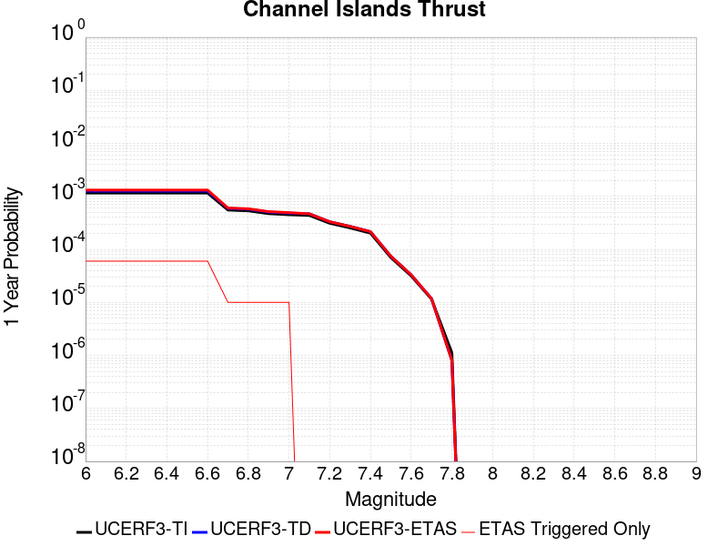 | 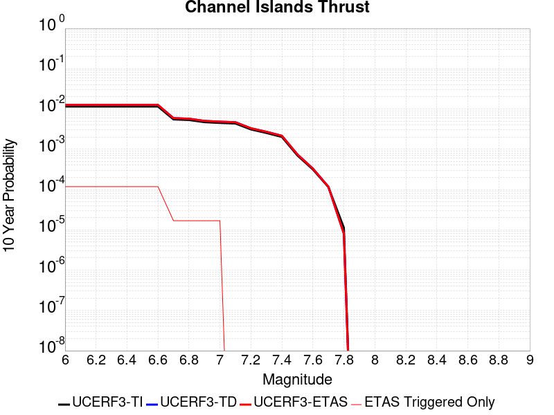 |

| Magnitude | 1 wk TI Prob | 1 wk TD Prob | 1 wk ETAS Prob | 1 wk ETAS/TD Gain | 1 wk ETAS Triggered Only | 1 mo TI Prob | 1 mo TD Prob | 1 mo ETAS Prob | 1 mo ETAS/TD Gain | 1 mo ETAS Triggered Only | 1 yr TI Prob | 1 yr TD Prob | 1 yr ETAS Prob | 1 yr ETAS/TD Gain | 1 yr ETAS Triggered Only | 10 yr TI Prob | 10 yr TD Prob | 10 yr ETAS Prob | 10 yr ETAS/TD Gain | 10 yr ETAS Triggered Only |
|-----|-----|-----|-----|-----|-----|-----|-----|-----|-----|-----|-----|-----|-----|-----|-----|-----|-----|-----|-----|-----|
| 6.0 | 2.2156251E-5 | 2.4092304E-5 | 2.4092304E-5 | 1.0 | 0.0 | 9.495191E-5 | 1.03249244E-4 | 1.369158E-4 | 1.3260708 | 3.3670032E-5 | 0.0011554264 | 0.0012564411 | 0.0013573243 | 1.0802928 | 1.01010104E-4 | 0.011494373 | 0.012503966 | 0.012620337 | 1.0093068 | 1.1784512E-4 |
| 6.1 | 2.2156251E-5 | 2.4092304E-5 | 2.4092304E-5 | 1.0 | 0.0 | 9.495191E-5 | 1.03249244E-4 | 1.369158E-4 | 1.3260708 | 3.3670032E-5 | 0.0011554264 | 0.0012564411 | 0.0013573243 | 1.0802928 | 1.01010104E-4 | 0.011494373 | 0.012503966 | 0.012620337 | 1.0093068 | 1.1784512E-4 |
| 6.2 | 2.2156251E-5 | 2.4092304E-5 | 2.4092304E-5 | 1.0 | 0.0 | 9.495191E-5 | 1.03249244E-4 | 1.369158E-4 | 1.3260708 | 3.3670032E-5 | 0.0011554264 | 0.0012564411 | 0.0013573243 | 1.0802928 | 1.01010104E-4 | 0.011494373 | 0.012503966 | 0.012620337 | 1.0093068 | 1.1784512E-4 |
| 6.3 | 2.2156251E-5 | 2.4092304E-5 | 2.4092304E-5 | 1.0 | 0.0 | 9.495191E-5 | 1.03249244E-4 | 1.369158E-4 | 1.3260708 | 3.3670032E-5 | 0.0011554264 | 0.0012564411 | 0.0013573243 | 1.0802928 | 1.01010104E-4 | 0.011494373 | 0.012503966 | 0.012620337 | 1.0093068 | 1.1784512E-4 |
| 6.4 | 2.2156251E-5 | 2.4092304E-5 | 2.4092304E-5 | 1.0 | 0.0 | 9.495191E-5 | 1.03249244E-4 | 1.369158E-4 | 1.3260708 | 3.3670032E-5 | 0.0011554264 | 0.0012564411 | 0.0013573243 | 1.0802928 | 1.01010104E-4 | 0.011494373 | 0.012503966 | 0.012620337 | 1.0093068 | 1.1784512E-4 |
| 6.5 | 2.2156251E-5 | 2.4092304E-5 | 2.4092304E-5 | 1.0 | 0.0 | 9.495191E-5 | 1.03249244E-4 | 1.369158E-4 | 1.3260708 | 3.3670032E-5 | 0.0011554264 | 0.0012564411 | 0.0013573243 | 1.0802928 | 1.01010104E-4 | 0.011494373 | 0.012503966 | 0.012620337 | 1.0093068 | 1.1784512E-4 |
| 6.6 | 2.2156251E-5 | 2.4092304E-5 | 2.4092304E-5 | 1.0 | 0.0 | 9.495191E-5 | 1.03249244E-4 | 1.369158E-4 | 1.3260708 | 3.3670032E-5 | 0.0011554264 | 0.0012564411 | 0.0013573243 | 1.0802928 | 1.01010104E-4 | 0.011494373 | 0.012503966 | 0.012620337 | 1.0093068 | 1.1784512E-4 |
| 6.7 | 1.0601296E-5 | 1.1379656E-5 | 1.1379656E-5 | 1.0 | 0.0 | 4.5433335E-5 | 4.876907E-5 | 6.5603264E-5 | 1.3451818 | 1.6835016E-5 | 5.5301044E-4 | 5.9360656E-4 | 6.104316E-4 | 1.0283437 | 1.6835016E-5 | 0.005516363 | 0.0059207114 | 0.005937447 | 1.0028266 | 1.6835016E-5 |
| 6.8 | 1.0246747E-5 | 1.0996777E-5 | 1.0996777E-5 | 1.0 | 0.0 | 4.391389E-5 | 4.712822E-5 | 6.396244E-5 | 1.3572005 | 1.6835016E-5 | 5.345204E-4 | 5.736398E-4 | 5.9046515E-4 | 1.0293308 | 1.6835016E-5 | 0.0053323656 | 0.005722081 | 0.0057388195 | 1.0029253 | 1.6835016E-5 |
| 6.9 | 9.049551E-6 | 9.699738E-6 | 9.699738E-6 | 1.0 | 0.0 | 3.878322E-5 | 4.1569667E-5 | 5.8403984E-5 | 1.4049664 | 1.6835016E-5 | 4.7208337E-4 | 5.059973E-4 | 5.228238E-4 | 1.0332541 | 1.6835016E-5 | 0.0047108172 | 0.005048869 | 0.005065619 | 1.0033176 | 1.6835016E-5 |
| 7.0 | 8.6542195E-6 | 9.274692E-6 | 9.274692E-6 | 1.0 | 0.0 | 3.7088983E-5 | 3.97481E-5 | 5.658245E-5 | 1.4235258 | 1.6835016E-5 | 4.5146482E-4 | 4.8382973E-4 | 5.006566E-4 | 1.0347785 | 1.6835016E-5 | 0.004505487 | 0.0048281755 | 0.0048449296 | 1.00347 | 1.6835016E-5 |
| 7.1 | 8.391028E-6 | 8.993012E-6 | 8.993012E-6 | 1.0 | 0.0 | 3.5961057E-5 | 3.8540933E-5 | 3.8540933E-5 | 1.0 | 0.0 | 4.3773788E-4 | 4.691389E-4 | 4.691389E-4 | 1.0 | 0.0 | 0.004368766 | 0.0046818955 | 0.0046818955 | 1.0 | 0.0 |
| 7.2 | 5.965188E-6 | 6.3717544E-6 | 6.3717544E-6 | 1.0 | 0.0 | 2.556484E-5 | 2.7307235E-5 | 2.7307235E-5 | 1.0 | 0.0 | 3.1120746E-4 | 3.3241542E-4 | 3.3241542E-4 | 1.0 | 0.0 | 0.00310772 | 0.00331924 | 0.00331924 | 1.0 | 0.0 |
| 7.3 | 4.877518E-6 | 5.2060545E-6 | 5.2060545E-6 | 1.0 | 0.0 | 2.0903482E-5 | 2.2311473E-5 | 2.2311473E-5 | 1.0 | 0.0 | 2.5447016E-4 | 2.7160876E-4 | 2.7160876E-4 | 1.0 | 0.0 | 0.0025417898 | 0.0027128144 | 0.0027128144 | 1.0 | 0.0 |
| 7.4 | 3.8829853E-6 | 4.1419007E-6 | 4.1419007E-6 | 1.0 | 0.0 | 1.664126E-5 | 1.7750885E-5 | 1.7750885E-5 | 1.0 | 0.0 | 2.0258849E-4 | 2.16096E-4 | 2.16096E-4 | 1.0 | 0.0 | 0.002024039 | 0.0021589005 | 0.0021589005 | 1.0 | 0.0 |
| 7.5 | 1.3489616E-6 | 1.4278027E-6 | 1.4278027E-6 | 1.0 | 0.0 | 5.7812517E-6 | 6.1191404E-6 | 6.1191404E-6 | 1.0 | 0.0 | 7.038446E-5 | 7.449803E-5 | 7.449803E-5 | 1.0 | 0.0 | 7.036218E-4 | 7.447345E-4 | 7.447345E-4 | 1.0 | 0.0 |
| 7.6 | 6.058192E-7 | 6.353832E-7 | 6.353832E-7 | 1.0 | 0.0 | 2.5963652E-6 | 2.723068E-6 | 2.723068E-6 | 1.0 | 0.0 | 3.161029E-5 | 3.3152864E-5 | 3.3152864E-5 | 1.0 | 0.0 | 3.1605794E-4 | 3.314808E-4 | 3.314808E-4 | 1.0 | 0.0 |
| 7.7 | 2.2170494E-7 | 2.260808E-7 | 2.260808E-7 | 1.0 | 0.0 | 9.5016367E-7 | 9.689174E-7 | 9.689174E-7 | 1.0 | 0.0 | 1.1568181E-5 | 1.1796516E-5 | 1.1796516E-5 | 1.0 | 0.0 | 1.1567579E-4 | 1.17960015E-4 | 1.17960015E-4 | 1.0 | 0.0 |
| 7.8 | 2.1613102E-8 | 1.5466789E-8 | 1.5466789E-8 | 1.0 | 0.0 | 9.262757E-8 | 6.628623E-8 | 6.628623E-8 | 1.0 | 0.0 | 1.1277401E-6 | 8.0703467E-7 | 8.0703467E-7 | 1.0 | 0.0 | 1.1277344E-5 | 8.070325E-6 | 8.070325E-6 | 1.0 | 0.0 |

## Calico-Hidalgo
*[(top)](#table-of-contents)*

| 1 Week | 1 Month | 1 Year | 10 Year |
|-----|-----|-----|-----|
|  | 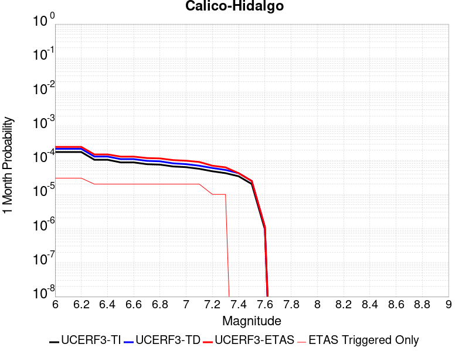 |  | 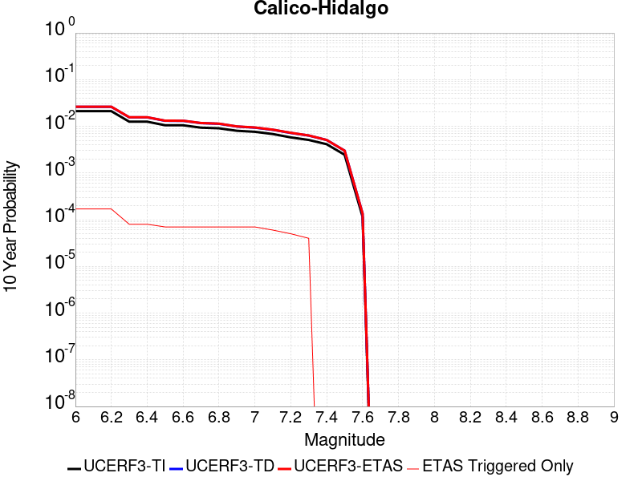 |

| Magnitude | 1 wk TI Prob | 1 wk TD Prob | 1 wk ETAS Prob | 1 wk ETAS/TD Gain | 1 wk ETAS Triggered Only | 1 mo TI Prob | 1 mo TD Prob | 1 mo ETAS Prob | 1 mo ETAS/TD Gain | 1 mo ETAS Triggered Only | 1 yr TI Prob | 1 yr TD Prob | 1 yr ETAS Prob | 1 yr ETAS/TD Gain | 1 yr ETAS Triggered Only | 10 yr TI Prob | 10 yr TD Prob | 10 yr ETAS Prob | 10 yr ETAS/TD Gain | 10 yr ETAS Triggered Only |
|-----|-----|-----|-----|-----|-----|-----|-----|-----|-----|-----|-----|-----|-----|-----|-----|-----|-----|-----|-----|-----|
| 6.0 | 4.0906612E-5 | 5.0704653E-5 | 8.437298E-5 | 1.6640086 | 3.3670032E-5 | 1.7530227E-4 | 2.1728984E-4 | 2.677839E-4 | 1.2323812 | 5.0505052E-5 | 0.0021322158 | 0.0026426981 | 0.002760232 | 1.0444748 | 1.1784512E-4 | 0.02111873 | 0.026153097 | 0.02630065 | 1.0056418 | 1.5151515E-4 |
| 6.1 | 4.0906612E-5 | 5.0704653E-5 | 8.437298E-5 | 1.6640086 | 3.3670032E-5 | 1.7530227E-4 | 2.1728984E-4 | 2.677839E-4 | 1.2323812 | 5.0505052E-5 | 0.0021322158 | 0.0026426981 | 0.002760232 | 1.0444748 | 1.1784512E-4 | 0.02111873 | 0.026153097 | 0.02630065 | 1.0056418 | 1.5151515E-4 |
| 6.2 | 4.0906612E-5 | 5.0704653E-5 | 8.437298E-5 | 1.6640086 | 3.3670032E-5 | 1.7530227E-4 | 2.1728984E-4 | 2.677839E-4 | 1.2323812 | 5.0505052E-5 | 0.0021322158 | 0.0026426981 | 0.002760232 | 1.0444748 | 1.1784512E-4 | 0.02111873 | 0.026153097 | 0.02630065 | 1.0056418 | 1.5151515E-4 |
| 6.3 | 2.4242801E-5 | 3.009103E-5 | 4.6925543E-5 | 1.5594528 | 1.6835016E-5 | 1.0389358E-4 | 1.2895538E-4 | 1.6262107E-4 | 1.2610646 | 3.3670032E-5 | 0.0012641704 | 0.001568934 | 0.0016361683 | 1.0428536 | 6.7340065E-5 | 0.01257003 | 0.015582247 | 0.01566511 | 1.0053178 | 8.417508E-5 |
| 6.4 | 2.4242801E-5 | 3.009103E-5 | 4.6925543E-5 | 1.5594528 | 1.6835016E-5 | 1.0389358E-4 | 1.2895538E-4 | 1.6262107E-4 | 1.2610646 | 3.3670032E-5 | 0.0012641704 | 0.001568934 | 0.0016361683 | 1.0428536 | 6.7340065E-5 | 0.01257003 | 0.015582247 | 0.01566511 | 1.0053178 | 8.417508E-5 |
| 6.5 | 2.0286952E-5 | 2.5315985E-5 | 4.2150576E-5 | 1.6649787 | 1.6835016E-5 | 8.694118E-5 | 1.0849266E-4 | 1.4215904E-4 | 1.3103102 | 3.3670032E-5 | 0.0010579949 | 0.0013201149 | 0.0013873661 | 1.0509434 | 6.7340065E-5 | 0.010529719 | 0.013124665 | 0.0132077355 | 1.0063293 | 8.417508E-5 |
| 6.6 | 2.0269223E-5 | 2.5296935E-5 | 4.2131527E-5 | 1.6654795 | 1.6835016E-5 | 8.6865206E-5 | 1.08411026E-4 | 1.420774E-4 | 1.3105439 | 3.3670032E-5 | 0.0010570707 | 0.0013191222 | 0.0013863734 | 1.0509818 | 6.7340065E-5 | 0.010520565 | 0.013114855 | 0.013197926 | 1.0063341 | 8.417508E-5 |
| 6.7 | 1.799852E-5 | 2.25408E-5 | 3.9375438E-5 | 1.7468518 | 1.6835016E-5 | 7.713423E-5 | 9.6599935E-5 | 1.3026672E-4 | 1.3485177 | 3.3670032E-5 | 9.3870464E-4 | 0.0011754843 | 0.0012427452 | 1.0572197 | 6.7340065E-5 | 0.009347493 | 0.011694277 | 0.011777467 | 1.0071138 | 8.417508E-5 |
| 6.8 | 1.7458793E-5 | 2.1842314E-5 | 3.867696E-5 | 1.7707356 | 1.6835016E-5 | 7.4821255E-5 | 9.3606635E-5 | 1.2727352E-4 | 1.3596634 | 3.3670032E-5 | 9.10568E-4 | 0.0011390795 | 0.0012063428 | 1.0590507 | 6.7340065E-5 | 0.009068459 | 0.011333993 | 0.011417214 | 1.0073426 | 8.417508E-5 |
| 6.9 | 1.542884E-5 | 1.9026087E-5 | 3.5860783E-5 | 1.8848218 | 1.6835016E-5 | 6.612192E-5 | 8.1537895E-5 | 1.15205185E-4 | 1.4129035 | 3.3670032E-5 | 8.04737E-4 | 9.92285E-4 | 0.0010595581 | 1.0677963 | 6.7340065E-5 | 0.008018291 | 0.00987994 | 0.009963283 | 1.0084356 | 8.417508E-5 |
| 7.0 | 1.468253E-5 | 1.8030747E-5 | 3.486546E-5 | 1.933667 | 1.6835016E-5 | 6.292361E-5 | 7.7272416E-5 | 1.1093984E-4 | 1.4356979 | 3.3670032E-5 | 7.658257E-4 | 9.403986E-4 | 0.0010076753 | 1.0715407 | 6.7340065E-5 | 0.0076319184 | 0.009365558 | 0.009448945 | 1.0089035 | 8.417508E-5 |
| 7.1 | 1.3139281E-5 | 1.620107E-5 | 3.3035813E-5 | 2.039113 | 1.6835016E-5 | 5.6309986E-5 | 6.943138E-5 | 1.03099075E-4 | 1.4849061 | 3.3670032E-5 | 6.853584E-4 | 8.4501173E-4 | 9.122949E-4 | 1.0796239 | 6.7340065E-5 | 0.0068324856 | 0.008419285 | 0.008502751 | 1.0099137 | 8.417508E-5 |
| 7.2 | 1.1127404E-5 | 1.3866703E-5 | 1.3866703E-5 | 1.0 | 0.0 | 4.7688E-5 | 5.9427435E-5 | 7.626145E-5 | 1.2832701 | 1.6835016E-5 | 5.8044674E-4 | 7.2329975E-4 | 7.7376823E-4 | 1.0697753 | 5.0505052E-5 | 0.0057893298 | 0.0072105634 | 0.007277418 | 1.0092717 | 6.7340065E-5 |
| 7.3 | 9.808154E-6 | 1.2176301E-5 | 1.2176301E-5 | 1.0 | 0.0 | 4.2034266E-5 | 5.2183164E-5 | 6.9017304E-5 | 1.3225971 | 1.6835016E-5 | 5.11647E-4 | 6.3515553E-4 | 6.856285E-4 | 1.0794655 | 5.0505052E-5 | 0.0051047057 | 0.0063344776 | 0.0064013912 | 1.0105634 | 6.7340065E-5 |
| 7.4 | 7.942452E-6 | 9.7922075E-6 | 9.7922075E-6 | 1.0 | 0.0 | 3.4038632E-5 | 4.196598E-5 | 4.196598E-5 | 1.0 | 0.0 | 4.1434157E-4 | 5.1082554E-4 | 5.1082554E-4 | 1.0 | 0.0 | 0.0041356985 | 0.0050974544 | 0.0050974544 | 1.0 | 0.0 |
| 7.5 | 4.7121216E-6 | 5.772871E-6 | 5.772871E-6 | 1.0 | 0.0 | 2.019465E-5 | 2.4740684E-5 | 2.4740684E-5 | 1.0 | 0.0 | 2.4584212E-4 | 3.0118387E-4 | 3.0118387E-4 | 1.0 | 0.0 | 0.0024557032 | 0.0030085093 | 0.0030085093 | 1.0 | 0.0 |
| 7.6 | 2.21172E-7 | 2.6039737E-7 | 2.6039737E-7 | 1.0 | 0.0 | 9.478797E-7 | 1.1159884E-6 | 1.1159884E-6 | 1.0 | 0.0 | 1.1540374E-5 | 1.3587103E-5 | 1.3587103E-5 | 1.0 | 0.0 | 1.1539775E-4 | 1.3586554E-4 | 1.3586554E-4 | 1.0 | 0.0 |

## San Andreas (San Gorgonio Pass-Garnet HIll)
*[(top)](#table-of-contents)*

| 1 Week | 1 Month | 1 Year | 10 Year |
|-----|-----|-----|-----|
| 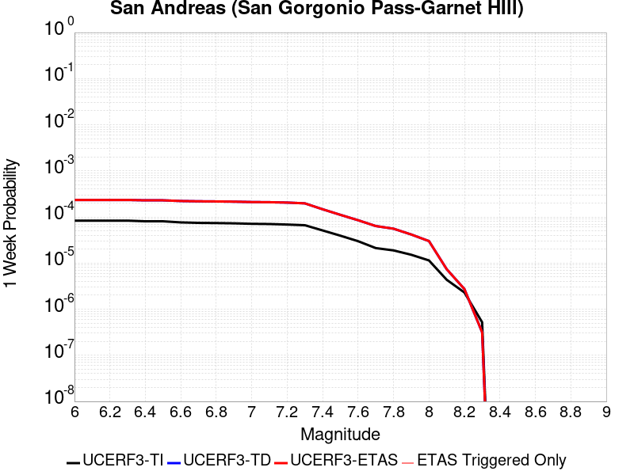 | 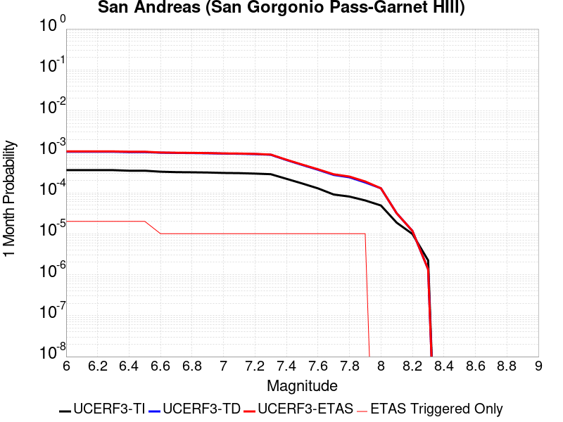 | 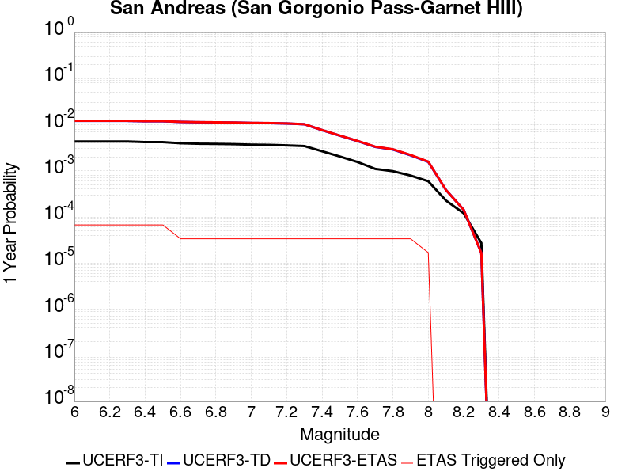 | 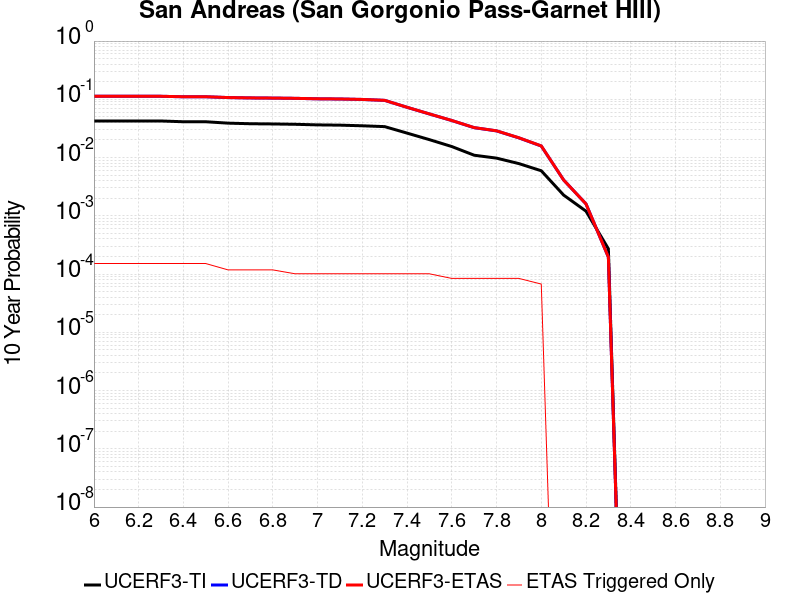 |

| Magnitude | 1 wk TI Prob | 1 wk TD Prob | 1 wk ETAS Prob | 1 wk ETAS/TD Gain | 1 wk ETAS Triggered Only | 1 mo TI Prob | 1 mo TD Prob | 1 mo ETAS Prob | 1 mo ETAS/TD Gain | 1 mo ETAS Triggered Only | 1 yr TI Prob | 1 yr TD Prob | 1 yr ETAS Prob | 1 yr ETAS/TD Gain | 1 yr ETAS Triggered Only | 10 yr TI Prob | 10 yr TD Prob | 10 yr ETAS Prob | 10 yr ETAS/TD Gain | 10 yr ETAS Triggered Only |
|-----|-----|-----|-----|-----|-----|-----|-----|-----|-----|-----|-----|-----|-----|-----|-----|-----|-----|-----|-----|-----|
| 6.0 | 8.31567E-5 | 2.3386451E-4 | 2.3386451E-4 | 1.0 | 0.0 | 3.5633717E-4 | 0.0010018935 | 0.0010187117 | 1.0167863 | 1.6835016E-5 | 0.004329778 | 0.012129918 | 0.012196441 | 1.0054842 | 6.7340065E-5 | 0.042463828 | 0.11259502 | 0.112729475 | 1.0011941 | 1.5151515E-4 |
| 6.1 | 8.31567E-5 | 2.3386451E-4 | 2.3386451E-4 | 1.0 | 0.0 | 3.5633717E-4 | 0.0010018935 | 0.0010187117 | 1.0167863 | 1.6835016E-5 | 0.004329778 | 0.012129918 | 0.012196441 | 1.0054842 | 6.7340065E-5 | 0.042463828 | 0.11259502 | 0.112729475 | 1.0011941 | 1.5151515E-4 |
| 6.2 | 8.31567E-5 | 2.3386451E-4 | 2.3386451E-4 | 1.0 | 0.0 | 3.5633717E-4 | 0.0010018935 | 0.0010187117 | 1.0167863 | 1.6835016E-5 | 0.004329778 | 0.012129918 | 0.012196441 | 1.0054842 | 6.7340065E-5 | 0.042463828 | 0.11259502 | 0.112729475 | 1.0011941 | 1.5151515E-4 |
| 6.3 | 8.31567E-5 | 2.3386451E-4 | 2.3386451E-4 | 1.0 | 0.0 | 3.5633717E-4 | 0.0010018935 | 0.0010187117 | 1.0167863 | 1.6835016E-5 | 0.004329778 | 0.012129918 | 0.012196441 | 1.0054842 | 6.7340065E-5 | 0.042463828 | 0.11259502 | 0.112729475 | 1.0011941 | 1.5151515E-4 |
| 6.4 | 8.059055E-5 | 2.2944735E-4 | 2.2944735E-4 | 1.0 | 0.0 | 3.4534236E-4 | 9.829777E-4 | 9.997962E-4 | 1.0171098 | 1.6835016E-5 | 0.0041964394 | 0.011902156 | 0.011968695 | 1.0055904 | 6.7340065E-5 | 0.041180745 | 0.110576175 | 0.11071094 | 1.0012187 | 1.5151515E-4 |
| 6.5 | 8.059055E-5 | 2.2944735E-4 | 2.2944735E-4 | 1.0 | 0.0 | 3.4534236E-4 | 9.829777E-4 | 9.997962E-4 | 1.0171098 | 1.6835016E-5 | 0.0041964394 | 0.011902156 | 0.011968695 | 1.0055904 | 6.7340065E-5 | 0.041180745 | 0.110576175 | 0.11071094 | 1.0012187 | 1.5151515E-4 |
| 6.6 | 7.619237E-5 | 2.2189032E-4 | 2.2189032E-4 | 1.0 | 0.0 | 3.2649786E-4 | 9.506143E-4 | 9.506143E-4 | 1.0 | 0.0 | 0.0039678677 | 0.0115128625 | 0.011546145 | 1.002891 | 3.3670032E-5 | 0.03897764 | 0.10711278 | 0.107218 | 1.0009824 | 1.1784512E-4 |
| 6.7 | 7.440636E-5 | 2.1864849E-4 | 2.1864849E-4 | 1.0 | 0.0 | 3.188454E-4 | 9.367307E-4 | 9.367307E-4 | 1.0 | 0.0 | 0.0038750346 | 0.011345596 | 0.011378884 | 1.002934 | 3.3670032E-5 | 0.038081564 | 0.10562121 | 0.10572661 | 1.0009979 | 1.1784512E-4 |
| 6.8 | 7.3735864E-5 | 2.1712016E-4 | 2.1712016E-4 | 1.0 | 0.0 | 3.1597257E-4 | 9.3018543E-4 | 9.3018543E-4 | 1.0 | 0.0 | 0.0038401815 | 0.011266734 | 0.011300025 | 1.0029547 | 3.3670032E-5 | 0.03774495 | 0.10492276 | 0.105028234 | 1.0010053 | 1.1784512E-4 |
| 6.9 | 7.27575E-5 | 2.1480983E-4 | 2.1480983E-4 | 1.0 | 0.0 | 3.117806E-4 | 9.20291E-4 | 9.20291E-4 | 1.0 | 0.0 | 0.003789323 | 0.011147508 | 0.011180803 | 1.0029868 | 3.3670032E-5 | 0.037253562 | 0.10387066 | 0.10396118 | 1.0008714 | 1.01010104E-4 |
| 7.0 | 7.102591E-5 | 2.1065009E-4 | 2.1065009E-4 | 1.0 | 0.0 | 3.0436125E-4 | 9.0247596E-4 | 9.0247596E-4 | 1.0 | 0.0 | 0.003699303 | 0.010932805 | 0.010966107 | 1.003046 | 3.3670032E-5 | 0.03638325 | 0.101972826 | 0.10206354 | 1.0008895 | 1.01010104E-4 |
| 7.1 | 7.028513E-5 | 2.0900648E-4 | 2.0900648E-4 | 1.0 | 0.0 | 3.0118722E-4 | 8.954368E-4 | 8.954368E-4 | 1.0 | 0.0 | 0.0036607897 | 0.01084796 | 0.010881265 | 1.0030701 | 3.3670032E-5 | 0.036010686 | 0.10121585 | 0.10130663 | 1.0008969 | 1.01010104E-4 |
| 7.2 | 6.8498244E-5 | 2.0508505E-4 | 2.0508505E-4 | 1.0 | 0.0 | 2.9353087E-4 | 8.78642E-4 | 8.78642E-4 | 1.0 | 0.0 | 0.003567883 | 0.010645497 | 0.010678809 | 1.0031291 | 3.3670032E-5 | 0.035111405 | 0.09940783 | 0.0994988 | 1.000915 | 1.01010104E-4 |
| 7.3 | 6.622592E-5 | 1.973576E-4 | 1.973576E-4 | 1.0 | 0.0 | 2.8379448E-4 | 8.4554625E-4 | 8.4554625E-4 | 1.0 | 0.0 | 0.0034497243 | 0.010246415 | 0.010279739 | 1.0032524 | 3.3670032E-5 | 0.033966612 | 0.09590419 | 0.09599551 | 1.0009522 | 1.01010104E-4 |
| 7.4 | 5.1050705E-5 | 1.4692261E-4 | 1.4692261E-4 | 1.0 | 0.0 | 2.1877038E-4 | 6.295173E-4 | 6.295173E-4 | 1.0 | 0.0 | 0.002660276 | 0.0076376316 | 0.007671044 | 1.0043747 | 3.3670032E-5 | 0.02628654 | 0.07287696 | 0.07297061 | 1.0012851 | 1.01010104E-4 |
| 7.5 | 3.9302922E-5 | 1.11326524E-4 | 1.11326524E-4 | 1.0 | 0.0 | 1.6843023E-4 | 4.7702674E-4 | 4.7702674E-4 | 1.0 | 0.0 | 0.0020487092 | 0.005792404 | 0.005825879 | 1.0057791 | 3.3670032E-5 | 0.020299247 | 0.05602189 | 0.056117244 | 1.0017021 | 1.01010104E-4 |
| 7.6 | 2.9851626E-5 | 8.49747E-5 | 8.49747E-5 | 1.0 | 0.0 | 1.2792926E-4 | 3.6412658E-4 | 3.6412658E-4 | 1.0 | 0.0 | 0.0015564259 | 0.004424255 | 0.004457776 | 1.0075767 | 3.3670032E-5 | 0.0154556995 | 0.043204896 | 0.043285437 | 1.0018641 | 8.417508E-5 |
| 7.7 | 2.1135214E-5 | 6.355116E-5 | 6.355116E-5 | 1.0 | 0.0 | 9.0576345E-5 | 2.723337E-4 | 2.723337E-4 | 1.0 | 0.0 | 0.0011022091 | 0.003310627 | 0.0033441857 | 1.0101366 | 3.3670032E-5 | 0.010967582 | 0.032592565 | 0.032674 | 1.0024985 | 8.417508E-5 |
| 7.8 | 1.883379E-5 | 5.5660596E-5 | 5.5660596E-5 | 1.0 | 0.0 | 8.0713755E-5 | 2.3852361E-4 | 2.3852361E-4 | 1.0 | 0.0 | 9.822468E-4 | 0.0029001608 | 0.0029337332 | 1.011576 | 3.3670032E-5 | 0.0097791655 | 0.028704397 | 0.028786156 | 1.0028483 | 8.417508E-5 |
| 7.9 | 1.5156185E-5 | 4.1675128E-5 | 4.1675128E-5 | 1.0 | 0.0 | 6.495346E-5 | 1.7859548E-4 | 1.7859548E-4 | 1.0 | 0.0 | 7.9052144E-4 | 0.0021722328 | 0.0022058298 | 1.0154666 | 3.3670032E-5 | 0.007877152 | 0.02176709 | 0.021849431 | 1.0037829 | 8.417508E-5 |
| 8.0 | 1.1405907E-5 | 2.9986788E-5 | 2.9986788E-5 | 1.0 | 0.0 | 4.8881542E-5 | 1.2850849E-4 | 1.2850849E-4 | 1.0 | 0.0 | 5.9497025E-4 | 0.0015634688 | 0.0015802776 | 1.0107509 | 1.6835016E-5 | 0.005933798 | 0.015778678 | 0.015844956 | 1.0042005 | 6.7340065E-5 |
| 8.1 | 4.3511436E-6 | 7.373693E-6 | 7.373693E-6 | 1.0 | 0.0 | 1.8647626E-5 | 3.160116E-5 | 3.160116E-5 | 1.0 | 0.0 | 2.2701119E-4 | 3.8467633E-4 | 3.8467633E-4 | 1.0 | 0.0 | 0.0022677942 | 0.004118566 | 0.004118566 | 1.0 | 0.0 |
| 8.2 | 2.3042528E-6 | 2.7350309E-6 | 2.7350309E-6 | 1.0 | 0.0 | 9.875332E-6 | 1.1721509E-5 | 1.1721509E-5 | 1.0 | 0.0 | 1.2022553E-4 | 1.4270007E-4 | 1.4270007E-4 | 1.0 | 0.0 | 0.0012016051 | 0.0015990696 | 0.0015990696 | 1.0 | 0.0 |
| 8.3 | 5.202968E-7 | 3.1628537E-7 | 3.1628537E-7 | 1.0 | 0.0 | 2.2298414E-6 | 1.3555081E-6 | 1.3555081E-6 | 1.0 | 0.0 | 2.714798E-5 | 1.6503198E-5 | 1.6503198E-5 | 1.0 | 0.0 | 2.7144665E-4 | 1.9580164E-4 | 1.9580164E-4 | 1.0 | 0.0 |

## San Andreas (Carrizo) rev
*[(top)](#table-of-contents)*

| 1 Week | 1 Month | 1 Year | 10 Year |
|-----|-----|-----|-----|
| 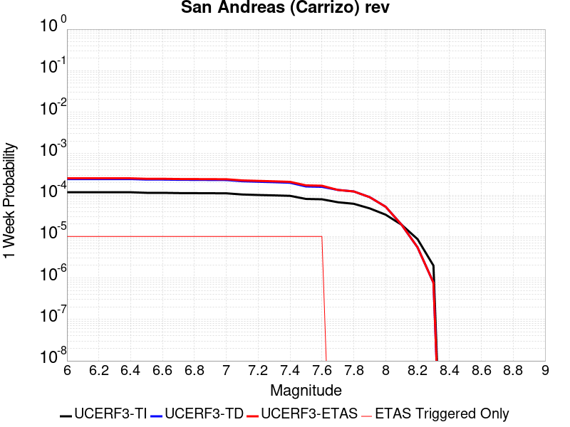 | 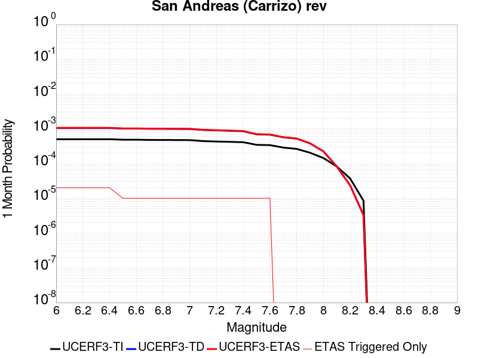 | 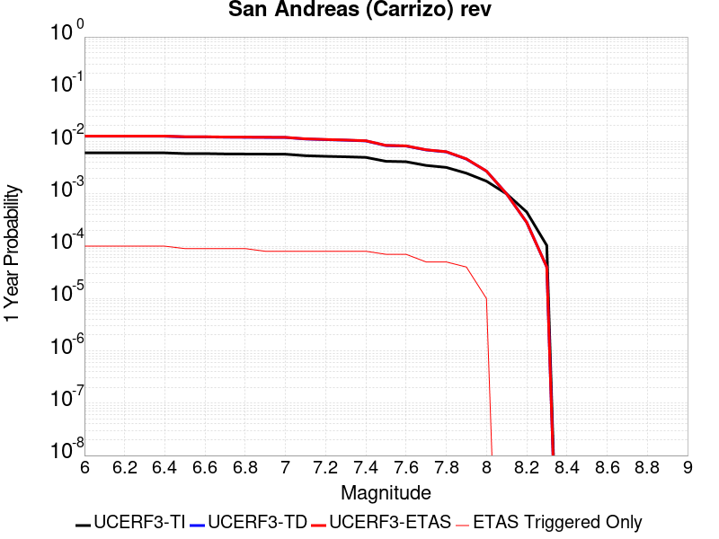 | 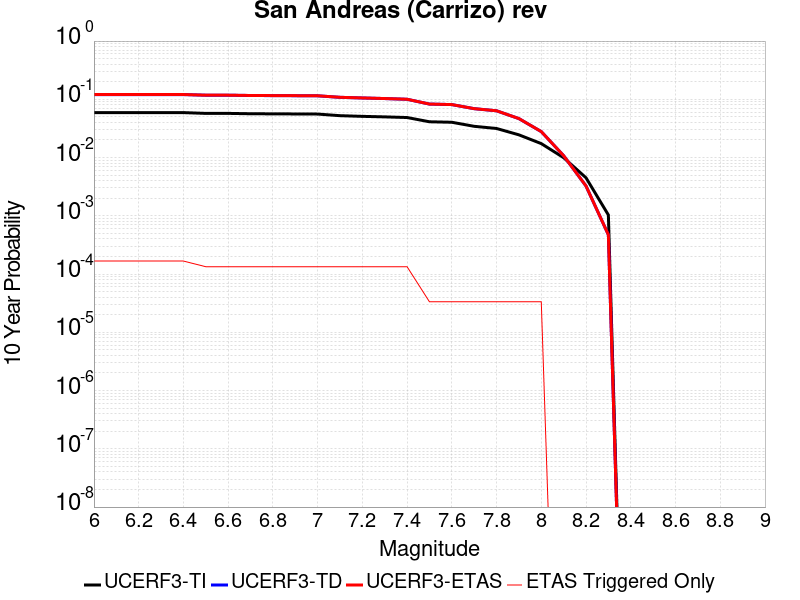 |

| Magnitude | 1 wk TI Prob | 1 wk TD Prob | 1 wk ETAS Prob | 1 wk ETAS/TD Gain | 1 wk ETAS Triggered Only | 1 mo TI Prob | 1 mo TD Prob | 1 mo ETAS Prob | 1 mo ETAS/TD Gain | 1 mo ETAS Triggered Only | 1 yr TI Prob | 1 yr TD Prob | 1 yr ETAS Prob | 1 yr ETAS/TD Gain | 1 yr ETAS Triggered Only | 10 yr TI Prob | 10 yr TD Prob | 10 yr ETAS Prob | 10 yr ETAS/TD Gain | 10 yr ETAS Triggered Only |
|-----|-----|-----|-----|-----|-----|-----|-----|-----|-----|-----|-----|-----|-----|-----|-----|-----|-----|-----|-----|-----|
| 6.0 | 1.1674632E-4 | 2.4332498E-4 | 2.4332498E-4 | 1.0 | 0.0 | 5.002454E-4 | 0.0010424062 | 0.0010592237 | 1.0161333 | 1.6835016E-5 | 0.006073493 | 0.012617926 | 0.012667794 | 1.0039521 | 5.0505052E-5 | 0.0591016 | 0.12065402 | 0.120787255 | 1.0011042 | 1.5151515E-4 |
| 6.1 | 1.1674632E-4 | 2.4332498E-4 | 2.4332498E-4 | 1.0 | 0.0 | 5.002454E-4 | 0.0010424062 | 0.0010592237 | 1.0161333 | 1.6835016E-5 | 0.006073493 | 0.012617926 | 0.012667794 | 1.0039521 | 5.0505052E-5 | 0.0591016 | 0.12065402 | 0.120787255 | 1.0011042 | 1.5151515E-4 |
| 6.2 | 1.1674632E-4 | 2.4332498E-4 | 2.4332498E-4 | 1.0 | 0.0 | 5.002454E-4 | 0.0010424062 | 0.0010592237 | 1.0161333 | 1.6835016E-5 | 0.006073493 | 0.012617926 | 0.012667794 | 1.0039521 | 5.0505052E-5 | 0.0591016 | 0.12065402 | 0.120787255 | 1.0011042 | 1.5151515E-4 |
| 6.3 | 1.1674632E-4 | 2.4332498E-4 | 2.4332498E-4 | 1.0 | 0.0 | 5.002454E-4 | 0.0010424062 | 0.0010592237 | 1.0161333 | 1.6835016E-5 | 0.006073493 | 0.012617926 | 0.012667794 | 1.0039521 | 5.0505052E-5 | 0.0591016 | 0.12065402 | 0.120787255 | 1.0011042 | 1.5151515E-4 |
| 6.4 | 1.1674632E-4 | 2.4332498E-4 | 2.4332498E-4 | 1.0 | 0.0 | 5.002454E-4 | 0.0010424062 | 0.0010592237 | 1.0161333 | 1.6835016E-5 | 0.006073493 | 0.012617926 | 0.012667794 | 1.0039521 | 5.0505052E-5 | 0.0591016 | 0.12065402 | 0.120787255 | 1.0011042 | 1.5151515E-4 |
| 6.5 | 1.13136164E-4 | 2.3652466E-4 | 2.3652466E-4 | 1.0 | 0.0 | 4.847792E-4 | 0.0010132849 | 0.0010132849 | 1.0 | 0.0 | 0.0058862255 | 0.012267408 | 0.012300665 | 1.002711 | 3.3670032E-5 | 0.057327334 | 0.11762535 | 0.117744185 | 1.0010103 | 1.3468013E-4 |
| 6.6 | 1.13136164E-4 | 2.3652466E-4 | 2.3652466E-4 | 1.0 | 0.0 | 4.847792E-4 | 0.0010132849 | 0.0010132849 | 1.0 | 0.0 | 0.0058862255 | 0.012267408 | 0.012300665 | 1.002711 | 3.3670032E-5 | 0.057327334 | 0.11762535 | 0.117744185 | 1.0010103 | 1.3468013E-4 |
| 6.7 | 1.1149675E-4 | 2.3343669E-4 | 2.3343669E-4 | 1.0 | 0.0 | 4.777557E-4 | 0.0010000608 | 0.0010000608 | 1.0 | 0.0 | 0.0058011734 | 0.012108203 | 0.012141466 | 1.002747 | 3.3670032E-5 | 0.05652051 | 0.11624688 | 0.1163659 | 1.0010239 | 1.3468013E-4 |
| 6.8 | 1.1103589E-4 | 2.3245816E-4 | 2.3245816E-4 | 1.0 | 0.0 | 4.7578133E-4 | 9.958703E-4 | 9.958703E-4 | 1.0 | 0.0 | 0.005777263 | 0.0120577505 | 0.0120910145 | 1.0027587 | 3.3670032E-5 | 0.056293584 | 0.11580715 | 0.115926236 | 1.0010283 | 1.3468013E-4 |
| 6.9 | 1.1053259E-4 | 2.3138185E-4 | 2.3138185E-4 | 1.0 | 0.0 | 4.7362508E-4 | 9.912612E-4 | 9.912612E-4 | 1.0 | 0.0 | 0.0057511497 | 0.012002253 | 0.012035519 | 1.0027716 | 3.3670032E-5 | 0.05604569 | 0.11532332 | 0.11544247 | 1.0010332 | 1.3468013E-4 |
| 7.0 | 1.1005377E-4 | 2.3039016E-4 | 2.3039016E-4 | 1.0 | 0.0 | 4.7157376E-4 | 9.870143E-4 | 9.870143E-4 | 1.0 | 0.0 | 0.0057263062 | 0.011951115 | 0.011984383 | 1.0027837 | 3.3670032E-5 | 0.055809796 | 0.11487561 | 0.11499482 | 1.0010377 | 1.3468013E-4 |
| 7.1 | 1.0308142E-4 | 2.1548544E-4 | 2.1548544E-4 | 1.0 | 0.0 | 4.417027E-4 | 9.231832E-4 | 9.231832E-4 | 1.0 | 0.0 | 0.0053644776 | 0.011182146 | 0.011215439 | 1.0029774 | 3.3670032E-5 | 0.052368138 | 0.108131535 | 0.10825165 | 1.0011108 | 1.3468013E-4 |
| 7.2 | 1.0027479E-4 | 2.0956367E-4 | 2.0956367E-4 | 1.0 | 0.0 | 4.296783E-4 | 8.978219E-4 | 8.978219E-4 | 1.0 | 0.0 | 0.0052187922 | 0.0108764935 | 0.010909798 | 1.003062 | 3.3670032E-5 | 0.050979212 | 0.10543535 | 0.105555825 | 1.0011427 | 1.3468013E-4 |
| 7.3 | 9.816942E-5 | 2.0431461E-4 | 2.0431461E-4 | 1.0 | 0.0 | 4.2065824E-4 | 8.753412E-4 | 8.753412E-4 | 1.0 | 0.0 | 0.005109493 | 0.010605487 | 0.0106388 | 1.003141 | 3.3670032E-5 | 0.049935985 | 0.103018686 | 0.10313949 | 1.0011727 | 1.3468013E-4 |
| 7.4 | 9.5634205E-5 | 1.9800827E-4 | 1.9800827E-4 | 1.0 | 0.0 | 4.0979648E-4 | 8.4833184E-4 | 8.4833184E-4 | 1.0 | 0.0 | 0.0049778637 | 0.0102797905 | 0.010313114 | 1.0032417 | 3.3670032E-5 | 0.048678253 | 0.100104466 | 0.100225665 | 1.0012107 | 1.3468013E-4 |
| 7.5 | 8.052417E-5 | 1.6120363E-4 | 1.6120363E-4 | 1.0 | 0.0 | 3.4505792E-4 | 6.9068995E-4 | 6.9068995E-4 | 1.0 | 0.0 | 0.0041929903 | 0.008376808 | 0.008393502 | 1.001993 | 1.6835016E-5 | 0.04114753 | 0.08284498 | 0.08292218 | 1.0009319 | 8.417508E-5 |
| 7.6 | 7.897024E-5 | 1.5773512E-4 | 1.5773512E-4 | 1.0 | 0.0 | 3.384E-4 | 6.758327E-4 | 6.758327E-4 | 1.0 | 0.0 | 0.0041122385 | 0.008197296 | 0.008213993 | 1.0020369 | 1.6835016E-5 | 0.040369697 | 0.081185855 | 0.0812632 | 1.0009526 | 8.417508E-5 |
| 7.7 | 6.707427E-5 | 1.3282998E-4 | 1.3282998E-4 | 1.0 | 0.0 | 2.8742946E-4 | 5.691472E-4 | 5.691472E-4 | 1.0 | 0.0 | 0.003493839 | 0.0069073834 | 0.0069241025 | 1.0024204 | 1.6835016E-5 | 0.034394164 | 0.06907934 | 0.0691577 | 1.0011344 | 8.417508E-5 |
| 7.8 | 6.147705E-5 | 1.2203727E-4 | 1.2203727E-4 | 1.0 | 0.0 | 2.6344648E-4 | 5.229121E-4 | 5.229121E-4 | 1.0 | 0.0 | 0.0032027436 | 0.006347895 | 0.006364623 | 1.0026352 | 1.6835016E-5 | 0.031569764 | 0.063543044 | 0.06362186 | 1.0012405 | 8.417508E-5 |
| 7.9 | 4.7636717E-5 | 8.88427E-5 | 8.88427E-5 | 1.0 | 0.0 | 2.0414138E-4 | 3.806989E-4 | 3.806989E-4 | 1.0 | 0.0 | 0.0024825884 | 0.0046251663 | 0.0046419236 | 1.003623 | 1.6835016E-5 | 0.024550365 | 0.046649244 | 0.04671344 | 1.0013762 | 6.7340065E-5 |
| 8.0 | 3.3554235E-5 | 5.2164494E-5 | 5.2164494E-5 | 1.0 | 0.0 | 1.4379594E-4 | 2.2354297E-4 | 2.2354297E-4 | 1.0 | 0.0 | 0.0017493097 | 0.0027182405 | 0.00273503 | 1.0061765 | 1.6835016E-5 | 0.017356034 | 0.027894506 | 0.027959969 | 1.0023468 | 6.7340065E-5 |
| 8.1 | 1.9175432E-5 | 1.9198285E-5 | 1.9198285E-5 | 1.0 | 0.0 | 8.217783E-5 | 8.227578E-5 | 8.227578E-5 | 1.0 | 0.0 | 0.0010000558 | 0.0010012479 | 0.0010012479 | 1.0 | 0.0 | 0.009955673 | 0.010765004 | 0.010781658 | 1.001547 | 1.6835016E-5 |
| 8.2 | 8.643924E-6 | 5.4798497E-6 | 5.4798497E-6 | 1.0 | 0.0 | 3.704486E-5 | 2.348486E-5 | 2.348486E-5 | 1.0 | 0.0 | 4.5092785E-4 | 2.858907E-4 | 2.858907E-4 | 1.0 | 0.0 | 0.0045001395 | 0.0032514327 | 0.0032514327 | 1.0 | 0.0 |
| 8.3 | 1.983087E-6 | 7.668296E-7 | 7.668296E-7 | 1.0 | 0.0 | 8.498917E-6 | 3.2864084E-6 | 3.2864084E-6 | 1.0 | 0.0 | 1.034694E-4 | 4.0011306E-5 | 4.0011306E-5 | 1.0 | 0.0 | 0.0010342124 | 4.724499E-4 | 4.724499E-4 | 1.0 | 0.0 |

## San Andreas (Cholame) rev
*[(top)](#table-of-contents)*

| 1 Week | 1 Month | 1 Year | 10 Year |
|-----|-----|-----|-----|
|  | 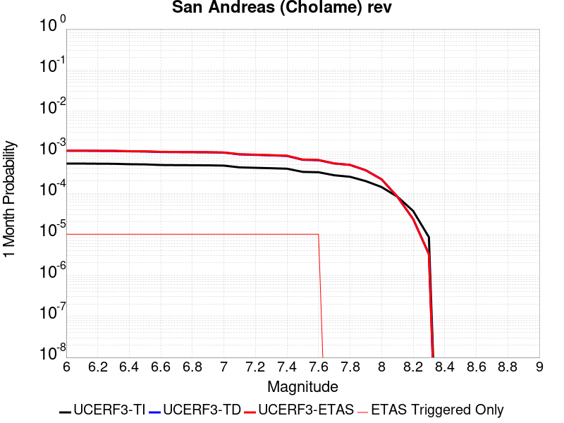 | 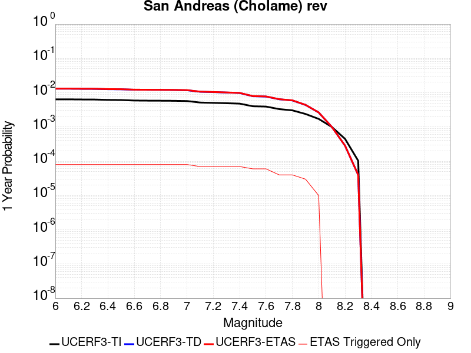 | 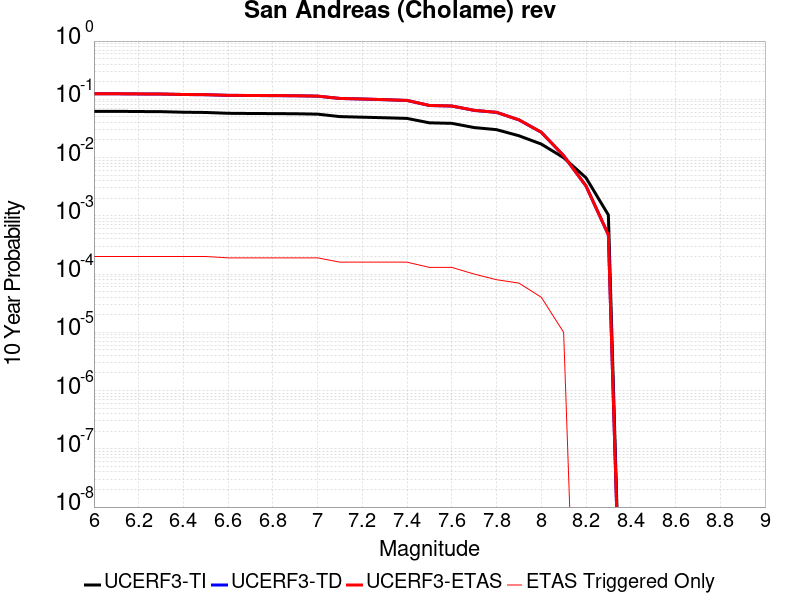 |

| Magnitude | 1 wk TI Prob | 1 wk TD Prob | 1 wk ETAS Prob | 1 wk ETAS/TD Gain | 1 wk ETAS Triggered Only | 1 mo TI Prob | 1 mo TD Prob | 1 mo ETAS Prob | 1 mo ETAS/TD Gain | 1 mo ETAS Triggered Only | 1 yr TI Prob | 1 yr TD Prob | 1 yr ETAS Prob | 1 yr ETAS/TD Gain | 1 yr ETAS Triggered Only | 10 yr TI Prob | 10 yr TD Prob | 10 yr ETAS Prob | 10 yr ETAS/TD Gain | 10 yr ETAS Triggered Only |
|-----|-----|-----|-----|-----|-----|-----|-----|-----|-----|-----|-----|-----|-----|-----|-----|-----|-----|-----|-----|-----|
| 6.0 | 1.2302514E-4 | 2.5213862E-4 | 2.5213862E-4 | 1.0 | 0.0 | 5.27144E-4 | 0.0010801482 | 0.0010801482 | 1.0 | 0.0 | 0.0063991086 | 0.013072014 | 0.013105244 | 1.002542 | 3.3670032E-5 | 0.06217949 | 0.12443058 | 0.1245485 | 1.0009477 | 1.3468013E-4 |
| 6.1 | 1.2302514E-4 | 2.5213862E-4 | 2.5213862E-4 | 1.0 | 0.0 | 5.27144E-4 | 0.0010801482 | 0.0010801482 | 1.0 | 0.0 | 0.0063991086 | 0.013072014 | 0.013105244 | 1.002542 | 3.3670032E-5 | 0.06217949 | 0.12443058 | 0.1245485 | 1.0009477 | 1.3468013E-4 |
| 6.2 | 1.2203569E-4 | 2.5030645E-4 | 2.5030645E-4 | 1.0 | 0.0 | 5.2290526E-4 | 0.0010723026 | 0.0010723026 | 1.0 | 0.0 | 0.006347804 | 0.0129776355 | 0.013010869 | 1.0025609 | 3.3670032E-5 | 0.061695136 | 0.12361675 | 0.12373478 | 1.0009549 | 1.3468013E-4 |
| 6.3 | 1.2142645E-4 | 2.491661E-4 | 2.491661E-4 | 1.0 | 0.0 | 5.202953E-4 | 0.0010674193 | 0.0010674193 | 1.0 | 0.0 | 0.006316212 | 0.012918889 | 0.012952124 | 1.0025725 | 3.3670032E-5 | 0.06139677 | 0.12311087 | 0.12322897 | 1.0009593 | 1.3468013E-4 |
| 6.4 | 1.1865206E-4 | 2.4422092E-4 | 2.4422092E-4 | 1.0 | 0.0 | 5.0840975E-4 | 0.0010462429 | 0.0010462429 | 1.0 | 0.0 | 0.006172335 | 0.012664088 | 0.012697332 | 1.002625 | 3.3670032E-5 | 0.060036868 | 0.12090351 | 0.121021904 | 1.0009793 | 1.3468013E-4 |
| 6.5 | 1.17443946E-4 | 2.421537E-4 | 2.421537E-4 | 1.0 | 0.0 | 5.032341E-4 | 0.0010373904 | 0.0010373904 | 1.0 | 0.0 | 0.006109677 | 0.012557554 | 0.012590801 | 1.0026476 | 3.3670032E-5 | 0.059444077 | 0.11997763 | 0.120096155 | 1.0009879 | 1.3468013E-4 |
| 6.6 | 1.13579066E-4 | 2.3524289E-4 | 2.3524289E-4 | 1.0 | 0.0 | 4.866766E-4 | 0.0010077958 | 0.0010077958 | 1.0 | 0.0 | 0.0059092017 | 0.012201327 | 0.012234586 | 1.0027258 | 3.3670032E-5 | 0.057545185 | 0.11689143 | 0.11701036 | 1.0010175 | 1.3468013E-4 |
| 6.7 | 1.1271412E-4 | 2.336858E-4 | 2.336858E-4 | 1.0 | 0.0 | 4.829711E-4 | 0.0010011276 | 0.0010011276 | 1.0 | 0.0 | 0.005864331 | 0.01212105 | 0.012154312 | 1.0027442 | 3.3670032E-5 | 0.057119697 | 0.11619493 | 0.116313964 | 1.0010244 | 1.3468013E-4 |
| 6.8 | 1.1217975E-4 | 2.3256983E-4 | 2.3256983E-4 | 1.0 | 0.0 | 4.8068175E-4 | 9.963487E-4 | 9.963487E-4 | 1.0 | 0.0 | 0.005836608 | 0.012063511 | 0.012096775 | 1.0027574 | 3.3670032E-5 | 0.056856725 | 0.11569312 | 0.11581223 | 1.0010295 | 1.3468013E-4 |
| 6.9 | 1.1146753E-4 | 2.3105709E-4 | 2.3105709E-4 | 1.0 | 0.0 | 4.7763053E-4 | 9.898704E-4 | 9.898704E-4 | 1.0 | 0.0 | 0.0057996577 | 0.011985509 | 0.012018775 | 1.0027755 | 3.3670032E-5 | 0.056506127 | 0.11501348 | 0.115132675 | 1.0010363 | 1.3468013E-4 |
| 7.0 | 1.0965793E-4 | 2.2728977E-4 | 2.2728977E-4 | 1.0 | 0.0 | 4.698779E-4 | 9.7373687E-4 | 9.7373687E-4 | 1.0 | 0.0 | 0.005705768 | 0.0117912255 | 0.011824499 | 1.0028218 | 3.3670032E-5 | 0.055614736 | 0.11331484 | 0.113434255 | 1.0010538 | 1.3468013E-4 |
| 7.1 | 9.927982E-5 | 2.0547757E-4 | 2.0547757E-4 | 1.0 | 0.0 | 4.2541555E-4 | 8.80322E-4 | 8.80322E-4 | 1.0 | 0.0 | 0.0051671406 | 0.010665542 | 0.010698853 | 1.0031233 | 3.3670032E-5 | 0.05048634 | 0.10340853 | 0.10351419 | 1.0010217 | 1.1784512E-4 |
| 7.2 | 9.696786E-5 | 2.0051954E-4 | 2.0051954E-4 | 1.0 | 0.0 | 4.1551032E-4 | 8.5908745E-4 | 8.5908745E-4 | 1.0 | 0.0 | 0.00504711 | 0.010409511 | 0.01044283 | 1.0032009 | 3.3670032E-5 | 0.04934009 | 0.10114636 | 0.10125229 | 1.0010473 | 1.1784512E-4 |
| 7.3 | 9.4727984E-5 | 1.9481099E-4 | 1.9481099E-4 | 1.0 | 0.0 | 4.0591392E-4 | 8.346381E-4 | 8.346381E-4 | 1.0 | 0.0 | 0.0049308087 | 0.010114641 | 0.01014797 | 1.0032952 | 3.3670032E-5 | 0.048228268 | 0.09851684 | 0.09862307 | 1.0010784 | 1.1784512E-4 |
| 7.4 | 9.220358E-5 | 1.885154E-4 | 1.885154E-4 | 1.0 | 0.0 | 3.9509835E-4 | 8.076739E-4 | 8.076739E-4 | 1.0 | 0.0 | 0.004799717 | 0.009789341 | 0.009822682 | 1.0034058 | 3.3670032E-5 | 0.046973653 | 0.09559427 | 0.09570085 | 1.001115 | 1.1784512E-4 |
| 7.5 | 7.71631E-5 | 1.5185357E-4 | 1.5185357E-4 | 1.0 | 0.0 | 3.306571E-4 | 6.506389E-4 | 6.506389E-4 | 1.0 | 0.0 | 0.0040183207 | 0.007892828 | 0.00790953 | 1.0021161 | 1.6835016E-5 | 0.03946433 | 0.07831838 | 0.07838045 | 1.0007925 | 6.7340065E-5 |
| 7.6 | 7.5634416E-5 | 1.4844738E-4 | 1.4844738E-4 | 1.0 | 0.0 | 3.241072E-4 | 6.360481E-4 | 6.360481E-4 | 1.0 | 0.0 | 0.0039388672 | 0.007716457 | 0.007733162 | 1.0021648 | 1.6835016E-5 | 0.038697794 | 0.076681465 | 0.07674364 | 1.0008109 | 6.7340065E-5 |
| 7.7 | 6.3783E-5 | 1.2365259E-4 | 1.2365259E-4 | 1.0 | 0.0 | 2.7332708E-4 | 5.2983203E-4 | 5.2983203E-4 | 1.0 | 0.0 | 0.0033226798 | 0.0064316522 | 0.0064483793 | 1.0026007 | 1.6835016E-5 | 0.032734364 | 0.064570144 | 0.06463313 | 1.0009756 | 6.7340065E-5 |
| 7.8 | 5.863422E-5 | 1.142205E-4 | 1.142205E-4 | 1.0 | 0.0 | 2.512653E-4 | 4.894246E-4 | 4.894246E-4 | 1.0 | 0.0 | 0.003054864 | 0.0059424853 | 0.00595922 | 1.0028162 | 1.6835016E-5 | 0.030132094 | 0.059686445 | 0.059749767 | 1.0010608 | 6.7340065E-5 |
| 7.9 | 4.595283E-5 | 8.4306725E-5 | 8.4306725E-5 | 1.0 | 0.0 | 1.9692584E-4 | 3.612645E-4 | 3.612645E-4 | 1.0 | 0.0 | 0.0023949358 | 0.0043895314 | 0.0044062925 | 1.0038184 | 1.6835016E-5 | 0.023692891 | 0.044382483 | 0.044446833 | 1.00145 | 6.7340065E-5 |
| 8.0 | 3.2950178E-5 | 5.08E-5 | 5.08E-5 | 1.0 | 0.0 | 1.412074E-4 | 2.1769613E-4 | 2.1769613E-4 | 1.0 | 0.0 | 0.0017178444 | 0.0026472306 | 0.002664021 | 1.0063426 | 1.6835016E-5 | 0.017046256 | 0.027193451 | 0.02725896 | 1.002409 | 6.7340065E-5 |
| 8.1 | 1.9177472E-5 | 1.9198456E-5 | 1.9198456E-5 | 1.0 | 0.0 | 8.218658E-5 | 8.227651E-5 | 8.227651E-5 | 1.0 | 0.0 | 0.0010001622 | 0.0010012568 | 0.0010012568 | 1.0 | 0.0 | 0.009956728 | 0.01076512 | 0.010781774 | 1.001547 | 1.6835016E-5 |
| 8.2 | 8.643924E-6 | 5.4798497E-6 | 5.4798497E-6 | 1.0 | 0.0 | 3.704486E-5 | 2.348486E-5 | 2.348486E-5 | 1.0 | 0.0 | 4.5092785E-4 | 2.858907E-4 | 2.858907E-4 | 1.0 | 0.0 | 0.0045001395 | 0.0032514327 | 0.0032514327 | 1.0 | 0.0 |
| 8.3 | 1.983087E-6 | 7.668296E-7 | 7.668296E-7 | 1.0 | 0.0 | 8.498917E-6 | 3.2864084E-6 | 3.2864084E-6 | 1.0 | 0.0 | 1.034694E-4 | 4.0011306E-5 | 4.0011306E-5 | 1.0 | 0.0 | 0.0010342124 | 4.724499E-4 | 4.724499E-4 | 1.0 | 0.0 |

## San Andreas (Coachella) rev
*[(top)](#table-of-contents)*

| 1 Week | 1 Month | 1 Year | 10 Year |
|-----|-----|-----|-----|
| 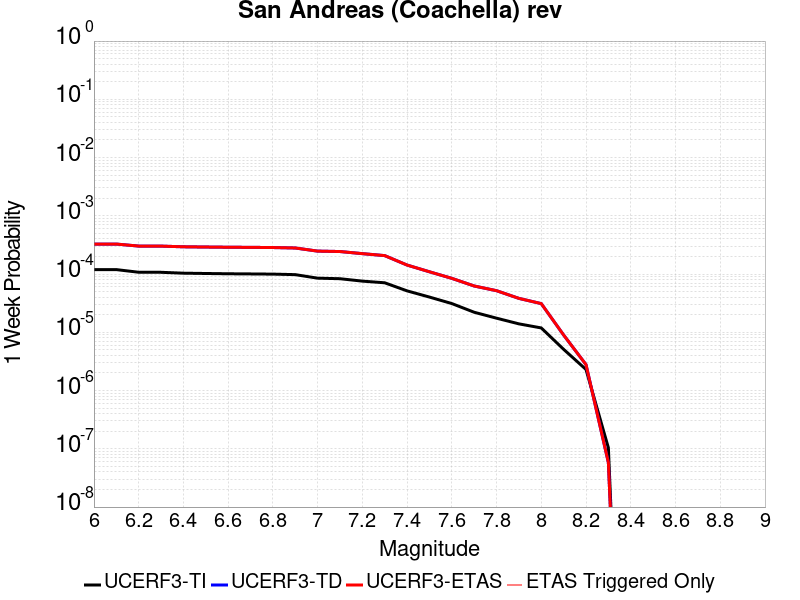 | 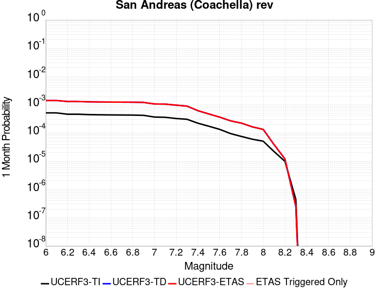 |  | 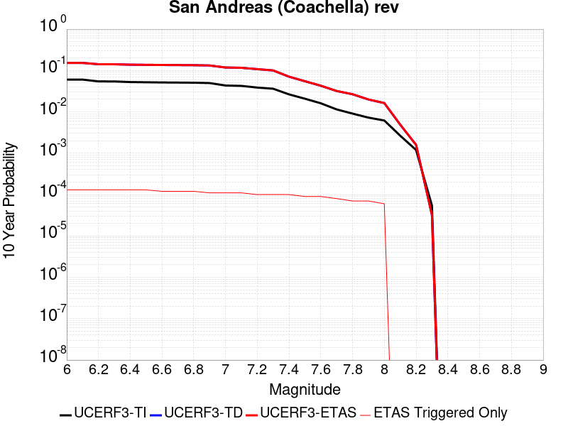 |

| Magnitude | 1 wk TI Prob | 1 wk TD Prob | 1 wk ETAS Prob | 1 wk ETAS/TD Gain | 1 wk ETAS Triggered Only | 1 mo TI Prob | 1 mo TD Prob | 1 mo ETAS Prob | 1 mo ETAS/TD Gain | 1 mo ETAS Triggered Only | 1 yr TI Prob | 1 yr TD Prob | 1 yr ETAS Prob | 1 yr ETAS/TD Gain | 1 yr ETAS Triggered Only | 10 yr TI Prob | 10 yr TD Prob | 10 yr ETAS Prob | 10 yr ETAS/TD Gain | 10 yr ETAS Triggered Only |
|-----|-----|-----|-----|-----|-----|-----|-----|-----|-----|-----|-----|-----|-----|-----|-----|-----|-----|-----|-----|-----|
| 6.0 | 1.1925945E-4 | 3.2733803E-4 | 3.2733803E-4 | 1.0 | 0.0 | 5.110118E-4 | 0.0014021277 | 0.0014021277 | 1.0 | 0.0 | 0.0062038354 | 0.016938623 | 0.016971722 | 1.0019541 | 3.3670032E-5 | 0.060334753 | 0.15267034 | 0.15278445 | 1.0007474 | 1.3468013E-4 |
| 6.1 | 1.1925945E-4 | 3.2733803E-4 | 3.2733803E-4 | 1.0 | 0.0 | 5.110118E-4 | 0.0014021277 | 0.0014021277 | 1.0 | 0.0 | 0.0062038354 | 0.016938623 | 0.016971722 | 1.0019541 | 3.3670032E-5 | 0.060334753 | 0.15267034 | 0.15278445 | 1.0007474 | 1.3468013E-4 |
| 6.2 | 1.07432395E-4 | 3.0234526E-4 | 3.0234526E-4 | 1.0 | 0.0 | 4.603433E-4 | 0.0012951259 | 0.0012951259 | 1.0 | 0.0 | 0.005590286 | 0.015655253 | 0.015688397 | 1.002117 | 3.3670032E-5 | 0.05451731 | 0.14184146 | 0.14195703 | 1.0008148 | 1.3468013E-4 |
| 6.3 | 1.0718766E-4 | 3.017983E-4 | 3.017983E-4 | 1.0 | 0.0 | 4.592948E-4 | 0.0012927842 | 0.0012927842 | 1.0 | 0.0 | 0.005577586 | 0.015627153 | 0.015660297 | 1.002121 | 3.3670032E-5 | 0.054396555 | 0.14160971 | 0.14172533 | 1.0008163 | 1.3468013E-4 |
| 6.4 | 1.0355944E-4 | 2.9387916E-4 | 2.9387916E-4 | 1.0 | 0.0 | 4.4375064E-4 | 0.0012588782 | 0.0012588782 | 1.0 | 0.0 | 0.0053892885 | 0.015220184 | 0.015253342 | 1.0021785 | 3.3670032E-5 | 0.052604496 | 0.13816981 | 0.13828589 | 1.0008401 | 1.3468013E-4 |
| 6.5 | 1.0227914E-4 | 2.910735E-4 | 2.910735E-4 | 1.0 | 0.0 | 4.382655E-4 | 0.0012468654 | 0.0012468654 | 1.0 | 0.0 | 0.0053228354 | 0.015075962 | 0.015109125 | 1.0021996 | 3.3670032E-5 | 0.051971316 | 0.136949 | 0.13706523 | 1.0008488 | 1.3468013E-4 |
| 6.6 | 1.0116757E-4 | 2.8873098E-4 | 2.8873098E-4 | 1.0 | 0.0 | 4.3350324E-4 | 0.0012368355 | 0.0012368355 | 1.0 | 0.0 | 0.0052651367 | 0.014955532 | 0.014972115 | 1.0011089 | 1.6835016E-5 | 0.051421247 | 0.13592719 | 0.13602902 | 1.0007491 | 1.1784512E-4 |
| 6.7 | 1.0050676E-4 | 2.873166E-4 | 2.873166E-4 | 1.0 | 0.0 | 4.3067214E-4 | 0.0012307797 | 0.0012307797 | 1.0 | 0.0 | 0.005230834 | 0.01488281 | 0.014899395 | 1.0011144 | 1.6835016E-5 | 0.051094085 | 0.13531192 | 0.13541381 | 1.000753 | 1.1784512E-4 |
| 6.8 | 9.976819E-5 | 2.853531E-4 | 2.853531E-4 | 1.0 | 0.0 | 4.2750788E-4 | 0.0012223726 | 0.0012223726 | 1.0 | 0.0 | 0.0051924936 | 0.014781849 | 0.014798435 | 1.0011221 | 1.6835016E-5 | 0.050728295 | 0.13446361 | 0.1345656 | 1.0007585 | 1.1784512E-4 |
| 6.9 | 9.77719E-5 | 2.8032195E-4 | 2.8032195E-4 | 1.0 | 0.0 | 4.1895514E-4 | 0.0012008306 | 0.0012008306 | 1.0 | 0.0 | 0.0050888555 | 0.014523101 | 0.014539691 | 1.0011424 | 1.6835016E-5 | 0.049738888 | 0.13229203 | 0.13237968 | 1.0006626 | 1.01010104E-4 |
| 7.0 | 8.500761E-5 | 2.4766565E-4 | 2.4766565E-4 | 1.0 | 0.0 | 3.6426744E-4 | 0.0010609957 | 0.0010609957 | 1.0 | 0.0 | 0.0044259406 | 0.012841888 | 0.012858506 | 1.0012941 | 1.6835016E-5 | 0.04338823 | 0.11814933 | 0.11823841 | 1.0007539 | 1.01010104E-4 |
| 7.1 | 8.319876E-5 | 2.4369264E-4 | 2.4369264E-4 | 1.0 | 0.0 | 3.5651738E-4 | 0.0010439822 | 0.0010439822 | 1.0 | 0.0 | 0.004331963 | 0.012637171 | 0.012653793 | 1.0013154 | 1.6835016E-5 | 0.042484846 | 0.116369456 | 0.116458714 | 1.000767 | 1.01010104E-4 |
| 7.2 | 7.563917E-5 | 2.2417592E-4 | 2.2417592E-4 | 1.0 | 0.0 | 3.2412758E-4 | 9.6040324E-4 | 9.6040324E-4 | 1.0 | 0.0 | 0.0039391145 | 0.0116309095 | 0.0116475485 | 1.0014306 | 1.6835016E-5 | 0.03870018 | 0.10777538 | 0.107850485 | 1.0006969 | 8.417508E-5 |
| 7.3 | 7.082985E-5 | 2.073362E-4 | 2.073362E-4 | 1.0 | 0.0 | 3.0352117E-4 | 8.88284E-4 | 8.88284E-4 | 1.0 | 0.0 | 0.0036891096 | 0.010761855 | 0.010778509 | 1.0015475 | 1.6835016E-5 | 0.03628465 | 0.10029767 | 0.100373395 | 1.0007551 | 8.417508E-5 |
| 7.4 | 5.146215E-5 | 1.4276853E-4 | 1.4276853E-4 | 1.0 | 0.0 | 2.2053342E-4 | 6.117225E-4 | 6.117225E-4 | 1.0 | 0.0 | 0.0026816884 | 0.007422478 | 0.0074391877 | 1.0022513 | 1.6835016E-5 | 0.02649557 | 0.07086292 | 0.07094113 | 1.0011036 | 8.417508E-5 |
| 7.5 | 4.0285166E-5 | 1.0944253E-4 | 1.0944253E-4 | 1.0 | 0.0 | 1.7263928E-4 | 4.689554E-4 | 4.689554E-4 | 1.0 | 0.0 | 0.002099857 | 0.005694655 | 0.005711394 | 1.0029395 | 1.6835016E-5 | 0.020801254 | 0.055022955 | 0.0551025 | 1.0014457 | 8.417508E-5 |
| 7.6 | 3.1168736E-5 | 8.441267E-5 | 8.441267E-5 | 1.0 | 0.0 | 1.3357346E-4 | 3.6171856E-4 | 3.6171856E-4 | 1.0 | 0.0 | 0.0016250437 | 0.004395057 | 0.004411818 | 1.0038136 | 1.6835016E-5 | 0.016132116 | 0.042820677 | 0.042901248 | 1.0018816 | 8.417508E-5 |
| 7.7 | 2.2100989E-5 | 6.2408275E-5 | 6.2408275E-5 | 1.0 | 0.0 | 9.4715084E-5 | 2.6743664E-4 | 2.6743664E-4 | 1.0 | 0.0 | 0.001152546 | 0.003251186 | 0.0032679664 | 1.0051613 | 1.6835016E-5 | 0.011465867 | 0.03190961 | 0.031991098 | 1.0025537 | 8.417508E-5 |
| 7.8 | 1.7484861E-5 | 5.1814186E-5 | 5.1814186E-5 | 1.0 | 0.0 | 7.493296E-5 | 2.2204191E-4 | 2.2204191E-4 | 1.0 | 0.0 | 9.1192697E-4 | 0.002700012 | 0.0027168014 | 1.0062183 | 1.6835016E-5 | 0.009081938 | 0.026648527 | 0.026714073 | 1.0024596 | 6.7340065E-5 |
| 7.9 | 1.3967285E-5 | 3.8237675E-5 | 3.8237675E-5 | 1.0 | 0.0 | 5.985842E-5 | 1.6386545E-4 | 1.6386545E-4 | 1.0 | 0.0 | 7.2853256E-4 | 0.0019932375 | 0.002010039 | 1.0084293 | 1.6835016E-5 | 0.0072614877 | 0.019916428 | 0.019982427 | 1.0033138 | 6.7340065E-5 |
| 8.0 | 1.1887396E-5 | 3.107819E-5 | 3.107819E-5 | 1.0 | 0.0 | 5.094499E-5 | 1.3318544E-4 | 1.3318544E-4 | 1.0 | 0.0 | 6.200787E-4 | 0.0016203277 | 0.0016371354 | 1.010373 | 1.6835016E-5 | 0.006183513 | 0.016285317 | 0.01635156 | 1.0040677 | 6.7340065E-5 |
| 8.1 | 5.100864E-6 | 8.978668E-6 | 8.978668E-6 | 1.0 | 0.0 | 2.1860664E-5 | 3.847944E-5 | 3.847944E-5 | 1.0 | 0.0 | 2.6612106E-4 | 4.6838663E-4 | 4.6838663E-4 | 1.0 | 0.0 | 0.002658026 | 0.004920349 | 0.004920349 | 1.0 | 0.0 |
| 8.2 | 2.3004484E-6 | 2.7885583E-6 | 2.7885583E-6 | 1.0 | 0.0 | 9.859027E-6 | 1.19509095E-5 | 1.19509095E-5 | 1.0 | 0.0 | 1.2002704E-4 | 1.4549264E-4 | 1.4549264E-4 | 1.0 | 0.0 | 0.0011996223 | 0.0015984807 | 0.0015984807 | 1.0 | 0.0 |
| 8.3 | 1.0424446E-7 | 5.8219563E-8 | 5.8219563E-8 | 1.0 | 0.0 | 4.4676187E-7 | 2.495124E-7 | 2.495124E-7 | 1.0 | 0.0 | 5.439312E-6 | 3.0378094E-6 | 3.0378094E-6 | 1.0 | 0.0 | 5.4391792E-5 | 3.193819E-5 | 3.193819E-5 | 1.0 | 0.0 |

## Owens Valley
*[(top)](#table-of-contents)*

| 1 Week | 1 Month | 1 Year | 10 Year |
|-----|-----|-----|-----|
| 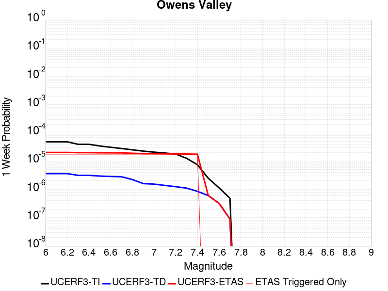 | 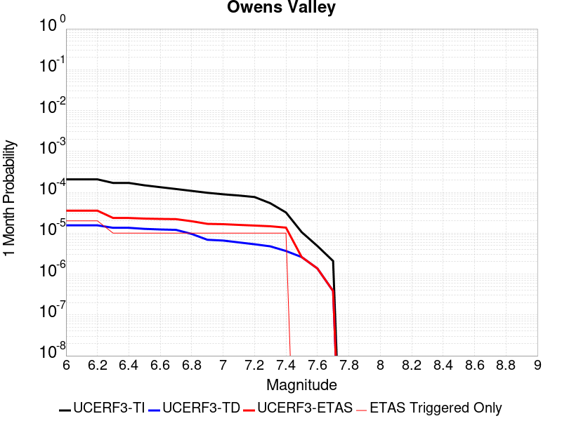 | 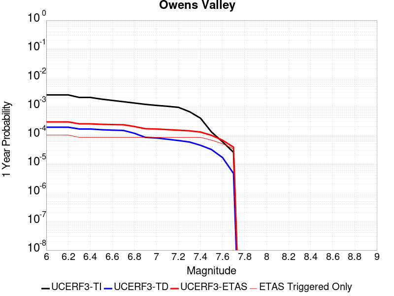 | 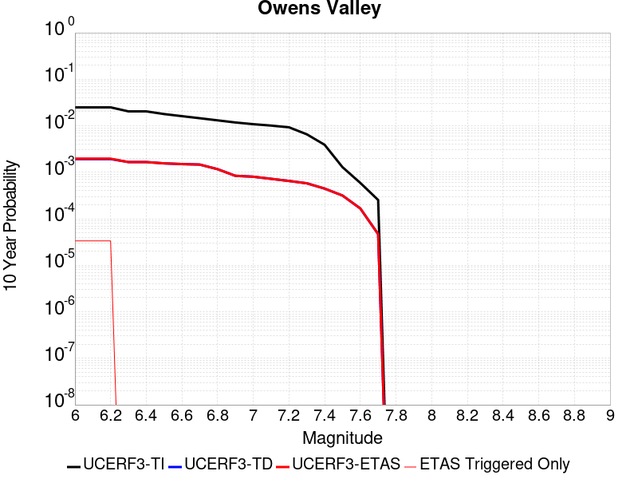 |

| Magnitude | 1 wk TI Prob | 1 wk TD Prob | 1 wk ETAS Prob | 1 wk ETAS/TD Gain | 1 wk ETAS Triggered Only | 1 mo TI Prob | 1 mo TD Prob | 1 mo ETAS Prob | 1 mo ETAS/TD Gain | 1 mo ETAS Triggered Only | 1 yr TI Prob | 1 yr TD Prob | 1 yr ETAS Prob | 1 yr ETAS/TD Gain | 1 yr ETAS Triggered Only | 10 yr TI Prob | 10 yr TD Prob | 10 yr ETAS Prob | 10 yr ETAS/TD Gain | 10 yr ETAS Triggered Only |
|-----|-----|-----|-----|-----|-----|-----|-----|-----|-----|-----|-----|-----|-----|-----|-----|-----|-----|-----|-----|-----|
| 6.0 | 4.83821E-5 | 3.627396E-6 | 2.0462352E-5 | 5.641058 | 1.6835016E-5 | 2.0733538E-4 | 1.5545897E-5 | 3.2380653E-5 | 2.0829067 | 1.6835016E-5 | 0.002521386 | 1.8925584E-4 | 2.9024683E-4 | 1.5336215 | 1.01010104E-4 | 0.024929691 | 0.0019254381 | 0.0020598588 | 1.0698131 | 1.3468013E-4 |
| 6.1 | 4.83821E-5 | 3.627396E-6 | 2.0462352E-5 | 5.641058 | 1.6835016E-5 | 2.0733538E-4 | 1.5545897E-5 | 3.2380653E-5 | 2.0829067 | 1.6835016E-5 | 0.002521386 | 1.8925584E-4 | 2.9024683E-4 | 1.5336215 | 1.01010104E-4 | 0.024929691 | 0.0019254381 | 0.0020598588 | 1.0698131 | 1.3468013E-4 |
| 6.2 | 4.83821E-5 | 3.627396E-6 | 2.0462352E-5 | 5.641058 | 1.6835016E-5 | 2.0733538E-4 | 1.5545897E-5 | 3.2380653E-5 | 2.0829067 | 1.6835016E-5 | 0.002521386 | 1.8925584E-4 | 2.9024683E-4 | 1.5336215 | 1.01010104E-4 | 0.024929691 | 0.0019254381 | 0.0020598588 | 1.0698131 | 1.3468013E-4 |
| 6.3 | 3.953008E-5 | 3.1558448E-6 | 1.9990808E-5 | 6.334535 | 1.6835016E-5 | 1.6940363E-4 | 1.3524983E-5 | 3.0359772E-5 | 2.244718 | 1.6835016E-5 | 0.002060538 | 1.6465495E-4 | 2.4881618E-4 | 1.5111369 | 8.417508E-5 | 0.020415364 | 0.0016594394 | 0.001777089 | 1.0708972 | 1.1784512E-4 |
| 6.4 | 3.953008E-5 | 3.1558448E-6 | 1.9990808E-5 | 6.334535 | 1.6835016E-5 | 1.6940363E-4 | 1.3524983E-5 | 3.0359772E-5 | 2.244718 | 1.6835016E-5 | 0.002060538 | 1.6465495E-4 | 2.4881618E-4 | 1.5111369 | 8.417508E-5 | 0.020415364 | 0.0016594394 | 0.001777089 | 1.0708972 | 1.1784512E-4 |
| 6.5 | 3.457342E-5 | 2.9718876E-6 | 1.9806854E-5 | 6.6647387 | 1.6835016E-5 | 1.4816338E-4 | 1.2736603E-5 | 2.9571405E-5 | 2.3217654 | 1.6835016E-5 | 0.0018023965 | 1.5505782E-4 | 2.3921984E-4 | 1.5427784 | 8.417508E-5 | 0.017878477 | 0.0015558768 | 0.0016735386 | 1.0756241 | 1.1784512E-4 |
| 6.6 | 3.1127765E-5 | 2.8746979E-6 | 1.9709667E-5 | 6.8562565 | 1.6835016E-5 | 1.3339789E-4 | 1.232008E-5 | 2.915489E-5 | 2.366453 | 1.6835016E-5 | 0.0016229092 | 1.4998733E-4 | 2.3414979E-4 | 1.5611304 | 8.417508E-5 | 0.016111081 | 0.001501365 | 0.0016190332 | 1.0783741 | 1.1784512E-4 |
| 6.7 | 2.806885E-5 | 2.810566E-6 | 1.9645535E-5 | 6.989886 | 1.6835016E-5 | 1.2028952E-4 | 1.2045231E-5 | 2.8880046E-5 | 2.397633 | 1.6835016E-5 | 0.001463541 | 1.4664151E-4 | 2.3080425E-4 | 1.5739353 | 8.417508E-5 | 0.014539397 | 0.001465831 | 0.0015835033 | 1.080277 | 1.1784512E-4 |
| 6.8 | 2.524524E-5 | 2.235501E-6 | 1.907048E-5 | 8.530742 | 1.6835016E-5 | 1.0818939E-4 | 9.5806845E-6 | 2.641554E-5 | 2.7571664 | 1.6835016E-5 | 0.0013164099 | 1.1663889E-4 | 2.0080416E-4 | 1.7215884 | 8.417508E-5 | 0.01308639 | 0.0011660501 | 0.0012837579 | 1.1009457 | 1.1784512E-4 |
| 6.9 | 2.2704568E-5 | 1.6082656E-6 | 1.8443256E-5 | 11.467792 | 1.6835016E-5 | 9.730166E-5 | 6.8925488E-6 | 2.3727449E-5 | 3.4424782 | 1.6835016E-5 | 0.0011840039 | 8.391357E-5 | 1.6808159E-4 | 2.0030322 | 8.417508E-5 | 0.011777153 | 8.390308E-4 | 9.56777E-4 | 1.140336 | 1.1784512E-4 |
| 7.0 | 2.0871712E-5 | 1.5396373E-6 | 1.8374629E-5 | 11.934387 | 1.6835016E-5 | 8.944713E-5 | 6.598429E-6 | 2.3433335E-5 | 3.5513506 | 1.6835016E-5 | 0.0010884746 | 8.033293E-5 | 1.6450125E-4 | 2.0477438 | 8.417508E-5 | 0.010831586 | 8.0321095E-4 | 9.209614E-4 | 1.1465997 | 1.1784512E-4 |
| 7.1 | 1.944928E-5 | 1.3864965E-6 | 1.822149E-5 | 13.142111 | 1.6835016E-5 | 8.335139E-5 | 5.942114E-6 | 2.277703E-5 | 3.8331528 | 1.6835016E-5 | 0.0010143308 | 7.2342846E-5 | 1.5651184E-4 | 2.1634736 | 8.417508E-5 | 0.010097133 | 7.233511E-4 | 8.4111094E-4 | 1.1627977 | 1.1784512E-4 |
| 7.2 | 1.7876306E-5 | 1.2489834E-6 | 1.808398E-5 | 14.478959 | 1.6835016E-5 | 7.6610486E-5 | 5.3527747E-6 | 2.2187702E-5 | 4.145084 | 1.6835016E-5 | 9.3233347E-4 | 6.516809E-5 | 1.4933769E-4 | 2.2915769 | 8.417508E-5 | 0.009284316 | 6.516274E-4 | 7.6939573E-4 | 1.1807295 | 1.1784512E-4 |
| 7.3 | 1.2618672E-5 | 1.1115851E-6 | 1.7946582E-5 | 16.145037 | 1.6835016E-5 | 5.40789E-5 | 4.763928E-6 | 2.1598864E-5 | 4.5338354 | 1.6835016E-5 | 6.582117E-4 | 5.799928E-5 | 1.4216949E-4 | 2.4512284 | 8.417508E-5 | 0.0065626553 | 5.799741E-4 | 6.977509E-4 | 1.2030724 | 1.1784512E-4 |
| 7.4 | 7.4874442E-6 | 8.549184E-7 | 1.7689921E-5 | 20.69194 | 1.6835016E-5 | 3.208865E-5 | 3.663931E-6 | 2.0498886E-5 | 5.5947795 | 1.6835016E-5 | 3.906093E-4 | 4.4607452E-5 | 1.2877877E-4 | 2.8869343 | 8.417508E-5 | 0.003899234 | 4.4607726E-4 | 5.638698E-4 | 1.2640631 | 1.1784512E-4 |
| 7.5 | 2.4734156E-6 | 6.068976E-7 | 6.068976E-7 | 1.0 | 0.0 | 1.060031E-5 | 2.6009868E-6 | 2.6009868E-6 | 1.0 | 0.0 | 1.2905113E-4 | 3.1666557E-5 | 9.9004494E-5 | 3.1264684 | 6.7340065E-5 | 0.0012897621 | 3.1662078E-4 | 4.0076923E-4 | 1.2657704 | 8.417508E-5 |
| 7.6 | 1.1328841E-6 | 3.1967096E-7 | 3.1967096E-7 | 1.0 | 0.0 | 4.8552088E-6 | 1.3700177E-6 | 1.3700177E-6 | 1.0 | 0.0 | 5.9110564E-5 | 1.6679838E-5 | 6.7184046E-5 | 4.0278597 | 5.0505052E-5 | 5.9094845E-4 | 1.6678606E-4 | 2.1728268E-4 | 1.3027629 | 5.0505052E-5 |
| 7.7 | 4.8613185E-7 | 8.965384E-8 | 8.965384E-8 | 1.0 | 0.0 | 2.0834207E-6 | 3.842307E-7 | 3.842307E-7 | 1.0 | 0.0 | 2.536535E-5 | 4.677999E-6 | 3.8347876E-5 | 8.1974945 | 3.3670032E-5 | 2.5362454E-4 | 4.6779078E-5 | 8.0447535E-5 | 1.7197332 | 3.3670032E-5 |

## Independence rev 2011
*[(top)](#table-of-contents)*

| 1 Week | 1 Month | 1 Year | 10 Year |
|-----|-----|-----|-----|
| 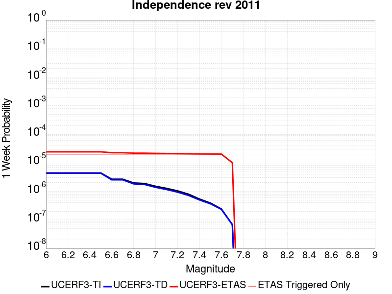 | 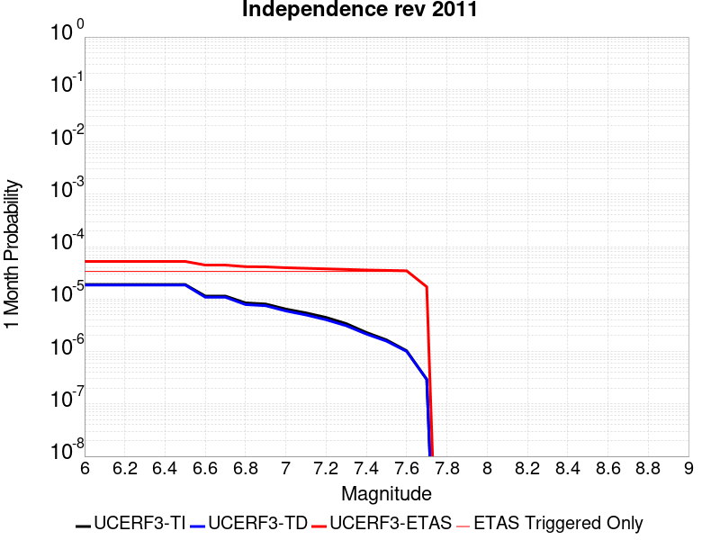 | 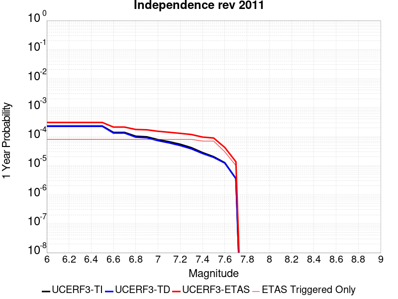 | 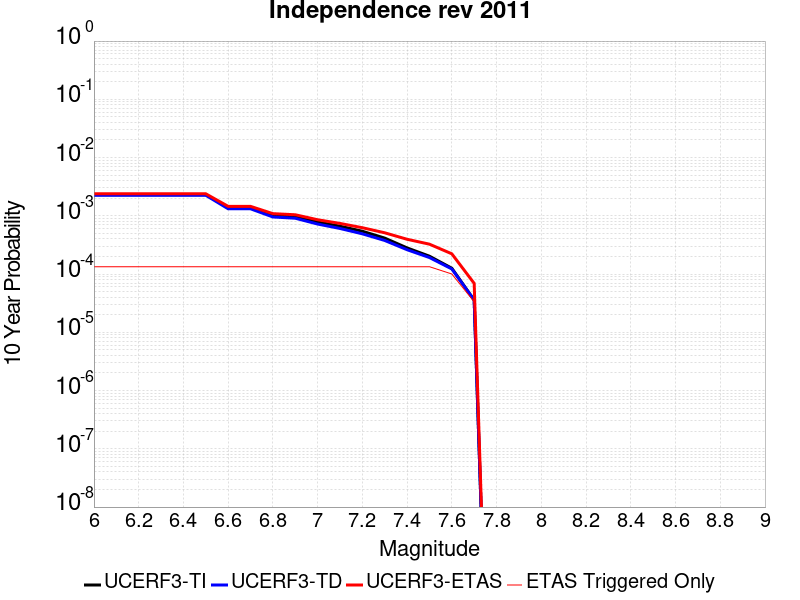 |

| Magnitude | 1 wk TI Prob | 1 wk TD Prob | 1 wk ETAS Prob | 1 wk ETAS/TD Gain | 1 wk ETAS Triggered Only | 1 mo TI Prob | 1 mo TD Prob | 1 mo ETAS Prob | 1 mo ETAS/TD Gain | 1 mo ETAS Triggered Only | 1 yr TI Prob | 1 yr TD Prob | 1 yr ETAS Prob | 1 yr ETAS/TD Gain | 1 yr ETAS Triggered Only | 10 yr TI Prob | 10 yr TD Prob | 10 yr ETAS Prob | 10 yr ETAS/TD Gain | 10 yr ETAS Triggered Only |
|-----|-----|-----|-----|-----|-----|-----|-----|-----|-----|-----|-----|-----|-----|-----|-----|-----|-----|-----|-----|-----|
| 6.0 | 4.422171E-6 | 4.3262453E-6 | 3.7996135E-5 | 8.782704 | 3.3670032E-5 | 1.8952025E-5 | 1.8540937E-5 | 5.2210347E-5 | 2.8159497 | 3.3670032E-5 | 2.3071647E-4 | 2.257155E-4 | 3.267028E-4 | 1.4474096 | 1.01010104E-4 | 0.0023047708 | 0.0022551562 | 0.0023727354 | 1.052138 | 1.1784512E-4 |
| 6.1 | 4.422171E-6 | 4.3262453E-6 | 3.7996135E-5 | 8.782704 | 3.3670032E-5 | 1.8952025E-5 | 1.8540937E-5 | 5.2210347E-5 | 2.8159497 | 3.3670032E-5 | 2.3071647E-4 | 2.257155E-4 | 3.267028E-4 | 1.4474096 | 1.01010104E-4 | 0.0023047708 | 0.0022551562 | 0.0023727354 | 1.052138 | 1.1784512E-4 |
| 6.2 | 4.422171E-6 | 4.3262453E-6 | 3.7996135E-5 | 8.782704 | 3.3670032E-5 | 1.8952025E-5 | 1.8540937E-5 | 5.2210347E-5 | 2.8159497 | 3.3670032E-5 | 2.3071647E-4 | 2.257155E-4 | 3.267028E-4 | 1.4474096 | 1.01010104E-4 | 0.0023047708 | 0.0022551562 | 0.0023727354 | 1.052138 | 1.1784512E-4 |
| 6.3 | 4.422171E-6 | 4.3262453E-6 | 3.7996135E-5 | 8.782704 | 3.3670032E-5 | 1.8952025E-5 | 1.8540937E-5 | 5.2210347E-5 | 2.8159497 | 3.3670032E-5 | 2.3071647E-4 | 2.257155E-4 | 3.267028E-4 | 1.4474096 | 1.01010104E-4 | 0.0023047708 | 0.0022551562 | 0.0023727354 | 1.052138 | 1.1784512E-4 |
| 6.4 | 4.422171E-6 | 4.3262453E-6 | 3.7996135E-5 | 8.782704 | 3.3670032E-5 | 1.8952025E-5 | 1.8540937E-5 | 5.2210347E-5 | 2.8159497 | 3.3670032E-5 | 2.3071647E-4 | 2.257155E-4 | 3.267028E-4 | 1.4474096 | 1.01010104E-4 | 0.0023047708 | 0.0022551562 | 0.0023727354 | 1.052138 | 1.1784512E-4 |
| 6.5 | 4.422171E-6 | 4.3262453E-6 | 3.7996135E-5 | 8.782704 | 3.3670032E-5 | 1.8952025E-5 | 1.8540937E-5 | 5.2210347E-5 | 2.8159497 | 3.3670032E-5 | 2.3071647E-4 | 2.257155E-4 | 3.267028E-4 | 1.4474096 | 1.01010104E-4 | 0.0023047708 | 0.0022551562 | 0.0023727354 | 1.052138 | 1.1784512E-4 |
| 6.6 | 2.663744E-6 | 2.5319996E-6 | 3.620195E-5 | 14.29777 | 3.3670032E-5 | 1.1415996E-5 | 1.0851385E-5 | 4.4521053E-5 | 4.1027994 | 3.3670032E-5 | 1.3898089E-4 | 1.3210809E-4 | 2.3310485E-4 | 1.764501 | 1.01010104E-4 | 0.0013889399 | 0.0013203438 | 0.0014212205 | 1.0764018 | 1.01010104E-4 |
| 6.7 | 2.663744E-6 | 2.5319996E-6 | 3.620195E-5 | 14.29777 | 3.3670032E-5 | 1.1415996E-5 | 1.0851385E-5 | 4.4521053E-5 | 4.1027994 | 3.3670032E-5 | 1.3898089E-4 | 1.3210809E-4 | 2.3310485E-4 | 1.764501 | 1.01010104E-4 | 0.0013889399 | 0.0013203438 | 0.0014212205 | 1.0764018 | 1.01010104E-4 |
| 6.8 | 1.9716529E-6 | 1.83227E-6 | 3.5502242E-5 | 19.376099 | 3.3670032E-5 | 8.449913E-6 | 7.852563E-6 | 4.1522333E-5 | 5.287743 | 3.3670032E-5 | 1.0287284E-4 | 9.560089E-5 | 1.9660132E-4 | 2.0564802 | 1.01010104E-4 | 0.0010282523 | 9.556105E-4 | 0.0010565241 | 1.1056012 | 1.01010104E-4 |
| 6.9 | 1.8788617E-6 | 1.7430103E-6 | 3.5412984E-5 | 20.31714 | 3.3670032E-5 | 8.0522395E-6 | 7.470024E-6 | 4.1139807E-5 | 5.5073195 | 3.3670032E-5 | 9.80316E-5 | 9.094387E-5 | 1.9194478E-4 | 2.1105852 | 1.01010104E-4 | 9.798837E-4 | 9.090785E-4 | 0.0010099967 | 1.1110116 | 1.01010104E-4 |
| 7.0 | 1.5045488E-6 | 1.3849595E-6 | 3.5054945E-5 | 25.31117 | 3.3670032E-5 | 6.44805E-6 | 5.9355275E-6 | 3.9605362E-5 | 6.672593 | 3.3670032E-5 | 7.8502184E-5 | 7.226271E-5 | 1.7326551E-4 | 2.3977168 | 1.01010104E-4 | 7.8474457E-4 | 7.2239724E-4 | 8.233343E-4 | 1.1397252 | 1.01010104E-4 |
| 7.1 | 1.272341E-6 | 1.1625177E-6 | 3.4832512E-5 | 29.962996 | 3.3670032E-5 | 5.4528787E-6 | 4.9822092E-6 | 3.8652077E-5 | 7.7580194 | 3.3670032E-5 | 6.6386776E-5 | 6.065674E-5 | 1.6166072E-4 | 2.665173 | 1.01010104E-4 | 6.636695E-4 | 6.06405E-4 | 7.073539E-4 | 1.166471 | 1.01010104E-4 |
| 7.2 | 1.0416892E-6 | 9.4099494E-7 | 3.4610995E-5 | 36.78128 | 3.3670032E-5 | 4.464375E-6 | 4.032829E-6 | 3.7702728E-5 | 9.348952 | 3.3670032E-5 | 5.4352407E-5 | 4.909861E-5 | 1.5010375E-4 | 3.0571895 | 1.01010104E-4 | 5.4339116E-4 | 4.9087947E-4 | 5.9184E-4 | 1.2056727 | 1.01010104E-4 |
| 7.3 | 7.9450155E-7 | 7.235053E-7 | 3.4393513E-5 | 47.537334 | 3.3670032E-5 | 3.4050022E-6 | 3.1007335E-6 | 3.6770663E-5 | 11.858698 | 3.3670032E-5 | 4.1455114E-5 | 3.7750786E-5 | 1.3875708E-4 | 3.6756074 | 1.01010104E-4 | 4.144738E-4 | 3.7744487E-4 | 4.7841683E-4 | 1.2675145 | 1.01010104E-4 |
| 7.4 | 5.3893444E-7 | 5.0195445E-7 | 3.417197E-5 | 68.077835 | 3.3670032E-5 | 2.309717E-6 | 2.1512315E-6 | 3.582119E-5 | 16.651482 | 3.3670032E-5 | 2.8120441E-5 | 2.6190934E-5 | 1.271984E-4 | 4.856581 | 1.01010104E-4 | 2.8116882E-4 | 2.6187891E-4 | 3.6286257E-4 | 1.385612 | 1.01010104E-4 |
| 7.5 | 3.8852085E-7 | 3.6825747E-7 | 3.403828E-5 | 92.43065 | 3.3670032E-5 | 1.6650882E-6 | 1.5782454E-6 | 3.5248228E-5 | 22.333805 | 3.3670032E-5 | 2.027226E-5 | 1.9214971E-5 | 1.2022313E-4 | 6.256743 | 1.01010104E-4 | 2.0270412E-4 | 1.921333E-4 | 2.93124E-4 | 1.5256282 | 1.01010104E-4 |
| 7.6 | 2.414929E-7 | 2.3457659E-7 | 3.3904602E-5 | 144.53532 | 3.3670032E-5 | 1.0349692E-6 | 1.0053279E-6 | 3.467533E-5 | 34.49156 | 3.3670032E-5 | 1.2600677E-5 | 1.22398E-5 | 6.2744235E-5 | 5.126247 | 5.0505052E-5 | 1.2599962E-4 | 1.2239137E-4 | 1.7289024E-4 | 1.4126015 | 5.0505052E-5 |
| 7.7 | 6.8298014E-8 | 6.858993E-8 | 1.6903605E-5 | 246.44444 | 1.6835016E-5 | 2.9270575E-7 | 2.939568E-7 | 1.7128968E-5 | 58.270363 | 1.6835016E-5 | 3.5636867E-6 | 3.5789185E-6 | 2.0413876E-5 | 5.7039227 | 1.6835016E-5 | 3.5636294E-5 | 3.5788657E-5 | 5.2623072E-5 | 1.4703841 | 1.6835016E-5 |

## San Jacinto (San Bernardino)
*[(top)](#table-of-contents)*

| 1 Week | 1 Month | 1 Year | 10 Year |
|-----|-----|-----|-----|
| 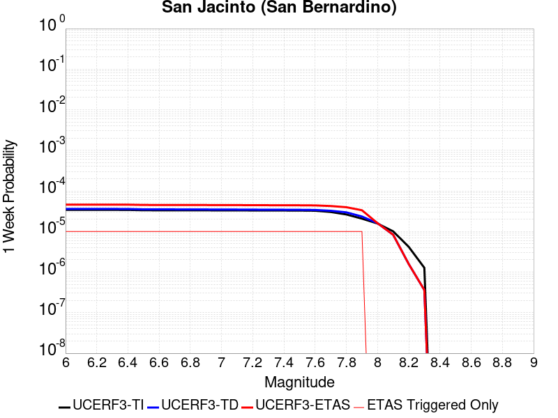 |  | 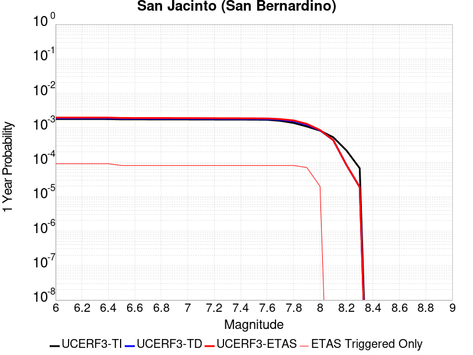 | 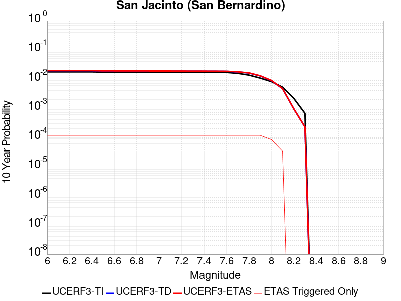 |

| Magnitude | 1 wk TI Prob | 1 wk TD Prob | 1 wk ETAS Prob | 1 wk ETAS/TD Gain | 1 wk ETAS Triggered Only | 1 mo TI Prob | 1 mo TD Prob | 1 mo ETAS Prob | 1 mo ETAS/TD Gain | 1 mo ETAS Triggered Only | 1 yr TI Prob | 1 yr TD Prob | 1 yr ETAS Prob | 1 yr ETAS/TD Gain | 1 yr ETAS Triggered Only | 10 yr TI Prob | 10 yr TD Prob | 10 yr ETAS Prob | 10 yr ETAS/TD Gain | 10 yr ETAS Triggered Only |
|-----|-----|-----|-----|-----|-----|-----|-----|-----|-----|-----|-----|-----|-----|-----|-----|-----|-----|-----|-----|-----|
| 6.0 | 3.409352E-5 | 3.600249E-5 | 3.600249E-5 | 1.0 | 0.0 | 1.461069E-4 | 1.5428728E-4 | 1.8795212E-4 | 1.2181958 | 3.3670032E-5 | 0.0017774 | 0.001876831 | 0.0019272413 | 1.0268593 | 5.0505052E-5 | 0.01763251 | 0.019358097 | 0.01947366 | 1.0059698 | 1.1784512E-4 |
| 6.1 | 3.409352E-5 | 3.600249E-5 | 3.600249E-5 | 1.0 | 0.0 | 1.461069E-4 | 1.5428728E-4 | 1.8795212E-4 | 1.2181958 | 3.3670032E-5 | 0.0017774 | 0.001876831 | 0.0019272413 | 1.0268593 | 5.0505052E-5 | 0.01763251 | 0.019358097 | 0.01947366 | 1.0059698 | 1.1784512E-4 |
| 6.2 | 3.409352E-5 | 3.600249E-5 | 3.600249E-5 | 1.0 | 0.0 | 1.461069E-4 | 1.5428728E-4 | 1.8795212E-4 | 1.2181958 | 3.3670032E-5 | 0.0017774 | 0.001876831 | 0.0019272413 | 1.0268593 | 5.0505052E-5 | 0.01763251 | 0.019358097 | 0.01947366 | 1.0059698 | 1.1784512E-4 |
| 6.3 | 3.409352E-5 | 3.600249E-5 | 3.600249E-5 | 1.0 | 0.0 | 1.461069E-4 | 1.5428728E-4 | 1.8795212E-4 | 1.2181958 | 3.3670032E-5 | 0.0017774 | 0.001876831 | 0.0019272413 | 1.0268593 | 5.0505052E-5 | 0.01763251 | 0.019358097 | 0.01947366 | 1.0059698 | 1.1784512E-4 |
| 6.4 | 3.400795E-5 | 3.589515E-5 | 3.589515E-5 | 1.0 | 0.0 | 1.4574021E-4 | 1.5382729E-4 | 1.8749216E-4 | 1.2188483 | 3.3670032E-5 | 0.0017729428 | 0.0018712406 | 0.0019216511 | 1.0269396 | 5.0505052E-5 | 0.017588645 | 0.019303178 | 0.019418748 | 1.0059872 | 1.1784512E-4 |
| 6.5 | 3.341482E-5 | 3.5155765E-5 | 3.5155765E-5 | 1.0 | 0.0 | 1.4319851E-4 | 1.5065886E-4 | 1.8432383E-4 | 1.2234516 | 3.3670032E-5 | 0.0017420477 | 0.0018327299 | 0.0018831424 | 1.0275068 | 5.0505052E-5 | 0.017284546 | 0.018924711 | 0.019040326 | 1.0061092 | 1.1784512E-4 |
| 6.6 | 3.3364955E-5 | 3.509298E-5 | 3.509298E-5 | 1.0 | 0.0 | 1.4298483E-4 | 1.5038982E-4 | 1.8405479E-4 | 1.2238513 | 3.3670032E-5 | 0.0017394501 | 0.0018294598 | 0.0018798725 | 1.0275561 | 5.0505052E-5 | 0.017258976 | 0.018892575 | 0.019008193 | 1.0061198 | 1.1784512E-4 |
| 6.7 | 3.335922E-5 | 3.5082754E-5 | 3.5082754E-5 | 1.0 | 0.0 | 1.4296026E-4 | 1.5034601E-4 | 1.8401098E-4 | 1.2239166 | 3.3670032E-5 | 0.0017391514 | 0.0018289272 | 0.0018793399 | 1.027564 | 5.0505052E-5 | 0.017256035 | 0.018887365 | 0.019002985 | 1.0061215 | 1.1784512E-4 |
| 6.8 | 3.327683E-5 | 3.4976816E-5 | 3.4976816E-5 | 1.0 | 0.0 | 1.4260718E-4 | 1.4989203E-4 | 1.8355703E-4 | 1.224595 | 3.3670032E-5 | 0.0017348597 | 0.0018234095 | 0.0018738224 | 1.0276476 | 5.0505052E-5 | 0.017213784 | 0.018833136 | 0.018948762 | 1.0061395 | 1.1784512E-4 |
| 6.9 | 3.3235785E-5 | 3.4917768E-5 | 3.4917768E-5 | 1.0 | 0.0 | 1.4243131E-4 | 1.49639E-4 | 1.83304E-4 | 1.2249748 | 3.3670032E-5 | 0.0017327217 | 0.0018203339 | 0.001870747 | 1.0276945 | 5.0505052E-5 | 0.017192734 | 0.018803004 | 0.018918633 | 1.0061495 | 1.1784512E-4 |
| 7.0 | 3.3197095E-5 | 3.4857694E-5 | 3.4857694E-5 | 1.0 | 0.0 | 1.422655E-4 | 1.4938158E-4 | 1.8304658E-4 | 1.2253625 | 3.3670032E-5 | 0.0017307063 | 0.001817205 | 0.0018676183 | 1.0277421 | 5.0505052E-5 | 0.017172894 | 0.01877238 | 0.018888013 | 1.0061598 | 1.1784512E-4 |
| 7.1 | 3.3129716E-5 | 3.47379E-5 | 3.47379E-5 | 1.0 | 0.0 | 1.4197677E-4 | 1.4886823E-4 | 1.8253324E-4 | 1.2261398 | 3.3670032E-5 | 0.0017271966 | 0.0018109654 | 0.0018613789 | 1.027838 | 5.0505052E-5 | 0.017138338 | 0.018711457 | 0.018827097 | 1.0061802 | 1.1784512E-4 |
| 7.2 | 3.3034008E-5 | 3.4605342E-5 | 3.4605342E-5 | 1.0 | 0.0 | 1.4156665E-4 | 1.4830018E-4 | 1.8196522E-4 | 1.2270061 | 3.3670032E-5 | 0.0017222111 | 0.001804061 | 0.0018544749 | 1.0279447 | 5.0505052E-5 | 0.017089253 | 0.018643849 | 0.018759497 | 1.006203 | 1.1784512E-4 |
| 7.3 | 3.2956614E-5 | 3.447309E-5 | 3.447309E-5 | 1.0 | 0.0 | 1.4123498E-4 | 1.4773346E-4 | 1.8139851E-4 | 1.227877 | 3.3670032E-5 | 0.0017181796 | 0.0017971725 | 0.0018475867 | 1.028052 | 5.0505052E-5 | 0.017049557 | 0.018576592 | 0.018692248 | 1.006226 | 1.1784512E-4 |
| 7.4 | 3.2915937E-5 | 3.439478E-5 | 3.439478E-5 | 1.0 | 0.0 | 1.4106068E-4 | 1.4739788E-4 | 1.8106295E-4 | 1.2283959 | 3.3670032E-5 | 0.0017160608 | 0.0017930934 | 0.0018435079 | 1.028116 | 5.0505052E-5 | 0.017028693 | 0.018536855 | 0.018652515 | 1.0062395 | 1.1784512E-4 |
| 7.5 | 3.281791E-5 | 3.4259683E-5 | 3.4259683E-5 | 1.0 | 0.0 | 1.406406E-4 | 1.4681896E-4 | 1.8048404E-4 | 1.2292966 | 3.3670032E-5 | 0.0017109542 | 0.0017860567 | 0.0018364715 | 1.0282269 | 5.0505052E-5 | 0.016978411 | 0.018467735 | 0.018583406 | 1.0062633 | 1.1784512E-4 |
| 7.6 | 3.2521442E-5 | 3.39846E-5 | 3.39846E-5 | 1.0 | 0.0 | 1.3937015E-4 | 1.4564018E-4 | 1.7930531E-4 | 1.2311528 | 3.3670032E-5 | 0.0016955109 | 0.0017717284 | 0.001822144 | 1.0284556 | 5.0505052E-5 | 0.016826328 | 0.01832535 | 0.018441034 | 1.0063128 | 1.1784512E-4 |
| 7.7 | 3.0287873E-5 | 3.246845E-5 | 3.246845E-5 | 1.0 | 0.0 | 1.297987E-4 | 1.391431E-4 | 1.7280845E-4 | 1.2419477 | 3.3670032E-5 | 0.0015791537 | 0.001692752 | 0.0017431715 | 1.0297855 | 5.0505052E-5 | 0.01567979 | 0.017536119 | 0.017651899 | 1.0066023 | 1.1784512E-4 |
| 7.8 | 2.6316151E-5 | 2.9678711E-5 | 2.9678711E-5 | 1.0 | 0.0 | 1.1277862E-4 | 1.2718828E-4 | 1.6085403E-4 | 1.2646922 | 3.3670032E-5 | 0.0013722149 | 0.0015474184 | 0.0015978452 | 1.0325878 | 5.0505052E-5 | 0.013637724 | 0.016077382 | 0.016193334 | 1.007212 | 1.1784512E-4 |
| 7.9 | 2.0761147E-5 | 2.3431265E-5 | 2.3431265E-5 | 1.0 | 0.0 | 8.897331E-5 | 1.0041584E-4 | 1.340825E-4 | 1.3352723 | 3.3670032E-5 | 0.0010827117 | 0.0012218781 | 0.0012723214 | 1.0412835 | 5.0505052E-5 | 0.010774517 | 0.012799971 | 0.012916308 | 1.0090889 | 1.1784512E-4 |
| 8.0 | 1.5738568E-5 | 1.6043394E-5 | 1.6043394E-5 | 1.0 | 0.0 | 6.744926E-5 | 6.8755595E-5 | 1.0242331E-4 | 1.4896724 | 3.3670032E-5 | 8.2088535E-4 | 8.3677855E-4 | 8.704204E-4 | 1.040204 | 3.3670032E-5 | 0.008178596 | 0.008871087 | 0.008954516 | 1.0094045 | 8.417508E-5 |
| 8.1 | 1.0105832E-5 | 8.336244E-6 | 8.336244E-6 | 1.0 | 0.0 | 4.3309992E-5 | 3.5726272E-5 | 3.5726272E-5 | 1.0 | 0.0 | 5.2717153E-4 | 4.3488108E-4 | 4.3488108E-4 | 1.0 | 0.0 | 0.005259227 | 0.00468032 | 0.0047138324 | 1.0071603 | 3.3670032E-5 |
| 8.2 | 4.189207E-6 | 1.5801045E-6 | 1.5801045E-6 | 1.0 | 0.0 | 1.7953622E-5 | 6.771859E-6 | 6.771859E-6 | 1.0 | 0.0 | 2.1856341E-4 | 8.244429E-5 | 8.244429E-5 | 1.0 | 0.0 | 0.0021834858 | 9.575395E-4 | 9.575395E-4 | 1.0 | 0.0 |
| 8.3 | 1.2758221E-6 | 3.6194777E-7 | 3.6194777E-7 | 1.0 | 0.0 | 5.4677976E-6 | 1.5512038E-6 | 1.5512038E-6 | 1.0 | 0.0 | 6.65684E-5 | 1.8885747E-5 | 1.8885747E-5 | 1.0 | 0.0 | 6.6548464E-4 | 2.2777634E-4 | 2.2777634E-4 | 1.0 | 0.0 |

## White Mountains
*[(top)](#table-of-contents)*

| 1 Week | 1 Month | 1 Year | 10 Year |
|-----|-----|-----|-----|
| 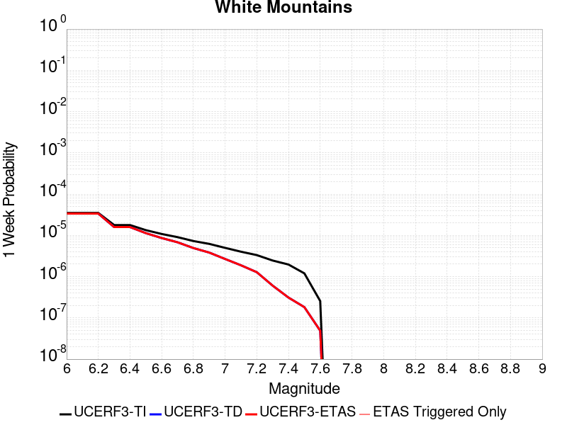 |  | 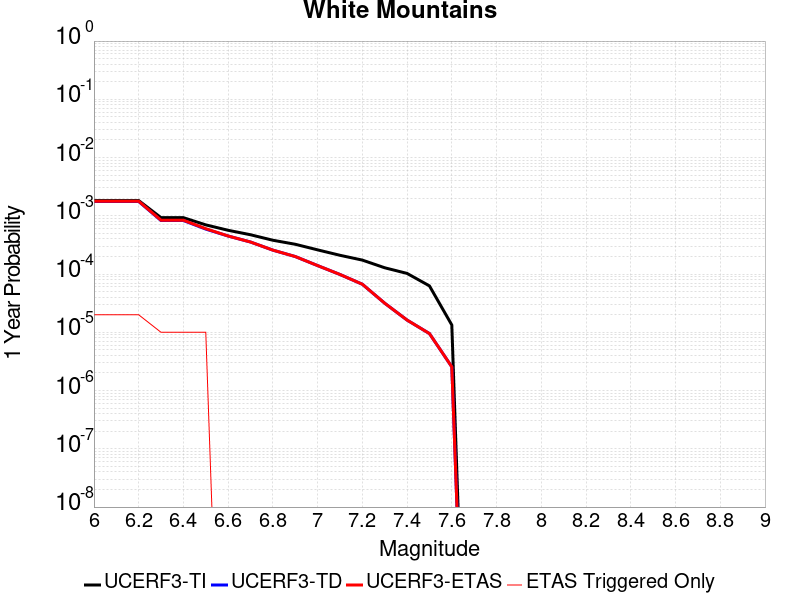 | 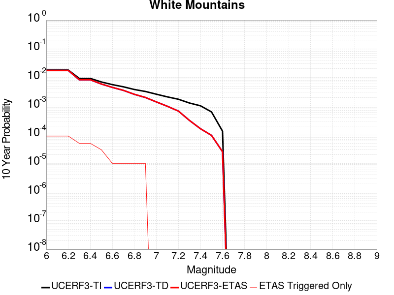 |

| Magnitude | 1 wk TI Prob | 1 wk TD Prob | 1 wk ETAS Prob | 1 wk ETAS/TD Gain | 1 wk ETAS Triggered Only | 1 mo TI Prob | 1 mo TD Prob | 1 mo ETAS Prob | 1 mo ETAS/TD Gain | 1 mo ETAS Triggered Only | 1 yr TI Prob | 1 yr TD Prob | 1 yr ETAS Prob | 1 yr ETAS/TD Gain | 1 yr ETAS Triggered Only | 10 yr TI Prob | 10 yr TD Prob | 10 yr ETAS Prob | 10 yr ETAS/TD Gain | 10 yr ETAS Triggered Only |
|-----|-----|-----|-----|-----|-----|-----|-----|-----|-----|-----|-----|-----|-----|-----|-----|-----|-----|-----|-----|-----|
| 6.0 | 3.503579E-5 | 3.3784425E-5 | 3.3784425E-5 | 1.0 | 0.0 | 1.5014476E-4 | 1.4478304E-4 | 1.4478304E-4 | 1.0 | 0.0 | 0.0018264796 | 0.0017614291 | 0.0017782345 | 1.0095408 | 1.6835016E-5 | 0.018115403 | 0.017487012 | 0.017602796 | 1.0066211 | 1.1784512E-4 |
| 6.1 | 3.503579E-5 | 3.3784425E-5 | 3.3784425E-5 | 1.0 | 0.0 | 1.5014476E-4 | 1.4478304E-4 | 1.4478304E-4 | 1.0 | 0.0 | 0.0018264796 | 0.0017614291 | 0.0017782345 | 1.0095408 | 1.6835016E-5 | 0.018115403 | 0.017487012 | 0.017602796 | 1.0066211 | 1.1784512E-4 |
| 6.2 | 3.503579E-5 | 3.3784425E-5 | 3.3784425E-5 | 1.0 | 0.0 | 1.5014476E-4 | 1.4478304E-4 | 1.4478304E-4 | 1.0 | 0.0 | 0.0018264796 | 0.0017614291 | 0.0017782345 | 1.0095408 | 1.6835016E-5 | 0.018115403 | 0.017487012 | 0.017602796 | 1.0066211 | 1.1784512E-4 |
| 6.3 | 1.7818425E-5 | 1.5916237E-5 | 1.5916237E-5 | 1.0 | 0.0 | 7.636245E-5 | 6.821074E-5 | 6.821074E-5 | 1.0 | 0.0 | 9.293162E-4 | 8.301636E-4 | 8.469847E-4 | 1.0202624 | 1.6835016E-5 | 0.009254395 | 0.0082720835 | 0.008338866 | 1.0080733 | 6.7340065E-5 |
| 6.4 | 1.7818425E-5 | 1.5916237E-5 | 1.5916237E-5 | 1.0 | 0.0 | 7.636245E-5 | 6.821074E-5 | 6.821074E-5 | 1.0 | 0.0 | 9.293162E-4 | 8.301636E-4 | 8.469847E-4 | 1.0202624 | 1.6835016E-5 | 0.009254395 | 0.0082720835 | 0.008338866 | 1.0080733 | 6.7340065E-5 |
| 6.5 | 1.3397557E-5 | 1.1336382E-5 | 1.1336382E-5 | 1.0 | 0.0 | 5.741684E-5 | 4.8583628E-5 | 4.8583628E-5 | 1.0 | 0.0 | 6.988258E-4 | 5.913521E-4 | 6.0817716E-4 | 1.0284518 | 1.6835016E-5 | 0.006966323 | 0.0058984905 | 0.0059319623 | 1.0056746 | 3.3670032E-5 |
| 6.6 | 1.0818695E-5 | 8.625452E-6 | 8.625452E-6 | 1.0 | 0.0 | 4.6365014E-5 | 3.6965725E-5 | 3.6965725E-5 | 1.0 | 0.0 | 5.6434784E-4 | 4.499691E-4 | 4.499691E-4 | 1.0 | 0.0 | 0.005629168 | 0.0044910167 | 0.004507776 | 1.0037317 | 1.6835016E-5 |
| 6.7 | 9.067908E-6 | 6.8025106E-6 | 6.8025106E-6 | 1.0 | 0.0 | 3.8861883E-5 | 2.915331E-5 | 2.915331E-5 | 1.0 | 0.0 | 4.7304068E-4 | 3.5488693E-4 | 3.5488693E-4 | 1.0 | 0.0 | 0.00472035 | 0.0035435192 | 0.0035602946 | 1.004734 | 1.6835016E-5 |
| 6.8 | 7.295947E-6 | 4.9364417E-6 | 4.9364417E-6 | 1.0 | 0.0 | 3.126797E-5 | 2.1156015E-5 | 2.1156015E-5 | 1.0 | 0.0 | 3.8062103E-4 | 2.5754515E-4 | 2.5754515E-4 | 1.0 | 0.0 | 0.0037996976 | 0.0025725798 | 0.0025893715 | 1.0065272 | 1.6835016E-5 |
| 6.9 | 6.2243444E-6 | 3.832255E-6 | 3.832255E-6 | 1.0 | 0.0 | 2.6675489E-5 | 1.6423848E-5 | 1.6423848E-5 | 1.0 | 0.0 | 3.2472567E-4 | 1.9994254E-4 | 1.9994254E-4 | 1.0 | 0.0 | 0.0032425157 | 0.0019976792 | 0.0020144805 | 1.0084105 | 1.6835016E-5 |
| 7.0 | 4.9878413E-6 | 2.6795697E-6 | 2.6795697E-6 | 1.0 | 0.0 | 2.1376287E-5 | 1.1483821E-5 | 1.1483821E-5 | 1.0 | 0.0 | 2.602252E-4 | 1.3980681E-4 | 1.3980681E-4 | 1.0 | 0.0 | 0.002599207 | 0.0013972148 | 0.0013972148 | 1.0 | 0.0 |
| 7.1 | 4.0252844E-6 | 1.88579E-6 | 1.88579E-6 | 1.0 | 0.0 | 1.7251105E-5 | 8.081933E-6 | 8.081933E-6 | 1.0 | 0.0 | 2.1001195E-4 | 9.839322E-5 | 9.839322E-5 | 1.0 | 0.0 | 0.0020981359 | 9.835094E-4 | 9.835094E-4 | 1.0 | 0.0 |
| 7.2 | 3.3284066E-6 | 1.2819944E-6 | 1.2819944E-6 | 1.0 | 0.0 | 1.4264522E-5 | 5.4942507E-6 | 5.4942507E-6 | 1.0 | 0.0 | 1.736567E-4 | 6.689055E-5 | 6.689055E-5 | 1.0 | 0.0 | 0.0017352107 | 6.6871423E-4 | 6.6871423E-4 | 1.0 | 0.0 |
| 7.3 | 2.458226E-6 | 6.057493E-7 | 6.057493E-7 | 1.0 | 0.0 | 1.0535211E-5 | 2.596066E-6 | 2.596066E-6 | 1.0 | 0.0 | 1.2825865E-4 | 3.1606683E-5 | 3.1606683E-5 | 1.0 | 0.0 | 0.0012818464 | 3.1602563E-4 | 3.1602563E-4 | 1.0 | 0.0 |
| 7.4 | 1.965953E-6 | 3.1091668E-7 | 3.1091668E-7 | 1.0 | 0.0 | 8.425486E-6 | 1.3324994E-6 | 1.3324994E-6 | 1.0 | 0.0 | 1.0257547E-4 | 1.622306E-5 | 1.622306E-5 | 1.0 | 0.0 | 0.0010252813 | 1.6221889E-4 | 1.6221889E-4 | 1.0 | 0.0 |
| 7.5 | 1.2014192E-6 | 1.824589E-7 | 1.824589E-7 | 1.0 | 0.0 | 5.148929E-6 | 7.819665E-7 | 7.819665E-7 | 1.0 | 0.0 | 6.2686406E-5 | 9.520401E-6 | 9.520401E-6 | 1.0 | 0.0 | 6.266873E-4 | 9.520002E-5 | 9.520002E-5 | 1.0 | 0.0 |
| 7.6 | 2.5612175E-7 | 4.8950795E-8 | 4.8950795E-8 | 1.0 | 0.0 | 1.0976642E-6 | 2.097891E-7 | 2.097891E-7 | 1.0 | 0.0 | 1.3363979E-5 | 2.5541797E-6 | 2.5541797E-6 | 1.0 | 0.0 | 1.3363175E-4 | 2.554154E-5 | 2.554154E-5 | 1.0 | 0.0 |

## Cleghorn Pass
*[(top)](#table-of-contents)*

| 1 Week | 1 Month | 1 Year | 10 Year |
|-----|-----|-----|-----|
| 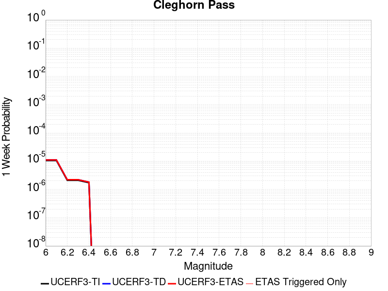 | 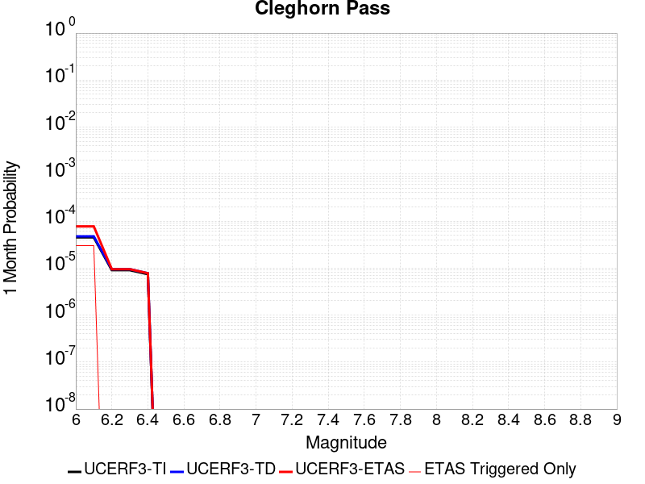 | 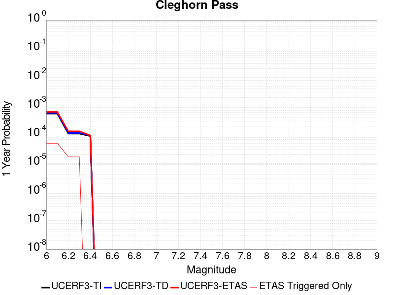 | 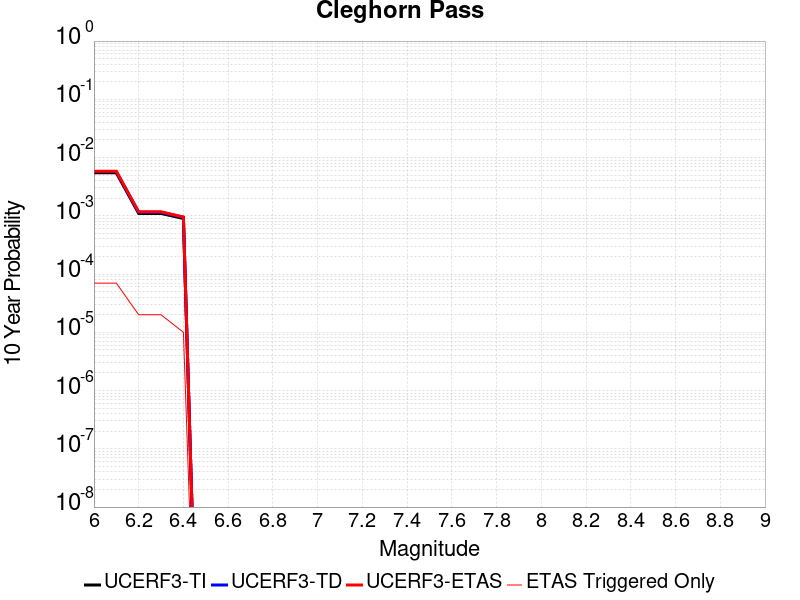 |

| Magnitude | 1 wk TI Prob | 1 wk TD Prob | 1 wk ETAS Prob | 1 wk ETAS/TD Gain | 1 wk ETAS Triggered Only | 1 mo TI Prob | 1 mo TD Prob | 1 mo ETAS Prob | 1 mo ETAS/TD Gain | 1 mo ETAS Triggered Only | 1 yr TI Prob | 1 yr TD Prob | 1 yr ETAS Prob | 1 yr ETAS/TD Gain | 1 yr ETAS Triggered Only | 10 yr TI Prob | 10 yr TD Prob | 10 yr ETAS Prob | 10 yr ETAS/TD Gain | 10 yr ETAS Triggered Only |
|-----|-----|-----|-----|-----|-----|-----|-----|-----|-----|-----|-----|-----|-----|-----|-----|-----|-----|-----|-----|-----|
| 6.0 | 1.0522846E-5 | 1.1040714E-5 | 1.1040714E-5 | 1.0 | 0.0 | 4.509713E-5 | 4.7316782E-5 | 6.4151005E-5 | 1.3557769 | 1.6835016E-5 | 5.4891926E-4 | 5.759822E-4 | 6.2645815E-4 | 1.0876346 | 5.0505052E-5 | 0.0054756533 | 0.005750059 | 0.00583375 | 1.0145549 | 8.417508E-5 |
| 6.1 | 1.0522846E-5 | 1.1040714E-5 | 1.1040714E-5 | 1.0 | 0.0 | 4.509713E-5 | 4.7316782E-5 | 6.4151005E-5 | 1.3557769 | 1.6835016E-5 | 5.4891926E-4 | 5.759822E-4 | 6.2645815E-4 | 1.0876346 | 5.0505052E-5 | 0.0054756533 | 0.005750059 | 0.00583375 | 1.0145549 | 8.417508E-5 |
| 6.2 | 2.1045846E-6 | 2.2082168E-6 | 2.2082168E-6 | 1.0 | 0.0 | 9.019617E-6 | 9.463776E-6 | 9.463776E-6 | 1.0 | 0.0 | 1.098083E-4 | 1.1521958E-4 | 1.3205265E-4 | 1.1460956 | 1.6835016E-5 | 0.0010975406 | 0.0011520098 | 0.0011688254 | 1.0145968 | 1.6835016E-5 |
| 6.3 | 2.1045846E-6 | 2.2082168E-6 | 2.2082168E-6 | 1.0 | 0.0 | 9.019617E-6 | 9.463776E-6 | 9.463776E-6 | 1.0 | 0.0 | 1.098083E-4 | 1.1521958E-4 | 1.3205265E-4 | 1.1460956 | 1.6835016E-5 | 0.0010975406 | 0.0011520098 | 0.0011688254 | 1.0145968 | 1.6835016E-5 |
| 6.4 | 1.7259927E-6 | 1.8108889E-6 | 1.8108889E-6 | 1.0 | 0.0 | 7.3970905E-6 | 7.760952E-6 | 7.760952E-6 | 1.0 | 0.0 | 9.005586E-5 | 9.4489595E-5 | 9.4489595E-5 | 1.0 | 0.0 | 9.001937E-4 | 9.4489596E-4 | 9.4489596E-4 | 1.0 | 0.0 |

## Tin Mountain
*[(top)](#table-of-contents)*

| 1 Week | 1 Month | 1 Year | 10 Year |
|-----|-----|-----|-----|
|  |  | 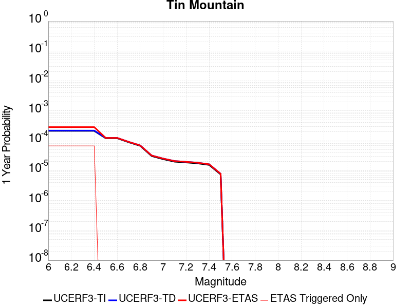 | 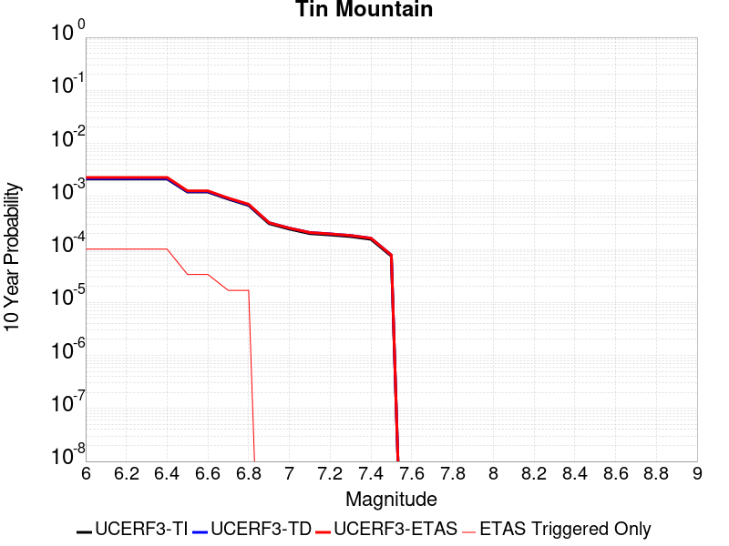 |

| Magnitude | 1 wk TI Prob | 1 wk TD Prob | 1 wk ETAS Prob | 1 wk ETAS/TD Gain | 1 wk ETAS Triggered Only | 1 mo TI Prob | 1 mo TD Prob | 1 mo ETAS Prob | 1 mo ETAS/TD Gain | 1 mo ETAS Triggered Only | 1 yr TI Prob | 1 yr TD Prob | 1 yr ETAS Prob | 1 yr ETAS/TD Gain | 1 yr ETAS Triggered Only | 10 yr TI Prob | 10 yr TD Prob | 10 yr ETAS Prob | 10 yr ETAS/TD Gain | 10 yr ETAS Triggered Only |
|-----|-----|-----|-----|-----|-----|-----|-----|-----|-----|-----|-----|-----|-----|-----|-----|-----|-----|-----|-----|-----|
| 6.0 | 4.083776E-6 | 4.18155E-6 | 4.18155E-6 | 1.0 | 0.0 | 1.750178E-5 | 1.7920827E-5 | 3.4755543E-5 | 1.9393939 | 1.6835016E-5 | 2.1306332E-4 | 2.1816794E-4 | 2.8549333E-4 | 1.3085942 | 6.7340065E-5 | 0.0021285915 | 0.0021799032 | 0.0022806933 | 1.0462359 | 1.01010104E-4 |
| 6.1 | 4.083776E-6 | 4.18155E-6 | 4.18155E-6 | 1.0 | 0.0 | 1.750178E-5 | 1.7920827E-5 | 3.4755543E-5 | 1.9393939 | 1.6835016E-5 | 2.1306332E-4 | 2.1816794E-4 | 2.8549333E-4 | 1.3085942 | 6.7340065E-5 | 0.0021285915 | 0.0021799032 | 0.0022806933 | 1.0462359 | 1.01010104E-4 |
| 6.2 | 4.083776E-6 | 4.18155E-6 | 4.18155E-6 | 1.0 | 0.0 | 1.750178E-5 | 1.7920827E-5 | 3.4755543E-5 | 1.9393939 | 1.6835016E-5 | 2.1306332E-4 | 2.1816794E-4 | 2.8549333E-4 | 1.3085942 | 6.7340065E-5 | 0.0021285915 | 0.0021799032 | 0.0022806933 | 1.0462359 | 1.01010104E-4 |
| 6.3 | 4.083776E-6 | 4.18155E-6 | 4.18155E-6 | 1.0 | 0.0 | 1.750178E-5 | 1.7920827E-5 | 3.4755543E-5 | 1.9393939 | 1.6835016E-5 | 2.1306332E-4 | 2.1816794E-4 | 2.8549333E-4 | 1.3085942 | 6.7340065E-5 | 0.0021285915 | 0.0021799032 | 0.0022806933 | 1.0462359 | 1.01010104E-4 |
| 6.4 | 4.083776E-6 | 4.18155E-6 | 4.18155E-6 | 1.0 | 0.0 | 1.750178E-5 | 1.7920827E-5 | 3.4755543E-5 | 1.9393939 | 1.6835016E-5 | 2.1306332E-4 | 2.1816794E-4 | 2.8549333E-4 | 1.3085942 | 6.7340065E-5 | 0.0021285915 | 0.0021799032 | 0.0022806933 | 1.0462359 | 1.01010104E-4 |
| 6.5 | 2.3143427E-6 | 2.3731652E-6 | 2.3731652E-6 | 1.0 | 0.0 | 9.9185745E-6 | 1.0170673E-5 | 1.0170673E-5 | 1.0 | 0.0 | 1.2075195E-4 | 1.2382168E-4 | 1.406546E-4 | 1.135945 | 1.6835016E-5 | 0.0012068636 | 0.0012376028 | 0.0012712312 | 1.0271722 | 3.3670032E-5 |
| 6.6 | 2.3143427E-6 | 2.3731652E-6 | 2.3731652E-6 | 1.0 | 0.0 | 9.9185745E-6 | 1.0170673E-5 | 1.0170673E-5 | 1.0 | 0.0 | 1.2075195E-4 | 1.2382168E-4 | 1.406546E-4 | 1.135945 | 1.6835016E-5 | 0.0012068636 | 0.0012376028 | 0.0012712312 | 1.0271722 | 3.3670032E-5 |
| 6.7 | 1.7029532E-6 | 1.7497979E-6 | 1.7497979E-6 | 1.0 | 0.0 | 7.2983503E-6 | 7.4991153E-6 | 7.4991153E-6 | 1.0 | 0.0 | 8.885379E-5 | 9.129844E-5 | 1.0813192E-4 | 1.1843786 | 1.6835016E-5 | 8.881827E-4 | 9.1266196E-4 | 9.2948164E-4 | 1.0184293 | 1.6835016E-5 |
| 6.8 | 1.2914646E-6 | 1.3299432E-6 | 1.3299432E-6 | 1.0 | 0.0 | 5.534837E-6 | 5.6997465E-6 | 5.6997465E-6 | 1.0 | 0.0 | 6.738455E-5 | 6.939264E-5 | 8.622649E-5 | 1.2425884 | 1.6835016E-5 | 6.736412E-4 | 6.937531E-4 | 7.105764E-4 | 1.0242498 | 1.6835016E-5 |
| 6.9 | 5.8708974E-7 | 6.117028E-7 | 6.117028E-7 | 1.0 | 0.0 | 2.5160964E-6 | 2.621581E-6 | 2.621581E-6 | 1.0 | 0.0 | 3.0633044E-5 | 3.1917323E-5 | 3.1917323E-5 | 1.0 | 0.0 | 3.0628822E-4 | 3.191315E-4 | 3.191315E-4 | 1.0 | 0.0 |
| 7.0 | 4.6248786E-7 | 4.832044E-7 | 4.832044E-7 | 1.0 | 0.0 | 1.9820893E-6 | 2.0708746E-6 | 2.0708746E-6 | 1.0 | 0.0 | 2.413167E-5 | 2.5212645E-5 | 2.5212645E-5 | 1.0 | 0.0 | 2.412905E-4 | 2.5210154E-4 | 2.5210154E-4 | 1.0 | 0.0 |
| 7.1 | 3.804606E-7 | 3.9871725E-7 | 3.9871725E-7 | 1.0 | 0.0 | 1.6305444E-6 | 1.7087873E-6 | 1.7087873E-6 | 1.0 | 0.0 | 1.9851697E-5 | 2.080432E-5 | 2.080432E-5 | 1.0 | 0.0 | 1.9849923E-4 | 2.080271E-4 | 2.080271E-4 | 1.0 | 0.0 |
| 7.2 | 3.5864858E-7 | 3.7617107E-7 | 3.7617107E-7 | 1.0 | 0.0 | 1.5370645E-6 | 1.6121609E-6 | 1.6121609E-6 | 1.0 | 0.0 | 1.87136E-5 | 1.9627916E-5 | 1.9627916E-5 | 1.0 | 0.0 | 1.8712023E-4 | 1.9626514E-4 | 1.9626514E-4 | 1.0 | 0.0 |
| 7.3 | 3.342063E-7 | 3.50637E-7 | 3.50637E-7 | 1.0 | 0.0 | 1.4323119E-6 | 1.5027293E-6 | 1.5027293E-6 | 1.0 | 0.0 | 1.7438259E-5 | 1.829561E-5 | 1.829561E-5 | 1.0 | 0.0 | 1.743689E-4 | 1.8294434E-4 | 1.8294434E-4 | 1.0 | 0.0 |
| 7.4 | 2.971242E-7 | 3.116602E-7 | 3.116602E-7 | 1.0 | 0.0 | 1.2733886E-6 | 1.3356861E-6 | 1.3356861E-6 | 1.0 | 0.0 | 1.5503398E-5 | 1.626189E-5 | 1.626189E-5 | 1.0 | 0.0 | 1.5502315E-4 | 1.6261027E-4 | 1.6261027E-4 | 1.0 | 0.0 |
| 7.5 | 1.4326713E-7 | 1.501262E-7 | 1.501262E-7 | 1.0 | 0.0 | 6.140018E-7 | 6.43398E-7 | 6.43398E-7 | 1.0 | 0.0 | 7.4754466E-6 | 7.833371E-6 | 7.833371E-6 | 1.0 | 0.0 | 7.475195E-5 | 7.83337E-5 | 7.83337E-5 | 1.0 | 0.0 |

## Santa Ynez (West)
*[(top)](#table-of-contents)*

| 1 Week | 1 Month | 1 Year | 10 Year |
|-----|-----|-----|-----|
|  | 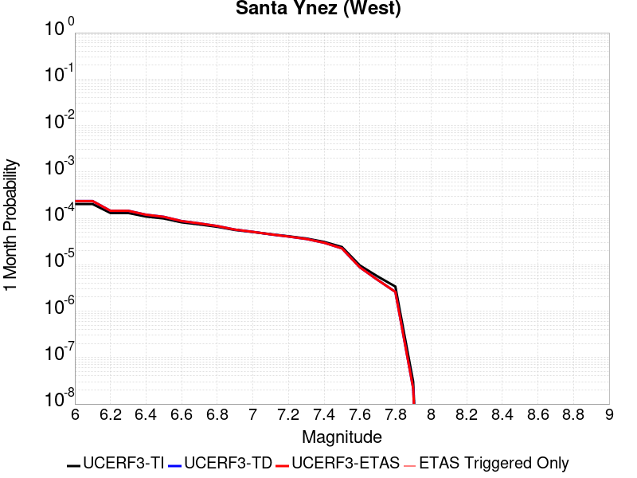 | 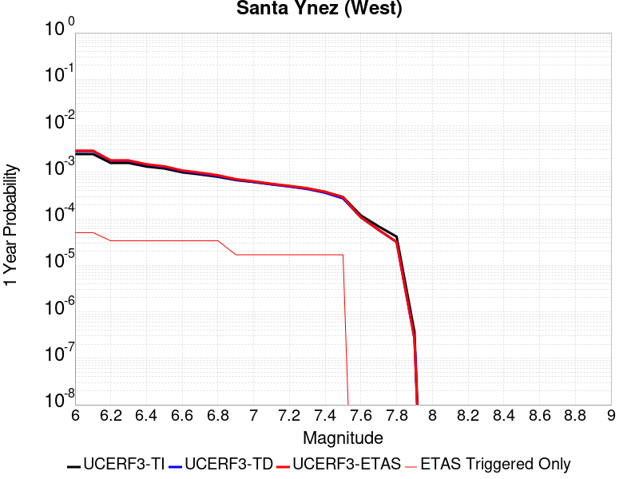 | 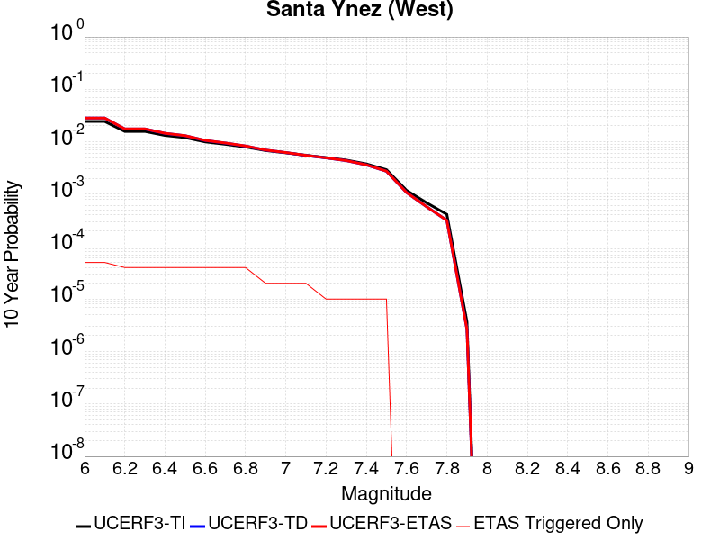 |

| Magnitude | 1 wk TI Prob | 1 wk TD Prob | 1 wk ETAS Prob | 1 wk ETAS/TD Gain | 1 wk ETAS Triggered Only | 1 mo TI Prob | 1 mo TD Prob | 1 mo ETAS Prob | 1 mo ETAS/TD Gain | 1 mo ETAS Triggered Only | 1 yr TI Prob | 1 yr TD Prob | 1 yr ETAS Prob | 1 yr ETAS/TD Gain | 1 yr ETAS Triggered Only | 10 yr TI Prob | 10 yr TD Prob | 10 yr ETAS Prob | 10 yr ETAS/TD Gain | 10 yr ETAS Triggered Only |
|-----|-----|-----|-----|-----|-----|-----|-----|-----|-----|-----|-----|-----|-----|-----|-----|-----|-----|-----|-----|-----|
| 6.0 | 4.7352758E-5 | 5.497349E-5 | 5.497349E-5 | 1.0 | 0.0 | 2.0292461E-4 | 2.3558107E-4 | 2.3558107E-4 | 1.0 | 0.0 | 0.0024678076 | 0.0028645964 | 0.0029149568 | 1.0175803 | 5.0505052E-5 | 0.024405818 | 0.028305095 | 0.02837053 | 1.0023117 | 6.7340065E-5 |
| 6.1 | 4.7352758E-5 | 5.497349E-5 | 5.497349E-5 | 1.0 | 0.0 | 2.0292461E-4 | 2.3558107E-4 | 2.3558107E-4 | 1.0 | 0.0 | 0.0024678076 | 0.0028645964 | 0.0029149568 | 1.0175803 | 5.0505052E-5 | 0.024405818 | 0.028305095 | 0.02837053 | 1.0023117 | 6.7340065E-5 |
| 6.2 | 3.0415853E-5 | 3.3925786E-5 | 3.3925786E-5 | 1.0 | 0.0 | 1.3034715E-4 | 1.4538833E-4 | 1.4538833E-4 | 1.0 | 0.0 | 0.0015858212 | 0.0017687011 | 0.0018023116 | 1.0190029 | 3.3670032E-5 | 0.015745522 | 0.01755015 | 0.017599769 | 1.0028273 | 5.0505052E-5 |
| 6.3 | 3.0415853E-5 | 3.3925786E-5 | 3.3925786E-5 | 1.0 | 0.0 | 1.3034715E-4 | 1.4538833E-4 | 1.4538833E-4 | 1.0 | 0.0 | 0.0015858212 | 0.0017687011 | 0.0018023116 | 1.0190029 | 3.3670032E-5 | 0.015745522 | 0.01755015 | 0.017599769 | 1.0028273 | 5.0505052E-5 |
| 6.4 | 2.5452082E-5 | 2.7912925E-5 | 2.7912925E-5 | 1.0 | 0.0 | 1.09075794E-4 | 1.1962145E-4 | 1.1962145E-4 | 1.0 | 0.0 | 0.0013271887 | 0.001455435 | 0.0014890559 | 1.0231004 | 3.3670032E-5 | 0.013192902 | 0.014461209 | 0.014510984 | 1.0034419 | 5.0505052E-5 |
| 6.5 | 2.3143784E-5 | 2.5128682E-5 | 2.5128682E-5 | 1.0 | 0.0 | 9.9183875E-5 | 1.0768999E-4 | 1.0768999E-4 | 1.0 | 0.0 | 0.0012068948 | 0.0013103489 | 0.0013439747 | 1.0256618 | 3.3670032E-5 | 0.012003611 | 0.013027899 | 0.013077746 | 1.0038261 | 5.0505052E-5 |
| 6.6 | 1.9118515E-5 | 2.0354646E-5 | 2.0354646E-5 | 1.0 | 0.0 | 8.193392E-5 | 8.723133E-5 | 8.723133E-5 | 1.0 | 0.0 | 9.97089E-4 | 0.001061532 | 0.0010951663 | 1.0316846 | 3.3670032E-5 | 0.00992627 | 0.010565523 | 0.010615495 | 1.0047296 | 5.0505052E-5 |
| 6.7 | 1.722807E-5 | 1.8146604E-5 | 1.8146604E-5 | 1.0 | 0.0 | 7.3832496E-5 | 7.776888E-5 | 7.776888E-5 | 1.0 | 0.0 | 8.985399E-4 | 9.464303E-4 | 9.800685E-4 | 1.0355421 | 3.3670032E-5 | 0.008949154 | 0.009424643 | 0.009474672 | 1.0053083 | 5.0505052E-5 |
| 6.8 | 1.5317364E-5 | 1.5926695E-5 | 1.5926695E-5 | 1.0 | 0.0 | 6.56442E-5 | 6.82555E-5 | 6.82555E-5 | 1.0 | 0.0 | 7.98925E-4 | 8.306982E-4 | 8.643402E-4 | 1.0404985 | 3.3670032E-5 | 0.007960589 | 0.008276418 | 0.008326505 | 1.0060518 | 5.0505052E-5 |
| 6.9 | 1.3071226E-5 | 1.3329779E-5 | 1.3329779E-5 | 1.0 | 0.0 | 5.6018336E-5 | 5.7126388E-5 | 5.7126388E-5 | 1.0 | 0.0 | 6.8180985E-4 | 6.9529406E-4 | 7.1211735E-4 | 1.0241959 | 1.6835016E-5 | 0.0067972173 | 0.0069314474 | 0.006964884 | 1.0048239 | 3.3670032E-5 |
| 7.0 | 1.1836986E-5 | 1.19329125E-5 | 1.19329125E-5 | 1.0 | 0.0 | 5.0728955E-5 | 5.1140058E-5 | 5.1140058E-5 | 1.0 | 0.0 | 6.1745E-4 | 6.2245404E-4 | 6.3927856E-4 | 1.0270294 | 1.6835016E-5 | 0.006157372 | 0.006207299 | 0.00624076 | 1.0053906 | 3.3670032E-5 |
| 7.1 | 1.0597169E-5 | 1.0542309E-5 | 1.0542309E-5 | 1.0 | 0.0 | 4.541565E-5 | 4.5180546E-5 | 4.5180546E-5 | 1.0 | 0.0 | 5.5279525E-4 | 5.4993544E-4 | 5.6676124E-4 | 1.0305959 | 1.6835016E-5 | 0.0055142213 | 0.005485877 | 0.005519362 | 1.0061039 | 3.3670032E-5 |
| 7.2 | 9.59113E-6 | 9.459241E-6 | 9.459241E-6 | 1.0 | 0.0 | 4.11042E-5 | 4.053898E-5 | 4.053898E-5 | 1.0 | 0.0 | 5.0032866E-4 | 4.9345137E-4 | 5.1027804E-4 | 1.0341 | 1.6835016E-5 | 0.004992037 | 0.0049236757 | 0.004940428 | 1.0034024 | 1.6835016E-5 |
| 7.3 | 8.586084E-6 | 8.379669E-6 | 8.379669E-6 | 1.0 | 0.0 | 3.679698E-5 | 3.591238E-5 | 3.591238E-5 | 1.0 | 0.0 | 4.4791115E-4 | 4.3714655E-4 | 4.539742E-4 | 1.0384943 | 1.6835016E-5 | 0.004470094 | 0.0043629776 | 0.004379739 | 1.0038418 | 1.6835016E-5 |
| 7.4 | 7.2622997E-6 | 6.951613E-6 | 6.951613E-6 | 1.0 | 0.0 | 3.112377E-5 | 2.9792294E-5 | 2.9792294E-5 | 1.0 | 0.0 | 3.78866E-4 | 3.6266178E-4 | 3.794907E-4 | 1.0464039 | 1.6835016E-5 | 0.0037822074 | 0.0036207996 | 0.0036375737 | 1.0046327 | 1.6835016E-5 |
| 7.5 | 5.627296E-6 | 5.251639E-6 | 5.251639E-6 | 1.0 | 0.0 | 2.411676E-5 | 2.2506834E-5 | 2.2506834E-5 | 1.0 | 0.0 | 2.9358198E-4 | 2.7398695E-4 | 2.9081738E-4 | 1.0614277 | 1.6835016E-5 | 0.0029319443 | 0.0027365636 | 0.0027533525 | 1.0061351 | 1.6835016E-5 |
| 7.6 | 2.265244E-6 | 2.0608784E-6 | 2.0608784E-6 | 1.0 | 0.0 | 9.708152E-6 | 8.832307E-6 | 8.832307E-6 | 1.0 | 0.0 | 1.18190335E-4 | 1.0752812E-4 | 1.0752812E-4 | 1.0 | 0.0 | 0.001181275 | 0.0010747695 | 0.0010747695 | 1.0 | 0.0 |
| 7.7 | 1.3099874E-6 | 1.1016341E-6 | 1.1016341E-6 | 1.0 | 0.0 | 5.61422E-6 | 4.7212807E-6 | 4.7212807E-6 | 1.0 | 0.0 | 6.8350986E-5 | 5.74801E-5 | 5.74801E-5 | 1.0 | 0.0 | 6.832996E-4 | 5.746547E-4 | 5.746547E-4 | 1.0 | 0.0 |
| 7.8 | 7.903951E-7 | 6.071191E-7 | 6.071191E-7 | 1.0 | 0.0 | 3.3874032E-6 | 2.6019363E-6 | 2.6019363E-6 | 1.0 | 0.0 | 4.1240855E-5 | 3.1678126E-5 | 3.1678126E-5 | 1.0 | 0.0 | 4.12332E-4 | 3.1673745E-4 | 3.1673745E-4 | 1.0 | 0.0 |
| 7.9 | 7.0753297E-9 | 5.089978E-9 | 5.089978E-9 | 1.0 | 0.0 | 3.032284E-8 | 2.1814193E-8 | 2.1814193E-8 | 1.0 | 0.0 | 3.6918053E-7 | 2.6558777E-7 | 2.6558777E-7 | 1.0 | 0.0 | 3.691799E-6 | 2.6558755E-6 | 2.6558755E-6 | 1.0 | 0.0 |

## San Jacinto (Lytle Creek connector)
*[(top)](#table-of-contents)*

| 1 Week | 1 Month | 1 Year | 10 Year |
|-----|-----|-----|-----|
|  | 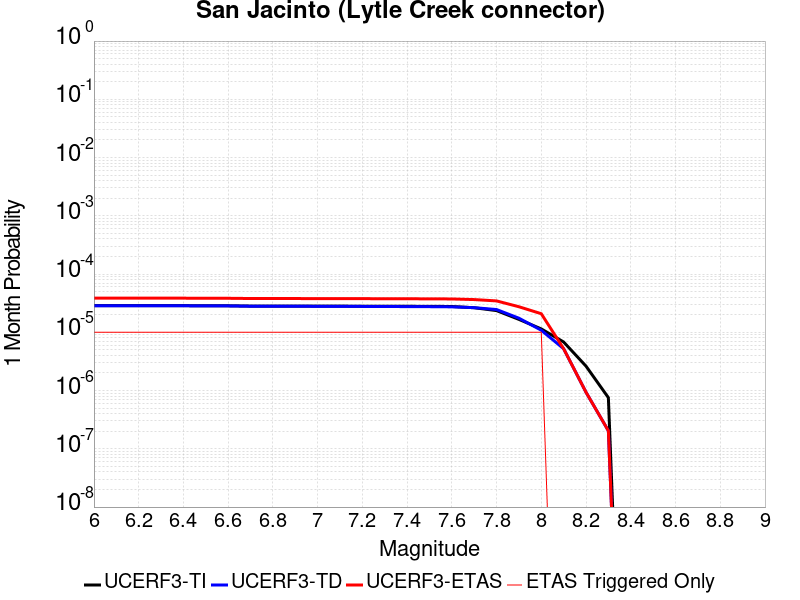 | 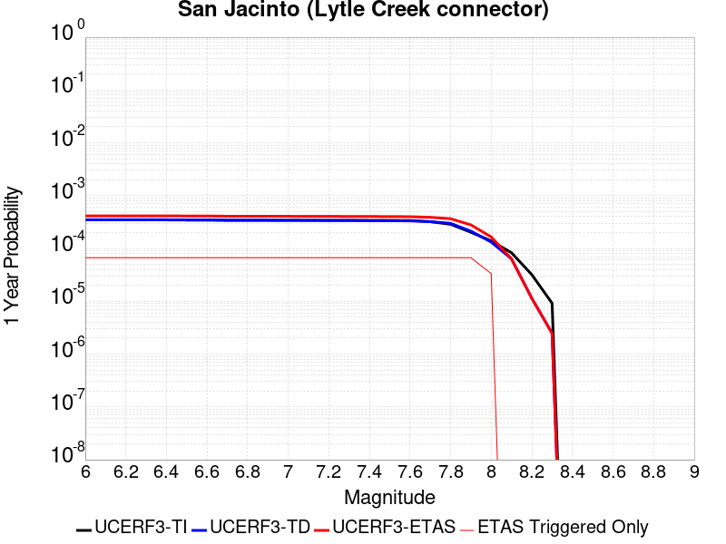 |  |

| Magnitude | 1 wk TI Prob | 1 wk TD Prob | 1 wk ETAS Prob | 1 wk ETAS/TD Gain | 1 wk ETAS Triggered Only | 1 mo TI Prob | 1 mo TD Prob | 1 mo ETAS Prob | 1 mo ETAS/TD Gain | 1 mo ETAS Triggered Only | 1 yr TI Prob | 1 yr TD Prob | 1 yr ETAS Prob | 1 yr ETAS/TD Gain | 1 yr ETAS Triggered Only | 10 yr TI Prob | 10 yr TD Prob | 10 yr ETAS Prob | 10 yr ETAS/TD Gain | 10 yr ETAS Triggered Only |
|-----|-----|-----|-----|-----|-----|-----|-----|-----|-----|-----|-----|-----|-----|-----|-----|-----|-----|-----|-----|-----|
| 6.0 | 6.693995E-6 | 6.662972E-6 | 6.662972E-6 | 1.0 | 0.0 | 2.8688235E-5 | 2.8555281E-5 | 4.5389817E-5 | 1.5895419 | 1.6835016E-5 | 3.492233E-4 | 3.4760518E-4 | 3.812635E-4 | 1.0968292 | 3.3670032E-5 | 0.00348675 | 0.0035508168 | 0.003634693 | 1.0236217 | 8.417508E-5 |
| 6.1 | 6.693995E-6 | 6.662972E-6 | 6.662972E-6 | 1.0 | 0.0 | 2.8688235E-5 | 2.8555281E-5 | 4.5389817E-5 | 1.5895419 | 1.6835016E-5 | 3.492233E-4 | 3.4760518E-4 | 3.812635E-4 | 1.0968292 | 3.3670032E-5 | 0.00348675 | 0.0035508168 | 0.003634693 | 1.0236217 | 8.417508E-5 |
| 6.2 | 6.693995E-6 | 6.662972E-6 | 6.662972E-6 | 1.0 | 0.0 | 2.8688235E-5 | 2.8555281E-5 | 4.5389817E-5 | 1.5895419 | 1.6835016E-5 | 3.492233E-4 | 3.4760518E-4 | 3.812635E-4 | 1.0968292 | 3.3670032E-5 | 0.00348675 | 0.0035508168 | 0.003634693 | 1.0236217 | 8.417508E-5 |
| 6.3 | 6.693995E-6 | 6.662972E-6 | 6.662972E-6 | 1.0 | 0.0 | 2.8688235E-5 | 2.8555281E-5 | 4.5389817E-5 | 1.5895419 | 1.6835016E-5 | 3.492233E-4 | 3.4760518E-4 | 3.812635E-4 | 1.0968292 | 3.3670032E-5 | 0.00348675 | 0.0035508168 | 0.003634693 | 1.0236217 | 8.417508E-5 |
| 6.4 | 6.693995E-6 | 6.662972E-6 | 6.662972E-6 | 1.0 | 0.0 | 2.8688235E-5 | 2.8555281E-5 | 4.5389817E-5 | 1.5895419 | 1.6835016E-5 | 3.492233E-4 | 3.4760518E-4 | 3.812635E-4 | 1.0968292 | 3.3670032E-5 | 0.00348675 | 0.0035508168 | 0.003634693 | 1.0236217 | 8.417508E-5 |
| 6.5 | 6.6561875E-6 | 6.6231896E-6 | 6.6231896E-6 | 1.0 | 0.0 | 2.8526205E-5 | 2.838479E-5 | 4.5219327E-5 | 1.5930831 | 1.6835016E-5 | 3.472512E-4 | 3.455301E-4 | 3.7918848E-4 | 1.0974109 | 3.3670032E-5 | 0.0034670907 | 0.0035301324 | 0.00361401 | 1.0237606 | 8.417508E-5 |
| 6.6 | 6.6561875E-6 | 6.6231896E-6 | 6.6231896E-6 | 1.0 | 0.0 | 2.8526205E-5 | 2.838479E-5 | 4.5219327E-5 | 1.5930831 | 1.6835016E-5 | 3.472512E-4 | 3.455301E-4 | 3.7918848E-4 | 1.0974109 | 3.3670032E-5 | 0.0034670907 | 0.0035301324 | 0.00361401 | 1.0237606 | 8.417508E-5 |
| 6.7 | 6.5802237E-6 | 6.5423656E-6 | 6.5423656E-6 | 1.0 | 0.0 | 2.8200653E-5 | 2.803841E-5 | 4.4872955E-5 | 1.6004101 | 1.6835016E-5 | 3.4328885E-4 | 3.4131424E-4 | 3.7497276E-4 | 1.0986146 | 3.3670032E-5 | 0.0034275902 | 0.0034881064 | 0.0035719879 | 1.0240479 | 8.417508E-5 |
| 6.8 | 6.575632E-6 | 6.5368554E-6 | 6.5368554E-6 | 1.0 | 0.0 | 2.8180975E-5 | 2.8014794E-5 | 4.4849337E-5 | 1.6009163 | 1.6835016E-5 | 3.4304935E-4 | 3.410268E-4 | 3.7468536E-4 | 1.0986977 | 3.3670032E-5 | 0.0034252026 | 0.0034852412 | 0.0035691229 | 1.0240676 | 8.417508E-5 |
| 6.9 | 6.570433E-6 | 6.528249E-6 | 6.528249E-6 | 1.0 | 0.0 | 2.8158694E-5 | 2.797791E-5 | 4.4812456E-5 | 1.6017085 | 1.6835016E-5 | 3.4277816E-4 | 3.4057788E-4 | 3.7423646E-4 | 1.0988278 | 3.3670032E-5 | 0.0034224992 | 0.003480766 | 0.003564648 | 1.0240988 | 8.417508E-5 |
| 7.0 | 6.5643826E-6 | 6.5183694E-6 | 6.5183694E-6 | 1.0 | 0.0 | 2.8132765E-5 | 2.7935572E-5 | 4.4770117E-5 | 1.6026205 | 1.6835016E-5 | 3.424626E-4 | 3.4006257E-4 | 3.7372115E-4 | 1.0989776 | 3.3670032E-5 | 0.0034193532 | 0.003475629 | 0.0035595116 | 1.0241345 | 8.417508E-5 |
| 7.1 | 6.557402E-6 | 6.5070813E-6 | 6.5070813E-6 | 1.0 | 0.0 | 2.8102848E-5 | 2.7887192E-5 | 4.472174E-5 | 1.603666 | 1.6835016E-5 | 3.4209844E-4 | 3.3947374E-4 | 3.7313235E-4 | 1.0991493 | 3.3670032E-5 | 0.0034157229 | 0.0034697603 | 0.0035536431 | 1.0241754 | 8.417508E-5 |
| 7.2 | 6.546394E-6 | 6.489047E-6 | 6.489047E-6 | 1.0 | 0.0 | 2.8055672E-5 | 2.7809905E-5 | 4.4644454E-5 | 1.6053436 | 1.6835016E-5 | 3.4152428E-4 | 3.3853305E-4 | 3.721917E-4 | 1.099425 | 3.3670032E-5 | 0.0034099987 | 0.003460387 | 0.0035442708 | 1.0242412 | 8.417508E-5 |
| 7.3 | 6.5364216E-6 | 6.469831E-6 | 6.469831E-6 | 1.0 | 0.0 | 2.8012933E-5 | 2.7727552E-5 | 4.4562104E-5 | 1.6071416 | 1.6835016E-5 | 3.4100408E-4 | 3.3753074E-4 | 3.711894E-4 | 1.0997204 | 3.3670032E-5 | 0.003404813 | 0.0034504079 | 0.0035342926 | 1.0243115 | 8.417508E-5 |
| 7.4 | 6.5269523E-6 | 6.4509163E-6 | 6.4509163E-6 | 1.0 | 0.0 | 2.7972354E-5 | 2.764649E-5 | 4.4481043E-5 | 1.6089218 | 1.6835016E-5 | 3.4051016E-4 | 3.3654412E-4 | 3.7020282E-4 | 1.1000128 | 3.3670032E-5 | 0.0033998888 | 0.003440589 | 0.0035244743 | 1.0243812 | 8.417508E-5 |
| 7.5 | 6.5111835E-6 | 6.4271885E-6 | 6.4271885E-6 | 1.0 | 0.0 | 2.7904773E-5 | 2.7544802E-5 | 4.4379354E-5 | 1.6111698 | 1.6835016E-5 | 3.3968766E-4 | 3.3530645E-4 | 3.6896518E-4 | 1.1003821 | 3.3670032E-5 | 0.0033916887 | 0.003428261 | 0.0035121476 | 1.0244691 | 8.417508E-5 |
| 7.6 | 6.4768806E-6 | 6.3862944E-6 | 6.3862944E-6 | 1.0 | 0.0 | 2.7757764E-5 | 2.7369546E-5 | 4.4204102E-5 | 1.6150835 | 1.6835016E-5 | 3.3789838E-4 | 3.3317335E-4 | 3.6683216E-4 | 1.101025 | 3.3670032E-5 | 0.0033738504 | 0.0034069915 | 0.00349088 | 1.0246224 | 8.417508E-5 |
| 7.7 | 6.1655364E-6 | 6.1787587E-6 | 6.1787587E-6 | 1.0 | 0.0 | 2.642346E-5 | 2.6480126E-5 | 4.3314696E-5 | 1.6357436 | 1.6835016E-5 | 3.2165812E-4 | 3.2234789E-4 | 3.5600708E-4 | 1.1044188 | 3.3670032E-5 | 0.0032119295 | 0.003298596 | 0.0033824933 | 1.0254343 | 8.417508E-5 |
| 7.8 | 5.5043524E-6 | 5.7397438E-6 | 5.7397438E-6 | 1.0 | 0.0 | 2.3589868E-5 | 2.459867E-5 | 4.143327E-5 | 1.6843704 | 1.6835016E-5 | 2.871688E-4 | 2.994477E-4 | 3.3310766E-4 | 1.1124067 | 3.3670032E-5 | 0.0028679797 | 0.0030686588 | 0.0031525756 | 1.0273464 | 8.417508E-5 |
| 7.9 | 3.889249E-6 | 4.0789296E-6 | 4.0789296E-6 | 1.0 | 0.0 | 1.6668104E-5 | 1.748101E-5 | 3.4315734E-5 | 1.9630291 | 1.6835016E-5 | 2.0291525E-4 | 2.1281054E-4 | 2.464734E-4 | 1.1581824 | 3.3670032E-5 | 0.0020273007 | 0.0021954647 | 0.002279455 | 1.0382563 | 8.417508E-5 |
| 8.0 | 2.668535E-6 | 2.5329996E-6 | 2.5329996E-6 | 1.0 | 0.0 | 1.1436528E-5 | 1.0855668E-5 | 2.7690501E-5 | 2.5507874 | 1.6835016E-5 | 1.3923083E-4 | 1.3215977E-4 | 1.4899256E-4 | 1.127367 | 1.6835016E-5 | 0.0013914363 | 0.0013765821 | 0.0014438295 | 1.048851 | 6.7340065E-5 |
| 8.1 | 1.5911459E-6 | 1.2194711E-6 | 1.2194711E-6 | 1.0 | 0.0 | 6.8191785E-6 | 5.226294E-6 | 5.226294E-6 | 1.0 | 0.0 | 8.3020335E-5 | 6.362829E-5 | 6.362829E-5 | 1.0 | 0.0 | 8.298933E-4 | 6.6975754E-4 | 7.0340506E-4 | 1.0502383 | 3.3670032E-5 |
| 8.2 | 6.1294963E-7 | 2.1835329E-7 | 2.1835329E-7 | 1.0 | 0.0 | 2.6269242E-6 | 9.357995E-7 | 9.357995E-7 | 1.0 | 0.0 | 3.1982334E-5 | 1.1393299E-5 | 1.1393299E-5 | 1.0 | 0.0 | 3.1977732E-4 | 1.2797497E-4 | 1.2797497E-4 | 1.0 | 0.0 |
| 8.3 | 1.762871E-7 | 4.7604622E-8 | 4.7604622E-8 | 1.0 | 0.0 | 7.5551594E-7 | 2.0401978E-7 | 2.0401978E-7 | 1.0 | 0.0 | 9.1983675E-6 | 2.4839383E-6 | 2.4839383E-6 | 1.0 | 0.0 | 9.197987E-5 | 2.8720697E-5 | 2.8720697E-5 | 1.0 | 0.0 |

## Santa Cruz Catalina Ridge alt1
*[(top)](#table-of-contents)*

| 1 Week | 1 Month | 1 Year | 10 Year |
|-----|-----|-----|-----|
| 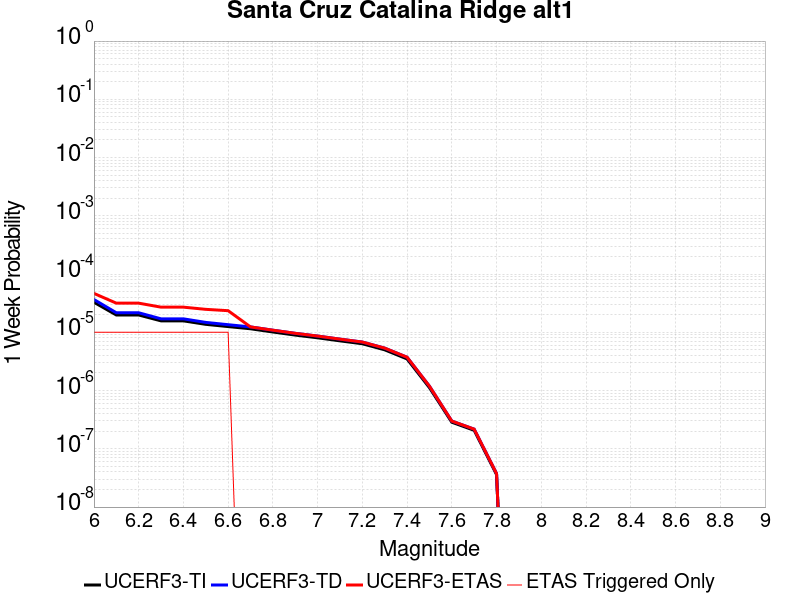 | 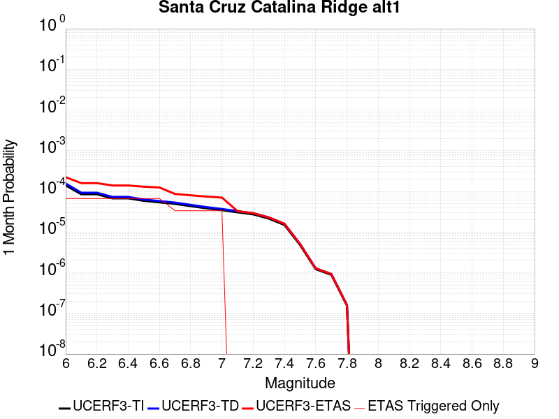 | 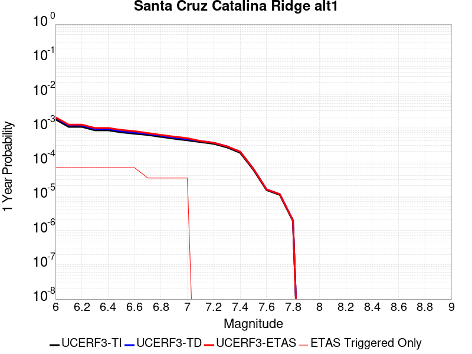 | 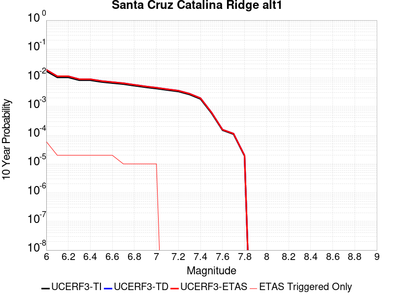 |

| Magnitude | 1 wk TI Prob | 1 wk TD Prob | 1 wk ETAS Prob | 1 wk ETAS/TD Gain | 1 wk ETAS Triggered Only | 1 mo TI Prob | 1 mo TD Prob | 1 mo ETAS Prob | 1 mo ETAS/TD Gain | 1 mo ETAS Triggered Only | 1 yr TI Prob | 1 yr TD Prob | 1 yr ETAS Prob | 1 yr ETAS/TD Gain | 1 yr ETAS Triggered Only | 10 yr TI Prob | 10 yr TD Prob | 10 yr ETAS Prob | 10 yr ETAS/TD Gain | 10 yr ETAS Triggered Only |
|-----|-----|-----|-----|-----|-----|-----|-----|-----|-----|-----|-----|-----|-----|-----|-----|-----|-----|-----|-----|-----|
| 6.0 | 3.2833184E-5 | 3.655896E-5 | 5.339336E-5 | 1.4604727 | 1.6835016E-5 | 1.4070606E-4 | 1.5667277E-4 | 1.9033754E-4 | 1.2148731 | 3.3670032E-5 | 0.00171175 | 0.0019059887 | 0.0019395945 | 1.0176318 | 3.3670032E-5 | 0.016986247 | 0.018913316 | 0.0189959 | 1.0043664 | 8.417508E-5 |
| 6.1 | 1.9835548E-5 | 2.1659771E-5 | 3.8494425E-5 | 1.7772313 | 1.6835016E-5 | 8.500672E-5 | 9.2824404E-5 | 1.2649132E-4 | 1.3626946 | 3.3670032E-5 | 0.0010344655 | 0.0011295713 | 0.0011632034 | 1.0297741 | 3.3670032E-5 | 0.010296632 | 0.011240433 | 0.011273725 | 1.0029618 | 3.3670032E-5 |
| 6.2 | 1.9835548E-5 | 2.1659771E-5 | 3.8494425E-5 | 1.7772313 | 1.6835016E-5 | 8.500672E-5 | 9.2824404E-5 | 1.2649132E-4 | 1.3626946 | 3.3670032E-5 | 0.0010344655 | 0.0011295713 | 0.0011632034 | 1.0297741 | 3.3670032E-5 | 0.010296632 | 0.011240433 | 0.011273725 | 1.0029618 | 3.3670032E-5 |
| 6.3 | 1.5728183E-5 | 1.7034137E-5 | 3.3868866E-5 | 1.9882936 | 1.6835016E-5 | 6.7404755E-5 | 7.3001436E-5 | 1.0666902E-4 | 1.4611906 | 3.3670032E-5 | 8.2034385E-4 | 8.884362E-4 | 9.2207635E-4 | 1.0378644 | 3.3670032E-5 | 0.008173222 | 0.008849524 | 0.008882896 | 1.0037711 | 3.3670032E-5 |
| 6.4 | 1.5728183E-5 | 1.7034137E-5 | 3.3868866E-5 | 1.9882936 | 1.6835016E-5 | 6.7404755E-5 | 7.3001436E-5 | 1.0666902E-4 | 1.4611906 | 3.3670032E-5 | 8.2034385E-4 | 8.884362E-4 | 9.2207635E-4 | 1.0378644 | 3.3670032E-5 | 0.008173222 | 0.008849524 | 0.008882896 | 1.0037711 | 3.3670032E-5 |
| 6.5 | 1.3707734E-5 | 1.4794678E-5 | 3.1629446E-5 | 2.1378934 | 1.6835016E-5 | 5.8746107E-5 | 6.3404244E-5 | 9.707214E-5 | 1.5310038 | 3.3670032E-5 | 7.1499916E-4 | 7.716768E-4 | 8.053208E-4 | 1.0435987 | 3.3670032E-5 | 0.0071270303 | 0.0076903705 | 0.0077237817 | 1.0043446 | 3.3670032E-5 |
| 6.6 | 1.2539813E-5 | 1.3510358E-5 | 3.0345147E-5 | 2.2460654 | 1.6835016E-5 | 5.3740947E-5 | 5.7900266E-5 | 9.156835E-5 | 1.5814841 | 3.3670032E-5 | 6.540996E-4 | 7.0471043E-4 | 7.383567E-4 | 1.0477449 | 3.3670032E-5 | 0.0065217763 | 0.0070250607 | 0.007058494 | 1.0047592 | 3.3670032E-5 |
| 6.7 | 1.1504083E-5 | 1.23775E-5 | 1.23775E-5 | 1.0 | 0.0 | 4.930228E-5 | 5.304536E-5 | 6.987948E-5 | 1.3173534 | 1.6835016E-5 | 6.0008996E-4 | 6.456379E-4 | 6.6246203E-4 | 1.0260582 | 1.6835016E-5 | 0.005984721 | 0.0064378507 | 0.006454577 | 1.0025982 | 1.6835016E-5 |
| 6.8 | 1.012739E-5 | 1.0877178E-5 | 1.0877178E-5 | 1.0 | 0.0 | 4.340238E-5 | 4.6615653E-5 | 6.344989E-5 | 1.3611283 | 1.6835016E-5 | 5.282958E-4 | 5.673993E-4 | 5.8422476E-4 | 1.0296537 | 1.6835016E-5 | 0.0052704164 | 0.005659675 | 0.005676415 | 1.0029577 | 1.6835016E-5 |
| 6.9 | 8.9607865E-6 | 9.60921E-6 | 9.60921E-6 | 1.0 | 0.0 | 3.8402806E-5 | 4.1181684E-5 | 5.801601E-5 | 1.4087818 | 1.6835016E-5 | 4.6745385E-4 | 5.0127273E-4 | 5.180993E-4 | 1.0335677 | 1.6835016E-5 | 0.0046647177 | 0.00500154 | 0.0050182906 | 1.0033492 | 1.6835016E-5 |
| 7.0 | 8.046829E-6 | 8.619827E-6 | 8.619827E-6 | 1.0 | 0.0 | 3.4485955E-5 | 3.6941598E-5 | 5.3775995E-5 | 1.4557029 | 1.6835016E-5 | 4.1978562E-4 | 4.4967196E-4 | 4.6649942E-4 | 1.0374216 | 1.6835016E-5 | 0.004189935 | 0.004487711 | 0.0045044706 | 1.0037345 | 1.6835016E-5 |
| 7.1 | 7.136131E-6 | 7.637727E-6 | 7.637727E-6 | 1.0 | 0.0 | 3.0583058E-5 | 3.273271E-5 | 3.273271E-5 | 1.0 | 0.0 | 3.7228514E-4 | 3.9844858E-4 | 3.9844858E-4 | 1.0 | 0.0 | 0.0037166206 | 0.0039774184 | 0.0039774184 | 1.0 | 0.0 |
| 7.2 | 6.362014E-6 | 6.8050217E-6 | 6.8050217E-6 | 1.0 | 0.0 | 2.726549E-5 | 2.9164055E-5 | 2.9164055E-5 | 1.0 | 0.0 | 3.3190678E-4 | 3.5501516E-4 | 3.5501516E-4 | 1.0 | 0.0 | 0.0033141149 | 0.0035445488 | 0.0035445488 | 1.0 | 0.0 |
| 7.3 | 5.004101E-6 | 5.3517642E-6 | 5.3517642E-6 | 1.0 | 0.0 | 2.1445969E-5 | 2.2935934E-5 | 2.2935934E-5 | 1.0 | 0.0 | 2.6107338E-4 | 2.7920975E-4 | 2.7920975E-4 | 1.0 | 0.0 | 0.002607669 | 0.0027886443 | 0.0027886443 | 1.0 | 0.0 |
| 7.4 | 3.4901443E-6 | 3.732087E-6 | 3.732087E-6 | 1.0 | 0.0 | 1.4957676E-5 | 1.5994563E-5 | 1.5994563E-5 | 1.0 | 0.0 | 1.8209449E-4 | 1.9471678E-4 | 1.9471678E-4 | 1.0 | 0.0 | 0.0018194534 | 0.0019455003 | 0.0019455003 | 1.0 | 0.0 |
| 7.5 | 1.1215045E-6 | 1.1893966E-6 | 1.1893966E-6 | 1.0 | 0.0 | 4.806439E-6 | 5.0974045E-6 | 5.0974045E-6 | 1.0 | 0.0 | 5.851682E-5 | 6.205916E-5 | 6.205916E-5 | 1.0 | 0.0 | 5.850142E-4 | 6.204214E-4 | 6.204214E-4 | 1.0 | 0.0 |
| 7.6 | 2.8599047E-7 | 2.9952182E-7 | 2.9952182E-7 | 1.0 | 0.0 | 1.2256729E-6 | 1.2836642E-6 | 1.2836642E-6 | 1.0 | 0.0 | 1.4922465E-5 | 1.5628502E-5 | 1.5628502E-5 | 1.0 | 0.0 | 1.4921463E-4 | 1.5627417E-4 | 1.5627417E-4 | 1.0 | 0.0 |
| 7.7 | 2.0781519E-7 | 2.1744457E-7 | 2.1744457E-7 | 1.0 | 0.0 | 8.906362E-7 | 9.3190494E-7 | 9.3190494E-7 | 1.0 | 0.0 | 1.08434415E-5 | 1.1345885E-5 | 1.1345885E-5 | 1.0 | 0.0 | 1.0842913E-4 | 1.1345315E-4 | 1.1345315E-4 | 1.0 | 0.0 |
| 7.8 | 3.614776E-8 | 3.7641225E-8 | 3.7641225E-8 | 1.0 | 0.0 | 1.5491896E-7 | 1.6131952E-7 | 1.6131952E-7 | 1.0 | 0.0 | 1.8861368E-6 | 1.9640636E-6 | 1.9640636E-6 | 1.0 | 0.0 | 1.8861208E-5 | 1.9640474E-5 | 1.9640474E-5 | 1.0 | 0.0 |

## Pinto Mtn
*[(top)](#table-of-contents)*

| 1 Week | 1 Month | 1 Year | 10 Year |
|-----|-----|-----|-----|
| 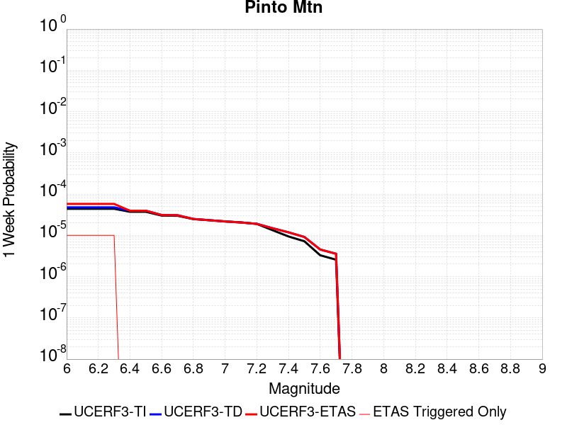 | 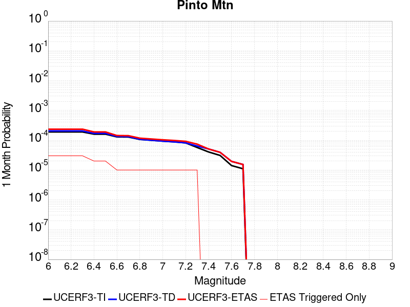 | 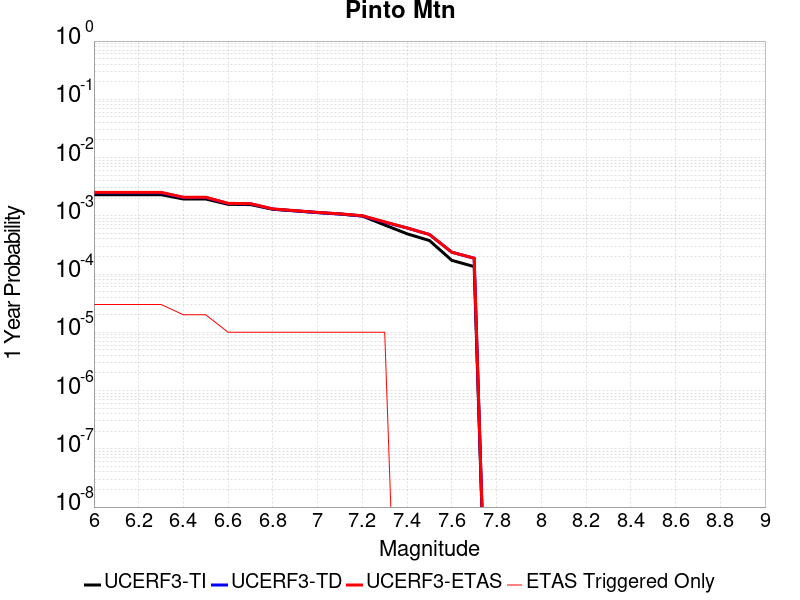 | 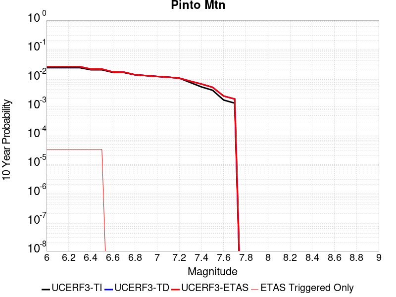 |

| Magnitude | 1 wk TI Prob | 1 wk TD Prob | 1 wk ETAS Prob | 1 wk ETAS/TD Gain | 1 wk ETAS Triggered Only | 1 mo TI Prob | 1 mo TD Prob | 1 mo ETAS Prob | 1 mo ETAS/TD Gain | 1 mo ETAS Triggered Only | 1 yr TI Prob | 1 yr TD Prob | 1 yr ETAS Prob | 1 yr ETAS/TD Gain | 1 yr ETAS Triggered Only | 10 yr TI Prob | 10 yr TD Prob | 10 yr ETAS Prob | 10 yr ETAS/TD Gain | 10 yr ETAS Triggered Only |
|-----|-----|-----|-----|-----|-----|-----|-----|-----|-----|-----|-----|-----|-----|-----|-----|-----|-----|-----|-----|-----|
| 6.0 | 4.4194956E-5 | 4.785523E-5 | 4.785523E-5 | 1.0 | 0.0 | 1.893932E-4 | 2.0507864E-4 | 2.3874178E-4 | 1.1641474 | 3.3670032E-5 | 0.0023034236 | 0.002494138 | 0.002527724 | 1.013466 | 3.3670032E-5 | 0.022796938 | 0.024678964 | 0.024761062 | 1.0033267 | 8.417508E-5 |
| 6.1 | 4.4194956E-5 | 4.785523E-5 | 4.785523E-5 | 1.0 | 0.0 | 1.893932E-4 | 2.0507864E-4 | 2.3874178E-4 | 1.1641474 | 3.3670032E-5 | 0.0023034236 | 0.002494138 | 0.002527724 | 1.013466 | 3.3670032E-5 | 0.022796938 | 0.024678964 | 0.024761062 | 1.0033267 | 8.417508E-5 |
| 6.2 | 4.4194956E-5 | 4.785523E-5 | 4.785523E-5 | 1.0 | 0.0 | 1.893932E-4 | 2.0507864E-4 | 2.3874178E-4 | 1.1641474 | 3.3670032E-5 | 0.0023034236 | 0.002494138 | 0.002527724 | 1.013466 | 3.3670032E-5 | 0.022796938 | 0.024678964 | 0.024761062 | 1.0033267 | 8.417508E-5 |
| 6.3 | 4.4194956E-5 | 4.785523E-5 | 4.785523E-5 | 1.0 | 0.0 | 1.893932E-4 | 2.0507864E-4 | 2.3874178E-4 | 1.1641474 | 3.3670032E-5 | 0.0023034236 | 0.002494138 | 0.002527724 | 1.013466 | 3.3670032E-5 | 0.022796938 | 0.024678964 | 0.024761062 | 1.0033267 | 8.417508E-5 |
| 6.4 | 3.729929E-5 | 3.960458E-5 | 3.960458E-5 | 1.0 | 0.0 | 1.5984432E-4 | 1.697234E-4 | 2.0338772E-4 | 1.1983482 | 3.3670032E-5 | 0.0019443673 | 0.0020645177 | 0.0020981182 | 1.0162753 | 3.3670032E-5 | 0.019274427 | 0.020463403 | 0.020545855 | 1.0040293 | 8.417508E-5 |
| 6.5 | 3.729929E-5 | 3.960458E-5 | 3.960458E-5 | 1.0 | 0.0 | 1.5984432E-4 | 1.697234E-4 | 2.0338772E-4 | 1.1983482 | 3.3670032E-5 | 0.0019443673 | 0.0020645177 | 0.0020981182 | 1.0162753 | 3.3670032E-5 | 0.019274427 | 0.020463403 | 0.020545855 | 1.0040293 | 8.417508E-5 |
| 6.6 | 3.0204548E-5 | 3.1206488E-5 | 3.1206488E-5 | 1.0 | 0.0 | 1.2944164E-4 | 1.3373543E-4 | 1.5056819E-4 | 1.1258662 | 1.6835016E-5 | 0.0015748127 | 0.0016270474 | 0.001643855 | 1.0103301 | 1.6835016E-5 | 0.015636992 | 0.01615522 | 0.016204908 | 1.0030757 | 5.0505052E-5 |
| 6.7 | 2.9857754E-5 | 3.0815863E-5 | 3.0815863E-5 | 1.0 | 0.0 | 1.2795553E-4 | 1.320615E-4 | 1.488943E-4 | 1.1274618 | 1.6835016E-5 | 0.0015567453 | 0.0016066976 | 0.0016235055 | 1.0104612 | 1.6835016E-5 | 0.015458848 | 0.015954657 | 0.016004356 | 1.003115 | 5.0505052E-5 |
| 6.8 | 2.4819734E-5 | 2.5010428E-5 | 2.5010428E-5 | 1.0 | 0.0 | 1.0636595E-4 | 1.0718327E-4 | 1.2401649E-4 | 1.1570507 | 1.6835016E-5 | 0.0012942362 | 0.0013041968 | 0.0013210098 | 1.0128915 | 1.6835016E-5 | 0.012867244 | 0.012967796 | 0.013017646 | 1.0038441 | 5.0505052E-5 |
| 6.9 | 2.331124E-5 | 2.3338684E-5 | 2.3338684E-5 | 1.0 | 0.0 | 9.990149E-5 | 1.00019206E-4 | 1.1685254E-4 | 1.168301 | 1.6835016E-5 | 0.001215622 | 0.001217074 | 0.0012338884 | 1.0138155 | 1.6835016E-5 | 0.012089936 | 0.012106278 | 0.012156172 | 1.0041213 | 5.0505052E-5 |
| 7.0 | 2.1818534E-5 | 2.1761793E-5 | 2.1761793E-5 | 1.0 | 0.0 | 9.3504656E-5 | 9.32616E-5 | 1.10095054E-4 | 1.180497 | 1.6835016E-5 | 0.0011378246 | 0.0011348884 | 0.0011517043 | 1.0148172 | 1.6835016E-5 | 0.011320163 | 0.01129303 | 0.0113263205 | 1.0029478 | 3.3670032E-5 |
| 7.1 | 2.066081E-5 | 2.054142E-5 | 2.054142E-5 | 1.0 | 0.0 | 8.854332E-5 | 8.80318E-5 | 1.0486533E-4 | 1.1912211 | 1.6835016E-5 | 0.0010774818 | 0.0010712796 | 0.0010880966 | 1.0156981 | 1.6835016E-5 | 0.010722724 | 0.010663206 | 0.010696516 | 1.0031239 | 3.3670032E-5 |
| 7.2 | 1.8990233E-5 | 1.9054683E-5 | 1.9054683E-5 | 1.0 | 0.0 | 8.138417E-5 | 8.166048E-5 | 9.849413E-5 | 1.2061418 | 1.6835016E-5 | 9.904018E-4 | 9.937823E-4 | 0.0010106006 | 1.0169235 | 1.6835016E-5 | 0.009859995 | 0.0098953815 | 0.009928718 | 1.003369 | 3.3670032E-5 |
| 7.3 | 1.3335872E-5 | 1.4907276E-5 | 1.4907276E-5 | 1.0 | 0.0 | 5.7152483E-5 | 6.388683E-5 | 8.0720776E-5 | 1.2634963 | 1.6835016E-5 | 6.956093E-4 | 7.775574E-4 | 7.943793E-4 | 1.0216343 | 1.6835016E-5 | 0.006934359 | 0.0077496674 | 0.0077830767 | 1.0043111 | 3.3670032E-5 |
| 7.4 | 9.414066E-6 | 1.186147E-5 | 1.186147E-5 | 1.0 | 0.0 | 4.0345374E-5 | 5.0833933E-5 | 5.0833933E-5 | 1.0 | 0.0 | 4.910942E-4 | 6.187368E-4 | 6.187368E-4 | 1.0 | 0.0 | 0.0049001034 | 0.0061710896 | 0.006187821 | 1.0027112 | 1.6835016E-5 |
| 7.5 | 7.2101157E-6 | 9.158733E-6 | 9.158733E-6 | 1.0 | 0.0 | 3.090013E-5 | 3.9251165E-5 | 3.9251165E-5 | 1.0 | 0.0 | 3.7614413E-4 | 4.7778594E-4 | 4.7778594E-4 | 1.0 | 0.0 | 0.0037550807 | 0.0047683627 | 0.004785117 | 1.0035137 | 1.6835016E-5 |
| 7.6 | 3.296375E-6 | 4.546122E-6 | 4.546122E-6 | 1.0 | 0.0 | 1.4127245E-5 | 1.9483241E-5 | 1.9483241E-5 | 1.0 | 0.0 | 1.7198564E-4 | 2.3718402E-4 | 2.3718402E-4 | 1.0 | 0.0 | 0.0017185259 | 0.0023694462 | 0.0023862415 | 1.0070882 | 1.6835016E-5 |
| 7.7 | 2.5741092E-6 | 3.5850085E-6 | 3.5850085E-6 | 1.0 | 0.0 | 1.103185E-5 | 1.536424E-5 | 1.536424E-5 | 1.0 | 0.0 | 1.3430449E-4 | 1.8704488E-4 | 1.8704488E-4 | 1.0 | 0.0 | 0.0013422335 | 0.0018690043 | 0.001885808 | 1.0089906 | 1.6835016E-5 |

## San Andreas (Creeping Section) 2011 CFM
*[(top)](#table-of-contents)*

| 1 Week | 1 Month | 1 Year | 10 Year |
|-----|-----|-----|-----|
| 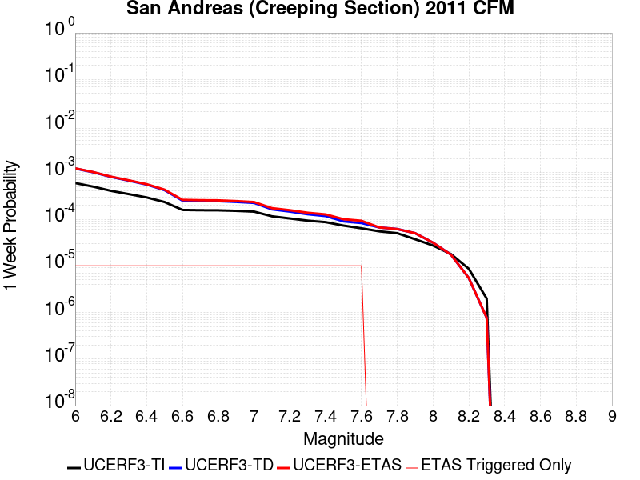 | 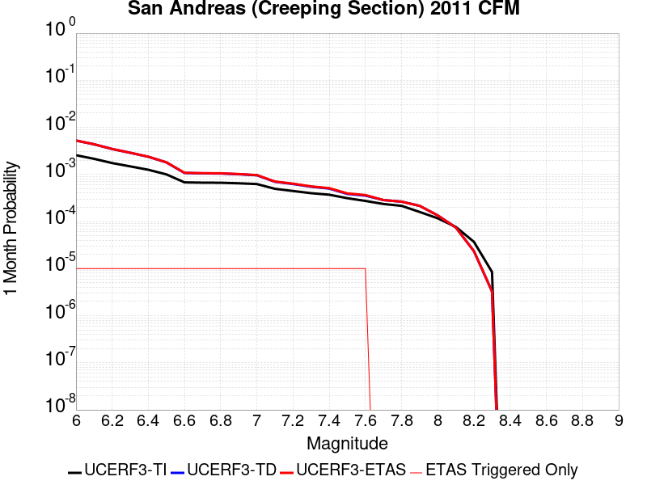 | 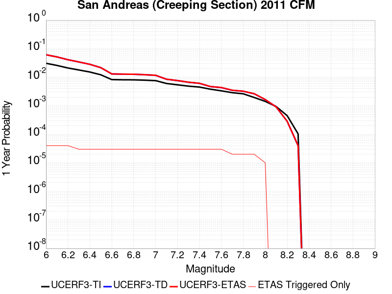 | 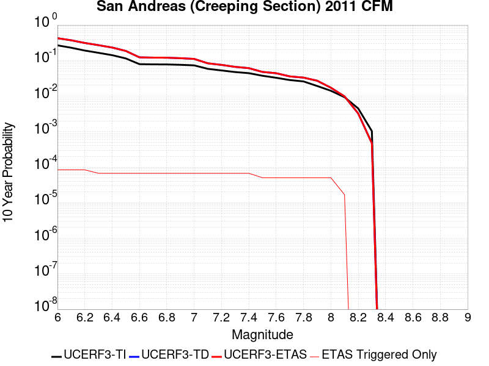 |

| Magnitude | 1 wk TI Prob | 1 wk TD Prob | 1 wk ETAS Prob | 1 wk ETAS/TD Gain | 1 wk ETAS Triggered Only | 1 mo TI Prob | 1 mo TD Prob | 1 mo ETAS Prob | 1 mo ETAS/TD Gain | 1 mo ETAS Triggered Only | 1 yr TI Prob | 1 yr TD Prob | 1 yr ETAS Prob | 1 yr ETAS/TD Gain | 1 yr ETAS Triggered Only | 10 yr TI Prob | 10 yr TD Prob | 10 yr ETAS Prob | 10 yr ETAS/TD Gain | 10 yr ETAS Triggered Only |
|-----|-----|-----|-----|-----|-----|-----|-----|-----|-----|-----|-----|-----|-----|-----|-----|-----|-----|-----|-----|-----|
| 6.0 | 5.986481E-4 | 0.0012278741 | 0.0012278741 | 1.0 | 0.0 | 0.0025631124 | 0.0052457973 | 0.0052457973 | 1.0 | 0.0 | 0.030762846 | 0.061208665 | 0.061240274 | 1.0005164 | 3.3670032E-5 | 0.26835477 | 0.4259623 | 0.4260106 | 1.0001135 | 8.417508E-5 |
| 6.1 | 5.015945E-4 | 0.0010222398 | 0.0010222398 | 1.0 | 0.0 | 0.00214792 | 0.004368119 | 0.004368119 | 1.0 | 0.0 | 0.025839351 | 0.0512512 | 0.051283143 | 1.0006233 | 3.3670032E-5 | 0.23032776 | 0.37288252 | 0.3729353 | 1.0001416 | 8.417508E-5 |
| 6.2 | 4.073338E-4 | 8.109135E-4 | 8.109135E-4 | 1.0 | 0.0 | 0.0017445484 | 0.0034676173 | 0.0034676173 | 1.0 | 0.0 | 0.021034058 | 0.040936444 | 0.040968735 | 1.0007888 | 3.3670032E-5 | 0.19150782 | 0.3130621 | 0.31311992 | 1.0001847 | 8.417508E-5 |
| 6.3 | 3.464099E-4 | 6.7394925E-4 | 6.7394925E-4 | 1.0 | 0.0 | 0.0014837692 | 0.00288274 | 0.00288274 | 1.0 | 0.0 | 0.017915873 | 0.034192428 | 0.034208685 | 1.0004755 | 1.6835016E-5 | 0.16538359 | 0.27134693 | 0.27139598 | 1.0001808 | 6.7340065E-5 |
| 6.4 | 2.935057E-4 | 5.545115E-4 | 5.545115E-4 | 1.0 | 0.0 | 0.0012572751 | 0.0023718805 | 0.0023718805 | 1.0 | 0.0 | 0.015200248 | 0.028267467 | 0.028283827 | 1.0005788 | 1.6835016E-5 | 0.14201577 | 0.2330172 | 0.23306887 | 1.0002216 | 6.7340065E-5 |
| 6.5 | 2.3409708E-4 | 4.2095222E-4 | 4.2095222E-4 | 1.0 | 0.0 | 0.0010028875 | 0.0018015768 | 0.0018015768 | 1.0 | 0.0 | 0.012141965 | 0.021591473 | 0.021607945 | 1.0007628 | 1.6835016E-5 | 0.11499573 | 0.18685804 | 0.18691279 | 1.000293 | 6.7340065E-5 |
| 6.6 | 1.5842178E-4 | 2.5079807E-4 | 2.5079807E-4 | 1.0 | 0.0 | 6.7877385E-4 | 0.0010744074 | 0.0010744074 | 1.0 | 0.0 | 0.0082328 | 0.013001034 | 0.01301765 | 1.001278 | 1.6835016E-5 | 0.07934396 | 0.12318426 | 0.12324331 | 1.0004793 | 6.7340065E-5 |
| 6.7 | 1.5616413E-4 | 2.461632E-4 | 2.461632E-4 | 1.0 | 0.0 | 6.691031E-4 | 0.0010545597 | 0.0010545597 | 1.0 | 0.0 | 0.0081159435 | 0.012762894 | 0.012779514 | 1.0013022 | 1.6835016E-5 | 0.0782586 | 0.12121142 | 0.1212706 | 1.0004882 | 6.7340065E-5 |
| 6.8 | 1.5538467E-4 | 2.4440174E-4 | 2.4440174E-4 | 1.0 | 0.0 | 6.6576427E-4 | 0.0010470168 | 0.0010470168 | 1.0 | 0.0 | 0.008075596 | 0.012672268 | 0.01268889 | 1.0013117 | 1.6835016E-5 | 0.07788358 | 0.12044227 | 0.120501496 | 1.0004917 | 6.7340065E-5 |
| 6.9 | 1.5153569E-4 | 2.3549511E-4 | 2.3549511E-4 | 1.0 | 0.0 | 6.49277E-4 | 0.0010088764 | 0.0010088764 | 1.0 | 0.0 | 0.007876333 | 0.012214421 | 0.012231051 | 1.0013615 | 1.6835016E-5 | 0.07602952 | 0.11651233 | 0.11657182 | 1.0005106 | 6.7340065E-5 |
| 7.0 | 1.4588932E-4 | 2.2406683E-4 | 2.2406683E-4 | 1.0 | 0.0 | 6.250901E-4 | 9.5993496E-4 | 9.5993496E-4 | 1.0 | 0.0 | 0.0075839474 | 0.011625077 | 0.011641716 | 1.0014313 | 1.6835016E-5 | 0.073302895 | 0.111358546 | 0.11141839 | 1.0005374 | 6.7340065E-5 |
| 7.1 | 1.1565079E-4 | 1.6290719E-4 | 1.6290719E-4 | 1.0 | 0.0 | 4.955521E-4 | 6.9798774E-4 | 6.9798774E-4 | 1.0 | 0.0 | 0.006016669 | 0.008465091 | 0.008481783 | 1.001972 | 1.6835016E-5 | 0.058563538 | 0.08370675 | 0.08376846 | 1.0007372 | 6.7340065E-5 |
| 7.2 | 1.0393792E-4 | 1.4624344E-4 | 1.4624344E-4 | 1.0 | 0.0 | 4.4537216E-4 | 6.2660786E-4 | 6.2660786E-4 | 1.0 | 0.0 | 0.005408933 | 0.007602434 | 0.007619141 | 1.0021976 | 1.6835016E-5 | 0.052791595 | 0.07565546 | 0.0757177 | 1.0008228 | 6.7340065E-5 |
| 7.3 | 9.332884E-5 | 1.2788197E-4 | 1.2788197E-4 | 1.0 | 0.0 | 3.999194E-4 | 5.479511E-4 | 5.479511E-4 | 1.0 | 0.0 | 0.0048581534 | 0.0066510327 | 0.0066677555 | 1.0025144 | 1.6835016E-5 | 0.047533102 | 0.06651482 | 0.06657768 | 1.0009451 | 6.7340065E-5 |
| 7.4 | 8.670252E-5 | 1.17095995E-4 | 1.17095995E-4 | 1.0 | 0.0 | 3.715293E-4 | 5.0174404E-4 | 5.0174404E-4 | 1.0 | 0.0 | 0.004513991 | 0.006091744 | 0.006108477 | 1.0027467 | 1.6835016E-5 | 0.044233937 | 0.061179653 | 0.061242875 | 1.0010333 | 6.7340065E-5 |
| 7.5 | 7.3036405E-5 | 9.011144E-5 | 9.011144E-5 | 1.0 | 0.0 | 3.129756E-4 | 3.861348E-4 | 3.861348E-4 | 1.0 | 0.0 | 0.0038038217 | 0.004691079 | 0.0047078347 | 1.0035719 | 1.6835016E-5 | 0.03739367 | 0.047901772 | 0.047949858 | 1.0010039 | 5.0505052E-5 |
| 7.6 | 6.3935775E-5 | 8.284792E-5 | 8.284792E-5 | 1.0 | 0.0 | 2.7398168E-4 | 3.550143E-4 | 3.550143E-4 | 1.0 | 0.0 | 0.0033306254 | 0.004313751 | 0.0043305135 | 1.0038857 | 1.6835016E-5 | 0.032811474 | 0.04401211 | 0.04406039 | 1.001097 | 5.0505052E-5 |
| 7.7 | 5.5050095E-5 | 6.6657536E-5 | 6.6657536E-5 | 1.0 | 0.0 | 2.3590765E-4 | 2.8564388E-4 | 2.8564388E-4 | 1.0 | 0.0 | 0.0028683927 | 0.0034721727 | 0.0034889493 | 1.0048317 | 1.6835016E-5 | 0.0283165 | 0.035814673 | 0.03586337 | 1.0013597 | 5.0505052E-5 |
| 7.8 | 5.027131E-5 | 6.166444E-5 | 6.166444E-5 | 1.0 | 0.0 | 2.1543067E-4 | 2.6424942E-4 | 2.6424942E-4 | 1.0 | 0.0 | 0.0026197135 | 0.0032124936 | 0.0032292746 | 1.0052236 | 1.6835016E-5 | 0.025890453 | 0.033143617 | 0.03319245 | 1.0014733 | 5.0505052E-5 |
| 7.9 | 3.7271806E-5 | 5.0253755E-5 | 5.0253755E-5 | 1.0 | 0.0 | 1.5972654E-4 | 2.1535547E-4 | 2.1535547E-4 | 1.0 | 0.0 | 0.0019429359 | 0.0026188022 | 0.002635593 | 1.0064117 | 1.6835016E-5 | 0.019260362 | 0.027081102 | 0.027130239 | 1.0018145 | 5.0505052E-5 |
| 8.0 | 2.7310243E-5 | 3.144777E-5 | 3.144777E-5 | 1.0 | 0.0 | 1.17038646E-4 | 1.3476919E-4 | 1.3476919E-4 | 1.0 | 0.0 | 0.0014240141 | 0.0016395808 | 0.0016563882 | 1.010251 | 1.6835016E-5 | 0.014149235 | 0.0172237 | 0.017273337 | 1.0028818 | 5.0505052E-5 |
| 8.1 | 1.7940547E-5 | 1.7413187E-5 | 1.7413187E-5 | 1.0 | 0.0 | 7.688579E-5 | 7.4625816E-5 | 7.4625816E-5 | 1.0 | 0.0 | 9.3568244E-4 | 9.081911E-4 | 9.081911E-4 | 1.0 | 0.0 | 0.009317525 | 0.009805583 | 0.009822253 | 1.0017 | 1.6835016E-5 |
| 8.2 | 8.643924E-6 | 5.4798497E-6 | 5.4798497E-6 | 1.0 | 0.0 | 3.704486E-5 | 2.348486E-5 | 2.348486E-5 | 1.0 | 0.0 | 4.5092785E-4 | 2.858907E-4 | 2.858907E-4 | 1.0 | 0.0 | 0.0045001395 | 0.0032514327 | 0.0032514327 | 1.0 | 0.0 |
| 8.3 | 1.983087E-6 | 7.668296E-7 | 7.668296E-7 | 1.0 | 0.0 | 8.498917E-6 | 3.2864084E-6 | 3.2864084E-6 | 1.0 | 0.0 | 1.034694E-4 | 4.0011306E-5 | 4.0011306E-5 | 1.0 | 0.0 | 0.0010342124 | 4.724499E-4 | 4.724499E-4 | 1.0 | 0.0 |

## San Jacinto (Stepovers Combined)
*[(top)](#table-of-contents)*

| 1 Week | 1 Month | 1 Year | 10 Year |
|-----|-----|-----|-----|
| 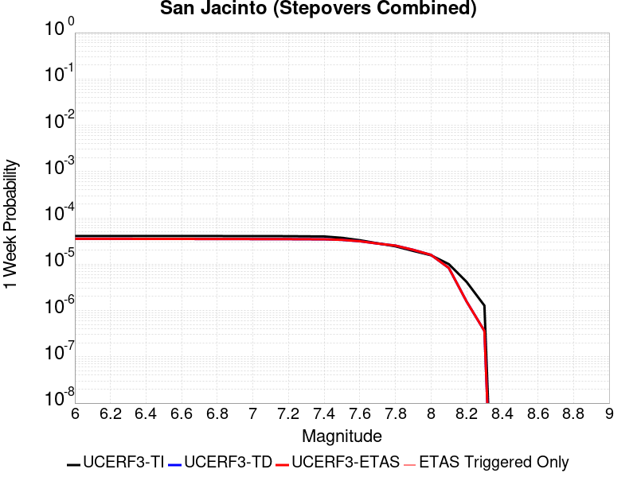 | 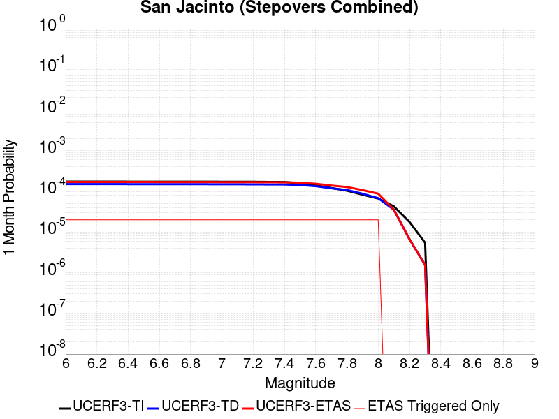 | 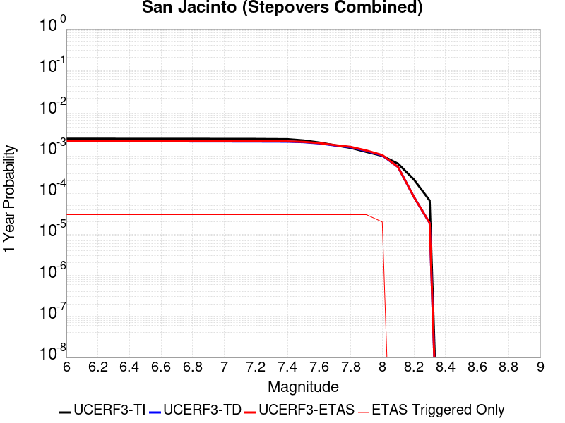 | 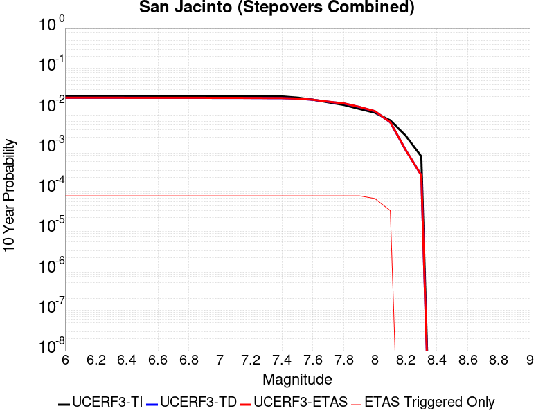 |

| Magnitude | 1 wk TI Prob | 1 wk TD Prob | 1 wk ETAS Prob | 1 wk ETAS/TD Gain | 1 wk ETAS Triggered Only | 1 mo TI Prob | 1 mo TD Prob | 1 mo ETAS Prob | 1 mo ETAS/TD Gain | 1 mo ETAS Triggered Only | 1 yr TI Prob | 1 yr TD Prob | 1 yr ETAS Prob | 1 yr ETAS/TD Gain | 1 yr ETAS Triggered Only | 10 yr TI Prob | 10 yr TD Prob | 10 yr ETAS Prob | 10 yr ETAS/TD Gain | 10 yr ETAS Triggered Only |
|-----|-----|-----|-----|-----|-----|-----|-----|-----|-----|-----|-----|-----|-----|-----|-----|-----|-----|-----|-----|-----|
| 6.0 | 4.0667746E-5 | 3.5287198E-5 | 3.5287198E-5 | 1.0 | 0.0 | 1.742787E-4 | 1.5122209E-4 | 1.8488703E-4 | 1.2226192 | 3.3670032E-5 | 0.0021197782 | 0.0018395748 | 0.0018731828 | 1.0182695 | 3.3670032E-5 | 0.020996714 | 0.018994363 | 0.01907694 | 1.0043474 | 8.417508E-5 |
| 6.1 | 4.0667746E-5 | 3.5287198E-5 | 3.5287198E-5 | 1.0 | 0.0 | 1.742787E-4 | 1.5122209E-4 | 1.8488703E-4 | 1.2226192 | 3.3670032E-5 | 0.0021197782 | 0.0018395748 | 0.0018731828 | 1.0182695 | 3.3670032E-5 | 0.020996714 | 0.018994363 | 0.01907694 | 1.0043474 | 8.417508E-5 |
| 6.2 | 4.0667746E-5 | 3.5287198E-5 | 3.5287198E-5 | 1.0 | 0.0 | 1.742787E-4 | 1.5122209E-4 | 1.8488703E-4 | 1.2226192 | 3.3670032E-5 | 0.0021197782 | 0.0018395748 | 0.0018731828 | 1.0182695 | 3.3670032E-5 | 0.020996714 | 0.018994363 | 0.01907694 | 1.0043474 | 8.417508E-5 |
| 6.3 | 4.0667746E-5 | 3.5287198E-5 | 3.5287198E-5 | 1.0 | 0.0 | 1.742787E-4 | 1.5122209E-4 | 1.8488703E-4 | 1.2226192 | 3.3670032E-5 | 0.0021197782 | 0.0018395748 | 0.0018731828 | 1.0182695 | 3.3670032E-5 | 0.020996714 | 0.018994363 | 0.01907694 | 1.0043474 | 8.417508E-5 |
| 6.4 | 4.0577226E-5 | 3.515909E-5 | 3.515909E-5 | 1.0 | 0.0 | 1.738908E-4 | 1.5067312E-4 | 1.8433807E-4 | 1.2234304 | 3.3670032E-5 | 0.0021150648 | 0.0018329041 | 0.0018665123 | 1.018336 | 3.3670032E-5 | 0.020950472 | 0.018928928 | 0.01901151 | 1.0043627 | 8.417508E-5 |
| 6.5 | 4.0577226E-5 | 3.515909E-5 | 3.515909E-5 | 1.0 | 0.0 | 1.738908E-4 | 1.5067312E-4 | 1.8433807E-4 | 1.2234304 | 3.3670032E-5 | 0.0021150648 | 0.0018329041 | 0.0018665123 | 1.018336 | 3.3670032E-5 | 0.020950472 | 0.018928928 | 0.01901151 | 1.0043627 | 8.417508E-5 |
| 6.6 | 4.053861E-5 | 3.5104433E-5 | 3.5104433E-5 | 1.0 | 0.0 | 1.7372532E-4 | 1.5043891E-4 | 1.8410388E-4 | 1.2237784 | 3.3670032E-5 | 0.0021130538 | 0.0018300572 | 0.0018636656 | 1.0183647 | 3.3670032E-5 | 0.020930743 | 0.018901005 | 0.01898359 | 1.0043693 | 8.417508E-5 |
| 6.7 | 4.0516545E-5 | 3.50735E-5 | 3.50735E-5 | 1.0 | 0.0 | 1.7363077E-4 | 1.5030634E-4 | 1.8397131E-4 | 1.2239758 | 3.3670032E-5 | 0.002111905 | 0.0018284466 | 0.001862055 | 1.0183809 | 3.3670032E-5 | 0.020919468 | 0.018885203 | 0.018967787 | 1.0043731 | 8.417508E-5 |
| 6.8 | 4.049434E-5 | 3.504506E-5 | 3.504506E-5 | 1.0 | 0.0 | 1.7353562E-4 | 1.5018447E-4 | 1.8384945E-4 | 1.2241575 | 3.3670032E-5 | 0.0021107488 | 0.0018269654 | 0.0018605739 | 1.0183958 | 3.3670032E-5 | 0.020908125 | 0.018870614 | 0.0189532 | 1.0043764 | 8.417508E-5 |
| 6.9 | 4.046386E-5 | 3.500762E-5 | 3.500762E-5 | 1.0 | 0.0 | 1.73405E-4 | 1.5002403E-4 | 1.8368902E-4 | 1.2243973 | 3.3670032E-5 | 0.0021091616 | 0.0018250152 | 0.0018586238 | 1.0184155 | 3.3670032E-5 | 0.020892553 | 0.018851386 | 0.018933974 | 1.0043811 | 8.417508E-5 |
| 7.0 | 4.036382E-5 | 3.4888177E-5 | 3.4888177E-5 | 1.0 | 0.0 | 1.7297632E-4 | 1.4951221E-4 | 1.8317721E-4 | 1.2251656 | 3.3670032E-5 | 0.0021039525 | 0.0018187946 | 0.0018524034 | 1.0184786 | 3.3670032E-5 | 0.02084144 | 0.018789997 | 0.01887259 | 1.0043956 | 8.417508E-5 |
| 7.1 | 4.0343282E-5 | 3.486664E-5 | 3.486664E-5 | 1.0 | 0.0 | 1.7288832E-4 | 1.4941991E-4 | 1.8308492E-4 | 1.2253046 | 3.3670032E-5 | 0.002102883 | 0.0018176727 | 0.0018512816 | 1.0184901 | 3.3670032E-5 | 0.020830948 | 0.018778874 | 0.018861469 | 1.0043982 | 8.417508E-5 |
| 7.2 | 4.0257353E-5 | 3.4771132E-5 | 3.4771132E-5 | 1.0 | 0.0 | 1.725201E-4 | 1.4901065E-4 | 1.8267566E-4 | 1.2259235 | 3.3670032E-5 | 0.0020984085 | 0.0018126983 | 0.0018463073 | 1.0185409 | 3.3670032E-5 | 0.020787042 | 0.01872961 | 0.01881221 | 1.00441 | 8.417508E-5 |
| 7.3 | 3.9940667E-5 | 3.4598754E-5 | 3.4598754E-5 | 1.0 | 0.0 | 1.7116306E-4 | 1.4827197E-4 | 1.8193701E-4 | 1.2270492 | 3.3670032E-5 | 0.0020819185 | 0.0018037198 | 0.001837329 | 1.0186334 | 3.3670032E-5 | 0.020625217 | 0.018638225 | 0.018720832 | 1.0044321 | 8.417508E-5 |
| 7.4 | 3.9721202E-5 | 3.4484117E-5 | 3.4484117E-5 | 1.0 | 0.0 | 1.7022261E-4 | 1.4778072E-4 | 1.8144578E-4 | 1.2278041 | 3.3670032E-5 | 0.0020704903 | 0.0017977487 | 0.0018313583 | 1.0186954 | 3.3670032E-5 | 0.020513052 | 0.018577335 | 0.018659946 | 1.0044469 | 8.417508E-5 |
| 7.5 | 3.7036873E-5 | 3.355129E-5 | 3.355129E-5 | 1.0 | 0.0 | 1.5871979E-4 | 1.4378333E-4 | 1.7744851E-4 | 1.2341384 | 3.3670032E-5 | 0.0019307006 | 0.0017491594 | 0.0017827705 | 1.0192156 | 3.3670032E-5 | 0.019140124 | 0.018078765 | 0.018161418 | 1.0045718 | 8.417508E-5 |
| 7.6 | 3.2940967E-5 | 3.133173E-5 | 3.133173E-5 | 1.0 | 0.0 | 1.4116794E-4 | 1.3427193E-4 | 1.6793745E-4 | 1.2507263 | 3.3670032E-5 | 0.0017173645 | 0.0016335372 | 0.0016671523 | 1.020578 | 3.3670032E-5 | 0.01704153 | 0.016911475 | 0.016994227 | 1.0048932 | 8.417508E-5 |
| 7.7 | 2.8236149E-5 | 2.7897275E-5 | 2.7897275E-5 | 1.0 | 0.0 | 1.2100645E-4 | 1.1955428E-4 | 1.5322029E-4 | 1.2815961 | 3.3670032E-5 | 0.0014722579 | 0.0014546025 | 0.0014882236 | 1.0231136 | 3.3670032E-5 | 0.014625421 | 0.015122045 | 0.015204947 | 1.0054822 | 8.417508E-5 |
| 7.8 | 2.4329287E-5 | 2.5220394E-5 | 2.5220394E-5 | 1.0 | 0.0 | 1.042642E-4 | 1.0808293E-4 | 1.4174932E-4 | 1.3114867 | 3.3670032E-5 | 0.0012686774 | 0.0013151162 | 0.0013487419 | 1.0255686 | 3.3670032E-5 | 0.012614589 | 0.013719083 | 0.013802103 | 1.0060514 | 8.417508E-5 |
| 7.9 | 1.9370926E-5 | 2.0433014E-5 | 2.0433014E-5 | 1.0 | 0.0 | 8.301561E-5 | 8.7567125E-5 | 1.2123421E-4 | 1.3844718 | 3.3670032E-5 | 0.0010102465 | 0.001065609 | 0.0010992432 | 1.0315633 | 3.3670032E-5 | 0.0100566605 | 0.011205519 | 0.011288751 | 1.0074278 | 8.417508E-5 |
| 8.0 | 1.5583017E-5 | 1.5896165E-5 | 1.5896165E-5 | 1.0 | 0.0 | 6.6782646E-5 | 6.8124646E-5 | 1.01792386E-4 | 1.4942079 | 3.3670032E-5 | 8.127754E-4 | 8.2910265E-4 | 8.6274475E-4 | 1.0405766 | 3.3670032E-5 | 0.008098091 | 0.008786912 | 0.008870347 | 1.0094954 | 8.417508E-5 |
| 8.1 | 1.0024873E-5 | 8.298104E-6 | 8.298104E-6 | 1.0 | 0.0 | 4.2963035E-5 | 3.556282E-5 | 3.556282E-5 | 1.0 | 0.0 | 5.229494E-4 | 4.3289183E-4 | 4.3289183E-4 | 1.0 | 0.0 | 0.0052172043 | 0.0046564727 | 0.004689986 | 1.0071971 | 3.3670032E-5 |
| 8.2 | 4.142796E-6 | 1.5626505E-6 | 1.5626505E-6 | 1.0 | 0.0 | 1.775472E-5 | 6.697056E-6 | 6.697056E-6 | 1.0 | 0.0 | 2.1614227E-4 | 8.153364E-5 | 8.153364E-5 | 1.0 | 0.0 | 0.0021593217 | 9.464045E-4 | 9.464045E-4 | 1.0 | 0.0 |
| 8.3 | 1.2750878E-6 | 3.6166134E-7 | 3.6166134E-7 | 1.0 | 0.0 | 5.4646503E-6 | 1.5499762E-6 | 1.5499762E-6 | 1.0 | 0.0 | 6.653009E-5 | 1.8870802E-5 | 1.8870802E-5 | 1.0 | 0.0 | 6.6510175E-4 | 2.2760578E-4 | 2.2760578E-4 | 1.0 | 0.0 |

## Cleghorn Lake
*[(top)](#table-of-contents)*

| 1 Week | 1 Month | 1 Year | 10 Year |
|-----|-----|-----|-----|
|  |  | 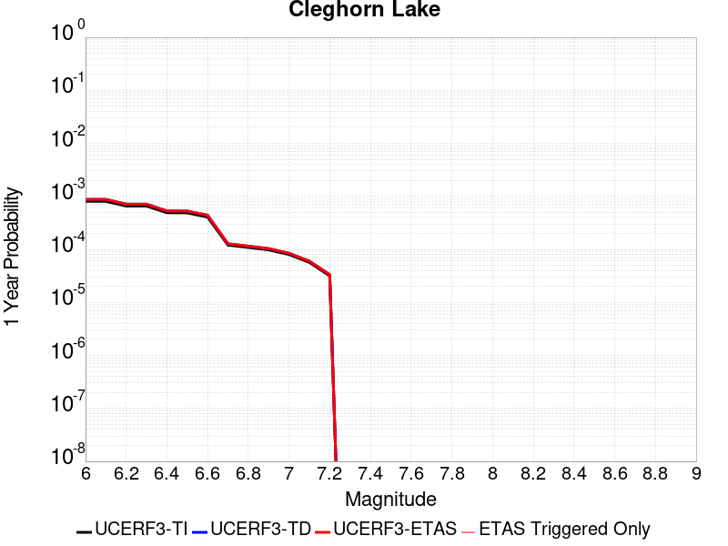 | 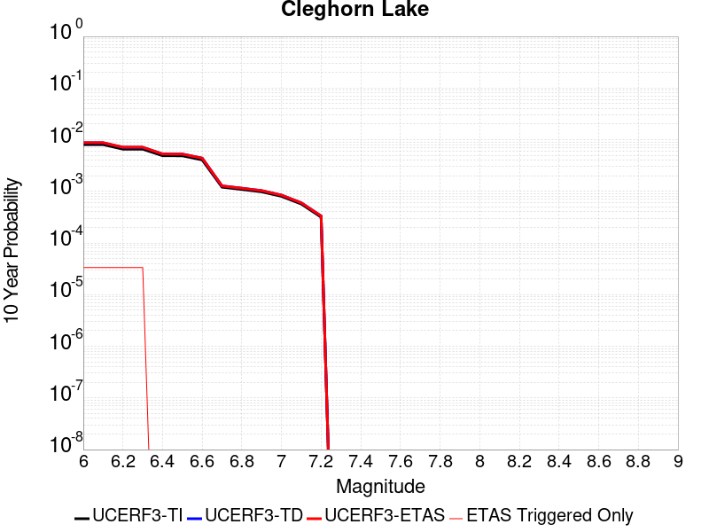 |

| Magnitude | 1 wk TI Prob | 1 wk TD Prob | 1 wk ETAS Prob | 1 wk ETAS/TD Gain | 1 wk ETAS Triggered Only | 1 mo TI Prob | 1 mo TD Prob | 1 mo ETAS Prob | 1 mo ETAS/TD Gain | 1 mo ETAS Triggered Only | 1 yr TI Prob | 1 yr TD Prob | 1 yr ETAS Prob | 1 yr ETAS/TD Gain | 1 yr ETAS Triggered Only | 10 yr TI Prob | 10 yr TD Prob | 10 yr ETAS Prob | 10 yr ETAS/TD Gain | 10 yr ETAS Triggered Only |
|-----|-----|-----|-----|-----|-----|-----|-----|-----|-----|-----|-----|-----|-----|-----|-----|-----|-----|-----|-----|-----|
| 6.0 | 1.5467183E-5 | 1.6794396E-5 | 1.6794396E-5 | 1.0 | 0.0 | 6.6286244E-5 | 7.1974304E-5 | 7.1974304E-5 | 1.0 | 0.0 | 8.067362E-4 | 8.7598973E-4 | 8.9281E-4 | 1.0192014 | 1.6835016E-5 | 0.008038137 | 0.008730795 | 0.0087808585 | 1.0057342 | 5.0505052E-5 |
| 6.1 | 1.5467183E-5 | 1.6794396E-5 | 1.6794396E-5 | 1.0 | 0.0 | 6.6286244E-5 | 7.1974304E-5 | 7.1974304E-5 | 1.0 | 0.0 | 8.067362E-4 | 8.7598973E-4 | 8.9281E-4 | 1.0192014 | 1.6835016E-5 | 0.008038137 | 0.008730795 | 0.0087808585 | 1.0057342 | 5.0505052E-5 |
| 6.2 | 1.2624631E-5 | 1.3681697E-5 | 1.3681697E-5 | 1.0 | 0.0 | 5.410444E-5 | 5.86348E-5 | 5.86348E-5 | 1.0 | 0.0 | 6.585225E-4 | 7.1369356E-4 | 7.3051656E-4 | 1.0235717 | 1.6835016E-5 | 0.0065657445 | 0.007118811 | 0.0071689566 | 1.0070441 | 5.0505052E-5 |
| 6.3 | 1.2624631E-5 | 1.3681697E-5 | 1.3681697E-5 | 1.0 | 0.0 | 5.410444E-5 | 5.86348E-5 | 5.86348E-5 | 1.0 | 0.0 | 6.585225E-4 | 7.1369356E-4 | 7.3051656E-4 | 1.0235717 | 1.6835016E-5 | 0.0065657445 | 0.007118811 | 0.0071689566 | 1.0070441 | 5.0505052E-5 |
| 6.4 | 9.417684E-6 | 1.0170226E-5 | 1.0170226E-5 | 1.0 | 0.0 | 4.036088E-5 | 4.3586184E-5 | 4.3586184E-5 | 1.0 | 0.0 | 4.912829E-4 | 5.305737E-4 | 5.473998E-4 | 1.031713 | 1.6835016E-5 | 0.004901982 | 0.0052971053 | 0.005330597 | 1.0063226 | 3.3670032E-5 |
| 6.5 | 9.368219E-6 | 1.0117652E-5 | 1.0117652E-5 | 1.0 | 0.0 | 4.014889E-5 | 4.3360877E-5 | 4.3360877E-5 | 1.0 | 0.0 | 4.8870314E-4 | 5.278319E-4 | 5.4465805E-4 | 1.0318779 | 1.6835016E-5 | 0.004876298 | 0.0052698175 | 0.00530331 | 1.0063555 | 3.3670032E-5 |
| 6.6 | 7.803798E-6 | 8.441923E-6 | 8.441923E-6 | 1.0 | 0.0 | 3.3444423E-5 | 3.6179394E-5 | 3.6179394E-5 | 1.0 | 0.0 | 4.0710976E-4 | 4.40435E-4 | 4.572626E-4 | 1.0382068 | 1.6835016E-5 | 0.0040636472 | 0.004399538 | 0.00443306 | 1.0076194 | 3.3670032E-5 |
| 6.7 | 2.3108669E-6 | 2.4438523E-6 | 2.4438523E-6 | 1.0 | 0.0 | 9.903678E-6 | 1.0473612E-5 | 1.0473612E-5 | 1.0 | 0.0 | 1.205706E-4 | 1.2750895E-4 | 1.2750895E-4 | 1.0 | 0.0 | 0.001205052 | 0.0012743765 | 0.0012743765 | 1.0 | 0.0 |
| 6.8 | 2.0882828E-6 | 2.2062986E-6 | 2.2062986E-6 | 1.0 | 0.0 | 8.949753E-6 | 9.455533E-6 | 9.455533E-6 | 1.0 | 0.0 | 1.08957785E-4 | 1.15115196E-4 | 1.15115196E-4 | 1.0 | 0.0 | 0.0010890438 | 0.0011505726 | 0.0011505726 | 1.0 | 0.0 |
| 6.9 | 1.876935E-6 | 1.9810657E-6 | 1.9810657E-6 | 1.0 | 0.0 | 8.043982E-6 | 8.490254E-6 | 8.490254E-6 | 1.0 | 0.0 | 9.7931086E-5 | 1.033641E-4 | 1.033641E-4 | 1.0 | 0.0 | 9.788794E-4 | 0.0010331762 | 0.0010331762 | 1.0 | 0.0 |
| 7.0 | 1.5357559E-6 | 1.6202926E-6 | 1.6202926E-6 | 1.0 | 0.0 | 6.5817944E-6 | 6.944093E-6 | 6.944093E-6 | 1.0 | 0.0 | 8.01304E-5 | 8.454118E-5 | 8.454118E-5 | 1.0 | 0.0 | 8.010151E-4 | 8.4510265E-4 | 8.4510265E-4 | 1.0 | 0.0 |
| 7.1 | 1.0905424E-6 | 1.1497702E-6 | 1.1497702E-6 | 1.0 | 0.0 | 4.6737446E-6 | 4.927578E-6 | 4.927578E-6 | 1.0 | 0.0 | 5.6901354E-5 | 5.999171E-5 | 5.999171E-5 | 1.0 | 0.0 | 5.6886784E-4 | 5.997649E-4 | 5.997649E-4 | 1.0 | 0.0 |
| 7.2 | 6.06668E-7 | 6.387322E-7 | 6.387322E-7 | 1.0 | 0.0 | 2.600003E-6 | 2.7374213E-6 | 2.7374213E-6 | 1.0 | 0.0 | 3.1654577E-5 | 3.3327666E-5 | 3.3327666E-5 | 1.0 | 0.0 | 3.1650066E-4 | 3.332335E-4 | 3.332335E-4 | 1.0 | 0.0 |

## Dry Mountain
*[(top)](#table-of-contents)*

| 1 Week | 1 Month | 1 Year | 10 Year |
|-----|-----|-----|-----|
| 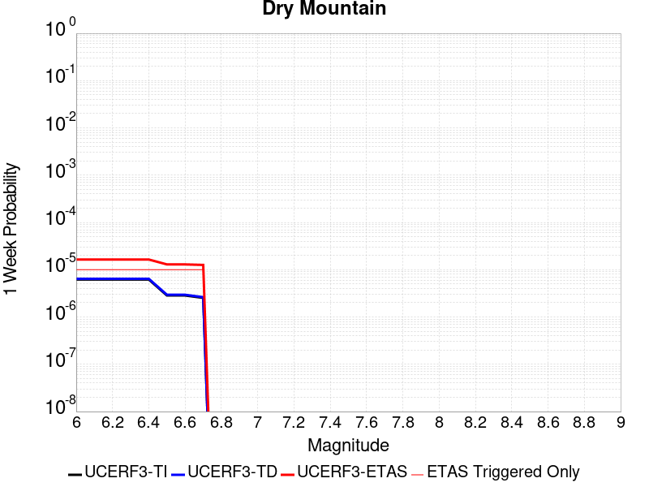 | 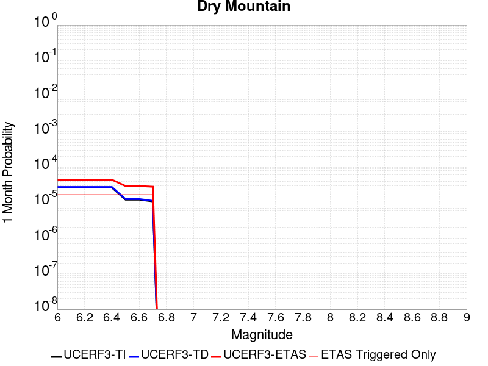 | 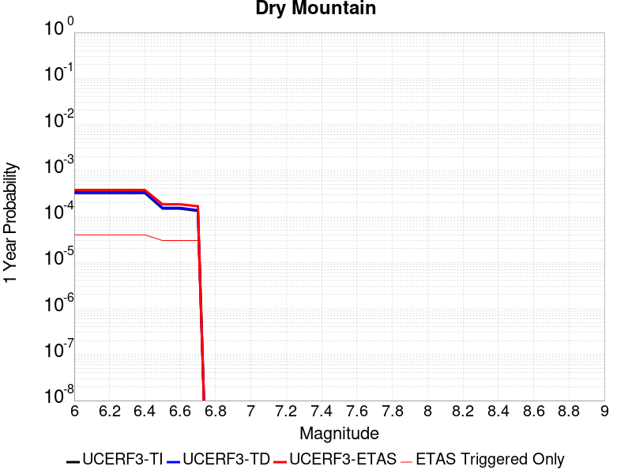 | 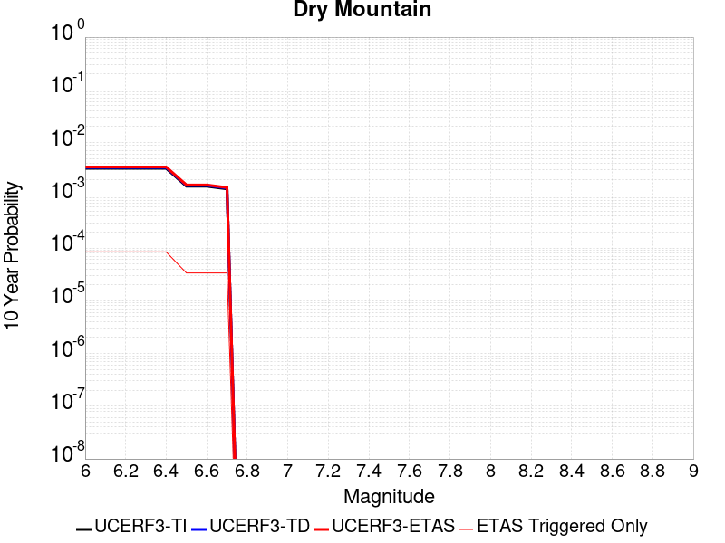 |

| Magnitude | 1 wk TI Prob | 1 wk TD Prob | 1 wk ETAS Prob | 1 wk ETAS/TD Gain | 1 wk ETAS Triggered Only | 1 mo TI Prob | 1 mo TD Prob | 1 mo ETAS Prob | 1 mo ETAS/TD Gain | 1 mo ETAS Triggered Only | 1 yr TI Prob | 1 yr TD Prob | 1 yr ETAS Prob | 1 yr ETAS/TD Gain | 1 yr ETAS Triggered Only | 10 yr TI Prob | 10 yr TD Prob | 10 yr ETAS Prob | 10 yr ETAS/TD Gain | 10 yr ETAS Triggered Only |
|-----|-----|-----|-----|-----|-----|-----|-----|-----|-----|-----|-----|-----|-----|-----|-----|-----|-----|-----|-----|-----|
| 6.0 | 6.222801E-6 | 6.439411E-6 | 2.3274319E-5 | 3.6143553 | 1.6835016E-5 | 2.6668875E-5 | 2.7597274E-5 | 4.4431825E-5 | 1.6100078 | 1.6835016E-5 | 3.2464517E-4 | 3.359609E-4 | 3.86449E-4 | 1.1502796 | 5.0505052E-5 | 0.0032417132 | 0.0033560924 | 0.003439985 | 1.0249971 | 8.417508E-5 |
| 6.1 | 6.222801E-6 | 6.439411E-6 | 2.3274319E-5 | 3.6143553 | 1.6835016E-5 | 2.6668875E-5 | 2.7597274E-5 | 4.4431825E-5 | 1.6100078 | 1.6835016E-5 | 3.2464517E-4 | 3.359609E-4 | 3.86449E-4 | 1.1502796 | 5.0505052E-5 | 0.0032417132 | 0.0033560924 | 0.003439985 | 1.0249971 | 8.417508E-5 |
| 6.2 | 6.222801E-6 | 6.439411E-6 | 2.3274319E-5 | 3.6143553 | 1.6835016E-5 | 2.6668875E-5 | 2.7597274E-5 | 4.4431825E-5 | 1.6100078 | 1.6835016E-5 | 3.2464517E-4 | 3.359609E-4 | 3.86449E-4 | 1.1502796 | 5.0505052E-5 | 0.0032417132 | 0.0033560924 | 0.003439985 | 1.0249971 | 8.417508E-5 |
| 6.3 | 6.222801E-6 | 6.439411E-6 | 2.3274319E-5 | 3.6143553 | 1.6835016E-5 | 2.6668875E-5 | 2.7597274E-5 | 4.4431825E-5 | 1.6100078 | 1.6835016E-5 | 3.2464517E-4 | 3.359609E-4 | 3.86449E-4 | 1.1502796 | 5.0505052E-5 | 0.0032417132 | 0.0033560924 | 0.003439985 | 1.0249971 | 8.417508E-5 |
| 6.4 | 6.222801E-6 | 6.439411E-6 | 2.3274319E-5 | 3.6143553 | 1.6835016E-5 | 2.6668875E-5 | 2.7597274E-5 | 4.4431825E-5 | 1.6100078 | 1.6835016E-5 | 3.2464517E-4 | 3.359609E-4 | 3.86449E-4 | 1.1502796 | 5.0505052E-5 | 0.0032417132 | 0.0033560924 | 0.003439985 | 1.0249971 | 8.417508E-5 |
| 6.5 | 2.8528623E-6 | 2.952182E-6 | 1.9787149E-5 | 6.7025504 | 1.6835016E-5 | 1.22264955E-5 | 1.2652196E-5 | 2.9487E-5 | 2.3305836 | 1.6835016E-5 | 1.4884741E-4 | 1.5403831E-4 | 1.8770315E-4 | 1.2185485 | 3.3670032E-5 | 0.0014874774 | 0.0015401688 | 0.0015737868 | 1.0218276 | 3.3670032E-5 |
| 6.6 | 2.8528623E-6 | 2.952182E-6 | 1.9787149E-5 | 6.7025504 | 1.6835016E-5 | 1.22264955E-5 | 1.2652196E-5 | 2.9487E-5 | 2.3305836 | 1.6835016E-5 | 1.4884741E-4 | 1.5403831E-4 | 1.8770315E-4 | 1.2185485 | 3.3670032E-5 | 0.0014874774 | 0.0015401688 | 0.0015737868 | 1.0218276 | 3.3670032E-5 |
| 6.7 | 2.541E-6 | 2.62937E-6 | 1.9464342E-5 | 7.402664 | 1.6835016E-5 | 1.0889954E-5 | 1.12687285E-5 | 2.8103555E-5 | 2.493942 | 1.6835016E-5 | 1.3257713E-4 | 1.3719677E-4 | 1.7086219E-4 | 1.2453805 | 3.3670032E-5 | 0.0013249806 | 0.0013719677 | 0.0014055915 | 1.0245078 | 3.3670032E-5 |

## San Jacinto (San Jacinto Valley) rev
*[(top)](#table-of-contents)*

| 1 Week | 1 Month | 1 Year | 10 Year |
|-----|-----|-----|-----|
| 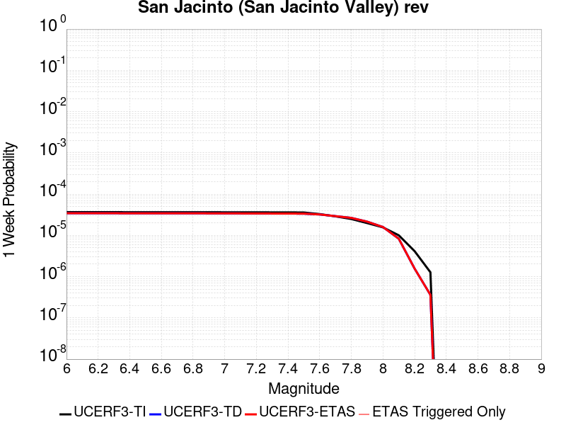 | 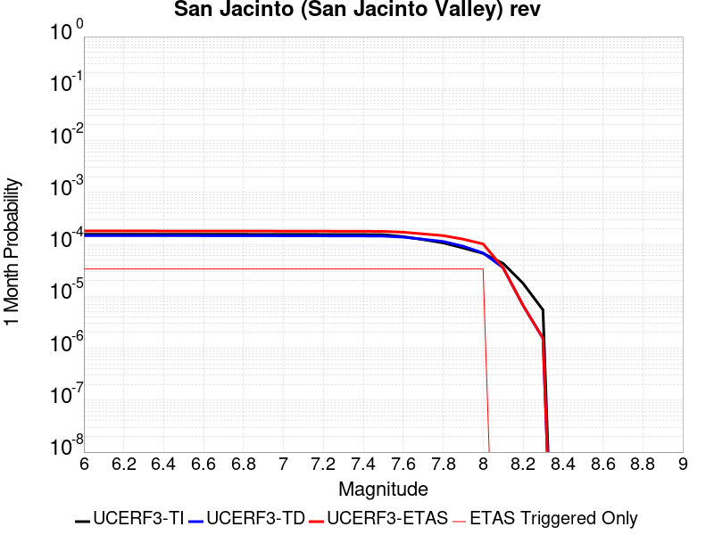 | 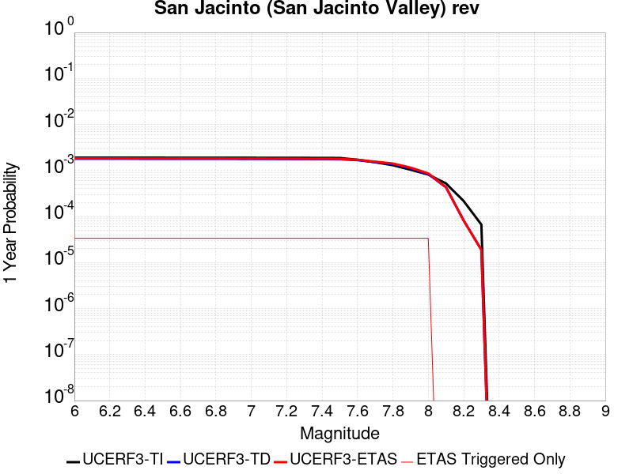 | 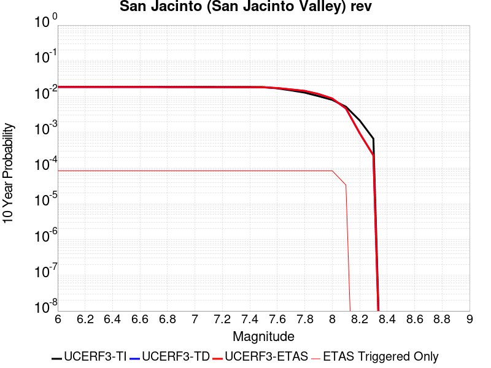 |

| Magnitude | 1 wk TI Prob | 1 wk TD Prob | 1 wk ETAS Prob | 1 wk ETAS/TD Gain | 1 wk ETAS Triggered Only | 1 mo TI Prob | 1 mo TD Prob | 1 mo ETAS Prob | 1 mo ETAS/TD Gain | 1 mo ETAS Triggered Only | 1 yr TI Prob | 1 yr TD Prob | 1 yr ETAS Prob | 1 yr ETAS/TD Gain | 1 yr ETAS Triggered Only | 10 yr TI Prob | 10 yr TD Prob | 10 yr ETAS Prob | 10 yr ETAS/TD Gain | 10 yr ETAS Triggered Only |
|-----|-----|-----|-----|-----|-----|-----|-----|-----|-----|-----|-----|-----|-----|-----|-----|-----|-----|-----|-----|-----|
| 6.0 | 3.652694E-5 | 3.4417048E-5 | 3.4417048E-5 | 1.0 | 0.0 | 1.5653463E-4 | 1.4749331E-4 | 1.8115836E-4 | 1.2282481 | 3.3670032E-5 | 0.0019041431 | 0.0017942534 | 0.001827863 | 1.0187318 | 3.3670032E-5 | 0.018879099 | 0.018534157 | 0.018616773 | 1.0044575 | 8.417508E-5 |
| 6.1 | 3.652694E-5 | 3.4417048E-5 | 3.4417048E-5 | 1.0 | 0.0 | 1.5653463E-4 | 1.4749331E-4 | 1.8115836E-4 | 1.2282481 | 3.3670032E-5 | 0.0019041431 | 0.0017942534 | 0.001827863 | 1.0187318 | 3.3670032E-5 | 0.018879099 | 0.018534157 | 0.018616773 | 1.0044575 | 8.417508E-5 |
| 6.2 | 3.652694E-5 | 3.4417048E-5 | 3.4417048E-5 | 1.0 | 0.0 | 1.5653463E-4 | 1.4749331E-4 | 1.8115836E-4 | 1.2282481 | 3.3670032E-5 | 0.0019041431 | 0.0017942534 | 0.001827863 | 1.0187318 | 3.3670032E-5 | 0.018879099 | 0.018534157 | 0.018616773 | 1.0044575 | 8.417508E-5 |
| 6.3 | 3.652694E-5 | 3.4417048E-5 | 3.4417048E-5 | 1.0 | 0.0 | 1.5653463E-4 | 1.4749331E-4 | 1.8115836E-4 | 1.2282481 | 3.3670032E-5 | 0.0019041431 | 0.0017942534 | 0.001827863 | 1.0187318 | 3.3670032E-5 | 0.018879099 | 0.018534157 | 0.018616773 | 1.0044575 | 8.417508E-5 |
| 6.4 | 3.646941E-5 | 3.433862E-5 | 3.433862E-5 | 1.0 | 0.0 | 1.5628811E-4 | 1.4715722E-4 | 1.808223E-4 | 1.2287694 | 3.3670032E-5 | 0.0019011468 | 0.0017901688 | 0.0018237786 | 1.0187746 | 3.3670032E-5 | 0.018849645 | 0.018494038 | 0.018576656 | 1.0044672 | 8.417508E-5 |
| 6.5 | 3.646941E-5 | 3.433862E-5 | 3.433862E-5 | 1.0 | 0.0 | 1.5628811E-4 | 1.4715722E-4 | 1.808223E-4 | 1.2287694 | 3.3670032E-5 | 0.0019011468 | 0.0017901688 | 0.0018237786 | 1.0187746 | 3.3670032E-5 | 0.018849645 | 0.018494038 | 0.018576656 | 1.0044672 | 8.417508E-5 |
| 6.6 | 3.6442503E-5 | 3.4302004E-5 | 3.4302004E-5 | 1.0 | 0.0 | 1.561728E-4 | 1.4700032E-4 | 1.806654E-4 | 1.2290137 | 3.3670032E-5 | 0.0018997455 | 0.0017882616 | 0.0018218714 | 1.0187947 | 3.3670032E-5 | 0.018835869 | 0.018475305 | 0.018557925 | 1.0044719 | 8.417508E-5 |
| 6.7 | 3.6432113E-5 | 3.4287576E-5 | 3.4287576E-5 | 1.0 | 0.0 | 1.5612828E-4 | 1.4693849E-4 | 1.8060357E-4 | 1.2291101 | 3.3670032E-5 | 0.0018992044 | 0.0017875104 | 0.0018211202 | 1.0188026 | 3.3670032E-5 | 0.018830549 | 0.01846793 | 0.01855055 | 1.0044737 | 8.417508E-5 |
| 6.8 | 3.6409598E-5 | 3.425663E-5 | 3.425663E-5 | 1.0 | 0.0 | 1.560318E-4 | 1.4680588E-4 | 1.8047096E-4 | 1.2293171 | 3.3670032E-5 | 0.0018980318 | 0.0017858985 | 0.0018195084 | 1.0188196 | 3.3670032E-5 | 0.018819023 | 0.018452084 | 0.018534705 | 1.0044776 | 8.417508E-5 |
| 6.9 | 3.638078E-5 | 3.4217053E-5 | 3.4217053E-5 | 1.0 | 0.0 | 1.5590832E-4 | 1.4663627E-4 | 1.8030137E-4 | 1.2295823 | 3.3670032E-5 | 0.0018965311 | 0.001783837 | 0.0018174469 | 1.0188414 | 3.3670032E-5 | 0.018804269 | 0.018431816 | 0.01851444 | 1.0044826 | 8.417508E-5 |
| 7.0 | 3.6294874E-5 | 3.4099063E-5 | 3.4099063E-5 | 1.0 | 0.0 | 1.5554018E-4 | 1.4613067E-4 | 1.7979578E-4 | 1.2303768 | 3.3670032E-5 | 0.0018920569 | 0.0017776915 | 0.0018113018 | 1.0189066 | 3.3670032E-5 | 0.018760284 | 0.018371396 | 0.018454025 | 1.0044976 | 8.417508E-5 |
| 7.1 | 3.6260717E-5 | 3.405534E-5 | 3.405534E-5 | 1.0 | 0.0 | 1.5539382E-4 | 1.4594331E-4 | 1.7960844E-4 | 1.2306726 | 3.3670032E-5 | 0.001890278 | 0.0017754143 | 0.0018090246 | 1.0189309 | 3.3670032E-5 | 0.018742796 | 0.018348996 | 0.018431626 | 1.0045033 | 8.417508E-5 |
| 7.2 | 3.6210204E-5 | 3.398956E-5 | 3.398956E-5 | 1.0 | 0.0 | 1.5517735E-4 | 1.4566141E-4 | 1.7932654E-4 | 1.231119 | 3.3670032E-5 | 0.001887647 | 0.0017719879 | 0.0018055983 | 1.0189676 | 3.3670032E-5 | 0.01871693 | 0.018315274 | 0.018397907 | 1.0045117 | 8.417508E-5 |
| 7.3 | 3.6119454E-5 | 3.3877837E-5 | 3.3877837E-5 | 1.0 | 0.0 | 1.5478847E-4 | 1.4518267E-4 | 1.7884781E-4 | 1.2318813 | 3.3670032E-5 | 0.0018829206 | 0.0017661685 | 0.0017997791 | 1.0190302 | 3.3670032E-5 | 0.018670462 | 0.018257825 | 0.018340463 | 1.0045261 | 8.417508E-5 |
| 7.4 | 3.607848E-5 | 3.3825334E-5 | 3.3825334E-5 | 1.0 | 0.0 | 1.5461289E-4 | 1.4495767E-4 | 1.7862282E-4 | 1.2322413 | 3.3670032E-5 | 0.0018807866 | 0.0017634337 | 0.0017970443 | 1.0190598 | 3.3670032E-5 | 0.018649481 | 0.018230818 | 0.018313458 | 1.004533 | 8.417508E-5 |
| 7.5 | 3.5856774E-5 | 3.3635082E-5 | 3.3635082E-5 | 1.0 | 0.0 | 1.5366284E-4 | 1.4414241E-4 | 1.7780758E-4 | 1.233555 | 3.3670032E-5 | 0.0018692396 | 0.0017535238 | 0.0017871348 | 1.0191677 | 3.3670032E-5 | 0.018535944 | 0.018131904 | 0.018214554 | 1.0045582 | 8.417508E-5 |
| 7.6 | 3.286655E-5 | 3.215777E-5 | 3.215777E-5 | 1.0 | 0.0 | 1.4084904E-4 | 1.3781176E-4 | 1.7147715E-4 | 1.2442853 | 3.3670032E-5 | 0.001713488 | 0.0016765689 | 0.0017101824 | 1.020049 | 3.3670032E-5 | 0.017003361 | 0.017351432 | 0.017434146 | 1.0047671 | 8.417508E-5 |
| 7.7 | 2.8882527E-5 | 2.9250317E-5 | 2.9250317E-5 | 1.0 | 0.0 | 1.237764E-4 | 1.2535248E-4 | 1.590183E-4 | 1.2685691 | 3.3670032E-5 | 0.0015059357 | 0.0015250992 | 0.0015587179 | 1.0220436 | 3.3670032E-5 | 0.014957713 | 0.015837716 | 0.015920559 | 1.0052307 | 8.417508E-5 |
| 7.8 | 2.4950225E-5 | 2.6540692E-5 | 2.6540692E-5 | 1.0 | 0.0 | 1.0692515E-4 | 1.1374087E-4 | 1.4740707E-4 | 1.2959903 | 3.3670032E-5 | 0.0013010362 | 0.0013839162 | 0.0014175397 | 1.0242958 | 3.3670032E-5 | 0.012934455 | 0.0144187445 | 0.014501706 | 1.0057538 | 8.417508E-5 |
| 7.9 | 1.9881603E-5 | 2.1519538E-5 | 2.1519538E-5 | 1.0 | 0.0 | 8.520408E-5 | 9.222333E-5 | 1.2589026E-4 | 1.3650587 | 3.3670032E-5 | 0.001036866 | 0.0011222415 | 0.0011558738 | 1.0299689 | 3.3670032E-5 | 0.010320415 | 0.011783319 | 0.0118665015 | 1.0070595 | 8.417508E-5 |
| 8.0 | 1.563292E-5 | 1.5947082E-5 | 1.5947082E-5 | 1.0 | 0.0 | 6.6996516E-5 | 6.834285E-5 | 1.02010585E-4 | 1.4926299 | 3.3670032E-5 | 8.153773E-4 | 8.3175726E-4 | 8.653993E-4 | 1.0404469 | 3.3670032E-5 | 0.00812392 | 0.008815629 | 0.008899062 | 1.0094643 | 8.417508E-5 |
| 8.1 | 1.0045313E-5 | 8.307514E-6 | 8.307514E-6 | 1.0 | 0.0 | 4.305063E-5 | 3.5603145E-5 | 3.5603145E-5 | 1.0 | 0.0 | 5.2401534E-4 | 4.333826E-4 | 4.333826E-4 | 1.0 | 0.0 | 0.0052278144 | 0.0046621817 | 0.004695695 | 1.0071883 | 3.3670032E-5 |
| 8.2 | 4.1554413E-6 | 1.5672123E-6 | 1.5672123E-6 | 1.0 | 0.0 | 1.7808914E-5 | 6.716607E-6 | 6.716607E-6 | 1.0 | 0.0 | 2.1680194E-4 | 8.177165E-5 | 8.177165E-5 | 1.0 | 0.0 | 0.0021659054 | 9.492334E-4 | 9.492334E-4 | 1.0 | 0.0 |
| 8.3 | 1.2758221E-6 | 3.6194777E-7 | 3.6194777E-7 | 1.0 | 0.0 | 5.4677976E-6 | 1.5512038E-6 | 1.5512038E-6 | 1.0 | 0.0 | 6.65684E-5 | 1.8885747E-5 | 1.8885747E-5 | 1.0 | 0.0 | 6.6548464E-4 | 2.2777634E-4 | 2.2777634E-4 | 1.0 | 0.0 |

## Mission Ridge-Arroyo Parida-Santa Ana
*[(top)](#table-of-contents)*

| 1 Week | 1 Month | 1 Year | 10 Year |
|-----|-----|-----|-----|
|  | 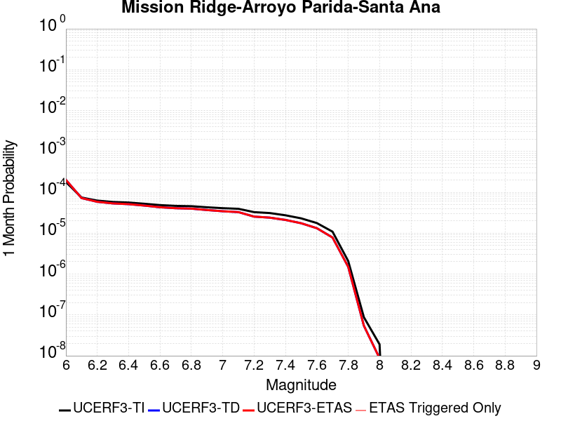 | 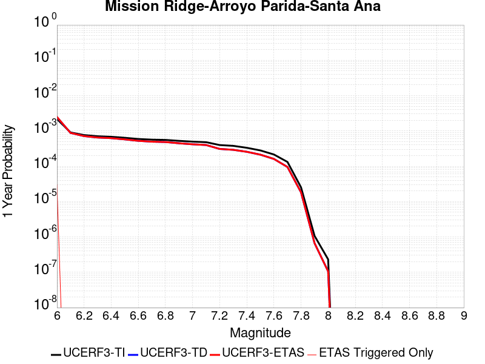 | 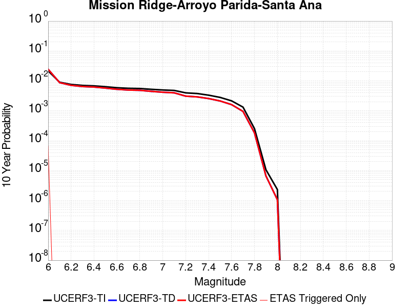 |

| Magnitude | 1 wk TI Prob | 1 wk TD Prob | 1 wk ETAS Prob | 1 wk ETAS/TD Gain | 1 wk ETAS Triggered Only | 1 mo TI Prob | 1 mo TD Prob | 1 mo ETAS Prob | 1 mo ETAS/TD Gain | 1 mo ETAS Triggered Only | 1 yr TI Prob | 1 yr TD Prob | 1 yr ETAS Prob | 1 yr ETAS/TD Gain | 1 yr ETAS Triggered Only | 10 yr TI Prob | 10 yr TD Prob | 10 yr ETAS Prob | 10 yr ETAS/TD Gain | 10 yr ETAS Triggered Only |
|-----|-----|-----|-----|-----|-----|-----|-----|-----|-----|-----|-----|-----|-----|-----|-----|-----|-----|-----|-----|-----|
| 6.0 | 4.169034E-5 | 4.7139558E-5 | 4.7139558E-5 | 1.0 | 0.0 | 1.7866064E-4 | 2.0201589E-4 | 2.0201589E-4 | 1.0 | 0.0 | 0.0021730233 | 0.0024575135 | 0.0024911007 | 1.0136672 | 3.3670032E-5 | 0.021518968 | 0.024385266 | 0.024467388 | 1.0033677 | 8.417508E-5 |
| 6.1 | 1.73813E-5 | 1.6854512E-5 | 1.6854512E-5 | 1.0 | 0.0 | 7.4489166E-5 | 7.223168E-5 | 7.223168E-5 | 1.0 | 0.0 | 9.065282E-4 | 8.790767E-4 | 8.790767E-4 | 1.0 | 0.0 | 0.009028391 | 0.008757136 | 0.008773823 | 1.0019056 | 1.6835016E-5 |
| 6.2 | 1.4622182E-5 | 1.367351E-5 | 1.367351E-5 | 1.0 | 0.0 | 6.2664985E-5 | 5.8599464E-5 | 5.8599464E-5 | 1.0 | 0.0 | 7.6267915E-4 | 7.1321876E-4 | 7.1321876E-4 | 1.0 | 0.0 | 0.007600669 | 0.007109741 | 0.0071264566 | 1.002351 | 1.6835016E-5 |
| 6.3 | 1.3552434E-5 | 1.2482403E-5 | 1.2482403E-5 | 1.0 | 0.0 | 5.8080568E-5 | 5.3494932E-5 | 5.3494932E-5 | 1.0 | 0.0 | 7.069015E-4 | 6.511093E-4 | 6.511093E-4 | 1.0 | 0.0 | 0.00704657 | 0.0064923796 | 0.0065091057 | 1.0025762 | 1.6835016E-5 |
| 6.4 | 1.30977305E-5 | 1.1979351E-5 | 1.1979351E-5 | 1.0 | 0.0 | 5.613192E-5 | 5.133908E-5 | 5.133908E-5 | 1.0 | 0.0 | 6.831918E-4 | 6.2487705E-4 | 6.2487705E-4 | 1.0 | 0.0 | 0.006810953 | 0.0062315455 | 0.0062482757 | 1.0026847 | 1.6835016E-5 |
| 6.5 | 1.225205E-5 | 1.10489855E-5 | 1.10489855E-5 | 1.0 | 0.0 | 5.2507727E-5 | 4.735195E-5 | 4.735195E-5 | 1.0 | 0.0 | 6.3909404E-4 | 5.763602E-4 | 5.763602E-4 | 1.0 | 0.0 | 0.006372592 | 0.005748964 | 0.005765702 | 1.0029116 | 1.6835016E-5 |
| 6.6 | 1.1352241E-5 | 1.0063705E-5 | 1.0063705E-5 | 1.0 | 0.0 | 4.8651553E-5 | 4.3129465E-5 | 4.3129465E-5 | 1.0 | 0.0 | 5.921717E-4 | 5.249768E-4 | 5.249768E-4 | 1.0 | 0.0 | 0.0059059616 | 0.005237613 | 0.0052543595 | 1.0031974 | 1.6835016E-5 |
| 6.7 | 1.0864116E-5 | 9.517188E-6 | 9.517188E-6 | 1.0 | 0.0 | 4.6559664E-5 | 4.0787323E-5 | 4.0787323E-5 | 1.0 | 0.0 | 5.667165E-4 | 4.964745E-4 | 4.964745E-4 | 1.0 | 0.0 | 0.005652734 | 0.004953888 | 0.004970639 | 1.0033815 | 1.6835016E-5 |
| 6.8 | 1.0666365E-5 | 9.299937E-6 | 9.299937E-6 | 1.0 | 0.0 | 4.571219E-5 | 3.9856277E-5 | 3.9856277E-5 | 1.0 | 0.0 | 5.564038E-4 | 4.8514412E-4 | 4.8514412E-4 | 1.0 | 0.0 | 0.005550127 | 0.0048410823 | 0.004857836 | 1.0034606 | 1.6835016E-5 |
| 6.9 | 1.0038665E-5 | 8.592192E-6 | 8.592192E-6 | 1.0 | 0.0 | 4.302214E-5 | 3.682317E-5 | 3.682317E-5 | 1.0 | 0.0 | 5.236687E-4 | 4.4823167E-4 | 4.4823167E-4 | 1.0 | 0.0 | 0.005224364 | 0.004473487 | 0.0044902465 | 1.0037465 | 1.6835016E-5 |
| 7.0 | 9.5379955E-6 | 8.025209E-6 | 8.025209E-6 | 1.0 | 0.0 | 4.0876483E-5 | 3.439331E-5 | 3.439331E-5 | 1.0 | 0.0 | 4.975576E-4 | 4.186598E-4 | 4.186598E-4 | 1.0 | 0.0 | 0.00496445 | 0.0041789105 | 0.0041956753 | 1.0040118 | 1.6835016E-5 |
| 7.1 | 9.207389E-6 | 7.652504E-6 | 7.652504E-6 | 1.0 | 0.0 | 3.945964E-5 | 3.2796044E-5 | 3.2796044E-5 | 1.0 | 0.0 | 4.803152E-4 | 3.9922036E-4 | 3.9922036E-4 | 1.0 | 0.0 | 0.004792784 | 0.003985228 | 0.004001996 | 1.0042075 | 1.6835016E-5 |
| 7.2 | 7.638091E-6 | 5.93121E-6 | 5.93121E-6 | 1.0 | 0.0 | 3.2734264E-5 | 2.5419227E-5 | 2.5419227E-5 | 1.0 | 0.0 | 3.984668E-4 | 3.0943545E-4 | 3.0943545E-4 | 1.0 | 0.0 | 0.0039775306 | 0.0030901027 | 0.0031068856 | 1.0054312 | 1.6835016E-5 |
| 7.3 | 7.2500147E-6 | 5.596238E-6 | 5.596238E-6 | 1.0 | 0.0 | 3.1071122E-5 | 2.3983659E-5 | 2.3983659E-5 | 1.0 | 0.0 | 3.7822526E-4 | 2.919622E-4 | 2.919622E-4 | 1.0 | 0.0 | 0.0037758215 | 0.002915842 | 0.002932628 | 1.0057569 | 1.6835016E-5 |
| 7.4 | 6.3899715E-6 | 4.918567E-6 | 4.918567E-6 | 1.0 | 0.0 | 2.7385306E-5 | 2.1079404E-5 | 2.1079404E-5 | 1.0 | 0.0 | 3.3336508E-4 | 2.566117E-4 | 2.566117E-4 | 1.0 | 0.0 | 0.0033286542 | 0.0025631986 | 0.0025799903 | 1.0065511 | 1.6835016E-5 |
| 7.5 | 5.379025E-6 | 4.083909E-6 | 4.083909E-6 | 1.0 | 0.0 | 2.305276E-5 | 1.750235E-5 | 1.750235E-5 | 1.0 | 0.0 | 2.806312E-4 | 2.1307038E-4 | 2.1307038E-4 | 1.0 | 0.0 | 0.0028027708 | 0.0021286723 | 0.0021454715 | 1.0078919 | 1.6835016E-5 |
| 7.6 | 4.1270696E-6 | 3.0883848E-6 | 3.0883848E-6 | 1.0 | 0.0 | 1.768732E-5 | 1.3235868E-5 | 1.3235868E-5 | 1.0 | 0.0 | 2.1532185E-4 | 1.6113486E-4 | 1.6113486E-4 | 1.0 | 0.0 | 0.0021511333 | 0.0016101883 | 0.0016269962 | 1.0104384 | 1.6835016E-5 |
| 7.7 | 2.5406805E-6 | 1.8282261E-6 | 1.8282261E-6 | 1.0 | 0.0 | 1.0888585E-5 | 7.835231E-6 | 7.835231E-6 | 1.0 | 0.0 | 1.3256045E-4 | 9.538983E-5 | 9.538983E-5 | 1.0 | 0.0 | 0.0013248142 | 9.53495E-4 | 9.53495E-4 | 1.0 | 0.0 |
| 7.8 | 4.8608285E-7 | 3.5099296E-7 | 3.5099296E-7 | 1.0 | 0.0 | 2.0832106E-6 | 1.5042547E-6 | 1.5042547E-6 | 1.0 | 0.0 | 2.5362791E-5 | 1.8314147E-5 | 1.8314147E-5 | 1.0 | 0.0 | 2.5359896E-4 | 1.8312651E-4 | 1.8312651E-4 | 1.0 | 0.0 |
| 7.9 | 2.0472514E-8 | 1.2689093E-8 | 1.2689093E-8 | 1.0 | 0.0 | 8.7739345E-8 | 5.438183E-8 | 5.438183E-8 | 1.0 | 0.0 | 1.068226E-6 | 6.6209856E-7 | 6.6209856E-7 | 1.0 | 0.0 | 1.0682209E-5 | 6.620967E-6 | 6.620967E-6 | 1.0 | 0.0 |
| 8.0 | 4.443582E-9 | 2.0322608E-9 | 2.0322608E-9 | 1.0 | 0.0 | 1.9043922E-8 | 8.709689E-9 | 8.709689E-9 | 1.0 | 0.0 | 2.3185973E-7 | 1.0604046E-7 | 1.0604046E-7 | 1.0 | 0.0 | 2.3185949E-6 | 1.0604042E-6 | 1.0604042E-6 | 1.0 | 0.0 |

## Monterey Bay-Tularcitos
*[(top)](#table-of-contents)*

| 1 Week | 1 Month | 1 Year | 10 Year |
|-----|-----|-----|-----|
|  | 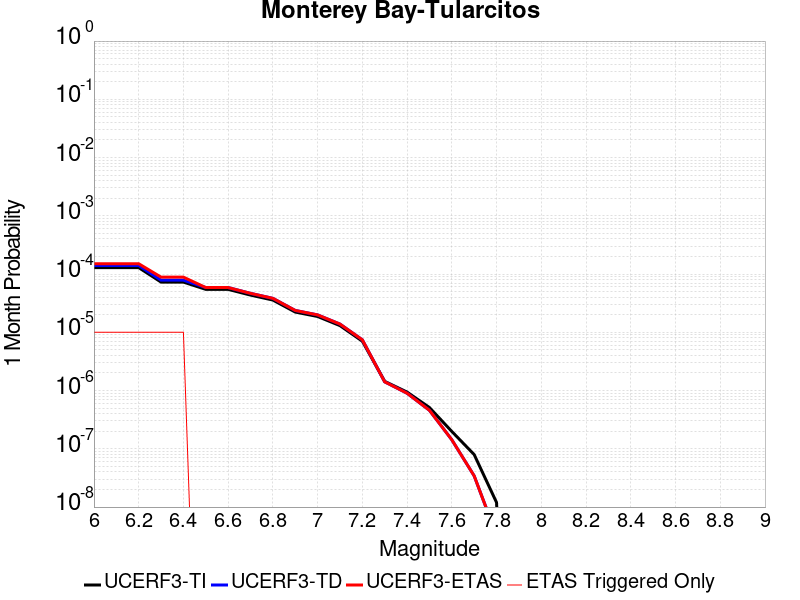 | 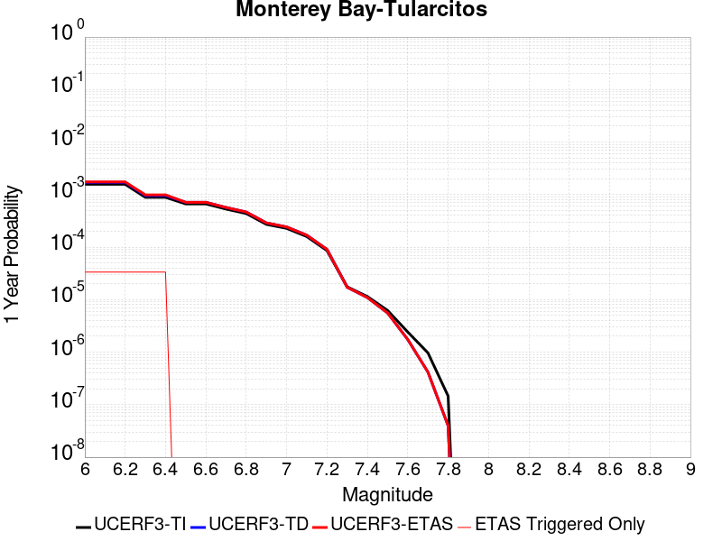 | 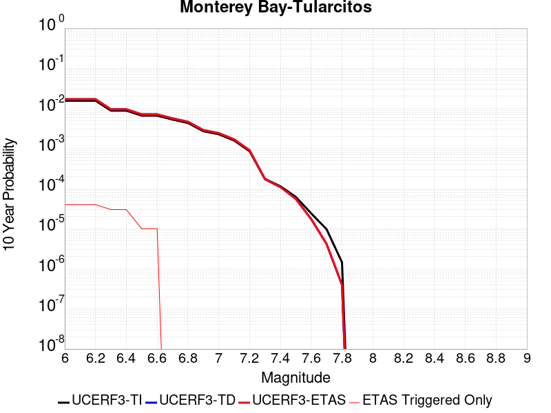 |

| Magnitude | 1 wk TI Prob | 1 wk TD Prob | 1 wk ETAS Prob | 1 wk ETAS/TD Gain | 1 wk ETAS Triggered Only | 1 mo TI Prob | 1 mo TD Prob | 1 mo ETAS Prob | 1 mo ETAS/TD Gain | 1 mo ETAS Triggered Only | 1 yr TI Prob | 1 yr TD Prob | 1 yr ETAS Prob | 1 yr ETAS/TD Gain | 1 yr ETAS Triggered Only | 10 yr TI Prob | 10 yr TD Prob | 10 yr ETAS Prob | 10 yr ETAS/TD Gain | 10 yr ETAS Triggered Only |
|-----|-----|-----|-----|-----|-----|-----|-----|-----|-----|-----|-----|-----|-----|-----|-----|-----|-----|-----|-----|-----|
| 6.0 | 3.0131365E-5 | 3.2799162E-5 | 3.2799162E-5 | 1.0 | 0.0 | 1.2912804E-4 | 1.4056086E-4 | 1.5739352E-4 | 1.1197535 | 1.6835016E-5 | 0.001571 | 0.0017100906 | 0.0017773155 | 1.0393107 | 6.7340065E-5 | 0.015599402 | 0.016980117 | 0.017046314 | 1.0038985 | 6.7340065E-5 |
| 6.1 | 3.0131365E-5 | 3.2799162E-5 | 3.2799162E-5 | 1.0 | 0.0 | 1.2912804E-4 | 1.4056086E-4 | 1.5739352E-4 | 1.1197535 | 1.6835016E-5 | 0.001571 | 0.0017100906 | 0.0017773155 | 1.0393107 | 6.7340065E-5 | 0.015599402 | 0.016980117 | 0.017046314 | 1.0038985 | 6.7340065E-5 |
| 6.2 | 3.0131365E-5 | 3.2799162E-5 | 3.2799162E-5 | 1.0 | 0.0 | 1.2912804E-4 | 1.4056086E-4 | 1.5739352E-4 | 1.1197535 | 1.6835016E-5 | 0.001571 | 0.0017100906 | 0.0017773155 | 1.0393107 | 6.7340065E-5 | 0.015599402 | 0.016980117 | 0.017046314 | 1.0038985 | 6.7340065E-5 |
| 6.3 | 1.6998249E-5 | 1.8330993E-5 | 1.8330993E-5 | 1.0 | 0.0 | 7.28476E-5 | 7.855914E-5 | 9.539283E-5 | 1.2142805 | 1.6835016E-5 | 8.865586E-4 | 9.560565E-4 | 0.0010065133 | 1.052776 | 5.0505052E-5 | 0.0088303005 | 0.00952136 | 0.009571384 | 1.0052539 | 5.0505052E-5 |
| 6.4 | 1.6998249E-5 | 1.8330993E-5 | 1.8330993E-5 | 1.0 | 0.0 | 7.28476E-5 | 7.855914E-5 | 9.539283E-5 | 1.2142805 | 1.6835016E-5 | 8.865586E-4 | 9.560565E-4 | 0.0010065133 | 1.052776 | 5.0505052E-5 | 0.0088303005 | 0.00952136 | 0.009571384 | 1.0052539 | 5.0505052E-5 |
| 6.5 | 1.27470785E-5 | 1.3693452E-5 | 1.3693452E-5 | 1.0 | 0.0 | 5.4629192E-5 | 5.868496E-5 | 5.868496E-5 | 1.0 | 0.0 | 6.649074E-4 | 7.142655E-4 | 7.310885E-4 | 1.0235529 | 1.6835016E-5 | 0.0066292146 | 0.007120751 | 0.0071374658 | 1.0023474 | 1.6835016E-5 |
| 6.6 | 1.2739422E-5 | 1.3685539E-5 | 1.3685539E-5 | 1.0 | 0.0 | 5.4596385E-5 | 5.865105E-5 | 5.865105E-5 | 1.0 | 0.0 | 6.645082E-4 | 7.1385293E-4 | 7.3067594E-4 | 1.0235665 | 1.6835016E-5 | 0.0066252467 | 0.007116651 | 0.0071333665 | 1.0023488 | 1.6835016E-5 |
| 6.7 | 1.0160109E-5 | 1.0885862E-5 | 1.0885862E-5 | 1.0 | 0.0 | 4.35426E-5 | 4.66529E-5 | 4.66529E-5 | 1.0 | 0.0 | 5.300022E-4 | 5.678581E-4 | 5.678581E-4 | 1.0 | 0.0 | 0.005287399 | 0.005664782 | 0.005664782 | 1.0 | 0.0 |
| 6.8 | 8.349859E-6 | 8.932674E-6 | 8.932674E-6 | 1.0 | 0.0 | 3.578462E-5 | 3.828236E-5 | 3.828236E-5 | 1.0 | 0.0 | 4.3559066E-4 | 4.659937E-4 | 4.659937E-4 | 1.0 | 0.0 | 0.004347378 | 0.0046507306 | 0.0046507306 | 1.0 | 0.0 |
| 6.9 | 5.193639E-6 | 5.536483E-6 | 5.536483E-6 | 1.0 | 0.0 | 2.2258262E-5 | 2.3727587E-5 | 2.3727587E-5 | 1.0 | 0.0 | 2.7096065E-4 | 2.8884833E-4 | 2.8884833E-4 | 1.0 | 0.0 | 0.0027063051 | 0.00288505 | 0.00288505 | 1.0 | 0.0 |
| 7.0 | 4.359381E-6 | 4.6434106E-6 | 4.6434106E-6 | 1.0 | 0.0 | 1.8682927E-5 | 1.9900195E-5 | 1.9900195E-5 | 1.0 | 0.0 | 2.274409E-4 | 2.4226093E-4 | 2.4226093E-4 | 1.0 | 0.0 | 0.0022720827 | 0.0024202613 | 0.0024202613 | 1.0 | 0.0 |
| 7.1 | 3.0398533E-6 | 3.231074E-6 | 3.231074E-6 | 1.0 | 0.0 | 1.3027877E-5 | 1.38474015E-5 | 1.38474015E-5 | 1.0 | 0.0 | 1.5860285E-4 | 1.685817E-4 | 1.685817E-4 | 1.0 | 0.0 | 0.001584897 | 0.0016847957 | 0.0016847957 | 1.0 | 0.0 |
| 7.2 | 1.642335E-6 | 1.7333325E-6 | 1.7333325E-6 | 1.0 | 0.0 | 7.0385595E-6 | 7.4285585E-6 | 7.4285585E-6 | 1.0 | 0.0 | 8.569109E-5 | 9.044101E-5 | 9.044101E-5 | 1.0 | 0.0 | 8.5658056E-4 | 9.042448E-4 | 9.042448E-4 | 1.0 | 0.0 |
| 7.3 | 3.356842E-7 | 3.295272E-7 | 3.295272E-7 | 1.0 | 0.0 | 1.4386458E-6 | 1.4122586E-6 | 1.4122586E-6 | 1.0 | 0.0 | 1.7515373E-5 | 1.7194114E-5 | 1.7194114E-5 | 1.0 | 0.0 | 1.7513991E-4 | 1.7192794E-4 | 1.7192794E-4 | 1.0 | 0.0 |
| 7.4 | 2.1973483E-7 | 2.1006697E-7 | 2.1006697E-7 | 1.0 | 0.0 | 9.417204E-7 | 9.002867E-7 | 9.002867E-7 | 1.0 | 0.0 | 1.1465385E-5 | 1.09609355E-5 | 1.09609355E-5 | 1.0 | 0.0 | 1.1464794E-4 | 1.09603985E-4 | 1.09603985E-4 | 1.0 | 0.0 |
| 7.5 | 1.1944135E-7 | 1.0696283E-7 | 1.0696283E-7 | 1.0 | 0.0 | 5.118914E-7 | 4.5841205E-7 | 4.5841205E-7 | 1.0 | 0.0 | 6.23226E-6 | 5.5811524E-6 | 5.5811524E-6 | 1.0 | 0.0 | 6.2320854E-5 | 5.5810135E-5 | 5.5810135E-5 | 1.0 | 0.0 |
| 7.6 | 4.636058E-8 | 3.3366945E-8 | 3.3366945E-8 | 1.0 | 0.0 | 1.9868818E-7 | 1.4300119E-7 | 1.4300119E-7 | 1.0 | 0.0 | 2.419026E-6 | 1.7410381E-6 | 1.7410381E-6 | 1.0 | 0.0 | 2.4189996E-5 | 1.7410246E-5 | 1.7410246E-5 | 1.0 | 0.0 |
| 7.7 | 1.8588572E-8 | 8.005146E-9 | 8.005146E-9 | 1.0 | 0.0 | 7.9665305E-8 | 3.4307767E-8 | 3.4307767E-8 | 1.0 | 0.0 | 9.699246E-7 | 4.1769698E-7 | 4.1769698E-7 | 1.0 | 0.0 | 9.699204E-6 | 4.176962E-6 | 4.176962E-6 | 1.0 | 0.0 |
| 7.8 | 2.7960154E-9 | 7.612305E-10 | 7.612305E-10 | 1.0 | 0.0 | 1.1982923E-8 | 3.2624166E-9 | 3.2624166E-9 | 1.0 | 0.0 | 1.4589209E-7 | 3.971992E-8 | 3.971992E-8 | 1.0 | 0.0 | 1.4589199E-6 | 3.9719916E-7 | 3.9719916E-7 | 1.0 | 0.0 |

## Deep Springs
*[(top)](#table-of-contents)*

| 1 Week | 1 Month | 1 Year | 10 Year |
|-----|-----|-----|-----|
| 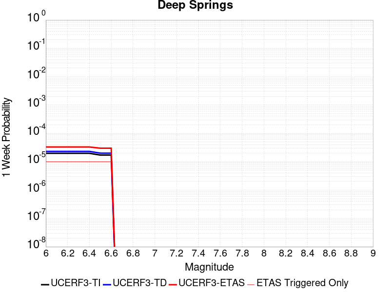 | 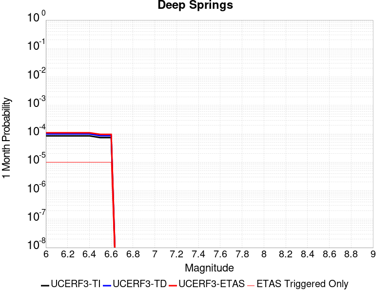 | 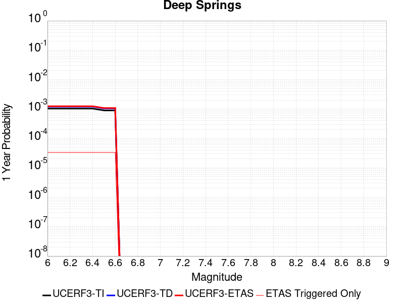 | 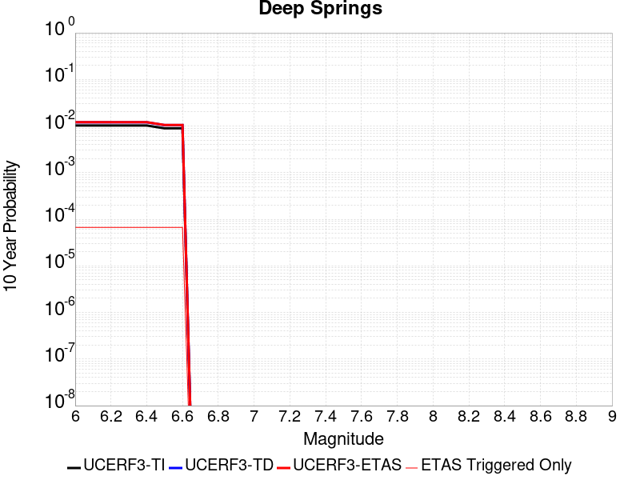 |

| Magnitude | 1 wk TI Prob | 1 wk TD Prob | 1 wk ETAS Prob | 1 wk ETAS/TD Gain | 1 wk ETAS Triggered Only | 1 mo TI Prob | 1 mo TD Prob | 1 mo ETAS Prob | 1 mo ETAS/TD Gain | 1 mo ETAS Triggered Only | 1 yr TI Prob | 1 yr TD Prob | 1 yr ETAS Prob | 1 yr ETAS/TD Gain | 1 yr ETAS Triggered Only | 10 yr TI Prob | 10 yr TD Prob | 10 yr ETAS Prob | 10 yr ETAS/TD Gain | 10 yr ETAS Triggered Only |
|-----|-----|-----|-----|-----|-----|-----|-----|-----|-----|-----|-----|-----|-----|-----|-----|-----|-----|-----|-----|-----|
| 6.0 | 1.9810619E-5 | 2.311303E-5 | 3.994766E-5 | 1.7283609 | 1.6835016E-5 | 8.489989E-5 | 9.905495E-5 | 1.15888295E-4 | 1.1699395 | 1.6835016E-5 | 0.001033166 | 0.0012058346 | 0.0012562787 | 1.0418334 | 5.0505052E-5 | 0.010283757 | 0.01204269 | 0.01210922 | 1.0055244 | 6.7340065E-5 |
| 6.1 | 1.9810619E-5 | 2.311303E-5 | 3.994766E-5 | 1.7283609 | 1.6835016E-5 | 8.489989E-5 | 9.905495E-5 | 1.15888295E-4 | 1.1699395 | 1.6835016E-5 | 0.001033166 | 0.0012058346 | 0.0012562787 | 1.0418334 | 5.0505052E-5 | 0.010283757 | 0.01204269 | 0.01210922 | 1.0055244 | 6.7340065E-5 |
| 6.2 | 1.9810619E-5 | 2.311303E-5 | 3.994766E-5 | 1.7283609 | 1.6835016E-5 | 8.489989E-5 | 9.905495E-5 | 1.15888295E-4 | 1.1699395 | 1.6835016E-5 | 0.001033166 | 0.0012058346 | 0.0012562787 | 1.0418334 | 5.0505052E-5 | 0.010283757 | 0.01204269 | 0.01210922 | 1.0055244 | 6.7340065E-5 |
| 6.3 | 1.9810619E-5 | 2.311303E-5 | 3.994766E-5 | 1.7283609 | 1.6835016E-5 | 8.489989E-5 | 9.905495E-5 | 1.15888295E-4 | 1.1699395 | 1.6835016E-5 | 0.001033166 | 0.0012058346 | 0.0012562787 | 1.0418334 | 5.0505052E-5 | 0.010283757 | 0.01204269 | 0.01210922 | 1.0055244 | 6.7340065E-5 |
| 6.4 | 1.9810619E-5 | 2.311303E-5 | 3.994766E-5 | 1.7283609 | 1.6835016E-5 | 8.489989E-5 | 9.905495E-5 | 1.15888295E-4 | 1.1699395 | 1.6835016E-5 | 0.001033166 | 0.0012058346 | 0.0012562787 | 1.0418334 | 5.0505052E-5 | 0.010283757 | 0.01204269 | 0.01210922 | 1.0055244 | 6.7340065E-5 |
| 6.5 | 1.7190405E-5 | 2.0050999E-5 | 3.6885678E-5 | 1.839593 | 1.6835016E-5 | 7.367108E-5 | 8.593285E-5 | 1.0276642E-4 | 1.1958921 | 1.6835016E-5 | 8.9657627E-4 | 0.0010462324 | 0.0010966846 | 1.0482228 | 5.0505052E-5 | 0.008929676 | 0.010462287 | 0.010528922 | 1.0063691 | 6.7340065E-5 |
| 6.6 | 1.7190405E-5 | 2.0050999E-5 | 3.6885678E-5 | 1.839593 | 1.6835016E-5 | 7.367108E-5 | 8.593285E-5 | 1.0276642E-4 | 1.1958921 | 1.6835016E-5 | 8.9657627E-4 | 0.0010462324 | 0.0010966846 | 1.0482228 | 5.0505052E-5 | 0.008929676 | 0.010462287 | 0.010528922 | 1.0063691 | 6.7340065E-5 |

## San Jacinto (Anza) rev
*[(top)](#table-of-contents)*

| 1 Week | 1 Month | 1 Year | 10 Year |
|-----|-----|-----|-----|
| 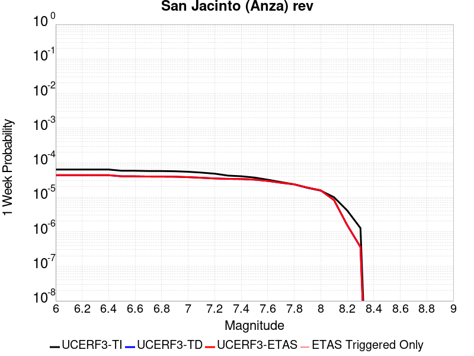 | 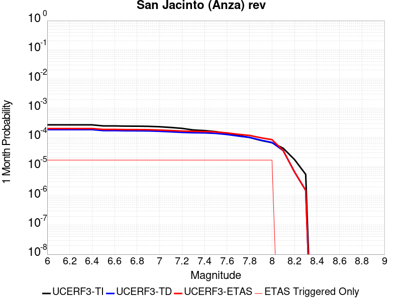 |  | 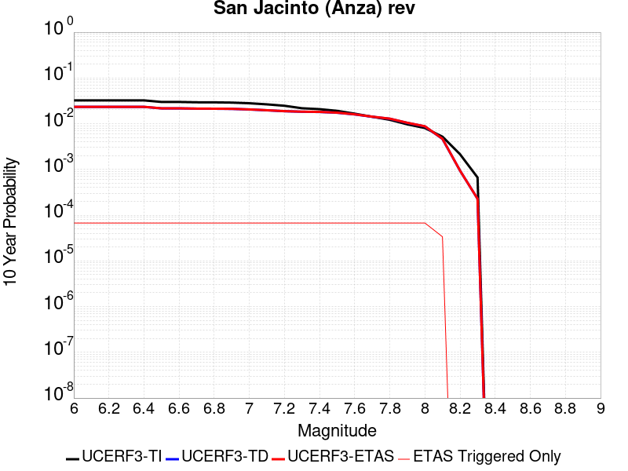 |

| Magnitude | 1 wk TI Prob | 1 wk TD Prob | 1 wk ETAS Prob | 1 wk ETAS/TD Gain | 1 wk ETAS Triggered Only | 1 mo TI Prob | 1 mo TD Prob | 1 mo ETAS Prob | 1 mo ETAS/TD Gain | 1 mo ETAS Triggered Only | 1 yr TI Prob | 1 yr TD Prob | 1 yr ETAS Prob | 1 yr ETAS/TD Gain | 1 yr ETAS Triggered Only | 10 yr TI Prob | 10 yr TD Prob | 10 yr ETAS Prob | 10 yr ETAS/TD Gain | 10 yr ETAS Triggered Only |
|-----|-----|-----|-----|-----|-----|-----|-----|-----|-----|-----|-----|-----|-----|-----|-----|-----|-----|-----|-----|-----|
| 6.0 | 6.3015636E-5 | 4.3319626E-5 | 4.3319626E-5 | 1.0 | 0.0 | 2.7003905E-4 | 1.8564239E-4 | 2.0247429E-4 | 1.0906683 | 1.6835016E-5 | 0.0032827691 | 0.0022578652 | 0.0022746623 | 1.0074394 | 1.6835016E-5 | 0.032346968 | 0.02330496 | 0.023370732 | 1.0028222 | 6.7340065E-5 |
| 6.1 | 6.3015636E-5 | 4.3319626E-5 | 4.3319626E-5 | 1.0 | 0.0 | 2.7003905E-4 | 1.8564239E-4 | 2.0247429E-4 | 1.0906683 | 1.6835016E-5 | 0.0032827691 | 0.0022578652 | 0.0022746623 | 1.0074394 | 1.6835016E-5 | 0.032346968 | 0.02330496 | 0.023370732 | 1.0028222 | 6.7340065E-5 |
| 6.2 | 6.3015636E-5 | 4.3319626E-5 | 4.3319626E-5 | 1.0 | 0.0 | 2.7003905E-4 | 1.8564239E-4 | 2.0247429E-4 | 1.0906683 | 1.6835016E-5 | 0.0032827691 | 0.0022578652 | 0.0022746623 | 1.0074394 | 1.6835016E-5 | 0.032346968 | 0.02330496 | 0.023370732 | 1.0028222 | 6.7340065E-5 |
| 6.3 | 6.3015636E-5 | 4.3319626E-5 | 4.3319626E-5 | 1.0 | 0.0 | 2.7003905E-4 | 1.8564239E-4 | 2.0247429E-4 | 1.0906683 | 1.6835016E-5 | 0.0032827691 | 0.0022578652 | 0.0022746623 | 1.0074394 | 1.6835016E-5 | 0.032346968 | 0.02330496 | 0.023370732 | 1.0028222 | 6.7340065E-5 |
| 6.4 | 6.3015636E-5 | 4.3319626E-5 | 4.3319626E-5 | 1.0 | 0.0 | 2.7003905E-4 | 1.8564239E-4 | 2.0247429E-4 | 1.0906683 | 1.6835016E-5 | 0.0032827691 | 0.0022578652 | 0.0022746623 | 1.0074394 | 1.6835016E-5 | 0.032346968 | 0.02330496 | 0.023370732 | 1.0028222 | 6.7340065E-5 |
| 6.5 | 5.811017E-5 | 4.0098632E-5 | 4.0098632E-5 | 1.0 | 0.0 | 2.4901982E-4 | 1.7184E-4 | 1.8867211E-4 | 1.0979522 | 1.6835016E-5 | 0.0030276014 | 0.00209015 | 0.00210695 | 1.0080376 | 1.6835016E-5 | 0.02986684 | 0.021602087 | 0.021667972 | 1.00305 | 6.7340065E-5 |
| 6.6 | 5.811017E-5 | 4.0098632E-5 | 4.0098632E-5 | 1.0 | 0.0 | 2.4901982E-4 | 1.7184E-4 | 1.8867211E-4 | 1.0979522 | 1.6835016E-5 | 0.0030276014 | 0.00209015 | 0.00210695 | 1.0080376 | 1.6835016E-5 | 0.02986684 | 0.021602087 | 0.021667972 | 1.00305 | 6.7340065E-5 |
| 6.7 | 5.712442E-5 | 3.952116E-5 | 3.952116E-5 | 1.0 | 0.0 | 2.4479596E-4 | 1.6936543E-4 | 1.861976E-4 | 1.0993837 | 1.6835016E-5 | 0.0029763177 | 0.0020600795 | 0.0020768798 | 1.0081552 | 1.6835016E-5 | 0.029367693 | 0.021293823 | 0.021359729 | 1.003095 | 6.7340065E-5 |
| 6.8 | 5.6967532E-5 | 3.9377548E-5 | 3.9377548E-5 | 1.0 | 0.0 | 2.4412372E-4 | 1.6875003E-4 | 1.8558222E-4 | 1.0997462 | 1.6835016E-5 | 0.0029681553 | 0.0020526012 | 0.0020694016 | 1.0081849 | 1.6835016E-5 | 0.029288229 | 0.021218529 | 0.02128444 | 1.0031064 | 6.7340065E-5 |
| 6.9 | 5.6211324E-5 | 3.9082228E-5 | 3.9082228E-5 | 1.0 | 0.0 | 2.4088343E-4 | 1.6748454E-4 | 1.8431674E-4 | 1.1005 | 1.6835016E-5 | 0.0029288116 | 0.0020372227 | 0.0020540233 | 1.0082469 | 1.6835016E-5 | 0.028905109 | 0.021057902 | 0.021123825 | 1.0031306 | 6.7340065E-5 |
| 7.0 | 5.4383527E-5 | 3.7942387E-5 | 3.7942387E-5 | 1.0 | 0.0 | 2.3305144E-4 | 1.6260012E-4 | 1.794324E-4 | 1.1035194 | 1.6835016E-5 | 0.0028337094 | 0.001977864 | 0.0019946655 | 1.0084949 | 1.6835016E-5 | 0.027978465 | 0.020448677 | 0.02051464 | 1.0032258 | 6.7340065E-5 |
| 7.1 | 5.1393665E-5 | 3.640475E-5 | 3.640475E-5 | 1.0 | 0.0 | 2.2023996E-4 | 1.5601104E-4 | 1.7284343E-4 | 1.1078923 | 1.6835016E-5 | 0.0026781242 | 0.0018977838 | 0.0019145869 | 1.008854 | 1.6835016E-5 | 0.026460782 | 0.019622007 | 0.019688025 | 1.0033646 | 6.7340065E-5 |
| 7.2 | 4.785222E-5 | 3.475601E-5 | 3.475601E-5 | 1.0 | 0.0 | 2.0506482E-4 | 1.4894584E-4 | 1.6577836E-4 | 1.1130109 | 1.6835016E-5 | 0.0024938055 | 0.0018119109 | 0.0018287153 | 1.0092745 | 1.6835016E-5 | 0.024660049 | 0.018736389 | 0.018802468 | 1.0035267 | 6.7340065E-5 |
| 7.3 | 4.2143256E-5 | 3.3850083E-5 | 3.3850083E-5 | 1.0 | 0.0 | 1.8060145E-4 | 1.4506375E-4 | 1.6189631E-4 | 1.1160357 | 1.6835016E-5 | 0.002196605 | 0.0017647238 | 0.001781529 | 1.0095229 | 1.6835016E-5 | 0.02175019 | 0.018244414 | 0.018310525 | 1.0036236 | 6.7340065E-5 |
| 7.4 | 4.0264713E-5 | 3.3488133E-5 | 3.3488133E-5 | 1.0 | 0.0 | 1.7255165E-4 | 1.435127E-4 | 1.603453E-4 | 1.11729 | 1.6835016E-5 | 0.002098792 | 0.0017458702 | 0.0017626758 | 1.0096259 | 1.6835016E-5 | 0.020790804 | 0.018048922 | 0.018115047 | 1.0036637 | 6.7340065E-5 |
| 7.5 | 3.694492E-5 | 3.2201835E-5 | 3.2201835E-5 | 1.0 | 0.0 | 1.5832575E-4 | 1.3800059E-4 | 1.5483328E-4 | 1.1219755 | 1.6835016E-5 | 0.0019259118 | 0.0016788654 | 0.0016956722 | 1.0100108 | 1.6835016E-5 | 0.01909306 | 0.017365217 | 0.017431388 | 1.0038105 | 6.7340065E-5 |
| 7.6 | 3.200565E-5 | 2.9517045E-5 | 2.9517045E-5 | 1.0 | 0.0 | 1.3715986E-4 | 1.2649549E-4 | 1.4332839E-4 | 1.1330711 | 1.6835016E-5 | 0.001668642 | 0.0015389969 | 0.001555806 | 1.0109221 | 1.6835016E-5 | 0.01656168 | 0.015953032 | 0.016019298 | 1.0041538 | 6.7340065E-5 |
| 7.7 | 2.731642E-5 | 2.610537E-5 | 2.610537E-5 | 1.0 | 0.0 | 1.1706512E-4 | 1.11875364E-4 | 1.287085E-4 | 1.1504632 | 1.6835016E-5 | 0.001424336 | 0.0013612325 | 0.0013780446 | 1.0123507 | 1.6835016E-5 | 0.014152412 | 0.0141735645 | 0.01423995 | 1.0046837 | 6.7340065E-5 |
| 7.8 | 2.3466424E-5 | 2.3516895E-5 | 2.3516895E-5 | 1.0 | 0.0 | 1.0056651E-4 | 1.007828E-4 | 1.17616124E-4 | 1.1670257 | 1.6835016E-5 | 0.0012237094 | 0.0012263408 | 0.0012431551 | 1.013711 | 1.6835016E-5 | 0.012169928 | 0.012815201 | 0.012881678 | 1.0051874 | 6.7340065E-5 |
| 7.9 | 1.8611925E-5 | 1.8918972E-5 | 1.8918972E-5 | 1.0 | 0.0 | 7.9762955E-5 | 8.107879E-5 | 9.7912445E-5 | 1.2076209 | 1.6835016E-5 | 9.7068126E-4 | 9.86688E-4 | 0.0010035064 | 1.0170453 | 1.6835016E-5 | 0.0096645225 | 0.010399517 | 0.0104661565 | 1.006408 | 6.7340065E-5 |
| 8.0 | 1.5460775E-5 | 1.5750582E-5 | 1.5750582E-5 | 1.0 | 0.0 | 6.6258784E-5 | 6.7500754E-5 | 8.4334635E-5 | 1.249388 | 1.6835016E-5 | 8.0640207E-4 | 8.215125E-4 | 8.383337E-4 | 1.0204759 | 1.6835016E-5 | 0.008034821 | 0.008707945 | 0.008774699 | 1.0076659 | 6.7340065E-5 |
| 8.1 | 9.983884E-6 | 8.275629E-6 | 8.275629E-6 | 1.0 | 0.0 | 4.2787375E-5 | 3.54665E-5 | 3.54665E-5 | 1.0 | 0.0 | 5.2081177E-4 | 4.3171959E-4 | 4.3171959E-4 | 1.0 | 0.0 | 0.0051959283 | 0.004643071 | 0.0046765846 | 1.007218 | 3.3670032E-5 |
| 8.2 | 4.1226E-6 | 1.5546157E-6 | 1.5546157E-6 | 1.0 | 0.0 | 1.7668166E-5 | 6.6626217E-6 | 6.6626217E-6 | 1.0 | 0.0 | 2.1508869E-4 | 8.111443E-5 | 8.111443E-5 | 1.0 | 0.0 | 0.0021488064 | 9.4143586E-4 | 9.4143586E-4 | 1.0 | 0.0 |
| 8.3 | 1.2750878E-6 | 3.6166134E-7 | 3.6166134E-7 | 1.0 | 0.0 | 5.4646503E-6 | 1.5499762E-6 | 1.5499762E-6 | 1.0 | 0.0 | 6.653009E-5 | 1.8870802E-5 | 1.8870802E-5 | 1.0 | 0.0 | 6.6510175E-4 | 2.2760578E-4 | 2.2760578E-4 | 1.0 | 0.0 |

## Red Mountain
*[(top)](#table-of-contents)*

| 1 Week | 1 Month | 1 Year | 10 Year |
|-----|-----|-----|-----|
| 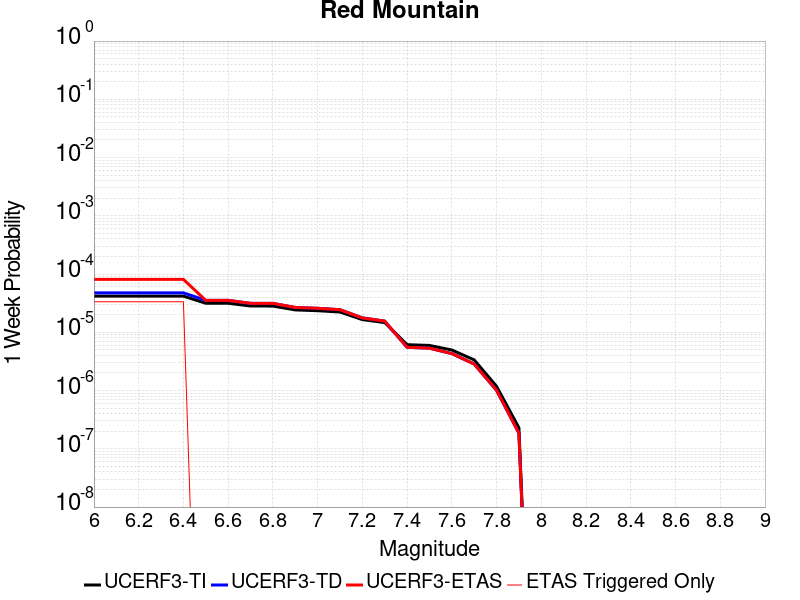 | 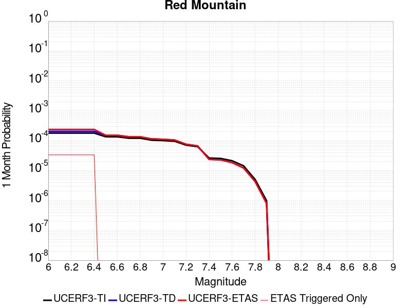 | 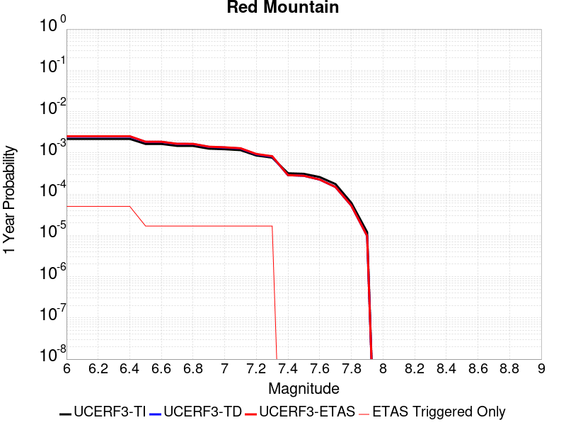 | 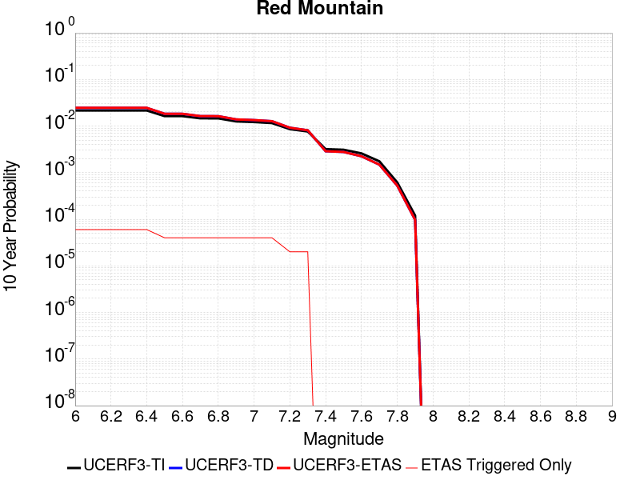 |

| Magnitude | 1 wk TI Prob | 1 wk TD Prob | 1 wk ETAS Prob | 1 wk ETAS/TD Gain | 1 wk ETAS Triggered Only | 1 mo TI Prob | 1 mo TD Prob | 1 mo ETAS Prob | 1 mo ETAS/TD Gain | 1 mo ETAS Triggered Only | 1 yr TI Prob | 1 yr TD Prob | 1 yr ETAS Prob | 1 yr ETAS/TD Gain | 1 yr ETAS Triggered Only | 10 yr TI Prob | 10 yr TD Prob | 10 yr ETAS Prob | 10 yr ETAS/TD Gain | 10 yr ETAS Triggered Only |
|-----|-----|-----|-----|-----|-----|-----|-----|-----|-----|-----|-----|-----|-----|-----|-----|-----|-----|-----|-----|-----|
| 6.0 | 4.1810763E-5 | 4.7591006E-5 | 6.442522E-5 | 1.3537269 | 1.6835016E-5 | 1.7917668E-4 | 2.0394645E-4 | 2.2077802E-4 | 1.0825294 | 1.6835016E-5 | 0.0021792934 | 0.0024803858 | 0.0025307655 | 1.0203112 | 5.0505052E-5 | 0.021580452 | 0.02454463 | 0.024610318 | 1.0026762 | 6.7340065E-5 |
| 6.1 | 4.1810763E-5 | 4.7591006E-5 | 6.442522E-5 | 1.3537269 | 1.6835016E-5 | 1.7917668E-4 | 2.0394645E-4 | 2.2077802E-4 | 1.0825294 | 1.6835016E-5 | 0.0021792934 | 0.0024803858 | 0.0025307655 | 1.0203112 | 5.0505052E-5 | 0.021580452 | 0.02454463 | 0.024610318 | 1.0026762 | 6.7340065E-5 |
| 6.2 | 4.1810763E-5 | 4.7591006E-5 | 6.442522E-5 | 1.3537269 | 1.6835016E-5 | 1.7917668E-4 | 2.0394645E-4 | 2.2077802E-4 | 1.0825294 | 1.6835016E-5 | 0.0021792934 | 0.0024803858 | 0.0025307655 | 1.0203112 | 5.0505052E-5 | 0.021580452 | 0.02454463 | 0.024610318 | 1.0026762 | 6.7340065E-5 |
| 6.3 | 4.1810763E-5 | 4.7591006E-5 | 6.442522E-5 | 1.3537269 | 1.6835016E-5 | 1.7917668E-4 | 2.0394645E-4 | 2.2077802E-4 | 1.0825294 | 1.6835016E-5 | 0.0021792934 | 0.0024803858 | 0.0025307655 | 1.0203112 | 5.0505052E-5 | 0.021580452 | 0.02454463 | 0.024610318 | 1.0026762 | 6.7340065E-5 |
| 6.4 | 4.1810763E-5 | 4.7591006E-5 | 6.442522E-5 | 1.3537269 | 1.6835016E-5 | 1.7917668E-4 | 2.0394645E-4 | 2.2077802E-4 | 1.0825294 | 1.6835016E-5 | 0.0021792934 | 0.0024803858 | 0.0025307655 | 1.0203112 | 5.0505052E-5 | 0.021580452 | 0.02454463 | 0.024610318 | 1.0026762 | 6.7340065E-5 |
| 6.5 | 3.154503E-5 | 3.5360477E-5 | 3.5360477E-5 | 1.0 | 0.0 | 1.3518598E-4 | 1.5153662E-4 | 1.5153662E-4 | 1.0 | 0.0 | 0.0016446467 | 0.0018434891 | 0.0018602931 | 1.0091153 | 1.6835016E-5 | 0.01632528 | 0.018291617 | 0.018324671 | 1.0018071 | 3.3670032E-5 |
| 6.6 | 3.1535834E-5 | 3.5349858E-5 | 3.5349858E-5 | 1.0 | 0.0 | 1.3514658E-4 | 1.5149111E-4 | 1.5149111E-4 | 1.0 | 0.0 | 0.0016441676 | 0.001842936 | 0.00185974 | 1.0091181 | 1.6835016E-5 | 0.01632056 | 0.018286178 | 0.018319232 | 1.0018076 | 3.3670032E-5 |
| 6.7 | 2.8267326E-5 | 3.146999E-5 | 3.146999E-5 | 1.0 | 0.0 | 1.2114006E-4 | 1.348649E-4 | 1.348649E-4 | 1.0 | 0.0 | 0.0014738824 | 0.0016408286 | 0.0016576359 | 1.0102432 | 1.6835016E-5 | 0.014641452 | 0.016295899 | 0.01632902 | 1.0020325 | 3.3670032E-5 |
| 6.8 | 2.8212884E-5 | 3.1407875E-5 | 3.1407875E-5 | 1.0 | 0.0 | 1.20906756E-4 | 1.3459871E-4 | 1.3459871E-4 | 1.0 | 0.0 | 0.0014710457 | 0.0016375926 | 0.0016544 | 1.0102636 | 1.6835016E-5 | 0.014613459 | 0.016264014 | 0.016297137 | 1.0020366 | 3.3670032E-5 |
| 6.9 | 2.4227871E-5 | 2.6707517E-5 | 2.6707517E-5 | 1.0 | 0.0 | 1.03829596E-4 | 1.1445619E-4 | 1.1445619E-4 | 1.0 | 0.0 | 0.0012633923 | 0.0013926893 | 0.0014095008 | 1.0120713 | 1.6835016E-5 | 0.012562336 | 0.013847304 | 0.013880507 | 1.0023979 | 3.3670032E-5 |
| 7.0 | 2.348524E-5 | 2.5836282E-5 | 2.5836282E-5 | 1.0 | 0.0 | 1.0064714E-4 | 1.1072265E-4 | 1.1072265E-4 | 1.0 | 0.0 | 0.0012246901 | 0.0013472902 | 0.0013641026 | 1.0124786 | 1.6835016E-5 | 0.012179627 | 0.013398857 | 0.013432076 | 1.0024792 | 3.3670032E-5 |
| 7.1 | 2.2311642E-5 | 2.4463316E-5 | 2.4463316E-5 | 1.0 | 0.0 | 9.561782E-5 | 1.04839E-4 | 1.04839E-4 | 1.0 | 0.0 | 0.0011635252 | 0.0012757422 | 0.0012925557 | 1.0131794 | 1.6835016E-5 | 0.01157452 | 0.012691703 | 0.012724945 | 1.0026193 | 3.3670032E-5 |
| 7.2 | 1.6533986E-5 | 1.7670676E-5 | 1.7670676E-5 | 1.0 | 0.0 | 7.085802E-5 | 7.572963E-5 | 7.572963E-5 | 1.0 | 0.0 | 8.623549E-4 | 9.2168164E-4 | 9.3850115E-4 | 1.0182487 | 1.6835016E-5 | 0.008590161 | 0.009184869 | 0.00920155 | 1.001816 | 1.6835016E-5 |
| 7.3 | 1.4703092E-5 | 1.5559806E-5 | 1.5559806E-5 | 1.0 | 0.0 | 6.301173E-5 | 6.6683526E-5 | 6.6683526E-5 | 1.0 | 0.0 | 7.668978E-4 | 8.1163115E-4 | 8.284525E-4 | 1.0207254 | 1.6835016E-5 | 0.0076425658 | 0.008092744 | 0.008109443 | 1.0020634 | 1.6835016E-5 |
| 7.4 | 6.1331984E-6 | 5.52893E-6 | 5.52893E-6 | 1.0 | 0.0 | 2.6284872E-5 | 2.3695204E-5 | 2.3695204E-5 | 1.0 | 0.0 | 3.199713E-4 | 2.8845144E-4 | 2.8845144E-4 | 1.0 | 0.0 | 0.0031951098 | 0.0028808247 | 0.0028808247 | 1.0 | 0.0 |
| 7.5 | 5.954766E-6 | 5.338558E-6 | 5.338558E-6 | 1.0 | 0.0 | 2.5520176E-5 | 2.2879336E-5 | 2.2879336E-5 | 1.0 | 0.0 | 3.1066386E-4 | 2.7852083E-4 | 2.7852083E-4 | 1.0 | 0.0 | 0.003102299 | 0.0027817716 | 0.0027817716 | 1.0 | 0.0 |
| 7.6 | 4.9726646E-6 | 4.315341E-6 | 4.315341E-6 | 1.0 | 0.0 | 2.1311245E-5 | 1.8494187E-5 | 1.8494187E-5 | 1.0 | 0.0 | 2.5943352E-4 | 2.2514381E-4 | 2.2514381E-4 | 1.0 | 0.0 | 0.0025913084 | 0.0022491917 | 0.0022491917 | 1.0 | 0.0 |
| 7.7 | 3.3613894E-6 | 2.8526943E-6 | 2.8526943E-6 | 1.0 | 0.0 | 1.4405875E-5 | 1.2225777E-5 | 1.2225777E-5 | 1.0 | 0.0 | 1.7537741E-4 | 1.4883894E-4 | 1.4883894E-4 | 1.0 | 0.0 | 0.0017523908 | 0.0014874188 | 0.0014874188 | 1.0 | 0.0 |
| 7.8 | 1.1828961E-6 | 1.0122844E-6 | 1.0122844E-6 | 1.0 | 0.0 | 5.069545E-6 | 4.338355E-6 | 4.338355E-6 | 1.0 | 0.0 | 6.171996E-5 | 5.281822E-5 | 5.281822E-5 | 1.0 | 0.0 | 6.170282E-4 | 5.280596E-4 | 5.280596E-4 | 1.0 | 0.0 |
| 7.9 | 2.2967266E-7 | 1.8619119E-7 | 1.8619119E-7 | 1.0 | 0.0 | 9.843111E-7 | 7.9796195E-7 | 7.9796195E-7 | 1.0 | 0.0 | 1.19839215E-5 | 9.715147E-6 | 9.715147E-6 | 1.0 | 0.0 | 1.1983275E-4 | 9.714751E-5 | 9.714751E-5 | 1.0 | 0.0 |

## San Andreas (North Branch Mill Creek)
*[(top)](#table-of-contents)*

| 1 Week | 1 Month | 1 Year | 10 Year |
|-----|-----|-----|-----|
| 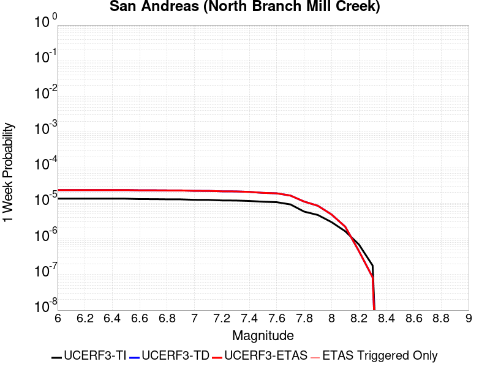 | 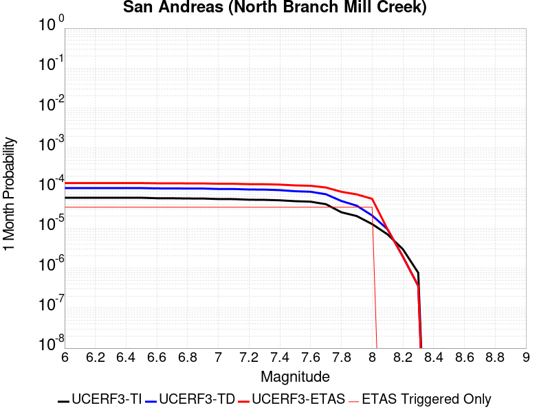 | 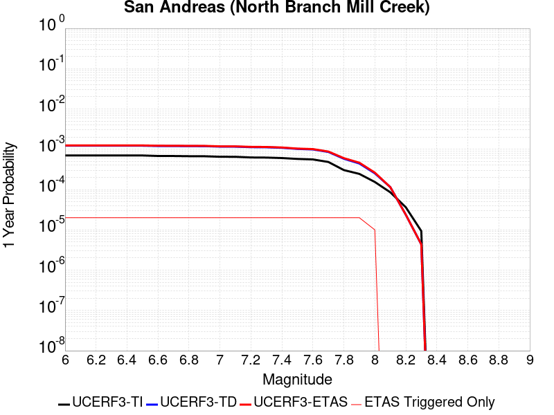 | 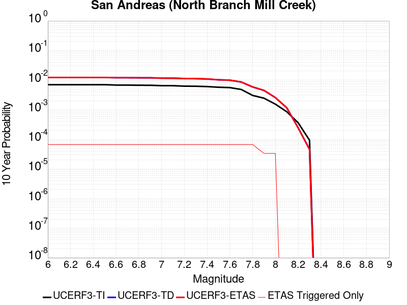 |

| Magnitude | 1 wk TI Prob | 1 wk TD Prob | 1 wk ETAS Prob | 1 wk ETAS/TD Gain | 1 wk ETAS Triggered Only | 1 mo TI Prob | 1 mo TD Prob | 1 mo ETAS Prob | 1 mo ETAS/TD Gain | 1 mo ETAS Triggered Only | 1 yr TI Prob | 1 yr TD Prob | 1 yr ETAS Prob | 1 yr ETAS/TD Gain | 1 yr ETAS Triggered Only | 10 yr TI Prob | 10 yr TD Prob | 10 yr ETAS Prob | 10 yr ETAS/TD Gain | 10 yr ETAS Triggered Only |
|-----|-----|-----|-----|-----|-----|-----|-----|-----|-----|-----|-----|-----|-----|-----|-----|-----|-----|-----|-----|-----|
| 6.0 | 1.3461156E-5 | 2.3506776E-5 | 2.3506776E-5 | 1.0 | 0.0 | 5.7689394E-5 | 1.0073945E-4 | 1.17572774E-4 | 1.1670976 | 1.6835016E-5 | 7.02142E-4 | 0.0012258161 | 0.0012426304 | 1.0137169 | 1.6835016E-5 | 0.0069992766 | 0.012233093 | 0.012299609 | 1.0054374 | 6.7340065E-5 |
| 6.1 | 1.3461156E-5 | 2.3506776E-5 | 2.3506776E-5 | 1.0 | 0.0 | 5.7689394E-5 | 1.0073945E-4 | 1.17572774E-4 | 1.1670976 | 1.6835016E-5 | 7.02142E-4 | 0.0012258161 | 0.0012426304 | 1.0137169 | 1.6835016E-5 | 0.0069992766 | 0.012233093 | 0.012299609 | 1.0054374 | 6.7340065E-5 |
| 6.2 | 1.3461156E-5 | 2.3506776E-5 | 2.3506776E-5 | 1.0 | 0.0 | 5.7689394E-5 | 1.0073945E-4 | 1.17572774E-4 | 1.1670976 | 1.6835016E-5 | 7.02142E-4 | 0.0012258161 | 0.0012426304 | 1.0137169 | 1.6835016E-5 | 0.0069992766 | 0.012233093 | 0.012299609 | 1.0054374 | 6.7340065E-5 |
| 6.3 | 1.3461156E-5 | 2.3506776E-5 | 2.3506776E-5 | 1.0 | 0.0 | 5.7689394E-5 | 1.0073945E-4 | 1.17572774E-4 | 1.1670976 | 1.6835016E-5 | 7.02142E-4 | 0.0012258161 | 0.0012426304 | 1.0137169 | 1.6835016E-5 | 0.0069992766 | 0.012233093 | 0.012299609 | 1.0054374 | 6.7340065E-5 |
| 6.4 | 1.3461156E-5 | 2.3506776E-5 | 2.3506776E-5 | 1.0 | 0.0 | 5.7689394E-5 | 1.0073945E-4 | 1.17572774E-4 | 1.1670976 | 1.6835016E-5 | 7.02142E-4 | 0.0012258161 | 0.0012426304 | 1.0137169 | 1.6835016E-5 | 0.0069992766 | 0.012233093 | 0.012299609 | 1.0054374 | 6.7340065E-5 |
| 6.5 | 1.3450706E-5 | 2.3495735E-5 | 2.3495735E-5 | 1.0 | 0.0 | 5.764461E-5 | 1.0069214E-4 | 1.17525466E-4 | 1.1671761 | 1.6835016E-5 | 7.0159714E-4 | 0.0012252406 | 0.0012420551 | 1.0137234 | 1.6835016E-5 | 0.006993862 | 0.012227403 | 0.01229392 | 1.00544 | 6.7340065E-5 |
| 6.6 | 1.3074523E-5 | 2.3110017E-5 | 2.3110017E-5 | 1.0 | 0.0 | 5.6032466E-5 | 9.9039185E-5 | 1.15872535E-4 | 1.1699666 | 1.6835016E-5 | 6.8198174E-4 | 0.0012051383 | 0.0012219531 | 1.0139525 | 1.6835016E-5 | 0.006798926 | 0.0120285675 | 0.012095097 | 1.005531 | 6.7340065E-5 |
| 6.7 | 1.3050216E-5 | 2.3085311E-5 | 2.3085311E-5 | 1.0 | 0.0 | 5.59283E-5 | 9.893332E-5 | 1.1576667E-4 | 1.1701485 | 1.6835016E-5 | 6.8071426E-4 | 0.0012038508 | 0.0012206655 | 1.0139675 | 1.6835016E-5 | 0.0067863287 | 0.012015832 | 0.012082363 | 1.0055369 | 6.7340065E-5 |
| 6.8 | 1.29049395E-5 | 2.293372E-5 | 2.293372E-5 | 1.0 | 0.0 | 5.530571E-5 | 9.828369E-5 | 1.1511704E-4 | 1.1712732 | 1.6835016E-5 | 6.73139E-4 | 0.0011959502 | 0.0012127651 | 1.0140599 | 1.6835016E-5 | 0.0067110364 | 0.011937677 | 0.0120042125 | 1.0055736 | 6.7340065E-5 |
| 6.9 | 1.2867369E-5 | 2.2893122E-5 | 2.2893122E-5 | 1.0 | 0.0 | 5.51447E-5 | 9.810971E-5 | 1.14943075E-4 | 1.171577 | 1.6835016E-5 | 6.711799E-4 | 0.0011938344 | 0.0012106493 | 1.0140848 | 1.6835016E-5 | 0.006691564 | 0.011916745 | 0.011983283 | 1.0055835 | 6.7340065E-5 |
| 7.0 | 1.2495996E-5 | 2.2293154E-5 | 2.2293154E-5 | 1.0 | 0.0 | 5.3553173E-5 | 9.5538606E-5 | 1.1237202E-4 | 1.1761948 | 1.6835016E-5 | 6.518148E-4 | 0.0011625647 | 0.0011793802 | 1.0144641 | 1.6835016E-5 | 0.0064990623 | 0.011607327 | 0.011673885 | 1.0057342 | 6.7340065E-5 |
| 7.1 | 1.2452067E-5 | 2.2238226E-5 | 2.2238226E-5 | 1.0 | 0.0 | 5.3364907E-5 | 9.5303214E-5 | 1.1213663E-4 | 1.17663 | 1.6835016E-5 | 6.4952404E-4 | 0.0011597018 | 0.0011765173 | 1.0144998 | 1.6835016E-5 | 0.0064762887 | 0.011578998 | 0.011645557 | 1.0057484 | 6.7340065E-5 |
| 7.2 | 1.2002777E-5 | 2.1616754E-5 | 2.1616754E-5 | 1.0 | 0.0 | 5.143946E-5 | 9.263996E-5 | 1.0947341E-4 | 1.1817083 | 1.6835016E-5 | 6.2609545E-4 | 0.0011273106 | 0.0011441265 | 1.0149169 | 1.6835016E-5 | 0.006243344 | 0.011258403 | 0.011324984 | 1.005914 | 6.7340065E-5 |
| 7.3 | 1.1923425E-5 | 2.1486576E-5 | 2.1486576E-5 | 1.0 | 0.0 | 5.109939E-5 | 9.208209E-5 | 1.08915556E-4 | 1.1828094 | 1.6835016E-5 | 6.219575E-4 | 0.0011205255 | 0.0011373417 | 1.0150074 | 1.6835016E-5 | 0.0062021962 | 0.011191265 | 0.0112578515 | 1.0059499 | 6.7340065E-5 |
| 7.4 | 1.16105175E-5 | 2.0860489E-5 | 2.0860489E-5 | 1.0 | 0.0 | 4.975841E-5 | 8.9399044E-5 | 1.0623256E-4 | 1.1882963 | 1.6835016E-5 | 6.0564023E-4 | 0.0010878925 | 0.0011047092 | 1.0154581 | 1.6835016E-5 | 0.006039923 | 0.01086884 | 0.010935448 | 1.0061283 | 6.7340065E-5 |
| 7.5 | 1.1037265E-5 | 1.956039E-5 | 1.956039E-5 | 1.0 | 0.0 | 4.7301706E-5 | 8.382756E-5 | 1.00661164E-4 | 1.2008123 | 1.6835016E-5 | 5.757461E-4 | 0.0010201249 | 0.0010369427 | 1.016486 | 1.6835016E-5 | 0.005742567 | 0.010198223 | 0.010264877 | 1.0065358 | 6.7340065E-5 |
| 7.6 | 1.0720915E-5 | 1.900222E-5 | 1.900222E-5 | 1.0 | 0.0 | 4.5945973E-5 | 8.143555E-5 | 9.82692E-5 | 1.2067113 | 1.6835016E-5 | 5.592486E-4 | 9.910291E-4 | 0.0010078474 | 1.0169705 | 1.6835016E-5 | 0.005578433 | 0.009909907 | 0.00997658 | 1.0067279 | 6.7340065E-5 |
| 7.7 | 9.276279E-6 | 1.6447744E-5 | 1.6447744E-5 | 1.0 | 0.0 | 3.9754876E-5 | 7.048844E-5 | 8.732227E-5 | 1.2388169 | 1.6835016E-5 | 4.839081E-4 | 8.578605E-4 | 8.7468105E-4 | 1.0196075 | 1.6835016E-5 | 0.0048285574 | 0.008589173 | 0.008655935 | 1.0077728 | 6.7340065E-5 |
| 7.8 | 5.8346777E-6 | 1.1159965E-5 | 1.1159965E-5 | 1.0 | 0.0 | 2.5005522E-5 | 4.7827543E-5 | 6.4661755E-5 | 1.3519773 | 1.6835016E-5 | 3.043997E-4 | 5.821449E-4 | 5.989701E-4 | 1.028902 | 1.6835016E-5 | 0.0030398308 | 0.005849473 | 0.0058996826 | 1.0085837 | 5.0505052E-5 |
| 7.9 | 4.690204E-6 | 8.513225E-6 | 8.513225E-6 | 1.0 | 0.0 | 2.0100719E-5 | 3.648474E-5 | 5.331914E-5 | 1.4614094 | 1.6835016E-5 | 2.4469878E-4 | 4.4411127E-4 | 4.609388E-4 | 1.0378903 | 1.6835016E-5 | 0.002444295 | 0.0044728746 | 0.004506394 | 1.007494 | 3.3670032E-5 |
| 8.0 | 2.9570454E-6 | 4.8494758E-6 | 4.8494758E-6 | 1.0 | 0.0 | 1.267299E-5 | 2.0783302E-5 | 3.7617967E-5 | 1.8100092 | 1.6835016E-5 | 1.5428272E-4 | 2.5300734E-4 | 2.698381E-4 | 1.0665228 | 1.6835016E-5 | 0.0015417566 | 0.0025509594 | 0.0025677516 | 1.0065826 | 1.6835016E-5 |
| 8.1 | 1.6376824E-6 | 2.198225E-6 | 2.198225E-6 | 1.0 | 0.0 | 7.01862E-6 | 9.420931E-6 | 9.420931E-6 | 1.0 | 0.0 | 8.544835E-5 | 1.1469381E-4 | 1.1469381E-4 | 1.0 | 0.0 | 8.54155E-4 | 0.0011613552 | 0.0011613552 | 1.0 | 0.0 |
| 8.2 | 6.9631557E-7 | 4.5401492E-7 | 4.5401492E-7 | 1.0 | 0.0 | 2.984206E-6 | 1.9457768E-6 | 1.9457768E-6 | 1.0 | 0.0 | 3.63321E-5 | 2.3689576E-5 | 2.3689576E-5 | 1.0 | 0.0 | 3.6326164E-4 | 2.453756E-4 | 2.453756E-4 | 1.0 | 0.0 |
| 8.3 | 1.7876137E-7 | 8.368747E-8 | 8.368747E-8 | 1.0 | 0.0 | 7.661199E-7 | 3.5866054E-7 | 3.5866054E-7 | 1.0 | 0.0 | 9.32747E-6 | 4.3666837E-6 | 4.3666837E-6 | 1.0 | 0.0 | 9.3270784E-5 | 4.5861943E-5 | 4.5861943E-5 | 1.0 | 0.0 |

## Kern Canyon (North Kern) 2011
*[(top)](#table-of-contents)*

| 1 Week | 1 Month | 1 Year | 10 Year |
|-----|-----|-----|-----|
| 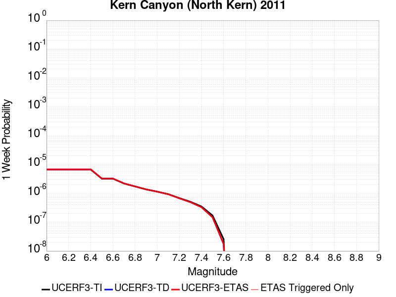 | 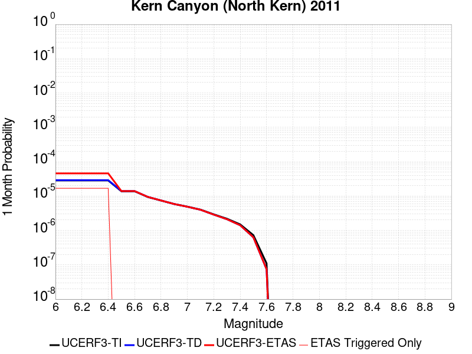 | 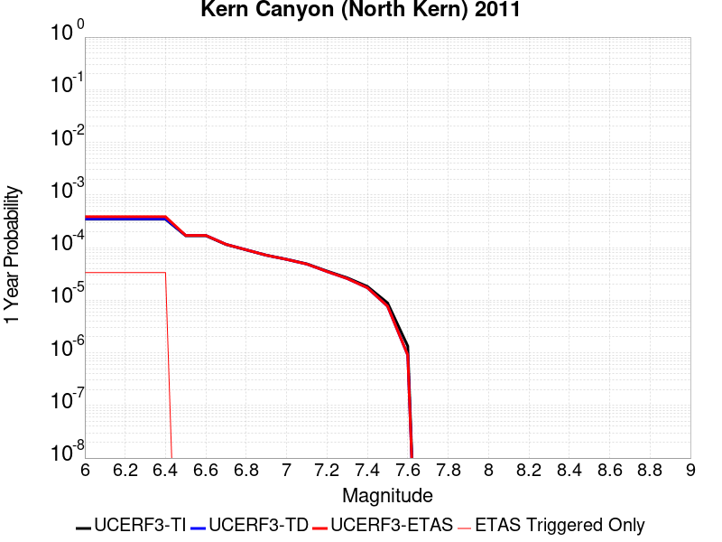 | 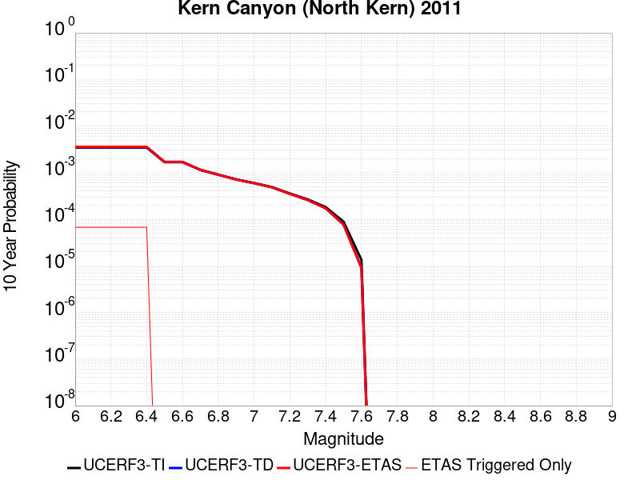 |

| Magnitude | 1 wk TI Prob | 1 wk TD Prob | 1 wk ETAS Prob | 1 wk ETAS/TD Gain | 1 wk ETAS Triggered Only | 1 mo TI Prob | 1 mo TD Prob | 1 mo ETAS Prob | 1 mo ETAS/TD Gain | 1 mo ETAS Triggered Only | 1 yr TI Prob | 1 yr TD Prob | 1 yr ETAS Prob | 1 yr ETAS/TD Gain | 1 yr ETAS Triggered Only | 10 yr TI Prob | 10 yr TD Prob | 10 yr ETAS Prob | 10 yr ETAS/TD Gain | 10 yr ETAS Triggered Only |
|-----|-----|-----|-----|-----|-----|-----|-----|-----|-----|-----|-----|-----|-----|-----|-----|-----|-----|-----|-----|-----|
| 6.0 | 6.6264497E-6 | 6.7573515E-6 | 6.7573515E-6 | 1.0 | 0.0 | 2.8398761E-5 | 2.8959801E-5 | 4.579433E-5 | 1.5813068 | 1.6835016E-5 | 3.4570007E-4 | 3.5253653E-4 | 3.861947E-4 | 1.0954742 | 3.3670032E-5 | 0.0034516277 | 0.0035205614 | 0.0035876643 | 1.0190603 | 6.7340065E-5 |
| 6.1 | 6.6264497E-6 | 6.7573515E-6 | 6.7573515E-6 | 1.0 | 0.0 | 2.8398761E-5 | 2.8959801E-5 | 4.579433E-5 | 1.5813068 | 1.6835016E-5 | 3.4570007E-4 | 3.5253653E-4 | 3.861947E-4 | 1.0954742 | 3.3670032E-5 | 0.0034516277 | 0.0035205614 | 0.0035876643 | 1.0190603 | 6.7340065E-5 |
| 6.2 | 6.6264497E-6 | 6.7573515E-6 | 6.7573515E-6 | 1.0 | 0.0 | 2.8398761E-5 | 2.8959801E-5 | 4.579433E-5 | 1.5813068 | 1.6835016E-5 | 3.4570007E-4 | 3.5253653E-4 | 3.861947E-4 | 1.0954742 | 3.3670032E-5 | 0.0034516277 | 0.0035205614 | 0.0035876643 | 1.0190603 | 6.7340065E-5 |
| 6.3 | 6.6264497E-6 | 6.7573515E-6 | 6.7573515E-6 | 1.0 | 0.0 | 2.8398761E-5 | 2.8959801E-5 | 4.579433E-5 | 1.5813068 | 1.6835016E-5 | 3.4570007E-4 | 3.5253653E-4 | 3.861947E-4 | 1.0954742 | 3.3670032E-5 | 0.0034516277 | 0.0035205614 | 0.0035876643 | 1.0190603 | 6.7340065E-5 |
| 6.4 | 6.6264497E-6 | 6.7573515E-6 | 6.7573515E-6 | 1.0 | 0.0 | 2.8398761E-5 | 2.8959801E-5 | 4.579433E-5 | 1.5813068 | 1.6835016E-5 | 3.4570007E-4 | 3.5253653E-4 | 3.861947E-4 | 1.0954742 | 3.3670032E-5 | 0.0034516277 | 0.0035205614 | 0.0035876643 | 1.0190603 | 6.7340065E-5 |
| 6.5 | 3.2162225E-6 | 3.2571006E-6 | 3.2571006E-6 | 1.0 | 0.0 | 1.3783738E-5 | 1.3958933E-5 | 1.3958933E-5 | 1.0 | 0.0 | 1.6780409E-4 | 1.6993756E-4 | 1.6993756E-4 | 1.0 | 0.0 | 0.0016767744 | 0.0016981558 | 0.0016981558 | 1.0 | 0.0 |
| 6.6 | 3.2162225E-6 | 3.2571006E-6 | 3.2571006E-6 | 1.0 | 0.0 | 1.3783738E-5 | 1.3958933E-5 | 1.3958933E-5 | 1.0 | 0.0 | 1.6780409E-4 | 1.6993756E-4 | 1.6993756E-4 | 1.0 | 0.0 | 0.0016767744 | 0.0016981558 | 0.0016981558 | 1.0 | 0.0 |
| 6.7 | 2.1908265E-6 | 2.2071279E-6 | 2.2071279E-6 | 1.0 | 0.0 | 9.389223E-6 | 9.459087E-6 | 9.459087E-6 | 1.0 | 0.0 | 1.1430779E-4 | 1.1515849E-4 | 1.1515849E-4 | 1.0 | 0.0 | 0.0011424901 | 0.0011510076 | 0.0011510076 | 1.0 | 0.0 |
| 6.8 | 1.7303895E-6 | 1.7365574E-6 | 1.7365574E-6 | 1.0 | 0.0 | 7.415934E-6 | 7.442368E-6 | 7.442368E-6 | 1.0 | 0.0 | 9.028525E-5 | 9.060716E-5 | 9.060716E-5 | 1.0 | 0.0 | 9.024858E-4 | 9.057119E-4 | 9.057119E-4 | 1.0 | 0.0 |
| 6.9 | 1.3700314E-6 | 1.3688657E-6 | 1.3688657E-6 | 1.0 | 0.0 | 5.87155E-6 | 5.866554E-6 | 5.866554E-6 | 1.0 | 0.0 | 7.148377E-5 | 7.1423005E-5 | 7.1423005E-5 | 1.0 | 0.0 | 7.146078E-4 | 7.1400503E-4 | 7.1400503E-4 | 1.0 | 0.0 |
| 7.0 | 1.1467797E-6 | 1.1413833E-6 | 1.1413833E-6 | 1.0 | 0.0 | 4.9147607E-6 | 4.8916336E-6 | 4.8916336E-6 | 1.0 | 0.0 | 5.983557E-5 | 5.9554044E-5 | 5.9554044E-5 | 1.0 | 0.0 | 5.981946E-4 | 5.95384E-4 | 5.95384E-4 | 1.0 | 0.0 |
| 7.1 | 9.3952065E-7 | 9.302714E-7 | 9.302714E-7 | 1.0 | 0.0 | 4.026511E-6 | 3.9868714E-6 | 3.9868714E-6 | 1.0 | 0.0 | 4.9021666E-5 | 4.8539096E-5 | 4.8539096E-5 | 1.0 | 0.0 | 4.901085E-4 | 4.8528673E-4 | 4.8528673E-4 | 1.0 | 0.0 |
| 7.2 | 6.858055E-7 | 6.719318E-7 | 6.719318E-7 | 1.0 | 0.0 | 2.939163E-6 | 2.8797044E-6 | 2.8797044E-6 | 1.0 | 0.0 | 3.5783723E-5 | 3.5059846E-5 | 3.5059846E-5 | 1.0 | 0.0 | 3.5777962E-4 | 3.5054405E-4 | 3.5054405E-4 | 1.0 | 0.0 |
| 7.3 | 5.1101983E-7 | 4.939313E-7 | 4.939313E-7 | 1.0 | 0.0 | 2.1900833E-6 | 2.1168466E-6 | 2.1168466E-6 | 1.0 | 0.0 | 2.6663936E-5 | 2.5772308E-5 | 2.5772308E-5 | 1.0 | 0.0 | 2.6660739E-4 | 2.5769367E-4 | 2.5769367E-4 | 1.0 | 0.0 |
| 7.4 | 3.4999414E-7 | 3.2995996E-7 | 3.2995996E-7 | 1.0 | 0.0 | 1.499974E-6 | 1.4141134E-6 | 1.4141134E-6 | 1.0 | 0.0 | 1.8262032E-5 | 1.7216697E-5 | 1.7216697E-5 | 1.0 | 0.0 | 1.826053E-4 | 1.7215387E-4 | 1.7215387E-4 | 1.0 | 0.0 |
| 7.5 | 1.7021522E-7 | 1.4750091E-7 | 1.4750091E-7 | 1.0 | 0.0 | 7.2949354E-7 | 6.3214657E-7 | 6.3214657E-7 | 1.0 | 0.0 | 8.881548E-6 | 7.696359E-6 | 7.696359E-6 | 1.0 | 0.0 | 8.8811925E-5 | 7.6961E-5 | 7.6961E-5 | 1.0 | 0.0 |
| 7.6 | 2.572245E-8 | 1.7352637E-8 | 1.7352637E-8 | 1.0 | 0.0 | 1.10239064E-7 | 7.4368444E-8 | 7.4368444E-8 | 1.0 | 0.0 | 1.3421597E-6 | 9.0543546E-7 | 9.0543546E-7 | 1.0 | 0.0 | 1.3421517E-5 | 9.0543235E-6 | 9.0543235E-6 | 1.0 | 0.0 |

## Rose Canyon
*[(top)](#table-of-contents)*

| 1 Week | 1 Month | 1 Year | 10 Year |
|-----|-----|-----|-----|
|  | 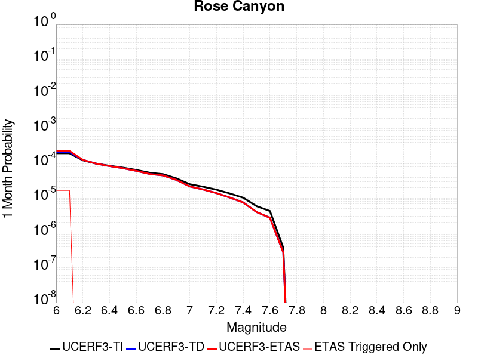 | 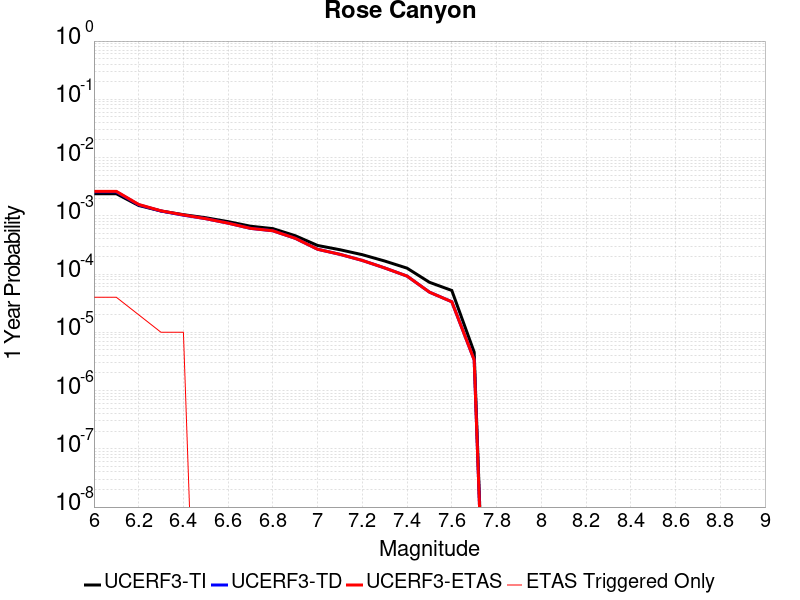 | 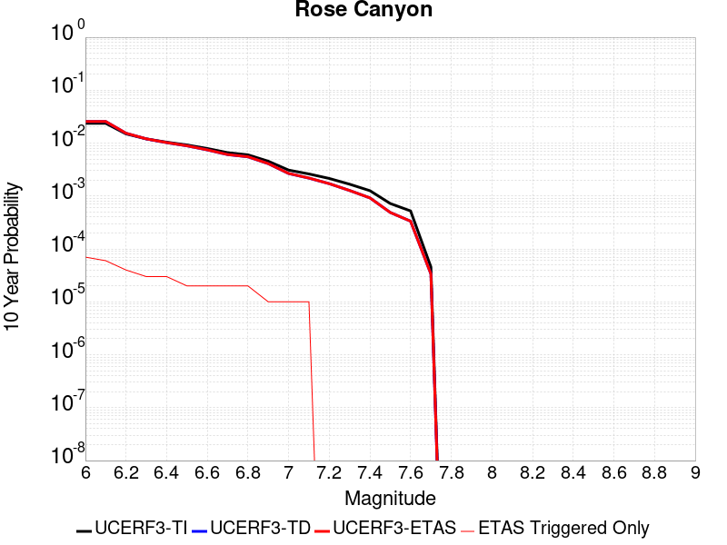 |

| Magnitude | 1 wk TI Prob | 1 wk TD Prob | 1 wk ETAS Prob | 1 wk ETAS/TD Gain | 1 wk ETAS Triggered Only | 1 mo TI Prob | 1 mo TD Prob | 1 mo ETAS Prob | 1 mo ETAS/TD Gain | 1 mo ETAS Triggered Only | 1 yr TI Prob | 1 yr TD Prob | 1 yr ETAS Prob | 1 yr ETAS/TD Gain | 1 yr ETAS Triggered Only | 10 yr TI Prob | 10 yr TD Prob | 10 yr ETAS Prob | 10 yr ETAS/TD Gain | 10 yr ETAS Triggered Only |
|-----|-----|-----|-----|-----|-----|-----|-----|-----|-----|-----|-----|-----|-----|-----|-----|-----|-----|-----|-----|-----|
| 6.0 | 4.5923203E-5 | 4.9715825E-5 | 4.9715825E-5 | 1.0 | 0.0 | 1.9679888E-4 | 2.1305127E-4 | 2.2988272E-4 | 1.0790018 | 1.6835016E-5 | 0.0023933933 | 0.0025910123 | 0.0026581779 | 1.0259225 | 6.7340065E-5 | 0.023677798 | 0.025640773 | 0.025706386 | 1.002559 | 6.7340065E-5 |
| 6.1 | 4.5923203E-5 | 4.9715825E-5 | 4.9715825E-5 | 1.0 | 0.0 | 1.9679888E-4 | 2.1305127E-4 | 2.2988272E-4 | 1.0790018 | 1.6835016E-5 | 0.0023933933 | 0.0025910123 | 0.0026581779 | 1.0259225 | 6.7340065E-5 | 0.023677798 | 0.025640773 | 0.025706386 | 1.002559 | 6.7340065E-5 |
| 6.2 | 2.8844734E-5 | 2.9669445E-5 | 2.9669445E-5 | 1.0 | 0.0 | 1.2361443E-4 | 1.2714828E-4 | 1.2714828E-4 | 1.0 | 0.0 | 0.0015039665 | 0.0015469306 | 0.0015805486 | 1.0217321 | 3.3670032E-5 | 0.0149382865 | 0.01537464 | 0.015407792 | 1.0021563 | 3.3670032E-5 |
| 6.3 | 2.3171577E-5 | 2.3161689E-5 | 2.3161689E-5 | 1.0 | 0.0 | 9.9302975E-5 | 9.926068E-5 | 9.926068E-5 | 1.0 | 0.0 | 0.0012083431 | 0.0012078421 | 0.0012246568 | 1.0139213 | 1.6835016E-5 | 0.012017938 | 0.0120226685 | 0.012039301 | 1.0013834 | 1.6835016E-5 |
| 6.4 | 2.0066604E-5 | 1.9667403E-5 | 1.9667403E-5 | 1.0 | 0.0 | 8.599689E-5 | 8.42862E-5 | 8.42862E-5 | 1.0 | 0.0 | 0.0010465092 | 0.0010257114 | 0.0010425291 | 1.0163962 | 1.6835016E-5 | 0.010415946 | 0.010217753 | 0.010234416 | 1.0016308 | 1.6835016E-5 |
| 6.5 | 1.776989E-5 | 1.7114124E-5 | 1.7114124E-5 | 1.0 | 0.0 | 7.615444E-5 | 7.334422E-5 | 7.334422E-5 | 1.0 | 0.0 | 9.267859E-4 | 8.92607E-4 | 8.92607E-4 | 1.0 | 0.0 | 0.009229303 | 0.008896374 | 0.008896374 | 1.0 | 0.0 |
| 6.6 | 1.5227364E-5 | 1.43395055E-5 | 1.43395055E-5 | 1.0 | 0.0 | 6.52585E-5 | 6.1453604E-5 | 6.1453604E-5 | 1.0 | 0.0 | 7.942326E-4 | 7.47946E-4 | 7.47946E-4 | 1.0 | 0.0 | 0.007914 | 0.007458486 | 0.007458486 | 1.0 | 0.0 |
| 6.7 | 1.2703898E-5 | 1.167345E-5 | 1.167345E-5 | 1.0 | 0.0 | 5.4444143E-5 | 5.002814E-5 | 5.002814E-5 | 1.0 | 0.0 | 6.626558E-4 | 6.089266E-4 | 6.089266E-4 | 1.0 | 0.0 | 0.006606833 | 0.006075177 | 0.006075177 | 1.0 | 0.0 |
| 6.8 | 1.1554917E-5 | 1.0609485E-5 | 1.0609485E-5 | 1.0 | 0.0 | 4.9520135E-5 | 4.5468452E-5 | 4.5468452E-5 | 1.0 | 0.0 | 6.0274085E-4 | 5.534419E-4 | 5.534419E-4 | 1.0 | 0.0 | 0.0060110865 | 0.005522644 | 0.005522644 | 1.0 | 0.0 |
| 6.9 | 8.732078E-6 | 7.881448E-6 | 7.881448E-6 | 1.0 | 0.0 | 3.7422655E-5 | 3.3777214E-5 | 3.3777214E-5 | 1.0 | 0.0 | 4.5552556E-4 | 4.111629E-4 | 4.111629E-4 | 1.0 | 0.0 | 0.0045459294 | 0.0041048555 | 0.0041048555 | 1.0 | 0.0 |
| 7.0 | 5.9337494E-6 | 5.107531E-6 | 5.107531E-6 | 1.0 | 0.0 | 2.5430107E-5 | 2.1889235E-5 | 2.1889235E-5 | 1.0 | 0.0 | 3.0956755E-4 | 2.66469E-4 | 2.66469E-4 | 1.0 | 0.0 | 0.0030913667 | 0.0026615104 | 0.0026615104 | 1.0 | 0.0 |
| 7.1 | 5.013409E-6 | 4.177419E-6 | 4.177419E-6 | 1.0 | 0.0 | 2.1485863E-5 | 1.7903103E-5 | 1.7903103E-5 | 1.0 | 0.0 | 2.6155898E-4 | 2.1794859E-4 | 2.1794859E-4 | 1.0 | 0.0 | 0.0026125133 | 0.00217736 | 0.00217736 | 1.0 | 0.0 |
| 7.2 | 4.120763E-6 | 3.2821677E-6 | 3.2821677E-6 | 1.0 | 0.0 | 1.7660293E-5 | 1.4066358E-5 | 1.4066358E-5 | 1.0 | 0.0 | 2.1499286E-4 | 1.7124454E-4 | 1.7124454E-4 | 1.0 | 0.0 | 0.0021478499 | 0.0017111353 | 0.0017111353 | 1.0 | 0.0 |
| 7.3 | 3.2081239E-6 | 2.4405597E-6 | 2.4405597E-6 | 1.0 | 0.0 | 1.374903E-5 | 1.04595E-5 | 1.04595E-5 | 1.0 | 0.0 | 1.6738157E-4 | 1.2733703E-4 | 1.2733703E-4 | 1.0 | 0.0 | 0.0016725556 | 0.0012726476 | 0.0012726476 | 1.0 | 0.0 |
| 7.4 | 2.4194755E-6 | 1.7680803E-6 | 1.7680803E-6 | 1.0 | 0.0 | 1.0369139E-5 | 7.5774656E-6 | 7.5774656E-6 | 1.0 | 0.0 | 1.2623696E-4 | 9.2251794E-5 | 9.2251794E-5 | 1.0 | 0.0 | 0.0012616527 | 9.221403E-4 | 9.221403E-4 | 1.0 | 0.0 |
| 7.5 | 1.3842889E-6 | 9.378737E-7 | 9.378737E-7 | 1.0 | 0.0 | 5.9326535E-6 | 4.0194527E-6 | 4.0194527E-6 | 1.0 | 0.0 | 7.222766E-5 | 4.8935777E-5 | 4.8935777E-5 | 1.0 | 0.0 | 7.220419E-4 | 4.8925355E-4 | 4.8925355E-4 | 1.0 | 0.0 |
| 7.6 | 1.0021575E-6 | 6.411548E-7 | 6.411548E-7 | 1.0 | 0.0 | 4.2949537E-6 | 2.7478038E-6 | 2.7478038E-6 | 1.0 | 0.0 | 5.2289808E-5 | 3.345402E-5 | 3.345402E-5 | 1.0 | 0.0 | 5.2277505E-4 | 3.3449198E-4 | 3.3449198E-4 | 1.0 | 0.0 |
| 7.7 | 8.7620116E-8 | 6.449284E-8 | 6.449284E-8 | 1.0 | 0.0 | 3.7551473E-7 | 2.7639786E-7 | 2.7639786E-7 | 1.0 | 0.0 | 4.5718825E-6 | 3.365139E-6 | 3.365139E-6 | 1.0 | 0.0 | 4.5717883E-5 | 3.365091E-5 | 3.365091E-5 | 1.0 | 0.0 |

## Santa Rosa Island
*[(top)](#table-of-contents)*

| 1 Week | 1 Month | 1 Year | 10 Year |
|-----|-----|-----|-----|
| 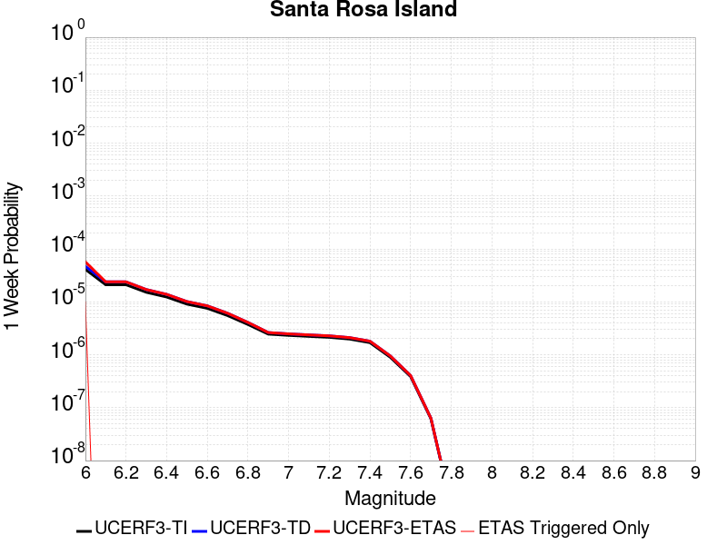 | 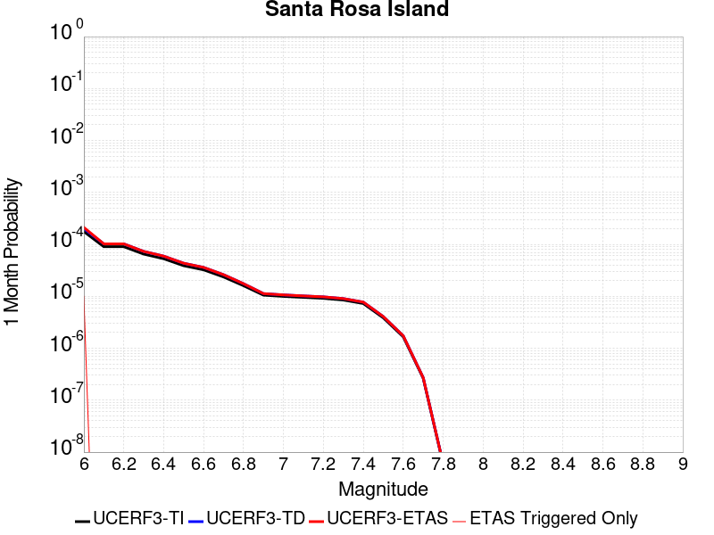 | 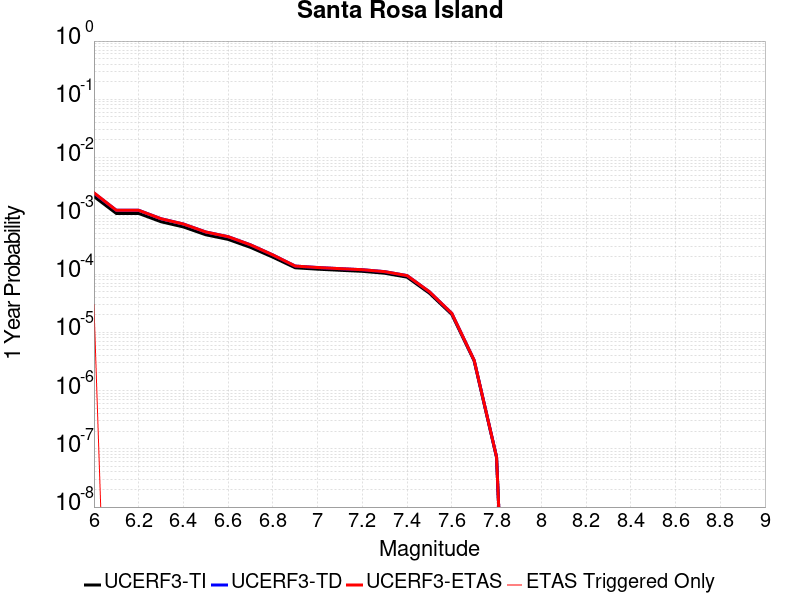 | 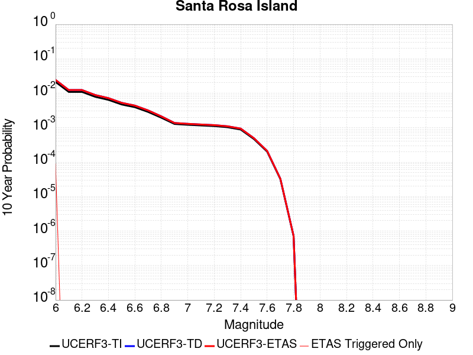 |

| Magnitude | 1 wk TI Prob | 1 wk TD Prob | 1 wk ETAS Prob | 1 wk ETAS/TD Gain | 1 wk ETAS Triggered Only | 1 mo TI Prob | 1 mo TD Prob | 1 mo ETAS Prob | 1 mo ETAS/TD Gain | 1 mo ETAS Triggered Only | 1 yr TI Prob | 1 yr TD Prob | 1 yr ETAS Prob | 1 yr ETAS/TD Gain | 1 yr ETAS Triggered Only | 10 yr TI Prob | 10 yr TD Prob | 10 yr ETAS Prob | 10 yr ETAS/TD Gain | 10 yr ETAS Triggered Only |
|-----|-----|-----|-----|-----|-----|-----|-----|-----|-----|-----|-----|-----|-----|-----|-----|-----|-----|-----|-----|-----|
| 6.0 | 4.1143165E-5 | 4.7092042E-5 | 4.7092042E-5 | 1.0 | 0.0 | 1.7631594E-4 | 2.0180854E-4 | 2.0180854E-4 | 1.0 | 0.0 | 0.002144533 | 0.0024544473 | 0.002471241 | 1.0068421 | 1.6835016E-5 | 0.021239553 | 0.024294013 | 0.024359718 | 1.0027045 | 6.7340065E-5 |
| 6.1 | 2.1061249E-5 | 2.3865383E-5 | 2.3865383E-5 | 1.0 | 0.0 | 9.0259375E-5 | 1.0227637E-4 | 1.0227637E-4 | 1.0 | 0.0 | 0.0010983539 | 0.0012445324 | 0.0012445324 | 1.0 | 0.0 | 0.01092941 | 0.012378667 | 0.012378667 | 1.0 | 0.0 |
| 6.2 | 2.1061249E-5 | 2.3865383E-5 | 2.3865383E-5 | 1.0 | 0.0 | 9.0259375E-5 | 1.0227637E-4 | 1.0227637E-4 | 1.0 | 0.0 | 0.0010983539 | 0.0012445324 | 0.0012445324 | 1.0 | 0.0 | 0.01092941 | 0.012378667 | 0.012378667 | 1.0 | 0.0 |
| 6.3 | 1.5158236E-5 | 1.7074708E-5 | 1.7074708E-5 | 1.0 | 0.0 | 6.496225E-5 | 7.317533E-5 | 7.317533E-5 | 1.0 | 0.0 | 7.906284E-4 | 8.905574E-4 | 8.905574E-4 | 1.0 | 0.0 | 0.007878214 | 0.008871138 | 0.008871138 | 1.0 | 0.0 |
| 6.4 | 1.2341918E-5 | 1.3853143E-5 | 1.3853143E-5 | 1.0 | 0.0 | 5.2892858E-5 | 5.9369308E-5 | 5.9369308E-5 | 1.0 | 0.0 | 6.437803E-4 | 7.225897E-4 | 7.225897E-4 | 1.0 | 0.0 | 0.006419184 | 0.0072032386 | 0.0072032386 | 1.0 | 0.0 |
| 6.5 | 9.061158E-6 | 1.0117188E-5 | 1.0117188E-5 | 1.0 | 0.0 | 3.883296E-5 | 4.335869E-5 | 4.335869E-5 | 1.0 | 0.0 | 4.726887E-4 | 5.277695E-4 | 5.277695E-4 | 1.0 | 0.0 | 0.004716845 | 0.0052656992 | 0.0052656992 | 1.0 | 0.0 |
| 6.6 | 7.5461685E-6 | 8.400861E-6 | 8.400861E-6 | 1.0 | 0.0 | 3.2340322E-5 | 3.6003217E-5 | 3.6003217E-5 | 1.0 | 0.0 | 3.936723E-4 | 4.382553E-4 | 4.382553E-4 | 1.0 | 0.0 | 0.003929756 | 0.0043743397 | 0.0043743397 | 1.0 | 0.0 |
| 6.7 | 5.5023775E-6 | 6.0874677E-6 | 6.0874677E-6 | 1.0 | 0.0 | 2.3581404E-5 | 2.6088905E-5 | 2.6088905E-5 | 1.0 | 0.0 | 2.8706578E-4 | 3.1758935E-4 | 3.1758935E-4 | 1.0 | 0.0 | 0.0028669522 | 0.0031716768 | 0.0031716768 | 1.0 | 0.0 |
| 6.8 | 3.7351679E-6 | 4.0831915E-6 | 4.0831915E-6 | 1.0 | 0.0 | 1.6007763E-5 | 1.749929E-5 | 1.749929E-5 | 1.0 | 0.0 | 1.948771E-4 | 2.1303551E-4 | 2.1303551E-4 | 1.0 | 0.0 | 0.0019470629 | 0.002128558 | 0.002128558 | 1.0 | 0.0 |
| 6.9 | 2.456366E-6 | 2.6292953E-6 | 2.6292953E-6 | 1.0 | 0.0 | 1.0527241E-5 | 1.126836E-5 | 1.126836E-5 | 1.0 | 0.0 | 1.2816161E-4 | 1.3718367E-4 | 1.3718367E-4 | 1.0 | 0.0 | 0.0012808773 | 0.0013709929 | 0.0013709929 | 1.0 | 0.0 |
| 7.0 | 2.3245157E-6 | 2.482801E-6 | 2.482801E-6 | 1.0 | 0.0 | 9.962172E-6 | 1.0640532E-5 | 1.0640532E-5 | 1.0 | 0.0 | 1.2128269E-4 | 1.295408E-4 | 1.295408E-4 | 1.0 | 0.0 | 0.0012121652 | 0.0012946551 | 0.0012946551 | 1.0 | 0.0 |
| 7.1 | 2.2248344E-6 | 2.3732712E-6 | 2.3732712E-6 | 1.0 | 0.0 | 9.53497E-6 | 1.0171123E-5 | 1.0171123E-5 | 1.0 | 0.0 | 1.1608207E-4 | 1.238264E-4 | 1.238264E-4 | 1.0 | 0.0 | 0.0011602144 | 0.001237576 | 0.001237576 | 1.0 | 0.0 |
| 7.2 | 2.1350402E-6 | 2.2761742E-6 | 2.2761742E-6 | 1.0 | 0.0 | 9.150141E-6 | 9.7549955E-6 | 9.7549955E-6 | 1.0 | 0.0 | 1.1139726E-4 | 1.1876062E-4 | 1.1876062E-4 | 1.0 | 0.0 | 0.0011134144 | 0.0011869734 | 0.0011869734 | 1.0 | 0.0 |
| 7.3 | 1.9793572E-6 | 2.1087376E-6 | 2.1087376E-6 | 1.0 | 0.0 | 8.482932E-6 | 9.037415E-6 | 9.037415E-6 | 1.0 | 0.0 | 1.032748E-4 | 1.10024994E-4 | 1.10024994E-4 | 1.0 | 0.0 | 0.0010322682 | 0.001099707 | 0.001099707 | 1.0 | 0.0 |
| 7.4 | 1.6951194E-6 | 1.804589E-6 | 1.804589E-6 | 1.0 | 0.0 | 7.264777E-6 | 7.73393E-6 | 7.73393E-6 | 1.0 | 0.0 | 8.844508E-5 | 9.4156545E-5 | 9.4156545E-5 | 1.0 | 0.0 | 8.840988E-4 | 9.411682E-4 | 9.411682E-4 | 1.0 | 0.0 |
| 7.5 | 8.987207E-7 | 9.51229E-7 | 9.51229E-7 | 1.0 | 0.0 | 3.8516546E-6 | 4.0766895E-6 | 4.0766895E-6 | 1.0 | 0.0 | 4.6892885E-5 | 4.9632577E-5 | 4.9632577E-5 | 1.0 | 0.0 | 4.688299E-4 | 4.9621606E-4 | 4.9621606E-4 | 1.0 | 0.0 |
| 7.6 | 3.8783037E-7 | 4.052958E-7 | 4.052958E-7 | 1.0 | 0.0 | 1.6621291E-6 | 1.7369808E-6 | 1.7369808E-6 | 1.0 | 0.0 | 2.0236233E-5 | 2.1147544E-5 | 2.1147544E-5 | 1.0 | 0.0 | 2.023439E-4 | 2.1145596E-4 | 2.1145596E-4 | 1.0 | 0.0 |
| 7.7 | 6.181804E-8 | 6.3390665E-8 | 6.3390665E-8 | 1.0 | 0.0 | 2.6493444E-7 | 2.7167425E-7 | 2.7167425E-7 | 1.0 | 0.0 | 3.225572E-6 | 3.307629E-6 | 3.307629E-6 | 1.0 | 0.0 | 3.225525E-5 | 3.3075805E-5 | 3.3075805E-5 | 1.0 | 0.0 |
| 7.8 | 1.3704449E-9 | 1.3964188E-9 | 1.3964188E-9 | 1.0 | 0.0 | 5.873335E-9 | 5.984652E-9 | 5.984652E-9 | 1.0 | 0.0 | 7.1507856E-8 | 7.286314E-8 | 7.286314E-8 | 1.0 | 0.0 | 7.1507833E-7 | 7.286312E-7 | 7.286312E-7 | 1.0 | 0.0 |

## Big Pine (East)
*[(top)](#table-of-contents)*

| 1 Week | 1 Month | 1 Year | 10 Year |
|-----|-----|-----|-----|
| 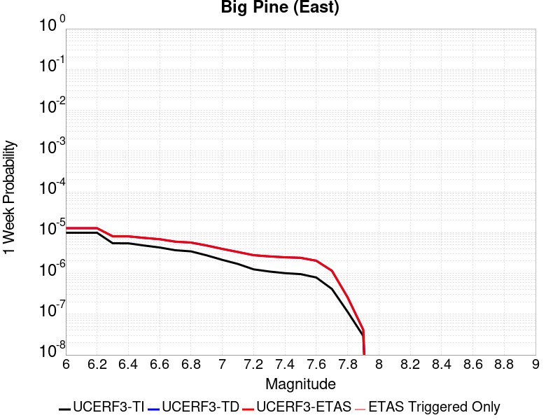 |  | 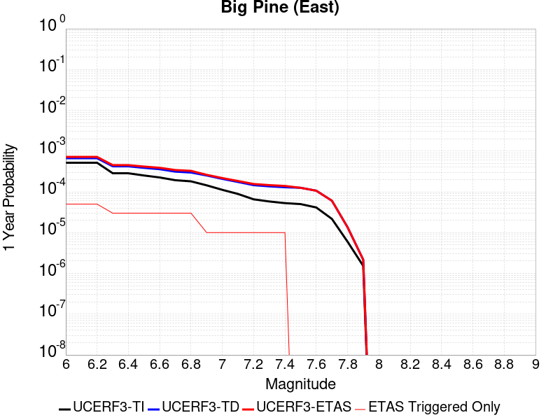 | 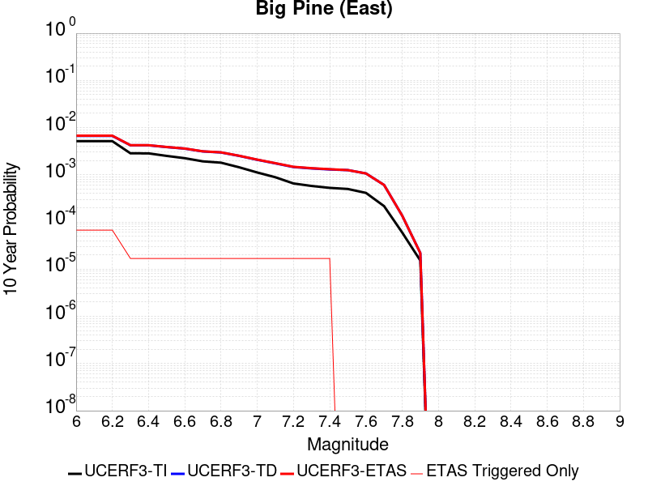 |

| Magnitude | 1 wk TI Prob | 1 wk TD Prob | 1 wk ETAS Prob | 1 wk ETAS/TD Gain | 1 wk ETAS Triggered Only | 1 mo TI Prob | 1 mo TD Prob | 1 mo ETAS Prob | 1 mo ETAS/TD Gain | 1 mo ETAS Triggered Only | 1 yr TI Prob | 1 yr TD Prob | 1 yr ETAS Prob | 1 yr ETAS/TD Gain | 1 yr ETAS Triggered Only | 10 yr TI Prob | 10 yr TD Prob | 10 yr ETAS Prob | 10 yr ETAS/TD Gain | 10 yr ETAS Triggered Only |
|-----|-----|-----|-----|-----|-----|-----|-----|-----|-----|-----|-----|-----|-----|-----|-----|-----|-----|-----|-----|-----|
| 6.0 | 9.916913E-6 | 1.2818231E-5 | 1.2818231E-5 | 1.0 | 0.0 | 4.250036E-5 | 5.4934244E-5 | 5.4934244E-5 | 1.0 | 0.0 | 5.173191E-4 | 6.686413E-4 | 7.191126E-4 | 1.0754833 | 5.0505052E-5 | 0.0051611643 | 0.0066710766 | 0.0067379675 | 1.010027 | 6.7340065E-5 |
| 6.1 | 9.916913E-6 | 1.2818231E-5 | 1.2818231E-5 | 1.0 | 0.0 | 4.250036E-5 | 5.4934244E-5 | 5.4934244E-5 | 1.0 | 0.0 | 5.173191E-4 | 6.686413E-4 | 7.191126E-4 | 1.0754833 | 5.0505052E-5 | 0.0051611643 | 0.0066710766 | 0.0067379675 | 1.010027 | 6.7340065E-5 |
| 6.2 | 9.916913E-6 | 1.2818231E-5 | 1.2818231E-5 | 1.0 | 0.0 | 4.250036E-5 | 5.4934244E-5 | 5.4934244E-5 | 1.0 | 0.0 | 5.173191E-4 | 6.686413E-4 | 7.191126E-4 | 1.0754833 | 5.0505052E-5 | 0.0051611643 | 0.0066710766 | 0.0067379675 | 1.010027 | 6.7340065E-5 |
| 6.3 | 5.479711E-6 | 8.114161E-6 | 8.114161E-6 | 1.0 | 0.0 | 2.3484265E-5 | 3.4774526E-5 | 3.4774526E-5 | 1.0 | 0.0 | 2.858834E-4 | 4.233008E-4 | 4.401287E-4 | 1.039754 | 1.6835016E-5 | 0.0028551589 | 0.0042278613 | 0.004244625 | 1.0039651 | 1.6835016E-5 |
| 6.4 | 5.465009E-6 | 8.098454E-6 | 8.098454E-6 | 1.0 | 0.0 | 2.3421257E-5 | 3.4707216E-5 | 3.4707216E-5 | 1.0 | 0.0 | 2.851165E-4 | 4.224816E-4 | 4.3930952E-4 | 1.039831 | 1.6835016E-5 | 0.0028475097 | 0.0042197 | 0.0042364644 | 1.0039728 | 1.6835016E-5 |
| 6.5 | 4.826767E-6 | 7.423505E-6 | 7.423505E-6 | 1.0 | 0.0 | 2.068598E-5 | 3.181465E-5 | 3.181465E-5 | 1.0 | 0.0 | 2.518227E-4 | 3.8727728E-4 | 4.0410578E-4 | 1.0434533 | 1.6835016E-5 | 0.0025153751 | 0.003868898 | 0.003885668 | 1.0043346 | 1.6835016E-5 |
| 6.6 | 4.3146847E-6 | 6.883437E-6 | 6.883437E-6 | 1.0 | 0.0 | 1.8491375E-5 | 2.9500125E-5 | 2.9500125E-5 | 1.0 | 0.0 | 2.2510924E-4 | 3.5910727E-4 | 3.7593624E-4 | 1.0468633 | 1.6835016E-5 | 0.0022488134 | 0.0035881116 | 0.0036048864 | 1.004675 | 1.6835016E-5 |
| 6.7 | 3.6968106E-6 | 5.9966014E-6 | 5.9966014E-6 | 1.0 | 0.0 | 1.5843378E-5 | 2.5699477E-5 | 2.5699477E-5 | 1.0 | 0.0 | 1.9287605E-4 | 3.1284773E-4 | 3.2967748E-4 | 1.0537953 | 1.6835016E-5 | 0.0019270873 | 0.003126825 | 0.0031436072 | 1.0053673 | 1.6835016E-5 |
| 6.8 | 3.4671132E-6 | 5.7032753E-6 | 5.7032753E-6 | 1.0 | 0.0 | 1.4858972E-5 | 2.4442388E-5 | 2.4442388E-5 | 1.0 | 0.0 | 1.8089297E-4 | 2.9754688E-4 | 3.143769E-4 | 1.0565625 | 1.6835016E-5 | 0.0018074579 | 0.002974228 | 0.002991013 | 1.0056435 | 1.6835016E-5 |
| 6.9 | 2.7686972E-6 | 4.8262373E-6 | 4.8262373E-6 | 1.0 | 0.0 | 1.1865792E-5 | 2.0683714E-5 | 2.0683714E-5 | 1.0 | 0.0 | 1.4445644E-4 | 2.5179586E-4 | 2.6862664E-4 | 1.0668429 | 1.6835016E-5 | 0.0014436257 | 0.002517781 | 0.0025345734 | 1.0066696 | 1.6835016E-5 |
| 7.0 | 2.1472624E-6 | 3.985962E-6 | 3.985962E-6 | 1.0 | 0.0 | 9.20252E-6 | 1.7082584E-5 | 1.7082584E-5 | 1.0 | 0.0 | 1.12034926E-4 | 2.0796116E-4 | 2.2479266E-4 | 1.0809358 | 1.6835016E-5 | 0.0011197845 | 0.0020803085 | 0.0020971084 | 1.0080757 | 1.6835016E-5 |
| 7.1 | 1.7018335E-6 | 3.3457143E-6 | 3.3457143E-6 | 1.0 | 0.0 | 7.293552E-6 | 1.4338699E-5 | 1.4338699E-5 | 1.0 | 0.0 | 8.879537E-5 | 1.7456003E-4 | 1.913921E-4 | 1.0964258 | 1.6835016E-5 | 8.87599E-4 | 0.0017468405 | 0.0017636461 | 1.0096205 | 1.6835016E-5 |
| 7.2 | 1.25603E-6 | 2.795276E-6 | 2.795276E-6 | 1.0 | 0.0 | 5.3829745E-6 | 1.19797005E-5 | 1.19797005E-5 | 1.0 | 0.0 | 6.553574E-5 | 1.4584333E-4 | 1.6267587E-4 | 1.1154153 | 1.6835016E-5 | 6.551642E-4 | 0.001460063 | 0.0014768735 | 1.0115135 | 1.6835016E-5 |
| 7.3 | 1.112297E-6 | 2.6110797E-6 | 2.6110797E-6 | 1.0 | 0.0 | 4.7669787E-6 | 1.11902955E-5 | 1.11902955E-5 | 1.0 | 0.0 | 5.803642E-5 | 1.3623355E-4 | 1.5306627E-4 | 1.1235578 | 1.6835016E-5 | 5.802127E-4 | 0.0013639197 | 0.0013807318 | 1.0123262 | 1.6835016E-5 |
| 7.4 | 1.0137181E-6 | 2.4842075E-6 | 2.4842075E-6 | 1.0 | 0.0 | 4.3444993E-6 | 1.0646561E-5 | 1.0646561E-5 | 1.0 | 0.0 | 5.2892992E-5 | 1.2961439E-4 | 1.4644722E-4 | 1.1298686 | 1.6835016E-5 | 5.288041E-4 | 0.0012975911 | 0.0013144044 | 1.0129572 | 1.6835016E-5 |
| 7.5 | 9.598608E-7 | 2.4078427E-6 | 2.4078427E-6 | 1.0 | 0.0 | 4.1136827E-6 | 1.0319286E-5 | 1.0319286E-5 | 1.0 | 0.0 | 5.0082934E-5 | 1.2563028E-4 | 1.2563028E-4 | 1.0 | 0.0 | 5.007165E-4 | 0.0012576039 | 0.0012576039 | 1.0 | 0.0 |
| 7.6 | 7.929459E-7 | 2.0454722E-6 | 2.0454722E-6 | 1.0 | 0.0 | 3.3983351E-6 | 8.766281E-6 | 8.766281E-6 | 1.0 | 0.0 | 4.1373947E-5 | 1.06724416E-4 | 1.06724416E-4 | 1.0 | 0.0 | 4.1366243E-4 | 0.0010688324 | 0.0010688324 | 1.0 | 0.0 |
| 7.7 | 4.155788E-7 | 1.1609936E-6 | 1.1609936E-6 | 1.0 | 0.0 | 1.7810507E-6 | 4.975678E-6 | 4.975678E-6 | 1.0 | 0.0 | 2.1684076E-5 | 6.0577237E-5 | 6.0577237E-5 | 1.0 | 0.0 | 2.1681961E-4 | 6.087925E-4 | 6.087925E-4 | 1.0 | 0.0 |
| 7.8 | 1.14666925E-7 | 2.5929913E-7 | 2.5929913E-7 | 1.0 | 0.0 | 4.914296E-7 | 1.1112816E-6 | 1.1112816E-6 | 1.0 | 0.0 | 5.9831386E-6 | 1.3529773E-5 | 1.3529773E-5 | 1.0 | 0.0 | 5.9829777E-5 | 1.3639126E-4 | 1.3639126E-4 | 1.0 | 0.0 |
| 7.9 | 2.9231824E-8 | 4.148024E-8 | 4.148024E-8 | 1.0 | 0.0 | 1.2527924E-7 | 1.7777246E-7 | 1.7777246E-7 | 1.0 | 0.0 | 1.5252737E-6 | 2.1643777E-6 | 2.1643777E-6 | 1.0 | 0.0 | 1.5252632E-5 | 2.1976275E-5 | 2.1976275E-5 | 1.0 | 0.0 |

## Pisgah-Bullion Mtn-Mesquite Lk
*[(top)](#table-of-contents)*

| 1 Week | 1 Month | 1 Year | 10 Year |
|-----|-----|-----|-----|
|  | 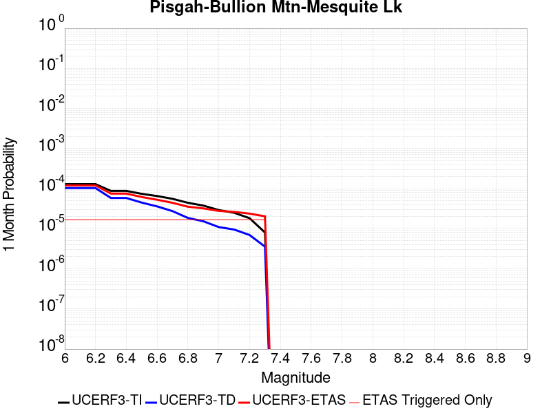 | 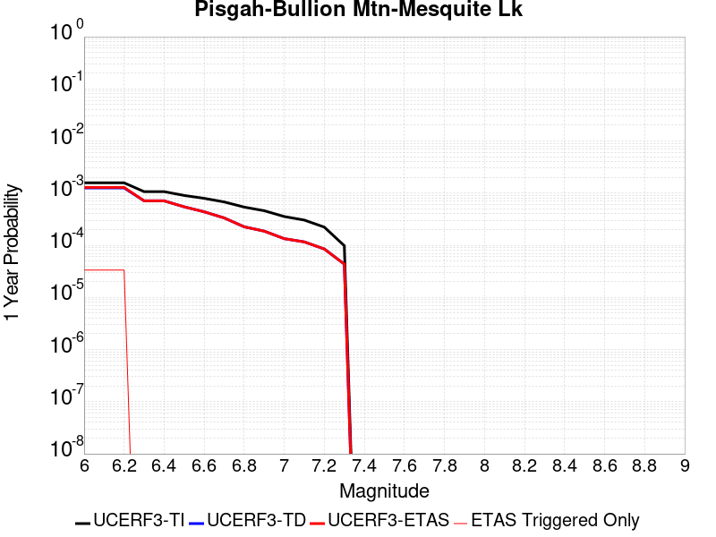 | 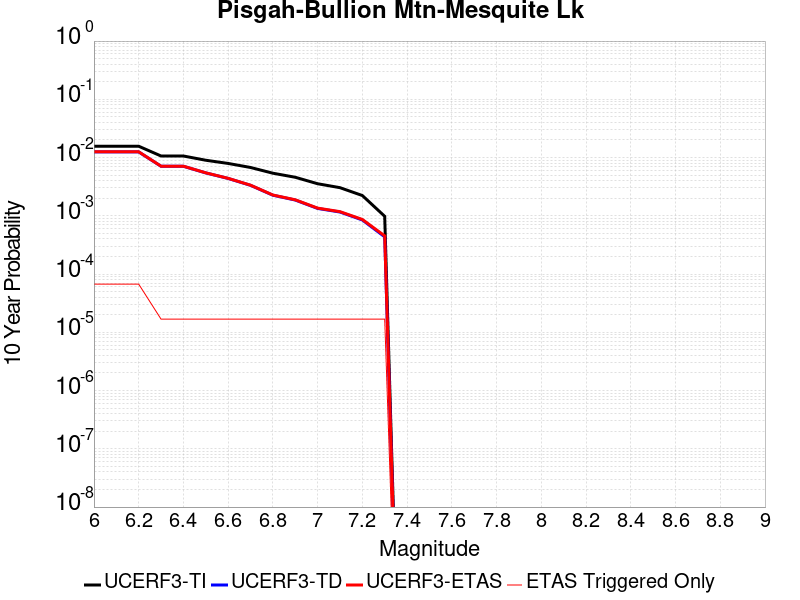 |

| Magnitude | 1 wk TI Prob | 1 wk TD Prob | 1 wk ETAS Prob | 1 wk ETAS/TD Gain | 1 wk ETAS Triggered Only | 1 mo TI Prob | 1 mo TD Prob | 1 mo ETAS Prob | 1 mo ETAS/TD Gain | 1 mo ETAS Triggered Only | 1 yr TI Prob | 1 yr TD Prob | 1 yr ETAS Prob | 1 yr ETAS/TD Gain | 1 yr ETAS Triggered Only | 10 yr TI Prob | 10 yr TD Prob | 10 yr ETAS Prob | 10 yr ETAS/TD Gain | 10 yr ETAS Triggered Only |
|-----|-----|-----|-----|-----|-----|-----|-----|-----|-----|-----|-----|-----|-----|-----|-----|-----|-----|-----|-----|-----|
| 6.0 | 3.0240792E-5 | 2.4091496E-5 | 2.4091496E-5 | 1.0 | 0.0 | 1.2959696E-4 | 1.0324575E-4 | 1.2007903E-4 | 1.1630409 | 1.6835016E-5 | 0.0015767008 | 0.0012563926 | 0.001323648 | 1.0535306 | 6.7340065E-5 | 0.015655609 | 0.012502918 | 0.012569416 | 1.0053186 | 6.7340065E-5 |
| 6.1 | 3.0240792E-5 | 2.4091496E-5 | 2.4091496E-5 | 1.0 | 0.0 | 1.2959696E-4 | 1.0324575E-4 | 1.2007903E-4 | 1.1630409 | 1.6835016E-5 | 0.0015767008 | 0.0012563926 | 0.001323648 | 1.0535306 | 6.7340065E-5 | 0.015655609 | 0.012502918 | 0.012569416 | 1.0053186 | 6.7340065E-5 |
| 6.2 | 3.0240792E-5 | 2.4091496E-5 | 2.4091496E-5 | 1.0 | 0.0 | 1.2959696E-4 | 1.0324575E-4 | 1.2007903E-4 | 1.1630409 | 1.6835016E-5 | 0.0015767008 | 0.0012563926 | 0.001323648 | 1.0535306 | 6.7340065E-5 | 0.015655609 | 0.012502918 | 0.012569416 | 1.0053186 | 6.7340065E-5 |
| 6.3 | 2.0498217E-5 | 1.3638254E-5 | 1.3638254E-5 | 1.0 | 0.0 | 8.784654E-5 | 5.8448444E-5 | 7.528248E-5 | 1.2880151 | 1.6835016E-5 | 0.0010690069 | 7.1139366E-4 | 7.282167E-4 | 1.023648 | 1.6835016E-5 | 0.01063879 | 0.00709279 | 0.007109506 | 1.0023566 | 1.6835016E-5 |
| 6.4 | 2.0498217E-5 | 1.3638254E-5 | 1.3638254E-5 | 1.0 | 0.0 | 8.784654E-5 | 5.8448444E-5 | 7.528248E-5 | 1.2880151 | 1.6835016E-5 | 0.0010690069 | 7.1139366E-4 | 7.282167E-4 | 1.023648 | 1.6835016E-5 | 0.01063879 | 0.00709279 | 0.007109506 | 1.0023566 | 1.6835016E-5 |
| 6.5 | 1.7316182E-5 | 1.0477178E-5 | 1.0477178E-5 | 1.0 | 0.0 | 7.42101E-5 | 4.4901473E-5 | 6.173574E-5 | 1.3749156 | 1.6835016E-5 | 9.0313336E-4 | 5.465483E-4 | 5.6337414E-4 | 1.0307856 | 1.6835016E-5 | 0.008994718 | 0.005453037 | 0.0054697804 | 1.0030705 | 1.6835016E-5 |
| 6.6 | 1.5251077E-5 | 8.414378E-6 | 8.414378E-6 | 1.0 | 0.0 | 6.536012E-5 | 3.606116E-5 | 5.289557E-5 | 1.4668294 | 1.6835016E-5 | 7.9546886E-4 | 4.389634E-4 | 4.5579104E-4 | 1.038335 | 1.6835016E-5 | 0.007926274 | 0.004381681 | 0.004398442 | 1.0038253 | 1.6835016E-5 |
| 6.7 | 1.2997425E-5 | 6.411573E-6 | 6.411573E-6 | 1.0 | 0.0 | 5.570206E-5 | 2.7477907E-5 | 4.4312463E-5 | 1.6126578 | 1.6835016E-5 | 6.7796157E-4 | 3.344968E-4 | 3.5132622E-4 | 1.0503125 | 1.6835016E-5 | 0.0067589693 | 0.0033403935 | 0.0033571725 | 1.005023 | 1.6835016E-5 |
| 6.8 | 1.035386E-5 | 4.333283E-6 | 4.333283E-6 | 1.0 | 0.0 | 4.437293E-5 | 1.8571085E-5 | 3.540579E-5 | 1.9065008 | 1.6835016E-5 | 5.401065E-4 | 2.2608037E-4 | 2.4291158E-4 | 1.0744479 | 1.6835016E-5 | 0.0053879567 | 0.0022585907 | 0.0022753875 | 1.007437 | 1.6835016E-5 |
| 6.9 | 8.816252E-6 | 3.580692E-6 | 3.580692E-6 | 1.0 | 0.0 | 3.778339E-5 | 1.5345737E-5 | 3.2180495E-5 | 2.0970316 | 1.6835016E-5 | 4.5991567E-4 | 1.8681891E-4 | 2.0365078E-4 | 1.0900973 | 1.6835016E-5 | 0.00458965 | 0.0018666771 | 0.0018834806 | 1.0090019 | 1.6835016E-5 |
| 7.0 | 6.8232207E-6 | 2.5676256E-6 | 2.5676256E-6 | 1.0 | 0.0 | 2.9242048E-5 | 1.10040655E-5 | 2.7838898E-5 | 2.5298738 | 1.6835016E-5 | 3.5596377E-4 | 1.3396658E-4 | 1.5079934E-4 | 1.125649 | 1.6835016E-5 | 0.0035539411 | 0.0013388892 | 0.0013557017 | 1.012557 | 1.6835016E-5 |
| 7.1 | 5.837013E-6 | 2.2274157E-6 | 2.2274157E-6 | 1.0 | 0.0 | 2.501553E-5 | 9.546034E-6 | 2.638089E-5 | 2.7635446 | 1.6835016E-5 | 3.045215E-4 | 1.1621706E-4 | 1.3305013E-4 | 1.1448416 | 1.6835016E-5 | 0.0030410455 | 0.0011615918 | 0.0011784073 | 1.0144762 | 1.6835016E-5 |
| 7.2 | 4.278052E-6 | 1.6275965E-6 | 1.6275965E-6 | 1.0 | 0.0 | 1.833438E-5 | 6.9753964E-6 | 2.3810297E-5 | 3.4134686 | 1.6835016E-5 | 2.231982E-4 | 8.492238E-5 | 1.0175596E-4 | 1.1982232 | 1.6835016E-5 | 0.0022297418 | 8.489225E-4 | 8.657432E-4 | 1.0198143 | 1.6835016E-5 |
| 7.3 | 1.8803692E-6 | 8.3450385E-7 | 8.3450385E-7 | 1.0 | 0.0 | 8.0587E-6 | 3.576441E-6 | 2.0411399E-5 | 5.7071815 | 1.6835016E-5 | 9.811026E-5 | 4.3542448E-5 | 6.037673E-5 | 1.3866178 | 1.6835016E-5 | 9.806695E-4 | 4.353536E-4 | 4.521813E-4 | 1.0386529 | 1.6835016E-5 |

## Santa Cruz Island
*[(top)](#table-of-contents)*

| 1 Week | 1 Month | 1 Year | 10 Year |
|-----|-----|-----|-----|
| 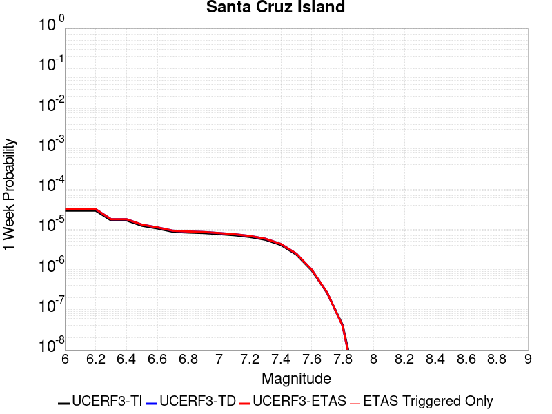 |  | 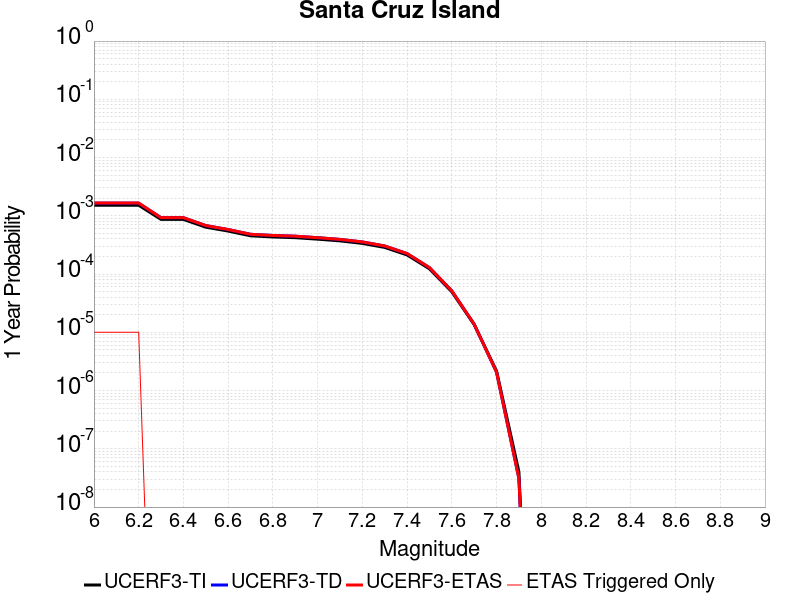 | 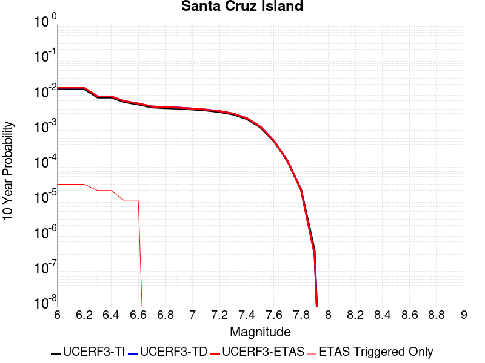 |

| Magnitude | 1 wk TI Prob | 1 wk TD Prob | 1 wk ETAS Prob | 1 wk ETAS/TD Gain | 1 wk ETAS Triggered Only | 1 mo TI Prob | 1 mo TD Prob | 1 mo ETAS Prob | 1 mo ETAS/TD Gain | 1 mo ETAS Triggered Only | 1 yr TI Prob | 1 yr TD Prob | 1 yr ETAS Prob | 1 yr ETAS/TD Gain | 1 yr ETAS Triggered Only | 10 yr TI Prob | 10 yr TD Prob | 10 yr ETAS Prob | 10 yr ETAS/TD Gain | 10 yr ETAS Triggered Only |
|-----|-----|-----|-----|-----|-----|-----|-----|-----|-----|-----|-----|-----|-----|-----|-----|-----|-----|-----|-----|-----|
| 6.0 | 2.9164563E-5 | 3.1600095E-5 | 3.1600095E-5 | 1.0 | 0.0 | 1.2498499E-4 | 1.3542273E-4 | 1.3542273E-4 | 1.0 | 0.0 | 0.0015206301 | 0.0016476609 | 0.0016644682 | 1.0102007 | 1.6835016E-5 | 0.015102667 | 0.01636818 | 0.01641786 | 1.0030351 | 5.0505052E-5 |
| 6.1 | 2.9164563E-5 | 3.1600095E-5 | 3.1600095E-5 | 1.0 | 0.0 | 1.2498499E-4 | 1.3542273E-4 | 1.3542273E-4 | 1.0 | 0.0 | 0.0015206301 | 0.0016476609 | 0.0016644682 | 1.0102007 | 1.6835016E-5 | 0.015102667 | 0.01636818 | 0.01641786 | 1.0030351 | 5.0505052E-5 |
| 6.2 | 2.9164563E-5 | 3.1600095E-5 | 3.1600095E-5 | 1.0 | 0.0 | 1.2498499E-4 | 1.3542273E-4 | 1.3542273E-4 | 1.0 | 0.0 | 0.0015206301 | 0.0016476609 | 0.0016644682 | 1.0102007 | 1.6835016E-5 | 0.015102667 | 0.01636818 | 0.01641786 | 1.0030351 | 5.0505052E-5 |
| 6.3 | 1.6635553E-5 | 1.7804527E-5 | 1.7804527E-5 | 1.0 | 0.0 | 7.1293274E-5 | 7.630298E-5 | 7.630298E-5 | 1.0 | 0.0 | 8.6765E-4 | 9.286111E-4 | 9.286111E-4 | 1.0 | 0.0 | 0.008642701 | 0.009249181 | 0.009282539 | 1.0036067 | 3.3670032E-5 |
| 6.4 | 1.6635553E-5 | 1.7804527E-5 | 1.7804527E-5 | 1.0 | 0.0 | 7.1293274E-5 | 7.630298E-5 | 7.630298E-5 | 1.0 | 0.0 | 8.6765E-4 | 9.286111E-4 | 9.286111E-4 | 1.0 | 0.0 | 0.008642701 | 0.009249181 | 0.009282539 | 1.0036067 | 3.3670032E-5 |
| 6.5 | 1.2238748E-5 | 1.3043111E-5 | 1.3043111E-5 | 1.0 | 0.0 | 5.2450723E-5 | 5.5897868E-5 | 5.5897868E-5 | 1.0 | 0.0 | 6.3840044E-4 | 6.8034773E-4 | 6.8034773E-4 | 1.0 | 0.0 | 0.0063656955 | 0.006783047 | 0.006799768 | 1.0024651 | 1.6835016E-5 |
| 6.6 | 1.0489767E-5 | 1.11567315E-5 | 1.11567315E-5 | 1.0 | 0.0 | 4.495537E-5 | 4.7813697E-5 | 4.7813697E-5 | 1.0 | 0.0 | 5.4719415E-4 | 5.8197853E-4 | 5.8197853E-4 | 1.0 | 0.0 | 0.005458487 | 0.005804785 | 0.0058215223 | 1.0028833 | 1.6835016E-5 |
| 6.7 | 8.699222E-6 | 9.236859E-6 | 9.236859E-6 | 1.0 | 0.0 | 3.7281847E-5 | 3.958594E-5 | 3.958594E-5 | 1.0 | 0.0 | 4.5381195E-4 | 4.818528E-4 | 4.818528E-4 | 1.0 | 0.0 | 0.0045288634 | 0.004808148 | 0.004808148 | 1.0 | 0.0 |
| 6.8 | 8.307732E-6 | 8.816977E-6 | 8.816977E-6 | 1.0 | 0.0 | 3.560408E-5 | 3.77865E-5 | 3.77865E-5 | 1.0 | 0.0 | 4.3339343E-4 | 4.5995394E-4 | 4.5995394E-4 | 1.0 | 0.0 | 0.004325492 | 0.004590073 | 0.004590073 | 1.0 | 0.0 |
| 6.9 | 8.073121E-6 | 8.565009E-6 | 8.565009E-6 | 1.0 | 0.0 | 3.459863E-5 | 3.6706668E-5 | 3.6706668E-5 | 1.0 | 0.0 | 4.2115687E-4 | 4.4681245E-4 | 4.4681245E-4 | 1.0 | 0.0 | 0.004203596 | 0.0044591925 | 0.0044591925 | 1.0 | 0.0 |
| 7.0 | 7.617019E-6 | 8.0747295E-6 | 8.0747295E-6 | 1.0 | 0.0 | 3.264396E-5 | 3.4605528E-5 | 3.4605528E-5 | 1.0 | 0.0 | 3.9736772E-4 | 4.2124125E-4 | 4.2124125E-4 | 1.0 | 0.0 | 0.003966579 | 0.0042044753 | 0.0042044753 | 1.0 | 0.0 |
| 7.1 | 7.1224836E-6 | 7.5458483E-6 | 7.5458483E-6 | 1.0 | 0.0 | 3.052457E-5 | 3.233895E-5 | 3.233895E-5 | 1.0 | 0.0 | 3.715733E-4 | 3.9365597E-4 | 3.9365597E-4 | 1.0 | 0.0 | 0.003709526 | 0.0039296295 | 0.0039296295 | 1.0 | 0.0 |
| 7.2 | 6.441115E-6 | 6.8274385E-6 | 6.8274385E-6 | 1.0 | 0.0 | 2.7604487E-5 | 2.9260125E-5 | 2.9260125E-5 | 1.0 | 0.0 | 3.360328E-4 | 3.5618403E-4 | 3.5618403E-4 | 1.0 | 0.0 | 0.0033552512 | 0.0035561598 | 0.0035561598 | 1.0 | 0.0 |
| 7.3 | 5.494274E-6 | 5.820041E-6 | 5.820041E-6 | 1.0 | 0.0 | 2.3546674E-5 | 2.4942796E-5 | 2.4942796E-5 | 1.0 | 0.0 | 2.8664304E-4 | 3.0363642E-4 | 3.0363642E-4 | 1.0 | 0.0 | 0.002862736 | 0.0030322387 | 0.0030322387 | 1.0 | 0.0 |
| 7.4 | 4.0802624E-6 | 4.3122895E-6 | 4.3122895E-6 | 1.0 | 0.0 | 1.7486722E-5 | 1.848111E-5 | 1.848111E-5 | 1.0 | 0.0 | 2.1288003E-4 | 2.2498437E-4 | 2.2498437E-4 | 1.0 | 0.0 | 0.0021267622 | 0.002247575 | 0.002247575 | 1.0 | 0.0 |
| 7.5 | 2.3584746E-6 | 2.4753267E-6 | 2.4753267E-6 | 1.0 | 0.0 | 1.0107709E-5 | 1.06085E-5 | 1.06085E-5 | 1.0 | 0.0 | 1.2305441E-4 | 1.2915088E-4 | 1.2915088E-4 | 1.0 | 0.0 | 0.0012298629 | 0.0012907633 | 0.0012907633 | 1.0 | 0.0 |
| 7.6 | 9.4981914E-7 | 9.860988E-7 | 9.860988E-7 | 1.0 | 0.0 | 4.0706473E-6 | 4.226131E-6 | 4.226131E-6 | 1.0 | 0.0 | 4.9559E-5 | 5.145194E-5 | 5.145194E-5 | 1.0 | 0.0 | 4.954795E-4 | 5.144016E-4 | 5.144016E-4 | 1.0 | 0.0 |
| 7.7 | 2.6013532E-7 | 2.641672E-7 | 2.641672E-7 | 1.0 | 0.0 | 1.1148652E-6 | 1.1321447E-6 | 1.1321447E-6 | 1.0 | 0.0 | 1.3573399E-5 | 1.3783775E-5 | 1.3783775E-5 | 1.0 | 0.0 | 1.357257E-4 | 1.3782927E-4 | 1.3782927E-4 | 1.0 | 0.0 |
| 7.8 | 4.1522263E-8 | 3.9656918E-8 | 3.9656918E-8 | 1.0 | 0.0 | 1.7795254E-7 | 1.6995821E-7 | 1.6995821E-7 | 1.0 | 0.0 | 2.16657E-6 | 2.0692394E-6 | 2.0692394E-6 | 1.0 | 0.0 | 2.1665488E-5 | 2.0692223E-5 | 2.0692223E-5 | 1.0 | 0.0 |
| 7.9 | 7.7242046E-10 | 5.946851E-10 | 5.946851E-10 | 1.0 | 0.0 | 3.3103735E-9 | 2.54865E-9 | 2.54865E-9 | 1.0 | 0.0 | 4.0303796E-8 | 3.1029813E-8 | 3.1029813E-8 | 1.0 | 0.0 | 4.030379E-7 | 3.102981E-7 | 3.102981E-7 | 1.0 | 0.0 |

## Santa Ynez (East)
*[(top)](#table-of-contents)*

| 1 Week | 1 Month | 1 Year | 10 Year |
|-----|-----|-----|-----|
| 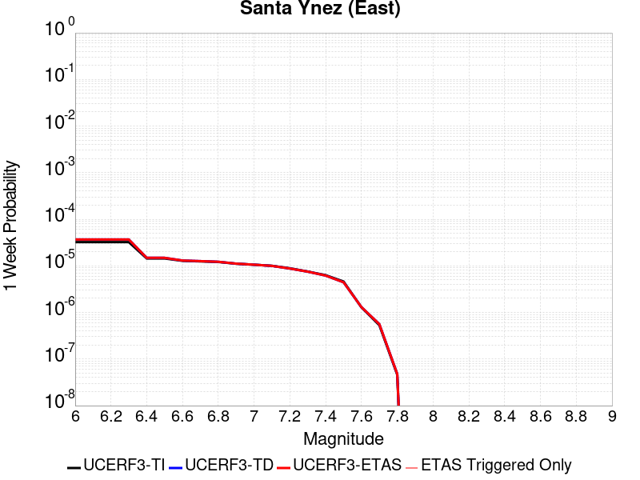 | 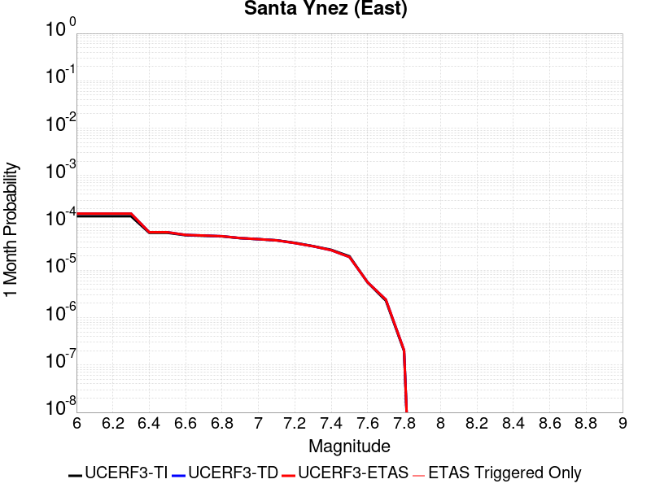 | 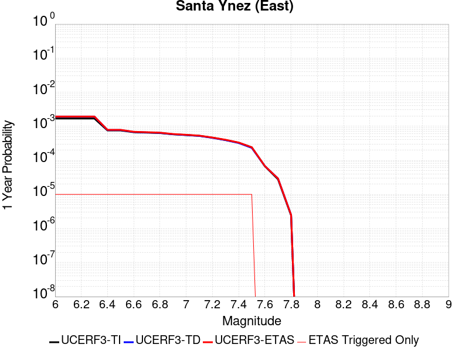 | 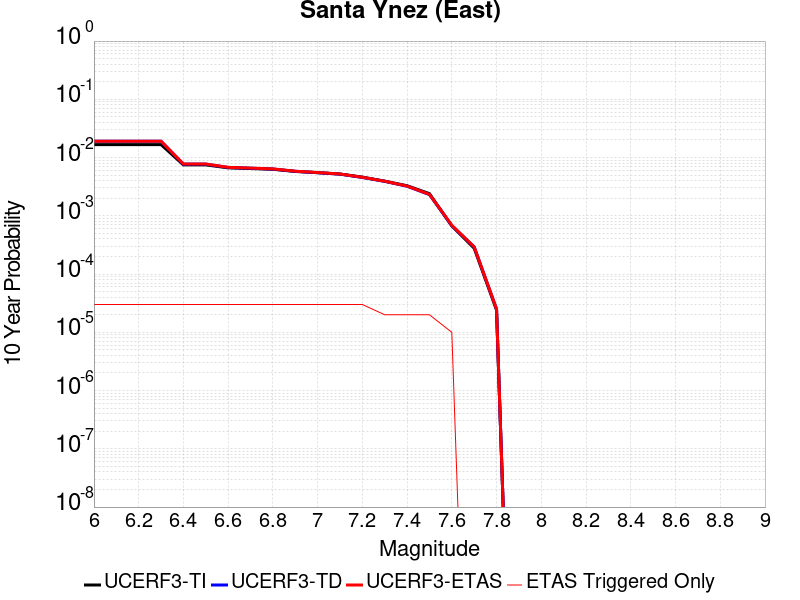 |

| Magnitude | 1 wk TI Prob | 1 wk TD Prob | 1 wk ETAS Prob | 1 wk ETAS/TD Gain | 1 wk ETAS Triggered Only | 1 mo TI Prob | 1 mo TD Prob | 1 mo ETAS Prob | 1 mo ETAS/TD Gain | 1 mo ETAS Triggered Only | 1 yr TI Prob | 1 yr TD Prob | 1 yr ETAS Prob | 1 yr ETAS/TD Gain | 1 yr ETAS Triggered Only | 10 yr TI Prob | 10 yr TD Prob | 10 yr ETAS Prob | 10 yr ETAS/TD Gain | 10 yr ETAS Triggered Only |
|-----|-----|-----|-----|-----|-----|-----|-----|-----|-----|-----|-----|-----|-----|-----|-----|-----|-----|-----|-----|-----|
| 6.0 | 3.2269712E-5 | 3.6751346E-5 | 3.6751346E-5 | 1.0 | 0.0 | 1.3829143E-4 | 1.5749958E-4 | 1.5749958E-4 | 1.0 | 0.0 | 0.0016823979 | 0.0019164606 | 0.0019332634 | 1.0087676 | 1.6835016E-5 | 0.016697178 | 0.019056875 | 0.019089904 | 1.0017332 | 3.3670032E-5 |
| 6.1 | 3.2269712E-5 | 3.6751346E-5 | 3.6751346E-5 | 1.0 | 0.0 | 1.3829143E-4 | 1.5749958E-4 | 1.5749958E-4 | 1.0 | 0.0 | 0.0016823979 | 0.0019164606 | 0.0019332634 | 1.0087676 | 1.6835016E-5 | 0.016697178 | 0.019056875 | 0.019089904 | 1.0017332 | 3.3670032E-5 |
| 6.2 | 3.2269712E-5 | 3.6751346E-5 | 3.6751346E-5 | 1.0 | 0.0 | 1.3829143E-4 | 1.5749958E-4 | 1.5749958E-4 | 1.0 | 0.0 | 0.0016823979 | 0.0019164606 | 0.0019332634 | 1.0087676 | 1.6835016E-5 | 0.016697178 | 0.019056875 | 0.019089904 | 1.0017332 | 3.3670032E-5 |
| 6.3 | 3.2269712E-5 | 3.6751346E-5 | 3.6751346E-5 | 1.0 | 0.0 | 1.3829143E-4 | 1.5749958E-4 | 1.5749958E-4 | 1.0 | 0.0 | 0.0016823979 | 0.0019164606 | 0.0019332634 | 1.0087676 | 1.6835016E-5 | 0.016697178 | 0.019056875 | 0.019089904 | 1.0017332 | 3.3670032E-5 |
| 6.4 | 1.4404779E-5 | 1.4849569E-5 | 1.4849569E-5 | 1.0 | 0.0 | 6.1733306E-5 | 6.363949E-5 | 6.363949E-5 | 1.0 | 0.0 | 7.513438E-4 | 7.7454036E-4 | 7.913623E-4 | 1.0217186 | 1.6835016E-5 | 0.0074880854 | 0.007718959 | 0.0077523687 | 1.0043284 | 3.3670032E-5 |
| 6.5 | 1.4404779E-5 | 1.4849569E-5 | 1.4849569E-5 | 1.0 | 0.0 | 6.1733306E-5 | 6.363949E-5 | 6.363949E-5 | 1.0 | 0.0 | 7.513438E-4 | 7.7454036E-4 | 7.913623E-4 | 1.0217186 | 1.6835016E-5 | 0.0074880854 | 0.007718959 | 0.0077523687 | 1.0043284 | 3.3670032E-5 |
| 6.6 | 1.280208E-5 | 1.3012098E-5 | 1.3012098E-5 | 1.0 | 0.0 | 5.4864904E-5 | 5.5764955E-5 | 5.5764955E-5 | 1.0 | 0.0 | 6.6777546E-4 | 6.7872857E-4 | 6.9555215E-4 | 1.024787 | 1.6835016E-5 | 0.006657724 | 0.006766767 | 0.006800209 | 1.0049422 | 3.3670032E-5 |
| 6.7 | 1.2457027E-5 | 1.2628613E-5 | 1.2628613E-5 | 1.0 | 0.0 | 5.3386164E-5 | 5.4121516E-5 | 5.4121516E-5 | 1.0 | 0.0 | 6.497827E-4 | 6.587319E-4 | 6.7555584E-4 | 1.0255399 | 1.6835016E-5 | 0.00647886 | 0.0065679904 | 0.0066014393 | 1.0050927 | 3.3670032E-5 |
| 6.8 | 1.2095134E-5 | 1.2231055E-5 | 1.2231055E-5 | 1.0 | 0.0 | 5.1835254E-5 | 5.2417763E-5 | 5.2417763E-5 | 1.0 | 0.0 | 6.309115E-4 | 6.38001E-4 | 6.5482524E-4 | 1.0263703 | 1.6835016E-5 | 0.0062912325 | 0.0063618817 | 0.0063953376 | 1.0052588 | 3.3670032E-5 |
| 6.9 | 1.1104036E-5 | 1.11574755E-5 | 1.11574755E-5 | 1.0 | 0.0 | 4.758786E-5 | 4.7816884E-5 | 4.7816884E-5 | 1.0 | 0.0 | 5.7922816E-4 | 5.820163E-4 | 5.988415E-4 | 1.0289085 | 1.6835016E-5 | 0.005777207 | 0.005805066 | 0.0058385404 | 1.0057664 | 3.3670032E-5 |
| 7.0 | 1.0577444E-5 | 1.0581802E-5 | 1.0581802E-5 | 1.0 | 0.0 | 4.5331115E-5 | 4.5349796E-5 | 4.5349796E-5 | 1.0 | 0.0 | 5.5176654E-4 | 5.519951E-4 | 5.688208E-4 | 1.0304817 | 1.6835016E-5 | 0.0055039856 | 0.0055063786 | 0.005539863 | 1.0060811 | 3.3670032E-5 |
| 7.1 | 1.0021775E-5 | 9.981102E-6 | 9.981102E-6 | 1.0 | 0.0 | 4.294976E-5 | 4.2775457E-5 | 4.2775457E-5 | 1.0 | 0.0 | 5.2278786E-4 | 5.2066793E-4 | 5.374942E-4 | 1.0323167 | 1.6835016E-5 | 0.0052155964 | 0.0051946132 | 0.0052281083 | 1.006448 | 3.3670032E-5 |
| 7.2 | 8.874109E-6 | 8.748894E-6 | 8.748894E-6 | 1.0 | 0.0 | 3.8031343E-5 | 3.749473E-5 | 3.749473E-5 | 1.0 | 0.0 | 4.629332E-4 | 4.564038E-4 | 4.7323114E-4 | 1.0368694 | 1.6835016E-5 | 0.0046197 | 0.0045547825 | 0.0045882994 | 1.0073586 | 3.3670032E-5 |
| 7.3 | 7.5504267E-6 | 7.505199E-6 | 7.505199E-6 | 1.0 | 0.0 | 3.235857E-5 | 3.216475E-5 | 3.216475E-5 | 1.0 | 0.0 | 3.9389438E-4 | 3.9153645E-4 | 4.0836487E-4 | 1.0429804 | 1.6835016E-5 | 0.0039319694 | 0.003908573 | 0.0039253426 | 1.0042903 | 1.6835016E-5 |
| 7.4 | 6.309394E-6 | 6.1832216E-6 | 6.1832216E-6 | 1.0 | 0.0 | 2.703998E-5 | 2.6499258E-5 | 2.6499258E-5 | 1.0 | 0.0 | 3.2916202E-4 | 3.2258165E-4 | 3.3941123E-4 | 1.0521716 | 1.6835016E-5 | 0.003286749 | 0.0032212313 | 0.003238012 | 1.0052094 | 1.6835016E-5 |
| 7.5 | 4.6103073E-6 | 4.440935E-6 | 4.440935E-6 | 1.0 | 0.0 | 1.975831E-5 | 1.9032443E-5 | 1.9032443E-5 | 1.0 | 0.0 | 2.4053088E-4 | 2.3169606E-4 | 2.4852718E-4 | 1.072643 | 1.6835016E-5 | 0.002402707 | 0.0023146144 | 0.0023314103 | 1.0072565 | 1.6835016E-5 |
| 7.6 | 1.2858658E-6 | 1.3008267E-6 | 1.3008267E-6 | 1.0 | 0.0 | 5.5108417E-6 | 5.5749606E-6 | 5.5749606E-6 | 1.0 | 0.0 | 6.7092435E-5 | 6.78731E-5 | 6.78731E-5 | 1.0 | 0.0 | 6.707218E-4 | 6.7853054E-4 | 6.7853054E-4 | 1.0 | 0.0 |
| 7.7 | 5.3302307E-7 | 5.612178E-7 | 5.612178E-7 | 1.0 | 0.0 | 2.2843826E-6 | 2.4052172E-6 | 2.4052172E-6 | 1.0 | 0.0 | 2.7812002E-5 | 2.9283161E-5 | 2.9283161E-5 | 1.0 | 0.0 | 2.7808524E-4 | 2.9279658E-4 | 2.9279658E-4 | 1.0 | 0.0 |
| 7.8 | 4.613933E-8 | 4.803036E-8 | 4.803036E-8 | 1.0 | 0.0 | 1.9773998E-7 | 2.0584437E-7 | 2.0584437E-7 | 1.0 | 0.0 | 2.4074816E-6 | 2.5061524E-6 | 2.5061524E-6 | 1.0 | 0.0 | 2.4074554E-5 | 2.5061252E-5 | 2.5061252E-5 | 1.0 | 0.0 |

## Bullion Mountains
*[(top)](#table-of-contents)*

| 1 Week | 1 Month | 1 Year | 10 Year |
|-----|-----|-----|-----|
| 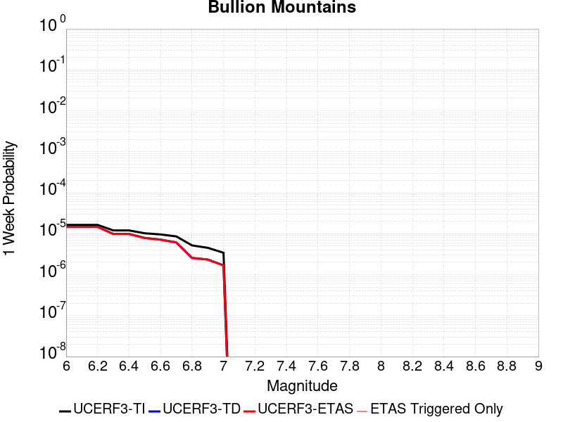 |  | 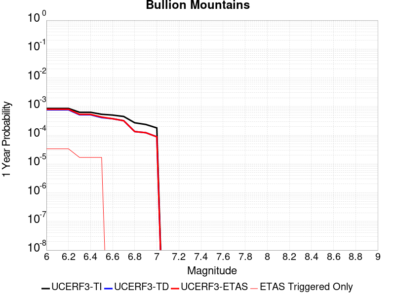 | 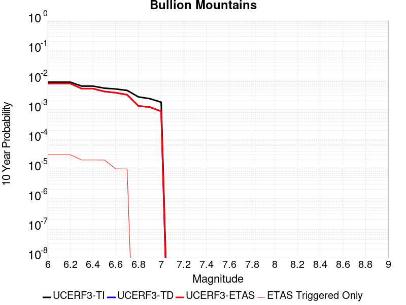 |

| Magnitude | 1 wk TI Prob | 1 wk TD Prob | 1 wk ETAS Prob | 1 wk ETAS/TD Gain | 1 wk ETAS Triggered Only | 1 mo TI Prob | 1 mo TD Prob | 1 mo ETAS Prob | 1 mo ETAS/TD Gain | 1 mo ETAS Triggered Only | 1 yr TI Prob | 1 yr TD Prob | 1 yr ETAS Prob | 1 yr ETAS/TD Gain | 1 yr ETAS Triggered Only | 10 yr TI Prob | 10 yr TD Prob | 10 yr ETAS Prob | 10 yr ETAS/TD Gain | 10 yr ETAS Triggered Only |
|-----|-----|-----|-----|-----|-----|-----|-----|-----|-----|-----|-----|-----|-----|-----|-----|-----|-----|-----|-----|-----|
| 6.0 | 1.6420427E-5 | 1.4692306E-5 | 1.4692306E-5 | 1.0 | 0.0 | 7.037136E-5 | 6.296572E-5 | 6.296572E-5 | 1.0 | 0.0 | 8.5643446E-4 | 7.663764E-4 | 8.000206E-4 | 1.0439004 | 3.3670032E-5 | 0.008531413 | 0.0076411283 | 0.0076912474 | 1.0065591 | 5.0505052E-5 |
| 6.1 | 1.6420427E-5 | 1.4692306E-5 | 1.4692306E-5 | 1.0 | 0.0 | 7.037136E-5 | 6.296572E-5 | 6.296572E-5 | 1.0 | 0.0 | 8.5643446E-4 | 7.663764E-4 | 8.000206E-4 | 1.0439004 | 3.3670032E-5 | 0.008531413 | 0.0076411283 | 0.0076912474 | 1.0065591 | 5.0505052E-5 |
| 6.2 | 1.6420427E-5 | 1.4692306E-5 | 1.4692306E-5 | 1.0 | 0.0 | 7.037136E-5 | 6.296572E-5 | 6.296572E-5 | 1.0 | 0.0 | 8.5643446E-4 | 7.663764E-4 | 8.000206E-4 | 1.0439004 | 3.3670032E-5 | 0.008531413 | 0.0076411283 | 0.0076912474 | 1.0065591 | 5.0505052E-5 |
| 6.3 | 1.2046778E-5 | 9.862485E-6 | 9.862485E-6 | 1.0 | 0.0 | 5.1628023E-5 | 4.226724E-5 | 4.226724E-5 | 1.0 | 0.0 | 6.283899E-4 | 5.145053E-4 | 5.3133164E-4 | 1.032704 | 1.6835016E-5 | 0.0062661595 | 0.0051354226 | 0.00516892 | 1.0065228 | 3.3670032E-5 |
| 6.4 | 1.2046778E-5 | 9.862485E-6 | 9.862485E-6 | 1.0 | 0.0 | 5.1628023E-5 | 4.226724E-5 | 4.226724E-5 | 1.0 | 0.0 | 6.283899E-4 | 5.145053E-4 | 5.3133164E-4 | 1.032704 | 1.6835016E-5 | 0.0062661595 | 0.0051354226 | 0.00516892 | 1.0065228 | 3.3670032E-5 |
| 6.5 | 1.0244343E-5 | 7.879582E-6 | 7.879582E-6 | 1.0 | 0.0 | 4.390359E-5 | 3.3769316E-5 | 3.3769316E-5 | 1.0 | 0.0 | 5.343951E-4 | 4.1108453E-4 | 4.2791263E-4 | 1.0409359 | 1.6835016E-5 | 0.005331118 | 0.0041052722 | 0.004138804 | 1.008168 | 3.3670032E-5 |
| 6.6 | 9.605408E-6 | 7.1776108E-6 | 7.1776108E-6 | 1.0 | 0.0 | 4.1165385E-5 | 3.076094E-5 | 3.076094E-5 | 1.0 | 0.0 | 5.010733E-4 | 3.7447043E-4 | 3.7447043E-4 | 1.0 | 0.0 | 0.00499945 | 0.0037403915 | 0.0037571634 | 1.004484 | 1.6835016E-5 |
| 6.7 | 8.60418E-6 | 6.1241044E-6 | 6.1241044E-6 | 1.0 | 0.0 | 3.687454E-5 | 2.6246007E-5 | 2.6246007E-5 | 1.0 | 0.0 | 4.48855E-4 | 3.1951777E-4 | 3.1951777E-4 | 1.0 | 0.0 | 0.004479495 | 0.0031924958 | 0.003209277 | 1.0052565 | 1.6835016E-5 |
| 6.8 | 5.187994E-6 | 2.5632194E-6 | 2.5632194E-6 | 1.0 | 0.0 | 2.223407E-5 | 1.0985203E-5 | 1.0985203E-5 | 1.0 | 0.0 | 2.7066618E-4 | 1.3374063E-4 | 1.3374063E-4 | 1.0 | 0.0 | 0.0027033675 | 0.001336993 | 0.001336993 | 1.0 | 0.0 |
| 6.9 | 4.5302368E-6 | 2.3443622E-6 | 2.3443622E-6 | 1.0 | 0.0 | 1.9415156E-5 | 1.0047251E-5 | 1.0047251E-5 | 1.0 | 0.0 | 2.3635388E-4 | 1.2232238E-4 | 1.2232238E-4 | 1.0 | 0.0 | 0.0023610266 | 0.0012229396 | 0.0012229396 | 1.0 | 0.0 |
| 7.0 | 3.431668E-6 | 1.6882757E-6 | 1.6882757E-6 | 1.0 | 0.0 | 1.4707065E-5 | 7.2354674E-6 | 7.2354674E-6 | 1.0 | 0.0 | 1.7904381E-4 | 8.8091816E-5 | 8.8091816E-5 | 1.0 | 0.0 | 0.0017889962 | 8.809181E-4 | 8.809181E-4 | 1.0 | 0.0 |

## Palos Verdes
*[(top)](#table-of-contents)*

| 1 Week | 1 Month | 1 Year | 10 Year |
|-----|-----|-----|-----|
|  | 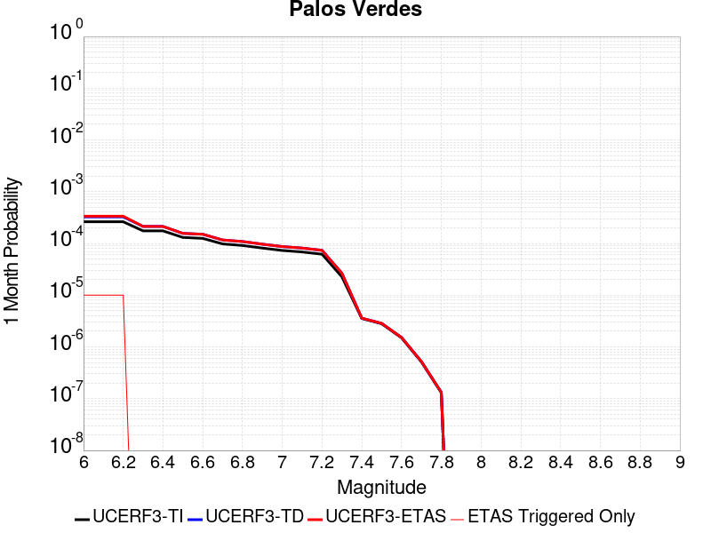 | 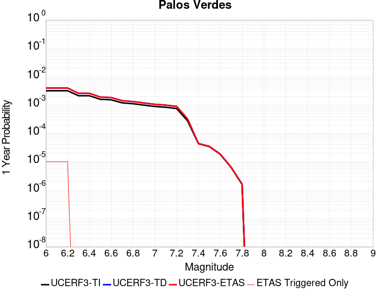 | 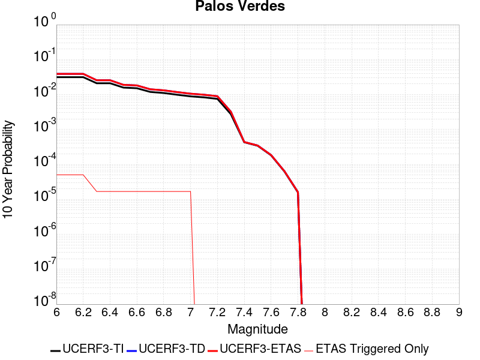 |

| Magnitude | 1 wk TI Prob | 1 wk TD Prob | 1 wk ETAS Prob | 1 wk ETAS/TD Gain | 1 wk ETAS Triggered Only | 1 mo TI Prob | 1 mo TD Prob | 1 mo ETAS Prob | 1 mo ETAS/TD Gain | 1 mo ETAS Triggered Only | 1 yr TI Prob | 1 yr TD Prob | 1 yr ETAS Prob | 1 yr ETAS/TD Gain | 1 yr ETAS Triggered Only | 10 yr TI Prob | 10 yr TD Prob | 10 yr ETAS Prob | 10 yr ETAS/TD Gain | 10 yr ETAS Triggered Only |
|-----|-----|-----|-----|-----|-----|-----|-----|-----|-----|-----|-----|-----|-----|-----|-----|-----|-----|-----|-----|-----|
| 6.0 | 6.126063E-5 | 7.622862E-5 | 7.622862E-5 | 1.0 | 0.0 | 2.6251914E-4 | 3.2665656E-4 | 3.4348606E-4 | 1.0515206 | 1.6835016E-5 | 0.0031914865 | 0.0039702994 | 0.0039870674 | 1.0042233 | 1.6835016E-5 | 0.031460393 | 0.039050125 | 0.039098658 | 1.0012429 | 5.0505052E-5 |
| 6.1 | 6.126063E-5 | 7.622862E-5 | 7.622862E-5 | 1.0 | 0.0 | 2.6251914E-4 | 3.2665656E-4 | 3.4348606E-4 | 1.0515206 | 1.6835016E-5 | 0.0031914865 | 0.0039702994 | 0.0039870674 | 1.0042233 | 1.6835016E-5 | 0.031460393 | 0.039050125 | 0.039098658 | 1.0012429 | 5.0505052E-5 |
| 6.2 | 6.126063E-5 | 7.622862E-5 | 7.622862E-5 | 1.0 | 0.0 | 2.6251914E-4 | 3.2665656E-4 | 3.4348606E-4 | 1.0515206 | 1.6835016E-5 | 0.0031914865 | 0.0039702994 | 0.0039870674 | 1.0042233 | 1.6835016E-5 | 0.031460393 | 0.039050125 | 0.039098658 | 1.0012429 | 5.0505052E-5 |
| 6.3 | 4.0838047E-5 | 4.975089E-5 | 4.975089E-5 | 1.0 | 0.0 | 1.7500846E-4 | 2.1320196E-4 | 2.1320196E-4 | 1.0 | 0.0 | 0.0021286458 | 0.0025928554 | 0.0025928554 | 1.0 | 0.0 | 0.021083709 | 0.025647415 | 0.025663817 | 1.0006396 | 1.6835016E-5 |
| 6.4 | 4.0838047E-5 | 4.975089E-5 | 4.975089E-5 | 1.0 | 0.0 | 1.7500846E-4 | 2.1320196E-4 | 2.1320196E-4 | 1.0 | 0.0 | 0.0021286458 | 0.0025928554 | 0.0025928554 | 1.0 | 0.0 | 0.021083709 | 0.025647415 | 0.025663817 | 1.0006396 | 1.6835016E-5 |
| 6.5 | 3.0512005E-5 | 3.6562593E-5 | 3.6562593E-5 | 1.0 | 0.0 | 1.3075917E-4 | 1.566881E-4 | 1.566881E-4 | 1.0 | 0.0 | 0.0015908304 | 0.001906127 | 0.001906127 | 1.0 | 0.0 | 0.015794903 | 0.01890965 | 0.018926166 | 1.0008734 | 1.6835016E-5 |
| 6.6 | 2.9255087E-5 | 3.5155368E-5 | 3.5155368E-5 | 1.0 | 0.0 | 1.2537291E-4 | 1.5065783E-4 | 1.5065783E-4 | 1.0 | 0.0 | 0.0015253464 | 0.0018328319 | 0.0018328319 | 1.0 | 0.0 | 0.015149189 | 0.01818871 | 0.018205239 | 1.0009087 | 1.6835016E-5 |
| 6.7 | 2.287198E-5 | 2.7248976E-5 | 2.7248976E-5 | 1.0 | 0.0 | 9.801909E-5 | 1.1677662E-4 | 1.1677662E-4 | 1.0 | 0.0 | 0.001192729 | 0.0014209197 | 0.0014209197 | 1.0 | 0.0 | 0.011863477 | 0.014127577 | 0.014144174 | 1.0011748 | 1.6835016E-5 |
| 6.8 | 2.1325764E-5 | 2.5432531E-5 | 2.5432531E-5 | 1.0 | 0.0 | 9.139293E-5 | 1.0899252E-4 | 1.0899252E-4 | 1.0 | 0.0 | 0.001112141 | 0.0013262664 | 0.0013262664 | 1.0 | 0.0 | 0.011065915 | 0.013192548 | 0.013209161 | 1.0012592 | 1.6835016E-5 |
| 6.9 | 1.9009392E-5 | 2.2614122E-5 | 2.2614122E-5 | 1.0 | 0.0 | 8.1466285E-5 | 9.6914555E-5 | 9.6914555E-5 | 1.0 | 0.0 | 9.914007E-4 | 0.0011793834 | 0.0011793834 | 1.0 | 0.0 | 0.009869894 | 0.011739929 | 0.011756566 | 1.0014172 | 1.6835016E-5 |
| 7.0 | 1.7098473E-5 | 2.0319867E-5 | 2.0319867E-5 | 1.0 | 0.0 | 7.3277115E-5 | 8.708272E-5 | 8.708272E-5 | 1.0 | 0.0 | 8.917837E-4 | 0.0010598017 | 0.0010598017 | 1.0 | 0.0 | 0.008882134 | 0.010555912 | 0.0105725685 | 1.001578 | 1.6835016E-5 |
| 7.1 | 1.5982785E-5 | 1.8995239E-5 | 1.8995239E-5 | 1.0 | 0.0 | 6.849585E-5 | 8.1406106E-5 | 8.1406106E-5 | 1.0 | 0.0 | 8.336179E-4 | 9.907534E-4 | 9.907534E-4 | 1.0 | 0.0 | 0.008304977 | 0.009871728 | 0.009871728 | 1.0 | 0.0 |
| 7.2 | 1.4468002E-5 | 1.719767E-5 | 1.719767E-5 | 1.0 | 0.0 | 6.200425E-5 | 7.370269E-5 | 7.370269E-5 | 1.0 | 0.0 | 7.546402E-4 | 8.970449E-4 | 8.970449E-4 | 1.0 | 0.0 | 0.007520827 | 0.008942509 | 0.008942509 | 1.0 | 0.0 |
| 7.3 | 5.288233E-6 | 6.2038207E-6 | 6.2038207E-6 | 1.0 | 0.0 | 2.2663658E-5 | 2.658773E-5 | 2.658773E-5 | 1.0 | 0.0 | 2.7589512E-4 | 3.2369242E-4 | 3.2369242E-4 | 1.0 | 0.0 | 0.0027555283 | 0.0032356323 | 0.0032356323 | 1.0 | 0.0 |
| 7.4 | 8.279556E-7 | 8.408364E-7 | 8.408364E-7 | 1.0 | 0.0 | 3.5483763E-6 | 3.60358E-6 | 3.60358E-6 | 1.0 | 0.0 | 4.3200624E-5 | 4.3872777E-5 | 4.3872777E-5 | 1.0 | 0.0 | 4.3192226E-4 | 4.3864836E-4 | 4.3864836E-4 | 1.0 | 0.0 |
| 7.5 | 6.559831E-7 | 6.667243E-7 | 6.667243E-7 | 1.0 | 0.0 | 2.8113532E-6 | 2.8573872E-6 | 2.8573872E-6 | 1.0 | 0.0 | 3.4227687E-5 | 3.47882E-5 | 3.47882E-5 | 1.0 | 0.0 | 3.4222414E-4 | 3.478342E-4 | 3.478342E-4 | 1.0 | 0.0 |
| 7.6 | 3.5018968E-7 | 3.562011E-7 | 3.562011E-7 | 1.0 | 0.0 | 1.500812E-6 | 1.5265755E-6 | 1.5265755E-6 | 1.0 | 0.0 | 1.8272232E-5 | 1.8585944E-5 | 1.8585944E-5 | 1.0 | 0.0 | 1.8270731E-4 | 1.858485E-4 | 1.858485E-4 | 1.0 | 0.0 |
| 7.7 | 1.1986104E-7 | 1.2198406E-7 | 1.2198406E-7 | 1.0 | 0.0 | 5.1369005E-7 | 5.227887E-7 | 5.227887E-7 | 1.0 | 0.0 | 6.2541585E-6 | 6.364934E-6 | 6.364934E-6 | 1.0 | 0.0 | 6.2539824E-5 | 6.364756E-5 | 6.364756E-5 | 1.0 | 0.0 |
| 7.8 | 3.0445005E-8 | 3.1027664E-8 | 3.1027664E-8 | 1.0 | 0.0 | 1.3047858E-7 | 1.3297569E-7 | 1.3297569E-7 | 1.0 | 0.0 | 1.5885756E-6 | 1.6189781E-6 | 1.6189781E-6 | 1.0 | 0.0 | 1.5885644E-5 | 1.6189684E-5 | 1.6189684E-5 | 1.0 | 0.0 |

## Sheephole
*[(top)](#table-of-contents)*

| 1 Week | 1 Month | 1 Year | 10 Year |
|-----|-----|-----|-----|
|  |  | 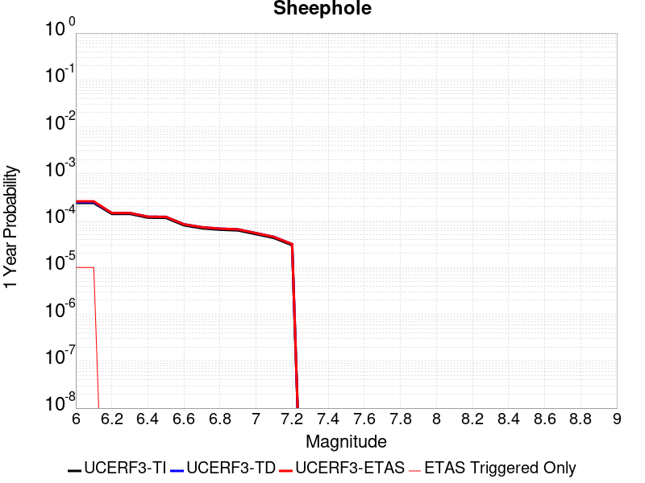 | 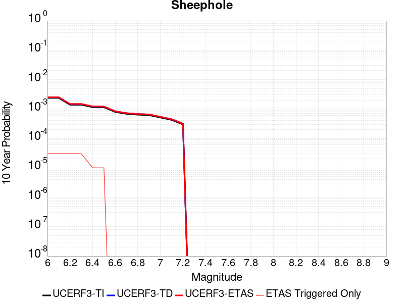 |

| Magnitude | 1 wk TI Prob | 1 wk TD Prob | 1 wk ETAS Prob | 1 wk ETAS/TD Gain | 1 wk ETAS Triggered Only | 1 mo TI Prob | 1 mo TD Prob | 1 mo ETAS Prob | 1 mo ETAS/TD Gain | 1 mo ETAS Triggered Only | 1 yr TI Prob | 1 yr TD Prob | 1 yr ETAS Prob | 1 yr ETAS/TD Gain | 1 yr ETAS Triggered Only | 10 yr TI Prob | 10 yr TD Prob | 10 yr ETAS Prob | 10 yr ETAS/TD Gain | 10 yr ETAS Triggered Only |
|-----|-----|-----|-----|-----|-----|-----|-----|-----|-----|-----|-----|-----|-----|-----|-----|-----|-----|-----|-----|-----|
| 6.0 | 4.5579695E-6 | 4.7412877E-6 | 4.7412877E-6 | 1.0 | 0.0 | 1.9534009E-5 | 2.0319678E-5 | 2.0319678E-5 | 1.0 | 0.0 | 2.3780059E-4 | 2.4736955E-4 | 2.6420038E-4 | 1.0680393 | 1.6835016E-5 | 0.0023754628 | 0.0024714863 | 0.002505073 | 1.0135897 | 3.3670032E-5 |
| 6.1 | 4.5579695E-6 | 4.7412877E-6 | 4.7412877E-6 | 1.0 | 0.0 | 1.9534009E-5 | 2.0319678E-5 | 2.0319678E-5 | 1.0 | 0.0 | 2.3780059E-4 | 2.4736955E-4 | 2.6420038E-4 | 1.0680393 | 1.6835016E-5 | 0.0023754628 | 0.0024714863 | 0.002505073 | 1.0135897 | 3.3670032E-5 |
| 6.2 | 2.6677674E-6 | 2.7874107E-6 | 2.7874107E-6 | 1.0 | 0.0 | 1.1433239E-5 | 1.1945997E-5 | 1.1945997E-5 | 1.0 | 0.0 | 1.3919079E-4 | 1.4543389E-4 | 1.4543389E-4 | 1.0 | 0.0 | 0.0013910364 | 0.001453493 | 0.0014871141 | 1.0231313 | 3.3670032E-5 |
| 6.3 | 2.6677674E-6 | 2.7874107E-6 | 2.7874107E-6 | 1.0 | 0.0 | 1.1433239E-5 | 1.1945997E-5 | 1.1945997E-5 | 1.0 | 0.0 | 1.3919079E-4 | 1.4543389E-4 | 1.4543389E-4 | 1.0 | 0.0 | 0.0013910364 | 0.001453493 | 0.0014871141 | 1.0231313 | 3.3670032E-5 |
| 6.4 | 2.2159759E-6 | 2.3228936E-6 | 2.3228936E-6 | 1.0 | 0.0 | 9.497005E-6 | 9.955224E-6 | 9.955224E-6 | 1.0 | 0.0 | 1.156199E-4 | 1.2119893E-4 | 1.2119893E-4 | 1.0 | 0.0 | 0.0011555976 | 0.0012114076 | 0.0012282223 | 1.0138803 | 1.6835016E-5 |
| 6.5 | 2.1986082E-6 | 2.3047737E-6 | 2.3047737E-6 | 1.0 | 0.0 | 9.4225725E-6 | 9.877569E-6 | 9.877569E-6 | 1.0 | 0.0 | 1.1471378E-4 | 1.2025358E-4 | 1.2025358E-4 | 1.0 | 0.0 | 0.0011465458 | 0.0012019643 | 0.0012187791 | 1.0139894 | 1.6835016E-5 |
| 6.6 | 1.5232331E-6 | 1.6019028E-6 | 1.6019028E-6 | 1.0 | 0.0 | 6.5281256E-6 | 6.8652807E-6 | 6.8652807E-6 | 1.0 | 0.0 | 7.947703E-5 | 8.358178E-5 | 8.358178E-5 | 1.0 | 0.0 | 7.9448614E-4 | 8.3552214E-4 | 8.3552214E-4 | 1.0 | 0.0 |
| 6.7 | 1.3137362E-6 | 1.3828287E-6 | 1.3828287E-6 | 1.0 | 0.0 | 5.6302856E-6 | 5.926396E-6 | 5.926396E-6 | 1.0 | 0.0 | 6.854657E-5 | 7.2151626E-5 | 7.2151626E-5 | 1.0 | 0.0 | 6.8525434E-4 | 7.212959E-4 | 7.212959E-4 | 1.0 | 0.0 |
| 6.8 | 1.2275751E-6 | 1.2922936E-6 | 1.2922936E-6 | 1.0 | 0.0 | 5.2610258E-6 | 5.5383903E-6 | 5.5383903E-6 | 1.0 | 0.0 | 6.4051106E-5 | 6.742795E-5 | 6.742795E-5 | 1.0 | 0.0 | 6.4032647E-4 | 6.740883E-4 | 6.740883E-4 | 1.0 | 0.0 |
| 6.9 | 1.1837088E-6 | 1.2461107E-6 | 1.2461107E-6 | 1.0 | 0.0 | 5.0730278E-6 | 5.340464E-6 | 5.340464E-6 | 1.0 | 0.0 | 6.176237E-5 | 6.501835E-5 | 6.501835E-5 | 1.0 | 0.0 | 6.17452E-4 | 6.500064E-4 | 6.500064E-4 | 1.0 | 0.0 |
| 7.0 | 9.849371E-7 | 1.036636E-6 | 1.036636E-6 | 1.0 | 0.0 | 4.2211523E-6 | 4.442719E-6 | 4.442719E-6 | 1.0 | 0.0 | 5.1391315E-5 | 5.408886E-5 | 5.408886E-5 | 1.0 | 0.0 | 5.137943E-4 | 5.4076704E-4 | 5.4076704E-4 | 1.0 | 0.0 |
| 7.1 | 8.1643645E-7 | 8.5917287E-7 | 8.5917287E-7 | 1.0 | 0.0 | 3.4990085E-6 | 3.6821648E-6 | 3.6821648E-6 | 1.0 | 0.0 | 4.2599597E-5 | 4.482952E-5 | 4.482952E-5 | 1.0 | 0.0 | 4.259143E-4 | 4.482134E-4 | 4.482134E-4 | 1.0 | 0.0 |
| 7.2 | 5.7295756E-7 | 6.029544E-7 | 6.029544E-7 | 1.0 | 0.0 | 2.45553E-6 | 2.584088E-6 | 2.584088E-6 | 1.0 | 0.0 | 2.9895667E-5 | 3.1460884E-5 | 3.1460884E-5 | 1.0 | 0.0 | 2.9891645E-4 | 3.14571E-4 | 3.14571E-4 | 1.0 | 0.0 |

## Brawley (Seismic Zone) alt 1
*[(top)](#table-of-contents)*

| 1 Week | 1 Month | 1 Year | 10 Year |
|-----|-----|-----|-----|
| 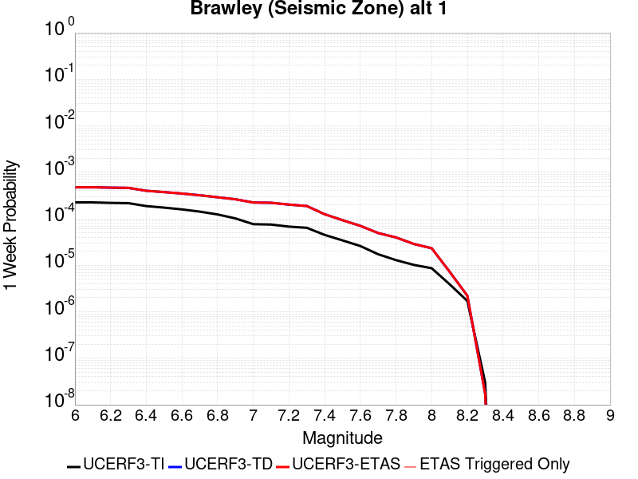 | 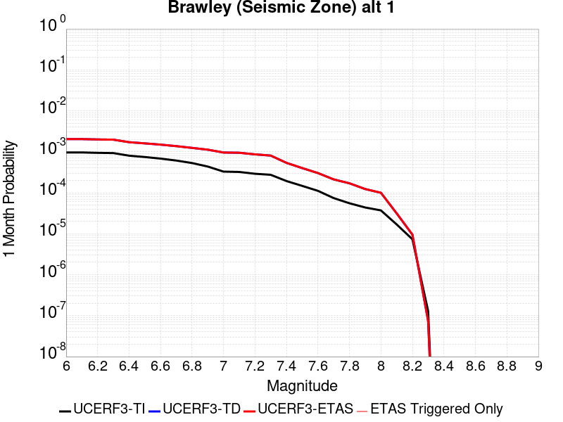 | 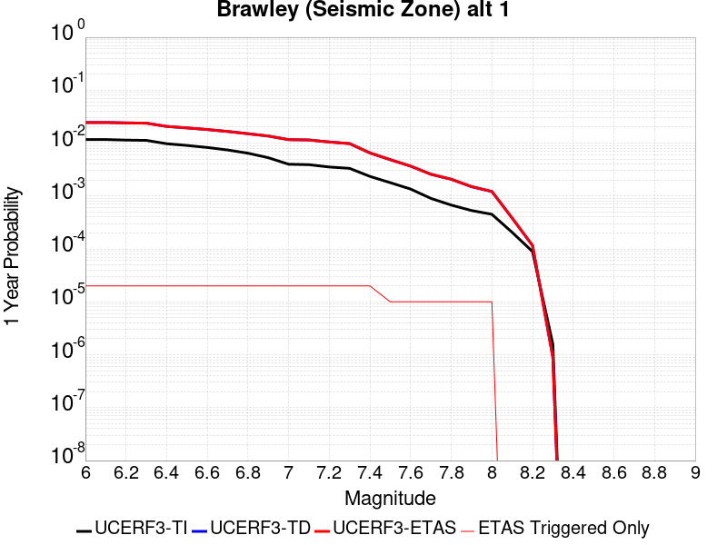 | 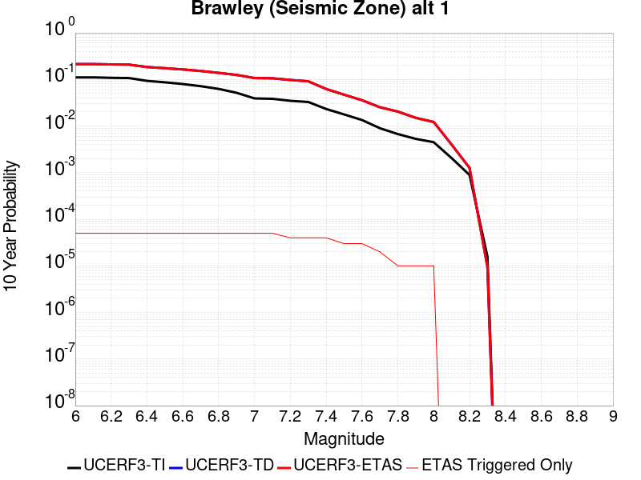 |

| Magnitude | 1 wk TI Prob | 1 wk TD Prob | 1 wk ETAS Prob | 1 wk ETAS/TD Gain | 1 wk ETAS Triggered Only | 1 mo TI Prob | 1 mo TD Prob | 1 mo ETAS Prob | 1 mo ETAS/TD Gain | 1 mo ETAS Triggered Only | 1 yr TI Prob | 1 yr TD Prob | 1 yr ETAS Prob | 1 yr ETAS/TD Gain | 1 yr ETAS Triggered Only | 10 yr TI Prob | 10 yr TD Prob | 10 yr ETAS Prob | 10 yr ETAS/TD Gain | 10 yr ETAS Triggered Only |
|-----|-----|-----|-----|-----|-----|-----|-----|-----|-----|-----|-----|-----|-----|-----|-----|-----|-----|-----|-----|-----|
| 6.0 | 2.2521618E-4 | 4.7641253E-4 | 4.7641253E-4 | 1.0 | 0.0 | 9.6485513E-4 | 0.0020402074 | 0.0020402074 | 1.0 | 0.0 | 0.011683988 | 0.02455069 | 0.02456711 | 1.0006689 | 1.6835016E-5 | 0.11088423 | 0.21353015 | 0.21356988 | 1.000186 | 5.0505052E-5 |
| 6.1 | 2.2521618E-4 | 4.7641253E-4 | 4.7641253E-4 | 1.0 | 0.0 | 9.6485513E-4 | 0.0020402074 | 0.0020402074 | 1.0 | 0.0 | 0.011683988 | 0.02455069 | 0.02456711 | 1.0006689 | 1.6835016E-5 | 0.11088423 | 0.21353015 | 0.21356988 | 1.000186 | 5.0505052E-5 |
| 6.2 | 2.198148E-4 | 4.6725658E-4 | 4.6725658E-4 | 1.0 | 0.0 | 9.417233E-4 | 0.002001028 | 0.002001028 | 1.0 | 0.0 | 0.011405343 | 0.024084855 | 0.024101285 | 1.0006821 | 1.6835016E-5 | 0.10837428 | 0.20996629 | 0.21000618 | 1.00019 | 5.0505052E-5 |
| 6.3 | 2.1704129E-4 | 4.6161312E-4 | 4.6161312E-4 | 1.0 | 0.0 | 9.298453E-4 | 0.0019768786 | 0.0019768786 | 1.0 | 0.0 | 0.011262234 | 0.023797998 | 0.023814432 | 1.0006906 | 1.6835016E-5 | 0.107082725 | 0.20785725 | 0.20789726 | 1.0001925 | 5.0505052E-5 |
| 6.4 | 1.876142E-4 | 4.0053183E-4 | 4.0053183E-4 | 1.0 | 0.0 | 8.038131E-4 | 0.0017154501 | 0.0017154501 | 1.0 | 0.0 | 0.00974259 | 0.02068463 | 0.020701118 | 1.000797 | 1.6835016E-5 | 0.093263686 | 0.184608 | 0.18464918 | 1.000223 | 5.0505052E-5 |
| 6.5 | 1.7390939E-4 | 3.7485067E-4 | 3.7485067E-4 | 1.0 | 0.0 | 7.45113E-4 | 0.0016055258 | 0.0016055258 | 1.0 | 0.0 | 0.009034078 | 0.019372813 | 0.019389322 | 1.0008521 | 1.6835016E-5 | 0.086755216 | 0.17442966 | 0.17447136 | 1.000239 | 5.0505052E-5 |
| 6.6 | 1.591791E-4 | 3.489955E-4 | 3.489955E-4 | 1.0 | 0.0 | 6.8201777E-4 | 0.0014948477 | 0.0014948477 | 1.0 | 0.0 | 0.008271996 | 0.018049458 | 0.018065989 | 1.0009159 | 1.6835016E-5 | 0.07970774 | 0.16383699 | 0.16387922 | 1.0002577 | 5.0505052E-5 |
| 6.7 | 1.4268003E-4 | 3.206533E-4 | 3.206533E-4 | 1.0 | 0.0 | 6.1134255E-4 | 0.0013735129 | 0.0013735129 | 1.0 | 0.0 | 0.007417723 | 0.016596261 | 0.016612817 | 1.0009975 | 1.6835016E-5 | 0.07174956 | 0.15196045 | 0.15200329 | 1.0002818 | 5.0505052E-5 |
| 6.8 | 1.239713E-4 | 2.9059697E-4 | 2.9059697E-4 | 1.0 | 0.0 | 5.3119735E-4 | 0.0012448273 | 0.0012448273 | 1.0 | 0.0 | 0.0064481674 | 0.015051884 | 0.015068465 | 1.0011016 | 1.6835016E-5 | 0.06264243 | 0.13840161 | 0.13844512 | 1.0003144 | 5.0505052E-5 |
| 6.9 | 1.0180238E-4 | 2.625907E-4 | 2.625907E-4 | 1.0 | 0.0 | 4.3622297E-4 | 0.0011249076 | 0.0011249076 | 1.0 | 0.0 | 0.005298089 | 0.013610746 | 0.013627352 | 1.0012201 | 1.6835016E-5 | 0.05173543 | 0.12498065 | 0.12502484 | 1.0003536 | 5.0505052E-5 |
| 7.0 | 7.6619996E-5 | 2.2402873E-4 | 2.2402873E-4 | 1.0 | 0.0 | 3.283301E-4 | 9.59773E-4 | 9.59773E-4 | 1.0 | 0.0 | 0.0039900932 | 0.011623339 | 0.011639978 | 1.0014316 | 1.6835016E-5 | 0.039192066 | 0.10728151 | 0.107326604 | 1.0004202 | 5.0505052E-5 |
| 7.1 | 7.5127435E-5 | 2.208599E-4 | 2.208599E-4 | 1.0 | 0.0 | 3.2193496E-4 | 9.4620226E-4 | 9.4620226E-4 | 1.0 | 0.0 | 0.0039125155 | 0.011459865 | 0.0114765065 | 1.0014522 | 1.6835016E-5 | 0.038443442 | 0.10584534 | 0.1058905 | 1.0004267 | 5.0505052E-5 |
| 7.2 | 6.788582E-5 | 2.0213598E-4 | 2.0213598E-4 | 1.0 | 0.0 | 2.9090676E-4 | 8.660125E-4 | 8.660125E-4 | 1.0 | 0.0 | 0.0035360386 | 0.010493369 | 0.010510027 | 1.0015875 | 1.6835016E-5 | 0.034803 | 0.09751546 | 0.09754584 | 1.0003116 | 3.3670032E-5 |
| 7.3 | 6.399602E-5 | 1.88444E-4 | 1.88444E-4 | 1.0 | 0.0 | 2.7423984E-4 | 8.0737006E-4 | 8.0737006E-4 | 1.0 | 0.0 | 0.0033337586 | 0.009786017 | 0.009802688 | 1.0017035 | 1.6835016E-5 | 0.03284188 | 0.091409855 | 0.09144045 | 1.0003346 | 3.3670032E-5 |
| 7.4 | 4.506759E-5 | 1.2531783E-4 | 1.2531783E-4 | 1.0 | 0.0 | 1.9313251E-4 | 5.369668E-4 | 5.369668E-4 | 1.0 | 0.0 | 0.0023488526 | 0.0065181484 | 0.006534874 | 1.002566 | 1.6835016E-5 | 0.023241805 | 0.062375 | 0.062406573 | 1.0005062 | 3.3670032E-5 |
| 7.5 | 3.43289E-5 | 9.337587E-5 | 9.337587E-5 | 1.0 | 0.0 | 1.4711556E-4 | 4.0012124E-4 | 4.0012124E-4 | 1.0 | 0.0 | 0.0017896603 | 0.004860657 | 0.0048774104 | 1.0034467 | 1.6835016E-5 | 0.01775316 | 0.04706493 | 0.047097016 | 1.0006818 | 3.3670032E-5 |
| 7.6 | 2.5980507E-5 | 7.054998E-5 | 7.054998E-5 | 1.0 | 0.0 | 1.1134028E-4 | 3.0232212E-4 | 3.0232212E-4 | 1.0 | 0.0 | 0.001354725 | 0.0036745837 | 0.0036913569 | 1.0045646 | 1.6835016E-5 | 0.013464959 | 0.035849415 | 0.035881877 | 1.0009055 | 3.3670032E-5 |
| 7.7 | 1.7292105E-5 | 4.9423474E-5 | 4.9423474E-5 | 1.0 | 0.0 | 7.4106916E-5 | 2.1179771E-4 | 2.1179771E-4 | 1.0 | 0.0 | 9.018782E-4 | 0.0025755935 | 0.0025923853 | 1.0065196 | 1.6835016E-5 | 0.008982267 | 0.025297757 | 0.025330575 | 1.0012972 | 3.3670032E-5 |
| 7.8 | 1.2927471E-5 | 3.970735E-5 | 3.970735E-5 | 1.0 | 0.0 | 5.5402274E-5 | 1.7016326E-4 | 1.7016326E-4 | 1.0 | 0.0 | 6.743139E-4 | 0.0020697718 | 0.0020865719 | 1.008117 | 1.6835016E-5 | 0.0067227143 | 0.02043814 | 0.020454632 | 1.0008069 | 1.6835016E-5 |
| 7.9 | 1.0200774E-5 | 2.8757075E-5 | 2.8757075E-5 | 1.0 | 0.0 | 4.371687E-5 | 1.2323879E-4 | 1.2323879E-4 | 1.0 | 0.0 | 5.321229E-4 | 0.0014994006 | 0.0015162104 | 1.011211 | 1.6835016E-5 | 0.005308505 | 0.0149969105 | 0.015013493 | 1.0011058 | 1.6835016E-5 |
| 8.0 | 8.650396E-6 | 2.3287128E-5 | 2.3287128E-5 | 1.0 | 0.0 | 3.70726E-5 | 9.979816E-5 | 9.979816E-5 | 1.0 | 0.0 | 4.5126543E-4 | 0.0012143662 | 0.0012311807 | 1.0138464 | 1.6835016E-5 | 0.0045035016 | 0.012215644 | 0.012232274 | 1.0013614 | 1.6835016E-5 |
| 8.1 | 3.9368224E-6 | 7.3321658E-6 | 7.3321658E-6 | 1.0 | 0.0 | 1.6871985E-5 | 3.1423187E-5 | 3.1423187E-5 | 1.0 | 0.0 | 2.0539707E-4 | 3.825103E-4 | 3.825103E-4 | 1.0 | 0.0 | 0.0020520731 | 0.00400326 | 0.00400326 | 1.0 | 0.0 |
| 8.2 | 1.7101195E-6 | 2.2195122E-6 | 2.2195122E-6 | 1.0 | 0.0 | 7.329063E-6 | 9.51216E-6 | 9.51216E-6 | 1.0 | 0.0 | 8.922769E-5 | 1.15804425E-4 | 1.15804425E-4 | 1.0 | 0.0 | 8.9191867E-4 | 0.0012675166 | 0.0012675166 | 1.0 | 0.0 |
| 8.3 | 3.0346666E-8 | 1.7233086E-8 | 1.7233086E-8 | 1.0 | 0.0 | 1.3005713E-7 | 7.385608E-8 | 7.385608E-8 | 1.0 | 0.0 | 1.5834444E-6 | 8.991977E-7 | 8.991977E-7 | 1.0 | 0.0 | 1.5834332E-5 | 9.37692E-6 | 9.37692E-6 | 1.0 | 0.0 |

## Pine Mtn
*[(top)](#table-of-contents)*

| 1 Week | 1 Month | 1 Year | 10 Year |
|-----|-----|-----|-----|
|  | 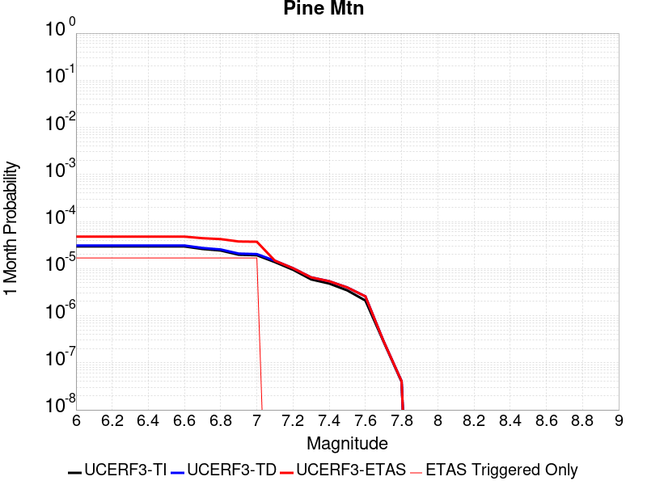 | 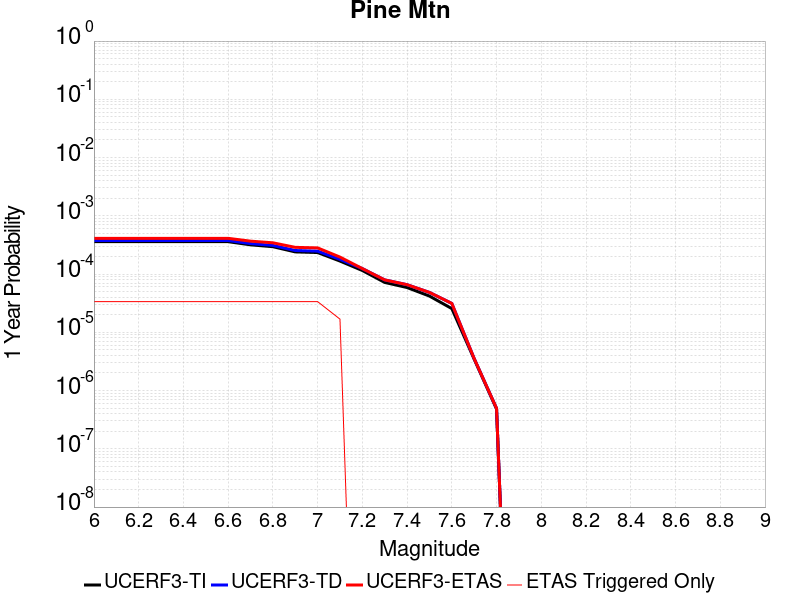 | 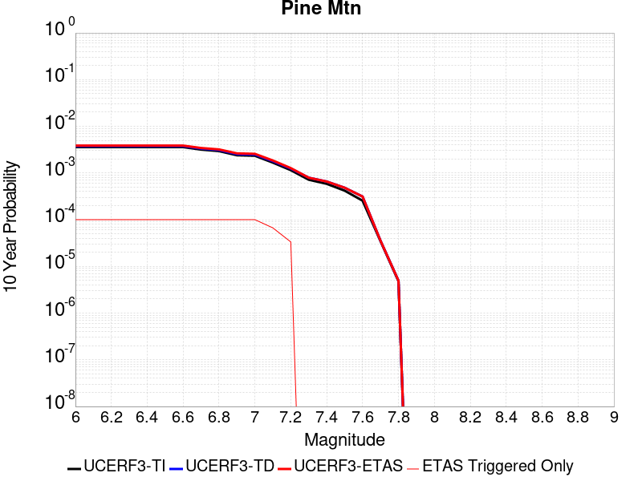 |

| Magnitude | 1 wk TI Prob | 1 wk TD Prob | 1 wk ETAS Prob | 1 wk ETAS/TD Gain | 1 wk ETAS Triggered Only | 1 mo TI Prob | 1 mo TD Prob | 1 mo ETAS Prob | 1 mo ETAS/TD Gain | 1 mo ETAS Triggered Only | 1 yr TI Prob | 1 yr TD Prob | 1 yr ETAS Prob | 1 yr ETAS/TD Gain | 1 yr ETAS Triggered Only | 10 yr TI Prob | 10 yr TD Prob | 10 yr ETAS Prob | 10 yr ETAS/TD Gain | 10 yr ETAS Triggered Only |
|-----|-----|-----|-----|-----|-----|-----|-----|-----|-----|-----|-----|-----|-----|-----|-----|-----|-----|-----|-----|-----|
| 6.0 | 6.894797E-6 | 7.2255634E-6 | 7.2255634E-6 | 1.0 | 0.0 | 2.9548795E-5 | 3.0966352E-5 | 4.7800844E-5 | 1.5436383 | 1.6835016E-5 | 3.596972E-4 | 3.7695307E-4 | 4.106104E-4 | 1.0892879 | 3.3670032E-5 | 0.0035911554 | 0.0037634342 | 0.0038137492 | 1.0133694 | 5.0505052E-5 |
| 6.1 | 6.894797E-6 | 7.2255634E-6 | 7.2255634E-6 | 1.0 | 0.0 | 2.9548795E-5 | 3.0966352E-5 | 4.7800844E-5 | 1.5436383 | 1.6835016E-5 | 3.596972E-4 | 3.7695307E-4 | 4.106104E-4 | 1.0892879 | 3.3670032E-5 | 0.0035911554 | 0.0037634342 | 0.0038137492 | 1.0133694 | 5.0505052E-5 |
| 6.2 | 6.894797E-6 | 7.2255634E-6 | 7.2255634E-6 | 1.0 | 0.0 | 2.9548795E-5 | 3.0966352E-5 | 4.7800844E-5 | 1.5436383 | 1.6835016E-5 | 3.596972E-4 | 3.7695307E-4 | 4.106104E-4 | 1.0892879 | 3.3670032E-5 | 0.0035911554 | 0.0037634342 | 0.0038137492 | 1.0133694 | 5.0505052E-5 |
| 6.3 | 6.894797E-6 | 7.2255634E-6 | 7.2255634E-6 | 1.0 | 0.0 | 2.9548795E-5 | 3.0966352E-5 | 4.7800844E-5 | 1.5436383 | 1.6835016E-5 | 3.596972E-4 | 3.7695307E-4 | 4.106104E-4 | 1.0892879 | 3.3670032E-5 | 0.0035911554 | 0.0037634342 | 0.0038137492 | 1.0133694 | 5.0505052E-5 |
| 6.4 | 6.894797E-6 | 7.2255634E-6 | 7.2255634E-6 | 1.0 | 0.0 | 2.9548795E-5 | 3.0966352E-5 | 4.7800844E-5 | 1.5436383 | 1.6835016E-5 | 3.596972E-4 | 3.7695307E-4 | 4.106104E-4 | 1.0892879 | 3.3670032E-5 | 0.0035911554 | 0.0037634342 | 0.0038137492 | 1.0133694 | 5.0505052E-5 |
| 6.5 | 6.894797E-6 | 7.2255634E-6 | 7.2255634E-6 | 1.0 | 0.0 | 2.9548795E-5 | 3.0966352E-5 | 4.7800844E-5 | 1.5436383 | 1.6835016E-5 | 3.596972E-4 | 3.7695307E-4 | 4.106104E-4 | 1.0892879 | 3.3670032E-5 | 0.0035911554 | 0.0037634342 | 0.0038137492 | 1.0133694 | 5.0505052E-5 |
| 6.6 | 6.894797E-6 | 7.2255634E-6 | 7.2255634E-6 | 1.0 | 0.0 | 2.9548795E-5 | 3.0966352E-5 | 4.7800844E-5 | 1.5436383 | 1.6835016E-5 | 3.596972E-4 | 3.7695307E-4 | 4.106104E-4 | 1.0892879 | 3.3670032E-5 | 0.0035911554 | 0.0037634342 | 0.0038137492 | 1.0133694 | 5.0505052E-5 |
| 6.7 | 6.0867933E-6 | 6.397213E-6 | 6.397213E-6 | 1.0 | 0.0 | 2.6085996E-5 | 2.741635E-5 | 4.4250904E-5 | 1.6140335 | 1.6835016E-5 | 3.1755073E-4 | 3.3374512E-4 | 3.6740393E-4 | 1.1008518 | 3.3670032E-5 | 0.0031709734 | 0.0033326582 | 0.0033829948 | 1.015104 | 5.0505052E-5 |
| 6.8 | 5.6530425E-6 | 5.9506933E-6 | 5.9506933E-6 | 1.0 | 0.0 | 2.42271E-5 | 2.5502733E-5 | 4.233732E-5 | 1.6601092 | 1.6835016E-5 | 2.94925E-4 | 3.104536E-4 | 3.4411318E-4 | 1.1084206 | 3.3670032E-5 | 0.002945339 | 0.0031004036 | 0.003150752 | 1.0162393 | 5.0505052E-5 |
| 6.9 | 4.6015225E-6 | 4.8639267E-6 | 4.8639267E-6 | 1.0 | 0.0 | 1.9720663E-5 | 2.0845242E-5 | 3.7679907E-5 | 1.8076023 | 1.6835016E-5 | 2.4007261E-4 | 2.5376273E-4 | 2.8742422E-4 | 1.1326494 | 3.3670032E-5 | 0.0023981342 | 0.0025348738 | 0.002585251 | 1.0198736 | 5.0505052E-5 |
| 7.0 | 4.4875965E-6 | 4.7475655E-6 | 4.7475655E-6 | 1.0 | 0.0 | 1.9232413E-5 | 2.0346559E-5 | 3.7181235E-5 | 1.8273966 | 1.6835016E-5 | 2.3412947E-4 | 2.4769266E-4 | 2.8135435E-4 | 1.1359011 | 3.3670032E-5 | 0.0023388295 | 0.0024743096 | 0.0025246898 | 1.0203613 | 5.0505052E-5 |
| 7.1 | 3.203907E-6 | 3.4294974E-6 | 3.4294974E-6 | 1.0 | 0.0 | 1.3730958E-5 | 1.4697767E-5 | 1.4697767E-5 | 1.0 | 0.0 | 1.6716159E-4 | 1.7893128E-4 | 1.9576329E-4 | 1.0940696 | 1.6835016E-5 | 0.0016703589 | 0.0017879383 | 0.0018215482 | 1.0187981 | 3.3670032E-5 |
| 7.2 | 2.2060601E-6 | 2.3785535E-6 | 2.3785535E-6 | 1.0 | 0.0 | 9.4545085E-6 | 1.0193763E-5 | 1.0193763E-5 | 1.0 | 0.0 | 1.15102564E-4 | 1.2410246E-4 | 1.2410246E-4 | 1.0 | 0.0 | 0.0011504296 | 0.0012403764 | 0.0012571905 | 1.0135556 | 1.6835016E-5 |
| 7.3 | 1.3765207E-6 | 1.5217128E-6 | 1.5217128E-6 | 1.0 | 0.0 | 5.899361E-6 | 6.52161E-6 | 6.52161E-6 | 1.0 | 0.0 | 7.182235E-5 | 7.93978E-5 | 7.93978E-5 | 1.0 | 0.0 | 7.1799144E-4 | 7.937035E-4 | 7.937035E-4 | 1.0 | 0.0 |
| 7.4 | 1.1245983E-6 | 1.2587657E-6 | 1.2587657E-6 | 1.0 | 0.0 | 4.819698E-6 | 5.3946997E-6 | 5.3946997E-6 | 1.0 | 0.0 | 5.8678244E-5 | 6.567857E-5 | 6.567857E-5 | 1.0 | 0.0 | 5.866275E-4 | 6.5659994E-4 | 6.5659994E-4 | 1.0 | 0.0 |
| 7.5 | 8.031682E-7 | 9.277495E-7 | 9.277495E-7 | 1.0 | 0.0 | 3.4421448E-6 | 3.9760635E-6 | 3.9760635E-6 | 1.0 | 0.0 | 4.1907308E-5 | 4.8407568E-5 | 4.8407568E-5 | 1.0 | 0.0 | 4.1899405E-4 | 4.83977E-4 | 4.83977E-4 | 1.0 | 0.0 |
| 7.6 | 4.8953444E-7 | 6.0034915E-7 | 6.0034915E-7 | 1.0 | 0.0 | 2.098003E-6 | 2.5729225E-6 | 2.5729225E-6 | 1.0 | 0.0 | 2.5542888E-5 | 3.1324933E-5 | 3.1324933E-5 | 1.0 | 0.0 | 2.5539953E-4 | 3.1321004E-4 | 3.1321004E-4 | 1.0 | 0.0 |
| 7.7 | 6.634529E-8 | 6.788847E-8 | 6.788847E-8 | 1.0 | 0.0 | 2.843369E-7 | 2.9095054E-7 | 2.9095054E-7 | 1.0 | 0.0 | 3.4617963E-6 | 3.5423177E-6 | 3.5423177E-6 | 1.0 | 0.0 | 3.4617424E-5 | 3.542266E-5 | 3.542266E-5 | 1.0 | 0.0 |
| 7.8 | 9.235578E-9 | 9.488601E-9 | 9.488601E-9 | 1.0 | 0.0 | 3.9581046E-8 | 4.0665434E-8 | 4.0665434E-8 | 1.0 | 0.0 | 4.818991E-7 | 4.951016E-7 | 4.951016E-7 | 1.0 | 0.0 | 4.8189804E-6 | 4.9510063E-6 | 4.9510063E-6 | 1.0 | 0.0 |

## San Gabriel
*[(top)](#table-of-contents)*

| 1 Week | 1 Month | 1 Year | 10 Year |
|-----|-----|-----|-----|
| 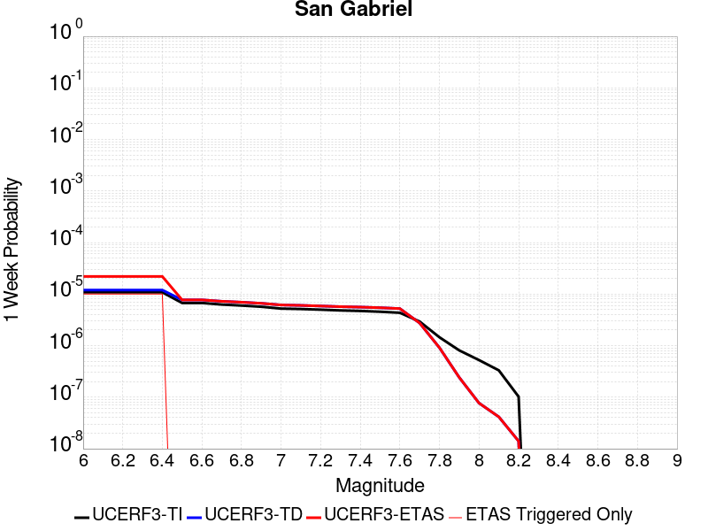 | 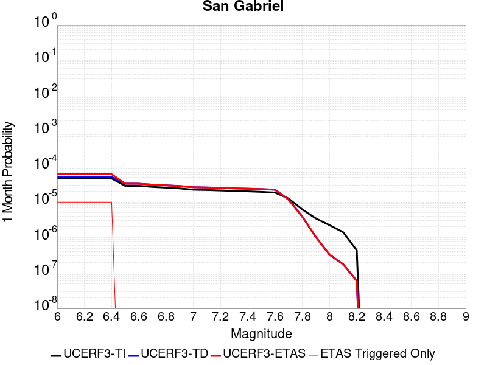 | 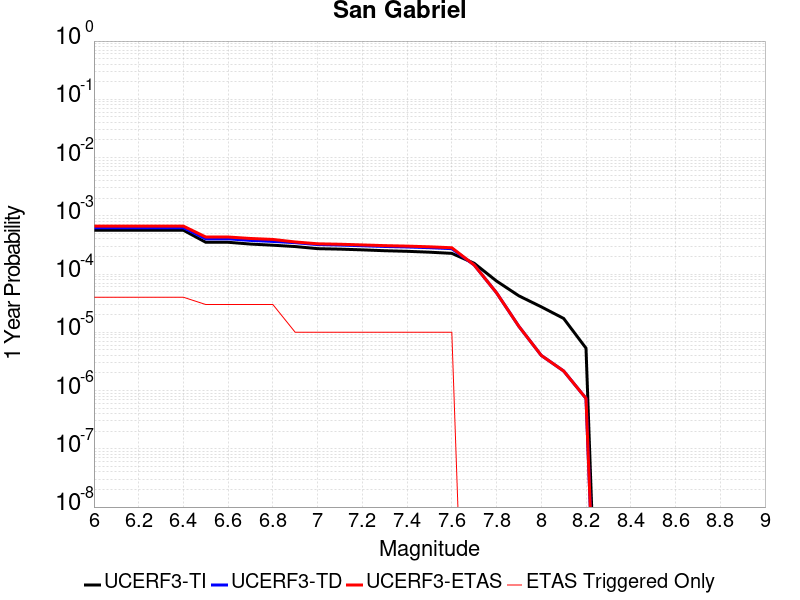 | 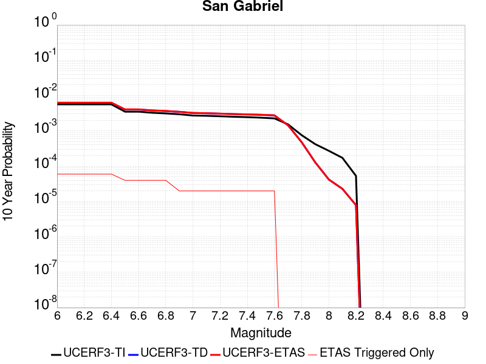 |

| Magnitude | 1 wk TI Prob | 1 wk TD Prob | 1 wk ETAS Prob | 1 wk ETAS/TD Gain | 1 wk ETAS Triggered Only | 1 mo TI Prob | 1 mo TD Prob | 1 mo ETAS Prob | 1 mo ETAS/TD Gain | 1 mo ETAS Triggered Only | 1 yr TI Prob | 1 yr TD Prob | 1 yr ETAS Prob | 1 yr ETAS/TD Gain | 1 yr ETAS Triggered Only | 10 yr TI Prob | 10 yr TD Prob | 10 yr ETAS Prob | 10 yr ETAS/TD Gain | 10 yr ETAS Triggered Only |
|-----|-----|-----|-----|-----|-----|-----|-----|-----|-----|-----|-----|-----|-----|-----|-----|-----|-----|-----|-----|-----|
| 6.0 | 1.083775E-5 | 1.1987322E-5 | 1.1987322E-5 | 1.0 | 0.0 | 4.6446676E-5 | 5.1373292E-5 | 5.1373292E-5 | 1.0 | 0.0 | 5.653415E-4 | 6.253016E-4 | 6.4212614E-4 | 1.0269063 | 1.6835016E-5 | 0.0056390543 | 0.006247514 | 0.0062977034 | 1.0080335 | 5.0505052E-5 |
| 6.1 | 1.083775E-5 | 1.1987322E-5 | 1.1987322E-5 | 1.0 | 0.0 | 4.6446676E-5 | 5.1373292E-5 | 5.1373292E-5 | 1.0 | 0.0 | 5.653415E-4 | 6.253016E-4 | 6.4212614E-4 | 1.0269063 | 1.6835016E-5 | 0.0056390543 | 0.006247514 | 0.0062977034 | 1.0080335 | 5.0505052E-5 |
| 6.2 | 1.083775E-5 | 1.1987322E-5 | 1.1987322E-5 | 1.0 | 0.0 | 4.6446676E-5 | 5.1373292E-5 | 5.1373292E-5 | 1.0 | 0.0 | 5.653415E-4 | 6.253016E-4 | 6.4212614E-4 | 1.0269063 | 1.6835016E-5 | 0.0056390543 | 0.006247514 | 0.0062977034 | 1.0080335 | 5.0505052E-5 |
| 6.3 | 1.083775E-5 | 1.1987322E-5 | 1.1987322E-5 | 1.0 | 0.0 | 4.6446676E-5 | 5.1373292E-5 | 5.1373292E-5 | 1.0 | 0.0 | 5.653415E-4 | 6.253016E-4 | 6.4212614E-4 | 1.0269063 | 1.6835016E-5 | 0.0056390543 | 0.006247514 | 0.0062977034 | 1.0080335 | 5.0505052E-5 |
| 6.4 | 1.083775E-5 | 1.1987322E-5 | 1.1987322E-5 | 1.0 | 0.0 | 4.6446676E-5 | 5.1373292E-5 | 5.1373292E-5 | 1.0 | 0.0 | 5.653415E-4 | 6.253016E-4 | 6.4212614E-4 | 1.0269063 | 1.6835016E-5 | 0.0056390543 | 0.006247514 | 0.0062977034 | 1.0080335 | 5.0505052E-5 |
| 6.5 | 6.7317824E-6 | 7.719057E-6 | 7.719057E-6 | 1.0 | 0.0 | 2.8850178E-5 | 3.308126E-5 | 3.308126E-5 | 1.0 | 0.0 | 3.511943E-4 | 4.0269096E-4 | 4.195192E-4 | 1.0417894 | 1.6835016E-5 | 0.003506398 | 0.0040307054 | 0.0040642396 | 1.0083197 | 3.3670032E-5 |
| 6.6 | 6.7317824E-6 | 7.719057E-6 | 7.719057E-6 | 1.0 | 0.0 | 2.8850178E-5 | 3.308126E-5 | 3.308126E-5 | 1.0 | 0.0 | 3.511943E-4 | 4.0269096E-4 | 4.195192E-4 | 1.0417894 | 1.6835016E-5 | 0.003506398 | 0.0040307054 | 0.0040642396 | 1.0083197 | 3.3670032E-5 |
| 6.7 | 6.274881E-6 | 7.247975E-6 | 7.247975E-6 | 1.0 | 0.0 | 2.6892068E-5 | 3.1062387E-5 | 3.1062387E-5 | 1.0 | 0.0 | 3.2736175E-4 | 3.781199E-4 | 3.9494855E-4 | 1.0445061 | 1.6835016E-5 | 0.0032687993 | 0.0037858514 | 0.003819394 | 1.00886 | 3.3670032E-5 |
| 6.8 | 5.996209E-6 | 6.9606945E-6 | 6.9606945E-6 | 1.0 | 0.0 | 2.5697784E-5 | 2.9831212E-5 | 2.9831212E-5 | 1.0 | 0.0 | 3.128256E-4 | 3.6313542E-4 | 3.799643E-4 | 1.0463433 | 1.6835016E-5 | 0.003123856 | 0.0036365038 | 0.0036700515 | 1.0092252 | 3.3670032E-5 |
| 6.9 | 5.686331E-6 | 6.6257326E-6 | 6.6257326E-6 | 1.0 | 0.0 | 2.4369761E-5 | 2.8395692E-5 | 2.8395692E-5 | 1.0 | 0.0 | 2.9666146E-4 | 3.4566363E-4 | 3.4566363E-4 | 1.0 | 0.0 | 0.0029626573 | 0.0034623418 | 0.0034791185 | 1.0048455 | 1.6835016E-5 |
| 7.0 | 5.2329838E-6 | 6.14961E-6 | 6.14961E-6 | 1.0 | 0.0 | 2.242688E-5 | 2.6355208E-5 | 2.6355208E-5 | 1.0 | 0.0 | 2.7301308E-4 | 3.2082817E-4 | 3.2082817E-4 | 1.0 | 0.0 | 0.002726779 | 0.00321472 | 0.0032315007 | 1.00522 | 1.6835016E-5 |
| 7.1 | 5.135671E-6 | 6.03973E-6 | 6.03973E-6 | 1.0 | 0.0 | 2.2009834E-5 | 2.5884305E-5 | 2.5884305E-5 | 1.0 | 0.0 | 2.6793676E-4 | 3.150966E-4 | 3.150966E-4 | 1.0 | 0.0 | 0.0026761394 | 0.0031575684 | 0.0031743501 | 1.0053148 | 1.6835016E-5 |
| 7.2 | 4.989062E-6 | 5.873101E-6 | 5.873101E-6 | 1.0 | 0.0 | 2.1381518E-5 | 2.5170193E-5 | 2.5170193E-5 | 1.0 | 0.0 | 2.6028889E-4 | 3.0640478E-4 | 3.0640478E-4 | 1.0 | 0.0 | 0.0025998424 | 0.003070893 | 0.0030876764 | 1.0054653 | 1.6835016E-5 |
| 7.3 | 4.8219395E-6 | 5.7046464E-6 | 5.7046464E-6 | 1.0 | 0.0 | 2.0665291E-5 | 2.444826E-5 | 2.444826E-5 | 1.0 | 0.0 | 2.5157086E-4 | 2.9761766E-4 | 2.9761766E-4 | 1.0 | 0.0 | 0.0025128627 | 0.0029832611 | 0.003000046 | 1.0056263 | 1.6835016E-5 |
| 7.4 | 4.7118383E-6 | 5.593198E-6 | 5.593198E-6 | 1.0 | 0.0 | 2.0193436E-5 | 2.3970631E-5 | 2.3970631E-5 | 1.0 | 0.0 | 2.4582737E-4 | 2.918041E-4 | 2.918041E-4 | 1.0 | 0.0 | 0.002455556 | 0.0029252786 | 0.0029420645 | 1.0057381 | 1.6835016E-5 |
| 7.5 | 4.5506545E-6 | 5.4385555E-6 | 5.4385555E-6 | 1.0 | 0.0 | 1.9502659E-5 | 2.330789E-5 | 2.330789E-5 | 1.0 | 0.0 | 2.37419E-4 | 2.8373738E-4 | 2.8373738E-4 | 1.0 | 0.0 | 0.002371655 | 0.0028448196 | 0.0028616067 | 1.005901 | 1.6835016E-5 |
| 7.6 | 4.343636E-6 | 5.2314185E-6 | 5.2314185E-6 | 1.0 | 0.0 | 1.861545E-5 | 2.2420176E-5 | 2.2420176E-5 | 1.0 | 0.0 | 2.2661954E-4 | 2.729322E-4 | 2.729322E-4 | 1.0 | 0.0 | 0.0022638857 | 0.00273703 | 0.0027538189 | 1.006134 | 1.6835016E-5 |
| 7.7 | 2.936235E-6 | 2.7454162E-6 | 2.7454162E-6 | 1.0 | 0.0 | 1.2583803E-5 | 1.17660165E-5 | 1.17660165E-5 | 1.0 | 0.0 | 1.5319703E-4 | 1.4324186E-4 | 1.4324186E-4 | 1.0 | 0.0 | 0.0015309147 | 0.0014387933 | 0.0014387933 | 1.0 | 0.0 |
| 7.8 | 1.4541639E-6 | 9.129234E-7 | 9.129234E-7 | 1.0 | 0.0 | 6.232116E-6 | 3.912523E-6 | 3.912523E-6 | 1.0 | 0.0 | 7.587337E-5 | 4.7633926E-5 | 4.7633926E-5 | 1.0 | 0.0 | 7.584747E-4 | 4.8114438E-4 | 4.8114438E-4 | 1.0 | 0.0 |
| 7.9 | 8.098958E-7 | 2.419679E-7 | 2.419679E-7 | 1.0 | 0.0 | 3.4709774E-6 | 1.0370048E-6 | 1.0370048E-6 | 1.0 | 0.0 | 4.225833E-5 | 1.2625461E-5 | 1.2625461E-5 | 1.0 | 0.0 | 4.2250296E-4 | 1.2933378E-4 | 1.2933378E-4 | 1.0 | 0.0 |
| 8.0 | 5.2473234E-7 | 7.6891794E-8 | 7.6891794E-8 | 1.0 | 0.0 | 2.248851E-6 | 3.2953622E-7 | 3.2953622E-7 | 1.0 | 0.0 | 2.7379416E-5 | 4.012096E-6 | 4.012096E-6 | 1.0 | 0.0 | 2.7376044E-4 | 4.224638E-5 | 4.224638E-5 | 1.0 | 0.0 |
| 8.1 | 3.3162388E-7 | 4.155149E-8 | 4.155149E-8 | 1.0 | 0.0 | 1.4212444E-6 | 1.7807781E-7 | 1.7807781E-7 | 1.0 | 0.0 | 1.7303513E-5 | 2.168095E-6 | 2.168095E-6 | 1.0 | 0.0 | 1.7302166E-4 | 2.2995899E-5 | 2.2995899E-5 | 1.0 | 0.0 |
| 8.2 | 1.0235345E-7 | 1.4060946E-8 | 1.4060946E-8 | 1.0 | 0.0 | 4.3865757E-7 | 6.02612E-8 | 6.02612E-8 | 1.0 | 0.0 | 5.340643E-6 | 7.336798E-7 | 7.336798E-7 | 1.0 | 0.0 | 5.3405143E-5 | 7.937039E-6 | 7.937039E-6 | 1.0 | 0.0 |

## San Cayetano
*[(top)](#table-of-contents)*

| 1 Week | 1 Month | 1 Year | 10 Year |
|-----|-----|-----|-----|
| 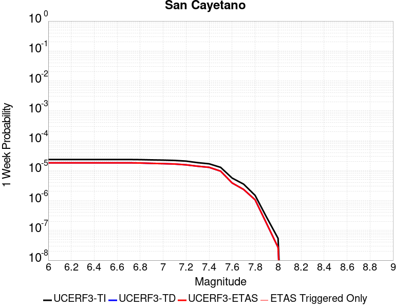 | 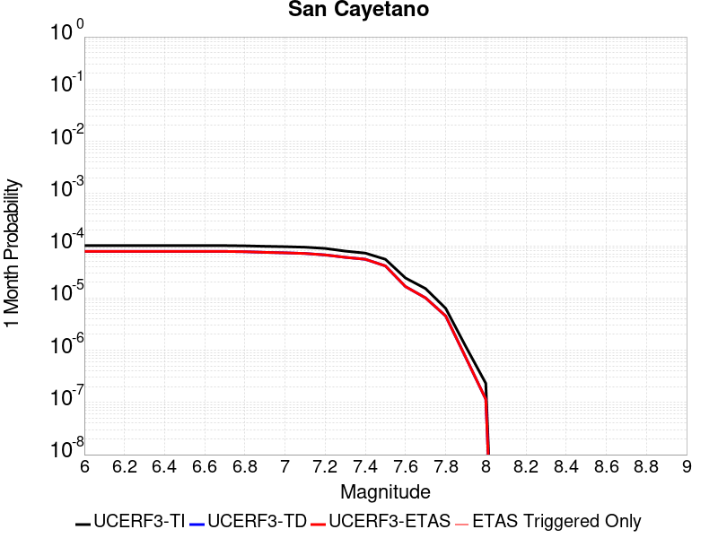 | 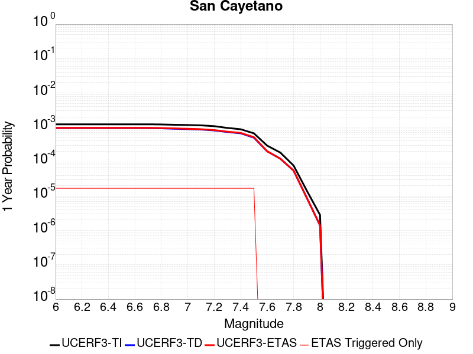 | 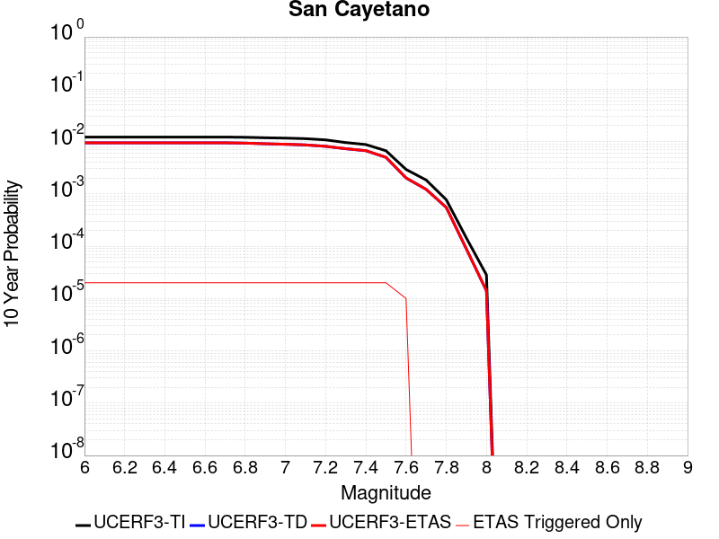 |

| Magnitude | 1 wk TI Prob | 1 wk TD Prob | 1 wk ETAS Prob | 1 wk ETAS/TD Gain | 1 wk ETAS Triggered Only | 1 mo TI Prob | 1 mo TD Prob | 1 mo ETAS Prob | 1 mo ETAS/TD Gain | 1 mo ETAS Triggered Only | 1 yr TI Prob | 1 yr TD Prob | 1 yr ETAS Prob | 1 yr ETAS/TD Gain | 1 yr ETAS Triggered Only | 10 yr TI Prob | 10 yr TD Prob | 10 yr ETAS Prob | 10 yr ETAS/TD Gain | 10 yr ETAS Triggered Only |
|-----|-----|-----|-----|-----|-----|-----|-----|-----|-----|-----|-----|-----|-----|-----|-----|-----|-----|-----|-----|-----|
| 6.0 | 2.3476267E-5 | 1.816963E-5 | 1.816963E-5 | 1.0 | 0.0 | 1.0060869E-4 | 7.786754E-5 | 7.786754E-5 | 1.0 | 0.0 | 0.0012242225 | 9.4762864E-4 | 9.644477E-4 | 1.0177486 | 1.6835016E-5 | 0.012175002 | 0.009436766 | 0.009470118 | 1.0035343 | 3.3670032E-5 |
| 6.1 | 2.3476267E-5 | 1.816963E-5 | 1.816963E-5 | 1.0 | 0.0 | 1.0060869E-4 | 7.786754E-5 | 7.786754E-5 | 1.0 | 0.0 | 0.0012242225 | 9.4762864E-4 | 9.644477E-4 | 1.0177486 | 1.6835016E-5 | 0.012175002 | 0.009436766 | 0.009470118 | 1.0035343 | 3.3670032E-5 |
| 6.2 | 2.3476267E-5 | 1.816963E-5 | 1.816963E-5 | 1.0 | 0.0 | 1.0060869E-4 | 7.786754E-5 | 7.786754E-5 | 1.0 | 0.0 | 0.0012242225 | 9.4762864E-4 | 9.644477E-4 | 1.0177486 | 1.6835016E-5 | 0.012175002 | 0.009436766 | 0.009470118 | 1.0035343 | 3.3670032E-5 |
| 6.3 | 2.3476267E-5 | 1.816963E-5 | 1.816963E-5 | 1.0 | 0.0 | 1.0060869E-4 | 7.786754E-5 | 7.786754E-5 | 1.0 | 0.0 | 0.0012242225 | 9.4762864E-4 | 9.644477E-4 | 1.0177486 | 1.6835016E-5 | 0.012175002 | 0.009436766 | 0.009470118 | 1.0035343 | 3.3670032E-5 |
| 6.4 | 2.3476267E-5 | 1.816963E-5 | 1.816963E-5 | 1.0 | 0.0 | 1.0060869E-4 | 7.786754E-5 | 7.786754E-5 | 1.0 | 0.0 | 0.0012242225 | 9.4762864E-4 | 9.644477E-4 | 1.0177486 | 1.6835016E-5 | 0.012175002 | 0.009436766 | 0.009470118 | 1.0035343 | 3.3670032E-5 |
| 6.5 | 2.3476267E-5 | 1.816963E-5 | 1.816963E-5 | 1.0 | 0.0 | 1.0060869E-4 | 7.786754E-5 | 7.786754E-5 | 1.0 | 0.0 | 0.0012242225 | 9.4762864E-4 | 9.644477E-4 | 1.0177486 | 1.6835016E-5 | 0.012175002 | 0.009436766 | 0.009470118 | 1.0035343 | 3.3670032E-5 |
| 6.6 | 2.3476267E-5 | 1.816963E-5 | 1.816963E-5 | 1.0 | 0.0 | 1.0060869E-4 | 7.786754E-5 | 7.786754E-5 | 1.0 | 0.0 | 0.0012242225 | 9.4762864E-4 | 9.644477E-4 | 1.0177486 | 1.6835016E-5 | 0.012175002 | 0.009436766 | 0.009470118 | 1.0035343 | 3.3670032E-5 |
| 6.7 | 2.3476267E-5 | 1.816963E-5 | 1.816963E-5 | 1.0 | 0.0 | 1.0060869E-4 | 7.786754E-5 | 7.786754E-5 | 1.0 | 0.0 | 0.0012242225 | 9.4762864E-4 | 9.644477E-4 | 1.0177486 | 1.6835016E-5 | 0.012175002 | 0.009436766 | 0.009470118 | 1.0035343 | 3.3670032E-5 |
| 6.8 | 2.3241924E-5 | 1.7937333E-5 | 1.7937333E-5 | 1.0 | 0.0 | 9.960445E-5 | 7.6872035E-5 | 7.6872035E-5 | 1.0 | 0.0 | 0.0012120095 | 9.3551876E-4 | 9.5233804E-4 | 1.0179785 | 1.6835016E-5 | 0.012054204 | 0.00931666 | 0.009350017 | 1.0035803 | 3.3670032E-5 |
| 6.9 | 2.2761007E-5 | 1.7432758E-5 | 1.7432758E-5 | 1.0 | 0.0 | 9.7543525E-5 | 7.47097E-5 | 7.47097E-5 | 1.0 | 0.0 | 0.0011869454 | 9.092145E-4 | 9.260342E-4 | 1.0184991 | 1.6835016E-5 | 0.011806256 | 0.009055776 | 0.009089141 | 1.0036844 | 3.3670032E-5 |
| 7.0 | 2.240283E-5 | 1.7066497E-5 | 1.7066497E-5 | 1.0 | 0.0 | 9.600859E-5 | 7.3140094E-5 | 7.3140094E-5 | 1.0 | 0.0 | 0.0011682777 | 8.901203E-4 | 9.069403E-4 | 1.0188963 | 1.6835016E-5 | 0.011621549 | 0.008866365 | 0.008899736 | 1.0037638 | 3.3670032E-5 |
| 7.1 | 2.1871154E-5 | 1.6586335E-5 | 1.6586335E-5 | 1.0 | 0.0 | 9.373015E-5 | 7.108237E-5 | 7.108237E-5 | 1.0 | 0.0 | 0.0011405671 | 8.650876E-4 | 8.819081E-4 | 1.0194436 | 1.6835016E-5 | 0.011347309 | 0.008618002 | 0.008651382 | 1.0038732 | 3.3670032E-5 |
| 7.2 | 2.0714133E-5 | 1.5564854E-5 | 1.5564854E-5 | 1.0 | 0.0 | 8.8771834E-5 | 6.670483E-5 | 6.670483E-5 | 1.0 | 0.0 | 0.0010802611 | 8.1183197E-4 | 8.2865334E-4 | 1.0207202 | 1.6835016E-5 | 0.010750249 | 0.008089437 | 0.008122835 | 1.0041286 | 3.3670032E-5 |
| 7.3 | 1.8408395E-5 | 1.3997111E-5 | 1.3997111E-5 | 1.0 | 0.0 | 7.8890735E-5 | 5.9986254E-5 | 5.9986254E-5 | 1.0 | 0.0 | 9.600714E-4 | 7.3009095E-4 | 7.4691366E-4 | 1.023042 | 1.6835016E-5 | 0.009559342 | 0.007277643 | 0.007311068 | 1.0045928 | 3.3670032E-5 |
| 7.4 | 1.6856795E-5 | 1.28503E-5 | 1.28503E-5 | 1.0 | 0.0 | 7.2241404E-5 | 5.5071567E-5 | 5.5071567E-5 | 1.0 | 0.0 | 8.7918417E-4 | 6.702929E-4 | 6.8711664E-4 | 1.025099 | 1.6835016E-5 | 0.00875714 | 0.0066833915 | 0.0067168367 | 1.0050042 | 3.3670032E-5 |
| 7.5 | 1.2822778E-5 | 9.577698E-6 | 9.577698E-6 | 1.0 | 0.0 | 5.495361E-5 | 4.104664E-5 | 4.104664E-5 | 1.0 | 0.0 | 6.688548E-4 | 4.996298E-4 | 5.1645644E-4 | 1.0336782 | 1.6835016E-5 | 0.006668452 | 0.0049852366 | 0.0050187386 | 1.0067203 | 3.3670032E-5 |
| 7.6 | 5.6272684E-6 | 3.8549683E-6 | 3.8549683E-6 | 1.0 | 0.0 | 2.4116642E-5 | 1.6521188E-5 | 1.6521188E-5 | 1.0 | 0.0 | 2.9358055E-4 | 2.01127E-4 | 2.01127E-4 | 1.0 | 0.0 | 0.0029319301 | 0.0020094607 | 0.0020262618 | 1.0083611 | 1.6835016E-5 |
| 7.7 | 3.5261346E-6 | 2.340742E-6 | 2.340742E-6 | 1.0 | 0.0 | 1.5111918E-5 | 1.0031713E-5 | 1.0031713E-5 | 1.0 | 0.0 | 1.8397206E-4 | 1.2212934E-4 | 1.2212934E-4 | 1.0 | 0.0 | 0.0018381984 | 0.0012206296 | 0.0012206296 | 1.0 | 0.0 |
| 7.8 | 1.4826929E-6 | 1.0564453E-6 | 1.0564453E-6 | 1.0 | 0.0 | 6.354383E-6 | 4.5276147E-6 | 4.5276147E-6 | 1.0 | 0.0 | 7.736187E-5 | 5.512234E-5 | 5.512234E-5 | 1.0 | 0.0 | 7.733494E-4 | 5.5108865E-4 | 5.5108865E-4 | 1.0 | 0.0 |
| 7.9 | 2.7568166E-7 | 1.6978672E-7 | 1.6978672E-7 | 1.0 | 0.0 | 1.1814923E-6 | 7.2765715E-7 | 7.2765715E-7 | 1.0 | 0.0 | 1.4384574E-5 | 8.85919E-6 | 8.85919E-6 | 1.0 | 0.0 | 1.4383643E-4 | 8.85884E-5 | 8.85884E-5 | 1.0 | 0.0 |
| 8.0 | 5.407832E-8 | 2.6889136E-8 | 2.6889136E-8 | 1.0 | 0.0 | 2.3176422E-7 | 1.15239146E-7 | 1.15239146E-7 | 1.0 | 0.0 | 2.8217257E-6 | 1.4030358E-6 | 1.4030358E-6 | 1.0 | 0.0 | 2.8216898E-5 | 1.4030274E-5 | 1.4030274E-5 | 1.0 | 0.0 |

## Holser alt 1
*[(top)](#table-of-contents)*

| 1 Week | 1 Month | 1 Year | 10 Year |
|-----|-----|-----|-----|
| 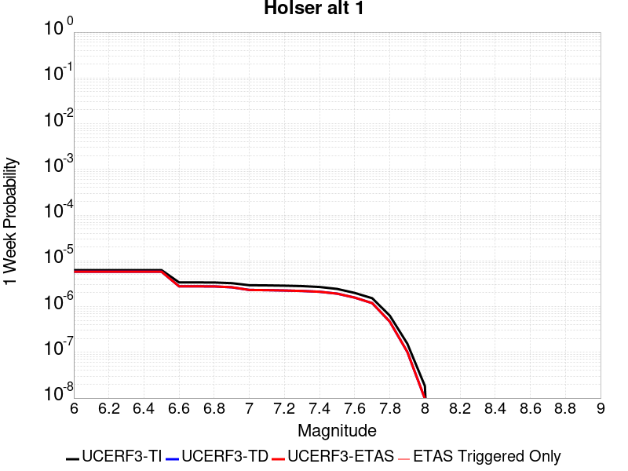 | 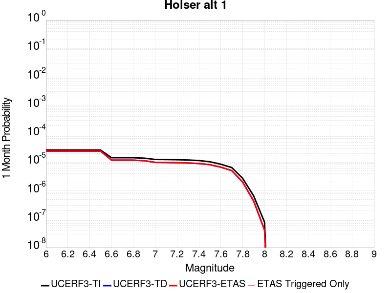 | 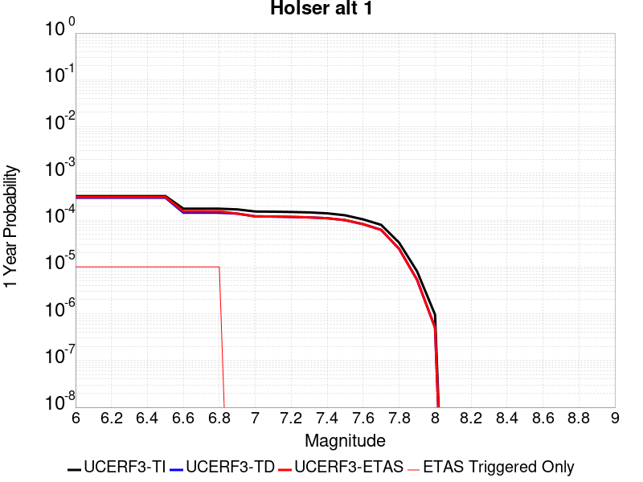 | 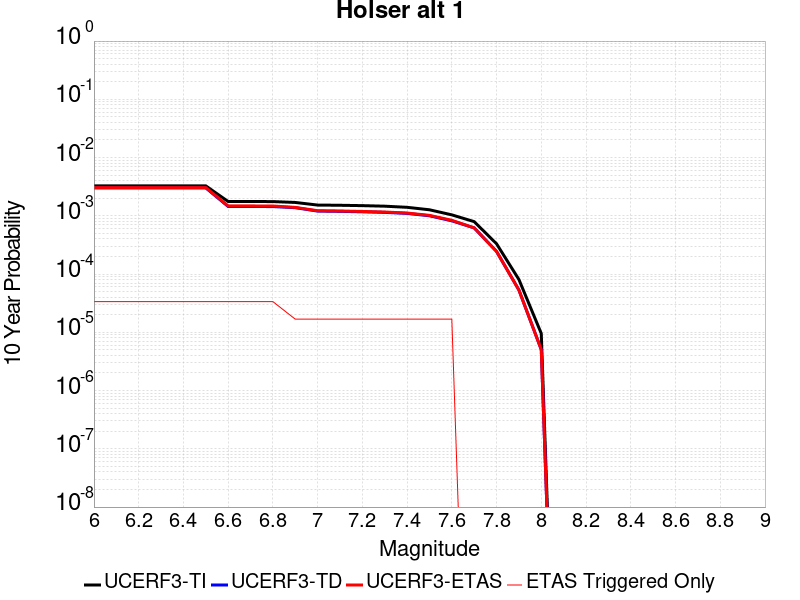 |

| Magnitude | 1 wk TI Prob | 1 wk TD Prob | 1 wk ETAS Prob | 1 wk ETAS/TD Gain | 1 wk ETAS Triggered Only | 1 mo TI Prob | 1 mo TD Prob | 1 mo ETAS Prob | 1 mo ETAS/TD Gain | 1 mo ETAS Triggered Only | 1 yr TI Prob | 1 yr TD Prob | 1 yr ETAS Prob | 1 yr ETAS/TD Gain | 1 yr ETAS Triggered Only | 10 yr TI Prob | 10 yr TD Prob | 10 yr ETAS Prob | 10 yr ETAS/TD Gain | 10 yr ETAS Triggered Only |
|-----|-----|-----|-----|-----|-----|-----|-----|-----|-----|-----|-----|-----|-----|-----|-----|-----|-----|-----|-----|-----|
| 6.0 | 6.2746653E-6 | 5.790017E-6 | 5.790017E-6 | 1.0 | 0.0 | 2.6891146E-5 | 2.4814188E-5 | 2.4814188E-5 | 1.0 | 0.0 | 3.273505E-4 | 3.020824E-4 | 3.1891232E-4 | 1.055713 | 1.6835016E-5 | 0.0032686873 | 0.0030178505 | 0.0030514188 | 1.0111233 | 3.3670032E-5 |
| 6.1 | 6.2746653E-6 | 5.790017E-6 | 5.790017E-6 | 1.0 | 0.0 | 2.6891146E-5 | 2.4814188E-5 | 2.4814188E-5 | 1.0 | 0.0 | 3.273505E-4 | 3.020824E-4 | 3.1891232E-4 | 1.055713 | 1.6835016E-5 | 0.0032686873 | 0.0030178505 | 0.0030514188 | 1.0111233 | 3.3670032E-5 |
| 6.2 | 6.2746653E-6 | 5.790017E-6 | 5.790017E-6 | 1.0 | 0.0 | 2.6891146E-5 | 2.4814188E-5 | 2.4814188E-5 | 1.0 | 0.0 | 3.273505E-4 | 3.020824E-4 | 3.1891232E-4 | 1.055713 | 1.6835016E-5 | 0.0032686873 | 0.0030178505 | 0.0030514188 | 1.0111233 | 3.3670032E-5 |
| 6.3 | 6.2746653E-6 | 5.790017E-6 | 5.790017E-6 | 1.0 | 0.0 | 2.6891146E-5 | 2.4814188E-5 | 2.4814188E-5 | 1.0 | 0.0 | 3.273505E-4 | 3.020824E-4 | 3.1891232E-4 | 1.055713 | 1.6835016E-5 | 0.0032686873 | 0.0030178505 | 0.0030514188 | 1.0111233 | 3.3670032E-5 |
| 6.4 | 6.2746653E-6 | 5.790017E-6 | 5.790017E-6 | 1.0 | 0.0 | 2.6891146E-5 | 2.4814188E-5 | 2.4814188E-5 | 1.0 | 0.0 | 3.273505E-4 | 3.020824E-4 | 3.1891232E-4 | 1.055713 | 1.6835016E-5 | 0.0032686873 | 0.0030178505 | 0.0030514188 | 1.0111233 | 3.3670032E-5 |
| 6.5 | 6.2746653E-6 | 5.790017E-6 | 5.790017E-6 | 1.0 | 0.0 | 2.6891146E-5 | 2.4814188E-5 | 2.4814188E-5 | 1.0 | 0.0 | 3.273505E-4 | 3.020824E-4 | 3.1891232E-4 | 1.055713 | 1.6835016E-5 | 0.0032686873 | 0.0030178505 | 0.0030514188 | 1.0111233 | 3.3670032E-5 |
| 6.6 | 3.375825E-6 | 2.7712251E-6 | 2.7712251E-6 | 1.0 | 0.0 | 1.4467741E-5 | 1.1876626E-5 | 1.1876626E-5 | 1.0 | 0.0 | 1.761305E-4 | 1.4458848E-4 | 1.6142108E-4 | 1.1164172 | 1.6835016E-5 | 0.0017599097 | 0.0014449612 | 0.0014785825 | 1.023268 | 3.3670032E-5 |
| 6.7 | 3.375825E-6 | 2.7712251E-6 | 2.7712251E-6 | 1.0 | 0.0 | 1.4467741E-5 | 1.1876626E-5 | 1.1876626E-5 | 1.0 | 0.0 | 1.761305E-4 | 1.4458848E-4 | 1.6142108E-4 | 1.1164172 | 1.6835016E-5 | 0.0017599097 | 0.0014449612 | 0.0014785825 | 1.023268 | 3.3670032E-5 |
| 6.8 | 3.366533E-6 | 2.7616245E-6 | 2.7616245E-6 | 1.0 | 0.0 | 1.4427919E-5 | 1.1835481E-5 | 1.1835481E-5 | 1.0 | 0.0 | 1.7564575E-4 | 1.4408762E-4 | 1.6092022E-4 | 1.1168219 | 1.6835016E-5 | 0.0017550698 | 0.0014399589 | 0.0014735805 | 1.0233489 | 3.3670032E-5 |
| 6.9 | 3.253174E-6 | 2.643846E-6 | 2.643846E-6 | 1.0 | 0.0 | 1.39421E-5 | 1.1330721E-5 | 1.1330721E-5 | 1.0 | 0.0 | 1.6973184E-4 | 1.3794295E-4 | 1.3794295E-4 | 1.0 | 0.0 | 0.0016960226 | 0.0013785891 | 0.001395401 | 1.012195 | 1.6835016E-5 |
| 7.0 | 2.9336593E-6 | 2.311832E-6 | 2.311832E-6 | 1.0 | 0.0 | 1.2572766E-5 | 9.907814E-6 | 9.907814E-6 | 1.0 | 0.0 | 1.5306266E-4 | 1.20620985E-4 | 1.20620985E-4 | 1.0 | 0.0 | 0.0015295728 | 0.0012055576 | 0.0012223724 | 1.0139477 | 1.6835016E-5 |
| 7.1 | 2.9087812E-6 | 2.287684E-6 | 2.287684E-6 | 1.0 | 0.0 | 1.2466146E-5 | 9.804324E-6 | 9.804324E-6 | 1.0 | 0.0 | 1.5176475E-4 | 1.19361124E-4 | 1.19361124E-4 | 1.0 | 0.0 | 0.0015166114 | 0.0011929726 | 0.0012097876 | 1.014095 | 1.6835016E-5 |
| 7.2 | 2.8674524E-6 | 2.247575E-6 | 2.247575E-6 | 1.0 | 0.0 | 1.2289024E-5 | 9.632428E-6 | 9.632428E-6 | 1.0 | 0.0 | 1.4960859E-4 | 1.1726853E-4 | 1.1726853E-4 | 1.0 | 0.0 | 0.0014950791 | 0.0011720689 | 0.0011888841 | 1.0143467 | 1.6835016E-5 |
| 7.3 | 2.8057775E-6 | 2.1954638E-6 | 2.1954638E-6 | 1.0 | 0.0 | 1.2024705E-5 | 9.409097E-6 | 9.409097E-6 | 1.0 | 0.0 | 1.4639096E-4 | 1.1454976E-4 | 1.1454976E-4 | 1.0 | 0.0 | 0.0014629456 | 0.0011449094 | 0.0011617251 | 1.0146874 | 1.6835016E-5 |
| 7.4 | 2.683666E-6 | 2.10926E-6 | 2.10926E-6 | 1.0 | 0.0 | 1.1501375E-5 | 9.039655E-6 | 9.039655E-6 | 1.0 | 0.0 | 1.4002025E-4 | 1.1005226E-4 | 1.1005226E-4 | 1.0 | 0.0 | 0.0013993206 | 0.0010999797 | 0.0011167963 | 1.015288 | 1.6835016E-5 |
| 7.5 | 2.434495E-6 | 1.9195622E-6 | 1.9195622E-6 | 1.0 | 0.0 | 1.0433508E-5 | 8.22667E-6 | 8.22667E-6 | 1.0 | 0.0 | 1.2702055E-4 | 1.0015511E-4 | 1.0015511E-4 | 1.0 | 0.0 | 0.0012694797 | 0.0010011018 | 0.00101792 | 1.0167997 | 1.6835016E-5 |
| 7.6 | 1.9914562E-6 | 1.5731666E-6 | 1.5731666E-6 | 1.0 | 0.0 | 8.534785E-6 | 6.7421256E-6 | 6.7421256E-6 | 1.0 | 0.0 | 1.03906044E-4 | 8.20823E-5 | 8.20823E-5 | 1.0 | 0.0 | 0.0010385747 | 8.205214E-4 | 8.373426E-4 | 1.0205007 | 1.6835016E-5 |
| 7.7 | 1.5229501E-6 | 1.1896215E-6 | 1.1896215E-6 | 1.0 | 0.0 | 6.526913E-6 | 5.0983676E-6 | 5.0983676E-6 | 1.0 | 0.0 | 7.946226E-5 | 6.207087E-5 | 6.207087E-5 | 1.0 | 0.0 | 7.943385E-4 | 6.205366E-4 | 6.205366E-4 | 1.0 | 0.0 |
| 7.8 | 6.3489426E-7 | 4.6878762E-7 | 4.6878762E-7 | 1.0 | 0.0 | 2.7209726E-6 | 2.0090881E-6 | 2.0090881E-6 | 1.0 | 0.0 | 3.312734E-5 | 2.4460376E-5 | 2.4460376E-5 | 1.0 | 0.0 | 3.31224E-4 | 2.44577E-4 | 2.44577E-4 | 1.0 | 0.0 |
| 7.9 | 1.5459432E-7 | 1.0194E-7 | 1.0194E-7 | 1.0 | 0.0 | 6.6254694E-7 | 4.3688564E-7 | 4.3688564E-7 | 1.0 | 0.0 | 8.066479E-6 | 5.31907E-6 | 5.31907E-6 | 1.0 | 0.0 | 8.066186E-5 | 5.3189444E-5 | 5.3189444E-5 | 1.0 | 0.0 |
| 8.0 | 1.8307812E-8 | 9.69079E-9 | 9.69079E-9 | 1.0 | 0.0 | 7.846205E-8 | 4.1531962E-8 | 4.1531962E-8 | 1.0 | 0.0 | 9.55275E-7 | 5.056515E-7 | 5.056515E-7 | 1.0 | 0.0 | 9.552709E-6 | 5.056504E-6 | 5.056504E-6 | 1.0 | 0.0 |

## Great Valley 05 Pittsburg - Kirby Hills alt1
*[(top)](#table-of-contents)*

| 1 Week | 1 Month | 1 Year | 10 Year |
|-----|-----|-----|-----|
| 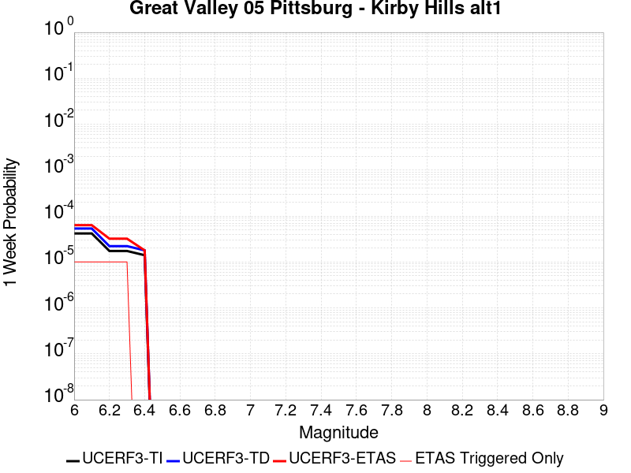 | 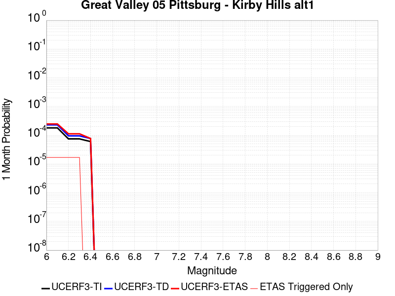 | 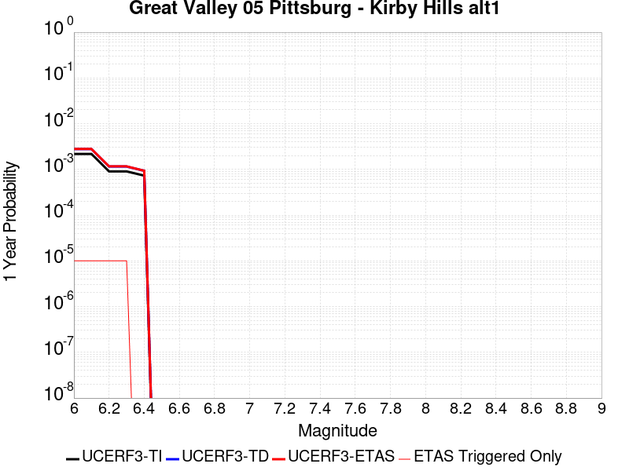 | 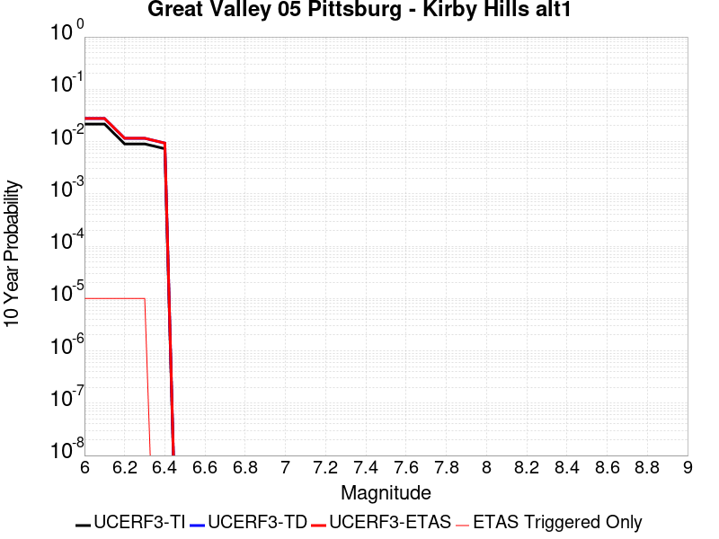 |

| Magnitude | 1 wk TI Prob | 1 wk TD Prob | 1 wk ETAS Prob | 1 wk ETAS/TD Gain | 1 wk ETAS Triggered Only | 1 mo TI Prob | 1 mo TD Prob | 1 mo ETAS Prob | 1 mo ETAS/TD Gain | 1 mo ETAS Triggered Only | 1 yr TI Prob | 1 yr TD Prob | 1 yr ETAS Prob | 1 yr ETAS/TD Gain | 1 yr ETAS Triggered Only | 10 yr TI Prob | 10 yr TD Prob | 10 yr ETAS Prob | 10 yr ETAS/TD Gain | 10 yr ETAS Triggered Only |
|-----|-----|-----|-----|-----|-----|-----|-----|-----|-----|-----|-----|-----|-----|-----|-----|-----|-----|-----|-----|-----|
| 6.0 | 4.187212E-5 | 5.3444037E-5 | 7.0278154E-5 | 1.3149859 | 1.6835016E-5 | 1.794396E-4 | 2.2903152E-4 | 2.4586267E-4 | 1.0734884 | 1.6835016E-5 | 0.002182488 | 0.0027858876 | 0.0028026756 | 1.0060261 | 1.6835016E-5 | 0.021611776 | 0.027604017 | 0.027620388 | 1.0005931 | 1.6835016E-5 |
| 6.1 | 4.187212E-5 | 5.3444037E-5 | 7.0278154E-5 | 1.3149859 | 1.6835016E-5 | 1.794396E-4 | 2.2903152E-4 | 2.4586267E-4 | 1.0734884 | 1.6835016E-5 | 0.002182488 | 0.0027858876 | 0.0028026756 | 1.0060261 | 1.6835016E-5 | 0.021611776 | 0.027604017 | 0.027620388 | 1.0005931 | 1.6835016E-5 |
| 6.2 | 1.7353306E-5 | 2.2155189E-5 | 3.8989834E-5 | 1.7598511 | 1.6835016E-5 | 7.436919E-5 | 9.4949675E-5 | 1.1178309E-4 | 1.1772878 | 1.6835016E-5 | 9.050688E-4 | 0.0011557965 | 0.001172612 | 1.0145489 | 1.6835016E-5 | 0.009013915 | 0.011535524 | 0.011552165 | 1.0014426 | 1.6835016E-5 |
| 6.3 | 1.7353306E-5 | 2.2155189E-5 | 3.8989834E-5 | 1.7598511 | 1.6835016E-5 | 7.436919E-5 | 9.4949675E-5 | 1.1178309E-4 | 1.1772878 | 1.6835016E-5 | 9.050688E-4 | 0.0011557965 | 0.001172612 | 1.0145489 | 1.6835016E-5 | 0.009013915 | 0.011535524 | 0.011552165 | 1.0014426 | 1.6835016E-5 |
| 6.4 | 1.4028824E-5 | 1.7901253E-5 | 1.7901253E-5 | 1.0 | 0.0 | 6.0122147E-5 | 7.6719654E-5 | 7.6719654E-5 | 1.0 | 0.0 | 7.3174125E-4 | 9.3406177E-4 | 9.3406177E-4 | 1.0 | 0.0 | 0.0072933645 | 0.00933847 | 0.00933847 | 1.0 | 0.0 |

## San Gabriel (Extension)
*[(top)](#table-of-contents)*

| 1 Week | 1 Month | 1 Year | 10 Year |
|-----|-----|-----|-----|
|  | 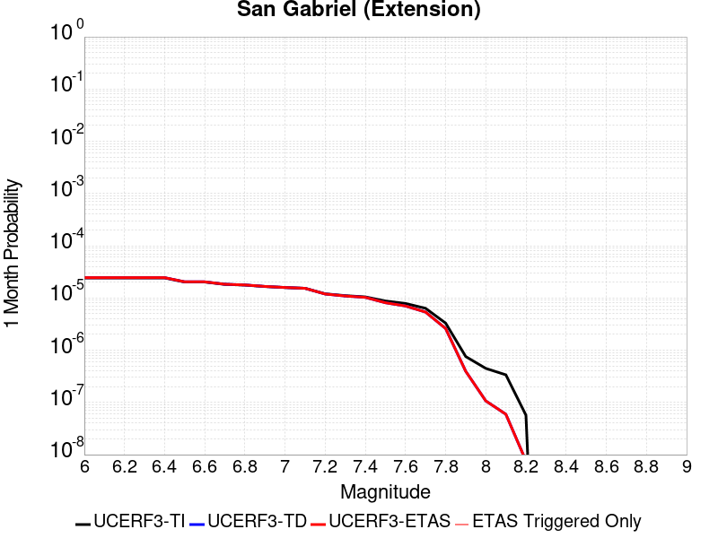 | 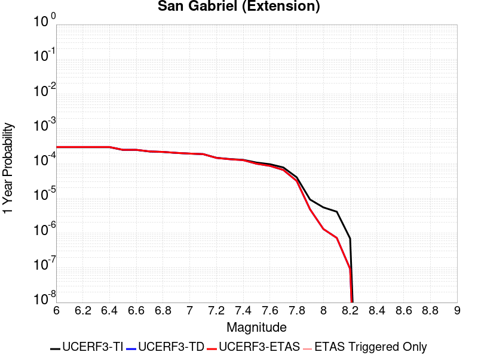 | 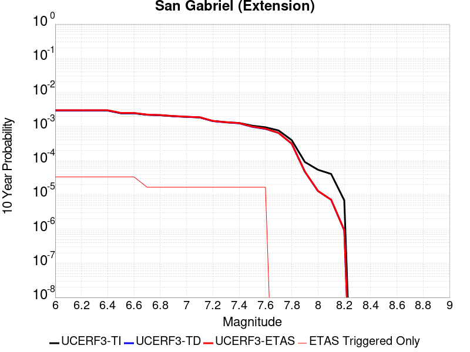 |

| Magnitude | 1 wk TI Prob | 1 wk TD Prob | 1 wk ETAS Prob | 1 wk ETAS/TD Gain | 1 wk ETAS Triggered Only | 1 mo TI Prob | 1 mo TD Prob | 1 mo ETAS Prob | 1 mo ETAS/TD Gain | 1 mo ETAS Triggered Only | 1 yr TI Prob | 1 yr TD Prob | 1 yr ETAS Prob | 1 yr ETAS/TD Gain | 1 yr ETAS Triggered Only | 10 yr TI Prob | 10 yr TD Prob | 10 yr ETAS Prob | 10 yr ETAS/TD Gain | 10 yr ETAS Triggered Only |
|-----|-----|-----|-----|-----|-----|-----|-----|-----|-----|-----|-----|-----|-----|-----|-----|-----|-----|-----|-----|-----|
| 6.0 | 5.6486106E-6 | 5.7171446E-6 | 5.7171446E-6 | 1.0 | 0.0 | 2.4208108E-5 | 2.4501825E-5 | 2.4501825E-5 | 1.0 | 0.0 | 2.9469383E-4 | 2.9827014E-4 | 2.9827014E-4 | 1.0 | 0.0 | 0.0029430336 | 0.0029788287 | 0.0030123985 | 1.0112695 | 3.3670032E-5 |
| 6.1 | 5.6486106E-6 | 5.7171446E-6 | 5.7171446E-6 | 1.0 | 0.0 | 2.4208108E-5 | 2.4501825E-5 | 2.4501825E-5 | 1.0 | 0.0 | 2.9469383E-4 | 2.9827014E-4 | 2.9827014E-4 | 1.0 | 0.0 | 0.0029430336 | 0.0029788287 | 0.0030123985 | 1.0112695 | 3.3670032E-5 |
| 6.2 | 5.6486106E-6 | 5.7171446E-6 | 5.7171446E-6 | 1.0 | 0.0 | 2.4208108E-5 | 2.4501825E-5 | 2.4501825E-5 | 1.0 | 0.0 | 2.9469383E-4 | 2.9827014E-4 | 2.9827014E-4 | 1.0 | 0.0 | 0.0029430336 | 0.0029788287 | 0.0030123985 | 1.0112695 | 3.3670032E-5 |
| 6.3 | 5.6486106E-6 | 5.7171446E-6 | 5.7171446E-6 | 1.0 | 0.0 | 2.4208108E-5 | 2.4501825E-5 | 2.4501825E-5 | 1.0 | 0.0 | 2.9469383E-4 | 2.9827014E-4 | 2.9827014E-4 | 1.0 | 0.0 | 0.0029430336 | 0.0029788287 | 0.0030123985 | 1.0112695 | 3.3670032E-5 |
| 6.4 | 5.6486106E-6 | 5.7171446E-6 | 5.7171446E-6 | 1.0 | 0.0 | 2.4208108E-5 | 2.4501825E-5 | 2.4501825E-5 | 1.0 | 0.0 | 2.9469383E-4 | 2.9827014E-4 | 2.9827014E-4 | 1.0 | 0.0 | 0.0029430336 | 0.0029788287 | 0.0030123985 | 1.0112695 | 3.3670032E-5 |
| 6.5 | 4.7134554E-6 | 4.754565E-6 | 4.754565E-6 | 1.0 | 0.0 | 2.0200367E-5 | 2.0376552E-5 | 2.0376552E-5 | 1.0 | 0.0 | 2.459117E-4 | 2.4805713E-4 | 2.4805713E-4 | 1.0 | 0.0 | 0.0024563975 | 0.0024778906 | 0.0025114773 | 1.0135546 | 3.3670032E-5 |
| 6.6 | 4.7134554E-6 | 4.754565E-6 | 4.754565E-6 | 1.0 | 0.0 | 2.0200367E-5 | 2.0376552E-5 | 2.0376552E-5 | 1.0 | 0.0 | 2.459117E-4 | 2.4805713E-4 | 2.4805713E-4 | 1.0 | 0.0 | 0.0024563975 | 0.0024778906 | 0.0025114773 | 1.0135546 | 3.3670032E-5 |
| 6.7 | 4.2468837E-6 | 4.2743804E-6 | 4.2743804E-6 | 1.0 | 0.0 | 1.8200803E-5 | 1.8318648E-5 | 1.8318648E-5 | 1.0 | 0.0 | 2.2157225E-4 | 2.2300745E-4 | 2.2300745E-4 | 1.0 | 0.0 | 0.0022135144 | 0.0022279124 | 0.00224471 | 1.0075396 | 1.6835016E-5 |
| 6.8 | 4.1180615E-6 | 4.1417693E-6 | 4.1417693E-6 | 1.0 | 0.0 | 1.7648716E-5 | 1.7750324E-5 | 1.7750324E-5 | 1.0 | 0.0 | 2.1485193E-4 | 2.1608948E-4 | 2.1608948E-4 | 1.0 | 0.0 | 0.0021464431 | 0.0021588686 | 0.0021756673 | 1.0077813 | 1.6835016E-5 |
| 6.9 | 3.863861E-6 | 3.8800836E-6 | 3.8800836E-6 | 1.0 | 0.0 | 1.65593E-5 | 1.6628828E-5 | 1.6628828E-5 | 1.0 | 0.0 | 2.0159081E-4 | 2.0243786E-4 | 2.0243786E-4 | 1.0 | 0.0 | 0.0020140803 | 0.0020226059 | 0.002039407 | 1.0083066 | 1.6835016E-5 |
| 7.0 | 3.6947372E-6 | 3.7059822E-6 | 3.7059822E-6 | 1.0 | 0.0 | 1.5834492E-5 | 1.5882688E-5 | 1.5882688E-5 | 1.0 | 0.0 | 1.9276788E-4 | 1.9335524E-4 | 1.9335524E-4 | 1.0 | 0.0 | 0.0019260074 | 0.0019319403 | 0.0019487428 | 1.0086972 | 1.6835016E-5 |
| 7.1 | 3.5686835E-6 | 3.5732016E-6 | 3.5732016E-6 | 1.0 | 0.0 | 1.5294268E-5 | 1.5313635E-5 | 1.5313635E-5 | 1.0 | 0.0 | 1.861918E-4 | 1.8642822E-4 | 1.8642822E-4 | 1.0 | 0.0 | 0.0018603588 | 0.0018627879 | 0.0018795916 | 1.0090207 | 1.6835016E-5 |
| 7.2 | 2.8023446E-6 | 2.7770893E-6 | 2.7770893E-6 | 1.0 | 0.0 | 1.2009994E-5 | 1.1901758E-5 | 1.1901758E-5 | 1.0 | 0.0 | 1.4621185E-4 | 1.4489438E-4 | 1.4489438E-4 | 1.0 | 0.0 | 0.001461157 | 0.0014480136 | 0.0014648243 | 1.0116094 | 1.6835016E-5 |
| 7.3 | 2.5843012E-6 | 2.546262E-6 | 2.546262E-6 | 1.0 | 0.0 | 1.1075529E-5 | 1.0912507E-5 | 1.0912507E-5 | 1.0 | 0.0 | 1.3483623E-4 | 1.3285177E-4 | 1.3285177E-4 | 1.0 | 0.0 | 0.0013475444 | 0.001327737 | 0.0013445497 | 1.0126626 | 1.6835016E-5 |
| 7.4 | 2.4464468E-6 | 2.3969585E-6 | 2.3969585E-6 | 1.0 | 0.0 | 1.04847295E-5 | 1.027264E-5 | 1.027264E-5 | 1.0 | 0.0 | 1.276441E-4 | 1.250623E-4 | 1.250623E-4 | 1.0 | 0.0 | 0.0012757082 | 0.0012499326 | 0.0012667465 | 1.0134519 | 1.6835016E-5 |
| 7.5 | 2.0420266E-6 | 1.8913017E-6 | 1.8913017E-6 | 1.0 | 0.0 | 8.751514E-6 | 8.105554E-6 | 8.105554E-6 | 1.0 | 0.0 | 1.0654447E-4 | 9.8680684E-5 | 9.8680684E-5 | 1.0 | 0.0 | 0.001064934 | 9.863758E-4 | 0.0010031943 | 1.0170507 | 1.6835016E-5 |
| 7.6 | 1.8326596E-6 | 1.640076E-6 | 1.640076E-6 | 1.0 | 0.0 | 7.854232E-6 | 7.0288784E-6 | 7.0288784E-6 | 1.0 | 0.0 | 9.562107E-5 | 8.557326E-5 | 8.557326E-5 | 1.0 | 0.0 | 9.5579936E-4 | 8.5540896E-4 | 8.722296E-4 | 1.0196638 | 1.6835016E-5 |
| 7.7 | 1.4786998E-6 | 1.2526061E-6 | 1.2526061E-6 | 1.0 | 0.0 | 6.3372695E-6 | 5.368301E-6 | 5.368301E-6 | 1.0 | 0.0 | 7.715353E-5 | 6.535712E-5 | 6.535712E-5 | 1.0 | 0.0 | 7.7126746E-4 | 6.533867E-4 | 6.533867E-4 | 1.0 | 0.0 |
| 7.8 | 7.6975533E-7 | 6.071264E-7 | 6.071264E-7 | 1.0 | 0.0 | 3.2989474E-6 | 2.601968E-6 | 2.601968E-6 | 1.0 | 0.0 | 4.0163945E-5 | 3.16785E-5 | 3.16785E-5 | 1.0 | 0.0 | 4.0156685E-4 | 3.1674592E-4 | 3.1674592E-4 | 1.0 | 0.0 |
| 7.9 | 1.7645915E-7 | 9.218553E-8 | 9.218553E-8 | 1.0 | 0.0 | 7.562533E-7 | 3.9508078E-7 | 3.9508078E-7 | 1.0 | 0.0 | 9.207345E-6 | 4.810098E-6 | 4.810098E-6 | 1.0 | 0.0 | 9.206964E-5 | 4.810463E-5 | 4.810463E-5 | 1.0 | 0.0 |
| 8.0 | 1.0463461E-7 | 2.4971815E-8 | 2.4971815E-8 | 1.0 | 0.0 | 4.4843398E-7 | 1.0702206E-7 | 1.0702206E-7 | 1.0 | 0.0 | 5.45967E-6 | 1.3029928E-6 | 1.3029928E-6 | 1.0 | 0.0 | 5.459536E-5 | 1.3034539E-5 | 1.3034539E-5 | 1.0 | 0.0 |
| 8.1 | 7.875717E-8 | 1.38816025E-8 | 1.38816025E-8 | 1.0 | 0.0 | 3.3753068E-7 | 5.949258E-8 | 5.949258E-8 | 1.0 | 0.0 | 4.109428E-6 | 7.243219E-7 | 7.243219E-7 | 1.0 | 0.0 | 4.109352E-5 | 7.247882E-6 | 7.247882E-6 | 1.0 | 0.0 |
| 8.2 | 1.33163E-8 | 1.7755355E-9 | 1.7755355E-9 | 1.0 | 0.0 | 5.7069855E-8 | 7.609438E-9 | 7.609438E-9 | 1.0 | 0.0 | 6.9482525E-7 | 9.26449E-8 | 9.26449E-8 | 1.0 | 0.0 | 6.9482307E-6 | 9.284174E-7 | 9.284174E-7 | 1.0 | 0.0 |

## Oceanic - West Huasna
*[(top)](#table-of-contents)*

| 1 Week | 1 Month | 1 Year | 10 Year |
|-----|-----|-----|-----|
|  | 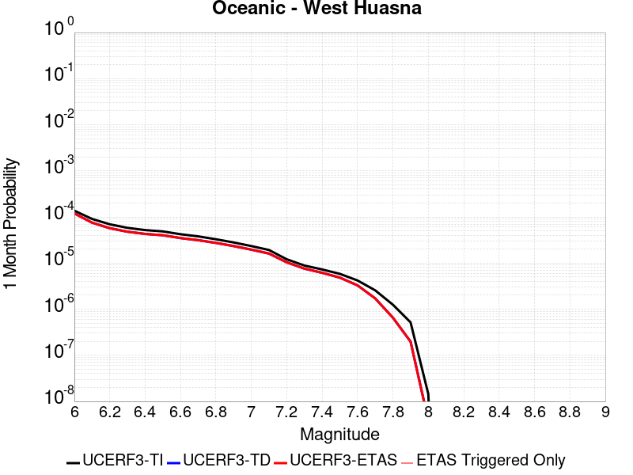 | 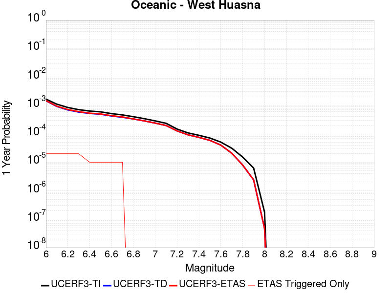 | 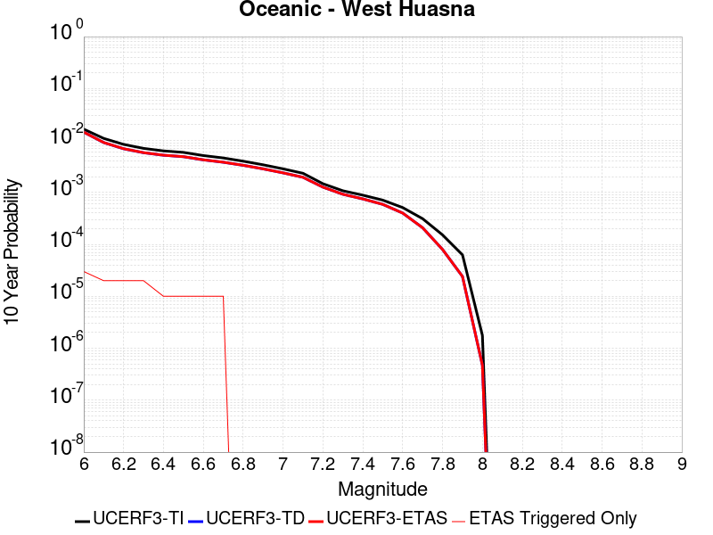 |

| Magnitude | 1 wk TI Prob | 1 wk TD Prob | 1 wk ETAS Prob | 1 wk ETAS/TD Gain | 1 wk ETAS Triggered Only | 1 mo TI Prob | 1 mo TD Prob | 1 mo ETAS Prob | 1 mo ETAS/TD Gain | 1 mo ETAS Triggered Only | 1 yr TI Prob | 1 yr TD Prob | 1 yr ETAS Prob | 1 yr ETAS/TD Gain | 1 yr ETAS Triggered Only | 10 yr TI Prob | 10 yr TD Prob | 10 yr ETAS Prob | 10 yr ETAS/TD Gain | 10 yr ETAS Triggered Only |
|-----|-----|-----|-----|-----|-----|-----|-----|-----|-----|-----|-----|-----|-----|-----|-----|-----|-----|-----|-----|-----|
| 6.0 | 3.195567E-5 | 2.7927153E-5 | 2.7927153E-5 | 1.0 | 0.0 | 1.3694567E-4 | 1.19682554E-4 | 1.19682554E-4 | 1.0 | 0.0 | 0.0016660384 | 0.0014562042 | 0.0014730147 | 1.0115441 | 1.6835016E-5 | 0.016536033 | 0.014471174 | 0.014504357 | 1.002293 | 3.3670032E-5 |
| 6.1 | 2.1156782E-5 | 1.7573653E-5 | 1.7573653E-5 | 1.0 | 0.0 | 9.066878E-5 | 7.531353E-5 | 7.531353E-5 | 1.0 | 0.0 | 0.0011033333 | 9.1656594E-4 | 9.333855E-4 | 1.0183506 | 1.6835016E-5 | 0.010978713 | 0.009128864 | 0.009145546 | 1.0018274 | 1.6835016E-5 |
| 6.2 | 1.6195117E-5 | 1.3327269E-5 | 1.3327269E-5 | 1.0 | 0.0 | 6.9405796E-5 | 5.711563E-5 | 5.711563E-5 | 1.0 | 0.0 | 8.44688E-4 | 6.951635E-4 | 7.1198685E-4 | 1.0242006 | 1.6835016E-5 | 0.008414844 | 0.006930183 | 0.006946902 | 1.0024124 | 1.6835016E-5 |
| 6.3 | 1.3559345E-5 | 1.1179233E-5 | 1.1179233E-5 | 1.0 | 0.0 | 5.811018E-5 | 4.7910125E-5 | 4.7910125E-5 | 1.0 | 0.0 | 7.072618E-4 | 5.831506E-4 | 5.999758E-4 | 1.0288522 | 1.6835016E-5 | 0.0070501505 | 0.0058163223 | 0.005833059 | 1.0028776 | 1.6835016E-5 |
| 6.4 | 1.2120619E-5 | 1.0001056E-5 | 1.0001056E-5 | 1.0 | 0.0 | 5.1944477E-5 | 4.2860964E-5 | 4.2860964E-5 | 1.0 | 0.0 | 6.322405E-4 | 5.217078E-4 | 5.217078E-4 | 1.0 | 0.0 | 0.006304447 | 0.005204898 | 0.005204898 | 1.0 | 0.0 |
| 6.5 | 1.13511915E-5 | 9.367545E-6 | 9.367545E-6 | 1.0 | 0.0 | 4.8647056E-5 | 4.014601E-5 | 4.014601E-5 | 1.0 | 0.0 | 5.9211696E-4 | 4.8866845E-4 | 4.8866845E-4 | 1.0 | 0.0 | 0.0059054173 | 0.004875998 | 0.004875998 | 1.0 | 0.0 |
| 6.6 | 9.850605E-6 | 8.135479E-6 | 8.135479E-6 | 1.0 | 0.0 | 4.2216197E-5 | 3.4865876E-5 | 3.4865876E-5 | 1.0 | 0.0 | 5.1386096E-4 | 4.2440955E-4 | 4.2440955E-4 | 1.0 | 0.0 | 0.0051267436 | 0.0042360225 | 0.0042360225 | 1.0 | 0.0 |
| 6.7 | 8.8558645E-6 | 7.318487E-6 | 7.318487E-6 | 1.0 | 0.0 | 3.7953152E-5 | 3.136457E-5 | 3.136457E-5 | 1.0 | 0.0 | 4.6198163E-4 | 3.8179688E-4 | 3.8179688E-4 | 1.0 | 0.0 | 0.004610224 | 0.003811435 | 0.003811435 | 1.0 | 0.0 |
| 6.8 | 7.67136E-6 | 6.3918033E-6 | 6.3918033E-6 | 1.0 | 0.0 | 3.2876844E-5 | 2.7393156E-5 | 2.7393156E-5 | 1.0 | 0.0 | 4.0020206E-4 | 3.334608E-4 | 3.334608E-4 | 1.0 | 0.0 | 0.003994821 | 0.0033296254 | 0.0033296254 | 1.0 | 0.0 |
| 6.9 | 6.534529E-6 | 5.45837E-6 | 5.45837E-6 | 1.0 | 0.0 | 2.8004823E-5 | 2.3392806E-5 | 2.3392806E-5 | 1.0 | 0.0 | 3.4090536E-4 | 2.8477033E-4 | 2.8477033E-4 | 1.0 | 0.0 | 0.0034038287 | 0.002844071 | 0.002844071 | 1.0 | 0.0 |
| 7.0 | 5.460525E-6 | 4.5699867E-6 | 4.5699867E-6 | 1.0 | 0.0 | 2.3402039E-5 | 1.9585512E-5 | 1.9585512E-5 | 1.0 | 0.0 | 2.8488258E-4 | 2.3842762E-4 | 2.3842762E-4 | 1.0 | 0.0 | 0.0028451765 | 0.002381732 | 0.002381732 | 1.0 | 0.0 |
| 7.1 | 4.4825083E-6 | 3.7524742E-6 | 3.7524742E-6 | 1.0 | 0.0 | 1.9210609E-5 | 1.6081935E-5 | 1.6081935E-5 | 1.0 | 0.0 | 2.3386406E-4 | 1.9578006E-4 | 1.9578006E-4 | 1.0 | 0.0 | 0.002336181 | 0.0019560878 | 0.0019560878 | 1.0 | 0.0 |
| 7.2 | 2.821708E-6 | 2.4249584E-6 | 2.4249584E-6 | 1.0 | 0.0 | 1.2092979E-5 | 1.0392638E-5 | 1.0392638E-5 | 1.0 | 0.0 | 1.4722206E-4 | 1.2652302E-4 | 1.2652302E-4 | 1.0 | 0.0 | 0.0014712457 | 0.0012645123 | 0.0012645123 | 1.0 | 0.0 |
| 7.3 | 2.0644757E-6 | 1.7687632E-6 | 1.7687632E-6 | 1.0 | 0.0 | 8.847723E-6 | 7.580392E-6 | 7.580392E-6 | 1.0 | 0.0 | 1.0771569E-4 | 9.2287366E-5 | 9.2287366E-5 | 1.0 | 0.0 | 0.001076635 | 9.224921E-4 | 9.224921E-4 | 1.0 | 0.0 |
| 7.4 | 1.6980367E-6 | 1.43801E-6 | 1.43801E-6 | 1.0 | 0.0 | 7.27728E-6 | 6.1628857E-6 | 6.1628857E-6 | 1.0 | 0.0 | 8.8597284E-5 | 7.503055E-5 | 7.503055E-5 | 1.0 | 0.0 | 8.8561967E-4 | 7.500538E-4 | 7.500538E-4 | 1.0 | 0.0 |
| 7.5 | 1.3637683E-6 | 1.1302833E-6 | 1.1302833E-6 | 1.0 | 0.0 | 5.844708E-6 | 4.8440625E-6 | 4.8440625E-6 | 1.0 | 0.0 | 7.1156996E-5 | 5.8974863E-5 | 5.8974863E-5 | 1.0 | 0.0 | 7.1134215E-4 | 5.8959366E-4 | 5.8959366E-4 | 1.0 | 0.0 |
| 7.6 | 9.802994E-7 | 7.677435E-7 | 7.677435E-7 | 1.0 | 0.0 | 4.2012766E-6 | 3.290325E-6 | 3.290325E-6 | 1.0 | 0.0 | 5.1149345E-5 | 4.005897E-5 | 4.005897E-5 | 1.0 | 0.0 | 5.113757E-4 | 4.005189E-4 | 4.005189E-4 | 1.0 | 0.0 |
| 7.7 | 5.986191E-7 | 4.0052313E-7 | 4.0052313E-7 | 1.0 | 0.0 | 2.5655079E-6 | 1.7165265E-6 | 1.7165265E-6 | 1.0 | 0.0 | 3.1234613E-5 | 2.0898511E-5 | 2.0898511E-5 | 1.0 | 0.0 | 3.123022E-4 | 2.0896681E-4 | 2.0896681E-4 | 1.0 | 0.0 |
| 7.8 | 2.9189815E-7 | 1.5287357E-7 | 1.5287357E-7 | 1.0 | 0.0 | 1.2509914E-6 | 6.5517224E-7 | 6.5517224E-7 | 1.0 | 0.0 | 1.5230714E-5 | 7.976692E-6 | 7.976692E-6 | 1.0 | 0.0 | 1.522967E-4 | 7.976538E-5 | 7.976538E-5 | 1.0 | 0.0 |
| 7.9 | 1.2057845E-7 | 4.6221164E-8 | 4.6221164E-8 | 1.0 | 0.0 | 5.1676466E-7 | 1.9809069E-7 | 1.9809069E-7 | 1.0 | 0.0 | 6.2915915E-6 | 2.4117514E-6 | 2.4117514E-6 | 1.0 | 0.0 | 6.2914136E-5 | 2.4118557E-5 | 2.4118557E-5 | 1.0 | 0.0 |
| 8.0 | 3.3806387E-9 | 9.0147434E-10 | 9.0147434E-10 | 1.0 | 0.0 | 1.4488451E-8 | 3.8634624E-9 | 3.8634624E-9 | 1.0 | 0.0 | 1.7639688E-7 | 4.703766E-8 | 4.703766E-8 | 1.0 | 0.0 | 1.7639674E-6 | 4.714705E-7 | 4.714705E-7 | 1.0 | 0.0 |

## San Luis Range 2011 CFM
*[(top)](#table-of-contents)*

| 1 Week | 1 Month | 1 Year | 10 Year |
|-----|-----|-----|-----|
| 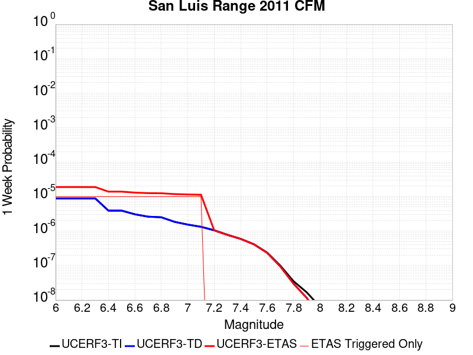 | 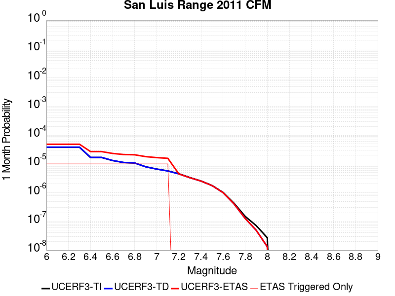 | 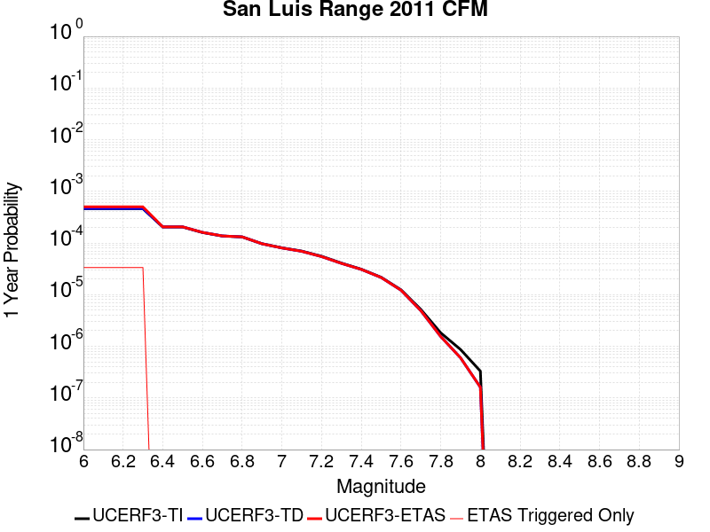 | 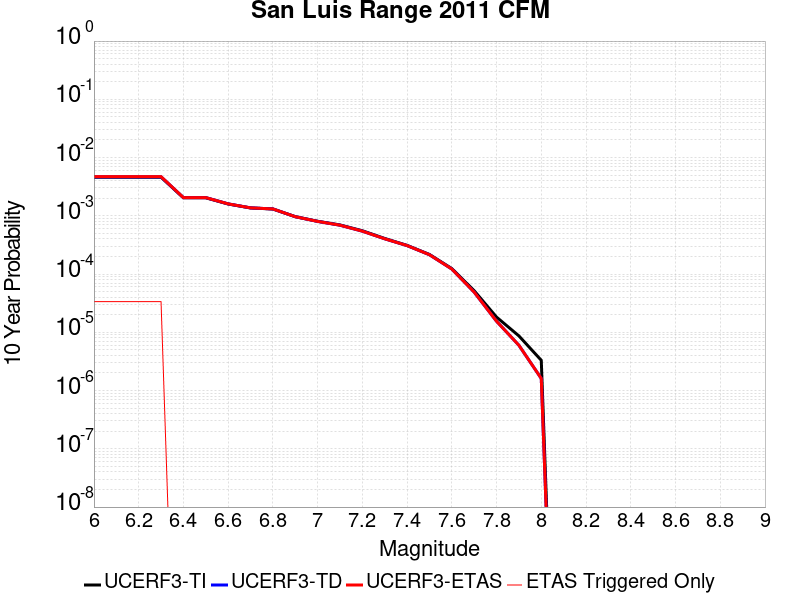 |

| Magnitude | 1 wk TI Prob | 1 wk TD Prob | 1 wk ETAS Prob | 1 wk ETAS/TD Gain | 1 wk ETAS Triggered Only | 1 mo TI Prob | 1 mo TD Prob | 1 mo ETAS Prob | 1 mo ETAS/TD Gain | 1 mo ETAS Triggered Only | 1 yr TI Prob | 1 yr TD Prob | 1 yr ETAS Prob | 1 yr ETAS/TD Gain | 1 yr ETAS Triggered Only | 10 yr TI Prob | 10 yr TD Prob | 10 yr ETAS Prob | 10 yr ETAS/TD Gain | 10 yr ETAS Triggered Only |
|-----|-----|-----|-----|-----|-----|-----|-----|-----|-----|-----|-----|-----|-----|-----|-----|-----|-----|-----|-----|-----|
| 6.0 | 8.8368415E-6 | 8.965477E-6 | 8.965477E-6 | 1.0 | 0.0 | 3.787163E-5 | 3.8422953E-5 | 3.8422953E-5 | 1.0 | 0.0 | 4.609895E-4 | 4.677069E-4 | 5.013612E-4 | 1.0719559 | 3.3670032E-5 | 0.0046003438 | 0.0046680085 | 0.0047015212 | 1.0071793 | 3.3670032E-5 |
| 6.1 | 8.8368415E-6 | 8.965477E-6 | 8.965477E-6 | 1.0 | 0.0 | 3.787163E-5 | 3.8422953E-5 | 3.8422953E-5 | 1.0 | 0.0 | 4.609895E-4 | 4.677069E-4 | 5.013612E-4 | 1.0719559 | 3.3670032E-5 | 0.0046003438 | 0.0046680085 | 0.0047015212 | 1.0071793 | 3.3670032E-5 |
| 6.2 | 8.8368415E-6 | 8.965477E-6 | 8.965477E-6 | 1.0 | 0.0 | 3.787163E-5 | 3.8422953E-5 | 3.8422953E-5 | 1.0 | 0.0 | 4.609895E-4 | 4.677069E-4 | 5.013612E-4 | 1.0719559 | 3.3670032E-5 | 0.0046003438 | 0.0046680085 | 0.0047015212 | 1.0071793 | 3.3670032E-5 |
| 6.3 | 8.8368415E-6 | 8.965477E-6 | 8.965477E-6 | 1.0 | 0.0 | 3.787163E-5 | 3.8422953E-5 | 3.8422953E-5 | 1.0 | 0.0 | 4.609895E-4 | 4.677069E-4 | 5.013612E-4 | 1.0719559 | 3.3670032E-5 | 0.0046003438 | 0.0046680085 | 0.0047015212 | 1.0071793 | 3.3670032E-5 |
| 6.4 | 3.9094193E-6 | 3.941213E-6 | 3.941213E-6 | 1.0 | 0.0 | 1.6754546E-5 | 1.6890806E-5 | 1.6890806E-5 | 1.0 | 0.0 | 2.039675E-4 | 2.0562643E-4 | 2.0562643E-4 | 1.0 | 0.0 | 0.0020378039 | 0.0020543905 | 0.0020543905 | 1.0 | 0.0 |
| 6.5 | 3.9094193E-6 | 3.941213E-6 | 3.941213E-6 | 1.0 | 0.0 | 1.6754546E-5 | 1.6890806E-5 | 1.6890806E-5 | 1.0 | 0.0 | 2.039675E-4 | 2.0562643E-4 | 2.0562643E-4 | 1.0 | 0.0 | 0.0020378039 | 0.0020543905 | 0.0020543905 | 1.0 | 0.0 |
| 6.6 | 3.0587726E-6 | 3.0753965E-6 | 3.0753965E-6 | 1.0 | 0.0 | 1.3108959E-5 | 1.3180205E-5 | 1.3180205E-5 | 1.0 | 0.0 | 1.595899E-4 | 1.604573E-4 | 1.604573E-4 | 1.0 | 0.0 | 0.0015947534 | 0.0016034264 | 0.0016034264 | 1.0 | 0.0 |
| 6.7 | 2.6160574E-6 | 2.6251346E-6 | 2.6251346E-6 | 1.0 | 0.0 | 1.1211626E-5 | 1.1250529E-5 | 1.1250529E-5 | 1.0 | 0.0 | 1.3649299E-4 | 1.3696664E-4 | 1.3696664E-4 | 1.0 | 0.0 | 0.0013640919 | 0.0013688284 | 0.0013688284 | 1.0 | 0.0 |
| 6.8 | 2.5110312E-6 | 2.5181473E-6 | 2.5181473E-6 | 1.0 | 0.0 | 1.0761518E-5 | 1.0792015E-5 | 1.0792015E-5 | 1.0 | 0.0 | 1.310136E-4 | 1.3138492E-4 | 1.3138492E-4 | 1.0 | 0.0 | 0.0013093639 | 0.0013130783 | 0.0013130783 | 1.0 | 0.0 |
| 6.9 | 1.8564405E-6 | 1.8524926E-6 | 1.8524926E-6 | 1.0 | 0.0 | 7.95615E-6 | 7.93923E-6 | 7.93923E-6 | 1.0 | 0.0 | 9.686181E-5 | 9.665586E-5 | 9.665586E-5 | 1.0 | 0.0 | 9.68196E-4 | 9.661402E-4 | 9.661402E-4 | 1.0 | 0.0 |
| 7.0 | 1.546127E-6 | 1.5369586E-6 | 1.5369586E-6 | 1.0 | 0.0 | 6.626242E-6 | 6.586949E-6 | 6.586949E-6 | 1.0 | 0.0 | 8.06715E-5 | 8.019316E-5 | 8.019316E-5 | 1.0 | 0.0 | 8.0642226E-4 | 8.016429E-4 | 8.016429E-4 | 1.0 | 0.0 |
| 7.1 | 1.3368208E-6 | 1.3235369E-6 | 1.3235369E-6 | 1.0 | 0.0 | 5.7292195E-6 | 5.672289E-6 | 5.672289E-6 | 1.0 | 0.0 | 6.975101E-5 | 6.905793E-5 | 6.905793E-5 | 1.0 | 0.0 | 6.972912E-4 | 6.903652E-4 | 6.903652E-4 | 1.0 | 0.0 |
| 7.2 | 1.0623363E-6 | 1.0454403E-6 | 1.0454403E-6 | 1.0 | 0.0 | 4.5528623E-6 | 4.480451E-6 | 4.480451E-6 | 1.0 | 0.0 | 5.5429686E-5 | 5.4548127E-5 | 5.4548127E-5 | 1.0 | 0.0 | 5.5415864E-4 | 5.4534763E-4 | 5.4534763E-4 | 1.0 | 0.0 |
| 7.3 | 7.831679E-7 | 7.7274194E-7 | 7.7274194E-7 | 1.0 | 0.0 | 3.3564295E-6 | 3.311747E-6 | 3.311747E-6 | 1.0 | 0.0 | 4.086376E-5 | 4.0319774E-5 | 4.0319774E-5 | 1.0 | 0.0 | 4.0856248E-4 | 4.0312472E-4 | 4.0312472E-4 | 1.0 | 0.0 |
| 7.4 | 5.9558846E-7 | 5.91066E-7 | 5.91066E-7 | 1.0 | 0.0 | 2.5525194E-6 | 2.5331376E-6 | 2.5331376E-6 | 1.0 | 0.0 | 3.107648E-5 | 3.0840514E-5 | 3.0840514E-5 | 1.0 | 0.0 | 3.1072134E-4 | 3.0836245E-4 | 3.0836245E-4 | 1.0 | 0.0 |
| 7.5 | 4.1616502E-7 | 4.1196506E-7 | 4.1196506E-7 | 1.0 | 0.0 | 1.7835631E-6 | 1.7655633E-6 | 1.7655633E-6 | 1.0 | 0.0 | 2.1714664E-5 | 2.1495522E-5 | 2.1495522E-5 | 1.0 | 0.0 | 2.1712543E-4 | 2.1493447E-4 | 2.1493447E-4 | 1.0 | 0.0 |
| 7.6 | 2.3816014E-7 | 2.3376697E-7 | 2.3376697E-7 | 1.0 | 0.0 | 1.0206859E-6 | 1.001858E-6 | 1.001858E-6 | 1.0 | 0.0 | 1.242678E-5 | 1.2197554E-5 | 1.2197554E-5 | 1.0 | 0.0 | 1.2426086E-4 | 1.2196886E-4 | 1.2196886E-4 | 1.0 | 0.0 |
| 7.7 | 9.918777E-8 | 9.386869E-8 | 9.386869E-8 | 1.0 | 0.0 | 4.2509038E-7 | 4.0229432E-7 | 4.0229432E-7 | 1.0 | 0.0 | 5.1754632E-6 | 4.8979223E-6 | 4.8979223E-6 | 1.0 | 0.0 | 5.1753424E-5 | 4.897815E-5 | 4.897815E-5 | 1.0 | 0.0 |
| 7.8 | 3.4982556E-8 | 2.9687454E-8 | 2.9687454E-8 | 1.0 | 0.0 | 1.4992524E-7 | 1.2723194E-7 | 1.2723194E-7 | 1.0 | 0.0 | 1.8253382E-6 | 1.5490477E-6 | 1.5490477E-6 | 1.0 | 0.0 | 1.8253233E-5 | 1.549037E-5 | 1.549037E-5 | 1.0 | 0.0 |
| 7.9 | 1.6624908E-8 | 1.1477859E-8 | 1.1477859E-8 | 1.0 | 0.0 | 7.12496E-8 | 4.919082E-8 | 4.919082E-8 | 1.0 | 0.0 | 8.6746354E-7 | 5.9889805E-7 | 5.9889805E-7 | 1.0 | 0.0 | 8.674601E-6 | 5.988965E-6 | 5.988965E-6 | 1.0 | 0.0 |
| 8.0 | 6.3352315E-9 | 3.0893488E-9 | 3.0893488E-9 | 1.0 | 0.0 | 2.715099E-8 | 1.3240064E-8 | 1.3240064E-8 | 1.0 | 0.0 | 3.3056327E-7 | 1.6119778E-7 | 1.6119778E-7 | 1.0 | 0.0 | 3.3056278E-6 | 1.6119766E-6 | 1.6119766E-6 | 1.0 | 0.0 |

## Chino alt 1
*[(top)](#table-of-contents)*

| 1 Week | 1 Month | 1 Year | 10 Year |
|-----|-----|-----|-----|
|  | 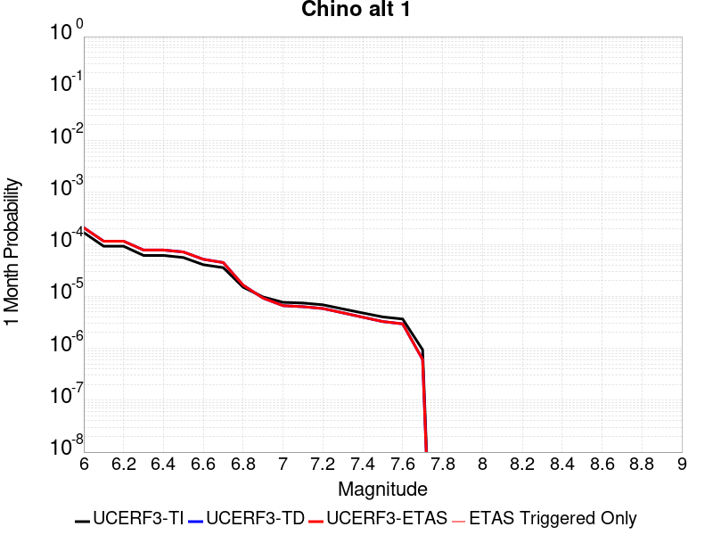 | 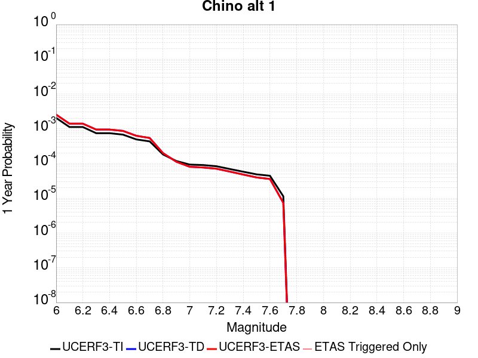 | 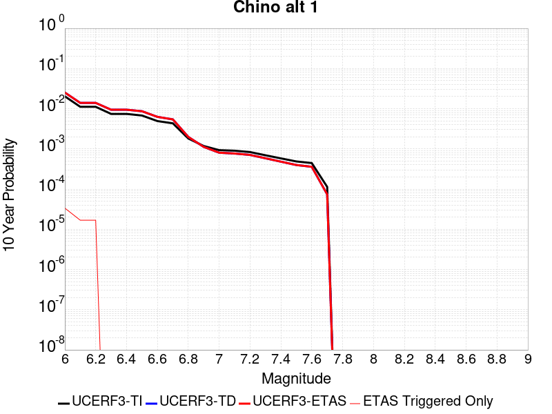 |

| Magnitude | 1 wk TI Prob | 1 wk TD Prob | 1 wk ETAS Prob | 1 wk ETAS/TD Gain | 1 wk ETAS Triggered Only | 1 mo TI Prob | 1 mo TD Prob | 1 mo ETAS Prob | 1 mo ETAS/TD Gain | 1 mo ETAS Triggered Only | 1 yr TI Prob | 1 yr TD Prob | 1 yr ETAS Prob | 1 yr ETAS/TD Gain | 1 yr ETAS Triggered Only | 10 yr TI Prob | 10 yr TD Prob | 10 yr ETAS Prob | 10 yr ETAS/TD Gain | 10 yr ETAS Triggered Only |
|-----|-----|-----|-----|-----|-----|-----|-----|-----|-----|-----|-----|-----|-----|-----|-----|-----|-----|-----|-----|-----|
| 6.0 | 3.939946E-5 | 4.895037E-5 | 4.895037E-5 | 1.0 | 0.0 | 1.6884391E-4 | 2.0977337E-4 | 2.0977337E-4 | 1.0 | 0.0 | 0.0020537362 | 0.0025514876 | 0.0025514876 | 1.0 | 0.0 | 0.020348595 | 0.025278764 | 0.025311582 | 1.0012983 | 3.3670032E-5 |
| 6.1 | 2.1505624E-5 | 2.6880154E-5 | 2.6880154E-5 | 1.0 | 0.0 | 9.2163704E-5 | 1.151962E-4 | 1.151962E-4 | 1.0 | 0.0 | 0.0011215154 | 0.0014017228 | 0.0014017228 | 1.0 | 0.0 | 0.011158722 | 0.013945717 | 0.013962317 | 1.0011903 | 1.6835016E-5 |
| 6.2 | 2.1505624E-5 | 2.6880154E-5 | 2.6880154E-5 | 1.0 | 0.0 | 9.2163704E-5 | 1.151962E-4 | 1.151962E-4 | 1.0 | 0.0 | 0.0011215154 | 0.0014017228 | 0.0014017228 | 1.0 | 0.0 | 0.011158722 | 0.013945717 | 0.013962317 | 1.0011903 | 1.6835016E-5 |
| 6.3 | 1.4290785E-5 | 1.8166014E-5 | 1.8166014E-5 | 1.0 | 0.0 | 6.1244784E-5 | 7.785228E-5 | 7.785228E-5 | 1.0 | 0.0 | 7.454001E-4 | 9.4748475E-4 | 9.4748475E-4 | 1.0 | 0.0 | 0.007429048 | 0.009444912 | 0.009444912 | 1.0 | 0.0 |
| 6.4 | 1.4290785E-5 | 1.8166014E-5 | 1.8166014E-5 | 1.0 | 0.0 | 6.1244784E-5 | 7.785228E-5 | 7.785228E-5 | 1.0 | 0.0 | 7.454001E-4 | 9.4748475E-4 | 9.4748475E-4 | 1.0 | 0.0 | 0.007429048 | 0.009444912 | 0.009444912 | 1.0 | 0.0 |
| 6.5 | 1.3017944E-5 | 1.6652937E-5 | 1.6652937E-5 | 1.0 | 0.0 | 5.5789995E-5 | 7.136803E-5 | 7.136803E-5 | 1.0 | 0.0 | 6.790315E-4 | 8.686031E-4 | 8.686031E-4 | 1.0 | 0.0 | 0.0067696036 | 0.008662385 | 0.008662385 | 1.0 | 0.0 |
| 6.6 | 9.470016E-6 | 1.2040057E-5 | 1.2040057E-5 | 1.0 | 0.0 | 4.058515E-5 | 5.1599414E-5 | 5.1599414E-5 | 1.0 | 0.0 | 4.940122E-4 | 6.2807574E-4 | 6.2807574E-4 | 1.0 | 0.0 | 0.004929154 | 0.0062722242 | 0.0062722242 | 1.0 | 0.0 |
| 6.7 | 8.314155E-6 | 1.0408293E-5 | 1.0408293E-5 | 1.0 | 0.0 | 3.5631605E-5 | 4.460639E-5 | 4.460639E-5 | 1.0 | 0.0 | 4.3372845E-4 | 5.429797E-4 | 5.429797E-4 | 1.0 | 0.0 | 0.004328829 | 0.005426062 | 0.005426062 | 1.0 | 0.0 |
| 6.8 | 3.4856364E-6 | 3.8135372E-6 | 3.8135372E-6 | 1.0 | 0.0 | 1.4938357E-5 | 1.634364E-5 | 1.634364E-5 | 1.0 | 0.0 | 1.8185932E-4 | 1.9896773E-4 | 1.9896773E-4 | 1.0 | 0.0 | 0.0018171056 | 0.001989573 | 0.001989573 | 1.0 | 0.0 |
| 6.9 | 2.2645952E-6 | 2.152999E-6 | 2.152999E-6 | 1.0 | 0.0 | 9.705372E-6 | 9.227107E-6 | 9.227107E-6 | 1.0 | 0.0 | 1.18156495E-4 | 1.1233445E-4 | 1.1233445E-4 | 1.0 | 0.0 | 0.0011809369 | 0.0011233927 | 0.0011233927 | 1.0 | 0.0 |
| 7.0 | 1.7864003E-6 | 1.5431575E-6 | 1.5431575E-6 | 1.0 | 0.0 | 7.655979E-6 | 6.613516E-6 | 6.613516E-6 | 1.0 | 0.0 | 9.3207556E-5 | 8.0516635E-5 | 8.0516635E-5 | 1.0 | 0.0 | 9.316847E-4 | 8.0532173E-4 | 8.0532173E-4 | 1.0 | 0.0 |
| 7.1 | 1.7315456E-6 | 1.4734279E-6 | 1.4734279E-6 | 1.0 | 0.0 | 7.420889E-6 | 6.3146763E-6 | 6.3146763E-6 | 1.0 | 0.0 | 9.034557E-5 | 7.6878525E-5 | 7.6878525E-5 | 1.0 | 0.0 | 9.0308854E-4 | 7.6895714E-4 | 7.6895714E-4 | 1.0 | 0.0 |
| 7.2 | 1.6008337E-6 | 1.3574753E-6 | 1.3574753E-6 | 1.0 | 0.0 | 6.860698E-6 | 5.817739E-6 | 5.817739E-6 | 1.0 | 0.0 | 8.352579E-5 | 7.082872E-5 | 7.082872E-5 | 1.0 | 0.0 | 8.34944E-4 | 7.084856E-4 | 7.084856E-4 | 1.0 | 0.0 |
| 7.3 | 1.3320939E-6 | 1.1218251E-6 | 1.1218251E-6 | 1.0 | 0.0 | 5.7089615E-6 | 4.8078136E-6 | 4.8078136E-6 | 1.0 | 0.0 | 6.9504385E-5 | 5.8533606E-5 | 5.8533606E-5 | 1.0 | 0.0 | 6.9482654E-4 | 5.853264E-4 | 5.853264E-4 | 1.0 | 0.0 |
| 7.4 | 1.114294E-6 | 9.2374523E-7 | 9.2374523E-7 | 1.0 | 0.0 | 4.775537E-6 | 3.958902E-6 | 3.958902E-6 | 1.0 | 0.0 | 5.8140613E-5 | 4.8198606E-5 | 4.8198606E-5 | 1.0 | 0.0 | 5.81254E-4 | 4.8189834E-4 | 4.8189834E-4 | 1.0 | 0.0 |
| 7.5 | 9.354081E-7 | 7.623702E-7 | 7.623702E-7 | 1.0 | 0.0 | 4.0088858E-6 | 3.2672967E-6 | 3.2672967E-6 | 1.0 | 0.0 | 4.8807087E-5 | 3.9778646E-5 | 3.9778646E-5 | 1.0 | 0.0 | 4.879637E-4 | 3.9771866E-4 | 3.9771866E-4 | 1.0 | 0.0 |
| 7.6 | 8.521771E-7 | 6.8809493E-7 | 6.8809493E-7 | 1.0 | 0.0 | 3.6521824E-6 | 2.9489752E-6 | 2.9489752E-6 | 1.0 | 0.0 | 4.4464414E-5 | 3.5903213E-5 | 3.5903213E-5 | 1.0 | 0.0 | 4.4455516E-4 | 3.589773E-4 | 3.589773E-4 | 1.0 | 0.0 |
| 7.7 | 2.1803626E-7 | 1.4187151E-7 | 1.4187151E-7 | 1.0 | 0.0 | 9.344408E-7 | 6.080207E-7 | 6.080207E-7 | 1.0 | 0.0 | 1.1376757E-5 | 7.402636E-6 | 7.402636E-6 | 1.0 | 0.0 | 1.13761744E-4 | 7.402486E-5 | 7.402486E-5 | 1.0 | 0.0 |

## San Pedro Basin
*[(top)](#table-of-contents)*

| 1 Week | 1 Month | 1 Year | 10 Year |
|-----|-----|-----|-----|
|  |  | 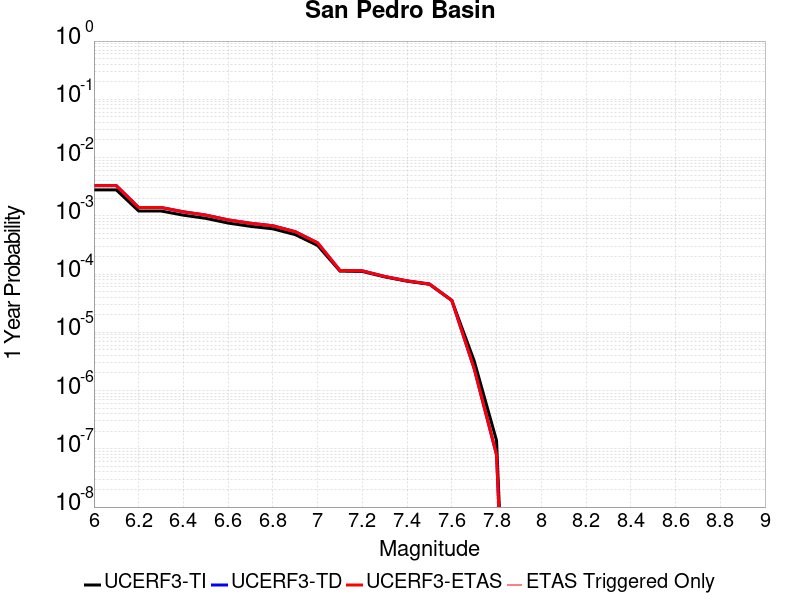 | 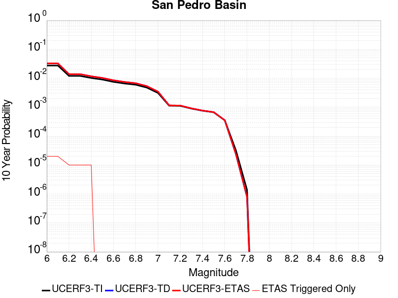 |

| Magnitude | 1 wk TI Prob | 1 wk TD Prob | 1 wk ETAS Prob | 1 wk ETAS/TD Gain | 1 wk ETAS Triggered Only | 1 mo TI Prob | 1 mo TD Prob | 1 mo ETAS Prob | 1 mo ETAS/TD Gain | 1 mo ETAS Triggered Only | 1 yr TI Prob | 1 yr TD Prob | 1 yr ETAS Prob | 1 yr ETAS/TD Gain | 1 yr ETAS Triggered Only | 10 yr TI Prob | 10 yr TD Prob | 10 yr ETAS Prob | 10 yr ETAS/TD Gain | 10 yr ETAS Triggered Only |
|-----|-----|-----|-----|-----|-----|-----|-----|-----|-----|-----|-----|-----|-----|-----|-----|-----|-----|-----|-----|-----|
| 6.0 | 5.3449043E-5 | 6.3371124E-5 | 6.3371124E-5 | 1.0 | 0.0 | 2.2904722E-4 | 2.7156572E-4 | 2.7156572E-4 | 1.0 | 0.0 | 0.0027850836 | 0.0033019078 | 0.0033019078 | 1.0 | 0.0 | 0.027504366 | 0.032590248 | 0.032606535 | 1.0004997 | 1.6835016E-5 |
| 6.1 | 5.3449043E-5 | 6.3371124E-5 | 6.3371124E-5 | 1.0 | 0.0 | 2.2904722E-4 | 2.7156572E-4 | 2.7156572E-4 | 1.0 | 0.0 | 0.0027850836 | 0.0033019078 | 0.0033019078 | 1.0 | 0.0 | 0.027504366 | 0.032590248 | 0.032606535 | 1.0004997 | 1.6835016E-5 |
| 6.2 | 2.3189454E-5 | 2.6643334E-5 | 2.6643334E-5 | 1.0 | 0.0 | 9.9379584E-5 | 1.14180984E-4 | 1.14180984E-4 | 1.0 | 0.0 | 0.0012092749 | 0.0013893144 | 0.0013893144 | 1.0 | 0.0 | 0.012027155 | 0.013811161 | 0.013827763 | 1.0012021 | 1.6835016E-5 |
| 6.3 | 2.3189454E-5 | 2.6643334E-5 | 2.6643334E-5 | 1.0 | 0.0 | 9.9379584E-5 | 1.14180984E-4 | 1.14180984E-4 | 1.0 | 0.0 | 0.0012092749 | 0.0013893144 | 0.0013893144 | 1.0 | 0.0 | 0.012027155 | 0.013811161 | 0.013827763 | 1.0012021 | 1.6835016E-5 |
| 6.4 | 1.966056E-5 | 2.2463848E-5 | 2.2463848E-5 | 1.0 | 0.0 | 8.425682E-5 | 9.627031E-5 | 9.627031E-5 | 1.0 | 0.0 | 0.001025344 | 0.001171501 | 0.001171501 | 1.0 | 0.0 | 0.010206259 | 0.011657341 | 0.011673979 | 1.0014273 | 1.6835016E-5 |
| 6.5 | 1.7342953E-5 | 1.9745521E-5 | 1.9745521E-5 | 1.0 | 0.0 | 7.4324824E-5 | 8.4621126E-5 | 8.4621126E-5 | 1.0 | 0.0 | 9.04529E-4 | 0.0010298121 | 0.0010298121 | 1.0 | 0.0 | 0.009008561 | 0.010254124 | 0.010254124 | 1.0 | 0.0 |
| 6.6 | 1.439804E-5 | 1.6323014E-5 | 1.6323014E-5 | 1.0 | 0.0 | 6.170443E-5 | 6.995408E-5 | 6.995408E-5 | 1.0 | 0.0 | 7.509924E-4 | 8.513903E-4 | 8.513903E-4 | 1.0 | 0.0 | 0.0074845953 | 0.008484487 | 0.008484487 | 1.0 | 0.0 |
| 6.7 | 1.2634884E-5 | 1.4285554E-5 | 1.4285554E-5 | 1.0 | 0.0 | 5.414838E-5 | 6.1222534E-5 | 6.1222534E-5 | 1.0 | 0.0 | 6.590571E-4 | 7.451599E-4 | 7.451599E-4 | 1.0 | 0.0 | 0.006571059 | 0.007429634 | 0.007429634 | 1.0 | 0.0 |
| 6.8 | 1.146091E-5 | 1.2933421E-5 | 1.2933421E-5 | 1.0 | 0.0 | 4.911726E-5 | 5.542794E-5 | 5.542794E-5 | 1.0 | 0.0 | 5.9783855E-4 | 6.7465595E-4 | 6.7465595E-4 | 1.0 | 0.0 | 0.0059623276 | 0.0067290184 | 0.0067290184 | 1.0 | 0.0 |
| 6.9 | 9.109035E-6 | 1.0235189E-5 | 1.0235189E-5 | 1.0 | 0.0 | 3.9038136E-5 | 4.3864515E-5 | 4.3864515E-5 | 1.0 | 0.0 | 4.7518566E-4 | 5.339476E-4 | 5.339476E-4 | 1.0 | 0.0 | 0.0047417083 | 0.0053294008 | 0.0053294008 | 1.0 | 0.0 |
| 7.0 | 5.9351028E-6 | 6.584068E-6 | 6.584068E-6 | 1.0 | 0.0 | 2.5435906E-5 | 2.8217262E-5 | 2.8217262E-5 | 1.0 | 0.0 | 3.0963816E-4 | 3.4351464E-4 | 3.4351464E-4 | 1.0 | 0.0 | 0.0030920706 | 0.0034321535 | 0.0034321535 | 1.0 | 0.0 |
| 7.1 | 2.1557585E-6 | 2.2096608E-6 | 2.2096608E-6 | 1.0 | 0.0 | 9.238933E-6 | 9.469942E-6 | 9.469942E-6 | 1.0 | 0.0 | 1.1247819E-4 | 1.1529059E-4 | 1.1529059E-4 | 1.0 | 0.0 | 0.0011242128 | 0.0011523232 | 0.0011523232 | 1.0 | 0.0 |
| 7.2 | 2.1251979E-6 | 2.178007E-6 | 2.178007E-6 | 1.0 | 0.0 | 9.107958E-6 | 9.334282E-6 | 9.334282E-6 | 1.0 | 0.0 | 1.1088375E-4 | 1.1363912E-4 | 1.1363912E-4 | 1.0 | 0.0 | 0.0011082845 | 0.0011358254 | 0.0011358254 | 1.0 | 0.0 |
| 7.3 | 1.7145798E-6 | 1.7442967E-6 | 1.7442967E-6 | 1.0 | 0.0 | 7.3481783E-6 | 7.475536E-6 | 7.475536E-6 | 1.0 | 0.0 | 8.94604E-5 | 9.1010945E-5 | 9.1010945E-5 | 1.0 | 0.0 | 8.9424395E-4 | 9.0974587E-4 | 9.0974587E-4 | 1.0 | 0.0 |
| 7.4 | 1.4467993E-6 | 1.4641943E-6 | 1.4641943E-6 | 1.0 | 0.0 | 6.200554E-6 | 6.2751037E-6 | 6.2751037E-6 | 1.0 | 0.0 | 7.548913E-5 | 7.6396784E-5 | 7.6396784E-5 | 1.0 | 0.0 | 7.546349E-4 | 7.637125E-4 | 7.637125E-4 | 1.0 | 0.0 |
| 7.5 | 1.2803735E-6 | 1.2931564E-6 | 1.2931564E-6 | 1.0 | 0.0 | 5.487303E-6 | 5.5420874E-6 | 5.5420874E-6 | 1.0 | 0.0 | 6.680587E-5 | 6.7472894E-5 | 6.7472894E-5 | 1.0 | 0.0 | 6.678579E-4 | 6.7453115E-4 | 6.7453115E-4 | 1.0 | 0.0 |
| 7.6 | 6.755009E-7 | 6.769501E-7 | 6.769501E-7 | 1.0 | 0.0 | 2.8950008E-6 | 2.9012117E-6 | 2.9012117E-6 | 1.0 | 0.0 | 3.5246063E-5 | 3.5321737E-5 | 3.5321737E-5 | 1.0 | 0.0 | 3.5240475E-4 | 3.5316695E-4 | 3.5316695E-4 | 1.0 | 0.0 |
| 7.7 | 6.211885E-8 | 4.5699863E-8 | 4.5699863E-8 | 1.0 | 0.0 | 2.6622362E-7 | 1.9585654E-7 | 1.9585654E-7 | 1.0 | 0.0 | 3.2412677E-6 | 2.384551E-6 | 2.384551E-6 | 1.0 | 0.0 | 3.2412205E-5 | 2.3845274E-5 | 2.3845274E-5 | 1.0 | 0.0 |
| 7.8 | 2.6580573E-9 | 1.5138681E-9 | 1.5138681E-9 | 1.0 | 0.0 | 1.1391674E-8 | 6.488006E-9 | 6.488006E-9 | 1.0 | 0.0 | 1.3869362E-7 | 7.899148E-8 | 7.899148E-8 | 1.0 | 0.0 | 1.3869354E-6 | 7.8991474E-7 | 7.8991474E-7 | 1.0 | 0.0 |

## Ventura-Pitas Point
*[(top)](#table-of-contents)*

| 1 Week | 1 Month | 1 Year | 10 Year |
|-----|-----|-----|-----|
|  |  | 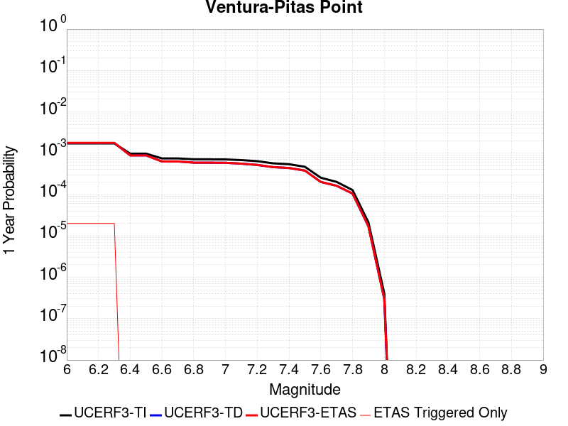 | 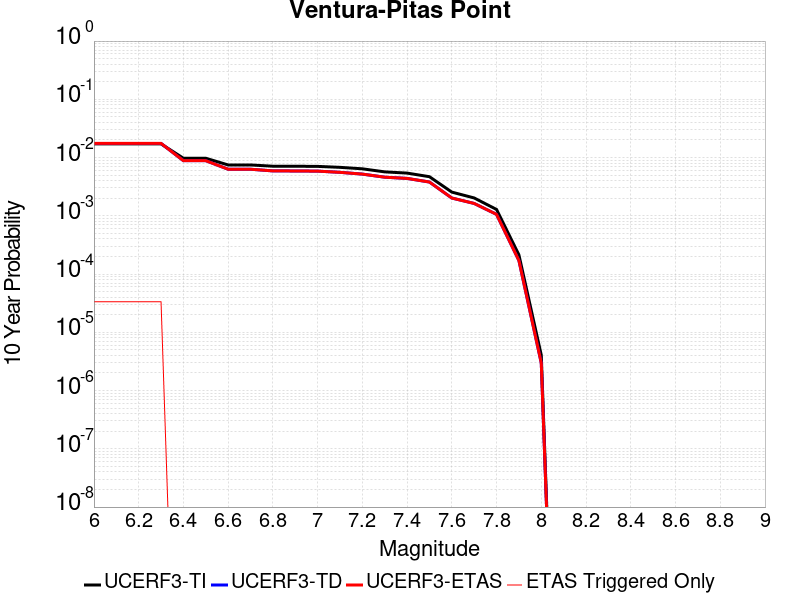 |

| Magnitude | 1 wk TI Prob | 1 wk TD Prob | 1 wk ETAS Prob | 1 wk ETAS/TD Gain | 1 wk ETAS Triggered Only | 1 mo TI Prob | 1 mo TD Prob | 1 mo ETAS Prob | 1 mo ETAS/TD Gain | 1 mo ETAS Triggered Only | 1 yr TI Prob | 1 yr TD Prob | 1 yr ETAS Prob | 1 yr ETAS/TD Gain | 1 yr ETAS Triggered Only | 10 yr TI Prob | 10 yr TD Prob | 10 yr ETAS Prob | 10 yr ETAS/TD Gain | 10 yr ETAS Triggered Only |
|-----|-----|-----|-----|-----|-----|-----|-----|-----|-----|-----|-----|-----|-----|-----|-----|-----|-----|-----|-----|-----|
| 6.0 | 3.3179622E-5 | 3.3735807E-5 | 3.3735807E-5 | 1.0 | 0.0 | 1.4219063E-4 | 1.4457546E-4 | 1.4457546E-4 | 1.0 | 0.0 | 0.0017297962 | 0.001759042 | 0.0017758474 | 1.0095537 | 1.6835016E-5 | 0.017163932 | 0.01747672 | 0.017509801 | 1.0018929 | 3.3670032E-5 |
| 6.1 | 3.3179622E-5 | 3.3735807E-5 | 3.3735807E-5 | 1.0 | 0.0 | 1.4219063E-4 | 1.4457546E-4 | 1.4457546E-4 | 1.0 | 0.0 | 0.0017297962 | 0.001759042 | 0.0017758474 | 1.0095537 | 1.6835016E-5 | 0.017163932 | 0.01747672 | 0.017509801 | 1.0018929 | 3.3670032E-5 |
| 6.2 | 3.3179622E-5 | 3.3735807E-5 | 3.3735807E-5 | 1.0 | 0.0 | 1.4219063E-4 | 1.4457546E-4 | 1.4457546E-4 | 1.0 | 0.0 | 0.0017297962 | 0.001759042 | 0.0017758474 | 1.0095537 | 1.6835016E-5 | 0.017163932 | 0.01747672 | 0.017509801 | 1.0018929 | 3.3670032E-5 |
| 6.3 | 3.3179622E-5 | 3.3735807E-5 | 3.3735807E-5 | 1.0 | 0.0 | 1.4219063E-4 | 1.4457546E-4 | 1.4457546E-4 | 1.0 | 0.0 | 0.0017297962 | 0.001759042 | 0.0017758474 | 1.0095537 | 1.6835016E-5 | 0.017163932 | 0.01747672 | 0.017509801 | 1.0018929 | 3.3670032E-5 |
| 6.4 | 1.8754668E-5 | 1.701988E-5 | 1.701988E-5 | 1.0 | 0.0 | 8.037467E-5 | 7.2940435E-5 | 7.2940435E-5 | 1.0 | 0.0 | 9.781223E-4 | 8.87711E-4 | 8.87711E-4 | 1.0 | 0.0 | 0.009738282 | 0.008843987 | 0.008843987 | 1.0 | 0.0 |
| 6.5 | 1.8754668E-5 | 1.701988E-5 | 1.701988E-5 | 1.0 | 0.0 | 8.037467E-5 | 7.2940435E-5 | 7.2940435E-5 | 1.0 | 0.0 | 9.781223E-4 | 8.87711E-4 | 8.87711E-4 | 1.0 | 0.0 | 0.009738282 | 0.008843987 | 0.008843987 | 1.0 | 0.0 |
| 6.6 | 1.4361558E-5 | 1.2122469E-5 | 1.2122469E-5 | 1.0 | 0.0 | 6.154808E-5 | 5.195242E-5 | 5.195242E-5 | 1.0 | 0.0 | 7.490902E-4 | 6.323394E-4 | 6.323394E-4 | 1.0 | 0.0 | 0.0074657016 | 0.0063056583 | 0.0063056583 | 1.0 | 0.0 |
| 6.7 | 1.4361558E-5 | 1.2122469E-5 | 1.2122469E-5 | 1.0 | 0.0 | 6.154808E-5 | 5.195242E-5 | 5.195242E-5 | 1.0 | 0.0 | 7.490902E-4 | 6.323394E-4 | 6.323394E-4 | 1.0 | 0.0 | 0.0074657016 | 0.0063056583 | 0.0063056583 | 1.0 | 0.0 |
| 6.8 | 1.3663846E-5 | 1.13446E-5 | 1.13446E-5 | 1.0 | 0.0 | 5.8558027E-5 | 4.8618822E-5 | 4.8618822E-5 | 1.0 | 0.0 | 7.127108E-4 | 5.917753E-4 | 5.917753E-4 | 1.0 | 0.0 | 0.007104293 | 0.0059022107 | 0.0059022107 | 1.0 | 0.0 |
| 6.9 | 1.3644157E-5 | 1.1322701E-5 | 1.1322701E-5 | 1.0 | 0.0 | 5.8473648E-5 | 4.852497E-5 | 4.852497E-5 | 1.0 | 0.0 | 7.116841E-4 | 5.9063325E-4 | 5.9063325E-4 | 1.0 | 0.0 | 0.007094092 | 0.005890851 | 0.005890851 | 1.0 | 0.0 |
| 7.0 | 1.3568845E-5 | 1.1242266E-5 | 1.1242266E-5 | 1.0 | 0.0 | 5.8150898E-5 | 4.818026E-5 | 4.818026E-5 | 1.0 | 0.0 | 7.077572E-4 | 5.8643875E-4 | 5.8643875E-4 | 1.0 | 0.0 | 0.007055073 | 0.005849127 | 0.005849127 | 1.0 | 0.0 |
| 7.1 | 1.306572E-5 | 1.0720711E-5 | 1.0720711E-5 | 1.0 | 0.0 | 5.599474E-5 | 4.5945108E-5 | 4.5945108E-5 | 1.0 | 0.0 | 6.815227E-4 | 5.5923994E-4 | 5.5923994E-4 | 1.0 | 0.0 | 0.0067943637 | 0.0055785314 | 0.0055785314 | 1.0 | 0.0 |
| 7.2 | 1.232604E-5 | 9.995298E-6 | 9.995298E-6 | 1.0 | 0.0 | 5.2824813E-5 | 4.28363E-5 | 4.28363E-5 | 1.0 | 0.0 | 6.429523E-4 | 5.2140886E-4 | 5.2140886E-4 | 1.0 | 0.0 | 0.0064109527 | 0.005202047 | 0.005202047 | 1.0 | 0.0 |
| 7.3 | 1.0917261E-5 | 8.843967E-6 | 8.843967E-6 | 1.0 | 0.0 | 4.678742E-5 | 3.7902173E-5 | 3.7902173E-5 | 1.0 | 0.0 | 5.69488E-4 | 4.6136283E-4 | 4.6136283E-4 | 1.0 | 0.0 | 0.0056803077 | 0.0046042157 | 0.0046042157 | 1.0 | 0.0 |
| 7.4 | 1.039959E-5 | 8.423679E-6 | 8.423679E-6 | 1.0 | 0.0 | 4.456891E-5 | 3.610099E-5 | 3.610099E-5 | 1.0 | 0.0 | 5.424914E-4 | 4.3944246E-4 | 4.3944246E-4 | 1.0 | 0.0 | 0.0054116896 | 0.004385897 | 0.004385897 | 1.0 | 0.0 |
| 7.5 | 9.015877E-6 | 7.297639E-6 | 7.297639E-6 | 1.0 | 0.0 | 3.86389E-5 | 3.1275227E-5 | 3.1275227E-5 | 1.0 | 0.0 | 4.7032707E-4 | 3.807108E-4 | 3.807108E-4 | 1.0 | 0.0 | 0.004693329 | 0.003800731 | 0.003800731 | 1.0 | 0.0 |
| 7.6 | 4.900162E-6 | 3.8741514E-6 | 3.8741514E-6 | 1.0 | 0.0 | 2.1000526E-5 | 1.66034E-5 | 1.66034E-5 | 1.0 | 0.0 | 2.556514E-4 | 2.0212779E-4 | 2.0212779E-4 | 1.0 | 0.0 | 0.0025535747 | 0.002019453 | 0.002019453 | 1.0 | 0.0 |
| 7.7 | 3.8850626E-6 | 3.126758E-6 | 3.126758E-6 | 1.0 | 0.0 | 1.6650163E-5 | 1.3400323E-5 | 1.3400323E-5 | 1.0 | 0.0 | 2.0269687E-4 | 1.631368E-4 | 1.631368E-4 | 1.0 | 0.0 | 0.002025121 | 0.0016301798 | 0.0016301798 | 1.0 | 0.0 |
| 7.8 | 2.4654719E-6 | 2.029892E-6 | 2.029892E-6 | 1.0 | 0.0 | 1.0566265E-5 | 8.699508E-6 | 8.699508E-6 | 1.0 | 0.0 | 1.2863669E-4 | 1.0591141E-4 | 1.0591141E-4 | 1.0 | 0.0 | 0.0012856225 | 0.001058614 | 0.001058614 | 1.0 | 0.0 |
| 7.9 | 4.095894E-7 | 3.2765047E-7 | 3.2765047E-7 | 1.0 | 0.0 | 1.7553821E-6 | 1.4042156E-6 | 1.4042156E-6 | 1.0 | 0.0 | 2.1371567E-5 | 1.7096194E-5 | 1.7096194E-5 | 1.0 | 0.0 | 2.1369511E-4 | 1.7094909E-4 | 1.7094909E-4 | 1.0 | 0.0 |
| 8.0 | 7.791402E-9 | 5.683553E-9 | 5.683553E-9 | 1.0 | 0.0 | 3.3391725E-8 | 2.4358085E-8 | 2.4358085E-8 | 1.0 | 0.0 | 4.0654416E-7 | 2.9655968E-7 | 2.9655968E-7 | 1.0 | 0.0 | 4.065434E-6 | 2.9655946E-6 | 2.9655946E-6 | 1.0 | 0.0 |

## Robinson Creek
*[(top)](#table-of-contents)*

| 1 Week | 1 Month | 1 Year | 10 Year |
|-----|-----|-----|-----|
| 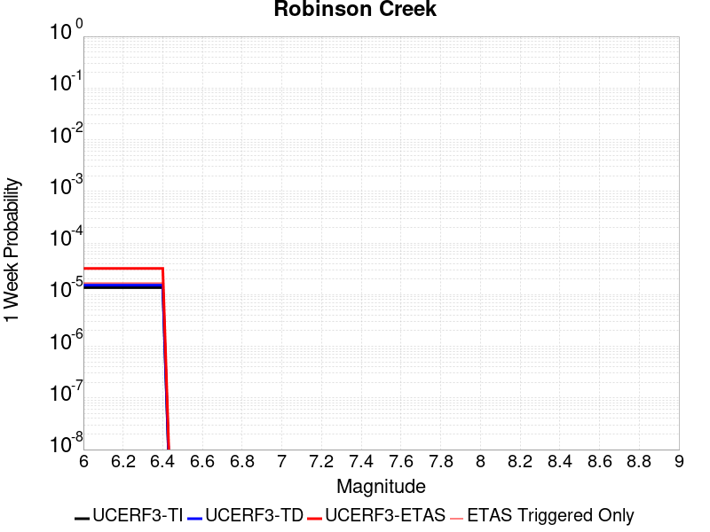 | 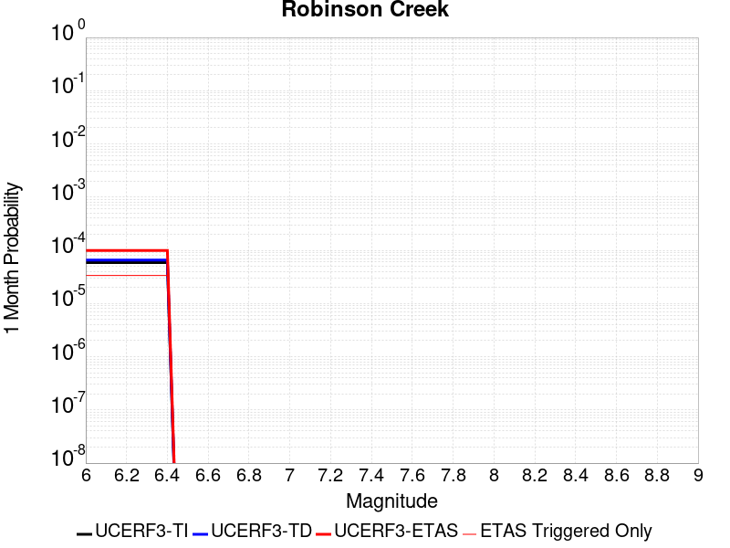 | 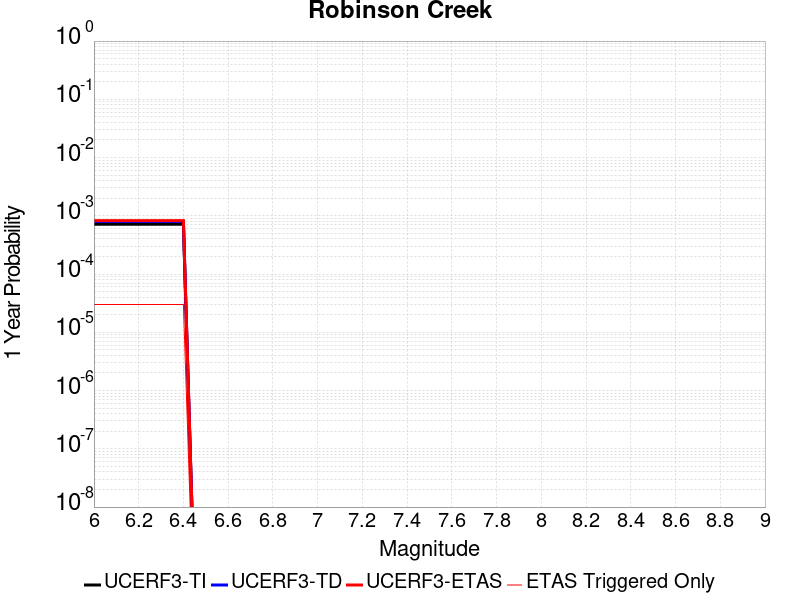 | 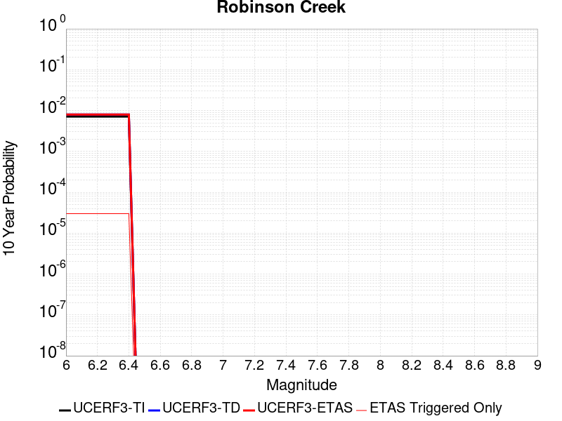 |

| Magnitude | 1 wk TI Prob | 1 wk TD Prob | 1 wk ETAS Prob | 1 wk ETAS/TD Gain | 1 wk ETAS Triggered Only | 1 mo TI Prob | 1 mo TD Prob | 1 mo ETAS Prob | 1 mo ETAS/TD Gain | 1 mo ETAS Triggered Only | 1 yr TI Prob | 1 yr TD Prob | 1 yr ETAS Prob | 1 yr ETAS/TD Gain | 1 yr ETAS Triggered Only | 10 yr TI Prob | 10 yr TD Prob | 10 yr ETAS Prob | 10 yr ETAS/TD Gain | 10 yr ETAS Triggered Only |
|-----|-----|-----|-----|-----|-----|-----|-----|-----|-----|-----|-----|-----|-----|-----|-----|-----|-----|-----|-----|-----|
| 6.0 | 1.3705327E-5 | 1.5285246E-5 | 3.2120006E-5 | 2.1013732 | 1.6835016E-5 | 5.8735794E-5 | 6.5508204E-5 | 9.917603E-5 | 1.5139483 | 3.3670032E-5 | 7.1487366E-4 | 7.9756236E-4 | 8.312055E-4 | 1.0421826 | 3.3670032E-5 | 0.0071257832 | 0.007975623 | 0.008009025 | 1.004188 | 3.3670032E-5 |
| 6.1 | 1.3705327E-5 | 1.5285246E-5 | 3.2120006E-5 | 2.1013732 | 1.6835016E-5 | 5.8735794E-5 | 6.5508204E-5 | 9.917603E-5 | 1.5139483 | 3.3670032E-5 | 7.1487366E-4 | 7.9756236E-4 | 8.312055E-4 | 1.0421826 | 3.3670032E-5 | 0.0071257832 | 0.007975623 | 0.008009025 | 1.004188 | 3.3670032E-5 |
| 6.2 | 1.3705327E-5 | 1.5285246E-5 | 3.2120006E-5 | 2.1013732 | 1.6835016E-5 | 5.8735794E-5 | 6.5508204E-5 | 9.917603E-5 | 1.5139483 | 3.3670032E-5 | 7.1487366E-4 | 7.9756236E-4 | 8.312055E-4 | 1.0421826 | 3.3670032E-5 | 0.0071257832 | 0.007975623 | 0.008009025 | 1.004188 | 3.3670032E-5 |
| 6.3 | 1.3705327E-5 | 1.5285246E-5 | 3.2120006E-5 | 2.1013732 | 1.6835016E-5 | 5.8735794E-5 | 6.5508204E-5 | 9.917603E-5 | 1.5139483 | 3.3670032E-5 | 7.1487366E-4 | 7.9756236E-4 | 8.312055E-4 | 1.0421826 | 3.3670032E-5 | 0.0071257832 | 0.007975623 | 0.008009025 | 1.004188 | 3.3670032E-5 |
| 6.4 | 1.3705327E-5 | 1.5285246E-5 | 3.2120006E-5 | 2.1013732 | 1.6835016E-5 | 5.8735794E-5 | 6.5508204E-5 | 9.917603E-5 | 1.5139483 | 3.3670032E-5 | 7.1487366E-4 | 7.9756236E-4 | 8.312055E-4 | 1.0421826 | 3.3670032E-5 | 0.0071257832 | 0.007975623 | 0.008009025 | 1.004188 | 3.3670032E-5 |

## San Juan
*[(top)](#table-of-contents)*

| 1 Week | 1 Month | 1 Year | 10 Year |
|-----|-----|-----|-----|
| 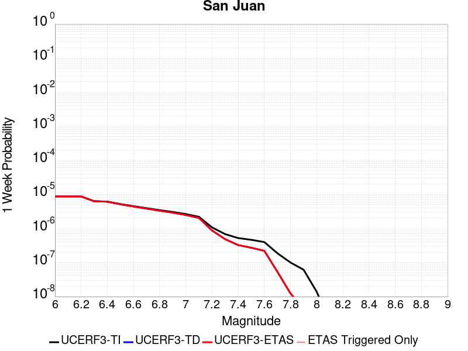 |  | 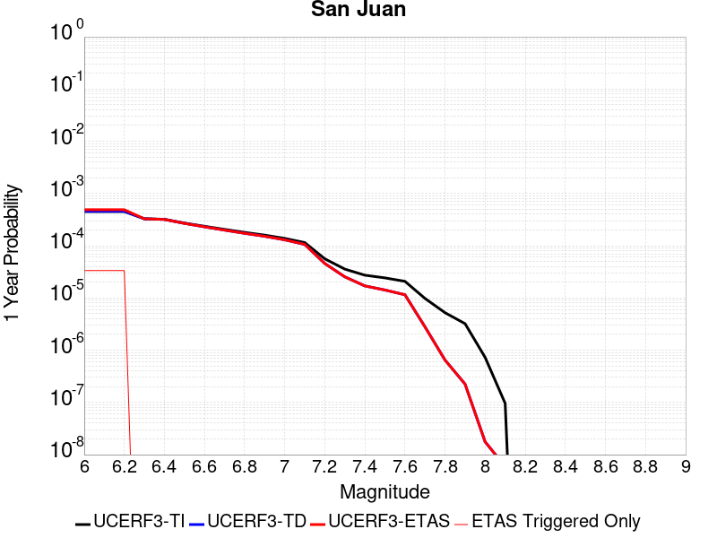 | 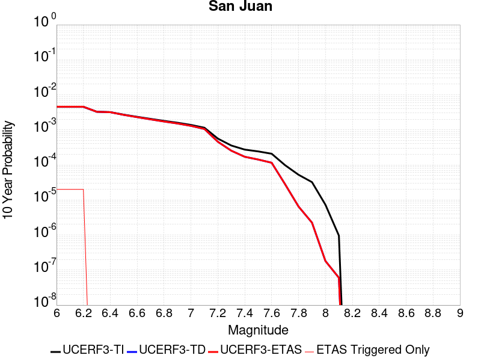 |

| Magnitude | 1 wk TI Prob | 1 wk TD Prob | 1 wk ETAS Prob | 1 wk ETAS/TD Gain | 1 wk ETAS Triggered Only | 1 mo TI Prob | 1 mo TD Prob | 1 mo ETAS Prob | 1 mo ETAS/TD Gain | 1 mo ETAS Triggered Only | 1 yr TI Prob | 1 yr TD Prob | 1 yr ETAS Prob | 1 yr ETAS/TD Gain | 1 yr ETAS Triggered Only | 10 yr TI Prob | 10 yr TD Prob | 10 yr ETAS Prob | 10 yr ETAS/TD Gain | 10 yr ETAS Triggered Only |
|-----|-----|-----|-----|-----|-----|-----|-----|-----|-----|-----|-----|-----|-----|-----|-----|-----|-----|-----|-----|-----|
| 6.0 | 8.682808E-6 | 8.749559E-6 | 8.749559E-6 | 1.0 | 0.0 | 3.72115E-5 | 3.7497597E-5 | 3.7497597E-5 | 1.0 | 0.0 | 4.5295584E-4 | 4.5644245E-4 | 4.7326979E-4 | 1.0368663 | 1.6835016E-5 | 0.004520337 | 0.0045555905 | 0.004589107 | 1.0073572 | 3.3670032E-5 |
| 6.1 | 8.682808E-6 | 8.749559E-6 | 8.749559E-6 | 1.0 | 0.0 | 3.72115E-5 | 3.7497597E-5 | 3.7497597E-5 | 1.0 | 0.0 | 4.5295584E-4 | 4.5644245E-4 | 4.7326979E-4 | 1.0368663 | 1.6835016E-5 | 0.004520337 | 0.0045555905 | 0.004589107 | 1.0073572 | 3.3670032E-5 |
| 6.2 | 8.682808E-6 | 8.749559E-6 | 8.749559E-6 | 1.0 | 0.0 | 3.72115E-5 | 3.7497597E-5 | 3.7497597E-5 | 1.0 | 0.0 | 4.5295584E-4 | 4.5644245E-4 | 4.7326979E-4 | 1.0368663 | 1.6835016E-5 | 0.004520337 | 0.0045555905 | 0.004589107 | 1.0073572 | 3.3670032E-5 |
| 6.3 | 6.3054235E-6 | 6.282968E-6 | 6.282968E-6 | 1.0 | 0.0 | 2.7022963E-5 | 2.6926737E-5 | 2.6926737E-5 | 1.0 | 0.0 | 3.2895492E-4 | 3.277851E-4 | 3.277851E-4 | 1.0 | 0.0 | 0.003284684 | 0.0032732163 | 0.0032732163 | 1.0 | 0.0 |
| 6.4 | 6.1490473E-6 | 6.114796E-6 | 6.114796E-6 | 1.0 | 0.0 | 2.6352795E-5 | 2.6206013E-5 | 2.6206013E-5 | 1.0 | 0.0 | 3.2079802E-4 | 3.1901288E-4 | 3.1901288E-4 | 1.0 | 0.0 | 0.0032033534 | 0.0031857456 | 0.0031857456 | 1.0 | 0.0 |
| 6.5 | 5.204848E-6 | 5.137553E-6 | 5.137553E-6 | 1.0 | 0.0 | 2.23063E-5 | 2.2017904E-5 | 2.2017904E-5 | 1.0 | 0.0 | 2.7154534E-4 | 2.6803595E-4 | 2.6803595E-4 | 1.0 | 0.0 | 0.0027121378 | 0.002677281 | 0.002677281 | 1.0 | 0.0 |
| 6.6 | 4.5179986E-6 | 4.415269E-6 | 4.415269E-6 | 1.0 | 0.0 | 1.9362706E-5 | 1.8922448E-5 | 1.8922448E-5 | 1.0 | 0.0 | 2.3571544E-4 | 2.3035725E-4 | 2.3035725E-4 | 1.0 | 0.0 | 0.0023546559 | 0.0023013218 | 0.0023013218 | 1.0 | 0.0 |
| 6.7 | 3.9442616E-6 | 3.8200415E-6 | 3.8200415E-6 | 1.0 | 0.0 | 1.6903869E-5 | 1.6371509E-5 | 1.6371509E-5 | 1.0 | 0.0 | 2.0578515E-4 | 1.9930555E-4 | 1.9930555E-4 | 1.0 | 0.0 | 0.002055947 | 0.001991393 | 0.001991393 | 1.0 | 0.0 |
| 6.8 | 3.4536245E-6 | 3.31654E-6 | 3.31654E-6 | 1.0 | 0.0 | 1.4801163E-5 | 1.4213669E-5 | 1.4213669E-5 | 1.0 | 0.0 | 1.8018926E-4 | 1.730383E-4 | 1.730383E-4 | 1.0 | 0.0 | 0.0018004322 | 0.0017291544 | 0.0017291544 | 1.0 | 0.0 |
| 6.9 | 3.059865E-6 | 2.912227E-6 | 2.912227E-6 | 1.0 | 0.0 | 1.3113641E-5 | 1.2480916E-5 | 1.2480916E-5 | 1.0 | 0.0 | 1.596469E-4 | 1.5194513E-4 | 1.5194513E-4 | 1.0 | 0.0 | 0.0015953224 | 0.001518527 | 0.001518527 | 1.0 | 0.0 |
| 7.0 | 2.6504351E-6 | 2.4921849E-6 | 2.4921849E-6 | 1.0 | 0.0 | 1.1358958E-5 | 1.0680751E-5 | 1.0680751E-5 | 1.0 | 0.0 | 1.3828653E-4 | 1.3003094E-4 | 1.3003094E-4 | 1.0 | 0.0 | 0.0013820052 | 0.0012996603 | 0.0012996603 | 1.0 | 0.0 |
| 7.1 | 2.2039317E-6 | 2.0339805E-6 | 2.0339805E-6 | 1.0 | 0.0 | 9.445387E-6 | 8.717033E-6 | 8.717033E-6 | 1.0 | 0.0 | 1.1499152E-4 | 1.0612523E-4 | 1.0612523E-4 | 1.0 | 0.0 | 0.0011493203 | 0.0010608556 | 0.0010608556 | 1.0 | 0.0 |
| 7.2 | 1.0786707E-6 | 8.7714847E-7 | 8.7714847E-7 | 1.0 | 0.0 | 4.622866E-6 | 3.7592022E-6 | 3.7592022E-6 | 1.0 | 0.0 | 5.628194E-5 | 4.5767338E-5 | 4.5767338E-5 | 1.0 | 0.0 | 5.6267687E-4 | 4.5763818E-4 | 4.5763818E-4 | 1.0 | 0.0 |
| 7.3 | 6.846433E-7 | 4.869622E-7 | 4.869622E-7 | 1.0 | 0.0 | 2.9341822E-6 | 2.0869793E-6 | 2.0869793E-6 | 1.0 | 0.0 | 3.5723086E-5 | 2.5408679E-5 | 2.5408679E-5 | 1.0 | 0.0 | 3.571734E-4 | 2.5409125E-4 | 2.5409125E-4 | 1.0 | 0.0 |
| 7.4 | 5.23043E-7 | 3.2634222E-7 | 3.2634222E-7 | 1.0 | 0.0 | 2.2416111E-6 | 1.3986087E-6 | 1.3986087E-6 | 1.0 | 0.0 | 2.7291273E-5 | 1.7027929E-5 | 1.7027929E-5 | 1.0 | 0.0 | 2.7287923E-4 | 1.7029818E-4 | 1.7029818E-4 | 1.0 | 0.0 |
| 7.5 | 4.648444E-7 | 2.724016E-7 | 2.724016E-7 | 1.0 | 0.0 | 1.9921886E-6 | 1.1674349E-6 | 1.1674349E-6 | 1.0 | 0.0 | 2.4254627E-5 | 1.4213428E-5 | 1.4213428E-5 | 1.0 | 0.0 | 2.425198E-4 | 1.4215481E-4 | 1.4215481E-4 | 1.0 | 0.0 |
| 7.6 | 3.9906567E-7 | 2.2087482E-7 | 2.2087482E-7 | 1.0 | 0.0 | 1.7102802E-6 | 9.4660606E-7 | 9.4660606E-7 | 1.0 | 0.0 | 2.0822463E-5 | 1.1524869E-5 | 1.1524869E-5 | 1.0 | 0.0 | 2.0820512E-4 | 1.1526732E-4 | 1.1526732E-4 | 1.0 | 0.0 |
| 7.7 | 1.8784601E-7 | 5.3682427E-8 | 5.3682427E-8 | 1.0 | 0.0 | 8.0505407E-7 | 2.3006753E-7 | 2.3006753E-7 | 1.0 | 0.0 | 9.80149E-6 | 2.8010686E-6 | 2.8010686E-6 | 1.0 | 0.0 | 9.801057E-5 | 2.801939E-5 | 2.801939E-5 | 1.0 | 0.0 |
| 7.8 | 1.00154914E-7 | 1.24208075E-8 | 1.24208075E-8 | 1.0 | 0.0 | 4.2923529E-7 | 5.323204E-8 | 5.323204E-8 | 1.0 | 0.0 | 5.225927E-6 | 6.4809996E-7 | 6.4809996E-7 | 1.0 | 0.0 | 5.225804E-5 | 6.4868796E-6 | 6.4868796E-6 | 1.0 | 0.0 |
| 7.9 | 6.171429E-8 | 4.2991957E-9 | 4.2991957E-9 | 1.0 | 0.0 | 2.6448978E-7 | 1.8425133E-8 | 1.8425133E-8 | 1.0 | 0.0 | 3.2201583E-6 | 2.2432597E-7 | 2.2432597E-7 | 1.0 | 0.0 | 3.2201115E-5 | 2.248556E-6 | 2.248556E-6 | 1.0 | 0.0 |
| 8.0 | 1.3974572E-8 | 3.3835368E-10 | 3.3835368E-10 | 1.0 | 0.0 | 5.989102E-8 | 1.450087E-9 | 1.450087E-9 | 1.0 | 0.0 | 7.2917294E-7 | 1.7654811E-8 | 1.7654811E-8 | 1.0 | 0.0 | 7.2917055E-6 | 1.8085565E-7 | 1.8085565E-7 | 1.0 | 0.0 |
| 8.1 | 1.8403477E-9 | 1.13145604E-10 | 1.13145604E-10 | 1.0 | 0.0 | 7.887204E-9 | 4.8490567E-10 | 4.8490567E-10 | 1.0 | 0.0 | 9.602671E-8 | 5.903737E-9 | 5.903737E-9 | 1.0 | 0.0 | 9.602667E-7 | 6.028191E-8 | 6.028191E-8 | 1.0 | 0.0 |

## Hunting Creek - Berryessa 2011 CFM
*[(top)](#table-of-contents)*

| 1 Week | 1 Month | 1 Year | 10 Year |
|-----|-----|-----|-----|
|  | 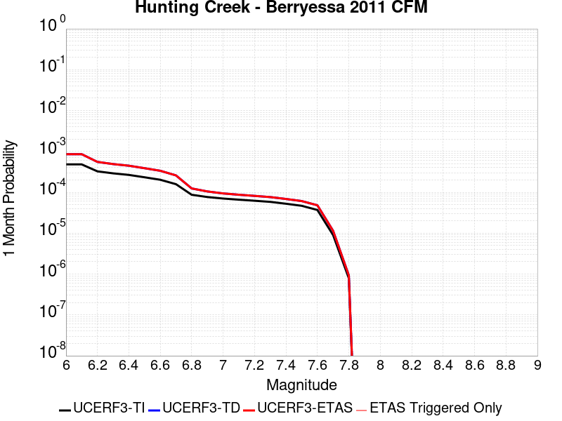 | 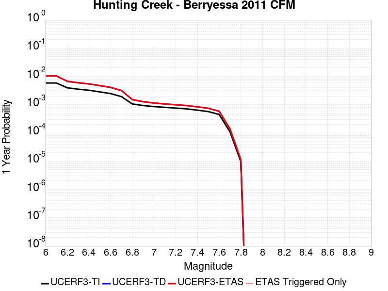 | 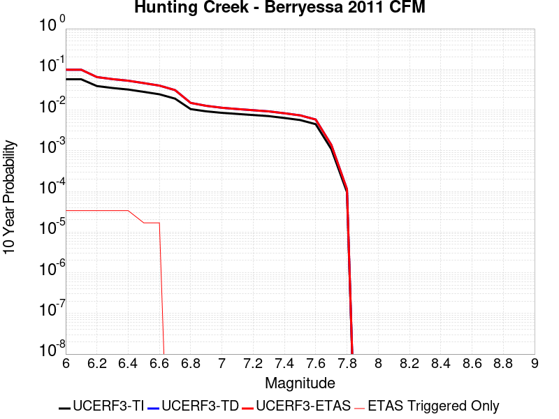 |

| Magnitude | 1 wk TI Prob | 1 wk TD Prob | 1 wk ETAS Prob | 1 wk ETAS/TD Gain | 1 wk ETAS Triggered Only | 1 mo TI Prob | 1 mo TD Prob | 1 mo ETAS Prob | 1 mo ETAS/TD Gain | 1 mo ETAS Triggered Only | 1 yr TI Prob | 1 yr TD Prob | 1 yr ETAS Prob | 1 yr ETAS/TD Gain | 1 yr ETAS Triggered Only | 10 yr TI Prob | 10 yr TD Prob | 10 yr ETAS Prob | 10 yr ETAS/TD Gain | 10 yr ETAS Triggered Only |
|-----|-----|-----|-----|-----|-----|-----|-----|-----|-----|-----|-----|-----|-----|-----|-----|-----|-----|-----|-----|-----|
| 6.0 | 1.1270982E-4 | 2.0014354E-4 | 2.0014354E-4 | 1.0 | 0.0 | 4.8295266E-4 | 8.574329E-4 | 8.574329E-4 | 1.0 | 0.0 | 0.0058641075 | 0.010387073 | 0.010387073 | 1.0 | 0.0 | 0.057117578 | 0.09804065 | 0.098071024 | 1.0003097 | 3.3670032E-5 |
| 6.1 | 1.1239393E-4 | 1.9962489E-4 | 1.9962489E-4 | 1.0 | 0.0 | 4.8159933E-4 | 8.552116E-4 | 8.552116E-4 | 1.0 | 0.0 | 0.0058477195 | 0.010360309 | 0.010360309 | 1.0 | 0.0 | 0.056962132 | 0.09779912 | 0.0978295 | 1.0003107 | 3.3670032E-5 |
| 6.2 | 7.596265E-5 | 1.2941175E-4 | 1.2941175E-4 | 1.0 | 0.0 | 3.2551357E-4 | 5.544276E-4 | 5.544276E-4 | 1.0 | 0.0 | 0.0039559277 | 0.0067212153 | 0.0067212153 | 1.0 | 0.0 | 0.038862433 | 0.0645938 | 0.06462529 | 1.0004876 | 3.3670032E-5 |
| 6.3 | 6.78794E-5 | 1.145196E-4 | 1.145196E-4 | 1.0 | 0.0 | 2.9087928E-4 | 4.9066654E-4 | 4.9066654E-4 | 1.0 | 0.0 | 0.003535705 | 0.0059528556 | 0.0059528556 | 1.0 | 0.0 | 0.034799766 | 0.05746746 | 0.057499196 | 1.0005522 | 3.3670032E-5 |
| 6.4 | 6.2165134E-5 | 1.0437306E-4 | 1.0437306E-4 | 1.0 | 0.0 | 2.6639478E-4 | 4.4723987E-4 | 4.4723987E-4 | 1.0 | 0.0 | 0.0032385332 | 0.005427739 | 0.005427739 | 1.0 | 0.0 | 0.03191742 | 0.052552443 | 0.052584346 | 1.000607 | 3.3670032E-5 |
| 6.5 | 5.4368087E-5 | 9.071981E-5 | 9.071981E-5 | 1.0 | 0.0 | 2.3298527E-4 | 3.887444E-4 | 3.887444E-4 | 1.0 | 0.0 | 0.0028329059 | 0.004720021 | 0.004720021 | 1.0 | 0.0 | 0.027970633 | 0.045881823 | 0.045897886 | 1.0003501 | 1.6835016E-5 |
| 6.6 | 4.729947E-5 | 7.848042E-5 | 7.848042E-5 | 1.0 | 0.0 | 2.0269625E-4 | 3.363043E-4 | 3.363043E-4 | 1.0 | 0.0 | 0.002465034 | 0.0040850975 | 0.0040850975 | 1.0 | 0.0 | 0.02437869 | 0.039853033 | 0.039869197 | 1.0004056 | 1.6835016E-5 |
| 6.7 | 3.6875328E-5 | 6.0455113E-5 | 6.0455113E-5 | 1.0 | 0.0 | 1.5802756E-4 | 2.5907016E-4 | 2.5907016E-4 | 1.0 | 0.0 | 0.0019222875 | 0.0031483201 | 0.0031483201 | 1.0 | 0.0 | 0.019057442 | 0.030893533 | 0.030893533 | 1.0 | 0.0 |
| 6.8 | 2.0292036E-5 | 2.897696E-5 | 2.897696E-5 | 1.0 | 0.0 | 8.6962966E-5 | 1.241811E-4 | 1.241811E-4 | 1.0 | 0.0 | 0.0010582599 | 0.00151084 | 0.00151084 | 1.0 | 0.0 | 0.010532344 | 0.014978847 | 0.014978847 | 1.0 | 0.0 |
| 6.9 | 1.7871042E-5 | 2.4472789E-5 | 2.4472789E-5 | 1.0 | 0.0 | 7.658793E-5 | 1.048792E-4 | 1.048792E-4 | 1.0 | 0.0 | 9.320591E-4 | 0.0012761577 | 0.0012761577 | 1.0 | 0.0 | 0.009281595 | 0.012680048 | 0.012680048 | 1.0 | 0.0 |
| 7.0 | 1.6415532E-5 | 2.1906764E-5 | 2.1906764E-5 | 1.0 | 0.0 | 7.035038E-5 | 9.388277E-5 | 9.388277E-5 | 1.0 | 0.0 | 8.561793E-4 | 0.0011424269 | 0.0011424269 | 1.0 | 0.0 | 0.008528882 | 0.011364769 | 0.011364769 | 1.0 | 0.0 |
| 7.1 | 1.5409885E-5 | 2.03468E-5 | 2.03468E-5 | 1.0 | 0.0 | 6.6040695E-5 | 8.719768E-5 | 8.719768E-5 | 1.0 | 0.0 | 8.0374884E-4 | 0.0010611176 | 0.0010611176 | 1.0 | 0.0 | 0.00800848 | 0.010560832 | 0.010560832 | 1.0 | 0.0 |
| 7.2 | 1.4497423E-5 | 1.905539E-5 | 1.905539E-5 | 1.0 | 0.0 | 6.213033E-5 | 8.166341E-5 | 8.166341E-5 | 1.0 | 0.0 | 7.5617427E-4 | 9.938016E-4 | 9.938016E-4 | 1.0 | 0.0 | 0.0075360634 | 0.009894148 | 0.009894148 | 1.0 | 0.0 |
| 7.3 | 1.3615175E-5 | 1.7826538E-5 | 1.7826538E-5 | 1.0 | 0.0 | 5.8349444E-5 | 7.639723E-5 | 7.639723E-5 | 1.0 | 0.0 | 7.101729E-4 | 9.2974224E-4 | 9.2974224E-4 | 1.0 | 0.0 | 0.0070790765 | 0.009259034 | 0.009259034 | 1.0 | 0.0 |
| 7.4 | 1.2252825E-5 | 1.6026612E-5 | 1.6026612E-5 | 1.0 | 0.0 | 5.251105E-5 | 6.868369E-5 | 6.868369E-5 | 1.0 | 0.0 | 6.391345E-4 | 8.359059E-4 | 8.359059E-4 | 1.0 | 0.0 | 0.0063729943 | 0.008328059 | 0.008328059 | 1.0 | 0.0 |
| 7.5 | 1.0913301E-5 | 1.4241439E-5 | 1.4241439E-5 | 1.0 | 0.0 | 4.6770452E-5 | 6.103333E-5 | 6.103333E-5 | 1.0 | 0.0 | 5.6928146E-4 | 7.4283016E-4 | 7.4283016E-4 | 1.0 | 0.0 | 0.0056782532 | 0.0074038464 | 0.0074038464 | 1.0 | 0.0 |
| 7.6 | 8.623192E-6 | 1.1234897E-5 | 1.1234897E-5 | 1.0 | 0.0 | 3.6956015E-5 | 4.8148686E-5 | 4.8148686E-5 | 1.0 | 0.0 | 4.4984656E-4 | 5.860551E-4 | 5.860551E-4 | 1.0 | 0.0 | 0.00448937 | 0.0058454107 | 0.0058454107 | 1.0 | 0.0 |
| 7.7 | 2.0993634E-6 | 2.6626365E-6 | 2.6626365E-6 | 1.0 | 0.0 | 8.997241E-6 | 1.141125E-5 | 1.141125E-5 | 1.0 | 0.0 | 1.09535904E-4 | 1.3892318E-4 | 1.3892318E-4 | 1.0 | 0.0 | 0.0010948193 | 0.0013883698 | 0.0013883698 | 1.0 | 0.0 |
| 7.8 | 1.8428308E-7 | 2.167475E-7 | 2.167475E-7 | 1.0 | 0.0 | 7.897844E-7 | 9.2891753E-7 | 9.2891753E-7 | 1.0 | 0.0 | 9.615583E-6 | 1.1309516E-5 | 1.1309516E-5 | 1.0 | 0.0 | 9.615166E-5 | 1.13088005E-4 | 1.13088005E-4 | 1.0 | 0.0 |

## Santa Ynez River
*[(top)](#table-of-contents)*

| 1 Week | 1 Month | 1 Year | 10 Year |
|-----|-----|-----|-----|
|  |  | 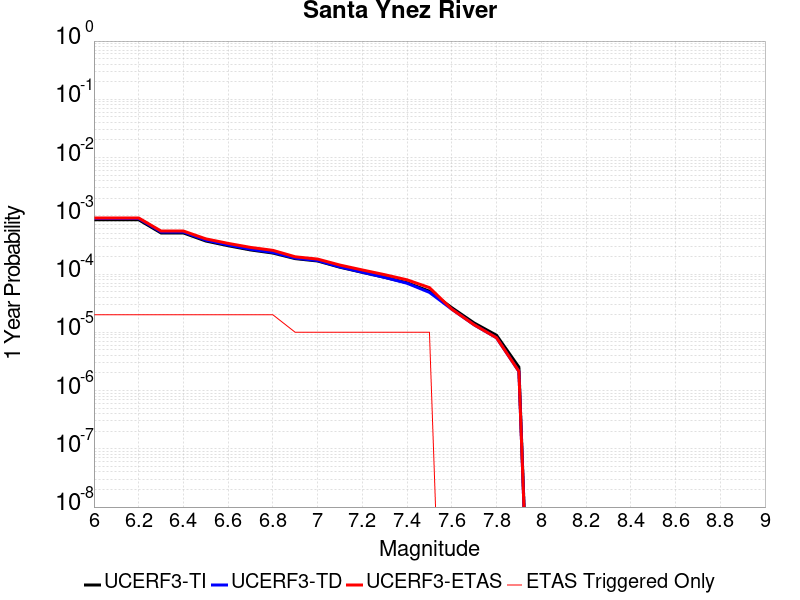 | 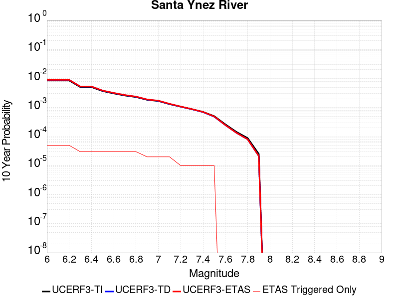 |

| Magnitude | 1 wk TI Prob | 1 wk TD Prob | 1 wk ETAS Prob | 1 wk ETAS/TD Gain | 1 wk ETAS Triggered Only | 1 mo TI Prob | 1 mo TD Prob | 1 mo ETAS Prob | 1 mo ETAS/TD Gain | 1 mo ETAS Triggered Only | 1 yr TI Prob | 1 yr TD Prob | 1 yr ETAS Prob | 1 yr ETAS/TD Gain | 1 yr ETAS Triggered Only | 10 yr TI Prob | 10 yr TD Prob | 10 yr ETAS Prob | 10 yr ETAS/TD Gain | 10 yr ETAS Triggered Only |
|-----|-----|-----|-----|-----|-----|-----|-----|-----|-----|-----|-----|-----|-----|-----|-----|-----|-----|-----|-----|-----|
| 6.0 | 1.6396456E-5 | 1.7209564E-5 | 1.7209564E-5 | 1.0 | 0.0 | 7.026863E-5 | 7.375339E-5 | 7.375339E-5 | 1.0 | 0.0 | 8.551848E-4 | 8.976132E-4 | 9.144331E-4 | 1.0187385 | 1.6835016E-5 | 0.0085190125 | 0.008943425 | 0.008976794 | 1.0037311 | 3.3670032E-5 |
| 6.1 | 1.6396456E-5 | 1.7209564E-5 | 1.7209564E-5 | 1.0 | 0.0 | 7.026863E-5 | 7.375339E-5 | 7.375339E-5 | 1.0 | 0.0 | 8.551848E-4 | 8.976132E-4 | 9.144331E-4 | 1.0187385 | 1.6835016E-5 | 0.0085190125 | 0.008943425 | 0.008976794 | 1.0037311 | 3.3670032E-5 |
| 6.2 | 1.6396456E-5 | 1.7209564E-5 | 1.7209564E-5 | 1.0 | 0.0 | 7.026863E-5 | 7.375339E-5 | 7.375339E-5 | 1.0 | 0.0 | 8.551848E-4 | 8.976132E-4 | 9.144331E-4 | 1.0187385 | 1.6835016E-5 | 0.0085190125 | 0.008943425 | 0.008976794 | 1.0037311 | 3.3670032E-5 |
| 6.3 | 9.736976E-6 | 1.0122399E-5 | 1.0122399E-5 | 1.0 | 0.0 | 4.172923E-5 | 4.3381016E-5 | 4.3381016E-5 | 1.0 | 0.0 | 5.0793495E-4 | 5.2804087E-4 | 5.44867E-4 | 1.0318652 | 1.6835016E-5 | 0.005067755 | 0.0052683675 | 0.00530186 | 1.0063573 | 3.3670032E-5 |
| 6.4 | 9.736976E-6 | 1.0122399E-5 | 1.0122399E-5 | 1.0 | 0.0 | 4.172923E-5 | 4.3381016E-5 | 4.3381016E-5 | 1.0 | 0.0 | 5.0793495E-4 | 5.2804087E-4 | 5.44867E-4 | 1.0318652 | 1.6835016E-5 | 0.005067755 | 0.0052683675 | 0.00530186 | 1.0063573 | 3.3670032E-5 |
| 6.5 | 7.081964E-6 | 7.3299457E-6 | 7.3299457E-6 | 1.0 | 0.0 | 3.035092E-5 | 3.1413685E-5 | 3.1413685E-5 | 1.0 | 0.0 | 3.694598E-4 | 3.8239607E-4 | 3.9922463E-4 | 1.0440083 | 1.6835016E-5 | 0.0036884616 | 0.0038175425 | 0.0038510838 | 1.0087862 | 3.3670032E-5 |
| 6.6 | 5.873247E-6 | 6.0597836E-6 | 6.0597836E-6 | 1.0 | 0.0 | 2.5170815E-5 | 2.5970248E-5 | 2.5970248E-5 | 1.0 | 0.0 | 3.064116E-4 | 3.1614274E-4 | 3.3297244E-4 | 1.0532345 | 1.6835016E-5 | 0.0030598943 | 0.0031570175 | 0.0031905812 | 1.0106314 | 3.3670032E-5 |
| 6.7 | 4.973277E-6 | 5.115936E-6 | 5.115936E-6 | 1.0 | 0.0 | 2.1313872E-5 | 2.1925258E-5 | 2.1925258E-5 | 1.0 | 0.0 | 2.5946548E-4 | 2.669078E-4 | 2.837383E-4 | 1.0630574 | 1.6835016E-5 | 0.0025916274 | 0.002665921 | 0.0026995013 | 1.0125961 | 3.3670032E-5 |
| 6.8 | 4.396492E-6 | 4.5110087E-6 | 4.5110087E-6 | 1.0 | 0.0 | 1.884197E-5 | 1.9332752E-5 | 1.9332752E-5 | 1.0 | 0.0 | 2.2937685E-4 | 2.3535118E-4 | 2.5218225E-4 | 1.0715146 | 1.6835016E-5 | 0.0022914023 | 0.0023510547 | 0.0023846456 | 1.0142876 | 3.3670032E-5 |
| 6.9 | 3.5255632E-6 | 3.6013587E-6 | 3.6013587E-6 | 1.0 | 0.0 | 1.5109469E-5 | 1.5434303E-5 | 1.5434303E-5 | 1.0 | 0.0 | 1.8394225E-4 | 1.878966E-4 | 2.0472845E-4 | 1.0895804 | 1.6835016E-5 | 0.0018379007 | 0.0018773936 | 0.0019110003 | 1.0179008 | 3.3670032E-5 |
| 7.0 | 3.211603E-6 | 3.2736775E-6 | 3.2736775E-6 | 1.0 | 0.0 | 1.376394E-5 | 1.4029972E-5 | 1.4029972E-5 | 1.0 | 0.0 | 1.6756308E-4 | 1.7080165E-4 | 1.8763379E-4 | 1.0985479 | 1.6835016E-5 | 0.0016743679 | 0.001706718 | 0.0017403306 | 1.0196943 | 3.3670032E-5 |
| 7.1 | 2.5094619E-6 | 2.5409397E-6 | 2.5409397E-6 | 1.0 | 0.0 | 1.0754793E-5 | 1.0889697E-5 | 1.0889697E-5 | 1.0 | 0.0 | 1.3093173E-4 | 1.3257404E-4 | 1.4940683E-4 | 1.126969 | 1.6835016E-5 | 0.0013085462 | 0.0013249556 | 0.001358581 | 1.0253786 | 3.3670032E-5 |
| 7.2 | 2.0515774E-6 | 2.0619539E-6 | 2.0619539E-6 | 1.0 | 0.0 | 8.792445E-6 | 8.836915E-6 | 8.836915E-6 | 1.0 | 0.0 | 1.0704277E-4 | 1.0758417E-4 | 1.2441738E-4 | 1.1564654 | 1.6835016E-5 | 0.0010699122 | 0.0010753252 | 0.0010921422 | 1.015639 | 1.6835016E-5 |
| 7.3 | 1.6845745E-6 | 1.6774045E-6 | 1.6774045E-6 | 1.0 | 0.0 | 7.219585E-6 | 7.1888567E-6 | 7.1888567E-6 | 1.0 | 0.0 | 8.78949E-5 | 8.752084E-5 | 1.0435439E-4 | 1.1923375 | 1.6835016E-5 | 8.7860145E-4 | 8.748666E-4 | 8.9168694E-4 | 1.0192261 | 1.6835016E-5 |
| 7.4 | 1.3600285E-6 | 1.3333469E-6 | 1.3333469E-6 | 1.0 | 0.0 | 5.82868E-6 | 5.714331E-6 | 5.714331E-6 | 1.0 | 0.0 | 7.096187E-5 | 6.956978E-5 | 8.640363E-5 | 1.2419707 | 1.6835016E-5 | 7.0939213E-4 | 6.9548225E-4 | 7.123056E-4 | 1.0241895 | 1.6835016E-5 |
| 7.5 | 9.735342E-7 | 9.290183E-7 | 9.290183E-7 | 1.0 | 0.0 | 4.172283E-6 | 3.981501E-6 | 3.981501E-6 | 1.0 | 0.0 | 5.079636E-5 | 4.8473714E-5 | 6.530791E-5 | 1.3472852 | 1.6835016E-5 | 5.0784746E-4 | 4.846331E-4 | 5.0146E-4 | 1.0347208 | 1.6835016E-5 |
| 7.6 | 5.067187E-7 | 4.778607E-7 | 4.778607E-7 | 1.0 | 0.0 | 2.1716498E-6 | 2.0479727E-6 | 2.0479727E-6 | 1.0 | 0.0 | 2.6439517E-5 | 2.493379E-5 | 2.493379E-5 | 1.0 | 0.0 | 2.643637E-4 | 2.4931066E-4 | 2.4931066E-4 | 1.0 | 0.0 |
| 7.7 | 2.769089E-7 | 2.5759311E-7 | 2.5759311E-7 | 1.0 | 0.0 | 1.1867519E-6 | 1.1039699E-6 | 1.1039699E-6 | 1.0 | 0.0 | 1.4448608E-5 | 1.3440752E-5 | 1.3440752E-5 | 1.0 | 0.0 | 1.444767E-4 | 1.3439942E-4 | 1.3439942E-4 | 1.0 | 0.0 |
| 7.8 | 1.7044663E-7 | 1.5449127E-7 | 1.5449127E-7 | 1.0 | 0.0 | 7.3048534E-7 | 6.6210526E-7 | 6.6210526E-7 | 1.0 | 0.0 | 8.893623E-6 | 8.061102E-6 | 8.061102E-6 | 1.0 | 0.0 | 8.893267E-5 | 8.0608115E-5 | 8.0608115E-5 | 1.0 | 0.0 |
| 7.9 | 4.8344287E-8 | 4.0911235E-8 | 4.0911235E-8 | 1.0 | 0.0 | 2.0718979E-7 | 1.7533385E-7 | 1.7533385E-7 | 1.0 | 0.0 | 2.5225327E-6 | 2.1346877E-6 | 2.1346877E-6 | 1.0 | 0.0 | 2.5225041E-5 | 2.1346676E-5 | 2.1346676E-5 | 1.0 | 0.0 |

## San Clemente
*[(top)](#table-of-contents)*

| 1 Week | 1 Month | 1 Year | 10 Year |
|-----|-----|-----|-----|
| 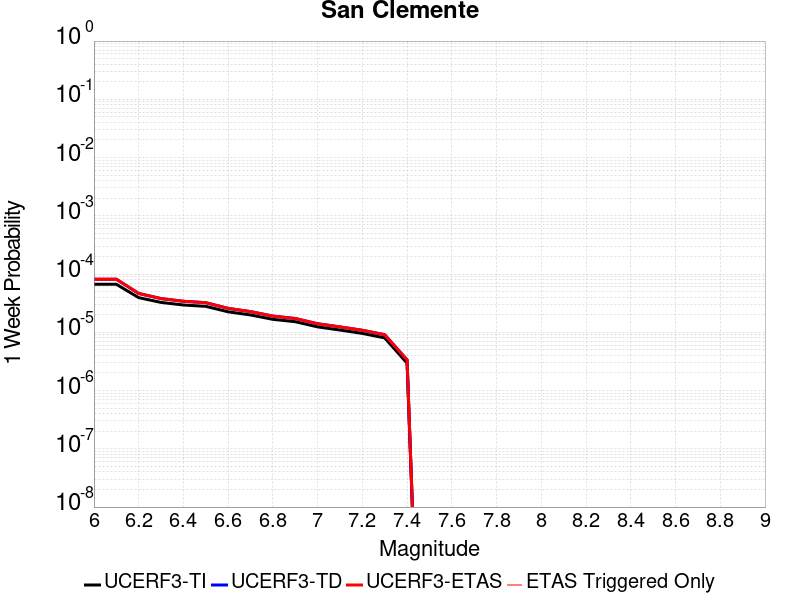 | 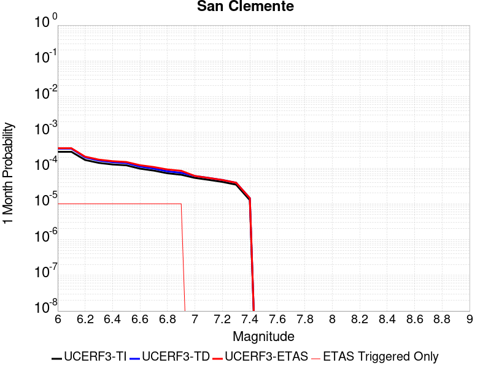 | 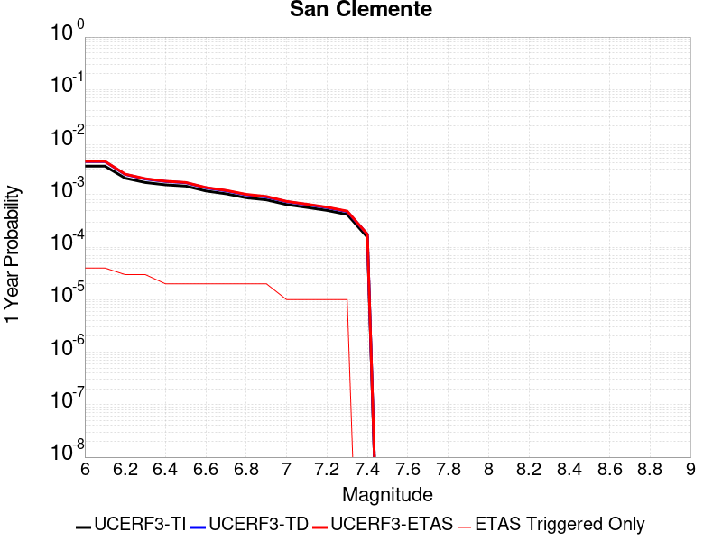 | 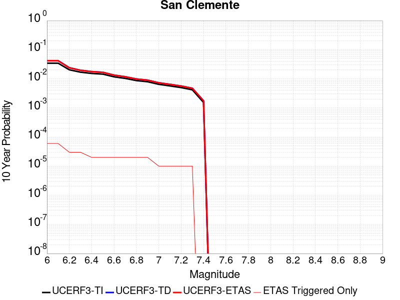 |

| Magnitude | 1 wk TI Prob | 1 wk TD Prob | 1 wk ETAS Prob | 1 wk ETAS/TD Gain | 1 wk ETAS Triggered Only | 1 mo TI Prob | 1 mo TD Prob | 1 mo ETAS Prob | 1 mo ETAS/TD Gain | 1 mo ETAS Triggered Only | 1 yr TI Prob | 1 yr TD Prob | 1 yr ETAS Prob | 1 yr ETAS/TD Gain | 1 yr ETAS Triggered Only | 10 yr TI Prob | 10 yr TD Prob | 10 yr ETAS Prob | 10 yr ETAS/TD Gain | 10 yr ETAS Triggered Only |
|-----|-----|-----|-----|-----|-----|-----|-----|-----|-----|-----|-----|-----|-----|-----|-----|-----|-----|-----|-----|-----|
| 6.0 | 6.681379E-5 | 8.163669E-5 | 8.163669E-5 | 1.0 | 0.0 | 2.8631336E-4 | 3.4982787E-4 | 3.4982787E-4 | 1.0 | 0.0 | 0.003480294 | 0.004251416 | 0.004268179 | 1.0039431 | 1.6835016E-5 | 0.03426291 | 0.041756913 | 0.041789178 | 1.0007727 | 3.3670032E-5 |
| 6.1 | 6.681379E-5 | 8.163669E-5 | 8.163669E-5 | 1.0 | 0.0 | 2.8631336E-4 | 3.4982787E-4 | 3.4982787E-4 | 1.0 | 0.0 | 0.003480294 | 0.004251416 | 0.004268179 | 1.0039431 | 1.6835016E-5 | 0.03426291 | 0.041756913 | 0.041789178 | 1.0007727 | 3.3670032E-5 |
| 6.2 | 3.9400576E-5 | 4.6453104E-5 | 4.6453104E-5 | 1.0 | 0.0 | 1.6884868E-4 | 1.9906988E-4 | 1.9906988E-4 | 1.0 | 0.0 | 0.0020537945 | 0.0024210429 | 0.0024378372 | 1.0069368 | 1.6835016E-5 | 0.020349167 | 0.023953425 | 0.023969857 | 1.0006859 | 1.6835016E-5 |
| 6.3 | 3.2590255E-5 | 3.792992E-5 | 3.792992E-5 | 1.0 | 0.0 | 1.3966505E-4 | 1.6254683E-4 | 1.6254683E-4 | 1.0 | 0.0 | 0.0016990956 | 0.0019772416 | 0.0019940434 | 1.0084976 | 1.6835016E-5 | 0.01686163 | 0.019600289 | 0.019616794 | 1.0008421 | 1.6835016E-5 |
| 6.4 | 2.9454652E-5 | 3.4098495E-5 | 3.4098495E-5 | 1.0 | 0.0 | 1.2622811E-4 | 1.4612835E-4 | 1.4612835E-4 | 1.0 | 0.0 | 0.0015357438 | 0.0017776854 | 0.0017944905 | 1.0094533 | 1.6835016E-5 | 0.015251739 | 0.017637825 | 0.017654363 | 1.0009377 | 1.6835016E-5 |
| 6.5 | 2.790836E-5 | 3.2248132E-5 | 3.2248132E-5 | 1.0 | 0.0 | 1.1960178E-4 | 1.3819907E-4 | 1.3819907E-4 | 1.0 | 0.0 | 0.001455179 | 0.0016812999 | 0.0016981065 | 1.0099963 | 1.6835016E-5 | 0.014456868 | 0.016688818 | 0.016705371 | 1.000992 | 1.6835016E-5 |
| 6.6 | 2.2492153E-5 | 2.5763205E-5 | 2.5763205E-5 | 1.0 | 0.0 | 9.639138E-5 | 1.1040914E-4 | 1.1040914E-4 | 1.0 | 0.0 | 0.0011729331 | 0.0013434167 | 0.0013602292 | 1.0125147 | 1.6835016E-5 | 0.011667615 | 0.013354672 | 0.013371282 | 1.0012438 | 1.6835016E-5 |
| 6.7 | 1.9862755E-5 | 2.2666847E-5 | 2.2666847E-5 | 1.0 | 0.0 | 8.512331E-5 | 9.714008E-5 | 9.714008E-5 | 1.0 | 0.0 | 0.0010358836 | 0.0011820501 | 0.0011988652 | 1.0142254 | 1.6835016E-5 | 0.010310682 | 0.01175892 | 0.011775557 | 1.0014149 | 1.6835016E-5 |
| 6.8 | 1.6697575E-5 | 1.8978053E-5 | 1.8978053E-5 | 1.0 | 0.0 | 7.155907E-5 | 8.133203E-5 | 8.133203E-5 | 1.0 | 0.0 | 8.7088346E-4 | 9.89777E-4 | 0.0010065953 | 1.0169921 | 1.6835016E-5 | 0.008674784 | 0.009854714 | 0.009871384 | 1.0016915 | 1.6835016E-5 |
| 6.9 | 1.5218415E-5 | 1.726971E-5 | 1.726971E-5 | 1.0 | 0.0 | 6.522015E-5 | 7.401099E-5 | 7.401099E-5 | 1.0 | 0.0 | 7.93766E-4 | 9.0072013E-4 | 9.1753993E-4 | 1.0186738 | 1.6835016E-5 | 0.007909367 | 0.00897164 | 0.008988324 | 1.0018597 | 1.6835016E-5 |
| 7.0 | 1.2392958E-5 | 1.4033262E-5 | 1.4033262E-5 | 1.0 | 0.0 | 5.3111595E-5 | 6.0141207E-5 | 6.0141207E-5 | 1.0 | 0.0 | 6.4644177E-4 | 7.319808E-4 | 7.488035E-4 | 1.0229825 | 1.6835016E-5 | 0.0064456454 | 0.0072964844 | 0.0073131965 | 1.0022905 | 1.6835016E-5 |
| 7.1 | 1.0934128E-5 | 1.2375354E-5 | 1.2375354E-5 | 1.0 | 0.0 | 4.6859706E-5 | 5.3036194E-5 | 5.3036194E-5 | 1.0 | 0.0 | 5.7036756E-4 | 6.455317E-4 | 6.6235586E-4 | 1.0260625 | 1.6835016E-5 | 0.0056890585 | 0.006437312 | 0.0064540384 | 1.0025984 | 1.6835016E-5 |
| 7.2 | 9.5798805E-6 | 1.0845125E-5 | 1.0845125E-5 | 1.0 | 0.0 | 4.1055984E-5 | 4.647832E-5 | 4.647832E-5 | 1.0 | 0.0 | 4.9974193E-4 | 5.657338E-4 | 5.825593E-4 | 1.029741 | 1.6835016E-5 | 0.0049861963 | 0.00564366 | 0.0056604003 | 1.0029662 | 1.6835016E-5 |
| 7.3 | 8.0167365E-6 | 9.084078E-6 | 9.084078E-6 | 1.0 | 0.0 | 3.4356988E-5 | 3.8931223E-5 | 3.8931223E-5 | 1.0 | 0.0 | 4.1821605E-4 | 4.738916E-4 | 4.9071864E-4 | 1.0355082 | 1.6835016E-5 | 0.0041742986 | 0.004729513 | 0.0047462685 | 1.0035428 | 1.6835016E-5 |
| 7.4 | 2.9581017E-6 | 3.36244E-6 | 3.36244E-6 | 1.0 | 0.0 | 1.2677518E-5 | 1.4410407E-5 | 1.4410407E-5 | 1.0 | 0.0 | 1.5433785E-4 | 1.7543763E-4 | 1.7543763E-4 | 1.0 | 0.0 | 0.001542307 | 0.0017534863 | 0.0017534863 | 1.0 | 0.0 |

## Whittier alt 1
*[(top)](#table-of-contents)*

| 1 Week | 1 Month | 1 Year | 10 Year |
|-----|-----|-----|-----|
| 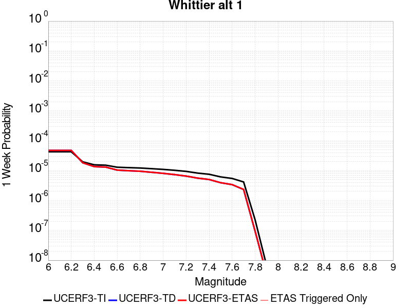 | 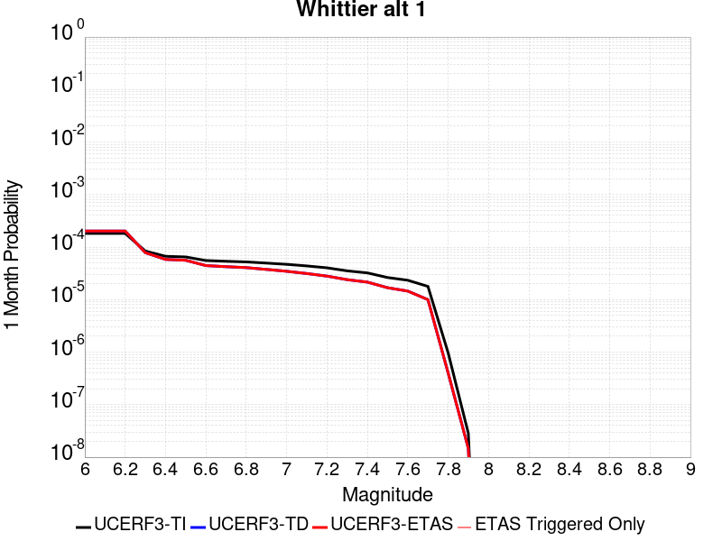 | 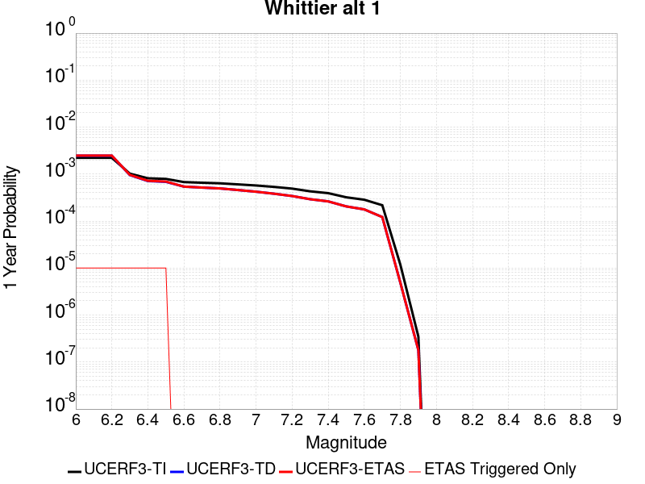 | 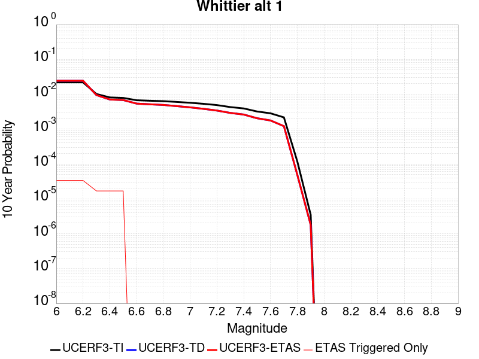 |

| Magnitude | 1 wk TI Prob | 1 wk TD Prob | 1 wk ETAS Prob | 1 wk ETAS/TD Gain | 1 wk ETAS Triggered Only | 1 mo TI Prob | 1 mo TD Prob | 1 mo ETAS Prob | 1 mo ETAS/TD Gain | 1 mo ETAS Triggered Only | 1 yr TI Prob | 1 yr TD Prob | 1 yr ETAS Prob | 1 yr ETAS/TD Gain | 1 yr ETAS Triggered Only | 10 yr TI Prob | 10 yr TD Prob | 10 yr ETAS Prob | 10 yr ETAS/TD Gain | 10 yr ETAS Triggered Only |
|-----|-----|-----|-----|-----|-----|-----|-----|-----|-----|-----|-----|-----|-----|-----|-----|-----|-----|-----|-----|-----|
| 6.0 | 4.2554693E-5 | 4.7253463E-5 | 4.7253463E-5 | 1.0 | 0.0 | 1.8236451E-4 | 2.0250095E-4 | 2.0250095E-4 | 1.0 | 0.0 | 0.002218027 | 0.0024629822 | 0.0024797756 | 1.0068184 | 1.6835016E-5 | 0.02196019 | 0.02439089 | 0.024423737 | 1.0013467 | 3.3670032E-5 |
| 6.1 | 4.2554693E-5 | 4.7253463E-5 | 4.7253463E-5 | 1.0 | 0.0 | 1.8236451E-4 | 2.0250095E-4 | 2.0250095E-4 | 1.0 | 0.0 | 0.002218027 | 0.0024629822 | 0.0024797756 | 1.0068184 | 1.6835016E-5 | 0.02196019 | 0.02439089 | 0.024423737 | 1.0013467 | 3.3670032E-5 |
| 6.2 | 4.2554693E-5 | 4.7253463E-5 | 4.7253463E-5 | 1.0 | 0.0 | 1.8236451E-4 | 2.0250095E-4 | 2.0250095E-4 | 1.0 | 0.0 | 0.002218027 | 0.0024629822 | 0.0024797756 | 1.0068184 | 1.6835016E-5 | 0.02196019 | 0.02439089 | 0.024423737 | 1.0013467 | 3.3670032E-5 |
| 6.3 | 1.9617712E-5 | 1.8269313E-5 | 1.8269313E-5 | 1.0 | 0.0 | 8.40732E-5 | 7.829482E-5 | 7.829482E-5 | 1.0 | 0.0 | 0.0010231105 | 9.528416E-4 | 9.696606E-4 | 1.0176514 | 1.6835016E-5 | 0.01018413 | 0.009490847 | 0.009507522 | 1.001757 | 1.6835016E-5 |
| 6.4 | 1.5611336E-5 | 1.3604893E-5 | 1.3604893E-5 | 1.0 | 0.0 | 6.690401E-5 | 5.8305417E-5 | 5.8305417E-5 | 1.0 | 0.0 | 8.142519E-4 | 7.0964324E-4 | 7.264663E-4 | 1.0237064 | 1.6835016E-5 | 0.008112748 | 0.0070757363 | 0.0070924526 | 1.0023624 | 1.6835016E-5 |
| 6.5 | 1.5150166E-5 | 1.3101541E-5 | 1.3101541E-5 | 1.0 | 0.0 | 6.492767E-5 | 5.614829E-5 | 5.614829E-5 | 1.0 | 0.0 | 7.9020765E-4 | 6.833969E-4 | 7.0022035E-4 | 1.0246174 | 1.6835016E-5 | 0.007874036 | 0.0068149036 | 0.0068316236 | 1.0024534 | 1.6835016E-5 |
| 6.6 | 1.295588E-5 | 1.0381249E-5 | 1.0381249E-5 | 1.0 | 0.0 | 5.552402E-5 | 4.449032E-5 | 4.449032E-5 | 1.0 | 0.0 | 6.7579525E-4 | 5.4153695E-4 | 5.4153695E-4 | 1.0 | 0.0 | 0.006737438 | 0.005403607 | 0.005403607 | 1.0 | 0.0 |
| 6.7 | 1.2542085E-5 | 9.899882E-6 | 9.899882E-6 | 1.0 | 0.0 | 5.3750682E-5 | 4.2427386E-5 | 4.2427386E-5 | 1.0 | 0.0 | 6.542181E-4 | 5.1643286E-4 | 5.1643286E-4 | 1.0 | 0.0 | 0.006522954 | 0.0051537454 | 0.0051537454 | 1.0 | 0.0 |
| 6.8 | 1.2195878E-5 | 9.495912E-6 | 9.495912E-6 | 1.0 | 0.0 | 5.2267E-5 | 4.0696144E-5 | 4.0696144E-5 | 1.0 | 0.0 | 6.36165E-4 | 4.953648E-4 | 4.953648E-4 | 1.0 | 0.0 | 0.0063434686 | 0.0049439464 | 0.0049439464 | 1.0 | 0.0 |
| 6.9 | 1.1580298E-5 | 8.773408E-6 | 8.773408E-6 | 1.0 | 0.0 | 4.9628903E-5 | 3.7599788E-5 | 3.7599788E-5 | 1.0 | 0.0 | 6.040644E-4 | 4.576829E-4 | 4.576829E-4 | 1.0 | 0.0 | 0.00602425 | 0.0045686625 | 0.0045686625 | 1.0 | 0.0 |
| 7.0 | 1.0964795E-5 | 8.084448E-6 | 8.084448E-6 | 1.0 | 0.0 | 4.6991136E-5 | 3.4647182E-5 | 3.4647182E-5 | 1.0 | 0.0 | 5.7196687E-4 | 4.2174934E-4 | 4.2174934E-4 | 1.0 | 0.0 | 0.0057049696 | 0.004210698 | 0.004210698 | 1.0 | 0.0 |
| 7.1 | 1.0230601E-5 | 7.3269985E-6 | 7.3269985E-6 | 1.0 | 0.0 | 4.3844695E-5 | 3.140105E-5 | 3.140105E-5 | 1.0 | 0.0 | 5.336784E-4 | 3.8224205E-4 | 3.8224205E-4 | 1.0 | 0.0 | 0.005323986 | 0.0038170093 | 0.0038170093 | 1.0 | 0.0 |
| 7.2 | 9.40865E-6 | 6.5435725E-6 | 6.5435725E-6 | 1.0 | 0.0 | 4.032216E-5 | 2.8043587E-5 | 2.8043587E-5 | 1.0 | 0.0 | 4.908117E-4 | 3.413784E-4 | 3.413784E-4 | 1.0 | 0.0 | 0.0048972913 | 0.0034096325 | 0.0034096325 | 1.0 | 0.0 |
| 7.3 | 8.237384E-6 | 5.5979945E-6 | 5.5979945E-6 | 1.0 | 0.0 | 3.5302593E-5 | 2.399119E-5 | 2.399119E-5 | 1.0 | 0.0 | 4.2972428E-4 | 2.9205464E-4 | 2.9205464E-4 | 1.0 | 0.0 | 0.0042889426 | 0.002917029 | 0.002917029 | 1.0 | 0.0 |
| 7.4 | 7.5316966E-6 | 5.0280382E-6 | 5.0280382E-6 | 1.0 | 0.0 | 3.2278298E-5 | 2.1548563E-5 | 2.1548563E-5 | 1.0 | 0.0 | 3.9291743E-4 | 2.6232318E-4 | 2.6232318E-4 | 1.0 | 0.0 | 0.0039222343 | 0.0026202472 | 0.0026202472 | 1.0 | 0.0 |
| 7.5 | 6.149649E-6 | 3.934013E-6 | 3.934013E-6 | 1.0 | 0.0 | 2.6355372E-5 | 1.685995E-5 | 1.685995E-5 | 1.0 | 0.0 | 3.208294E-4 | 2.0525148E-4 | 2.0525148E-4 | 1.0 | 0.0 | 0.003203666 | 0.0020507083 | 0.0020507083 | 1.0 | 0.0 |
| 7.6 | 5.457711E-6 | 3.395529E-6 | 3.395529E-6 | 1.0 | 0.0 | 2.338998E-5 | 1.4552191E-5 | 1.4552191E-5 | 1.0 | 0.0 | 2.8473578E-4 | 1.7715934E-4 | 1.7715934E-4 | 1.0 | 0.0 | 0.0028437122 | 0.0017702618 | 0.0017702618 | 1.0 | 0.0 |
| 7.7 | 4.1676276E-6 | 2.3333084E-6 | 2.3333084E-6 | 1.0 | 0.0 | 1.7861139E-5 | 9.99986E-6 | 9.99986E-6 | 1.0 | 0.0 | 2.1743766E-4 | 1.2174223E-4 | 1.2174223E-4 | 1.0 | 0.0 | 0.0021722503 | 0.0012168285 | 0.0012168285 | 1.0 | 0.0 |
| 7.8 | 2.2692414E-7 | 9.385943E-8 | 9.385943E-8 | 1.0 | 0.0 | 9.725317E-7 | 4.0225464E-7 | 4.0225464E-7 | 1.0 | 0.0 | 1.1840509E-5 | 4.8974425E-6 | 4.8974425E-6 | 1.0 | 0.0 | 1.1839878E-4 | 4.8973674E-5 | 4.8973674E-5 | 1.0 | 0.0 |
| 7.9 | 6.676829E-9 | 3.4399772E-9 | 3.4399772E-9 | 1.0 | 0.0 | 2.861498E-8 | 1.4742759E-8 | 1.4742759E-8 | 1.0 | 0.0 | 3.4838732E-7 | 1.7949307E-7 | 1.7949307E-7 | 1.0 | 0.0 | 3.4838679E-6 | 1.7949295E-6 | 1.7949295E-6 | 1.0 | 0.0 |

## Lost Hills
*[(top)](#table-of-contents)*

| 1 Week | 1 Month | 1 Year | 10 Year |
|-----|-----|-----|-----|
|  | 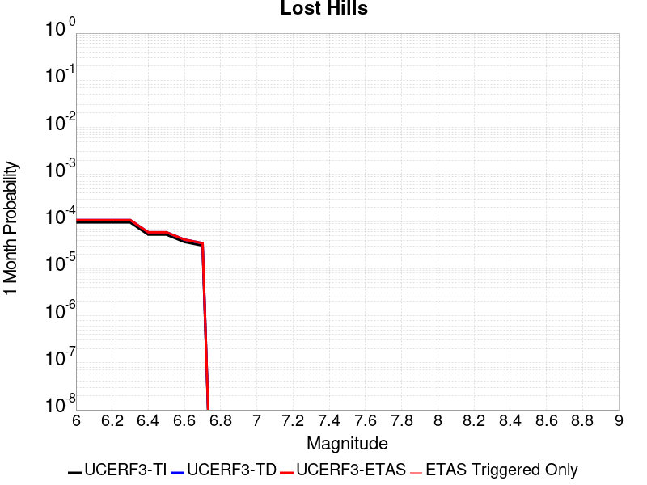 | 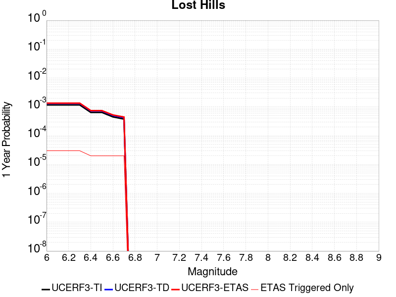 | 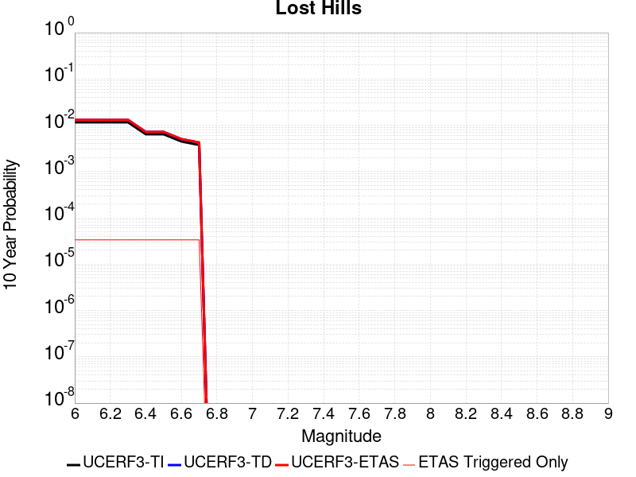 |

| Magnitude | 1 wk TI Prob | 1 wk TD Prob | 1 wk ETAS Prob | 1 wk ETAS/TD Gain | 1 wk ETAS Triggered Only | 1 mo TI Prob | 1 mo TD Prob | 1 mo ETAS Prob | 1 mo ETAS/TD Gain | 1 mo ETAS Triggered Only | 1 yr TI Prob | 1 yr TD Prob | 1 yr ETAS Prob | 1 yr ETAS/TD Gain | 1 yr ETAS Triggered Only | 10 yr TI Prob | 10 yr TD Prob | 10 yr ETAS Prob | 10 yr ETAS/TD Gain | 10 yr ETAS Triggered Only |
|-----|-----|-----|-----|-----|-----|-----|-----|-----|-----|-----|-----|-----|-----|-----|-----|-----|-----|-----|-----|-----|
| 6.0 | 2.233523E-5 | 2.5106996E-5 | 2.5106996E-5 | 1.0 | 0.0 | 9.571891E-5 | 1.0759792E-4 | 1.0759792E-4 | 1.0 | 0.0 | 0.0011647546 | 0.0013093855 | 0.0013093855 | 1.0 | 0.0 | 0.011586686 | 0.013033304 | 0.013066535 | 1.0025498 | 3.3670032E-5 |
| 6.1 | 2.233523E-5 | 2.5106996E-5 | 2.5106996E-5 | 1.0 | 0.0 | 9.571891E-5 | 1.0759792E-4 | 1.0759792E-4 | 1.0 | 0.0 | 0.0011647546 | 0.0013093855 | 0.0013093855 | 1.0 | 0.0 | 0.011586686 | 0.013033304 | 0.013066535 | 1.0025498 | 3.3670032E-5 |
| 6.2 | 2.233523E-5 | 2.5106996E-5 | 2.5106996E-5 | 1.0 | 0.0 | 9.571891E-5 | 1.0759792E-4 | 1.0759792E-4 | 1.0 | 0.0 | 0.0011647546 | 0.0013093855 | 0.0013093855 | 1.0 | 0.0 | 0.011586686 | 0.013033304 | 0.013066535 | 1.0025498 | 3.3670032E-5 |
| 6.3 | 2.233523E-5 | 2.5106996E-5 | 2.5106996E-5 | 1.0 | 0.0 | 9.571891E-5 | 1.0759792E-4 | 1.0759792E-4 | 1.0 | 0.0 | 0.0011647546 | 0.0013093855 | 0.0013093855 | 1.0 | 0.0 | 0.011586686 | 0.013033304 | 0.013066535 | 1.0025498 | 3.3670032E-5 |
| 6.4 | 1.2288092E-5 | 1.37813295E-5 | 1.37813295E-5 | 1.0 | 0.0 | 5.2662188E-5 | 5.9062033E-5 | 5.9062033E-5 | 1.0 | 0.0 | 6.409735E-4 | 7.189368E-4 | 7.189368E-4 | 1.0 | 0.0 | 0.006391279 | 0.007175316 | 0.0071920305 | 1.0023293 | 1.6835016E-5 |
| 6.5 | 1.2288092E-5 | 1.37813295E-5 | 1.37813295E-5 | 1.0 | 0.0 | 5.2662188E-5 | 5.9062033E-5 | 5.9062033E-5 | 1.0 | 0.0 | 6.409735E-4 | 7.189368E-4 | 7.189368E-4 | 1.0 | 0.0 | 0.006391279 | 0.007175316 | 0.0071920305 | 1.0023293 | 1.6835016E-5 |
| 6.6 | 8.58281E-6 | 9.633926E-6 | 9.633926E-6 | 1.0 | 0.0 | 3.6782953E-5 | 4.1288073E-5 | 4.1288073E-5 | 1.0 | 0.0 | 4.4774043E-4 | 5.026495E-4 | 5.026495E-4 | 1.0 | 0.0 | 0.0044683935 | 0.0050232867 | 0.005040037 | 1.0033345 | 1.6835016E-5 |
| 6.7 | 7.205685E-6 | 8.088433E-6 | 8.088433E-6 | 1.0 | 0.0 | 3.088114E-5 | 3.4664714E-5 | 3.4664714E-5 | 1.0 | 0.0 | 3.7591302E-4 | 4.2204288E-4 | 4.2204288E-4 | 1.0 | 0.0 | 0.0037527776 | 0.004220429 | 0.0042371927 | 1.003972 | 1.6835016E-5 |

## Imperial
*[(top)](#table-of-contents)*

| 1 Week | 1 Month | 1 Year | 10 Year |
|-----|-----|-----|-----|
| 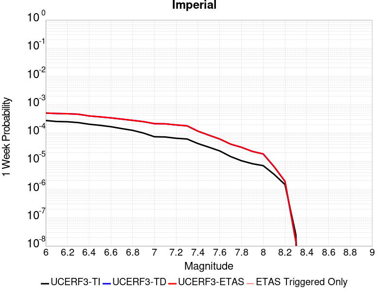 |  | 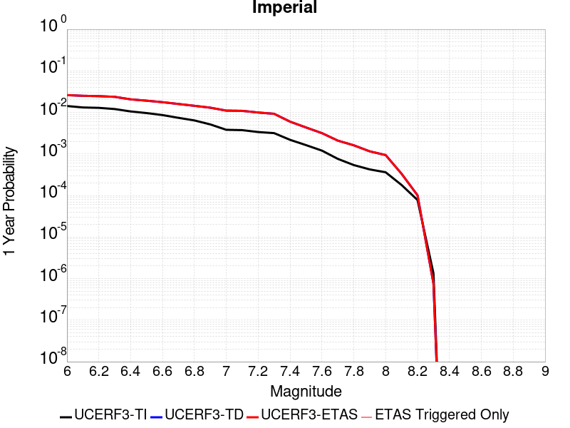 | 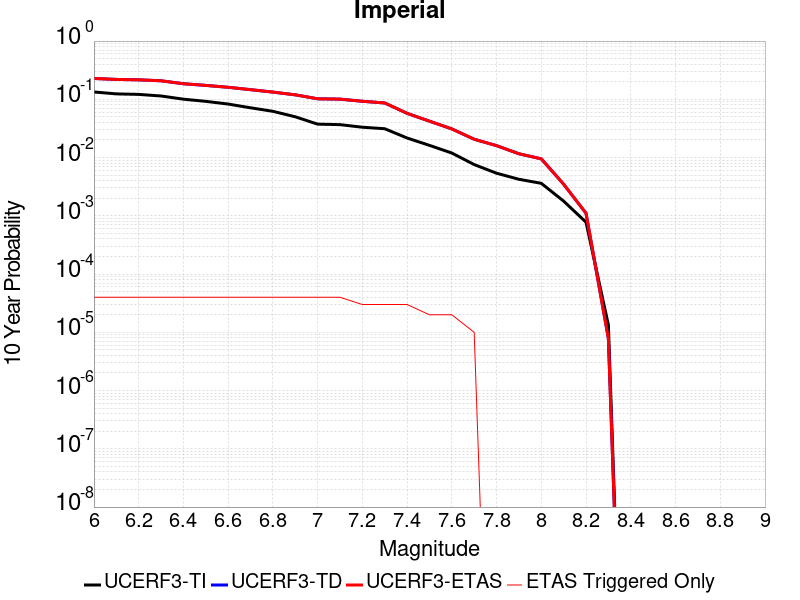 |

| Magnitude | 1 wk TI Prob | 1 wk TD Prob | 1 wk ETAS Prob | 1 wk ETAS/TD Gain | 1 wk ETAS Triggered Only | 1 mo TI Prob | 1 mo TD Prob | 1 mo ETAS Prob | 1 mo ETAS/TD Gain | 1 mo ETAS Triggered Only | 1 yr TI Prob | 1 yr TD Prob | 1 yr ETAS Prob | 1 yr ETAS/TD Gain | 1 yr ETAS Triggered Only | 10 yr TI Prob | 10 yr TD Prob | 10 yr ETAS Prob | 10 yr ETAS/TD Gain | 10 yr ETAS Triggered Only |
|-----|-----|-----|-----|-----|-----|-----|-----|-----|-----|-----|-----|-----|-----|-----|-----|-----|-----|-----|-----|-----|
| 6.0 | 2.7496446E-4 | 5.0565513E-4 | 5.0565513E-4 | 1.0 | 0.0 | 0.0011778869 | 0.002165333 | 0.002165333 | 1.0 | 0.0 | 0.0142467655 | 0.026045265 | 0.026045265 | 1.0 | 0.0 | 0.13367249 | 0.22808637 | 0.22811235 | 1.000114 | 3.3670032E-5 |
| 6.1 | 2.5356023E-4 | 4.8667885E-4 | 4.8667885E-4 | 1.0 | 0.0 | 0.001086234 | 0.0020841376 | 0.0020841376 | 1.0 | 0.0 | 0.013144928 | 0.02507692 | 0.02507692 | 1.0 | 0.0 | 0.123940155 | 0.21951756 | 0.21954383 | 1.0001197 | 3.3670032E-5 |
| 6.2 | 2.4820742E-4 | 4.7763108E-4 | 4.7763108E-4 | 1.0 | 0.0 | 0.0010633124 | 0.0020454223 | 0.0020454223 | 1.0 | 0.0 | 0.01286919 | 0.024616843 | 0.024616843 | 1.0 | 0.0 | 0.12148927 | 0.2160229 | 0.21604928 | 1.0001222 | 3.3670032E-5 |
| 6.3 | 2.3205351E-4 | 4.590021E-4 | 4.590021E-4 | 1.0 | 0.0 | 9.94136E-4 | 0.0019657058 | 0.0019657058 | 1.0 | 0.0 | 0.012036599 | 0.023666281 | 0.023666281 | 1.0 | 0.0 | 0.11405133 | 0.20796864 | 0.2079953 | 1.0001283 | 3.3670032E-5 |
| 6.4 | 2.0304754E-4 | 3.9885996E-4 | 3.9885996E-4 | 1.0 | 0.0 | 8.6991355E-4 | 0.0017082945 | 0.0017082945 | 1.0 | 0.0 | 0.010539869 | 0.020600514 | 0.020600514 | 1.0 | 0.0 | 0.100537635 | 0.18510117 | 0.18512861 | 1.0001482 | 3.3670032E-5 |
| 6.5 | 1.854992E-4 | 3.6997703E-4 | 3.6997703E-4 | 1.0 | 0.0 | 7.9475436E-4 | 0.0015846646 | 0.0015846646 | 1.0 | 0.0 | 0.009633281 | 0.019123985 | 0.019123985 | 1.0 | 0.0 | 0.0922623 | 0.17333072 | 0.17335854 | 1.0001606 | 3.3670032E-5 |
| 6.6 | 1.6586106E-4 | 3.4043082E-4 | 3.4043082E-4 | 1.0 | 0.0 | 7.106394E-4 | 0.0014581835 | 0.0014581835 | 1.0 | 0.0 | 0.008617763 | 0.017610526 | 0.017610526 | 1.0 | 0.0 | 0.08291132 | 0.16080588 | 0.16083413 | 1.0001757 | 3.3670032E-5 |
| 6.7 | 1.4224656E-4 | 3.077392E-4 | 3.077392E-4 | 1.0 | 0.0 | 6.094856E-4 | 0.0013182238 | 0.0013182238 | 1.0 | 0.0 | 0.0073952693 | 0.015933173 | 0.015933173 | 1.0 | 0.0 | 0.07153955 | 0.1465114 | 0.14654015 | 1.0001961 | 3.3670032E-5 |
| 6.8 | 1.2317259E-4 | 2.779711E-4 | 2.779711E-4 | 1.0 | 0.0 | 5.2777573E-4 | 0.0011907669 | 0.0011907669 | 1.0 | 0.0 | 0.0064067547 | 0.0144026 | 0.0144026 | 1.0 | 0.0 | 0.06225166 | 0.13296051 | 0.1329897 | 1.0002196 | 3.3670032E-5 |
| 6.9 | 9.859898E-5 | 2.5018715E-4 | 2.5018715E-4 | 1.0 | 0.0 | 4.2249862E-4 | 0.0010717943 | 0.0010717943 | 1.0 | 0.0 | 0.0051317946 | 0.012971984 | 0.012971984 | 1.0 | 0.0 | 0.05014893 | 0.11942433 | 0.11945398 | 1.0002483 | 3.3670032E-5 |
| 7.0 | 7.3191884E-5 | 2.1270063E-4 | 2.1270063E-4 | 1.0 | 0.0 | 3.136418E-4 | 9.1125886E-4 | 9.1125886E-4 | 1.0 | 0.0 | 0.003811904 | 0.011038825 | 0.011038825 | 1.0 | 0.0 | 0.037471764 | 0.10207849 | 0.10210872 | 1.0002961 | 3.3670032E-5 |
| 7.1 | 7.1760296E-5 | 2.0971385E-4 | 2.0971385E-4 | 1.0 | 0.0 | 3.0750787E-4 | 8.984672E-4 | 8.984672E-4 | 1.0 | 0.0 | 0.003737482 | 0.010884652 | 0.010884652 | 1.0 | 0.0 | 0.03675245 | 0.100714855 | 0.100745134 | 1.0003006 | 3.3670032E-5 |
| 7.2 | 6.46614E-5 | 1.9139807E-4 | 1.9139807E-4 | 1.0 | 0.0 | 2.7709085E-4 | 8.2002254E-4 | 8.2002254E-4 | 1.0 | 0.0 | 0.0033683628 | 0.009938694 | 0.009938694 | 1.0 | 0.0 | 0.033177625 | 0.09252202 | 0.09253729 | 1.0001651 | 1.6835016E-5 |
| 7.3 | 6.088115E-5 | 1.781138E-4 | 1.781138E-4 | 1.0 | 0.0 | 2.6089314E-4 | 7.631244E-4 | 7.631244E-4 | 1.0 | 0.0 | 0.0031717476 | 0.009252035 | 0.009252035 | 1.0 | 0.0 | 0.031268585 | 0.08657247 | 0.08658785 | 1.0001776 | 1.6835016E-5 |
| 7.4 | 4.199346E-5 | 1.15126604E-4 | 1.15126604E-4 | 1.0 | 0.0 | 1.7995955E-4 | 4.933073E-4 | 4.933073E-4 | 1.0 | 0.0 | 0.0021888057 | 0.005989646 | 0.005989646 | 1.0 | 0.0 | 0.02167372 | 0.057449933 | 0.0574658 | 1.0002762 | 1.6835016E-5 |
| 7.5 | 3.130448E-5 | 8.335176E-5 | 8.335176E-5 | 1.0 | 0.0 | 1.3415517E-4 | 3.5717324E-4 | 3.5717324E-4 | 1.0 | 0.0 | 0.0016321153 | 0.0043399734 | 0.0043399734 | 1.0 | 0.0 | 0.016201803 | 0.042140562 | 0.04215669 | 1.0003827 | 1.6835016E-5 |
| 7.6 | 2.3074248E-5 | 6.0860824E-5 | 6.0860824E-5 | 1.0 | 0.0 | 9.888588E-5 | 2.6080615E-4 | 2.6080615E-4 | 1.0 | 0.0 | 0.0012032706 | 0.0031707147 | 0.0031707147 | 1.0 | 0.0 | 0.011967761 | 0.031033779 | 0.03105009 | 1.0005256 | 1.6835016E-5 |
| 7.7 | 1.45864815E-5 | 4.0138115E-5 | 4.0138115E-5 | 1.0 | 0.0 | 6.2511994E-5 | 1.7200918E-4 | 1.7200918E-4 | 1.0 | 0.0 | 7.608177E-4 | 0.0020922057 | 0.0020922057 | 1.0 | 0.0 | 0.007582182 | 0.020633917 | 0.020650404 | 1.0007991 | 1.6835016E-5 |
| 7.8 | 1.0352979E-5 | 3.097231E-5 | 3.097231E-5 | 1.0 | 0.0 | 4.4369157E-5 | 1.3273173E-4 | 1.3273173E-4 | 1.0 | 0.0 | 5.400606E-4 | 0.0016148133 | 0.0016148133 | 1.0 | 0.0 | 0.0053875 | 0.016022068 | 0.016022068 | 1.0 | 0.0 |
| 7.9 | 8.137906E-6 | 2.2158269E-5 | 2.2158269E-5 | 1.0 | 0.0 | 3.4876273E-5 | 9.496055E-5 | 9.496055E-5 | 1.0 | 0.0 | 4.2453592E-4 | 0.0011555325 | 0.0011555325 | 1.0 | 0.0 | 0.004237258 | 0.011622174 | 0.011622174 | 1.0 | 0.0 |
| 8.0 | 6.93792E-6 | 1.801665E-5 | 1.801665E-5 | 1.0 | 0.0 | 2.9733603E-5 | 7.721193E-5 | 7.721193E-5 | 1.0 | 0.0 | 3.6194647E-4 | 9.396506E-4 | 9.396506E-4 | 1.0 | 0.0 | 0.0036135751 | 0.00950525 | 0.00950525 | 1.0 | 0.0 |
| 8.1 | 3.4286315E-6 | 6.3835337E-6 | 6.3835337E-6 | 1.0 | 0.0 | 1.4694053E-5 | 2.7357715E-5 | 2.7357715E-5 | 1.0 | 0.0 | 1.7888541E-4 | 3.330294E-4 | 3.330294E-4 | 1.0 | 0.0 | 0.0017874148 | 0.0034878491 | 0.0034878491 | 1.0 | 0.0 |
| 8.2 | 1.4906886E-6 | 1.9381007E-6 | 1.9381007E-6 | 1.0 | 0.0 | 6.3886496E-6 | 8.3061195E-6 | 8.3061195E-6 | 1.0 | 0.0 | 7.7779034E-5 | 1.0112235E-4 | 1.0112235E-4 | 1.0 | 0.0 | 7.775182E-4 | 0.0011082698 | 0.0011082698 | 1.0 | 0.0 |
| 8.3 | 2.5758007E-8 | 1.4514695E-8 | 1.4514695E-8 | 1.0 | 0.0 | 1.10391454E-7 | 6.2205835E-8 | 6.2205835E-8 | 1.0 | 0.0 | 1.3440151E-6 | 7.57356E-7 | 7.57356E-7 | 1.0 | 0.0 | 1.344007E-5 | 7.895551E-6 | 7.895551E-6 | 1.0 | 0.0 |

## San Jacinto (Clark) rev
*[(top)](#table-of-contents)*

| 1 Week | 1 Month | 1 Year | 10 Year |
|-----|-----|-----|-----|
|  |  | 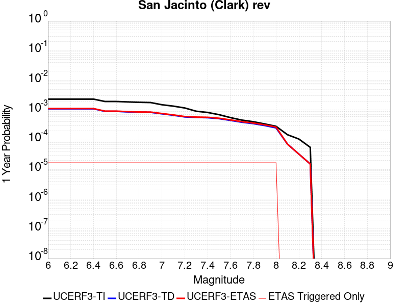 | 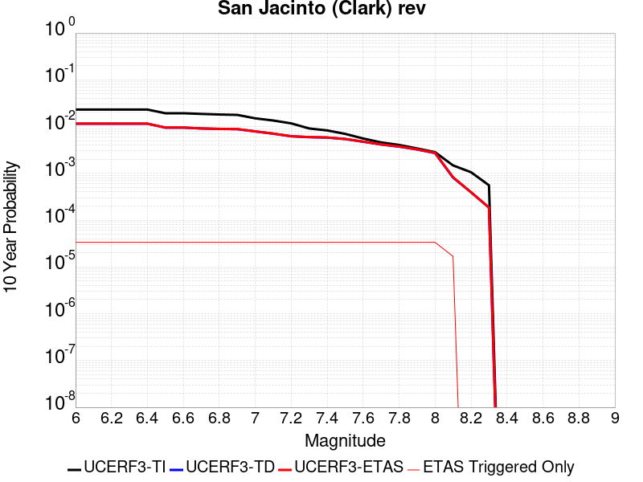 |

| Magnitude | 1 wk TI Prob | 1 wk TD Prob | 1 wk ETAS Prob | 1 wk ETAS/TD Gain | 1 wk ETAS Triggered Only | 1 mo TI Prob | 1 mo TD Prob | 1 mo ETAS Prob | 1 mo ETAS/TD Gain | 1 mo ETAS Triggered Only | 1 yr TI Prob | 1 yr TD Prob | 1 yr ETAS Prob | 1 yr ETAS/TD Gain | 1 yr ETAS Triggered Only | 10 yr TI Prob | 10 yr TD Prob | 10 yr ETAS Prob | 10 yr ETAS/TD Gain | 10 yr ETAS Triggered Only |
|-----|-----|-----|-----|-----|-----|-----|-----|-----|-----|-----|-----|-----|-----|-----|-----|-----|-----|-----|-----|-----|
| 6.0 | 4.482615E-5 | 2.1162805E-5 | 2.1162805E-5 | 1.0 | 0.0 | 1.9209793E-4 | 9.069463E-5 | 1.07528125E-4 | 1.1856062 | 1.6835016E-5 | 0.0023362834 | 0.0011036571 | 0.0011204735 | 1.015237 | 1.6835016E-5 | 0.02311874 | 0.011508432 | 0.011541714 | 1.002892 | 3.3670032E-5 |
| 6.1 | 4.482615E-5 | 2.1162805E-5 | 2.1162805E-5 | 1.0 | 0.0 | 1.9209793E-4 | 9.069463E-5 | 1.07528125E-4 | 1.1856062 | 1.6835016E-5 | 0.0023362834 | 0.0011036571 | 0.0011204735 | 1.015237 | 1.6835016E-5 | 0.02311874 | 0.011508432 | 0.011541714 | 1.002892 | 3.3670032E-5 |
| 6.2 | 4.482615E-5 | 2.1162805E-5 | 2.1162805E-5 | 1.0 | 0.0 | 1.9209793E-4 | 9.069463E-5 | 1.07528125E-4 | 1.1856062 | 1.6835016E-5 | 0.0023362834 | 0.0011036571 | 0.0011204735 | 1.015237 | 1.6835016E-5 | 0.02311874 | 0.011508432 | 0.011541714 | 1.002892 | 3.3670032E-5 |
| 6.3 | 4.482615E-5 | 2.1162805E-5 | 2.1162805E-5 | 1.0 | 0.0 | 1.9209793E-4 | 9.069463E-5 | 1.07528125E-4 | 1.1856062 | 1.6835016E-5 | 0.0023362834 | 0.0011036571 | 0.0011204735 | 1.015237 | 1.6835016E-5 | 0.02311874 | 0.011508432 | 0.011541714 | 1.002892 | 3.3670032E-5 |
| 6.4 | 4.482615E-5 | 2.1162805E-5 | 2.1162805E-5 | 1.0 | 0.0 | 1.9209793E-4 | 9.069463E-5 | 1.07528125E-4 | 1.1856062 | 1.6835016E-5 | 0.0023362834 | 0.0011036571 | 0.0011204735 | 1.015237 | 1.6835016E-5 | 0.02311874 | 0.011508432 | 0.011541714 | 1.002892 | 3.3670032E-5 |
| 6.5 | 3.7294863E-5 | 1.7363767E-5 | 1.7363767E-5 | 1.0 | 0.0 | 1.5982533E-4 | 7.441404E-5 | 9.1247806E-5 | 1.2262175 | 1.6835016E-5 | 0.0019441366 | 9.056189E-4 | 9.224387E-4 | 1.0185727 | 1.6835016E-5 | 0.01927216 | 0.009498186 | 0.009531536 | 1.0035112 | 3.3670032E-5 |
| 6.6 | 3.7294863E-5 | 1.7363767E-5 | 1.7363767E-5 | 1.0 | 0.0 | 1.5982533E-4 | 7.441404E-5 | 9.1247806E-5 | 1.2262175 | 1.6835016E-5 | 0.0019441366 | 9.056189E-4 | 9.224387E-4 | 1.0185727 | 1.6835016E-5 | 0.01927216 | 0.009498186 | 0.009531536 | 1.0035112 | 3.3670032E-5 |
| 6.7 | 3.6039248E-5 | 1.661182E-5 | 1.661182E-5 | 1.0 | 0.0 | 1.5444479E-4 | 7.11916E-5 | 8.8025416E-5 | 1.236458 | 1.6835016E-5 | 0.0018787434 | 8.6641713E-4 | 8.832376E-4 | 1.0194138 | 1.6835016E-5 | 0.01862939 | 0.009100041 | 0.009133405 | 1.0036663 | 3.3670032E-5 |
| 6.8 | 3.5031844E-5 | 1.6240316E-5 | 1.6240316E-5 | 1.0 | 0.0 | 1.5012783E-4 | 6.959952E-5 | 8.643336E-5 | 1.2418673 | 1.6835016E-5 | 0.0018262739 | 8.470488E-4 | 8.6386956E-4 | 1.0198581 | 1.6835016E-5 | 0.01811338 | 0.008899899 | 0.00893327 | 1.0037495 | 3.3670032E-5 |
| 6.9 | 3.435112E-5 | 1.6070499E-5 | 1.6070499E-5 | 1.0 | 0.0 | 1.4721078E-4 | 6.887177E-5 | 8.570563E-5 | 1.2444232 | 1.6835016E-5 | 0.0017908178 | 8.381953E-4 | 8.5501623E-4 | 1.020068 | 1.6835016E-5 | 0.017764548 | 0.008808068 | 0.008841442 | 1.003789 | 3.3670032E-5 |
| 7.0 | 2.8959772E-5 | 1.4343366E-5 | 1.4343366E-5 | 1.0 | 0.0 | 1.241074E-4 | 6.1470135E-5 | 7.830412E-5 | 1.2738563 | 1.6835016E-5 | 0.0015099603 | 7.481447E-4 | 7.649671E-4 | 1.0224855 | 1.6835016E-5 | 0.014997416 | 0.0078715505 | 0.007904956 | 1.0042437 | 3.3670032E-5 |
| 7.1 | 2.6002877E-5 | 1.2835043E-5 | 1.2835043E-5 | 1.0 | 0.0 | 1.11436144E-4 | 5.500618E-5 | 7.184027E-5 | 1.3060399 | 1.6835016E-5 | 0.0013558907 | 6.694966E-4 | 6.8632036E-4 | 1.025129 | 1.6835016E-5 | 0.013476475 | 0.007049743 | 0.0070831757 | 1.0047424 | 3.3670032E-5 |
| 7.2 | 2.2544838E-5 | 1.1267972E-5 | 1.1267972E-5 | 1.0 | 0.0 | 9.661716E-5 | 4.829042E-5 | 6.512462E-5 | 1.3486034 | 1.6835016E-5 | 0.001175679 | 5.8777875E-4 | 6.0460385E-4 | 1.0286249 | 1.6835016E-5 | 0.011694785 | 0.0061956523 | 0.006229114 | 1.0054008 | 3.3670032E-5 |
| 7.3 | 1.75334E-5 | 1.081679E-5 | 1.081679E-5 | 1.0 | 0.0 | 7.514098E-5 | 4.6356854E-5 | 6.3191095E-5 | 1.3631445 | 1.6835016E-5 | 9.144575E-4 | 5.6424993E-4 | 5.810755E-4 | 1.0298193 | 1.6835016E-5 | 0.009107036 | 0.005936473 | 0.0059699435 | 1.005638 | 3.3670032E-5 |
| 7.4 | 1.5924552E-5 | 1.0616479E-5 | 1.0616479E-5 | 1.0 | 0.0 | 6.82463E-5 | 4.5498407E-5 | 6.233266E-5 | 1.3699964 | 1.6835016E-5 | 8.305819E-4 | 5.538037E-4 | 5.7062943E-4 | 1.030382 | 1.6835016E-5 | 0.008274844 | 0.005823671 | 0.005857145 | 1.0057479 | 3.3670032E-5 |
| 7.5 | 1.3428931E-5 | 9.856627E-6 | 9.856627E-6 | 1.0 | 0.0 | 5.7551293E-5 | 4.224201E-5 | 5.9076312E-5 | 1.3985205 | 1.6835016E-5 | 7.004617E-4 | 5.1417615E-4 | 5.3100253E-4 | 1.0327249 | 1.6835016E-5 | 0.006982579 | 0.005409115 | 0.0054426026 | 1.006191 | 3.3670032E-5 |
| 7.6 | 1.0688787E-5 | 8.61931E-6 | 8.61931E-6 | 1.0 | 0.0 | 4.5808283E-5 | 3.6939382E-5 | 5.3773776E-5 | 1.4557303 | 1.6835016E-5 | 5.5757316E-4 | 4.4964463E-4 | 4.664721E-4 | 1.0374238 | 1.6835016E-5 | 0.005561762 | 0.004744031 | 0.0047775414 | 1.0070636 | 3.3670032E-5 |
| 7.7 | 8.81236E-6 | 7.4723484E-6 | 7.4723484E-6 | 1.0 | 0.0 | 3.776671E-5 | 3.202396E-5 | 4.8858437E-5 | 1.5256839 | 1.6835016E-5 | 4.597127E-4 | 3.8982215E-4 | 4.066506E-4 | 1.0431696 | 1.6835016E-5 | 0.0045876284 | 0.004136955 | 0.0041704853 | 1.0081052 | 3.3670032E-5 |
| 7.8 | 7.780431E-6 | 6.7006613E-6 | 6.7006613E-6 | 1.0 | 0.0 | 3.3344273E-5 | 2.8716804E-5 | 4.5551336E-5 | 1.5862259 | 1.6835016E-5 | 4.0589093E-4 | 3.4957117E-4 | 3.6640032E-4 | 1.0481422 | 1.6835016E-5 | 0.0040515037 | 0.0037249678 | 0.0037585124 | 1.0090053 | 3.3670032E-5 |
| 7.9 | 6.5437994E-6 | 5.784193E-6 | 5.784193E-6 | 1.0 | 0.0 | 2.8044553E-5 | 2.4789164E-5 | 4.1623764E-5 | 1.6791112 | 1.6835016E-5 | 3.4138895E-4 | 3.0176644E-4 | 3.185964E-4 | 1.0557714 | 1.6835016E-5 | 0.0034086495 | 0.003236521 | 0.0032700822 | 1.0103695 | 3.3670032E-5 |
| 8.0 | 5.4488164E-6 | 4.8167294E-6 | 4.8167294E-6 | 1.0 | 0.0 | 2.3351862E-5 | 2.0642963E-5 | 3.7477632E-5 | 1.8155161 | 1.6835016E-5 | 2.8427184E-4 | 2.5129924E-4 | 2.6813E-4 | 1.0669751 | 1.6835016E-5 | 0.0028390845 | 0.0027126544 | 0.0027462333 | 1.0123786 | 3.3670032E-5 |
| 8.1 | 2.8397242E-6 | 1.3684335E-6 | 1.3684335E-6 | 1.0 | 0.0 | 1.217019E-5 | 5.864702E-6 | 5.864702E-6 | 1.0 | 0.0 | 1.4816198E-4 | 7.140042E-5 | 7.140042E-5 | 1.0 | 0.0 | 0.0014806325 | 8.12321E-4 | 8.291424E-4 | 1.0207077 | 1.6835016E-5 |
| 8.2 | 2.030244E-6 | 6.326596E-7 | 6.326596E-7 | 1.0 | 0.0 | 8.701017E-6 | 2.7113954E-6 | 2.7113954E-6 | 1.0 | 0.0 | 1.05929736E-4 | 3.3010747E-5 | 3.3010747E-5 | 1.0 | 0.0 | 0.0010587925 | 3.9531066E-4 | 3.9531066E-4 | 1.0 | 0.0 |
| 8.3 | 1.0659804E-6 | 2.9287372E-7 | 2.9287372E-7 | 1.0 | 0.0 | 4.568479E-6 | 1.2551725E-6 | 1.2551725E-6 | 1.0 | 0.0 | 5.5619817E-5 | 1.5281621E-5 | 1.5281621E-5 | 1.0 | 0.0 | 5.5605895E-4 | 1.8588232E-4 | 1.8588232E-4 | 1.0 | 0.0 |

## Homestead Valley 2011
*[(top)](#table-of-contents)*

| 1 Week | 1 Month | 1 Year | 10 Year |
|-----|-----|-----|-----|
|  | 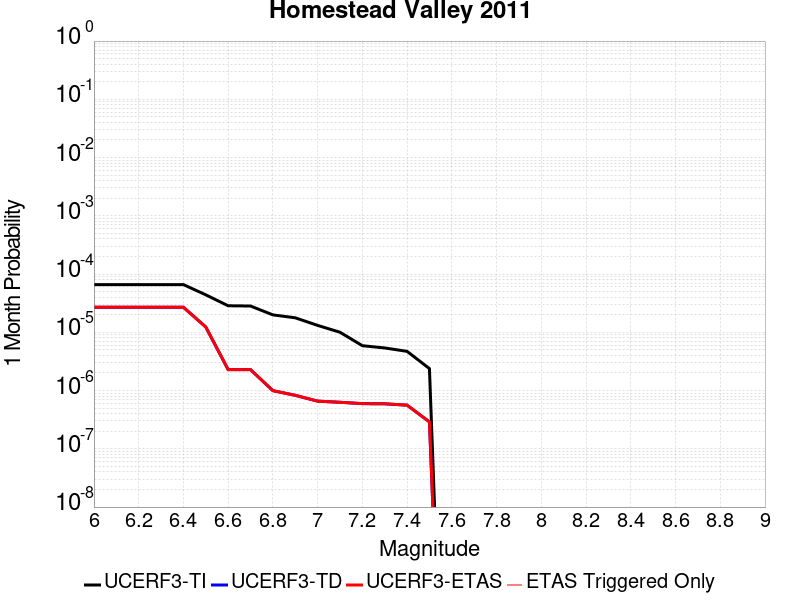 | 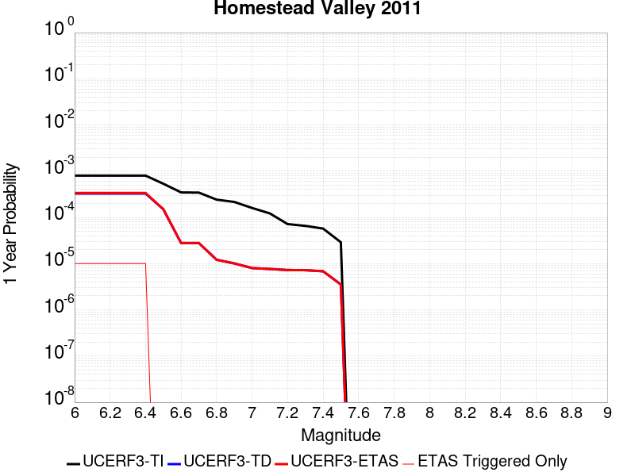 | 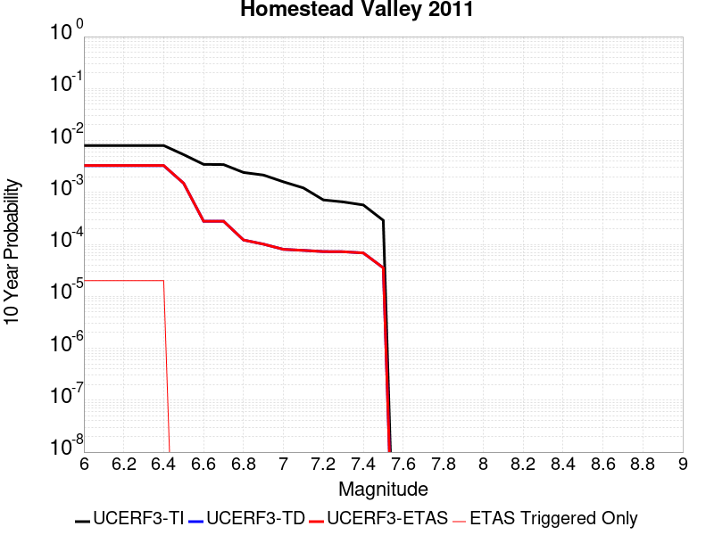 |

| Magnitude | 1 wk TI Prob | 1 wk TD Prob | 1 wk ETAS Prob | 1 wk ETAS/TD Gain | 1 wk ETAS Triggered Only | 1 mo TI Prob | 1 mo TD Prob | 1 mo ETAS Prob | 1 mo ETAS/TD Gain | 1 mo ETAS Triggered Only | 1 yr TI Prob | 1 yr TD Prob | 1 yr ETAS Prob | 1 yr ETAS/TD Gain | 1 yr ETAS Triggered Only | 10 yr TI Prob | 10 yr TD Prob | 10 yr ETAS Prob | 10 yr ETAS/TD Gain | 10 yr ETAS Triggered Only |
|-----|-----|-----|-----|-----|-----|-----|-----|-----|-----|-----|-----|-----|-----|-----|-----|-----|-----|-----|-----|-----|
| 6.0 | 1.539795E-5 | 6.2866725E-6 | 6.2866725E-6 | 1.0 | 0.0 | 6.5989545E-5 | 2.694272E-5 | 2.694272E-5 | 1.0 | 0.0 | 8.0312655E-4 | 3.2799886E-4 | 3.4482835E-4 | 1.0513096 | 1.6835016E-5 | 0.008002302 | 0.0032771684 | 0.0033107281 | 1.0102404 | 3.3670032E-5 |
| 6.1 | 1.539795E-5 | 6.2866725E-6 | 6.2866725E-6 | 1.0 | 0.0 | 6.5989545E-5 | 2.694272E-5 | 2.694272E-5 | 1.0 | 0.0 | 8.0312655E-4 | 3.2799886E-4 | 3.4482835E-4 | 1.0513096 | 1.6835016E-5 | 0.008002302 | 0.0032771684 | 0.0033107281 | 1.0102404 | 3.3670032E-5 |
| 6.2 | 1.539795E-5 | 6.2866725E-6 | 6.2866725E-6 | 1.0 | 0.0 | 6.5989545E-5 | 2.694272E-5 | 2.694272E-5 | 1.0 | 0.0 | 8.0312655E-4 | 3.2799886E-4 | 3.4482835E-4 | 1.0513096 | 1.6835016E-5 | 0.008002302 | 0.0032771684 | 0.0033107281 | 1.0102404 | 3.3670032E-5 |
| 6.3 | 1.539795E-5 | 6.2866725E-6 | 6.2866725E-6 | 1.0 | 0.0 | 6.5989545E-5 | 2.694272E-5 | 2.694272E-5 | 1.0 | 0.0 | 8.0312655E-4 | 3.2799886E-4 | 3.4482835E-4 | 1.0513096 | 1.6835016E-5 | 0.008002302 | 0.0032771684 | 0.0033107281 | 1.0102404 | 3.3670032E-5 |
| 6.4 | 1.539795E-5 | 6.2866725E-6 | 6.2866725E-6 | 1.0 | 0.0 | 6.5989545E-5 | 2.694272E-5 | 2.694272E-5 | 1.0 | 0.0 | 8.0312655E-4 | 3.2799886E-4 | 3.4482835E-4 | 1.0513096 | 1.6835016E-5 | 0.008002302 | 0.0032771684 | 0.0033107281 | 1.0102404 | 3.3670032E-5 |
| 6.5 | 1.0265258E-5 | 2.8788809E-6 | 2.8788809E-6 | 1.0 | 0.0 | 4.3993223E-5 | 1.2338042E-5 | 1.2338042E-5 | 1.0 | 0.0 | 5.3548586E-4 | 1.5021226E-4 | 1.5021226E-4 | 1.0 | 0.0 | 0.005341973 | 0.0015017892 | 0.0015017892 | 1.0 | 0.0 |
| 6.6 | 6.664671E-6 | 5.3483575E-7 | 5.3483575E-7 | 1.0 | 0.0 | 2.8562565E-5 | 2.2921517E-6 | 2.2921517E-6 | 1.0 | 0.0 | 3.476937E-4 | 2.790671E-5 | 2.790671E-5 | 1.0 | 0.0 | 0.003471502 | 2.7904368E-4 | 2.7904368E-4 | 1.0 | 0.0 |
| 6.7 | 6.5954046E-6 | 5.3483575E-7 | 5.3483575E-7 | 1.0 | 0.0 | 2.8265715E-5 | 2.2921517E-6 | 2.2921517E-6 | 1.0 | 0.0 | 3.4408073E-4 | 2.790671E-5 | 2.790671E-5 | 1.0 | 0.0 | 0.0034354846 | 2.7904368E-4 | 2.7904368E-4 | 1.0 | 0.0 |
| 6.8 | 4.648189E-6 | 2.3266526E-7 | 2.3266526E-7 | 1.0 | 0.0 | 1.9920659E-5 | 9.971365E-7 | 9.971365E-7 | 1.0 | 0.0 | 2.4250703E-4 | 1.21400735E-5 | 1.21400735E-5 | 1.0 | 0.0 | 0.0024224254 | 1.2139459E-4 | 1.2139459E-4 | 1.0 | 0.0 |
| 6.9 | 4.1428534E-6 | 1.9345389E-7 | 1.9345389E-7 | 1.0 | 0.0 | 1.7754966E-5 | 8.2908787E-7 | 8.2908787E-7 | 1.0 | 0.0 | 2.1614527E-4 | 1.0094101E-5 | 1.0094101E-5 | 1.0 | 0.0 | 0.0021593515 | 1.0093672E-4 | 1.0093672E-4 | 1.0 | 0.0 |
| 7.0 | 3.0673707E-6 | 1.5368272E-7 | 1.5368272E-7 | 1.0 | 0.0 | 1.3145808E-5 | 6.5864003E-7 | 6.5864003E-7 | 1.0 | 0.0 | 1.6003846E-4 | 8.018914E-6 | 8.018914E-6 | 1.0 | 0.0 | 0.0015992324 | 8.018635E-5 | 8.018635E-5 | 1.0 | 0.0 |
| 7.1 | 2.340854E-6 | 1.468828E-7 | 1.468828E-7 | 1.0 | 0.0 | 1.0032193E-5 | 6.2949755E-7 | 6.2949755E-7 | 1.0 | 0.0 | 1.221351E-4 | 7.664107E-6 | 7.664107E-6 | 1.0 | 0.0 | 0.00122068 | 7.663853E-5 | 7.663853E-5 | 1.0 | 0.0 |
| 7.2 | 1.3754182E-6 | 1.3923189E-7 | 1.3923189E-7 | 1.0 | 0.0 | 5.8946357E-6 | 5.9670793E-7 | 5.9670793E-7 | 1.0 | 0.0 | 7.176483E-5 | 7.264896E-6 | 7.264896E-6 | 1.0 | 0.0 | 7.174166E-4 | 7.2646675E-5 | 7.2646675E-5 | 1.0 | 0.0 |
| 7.3 | 1.2573237E-6 | 1.3827695E-7 | 1.3827695E-7 | 1.0 | 0.0 | 5.388519E-6 | 5.926153E-7 | 5.926153E-7 | 1.0 | 0.0 | 6.560324E-5 | 7.2150688E-6 | 7.2150688E-6 | 1.0 | 0.0 | 6.558388E-4 | 7.214844E-5 | 7.214844E-5 | 1.0 | 0.0 |
| 7.4 | 1.0994207E-6 | 1.3106616E-7 | 1.3106616E-7 | 1.0 | 0.0 | 4.7117946E-6 | 5.61712E-7 | 5.61712E-7 | 1.0 | 0.0 | 5.736459E-5 | 6.838823E-6 | 6.838823E-6 | 1.0 | 0.0 | 5.734978E-4 | 6.8386216E-5 | 6.8386216E-5 | 1.0 | 0.0 |
| 7.5 | 5.5569126E-7 | 6.773262E-8 | 6.773262E-8 | 1.0 | 0.0 | 2.3815317E-6 | 2.9028263E-7 | 2.9028263E-7 | 1.0 | 0.0 | 2.8994764E-5 | 3.534186E-6 | 3.534186E-6 | 1.0 | 0.0 | 2.899098E-4 | 3.534136E-5 | 3.534136E-5 | 1.0 | 0.0 |

## Big Pine (Central)
*[(top)](#table-of-contents)*

| 1 Week | 1 Month | 1 Year | 10 Year |
|-----|-----|-----|-----|
| 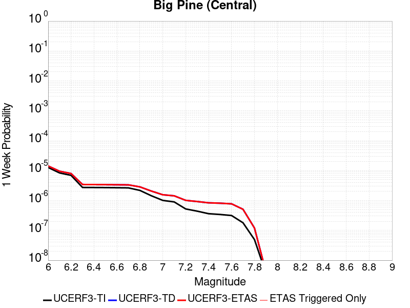 | 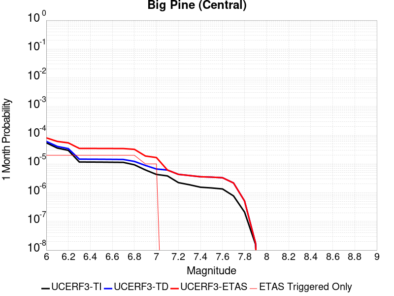 | 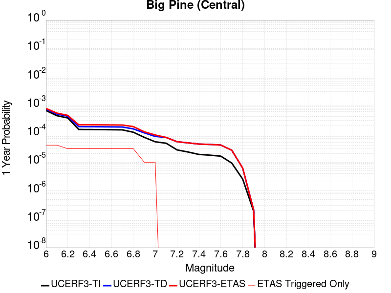 |  |

| Magnitude | 1 wk TI Prob | 1 wk TD Prob | 1 wk ETAS Prob | 1 wk ETAS/TD Gain | 1 wk ETAS Triggered Only | 1 mo TI Prob | 1 mo TD Prob | 1 mo ETAS Prob | 1 mo ETAS/TD Gain | 1 mo ETAS Triggered Only | 1 yr TI Prob | 1 yr TD Prob | 1 yr ETAS Prob | 1 yr ETAS/TD Gain | 1 yr ETAS Triggered Only | 10 yr TI Prob | 10 yr TD Prob | 10 yr ETAS Prob | 10 yr ETAS/TD Gain | 10 yr ETAS Triggered Only |
|-----|-----|-----|-----|-----|-----|-----|-----|-----|-----|-----|-----|-----|-----|-----|-----|-----|-----|-----|-----|-----|
| 6.0 | 1.2706755E-5 | 1.4251012E-5 | 1.4251012E-5 | 1.0 | 0.0 | 5.4456385E-5 | 6.107454E-5 | 7.790853E-5 | 1.2756302 | 1.6835016E-5 | 6.628048E-4 | 7.4336544E-4 | 7.601879E-4 | 1.0226302 | 1.6835016E-5 | 0.006608314 | 0.0074138143 | 0.007447235 | 1.0045079 | 3.3670032E-5 |
| 6.1 | 8.342579E-6 | 9.511191E-6 | 9.511191E-6 | 1.0 | 0.0 | 3.5753423E-5 | 4.0761734E-5 | 5.7596066E-5 | 1.4129934 | 1.6835016E-5 | 4.3521097E-4 | 4.961828E-4 | 5.130095E-4 | 1.0339122 | 1.6835016E-5 | 0.0043435963 | 0.0049543027 | 0.004971054 | 1.0033813 | 1.6835016E-5 |
| 6.2 | 6.923899E-6 | 7.967559E-6 | 7.967559E-6 | 1.0 | 0.0 | 2.9673516E-5 | 3.4146342E-5 | 5.0980783E-5 | 1.4930086 | 1.6835016E-5 | 3.6121515E-4 | 4.1567165E-4 | 4.3249968E-4 | 1.040484 | 1.6835016E-5 | 0.003606286 | 0.0041522477 | 0.004169013 | 1.0040376 | 1.6835016E-5 |
| 6.3 | 2.728396E-6 | 3.4246525E-6 | 3.4246525E-6 | 1.0 | 0.0 | 1.1693074E-5 | 1.4677004E-5 | 3.1511776E-5 | 2.1470168 | 1.6835016E-5 | 1.4235388E-4 | 1.7867875E-4 | 1.9551076E-4 | 1.0942026 | 1.6835016E-5 | 0.0014226272 | 0.0017868559 | 0.0018036608 | 1.0094048 | 1.6835016E-5 |
| 6.4 | 2.7136944E-6 | 3.4089458E-6 | 3.4089458E-6 | 1.0 | 0.0 | 1.1630066E-5 | 1.4609691E-5 | 3.1444462E-5 | 2.1523018 | 1.6835016E-5 | 1.4158686E-4 | 1.7785933E-4 | 1.9469135E-4 | 1.0946367 | 1.6835016E-5 | 0.0014149669 | 0.0017786748 | 0.0017954799 | 1.009448 | 1.6835016E-5 |
| 6.5 | 2.6971882E-6 | 3.3912906E-6 | 3.3912906E-6 | 1.0 | 0.0 | 1.1559327E-5 | 1.4534027E-5 | 3.13688E-5 | 2.1583006 | 1.6835016E-5 | 1.4072572E-4 | 1.7693828E-4 | 1.9377032E-4 | 1.0951295 | 1.6835016E-5 | 0.0014063664 | 0.0017694789 | 0.0017862841 | 1.0094973 | 1.6835016E-5 |
| 6.6 | 2.669092E-6 | 3.361311E-6 | 3.361311E-6 | 1.0 | 0.0 | 1.1438916E-5 | 1.4405543E-5 | 3.1240317E-5 | 2.1686318 | 1.6835016E-5 | 1.3925991E-4 | 1.7537424E-4 | 1.9220631E-4 | 1.095978 | 1.6835016E-5 | 0.0013917267 | 0.0017538633 | 0.0017706688 | 1.009582 | 1.6835016E-5 |
| 6.7 | 2.6408059E-6 | 3.3313363E-6 | 3.3313363E-6 | 1.0 | 0.0 | 1.1317691E-5 | 1.4277082E-5 | 3.111186E-5 | 2.1791468 | 1.6835016E-5 | 1.3778417E-4 | 1.7381048E-4 | 1.9064258E-4 | 1.0968416 | 1.6835016E-5 | 0.0013769877 | 0.0017382503 | 0.001755056 | 1.0096682 | 1.6835016E-5 |
| 6.8 | 2.1786943E-6 | 2.8547915E-6 | 2.8547915E-6 | 1.0 | 0.0 | 9.337228E-6 | 1.2234768E-5 | 2.9069579E-5 | 2.3759813 | 1.6835016E-5 | 1.1367482E-4 | 1.4894885E-4 | 1.6578136E-4 | 1.1130086 | 1.6835016E-5 | 0.0011361669 | 0.0014899815 | 0.0015067915 | 1.011282 | 1.6835016E-5 |
| 6.9 | 1.4411696E-6 | 2.0688422E-6 | 2.0688422E-6 | 1.0 | 0.0 | 6.1764263E-6 | 8.866437E-6 | 2.5701305E-5 | 2.8987184 | 1.6835016E-5 | 7.51954E-5 | 1.079438E-4 | 1.24777E-4 | 1.1559441 | 1.6835016E-5 | 7.5169955E-4 | 0.0010803605 | 0.0010971773 | 1.015566 | 1.6835016E-5 |
| 7.0 | 1.0073411E-6 | 1.5545673E-6 | 1.5545673E-6 | 1.0 | 0.0 | 4.317169E-6 | 6.662415E-6 | 2.349732E-5 | 3.5268471 | 1.6835016E-5 | 5.2560266E-5 | 8.111204E-5 | 9.794569E-5 | 1.2075357 | 1.6835016E-5 | 5.2547833E-4 | 8.1225985E-4 | 8.2908117E-4 | 1.0207093 | 1.6835016E-5 |
| 7.1 | 8.947104E-7 | 1.4305514E-6 | 1.4305514E-6 | 1.0 | 0.0 | 3.834468E-6 | 6.130921E-6 | 6.130921E-6 | 1.0 | 0.0 | 4.6683643E-5 | 7.464155E-5 | 7.464155E-5 | 1.0 | 0.0 | 4.6673836E-4 | 7.476001E-4 | 7.476001E-4 | 1.0 | 0.0 |
| 7.2 | 5.215166E-7 | 1.0114496E-6 | 1.0114496E-6 | 1.0 | 0.0 | 2.2350691E-6 | 4.3347773E-6 | 4.3347773E-6 | 1.0 | 0.0 | 2.7211627E-5 | 5.2774678E-5 | 5.2774678E-5 | 1.0 | 0.0 | 2.7208295E-4 | 5.290466E-4 | 5.290466E-4 | 1.0 | 0.0 |
| 7.3 | 4.4024807E-7 | 9.2223235E-7 | 9.2223235E-7 | 1.0 | 0.0 | 1.8867761E-6 | 3.9524184E-6 | 3.9524184E-6 | 1.0 | 0.0 | 2.2971257E-5 | 4.8119677E-5 | 4.8119677E-5 | 1.0 | 0.0 | 2.2968883E-4 | 4.8251753E-4 | 4.8251753E-4 | 1.0 | 0.0 |
| 7.4 | 3.6130905E-7 | 8.3611724E-7 | 8.3611724E-7 | 1.0 | 0.0 | 1.5484665E-6 | 3.583355E-6 | 3.583355E-6 | 1.0 | 0.0 | 1.8852415E-5 | 4.362651E-5 | 4.362651E-5 | 1.0 | 0.0 | 1.8850817E-4 | 4.3759486E-4 | 4.3759486E-4 | 1.0 | 0.0 |
| 7.5 | 3.408184E-7 | 8.110739E-7 | 8.110739E-7 | 1.0 | 0.0 | 1.4606494E-6 | 3.4760267E-6 | 3.4760267E-6 | 1.0 | 0.0 | 1.7783263E-5 | 4.231984E-5 | 4.231984E-5 | 1.0 | 0.0 | 1.778184E-4 | 4.2451176E-4 | 4.2451176E-4 | 1.0 | 0.0 |
| 7.6 | 3.1428627E-7 | 7.7341E-7 | 7.7341E-7 | 1.0 | 0.0 | 1.3469405E-6 | 3.3146102E-6 | 3.3146102E-6 | 1.0 | 0.0 | 1.6398877E-5 | 4.0354673E-5 | 4.0354673E-5 | 1.0 | 0.0 | 1.6397667E-4 | 4.0483844E-4 | 4.0483844E-4 | 1.0 | 0.0 |
| 7.7 | 1.7972785E-7 | 5.0796626E-7 | 5.0796626E-7 | 1.0 | 0.0 | 7.70262E-7 | 2.1769965E-6 | 2.1769965E-6 | 1.0 | 0.0 | 9.377899E-6 | 2.6504622E-5 | 2.6504622E-5 | 1.0 | 0.0 | 9.377503E-5 | 2.663867E-4 | 2.663867E-4 | 1.0 | 0.0 |
| 7.8 | 4.9230927E-8 | 1.1985297E-7 | 1.1985297E-7 | 1.0 | 0.0 | 2.1098968E-7 | 5.136555E-7 | 5.136555E-7 | 1.0 | 0.0 | 2.5687964E-6 | 6.2537392E-6 | 6.2537392E-6 | 1.0 | 0.0 | 2.5687666E-5 | 6.2977226E-5 | 6.2977226E-5 | 1.0 | 0.0 |
| 7.9 | 3.6805972E-9 | 4.1070685E-9 | 4.1070685E-9 | 1.0 | 0.0 | 1.5773987E-8 | 1.7601723E-8 | 1.7601723E-8 | 1.0 | 0.0 | 1.9204828E-7 | 2.1430095E-7 | 2.1430095E-7 | 1.0 | 0.0 | 1.920481E-6 | 2.190991E-6 | 2.190991E-6 | 1.0 | 0.0 |

## Green Valley 2011 CFM
*[(top)](#table-of-contents)*

| 1 Week | 1 Month | 1 Year | 10 Year |
|-----|-----|-----|-----|
| 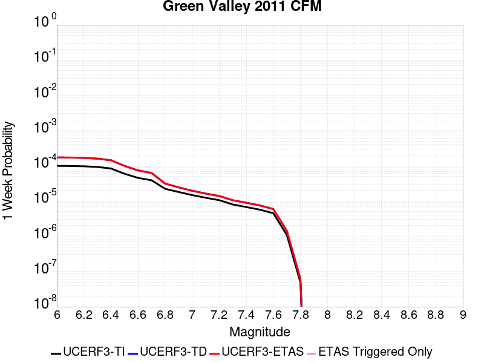 | 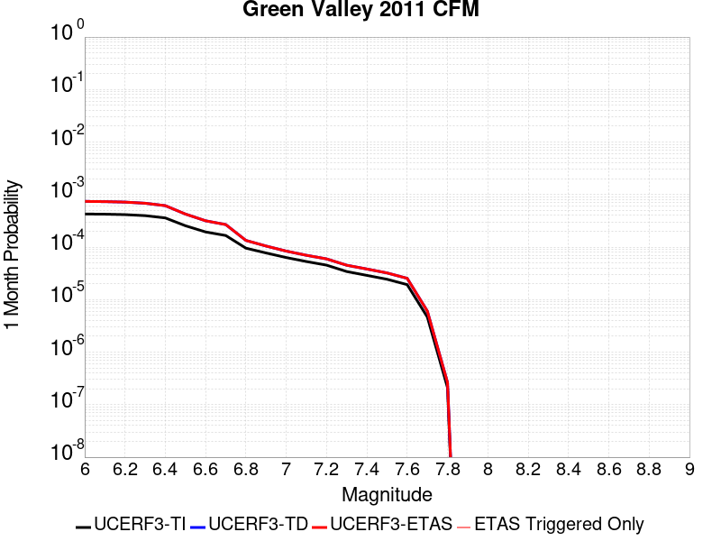 | 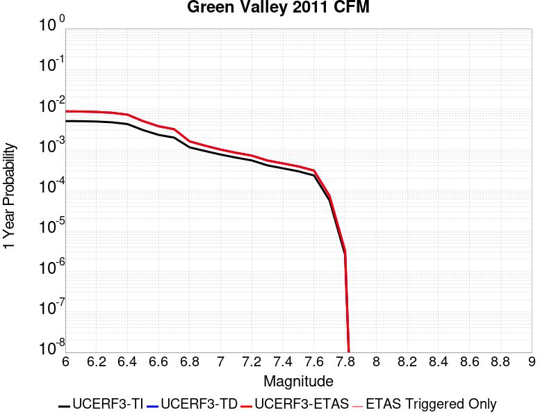 | 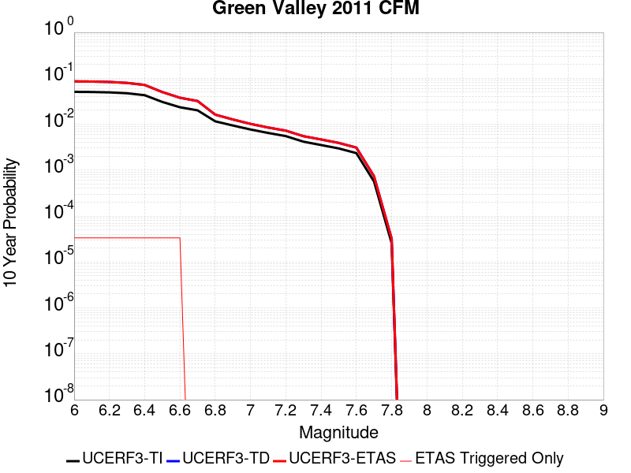 |

| Magnitude | 1 wk TI Prob | 1 wk TD Prob | 1 wk ETAS Prob | 1 wk ETAS/TD Gain | 1 wk ETAS Triggered Only | 1 mo TI Prob | 1 mo TD Prob | 1 mo ETAS Prob | 1 mo ETAS/TD Gain | 1 mo ETAS Triggered Only | 1 yr TI Prob | 1 yr TD Prob | 1 yr ETAS Prob | 1 yr ETAS/TD Gain | 1 yr ETAS Triggered Only | 10 yr TI Prob | 10 yr TD Prob | 10 yr ETAS Prob | 10 yr ETAS/TD Gain | 10 yr ETAS Triggered Only |
|-----|-----|-----|-----|-----|-----|-----|-----|-----|-----|-----|-----|-----|-----|-----|-----|-----|-----|-----|-----|-----|
| 6.0 | 9.9629346E-5 | 1.7306181E-4 | 1.7306181E-4 | 1.0 | 0.0 | 4.2691303E-4 | 7.414477E-4 | 7.414477E-4 | 1.0 | 0.0 | 0.0051852856 | 0.00898687 | 0.00898687 | 1.0 | 0.0 | 0.050659515 | 0.085523866 | 0.08555466 | 1.00036 | 3.3670032E-5 |
| 6.1 | 9.88615E-5 | 1.7153492E-4 | 1.7153492E-4 | 1.0 | 0.0 | 4.2362334E-4 | 7.349076E-4 | 7.349076E-4 | 1.0 | 0.0 | 0.0051454236 | 0.008907897 | 0.008907897 | 1.0 | 0.0 | 0.050279044 | 0.08481148 | 0.084842294 | 1.0003633 | 3.3670032E-5 |
| 6.2 | 9.696895E-5 | 1.679252E-4 | 1.679252E-4 | 1.0 | 0.0 | 4.15515E-4 | 7.1944593E-4 | 7.1944593E-4 | 1.0 | 0.0 | 0.0050471667 | 0.008721275 | 0.008721275 | 1.0 | 0.0 | 0.04934063 | 0.08312038 | 0.08315126 | 1.0003715 | 3.3670032E-5 |
| 6.3 | 9.275224E-5 | 1.5971852E-4 | 1.5971852E-4 | 1.0 | 0.0 | 3.9744904E-4 | 6.842931E-4 | 6.842931E-4 | 1.0 | 0.0 | 0.0048282105 | 0.008296597 | 0.008296597 | 1.0 | 0.0 | 0.047246475 | 0.07925882 | 0.079289824 | 1.0003911 | 3.3670032E-5 |
| 6.4 | 8.391499E-5 | 1.4368363E-4 | 1.4368363E-4 | 1.0 | 0.0 | 3.595861E-4 | 6.156491E-4 | 6.156491E-4 | 1.0 | 0.0 | 0.004369175 | 0.007467232 | 0.007467232 | 1.0 | 0.0 | 0.04284265 | 0.07163251 | 0.07166377 | 1.0004364 | 3.3670032E-5 |
| 6.5 | 5.9519385E-5 | 9.9345336E-5 | 9.9345336E-5 | 1.0 | 0.0 | 2.5505814E-4 | 4.257004E-4 | 4.257004E-4 | 1.0 | 0.0 | 0.0031009112 | 0.0051684165 | 0.0051684165 | 1.0 | 0.0 | 0.030579966 | 0.050147217 | 0.05016321 | 1.0003189 | 1.6835016E-5 |
| 6.6 | 4.5361558E-5 | 7.4029726E-5 | 7.4029726E-5 | 1.0 | 0.0 | 1.9439218E-4 | 3.1723455E-4 | 3.1723455E-4 | 1.0 | 0.0 | 0.0023641558 | 0.003854048 | 0.003854048 | 1.0 | 0.0 | 0.023391623 | 0.03766713 | 0.03768333 | 1.0004301 | 1.6835016E-5 |
| 6.7 | 3.8808106E-5 | 6.265495E-5 | 6.265495E-5 | 1.0 | 0.0 | 1.6630985E-4 | 2.684962E-4 | 2.684962E-4 | 1.0 | 0.0 | 0.0020229418 | 0.003262755 | 0.003262755 | 1.0 | 0.0 | 0.020046256 | 0.03200691 | 0.03200691 | 1.0 | 0.0 |
| 6.8 | 2.2284667E-5 | 3.1285566E-5 | 3.1285566E-5 | 1.0 | 0.0 | 9.550222E-5 | 1.340742E-4 | 1.340742E-4 | 1.0 | 0.0 | 0.0011621192 | 0.001631124 | 0.001631124 | 1.0 | 0.0 | 0.011560607 | 0.016166156 | 0.016166156 | 1.0 | 0.0 |
| 6.9 | 1.8050168E-5 | 2.4448267E-5 | 2.4448267E-5 | 1.0 | 0.0 | 7.735557E-5 | 1.0477412E-4 | 1.0477412E-4 | 1.0 | 0.0 | 9.4139716E-4 | 0.001274882 | 0.001274882 | 1.0 | 0.0 | 0.009374191 | 0.01266794 | 0.01266794 | 1.0 | 0.0 |
| 7.0 | 1.4763166E-5 | 1.958302E-5 | 1.958302E-5 | 1.0 | 0.0 | 6.326917E-5 | 8.392455E-5 | 8.392455E-5 | 1.0 | 0.0 | 7.7002996E-4 | 0.0010213053 | 0.0010213053 | 1.0 | 0.0 | 0.007673672 | 0.010165428 | 0.010165428 | 1.0 | 0.0 |
| 7.1 | 1.2399713E-5 | 1.630385E-5 | 1.630385E-5 | 1.0 | 0.0 | 5.3140546E-5 | 6.987178E-5 | 6.987178E-5 | 1.0 | 0.0 | 6.467941E-4 | 8.5035886E-4 | 8.5035886E-4 | 1.0 | 0.0 | 0.006449148 | 0.008471329 | 0.008471329 | 1.0 | 0.0 |
| 7.2 | 1.0584195E-5 | 1.3921863E-5 | 1.3921863E-5 | 1.0 | 0.0 | 4.5360044E-5 | 5.9663773E-5 | 5.9663773E-5 | 1.0 | 0.0 | 5.521186E-4 | 7.2616595E-4 | 7.2616595E-4 | 1.0 | 0.0 | 0.0055074887 | 0.0072383475 | 0.0072383475 | 1.0 | 0.0 |
| 7.3 | 7.998173E-6 | 1.054412E-5 | 1.054412E-5 | 1.0 | 0.0 | 3.4277433E-5 | 4.5188313E-5 | 4.5188313E-5 | 1.0 | 0.0 | 4.1724785E-4 | 5.500299E-4 | 5.500299E-4 | 1.0 | 0.0 | 0.004164653 | 0.0054869517 | 0.0054869517 | 1.0 | 0.0 |
| 7.4 | 6.7571127E-6 | 8.932785E-6 | 8.932785E-6 | 1.0 | 0.0 | 2.8958733E-5 | 3.8282808E-5 | 3.8282808E-5 | 1.0 | 0.0 | 3.5251552E-4 | 4.6599447E-4 | 4.6599447E-4 | 1.0 | 0.0 | 0.0035195686 | 0.0046503763 | 0.0046503763 | 1.0 | 0.0 |
| 7.5 | 5.69878E-6 | 7.5163775E-6 | 7.5163775E-6 | 1.0 | 0.0 | 2.4423114E-5 | 3.2212654E-5 | 3.2212654E-5 | 1.0 | 0.0 | 2.9731085E-4 | 3.9211934E-4 | 3.9211934E-4 | 1.0 | 0.0 | 0.002969134 | 0.0039144265 | 0.0039144265 | 1.0 | 0.0 |
| 7.6 | 4.503664E-6 | 5.9357344E-6 | 5.9357344E-6 | 1.0 | 0.0 | 1.9301275E-5 | 2.5438618E-5 | 2.5438618E-5 | 1.0 | 0.0 | 2.3496768E-4 | 3.09672E-4 | 3.09672E-4 | 1.0 | 0.0 | 0.002347194 | 0.0030925297 | 0.0030925297 | 1.0 | 0.0 |
| 7.7 | 1.0873546E-6 | 1.4107108E-6 | 1.4107108E-6 | 1.0 | 0.0 | 4.6600826E-6 | 6.0458897E-6 | 6.0458897E-6 | 1.0 | 0.0 | 5.6735033E-5 | 7.360625E-5 | 7.360625E-5 | 1.0 | 0.0 | 5.672055E-4 | 7.3582074E-4 | 7.3582074E-4 | 1.0 | 0.0 |
| 7.8 | 4.9373917E-8 | 6.177787E-8 | 6.177787E-8 | 1.0 | 0.0 | 2.1160248E-7 | 2.6476226E-7 | 2.6476226E-7 | 1.0 | 0.0 | 2.5762572E-6 | 3.223477E-6 | 3.223477E-6 | 1.0 | 0.0 | 2.5762274E-5 | 3.223268E-5 | 3.223268E-5 | 1.0 | 0.0 |

## Superstition Hills
*[(top)](#table-of-contents)*

| 1 Week | 1 Month | 1 Year | 10 Year |
|-----|-----|-----|-----|
| 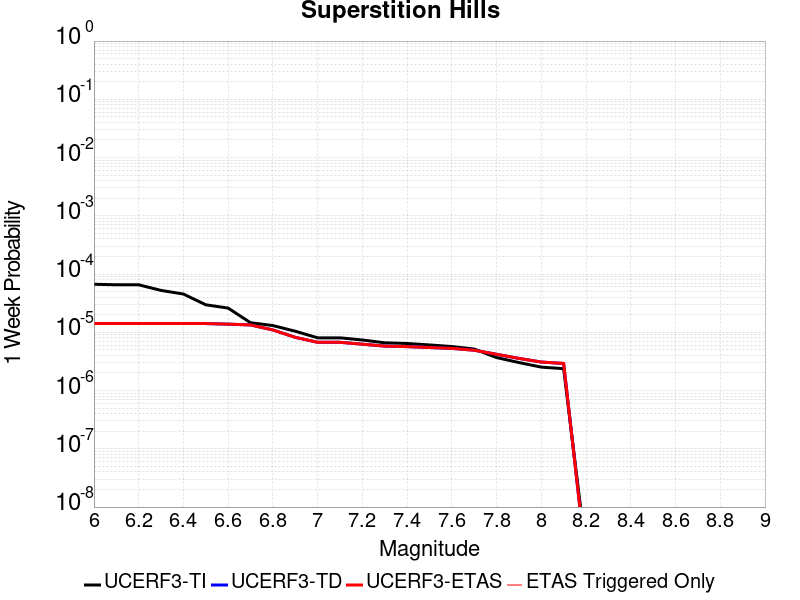 | 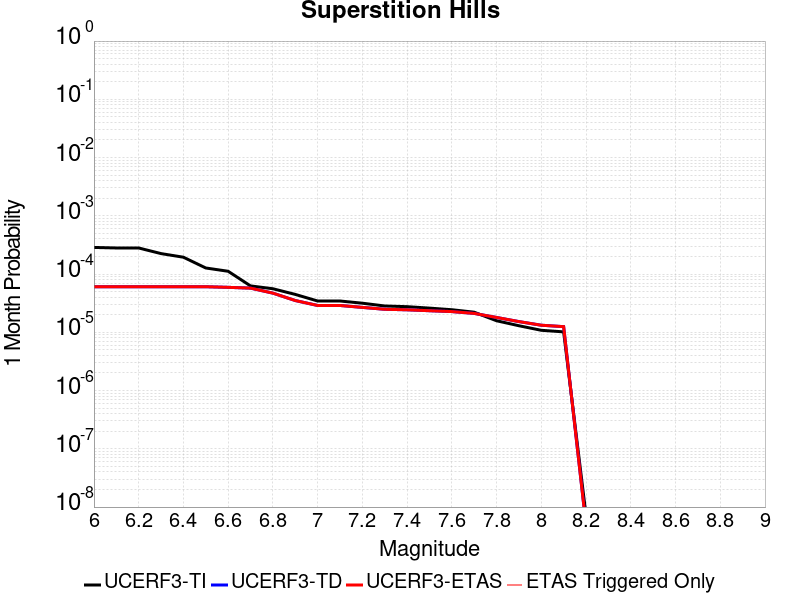 | 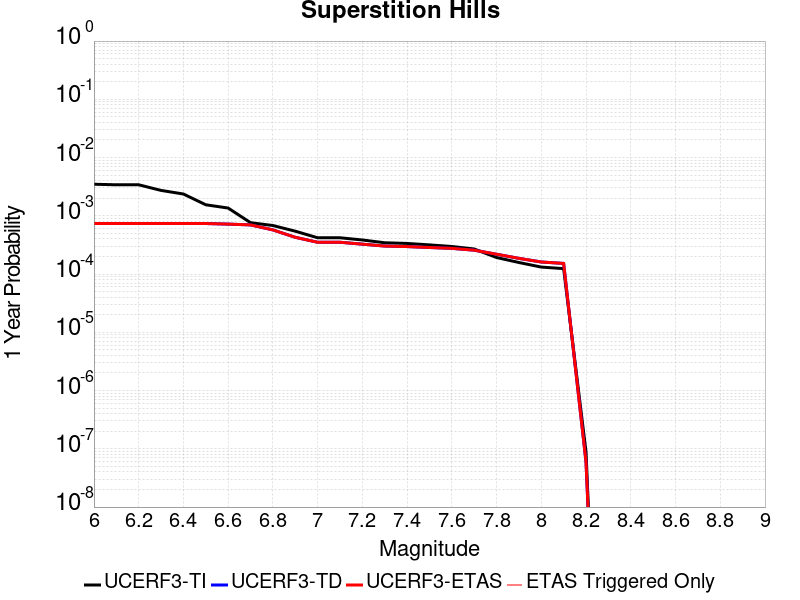 | 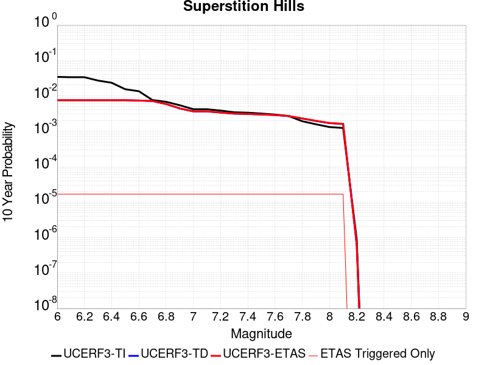 |

| Magnitude | 1 wk TI Prob | 1 wk TD Prob | 1 wk ETAS Prob | 1 wk ETAS/TD Gain | 1 wk ETAS Triggered Only | 1 mo TI Prob | 1 mo TD Prob | 1 mo ETAS Prob | 1 mo ETAS/TD Gain | 1 mo ETAS Triggered Only | 1 yr TI Prob | 1 yr TD Prob | 1 yr ETAS Prob | 1 yr ETAS/TD Gain | 1 yr ETAS Triggered Only | 10 yr TI Prob | 10 yr TD Prob | 10 yr ETAS Prob | 10 yr ETAS/TD Gain | 10 yr ETAS Triggered Only |
|-----|-----|-----|-----|-----|-----|-----|-----|-----|-----|-----|-----|-----|-----|-----|-----|-----|-----|-----|-----|-----|
| 6.0 | 6.6865185E-5 | 1.4140716E-5 | 1.4140716E-5 | 1.0 | 0.0 | 2.8653358E-4 | 6.0601753E-5 | 6.0601753E-5 | 1.0 | 0.0 | 0.0034829667 | 7.3759275E-4 | 7.3759275E-4 | 1.0 | 0.0 | 0.03428881 | 0.0075219767 | 0.007538685 | 1.0022212 | 1.6835016E-5 |
| 6.1 | 6.544851E-5 | 1.4140715E-5 | 1.4140715E-5 | 1.0 | 0.0 | 2.8046346E-4 | 6.0601753E-5 | 6.0601753E-5 | 1.0 | 0.0 | 0.0034092965 | 7.3759275E-4 | 7.3759275E-4 | 1.0 | 0.0 | 0.033574644 | 0.007521976 | 0.007538684 | 1.0022212 | 1.6835016E-5 |
| 6.2 | 6.544851E-5 | 1.4140715E-5 | 1.4140715E-5 | 1.0 | 0.0 | 2.8046346E-4 | 6.0601753E-5 | 6.0601753E-5 | 1.0 | 0.0 | 0.0034092965 | 7.3759275E-4 | 7.3759275E-4 | 1.0 | 0.0 | 0.033574644 | 0.007521976 | 0.007538684 | 1.0022212 | 1.6835016E-5 |
| 6.3 | 5.2402065E-5 | 1.41407145E-5 | 1.41407145E-5 | 1.0 | 0.0 | 2.2456095E-4 | 6.0601746E-5 | 6.0601746E-5 | 1.0 | 0.0 | 0.0027306017 | 7.375927E-4 | 7.375927E-4 | 1.0 | 0.0 | 0.02697292 | 0.0075219707 | 0.007538679 | 1.0022212 | 1.6835016E-5 |
| 6.4 | 4.542238E-5 | 1.4140714E-5 | 1.4140714E-5 | 1.0 | 0.0 | 1.9465282E-4 | 6.0601742E-5 | 6.0601742E-5 | 1.0 | 0.0 | 0.0023673223 | 7.3759264E-4 | 7.3759264E-4 | 1.0 | 0.0 | 0.023422617 | 0.007521968 | 0.0075386763 | 1.0022212 | 1.6835016E-5 |
| 6.5 | 2.9672969E-5 | 1.4140713E-5 | 1.4140713E-5 | 1.0 | 0.0 | 1.2716366E-4 | 6.060174E-5 | 6.060174E-5 | 1.0 | 0.0 | 0.0015471181 | 7.375926E-4 | 7.375926E-4 | 1.0 | 0.0 | 0.015363912 | 0.0075219613 | 0.0075386697 | 1.0022212 | 1.6835016E-5 |
| 6.6 | 2.6056105E-5 | 1.3806452E-5 | 1.3806452E-5 | 1.0 | 0.0 | 1.1166424E-4 | 5.916926E-5 | 5.916926E-5 | 1.0 | 0.0 | 0.0013586642 | 7.201637E-4 | 7.201637E-4 | 1.0 | 0.0 | 0.013503874 | 0.007346386 | 0.0073630977 | 1.0022748 | 1.6835016E-5 |
| 6.7 | 1.4611248E-5 | 1.3386336E-5 | 1.3386336E-5 | 1.0 | 0.0 | 6.261813E-5 | 5.736884E-5 | 5.736884E-5 | 1.0 | 0.0 | 7.6210906E-4 | 6.9825776E-4 | 6.9825776E-4 | 1.0 | 0.0 | 0.0075950073 | 0.007127569 | 0.007144284 | 1.0023451 | 1.6835016E-5 |
| 6.8 | 1.30607E-5 | 1.0981634E-5 | 1.0981634E-5 | 1.0 | 0.0 | 5.597323E-5 | 4.7063342E-5 | 4.7063342E-5 | 1.0 | 0.0 | 6.8126095E-4 | 5.728543E-4 | 5.728543E-4 | 1.0 | 0.0 | 0.006791762 | 0.005875862 | 0.0058925985 | 1.0028483 | 1.6835016E-5 |
| 6.9 | 1.0443096E-5 | 8.197917E-6 | 8.197917E-6 | 1.0 | 0.0 | 4.4755358E-5 | 3.513347E-5 | 3.513347E-5 | 1.0 | 0.0 | 5.447602E-4 | 4.2766842E-4 | 4.2766842E-4 | 1.0 | 0.0 | 0.005434267 | 0.004410797 | 0.0044275573 | 1.0037999 | 1.6835016E-5 |
| 7.0 | 8.045912E-6 | 6.742015E-6 | 6.742015E-6 | 1.0 | 0.0 | 3.4482026E-5 | 2.8894035E-5 | 2.8894035E-5 | 1.0 | 0.0 | 4.197378E-4 | 3.5172913E-4 | 3.5172913E-4 | 1.0 | 0.0 | 0.0041894587 | 0.003634624 | 0.003651398 | 1.0046151 | 1.6835016E-5 |
| 7.1 | 8.045912E-6 | 6.742015E-6 | 6.742015E-6 | 1.0 | 0.0 | 3.4482026E-5 | 2.8894035E-5 | 2.8894035E-5 | 1.0 | 0.0 | 4.197378E-4 | 3.5172913E-4 | 3.5172913E-4 | 1.0 | 0.0 | 0.0041894587 | 0.003634624 | 0.003651398 | 1.0046151 | 1.6835016E-5 |
| 7.2 | 7.375506E-6 | 6.2489075E-6 | 6.2489075E-6 | 1.0 | 0.0 | 3.1608928E-5 | 2.6780763E-5 | 2.6780763E-5 | 1.0 | 0.0 | 3.8477074E-4 | 3.2600787E-4 | 3.2600787E-4 | 1.0 | 0.0 | 0.003841052 | 0.0033750783 | 0.0033918566 | 1.0049711 | 1.6835016E-5 |
| 7.3 | 6.6063913E-6 | 5.8012956E-6 | 5.8012956E-6 | 1.0 | 0.0 | 2.8312797E-5 | 2.4862462E-5 | 2.4862462E-5 | 1.0 | 0.0 | 3.446538E-4 | 3.0265914E-4 | 3.0265914E-4 | 1.0 | 0.0 | 0.0034411973 | 0.0031393243 | 0.0031561062 | 1.0053458 | 1.6835016E-5 |
| 7.4 | 6.4313126E-6 | 5.6827116E-6 | 5.6827116E-6 | 1.0 | 0.0 | 2.7562477E-5 | 2.4354254E-5 | 2.4354254E-5 | 1.0 | 0.0 | 3.355215E-4 | 2.964734E-4 | 2.964734E-4 | 1.0 | 0.0 | 0.0033501536 | 0.003077082 | 0.0030938652 | 1.0054543 | 1.6835016E-5 |
| 7.5 | 6.0742927E-6 | 5.478511E-6 | 5.478511E-6 | 1.0 | 0.0 | 2.6032423E-5 | 2.3479126E-5 | 2.3479126E-5 | 1.0 | 0.0 | 3.1689866E-4 | 2.8582153E-4 | 2.8582153E-4 | 1.0 | 0.0 | 0.0031644711 | 0.0029689074 | 0.0029856924 | 1.0056536 | 1.6835016E-5 |
| 7.6 | 5.6987187E-6 | 5.2966907E-6 | 5.2966907E-6 | 1.0 | 0.0 | 2.4422852E-5 | 2.269991E-5 | 2.269991E-5 | 1.0 | 0.0 | 2.9730765E-4 | 2.76337E-4 | 2.76337E-4 | 1.0 | 0.0 | 0.002969102 | 0.0028721471 | 0.0028889338 | 1.0058446 | 1.6835016E-5 |
| 7.7 | 5.1658035E-6 | 4.9276673E-6 | 4.9276673E-6 | 1.0 | 0.0 | 2.2138971E-5 | 2.1118407E-5 | 2.1118407E-5 | 1.0 | 0.0 | 2.6950863E-4 | 2.5708685E-4 | 2.5708685E-4 | 1.0 | 0.0 | 0.00269182 | 0.002677178 | 0.0026939681 | 1.0062715 | 1.6835016E-5 |
| 7.8 | 3.6864697E-6 | 4.198542E-6 | 4.198542E-6 | 1.0 | 0.0 | 1.579906E-5 | 1.7993629E-5 | 1.7993629E-5 | 1.0 | 0.0 | 1.9233658E-4 | 2.1905087E-4 | 2.1905087E-4 | 1.0 | 0.0 | 0.0019217018 | 0.0022903313 | 0.0023071277 | 1.0073336 | 1.6835016E-5 |
| 7.9 | 3.0265903E-6 | 3.565613E-6 | 3.565613E-6 | 1.0 | 0.0 | 1.2971037E-5 | 1.5281112E-5 | 1.5281112E-5 | 1.0 | 0.0 | 1.5791094E-4 | 1.8603209E-4 | 1.8603209E-4 | 1.0 | 0.0 | 0.0015779877 | 0.0019544594 | 0.0019712613 | 1.0085968 | 1.6835016E-5 |
| 8.0 | 2.5271493E-6 | 3.0884585E-6 | 3.0884585E-6 | 1.0 | 0.0 | 1.0830595E-5 | 1.3236186E-5 | 1.3236186E-5 | 1.0 | 0.0 | 1.3185451E-4 | 1.6113906E-4 | 1.6113906E-4 | 1.0 | 0.0 | 0.0013177631 | 0.0016982564 | 0.0017150628 | 1.0098963 | 1.6835016E-5 |
| 8.1 | 2.3749135E-6 | 2.919021E-6 | 2.919021E-6 | 1.0 | 0.0 | 1.0178161E-5 | 1.2510032E-5 | 1.2510032E-5 | 1.0 | 0.0 | 1.2391206E-4 | 1.5229941E-4 | 1.5229941E-4 | 1.0 | 0.0 | 0.0012384299 | 0.0016058089 | 0.0016226169 | 1.0104669 | 1.6835016E-5 |
| 8.2 | 1.7186406E-9 | 1.1449343E-9 | 1.1449343E-9 | 1.0 | 0.0 | 7.3656024E-9 | 4.906861E-9 | 4.906861E-9 | 1.0 | 0.0 | 8.9676206E-8 | 5.974103E-8 | 5.974103E-8 | 1.0 | 0.0 | 8.9676166E-7 | 6.393774E-7 | 6.393774E-7 | 1.0 | 0.0 |

## Malibu Coast alt 1
*[(top)](#table-of-contents)*

| 1 Week | 1 Month | 1 Year | 10 Year |
|-----|-----|-----|-----|
|  | 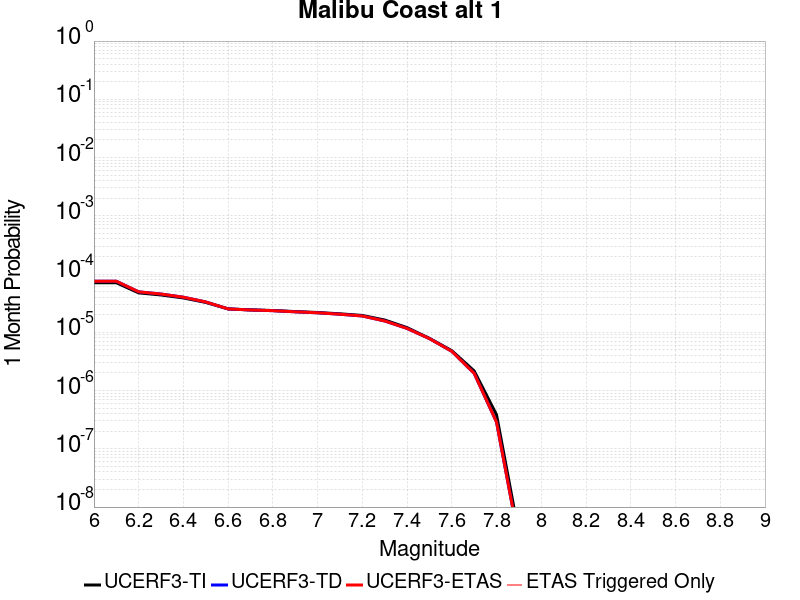 | 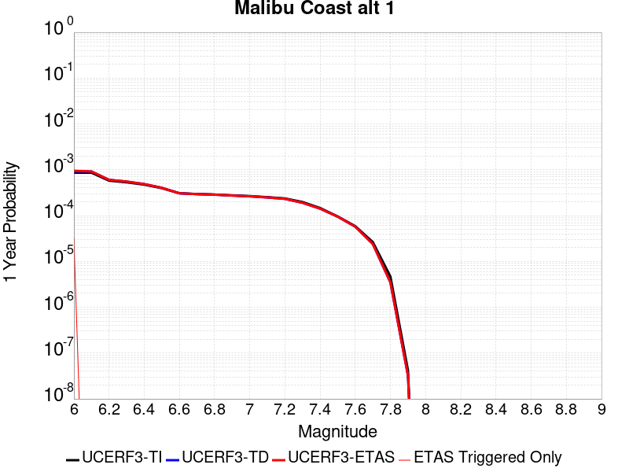 | 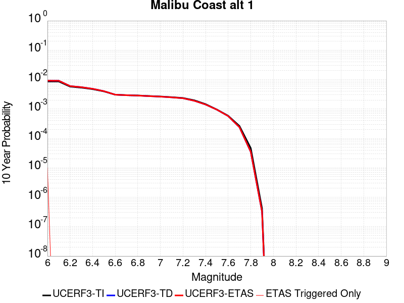 |

| Magnitude | 1 wk TI Prob | 1 wk TD Prob | 1 wk ETAS Prob | 1 wk ETAS/TD Gain | 1 wk ETAS Triggered Only | 1 mo TI Prob | 1 mo TD Prob | 1 mo ETAS Prob | 1 mo ETAS/TD Gain | 1 mo ETAS Triggered Only | 1 yr TI Prob | 1 yr TD Prob | 1 yr ETAS Prob | 1 yr ETAS/TD Gain | 1 yr ETAS Triggered Only | 10 yr TI Prob | 10 yr TD Prob | 10 yr ETAS Prob | 10 yr ETAS/TD Gain | 10 yr ETAS Triggered Only |
|-----|-----|-----|-----|-----|-----|-----|-----|-----|-----|-----|-----|-----|-----|-----|-----|-----|-----|-----|-----|-----|
| 6.0 | 1.6572556E-5 | 1.7598268E-5 | 1.7598268E-5 | 1.0 | 0.0 | 7.102331E-5 | 7.541908E-5 | 7.541908E-5 | 1.0 | 0.0 | 8.6436566E-4 | 9.178593E-4 | 9.346789E-4 | 1.0183247 | 1.6835016E-5 | 0.0086101135 | 0.009142617 | 0.009159299 | 1.0018245 | 1.6835016E-5 |
| 6.1 | 1.6572556E-5 | 1.7598268E-5 | 1.7598268E-5 | 1.0 | 0.0 | 7.102331E-5 | 7.541908E-5 | 7.541908E-5 | 1.0 | 0.0 | 8.6436566E-4 | 9.178593E-4 | 9.178593E-4 | 1.0 | 0.0 | 0.0086101135 | 0.009142617 | 0.009142617 | 1.0 | 0.0 |
| 6.2 | 1.1085717E-5 | 1.1557268E-5 | 1.1557268E-5 | 1.0 | 0.0 | 4.750935E-5 | 4.953023E-5 | 4.953023E-5 | 1.0 | 0.0 | 5.782728E-4 | 6.028672E-4 | 6.028672E-4 | 1.0 | 0.0 | 0.0057677035 | 0.0060126884 | 0.0060126884 | 1.0 | 0.0 |
| 6.3 | 1.0208568E-5 | 1.05923455E-5 | 1.05923455E-5 | 1.0 | 0.0 | 4.375027E-5 | 4.5394994E-5 | 4.5394994E-5 | 1.0 | 0.0 | 5.325294E-4 | 5.525468E-4 | 5.525468E-4 | 1.0 | 0.0 | 0.0053125503 | 0.005512038 | 0.005512038 | 1.0 | 0.0 |
| 6.4 | 9.0682315E-6 | 9.34273E-6 | 9.34273E-6 | 1.0 | 0.0 | 3.8863272E-5 | 4.0039668E-5 | 4.0039668E-5 | 1.0 | 0.0 | 4.730576E-4 | 4.8737595E-4 | 4.8737595E-4 | 1.0 | 0.0 | 0.0047205184 | 0.004863284 | 0.004863284 | 1.0 | 0.0 |
| 6.5 | 7.605796E-6 | 7.74866E-6 | 7.74866E-6 | 1.0 | 0.0 | 3.259586E-5 | 3.320813E-5 | 3.320813E-5 | 1.0 | 0.0 | 3.9678233E-4 | 4.042353E-4 | 4.042353E-4 | 1.0 | 0.0 | 0.0039607463 | 0.004035138 | 0.004035138 | 1.0 | 0.0 |
| 6.6 | 5.889873E-6 | 5.8795895E-6 | 5.8795895E-6 | 1.0 | 0.0 | 2.5242069E-5 | 2.5197998E-5 | 2.5197998E-5 | 1.0 | 0.0 | 3.0727885E-4 | 3.0674253E-4 | 3.0674253E-4 | 1.0 | 0.0 | 0.003068543 | 0.0030632042 | 0.0030632042 | 1.0 | 0.0 |
| 6.7 | 5.66586E-6 | 5.64169E-6 | 5.64169E-6 | 1.0 | 0.0 | 2.428203E-5 | 2.417845E-5 | 2.417845E-5 | 1.0 | 0.0 | 2.955936E-4 | 2.9433295E-4 | 2.9433295E-4 | 1.0 | 0.0 | 0.0029520073 | 0.002939443 | 0.002939443 | 1.0 | 0.0 |
| 6.8 | 5.521556E-6 | 5.489475E-6 | 5.489475E-6 | 1.0 | 0.0 | 2.3663597E-5 | 2.3526109E-5 | 2.3526109E-5 | 1.0 | 0.0 | 2.880662E-4 | 2.8639284E-4 | 2.8639284E-4 | 1.0 | 0.0 | 0.0028769306 | 0.002860249 | 0.002860249 | 1.0 | 0.0 |
| 6.9 | 5.29752E-6 | 5.249977E-6 | 5.249977E-6 | 1.0 | 0.0 | 2.270346E-5 | 2.249971E-5 | 2.249971E-5 | 1.0 | 0.0 | 2.7637955E-4 | 2.738996E-4 | 2.738996E-4 | 1.0 | 0.0 | 0.0027603607 | 0.0027356306 | 0.0027356306 | 1.0 | 0.0 |
| 7.0 | 5.106743E-6 | 5.047723E-6 | 5.047723E-6 | 1.0 | 0.0 | 2.1885859E-5 | 2.1632919E-5 | 2.1632919E-5 | 1.0 | 0.0 | 2.6642776E-4 | 2.6334904E-4 | 2.6334904E-4 | 1.0 | 0.0 | 0.0026610855 | 0.002630379 | 0.002630379 | 1.0 | 0.0 |
| 7.1 | 4.8469647E-6 | 4.7704148E-6 | 4.7704148E-6 | 1.0 | 0.0 | 2.0772539E-5 | 2.0444475E-5 | 2.0444475E-5 | 1.0 | 0.0 | 2.528763E-4 | 2.488831E-4 | 2.488831E-4 | 1.0 | 0.0 | 0.0025258875 | 0.0024860518 | 0.0024860518 | 1.0 | 0.0 |
| 7.2 | 4.545514E-6 | 4.448232E-6 | 4.448232E-6 | 1.0 | 0.0 | 1.9480629E-5 | 1.9063713E-5 | 1.9063713E-5 | 1.0 | 0.0 | 2.3715083E-4 | 2.3207605E-4 | 2.3207605E-4 | 1.0 | 0.0 | 0.0023689792 | 0.0023183445 | 0.0023183445 | 1.0 | 0.0 |
| 7.3 | 3.794097E-6 | 3.6519655E-6 | 3.6519655E-6 | 1.0 | 0.0 | 1.6260314E-5 | 1.5651187E-5 | 1.5651187E-5 | 1.0 | 0.0 | 1.9795135E-4 | 1.9053658E-4 | 1.9053658E-4 | 1.0 | 0.0 | 0.001977751 | 0.0019037367 | 0.0019037367 | 1.0 | 0.0 |
| 7.4 | 2.808217E-6 | 2.7191E-6 | 2.7191E-6 | 1.0 | 0.0 | 1.203516E-5 | 1.1653234E-5 | 1.1653234E-5 | 1.0 | 0.0 | 1.4651821E-4 | 1.418689E-4 | 1.418689E-4 | 1.0 | 0.0 | 0.0014642165 | 0.0014177861 | 0.0014177861 | 1.0 | 0.0 |
| 7.5 | 1.83809E-6 | 1.8190852E-6 | 1.8190852E-6 | 1.0 | 0.0 | 7.877505E-6 | 7.796056E-6 | 7.796056E-6 | 1.0 | 0.0 | 9.59044E-5 | 9.4912866E-5 | 9.4912866E-5 | 1.0 | 0.0 | 9.5863023E-4 | 9.487253E-4 | 9.487253E-4 | 1.0 | 0.0 |
| 7.6 | 1.1292672E-6 | 1.100155E-6 | 1.100155E-6 | 1.0 | 0.0 | 4.839708E-6 | 4.7149415E-6 | 4.7149415E-6 | 1.0 | 0.0 | 5.8921847E-5 | 5.7402918E-5 | 5.7402918E-5 | 1.0 | 0.0 | 5.890623E-4 | 5.7388254E-4 | 5.7388254E-4 | 1.0 | 0.0 |
| 7.7 | 5.065272E-7 | 4.609203E-7 | 4.609203E-7 | 1.0 | 0.0 | 2.170829E-6 | 1.9753713E-6 | 1.9753713E-6 | 1.0 | 0.0 | 2.6429525E-5 | 2.404989E-5 | 2.404989E-5 | 1.0 | 0.0 | 2.642638E-4 | 2.4047401E-4 | 2.4047401E-4 | 1.0 | 0.0 |
| 7.8 | 8.952991E-8 | 6.708074E-8 | 6.708074E-8 | 1.0 | 0.0 | 3.8369956E-7 | 2.8748886E-7 | 2.8748886E-7 | 1.0 | 0.0 | 4.671532E-6 | 3.5001713E-6 | 3.5001713E-6 | 1.0 | 0.0 | 4.671434E-5 | 3.5001183E-5 | 3.5001183E-5 | 1.0 | 0.0 |
| 7.9 | 8.007447E-10 | 6.160915E-10 | 6.160915E-10 | 1.0 | 0.0 | 3.4317629E-9 | 2.6403923E-9 | 2.6403923E-9 | 1.0 | 0.0 | 4.1781714E-8 | 3.2146776E-8 | 3.2146776E-8 | 1.0 | 0.0 | 4.1781706E-7 | 3.2146772E-7 | 3.2146772E-7 | 1.0 | 0.0 |

## Greenville (No) 2011 CFM
*[(top)](#table-of-contents)*

| 1 Week | 1 Month | 1 Year | 10 Year |
|-----|-----|-----|-----|
|  | 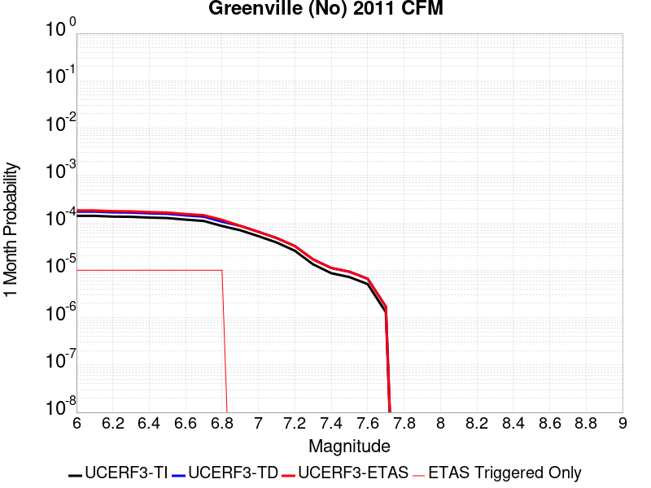 | 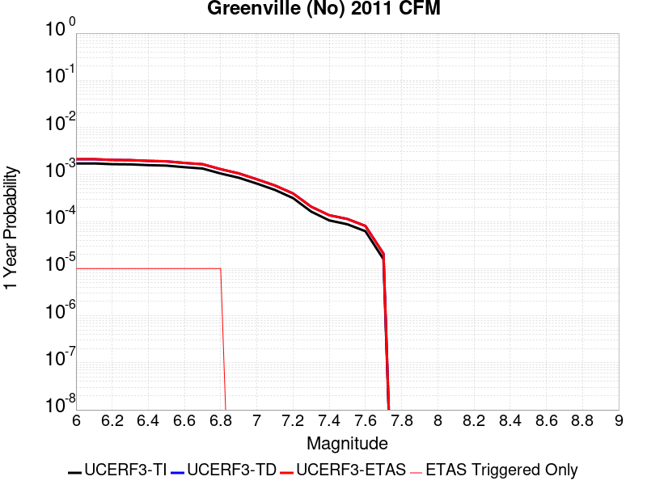 | 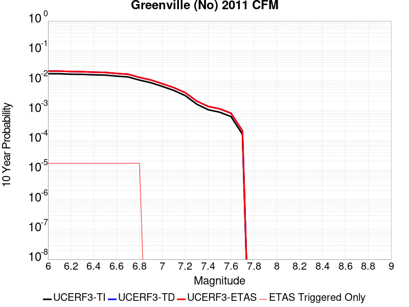 |

| Magnitude | 1 wk TI Prob | 1 wk TD Prob | 1 wk ETAS Prob | 1 wk ETAS/TD Gain | 1 wk ETAS Triggered Only | 1 mo TI Prob | 1 mo TD Prob | 1 mo ETAS Prob | 1 mo ETAS/TD Gain | 1 mo ETAS Triggered Only | 1 yr TI Prob | 1 yr TD Prob | 1 yr ETAS Prob | 1 yr ETAS/TD Gain | 1 yr ETAS Triggered Only | 10 yr TI Prob | 10 yr TD Prob | 10 yr ETAS Prob | 10 yr ETAS/TD Gain | 10 yr ETAS Triggered Only |
|-----|-----|-----|-----|-----|-----|-----|-----|-----|-----|-----|-----|-----|-----|-----|-----|-----|-----|-----|-----|-----|
| 6.0 | 3.286654E-5 | 4.036741E-5 | 4.036741E-5 | 1.0 | 0.0 | 1.4084899E-4 | 1.7299193E-4 | 1.8982403E-4 | 1.0972999 | 1.6835016E-5 | 0.0017134876 | 0.0021041804 | 0.00212098 | 1.0079839 | 1.6835016E-5 | 0.017003356 | 0.020847455 | 0.02086394 | 1.0007907 | 1.6835016E-5 |
| 6.1 | 3.286654E-5 | 4.036741E-5 | 4.036741E-5 | 1.0 | 0.0 | 1.4084899E-4 | 1.7299193E-4 | 1.8982403E-4 | 1.0972999 | 1.6835016E-5 | 0.0017134876 | 0.0021041804 | 0.00212098 | 1.0079839 | 1.6835016E-5 | 0.017003356 | 0.020847455 | 0.02086394 | 1.0007907 | 1.6835016E-5 |
| 6.2 | 3.1697953E-5 | 3.893027E-5 | 3.893027E-5 | 1.0 | 0.0 | 1.358413E-4 | 1.6683355E-4 | 1.8366576E-4 | 1.1008922 | 1.6835016E-5 | 0.0016526132 | 0.0020293442 | 0.002046145 | 1.008279 | 1.6835016E-5 | 0.01640377 | 0.020112827 | 0.020129323 | 1.0008202 | 1.6835016E-5 |
| 6.3 | 3.1363317E-5 | 3.8519134E-5 | 3.8519134E-5 | 1.0 | 0.0 | 1.344073E-4 | 1.6507176E-4 | 1.8190399E-4 | 1.1019692 | 1.6835016E-5 | 0.0016351803 | 0.002007934 | 0.0020247353 | 1.0083674 | 1.6835016E-5 | 0.016232004 | 0.019902589 | 0.01991909 | 1.000829 | 1.6835016E-5 |
| 6.4 | 3.0228604E-5 | 3.7126225E-5 | 3.7126225E-5 | 1.0 | 0.0 | 1.2954473E-4 | 1.5910288E-4 | 1.7593523E-4 | 1.1057953 | 1.6835016E-5 | 0.0015760659 | 0.0019353938 | 0.0019521961 | 1.0086817 | 1.6835016E-5 | 0.015649348 | 0.01918991 | 0.019206421 | 1.0008605 | 1.6835016E-5 |
| 6.5 | 2.9537814E-5 | 3.6281657E-5 | 3.6281657E-5 | 1.0 | 0.0 | 1.2658449E-4 | 1.5548375E-4 | 1.7231614E-4 | 1.1082582 | 1.6835016E-5 | 0.0015400766 | 0.0018914078 | 0.0019082109 | 1.008884 | 1.6835016E-5 | 0.01529447 | 0.018757557 | 0.018774077 | 1.0008807 | 1.6835016E-5 |
| 6.6 | 2.7345395E-5 | 3.3590906E-5 | 3.3590906E-5 | 1.0 | 0.0 | 1.1718928E-4 | 1.4395325E-4 | 1.6078584E-4 | 1.116931 | 1.6835016E-5 | 0.0014258457 | 0.0017512529 | 0.0017680584 | 1.0095963 | 1.6835016E-5 | 0.014167317 | 0.017378341 | 0.017394884 | 1.0009519 | 1.6835016E-5 |
| 6.7 | 2.5615784E-5 | 3.1567764E-5 | 3.1567764E-5 | 1.0 | 0.0 | 1.09777306E-4 | 1.3528357E-4 | 1.521163E-4 | 1.1244256 | 1.6835016E-5 | 0.0013357193 | 0.0016458635 | 0.0016626709 | 1.0102118 | 1.6835016E-5 | 0.013277191 | 0.016340412 | 0.016356971 | 1.0010134 | 1.6835016E-5 |
| 6.8 | 2.0059057E-5 | 2.4712537E-5 | 2.4712537E-5 | 1.0 | 0.0 | 8.596455E-5 | 1.0590666E-4 | 1.2273989E-4 | 1.158944 | 1.6835016E-5 | 0.0010461159 | 0.0012886672 | 0.0013054805 | 1.0130471 | 1.6835016E-5 | 0.0104120495 | 0.012813962 | 0.0128305815 | 1.001297 | 1.6835016E-5 |
| 6.9 | 1.6321746E-5 | 2.0185005E-5 | 2.0185005E-5 | 1.0 | 0.0 | 6.9948466E-5 | 8.650436E-5 | 8.650436E-5 | 1.0 | 0.0 | 8.5128983E-4 | 0.0010526942 | 0.0010526942 | 1.0 | 0.0 | 0.008480361 | 0.010478605 | 0.010478605 | 1.0 | 0.0 |
| 7.0 | 1.22527645E-5 | 1.5135852E-5 | 1.5135852E-5 | 1.0 | 0.0 | 5.2510793E-5 | 6.486634E-5 | 6.486634E-5 | 1.0 | 0.0 | 6.3913135E-4 | 7.894658E-4 | 7.894658E-4 | 1.0 | 0.0 | 0.0063729626 | 0.00786725 | 0.00786725 | 1.0 | 0.0 |
| 7.1 | 8.996482E-6 | 1.1165086E-5 | 1.1165086E-5 | 1.0 | 0.0 | 3.8555783E-5 | 4.78495E-5 | 4.78495E-5 | 1.0 | 0.0 | 4.6931554E-4 | 5.8241317E-4 | 5.8241317E-4 | 1.0 | 0.0 | 0.004683256 | 0.005809159 | 0.005809159 | 1.0 | 0.0 |
| 7.2 | 6.0273087E-6 | 7.569554E-6 | 7.569554E-6 | 1.0 | 0.0 | 2.5831067E-5 | 3.2440545E-5 | 3.2440545E-5 | 1.0 | 0.0 | 3.1444785E-4 | 3.9489273E-4 | 3.9489273E-4 | 1.0 | 0.0 | 0.0031400328 | 0.0039421073 | 0.0039421073 | 1.0 | 0.0 |
| 7.3 | 3.1209995E-6 | 3.966412E-6 | 3.966412E-6 | 1.0 | 0.0 | 1.3375643E-5 | 1.6998798E-5 | 1.6998798E-5 | 1.0 | 0.0 | 1.6283628E-4 | 2.0694088E-4 | 2.0694088E-4 | 1.0 | 0.0 | 0.0016271701 | 0.002067572 | 0.002067572 | 1.0 | 0.0 |
| 7.4 | 2.0254208E-6 | 2.609629E-6 | 2.609629E-6 | 1.0 | 0.0 | 8.680347E-6 | 1.1184077E-5 | 1.1184077E-5 | 1.0 | 0.0 | 1.0567809E-4 | 1.3615769E-4 | 1.3615769E-4 | 1.0 | 0.0 | 0.0010562785 | 0.0013607995 | 0.0013607995 | 1.0 | 0.0 |
| 7.5 | 1.6763418E-6 | 2.1733601E-6 | 2.1733601E-6 | 1.0 | 0.0 | 7.184302E-6 | 9.314368E-6 | 9.314368E-6 | 1.0 | 0.0 | 8.746537E-5 | 1.1339658E-4 | 1.1339658E-4 | 1.0 | 0.0 | 8.743095E-4 | 0.0011334341 | 0.0011334341 | 1.0 | 0.0 |
| 7.6 | 1.1935462E-6 | 1.5458515E-6 | 1.5458515E-6 | 1.0 | 0.0 | 5.115188E-6 | 6.6250614E-6 | 6.6250614E-6 | 1.0 | 0.0 | 6.2275634E-5 | 8.065718E-5 | 8.065718E-5 | 1.0 | 0.0 | 6.2258187E-4 | 8.0630975E-4 | 8.0630975E-4 | 1.0 | 0.0 |
| 7.7 | 3.0464201E-7 | 3.984697E-7 | 3.984697E-7 | 1.0 | 0.0 | 1.3056081E-6 | 1.7077261E-6 | 1.7077261E-6 | 1.0 | 0.0 | 1.589566E-5 | 2.0791373E-5 | 2.0791373E-5 | 1.0 | 0.0 | 1.5894524E-4 | 2.0789898E-4 | 2.0789898E-4 | 1.0 | 0.0 |

## Elsinore (Stepovers Combined)
*[(top)](#table-of-contents)*

| 1 Week | 1 Month | 1 Year | 10 Year |
|-----|-----|-----|-----|
|  | 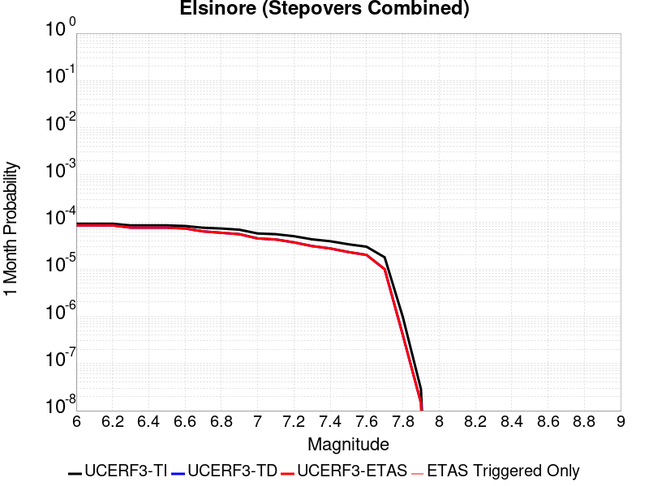 | 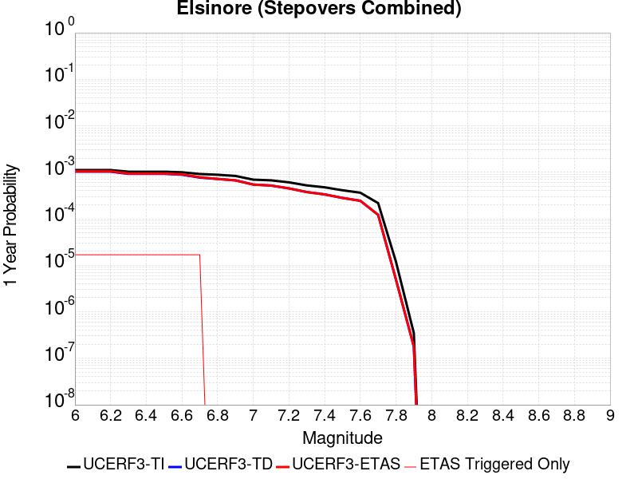 | 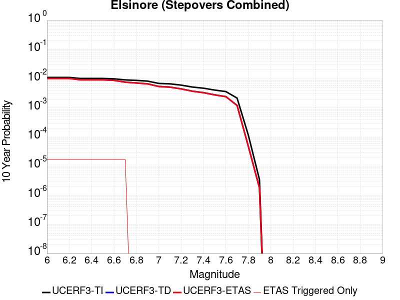 |

| Magnitude | 1 wk TI Prob | 1 wk TD Prob | 1 wk ETAS Prob | 1 wk ETAS/TD Gain | 1 wk ETAS Triggered Only | 1 mo TI Prob | 1 mo TD Prob | 1 mo ETAS Prob | 1 mo ETAS/TD Gain | 1 mo ETAS Triggered Only | 1 yr TI Prob | 1 yr TD Prob | 1 yr ETAS Prob | 1 yr ETAS/TD Gain | 1 yr ETAS Triggered Only | 10 yr TI Prob | 10 yr TD Prob | 10 yr ETAS Prob | 10 yr ETAS/TD Gain | 10 yr ETAS Triggered Only |
|-----|-----|-----|-----|-----|-----|-----|-----|-----|-----|-----|-----|-----|-----|-----|-----|-----|-----|-----|-----|-----|
| 6.0 | 2.144392E-5 | 1.976108E-5 | 1.976108E-5 | 1.0 | 0.0 | 9.189928E-5 | 8.468772E-5 | 8.468772E-5 | 1.0 | 0.0 | 0.0011182994 | 0.0010306069 | 0.0010474246 | 1.0163182 | 1.6835016E-5 | 0.011126885 | 0.010265374 | 0.010282036 | 1.0016232 | 1.6835016E-5 |
| 6.1 | 2.144392E-5 | 1.976108E-5 | 1.976108E-5 | 1.0 | 0.0 | 9.189928E-5 | 8.468772E-5 | 8.468772E-5 | 1.0 | 0.0 | 0.0011182994 | 0.0010306069 | 0.0010474246 | 1.0163182 | 1.6835016E-5 | 0.011126885 | 0.010265374 | 0.010282036 | 1.0016232 | 1.6835016E-5 |
| 6.2 | 2.144392E-5 | 1.976108E-5 | 1.976108E-5 | 1.0 | 0.0 | 9.189928E-5 | 8.468772E-5 | 8.468772E-5 | 1.0 | 0.0 | 0.0011182994 | 0.0010306069 | 0.0010474246 | 1.0163182 | 1.6835016E-5 | 0.011126885 | 0.010265374 | 0.010282036 | 1.0016232 | 1.6835016E-5 |
| 6.3 | 1.9751555E-5 | 1.7742288E-5 | 1.7742288E-5 | 1.0 | 0.0 | 8.4646774E-5 | 7.603626E-5 | 7.603626E-5 | 1.0 | 0.0 | 0.0010300872 | 9.253649E-4 | 9.4218436E-4 | 1.018176 | 1.6835016E-5 | 0.010253254 | 0.009221707 | 0.009238386 | 1.0018088 | 1.6835016E-5 |
| 6.4 | 1.9751555E-5 | 1.7742288E-5 | 1.7742288E-5 | 1.0 | 0.0 | 8.4646774E-5 | 7.603626E-5 | 7.603626E-5 | 1.0 | 0.0 | 0.0010300872 | 9.253649E-4 | 9.4218436E-4 | 1.018176 | 1.6835016E-5 | 0.010253254 | 0.009221707 | 0.009238386 | 1.0018088 | 1.6835016E-5 |
| 6.5 | 1.9751555E-5 | 1.7742288E-5 | 1.7742288E-5 | 1.0 | 0.0 | 8.4646774E-5 | 7.603626E-5 | 7.603626E-5 | 1.0 | 0.0 | 0.0010300872 | 9.253649E-4 | 9.4218436E-4 | 1.018176 | 1.6835016E-5 | 0.010253254 | 0.009221707 | 0.009238386 | 1.0018088 | 1.6835016E-5 |
| 6.6 | 1.9188685E-5 | 1.7004199E-5 | 1.7004199E-5 | 1.0 | 0.0 | 8.2234634E-5 | 7.287319E-5 | 7.287319E-5 | 1.0 | 0.0 | 0.0010007467 | 8.8688615E-4 | 9.0370624E-4 | 1.0189654 | 1.6835016E-5 | 0.00996252 | 0.008840263 | 0.008856948 | 1.0018876 | 1.6835016E-5 |
| 6.7 | 1.7608272E-5 | 1.4733327E-5 | 1.4733327E-5 | 1.0 | 0.0 | 7.546184E-5 | 6.314136E-5 | 6.314136E-5 | 1.0 | 0.0 | 9.183606E-4 | 7.684846E-4 | 7.853067E-4 | 1.0218899 | 1.6835016E-5 | 0.009145746 | 0.0076652775 | 0.0076819835 | 1.0021794 | 1.6835016E-5 |
| 6.8 | 1.697165E-5 | 1.378403E-5 | 1.378403E-5 | 1.0 | 0.0 | 7.273361E-5 | 5.9073125E-5 | 5.9073125E-5 | 1.0 | 0.0 | 8.8517193E-4 | 7.189867E-4 | 7.189867E-4 | 1.0 | 0.0 | 0.008816543 | 0.0071730195 | 0.0071730195 | 1.0 | 0.0 |
| 6.9 | 1.600365E-5 | 1.2847316E-5 | 1.2847316E-5 | 1.0 | 0.0 | 6.858527E-5 | 5.505881E-5 | 5.505881E-5 | 1.0 | 0.0 | 8.347058E-4 | 6.701426E-4 | 6.701426E-4 | 1.0 | 0.0 | 0.008315775 | 0.0066871 | 0.0066871 | 1.0 | 0.0 |
| 7.0 | 1.3314581E-5 | 1.0448118E-5 | 1.0448118E-5 | 1.0 | 0.0 | 5.7061243E-5 | 4.4776894E-5 | 4.4776894E-5 | 1.0 | 0.0 | 6.944992E-4 | 5.4502505E-4 | 5.4502505E-4 | 1.0 | 0.0 | 0.006923327 | 0.0054408107 | 0.0054408107 | 1.0 | 0.0 |
| 7.1 | 1.2865345E-5 | 9.937989E-6 | 9.937989E-6 | 1.0 | 0.0 | 5.5136024E-5 | 4.25907E-5 | 4.25907E-5 | 1.0 | 0.0 | 6.710743E-4 | 5.1842094E-4 | 5.1842094E-4 | 1.0 | 0.0 | 0.0066905143 | 0.005175448 | 0.005175448 | 1.0 | 0.0 |
| 7.2 | 1.1650051E-5 | 8.634182E-6 | 8.634182E-6 | 1.0 | 0.0 | 4.9927836E-5 | 3.7003123E-5 | 3.7003123E-5 | 1.0 | 0.0 | 6.0770183E-4 | 4.5042168E-4 | 4.5042168E-4 | 1.0 | 0.0 | 0.0060604266 | 0.004496511 | 0.004496511 | 1.0 | 0.0 |
| 7.3 | 1.0008533E-5 | 7.2013468E-6 | 7.2013468E-6 | 1.0 | 0.0 | 4.2893007E-5 | 3.0862557E-5 | 3.0862557E-5 | 1.0 | 0.0 | 5.220972E-4 | 3.756883E-4 | 3.756883E-4 | 1.0 | 0.0 | 0.005208723 | 0.0037509191 | 0.0037509191 | 1.0 | 0.0 |
| 7.4 | 9.116759E-6 | 6.4103333E-6 | 6.4103333E-6 | 1.0 | 0.0 | 3.907124E-5 | 2.7472577E-5 | 2.7472577E-5 | 1.0 | 0.0 | 4.7558855E-4 | 3.3442865E-4 | 3.3442865E-4 | 1.0 | 0.0 | 0.00474572 | 0.0033394059 | 0.0033394059 | 1.0 | 0.0 |
| 7.5 | 7.870524E-6 | 5.3827566E-6 | 5.3827566E-6 | 1.0 | 0.0 | 3.3730383E-5 | 2.306876E-5 | 2.306876E-5 | 1.0 | 0.0 | 4.1059E-4 | 2.8082723E-4 | 2.8082723E-4 | 1.0 | 0.0 | 0.0040983222 | 0.00280485 | 0.00280485 | 1.0 | 0.0 |
| 7.6 | 6.9774537E-6 | 4.677801E-6 | 4.677801E-6 | 1.0 | 0.0 | 2.990303E-5 | 2.0047572E-5 | 2.0047572E-5 | 1.0 | 0.0 | 3.640086E-4 | 2.4405301E-4 | 2.4405301E-4 | 1.0 | 0.0 | 0.003634129 | 0.0024379662 | 0.0024379662 | 1.0 | 0.0 |
| 7.7 | 4.1616954E-6 | 2.3284533E-6 | 2.3284533E-6 | 1.0 | 0.0 | 1.7835715E-5 | 9.979052E-6 | 9.979052E-6 | 1.0 | 0.0 | 2.171282E-4 | 1.2148893E-4 | 1.2148893E-4 | 1.0 | 0.0 | 0.0021691616 | 0.0012142982 | 0.0012142982 | 1.0 | 0.0 |
| 7.8 | 2.2692414E-7 | 9.385943E-8 | 9.385943E-8 | 1.0 | 0.0 | 9.725317E-7 | 4.0225464E-7 | 4.0225464E-7 | 1.0 | 0.0 | 1.1840509E-5 | 4.8974425E-6 | 4.8974425E-6 | 1.0 | 0.0 | 1.1839878E-4 | 4.8973674E-5 | 4.8973674E-5 | 1.0 | 0.0 |
| 7.9 | 6.676829E-9 | 3.4399772E-9 | 3.4399772E-9 | 1.0 | 0.0 | 2.861498E-8 | 1.4742759E-8 | 1.4742759E-8 | 1.0 | 0.0 | 3.4838732E-7 | 1.7949307E-7 | 1.7949307E-7 | 1.0 | 0.0 | 3.4838679E-6 | 1.7949295E-6 | 1.7949295E-6 | 1.0 | 0.0 |

## West Tahoe
*[(top)](#table-of-contents)*

| 1 Week | 1 Month | 1 Year | 10 Year |
|-----|-----|-----|-----|
| 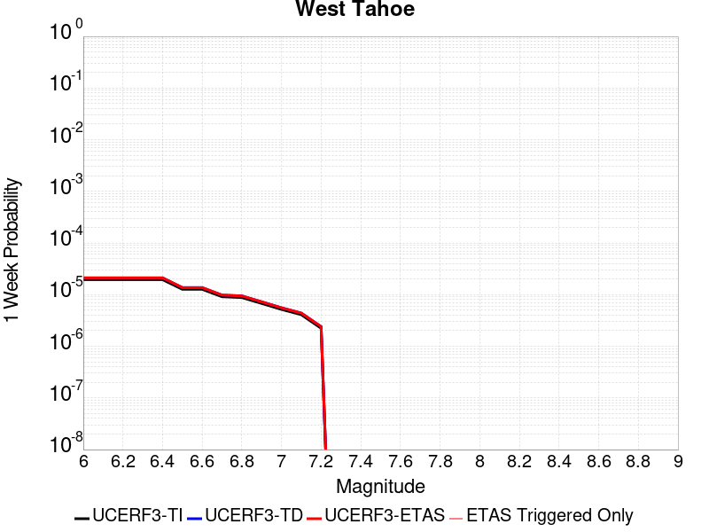 | 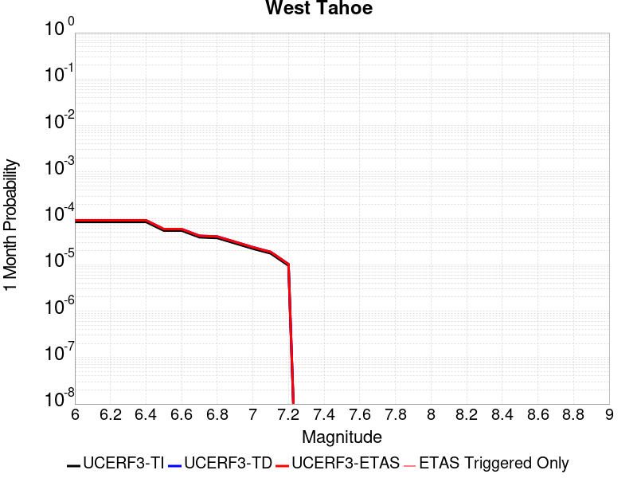 | 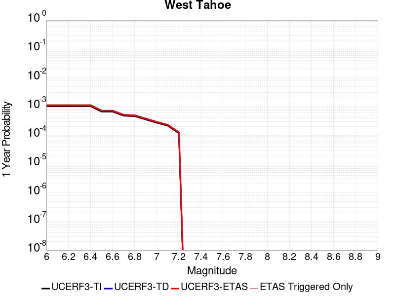 | 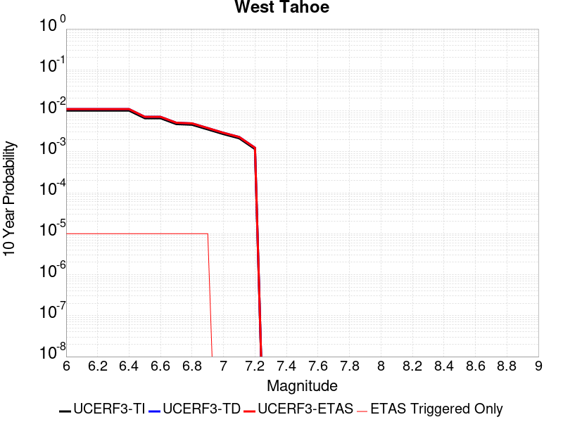 |

| Magnitude | 1 wk TI Prob | 1 wk TD Prob | 1 wk ETAS Prob | 1 wk ETAS/TD Gain | 1 wk ETAS Triggered Only | 1 mo TI Prob | 1 mo TD Prob | 1 mo ETAS Prob | 1 mo ETAS/TD Gain | 1 mo ETAS Triggered Only | 1 yr TI Prob | 1 yr TD Prob | 1 yr ETAS Prob | 1 yr ETAS/TD Gain | 1 yr ETAS Triggered Only | 10 yr TI Prob | 10 yr TD Prob | 10 yr ETAS Prob | 10 yr ETAS/TD Gain | 10 yr ETAS Triggered Only |
|-----|-----|-----|-----|-----|-----|-----|-----|-----|-----|-----|-----|-----|-----|-----|-----|-----|-----|-----|-----|-----|
| 6.0 | 1.952444E-5 | 2.1183409E-5 | 2.1183409E-5 | 1.0 | 0.0 | 8.367348E-5 | 9.0783185E-5 | 9.0783185E-5 | 1.0 | 0.0 | 0.0010182485 | 0.0011047797 | 0.0011047797 | 1.0 | 0.0 | 0.010135954 | 0.010998359 | 0.011015009 | 1.0015138 | 1.6835016E-5 |
| 6.1 | 1.952444E-5 | 2.1183409E-5 | 2.1183409E-5 | 1.0 | 0.0 | 8.367348E-5 | 9.0783185E-5 | 9.0783185E-5 | 1.0 | 0.0 | 0.0010182485 | 0.0011047797 | 0.0011047797 | 1.0 | 0.0 | 0.010135954 | 0.010998359 | 0.011015009 | 1.0015138 | 1.6835016E-5 |
| 6.2 | 1.952444E-5 | 2.1183409E-5 | 2.1183409E-5 | 1.0 | 0.0 | 8.367348E-5 | 9.0783185E-5 | 9.0783185E-5 | 1.0 | 0.0 | 0.0010182485 | 0.0011047797 | 0.0011047797 | 1.0 | 0.0 | 0.010135954 | 0.010998359 | 0.011015009 | 1.0015138 | 1.6835016E-5 |
| 6.3 | 1.952444E-5 | 2.1183409E-5 | 2.1183409E-5 | 1.0 | 0.0 | 8.367348E-5 | 9.0783185E-5 | 9.0783185E-5 | 1.0 | 0.0 | 0.0010182485 | 0.0011047797 | 0.0011047797 | 1.0 | 0.0 | 0.010135954 | 0.010998359 | 0.011015009 | 1.0015138 | 1.6835016E-5 |
| 6.4 | 1.952444E-5 | 2.1183409E-5 | 2.1183409E-5 | 1.0 | 0.0 | 8.367348E-5 | 9.0783185E-5 | 9.0783185E-5 | 1.0 | 0.0 | 0.0010182485 | 0.0011047797 | 0.0011047797 | 1.0 | 0.0 | 0.010135954 | 0.010998359 | 0.011015009 | 1.0015138 | 1.6835016E-5 |
| 6.5 | 1.2685271E-5 | 1.3690772E-5 | 1.3690772E-5 | 1.0 | 0.0 | 5.4364315E-5 | 5.8673508E-5 | 5.8673508E-5 | 1.0 | 0.0 | 6.616845E-4 | 7.1413233E-4 | 7.1413233E-4 | 1.0 | 0.0 | 0.0065971776 | 0.0071200244 | 0.00713674 | 1.0023476 | 1.6835016E-5 |
| 6.6 | 1.2685271E-5 | 1.3690772E-5 | 1.3690772E-5 | 1.0 | 0.0 | 5.4364315E-5 | 5.8673508E-5 | 5.8673508E-5 | 1.0 | 0.0 | 6.616845E-4 | 7.1413233E-4 | 7.1413233E-4 | 1.0 | 0.0 | 0.0065971776 | 0.0071200244 | 0.00713674 | 1.0023476 | 1.6835016E-5 |
| 6.7 | 9.117886E-6 | 9.809945E-6 | 9.809945E-6 | 1.0 | 0.0 | 3.9076072E-5 | 4.2041986E-5 | 4.2041986E-5 | 1.0 | 0.0 | 4.756473E-4 | 5.1174813E-4 | 5.1174813E-4 | 1.0 | 0.0 | 0.0047463053 | 0.0051064147 | 0.005123164 | 1.00328 | 1.6835016E-5 |
| 6.8 | 8.786828E-6 | 9.457959E-6 | 9.457959E-6 | 1.0 | 0.0 | 3.7657293E-5 | 4.053352E-5 | 4.053352E-5 | 1.0 | 0.0 | 4.5838108E-4 | 4.933909E-4 | 4.933909E-4 | 1.0 | 0.0 | 0.0045743673 | 0.004923656 | 0.004940408 | 1.0034024 | 1.6835016E-5 |
| 6.9 | 6.7562123E-6 | 7.263881E-6 | 7.263881E-6 | 1.0 | 0.0 | 2.8954875E-5 | 3.1130574E-5 | 3.1130574E-5 | 1.0 | 0.0 | 3.5246857E-4 | 3.7895358E-4 | 3.7895358E-4 | 1.0 | 0.0 | 0.0035191004 | 0.0037835457 | 0.0038003172 | 1.0044327 | 1.6835016E-5 |
| 7.0 | 5.1792854E-6 | 5.5673936E-6 | 5.5673936E-6 | 1.0 | 0.0 | 2.2196748E-5 | 2.386006E-5 | 2.386006E-5 | 1.0 | 0.0 | 2.702119E-4 | 2.9046132E-4 | 2.9046132E-4 | 1.0 | 0.0 | 0.0026988357 | 0.002901192 | 0.002901192 | 1.0 | 0.0 |
| 7.1 | 4.090765E-6 | 4.3974665E-6 | 4.3974665E-6 | 1.0 | 0.0 | 1.7531731E-5 | 1.8846167E-5 | 1.8846167E-5 | 1.0 | 0.0 | 2.134279E-4 | 2.2943133E-4 | 2.2943133E-4 | 1.0 | 0.0 | 0.0021322304 | 0.0022922792 | 0.0022922792 | 1.0 | 0.0 |
| 7.2 | 2.2356758E-6 | 2.402392E-6 | 2.402392E-6 | 1.0 | 0.0 | 9.581432E-6 | 1.0295936E-5 | 1.0295936E-5 | 1.0 | 0.0 | 1.1664769E-4 | 1.2534771E-4 | 1.2534771E-4 | 1.0 | 0.0 | 0.0011658648 | 0.0012529559 | 0.0012529559 | 1.0 | 0.0 |

## Cerro Prieto
*[(top)](#table-of-contents)*

| 1 Week | 1 Month | 1 Year | 10 Year |
|-----|-----|-----|-----|
| 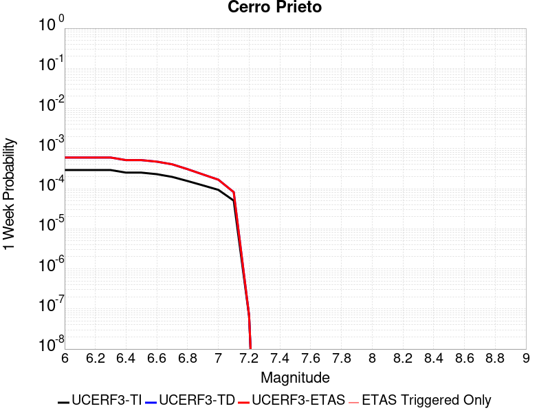 | 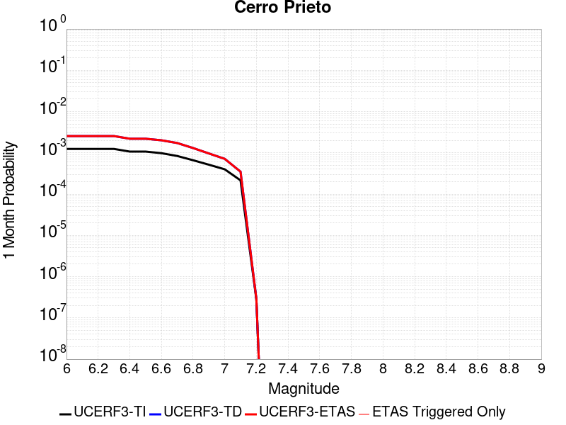 | 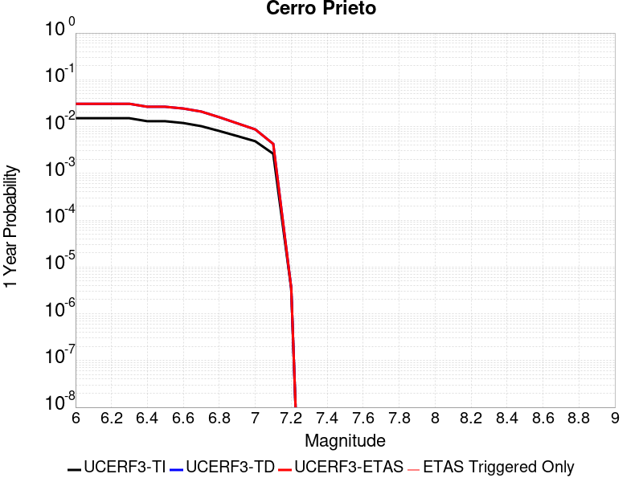 | 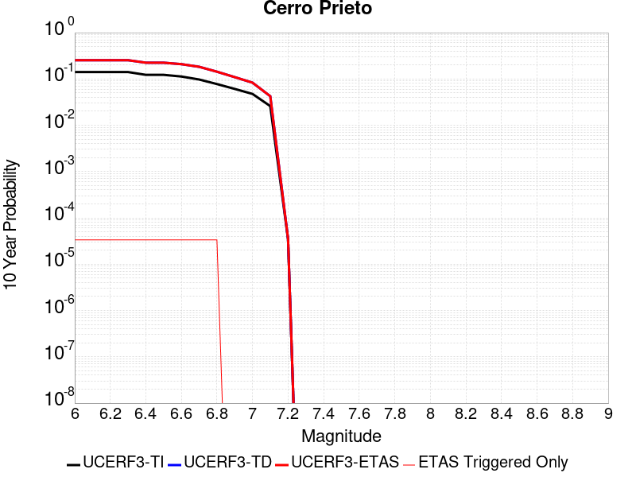 |

| Magnitude | 1 wk TI Prob | 1 wk TD Prob | 1 wk ETAS Prob | 1 wk ETAS/TD Gain | 1 wk ETAS Triggered Only | 1 mo TI Prob | 1 mo TD Prob | 1 mo ETAS Prob | 1 mo ETAS/TD Gain | 1 mo ETAS Triggered Only | 1 yr TI Prob | 1 yr TD Prob | 1 yr ETAS Prob | 1 yr ETAS/TD Gain | 1 yr ETAS Triggered Only | 10 yr TI Prob | 10 yr TD Prob | 10 yr ETAS Prob | 10 yr ETAS/TD Gain | 10 yr ETAS Triggered Only |
|-----|-----|-----|-----|-----|-----|-----|-----|-----|-----|-----|-----|-----|-----|-----|-----|-----|-----|-----|-----|-----|
| 6.0 | 2.9101528E-4 | 5.965907E-4 | 5.965907E-4 | 1.0 | 0.0 | 0.0012466122 | 0.002554554 | 0.002554554 | 1.0 | 0.0 | 0.015072231 | 0.030653033 | 0.030653033 | 1.0 | 0.0 | 0.14089979 | 0.25401175 | 0.2540243 | 1.0000495 | 1.6835016E-5 |
| 6.1 | 2.9101528E-4 | 5.965907E-4 | 5.965907E-4 | 1.0 | 0.0 | 0.0012466122 | 0.002554554 | 0.002554554 | 1.0 | 0.0 | 0.015072231 | 0.030653033 | 0.030653033 | 1.0 | 0.0 | 0.14089979 | 0.25401175 | 0.2540243 | 1.0000495 | 1.6835016E-5 |
| 6.2 | 2.9101528E-4 | 5.965907E-4 | 5.965907E-4 | 1.0 | 0.0 | 0.0012466122 | 0.002554554 | 0.002554554 | 1.0 | 0.0 | 0.015072231 | 0.030653033 | 0.030653033 | 1.0 | 0.0 | 0.14089979 | 0.25401175 | 0.2540243 | 1.0000495 | 1.6835016E-5 |
| 6.3 | 2.9101528E-4 | 5.965907E-4 | 5.965907E-4 | 1.0 | 0.0 | 0.0012466122 | 0.002554554 | 0.002554554 | 1.0 | 0.0 | 0.015072231 | 0.030653033 | 0.030653033 | 1.0 | 0.0 | 0.14089979 | 0.25401175 | 0.2540243 | 1.0000495 | 1.6835016E-5 |
| 6.4 | 2.508648E-4 | 5.140792E-4 | 5.140792E-4 | 1.0 | 0.0 | 0.0010746918 | 0.0022015348 | 0.0022015348 | 1.0 | 0.0 | 0.013006088 | 0.026476625 | 0.026476625 | 1.0 | 0.0 | 0.12270685 | 0.22443727 | 0.22445032 | 1.0000582 | 1.6835016E-5 |
| 6.5 | 2.508648E-4 | 5.140792E-4 | 5.140792E-4 | 1.0 | 0.0 | 0.0010746918 | 0.0022015348 | 0.0022015348 | 1.0 | 0.0 | 0.013006088 | 0.026476625 | 0.026476625 | 1.0 | 0.0 | 0.12270685 | 0.22443727 | 0.22445032 | 1.0000582 | 1.6835016E-5 |
| 6.6 | 2.294914E-4 | 4.7126948E-4 | 4.7126948E-4 | 1.0 | 0.0 | 9.831638E-4 | 0.0020183506 | 0.0020183506 | 1.0 | 0.0 | 0.011904482 | 0.024303433 | 0.024303433 | 1.0 | 0.0 | 0.11286586 | 0.20861839 | 0.20863171 | 1.0000639 | 1.6835016E-5 |
| 6.7 | 1.9621674E-4 | 4.042872E-4 | 4.042872E-4 | 1.0 | 0.0 | 8.4065786E-4 | 0.0017316672 | 0.0017316672 | 1.0 | 0.0 | 0.010187071 | 0.020889567 | 0.020889567 | 1.0 | 0.0 | 0.09732539 | 0.18293467 | 0.18294843 | 1.0000752 | 1.6835016E-5 |
| 6.8 | 1.5476145E-4 | 3.0573073E-4 | 3.0573073E-4 | 1.0 | 0.0 | 6.6309475E-4 | 0.0013097188 | 0.0013097188 | 1.0 | 0.0 | 0.008043335 | 0.015840806 | 0.015840806 | 1.0 | 0.0 | 0.07758363 | 0.14339209 | 0.14340651 | 1.0001006 | 1.6835016E-5 |
| 6.9 | 1.20509176E-4 | 2.2588969E-4 | 2.2588969E-4 | 1.0 | 0.0 | 5.1636563E-4 | 9.678028E-4 | 9.678028E-4 | 1.0 | 0.0 | 0.006268645 | 0.011729713 | 0.011729713 | 1.0 | 0.0 | 0.060947374 | 0.10947595 | 0.10947595 | 1.0 | 0.0 |
| 7.0 | 9.3269155E-5 | 1.672182E-4 | 1.672182E-4 | 1.0 | 0.0 | 3.9966372E-4 | 7.164957E-4 | 7.164957E-4 | 1.0 | 0.0 | 0.0048550544 | 0.008696101 | 0.008696101 | 1.0 | 0.0 | 0.04750344 | 0.08317999 | 0.08317999 | 1.0 | 0.0 |
| 7.1 | 5.029709E-5 | 8.1748294E-5 | 8.1748294E-5 | 1.0 | 0.0 | 2.1554115E-4 | 3.5032208E-4 | 3.5032208E-4 | 1.0 | 0.0 | 0.0026210553 | 0.0042602476 | 0.0042602476 | 1.0 | 0.0 | 0.025903556 | 0.04237809 | 0.04237809 | 1.0 | 0.0 |
| 7.2 | 6.5445185E-8 | 6.820826E-8 | 6.820826E-8 | 1.0 | 0.0 | 2.8047933E-7 | 2.923211E-7 | 2.923211E-7 | 1.0 | 0.0 | 3.4148304E-6 | 3.5590094E-6 | 3.5590094E-6 | 1.0 | 0.0 | 3.414778E-5 | 3.5590092E-5 | 3.5590092E-5 | 1.0 | 0.0 |

## Cleghorn
*[(top)](#table-of-contents)*

| 1 Week | 1 Month | 1 Year | 10 Year |
|-----|-----|-----|-----|
|  |  | 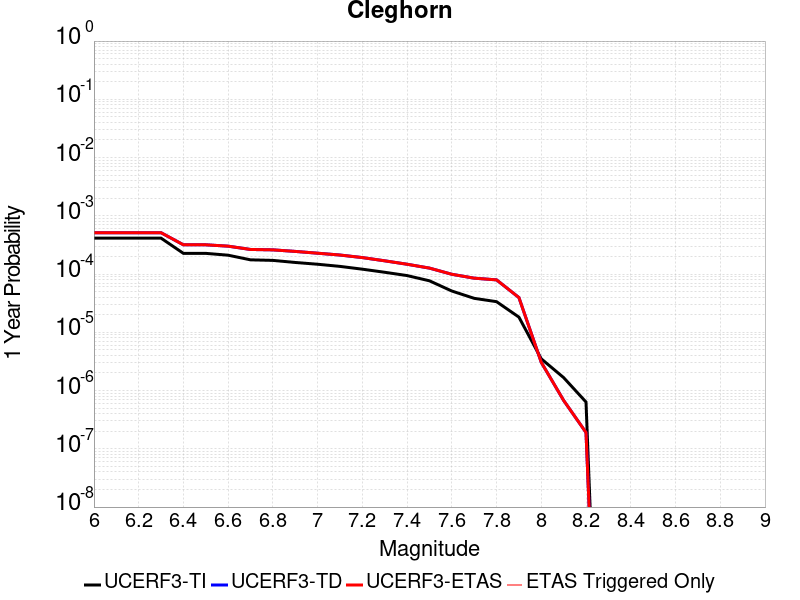 | 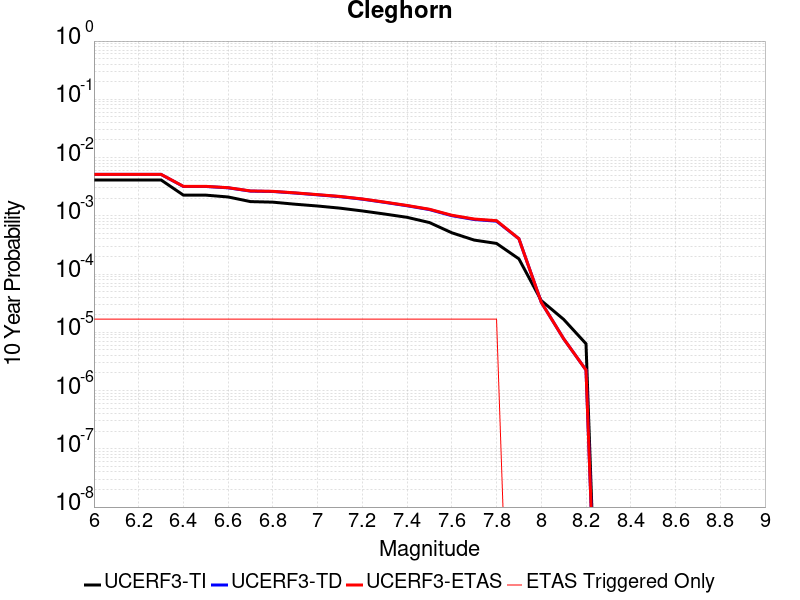 |

| Magnitude | 1 wk TI Prob | 1 wk TD Prob | 1 wk ETAS Prob | 1 wk ETAS/TD Gain | 1 wk ETAS Triggered Only | 1 mo TI Prob | 1 mo TD Prob | 1 mo ETAS Prob | 1 mo ETAS/TD Gain | 1 mo ETAS Triggered Only | 1 yr TI Prob | 1 yr TD Prob | 1 yr ETAS Prob | 1 yr ETAS/TD Gain | 1 yr ETAS Triggered Only | 10 yr TI Prob | 10 yr TD Prob | 10 yr ETAS Prob | 10 yr ETAS/TD Gain | 10 yr ETAS Triggered Only |
|-----|-----|-----|-----|-----|-----|-----|-----|-----|-----|-----|-----|-----|-----|-----|-----|-----|-----|-----|-----|-----|
| 6.0 | 7.9267165E-6 | 9.832575E-6 | 9.832575E-6 | 1.0 | 0.0 | 3.39712E-5 | 4.213899E-5 | 4.213899E-5 | 1.0 | 0.0 | 4.1352084E-4 | 5.12932E-4 | 5.12932E-4 | 1.0 | 0.0 | 0.004127522 | 0.005132577 | 0.0051493254 | 1.0032632 | 1.6835016E-5 |
| 6.1 | 7.9267165E-6 | 9.832575E-6 | 9.832575E-6 | 1.0 | 0.0 | 3.39712E-5 | 4.213899E-5 | 4.213899E-5 | 1.0 | 0.0 | 4.1352084E-4 | 5.12932E-4 | 5.12932E-4 | 1.0 | 0.0 | 0.004127522 | 0.005132577 | 0.0051493254 | 1.0032632 | 1.6835016E-5 |
| 6.2 | 7.9267165E-6 | 9.832575E-6 | 9.832575E-6 | 1.0 | 0.0 | 3.39712E-5 | 4.213899E-5 | 4.213899E-5 | 1.0 | 0.0 | 4.1352084E-4 | 5.12932E-4 | 5.12932E-4 | 1.0 | 0.0 | 0.004127522 | 0.005132577 | 0.0051493254 | 1.0032632 | 1.6835016E-5 |
| 6.3 | 7.9267165E-6 | 9.832575E-6 | 9.832575E-6 | 1.0 | 0.0 | 3.39712E-5 | 4.213899E-5 | 4.213899E-5 | 1.0 | 0.0 | 4.1352084E-4 | 5.12932E-4 | 5.12932E-4 | 1.0 | 0.0 | 0.004127522 | 0.005132577 | 0.0051493254 | 1.0032632 | 1.6835016E-5 |
| 6.4 | 4.3445207E-6 | 6.0924144E-6 | 6.0924144E-6 | 1.0 | 0.0 | 1.8619241E-5 | 2.6110092E-5 | 2.6110092E-5 | 1.0 | 0.0 | 2.2666567E-4 | 3.1784503E-4 | 3.1784503E-4 | 1.0 | 0.0 | 0.0022643462 | 0.0031880767 | 0.003204858 | 1.0052638 | 1.6835016E-5 |
| 6.5 | 4.3445207E-6 | 6.0924144E-6 | 6.0924144E-6 | 1.0 | 0.0 | 1.8619241E-5 | 2.6110092E-5 | 2.6110092E-5 | 1.0 | 0.0 | 2.2666567E-4 | 3.1784503E-4 | 3.1784503E-4 | 1.0 | 0.0 | 0.0022643462 | 0.0031880767 | 0.003204858 | 1.0052638 | 1.6835016E-5 |
| 6.6 | 4.040109E-6 | 5.7748202E-6 | 5.7748202E-6 | 1.0 | 0.0 | 1.7314638E-5 | 2.4749E-5 | 2.4749E-5 | 1.0 | 0.0 | 2.1078532E-4 | 3.0127834E-4 | 3.0127834E-4 | 1.0 | 0.0 | 0.002105855 | 0.0030228654 | 0.0030396495 | 1.0055524 | 1.6835016E-5 |
| 6.7 | 3.3632055E-6 | 5.0683134E-6 | 5.0683134E-6 | 1.0 | 0.0 | 1.4413658E-5 | 2.1721164E-5 | 2.1721164E-5 | 1.0 | 0.0 | 1.7547216E-4 | 2.6442338E-4 | 2.6442338E-4 | 1.0 | 0.0 | 0.0017533366 | 0.0026551976 | 0.002671988 | 1.0063236 | 1.6835016E-5 |
| 6.8 | 3.2902772E-6 | 4.99022E-6 | 4.99022E-6 | 1.0 | 0.0 | 1.4101111E-5 | 2.1386484E-5 | 2.1386484E-5 | 1.0 | 0.0 | 1.716675E-4 | 2.6034965E-4 | 2.6034965E-4 | 1.0 | 0.0 | 0.0017153495 | 0.0026145563 | 0.0026313472 | 1.0064222 | 1.6835016E-5 |
| 6.9 | 3.031547E-6 | 4.6919777E-6 | 4.6919777E-6 | 1.0 | 0.0 | 1.299228E-5 | 2.0108322E-5 | 2.0108322E-5 | 1.0 | 0.0 | 1.5816953E-4 | 2.447916E-4 | 2.447916E-4 | 1.0 | 0.0 | 0.00158057 | 0.0024593272 | 0.002476121 | 1.0068285 | 1.6835016E-5 |
| 7.0 | 2.8259715E-6 | 4.371534E-6 | 4.371534E-6 | 1.0 | 0.0 | 1.211125E-5 | 1.8735012E-5 | 1.8735012E-5 | 1.0 | 0.0 | 1.4744449E-4 | 2.2807514E-4 | 2.2807514E-4 | 1.0 | 0.0 | 0.001473467 | 0.002292517 | 0.0023093135 | 1.0073266 | 1.6835016E-5 |
| 7.1 | 2.5962665E-6 | 4.066747E-6 | 4.066747E-6 | 1.0 | 0.0 | 1.1126809E-5 | 1.74288E-5 | 1.74288E-5 | 1.0 | 0.0 | 1.3546048E-4 | 2.1217519E-4 | 2.1217519E-4 | 1.0 | 0.0 | 0.0013537793 | 0.0021338374 | 0.0021506364 | 1.0078727 | 1.6835016E-5 |
| 7.2 | 2.3247253E-6 | 3.6772897E-6 | 3.6772897E-6 | 1.0 | 0.0 | 9.96307E-6 | 1.5759719E-5 | 1.5759719E-5 | 1.0 | 0.0 | 1.21293626E-4 | 1.9185786E-4 | 1.9185786E-4 | 1.0 | 0.0 | 0.0012122744 | 0.0019310551 | 0.0019478576 | 1.0087012 | 1.6835016E-5 |
| 7.3 | 2.056928E-6 | 3.2359856E-6 | 3.2359856E-6 | 1.0 | 0.0 | 8.815376E-6 | 1.3868437E-5 | 1.3868437E-5 | 1.0 | 0.0 | 1.0732192E-4 | 1.688353E-4 | 1.688353E-4 | 1.0 | 0.0 | 0.001072701 | 0.0017012694 | 0.0017180758 | 1.0098788 | 1.6835016E-5 |
| 7.4 | 1.8055999E-6 | 2.8263637E-6 | 2.8263637E-6 | 1.0 | 0.0 | 7.738263E-6 | 1.21129315E-5 | 1.21129315E-5 | 1.0 | 0.0 | 9.4209274E-5 | 1.474651E-4 | 1.474651E-4 | 1.0 | 0.0 | 9.4169343E-4 | 0.001488009 | 0.001504819 | 1.011297 | 1.6835016E-5 |
| 7.5 | 1.4683443E-6 | 2.425593E-6 | 2.425593E-6 | 1.0 | 0.0 | 6.292889E-6 | 1.0395358E-5 | 1.0395358E-5 | 1.0 | 0.0 | 7.661323E-5 | 1.2655623E-4 | 1.2655623E-4 | 1.0 | 0.0 | 7.658682E-4 | 0.0012792206 | 0.001296034 | 1.0131435 | 1.6835016E-5 |
| 7.6 | 9.804088E-7 | 1.901101E-6 | 1.901101E-6 | 1.0 | 0.0 | 4.201745E-6 | 8.147551E-6 | 8.147551E-6 | 1.0 | 0.0 | 5.1155046E-5 | 9.919196E-5 | 9.919196E-5 | 1.0 | 0.0 | 5.114327E-4 | 0.0010058905 | 0.0010227086 | 1.0167196 | 1.6835016E-5 |
| 7.7 | 7.3434086E-7 | 1.6292396E-6 | 1.6292396E-6 | 1.0 | 0.0 | 3.1471714E-6 | 6.982437E-6 | 6.982437E-6 | 1.0 | 0.0 | 3.831614E-5 | 8.500788E-5 | 8.500788E-5 | 1.0 | 0.0 | 3.8309532E-4 | 8.642013E-4 | 8.810218E-4 | 1.0194637 | 1.6835016E-5 |
| 7.8 | 6.434184E-7 | 1.522801E-6 | 1.522801E-6 | 1.0 | 0.0 | 2.7575045E-6 | 6.5262734E-6 | 6.5262734E-6 | 1.0 | 0.0 | 3.35721E-5 | 7.9454505E-5 | 7.9454505E-5 | 1.0 | 0.0 | 3.3567028E-4 | 8.083677E-4 | 8.251891E-4 | 1.020809 | 1.6835016E-5 |
| 7.9 | 3.4943926E-7 | 7.5788125E-7 | 7.5788125E-7 | 1.0 | 0.0 | 1.497596E-6 | 3.2480586E-6 | 3.2480586E-6 | 1.0 | 0.0 | 1.8233079E-5 | 3.9544404E-5 | 3.9544404E-5 | 1.0 | 0.0 | 1.8231584E-4 | 4.0423044E-4 | 4.0423044E-4 | 1.0 | 0.0 |
| 8.0 | 6.717524E-8 | 5.8440865E-8 | 5.8440865E-8 | 1.0 | 0.0 | 2.8789387E-7 | 2.5046083E-7 | 2.5046083E-7 | 1.0 | 0.0 | 3.505102E-6 | 3.0493563E-6 | 3.0493563E-6 | 1.0 | 0.0 | 3.5050467E-5 | 3.276327E-5 | 3.276327E-5 | 1.0 | 0.0 |
| 8.1 | 3.1984914E-8 | 1.2973213E-8 | 1.2973213E-8 | 1.0 | 0.0 | 1.370782E-7 | 5.5599482E-8 | 5.5599482E-8 | 1.0 | 0.0 | 1.6689258E-6 | 6.769235E-7 | 6.769235E-7 | 1.0 | 0.0 | 1.6689133E-5 | 7.754204E-6 | 7.754204E-6 | 1.0 | 0.0 |
| 8.2 | 1.21887656E-8 | 3.654808E-9 | 3.654808E-9 | 1.0 | 0.0 | 5.2237567E-8 | 1.5663463E-8 | 1.5663463E-8 | 1.0 | 0.0 | 6.359922E-7 | 1.9070265E-7 | 1.9070265E-7 | 1.0 | 0.0 | 6.3599036E-6 | 2.2501451E-6 | 2.2501451E-6 | 1.0 | 0.0 |

## Oak Ridge (Onshore)
*[(top)](#table-of-contents)*

| 1 Week | 1 Month | 1 Year | 10 Year |
|-----|-----|-----|-----|
|  | 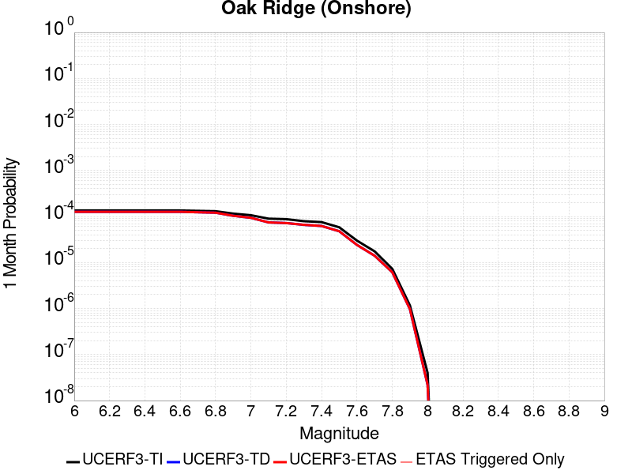 | 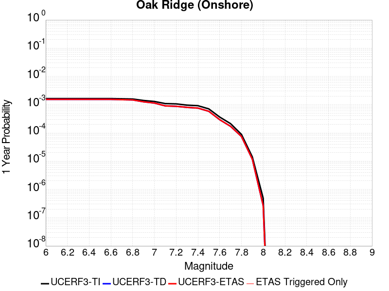 | 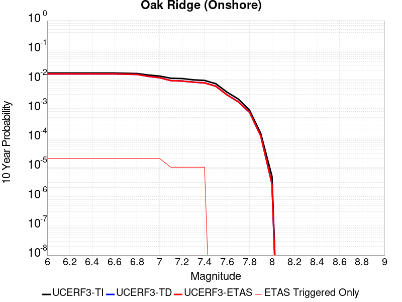 |

| Magnitude | 1 wk TI Prob | 1 wk TD Prob | 1 wk ETAS Prob | 1 wk ETAS/TD Gain | 1 wk ETAS Triggered Only | 1 mo TI Prob | 1 mo TD Prob | 1 mo ETAS Prob | 1 mo ETAS/TD Gain | 1 mo ETAS Triggered Only | 1 yr TI Prob | 1 yr TD Prob | 1 yr ETAS Prob | 1 yr ETAS/TD Gain | 1 yr ETAS Triggered Only | 10 yr TI Prob | 10 yr TD Prob | 10 yr ETAS Prob | 10 yr ETAS/TD Gain | 10 yr ETAS Triggered Only |
|-----|-----|-----|-----|-----|-----|-----|-----|-----|-----|-----|-----|-----|-----|-----|-----|-----|-----|-----|-----|-----|
| 6.0 | 3.155064E-5 | 2.952645E-5 | 2.952645E-5 | 1.0 | 0.0 | 1.3521002E-4 | 1.26536E-4 | 1.26536E-4 | 1.0 | 0.0 | 0.001644939 | 0.0015395252 | 0.0015395252 | 1.0 | 0.0 | 0.01632816 | 0.015293104 | 0.015309681 | 1.001084 | 1.6835016E-5 |
| 6.1 | 3.155064E-5 | 2.952645E-5 | 2.952645E-5 | 1.0 | 0.0 | 1.3521002E-4 | 1.26536E-4 | 1.26536E-4 | 1.0 | 0.0 | 0.001644939 | 0.0015395252 | 0.0015395252 | 1.0 | 0.0 | 0.01632816 | 0.015293104 | 0.015309681 | 1.001084 | 1.6835016E-5 |
| 6.2 | 3.155064E-5 | 2.952645E-5 | 2.952645E-5 | 1.0 | 0.0 | 1.3521002E-4 | 1.26536E-4 | 1.26536E-4 | 1.0 | 0.0 | 0.001644939 | 0.0015395252 | 0.0015395252 | 1.0 | 0.0 | 0.01632816 | 0.015293104 | 0.015309681 | 1.001084 | 1.6835016E-5 |
| 6.3 | 3.155064E-5 | 2.952645E-5 | 2.952645E-5 | 1.0 | 0.0 | 1.3521002E-4 | 1.26536E-4 | 1.26536E-4 | 1.0 | 0.0 | 0.001644939 | 0.0015395252 | 0.0015395252 | 1.0 | 0.0 | 0.01632816 | 0.015293104 | 0.015309681 | 1.001084 | 1.6835016E-5 |
| 6.4 | 3.155064E-5 | 2.952645E-5 | 2.952645E-5 | 1.0 | 0.0 | 1.3521002E-4 | 1.26536E-4 | 1.26536E-4 | 1.0 | 0.0 | 0.001644939 | 0.0015395252 | 0.0015395252 | 1.0 | 0.0 | 0.01632816 | 0.015293104 | 0.015309681 | 1.001084 | 1.6835016E-5 |
| 6.5 | 3.155064E-5 | 2.952645E-5 | 2.952645E-5 | 1.0 | 0.0 | 1.3521002E-4 | 1.26536E-4 | 1.26536E-4 | 1.0 | 0.0 | 0.001644939 | 0.0015395252 | 0.0015395252 | 1.0 | 0.0 | 0.01632816 | 0.015293104 | 0.015309681 | 1.001084 | 1.6835016E-5 |
| 6.6 | 3.155064E-5 | 2.952645E-5 | 2.952645E-5 | 1.0 | 0.0 | 1.3521002E-4 | 1.26536E-4 | 1.26536E-4 | 1.0 | 0.0 | 0.001644939 | 0.0015395252 | 0.0015395252 | 1.0 | 0.0 | 0.01632816 | 0.015293104 | 0.015309681 | 1.001084 | 1.6835016E-5 |
| 6.7 | 3.098897E-5 | 2.8864635E-5 | 2.8864635E-5 | 1.0 | 0.0 | 1.328031E-4 | 1.2369992E-4 | 1.2369992E-4 | 1.0 | 0.0 | 0.0016156785 | 0.0015050438 | 0.0015050438 | 1.0 | 0.0 | 0.016039822 | 0.014952951 | 0.014969534 | 1.001109 | 1.6835016E-5 |
| 6.8 | 3.0449872E-5 | 2.823982E-5 | 2.823982E-5 | 1.0 | 0.0 | 1.3049292E-4 | 1.2102239E-4 | 1.2102239E-4 | 1.0 | 0.0 | 0.0015875935 | 0.001472489 | 0.001472489 | 1.0 | 0.0 | 0.015762992 | 0.014631692 | 0.014648281 | 1.0011338 | 1.6835016E-5 |
| 6.9 | 2.697928E-5 | 2.4220137E-5 | 2.4220137E-5 | 1.0 | 0.0 | 1.15620365E-4 | 1.0379658E-4 | 1.0379658E-4 | 1.0 | 0.0 | 0.0014067689 | 0.0012630123 | 0.0012630123 | 1.0 | 0.0 | 0.0139789665 | 0.012561057 | 0.012577681 | 1.0013235 | 1.6835016E-5 |
| 7.0 | 2.4893961E-5 | 2.1862359E-5 | 2.1862359E-5 | 1.0 | 0.0 | 1.0668404E-4 | 9.369256E-5 | 9.369256E-5 | 1.0 | 0.0 | 0.0012981043 | 0.0011401277 | 0.0011401277 | 1.0 | 0.0 | 0.012905477 | 0.011345069 | 0.011361713 | 1.0014671 | 1.6835016E-5 |
| 7.1 | 2.0945363E-5 | 1.7354718E-5 | 1.7354718E-5 | 1.0 | 0.0 | 8.976275E-5 | 7.437527E-5 | 7.437527E-5 | 1.0 | 0.0 | 0.0010923136 | 9.051474E-4 | 9.051474E-4 | 1.0 | 0.0 | 0.0108696 | 0.009015542 | 0.009015542 | 1.0 | 0.0 |
| 7.2 | 2.0439404E-5 | 1.6809645E-5 | 1.6809645E-5 | 1.0 | 0.0 | 8.7594504E-5 | 7.2039365E-5 | 7.2039365E-5 | 1.0 | 0.0 | 0.0010659413 | 8.7673106E-4 | 8.7673106E-4 | 1.0 | 0.0 | 0.010608427 | 0.00873364 | 0.00873364 | 1.0 | 0.0 |
| 7.3 | 1.8463334E-5 | 1.5382002E-5 | 1.5382002E-5 | 1.0 | 0.0 | 7.912617E-5 | 6.5921224E-5 | 6.5921224E-5 | 1.0 | 0.0 | 9.6293533E-4 | 8.0229976E-4 | 8.0229976E-4 | 1.0 | 0.0 | 0.009587734 | 0.007994897 | 0.007994897 | 1.0 | 0.0 |
| 7.4 | 1.763139E-5 | 1.4517013E-5 | 1.4517013E-5 | 1.0 | 0.0 | 7.556091E-5 | 6.221431E-5 | 6.221431E-5 | 1.0 | 0.0 | 9.1956573E-4 | 7.5719994E-4 | 7.5719994E-4 | 1.0 | 0.0 | 0.009157699 | 0.007547003 | 0.007547003 | 1.0 | 0.0 |
| 7.5 | 1.3594944E-5 | 1.1163477E-5 | 1.1163477E-5 | 1.0 | 0.0 | 5.8262744E-5 | 4.7842612E-5 | 4.7842612E-5 | 1.0 | 0.0 | 7.0911803E-4 | 5.823306E-4 | 5.823306E-4 | 1.0 | 0.0 | 0.007068595 | 0.0058083185 | 0.0058083185 | 1.0 | 0.0 |
| 7.6 | 6.9889534E-6 | 5.6367617E-6 | 5.6367617E-6 | 1.0 | 0.0 | 2.9952313E-5 | 2.4157329E-5 | 2.4157329E-5 | 1.0 | 0.0 | 3.646084E-4 | 2.940762E-4 | 2.940762E-4 | 1.0 | 0.0 | 0.0036401073 | 0.0029369146 | 0.0029369146 | 1.0 | 0.0 |
| 7.7 | 4.0824193E-6 | 3.2832884E-6 | 3.2832884E-6 | 1.0 | 0.0 | 1.7495966E-5 | 1.4071161E-5 | 1.4071161E-5 | 1.0 | 0.0 | 2.1299256E-4 | 1.7130304E-4 | 1.7130304E-4 | 1.0 | 0.0 | 0.0021278851 | 0.0017117234 | 0.0017117234 | 1.0 | 0.0 |
| 7.8 | 1.7023609E-6 | 1.4370602E-6 | 1.4370602E-6 | 1.0 | 0.0 | 7.295812E-6 | 6.158815E-6 | 6.158815E-6 | 1.0 | 0.0 | 8.882289E-5 | 7.498102E-5 | 7.498102E-5 | 1.0 | 0.0 | 8.8787393E-4 | 7.4956E-4 | 7.4956E-4 | 1.0 | 0.0 |
| 7.9 | 2.721225E-7 | 2.2616715E-7 | 2.2616715E-7 | 1.0 | 0.0 | 1.1662388E-6 | 9.692874E-7 | 9.692874E-7 | 1.0 | 0.0 | 1.4198865E-5 | 1.1801013E-5 | 1.1801013E-5 | 1.0 | 0.0 | 1.4197957E-4 | 1.1800414E-4 | 1.1800414E-4 | 1.0 | 0.0 |
| 8.0 | 9.364255E-9 | 5.1209232E-9 | 5.1209232E-9 | 1.0 | 0.0 | 4.0132523E-8 | 2.1946814E-8 | 2.1946814E-8 | 1.0 | 0.0 | 4.8861335E-7 | 2.6720244E-7 | 2.6720244E-7 | 1.0 | 0.0 | 4.8861225E-6 | 2.6720215E-6 | 2.6720215E-6 | 1.0 | 0.0 |

## San Luis Range - Oceano 2011 CFM
*[(top)](#table-of-contents)*

| 1 Week | 1 Month | 1 Year | 10 Year |
|-----|-----|-----|-----|
|  | 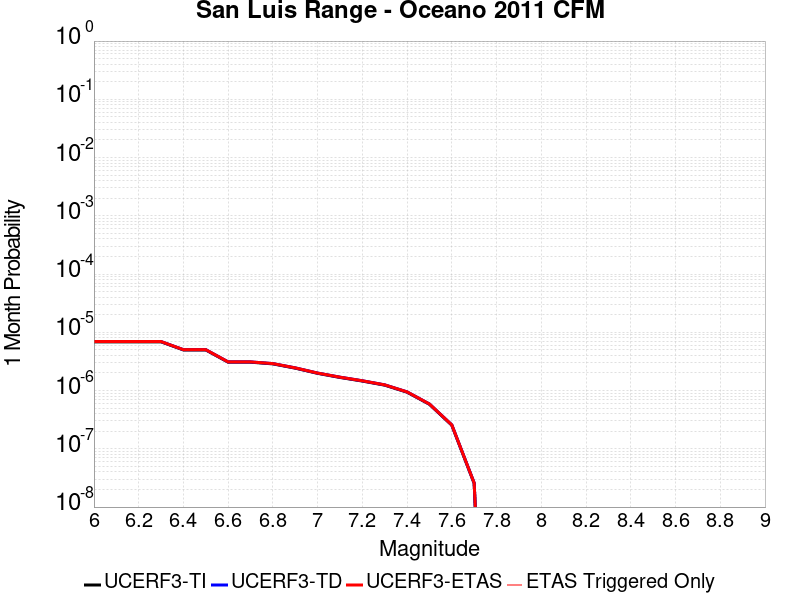 | 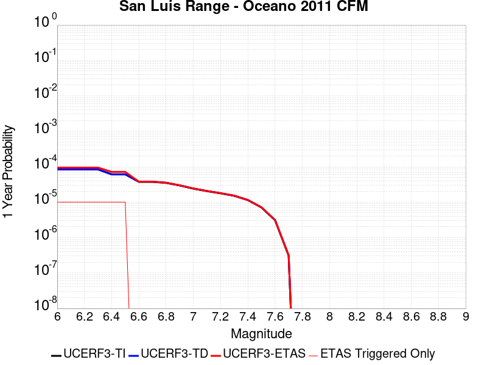 | 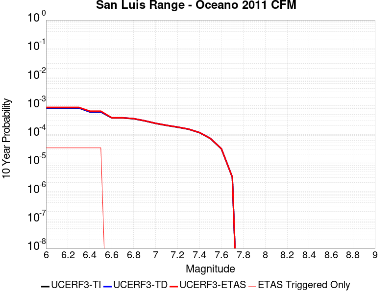 |

| Magnitude | 1 wk TI Prob | 1 wk TD Prob | 1 wk ETAS Prob | 1 wk ETAS/TD Gain | 1 wk ETAS Triggered Only | 1 mo TI Prob | 1 mo TD Prob | 1 mo ETAS Prob | 1 mo ETAS/TD Gain | 1 mo ETAS Triggered Only | 1 yr TI Prob | 1 yr TD Prob | 1 yr ETAS Prob | 1 yr ETAS/TD Gain | 1 yr ETAS Triggered Only | 10 yr TI Prob | 10 yr TD Prob | 10 yr ETAS Prob | 10 yr ETAS/TD Gain | 10 yr ETAS Triggered Only |
|-----|-----|-----|-----|-----|-----|-----|-----|-----|-----|-----|-----|-----|-----|-----|-----|-----|-----|-----|-----|-----|
| 6.0 | 1.6025788E-6 | 1.6201213E-6 | 1.6201213E-6 | 1.0 | 0.0 | 6.8681766E-6 | 6.943361E-6 | 6.943361E-6 | 1.0 | 0.0 | 8.361684E-5 | 8.4532556E-5 | 1.01366146E-4 | 1.1991374 | 1.6835016E-5 | 8.3585386E-4 | 8.450448E-4 | 8.618656E-4 | 1.0199052 | 1.6835016E-5 |
| 6.1 | 1.6025788E-6 | 1.6201213E-6 | 1.6201213E-6 | 1.0 | 0.0 | 6.8681766E-6 | 6.943361E-6 | 6.943361E-6 | 1.0 | 0.0 | 8.361684E-5 | 8.4532556E-5 | 1.01366146E-4 | 1.1991374 | 1.6835016E-5 | 8.3585386E-4 | 8.450448E-4 | 8.618656E-4 | 1.0199052 | 1.6835016E-5 |
| 6.2 | 1.6025788E-6 | 1.6201213E-6 | 1.6201213E-6 | 1.0 | 0.0 | 6.8681766E-6 | 6.943361E-6 | 6.943361E-6 | 1.0 | 0.0 | 8.361684E-5 | 8.4532556E-5 | 1.01366146E-4 | 1.1991374 | 1.6835016E-5 | 8.3585386E-4 | 8.450448E-4 | 8.618656E-4 | 1.0199052 | 1.6835016E-5 |
| 6.3 | 1.6025788E-6 | 1.6201213E-6 | 1.6201213E-6 | 1.0 | 0.0 | 6.8681766E-6 | 6.943361E-6 | 6.943361E-6 | 1.0 | 0.0 | 8.361684E-5 | 8.4532556E-5 | 1.01366146E-4 | 1.1991374 | 1.6835016E-5 | 8.3585386E-4 | 8.450448E-4 | 8.618656E-4 | 1.0199052 | 1.6835016E-5 |
| 6.4 | 1.1621186E-6 | 1.1749911E-6 | 1.1749911E-6 | 1.0 | 0.0 | 4.980499E-6 | 5.035668E-6 | 5.035668E-6 | 1.0 | 0.0 | 6.0635884E-5 | 6.130781E-5 | 7.814179E-5 | 1.2745814 | 1.6835016E-5 | 6.0619344E-4 | 6.129355E-4 | 6.297602E-4 | 1.0274494 | 1.6835016E-5 |
| 6.5 | 1.1621186E-6 | 1.1749911E-6 | 1.1749911E-6 | 1.0 | 0.0 | 4.980499E-6 | 5.035668E-6 | 5.035668E-6 | 1.0 | 0.0 | 6.0635884E-5 | 6.130781E-5 | 7.814179E-5 | 1.2745814 | 1.6835016E-5 | 6.0619344E-4 | 6.129355E-4 | 6.297602E-4 | 1.0274494 | 1.6835016E-5 |
| 6.6 | 7.164729E-7 | 7.248589E-7 | 7.248589E-7 | 1.0 | 0.0 | 3.0705946E-6 | 3.1065347E-6 | 3.1065347E-6 | 1.0 | 0.0 | 3.738385E-5 | 3.782142E-5 | 3.782142E-5 | 1.0 | 0.0 | 3.737756E-4 | 3.7815163E-4 | 3.7815163E-4 | 1.0 | 0.0 |
| 6.7 | 7.164729E-7 | 7.248589E-7 | 7.248589E-7 | 1.0 | 0.0 | 3.0705946E-6 | 3.1065347E-6 | 3.1065347E-6 | 1.0 | 0.0 | 3.738385E-5 | 3.782142E-5 | 3.782142E-5 | 1.0 | 0.0 | 3.737756E-4 | 3.7815163E-4 | 3.7815163E-4 | 1.0 | 0.0 |
| 6.8 | 6.700177E-7 | 6.77745E-7 | 6.77745E-7 | 1.0 | 0.0 | 2.8715012E-6 | 2.9046184E-6 | 2.9046184E-6 | 1.0 | 0.0 | 3.495997E-5 | 3.536317E-5 | 3.536317E-5 | 1.0 | 0.0 | 3.495447E-4 | 3.5357708E-4 | 3.5357708E-4 | 1.0 | 0.0 |
| 6.9 | 5.657865E-7 | 5.721795E-7 | 5.721795E-7 | 1.0 | 0.0 | 2.424797E-6 | 2.4521955E-6 | 2.4521955E-6 | 1.0 | 0.0 | 2.9521503E-5 | 2.9855084E-5 | 2.9855084E-5 | 1.0 | 0.0 | 2.9517582E-4 | 2.985118E-4 | 2.985118E-4 | 1.0 | 0.0 |
| 7.0 | 4.608413E-7 | 4.6601758E-7 | 4.6601758E-7 | 1.0 | 0.0 | 1.9750328E-6 | 1.9972167E-6 | 1.9972167E-6 | 1.0 | 0.0 | 2.4045758E-5 | 2.4315847E-5 | 2.4315847E-5 | 1.0 | 0.0 | 2.4043156E-4 | 2.4313215E-4 | 2.4313215E-4 | 1.0 | 0.0 |
| 7.1 | 3.9177846E-7 | 3.9621662E-7 | 3.9621662E-7 | 1.0 | 0.0 | 1.6790494E-6 | 1.6980702E-6 | 1.6980702E-6 | 1.0 | 0.0 | 2.0442236E-5 | 2.067381E-5 | 2.067381E-5 | 1.0 | 0.0 | 2.0440355E-4 | 2.06719E-4 | 2.06719E-4 | 1.0 | 0.0 |
| 7.2 | 3.3974752E-7 | 3.4366582E-7 | 3.4366582E-7 | 1.0 | 0.0 | 1.45606E-6 | 1.4728527E-6 | 1.4728527E-6 | 1.0 | 0.0 | 1.7727387E-5 | 1.7931836E-5 | 1.7931836E-5 | 1.0 | 0.0 | 1.7725973E-4 | 1.79304E-4 | 1.79304E-4 | 1.0 | 0.0 |
| 7.3 | 2.8900928E-7 | 2.9234062E-7 | 2.9234062E-7 | 1.0 | 0.0 | 1.2386106E-6 | 1.2528878E-6 | 1.2528878E-6 | 1.0 | 0.0 | 1.5079979E-5 | 1.5253803E-5 | 1.5253803E-5 | 1.0 | 0.0 | 1.5078956E-4 | 1.5252765E-4 | 1.5252765E-4 | 1.0 | 0.0 |
| 7.4 | 2.1881527E-7 | 2.2139628E-7 | 2.2139628E-7 | 1.0 | 0.0 | 9.3777936E-7 | 9.4884086E-7 | 9.4884086E-7 | 1.0 | 0.0 | 1.14174045E-5 | 1.1552077E-5 | 1.1552077E-5 | 1.0 | 0.0 | 1.1416818E-4 | 1.1551482E-4 | 1.1551482E-4 | 1.0 | 0.0 |
| 7.5 | 1.356398E-7 | 1.371866E-7 | 1.371866E-7 | 1.0 | 0.0 | 5.813133E-7 | 5.8794245E-7 | 5.8794245E-7 | 1.0 | 0.0 | 7.0774663E-6 | 7.158176E-6 | 7.158176E-6 | 1.0 | 0.0 | 7.077241E-5 | 7.157948E-5 | 7.157948E-5 | 1.0 | 0.0 |
| 7.6 | 5.9269272E-8 | 6.001375E-8 | 6.001375E-8 | 1.0 | 0.0 | 2.5401116E-7 | 2.5720172E-7 | 2.5720172E-7 | 1.0 | 0.0 | 3.0925814E-6 | 3.1314266E-6 | 3.1314266E-6 | 1.0 | 0.0 | 3.0925385E-5 | 3.1313837E-5 | 3.1313837E-5 | 1.0 | 0.0 |
| 7.7 | 5.946232E-9 | 6.0369403E-9 | 6.0369403E-9 | 1.0 | 0.0 | 2.5483851E-8 | 2.58726E-8 | 2.58726E-8 | 1.0 | 0.0 | 3.1026585E-7 | 3.1499889E-7 | 3.1499889E-7 | 1.0 | 0.0 | 3.102654E-6 | 3.149985E-6 | 3.149985E-6 | 1.0 | 0.0 |

## Blue Cut
*[(top)](#table-of-contents)*

| 1 Week | 1 Month | 1 Year | 10 Year |
|-----|-----|-----|-----|
| 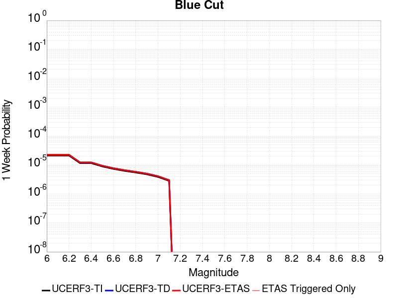 | 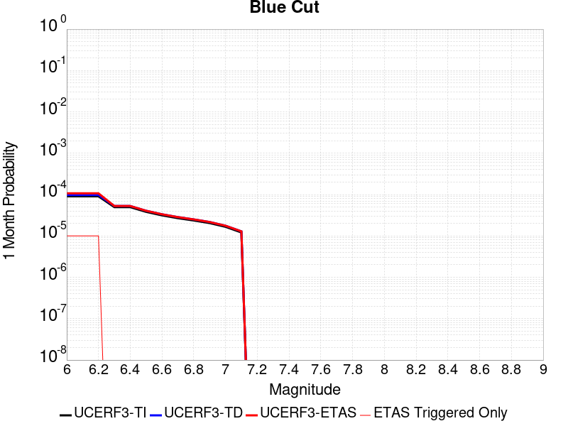 | 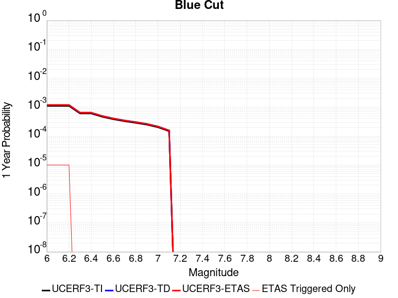 | 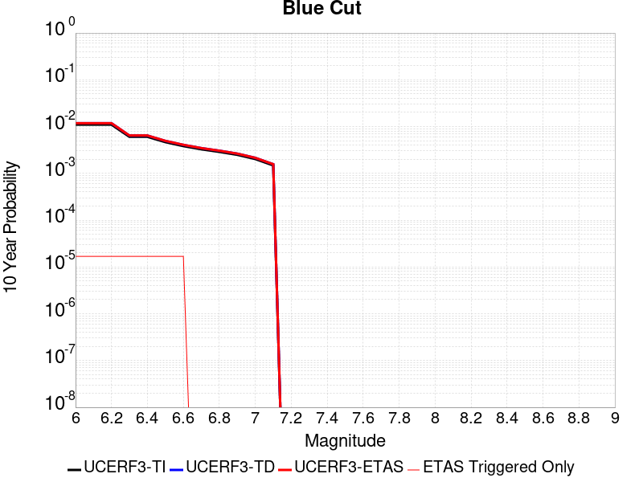 |

| Magnitude | 1 wk TI Prob | 1 wk TD Prob | 1 wk ETAS Prob | 1 wk ETAS/TD Gain | 1 wk ETAS Triggered Only | 1 mo TI Prob | 1 mo TD Prob | 1 mo ETAS Prob | 1 mo ETAS/TD Gain | 1 mo ETAS Triggered Only | 1 yr TI Prob | 1 yr TD Prob | 1 yr ETAS Prob | 1 yr ETAS/TD Gain | 1 yr ETAS Triggered Only | 10 yr TI Prob | 10 yr TD Prob | 10 yr ETAS Prob | 10 yr ETAS/TD Gain | 10 yr ETAS Triggered Only |
|-----|-----|-----|-----|-----|-----|-----|-----|-----|-----|-----|-----|-----|-----|-----|-----|-----|-----|-----|-----|-----|
| 6.0 | 2.1227985E-5 | 2.2719787E-5 | 2.2719787E-5 | 1.0 | 0.0 | 9.097391E-5 | 9.736721E-5 | 9.736721E-5 | 1.0 | 0.0 | 0.0011070445 | 0.0011848592 | 0.0011848592 | 1.0 | 0.0 | 0.011015458 | 0.011791261 | 0.011807898 | 1.001411 | 1.6835016E-5 |
| 6.1 | 2.1227985E-5 | 2.2719787E-5 | 2.2719787E-5 | 1.0 | 0.0 | 9.097391E-5 | 9.736721E-5 | 9.736721E-5 | 1.0 | 0.0 | 0.0011070445 | 0.0011848592 | 0.0011848592 | 1.0 | 0.0 | 0.011015458 | 0.011791261 | 0.011807898 | 1.001411 | 1.6835016E-5 |
| 6.2 | 2.1227985E-5 | 2.2719787E-5 | 2.2719787E-5 | 1.0 | 0.0 | 9.097391E-5 | 9.736721E-5 | 9.736721E-5 | 1.0 | 0.0 | 0.0011070445 | 0.0011848592 | 0.0011848592 | 1.0 | 0.0 | 0.011015458 | 0.011791261 | 0.011807898 | 1.001411 | 1.6835016E-5 |
| 6.3 | 1.1613981E-5 | 1.23536465E-5 | 1.23536465E-5 | 1.0 | 0.0 | 4.9773254E-5 | 5.2943193E-5 | 5.2943193E-5 | 1.0 | 0.0 | 6.0582085E-4 | 6.444052E-4 | 6.444052E-4 | 1.0 | 0.0 | 0.0060417196 | 0.0064266133 | 0.0064433403 | 1.0026027 | 1.6835016E-5 |
| 6.4 | 1.1613981E-5 | 1.23536465E-5 | 1.23536465E-5 | 1.0 | 0.0 | 4.9773254E-5 | 5.2943193E-5 | 5.2943193E-5 | 1.0 | 0.0 | 6.0582085E-4 | 6.444052E-4 | 6.444052E-4 | 1.0 | 0.0 | 0.0060417196 | 0.0064266133 | 0.0064433403 | 1.0026027 | 1.6835016E-5 |
| 6.5 | 8.931326E-6 | 9.481677E-6 | 9.481677E-6 | 1.0 | 0.0 | 3.8276554E-5 | 4.063518E-5 | 4.063518E-5 | 1.0 | 0.0 | 4.6591737E-4 | 4.9463013E-4 | 4.9463013E-4 | 1.0 | 0.0 | 0.0046494175 | 0.0049362015 | 0.004952953 | 1.0033937 | 1.6835016E-5 |
| 6.6 | 7.345353E-6 | 7.790341E-6 | 7.790341E-6 | 1.0 | 0.0 | 3.1479703E-5 | 3.3386797E-5 | 3.3386797E-5 | 1.0 | 0.0 | 3.83198E-4 | 4.0641645E-4 | 4.0641645E-4 | 1.0 | 0.0 | 0.0038253788 | 0.0040575233 | 0.00407429 | 1.0041323 | 1.6835016E-5 |
| 6.7 | 6.2775666E-6 | 6.655202E-6 | 6.655202E-6 | 1.0 | 0.0 | 2.690358E-5 | 2.8522025E-5 | 2.8522025E-5 | 1.0 | 0.0 | 3.2750185E-4 | 3.4720785E-4 | 3.4720785E-4 | 1.0 | 0.0 | 0.0032701963 | 0.0034673947 | 0.0034673947 | 1.0 | 0.0 |
| 6.8 | 5.5234095E-6 | 5.8551577E-6 | 5.8551577E-6 | 1.0 | 0.0 | 2.367154E-5 | 2.5093334E-5 | 2.5093334E-5 | 1.0 | 0.0 | 2.8816288E-4 | 3.0547578E-4 | 3.0547578E-4 | 1.0 | 0.0 | 0.002877895 | 0.003051275 | 0.003051275 | 1.0 | 0.0 |
| 6.9 | 4.7780054E-6 | 5.0654608E-6 | 5.0654608E-6 | 1.0 | 0.0 | 2.0477004E-5 | 2.1708976E-5 | 2.1708976E-5 | 1.0 | 0.0 | 2.4927902E-4 | 2.6428179E-4 | 2.6428179E-4 | 1.0 | 0.0 | 0.0024899957 | 0.0026403673 | 0.0026403673 | 1.0 | 0.0 |
| 7.0 | 3.883171E-6 | 4.1185203E-6 | 4.1185203E-6 | 1.0 | 0.0 | 1.6642054E-5 | 1.765072E-5 | 1.765072E-5 | 1.0 | 0.0 | 2.0259817E-4 | 2.1488321E-4 | 2.1488321E-4 | 1.0 | 0.0 | 0.0020241356 | 0.00214743 | 0.00214743 | 1.0 | 0.0 |
| 7.1 | 2.8358215E-6 | 3.0097403E-6 | 3.0097403E-6 | 1.0 | 0.0 | 1.2153464E-5 | 1.289886E-5 | 1.289886E-5 | 1.0 | 0.0 | 1.4795837E-4 | 1.5703888E-4 | 1.5703888E-4 | 1.0 | 0.0 | 0.001478599 | 0.0015699244 | 0.0015699244 | 1.0 | 0.0 |

## San Jacinto (Superstition Mtn)
*[(top)](#table-of-contents)*

| 1 Week | 1 Month | 1 Year | 10 Year |
|-----|-----|-----|-----|
|  |  | 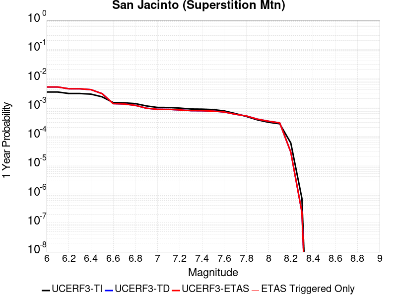 | 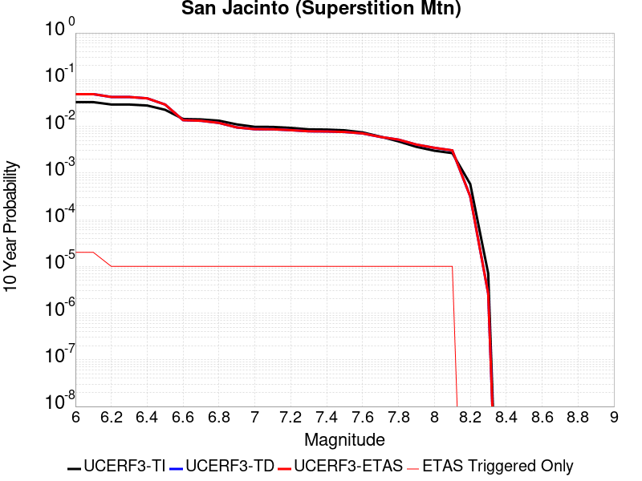 |

| Magnitude | 1 wk TI Prob | 1 wk TD Prob | 1 wk ETAS Prob | 1 wk ETAS/TD Gain | 1 wk ETAS Triggered Only | 1 mo TI Prob | 1 mo TD Prob | 1 mo ETAS Prob | 1 mo ETAS/TD Gain | 1 mo ETAS Triggered Only | 1 yr TI Prob | 1 yr TD Prob | 1 yr ETAS Prob | 1 yr ETAS/TD Gain | 1 yr ETAS Triggered Only | 10 yr TI Prob | 10 yr TD Prob | 10 yr ETAS Prob | 10 yr ETAS/TD Gain | 10 yr ETAS Triggered Only |
|-----|-----|-----|-----|-----|-----|-----|-----|-----|-----|-----|-----|-----|-----|-----|-----|-----|-----|-----|-----|-----|
| 6.0 | 6.4193904E-5 | 9.600102E-5 | 9.600102E-5 | 1.0 | 0.0 | 2.7508775E-4 | 4.1137784E-4 | 4.1137784E-4 | 1.0 | 0.0 | 0.0033440501 | 0.004998455 | 0.004998455 | 1.0 | 0.0 | 0.03294174 | 0.048827495 | 0.04884351 | 1.000328 | 1.6835016E-5 |
| 6.1 | 6.4193904E-5 | 9.600102E-5 | 9.600102E-5 | 1.0 | 0.0 | 2.7508775E-4 | 4.1137784E-4 | 4.1137784E-4 | 1.0 | 0.0 | 0.0033440501 | 0.004998455 | 0.004998455 | 1.0 | 0.0 | 0.03294174 | 0.048827495 | 0.04884351 | 1.000328 | 1.6835016E-5 |
| 6.2 | 5.7023593E-5 | 8.3151084E-5 | 8.3151084E-5 | 1.0 | 0.0 | 2.4436394E-4 | 3.5632253E-4 | 3.5632253E-4 | 1.0 | 0.0 | 0.002971072 | 0.004331238 | 0.004331238 | 1.0 | 0.0 | 0.029316625 | 0.04250735 | 0.04252347 | 1.0003792 | 1.6835016E-5 |
| 6.3 | 5.6940098E-5 | 8.299644E-5 | 8.299644E-5 | 1.0 | 0.0 | 2.4400617E-4 | 3.5565995E-4 | 3.5565995E-4 | 1.0 | 0.0 | 0.002966728 | 0.004323203 | 0.004323203 | 1.0 | 0.0 | 0.029274331 | 0.0424306 | 0.04244672 | 1.0003799 | 1.6835016E-5 |
| 6.4 | 5.4171585E-5 | 7.7490105E-5 | 7.7490105E-5 | 1.0 | 0.0 | 2.3214328E-4 | 3.320675E-4 | 3.320675E-4 | 1.0 | 0.0 | 0.0028226813 | 0.004037075 | 0.004037075 | 1.0 | 0.0 | 0.02787096 | 0.03971982 | 0.039735988 | 1.000407 | 1.6835016E-5 |
| 6.5 | 4.375144E-5 | 5.6427685E-5 | 5.6427685E-5 | 1.0 | 0.0 | 1.874927E-4 | 2.4181715E-4 | 2.4181715E-4 | 1.0 | 0.0 | 0.0022803338 | 0.0029413246 | 0.0029413246 | 1.0 | 0.0 | 0.022570757 | 0.029240036 | 0.02925638 | 1.000559 | 1.6835016E-5 |
| 6.6 | 2.772192E-5 | 2.5494404E-5 | 2.5494404E-5 | 1.0 | 0.0 | 1.1880282E-4 | 1.0925727E-4 | 1.0925727E-4 | 1.0 | 0.0 | 0.0014454646 | 0.0013294149 | 0.0013294149 | 1.0 | 0.0 | 0.014360986 | 0.013543627 | 0.013560234 | 1.0012262 | 1.6835016E-5 |
| 6.7 | 2.7124124E-5 | 2.4705407E-5 | 2.4705407E-5 | 1.0 | 0.0 | 1.1624106E-4 | 1.05876126E-4 | 1.05876126E-4 | 1.0 | 0.0 | 0.0014143161 | 0.0012882988 | 0.0012882988 | 1.0 | 0.0 | 0.014053487 | 0.013137068 | 0.0131536815 | 1.0012647 | 1.6835016E-5 |
| 6.8 | 2.5475807E-5 | 2.2170334E-5 | 2.2170334E-5 | 1.0 | 0.0 | 1.0917746E-4 | 9.501232E-5 | 9.501232E-5 | 1.0 | 0.0 | 0.001328425 | 0.0011561731 | 0.0011561731 | 1.0 | 0.0 | 0.0132051185 | 0.0118252365 | 0.011841873 | 1.0014068 | 1.6835016E-5 |
| 6.9 | 2.1162023E-5 | 1.7631666E-5 | 1.7631666E-5 | 1.0 | 0.0 | 9.069123E-5 | 7.5562115E-5 | 7.5562115E-5 | 1.0 | 0.0 | 0.0011036064 | 9.195843E-4 | 9.195843E-4 | 1.0 | 0.0 | 0.010981417 | 0.009449712 | 0.009466387 | 1.0017647 | 1.6835016E-5 |
| 7.0 | 1.8754288E-5 | 1.6166736E-5 | 1.6166736E-5 | 1.0 | 0.0 | 8.037304E-5 | 6.9284186E-5 | 6.9284186E-5 | 1.0 | 0.0 | 9.781026E-4 | 8.4321096E-4 | 8.4321096E-4 | 1.0 | 0.0 | 0.009738087 | 0.008672746 | 0.008689435 | 1.0019243 | 1.6835016E-5 |
| 7.1 | 1.8678527E-5 | 1.6091873E-5 | 1.6091873E-5 | 1.0 | 0.0 | 8.0048376E-5 | 6.896337E-5 | 6.896337E-5 | 1.0 | 0.0 | 9.7415317E-4 | 8.3930796E-4 | 8.3930796E-4 | 1.0 | 0.0 | 0.009698939 | 0.008633699 | 0.0086503895 | 1.0019331 | 1.6835016E-5 |
| 7.2 | 1.7804578E-5 | 1.5386398E-5 | 1.5386398E-5 | 1.0 | 0.0 | 7.6303106E-5 | 6.5940054E-5 | 6.5940054E-5 | 1.0 | 0.0 | 9.285943E-4 | 8.0252666E-4 | 8.0252666E-4 | 1.0 | 0.0 | 0.009247236 | 0.008264985 | 0.008281681 | 1.0020201 | 1.6835016E-5 |
| 7.3 | 1.6583685E-5 | 1.4535444E-5 | 1.4535444E-5 | 1.0 | 0.0 | 7.1070994E-5 | 6.2293286E-5 | 6.2293286E-5 | 1.0 | 0.0 | 8.649459E-4 | 7.5815886E-4 | 7.5815886E-4 | 1.0 | 0.0 | 0.00861587 | 0.007820267 | 0.0078369705 | 1.0021359 | 1.6835016E-5 |
| 7.4 | 1.6387552E-5 | 1.4400321E-5 | 1.4400321E-5 | 1.0 | 0.0 | 7.023047E-5 | 6.171421E-5 | 6.171421E-5 | 1.0 | 0.0 | 8.5472054E-4 | 7.5111346E-4 | 7.5111346E-4 | 1.0 | 0.0 | 0.008514405 | 0.007749644 | 0.007766349 | 1.0021555 | 1.6835016E-5 |
| 7.5 | 1.5790754E-5 | 1.4040957E-5 | 1.4040957E-5 | 1.0 | 0.0 | 6.767291E-5 | 6.017415E-5 | 6.017415E-5 | 1.0 | 0.0 | 8.236062E-4 | 7.32376E-4 | 7.32376E-4 | 1.0 | 0.0 | 0.008205604 | 0.007560181 | 0.0075768884 | 1.00221 | 1.6835016E-5 |
| 7.6 | 1.4248672E-5 | 1.30597955E-5 | 1.30597955E-5 | 1.0 | 0.0 | 6.106431E-5 | 5.596936E-5 | 5.596936E-5 | 1.0 | 0.0 | 7.432043E-4 | 6.8121566E-4 | 6.8121566E-4 | 1.0 | 0.0 | 0.007407237 | 0.007042702 | 0.007059418 | 1.0023736 | 1.6835016E-5 |
| 7.7 | 1.15449975E-5 | 1.09083485E-5 | 1.09083485E-5 | 1.0 | 0.0 | 4.947762E-5 | 4.6749232E-5 | 4.6749232E-5 | 1.0 | 0.0 | 6.022235E-4 | 5.69024E-4 | 5.69024E-4 | 1.0 | 0.0 | 0.006005941 | 0.005912628 | 0.0059293634 | 1.0028305 | 1.6835016E-5 |
| 7.8 | 9.1391985E-6 | 9.518787E-6 | 9.518787E-6 | 1.0 | 0.0 | 3.9167408E-5 | 4.0794166E-5 | 4.0794166E-5 | 1.0 | 0.0 | 4.767588E-4 | 4.9655634E-4 | 4.9655634E-4 | 1.0 | 0.0 | 0.0047573727 | 0.0051790397 | 0.0051957876 | 1.0032338 | 1.6835016E-5 |
| 7.9 | 6.973017E-6 | 7.3861297E-6 | 7.3861297E-6 | 1.0 | 0.0 | 2.9884017E-5 | 3.165446E-5 | 3.165446E-5 | 1.0 | 0.0 | 3.6377716E-4 | 3.8532543E-4 | 3.8532543E-4 | 1.0 | 0.0 | 0.0036318225 | 0.004053871 | 0.0040706377 | 1.004136 | 1.6835016E-5 |
| 8.0 | 5.7638235E-6 | 6.263572E-6 | 6.263572E-6 | 1.0 | 0.0 | 2.4701867E-5 | 2.6843605E-5 | 2.6843605E-5 | 1.0 | 0.0 | 3.0070372E-4 | 3.267724E-4 | 3.267724E-4 | 1.0 | 0.0 | 0.0030029714 | 0.0034553434 | 0.0034721203 | 1.0048553 | 1.6835016E-5 |
| 8.1 | 5.1124434E-6 | 5.498948E-6 | 5.498948E-6 | 1.0 | 0.0 | 2.1910288E-5 | 2.3566712E-5 | 2.3566712E-5 | 1.0 | 0.0 | 2.6672508E-4 | 2.8688743E-4 | 2.8688743E-4 | 1.0 | 0.0 | 0.0026640517 | 0.0030420625 | 0.0030588463 | 1.0055172 | 1.6835016E-5 |
| 8.2 | 1.1075938E-6 | 5.341373E-7 | 5.341373E-7 | 1.0 | 0.0 | 4.7468216E-6 | 2.289158E-6 | 2.289158E-6 | 1.0 | 0.0 | 5.779102E-5 | 2.7870163E-5 | 2.7870163E-5 | 1.0 | 0.0 | 5.777599E-4 | 3.1373248E-4 | 3.1373248E-4 | 1.0 | 0.0 |
| 8.3 | 1.3584393E-8 | 4.478424E-9 | 4.478424E-9 | 1.0 | 0.0 | 5.8218827E-8 | 1.9193244E-8 | 1.9193244E-8 | 1.0 | 0.0 | 7.0881396E-7 | 2.3367775E-7 | 2.3367775E-7 | 1.0 | 0.0 | 7.0881174E-6 | 2.6188773E-6 | 2.6188773E-6 | 1.0 | 0.0 |

## Fontana (Seismicity)
*[(top)](#table-of-contents)*

| 1 Week | 1 Month | 1 Year | 10 Year |
|-----|-----|-----|-----|
|  |  | 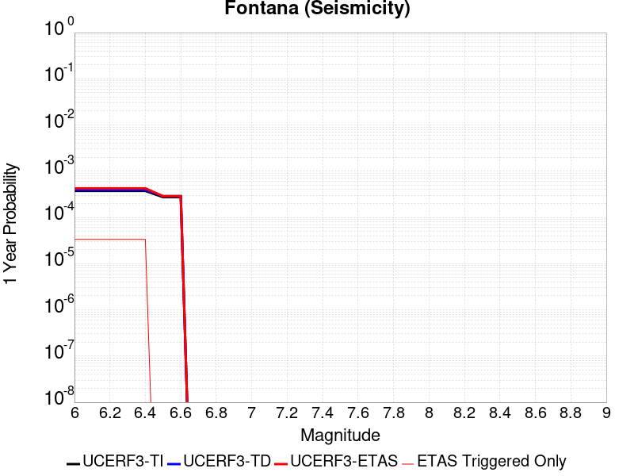 | 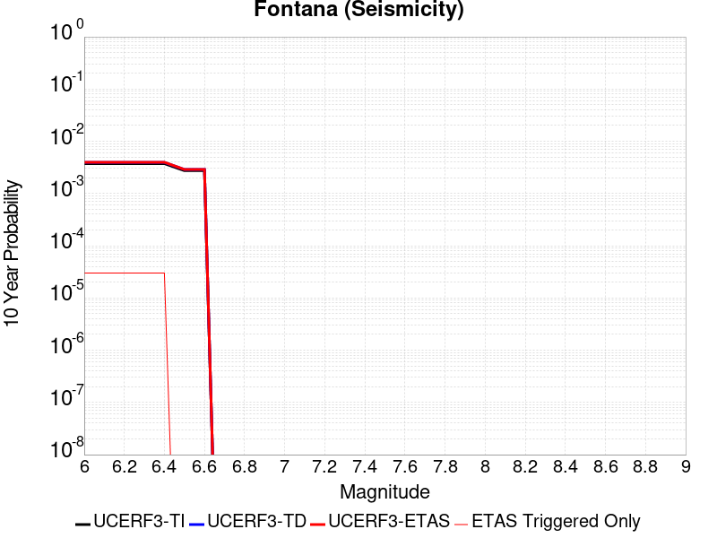 |

| Magnitude | 1 wk TI Prob | 1 wk TD Prob | 1 wk ETAS Prob | 1 wk ETAS/TD Gain | 1 wk ETAS Triggered Only | 1 mo TI Prob | 1 mo TD Prob | 1 mo ETAS Prob | 1 mo ETAS/TD Gain | 1 mo ETAS Triggered Only | 1 yr TI Prob | 1 yr TD Prob | 1 yr ETAS Prob | 1 yr ETAS/TD Gain | 1 yr ETAS Triggered Only | 10 yr TI Prob | 10 yr TD Prob | 10 yr ETAS Prob | 10 yr ETAS/TD Gain | 10 yr ETAS Triggered Only |
|-----|-----|-----|-----|-----|-----|-----|-----|-----|-----|-----|-----|-----|-----|-----|-----|-----|-----|-----|-----|-----|
| 6.0 | 7.1789214E-6 | 7.552053E-6 | 7.552053E-6 | 1.0 | 0.0 | 3.076644E-5 | 3.236577E-5 | 3.236577E-5 | 1.0 | 0.0 | 3.7451705E-4 | 3.9402276E-4 | 4.1085115E-4 | 1.0427091 | 1.6835016E-5 | 0.003738865 | 0.003937241 | 0.00395401 | 1.004259 | 1.6835016E-5 |
| 6.1 | 7.1789214E-6 | 7.552053E-6 | 7.552053E-6 | 1.0 | 0.0 | 3.076644E-5 | 3.236577E-5 | 3.236577E-5 | 1.0 | 0.0 | 3.7451705E-4 | 3.9402276E-4 | 4.1085115E-4 | 1.0427091 | 1.6835016E-5 | 0.003738865 | 0.003937241 | 0.00395401 | 1.004259 | 1.6835016E-5 |
| 6.2 | 7.1789214E-6 | 7.552053E-6 | 7.552053E-6 | 1.0 | 0.0 | 3.076644E-5 | 3.236577E-5 | 3.236577E-5 | 1.0 | 0.0 | 3.7451705E-4 | 3.9402276E-4 | 4.1085115E-4 | 1.0427091 | 1.6835016E-5 | 0.003738865 | 0.003937241 | 0.00395401 | 1.004259 | 1.6835016E-5 |
| 6.3 | 7.1789214E-6 | 7.552053E-6 | 7.552053E-6 | 1.0 | 0.0 | 3.076644E-5 | 3.236577E-5 | 3.236577E-5 | 1.0 | 0.0 | 3.7451705E-4 | 3.9402276E-4 | 4.1085115E-4 | 1.0427091 | 1.6835016E-5 | 0.003738865 | 0.003937241 | 0.00395401 | 1.004259 | 1.6835016E-5 |
| 6.4 | 7.1789214E-6 | 7.552053E-6 | 7.552053E-6 | 1.0 | 0.0 | 3.076644E-5 | 3.236577E-5 | 3.236577E-5 | 1.0 | 0.0 | 3.7451705E-4 | 3.9402276E-4 | 4.1085115E-4 | 1.0427091 | 1.6835016E-5 | 0.003738865 | 0.003937241 | 0.00395401 | 1.004259 | 1.6835016E-5 |
| 6.5 | 5.2611317E-6 | 5.5327637E-6 | 5.5327637E-6 | 1.0 | 0.0 | 2.2547512E-5 | 2.3711844E-5 | 2.3711844E-5 | 1.0 | 0.0 | 2.744814E-4 | 2.886917E-4 | 2.886917E-4 | 1.0 | 0.0 | 0.002741426 | 0.002886917 | 0.002886917 | 1.0 | 0.0 |
| 6.6 | 5.2611317E-6 | 5.5327637E-6 | 5.5327637E-6 | 1.0 | 0.0 | 2.2547512E-5 | 2.3711844E-5 | 2.3711844E-5 | 1.0 | 0.0 | 2.744814E-4 | 2.886917E-4 | 2.886917E-4 | 1.0 | 0.0 | 0.002741426 | 0.002886917 | 0.002886917 | 1.0 | 0.0 |

## Big Pine (West)
*[(top)](#table-of-contents)*

| 1 Week | 1 Month | 1 Year | 10 Year |
|-----|-----|-----|-----|
|  | 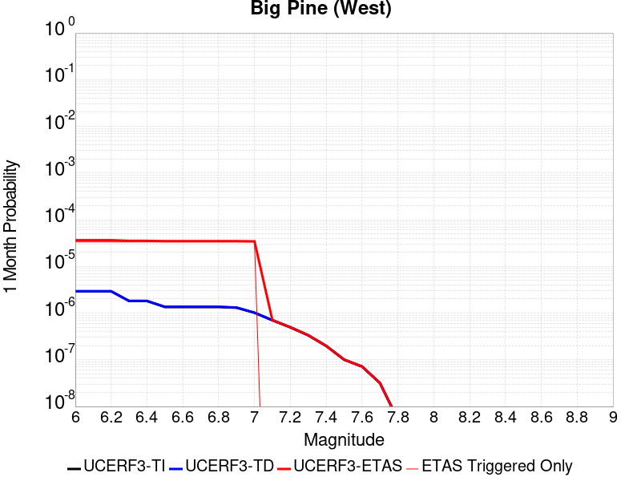 | 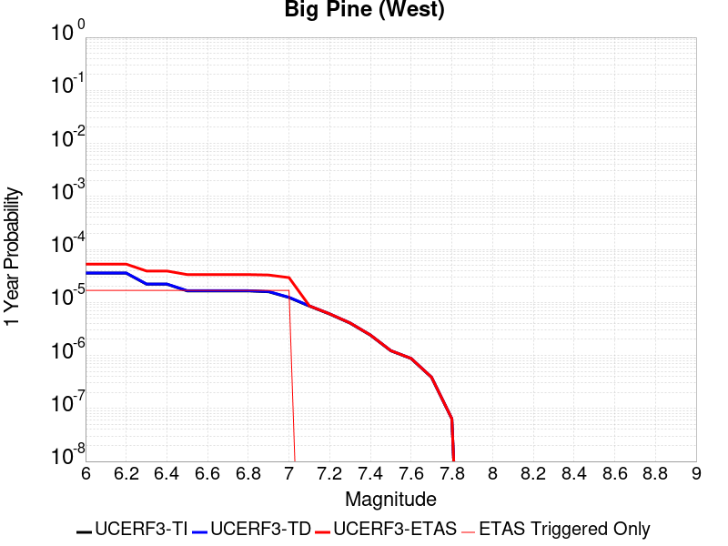 | 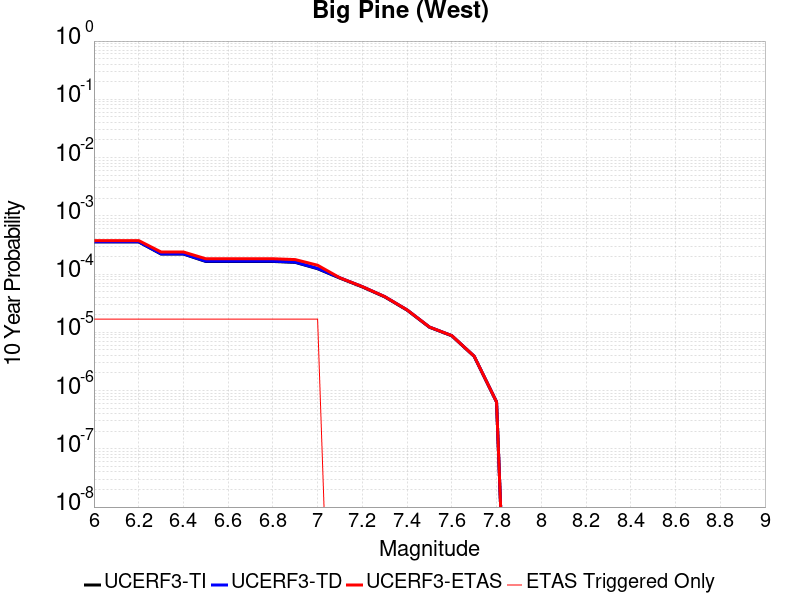 |

| Magnitude | 1 wk TI Prob | 1 wk TD Prob | 1 wk ETAS Prob | 1 wk ETAS/TD Gain | 1 wk ETAS Triggered Only | 1 mo TI Prob | 1 mo TD Prob | 1 mo ETAS Prob | 1 mo ETAS/TD Gain | 1 mo ETAS Triggered Only | 1 yr TI Prob | 1 yr TD Prob | 1 yr ETAS Prob | 1 yr ETAS/TD Gain | 1 yr ETAS Triggered Only | 10 yr TI Prob | 10 yr TD Prob | 10 yr ETAS Prob | 10 yr ETAS/TD Gain | 10 yr ETAS Triggered Only |
|-----|-----|-----|-----|-----|-----|-----|-----|-----|-----|-----|-----|-----|-----|-----|-----|-----|-----|-----|-----|-----|
| 6.0 | 6.8306974E-7 | 6.881837E-7 | 6.881837E-7 | 1.0 | 0.0 | 2.9274386E-6 | 2.949356E-6 | 1.9784324E-5 | 6.708015 | 1.6835016E-5 | 3.564098E-5 | 3.5907913E-5 | 5.2742325E-5 | 1.4688218 | 1.6835016E-5 | 3.5635266E-4 | 3.590305E-4 | 3.7585947E-4 | 1.0468733 | 1.6835016E-5 |
| 6.1 | 6.8306974E-7 | 6.881837E-7 | 6.881837E-7 | 1.0 | 0.0 | 2.9274386E-6 | 2.949356E-6 | 1.9784324E-5 | 6.708015 | 1.6835016E-5 | 3.564098E-5 | 3.5907913E-5 | 5.2742325E-5 | 1.4688218 | 1.6835016E-5 | 3.5635266E-4 | 3.590305E-4 | 3.7585947E-4 | 1.0468733 | 1.6835016E-5 |
| 6.2 | 6.8306974E-7 | 6.881837E-7 | 6.881837E-7 | 1.0 | 0.0 | 2.9274386E-6 | 2.949356E-6 | 1.9784324E-5 | 6.708015 | 1.6835016E-5 | 3.564098E-5 | 3.5907913E-5 | 5.2742325E-5 | 1.4688218 | 1.6835016E-5 | 3.5635266E-4 | 3.590305E-4 | 3.7585947E-4 | 1.0468733 | 1.6835016E-5 |
| 6.3 | 4.227652E-7 | 4.2665656E-7 | 4.2665656E-7 | 1.0 | 0.0 | 1.8118495E-6 | 1.8285269E-6 | 1.8663513E-5 | 10.206857 | 1.6835016E-5 | 2.2059045E-5 | 2.2262107E-5 | 3.9096747E-5 | 1.7562016 | 1.6835016E-5 | 2.2056856E-4 | 2.2260059E-4 | 2.3943186E-4 | 1.075612 | 1.6835016E-5 |
| 6.4 | 4.227652E-7 | 4.2665656E-7 | 4.2665656E-7 | 1.0 | 0.0 | 1.8118495E-6 | 1.8285269E-6 | 1.8663513E-5 | 10.206857 | 1.6835016E-5 | 2.2059045E-5 | 2.2262107E-5 | 3.9096747E-5 | 1.7562016 | 1.6835016E-5 | 2.2056856E-4 | 2.2260059E-4 | 2.3943186E-4 | 1.075612 | 1.6835016E-5 |
| 6.5 | 3.1538403E-7 | 3.1884574E-7 | 3.1884574E-7 | 1.0 | 0.0 | 1.3516451E-6 | 1.366481E-6 | 1.8201476E-5 | 13.319962 | 1.6835016E-5 | 1.6456155E-5 | 1.6636784E-5 | 3.347152E-5 | 2.0118985 | 1.6835016E-5 | 1.6454936E-4 | 1.6635578E-4 | 1.8318799E-4 | 1.101182 | 1.6835016E-5 |
| 6.6 | 3.1538403E-7 | 3.1884574E-7 | 3.1884574E-7 | 1.0 | 0.0 | 1.3516451E-6 | 1.366481E-6 | 1.8201476E-5 | 13.319962 | 1.6835016E-5 | 1.6456155E-5 | 1.6636784E-5 | 3.347152E-5 | 2.0118985 | 1.6835016E-5 | 1.6454936E-4 | 1.6635578E-4 | 1.8318799E-4 | 1.101182 | 1.6835016E-5 |
| 6.7 | 3.1538403E-7 | 3.1884574E-7 | 3.1884574E-7 | 1.0 | 0.0 | 1.3516451E-6 | 1.366481E-6 | 1.8201476E-5 | 13.319962 | 1.6835016E-5 | 1.6456155E-5 | 1.6636784E-5 | 3.347152E-5 | 2.0118985 | 1.6835016E-5 | 1.6454936E-4 | 1.6635578E-4 | 1.8318799E-4 | 1.101182 | 1.6835016E-5 |
| 6.8 | 3.1538403E-7 | 3.1884574E-7 | 3.1884574E-7 | 1.0 | 0.0 | 1.3516451E-6 | 1.366481E-6 | 1.8201476E-5 | 13.319962 | 1.6835016E-5 | 1.6456155E-5 | 1.6636784E-5 | 3.347152E-5 | 2.0118985 | 1.6835016E-5 | 1.6454936E-4 | 1.6635578E-4 | 1.8318799E-4 | 1.101182 | 1.6835016E-5 |
| 6.9 | 3.0402092E-7 | 3.0739844E-7 | 3.0739844E-7 | 1.0 | 0.0 | 1.3029462E-6 | 1.3174212E-6 | 1.8152416E-5 | 13.7787485 | 1.6835016E-5 | 1.5863254E-5 | 1.6039488E-5 | 3.2874235E-5 | 2.0495813 | 1.6835016E-5 | 1.5862122E-4 | 1.603837E-4 | 1.7721602E-4 | 1.1049503 | 1.6835016E-5 |
| 7.0 | 2.3673063E-7 | 2.394435E-7 | 2.394435E-7 | 1.0 | 0.0 | 1.0145594E-6 | 1.026186E-6 | 1.7861186E-5 | 17.405407 | 1.6835016E-5 | 1.235219E-5 | 1.2493747E-5 | 2.9328554E-5 | 2.3474586 | 1.6835016E-5 | 1.2351504E-4 | 1.2493072E-4 | 1.4176364E-4 | 1.134738 | 1.6835016E-5 |
| 7.1 | 1.632138E-7 | 1.6514538E-7 | 1.6514538E-7 | 1.0 | 0.0 | 6.9948754E-7 | 7.077657E-7 | 7.077657E-7 | 1.0 | 0.0 | 8.516227E-6 | 8.617015E-6 | 8.617015E-6 | 1.0 | 0.0 | 8.5159016E-5 | 8.616698E-5 | 8.616698E-5 | 1.0 | 0.0 |
| 7.2 | 1.1523723E-7 | 1.16571826E-7 | 1.16571826E-7 | 1.0 | 0.0 | 4.9387376E-7 | 4.9959345E-7 | 4.9959345E-7 | 1.0 | 0.0 | 6.0128964E-6 | 6.0825346E-6 | 6.0825346E-6 | 1.0 | 0.0 | 6.0127335E-5 | 6.082379E-5 | 6.082379E-5 | 1.0 | 0.0 |
| 7.3 | 7.777805E-8 | 7.862457E-8 | 7.862457E-8 | 1.0 | 0.0 | 3.3333444E-7 | 3.3696242E-7 | 3.3696242E-7 | 1.0 | 0.0 | 4.0583395E-6 | 4.10251E-6 | 4.10251E-6 | 1.0 | 0.0 | 4.0582654E-5 | 4.1024403E-5 | 4.1024403E-5 | 1.0 | 0.0 |
| 7.4 | 4.609946E-8 | 4.652219E-8 | 4.652219E-8 | 1.0 | 0.0 | 1.975691E-7 | 1.9938079E-7 | 1.9938079E-7 | 1.0 | 0.0 | 2.4054011E-6 | 2.4274586E-6 | 2.4274586E-6 | 1.0 | 0.0 | 2.405375E-5 | 2.4274339E-5 | 2.4274339E-5 | 1.0 | 0.0 |
| 7.5 | 2.3439137E-8 | 2.3608306E-8 | 2.3608306E-8 | 1.0 | 0.0 | 1.00453434E-7 | 1.0117845E-7 | 1.0117845E-7 | 1.0 | 0.0 | 1.2230199E-6 | 1.231847E-6 | 1.231847E-6 | 1.0 | 0.0 | 1.2230132E-5 | 1.23184045E-5 | 1.23184045E-5 | 1.0 | 0.0 |
| 7.6 | 1.6699769E-8 | 1.6817088E-8 | 1.6817088E-8 | 1.0 | 0.0 | 7.157044E-8 | 7.2073234E-8 | 7.2073234E-8 | 1.0 | 0.0 | 8.713697E-7 | 8.774913E-7 | 8.774913E-7 | 1.0 | 0.0 | 8.713663E-6 | 8.7748795E-6 | 8.7748795E-6 | 1.0 | 0.0 |
| 7.7 | 7.4061512E-9 | 7.45417E-9 | 7.45417E-9 | 1.0 | 0.0 | 3.1740647E-8 | 3.1946442E-8 | 3.1946442E-8 | 1.0 | 0.0 | 3.864423E-7 | 3.8894788E-7 | 3.8894788E-7 | 1.0 | 0.0 | 3.8644166E-6 | 3.8894727E-6 | 3.8894727E-6 | 1.0 | 0.0 |
| 7.8 | 1.2189427E-9 | 1.2270773E-9 | 1.2270773E-9 | 1.0 | 0.0 | 5.2240403E-9 | 5.258903E-9 | 5.258903E-9 | 1.0 | 0.0 | 6.3602684E-8 | 6.402714E-8 | 6.402714E-8 | 1.0 | 0.0 | 6.360267E-7 | 6.402713E-7 | 6.402713E-7 | 1.0 | 0.0 |

## La Panza 2011
*[(top)](#table-of-contents)*

| 1 Week | 1 Month | 1 Year | 10 Year |
|-----|-----|-----|-----|
| 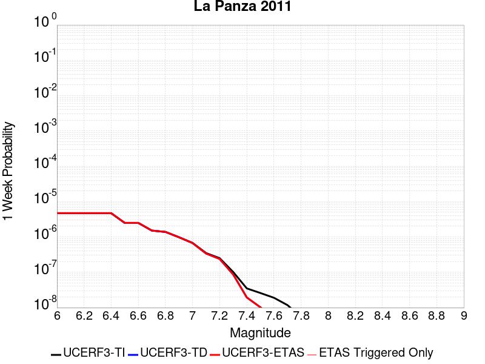 | 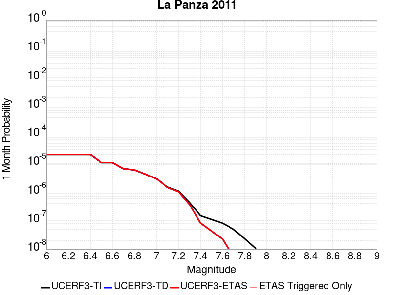 | 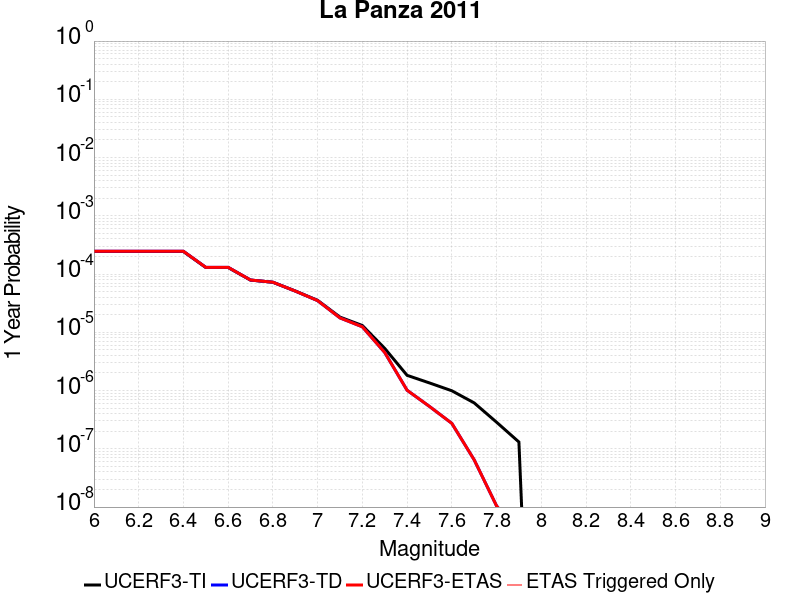 | 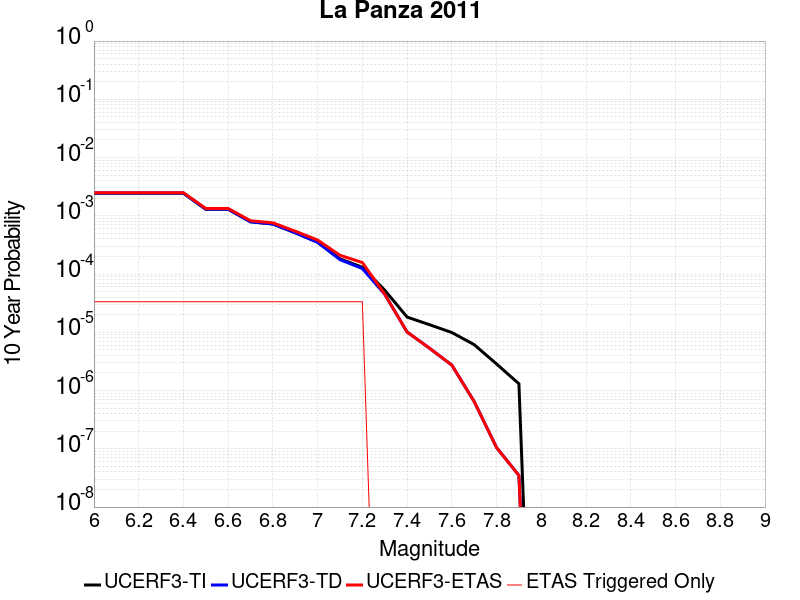 |

| Magnitude | 1 wk TI Prob | 1 wk TD Prob | 1 wk ETAS Prob | 1 wk ETAS/TD Gain | 1 wk ETAS Triggered Only | 1 mo TI Prob | 1 mo TD Prob | 1 mo ETAS Prob | 1 mo ETAS/TD Gain | 1 mo ETAS Triggered Only | 1 yr TI Prob | 1 yr TD Prob | 1 yr ETAS Prob | 1 yr ETAS/TD Gain | 1 yr ETAS Triggered Only | 10 yr TI Prob | 10 yr TD Prob | 10 yr ETAS Prob | 10 yr ETAS/TD Gain | 10 yr ETAS Triggered Only |
|-----|-----|-----|-----|-----|-----|-----|-----|-----|-----|-----|-----|-----|-----|-----|-----|-----|-----|-----|-----|-----|
| 6.0 | 4.6754544E-6 | 4.717608E-6 | 4.717608E-6 | 1.0 | 0.0 | 2.0037509E-5 | 2.0218175E-5 | 2.0218175E-5 | 1.0 | 0.0 | 2.4392935E-4 | 2.4613045E-4 | 2.4613045E-4 | 1.0 | 0.0 | 0.0024366176 | 0.0024587729 | 0.0024755665 | 1.0068301 | 1.6835016E-5 |
| 6.1 | 4.6754544E-6 | 4.717608E-6 | 4.717608E-6 | 1.0 | 0.0 | 2.0037509E-5 | 2.0218175E-5 | 2.0218175E-5 | 1.0 | 0.0 | 2.4392935E-4 | 2.4613045E-4 | 2.4613045E-4 | 1.0 | 0.0 | 0.0024366176 | 0.0024587729 | 0.0024755665 | 1.0068301 | 1.6835016E-5 |
| 6.2 | 4.6754544E-6 | 4.717608E-6 | 4.717608E-6 | 1.0 | 0.0 | 2.0037509E-5 | 2.0218175E-5 | 2.0218175E-5 | 1.0 | 0.0 | 2.4392935E-4 | 2.4613045E-4 | 2.4613045E-4 | 1.0 | 0.0 | 0.0024366176 | 0.0024587729 | 0.0024755665 | 1.0068301 | 1.6835016E-5 |
| 6.3 | 4.6754544E-6 | 4.717608E-6 | 4.717608E-6 | 1.0 | 0.0 | 2.0037509E-5 | 2.0218175E-5 | 2.0218175E-5 | 1.0 | 0.0 | 2.4392935E-4 | 2.4613045E-4 | 2.4613045E-4 | 1.0 | 0.0 | 0.0024366176 | 0.0024587729 | 0.0024755665 | 1.0068301 | 1.6835016E-5 |
| 6.4 | 4.6754544E-6 | 4.717608E-6 | 4.717608E-6 | 1.0 | 0.0 | 2.0037509E-5 | 2.0218175E-5 | 2.0218175E-5 | 1.0 | 0.0 | 2.4392935E-4 | 2.4613045E-4 | 2.4613045E-4 | 1.0 | 0.0 | 0.0024366176 | 0.0024587729 | 0.0024755665 | 1.0068301 | 1.6835016E-5 |
| 6.5 | 2.485343E-6 | 2.5006163E-6 | 2.5006163E-6 | 1.0 | 0.0 | 1.0651426E-5 | 1.0716885E-5 | 1.0716885E-5 | 1.0 | 0.0 | 1.296734E-4 | 1.3047065E-4 | 1.3047065E-4 | 1.0 | 0.0 | 0.0012959775 | 0.001303979 | 0.001320792 | 1.0128937 | 1.6835016E-5 |
| 6.6 | 2.485343E-6 | 2.5006163E-6 | 2.5006163E-6 | 1.0 | 0.0 | 1.0651426E-5 | 1.0716885E-5 | 1.0716885E-5 | 1.0 | 0.0 | 1.296734E-4 | 1.3047065E-4 | 1.3047065E-4 | 1.0 | 0.0 | 0.0012959775 | 0.001303979 | 0.001320792 | 1.0128937 | 1.6835016E-5 |
| 6.7 | 1.5108508E-6 | 1.5146534E-6 | 1.5146534E-6 | 1.0 | 0.0 | 6.4750584E-6 | 6.491356E-6 | 6.491356E-6 | 1.0 | 0.0 | 7.8830984E-5 | 7.90295E-5 | 7.90295E-5 | 1.0 | 0.0 | 7.880303E-4 | 7.900248E-4 | 8.0684654E-4 | 1.0212927 | 1.6835016E-5 |
| 6.8 | 1.3865837E-6 | 1.3885259E-6 | 1.3885259E-6 | 1.0 | 0.0 | 5.942488E-6 | 5.950812E-6 | 5.950812E-6 | 1.0 | 0.0 | 7.234739E-5 | 7.244883E-5 | 7.244883E-5 | 1.0 | 0.0 | 7.232384E-4 | 7.242619E-4 | 7.4108475E-4 | 1.0232276 | 1.6835016E-5 |
| 6.9 | 9.826583E-7 | 9.796437E-7 | 9.796437E-7 | 1.0 | 0.0 | 4.2113857E-6 | 4.1984663E-6 | 4.1984663E-6 | 1.0 | 0.0 | 5.1272415E-5 | 5.1115185E-5 | 5.1115185E-5 | 1.0 | 0.0 | 5.126059E-4 | 5.1103963E-4 | 5.2786607E-4 | 1.0329258 | 1.6835016E-5 |
| 7.0 | 6.7797646E-7 | 6.71036E-7 | 6.71036E-7 | 1.0 | 0.0 | 2.9056102E-6 | 2.8758654E-6 | 2.8758654E-6 | 1.0 | 0.0 | 3.537523E-5 | 3.501313E-5 | 3.501313E-5 | 1.0 | 0.0 | 3.5369597E-4 | 3.5007924E-4 | 3.6690838E-4 | 1.0480723 | 1.6835016E-5 |
| 7.1 | 3.4979826E-7 | 3.3875276E-7 | 3.3875276E-7 | 1.0 | 0.0 | 1.4991346E-6 | 1.4517968E-6 | 1.4517968E-6 | 1.0 | 0.0 | 1.825181E-5 | 1.7675495E-5 | 1.7675495E-5 | 1.0 | 0.0 | 1.825031E-4 | 1.7674206E-4 | 1.935741E-4 | 1.0952351 | 1.6835016E-5 |
| 7.2 | 2.5088332E-7 | 2.3833275E-7 | 2.3833275E-7 | 1.0 | 0.0 | 1.0752137E-6 | 1.0214256E-6 | 1.0214256E-6 | 1.0 | 0.0 | 1.3090649E-5 | 1.2435796E-5 | 1.2435796E-5 | 1.0 | 0.0 | 1.3089878E-4 | 1.2435185E-4 | 1.4118478E-4 | 1.1353652 | 1.6835016E-5 |
| 7.3 | 1.0159086E-7 | 8.645961E-8 | 8.645961E-8 | 1.0 | 0.0 | 4.3538932E-7 | 3.7054113E-7 | 3.7054113E-7 | 1.0 | 0.0 | 5.300852E-6 | 4.5113293E-6 | 4.5113293E-6 | 1.0 | 0.0 | 5.3007258E-5 | 4.5112418E-5 | 4.5112418E-5 | 1.0 | 0.0 |
| 7.4 | 3.5006252E-8 | 1.940863E-8 | 1.940863E-8 | 1.0 | 0.0 | 1.5002678E-7 | 8.3179835E-8 | 8.3179835E-8 | 1.0 | 0.0 | 1.8265745E-6 | 1.012714E-6 | 1.012714E-6 | 1.0 | 0.0 | 1.8265595E-5 | 1.0127096E-5 | 1.0127096E-5 | 1.0 | 0.0 |
| 7.5 | 2.592274E-8 | 1.0242307E-8 | 1.0242307E-8 | 1.0 | 0.0 | 1.1109746E-7 | 4.3895596E-8 | 4.3895596E-8 | 1.0 | 0.0 | 1.3526106E-6 | 5.3442875E-7 | 5.3442875E-7 | 1.0 | 0.0 | 1.3526024E-5 | 5.3442755E-6 | 5.3442755E-6 | 1.0 | 0.0 |
| 7.6 | 1.9016717E-8 | 5.2468647E-9 | 5.2468647E-9 | 1.0 | 0.0 | 8.150022E-8 | 2.2486562E-8 | 2.2486562E-8 | 1.0 | 0.0 | 9.922647E-7 | 2.7377385E-7 | 2.7377385E-7 | 1.0 | 0.0 | 9.922603E-6 | 2.7377353E-6 | 2.7377353E-6 | 1.0 | 0.0 |
| 7.7 | 1.17738495E-8 | 1.2407027E-9 | 1.2407027E-9 | 1.0 | 0.0 | 5.0459356E-8 | 5.317297E-9 | 5.317297E-9 | 1.0 | 0.0 | 6.1434247E-7 | 6.473808E-8 | 6.473808E-8 | 1.0 | 0.0 | 6.143408E-6 | 6.4738066E-7 | 6.4738066E-7 | 1.0 | 0.0 |
| 7.8 | 5.489079E-9 | 2.0135205E-10 | 2.0135205E-10 | 1.0 | 0.0 | 2.3524624E-8 | 8.6293683E-10 | 8.6293683E-10 | 1.0 | 0.0 | 2.8641225E-7 | 1.0506253E-8 | 1.0506253E-8 | 1.0 | 0.0 | 2.8641189E-6 | 1.0506252E-7 | 1.0506252E-7 | 1.0 | 0.0 |
| 7.9 | 2.5081048E-9 | 6.6927686E-11 | 6.6927686E-11 | 1.0 | 0.0 | 1.0749021E-8 | 2.868329E-10 | 2.868329E-10 | 1.0 | 0.0 | 1.3086932E-7 | 3.492187E-9 | 3.492187E-9 | 1.0 | 0.0 | 1.3086925E-6 | 3.4921865E-8 | 3.4921865E-8 | 1.0 | 0.0 |

## Great Valley 04b Gordon Valley
*[(top)](#table-of-contents)*

| 1 Week | 1 Month | 1 Year | 10 Year |
|-----|-----|-----|-----|
|  |  | 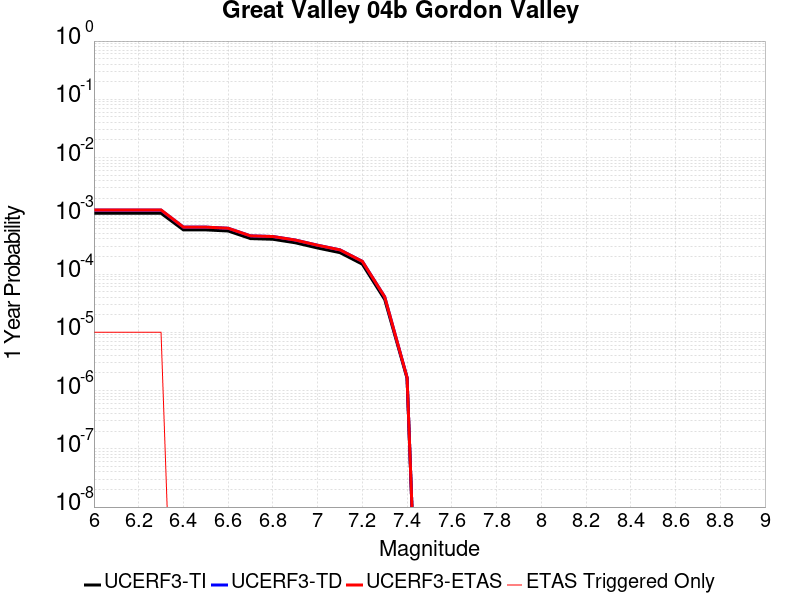 |  |

| Magnitude | 1 wk TI Prob | 1 wk TD Prob | 1 wk ETAS Prob | 1 wk ETAS/TD Gain | 1 wk ETAS Triggered Only | 1 mo TI Prob | 1 mo TD Prob | 1 mo ETAS Prob | 1 mo ETAS/TD Gain | 1 mo ETAS Triggered Only | 1 yr TI Prob | 1 yr TD Prob | 1 yr ETAS Prob | 1 yr ETAS/TD Gain | 1 yr ETAS Triggered Only | 10 yr TI Prob | 10 yr TD Prob | 10 yr ETAS Prob | 10 yr ETAS/TD Gain | 10 yr ETAS Triggered Only |
|-----|-----|-----|-----|-----|-----|-----|-----|-----|-----|-----|-----|-----|-----|-----|-----|-----|-----|-----|-----|-----|
| 6.0 | 2.1181217E-5 | 2.3982375E-5 | 2.3982375E-5 | 1.0 | 0.0 | 9.077348E-5 | 1.027785E-4 | 1.027785E-4 | 1.0 | 0.0 | 0.0011046068 | 0.0012507766 | 0.0012675906 | 1.0134429 | 1.6835016E-5 | 0.010991322 | 0.012453817 | 0.012470442 | 1.0013349 | 1.6835016E-5 |
| 6.1 | 2.1181217E-5 | 2.3982375E-5 | 2.3982375E-5 | 1.0 | 0.0 | 9.077348E-5 | 1.027785E-4 | 1.027785E-4 | 1.0 | 0.0 | 0.0011046068 | 0.0012507766 | 0.0012675906 | 1.0134429 | 1.6835016E-5 | 0.010991322 | 0.012453817 | 0.012470442 | 1.0013349 | 1.6835016E-5 |
| 6.2 | 2.1181217E-5 | 2.3982375E-5 | 2.3982375E-5 | 1.0 | 0.0 | 9.077348E-5 | 1.027785E-4 | 1.027785E-4 | 1.0 | 0.0 | 0.0011046068 | 0.0012507766 | 0.0012675906 | 1.0134429 | 1.6835016E-5 | 0.010991322 | 0.012453817 | 0.012470442 | 1.0013349 | 1.6835016E-5 |
| 6.3 | 2.1181217E-5 | 2.3982375E-5 | 2.3982375E-5 | 1.0 | 0.0 | 9.077348E-5 | 1.027785E-4 | 1.027785E-4 | 1.0 | 0.0 | 0.0011046068 | 0.0012507766 | 0.0012675906 | 1.0134429 | 1.6835016E-5 | 0.010991322 | 0.012453817 | 0.012470442 | 1.0013349 | 1.6835016E-5 |
| 6.4 | 1.0988268E-5 | 1.2254686E-5 | 1.2254686E-5 | 1.0 | 0.0 | 4.7091726E-5 | 5.2519114E-5 | 5.2519114E-5 | 1.0 | 0.0 | 5.731909E-4 | 6.392486E-4 | 6.392486E-4 | 1.0 | 0.0 | 0.005717147 | 0.006375685 | 0.006375685 | 1.0 | 0.0 |
| 6.5 | 1.0988268E-5 | 1.2254686E-5 | 1.2254686E-5 | 1.0 | 0.0 | 4.7091726E-5 | 5.2519114E-5 | 5.2519114E-5 | 1.0 | 0.0 | 5.731909E-4 | 6.392486E-4 | 6.392486E-4 | 1.0 | 0.0 | 0.005717147 | 0.006375685 | 0.006375685 | 1.0 | 0.0 |
| 6.6 | 1.0517822E-5 | 1.172424E-5 | 1.172424E-5 | 1.0 | 0.0 | 4.5075605E-5 | 5.0245864E-5 | 5.0245864E-5 | 1.0 | 0.0 | 5.4865726E-4 | 6.115873E-4 | 6.115873E-4 | 1.0 | 0.0 | 0.0054730466 | 0.006100596 | 0.006100596 | 1.0 | 0.0 |
| 6.7 | 7.789219E-6 | 8.677775E-6 | 8.677775E-6 | 1.0 | 0.0 | 3.3381937E-5 | 3.7189966E-5 | 3.7189966E-5 | 1.0 | 0.0 | 4.063493E-4 | 4.5269894E-4 | 4.5269894E-4 | 1.0 | 0.0 | 0.004056071 | 0.004518285 | 0.004518285 | 1.0 | 0.0 |
| 6.8 | 7.5850853E-6 | 8.452517E-6 | 8.452517E-6 | 1.0 | 0.0 | 3.2507105E-5 | 3.62246E-5 | 3.62246E-5 | 1.0 | 0.0 | 3.957021E-4 | 4.409504E-4 | 4.409504E-4 | 1.0 | 0.0 | 0.0039499826 | 0.004401267 | 0.004401267 | 1.0 | 0.0 |
| 6.9 | 6.604105E-6 | 7.3586607E-6 | 7.3586607E-6 | 1.0 | 0.0 | 2.8303E-5 | 3.1536758E-5 | 3.1536758E-5 | 1.0 | 0.0 | 3.4453452E-4 | 3.8389626E-4 | 3.8389626E-4 | 1.0 | 0.0 | 0.0034400085 | 0.0038327174 | 0.0038327174 | 1.0 | 0.0 |
| 7.0 | 5.3701115E-6 | 5.9885097E-6 | 5.9885097E-6 | 1.0 | 0.0 | 2.301456E-5 | 2.5664805E-5 | 2.5664805E-5 | 1.0 | 0.0 | 2.8016625E-4 | 3.1242712E-4 | 3.1242712E-4 | 1.0 | 0.0 | 0.0027981328 | 0.0031201674 | 0.0031201674 | 1.0 | 0.0 |
| 7.1 | 4.4685607E-6 | 4.986555E-6 | 4.986555E-6 | 1.0 | 0.0 | 1.9150835E-5 | 2.1370788E-5 | 2.1370788E-5 | 1.0 | 0.0 | 2.3313647E-4 | 2.6016077E-4 | 2.6016077E-4 | 1.0 | 0.0 | 0.0023289204 | 0.0025988068 | 0.0025988068 | 1.0 | 0.0 |
| 7.2 | 2.833378E-6 | 3.1644681E-6 | 3.1644681E-6 | 1.0 | 0.0 | 1.2142991E-5 | 1.3561946E-5 | 1.3561946E-5 | 1.0 | 0.0 | 1.4783088E-4 | 1.6510593E-4 | 1.6510593E-4 | 1.0 | 0.0 | 0.0014773258 | 0.0016500045 | 0.0016500045 | 1.0 | 0.0 |
| 7.3 | 7.0087293E-7 | 7.772929E-7 | 7.772929E-7 | 1.0 | 0.0 | 3.0037377E-6 | 3.3312535E-6 | 3.3312535E-6 | 1.0 | 0.0 | 3.656989E-5 | 4.0557716E-5 | 4.0557716E-5 | 1.0 | 0.0 | 3.6563876E-4 | 4.055481E-4 | 4.055481E-4 | 1.0 | 0.0 |
| 7.4 | 3.112171E-8 | 3.2068495E-8 | 3.2068495E-8 | 1.0 | 0.0 | 1.3337875E-7 | 1.374364E-7 | 1.374364E-7 | 1.0 | 0.0 | 1.6238852E-6 | 1.673287E-6 | 1.673287E-6 | 1.0 | 0.0 | 1.6238733E-5 | 1.6732753E-5 | 1.6732753E-5 | 1.0 | 0.0 |

## Kern Canyon (South Kern) 2011
*[(top)](#table-of-contents)*

| 1 Week | 1 Month | 1 Year | 10 Year |
|-----|-----|-----|-----|
|  |  | 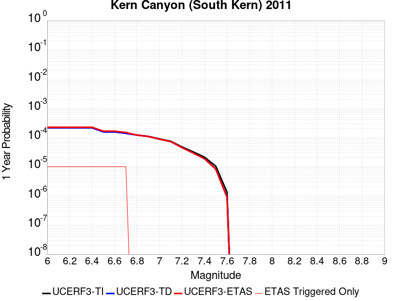 | 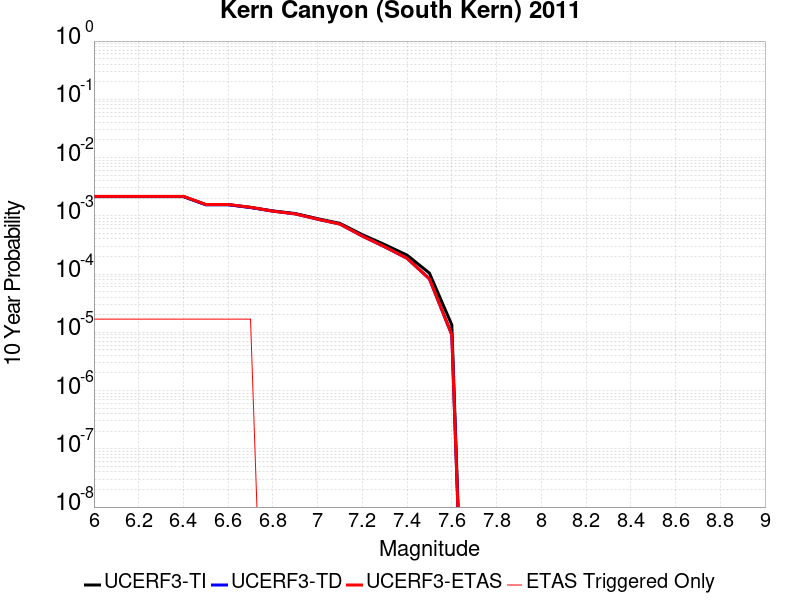 |

| Magnitude | 1 wk TI Prob | 1 wk TD Prob | 1 wk ETAS Prob | 1 wk ETAS/TD Gain | 1 wk ETAS Triggered Only | 1 mo TI Prob | 1 mo TD Prob | 1 mo ETAS Prob | 1 mo ETAS/TD Gain | 1 mo ETAS Triggered Only | 1 yr TI Prob | 1 yr TD Prob | 1 yr ETAS Prob | 1 yr ETAS/TD Gain | 1 yr ETAS Triggered Only | 10 yr TI Prob | 10 yr TD Prob | 10 yr ETAS Prob | 10 yr ETAS/TD Gain | 10 yr ETAS Triggered Only |
|-----|-----|-----|-----|-----|-----|-----|-----|-----|-----|-----|-----|-----|-----|-----|-----|-----|-----|-----|-----|-----|
| 6.0 | 4.105075E-6 | 4.113737E-6 | 4.113737E-6 | 1.0 | 0.0 | 1.7593058E-5 | 1.7630186E-5 | 1.7630186E-5 | 1.0 | 0.0 | 2.1417443E-4 | 2.14627E-4 | 2.314584E-4 | 1.0784216 | 1.6835016E-5 | 0.0021396813 | 0.002144261 | 0.00216106 | 1.0078343 | 1.6835016E-5 |
| 6.1 | 4.105075E-6 | 4.113737E-6 | 4.113737E-6 | 1.0 | 0.0 | 1.7593058E-5 | 1.7630186E-5 | 1.7630186E-5 | 1.0 | 0.0 | 2.1417443E-4 | 2.14627E-4 | 2.314584E-4 | 1.0784216 | 1.6835016E-5 | 0.0021396813 | 0.002144261 | 0.00216106 | 1.0078343 | 1.6835016E-5 |
| 6.2 | 4.105075E-6 | 4.113737E-6 | 4.113737E-6 | 1.0 | 0.0 | 1.7593058E-5 | 1.7630186E-5 | 1.7630186E-5 | 1.0 | 0.0 | 2.1417443E-4 | 2.14627E-4 | 2.314584E-4 | 1.0784216 | 1.6835016E-5 | 0.0021396813 | 0.002144261 | 0.00216106 | 1.0078343 | 1.6835016E-5 |
| 6.3 | 4.105075E-6 | 4.113737E-6 | 4.113737E-6 | 1.0 | 0.0 | 1.7593058E-5 | 1.7630186E-5 | 1.7630186E-5 | 1.0 | 0.0 | 2.1417443E-4 | 2.14627E-4 | 2.314584E-4 | 1.0784216 | 1.6835016E-5 | 0.0021396813 | 0.002144261 | 0.00216106 | 1.0078343 | 1.6835016E-5 |
| 6.4 | 4.105075E-6 | 4.113737E-6 | 4.113737E-6 | 1.0 | 0.0 | 1.7593058E-5 | 1.7630186E-5 | 1.7630186E-5 | 1.0 | 0.0 | 2.1417443E-4 | 2.14627E-4 | 2.314584E-4 | 1.0784216 | 1.6835016E-5 | 0.0021396813 | 0.002144261 | 0.00216106 | 1.0078343 | 1.6835016E-5 |
| 6.5 | 2.9849807E-6 | 2.9731623E-6 | 2.9731623E-6 | 1.0 | 0.0 | 1.2792712E-5 | 1.2742063E-5 | 1.2742063E-5 | 1.0 | 0.0 | 1.5574014E-4 | 1.5512372E-4 | 1.7195613E-4 | 1.1085095 | 1.6835016E-5 | 0.0015563103 | 0.0015501695 | 0.0015669784 | 1.0108433 | 1.6835016E-5 |
| 6.6 | 2.9849807E-6 | 2.9731623E-6 | 2.9731623E-6 | 1.0 | 0.0 | 1.2792712E-5 | 1.2742063E-5 | 1.2742063E-5 | 1.0 | 0.0 | 1.5574014E-4 | 1.5512372E-4 | 1.7195613E-4 | 1.1085095 | 1.6835016E-5 | 0.0015563103 | 0.0015501695 | 0.0015669784 | 1.0108433 | 1.6835016E-5 |
| 6.7 | 2.6756725E-6 | 2.6582275E-6 | 2.6582275E-6 | 1.0 | 0.0 | 1.1467117E-5 | 1.1392354E-5 | 1.1392354E-5 | 1.0 | 0.0 | 1.396032E-4 | 1.386932E-4 | 1.5552588E-4 | 1.1213663 | 1.6835016E-5 | 0.0013951553 | 0.0013860773 | 0.001402889 | 1.012129 | 1.6835016E-5 |
| 6.8 | 2.3283721E-6 | 2.3047846E-6 | 2.3047846E-6 | 1.0 | 0.0 | 9.9787E-6 | 9.877612E-6 | 9.877612E-6 | 1.0 | 0.0 | 1.214839E-4 | 1.2025336E-4 | 1.2025336E-4 | 1.0 | 0.0 | 0.001214175 | 0.0012018904 | 0.0012018904 | 1.0 | 0.0 |
| 6.9 | 2.0972677E-6 | 2.0696464E-6 | 2.0696464E-6 | 1.0 | 0.0 | 8.988259E-6 | 8.8698835E-6 | 8.8698835E-6 | 1.0 | 0.0 | 1.0942656E-4 | 1.0798554E-4 | 1.0798554E-4 | 1.0 | 0.0 | 0.0010937268 | 0.0010793365 | 0.0010793365 | 1.0 | 0.0 |
| 7.0 | 1.7132242E-6 | 1.678708E-6 | 1.678708E-6 | 1.0 | 0.0 | 7.3423685E-6 | 7.1944432E-6 | 7.1944432E-6 | 1.0 | 0.0 | 8.938967E-5 | 8.7588865E-5 | 8.7588865E-5 | 1.0 | 0.0 | 8.935372E-4 | 8.7554724E-4 | 8.7554724E-4 | 1.0 | 0.0 |
| 7.1 | 1.4215541E-6 | 1.381579E-6 | 1.381579E-6 | 1.0 | 0.0 | 6.0923603E-6 | 5.9210392E-6 | 5.9210392E-6 | 1.0 | 0.0 | 7.417196E-5 | 7.2086295E-5 | 7.2086295E-5 | 1.0 | 0.0 | 7.414721E-4 | 7.206318E-4 | 7.206318E-4 | 1.0 | 0.0 |
| 7.2 | 9.097853E-7 | 8.6038E-7 | 8.6038E-7 | 1.0 | 0.0 | 3.899074E-6 | 3.6873375E-6 | 3.6873375E-6 | 1.0 | 0.0 | 4.7470192E-5 | 4.4892422E-5 | 4.4892422E-5 | 1.0 | 0.0 | 4.7460053E-4 | 4.4883462E-4 | 4.4883462E-4 | 1.0 | 0.0 |
| 7.3 | 6.144169E-7 | 5.628223E-7 | 5.628223E-7 | 1.0 | 0.0 | 2.6332125E-6 | 2.4120934E-6 | 2.4120934E-6 | 1.0 | 0.0 | 3.205889E-5 | 2.9366847E-5 | 2.9366847E-5 | 1.0 | 0.0 | 3.2054266E-4 | 2.9363018E-4 | 2.9363018E-4 | 1.0 | 0.0 |
| 7.4 | 4.049844E-7 | 3.5728428E-7 | 3.5728428E-7 | 1.0 | 0.0 | 1.7356463E-6 | 1.5312174E-6 | 1.5312174E-6 | 1.0 | 0.0 | 2.1131287E-5 | 1.8642415E-5 | 1.8642415E-5 | 1.0 | 0.0 | 2.1129279E-4 | 1.8640877E-4 | 1.8640877E-4 | 1.0 | 0.0 |
| 7.5 | 1.9871162E-7 | 1.58305E-7 | 1.58305E-7 | 1.0 | 0.0 | 8.5162094E-7 | 6.7844985E-7 | 6.7844985E-7 | 1.0 | 0.0 | 1.0368436E-5 | 8.260096E-6 | 8.260096E-6 | 1.0 | 0.0 | 1.0367952E-4 | 8.259798E-5 | 8.259798E-5 | 1.0 | 0.0 |
| 7.6 | 2.572245E-8 | 1.7352637E-8 | 1.7352637E-8 | 1.0 | 0.0 | 1.10239064E-7 | 7.4368444E-8 | 7.4368444E-8 | 1.0 | 0.0 | 1.3421597E-6 | 9.0543546E-7 | 9.0543546E-7 | 1.0 | 0.0 | 1.3421517E-5 | 9.0543235E-6 | 9.0543235E-6 | 1.0 | 0.0 |

## Cedar Mtn-Mahogany Mtn
*[(top)](#table-of-contents)*

| 1 Week | 1 Month | 1 Year | 10 Year |
|-----|-----|-----|-----|
| 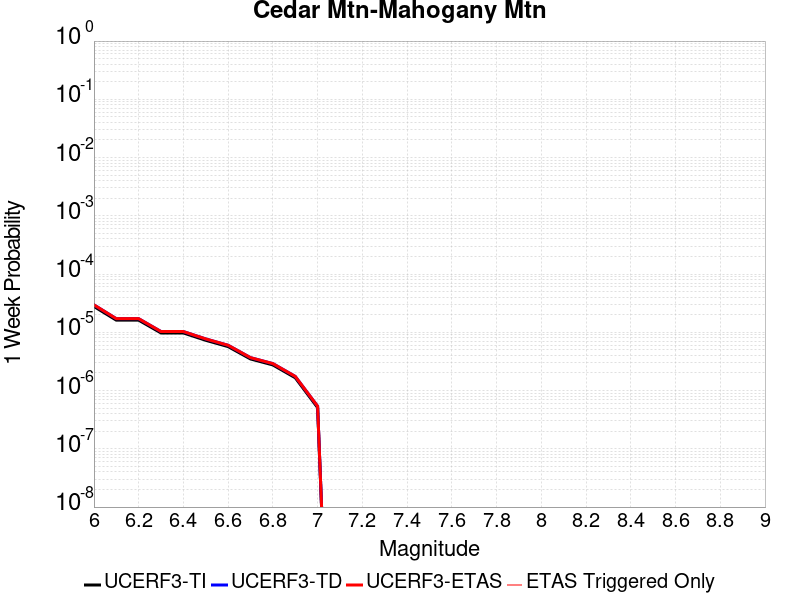 | 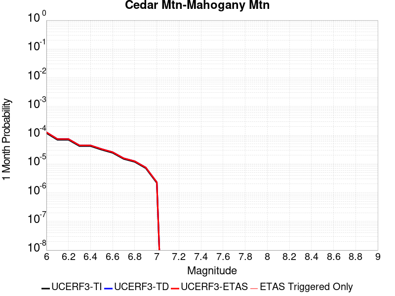 | 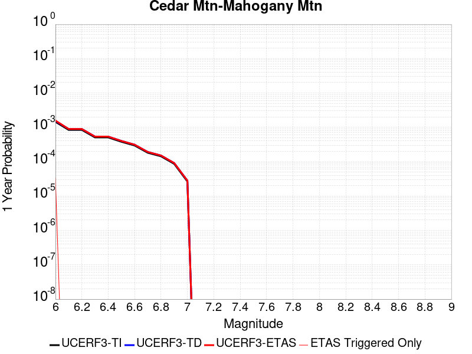 | 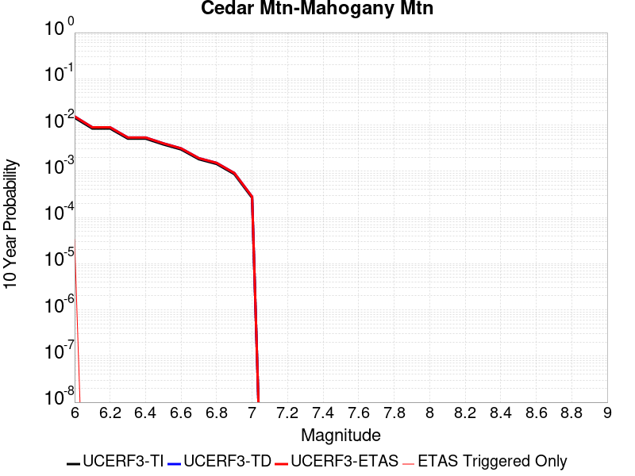 |

| Magnitude | 1 wk TI Prob | 1 wk TD Prob | 1 wk ETAS Prob | 1 wk ETAS/TD Gain | 1 wk ETAS Triggered Only | 1 mo TI Prob | 1 mo TD Prob | 1 mo ETAS Prob | 1 mo ETAS/TD Gain | 1 mo ETAS Triggered Only | 1 yr TI Prob | 1 yr TD Prob | 1 yr ETAS Prob | 1 yr ETAS/TD Gain | 1 yr ETAS Triggered Only | 10 yr TI Prob | 10 yr TD Prob | 10 yr ETAS Prob | 10 yr ETAS/TD Gain | 10 yr ETAS Triggered Only |
|-----|-----|-----|-----|-----|-----|-----|-----|-----|-----|-----|-----|-----|-----|-----|-----|-----|-----|-----|-----|-----|
| 6.0 | 2.7763876E-5 | 2.9589124E-5 | 2.9589124E-5 | 1.0 | 0.0 | 1.1898261E-4 | 1.2680476E-4 | 1.2680476E-4 | 1.0 | 0.0 | 0.0014476506 | 0.0015428247 | 0.0015596338 | 1.010895 | 1.6835016E-5 | 0.0143825635 | 0.015328358 | 0.0153449355 | 1.0010815 | 1.6835016E-5 |
| 6.1 | 1.6162443E-5 | 1.7143104E-5 | 1.7143104E-5 | 1.0 | 0.0 | 6.926578E-5 | 7.346847E-5 | 7.346847E-5 | 1.0 | 0.0 | 8.4298453E-4 | 8.9412933E-4 | 8.9412933E-4 | 1.0 | 0.0 | 0.008397939 | 0.00890713 | 0.00890713 | 1.0 | 0.0 |
| 6.2 | 1.6162443E-5 | 1.7143104E-5 | 1.7143104E-5 | 1.0 | 0.0 | 6.926578E-5 | 7.346847E-5 | 7.346847E-5 | 1.0 | 0.0 | 8.4298453E-4 | 8.9412933E-4 | 8.9412933E-4 | 1.0 | 0.0 | 0.008397939 | 0.00890713 | 0.00890713 | 1.0 | 0.0 |
| 6.3 | 9.746053E-6 | 1.030323E-5 | 1.030323E-5 | 1.0 | 0.0 | 4.1768133E-5 | 4.4155975E-5 | 4.4155975E-5 | 1.0 | 0.0 | 5.0840835E-4 | 5.374705E-4 | 5.374705E-4 | 1.0 | 0.0 | 0.0050724675 | 0.005362125 | 0.005362125 | 1.0 | 0.0 |
| 6.4 | 9.746053E-6 | 1.030323E-5 | 1.030323E-5 | 1.0 | 0.0 | 4.1768133E-5 | 4.4155975E-5 | 4.4155975E-5 | 1.0 | 0.0 | 5.0840835E-4 | 5.374705E-4 | 5.374705E-4 | 1.0 | 0.0 | 0.0050724675 | 0.005362125 | 0.005362125 | 1.0 | 0.0 |
| 6.5 | 7.290083E-6 | 7.695381E-6 | 7.695381E-6 | 1.0 | 0.0 | 3.124284E-5 | 3.2979802E-5 | 3.2979802E-5 | 1.0 | 0.0 | 3.8031515E-4 | 4.0145728E-4 | 4.0145728E-4 | 1.0 | 0.0 | 0.0037966494 | 0.0040075406 | 0.0040075406 | 1.0 | 0.0 |
| 6.6 | 5.67907E-6 | 5.9891963E-6 | 5.9891963E-6 | 1.0 | 0.0 | 2.4338644E-5 | 2.5667738E-5 | 2.5667738E-5 | 1.0 | 0.0 | 2.962827E-4 | 3.1246126E-4 | 3.1246126E-4 | 1.0 | 0.0 | 0.0029588798 | 0.0031203553 | 0.0031203553 | 1.0 | 0.0 |
| 6.7 | 3.4853963E-6 | 3.6726572E-6 | 3.6726572E-6 | 1.0 | 0.0 | 1.4937327E-5 | 1.5739868E-5 | 1.5739868E-5 | 1.0 | 0.0 | 1.8184677E-4 | 1.9161667E-4 | 1.9161667E-4 | 1.0 | 0.0 | 0.0018169804 | 0.0019145765 | 0.0019145765 | 1.0 | 0.0 |
| 6.8 | 2.7535168E-6 | 2.901597E-6 | 2.901597E-6 | 1.0 | 0.0 | 1.1800733E-5 | 1.2435359E-5 | 1.2435359E-5 | 1.0 | 0.0 | 1.4366445E-4 | 1.5139046E-4 | 1.5139046E-4 | 1.0 | 0.0 | 0.0014357162 | 0.0015129205 | 0.0015129205 | 1.0 | 0.0 |
| 6.9 | 1.6594106E-6 | 1.7497113E-6 | 1.7497113E-6 | 1.0 | 0.0 | 7.1117406E-6 | 7.4987424E-6 | 7.4987424E-6 | 1.0 | 0.0 | 8.6582E-5 | 9.1293674E-5 | 9.1293674E-5 | 1.0 | 0.0 | 8.654827E-4 | 9.1259216E-4 | 9.1259216E-4 | 1.0 | 0.0 |
| 7.0 | 5.10215E-7 | 5.389294E-7 | 5.389294E-7 | 1.0 | 0.0 | 2.186634E-6 | 2.3096961E-6 | 2.3096961E-6 | 1.0 | 0.0 | 2.6621943E-5 | 2.8120316E-5 | 2.8120316E-5 | 1.0 | 0.0 | 2.6618753E-4 | 2.811801E-4 | 2.811801E-4 | 1.0 | 0.0 |

## Greenville (So) 2011 CFM
*[(top)](#table-of-contents)*

| 1 Week | 1 Month | 1 Year | 10 Year |
|-----|-----|-----|-----|
|  | 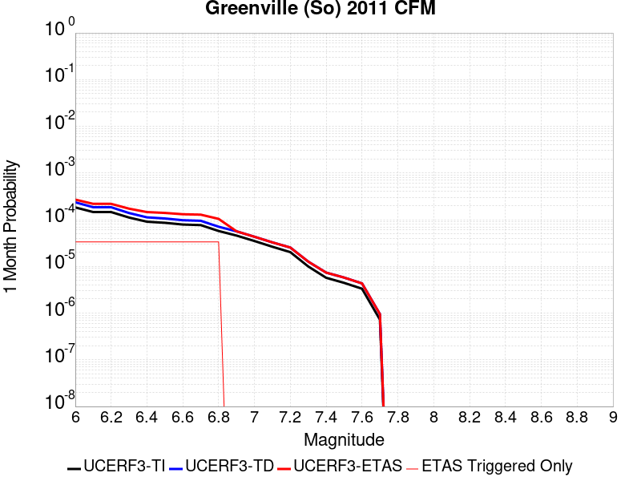 | 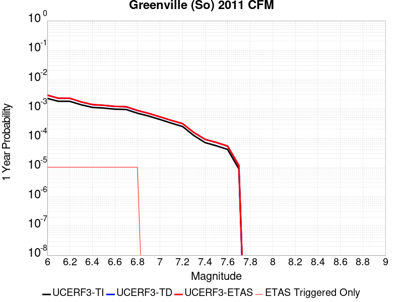 | 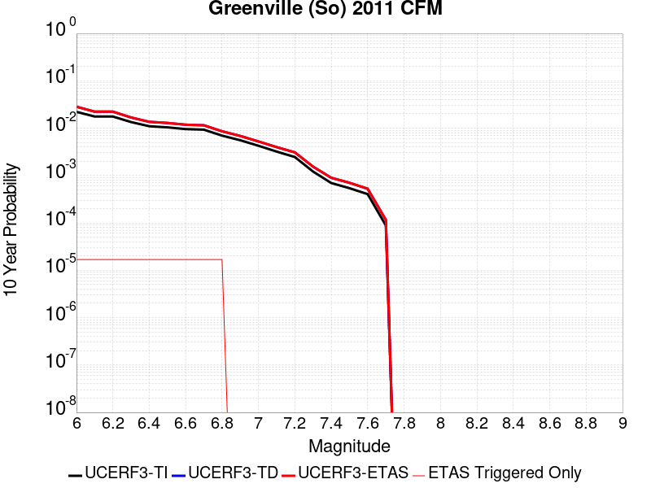 |

| Magnitude | 1 wk TI Prob | 1 wk TD Prob | 1 wk ETAS Prob | 1 wk ETAS/TD Gain | 1 wk ETAS Triggered Only | 1 mo TI Prob | 1 mo TD Prob | 1 mo ETAS Prob | 1 mo ETAS/TD Gain | 1 mo ETAS Triggered Only | 1 yr TI Prob | 1 yr TD Prob | 1 yr ETAS Prob | 1 yr ETAS/TD Gain | 1 yr ETAS Triggered Only | 10 yr TI Prob | 10 yr TD Prob | 10 yr ETAS Prob | 10 yr ETAS/TD Gain | 10 yr ETAS Triggered Only |
|-----|-----|-----|-----|-----|-----|-----|-----|-----|-----|-----|-----|-----|-----|-----|-----|-----|-----|-----|-----|-----|
| 6.0 | 4.279693E-5 | 5.5042052E-5 | 5.5042052E-5 | 1.0 | 0.0 | 1.8340252E-4 | 2.3587522E-4 | 2.5270626E-4 | 1.0713557 | 1.6835016E-5 | 0.0022306389 | 0.0028683394 | 0.0028851263 | 1.0058525 | 1.6835016E-5 | 0.022083808 | 0.028339082 | 0.028355442 | 1.0005772 | 1.6835016E-5 |
| 6.1 | 3.4037297E-5 | 4.319379E-5 | 4.319379E-5 | 1.0 | 0.0 | 1.4586597E-4 | 1.851043E-4 | 2.0193621E-4 | 1.090932 | 1.6835016E-5 | 0.0017744715 | 0.0022515068 | 0.002268304 | 1.0074604 | 1.6835016E-5 | 0.01760369 | 0.022303257 | 0.022319717 | 1.000738 | 1.6835016E-5 |
| 6.2 | 3.4037297E-5 | 4.319379E-5 | 4.319379E-5 | 1.0 | 0.0 | 1.4586597E-4 | 1.851043E-4 | 2.0193621E-4 | 1.090932 | 1.6835016E-5 | 0.0017744715 | 0.0022515068 | 0.002268304 | 1.0074604 | 1.6835016E-5 | 0.01760369 | 0.022303257 | 0.022319717 | 1.000738 | 1.6835016E-5 |
| 6.3 | 2.5956324E-5 | 3.242983E-5 | 3.242983E-5 | 1.0 | 0.0 | 1.11236644E-4 | 1.3897801E-4 | 1.5581069E-4 | 1.1211176 | 1.6835016E-5 | 0.0013534647 | 0.0016908189 | 0.0017076255 | 1.0099399 | 1.6835016E-5 | 0.013452509 | 0.016786352 | 0.016802903 | 1.0009861 | 1.6835016E-5 |
| 6.4 | 2.1145053E-5 | 2.6198357E-5 | 2.6198357E-5 | 1.0 | 0.0 | 9.061851E-5 | 1.1227402E-4 | 1.2910715E-4 | 1.1499289 | 1.6835016E-5 | 0.0011027219 | 0.0013661105 | 0.0013829225 | 1.0123065 | 1.6835016E-5 | 0.01097266 | 0.013580529 | 0.013597135 | 1.0012228 | 1.6835016E-5 |
| 6.5 | 2.0030959E-5 | 2.4796413E-5 | 2.4796413E-5 | 1.0 | 0.0 | 8.584414E-5 | 1.0626618E-4 | 1.2309941E-4 | 1.1584063 | 1.6835016E-5 | 0.0010446513 | 0.001293055 | 0.0013098683 | 1.0130028 | 1.6835016E-5 | 0.010397541 | 0.012858664 | 0.012875282 | 1.0012923 | 1.6835016E-5 |
| 6.6 | 1.8395405E-5 | 2.2755032E-5 | 2.2755032E-5 | 1.0 | 0.0 | 7.8835066E-5 | 9.751807E-5 | 1.14351446E-4 | 1.172618 | 1.6835016E-5 | 9.5939427E-4 | 0.0011866642 | 0.0012034792 | 1.01417 | 1.6835016E-5 | 0.009552629 | 0.0118063325 | 0.011822969 | 1.001409 | 1.6835016E-5 |
| 6.7 | 1.7883482E-5 | 2.2126056E-5 | 2.2126056E-5 | 1.0 | 0.0 | 7.664124E-5 | 9.4822666E-5 | 1.1165608E-4 | 1.1775253 | 1.6835016E-5 | 9.3270757E-4 | 0.001153883 | 0.0011706986 | 1.0145731 | 1.6835016E-5 | 0.009288026 | 0.01148197 | 0.011498611 | 1.0014493 | 1.6835016E-5 |
| 6.8 | 1.3373564E-5 | 1.6506328E-5 | 1.6506328E-5 | 1.0 | 0.0 | 5.7314013E-5 | 7.0739574E-5 | 8.75734E-5 | 1.237969 | 1.6835016E-5 | 6.975747E-4 | 8.6092873E-4 | 8.777493E-4 | 1.0195377 | 1.6835016E-5 | 0.0069538904 | 0.008577544 | 0.008594235 | 1.0019459 | 1.6835016E-5 |
| 6.9 | 1.06692905E-5 | 1.3152838E-5 | 1.3152838E-5 | 1.0 | 0.0 | 4.5724726E-5 | 5.636815E-5 | 5.636815E-5 | 1.0 | 0.0 | 5.5655633E-4 | 6.8607734E-4 | 6.8607734E-4 | 1.0 | 0.0 | 0.005551645 | 0.006840826 | 0.006840826 | 1.0 | 0.0 |
| 7.0 | 8.157512E-6 | 1.0062801E-5 | 1.0062801E-5 | 1.0 | 0.0 | 3.4960296E-5 | 4.3125594E-5 | 4.3125594E-5 | 1.0 | 0.0 | 4.2555845E-4 | 5.249313E-4 | 5.249313E-4 | 1.0 | 0.0 | 0.004247444 | 0.005237391 | 0.005237391 | 1.0 | 0.0 |
| 7.1 | 6.1467113E-6 | 7.6275246E-6 | 7.6275246E-6 | 1.0 | 0.0 | 2.6342783E-5 | 3.2688986E-5 | 3.2688986E-5 | 1.0 | 0.0 | 3.206762E-4 | 3.979166E-4 | 3.979166E-4 | 1.0 | 0.0 | 0.0032021382 | 0.003972229 | 0.003972229 | 1.0 | 0.0 |
| 7.2 | 4.713467E-6 | 5.9142176E-6 | 5.9142176E-6 | 1.0 | 0.0 | 2.0200418E-5 | 2.5346404E-5 | 2.5346404E-5 | 1.0 | 0.0 | 2.4591232E-4 | 3.0854935E-4 | 3.0854935E-4 | 1.0 | 0.0 | 0.0024564038 | 0.003081363 | 0.003081363 | 1.0 | 0.0 |
| 7.3 | 2.3266216E-6 | 2.954034E-6 | 2.954034E-6 | 1.0 | 0.0 | 9.971197E-6 | 1.2660085E-5 | 1.2660085E-5 | 1.0 | 0.0 | 1.2139256E-4 | 1.541258E-4 | 1.541258E-4 | 1.0 | 0.0 | 0.0012132627 | 0.0015402584 | 0.0015402584 | 1.0 | 0.0 |
| 7.4 | 1.3314E-6 | 1.7179633E-6 | 1.7179633E-6 | 1.0 | 0.0 | 5.7059874E-6 | 7.3626793E-6 | 7.3626793E-6 | 1.0 | 0.0 | 6.946818E-5 | 8.963698E-5 | 8.963698E-5 | 1.0 | 0.0 | 6.9446466E-4 | 8.9604704E-4 | 8.9604704E-4 | 1.0 | 0.0 |
| 7.5 | 1.0362941E-6 | 1.3468865E-6 | 1.3468865E-6 | 1.0 | 0.0 | 4.4412527E-6 | 5.7723582E-6 | 5.7723582E-6 | 1.0 | 0.0 | 5.407091E-5 | 7.027624E-5 | 7.027624E-5 | 1.0 | 0.0 | 5.405776E-4 | 7.0257037E-4 | 7.0257037E-4 | 1.0 | 0.0 |
| 7.6 | 7.764784E-7 | 1.0088623E-6 | 1.0088623E-6 | 1.0 | 0.0 | 3.3277602E-6 | 4.323689E-6 | 4.323689E-6 | 1.0 | 0.0 | 4.0514726E-5 | 5.263968E-5 | 5.263968E-5 | 1.0 | 0.0 | 4.050734E-4 | 5.2629353E-4 | 5.2629353E-4 | 1.0 | 0.0 |
| 7.7 | 1.6927763E-7 | 2.2139328E-7 | 2.2139328E-7 | 1.0 | 0.0 | 7.2547533E-7 | 9.48828E-7 | 9.48828E-7 | 1.0 | 0.0 | 8.832627E-6 | 1.1551923E-5 | 1.1551923E-5 | 1.0 | 0.0 | 8.8322755E-5 | 1.1551595E-4 | 1.1551595E-4 | 1.0 | 0.0 |

## White Wolf
*[(top)](#table-of-contents)*

| 1 Week | 1 Month | 1 Year | 10 Year |
|-----|-----|-----|-----|
| 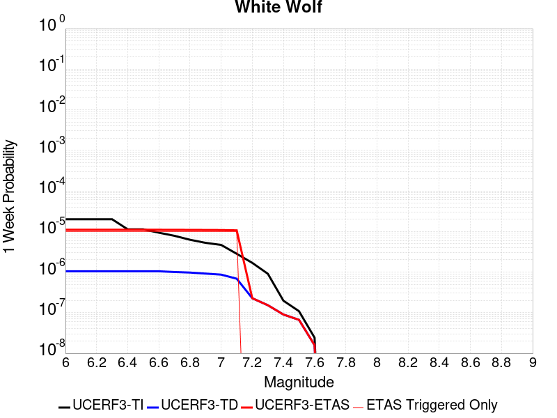 | 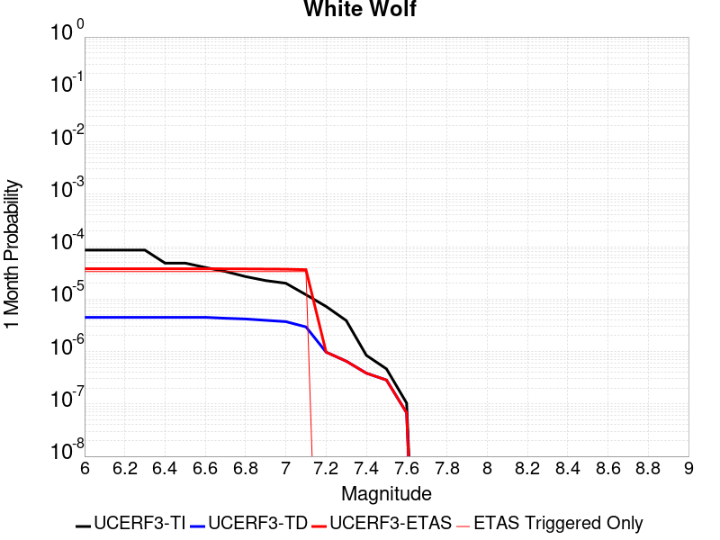 | 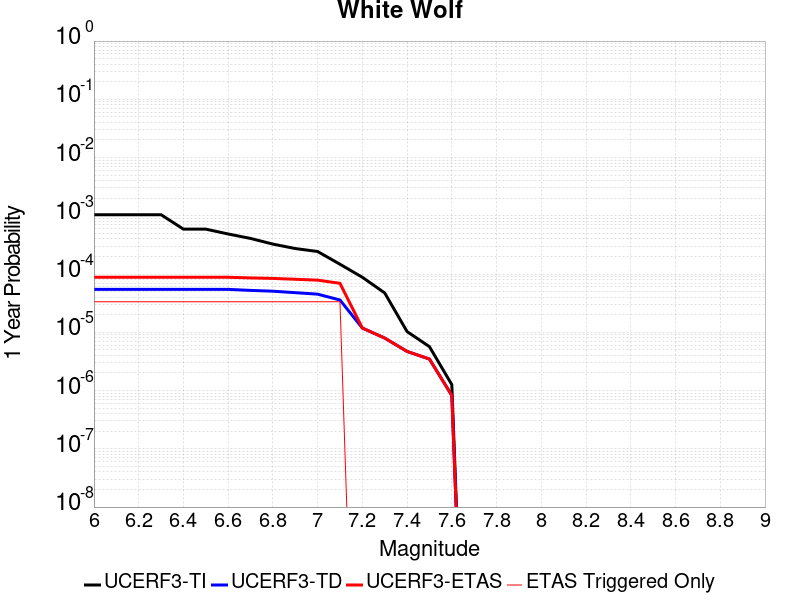 | 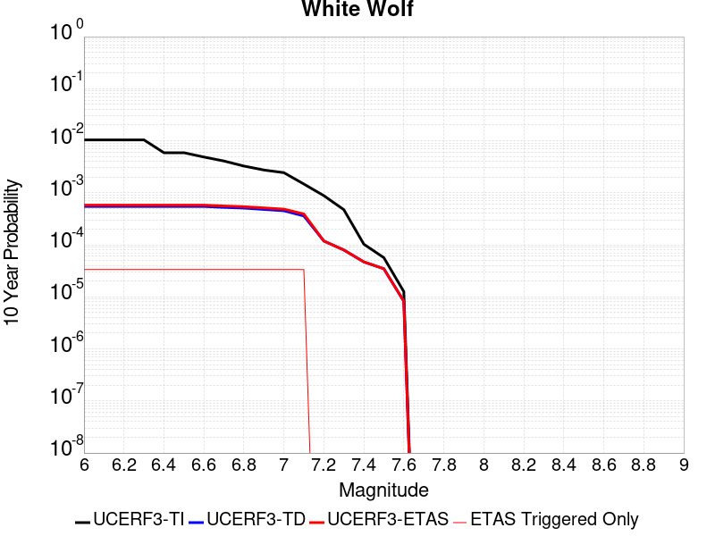 |

| Magnitude | 1 wk TI Prob | 1 wk TD Prob | 1 wk ETAS Prob | 1 wk ETAS/TD Gain | 1 wk ETAS Triggered Only | 1 mo TI Prob | 1 mo TD Prob | 1 mo ETAS Prob | 1 mo ETAS/TD Gain | 1 mo ETAS Triggered Only | 1 yr TI Prob | 1 yr TD Prob | 1 yr ETAS Prob | 1 yr ETAS/TD Gain | 1 yr ETAS Triggered Only | 10 yr TI Prob | 10 yr TD Prob | 10 yr ETAS Prob | 10 yr ETAS/TD Gain | 10 yr ETAS Triggered Only |
|-----|-----|-----|-----|-----|-----|-----|-----|-----|-----|-----|-----|-----|-----|-----|-----|-----|-----|-----|-----|-----|
| 6.0 | 2.0037822E-5 | 1.0469304E-6 | 1.788193E-5 | 17.080343 | 1.6835016E-5 | 8.587355E-5 | 4.486837E-6 | 2.1321779E-5 | 4.7520733 | 1.6835016E-5 | 0.001045009 | 5.462592E-5 | 7.146002E-5 | 1.3081704 | 1.6835016E-5 | 0.010401085 | 5.4613E-4 | 5.6295586E-4 | 1.0308092 | 1.6835016E-5 |
| 6.1 | 2.0037822E-5 | 1.0469304E-6 | 1.788193E-5 | 17.080343 | 1.6835016E-5 | 8.587355E-5 | 4.486837E-6 | 2.1321779E-5 | 4.7520733 | 1.6835016E-5 | 0.001045009 | 5.462592E-5 | 7.146002E-5 | 1.3081704 | 1.6835016E-5 | 0.010401085 | 5.4613E-4 | 5.6295586E-4 | 1.0308092 | 1.6835016E-5 |
| 6.2 | 2.0037822E-5 | 1.0469304E-6 | 1.788193E-5 | 17.080343 | 1.6835016E-5 | 8.587355E-5 | 4.486837E-6 | 2.1321779E-5 | 4.7520733 | 1.6835016E-5 | 0.001045009 | 5.462592E-5 | 7.146002E-5 | 1.3081704 | 1.6835016E-5 | 0.010401085 | 5.4613E-4 | 5.6295586E-4 | 1.0308092 | 1.6835016E-5 |
| 6.3 | 2.0037822E-5 | 1.0469304E-6 | 1.788193E-5 | 17.080343 | 1.6835016E-5 | 8.587355E-5 | 4.486837E-6 | 2.1321779E-5 | 4.7520733 | 1.6835016E-5 | 0.001045009 | 5.462592E-5 | 7.146002E-5 | 1.3081704 | 1.6835016E-5 | 0.010401085 | 5.4613E-4 | 5.6295586E-4 | 1.0308092 | 1.6835016E-5 |
| 6.4 | 1.132487E-5 | 1.0469304E-6 | 1.788193E-5 | 17.080343 | 1.6835016E-5 | 4.8534253E-5 | 4.486837E-6 | 2.1321779E-5 | 4.7520733 | 1.6835016E-5 | 5.907443E-4 | 5.462592E-5 | 7.146002E-5 | 1.3081704 | 1.6835016E-5 | 0.005891764 | 5.4613E-4 | 5.6295586E-4 | 1.0308092 | 1.6835016E-5 |
| 6.5 | 1.132487E-5 | 1.0469304E-6 | 1.788193E-5 | 17.080343 | 1.6835016E-5 | 4.8534253E-5 | 4.486837E-6 | 2.1321779E-5 | 4.7520733 | 1.6835016E-5 | 5.907443E-4 | 5.462592E-5 | 7.146002E-5 | 1.3081704 | 1.6835016E-5 | 0.005891764 | 5.4613E-4 | 5.6295586E-4 | 1.0308092 | 1.6835016E-5 |
| 6.6 | 9.347473E-6 | 1.0469304E-6 | 1.788193E-5 | 17.080343 | 1.6835016E-5 | 4.0059982E-5 | 4.486837E-6 | 2.1321779E-5 | 4.7520733 | 1.6835016E-5 | 4.8762115E-4 | 5.462592E-5 | 7.146002E-5 | 1.3081704 | 1.6835016E-5 | 0.0048655253 | 5.4613E-4 | 5.6295586E-4 | 1.0308092 | 1.6835016E-5 |
| 6.7 | 7.842647E-6 | 1.0048476E-6 | 1.7839848E-5 | 17.753784 | 1.6835016E-5 | 3.361091E-5 | 4.306483E-6 | 2.1141428E-5 | 4.9092097 | 1.6835016E-5 | 4.0913603E-4 | 5.243022E-5 | 6.926435E-5 | 1.321077 | 1.6835016E-5 | 0.004083836 | 5.2418344E-4 | 5.4100965E-4 | 1.0320998 | 1.6835016E-5 |
| 6.8 | 6.26597E-6 | 9.734948E-7 | 1.7808496E-5 | 18.293364 | 1.6835016E-5 | 2.685388E-5 | 4.172114E-6 | 2.1007061E-5 | 5.0351114 | 1.6835016E-5 | 3.2689696E-4 | 5.079436E-5 | 6.762852E-5 | 1.3314179 | 1.6835016E-5 | 0.003264165 | 5.078324E-4 | 5.246588E-4 | 1.0331339 | 1.6835016E-5 |
| 6.9 | 5.258436E-6 | 9.183371E-7 | 1.7753338E-5 | 19.33205 | 1.6835016E-5 | 2.2535958E-5 | 3.9357246E-6 | 2.0770676E-5 | 5.2774715 | 1.6835016E-5 | 2.7434074E-4 | 4.7916445E-5 | 6.475065E-5 | 1.3513243 | 1.6835016E-5 | 0.0027400232 | 4.7906593E-4 | 4.958929E-4 | 1.0351245 | 1.6835016E-5 |
| 7.0 | 4.675028E-6 | 8.66129E-7 | 1.7701132E-5 | 20.437061 | 1.6835016E-5 | 2.003568E-5 | 3.7119764E-6 | 2.0546931E-5 | 5.5353074 | 1.6835016E-5 | 2.4390711E-4 | 4.5192424E-5 | 6.202668E-5 | 1.3725017 | 1.6835016E-5 | 0.0024363957 | 4.5183706E-4 | 4.6866445E-4 | 1.0372422 | 1.6835016E-5 |
| 7.1 | 2.8270078E-6 | 6.8742594E-7 | 1.752243E-5 | 25.489918 | 1.6835016E-5 | 1.2115692E-5 | 2.9461082E-6 | 1.9781075E-5 | 6.7143073 | 1.6835016E-5 | 1.4749856E-4 | 3.5868317E-5 | 5.270273E-5 | 1.4693394 | 1.6835016E-5 | 0.001474007 | 3.586294E-4 | 3.7545836E-4 | 1.0469258 | 1.6835016E-5 |
| 7.2 | 1.6881406E-6 | 2.2706854E-7 | 2.2706854E-7 | 1.0 | 0.0 | 7.2348685E-6 | 9.731506E-7 | 9.731506E-7 | 1.0 | 0.0 | 8.808096E-5 | 1.1848045E-5 | 1.1848045E-5 | 1.0 | 0.0 | 8.8046055E-4 | 1.1847429E-4 | 1.1847429E-4 | 1.0 | 0.0 |
| 7.3 | 9.086107E-7 | 1.5266669E-7 | 1.5266669E-7 | 1.0 | 0.0 | 3.8940398E-6 | 6.5428566E-7 | 6.5428566E-7 | 1.0 | 0.0 | 4.7408903E-5 | 7.965899E-6 | 7.965899E-6 | 1.0 | 0.0 | 4.739879E-4 | 7.965622E-5 | 7.965622E-5 | 1.0 | 0.0 |
| 7.4 | 1.9717383E-7 | 9.003981E-8 | 9.003981E-8 | 1.0 | 0.0 | 8.450304E-7 | 3.8588485E-7 | 3.8588485E-7 | 1.0 | 0.0 | 1.0288197E-5 | 4.698138E-6 | 4.698138E-6 | 1.0 | 0.0 | 1.028772E-4 | 4.6980418E-5 | 4.6980418E-5 | 1.0 | 0.0 |
| 7.5 | 1.086975E-7 | 6.659757E-8 | 6.659757E-8 | 1.0 | 0.0 | 4.6584634E-7 | 2.8541814E-7 | 2.8541814E-7 | 1.0 | 0.0 | 5.6716644E-6 | 3.4749605E-6 | 3.4749605E-6 | 1.0 | 0.0 | 5.6715195E-5 | 3.4749086E-5 | 3.4749086E-5 | 1.0 | 0.0 |
| 7.6 | 2.4217808E-8 | 1.5820843E-8 | 1.5820843E-8 | 1.0 | 0.0 | 1.03790605E-7 | 6.780361E-8 | 6.780361E-8 | 1.0 | 0.0 | 1.2636499E-6 | 8.255087E-7 | 8.255087E-7 | 1.0 | 0.0 | 1.2636427E-5 | 8.255061E-6 | 8.255061E-6 | 1.0 | 0.0 |

## Elysian Park (Upper)
*[(top)](#table-of-contents)*

| 1 Week | 1 Month | 1 Year | 10 Year |
|-----|-----|-----|-----|
| 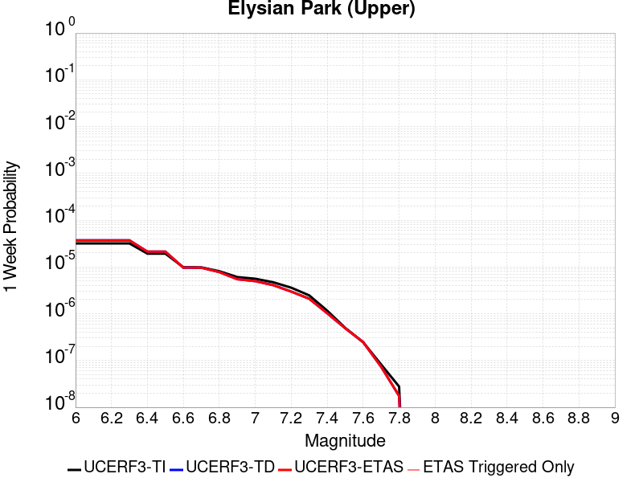 | 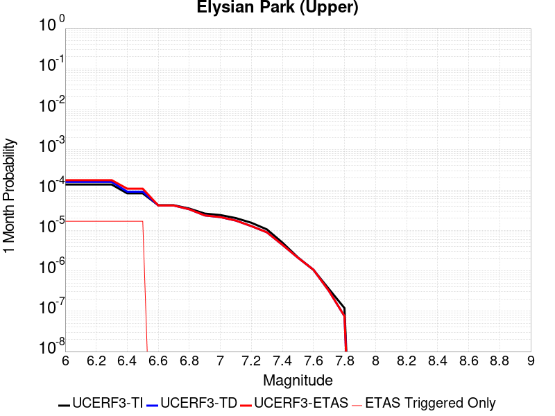 | 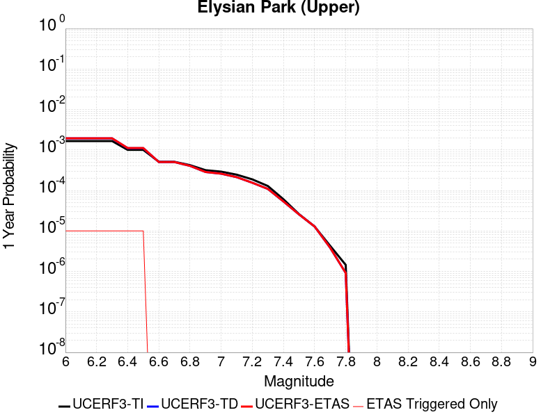 | 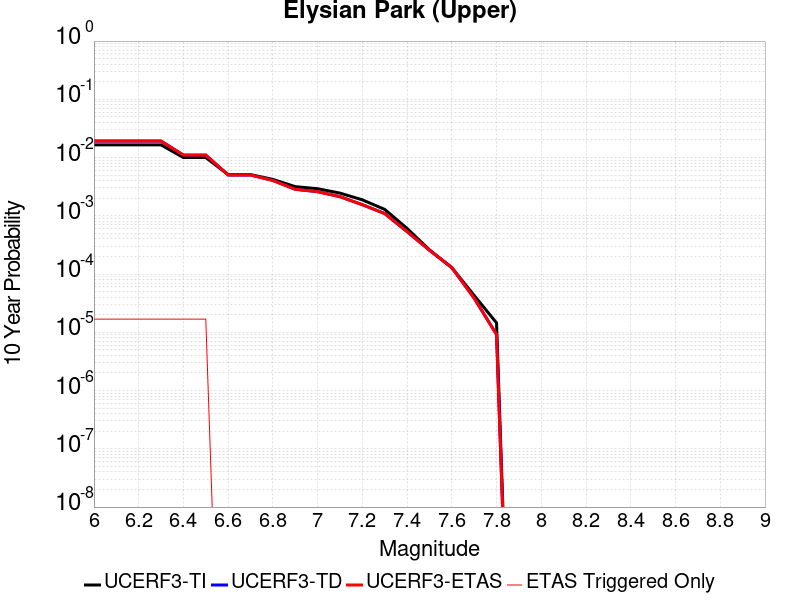 |

| Magnitude | 1 wk TI Prob | 1 wk TD Prob | 1 wk ETAS Prob | 1 wk ETAS/TD Gain | 1 wk ETAS Triggered Only | 1 mo TI Prob | 1 mo TD Prob | 1 mo ETAS Prob | 1 mo ETAS/TD Gain | 1 mo ETAS Triggered Only | 1 yr TI Prob | 1 yr TD Prob | 1 yr ETAS Prob | 1 yr ETAS/TD Gain | 1 yr ETAS Triggered Only | 10 yr TI Prob | 10 yr TD Prob | 10 yr ETAS Prob | 10 yr ETAS/TD Gain | 10 yr ETAS Triggered Only |
|-----|-----|-----|-----|-----|-----|-----|-----|-----|-----|-----|-----|-----|-----|-----|-----|-----|-----|-----|-----|-----|
| 6.0 | 3.1876025E-5 | 3.703652E-5 | 3.703652E-5 | 1.0 | 0.0 | 1.3660437E-4 | 1.5872101E-4 | 1.7555336E-4 | 1.1060499 | 1.6835016E-5 | 0.0016618895 | 0.0019311584 | 0.0019479608 | 1.0087007 | 1.6835016E-5 | 0.016495159 | 0.019190295 | 0.019206807 | 1.0008605 | 1.6835016E-5 |
| 6.1 | 3.1876025E-5 | 3.703652E-5 | 3.703652E-5 | 1.0 | 0.0 | 1.3660437E-4 | 1.5872101E-4 | 1.7555336E-4 | 1.1060499 | 1.6835016E-5 | 0.0016618895 | 0.0019311584 | 0.0019479608 | 1.0087007 | 1.6835016E-5 | 0.016495159 | 0.019190295 | 0.019206807 | 1.0008605 | 1.6835016E-5 |
| 6.2 | 3.1876025E-5 | 3.703652E-5 | 3.703652E-5 | 1.0 | 0.0 | 1.3660437E-4 | 1.5872101E-4 | 1.7555336E-4 | 1.1060499 | 1.6835016E-5 | 0.0016618895 | 0.0019311584 | 0.0019479608 | 1.0087007 | 1.6835016E-5 | 0.016495159 | 0.019190295 | 0.019206807 | 1.0008605 | 1.6835016E-5 |
| 6.3 | 3.1876025E-5 | 3.703652E-5 | 3.703652E-5 | 1.0 | 0.0 | 1.3660437E-4 | 1.5872101E-4 | 1.7555336E-4 | 1.1060499 | 1.6835016E-5 | 0.0016618895 | 0.0019311584 | 0.0019479608 | 1.0087007 | 1.6835016E-5 | 0.016495159 | 0.019190295 | 0.019206807 | 1.0008605 | 1.6835016E-5 |
| 6.4 | 1.9273462E-5 | 2.120273E-5 | 2.120273E-5 | 1.0 | 0.0 | 8.259794E-5 | 9.0866655E-5 | 1.0770014E-4 | 1.1852548 | 1.6835016E-5 | 0.001005166 | 0.0011059135 | 0.0011227299 | 1.0152059 | 1.6835016E-5 | 0.010006315 | 0.011020964 | 0.011037613 | 1.0015107 | 1.6835016E-5 |
| 6.5 | 1.9273462E-5 | 2.120273E-5 | 2.120273E-5 | 1.0 | 0.0 | 8.259794E-5 | 9.0866655E-5 | 1.0770014E-4 | 1.1852548 | 1.6835016E-5 | 0.001005166 | 0.0011059135 | 0.0011227299 | 1.0152059 | 1.6835016E-5 | 0.010006315 | 0.011020964 | 0.011037613 | 1.0015107 | 1.6835016E-5 |
| 6.6 | 9.813258E-6 | 9.665728E-6 | 9.665728E-6 | 1.0 | 0.0 | 4.205614E-5 | 4.142393E-5 | 4.142393E-5 | 1.0 | 0.0 | 5.119132E-4 | 5.042269E-4 | 5.042269E-4 | 1.0 | 0.0 | 0.005107356 | 0.005031552 | 0.005031552 | 1.0 | 0.0 |
| 6.7 | 9.801478E-6 | 9.653297E-6 | 9.653297E-6 | 1.0 | 0.0 | 4.2005657E-5 | 4.137066E-5 | 4.137066E-5 | 1.0 | 0.0 | 5.112989E-4 | 5.0357863E-4 | 5.0357863E-4 | 1.0 | 0.0 | 0.0051012407 | 0.0050250986 | 0.0050250986 | 1.0 | 0.0 |
| 6.8 | 8.102489E-6 | 7.7731065E-6 | 7.7731065E-6 | 1.0 | 0.0 | 3.4724493E-5 | 3.3312917E-5 | 3.3312917E-5 | 1.0 | 0.0 | 4.2268867E-4 | 4.0551423E-4 | 4.0551423E-4 | 1.0 | 0.0 | 0.004218856 | 0.0040482366 | 0.0040482366 | 1.0 | 0.0 |
| 6.9 | 6.08275E-6 | 5.4815127E-6 | 5.4815127E-6 | 1.0 | 0.0 | 2.6068668E-5 | 2.349199E-5 | 2.349199E-5 | 1.0 | 0.0 | 3.173398E-4 | 2.8597823E-4 | 2.8597823E-4 | 1.0 | 0.0 | 0.0031688702 | 0.0028561796 | 0.0028561796 | 1.0 | 0.0 |
| 7.0 | 5.5995934E-6 | 4.982836E-6 | 4.982836E-6 | 1.0 | 0.0 | 2.3998036E-5 | 2.135484E-5 | 2.135484E-5 | 1.0 | 0.0 | 2.9213692E-4 | 2.599648E-4 | 2.599648E-4 | 1.0 | 0.0 | 0.0029175316 | 0.0025966743 | 0.0025966743 | 1.0 | 0.0 |
| 7.1 | 4.709881E-6 | 4.0874465E-6 | 4.0874465E-6 | 1.0 | 0.0 | 2.0185047E-5 | 1.7517514E-5 | 1.7517514E-5 | 1.0 | 0.0 | 2.4572524E-4 | 2.1325526E-4 | 2.1325526E-4 | 1.0 | 0.0 | 0.002454537 | 0.0021305475 | 0.0021305475 | 1.0 | 0.0 |
| 7.2 | 3.6063436E-6 | 2.9779865E-6 | 2.9779865E-6 | 1.0 | 0.0 | 1.5455667E-5 | 1.2762738E-5 | 1.2762738E-5 | 1.0 | 0.0 | 1.881565E-4 | 1.5537537E-4 | 1.5537537E-4 | 1.0 | 0.0 | 0.0018799726 | 0.0015526785 | 0.0015526785 | 1.0 | 0.0 |
| 7.3 | 2.471135E-6 | 2.0954842E-6 | 2.0954842E-6 | 1.0 | 0.0 | 1.0590536E-5 | 8.980616E-6 | 8.980616E-6 | 1.0 | 0.0 | 1.2893214E-4 | 1.0933358E-4 | 1.0933358E-4 | 1.0 | 0.0 | 0.0012885736 | 0.0010928052 | 0.0010928052 | 1.0 | 0.0 |
| 7.4 | 1.163943E-6 | 1.0275212E-6 | 1.0275212E-6 | 1.0 | 0.0 | 4.988318E-6 | 4.403655E-6 | 4.403655E-6 | 1.0 | 0.0 | 6.0731076E-5 | 5.3613214E-5 | 5.3613214E-5 | 1.0 | 0.0 | 6.071448E-4 | 5.3600577E-4 | 5.3600577E-4 | 1.0 | 0.0 |
| 7.5 | 4.99459E-7 | 4.9176606E-7 | 4.9176606E-7 | 1.0 | 0.0 | 2.140537E-6 | 2.107567E-6 | 2.107567E-6 | 1.0 | 0.0 | 2.6060725E-5 | 2.5659343E-5 | 2.5659343E-5 | 1.0 | 0.0 | 2.605767E-4 | 2.5656537E-4 | 2.5656537E-4 | 1.0 | 0.0 |
| 7.6 | 2.4667852E-7 | 2.4778674E-7 | 2.4778674E-7 | 1.0 | 0.0 | 1.0571932E-6 | 1.0619428E-6 | 1.0619428E-6 | 1.0 | 0.0 | 1.2871251E-5 | 1.2929081E-5 | 1.2929081E-5 | 1.0 | 0.0 | 1.2870505E-4 | 1.2928365E-4 | 1.2928365E-4 | 1.0 | 0.0 |
| 7.7 | 8.2312795E-8 | 7.386629E-8 | 7.386629E-8 | 1.0 | 0.0 | 3.527691E-7 | 3.1656978E-7 | 3.1656978E-7 | 1.0 | 0.0 | 4.294955E-6 | 3.8542316E-6 | 3.8542316E-6 | 1.0 | 0.0 | 4.2948723E-5 | 3.8541762E-5 | 3.8541762E-5 | 1.0 | 0.0 |
| 7.8 | 2.7819295E-8 | 1.7567322E-8 | 1.7567322E-8 | 1.0 | 0.0 | 1.1922555E-7 | 7.528852E-8 | 7.528852E-8 | 1.0 | 0.0 | 1.45157E-6 | 9.166375E-7 | 9.166375E-7 | 1.0 | 0.0 | 1.45156055E-5 | 9.166352E-6 | 9.166352E-6 | 1.0 | 0.0 |

## Newport-Inglewood alt 1
*[(top)](#table-of-contents)*

| 1 Week | 1 Month | 1 Year | 10 Year |
|-----|-----|-----|-----|
|  | 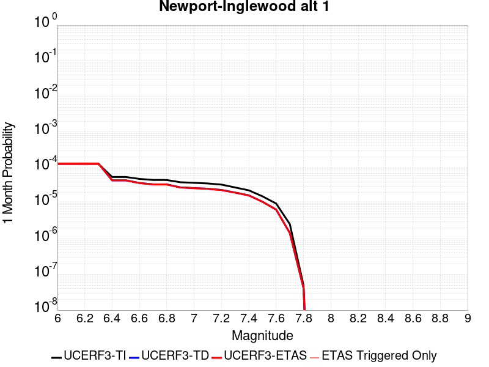 | 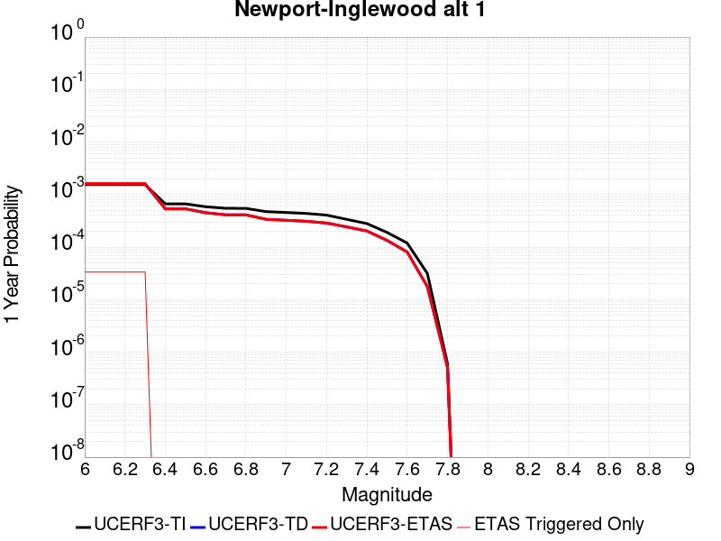 | 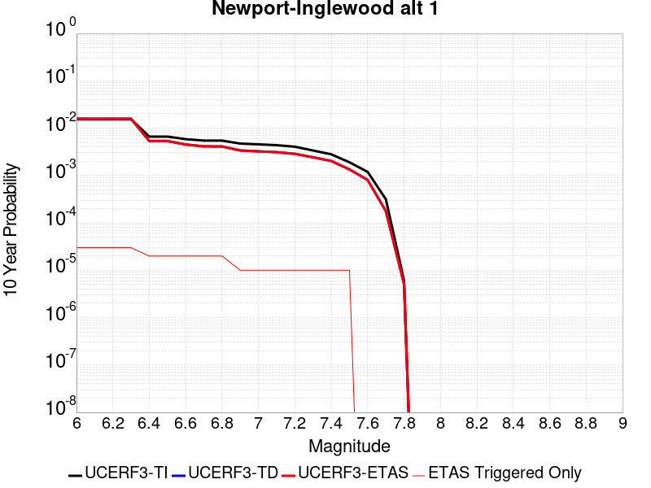 |

| Magnitude | 1 wk TI Prob | 1 wk TD Prob | 1 wk ETAS Prob | 1 wk ETAS/TD Gain | 1 wk ETAS Triggered Only | 1 mo TI Prob | 1 mo TD Prob | 1 mo ETAS Prob | 1 mo ETAS/TD Gain | 1 mo ETAS Triggered Only | 1 yr TI Prob | 1 yr TD Prob | 1 yr ETAS Prob | 1 yr ETAS/TD Gain | 1 yr ETAS Triggered Only | 10 yr TI Prob | 10 yr TD Prob | 10 yr ETAS Prob | 10 yr ETAS/TD Gain | 10 yr ETAS Triggered Only |
|-----|-----|-----|-----|-----|-----|-----|-----|-----|-----|-----|-----|-----|-----|-----|-----|-----|-----|-----|-----|-----|
| 6.0 | 2.9668912E-5 | 3.0405516E-5 | 3.0405516E-5 | 1.0 | 0.0 | 1.2714628E-4 | 1.3030559E-4 | 1.3030559E-4 | 1.0 | 0.0 | 0.0015469068 | 0.0015857986 | 0.0016026068 | 1.0105993 | 1.6835016E-5 | 0.015361829 | 0.015792403 | 0.015808972 | 1.0010492 | 1.6835016E-5 |
| 6.1 | 2.9668912E-5 | 3.0405516E-5 | 3.0405516E-5 | 1.0 | 0.0 | 1.2714628E-4 | 1.3030559E-4 | 1.3030559E-4 | 1.0 | 0.0 | 0.0015469068 | 0.0015857986 | 0.0016026068 | 1.0105993 | 1.6835016E-5 | 0.015361829 | 0.015792403 | 0.015808972 | 1.0010492 | 1.6835016E-5 |
| 6.2 | 2.9668912E-5 | 3.0405516E-5 | 3.0405516E-5 | 1.0 | 0.0 | 1.2714628E-4 | 1.3030559E-4 | 1.3030559E-4 | 1.0 | 0.0 | 0.0015469068 | 0.0015857986 | 0.0016026068 | 1.0105993 | 1.6835016E-5 | 0.015361829 | 0.015792403 | 0.015808972 | 1.0010492 | 1.6835016E-5 |
| 6.3 | 2.9668912E-5 | 3.0405516E-5 | 3.0405516E-5 | 1.0 | 0.0 | 1.2714628E-4 | 1.3030559E-4 | 1.3030559E-4 | 1.0 | 0.0 | 0.0015469068 | 0.0015857986 | 0.0016026068 | 1.0105993 | 1.6835016E-5 | 0.015361829 | 0.015792403 | 0.015808972 | 1.0010492 | 1.6835016E-5 |
| 6.4 | 1.275942E-5 | 1.0272664E-5 | 1.0272664E-5 | 1.0 | 0.0 | 5.4682085E-5 | 4.4024986E-5 | 4.4024986E-5 | 1.0 | 0.0 | 6.65551E-4 | 5.3587655E-4 | 5.3587655E-4 | 1.0 | 0.0 | 0.0066356123 | 0.0053462684 | 0.0053462684 | 1.0 | 0.0 |
| 6.5 | 1.275942E-5 | 1.0272664E-5 | 1.0272664E-5 | 1.0 | 0.0 | 5.4682085E-5 | 4.4024986E-5 | 4.4024986E-5 | 1.0 | 0.0 | 6.65551E-4 | 5.3587655E-4 | 5.3587655E-4 | 1.0 | 0.0 | 0.0066356123 | 0.0053462684 | 0.0053462684 | 1.0 | 0.0 |
| 6.6 | 1.1255358E-5 | 8.662018E-6 | 8.662018E-6 | 1.0 | 0.0 | 4.8236358E-5 | 3.7122416E-5 | 3.7122416E-5 | 1.0 | 0.0 | 5.871194E-4 | 4.5187338E-4 | 4.5187338E-4 | 1.0 | 0.0 | 0.005855706 | 0.004509723 | 0.004509723 | 1.0 | 0.0 |
| 6.7 | 1.0504745E-5 | 7.899919E-6 | 7.899919E-6 | 1.0 | 0.0 | 4.5019555E-5 | 3.3856366E-5 | 3.3856366E-5 | 1.0 | 0.0 | 5.4797524E-4 | 4.1212453E-4 | 4.1212453E-4 | 1.0 | 0.0 | 0.0054662596 | 0.0041137324 | 0.0041137324 | 1.0 | 0.0 |
| 6.8 | 1.0476007E-5 | 7.881301E-6 | 7.881301E-6 | 1.0 | 0.0 | 4.4896402E-5 | 3.377657E-5 | 3.377657E-5 | 1.0 | 0.0 | 5.464766E-4 | 4.1115342E-4 | 4.1115342E-4 | 1.0 | 0.0 | 0.005451347 | 0.0041040573 | 0.0041040573 | 1.0 | 0.0 |
| 6.9 | 9.076797E-6 | 6.489738E-6 | 6.489738E-6 | 1.0 | 0.0 | 3.889998E-5 | 2.7812868E-5 | 2.7812868E-5 | 1.0 | 0.0 | 4.7350433E-4 | 3.385694E-4 | 3.385694E-4 | 1.0 | 0.0 | 0.004724967 | 0.0033805731 | 0.0033805731 | 1.0 | 0.0 |
| 7.0 | 8.73795E-6 | 6.212118E-6 | 6.212118E-6 | 1.0 | 0.0 | 3.7447822E-5 | 2.6623095E-5 | 2.6623095E-5 | 1.0 | 0.0 | 4.5583185E-4 | 3.2408824E-4 | 3.2408824E-4 | 1.0 | 0.0 | 0.0045489795 | 0.0032361876 | 0.0032361876 | 1.0 | 0.0 |
| 7.1 | 8.391299E-6 | 5.955894E-6 | 5.955894E-6 | 1.0 | 0.0 | 3.5962214E-5 | 2.552501E-5 | 2.552501E-5 | 1.0 | 0.0 | 4.37752E-4 | 3.1072294E-4 | 3.1072294E-4 | 1.0 | 0.0 | 0.004368907 | 0.0031029144 | 0.0031029144 | 1.0 | 0.0 |
| 7.2 | 7.796882E-6 | 5.496635E-6 | 5.496635E-6 | 1.0 | 0.0 | 3.341478E-5 | 2.3556795E-5 | 2.3556795E-5 | 1.0 | 0.0 | 4.06749E-4 | 2.8676644E-4 | 2.8676644E-4 | 1.0 | 0.0 | 0.0040600533 | 0.002863988 | 0.002863988 | 1.0 | 0.0 |
| 7.3 | 6.4738833E-6 | 4.647859E-6 | 4.647859E-6 | 1.0 | 0.0 | 2.774492E-5 | 1.9919245E-5 | 1.9919245E-5 | 1.0 | 0.0 | 3.3774204E-4 | 2.4248997E-4 | 2.4248997E-4 | 1.0 | 0.0 | 0.0033722918 | 0.0024222704 | 0.0024222704 | 1.0 | 0.0 |
| 7.4 | 5.382145E-6 | 3.8857956E-6 | 3.8857956E-6 | 1.0 | 0.0 | 2.3066134E-5 | 1.6653305E-5 | 1.6653305E-5 | 1.0 | 0.0 | 2.8079396E-4 | 2.0273525E-4 | 2.0273525E-4 | 1.0 | 0.0 | 0.0028043943 | 0.0020255174 | 0.0020255174 | 1.0 | 0.0 |
| 7.5 | 3.648244E-6 | 2.573805E-6 | 2.573805E-6 | 1.0 | 0.0 | 1.5635238E-5 | 1.1030546E-5 | 1.1030546E-5 | 1.0 | 0.0 | 1.9034238E-4 | 1.3428873E-4 | 1.3428873E-4 | 1.0 | 0.0 | 0.0019017943 | 0.0013420862 | 0.0013420862 | 1.0 | 0.0 |
| 7.6 | 2.2906888E-6 | 1.5479983E-6 | 1.5479983E-6 | 1.0 | 0.0 | 9.817201E-6 | 6.6342623E-6 | 6.6342623E-6 | 1.0 | 0.0 | 1.1951787E-4 | 8.076921E-5 | 8.076921E-5 | 1.0 | 0.0 | 0.0011945361 | 8.0740533E-4 | 8.0740533E-4 | 1.0 | 0.0 |
| 7.7 | 6.0479874E-7 | 3.3975476E-7 | 3.3975476E-7 | 1.0 | 0.0 | 2.5919921E-6 | 1.456091E-6 | 1.456091E-6 | 1.0 | 0.0 | 3.1557047E-5 | 1.7727778E-5 | 1.7727778E-5 | 1.0 | 0.0 | 3.1552566E-4 | 1.7726503E-4 | 1.7726503E-4 | 1.0 | 0.0 |
| 7.8 | 1.16056995E-8 | 9.782392E-9 | 9.782392E-9 | 1.0 | 0.0 | 4.9738713E-8 | 4.1924537E-8 | 4.1924537E-8 | 1.0 | 0.0 | 6.0556863E-7 | 5.104312E-7 | 5.104312E-7 | 1.0 | 0.0 | 6.05567E-6 | 5.104312E-6 | 5.104312E-6 | 1.0 | 0.0 |

## Pittville 2011 CFM
*[(top)](#table-of-contents)*

| 1 Week | 1 Month | 1 Year | 10 Year |
|-----|-----|-----|-----|
| 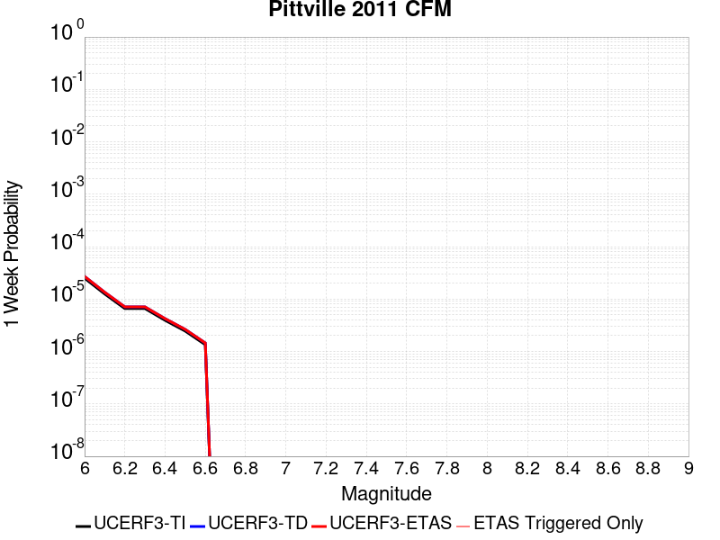 |  | 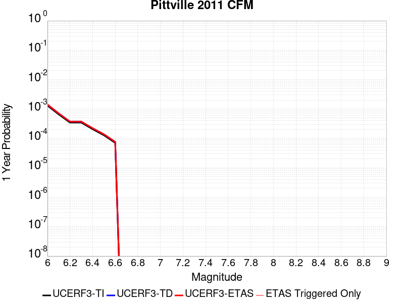 | 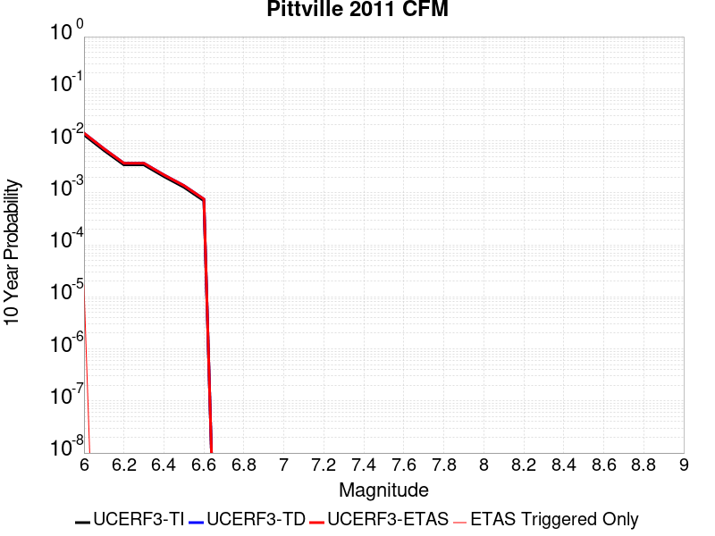 |

| Magnitude | 1 wk TI Prob | 1 wk TD Prob | 1 wk ETAS Prob | 1 wk ETAS/TD Gain | 1 wk ETAS Triggered Only | 1 mo TI Prob | 1 mo TD Prob | 1 mo ETAS Prob | 1 mo ETAS/TD Gain | 1 mo ETAS Triggered Only | 1 yr TI Prob | 1 yr TD Prob | 1 yr ETAS Prob | 1 yr ETAS/TD Gain | 1 yr ETAS Triggered Only | 10 yr TI Prob | 10 yr TD Prob | 10 yr ETAS Prob | 10 yr ETAS/TD Gain | 10 yr ETAS Triggered Only |
|-----|-----|-----|-----|-----|-----|-----|-----|-----|-----|-----|-----|-----|-----|-----|-----|-----|-----|-----|-----|-----|
| 6.0 | 2.5031832E-5 | 2.705726E-5 | 2.705726E-5 | 1.0 | 0.0 | 1.0727487E-4 | 1.1595508E-4 | 1.1595508E-4 | 1.0 | 0.0 | 0.001305289 | 0.0014109362 | 0.0014109362 | 1.0 | 0.0 | 0.012976485 | 0.014029565 | 0.014046164 | 1.0011832 | 1.6835016E-5 |
| 6.1 | 1.2540113E-5 | 1.3513205E-5 | 1.3513205E-5 | 1.0 | 0.0 | 5.3742235E-5 | 5.7912577E-5 | 5.7912577E-5 | 1.0 | 0.0 | 6.541153E-4 | 7.0488005E-4 | 7.0488005E-4 | 1.0 | 0.0 | 0.0065219323 | 0.0070286766 | 0.0070286766 | 1.0 | 0.0 |
| 6.2 | 6.603218E-6 | 7.107261E-6 | 7.107261E-6 | 1.0 | 0.0 | 2.8299199E-5 | 3.045937E-5 | 3.045937E-5 | 1.0 | 0.0 | 3.4448825E-4 | 3.7078623E-4 | 3.7078623E-4 | 1.0 | 0.0 | 0.0034395473 | 0.0037023167 | 0.0037023167 | 1.0 | 0.0 |
| 6.3 | 6.603218E-6 | 7.107261E-6 | 7.107261E-6 | 1.0 | 0.0 | 2.8299199E-5 | 3.045937E-5 | 3.045937E-5 | 1.0 | 0.0 | 3.4448825E-4 | 3.7078623E-4 | 3.7078623E-4 | 1.0 | 0.0 | 0.0034395473 | 0.0037023167 | 0.0037023167 | 1.0 | 0.0 |
| 6.4 | 3.9389015E-6 | 4.239218E-6 | 4.239218E-6 | 1.0 | 0.0 | 1.6880897E-5 | 1.8167968E-5 | 1.8167968E-5 | 1.0 | 0.0 | 2.0550552E-4 | 2.2117565E-4 | 2.2117565E-4 | 1.0 | 0.0 | 0.0020531558 | 0.0022098604 | 0.0022098604 | 1.0 | 0.0 |
| 6.5 | 2.4533072E-6 | 2.6412954E-6 | 2.6412954E-6 | 1.0 | 0.0 | 1.0514132E-5 | 1.1319799E-5 | 1.1319799E-5 | 1.0 | 0.0 | 1.2800204E-4 | 1.3781177E-4 | 1.3781177E-4 | 1.0 | 0.0 | 0.0012792832 | 0.0013774533 | 0.0013774533 | 1.0 | 0.0 |
| 6.6 | 1.3482367E-6 | 1.453008E-6 | 1.453008E-6 | 1.0 | 0.0 | 5.778144E-6 | 6.227169E-6 | 6.227169E-6 | 1.0 | 0.0 | 7.0346636E-5 | 7.581428E-5 | 7.581428E-5 | 1.0 | 0.0 | 7.032437E-4 | 7.5799524E-4 | 7.5799524E-4 | 1.0 | 0.0 |

## Fitzhugh Creek
*[(top)](#table-of-contents)*

| 1 Week | 1 Month | 1 Year | 10 Year |
|-----|-----|-----|-----|
| 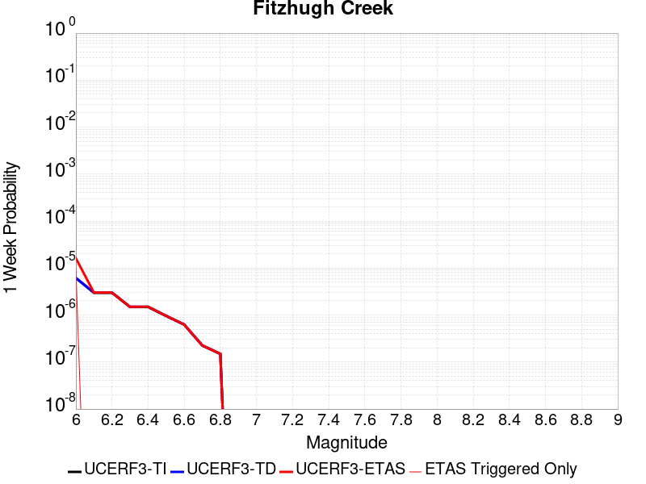 | 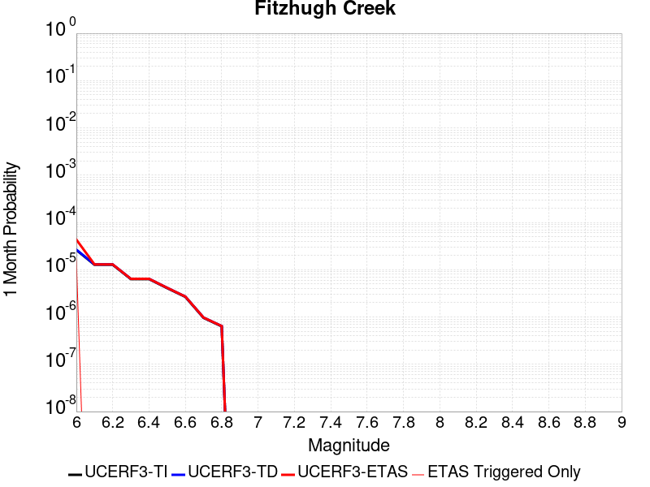 | 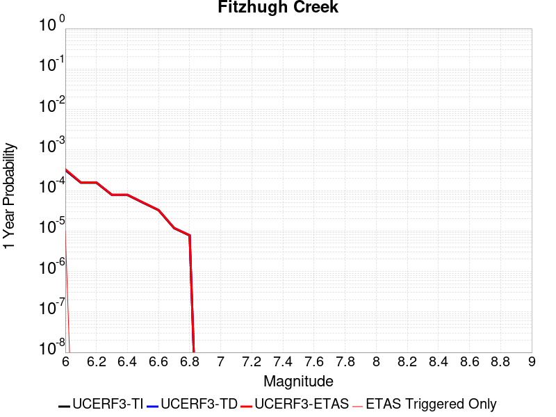 | 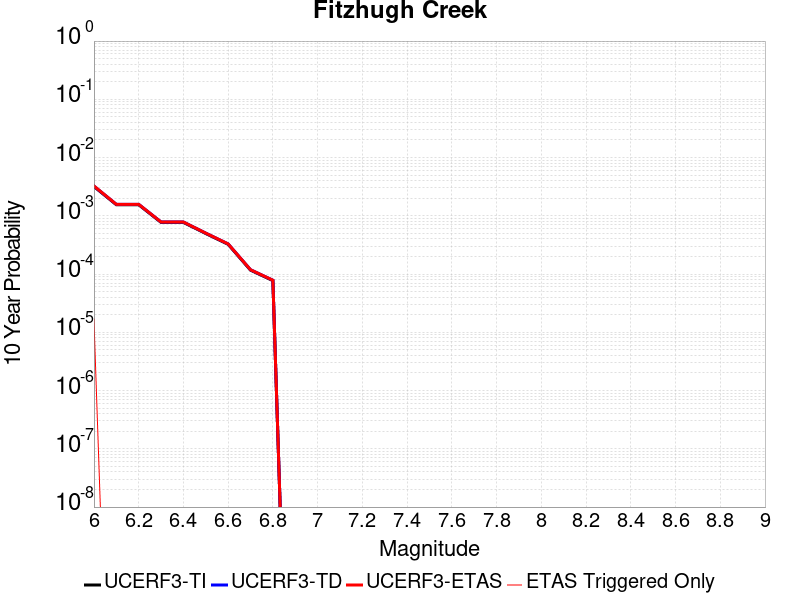 |

| Magnitude | 1 wk TI Prob | 1 wk TD Prob | 1 wk ETAS Prob | 1 wk ETAS/TD Gain | 1 wk ETAS Triggered Only | 1 mo TI Prob | 1 mo TD Prob | 1 mo ETAS Prob | 1 mo ETAS/TD Gain | 1 mo ETAS Triggered Only | 1 yr TI Prob | 1 yr TD Prob | 1 yr ETAS Prob | 1 yr ETAS/TD Gain | 1 yr ETAS Triggered Only | 10 yr TI Prob | 10 yr TD Prob | 10 yr ETAS Prob | 10 yr ETAS/TD Gain | 10 yr ETAS Triggered Only |
|-----|-----|-----|-----|-----|-----|-----|-----|-----|-----|-----|-----|-----|-----|-----|-----|-----|-----|-----|-----|-----|
| 6.0 | 6.1090436E-6 | 6.21017E-6 | 2.3045082E-5 | 3.710862 | 1.6835016E-5 | 2.6181353E-5 | 2.6614767E-5 | 4.3449334E-5 | 1.6325274 | 1.6835016E-5 | 3.1871133E-4 | 3.2399112E-4 | 3.4082067E-4 | 1.0519445 | 1.6835016E-5 | 0.0031825465 | 0.0032356316 | 0.0032524122 | 1.0051862 | 1.6835016E-5 |
| 6.1 | 2.9741811E-6 | 3.0215874E-6 | 3.0215874E-6 | 1.0 | 0.0 | 1.2746428E-5 | 1.2949601E-5 | 1.2949601E-5 | 1.0 | 0.0 | 1.5517672E-4 | 1.5765094E-4 | 1.5765094E-4 | 1.0 | 0.0 | 0.001550684 | 0.0015754839 | 0.0015754839 | 1.0 | 0.0 |
| 6.2 | 2.9741811E-6 | 3.0215874E-6 | 3.0215874E-6 | 1.0 | 0.0 | 1.2746428E-5 | 1.2949601E-5 | 1.2949601E-5 | 1.0 | 0.0 | 1.5517672E-4 | 1.5765094E-4 | 1.5765094E-4 | 1.0 | 0.0 | 0.001550684 | 0.0015754839 | 0.0015754839 | 1.0 | 0.0 |
| 6.3 | 1.4781198E-6 | 1.501274E-6 | 1.501274E-6 | 1.0 | 0.0 | 6.3347834E-6 | 6.4340165E-6 | 6.4340165E-6 | 1.0 | 0.0 | 7.712326E-5 | 7.833154E-5 | 7.833154E-5 | 1.0 | 0.0 | 7.70965E-4 | 7.830592E-4 | 7.830592E-4 | 1.0 | 0.0 |
| 6.4 | 1.4781198E-6 | 1.501274E-6 | 1.501274E-6 | 1.0 | 0.0 | 6.3347834E-6 | 6.4340165E-6 | 6.4340165E-6 | 1.0 | 0.0 | 7.712326E-5 | 7.833154E-5 | 7.833154E-5 | 1.0 | 0.0 | 7.70965E-4 | 7.830592E-4 | 7.830592E-4 | 1.0 | 0.0 |
| 6.5 | 9.5176676E-7 | 9.66608E-7 | 9.66608E-7 | 1.0 | 0.0 | 4.078994E-6 | 4.1425997E-6 | 4.1425997E-6 | 1.0 | 0.0 | 4.9660623E-5 | 5.043509E-5 | 5.043509E-5 | 1.0 | 0.0 | 4.964952E-4 | 5.0424685E-4 | 5.0424685E-4 | 1.0 | 0.0 |
| 6.6 | 6.21145E-7 | 6.3085986E-7 | 6.3085986E-7 | 1.0 | 0.0 | 2.662047E-6 | 2.7036829E-6 | 2.7036829E-6 | 1.0 | 0.0 | 3.2409942E-5 | 3.291691E-5 | 3.291691E-5 | 1.0 | 0.0 | 3.2405215E-4 | 3.291269E-4 | 3.291269E-4 | 1.0 | 0.0 |
| 6.7 | 2.2377962E-7 | 2.2734685E-7 | 2.2734685E-7 | 1.0 | 0.0 | 9.590551E-7 | 9.743434E-7 | 9.743434E-7 | 1.0 | 0.0 | 1.1676434E-5 | 1.18625985E-5 | 1.18625985E-5 | 1.0 | 0.0 | 1.1675821E-4 | 1.1862279E-4 | 1.1862279E-4 | 1.0 | 0.0 |
| 6.8 | 1.4785022E-7 | 1.5021524E-7 | 1.5021524E-7 | 1.0 | 0.0 | 6.3364365E-7 | 6.4377963E-7 | 6.4377963E-7 | 1.0 | 0.0 | 7.714584E-6 | 7.838016E-6 | 7.838016E-6 | 1.0 | 0.0 | 7.714316E-5 | 7.8380166E-5 | 7.8380166E-5 | 1.0 | 0.0 |

## Calaveras (So) 2011 CFM
*[(top)](#table-of-contents)*

| 1 Week | 1 Month | 1 Year | 10 Year |
|-----|-----|-----|-----|
| 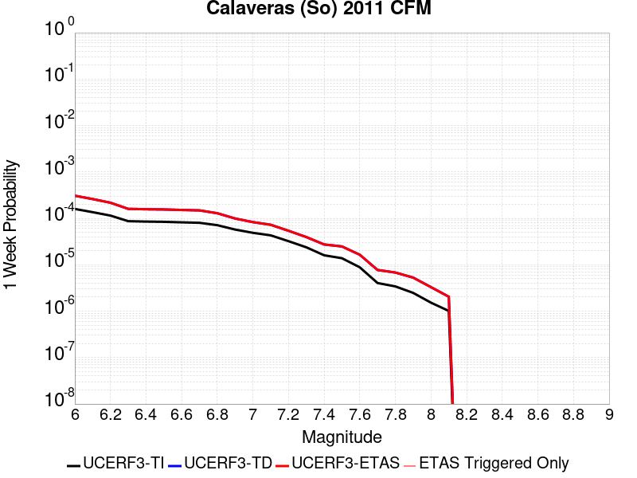 | 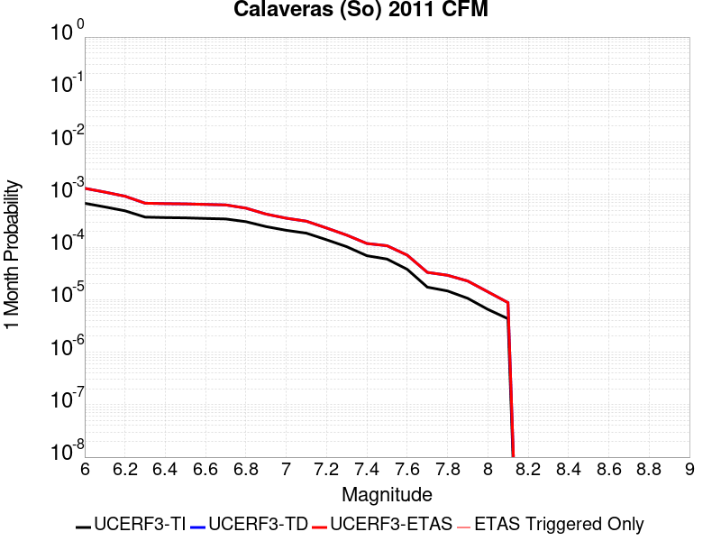 | 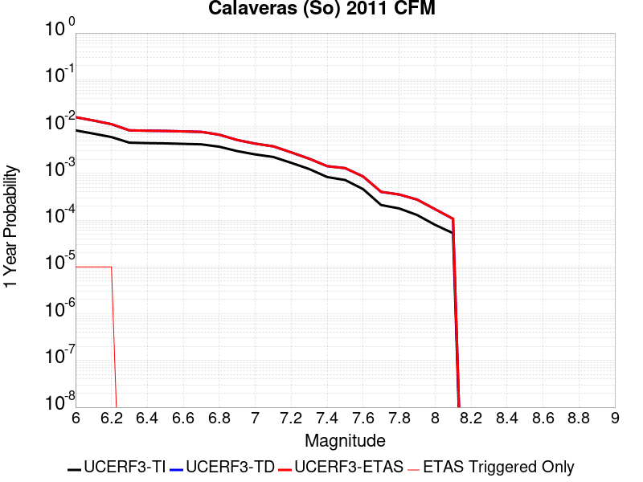 | 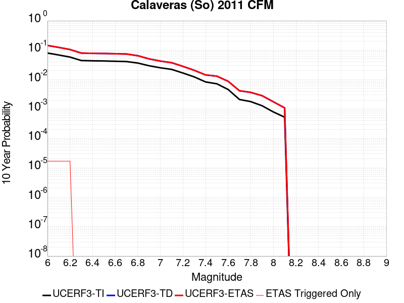 |

| Magnitude | 1 wk TI Prob | 1 wk TD Prob | 1 wk ETAS Prob | 1 wk ETAS/TD Gain | 1 wk ETAS Triggered Only | 1 mo TI Prob | 1 mo TD Prob | 1 mo ETAS Prob | 1 mo ETAS/TD Gain | 1 mo ETAS Triggered Only | 1 yr TI Prob | 1 yr TD Prob | 1 yr ETAS Prob | 1 yr ETAS/TD Gain | 1 yr ETAS Triggered Only | 10 yr TI Prob | 10 yr TD Prob | 10 yr ETAS Prob | 10 yr ETAS/TD Gain | 10 yr ETAS Triggered Only |
|-----|-----|-----|-----|-----|-----|-----|-----|-----|-----|-----|-----|-----|-----|-----|-----|-----|-----|-----|-----|-----|
| 6.0 | 1.5950744E-4 | 3.0719102E-4 | 3.0719102E-4 | 1.0 | 0.0 | 6.834242E-4 | 0.0013158836 | 0.0013158836 | 1.0 | 0.0 | 0.00828899 | 0.015860915 | 0.015877483 | 1.0010446 | 1.6835016E-5 | 0.079865426 | 0.14441721 | 0.14443162 | 1.0000998 | 1.6835016E-5 |
| 6.1 | 1.3584697E-4 | 2.604323E-4 | 2.604323E-4 | 1.0 | 0.0 | 5.8207137E-4 | 0.0011156795 | 0.0011156795 | 1.0 | 0.0 | 0.007063716 | 0.013463869 | 0.013480477 | 1.0012336 | 1.6835016E-5 | 0.06843361 | 0.124044694 | 0.12405944 | 1.0001189 | 1.6835016E-5 |
| 6.2 | 1.14676266E-4 | 2.1731424E-4 | 2.1731424E-4 | 1.0 | 0.0 | 4.9137714E-4 | 9.310301E-4 | 9.310301E-4 | 1.0 | 0.0 | 0.0059661185 | 0.01124721 | 0.011263856 | 1.00148 | 1.6835016E-5 | 0.058084648 | 0.10503508 | 0.105050154 | 1.0001434 | 1.6835016E-5 |
| 6.3 | 8.691518E-5 | 1.5990793E-4 | 1.5990793E-4 | 1.0 | 0.0 | 3.7244044E-4 | 6.851358E-4 | 6.851358E-4 | 1.0 | 0.0 | 0.004525038 | 0.008302716 | 0.008302716 | 1.0 | 0.0 | 0.044339992 | 0.079350494 | 0.079350494 | 1.0 | 0.0 |
| 6.4 | 8.50982E-5 | 1.5697183E-4 | 1.5697183E-4 | 1.0 | 0.0 | 3.646556E-4 | 6.725591E-4 | 6.725591E-4 | 1.0 | 0.0 | 0.0044306475 | 0.008150746 | 0.008150746 | 1.0 | 0.0 | 0.04343345 | 0.0779566 | 0.0779566 | 1.0 | 0.0 |
| 6.5 | 8.4062965E-5 | 1.5521735E-4 | 1.5521735E-4 | 1.0 | 0.0 | 3.602201E-4 | 6.650437E-4 | 6.650437E-4 | 1.0 | 0.0 | 0.004376863 | 0.008059946 | 0.008059946 | 1.0 | 0.0 | 0.042916555 | 0.07712786 | 0.07712786 | 1.0 | 0.0 |
| 6.6 | 8.194716E-5 | 1.5157646E-4 | 1.5157646E-4 | 1.0 | 0.0 | 3.5115483E-4 | 6.494477E-4 | 6.494477E-4 | 1.0 | 0.0 | 0.0042669317 | 0.007871782 | 0.007871782 | 1.0 | 0.0 | 0.04185927 | 0.075413086 | 0.075413086 | 1.0 | 0.0 |
| 6.7 | 8.012326E-5 | 1.4825336E-4 | 1.4825336E-4 | 1.0 | 0.0 | 3.433402E-4 | 6.3521386E-4 | 6.3521386E-4 | 1.0 | 0.0 | 0.004172157 | 0.0077002714 | 0.0077002714 | 1.0 | 0.0 | 0.040946912 | 0.073855184 | 0.073855184 | 1.0 | 0.0 |
| 6.8 | 7.119773E-5 | 1.2883788E-4 | 1.2883788E-4 | 1.0 | 0.0 | 3.0509746E-4 | 5.5204553E-4 | 5.5204553E-4 | 1.0 | 0.0 | 0.0037082357 | 0.0066975304 | 0.0066975304 | 1.0 | 0.0 | 0.036469642 | 0.064698465 | 0.064698465 | 1.0 | 0.0 |
| 6.9 | 5.7343088E-5 | 9.921204E-5 | 9.921204E-5 | 1.0 | 0.0 | 2.4573295E-4 | 4.2512562E-4 | 4.2512562E-4 | 1.0 | 0.0 | 0.0029876942 | 0.005163703 | 0.005163703 | 1.0 | 0.0 | 0.02947844 | 0.050519872 | 0.050519872 | 1.0 | 0.0 |
| 7.0 | 4.8746577E-5 | 8.286983E-5 | 8.286983E-5 | 1.0 | 0.0 | 2.0889717E-4 | 3.5510844E-4 | 3.5510844E-4 | 1.0 | 0.0 | 0.0025403565 | 0.004314941 | 0.004314941 | 1.0 | 0.0 | 0.025115121 | 0.042495564 | 0.042495564 | 1.0 | 0.0 |
| 7.1 | 4.2998014E-5 | 7.266396E-5 | 7.266396E-5 | 1.0 | 0.0 | 1.8426418E-4 | 3.1138014E-4 | 3.1138014E-4 | 1.0 | 0.0 | 0.002241108 | 0.0037845233 | 0.0037845233 | 1.0 | 0.0 | 0.022186412 | 0.03743038 | 0.03743038 | 1.0 | 0.0 |
| 7.2 | 3.221292E-5 | 5.3919634E-5 | 5.3919634E-5 | 1.0 | 0.0 | 1.3804805E-4 | 2.3106382E-4 | 2.3106382E-4 | 1.0 | 0.0 | 0.0016794393 | 0.002809601 | 0.002809601 | 1.0 | 0.0 | 0.016668037 | 0.0280428 | 0.0280428 | 1.0 | 0.0 |
| 7.3 | 2.3756531E-5 | 3.9484363E-5 | 3.9484363E-5 | 1.0 | 0.0 | 1.0180973E-4 | 1.6920782E-4 | 1.6920782E-4 | 1.0 | 0.0 | 0.0012388286 | 0.0020581756 | 0.0020581756 | 1.0 | 0.0 | 0.012319452 | 0.020649675 | 0.020649675 | 1.0 | 0.0 |
| 7.4 | 1.5997684E-5 | 2.7347376E-5 | 2.7347376E-5 | 1.0 | 0.0 | 6.8559704E-5 | 1.17197786E-4 | 1.17197786E-4 | 1.0 | 0.0 | 8.343947E-4 | 0.0014259516 | 0.0014259516 | 1.0 | 0.0 | 0.008312687 | 0.014379721 | 0.014379721 | 1.0 | 0.0 |
| 7.5 | 1.3814293E-5 | 2.4788933E-5 | 2.4788933E-5 | 1.0 | 0.0 | 5.9202768E-5 | 1.0623397E-4 | 1.0623397E-4 | 1.0 | 0.0 | 7.205553E-4 | 0.0012926336 | 0.0012926336 | 1.0 | 0.0 | 0.007182234 | 0.013058846 | 0.013058846 | 1.0 | 0.0 |
| 7.6 | 8.817309E-6 | 1.643521E-5 | 1.643521E-5 | 1.0 | 0.0 | 3.7787922E-5 | 7.043472E-5 | 7.043472E-5 | 1.0 | 0.0 | 4.5997082E-4 | 8.572067E-4 | 8.572067E-4 | 1.0 | 0.0 | 0.004590199 | 0.008722494 | 0.008722494 | 1.0 | 0.0 |
| 7.7 | 4.0352206E-6 | 7.711002E-6 | 7.711002E-6 | 1.0 | 0.0 | 1.7293689E-5 | 3.304673E-5 | 3.304673E-5 | 1.0 | 0.0 | 2.1053031E-4 | 4.0226974E-4 | 4.0226974E-4 | 1.0 | 0.0 | 0.0021033096 | 0.00416701 | 0.00416701 | 1.0 | 0.0 |
| 7.8 | 3.413169E-6 | 6.7905053E-6 | 6.7905053E-6 | 1.0 | 0.0 | 1.4627784E-5 | 2.910184E-5 | 2.910184E-5 | 1.0 | 0.0 | 1.7807873E-4 | 3.5425735E-4 | 3.5425735E-4 | 1.0 | 0.0 | 0.0017793609 | 0.0036680899 | 0.0036680899 | 1.0 | 0.0 |
| 7.9 | 2.4740732E-6 | 5.2815635E-6 | 5.2815635E-6 | 1.0 | 0.0 | 1.06031275E-5 | 2.2635075E-5 | 2.2635075E-5 | 1.0 | 0.0 | 1.2908543E-4 | 2.7554724E-4 | 2.7554724E-4 | 1.0 | 0.0 | 0.0012901047 | 0.0028359778 | 0.0028359778 | 1.0 | 0.0 |
| 8.0 | 1.5231818E-6 | 3.2903374E-6 | 3.2903374E-6 | 1.0 | 0.0 | 6.527906E-6 | 1.410137E-5 | 1.410137E-5 | 1.0 | 0.0 | 7.9474354E-5 | 1.7167069E-4 | 1.7167069E-4 | 1.0 | 0.0 | 7.944594E-4 | 0.0017571712 | 0.0017571712 | 1.0 | 0.0 |
| 8.1 | 1.0104524E-6 | 2.0467116E-6 | 2.0467116E-6 | 1.0 | 0.0 | 4.330503E-6 | 8.771593E-6 | 8.771593E-6 | 1.0 | 0.0 | 5.2722597E-5 | 1.0678893E-4 | 1.0678893E-4 | 1.0 | 0.0 | 5.271009E-4 | 0.0010934469 | 0.0010934469 | 1.0 | 0.0 |

## Del Valle
*[(top)](#table-of-contents)*

| 1 Week | 1 Month | 1 Year | 10 Year |
|-----|-----|-----|-----|
| 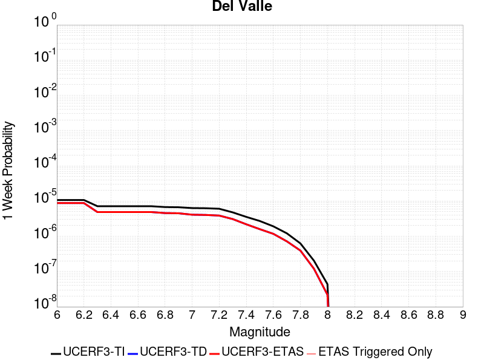 | 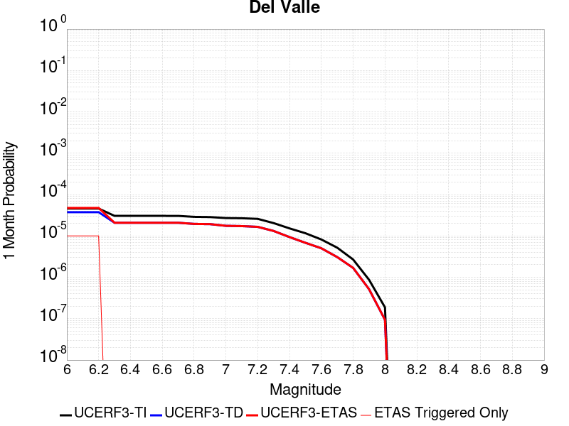 | 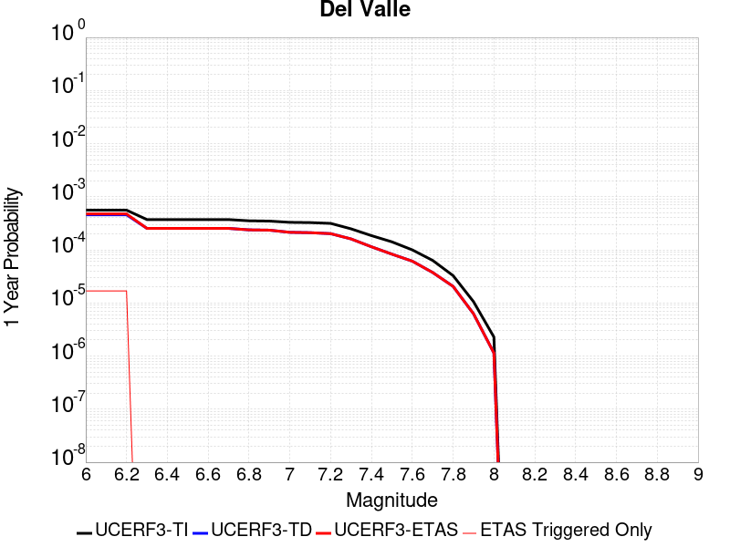 | 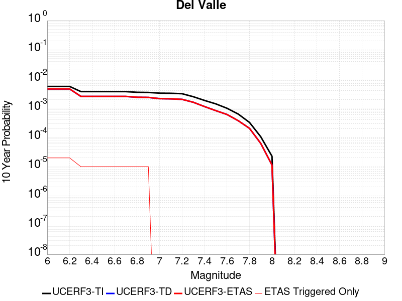 |

| Magnitude | 1 wk TI Prob | 1 wk TD Prob | 1 wk ETAS Prob | 1 wk ETAS/TD Gain | 1 wk ETAS Triggered Only | 1 mo TI Prob | 1 mo TD Prob | 1 mo ETAS Prob | 1 mo ETAS/TD Gain | 1 mo ETAS Triggered Only | 1 yr TI Prob | 1 yr TD Prob | 1 yr ETAS Prob | 1 yr ETAS/TD Gain | 1 yr ETAS Triggered Only | 10 yr TI Prob | 10 yr TD Prob | 10 yr ETAS Prob | 10 yr ETAS/TD Gain | 10 yr ETAS Triggered Only |
|-----|-----|-----|-----|-----|-----|-----|-----|-----|-----|-----|-----|-----|-----|-----|-----|-----|-----|-----|-----|-----|
| 6.0 | 1.0716125E-5 | 8.768052E-6 | 8.768052E-6 | 1.0 | 0.0 | 4.592544E-5 | 3.7576934E-5 | 5.441132E-5 | 1.4479978 | 1.6835016E-5 | 5.589988E-4 | 4.574229E-4 | 4.742502E-4 | 1.0367873 | 1.6835016E-5 | 0.0055759475 | 0.0045667686 | 0.004583527 | 1.0036696 | 1.6835016E-5 |
| 6.1 | 1.0716125E-5 | 8.768052E-6 | 8.768052E-6 | 1.0 | 0.0 | 4.592544E-5 | 3.7576934E-5 | 5.441132E-5 | 1.4479978 | 1.6835016E-5 | 5.589988E-4 | 4.574229E-4 | 4.742502E-4 | 1.0367873 | 1.6835016E-5 | 0.0055759475 | 0.0045667686 | 0.004583527 | 1.0036696 | 1.6835016E-5 |
| 6.2 | 1.0716125E-5 | 8.768052E-6 | 8.768052E-6 | 1.0 | 0.0 | 4.592544E-5 | 3.7576934E-5 | 5.441132E-5 | 1.4479978 | 1.6835016E-5 | 5.589988E-4 | 4.574229E-4 | 4.742502E-4 | 1.0367873 | 1.6835016E-5 | 0.0055759475 | 0.0045667686 | 0.004583527 | 1.0036696 | 1.6835016E-5 |
| 6.3 | 7.1293784E-6 | 4.865947E-6 | 4.865947E-6 | 1.0 | 0.0 | 3.055412E-5 | 2.0853897E-5 | 2.0853897E-5 | 1.0 | 0.0 | 3.7193293E-4 | 2.5386736E-4 | 2.5386736E-4 | 1.0 | 0.0 | 0.0037131102 | 0.0025358594 | 0.0025358594 | 1.0 | 0.0 |
| 6.4 | 7.1293784E-6 | 4.865947E-6 | 4.865947E-6 | 1.0 | 0.0 | 3.055412E-5 | 2.0853897E-5 | 2.0853897E-5 | 1.0 | 0.0 | 3.7193293E-4 | 2.5386736E-4 | 2.5386736E-4 | 1.0 | 0.0 | 0.0037131102 | 0.0025358594 | 0.0025358594 | 1.0 | 0.0 |
| 6.5 | 7.1293784E-6 | 4.865947E-6 | 4.865947E-6 | 1.0 | 0.0 | 3.055412E-5 | 2.0853897E-5 | 2.0853897E-5 | 1.0 | 0.0 | 3.7193293E-4 | 2.5386736E-4 | 2.5386736E-4 | 1.0 | 0.0 | 0.0037131102 | 0.0025358594 | 0.0025358594 | 1.0 | 0.0 |
| 6.6 | 7.1293784E-6 | 4.865947E-6 | 4.865947E-6 | 1.0 | 0.0 | 3.055412E-5 | 2.0853897E-5 | 2.0853897E-5 | 1.0 | 0.0 | 3.7193293E-4 | 2.5386736E-4 | 2.5386736E-4 | 1.0 | 0.0 | 0.0037131102 | 0.0025358594 | 0.0025358594 | 1.0 | 0.0 |
| 6.7 | 7.12272E-6 | 4.863323E-6 | 4.863323E-6 | 1.0 | 0.0 | 3.0525585E-5 | 2.084265E-5 | 2.084265E-5 | 1.0 | 0.0 | 3.7158563E-4 | 2.5373045E-4 | 2.5373045E-4 | 1.0 | 0.0 | 0.003709649 | 0.0025344936 | 0.0025344936 | 1.0 | 0.0 |
| 6.8 | 6.7558703E-6 | 4.5595193E-6 | 4.5595193E-6 | 1.0 | 0.0 | 2.895341E-5 | 1.9540656E-5 | 1.9540656E-5 | 1.0 | 0.0 | 3.5245073E-4 | 2.3788214E-4 | 2.3788214E-4 | 1.0 | 0.0 | 0.0035189227 | 0.0023763503 | 0.0023763503 | 1.0 | 0.0 |
| 6.9 | 6.6700386E-6 | 4.5026545E-6 | 4.5026545E-6 | 1.0 | 0.0 | 2.8585566E-5 | 1.9296951E-5 | 1.9296951E-5 | 1.0 | 0.0 | 3.479737E-4 | 2.3491567E-4 | 2.3491567E-4 | 1.0 | 0.0 | 0.003474293 | 0.0023467485 | 0.0023467485 | 1.0 | 0.0 |
| 7.0 | 6.3181424E-6 | 4.09881E-6 | 4.09881E-6 | 1.0 | 0.0 | 2.7077473E-5 | 1.7566214E-5 | 1.7566214E-5 | 1.0 | 0.0 | 3.2961834E-4 | 2.1384809E-4 | 2.1384809E-4 | 1.0 | 0.0 | 0.0032912986 | 0.002136478 | 0.002136478 | 1.0 | 0.0 |
| 7.1 | 6.248759E-6 | 4.034E-6 | 4.034E-6 | 1.0 | 0.0 | 2.678012E-5 | 1.728846E-5 | 1.728846E-5 | 1.0 | 0.0 | 3.2599916E-4 | 2.1046709E-4 | 2.1046709E-4 | 1.0 | 0.0 | 0.0032552136 | 0.002102732 | 0.002102732 | 1.0 | 0.0 |
| 7.2 | 6.0411944E-6 | 3.869988E-6 | 3.869988E-6 | 1.0 | 0.0 | 2.5890577E-5 | 1.6585562E-5 | 1.6585562E-5 | 1.0 | 0.0 | 3.1517216E-4 | 2.0191091E-4 | 2.0191091E-4 | 1.0 | 0.0 | 0.0031472554 | 0.002017328 | 0.002017328 | 1.0 | 0.0 |
| 7.3 | 4.7691183E-6 | 3.078193E-6 | 3.078193E-6 | 1.0 | 0.0 | 2.0438918E-5 | 1.319219E-5 | 1.319219E-5 | 1.0 | 0.0 | 2.488154E-4 | 1.6060329E-4 | 1.6060329E-4 | 1.0 | 0.0 | 0.00248537 | 0.0016048981 | 0.0016048981 | 1.0 | 0.0 |
| 7.4 | 3.5524722E-6 | 2.1893868E-6 | 2.1893868E-6 | 1.0 | 0.0 | 1.5224792E-5 | 9.383053E-6 | 9.383053E-6 | 1.0 | 0.0 | 1.8534607E-4 | 1.1423277E-4 | 1.1423277E-4 | 1.0 | 0.0 | 0.0018519156 | 0.0011417487 | 0.0011417487 | 1.0 | 0.0 |
| 7.5 | 2.7133442E-6 | 1.591647E-6 | 1.591647E-6 | 1.0 | 0.0 | 1.1628566E-5 | 6.8213267E-6 | 6.8213267E-6 | 1.0 | 0.0 | 1.415686E-4 | 8.304651E-5 | 8.304651E-5 | 1.0 | 0.0 | 0.0014147845 | 8.3015667E-4 | 8.3015667E-4 | 1.0 | 0.0 |
| 7.6 | 1.915338E-6 | 1.1739402E-6 | 1.1739402E-6 | 1.0 | 0.0 | 8.208566E-6 | 5.031163E-6 | 5.031163E-6 | 1.0 | 0.0 | 9.993471E-5 | 6.125269E-5 | 6.125269E-5 | 1.0 | 0.0 | 9.988978E-4 | 6.12359E-4 | 6.12359E-4 | 1.0 | 0.0 |
| 7.7 | 1.2120448E-6 | 7.1804885E-7 | 7.1804885E-7 | 1.0 | 0.0 | 5.194467E-6 | 3.0773488E-6 | 3.0773488E-6 | 1.0 | 0.0 | 6.3240805E-5 | 3.746608E-5 | 3.746608E-5 | 1.0 | 0.0 | 6.322281E-4 | 3.7459802E-4 | 3.7459802E-4 | 1.0 | 0.0 |
| 7.8 | 6.272381E-7 | 3.9326522E-7 | 3.9326522E-7 | 1.0 | 0.0 | 2.6881603E-6 | 1.6854212E-6 | 1.6854212E-6 | 1.0 | 0.0 | 3.272786E-5 | 2.0519812E-5 | 2.0519812E-5 | 1.0 | 0.0 | 3.272304E-4 | 2.0517933E-4 | 2.0517933E-4 | 1.0 | 0.0 |
| 7.9 | 2.0292627E-7 | 1.2005012E-7 | 1.2005012E-7 | 1.0 | 0.0 | 8.6968373E-7 | 5.145004E-7 | 5.145004E-7 | 1.0 | 0.0 | 1.0588348E-5 | 6.2640247E-6 | 6.2640247E-6 | 1.0 | 0.0 | 1.0587843E-4 | 6.26385E-5 | 6.26385E-5 | 1.0 | 0.0 |
| 8.0 | 4.374492E-8 | 2.1900798E-8 | 2.1900798E-8 | 1.0 | 0.0 | 1.8747821E-7 | 9.386056E-8 | 9.386056E-8 | 1.0 | 0.0 | 2.2825448E-6 | 1.1427518E-6 | 1.1427518E-6 | 1.0 | 0.0 | 2.2825214E-5 | 1.1427463E-5 | 1.1427463E-5 | 1.0 | 0.0 |

## Morales (West)
*[(top)](#table-of-contents)*

| 1 Week | 1 Month | 1 Year | 10 Year |
|-----|-----|-----|-----|
| 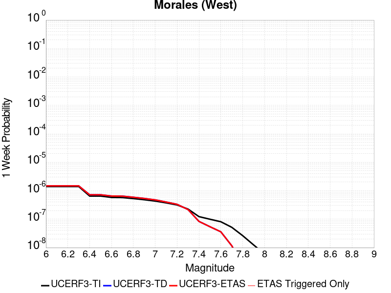 | 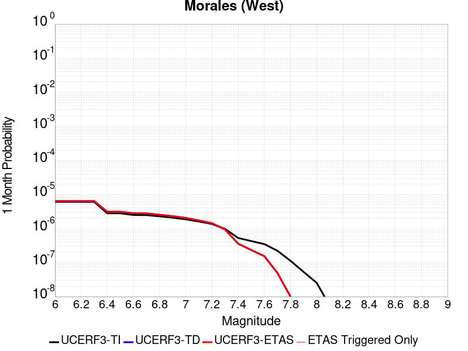 | 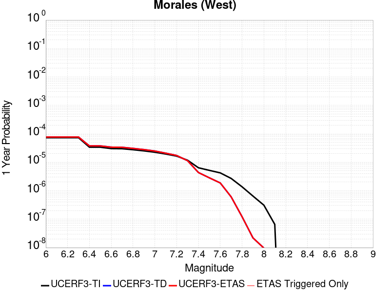 | 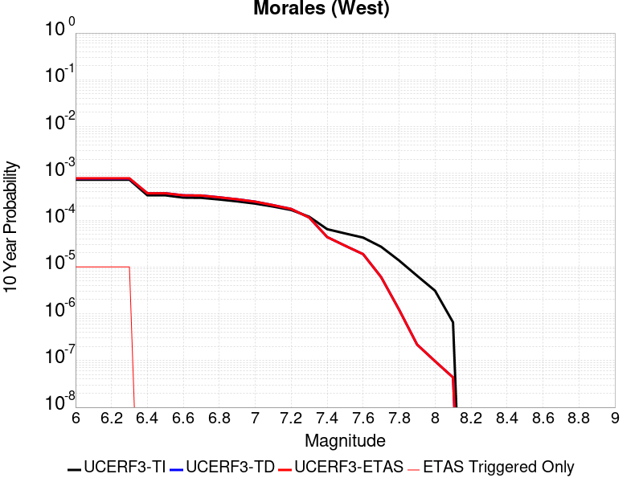 |

| Magnitude | 1 wk TI Prob | 1 wk TD Prob | 1 wk ETAS Prob | 1 wk ETAS/TD Gain | 1 wk ETAS Triggered Only | 1 mo TI Prob | 1 mo TD Prob | 1 mo ETAS Prob | 1 mo ETAS/TD Gain | 1 mo ETAS Triggered Only | 1 yr TI Prob | 1 yr TD Prob | 1 yr ETAS Prob | 1 yr ETAS/TD Gain | 1 yr ETAS Triggered Only | 10 yr TI Prob | 10 yr TD Prob | 10 yr ETAS Prob | 10 yr ETAS/TD Gain | 10 yr ETAS Triggered Only |
|-----|-----|-----|-----|-----|-----|-----|-----|-----|-----|-----|-----|-----|-----|-----|-----|-----|-----|-----|-----|-----|
| 6.0 | 1.4027072E-6 | 1.4792404E-6 | 1.4792404E-6 | 1.0 | 0.0 | 6.0115885E-6 | 6.33959E-6 | 6.33959E-6 | 1.0 | 0.0 | 7.318863E-5 | 7.718247E-5 | 7.718247E-5 | 1.0 | 0.0 | 7.316453E-4 | 7.716252E-4 | 7.884473E-4 | 1.0218008 | 1.6835016E-5 |
| 6.1 | 1.4027072E-6 | 1.4792404E-6 | 1.4792404E-6 | 1.0 | 0.0 | 6.0115885E-6 | 6.33959E-6 | 6.33959E-6 | 1.0 | 0.0 | 7.318863E-5 | 7.718247E-5 | 7.718247E-5 | 1.0 | 0.0 | 7.316453E-4 | 7.716252E-4 | 7.884473E-4 | 1.0218008 | 1.6835016E-5 |
| 6.2 | 1.4027072E-6 | 1.4792404E-6 | 1.4792404E-6 | 1.0 | 0.0 | 6.0115885E-6 | 6.33959E-6 | 6.33959E-6 | 1.0 | 0.0 | 7.318863E-5 | 7.718247E-5 | 7.718247E-5 | 1.0 | 0.0 | 7.316453E-4 | 7.716252E-4 | 7.884473E-4 | 1.0218008 | 1.6835016E-5 |
| 6.3 | 1.4027072E-6 | 1.4792404E-6 | 1.4792404E-6 | 1.0 | 0.0 | 6.0115885E-6 | 6.33959E-6 | 6.33959E-6 | 1.0 | 0.0 | 7.318863E-5 | 7.718247E-5 | 7.718247E-5 | 1.0 | 0.0 | 7.316453E-4 | 7.716252E-4 | 7.884473E-4 | 1.0218008 | 1.6835016E-5 |
| 6.4 | 6.504502E-7 | 7.2047004E-7 | 7.2047004E-7 | 1.0 | 0.0 | 2.7876408E-6 | 3.0877252E-6 | 3.0877252E-6 | 1.0 | 0.0 | 3.3939E-5 | 3.7592417E-5 | 3.7592417E-5 | 1.0 | 0.0 | 3.3933815E-4 | 3.7586177E-4 | 3.7586177E-4 | 1.0 | 0.0 |
| 6.5 | 6.504502E-7 | 7.2047004E-7 | 7.2047004E-7 | 1.0 | 0.0 | 2.7876408E-6 | 3.0877252E-6 | 3.0877252E-6 | 1.0 | 0.0 | 3.3939E-5 | 3.7592417E-5 | 3.7592417E-5 | 1.0 | 0.0 | 3.3933815E-4 | 3.7586177E-4 | 3.7586177E-4 | 1.0 | 0.0 |
| 6.6 | 5.8056526E-7 | 6.50096E-7 | 6.50096E-7 | 1.0 | 0.0 | 2.4881344E-6 | 2.7861226E-6 | 2.7861226E-6 | 1.0 | 0.0 | 3.0292615E-5 | 3.392052E-5 | 3.392052E-5 | 1.0 | 0.0 | 3.0288487E-4 | 3.3915407E-4 | 3.3915407E-4 | 1.0 | 0.0 |
| 6.7 | 5.741448E-7 | 6.436271E-7 | 6.436271E-7 | 1.0 | 0.0 | 2.4606184E-6 | 2.758399E-6 | 2.758399E-6 | 1.0 | 0.0 | 2.9957617E-5 | 3.3582997E-5 | 3.3582997E-5 | 1.0 | 0.0 | 2.9953578E-4 | 3.3577983E-4 | 3.3577983E-4 | 1.0 | 0.0 |
| 6.8 | 5.299428E-7 | 5.8916885E-7 | 5.8916885E-7 | 1.0 | 0.0 | 2.2711813E-6 | 2.525007E-6 | 2.525007E-6 | 1.0 | 0.0 | 2.7651282E-5 | 3.0741532E-5 | 3.0741532E-5 | 1.0 | 0.0 | 2.7647841E-4 | 3.0737327E-4 | 3.0737327E-4 | 1.0 | 0.0 |
| 6.9 | 4.82394E-7 | 5.3424463E-7 | 5.3424463E-7 | 1.0 | 0.0 | 2.0674013E-6 | 2.2896177E-6 | 2.2896177E-6 | 1.0 | 0.0 | 2.517032E-5 | 2.7875743E-5 | 2.7875743E-5 | 1.0 | 0.0 | 2.516747E-4 | 2.7872287E-4 | 2.7872287E-4 | 1.0 | 0.0 |
| 7.0 | 4.3264512E-7 | 4.760604E-7 | 4.760604E-7 | 1.0 | 0.0 | 1.8541921E-6 | 2.0402572E-6 | 2.0402572E-6 | 1.0 | 0.0 | 2.2574555E-5 | 2.4839852E-5 | 2.4839852E-5 | 1.0 | 0.0 | 2.2572262E-4 | 2.4837107E-4 | 2.4837107E-4 | 1.0 | 0.0 |
| 7.1 | 3.7388565E-7 | 4.0010724E-7 | 4.0010724E-7 | 1.0 | 0.0 | 1.6023661E-6 | 1.7147441E-6 | 1.7147441E-6 | 1.0 | 0.0 | 1.9508632E-5 | 2.0876812E-5 | 2.0876812E-5 | 1.0 | 0.0 | 1.950692E-4 | 2.0874874E-4 | 2.0874874E-4 | 1.0 | 0.0 |
| 7.2 | 3.1592543E-7 | 3.3205683E-7 | 3.3205683E-7 | 1.0 | 0.0 | 1.3539654E-6 | 1.4231E-6 | 1.4231E-6 | 1.0 | 0.0 | 1.6484404E-5 | 1.7326105E-5 | 1.7326105E-5 | 1.0 | 0.0 | 1.6483181E-4 | 1.7324772E-4 | 1.7324772E-4 | 1.0 | 0.0 |
| 7.3 | 2.2677783E-7 | 2.1799279E-7 | 2.1799279E-7 | 1.0 | 0.0 | 9.719047E-7 | 9.3425444E-7 | 9.3425444E-7 | 1.0 | 0.0 | 1.1832874E-5 | 1.1374489E-5 | 1.1374489E-5 | 1.0 | 0.0 | 1.18322445E-4 | 1.1373912E-4 | 1.1373912E-4 | 1.0 | 0.0 |
| 7.4 | 1.2295531E-7 | 8.35319E-8 | 8.35319E-8 | 1.0 | 0.0 | 5.269512E-7 | 3.5799383E-7 | 3.5799383E-7 | 1.0 | 0.0 | 6.4156125E-6 | 4.358566E-6 | 4.358566E-6 | 1.0 | 0.0 | 6.415427E-5 | 4.3584812E-5 | 4.3584812E-5 | 1.0 | 0.0 |
| 7.5 | 9.9632544E-8 | 5.444801E-8 | 5.444801E-8 | 1.0 | 0.0 | 4.2699656E-7 | 2.3334859E-7 | 2.3334859E-7 | 1.0 | 0.0 | 5.198671E-6 | 2.8410152E-6 | 2.8410152E-6 | 1.0 | 0.0 | 5.198549E-5 | 2.8409795E-5 | 2.8409795E-5 | 1.0 | 0.0 |
| 7.6 | 8.125894E-8 | 3.5962383E-8 | 3.5962383E-8 | 1.0 | 0.0 | 3.4825257E-7 | 1.5412449E-7 | 1.5412449E-7 | 1.0 | 0.0 | 4.2399665E-6 | 1.8764641E-6 | 1.8764641E-6 | 1.0 | 0.0 | 4.2398857E-5 | 1.8764487E-5 | 1.8764487E-5 | 1.0 | 0.0 |
| 7.7 | 5.1810765E-8 | 1.16496315E-8 | 1.16496315E-8 | 1.0 | 0.0 | 2.2204613E-7 | 4.9926992E-8 | 4.9926992E-8 | 1.0 | 0.0 | 2.7034082E-6 | 6.0786095E-7 | 6.0786095E-7 | 1.0 | 0.0 | 2.7033753E-5 | 6.078596E-6 | 6.078596E-6 | 1.0 | 0.0 |
| 7.8 | 2.6315043E-8 | 2.340597E-9 | 2.340597E-9 | 1.0 | 0.0 | 1.1277875E-7 | 1.0031131E-8 | 1.0031131E-8 | 1.0 | 0.0 | 1.3730804E-6 | 1.2212901E-7 | 1.2212901E-7 | 1.0 | 0.0 | 1.3730719E-5 | 1.2212922E-6 | 1.2212922E-6 | 1.0 | 0.0 |
| 7.9 | 1.24281545E-8 | 4.2132564E-10 | 4.2132564E-10 | 1.0 | 0.0 | 5.3263516E-8 | 1.8056812E-9 | 1.8056812E-9 | 1.0 | 0.0 | 6.4848314E-7 | 2.1984166E-8 | 2.1984166E-8 | 1.0 | 0.0 | 6.4848123E-6 | 2.1984445E-7 | 2.1984445E-7 | 1.0 | 0.0 |
| 8.0 | 5.954214E-9 | 1.8538215E-10 | 1.8538215E-10 | 1.0 | 0.0 | 2.551806E-8 | 7.9449325E-10 | 7.9449325E-10 | 1.0 | 0.0 | 3.1068234E-7 | 9.6729575E-9 | 9.6729575E-9 | 1.0 | 0.0 | 3.1068191E-6 | 9.673239E-8 | 9.673239E-8 | 1.0 | 0.0 |
| 8.1 | 1.2586262E-9 | 8.3580254E-11 | 8.3580254E-11 | 1.0 | 0.0 | 5.3941123E-9 | 3.5819936E-10 | 3.5819936E-10 | 1.0 | 0.0 | 6.567332E-8 | 4.3610777E-9 | 4.3610777E-9 | 1.0 | 0.0 | 6.56733E-7 | 4.3613593E-8 | 4.3613593E-8 | 1.0 | 0.0 |

## San Jacinto (Borrego)
*[(top)](#table-of-contents)*

| 1 Week | 1 Month | 1 Year | 10 Year |
|-----|-----|-----|-----|
| 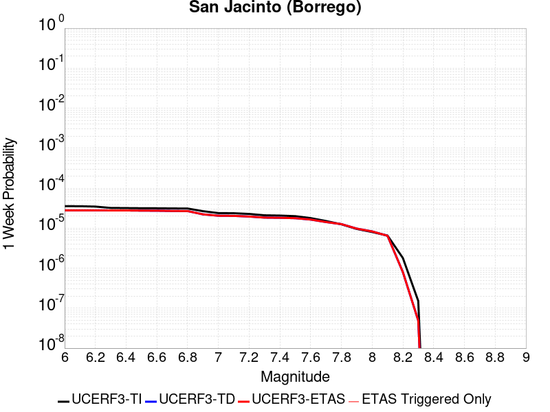 | 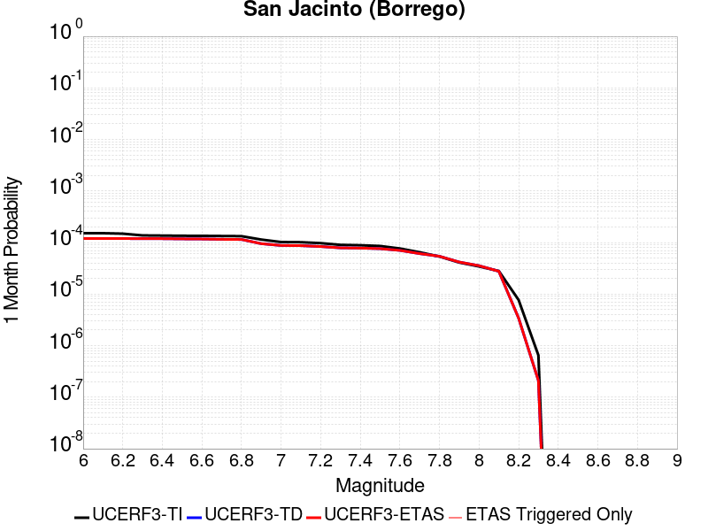 | 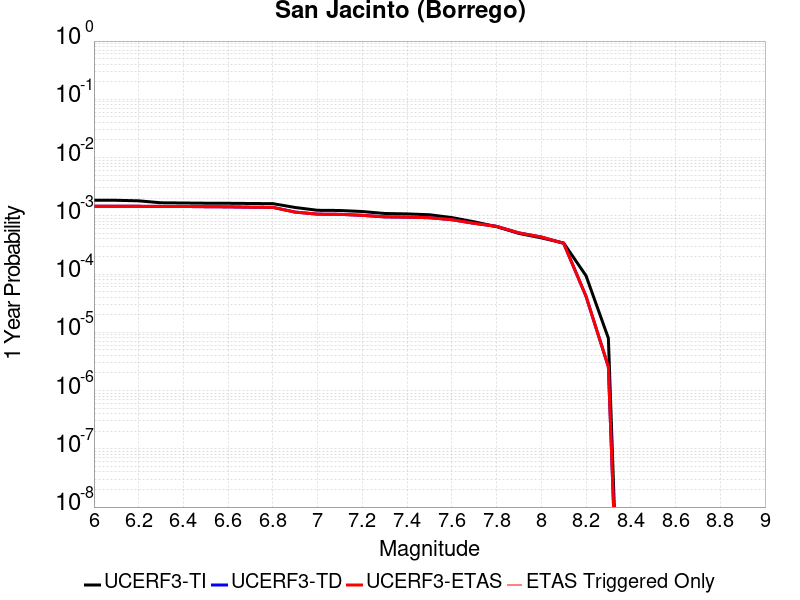 | 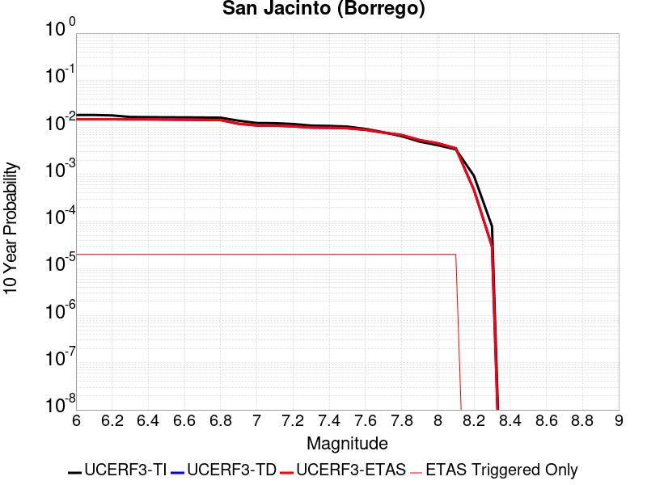 |

| Magnitude | 1 wk TI Prob | 1 wk TD Prob | 1 wk ETAS Prob | 1 wk ETAS/TD Gain | 1 wk ETAS Triggered Only | 1 mo TI Prob | 1 mo TD Prob | 1 mo ETAS Prob | 1 mo ETAS/TD Gain | 1 mo ETAS Triggered Only | 1 yr TI Prob | 1 yr TD Prob | 1 yr ETAS Prob | 1 yr ETAS/TD Gain | 1 yr ETAS Triggered Only | 10 yr TI Prob | 10 yr TD Prob | 10 yr ETAS Prob | 10 yr ETAS/TD Gain | 10 yr ETAS Triggered Only |
|-----|-----|-----|-----|-----|-----|-----|-----|-----|-----|-----|-----|-----|-----|-----|-----|-----|-----|-----|-----|-----|
| 6.0 | 3.543992E-5 | 2.7934115E-5 | 2.7934115E-5 | 1.0 | 0.0 | 1.5187653E-4 | 1.1971221E-4 | 1.1971221E-4 | 1.0 | 0.0 | 0.0018475284 | 0.001456534 | 0.001456534 | 1.0 | 0.0 | 0.018322436 | 0.014873597 | 0.014890181 | 1.0011151 | 1.6835016E-5 |
| 6.1 | 3.542281E-5 | 2.7934115E-5 | 2.7934115E-5 | 1.0 | 0.0 | 1.5180321E-4 | 1.1971221E-4 | 1.1971221E-4 | 1.0 | 0.0 | 0.0018466372 | 0.001456534 | 0.001456534 | 1.0 | 0.0 | 0.018313672 | 0.014873597 | 0.014890181 | 1.0011151 | 1.6835016E-5 |
| 6.2 | 3.4688688E-5 | 2.7934115E-5 | 2.7934115E-5 | 1.0 | 0.0 | 1.4865733E-4 | 1.1971221E-4 | 1.1971221E-4 | 1.0 | 0.0 | 0.0018084005 | 0.0014565339 | 0.0014565339 | 1.0 | 0.0 | 0.017937548 | 0.014873596 | 0.014890181 | 1.0011151 | 1.6835016E-5 |
| 6.3 | 3.2087122E-5 | 2.7779462E-5 | 2.7779462E-5 | 1.0 | 0.0 | 1.3750899E-4 | 1.1904947E-4 | 1.1904947E-4 | 1.0 | 0.0 | 0.0016728862 | 0.0014484759 | 0.0014484759 | 1.0 | 0.0 | 0.016603488 | 0.01479463 | 0.014811216 | 1.001121 | 1.6835016E-5 |
| 6.4 | 3.1828724E-5 | 2.7746448E-5 | 2.7746448E-5 | 1.0 | 0.0 | 1.364017E-4 | 1.18908E-4 | 1.18908E-4 | 1.0 | 0.0 | 0.0016594254 | 0.0014467557 | 0.0014467557 | 1.0 | 0.0 | 0.016470885 | 0.014777708 | 0.014794294 | 1.0011224 | 1.6835016E-5 |
| 6.5 | 3.1563577E-5 | 2.7486154E-5 | 2.7486154E-5 | 1.0 | 0.0 | 1.3526545E-4 | 1.1779256E-4 | 1.1779256E-4 | 1.0 | 0.0 | 0.0016456128 | 0.0014331931 | 0.0014331931 | 1.0 | 0.0 | 0.0163348 | 0.014644288 | 0.014660877 | 1.0011327 | 1.6835016E-5 |
| 6.6 | 3.1467625E-5 | 2.7330374E-5 | 2.7330374E-5 | 1.0 | 0.0 | 1.3485427E-4 | 1.1712498E-4 | 1.1712498E-4 | 1.0 | 0.0 | 0.0016406142 | 0.001425076 | 0.001425076 | 1.0 | 0.0 | 0.016285548 | 0.014564533 | 0.014581122 | 1.001139 | 1.6835016E-5 |
| 6.7 | 3.1223695E-5 | 2.6948383E-5 | 2.6948383E-5 | 1.0 | 0.0 | 1.3380898E-4 | 1.1548802E-4 | 1.1548802E-4 | 1.0 | 0.0 | 0.0016279068 | 0.0014051719 | 0.0014051719 | 1.0 | 0.0 | 0.01616033 | 0.014368899 | 0.014385493 | 1.0011548 | 1.6835016E-5 |
| 6.8 | 3.1015585E-5 | 2.6769376E-5 | 2.6769376E-5 | 1.0 | 0.0 | 1.3291716E-4 | 1.14720926E-4 | 1.14720926E-4 | 1.0 | 0.0 | 0.001617065 | 0.0013958444 | 0.0013958444 | 1.0 | 0.0 | 0.016053487 | 0.014276173 | 0.014292767 | 1.0011624 | 1.6835016E-5 |
| 6.9 | 2.6641965E-5 | 2.2191349E-5 | 2.2191349E-5 | 1.0 | 0.0 | 1.1417485E-4 | 9.510233E-5 | 9.510233E-5 | 1.0 | 0.0 | 0.0013891924 | 0.0011572598 | 0.0011572598 | 1.0 | 0.0 | 0.0138054015 | 0.011886145 | 0.011902779 | 1.0013995 | 1.6835016E-5 |
| 7.0 | 2.3854353E-5 | 2.048587E-5 | 2.048587E-5 | 1.0 | 0.0 | 1.02228936E-4 | 8.779365E-5 | 8.779365E-5 | 1.0 | 0.0 | 0.0012439266 | 0.0010683661 | 0.0010683661 | 1.0 | 0.0 | 0.012369866 | 0.010986375 | 0.011003025 | 1.0015155 | 1.6835016E-5 |
| 7.1 | 2.3672901E-5 | 2.032235E-5 | 2.032235E-5 | 1.0 | 0.0 | 1.0145135E-4 | 8.709289E-5 | 8.709289E-5 | 1.0 | 0.0 | 0.0012344702 | 0.0010598428 | 0.0010598428 | 1.0 | 0.0 | 0.0122763505 | 0.010901547 | 0.010918198 | 1.0015274 | 1.6835016E-5 |
| 7.2 | 2.2717244E-5 | 1.9549674E-5 | 1.9549674E-5 | 1.0 | 0.0 | 9.735599E-5 | 8.378164E-5 | 8.378164E-5 | 1.0 | 0.0 | 0.0011846646 | 0.0010195666 | 0.0010195666 | 1.0 | 0.0 | 0.01178369 | 0.010498884 | 0.010515543 | 1.0015867 | 1.6835016E-5 |
| 7.3 | 2.1016205E-5 | 1.8391213E-5 | 1.8391213E-5 | 1.0 | 0.0 | 9.006634E-5 | 7.881711E-5 | 7.881711E-5 | 1.0 | 0.0 | 0.001096006 | 9.5917797E-4 | 9.5917797E-4 | 1.0 | 0.0 | 0.010906163 | 0.009894462 | 0.00991113 | 1.0016847 | 1.6835016E-5 |
| 7.4 | 2.0683625E-5 | 1.8193714E-5 | 1.8193714E-5 | 1.0 | 0.0 | 8.86411E-5 | 7.797074E-5 | 7.797074E-5 | 1.0 | 0.0 | 0.001078671 | 9.488824E-4 | 9.488824E-4 | 1.0 | 0.0 | 0.010734501 | 0.009791178 | 0.009807847 | 1.0017025 | 1.6835016E-5 |
| 7.5 | 1.9993966E-5 | 1.7788683E-5 | 1.7788683E-5 | 1.0 | 0.0 | 8.568561E-5 | 7.6234996E-5 | 7.6234996E-5 | 1.0 | 0.0 | 0.001042723 | 9.2776783E-4 | 9.2776783E-4 | 1.0 | 0.0 | 0.010378438 | 0.00957807 | 0.009594744 | 1.0017408 | 1.6835016E-5 |
| 7.6 | 1.788966E-5 | 1.6441732E-5 | 1.6441732E-5 | 1.0 | 0.0 | 7.666772E-5 | 7.046267E-5 | 7.046267E-5 | 1.0 | 0.0 | 9.3302975E-4 | 8.575471E-4 | 8.575471E-4 | 1.0 | 0.0 | 0.00929122 | 0.0088698575 | 0.008886543 | 1.0018811 | 1.6835016E-5 |
| 7.7 | 1.5125781E-5 | 1.4243621E-5 | 1.4243621E-5 | 1.0 | 0.0 | 6.4823165E-5 | 6.1042665E-5 | 6.1042665E-5 | 1.0 | 0.0 | 7.889362E-4 | 7.4294186E-4 | 7.4294186E-4 | 1.0 | 0.0 | 0.007861412 | 0.0077174758 | 0.007734181 | 1.0021646 | 1.6835016E-5 |
| 7.8 | 1.250089E-5 | 1.2636515E-5 | 1.2636515E-5 | 1.0 | 0.0 | 5.3574146E-5 | 5.415537E-5 | 5.415537E-5 | 1.0 | 0.0 | 6.5207E-4 | 6.591428E-4 | 6.591428E-4 | 1.0 | 0.0 | 0.006501599 | 0.00687092 | 0.006887639 | 1.0024333 | 1.6835016E-5 |
| 7.9 | 9.561E-6 | 9.759914E-6 | 9.759914E-6 | 1.0 | 0.0 | 4.0975072E-5 | 4.1827538E-5 | 4.1827538E-5 | 1.0 | 0.0 | 4.987573E-4 | 5.091318E-4 | 5.091318E-4 | 1.0 | 0.0 | 0.0049763937 | 0.0053551346 | 0.0053718793 | 1.0031269 | 1.6835016E-5 |
| 8.0 | 8.01699E-6 | 8.2982915E-6 | 8.2982915E-6 | 1.0 | 0.0 | 3.4358076E-5 | 3.5563622E-5 | 3.5563622E-5 | 1.0 | 0.0 | 4.1822926E-4 | 4.329016E-4 | 4.329016E-4 | 1.0 | 0.0 | 0.0041744304 | 0.0045759073 | 0.004592665 | 1.0036622 | 1.6835016E-5 |
| 8.1 | 6.541947E-6 | 6.466171E-6 | 6.466171E-6 | 1.0 | 0.0 | 2.8036617E-5 | 2.7711869E-5 | 2.7711869E-5 | 1.0 | 0.0 | 3.4129233E-4 | 3.3734026E-4 | 3.3734026E-4 | 1.0 | 0.0 | 0.0034076865 | 0.0035827826 | 0.0035995573 | 1.0046821 | 1.6835016E-5 |
| 8.2 | 1.7968189E-6 | 7.978815E-7 | 7.978815E-7 | 1.0 | 0.0 | 7.70063E-6 | 3.419488E-6 | 3.419488E-6 | 1.0 | 0.0 | 9.3751136E-5 | 4.163149E-5 | 4.163149E-5 | 1.0 | 0.0 | 9.371159E-4 | 4.7162327E-4 | 4.7162327E-4 | 1.0 | 0.0 |
| 8.3 | 1.5167889E-7 | 4.9030522E-8 | 4.9030522E-8 | 1.0 | 0.0 | 6.500522E-7 | 2.1013079E-7 | 2.1013079E-7 | 1.0 | 0.0 | 7.9143565E-6 | 2.55834E-6 | 2.55834E-6 | 1.0 | 0.0 | 7.914075E-5 | 2.9725656E-5 | 2.9725656E-5 | 1.0 | 0.0 |

## Burnt Mtn
*[(top)](#table-of-contents)*

| 1 Week | 1 Month | 1 Year | 10 Year |
|-----|-----|-----|-----|
|  |  | 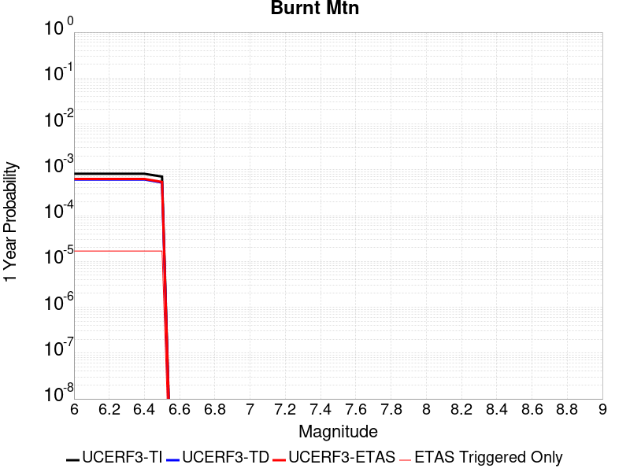 | 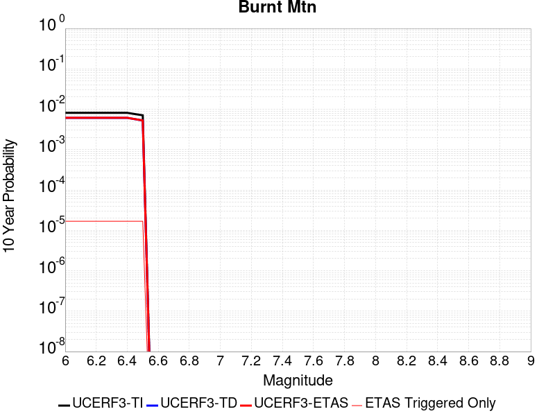 |

| Magnitude | 1 wk TI Prob | 1 wk TD Prob | 1 wk ETAS Prob | 1 wk ETAS/TD Gain | 1 wk ETAS Triggered Only | 1 mo TI Prob | 1 mo TD Prob | 1 mo ETAS Prob | 1 mo ETAS/TD Gain | 1 mo ETAS Triggered Only | 1 yr TI Prob | 1 yr TD Prob | 1 yr ETAS Prob | 1 yr ETAS/TD Gain | 1 yr ETAS Triggered Only | 10 yr TI Prob | 10 yr TD Prob | 10 yr ETAS Prob | 10 yr ETAS/TD Gain | 10 yr ETAS Triggered Only |
|-----|-----|-----|-----|-----|-----|-----|-----|-----|-----|-----|-----|-----|-----|-----|-----|-----|-----|-----|-----|-----|
| 6.0 | 1.5673151E-5 | 1.1749579E-5 | 1.1749579E-5 | 1.0 | 0.0 | 6.716892E-5 | 5.0355095E-5 | 5.0355095E-5 | 1.0 | 0.0 | 8.1747473E-4 | 6.130297E-4 | 6.298544E-4 | 1.0274452 | 1.6835016E-5 | 0.008144741 | 0.0061260276 | 0.006142759 | 1.0027313 | 1.6835016E-5 |
| 6.1 | 1.5673151E-5 | 1.1749579E-5 | 1.1749579E-5 | 1.0 | 0.0 | 6.716892E-5 | 5.0355095E-5 | 5.0355095E-5 | 1.0 | 0.0 | 8.1747473E-4 | 6.130297E-4 | 6.298544E-4 | 1.0274452 | 1.6835016E-5 | 0.008144741 | 0.0061260276 | 0.006142759 | 1.0027313 | 1.6835016E-5 |
| 6.2 | 1.5673151E-5 | 1.1749579E-5 | 1.1749579E-5 | 1.0 | 0.0 | 6.716892E-5 | 5.0355095E-5 | 5.0355095E-5 | 1.0 | 0.0 | 8.1747473E-4 | 6.130297E-4 | 6.298544E-4 | 1.0274452 | 1.6835016E-5 | 0.008144741 | 0.0061260276 | 0.006142759 | 1.0027313 | 1.6835016E-5 |
| 6.3 | 1.5673151E-5 | 1.1749579E-5 | 1.1749579E-5 | 1.0 | 0.0 | 6.716892E-5 | 5.0355095E-5 | 5.0355095E-5 | 1.0 | 0.0 | 8.1747473E-4 | 6.130297E-4 | 6.298544E-4 | 1.0274452 | 1.6835016E-5 | 0.008144741 | 0.0061260276 | 0.006142759 | 1.0027313 | 1.6835016E-5 |
| 6.4 | 1.5673151E-5 | 1.1749579E-5 | 1.1749579E-5 | 1.0 | 0.0 | 6.716892E-5 | 5.0355095E-5 | 5.0355095E-5 | 1.0 | 0.0 | 8.1747473E-4 | 6.130297E-4 | 6.298544E-4 | 1.0274452 | 1.6835016E-5 | 0.008144741 | 0.0061260276 | 0.006142759 | 1.0027313 | 1.6835016E-5 |
| 6.5 | 1.36191375E-5 | 1.0078436E-5 | 1.0078436E-5 | 1.0 | 0.0 | 5.8366426E-5 | 4.3193297E-5 | 4.3193297E-5 | 1.0 | 0.0 | 7.103795E-4 | 5.258784E-4 | 5.4270454E-4 | 1.0319963 | 1.6835016E-5 | 0.0070811296 | 0.005258784 | 0.0052755303 | 1.0031844 | 1.6835016E-5 |

## Carson Range (Genoa)
*[(top)](#table-of-contents)*

| 1 Week | 1 Month | 1 Year | 10 Year |
|-----|-----|-----|-----|
| 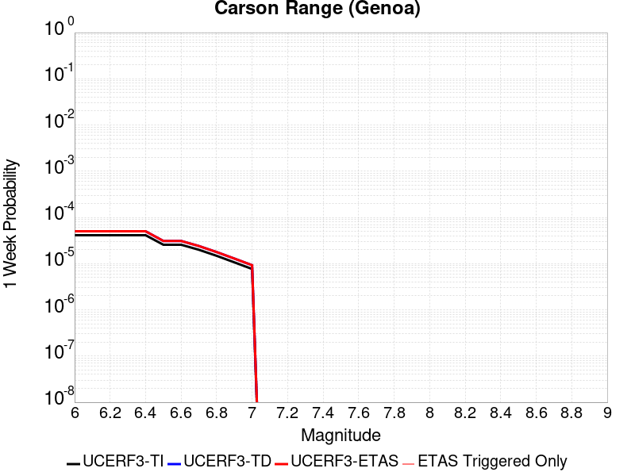 |  | 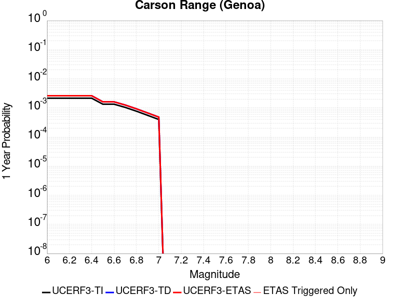 | 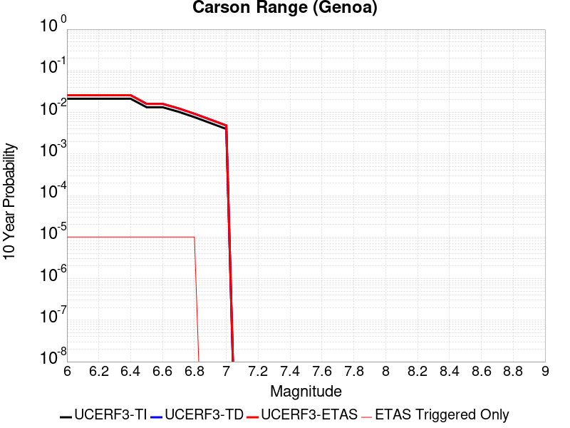 |

| Magnitude | 1 wk TI Prob | 1 wk TD Prob | 1 wk ETAS Prob | 1 wk ETAS/TD Gain | 1 wk ETAS Triggered Only | 1 mo TI Prob | 1 mo TD Prob | 1 mo ETAS Prob | 1 mo ETAS/TD Gain | 1 mo ETAS Triggered Only | 1 yr TI Prob | 1 yr TD Prob | 1 yr ETAS Prob | 1 yr ETAS/TD Gain | 1 yr ETAS Triggered Only | 10 yr TI Prob | 10 yr TD Prob | 10 yr ETAS Prob | 10 yr ETAS/TD Gain | 10 yr ETAS Triggered Only |
|-----|-----|-----|-----|-----|-----|-----|-----|-----|-----|-----|-----|-----|-----|-----|-----|-----|-----|-----|-----|-----|
| 6.0 | 4.1268457E-5 | 5.0148326E-5 | 5.0148326E-5 | 1.0 | 0.0 | 1.7685282E-4 | 2.1490594E-4 | 2.1490594E-4 | 1.0 | 0.0 | 0.0021510567 | 0.0026137296 | 0.0026137296 | 1.0 | 0.0 | 0.02130354 | 0.025869545 | 0.025885943 | 1.000634 | 1.6835016E-5 |
| 6.1 | 4.1268457E-5 | 5.0148326E-5 | 5.0148326E-5 | 1.0 | 0.0 | 1.7685282E-4 | 2.1490594E-4 | 2.1490594E-4 | 1.0 | 0.0 | 0.0021510567 | 0.0026137296 | 0.0026137296 | 1.0 | 0.0 | 0.02130354 | 0.025869545 | 0.025885943 | 1.000634 | 1.6835016E-5 |
| 6.2 | 4.1268457E-5 | 5.0148326E-5 | 5.0148326E-5 | 1.0 | 0.0 | 1.7685282E-4 | 2.1490594E-4 | 2.1490594E-4 | 1.0 | 0.0 | 0.0021510567 | 0.0026137296 | 0.0026137296 | 1.0 | 0.0 | 0.02130354 | 0.025869545 | 0.025885943 | 1.000634 | 1.6835016E-5 |
| 6.3 | 4.1268457E-5 | 5.0148326E-5 | 5.0148326E-5 | 1.0 | 0.0 | 1.7685282E-4 | 2.1490594E-4 | 2.1490594E-4 | 1.0 | 0.0 | 0.0021510567 | 0.0026137296 | 0.0026137296 | 1.0 | 0.0 | 0.02130354 | 0.025869545 | 0.025885943 | 1.000634 | 1.6835016E-5 |
| 6.4 | 4.1268457E-5 | 5.0148326E-5 | 5.0148326E-5 | 1.0 | 0.0 | 1.7685282E-4 | 2.1490594E-4 | 2.1490594E-4 | 1.0 | 0.0 | 0.0021510567 | 0.0026137296 | 0.0026137296 | 1.0 | 0.0 | 0.02130354 | 0.025869545 | 0.025885943 | 1.000634 | 1.6835016E-5 |
| 6.5 | 2.5677185E-5 | 3.0979143E-5 | 3.0979143E-5 | 1.0 | 0.0 | 1.1004044E-4 | 1.3276203E-4 | 1.3276203E-4 | 1.0 | 0.0 | 0.0013389189 | 0.0016153576 | 0.0016153576 | 1.0 | 0.0 | 0.0133088045 | 0.016054086 | 0.01607065 | 1.0010318 | 1.6835016E-5 |
| 6.6 | 2.5677185E-5 | 3.0979143E-5 | 3.0979143E-5 | 1.0 | 0.0 | 1.1004044E-4 | 1.3276203E-4 | 1.3276203E-4 | 1.0 | 0.0 | 0.0013389189 | 0.0016153576 | 0.0016153576 | 1.0 | 0.0 | 0.0133088045 | 0.016054086 | 0.01607065 | 1.0010318 | 1.6835016E-5 |
| 6.7 | 1.9969408E-5 | 2.4064126E-5 | 2.4064126E-5 | 1.0 | 0.0 | 8.558037E-5 | 1.0312876E-4 | 1.0312876E-4 | 1.0 | 0.0 | 0.0010414429 | 0.001255023 | 0.001255023 | 1.0 | 0.0 | 0.010365757 | 0.012494512 | 0.012511136 | 1.0013306 | 1.6835016E-5 |
| 6.8 | 1.4783156E-5 | 1.7818053E-5 | 1.7818053E-5 | 1.0 | 0.0 | 6.335485E-5 | 7.636158E-5 | 7.636158E-5 | 1.0 | 0.0 | 7.710722E-4 | 9.2943595E-4 | 9.2943595E-4 | 1.0 | 0.0 | 0.0076840227 | 0.009268275 | 0.0092849545 | 1.0017996 | 1.6835016E-5 |
| 6.9 | 1.06660555E-5 | 1.287738E-5 | 1.287738E-5 | 1.0 | 0.0 | 4.5710865E-5 | 5.5188255E-5 | 5.5188255E-5 | 1.0 | 0.0 | 5.5638765E-4 | 6.718251E-4 | 6.718251E-4 | 1.0 | 0.0 | 0.005549967 | 0.00670924 | 0.00670924 | 1.0 | 0.0 |
| 7.0 | 7.664838E-6 | 9.2585615E-6 | 9.2585615E-6 | 1.0 | 0.0 | 3.2848893E-5 | 3.967955E-5 | 3.967955E-5 | 1.0 | 0.0 | 3.998619E-4 | 4.8309853E-4 | 4.8309853E-4 | 1.0 | 0.0 | 0.0039914316 | 0.004830983 | 0.004830983 | 1.0 | 0.0 |

## Franklin 2011 CFM
*[(top)](#table-of-contents)*

| 1 Week | 1 Month | 1 Year | 10 Year |
|-----|-----|-----|-----|
| 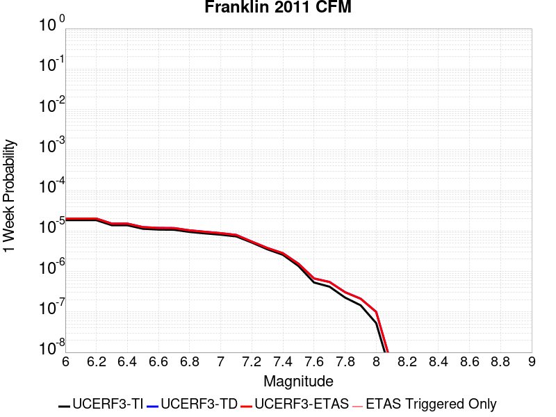 | 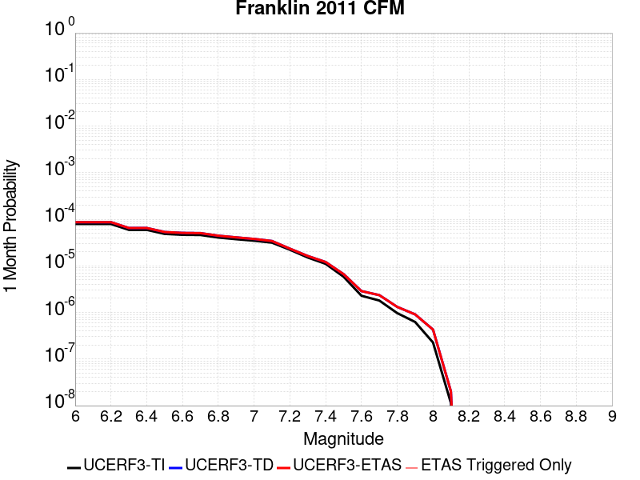 | 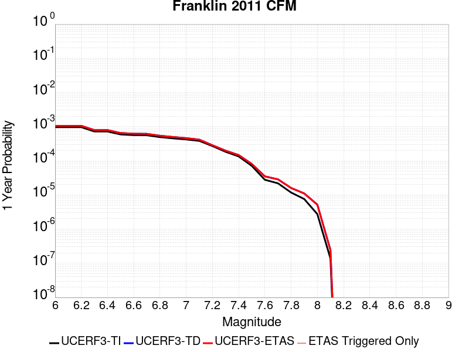 | 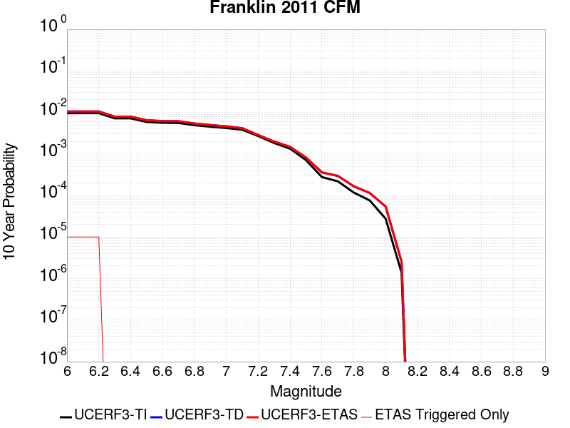 |

| Magnitude | 1 wk TI Prob | 1 wk TD Prob | 1 wk ETAS Prob | 1 wk ETAS/TD Gain | 1 wk ETAS Triggered Only | 1 mo TI Prob | 1 mo TD Prob | 1 mo ETAS Prob | 1 mo ETAS/TD Gain | 1 mo ETAS Triggered Only | 1 yr TI Prob | 1 yr TD Prob | 1 yr ETAS Prob | 1 yr ETAS/TD Gain | 1 yr ETAS Triggered Only | 10 yr TI Prob | 10 yr TD Prob | 10 yr ETAS Prob | 10 yr ETAS/TD Gain | 10 yr ETAS Triggered Only |
|-----|-----|-----|-----|-----|-----|-----|-----|-----|-----|-----|-----|-----|-----|-----|-----|-----|-----|-----|-----|-----|
| 6.0 | 1.845602E-5 | 2.0213281E-5 | 2.0213281E-5 | 1.0 | 0.0 | 7.9094825E-5 | 8.662564E-5 | 8.662564E-5 | 1.0 | 0.0 | 9.6255407E-4 | 0.0010541859 | 0.0010541859 | 1.0 | 0.0 | 0.009583955 | 0.010509172 | 0.010525831 | 1.0015851 | 1.6835016E-5 |
| 6.1 | 1.845602E-5 | 2.0213281E-5 | 2.0213281E-5 | 1.0 | 0.0 | 7.9094825E-5 | 8.662564E-5 | 8.662564E-5 | 1.0 | 0.0 | 9.6255407E-4 | 0.0010541859 | 0.0010541859 | 1.0 | 0.0 | 0.009583955 | 0.010509172 | 0.010525831 | 1.0015851 | 1.6835016E-5 |
| 6.2 | 1.845602E-5 | 2.0213281E-5 | 2.0213281E-5 | 1.0 | 0.0 | 7.9094825E-5 | 8.662564E-5 | 8.662564E-5 | 1.0 | 0.0 | 9.6255407E-4 | 0.0010541859 | 0.0010541859 | 1.0 | 0.0 | 0.009583955 | 0.010509172 | 0.010525831 | 1.0015851 | 1.6835016E-5 |
| 6.3 | 1.3813506E-5 | 1.51554295E-5 | 1.51554295E-5 | 1.0 | 0.0 | 5.9199396E-5 | 6.495027E-5 | 6.495027E-5 | 1.0 | 0.0 | 7.205143E-4 | 7.904903E-4 | 7.904903E-4 | 1.0 | 0.0 | 0.007181826 | 0.007891989 | 0.007891989 | 1.0 | 0.0 |
| 6.4 | 1.3813506E-5 | 1.51554295E-5 | 1.51554295E-5 | 1.0 | 0.0 | 5.9199396E-5 | 6.495027E-5 | 6.495027E-5 | 1.0 | 0.0 | 7.205143E-4 | 7.904903E-4 | 7.904903E-4 | 1.0 | 0.0 | 0.007181826 | 0.007891989 | 0.007891989 | 1.0 | 0.0 |
| 6.5 | 1.1308949E-5 | 1.2418368E-5 | 1.2418368E-5 | 1.0 | 0.0 | 4.8466023E-5 | 5.3220505E-5 | 5.3220505E-5 | 1.0 | 0.0 | 5.899141E-4 | 6.47769E-4 | 6.47769E-4 | 1.0 | 0.0 | 0.0058835056 | 0.0064734593 | 0.0064734593 | 1.0 | 0.0 |
| 6.6 | 1.0813164E-5 | 1.1876584E-5 | 1.1876584E-5 | 1.0 | 0.0 | 4.6341313E-5 | 5.0898663E-5 | 5.0898663E-5 | 1.0 | 0.0 | 5.640594E-4 | 6.1951694E-4 | 6.1951694E-4 | 1.0 | 0.0 | 0.005626298 | 0.0061925333 | 0.0061925333 | 1.0 | 0.0 |
| 6.7 | 1.0706348E-5 | 1.1758347E-5 | 1.1758347E-5 | 1.0 | 0.0 | 4.5883542E-5 | 5.039195E-5 | 5.039195E-5 | 1.0 | 0.0 | 5.5848894E-4 | 6.133512E-4 | 6.133512E-4 | 1.0 | 0.0 | 0.005570874 | 0.006131218 | 0.006131218 | 1.0 | 0.0 |
| 6.8 | 9.443655E-6 | 1.0349647E-5 | 1.0349647E-5 | 1.0 | 0.0 | 4.0472176E-5 | 4.4354885E-5 | 4.4354885E-5 | 1.0 | 0.0 | 4.9263734E-4 | 5.398883E-4 | 5.398883E-4 | 1.0 | 0.0 | 0.0049154665 | 0.0054003512 | 0.0054003512 | 1.0 | 0.0 |
| 6.9 | 8.7001645E-6 | 9.522704E-6 | 9.522704E-6 | 1.0 | 0.0 | 3.728589E-5 | 4.081096E-5 | 4.081096E-5 | 1.0 | 0.0 | 4.538611E-4 | 4.967614E-4 | 4.967614E-4 | 1.0 | 0.0 | 0.0045293528 | 0.0049710795 | 0.0049710795 | 1.0 | 0.0 |
| 7.0 | 8.074731E-6 | 8.81631E-6 | 8.81631E-6 | 1.0 | 0.0 | 3.460553E-5 | 3.778364E-5 | 3.778364E-5 | 1.0 | 0.0 | 4.212409E-4 | 4.5991983E-4 | 4.5991983E-4 | 1.0 | 0.0 | 0.004204433 | 0.0046042353 | 0.0046042353 | 1.0 | 0.0 |
| 7.1 | 7.3370957E-6 | 7.9621705E-6 | 7.9621705E-6 | 1.0 | 0.0 | 3.1444317E-5 | 3.4123146E-5 | 3.4123146E-5 | 1.0 | 0.0 | 3.8276732E-4 | 4.1537115E-4 | 4.1537115E-4 | 1.0 | 0.0 | 0.0038210868 | 0.0041603437 | 0.0041603437 | 1.0 | 0.0 |
| 7.2 | 5.1750103E-6 | 5.4575758E-6 | 5.4575758E-6 | 1.0 | 0.0 | 2.2178427E-5 | 2.33894E-5 | 2.33894E-5 | 1.0 | 0.0 | 2.699889E-4 | 2.8472906E-4 | 2.8472906E-4 | 1.0 | 0.0 | 0.002696611 | 0.0028575582 | 0.0028575582 | 1.0 | 0.0 |
| 7.3 | 3.5221371E-6 | 3.7964737E-6 | 3.7964737E-6 | 1.0 | 0.0 | 1.5094786E-5 | 1.62705E-5 | 1.62705E-5 | 1.0 | 0.0 | 1.8376352E-4 | 1.9807543E-4 | 1.9807543E-4 | 1.0 | 0.0 | 0.0018361164 | 0.0019924217 | 0.0019924217 | 1.0 | 0.0 |
| 7.4 | 2.5749775E-6 | 2.8185839E-6 | 2.8185839E-6 | 1.0 | 0.0 | 1.1035571E-5 | 1.2079589E-5 | 1.2079589E-5 | 1.0 | 0.0 | 1.343498E-4 | 1.4705914E-4 | 1.4705914E-4 | 1.0 | 0.0 | 0.001342686 | 0.0014818412 | 0.0014818412 | 1.0 | 0.0 |
| 7.5 | 1.3642131E-6 | 1.5500917E-6 | 1.5500917E-6 | 1.0 | 0.0 | 5.8466144E-6 | 6.6432335E-6 | 6.6432335E-6 | 1.0 | 0.0 | 7.1180206E-5 | 8.087838E-5 | 8.087838E-5 | 1.0 | 0.0 | 7.115741E-4 | 8.19299E-4 | 8.19299E-4 | 1.0 | 0.0 |
| 7.6 | 5.329124E-7 | 6.70406E-7 | 6.70406E-7 | 1.0 | 0.0 | 2.2839083E-6 | 2.8731654E-6 | 2.8731654E-6 | 1.0 | 0.0 | 2.7806227E-5 | 3.498023E-5 | 3.498023E-5 | 1.0 | 0.0 | 2.780275E-4 | 3.6013933E-4 | 3.6013933E-4 | 1.0 | 0.0 |
| 7.7 | 4.199127E-7 | 5.489591E-7 | 5.489591E-7 | 1.0 | 0.0 | 1.7996247E-6 | 2.3526798E-6 | 2.3526798E-6 | 1.0 | 0.0 | 2.191021E-5 | 2.8643502E-5 | 2.8643502E-5 | 1.0 | 0.0 | 2.190805E-4 | 2.966018E-4 | 2.966018E-4 | 1.0 | 0.0 |
| 7.8 | 2.2586491E-7 | 3.067814E-7 | 3.067814E-7 | 1.0 | 0.0 | 9.67992E-7 | 1.3147768E-6 | 1.3147768E-6 | 1.0 | 0.0 | 1.178524E-5 | 1.600729E-5 | 1.600729E-5 | 1.0 | 0.0 | 1.17846146E-4 | 1.663756E-4 | 1.663756E-4 | 1.0 | 0.0 |
| 7.9 | 1.4568845E-7 | 2.1214095E-7 | 2.1214095E-7 | 1.0 | 0.0 | 6.243789E-7 | 9.091752E-7 | 9.091752E-7 | 1.0 | 0.0 | 7.601787E-6 | 1.1069152E-5 | 1.1069152E-5 | 1.0 | 0.0 | 7.601527E-5 | 1.15139796E-4 | 1.15139796E-4 | 1.0 | 0.0 |
| 8.0 | 5.2868224E-8 | 1.0001987E-7 | 1.0001987E-7 | 1.0 | 0.0 | 2.2657808E-7 | 4.2865648E-7 | 4.2865648E-7 | 1.0 | 0.0 | 2.7585847E-6 | 5.2188802E-6 | 5.2188802E-6 | 1.0 | 0.0 | 2.7585504E-5 | 5.4041117E-5 | 5.4041117E-5 | 1.0 | 0.0 |
| 8.1 | 2.654434E-9 | 4.724749E-9 | 4.724749E-9 | 1.0 | 0.0 | 1.1376145E-8 | 2.0248923E-8 | 2.0248923E-8 | 1.0 | 0.0 | 1.3850456E-7 | 2.465306E-7 | 2.465306E-7 | 1.0 | 0.0 | 1.3850448E-6 | 2.5347126E-6 | 2.5347126E-6 | 1.0 | 0.0 |

## San Andreas (Santa Cruz Mts) 2011 CFM
*[(top)](#table-of-contents)*

| 1 Week | 1 Month | 1 Year | 10 Year |
|-----|-----|-----|-----|
| 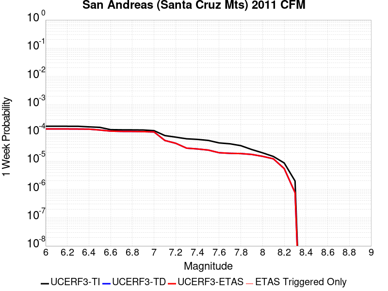 | 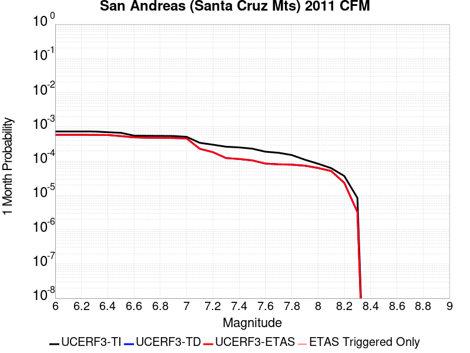 | 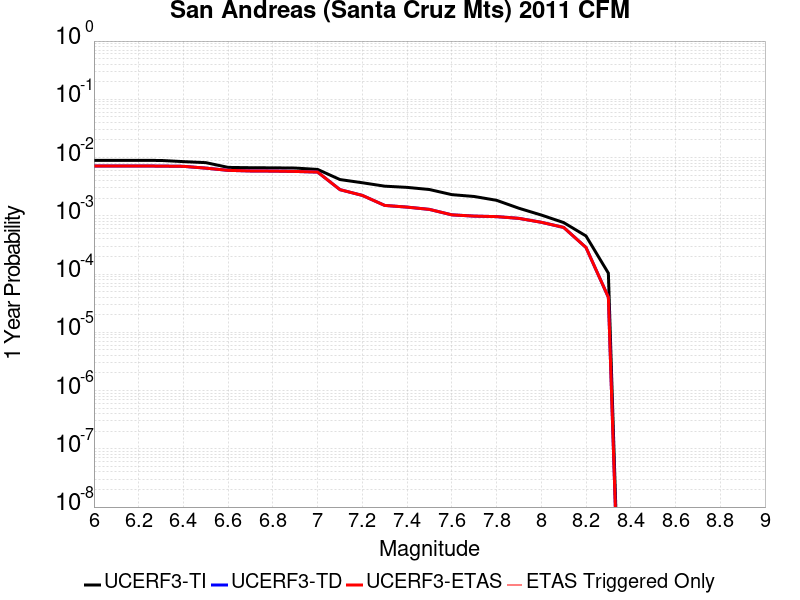 | 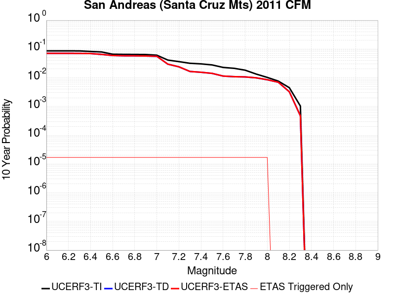 |

| Magnitude | 1 wk TI Prob | 1 wk TD Prob | 1 wk ETAS Prob | 1 wk ETAS/TD Gain | 1 wk ETAS Triggered Only | 1 mo TI Prob | 1 mo TD Prob | 1 mo ETAS Prob | 1 mo ETAS/TD Gain | 1 mo ETAS Triggered Only | 1 yr TI Prob | 1 yr TD Prob | 1 yr ETAS Prob | 1 yr ETAS/TD Gain | 1 yr ETAS Triggered Only | 10 yr TI Prob | 10 yr TD Prob | 10 yr ETAS Prob | 10 yr ETAS/TD Gain | 10 yr ETAS Triggered Only |
|-----|-----|-----|-----|-----|-----|-----|-----|-----|-----|-----|-----|-----|-----|-----|-----|-----|-----|-----|-----|-----|
| 6.0 | 1.7221631E-4 | 1.3800614E-4 | 1.3800614E-4 | 1.0 | 0.0 | 7.378611E-4 | 5.9132284E-4 | 5.9132284E-4 | 1.0 | 0.0 | 0.008946515 | 0.0071759806 | 0.0071759806 | 1.0 | 0.0 | 0.08594794 | 0.070589736 | 0.07060538 | 1.0002216 | 1.6835016E-5 |
| 6.1 | 1.7221631E-4 | 1.3800614E-4 | 1.3800614E-4 | 1.0 | 0.0 | 7.378611E-4 | 5.9132284E-4 | 5.9132284E-4 | 1.0 | 0.0 | 0.008946515 | 0.0071759806 | 0.0071759806 | 1.0 | 0.0 | 0.08594794 | 0.070589736 | 0.07060538 | 1.0002216 | 1.6835016E-5 |
| 6.2 | 1.7221631E-4 | 1.3800614E-4 | 1.3800614E-4 | 1.0 | 0.0 | 7.378611E-4 | 5.9132284E-4 | 5.9132284E-4 | 1.0 | 0.0 | 0.008946515 | 0.0071759806 | 0.0071759806 | 1.0 | 0.0 | 0.08594794 | 0.070589736 | 0.07060538 | 1.0002216 | 1.6835016E-5 |
| 6.3 | 1.716926E-4 | 1.3720038E-4 | 1.3720038E-4 | 1.0 | 0.0 | 7.3561794E-4 | 5.878712E-4 | 5.878712E-4 | 1.0 | 0.0 | 0.008919428 | 0.0071342313 | 0.0071342313 | 1.0 | 0.0 | 0.08569809 | 0.07020187 | 0.07021752 | 1.0002229 | 1.6835016E-5 |
| 6.4 | 1.6392978E-4 | 1.3595779E-4 | 1.3595779E-4 | 1.0 | 0.0 | 7.02367E-4 | 5.8254815E-4 | 5.8254815E-4 | 1.0 | 0.0 | 0.008517839 | 0.007069845 | 0.007069845 | 1.0 | 0.0 | 0.08198654 | 0.06943514 | 0.0694508 | 1.0002257 | 1.6835016E-5 |
| 6.5 | 1.5742714E-4 | 1.2655502E-4 | 1.2655502E-4 | 1.0 | 0.0 | 6.745133E-4 | 5.422677E-4 | 5.422677E-4 | 1.0 | 0.0 | 0.00818132 | 0.0065824483 | 0.0065824483 | 1.0 | 0.0 | 0.078865945 | 0.064896256 | 0.064912 | 1.0002426 | 1.6835016E-5 |
| 6.6 | 1.3038084E-4 | 1.1594853E-4 | 1.1594853E-4 | 1.0 | 0.0 | 5.5865536E-4 | 4.968289E-4 | 4.968289E-4 | 1.0 | 0.0 | 0.006780438 | 0.0060323575 | 0.0060323575 | 1.0 | 0.0 | 0.0657725 | 0.059357777 | 0.05937361 | 1.0002668 | 1.6835016E-5 |
| 6.7 | 1.2867592E-4 | 1.1321309E-4 | 1.1321309E-4 | 1.0 | 0.0 | 5.5135164E-4 | 4.8511004E-4 | 4.8511004E-4 | 1.0 | 0.0 | 0.0066920654 | 0.005890459 | 0.005890459 | 1.0 | 0.0 | 0.06494093 | 0.058068715 | 0.058084574 | 1.0002731 | 1.6835016E-5 |
| 6.8 | 1.2801298E-4 | 1.1258862E-4 | 1.1258862E-4 | 1.0 | 0.0 | 5.485117E-4 | 4.824347E-4 | 4.824347E-4 | 1.0 | 0.0 | 0.0066577005 | 0.0058580628 | 0.0058580628 | 1.0 | 0.0 | 0.06461738 | 0.057782546 | 0.057798408 | 1.0002745 | 1.6835016E-5 |
| 6.9 | 1.269149E-4 | 1.1101053E-4 | 1.1101053E-4 | 1.0 | 0.0 | 5.4380763E-4 | 4.7567394E-4 | 4.7567394E-4 | 1.0 | 0.0 | 0.006600777 | 0.0057761897 | 0.0057761897 | 1.0 | 0.0 | 0.06408122 | 0.05705434 | 0.057070214 | 1.0002782 | 1.6835016E-5 |
| 7.0 | 1.2030331E-4 | 1.0831018E-4 | 1.0831018E-4 | 1.0 | 0.0 | 5.154837E-4 | 4.641052E-4 | 4.641052E-4 | 1.0 | 0.0 | 0.006257969 | 0.0056360774 | 0.0056360774 | 1.0 | 0.0 | 0.06084648 | 0.055726517 | 0.055742413 | 1.0002853 | 1.6835016E-5 |
| 7.1 | 8.049617E-5 | 5.3976473E-5 | 5.3976473E-5 | 1.0 | 0.0 | 3.4493793E-4 | 2.3130744E-4 | 2.3130744E-4 | 1.0 | 0.0 | 0.0041915346 | 0.002812566 | 0.002812566 | 1.0 | 0.0 | 0.041133516 | 0.02964314 | 0.029659478 | 1.0005511 | 1.6835016E-5 |
| 7.2 | 7.093979E-5 | 4.298351E-5 | 4.298351E-5 | 1.0 | 0.0 | 3.0399222E-4 | 1.8420216E-4 | 1.8420216E-4 | 1.0 | 0.0 | 0.0036948253 | 0.0022403775 | 0.0022403775 | 1.0 | 0.0 | 0.03633994 | 0.023964057 | 0.023980489 | 1.0006857 | 1.6835016E-5 |
| 7.3 | 6.193693E-5 | 2.8926645E-5 | 2.8926645E-5 | 1.0 | 0.0 | 2.6541698E-4 | 1.2396545E-4 | 1.2396545E-4 | 1.0 | 0.0 | 0.0032266637 | 0.0015082362 | 0.0015082362 | 1.0 | 0.0 | 0.031802133 | 0.016516065 | 0.016532622 | 1.0010024 | 1.6835016E-5 |
| 7.4 | 5.906492E-5 | 2.7052607E-5 | 2.7052607E-5 | 1.0 | 0.0 | 2.5311083E-4 | 1.159346E-4 | 1.159346E-4 | 1.0 | 0.0 | 0.0030772698 | 0.0014105912 | 0.0014105912 | 1.0 | 0.0 | 0.030350044 | 0.01548636 | 0.015502933 | 1.0010703 | 1.6835016E-5 |
| 7.5 | 5.424296E-5 | 2.4703162E-5 | 2.4703162E-5 | 1.0 | 0.0 | 2.324491E-4 | 1.05866406E-4 | 1.05866406E-4 | 1.0 | 0.0 | 0.002826395 | 0.0012881625 | 0.0012881625 | 1.0 | 0.0 | 0.027907165 | 0.014176421 | 0.014193017 | 1.0011708 | 1.6835016E-5 |
| 7.6 | 4.43084E-5 | 1.9920975E-5 | 1.9920975E-5 | 1.0 | 0.0 | 1.8987931E-4 | 8.537281E-5 | 8.537281E-5 | 1.0 | 0.0 | 0.0023093296 | 0.0010389186 | 0.0010389186 | 1.0 | 0.0 | 0.022854783 | 0.011421678 | 0.01143832 | 1.0014571 | 1.6835016E-5 |
| 7.7 | 4.118098E-5 | 1.8952078E-5 | 1.8952078E-5 | 1.0 | 0.0 | 1.7647797E-4 | 8.122066E-5 | 8.122066E-5 | 1.0 | 0.0 | 0.002146502 | 9.884132E-4 | 9.884132E-4 | 1.0 | 0.0 | 0.021258866 | 0.010878919 | 0.01089557 | 1.0015306 | 1.6835016E-5 |
| 7.8 | 3.5408906E-5 | 1.8579587E-5 | 1.8579587E-5 | 1.0 | 0.0 | 1.5174363E-4 | 7.962437E-5 | 7.962437E-5 | 1.0 | 0.0 | 0.0018459131 | 9.6899585E-4 | 9.6899585E-4 | 1.0 | 0.0 | 0.018306552 | 0.010660154 | 0.01067681 | 1.0015624 | 1.6835016E-5 |
| 7.9 | 2.5860836E-5 | 1.732955E-5 | 1.732955E-5 | 1.0 | 0.0 | 1.10827445E-4 | 7.426739E-5 | 7.426739E-5 | 1.0 | 0.0 | 0.001348489 | 9.038306E-4 | 9.038306E-4 | 1.0 | 0.0 | 0.013403354 | 0.009914779 | 0.009931447 | 1.0016811 | 1.6835016E-5 |
| 8.0 | 1.9777332E-5 | 1.4851258E-5 | 1.4851258E-5 | 1.0 | 0.0 | 8.4757245E-5 | 6.36467E-5 | 6.36467E-5 | 1.0 | 0.0 | 0.0010314309 | 7.7462324E-4 | 7.7462324E-4 | 1.0 | 0.0 | 0.010266567 | 0.008515148 | 0.00853184 | 1.0019603 | 1.6835016E-5 |
| 8.1 | 1.468494E-5 | 1.2116955E-5 | 1.2116955E-5 | 1.0 | 0.0 | 6.293394E-5 | 5.1928775E-5 | 5.1928775E-5 | 1.0 | 0.0 | 7.6595135E-4 | 6.3204963E-4 | 6.3204963E-4 | 1.0 | 0.0 | 0.0076331664 | 0.006974249 | 0.006974249 | 1.0 | 0.0 |
| 8.2 | 8.63836E-6 | 5.4740453E-6 | 5.4740453E-6 | 1.0 | 0.0 | 3.7021015E-5 | 2.3459983E-5 | 2.3459983E-5 | 1.0 | 0.0 | 4.5063766E-4 | 2.8558794E-4 | 2.8558794E-4 | 1.0 | 0.0 | 0.004497249 | 0.0032484138 | 0.0032484138 | 1.0 | 0.0 |
| 8.3 | 1.983087E-6 | 7.668296E-7 | 7.668296E-7 | 1.0 | 0.0 | 8.498917E-6 | 3.2864084E-6 | 3.2864084E-6 | 1.0 | 0.0 | 1.034694E-4 | 4.0011306E-5 | 4.0011306E-5 | 1.0 | 0.0 | 0.0010342124 | 4.724499E-4 | 4.724499E-4 | 1.0 | 0.0 |

## Owens Valley Keough Hot Springs
*[(top)](#table-of-contents)*

| 1 Week | 1 Month | 1 Year | 10 Year |
|-----|-----|-----|-----|
| 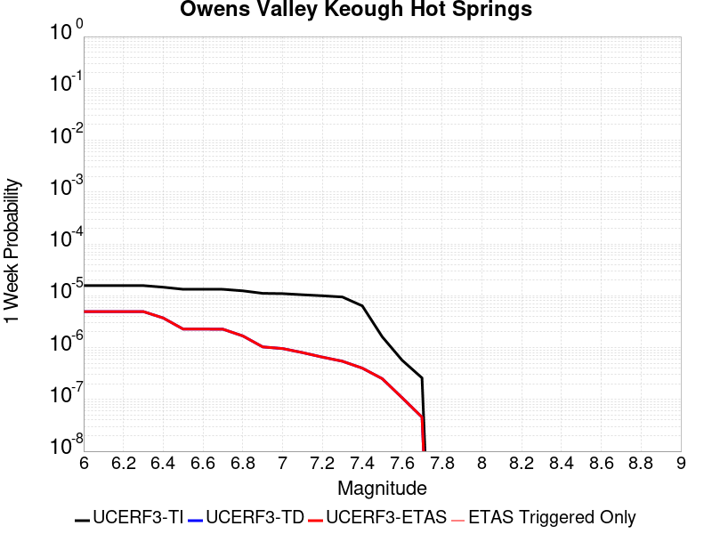 | 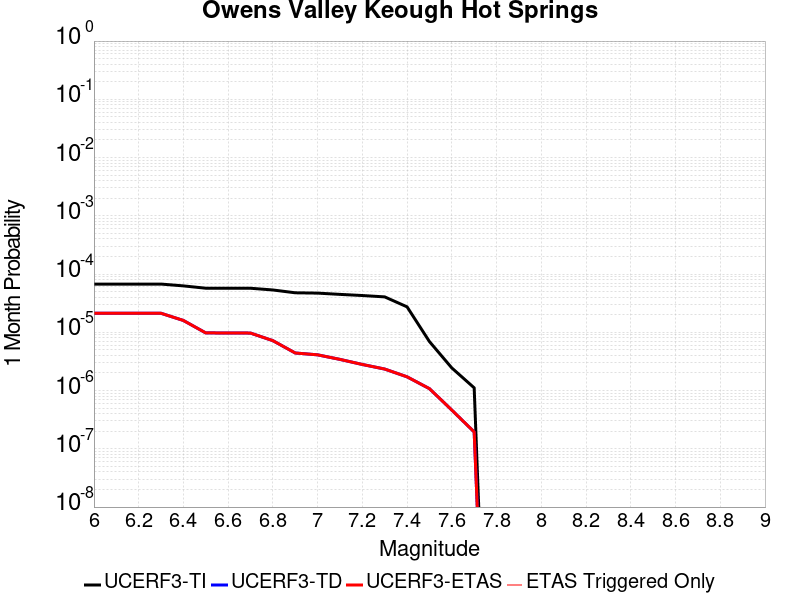 | 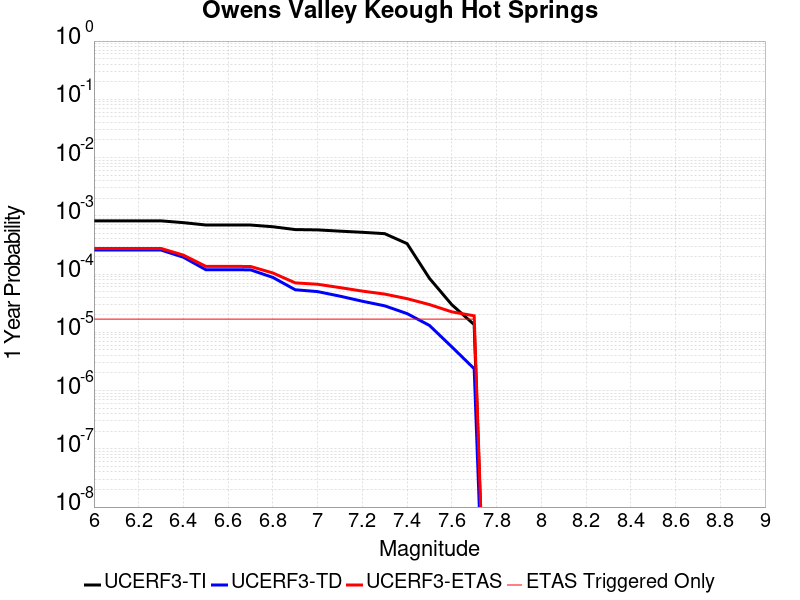 | 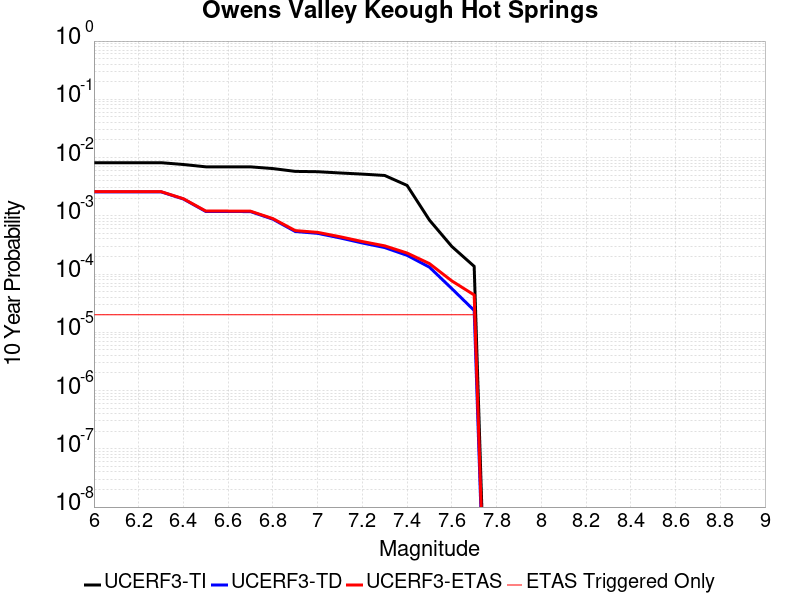 |

| Magnitude | 1 wk TI Prob | 1 wk TD Prob | 1 wk ETAS Prob | 1 wk ETAS/TD Gain | 1 wk ETAS Triggered Only | 1 mo TI Prob | 1 mo TD Prob | 1 mo ETAS Prob | 1 mo ETAS/TD Gain | 1 mo ETAS Triggered Only | 1 yr TI Prob | 1 yr TD Prob | 1 yr ETAS Prob | 1 yr ETAS/TD Gain | 1 yr ETAS Triggered Only | 10 yr TI Prob | 10 yr TD Prob | 10 yr ETAS Prob | 10 yr ETAS/TD Gain | 10 yr ETAS Triggered Only |
|-----|-----|-----|-----|-----|-----|-----|-----|-----|-----|-----|-----|-----|-----|-----|-----|-----|-----|-----|-----|-----|
| 6.0 | 1.5708529E-5 | 4.9508244E-6 | 4.9508244E-6 | 1.0 | 0.0 | 6.7320536E-5 | 2.1217675E-5 | 2.1217675E-5 | 1.0 | 0.0 | 8.193192E-4 | 2.582997E-4 | 2.7513038E-4 | 1.0651594 | 1.6835016E-5 | 0.008163051 | 0.0025806532 | 0.0025974447 | 1.0065067 | 1.6835016E-5 |
| 6.1 | 1.5708529E-5 | 4.9508244E-6 | 4.9508244E-6 | 1.0 | 0.0 | 6.7320536E-5 | 2.1217675E-5 | 2.1217675E-5 | 1.0 | 0.0 | 8.193192E-4 | 2.582997E-4 | 2.7513038E-4 | 1.0651594 | 1.6835016E-5 | 0.008163051 | 0.0025806532 | 0.0025974447 | 1.0065067 | 1.6835016E-5 |
| 6.2 | 1.5708529E-5 | 4.9508244E-6 | 4.9508244E-6 | 1.0 | 0.0 | 6.7320536E-5 | 2.1217675E-5 | 2.1217675E-5 | 1.0 | 0.0 | 8.193192E-4 | 2.582997E-4 | 2.7513038E-4 | 1.0651594 | 1.6835016E-5 | 0.008163051 | 0.0025806532 | 0.0025974447 | 1.0065067 | 1.6835016E-5 |
| 6.3 | 1.5708529E-5 | 4.9508244E-6 | 4.9508244E-6 | 1.0 | 0.0 | 6.7320536E-5 | 2.1217675E-5 | 2.1217675E-5 | 1.0 | 0.0 | 8.193192E-4 | 2.582997E-4 | 2.7513038E-4 | 1.0651594 | 1.6835016E-5 | 0.008163051 | 0.0025806532 | 0.0025974447 | 1.0065067 | 1.6835016E-5 |
| 6.4 | 1.4622509E-5 | 3.7266684E-6 | 3.7266684E-6 | 1.0 | 0.0 | 6.266639E-5 | 1.5971356E-5 | 1.5971356E-5 | 1.0 | 0.0 | 7.626962E-4 | 1.9443722E-4 | 2.1126897E-4 | 1.0865664 | 1.6835016E-5 | 0.007600839 | 0.0019431504 | 0.0019599528 | 1.008647 | 1.6835016E-5 |
| 6.5 | 1.3335527E-5 | 2.2778408E-6 | 2.2778408E-6 | 1.0 | 0.0 | 5.7151006E-5 | 9.762142E-6 | 9.762142E-6 | 1.0 | 0.0 | 6.955913E-4 | 1.18848286E-4 | 1.356813E-4 | 1.1416345 | 1.6835016E-5 | 0.0069341804 | 0.0011880693 | 0.0012048844 | 1.0141532 | 1.6835016E-5 |
| 6.6 | 1.3332855E-5 | 2.27499E-6 | 2.27499E-6 | 1.0 | 0.0 | 5.7139558E-5 | 9.749924E-6 | 9.749924E-6 | 1.0 | 0.0 | 6.9545204E-4 | 1.1869955E-4 | 1.3553257E-4 | 1.141812 | 1.6835016E-5 | 0.0069327964 | 0.0011865837 | 0.0012033987 | 1.014171 | 1.6835016E-5 |
| 6.7 | 1.3318214E-5 | 2.26422E-6 | 2.26422E-6 | 1.0 | 0.0 | 5.707681E-5 | 9.703767E-6 | 9.703767E-6 | 1.0 | 0.0 | 6.946886E-4 | 1.1813765E-4 | 1.3497067E-4 | 1.1424866 | 1.6835016E-5 | 0.0069252094 | 0.0011809706 | 0.0011977857 | 1.0142384 | 1.6835016E-5 |
| 6.8 | 1.2441338E-5 | 1.6778914E-6 | 1.6778914E-6 | 1.0 | 0.0 | 5.331893E-5 | 7.190945E-6 | 7.190945E-6 | 1.0 | 0.0 | 6.489646E-4 | 8.7546534E-5 | 1.0438008E-4 | 1.1922811 | 1.6835016E-5 | 0.0064707273 | 8.75305E-4 | 8.9212524E-4 | 1.0192165 | 1.6835016E-5 |
| 6.9 | 1.1130476E-5 | 1.0304584E-6 | 1.0304584E-6 | 1.0 | 0.0 | 4.7701167E-5 | 4.416243E-6 | 4.416243E-6 | 1.0 | 0.0 | 5.806069E-4 | 5.3766445E-5 | 7.060056E-5 | 1.313097 | 1.6835016E-5 | 0.0057909233 | 5.376886E-4 | 5.545146E-4 | 1.0312932 | 1.6835016E-5 |
| 7.0 | 1.0986073E-5 | 9.580101E-7 | 9.580101E-7 | 1.0 | 0.0 | 4.7082318E-5 | 4.105751E-6 | 4.105751E-6 | 1.0 | 0.0 | 5.730765E-4 | 4.9986385E-5 | 6.682056E-5 | 1.3367752 | 1.6835016E-5 | 0.0057160086 | 4.999046E-4 | 5.1673123E-4 | 1.0336596 | 1.6835016E-5 |
| 7.1 | 1.0451338E-5 | 8.000831E-7 | 8.000831E-7 | 1.0 | 0.0 | 4.4790682E-5 | 3.428923E-6 | 3.428923E-6 | 1.0 | 0.0 | 5.451901E-4 | 4.1746345E-5 | 5.858066E-5 | 1.4032524 | 1.6835016E-5 | 0.005438545 | 4.1753432E-4 | 4.343623E-4 | 1.0403032 | 1.6835016E-5 |
| 7.2 | 9.989061E-6 | 6.545439E-7 | 6.545439E-7 | 1.0 | 0.0 | 4.280956E-5 | 2.805185E-6 | 2.805185E-6 | 1.0 | 0.0 | 5.2108173E-4 | 3.4152596E-5 | 5.0987037E-5 | 1.4929184 | 1.6835016E-5 | 0.0051986156 | 3.4161055E-4 | 3.584398E-4 | 1.0492644 | 1.6835016E-5 |
| 7.3 | 9.465365E-6 | 5.4604976E-7 | 5.4604976E-7 | 1.0 | 0.0 | 4.056522E-5 | 2.340211E-6 | 2.340211E-6 | 1.0 | 0.0 | 4.937696E-4 | 2.84917E-5 | 4.5326236E-5 | 1.5908576 | 1.6835016E-5 | 0.0049267393 | 2.8501268E-4 | 3.018429E-4 | 1.0590508 | 1.6835016E-5 |
| 7.4 | 6.3824805E-6 | 4.016707E-7 | 4.016707E-7 | 1.0 | 0.0 | 2.73532E-5 | 1.7214446E-6 | 1.7214446E-6 | 1.0 | 0.0 | 3.3297433E-4 | 2.0958389E-5 | 3.7793052E-5 | 1.8032422 | 1.6835016E-5 | 0.0033247585 | 2.0965615E-4 | 2.2648764E-4 | 1.0802814 | 1.6835016E-5 |
| 7.5 | 1.6192645E-6 | 2.5163493E-7 | 2.5163493E-7 | 1.0 | 0.0 | 6.9396865E-6 | 1.0784349E-6 | 1.0784349E-6 | 1.0 | 0.0 | 8.448741E-5 | 1.31298675E-5 | 2.9964664E-5 | 2.2821755 | 1.6835016E-5 | 8.4455294E-4 | 1.3129105E-4 | 1.4812386E-4 | 1.1282098 | 1.6835016E-5 |
| 7.6 | 5.7062545E-7 | 1.079331E-7 | 1.079331E-7 | 1.0 | 0.0 | 2.4455355E-6 | 4.6257034E-7 | 4.6257034E-7 | 1.0 | 0.0 | 2.9773988E-5 | 5.63178E-6 | 2.2466702E-5 | 3.9892719 | 1.6835016E-5 | 2.977E-4 | 5.6316454E-5 | 7.315052E-5 | 1.2989192 | 1.6835016E-5 |
| 7.7 | 2.5988817E-7 | 4.5461668E-8 | 4.5461668E-8 | 1.0 | 0.0 | 1.113806E-6 | 1.948357E-7 | 1.948357E-7 | 1.0 | 0.0 | 1.3560503E-5 | 2.3721225E-6 | 1.92071E-5 | 8.09701 | 1.6835016E-5 | 1.3559677E-4 | 2.3721017E-5 | 4.0555635E-5 | 1.7096921 | 1.6835016E-5 |

## Hartley Springs 2011 CFM
*[(top)](#table-of-contents)*

| 1 Week | 1 Month | 1 Year | 10 Year |
|-----|-----|-----|-----|
| 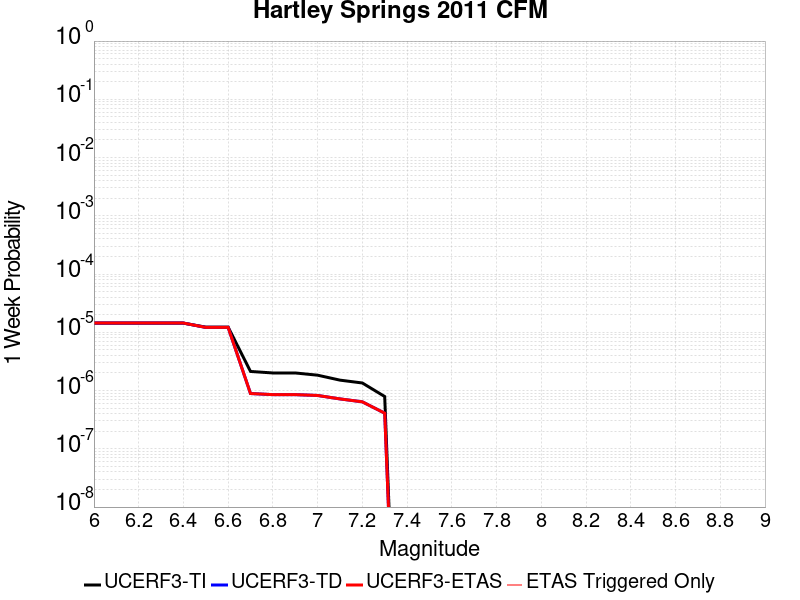 | 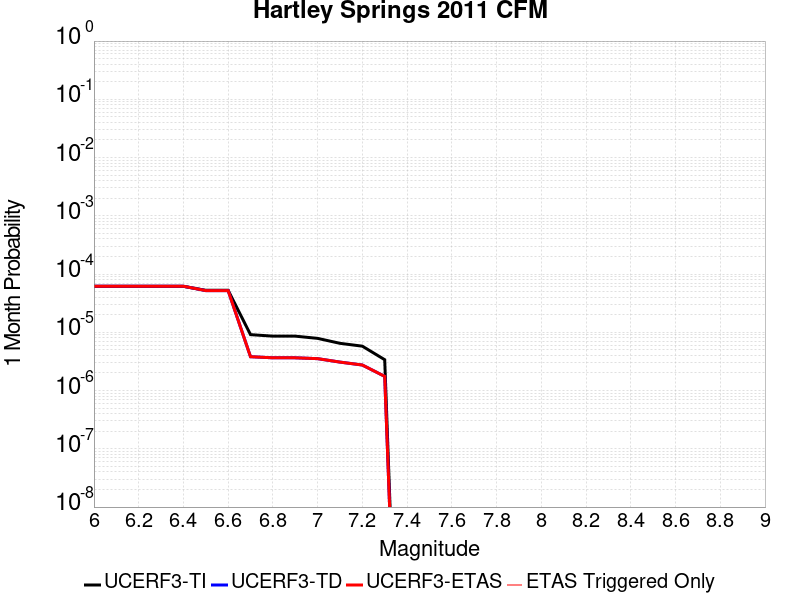 | 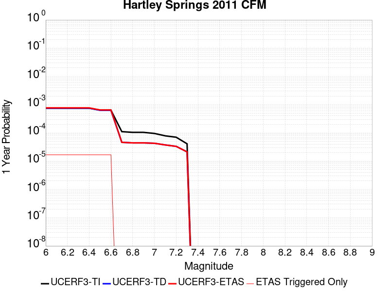 |  |

| Magnitude | 1 wk TI Prob | 1 wk TD Prob | 1 wk ETAS Prob | 1 wk ETAS/TD Gain | 1 wk ETAS Triggered Only | 1 mo TI Prob | 1 mo TD Prob | 1 mo ETAS Prob | 1 mo ETAS/TD Gain | 1 mo ETAS Triggered Only | 1 yr TI Prob | 1 yr TD Prob | 1 yr ETAS Prob | 1 yr ETAS/TD Gain | 1 yr ETAS Triggered Only | 10 yr TI Prob | 10 yr TD Prob | 10 yr ETAS Prob | 10 yr ETAS/TD Gain | 10 yr ETAS Triggered Only |
|-----|-----|-----|-----|-----|-----|-----|-----|-----|-----|-----|-----|-----|-----|-----|-----|-----|-----|-----|-----|-----|
| 6.0 | 1.4352418E-5 | 1.443441E-5 | 1.443441E-5 | 1.0 | 0.0 | 6.1508916E-5 | 6.186122E-5 | 6.186122E-5 | 1.0 | 0.0 | 7.486137E-4 | 7.5306447E-4 | 7.6988677E-4 | 1.0223385 | 1.6835016E-5 | 0.007460968 | 0.007521247 | 0.0075379554 | 1.0022215 | 1.6835016E-5 |
| 6.1 | 1.4352418E-5 | 1.443441E-5 | 1.443441E-5 | 1.0 | 0.0 | 6.1508916E-5 | 6.186122E-5 | 6.186122E-5 | 1.0 | 0.0 | 7.486137E-4 | 7.5306447E-4 | 7.6988677E-4 | 1.0223385 | 1.6835016E-5 | 0.007460968 | 0.007521247 | 0.0075379554 | 1.0022215 | 1.6835016E-5 |
| 6.2 | 1.4352418E-5 | 1.443441E-5 | 1.443441E-5 | 1.0 | 0.0 | 6.1508916E-5 | 6.186122E-5 | 6.186122E-5 | 1.0 | 0.0 | 7.486137E-4 | 7.5306447E-4 | 7.6988677E-4 | 1.0223385 | 1.6835016E-5 | 0.007460968 | 0.007521247 | 0.0075379554 | 1.0022215 | 1.6835016E-5 |
| 6.3 | 1.4352418E-5 | 1.443441E-5 | 1.443441E-5 | 1.0 | 0.0 | 6.1508916E-5 | 6.186122E-5 | 6.186122E-5 | 1.0 | 0.0 | 7.486137E-4 | 7.5306447E-4 | 7.6988677E-4 | 1.0223385 | 1.6835016E-5 | 0.007460968 | 0.007521247 | 0.0075379554 | 1.0022215 | 1.6835016E-5 |
| 6.4 | 1.4352418E-5 | 1.443441E-5 | 1.443441E-5 | 1.0 | 0.0 | 6.1508916E-5 | 6.186122E-5 | 6.186122E-5 | 1.0 | 0.0 | 7.486137E-4 | 7.5306447E-4 | 7.6988677E-4 | 1.0223385 | 1.6835016E-5 | 0.007460968 | 0.007521247 | 0.0075379554 | 1.0022215 | 1.6835016E-5 |
| 6.5 | 1.2279858E-5 | 1.21333005E-5 | 1.21333005E-5 | 1.0 | 0.0 | 5.26269E-5 | 5.1999716E-5 | 5.1999716E-5 | 1.0 | 0.0 | 6.4054417E-4 | 6.330708E-4 | 6.4989517E-4 | 1.0265758 | 1.6835016E-5 | 0.0063870098 | 0.006328186 | 0.0063449144 | 1.0026435 | 1.6835016E-5 |
| 6.6 | 1.2279858E-5 | 1.21333005E-5 | 1.21333005E-5 | 1.0 | 0.0 | 5.26269E-5 | 5.1999716E-5 | 5.1999716E-5 | 1.0 | 0.0 | 6.4054417E-4 | 6.330708E-4 | 6.4989517E-4 | 1.0265758 | 1.6835016E-5 | 0.0063870098 | 0.006328186 | 0.0063449144 | 1.0026435 | 1.6835016E-5 |
| 6.7 | 2.1282601E-6 | 8.8951737E-7 | 8.8951737E-7 | 1.0 | 0.0 | 9.121083E-6 | 3.8122132E-6 | 3.8122132E-6 | 1.0 | 0.0 | 1.11043526E-4 | 4.6412963E-5 | 4.6412963E-5 | 1.0 | 0.0 | 0.0011098806 | 4.6405804E-4 | 4.6405804E-4 | 1.0 | 0.0 |
| 6.8 | 2.00516E-6 | 8.517915E-7 | 8.517915E-7 | 1.0 | 0.0 | 8.593515E-6 | 3.6505314E-6 | 3.6505314E-6 | 1.0 | 0.0 | 1.04621024E-4 | 4.4444572E-5 | 4.4444572E-5 | 1.0 | 0.0 | 0.0010457177 | 4.4438196E-4 | 4.4438196E-4 | 1.0 | 0.0 |
| 6.9 | 2.00516E-6 | 8.517915E-7 | 8.517915E-7 | 1.0 | 0.0 | 8.593515E-6 | 3.6505314E-6 | 3.6505314E-6 | 1.0 | 0.0 | 1.04621024E-4 | 4.4444572E-5 | 4.4444572E-5 | 1.0 | 0.0 | 0.0010457177 | 4.4438196E-4 | 4.4438196E-4 | 1.0 | 0.0 |
| 7.0 | 1.8366732E-6 | 8.2375976E-7 | 8.2375976E-7 | 1.0 | 0.0 | 7.871433E-6 | 3.5303958E-6 | 3.5303958E-6 | 1.0 | 0.0 | 9.583048E-5 | 4.2981977E-5 | 4.2981977E-5 | 1.0 | 0.0 | 9.5789164E-4 | 4.2976168E-4 | 4.2976168E-4 | 1.0 | 0.0 |
| 7.1 | 1.5097997E-6 | 7.1904884E-7 | 7.1904884E-7 | 1.0 | 0.0 | 6.470554E-6 | 3.0816354E-6 | 3.0816354E-6 | 1.0 | 0.0 | 7.877615E-5 | 3.7518508E-5 | 3.7518508E-5 | 1.0 | 0.0 | 7.874823E-4 | 3.7514546E-4 | 3.7514546E-4 | 1.0 | 0.0 |
| 7.2 | 1.3490993E-6 | 6.405452E-7 | 6.405452E-7 | 1.0 | 0.0 | 5.7818415E-6 | 2.7451922E-6 | 2.7451922E-6 | 1.0 | 0.0 | 7.0391645E-5 | 3.3422435E-5 | 3.3422435E-5 | 1.0 | 0.0 | 7.0369354E-4 | 3.3419704E-4 | 3.3419704E-4 | 1.0 | 0.0 |
| 7.3 | 7.900015E-7 | 4.089063E-7 | 4.089063E-7 | 1.0 | 0.0 | 3.3857161E-6 | 1.7524555E-6 | 1.7524555E-6 | 1.0 | 0.0 | 4.1220315E-5 | 2.1336145E-5 | 2.1336145E-5 | 1.0 | 0.0 | 4.121267E-4 | 2.1336146E-4 | 2.1336146E-4 | 1.0 | 0.0 |

## Great Valley 09 (Laguna Seca)
*[(top)](#table-of-contents)*

| 1 Week | 1 Month | 1 Year | 10 Year |
|-----|-----|-----|-----|
| 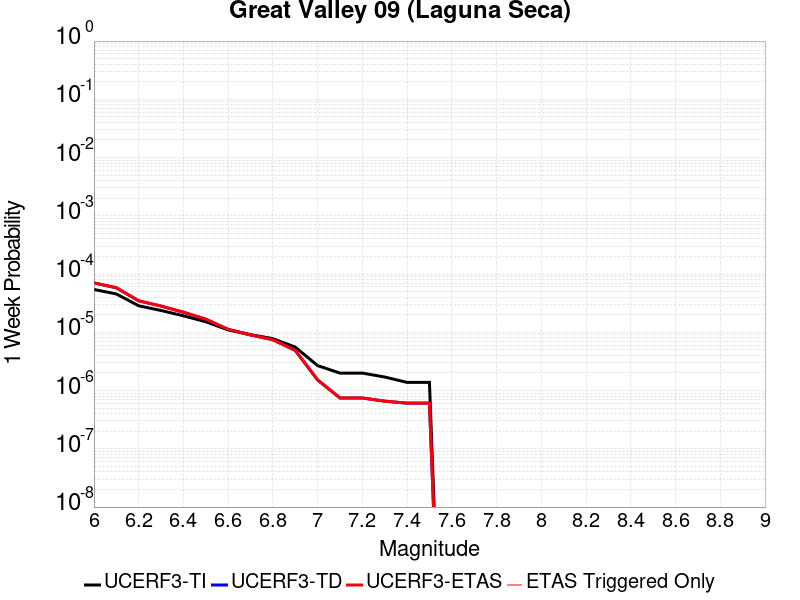 | 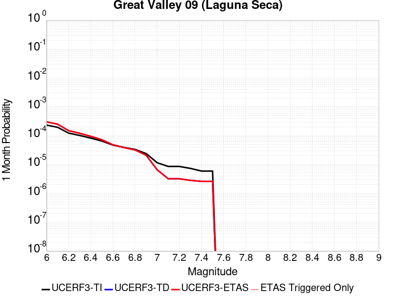 | 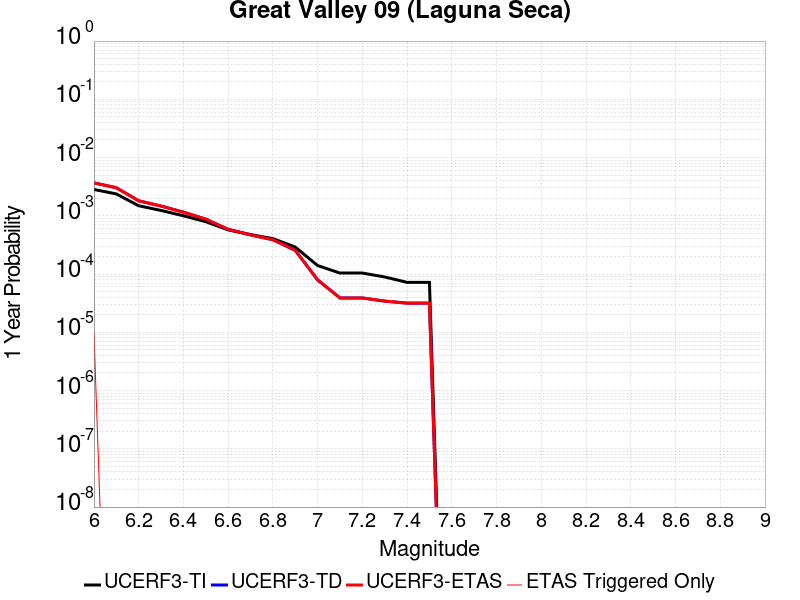 | 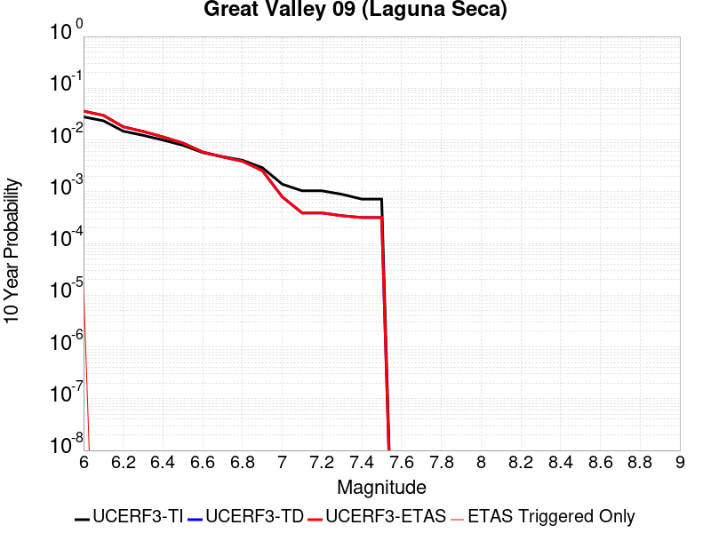 |

| Magnitude | 1 wk TI Prob | 1 wk TD Prob | 1 wk ETAS Prob | 1 wk ETAS/TD Gain | 1 wk ETAS Triggered Only | 1 mo TI Prob | 1 mo TD Prob | 1 mo ETAS Prob | 1 mo ETAS/TD Gain | 1 mo ETAS Triggered Only | 1 yr TI Prob | 1 yr TD Prob | 1 yr ETAS Prob | 1 yr ETAS/TD Gain | 1 yr ETAS Triggered Only | 10 yr TI Prob | 10 yr TD Prob | 10 yr ETAS Prob | 10 yr ETAS/TD Gain | 10 yr ETAS Triggered Only |
|-----|-----|-----|-----|-----|-----|-----|-----|-----|-----|-----|-----|-----|-----|-----|-----|-----|-----|-----|-----|-----|
| 6.0 | 5.4353277E-5 | 7.050538E-5 | 7.050538E-5 | 1.0 | 0.0 | 2.3292181E-4 | 3.0212724E-4 | 3.0212724E-4 | 1.0 | 0.0 | 0.0028321352 | 0.003672335 | 0.0036891084 | 1.0045675 | 1.6835016E-5 | 0.02796312 | 0.036116913 | 0.036133137 | 1.0004493 | 1.6835016E-5 |
| 6.1 | 4.5578287E-5 | 5.822371E-5 | 5.822371E-5 | 1.0 | 0.0 | 1.953209E-4 | 2.49502E-4 | 2.49502E-4 | 1.0 | 0.0 | 0.0023754383 | 0.0030335493 | 0.0030335493 | 1.0 | 0.0 | 0.023502063 | 0.029920705 | 0.029920705 | 1.0 | 0.0 |
| 6.2 | 2.8536782E-5 | 3.47386E-5 | 3.47386E-5 | 1.0 | 0.0 | 1.2229476E-4 | 1.488658E-4 | 1.488658E-4 | 1.0 | 0.0 | 0.0014879217 | 0.0018108767 | 0.0018108767 | 1.0 | 0.0 | 0.014779986 | 0.017958745 | 0.017958745 | 1.0 | 0.0 |
| 6.3 | 2.3698774E-5 | 2.8214314E-5 | 2.8214314E-5 | 1.0 | 0.0 | 1.01562226E-4 | 1.2090732E-4 | 1.2090732E-4 | 1.0 | 0.0 | 0.0012358186 | 0.0014710726 | 0.0014710726 | 1.0 | 0.0 | 0.012289686 | 0.014611831 | 0.014611831 | 1.0 | 0.0 |
| 6.4 | 1.9191197E-5 | 2.2123912E-5 | 2.2123912E-5 | 1.0 | 0.0 | 8.2245395E-5 | 9.480767E-5 | 9.480767E-5 | 1.0 | 0.0 | 0.0010008777 | 0.0011536786 | 0.0011536786 | 1.0 | 0.0 | 0.009963818 | 0.011477305 | 0.011477305 | 1.0 | 0.0 |
| 6.5 | 1.5203241E-5 | 1.680269E-5 | 1.680269E-5 | 1.0 | 0.0 | 6.5155116E-5 | 7.200383E-5 | 7.200383E-5 | 1.0 | 0.0 | 7.9297484E-4 | 8.7628904E-4 | 8.7628904E-4 | 1.0 | 0.0 | 0.007901512 | 0.008729759 | 0.008729759 | 1.0 | 0.0 |
| 6.6 | 1.0984925E-5 | 1.1242844E-5 | 1.1242844E-5 | 1.0 | 0.0 | 4.70774E-5 | 4.818275E-5 | 4.818275E-5 | 1.0 | 0.0 | 5.730166E-4 | 5.864695E-4 | 5.864695E-4 | 1.0 | 0.0 | 0.005715413 | 0.0058496143 | 0.0058496143 | 1.0 | 0.0 |
| 6.7 | 9.134616E-6 | 9.020084E-6 | 9.020084E-6 | 1.0 | 0.0 | 3.9147766E-5 | 3.865694E-5 | 3.865694E-5 | 1.0 | 0.0 | 4.7651984E-4 | 4.7054898E-4 | 4.7054898E-4 | 1.0 | 0.0 | 0.004754993 | 0.0046957717 | 0.0046957717 | 1.0 | 0.0 |
| 6.8 | 7.785589E-6 | 7.4521E-6 | 7.4521E-6 | 1.0 | 0.0 | 3.3366385E-5 | 3.193719E-5 | 3.193719E-5 | 1.0 | 0.0 | 4.0616E-4 | 3.8876795E-4 | 3.8876795E-4 | 1.0 | 0.0 | 0.0040541845 | 0.0038810824 | 0.0038810824 | 1.0 | 0.0 |
| 6.9 | 5.579095E-6 | 4.8985944E-6 | 4.8985944E-6 | 1.0 | 0.0 | 2.3910188E-5 | 2.0993815E-5 | 2.0993815E-5 | 1.0 | 0.0 | 2.9106764E-4 | 2.555711E-4 | 2.555711E-4 | 1.0 | 0.0 | 0.002906867 | 0.0025529093 | 0.0025529093 | 1.0 | 0.0 |
| 7.0 | 2.6816688E-6 | 1.5216407E-6 | 1.5216407E-6 | 1.0 | 0.0 | 1.1492816E-5 | 6.5213017E-6 | 6.5213017E-6 | 1.0 | 0.0 | 1.3991605E-4 | 7.939404E-5 | 7.939404E-5 | 1.0 | 0.0 | 0.0013982799 | 7.936655E-4 | 7.936655E-4 | 1.0 | 0.0 |
| 7.1 | 1.9951021E-6 | 7.4539724E-7 | 7.4539724E-7 | 1.0 | 0.0 | 8.55041E-6 | 3.194556E-6 | 3.194556E-6 | 1.0 | 0.0 | 1.0409627E-4 | 3.8893068E-5 | 3.8893068E-5 | 1.0 | 0.0 | 0.0010404752 | 3.8886676E-4 | 3.8886676E-4 | 1.0 | 0.0 |
| 7.2 | 1.9951021E-6 | 7.4539724E-7 | 7.4539724E-7 | 1.0 | 0.0 | 8.55041E-6 | 3.194556E-6 | 3.194556E-6 | 1.0 | 0.0 | 1.0409627E-4 | 3.8893068E-5 | 3.8893068E-5 | 1.0 | 0.0 | 0.0010404752 | 3.8886676E-4 | 3.8886676E-4 | 1.0 | 0.0 |
| 7.3 | 1.7087556E-6 | 6.579003E-7 | 6.579003E-7 | 1.0 | 0.0 | 7.3232177E-6 | 2.81957E-6 | 2.81957E-6 | 1.0 | 0.0 | 8.915652E-5 | 3.4327764E-5 | 3.4327764E-5 | 1.0 | 0.0 | 8.9120766E-4 | 3.4322866E-4 | 3.4322866E-4 | 1.0 | 0.0 |
| 7.4 | 1.3804846E-6 | 6.0739524E-7 | 6.0739524E-7 | 1.0 | 0.0 | 5.916349E-6 | 2.60312E-6 | 2.60312E-6 | 1.0 | 0.0 | 7.2029165E-5 | 3.1692565E-5 | 3.1692565E-5 | 1.0 | 0.0 | 7.200583E-4 | 3.1688449E-4 | 3.1688449E-4 | 1.0 | 0.0 |
| 7.5 | 1.3804846E-6 | 6.0739524E-7 | 6.0739524E-7 | 1.0 | 0.0 | 5.916349E-6 | 2.60312E-6 | 2.60312E-6 | 1.0 | 0.0 | 7.2029165E-5 | 3.1692565E-5 | 3.1692565E-5 | 1.0 | 0.0 | 7.200583E-4 | 3.1688449E-4 | 3.1688449E-4 | 1.0 | 0.0 |

## Hayward (So) extension 2011 CFM
*[(top)](#table-of-contents)*

| 1 Week | 1 Month | 1 Year | 10 Year |
|-----|-----|-----|-----|
| 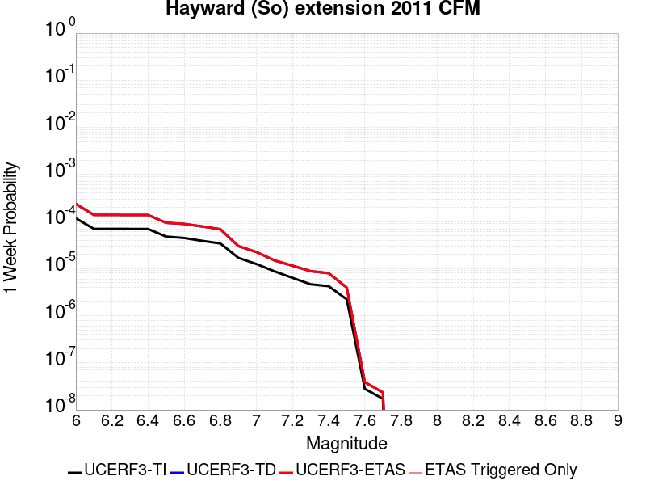 | 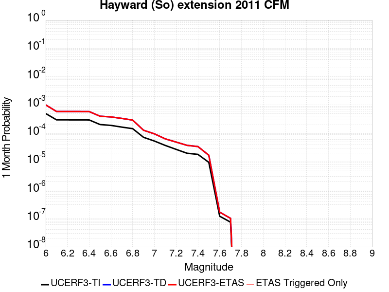 | 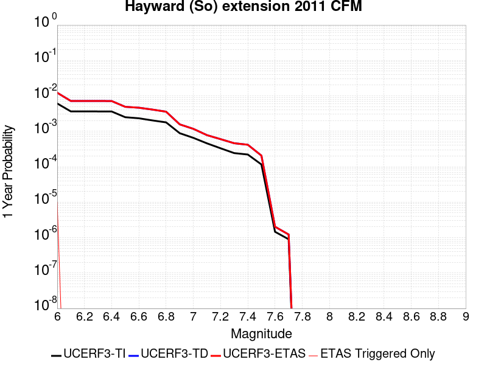 | 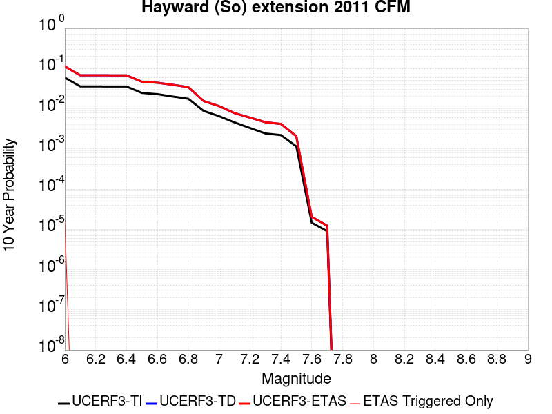 |

| Magnitude | 1 wk TI Prob | 1 wk TD Prob | 1 wk ETAS Prob | 1 wk ETAS/TD Gain | 1 wk ETAS Triggered Only | 1 mo TI Prob | 1 mo TD Prob | 1 mo ETAS Prob | 1 mo ETAS/TD Gain | 1 mo ETAS Triggered Only | 1 yr TI Prob | 1 yr TD Prob | 1 yr ETAS Prob | 1 yr ETAS/TD Gain | 1 yr ETAS Triggered Only | 10 yr TI Prob | 10 yr TD Prob | 10 yr ETAS Prob | 10 yr ETAS/TD Gain | 10 yr ETAS Triggered Only |
|-----|-----|-----|-----|-----|-----|-----|-----|-----|-----|-----|-----|-----|-----|-----|-----|-----|-----|-----|-----|-----|
| 6.0 | 1.1721256E-4 | 2.363781E-4 | 2.363781E-4 | 1.0 | 0.0 | 5.022428E-4 | 0.0010123947 | 0.0010123947 | 1.0 | 0.0 | 0.0060976758 | 0.012248728 | 0.012265357 | 1.0013576 | 1.6835016E-5 | 0.0593305 | 0.11284924 | 0.11286418 | 1.0001323 | 1.6835016E-5 |
| 6.1 | 6.99169E-5 | 1.3800772E-4 | 1.3800772E-4 | 1.0 | 0.0 | 2.9960944E-4 | 5.910222E-4 | 5.910222E-4 | 1.0 | 0.0 | 0.0036416445 | 0.0071723694 | 0.0071723694 | 1.0 | 0.0 | 0.035825435 | 0.067808375 | 0.067808375 | 1.0 | 0.0 |
| 6.2 | 6.99169E-5 | 1.3800772E-4 | 1.3800772E-4 | 1.0 | 0.0 | 2.9960944E-4 | 5.910222E-4 | 5.910222E-4 | 1.0 | 0.0 | 0.0036416445 | 0.0071723694 | 0.0071723694 | 1.0 | 0.0 | 0.035825435 | 0.067808375 | 0.067808375 | 1.0 | 0.0 |
| 6.3 | 6.970908E-5 | 1.3768923E-4 | 1.3768923E-4 | 1.0 | 0.0 | 2.9871898E-4 | 5.896579E-4 | 5.896579E-4 | 1.0 | 0.0 | 0.0036308395 | 0.0071559055 | 0.0071559055 | 1.0 | 0.0 | 0.035720866 | 0.06765734 | 0.06765734 | 1.0 | 0.0 |
| 6.4 | 6.9517155E-5 | 1.3735797E-4 | 1.3735797E-4 | 1.0 | 0.0 | 2.9789665E-4 | 5.882389E-4 | 5.882389E-4 | 1.0 | 0.0 | 0.0036208609 | 0.007138817 | 0.007138817 | 1.0 | 0.0 | 0.03562429 | 0.06750137 | 0.06750137 | 1.0 | 0.0 |
| 6.5 | 4.786248E-5 | 9.415959E-5 | 9.415959E-5 | 1.0 | 0.0 | 2.0510878E-4 | 4.0348133E-4 | 4.0348133E-4 | 1.0 | 0.0 | 0.0024943394 | 0.004901734 | 0.004901734 | 1.0 | 0.0 | 0.02466527 | 0.046906155 | 0.046906155 | 1.0 | 0.0 |
| 6.6 | 4.4662214E-5 | 8.882604E-5 | 8.882604E-5 | 1.0 | 0.0 | 1.9139545E-4 | 3.8063008E-4 | 3.8063008E-4 | 1.0 | 0.0 | 0.0023277493 | 0.004624787 | 0.004624787 | 1.0 | 0.0 | 0.02303517 | 0.044297572 | 0.044297572 | 1.0 | 0.0 |
| 6.7 | 3.884542E-5 | 7.865713E-5 | 7.865713E-5 | 1.0 | 0.0 | 1.6646975E-4 | 3.3706092E-4 | 3.3706092E-4 | 1.0 | 0.0 | 0.002024885 | 0.0040964396 | 0.0040964396 | 1.0 | 0.0 | 0.020065336 | 0.03933719 | 0.03933719 | 1.0 | 0.0 |
| 6.8 | 3.4221863E-5 | 6.856472E-5 | 6.856472E-5 | 1.0 | 0.0 | 1.4665688E-4 | 2.9381807E-4 | 2.9381807E-4 | 1.0 | 0.0 | 0.0017840851 | 0.0035717883 | 0.0035717883 | 1.0 | 0.0 | 0.017698295 | 0.034424704 | 0.034424704 | 1.0 | 0.0 |
| 6.9 | 1.6927712E-5 | 3.0066385E-5 | 3.0066385E-5 | 1.0 | 0.0 | 7.2545314E-5 | 1.2884989E-4 | 1.2884989E-4 | 1.0 | 0.0 | 8.828813E-4 | 0.0015676755 | 0.0015676755 | 1.0 | 0.0 | 0.008793819 | 0.015465583 | 0.015465583 | 1.0 | 0.0 |
| 7.0 | 1.2509653E-5 | 2.2467022E-5 | 2.2467022E-5 | 1.0 | 0.0 | 5.3611697E-5 | 9.628393E-5 | 9.628393E-5 | 1.0 | 0.0 | 6.525269E-4 | 0.0011716705 | 0.0011716705 | 1.0 | 0.0 | 0.0065061417 | 0.0115844635 | 0.0115844635 | 1.0 | 0.0 |
| 7.1 | 8.751583E-6 | 1.4929308E-5 | 1.4929308E-5 | 1.0 | 0.0 | 3.750624E-5 | 6.398121E-5 | 6.398121E-5 | 1.0 | 0.0 | 4.5654282E-4 | 7.786987E-4 | 7.786987E-4 | 1.0 | 0.0 | 0.0045560603 | 0.0077653006 | 0.0077653006 | 1.0 | 0.0 |
| 7.2 | 6.354379E-6 | 1.1502135E-5 | 1.1502135E-5 | 1.0 | 0.0 | 2.7232769E-5 | 4.9293958E-5 | 4.9293958E-5 | 1.0 | 0.0 | 3.3150852E-4 | 5.999935E-4 | 5.999935E-4 | 1.0 | 0.0 | 0.0033101442 | 0.0060020364 | 0.0060020364 | 1.0 | 0.0 |
| 7.3 | 4.645554E-6 | 8.821418E-6 | 8.821418E-6 | 1.0 | 0.0 | 1.9909365E-5 | 3.7805556E-5 | 3.7805556E-5 | 1.0 | 0.0 | 2.4236954E-4 | 4.6018933E-4 | 4.6018933E-4 | 1.0 | 0.0 | 0.0024210536 | 0.0046123224 | 0.0046123224 | 1.0 | 0.0 |
| 7.4 | 4.23437E-6 | 7.99567E-6 | 7.99567E-6 | 1.0 | 0.0 | 1.8147173E-5 | 3.4266726E-5 | 3.4266726E-5 | 1.0 | 0.0 | 2.2091944E-4 | 4.171214E-4 | 4.171214E-4 | 1.0 | 0.0 | 0.0022069993 | 0.004183535 | 0.004183535 | 1.0 | 0.0 |
| 7.5 | 2.2187417E-6 | 3.9527254E-6 | 3.9527254E-6 | 1.0 | 0.0 | 9.508858E-6 | 1.6940156E-5 | 1.6940156E-5 | 1.0 | 0.0 | 1.157642E-4 | 2.0622948E-4 | 2.0622948E-4 | 1.0 | 0.0 | 0.0011570391 | 0.0020737252 | 0.0020737252 | 1.0 | 0.0 |
| 7.6 | 2.7952495E-8 | 3.8797385E-8 | 3.8797385E-8 | 1.0 | 0.0 | 1.1979641E-7 | 1.6627449E-7 | 1.6627449E-7 | 1.0 | 0.0 | 1.4585203E-6 | 2.0243901E-6 | 2.0243901E-6 | 1.0 | 0.0 | 1.4585107E-5 | 2.0334499E-5 | 2.0334499E-5 | 1.0 | 0.0 |
| 7.7 | 1.7192724E-8 | 2.3447157E-8 | 2.3447157E-8 | 1.0 | 0.0 | 7.36831E-8 | 1.0048782E-7 | 1.0048782E-7 | 1.0 | 0.0 | 8.9709135E-7 | 1.2234385E-6 | 1.2234385E-6 | 1.0 | 0.0 | 8.970877E-6 | 1.2302498E-5 | 1.2302498E-5 | 1.0 | 0.0 |

## Kern Canyon (Lake Isabella) 2011
*[(top)](#table-of-contents)*

| 1 Week | 1 Month | 1 Year | 10 Year |
|-----|-----|-----|-----|
| 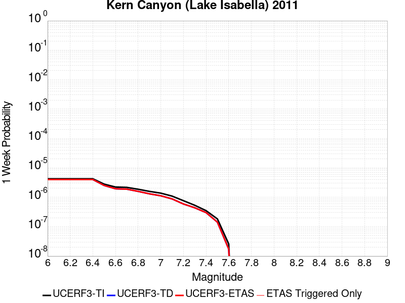 | 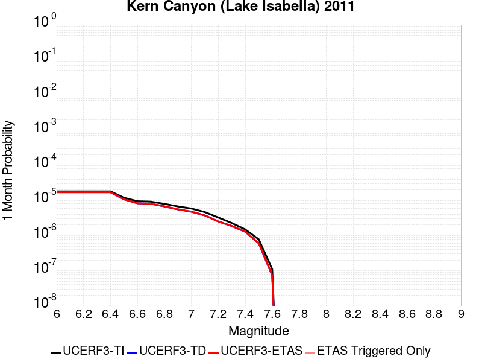 | 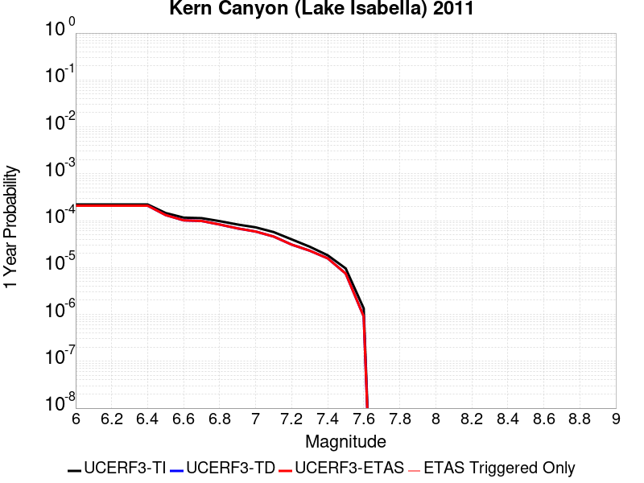 | 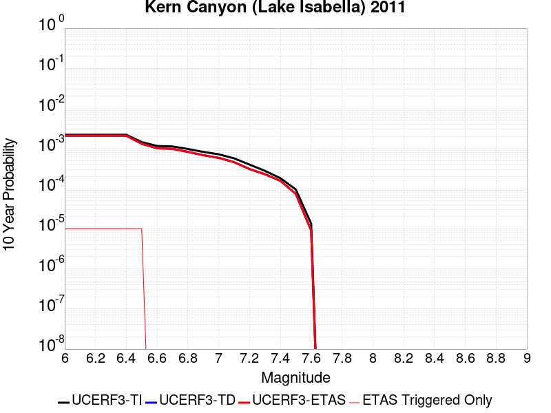 |

| Magnitude | 1 wk TI Prob | 1 wk TD Prob | 1 wk ETAS Prob | 1 wk ETAS/TD Gain | 1 wk ETAS Triggered Only | 1 mo TI Prob | 1 mo TD Prob | 1 mo ETAS Prob | 1 mo ETAS/TD Gain | 1 mo ETAS Triggered Only | 1 yr TI Prob | 1 yr TD Prob | 1 yr ETAS Prob | 1 yr ETAS/TD Gain | 1 yr ETAS Triggered Only | 10 yr TI Prob | 10 yr TD Prob | 10 yr ETAS Prob | 10 yr ETAS/TD Gain | 10 yr ETAS Triggered Only |
|-----|-----|-----|-----|-----|-----|-----|-----|-----|-----|-----|-----|-----|-----|-----|-----|-----|-----|-----|-----|-----|
| 6.0 | 4.2387383E-6 | 4.0016507E-6 | 4.0016507E-6 | 1.0 | 0.0 | 1.8165894E-5 | 1.7149829E-5 | 1.7149829E-5 | 1.0 | 0.0 | 2.2114732E-4 | 2.0878103E-4 | 2.0878103E-4 | 1.0 | 0.0 | 0.0022092736 | 0.0020860326 | 0.0021028325 | 1.0080535 | 1.6835016E-5 |
| 6.1 | 4.2387383E-6 | 4.0016507E-6 | 4.0016507E-6 | 1.0 | 0.0 | 1.8165894E-5 | 1.7149829E-5 | 1.7149829E-5 | 1.0 | 0.0 | 2.2114732E-4 | 2.0878103E-4 | 2.0878103E-4 | 1.0 | 0.0 | 0.0022092736 | 0.0020860326 | 0.0021028325 | 1.0080535 | 1.6835016E-5 |
| 6.2 | 4.2387383E-6 | 4.0016507E-6 | 4.0016507E-6 | 1.0 | 0.0 | 1.8165894E-5 | 1.7149829E-5 | 1.7149829E-5 | 1.0 | 0.0 | 2.2114732E-4 | 2.0878103E-4 | 2.0878103E-4 | 1.0 | 0.0 | 0.0022092736 | 0.0020860326 | 0.0021028325 | 1.0080535 | 1.6835016E-5 |
| 6.3 | 4.2387383E-6 | 4.0016507E-6 | 4.0016507E-6 | 1.0 | 0.0 | 1.8165894E-5 | 1.7149829E-5 | 1.7149829E-5 | 1.0 | 0.0 | 2.2114732E-4 | 2.0878103E-4 | 2.0878103E-4 | 1.0 | 0.0 | 0.0022092736 | 0.0020860326 | 0.0021028325 | 1.0080535 | 1.6835016E-5 |
| 6.4 | 4.2387383E-6 | 4.0016507E-6 | 4.0016507E-6 | 1.0 | 0.0 | 1.8165894E-5 | 1.7149829E-5 | 1.7149829E-5 | 1.0 | 0.0 | 2.2114732E-4 | 2.0878103E-4 | 2.0878103E-4 | 1.0 | 0.0 | 0.0022092736 | 0.0020860326 | 0.0021028325 | 1.0080535 | 1.6835016E-5 |
| 6.5 | 2.7857532E-6 | 2.5178747E-6 | 2.5178747E-6 | 1.0 | 0.0 | 1.1938888E-5 | 1.0790849E-5 | 1.0790849E-5 | 1.0 | 0.0 | 1.4534626E-4 | 1.31371E-4 | 1.31371E-4 | 1.0 | 0.0 | 0.0014525123 | 0.0013129661 | 0.001329779 | 1.0128053 | 1.6835016E-5 |
| 6.6 | 2.2233348E-6 | 1.94413E-6 | 1.94413E-6 | 1.0 | 0.0 | 9.528543E-6 | 8.331959E-6 | 8.331959E-6 | 1.0 | 0.0 | 1.1600384E-4 | 1.0143697E-4 | 1.0143697E-4 | 1.0 | 0.0 | 0.001159433 | 0.0010139153 | 0.0010139153 | 1.0 | 0.0 |
| 6.7 | 2.1635126E-6 | 1.8835098E-6 | 1.8835098E-6 | 1.0 | 0.0 | 9.272164E-6 | 8.07216E-6 | 8.07216E-6 | 1.0 | 0.0 | 1.1288274E-4 | 9.82742E-5 | 9.82742E-5 | 1.0 | 0.0 | 0.0011282542 | 9.823156E-4 | 9.823156E-4 | 1.0 | 0.0 |
| 6.8 | 1.8685711E-6 | 1.583148E-6 | 1.583148E-6 | 1.0 | 0.0 | 8.008137E-6 | 6.784903E-6 | 6.784903E-6 | 1.0 | 0.0 | 9.74947E-5 | 8.260311E-5 | 8.260311E-5 | 1.0 | 0.0 | 9.745194E-4 | 8.25729E-4 | 8.25729E-4 | 1.0 | 0.0 |
| 6.9 | 1.5815071E-6 | 1.3064976E-6 | 1.3064976E-6 | 1.0 | 0.0 | 6.77787E-6 | 5.599263E-6 | 5.599263E-6 | 1.0 | 0.0 | 8.251744E-5 | 6.816892E-5 | 6.816892E-5 | 1.0 | 0.0 | 8.248681E-4 | 6.814828E-4 | 6.814828E-4 | 1.0 | 0.0 |
| 7.0 | 1.3772564E-6 | 1.1210758E-6 | 1.1210758E-6 | 1.0 | 0.0 | 5.9025137E-6 | 4.804602E-6 | 4.804602E-6 | 1.0 | 0.0 | 7.186073E-5 | 5.849448E-5 | 5.849448E-5 | 1.0 | 0.0 | 7.18375E-4 | 5.8479287E-4 | 5.8479287E-4 | 1.0 | 0.0 |
| 7.1 | 1.0916998E-6 | 8.763808E-7 | 8.763808E-7 | 1.0 | 0.0 | 4.678705E-6 | 3.7559125E-6 | 3.7559125E-6 | 1.0 | 0.0 | 5.6961744E-5 | 4.5727287E-5 | 4.5727287E-5 | 1.0 | 0.0 | 5.6947145E-4 | 4.5718014E-4 | 4.5718014E-4 | 1.0 | 0.0 |
| 7.2 | 7.6277024E-7 | 5.901475E-7 | 5.901475E-7 | 1.0 | 0.0 | 3.2690114E-6 | 2.5292013E-6 | 2.5292013E-6 | 1.0 | 0.0 | 3.9799485E-5 | 3.0792595E-5 | 3.0792595E-5 | 1.0 | 0.0 | 3.9792358E-4 | 3.078839E-4 | 3.078839E-4 | 1.0 | 0.0 |
| 7.3 | 5.3265916E-7 | 4.3824562E-7 | 4.3824562E-7 | 1.0 | 0.0 | 2.282823E-6 | 1.8781942E-6 | 1.8781942E-6 | 1.0 | 0.0 | 2.7793016E-5 | 2.286678E-5 | 2.286678E-5 | 1.0 | 0.0 | 2.778954E-4 | 2.2864464E-4 | 2.2864464E-4 | 1.0 | 0.0 |
| 7.4 | 3.4946007E-7 | 3.006581E-7 | 3.006581E-7 | 1.0 | 0.0 | 1.497685E-6 | 1.288534E-6 | 1.288534E-6 | 1.0 | 0.0 | 1.8234163E-5 | 1.568779E-5 | 1.568779E-5 | 1.0 | 0.0 | 1.8232666E-4 | 1.5686706E-4 | 1.5686706E-4 | 1.0 | 0.0 |
| 7.5 | 1.8317026E-7 | 1.4244868E-7 | 1.4244868E-7 | 1.0 | 0.0 | 7.850152E-7 | 6.104942E-7 | 6.104942E-7 | 1.0 | 0.0 | 9.557518E-6 | 7.4327427E-6 | 7.4327427E-6 | 1.0 | 0.0 | 9.5571064E-5 | 7.432502E-5 | 7.432502E-5 | 1.0 | 0.0 |
| 7.6 | 2.572245E-8 | 1.7352637E-8 | 1.7352637E-8 | 1.0 | 0.0 | 1.10239064E-7 | 7.4368444E-8 | 7.4368444E-8 | 1.0 | 0.0 | 1.3421597E-6 | 9.0543546E-7 | 9.0543546E-7 | 1.0 | 0.0 | 1.3421517E-5 | 9.0543235E-6 | 9.0543235E-6 | 1.0 | 0.0 |

## Concord 2011 CFM
*[(top)](#table-of-contents)*

| 1 Week | 1 Month | 1 Year | 10 Year |
|-----|-----|-----|-----|
| 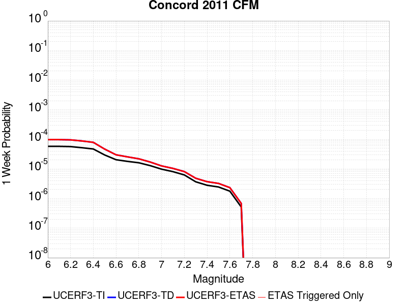 | 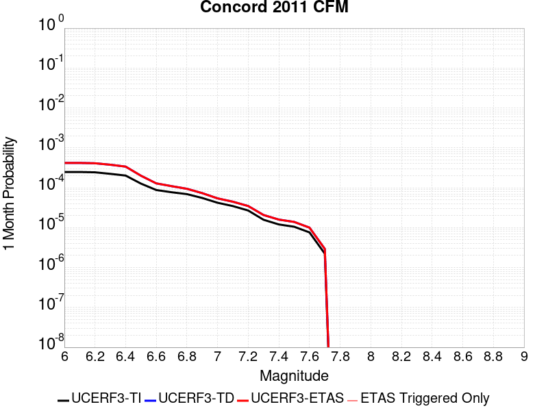 | 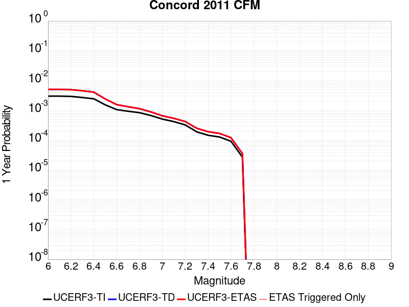 | 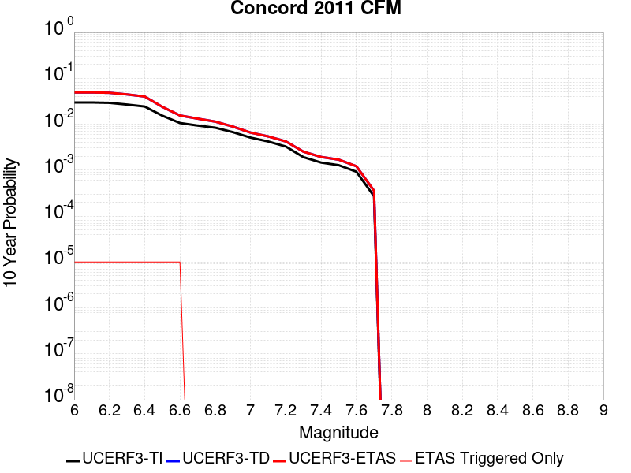 |

| Magnitude | 1 wk TI Prob | 1 wk TD Prob | 1 wk ETAS Prob | 1 wk ETAS/TD Gain | 1 wk ETAS Triggered Only | 1 mo TI Prob | 1 mo TD Prob | 1 mo ETAS Prob | 1 mo ETAS/TD Gain | 1 mo ETAS Triggered Only | 1 yr TI Prob | 1 yr TD Prob | 1 yr ETAS Prob | 1 yr ETAS/TD Gain | 1 yr ETAS Triggered Only | 10 yr TI Prob | 10 yr TD Prob | 10 yr ETAS Prob | 10 yr ETAS/TD Gain | 10 yr ETAS Triggered Only |
|-----|-----|-----|-----|-----|-----|-----|-----|-----|-----|-----|-----|-----|-----|-----|-----|-----|-----|-----|-----|-----|
| 6.0 | 5.7865112E-5 | 9.7592994E-5 | 9.7592994E-5 | 1.0 | 0.0 | 2.4796976E-4 | 4.181934E-4 | 4.181934E-4 | 1.0 | 0.0 | 0.0030148525 | 0.005079523 | 0.005079523 | 1.0 | 0.0 | 0.029742775 | 0.04924955 | 0.049265556 | 1.000325 | 1.6835016E-5 |
| 6.1 | 5.7865112E-5 | 9.7592994E-5 | 9.7592994E-5 | 1.0 | 0.0 | 2.4796976E-4 | 4.181934E-4 | 4.181934E-4 | 1.0 | 0.0 | 0.0030148525 | 0.005079523 | 0.005079523 | 1.0 | 0.0 | 0.029742775 | 0.04924955 | 0.049265556 | 1.000325 | 1.6835016E-5 |
| 6.2 | 5.6789337E-5 | 9.579644E-5 | 9.579644E-5 | 1.0 | 0.0 | 2.4336016E-4 | 4.1049632E-4 | 4.1049632E-4 | 1.0 | 0.0 | 0.0029588845 | 0.0049862415 | 0.0049862415 | 1.0 | 0.0 | 0.029197963 | 0.04836609 | 0.048382107 | 1.0003313 | 1.6835016E-5 |
| 6.3 | 5.203322E-5 | 8.8031295E-5 | 8.8031295E-5 | 1.0 | 0.0 | 2.2298045E-4 | 3.7722682E-4 | 3.7722682E-4 | 1.0 | 0.0 | 0.0027114071 | 0.0045838486 | 0.0045838486 | 1.0 | 0.0 | 0.026785625 | 0.04453707 | 0.044553153 | 1.0003612 | 1.6835016E-5 |
| 6.4 | 4.7120942E-5 | 7.897469E-5 | 7.897469E-5 | 1.0 | 0.0 | 2.0193127E-4 | 3.3842324E-4 | 3.3842324E-4 | 1.0 | 0.0 | 0.0024557412 | 0.0041132635 | 0.0041132635 | 1.0 | 0.0 | 0.024287801 | 0.04006584 | 0.040082 | 1.0004034 | 1.6835016E-5 |
| 6.5 | 2.9598437E-5 | 4.667524E-5 | 4.667524E-5 | 1.0 | 0.0 | 1.2684427E-4 | 2.000226E-4 | 2.000226E-4 | 1.0 | 0.0 | 0.001543235 | 0.0024327657 | 0.0024327657 | 1.0 | 0.0 | 0.015325619 | 0.023910161 | 0.023926593 | 1.0006872 | 1.6835016E-5 |
| 6.6 | 2.0443718E-5 | 2.9984598E-5 | 2.9984598E-5 | 1.0 | 0.0 | 8.7613E-5 | 1.2849929E-4 | 1.2849929E-4 | 1.0 | 0.0 | 0.0010661662 | 0.0015633923 | 0.0015633923 | 1.0 | 0.0 | 0.010610655 | 0.015467131 | 0.015483705 | 1.0010716 | 1.6835016E-5 |
| 6.7 | 1.798539E-5 | 2.5557623E-5 | 2.5557623E-5 | 1.0 | 0.0 | 7.7077966E-5 | 1.0952819E-4 | 1.0952819E-4 | 1.0 | 0.0 | 9.380202E-4 | 0.0013327115 | 0.0013327115 | 1.0 | 0.0 | 0.009340706 | 0.013217555 | 0.013217555 | 1.0 | 0.0 |
| 6.8 | 1.613555E-5 | 2.1959419E-5 | 2.1959419E-5 | 1.0 | 0.0 | 6.915052E-5 | 9.410847E-5 | 9.410847E-5 | 1.0 | 0.0 | 8.4158237E-4 | 0.0011451824 | 0.0011451824 | 1.0 | 0.0 | 0.008384023 | 0.01137831 | 0.01137831 | 1.0 | 0.0 |
| 6.9 | 1.2916435E-5 | 1.7081215E-5 | 1.7081215E-5 | 1.0 | 0.0 | 5.5354973E-5 | 7.3203184E-5 | 7.3203184E-5 | 1.0 | 0.0 | 6.7373837E-4 | 8.9089014E-4 | 8.9089014E-4 | 1.0 | 0.0 | 0.006716994 | 0.008867221 | 0.008867221 | 1.0 | 0.0 |
| 7.0 | 9.81129E-6 | 1.263095E-5 | 1.263095E-5 | 1.0 | 0.0 | 4.2047708E-5 | 5.4131524E-5 | 5.4131524E-5 | 1.0 | 0.0 | 5.118106E-4 | 6.588537E-4 | 6.588537E-4 | 1.0 | 0.0 | 0.005106334 | 0.006569215 | 0.006569215 | 1.0 | 0.0 |
| 7.1 | 8.0889195E-6 | 1.0418359E-5 | 1.0418359E-5 | 1.0 | 0.0 | 3.4666336E-5 | 4.464935E-5 | 4.464935E-5 | 1.0 | 0.0 | 4.219809E-4 | 5.434713E-4 | 5.434713E-4 | 1.0 | 0.0 | 0.004211805 | 0.0054216487 | 0.0054216487 | 1.0 | 0.0 |
| 7.2 | 6.267438E-6 | 8.115771E-6 | 8.115771E-6 | 1.0 | 0.0 | 2.6860173E-5 | 3.4781417E-5 | 3.4781417E-5 | 1.0 | 0.0 | 3.2697353E-4 | 4.233822E-4 | 4.233822E-4 | 1.0 | 0.0 | 0.0032649285 | 0.0042260066 | 0.0042260066 | 1.0 | 0.0 |
| 7.3 | 3.6761196E-6 | 4.8402017E-6 | 4.8402017E-6 | 1.0 | 0.0 | 1.5754704E-5 | 2.0743557E-5 | 2.0743557E-5 | 1.0 | 0.0 | 1.9179663E-4 | 2.5252375E-4 | 2.5252375E-4 | 1.0 | 0.0 | 0.0019163118 | 0.0025225056 | 0.0025225056 | 1.0 | 0.0 |
| 7.4 | 2.8044356E-6 | 3.7096308E-6 | 3.7096308E-6 | 1.0 | 0.0 | 1.2018954E-5 | 1.5898322E-5 | 1.5898322E-5 | 1.0 | 0.0 | 1.4632095E-4 | 1.93545E-4 | 1.93545E-4 | 1.0 | 0.0 | 0.0014622464 | 0.0019338625 | 0.0019338625 | 1.0 | 0.0 |
| 7.5 | 2.4578699E-6 | 3.244755E-6 | 3.244755E-6 | 1.0 | 0.0 | 1.0533685E-5 | 1.39060185E-5 | 1.39060185E-5 | 1.0 | 0.0 | 1.2824008E-4 | 1.6929273E-4 | 1.6929273E-4 | 1.0 | 0.0 | 0.0012816609 | 0.0016917185 | 0.0016917185 | 1.0 | 0.0 |
| 7.6 | 1.7713267E-6 | 2.3351265E-6 | 2.3351265E-6 | 1.0 | 0.0 | 7.591378E-6 | 1.0007647E-5 | 1.0007647E-5 | 1.0 | 0.0 | 9.2421105E-5 | 1.2183638E-4 | 1.2183638E-4 | 1.0 | 0.0 | 9.2382677E-4 | 0.0012177492 | 0.0012177492 | 1.0 | 0.0 |
| 7.7 | 5.1912366E-7 | 6.8290393E-7 | 6.8290393E-7 | 1.0 | 0.0 | 2.2248137E-6 | 2.926728E-6 | 2.926728E-6 | 1.0 | 0.0 | 2.708677E-5 | 3.5632343E-5 | 3.5632343E-5 | 1.0 | 0.0 | 2.708347E-4 | 3.5627425E-4 | 3.5627425E-4 | 1.0 | 0.0 |

## San Jacinto (Coyote Creek)
*[(top)](#table-of-contents)*

| 1 Week | 1 Month | 1 Year | 10 Year |
|-----|-----|-----|-----|
|  |  | 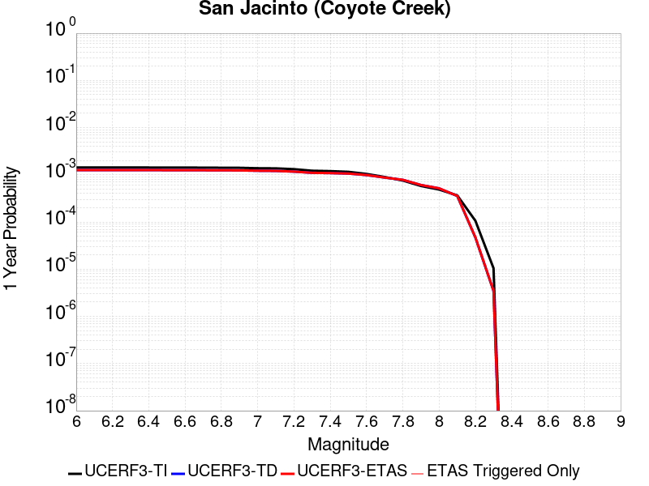 | 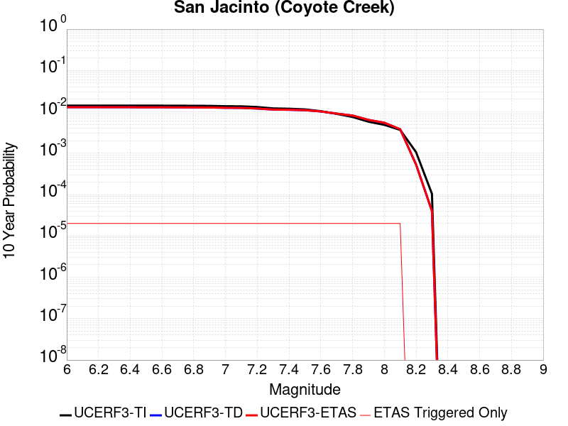 |

| Magnitude | 1 wk TI Prob | 1 wk TD Prob | 1 wk ETAS Prob | 1 wk ETAS/TD Gain | 1 wk ETAS Triggered Only | 1 mo TI Prob | 1 mo TD Prob | 1 mo ETAS Prob | 1 mo ETAS/TD Gain | 1 mo ETAS Triggered Only | 1 yr TI Prob | 1 yr TD Prob | 1 yr ETAS Prob | 1 yr ETAS/TD Gain | 1 yr ETAS Triggered Only | 10 yr TI Prob | 10 yr TD Prob | 10 yr ETAS Prob | 10 yr ETAS/TD Gain | 10 yr ETAS Triggered Only |
|-----|-----|-----|-----|-----|-----|-----|-----|-----|-----|-----|-----|-----|-----|-----|-----|-----|-----|-----|-----|-----|
| 6.0 | 2.7374346E-5 | 2.415327E-5 | 2.415327E-5 | 1.0 | 0.0 | 1.1731335E-4 | 1.0350993E-4 | 1.0350993E-4 | 1.0 | 0.0 | 0.0014273542 | 0.0012595074 | 0.0012595074 | 1.0 | 0.0 | 0.01418221 | 0.01293251 | 0.012949127 | 1.001285 | 1.6835016E-5 |
| 6.1 | 2.7374346E-5 | 2.415327E-5 | 2.415327E-5 | 1.0 | 0.0 | 1.1731335E-4 | 1.0350993E-4 | 1.0350993E-4 | 1.0 | 0.0 | 0.0014273542 | 0.0012595074 | 0.0012595074 | 1.0 | 0.0 | 0.01418221 | 0.01293251 | 0.012949127 | 1.001285 | 1.6835016E-5 |
| 6.2 | 2.7374346E-5 | 2.415327E-5 | 2.415327E-5 | 1.0 | 0.0 | 1.1731335E-4 | 1.0350993E-4 | 1.0350993E-4 | 1.0 | 0.0 | 0.0014273542 | 0.0012595074 | 0.0012595074 | 1.0 | 0.0 | 0.01418221 | 0.01293251 | 0.012949127 | 1.001285 | 1.6835016E-5 |
| 6.3 | 2.7374346E-5 | 2.415327E-5 | 2.415327E-5 | 1.0 | 0.0 | 1.1731335E-4 | 1.0350993E-4 | 1.0350993E-4 | 1.0 | 0.0 | 0.0014273542 | 0.0012595074 | 0.0012595074 | 1.0 | 0.0 | 0.01418221 | 0.01293251 | 0.012949127 | 1.001285 | 1.6835016E-5 |
| 6.4 | 2.7374346E-5 | 2.415327E-5 | 2.415327E-5 | 1.0 | 0.0 | 1.1731335E-4 | 1.0350993E-4 | 1.0350993E-4 | 1.0 | 0.0 | 0.0014273542 | 0.0012595074 | 0.0012595074 | 1.0 | 0.0 | 0.01418221 | 0.01293251 | 0.012949127 | 1.001285 | 1.6835016E-5 |
| 6.5 | 2.7282445E-5 | 2.4039346E-5 | 2.4039346E-5 | 1.0 | 0.0 | 1.16919524E-4 | 1.0302171E-4 | 1.0302171E-4 | 1.0 | 0.0 | 0.0014225657 | 0.0012535703 | 0.0012535703 | 1.0 | 0.0 | 0.014134934 | 0.012873836 | 0.012890454 | 1.0012908 | 1.6835016E-5 |
| 6.6 | 2.7282445E-5 | 2.4039346E-5 | 2.4039346E-5 | 1.0 | 0.0 | 1.16919524E-4 | 1.0302171E-4 | 1.0302171E-4 | 1.0 | 0.0 | 0.0014225657 | 0.0012535703 | 0.0012535703 | 1.0 | 0.0 | 0.014134934 | 0.012873836 | 0.012890454 | 1.0012908 | 1.6835016E-5 |
| 6.7 | 2.7216198E-5 | 2.3964463E-5 | 2.3964463E-5 | 1.0 | 0.0 | 1.1663563E-4 | 1.0270082E-4 | 1.0270082E-4 | 1.0 | 0.0 | 0.0014191137 | 0.0012496678 | 0.0012496678 | 1.0 | 0.0 | 0.014100855 | 0.0128352465 | 0.012851865 | 1.0012947 | 1.6835016E-5 |
| 6.8 | 2.7078617E-5 | 2.3881676E-5 | 2.3881676E-5 | 1.0 | 0.0 | 1.1604605E-4 | 1.0234604E-4 | 1.0234604E-4 | 1.0 | 0.0 | 0.001411945 | 0.0012453535 | 0.0012453535 | 1.0 | 0.0 | 0.014030075 | 0.012792386 | 0.012809006 | 1.0012991 | 1.6835016E-5 |
| 6.9 | 2.6982952E-5 | 2.3801183E-5 | 2.3801183E-5 | 1.0 | 0.0 | 1.15636096E-4 | 1.020011E-4 | 1.020011E-4 | 1.0 | 0.0 | 0.0014069602 | 0.0012411585 | 0.0012411585 | 1.0 | 0.0 | 0.013980856 | 0.012750699 | 0.01276732 | 1.0013034 | 1.6835016E-5 |
| 7.0 | 2.6449972E-5 | 2.3378187E-5 | 2.3378187E-5 | 1.0 | 0.0 | 1.1335209E-4 | 1.001884E-4 | 1.001884E-4 | 1.0 | 0.0 | 0.001379188 | 0.0012191138 | 0.0012191138 | 1.0 | 0.0 | 0.0137065975 | 0.0125320535 | 0.012548678 | 1.0013266 | 1.6835016E-5 |
| 7.1 | 2.6257849E-5 | 2.3204217E-5 | 2.3204217E-5 | 1.0 | 0.0 | 1.1252879E-4 | 9.944286E-5 | 9.944286E-5 | 1.0 | 0.0 | 0.0013691769 | 0.001210047 | 0.001210047 | 1.0 | 0.0 | 0.013607717 | 0.012441914 | 0.01245854 | 1.0013362 | 1.6835016E-5 |
| 7.2 | 2.5270041E-5 | 2.2398921E-5 | 2.2398921E-5 | 1.0 | 0.0 | 1.0829568E-4 | 9.5991854E-5 | 9.5991854E-5 | 1.0 | 0.0 | 0.0013177024 | 0.0011680766 | 0.0011680766 | 1.0 | 0.0 | 0.013099162 | 0.012022921 | 0.012039553 | 1.0013834 | 1.6835016E-5 |
| 7.3 | 2.339701E-5 | 2.1130656E-5 | 2.1130656E-5 | 1.0 | 0.0 | 1.0026905E-4 | 9.055682E-5 | 9.055682E-5 | 1.0 | 0.0 | 0.001220092 | 0.0011019738 | 0.0011019738 | 1.0 | 0.0 | 0.012134149 | 0.011361783 | 0.011378427 | 1.0014648 | 1.6835016E-5 |
| 7.4 | 2.296333E-5 | 2.0860984E-5 | 2.0860984E-5 | 1.0 | 0.0 | 9.841056E-5 | 8.940117E-5 | 8.940117E-5 | 1.0 | 0.0 | 0.0011974899 | 0.0010879177 | 0.0010879177 | 1.0 | 0.0 | 0.011910575 | 0.011220883 | 0.011237529 | 1.0014834 | 1.6835016E-5 |
| 7.5 | 2.2188895E-5 | 2.0383844E-5 | 2.0383844E-5 | 1.0 | 0.0 | 9.50918E-5 | 8.735642E-5 | 8.735642E-5 | 1.0 | 0.0 | 0.0011571277 | 0.0010630476 | 0.0010630476 | 1.0 | 0.0 | 0.011511209 | 0.010970469 | 0.01098712 | 1.0015178 | 1.6835016E-5 |
| 7.6 | 2.0013189E-5 | 1.8969942E-5 | 1.8969942E-5 | 1.0 | 0.0 | 8.5767984E-5 | 8.1297236E-5 | 8.1297236E-5 | 1.0 | 0.0 | 0.001043725 | 9.893461E-4 | 9.893461E-4 | 1.0 | 0.0 | 0.010388365 | 0.010228388 | 0.01024505 | 1.0016291 | 1.6835016E-5 |
| 7.7 | 1.7230794E-5 | 1.6751088E-5 | 1.6751088E-5 | 1.0 | 0.0 | 7.384417E-5 | 7.17884E-5 | 7.17884E-5 | 1.0 | 0.0 | 8.986819E-4 | 8.736742E-4 | 8.736742E-4 | 1.0 | 0.0 | 0.008950562 | 0.009066812 | 0.009083494 | 1.00184 | 1.6835016E-5 |
| 7.8 | 1.4478809E-5 | 1.49981E-5 | 1.49981E-5 | 1.0 | 0.0 | 6.205057E-5 | 6.427599E-5 | 6.427599E-5 | 1.0 | 0.0 | 7.552038E-4 | 7.822799E-4 | 7.822799E-4 | 1.0 | 0.0 | 0.0075264242 | 0.008145113 | 0.008161811 | 1.00205 | 1.6835016E-5 |
| 7.9 | 1.1114467E-5 | 1.1651392E-5 | 1.1651392E-5 | 1.0 | 0.0 | 4.7632562E-5 | 4.9933584E-5 | 4.9933584E-5 | 1.0 | 0.0 | 5.797721E-4 | 6.077724E-4 | 6.077724E-4 | 1.0 | 0.0 | 0.0057826187 | 0.0063836263 | 0.0064003537 | 1.0026203 | 1.6835016E-5 |
| 8.0 | 9.327402E-6 | 9.904865E-6 | 9.904865E-6 | 1.0 | 0.0 | 3.9973966E-5 | 4.2448733E-5 | 4.2448733E-5 | 1.0 | 0.0 | 4.8657437E-4 | 5.166913E-4 | 5.166913E-4 | 1.0 | 0.0 | 0.0048551033 | 0.0054529547 | 0.0054696975 | 1.0030705 | 1.6835016E-5 |
| 8.1 | 7.0235833E-6 | 6.83171E-6 | 6.83171E-6 | 1.0 | 0.0 | 3.0100724E-5 | 2.9278432E-5 | 2.9278432E-5 | 1.0 | 0.0 | 3.664147E-4 | 3.5640708E-4 | 3.5640708E-4 | 1.0 | 0.0 | 0.003658111 | 0.0037898365 | 0.0038066076 | 1.0044253 | 1.6835016E-5 |
| 8.2 | 2.0358202E-6 | 9.0030267E-7 | 9.0030267E-7 | 1.0 | 0.0 | 8.724915E-6 | 3.8584344E-6 | 3.8584344E-6 | 1.0 | 0.0 | 1.06220665E-4 | 4.697545E-5 | 4.697545E-5 | 1.0 | 0.0 | 0.001061699 | 5.3301745E-4 | 5.3301745E-4 | 1.0 | 0.0 |
| 8.3 | 2.0051264E-7 | 6.6244816E-8 | 6.6244816E-8 | 1.0 | 0.0 | 8.5933965E-7 | 2.8390633E-7 | 2.8390633E-7 | 1.0 | 0.0 | 1.046241E-5 | 3.4565546E-6 | 3.4565546E-6 | 1.0 | 0.0 | 1.0461917E-4 | 4.018022E-5 | 4.018022E-5 | 1.0 | 0.0 |

## Shoreline
*[(top)](#table-of-contents)*

| 1 Week | 1 Month | 1 Year | 10 Year |
|-----|-----|-----|-----|
| 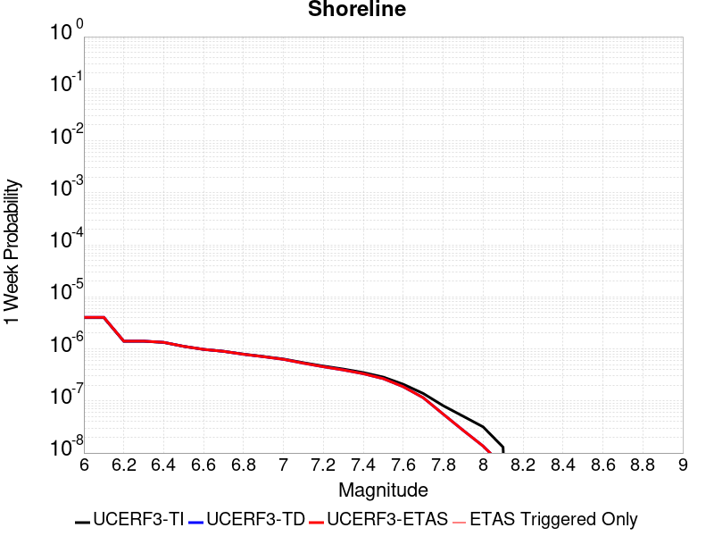 |  | 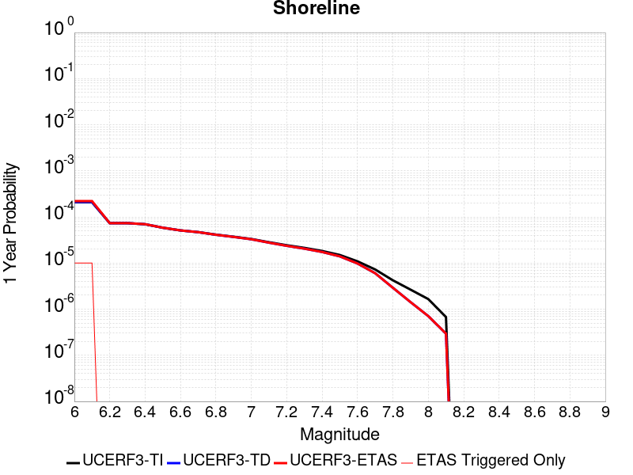 | 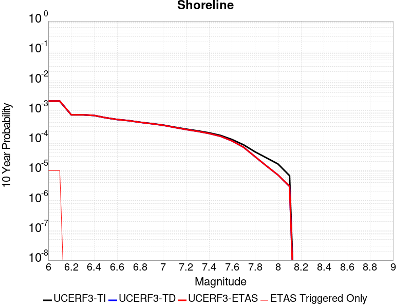 |

| Magnitude | 1 wk TI Prob | 1 wk TD Prob | 1 wk ETAS Prob | 1 wk ETAS/TD Gain | 1 wk ETAS Triggered Only | 1 mo TI Prob | 1 mo TD Prob | 1 mo ETAS Prob | 1 mo ETAS/TD Gain | 1 mo ETAS Triggered Only | 1 yr TI Prob | 1 yr TD Prob | 1 yr ETAS Prob | 1 yr ETAS/TD Gain | 1 yr ETAS Triggered Only | 10 yr TI Prob | 10 yr TD Prob | 10 yr ETAS Prob | 10 yr ETAS/TD Gain | 10 yr ETAS Triggered Only |
|-----|-----|-----|-----|-----|-----|-----|-----|-----|-----|-----|-----|-----|-----|-----|-----|-----|-----|-----|-----|-----|
| 6.0 | 3.9888673E-6 | 4.047945E-6 | 4.047945E-6 | 1.0 | 0.0 | 1.7095033E-5 | 1.7348251E-5 | 1.7348251E-5 | 1.0 | 0.0 | 2.0811215E-4 | 2.1120008E-4 | 2.2803154E-4 | 1.0796944 | 1.6835016E-5 | 0.0020791737 | 0.0021105423 | 0.002127342 | 1.0079598 | 1.6835016E-5 |
| 6.1 | 3.9888673E-6 | 4.047945E-6 | 4.047945E-6 | 1.0 | 0.0 | 1.7095033E-5 | 1.7348251E-5 | 1.7348251E-5 | 1.0 | 0.0 | 2.0811215E-4 | 2.1120008E-4 | 2.2803154E-4 | 1.0796944 | 1.6835016E-5 | 0.0020791737 | 0.0021105423 | 0.002127342 | 1.0079598 | 1.6835016E-5 |
| 6.2 | 1.4039653E-6 | 1.4100978E-6 | 1.4100978E-6 | 1.0 | 0.0 | 6.0169805E-6 | 6.0432626E-6 | 6.0432626E-6 | 1.0 | 0.0 | 7.325427E-5 | 7.3574294E-5 | 7.3574294E-5 | 1.0 | 0.0 | 7.3230127E-4 | 7.3550537E-4 | 7.3550537E-4 | 1.0 | 0.0 |
| 6.3 | 1.4039653E-6 | 1.4100978E-6 | 1.4100978E-6 | 1.0 | 0.0 | 6.0169805E-6 | 6.0432626E-6 | 6.0432626E-6 | 1.0 | 0.0 | 7.325427E-5 | 7.3574294E-5 | 7.3574294E-5 | 1.0 | 0.0 | 7.3230127E-4 | 7.3550537E-4 | 7.3550537E-4 | 1.0 | 0.0 |
| 6.4 | 1.3314152E-6 | 1.336169E-6 | 1.336169E-6 | 1.0 | 0.0 | 5.7060524E-6 | 5.726426E-6 | 5.726426E-6 | 1.0 | 0.0 | 6.946897E-5 | 6.971706E-5 | 6.971706E-5 | 1.0 | 0.0 | 6.9447263E-4 | 6.969573E-4 | 6.969573E-4 | 1.0 | 0.0 |
| 6.5 | 1.1187026E-6 | 1.1203721E-6 | 1.1203721E-6 | 1.0 | 0.0 | 4.794431E-6 | 4.801586E-6 | 4.801586E-6 | 1.0 | 0.0 | 5.8370628E-5 | 5.8457765E-5 | 5.8457765E-5 | 1.0 | 0.0 | 5.83553E-4 | 5.844264E-4 | 5.844264E-4 | 1.0 | 0.0 |
| 6.6 | 9.793089E-7 | 9.784997E-7 | 9.784997E-7 | 1.0 | 0.0 | 4.1970316E-6 | 4.193563E-6 | 4.193563E-6 | 1.0 | 0.0 | 5.1097657E-5 | 5.105545E-5 | 5.105545E-5 | 1.0 | 0.0 | 5.108591E-4 | 5.104385E-4 | 5.104385E-4 | 1.0 | 0.0 |
| 6.7 | 8.995986E-7 | 8.972875E-7 | 8.972875E-7 | 1.0 | 0.0 | 3.8554167E-6 | 3.8455123E-6 | 3.8455123E-6 | 1.0 | 0.0 | 4.693869E-5 | 4.6818117E-5 | 4.6818117E-5 | 1.0 | 0.0 | 4.6928777E-4 | 4.6808348E-4 | 4.6808348E-4 | 1.0 | 0.0 |
| 6.8 | 7.931612E-7 | 7.8804743E-7 | 7.8804743E-7 | 1.0 | 0.0 | 3.3992578E-6 | 3.3773417E-6 | 3.3773417E-6 | 1.0 | 0.0 | 4.1385178E-5 | 4.1118365E-5 | 4.1118365E-5 | 1.0 | 0.0 | 4.1377472E-4 | 4.111081E-4 | 4.111081E-4 | 1.0 | 0.0 |
| 6.9 | 7.1465956E-7 | 7.078075E-7 | 7.078075E-7 | 1.0 | 0.0 | 3.062823E-6 | 3.0334572E-6 | 3.0334572E-6 | 1.0 | 0.0 | 3.7289232E-5 | 3.6931717E-5 | 3.6931717E-5 | 1.0 | 0.0 | 3.7282976E-4 | 3.692562E-4 | 3.692562E-4 | 1.0 | 0.0 |
| 7.0 | 6.389046E-7 | 6.299524E-7 | 6.299524E-7 | 1.0 | 0.0 | 2.7381598E-6 | 2.6997934E-6 | 2.6997934E-6 | 1.0 | 0.0 | 3.3336586E-5 | 3.286949E-5 | 3.286949E-5 | 1.0 | 0.0 | 3.3331584E-4 | 3.2864654E-4 | 3.2864654E-4 | 1.0 | 0.0 |
| 7.1 | 5.4300875E-7 | 5.311193E-7 | 5.311193E-7 | 1.0 | 0.0 | 2.3271782E-6 | 2.2762235E-6 | 2.2762235E-6 | 1.0 | 0.0 | 2.8333026E-5 | 2.7712671E-5 | 2.7712671E-5 | 1.0 | 0.0 | 2.8329415E-4 | 2.7709227E-4 | 2.7709227E-4 | 1.0 | 0.0 |
| 7.2 | 4.6768855E-7 | 4.5349543E-7 | 4.5349543E-7 | 1.0 | 0.0 | 2.0043778E-6 | 1.9435504E-6 | 1.9435504E-6 | 1.0 | 0.0 | 2.4403027E-5 | 2.366247E-5 | 2.366247E-5 | 1.0 | 0.0 | 2.4400349E-4 | 2.3659955E-4 | 2.3659955E-4 | 1.0 | 0.0 |
| 7.3 | 4.0966103E-7 | 3.938623E-7 | 3.938623E-7 | 1.0 | 0.0 | 1.7556889E-6 | 1.6879802E-6 | 1.6879802E-6 | 1.0 | 0.0 | 2.1375303E-5 | 2.0550966E-5 | 2.0550966E-5 | 1.0 | 0.0 | 2.1373246E-4 | 2.0549068E-4 | 2.0549068E-4 | 1.0 | 0.0 |
| 7.4 | 3.5105785E-7 | 3.336452E-7 | 3.336452E-7 | 1.0 | 0.0 | 1.5045327E-6 | 1.4299071E-6 | 1.4299071E-6 | 1.0 | 0.0 | 1.8317533E-5 | 1.740898E-5 | 1.740898E-5 | 1.0 | 0.0 | 1.8316023E-4 | 1.740762E-4 | 1.740762E-4 | 1.0 | 0.0 |
| 7.5 | 2.8737534E-7 | 2.682056E-7 | 2.682056E-7 | 1.0 | 0.0 | 1.2316079E-6 | 1.149452E-6 | 1.149452E-6 | 1.0 | 0.0 | 1.4994724E-5 | 1.3994489E-5 | 1.3994489E-5 | 1.0 | 0.0 | 1.4993713E-4 | 1.3993609E-4 | 1.3993609E-4 | 1.0 | 0.0 |
| 7.6 | 2.0924051E-7 | 1.8779478E-7 | 1.8779478E-7 | 1.0 | 0.0 | 8.967448E-7 | 8.048345E-7 | 8.048345E-7 | 1.0 | 0.0 | 1.0917813E-5 | 9.798816E-6 | 9.798816E-6 | 1.0 | 0.0 | 1.0917276E-4 | 9.798385E-5 | 9.798385E-5 | 1.0 | 0.0 |
| 7.7 | 1.392265E-7 | 1.1543848E-7 | 1.1543848E-7 | 1.0 | 0.0 | 5.9668486E-7 | 4.9473624E-7 | 4.9473624E-7 | 1.0 | 0.0 | 7.2646135E-6 | 6.023397E-6 | 6.023397E-6 | 1.0 | 0.0 | 7.2643765E-5 | 6.023234E-5 | 6.023234E-5 | 1.0 | 0.0 |
| 7.8 | 8.1080074E-8 | 5.58715E-8 | 5.58715E-8 | 1.0 | 0.0 | 3.4748598E-7 | 2.3944926E-7 | 2.3944926E-7 | 1.0 | 0.0 | 4.2306337E-6 | 2.915291E-6 | 2.915291E-6 | 1.0 | 0.0 | 4.230553E-5 | 2.9152527E-5 | 2.9152527E-5 | 1.0 | 0.0 |
| 7.9 | 5.0859036E-8 | 2.7248419E-8 | 2.7248419E-8 | 1.0 | 0.0 | 2.1796728E-7 | 1.16778935E-7 | 1.16778935E-7 | 1.0 | 0.0 | 2.6537484E-6 | 1.4217826E-6 | 1.4217826E-6 | 1.0 | 0.0 | 2.6537167E-5 | 1.4217735E-5 | 1.4217735E-5 | 1.0 | 0.0 |
| 8.0 | 3.1760536E-8 | 1.3580286E-8 | 1.3580286E-8 | 1.0 | 0.0 | 1.3611657E-7 | 5.8201223E-8 | 5.8201223E-8 | 1.0 | 0.0 | 1.6572179E-6 | 7.0859966E-7 | 7.0859966E-7 | 1.0 | 0.0 | 1.6572056E-5 | 7.085974E-6 | 7.085974E-6 | 1.0 | 0.0 |
| 8.1 | 1.2947896E-8 | 5.6641998E-9 | 5.6641998E-9 | 1.0 | 0.0 | 5.5490982E-8 | 2.4275142E-8 | 2.4275142E-8 | 1.0 | 0.0 | 6.756025E-7 | 2.955498E-7 | 2.955498E-7 | 1.0 | 0.0 | 6.7560045E-6 | 2.9554942E-6 | 2.9554942E-6 | 1.0 | 0.0 |

## Davis Creek
*[(top)](#table-of-contents)*

| 1 Week | 1 Month | 1 Year | 10 Year |
|-----|-----|-----|-----|
| 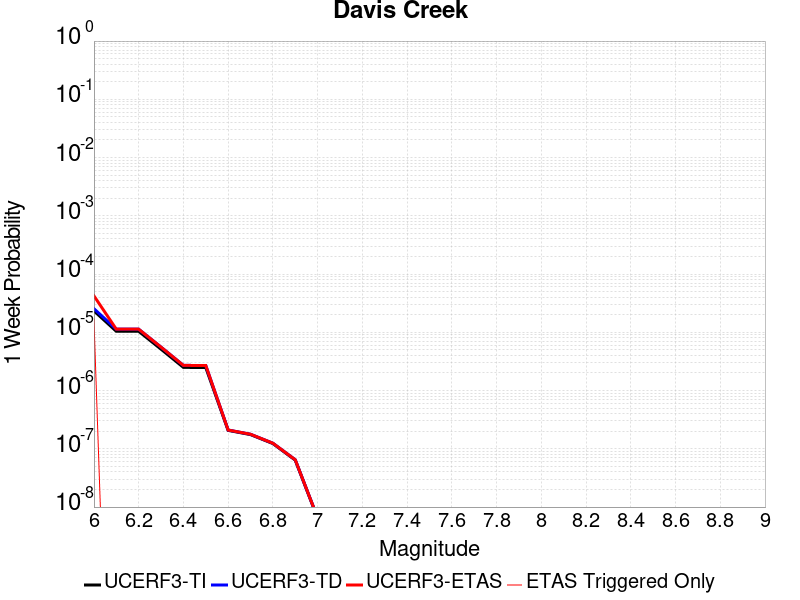 | 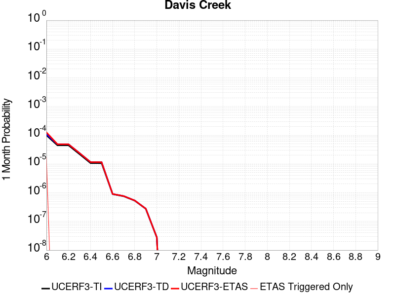 | 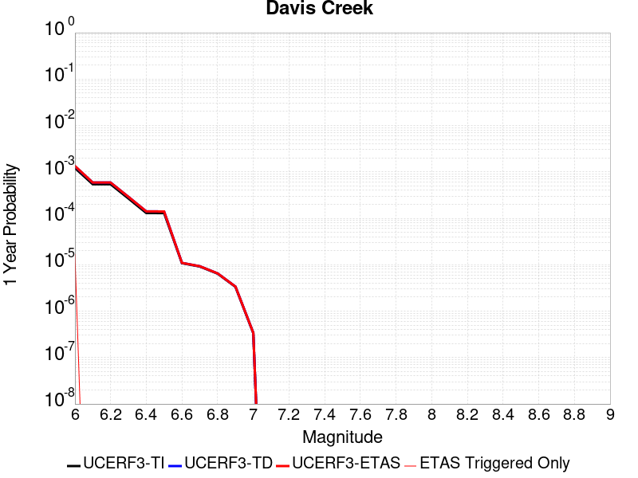 | 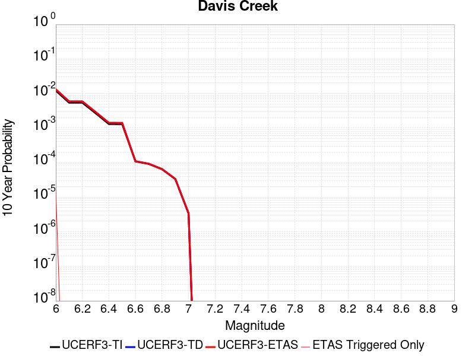 |

| Magnitude | 1 wk TI Prob | 1 wk TD Prob | 1 wk ETAS Prob | 1 wk ETAS/TD Gain | 1 wk ETAS Triggered Only | 1 mo TI Prob | 1 mo TD Prob | 1 mo ETAS Prob | 1 mo ETAS/TD Gain | 1 mo ETAS Triggered Only | 1 yr TI Prob | 1 yr TD Prob | 1 yr ETAS Prob | 1 yr ETAS/TD Gain | 1 yr ETAS Triggered Only | 10 yr TI Prob | 10 yr TD Prob | 10 yr ETAS Prob | 10 yr ETAS/TD Gain | 10 yr ETAS Triggered Only |
|-----|-----|-----|-----|-----|-----|-----|-----|-----|-----|-----|-----|-----|-----|-----|-----|-----|-----|-----|-----|-----|
| 6.0 | 2.331472E-5 | 2.5417517E-5 | 4.2252108E-5 | 1.6623223 | 1.6835016E-5 | 9.99164E-5 | 1.0892834E-4 | 1.2576152E-4 | 1.1545345 | 1.6835016E-5 | 0.0012158032 | 0.0013255142 | 0.0013423269 | 1.0126839 | 1.6835016E-5 | 0.01209173 | 0.013187861 | 0.013204474 | 1.0012597 | 1.6835016E-5 |
| 6.1 | 1.0407654E-5 | 1.1317118E-5 | 1.1317118E-5 | 1.0 | 0.0 | 4.4603472E-5 | 4.8501184E-5 | 4.8501184E-5 | 1.0 | 0.0 | 5.4291193E-4 | 5.9036905E-4 | 5.9036905E-4 | 1.0 | 0.0 | 0.0054158745 | 0.005890679 | 0.005890679 | 1.0 | 0.0 |
| 6.2 | 1.0407654E-5 | 1.1317118E-5 | 1.1317118E-5 | 1.0 | 0.0 | 4.4603472E-5 | 4.8501184E-5 | 4.8501184E-5 | 1.0 | 0.0 | 5.4291193E-4 | 5.9036905E-4 | 5.9036905E-4 | 1.0 | 0.0 | 0.0054158745 | 0.005890679 | 0.005890679 | 1.0 | 0.0 |
| 6.3 | 5.1323277E-6 | 5.5686187E-6 | 5.5686187E-6 | 1.0 | 0.0 | 2.1995505E-5 | 2.386534E-5 | 2.386534E-5 | 1.0 | 0.0 | 2.6776237E-4 | 2.9053038E-4 | 2.9053038E-4 | 1.0 | 0.0 | 0.0026743996 | 0.0029023518 | 0.0029023518 | 1.0 | 0.0 |
| 6.4 | 2.4985154E-6 | 2.7045678E-6 | 2.7045678E-6 | 1.0 | 0.0 | 1.07078795E-5 | 1.1590974E-5 | 1.1590974E-5 | 1.0 | 0.0 | 1.3036063E-4 | 1.411146E-4 | 1.411146E-4 | 1.0 | 0.0 | 0.0013028418 | 0.0014106046 | 0.0014106046 | 1.0 | 0.0 |
| 6.5 | 2.4846438E-6 | 2.690502E-6 | 2.690502E-6 | 1.0 | 0.0 | 1.064843E-5 | 1.1530692E-5 | 1.1530692E-5 | 1.0 | 0.0 | 1.2963692E-4 | 1.4038075E-4 | 1.4038075E-4 | 1.0 | 0.0 | 0.0012956132 | 0.0014032754 | 0.0014032754 | 1.0 | 0.0 |
| 6.6 | 2.072566E-7 | 2.1018127E-7 | 2.1018127E-7 | 1.0 | 0.0 | 8.882423E-7 | 9.0077657E-7 | 9.0077657E-7 | 1.0 | 0.0 | 1.0814296E-5 | 1.0966901E-5 | 1.0966901E-5 | 1.0 | 0.0 | 1.081377E-4 | 1.09663786E-4 | 1.09663786E-4 | 1.0 | 0.0 |
| 6.7 | 1.7544528E-7 | 1.7790859E-7 | 1.7790859E-7 | 1.0 | 0.0 | 7.5190815E-7 | 7.6246516E-7 | 7.6246516E-7 | 1.0 | 0.0 | 9.154443E-6 | 9.282975E-6 | 9.282975E-6 | 1.0 | 0.0 | 9.1540656E-5 | 9.2826034E-5 | 9.2826034E-5 | 1.0 | 0.0 |
| 6.8 | 1.2320395E-7 | 1.2481159E-7 | 1.2481159E-7 | 1.0 | 0.0 | 5.280168E-7 | 5.3490675E-7 | 5.3490675E-7 | 1.0 | 0.0 | 6.428586E-6 | 6.512471E-6 | 6.512471E-6 | 1.0 | 0.0 | 6.4284E-5 | 6.512291E-5 | 6.512291E-5 | 1.0 | 0.0 |
| 6.9 | 6.399997E-8 | 6.486069E-8 | 6.486069E-8 | 1.0 | 0.0 | 2.7428555E-7 | 2.7797438E-7 | 2.7797438E-7 | 1.0 | 0.0 | 3.3394215E-6 | 3.3843335E-6 | 3.3843335E-6 | 1.0 | 0.0 | 3.3393713E-5 | 3.3842884E-5 | 3.3842884E-5 | 1.0 | 0.0 |
| 7.0 | 6.4455685E-9 | 6.5352763E-9 | 6.5352763E-9 | 1.0 | 0.0 | 2.7623864E-8 | 2.8008326E-8 | 2.8008326E-8 | 1.0 | 0.0 | 3.3632048E-7 | 3.4100137E-7 | 3.4100137E-7 | 1.0 | 0.0 | 3.3631998E-6 | 3.4100137E-6 | 3.4100137E-6 | 1.0 | 0.0 |

## Malibu Coast (Extension) alt 1
*[(top)](#table-of-contents)*

| 1 Week | 1 Month | 1 Year | 10 Year |
|-----|-----|-----|-----|
| 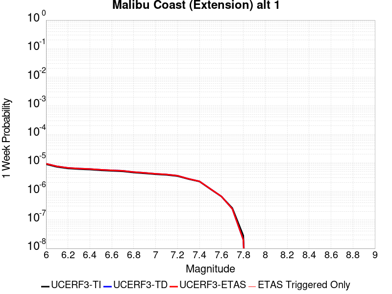 | 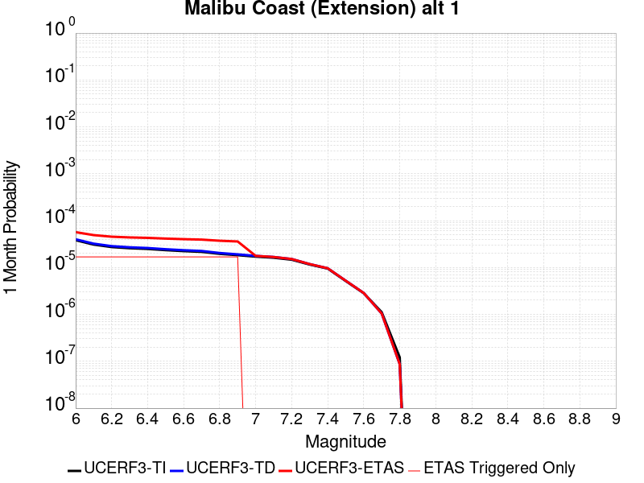 | 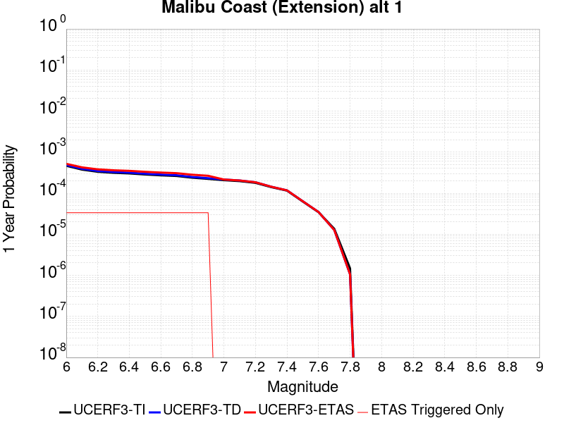 | 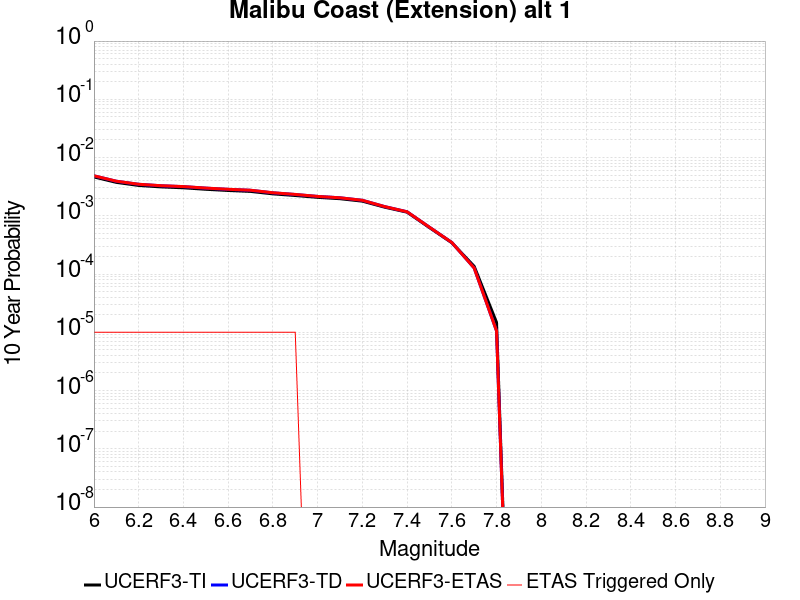 |

| Magnitude | 1 wk TI Prob | 1 wk TD Prob | 1 wk ETAS Prob | 1 wk ETAS/TD Gain | 1 wk ETAS Triggered Only | 1 mo TI Prob | 1 mo TD Prob | 1 mo ETAS Prob | 1 mo ETAS/TD Gain | 1 mo ETAS Triggered Only | 1 yr TI Prob | 1 yr TD Prob | 1 yr ETAS Prob | 1 yr ETAS/TD Gain | 1 yr ETAS Triggered Only | 10 yr TI Prob | 10 yr TD Prob | 10 yr ETAS Prob | 10 yr ETAS/TD Gain | 10 yr ETAS Triggered Only |
|-----|-----|-----|-----|-----|-----|-----|-----|-----|-----|-----|-----|-----|-----|-----|-----|-----|-----|-----|-----|-----|
| 6.0 | 8.930738E-6 | 9.329346E-6 | 9.329346E-6 | 1.0 | 0.0 | 3.827403E-5 | 3.9982307E-5 | 5.681665E-5 | 1.4210448 | 1.6835016E-5 | 4.6588664E-4 | 4.8667757E-4 | 5.035044E-4 | 1.0345749 | 1.6835016E-5 | 0.0046491115 | 0.0048563 | 0.0048730536 | 1.0034498 | 1.6835016E-5 |
| 6.1 | 7.199952E-6 | 7.530357E-6 | 7.530357E-6 | 1.0 | 0.0 | 3.0856572E-5 | 3.227256E-5 | 4.9107035E-5 | 1.5216342 | 1.6835016E-5 | 3.75614E-4 | 3.928482E-4 | 4.096766E-4 | 1.0428369 | 1.6835016E-5 | 0.0037497976 | 0.003921604 | 0.0039383727 | 1.004276 | 1.6835016E-5 |
| 6.2 | 6.3721413E-6 | 6.6668467E-6 | 6.6668467E-6 | 1.0 | 0.0 | 2.7308892E-5 | 2.857189E-5 | 4.5406425E-5 | 1.5891992 | 1.6835016E-5 | 3.3243504E-4 | 3.478076E-4 | 3.6463674E-4 | 1.0483865 | 1.6835016E-5 | 0.0033193815 | 0.0034726725 | 0.0034894492 | 1.0048311 | 1.6835016E-5 |
| 6.3 | 6.016345E-6 | 6.2952113E-6 | 6.2952113E-6 | 1.0 | 0.0 | 2.578408E-5 | 2.69792E-5 | 4.381376E-5 | 1.623983 | 1.6835016E-5 | 3.1387596E-4 | 3.2842258E-4 | 3.4525208E-4 | 1.0512434 | 1.6835016E-5 | 0.00313433 | 0.0032794084 | 0.003296188 | 1.0051167 | 1.6835016E-5 |
| 6.4 | 5.8104883E-6 | 6.0795965E-6 | 6.0795965E-6 | 1.0 | 0.0 | 2.4901856E-5 | 2.6055155E-5 | 4.2889733E-5 | 1.6461132 | 1.6835016E-5 | 3.031379E-4 | 3.1717564E-4 | 3.3400534E-4 | 1.053061 | 1.6835016E-5 | 0.0030272473 | 0.0031672644 | 0.003184046 | 1.0052985 | 1.6835016E-5 |
| 6.5 | 5.476925E-6 | 5.7275624E-6 | 5.7275624E-6 | 1.0 | 0.0 | 2.3472323E-5 | 2.4546467E-5 | 4.138107E-5 | 1.685826 | 1.6835016E-5 | 2.8573806E-4 | 2.9881255E-4 | 3.1564254E-4 | 1.0563229 | 1.6835016E-5 | 0.0028537093 | 0.0029841396 | 0.0030009244 | 1.0056247 | 1.6835016E-5 |
| 6.6 | 5.222387E-6 | 5.4586267E-6 | 5.4586267E-6 | 1.0 | 0.0 | 2.2381464E-5 | 2.3393906E-5 | 4.022853E-5 | 1.7196157 | 1.6835016E-5 | 2.7246025E-4 | 2.847839E-4 | 3.016141E-4 | 1.0590982 | 1.6835016E-5 | 0.0027212645 | 0.00284422 | 0.0028610071 | 1.0059022 | 1.6835016E-5 |
| 6.7 | 5.0337076E-6 | 5.2591486E-6 | 5.2591486E-6 | 1.0 | 0.0 | 2.1572854E-5 | 2.2539016E-5 | 3.937365E-5 | 1.7469109 | 1.6835016E-5 | 2.6261783E-4 | 2.7437825E-4 | 2.9120865E-4 | 1.0613401 | 1.6835016E-5 | 0.002623077 | 0.0027404248 | 0.0027572138 | 1.0061264 | 1.6835016E-5 |
| 6.8 | 4.5675624E-6 | 4.7587573E-6 | 4.7587573E-6 | 1.0 | 0.0 | 1.9575122E-5 | 2.0394515E-5 | 3.722919E-5 | 1.825451 | 1.6835016E-5 | 2.3830103E-4 | 2.4827512E-4 | 2.6510595E-4 | 1.0677911 | 1.6835016E-5 | 0.0023804565 | 0.0024799972 | 0.0024967904 | 1.0067714 | 1.6835016E-5 |
| 6.9 | 4.2802412E-6 | 4.4520584E-6 | 4.4520584E-6 | 1.0 | 0.0 | 1.8343762E-5 | 1.9080113E-5 | 3.5914807E-5 | 1.8823164 | 1.6835016E-5 | 2.2331243E-4 | 2.3227576E-4 | 2.4910687E-4 | 1.0724617 | 1.6835016E-5 | 0.0022308815 | 0.0023203467 | 0.0023371426 | 1.0072385 | 1.6835016E-5 |
| 7.0 | 3.9794063E-6 | 4.130134E-6 | 4.130134E-6 | 1.0 | 0.0 | 1.7054486E-5 | 1.7700455E-5 | 1.7700455E-5 | 1.0 | 0.0 | 2.0761859E-4 | 2.1548186E-4 | 2.1548186E-4 | 1.0 | 0.0 | 0.0020742472 | 0.0021527428 | 0.0021527428 | 1.0 | 0.0 |
| 7.1 | 3.7730424E-6 | 3.91125E-6 | 3.91125E-6 | 1.0 | 0.0 | 1.6170083E-5 | 1.6762395E-5 | 1.6762395E-5 | 1.0 | 0.0 | 1.9685295E-4 | 2.0406317E-4 | 2.0406317E-4 | 1.0 | 0.0 | 0.0019667868 | 0.0020387706 | 0.0020387706 | 1.0 | 0.0 |
| 7.2 | 3.424985E-6 | 3.5413673E-6 | 3.5413673E-6 | 1.0 | 0.0 | 1.4678424E-5 | 1.51772E-5 | 1.51772E-5 | 1.0 | 0.0 | 1.7869516E-4 | 1.8476686E-4 | 1.8476686E-4 | 1.0 | 0.0 | 0.0017855153 | 0.0018461446 | 0.0018461446 | 1.0 | 0.0 |
| 7.3 | 2.6966375E-6 | 2.759676E-6 | 2.759676E-6 | 1.0 | 0.0 | 1.15569665E-5 | 1.1827129E-5 | 1.1827129E-5 | 1.0 | 0.0 | 1.4069698E-4 | 1.4398582E-4 | 1.4398582E-4 | 1.0 | 0.0 | 0.0014060794 | 0.0014389295 | 0.0014389295 | 1.0 | 0.0 |
| 7.4 | 2.215957E-6 | 2.2493962E-6 | 2.2493962E-6 | 1.0 | 0.0 | 9.496924E-6 | 9.640234E-6 | 9.640234E-6 | 1.0 | 0.0 | 1.1561892E-4 | 1.1736356E-4 | 1.1736356E-4 | 1.0 | 0.0 | 0.0011555878 | 0.0011730195 | 0.0011730195 | 1.0 | 0.0 |
| 7.5 | 1.2040218E-6 | 1.2219169E-6 | 1.2219169E-6 | 1.0 | 0.0 | 5.160083E-6 | 5.236777E-6 | 5.236777E-6 | 1.0 | 0.0 | 6.2822204E-5 | 6.3755906E-5 | 6.3755906E-5 | 1.0 | 0.0 | 6.280445E-4 | 6.37378E-4 | 6.37378E-4 | 1.0 | 0.0 |
| 7.6 | 6.6157446E-7 | 6.6790335E-7 | 6.6790335E-7 | 1.0 | 0.0 | 2.835316E-6 | 2.86244E-6 | 2.86244E-6 | 1.0 | 0.0 | 3.4519428E-5 | 3.4849665E-5 | 3.4849665E-5 | 1.0 | 0.0 | 3.4514067E-4 | 3.4844351E-4 | 3.4844351E-4 | 1.0 | 0.0 |
| 7.7 | 2.6012302E-7 | 2.4357794E-7 | 2.4357794E-7 | 1.0 | 0.0 | 1.1148124E-6 | 1.0439051E-6 | 1.0439051E-6 | 1.0 | 0.0 | 1.3572758E-5 | 1.2709481E-5 | 1.2709481E-5 | 1.0 | 0.0 | 1.3571928E-4 | 1.2708861E-4 | 1.2708861E-4 | 1.0 | 0.0 |
| 7.8 | 2.8323132E-8 | 2.026683E-8 | 2.026683E-8 | 1.0 | 0.0 | 1.2138484E-7 | 8.685784E-8 | 8.685784E-8 | 1.0 | 0.0 | 1.4778595E-6 | 1.0574938E-6 | 1.0574938E-6 | 1.0 | 0.0 | 1.4778497E-5 | 1.0574896E-5 | 1.0574896E-5 | 1.0 | 0.0 |

## Simi-Santa Rosa
*[(top)](#table-of-contents)*

| 1 Week | 1 Month | 1 Year | 10 Year |
|-----|-----|-----|-----|
| 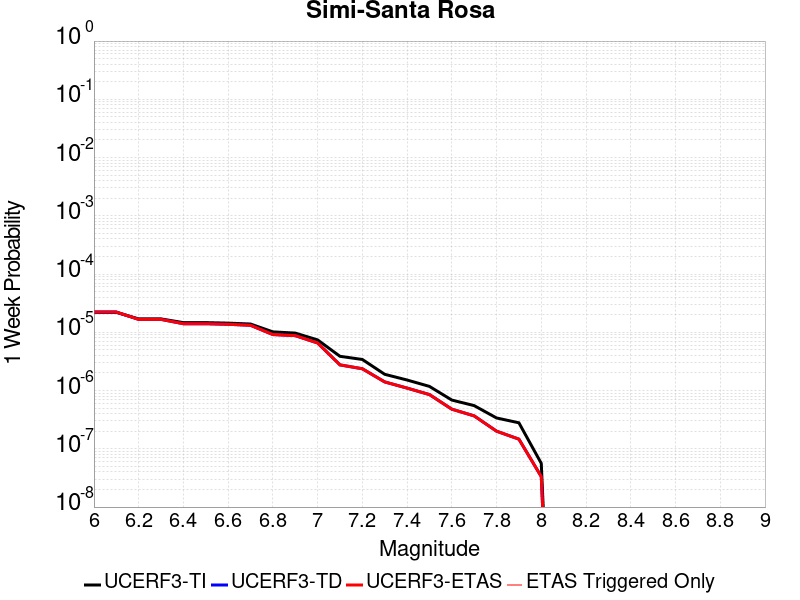 | 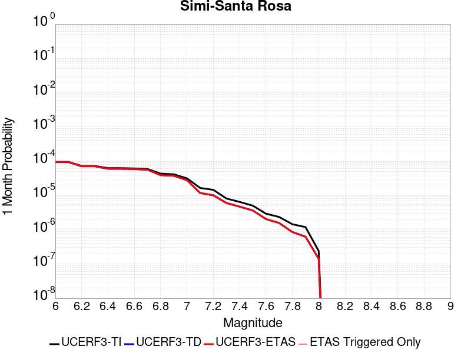 | 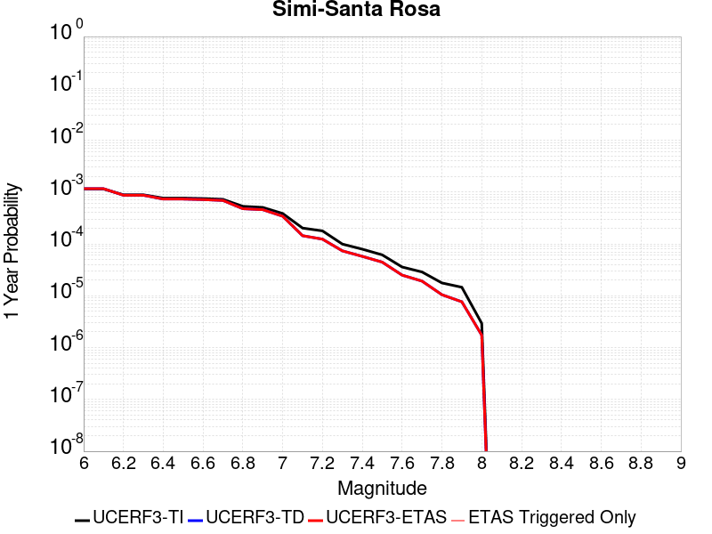 | 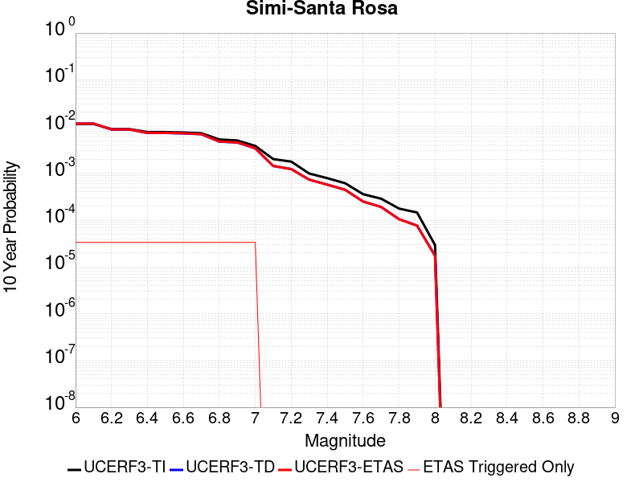 |

| Magnitude | 1 wk TI Prob | 1 wk TD Prob | 1 wk ETAS Prob | 1 wk ETAS/TD Gain | 1 wk ETAS Triggered Only | 1 mo TI Prob | 1 mo TD Prob | 1 mo ETAS Prob | 1 mo ETAS/TD Gain | 1 mo ETAS Triggered Only | 1 yr TI Prob | 1 yr TD Prob | 1 yr ETAS Prob | 1 yr ETAS/TD Gain | 1 yr ETAS Triggered Only | 10 yr TI Prob | 10 yr TD Prob | 10 yr ETAS Prob | 10 yr ETAS/TD Gain | 10 yr ETAS Triggered Only |
|-----|-----|-----|-----|-----|-----|-----|-----|-----|-----|-----|-----|-----|-----|-----|-----|-----|-----|-----|-----|-----|
| 6.0 | 2.198912E-5 | 2.2275886E-5 | 2.2275886E-5 | 1.0 | 0.0 | 9.4235686E-5 | 9.5464835E-5 | 9.5464835E-5 | 1.0 | 0.0 | 0.0011467156 | 0.0011617085 | 0.0011617085 | 1.0 | 0.0 | 0.011408163 | 0.011560804 | 0.011577444 | 1.0014393 | 1.6835016E-5 |
| 6.1 | 2.198912E-5 | 2.2275886E-5 | 2.2275886E-5 | 1.0 | 0.0 | 9.4235686E-5 | 9.5464835E-5 | 9.5464835E-5 | 1.0 | 0.0 | 0.0011467156 | 0.0011617085 | 0.0011617085 | 1.0 | 0.0 | 0.011408163 | 0.011560804 | 0.011577444 | 1.0014393 | 1.6835016E-5 |
| 6.2 | 1.69983E-5 | 1.6668911E-5 | 1.6668911E-5 | 1.0 | 0.0 | 7.284782E-5 | 7.14364E-5 | 7.14364E-5 | 1.0 | 0.0 | 8.865613E-4 | 8.694203E-4 | 8.694203E-4 | 1.0 | 0.0 | 0.008830327 | 0.0086631095 | 0.008679799 | 1.0019264 | 1.6835016E-5 |
| 6.3 | 1.69983E-5 | 1.6668911E-5 | 1.6668911E-5 | 1.0 | 0.0 | 7.284782E-5 | 7.14364E-5 | 7.14364E-5 | 1.0 | 0.0 | 8.865613E-4 | 8.694203E-4 | 8.694203E-4 | 1.0 | 0.0 | 0.008830327 | 0.0086631095 | 0.008679799 | 1.0019264 | 1.6835016E-5 |
| 6.4 | 1.4666188E-5 | 1.4052852E-5 | 1.4052852E-5 | 1.0 | 0.0 | 6.285358E-5 | 6.022526E-5 | 6.022526E-5 | 1.0 | 0.0 | 7.6497364E-4 | 7.330208E-4 | 7.330208E-4 | 1.0 | 0.0 | 0.0076234564 | 0.0073085045 | 0.007325216 | 1.0022867 | 1.6835016E-5 |
| 6.5 | 1.4666188E-5 | 1.4052852E-5 | 1.4052852E-5 | 1.0 | 0.0 | 6.285358E-5 | 6.022526E-5 | 6.022526E-5 | 1.0 | 0.0 | 7.6497364E-4 | 7.330208E-4 | 7.330208E-4 | 1.0 | 0.0 | 0.0076234564 | 0.0073085045 | 0.007325216 | 1.0022867 | 1.6835016E-5 |
| 6.6 | 1.4377586E-5 | 1.3729887E-5 | 1.3729887E-5 | 1.0 | 0.0 | 6.1616774E-5 | 5.8841186E-5 | 5.8841186E-5 | 1.0 | 0.0 | 7.4992597E-4 | 7.1618083E-4 | 7.1618083E-4 | 1.0 | 0.0 | 0.007474003 | 0.007141196 | 0.007157911 | 1.0023407 | 1.6835016E-5 |
| 6.7 | 1.3881404E-5 | 1.3207847E-5 | 1.3207847E-5 | 1.0 | 0.0 | 5.9490372E-5 | 5.6603967E-5 | 5.6603967E-5 | 1.0 | 0.0 | 7.240546E-4 | 6.889601E-4 | 6.889601E-4 | 1.0 | 0.0 | 0.007217 | 0.0068706917 | 0.006887411 | 1.0024334 | 1.6835016E-5 |
| 6.8 | 1.0176516E-5 | 9.154378E-6 | 9.154378E-6 | 1.0 | 0.0 | 4.3612912E-5 | 3.9232553E-5 | 3.9232553E-5 | 1.0 | 0.0 | 5.308578E-4 | 4.7756822E-4 | 4.7756822E-4 | 1.0 | 0.0 | 0.0052959146 | 0.004767053 | 0.0047838073 | 1.0035146 | 1.6835016E-5 |
| 6.9 | 9.699797E-6 | 8.7749395E-6 | 8.7749395E-6 | 1.0 | 0.0 | 4.15699E-5 | 3.7606434E-5 | 3.7606434E-5 | 1.0 | 0.0 | 5.05996E-4 | 4.5777857E-4 | 4.5777857E-4 | 1.0 | 0.0 | 0.005048454 | 0.004569974 | 0.004586732 | 1.003667 | 1.6835016E-5 |
| 7.0 | 7.4049476E-6 | 6.559509E-6 | 6.559509E-6 | 1.0 | 0.0 | 3.1735104E-5 | 2.811195E-5 | 2.811195E-5 | 1.0 | 0.0 | 3.8630638E-4 | 3.422219E-4 | 3.422219E-4 | 1.0 | 0.0 | 0.0038563553 | 0.0034181913 | 0.0034349689 | 1.0049083 | 1.6835016E-5 |
| 7.1 | 3.873439E-6 | 2.759614E-6 | 2.759614E-6 | 1.0 | 0.0 | 1.6600346E-5 | 1.1826865E-5 | 1.1826865E-5 | 1.0 | 0.0 | 2.0209046E-4 | 1.439828E-4 | 1.439828E-4 | 1.0 | 0.0 | 0.0020190678 | 0.0014389188 | 0.0014389188 | 1.0 | 0.0 |
| 7.2 | 3.417706E-6 | 2.3677471E-6 | 2.3677471E-6 | 1.0 | 0.0 | 1.4647229E-5 | 1.014745E-5 | 1.014745E-5 | 1.0 | 0.0 | 1.7831543E-4 | 1.2353843E-4 | 1.2353843E-4 | 1.0 | 0.0 | 0.0017817242 | 0.0012347198 | 0.0012347198 | 1.0 | 0.0 |
| 7.3 | 1.90225E-6 | 1.4074596E-6 | 1.4074596E-6 | 1.0 | 0.0 | 8.152474E-6 | 6.0319558E-6 | 6.0319558E-6 | 1.0 | 0.0 | 9.9251854E-5 | 7.343661E-5 | 7.343661E-5 | 1.0 | 0.0 | 9.920754E-4 | 7.341257E-4 | 7.341257E-4 | 1.0 | 0.0 |
| 7.4 | 1.5170556E-6 | 1.1025584E-6 | 1.1025584E-6 | 1.0 | 0.0 | 6.5016507E-6 | 4.7252415E-6 | 4.7252415E-6 | 1.0 | 0.0 | 7.915472E-5 | 5.752831E-5 | 5.752831E-5 | 1.0 | 0.0 | 7.9126534E-4 | 5.751353E-4 | 5.751353E-4 | 1.0 | 0.0 |
| 7.5 | 1.178732E-6 | 8.5358926E-7 | 8.5358926E-7 | 1.0 | 0.0 | 5.0516987E-6 | 3.6582346E-6 | 3.6582346E-6 | 1.0 | 0.0 | 6.1502695E-5 | 4.4538105E-5 | 4.4538105E-5 | 1.0 | 0.0 | 6.148568E-4 | 4.4529274E-4 | 4.4529274E-4 | 1.0 | 0.0 |
| 7.6 | 6.8722386E-7 | 4.793958E-7 | 4.793958E-7 | 1.0 | 0.0 | 2.9452417E-6 | 2.0545517E-6 | 2.0545517E-6 | 1.0 | 0.0 | 3.5857727E-5 | 2.5013882E-5 | 2.5013882E-5 | 1.0 | 0.0 | 3.5851944E-4 | 2.5011078E-4 | 2.5011078E-4 | 1.0 | 0.0 |
| 7.7 | 5.5126515E-7 | 3.673869E-7 | 3.673869E-7 | 1.0 | 0.0 | 2.3625628E-6 | 1.5745143E-6 | 1.5745143E-6 | 1.0 | 0.0 | 2.8763823E-5 | 1.9169544E-5 | 1.9169544E-5 | 1.0 | 0.0 | 2.87601E-4 | 1.91679E-4 | 1.91679E-4 | 1.0 | 0.0 |
| 7.8 | 3.3860243E-7 | 2.0081488E-7 | 2.0081488E-7 | 1.0 | 0.0 | 1.4511525E-6 | 8.6063494E-7 | 8.6063494E-7 | 1.0 | 0.0 | 1.7667637E-5 | 1.047818E-5 | 1.047818E-5 | 1.0 | 0.0 | 1.7666233E-4 | 1.0477692E-4 | 1.0477692E-4 | 1.0 | 0.0 |
| 7.9 | 2.7955386E-7 | 1.4654502E-7 | 1.4654502E-7 | 1.0 | 0.0 | 1.1980875E-6 | 6.280499E-7 | 6.280499E-7 | 1.0 | 0.0 | 1.4586617E-5 | 7.646482E-6 | 7.646482E-6 | 1.0 | 0.0 | 1.458566E-4 | 7.646223E-5 | 7.646223E-5 | 1.0 | 0.0 |
| 8.0 | 5.6259015E-8 | 3.3357086E-8 | 3.3357086E-8 | 1.0 | 0.0 | 2.4111003E-7 | 1.4295894E-7 | 1.4295894E-7 | 1.0 | 0.0 | 2.9355108E-6 | 1.7405239E-6 | 1.7405239E-6 | 1.0 | 0.0 | 2.935472E-5 | 1.7405117E-5 | 1.7405117E-5 | 1.0 | 0.0 |

## Surprise Valley 2011 CFM
*[(top)](#table-of-contents)*

| 1 Week | 1 Month | 1 Year | 10 Year |
|-----|-----|-----|-----|
| 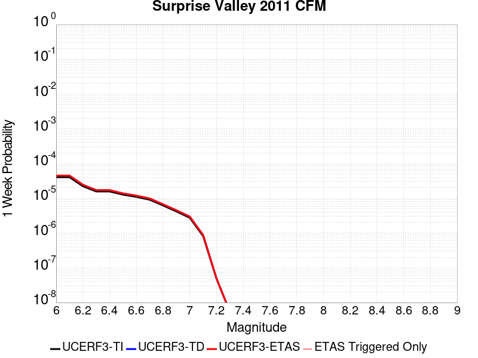 | 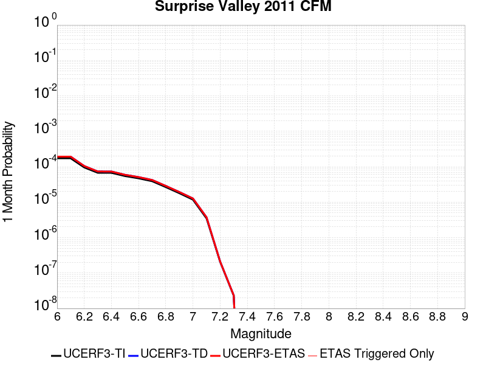 | 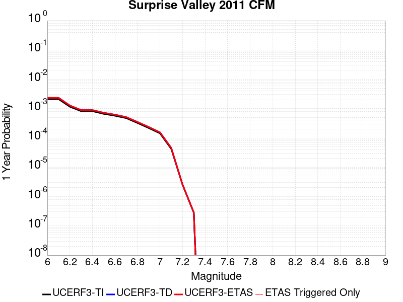 | 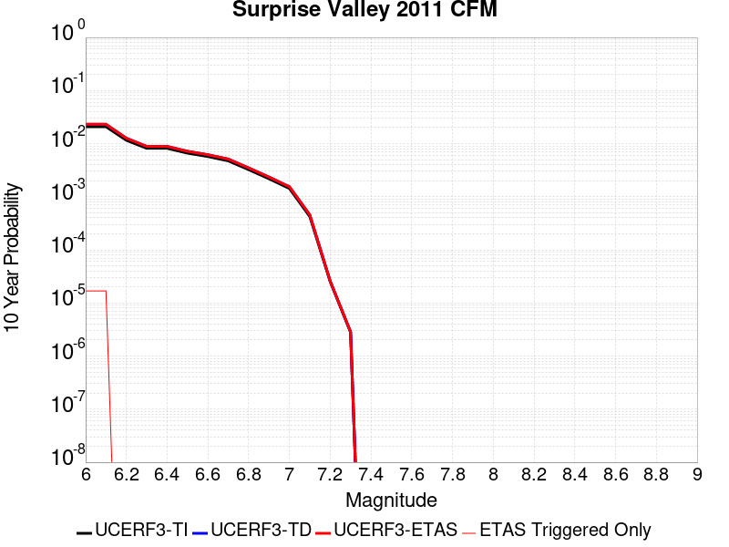 |

| Magnitude | 1 wk TI Prob | 1 wk TD Prob | 1 wk ETAS Prob | 1 wk ETAS/TD Gain | 1 wk ETAS Triggered Only | 1 mo TI Prob | 1 mo TD Prob | 1 mo ETAS Prob | 1 mo ETAS/TD Gain | 1 mo ETAS Triggered Only | 1 yr TI Prob | 1 yr TD Prob | 1 yr ETAS Prob | 1 yr ETAS/TD Gain | 1 yr ETAS Triggered Only | 10 yr TI Prob | 10 yr TD Prob | 10 yr ETAS Prob | 10 yr ETAS/TD Gain | 10 yr ETAS Triggered Only |
|-----|-----|-----|-----|-----|-----|-----|-----|-----|-----|-----|-----|-----|-----|-----|-----|-----|-----|-----|-----|-----|
| 6.0 | 4.0396248E-5 | 4.485197E-5 | 4.485197E-5 | 1.0 | 0.0 | 1.7311527E-4 | 1.9220974E-4 | 1.9220974E-4 | 1.0 | 0.0 | 0.002105641 | 0.002337852 | 0.002337852 | 1.0 | 0.0 | 0.020858008 | 0.023154303 | 0.023170749 | 1.0007102 | 1.6835016E-5 |
| 6.1 | 4.0396248E-5 | 4.485197E-5 | 4.485197E-5 | 1.0 | 0.0 | 1.7311527E-4 | 1.9220974E-4 | 1.9220974E-4 | 1.0 | 0.0 | 0.002105641 | 0.002337852 | 0.002337852 | 1.0 | 0.0 | 0.020858008 | 0.023154303 | 0.023170749 | 1.0007102 | 1.6835016E-5 |
| 6.2 | 2.2295266E-5 | 2.4401555E-5 | 2.4401555E-5 | 1.0 | 0.0 | 9.554764E-5 | 1.0457408E-4 | 1.0457408E-4 | 1.0 | 0.0 | 0.0011626717 | 0.0012724766 | 0.0012724766 | 1.0 | 0.0 | 0.011566074 | 0.012655139 | 0.012655139 | 1.0 | 0.0 |
| 6.3 | 1.572643E-5 | 1.7097005E-5 | 1.7097005E-5 | 1.0 | 0.0 | 6.7397246E-5 | 7.327088E-5 | 7.327088E-5 | 1.0 | 0.0 | 8.202525E-4 | 8.917184E-4 | 8.917184E-4 | 1.0 | 0.0 | 0.008172315 | 0.00888251 | 0.00888251 | 1.0 | 0.0 |
| 6.4 | 1.5714395E-5 | 1.7084827E-5 | 1.7084827E-5 | 1.0 | 0.0 | 6.734567E-5 | 7.321869E-5 | 7.321869E-5 | 1.0 | 0.0 | 8.1962504E-4 | 8.910835E-4 | 8.910835E-4 | 1.0 | 0.0 | 0.008166086 | 0.008876211 | 0.008876211 | 1.0 | 0.0 |
| 6.5 | 1.2733495E-5 | 1.3801754E-5 | 1.3801754E-5 | 1.0 | 0.0 | 5.457098E-5 | 5.914907E-5 | 5.914907E-5 | 1.0 | 0.0 | 6.641992E-4 | 7.199087E-4 | 7.199087E-4 | 1.0 | 0.0 | 0.0066221743 | 0.0071764593 | 0.0071764593 | 1.0 | 0.0 |
| 6.6 | 1.0983784E-5 | 1.1886684E-5 | 1.1886684E-5 | 1.0 | 0.0 | 4.7072506E-5 | 5.0941966E-5 | 5.0941966E-5 | 1.0 | 0.0 | 5.7295704E-4 | 6.2004727E-4 | 6.2004727E-4 | 1.0 | 0.0 | 0.0057148207 | 0.006183722 | 0.006183722 | 1.0 | 0.0 |
| 6.7 | 9.104806E-6 | 9.839597E-6 | 9.839597E-6 | 1.0 | 0.0 | 3.902001E-5 | 4.2169042E-5 | 4.2169042E-5 | 1.0 | 0.0 | 4.7496508E-4 | 5.1329104E-4 | 5.1329104E-4 | 1.0 | 0.0 | 0.004739512 | 0.005121452 | 0.005121452 | 1.0 | 0.0 |
| 6.8 | 6.2162403E-6 | 6.7042038E-6 | 6.7042038E-6 | 1.0 | 0.0 | 2.6640759E-5 | 2.8731998E-5 | 2.8731998E-5 | 1.0 | 0.0 | 3.2430296E-4 | 3.4975816E-4 | 3.4975816E-4 | 1.0 | 0.0 | 0.003238301 | 0.0034923002 | 0.0034923002 | 1.0 | 0.0 |
| 6.9 | 4.1792696E-6 | 4.5032766E-6 | 4.5032766E-6 | 1.0 | 0.0 | 1.7911032E-5 | 1.9299621E-5 | 1.9299621E-5 | 1.0 | 0.0 | 2.1804498E-4 | 2.3494911E-4 | 2.3494911E-4 | 1.0 | 0.0 | 0.0021783116 | 0.0023471604 | 0.0023471604 | 1.0 | 0.0 |
| 7.0 | 2.7478413E-6 | 2.9622734E-6 | 2.9622734E-6 | 1.0 | 0.0 | 1.177641E-5 | 1.2695402E-5 | 1.2695402E-5 | 1.0 | 0.0 | 1.4336836E-4 | 1.5455681E-4 | 1.5455681E-4 | 1.0 | 0.0 | 0.001432759 | 0.0015446156 | 0.0015446156 | 1.0 | 0.0 |
| 7.1 | 8.128648E-7 | 8.725007E-7 | 8.725007E-7 | 1.0 | 0.0 | 3.4837017E-6 | 3.739287E-6 | 3.739287E-6 | 1.0 | 0.0 | 4.2413245E-5 | 4.5525467E-5 | 4.5525467E-5 | 1.0 | 0.0 | 4.2405148E-4 | 4.5522023E-4 | 4.5522023E-4 | 1.0 | 0.0 |
| 7.2 | 4.8641045E-8 | 4.9402168E-8 | 4.9402168E-8 | 1.0 | 0.0 | 2.084616E-7 | 2.1172356E-7 | 2.1172356E-7 | 1.0 | 0.0 | 2.538017E-6 | 2.5777315E-6 | 2.5777315E-6 | 1.0 | 0.0 | 2.537988E-5 | 2.5777028E-5 | 2.5777028E-5 | 1.0 | 0.0 |
| 7.3 | 5.3911844E-9 | 5.4758256E-9 | 5.4758256E-9 | 1.0 | 0.0 | 2.3105075E-8 | 2.3467823E-8 | 2.3467823E-8 | 1.0 | 0.0 | 2.8130427E-7 | 2.8572074E-7 | 2.8572074E-7 | 1.0 | 0.0 | 2.8130391E-6 | 2.8572053E-6 | 2.8572053E-6 | 1.0 | 0.0 |

## Great Valley 03 Mysterious Ridge
*[(top)](#table-of-contents)*

| 1 Week | 1 Month | 1 Year | 10 Year |
|-----|-----|-----|-----|
| 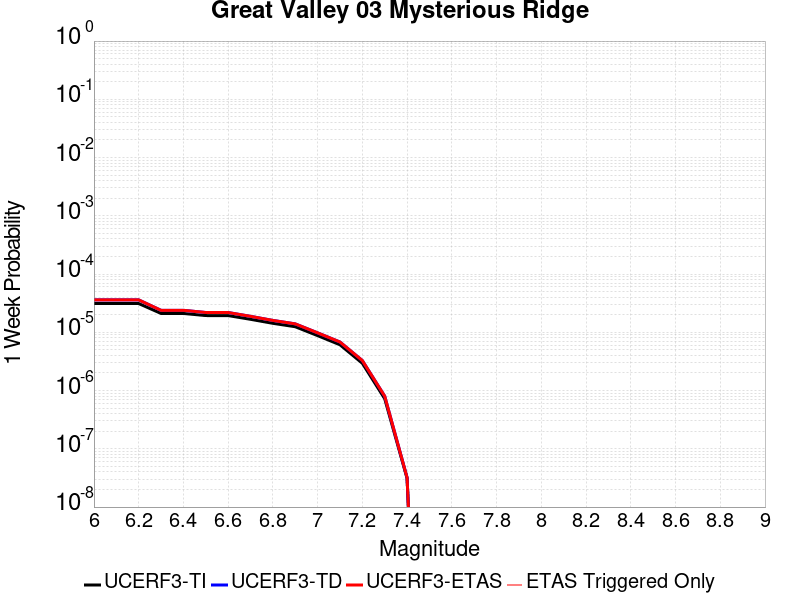 | 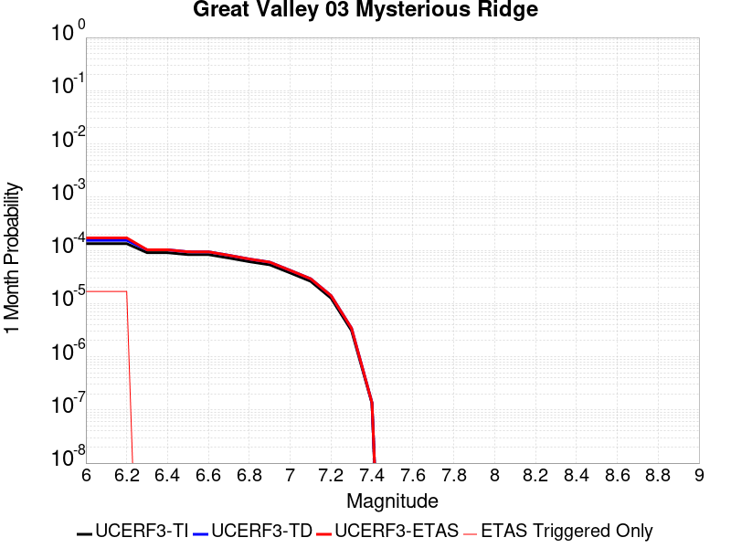 | 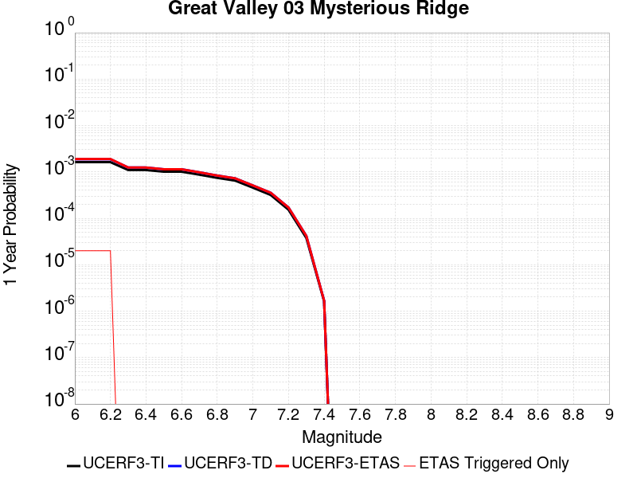 | 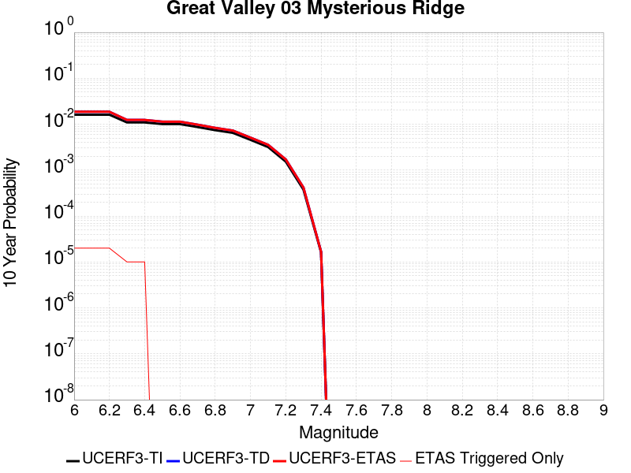 |

| Magnitude | 1 wk TI Prob | 1 wk TD Prob | 1 wk ETAS Prob | 1 wk ETAS/TD Gain | 1 wk ETAS Triggered Only | 1 mo TI Prob | 1 mo TD Prob | 1 mo ETAS Prob | 1 mo ETAS/TD Gain | 1 mo ETAS Triggered Only | 1 yr TI Prob | 1 yr TD Prob | 1 yr ETAS Prob | 1 yr ETAS/TD Gain | 1 yr ETAS Triggered Only | 10 yr TI Prob | 10 yr TD Prob | 10 yr ETAS Prob | 10 yr ETAS/TD Gain | 10 yr ETAS Triggered Only |
|-----|-----|-----|-----|-----|-----|-----|-----|-----|-----|-----|-----|-----|-----|-----|-----|-----|-----|-----|-----|-----|
| 6.0 | 3.1182444E-5 | 3.603498E-5 | 3.603498E-5 | 1.0 | 0.0 | 1.336322E-4 | 1.5442717E-4 | 1.7125958E-4 | 1.108999 | 1.6835016E-5 | 0.0016257578 | 0.0018787086 | 0.001895512 | 1.0089442 | 1.6835016E-5 | 0.016139153 | 0.018647036 | 0.018663557 | 1.000886 | 1.6835016E-5 |
| 6.1 | 3.1182444E-5 | 3.603498E-5 | 3.603498E-5 | 1.0 | 0.0 | 1.336322E-4 | 1.5442717E-4 | 1.7125958E-4 | 1.108999 | 1.6835016E-5 | 0.0016257578 | 0.0018787086 | 0.001895512 | 1.0089442 | 1.6835016E-5 | 0.016139153 | 0.018647036 | 0.018663557 | 1.000886 | 1.6835016E-5 |
| 6.2 | 3.1182444E-5 | 3.603498E-5 | 3.603498E-5 | 1.0 | 0.0 | 1.336322E-4 | 1.5442717E-4 | 1.7125958E-4 | 1.108999 | 1.6835016E-5 | 0.0016257578 | 0.0018787086 | 0.001895512 | 1.0089442 | 1.6835016E-5 | 0.016139153 | 0.018647036 | 0.018663557 | 1.000886 | 1.6835016E-5 |
| 6.3 | 2.106934E-5 | 2.3850727E-5 | 2.3850727E-5 | 1.0 | 0.0 | 9.0294045E-5 | 1.0221358E-4 | 1.0221358E-4 | 1.0 | 0.0 | 0.0010987755 | 0.0012437708 | 0.0012437708 | 1.0 | 0.0 | 0.010933585 | 0.012371344 | 0.012371344 | 1.0 | 0.0 |
| 6.4 | 2.106934E-5 | 2.3850727E-5 | 2.3850727E-5 | 1.0 | 0.0 | 9.0294045E-5 | 1.0221358E-4 | 1.0221358E-4 | 1.0 | 0.0 | 0.0010987755 | 0.0012437708 | 0.0012437708 | 1.0 | 0.0 | 0.010933585 | 0.012371344 | 0.012371344 | 1.0 | 0.0 |
| 6.5 | 1.9389783E-5 | 2.188536E-5 | 2.188536E-5 | 1.0 | 0.0 | 8.309642E-5 | 9.379118E-5 | 9.379118E-5 | 1.0 | 0.0 | 0.0010112294 | 0.001141337 | 0.001141337 | 1.0 | 0.0 | 0.010066401 | 0.011357628 | 0.011357628 | 1.0 | 0.0 |
| 6.6 | 1.9370193E-5 | 2.186528E-5 | 2.186528E-5 | 1.0 | 0.0 | 8.301247E-5 | 9.370514E-5 | 9.370514E-5 | 1.0 | 0.0 | 0.0010102082 | 0.0011402905 | 0.0011402905 | 1.0 | 0.0 | 0.010056281 | 0.01134727 | 0.01134727 | 1.0 | 0.0 |
| 6.7 | 1.6723505E-5 | 1.8799592E-5 | 1.8799592E-5 | 1.0 | 0.0 | 7.16702E-5 | 8.0567304E-5 | 8.0567304E-5 | 1.0 | 0.0 | 8.722353E-4 | 9.80485E-4 | 9.80485E-4 | 1.0 | 0.0 | 0.008688197 | 0.0097636 | 0.0097636 | 1.0 | 0.0 |
| 6.8 | 1.426937E-5 | 1.5997468E-5 | 1.5997468E-5 | 1.0 | 0.0 | 6.115301E-5 | 6.855885E-5 | 6.855885E-5 | 1.0 | 0.0 | 7.4428355E-4 | 8.3439884E-4 | 8.3439884E-4 | 1.0 | 0.0 | 0.007417957 | 0.008314138 | 0.008314138 | 1.0 | 0.0 |
| 6.9 | 1.2469891E-5 | 1.395715E-5 | 1.395715E-5 | 1.0 | 0.0 | 5.3441294E-5 | 5.9815055E-5 | 5.9815055E-5 | 1.0 | 0.0 | 6.504535E-4 | 7.28017E-4 | 7.28017E-4 | 1.0 | 0.0 | 0.006485529 | 0.007257545 | 0.007257545 | 1.0 | 0.0 |
| 7.0 | 8.7746275E-6 | 9.791885E-6 | 9.791885E-6 | 1.0 | 0.0 | 3.7605005E-5 | 4.1964588E-5 | 4.1964588E-5 | 1.0 | 0.0 | 4.5774475E-4 | 5.108064E-4 | 5.108064E-4 | 1.0 | 0.0 | 0.00456803 | 0.005097056 | 0.005097056 | 1.0 | 0.0 |
| 7.1 | 6.1067153E-6 | 6.81383E-6 | 6.81383E-6 | 1.0 | 0.0 | 2.6171374E-5 | 2.9201834E-5 | 2.9201834E-5 | 1.0 | 0.0 | 3.1858988E-4 | 3.5547992E-4 | 3.5547992E-4 | 1.0 | 0.0 | 0.0031813353 | 0.0035496636 | 0.0035496636 | 1.0 | 0.0 |
| 7.2 | 2.939283E-6 | 3.2741555E-6 | 3.2741555E-6 | 1.0 | 0.0 | 1.2596866E-5 | 1.4032029E-5 | 1.4032029E-5 | 1.0 | 0.0 | 1.5335606E-4 | 1.7082831E-4 | 1.7082831E-4 | 1.0 | 0.0 | 0.0015325027 | 0.001707142 | 0.001707142 | 1.0 | 0.0 |
| 7.3 | 7.2387763E-7 | 8.008619E-7 | 8.008619E-7 | 1.0 | 0.0 | 3.102329E-6 | 3.4322634E-6 | 3.4322634E-6 | 1.0 | 0.0 | 3.77702E-5 | 4.1787465E-5 | 4.1787465E-5 | 1.0 | 0.0 | 3.7763783E-4 | 4.1784105E-4 | 4.1784105E-4 | 1.0 | 0.0 |
| 7.4 | 3.112171E-8 | 3.2068495E-8 | 3.2068495E-8 | 1.0 | 0.0 | 1.3337875E-7 | 1.374364E-7 | 1.374364E-7 | 1.0 | 0.0 | 1.6238852E-6 | 1.673287E-6 | 1.673287E-6 | 1.0 | 0.0 | 1.6238733E-5 | 1.6732753E-5 | 1.6732753E-5 | 1.0 | 0.0 |

## Big Lagoon - Bald Mtn 2011 CFM
*[(top)](#table-of-contents)*

| 1 Week | 1 Month | 1 Year | 10 Year |
|-----|-----|-----|-----|
| 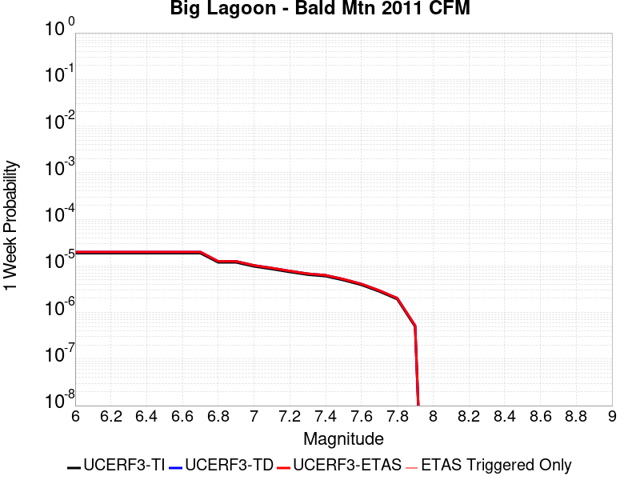 | 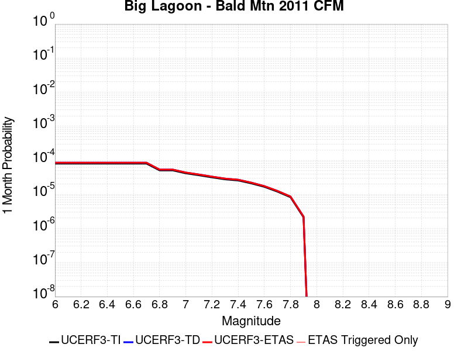 | 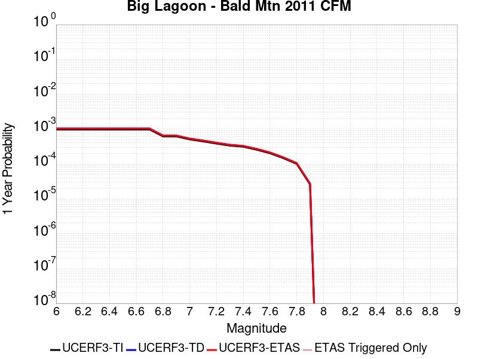 | 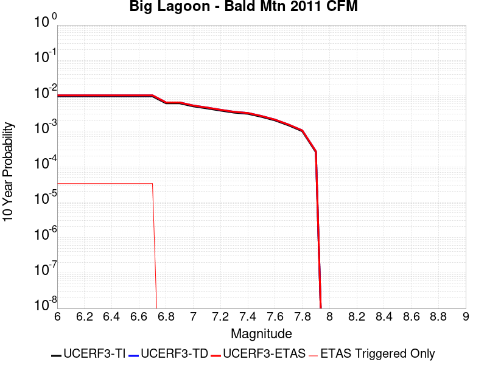 |

| Magnitude | 1 wk TI Prob | 1 wk TD Prob | 1 wk ETAS Prob | 1 wk ETAS/TD Gain | 1 wk ETAS Triggered Only | 1 mo TI Prob | 1 mo TD Prob | 1 mo ETAS Prob | 1 mo ETAS/TD Gain | 1 mo ETAS Triggered Only | 1 yr TI Prob | 1 yr TD Prob | 1 yr ETAS Prob | 1 yr ETAS/TD Gain | 1 yr ETAS Triggered Only | 10 yr TI Prob | 10 yr TD Prob | 10 yr ETAS Prob | 10 yr ETAS/TD Gain | 10 yr ETAS Triggered Only |
|-----|-----|-----|-----|-----|-----|-----|-----|-----|-----|-----|-----|-----|-----|-----|-----|-----|-----|-----|-----|-----|
| 6.0 | 1.8699735E-5 | 1.9850344E-5 | 1.9850344E-5 | 1.0 | 0.0 | 8.013926E-5 | 8.5070336E-5 | 8.5070336E-5 | 1.0 | 0.0 | 9.752587E-4 | 0.001035277 | 0.001035277 | 1.0 | 0.0 | 0.009709897 | 0.010308358 | 0.010325019 | 1.0016164 | 1.6835016E-5 |
| 6.1 | 1.8699735E-5 | 1.9850344E-5 | 1.9850344E-5 | 1.0 | 0.0 | 8.013926E-5 | 8.5070336E-5 | 8.5070336E-5 | 1.0 | 0.0 | 9.752587E-4 | 0.001035277 | 0.001035277 | 1.0 | 0.0 | 0.009709897 | 0.010308358 | 0.010325019 | 1.0016164 | 1.6835016E-5 |
| 6.2 | 1.8699735E-5 | 1.9850344E-5 | 1.9850344E-5 | 1.0 | 0.0 | 8.013926E-5 | 8.5070336E-5 | 8.5070336E-5 | 1.0 | 0.0 | 9.752587E-4 | 0.001035277 | 0.001035277 | 1.0 | 0.0 | 0.009709897 | 0.010308358 | 0.010325019 | 1.0016164 | 1.6835016E-5 |
| 6.3 | 1.8699735E-5 | 1.9850344E-5 | 1.9850344E-5 | 1.0 | 0.0 | 8.013926E-5 | 8.5070336E-5 | 8.5070336E-5 | 1.0 | 0.0 | 9.752587E-4 | 0.001035277 | 0.001035277 | 1.0 | 0.0 | 0.009709897 | 0.010308358 | 0.010325019 | 1.0016164 | 1.6835016E-5 |
| 6.4 | 1.8699735E-5 | 1.9850344E-5 | 1.9850344E-5 | 1.0 | 0.0 | 8.013926E-5 | 8.5070336E-5 | 8.5070336E-5 | 1.0 | 0.0 | 9.752587E-4 | 0.001035277 | 0.001035277 | 1.0 | 0.0 | 0.009709897 | 0.010308358 | 0.010325019 | 1.0016164 | 1.6835016E-5 |
| 6.5 | 1.8699735E-5 | 1.9850344E-5 | 1.9850344E-5 | 1.0 | 0.0 | 8.013926E-5 | 8.5070336E-5 | 8.5070336E-5 | 1.0 | 0.0 | 9.752587E-4 | 0.001035277 | 0.001035277 | 1.0 | 0.0 | 0.009709897 | 0.010308358 | 0.010325019 | 1.0016164 | 1.6835016E-5 |
| 6.6 | 1.8699735E-5 | 1.9850344E-5 | 1.9850344E-5 | 1.0 | 0.0 | 8.013926E-5 | 8.5070336E-5 | 8.5070336E-5 | 1.0 | 0.0 | 9.752587E-4 | 0.001035277 | 0.001035277 | 1.0 | 0.0 | 0.009709897 | 0.010308358 | 0.010325019 | 1.0016164 | 1.6835016E-5 |
| 6.7 | 1.8699735E-5 | 1.9850344E-5 | 1.9850344E-5 | 1.0 | 0.0 | 8.013926E-5 | 8.5070336E-5 | 8.5070336E-5 | 1.0 | 0.0 | 9.752587E-4 | 0.001035277 | 0.001035277 | 1.0 | 0.0 | 0.009709897 | 0.010308358 | 0.010325019 | 1.0016164 | 1.6835016E-5 |
| 6.8 | 1.18505095E-5 | 1.2499895E-5 | 1.2499895E-5 | 1.0 | 0.0 | 5.078691E-5 | 5.3569907E-5 | 5.3569907E-5 | 1.0 | 0.0 | 6.181552E-4 | 6.5202324E-4 | 6.5202324E-4 | 1.0 | 0.0 | 0.006164385 | 0.006501606 | 0.006501606 | 1.0 | 0.0 |
| 6.9 | 1.18505095E-5 | 1.2499895E-5 | 1.2499895E-5 | 1.0 | 0.0 | 5.078691E-5 | 5.3569907E-5 | 5.3569907E-5 | 1.0 | 0.0 | 6.181552E-4 | 6.5202324E-4 | 6.5202324E-4 | 1.0 | 0.0 | 0.006164385 | 0.006501606 | 0.006501606 | 1.0 | 0.0 |
| 7.0 | 9.719786E-6 | 1.023556E-5 | 1.023556E-5 | 1.0 | 0.0 | 4.1655563E-5 | 4.386596E-5 | 4.386596E-5 | 1.0 | 0.0 | 5.0703844E-4 | 5.339395E-4 | 5.339395E-4 | 1.0 | 0.0 | 0.005058831 | 0.005326813 | 0.005326813 | 1.0 | 0.0 |
| 7.1 | 8.523418E-6 | 8.969526E-6 | 8.969526E-6 | 1.0 | 0.0 | 3.652842E-5 | 3.8440267E-5 | 3.8440267E-5 | 1.0 | 0.0 | 4.4464276E-4 | 4.679113E-4 | 4.679113E-4 | 1.0 | 0.0 | 0.0044375416 | 0.0046694246 | 0.0046694246 | 1.0 | 0.0 |
| 7.2 | 7.378894E-6 | 7.761166E-6 | 7.761166E-6 | 1.0 | 0.0 | 3.162345E-5 | 3.326172E-5 | 3.326172E-5 | 1.0 | 0.0 | 3.8494746E-4 | 4.0488708E-4 | 4.0488708E-4 | 1.0 | 0.0 | 0.0038428132 | 0.0040415903 | 0.0040415903 | 1.0 | 0.0 |
| 7.3 | 6.4640294E-6 | 6.7924893E-6 | 6.7924893E-6 | 1.0 | 0.0 | 2.7702688E-5 | 2.9110348E-5 | 2.9110348E-5 | 1.0 | 0.0 | 3.3722803E-4 | 3.5436152E-4 | 3.5436152E-4 | 1.0 | 0.0 | 0.0033671674 | 0.0035380346 | 0.0035380346 | 1.0 | 0.0 |
| 7.4 | 5.9959093E-6 | 6.2988424E-6 | 6.2988424E-6 | 1.0 | 0.0 | 2.5696501E-5 | 2.6994763E-5 | 2.6994763E-5 | 1.0 | 0.0 | 3.1280998E-4 | 3.2861225E-4 | 3.2861225E-4 | 1.0 | 0.0 | 0.0031237002 | 0.0032813256 | 0.0032813256 | 1.0 | 0.0 |
| 7.5 | 4.929265E-6 | 5.1764305E-6 | 5.1764305E-6 | 1.0 | 0.0 | 2.112525E-5 | 2.2184515E-5 | 2.2184515E-5 | 1.0 | 0.0 | 2.5716957E-4 | 2.7006338E-4 | 2.7006338E-4 | 1.0 | 0.0 | 0.0025687215 | 0.0026973928 | 0.0026973928 | 1.0 | 0.0 |
| 7.6 | 3.8982403E-6 | 4.088953E-6 | 4.088953E-6 | 1.0 | 0.0 | 1.6706637E-5 | 1.752397E-5 | 1.752397E-5 | 1.0 | 0.0 | 2.0338432E-4 | 2.1333371E-4 | 2.1333371E-4 | 1.0 | 0.0 | 0.0020319829 | 0.002131317 | 0.002131317 | 1.0 | 0.0 |
| 7.7 | 2.820968E-6 | 2.9572307E-6 | 2.9572307E-6 | 1.0 | 0.0 | 1.2089806E-5 | 1.2673785E-5 | 1.2673785E-5 | 1.0 | 0.0 | 1.4718344E-4 | 1.5429257E-4 | 1.5429257E-4 | 1.0 | 0.0 | 0.00147086 | 0.0015418723 | 0.0015418723 | 1.0 | 0.0 |
| 7.8 | 1.9314455E-6 | 2.0260316E-6 | 2.0260316E-6 | 1.0 | 0.0 | 8.277597E-6 | 8.682965E-6 | 8.682965E-6 | 1.0 | 0.0 | 1.0077508E-4 | 1.05710096E-4 | 1.05710096E-4 | 1.0 | 0.0 | 0.0010072939 | 0.001056611 | 0.001056611 | 1.0 | 0.0 |
| 7.9 | 4.9586197E-7 | 5.2189574E-7 | 5.2189574E-7 | 1.0 | 0.0 | 2.125121E-6 | 2.2366944E-6 | 2.2366944E-6 | 1.0 | 0.0 | 2.5873042E-5 | 2.7231436E-5 | 2.7231436E-5 | 1.0 | 0.0 | 2.5870028E-4 | 2.7228307E-4 | 2.7228307E-4 | 1.0 | 0.0 |

