# Parent Section Magnitude-Probability Distributions

Only fault sections with at least one triggered aftershock are plotted. Sections are sorted by total supraseismogenic trigger rate (decreasing)

## Table Of Contents

* [Tank Canyon](#tank-canyon)
* [Garlock (Central)](#garlock-central)
* [Little Lake](#little-lake)
* [Panamint Valley](#panamint-valley)
* [Owl Lake](#owl-lake)
* [Airport Lake](#airport-lake)
* [Ash Hill](#ash-hill)
* [Garlock (East)](#garlock-east)
* [Blackwater](#blackwater)
* [Hunter Mountain-Saline Valley](#hunter-mountain-saline-valley)
* [Gravel Hills-Harper Lk](#gravel-hills-harper-lk)
* [Goldstone Lake](#goldstone-lake)
* [McLean Lake](#mclean-lake)
* [Garlock (West)](#garlock-west)
* [So Sierra Nevada](#so-sierra-nevada)
* [Coyote Canyon](#coyote-canyon)
* [Nelson Lake](#nelson-lake)
* [Lenwood-Lockhart-Old Woman Springs](#lenwood-lockhart-old-woman-springs)
* [San Andreas (Mojave S)](#san-andreas-mojave-s)
* [Towne Pass](#towne-pass)
* [Paradise](#paradise)
* [Death Valley (So)](#death-valley-so)
* [San Andreas (Mojave N)](#san-andreas-mojave-n)
* [Garlic Springs](#garlic-springs)
* [Bicycle Lake](#bicycle-lake)
* [San Andreas (San Bernardino N)](#san-andreas-san-bernardino-n)
* [Death Valley (Black Mtns Frontal)](#death-valley-black-mtns-frontal)
* [Helendale-So Lockhart](#helendale-so-lockhart)
* [San Andreas (Parkfield)](#san-andreas-parkfield)
* [San Andreas (Big Bend)](#san-andreas-big-bend)
* [San Andreas (San Bernardino S)](#san-andreas-san-bernardino-s)
* [Sierra Nevada  (No Extension)](#sierra-nevada--no-extension)
* [Red Pass](#red-pass)
* [Death Valley (Fish Lake Valley)](#death-valley-fish-lake-valley)
* [Baker](#baker)
* [Channel Islands Thrust](#channel-islands-thrust)
* [Manix-Afton Hills](#manix-afton-hills)
* [Cady](#cady)
* [Death Valley (No)](#death-valley-no)
* [Elsinore (Glen Ivy) rev](#elsinore-glen-ivy-rev)
* [Coyote Lake](#coyote-lake)
* [White Wolf (Extension)](#white-wolf-extension)
* [San Andreas (Cholame) rev](#san-andreas-cholame-rev)
* [San Andreas (Carrizo) rev](#san-andreas-carrizo-rev)
* [San Andreas (San Gorgonio Pass-Garnet HIll)](#san-andreas-san-gorgonio-pass-garnet-hill)
* [Lake Isabella (Seismicity)](#lake-isabella-seismicity)
* [Santa Cruz Catalina Ridge alt1](#santa-cruz-catalina-ridge-alt1)
* [White Mountains](#white-mountains)
* [San Andreas (Coachella) rev](#san-andreas-coachella-rev)
* [Independence rev 2011](#independence-rev-2011)
* [Rose Canyon](#rose-canyon)
* [Scodie Lineament](#scodie-lineament)
* [Santa Ynez (East)](#santa-ynez-east)
* [San Jacinto (San Bernardino)](#san-jacinto-san-bernardino)
* [Santa Ynez (West)](#santa-ynez-west)
* [Pine Mtn](#pine-mtn)
* [Tin Mountain](#tin-mountain)
* [Kern Canyon (North Kern) 2011](#kern-canyon-north-kern-2011)
* [Santa Rosa Island](#santa-rosa-island)
* [Chino alt 1](#chino-alt-1)
* [San Andreas (North Branch Mill Creek)](#san-andreas-north-branch-mill-creek)
* [Big Pine (Central)](#big-pine-central)
* [Cleghorn Pass](#cleghorn-pass)
* [San Jacinto (Lytle Creek connector)](#san-jacinto-lytle-creek-connector)
* [Mission Ridge-Arroyo Parida-Santa Ana](#mission-ridge-arroyo-parida-santa-ana)
* [Deep Springs](#deep-springs)
* [Big Pine (East)](#big-pine-east)
* [San Juan](#san-juan)
* [San Pedro Basin](#san-pedro-basin)
* [Calico-Hidalgo](#calico-hidalgo)
* [Red Mountain](#red-mountain)
* [Robinson Creek](#robinson-creek)
* [Green Valley 2011 CFM](#green-valley-2011-cfm)
* [Pinto Mtn](#pinto-mtn)
* [Malibu Coast alt 1](#malibu-coast-alt-1)
* [Hartley Springs 2011 CFM](#hartley-springs-2011-cfm)
* [Cleghorn Lake](#cleghorn-lake)
* [Great Valley 04b Gordon Valley](#great-valley-04b-gordon-valley)
* [Carson Range (Genoa)](#carson-range-genoa)
* [San Luis Range 2011 CFM](#san-luis-range-2011-cfm)
* [West Tahoe](#west-tahoe)
* [Cedar Mtn-Mahogany Mtn](#cedar-mtn-mahogany-mtn)
* [Greenville (So) 2011 CFM](#greenville-so-2011-cfm)
* [White Wolf](#white-wolf)
* [Greenville (No) 2011 CFM](#greenville-no-2011-cfm)
* [La Panza 2011](#la-panza-2011)
* [Oak Ridge (Onshore)](#oak-ridge-onshore)
* [Cerro Prieto](#cerro-prieto)
* [Fontana (Seismicity)](#fontana-seismicity)
* [Oceanic - West Huasna](#oceanic---west-huasna)
* [Palos Verdes](#palos-verdes)
* [Pittville 2011 CFM](#pittville-2011-cfm)
* [Santa Cruz Island](#santa-cruz-island)
* [Imperial](#imperial)
* [Big Pine (West)](#big-pine-west)
* [Pisgah-Bullion Mtn-Mesquite Lk](#pisgah-bullion-mtn-mesquite-lk)
* [Bullion Mountains](#bullion-mountains)
* [Lost Hills](#lost-hills)
* [San Jacinto (Stepovers Combined)](#san-jacinto-stepovers-combined)
* [San Jacinto (San Jacinto Valley) rev](#san-jacinto-san-jacinto-valley-rev)
* [San Andreas (Creeping Section) 2011 CFM](#san-andreas-creeping-section-2011-cfm)
* [Kern Canyon (South Kern) 2011](#kern-canyon-south-kern-2011)
* [Ventura-Pitas Point](#ventura-pitas-point)
* [Ludlow](#ludlow)
* [Santa Ynez River](#santa-ynez-river)
* [Malibu Coast (Extension) alt 1](#malibu-coast-extension-alt-1)
* [Burnt Mtn](#burnt-mtn)
* [San Luis Range - Oceano 2011 CFM](#san-luis-range---oceano-2011-cfm)
* [Monterey Bay-Tularcitos](#monterey-bay-tularcitos)
* [Owens Valley](#owens-valley)
* [Hunting Creek - Berryessa 2011 CFM](#hunting-creek---berryessa-2011-cfm)
* [Newport-Inglewood alt 1](#newport-inglewood-alt-1)
* [Big Lagoon - Bald Mtn 2011 CFM](#big-lagoon---bald-mtn-2011-cfm)
* [San Cayetano](#san-cayetano)
* [Brawley (Seismic Zone) alt 1](#brawley-seismic-zone-alt-1)
* [Simi-Santa Rosa](#simi-santa-rosa)
* [Concord 2011 CFM](#concord-2011-cfm)

## Tank Canyon
*[(top)](#table-of-contents)*

| 1 Week | 1 Month | 1 Year | 10 Year |
|-----|-----|-----|-----|
|  |  |  |  |

| Magnitude | 1 wk TI Prob | 1 wk TD Prob | 1 wk ETAS Prob | 1 wk ETAS/TD Gain | 1 wk ETAS Triggered Only | 1 mo TI Prob | 1 mo TD Prob | 1 mo ETAS Prob | 1 mo ETAS/TD Gain | 1 mo ETAS Triggered Only | 1 yr TI Prob | 1 yr TD Prob | 1 yr ETAS Prob | 1 yr ETAS/TD Gain | 1 yr ETAS Triggered Only | 10 yr TI Prob | 10 yr TD Prob | 10 yr ETAS Prob | 10 yr ETAS/TD Gain | 10 yr ETAS Triggered Only |
|-----|-----|-----|-----|-----|-----|-----|-----|-----|-----|-----|-----|-----|-----|-----|-----|-----|-----|-----|-----|-----|
| 6.0 | 4.8284557E-5 | 5.796635E-5 | 0.004539312 | 78.30943 | 0.0044816053 | 2.0691741E-4 | 2.484074E-4 | 0.012519605 | 50.39949 | 0.012274248 | 0.0025163088 | 0.0030208372 | 0.036464654 | 12.071042 | 0.03354515 | 0.02488006 | 0.029864404 | 0.08907837 | 2.9827604 | 0.061036788 |
| 6.1 | 1.7796336E-5 | 2.0873764E-5 | 0.001492415 | 71.49717 | 0.0014715719 | 7.626778E-5 | 8.945614E-5 | 0.0044368934 | 49.598534 | 0.004347826 | 9.281647E-4 | 0.0010886216 | 0.013817225 | 12.692405 | 0.012742475 | 0.009242975 | 0.010836975 | 0.035119437 | 3.240705 | 0.024548495 |
| 6.2 | 1.7796336E-5 | 2.0873764E-5 | 0.001492415 | 71.49717 | 0.0014715719 | 7.626778E-5 | 8.945614E-5 | 0.0044368934 | 49.598534 | 0.004347826 | 9.281647E-4 | 0.0010886216 | 0.013817225 | 12.692405 | 0.012742475 | 0.009242975 | 0.010836975 | 0.035119437 | 3.240705 | 0.024548495 |
| 6.3 | 1.3515912E-5 | 1.575988E-5 | 9.522E-4 | 60.41924 | 9.3645486E-4 | 5.792405E-5 | 6.7540735E-5 | 0.0030104858 | 44.57289 | 0.0029431437 | 7.049971E-4 | 8.220222E-4 | 0.01021229 | 12.423375 | 0.009397993 | 0.007027647 | 0.008192427 | 0.026303697 | 3.2107327 | 0.01826087 |
| 6.4 | 1.0870146E-5 | 1.2618259E-5 | 7.1495055E-4 | 56.66 | 7.0234115E-4 | 4.658551E-5 | 5.407723E-5 | 0.0022613157 | 41.81641 | 0.002207358 | 5.67031E-4 | 6.582093E-4 | 0.007643575 | 11.612681 | 0.0069899666 | 0.005655863 | 0.006564614 | 0.02005407 | 3.0548744 | 0.013578596 |
| 6.5 | 7.964826E-6 | 9.196251E-6 | 4.7741938E-4 | 51.914562 | 4.6822743E-4 | 3.4134522E-5 | 3.941197E-5 | 0.0014774824 | 37.488163 | 0.0014381271 | 4.1550855E-4 | 4.7974577E-4 | 0.0048923437 | 10.197783 | 0.004414716 | 0.0041473247 | 0.0047884025 | 0.013741978 | 2.869846 | 0.008996655 |
| 6.6 | 6.6317E-6 | 7.6124184E-6 | 4.0894715E-4 | 53.721054 | 4.013378E-4 | 2.8421264E-5 | 3.2624295E-5 | 0.0011697109 | 35.853985 | 0.0011371238 | 3.4597394E-4 | 3.971375E-4 | 0.0039743115 | 10.007394 | 0.0035785954 | 0.0034543579 | 0.00396543 | 0.010761118 | 2.7137327 | 0.0068227425 |
| 6.7 | 4.793663E-6 | 5.4308543E-6 | 3.0643257E-4 | 56.424374 | 3.0100334E-4 | 2.0544108E-5 | 2.3274906E-5 | 7.255997E-4 | 31.175192 | 7.0234115E-4 | 2.500958E-4 | 2.8333953E-4 | 0.0025569426 | 9.024306 | 0.0022742476 | 0.0024981452 | 0.0028304753 | 0.0069992444 | 2.4728158 | 0.004180602 |
| 6.8 | 4.382823E-6 | 4.969316E-6 | 2.3908187E-4 | 48.111626 | 2.3411372E-4 | 1.8783392E-5 | 2.1296917E-5 | 6.5673486E-4 | 30.837086 | 6.354515E-4 | 2.286638E-4 | 2.5926338E-4 | 0.0022654322 | 8.737956 | 0.0020066889 | 0.0022842865 | 0.0025902835 | 0.006259684 | 2.416602 | 0.0036789298 |
| 6.9 | 2.729601E-6 | 3.0735694E-6 | 1.3685242E-4 | 44.52557 | 1.3377926E-4 | 1.1698237E-5 | 1.317238E-5 | 3.810605E-4 | 28.928751 | 3.6789296E-4 | 1.4241673E-4 | 1.6036315E-4 | 0.0012973045 | 8.089792 | 0.0011371238 | 0.001423255 | 0.0016026403 | 0.0034057659 | 2.125097 | 0.00180602 |
| 7.0 | 1.8987357E-6 | 2.126954E-6 | 3.55717E-5 | 16.724245 | 3.3444816E-5 | 8.137413E-6 | 9.115489E-6 | 2.0978256E-4 | 23.013855 | 2.006689E-4 | 9.90685E-5 | 1.1097613E-4 | 7.4635714E-4 | 6.725384 | 6.354515E-4 | 9.902435E-4 | 0.0011092757 | 0.0020780996 | 1.8733841 | 9.6989964E-4 |
| 7.1 | 1.4928986E-6 | 1.6641375E-6 | 3.5108897E-5 | 21.097355 | 3.3444816E-5 | 6.398121E-6 | 7.1320014E-6 | 1.743549E-4 | 24.446838 | 1.6722408E-4 | 7.789434E-5 | 8.682925E-5 | 6.2189985E-4 | 7.162331 | 5.3511705E-4 | 7.786704E-4 | 8.680111E-4 | 0.0016031584 | 1.846933 | 7.357859E-4 |
| 7.2 | 1.069082E-6 | 1.1828638E-6 | 1.1828638E-6 | 1.0 | 0.0 | 4.581772E-6 | 5.0694093E-6 | 1.0540335E-4 | 20.792038 | 1.0033445E-4 | 5.5781646E-5 | 6.171884E-5 | 3.627036E-4 | 5.8767076 | 3.0100334E-4 | 5.576765E-4 | 6.170693E-4 | 9.847352E-4 | 1.595826 | 3.6789296E-4 |
| 7.3 | 8.776551E-7 | 9.770052E-7 | 9.770052E-7 | 1.0 | 0.0 | 3.7613736E-6 | 4.1871617E-6 | 1.0452119E-4 | 24.962301 | 1.0033445E-4 | 4.579376E-5 | 5.097802E-5 | 2.516367E-4 | 4.93618 | 2.006689E-4 | 4.5784327E-4 | 5.0971424E-4 | 7.771364E-4 | 1.524651 | 2.6755853E-4 |
| 7.4 | 7.55721E-7 | 8.510284E-7 | 8.510284E-7 | 1.0 | 0.0 | 3.2388E-6 | 3.6472622E-6 | 1.0398134E-4 | 28.509422 | 1.0033445E-4 | 3.9431678E-5 | 4.440503E-5 | 2.116217E-4 | 4.765714 | 1.6722408E-4 | 3.942468E-4 | 4.4401243E-4 | 6.780222E-4 | 1.5270343 | 2.3411372E-4 |
| 7.5 | 5.587665E-7 | 6.305647E-7 | 6.305647E-7 | 1.0 | 0.0 | 2.3947114E-6 | 2.7024203E-6 | 1.030366E-4 | 38.127525 | 1.0033445E-4 | 2.915522E-5 | 3.2901968E-5 | 2.0012054E-4 | 6.0823274 | 1.6722408E-4 | 2.9151395E-4 | 3.2901968E-4 | 5.630564E-4 | 1.7113152 | 2.3411372E-4 |

## Garlock (Central)
*[(top)](#table-of-contents)*

| 1 Week | 1 Month | 1 Year | 10 Year |
|-----|-----|-----|-----|
|  | 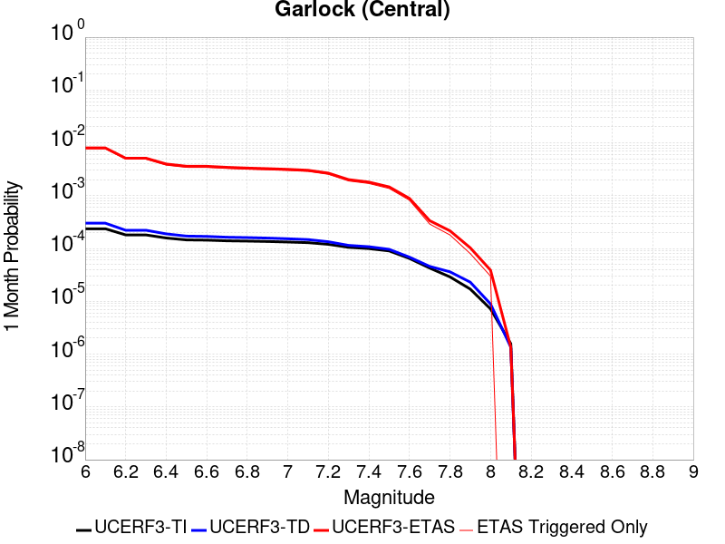 |  |  |

| Magnitude | 1 wk TI Prob | 1 wk TD Prob | 1 wk ETAS Prob | 1 wk ETAS/TD Gain | 1 wk ETAS Triggered Only | 1 mo TI Prob | 1 mo TD Prob | 1 mo ETAS Prob | 1 mo ETAS/TD Gain | 1 mo ETAS Triggered Only | 1 yr TI Prob | 1 yr TD Prob | 1 yr ETAS Prob | 1 yr ETAS/TD Gain | 1 yr ETAS Triggered Only | 10 yr TI Prob | 10 yr TD Prob | 10 yr ETAS Prob | 10 yr ETAS/TD Gain | 10 yr ETAS Triggered Only |
|-----|-----|-----|-----|-----|-----|-----|-----|-----|-----|-----|-----|-----|-----|-----|-----|-----|-----|-----|-----|-----|
| 6.0 | 5.5131142E-5 | 7.0252914E-5 | 0.0027122078 | 38.606335 | 0.0026421405 | 2.3625491E-4 | 3.0104956E-4 | 0.0077235634 | 25.655457 | 0.007424749 | 0.0028726095 | 0.0036591839 | 0.023152808 | 6.327315 | 0.019565217 | 0.028357591 | 0.03608289 | 0.06780511 | 1.8791486 | 0.0329097 |
| 6.1 | 5.5131142E-5 | 7.0252914E-5 | 0.0027122078 | 38.606335 | 0.0026421405 | 2.3625491E-4 | 3.0104956E-4 | 0.0077235634 | 25.655457 | 0.007424749 | 0.0028726095 | 0.0036591839 | 0.023152808 | 6.327315 | 0.019565217 | 0.028357591 | 0.03608289 | 0.06780511 | 1.8791486 | 0.0329097 |
| 6.2 | 4.216245E-5 | 5.166702E-5 | 0.0018241507 | 35.3059 | 0.0017725752 | 1.806837E-4 | 2.2141146E-4 | 0.005136711 | 23.199842 | 0.004916388 | 0.0021976046 | 0.0026923837 | 0.015400551 | 5.720043 | 0.012742475 | 0.021759989 | 0.02669258 | 0.047005083 | 1.7609793 | 0.020869566 |
| 6.3 | 4.216245E-5 | 5.166702E-5 | 0.0018241507 | 35.3059 | 0.0017725752 | 1.806837E-4 | 2.2141146E-4 | 0.005136711 | 23.199842 | 0.004916388 | 0.0021976046 | 0.0026923837 | 0.015400551 | 5.720043 | 0.012742475 | 0.021759989 | 0.02669258 | 0.047005083 | 1.7609793 | 0.020869566 |
| 6.4 | 3.6858168E-5 | 4.411584E-5 | 0.0014152928 | 32.081284 | 0.0013712374 | 1.5795401E-4 | 1.8905434E-4 | 0.0037335346 | 19.748474 | 0.0035451504 | 0.0019213937 | 0.0022993318 | 0.012109499 | 5.2665296 | 0.009832776 | 0.019048655 | 0.02285164 | 0.038603663 | 1.689317 | 0.016120402 |
| 6.5 | 3.39199E-5 | 4.0023286E-5 | 0.0013443189 | 33.58842 | 0.0013043479 | 1.453629E-4 | 1.7151721E-4 | 0.003481986 | 20.301088 | 0.0033110369 | 0.0017683565 | 0.0020862438 | 0.011130881 | 5.3353686 | 0.009063546 | 0.017543508 | 0.02076252 | 0.03487795 | 1.6798514 | 0.014414716 |
| 6.6 | 3.3571985E-5 | 3.947746E-5 | 0.0013437738 | 34.039013 | 0.0013043479 | 1.4387199E-4 | 1.6917827E-4 | 0.003479655 | 20.567978 | 0.0033110369 | 0.0017502342 | 0.0020578213 | 0.01106934 | 5.3791547 | 0.0090301 | 0.017365133 | 0.02048383 | 0.034537755 | 1.6860987 | 0.014347826 |
| 6.7 | 3.2580007E-5 | 3.8093858E-5 | 0.0013089485 | 34.361145 | 0.001270903 | 1.3962112E-4 | 1.632493E-4 | 0.0033065488 | 20.254599 | 0.0031438128 | 0.0016985617 | 0.0019857697 | 0.010564019 | 5.319861 | 0.008595318 | 0.016856372 | 0.019776449 | 0.033250425 | 1.6813142 | 0.013745819 |
| 6.8 | 3.2185937E-5 | 3.7521055E-5 | 0.0012414893 | 33.087803 | 0.0012040134 | 1.3793244E-4 | 1.6079473E-4 | 0.003237223 | 20.132645 | 0.003076923 | 0.0016780337 | 0.0019559395 | 0.01026741 | 5.2493496 | 0.008327759 | 0.016654192 | 0.01948324 | 0.03256773 | 1.6715766 | 0.013344482 |
| 6.9 | 3.165394E-5 | 3.672561E-5 | 0.0012072512 | 32.87219 | 0.0011705685 | 1.3565269E-4 | 1.5738611E-4 | 0.0032003853 | 20.334612 | 0.0030434784 | 0.0016503202 | 0.0019145131 | 0.010059425 | 5.254299 | 0.008160535 | 0.01638118 | 0.01907586 | 0.031936135 | 1.674165 | 0.013110368 |
| 7.0 | 3.0903822E-5 | 3.5630834E-5 | 0.001172714 | 32.9129 | 0.0011371238 | 1.3243823E-4 | 1.5269476E-4 | 0.003128829 | 20.490742 | 0.0029765887 | 0.0016112428 | 0.0018574947 | 0.009735811 | 5.2413664 | 0.0078929765 | 0.015996104 | 0.018515008 | 0.03098873 | 1.6737087 | 0.01270903 |
| 7.1 | 3.0069863E-5 | 3.4397097E-5 | 0.0011380381 | 33.085293 | 0.001103679 | 1.2886449E-4 | 1.4740792E-4 | 0.0029229184 | 19.828775 | 0.0027759196 | 0.0015677959 | 0.0017932352 | 0.009304824 | 5.188848 | 0.0075250836 | 0.01556781 | 0.017882649 | 0.029937401 | 1.6741033 | 0.012274248 |
| 7.2 | 2.7957109E-5 | 3.1286367E-5 | 9.342682E-4 | 29.86183 | 9.0301E-4 | 1.1981068E-4 | 1.3407765E-4 | 0.0025417816 | 18.957533 | 0.0024080267 | 0.0014577188 | 0.0016311926 | 0.007908561 | 4.848331 | 0.0062876255 | 0.014481937 | 0.016286217 | 0.026616856 | 1.634318 | 0.0105016725 |
| 7.3 | 2.4519275E-5 | 2.6719412E-5 | 6.9559785E-4 | 26.033428 | 6.688963E-4 | 1.0507837E-4 | 1.14506816E-4 | 0.001953761 | 17.062399 | 0.0018394649 | 0.0012785783 | 0.0013932437 | 0.005902003 | 4.2361603 | 0.00451505 | 0.012712469 | 0.013930428 | 0.02174643 | 1.5610741 | 0.007926421 |
| 7.4 | 2.3225532E-5 | 2.5203923E-5 | 6.6063943E-4 | 26.21177 | 6.354515E-4 | 9.95342E-5 | 1.0801242E-4 | 0.0017800726 | 16.480259 | 0.0016722408 | 0.0012111551 | 0.0013142723 | 0.0053557763 | 4.075089 | 0.004046823 | 0.012045753 | 0.013148054 | 0.020277152 | 1.542217 | 0.00722408 |
| 7.5 | 2.097765E-5 | 2.2487986E-5 | 5.57593E-4 | 24.795153 | 5.3511705E-4 | 8.9901114E-5 | 9.637359E-5 | 0.0014340373 | 14.879983 | 0.0013377926 | 0.0010939965 | 0.0011727286 | 0.004513288 | 3.8485358 | 0.0033444816 | 0.010886264 | 0.011742581 | 0.01775806 | 1.5122792 | 0.0060869567 |
| 7.6 | 1.511254E-5 | 1.5995334E-5 | 1.8321673E-4 | 11.454387 | 1.6722408E-4 | 6.476642E-5 | 6.854967E-5 | 6.3707255E-4 | 9.293591 | 5.685619E-4 | 7.882459E-4 | 8.342805E-4 | 0.00257196 | 3.082848 | 0.0017391305 | 0.007854558 | 0.008385628 | 0.011934215 | 1.4231747 | 0.0035785954 |
| 7.7 | 9.934069E-6 | 1.0682508E-5 | 1.0682508E-5 | 1.0 | 0.0 | 4.2573887E-5 | 4.5781377E-5 | 2.129978E-4 | 4.6524987 | 1.6722408E-4 | 5.182138E-4 | 5.572461E-4 | 0.0011254911 | 2.019738 | 5.685619E-4 | 0.00517007 | 0.0056296107 | 0.006627307 | 1.177223 | 0.0010033444 |
| 7.8 | 6.7562896E-6 | 8.431477E-6 | 8.431477E-6 | 1.0 | 0.0 | 2.8955206E-5 | 3.61344E-5 | 2.0335244E-4 | 5.627669 | 1.6722408E-4 | 3.5247262E-4 | 4.3984767E-4 | 8.0757885E-4 | 1.836042 | 3.6789296E-4 | 0.0035191406 | 0.0044482257 | 0.0051141465 | 1.1497048 | 6.688963E-4 |
| 7.9 | 3.975453E-6 | 5.3728795E-6 | 5.3728795E-6 | 1.0 | 0.0 | 1.7037546E-5 | 2.3026425E-5 | 8.9914516E-5 | 3.9048405 | 6.688963E-5 | 2.0741238E-4 | 2.8031075E-4 | 4.809234E-4 | 1.7156794 | 2.006689E-4 | 0.002072189 | 0.0028345888 | 0.003201439 | 1.1294192 | 3.6789296E-4 |
| 8.0 | 1.6729537E-6 | 2.078155E-6 | 2.078155E-6 | 1.0 | 0.0 | 7.169782E-6 | 8.906349E-6 | 7.579538E-5 | 8.510265 | 6.688963E-5 | 8.7288594E-5 | 1.08429434E-4 | 1.7531181E-4 | 1.6168287 | 6.688963E-5 | 8.7254314E-4 | 0.001097267 | 0.0011974914 | 1.09134 | 1.0033445E-4 |
| 8.1 | 3.6733252E-7 | 3.1499187E-7 | 3.1499187E-7 | 1.0 | 0.0 | 1.5742813E-6 | 1.3499646E-6 | 1.3499646E-6 | 1.0 | 0.0 | 1.9166706E-5 | 1.643571E-5 | 1.643571E-5 | 1.0 | 0.0 | 1.9165053E-4 | 1.6643589E-4 | 1.6643589E-4 | 1.0 | 0.0 |

## Little Lake
*[(top)](#table-of-contents)*

| 1 Week | 1 Month | 1 Year | 10 Year |
|-----|-----|-----|-----|
|  |  | 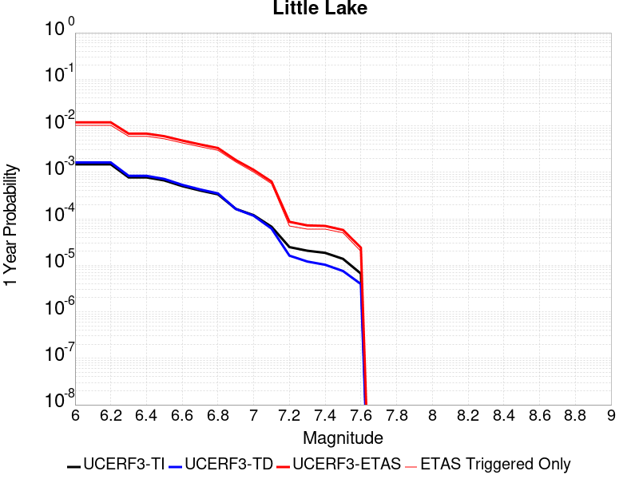 |  |

| Magnitude | 1 wk TI Prob | 1 wk TD Prob | 1 wk ETAS Prob | 1 wk ETAS/TD Gain | 1 wk ETAS Triggered Only | 1 mo TI Prob | 1 mo TD Prob | 1 mo ETAS Prob | 1 mo ETAS/TD Gain | 1 mo ETAS Triggered Only | 1 yr TI Prob | 1 yr TD Prob | 1 yr ETAS Prob | 1 yr ETAS/TD Gain | 1 yr ETAS Triggered Only | 10 yr TI Prob | 10 yr TD Prob | 10 yr ETAS Prob | 10 yr ETAS/TD Gain | 10 yr ETAS Triggered Only |
|-----|-----|-----|-----|-----|-----|-----|-----|-----|-----|-----|-----|-----|-----|-----|-----|-----|-----|-----|-----|-----|
| 6.0 | 2.8424427E-5 | 3.120616E-5 | 0.0022050512 | 70.660774 | 0.002173913 | 1.2181328E-4 | 1.3373457E-4 | 0.005116346 | 38.25746 | 0.0049832775 | 0.0014820677 | 0.0016271356 | 0.012345453 | 7.5872307 | 0.010735786 | 0.014722223 | 0.016165627 | 0.032387376 | 2.0034719 | 0.016488295 |
| 6.1 | 2.8424427E-5 | 3.120616E-5 | 0.0022050512 | 70.660774 | 0.002173913 | 1.2181328E-4 | 1.3373457E-4 | 0.005116346 | 38.25746 | 0.0049832775 | 0.0014820677 | 0.0016271356 | 0.012345453 | 7.5872307 | 0.010735786 | 0.014722223 | 0.016165627 | 0.032387376 | 2.0034719 | 0.016488295 |
| 6.2 | 2.8424427E-5 | 3.120616E-5 | 0.0022050512 | 70.660774 | 0.002173913 | 1.2181328E-4 | 1.3373457E-4 | 0.005116346 | 38.25746 | 0.0049832775 | 0.0014820677 | 0.0016271356 | 0.012345453 | 7.5872307 | 0.010735786 | 0.014722223 | 0.016165627 | 0.032387376 | 2.0034719 | 0.016488295 |
| 6.3 | 1.48860645E-5 | 1.6081593E-5 | 0.0016548513 | 102.903435 | 0.001638796 | 6.379586E-5 | 6.891945E-5 | 0.0030787454 | 44.671646 | 0.0030100334 | 7.7643775E-4 | 8.387995E-4 | 0.0068538166 | 8.170983 | 0.006020067 | 0.007737305 | 0.008359154 | 0.017247438 | 2.0632997 | 0.0089632105 |
| 6.4 | 1.48860645E-5 | 1.6081593E-5 | 0.0016548513 | 102.903435 | 0.001638796 | 6.379586E-5 | 6.891945E-5 | 0.0030787454 | 44.671646 | 0.0030100334 | 7.7643775E-4 | 8.387995E-4 | 0.0068538166 | 8.170983 | 0.006020067 | 0.007737305 | 0.008359154 | 0.017247438 | 2.0632997 | 0.0089632105 |
| 6.5 | 1.2797581E-5 | 1.3765735E-5 | 0.0013849844 | 100.61099 | 0.0013712374 | 5.4845623E-5 | 5.899482E-5 | 0.0027009794 | 45.783333 | 0.0026421405 | 6.675408E-4 | 7.180509E-4 | 0.006132221 | 8.5400915 | 0.0054180603 | 0.006655392 | 0.0071598585 | 0.015129144 | 2.1130507 | 0.008026755 |
| 6.6 | 9.661896E-6 | 1.0289158E-5 | 0.0011474012 | 111.51556 | 0.0011371238 | 4.1407468E-5 | 4.4095737E-5 | 0.0021510262 | 48.78082 | 0.0021070235 | 5.040193E-4 | 5.367496E-4 | 0.0050828033 | 9.469599 | 0.004548495 | 0.005028777 | 0.0053561367 | 0.012075804 | 2.2545736 | 0.006755853 |
| 6.7 | 7.767871E-6 | 8.199779E-6 | 9.780915E-4 | 119.28268 | 9.6989964E-4 | 3.329045E-5 | 3.514151E-5 | 0.0018410981 | 52.390976 | 0.00180602 | 4.0523586E-4 | 4.2777765E-4 | 0.004138564 | 9.674569 | 0.0037123745 | 0.004044977 | 0.0042708935 | 0.009898928 | 2.317765 | 0.005652174 |
| 6.8 | 6.4235196E-6 | 6.735819E-6 | 8.762952E-4 | 130.09482 | 8.6956524E-4 | 2.752908E-5 | 2.886755E-5 | 0.0015672847 | 54.292267 | 0.0015384615 | 3.35115E-4 | 3.5141854E-4 | 0.0035275596 | 10.038057 | 0.0031772575 | 0.003346101 | 0.0035098887 | 0.008375693 | 2.386313 | 0.0048829434 |
| 6.9 | 3.1283696E-6 | 3.1122067E-6 | 5.382276E-4 | 172.94083 | 5.3511705E-4 | 1.3407229E-5 | 1.3337969E-5 | 0.0010501135 | 78.73113 | 0.0010367893 | 1.6322079E-4 | 1.6237919E-4 | 0.002235621 | 13.767904 | 0.0020735785 | 0.0016310095 | 0.0016227537 | 0.0046612932 | 2.8724587 | 0.0030434784 |
| 7.0 | 2.290603E-6 | 2.2287015E-6 | 4.3701034E-4 | 196.08295 | 4.3478262E-4 | 9.816834E-6 | 9.551549E-6 | 7.7877496E-4 | 81.5339 | 7.6923077E-4 | 1.19513395E-4 | 1.16284944E-4 | 0.001453922 | 12.5030985 | 0.0013377926 | 0.0011944914 | 0.0011623431 | 0.0030998876 | 2.66693 | 0.0019397993 |
| 7.1 | 1.293693E-6 | 1.1776951E-6 | 2.0184636E-4 | 171.391 | 2.006689E-4 | 5.5443866E-6 | 5.047259E-6 | 3.7293838E-4 | 73.88929 | 3.6789296E-4 | 6.750081E-5 | 6.144935E-5 | 7.9719006E-4 | 12.973126 | 7.357859E-4 | 6.7480316E-4 | 6.14392E-4 | 0.0016839686 | 2.74087 | 0.0010702341 |
| 7.2 | 4.715842E-7 | 3.0918443E-7 | 3.375399E-5 | 109.17106 | 3.3444816E-5 | 2.0210737E-6 | 1.3250755E-6 | 3.4769848E-5 | 26.239899 | 3.3444816E-5 | 2.4606294E-5 | 1.613268E-5 | 8.302123E-5 | 5.1461525 | 6.688963E-5 | 2.460357E-4 | 1.6131563E-4 | 2.2819448E-4 | 1.4145838 | 6.688963E-5 |
| 7.3 | 3.9430947E-7 | 2.3098025E-7 | 3.3675788E-5 | 145.7951 | 3.3444816E-5 | 1.6898966E-6 | 9.89915E-7 | 3.44347E-5 | 34.78551 | 3.3444816E-5 | 2.0574296E-5 | 1.2052149E-5 | 7.8940975E-5 | 6.54995 | 6.688963E-5 | 2.0572392E-4 | 1.20515026E-4 | 1.873966E-4 | 1.5549645 | 6.688963E-5 |
| 7.4 | 3.547123E-7 | 1.9679635E-7 | 3.3641605E-5 | 170.94629 | 3.3444816E-5 | 1.5201948E-6 | 8.4341264E-7 | 3.42882E-5 | 40.65412 | 3.3444816E-5 | 1.8508214E-5 | 1.0268501E-5 | 7.715745E-5 | 7.513993 | 6.688963E-5 | 1.8506673E-4 | 1.0268033E-4 | 1.6956309E-4 | 1.6513687 | 6.688963E-5 |
| 7.5 | 2.6354266E-7 | 1.4423487E-7 | 3.3589047E-5 | 232.87743 | 3.3444816E-5 | 1.129468E-6 | 6.1814933E-7 | 3.4062945E-5 | 55.104717 | 3.3444816E-5 | 1.3751187E-5 | 7.5259427E-6 | 7.4415075E-5 | 9.887808 | 6.688963E-5 | 1.3750336E-4 | 7.525693E-5 | 1.4214152E-4 | 1.8887501 | 6.688963E-5 |
| 7.6 | 1.269913E-7 | 7.5727044E-8 | 3.352054E-5 | 442.64954 | 3.3444816E-5 | 5.4424834E-7 | 3.2454443E-7 | 3.376935E-5 | 104.051544 | 3.3444816E-5 | 6.6262032E-6 | 3.9513216E-6 | 3.7396007E-5 | 9.464176 | 3.3444816E-5 | 6.626006E-5 | 3.951255E-5 | 7.295604E-5 | 1.8464018 | 3.3444816E-5 |

## Panamint Valley
*[(top)](#table-of-contents)*

| 1 Week | 1 Month | 1 Year | 10 Year |
|-----|-----|-----|-----|
|  |  |  |  |

| Magnitude | 1 wk TI Prob | 1 wk TD Prob | 1 wk ETAS Prob | 1 wk ETAS/TD Gain | 1 wk ETAS Triggered Only | 1 mo TI Prob | 1 mo TD Prob | 1 mo ETAS Prob | 1 mo ETAS/TD Gain | 1 mo ETAS Triggered Only | 1 yr TI Prob | 1 yr TD Prob | 1 yr ETAS Prob | 1 yr ETAS/TD Gain | 1 yr ETAS Triggered Only | 10 yr TI Prob | 10 yr TD Prob | 10 yr ETAS Prob | 10 yr ETAS/TD Gain | 10 yr ETAS Triggered Only |
|-----|-----|-----|-----|-----|-----|-----|-----|-----|-----|-----|-----|-----|-----|-----|-----|-----|-----|-----|-----|-----|
| 6.0 | 3.0211835E-5 | 3.3985398E-5 | 0.0010707395 | 31.505869 | 0.0010367893 | 1.2947287E-4 | 1.4564373E-4 | 0.0025533198 | 17.531271 | 0.0024080267 | 0.0015751923 | 0.0017717998 | 0.008816153 | 4.9758177 | 0.007056856 | 0.015640736 | 0.01758359 | 0.030102007 | 1.7119374 | 0.012742475 |
| 6.1 | 3.0211835E-5 | 3.3985398E-5 | 0.0010707395 | 31.505869 | 0.0010367893 | 1.2947287E-4 | 1.4564373E-4 | 0.0025533198 | 17.531271 | 0.0024080267 | 0.0015751923 | 0.0017717998 | 0.008816153 | 4.9758177 | 0.007056856 | 0.015640736 | 0.01758359 | 0.030102007 | 1.7119374 | 0.012742475 |
| 6.2 | 3.0211835E-5 | 3.3985398E-5 | 0.0010707395 | 31.505869 | 0.0010367893 | 1.2947287E-4 | 1.4564373E-4 | 0.0025533198 | 17.531271 | 0.0024080267 | 0.0015751923 | 0.0017717998 | 0.008816153 | 4.9758177 | 0.007056856 | 0.015640736 | 0.01758359 | 0.030102007 | 1.7119374 | 0.012742475 |
| 6.3 | 2.8573924E-5 | 3.2103522E-5 | 0.001001972 | 31.210659 | 9.6989964E-4 | 1.2245393E-4 | 1.3757942E-4 | 0.0024449541 | 17.771221 | 0.0023076923 | 0.001489857 | 0.0016737703 | 0.008351537 | 4.989656 | 0.006688963 | 0.01479908 | 0.016618231 | 0.028556947 | 1.7184106 | 0.012140468 |
| 6.4 | 2.8573924E-5 | 3.2103522E-5 | 0.001001972 | 31.210659 | 9.6989964E-4 | 1.2245393E-4 | 1.3757942E-4 | 0.0024449541 | 17.771221 | 0.0023076923 | 0.001489857 | 0.0016737703 | 0.008351537 | 4.989656 | 0.006688963 | 0.01479908 | 0.016618231 | 0.028556947 | 1.7184106 | 0.012140468 |
| 6.5 | 2.7468774E-5 | 3.0829244E-5 | 0.001000699 | 32.459408 | 9.6989964E-4 | 1.1771801E-4 | 1.3211879E-4 | 0.0024395061 | 18.46449 | 0.0023076923 | 0.0014322745 | 0.0016073869 | 0.008018469 | 4.988513 | 0.006421405 | 0.014230782 | 0.015964093 | 0.027515817 | 1.7236068 | 0.01173913 |
| 6.6 | 2.6135967E-5 | 2.9253257E-5 | 9.991246E-4 | 34.1543 | 9.6989964E-4 | 1.1200648E-4 | 1.2536523E-4 | 0.0024327682 | 19.405447 | 0.0023076923 | 0.0013628257 | 0.0015252795 | 0.007769921 | 5.094096 | 0.006254181 | 0.013544982 | 0.015154443 | 0.026353355 | 1.7389854 | 0.011371237 |
| 6.7 | 2.4498746E-5 | 2.7342086E-5 | 9.637713E-4 | 35.24864 | 9.3645486E-4 | 1.04990395E-4 | 1.1717525E-4 | 0.0023242745 | 19.835882 | 0.002207358 | 0.0012775084 | 0.0014257001 | 0.007336993 | 5.1462383 | 0.0059197326 | 0.012701893 | 0.014171662 | 0.024722332 | 1.7444907 | 0.010702341 |
| 6.8 | 2.2244329E-5 | 2.4936131E-5 | 8.944797E-4 | 35.870827 | 8.6956524E-4 | 9.532935E-5 | 1.0686488E-4 | 0.0022471044 | 21.027529 | 0.0021404682 | 0.0011600169 | 0.0013003252 | 0.0068115443 | 5.238339 | 0.0055183945 | 0.011539802 | 0.012932883 | 0.022638492 | 1.7504599 | 0.009832776 |
| 6.9 | 1.9902658E-5 | 2.2290924E-5 | 7.580605E-4 | 34.007584 | 7.357859E-4 | 8.529431E-5 | 9.552913E-5 | 0.0019348183 | 20.253698 | 0.0018394649 | 0.0010379635 | 0.0011624652 | 0.0058392966 | 5.0232015 | 0.004682274 | 0.010331288 | 0.011568946 | 0.019403668 | 1.67722 | 0.007926421 |
| 7.0 | 1.8353881E-5 | 2.056681E-5 | 6.560052E-4 | 31.896307 | 6.354515E-4 | 7.865712E-5 | 8.814059E-5 | 0.0016599084 | 18.832508 | 0.0015719064 | 9.5722964E-4 | 0.0010726011 | 0.005048265 | 4.706564 | 0.003979933 | 0.009531168 | 0.0106791705 | 0.01746214 | 1.6351588 | 0.0068561872 |
| 7.1 | 1.7667631E-5 | 1.9773222E-5 | 6.21768E-4 | 31.44495 | 6.020067E-4 | 7.571623E-5 | 8.473973E-5 | 0.0015896289 | 18.758957 | 0.0015050167 | 9.2145515E-4 | 0.0010312354 | 0.004873423 | 4.72581 | 0.0038461538 | 0.009176437 | 0.010269388 | 0.016790355 | 1.6349909 | 0.006588629 |
| 7.2 | 1.6381597E-5 | 1.8158824E-5 | 4.8637774E-4 | 26.78465 | 4.6822743E-4 | 7.020495E-5 | 7.782131E-5 | 0.0013151832 | 16.90004 | 0.0012374582 | 8.544101E-4 | 9.4707985E-4 | 0.0041547413 | 4.3868966 | 0.0032107024 | 0.008511325 | 0.009435088 | 0.015133321 | 1.6039406 | 0.0057525085 |
| 7.3 | 1.4520491E-5 | 1.5966963E-5 | 4.8418692E-4 | 30.324295 | 4.6822743E-4 | 6.222919E-5 | 6.842814E-5 | 0.001205474 | 17.616642 | 0.0011371238 | 7.57377E-4 | 8.3281036E-4 | 0.0036064184 | 4.3304195 | 0.0027759196 | 0.0075480095 | 0.008300003 | 0.0132087525 | 1.5914153 | 0.004949833 |
| 7.4 | 1.2852287E-5 | 1.4145856E-5 | 4.8236665E-4 | 34.099503 | 4.6822743E-4 | 5.5080065E-5 | 6.0623777E-5 | 0.0011642358 | 19.204277 | 0.001103679 | 6.7039346E-4 | 7.3786033E-4 | 0.0032443707 | 4.3969984 | 0.0025083611 | 0.0066837464 | 0.007357025 | 0.011905256 | 1.6182159 | 0.00458194 |
| 7.5 | 1.1637851E-5 | 1.2837149E-5 | 4.8105855E-4 | 37.473938 | 4.6822743E-4 | 4.987555E-5 | 5.5015284E-5 | 0.0011251905 | 20.452326 | 0.0010702341 | 6.070656E-4 | 6.6962093E-4 | 0.00314288 | 4.6935215 | 0.0024749164 | 0.006054099 | 0.0066789286 | 0.0111970445 | 1.6764731 | 0.004548495 |
| 7.6 | 3.0068115E-6 | 3.3331687E-6 | 1.3711199E-4 | 41.135628 | 1.3377926E-4 | 1.2886271E-5 | 1.4284972E-5 | 3.15284E-4 | 22.071028 | 3.0100334E-4 | 1.5687906E-4 | 1.7391294E-4 | 0.0010098879 | 5.806859 | 8.361204E-4 | 0.0015676835 | 0.001739208 | 0.0037090203 | 2.1325915 | 0.0019732441 |

## Owl Lake
*[(top)](#table-of-contents)*

| 1 Week | 1 Month | 1 Year | 10 Year |
|-----|-----|-----|-----|
|  |  |  |  |

| Magnitude | 1 wk TI Prob | 1 wk TD Prob | 1 wk ETAS Prob | 1 wk ETAS/TD Gain | 1 wk ETAS Triggered Only | 1 mo TI Prob | 1 mo TD Prob | 1 mo ETAS Prob | 1 mo ETAS/TD Gain | 1 mo ETAS Triggered Only | 1 yr TI Prob | 1 yr TD Prob | 1 yr ETAS Prob | 1 yr ETAS/TD Gain | 1 yr ETAS Triggered Only | 10 yr TI Prob | 10 yr TD Prob | 10 yr ETAS Prob | 10 yr ETAS/TD Gain | 10 yr ETAS Triggered Only |
|-----|-----|-----|-----|-----|-----|-----|-----|-----|-----|-----|-----|-----|-----|-----|-----|-----|-----|-----|-----|-----|
| 6.0 | 5.0320643E-5 | 6.636149E-5 | 0.001103082 | 16.62232 | 0.0010367893 | 2.1564208E-4 | 2.8438168E-4 | 0.0024576765 | 8.642176 | 0.002173913 | 0.0026222812 | 0.00345791 | 0.010023756 | 2.8987904 | 0.006588629 | 0.02591553 | 0.0341423 | 0.04496378 | 1.3169523 | 0.011204014 |
| 6.1 | 5.0320643E-5 | 6.636149E-5 | 0.001103082 | 16.62232 | 0.0010367893 | 2.1564208E-4 | 2.8438168E-4 | 0.0024576765 | 8.642176 | 0.002173913 | 0.0026222812 | 0.00345791 | 0.010023756 | 2.8987904 | 0.006588629 | 0.02591553 | 0.0341423 | 0.04496378 | 1.3169523 | 0.011204014 |
| 6.2 | 2.4125871E-5 | 3.098269E-5 | 7.333021E-4 | 23.66812 | 7.0234115E-4 | 1.0339249E-4 | 1.3277736E-4 | 0.0016375943 | 12.333384 | 0.0015050167 | 0.0012580766 | 0.0016155228 | 0.0064905775 | 4.017633 | 0.0048829434 | 0.012509781 | 0.016071297 | 0.02436394 | 1.5159909 | 0.008428094 |
| 6.3 | 1.7433485E-5 | 2.2356835E-5 | 6.577941E-4 | 29.422506 | 6.354515E-4 | 7.471279E-5 | 9.5812386E-5 | 0.0014000352 | 14.612258 | 0.0013043479 | 9.0924866E-4 | 0.0011660426 | 0.00534177 | 4.58111 | 0.004180602 | 0.009055373 | 0.01162957 | 0.018472135 | 1.5883764 | 0.0069230767 |
| 6.4 | 1.7433485E-5 | 2.2356835E-5 | 6.577941E-4 | 29.422506 | 6.354515E-4 | 7.471279E-5 | 9.5812386E-5 | 0.0014000352 | 14.612258 | 0.0013043479 | 9.0924866E-4 | 0.0011660426 | 0.00534177 | 4.58111 | 0.004180602 | 0.009055373 | 0.01162957 | 0.018472135 | 1.5883764 | 0.0069230767 |
| 6.5 | 1.5182742E-5 | 1.9430352E-5 | 6.5486954E-4 | 33.70343 | 6.354515E-4 | 6.506727E-5 | 8.327114E-5 | 0.0013206262 | 15.859352 | 0.0012374582 | 7.919061E-4 | 0.0010135059 | 0.0049559944 | 4.889951 | 0.0039464883 | 0.0078909 | 0.010119047 | 0.016442366 | 1.6248928 | 0.0063879597 |
| 6.6 | 6.7271576E-6 | 8.548157E-6 | 5.4366066E-4 | 63.59975 | 5.3511705E-4 | 2.8830356E-5 | 3.6634476E-5 | 0.0010399421 | 28.386982 | 0.0010033444 | 3.5095305E-4 | 4.4593913E-4 | 0.0033209107 | 7.447005 | 0.0028762543 | 0.0035039932 | 0.004468226 | 0.008530262 | 1.9090937 | 0.0040802676 |
| 6.7 | 6.682835E-6 | 8.4806015E-6 | 5.4359314E-4 | 64.09841 | 5.3511705E-4 | 2.8640408E-5 | 3.634496E-5 | 0.001039653 | 28.605146 | 0.0010033444 | 3.4864116E-4 | 4.424157E-4 | 0.0033173973 | 7.4983716 | 0.0028762543 | 0.003480947 | 0.004433152 | 0.008495331 | 1.9163185 | 0.0040802676 |
| 6.8 | 6.5774975E-6 | 8.327072E-6 | 5.4343964E-4 | 65.2618 | 5.3511705E-4 | 2.8188972E-5 | 3.5686993E-5 | 0.0010389957 | 29.114128 | 0.0010033444 | 3.4314668E-4 | 4.3440814E-4 | 0.0033094129 | 7.618211 | 0.0028762543 | 0.0034261728 | 0.0043532955 | 0.0084158005 | 1.9332021 | 0.0040802676 |
| 6.9 | 6.363419E-6 | 8.0002355E-6 | 5.096685E-4 | 63.70668 | 5.016722E-4 | 2.727151E-5 | 3.4286306E-5 | 0.0010041527 | 29.287283 | 9.6989964E-4 | 3.3198006E-4 | 4.173614E-4 | 0.0032589843 | 7.8085427 | 0.0028428093 | 0.0033148455 | 0.004183282 | 0.008213176 | 1.9633329 | 0.004046823 |
| 7.0 | 6.1342453E-6 | 7.632424E-6 | 5.0930085E-4 | 66.728584 | 5.016722E-4 | 2.6289357E-5 | 3.271001E-5 | 9.691342E-4 | 29.628063 | 9.3645486E-4 | 3.2002592E-4 | 3.981771E-4 | 0.0031729916 | 7.968795 | 0.0027759196 | 0.0031956544 | 0.00399197 | 0.007922704 | 1.9846603 | 0.0039464883 |
| 7.1 | 5.842926E-6 | 7.142961E-6 | 4.7536704E-4 | 66.55042 | 4.6822743E-4 | 2.504087E-5 | 3.0612362E-5 | 9.3359477E-4 | 30.497313 | 9.0301E-4 | 3.0482994E-4 | 3.7264716E-4 | 0.0030138032 | 8.087551 | 0.0026421405 | 0.0030441214 | 0.0037374226 | 0.0075025624 | 2.007416 | 0.0037792642 |
| 7.2 | 4.77173E-6 | 5.3591634E-6 | 3.063609E-4 | 57.165806 | 3.0100334E-4 | 2.045011E-5 | 2.2967664E-5 | 7.2529266E-4 | 31.578861 | 7.0234115E-4 | 2.4895166E-4 | 2.7959948E-4 | 0.0020851146 | 7.457505 | 0.00180602 | 0.0024867293 | 0.0028089995 | 0.0052769636 | 1.878592 | 0.0024749164 |
| 7.3 | 3.0494948E-6 | 2.7109647E-6 | 1.0304514E-4 | 38.010506 | 1.0033445E-4 | 1.3069198E-5 | 1.1618369E-5 | 2.4572937E-4 | 21.150074 | 2.3411372E-4 | 1.5910587E-4 | 1.4144463E-4 | 6.76486E-4 | 4.7826915 | 5.3511705E-4 | 0.0015899199 | 0.0014235033 | 0.002191639 | 1.5396094 | 7.6923077E-4 |
| 7.4 | 2.7263884E-6 | 2.3061473E-6 | 6.919562E-5 | 30.004858 | 6.688963E-5 | 1.1684469E-5 | 9.883452E-6 | 1.436614E-4 | 14.535548 | 1.3377926E-4 | 1.4224913E-4 | 1.2032448E-4 | 4.547324E-4 | 3.7792175 | 3.3444815E-4 | 0.0014215811 | 0.0012114698 | 0.0017793429 | 1.4687473 | 5.685619E-4 |
| 7.5 | 2.6090431E-6 | 2.1660758E-6 | 6.905556E-5 | 31.880493 | 6.688963E-5 | 1.1181565E-5 | 9.283149E-6 | 1.4306117E-4 | 15.410845 | 1.3377926E-4 | 1.3612706E-4 | 1.1301658E-4 | 4.4742692E-4 | 3.9589498 | 3.3444815E-4 | 0.001360437 | 0.001138222 | 0.0017061369 | 1.4989489 | 5.685619E-4 |
| 7.6 | 2.3008756E-6 | 1.8732376E-6 | 3.531799E-5 | 18.853983 | 3.3444816E-5 | 9.860858E-6 | 8.028137E-6 | 7.491723E-5 | 9.331833 | 6.688963E-5 | 1.20049335E-4 | 9.7738266E-5 | 2.9838755E-4 | 3.0529246 | 2.006689E-4 | 0.001199845 | 9.852252E-4 | 0.0013527557 | 1.3730421 | 3.6789296E-4 |
| 7.7 | 1.7184348E-6 | 1.3423282E-6 | 1.3423282E-6 | 1.0 | 0.0 | 7.3646997E-6 | 5.7528227E-6 | 3.9197446E-5 | 6.8136024 | 3.3444816E-5 | 8.966153E-5 | 7.0038404E-5 | 2.3725077E-4 | 3.3874383 | 1.6722408E-4 | 8.962536E-4 | 7.080495E-4 | 9.4199745E-4 | 1.3304118 | 2.3411372E-4 |
| 7.8 | 8.4612907E-7 | 8.4087924E-7 | 8.4087924E-7 | 1.0 | 0.0 | 3.6262625E-6 | 3.6037634E-6 | 3.704846E-5 | 10.280492 | 3.3444816E-5 | 4.4148852E-5 | 4.3874956E-5 | 1.10761655E-4 | 2.5244846 | 6.688963E-5 | 4.414008E-4 | 4.4413717E-4 | 5.444271E-4 | 1.2258084 | 1.0033445E-4 |
| 7.9 | 2.716738E-7 | 3.7694025E-7 | 3.7694025E-7 | 1.0 | 0.0 | 1.1643157E-6 | 1.6154573E-6 | 1.6154573E-6 | 1.0 | 0.0 | 1.4175452E-5 | 1.9668027E-5 | 1.9668027E-5 | 1.0 | 0.0 | 1.4174548E-4 | 1.9843443E-4 | 1.9843443E-4 | 1.0 | 0.0 |
| 8.0 | 2.1995428E-8 | 3.386013E-8 | 3.386013E-8 | 1.0 | 0.0 | 9.426611E-8 | 1.4511484E-7 | 1.4511484E-7 | 1.0 | 0.0 | 1.1476893E-6 | 1.7667724E-6 | 1.7667724E-6 | 1.0 | 0.0 | 1.14768345E-5 | 1.7968985E-5 | 1.7968985E-5 | 1.0 | 0.0 |

## Airport Lake
*[(top)](#table-of-contents)*

| 1 Week | 1 Month | 1 Year | 10 Year |
|-----|-----|-----|-----|
|  |  |  |  |

| Magnitude | 1 wk TI Prob | 1 wk TD Prob | 1 wk ETAS Prob | 1 wk ETAS/TD Gain | 1 wk ETAS Triggered Only | 1 mo TI Prob | 1 mo TD Prob | 1 mo ETAS Prob | 1 mo ETAS/TD Gain | 1 mo ETAS Triggered Only | 1 yr TI Prob | 1 yr TD Prob | 1 yr ETAS Prob | 1 yr ETAS/TD Gain | 1 yr ETAS Triggered Only | 10 yr TI Prob | 10 yr TD Prob | 10 yr ETAS Prob | 10 yr ETAS/TD Gain | 10 yr ETAS Triggered Only |
|-----|-----|-----|-----|-----|-----|-----|-----|-----|-----|-----|-----|-----|-----|-----|-----|-----|-----|-----|-----|-----|
| 6.0 | 1.2387061E-5 | 1.31032575E-5 | 0.0014512115 | 110.75197 | 0.0014381271 | 5.3086325E-5 | 5.6155768E-5 | 0.0033001208 | 58.76726 | 0.0032441472 | 6.461343E-4 | 6.835104E-4 | 0.0074013234 | 10.8284 | 0.006722408 | 0.0064425888 | 0.0068168915 | 0.016582638 | 2.4325807 | 0.009832776 |
| 6.1 | 1.2387061E-5 | 1.31032575E-5 | 0.0014512115 | 110.75197 | 0.0014381271 | 5.3086325E-5 | 5.6155768E-5 | 0.0033001208 | 58.76726 | 0.0032441472 | 6.461343E-4 | 6.835104E-4 | 0.0074013234 | 10.8284 | 0.006722408 | 0.0064425888 | 0.0068168915 | 0.016582638 | 2.4325807 | 0.009832776 |
| 6.2 | 1.2387061E-5 | 1.31032575E-5 | 0.0014512115 | 110.75197 | 0.0014381271 | 5.3086325E-5 | 5.6155768E-5 | 0.0033001208 | 58.76726 | 0.0032441472 | 6.461343E-4 | 6.835104E-4 | 0.0074013234 | 10.8284 | 0.006722408 | 0.0064425888 | 0.0068168915 | 0.016582638 | 2.4325807 | 0.009832776 |
| 6.3 | 1.2387061E-5 | 1.31032575E-5 | 0.0014512115 | 110.75197 | 0.0014381271 | 5.3086325E-5 | 5.6155768E-5 | 0.0033001208 | 58.76726 | 0.0032441472 | 6.461343E-4 | 6.835104E-4 | 0.0074013234 | 10.8284 | 0.006722408 | 0.0064425888 | 0.0068168915 | 0.016582638 | 2.4325807 | 0.009832776 |
| 6.4 | 1.2387061E-5 | 1.31032575E-5 | 0.0014512115 | 110.75197 | 0.0014381271 | 5.3086325E-5 | 5.6155768E-5 | 0.0033001208 | 58.76726 | 0.0032441472 | 6.461343E-4 | 6.835104E-4 | 0.0074013234 | 10.8284 | 0.006722408 | 0.0064425888 | 0.0068168915 | 0.016582638 | 2.4325807 | 0.009832776 |
| 6.5 | 6.9922594E-6 | 7.38498E-6 | 0.0010776112 | 145.91931 | 0.0010702341 | 2.996648E-5 | 3.164956E-5 | 0.0022723812 | 71.798195 | 0.0022408026 | 3.6478083E-4 | 3.8527072E-4 | 0.005500356 | 14.276601 | 0.005117057 | 0.003641826 | 0.0038465653 | 0.011242755 | 2.9228036 | 0.007424749 |
| 6.6 | 6.9922594E-6 | 7.38498E-6 | 0.0010776112 | 145.91931 | 0.0010702341 | 2.996648E-5 | 3.164956E-5 | 0.0022723812 | 71.798195 | 0.0022408026 | 3.6478083E-4 | 3.8527072E-4 | 0.005500356 | 14.276601 | 0.005117057 | 0.003641826 | 0.0038465653 | 0.011242755 | 2.9228036 | 0.007424749 |
| 6.7 | 5.477277E-6 | 5.7861116E-6 | 9.422355E-4 | 162.84435 | 9.3645486E-4 | 2.3473833E-5 | 2.4797408E-5 | 0.0020314367 | 81.921326 | 0.0020066889 | 2.8575645E-4 | 3.0187052E-4 | 0.0047152536 | 15.62012 | 0.004414716 | 0.0028538927 | 0.0030149885 | 0.009517064 | 3.156584 | 0.006521739 |
| 6.8 | 3.9950432E-6 | 4.2191186E-6 | 7.7344663E-4 | 183.31949 | 7.6923077E-4 | 1.7121502E-5 | 1.8081826E-5 | 0.0016902924 | 93.48018 | 0.0016722408 | 2.0843433E-4 | 2.2012675E-4 | 0.0036641846 | 16.645794 | 0.003444816 | 0.0020823893 | 0.002199358 | 0.0073719034 | 3.351843 | 0.0051839463 |
| 6.9 | 2.95695E-6 | 3.1230477E-6 | 5.7168317E-4 | 183.05298 | 5.685619E-4 | 1.2672582E-5 | 1.3384434E-5 | 0.0013177148 | 98.451294 | 0.0013043479 | 1.5427776E-4 | 1.6294557E-4 | 0.0027377768 | 16.801788 | 0.0025752508 | 0.001541707 | 0.0016284833 | 0.0053682025 | 3.2964432 | 0.0037458194 |
| 7.0 | 1.456072E-6 | 1.5408239E-6 | 3.0254372E-4 | 196.3519 | 3.0100334E-4 | 6.2402937E-6 | 6.60352E-6 | 6.086062E-4 | 92.16391 | 6.020067E-4 | 7.597293E-5 | 8.03959E-5 | 0.0012174282 | 15.142915 | 0.0011371238 | 7.594696E-4 | 8.03767E-4 | 0.0024412458 | 3.0372555 | 0.001638796 |
| 7.1 | 6.995192E-7 | 7.4090326E-7 | 1.6796486E-4 | 226.70282 | 1.6722408E-4 | 2.997936E-6 | 3.1752998E-6 | 3.376224E-4 | 106.32773 | 3.3444815E-4 | 3.649926E-5 | 3.8659273E-5 | 7.075297E-4 | 18.301682 | 6.688963E-4 | 3.6493264E-4 | 3.8659273E-4 | 0.0013895493 | 3.5943494 | 0.0010033444 |

## Ash Hill
*[(top)](#table-of-contents)*

| 1 Week | 1 Month | 1 Year | 10 Year |
|-----|-----|-----|-----|
|  |  |  |  |

| Magnitude | 1 wk TI Prob | 1 wk TD Prob | 1 wk ETAS Prob | 1 wk ETAS/TD Gain | 1 wk ETAS Triggered Only | 1 mo TI Prob | 1 mo TD Prob | 1 mo ETAS Prob | 1 mo ETAS/TD Gain | 1 mo ETAS Triggered Only | 1 yr TI Prob | 1 yr TD Prob | 1 yr ETAS Prob | 1 yr ETAS/TD Gain | 1 yr ETAS Triggered Only | 10 yr TI Prob | 10 yr TD Prob | 10 yr ETAS Prob | 10 yr ETAS/TD Gain | 10 yr ETAS Triggered Only |
|-----|-----|-----|-----|-----|-----|-----|-----|-----|-----|-----|-----|-----|-----|-----|-----|-----|-----|-----|-----|-----|
| 6.0 | 2.1545662E-5 | 2.3194681E-5 | 6.5863144E-4 | 28.395796 | 6.354515E-4 | 9.2335285E-5 | 9.9402445E-5 | 0.0020055675 | 20.176239 | 0.0019063546 | 0.0011236023 | 0.0012096328 | 0.0061534783 | 5.087063 | 0.004949833 | 0.011179381 | 0.01203847 | 0.02033206 | 1.688924 | 0.008394649 |
| 6.1 | 2.1545662E-5 | 2.3194681E-5 | 6.5863144E-4 | 28.395796 | 6.354515E-4 | 9.2335285E-5 | 9.9402445E-5 | 0.0020055675 | 20.176239 | 0.0019063546 | 0.0011236023 | 0.0012096328 | 0.0061534783 | 5.087063 | 0.004949833 | 0.011179381 | 0.01203847 | 0.02033206 | 1.688924 | 0.008394649 |
| 6.2 | 2.1545662E-5 | 2.3194681E-5 | 6.5863144E-4 | 28.395796 | 6.354515E-4 | 9.2335285E-5 | 9.9402445E-5 | 0.0020055675 | 20.176239 | 0.0019063546 | 0.0011236023 | 0.0012096328 | 0.0061534783 | 5.087063 | 0.004949833 | 0.011179381 | 0.01203847 | 0.02033206 | 1.688924 | 0.008394649 |
| 6.3 | 1.0025529E-5 | 1.0747037E-5 | 2.4485824E-4 | 22.78379 | 2.3411372E-4 | 4.2965847E-5 | 4.605799E-5 | 7.4836676E-4 | 16.24836 | 7.0234115E-4 | 5.229836E-4 | 5.60625E-4 | 0.002599615 | 4.6369944 | 0.0020401338 | 0.005217545 | 0.0055934195 | 0.008985709 | 1.6064787 | 0.0034113713 |
| 6.4 | 1.0025529E-5 | 1.0747037E-5 | 2.4485824E-4 | 22.78379 | 2.3411372E-4 | 4.2965847E-5 | 4.605799E-5 | 7.4836676E-4 | 16.24836 | 7.0234115E-4 | 5.229836E-4 | 5.60625E-4 | 0.002599615 | 4.6369944 | 0.0020401338 | 0.005217545 | 0.0055934195 | 0.008985709 | 1.6064787 | 0.0034113713 |
| 6.5 | 6.9617327E-6 | 7.456704E-6 | 1.4123497E-4 | 18.94067 | 1.3377926E-4 | 2.9835655E-5 | 3.1956963E-5 | 4.3328194E-4 | 13.558295 | 4.013378E-4 | 3.6318856E-4 | 3.8901521E-4 | 0.0015256966 | 3.9219458 | 0.0011371238 | 0.0036259557 | 0.0038841967 | 0.0059164064 | 1.5231994 | 0.0020401338 |
| 6.6 | 4.9919777E-6 | 5.346739E-6 | 1.0568065E-4 | 19.765442 | 1.0033445E-4 | 2.1394015E-5 | 2.2914432E-5 | 2.9046682E-4 | 12.676153 | 2.6755853E-4 | 2.60441E-4 | 2.789542E-4 | 0.0011482768 | 4.1163635 | 8.6956524E-4 | 0.0026013597 | 0.0027866988 | 0.0043542245 | 1.5625029 | 0.0015719064 |
| 6.7 | 3.6630722E-6 | 3.9246606E-6 | 7.081403E-5 | 18.04335 | 6.688963E-5 | 1.5698786E-5 | 1.6819899E-5 | 2.1748542E-4 | 12.930245 | 2.006689E-4 | 1.9111596E-4 | 2.0476876E-4 | 8.7352813E-4 | 4.2659245 | 6.688963E-4 | 0.0019095168 | 0.002046364 | 0.0032479134 | 1.5871632 | 0.0012040134 |
| 6.8 | 2.5599613E-6 | 2.7449514E-6 | 3.6189675E-5 | 13.184086 | 3.3444816E-5 | 1.0971216E-5 | 1.1764052E-5 | 1.4554174E-4 | 12.371736 | 1.3377926E-4 | 1.3356637E-4 | 1.4322287E-4 | 6.1138324E-4 | 4.2687545 | 4.6822743E-4 | 0.0013348613 | 0.0014317906 | 0.002266714 | 1.5831323 | 8.361204E-4 |
| 6.9 | 1.7684905E-6 | 1.896889E-6 | 1.896889E-6 | 1.0 | 0.0 | 7.579223E-6 | 8.129524E-6 | 7.5018615E-5 | 9.2279215 | 6.688963E-5 | 9.2273134E-5 | 9.8976954E-5 | 4.33392E-4 | 4.3787165 | 3.3444815E-4 | 9.223483E-4 | 9.897696E-4 | 0.0015911805 | 1.6076272 | 6.020067E-4 |

## Garlock (East)
*[(top)](#table-of-contents)*

| 1 Week | 1 Month | 1 Year | 10 Year |
|-----|-----|-----|-----|
|  |  | 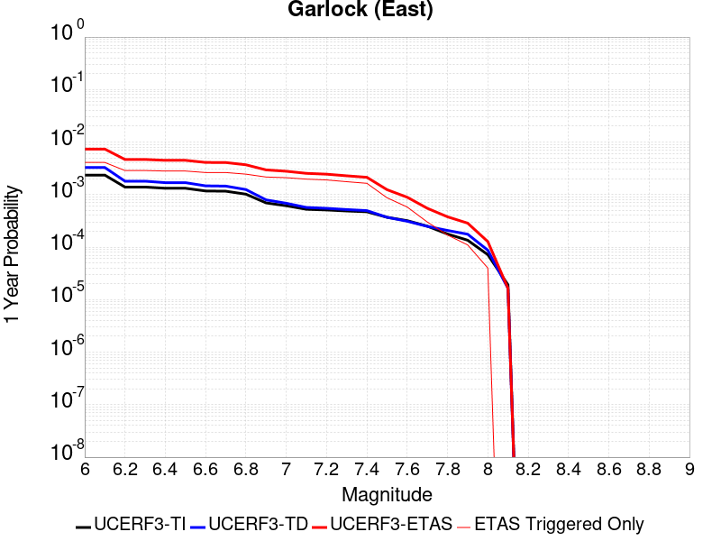 |  |

| Magnitude | 1 wk TI Prob | 1 wk TD Prob | 1 wk ETAS Prob | 1 wk ETAS/TD Gain | 1 wk ETAS Triggered Only | 1 mo TI Prob | 1 mo TD Prob | 1 mo ETAS Prob | 1 mo ETAS/TD Gain | 1 mo ETAS Triggered Only | 1 yr TI Prob | 1 yr TD Prob | 1 yr ETAS Prob | 1 yr ETAS/TD Gain | 1 yr ETAS Triggered Only | 10 yr TI Prob | 10 yr TD Prob | 10 yr ETAS Prob | 10 yr ETAS/TD Gain | 10 yr ETAS Triggered Only |
|-----|-----|-----|-----|-----|-----|-----|-----|-----|-----|-----|-----|-----|-----|-----|-----|-----|-----|-----|-----|-----|
| 6.0 | 4.5092507E-5 | 6.2906794E-5 | 3.973339E-4 | 6.316232 | 3.3444815E-4 | 1.9323928E-4 | 2.695752E-4 | 0.0015735714 | 5.8372264 | 0.0013043479 | 0.0023501497 | 0.0032775842 | 0.007444484 | 2.2713325 | 0.004180602 | 0.023254504 | 0.03235364 | 0.039570536 | 1.2230629 | 0.007458194 |
| 6.1 | 4.5092507E-5 | 6.2906794E-5 | 3.973339E-4 | 6.316232 | 3.3444815E-4 | 1.9323928E-4 | 2.695752E-4 | 0.0015735714 | 5.8372264 | 0.0013043479 | 0.0023501497 | 0.0032775842 | 0.007444484 | 2.2713325 | 0.004180602 | 0.023254504 | 0.03235364 | 0.039570536 | 1.2230629 | 0.007458194 |
| 6.2 | 2.6674514E-5 | 3.4512483E-5 | 2.686181E-4 | 7.783216 | 2.3411372E-4 | 1.1431433E-4 | 1.4790244E-4 | 0.0011845384 | 8.008917 | 0.0010367893 | 0.0013908884 | 0.001799258 | 0.004636952 | 2.577147 | 0.0028428093 | 0.01382215 | 0.017891733 | 0.022917237 | 1.2808841 | 0.005117057 |
| 6.3 | 2.6674514E-5 | 3.4512483E-5 | 2.686181E-4 | 7.783216 | 2.3411372E-4 | 1.1431433E-4 | 1.4790244E-4 | 0.0011845384 | 8.008917 | 0.0010367893 | 0.0013908884 | 0.001799258 | 0.004636952 | 2.577147 | 0.0028428093 | 0.01382215 | 0.017891733 | 0.022917237 | 1.2808841 | 0.005117057 |
| 6.4 | 2.5312667E-5 | 3.2341675E-5 | 2.664478E-4 | 8.238528 | 2.3411372E-4 | 1.0847834E-4 | 1.3859998E-4 | 0.0011752456 | 8.479406 | 0.0010367893 | 0.0013199237 | 0.001686178 | 0.0044908053 | 2.6633046 | 0.0028093646 | 0.013121112 | 0.01677974 | 0.021745166 | 1.295918 | 0.0050501674 |
| 6.5 | 2.5312667E-5 | 3.2341675E-5 | 2.664478E-4 | 8.238528 | 2.3411372E-4 | 1.0847834E-4 | 1.3859998E-4 | 0.0011752456 | 8.479406 | 0.0010367893 | 0.0013199237 | 0.001686178 | 0.0044908053 | 2.6633046 | 0.0028093646 | 0.013121112 | 0.01677974 | 0.021745166 | 1.295918 | 0.0050501674 |
| 6.6 | 2.246556E-5 | 2.813642E-5 | 2.2879968E-4 | 8.131798 | 2.006689E-4 | 9.627742E-5 | 1.20579214E-4 | 0.0010569211 | 8.7653675 | 9.3645486E-4 | 0.0011715472 | 0.0014670868 | 0.0040385597 | 2.7527747 | 0.0025752508 | 0.011653901 | 0.014620015 | 0.019003144 | 1.2998033 | 0.0044481605 |
| 6.7 | 2.2241198E-5 | 2.7806154E-5 | 2.2846946E-4 | 8.216508 | 2.006689E-4 | 9.531594E-5 | 1.1916392E-4 | 0.0010555072 | 8.857607 | 9.3645486E-4 | 0.0011598538 | 0.0014498787 | 0.004021396 | 2.7736084 | 0.0025752508 | 0.011538187 | 0.0144502055 | 0.018834088 | 1.3033787 | 0.0044481605 |
| 6.8 | 1.9528685E-5 | 2.3900653E-5 | 2.2456475E-4 | 9.395759 | 2.006689E-4 | 8.369167E-5 | 1.0242746E-4 | 0.0010387864 | 10.141679 | 9.3645486E-4 | 0.0010184698 | 0.0012463606 | 0.0036513861 | 2.9296386 | 0.0024080267 | 0.010138147 | 0.012437694 | 0.01653327 | 1.3292874 | 0.004147157 |
| 6.9 | 1.3318621E-5 | 1.5201007E-5 | 1.8242255E-4 | 12.000689 | 1.6722408E-4 | 5.7078556E-5 | 6.514558E-5 | 9.012115E-4 | 13.83381 | 8.361204E-4 | 6.9470983E-4 | 7.928645E-4 | 0.0028982174 | 3.6553752 | 0.0021070235 | 0.0069254204 | 0.007940986 | 0.011557522 | 1.4554266 | 0.003645485 |
| 7.0 | 1.1760853E-5 | 1.3109839E-5 | 1.8033173E-4 | 13.75545 | 1.6722408E-4 | 5.0402683E-5 | 5.618384E-5 | 8.5881434E-4 | 15.2857895 | 8.026756E-4 | 6.134799E-4 | 6.838286E-4 | 0.0026891453 | 3.9324846 | 0.0020066889 | 0.0061178906 | 0.006857582 | 0.010345206 | 1.5085793 | 0.0035117057 |
| 7.1 | 1.0064758E-5 | 1.090491E-5 | 1.7812717E-4 | 16.334585 | 1.6722408E-4 | 4.3133965E-5 | 4.673451E-5 | 7.8248605E-4 | 16.743217 | 7.357859E-4 | 5.2502943E-4 | 5.688476E-4 | 0.002407266 | 4.2318296 | 0.0018394649 | 0.005237907 | 0.005714025 | 0.008972889 | 1.5703272 | 0.003277592 |
| 7.2 | 9.768808E-6 | 1.0500772E-5 | 1.777231E-4 | 16.924765 | 1.6722408E-4 | 4.186565E-5 | 4.500255E-5 | 7.473121E-4 | 16.605993 | 7.0234115E-4 | 5.095951E-4 | 5.477718E-4 | 0.0022859497 | 4.1731787 | 0.0017391305 | 0.0050842804 | 0.005504284 | 0.008630793 | 1.5680135 | 0.0031438128 |
| 7.3 | 9.344516E-6 | 9.946395E-6 | 1.4372433E-4 | 14.449891 | 1.3377926E-4 | 4.004731E-5 | 4.2626732E-5 | 6.4460776E-4 | 15.1221485 | 6.020067E-4 | 4.8746695E-4 | 5.1886035E-4 | 0.0020230962 | 3.899115 | 0.0015050167 | 0.0048639905 | 0.005215945 | 0.007977386 | 1.5294229 | 0.0027759196 |
| 7.4 | 9.023491E-6 | 9.49255E-6 | 1.4327055E-4 | 15.092946 | 1.3377926E-4 | 3.867153E-5 | 4.068174E-5 | 6.092205E-4 | 14.97528 | 5.685619E-4 | 4.7072413E-4 | 4.95191E-4 | 0.0018991777 | 3.8352427 | 0.0014046823 | 0.004697283 | 0.004979378 | 0.0075085275 | 1.5079248 | 0.002541806 |
| 7.5 | 7.081253E-6 | 7.0893525E-6 | 4.053393E-5 | 5.717579 | 3.3444816E-5 | 3.0347876E-5 | 3.038259E-5 | 2.6448918E-4 | 8.705288 | 2.3411372E-4 | 3.6942272E-4 | 3.6984598E-4 | 0.0010719274 | 2.8983076 | 7.0234115E-4 | 0.003688092 | 0.0037251879 | 0.0051246374 | 1.3756722 | 0.0014046823 |
| 7.6 | 6.116396E-6 | 5.9608415E-6 | 5.9608415E-6 | 1.0 | 0.0 | 2.6212863E-5 | 2.5546216E-5 | 1.5932207E-4 | 6.236621 | 1.3377926E-4 | 3.1909486E-4 | 3.1098103E-4 | 8.124973E-4 | 2.6126907 | 5.016722E-4 | 0.0031863707 | 0.003136586 | 0.0041034436 | 1.3082515 | 9.6989964E-4 |
| 7.7 | 4.797145E-6 | 4.7587923E-6 | 4.7587923E-6 | 1.0 | 0.0 | 2.055903E-5 | 2.0394666E-5 | 8.728293E-5 | 4.2796946 | 6.688963E-5 | 2.5027743E-4 | 2.482769E-4 | 4.8233246E-4 | 1.94272 | 2.3411372E-4 | 0.0024999576 | 0.002510134 | 0.0030439077 | 1.2126476 | 5.3511705E-4 |
| 7.8 | 3.4028885E-6 | 3.979809E-6 | 3.979809E-6 | 1.0 | 0.0 | 1.4583726E-5 | 1.7056214E-5 | 8.394471E-5 | 4.9216495 | 6.688963E-5 | 1.775424E-4 | 2.076397E-4 | 3.413912E-4 | 1.6441518 | 1.3377926E-4 | 0.0017740062 | 0.0021019245 | 0.0024356698 | 1.1587808 | 3.3444815E-4 |
| 7.9 | 2.5928412E-6 | 3.373588E-6 | 3.373588E-6 | 1.0 | 0.0 | 1.1112129E-5 | 1.44581545E-5 | 8.134682E-5 | 5.626363 | 6.688963E-5 | 1.3528178E-4 | 1.7601387E-4 | 2.7633065E-4 | 1.5699369 | 1.0033445E-4 | 0.0013519945 | 0.0017818334 | 0.00201553 | 1.1311551 | 2.3411372E-4 |
| 8.0 | 1.3743648E-6 | 1.673991E-6 | 1.673991E-6 | 1.0 | 0.0 | 5.8901214E-6 | 7.174228E-6 | 7.406338E-5 | 10.323533 | 6.688963E-5 | 7.1709874E-5 | 8.7342756E-5 | 1.5422654E-4 | 1.7657623 | 6.688963E-5 | 7.1686733E-4 | 8.839922E-4 | 9.5082266E-4 | 1.0756007 | 6.688963E-5 |
| 8.1 | 3.6733252E-7 | 3.1499187E-7 | 3.1499187E-7 | 1.0 | 0.0 | 1.5742813E-6 | 1.3499646E-6 | 1.3499646E-6 | 1.0 | 0.0 | 1.9166706E-5 | 1.643571E-5 | 1.643571E-5 | 1.0 | 0.0 | 1.9165053E-4 | 1.6643589E-4 | 1.6643589E-4 | 1.0 | 0.0 |

## Blackwater
*[(top)](#table-of-contents)*

| 1 Week | 1 Month | 1 Year | 10 Year |
|-----|-----|-----|-----|
|  |  |  |  |

| Magnitude | 1 wk TI Prob | 1 wk TD Prob | 1 wk ETAS Prob | 1 wk ETAS/TD Gain | 1 wk ETAS Triggered Only | 1 mo TI Prob | 1 mo TD Prob | 1 mo ETAS Prob | 1 mo ETAS/TD Gain | 1 mo ETAS Triggered Only | 1 yr TI Prob | 1 yr TD Prob | 1 yr ETAS Prob | 1 yr ETAS/TD Gain | 1 yr ETAS Triggered Only | 10 yr TI Prob | 10 yr TD Prob | 10 yr ETAS Prob | 10 yr ETAS/TD Gain | 10 yr ETAS Triggered Only |
|-----|-----|-----|-----|-----|-----|-----|-----|-----|-----|-----|-----|-----|-----|-----|-----|-----|-----|-----|-----|-----|
| 6.0 | 3.0708583E-5 | 3.309619E-5 | 6.685267E-4 | 20.199505 | 6.354515E-4 | 1.3160157E-4 | 1.4183388E-4 | 0.0012119162 | 8.544618 | 0.0010702341 | 0.0016010714 | 0.0017255963 | 0.0043631773 | 2.5285041 | 0.0026421405 | 0.015895851 | 0.017135808 | 0.02213231 | 1.2915823 | 0.005083612 |
| 6.1 | 3.0708583E-5 | 3.309619E-5 | 6.685267E-4 | 20.199505 | 6.354515E-4 | 1.3160157E-4 | 1.4183388E-4 | 0.0012119162 | 8.544618 | 0.0010702341 | 0.0016010714 | 0.0017255963 | 0.0043631773 | 2.5285041 | 0.0026421405 | 0.015895851 | 0.017135808 | 0.02213231 | 1.2915823 | 0.005083612 |
| 6.2 | 1.1707779E-5 | 1.2545242E-5 | 2.46656E-4 | 19.661322 | 2.3411372E-4 | 5.017523E-5 | 5.3764266E-5 | 4.5508047E-4 | 8.464367 | 4.013378E-4 | 6.107122E-4 | 6.5439293E-4 | 0.0016905038 | 2.583316 | 0.0010367893 | 0.006090366 | 0.006525631 | 0.0083863195 | 1.2851353 | 0.0018729097 |
| 6.3 | 1.1707779E-5 | 1.2545242E-5 | 2.46656E-4 | 19.661322 | 2.3411372E-4 | 5.017523E-5 | 5.3764266E-5 | 4.5508047E-4 | 8.464367 | 4.013378E-4 | 6.107122E-4 | 6.5439293E-4 | 0.0016905038 | 2.583316 | 0.0010367893 | 0.006090366 | 0.006525631 | 0.0083863195 | 1.2851353 | 0.0018729097 |
| 6.4 | 7.929244E-6 | 8.480176E-6 | 1.7570284E-4 | 20.719244 | 1.6722408E-4 | 3.3982033E-5 | 3.6343128E-5 | 2.3700473E-4 | 6.521308 | 2.006689E-4 | 4.136527E-4 | 4.4239179E-4 | 9.772722E-4 | 2.2090647 | 5.3511705E-4 | 0.0041288356 | 0.0044155167 | 0.005481025 | 1.24131 | 0.0010702341 |
| 6.5 | 5.8832115E-6 | 6.286048E-6 | 1.4006447E-4 | 22.281801 | 1.3377926E-4 | 2.521352E-5 | 2.6939942E-5 | 1.9415951E-4 | 7.2071247 | 1.6722408E-4 | 3.0693135E-4 | 3.2794697E-4 | 7.62587E-4 | 2.3253362 | 4.3478262E-4 | 0.0030650778 | 0.0032748834 | 0.004141601 | 1.264656 | 8.6956524E-4 |
| 6.6 | 5.8832115E-6 | 6.286048E-6 | 1.4006447E-4 | 22.281801 | 1.3377926E-4 | 2.521352E-5 | 2.6939942E-5 | 1.9415951E-4 | 7.2071247 | 1.6722408E-4 | 3.0693135E-4 | 3.2794697E-4 | 7.62587E-4 | 2.3253362 | 4.3478262E-4 | 0.0030650778 | 0.0032748834 | 0.004141601 | 1.264656 | 8.6956524E-4 |
| 6.7 | 3.0715053E-6 | 3.281496E-6 | 3.6726204E-5 | 11.191909 | 3.3444816E-5 | 1.3163528E-5 | 1.4063485E-5 | 4.750783E-5 | 3.378098 | 3.3444816E-5 | 1.6025416E-4 | 1.7121063E-4 | 3.384061E-4 | 1.9765483 | 1.6722408E-4 | 0.0016013865 | 0.0017109019 | 0.0021449407 | 1.25369 | 4.3478262E-4 |
| 6.8 | 2.2722281E-6 | 2.4287758E-6 | 3.5873512E-5 | 14.770203 | 3.3444816E-5 | 9.738084E-6 | 1.0409003E-5 | 4.385347E-5 | 4.2130327 | 3.3444816E-5 | 1.1855473E-4 | 1.2672316E-4 | 2.6048548E-4 | 2.0555475 | 1.3377926E-4 | 0.001184915 | 0.0012665992 | 0.0016006237 | 1.2637177 | 3.3444815E-4 |
| 6.9 | 9.952399E-7 | 1.0653588E-6 | 3.451014E-5 | 32.39297 | 3.3444816E-5 | 4.265307E-6 | 4.5658185E-6 | 3.8010483E-5 | 8.325009 | 3.3444816E-5 | 5.1928873E-5 | 5.5587938E-5 | 8.9030895E-5 | 1.6016226 | 3.3444816E-5 | 5.191674E-4 | 5.5579096E-4 | 6.560696E-4 | 1.1804252 | 1.0033445E-4 |
| 7.0 | 4.7385504E-7 | 5.0756074E-7 | 3.395236E-5 | 66.893196 | 3.3444816E-5 | 2.0308057E-6 | 2.1752603E-6 | 3.5620003E-5 | 16.375053 | 3.3444816E-5 | 2.4724779E-5 | 2.6483794E-5 | 5.9927723E-5 | 2.2628074 | 3.3444816E-5 | 2.4722028E-4 | 2.6483793E-4 | 3.6514582E-4 | 1.3787519 | 1.0033445E-4 |

## Hunter Mountain-Saline Valley
*[(top)](#table-of-contents)*

| 1 Week | 1 Month | 1 Year | 10 Year |
|-----|-----|-----|-----|
|  |  |  | 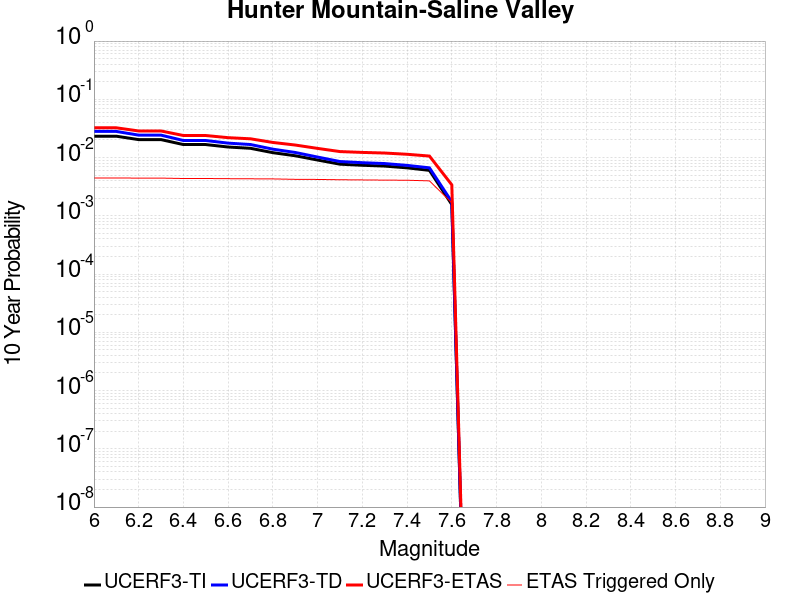 |

| Magnitude | 1 wk TI Prob | 1 wk TD Prob | 1 wk ETAS Prob | 1 wk ETAS/TD Gain | 1 wk ETAS Triggered Only | 1 mo TI Prob | 1 mo TD Prob | 1 mo ETAS Prob | 1 mo ETAS/TD Gain | 1 mo ETAS Triggered Only | 1 yr TI Prob | 1 yr TD Prob | 1 yr ETAS Prob | 1 yr ETAS/TD Gain | 1 yr ETAS Triggered Only | 10 yr TI Prob | 10 yr TD Prob | 10 yr ETAS Prob | 10 yr ETAS/TD Gain | 10 yr ETAS Triggered Only |
|-----|-----|-----|-----|-----|-----|-----|-----|-----|-----|-----|-----|-----|-----|-----|-----|-----|-----|-----|-----|-----|
| 6.0 | 4.5103672E-5 | 5.4571992E-5 | 5.8965984E-4 | 10.805174 | 5.3511705E-4 | 1.9328714E-4 | 2.3385909E-4 | 0.0014041539 | 6.0042734 | 0.0011705685 | 0.002350731 | 0.0028436056 | 0.005578282 | 1.9616933 | 0.002742475 | 0.023260195 | 0.028092787 | 0.03287106 | 1.170089 | 0.004916388 |
| 6.1 | 4.5103672E-5 | 5.4571992E-5 | 5.8965984E-4 | 10.805174 | 5.3511705E-4 | 1.9328714E-4 | 2.3385909E-4 | 0.0014041539 | 6.0042734 | 0.0011705685 | 0.002350731 | 0.0028436056 | 0.005578282 | 1.9616933 | 0.002742475 | 0.023260195 | 0.028092787 | 0.03287106 | 1.170089 | 0.004916388 |
| 6.2 | 3.9363465E-5 | 4.7064877E-5 | 5.8215676E-4 | 12.36924 | 5.3511705E-4 | 1.6868966E-4 | 2.0169078E-4 | 0.0013720233 | 6.802608 | 0.0011705685 | 0.002051862 | 0.0024528939 | 0.0051886416 | 2.1153145 | 0.002742475 | 0.020330196 | 0.024274237 | 0.029071284 | 1.1976188 | 0.004916388 |
| 6.3 | 3.9363465E-5 | 4.7064877E-5 | 5.8215676E-4 | 12.36924 | 5.3511705E-4 | 1.6868966E-4 | 2.0169078E-4 | 0.0013720233 | 6.802608 | 0.0011705685 | 0.002051862 | 0.0024528939 | 0.0051886416 | 2.1153145 | 0.002742475 | 0.020330196 | 0.024274237 | 0.029071284 | 1.1976188 | 0.004916388 |
| 6.4 | 3.2311684E-5 | 3.795214E-5 | 5.3960533E-4 | 14.218048 | 5.016722E-4 | 1.384713E-4 | 1.626423E-4 | 0.0012995811 | 7.990425 | 0.0011371238 | 0.0016845843 | 0.0019784442 | 0.004648736 | 2.3496926 | 0.0026755852 | 0.016718714 | 0.019617062 | 0.024338638 | 1.2406873 | 0.0048160534 |
| 6.5 | 3.2311684E-5 | 3.795214E-5 | 5.3960533E-4 | 14.218048 | 5.016722E-4 | 1.384713E-4 | 1.626423E-4 | 0.0012995811 | 7.990425 | 0.0011371238 | 0.0016845843 | 0.0019784442 | 0.004648736 | 2.3496926 | 0.0026755852 | 0.016718714 | 0.019617062 | 0.024338638 | 1.2406873 | 0.0048160534 |
| 6.6 | 2.9305844E-5 | 3.4182853E-5 | 5.023943E-4 | 14.69726 | 4.6822743E-4 | 1.2559042E-4 | 1.4649007E-4 | 0.0012500073 | 8.5330515 | 0.001103679 | 0.0015279909 | 0.0017821203 | 0.004419552 | 2.4799404 | 0.0026421405 | 0.015175272 | 0.017686214 | 0.022384237 | 1.2656319 | 0.0047826087 |
| 6.7 | 2.7826512E-5 | 3.2345237E-5 | 5.0055754E-4 | 15.475462 | 4.6822743E-4 | 1.19251024E-4 | 1.3861542E-4 | 0.0012421414 | 8.9610615 | 0.001103679 | 0.0014509142 | 0.0016863967 | 0.0043240814 | 2.5640953 | 0.0026421405 | 0.014414776 | 0.01674368 | 0.021446211 | 1.280854 | 0.0047826087 |
| 6.8 | 2.3389874E-5 | 2.6867507E-5 | 4.9508235E-4 | 18.426807 | 4.6822743E-4 | 1.0023846E-4 | 1.1514164E-4 | 0.0012186934 | 10.584298 | 0.001103679 | 0.00121972 | 0.0014009953 | 0.0040394343 | 2.8832603 | 0.0026421405 | 0.01213047 | 0.013927842 | 0.01864384 | 1.3386022 | 0.0047826087 |
| 6.9 | 2.069209E-5 | 2.3570727E-5 | 4.917871E-4 | 20.864317 | 4.6822743E-4 | 8.867737E-5 | 1.0101369E-4 | 0.0012045811 | 11.92493 | 0.001103679 | 0.0010791123 | 0.001229184 | 0.0038680767 | 3.1468656 | 0.0026421405 | 0.010738871 | 0.012228882 | 0.016919969 | 1.3836071 | 0.004749164 |
| 7.0 | 1.7462342E-5 | 1.9634126E-5 | 4.8785235E-4 | 24.847164 | 4.6822743E-4 | 7.483646E-5 | 8.414367E-5 | 0.0011877298 | 14.115497 | 0.001103679 | 9.1075303E-4 | 0.0010239903 | 0.003596604 | 3.5123417 | 0.0025752508 | 0.009070295 | 0.010196352 | 0.0148308845 | 1.4545285 | 0.004682274 |
| 7.1 | 1.4807709E-5 | 1.6442245E-5 | 4.8466198E-4 | 29.476631 | 4.6822743E-4 | 6.3460066E-5 | 7.046495E-5 | 0.0011740661 | 16.661703 | 0.001103679 | 7.723524E-4 | 8.575896E-4 | 0.0033972159 | 3.9613538 | 0.002541806 | 0.007696735 | 0.008545788 | 0.013154889 | 1.5393419 | 0.0046488293 |
| 7.2 | 1.4180048E-5 | 1.5698814E-5 | 4.8391888E-4 | 30.82519 | 4.6822743E-4 | 6.077022E-5 | 6.727898E-5 | 0.0011708837 | 17.403408 | 0.001103679 | 7.396263E-4 | 8.1883004E-4 | 0.0033585548 | 4.1016507 | 0.002541806 | 0.0073716943 | 0.00816108 | 0.012771971 | 1.5649853 | 0.0046488293 |
| 7.3 | 1.3730402E-5 | 1.5172541E-5 | 4.8339285E-4 | 31.859718 | 4.6822743E-4 | 5.8843252E-5 | 6.502365E-5 | 0.0011686308 | 17.972399 | 0.001103679 | 7.161811E-4 | 7.913914E-4 | 0.0032977676 | 4.16705 | 0.0025083611 | 0.007138774 | 0.007888664 | 0.0124676395 | 1.58045 | 0.0046153846 |
| 7.4 | 1.2810095E-5 | 1.410972E-5 | 4.8233054E-4 | 34.184273 | 4.6822743E-4 | 5.489925E-5 | 6.0468916E-5 | 0.0011640812 | 19.2509 | 0.001103679 | 6.681934E-4 | 7.359762E-4 | 0.0032424913 | 4.405701 | 0.0025083611 | 0.006661878 | 0.0073382827 | 0.011886599 | 1.6198066 | 0.00458194 |
| 7.5 | 1.1595659E-5 | 1.2801013E-5 | 4.8102243E-4 | 37.576904 | 4.6822743E-4 | 4.9694736E-5 | 5.4860422E-5 | 0.0011250358 | 20.50724 | 0.0010702341 | 6.0486543E-4 | 6.677366E-4 | 0.0031410004 | 4.7039514 | 0.0024749164 | 0.006032217 | 0.0066601736 | 0.011178375 | 1.6783909 | 0.004548495 |
| 7.6 | 2.997694E-6 | 3.3252948E-6 | 1.3710411E-4 | 41.230667 | 1.3377926E-4 | 1.28471975E-5 | 1.4251226E-5 | 3.1525028E-4 | 22.120924 | 3.0100334E-4 | 1.564034E-4 | 1.7350215E-4 | 0.0010094774 | 5.818242 | 8.361204E-4 | 0.0015629337 | 0.0017351025 | 0.0037049227 | 2.135276 | 0.0019732441 |

## Gravel Hills-Harper Lk
*[(top)](#table-of-contents)*

| 1 Week | 1 Month | 1 Year | 10 Year |
|-----|-----|-----|-----|
|  |  |  | 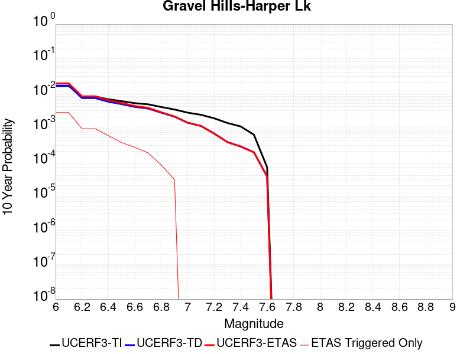 |

| Magnitude | 1 wk TI Prob | 1 wk TD Prob | 1 wk ETAS Prob | 1 wk ETAS/TD Gain | 1 wk ETAS Triggered Only | 1 mo TI Prob | 1 mo TD Prob | 1 mo ETAS Prob | 1 mo ETAS/TD Gain | 1 mo ETAS Triggered Only | 1 yr TI Prob | 1 yr TD Prob | 1 yr ETAS Prob | 1 yr ETAS/TD Gain | 1 yr ETAS Triggered Only | 10 yr TI Prob | 10 yr TD Prob | 10 yr ETAS Prob | 10 yr ETAS/TD Gain | 10 yr ETAS Triggered Only |
|-----|-----|-----|-----|-----|-----|-----|-----|-----|-----|-----|-----|-----|-----|-----|-----|-----|-----|-----|-----|-----|
| 6.0 | 3.0679566E-5 | 3.1465184E-5 | 1.6524024E-4 | 5.2515264 | 1.3377926E-4 | 1.3147724E-4 | 1.3484505E-4 | 5.69569E-4 | 4.223878 | 4.3478262E-4 | 0.0015995599 | 0.0016407187 | 0.0030430963 | 1.8547337 | 0.0014046823 | 0.015880952 | 0.016307615 | 0.019005368 | 1.165429 | 0.002742475 |
| 6.1 | 3.0679566E-5 | 3.1465184E-5 | 1.6524024E-4 | 5.2515264 | 1.3377926E-4 | 1.3147724E-4 | 1.3484505E-4 | 5.69569E-4 | 4.223878 | 4.3478262E-4 | 0.0015995599 | 0.0016407187 | 0.0030430963 | 1.8547337 | 0.0014046823 | 0.015880952 | 0.016307615 | 0.019005368 | 1.165429 | 0.002742475 |
| 6.2 | 1.514536E-5 | 1.3635392E-5 | 4.7079753E-5 | 3.4527612 | 3.3444816E-5 | 6.490707E-5 | 5.843615E-5 | 1.922076E-4 | 3.2891898 | 1.3377926E-4 | 7.8995706E-4 | 7.112398E-4 | 9.78608E-4 | 1.3759185 | 2.6755853E-4 | 0.007871548 | 0.0070908363 | 0.0080206515 | 1.131129 | 9.3645486E-4 |
| 6.3 | 1.514536E-5 | 1.3635392E-5 | 4.7079753E-5 | 3.4527612 | 3.3444816E-5 | 6.490707E-5 | 5.843615E-5 | 1.922076E-4 | 3.2891898 | 1.3377926E-4 | 7.8995706E-4 | 7.112398E-4 | 9.78608E-4 | 1.3759185 | 2.6755853E-4 | 0.007871548 | 0.0070908363 | 0.0080206515 | 1.131129 | 9.3645486E-4 |
| 6.4 | 1.2532521E-5 | 1.0689826E-5 | 4.4134285E-5 | 4.1286254 | 3.3444816E-5 | 5.37097E-5 | 4.581277E-5 | 1.1269934E-4 | 2.4599984 | 6.688963E-5 | 6.537194E-4 | 5.576335E-4 | 7.581905E-4 | 1.3596574 | 2.006689E-4 | 0.0065179965 | 0.0055629327 | 0.0061948495 | 1.1135942 | 6.354515E-4 |
| 6.5 | 1.1094058E-5 | 9.083774E-6 | 4.2528285E-5 | 4.681786 | 3.3444816E-5 | 4.7545094E-5 | 3.89299E-5 | 7.237341E-5 | 1.8590702 | 3.3444816E-5 | 5.787078E-4 | 4.738725E-4 | 6.075884E-4 | 1.2821769 | 1.3377926E-4 | 0.0057720304 | 0.004729028 | 0.0051950407 | 1.0985432 | 4.6822743E-4 |
| 6.6 | 9.688328E-6 | 7.531784E-6 | 4.097635E-5 | 5.4404573 | 3.3444816E-5 | 4.1520743E-5 | 3.2278687E-5 | 6.572242E-5 | 2.0360935 | 3.3444816E-5 | 5.053978E-4 | 3.929247E-4 | 4.9321976E-4 | 1.2552525 | 1.0033445E-4 | 0.0050424994 | 0.0039225565 | 0.00432232 | 1.101914 | 4.013378E-4 |
| 6.7 | 8.974824E-6 | 6.7494916E-6 | 4.019408E-5 | 5.9551272 | 3.3444816E-5 | 3.8462964E-5 | 2.8926084E-5 | 6.236993E-5 | 2.156183 | 3.3444816E-5 | 4.6818596E-4 | 3.5212038E-4 | 4.5241948E-4 | 1.2848433 | 1.0033445E-4 | 0.004672008 | 0.0035158454 | 0.0037824633 | 1.0758332 | 2.6755853E-4 |
| 6.8 | 7.4780046E-6 | 5.116252E-6 | 5.116252E-6 | 1.0 | 0.0 | 3.20482E-5 | 2.1926619E-5 | 2.1926619E-5 | 1.0 | 0.0 | 3.9011694E-4 | 2.6692526E-4 | 3.3379704E-4 | 1.2505262 | 6.688963E-5 | 0.0038943281 | 0.002666185 | 0.0027996073 | 1.0500425 | 1.3377926E-4 |
| 6.9 | 6.3409307E-6 | 3.9075426E-6 | 3.9075426E-6 | 1.0 | 0.0 | 2.7175134E-5 | 1.674651E-5 | 1.674651E-5 | 1.0 | 0.0 | 3.3080703E-4 | 2.0387067E-4 | 2.0387067E-4 | 1.0 | 0.0 | 0.0033031502 | 0.0020369345 | 0.002103688 | 1.0327715 | 6.688963E-5 |
| 7.0 | 5.1239335E-6 | 2.6058885E-6 | 2.6058885E-6 | 1.0 | 0.0 | 2.195953E-5 | 1.11680465E-5 | 1.11680465E-5 | 1.0 | 0.0 | 2.6732447E-4 | 1.3596273E-4 | 1.3596273E-4 | 1.0 | 0.0 | 0.0026700313 | 0.0013588208 | 0.0013588208 | 1.0 | 0.0 |
| 7.1 | 4.438899E-6 | 2.0984994E-6 | 2.0984994E-6 | 1.0 | 0.0 | 1.9023713E-5 | 8.993539E-6 | 8.993539E-6 | 1.0 | 0.0 | 2.315891E-4 | 1.0949106E-4 | 1.0949106E-4 | 1.0 | 0.0 | 0.002313479 | 0.0010943931 | 0.0010943931 | 1.0 | 0.0 |
| 7.2 | 3.50367E-6 | 1.2615911E-6 | 1.2615911E-6 | 1.0 | 0.0 | 1.5015643E-5 | 5.406808E-6 | 5.406808E-6 | 1.0 | 0.0 | 1.8280011E-4 | 6.582599E-5 | 6.582599E-5 | 1.0 | 0.0 | 0.0018264982 | 6.580731E-4 | 6.580731E-4 | 1.0 | 0.0 |
| 7.3 | 2.561638E-6 | 7.119307E-7 | 7.119307E-7 | 1.0 | 0.0 | 1.0978401E-5 | 3.051128E-6 | 3.051128E-6 | 1.0 | 0.0 | 1.3365384E-4 | 3.714687E-5 | 3.714687E-5 | 1.0 | 0.0 | 0.0013357349 | 3.7140862E-4 | 3.7140862E-4 | 1.0 | 0.0 |
| 7.4 | 2.0368864E-6 | 5.304955E-7 | 5.304955E-7 | 1.0 | 0.0 | 8.729483E-6 | 2.2735503E-6 | 2.2735503E-6 | 1.0 | 0.0 | 1.06276275E-4 | 2.768013E-5 | 2.768013E-5 | 1.0 | 0.0 | 0.0010622547 | 2.7676736E-4 | 2.7676736E-4 | 1.0 | 0.0 |
| 7.5 | 1.1681728E-6 | 3.6031287E-7 | 3.6031287E-7 | 1.0 | 0.0 | 5.0064455E-6 | 1.5441972E-6 | 1.5441972E-6 | 1.0 | 0.0 | 6.0951766E-5 | 1.8800443E-5 | 1.8800443E-5 | 1.0 | 0.0 | 6.093505E-4 | 1.8798899E-4 | 1.8798899E-4 | 1.0 | 0.0 |
| 7.6 | 1.3154387E-7 | 7.1198265E-8 | 7.1198265E-8 | 1.0 | 0.0 | 5.6375933E-7 | 3.051354E-7 | 3.051354E-7 | 1.0 | 0.0 | 6.863748E-6 | 3.7150185E-6 | 3.7150185E-6 | 1.0 | 0.0 | 6.863536E-5 | 3.7149723E-5 | 3.7149723E-5 | 1.0 | 0.0 |

## Goldstone Lake
*[(top)](#table-of-contents)*

| 1 Week | 1 Month | 1 Year | 10 Year |
|-----|-----|-----|-----|
|  |  | 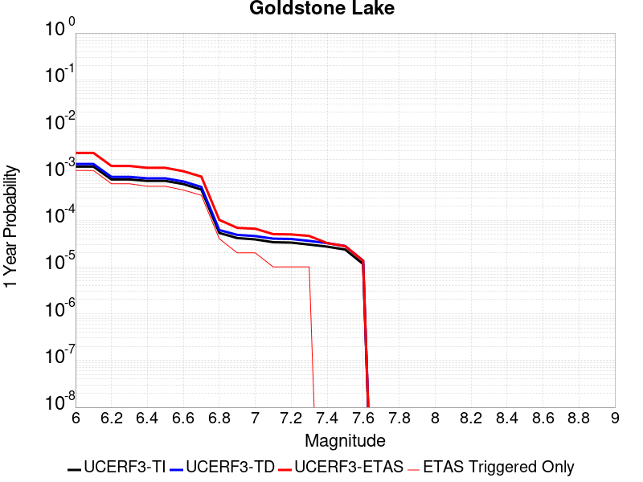 |  |

| Magnitude | 1 wk TI Prob | 1 wk TD Prob | 1 wk ETAS Prob | 1 wk ETAS/TD Gain | 1 wk ETAS Triggered Only | 1 mo TI Prob | 1 mo TD Prob | 1 mo ETAS Prob | 1 mo ETAS/TD Gain | 1 mo ETAS Triggered Only | 1 yr TI Prob | 1 yr TD Prob | 1 yr ETAS Prob | 1 yr ETAS/TD Gain | 1 yr ETAS Triggered Only | 10 yr TI Prob | 10 yr TD Prob | 10 yr ETAS Prob | 10 yr ETAS/TD Gain | 10 yr ETAS Triggered Only |
|-----|-----|-----|-----|-----|-----|-----|-----|-----|-----|-----|-----|-----|-----|-----|-----|-----|-----|-----|-----|-----|
| 6.0 | 2.671352E-5 | 3.0376628E-5 | 2.3103943E-4 | 7.605829 | 2.006689E-4 | 1.1448149E-4 | 1.3018015E-4 | 6.6522753E-4 | 5.1100535 | 5.3511705E-4 | 0.001392921 | 0.0015839875 | 0.0027860936 | 1.7589115 | 0.0012040134 | 0.013842222 | 0.015746472 | 0.018314091 | 1.1630598 | 0.0026086958 |
| 6.1 | 2.671352E-5 | 3.0376628E-5 | 2.3103943E-4 | 7.605829 | 2.006689E-4 | 1.1448149E-4 | 1.3018015E-4 | 6.6522753E-4 | 5.1100535 | 5.3511705E-4 | 0.001392921 | 0.0015839875 | 0.0027860936 | 1.7589115 | 0.0012040134 | 0.013842222 | 0.015746472 | 0.018314091 | 1.1630598 | 0.0026086958 |
| 6.2 | 1.4197047E-5 | 1.6096516E-5 | 1.6096516E-5 | 1.0 | 0.0 | 6.0843064E-5 | 6.89838E-5 | 2.6963884E-4 | 3.9087272 | 2.006689E-4 | 7.4051257E-4 | 8.396528E-4 | 0.0013409038 | 1.5969741 | 5.016722E-4 | 0.007380498 | 0.008374499 | 0.009601595 | 1.1465275 | 0.0012374582 |
| 6.3 | 1.4197047E-5 | 1.6096516E-5 | 1.6096516E-5 | 1.0 | 0.0 | 6.0843064E-5 | 6.89838E-5 | 2.6963884E-4 | 3.9087272 | 2.006689E-4 | 7.4051257E-4 | 8.396528E-4 | 0.0013409038 | 1.5969741 | 5.016722E-4 | 0.007380498 | 0.008374499 | 0.009601595 | 1.1465275 | 0.0012374582 |
| 6.4 | 1.3238931E-5 | 1.5008711E-5 | 1.5008711E-5 | 1.0 | 0.0 | 5.6737044E-5 | 6.432201E-5 | 2.64978E-4 | 4.119554 | 2.006689E-4 | 6.9055456E-4 | 7.8293716E-4 | 0.0012173794 | 1.5548877 | 4.3478262E-4 | 0.006884126 | 0.007811414 | 0.008906472 | 1.1401869 | 0.001103679 |
| 6.5 | 1.3238931E-5 | 1.5008711E-5 | 1.5008711E-5 | 1.0 | 0.0 | 5.6737044E-5 | 6.432201E-5 | 2.64978E-4 | 4.119554 | 2.006689E-4 | 6.9055456E-4 | 7.8293716E-4 | 0.0012173794 | 1.5548877 | 4.3478262E-4 | 0.006884126 | 0.007811414 | 0.008906472 | 1.1401869 | 0.001103679 |
| 6.6 | 1.1328278E-5 | 1.2855381E-5 | 1.2855381E-5 | 1.0 | 0.0 | 4.8548856E-5 | 5.5093864E-5 | 1.8886576E-4 | 3.4280725 | 1.3377926E-4 | 5.90922E-4 | 6.706571E-4 | 0.0010048809 | 1.4983529 | 3.3444815E-4 | 0.0058935313 | 0.0066957204 | 0.007625905 | 1.1389222 | 9.3645486E-4 |
| 6.7 | 8.651175E-6 | 9.8247265E-6 | 9.8247265E-6 | 1.0 | 0.0 | 3.707594E-5 | 4.2105803E-5 | 1.4243602E-4 | 3.3828123 | 1.0033445E-4 | 4.5130608E-4 | 5.126081E-4 | 7.466018E-4 | 1.4564768 | 2.3411372E-4 | 0.0045039062 | 0.0051231356 | 0.0058218786 | 1.1363897 | 7.0234115E-4 |
| 6.8 | 1.0215377E-6 | 1.1754793E-6 | 1.1754793E-6 | 1.0 | 0.0 | 4.378012E-6 | 5.037759E-6 | 5.037759E-6 | 1.0 | 0.0 | 5.3300988E-5 | 6.133311E-5 | 9.477587E-5 | 1.5452645 | 3.3444816E-5 | 5.3288206E-4 | 6.13173E-4 | 6.4659736E-4 | 1.0545104 | 3.3444816E-5 |
| 6.9 | 7.9360774E-7 | 9.2834586E-7 | 9.2834586E-7 | 1.0 | 0.0 | 3.4011714E-6 | 3.9786196E-6 | 3.9786196E-6 | 1.0 | 0.0 | 4.1408475E-5 | 4.8438687E-5 | 4.8438687E-5 | 1.0 | 0.0 | 4.140076E-4 | 4.842883E-4 | 4.842883E-4 | 1.0 | 0.0 |
| 7.0 | 7.4382757E-7 | 8.7473853E-7 | 8.7473853E-7 | 1.0 | 0.0 | 3.1878285E-6 | 3.7488744E-6 | 3.7488744E-6 | 1.0 | 0.0 | 3.8811122E-5 | 4.5641656E-5 | 4.5641656E-5 | 1.0 | 0.0 | 3.8804344E-4 | 4.563295E-4 | 4.563295E-4 | 1.0 | 0.0 |
| 7.1 | 6.4709513E-7 | 7.711347E-7 | 7.711347E-7 | 1.0 | 0.0 | 2.773262E-6 | 3.304859E-6 | 3.304859E-6 | 1.0 | 0.0 | 3.376394E-5 | 4.0235976E-5 | 4.0235976E-5 | 1.0 | 0.0 | 3.375881E-4 | 4.0229288E-4 | 4.0229288E-4 | 1.0 | 0.0 |
| 7.2 | 6.356704E-7 | 7.5884054E-7 | 7.5884054E-7 | 1.0 | 0.0 | 2.7242988E-6 | 3.25217E-6 | 3.25217E-6 | 1.0 | 0.0 | 3.3167835E-5 | 3.959451E-5 | 3.959451E-5 | 1.0 | 0.0 | 3.3162883E-4 | 3.958805E-4 | 3.958805E-4 | 1.0 | 0.0 |
| 7.3 | 5.7695723E-7 | 6.8966074E-7 | 6.8966074E-7 | 1.0 | 0.0 | 2.4726714E-6 | 2.9556859E-6 | 2.9556859E-6 | 1.0 | 0.0 | 3.0104358E-5 | 3.598494E-5 | 3.598494E-5 | 1.0 | 0.0 | 3.0100282E-4 | 3.5979686E-4 | 3.5979686E-4 | 1.0 | 0.0 |
| 7.4 | 5.209647E-7 | 6.193549E-7 | 6.193549E-7 | 1.0 | 0.0 | 2.232704E-6 | 2.654376E-6 | 2.654376E-6 | 1.0 | 0.0 | 2.718283E-5 | 3.2316606E-5 | 3.2316606E-5 | 1.0 | 0.0 | 2.7179506E-4 | 3.231246E-4 | 3.231246E-4 | 1.0 | 0.0 |
| 7.5 | 4.512955E-7 | 5.3489146E-7 | 5.3489146E-7 | 1.0 | 0.0 | 1.934122E-6 | 2.2923903E-6 | 2.2923903E-6 | 1.0 | 0.0 | 2.3547682E-5 | 2.7909547E-5 | 2.7909547E-5 | 1.0 | 0.0 | 2.3545188E-4 | 2.7906572E-4 | 2.7906572E-4 | 1.0 | 0.0 |
| 7.6 | 2.21172E-7 | 2.6039737E-7 | 2.6039737E-7 | 1.0 | 0.0 | 9.478797E-7 | 1.1159884E-6 | 1.1159884E-6 | 1.0 | 0.0 | 1.1540374E-5 | 1.3587103E-5 | 1.3587103E-5 | 1.0 | 0.0 | 1.1539775E-4 | 1.3586554E-4 | 1.3586554E-4 | 1.0 | 0.0 |

## McLean Lake
*[(top)](#table-of-contents)*

| 1 Week | 1 Month | 1 Year | 10 Year |
|-----|-----|-----|-----|
|  |  |  | 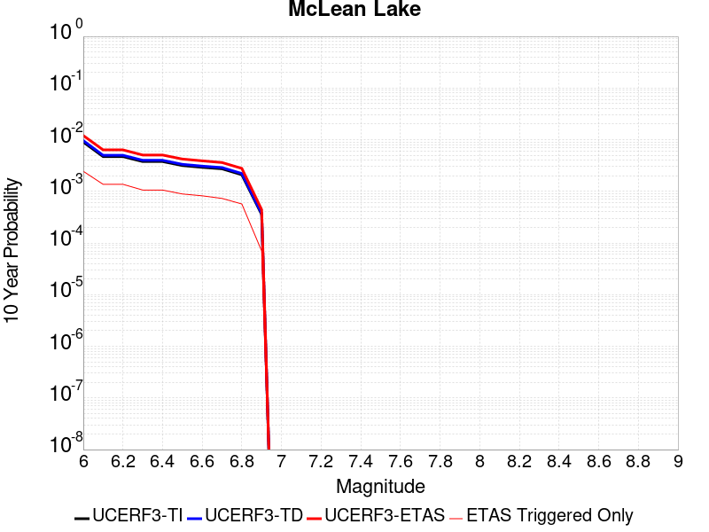 |

| Magnitude | 1 wk TI Prob | 1 wk TD Prob | 1 wk ETAS Prob | 1 wk ETAS/TD Gain | 1 wk ETAS Triggered Only | 1 mo TI Prob | 1 mo TD Prob | 1 mo ETAS Prob | 1 mo ETAS/TD Gain | 1 mo ETAS Triggered Only | 1 yr TI Prob | 1 yr TD Prob | 1 yr ETAS Prob | 1 yr ETAS/TD Gain | 1 yr ETAS Triggered Only | 10 yr TI Prob | 10 yr TD Prob | 10 yr ETAS Prob | 10 yr ETAS/TD Gain | 10 yr ETAS Triggered Only |
|-----|-----|-----|-----|-----|-----|-----|-----|-----|-----|-----|-----|-----|-----|-----|-----|-----|-----|-----|-----|-----|
| 6.0 | 1.7360222E-5 | 1.8501789E-5 | 5.1945986E-5 | 2.8076196 | 3.3444816E-5 | 7.439883E-5 | 7.929125E-5 | 3.133864E-4 | 3.9523454 | 2.3411372E-4 | 9.0542925E-4 | 9.64992E-4 | 0.0019673682 | 2.0387404 | 0.0010033444 | 0.009017491 | 0.009612858 | 0.012063984 | 1.254984 | 0.0024749164 |
| 6.1 | 9.062689E-6 | 9.592268E-6 | 9.592268E-6 | 1.0 | 0.0 | 3.8839516E-5 | 4.110912E-5 | 1.4143945E-4 | 3.4405854 | 1.0033445E-4 | 4.727685E-4 | 5.003975E-4 | 9.3496253E-4 | 1.8684397 | 4.3478262E-4 | 0.0047176396 | 0.0049935905 | 0.006391258 | 1.2798923 | 0.0014046823 |
| 6.2 | 9.062689E-6 | 9.592268E-6 | 9.592268E-6 | 1.0 | 0.0 | 3.8839516E-5 | 4.110912E-5 | 1.4143945E-4 | 3.4405854 | 1.0033445E-4 | 4.727685E-4 | 5.003975E-4 | 9.3496253E-4 | 1.8684397 | 4.3478262E-4 | 0.0047176396 | 0.0049935905 | 0.006391258 | 1.2798923 | 0.0014046823 |
| 6.3 | 7.2575485E-6 | 7.667767E-6 | 7.667767E-6 | 1.0 | 0.0 | 3.110341E-5 | 3.2861484E-5 | 1.3319263E-4 | 4.0531535 | 1.0033445E-4 | 3.786182E-4 | 4.0002225E-4 | 7.6776807E-4 | 1.9193134 | 3.6789296E-4 | 0.0037797375 | 0.003993727 | 0.005126309 | 1.2835903 | 0.0011371238 |
| 6.4 | 7.2575485E-6 | 7.667767E-6 | 7.667767E-6 | 1.0 | 0.0 | 3.110341E-5 | 3.2861484E-5 | 1.3319263E-4 | 4.0531535 | 1.0033445E-4 | 3.786182E-4 | 4.0002225E-4 | 7.6776807E-4 | 1.9193134 | 3.6789296E-4 | 0.0037797375 | 0.003993727 | 0.005126309 | 1.2835903 | 0.0011371238 |
| 6.5 | 6.06582E-6 | 6.4039245E-6 | 6.4039245E-6 | 1.0 | 0.0 | 2.5996113E-5 | 2.7445138E-5 | 1.2777683E-4 | 4.6557183 | 1.0033445E-4 | 3.164567E-4 | 3.340998E-4 | 6.3500257E-4 | 1.9006374 | 3.0100334E-4 | 0.0031600643 | 0.0033366138 | 0.0043366104 | 1.2997041 | 0.0010033444 |
| 6.6 | 5.598744E-6 | 5.910306E-6 | 5.910306E-6 | 1.0 | 0.0 | 2.3994397E-5 | 2.5329673E-5 | 1.2566158E-4 | 4.9610424 | 1.0033445E-4 | 2.9209262E-4 | 3.083515E-4 | 5.7582755E-4 | 1.8674387 | 2.6755853E-4 | 0.0029170897 | 0.0030798658 | 0.0040134364 | 1.3031206 | 9.3645486E-4 |
| 6.7 | 5.246996E-6 | 5.539203E-6 | 5.539203E-6 | 1.0 | 0.0 | 2.2486933E-5 | 2.3739261E-5 | 1.2407133E-4 | 5.226419 | 1.0033445E-4 | 2.73744E-4 | 2.8899353E-4 | 5.564747E-4 | 1.9255613 | 2.6755853E-4 | 0.0027340704 | 0.002886801 | 0.0037205077 | 1.2887995 | 8.361204E-4 |
| 6.8 | 4.02324E-6 | 4.246936E-6 | 4.246936E-6 | 1.0 | 0.0 | 1.7242342E-5 | 1.820106E-5 | 8.508947E-5 | 4.6749735 | 6.688963E-5 | 2.099053E-4 | 2.2158133E-4 | 3.8876836E-4 | 1.7545177 | 1.6722408E-4 | 0.0020970714 | 0.0022141882 | 0.0028482329 | 1.2863553 | 6.354515E-4 |
| 6.9 | 6.835972E-7 | 7.1399705E-7 | 7.1399705E-7 | 1.0 | 0.0 | 2.9296991E-6 | 3.0599856E-6 | 3.0599856E-6 | 1.0 | 0.0 | 3.56685E-5 | 3.7255006E-5 | 7.0698574E-5 | 1.8976934 | 3.3444816E-5 | 3.5662777E-4 | 3.7251884E-4 | 4.7281594E-4 | 1.2692403 | 1.0033445E-4 |

## Garlock (West)
*[(top)](#table-of-contents)*

| 1 Week | 1 Month | 1 Year | 10 Year |
|-----|-----|-----|-----|
|  |  |  | 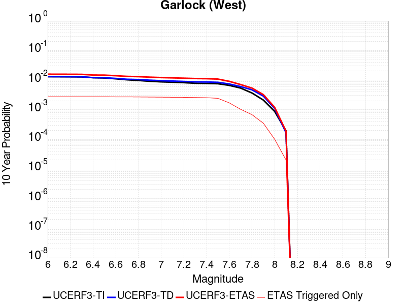 |

| Magnitude | 1 wk TI Prob | 1 wk TD Prob | 1 wk ETAS Prob | 1 wk ETAS/TD Gain | 1 wk ETAS Triggered Only | 1 mo TI Prob | 1 mo TD Prob | 1 mo ETAS Prob | 1 mo ETAS/TD Gain | 1 mo ETAS Triggered Only | 1 yr TI Prob | 1 yr TD Prob | 1 yr ETAS Prob | 1 yr ETAS/TD Gain | 1 yr ETAS Triggered Only | 10 yr TI Prob | 10 yr TD Prob | 10 yr ETAS Prob | 10 yr ETAS/TD Gain | 10 yr ETAS Triggered Only |
|-----|-----|-----|-----|-----|-----|-----|-----|-----|-----|-----|-----|-----|-----|-----|-----|-----|-----|-----|-----|-----|
| 6.0 | 2.5181727E-5 | 2.5202135E-5 | 1.2553406E-4 | 4.981088 | 1.0033445E-4 | 1.0791722E-4 | 1.080047E-4 | 6.0962274E-4 | 5.6444097 | 5.016722E-4 | 0.0013131002 | 0.0013141674 | 0.0027504046 | 2.0928874 | 0.0014381271 | 0.013053683 | 0.013144457 | 0.015685858 | 1.1933439 | 0.0025752508 |
| 6.1 | 2.5077732E-5 | 2.5103205E-5 | 1.2543514E-4 | 4.9967775 | 1.0033445E-4 | 1.0747157E-4 | 1.07580745E-4 | 6.09199E-4 | 5.662714 | 5.016722E-4 | 0.001307681 | 0.0013090121 | 0.0027452565 | 2.0971973 | 0.0014381271 | 0.013000126 | 0.0130935125 | 0.015635043 | 1.1941062 | 0.0025752508 |
| 6.2 | 2.494612E-5 | 2.498488E-5 | 1.2531682E-4 | 5.0157065 | 1.0033445E-4 | 1.0690756E-4 | 1.07073676E-4 | 6.086922E-4 | 5.684798 | 5.016722E-4 | 0.0013008224 | 0.0013028459 | 0.0027390993 | 2.102397 | 0.0014381271 | 0.012932341 | 0.013032575 | 0.015574263 | 1.1950258 | 0.0025752508 |
| 6.3 | 2.4733758E-5 | 2.4804243E-5 | 1.251362E-4 | 5.0449514 | 1.0033445E-4 | 1.0599751E-4 | 1.0629959E-4 | 6.079185E-4 | 5.718917 | 5.016722E-4 | 0.0012897556 | 0.0012934325 | 0.0027296995 | 2.1104305 | 0.0014381271 | 0.012822957 | 0.012939542 | 0.01548147 | 1.1964465 | 0.0025752508 |
| 6.4 | 2.3237335E-5 | 2.318352E-5 | 1.2351564E-4 | 5.327735 | 1.0033445E-4 | 9.958477E-5 | 9.935417E-5 | 6.009766E-4 | 6.0488305 | 5.016722E-4 | 0.0012117702 | 0.0012089686 | 0.002645357 | 2.1881106 | 0.0014381271 | 0.012051838 | 0.012104375 | 0.014648454 | 1.2101785 | 0.0025752508 |
| 6.5 | 2.2732203E-5 | 2.2998063E-5 | 1.233302E-4 | 5.3626347 | 1.0033445E-4 | 9.742009E-5 | 9.8559416E-5 | 6.001822E-4 | 6.089547 | 5.016722E-4 | 0.0011854442 | 0.0011993032 | 0.0026357055 | 2.1976974 | 0.0014381271 | 0.011791403 | 0.012008769 | 0.014553095 | 1.2118722 | 0.0025752508 |
| 6.6 | 2.1319436E-5 | 2.1778224E-5 | 1.2211049E-4 | 5.6069994 | 1.0033445E-4 | 9.136581E-5 | 9.333192E-5 | 5.949573E-4 | 6.37464 | 5.016722E-4 | 0.001111811 | 0.001135726 | 0.0025722198 | 2.2648242 | 0.0014381271 | 0.011062649 | 0.0113796545 | 0.0139256 | 1.2237278 | 0.0025752508 |
| 6.7 | 1.970802E-5 | 2.0398069E-5 | 1.20730474E-4 | 5.9187207 | 1.0033445E-4 | 8.446021E-5 | 8.741738E-5 | 5.8904575E-4 | 6.738314 | 5.016722E-4 | 0.001027818 | 0.0010637887 | 0.0025003857 | 2.3504536 | 0.0014381271 | 0.010230771 | 0.010667368 | 0.013215148 | 1.2388387 | 0.0025752508 |
| 6.8 | 1.8744462E-5 | 1.9905692E-5 | 1.2023814E-4 | 6.04039 | 1.0033445E-4 | 8.033094E-5 | 8.530733E-5 | 5.869368E-4 | 6.8802624 | 5.016722E-4 | 9.775903E-4 | 0.0010381235 | 0.0024747576 | 2.3838758 | 0.0014381271 | 0.009733009 | 0.010413141 | 0.012961576 | 1.2447325 | 0.0025752508 |
| 6.9 | 1.7559682E-5 | 1.895803E-5 | 1.1929058E-4 | 6.292351 | 1.0033445E-4 | 7.5253614E-5 | 8.124618E-5 | 5.8287766E-4 | 7.1742163 | 5.016722E-4 | 9.158276E-4 | 9.887248E-4 | 0.0024254299 | 2.453089 | 0.0014381271 | 0.0091206245 | 0.009923607 | 0.012473302 | 1.2569323 | 0.0025752508 |
| 7.0 | 1.6794445E-5 | 1.8220819E-5 | 1.1855344E-4 | 6.5064826 | 1.0033445E-4 | 7.197421E-5 | 7.8086894E-5 | 5.7971996E-4 | 7.4240365 | 5.016722E-4 | 8.759337E-4 | 9.5029466E-4 | 0.0023870552 | 2.5119104 | 0.0014381271 | 0.008724891 | 0.0095425 | 0.012093176 | 1.2672964 | 0.0025752508 |
| 7.1 | 1.6337795E-5 | 1.7721602E-5 | 1.18054275E-4 | 6.661603 | 1.0033445E-4 | 7.0017246E-5 | 7.5947515E-5 | 5.4413936E-4 | 7.164676 | 4.6822743E-4 | 8.521265E-4 | 9.2427013E-4 | 0.0022942403 | 2.4822183 | 0.0013712374 | 0.008488664 | 0.009284343 | 0.011769416 | 1.2676628 | 0.0025083611 |
| 7.2 | 1.5780008E-5 | 1.7170225E-5 | 1.17502954E-4 | 6.843414 | 1.0033445E-4 | 6.762685E-5 | 7.358461E-5 | 5.417776E-4 | 7.362648 | 4.6822743E-4 | 8.2304585E-4 | 8.955257E-4 | 0.002265535 | 2.5298383 | 0.0013712374 | 0.008200042 | 0.008999176 | 0.011451821 | 1.2725409 | 0.0024749164 |
| 7.3 | 1.5058865E-5 | 1.6623266E-5 | 1.1695605E-4 | 7.035684 | 1.0033445E-4 | 6.45364E-5 | 7.124063E-5 | 5.394347E-4 | 7.572009 | 4.6822743E-4 | 7.854473E-4 | 8.6701073E-4 | 0.0022036436 | 2.5416565 | 0.0013377926 | 0.00782677 | 0.00871586 | 0.011136051 | 1.2776768 | 0.0024414717 |
| 7.4 | 1.4887923E-5 | 1.6459222E-5 | 1.1679202E-4 | 7.095841 | 1.0033445E-4 | 6.380382E-5 | 7.053762E-5 | 5.3873204E-4 | 7.6375136 | 4.6822743E-4 | 7.7653467E-4 | 8.5845834E-4 | 0.0021616865 | 2.518103 | 0.0013043479 | 0.0077382675 | 0.0086307125 | 0.010984801 | 1.272757 | 0.002374582 |
| 7.5 | 1.4509299E-5 | 1.6051208E-5 | 1.1638404E-4 | 7.250797 | 1.0033445E-4 | 6.218123E-5 | 6.8789086E-5 | 5.035418E-4 | 7.3200827 | 4.3478262E-4 | 7.567935E-4 | 8.3718647E-4 | 0.0021070256 | 2.5167935 | 0.001270903 | 0.0075422134 | 0.008419003 | 0.01074043 | 1.2757366 | 0.002341137 |
| 7.6 | 1.2756717E-5 | 1.4055129E-5 | 4.7499474E-5 | 3.3795118 | 3.3444816E-5 | 5.4670498E-5 | 6.023488E-5 | 3.277773E-4 | 5.4416523 | 2.6755853E-4 | 6.6541E-4 | 7.331136E-4 | 0.0016354616 | 2.2308433 | 9.0301E-4 | 0.006634211 | 0.007383898 | 0.009010593 | 1.220303 | 0.001638796 |
| 7.7 | 1.0328985E-5 | 1.1464573E-5 | 1.1464573E-5 | 1.0 | 0.0 | 4.4266326E-5 | 4.913296E-5 | 2.1634882E-4 | 4.4033337 | 1.6722408E-4 | 5.388092E-4 | 5.9803E-4 | 0.0011662518 | 1.9501561 | 5.685619E-4 | 0.0053750467 | 0.0060405903 | 0.007037874 | 1.1650971 | 0.0010033444 |
| 7.8 | 7.0306583E-6 | 8.902813E-6 | 8.902813E-6 | 1.0 | 0.0 | 3.0131043E-5 | 3.8154354E-5 | 2.0537205E-4 | 5.3826637 | 1.6722408E-4 | 3.667837E-4 | 4.644304E-4 | 8.3215255E-4 | 1.7917701 | 3.6789296E-4 | 0.003661789 | 0.0046969377 | 0.0053626923 | 1.1417422 | 6.688963E-4 |
| 7.9 | 4.060633E-6 | 5.4672782E-6 | 5.4672782E-6 | 1.0 | 0.0 | 1.7402595E-5 | 2.3430983E-5 | 9.0319045E-5 | 3.8546846 | 6.688963E-5 | 2.11856E-4 | 2.8523497E-4 | 4.8584663E-4 | 1.7033207 | 2.006689E-4 | 0.0021165414 | 0.0028851798 | 0.0032520113 | 1.1271434 | 3.6789296E-4 |
| 8.0 | 1.6729537E-6 | 2.078155E-6 | 2.078155E-6 | 1.0 | 0.0 | 7.169782E-6 | 8.906349E-6 | 7.579538E-5 | 8.510265 | 6.688963E-5 | 8.7288594E-5 | 1.08429434E-4 | 1.7531181E-4 | 1.6168287 | 6.688963E-5 | 8.7254314E-4 | 0.001097267 | 0.0011974914 | 1.09134 | 1.0033445E-4 |
| 8.1 | 3.6733252E-7 | 3.1499187E-7 | 3.1499187E-7 | 1.0 | 0.0 | 1.5742813E-6 | 1.3499646E-6 | 1.3499646E-6 | 1.0 | 0.0 | 1.9166706E-5 | 1.643571E-5 | 1.643571E-5 | 1.0 | 0.0 | 1.9165053E-4 | 1.6643589E-4 | 1.6643589E-4 | 1.0 | 0.0 |

## So Sierra Nevada
*[(top)](#table-of-contents)*

| 1 Week | 1 Month | 1 Year | 10 Year |
|-----|-----|-----|-----|
|  |  |  |  |

| Magnitude | 1 wk TI Prob | 1 wk TD Prob | 1 wk ETAS Prob | 1 wk ETAS/TD Gain | 1 wk ETAS Triggered Only | 1 mo TI Prob | 1 mo TD Prob | 1 mo ETAS Prob | 1 mo ETAS/TD Gain | 1 mo ETAS Triggered Only | 1 yr TI Prob | 1 yr TD Prob | 1 yr ETAS Prob | 1 yr ETAS/TD Gain | 1 yr ETAS Triggered Only | 10 yr TI Prob | 10 yr TD Prob | 10 yr ETAS Prob | 10 yr ETAS/TD Gain | 10 yr ETAS Triggered Only |
|-----|-----|-----|-----|-----|-----|-----|-----|-----|-----|-----|-----|-----|-----|-----|-----|-----|-----|-----|-----|-----|
| 6.0 | 1.15488665E-5 | 1.1079722E-5 | 2.4519084E-4 | 22.129694 | 2.3411372E-4 | 4.9494203E-5 | 4.748373E-5 | 4.822457E-4 | 10.15602 | 4.3478262E-4 | 6.024253E-4 | 5.779738E-4 | 0.0018481422 | 3.197623 | 0.001270903 | 0.006007948 | 0.005765975 | 0.00786085 | 1.3633165 | 0.0021070235 |
| 6.1 | 1.15488665E-5 | 1.1079722E-5 | 2.4519084E-4 | 22.129694 | 2.3411372E-4 | 4.9494203E-5 | 4.748373E-5 | 4.822457E-4 | 10.15602 | 4.3478262E-4 | 6.024253E-4 | 5.779738E-4 | 0.0018481422 | 3.197623 | 0.001270903 | 0.006007948 | 0.005765975 | 0.00786085 | 1.3633165 | 0.0021070235 |
| 6.2 | 1.15488665E-5 | 1.1079722E-5 | 2.4519084E-4 | 22.129694 | 2.3411372E-4 | 4.9494203E-5 | 4.748373E-5 | 4.822457E-4 | 10.15602 | 4.3478262E-4 | 6.024253E-4 | 5.779738E-4 | 0.0018481422 | 3.197623 | 0.001270903 | 0.006007948 | 0.005765975 | 0.00786085 | 1.3633165 | 0.0021070235 |
| 6.3 | 1.15488665E-5 | 1.1079722E-5 | 2.4519084E-4 | 22.129694 | 2.3411372E-4 | 4.9494203E-5 | 4.748373E-5 | 4.822457E-4 | 10.15602 | 4.3478262E-4 | 6.024253E-4 | 5.779738E-4 | 0.0018481422 | 3.197623 | 0.001270903 | 0.006007948 | 0.005765975 | 0.00786085 | 1.3633165 | 0.0021070235 |
| 6.4 | 1.15488665E-5 | 1.1079722E-5 | 2.4519084E-4 | 22.129694 | 2.3411372E-4 | 4.9494203E-5 | 4.748373E-5 | 4.822457E-4 | 10.15602 | 4.3478262E-4 | 6.024253E-4 | 5.779738E-4 | 0.0018481422 | 3.197623 | 0.001270903 | 0.006007948 | 0.005765975 | 0.00786085 | 1.3633165 | 0.0021070235 |
| 6.5 | 1.15488665E-5 | 1.1079722E-5 | 2.4519084E-4 | 22.129694 | 2.3411372E-4 | 4.9494203E-5 | 4.748373E-5 | 4.822457E-4 | 10.15602 | 4.3478262E-4 | 6.024253E-4 | 5.779738E-4 | 0.0018481422 | 3.197623 | 0.001270903 | 0.006007948 | 0.005765975 | 0.00786085 | 1.3633165 | 0.0021070235 |
| 6.6 | 7.587044E-6 | 6.935689E-6 | 2.076032E-4 | 29.932598 | 2.006689E-4 | 3.2515498E-5 | 2.9724059E-5 | 3.641623E-4 | 12.251431 | 3.3444815E-4 | 3.9580427E-4 | 3.6183326E-4 | 0.0012645165 | 3.4947495 | 9.0301E-4 | 0.003951 | 0.0036127327 | 0.0050456645 | 1.3966337 | 0.0014381271 |
| 6.7 | 7.587044E-6 | 6.935689E-6 | 2.076032E-4 | 29.932598 | 2.006689E-4 | 3.2515498E-5 | 2.9724059E-5 | 3.641623E-4 | 12.251431 | 3.3444815E-4 | 3.9580427E-4 | 3.6183326E-4 | 0.0012645165 | 3.4947495 | 9.0301E-4 | 0.003951 | 0.0036127327 | 0.0050456645 | 1.3966337 | 0.0014381271 |
| 6.8 | 5.9026956E-6 | 5.1794364E-6 | 2.0584729E-4 | 39.743183 | 2.006689E-4 | 2.5297022E-5 | 2.2197402E-5 | 3.5663813E-4 | 16.06666 | 3.3444815E-4 | 3.0794772E-4 | 2.7022103E-4 | 0.0010392439 | 3.8459032 | 7.6923077E-4 | 0.0030752132 | 0.0026990408 | 0.0037663863 | 1.3954537 | 0.0010702341 |
| 6.9 | 5.0118915E-6 | 4.2524644E-6 | 1.7147584E-4 | 40.323875 | 1.6722408E-4 | 2.1479358E-5 | 1.8224722E-5 | 3.1922257E-4 | 17.51591 | 3.0100334E-4 | 2.614798E-4 | 2.2186415E-4 | 8.2373724E-4 | 3.7128005 | 6.020067E-4 | 0.0026117235 | 0.002216499 | 0.0031175076 | 1.4065008 | 9.0301E-4 |
| 7.0 | 4.4924795E-6 | 3.713954E-6 | 1.7093742E-4 | 46.025723 | 1.6722408E-4 | 1.925334E-5 | 1.5916852E-5 | 3.169154E-4 | 19.910685 | 3.0100334E-4 | 2.3438422E-4 | 1.9377106E-4 | 7.287844E-4 | 3.761059 | 5.3511705E-4 | 0.0023413717 | 0.001936084 | 0.0027372055 | 1.4137845 | 8.026756E-4 |
| 7.1 | 3.9118436E-6 | 3.1120105E-6 | 7.0001435E-5 | 22.493958 | 6.688963E-5 | 1.6764936E-5 | 1.3337123E-5 | 1.4711461E-4 | 11.03046 | 1.3377926E-4 | 2.0409399E-4 | 1.6236794E-4 | 5.302012E-4 | 3.2654302 | 3.6789296E-4 | 0.0020390663 | 0.0016225493 | 0.0021234076 | 1.308686 | 5.016722E-4 |
| 7.2 | 3.4200818E-6 | 2.6054847E-6 | 6.949494E-5 | 26.672558 | 6.688963E-5 | 1.4657411E-5 | 1.11663185E-5 | 1.1149965E-4 | 9.985354 | 1.0033445E-4 | 1.7843937E-4 | 1.3594194E-4 | 4.034641E-4 | 2.9679148 | 2.6755853E-4 | 0.0017829615 | 0.0013586376 | 0.0017260307 | 1.2704129 | 3.6789296E-4 |
| 7.3 | 2.6593618E-6 | 1.8284468E-6 | 6.8717956E-5 | 37.582695 | 6.688963E-5 | 1.13972155E-5 | 7.836179E-6 | 1.0816984E-4 | 13.803902 | 1.0033445E-4 | 1.3875226E-4 | 9.540159E-5 | 3.2949296E-4 | 3.453747 | 2.3411372E-4 | 0.0013866565 | 9.536353E-4 | 0.0012209386 | 1.2802994 | 2.6755853E-4 |
| 7.4 | 2.2577992E-6 | 1.4364622E-6 | 6.8326E-5 | 47.565468 | 6.688963E-5 | 9.676246E-6 | 6.1562537E-6 | 7.304547E-5 | 11.865248 | 6.688963E-5 | 1.1780193E-4 | 7.495006E-5 | 2.4216161E-4 | 3.2309728 | 1.6722408E-4 | 0.001177395 | 7.4927293E-4 | 9.163717E-4 | 1.2230146 | 1.6722408E-4 |
| 7.5 | 1.489319E-6 | 7.3541264E-7 | 6.7625E-5 | 91.95517 | 6.688963E-5 | 6.3827797E-6 | 3.1517645E-6 | 7.0041184E-5 | 22.222847 | 6.688963E-5 | 7.770758E-5 | 3.837206E-5 | 1.7214619E-4 | 4.4862375 | 1.3377926E-4 | 7.7680405E-4 | 3.836548E-4 | 5.1738275E-4 | 1.3485632 | 1.3377926E-4 |
| 7.6 | 1.0680322E-6 | 4.659796E-7 | 6.7355584E-5 | 144.5462 | 6.688963E-5 | 4.577273E-6 | 1.997054E-6 | 6.8886555E-5 | 34.494087 | 6.688963E-5 | 5.5726876E-5 | 2.4313864E-5 | 1.2464587E-4 | 5.126535 | 1.0033445E-4 | 5.5712904E-4 | 2.431123E-4 | 3.4342235E-4 | 1.4126079 | 1.0033445E-4 |
| 7.7 | 5.509146E-7 | 1.5581199E-7 | 3.3600623E-5 | 215.6485 | 3.3444816E-5 | 2.3610605E-6 | 6.677655E-7 | 3.411256E-5 | 51.084637 | 3.3444816E-5 | 2.8745531E-5 | 8.130016E-6 | 4.157456E-5 | 5.113712 | 3.3444816E-5 | 2.8741814E-4 | 8.12973E-5 | 1.147394E-4 | 1.4113555 | 3.3444816E-5 |

## Coyote Canyon
*[(top)](#table-of-contents)*

| 1 Week | 1 Month | 1 Year | 10 Year |
|-----|-----|-----|-----|
|  |  |  |  |

| Magnitude | 1 wk TI Prob | 1 wk TD Prob | 1 wk ETAS Prob | 1 wk ETAS/TD Gain | 1 wk ETAS Triggered Only | 1 mo TI Prob | 1 mo TD Prob | 1 mo ETAS Prob | 1 mo ETAS/TD Gain | 1 mo ETAS Triggered Only | 1 yr TI Prob | 1 yr TD Prob | 1 yr ETAS Prob | 1 yr ETAS/TD Gain | 1 yr ETAS Triggered Only | 10 yr TI Prob | 10 yr TD Prob | 10 yr ETAS Prob | 10 yr ETAS/TD Gain | 10 yr ETAS Triggered Only |
|-----|-----|-----|-----|-----|-----|-----|-----|-----|-----|-----|-----|-----|-----|-----|-----|-----|-----|-----|-----|-----|
| 6.0 | 3.5090034E-5 | 4.036513E-5 | 1.7413899E-4 | 4.314095 | 1.3377926E-4 | 1.503772E-4 | 1.7298339E-4 | 4.0705662E-4 | 2.3531542 | 2.3411372E-4 | 0.0018293047 | 0.0021042947 | 0.002738409 | 1.301343 | 6.354515E-4 | 0.018143194 | 0.020869615 | 0.02237597 | 1.0721793 | 0.0015384615 |
| 6.1 | 3.5090034E-5 | 4.036513E-5 | 1.7413899E-4 | 4.314095 | 1.3377926E-4 | 1.503772E-4 | 1.7298339E-4 | 4.0705662E-4 | 2.3531542 | 2.3411372E-4 | 0.0018293047 | 0.0021042947 | 0.002738409 | 1.301343 | 6.354515E-4 | 0.018143194 | 0.020869615 | 0.02237597 | 1.0721793 | 0.0015384615 |
| 6.2 | 1.841879E-5 | 2.1060194E-5 | 1.5483664E-4 | 7.3520994 | 1.3377926E-4 | 7.8935285E-5 | 9.0255424E-5 | 2.5746442E-4 | 2.8526196 | 1.6722408E-4 | 9.606133E-4 | 0.0010984079 | 0.0014993048 | 1.3649801 | 4.013378E-4 | 0.0095647145 | 0.010939874 | 0.011833006 | 1.08164 | 9.0301E-4 |
| 6.3 | 1.841879E-5 | 2.1060194E-5 | 1.5483664E-4 | 7.3520994 | 1.3377926E-4 | 7.8935285E-5 | 9.0255424E-5 | 2.5746442E-4 | 2.8526196 | 1.6722408E-4 | 9.606133E-4 | 0.0010984079 | 0.0014993048 | 1.3649801 | 4.013378E-4 | 0.0095647145 | 0.010939874 | 0.011833006 | 1.08164 | 9.0301E-4 |
| 6.4 | 1.712201E-5 | 1.9565581E-5 | 1.5334223E-4 | 7.8373456 | 1.3377926E-4 | 7.337798E-5 | 8.385037E-5 | 2.5106044E-4 | 2.9941483 | 1.6722408E-4 | 8.930107E-4 | 0.0010205007 | 0.0014214289 | 1.392874 | 4.013378E-4 | 0.008894307 | 0.0101680625 | 0.01106189 | 1.0879054 | 9.0301E-4 |
| 6.5 | 1.4744935E-5 | 1.6837288E-5 | 1.506143E-4 | 8.945282 | 1.3377926E-4 | 6.3191044E-5 | 7.215834E-5 | 2.3937035E-4 | 3.317293 | 1.6722408E-4 | 7.6907943E-4 | 8.7826716E-4 | 0.0012792525 | 1.4565642 | 4.013378E-4 | 0.007664232 | 0.008757159 | 0.009619109 | 1.0984281 | 8.6956524E-4 |
| 6.6 | 1.2017839E-5 | 1.3724348E-5 | 1.1405742E-4 | 8.31059 | 1.0033445E-4 | 5.150401E-5 | 5.8817808E-5 | 1.925892E-4 | 3.274335 | 1.3377926E-4 | 6.268809E-4 | 7.159601E-4 | 0.0010501688 | 1.466798 | 3.3444815E-4 | 0.0062511545 | 0.007145228 | 0.007842551 | 1.0975928 | 7.0234115E-4 |
| 6.7 | 1.00956095E-5 | 1.1533734E-5 | 1.11867026E-4 | 9.699116 | 1.0033445E-4 | 4.326618E-5 | 4.9429844E-5 | 1.4975933E-4 | 3.029735 | 1.0033445E-4 | 5.266384E-4 | 6.0172915E-4 | 8.691267E-4 | 1.4443818 | 2.6755853E-4 | 0.005253921 | 0.006009526 | 0.006607915 | 1.0995734 | 6.020067E-4 |

## Nelson Lake
*[(top)](#table-of-contents)*

| 1 Week | 1 Month | 1 Year | 10 Year |
|-----|-----|-----|-----|
|  |  |  |  |

| Magnitude | 1 wk TI Prob | 1 wk TD Prob | 1 wk ETAS Prob | 1 wk ETAS/TD Gain | 1 wk ETAS Triggered Only | 1 mo TI Prob | 1 mo TD Prob | 1 mo ETAS Prob | 1 mo ETAS/TD Gain | 1 mo ETAS Triggered Only | 1 yr TI Prob | 1 yr TD Prob | 1 yr ETAS Prob | 1 yr ETAS/TD Gain | 1 yr ETAS Triggered Only | 10 yr TI Prob | 10 yr TD Prob | 10 yr ETAS Prob | 10 yr ETAS/TD Gain | 10 yr ETAS Triggered Only |
|-----|-----|-----|-----|-----|-----|-----|-----|-----|-----|-----|-----|-----|-----|-----|-----|-----|-----|-----|-----|-----|
| 6.0 | 9.913453E-6 | 1.0192293E-5 | 1.1052572E-4 | 10.844048 | 1.0033445E-4 | 4.2485535E-5 | 4.3680586E-5 | 2.443407E-4 | 5.593806 | 2.006689E-4 | 5.1713863E-4 | 5.316917E-4 | 0.0012002323 | 2.257384 | 6.688963E-4 | 0.0051593683 | 0.0053052236 | 0.006735721 | 1.2696394 | 0.0014381271 |
| 6.1 | 9.913453E-6 | 1.0192293E-5 | 1.1052572E-4 | 10.844048 | 1.0033445E-4 | 4.2485535E-5 | 4.3680586E-5 | 2.443407E-4 | 5.593806 | 2.006689E-4 | 5.1713863E-4 | 5.316917E-4 | 0.0012002323 | 2.257384 | 6.688963E-4 | 0.0051593683 | 0.0053052236 | 0.006735721 | 1.2696394 | 0.0014381271 |
| 6.2 | 4.5596407E-6 | 4.696332E-6 | 3.8140992E-5 | 8.121443 | 3.3444816E-5 | 1.954117E-5 | 2.0126989E-5 | 1.20459415E-4 | 5.9849696 | 1.0033445E-4 | 2.3788778E-4 | 2.450198E-4 | 5.1251275E-4 | 2.0917199 | 2.6755853E-4 | 0.0023763329 | 0.0024476226 | 0.0030815187 | 1.2589844 | 6.354515E-4 |
| 6.3 | 4.5596407E-6 | 4.696332E-6 | 3.8140992E-5 | 8.121443 | 3.3444816E-5 | 1.954117E-5 | 2.0126989E-5 | 1.20459415E-4 | 5.9849696 | 1.0033445E-4 | 2.3788778E-4 | 2.450198E-4 | 5.1251275E-4 | 2.0917199 | 2.6755853E-4 | 0.0023763329 | 0.0024476226 | 0.0030815187 | 1.2589844 | 6.354515E-4 |
| 6.4 | 3.4025713E-6 | 3.509912E-6 | 3.695461E-5 | 10.528644 | 3.3444816E-5 | 1.4582367E-5 | 1.50423975E-5 | 8.193102E-5 | 5.446673 | 6.688963E-5 | 1.7752586E-4 | 1.8312664E-4 | 3.837588E-4 | 2.0955923 | 2.006689E-4 | 0.001773841 | 0.0018298404 | 0.0023639782 | 1.2919041 | 5.3511705E-4 |
| 6.5 | 2.8352947E-6 | 2.9278688E-6 | 3.637259E-5 | 12.422888 | 3.3444816E-5 | 1.2151207E-5 | 1.2547953E-5 | 4.599235E-5 | 3.6653268 | 3.3444816E-5 | 1.479309E-4 | 1.5276136E-4 | 2.865202E-4 | 1.8756064 | 1.3377926E-4 | 0.0014783246 | 0.0015266375 | 0.0018939688 | 1.2406147 | 3.6789296E-4 |
| 6.6 | 2.251518E-6 | 2.3290781E-6 | 3.5773817E-5 | 15.359646 | 3.3444816E-5 | 9.649328E-6 | 9.981729E-6 | 4.342621E-5 | 4.35057 | 3.3444816E-5 | 1.1747423E-4 | 1.2152141E-4 | 2.5528442E-4 | 2.1007361 | 1.3377926E-4 | 0.0011741214 | 0.0012146112 | 0.0015486532 | 1.2750196 | 3.3444815E-4 |
| 6.7 | 1.8911853E-6 | 1.9591491E-6 | 3.54039E-5 | 18.07106 | 3.3444816E-5 | 8.105055E-6 | 8.39633E-6 | 4.1840864E-5 | 4.983233 | 3.3444816E-5 | 9.867457E-5 | 1.022211E-4 | 2.3598669E-4 | 2.308591 | 1.3377926E-4 | 9.863076E-4 | 0.0010217984 | 0.0013559047 | 1.3269788 | 3.3444815E-4 |
| 6.8 | 1.4874814E-6 | 1.5438383E-6 | 3.4988603E-5 | 22.663385 | 3.3444816E-5 | 6.374905E-6 | 6.6164357E-6 | 4.006103E-5 | 6.054775 | 3.3444816E-5 | 7.76117E-5 | 8.055265E-5 | 2.1432113E-4 | 2.6606343 | 1.3377926E-4 | 7.75846E-4 | 8.052856E-4 | 0.0011060466 | 1.3734835 | 3.0100334E-4 |
| 6.9 | 6.835972E-7 | 7.1399705E-7 | 7.1399705E-7 | 1.0 | 0.0 | 2.9296991E-6 | 3.0599856E-6 | 3.0599856E-6 | 1.0 | 0.0 | 3.56685E-5 | 3.7255006E-5 | 7.0698574E-5 | 1.8976934 | 3.3444816E-5 | 3.5662777E-4 | 3.7251884E-4 | 4.7281594E-4 | 1.2692403 | 1.0033445E-4 |

## Lenwood-Lockhart-Old Woman Springs
*[(top)](#table-of-contents)*

| 1 Week | 1 Month | 1 Year | 10 Year |
|-----|-----|-----|-----|
|  |  |  | 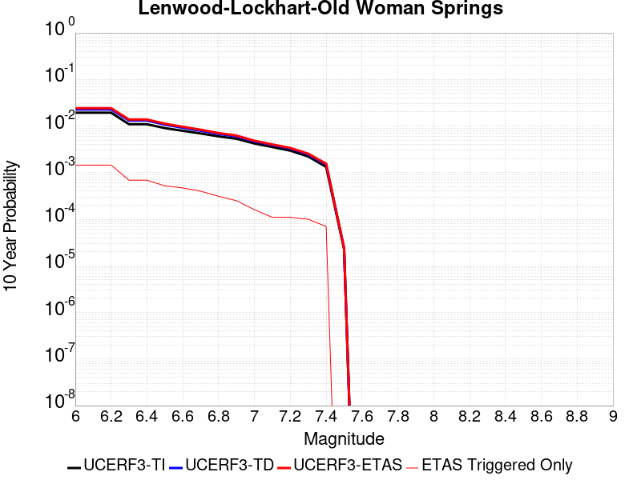 |

| Magnitude | 1 wk TI Prob | 1 wk TD Prob | 1 wk ETAS Prob | 1 wk ETAS/TD Gain | 1 wk ETAS Triggered Only | 1 mo TI Prob | 1 mo TD Prob | 1 mo ETAS Prob | 1 mo ETAS/TD Gain | 1 mo ETAS Triggered Only | 1 yr TI Prob | 1 yr TD Prob | 1 yr ETAS Prob | 1 yr ETAS/TD Gain | 1 yr ETAS Triggered Only | 10 yr TI Prob | 10 yr TD Prob | 10 yr ETAS Prob | 10 yr ETAS/TD Gain | 10 yr ETAS Triggered Only |
|-----|-----|-----|-----|-----|-----|-----|-----|-----|-----|-----|-----|-----|-----|-----|-----|-----|-----|-----|-----|-----|
| 6.0 | 3.744542E-5 | 4.3962966E-5 | 1.1084966E-4 | 2.5214326 | 6.688963E-5 | 1.604705E-4 | 1.8840008E-4 | 3.8903116E-4 | 2.0649204 | 2.006689E-4 | 0.0019519776 | 0.0022915301 | 0.0029255254 | 1.276669 | 6.354515E-4 | 0.019349206 | 0.022697017 | 0.024135187 | 1.0633639 | 0.0014715719 |
| 6.1 | 3.744542E-5 | 4.3962966E-5 | 1.1084966E-4 | 2.5214326 | 6.688963E-5 | 1.604705E-4 | 1.8840008E-4 | 3.8903116E-4 | 2.0649204 | 2.006689E-4 | 0.0019519776 | 0.0022915301 | 0.0029255254 | 1.276669 | 6.354515E-4 | 0.019349206 | 0.022697017 | 0.024135187 | 1.0633639 | 0.0014715719 |
| 6.2 | 3.744542E-5 | 4.3962966E-5 | 1.1084966E-4 | 2.5214326 | 6.688963E-5 | 1.604705E-4 | 1.8840008E-4 | 3.8903116E-4 | 2.0649204 | 2.006689E-4 | 0.0019519776 | 0.0022915301 | 0.0029255254 | 1.276669 | 6.354515E-4 | 0.019349206 | 0.022697017 | 0.024135187 | 1.0633639 | 0.0014715719 |
| 6.3 | 2.1079984E-5 | 2.5353596E-5 | 2.5353596E-5 | 1.0 | 0.0 | 9.0339665E-5 | 1.0865386E-4 | 2.089774E-4 | 1.9233316 | 1.0033445E-4 | 0.0010993304 | 0.0013220779 | 0.0016226834 | 1.2273735 | 3.0100334E-4 | 0.010939079 | 0.013144341 | 0.013804445 | 1.0502197 | 6.688963E-4 |
| 6.4 | 2.1079984E-5 | 2.5353596E-5 | 2.5353596E-5 | 1.0 | 0.0 | 9.0339665E-5 | 1.0865386E-4 | 2.089774E-4 | 1.9233316 | 1.0033445E-4 | 0.0010993304 | 0.0013220779 | 0.0016226834 | 1.2273735 | 3.0100334E-4 | 0.010939079 | 0.013144341 | 0.013804445 | 1.0502197 | 6.688963E-4 |
| 6.5 | 1.7397282E-5 | 2.0662535E-5 | 2.0662535E-5 | 1.0 | 0.0 | 7.455765E-5 | 8.855078E-5 | 1.8887635E-4 | 2.132972 | 1.0033445E-4 | 9.073613E-4 | 0.0010775843 | 0.0013114457 | 1.2170237 | 2.3411372E-4 | 0.009036654 | 0.010724886 | 0.01128735 | 1.0524448 | 5.685619E-4 |
| 6.6 | 1.52050325E-5 | 1.76798E-5 | 1.76798E-5 | 1.0 | 0.0 | 6.51628E-5 | 7.576841E-5 | 1.7609526E-4 | 2.324125 | 1.0033445E-4 | 7.9306826E-4 | 9.220979E-4 | 0.0011559958 | 1.2536583 | 2.3411372E-4 | 0.007902439 | 0.009183581 | 0.009713784 | 1.0577338 | 5.3511705E-4 |
| 6.7 | 1.332523E-5 | 1.5264091E-5 | 1.5264091E-5 | 1.0 | 0.0 | 5.7106878E-5 | 6.541593E-5 | 1.3230118E-4 | 2.0224614 | 6.688963E-5 | 6.950544E-4 | 7.9615373E-4 | 9.966629E-4 | 1.2518473 | 2.006689E-4 | 0.006928845 | 0.007933645 | 0.008398158 | 1.0585498 | 4.6822743E-4 |
| 6.8 | 1.1525329E-5 | 1.303105E-5 | 1.303105E-5 | 1.0 | 0.0 | 4.9393333E-5 | 5.5846183E-5 | 8.928913E-5 | 1.5988404 | 3.3444816E-5 | 6.011979E-4 | 6.7971944E-4 | 8.1340777E-4 | 1.1966816 | 1.3377926E-4 | 0.00599574 | 0.006776856 | 0.0071090376 | 1.0490171 | 3.3444815E-4 |
| 6.9 | 1.0253909E-5 | 1.15144985E-5 | 1.15144985E-5 | 1.0 | 0.0 | 4.3944583E-5 | 4.9346934E-5 | 8.27901E-5 | 1.6777152 | 3.3444816E-5 | 5.3489394E-4 | 6.0063694E-4 | 7.0091116E-4 | 1.1669464 | 1.0033445E-4 | 0.0053360825 | 0.005990515 | 0.0062232264 | 1.0388466 | 2.3411372E-4 |
| 7.0 | 8.104563E-6 | 8.991321E-6 | 8.991321E-6 | 1.0 | 0.0 | 3.4733377E-5 | 3.8533675E-5 | 7.19772E-5 | 1.867904 | 3.3444816E-5 | 4.2279682E-4 | 4.6904891E-4 | 5.3590717E-4 | 1.1425401 | 6.688963E-5 | 0.0042199334 | 0.0046808375 | 0.004847279 | 1.035558 | 1.6722408E-4 |
| 7.1 | 6.7986157E-6 | 7.515848E-6 | 7.515848E-6 | 1.0 | 0.0 | 2.91366E-5 | 3.221039E-5 | 3.221039E-5 | 1.0 | 0.0 | 3.5468035E-4 | 3.9209312E-4 | 3.9209312E-4 | 1.0 | 0.0 | 0.003541148 | 0.0039142296 | 0.0039808573 | 1.0170219 | 6.688963E-5 |
| 7.2 | 5.6893327E-6 | 6.280039E-6 | 6.280039E-6 | 1.0 | 0.0 | 2.4382627E-5 | 2.6914187E-5 | 2.6914187E-5 | 1.0 | 0.0 | 2.9681803E-4 | 3.2763294E-4 | 3.2763294E-4 | 1.0 | 0.0 | 0.002964219 | 0.0032716978 | 0.0033383686 | 1.020378 | 6.688963E-5 |
| 7.3 | 4.253348E-6 | 4.706927E-6 | 4.706927E-6 | 1.0 | 0.0 | 1.8228506E-5 | 2.01724E-5 | 2.01724E-5 | 1.0 | 0.0 | 2.2190946E-4 | 2.4557312E-4 | 2.4557312E-4 | 1.0 | 0.0 | 0.00221688 | 0.0024531984 | 0.002519924 | 1.0271994 | 6.688963E-5 |
| 7.4 | 2.5448119E-6 | 2.8520535E-6 | 2.8520535E-6 | 1.0 | 0.0 | 1.0906291E-5 | 1.22230385E-5 | 1.22230385E-5 | 1.0 | 0.0 | 1.3277601E-4 | 1.4880698E-4 | 1.4880698E-4 | 1.0 | 0.0 | 0.001326967 | 0.0014872355 | 0.0015540257 | 1.0449089 | 6.688963E-5 |
| 7.5 | 4.3706837E-8 | 4.5629356E-8 | 4.5629356E-8 | 1.0 | 0.0 | 1.8731501E-7 | 1.9555438E-7 | 1.9555438E-7 | 1.0 | 0.0 | 2.2805577E-6 | 2.3808725E-6 | 2.3808725E-6 | 1.0 | 0.0 | 2.2805343E-5 | 2.3808525E-5 | 2.3808525E-5 | 1.0 | 0.0 |

## San Andreas (Mojave S)
*[(top)](#table-of-contents)*

| 1 Week | 1 Month | 1 Year | 10 Year |
|-----|-----|-----|-----|
|  |  |  |  |

| Magnitude | 1 wk TI Prob | 1 wk TD Prob | 1 wk ETAS Prob | 1 wk ETAS/TD Gain | 1 wk ETAS Triggered Only | 1 mo TI Prob | 1 mo TD Prob | 1 mo ETAS Prob | 1 mo ETAS/TD Gain | 1 mo ETAS Triggered Only | 1 yr TI Prob | 1 yr TD Prob | 1 yr ETAS Prob | 1 yr ETAS/TD Gain | 1 yr ETAS Triggered Only | 10 yr TI Prob | 10 yr TD Prob | 10 yr ETAS Prob | 10 yr ETAS/TD Gain | 10 yr ETAS Triggered Only |
|-----|-----|-----|-----|-----|-----|-----|-----|-----|-----|-----|-----|-----|-----|-----|-----|-----|-----|-----|-----|-----|
| 6.0 | 3.1064058E-4 | 6.747043E-4 | 7.081266E-4 | 1.0495361 | 3.3444816E-5 | 0.0013306376 | 0.002888514 | 0.0031886478 | 1.103906 | 3.0100334E-4 | 0.016080605 | 0.03462661 | 0.03533692 | 1.0205134 | 7.357859E-4 | 0.1496549 | 0.28663692 | 0.28747198 | 1.0029132 | 0.0011705685 |
| 6.1 | 3.1064058E-4 | 6.747043E-4 | 7.081266E-4 | 1.0495361 | 3.3444816E-5 | 0.0013306376 | 0.002888514 | 0.0031886478 | 1.103906 | 3.0100334E-4 | 0.016080605 | 0.03462661 | 0.03533692 | 1.0205134 | 7.357859E-4 | 0.1496549 | 0.28663692 | 0.28747198 | 1.0029132 | 0.0011705685 |
| 6.2 | 3.1064058E-4 | 6.747043E-4 | 7.081266E-4 | 1.0495361 | 3.3444816E-5 | 0.0013306376 | 0.002888514 | 0.0031886478 | 1.103906 | 3.0100334E-4 | 0.016080605 | 0.03462661 | 0.03533692 | 1.0205134 | 7.357859E-4 | 0.1496549 | 0.28663692 | 0.28747198 | 1.0029132 | 0.0011705685 |
| 6.3 | 3.1064058E-4 | 6.747043E-4 | 7.081266E-4 | 1.0495361 | 3.3444816E-5 | 0.0013306376 | 0.002888514 | 0.0031886478 | 1.103906 | 3.0100334E-4 | 0.016080605 | 0.03462661 | 0.03533692 | 1.0205134 | 7.357859E-4 | 0.1496549 | 0.28663692 | 0.28747198 | 1.0029132 | 0.0011705685 |
| 6.4 | 1.9872203E-4 | 4.318848E-4 | 4.318848E-4 | 1.0 | 0.0 | 8.5138786E-4 | 0.0018496502 | 0.002116714 | 1.144386 | 2.6755853E-4 | 0.010316478 | 0.022293096 | 0.022914382 | 1.027869 | 6.354515E-4 | 0.098504856 | 0.19703239 | 0.1978649 | 1.0042253 | 0.0010367893 |
| 6.5 | 1.291105E-4 | 2.8761322E-4 | 2.8761322E-4 | 1.0 | 0.0 | 5.5321335E-4 | 0.0012320485 | 0.0014324702 | 1.1626735 | 2.006689E-4 | 0.006714592 | 0.0148978485 | 0.015424993 | 1.0353839 | 5.3511705E-4 | 0.065152965 | 0.13807017 | 0.1388485 | 1.0056372 | 9.0301E-4 |
| 6.6 | 1.291105E-4 | 2.8761322E-4 | 2.8761322E-4 | 1.0 | 0.0 | 5.5321335E-4 | 0.0012320485 | 0.0014324702 | 1.1626735 | 2.006689E-4 | 0.006714592 | 0.0148978485 | 0.015424993 | 1.0353839 | 5.3511705E-4 | 0.065152965 | 0.13807017 | 0.1388485 | 1.0056372 | 9.0301E-4 |
| 6.7 | 1.08001186E-4 | 2.4342406E-4 | 2.4342406E-4 | 1.0 | 0.0 | 4.6278012E-4 | 0.0010428295 | 0.0012098791 | 1.1601889 | 1.6722408E-4 | 0.0056198016 | 0.012622835 | 0.013085152 | 1.0366255 | 4.6822743E-4 | 0.054797906 | 0.11921291 | 0.119949356 | 1.0061775 | 8.361204E-4 |
| 6.8 | 1.0624356E-4 | 2.3860046E-4 | 2.3860046E-4 | 1.0 | 0.0 | 4.5525006E-4 | 0.0010221732 | 0.0011892264 | 1.1634294 | 1.6722408E-4 | 0.0055285925 | 0.01237422 | 0.012836654 | 1.0373707 | 4.6822743E-4 | 0.053930566 | 0.117162056 | 0.117900215 | 1.0063003 | 8.361204E-4 |
| 6.9 | 1.0393785E-4 | 2.3230357E-4 | 2.3230357E-4 | 1.0 | 0.0 | 4.4537184E-4 | 9.952073E-4 | 0.001162265 | 1.1678622 | 1.6722408E-4 | 0.0054089287 | 0.012049583 | 0.012512168 | 1.0383902 | 4.6822743E-4 | 0.05279156 | 0.11445948 | 0.1151999 | 1.0064688 | 8.361204E-4 |
| 7.0 | 1.0155622E-4 | 2.2599897E-4 | 2.2599897E-4 | 1.0 | 0.0 | 4.3516833E-4 | 9.682079E-4 | 0.0011352701 | 1.1725478 | 1.6722408E-4 | 0.005285311 | 0.011724443 | 0.012187181 | 1.0394678 | 4.6822743E-4 | 0.05161361 | 0.11171984 | 0.11246255 | 1.006648 | 8.361204E-4 |
| 7.1 | 9.885595E-5 | 2.1888265E-4 | 2.1888265E-4 | 1.0 | 0.0 | 4.2359953E-4 | 9.377316E-4 | 0.0011047989 | 1.178161 | 1.6722408E-4 | 0.0051451353 | 0.011357316 | 0.011820226 | 1.0407587 | 4.6822743E-4 | 0.05027629 | 0.10860426 | 0.10934958 | 1.0068626 | 8.361204E-4 |
| 7.2 | 9.6411415E-5 | 2.125122E-4 | 2.125122E-4 | 1.0 | 0.0 | 4.1312634E-4 | 9.1044896E-4 | 0.0010775208 | 1.1835049 | 1.6722408E-4 | 0.005018219 | 0.01102856 | 0.011491624 | 1.0419877 | 4.6822743E-4 | 0.049064007 | 0.10579402 | 0.10651178 | 1.0067844 | 8.026756E-4 |
| 7.3 | 9.1180635E-5 | 1.9479371E-4 | 1.9479371E-4 | 1.0 | 0.0 | 3.907156E-4 | 8.345632E-4 | 0.0010016478 | 1.2002059 | 1.6722408E-4 | 0.004746591 | 0.010113581 | 0.010577073 | 1.0458287 | 4.6822743E-4 | 0.046464786 | 0.09798661 | 0.098710634 | 1.0073891 | 8.026756E-4 |
| 7.4 | 8.887388E-5 | 1.8727897E-4 | 1.8727897E-4 | 1.0 | 0.0 | 3.8083247E-4 | 8.023774E-4 | 9.694673E-4 | 1.2082435 | 1.6722408E-4 | 0.0046267817 | 0.009725285 | 0.010188959 | 1.0476772 | 4.6822743E-4 | 0.045316286 | 0.09462135 | 0.095348075 | 1.0076803 | 8.026756E-4 |
| 7.5 | 8.6750515E-5 | 1.8059391E-4 | 1.8059391E-4 | 1.0 | 0.0 | 3.7173493E-4 | 7.7374437E-4 | 9.4083906E-4 | 1.215956 | 1.6722408E-4 | 0.004516484 | 0.009379733 | 0.009843569 | 1.0494509 | 4.6822743E-4 | 0.04425787 | 0.09158487 | 0.092314035 | 1.0079616 | 8.026756E-4 |
| 7.6 | 8.453092E-5 | 1.7446902E-4 | 1.7446902E-4 | 1.0 | 0.0 | 3.6222505E-4 | 7.475102E-4 | 9.146093E-4 | 1.2235409 | 1.6722408E-4 | 0.0044011753 | 0.009063034 | 0.009527018 | 1.0511951 | 4.6822743E-4 | 0.04315024 | 0.088743635 | 0.08947508 | 1.0082422 | 8.026756E-4 |
| 7.7 | 8.259102E-5 | 1.6968958E-4 | 1.6968958E-4 | 1.0 | 0.0 | 3.539135E-4 | 7.270384E-4 | 8.941409E-4 | 1.22984 | 1.6722408E-4 | 0.004300386 | 0.008815835 | 0.009279936 | 1.0526439 | 4.6822743E-4 | 0.042181134 | 0.08649418 | 0.08722743 | 1.0084774 | 8.026756E-4 |
| 7.8 | 7.444844E-5 | 1.5290553E-4 | 1.5290553E-4 | 1.0 | 0.0 | 3.1902574E-4 | 6.551449E-4 | 8.222594E-4 | 1.2550802 | 1.6722408E-4 | 0.0038772223 | 0.007947266 | 0.008312236 | 1.0459238 | 3.6789296E-4 | 0.03810269 | 0.07832232 | 0.07896966 | 1.008265 | 7.0234115E-4 |
| 7.9 | 5.2586525E-5 | 1.0011239E-4 | 1.0011239E-4 | 1.0 | 0.0 | 2.2535135E-4 | 4.2898257E-4 | 4.9584353E-4 | 1.1558594 | 6.688963E-5 | 0.0027402006 | 0.005210366 | 0.0054099895 | 1.0383127 | 2.006689E-4 | 0.027066574 | 0.052222524 | 0.052602906 | 1.0072838 | 4.013378E-4 |
| 8.0 | 3.379877E-5 | 5.4101976E-5 | 5.4101976E-5 | 1.0 | 0.0 | 1.4484383E-4 | 2.3184501E-4 | 2.9871913E-4 | 1.2884432 | 6.688963E-5 | 0.0017620471 | 0.002819061 | 0.0028857621 | 1.0236608 | 6.688963E-5 | 0.017481409 | 0.028848516 | 0.028978435 | 1.0045035 | 1.3377926E-4 |
| 8.1 | 1.8668277E-5 | 1.9322531E-5 | 1.9322531E-5 | 1.0 | 0.0 | 8.000444E-5 | 8.280823E-5 | 8.280823E-5 | 1.0 | 0.0 | 9.736188E-4 | 0.0010077246 | 0.0010077246 | 1.0 | 0.0 | 0.009693642 | 0.010805754 | 0.010805754 | 1.0 | 0.0 |
| 8.2 | 8.541571E-6 | 5.465789E-6 | 5.465789E-6 | 1.0 | 0.0 | 3.660622E-5 | 2.34246E-5 | 2.34246E-5 | 1.0 | 0.0 | 4.455896E-4 | 2.8515726E-4 | 2.8515726E-4 | 1.0 | 0.0 | 0.0044469717 | 0.0032435213 | 0.0032435213 | 1.0 | 0.0 |
| 8.3 | 1.983087E-6 | 7.668296E-7 | 7.668296E-7 | 1.0 | 0.0 | 8.498917E-6 | 3.2864084E-6 | 3.2864084E-6 | 1.0 | 0.0 | 1.034694E-4 | 4.0011306E-5 | 4.0011306E-5 | 1.0 | 0.0 | 0.0010342124 | 4.724499E-4 | 4.724499E-4 | 1.0 | 0.0 |

## Towne Pass
*[(top)](#table-of-contents)*

| 1 Week | 1 Month | 1 Year | 10 Year |
|-----|-----|-----|-----|
|  |  |  |  |

| Magnitude | 1 wk TI Prob | 1 wk TD Prob | 1 wk ETAS Prob | 1 wk ETAS/TD Gain | 1 wk ETAS Triggered Only | 1 mo TI Prob | 1 mo TD Prob | 1 mo ETAS Prob | 1 mo ETAS/TD Gain | 1 mo ETAS Triggered Only | 1 yr TI Prob | 1 yr TD Prob | 1 yr ETAS Prob | 1 yr ETAS/TD Gain | 1 yr ETAS Triggered Only | 10 yr TI Prob | 10 yr TD Prob | 10 yr ETAS Prob | 10 yr ETAS/TD Gain | 10 yr ETAS Triggered Only |
|-----|-----|-----|-----|-----|-----|-----|-----|-----|-----|-----|-----|-----|-----|-----|-----|-----|-----|-----|-----|-----|
| 6.0 | 3.849728E-6 | 3.8945495E-6 | 3.7339236E-5 | 9.587562 | 3.3444816E-5 | 1.649873E-5 | 1.6690845E-5 | 2.173564E-4 | 13.022492 | 2.006689E-4 | 2.0085352E-4 | 2.0319645E-4 | 9.722709E-4 | 4.784881 | 7.6923077E-4 | 0.0020067208 | 0.0020305358 | 0.0032654812 | 1.608187 | 0.0012374582 |
| 6.1 | 3.849728E-6 | 3.8945495E-6 | 3.7339236E-5 | 9.587562 | 3.3444816E-5 | 1.649873E-5 | 1.6690845E-5 | 2.173564E-4 | 13.022492 | 2.006689E-4 | 2.0085352E-4 | 2.0319645E-4 | 9.722709E-4 | 4.784881 | 7.6923077E-4 | 0.0020067208 | 0.0020305358 | 0.0032654812 | 1.608187 | 0.0012374582 |
| 6.2 | 3.849728E-6 | 3.8945495E-6 | 3.7339236E-5 | 9.587562 | 3.3444816E-5 | 1.649873E-5 | 1.6690845E-5 | 2.173564E-4 | 13.022492 | 2.006689E-4 | 2.0085352E-4 | 2.0319645E-4 | 9.722709E-4 | 4.784881 | 7.6923077E-4 | 0.0020067208 | 0.0020305358 | 0.0032654812 | 1.608187 | 0.0012374582 |
| 6.3 | 3.849728E-6 | 3.8945495E-6 | 3.7339236E-5 | 9.587562 | 3.3444816E-5 | 1.649873E-5 | 1.6690845E-5 | 2.173564E-4 | 13.022492 | 2.006689E-4 | 2.0085352E-4 | 2.0319645E-4 | 9.722709E-4 | 4.784881 | 7.6923077E-4 | 0.0020067208 | 0.0020305358 | 0.0032654812 | 1.608187 | 0.0012374582 |
| 6.4 | 3.849728E-6 | 3.8945495E-6 | 3.7339236E-5 | 9.587562 | 3.3444816E-5 | 1.649873E-5 | 1.6690845E-5 | 2.173564E-4 | 13.022492 | 2.006689E-4 | 2.0085352E-4 | 2.0319645E-4 | 9.722709E-4 | 4.784881 | 7.6923077E-4 | 0.0020067208 | 0.0020305358 | 0.0032654812 | 1.608187 | 0.0012374582 |
| 6.5 | 1.1953545E-6 | 1.2030553E-6 | 1.2030553E-6 | 1.0 | 0.0 | 5.1229376E-6 | 5.155942E-6 | 3.8600585E-5 | 7.486622 | 3.3444816E-5 | 6.236998E-5 | 6.27719E-5 | 2.9687092E-4 | 4.72936 | 2.3411372E-4 | 6.235248E-4 | 6.2755344E-4 | 9.2836784E-4 | 1.4793447 | 3.0100334E-4 |
| 6.6 | 1.1953545E-6 | 1.2030553E-6 | 1.2030553E-6 | 1.0 | 0.0 | 5.1229376E-6 | 5.155942E-6 | 3.8600585E-5 | 7.486622 | 3.3444816E-5 | 6.236998E-5 | 6.27719E-5 | 2.9687092E-4 | 4.72936 | 2.3411372E-4 | 6.235248E-4 | 6.2755344E-4 | 9.2836784E-4 | 1.4793447 | 3.0100334E-4 |
| 6.7 | 8.375951E-7 | 8.410697E-7 | 8.410697E-7 | 1.0 | 0.0 | 3.5896885E-6 | 3.60458E-6 | 3.7049274E-5 | 10.278389 | 3.3444816E-5 | 4.370358E-5 | 4.3884935E-5 | 2.1110168E-4 | 4.810345 | 1.6722408E-4 | 4.3694986E-4 | 4.387684E-4 | 6.727794E-4 | 1.533336 | 2.3411372E-4 |
| 6.8 | 6.38041E-7 | 6.39218E-7 | 6.39218E-7 | 1.0 | 0.0 | 2.7344586E-6 | 2.739503E-6 | 3.618423E-5 | 13.208318 | 3.3444816E-5 | 3.3291526E-5 | 3.335298E-5 | 1.6712779E-4 | 5.01088 | 1.3377926E-4 | 3.3286537E-4 | 3.3348353E-4 | 5.0065183E-4 | 1.501279 | 1.6722408E-4 |
| 6.9 | 5.3460053E-7 | 5.345355E-7 | 5.345355E-7 | 1.0 | 0.0 | 2.2911431E-6 | 2.2908646E-6 | 3.5735604E-5 | 15.599177 | 3.3444816E-5 | 2.789431E-5 | 2.7890954E-5 | 1.6166648E-4 | 5.796377 | 1.3377926E-4 | 2.789081E-4 | 2.7887785E-4 | 4.1261982E-4 | 1.4795718 | 1.3377926E-4 |
| 7.0 | 3.557783E-7 | 3.5324413E-7 | 3.5324413E-7 | 1.0 | 0.0 | 1.5247632E-6 | 1.5139026E-6 | 3.4958666E-5 | 23.091755 | 3.3444816E-5 | 1.8563835E-5 | 1.8431618E-5 | 1.5220842E-4 | 8.258007 | 1.3377926E-4 | 1.8562283E-4 | 1.8430172E-4 | 3.1805632E-4 | 1.7257371 | 1.3377926E-4 |
| 7.1 | 3.037942E-7 | 3.0002388E-7 | 3.0002388E-7 | 1.0 | 0.0 | 1.3019744E-6 | 1.2858161E-6 | 3.473059E-5 | 27.010542 | 3.3444816E-5 | 1.5851423E-5 | 1.5654707E-5 | 1.4943187E-4 | 9.545492 | 1.3377926E-4 | 1.5850292E-4 | 1.5653679E-4 | 2.902951E-4 | 1.8544849 | 1.3377926E-4 |
| 7.2 | 2.0808248E-7 | 2.021783E-7 | 2.021783E-7 | 1.0 | 0.0 | 8.917818E-7 | 8.6647816E-7 | 3.4311266E-5 | 39.598534 | 3.3444816E-5 | 1.0857389E-5 | 1.0549325E-5 | 1.1088271E-4 | 10.510882 | 1.0033445E-4 | 1.0856859E-4 | 1.054887E-4 | 2.0581257E-4 | 1.951039 | 1.0033445E-4 |
| 7.3 | 1.1162073E-7 | 1.06369825E-7 | 1.06369825E-7 | 1.0 | 0.0 | 4.7837443E-7 | 4.5587063E-7 | 4.5587063E-7 | 1.0 | 0.0 | 5.8241935E-6 | 5.550213E-6 | 7.243947E-5 | 13.051657 | 6.688963E-5 | 5.8240406E-5 | 5.5500943E-5 | 1.2238686E-4 | 2.2051313 | 6.688963E-5 |

## Paradise
*[(top)](#table-of-contents)*

| 1 Week | 1 Month | 1 Year | 10 Year |
|-----|-----|-----|-----|
|  |  |  |  |

| Magnitude | 1 wk TI Prob | 1 wk TD Prob | 1 wk ETAS Prob | 1 wk ETAS/TD Gain | 1 wk ETAS Triggered Only | 1 mo TI Prob | 1 mo TD Prob | 1 mo ETAS Prob | 1 mo ETAS/TD Gain | 1 mo ETAS Triggered Only | 1 yr TI Prob | 1 yr TD Prob | 1 yr ETAS Prob | 1 yr ETAS/TD Gain | 1 yr ETAS Triggered Only | 10 yr TI Prob | 10 yr TD Prob | 10 yr ETAS Prob | 10 yr ETAS/TD Gain | 10 yr ETAS Triggered Only |
|-----|-----|-----|-----|-----|-----|-----|-----|-----|-----|-----|-----|-----|-----|-----|-----|-----|-----|-----|-----|-----|
| 6.0 | 1.4851273E-5 | 1.6694854E-5 | 5.013911E-5 | 3.0032675 | 3.3444816E-5 | 6.364676E-5 | 7.154755E-5 | 2.0531724E-4 | 2.8696616 | 1.3377926E-4 | 7.7462377E-4 | 8.707668E-4 | 0.0014388337 | 1.6523753 | 5.685619E-4 | 0.0077192914 | 0.008675928 | 0.009770032 | 1.1261079 | 0.001103679 |
| 6.1 | 1.4851273E-5 | 1.6694854E-5 | 5.013911E-5 | 3.0032675 | 3.3444816E-5 | 6.364676E-5 | 7.154755E-5 | 2.0531724E-4 | 2.8696616 | 1.3377926E-4 | 7.7462377E-4 | 8.707668E-4 | 0.0014388337 | 1.6523753 | 5.685619E-4 | 0.0077192914 | 0.008675928 | 0.009770032 | 1.1261079 | 0.001103679 |
| 6.2 | 1.4851273E-5 | 1.6694854E-5 | 5.013911E-5 | 3.0032675 | 3.3444816E-5 | 6.364676E-5 | 7.154755E-5 | 2.0531724E-4 | 2.8696616 | 1.3377926E-4 | 7.7462377E-4 | 8.707668E-4 | 0.0014388337 | 1.6523753 | 5.685619E-4 | 0.0077192914 | 0.008675928 | 0.009770032 | 1.1261079 | 0.001103679 |
| 6.3 | 1.0426831E-5 | 1.1888727E-5 | 1.1888727E-5 | 1.0 | 0.0 | 4.4685654E-5 | 5.0950726E-5 | 8.439384E-5 | 1.6563815 | 3.3444816E-5 | 5.43912E-4 | 6.201545E-4 | 8.875471E-4 | 1.431171 | 2.6755853E-4 | 0.0054258266 | 0.006184847 | 0.0065837028 | 1.0644891 | 4.013378E-4 |
| 6.4 | 1.0426831E-5 | 1.1888727E-5 | 1.1888727E-5 | 1.0 | 0.0 | 4.4685654E-5 | 5.0950726E-5 | 8.439384E-5 | 1.6563815 | 3.3444816E-5 | 5.43912E-4 | 6.201545E-4 | 8.875471E-4 | 1.431171 | 2.6755853E-4 | 0.0054258266 | 0.006184847 | 0.0065837028 | 1.0644891 | 4.013378E-4 |
| 6.5 | 9.25027E-6 | 1.0620054E-5 | 1.0620054E-5 | 1.0 | 0.0 | 3.964341E-5 | 4.551375E-5 | 7.895704E-5 | 1.7347953 | 3.3444816E-5 | 4.8255164E-4 | 5.539939E-4 | 6.8769907E-4 | 1.2413477 | 1.3377926E-4 | 0.0048150513 | 0.0055266283 | 0.005759448 | 1.0421269 | 2.3411372E-4 |
| 6.6 | 7.904275E-6 | 9.159603E-6 | 9.159603E-6 | 1.0 | 0.0 | 3.3875025E-5 | 3.925487E-5 | 3.925487E-5 | 1.0 | 0.0 | 4.1235037E-4 | 4.7782718E-4 | 5.446848E-4 | 1.1399202 | 6.688963E-5 | 0.0041158604 | 0.004768395 | 0.0049348213 | 1.0349021 | 1.6722408E-4 |
| 6.7 | 7.2061953E-6 | 8.407318E-6 | 8.407318E-6 | 1.0 | 0.0 | 3.088333E-5 | 3.6030888E-5 | 3.6030888E-5 | 1.0 | 0.0 | 3.7593965E-4 | 4.385914E-4 | 5.054517E-4 | 1.1524433 | 6.688963E-5 | 0.003753043 | 0.0043776273 | 0.0044775223 | 1.0228195 | 1.0033445E-4 |
| 6.8 | 6.6948724E-6 | 7.84223E-6 | 7.84223E-6 | 1.0 | 0.0 | 2.8691995E-5 | 3.3609143E-5 | 3.3609143E-5 | 1.0 | 0.0 | 3.4926904E-4 | 4.0911807E-4 | 4.425492E-4 | 1.0817151 | 3.3444816E-5 | 0.003487206 | 0.0040840064 | 0.004150623 | 1.0163115 | 6.688963E-5 |
| 6.9 | 6.0421025E-6 | 7.130678E-6 | 7.130678E-6 | 1.0 | 0.0 | 2.5894467E-5 | 3.055971E-5 | 3.055971E-5 | 1.0 | 0.0 | 3.1521954E-4 | 3.7200435E-4 | 3.7200435E-4 | 1.0 | 0.0 | 0.0031477278 | 0.0037141545 | 0.003747475 | 1.0089712 | 3.3444816E-5 |
| 7.0 | 4.134091E-6 | 5.0803487E-6 | 5.0803487E-6 | 1.0 | 0.0 | 1.7717413E-5 | 2.177275E-5 | 2.177275E-5 | 1.0 | 0.0 | 2.1568815E-4 | 2.6505254E-4 | 2.6505254E-4 | 1.0 | 0.0 | 0.0021547892 | 0.0026475172 | 0.0026808735 | 1.0125991 | 3.3444816E-5 |
| 7.1 | 3.7674888E-6 | 4.6319055E-6 | 4.6319055E-6 | 1.0 | 0.0 | 1.6146281E-5 | 1.985088E-5 | 1.985088E-5 | 1.0 | 0.0 | 1.9656324E-4 | 2.4165919E-4 | 2.4165919E-4 | 1.0 | 0.0 | 0.0019638946 | 0.0024141145 | 0.0024474787 | 1.0138204 | 3.3444816E-5 |
| 7.2 | 3.4065345E-6 | 4.156755E-6 | 4.156755E-6 | 1.0 | 0.0 | 1.4599351E-5 | 1.7814553E-5 | 1.7814553E-5 | 1.0 | 0.0 | 1.777326E-4 | 2.1687208E-4 | 2.1687208E-4 | 1.0 | 0.0 | 0.0017759053 | 0.0021667527 | 0.002200125 | 1.015402 | 3.3444816E-5 |
| 7.3 | 2.9934936E-6 | 3.6293434E-6 | 3.6293434E-6 | 1.0 | 0.0 | 1.2829195E-5 | 1.5554244E-5 | 1.5554244E-5 | 1.0 | 0.0 | 1.5618425E-4 | 1.8935793E-4 | 1.8935793E-4 | 1.0 | 0.0 | 0.0015607453 | 0.0018921113 | 0.0019254928 | 1.0176425 | 3.3444816E-5 |
| 7.4 | 2.4049796E-6 | 2.8890036E-6 | 2.8890036E-6 | 1.0 | 0.0 | 1.0307015E-5 | 1.2381393E-5 | 1.2381393E-5 | 1.0 | 0.0 | 1.2548068E-4 | 1.5073447E-4 | 1.5073447E-4 | 1.0 | 0.0 | 0.0012540985 | 0.0015064639 | 0.0015064639 | 1.0 | 0.0 |
| 7.5 | 1.2710091E-6 | 1.5134775E-6 | 1.5134775E-6 | 1.0 | 0.0 | 5.44717E-6 | 6.486323E-6 | 6.486323E-6 | 1.0 | 0.0 | 6.631728E-5 | 7.896937E-5 | 7.896937E-5 | 1.0 | 0.0 | 6.6297496E-4 | 7.8953576E-4 | 7.8953576E-4 | 1.0 | 0.0 |
| 7.6 | 2.21172E-7 | 2.6039737E-7 | 2.6039737E-7 | 1.0 | 0.0 | 9.478797E-7 | 1.1159884E-6 | 1.1159884E-6 | 1.0 | 0.0 | 1.1540374E-5 | 1.3587103E-5 | 1.3587103E-5 | 1.0 | 0.0 | 1.1539775E-4 | 1.3586554E-4 | 1.3586554E-4 | 1.0 | 0.0 |

## Death Valley (So)
*[(top)](#table-of-contents)*

| 1 Week | 1 Month | 1 Year | 10 Year |
|-----|-----|-----|-----|
|  |  |  |  |

| Magnitude | 1 wk TI Prob | 1 wk TD Prob | 1 wk ETAS Prob | 1 wk ETAS/TD Gain | 1 wk ETAS Triggered Only | 1 mo TI Prob | 1 mo TD Prob | 1 mo ETAS Prob | 1 mo ETAS/TD Gain | 1 mo ETAS Triggered Only | 1 yr TI Prob | 1 yr TD Prob | 1 yr ETAS Prob | 1 yr ETAS/TD Gain | 1 yr ETAS Triggered Only | 10 yr TI Prob | 10 yr TD Prob | 10 yr ETAS Prob | 10 yr ETAS/TD Gain | 10 yr ETAS Triggered Only |
|-----|-----|-----|-----|-----|-----|-----|-----|-----|-----|-----|-----|-----|-----|-----|-----|-----|-----|-----|-----|-----|
| 6.0 | 2.0684236E-5 | 2.5618423E-5 | 9.250634E-5 | 3.6109304 | 6.688963E-5 | 8.864371E-5 | 1.09788714E-4 | 3.7731786E-4 | 3.4367638 | 2.6755853E-4 | 0.0010787029 | 0.0013358749 | 0.0019704774 | 1.4750465 | 6.354515E-4 | 0.010734817 | 0.013281729 | 0.014337748 | 1.0795091 | 0.0010702341 |
| 6.1 | 2.0684236E-5 | 2.5618423E-5 | 9.250634E-5 | 3.6109304 | 6.688963E-5 | 8.864371E-5 | 1.09788714E-4 | 3.7731786E-4 | 3.4367638 | 2.6755853E-4 | 0.0010787029 | 0.0013358749 | 0.0019704774 | 1.4750465 | 6.354515E-4 | 0.010734817 | 0.013281729 | 0.014337748 | 1.0795091 | 0.0010702341 |
| 6.2 | 2.0684236E-5 | 2.5618423E-5 | 9.250634E-5 | 3.6109304 | 6.688963E-5 | 8.864371E-5 | 1.09788714E-4 | 3.7731786E-4 | 3.4367638 | 2.6755853E-4 | 0.0010787029 | 0.0013358749 | 0.0019704774 | 1.4750465 | 6.354515E-4 | 0.010734817 | 0.013281729 | 0.014337748 | 1.0795091 | 0.0010702341 |
| 6.3 | 2.0240292E-5 | 2.5118497E-5 | 9.200645E-5 | 3.6628962 | 6.688963E-5 | 8.6741224E-5 | 1.0764636E-4 | 3.4173488E-4 | 3.1746068 | 2.3411372E-4 | 0.0010555626 | 0.0013098232 | 0.0018776404 | 1.4335067 | 5.685619E-4 | 0.010505628 | 0.013024284 | 0.013981551 | 1.0734986 | 9.6989964E-4 |
| 6.4 | 2.0240292E-5 | 2.5118497E-5 | 9.200645E-5 | 3.6628962 | 6.688963E-5 | 8.6741224E-5 | 1.0764636E-4 | 3.4173488E-4 | 3.1746068 | 2.3411372E-4 | 0.0010555626 | 0.0013098232 | 0.0018776404 | 1.4335067 | 5.685619E-4 | 0.010505628 | 0.013024284 | 0.013981551 | 1.0734986 | 9.6989964E-4 |
| 6.5 | 1.9962767E-5 | 2.4807747E-5 | 9.169572E-5 | 3.6962535 | 6.688963E-5 | 8.55519E-5 | 1.0631468E-4 | 3.404035E-4 | 3.2018487 | 2.3411372E-4 | 0.0010410968 | 0.0012936293 | 0.0018280541 | 1.4131205 | 5.3511705E-4 | 0.010362327 | 0.012864228 | 0.013788636 | 1.0718588 | 9.3645486E-4 |
| 6.6 | 1.8937297E-5 | 2.3311568E-5 | 9.019964E-5 | 3.869308 | 6.688963E-5 | 8.115732E-5 | 9.990298E-5 | 3.339933E-4 | 3.3431766 | 2.3411372E-4 | 9.876423E-4 | 0.0012156547 | 0.0017501211 | 1.4396533 | 5.3511705E-4 | 0.009832645 | 0.0120931 | 0.012985189 | 1.0737685 | 9.0301E-4 |
| 6.7 | 1.8621096E-5 | 2.2912203E-5 | 8.9800305E-5 | 3.919322 | 6.688963E-5 | 7.980225E-5 | 9.8191544E-5 | 3.3228227E-4 | 3.3840213 | 2.3411372E-4 | 9.711593E-4 | 0.0011948409 | 0.0017293186 | 1.4473212 | 5.3511705E-4 | 0.009669261 | 0.011887211 | 0.012779487 | 1.0750618 | 9.0301E-4 |
| 6.8 | 1.7830353E-5 | 2.1806247E-5 | 8.869442E-5 | 4.0673857 | 6.688963E-5 | 7.641356E-5 | 9.345208E-5 | 3.275439E-4 | 3.5049398 | 2.3411372E-4 | 9.29938E-4 | 0.0011371992 | 0.0016717077 | 1.4700218 | 5.3511705E-4 | 0.009260561 | 0.011316643 | 0.012209434 | 1.0788919 | 9.0301E-4 |
| 6.9 | 1.3135183E-5 | 1.5304242E-5 | 4.8748545E-5 | 3.1852965 | 3.3444816E-5 | 5.6292425E-5 | 6.558799E-5 | 1.9935849E-4 | 3.0395577 | 1.3377926E-4 | 6.8514474E-4 | 7.982477E-4 | 0.0011992651 | 1.5023721 | 4.013378E-4 | 0.006830362 | 0.007954813 | 0.008651567 | 1.087589 | 7.0234115E-4 |
| 7.0 | 1.1507512E-5 | 1.3154444E-5 | 4.659882E-5 | 3.5424395 | 3.3444816E-5 | 4.9316975E-5 | 5.6375004E-5 | 1.567038E-4 | 2.779668 | 1.0033445E-4 | 6.002687E-4 | 6.861553E-4 | 0.001020374 | 1.4870889 | 3.3444815E-4 | 0.0059864987 | 0.006841068 | 0.0073725246 | 1.0776862 | 5.3511705E-4 |
| 7.1 | 9.715903E-6 | 1.0865454E-5 | 4.4309905E-5 | 4.078054 | 3.3444816E-5 | 4.1638916E-5 | 4.6565423E-5 | 1.1345194E-4 | 2.4363987 | 6.688963E-5 | 5.068359E-4 | 5.667908E-4 | 7.3392014E-4 | 1.2948694 | 1.6722408E-4 | 0.0050568148 | 0.0056539057 | 0.005953207 | 1.0529372 | 3.0100334E-4 |
| 7.2 | 9.233269E-6 | 1.0286473E-5 | 4.3730946E-5 | 4.251306 | 3.3444816E-5 | 3.9570554E-5 | 4.4084165E-5 | 1.1097085E-4 | 2.5172496 | 6.688963E-5 | 4.81665E-4 | 5.3659675E-4 | 6.368773E-4 | 1.1868826 | 1.0033445E-4 | 0.0048062233 | 0.005353442 | 0.0055863024 | 1.0434973 | 2.3411372E-4 |
| 7.3 | 8.8041315E-6 | 9.808313E-6 | 4.32528E-5 | 4.4098105 | 3.3444816E-5 | 3.7731446E-5 | 4.2034975E-5 | 1.0892179E-4 | 2.5912182 | 6.688963E-5 | 4.592835E-4 | 5.1165983E-4 | 6.1194296E-4 | 1.1959957 | 1.0033445E-4 | 0.0045833546 | 0.0051052445 | 0.005304889 | 1.0391058 | 2.006689E-4 |
| 7.4 | 8.708749E-6 | 9.707323E-6 | 4.3151813E-5 | 4.445285 | 3.3444816E-5 | 3.7322676E-5 | 4.1602176E-5 | 1.08489025E-4 | 2.6077728 | 6.688963E-5 | 4.5430884E-4 | 5.06393E-4 | 6.066766E-4 | 1.1980352 | 1.0033445E-4 | 0.004533812 | 0.0050528166 | 0.0052524717 | 1.0395136 | 2.006689E-4 |
| 7.5 | 8.612678E-6 | 9.604964E-6 | 4.304946E-5 | 4.482001 | 3.3444816E-5 | 3.6910955E-5 | 4.116351E-5 | 1.08050386E-4 | 2.6249073 | 6.688963E-5 | 4.492982E-4 | 5.010547E-4 | 6.0133886E-4 | 1.2001462 | 1.0033445E-4 | 0.004483909 | 0.0049996753 | 0.005166063 | 1.0332798 | 1.6722408E-4 |
| 7.6 | 8.319024E-6 | 9.28406E-6 | 4.2728567E-5 | 4.602358 | 3.3444816E-5 | 3.5652476E-5 | 3.9788243E-5 | 1.06675216E-4 | 2.6810737 | 6.688963E-5 | 4.3398244E-4 | 4.8431839E-4 | 5.846043E-4 | 1.2070659 | 1.0033445E-4 | 0.0043313587 | 0.004833053 | 0.0049994686 | 1.0344329 | 1.6722408E-4 |
| 7.7 | 7.4718328E-6 | 8.3453E-6 | 4.1789837E-5 | 5.00759 | 3.3444816E-5 | 3.2021748E-5 | 3.57651E-5 | 1.0265234E-4 | 2.8701818 | 6.688963E-5 | 3.8979502E-4 | 4.3535716E-4 | 5.356479E-4 | 1.2303643 | 1.0033445E-4 | 0.00389112 | 0.004345448 | 0.0045119454 | 1.0383154 | 1.6722408E-4 |
| 7.8 | 3.4586725E-7 | 3.648288E-7 | 3.648288E-7 | 1.0 | 0.0 | 1.4822873E-6 | 1.5635511E-6 | 1.5635511E-6 | 1.0 | 0.0 | 1.80467E-5 | 1.9036073E-5 | 5.2480253E-5 | 2.7568843 | 3.3444816E-5 | 1.8045233E-4 | 1.9034486E-4 | 2.2378331E-4 | 1.175673 | 3.3444816E-5 |
| 7.9 | 2.5591178E-9 | 2.6696871E-9 | 2.6696871E-9 | 1.0 | 0.0 | 1.0967647E-8 | 1.1441516E-8 | 1.1441516E-8 | 1.0 | 0.0 | 1.335311E-7 | 1.3930045E-7 | 1.3930045E-7 | 1.0 | 0.0 | 1.3353102E-6 | 1.3930046E-6 | 1.3930046E-6 | 1.0 | 0.0 |

## San Andreas (Mojave N)
*[(top)](#table-of-contents)*

| 1 Week | 1 Month | 1 Year | 10 Year |
|-----|-----|-----|-----|
| 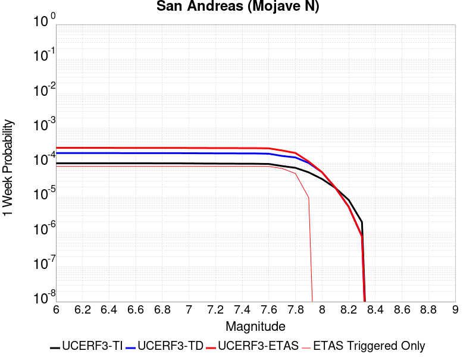 | 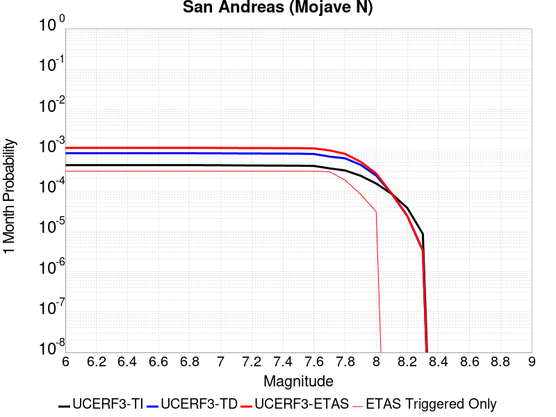 |  |  |

| Magnitude | 1 wk TI Prob | 1 wk TD Prob | 1 wk ETAS Prob | 1 wk ETAS/TD Gain | 1 wk ETAS Triggered Only | 1 mo TI Prob | 1 mo TD Prob | 1 mo ETAS Prob | 1 mo ETAS/TD Gain | 1 mo ETAS Triggered Only | 1 yr TI Prob | 1 yr TD Prob | 1 yr ETAS Prob | 1 yr ETAS/TD Gain | 1 yr ETAS Triggered Only | 10 yr TI Prob | 10 yr TD Prob | 10 yr ETAS Prob | 10 yr ETAS/TD Gain | 10 yr ETAS Triggered Only |
|-----|-----|-----|-----|-----|-----|-----|-----|-----|-----|-----|-----|-----|-----|-----|-----|-----|-----|-----|-----|-----|
| 6.0 | 9.877682E-5 | 1.9409315E-4 | 1.9409315E-4 | 1.0 | 0.0 | 4.2326056E-4 | 8.315628E-4 | 9.986479E-4 | 1.2009289 | 1.6722408E-4 | 0.0051410277 | 0.010077406 | 0.010673346 | 1.0591363 | 6.020067E-4 | 0.05023708 | 0.09835201 | 0.09934714 | 1.010118 | 0.001103679 |
| 6.1 | 9.877682E-5 | 1.9409315E-4 | 1.9409315E-4 | 1.0 | 0.0 | 4.2326056E-4 | 8.315628E-4 | 9.986479E-4 | 1.2009289 | 1.6722408E-4 | 0.0051410277 | 0.010077406 | 0.010673346 | 1.0591363 | 6.020067E-4 | 0.05023708 | 0.09835201 | 0.09934714 | 1.010118 | 0.001103679 |
| 6.2 | 9.877682E-5 | 1.9409315E-4 | 1.9409315E-4 | 1.0 | 0.0 | 4.2326056E-4 | 8.315628E-4 | 9.986479E-4 | 1.2009289 | 1.6722408E-4 | 0.0051410277 | 0.010077406 | 0.010673346 | 1.0591363 | 6.020067E-4 | 0.05023708 | 0.09835201 | 0.09934714 | 1.010118 | 0.001103679 |
| 6.3 | 9.877682E-5 | 1.9409315E-4 | 1.9409315E-4 | 1.0 | 0.0 | 4.2326056E-4 | 8.315628E-4 | 9.986479E-4 | 1.2009289 | 1.6722408E-4 | 0.0051410277 | 0.010077406 | 0.010673346 | 1.0591363 | 6.020067E-4 | 0.05023708 | 0.09835201 | 0.09934714 | 1.010118 | 0.001103679 |
| 6.4 | 9.877682E-5 | 1.9409315E-4 | 1.9409315E-4 | 1.0 | 0.0 | 4.2326056E-4 | 8.315628E-4 | 9.986479E-4 | 1.2009289 | 1.6722408E-4 | 0.0051410277 | 0.010077406 | 0.010673346 | 1.0591363 | 6.020067E-4 | 0.05023708 | 0.09835201 | 0.09934714 | 1.010118 | 0.001103679 |
| 6.5 | 9.861474E-5 | 1.9383078E-4 | 1.9383078E-4 | 1.0 | 0.0 | 4.2256617E-4 | 8.304391E-4 | 9.975244E-4 | 1.2012011 | 1.6722408E-4 | 0.0051326132 | 0.010063851 | 0.0106598 | 1.0592167 | 6.020067E-4 | 0.050156746 | 0.098229796 | 0.09922506 | 1.010132 | 0.001103679 |
| 6.6 | 9.861474E-5 | 1.9383078E-4 | 1.9383078E-4 | 1.0 | 0.0 | 4.2256617E-4 | 8.304391E-4 | 9.975244E-4 | 1.2012011 | 1.6722408E-4 | 0.0051326132 | 0.010063851 | 0.0106598 | 1.0592167 | 6.020067E-4 | 0.050156746 | 0.098229796 | 0.09922506 | 1.010132 | 0.001103679 |
| 6.7 | 9.8552715E-5 | 1.9373032E-4 | 1.9373032E-4 | 1.0 | 0.0 | 4.223004E-4 | 8.3000876E-4 | 9.970941E-4 | 1.2013054 | 1.6722408E-4 | 0.0051293927 | 0.01005866 | 0.0106546115 | 1.0592476 | 6.020067E-4 | 0.050125998 | 0.098182976 | 0.09917829 | 1.0101373 | 0.001103679 |
| 6.8 | 9.8464974E-5 | 1.9358192E-4 | 1.9358192E-4 | 1.0 | 0.0 | 4.219245E-4 | 8.293732E-4 | 9.964586E-4 | 1.2014599 | 1.6722408E-4 | 0.0051248376 | 0.010050993 | 0.0106469495 | 1.0592933 | 6.020067E-4 | 0.05008251 | 0.09811299 | 0.09910839 | 1.0101454 | 0.001103679 |
| 6.9 | 9.825824E-5 | 1.9326196E-4 | 1.9326196E-4 | 1.0 | 0.0 | 4.2103877E-4 | 8.280028E-4 | 9.950885E-4 | 1.2017936 | 1.6722408E-4 | 0.0051141046 | 0.010034463 | 0.01063043 | 1.0593919 | 6.020067E-4 | 0.049980022 | 0.09796208 | 0.098957635 | 1.0101627 | 0.001103679 |
| 7.0 | 9.781462E-5 | 1.9257552E-4 | 1.9257552E-4 | 1.0 | 0.0 | 4.1913814E-4 | 8.250628E-4 | 9.921489E-4 | 1.2025132 | 1.6722408E-4 | 0.005091073 | 0.009998998 | 0.010594985 | 1.0596046 | 6.020067E-4 | 0.04976007 | 0.097638436 | 0.098634355 | 1.0102 | 0.001103679 |
| 7.1 | 9.7121134E-5 | 1.9159251E-4 | 1.9159251E-4 | 1.0 | 0.0 | 4.1616702E-4 | 8.208525E-4 | 9.879393E-4 | 1.2035527 | 1.6722408E-4 | 0.005055068 | 0.009948207 | 0.010544225 | 1.0599121 | 6.020067E-4 | 0.04941613 | 0.097174905 | 0.09817133 | 1.010254 | 0.001103679 |
| 7.2 | 9.663819E-5 | 1.9090026E-4 | 1.9090026E-4 | 1.0 | 0.0 | 4.1409794E-4 | 8.178876E-4 | 9.849749E-4 | 1.2042912 | 1.6722408E-4 | 0.0050299936 | 0.009912439 | 0.010508478 | 1.0601305 | 6.020067E-4 | 0.049176537 | 0.09684814 | 0.09784493 | 1.0102923 | 0.001103679 |
| 7.3 | 9.6277574E-5 | 1.9042526E-4 | 1.9042526E-4 | 1.0 | 0.0 | 4.125529E-4 | 8.158532E-4 | 9.829409E-4 | 1.2048011 | 1.6722408E-4 | 0.0050112694 | 0.009887895 | 0.0104839485 | 1.0602812 | 6.020067E-4 | 0.04899759 | 0.09662155 | 0.09761859 | 1.010319 | 0.001103679 |
| 7.4 | 9.593308E-5 | 1.8982294E-4 | 1.8982294E-4 | 1.0 | 0.0 | 4.1107697E-4 | 8.132734E-4 | 9.803615E-4 | 1.2054513 | 1.6722408E-4 | 0.0049933824 | 0.00985677 | 0.010452843 | 1.0604734 | 6.020067E-4 | 0.04882661 | 0.09633968 | 0.09733703 | 1.0103525 | 0.001103679 |
| 7.5 | 9.561707E-5 | 1.8928363E-4 | 1.8928363E-4 | 1.0 | 0.0 | 4.0972308E-4 | 8.109635E-4 | 9.78052E-4 | 1.2060369 | 1.6722408E-4 | 0.0049769743 | 0.009828901 | 0.010424991 | 1.0606467 | 6.020067E-4 | 0.048669744 | 0.09608582 | 0.09708345 | 1.0103827 | 0.001103679 |
| 7.6 | 9.418194E-5 | 1.8580563E-4 | 1.8580563E-4 | 1.0 | 0.0 | 4.0357444E-4 | 7.96067E-4 | 9.63158E-4 | 1.2098956 | 1.6722408E-4 | 0.004902454 | 0.009649157 | 0.010245354 | 1.0617876 | 6.020067E-4 | 0.047957025 | 0.09446791 | 0.09546732 | 1.0105795 | 0.001103679 |
| 7.7 | 8.202141E-5 | 1.6029038E-4 | 1.6029038E-4 | 1.0 | 0.0 | 3.51473E-4 | 6.86778E-4 | 8.538872E-4 | 1.2433236 | 1.6722408E-4 | 0.00427079 | 0.008329522 | 0.008893347 | 1.0676901 | 5.685619E-4 | 0.04189639 | 0.08226675 | 0.08321825 | 1.011566 | 0.0010367893 |
| 7.8 | 7.2859846E-5 | 1.4523414E-4 | 1.4523414E-4 | 1.0 | 0.0 | 3.1221908E-4 | 6.2228355E-4 | 7.8940357E-4 | 1.2685592 | 1.6722408E-4 | 0.003794643 | 0.007550025 | 0.00791514 | 1.0483595 | 3.6789296E-4 | 0.037304975 | 0.074755974 | 0.075405814 | 1.0086927 | 7.0234115E-4 |
| 7.9 | 5.3874453E-5 | 1.0050546E-4 | 1.0050546E-4 | 1.0 | 0.0 | 2.3087008E-4 | 4.3066658E-4 | 4.975274E-4 | 1.1552496 | 6.688963E-5 | 0.0028072202 | 0.005230771 | 0.00543039 | 1.0381625 | 2.006689E-4 | 0.02772022 | 0.052447177 | 0.052827466 | 1.0072509 | 4.013378E-4 |
| 8.0 | 3.468538E-5 | 5.4288335E-5 | 5.4288335E-5 | 1.0 | 0.0 | 1.4864317E-4 | 2.3264355E-4 | 2.9951762E-4 | 1.2874529 | 6.688963E-5 | 0.0018082283 | 0.0028287582 | 0.0028954586 | 1.0235794 | 6.688963E-5 | 0.017935853 | 0.028961267 | 0.029091174 | 1.0044855 | 1.3377926E-4 |
| 8.1 | 1.9152367E-5 | 1.9415891E-5 | 1.9415891E-5 | 1.0 | 0.0 | 8.207899E-5 | 8.320831E-5 | 8.320831E-5 | 1.0 | 0.0 | 9.988535E-4 | 0.0010125911 | 0.0010125911 | 1.0 | 0.0 | 0.009943757 | 0.010863188 | 0.010863188 | 1.0 | 0.0 |
| 8.2 | 8.643924E-6 | 5.4798497E-6 | 5.4798497E-6 | 1.0 | 0.0 | 3.704486E-5 | 2.348486E-5 | 2.348486E-5 | 1.0 | 0.0 | 4.5092785E-4 | 2.858907E-4 | 2.858907E-4 | 1.0 | 0.0 | 0.0045001395 | 0.0032514327 | 0.0032514327 | 1.0 | 0.0 |
| 8.3 | 1.983087E-6 | 7.668296E-7 | 7.668296E-7 | 1.0 | 0.0 | 8.498917E-6 | 3.2864084E-6 | 3.2864084E-6 | 1.0 | 0.0 | 1.034694E-4 | 4.0011306E-5 | 4.0011306E-5 | 1.0 | 0.0 | 0.0010342124 | 4.724499E-4 | 4.724499E-4 | 1.0 | 0.0 |

## Garlic Springs
*[(top)](#table-of-contents)*

| 1 Week | 1 Month | 1 Year | 10 Year |
|-----|-----|-----|-----|
|  |  |  |  |

| Magnitude | 1 wk TI Prob | 1 wk TD Prob | 1 wk ETAS Prob | 1 wk ETAS/TD Gain | 1 wk ETAS Triggered Only | 1 mo TI Prob | 1 mo TD Prob | 1 mo ETAS Prob | 1 mo ETAS/TD Gain | 1 mo ETAS Triggered Only | 1 yr TI Prob | 1 yr TD Prob | 1 yr ETAS Prob | 1 yr ETAS/TD Gain | 1 yr ETAS Triggered Only | 10 yr TI Prob | 10 yr TD Prob | 10 yr ETAS Prob | 10 yr ETAS/TD Gain | 10 yr ETAS Triggered Only |
|-----|-----|-----|-----|-----|-----|-----|-----|-----|-----|-----|-----|-----|-----|-----|-----|-----|-----|-----|-----|-----|
| 6.0 | 1.6760017E-5 | 1.8777133E-5 | 1.8777133E-5 | 1.0 | 0.0 | 7.182667E-5 | 8.0471604E-5 | 1.4735585E-4 | 1.8311534 | 6.688963E-5 | 8.7413884E-4 | 9.794189E-4 | 0.0011798912 | 1.204685 | 2.006689E-4 | 0.008707083 | 0.009762568 | 0.010358698 | 1.0610628 | 6.020067E-4 |
| 6.1 | 9.852767E-6 | 1.0973752E-5 | 1.0973752E-5 | 1.0 | 0.0 | 4.222546E-5 | 4.702992E-5 | 8.047316E-5 | 1.7111057 | 3.3444816E-5 | 5.139737E-4 | 5.7250983E-4 | 7.062125E-4 | 1.2335378 | 1.3377926E-4 | 0.005127866 | 0.0057173073 | 0.00601659 | 1.0523467 | 3.0100334E-4 |
| 6.2 | 9.852767E-6 | 1.0973752E-5 | 1.0973752E-5 | 1.0 | 0.0 | 4.222546E-5 | 4.702992E-5 | 8.047316E-5 | 1.7111057 | 3.3444816E-5 | 5.139737E-4 | 5.7250983E-4 | 7.062125E-4 | 1.2335378 | 1.3377926E-4 | 0.005127866 | 0.0057173073 | 0.00601659 | 1.0523467 | 3.0100334E-4 |
| 6.3 | 4.3167724E-6 | 4.7780964E-6 | 4.7780964E-6 | 1.0 | 0.0 | 1.8500323E-5 | 2.0477524E-5 | 5.3921656E-5 | 2.6332116 | 3.3444816E-5 | 2.2521814E-4 | 2.4930836E-4 | 3.1618134E-4 | 1.2682339 | 6.688963E-5 | 0.0022499003 | 0.0024925452 | 0.0026259911 | 1.053538 | 1.3377926E-4 |
| 6.4 | 4.3167724E-6 | 4.7780964E-6 | 4.7780964E-6 | 1.0 | 0.0 | 1.8500323E-5 | 2.0477524E-5 | 5.3921656E-5 | 2.6332116 | 3.3444816E-5 | 2.2521814E-4 | 2.4930836E-4 | 3.1618134E-4 | 1.2682339 | 6.688963E-5 | 0.0022499003 | 0.0024925452 | 0.0026259911 | 1.053538 | 1.3377926E-4 |
| 6.5 | 4.3167724E-6 | 4.7780964E-6 | 4.7780964E-6 | 1.0 | 0.0 | 1.8500323E-5 | 2.0477524E-5 | 5.3921656E-5 | 2.6332116 | 3.3444816E-5 | 2.2521814E-4 | 2.4930836E-4 | 3.1618134E-4 | 1.2682339 | 6.688963E-5 | 0.0022499003 | 0.0024925452 | 0.0026259911 | 1.053538 | 1.3377926E-4 |
| 6.6 | 4.301311E-6 | 4.7609647E-6 | 4.7609647E-6 | 1.0 | 0.0 | 1.8434059E-5 | 2.0404104E-5 | 5.3848238E-5 | 2.6390886 | 3.3444816E-5 | 2.2441156E-4 | 2.4841467E-4 | 3.152877E-4 | 1.2691991 | 6.688963E-5 | 0.0022418506 | 0.0024836282 | 0.0026170753 | 1.0537307 | 1.3377926E-4 |
| 6.7 | 3.8599724E-6 | 4.2711204E-6 | 4.2711204E-6 | 1.0 | 0.0 | 1.6542634E-5 | 1.8304801E-5 | 5.1749004E-5 | 2.8270729 | 3.3444816E-5 | 2.0138794E-4 | 2.2286095E-4 | 2.8973568E-4 | 1.3000737 | 6.688963E-5 | 0.0020120554 | 0.0022286095 | 0.0023620906 | 1.0598943 | 1.3377926E-4 |

## Bicycle Lake
*[(top)](#table-of-contents)*

| 1 Week | 1 Month | 1 Year | 10 Year |
|-----|-----|-----|-----|
| 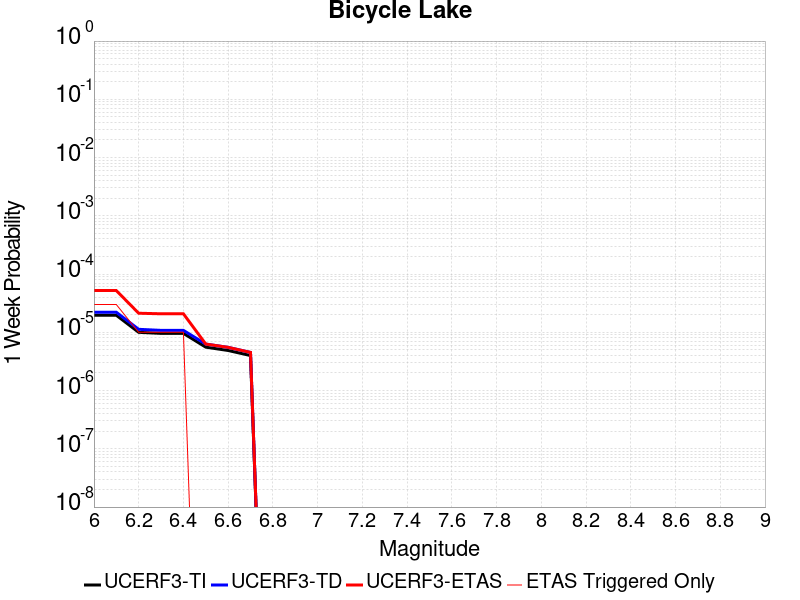 | 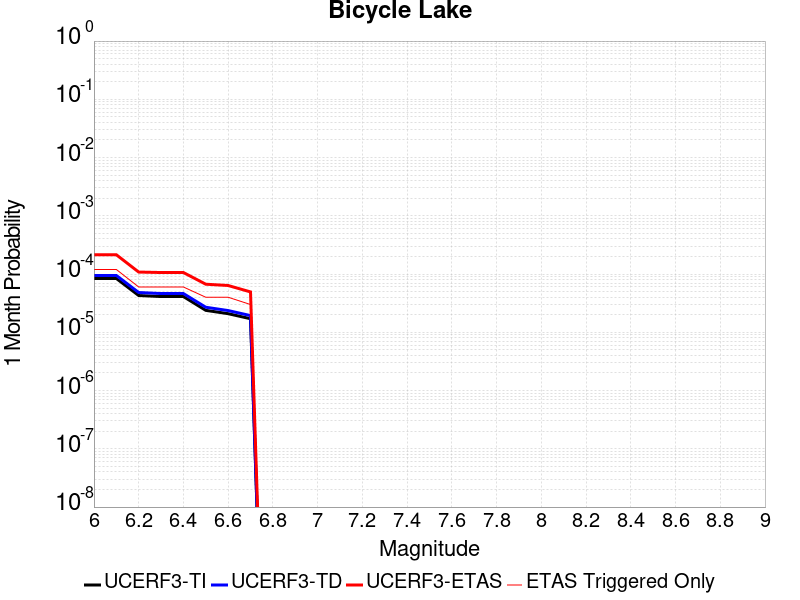 |  |  |

| Magnitude | 1 wk TI Prob | 1 wk TD Prob | 1 wk ETAS Prob | 1 wk ETAS/TD Gain | 1 wk ETAS Triggered Only | 1 mo TI Prob | 1 mo TD Prob | 1 mo ETAS Prob | 1 mo ETAS/TD Gain | 1 mo ETAS Triggered Only | 1 yr TI Prob | 1 yr TD Prob | 1 yr ETAS Prob | 1 yr ETAS/TD Gain | 1 yr ETAS Triggered Only | 10 yr TI Prob | 10 yr TD Prob | 10 yr ETAS Prob | 10 yr ETAS/TD Gain | 10 yr ETAS Triggered Only |
|-----|-----|-----|-----|-----|-----|-----|-----|-----|-----|-----|-----|-----|-----|-----|-----|-----|-----|-----|-----|-----|
| 6.0 | 1.9621975E-5 | 2.2097447E-5 | 2.2097447E-5 | 1.0 | 0.0 | 8.4091465E-5 | 9.470067E-5 | 9.470067E-5 | 1.0 | 0.0 | 0.0010233327 | 0.0011525059 | 0.0012861309 | 1.1159431 | 1.3377926E-4 | 0.01018633 | 0.011478599 | 0.012040635 | 1.0489638 | 5.685619E-4 |
| 6.1 | 1.9621975E-5 | 2.2097447E-5 | 2.2097447E-5 | 1.0 | 0.0 | 8.4091465E-5 | 9.470067E-5 | 9.470067E-5 | 1.0 | 0.0 | 0.0010233327 | 0.0011525059 | 0.0012861309 | 1.1159431 | 1.3377926E-4 | 0.01018633 | 0.011478599 | 0.012040635 | 1.0489638 | 5.685619E-4 |
| 6.2 | 9.9971285E-6 | 1.1255827E-5 | 1.1255827E-5 | 1.0 | 0.0 | 4.2844134E-5 | 4.823866E-5 | 4.823866E-5 | 1.0 | 0.0 | 5.2150246E-4 | 5.8719947E-4 | 6.8747497E-4 | 1.1707691 | 1.0033445E-4 | 0.0052028033 | 0.005861584 | 0.006327067 | 1.0794125 | 4.6822743E-4 |
| 6.3 | 9.589428E-6 | 1.0798527E-5 | 1.0798527E-5 | 1.0 | 0.0 | 4.10969E-5 | 4.627887E-5 | 4.627887E-5 | 1.0 | 0.0 | 5.002399E-4 | 5.6335144E-4 | 6.636294E-4 | 1.1780025 | 1.0033445E-4 | 0.0049911533 | 0.0056243236 | 0.006023404 | 1.0709562 | 4.013378E-4 |
| 6.4 | 9.589428E-6 | 1.0798527E-5 | 1.0798527E-5 | 1.0 | 0.0 | 4.10969E-5 | 4.627887E-5 | 4.627887E-5 | 1.0 | 0.0 | 5.002399E-4 | 5.6335144E-4 | 6.636294E-4 | 1.1780025 | 1.0033445E-4 | 0.0049911533 | 0.0056243236 | 0.006023404 | 1.0709562 | 4.013378E-4 |
| 6.5 | 5.557707E-6 | 6.2857107E-6 | 6.2857107E-6 | 1.0 | 0.0 | 2.3818526E-5 | 2.6938633E-5 | 2.6938633E-5 | 1.0 | 0.0 | 2.8995197E-4 | 3.2795538E-4 | 3.948231E-4 | 1.2038927 | 6.688963E-5 | 0.0028957394 | 0.0032773502 | 0.0035106968 | 1.0711998 | 2.3411372E-4 |
| 6.6 | 4.8742945E-6 | 5.5133855E-6 | 5.5133855E-6 | 1.0 | 0.0 | 2.0889667E-5 | 2.3628729E-5 | 2.3628729E-5 | 1.0 | 0.0 | 2.54302E-4 | 2.87668E-4 | 3.211032E-4 | 1.1162285 | 3.3444816E-5 | 0.002540112 | 0.0028755253 | 0.0030422683 | 1.0579871 | 1.6722408E-4 |
| 6.7 | 3.991108E-6 | 4.515989E-6 | 4.515989E-6 | 1.0 | 0.0 | 1.7104636E-5 | 1.9354238E-5 | 1.9354238E-5 | 1.0 | 0.0 | 2.0822904E-4 | 2.3563785E-4 | 2.6907478E-4 | 1.1418997 | 3.3444816E-5 | 0.0020803404 | 0.0023563786 | 0.0025232085 | 1.0707994 | 1.6722408E-4 |

## San Andreas (San Bernardino N)
*[(top)](#table-of-contents)*

| 1 Week | 1 Month | 1 Year | 10 Year |
|-----|-----|-----|-----|
|  |  |  |  |

| Magnitude | 1 wk TI Prob | 1 wk TD Prob | 1 wk ETAS Prob | 1 wk ETAS/TD Gain | 1 wk ETAS Triggered Only | 1 mo TI Prob | 1 mo TD Prob | 1 mo ETAS Prob | 1 mo ETAS/TD Gain | 1 mo ETAS Triggered Only | 1 yr TI Prob | 1 yr TD Prob | 1 yr ETAS Prob | 1 yr ETAS/TD Gain | 1 yr ETAS Triggered Only | 10 yr TI Prob | 10 yr TD Prob | 10 yr ETAS Prob | 10 yr ETAS/TD Gain | 10 yr ETAS Triggered Only |
|-----|-----|-----|-----|-----|-----|-----|-----|-----|-----|-----|-----|-----|-----|-----|-----|-----|-----|-----|-----|-----|
| 6.0 | 1.4273766E-4 | 3.161376E-4 | 3.161376E-4 | 1.0 | 0.0 | 6.115894E-4 | 0.0013541778 | 0.0014543764 | 1.0739921 | 1.0033445E-4 | 0.0074207084 | 0.016363978 | 0.016627157 | 1.0160829 | 2.6755853E-4 | 0.07177748 | 0.15029658 | 0.15075126 | 1.0030253 | 5.3511705E-4 |
| 6.1 | 1.4273766E-4 | 3.161376E-4 | 3.161376E-4 | 1.0 | 0.0 | 6.115894E-4 | 0.0013541778 | 0.0014543764 | 1.0739921 | 1.0033445E-4 | 0.0074207084 | 0.016363978 | 0.016627157 | 1.0160829 | 2.6755853E-4 | 0.07177748 | 0.15029658 | 0.15075126 | 1.0030253 | 5.3511705E-4 |
| 6.2 | 1.4273766E-4 | 3.161376E-4 | 3.161376E-4 | 1.0 | 0.0 | 6.115894E-4 | 0.0013541778 | 0.0014543764 | 1.0739921 | 1.0033445E-4 | 0.0074207084 | 0.016363978 | 0.016627157 | 1.0160829 | 2.6755853E-4 | 0.07177748 | 0.15029658 | 0.15075126 | 1.0030253 | 5.3511705E-4 |
| 6.3 | 1.3730655E-4 | 3.0518573E-4 | 3.0518573E-4 | 1.0 | 0.0 | 5.883239E-4 | 0.001307289 | 0.0014074922 | 1.0766497 | 1.0033445E-4 | 0.0071393442 | 0.01580149 | 0.01606482 | 1.016665 | 2.6755853E-4 | 0.06914291 | 0.14559646 | 0.14605367 | 1.0031402 | 5.3511705E-4 |
| 6.4 | 1.3730655E-4 | 3.0518573E-4 | 3.0518573E-4 | 1.0 | 0.0 | 5.883239E-4 | 0.001307289 | 0.0014074922 | 1.0766497 | 1.0033445E-4 | 0.0071393442 | 0.01580149 | 0.01606482 | 1.016665 | 2.6755853E-4 | 0.06914291 | 0.14559646 | 0.14605367 | 1.0031402 | 5.3511705E-4 |
| 6.5 | 1.2942807E-4 | 2.8932988E-4 | 2.8932988E-4 | 1.0 | 0.0 | 5.545738E-4 | 0.0012394012 | 0.0013396112 | 1.0808536 | 1.0033445E-4 | 0.0067310524 | 0.014986552 | 0.015250101 | 1.0175856 | 2.6755853E-4 | 0.06530788 | 0.13873914 | 0.13920002 | 1.0033219 | 5.3511705E-4 |
| 6.6 | 1.1125901E-4 | 2.537176E-4 | 2.537176E-4 | 1.0 | 0.0 | 4.767372E-4 | 0.0010869103 | 0.0011871356 | 1.0922112 | 1.0033445E-4 | 0.005788839 | 0.013153472 | 0.013384506 | 1.0175645 | 2.3411372E-4 | 0.056403454 | 0.12302898 | 0.12346893 | 1.003576 | 5.016722E-4 |
| 6.7 | 1.02209575E-4 | 2.3506685E-4 | 2.3506685E-4 | 1.0 | 0.0 | 4.3796748E-4 | 0.0010070418 | 0.0011072753 | 1.0995325 | 1.0033445E-4 | 0.0053192247 | 0.01219223 | 0.012423489 | 1.0189677 | 2.3411372E-4 | 0.051936906 | 0.11482068 | 0.11526475 | 1.0038675 | 5.016722E-4 |
| 6.8 | 9.610582E-5 | 2.2032406E-4 | 2.2032406E-4 | 1.0 | 0.0 | 4.1181705E-4 | 9.439049E-4 | 0.0010441447 | 1.1061969 | 1.0033445E-4 | 0.0050023515 | 0.011431754 | 0.011663191 | 1.0202451 | 2.3411372E-4 | 0.048912346 | 0.1082225 | 0.108669885 | 1.0041339 | 5.016722E-4 |
| 6.9 | 9.3877505E-5 | 2.1487933E-4 | 2.1487933E-4 | 1.0 | 0.0 | 4.0227012E-4 | 9.2058704E-4 | 0.0010208291 | 1.1088893 | 1.0033445E-4 | 0.0048866454 | 0.011150793 | 0.011382297 | 1.0207611 | 2.3411372E-4 | 0.04780577 | 0.10581279 | 0.10626138 | 1.0042394 | 5.016722E-4 |
| 7.0 | 9.1019785E-5 | 2.0814833E-4 | 2.0814833E-4 | 1.0 | 0.0 | 3.900265E-4 | 8.917599E-4 | 9.920049E-4 | 1.1124126 | 1.0033445E-4 | 0.0047382377 | 0.010803353 | 0.011034938 | 1.0214363 | 2.3411372E-4 | 0.046384744 | 0.10278319 | 0.10323329 | 1.0043792 | 5.016722E-4 |
| 7.1 | 8.771155E-5 | 1.9989353E-4 | 1.9989353E-4 | 1.0 | 0.0 | 3.758525E-4 | 8.564058E-4 | 9.566544E-4 | 1.1170572 | 1.0033445E-4 | 0.0045664064 | 0.01037709 | 0.010608775 | 1.0223265 | 2.3411372E-4 | 0.044737056 | 0.09909467 | 0.099546626 | 1.0045608 | 5.016722E-4 |
| 7.2 | 8.0830236E-5 | 1.8394848E-4 | 1.8394848E-4 | 1.0 | 0.0 | 3.4636928E-4 | 7.881126E-4 | 8.88368E-4 | 1.1272094 | 1.0033445E-4 | 0.0042088944 | 0.009553162 | 0.009785039 | 1.0242723 | 2.3411372E-4 | 0.041300658 | 0.09182531 | 0.09225053 | 1.0046309 | 4.6822743E-4 |
| 7.3 | 7.7668235E-5 | 1.7338296E-4 | 1.7338296E-4 | 1.0 | 0.0 | 3.328214E-4 | 7.428583E-4 | 8.431182E-4 | 1.1349651 | 1.0033445E-4 | 0.0040445733 | 0.009006873 | 0.009238878 | 1.0257586 | 2.3411372E-4 | 0.03971748 | 0.087092124 | 0.08751958 | 1.004908 | 4.6822743E-4 |
| 7.4 | 7.520177E-5 | 1.6558339E-4 | 1.6558339E-4 | 1.0 | 0.0 | 3.2225347E-4 | 7.0945016E-4 | 8.0971344E-4 | 1.1413254 | 1.0033445E-4 | 0.0039163795 | 0.0086034145 | 0.008835514 | 1.0269777 | 2.3411372E-4 | 0.038480744 | 0.08354814 | 0.08397725 | 1.005136 | 4.6822743E-4 |
| 7.5 | 7.274697E-5 | 1.5845922E-4 | 1.5845922E-4 | 1.0 | 0.0 | 3.1173544E-4 | 6.789343E-4 | 7.792006E-4 | 1.147682 | 1.0033445E-4 | 0.003788775 | 0.008234753 | 0.0084669385 | 1.0281959 | 2.3411372E-4 | 0.03724827 | 0.08026466 | 0.0806953 | 1.0053654 | 4.6822743E-4 |
| 7.6 | 7.1185845E-5 | 1.5415733E-4 | 1.5415733E-4 | 1.0 | 0.0 | 3.0504653E-4 | 6.6050707E-4 | 7.6077523E-4 | 1.1518048 | 1.0033445E-4 | 0.0037076178 | 0.008012074 | 0.008244312 | 1.028986 | 2.3411372E-4 | 0.036463667 | 0.078254156 | 0.078685746 | 1.0055152 | 4.6822743E-4 |
| 7.7 | 6.709961E-5 | 1.4324463E-4 | 1.4324463E-4 | 1.0 | 0.0 | 2.8753807E-4 | 6.1376113E-4 | 7.14034E-4 | 1.1633744 | 1.0033445E-4 | 0.003495157 | 0.007446978 | 0.007679348 | 1.0312033 | 2.3411372E-4 | 0.034406938 | 0.073082365 | 0.07351638 | 1.0059386 | 4.6822743E-4 |
| 7.8 | 6.300812E-5 | 1.3208245E-4 | 1.3208245E-4 | 1.0 | 0.0 | 2.7000686E-4 | 5.659449E-4 | 6.6622254E-4 | 1.1771863 | 1.0033445E-4 | 0.0032823787 | 0.0068686386 | 0.007101144 | 1.0338503 | 2.3411372E-4 | 0.032343175 | 0.06773997 | 0.06817648 | 1.0064439 | 4.6822743E-4 |
| 7.9 | 4.983037E-5 | 9.728091E-5 | 9.728091E-5 | 1.0 | 0.0 | 2.1354125E-4 | 4.1685157E-4 | 4.8371332E-4 | 1.160397 | 6.688963E-5 | 0.0025967648 | 0.005063368 | 0.0052630208 | 1.0394309 | 2.006689E-4 | 0.025666296 | 0.0506703 | 0.0510513 | 1.0075192 | 4.013378E-4 |
| 8.0 | 3.2211527E-5 | 5.333152E-5 | 5.333152E-5 | 1.0 | 0.0 | 1.380421E-4 | 2.2854365E-4 | 2.95418E-4 | 1.2926108 | 6.688963E-5 | 0.0016793669 | 0.0027789702 | 0.002845674 | 1.024003 | 6.688963E-5 | 0.016667323 | 0.02837451 | 0.028504493 | 1.004581 | 1.3377926E-4 |
| 8.1 | 1.743376E-5 | 1.8836954E-5 | 1.8836954E-5 | 1.0 | 0.0 | 7.471398E-5 | 8.07273E-5 | 8.07273E-5 | 1.0 | 0.0 | 9.0926304E-4 | 9.824124E-4 | 9.824124E-4 | 1.0 | 0.0 | 0.009055517 | 0.010490617 | 0.010490617 | 1.0 | 0.0 |
| 8.2 | 7.831616E-6 | 5.1597067E-6 | 5.1597067E-6 | 1.0 | 0.0 | 3.3563636E-5 | 2.2112841E-5 | 2.2112841E-5 | 1.0 | 0.0 | 4.0856065E-4 | 2.6919067E-4 | 2.6919067E-4 | 1.0 | 0.0 | 0.004078103 | 0.003044315 | 0.003044315 | 1.0 | 0.0 |
| 8.3 | 1.983087E-6 | 7.668296E-7 | 7.668296E-7 | 1.0 | 0.0 | 8.498917E-6 | 3.2864084E-6 | 3.2864084E-6 | 1.0 | 0.0 | 1.034694E-4 | 4.0011306E-5 | 4.0011306E-5 | 1.0 | 0.0 | 0.0010342124 | 4.724499E-4 | 4.724499E-4 | 1.0 | 0.0 |

## Death Valley (Black Mtns Frontal)
*[(top)](#table-of-contents)*

| 1 Week | 1 Month | 1 Year | 10 Year |
|-----|-----|-----|-----|
|  |  |  | 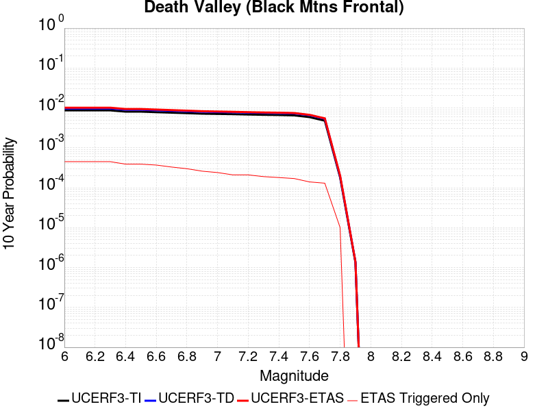 |

| Magnitude | 1 wk TI Prob | 1 wk TD Prob | 1 wk ETAS Prob | 1 wk ETAS/TD Gain | 1 wk ETAS Triggered Only | 1 mo TI Prob | 1 mo TD Prob | 1 mo ETAS Prob | 1 mo ETAS/TD Gain | 1 mo ETAS Triggered Only | 1 yr TI Prob | 1 yr TD Prob | 1 yr ETAS Prob | 1 yr ETAS/TD Gain | 1 yr ETAS Triggered Only | 10 yr TI Prob | 10 yr TD Prob | 10 yr ETAS Prob | 10 yr ETAS/TD Gain | 10 yr ETAS Triggered Only |
|-----|-----|-----|-----|-----|-----|-----|-----|-----|-----|-----|-----|-----|-----|-----|-----|-----|-----|-----|-----|-----|
| 6.0 | 1.6707214E-5 | 1.867056E-5 | 1.1900313E-4 | 6.3738384 | 1.0033445E-4 | 7.160038E-5 | 8.001427E-5 | 2.4722496E-4 | 3.0897608 | 1.6722408E-4 | 8.71386E-4 | 9.7374606E-4 | 0.0013078685 | 1.3431311 | 3.3444815E-4 | 0.00867977 | 0.009695647 | 0.010225576 | 1.0546564 | 5.3511705E-4 |
| 6.1 | 1.6707214E-5 | 1.867056E-5 | 1.1900313E-4 | 6.3738384 | 1.0033445E-4 | 7.160038E-5 | 8.001427E-5 | 2.4722496E-4 | 3.0897608 | 1.6722408E-4 | 8.71386E-4 | 9.7374606E-4 | 0.0013078685 | 1.3431311 | 3.3444815E-4 | 0.00867977 | 0.009695647 | 0.010225576 | 1.0546564 | 5.3511705E-4 |
| 6.2 | 1.6707214E-5 | 1.867056E-5 | 1.1900313E-4 | 6.3738384 | 1.0033445E-4 | 7.160038E-5 | 8.001427E-5 | 2.4722496E-4 | 3.0897608 | 1.6722408E-4 | 8.71386E-4 | 9.7374606E-4 | 0.0013078685 | 1.3431311 | 3.3444815E-4 | 0.00867977 | 0.009695647 | 0.010225576 | 1.0546564 | 5.3511705E-4 |
| 6.3 | 1.6707214E-5 | 1.867056E-5 | 1.1900313E-4 | 6.3738384 | 1.0033445E-4 | 7.160038E-5 | 8.001427E-5 | 2.4722496E-4 | 3.0897608 | 1.6722408E-4 | 8.71386E-4 | 9.7374606E-4 | 0.0013078685 | 1.3431311 | 3.3444815E-4 | 0.00867977 | 0.009695647 | 0.010225576 | 1.0546564 | 5.3511705E-4 |
| 6.4 | 1.5515609E-5 | 1.7338483E-5 | 1.17671196E-4 | 6.786706 | 1.0033445E-4 | 6.649377E-5 | 7.430571E-5 | 2.0807503E-4 | 2.8002565 | 1.3377926E-4 | 8.0926094E-4 | 9.0430264E-4 | 0.0012050337 | 1.3325559 | 3.0100334E-4 | 0.008063202 | 0.009006913 | 0.009504067 | 1.0551969 | 5.016722E-4 |
| 6.5 | 1.5515609E-5 | 1.7338483E-5 | 1.17671196E-4 | 6.786706 | 1.0033445E-4 | 6.649377E-5 | 7.430571E-5 | 2.0807503E-4 | 2.8002565 | 1.3377926E-4 | 8.0926094E-4 | 9.0430264E-4 | 0.0012050337 | 1.3325559 | 3.0100334E-4 | 0.008063202 | 0.009006913 | 0.009504067 | 1.0551969 | 5.016722E-4 |
| 6.6 | 1.5041828E-5 | 1.6809407E-5 | 8.3697916E-5 | 4.9792304 | 6.688963E-5 | 6.4463384E-5 | 7.203836E-5 | 1.7236559E-4 | 2.3926916 | 1.0033445E-4 | 7.8455906E-4 | 8.7672E-4 | 0.001144044 | 1.3049138 | 2.6755853E-4 | 0.00781795 | 0.008733268 | 0.0091974065 | 1.053146 | 4.6822743E-4 |
| 6.7 | 1.4634985E-5 | 1.6356273E-5 | 8.324481E-5 | 5.0894732 | 6.688963E-5 | 6.271985E-5 | 7.009646E-5 | 1.7042387E-4 | 2.4312766 | 1.0033445E-4 | 7.6334673E-4 | 8.53096E-4 | 0.0011204262 | 1.3133649 | 2.6755853E-4 | 0.007607299 | 0.008498848 | 0.008929935 | 1.0507231 | 4.3478262E-4 |
| 6.8 | 1.4209158E-5 | 1.5882297E-5 | 8.2770865E-5 | 5.2115173 | 6.688963E-5 | 6.089497E-5 | 6.806524E-5 | 1.6839286E-4 | 2.4739919 | 1.0033445E-4 | 7.4114406E-4 | 8.2838483E-4 | 0.0010623046 | 1.2823806 | 2.3411372E-4 | 0.007386771 | 0.008253585 | 0.00865161 | 1.0482246 | 4.013378E-4 |
| 6.9 | 1.3780098E-5 | 1.5404834E-5 | 4.8849135E-5 | 3.1710262 | 3.3444816E-5 | 5.9056227E-5 | 6.601908E-5 | 1.329043E-4 | 2.0131195 | 6.688963E-5 | 7.1877235E-4 | 8.0349133E-4 | 9.705811E-4 | 1.2079546 | 1.6722408E-4 | 0.0071645193 | 0.008006458 | 0.008338228 | 1.0414379 | 3.3444815E-4 |
| 7.0 | 1.3585064E-5 | 1.5188394E-5 | 4.86327E-5 | 3.2019649 | 3.3444816E-5 | 5.8220405E-5 | 6.5091524E-5 | 1.319768E-4 | 2.0275574 | 6.688963E-5 | 7.086029E-4 | 7.922066E-4 | 9.592982E-4 | 1.2109193 | 1.6722408E-4 | 0.007063476 | 0.007894417 | 0.008226225 | 1.0420307 | 3.3444815E-4 |
| 7.1 | 1.3398601E-5 | 1.4981575E-5 | 4.842589E-5 | 3.232363 | 3.3444816E-5 | 5.742131E-5 | 6.4205204E-5 | 1.3109054E-4 | 2.0417433 | 6.688963E-5 | 6.9888023E-4 | 7.814234E-4 | 9.150981E-4 | 1.1710657 | 1.3377926E-4 | 0.0069668638 | 0.007787346 | 0.008052821 | 1.0340905 | 2.6755853E-4 |
| 7.2 | 1.3126312E-5 | 1.4679792E-5 | 4.812412E-5 | 3.2782562 | 3.3444816E-5 | 5.6254412E-5 | 6.291191E-5 | 1.2979734E-4 | 2.06316 | 6.688963E-5 | 6.846822E-4 | 7.656887E-4 | 8.993656E-4 | 1.1745838 | 1.3377926E-4 | 0.006825765 | 0.00763109 | 0.007896607 | 1.0347941 | 2.6755853E-4 |
| 7.3 | 1.2922429E-5 | 1.4454016E-5 | 4.789835E-5 | 3.3138437 | 3.3444816E-5 | 5.5380664E-5 | 6.1944345E-5 | 1.2882984E-4 | 2.0797675 | 6.688963E-5 | 6.74051E-4 | 7.5391686E-4 | 8.8759523E-4 | 1.1773119 | 1.3377926E-4 | 0.006720101 | 0.0075141727 | 0.0077465274 | 1.0309222 | 2.3411372E-4 |
| 7.4 | 1.2768878E-5 | 1.4283997E-5 | 4.7728336E-5 | 3.3413851 | 3.3444816E-5 | 5.4722615E-5 | 6.1215724E-5 | 1.2810127E-4 | 2.0926201 | 6.688963E-5 | 6.660441E-4 | 7.45052E-4 | 8.787316E-4 | 1.1794232 | 1.3377926E-4 | 0.0066405144 | 0.0074261203 | 0.0076584956 | 1.0312916 | 2.3411372E-4 |
| 7.5 | 1.2521929E-5 | 1.40122365E-5 | 4.7456586E-5 | 3.3867958 | 3.3444816E-5 | 5.366431E-5 | 6.0051094E-5 | 1.269367E-4 | 2.1138117 | 6.688963E-5 | 6.531671E-4 | 7.308822E-4 | 8.645637E-4 | 1.1829042 | 1.3377926E-4 | 0.006512506 | 0.0072853607 | 0.007484568 | 1.0273435 | 2.006689E-4 |
| 7.6 | 1.1301089E-5 | 1.2648349E-5 | 4.6092744E-5 | 3.6441705 | 3.3444816E-5 | 4.8432343E-5 | 5.4206117E-5 | 1.2109212E-4 | 2.2339199 | 6.688963E-5 | 5.895042E-4 | 6.597649E-4 | 7.934559E-4 | 1.2026343 | 1.3377926E-4 | 0.0058794282 | 0.0065786145 | 0.006777963 | 1.0303025 | 2.006689E-4 |
| 7.7 | 9.189108E-6 | 1.0283521E-5 | 4.3727992E-5 | 4.252239 | 3.3444816E-5 | 3.93813E-5 | 4.407152E-5 | 1.109582E-4 | 2.5176852 | 6.688963E-5 | 4.7936183E-4 | 5.3644367E-4 | 6.367243E-4 | 1.186936 | 1.0033445E-4 | 0.004783291 | 0.0053519984 | 0.0055183275 | 1.031078 | 1.6722408E-4 |
| 7.8 | 3.4586725E-7 | 3.648288E-7 | 3.648288E-7 | 1.0 | 0.0 | 1.4822873E-6 | 1.5635511E-6 | 1.5635511E-6 | 1.0 | 0.0 | 1.80467E-5 | 1.9036073E-5 | 5.2480253E-5 | 2.7568843 | 3.3444816E-5 | 1.8045233E-4 | 1.9034486E-4 | 2.2378331E-4 | 1.175673 | 3.3444816E-5 |
| 7.9 | 2.5591178E-9 | 2.6696871E-9 | 2.6696871E-9 | 1.0 | 0.0 | 1.0967647E-8 | 1.1441516E-8 | 1.1441516E-8 | 1.0 | 0.0 | 1.335311E-7 | 1.3930045E-7 | 1.3930045E-7 | 1.0 | 0.0 | 1.3353102E-6 | 1.3930046E-6 | 1.3930046E-6 | 1.0 | 0.0 |

## Helendale-So Lockhart
*[(top)](#table-of-contents)*

| 1 Week | 1 Month | 1 Year | 10 Year |
|-----|-----|-----|-----|
|  |  |  |  |

| Magnitude | 1 wk TI Prob | 1 wk TD Prob | 1 wk ETAS Prob | 1 wk ETAS/TD Gain | 1 wk ETAS Triggered Only | 1 mo TI Prob | 1 mo TD Prob | 1 mo ETAS Prob | 1 mo ETAS/TD Gain | 1 mo ETAS Triggered Only | 1 yr TI Prob | 1 yr TD Prob | 1 yr ETAS Prob | 1 yr ETAS/TD Gain | 1 yr ETAS Triggered Only | 10 yr TI Prob | 10 yr TD Prob | 10 yr ETAS Prob | 10 yr ETAS/TD Gain | 10 yr ETAS Triggered Only |
|-----|-----|-----|-----|-----|-----|-----|-----|-----|-----|-----|-----|-----|-----|-----|-----|-----|-----|-----|-----|-----|
| 6.0 | 1.7296055E-5 | 1.8103841E-5 | 1.8103841E-5 | 1.0 | 0.0 | 7.412385E-5 | 7.7585704E-5 | 1.4447015E-4 | 1.8620718 | 6.688963E-5 | 9.0208417E-4 | 9.442173E-4 | 0.0011781099 | 1.2477106 | 2.3411372E-4 | 0.008984311 | 0.009404174 | 0.009867999 | 1.049321 | 4.6822743E-4 |
| 6.1 | 1.7296055E-5 | 1.8103841E-5 | 1.8103841E-5 | 1.0 | 0.0 | 7.412385E-5 | 7.7585704E-5 | 1.4447015E-4 | 1.8620718 | 6.688963E-5 | 9.0208417E-4 | 9.442173E-4 | 0.0011781099 | 1.2477106 | 2.3411372E-4 | 0.008984311 | 0.009404174 | 0.009867999 | 1.049321 | 4.6822743E-4 |
| 6.2 | 1.7296055E-5 | 1.8103841E-5 | 1.8103841E-5 | 1.0 | 0.0 | 7.412385E-5 | 7.7585704E-5 | 1.4447015E-4 | 1.8620718 | 6.688963E-5 | 9.0208417E-4 | 9.442173E-4 | 0.0011781099 | 1.2477106 | 2.3411372E-4 | 0.008984311 | 0.009404174 | 0.009867999 | 1.049321 | 4.6822743E-4 |
| 6.3 | 1.0669118E-5 | 1.1135489E-5 | 1.1135489E-5 | 1.0 | 0.0 | 4.5723988E-5 | 4.7722668E-5 | 8.116589E-5 | 1.7007827 | 3.3444816E-5 | 5.5654737E-4 | 5.8087136E-4 | 7.479983E-4 | 1.2877177 | 1.6722408E-4 | 0.0055515557 | 0.005793827 | 0.0060930867 | 1.0516514 | 3.0100334E-4 |
| 6.4 | 1.0669118E-5 | 1.1135489E-5 | 1.1135489E-5 | 1.0 | 0.0 | 4.5723988E-5 | 4.7722668E-5 | 8.116589E-5 | 1.7007827 | 3.3444816E-5 | 5.5654737E-4 | 5.8087136E-4 | 7.479983E-4 | 1.2877177 | 1.6722408E-4 | 0.0055515557 | 0.005793827 | 0.0060930867 | 1.0516514 | 3.0100334E-4 |
| 6.5 | 8.790038E-6 | 9.1702495E-6 | 9.1702495E-6 | 1.0 | 0.0 | 3.767105E-5 | 3.9300485E-5 | 7.274399E-5 | 1.8509692 | 3.3444816E-5 | 4.585485E-4 | 4.7837992E-4 | 6.120952E-4 | 1.2795169 | 1.3377926E-4 | 0.0045760344 | 0.0047736657 | 0.005039947 | 1.0557812 | 2.6755853E-4 |
| 6.6 | 7.396949E-6 | 7.715581E-6 | 7.715581E-6 | 1.0 | 0.0 | 3.1700827E-5 | 3.3066364E-5 | 3.3066364E-5 | 1.0 | 0.0 | 3.858892E-4 | 4.025096E-4 | 4.6937232E-4 | 1.1661146 | 6.688963E-5 | 0.003852198 | 0.004017913 | 0.0042177755 | 1.0497429 | 2.006689E-4 |
| 6.7 | 6.4600285E-6 | 6.7380697E-6 | 6.7380697E-6 | 1.0 | 0.0 | 2.7685543E-5 | 2.8877126E-5 | 2.8877126E-5 | 1.0 | 0.0 | 3.3701936E-4 | 3.5152308E-4 | 3.8495613E-4 | 1.0951091 | 3.3444816E-5 | 0.0033650869 | 0.003509752 | 0.003676389 | 1.0474783 | 1.6722408E-4 |
| 6.8 | 5.600104E-6 | 5.836042E-6 | 5.836042E-6 | 1.0 | 0.0 | 2.4000226E-5 | 2.5011372E-5 | 2.5011372E-5 | 1.0 | 0.0 | 2.9216358E-4 | 3.044715E-4 | 3.3790612E-4 | 1.109812 | 3.3444816E-5 | 0.0029177975 | 0.003040605 | 0.0031406344 | 1.0328978 | 1.0033445E-4 |
| 6.9 | 4.839122E-6 | 5.039537E-6 | 5.039537E-6 | 1.0 | 0.0 | 2.0738931E-5 | 2.159784E-5 | 2.159784E-5 | 1.0 | 0.0 | 2.5246723E-4 | 2.6292243E-4 | 2.9635846E-4 | 1.1271707 | 3.3444816E-5 | 0.002521806 | 0.002626161 | 0.0026928752 | 1.0254036 | 6.688963E-5 |
| 7.0 | 3.6937633E-6 | 3.845229E-6 | 3.845229E-6 | 1.0 | 0.0 | 1.5830317E-5 | 1.6479451E-5 | 1.6479451E-5 | 1.0 | 0.0 | 1.9271708E-4 | 2.0061915E-4 | 2.3405725E-4 | 1.1666745 | 3.3444816E-5 | 0.0019255003 | 0.0020044118 | 0.0020377897 | 1.0166521 | 3.3444816E-5 |
| 7.1 | 2.7858857E-6 | 2.8978693E-6 | 2.8978693E-6 | 1.0 | 0.0 | 1.1939455E-5 | 1.2419382E-5 | 1.2419382E-5 | 1.0 | 0.0 | 1.4535317E-4 | 1.511957E-4 | 1.511957E-4 | 1.0 | 0.0 | 0.0014525814 | 0.0015109498 | 0.0015109498 | 1.0 | 0.0 |
| 7.2 | 2.1672065E-6 | 2.2540248E-6 | 2.2540248E-6 | 1.0 | 0.0 | 9.2879945E-6 | 9.660072E-6 | 9.660072E-6 | 1.0 | 0.0 | 1.1307546E-4 | 1.176052E-4 | 1.176052E-4 | 1.0 | 0.0 | 0.0011301794 | 0.0011754478 | 0.0011754478 | 1.0 | 0.0 |
| 7.3 | 1.4823496E-6 | 1.5422185E-6 | 1.5422185E-6 | 1.0 | 0.0 | 6.3529114E-6 | 6.6094917E-6 | 6.6094917E-6 | 1.0 | 0.0 | 7.734395E-5 | 8.046775E-5 | 8.046775E-5 | 1.0 | 0.0 | 7.731704E-4 | 8.044012E-4 | 8.044012E-4 | 1.0 | 0.0 |
| 7.4 | 4.2321457E-7 | 4.4109012E-7 | 4.4109012E-7 | 1.0 | 0.0 | 1.8137755E-6 | 1.8903852E-6 | 1.8903852E-6 | 1.0 | 0.0 | 2.2082493E-5 | 2.3015242E-5 | 2.3015242E-5 | 1.0 | 0.0 | 2.2080299E-4 | 2.3013311E-4 | 2.3013311E-4 | 1.0 | 0.0 |
| 7.5 | 5.6942316E-8 | 5.941599E-8 | 5.941599E-8 | 1.0 | 0.0 | 2.440385E-7 | 2.5463993E-7 | 2.5463993E-7 | 1.0 | 0.0 | 2.9711643E-6 | 3.1002376E-6 | 3.1002376E-6 | 1.0 | 0.0 | 2.9711247E-5 | 3.1002022E-5 | 3.1002022E-5 | 1.0 | 0.0 |

## San Andreas (Parkfield)
*[(top)](#table-of-contents)*

| 1 Week | 1 Month | 1 Year | 10 Year |
|-----|-----|-----|-----|
|  |  |  |  |

| Magnitude | 1 wk TI Prob | 1 wk TD Prob | 1 wk ETAS Prob | 1 wk ETAS/TD Gain | 1 wk ETAS Triggered Only | 1 mo TI Prob | 1 mo TD Prob | 1 mo ETAS Prob | 1 mo ETAS/TD Gain | 1 mo ETAS Triggered Only | 1 yr TI Prob | 1 yr TD Prob | 1 yr ETAS Prob | 1 yr ETAS/TD Gain | 1 yr ETAS Triggered Only | 10 yr TI Prob | 10 yr TD Prob | 10 yr ETAS Prob | 10 yr ETAS/TD Gain | 10 yr ETAS Triggered Only |
|-----|-----|-----|-----|-----|-----|-----|-----|-----|-----|-----|-----|-----|-----|-----|-----|-----|-----|-----|-----|-----|
| 6.0 | 5.556969E-4 | 7.788437E-4 | 7.788437E-4 | 1.0 | 0.0 | 0.0023793848 | 0.0033341812 | 0.003434181 | 1.0299923 | 1.0033445E-4 | 0.028586963 | 0.04023991 | 0.04040041 | 1.0039885 | 1.6722408E-4 | 0.25176284 | 0.33731642 | 0.33756024 | 1.0007228 | 3.6789296E-4 |
| 6.1 | 1.925858E-4 | 3.0304783E-4 | 3.0304783E-4 | 1.0 | 0.0 | 8.2510663E-4 | 0.0012982241 | 0.0012982241 | 1.0 | 0.0 | 0.0099994885 | 0.015792182 | 0.015792182 | 1.0 | 0.0 | 0.095613256 | 0.14979222 | 0.14987753 | 1.0005695 | 1.0033445E-4 |
| 6.2 | 9.4306815E-5 | 1.8250331E-4 | 1.8250331E-4 | 1.0 | 0.0 | 4.0410945E-4 | 7.819238E-4 | 7.819238E-4 | 1.0 | 0.0 | 0.0049089384 | 0.009478576 | 0.009478576 | 1.0 | 0.0 | 0.048019063 | 0.09188674 | 0.09197785 | 1.0009916 | 1.0033445E-4 |
| 6.3 | 9.283051E-5 | 1.7946832E-4 | 1.7946832E-4 | 1.0 | 0.0 | 3.9778434E-4 | 7.689244E-4 | 7.689244E-4 | 1.0 | 0.0 | 0.0048322747 | 0.009321672 | 0.009321672 | 1.0 | 0.0 | 0.047285385 | 0.09053965 | 0.0906309 | 1.0010078 | 1.0033445E-4 |
| 6.4 | 9.138826E-5 | 1.770899E-4 | 1.770899E-4 | 1.0 | 0.0 | 3.916052E-4 | 7.5873715E-4 | 7.5873715E-4 | 1.0 | 0.0 | 0.0047573745 | 0.009198696 | 0.009198696 | 1.0 | 0.0 | 0.046568092 | 0.089441724 | 0.08953308 | 1.0010215 | 1.0033445E-4 |
| 6.5 | 9.000255E-5 | 1.746699E-4 | 1.746699E-4 | 1.0 | 0.0 | 3.8566816E-4 | 7.483717E-4 | 7.483717E-4 | 1.0 | 0.0 | 0.0046854047 | 0.009073567 | 0.009073567 | 1.0 | 0.0 | 0.045878403 | 0.08832737 | 0.08841884 | 1.0010356 | 1.0033445E-4 |
| 6.6 | 8.8109264E-5 | 1.7148067E-4 | 1.7148067E-4 | 1.0 | 0.0 | 3.7755648E-4 | 7.3471136E-4 | 7.3471136E-4 | 1.0 | 0.0 | 0.0045870654 | 0.008908638 | 0.008908638 | 1.0 | 0.0 | 0.04493529 | 0.086858675 | 0.086950295 | 1.0010548 | 1.0033445E-4 |
| 6.7 | 8.738073E-5 | 1.7015127E-4 | 1.7015127E-4 | 1.0 | 0.0 | 3.7443507E-4 | 7.290171E-4 | 7.290171E-4 | 1.0 | 0.0 | 0.0045492216 | 0.008839916 | 0.008839916 | 1.0 | 0.0 | 0.04457213 | 0.086258985 | 0.086350664 | 1.0010629 | 1.0033445E-4 |
| 6.8 | 8.710195E-5 | 1.6960612E-4 | 1.6960612E-4 | 1.0 | 0.0 | 3.7324068E-4 | 7.266821E-4 | 7.266821E-4 | 1.0 | 0.0 | 0.0045347405 | 0.008811726 | 0.008811726 | 1.0 | 0.0 | 0.04443313 | 0.08600653 | 0.08609823 | 1.0010662 | 1.0033445E-4 |
| 6.9 | 8.6801556E-5 | 1.6901553E-4 | 1.6901553E-4 | 1.0 | 0.0 | 3.7195362E-4 | 7.2415237E-4 | 7.2415237E-4 | 1.0 | 0.0 | 0.0045191357 | 0.008781176 | 0.008781176 | 1.0 | 0.0 | 0.044283327 | 0.08573254 | 0.08582428 | 1.00107 | 1.0033445E-4 |
| 7.0 | 8.5571606E-5 | 1.6654332E-4 | 1.6654332E-4 | 1.0 | 0.0 | 3.6668387E-4 | 7.13563E-4 | 7.13563E-4 | 1.0 | 0.0 | 0.004455241 | 0.008653281 | 0.008653281 | 1.0 | 0.0 | 0.043669727 | 0.08458075 | 0.0846726 | 1.0010859 | 1.0033445E-4 |
| 7.1 | 7.82589E-5 | 1.5135074E-4 | 1.5135074E-4 | 1.0 | 0.0 | 3.3535215E-4 | 6.484855E-4 | 6.484855E-4 | 1.0 | 0.0 | 0.0040752706 | 0.0078668995 | 0.0078668995 | 1.0 | 0.0 | 0.040013418 | 0.077491894 | 0.07758446 | 1.0011945 | 1.0033445E-4 |
| 7.2 | 7.690929E-5 | 1.4872287E-4 | 1.4872287E-4 | 1.0 | 0.0 | 3.2956956E-4 | 6.372288E-4 | 6.372288E-4 | 1.0 | 0.0 | 0.004005129 | 0.007730829 | 0.007730829 | 1.0 | 0.0 | 0.0393371 | 0.07626493 | 0.07635762 | 1.0012152 | 1.0033445E-4 |
| 7.3 | 7.5543794E-5 | 1.4568791E-4 | 1.4568791E-4 | 1.0 | 0.0 | 3.2371894E-4 | 6.242281E-4 | 6.242281E-4 | 1.0 | 0.0 | 0.003934157 | 0.007573656 | 0.007573656 | 1.0 | 0.0 | 0.038652334 | 0.07482772 | 0.07492055 | 1.0012405 | 1.0033445E-4 |
| 7.4 | 7.4214564E-5 | 1.4269682E-4 | 1.4269682E-4 | 1.0 | 0.0 | 3.1802364E-4 | 6.114152E-4 | 6.114152E-4 | 1.0 | 0.0 | 0.003865065 | 0.007418731 | 0.007418731 | 1.0 | 0.0 | 0.03798529 | 0.07340127 | 0.07349424 | 1.0012666 | 1.0033445E-4 |
| 7.5 | 6.149578E-5 | 1.1196503E-4 | 1.1196503E-4 | 1.0 | 0.0 | 2.6352672E-4 | 4.7976198E-4 | 4.7976198E-4 | 1.0 | 0.0 | 0.0032037178 | 0.00582549 | 0.00582549 | 1.0 | 0.0 | 0.03157923 | 0.058584154 | 0.05861564 | 1.0005374 | 3.3444816E-5 |
| 7.6 | 6.0643448E-5 | 1.10251094E-4 | 1.10251094E-4 | 1.0 | 0.0 | 2.598746E-4 | 4.7241923E-4 | 4.7241923E-4 | 1.0 | 0.0 | 0.0031593828 | 0.0057365666 | 0.0057365666 | 1.0 | 0.0 | 0.031148417 | 0.057744972 | 0.05777649 | 1.0005457 | 3.3444816E-5 |
| 7.7 | 5.1652263E-5 | 9.179838E-5 | 9.179838E-5 | 1.0 | 0.0 | 2.2134806E-4 | 3.9336234E-4 | 3.9336234E-4 | 1.0 | 0.0 | 0.002691582 | 0.0047786795 | 0.0047786795 | 1.0 | 0.0 | 0.026592141 | 0.048560265 | 0.048592083 | 1.0006553 | 3.3444816E-5 |
| 7.8 | 4.8090482E-5 | 8.564368E-5 | 8.564368E-5 | 1.0 | 0.0 | 2.060858E-4 | 3.6699275E-4 | 3.6699275E-4 | 1.0 | 0.0 | 0.0025062072 | 0.004458991 | 0.004458991 | 1.0 | 0.0 | 0.024781305 | 0.045324653 | 0.045356583 | 1.0007044 | 3.3444816E-5 |
| 7.9 | 3.970278E-5 | 6.754111E-5 | 6.754111E-5 | 1.0 | 0.0 | 1.7014367E-4 | 2.894298E-4 | 2.894298E-4 | 1.0 | 0.0 | 0.002069531 | 0.0035181176 | 0.0035181176 | 1.0 | 0.0 | 0.020503636 | 0.03589899 | 0.035931233 | 1.0008982 | 3.3444816E-5 |
| 8.0 | 2.8982335E-5 | 4.072124E-5 | 4.072124E-5 | 1.0 | 0.0 | 1.2420409E-4 | 1.7450792E-4 | 1.7450792E-4 | 1.0 | 0.0 | 0.0015111357 | 0.002122565 | 0.002122565 | 1.0 | 0.0 | 0.015009012 | 0.02202231 | 0.022055019 | 1.0014852 | 3.3444816E-5 |
| 8.1 | 1.8836186E-5 | 1.8694205E-5 | 1.8694205E-5 | 1.0 | 0.0 | 8.0724014E-5 | 8.011556E-5 | 8.011556E-5 | 1.0 | 0.0 | 9.823717E-4 | 9.749711E-4 | 9.749711E-4 | 1.0 | 0.0 | 0.009780403 | 0.010494972 | 0.010494972 | 1.0 | 0.0 |
| 8.2 | 8.643924E-6 | 5.4798497E-6 | 5.4798497E-6 | 1.0 | 0.0 | 3.704486E-5 | 2.348486E-5 | 2.348486E-5 | 1.0 | 0.0 | 4.5092785E-4 | 2.858907E-4 | 2.858907E-4 | 1.0 | 0.0 | 0.0045001395 | 0.0032514327 | 0.0032514327 | 1.0 | 0.0 |
| 8.3 | 1.983087E-6 | 7.668296E-7 | 7.668296E-7 | 1.0 | 0.0 | 8.498917E-6 | 3.2864084E-6 | 3.2864084E-6 | 1.0 | 0.0 | 1.034694E-4 | 4.0011306E-5 | 4.0011306E-5 | 1.0 | 0.0 | 0.0010342124 | 4.724499E-4 | 4.724499E-4 | 1.0 | 0.0 |

## San Andreas (Big Bend)
*[(top)](#table-of-contents)*

| 1 Week | 1 Month | 1 Year | 10 Year |
|-----|-----|-----|-----|
|  |  |  |  |

| Magnitude | 1 wk TI Prob | 1 wk TD Prob | 1 wk ETAS Prob | 1 wk ETAS/TD Gain | 1 wk ETAS Triggered Only | 1 mo TI Prob | 1 mo TD Prob | 1 mo ETAS Prob | 1 mo ETAS/TD Gain | 1 mo ETAS Triggered Only | 1 yr TI Prob | 1 yr TD Prob | 1 yr ETAS Prob | 1 yr ETAS/TD Gain | 1 yr ETAS Triggered Only | 10 yr TI Prob | 10 yr TD Prob | 10 yr ETAS Prob | 10 yr ETAS/TD Gain | 10 yr ETAS Triggered Only |
|-----|-----|-----|-----|-----|-----|-----|-----|-----|-----|-----|-----|-----|-----|-----|-----|-----|-----|-----|-----|-----|
| 6.0 | 1.0179969E-4 | 2.0080687E-4 | 2.0080687E-4 | 1.0 | 0.0 | 4.362114E-4 | 8.60318E-4 | 8.60318E-4 | 1.0 | 0.0 | 0.0052979486 | 0.010424351 | 0.01052364 | 1.0095247 | 1.0033445E-4 | 0.051734097 | 0.1014857 | 0.10175615 | 1.0026649 | 3.0100334E-4 |
| 6.1 | 1.0179969E-4 | 2.0080687E-4 | 2.0080687E-4 | 1.0 | 0.0 | 4.362114E-4 | 8.60318E-4 | 8.60318E-4 | 1.0 | 0.0 | 0.0052979486 | 0.010424351 | 0.01052364 | 1.0095247 | 1.0033445E-4 | 0.051734097 | 0.1014857 | 0.10175615 | 1.0026649 | 3.0100334E-4 |
| 6.2 | 1.0179969E-4 | 2.0080687E-4 | 2.0080687E-4 | 1.0 | 0.0 | 4.362114E-4 | 8.60318E-4 | 8.60318E-4 | 1.0 | 0.0 | 0.0052979486 | 0.010424351 | 0.01052364 | 1.0095247 | 1.0033445E-4 | 0.051734097 | 0.1014857 | 0.10175615 | 1.0026649 | 3.0100334E-4 |
| 6.3 | 1.0179969E-4 | 2.0080687E-4 | 2.0080687E-4 | 1.0 | 0.0 | 4.362114E-4 | 8.60318E-4 | 8.60318E-4 | 1.0 | 0.0 | 0.0052979486 | 0.010424351 | 0.01052364 | 1.0095247 | 1.0033445E-4 | 0.051734097 | 0.1014857 | 0.10175615 | 1.0026649 | 3.0100334E-4 |
| 6.4 | 9.1639464E-5 | 1.8437792E-4 | 1.8437792E-4 | 1.0 | 0.0 | 3.9268145E-4 | 7.89952E-4 | 7.89952E-4 | 1.0 | 0.0 | 0.0047704205 | 0.009575372 | 0.009608496 | 1.0034593 | 3.3444816E-5 | 0.046693064 | 0.09381153 | 0.093902454 | 1.0009692 | 1.0033445E-4 |
| 6.5 | 9.1639464E-5 | 1.8437792E-4 | 1.8437792E-4 | 1.0 | 0.0 | 3.9268145E-4 | 7.89952E-4 | 7.89952E-4 | 1.0 | 0.0 | 0.0047704205 | 0.009575372 | 0.009608496 | 1.0034593 | 3.3444816E-5 | 0.046693064 | 0.09381153 | 0.093902454 | 1.0009692 | 1.0033445E-4 |
| 6.6 | 9.042622E-5 | 1.8244829E-4 | 1.8244829E-4 | 1.0 | 0.0 | 3.8748336E-4 | 7.8168715E-4 | 7.8168715E-4 | 1.0 | 0.0 | 0.0047074095 | 0.009475624 | 0.009508752 | 1.0034962 | 3.3444816E-5 | 0.046089325 | 0.09290548 | 0.09299649 | 1.0009797 | 1.0033445E-4 |
| 6.7 | 8.9836685E-5 | 1.8159159E-4 | 1.8159159E-4 | 1.0 | 0.0 | 3.8495753E-4 | 7.7801774E-4 | 7.7801774E-4 | 1.0 | 0.0 | 0.00467679 | 0.009431336 | 0.009464465 | 1.0035127 | 3.3444816E-5 | 0.045795817 | 0.09249973 | 0.09259079 | 1.0009843 | 1.0033445E-4 |
| 6.8 | 8.9471854E-5 | 1.8105932E-4 | 1.8105932E-4 | 1.0 | 0.0 | 3.8339442E-4 | 7.75738E-4 | 7.75738E-4 | 1.0 | 0.0 | 0.004657841 | 0.00940382 | 0.00943695 | 1.0035231 | 3.3444816E-5 | 0.04561414 | 0.09224692 | 0.092337996 | 1.0009873 | 1.0033445E-4 |
| 6.9 | 8.858234E-5 | 1.7987892E-4 | 1.7987892E-4 | 1.0 | 0.0 | 3.7958333E-4 | 7.706821E-4 | 7.706821E-4 | 1.0 | 0.0 | 0.004611638 | 0.009342793 | 0.009375926 | 1.0035464 | 3.3444816E-5 | 0.04517103 | 0.091686994 | 0.09177813 | 1.000994 | 1.0033445E-4 |
| 7.0 | 8.7433385E-5 | 1.7826671E-4 | 1.7826671E-4 | 1.0 | 0.0 | 3.746607E-4 | 7.6377665E-4 | 7.6377665E-4 | 1.0 | 0.0 | 0.004551957 | 0.009259437 | 0.009292573 | 1.0035785 | 3.3444816E-5 | 0.044598386 | 0.09092137 | 0.09098218 | 1.0006688 | 6.688963E-5 |
| 7.1 | 8.684964E-5 | 1.7738611E-4 | 1.7738611E-4 | 1.0 | 0.0 | 3.7215967E-4 | 7.600049E-4 | 7.600049E-4 | 1.0 | 0.0 | 0.0045216335 | 0.009213906 | 0.009247042 | 1.0035964 | 3.3444816E-5 | 0.04430731 | 0.09050287 | 0.09056371 | 1.0006722 | 6.688963E-5 |
| 7.2 | 8.606521E-5 | 1.7629213E-4 | 1.7629213E-4 | 1.0 | 0.0 | 3.6879873E-4 | 7.5531914E-4 | 7.5531914E-4 | 1.0 | 0.0 | 0.0044808835 | 0.009157337 | 0.009190476 | 1.0036188 | 3.3444816E-5 | 0.043916024 | 0.08998334 | 0.09004421 | 1.0006765 | 6.688963E-5 |
| 7.3 | 8.568266E-5 | 1.7571205E-4 | 1.7571205E-4 | 1.0 | 0.0 | 3.6715972E-4 | 7.528345E-4 | 7.528345E-4 | 1.0 | 0.0 | 0.0044610105 | 0.00912734 | 0.0091604795 | 1.0036308 | 3.3444816E-5 | 0.043725148 | 0.08970444 | 0.089765325 | 1.0006788 | 6.688963E-5 |
| 7.4 | 8.5432206E-5 | 1.7533782E-4 | 1.7533782E-4 | 1.0 | 0.0 | 3.6608664E-4 | 7.5123156E-4 | 7.5123156E-4 | 1.0 | 0.0 | 0.004447999 | 0.009107988 | 0.0091411285 | 1.0036386 | 3.3444816E-5 | 0.043600157 | 0.08952458 | 0.08958548 | 1.0006803 | 6.688963E-5 |
| 7.5 | 8.4791965E-5 | 1.7403076E-4 | 1.7403076E-4 | 1.0 | 0.0 | 3.633435E-4 | 7.4563315E-4 | 7.4563315E-4 | 1.0 | 0.0 | 0.0044147377 | 0.009040395 | 0.009040395 | 1.0 | 0.0 | 0.043280575 | 0.0889021 | 0.08893257 | 1.0003427 | 3.3444816E-5 |
| 7.6 | 8.241105E-5 | 1.684837E-4 | 1.684837E-4 | 1.0 | 0.0 | 3.531424E-4 | 7.2187337E-4 | 7.2187337E-4 | 1.0 | 0.0 | 0.0042910352 | 0.008753479 | 0.008753479 | 1.0 | 0.0 | 0.042091176 | 0.08627858 | 0.08630914 | 1.0003542 | 3.3444816E-5 |
| 7.7 | 7.00432E-5 | 1.4211683E-4 | 1.4211683E-4 | 1.0 | 0.0 | 3.001506E-4 | 6.0893E-4 | 6.0893E-4 | 1.0 | 0.0 | 0.0036482112 | 0.007388561 | 0.007388561 | 1.0 | 0.0 | 0.035888977 | 0.07354971 | 0.0735807 | 1.0004213 | 3.3444816E-5 |
| 7.8 | 6.415362E-5 | 1.297541E-4 | 1.297541E-4 | 1.0 | 0.0 | 2.749151E-4 | 5.5597053E-4 | 5.5597053E-4 | 1.0 | 0.0 | 0.0033419547 | 0.006747963 | 0.006747963 | 1.0 | 0.0 | 0.03292141 | 0.0672817 | 0.067312896 | 1.0004636 | 3.3444816E-5 |
| 7.9 | 4.939911E-5 | 9.345801E-5 | 9.345801E-5 | 1.0 | 0.0 | 2.116933E-4 | 4.0047284E-4 | 4.0047284E-4 | 1.0 | 0.0 | 0.0025743195 | 0.0048648654 | 0.0048648654 | 1.0 | 0.0 | 0.025447013 | 0.048936196 | 0.048968002 | 1.00065 | 3.3444816E-5 |
| 8.0 | 3.344983E-5 | 5.225443E-5 | 5.225443E-5 | 1.0 | 0.0 | 1.4334853E-4 | 2.2392833E-4 | 2.2392833E-4 | 1.0 | 0.0 | 0.0017438711 | 0.0027229206 | 0.0027229206 | 1.0 | 0.0 | 0.017302496 | 0.02793573 | 0.02796824 | 1.0011637 | 3.3444816E-5 |
| 8.1 | 1.9104898E-5 | 1.9186356E-5 | 1.9186356E-5 | 1.0 | 0.0 | 8.1875565E-5 | 8.222465E-5 | 8.222465E-5 | 1.0 | 0.0 | 9.963791E-4 | 0.001000626 | 0.001000626 | 1.0 | 0.0 | 0.009919235 | 0.010756767 | 0.010756767 | 1.0 | 0.0 |
| 8.2 | 8.643924E-6 | 5.4798497E-6 | 5.4798497E-6 | 1.0 | 0.0 | 3.704486E-5 | 2.348486E-5 | 2.348486E-5 | 1.0 | 0.0 | 4.5092785E-4 | 2.858907E-4 | 2.858907E-4 | 1.0 | 0.0 | 0.0045001395 | 0.0032514327 | 0.0032514327 | 1.0 | 0.0 |
| 8.3 | 1.983087E-6 | 7.668296E-7 | 7.668296E-7 | 1.0 | 0.0 | 8.498917E-6 | 3.2864084E-6 | 3.2864084E-6 | 1.0 | 0.0 | 1.034694E-4 | 4.0011306E-5 | 4.0011306E-5 | 1.0 | 0.0 | 0.0010342124 | 4.724499E-4 | 4.724499E-4 | 1.0 | 0.0 |

## San Andreas (San Bernardino S)
*[(top)](#table-of-contents)*

| 1 Week | 1 Month | 1 Year | 10 Year |
|-----|-----|-----|-----|
|  |  |  |  |

| Magnitude | 1 wk TI Prob | 1 wk TD Prob | 1 wk ETAS Prob | 1 wk ETAS/TD Gain | 1 wk ETAS Triggered Only | 1 mo TI Prob | 1 mo TD Prob | 1 mo ETAS Prob | 1 mo ETAS/TD Gain | 1 mo ETAS Triggered Only | 1 yr TI Prob | 1 yr TD Prob | 1 yr ETAS Prob | 1 yr ETAS/TD Gain | 1 yr ETAS Triggered Only | 10 yr TI Prob | 10 yr TD Prob | 10 yr ETAS Prob | 10 yr ETAS/TD Gain | 10 yr ETAS Triggered Only |
|-----|-----|-----|-----|-----|-----|-----|-----|-----|-----|-----|-----|-----|-----|-----|-----|-----|-----|-----|-----|-----|
| 6.0 | 1.2336002E-4 | 3.0008948E-4 | 3.0008948E-4 | 1.0 | 0.0 | 5.2857865E-4 | 0.0012854899 | 0.0013188918 | 1.0259837 | 3.3444816E-5 | 0.006416472 | 0.015543484 | 0.015675183 | 1.008473 | 1.3377926E-4 | 0.06234337 | 0.14285627 | 0.14305694 | 1.0014046 | 2.3411372E-4 |
| 6.1 | 1.2336002E-4 | 3.0008948E-4 | 3.0008948E-4 | 1.0 | 0.0 | 5.2857865E-4 | 0.0012854899 | 0.0013188918 | 1.0259837 | 3.3444816E-5 | 0.006416472 | 0.015543484 | 0.015675183 | 1.008473 | 1.3377926E-4 | 0.06234337 | 0.14285627 | 0.14305694 | 1.0014046 | 2.3411372E-4 |
| 6.2 | 1.2336002E-4 | 3.0008948E-4 | 3.0008948E-4 | 1.0 | 0.0 | 5.2857865E-4 | 0.0012854899 | 0.0013188918 | 1.0259837 | 3.3444816E-5 | 0.006416472 | 0.015543484 | 0.015675183 | 1.008473 | 1.3377926E-4 | 0.06234337 | 0.14285627 | 0.14305694 | 1.0014046 | 2.3411372E-4 |
| 6.3 | 1.1712257E-4 | 2.8797207E-4 | 2.8797207E-4 | 1.0 | 0.0 | 5.018573E-4 | 0.001233608 | 0.0012670115 | 1.0270779 | 3.3444816E-5 | 0.006093008 | 0.01492059 | 0.0150523735 | 1.0088323 | 1.3377926E-4 | 0.059286322 | 0.13756467 | 0.13776658 | 1.0014677 | 2.3411372E-4 |
| 6.4 | 1.1712257E-4 | 2.8797207E-4 | 2.8797207E-4 | 1.0 | 0.0 | 5.018573E-4 | 0.001233608 | 0.0012670115 | 1.0270779 | 3.3444816E-5 | 0.006093008 | 0.01492059 | 0.0150523735 | 1.0088323 | 1.3377926E-4 | 0.059286322 | 0.13756467 | 0.13776658 | 1.0014677 | 2.3411372E-4 |
| 6.5 | 1.0689076E-4 | 2.6809986E-4 | 2.6809986E-4 | 1.0 | 0.0 | 4.5802278E-4 | 0.0011485183 | 0.0011485183 | 1.0 | 0.0 | 0.0055621783 | 0.013898174 | 0.013997114 | 1.0071189 | 1.0033445E-4 | 0.05425003 | 0.12881182 | 0.12898664 | 1.0013572 | 2.006689E-4 |
| 6.6 | 9.7648895E-5 | 2.5054725E-4 | 2.5054725E-4 | 1.0 | 0.0 | 4.1842813E-4 | 0.0010733557 | 0.0010733557 | 1.0 | 0.0 | 0.005082469 | 0.012994168 | 0.013060189 | 1.0050808 | 6.688963E-5 | 0.049677886 | 0.12097161 | 0.121118605 | 1.0012151 | 1.6722408E-4 |
| 6.7 | 8.757013E-5 | 2.3125445E-4 | 2.3125445E-4 | 1.0 | 0.0 | 3.7524657E-4 | 9.907364E-4 | 9.907364E-4 | 1.0 | 0.0 | 0.00455906 | 0.011999588 | 0.012065675 | 1.0055075 | 6.688963E-5 | 0.04466656 | 0.11227982 | 0.11242826 | 1.0013222 | 1.6722408E-4 |
| 6.8 | 8.562978E-5 | 2.2685292E-4 | 2.2685292E-4 | 1.0 | 0.0 | 3.6693315E-4 | 9.7188674E-4 | 9.7188674E-4 | 1.0 | 0.0 | 0.004458263 | 0.01177259 | 0.011838692 | 1.0056149 | 6.688963E-5 | 0.043698758 | 0.11029001 | 0.110438794 | 1.001349 | 1.6722408E-4 |
| 6.9 | 6.124075E-5 | 1.7069813E-4 | 1.7069813E-4 | 1.0 | 0.0 | 2.6243398E-4 | 7.313591E-4 | 7.313591E-4 | 1.0 | 0.0 | 0.0031904527 | 0.00886815 | 0.008934448 | 1.0074757 | 6.688963E-5 | 0.031450346 | 0.08419993 | 0.084353074 | 1.0018188 | 1.6722408E-4 |
| 7.0 | 5.8598747E-5 | 1.6498787E-4 | 1.6498787E-4 | 1.0 | 0.0 | 2.5111332E-4 | 7.069001E-4 | 7.069001E-4 | 1.0 | 0.0 | 0.0030530186 | 0.008572741 | 0.008639057 | 1.0077357 | 6.688963E-5 | 0.03011414 | 0.08151753 | 0.081671126 | 1.0018842 | 1.6722408E-4 |
| 7.1 | 5.613814E-5 | 1.5917298E-4 | 1.5917298E-4 | 1.0 | 0.0 | 2.4056983E-4 | 6.819924E-4 | 6.819924E-4 | 1.0 | 0.0 | 0.0029250039 | 0.008271826 | 0.008338163 | 1.0080196 | 6.688963E-5 | 0.028868021 | 0.078816354 | 0.0789704 | 1.0019544 | 1.6722408E-4 |
| 7.2 | 4.991222E-5 | 1.4523676E-4 | 1.4523676E-4 | 1.0 | 0.0 | 2.1389198E-4 | 6.2229513E-4 | 6.2229513E-4 | 1.0 | 0.0 | 0.002601025 | 0.0075502265 | 0.007616611 | 1.0087924 | 6.688963E-5 | 0.025707912 | 0.072269924 | 0.07242506 | 1.0021466 | 1.6722408E-4 |
| 7.3 | 4.7410045E-5 | 1.3717797E-4 | 1.3717797E-4 | 1.0 | 0.0 | 2.0317009E-4 | 5.8777345E-4 | 5.8777345E-4 | 1.0 | 0.0 | 0.0024707897 | 0.0071327467 | 0.0071991594 | 1.009311 | 6.688963E-5 | 0.024434982 | 0.06855203 | 0.068707794 | 1.0022721 | 1.6722408E-4 |
| 7.4 | 4.5556746E-5 | 1.3125638E-4 | 1.3125638E-4 | 1.0 | 0.0 | 1.952286E-4 | 5.6240644E-4 | 5.6240644E-4 | 1.0 | 0.0 | 0.002374317 | 0.006825879 | 0.0068923123 | 1.0097325 | 6.688963E-5 | 0.023491086 | 0.065804236 | 0.06596045 | 1.002374 | 1.6722408E-4 |
| 7.5 | 4.3084514E-5 | 1.2360894E-4 | 1.2360894E-4 | 1.0 | 0.0 | 1.8463485E-4 | 5.2964536E-4 | 5.2964536E-4 | 1.0 | 0.0 | 0.0022456115 | 0.006429438 | 0.0064958977 | 1.0103368 | 6.688963E-5 | 0.022230545 | 0.062204733 | 0.062361557 | 1.002521 | 1.6722408E-4 |
| 7.6 | 3.408608E-5 | 9.838868E-5 | 9.838868E-5 | 1.0 | 0.0 | 1.4607502E-4 | 4.215977E-4 | 4.215977E-4 | 1.0 | 0.0 | 0.0017770125 | 0.005120897 | 0.0051874444 | 1.0129952 | 6.688963E-5 | 0.017628696 | 0.050035115 | 0.05019397 | 1.0031749 | 1.6722408E-4 |
| 7.7 | 2.8315713E-5 | 8.251823E-5 | 8.251823E-5 | 1.0 | 0.0 | 1.2134742E-4 | 3.5360164E-4 | 3.5360164E-4 | 1.0 | 0.0 | 0.0014764034 | 0.004296611 | 0.004363213 | 1.0155011 | 6.688963E-5 | 0.01466633 | 0.04228543 | 0.042445585 | 1.0037874 | 1.6722408E-4 |
| 7.8 | 2.6222975E-5 | 7.4660275E-5 | 7.4660275E-5 | 1.0 | 0.0 | 1.1237934E-4 | 3.1993337E-4 | 3.1993337E-4 | 1.0 | 0.0 | 0.0013673597 | 0.003888238 | 0.0039548674 | 1.0171362 | 6.688963E-5 | 0.013589768 | 0.03844993 | 0.03861072 | 1.0041819 | 1.6722408E-4 |
| 7.9 | 2.1469694E-5 | 5.7903162E-5 | 5.7903162E-5 | 1.0 | 0.0 | 9.200973E-5 | 2.4813283E-4 | 2.4813283E-4 | 1.0 | 0.0 | 0.0011196428 | 0.003016835 | 0.003083523 | 1.0221052 | 6.688963E-5 | 0.011140184 | 0.030163256 | 0.030325437 | 1.0053767 | 1.6722408E-4 |
| 8.0 | 1.2420249E-5 | 3.1332525E-5 | 3.1332525E-5 | 1.0 | 0.0 | 5.322855E-5 | 1.3427534E-4 | 1.3427534E-4 | 1.0 | 0.0 | 6.478649E-4 | 0.0016335774 | 0.0016335774 | 1.0 | 0.0 | 0.0064597935 | 0.016528832 | 0.016594617 | 1.0039799 | 6.688963E-5 |
| 8.1 | 4.9197724E-6 | 7.827271E-6 | 7.827271E-6 | 1.0 | 0.0 | 2.1084568E-5 | 3.3545013E-5 | 3.3545013E-5 | 1.0 | 0.0 | 2.566744E-4 | 4.0833413E-4 | 4.0833413E-4 | 1.0 | 0.0 | 0.002563781 | 0.0043868436 | 0.0043868436 | 1.0 | 0.0 |
| 8.2 | 2.5634774E-6 | 2.9089954E-6 | 2.9089954E-6 | 1.0 | 0.0 | 1.0986286E-5 | 1.2467063E-5 | 1.2467063E-5 | 1.0 | 0.0 | 1.3374983E-4 | 1.5177597E-4 | 1.5177597E-4 | 1.0 | 0.0 | 0.0013366934 | 0.0017061684 | 0.0017061684 | 1.0 | 0.0 |
| 8.3 | 5.2850464E-7 | 3.211945E-7 | 3.211945E-7 | 1.0 | 0.0 | 2.2650179E-6 | 1.3765473E-6 | 1.3765473E-6 | 1.0 | 0.0 | 2.7576245E-5 | 1.6759346E-5 | 1.6759346E-5 | 1.0 | 0.0 | 2.7572823E-4 | 1.9887649E-4 | 1.9887649E-4 | 1.0 | 0.0 |

## Sierra Nevada  (No Extension)
*[(top)](#table-of-contents)*

| 1 Week | 1 Month | 1 Year | 10 Year |
|-----|-----|-----|-----|
|  |  |  | 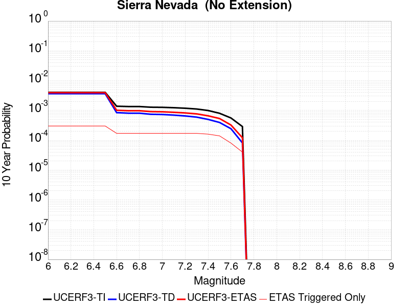 |

| Magnitude | 1 wk TI Prob | 1 wk TD Prob | 1 wk ETAS Prob | 1 wk ETAS/TD Gain | 1 wk ETAS Triggered Only | 1 mo TI Prob | 1 mo TD Prob | 1 mo ETAS Prob | 1 mo ETAS/TD Gain | 1 mo ETAS Triggered Only | 1 yr TI Prob | 1 yr TD Prob | 1 yr ETAS Prob | 1 yr ETAS/TD Gain | 1 yr ETAS Triggered Only | 10 yr TI Prob | 10 yr TD Prob | 10 yr ETAS Prob | 10 yr ETAS/TD Gain | 10 yr ETAS Triggered Only |
|-----|-----|-----|-----|-----|-----|-----|-----|-----|-----|-----|-----|-----|-----|-----|-----|-----|-----|-----|-----|-----|
| 6.0 | 7.7690465E-6 | 6.9763832E-6 | 1.0731013E-4 | 15.381915 | 1.0033445E-4 | 3.329549E-5 | 2.9898645E-5 | 1.302301E-4 | 4.355719 | 1.0033445E-4 | 4.0529718E-4 | 3.6399104E-4 | 5.645869E-4 | 1.5511011 | 2.006689E-4 | 0.004045588 | 0.0036374647 | 0.00390405 | 1.0732888 | 2.6755853E-4 |
| 6.1 | 7.7690465E-6 | 6.9763832E-6 | 1.0731013E-4 | 15.381915 | 1.0033445E-4 | 3.329549E-5 | 2.9898645E-5 | 1.302301E-4 | 4.355719 | 1.0033445E-4 | 4.0529718E-4 | 3.6399104E-4 | 5.645869E-4 | 1.5511011 | 2.006689E-4 | 0.004045588 | 0.0036374647 | 0.00390405 | 1.0732888 | 2.6755853E-4 |
| 6.2 | 7.7690465E-6 | 6.9763832E-6 | 1.0731013E-4 | 15.381915 | 1.0033445E-4 | 3.329549E-5 | 2.9898645E-5 | 1.302301E-4 | 4.355719 | 1.0033445E-4 | 4.0529718E-4 | 3.6399104E-4 | 5.645869E-4 | 1.5511011 | 2.006689E-4 | 0.004045588 | 0.0036374647 | 0.00390405 | 1.0732888 | 2.6755853E-4 |
| 6.3 | 7.7690465E-6 | 6.9763832E-6 | 1.0731013E-4 | 15.381915 | 1.0033445E-4 | 3.329549E-5 | 2.9898645E-5 | 1.302301E-4 | 4.355719 | 1.0033445E-4 | 4.0529718E-4 | 3.6399104E-4 | 5.645869E-4 | 1.5511011 | 2.006689E-4 | 0.004045588 | 0.0036374647 | 0.00390405 | 1.0732888 | 2.6755853E-4 |
| 6.4 | 7.7690465E-6 | 6.9763832E-6 | 1.0731013E-4 | 15.381915 | 1.0033445E-4 | 3.329549E-5 | 2.9898645E-5 | 1.302301E-4 | 4.355719 | 1.0033445E-4 | 4.0529718E-4 | 3.6399104E-4 | 5.645869E-4 | 1.5511011 | 2.006689E-4 | 0.004045588 | 0.0036374647 | 0.00390405 | 1.0732888 | 2.6755853E-4 |
| 6.5 | 7.7690465E-6 | 6.9763832E-6 | 1.0731013E-4 | 15.381915 | 1.0033445E-4 | 3.329549E-5 | 2.9898645E-5 | 1.302301E-4 | 4.355719 | 1.0033445E-4 | 4.0529718E-4 | 3.6399104E-4 | 5.645869E-4 | 1.5511011 | 2.006689E-4 | 0.004045588 | 0.0036374647 | 0.00390405 | 1.0732888 | 2.6755853E-4 |
| 6.6 | 2.653E-6 | 1.6148814E-6 | 6.850441E-5 | 42.420704 | 6.688963E-5 | 1.136995E-5 | 6.920902E-6 | 7.381007E-5 | 10.664805 | 6.688963E-5 | 1.3842035E-4 | 8.4258754E-5 | 2.1802675E-4 | 2.5875857 | 1.3377926E-4 | 0.0013833415 | 8.4227155E-4 | 9.759381E-4 | 1.1586977 | 1.3377926E-4 |
| 6.7 | 2.5902466E-6 | 1.5502146E-6 | 6.8439746E-5 | 44.14856 | 6.688963E-5 | 1.11010095E-5 | 6.64376E-6 | 7.3532945E-5 | 11.067971 | 6.688963E-5 | 1.351464E-4 | 8.0884805E-5 | 2.1465325E-4 | 2.653814 | 1.3377926E-4 | 0.0013506424 | 8.085567E-4 | 9.422278E-4 | 1.1653206 | 1.3377926E-4 |
| 6.8 | 2.5853892E-6 | 1.5470148E-6 | 6.8436544E-5 | 44.23781 | 6.688963E-5 | 1.1080193E-5 | 6.6300463E-6 | 7.351924E-5 | 11.088797 | 6.688963E-5 | 1.34893E-4 | 8.071786E-5 | 2.1448632E-4 | 2.6572351 | 1.3377926E-4 | 0.0013481114 | 8.0688833E-4 | 9.4055966E-4 | 1.1656628 | 1.3377926E-4 |
| 6.9 | 2.458257E-6 | 1.4220883E-6 | 6.831162E-5 | 48.036133 | 6.688963E-5 | 1.0535345E-5 | 6.0946504E-6 | 7.298387E-5 | 11.975072 | 6.688963E-5 | 1.2826028E-4 | 7.419986E-5 | 2.0796919E-4 | 2.8028247 | 1.3377926E-4 | 0.0012818627 | 7.417528E-4 | 8.7543286E-4 | 1.1802218 | 1.3377926E-4 |
| 7.0 | 2.4341468E-6 | 1.399052E-6 | 6.828859E-5 | 48.81061 | 6.688963E-5 | 1.0432016E-5 | 5.995924E-6 | 7.288515E-5 | 12.155784 | 6.688963E-5 | 1.270024E-4 | 7.2997944E-5 | 2.0676745E-4 | 2.8325105 | 1.3377926E-4 | 0.0012692984 | 7.297416E-4 | 8.634232E-4 | 1.1831903 | 1.3377926E-4 |
| 7.1 | 2.3652476E-6 | 1.3340014E-6 | 6.822355E-5 | 51.142036 | 6.688963E-5 | 1.0136736E-5 | 5.717136E-6 | 7.260639E-5 | 12.699782 | 6.688963E-5 | 1.2340778E-4 | 6.960393E-5 | 2.0337387E-4 | 2.9218738 | 1.3377926E-4 | 0.0012333926 | 6.9582294E-4 | 8.295091E-4 | 1.1921268 | 1.3377926E-4 |
| 7.2 | 2.272158E-6 | 1.2503074E-6 | 6.813985E-5 | 54.49848 | 6.688963E-5 | 9.737784E-6 | 5.3584495E-6 | 7.224772E-5 | 13.482953 | 6.688963E-5 | 1.1855107E-4 | 6.523718E-5 | 1.9900771E-4 | 3.050526 | 1.3377926E-4 | 0.0011848784 | 6.5218186E-4 | 7.8587385E-4 | 1.2049919 | 1.3377926E-4 |
| 7.3 | 2.1382127E-6 | 1.1419947E-6 | 6.803155E-5 | 59.57256 | 6.688963E-5 | 9.163737E-6 | 4.8942543E-6 | 7.178356E-5 | 14.666904 | 6.688963E-5 | 1.1156279E-4 | 5.9585927E-5 | 1.9335722E-4 | 3.245015 | 1.3377926E-4 | 0.001115068 | 5.957007E-4 | 7.2940026E-4 | 1.2244408 | 1.3377926E-4 |
| 7.4 | 1.9048055E-6 | 9.575474E-7 | 6.784712E-5 | 70.855095 | 6.688963E-5 | 8.163426E-6 | 4.1037683E-6 | 7.099313E-5 | 17.299498 | 6.688963E-5 | 9.9385186E-5 | 4.996224E-5 | 1.8373482E-4 | 3.6774738 | 1.3377926E-4 | 9.934074E-4 | 4.995108E-4 | 6.332232E-4 | 1.2676868 | 1.3377926E-4 |
| 7.5 | 1.5373403E-6 | 7.5602395E-7 | 6.7645604E-5 | 89.47548 | 6.688963E-5 | 6.5885843E-6 | 3.2400987E-6 | 7.0129514E-5 | 21.644253 | 6.688963E-5 | 8.021306E-5 | 3.9447492E-5 | 1.7322147E-4 | 4.391191 | 1.3377926E-4 | 8.0184115E-4 | 3.944054E-4 | 5.281319E-4 | 1.3390585 | 1.3377926E-4 |
| 7.6 | 1.0680322E-6 | 4.659796E-7 | 6.7355584E-5 | 144.5462 | 6.688963E-5 | 4.577273E-6 | 1.997054E-6 | 6.8886555E-5 | 34.494087 | 6.688963E-5 | 5.5726876E-5 | 2.4313864E-5 | 1.2464587E-4 | 5.126535 | 1.0033445E-4 | 5.5712904E-4 | 2.431123E-4 | 3.4342235E-4 | 1.4126079 | 1.0033445E-4 |
| 7.7 | 5.509146E-7 | 1.5581199E-7 | 3.3600623E-5 | 215.6485 | 3.3444816E-5 | 2.3610605E-6 | 6.677655E-7 | 3.411256E-5 | 51.084637 | 3.3444816E-5 | 2.8745531E-5 | 8.130016E-6 | 4.157456E-5 | 5.113712 | 3.3444816E-5 | 2.8741814E-4 | 8.12973E-5 | 1.147394E-4 | 1.4113555 | 3.3444816E-5 |

## Red Pass
*[(top)](#table-of-contents)*

| 1 Week | 1 Month | 1 Year | 10 Year |
|-----|-----|-----|-----|
|  |  |  |  |

| Magnitude | 1 wk TI Prob | 1 wk TD Prob | 1 wk ETAS Prob | 1 wk ETAS/TD Gain | 1 wk ETAS Triggered Only | 1 mo TI Prob | 1 mo TD Prob | 1 mo ETAS Prob | 1 mo ETAS/TD Gain | 1 mo ETAS Triggered Only | 1 yr TI Prob | 1 yr TD Prob | 1 yr ETAS Prob | 1 yr ETAS/TD Gain | 1 yr ETAS Triggered Only | 10 yr TI Prob | 10 yr TD Prob | 10 yr ETAS Prob | 10 yr ETAS/TD Gain | 10 yr ETAS Triggered Only |
|-----|-----|-----|-----|-----|-----|-----|-----|-----|-----|-----|-----|-----|-----|-----|-----|-----|-----|-----|-----|-----|
| 6.0 | 8.258278E-6 | 8.551305E-6 | 8.551305E-6 | 1.0 | 0.0 | 3.539214E-5 | 3.6648038E-5 | 3.6648038E-5 | 1.0 | 0.0 | 4.308141E-4 | 4.4611638E-4 | 5.1297614E-4 | 1.1498708 | 6.688963E-5 | 0.0042997985 | 0.004453966 | 0.004687037 | 1.0523288 | 2.3411372E-4 |
| 6.1 | 3.649988E-6 | 3.7753332E-6 | 3.7753332E-6 | 1.0 | 0.0 | 1.5642712E-5 | 1.6179927E-5 | 1.6179927E-5 | 1.0 | 0.0 | 1.9043336E-4 | 1.9697756E-4 | 2.6385402E-4 | 1.3395131 | 6.688963E-5 | 0.0019027026 | 0.001968497 | 0.002102013 | 1.0678263 | 1.3377926E-4 |
| 6.2 | 3.649988E-6 | 3.7753332E-6 | 3.7753332E-6 | 1.0 | 0.0 | 1.5642712E-5 | 1.6179927E-5 | 1.6179927E-5 | 1.0 | 0.0 | 1.9043336E-4 | 1.9697756E-4 | 2.6385402E-4 | 1.3395131 | 6.688963E-5 | 0.0019027026 | 0.001968497 | 0.002102013 | 1.0678263 | 1.3377926E-4 |
| 6.3 | 1.3924937E-6 | 1.4411233E-6 | 1.4411233E-6 | 1.0 | 0.0 | 5.9678164E-6 | 6.176236E-6 | 6.176236E-6 | 1.0 | 0.0 | 7.265574E-5 | 7.51945E-5 | 1.086368E-4 | 1.444744 | 3.3444816E-5 | 7.263199E-4 | 7.518293E-4 | 7.8524894E-4 | 1.0444511 | 3.3444816E-5 |
| 6.4 | 1.3924937E-6 | 1.4411233E-6 | 1.4411233E-6 | 1.0 | 0.0 | 5.9678164E-6 | 6.176236E-6 | 6.176236E-6 | 1.0 | 0.0 | 7.265574E-5 | 7.51945E-5 | 1.086368E-4 | 1.444744 | 3.3444816E-5 | 7.263199E-4 | 7.518293E-4 | 7.8524894E-4 | 1.0444511 | 3.3444816E-5 |
| 6.5 | 9.876812E-7 | 1.022196E-6 | 1.022196E-6 | 1.0 | 0.0 | 4.2329125E-6 | 4.38084E-6 | 4.38084E-6 | 1.0 | 0.0 | 5.153449E-5 | 5.3336724E-5 | 8.677976E-5 | 1.627017 | 3.3444816E-5 | 5.1522546E-4 | 5.333672E-4 | 5.6679425E-4 | 1.0626715 | 3.3444816E-5 |

## Death Valley (Fish Lake Valley)
*[(top)](#table-of-contents)*

| 1 Week | 1 Month | 1 Year | 10 Year |
|-----|-----|-----|-----|
| 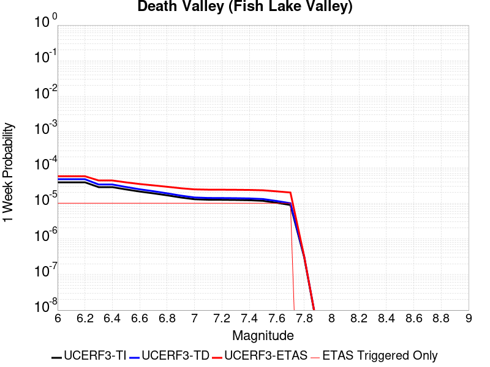 |  |  | 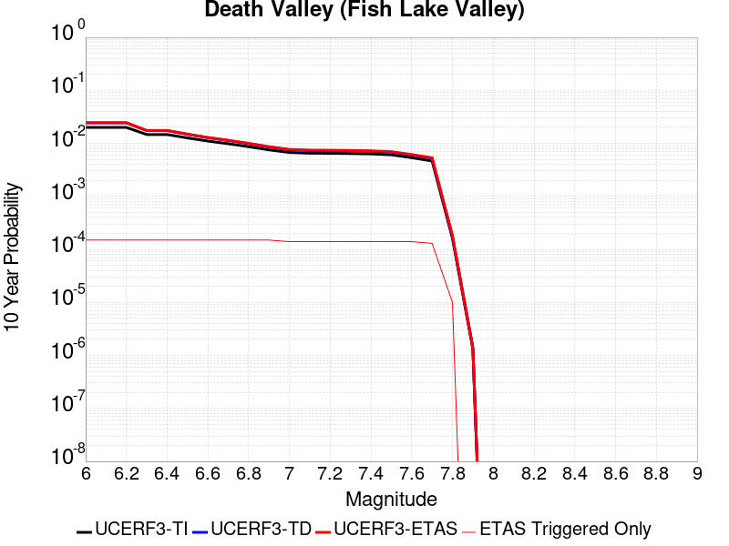 |

| Magnitude | 1 wk TI Prob | 1 wk TD Prob | 1 wk ETAS Prob | 1 wk ETAS/TD Gain | 1 wk ETAS Triggered Only | 1 mo TI Prob | 1 mo TD Prob | 1 mo ETAS Prob | 1 mo ETAS/TD Gain | 1 mo ETAS Triggered Only | 1 yr TI Prob | 1 yr TD Prob | 1 yr ETAS Prob | 1 yr ETAS/TD Gain | 1 yr ETAS Triggered Only | 10 yr TI Prob | 10 yr TD Prob | 10 yr ETAS Prob | 10 yr ETAS/TD Gain | 10 yr ETAS Triggered Only |
|-----|-----|-----|-----|-----|-----|-----|-----|-----|-----|-----|-----|-----|-----|-----|-----|-----|-----|-----|-----|-----|
| 6.0 | 3.872328E-5 | 4.7268895E-5 | 8.071213E-5 | 1.7075105 | 3.3444816E-5 | 1.6594635E-4 | 2.0256694E-4 | 2.6944303E-4 | 1.3301431 | 6.688963E-5 | 0.0020185246 | 0.0024636039 | 0.0026304158 | 1.0677106 | 1.6722408E-4 | 0.02000288 | 0.024388881 | 0.024617286 | 1.0093651 | 2.3411372E-4 |
| 6.1 | 3.872328E-5 | 4.7268895E-5 | 8.071213E-5 | 1.7075105 | 3.3444816E-5 | 1.6594635E-4 | 2.0256694E-4 | 2.6944303E-4 | 1.3301431 | 6.688963E-5 | 0.0020185246 | 0.0024636039 | 0.0026304158 | 1.0677106 | 1.6722408E-4 | 0.02000288 | 0.024388881 | 0.024617286 | 1.0093651 | 2.3411372E-4 |
| 6.2 | 3.872328E-5 | 4.7268895E-5 | 8.071213E-5 | 1.7075105 | 3.3444816E-5 | 1.6594635E-4 | 2.0256694E-4 | 2.6944303E-4 | 1.3301431 | 6.688963E-5 | 0.0020185246 | 0.0024636039 | 0.0026304158 | 1.0677106 | 1.6722408E-4 | 0.02000288 | 0.024388881 | 0.024617286 | 1.0093651 | 2.3411372E-4 |
| 6.3 | 2.8356371E-5 | 3.3610693E-5 | 6.705439E-5 | 1.9950312 | 3.3444816E-5 | 1.2152165E-4 | 1.4403832E-4 | 2.1091833E-4 | 1.4643209 | 6.688963E-5 | 0.0014785219 | 0.001752335 | 0.0019192661 | 1.095262 | 1.6722408E-4 | 0.014687235 | 0.01739221 | 0.017622251 | 1.0132267 | 2.3411372E-4 |
| 6.4 | 2.8356371E-5 | 3.3610693E-5 | 6.705439E-5 | 1.9950312 | 3.3444816E-5 | 1.2152165E-4 | 1.4403832E-4 | 2.1091833E-4 | 1.4643209 | 6.688963E-5 | 0.0014785219 | 0.001752335 | 0.0019192661 | 1.095262 | 1.6722408E-4 | 0.014687235 | 0.01739221 | 0.017622251 | 1.0132267 | 2.3411372E-4 |
| 6.5 | 2.4448687E-5 | 2.8608209E-5 | 6.2052066E-5 | 2.1690302 | 3.3444816E-5 | 1.0477588E-4 | 1.2260114E-4 | 1.8948255E-4 | 1.5455205 | 6.688963E-5 | 0.0012748998 | 0.0014916973 | 0.0016586719 | 1.111936 | 1.6722408E-4 | 0.012676105 | 0.014821712 | 0.015052356 | 1.0155612 | 2.3411372E-4 |
| 6.6 | 2.1298161E-5 | 2.4660607E-5 | 5.8104597E-5 | 2.3561707 | 3.3444816E-5 | 9.127464E-5 | 1.0568422E-4 | 1.7256678E-4 | 1.6328529 | 6.688963E-5 | 0.0011107022 | 0.0012859798 | 0.0014529888 | 1.1298691 | 1.6722408E-4 | 0.011051672 | 0.012788794 | 0.013019914 | 1.018072 | 2.3411372E-4 |
| 6.7 | 1.8959729E-5 | 2.178146E-5 | 5.5225548E-5 | 2.5354383 | 3.3444816E-5 | 8.125345E-5 | 9.3345916E-5 | 1.602293E-4 | 1.7165111 | 6.688963E-5 | 9.888117E-4 | 0.0011359196 | 0.0013029537 | 1.1470475 | 1.6722408E-4 | 0.009844234 | 0.011303794 | 0.011535262 | 1.0204769 | 2.3411372E-4 |
| 6.8 | 1.6691629E-5 | 1.9018706E-5 | 5.2462885E-5 | 2.7584887 | 3.3444816E-5 | 7.153359E-5 | 8.150629E-5 | 1.4839046E-4 | 1.8206015 | 6.688963E-5 | 8.7057345E-4 | 9.919042E-4 | 0.0011589624 | 1.1684217 | 1.6722408E-4 | 0.008671708 | 0.009876527 | 0.010108328 | 1.0234699 | 2.3411372E-4 |
| 6.9 | 1.450505E-5 | 1.6389824E-5 | 4.9834092E-5 | 3.0405507 | 3.3444816E-5 | 6.216302E-5 | 7.024026E-5 | 1.371252E-4 | 1.9522307 | 6.688963E-5 | 7.5657194E-4 | 8.548484E-4 | 0.0010219296 | 1.1954511 | 1.6722408E-4 | 0.007540013 | 0.008516532 | 0.008748652 | 1.0272552 | 2.3411372E-4 |
| 7.0 | 1.2940855E-5 | 1.453821E-5 | 4.798254E-5 | 3.3004434 | 3.3444816E-5 | 5.545963E-5 | 6.230516E-5 | 1.2919062E-4 | 2.073514 | 6.688963E-5 | 6.750118E-4 | 7.583071E-4 | 8.9198496E-4 | 1.1762846 | 1.3377926E-4 | 0.006729651 | 0.0075578135 | 0.0077569657 | 1.0263505 | 2.006689E-4 |
| 7.1 | 1.2544658E-5 | 1.4078437E-5 | 4.7522783E-5 | 3.3755724 | 3.3444816E-5 | 5.3761712E-5 | 6.033479E-5 | 1.272204E-4 | 2.1085742 | 6.688963E-5 | 6.5435225E-4 | 7.343341E-4 | 8.6801517E-4 | 1.1820439 | 1.3377926E-4 | 0.006524288 | 0.0073196692 | 0.0075188694 | 1.0272144 | 2.006689E-4 |
| 7.2 | 1.2489416E-5 | 1.4015902E-5 | 4.746025E-5 | 3.3861716 | 3.3444816E-5 | 5.3524967E-5 | 6.00668E-5 | 1.2695241E-4 | 2.1135206 | 6.688963E-5 | 6.514716E-4 | 7.310735E-4 | 8.6475495E-4 | 1.1828564 | 1.3377926E-4 | 0.006495651 | 0.007287278 | 0.007486484 | 1.0273362 | 2.006689E-4 |
| 7.3 | 1.2368307E-5 | 1.3880038E-5 | 4.732439E-5 | 3.4095287 | 3.3444816E-5 | 5.3005948E-5 | 5.948455E-5 | 1.263702E-4 | 2.1244206 | 6.688963E-5 | 6.451563E-4 | 7.239894E-4 | 8.576718E-4 | 1.184647 | 1.3377926E-4 | 0.0064328653 | 0.0072168987 | 0.0074161193 | 1.0276047 | 2.006689E-4 |
| 7.4 | 1.2161707E-5 | 1.3648089E-5 | 4.709245E-5 | 3.4504793 | 3.3444816E-5 | 5.212056E-5 | 5.8490532E-5 | 1.2537625E-4 | 2.1435306 | 6.688963E-5 | 6.3438306E-4 | 7.118952E-4 | 8.455792E-4 | 1.1877861 | 1.3377926E-4 | 0.006325751 | 0.0070967353 | 0.00729598 | 1.0280756 | 2.006689E-4 |
| 7.5 | 1.1707948E-5 | 1.314573E-5 | 4.6590107E-5 | 3.5441248 | 3.3444816E-5 | 5.0175953E-5 | 5.6337656E-5 | 1.2322352E-4 | 2.187232 | 6.688963E-5 | 6.10721E-4 | 6.857007E-4 | 8.193882E-4 | 1.1949649 | 1.3377926E-4 | 0.0060904534 | 0.0068364325 | 0.0070357295 | 1.0291522 | 2.006689E-4 |
| 7.6 | 1.0319538E-5 | 1.157981E-5 | 4.502424E-5 | 3.8881674 | 3.3444816E-5 | 4.4225842E-5 | 4.9626844E-5 | 1.16513154E-4 | 2.347785 | 6.688963E-5 | 5.383166E-4 | 6.040445E-4 | 7.377429E-4 | 1.2213387 | 1.3377926E-4 | 0.0053701443 | 0.0060245576 | 0.0062240176 | 1.0331078 | 2.006689E-4 |
| 7.7 | 8.937764E-6 | 1.0022941E-5 | 4.3467422E-5 | 4.3367934 | 3.3444816E-5 | 3.830414E-5 | 4.295478E-5 | 1.0984154E-4 | 2.5571434 | 6.688963E-5 | 4.6625308E-4 | 5.2285404E-4 | 6.23136E-4 | 1.1917973 | 1.0033445E-4 | 0.0046527605 | 0.005216748 | 0.0053831 | 1.031888 | 1.6722408E-4 |
| 7.8 | 3.108007E-7 | 3.2846788E-7 | 3.2846788E-7 | 1.0 | 0.0 | 1.3320023E-6 | 1.4077187E-6 | 1.4077187E-6 | 1.0 | 0.0 | 1.6217007E-5 | 1.7138846E-5 | 5.0583087E-5 | 2.951371 | 3.3444816E-5 | 1.6215823E-4 | 1.713756E-4 | 2.048147E-4 | 1.1951216 | 3.3444816E-5 |
| 7.9 | 2.5591178E-9 | 2.6696871E-9 | 2.6696871E-9 | 1.0 | 0.0 | 1.0967647E-8 | 1.1441516E-8 | 1.1441516E-8 | 1.0 | 0.0 | 1.335311E-7 | 1.3930045E-7 | 1.3930045E-7 | 1.0 | 0.0 | 1.3353102E-6 | 1.3930046E-6 | 1.3930046E-6 | 1.0 | 0.0 |

## Baker
*[(top)](#table-of-contents)*

| 1 Week | 1 Month | 1 Year | 10 Year |
|-----|-----|-----|-----|
|  |  |  |  |

| Magnitude | 1 wk TI Prob | 1 wk TD Prob | 1 wk ETAS Prob | 1 wk ETAS/TD Gain | 1 wk ETAS Triggered Only | 1 mo TI Prob | 1 mo TD Prob | 1 mo ETAS Prob | 1 mo ETAS/TD Gain | 1 mo ETAS Triggered Only | 1 yr TI Prob | 1 yr TD Prob | 1 yr ETAS Prob | 1 yr ETAS/TD Gain | 1 yr ETAS Triggered Only | 10 yr TI Prob | 10 yr TD Prob | 10 yr ETAS Prob | 10 yr ETAS/TD Gain | 10 yr ETAS Triggered Only |
|-----|-----|-----|-----|-----|-----|-----|-----|-----|-----|-----|-----|-----|-----|-----|-----|-----|-----|-----|-----|-----|
| 6.0 | 5.695525E-6 | 5.834856E-6 | 3.9279475E-5 | 6.7318673 | 3.3444816E-5 | 2.4409164E-5 | 2.500631E-5 | 5.845029E-5 | 2.3374217 | 3.3444816E-5 | 2.9714106E-4 | 3.044133E-4 | 4.3815182E-4 | 1.4393321 | 1.3377926E-4 | 0.0029674405 | 0.0030403587 | 0.0032737604 | 1.0767679 | 2.3411372E-4 |
| 6.1 | 5.695525E-6 | 5.834856E-6 | 3.9279475E-5 | 6.7318673 | 3.3444816E-5 | 2.4409164E-5 | 2.500631E-5 | 5.845029E-5 | 2.3374217 | 3.3444816E-5 | 2.9714106E-4 | 3.044133E-4 | 4.3815182E-4 | 1.4393321 | 1.3377926E-4 | 0.0029674405 | 0.0030403587 | 0.0032737604 | 1.0767679 | 2.3411372E-4 |
| 6.2 | 5.695525E-6 | 5.834856E-6 | 3.9279475E-5 | 6.7318673 | 3.3444816E-5 | 2.4409164E-5 | 2.500631E-5 | 5.845029E-5 | 2.3374217 | 3.3444816E-5 | 2.9714106E-4 | 3.044133E-4 | 4.3815182E-4 | 1.4393321 | 1.3377926E-4 | 0.0029674405 | 0.0030403587 | 0.0032737604 | 1.0767679 | 2.3411372E-4 |
| 6.3 | 3.2995713E-6 | 3.3836786E-6 | 3.682838E-5 | 10.884125 | 3.3444816E-5 | 1.4140943E-5 | 1.4501402E-5 | 4.7945734E-5 | 3.3062825 | 3.3444816E-5 | 1.7215237E-4 | 1.7654074E-4 | 2.4341856E-4 | 1.3788238 | 6.688963E-5 | 0.0017201907 | 0.0017640521 | 0.0018642094 | 1.0567769 | 1.0033445E-4 |
| 6.4 | 3.2995713E-6 | 3.3836786E-6 | 3.682838E-5 | 10.884125 | 3.3444816E-5 | 1.4140943E-5 | 1.4501402E-5 | 4.7945734E-5 | 3.3062825 | 3.3444816E-5 | 1.7215237E-4 | 1.7654074E-4 | 2.4341856E-4 | 1.3788238 | 6.688963E-5 | 0.0017201907 | 0.0017640521 | 0.0018642094 | 1.0567769 | 1.0033445E-4 |
| 6.5 | 2.782202E-6 | 2.8558507E-6 | 3.630057E-5 | 12.710949 | 3.3444816E-5 | 1.1923668E-5 | 1.2239304E-5 | 4.568371E-5 | 3.7325416 | 3.3444816E-5 | 1.4516099E-4 | 1.4900367E-4 | 2.1588334E-4 | 1.4488457 | 6.688963E-5 | 0.001450662 | 0.0014890704 | 0.0015892554 | 1.0672803 | 1.0033445E-4 |
| 6.6 | 2.3163404E-6 | 2.380929E-6 | 3.5825666E-5 | 15.046928 | 3.3444816E-5 | 9.927136E-6 | 1.0203942E-5 | 4.3648415E-5 | 4.277603 | 3.3444816E-5 | 1.20856166E-4 | 1.2422612E-4 | 1.9110744E-4 | 1.5383837 | 6.688963E-5 | 0.0012079047 | 0.001241587 | 0.0013417968 | 1.0807111 | 1.0033445E-4 |
| 6.7 | 2.037056E-6 | 2.0965088E-6 | 3.5541256E-5 | 16.95259 | 3.3444816E-5 | 8.7302105E-6 | 8.985007E-6 | 4.242952E-5 | 4.722258 | 3.3444816E-5 | 1.0628513E-4 | 1.0938713E-4 | 1.7626944E-4 | 1.6114277 | 6.688963E-5 | 0.0010623431 | 0.0010933491 | 0.0011935738 | 1.0916677 | 1.0033445E-4 |
| 6.8 | 1.8356744E-6 | 1.8915364E-6 | 3.533629E-5 | 18.681263 | 3.3444816E-5 | 7.867153E-6 | 8.10656E-6 | 4.1551106E-5 | 5.1256146 | 3.3444816E-5 | 9.577837E-5 | 9.869304E-5 | 1.6557607E-4 | 1.6776874 | 6.688963E-5 | 9.57371E-4 | 9.865061E-4 | 0.0010867416 | 1.1016065 | 1.0033445E-4 |
| 6.9 | 1.6310546E-6 | 1.6832144E-6 | 1.6832144E-6 | 1.0 | 0.0 | 6.9902153E-6 | 7.213757E-6 | 7.213757E-6 | 1.0 | 0.0 | 8.510255E-5 | 8.782406E-5 | 1.2126594E-4 | 1.3807826 | 3.3444816E-5 | 8.5069967E-4 | 8.779048E-4 | 9.447357E-4 | 1.0761255 | 6.688963E-5 |
| 7.0 | 1.2058036E-6 | 1.2508729E-6 | 1.2508729E-6 | 1.0 | 0.0 | 5.1677193E-6 | 5.3608724E-6 | 5.3608724E-6 | 1.0 | 0.0 | 6.291517E-5 | 6.526669E-5 | 9.870932E-5 | 1.5123997 | 3.3444816E-5 | 6.289736E-4 | 6.5247755E-4 | 7.193235E-4 | 1.1024495 | 6.688963E-5 |
| 7.1 | 1.052382E-6 | 1.0951668E-6 | 1.0951668E-6 | 1.0 | 0.0 | 4.5102006E-6 | 4.693564E-6 | 4.693564E-6 | 1.0 | 0.0 | 5.491031E-5 | 5.7142646E-5 | 9.0585556E-5 | 1.585253 | 3.3444816E-5 | 5.4896745E-4 | 5.712804E-4 | 6.3813187E-4 | 1.1170204 | 6.688963E-5 |
| 7.2 | 1.0067454E-6 | 1.0487769E-6 | 1.0487769E-6 | 1.0 | 0.0 | 4.3146156E-6 | 4.4947506E-6 | 4.4947506E-6 | 1.0 | 0.0 | 5.252918E-5 | 5.4722223E-5 | 8.816521E-5 | 1.6111408 | 3.3444816E-5 | 5.251676E-4 | 5.4708833E-4 | 6.1394135E-4 | 1.1221979 | 6.688963E-5 |
| 7.3 | 9.3596316E-7 | 9.76778E-7 | 9.76778E-7 | 1.0 | 0.0 | 4.0112645E-6 | 4.186185E-6 | 4.186185E-6 | 1.0 | 0.0 | 4.8836053E-5 | 5.0965617E-5 | 8.4408726E-5 | 1.6561897 | 3.3444816E-5 | 4.8825322E-4 | 5.095401E-4 | 5.763956E-4 | 1.1312076 | 6.688963E-5 |
| 7.4 | 8.8117395E-7 | 9.2077187E-7 | 9.2077187E-7 | 1.0 | 0.0 | 3.7764542E-6 | 3.9461593E-6 | 3.9461593E-6 | 1.0 | 0.0 | 4.5977362E-5 | 4.8043436E-5 | 8.148664E-5 | 1.6961036 | 3.3444816E-5 | 4.596785E-4 | 4.8033125E-4 | 5.4718874E-4 | 1.1391904 | 6.688963E-5 |
| 7.5 | 8.292386E-7 | 8.674649E-7 | 8.674649E-7 | 1.0 | 0.0 | 3.5538749E-6 | 3.7177015E-6 | 3.7177015E-6 | 1.0 | 0.0 | 4.326757E-5 | 4.5262084E-5 | 7.870539E-5 | 1.7388812 | 3.3444816E-5 | 4.3259145E-4 | 4.5252938E-4 | 4.8595906E-4 | 1.0738729 | 3.3444816E-5 |
| 7.6 | 7.553842E-7 | 7.9145207E-7 | 7.9145207E-7 | 1.0 | 0.0 | 3.2373566E-6 | 3.3919332E-6 | 3.3919332E-6 | 1.0 | 0.0 | 3.9414106E-5 | 4.129601E-5 | 7.4739444E-5 | 1.8098466 | 3.3444816E-5 | 3.9407116E-4 | 4.1288408E-4 | 4.4631507E-4 | 1.0809695 | 3.3444816E-5 |
| 7.7 | 6.5285366E-7 | 6.852842E-7 | 6.852842E-7 | 1.0 | 0.0 | 2.797941E-6 | 2.9369291E-6 | 2.9369291E-6 | 1.0 | 0.0 | 3.40644E-5 | 3.5756533E-5 | 6.920015E-5 | 1.935315 | 3.3444816E-5 | 3.405918E-4 | 3.5750846E-4 | 3.909413E-4 | 1.0935162 | 3.3444816E-5 |
| 7.8 | 3.4586725E-7 | 3.648288E-7 | 3.648288E-7 | 1.0 | 0.0 | 1.4822873E-6 | 1.5635511E-6 | 1.5635511E-6 | 1.0 | 0.0 | 1.80467E-5 | 1.9036073E-5 | 5.2480253E-5 | 2.7568843 | 3.3444816E-5 | 1.8045233E-4 | 1.9034486E-4 | 2.2378331E-4 | 1.175673 | 3.3444816E-5 |
| 7.9 | 2.5591178E-9 | 2.6696871E-9 | 2.6696871E-9 | 1.0 | 0.0 | 1.0967647E-8 | 1.1441516E-8 | 1.1441516E-8 | 1.0 | 0.0 | 1.335311E-7 | 1.3930045E-7 | 1.3930045E-7 | 1.0 | 0.0 | 1.3353102E-6 | 1.3930046E-6 | 1.3930046E-6 | 1.0 | 0.0 |

## Channel Islands Thrust
*[(top)](#table-of-contents)*

| 1 Week | 1 Month | 1 Year | 10 Year |
|-----|-----|-----|-----|
|  |  | 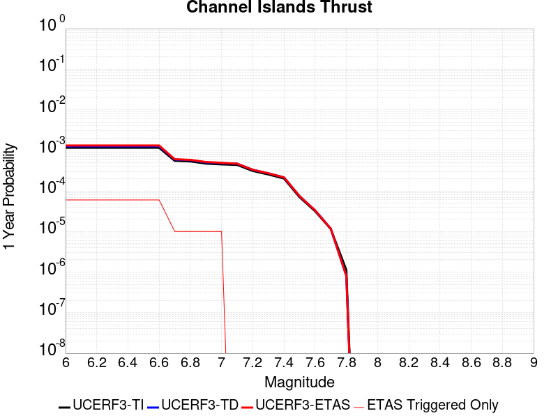 | 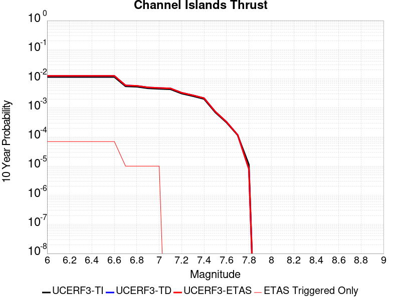 |

| Magnitude | 1 wk TI Prob | 1 wk TD Prob | 1 wk ETAS Prob | 1 wk ETAS/TD Gain | 1 wk ETAS Triggered Only | 1 mo TI Prob | 1 mo TD Prob | 1 mo ETAS Prob | 1 mo ETAS/TD Gain | 1 mo ETAS Triggered Only | 1 yr TI Prob | 1 yr TD Prob | 1 yr ETAS Prob | 1 yr ETAS/TD Gain | 1 yr ETAS Triggered Only | 10 yr TI Prob | 10 yr TD Prob | 10 yr ETAS Prob | 10 yr ETAS/TD Gain | 10 yr ETAS Triggered Only |
|-----|-----|-----|-----|-----|-----|-----|-----|-----|-----|-----|-----|-----|-----|-----|-----|-----|-----|-----|-----|-----|
| 6.0 | 2.2156251E-5 | 2.4092304E-5 | 2.4092304E-5 | 1.0 | 0.0 | 9.495191E-5 | 1.03249244E-4 | 1.7013197E-4 | 1.6477793 | 6.688963E-5 | 0.0011554264 | 0.0012564411 | 0.0014234551 | 1.1329262 | 1.6722408E-4 | 0.011494373 | 0.012503966 | 0.012669099 | 1.0132065 | 1.6722408E-4 |
| 6.1 | 2.2156251E-5 | 2.4092304E-5 | 2.4092304E-5 | 1.0 | 0.0 | 9.495191E-5 | 1.03249244E-4 | 1.7013197E-4 | 1.6477793 | 6.688963E-5 | 0.0011554264 | 0.0012564411 | 0.0014234551 | 1.1329262 | 1.6722408E-4 | 0.011494373 | 0.012503966 | 0.012669099 | 1.0132065 | 1.6722408E-4 |
| 6.2 | 2.2156251E-5 | 2.4092304E-5 | 2.4092304E-5 | 1.0 | 0.0 | 9.495191E-5 | 1.03249244E-4 | 1.7013197E-4 | 1.6477793 | 6.688963E-5 | 0.0011554264 | 0.0012564411 | 0.0014234551 | 1.1329262 | 1.6722408E-4 | 0.011494373 | 0.012503966 | 0.012669099 | 1.0132065 | 1.6722408E-4 |
| 6.3 | 2.2156251E-5 | 2.4092304E-5 | 2.4092304E-5 | 1.0 | 0.0 | 9.495191E-5 | 1.03249244E-4 | 1.7013197E-4 | 1.6477793 | 6.688963E-5 | 0.0011554264 | 0.0012564411 | 0.0014234551 | 1.1329262 | 1.6722408E-4 | 0.011494373 | 0.012503966 | 0.012669099 | 1.0132065 | 1.6722408E-4 |
| 6.4 | 2.2156251E-5 | 2.4092304E-5 | 2.4092304E-5 | 1.0 | 0.0 | 9.495191E-5 | 1.03249244E-4 | 1.7013197E-4 | 1.6477793 | 6.688963E-5 | 0.0011554264 | 0.0012564411 | 0.0014234551 | 1.1329262 | 1.6722408E-4 | 0.011494373 | 0.012503966 | 0.012669099 | 1.0132065 | 1.6722408E-4 |
| 6.5 | 2.2156251E-5 | 2.4092304E-5 | 2.4092304E-5 | 1.0 | 0.0 | 9.495191E-5 | 1.03249244E-4 | 1.7013197E-4 | 1.6477793 | 6.688963E-5 | 0.0011554264 | 0.0012564411 | 0.0014234551 | 1.1329262 | 1.6722408E-4 | 0.011494373 | 0.012503966 | 0.012669099 | 1.0132065 | 1.6722408E-4 |
| 6.6 | 2.2156251E-5 | 2.4092304E-5 | 2.4092304E-5 | 1.0 | 0.0 | 9.495191E-5 | 1.03249244E-4 | 1.7013197E-4 | 1.6477793 | 6.688963E-5 | 0.0011554264 | 0.0012564411 | 0.0014234551 | 1.1329262 | 1.6722408E-4 | 0.011494373 | 0.012503966 | 0.012669099 | 1.0132065 | 1.6722408E-4 |
| 6.7 | 1.0601296E-5 | 1.1379656E-5 | 1.1379656E-5 | 1.0 | 0.0 | 4.5433335E-5 | 4.876907E-5 | 8.221225E-5 | 1.6857458 | 3.3444816E-5 | 5.5301044E-4 | 5.9360656E-4 | 6.270315E-4 | 1.0563083 | 3.3444816E-5 | 0.005516363 | 0.0059207114 | 0.0059539583 | 1.0056154 | 3.3444816E-5 |
| 6.8 | 1.0246747E-5 | 1.0996777E-5 | 1.0996777E-5 | 1.0 | 0.0 | 4.391389E-5 | 4.712822E-5 | 8.057146E-5 | 1.7096224 | 3.3444816E-5 | 5.345204E-4 | 5.736398E-4 | 6.0706545E-4 | 1.0582694 | 3.3444816E-5 | 0.0053323656 | 0.005722081 | 0.0057553346 | 1.0058115 | 3.3444816E-5 |
| 6.9 | 9.049551E-6 | 9.699738E-6 | 9.699738E-6 | 1.0 | 0.0 | 3.878322E-5 | 4.1569667E-5 | 7.501309E-5 | 1.8045151 | 3.3444816E-5 | 4.7208337E-4 | 5.059973E-4 | 5.394252E-4 | 1.0660634 | 3.3444816E-5 | 0.0047108172 | 0.005048869 | 0.005082145 | 1.0065907 | 3.3444816E-5 |
| 7.0 | 8.6542195E-6 | 9.274692E-6 | 9.274692E-6 | 1.0 | 0.0 | 3.7088983E-5 | 3.97481E-5 | 7.3191586E-5 | 1.8413858 | 3.3444816E-5 | 4.5146482E-4 | 4.8382973E-4 | 5.1725836E-4 | 1.0690917 | 3.3444816E-5 | 0.004505487 | 0.0048281755 | 0.004861459 | 1.0068935 | 3.3444816E-5 |
| 7.1 | 8.391028E-6 | 8.993012E-6 | 8.993012E-6 | 1.0 | 0.0 | 3.5961057E-5 | 3.8540933E-5 | 3.8540933E-5 | 1.0 | 0.0 | 4.3773788E-4 | 4.691389E-4 | 4.691389E-4 | 1.0 | 0.0 | 0.004368766 | 0.0046818955 | 0.0046818955 | 1.0 | 0.0 |
| 7.2 | 5.965188E-6 | 6.3717544E-6 | 6.3717544E-6 | 1.0 | 0.0 | 2.556484E-5 | 2.7307235E-5 | 2.7307235E-5 | 1.0 | 0.0 | 3.1120746E-4 | 3.3241542E-4 | 3.3241542E-4 | 1.0 | 0.0 | 0.00310772 | 0.00331924 | 0.00331924 | 1.0 | 0.0 |
| 7.3 | 4.877518E-6 | 5.2060545E-6 | 5.2060545E-6 | 1.0 | 0.0 | 2.0903482E-5 | 2.2311473E-5 | 2.2311473E-5 | 1.0 | 0.0 | 2.5447016E-4 | 2.7160876E-4 | 2.7160876E-4 | 1.0 | 0.0 | 0.0025417898 | 0.0027128144 | 0.0027128144 | 1.0 | 0.0 |
| 7.4 | 3.8829853E-6 | 4.1419007E-6 | 4.1419007E-6 | 1.0 | 0.0 | 1.664126E-5 | 1.7750885E-5 | 1.7750885E-5 | 1.0 | 0.0 | 2.0258849E-4 | 2.16096E-4 | 2.16096E-4 | 1.0 | 0.0 | 0.002024039 | 0.0021589005 | 0.0021589005 | 1.0 | 0.0 |
| 7.5 | 1.3489616E-6 | 1.4278027E-6 | 1.4278027E-6 | 1.0 | 0.0 | 5.7812517E-6 | 6.1191404E-6 | 6.1191404E-6 | 1.0 | 0.0 | 7.038446E-5 | 7.449803E-5 | 7.449803E-5 | 1.0 | 0.0 | 7.036218E-4 | 7.447345E-4 | 7.447345E-4 | 1.0 | 0.0 |
| 7.6 | 6.058192E-7 | 6.353832E-7 | 6.353832E-7 | 1.0 | 0.0 | 2.5963652E-6 | 2.723068E-6 | 2.723068E-6 | 1.0 | 0.0 | 3.161029E-5 | 3.3152864E-5 | 3.3152864E-5 | 1.0 | 0.0 | 3.1605794E-4 | 3.314808E-4 | 3.314808E-4 | 1.0 | 0.0 |
| 7.7 | 2.2170494E-7 | 2.260808E-7 | 2.260808E-7 | 1.0 | 0.0 | 9.5016367E-7 | 9.689174E-7 | 9.689174E-7 | 1.0 | 0.0 | 1.1568181E-5 | 1.1796516E-5 | 1.1796516E-5 | 1.0 | 0.0 | 1.1567579E-4 | 1.17960015E-4 | 1.17960015E-4 | 1.0 | 0.0 |
| 7.8 | 2.1613102E-8 | 1.5466789E-8 | 1.5466789E-8 | 1.0 | 0.0 | 9.262757E-8 | 6.628623E-8 | 6.628623E-8 | 1.0 | 0.0 | 1.1277401E-6 | 8.0703467E-7 | 8.0703467E-7 | 1.0 | 0.0 | 1.1277344E-5 | 8.070325E-6 | 8.070325E-6 | 1.0 | 0.0 |

## Manix-Afton Hills
*[(top)](#table-of-contents)*

| 1 Week | 1 Month | 1 Year | 10 Year |
|-----|-----|-----|-----|
|  |  |  |  |

| Magnitude | 1 wk TI Prob | 1 wk TD Prob | 1 wk ETAS Prob | 1 wk ETAS/TD Gain | 1 wk ETAS Triggered Only | 1 mo TI Prob | 1 mo TD Prob | 1 mo ETAS Prob | 1 mo ETAS/TD Gain | 1 mo ETAS Triggered Only | 1 yr TI Prob | 1 yr TD Prob | 1 yr ETAS Prob | 1 yr ETAS/TD Gain | 1 yr ETAS Triggered Only | 10 yr TI Prob | 10 yr TD Prob | 10 yr ETAS Prob | 10 yr ETAS/TD Gain | 10 yr ETAS Triggered Only |
|-----|-----|-----|-----|-----|-----|-----|-----|-----|-----|-----|-----|-----|-----|-----|-----|-----|-----|-----|-----|-----|
| 6.0 | 1.3783202E-5 | 1.4711221E-5 | 4.8155547E-5 | 3.2733886 | 3.3444816E-5 | 5.906953E-5 | 6.304667E-5 | 9.648938E-5 | 1.5304437 | 3.3444816E-5 | 7.189342E-4 | 7.673403E-4 | 8.341786E-4 | 1.0871038 | 6.688963E-5 | 0.0071661277 | 0.007648664 | 0.007847798 | 1.0260352 | 2.006689E-4 |
| 6.1 | 1.3783202E-5 | 1.4711221E-5 | 4.8155547E-5 | 3.2733886 | 3.3444816E-5 | 5.906953E-5 | 6.304667E-5 | 9.648938E-5 | 1.5304437 | 3.3444816E-5 | 7.189342E-4 | 7.673403E-4 | 8.341786E-4 | 1.0871038 | 6.688963E-5 | 0.0071661277 | 0.007648664 | 0.007847798 | 1.0260352 | 2.006689E-4 |
| 6.2 | 1.3783202E-5 | 1.4711221E-5 | 4.8155547E-5 | 3.2733886 | 3.3444816E-5 | 5.906953E-5 | 6.304667E-5 | 9.648938E-5 | 1.5304437 | 3.3444816E-5 | 7.189342E-4 | 7.673403E-4 | 8.341786E-4 | 1.0871038 | 6.688963E-5 | 0.0071661277 | 0.007648664 | 0.007847798 | 1.0260352 | 2.006689E-4 |
| 6.3 | 1.10494875E-5 | 1.1793241E-5 | 4.5237663E-5 | 3.8358974 | 3.3444816E-5 | 4.7354086E-5 | 5.054154E-5 | 8.398467E-5 | 1.6616958 | 3.3444816E-5 | 5.763835E-4 | 6.151799E-4 | 6.820284E-4 | 1.108665 | 6.688963E-5 | 0.005748908 | 0.00613581 | 0.006235529 | 1.0162519 | 1.0033445E-4 |
| 6.4 | 1.10494875E-5 | 1.1793241E-5 | 4.5237663E-5 | 3.8358974 | 3.3444816E-5 | 4.7354086E-5 | 5.054154E-5 | 8.398467E-5 | 1.6616958 | 3.3444816E-5 | 5.763835E-4 | 6.151799E-4 | 6.820284E-4 | 1.108665 | 6.688963E-5 | 0.005748908 | 0.00613581 | 0.006235529 | 1.0162519 | 1.0033445E-4 |
| 6.5 | 9.788949E-6 | 1.0454414E-5 | 1.0454414E-5 | 1.0 | 0.0 | 4.1951964E-5 | 4.4803914E-5 | 4.4803914E-5 | 1.0 | 0.0 | 5.1064545E-4 | 5.4536044E-4 | 5.78787E-4 | 1.0612926 | 3.3444816E-5 | 0.0050947363 | 0.005441148 | 0.0055409363 | 1.0183396 | 1.0033445E-4 |
| 6.6 | 8.810006E-6 | 9.413714E-6 | 9.413714E-6 | 1.0 | 0.0 | 3.775662E-5 | 4.0343915E-5 | 4.0343915E-5 | 1.0 | 0.0 | 4.5958988E-4 | 4.9108535E-4 | 5.245137E-4 | 1.0680704 | 3.3444816E-5 | 0.0045864056 | 0.004900884 | 0.0050007263 | 1.0203724 | 1.0033445E-4 |
| 6.7 | 8.80128E-6 | 9.404193E-6 | 9.404193E-6 | 1.0 | 0.0 | 3.7719226E-5 | 4.0303115E-5 | 4.0303115E-5 | 1.0 | 0.0 | 4.591348E-4 | 4.9058883E-4 | 5.2401726E-4 | 1.0681393 | 3.3444816E-5 | 0.004581874 | 0.0048959404 | 0.004995784 | 1.020393 | 1.0033445E-4 |
| 6.8 | 6.8994877E-6 | 7.3801443E-6 | 7.3801443E-6 | 1.0 | 0.0 | 2.9568899E-5 | 3.1628853E-5 | 3.1628853E-5 | 1.0 | 0.0 | 3.5994186E-4 | 3.850214E-4 | 3.850214E-4 | 1.0 | 0.0 | 0.003593594 | 0.0038443485 | 0.003910981 | 1.0173326 | 6.688963E-5 |
| 6.9 | 4.9328037E-6 | 5.2710093E-6 | 5.2710093E-6 | 1.0 | 0.0 | 2.1140417E-5 | 2.258988E-5 | 2.258988E-5 | 1.0 | 0.0 | 2.5735417E-4 | 2.7500323E-4 | 2.7500323E-4 | 1.0 | 0.0 | 0.0025705635 | 0.0027472344 | 0.0027805874 | 1.0121405 | 3.3444816E-5 |
| 7.0 | 3.347973E-6 | 3.5900646E-6 | 3.5900646E-6 | 1.0 | 0.0 | 1.4348378E-5 | 1.5385924E-5 | 1.5385924E-5 | 1.0 | 0.0 | 1.746775E-4 | 1.8731161E-4 | 1.8731161E-4 | 1.0 | 0.0 | 0.0017454025 | 0.00187194 | 0.0019053222 | 1.017833 | 3.3444816E-5 |
| 7.1 | 1.2073567E-6 | 1.2934943E-6 | 1.2934943E-6 | 1.0 | 0.0 | 5.1743755E-6 | 5.5435444E-6 | 5.5435444E-6 | 1.0 | 0.0 | 6.29962E-5 | 6.74922E-5 | 6.74922E-5 | 1.0 | 0.0 | 6.297835E-4 | 6.7487714E-4 | 6.7487714E-4 | 1.0 | 0.0 |

## Cady
*[(top)](#table-of-contents)*

| 1 Week | 1 Month | 1 Year | 10 Year |
|-----|-----|-----|-----|
|  |  |  |  |

| Magnitude | 1 wk TI Prob | 1 wk TD Prob | 1 wk ETAS Prob | 1 wk ETAS/TD Gain | 1 wk ETAS Triggered Only | 1 mo TI Prob | 1 mo TD Prob | 1 mo ETAS Prob | 1 mo ETAS/TD Gain | 1 mo ETAS Triggered Only | 1 yr TI Prob | 1 yr TD Prob | 1 yr ETAS Prob | 1 yr ETAS/TD Gain | 1 yr ETAS Triggered Only | 10 yr TI Prob | 10 yr TD Prob | 10 yr ETAS Prob | 10 yr ETAS/TD Gain | 10 yr ETAS Triggered Only |
|-----|-----|-----|-----|-----|-----|-----|-----|-----|-----|-----|-----|-----|-----|-----|-----|-----|-----|-----|-----|-----|
| 6.0 | 1.9892565E-5 | 2.1859016E-5 | 5.5303102E-5 | 2.5299904 | 3.3444816E-5 | 8.525106E-5 | 9.3678645E-5 | 1.2712032E-4 | 1.356983 | 3.3444816E-5 | 0.0010374374 | 0.0011400316 | 0.0012402517 | 1.0879099 | 1.0033445E-4 | 0.010326075 | 0.011350849 | 0.011582305 | 1.0203911 | 2.3411372E-4 |
| 6.1 | 1.9892565E-5 | 2.1859016E-5 | 5.5303102E-5 | 2.5299904 | 3.3444816E-5 | 8.525106E-5 | 9.3678645E-5 | 1.2712032E-4 | 1.356983 | 3.3444816E-5 | 0.0010374374 | 0.0011400316 | 0.0012402517 | 1.0879099 | 1.0033445E-4 | 0.010326075 | 0.011350849 | 0.011582305 | 1.0203911 | 2.3411372E-4 |
| 6.2 | 1.9892565E-5 | 2.1859016E-5 | 5.5303102E-5 | 2.5299904 | 3.3444816E-5 | 8.525106E-5 | 9.3678645E-5 | 1.2712032E-4 | 1.356983 | 3.3444816E-5 | 0.0010374374 | 0.0011400316 | 0.0012402517 | 1.0879099 | 1.0033445E-4 | 0.010326075 | 0.011350849 | 0.011582305 | 1.0203911 | 2.3411372E-4 |
| 6.3 | 1.1117327E-5 | 1.2176738E-5 | 4.5621146E-5 | 3.746582 | 3.3444816E-5 | 4.764482E-5 | 5.218515E-5 | 8.562822E-5 | 1.6408541 | 3.3444816E-5 | 5.7992124E-4 | 6.3520053E-4 | 7.0204766E-4 | 1.1052378 | 6.688963E-5 | 0.0057841022 | 0.0063369554 | 0.006436654 | 1.0157329 | 1.0033445E-4 |
| 6.4 | 1.1117327E-5 | 1.2176738E-5 | 4.5621146E-5 | 3.746582 | 3.3444816E-5 | 4.764482E-5 | 5.218515E-5 | 8.562822E-5 | 1.6408541 | 3.3444816E-5 | 5.7992124E-4 | 6.3520053E-4 | 7.0204766E-4 | 1.1052378 | 6.688963E-5 | 0.0057841022 | 0.0063369554 | 0.006436654 | 1.0157329 | 1.0033445E-4 |
| 6.5 | 6.103093E-6 | 6.672103E-6 | 6.672103E-6 | 1.0 | 0.0 | 2.615585E-5 | 2.8594486E-5 | 2.8594486E-5 | 1.0 | 0.0 | 3.1840094E-4 | 3.4809482E-4 | 3.81528E-4 | 1.0960462 | 3.3444816E-5 | 0.0031794512 | 0.0034767296 | 0.0035100582 | 1.0095862 | 3.3444816E-5 |
| 6.6 | 5.817237E-6 | 6.365738E-6 | 6.365738E-6 | 1.0 | 0.0 | 2.4930776E-5 | 2.728152E-5 | 2.728152E-5 | 1.0 | 0.0 | 3.034899E-4 | 3.3211432E-4 | 3.6554804E-4 | 1.1006693 | 3.3444816E-5 | 0.0030307577 | 0.003317402 | 0.0033507359 | 1.0100482 | 3.3444816E-5 |
| 6.7 | 4.8846314E-6 | 5.3406343E-6 | 5.3406343E-6 | 1.0 | 0.0 | 2.0933967E-5 | 2.2888298E-5 | 2.2888298E-5 | 1.0 | 0.0 | 2.5484123E-4 | 2.7864118E-4 | 3.1207668E-4 | 1.1199948 | 3.3444816E-5 | 0.0025454918 | 0.0027840736 | 0.0028174252 | 1.0119795 | 3.3444816E-5 |
| 6.8 | 1.7788773E-6 | 1.9399313E-6 | 1.9399313E-6 | 1.0 | 0.0 | 7.6237375E-6 | 8.313974E-6 | 8.313974E-6 | 1.0 | 0.0 | 9.281505E-5 | 1.01219506E-4 | 1.01219506E-4 | 1.0 | 0.0 | 9.2776294E-4 | 0.0010118886 | 0.0010118886 | 1.0 | 0.0 |
| 6.9 | 7.5455404E-7 | 8.297202E-7 | 8.297202E-7 | 1.0 | 0.0 | 3.233799E-6 | 3.5559406E-6 | 3.5559406E-6 | 1.0 | 0.0 | 3.937079E-5 | 4.3293054E-5 | 4.3293054E-5 | 1.0 | 0.0 | 3.9363815E-4 | 4.3287914E-4 | 4.3287914E-4 | 1.0 | 0.0 |
| 7.0 | 6.8578805E-7 | 7.541916E-7 | 7.541916E-7 | 1.0 | 0.0 | 2.9390883E-6 | 3.2322475E-6 | 3.2322475E-6 | 1.0 | 0.0 | 3.578281E-5 | 3.9352235E-5 | 3.9352235E-5 | 1.0 | 0.0 | 3.577705E-4 | 3.9348513E-4 | 3.9348513E-4 | 1.0 | 0.0 |

## Death Valley (No)
*[(top)](#table-of-contents)*

| 1 Week | 1 Month | 1 Year | 10 Year |
|-----|-----|-----|-----|
|  |  |  |  |

| Magnitude | 1 wk TI Prob | 1 wk TD Prob | 1 wk ETAS Prob | 1 wk ETAS/TD Gain | 1 wk ETAS Triggered Only | 1 mo TI Prob | 1 mo TD Prob | 1 mo ETAS Prob | 1 mo ETAS/TD Gain | 1 mo ETAS Triggered Only | 1 yr TI Prob | 1 yr TD Prob | 1 yr ETAS Prob | 1 yr ETAS/TD Gain | 1 yr ETAS Triggered Only | 10 yr TI Prob | 10 yr TD Prob | 10 yr ETAS Prob | 10 yr ETAS/TD Gain | 10 yr ETAS Triggered Only |
|-----|-----|-----|-----|-----|-----|-----|-----|-----|-----|-----|-----|-----|-----|-----|-----|-----|-----|-----|-----|-----|
| 6.0 | 2.0074807E-5 | 2.2500446E-5 | 5.594451E-5 | 2.4863734 | 3.3444816E-5 | 8.603206E-5 | 9.642696E-5 | 1.6331013E-4 | 1.693615 | 6.688963E-5 | 0.001046937 | 0.0011733733 | 0.0013404012 | 1.1423484 | 1.6722408E-4 | 0.010420183 | 0.011672693 | 0.011904074 | 1.0198224 | 2.3411372E-4 |
| 6.1 | 2.0074807E-5 | 2.2500446E-5 | 5.594451E-5 | 2.4863734 | 3.3444816E-5 | 8.603206E-5 | 9.642696E-5 | 1.6331013E-4 | 1.693615 | 6.688963E-5 | 0.001046937 | 0.0011733733 | 0.0013404012 | 1.1423484 | 1.6722408E-4 | 0.010420183 | 0.011672693 | 0.011904074 | 1.0198224 | 2.3411372E-4 |
| 6.2 | 2.0074807E-5 | 2.2500446E-5 | 5.594451E-5 | 2.4863734 | 3.3444816E-5 | 8.603206E-5 | 9.642696E-5 | 1.6331013E-4 | 1.693615 | 6.688963E-5 | 0.001046937 | 0.0011733733 | 0.0013404012 | 1.1423484 | 1.6722408E-4 | 0.010420183 | 0.011672693 | 0.011904074 | 1.0198224 | 2.3411372E-4 |
| 6.3 | 1.9050609E-5 | 2.1337288E-5 | 5.478139E-5 | 2.5674016 | 3.3444816E-5 | 8.164292E-5 | 9.144236E-5 | 1.5832587E-4 | 1.7314281 | 6.688963E-5 | 9.935491E-4 | 0.0011127489 | 0.0012797868 | 1.150113 | 1.6722408E-4 | 0.009891188 | 0.011072595 | 0.011304116 | 1.0209094 | 2.3411372E-4 |
| 6.4 | 1.9050609E-5 | 2.1337288E-5 | 5.478139E-5 | 2.5674016 | 3.3444816E-5 | 8.164292E-5 | 9.144236E-5 | 1.5832587E-4 | 1.7314281 | 6.688963E-5 | 9.935491E-4 | 0.0011127489 | 0.0012797868 | 1.150113 | 1.6722408E-4 | 0.009891188 | 0.011072595 | 0.011304116 | 1.0209094 | 2.3411372E-4 |
| 6.5 | 1.8367004E-5 | 2.0561336E-5 | 5.4005464E-5 | 2.6265543 | 3.3444816E-5 | 7.8713354E-5 | 8.811707E-5 | 1.550008E-4 | 1.7590327 | 6.688963E-5 | 9.5791375E-4 | 0.0010723039 | 0.0012393487 | 1.1557811 | 1.6722408E-4 | 0.009537951 | 0.010672084 | 0.010903699 | 1.0217029 | 2.3411372E-4 |
| 6.6 | 1.779439E-5 | 1.9911244E-5 | 5.3355394E-5 | 2.6796615 | 3.3444816E-5 | 7.625944E-5 | 8.533114E-5 | 1.5221507E-4 | 1.7838161 | 6.688963E-5 | 9.280632E-4 | 0.0010384179 | 0.0012054684 | 1.1608701 | 1.6722408E-4 | 0.009241969 | 0.010336416 | 0.010568109 | 1.0224153 | 2.3411372E-4 |
| 6.7 | 1.7025437E-5 | 1.9043726E-5 | 5.2487907E-5 | 2.7561784 | 3.3444816E-5 | 7.296412E-5 | 8.161345E-5 | 1.4849762E-4 | 1.8195239 | 6.688963E-5 | 8.87976E-4 | 9.93197E-4 | 0.0011602549 | 1.1682023 | 1.6722408E-4 | 0.008844362 | 0.009888301 | 0.010120099 | 1.0234417 | 2.3411372E-4 |
| 6.8 | 1.6545107E-5 | 1.851284E-5 | 5.1957035E-5 | 2.8065407 | 3.3444816E-5 | 7.090568E-5 | 7.933836E-5 | 1.4622268E-4 | 1.8430263 | 6.688963E-5 | 8.629347E-4 | 9.655226E-4 | 0.0011325852 | 1.1730282 | 1.6722408E-4 | 0.008595915 | 0.009613981 | 0.009845844 | 1.0241172 | 2.3411372E-4 |
| 6.9 | 1.615478E-5 | 1.8087881E-5 | 5.1532093E-5 | 2.8489842 | 3.3444816E-5 | 6.9232934E-5 | 7.751722E-5 | 1.4440167E-4 | 1.8628334 | 6.688963E-5 | 8.4258494E-4 | 9.433697E-4 | 0.0010770228 | 1.1416762 | 1.3377926E-4 | 0.008393973 | 0.009394345 | 0.009593128 | 1.0211599 | 2.006689E-4 |
| 7.0 | 1.5894311E-5 | 1.7805834E-5 | 5.1250056E-5 | 2.878273 | 3.3444816E-5 | 6.81167E-5 | 7.6308526E-5 | 1.4319306E-4 | 1.8765014 | 6.688963E-5 | 8.2900526E-4 | 9.286663E-4 | 0.0010623214 | 1.1439215 | 1.3377926E-4 | 0.008259195 | 0.009248544 | 0.009447358 | 1.0214967 | 2.006689E-4 |
| 7.1 | 1.5602263E-5 | 1.7483784E-5 | 5.0928014E-5 | 2.9128716 | 3.3444816E-5 | 6.6865134E-5 | 7.4928386E-5 | 1.41813E-4 | 1.8926473 | 6.688963E-5 | 8.137789E-4 | 9.118773E-4 | 0.0010455346 | 1.1465738 | 1.3377926E-4 | 0.008108052 | 0.009082039 | 0.009280886 | 1.0218945 | 2.006689E-4 |
| 7.2 | 1.5323829E-5 | 1.7170905E-5 | 5.061515E-5 | 2.9477272 | 3.3444816E-5 | 6.56719E-5 | 7.358755E-5 | 1.4047226E-4 | 1.9089134 | 6.688963E-5 | 7.99262E-4 | 8.9556625E-4 | 0.0010292258 | 1.1492457 | 1.3377926E-4 | 0.007963934 | 0.008920249 | 0.009119128 | 1.0222952 | 2.006689E-4 |
| 7.3 | 1.4556212E-5 | 1.6302716E-5 | 4.9746985E-5 | 3.051454 | 3.3444816E-5 | 6.238227E-5 | 6.986695E-5 | 1.367519E-4 | 1.9573191 | 6.688963E-5 | 7.592395E-4 | 8.503039E-4 | 9.839694E-4 | 1.1571974 | 1.3377926E-4 | 0.0075665074 | 0.008471149 | 0.008670118 | 1.0234878 | 2.006689E-4 |
| 7.4 | 1.411725E-5 | 1.5808211E-5 | 4.92525E-5 | 3.1156275 | 3.3444816E-5 | 6.0501097E-5 | 6.774775E-5 | 1.3463285E-4 | 1.9872667 | 6.688963E-5 | 7.363519E-4 | 8.245226E-4 | 9.581915E-4 | 1.1621168 | 1.3377926E-4 | 0.0073391674 | 0.008215268 | 0.008414289 | 1.0242257 | 2.006689E-4 |
| 7.5 | 1.3503312E-5 | 1.5126531E-5 | 4.857084E-5 | 3.2109702 | 3.3444816E-5 | 5.7870053E-5 | 6.482641E-5 | 1.3171171E-4 | 2.03176 | 6.688963E-5 | 7.043401E-4 | 7.8898156E-4 | 9.226553E-4 | 1.1694256 | 1.3377926E-4 | 0.007021119 | 0.007862429 | 0.008061521 | 1.0253218 | 2.006689E-4 |
| 7.6 | 1.1279839E-5 | 1.2626528E-5 | 4.607092E-5 | 3.6487405 | 3.3444816E-5 | 4.834127E-5 | 5.4112596E-5 | 1.2099861E-4 | 2.2360525 | 6.688963E-5 | 5.88396E-4 | 6.58627E-4 | 7.9231814E-4 | 1.2029846 | 1.3377926E-4 | 0.005868405 | 0.0065673026 | 0.0067666536 | 1.0303551 | 2.006689E-4 |
| 7.7 | 9.189108E-6 | 1.0283521E-5 | 4.3727992E-5 | 4.252239 | 3.3444816E-5 | 3.93813E-5 | 4.407152E-5 | 1.109582E-4 | 2.5176852 | 6.688963E-5 | 4.7936183E-4 | 5.3644367E-4 | 6.367243E-4 | 1.186936 | 1.0033445E-4 | 0.004783291 | 0.0053519984 | 0.0055183275 | 1.031078 | 1.6722408E-4 |
| 7.8 | 3.4586725E-7 | 3.648288E-7 | 3.648288E-7 | 1.0 | 0.0 | 1.4822873E-6 | 1.5635511E-6 | 1.5635511E-6 | 1.0 | 0.0 | 1.80467E-5 | 1.9036073E-5 | 5.2480253E-5 | 2.7568843 | 3.3444816E-5 | 1.8045233E-4 | 1.9034486E-4 | 2.2378331E-4 | 1.175673 | 3.3444816E-5 |
| 7.9 | 2.5591178E-9 | 2.6696871E-9 | 2.6696871E-9 | 1.0 | 0.0 | 1.0967647E-8 | 1.1441516E-8 | 1.1441516E-8 | 1.0 | 0.0 | 1.335311E-7 | 1.3930045E-7 | 1.3930045E-7 | 1.0 | 0.0 | 1.3353102E-6 | 1.3930046E-6 | 1.3930046E-6 | 1.0 | 0.0 |

## Elsinore (Glen Ivy) rev
*[(top)](#table-of-contents)*

| 1 Week | 1 Month | 1 Year | 10 Year |
|-----|-----|-----|-----|
| 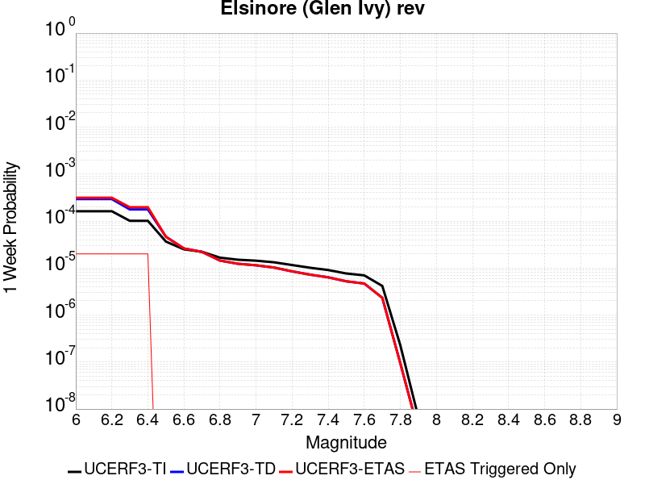 |  | 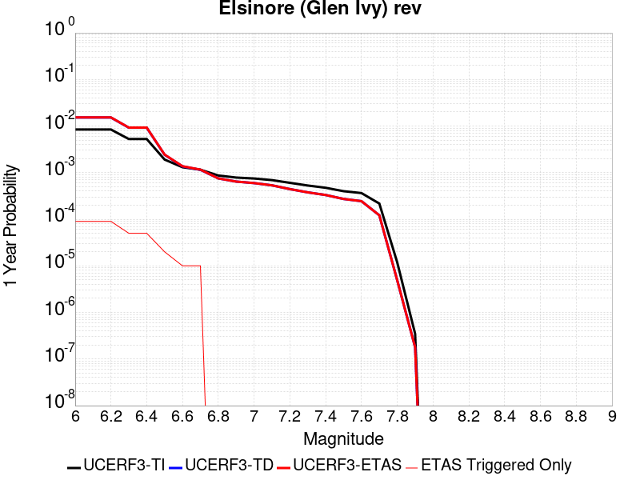 |  |

| Magnitude | 1 wk TI Prob | 1 wk TD Prob | 1 wk ETAS Prob | 1 wk ETAS/TD Gain | 1 wk ETAS Triggered Only | 1 mo TI Prob | 1 mo TD Prob | 1 mo ETAS Prob | 1 mo ETAS/TD Gain | 1 mo ETAS Triggered Only | 1 yr TI Prob | 1 yr TD Prob | 1 yr ETAS Prob | 1 yr ETAS/TD Gain | 1 yr ETAS Triggered Only | 10 yr TI Prob | 10 yr TD Prob | 10 yr ETAS Prob | 10 yr ETAS/TD Gain | 10 yr ETAS Triggered Only |
|-----|-----|-----|-----|-----|-----|-----|-----|-----|-----|-----|-----|-----|-----|-----|-----|-----|-----|-----|-----|-----|
| 6.0 | 1.6204086E-4 | 2.9362022E-4 | 3.270552E-4 | 1.1138716 | 3.3444816E-5 | 6.94276E-4 | 0.0012579202 | 0.0012913229 | 1.026554 | 3.3444816E-5 | 0.008420097 | 0.015235162 | 0.015333968 | 1.0064853 | 1.0033445E-4 | 0.081081145 | 0.13969512 | 0.139839 | 1.0010298 | 1.6722408E-4 |
| 6.1 | 1.6204086E-4 | 2.9362022E-4 | 3.270552E-4 | 1.1138716 | 3.3444816E-5 | 6.94276E-4 | 0.0012579202 | 0.0012913229 | 1.026554 | 3.3444816E-5 | 0.008420097 | 0.015235162 | 0.015333968 | 1.0064853 | 1.0033445E-4 | 0.081081145 | 0.13969512 | 0.139839 | 1.0010298 | 1.6722408E-4 |
| 6.2 | 1.6204086E-4 | 2.9362022E-4 | 3.270552E-4 | 1.1138716 | 3.3444816E-5 | 6.94276E-4 | 0.0012579202 | 0.0012913229 | 1.026554 | 3.3444816E-5 | 0.008420097 | 0.015235162 | 0.015333968 | 1.0064853 | 1.0033445E-4 | 0.081081145 | 0.13969512 | 0.139839 | 1.0010298 | 1.6722408E-4 |
| 6.3 | 1.0111737E-4 | 1.7703768E-4 | 2.1047659E-4 | 1.1888801 | 3.3444816E-5 | 4.332882E-4 | 7.58629E-4 | 7.9204846E-4 | 1.0440524 | 3.3444816E-5 | 0.005262531 | 0.0092178825 | 0.009284156 | 1.0071896 | 6.688963E-5 | 0.0513964 | 0.08702082 | 0.08711243 | 1.0010526 | 1.0033445E-4 |
| 6.4 | 1.0111737E-4 | 1.7703768E-4 | 2.1047659E-4 | 1.1888801 | 3.3444816E-5 | 4.332882E-4 | 7.58629E-4 | 7.9204846E-4 | 1.0440524 | 3.3444816E-5 | 0.005262531 | 0.0092178825 | 0.009284156 | 1.0071896 | 6.688963E-5 | 0.0513964 | 0.08702082 | 0.08711243 | 1.0010526 | 1.0033445E-4 |
| 6.5 | 3.6624708E-5 | 4.639301E-5 | 4.639301E-5 | 1.0 | 0.0 | 1.569536E-4 | 1.9881407E-4 | 1.9881407E-4 | 1.0 | 0.0 | 0.001909235 | 0.0024182373 | 0.0024182373 | 1.0 | 0.0 | 0.01892915 | 0.023740914 | 0.023740914 | 1.0 | 0.0 |
| 6.6 | 2.5051324E-5 | 2.614908E-5 | 2.614908E-5 | 1.0 | 0.0 | 1.073584E-4 | 1.1206293E-4 | 1.1206293E-4 | 1.0 | 0.0 | 0.0013063047 | 0.0013635567 | 0.0013635567 | 1.0 | 0.0 | 0.012986525 | 0.013565315 | 0.013565315 | 1.0 | 0.0 |
| 6.7 | 2.2189772E-5 | 2.207403E-5 | 2.207403E-5 | 1.0 | 0.0 | 9.509556E-5 | 9.459976E-5 | 9.459976E-5 | 1.0 | 0.0 | 0.0011571734 | 0.0011511799 | 0.0011511799 | 1.0 | 0.0 | 0.011511663 | 0.011466023 | 0.011466023 | 1.0 | 0.0 |
| 6.8 | 1.6654378E-5 | 1.4438445E-5 | 1.4438445E-5 | 1.0 | 0.0 | 7.137396E-5 | 6.187761E-5 | 6.187761E-5 | 1.0 | 0.0 | 8.686314E-4 | 7.531047E-4 | 7.531047E-4 | 1.0 | 0.0 | 0.008652439 | 0.0075108632 | 0.0075108632 | 1.0 | 0.0 |
| 6.9 | 1.5042909E-5 | 1.23326745E-5 | 1.23326745E-5 | 1.0 | 0.0 | 6.446802E-5 | 5.2853266E-5 | 5.2853266E-5 | 1.0 | 0.0 | 7.8461546E-4 | 6.433017E-4 | 6.433017E-4 | 1.0 | 0.0 | 0.007818509 | 0.006418618 | 0.006418618 | 1.0 | 0.0 |
| 7.0 | 1.4361385E-5 | 1.14519435E-5 | 1.14519435E-5 | 1.0 | 0.0 | 6.154734E-5 | 4.907885E-5 | 4.907885E-5 | 1.0 | 0.0 | 7.490812E-4 | 5.973741E-4 | 5.973741E-4 | 1.0 | 0.0 | 0.007465612 | 0.0059616743 | 0.0059616743 | 1.0 | 0.0 |
| 7.1 | 1.3265571E-5 | 1.0245398E-5 | 1.0245398E-5 | 1.0 | 0.0 | 5.6851208E-5 | 4.3908123E-5 | 4.3908123E-5 | 1.0 | 0.0 | 6.919436E-4 | 5.344528E-4 | 5.344528E-4 | 1.0 | 0.0 | 0.006897931 | 0.0053350315 | 0.0053350315 | 1.0 | 0.0 |
| 7.2 | 1.1596403E-5 | 8.50544E-6 | 8.50544E-6 | 1.0 | 0.0 | 4.9697923E-5 | 3.6451387E-5 | 3.6451387E-5 | 1.0 | 0.0 | 6.049042E-4 | 4.4370696E-4 | 4.4370696E-4 | 1.0 | 0.0 | 0.006032603 | 0.004429626 | 0.004429626 | 1.0 | 0.0 |
| 7.3 | 1.0150827E-5 | 7.23907E-6 | 7.23907E-6 | 1.0 | 0.0 | 4.3502816E-5 | 3.1024225E-5 | 3.1024225E-5 | 1.0 | 0.0 | 5.2951806E-4 | 3.776559E-4 | 3.776559E-4 | 1.0 | 0.0 | 0.005282581 | 0.0037705277 | 0.0037705277 | 1.0 | 0.0 |
| 7.4 | 9.080705E-6 | 6.352785E-6 | 6.352785E-6 | 1.0 | 0.0 | 3.8916725E-5 | 2.7225946E-5 | 2.7225946E-5 | 1.0 | 0.0 | 4.7370812E-4 | 3.3142683E-4 | 3.3142683E-4 | 1.0 | 0.0 | 0.004726996 | 0.0033094764 | 0.0033094764 | 1.0 | 0.0 |
| 7.5 | 7.671649E-6 | 5.2258497E-6 | 5.2258497E-6 | 1.0 | 0.0 | 3.287808E-5 | 2.2396314E-5 | 2.2396314E-5 | 1.0 | 0.0 | 4.0021708E-4 | 2.7264224E-4 | 2.7264224E-4 | 1.0 | 0.0 | 0.0039949706 | 0.0027232026 | 0.0027232026 | 1.0 | 0.0 |
| 7.6 | 6.990086E-6 | 4.687739E-6 | 4.687739E-6 | 1.0 | 0.0 | 2.9957167E-5 | 2.0090161E-5 | 2.0090161E-5 | 1.0 | 0.0 | 3.6466747E-4 | 2.4457145E-4 | 2.4457145E-4 | 1.0 | 0.0 | 0.0036406964 | 0.002443139 | 0.002443139 | 1.0 | 0.0 |
| 7.7 | 4.163505E-6 | 2.3296475E-6 | 2.3296475E-6 | 1.0 | 0.0 | 1.7843471E-5 | 9.984169E-6 | 9.984169E-6 | 1.0 | 0.0 | 2.172226E-4 | 1.21551224E-4 | 1.21551224E-4 | 1.0 | 0.0 | 0.0021701038 | 0.0012149204 | 0.0012149204 | 1.0 | 0.0 |
| 7.8 | 2.2692414E-7 | 9.385943E-8 | 9.385943E-8 | 1.0 | 0.0 | 9.725317E-7 | 4.0225464E-7 | 4.0225464E-7 | 1.0 | 0.0 | 1.1840509E-5 | 4.8974425E-6 | 4.8974425E-6 | 1.0 | 0.0 | 1.1839878E-4 | 4.8973674E-5 | 4.8973674E-5 | 1.0 | 0.0 |
| 7.9 | 6.676829E-9 | 3.4399772E-9 | 3.4399772E-9 | 1.0 | 0.0 | 2.861498E-8 | 1.4742759E-8 | 1.4742759E-8 | 1.0 | 0.0 | 3.4838732E-7 | 1.7949307E-7 | 1.7949307E-7 | 1.0 | 0.0 | 3.4838679E-6 | 1.7949295E-6 | 1.7949295E-6 | 1.0 | 0.0 |

## Coyote Lake
*[(top)](#table-of-contents)*

| 1 Week | 1 Month | 1 Year | 10 Year |
|-----|-----|-----|-----|
|  |  |  |  |

| Magnitude | 1 wk TI Prob | 1 wk TD Prob | 1 wk ETAS Prob | 1 wk ETAS/TD Gain | 1 wk ETAS Triggered Only | 1 mo TI Prob | 1 mo TD Prob | 1 mo ETAS Prob | 1 mo ETAS/TD Gain | 1 mo ETAS Triggered Only | 1 yr TI Prob | 1 yr TD Prob | 1 yr ETAS Prob | 1 yr ETAS/TD Gain | 1 yr ETAS Triggered Only | 10 yr TI Prob | 10 yr TD Prob | 10 yr ETAS Prob | 10 yr ETAS/TD Gain | 10 yr ETAS Triggered Only |
|-----|-----|-----|-----|-----|-----|-----|-----|-----|-----|-----|-----|-----|-----|-----|-----|-----|-----|-----|-----|-----|
| 6.0 | 1.980352E-5 | 2.1707021E-5 | 2.1707021E-5 | 1.0 | 0.0 | 8.486947E-5 | 9.302718E-5 | 1.2646889E-4 | 1.3594831 | 3.3444816E-5 | 0.0010327959 | 0.0011320895 | 0.0011989034 | 1.0590183 | 6.688963E-5 | 0.010280091 | 0.011270401 | 0.011468808 | 1.0176042 | 2.006689E-4 |
| 6.1 | 1.980352E-5 | 2.1707021E-5 | 2.1707021E-5 | 1.0 | 0.0 | 8.486947E-5 | 9.302718E-5 | 1.2646889E-4 | 1.3594831 | 3.3444816E-5 | 0.0010327959 | 0.0011320895 | 0.0011989034 | 1.0590183 | 6.688963E-5 | 0.010280091 | 0.011270401 | 0.011468808 | 1.0176042 | 2.006689E-4 |
| 6.2 | 1.980352E-5 | 2.1707021E-5 | 2.1707021E-5 | 1.0 | 0.0 | 8.486947E-5 | 9.302718E-5 | 1.2646889E-4 | 1.3594831 | 3.3444816E-5 | 0.0010327959 | 0.0011320895 | 0.0011989034 | 1.0590183 | 6.688963E-5 | 0.010280091 | 0.011270401 | 0.011468808 | 1.0176042 | 2.006689E-4 |
| 6.3 | 1.5344787E-5 | 1.6820884E-5 | 1.6820884E-5 | 1.0 | 0.0 | 6.576172E-5 | 7.208785E-5 | 1.05530264E-4 | 1.4639118 | 3.3444816E-5 | 8.003548E-4 | 8.7737746E-4 | 9.442084E-4 | 1.0761713 | 6.688963E-5 | 0.007974784 | 0.00874518 | 0.008944094 | 1.0227456 | 2.006689E-4 |
| 6.4 | 1.5344787E-5 | 1.6820884E-5 | 1.6820884E-5 | 1.0 | 0.0 | 6.576172E-5 | 7.208785E-5 | 1.05530264E-4 | 1.4639118 | 3.3444816E-5 | 8.003548E-4 | 8.7737746E-4 | 9.442084E-4 | 1.0761713 | 6.688963E-5 | 0.007974784 | 0.00874518 | 0.008944094 | 1.0227456 | 2.006689E-4 |
| 6.5 | 1.4189697E-5 | 1.5558186E-5 | 1.5558186E-5 | 1.0 | 0.0 | 6.081157E-5 | 6.667658E-5 | 1.0011916E-4 | 1.5015643 | 3.3444816E-5 | 7.401293E-4 | 8.1154524E-4 | 8.783806E-4 | 1.0823556 | 6.688963E-5 | 0.0073766913 | 0.008091759 | 0.008290804 | 1.0245985 | 2.006689E-4 |
| 6.6 | 1.3469301E-5 | 1.47717665E-5 | 1.47717665E-5 | 1.0 | 0.0 | 5.7724297E-5 | 6.3306376E-5 | 9.674907E-5 | 1.5282675 | 3.3444816E-5 | 7.025667E-4 | 7.7054254E-4 | 8.373806E-4 | 1.0867416 | 6.688963E-5 | 0.0070034964 | 0.0076846126 | 0.007817363 | 1.017275 | 1.3377926E-4 |
| 6.7 | 1.3027966E-5 | 1.4281927E-5 | 1.4281927E-5 | 1.0 | 0.0 | 5.5832945E-5 | 6.120716E-5 | 9.464993E-5 | 1.5463866 | 3.3444816E-5 | 6.7955407E-4 | 7.450021E-4 | 8.118419E-4 | 1.0897176 | 6.688963E-5 | 0.006774798 | 0.007430923 | 0.0075637084 | 1.0178692 | 1.3377926E-4 |
| 6.8 | 5.695434E-6 | 6.2244944E-6 | 6.2244944E-6 | 1.0 | 0.0 | 2.4408775E-5 | 2.6676302E-5 | 2.6676302E-5 | 1.0 | 0.0 | 2.971363E-4 | 3.2476554E-4 | 3.2476554E-4 | 1.0 | 0.0 | 0.0029673933 | 0.0032458503 | 0.0032458503 | 1.0 | 0.0 |
| 6.9 | 4.385688E-6 | 4.7931144E-6 | 4.7931144E-6 | 1.0 | 0.0 | 1.879567E-5 | 2.0541918E-5 | 2.0541918E-5 | 1.0 | 0.0 | 2.2881327E-4 | 2.5009786E-4 | 2.5009786E-4 | 1.0 | 0.0 | 0.002285778 | 0.0025009785 | 0.0025009785 | 1.0 | 0.0 |

## White Wolf (Extension)
*[(top)](#table-of-contents)*

| 1 Week | 1 Month | 1 Year | 10 Year |
|-----|-----|-----|-----|
|  |  |  |  |

| Magnitude | 1 wk TI Prob | 1 wk TD Prob | 1 wk ETAS Prob | 1 wk ETAS/TD Gain | 1 wk ETAS Triggered Only | 1 mo TI Prob | 1 mo TD Prob | 1 mo ETAS Prob | 1 mo ETAS/TD Gain | 1 mo ETAS Triggered Only | 1 yr TI Prob | 1 yr TD Prob | 1 yr ETAS Prob | 1 yr ETAS/TD Gain | 1 yr ETAS Triggered Only | 10 yr TI Prob | 10 yr TD Prob | 10 yr ETAS Prob | 10 yr ETAS/TD Gain | 10 yr ETAS Triggered Only |
|-----|-----|-----|-----|-----|-----|-----|-----|-----|-----|-----|-----|-----|-----|-----|-----|-----|-----|-----|-----|-----|
| 6.0 | 8.222555E-6 | 6.0667057E-6 | 3.951132E-5 | 6.5128126 | 3.3444816E-5 | 3.5239045E-5 | 2.5999947E-5 | 1.2633178E-4 | 4.858925 | 1.0033445E-4 | 4.289509E-4 | 3.1650998E-4 | 4.502469E-4 | 1.4225361 | 1.3377926E-4 | 0.0042812387 | 0.0031612439 | 0.0033612784 | 1.0632771 | 2.006689E-4 |
| 6.1 | 8.222555E-6 | 6.0667057E-6 | 3.951132E-5 | 6.5128126 | 3.3444816E-5 | 3.5239045E-5 | 2.5999947E-5 | 1.2633178E-4 | 4.858925 | 1.0033445E-4 | 4.289509E-4 | 3.1650998E-4 | 4.502469E-4 | 1.4225361 | 1.3377926E-4 | 0.0042812387 | 0.0031612439 | 0.0033612784 | 1.0632771 | 2.006689E-4 |
| 6.2 | 8.222555E-6 | 6.0667057E-6 | 3.951132E-5 | 6.5128126 | 3.3444816E-5 | 3.5239045E-5 | 2.5999947E-5 | 1.2633178E-4 | 4.858925 | 1.0033445E-4 | 4.289509E-4 | 3.1650998E-4 | 4.502469E-4 | 1.4225361 | 1.3377926E-4 | 0.0042812387 | 0.0031612439 | 0.0033612784 | 1.0632771 | 2.006689E-4 |
| 6.3 | 8.222555E-6 | 6.0667057E-6 | 3.951132E-5 | 6.5128126 | 3.3444816E-5 | 3.5239045E-5 | 2.5999947E-5 | 1.2633178E-4 | 4.858925 | 1.0033445E-4 | 4.289509E-4 | 3.1650998E-4 | 4.502469E-4 | 1.4225361 | 1.3377926E-4 | 0.0042812387 | 0.0031612439 | 0.0033612784 | 1.0632771 | 2.006689E-4 |
| 6.4 | 5.821773E-6 | 3.5572016E-6 | 3.7001897E-5 | 10.401968 | 3.3444816E-5 | 2.4950215E-5 | 1.5245067E-5 | 8.213368E-5 | 5.387558 | 6.688963E-5 | 3.0372653E-4 | 1.8559398E-4 | 2.859098E-4 | 1.5405123 | 1.0033445E-4 | 0.0030331176 | 0.0018544982 | 0.0019880293 | 1.072004 | 1.3377926E-4 |
| 6.5 | 5.766023E-6 | 3.4991353E-6 | 3.6943835E-5 | 10.557989 | 3.3444816E-5 | 2.4711293E-5 | 1.4996214E-5 | 8.188484E-5 | 5.4603677 | 6.688963E-5 | 3.0081844E-4 | 1.8256472E-4 | 2.8288085E-4 | 1.5494826 | 1.0033445E-4 | 0.0030041158 | 0.0018242556 | 0.0019577907 | 1.0731999 | 1.3377926E-4 |
| 6.6 | 4.643576E-6 | 2.332643E-6 | 3.5777382E-5 | 15.337703 | 3.3444816E-5 | 1.9900888E-5 | 9.997005E-6 | 4.3441487E-5 | 4.3454504 | 3.3444816E-5 | 2.4226638E-4 | 1.2170716E-4 | 1.8858866E-4 | 1.549528 | 6.688963E-5 | 0.0024200242 | 0.0012164476 | 0.0012832558 | 1.0549208 | 6.688963E-5 |
| 6.7 | 3.9529173E-6 | 1.6483629E-6 | 3.5093122E-5 | 21.289684 | 3.3444816E-5 | 1.6940963E-5 | 7.064394E-6 | 4.0508974E-5 | 5.7342463 | 3.3444816E-5 | 2.0623671E-4 | 8.600579E-5 | 1.1944773E-4 | 1.3888335 | 3.3444816E-5 | 0.002060454 | 8.5974357E-4 | 8.9315965E-4 | 1.0388675 | 3.3444816E-5 |
| 6.8 | 3.4377522E-6 | 1.2245362E-6 | 3.4669312E-5 | 28.312199 | 3.3444816E-5 | 1.473314E-5 | 5.2480023E-6 | 3.8692644E-5 | 7.372833 | 3.3444816E-5 | 1.7936122E-4 | 6.389264E-5 | 9.733532E-5 | 1.5234199 | 3.3444816E-5 | 0.0017921652 | 6.3875184E-4 | 6.721753E-4 | 1.0523262 | 3.3444816E-5 |
| 6.9 | 3.1367306E-6 | 1.0033893E-6 | 3.444817E-5 | 34.33181 | 3.3444816E-5 | 1.3443062E-5 | 4.3002333E-6 | 3.7744907E-5 | 8.777409 | 3.3444816E-5 | 1.63657E-4 | 5.235416E-5 | 8.5797226E-5 | 1.6387852 | 3.3444816E-5 | 0.0016353652 | 5.234259E-4 | 5.568532E-4 | 1.0638626 | 3.3444816E-5 |
| 7.0 | 2.8298145E-6 | 7.4287595E-7 | 3.4187666E-5 | 46.020695 | 3.3444816E-5 | 1.2127721E-5 | 3.1837506E-6 | 3.662846E-5 | 11.504814 | 3.3444816E-5 | 1.47645E-4 | 3.8761526E-5 | 7.2205046E-5 | 1.8628019 | 3.3444816E-5 | 0.0014754693 | 3.8755263E-4 | 4.209845E-4 | 1.086264 | 3.3444816E-5 |
| 7.1 | 2.4091064E-6 | 5.4228286E-7 | 3.3987082E-5 | 62.674084 | 3.3444816E-5 | 1.03247E-5 | 2.3240675E-6 | 3.5768808E-5 | 15.390605 | 3.3444816E-5 | 1.2569598E-4 | 2.8295197E-5 | 6.173907E-5 | 2.1819627 | 3.3444816E-5 | 0.001256249 | 2.8291997E-4 | 3.1635532E-4 | 1.1181796 | 3.3444816E-5 |
| 7.2 | 1.3875518E-6 | 1.07434374E-7 | 1.07434374E-7 | 1.0 | 0.0 | 5.9466374E-6 | 4.6043297E-7 | 4.6043297E-7 | 1.0 | 0.0 | 7.23979E-5 | 5.6057584E-6 | 5.6057584E-6 | 1.0 | 0.0 | 7.2374323E-4 | 5.605628E-5 | 5.605628E-5 | 1.0 | 0.0 |
| 7.3 | 7.056077E-7 | 5.0022493E-8 | 5.0022493E-8 | 1.0 | 0.0 | 3.0240296E-6 | 2.143821E-7 | 2.143821E-7 | 1.0 | 0.0 | 3.681694E-5 | 2.6100993E-6 | 2.6100993E-6 | 1.0 | 0.0 | 3.681084E-4 | 2.6100734E-5 | 2.6100734E-5 | 1.0 | 0.0 |
| 7.4 | 5.9334678E-8 | 4.8685624E-9 | 4.8685624E-9 | 1.0 | 0.0 | 2.5429145E-7 | 2.0865269E-8 | 2.0865269E-8 | 1.0 | 0.0 | 3.095994E-6 | 2.5403463E-7 | 2.5403463E-7 | 1.0 | 0.0 | 3.095951E-5 | 2.5403444E-6 | 2.5403444E-6 | 1.0 | 0.0 |

## San Andreas (Cholame) rev
*[(top)](#table-of-contents)*

| 1 Week | 1 Month | 1 Year | 10 Year |
|-----|-----|-----|-----|
|  |  | 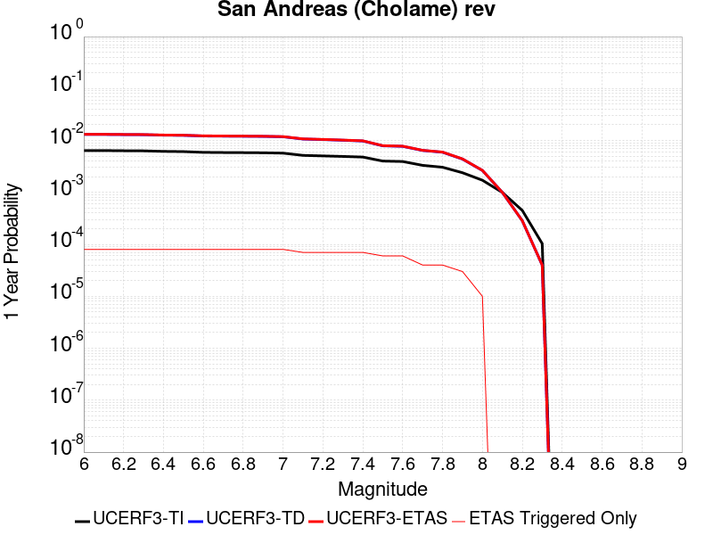 |  |

| Magnitude | 1 wk TI Prob | 1 wk TD Prob | 1 wk ETAS Prob | 1 wk ETAS/TD Gain | 1 wk ETAS Triggered Only | 1 mo TI Prob | 1 mo TD Prob | 1 mo ETAS Prob | 1 mo ETAS/TD Gain | 1 mo ETAS Triggered Only | 1 yr TI Prob | 1 yr TD Prob | 1 yr ETAS Prob | 1 yr ETAS/TD Gain | 1 yr ETAS Triggered Only | 10 yr TI Prob | 10 yr TD Prob | 10 yr ETAS Prob | 10 yr ETAS/TD Gain | 10 yr ETAS Triggered Only |
|-----|-----|-----|-----|-----|-----|-----|-----|-----|-----|-----|-----|-----|-----|-----|-----|-----|-----|-----|-----|-----|
| 6.0 | 1.2302514E-4 | 2.5213862E-4 | 2.5213862E-4 | 1.0 | 0.0 | 5.27144E-4 | 0.0010801482 | 0.0010801482 | 1.0 | 0.0 | 0.0063991086 | 0.013072014 | 0.013105022 | 1.0025251 | 3.3444816E-5 | 0.06217949 | 0.12443058 | 0.12457699 | 1.0011767 | 1.6722408E-4 |
| 6.1 | 1.2302514E-4 | 2.5213862E-4 | 2.5213862E-4 | 1.0 | 0.0 | 5.27144E-4 | 0.0010801482 | 0.0010801482 | 1.0 | 0.0 | 0.0063991086 | 0.013072014 | 0.013105022 | 1.0025251 | 3.3444816E-5 | 0.06217949 | 0.12443058 | 0.12457699 | 1.0011767 | 1.6722408E-4 |
| 6.2 | 1.2203569E-4 | 2.5030645E-4 | 2.5030645E-4 | 1.0 | 0.0 | 5.2290526E-4 | 0.0010723026 | 0.0010723026 | 1.0 | 0.0 | 0.006347804 | 0.0129776355 | 0.013010646 | 1.0025437 | 3.3444816E-5 | 0.061695136 | 0.12361675 | 0.1237633 | 1.0011855 | 1.6722408E-4 |
| 6.3 | 1.2142645E-4 | 2.491661E-4 | 2.491661E-4 | 1.0 | 0.0 | 5.202953E-4 | 0.0010674193 | 0.0010674193 | 1.0 | 0.0 | 0.006316212 | 0.012918889 | 0.012951902 | 1.0025554 | 3.3444816E-5 | 0.06139677 | 0.12311087 | 0.1232575 | 1.0011911 | 1.6722408E-4 |
| 6.4 | 1.1865206E-4 | 2.4422092E-4 | 2.4422092E-4 | 1.0 | 0.0 | 5.0840975E-4 | 0.0010462429 | 0.0010462429 | 1.0 | 0.0 | 0.006172335 | 0.012664088 | 0.012697109 | 1.0026075 | 3.3444816E-5 | 0.060036868 | 0.12090351 | 0.121050514 | 1.0012159 | 1.6722408E-4 |
| 6.5 | 1.17443946E-4 | 2.421537E-4 | 2.421537E-4 | 1.0 | 0.0 | 5.032341E-4 | 0.0010373904 | 0.0010373904 | 1.0 | 0.0 | 0.006109677 | 0.012557554 | 0.012590579 | 1.0026299 | 3.3444816E-5 | 0.059444077 | 0.11997763 | 0.120124795 | 1.0012265 | 1.6722408E-4 |
| 6.6 | 1.13579066E-4 | 2.3524289E-4 | 2.3524289E-4 | 1.0 | 0.0 | 4.866766E-4 | 0.0010077958 | 0.0010077958 | 1.0 | 0.0 | 0.0059092017 | 0.012201327 | 0.012234364 | 1.0027076 | 3.3444816E-5 | 0.057545185 | 0.11689143 | 0.1170391 | 1.0012634 | 1.6722408E-4 |
| 6.7 | 1.1271412E-4 | 2.336858E-4 | 2.336858E-4 | 1.0 | 0.0 | 4.829711E-4 | 0.0010011276 | 0.0010011276 | 1.0 | 0.0 | 0.005864331 | 0.01212105 | 0.012154089 | 1.0027258 | 3.3444816E-5 | 0.057119697 | 0.11619493 | 0.11634273 | 1.001272 | 1.6722408E-4 |
| 6.8 | 1.1217975E-4 | 2.3256983E-4 | 2.3256983E-4 | 1.0 | 0.0 | 4.8068175E-4 | 9.963487E-4 | 9.963487E-4 | 1.0 | 0.0 | 0.005836608 | 0.012063511 | 0.012096552 | 1.002739 | 3.3444816E-5 | 0.056856725 | 0.11569312 | 0.115841 | 1.0012782 | 1.6722408E-4 |
| 6.9 | 1.1146753E-4 | 2.3105709E-4 | 2.3105709E-4 | 1.0 | 0.0 | 4.7763053E-4 | 9.898704E-4 | 9.898704E-4 | 1.0 | 0.0 | 0.0057996577 | 0.011985509 | 0.012018552 | 1.002757 | 3.3444816E-5 | 0.056506127 | 0.11501348 | 0.11516147 | 1.0012867 | 1.6722408E-4 |
| 7.0 | 1.0965793E-4 | 2.2728977E-4 | 2.2728977E-4 | 1.0 | 0.0 | 4.698779E-4 | 9.7373687E-4 | 9.7373687E-4 | 1.0 | 0.0 | 0.005705768 | 0.0117912255 | 0.011824276 | 1.002803 | 3.3444816E-5 | 0.055614736 | 0.11331484 | 0.11346311 | 1.0013086 | 1.6722408E-4 |
| 7.1 | 9.927982E-5 | 2.0547757E-4 | 2.0547757E-4 | 1.0 | 0.0 | 4.2541555E-4 | 8.80322E-4 | 8.80322E-4 | 1.0 | 0.0 | 0.0051671406 | 0.010665542 | 0.0106986305 | 1.0031023 | 3.3444816E-5 | 0.05048634 | 0.10340853 | 0.10352847 | 1.0011599 | 1.3377926E-4 |
| 7.2 | 9.696786E-5 | 2.0051954E-4 | 2.0051954E-4 | 1.0 | 0.0 | 4.1551032E-4 | 8.5908745E-4 | 8.5908745E-4 | 1.0 | 0.0 | 0.00504711 | 0.010409511 | 0.010442607 | 1.0031794 | 3.3444816E-5 | 0.04934009 | 0.10114636 | 0.10126661 | 1.0011889 | 1.3377926E-4 |
| 7.3 | 9.4727984E-5 | 1.9481099E-4 | 1.9481099E-4 | 1.0 | 0.0 | 4.0591392E-4 | 8.346381E-4 | 8.346381E-4 | 1.0 | 0.0 | 0.0049308087 | 0.010114641 | 0.010147748 | 1.0032731 | 3.3444816E-5 | 0.048228268 | 0.09851684 | 0.09863743 | 1.0012242 | 1.3377926E-4 |
| 7.4 | 9.220358E-5 | 1.885154E-4 | 1.885154E-4 | 1.0 | 0.0 | 3.9509835E-4 | 8.076739E-4 | 8.076739E-4 | 1.0 | 0.0 | 0.004799717 | 0.009789341 | 0.009822458 | 1.003383 | 3.3444816E-5 | 0.046973653 | 0.09559427 | 0.09571526 | 1.0012656 | 1.3377926E-4 |
| 7.5 | 7.71631E-5 | 1.5185357E-4 | 1.5185357E-4 | 1.0 | 0.0 | 3.306571E-4 | 6.506389E-4 | 6.506389E-4 | 1.0 | 0.0 | 0.0040183207 | 0.007892828 | 0.007892828 | 1.0 | 0.0 | 0.03946433 | 0.07831838 | 0.07834921 | 1.0003936 | 3.3444816E-5 |
| 7.6 | 7.5634416E-5 | 1.4844738E-4 | 1.4844738E-4 | 1.0 | 0.0 | 3.241072E-4 | 6.360481E-4 | 6.360481E-4 | 1.0 | 0.0 | 0.0039388672 | 0.007716457 | 0.007716457 | 1.0 | 0.0 | 0.038697794 | 0.076681465 | 0.07671235 | 1.0004027 | 3.3444816E-5 |
| 7.7 | 6.3783E-5 | 1.2365259E-4 | 1.2365259E-4 | 1.0 | 0.0 | 2.7332708E-4 | 5.2983203E-4 | 5.2983203E-4 | 1.0 | 0.0 | 0.0033226798 | 0.0064316522 | 0.0064316522 | 1.0 | 0.0 | 0.032734364 | 0.064570144 | 0.06460143 | 1.0004845 | 3.3444816E-5 |
| 7.8 | 5.863422E-5 | 1.142205E-4 | 1.142205E-4 | 1.0 | 0.0 | 2.512653E-4 | 4.894246E-4 | 4.894246E-4 | 1.0 | 0.0 | 0.003054864 | 0.0059424853 | 0.0059424853 | 1.0 | 0.0 | 0.030132094 | 0.059686445 | 0.059717894 | 1.0005269 | 3.3444816E-5 |
| 7.9 | 4.595283E-5 | 8.4306725E-5 | 8.4306725E-5 | 1.0 | 0.0 | 1.9692584E-4 | 3.612645E-4 | 3.612645E-4 | 1.0 | 0.0 | 0.0023949358 | 0.0043895314 | 0.0043895314 | 1.0 | 0.0 | 0.023692891 | 0.044382483 | 0.044414446 | 1.0007201 | 3.3444816E-5 |
| 8.0 | 3.2950178E-5 | 5.08E-5 | 5.08E-5 | 1.0 | 0.0 | 1.412074E-4 | 2.1769613E-4 | 2.1769613E-4 | 1.0 | 0.0 | 0.0017178444 | 0.0026472306 | 0.0026472306 | 1.0 | 0.0 | 0.017046256 | 0.027193451 | 0.027225988 | 1.0011964 | 3.3444816E-5 |
| 8.1 | 1.9177472E-5 | 1.9198456E-5 | 1.9198456E-5 | 1.0 | 0.0 | 8.218658E-5 | 8.227651E-5 | 8.227651E-5 | 1.0 | 0.0 | 0.0010001622 | 0.0010012568 | 0.0010012568 | 1.0 | 0.0 | 0.009956728 | 0.01076512 | 0.01076512 | 1.0 | 0.0 |
| 8.2 | 8.643924E-6 | 5.4798497E-6 | 5.4798497E-6 | 1.0 | 0.0 | 3.704486E-5 | 2.348486E-5 | 2.348486E-5 | 1.0 | 0.0 | 4.5092785E-4 | 2.858907E-4 | 2.858907E-4 | 1.0 | 0.0 | 0.0045001395 | 0.0032514327 | 0.0032514327 | 1.0 | 0.0 |
| 8.3 | 1.983087E-6 | 7.668296E-7 | 7.668296E-7 | 1.0 | 0.0 | 8.498917E-6 | 3.2864084E-6 | 3.2864084E-6 | 1.0 | 0.0 | 1.034694E-4 | 4.0011306E-5 | 4.0011306E-5 | 1.0 | 0.0 | 0.0010342124 | 4.724499E-4 | 4.724499E-4 | 1.0 | 0.0 |

## San Andreas (Carrizo) rev
*[(top)](#table-of-contents)*

| 1 Week | 1 Month | 1 Year | 10 Year |
|-----|-----|-----|-----|
|  |  |  |  |

| Magnitude | 1 wk TI Prob | 1 wk TD Prob | 1 wk ETAS Prob | 1 wk ETAS/TD Gain | 1 wk ETAS Triggered Only | 1 mo TI Prob | 1 mo TD Prob | 1 mo ETAS Prob | 1 mo ETAS/TD Gain | 1 mo ETAS Triggered Only | 1 yr TI Prob | 1 yr TD Prob | 1 yr ETAS Prob | 1 yr ETAS/TD Gain | 1 yr ETAS Triggered Only | 10 yr TI Prob | 10 yr TD Prob | 10 yr ETAS Prob | 10 yr ETAS/TD Gain | 10 yr ETAS Triggered Only |
|-----|-----|-----|-----|-----|-----|-----|-----|-----|-----|-----|-----|-----|-----|-----|-----|-----|-----|-----|-----|-----|
| 6.0 | 1.1674632E-4 | 2.4332498E-4 | 2.4332498E-4 | 1.0 | 0.0 | 5.002454E-4 | 0.0010424062 | 0.0010758161 | 1.0320508 | 3.3444816E-5 | 0.006073493 | 0.012617926 | 0.012683972 | 1.0052342 | 6.688963E-5 | 0.0591016 | 0.12065402 | 0.12080107 | 1.0012188 | 1.6722408E-4 |
| 6.1 | 1.1674632E-4 | 2.4332498E-4 | 2.4332498E-4 | 1.0 | 0.0 | 5.002454E-4 | 0.0010424062 | 0.0010758161 | 1.0320508 | 3.3444816E-5 | 0.006073493 | 0.012617926 | 0.012683972 | 1.0052342 | 6.688963E-5 | 0.0591016 | 0.12065402 | 0.12080107 | 1.0012188 | 1.6722408E-4 |
| 6.2 | 1.1674632E-4 | 2.4332498E-4 | 2.4332498E-4 | 1.0 | 0.0 | 5.002454E-4 | 0.0010424062 | 0.0010758161 | 1.0320508 | 3.3444816E-5 | 0.006073493 | 0.012617926 | 0.012683972 | 1.0052342 | 6.688963E-5 | 0.0591016 | 0.12065402 | 0.12080107 | 1.0012188 | 1.6722408E-4 |
| 6.3 | 1.1674632E-4 | 2.4332498E-4 | 2.4332498E-4 | 1.0 | 0.0 | 5.002454E-4 | 0.0010424062 | 0.0010758161 | 1.0320508 | 3.3444816E-5 | 0.006073493 | 0.012617926 | 0.012683972 | 1.0052342 | 6.688963E-5 | 0.0591016 | 0.12065402 | 0.12080107 | 1.0012188 | 1.6722408E-4 |
| 6.4 | 1.1674632E-4 | 2.4332498E-4 | 2.4332498E-4 | 1.0 | 0.0 | 5.002454E-4 | 0.0010424062 | 0.0010758161 | 1.0320508 | 3.3444816E-5 | 0.006073493 | 0.012617926 | 0.012683972 | 1.0052342 | 6.688963E-5 | 0.0591016 | 0.12065402 | 0.12080107 | 1.0012188 | 1.6722408E-4 |
| 6.5 | 1.13136164E-4 | 2.3652466E-4 | 2.3652466E-4 | 1.0 | 0.0 | 4.847792E-4 | 0.0010132849 | 0.0010132849 | 1.0 | 0.0 | 0.0058862255 | 0.012267408 | 0.012300442 | 1.0026928 | 3.3444816E-5 | 0.057327334 | 0.11762535 | 0.117743395 | 1.0010035 | 1.3377926E-4 |
| 6.6 | 1.13136164E-4 | 2.3652466E-4 | 2.3652466E-4 | 1.0 | 0.0 | 4.847792E-4 | 0.0010132849 | 0.0010132849 | 1.0 | 0.0 | 0.0058862255 | 0.012267408 | 0.012300442 | 1.0026928 | 3.3444816E-5 | 0.057327334 | 0.11762535 | 0.117743395 | 1.0010035 | 1.3377926E-4 |
| 6.7 | 1.1149675E-4 | 2.3343669E-4 | 2.3343669E-4 | 1.0 | 0.0 | 4.777557E-4 | 0.0010000608 | 0.0010000608 | 1.0 | 0.0 | 0.0058011734 | 0.012108203 | 0.012141244 | 1.0027287 | 3.3444816E-5 | 0.05652051 | 0.11624688 | 0.116365105 | 1.0010171 | 1.3377926E-4 |
| 6.8 | 1.1103589E-4 | 2.3245816E-4 | 2.3245816E-4 | 1.0 | 0.0 | 4.7578133E-4 | 9.958703E-4 | 9.958703E-4 | 1.0 | 0.0 | 0.005777263 | 0.0120577505 | 0.012090792 | 1.0027403 | 3.3444816E-5 | 0.056293584 | 0.11580715 | 0.11592544 | 1.0010214 | 1.3377926E-4 |
| 6.9 | 1.1053259E-4 | 2.3138185E-4 | 2.3138185E-4 | 1.0 | 0.0 | 4.7362508E-4 | 9.912612E-4 | 9.912612E-4 | 1.0 | 0.0 | 0.0057511497 | 0.012002253 | 0.012035296 | 1.0027531 | 3.3444816E-5 | 0.05604569 | 0.11532332 | 0.11544167 | 1.0010263 | 1.3377926E-4 |
| 7.0 | 1.1005377E-4 | 2.3039016E-4 | 2.3039016E-4 | 1.0 | 0.0 | 4.7157376E-4 | 9.870143E-4 | 9.870143E-4 | 1.0 | 0.0 | 0.0057263062 | 0.011951115 | 0.01198416 | 1.002765 | 3.3444816E-5 | 0.055809796 | 0.11487561 | 0.11499402 | 1.0010308 | 1.3377926E-4 |
| 7.1 | 1.0308142E-4 | 2.1548544E-4 | 2.1548544E-4 | 1.0 | 0.0 | 4.417027E-4 | 9.231832E-4 | 9.231832E-4 | 1.0 | 0.0 | 0.0053644776 | 0.011182146 | 0.0112152165 | 1.0029575 | 3.3444816E-5 | 0.052368138 | 0.108131535 | 0.10825085 | 1.0011034 | 1.3377926E-4 |
| 7.2 | 1.0027479E-4 | 2.0956367E-4 | 2.0956367E-4 | 1.0 | 0.0 | 4.296783E-4 | 8.978219E-4 | 8.978219E-4 | 1.0 | 0.0 | 0.0052187922 | 0.0108764935 | 0.010909575 | 1.0030415 | 3.3444816E-5 | 0.050979212 | 0.10543535 | 0.10555502 | 1.001135 | 1.3377926E-4 |
| 7.3 | 9.816942E-5 | 2.0431461E-4 | 2.0431461E-4 | 1.0 | 0.0 | 4.2065824E-4 | 8.753412E-4 | 8.753412E-4 | 1.0 | 0.0 | 0.005109493 | 0.010605487 | 0.010638578 | 1.0031201 | 3.3444816E-5 | 0.049935985 | 0.103018686 | 0.103138685 | 1.0011648 | 1.3377926E-4 |
| 7.4 | 9.5634205E-5 | 1.9800827E-4 | 1.9800827E-4 | 1.0 | 0.0 | 4.0979648E-4 | 8.4833184E-4 | 8.4833184E-4 | 1.0 | 0.0 | 0.0049778637 | 0.0102797905 | 0.010312892 | 1.00322 | 3.3444816E-5 | 0.048678253 | 0.100104466 | 0.10022485 | 1.0012026 | 1.3377926E-4 |
| 7.5 | 8.052417E-5 | 1.6120363E-4 | 1.6120363E-4 | 1.0 | 0.0 | 3.4505792E-4 | 6.9068995E-4 | 6.9068995E-4 | 1.0 | 0.0 | 0.0041929903 | 0.008376808 | 0.008376808 | 1.0 | 0.0 | 0.04114753 | 0.08284498 | 0.082875654 | 1.0003703 | 3.3444816E-5 |
| 7.6 | 7.897024E-5 | 1.5773512E-4 | 1.5773512E-4 | 1.0 | 0.0 | 3.384E-4 | 6.758327E-4 | 6.758327E-4 | 1.0 | 0.0 | 0.0041122385 | 0.008197296 | 0.008197296 | 1.0 | 0.0 | 0.040369697 | 0.081185855 | 0.08121659 | 1.0003785 | 3.3444816E-5 |
| 7.7 | 6.707427E-5 | 1.3282998E-4 | 1.3282998E-4 | 1.0 | 0.0 | 2.8742946E-4 | 5.691472E-4 | 5.691472E-4 | 1.0 | 0.0 | 0.003493839 | 0.0069073834 | 0.0069073834 | 1.0 | 0.0 | 0.034394164 | 0.06907934 | 0.069110475 | 1.0004507 | 3.3444816E-5 |
| 7.8 | 6.147705E-5 | 1.2203727E-4 | 1.2203727E-4 | 1.0 | 0.0 | 2.6344648E-4 | 5.229121E-4 | 5.229121E-4 | 1.0 | 0.0 | 0.0032027436 | 0.006347895 | 0.006347895 | 1.0 | 0.0 | 0.031569764 | 0.063543044 | 0.06357436 | 1.0004929 | 3.3444816E-5 |
| 7.9 | 4.7636717E-5 | 8.88427E-5 | 8.88427E-5 | 1.0 | 0.0 | 2.0414138E-4 | 3.806989E-4 | 3.806989E-4 | 1.0 | 0.0 | 0.0024825884 | 0.0046251663 | 0.0046251663 | 1.0 | 0.0 | 0.024550365 | 0.046649244 | 0.04668113 | 1.0006835 | 3.3444816E-5 |
| 8.0 | 3.3554235E-5 | 5.2164494E-5 | 5.2164494E-5 | 1.0 | 0.0 | 1.4379594E-4 | 2.2354297E-4 | 2.2354297E-4 | 1.0 | 0.0 | 0.0017493097 | 0.0027182405 | 0.0027182405 | 1.0 | 0.0 | 0.017356034 | 0.027894506 | 0.027927019 | 1.0011655 | 3.3444816E-5 |
| 8.1 | 1.9175432E-5 | 1.9198285E-5 | 1.9198285E-5 | 1.0 | 0.0 | 8.217783E-5 | 8.227578E-5 | 8.227578E-5 | 1.0 | 0.0 | 0.0010000558 | 0.0010012479 | 0.0010012479 | 1.0 | 0.0 | 0.009955673 | 0.010765004 | 0.010765004 | 1.0 | 0.0 |
| 8.2 | 8.643924E-6 | 5.4798497E-6 | 5.4798497E-6 | 1.0 | 0.0 | 3.704486E-5 | 2.348486E-5 | 2.348486E-5 | 1.0 | 0.0 | 4.5092785E-4 | 2.858907E-4 | 2.858907E-4 | 1.0 | 0.0 | 0.0045001395 | 0.0032514327 | 0.0032514327 | 1.0 | 0.0 |
| 8.3 | 1.983087E-6 | 7.668296E-7 | 7.668296E-7 | 1.0 | 0.0 | 8.498917E-6 | 3.2864084E-6 | 3.2864084E-6 | 1.0 | 0.0 | 1.034694E-4 | 4.0011306E-5 | 4.0011306E-5 | 1.0 | 0.0 | 0.0010342124 | 4.724499E-4 | 4.724499E-4 | 1.0 | 0.0 |

## San Andreas (San Gorgonio Pass-Garnet HIll)
*[(top)](#table-of-contents)*

| 1 Week | 1 Month | 1 Year | 10 Year |
|-----|-----|-----|-----|
|  |  |  |  |

| Magnitude | 1 wk TI Prob | 1 wk TD Prob | 1 wk ETAS Prob | 1 wk ETAS/TD Gain | 1 wk ETAS Triggered Only | 1 mo TI Prob | 1 mo TD Prob | 1 mo ETAS Prob | 1 mo ETAS/TD Gain | 1 mo ETAS Triggered Only | 1 yr TI Prob | 1 yr TD Prob | 1 yr ETAS Prob | 1 yr ETAS/TD Gain | 1 yr ETAS Triggered Only | 10 yr TI Prob | 10 yr TD Prob | 10 yr ETAS Prob | 10 yr ETAS/TD Gain | 10 yr ETAS Triggered Only |
|-----|-----|-----|-----|-----|-----|-----|-----|-----|-----|-----|-----|-----|-----|-----|-----|-----|-----|-----|-----|-----|
| 6.0 | 8.31567E-5 | 2.3386451E-4 | 2.3386451E-4 | 1.0 | 0.0 | 3.5633717E-4 | 0.0010018935 | 0.0010353049 | 1.0333482 | 3.3444816E-5 | 0.004329778 | 0.012129918 | 0.012229036 | 1.0081713 | 1.0033445E-4 | 0.042463828 | 0.11259502 | 0.112743415 | 1.001318 | 1.6722408E-4 |
| 6.1 | 8.31567E-5 | 2.3386451E-4 | 2.3386451E-4 | 1.0 | 0.0 | 3.5633717E-4 | 0.0010018935 | 0.0010353049 | 1.0333482 | 3.3444816E-5 | 0.004329778 | 0.012129918 | 0.012229036 | 1.0081713 | 1.0033445E-4 | 0.042463828 | 0.11259502 | 0.112743415 | 1.001318 | 1.6722408E-4 |
| 6.2 | 8.31567E-5 | 2.3386451E-4 | 2.3386451E-4 | 1.0 | 0.0 | 3.5633717E-4 | 0.0010018935 | 0.0010353049 | 1.0333482 | 3.3444816E-5 | 0.004329778 | 0.012129918 | 0.012229036 | 1.0081713 | 1.0033445E-4 | 0.042463828 | 0.11259502 | 0.112743415 | 1.001318 | 1.6722408E-4 |
| 6.3 | 8.31567E-5 | 2.3386451E-4 | 2.3386451E-4 | 1.0 | 0.0 | 3.5633717E-4 | 0.0010018935 | 0.0010353049 | 1.0333482 | 3.3444816E-5 | 0.004329778 | 0.012129918 | 0.012229036 | 1.0081713 | 1.0033445E-4 | 0.042463828 | 0.11259502 | 0.112743415 | 1.001318 | 1.6722408E-4 |
| 6.4 | 8.059055E-5 | 2.2944735E-4 | 2.2944735E-4 | 1.0 | 0.0 | 3.4534236E-4 | 9.829777E-4 | 0.0010163896 | 1.0339905 | 3.3444816E-5 | 0.0041964394 | 0.011902156 | 0.0120012965 | 1.0083296 | 1.0033445E-4 | 0.041180745 | 0.110576175 | 0.11072491 | 1.001345 | 1.6722408E-4 |
| 6.5 | 8.059055E-5 | 2.2944735E-4 | 2.2944735E-4 | 1.0 | 0.0 | 3.4534236E-4 | 9.829777E-4 | 0.0010163896 | 1.0339905 | 3.3444816E-5 | 0.0041964394 | 0.011902156 | 0.0120012965 | 1.0083296 | 1.0033445E-4 | 0.041180745 | 0.110576175 | 0.11072491 | 1.001345 | 1.6722408E-4 |
| 6.6 | 7.619237E-5 | 2.2189032E-4 | 2.2189032E-4 | 1.0 | 0.0 | 3.2649786E-4 | 9.506143E-4 | 9.506143E-4 | 1.0 | 0.0 | 0.0039678677 | 0.0115128625 | 0.011545923 | 1.0028715 | 3.3444816E-5 | 0.03897764 | 0.10711278 | 0.107202366 | 1.0008364 | 1.0033445E-4 |
| 6.7 | 7.440636E-5 | 2.1864849E-4 | 2.1864849E-4 | 1.0 | 0.0 | 3.188454E-4 | 9.367307E-4 | 9.367307E-4 | 1.0 | 0.0 | 0.0038750346 | 0.011345596 | 0.011378662 | 1.0029144 | 3.3444816E-5 | 0.038081564 | 0.10562121 | 0.105710946 | 1.0008496 | 1.0033445E-4 |
| 6.8 | 7.3735864E-5 | 2.1712016E-4 | 2.1712016E-4 | 1.0 | 0.0 | 3.1597257E-4 | 9.3018543E-4 | 9.3018543E-4 | 1.0 | 0.0 | 0.0038401815 | 0.011266734 | 0.011299802 | 1.002935 | 3.3444816E-5 | 0.03774495 | 0.10492276 | 0.10501256 | 1.0008559 | 1.0033445E-4 |
| 6.9 | 7.27575E-5 | 2.1480983E-4 | 2.1480983E-4 | 1.0 | 0.0 | 3.117806E-4 | 9.20291E-4 | 9.20291E-4 | 1.0 | 0.0 | 0.003789323 | 0.011147508 | 0.011180581 | 1.0029668 | 3.3444816E-5 | 0.037253562 | 0.10387066 | 0.10396057 | 1.0008656 | 1.0033445E-4 |
| 7.0 | 7.102591E-5 | 2.1065009E-4 | 2.1065009E-4 | 1.0 | 0.0 | 3.0436125E-4 | 9.0247596E-4 | 9.0247596E-4 | 1.0 | 0.0 | 0.003699303 | 0.010932805 | 0.010965885 | 1.0030257 | 3.3444816E-5 | 0.03638325 | 0.101972826 | 0.10206293 | 1.0008836 | 1.0033445E-4 |
| 7.1 | 7.028513E-5 | 2.0900648E-4 | 2.0900648E-4 | 1.0 | 0.0 | 3.0118722E-4 | 8.954368E-4 | 8.954368E-4 | 1.0 | 0.0 | 0.0036607897 | 0.01084796 | 0.010881042 | 1.0030496 | 3.3444816E-5 | 0.036010686 | 0.10121585 | 0.10130602 | 1.000891 | 1.0033445E-4 |
| 7.2 | 6.8498244E-5 | 2.0508505E-4 | 2.0508505E-4 | 1.0 | 0.0 | 2.9353087E-4 | 8.78642E-4 | 8.78642E-4 | 1.0 | 0.0 | 0.003567883 | 0.010645497 | 0.010678586 | 1.0031083 | 3.3444816E-5 | 0.035111405 | 0.09940783 | 0.09949819 | 1.000909 | 1.0033445E-4 |
| 7.3 | 6.622592E-5 | 1.973576E-4 | 1.973576E-4 | 1.0 | 0.0 | 2.8379448E-4 | 8.4554625E-4 | 8.4554625E-4 | 1.0 | 0.0 | 0.0034497243 | 0.010246415 | 0.010279517 | 1.0032306 | 3.3444816E-5 | 0.033966612 | 0.09590419 | 0.0959949 | 1.0009458 | 1.0033445E-4 |
| 7.4 | 5.1050705E-5 | 1.4692261E-4 | 1.4692261E-4 | 1.0 | 0.0 | 2.1877038E-4 | 6.295173E-4 | 6.295173E-4 | 1.0 | 0.0 | 0.002660276 | 0.0076376316 | 0.0076708207 | 1.0043455 | 3.3444816E-5 | 0.02628654 | 0.07287696 | 0.07296998 | 1.0012764 | 1.0033445E-4 |
| 7.5 | 3.9302922E-5 | 1.11326524E-4 | 1.11326524E-4 | 1.0 | 0.0 | 1.6843023E-4 | 4.7702674E-4 | 4.7702674E-4 | 1.0 | 0.0 | 0.0020487092 | 0.005792404 | 0.005825655 | 1.0057405 | 3.3444816E-5 | 0.020299247 | 0.05602189 | 0.056116603 | 1.0016906 | 1.0033445E-4 |
| 7.6 | 2.9851626E-5 | 8.49747E-5 | 8.49747E-5 | 1.0 | 0.0 | 1.2792926E-4 | 3.6412658E-4 | 3.6412658E-4 | 1.0 | 0.0 | 0.0015564259 | 0.004424255 | 0.004457552 | 1.0075259 | 3.3444816E-5 | 0.0154556995 | 0.043204896 | 0.043300897 | 1.002222 | 1.0033445E-4 |
| 7.7 | 2.1135214E-5 | 6.355116E-5 | 6.355116E-5 | 1.0 | 0.0 | 9.0576345E-5 | 2.723337E-4 | 2.723337E-4 | 1.0 | 0.0 | 0.0011022091 | 0.003310627 | 0.0033439612 | 1.0100688 | 3.3444816E-5 | 0.010967582 | 0.032592565 | 0.03268963 | 1.0029781 | 1.0033445E-4 |
| 7.8 | 1.883379E-5 | 5.5660596E-5 | 5.5660596E-5 | 1.0 | 0.0 | 8.0713755E-5 | 2.3852361E-4 | 2.3852361E-4 | 1.0 | 0.0 | 9.822468E-4 | 0.0029001608 | 0.0029335087 | 1.0114986 | 3.3444816E-5 | 0.0097791655 | 0.028704397 | 0.028801851 | 1.0033951 | 1.0033445E-4 |
| 7.9 | 1.5156185E-5 | 4.1675128E-5 | 4.1675128E-5 | 1.0 | 0.0 | 6.495346E-5 | 1.7859548E-4 | 1.7859548E-4 | 1.0 | 0.0 | 7.9052144E-4 | 0.0021722328 | 0.0022056052 | 1.0153631 | 3.3444816E-5 | 0.007877152 | 0.02176709 | 0.02186524 | 1.0045091 | 1.0033445E-4 |
| 8.0 | 1.1405907E-5 | 2.9986788E-5 | 2.9986788E-5 | 1.0 | 0.0 | 4.8881542E-5 | 1.2850849E-4 | 1.2850849E-4 | 1.0 | 0.0 | 5.9497025E-4 | 0.0015634688 | 0.0015634688 | 1.0 | 0.0 | 0.005933798 | 0.015778678 | 0.015844513 | 1.0041723 | 6.688963E-5 |
| 8.1 | 4.3511436E-6 | 7.373693E-6 | 7.373693E-6 | 1.0 | 0.0 | 1.8647626E-5 | 3.160116E-5 | 3.160116E-5 | 1.0 | 0.0 | 2.2701119E-4 | 3.8467633E-4 | 3.8467633E-4 | 1.0 | 0.0 | 0.0022677942 | 0.004118566 | 0.004118566 | 1.0 | 0.0 |
| 8.2 | 2.3042528E-6 | 2.7350309E-6 | 2.7350309E-6 | 1.0 | 0.0 | 9.875332E-6 | 1.1721509E-5 | 1.1721509E-5 | 1.0 | 0.0 | 1.2022553E-4 | 1.4270007E-4 | 1.4270007E-4 | 1.0 | 0.0 | 0.0012016051 | 0.0015990696 | 0.0015990696 | 1.0 | 0.0 |
| 8.3 | 5.202968E-7 | 3.1628537E-7 | 3.1628537E-7 | 1.0 | 0.0 | 2.2298414E-6 | 1.3555081E-6 | 1.3555081E-6 | 1.0 | 0.0 | 2.714798E-5 | 1.6503198E-5 | 1.6503198E-5 | 1.0 | 0.0 | 2.7144665E-4 | 1.9580164E-4 | 1.9580164E-4 | 1.0 | 0.0 |

## Lake Isabella (Seismicity)
*[(top)](#table-of-contents)*

| 1 Week | 1 Month | 1 Year | 10 Year |
|-----|-----|-----|-----|
|  | 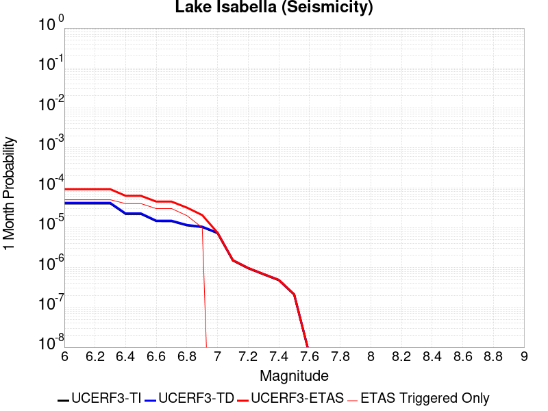 |  |  |

| Magnitude | 1 wk TI Prob | 1 wk TD Prob | 1 wk ETAS Prob | 1 wk ETAS/TD Gain | 1 wk ETAS Triggered Only | 1 mo TI Prob | 1 mo TD Prob | 1 mo ETAS Prob | 1 mo ETAS/TD Gain | 1 mo ETAS Triggered Only | 1 yr TI Prob | 1 yr TD Prob | 1 yr ETAS Prob | 1 yr ETAS/TD Gain | 1 yr ETAS Triggered Only | 10 yr TI Prob | 10 yr TD Prob | 10 yr ETAS Prob | 10 yr ETAS/TD Gain | 10 yr ETAS Triggered Only |
|-----|-----|-----|-----|-----|-----|-----|-----|-----|-----|-----|-----|-----|-----|-----|-----|-----|-----|-----|-----|-----|
| 6.0 | 9.431637E-6 | 9.741694E-6 | 9.741694E-6 | 1.0 | 0.0 | 4.0420677E-5 | 4.1749525E-5 | 4.1749525E-5 | 1.0 | 0.0 | 4.920106E-4 | 5.0819496E-4 | 5.416228E-4 | 1.0657775 | 3.3444816E-5 | 0.004909227 | 0.005071621 | 0.005204722 | 1.0262443 | 1.3377926E-4 |
| 6.1 | 9.431637E-6 | 9.741694E-6 | 9.741694E-6 | 1.0 | 0.0 | 4.0420677E-5 | 4.1749525E-5 | 4.1749525E-5 | 1.0 | 0.0 | 4.920106E-4 | 5.0819496E-4 | 5.416228E-4 | 1.0657775 | 3.3444816E-5 | 0.004909227 | 0.005071621 | 0.005204722 | 1.0262443 | 1.3377926E-4 |
| 6.2 | 9.431637E-6 | 9.741694E-6 | 9.741694E-6 | 1.0 | 0.0 | 4.0420677E-5 | 4.1749525E-5 | 4.1749525E-5 | 1.0 | 0.0 | 4.920106E-4 | 5.0819496E-4 | 5.416228E-4 | 1.0657775 | 3.3444816E-5 | 0.004909227 | 0.005071621 | 0.005204722 | 1.0262443 | 1.3377926E-4 |
| 6.3 | 9.431637E-6 | 9.741694E-6 | 9.741694E-6 | 1.0 | 0.0 | 4.0420677E-5 | 4.1749525E-5 | 4.1749525E-5 | 1.0 | 0.0 | 4.920106E-4 | 5.0819496E-4 | 5.416228E-4 | 1.0657775 | 3.3444816E-5 | 0.004909227 | 0.005071621 | 0.005204722 | 1.0262443 | 1.3377926E-4 |
| 6.4 | 5.144063E-6 | 5.3000977E-6 | 5.3000977E-6 | 1.0 | 0.0 | 2.2045799E-5 | 2.2714525E-5 | 2.2714525E-5 | 1.0 | 0.0 | 2.6837454E-4 | 2.765177E-4 | 3.0995326E-4 | 1.1209166 | 3.3444816E-5 | 0.0026805066 | 0.002762077 | 0.002862134 | 1.0362254 | 1.0033445E-4 |
| 6.5 | 5.144063E-6 | 5.3000977E-6 | 5.3000977E-6 | 1.0 | 0.0 | 2.2045799E-5 | 2.2714525E-5 | 2.2714525E-5 | 1.0 | 0.0 | 2.6837454E-4 | 2.765177E-4 | 3.0995326E-4 | 1.1209166 | 3.3444816E-5 | 0.0026805066 | 0.002762077 | 0.002862134 | 1.0362254 | 1.0033445E-4 |
| 6.6 | 3.4009804E-6 | 3.4987995E-6 | 3.4987995E-6 | 1.0 | 0.0 | 1.4575549E-5 | 1.4994778E-5 | 1.4994778E-5 | 1.0 | 0.0 | 1.7744285E-4 | 1.8254772E-4 | 1.8254772E-4 | 1.0 | 0.0 | 0.0017730123 | 0.0018241355 | 0.0018909031 | 1.0366024 | 6.688963E-5 |
| 6.7 | 3.3880428E-6 | 3.4856662E-6 | 3.4856662E-6 | 1.0 | 0.0 | 1.4520103E-5 | 1.4938492E-5 | 1.4938492E-5 | 1.0 | 0.0 | 1.767679E-4 | 1.8186258E-4 | 1.8186258E-4 | 1.0 | 0.0 | 0.0017662736 | 0.0018172951 | 0.0018840632 | 1.0367403 | 6.688963E-5 |
| 6.8 | 2.6582E-6 | 2.7337105E-6 | 2.7337105E-6 | 1.0 | 0.0 | 1.1392236E-5 | 1.1715857E-5 | 1.1715857E-5 | 1.0 | 0.0 | 1.3869164E-4 | 1.4263256E-4 | 1.4263256E-4 | 1.0 | 0.0 | 0.0013860512 | 0.0014255423 | 0.0014589394 | 1.0234277 | 3.3444816E-5 |
| 6.9 | 2.406011E-6 | 2.474338E-6 | 2.474338E-6 | 1.0 | 0.0 | 1.0311434E-5 | 1.0604271E-5 | 1.0604271E-5 | 1.0 | 0.0 | 1.2553448E-4 | 1.2910066E-4 | 1.2910066E-4 | 1.0 | 0.0 | 0.0012546359 | 0.0012903863 | 0.0012903863 | 1.0 | 0.0 |
| 7.0 | 1.6953097E-6 | 1.7429437E-6 | 1.7429437E-6 | 1.0 | 0.0 | 7.265593E-6 | 7.469743E-6 | 7.469743E-6 | 1.0 | 0.0 | 8.8455E-5 | 9.094137E-5 | 9.094137E-5 | 1.0 | 0.0 | 8.84198E-4 | 9.0914435E-4 | 9.0914435E-4 | 1.0 | 0.0 |
| 7.1 | 3.5013824E-7 | 3.571492E-7 | 3.571492E-7 | 1.0 | 0.0 | 1.5005916E-6 | 1.5306384E-6 | 1.5306384E-6 | 1.0 | 0.0 | 1.826955E-5 | 1.8635366E-5 | 1.8635366E-5 | 1.0 | 0.0 | 1.8268047E-4 | 1.863383E-4 | 1.863383E-4 | 1.0 | 0.0 |
| 7.2 | 2.2321095E-7 | 2.2750632E-7 | 2.2750632E-7 | 1.0 | 0.0 | 9.56618E-7 | 9.750268E-7 | 9.750268E-7 | 1.0 | 0.0 | 1.1646762E-5 | 1.1870887E-5 | 1.1870887E-5 | 1.0 | 0.0 | 1.1646151E-4 | 1.1870263E-4 | 1.1870263E-4 | 1.0 | 0.0 |
| 7.3 | 1.5760406E-7 | 1.6060963E-7 | 1.6060963E-7 | 1.0 | 0.0 | 6.7544585E-7 | 6.883268E-7 | 6.883268E-7 | 1.0 | 0.0 | 8.223522E-6 | 8.380347E-6 | 8.380347E-6 | 1.0 | 0.0 | 8.2232174E-5 | 8.3800376E-5 | 8.3800376E-5 | 1.0 | 0.0 |
| 7.4 | 1.1216497E-7 | 1.1431735E-7 | 1.1431735E-7 | 1.0 | 0.0 | 4.8070694E-7 | 4.8993144E-7 | 4.8993144E-7 | 1.0 | 0.0 | 5.852591E-6 | 5.964899E-6 | 5.964899E-6 | 1.0 | 0.0 | 5.8524372E-5 | 5.9647435E-5 | 5.9647435E-5 | 1.0 | 0.0 |
| 7.5 | 4.885185E-8 | 4.9787864E-8 | 4.9787864E-8 | 1.0 | 0.0 | 2.0936506E-7 | 2.1337654E-7 | 2.1337654E-7 | 1.0 | 0.0 | 2.5490165E-6 | 2.5978566E-6 | 2.5978566E-6 | 1.0 | 0.0 | 2.5489873E-5 | 2.597828E-5 | 2.597828E-5 | 1.0 | 0.0 |
| 7.6 | 1.504641E-9 | 1.5317939E-9 | 1.5317939E-9 | 1.0 | 0.0 | 6.4484613E-9 | 6.5648313E-9 | 6.5648313E-9 | 1.0 | 0.0 | 7.851001E-8 | 7.992682E-8 | 7.992682E-8 | 1.0 | 0.0 | 7.8509987E-7 | 7.992682E-7 | 7.992682E-7 | 1.0 | 0.0 |

## Santa Cruz Catalina Ridge alt1
*[(top)](#table-of-contents)*

| 1 Week | 1 Month | 1 Year | 10 Year |
|-----|-----|-----|-----|
|  |  | 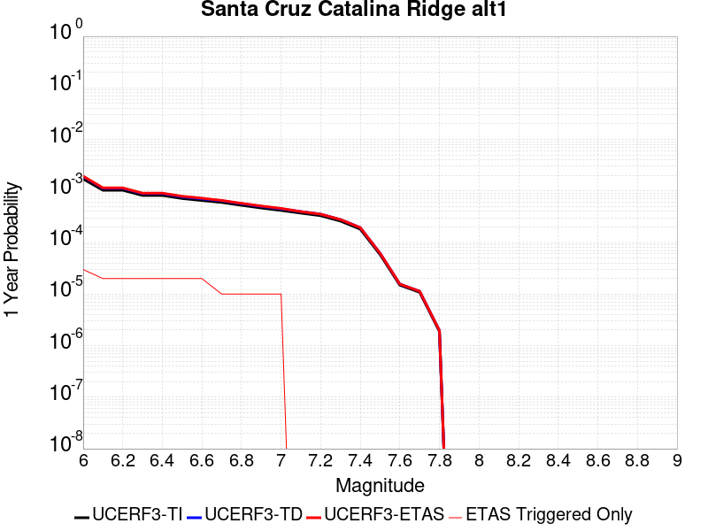 |  |

| Magnitude | 1 wk TI Prob | 1 wk TD Prob | 1 wk ETAS Prob | 1 wk ETAS/TD Gain | 1 wk ETAS Triggered Only | 1 mo TI Prob | 1 mo TD Prob | 1 mo ETAS Prob | 1 mo ETAS/TD Gain | 1 mo ETAS Triggered Only | 1 yr TI Prob | 1 yr TD Prob | 1 yr ETAS Prob | 1 yr ETAS/TD Gain | 1 yr ETAS Triggered Only | 10 yr TI Prob | 10 yr TD Prob | 10 yr ETAS Prob | 10 yr ETAS/TD Gain | 10 yr ETAS Triggered Only |
|-----|-----|-----|-----|-----|-----|-----|-----|-----|-----|-----|-----|-----|-----|-----|-----|-----|-----|-----|-----|-----|
| 6.0 | 3.2833184E-5 | 3.655896E-5 | 7.000255E-5 | 1.9147853 | 3.3444816E-5 | 1.4070606E-4 | 1.5667277E-4 | 2.2355192E-4 | 1.4268715 | 6.688963E-5 | 0.00171175 | 0.0019059887 | 0.0019727508 | 1.0350276 | 6.688963E-5 | 0.016986247 | 0.018913316 | 0.019044565 | 1.0069395 | 1.3377926E-4 |
| 6.1 | 1.9835548E-5 | 2.1659771E-5 | 5.5103865E-5 | 2.5440648 | 3.3444816E-5 | 8.500672E-5 | 9.2824404E-5 | 1.5970782E-4 | 1.7205371 | 6.688963E-5 | 0.0010344655 | 0.0011295713 | 0.0011963855 | 1.05915 | 6.688963E-5 | 0.010296632 | 0.011240433 | 0.011306571 | 1.0058839 | 6.688963E-5 |
| 6.2 | 1.9835548E-5 | 2.1659771E-5 | 5.5103865E-5 | 2.5440648 | 3.3444816E-5 | 8.500672E-5 | 9.2824404E-5 | 1.5970782E-4 | 1.7205371 | 6.688963E-5 | 0.0010344655 | 0.0011295713 | 0.0011963855 | 1.05915 | 6.688963E-5 | 0.010296632 | 0.011240433 | 0.011306571 | 1.0058839 | 6.688963E-5 |
| 6.3 | 1.5728183E-5 | 1.7034137E-5 | 5.0478386E-5 | 2.963366 | 3.3444816E-5 | 6.7404755E-5 | 7.3001436E-5 | 1.398862E-4 | 1.9162114 | 6.688963E-5 | 8.2034385E-4 | 8.884362E-4 | 9.552664E-4 | 1.0752223 | 6.688963E-5 | 0.008173222 | 0.008849524 | 0.008915822 | 1.0074917 | 6.688963E-5 |
| 6.4 | 1.5728183E-5 | 1.7034137E-5 | 5.0478386E-5 | 2.963366 | 3.3444816E-5 | 6.7404755E-5 | 7.3001436E-5 | 1.398862E-4 | 1.9162114 | 6.688963E-5 | 8.2034385E-4 | 8.884362E-4 | 9.552664E-4 | 1.0752223 | 6.688963E-5 | 0.008173222 | 0.008849524 | 0.008915822 | 1.0074917 | 6.688963E-5 |
| 6.5 | 1.3707734E-5 | 1.4794678E-5 | 4.8239E-5 | 3.2605643 | 3.3444816E-5 | 5.8746107E-5 | 6.3404244E-5 | 1.3028963E-4 | 2.054904 | 6.688963E-5 | 7.1499916E-4 | 7.716768E-4 | 8.3851477E-4 | 1.086614 | 6.688963E-5 | 0.0071270303 | 0.0076903705 | 0.007756746 | 1.008631 | 6.688963E-5 |
| 6.6 | 1.2539813E-5 | 1.3510358E-5 | 4.6954723E-5 | 3.475461 | 3.3444816E-5 | 5.3740947E-5 | 5.7900266E-5 | 1.2478602E-4 | 2.155189 | 6.688963E-5 | 6.540996E-4 | 7.0471043E-4 | 7.715529E-4 | 1.094851 | 6.688963E-5 | 0.0065217763 | 0.0070250607 | 0.0070914803 | 1.0094547 | 6.688963E-5 |
| 6.7 | 1.1504083E-5 | 1.23775E-5 | 1.23775E-5 | 1.0 | 0.0 | 4.930228E-5 | 5.304536E-5 | 8.6488406E-5 | 1.6304612 | 3.3444816E-5 | 6.0008996E-4 | 6.456379E-4 | 6.790611E-4 | 1.0517677 | 3.3444816E-5 | 0.005984721 | 0.0064378507 | 0.0064710802 | 1.0051615 | 3.3444816E-5 |
| 6.8 | 1.012739E-5 | 1.0877178E-5 | 1.0877178E-5 | 1.0 | 0.0 | 4.340238E-5 | 4.6615653E-5 | 8.005891E-5 | 1.7174255 | 3.3444816E-5 | 5.282958E-4 | 5.673993E-4 | 6.008251E-4 | 1.0589106 | 3.3444816E-5 | 0.0052704164 | 0.005659675 | 0.0056929304 | 1.0058758 | 3.3444816E-5 |
| 6.9 | 8.9607865E-6 | 9.60921E-6 | 9.60921E-6 | 1.0 | 0.0 | 3.8402806E-5 | 4.1181684E-5 | 7.4625124E-5 | 1.812095 | 3.3444816E-5 | 4.6745385E-4 | 5.0127273E-4 | 5.3470075E-4 | 1.0666864 | 3.3444816E-5 | 0.0046647177 | 0.00500154 | 0.0050348174 | 1.0066534 | 3.3444816E-5 |
| 7.0 | 8.046829E-6 | 8.619827E-6 | 8.619827E-6 | 1.0 | 0.0 | 3.4485955E-5 | 3.6941598E-5 | 7.038518E-5 | 1.9053096 | 3.3444816E-5 | 4.1978562E-4 | 4.4967196E-4 | 4.8310173E-4 | 1.0743426 | 3.3444816E-5 | 0.004189935 | 0.004487711 | 0.004521006 | 1.0074191 | 3.3444816E-5 |
| 7.1 | 7.136131E-6 | 7.637727E-6 | 7.637727E-6 | 1.0 | 0.0 | 3.0583058E-5 | 3.273271E-5 | 3.273271E-5 | 1.0 | 0.0 | 3.7228514E-4 | 3.9844858E-4 | 3.9844858E-4 | 1.0 | 0.0 | 0.0037166206 | 0.0039774184 | 0.0039774184 | 1.0 | 0.0 |
| 7.2 | 6.362014E-6 | 6.8050217E-6 | 6.8050217E-6 | 1.0 | 0.0 | 2.726549E-5 | 2.9164055E-5 | 2.9164055E-5 | 1.0 | 0.0 | 3.3190678E-4 | 3.5501516E-4 | 3.5501516E-4 | 1.0 | 0.0 | 0.0033141149 | 0.0035445488 | 0.0035445488 | 1.0 | 0.0 |
| 7.3 | 5.004101E-6 | 5.3517642E-6 | 5.3517642E-6 | 1.0 | 0.0 | 2.1445969E-5 | 2.2935934E-5 | 2.2935934E-5 | 1.0 | 0.0 | 2.6107338E-4 | 2.7920975E-4 | 2.7920975E-4 | 1.0 | 0.0 | 0.002607669 | 0.0027886443 | 0.0027886443 | 1.0 | 0.0 |
| 7.4 | 3.4901443E-6 | 3.732087E-6 | 3.732087E-6 | 1.0 | 0.0 | 1.4957676E-5 | 1.5994563E-5 | 1.5994563E-5 | 1.0 | 0.0 | 1.8209449E-4 | 1.9471678E-4 | 1.9471678E-4 | 1.0 | 0.0 | 0.0018194534 | 0.0019455003 | 0.0019455003 | 1.0 | 0.0 |
| 7.5 | 1.1215045E-6 | 1.1893966E-6 | 1.1893966E-6 | 1.0 | 0.0 | 4.806439E-6 | 5.0974045E-6 | 5.0974045E-6 | 1.0 | 0.0 | 5.851682E-5 | 6.205916E-5 | 6.205916E-5 | 1.0 | 0.0 | 5.850142E-4 | 6.204214E-4 | 6.204214E-4 | 1.0 | 0.0 |
| 7.6 | 2.8599047E-7 | 2.9952182E-7 | 2.9952182E-7 | 1.0 | 0.0 | 1.2256729E-6 | 1.2836642E-6 | 1.2836642E-6 | 1.0 | 0.0 | 1.4922465E-5 | 1.5628502E-5 | 1.5628502E-5 | 1.0 | 0.0 | 1.4921463E-4 | 1.5627417E-4 | 1.5627417E-4 | 1.0 | 0.0 |
| 7.7 | 2.0781519E-7 | 2.1744457E-7 | 2.1744457E-7 | 1.0 | 0.0 | 8.906362E-7 | 9.3190494E-7 | 9.3190494E-7 | 1.0 | 0.0 | 1.08434415E-5 | 1.1345885E-5 | 1.1345885E-5 | 1.0 | 0.0 | 1.0842913E-4 | 1.1345315E-4 | 1.1345315E-4 | 1.0 | 0.0 |
| 7.8 | 3.614776E-8 | 3.7641225E-8 | 3.7641225E-8 | 1.0 | 0.0 | 1.5491896E-7 | 1.6131952E-7 | 1.6131952E-7 | 1.0 | 0.0 | 1.8861368E-6 | 1.9640636E-6 | 1.9640636E-6 | 1.0 | 0.0 | 1.8861208E-5 | 1.9640474E-5 | 1.9640474E-5 | 1.0 | 0.0 |

## White Mountains
*[(top)](#table-of-contents)*

| 1 Week | 1 Month | 1 Year | 10 Year |
|-----|-----|-----|-----|
|  |  |  |  |

| Magnitude | 1 wk TI Prob | 1 wk TD Prob | 1 wk ETAS Prob | 1 wk ETAS/TD Gain | 1 wk ETAS Triggered Only | 1 mo TI Prob | 1 mo TD Prob | 1 mo ETAS Prob | 1 mo ETAS/TD Gain | 1 mo ETAS Triggered Only | 1 yr TI Prob | 1 yr TD Prob | 1 yr ETAS Prob | 1 yr ETAS/TD Gain | 1 yr ETAS Triggered Only | 10 yr TI Prob | 10 yr TD Prob | 10 yr ETAS Prob | 10 yr ETAS/TD Gain | 10 yr ETAS Triggered Only |
|-----|-----|-----|-----|-----|-----|-----|-----|-----|-----|-----|-----|-----|-----|-----|-----|-----|-----|-----|-----|-----|
| 6.0 | 3.503579E-5 | 3.3784425E-5 | 3.3784425E-5 | 1.0 | 0.0 | 1.5014476E-4 | 1.4478304E-4 | 1.4478304E-4 | 1.0 | 0.0 | 0.0018264796 | 0.0017614291 | 0.0017948151 | 1.0189539 | 3.3444816E-5 | 0.018115403 | 0.017487012 | 0.017618451 | 1.0075164 | 1.3377926E-4 |
| 6.1 | 3.503579E-5 | 3.3784425E-5 | 3.3784425E-5 | 1.0 | 0.0 | 1.5014476E-4 | 1.4478304E-4 | 1.4478304E-4 | 1.0 | 0.0 | 0.0018264796 | 0.0017614291 | 0.0017948151 | 1.0189539 | 3.3444816E-5 | 0.018115403 | 0.017487012 | 0.017618451 | 1.0075164 | 1.3377926E-4 |
| 6.2 | 3.503579E-5 | 3.3784425E-5 | 3.3784425E-5 | 1.0 | 0.0 | 1.5014476E-4 | 1.4478304E-4 | 1.4478304E-4 | 1.0 | 0.0 | 0.0018264796 | 0.0017614291 | 0.0017948151 | 1.0189539 | 3.3444816E-5 | 0.018115403 | 0.017487012 | 0.017618451 | 1.0075164 | 1.3377926E-4 |
| 6.3 | 1.7818425E-5 | 1.5916237E-5 | 1.5916237E-5 | 1.0 | 0.0 | 7.636245E-5 | 6.821074E-5 | 6.821074E-5 | 1.0 | 0.0 | 9.293162E-4 | 8.301636E-4 | 8.635807E-4 | 1.0402535 | 3.3444816E-5 | 0.009254395 | 0.0082720835 | 0.008404756 | 1.0160387 | 1.3377926E-4 |
| 6.4 | 1.7818425E-5 | 1.5916237E-5 | 1.5916237E-5 | 1.0 | 0.0 | 7.636245E-5 | 6.821074E-5 | 6.821074E-5 | 1.0 | 0.0 | 9.293162E-4 | 8.301636E-4 | 8.635807E-4 | 1.0402535 | 3.3444816E-5 | 0.009254395 | 0.0082720835 | 0.008404756 | 1.0160387 | 1.3377926E-4 |
| 6.5 | 1.3397557E-5 | 1.1336382E-5 | 1.1336382E-5 | 1.0 | 0.0 | 5.741684E-5 | 4.8583628E-5 | 4.8583628E-5 | 1.0 | 0.0 | 6.988258E-4 | 5.913521E-4 | 6.2477717E-4 | 1.0565231 | 3.3444816E-5 | 0.006966323 | 0.0058984905 | 0.005964986 | 1.0112733 | 6.688963E-5 |
| 6.6 | 1.0818695E-5 | 8.625452E-6 | 8.625452E-6 | 1.0 | 0.0 | 4.6365014E-5 | 3.6965725E-5 | 3.6965725E-5 | 1.0 | 0.0 | 5.6434784E-4 | 4.499691E-4 | 4.499691E-4 | 1.0 | 0.0 | 0.005629168 | 0.0044910167 | 0.0045243115 | 1.0074136 | 3.3444816E-5 |
| 6.7 | 9.067908E-6 | 6.8025106E-6 | 6.8025106E-6 | 1.0 | 0.0 | 3.8861883E-5 | 2.915331E-5 | 2.915331E-5 | 1.0 | 0.0 | 4.7304068E-4 | 3.5488693E-4 | 3.5488693E-4 | 1.0 | 0.0 | 0.00472035 | 0.0035435192 | 0.0035768454 | 1.0094049 | 3.3444816E-5 |
| 6.8 | 7.295947E-6 | 4.9364417E-6 | 4.9364417E-6 | 1.0 | 0.0 | 3.126797E-5 | 2.1156015E-5 | 2.1156015E-5 | 1.0 | 0.0 | 3.8062103E-4 | 2.5754515E-4 | 2.5754515E-4 | 1.0 | 0.0 | 0.0037996976 | 0.0025725798 | 0.0026059386 | 1.0129671 | 3.3444816E-5 |
| 6.9 | 6.2243444E-6 | 3.832255E-6 | 3.832255E-6 | 1.0 | 0.0 | 2.6675489E-5 | 1.6423848E-5 | 1.6423848E-5 | 1.0 | 0.0 | 3.2472567E-4 | 1.9994254E-4 | 1.9994254E-4 | 1.0 | 0.0 | 0.0032425157 | 0.0019976792 | 0.0020310571 | 1.0167084 | 3.3444816E-5 |
| 7.0 | 4.9878413E-6 | 2.6795697E-6 | 2.6795697E-6 | 1.0 | 0.0 | 2.1376287E-5 | 1.1483821E-5 | 1.1483821E-5 | 1.0 | 0.0 | 2.602252E-4 | 1.3980681E-4 | 1.3980681E-4 | 1.0 | 0.0 | 0.002599207 | 0.0013972148 | 0.0013972148 | 1.0 | 0.0 |
| 7.1 | 4.0252844E-6 | 1.88579E-6 | 1.88579E-6 | 1.0 | 0.0 | 1.7251105E-5 | 8.081933E-6 | 8.081933E-6 | 1.0 | 0.0 | 2.1001195E-4 | 9.839322E-5 | 9.839322E-5 | 1.0 | 0.0 | 0.0020981359 | 9.835094E-4 | 9.835094E-4 | 1.0 | 0.0 |
| 7.2 | 3.3284066E-6 | 1.2819944E-6 | 1.2819944E-6 | 1.0 | 0.0 | 1.4264522E-5 | 5.4942507E-6 | 5.4942507E-6 | 1.0 | 0.0 | 1.736567E-4 | 6.689055E-5 | 6.689055E-5 | 1.0 | 0.0 | 0.0017352107 | 6.6871423E-4 | 6.6871423E-4 | 1.0 | 0.0 |
| 7.3 | 2.458226E-6 | 6.057493E-7 | 6.057493E-7 | 1.0 | 0.0 | 1.0535211E-5 | 2.596066E-6 | 2.596066E-6 | 1.0 | 0.0 | 1.2825865E-4 | 3.1606683E-5 | 3.1606683E-5 | 1.0 | 0.0 | 0.0012818464 | 3.1602563E-4 | 3.1602563E-4 | 1.0 | 0.0 |
| 7.4 | 1.965953E-6 | 3.1091668E-7 | 3.1091668E-7 | 1.0 | 0.0 | 8.425486E-6 | 1.3324994E-6 | 1.3324994E-6 | 1.0 | 0.0 | 1.0257547E-4 | 1.622306E-5 | 1.622306E-5 | 1.0 | 0.0 | 0.0010252813 | 1.6221889E-4 | 1.6221889E-4 | 1.0 | 0.0 |
| 7.5 | 1.2014192E-6 | 1.824589E-7 | 1.824589E-7 | 1.0 | 0.0 | 5.148929E-6 | 7.819665E-7 | 7.819665E-7 | 1.0 | 0.0 | 6.2686406E-5 | 9.520401E-6 | 9.520401E-6 | 1.0 | 0.0 | 6.266873E-4 | 9.520002E-5 | 9.520002E-5 | 1.0 | 0.0 |
| 7.6 | 2.5612175E-7 | 4.8950795E-8 | 4.8950795E-8 | 1.0 | 0.0 | 1.0976642E-6 | 2.097891E-7 | 2.097891E-7 | 1.0 | 0.0 | 1.3363979E-5 | 2.5541797E-6 | 2.5541797E-6 | 1.0 | 0.0 | 1.3363175E-4 | 2.554154E-5 | 2.554154E-5 | 1.0 | 0.0 |

## San Andreas (Coachella) rev
*[(top)](#table-of-contents)*

| 1 Week | 1 Month | 1 Year | 10 Year |
|-----|-----|-----|-----|
|  |  |  |  |

| Magnitude | 1 wk TI Prob | 1 wk TD Prob | 1 wk ETAS Prob | 1 wk ETAS/TD Gain | 1 wk ETAS Triggered Only | 1 mo TI Prob | 1 mo TD Prob | 1 mo ETAS Prob | 1 mo ETAS/TD Gain | 1 mo ETAS Triggered Only | 1 yr TI Prob | 1 yr TD Prob | 1 yr ETAS Prob | 1 yr ETAS/TD Gain | 1 yr ETAS Triggered Only | 10 yr TI Prob | 10 yr TD Prob | 10 yr ETAS Prob | 10 yr ETAS/TD Gain | 10 yr ETAS Triggered Only |
|-----|-----|-----|-----|-----|-----|-----|-----|-----|-----|-----|-----|-----|-----|-----|-----|-----|-----|-----|-----|-----|
| 6.0 | 1.1925945E-4 | 3.2733803E-4 | 3.2733803E-4 | 1.0 | 0.0 | 5.110118E-4 | 0.0014021277 | 0.0014021277 | 1.0 | 0.0 | 0.0062038354 | 0.016938623 | 0.0169715 | 1.0019411 | 3.3444816E-5 | 0.060334753 | 0.15267034 | 0.15278369 | 1.0007424 | 1.3377926E-4 |
| 6.1 | 1.1925945E-4 | 3.2733803E-4 | 3.2733803E-4 | 1.0 | 0.0 | 5.110118E-4 | 0.0014021277 | 0.0014021277 | 1.0 | 0.0 | 0.0062038354 | 0.016938623 | 0.0169715 | 1.0019411 | 3.3444816E-5 | 0.060334753 | 0.15267034 | 0.15278369 | 1.0007424 | 1.3377926E-4 |
| 6.2 | 1.07432395E-4 | 3.0234526E-4 | 3.0234526E-4 | 1.0 | 0.0 | 4.603433E-4 | 0.0012951259 | 0.0012951259 | 1.0 | 0.0 | 0.005590286 | 0.015655253 | 0.015688175 | 1.0021029 | 3.3444816E-5 | 0.05451731 | 0.14184146 | 0.14195625 | 1.0008094 | 1.3377926E-4 |
| 6.3 | 1.0718766E-4 | 3.017983E-4 | 3.017983E-4 | 1.0 | 0.0 | 4.592948E-4 | 0.0012927842 | 0.0012927842 | 1.0 | 0.0 | 0.005577586 | 0.015627153 | 0.015660075 | 1.0021068 | 3.3444816E-5 | 0.054396555 | 0.14160971 | 0.14172456 | 1.000811 | 1.3377926E-4 |
| 6.4 | 1.0355944E-4 | 2.9387916E-4 | 2.9387916E-4 | 1.0 | 0.0 | 4.4375064E-4 | 0.0012588782 | 0.0012588782 | 1.0 | 0.0 | 0.0053892885 | 0.015220184 | 0.01525312 | 1.002164 | 3.3444816E-5 | 0.052604496 | 0.13816981 | 0.13828512 | 1.0008345 | 1.3377926E-4 |
| 6.5 | 1.0227914E-4 | 2.910735E-4 | 2.910735E-4 | 1.0 | 0.0 | 4.382655E-4 | 0.0012468654 | 0.0012468654 | 1.0 | 0.0 | 0.0053228354 | 0.015075962 | 0.015108903 | 1.002185 | 3.3444816E-5 | 0.051971316 | 0.136949 | 0.13706446 | 1.000843 | 1.3377926E-4 |
| 6.6 | 1.0116757E-4 | 2.8873098E-4 | 2.8873098E-4 | 1.0 | 0.0 | 4.3350324E-4 | 0.0012368355 | 0.0012368355 | 1.0 | 0.0 | 0.0052651367 | 0.014955532 | 0.014955532 | 1.0 | 0.0 | 0.051421247 | 0.13592719 | 0.13601388 | 1.0006378 | 1.0033445E-4 |
| 6.7 | 1.0050676E-4 | 2.873166E-4 | 2.873166E-4 | 1.0 | 0.0 | 4.3067214E-4 | 0.0012307797 | 0.0012307797 | 1.0 | 0.0 | 0.005230834 | 0.01488281 | 0.01488281 | 1.0 | 0.0 | 0.051094085 | 0.13531192 | 0.13539867 | 1.0006412 | 1.0033445E-4 |
| 6.8 | 9.976819E-5 | 2.853531E-4 | 2.853531E-4 | 1.0 | 0.0 | 4.2750788E-4 | 0.0012223726 | 0.0012223726 | 1.0 | 0.0 | 0.0051924936 | 0.014781849 | 0.014781849 | 1.0 | 0.0 | 0.050728295 | 0.13446361 | 0.13455045 | 1.0006459 | 1.0033445E-4 |
| 6.9 | 9.77719E-5 | 2.8032195E-4 | 2.8032195E-4 | 1.0 | 0.0 | 4.1895514E-4 | 0.0012008306 | 0.0012008306 | 1.0 | 0.0 | 0.0050888555 | 0.014523101 | 0.014523101 | 1.0 | 0.0 | 0.049738888 | 0.13229203 | 0.1323791 | 1.0006582 | 1.0033445E-4 |
| 7.0 | 8.500761E-5 | 2.4766565E-4 | 2.4766565E-4 | 1.0 | 0.0 | 3.6426744E-4 | 0.0010609957 | 0.0010609957 | 1.0 | 0.0 | 0.0044259406 | 0.012841888 | 0.012841888 | 1.0 | 0.0 | 0.04338823 | 0.11814933 | 0.118237816 | 1.0007489 | 1.0033445E-4 |
| 7.1 | 8.319876E-5 | 2.4369264E-4 | 2.4369264E-4 | 1.0 | 0.0 | 3.5651738E-4 | 0.0010439822 | 0.0010439822 | 1.0 | 0.0 | 0.004331963 | 0.012637171 | 0.012637171 | 1.0 | 0.0 | 0.042484846 | 0.116369456 | 0.11645812 | 1.0007619 | 1.0033445E-4 |
| 7.2 | 7.563917E-5 | 2.2417592E-4 | 2.2417592E-4 | 1.0 | 0.0 | 3.2412758E-4 | 9.6040324E-4 | 9.6040324E-4 | 1.0 | 0.0 | 0.0039391145 | 0.0116309095 | 0.0116309095 | 1.0 | 0.0 | 0.03870018 | 0.10777538 | 0.10783506 | 1.0005537 | 6.688963E-5 |
| 7.3 | 7.082985E-5 | 2.073362E-4 | 2.073362E-4 | 1.0 | 0.0 | 3.0352117E-4 | 8.88284E-4 | 8.88284E-4 | 1.0 | 0.0 | 0.0036891096 | 0.010761855 | 0.010761855 | 1.0 | 0.0 | 0.03628465 | 0.10029767 | 0.100357845 | 1.0006 | 6.688963E-5 |
| 7.4 | 5.146215E-5 | 1.4276853E-4 | 1.4276853E-4 | 1.0 | 0.0 | 2.2053342E-4 | 6.117225E-4 | 6.117225E-4 | 1.0 | 0.0 | 0.0026816884 | 0.007422478 | 0.007422478 | 1.0 | 0.0 | 0.02649557 | 0.07086292 | 0.07092507 | 1.000877 | 6.688963E-5 |
| 7.5 | 4.0285166E-5 | 1.0944253E-4 | 1.0944253E-4 | 1.0 | 0.0 | 1.7263928E-4 | 4.689554E-4 | 4.689554E-4 | 1.0 | 0.0 | 0.002099857 | 0.005694655 | 0.005694655 | 1.0 | 0.0 | 0.020801254 | 0.055022955 | 0.055086166 | 1.0011488 | 6.688963E-5 |
| 7.6 | 3.1168736E-5 | 8.441267E-5 | 8.441267E-5 | 1.0 | 0.0 | 1.3357346E-4 | 3.6171856E-4 | 3.6171856E-4 | 1.0 | 0.0 | 0.0016250437 | 0.004395057 | 0.004395057 | 1.0 | 0.0 | 0.016132116 | 0.042820677 | 0.0428847 | 1.0014952 | 6.688963E-5 |
| 7.7 | 2.2100989E-5 | 6.2408275E-5 | 6.2408275E-5 | 1.0 | 0.0 | 9.4715084E-5 | 2.6743664E-4 | 2.6743664E-4 | 1.0 | 0.0 | 0.001152546 | 0.003251186 | 0.003251186 | 1.0 | 0.0 | 0.011465867 | 0.03190961 | 0.031974364 | 1.0020293 | 6.688963E-5 |
| 7.8 | 1.7484861E-5 | 5.1814186E-5 | 5.1814186E-5 | 1.0 | 0.0 | 7.493296E-5 | 2.2204191E-4 | 2.2204191E-4 | 1.0 | 0.0 | 9.1192697E-4 | 0.002700012 | 0.002700012 | 1.0 | 0.0 | 0.009081938 | 0.026648527 | 0.026713634 | 1.0024432 | 6.688963E-5 |
| 7.9 | 1.3967285E-5 | 3.8237675E-5 | 3.8237675E-5 | 1.0 | 0.0 | 5.985842E-5 | 1.6386545E-4 | 1.6386545E-4 | 1.0 | 0.0 | 7.2853256E-4 | 0.0019932375 | 0.0019932375 | 1.0 | 0.0 | 0.0072614877 | 0.019916428 | 0.019981986 | 1.0032916 | 6.688963E-5 |
| 8.0 | 1.1887396E-5 | 3.107819E-5 | 3.107819E-5 | 1.0 | 0.0 | 5.094499E-5 | 1.3318544E-4 | 1.3318544E-4 | 1.0 | 0.0 | 6.200787E-4 | 0.0016203277 | 0.0016203277 | 1.0 | 0.0 | 0.006183513 | 0.016285317 | 0.016351117 | 1.0040405 | 6.688963E-5 |
| 8.1 | 5.100864E-6 | 8.978668E-6 | 8.978668E-6 | 1.0 | 0.0 | 2.1860664E-5 | 3.847944E-5 | 3.847944E-5 | 1.0 | 0.0 | 2.6612106E-4 | 4.6838663E-4 | 4.6838663E-4 | 1.0 | 0.0 | 0.002658026 | 0.004920349 | 0.004920349 | 1.0 | 0.0 |
| 8.2 | 2.3004484E-6 | 2.7885583E-6 | 2.7885583E-6 | 1.0 | 0.0 | 9.859027E-6 | 1.19509095E-5 | 1.19509095E-5 | 1.0 | 0.0 | 1.2002704E-4 | 1.4549264E-4 | 1.4549264E-4 | 1.0 | 0.0 | 0.0011996223 | 0.0015984807 | 0.0015984807 | 1.0 | 0.0 |
| 8.3 | 1.0424446E-7 | 5.8219563E-8 | 5.8219563E-8 | 1.0 | 0.0 | 4.4676187E-7 | 2.495124E-7 | 2.495124E-7 | 1.0 | 0.0 | 5.439312E-6 | 3.0378094E-6 | 3.0378094E-6 | 1.0 | 0.0 | 5.4391792E-5 | 3.193819E-5 | 3.193819E-5 | 1.0 | 0.0 |

## Independence rev 2011
*[(top)](#table-of-contents)*

| 1 Week | 1 Month | 1 Year | 10 Year |
|-----|-----|-----|-----|
| 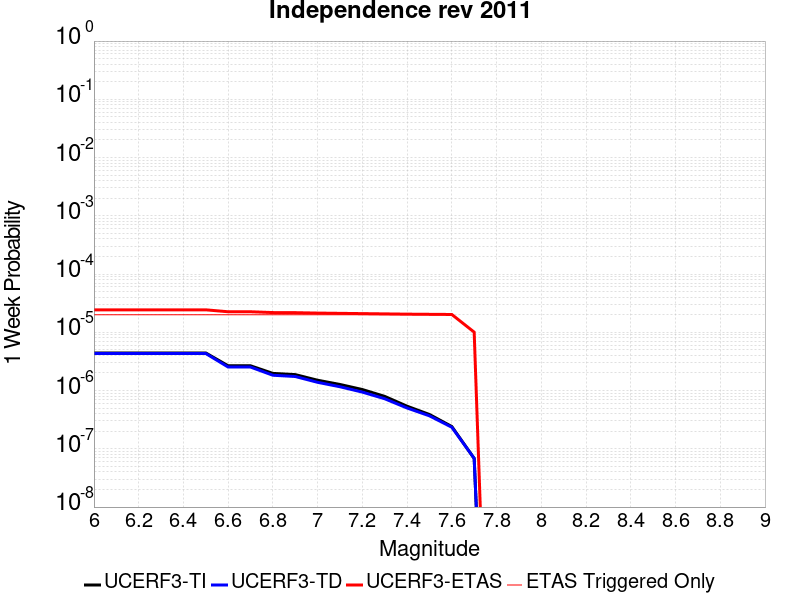 |  |  | 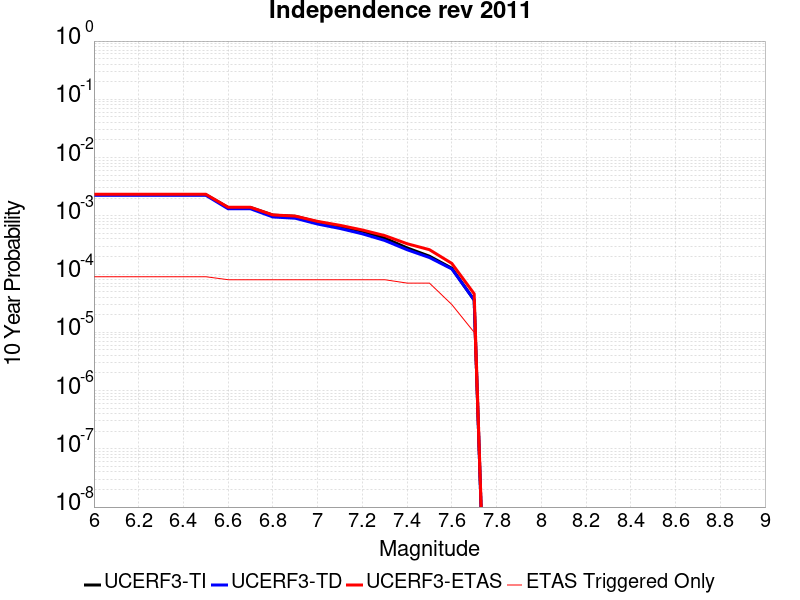 |

| Magnitude | 1 wk TI Prob | 1 wk TD Prob | 1 wk ETAS Prob | 1 wk ETAS/TD Gain | 1 wk ETAS Triggered Only | 1 mo TI Prob | 1 mo TD Prob | 1 mo ETAS Prob | 1 mo ETAS/TD Gain | 1 mo ETAS Triggered Only | 1 yr TI Prob | 1 yr TD Prob | 1 yr ETAS Prob | 1 yr ETAS/TD Gain | 1 yr ETAS Triggered Only | 10 yr TI Prob | 10 yr TD Prob | 10 yr ETAS Prob | 10 yr ETAS/TD Gain | 10 yr ETAS Triggered Only |
|-----|-----|-----|-----|-----|-----|-----|-----|-----|-----|-----|-----|-----|-----|-----|-----|-----|-----|-----|-----|-----|
| 6.0 | 4.422171E-6 | 4.3262453E-6 | 7.121559E-5 | 16.461292 | 6.688963E-5 | 1.8952025E-5 | 1.8540937E-5 | 8.5429325E-5 | 4.607606 | 6.688963E-5 | 2.3071647E-4 | 2.257155E-4 | 3.5946458E-4 | 1.592556 | 1.3377926E-4 | 0.0023047708 | 0.0022551562 | 0.0023886336 | 1.0591878 | 1.3377926E-4 |
| 6.1 | 4.422171E-6 | 4.3262453E-6 | 7.121559E-5 | 16.461292 | 6.688963E-5 | 1.8952025E-5 | 1.8540937E-5 | 8.5429325E-5 | 4.607606 | 6.688963E-5 | 2.3071647E-4 | 2.257155E-4 | 3.5946458E-4 | 1.592556 | 1.3377926E-4 | 0.0023047708 | 0.0022551562 | 0.0023886336 | 1.0591878 | 1.3377926E-4 |
| 6.2 | 4.422171E-6 | 4.3262453E-6 | 7.121559E-5 | 16.461292 | 6.688963E-5 | 1.8952025E-5 | 1.8540937E-5 | 8.5429325E-5 | 4.607606 | 6.688963E-5 | 2.3071647E-4 | 2.257155E-4 | 3.5946458E-4 | 1.592556 | 1.3377926E-4 | 0.0023047708 | 0.0022551562 | 0.0023886336 | 1.0591878 | 1.3377926E-4 |
| 6.3 | 4.422171E-6 | 4.3262453E-6 | 7.121559E-5 | 16.461292 | 6.688963E-5 | 1.8952025E-5 | 1.8540937E-5 | 8.5429325E-5 | 4.607606 | 6.688963E-5 | 2.3071647E-4 | 2.257155E-4 | 3.5946458E-4 | 1.592556 | 1.3377926E-4 | 0.0023047708 | 0.0022551562 | 0.0023886336 | 1.0591878 | 1.3377926E-4 |
| 6.4 | 4.422171E-6 | 4.3262453E-6 | 7.121559E-5 | 16.461292 | 6.688963E-5 | 1.8952025E-5 | 1.8540937E-5 | 8.5429325E-5 | 4.607606 | 6.688963E-5 | 2.3071647E-4 | 2.257155E-4 | 3.5946458E-4 | 1.592556 | 1.3377926E-4 | 0.0023047708 | 0.0022551562 | 0.0023886336 | 1.0591878 | 1.3377926E-4 |
| 6.5 | 4.422171E-6 | 4.3262453E-6 | 7.121559E-5 | 16.461292 | 6.688963E-5 | 1.8952025E-5 | 1.8540937E-5 | 8.5429325E-5 | 4.607606 | 6.688963E-5 | 2.3071647E-4 | 2.257155E-4 | 3.5946458E-4 | 1.592556 | 1.3377926E-4 | 0.0023047708 | 0.0022551562 | 0.0023886336 | 1.0591878 | 1.3377926E-4 |
| 6.6 | 2.663744E-6 | 2.5319996E-6 | 6.942146E-5 | 27.417643 | 6.688963E-5 | 1.1415996E-5 | 1.0851385E-5 | 7.774029E-5 | 7.1640897 | 6.688963E-5 | 1.3898089E-4 | 1.3210809E-4 | 2.658697E-4 | 2.0125163 | 1.3377926E-4 | 0.0013889399 | 0.0013203438 | 0.0014539465 | 1.1011877 | 1.3377926E-4 |
| 6.7 | 2.663744E-6 | 2.5319996E-6 | 6.942146E-5 | 27.417643 | 6.688963E-5 | 1.1415996E-5 | 1.0851385E-5 | 7.774029E-5 | 7.1640897 | 6.688963E-5 | 1.3898089E-4 | 1.3210809E-4 | 2.658697E-4 | 2.0125163 | 1.3377926E-4 | 0.0013889399 | 0.0013203438 | 0.0014539465 | 1.1011877 | 1.3377926E-4 |
| 6.8 | 1.9716529E-6 | 1.83227E-6 | 6.8721776E-5 | 37.506363 | 6.688963E-5 | 8.449913E-6 | 7.852563E-6 | 7.474167E-5 | 9.518125 | 6.688963E-5 | 1.0287284E-4 | 9.560089E-5 | 2.2936736E-4 | 2.3992178 | 1.3377926E-4 | 0.0010282523 | 9.556105E-4 | 0.001089262 | 1.1398597 | 1.3377926E-4 |
| 6.9 | 1.8788617E-6 | 1.7430103E-6 | 6.863253E-5 | 39.37586 | 6.688963E-5 | 8.0522395E-6 | 7.470024E-6 | 7.435916E-5 | 9.95434 | 6.688963E-5 | 9.80316E-5 | 9.094387E-5 | 2.2471097E-4 | 2.4708755 | 1.3377926E-4 | 9.798837E-4 | 9.090785E-4 | 0.0010427361 | 1.1470255 | 1.3377926E-4 |
| 7.0 | 1.5045488E-6 | 1.3849595E-6 | 6.82745E-5 | 49.297108 | 6.688963E-5 | 6.44805E-6 | 5.9355275E-6 | 7.282476E-5 | 12.269299 | 6.688963E-5 | 7.8502184E-5 | 7.226271E-5 | 2.060323E-4 | 2.8511567 | 1.3377926E-4 | 7.8474457E-4 | 7.2239724E-4 | 8.560798E-4 | 1.1850542 | 1.3377926E-4 |
| 7.1 | 1.272341E-6 | 1.1625177E-6 | 6.8052075E-5 | 58.53853 | 6.688963E-5 | 5.4528787E-6 | 4.9822092E-6 | 7.187151E-5 | 14.425631 | 6.688963E-5 | 6.6386776E-5 | 6.065674E-5 | 1.9442789E-4 | 3.2053797 | 1.3377926E-4 | 6.636695E-4 | 6.06405E-4 | 7.401032E-4 | 1.2204766 | 1.3377926E-4 |
| 7.2 | 1.0416892E-6 | 9.4099494E-7 | 6.7830566E-5 | 72.08388 | 6.688963E-5 | 4.464375E-6 | 4.032829E-6 | 7.092219E-5 | 17.586212 | 6.688963E-5 | 5.4352407E-5 | 4.909861E-5 | 1.828713E-4 | 3.724572 | 1.3377926E-4 | 5.4339116E-4 | 4.9087947E-4 | 6.2459306E-4 | 1.272396 | 1.3377926E-4 |
| 7.3 | 7.9450155E-7 | 7.235053E-7 | 6.761309E-5 | 93.452095 | 6.688963E-5 | 3.4050022E-6 | 3.1007335E-6 | 6.999016E-5 | 22.57213 | 6.688963E-5 | 4.1455114E-5 | 3.7750786E-5 | 1.71525E-4 | 4.543614 | 1.3377926E-4 | 4.144738E-4 | 3.7744487E-4 | 5.111736E-4 | 1.3543001 | 1.3377926E-4 |
| 7.4 | 5.3893444E-7 | 5.0195445E-7 | 6.739156E-5 | 134.25832 | 6.688963E-5 | 2.309717E-6 | 2.1512315E-6 | 6.904072E-5 | 32.09358 | 6.688963E-5 | 2.8120441E-5 | 2.6190934E-5 | 1.5996669E-4 | 6.1077127 | 1.3377926E-4 | 2.8116882E-4 | 2.6187891E-4 | 3.9562315E-4 | 1.5107102 | 1.3377926E-4 |
| 7.5 | 3.8852085E-7 | 3.6825747E-7 | 6.725787E-5 | 182.63815 | 6.688963E-5 | 1.6650882E-6 | 1.5782454E-6 | 6.846777E-5 | 43.38221 | 6.688963E-5 | 2.027226E-5 | 1.9214971E-5 | 1.5299166E-4 | 7.9621077 | 1.3377926E-4 | 2.0270412E-4 | 1.921333E-4 | 3.2588688E-4 | 1.6961498 | 1.3377926E-4 |
| 7.6 | 2.414929E-7 | 2.3457659E-7 | 6.7124194E-5 | 286.15042 | 6.688963E-5 | 1.0349692E-6 | 1.0053279E-6 | 6.789489E-5 | 67.53507 | 6.688963E-5 | 1.2600677E-5 | 1.22398E-5 | 1.1257302E-4 | 9.197293 | 1.0033445E-4 | 1.2599962E-4 | 1.2239137E-4 | 2.2271354E-4 | 1.8196833 | 1.0033445E-4 |
| 7.7 | 6.8298014E-8 | 6.858993E-8 | 3.3513403E-5 | 488.60535 | 3.3444816E-5 | 2.9270575E-7 | 2.939568E-7 | 3.3738765E-5 | 114.77457 | 3.3444816E-5 | 3.5636867E-6 | 3.5789185E-6 | 3.7023616E-5 | 10.344916 | 3.3444816E-5 | 3.5636294E-5 | 3.5788657E-5 | 6.923228E-5 | 1.9344754 | 3.3444816E-5 |

## Rose Canyon
*[(top)](#table-of-contents)*

| 1 Week | 1 Month | 1 Year | 10 Year |
|-----|-----|-----|-----|
|  |  |  |  |

| Magnitude | 1 wk TI Prob | 1 wk TD Prob | 1 wk ETAS Prob | 1 wk ETAS/TD Gain | 1 wk ETAS Triggered Only | 1 mo TI Prob | 1 mo TD Prob | 1 mo ETAS Prob | 1 mo ETAS/TD Gain | 1 mo ETAS Triggered Only | 1 yr TI Prob | 1 yr TD Prob | 1 yr ETAS Prob | 1 yr ETAS/TD Gain | 1 yr ETAS Triggered Only | 10 yr TI Prob | 10 yr TD Prob | 10 yr ETAS Prob | 10 yr ETAS/TD Gain | 10 yr ETAS Triggered Only |
|-----|-----|-----|-----|-----|-----|-----|-----|-----|-----|-----|-----|-----|-----|-----|-----|-----|-----|-----|-----|-----|
| 6.0 | 4.5923203E-5 | 4.9715825E-5 | 4.9715825E-5 | 1.0 | 0.0 | 1.9679888E-4 | 2.1305127E-4 | 2.4648898E-4 | 1.1569467 | 3.3444816E-5 | 0.0023933933 | 0.0025910123 | 0.002724445 | 1.0514983 | 1.3377926E-4 | 0.023677798 | 0.025640773 | 0.025771122 | 1.0050837 | 1.3377926E-4 |
| 6.1 | 4.5923203E-5 | 4.9715825E-5 | 4.9715825E-5 | 1.0 | 0.0 | 1.9679888E-4 | 2.1305127E-4 | 2.4648898E-4 | 1.1569467 | 3.3444816E-5 | 0.0023933933 | 0.0025910123 | 0.002724445 | 1.0514983 | 1.3377926E-4 | 0.023677798 | 0.025640773 | 0.025771122 | 1.0050837 | 1.3377926E-4 |
| 6.2 | 2.8844734E-5 | 2.9669445E-5 | 2.9669445E-5 | 1.0 | 0.0 | 1.2361443E-4 | 1.2714828E-4 | 1.2714828E-4 | 1.0 | 0.0 | 0.0015039665 | 0.0015469306 | 0.0016137168 | 1.0431733 | 6.688963E-5 | 0.0149382865 | 0.01537464 | 0.015440501 | 1.0042838 | 6.688963E-5 |
| 6.3 | 2.3171577E-5 | 2.3161689E-5 | 2.3161689E-5 | 1.0 | 0.0 | 9.9302975E-5 | 9.926068E-5 | 9.926068E-5 | 1.0 | 0.0 | 0.0012083431 | 0.0012078421 | 0.0012412466 | 1.0276563 | 3.3444816E-5 | 0.012017938 | 0.0120226685 | 0.012055711 | 1.0027484 | 3.3444816E-5 |
| 6.4 | 2.0066604E-5 | 1.9667403E-5 | 1.9667403E-5 | 1.0 | 0.0 | 8.599689E-5 | 8.42862E-5 | 8.42862E-5 | 1.0 | 0.0 | 0.0010465092 | 0.0010257114 | 0.0010591219 | 1.032573 | 3.3444816E-5 | 0.010415946 | 0.010217753 | 0.010250856 | 1.0032398 | 3.3444816E-5 |
| 6.5 | 1.776989E-5 | 1.7114124E-5 | 1.7114124E-5 | 1.0 | 0.0 | 7.615444E-5 | 7.334422E-5 | 7.334422E-5 | 1.0 | 0.0 | 9.267859E-4 | 8.92607E-4 | 8.92607E-4 | 1.0 | 0.0 | 0.009229303 | 0.008896374 | 0.008896374 | 1.0 | 0.0 |
| 6.6 | 1.5227364E-5 | 1.43395055E-5 | 1.43395055E-5 | 1.0 | 0.0 | 6.52585E-5 | 6.1453604E-5 | 6.1453604E-5 | 1.0 | 0.0 | 7.942326E-4 | 7.47946E-4 | 7.47946E-4 | 1.0 | 0.0 | 0.007914 | 0.007458486 | 0.007458486 | 1.0 | 0.0 |
| 6.7 | 1.2703898E-5 | 1.167345E-5 | 1.167345E-5 | 1.0 | 0.0 | 5.4444143E-5 | 5.002814E-5 | 5.002814E-5 | 1.0 | 0.0 | 6.626558E-4 | 6.089266E-4 | 6.089266E-4 | 1.0 | 0.0 | 0.006606833 | 0.006075177 | 0.006075177 | 1.0 | 0.0 |
| 6.8 | 1.1554917E-5 | 1.0609485E-5 | 1.0609485E-5 | 1.0 | 0.0 | 4.9520135E-5 | 4.5468452E-5 | 4.5468452E-5 | 1.0 | 0.0 | 6.0274085E-4 | 5.534419E-4 | 5.534419E-4 | 1.0 | 0.0 | 0.0060110865 | 0.005522644 | 0.005522644 | 1.0 | 0.0 |
| 6.9 | 8.732078E-6 | 7.881448E-6 | 7.881448E-6 | 1.0 | 0.0 | 3.7422655E-5 | 3.3777214E-5 | 3.3777214E-5 | 1.0 | 0.0 | 4.5552556E-4 | 4.111629E-4 | 4.111629E-4 | 1.0 | 0.0 | 0.0045459294 | 0.0041048555 | 0.0041048555 | 1.0 | 0.0 |
| 7.0 | 5.9337494E-6 | 5.107531E-6 | 5.107531E-6 | 1.0 | 0.0 | 2.5430107E-5 | 2.1889235E-5 | 2.1889235E-5 | 1.0 | 0.0 | 3.0956755E-4 | 2.66469E-4 | 2.66469E-4 | 1.0 | 0.0 | 0.0030913667 | 0.0026615104 | 0.0026615104 | 1.0 | 0.0 |
| 7.1 | 5.013409E-6 | 4.177419E-6 | 4.177419E-6 | 1.0 | 0.0 | 2.1485863E-5 | 1.7903103E-5 | 1.7903103E-5 | 1.0 | 0.0 | 2.6155898E-4 | 2.1794859E-4 | 2.1794859E-4 | 1.0 | 0.0 | 0.0026125133 | 0.00217736 | 0.00217736 | 1.0 | 0.0 |
| 7.2 | 4.120763E-6 | 3.2821677E-6 | 3.2821677E-6 | 1.0 | 0.0 | 1.7660293E-5 | 1.4066358E-5 | 1.4066358E-5 | 1.0 | 0.0 | 2.1499286E-4 | 1.7124454E-4 | 1.7124454E-4 | 1.0 | 0.0 | 0.0021478499 | 0.0017111353 | 0.0017111353 | 1.0 | 0.0 |
| 7.3 | 3.2081239E-6 | 2.4405597E-6 | 2.4405597E-6 | 1.0 | 0.0 | 1.374903E-5 | 1.04595E-5 | 1.04595E-5 | 1.0 | 0.0 | 1.6738157E-4 | 1.2733703E-4 | 1.2733703E-4 | 1.0 | 0.0 | 0.0016725556 | 0.0012726476 | 0.0012726476 | 1.0 | 0.0 |
| 7.4 | 2.4194755E-6 | 1.7680803E-6 | 1.7680803E-6 | 1.0 | 0.0 | 1.0369139E-5 | 7.5774656E-6 | 7.5774656E-6 | 1.0 | 0.0 | 1.2623696E-4 | 9.2251794E-5 | 9.2251794E-5 | 1.0 | 0.0 | 0.0012616527 | 9.221403E-4 | 9.221403E-4 | 1.0 | 0.0 |
| 7.5 | 1.3842889E-6 | 9.378737E-7 | 9.378737E-7 | 1.0 | 0.0 | 5.9326535E-6 | 4.0194527E-6 | 4.0194527E-6 | 1.0 | 0.0 | 7.222766E-5 | 4.8935777E-5 | 4.8935777E-5 | 1.0 | 0.0 | 7.220419E-4 | 4.8925355E-4 | 4.8925355E-4 | 1.0 | 0.0 |
| 7.6 | 1.0021575E-6 | 6.411548E-7 | 6.411548E-7 | 1.0 | 0.0 | 4.2949537E-6 | 2.7478038E-6 | 2.7478038E-6 | 1.0 | 0.0 | 5.2289808E-5 | 3.345402E-5 | 3.345402E-5 | 1.0 | 0.0 | 5.2277505E-4 | 3.3449198E-4 | 3.3449198E-4 | 1.0 | 0.0 |
| 7.7 | 8.7620116E-8 | 6.449284E-8 | 6.449284E-8 | 1.0 | 0.0 | 3.7551473E-7 | 2.7639786E-7 | 2.7639786E-7 | 1.0 | 0.0 | 4.5718825E-6 | 3.365139E-6 | 3.365139E-6 | 1.0 | 0.0 | 4.5717883E-5 | 3.365091E-5 | 3.365091E-5 | 1.0 | 0.0 |

## Scodie Lineament
*[(top)](#table-of-contents)*

| 1 Week | 1 Month | 1 Year | 10 Year |
|-----|-----|-----|-----|
|  |  |  | 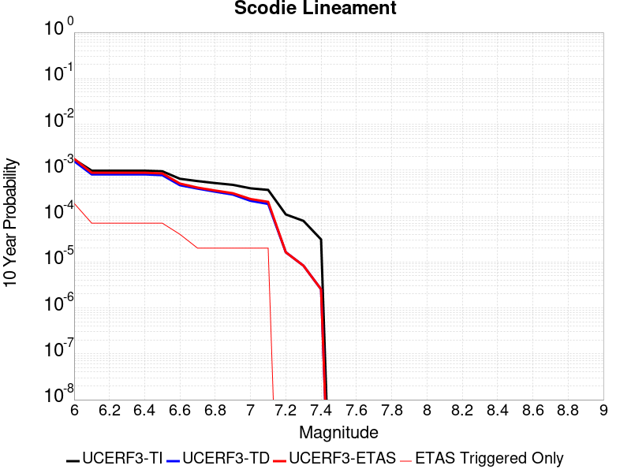 |

| Magnitude | 1 wk TI Prob | 1 wk TD Prob | 1 wk ETAS Prob | 1 wk ETAS/TD Gain | 1 wk ETAS Triggered Only | 1 mo TI Prob | 1 mo TD Prob | 1 mo ETAS Prob | 1 mo ETAS/TD Gain | 1 mo ETAS Triggered Only | 1 yr TI Prob | 1 yr TD Prob | 1 yr ETAS Prob | 1 yr ETAS/TD Gain | 1 yr ETAS Triggered Only | 10 yr TI Prob | 10 yr TD Prob | 10 yr ETAS Prob | 10 yr ETAS/TD Gain | 10 yr ETAS Triggered Only |
|-----|-----|-----|-----|-----|-----|-----|-----|-----|-----|-----|-----|-----|-----|-----|-----|-----|-----|-----|-----|-----|
| 6.0 | 3.2919327E-6 | 3.0133565E-6 | 3.645807E-5 | 12.0988245 | 3.3444816E-5 | 1.4108206E-5 | 1.2914339E-5 | 7.980311E-5 | 6.1794186 | 6.688963E-5 | 1.7175387E-4 | 1.5722391E-4 | 2.9098213E-4 | 1.85075 | 1.3377926E-4 | 0.0017162118 | 0.0015714383 | 0.0017050074 | 1.0849979 | 1.3377926E-4 |
| 6.1 | 1.8663811E-6 | 1.5490589E-6 | 3.4993824E-5 | 22.590376 | 3.3444816E-5 | 7.998751E-6 | 6.6388097E-6 | 7.3528E-5 | 11.075479 | 6.688963E-5 | 9.738045E-5 | 8.082501E-5 | 1.8115135E-4 | 2.2412784 | 1.0033445E-4 | 9.7337784E-4 | 8.0800493E-4 | 9.082583E-4 | 1.1240752 | 1.0033445E-4 |
| 6.2 | 1.8663811E-6 | 1.5490589E-6 | 3.4993824E-5 | 22.590376 | 3.3444816E-5 | 7.998751E-6 | 6.6388097E-6 | 7.3528E-5 | 11.075479 | 6.688963E-5 | 9.738045E-5 | 8.082501E-5 | 1.8115135E-4 | 2.2412784 | 1.0033445E-4 | 9.7337784E-4 | 8.0800493E-4 | 9.082583E-4 | 1.1240752 | 1.0033445E-4 |
| 6.3 | 1.8663811E-6 | 1.5490589E-6 | 3.4993824E-5 | 22.590376 | 3.3444816E-5 | 7.998751E-6 | 6.6388097E-6 | 7.3528E-5 | 11.075479 | 6.688963E-5 | 9.738045E-5 | 8.082501E-5 | 1.8115135E-4 | 2.2412784 | 1.0033445E-4 | 9.7337784E-4 | 8.0800493E-4 | 9.082583E-4 | 1.1240752 | 1.0033445E-4 |
| 6.4 | 1.8663811E-6 | 1.5490589E-6 | 3.4993824E-5 | 22.590376 | 3.3444816E-5 | 7.998751E-6 | 6.6388097E-6 | 7.3528E-5 | 11.075479 | 6.688963E-5 | 9.738045E-5 | 8.082501E-5 | 1.8115135E-4 | 2.2412784 | 1.0033445E-4 | 9.7337784E-4 | 8.0800493E-4 | 9.082583E-4 | 1.1240752 | 1.0033445E-4 |
| 6.5 | 1.8106311E-6 | 1.4909926E-6 | 3.4935758E-5 | 23.43121 | 3.3444816E-5 | 7.759824E-6 | 6.3899556E-6 | 7.327916E-5 | 11.467867 | 6.688963E-5 | 9.447177E-5 | 7.779543E-5 | 1.7812206E-4 | 2.2896214 | 1.0033445E-4 | 9.4431615E-4 | 7.777306E-4 | 8.77987E-4 | 1.1289089 | 1.0033445E-4 |
| 6.6 | 1.2414679E-6 | 8.9976135E-7 | 3.4344546E-5 | 38.17073 | 3.3444816E-5 | 5.320566E-6 | 3.8561147E-6 | 3.73008E-5 | 9.673156 | 3.3444816E-5 | 6.477596E-5 | 4.6947276E-5 | 1.1383377E-4 | 2.424715 | 6.688963E-5 | 6.475708E-4 | 4.6938224E-4 | 5.3624046E-4 | 1.1424388 | 6.688963E-5 |
| 6.7 | 1.1062215E-6 | 7.5943603E-7 | 3.4204226E-5 | 45.038986 | 3.3444816E-5 | 4.7409408E-6 | 3.254722E-6 | 3.6699428E-5 | 11.275749 | 3.3444816E-5 | 5.7719422E-5 | 3.9625593E-5 | 7.306908E-5 | 1.8439871 | 3.3444816E-5 | 5.770443E-4 | 3.9619225E-4 | 4.2962382E-4 | 1.0843822 | 3.3444816E-5 |
| 6.8 | 1.0006736E-6 | 6.5004406E-7 | 3.409484E-5 | 52.450043 | 3.3444816E-5 | 4.288594E-6 | 2.7859005E-6 | 3.6230624E-5 | 13.004995 | 3.3444816E-5 | 5.221238E-5 | 3.3917873E-5 | 6.736155E-5 | 1.9860195 | 3.3444816E-5 | 5.220012E-4 | 3.3913302E-4 | 3.7256652E-4 | 1.0985851 | 3.3444816E-5 |
| 6.9 | 9.167364E-7 | 5.6316645E-7 | 3.4007964E-5 | 60.387054 | 3.3444816E-5 | 3.9288643E-6 | 2.4135686E-6 | 3.5858306E-5 | 14.856965 | 3.3444816E-5 | 4.7832873E-5 | 2.9384859E-5 | 6.2828694E-5 | 2.1381314 | 3.3444816E-5 | 4.782258E-4 | 2.9381542E-4 | 3.272504E-4 | 1.1137959 | 3.3444816E-5 |
| 7.0 | 7.6987664E-7 | 4.113416E-7 | 3.3856144E-5 | 82.30664 | 3.3444816E-5 | 3.2994672E-6 | 1.7628915E-6 | 3.520765E-5 | 19.971535 | 3.3444816E-5 | 4.0170275E-5 | 2.1463033E-5 | 5.490713E-5 | 2.5582187 | 3.3444816E-5 | 4.0163012E-4 | 2.1461345E-4 | 2.480511E-4 | 1.155804 | 3.3444816E-5 |
| 7.1 | 7.1038727E-7 | 3.5211795E-7 | 3.379692E-5 | 95.98182 | 3.3444816E-5 | 3.0445133E-6 | 1.5090762E-6 | 3.4953842E-5 | 23.162409 | 3.3444816E-5 | 3.706632E-5 | 1.8372884E-5 | 5.1817085E-5 | 2.8203022 | 3.3444816E-5 | 3.7060137E-4 | 1.8371714E-4 | 2.1715582E-4 | 1.1820117 | 3.3444816E-5 |
| 7.2 | 2.0799602E-7 | 3.1187685E-8 | 3.1187685E-8 | 1.0 | 0.0 | 8.914113E-7 | 1.336615E-7 | 1.336615E-7 | 1.0 | 0.0 | 1.0852878E-5 | 1.6273277E-6 | 1.6273277E-6 | 1.0 | 0.0 | 1.08523476E-4 | 1.6273165E-5 | 1.6273165E-5 | 1.0 | 0.0 |
| 7.3 | 1.5048182E-7 | 1.5946263E-8 | 1.5946263E-8 | 1.0 | 0.0 | 6.449219E-7 | 6.834112E-8 | 6.834112E-8 | 1.0 | 0.0 | 7.851896E-6 | 8.320529E-7 | 8.320529E-7 | 1.0 | 0.0 | 7.851618E-5 | 8.3205005E-6 | 8.3205005E-6 | 1.0 | 0.0 |
| 7.4 | 5.9334678E-8 | 4.8685624E-9 | 4.8685624E-9 | 1.0 | 0.0 | 2.5429145E-7 | 2.0865269E-8 | 2.0865269E-8 | 1.0 | 0.0 | 3.095994E-6 | 2.5403463E-7 | 2.5403463E-7 | 1.0 | 0.0 | 3.095951E-5 | 2.5403444E-6 | 2.5403444E-6 | 1.0 | 0.0 |

## Santa Ynez (East)
*[(top)](#table-of-contents)*

| 1 Week | 1 Month | 1 Year | 10 Year |
|-----|-----|-----|-----|
|  |  |  |  |

| Magnitude | 1 wk TI Prob | 1 wk TD Prob | 1 wk ETAS Prob | 1 wk ETAS/TD Gain | 1 wk ETAS Triggered Only | 1 mo TI Prob | 1 mo TD Prob | 1 mo ETAS Prob | 1 mo ETAS/TD Gain | 1 mo ETAS Triggered Only | 1 yr TI Prob | 1 yr TD Prob | 1 yr ETAS Prob | 1 yr ETAS/TD Gain | 1 yr ETAS Triggered Only | 10 yr TI Prob | 10 yr TD Prob | 10 yr ETAS Prob | 10 yr ETAS/TD Gain | 10 yr ETAS Triggered Only |
|-----|-----|-----|-----|-----|-----|-----|-----|-----|-----|-----|-----|-----|-----|-----|-----|-----|-----|-----|-----|-----|
| 6.0 | 3.2269712E-5 | 3.6751346E-5 | 3.6751346E-5 | 1.0 | 0.0 | 1.3829143E-4 | 1.5749958E-4 | 1.5749958E-4 | 1.0 | 0.0 | 0.0016823979 | 0.0019164606 | 0.0019498414 | 1.0174179 | 3.3444816E-5 | 0.016697178 | 0.019056875 | 0.01912249 | 1.0034431 | 6.688963E-5 |
| 6.1 | 3.2269712E-5 | 3.6751346E-5 | 3.6751346E-5 | 1.0 | 0.0 | 1.3829143E-4 | 1.5749958E-4 | 1.5749958E-4 | 1.0 | 0.0 | 0.0016823979 | 0.0019164606 | 0.0019498414 | 1.0174179 | 3.3444816E-5 | 0.016697178 | 0.019056875 | 0.01912249 | 1.0034431 | 6.688963E-5 |
| 6.2 | 3.2269712E-5 | 3.6751346E-5 | 3.6751346E-5 | 1.0 | 0.0 | 1.3829143E-4 | 1.5749958E-4 | 1.5749958E-4 | 1.0 | 0.0 | 0.0016823979 | 0.0019164606 | 0.0019498414 | 1.0174179 | 3.3444816E-5 | 0.016697178 | 0.019056875 | 0.01912249 | 1.0034431 | 6.688963E-5 |
| 6.3 | 3.2269712E-5 | 3.6751346E-5 | 3.6751346E-5 | 1.0 | 0.0 | 1.3829143E-4 | 1.5749958E-4 | 1.5749958E-4 | 1.0 | 0.0 | 0.0016823979 | 0.0019164606 | 0.0019498414 | 1.0174179 | 3.3444816E-5 | 0.016697178 | 0.019056875 | 0.01912249 | 1.0034431 | 6.688963E-5 |
| 6.4 | 1.4404779E-5 | 1.4849569E-5 | 1.4849569E-5 | 1.0 | 0.0 | 6.1733306E-5 | 6.363949E-5 | 6.363949E-5 | 1.0 | 0.0 | 7.513438E-4 | 7.7454036E-4 | 8.0795924E-4 | 1.0431467 | 3.3444816E-5 | 0.0074880854 | 0.007718959 | 0.007785332 | 1.0085987 | 6.688963E-5 |
| 6.5 | 1.4404779E-5 | 1.4849569E-5 | 1.4849569E-5 | 1.0 | 0.0 | 6.1733306E-5 | 6.363949E-5 | 6.363949E-5 | 1.0 | 0.0 | 7.513438E-4 | 7.7454036E-4 | 8.0795924E-4 | 1.0431467 | 3.3444816E-5 | 0.0074880854 | 0.007718959 | 0.007785332 | 1.0085987 | 6.688963E-5 |
| 6.6 | 1.280208E-5 | 1.3012098E-5 | 1.3012098E-5 | 1.0 | 0.0 | 5.4864904E-5 | 5.5764955E-5 | 5.5764955E-5 | 1.0 | 0.0 | 6.6777546E-4 | 6.7872857E-4 | 7.121507E-4 | 1.0492423 | 3.3444816E-5 | 0.006657724 | 0.006766767 | 0.006833204 | 1.0098181 | 6.688963E-5 |
| 6.7 | 1.2457027E-5 | 1.2628613E-5 | 1.2628613E-5 | 1.0 | 0.0 | 5.3386164E-5 | 5.4121516E-5 | 5.4121516E-5 | 1.0 | 0.0 | 6.497827E-4 | 6.587319E-4 | 6.921547E-4 | 1.0507381 | 3.3444816E-5 | 0.00647886 | 0.0065679904 | 0.0066344407 | 1.0101173 | 6.688963E-5 |
| 6.8 | 1.2095134E-5 | 1.2231055E-5 | 1.2231055E-5 | 1.0 | 0.0 | 5.1835254E-5 | 5.2417763E-5 | 5.2417763E-5 | 1.0 | 0.0 | 6.309115E-4 | 6.38001E-4 | 6.714245E-4 | 1.0523878 | 3.3444816E-5 | 0.0062912325 | 0.0063618817 | 0.006428346 | 1.0104473 | 6.688963E-5 |
| 6.9 | 1.1104036E-5 | 1.11574755E-5 | 1.11574755E-5 | 1.0 | 0.0 | 4.758786E-5 | 4.7816884E-5 | 4.7816884E-5 | 1.0 | 0.0 | 5.7922816E-4 | 5.820163E-4 | 6.1544165E-4 | 1.0574303 | 3.3444816E-5 | 0.005777207 | 0.005805066 | 0.005871567 | 1.0114558 | 6.688963E-5 |
| 7.0 | 1.0577444E-5 | 1.0581802E-5 | 1.0581802E-5 | 1.0 | 0.0 | 4.5331115E-5 | 4.5349796E-5 | 4.5349796E-5 | 1.0 | 0.0 | 5.5176654E-4 | 5.519951E-4 | 5.8542145E-4 | 1.0605556 | 3.3444816E-5 | 0.0055039856 | 0.0055063786 | 0.0055728997 | 1.0120808 | 6.688963E-5 |
| 7.1 | 1.0021775E-5 | 9.981102E-6 | 9.981102E-6 | 1.0 | 0.0 | 4.294976E-5 | 4.2775457E-5 | 4.2775457E-5 | 1.0 | 0.0 | 5.2278786E-4 | 5.2066793E-4 | 5.540953E-4 | 1.064201 | 3.3444816E-5 | 0.0052155964 | 0.0051946132 | 0.0052611553 | 1.0128099 | 6.688963E-5 |
| 7.2 | 8.874109E-6 | 8.748894E-6 | 8.748894E-6 | 1.0 | 0.0 | 3.8031343E-5 | 3.749473E-5 | 3.749473E-5 | 1.0 | 0.0 | 4.629332E-4 | 4.564038E-4 | 4.8983336E-4 | 1.0732455 | 3.3444816E-5 | 0.0046197 | 0.0045547825 | 0.0046213674 | 1.0146186 | 6.688963E-5 |
| 7.3 | 7.5504267E-6 | 7.505199E-6 | 7.505199E-6 | 1.0 | 0.0 | 3.235857E-5 | 3.216475E-5 | 3.216475E-5 | 1.0 | 0.0 | 3.9389438E-4 | 3.9153645E-4 | 4.2496817E-4 | 1.0853859 | 3.3444816E-5 | 0.0039319694 | 0.003908573 | 0.0039418875 | 1.0085233 | 3.3444816E-5 |
| 7.4 | 6.309394E-6 | 6.1832216E-6 | 6.1832216E-6 | 1.0 | 0.0 | 2.703998E-5 | 2.6499258E-5 | 2.6499258E-5 | 1.0 | 0.0 | 3.2916202E-4 | 3.2258165E-4 | 3.5601566E-4 | 1.1036452 | 3.3444816E-5 | 0.003286749 | 0.0032212313 | 0.0032545684 | 1.0103492 | 3.3444816E-5 |
| 7.5 | 4.6103073E-6 | 4.440935E-6 | 4.440935E-6 | 1.0 | 0.0 | 1.975831E-5 | 1.9032443E-5 | 1.9032443E-5 | 1.0 | 0.0 | 2.4053088E-4 | 2.3169606E-4 | 2.6513313E-4 | 1.1443144 | 3.3444816E-5 | 0.002402707 | 0.0023146144 | 0.0023479818 | 1.014416 | 3.3444816E-5 |
| 7.6 | 1.2858658E-6 | 1.3008267E-6 | 1.3008267E-6 | 1.0 | 0.0 | 5.5108417E-6 | 5.5749606E-6 | 5.5749606E-6 | 1.0 | 0.0 | 6.7092435E-5 | 6.78731E-5 | 6.78731E-5 | 1.0 | 0.0 | 6.707218E-4 | 6.7853054E-4 | 6.7853054E-4 | 1.0 | 0.0 |
| 7.7 | 5.3302307E-7 | 5.612178E-7 | 5.612178E-7 | 1.0 | 0.0 | 2.2843826E-6 | 2.4052172E-6 | 2.4052172E-6 | 1.0 | 0.0 | 2.7812002E-5 | 2.9283161E-5 | 2.9283161E-5 | 1.0 | 0.0 | 2.7808524E-4 | 2.9279658E-4 | 2.9279658E-4 | 1.0 | 0.0 |
| 7.8 | 4.613933E-8 | 4.803036E-8 | 4.803036E-8 | 1.0 | 0.0 | 1.9773998E-7 | 2.0584437E-7 | 2.0584437E-7 | 1.0 | 0.0 | 2.4074816E-6 | 2.5061524E-6 | 2.5061524E-6 | 1.0 | 0.0 | 2.4074554E-5 | 2.5061252E-5 | 2.5061252E-5 | 1.0 | 0.0 |

## San Jacinto (San Bernardino)
*[(top)](#table-of-contents)*

| 1 Week | 1 Month | 1 Year | 10 Year |
|-----|-----|-----|-----|
|  |  |  |  |

| Magnitude | 1 wk TI Prob | 1 wk TD Prob | 1 wk ETAS Prob | 1 wk ETAS/TD Gain | 1 wk ETAS Triggered Only | 1 mo TI Prob | 1 mo TD Prob | 1 mo ETAS Prob | 1 mo ETAS/TD Gain | 1 mo ETAS Triggered Only | 1 yr TI Prob | 1 yr TD Prob | 1 yr ETAS Prob | 1 yr ETAS/TD Gain | 1 yr ETAS Triggered Only | 10 yr TI Prob | 10 yr TD Prob | 10 yr ETAS Prob | 10 yr ETAS/TD Gain | 10 yr ETAS Triggered Only |
|-----|-----|-----|-----|-----|-----|-----|-----|-----|-----|-----|-----|-----|-----|-----|-----|-----|-----|-----|-----|-----|
| 6.0 | 3.409352E-5 | 3.600249E-5 | 3.600249E-5 | 1.0 | 0.0 | 1.461069E-4 | 1.5428728E-4 | 1.8772692E-4 | 1.2167363 | 3.3444816E-5 | 0.0017774 | 0.001876831 | 0.0019435951 | 1.0355728 | 6.688963E-5 | 0.01763251 | 0.019358097 | 0.019456489 | 1.0050827 | 1.0033445E-4 |
| 6.1 | 3.409352E-5 | 3.600249E-5 | 3.600249E-5 | 1.0 | 0.0 | 1.461069E-4 | 1.5428728E-4 | 1.8772692E-4 | 1.2167363 | 3.3444816E-5 | 0.0017774 | 0.001876831 | 0.0019435951 | 1.0355728 | 6.688963E-5 | 0.01763251 | 0.019358097 | 0.019456489 | 1.0050827 | 1.0033445E-4 |
| 6.2 | 3.409352E-5 | 3.600249E-5 | 3.600249E-5 | 1.0 | 0.0 | 1.461069E-4 | 1.5428728E-4 | 1.8772692E-4 | 1.2167363 | 3.3444816E-5 | 0.0017774 | 0.001876831 | 0.0019435951 | 1.0355728 | 6.688963E-5 | 0.01763251 | 0.019358097 | 0.019456489 | 1.0050827 | 1.0033445E-4 |
| 6.3 | 3.409352E-5 | 3.600249E-5 | 3.600249E-5 | 1.0 | 0.0 | 1.461069E-4 | 1.5428728E-4 | 1.8772692E-4 | 1.2167363 | 3.3444816E-5 | 0.0017774 | 0.001876831 | 0.0019435951 | 1.0355728 | 6.688963E-5 | 0.01763251 | 0.019358097 | 0.019456489 | 1.0050827 | 1.0033445E-4 |
| 6.4 | 3.400795E-5 | 3.589515E-5 | 3.589515E-5 | 1.0 | 0.0 | 1.4574021E-4 | 1.5382729E-4 | 1.8726697E-4 | 1.2173845 | 3.3444816E-5 | 0.0017729428 | 0.0018712406 | 0.001938005 | 1.0356792 | 6.688963E-5 | 0.017588645 | 0.019303178 | 0.019401576 | 1.0050975 | 1.0033445E-4 |
| 6.5 | 3.341482E-5 | 3.5155765E-5 | 3.5155765E-5 | 1.0 | 0.0 | 1.4319851E-4 | 1.5065886E-4 | 1.8409864E-4 | 1.221957 | 3.3444816E-5 | 0.0017420477 | 0.0018327299 | 0.001899497 | 1.0364304 | 6.688963E-5 | 0.017284546 | 0.018924711 | 0.019023146 | 1.0052015 | 1.0033445E-4 |
| 6.6 | 3.3364955E-5 | 3.509298E-5 | 3.509298E-5 | 1.0 | 0.0 | 1.4298483E-4 | 1.5038982E-4 | 1.8382962E-4 | 1.222354 | 3.3444816E-5 | 0.0017394501 | 0.0018294598 | 0.0018962271 | 1.0364956 | 6.688963E-5 | 0.017258976 | 0.018892575 | 0.018991014 | 1.0052104 | 1.0033445E-4 |
| 6.7 | 3.335922E-5 | 3.5082754E-5 | 3.5082754E-5 | 1.0 | 0.0 | 1.4296026E-4 | 1.5034601E-4 | 1.837858E-4 | 1.2224189 | 3.3444816E-5 | 0.0017391514 | 0.0018289272 | 0.0018956945 | 1.0365063 | 6.688963E-5 | 0.017256035 | 0.018887365 | 0.018985806 | 1.005212 | 1.0033445E-4 |
| 6.8 | 3.327683E-5 | 3.4976816E-5 | 3.4976816E-5 | 1.0 | 0.0 | 1.4260718E-4 | 1.4989203E-4 | 1.8333184E-4 | 1.2230926 | 3.3444816E-5 | 0.0017348597 | 0.0018234095 | 0.0018901771 | 1.0366169 | 6.688963E-5 | 0.017213784 | 0.018833136 | 0.01893158 | 1.0052272 | 1.0033445E-4 |
| 6.9 | 3.3235785E-5 | 3.4917768E-5 | 3.4917768E-5 | 1.0 | 0.0 | 1.4243131E-4 | 1.49639E-4 | 1.8307881E-4 | 1.2234699 | 3.3444816E-5 | 0.0017327217 | 0.0018203339 | 0.0018871018 | 1.0366789 | 6.688963E-5 | 0.017192734 | 0.018803004 | 0.018901452 | 1.0052358 | 1.0033445E-4 |
| 7.0 | 3.3197095E-5 | 3.4857694E-5 | 3.4857694E-5 | 1.0 | 0.0 | 1.422655E-4 | 1.4938158E-4 | 1.828214E-4 | 1.223855 | 3.3444816E-5 | 0.0017307063 | 0.001817205 | 0.001883973 | 1.0367422 | 6.688963E-5 | 0.017172894 | 0.01877238 | 0.01887083 | 1.0052445 | 1.0033445E-4 |
| 7.1 | 3.3129716E-5 | 3.47379E-5 | 3.47379E-5 | 1.0 | 0.0 | 1.4197677E-4 | 1.4886823E-4 | 1.8230807E-4 | 1.2246271 | 3.3444816E-5 | 0.0017271966 | 0.0018109654 | 0.0018777339 | 1.036869 | 6.688963E-5 | 0.017138338 | 0.018711457 | 0.018809915 | 1.0052619 | 1.0033445E-4 |
| 7.2 | 3.3034008E-5 | 3.4605342E-5 | 3.4605342E-5 | 1.0 | 0.0 | 1.4156665E-4 | 1.4830018E-4 | 1.8174005E-4 | 1.2254876 | 3.3444816E-5 | 0.0017222111 | 0.001804061 | 0.00187083 | 1.0370103 | 6.688963E-5 | 0.017089253 | 0.018643849 | 0.018742312 | 1.0052813 | 1.0033445E-4 |
| 7.3 | 3.2956614E-5 | 3.447309E-5 | 3.447309E-5 | 1.0 | 0.0 | 1.4123498E-4 | 1.4773346E-4 | 1.8117334E-4 | 1.2263528 | 3.3444816E-5 | 0.0017181796 | 0.0017971725 | 0.0018639419 | 1.0371525 | 6.688963E-5 | 0.017049557 | 0.018576592 | 0.018675063 | 1.0053008 | 1.0033445E-4 |
| 7.4 | 3.2915937E-5 | 3.439478E-5 | 3.439478E-5 | 1.0 | 0.0 | 1.4106068E-4 | 1.4739788E-4 | 1.8083776E-4 | 1.2268682 | 3.3444816E-5 | 0.0017160608 | 0.0017930934 | 0.001859863 | 1.0372372 | 6.688963E-5 | 0.017028693 | 0.018536855 | 0.018635329 | 1.0053123 | 1.0033445E-4 |
| 7.5 | 3.281791E-5 | 3.4259683E-5 | 3.4259683E-5 | 1.0 | 0.0 | 1.406406E-4 | 1.4681896E-4 | 1.8025885E-4 | 1.2277628 | 3.3444816E-5 | 0.0017109542 | 0.0017860567 | 0.0018528268 | 1.0373842 | 6.688963E-5 | 0.016978411 | 0.018467735 | 0.018566217 | 1.0053326 | 1.0033445E-4 |
| 7.6 | 3.2521442E-5 | 3.39846E-5 | 3.39846E-5 | 1.0 | 0.0 | 1.3937015E-4 | 1.4564018E-4 | 1.7908012E-4 | 1.2296066 | 3.3444816E-5 | 0.0016955109 | 0.0017717284 | 0.0018384996 | 1.037687 | 6.688963E-5 | 0.016826328 | 0.01832535 | 0.018423846 | 1.0053748 | 1.0033445E-4 |
| 7.7 | 3.0287873E-5 | 3.246845E-5 | 3.246845E-5 | 1.0 | 0.0 | 1.297987E-4 | 1.391431E-4 | 1.7258326E-4 | 1.2403293 | 3.3444816E-5 | 0.0015791537 | 0.001692752 | 0.0017595284 | 1.0394484 | 6.688963E-5 | 0.01567979 | 0.017536119 | 0.017634695 | 1.0056212 | 1.0033445E-4 |
| 7.8 | 2.6316151E-5 | 2.9678711E-5 | 2.9678711E-5 | 1.0 | 0.0 | 1.1277862E-4 | 1.2718828E-4 | 1.6062884E-4 | 1.2629217 | 3.3444816E-5 | 0.0013722149 | 0.0015474184 | 0.0016142045 | 1.0431597 | 6.688963E-5 | 0.013637724 | 0.016077382 | 0.016176105 | 1.0061404 | 1.0033445E-4 |
| 7.9 | 2.0761147E-5 | 2.3431265E-5 | 2.3431265E-5 | 1.0 | 0.0 | 8.897331E-5 | 1.0041584E-4 | 1.338573E-4 | 1.3330297 | 3.3444816E-5 | 0.0010827117 | 0.0012218781 | 0.001288686 | 1.0546764 | 6.688963E-5 | 0.010774517 | 0.012799971 | 0.012899021 | 1.0077384 | 1.0033445E-4 |
| 8.0 | 1.5738568E-5 | 1.6043394E-5 | 1.6043394E-5 | 1.0 | 0.0 | 6.744926E-5 | 6.8755595E-5 | 1.0219811E-4 | 1.486397 | 3.3444816E-5 | 8.2088535E-4 | 8.3677855E-4 | 8.701954E-4 | 1.0399351 | 3.3444816E-5 | 0.008178596 | 0.008871087 | 0.008904235 | 1.0037366 | 3.3444816E-5 |
| 8.1 | 1.0105832E-5 | 8.336244E-6 | 8.336244E-6 | 1.0 | 0.0 | 4.3309992E-5 | 3.5726272E-5 | 3.5726272E-5 | 1.0 | 0.0 | 5.2717153E-4 | 4.3488108E-4 | 4.3488108E-4 | 1.0 | 0.0 | 0.005259227 | 0.00468032 | 0.00468032 | 1.0 | 0.0 |
| 8.2 | 4.189207E-6 | 1.5801045E-6 | 1.5801045E-6 | 1.0 | 0.0 | 1.7953622E-5 | 6.771859E-6 | 6.771859E-6 | 1.0 | 0.0 | 2.1856341E-4 | 8.244429E-5 | 8.244429E-5 | 1.0 | 0.0 | 0.0021834858 | 9.575395E-4 | 9.575395E-4 | 1.0 | 0.0 |
| 8.3 | 1.2758221E-6 | 3.6194777E-7 | 3.6194777E-7 | 1.0 | 0.0 | 5.4677976E-6 | 1.5512038E-6 | 1.5512038E-6 | 1.0 | 0.0 | 6.65684E-5 | 1.8885747E-5 | 1.8885747E-5 | 1.0 | 0.0 | 6.6548464E-4 | 2.2777634E-4 | 2.2777634E-4 | 1.0 | 0.0 |

## Santa Ynez (West)
*[(top)](#table-of-contents)*

| 1 Week | 1 Month | 1 Year | 10 Year |
|-----|-----|-----|-----|
|  |  |  |  |

| Magnitude | 1 wk TI Prob | 1 wk TD Prob | 1 wk ETAS Prob | 1 wk ETAS/TD Gain | 1 wk ETAS Triggered Only | 1 mo TI Prob | 1 mo TD Prob | 1 mo ETAS Prob | 1 mo ETAS/TD Gain | 1 mo ETAS Triggered Only | 1 yr TI Prob | 1 yr TD Prob | 1 yr ETAS Prob | 1 yr ETAS/TD Gain | 1 yr ETAS Triggered Only | 10 yr TI Prob | 10 yr TD Prob | 10 yr ETAS Prob | 10 yr ETAS/TD Gain | 10 yr ETAS Triggered Only |
|-----|-----|-----|-----|-----|-----|-----|-----|-----|-----|-----|-----|-----|-----|-----|-----|-----|-----|-----|-----|-----|
| 6.0 | 4.7352758E-5 | 5.497349E-5 | 5.497349E-5 | 1.0 | 0.0 | 2.0292461E-4 | 2.3558107E-4 | 2.3558107E-4 | 1.0 | 0.0 | 0.0024678076 | 0.0028645964 | 0.0029312945 | 1.0232836 | 6.688963E-5 | 0.024405818 | 0.028305095 | 0.028370092 | 1.0022963 | 6.688963E-5 |
| 6.1 | 4.7352758E-5 | 5.497349E-5 | 5.497349E-5 | 1.0 | 0.0 | 2.0292461E-4 | 2.3558107E-4 | 2.3558107E-4 | 1.0 | 0.0 | 0.0024678076 | 0.0028645964 | 0.0029312945 | 1.0232836 | 6.688963E-5 | 0.024405818 | 0.028305095 | 0.028370092 | 1.0022963 | 6.688963E-5 |
| 6.2 | 3.0415853E-5 | 3.3925786E-5 | 3.3925786E-5 | 1.0 | 0.0 | 1.3034715E-4 | 1.4538833E-4 | 1.4538833E-4 | 1.0 | 0.0 | 0.0015858212 | 0.0017687011 | 0.0018020867 | 1.0188758 | 3.3444816E-5 | 0.015745522 | 0.01755015 | 0.017583009 | 1.0018722 | 3.3444816E-5 |
| 6.3 | 3.0415853E-5 | 3.3925786E-5 | 3.3925786E-5 | 1.0 | 0.0 | 1.3034715E-4 | 1.4538833E-4 | 1.4538833E-4 | 1.0 | 0.0 | 0.0015858212 | 0.0017687011 | 0.0018020867 | 1.0188758 | 3.3444816E-5 | 0.015745522 | 0.01755015 | 0.017583009 | 1.0018722 | 3.3444816E-5 |
| 6.4 | 2.5452082E-5 | 2.7912925E-5 | 2.7912925E-5 | 1.0 | 0.0 | 1.09075794E-4 | 1.1962145E-4 | 1.1962145E-4 | 1.0 | 0.0 | 0.0013271887 | 0.001455435 | 0.001488831 | 1.0229458 | 3.3444816E-5 | 0.013192902 | 0.014461209 | 0.01449417 | 1.0022793 | 3.3444816E-5 |
| 6.5 | 2.3143784E-5 | 2.5128682E-5 | 2.5128682E-5 | 1.0 | 0.0 | 9.9183875E-5 | 1.0768999E-4 | 1.0768999E-4 | 1.0 | 0.0 | 0.0012068948 | 0.0013103489 | 0.0013437498 | 1.0254902 | 3.3444816E-5 | 0.012003611 | 0.013027899 | 0.013060908 | 1.0025337 | 3.3444816E-5 |
| 6.6 | 1.9118515E-5 | 2.0354646E-5 | 2.0354646E-5 | 1.0 | 0.0 | 8.193392E-5 | 8.723133E-5 | 8.723133E-5 | 1.0 | 0.0 | 9.97089E-4 | 0.001061532 | 0.0010949413 | 1.0314727 | 3.3444816E-5 | 0.00992627 | 0.010565523 | 0.010598615 | 1.003132 | 3.3444816E-5 |
| 6.7 | 1.722807E-5 | 1.8146604E-5 | 1.8146604E-5 | 1.0 | 0.0 | 7.3832496E-5 | 7.776888E-5 | 7.776888E-5 | 1.0 | 0.0 | 8.985399E-4 | 9.464303E-4 | 9.798435E-4 | 1.0353044 | 3.3444816E-5 | 0.008949154 | 0.009424643 | 0.009457773 | 1.0035152 | 3.3444816E-5 |
| 6.8 | 1.5317364E-5 | 1.5926695E-5 | 1.5926695E-5 | 1.0 | 0.0 | 6.56442E-5 | 6.82555E-5 | 6.82555E-5 | 1.0 | 0.0 | 7.98925E-4 | 8.306982E-4 | 8.641152E-4 | 1.0402277 | 3.3444816E-5 | 0.007960589 | 0.008276418 | 0.008309586 | 1.0040076 | 3.3444816E-5 |
| 6.9 | 1.3071226E-5 | 1.3329779E-5 | 1.3329779E-5 | 1.0 | 0.0 | 5.6018336E-5 | 5.7126388E-5 | 5.7126388E-5 | 1.0 | 0.0 | 6.8180985E-4 | 6.9529406E-4 | 7.287156E-4 | 1.0480683 | 3.3444816E-5 | 0.0067972173 | 0.0069314474 | 0.0069646602 | 1.0047916 | 3.3444816E-5 |
| 7.0 | 1.1836986E-5 | 1.19329125E-5 | 1.19329125E-5 | 1.0 | 0.0 | 5.0728955E-5 | 5.1140058E-5 | 5.1140058E-5 | 1.0 | 0.0 | 6.1745E-4 | 6.2245404E-4 | 6.5587804E-4 | 1.0536971 | 3.3444816E-5 | 0.006157372 | 0.006207299 | 0.006240536 | 1.0053545 | 3.3444816E-5 |
| 7.1 | 1.0597169E-5 | 1.0542309E-5 | 1.0542309E-5 | 1.0 | 0.0 | 4.541565E-5 | 4.5180546E-5 | 4.5180546E-5 | 1.0 | 0.0 | 5.5279525E-4 | 5.4993544E-4 | 5.833619E-4 | 1.0607824 | 3.3444816E-5 | 0.0055142213 | 0.005485877 | 0.005519138 | 1.0060631 | 3.3444816E-5 |
| 7.2 | 9.59113E-6 | 9.459241E-6 | 9.459241E-6 | 1.0 | 0.0 | 4.11042E-5 | 4.053898E-5 | 4.053898E-5 | 1.0 | 0.0 | 5.0032866E-4 | 4.9345137E-4 | 5.268797E-4 | 1.0677439 | 3.3444816E-5 | 0.004992037 | 0.0049236757 | 0.0049569556 | 1.0067592 | 3.3444816E-5 |
| 7.3 | 8.586084E-6 | 8.379669E-6 | 8.379669E-6 | 1.0 | 0.0 | 3.679698E-5 | 3.591238E-5 | 3.591238E-5 | 1.0 | 0.0 | 4.4791115E-4 | 4.3714655E-4 | 4.7057675E-4 | 1.0764737 | 3.3444816E-5 | 0.004470094 | 0.0043629776 | 0.0043962765 | 1.0076321 | 3.3444816E-5 |
| 7.4 | 7.2622997E-6 | 6.951613E-6 | 6.951613E-6 | 1.0 | 0.0 | 3.112377E-5 | 2.9792294E-5 | 2.9792294E-5 | 1.0 | 0.0 | 3.78866E-4 | 3.6266178E-4 | 3.9609446E-4 | 1.0921869 | 3.3444816E-5 | 0.0037822074 | 0.0036207996 | 0.0036541233 | 1.0092034 | 3.3444816E-5 |
| 7.5 | 5.627296E-6 | 5.251639E-6 | 5.251639E-6 | 1.0 | 0.0 | 2.411676E-5 | 2.2506834E-5 | 2.2506834E-5 | 1.0 | 0.0 | 2.9358198E-4 | 2.7398695E-4 | 3.0742263E-4 | 1.1220337 | 3.3444816E-5 | 0.0029319443 | 0.0027365636 | 0.002769917 | 1.0121881 | 3.3444816E-5 |
| 7.6 | 2.265244E-6 | 2.0608784E-6 | 2.0608784E-6 | 1.0 | 0.0 | 9.708152E-6 | 8.832307E-6 | 8.832307E-6 | 1.0 | 0.0 | 1.18190335E-4 | 1.0752812E-4 | 1.0752812E-4 | 1.0 | 0.0 | 0.001181275 | 0.0010747695 | 0.0010747695 | 1.0 | 0.0 |
| 7.7 | 1.3099874E-6 | 1.1016341E-6 | 1.1016341E-6 | 1.0 | 0.0 | 5.61422E-6 | 4.7212807E-6 | 4.7212807E-6 | 1.0 | 0.0 | 6.8350986E-5 | 5.74801E-5 | 5.74801E-5 | 1.0 | 0.0 | 6.832996E-4 | 5.746547E-4 | 5.746547E-4 | 1.0 | 0.0 |
| 7.8 | 7.903951E-7 | 6.071191E-7 | 6.071191E-7 | 1.0 | 0.0 | 3.3874032E-6 | 2.6019363E-6 | 2.6019363E-6 | 1.0 | 0.0 | 4.1240855E-5 | 3.1678126E-5 | 3.1678126E-5 | 1.0 | 0.0 | 4.12332E-4 | 3.1673745E-4 | 3.1673745E-4 | 1.0 | 0.0 |
| 7.9 | 7.0753297E-9 | 5.089978E-9 | 5.089978E-9 | 1.0 | 0.0 | 3.032284E-8 | 2.1814193E-8 | 2.1814193E-8 | 1.0 | 0.0 | 3.6918053E-7 | 2.6558777E-7 | 2.6558777E-7 | 1.0 | 0.0 | 3.691799E-6 | 2.6558755E-6 | 2.6558755E-6 | 1.0 | 0.0 |

## Pine Mtn
*[(top)](#table-of-contents)*

| 1 Week | 1 Month | 1 Year | 10 Year |
|-----|-----|-----|-----|
|  |  | 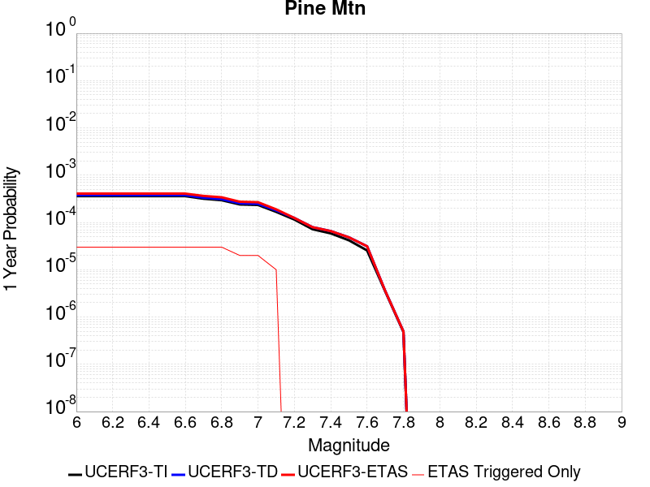 |  |

| Magnitude | 1 wk TI Prob | 1 wk TD Prob | 1 wk ETAS Prob | 1 wk ETAS/TD Gain | 1 wk ETAS Triggered Only | 1 mo TI Prob | 1 mo TD Prob | 1 mo ETAS Prob | 1 mo ETAS/TD Gain | 1 mo ETAS Triggered Only | 1 yr TI Prob | 1 yr TD Prob | 1 yr ETAS Prob | 1 yr ETAS/TD Gain | 1 yr ETAS Triggered Only | 10 yr TI Prob | 10 yr TD Prob | 10 yr ETAS Prob | 10 yr ETAS/TD Gain | 10 yr ETAS Triggered Only |
|-----|-----|-----|-----|-----|-----|-----|-----|-----|-----|-----|-----|-----|-----|-----|-----|-----|-----|-----|-----|-----|
| 6.0 | 6.894797E-6 | 7.2255634E-6 | 7.2255634E-6 | 1.0 | 0.0 | 2.9548795E-5 | 3.0966352E-5 | 6.441013E-5 | 2.080004 | 3.3444816E-5 | 3.596972E-4 | 3.7695307E-4 | 4.438175E-4 | 1.1773813 | 6.688963E-5 | 0.0035911554 | 0.0037634342 | 0.003863391 | 1.0265601 | 1.0033445E-4 |
| 6.1 | 6.894797E-6 | 7.2255634E-6 | 7.2255634E-6 | 1.0 | 0.0 | 2.9548795E-5 | 3.0966352E-5 | 6.441013E-5 | 2.080004 | 3.3444816E-5 | 3.596972E-4 | 3.7695307E-4 | 4.438175E-4 | 1.1773813 | 6.688963E-5 | 0.0035911554 | 0.0037634342 | 0.003863391 | 1.0265601 | 1.0033445E-4 |
| 6.2 | 6.894797E-6 | 7.2255634E-6 | 7.2255634E-6 | 1.0 | 0.0 | 2.9548795E-5 | 3.0966352E-5 | 6.441013E-5 | 2.080004 | 3.3444816E-5 | 3.596972E-4 | 3.7695307E-4 | 4.438175E-4 | 1.1773813 | 6.688963E-5 | 0.0035911554 | 0.0037634342 | 0.003863391 | 1.0265601 | 1.0033445E-4 |
| 6.3 | 6.894797E-6 | 7.2255634E-6 | 7.2255634E-6 | 1.0 | 0.0 | 2.9548795E-5 | 3.0966352E-5 | 6.441013E-5 | 2.080004 | 3.3444816E-5 | 3.596972E-4 | 3.7695307E-4 | 4.438175E-4 | 1.1773813 | 6.688963E-5 | 0.0035911554 | 0.0037634342 | 0.003863391 | 1.0265601 | 1.0033445E-4 |
| 6.4 | 6.894797E-6 | 7.2255634E-6 | 7.2255634E-6 | 1.0 | 0.0 | 2.9548795E-5 | 3.0966352E-5 | 6.441013E-5 | 2.080004 | 3.3444816E-5 | 3.596972E-4 | 3.7695307E-4 | 4.438175E-4 | 1.1773813 | 6.688963E-5 | 0.0035911554 | 0.0037634342 | 0.003863391 | 1.0265601 | 1.0033445E-4 |
| 6.5 | 6.894797E-6 | 7.2255634E-6 | 7.2255634E-6 | 1.0 | 0.0 | 2.9548795E-5 | 3.0966352E-5 | 6.441013E-5 | 2.080004 | 3.3444816E-5 | 3.596972E-4 | 3.7695307E-4 | 4.438175E-4 | 1.1773813 | 6.688963E-5 | 0.0035911554 | 0.0037634342 | 0.003863391 | 1.0265601 | 1.0033445E-4 |
| 6.6 | 6.894797E-6 | 7.2255634E-6 | 7.2255634E-6 | 1.0 | 0.0 | 2.9548795E-5 | 3.0966352E-5 | 6.441013E-5 | 2.080004 | 3.3444816E-5 | 3.596972E-4 | 3.7695307E-4 | 4.438175E-4 | 1.1773813 | 6.688963E-5 | 0.0035911554 | 0.0037634342 | 0.003863391 | 1.0265601 | 1.0033445E-4 |
| 6.7 | 6.0867933E-6 | 6.397213E-6 | 6.397213E-6 | 1.0 | 0.0 | 2.6085996E-5 | 2.741635E-5 | 6.086025E-5 | 2.2198524 | 3.3444816E-5 | 3.1755073E-4 | 3.3374512E-4 | 4.0061245E-4 | 1.2003545 | 6.688963E-5 | 0.0031709734 | 0.0033326582 | 0.0034326583 | 1.030006 | 1.0033445E-4 |
| 6.8 | 5.6530425E-6 | 5.9506933E-6 | 5.9506933E-6 | 1.0 | 0.0 | 2.42271E-5 | 2.5502733E-5 | 5.8946698E-5 | 2.3113873 | 3.3444816E-5 | 2.94925E-4 | 3.104536E-4 | 3.7732246E-4 | 1.2153908 | 6.688963E-5 | 0.002945339 | 0.0031004036 | 0.0032004272 | 1.0322614 | 1.0033445E-4 |
| 6.9 | 4.6015225E-6 | 4.8639267E-6 | 4.8639267E-6 | 1.0 | 0.0 | 1.9720663E-5 | 2.0845242E-5 | 5.428936E-5 | 2.6044006 | 3.3444816E-5 | 2.4007261E-4 | 2.5376273E-4 | 3.206354E-4 | 1.2635243 | 6.688963E-5 | 0.0023981342 | 0.0025348738 | 0.002634954 | 1.0394813 | 1.0033445E-4 |
| 7.0 | 4.4875965E-6 | 4.7475655E-6 | 4.7475655E-6 | 1.0 | 0.0 | 1.9232413E-5 | 2.0346559E-5 | 5.3790696E-5 | 2.6437244 | 3.3444816E-5 | 2.3412947E-4 | 2.4769266E-4 | 3.1456572E-4 | 1.269984 | 6.688963E-5 | 0.0023388295 | 0.0024743096 | 0.0025743959 | 1.0404501 | 1.0033445E-4 |
| 7.1 | 3.203907E-6 | 3.4294974E-6 | 3.4294974E-6 | 1.0 | 0.0 | 1.3730958E-5 | 1.4697767E-5 | 1.4697767E-5 | 1.0 | 0.0 | 1.6716159E-4 | 1.7893128E-4 | 2.1237013E-4 | 1.1868808 | 3.3444816E-5 | 0.0016703589 | 0.0017879383 | 0.0018547084 | 1.0373447 | 6.688963E-5 |
| 7.2 | 2.2060601E-6 | 2.3785535E-6 | 2.3785535E-6 | 1.0 | 0.0 | 9.4545085E-6 | 1.0193763E-5 | 1.0193763E-5 | 1.0 | 0.0 | 1.15102564E-4 | 1.2410246E-4 | 1.2410246E-4 | 1.0 | 0.0 | 0.0011504296 | 0.0012403764 | 0.0012737797 | 1.02693 | 3.3444816E-5 |
| 7.3 | 1.3765207E-6 | 1.5217128E-6 | 1.5217128E-6 | 1.0 | 0.0 | 5.899361E-6 | 6.52161E-6 | 6.52161E-6 | 1.0 | 0.0 | 7.182235E-5 | 7.93978E-5 | 7.93978E-5 | 1.0 | 0.0 | 7.1799144E-4 | 7.937035E-4 | 7.937035E-4 | 1.0 | 0.0 |
| 7.4 | 1.1245983E-6 | 1.2587657E-6 | 1.2587657E-6 | 1.0 | 0.0 | 4.819698E-6 | 5.3946997E-6 | 5.3946997E-6 | 1.0 | 0.0 | 5.8678244E-5 | 6.567857E-5 | 6.567857E-5 | 1.0 | 0.0 | 5.866275E-4 | 6.5659994E-4 | 6.5659994E-4 | 1.0 | 0.0 |
| 7.5 | 8.031682E-7 | 9.277495E-7 | 9.277495E-7 | 1.0 | 0.0 | 3.4421448E-6 | 3.9760635E-6 | 3.9760635E-6 | 1.0 | 0.0 | 4.1907308E-5 | 4.8407568E-5 | 4.8407568E-5 | 1.0 | 0.0 | 4.1899405E-4 | 4.83977E-4 | 4.83977E-4 | 1.0 | 0.0 |
| 7.6 | 4.8953444E-7 | 6.0034915E-7 | 6.0034915E-7 | 1.0 | 0.0 | 2.098003E-6 | 2.5729225E-6 | 2.5729225E-6 | 1.0 | 0.0 | 2.5542888E-5 | 3.1324933E-5 | 3.1324933E-5 | 1.0 | 0.0 | 2.5539953E-4 | 3.1321004E-4 | 3.1321004E-4 | 1.0 | 0.0 |
| 7.7 | 6.634529E-8 | 6.788847E-8 | 6.788847E-8 | 1.0 | 0.0 | 2.843369E-7 | 2.9095054E-7 | 2.9095054E-7 | 1.0 | 0.0 | 3.4617963E-6 | 3.5423177E-6 | 3.5423177E-6 | 1.0 | 0.0 | 3.4617424E-5 | 3.542266E-5 | 3.542266E-5 | 1.0 | 0.0 |
| 7.8 | 9.235578E-9 | 9.488601E-9 | 9.488601E-9 | 1.0 | 0.0 | 3.9581046E-8 | 4.0665434E-8 | 4.0665434E-8 | 1.0 | 0.0 | 4.818991E-7 | 4.951016E-7 | 4.951016E-7 | 1.0 | 0.0 | 4.8189804E-6 | 4.9510063E-6 | 4.9510063E-6 | 1.0 | 0.0 |

## Tin Mountain
*[(top)](#table-of-contents)*

| 1 Week | 1 Month | 1 Year | 10 Year |
|-----|-----|-----|-----|
|  |  |  |  |

| Magnitude | 1 wk TI Prob | 1 wk TD Prob | 1 wk ETAS Prob | 1 wk ETAS/TD Gain | 1 wk ETAS Triggered Only | 1 mo TI Prob | 1 mo TD Prob | 1 mo ETAS Prob | 1 mo ETAS/TD Gain | 1 mo ETAS Triggered Only | 1 yr TI Prob | 1 yr TD Prob | 1 yr ETAS Prob | 1 yr ETAS/TD Gain | 1 yr ETAS Triggered Only | 10 yr TI Prob | 10 yr TD Prob | 10 yr ETAS Prob | 10 yr ETAS/TD Gain | 10 yr ETAS Triggered Only |
|-----|-----|-----|-----|-----|-----|-----|-----|-----|-----|-----|-----|-----|-----|-----|-----|-----|-----|-----|-----|-----|
| 6.0 | 4.083776E-6 | 4.18155E-6 | 4.18155E-6 | 1.0 | 0.0 | 1.750178E-5 | 1.7920827E-5 | 5.1365045E-5 | 2.8662207 | 3.3444816E-5 | 2.1306332E-4 | 2.1816794E-4 | 2.8504297E-4 | 1.3065301 | 6.688963E-5 | 0.0021285915 | 0.0021799032 | 0.002280019 | 1.0459267 | 1.0033445E-4 |
| 6.1 | 4.083776E-6 | 4.18155E-6 | 4.18155E-6 | 1.0 | 0.0 | 1.750178E-5 | 1.7920827E-5 | 5.1365045E-5 | 2.8662207 | 3.3444816E-5 | 2.1306332E-4 | 2.1816794E-4 | 2.8504297E-4 | 1.3065301 | 6.688963E-5 | 0.0021285915 | 0.0021799032 | 0.002280019 | 1.0459267 | 1.0033445E-4 |
| 6.2 | 4.083776E-6 | 4.18155E-6 | 4.18155E-6 | 1.0 | 0.0 | 1.750178E-5 | 1.7920827E-5 | 5.1365045E-5 | 2.8662207 | 3.3444816E-5 | 2.1306332E-4 | 2.1816794E-4 | 2.8504297E-4 | 1.3065301 | 6.688963E-5 | 0.0021285915 | 0.0021799032 | 0.002280019 | 1.0459267 | 1.0033445E-4 |
| 6.3 | 4.083776E-6 | 4.18155E-6 | 4.18155E-6 | 1.0 | 0.0 | 1.750178E-5 | 1.7920827E-5 | 5.1365045E-5 | 2.8662207 | 3.3444816E-5 | 2.1306332E-4 | 2.1816794E-4 | 2.8504297E-4 | 1.3065301 | 6.688963E-5 | 0.0021285915 | 0.0021799032 | 0.002280019 | 1.0459267 | 1.0033445E-4 |
| 6.4 | 4.083776E-6 | 4.18155E-6 | 4.18155E-6 | 1.0 | 0.0 | 1.750178E-5 | 1.7920827E-5 | 5.1365045E-5 | 2.8662207 | 3.3444816E-5 | 2.1306332E-4 | 2.1816794E-4 | 2.8504297E-4 | 1.3065301 | 6.688963E-5 | 0.0021285915 | 0.0021799032 | 0.002280019 | 1.0459267 | 1.0033445E-4 |
| 6.5 | 2.3143427E-6 | 2.3731652E-6 | 2.3731652E-6 | 1.0 | 0.0 | 9.9185745E-6 | 1.0170673E-5 | 1.0170673E-5 | 1.0 | 0.0 | 1.2075195E-4 | 1.2382168E-4 | 1.2382168E-4 | 1.0 | 0.0 | 0.0012068636 | 0.0012376028 | 0.0012710062 | 1.0269904 | 3.3444816E-5 |
| 6.6 | 2.3143427E-6 | 2.3731652E-6 | 2.3731652E-6 | 1.0 | 0.0 | 9.9185745E-6 | 1.0170673E-5 | 1.0170673E-5 | 1.0 | 0.0 | 1.2075195E-4 | 1.2382168E-4 | 1.2382168E-4 | 1.0 | 0.0 | 0.0012068636 | 0.0012376028 | 0.0012710062 | 1.0269904 | 3.3444816E-5 |
| 6.7 | 1.7029532E-6 | 1.7497979E-6 | 1.7497979E-6 | 1.0 | 0.0 | 7.2983503E-6 | 7.4991153E-6 | 7.4991153E-6 | 1.0 | 0.0 | 8.885379E-5 | 9.129844E-5 | 9.129844E-5 | 1.0 | 0.0 | 8.881827E-4 | 9.1266196E-4 | 9.1266196E-4 | 1.0 | 0.0 |
| 6.8 | 1.2914646E-6 | 1.3299432E-6 | 1.3299432E-6 | 1.0 | 0.0 | 5.534837E-6 | 5.6997465E-6 | 5.6997465E-6 | 1.0 | 0.0 | 6.738455E-5 | 6.939264E-5 | 6.939264E-5 | 1.0 | 0.0 | 6.736412E-4 | 6.937531E-4 | 6.937531E-4 | 1.0 | 0.0 |
| 6.9 | 5.8708974E-7 | 6.117028E-7 | 6.117028E-7 | 1.0 | 0.0 | 2.5160964E-6 | 2.621581E-6 | 2.621581E-6 | 1.0 | 0.0 | 3.0633044E-5 | 3.1917323E-5 | 3.1917323E-5 | 1.0 | 0.0 | 3.0628822E-4 | 3.191315E-4 | 3.191315E-4 | 1.0 | 0.0 |
| 7.0 | 4.6248786E-7 | 4.832044E-7 | 4.832044E-7 | 1.0 | 0.0 | 1.9820893E-6 | 2.0708746E-6 | 2.0708746E-6 | 1.0 | 0.0 | 2.413167E-5 | 2.5212645E-5 | 2.5212645E-5 | 1.0 | 0.0 | 2.412905E-4 | 2.5210154E-4 | 2.5210154E-4 | 1.0 | 0.0 |
| 7.1 | 3.804606E-7 | 3.9871725E-7 | 3.9871725E-7 | 1.0 | 0.0 | 1.6305444E-6 | 1.7087873E-6 | 1.7087873E-6 | 1.0 | 0.0 | 1.9851697E-5 | 2.080432E-5 | 2.080432E-5 | 1.0 | 0.0 | 1.9849923E-4 | 2.080271E-4 | 2.080271E-4 | 1.0 | 0.0 |
| 7.2 | 3.5864858E-7 | 3.7617107E-7 | 3.7617107E-7 | 1.0 | 0.0 | 1.5370645E-6 | 1.6121609E-6 | 1.6121609E-6 | 1.0 | 0.0 | 1.87136E-5 | 1.9627916E-5 | 1.9627916E-5 | 1.0 | 0.0 | 1.8712023E-4 | 1.9626514E-4 | 1.9626514E-4 | 1.0 | 0.0 |
| 7.3 | 3.342063E-7 | 3.50637E-7 | 3.50637E-7 | 1.0 | 0.0 | 1.4323119E-6 | 1.5027293E-6 | 1.5027293E-6 | 1.0 | 0.0 | 1.7438259E-5 | 1.829561E-5 | 1.829561E-5 | 1.0 | 0.0 | 1.743689E-4 | 1.8294434E-4 | 1.8294434E-4 | 1.0 | 0.0 |
| 7.4 | 2.971242E-7 | 3.116602E-7 | 3.116602E-7 | 1.0 | 0.0 | 1.2733886E-6 | 1.3356861E-6 | 1.3356861E-6 | 1.0 | 0.0 | 1.5503398E-5 | 1.626189E-5 | 1.626189E-5 | 1.0 | 0.0 | 1.5502315E-4 | 1.6261027E-4 | 1.6261027E-4 | 1.0 | 0.0 |
| 7.5 | 1.4326713E-7 | 1.501262E-7 | 1.501262E-7 | 1.0 | 0.0 | 6.140018E-7 | 6.43398E-7 | 6.43398E-7 | 1.0 | 0.0 | 7.4754466E-6 | 7.833371E-6 | 7.833371E-6 | 1.0 | 0.0 | 7.475195E-5 | 7.83337E-5 | 7.83337E-5 | 1.0 | 0.0 |

## Kern Canyon (North Kern) 2011
*[(top)](#table-of-contents)*

| 1 Week | 1 Month | 1 Year | 10 Year |
|-----|-----|-----|-----|
|  |  |  | 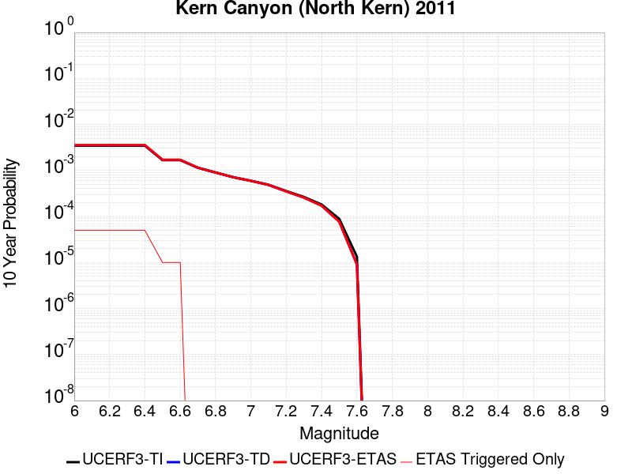 |

| Magnitude | 1 wk TI Prob | 1 wk TD Prob | 1 wk ETAS Prob | 1 wk ETAS/TD Gain | 1 wk ETAS Triggered Only | 1 mo TI Prob | 1 mo TD Prob | 1 mo ETAS Prob | 1 mo ETAS/TD Gain | 1 mo ETAS Triggered Only | 1 yr TI Prob | 1 yr TD Prob | 1 yr ETAS Prob | 1 yr ETAS/TD Gain | 1 yr ETAS Triggered Only | 10 yr TI Prob | 10 yr TD Prob | 10 yr ETAS Prob | 10 yr ETAS/TD Gain | 10 yr ETAS Triggered Only |
|-----|-----|-----|-----|-----|-----|-----|-----|-----|-----|-----|-----|-----|-----|-----|-----|-----|-----|-----|-----|-----|
| 6.0 | 6.6264497E-6 | 6.7573515E-6 | 6.7573515E-6 | 1.0 | 0.0 | 2.8398761E-5 | 2.8959801E-5 | 6.240365E-5 | 2.154837 | 3.3444816E-5 | 3.4570007E-4 | 3.5253653E-4 | 3.8596956E-4 | 1.0948356 | 3.3444816E-5 | 0.0034516277 | 0.0035205614 | 0.0036205426 | 1.0283992 | 1.0033445E-4 |
| 6.1 | 6.6264497E-6 | 6.7573515E-6 | 6.7573515E-6 | 1.0 | 0.0 | 2.8398761E-5 | 2.8959801E-5 | 6.240365E-5 | 2.154837 | 3.3444816E-5 | 3.4570007E-4 | 3.5253653E-4 | 3.8596956E-4 | 1.0948356 | 3.3444816E-5 | 0.0034516277 | 0.0035205614 | 0.0036205426 | 1.0283992 | 1.0033445E-4 |
| 6.2 | 6.6264497E-6 | 6.7573515E-6 | 6.7573515E-6 | 1.0 | 0.0 | 2.8398761E-5 | 2.8959801E-5 | 6.240365E-5 | 2.154837 | 3.3444816E-5 | 3.4570007E-4 | 3.5253653E-4 | 3.8596956E-4 | 1.0948356 | 3.3444816E-5 | 0.0034516277 | 0.0035205614 | 0.0036205426 | 1.0283992 | 1.0033445E-4 |
| 6.3 | 6.6264497E-6 | 6.7573515E-6 | 6.7573515E-6 | 1.0 | 0.0 | 2.8398761E-5 | 2.8959801E-5 | 6.240365E-5 | 2.154837 | 3.3444816E-5 | 3.4570007E-4 | 3.5253653E-4 | 3.8596956E-4 | 1.0948356 | 3.3444816E-5 | 0.0034516277 | 0.0035205614 | 0.0036205426 | 1.0283992 | 1.0033445E-4 |
| 6.4 | 6.6264497E-6 | 6.7573515E-6 | 6.7573515E-6 | 1.0 | 0.0 | 2.8398761E-5 | 2.8959801E-5 | 6.240365E-5 | 2.154837 | 3.3444816E-5 | 3.4570007E-4 | 3.5253653E-4 | 3.8596956E-4 | 1.0948356 | 3.3444816E-5 | 0.0034516277 | 0.0035205614 | 0.0036205426 | 1.0283992 | 1.0033445E-4 |
| 6.5 | 3.2162225E-6 | 3.2571006E-6 | 3.2571006E-6 | 1.0 | 0.0 | 1.3783738E-5 | 1.3958933E-5 | 1.3958933E-5 | 1.0 | 0.0 | 1.6780409E-4 | 1.6993756E-4 | 1.6993756E-4 | 1.0 | 0.0 | 0.0016767744 | 0.0016981558 | 0.0016981558 | 1.0 | 0.0 |
| 6.6 | 3.2162225E-6 | 3.2571006E-6 | 3.2571006E-6 | 1.0 | 0.0 | 1.3783738E-5 | 1.3958933E-5 | 1.3958933E-5 | 1.0 | 0.0 | 1.6780409E-4 | 1.6993756E-4 | 1.6993756E-4 | 1.0 | 0.0 | 0.0016767744 | 0.0016981558 | 0.0016981558 | 1.0 | 0.0 |
| 6.7 | 2.1908265E-6 | 2.2071279E-6 | 2.2071279E-6 | 1.0 | 0.0 | 9.389223E-6 | 9.459087E-6 | 9.459087E-6 | 1.0 | 0.0 | 1.1430779E-4 | 1.1515849E-4 | 1.1515849E-4 | 1.0 | 0.0 | 0.0011424901 | 0.0011510076 | 0.0011510076 | 1.0 | 0.0 |
| 6.8 | 1.7303895E-6 | 1.7365574E-6 | 1.7365574E-6 | 1.0 | 0.0 | 7.415934E-6 | 7.442368E-6 | 7.442368E-6 | 1.0 | 0.0 | 9.028525E-5 | 9.060716E-5 | 9.060716E-5 | 1.0 | 0.0 | 9.024858E-4 | 9.057119E-4 | 9.057119E-4 | 1.0 | 0.0 |
| 6.9 | 1.3700314E-6 | 1.3688657E-6 | 1.3688657E-6 | 1.0 | 0.0 | 5.87155E-6 | 5.866554E-6 | 5.866554E-6 | 1.0 | 0.0 | 7.148377E-5 | 7.1423005E-5 | 7.1423005E-5 | 1.0 | 0.0 | 7.146078E-4 | 7.1400503E-4 | 7.1400503E-4 | 1.0 | 0.0 |
| 7.0 | 1.1467797E-6 | 1.1413833E-6 | 1.1413833E-6 | 1.0 | 0.0 | 4.9147607E-6 | 4.8916336E-6 | 4.8916336E-6 | 1.0 | 0.0 | 5.983557E-5 | 5.9554044E-5 | 5.9554044E-5 | 1.0 | 0.0 | 5.981946E-4 | 5.95384E-4 | 5.95384E-4 | 1.0 | 0.0 |
| 7.1 | 9.3952065E-7 | 9.302714E-7 | 9.302714E-7 | 1.0 | 0.0 | 4.026511E-6 | 3.9868714E-6 | 3.9868714E-6 | 1.0 | 0.0 | 4.9021666E-5 | 4.8539096E-5 | 4.8539096E-5 | 1.0 | 0.0 | 4.901085E-4 | 4.8528673E-4 | 4.8528673E-4 | 1.0 | 0.0 |
| 7.2 | 6.858055E-7 | 6.719318E-7 | 6.719318E-7 | 1.0 | 0.0 | 2.939163E-6 | 2.8797044E-6 | 2.8797044E-6 | 1.0 | 0.0 | 3.5783723E-5 | 3.5059846E-5 | 3.5059846E-5 | 1.0 | 0.0 | 3.5777962E-4 | 3.5054405E-4 | 3.5054405E-4 | 1.0 | 0.0 |
| 7.3 | 5.1101983E-7 | 4.939313E-7 | 4.939313E-7 | 1.0 | 0.0 | 2.1900833E-6 | 2.1168466E-6 | 2.1168466E-6 | 1.0 | 0.0 | 2.6663936E-5 | 2.5772308E-5 | 2.5772308E-5 | 1.0 | 0.0 | 2.6660739E-4 | 2.5769367E-4 | 2.5769367E-4 | 1.0 | 0.0 |
| 7.4 | 3.4999414E-7 | 3.2995996E-7 | 3.2995996E-7 | 1.0 | 0.0 | 1.499974E-6 | 1.4141134E-6 | 1.4141134E-6 | 1.0 | 0.0 | 1.8262032E-5 | 1.7216697E-5 | 1.7216697E-5 | 1.0 | 0.0 | 1.826053E-4 | 1.7215387E-4 | 1.7215387E-4 | 1.0 | 0.0 |
| 7.5 | 1.7021522E-7 | 1.4750091E-7 | 1.4750091E-7 | 1.0 | 0.0 | 7.2949354E-7 | 6.3214657E-7 | 6.3214657E-7 | 1.0 | 0.0 | 8.881548E-6 | 7.696359E-6 | 7.696359E-6 | 1.0 | 0.0 | 8.8811925E-5 | 7.6961E-5 | 7.6961E-5 | 1.0 | 0.0 |
| 7.6 | 2.572245E-8 | 1.7352637E-8 | 1.7352637E-8 | 1.0 | 0.0 | 1.10239064E-7 | 7.4368444E-8 | 7.4368444E-8 | 1.0 | 0.0 | 1.3421597E-6 | 9.0543546E-7 | 9.0543546E-7 | 1.0 | 0.0 | 1.3421517E-5 | 9.0543235E-6 | 9.0543235E-6 | 1.0 | 0.0 |

## Santa Rosa Island
*[(top)](#table-of-contents)*

| 1 Week | 1 Month | 1 Year | 10 Year |
|-----|-----|-----|-----|
|  |  |  |  |

| Magnitude | 1 wk TI Prob | 1 wk TD Prob | 1 wk ETAS Prob | 1 wk ETAS/TD Gain | 1 wk ETAS Triggered Only | 1 mo TI Prob | 1 mo TD Prob | 1 mo ETAS Prob | 1 mo ETAS/TD Gain | 1 mo ETAS Triggered Only | 1 yr TI Prob | 1 yr TD Prob | 1 yr ETAS Prob | 1 yr ETAS/TD Gain | 1 yr ETAS Triggered Only | 10 yr TI Prob | 10 yr TD Prob | 10 yr ETAS Prob | 10 yr ETAS/TD Gain | 10 yr ETAS Triggered Only |
|-----|-----|-----|-----|-----|-----|-----|-----|-----|-----|-----|-----|-----|-----|-----|-----|-----|-----|-----|-----|-----|
| 6.0 | 4.1143165E-5 | 4.7092042E-5 | 4.7092042E-5 | 1.0 | 0.0 | 1.7631594E-4 | 2.0180854E-4 | 2.0180854E-4 | 1.0 | 0.0 | 0.002144533 | 0.0024544473 | 0.00248781 | 1.0135927 | 3.3444816E-5 | 0.021239553 | 0.024294013 | 0.024359278 | 1.0026865 | 6.688963E-5 |
| 6.1 | 2.1061249E-5 | 2.3865383E-5 | 2.3865383E-5 | 1.0 | 0.0 | 9.0259375E-5 | 1.0227637E-4 | 1.0227637E-4 | 1.0 | 0.0 | 0.0010983539 | 0.0012445324 | 0.0012445324 | 1.0 | 0.0 | 0.01092941 | 0.012378667 | 0.012378667 | 1.0 | 0.0 |
| 6.2 | 2.1061249E-5 | 2.3865383E-5 | 2.3865383E-5 | 1.0 | 0.0 | 9.0259375E-5 | 1.0227637E-4 | 1.0227637E-4 | 1.0 | 0.0 | 0.0010983539 | 0.0012445324 | 0.0012445324 | 1.0 | 0.0 | 0.01092941 | 0.012378667 | 0.012378667 | 1.0 | 0.0 |
| 6.3 | 1.5158236E-5 | 1.7074708E-5 | 1.7074708E-5 | 1.0 | 0.0 | 6.496225E-5 | 7.317533E-5 | 7.317533E-5 | 1.0 | 0.0 | 7.906284E-4 | 8.905574E-4 | 8.905574E-4 | 1.0 | 0.0 | 0.007878214 | 0.008871138 | 0.008871138 | 1.0 | 0.0 |
| 6.4 | 1.2341918E-5 | 1.3853143E-5 | 1.3853143E-5 | 1.0 | 0.0 | 5.2892858E-5 | 5.9369308E-5 | 5.9369308E-5 | 1.0 | 0.0 | 6.437803E-4 | 7.225897E-4 | 7.225897E-4 | 1.0 | 0.0 | 0.006419184 | 0.0072032386 | 0.0072032386 | 1.0 | 0.0 |
| 6.5 | 9.061158E-6 | 1.0117188E-5 | 1.0117188E-5 | 1.0 | 0.0 | 3.883296E-5 | 4.335869E-5 | 4.335869E-5 | 1.0 | 0.0 | 4.726887E-4 | 5.277695E-4 | 5.277695E-4 | 1.0 | 0.0 | 0.004716845 | 0.0052656992 | 0.0052656992 | 1.0 | 0.0 |
| 6.6 | 7.5461685E-6 | 8.400861E-6 | 8.400861E-6 | 1.0 | 0.0 | 3.2340322E-5 | 3.6003217E-5 | 3.6003217E-5 | 1.0 | 0.0 | 3.936723E-4 | 4.382553E-4 | 4.382553E-4 | 1.0 | 0.0 | 0.003929756 | 0.0043743397 | 0.0043743397 | 1.0 | 0.0 |
| 6.7 | 5.5023775E-6 | 6.0874677E-6 | 6.0874677E-6 | 1.0 | 0.0 | 2.3581404E-5 | 2.6088905E-5 | 2.6088905E-5 | 1.0 | 0.0 | 2.8706578E-4 | 3.1758935E-4 | 3.1758935E-4 | 1.0 | 0.0 | 0.0028669522 | 0.0031716768 | 0.0031716768 | 1.0 | 0.0 |
| 6.8 | 3.7351679E-6 | 4.0831915E-6 | 4.0831915E-6 | 1.0 | 0.0 | 1.6007763E-5 | 1.749929E-5 | 1.749929E-5 | 1.0 | 0.0 | 1.948771E-4 | 2.1303551E-4 | 2.1303551E-4 | 1.0 | 0.0 | 0.0019470629 | 0.002128558 | 0.002128558 | 1.0 | 0.0 |
| 6.9 | 2.456366E-6 | 2.6292953E-6 | 2.6292953E-6 | 1.0 | 0.0 | 1.0527241E-5 | 1.126836E-5 | 1.126836E-5 | 1.0 | 0.0 | 1.2816161E-4 | 1.3718367E-4 | 1.3718367E-4 | 1.0 | 0.0 | 0.0012808773 | 0.0013709929 | 0.0013709929 | 1.0 | 0.0 |
| 7.0 | 2.3245157E-6 | 2.482801E-6 | 2.482801E-6 | 1.0 | 0.0 | 9.962172E-6 | 1.0640532E-5 | 1.0640532E-5 | 1.0 | 0.0 | 1.2128269E-4 | 1.295408E-4 | 1.295408E-4 | 1.0 | 0.0 | 0.0012121652 | 0.0012946551 | 0.0012946551 | 1.0 | 0.0 |
| 7.1 | 2.2248344E-6 | 2.3732712E-6 | 2.3732712E-6 | 1.0 | 0.0 | 9.53497E-6 | 1.0171123E-5 | 1.0171123E-5 | 1.0 | 0.0 | 1.1608207E-4 | 1.238264E-4 | 1.238264E-4 | 1.0 | 0.0 | 0.0011602144 | 0.001237576 | 0.001237576 | 1.0 | 0.0 |
| 7.2 | 2.1350402E-6 | 2.2761742E-6 | 2.2761742E-6 | 1.0 | 0.0 | 9.150141E-6 | 9.7549955E-6 | 9.7549955E-6 | 1.0 | 0.0 | 1.1139726E-4 | 1.1876062E-4 | 1.1876062E-4 | 1.0 | 0.0 | 0.0011134144 | 0.0011869734 | 0.0011869734 | 1.0 | 0.0 |
| 7.3 | 1.9793572E-6 | 2.1087376E-6 | 2.1087376E-6 | 1.0 | 0.0 | 8.482932E-6 | 9.037415E-6 | 9.037415E-6 | 1.0 | 0.0 | 1.032748E-4 | 1.10024994E-4 | 1.10024994E-4 | 1.0 | 0.0 | 0.0010322682 | 0.001099707 | 0.001099707 | 1.0 | 0.0 |
| 7.4 | 1.6951194E-6 | 1.804589E-6 | 1.804589E-6 | 1.0 | 0.0 | 7.264777E-6 | 7.73393E-6 | 7.73393E-6 | 1.0 | 0.0 | 8.844508E-5 | 9.4156545E-5 | 9.4156545E-5 | 1.0 | 0.0 | 8.840988E-4 | 9.411682E-4 | 9.411682E-4 | 1.0 | 0.0 |
| 7.5 | 8.987207E-7 | 9.51229E-7 | 9.51229E-7 | 1.0 | 0.0 | 3.8516546E-6 | 4.0766895E-6 | 4.0766895E-6 | 1.0 | 0.0 | 4.6892885E-5 | 4.9632577E-5 | 4.9632577E-5 | 1.0 | 0.0 | 4.688299E-4 | 4.9621606E-4 | 4.9621606E-4 | 1.0 | 0.0 |
| 7.6 | 3.8783037E-7 | 4.052958E-7 | 4.052958E-7 | 1.0 | 0.0 | 1.6621291E-6 | 1.7369808E-6 | 1.7369808E-6 | 1.0 | 0.0 | 2.0236233E-5 | 2.1147544E-5 | 2.1147544E-5 | 1.0 | 0.0 | 2.023439E-4 | 2.1145596E-4 | 2.1145596E-4 | 1.0 | 0.0 |
| 7.7 | 6.181804E-8 | 6.3390665E-8 | 6.3390665E-8 | 1.0 | 0.0 | 2.6493444E-7 | 2.7167425E-7 | 2.7167425E-7 | 1.0 | 0.0 | 3.225572E-6 | 3.307629E-6 | 3.307629E-6 | 1.0 | 0.0 | 3.225525E-5 | 3.3075805E-5 | 3.3075805E-5 | 1.0 | 0.0 |
| 7.8 | 1.3704449E-9 | 1.3964188E-9 | 1.3964188E-9 | 1.0 | 0.0 | 5.873335E-9 | 5.984652E-9 | 5.984652E-9 | 1.0 | 0.0 | 7.1507856E-8 | 7.286314E-8 | 7.286314E-8 | 1.0 | 0.0 | 7.1507833E-7 | 7.286312E-7 | 7.286312E-7 | 1.0 | 0.0 |

## Chino alt 1
*[(top)](#table-of-contents)*

| 1 Week | 1 Month | 1 Year | 10 Year |
|-----|-----|-----|-----|
|  |  |  |  |

| Magnitude | 1 wk TI Prob | 1 wk TD Prob | 1 wk ETAS Prob | 1 wk ETAS/TD Gain | 1 wk ETAS Triggered Only | 1 mo TI Prob | 1 mo TD Prob | 1 mo ETAS Prob | 1 mo ETAS/TD Gain | 1 mo ETAS Triggered Only | 1 yr TI Prob | 1 yr TD Prob | 1 yr ETAS Prob | 1 yr ETAS/TD Gain | 1 yr ETAS Triggered Only | 10 yr TI Prob | 10 yr TD Prob | 10 yr ETAS Prob | 10 yr ETAS/TD Gain | 10 yr ETAS Triggered Only |
|-----|-----|-----|-----|-----|-----|-----|-----|-----|-----|-----|-----|-----|-----|-----|-----|-----|-----|-----|-----|-----|
| 6.0 | 3.939946E-5 | 4.895037E-5 | 4.895037E-5 | 1.0 | 0.0 | 1.6884391E-4 | 2.0977337E-4 | 2.0977337E-4 | 1.0 | 0.0 | 0.0020537362 | 0.0025514876 | 0.0025514876 | 1.0 | 0.0 | 0.020348595 | 0.025278764 | 0.025343962 | 1.0025792 | 6.688963E-5 |
| 6.1 | 2.1505624E-5 | 2.6880154E-5 | 2.6880154E-5 | 1.0 | 0.0 | 9.2163704E-5 | 1.151962E-4 | 1.151962E-4 | 1.0 | 0.0 | 0.0011215154 | 0.0014017228 | 0.0014017228 | 1.0 | 0.0 | 0.011158722 | 0.013945717 | 0.0139786955 | 1.0023648 | 3.3444816E-5 |
| 6.2 | 2.1505624E-5 | 2.6880154E-5 | 2.6880154E-5 | 1.0 | 0.0 | 9.2163704E-5 | 1.151962E-4 | 1.151962E-4 | 1.0 | 0.0 | 0.0011215154 | 0.0014017228 | 0.0014017228 | 1.0 | 0.0 | 0.011158722 | 0.013945717 | 0.0139786955 | 1.0023648 | 3.3444816E-5 |
| 6.3 | 1.4290785E-5 | 1.8166014E-5 | 1.8166014E-5 | 1.0 | 0.0 | 6.1244784E-5 | 7.785228E-5 | 7.785228E-5 | 1.0 | 0.0 | 7.454001E-4 | 9.4748475E-4 | 9.4748475E-4 | 1.0 | 0.0 | 0.007429048 | 0.009444912 | 0.009444912 | 1.0 | 0.0 |
| 6.4 | 1.4290785E-5 | 1.8166014E-5 | 1.8166014E-5 | 1.0 | 0.0 | 6.1244784E-5 | 7.785228E-5 | 7.785228E-5 | 1.0 | 0.0 | 7.454001E-4 | 9.4748475E-4 | 9.4748475E-4 | 1.0 | 0.0 | 0.007429048 | 0.009444912 | 0.009444912 | 1.0 | 0.0 |
| 6.5 | 1.3017944E-5 | 1.6652937E-5 | 1.6652937E-5 | 1.0 | 0.0 | 5.5789995E-5 | 7.136803E-5 | 7.136803E-5 | 1.0 | 0.0 | 6.790315E-4 | 8.686031E-4 | 8.686031E-4 | 1.0 | 0.0 | 0.0067696036 | 0.008662385 | 0.008662385 | 1.0 | 0.0 |
| 6.6 | 9.470016E-6 | 1.2040057E-5 | 1.2040057E-5 | 1.0 | 0.0 | 4.058515E-5 | 5.1599414E-5 | 5.1599414E-5 | 1.0 | 0.0 | 4.940122E-4 | 6.2807574E-4 | 6.2807574E-4 | 1.0 | 0.0 | 0.004929154 | 0.0062722242 | 0.0062722242 | 1.0 | 0.0 |
| 6.7 | 8.314155E-6 | 1.0408293E-5 | 1.0408293E-5 | 1.0 | 0.0 | 3.5631605E-5 | 4.460639E-5 | 4.460639E-5 | 1.0 | 0.0 | 4.3372845E-4 | 5.429797E-4 | 5.429797E-4 | 1.0 | 0.0 | 0.004328829 | 0.005426062 | 0.005426062 | 1.0 | 0.0 |
| 6.8 | 3.4856364E-6 | 3.8135372E-6 | 3.8135372E-6 | 1.0 | 0.0 | 1.4938357E-5 | 1.634364E-5 | 1.634364E-5 | 1.0 | 0.0 | 1.8185932E-4 | 1.9896773E-4 | 1.9896773E-4 | 1.0 | 0.0 | 0.0018171056 | 0.001989573 | 0.001989573 | 1.0 | 0.0 |
| 6.9 | 2.2645952E-6 | 2.152999E-6 | 2.152999E-6 | 1.0 | 0.0 | 9.705372E-6 | 9.227107E-6 | 9.227107E-6 | 1.0 | 0.0 | 1.18156495E-4 | 1.1233445E-4 | 1.1233445E-4 | 1.0 | 0.0 | 0.0011809369 | 0.0011233927 | 0.0011233927 | 1.0 | 0.0 |
| 7.0 | 1.7864003E-6 | 1.5431575E-6 | 1.5431575E-6 | 1.0 | 0.0 | 7.655979E-6 | 6.613516E-6 | 6.613516E-6 | 1.0 | 0.0 | 9.3207556E-5 | 8.0516635E-5 | 8.0516635E-5 | 1.0 | 0.0 | 9.316847E-4 | 8.0532173E-4 | 8.0532173E-4 | 1.0 | 0.0 |
| 7.1 | 1.7315456E-6 | 1.4734279E-6 | 1.4734279E-6 | 1.0 | 0.0 | 7.420889E-6 | 6.3146763E-6 | 6.3146763E-6 | 1.0 | 0.0 | 9.034557E-5 | 7.6878525E-5 | 7.6878525E-5 | 1.0 | 0.0 | 9.0308854E-4 | 7.6895714E-4 | 7.6895714E-4 | 1.0 | 0.0 |
| 7.2 | 1.6008337E-6 | 1.3574753E-6 | 1.3574753E-6 | 1.0 | 0.0 | 6.860698E-6 | 5.817739E-6 | 5.817739E-6 | 1.0 | 0.0 | 8.352579E-5 | 7.082872E-5 | 7.082872E-5 | 1.0 | 0.0 | 8.34944E-4 | 7.084856E-4 | 7.084856E-4 | 1.0 | 0.0 |
| 7.3 | 1.3320939E-6 | 1.1218251E-6 | 1.1218251E-6 | 1.0 | 0.0 | 5.7089615E-6 | 4.8078136E-6 | 4.8078136E-6 | 1.0 | 0.0 | 6.9504385E-5 | 5.8533606E-5 | 5.8533606E-5 | 1.0 | 0.0 | 6.9482654E-4 | 5.853264E-4 | 5.853264E-4 | 1.0 | 0.0 |
| 7.4 | 1.114294E-6 | 9.2374523E-7 | 9.2374523E-7 | 1.0 | 0.0 | 4.775537E-6 | 3.958902E-6 | 3.958902E-6 | 1.0 | 0.0 | 5.8140613E-5 | 4.8198606E-5 | 4.8198606E-5 | 1.0 | 0.0 | 5.81254E-4 | 4.8189834E-4 | 4.8189834E-4 | 1.0 | 0.0 |
| 7.5 | 9.354081E-7 | 7.623702E-7 | 7.623702E-7 | 1.0 | 0.0 | 4.0088858E-6 | 3.2672967E-6 | 3.2672967E-6 | 1.0 | 0.0 | 4.8807087E-5 | 3.9778646E-5 | 3.9778646E-5 | 1.0 | 0.0 | 4.879637E-4 | 3.9771866E-4 | 3.9771866E-4 | 1.0 | 0.0 |
| 7.6 | 8.521771E-7 | 6.8809493E-7 | 6.8809493E-7 | 1.0 | 0.0 | 3.6521824E-6 | 2.9489752E-6 | 2.9489752E-6 | 1.0 | 0.0 | 4.4464414E-5 | 3.5903213E-5 | 3.5903213E-5 | 1.0 | 0.0 | 4.4455516E-4 | 3.589773E-4 | 3.589773E-4 | 1.0 | 0.0 |
| 7.7 | 2.1803626E-7 | 1.4187151E-7 | 1.4187151E-7 | 1.0 | 0.0 | 9.344408E-7 | 6.080207E-7 | 6.080207E-7 | 1.0 | 0.0 | 1.1376757E-5 | 7.402636E-6 | 7.402636E-6 | 1.0 | 0.0 | 1.13761744E-4 | 7.402486E-5 | 7.402486E-5 | 1.0 | 0.0 |

## San Andreas (North Branch Mill Creek)
*[(top)](#table-of-contents)*

| 1 Week | 1 Month | 1 Year | 10 Year |
|-----|-----|-----|-----|
|  |  |  |  |

| Magnitude | 1 wk TI Prob | 1 wk TD Prob | 1 wk ETAS Prob | 1 wk ETAS/TD Gain | 1 wk ETAS Triggered Only | 1 mo TI Prob | 1 mo TD Prob | 1 mo ETAS Prob | 1 mo ETAS/TD Gain | 1 mo ETAS Triggered Only | 1 yr TI Prob | 1 yr TD Prob | 1 yr ETAS Prob | 1 yr ETAS/TD Gain | 1 yr ETAS Triggered Only | 10 yr TI Prob | 10 yr TD Prob | 10 yr ETAS Prob | 10 yr ETAS/TD Gain | 10 yr ETAS Triggered Only |
|-----|-----|-----|-----|-----|-----|-----|-----|-----|-----|-----|-----|-----|-----|-----|-----|-----|-----|-----|-----|-----|
| 6.0 | 1.3461156E-5 | 2.3506776E-5 | 2.3506776E-5 | 1.0 | 0.0 | 5.7689394E-5 | 1.0073945E-4 | 1.341809E-4 | 1.3319597 | 3.3444816E-5 | 7.02142E-4 | 0.0012258161 | 0.0012592198 | 1.0272503 | 3.3444816E-5 | 0.0069992766 | 0.012233093 | 0.012299165 | 1.005401 | 6.688963E-5 |
| 6.1 | 1.3461156E-5 | 2.3506776E-5 | 2.3506776E-5 | 1.0 | 0.0 | 5.7689394E-5 | 1.0073945E-4 | 1.341809E-4 | 1.3319597 | 3.3444816E-5 | 7.02142E-4 | 0.0012258161 | 0.0012592198 | 1.0272503 | 3.3444816E-5 | 0.0069992766 | 0.012233093 | 0.012299165 | 1.005401 | 6.688963E-5 |
| 6.2 | 1.3461156E-5 | 2.3506776E-5 | 2.3506776E-5 | 1.0 | 0.0 | 5.7689394E-5 | 1.0073945E-4 | 1.341809E-4 | 1.3319597 | 3.3444816E-5 | 7.02142E-4 | 0.0012258161 | 0.0012592198 | 1.0272503 | 3.3444816E-5 | 0.0069992766 | 0.012233093 | 0.012299165 | 1.005401 | 6.688963E-5 |
| 6.3 | 1.3461156E-5 | 2.3506776E-5 | 2.3506776E-5 | 1.0 | 0.0 | 5.7689394E-5 | 1.0073945E-4 | 1.341809E-4 | 1.3319597 | 3.3444816E-5 | 7.02142E-4 | 0.0012258161 | 0.0012592198 | 1.0272503 | 3.3444816E-5 | 0.0069992766 | 0.012233093 | 0.012299165 | 1.005401 | 6.688963E-5 |
| 6.4 | 1.3461156E-5 | 2.3506776E-5 | 2.3506776E-5 | 1.0 | 0.0 | 5.7689394E-5 | 1.0073945E-4 | 1.341809E-4 | 1.3319597 | 3.3444816E-5 | 7.02142E-4 | 0.0012258161 | 0.0012592198 | 1.0272503 | 3.3444816E-5 | 0.0069992766 | 0.012233093 | 0.012299165 | 1.005401 | 6.688963E-5 |
| 6.5 | 1.3450706E-5 | 2.3495735E-5 | 2.3495735E-5 | 1.0 | 0.0 | 5.764461E-5 | 1.0069214E-4 | 1.3413359E-4 | 1.3321158 | 3.3444816E-5 | 7.0159714E-4 | 0.0012252406 | 0.0012586445 | 1.027263 | 3.3444816E-5 | 0.006993862 | 0.012227403 | 0.012293475 | 1.0054036 | 6.688963E-5 |
| 6.6 | 1.3074523E-5 | 2.3110017E-5 | 2.3110017E-5 | 1.0 | 0.0 | 5.6032466E-5 | 9.9039185E-5 | 1.3248068E-4 | 1.3376594 | 3.3444816E-5 | 6.8198174E-4 | 0.0012051383 | 0.0012385428 | 1.0277184 | 3.3444816E-5 | 0.006798926 | 0.0120285675 | 0.012094652 | 1.005494 | 6.688963E-5 |
| 6.7 | 1.3050216E-5 | 2.3085311E-5 | 2.3085311E-5 | 1.0 | 0.0 | 5.59283E-5 | 9.893332E-5 | 1.3237483E-4 | 1.3380207 | 3.3444816E-5 | 6.8071426E-4 | 0.0012038508 | 0.0012372554 | 1.0277481 | 3.3444816E-5 | 0.0067863287 | 0.012015832 | 0.012081917 | 1.0055 | 6.688963E-5 |
| 6.8 | 1.29049395E-5 | 2.293372E-5 | 2.293372E-5 | 1.0 | 0.0 | 5.530571E-5 | 9.828369E-5 | 1.3172522E-4 | 1.3402551 | 3.3444816E-5 | 6.73139E-4 | 0.0011959502 | 0.001229355 | 1.0279316 | 3.3444816E-5 | 0.0067110364 | 0.011937677 | 0.012003767 | 1.0055363 | 6.688963E-5 |
| 6.9 | 1.2867369E-5 | 2.2893122E-5 | 2.2893122E-5 | 1.0 | 0.0 | 5.51447E-5 | 9.810971E-5 | 1.3155125E-4 | 1.3408586 | 3.3444816E-5 | 6.711799E-4 | 0.0011938344 | 0.0012272393 | 1.0279812 | 3.3444816E-5 | 0.006691564 | 0.011916745 | 0.011982838 | 1.0055462 | 6.688963E-5 |
| 7.0 | 1.2495996E-5 | 2.2293154E-5 | 2.2293154E-5 | 1.0 | 0.0 | 5.3553173E-5 | 9.5538606E-5 | 1.2898023E-4 | 1.3500326 | 3.3444816E-5 | 6.518148E-4 | 0.0011625647 | 0.0011959707 | 1.0287347 | 3.3444816E-5 | 0.0064990623 | 0.011607327 | 0.01167344 | 1.0056958 | 6.688963E-5 |
| 7.1 | 1.2452067E-5 | 2.2238226E-5 | 2.2238226E-5 | 1.0 | 0.0 | 5.3364907E-5 | 9.5303214E-5 | 1.2874484E-4 | 1.3508972 | 3.3444816E-5 | 6.4952404E-4 | 0.0011597018 | 0.0011931079 | 1.0288057 | 3.3444816E-5 | 0.0064762887 | 0.011578998 | 0.011645112 | 1.0057099 | 6.688963E-5 |
| 7.2 | 1.2002777E-5 | 2.1616754E-5 | 2.1616754E-5 | 1.0 | 0.0 | 5.143946E-5 | 9.263996E-5 | 1.2608168E-4 | 1.3609859 | 3.3444816E-5 | 6.2609545E-4 | 0.0011273106 | 0.0011607177 | 1.0296344 | 3.3444816E-5 | 0.006243344 | 0.011258403 | 0.011324539 | 1.0058744 | 6.688963E-5 |
| 7.3 | 1.1923425E-5 | 2.1486576E-5 | 2.1486576E-5 | 1.0 | 0.0 | 5.109939E-5 | 9.208209E-5 | 1.2552383E-4 | 1.3631731 | 3.3444816E-5 | 6.219575E-4 | 0.0011205255 | 0.0011539329 | 1.029814 | 3.3444816E-5 | 0.0062021962 | 0.011191265 | 0.011257406 | 1.00591 | 6.688963E-5 |
| 7.4 | 1.16105175E-5 | 2.0860489E-5 | 2.0860489E-5 | 1.0 | 0.0 | 4.975841E-5 | 8.9399044E-5 | 1.2284087E-4 | 1.3740736 | 3.3444816E-5 | 6.0564023E-4 | 0.0010878925 | 0.0011213009 | 1.0307093 | 3.3444816E-5 | 0.006039923 | 0.01086884 | 0.010935002 | 1.0060874 | 6.688963E-5 |
| 7.5 | 1.1037265E-5 | 1.956039E-5 | 1.956039E-5 | 1.0 | 0.0 | 4.7301706E-5 | 8.382756E-5 | 1.1726957E-4 | 1.3989382 | 3.3444816E-5 | 5.757461E-4 | 0.0010201249 | 0.0010535355 | 1.0327516 | 3.3444816E-5 | 0.005742567 | 0.010198223 | 0.010264431 | 1.006492 | 6.688963E-5 |
| 7.6 | 1.0720915E-5 | 1.900222E-5 | 1.900222E-5 | 1.0 | 0.0 | 4.5945973E-5 | 8.143555E-5 | 1.1487765E-4 | 1.4106572 | 3.3444816E-5 | 5.592486E-4 | 9.910291E-4 | 0.0010244407 | 1.0337142 | 3.3444816E-5 | 0.005578433 | 0.009909907 | 0.009976134 | 1.0066829 | 6.688963E-5 |
| 7.7 | 9.276279E-6 | 1.6447744E-5 | 1.6447744E-5 | 1.0 | 0.0 | 3.9754876E-5 | 7.048844E-5 | 1.039309E-4 | 1.4744389 | 3.3444816E-5 | 4.839081E-4 | 8.578605E-4 | 8.912766E-4 | 1.0389528 | 3.3444816E-5 | 0.0048285574 | 0.008589173 | 0.008655488 | 1.0077208 | 6.688963E-5 |
| 7.8 | 5.8346777E-6 | 1.1159965E-5 | 1.1159965E-5 | 1.0 | 0.0 | 2.5005522E-5 | 4.7827543E-5 | 8.127076E-5 | 1.6992459 | 3.3444816E-5 | 3.043997E-4 | 5.821449E-4 | 6.155702E-4 | 1.0574176 | 3.3444816E-5 | 0.0030398308 | 0.005849473 | 0.0059159715 | 1.0113683 | 6.688963E-5 |
| 7.9 | 4.690204E-6 | 8.513225E-6 | 8.513225E-6 | 1.0 | 0.0 | 2.0100719E-5 | 3.648474E-5 | 6.9928334E-5 | 1.9166461 | 3.3444816E-5 | 2.4469878E-4 | 4.4411127E-4 | 4.7754124E-4 | 1.0752739 | 3.3444816E-5 | 0.002444295 | 0.0044728746 | 0.00450617 | 1.0074438 | 3.3444816E-5 |
| 8.0 | 2.9570454E-6 | 4.8494758E-6 | 4.8494758E-6 | 1.0 | 0.0 | 1.267299E-5 | 2.0783302E-5 | 5.422742E-5 | 2.6091824 | 3.3444816E-5 | 1.5428272E-4 | 2.5300734E-4 | 2.8644368E-4 | 1.1321557 | 3.3444816E-5 | 0.0015417566 | 0.0025509594 | 0.0025843189 | 1.0130773 | 3.3444816E-5 |
| 8.1 | 1.6376824E-6 | 2.198225E-6 | 2.198225E-6 | 1.0 | 0.0 | 7.01862E-6 | 9.420931E-6 | 9.420931E-6 | 1.0 | 0.0 | 8.544835E-5 | 1.1469381E-4 | 1.1469381E-4 | 1.0 | 0.0 | 8.54155E-4 | 0.0011613552 | 0.0011613552 | 1.0 | 0.0 |
| 8.2 | 6.9631557E-7 | 4.5401492E-7 | 4.5401492E-7 | 1.0 | 0.0 | 2.984206E-6 | 1.9457768E-6 | 1.9457768E-6 | 1.0 | 0.0 | 3.63321E-5 | 2.3689576E-5 | 2.3689576E-5 | 1.0 | 0.0 | 3.6326164E-4 | 2.453756E-4 | 2.453756E-4 | 1.0 | 0.0 |
| 8.3 | 1.7876137E-7 | 8.368747E-8 | 8.368747E-8 | 1.0 | 0.0 | 7.661199E-7 | 3.5866054E-7 | 3.5866054E-7 | 1.0 | 0.0 | 9.32747E-6 | 4.3666837E-6 | 4.3666837E-6 | 1.0 | 0.0 | 9.3270784E-5 | 4.5861943E-5 | 4.5861943E-5 | 1.0 | 0.0 |

## Big Pine (Central)
*[(top)](#table-of-contents)*

| 1 Week | 1 Month | 1 Year | 10 Year |
|-----|-----|-----|-----|
|  |  |  |  |

| Magnitude | 1 wk TI Prob | 1 wk TD Prob | 1 wk ETAS Prob | 1 wk ETAS/TD Gain | 1 wk ETAS Triggered Only | 1 mo TI Prob | 1 mo TD Prob | 1 mo ETAS Prob | 1 mo ETAS/TD Gain | 1 mo ETAS Triggered Only | 1 yr TI Prob | 1 yr TD Prob | 1 yr ETAS Prob | 1 yr ETAS/TD Gain | 1 yr ETAS Triggered Only | 10 yr TI Prob | 10 yr TD Prob | 10 yr ETAS Prob | 10 yr ETAS/TD Gain | 10 yr ETAS Triggered Only |
|-----|-----|-----|-----|-----|-----|-----|-----|-----|-----|-----|-----|-----|-----|-----|-----|-----|-----|-----|-----|-----|
| 6.0 | 1.2706755E-5 | 1.4251012E-5 | 1.4251012E-5 | 1.0 | 0.0 | 5.4456385E-5 | 6.107454E-5 | 9.4517316E-5 | 1.5475731 | 3.3444816E-5 | 6.628048E-4 | 7.4336544E-4 | 7.7678537E-4 | 1.0449576 | 3.3444816E-5 | 0.006608314 | 0.0074138143 | 0.0074802083 | 1.0089554 | 6.688963E-5 |
| 6.1 | 8.342579E-6 | 9.511191E-6 | 9.511191E-6 | 1.0 | 0.0 | 3.5753423E-5 | 4.0761734E-5 | 7.4205185E-5 | 1.820462 | 3.3444816E-5 | 4.3521097E-4 | 4.961828E-4 | 5.296111E-4 | 1.0673708 | 3.3444816E-5 | 0.0043435963 | 0.0049543027 | 0.0049875816 | 1.0067172 | 3.3444816E-5 |
| 6.2 | 6.923899E-6 | 7.967559E-6 | 7.967559E-6 | 1.0 | 0.0 | 2.9673516E-5 | 3.4146342E-5 | 6.7590016E-5 | 1.9794219 | 3.3444816E-5 | 3.6121515E-4 | 4.1567165E-4 | 4.4910258E-4 | 1.0804262 | 3.3444816E-5 | 0.003606286 | 0.0041522477 | 0.0041855536 | 1.0080212 | 3.3444816E-5 |
| 6.3 | 2.728396E-6 | 3.4246525E-6 | 3.4246525E-6 | 1.0 | 0.0 | 1.1693074E-5 | 1.4677004E-5 | 4.812133E-5 | 3.2786887 | 3.3444816E-5 | 1.4235388E-4 | 1.7867875E-4 | 2.121176E-4 | 1.187145 | 3.3444816E-5 | 0.0014226272 | 0.0017868559 | 0.0018202409 | 1.0186837 | 3.3444816E-5 |
| 6.4 | 2.7136944E-6 | 3.4089458E-6 | 3.4089458E-6 | 1.0 | 0.0 | 1.1630066E-5 | 1.4609691E-5 | 4.805402E-5 | 3.289188 | 3.3444816E-5 | 1.4158686E-4 | 1.7785933E-4 | 2.112982E-4 | 1.1880074 | 3.3444816E-5 | 0.0014149669 | 0.0017786748 | 0.0018120601 | 1.0187697 | 3.3444816E-5 |
| 6.5 | 2.6971882E-6 | 3.3912906E-6 | 3.3912906E-6 | 1.0 | 0.0 | 1.1559327E-5 | 1.4534027E-5 | 4.7978356E-5 | 3.3011055 | 3.3444816E-5 | 1.4072572E-4 | 1.7693828E-4 | 2.1037718E-4 | 1.1889862 | 3.3444816E-5 | 0.0014063664 | 0.0017694789 | 0.0018028646 | 1.0188675 | 3.3444816E-5 |
| 6.6 | 2.669092E-6 | 3.361311E-6 | 3.361311E-6 | 1.0 | 0.0 | 1.1438916E-5 | 1.4405543E-5 | 4.7849877E-5 | 3.3216295 | 3.3444816E-5 | 1.3925991E-4 | 1.7537424E-4 | 2.088132E-4 | 1.1906719 | 3.3444816E-5 | 0.0013917267 | 0.0017538633 | 0.0017872495 | 1.0190358 | 3.3444816E-5 |
| 6.7 | 2.6408059E-6 | 3.3313363E-6 | 3.3313363E-6 | 1.0 | 0.0 | 1.1317691E-5 | 1.4277082E-5 | 4.772142E-5 | 3.342519 | 3.3444816E-5 | 1.3778417E-4 | 1.7381048E-4 | 2.0724948E-4 | 1.1923877 | 3.3444816E-5 | 0.0013769877 | 0.0017382503 | 0.0017716369 | 1.0192071 | 3.3444816E-5 |
| 6.8 | 2.1786943E-6 | 2.8547915E-6 | 2.8547915E-6 | 1.0 | 0.0 | 9.337228E-6 | 1.2234768E-5 | 4.5679175E-5 | 3.7335546 | 3.3444816E-5 | 1.1367482E-4 | 1.4894885E-4 | 1.8238869E-4 | 1.2245055 | 3.3444816E-5 | 0.0011361669 | 0.0014899815 | 0.0015233764 | 1.022413 | 3.3444816E-5 |
| 6.9 | 1.4411696E-6 | 2.0688422E-6 | 2.0688422E-6 | 1.0 | 0.0 | 6.1764263E-6 | 8.866437E-6 | 4.2310956E-5 | 4.7720356 | 3.3444816E-5 | 7.51954E-5 | 1.079438E-4 | 1.4138501E-4 | 1.309802 | 3.3444816E-5 | 7.5169955E-4 | 0.0010803605 | 0.0011137691 | 1.0309236 | 3.3444816E-5 |
| 7.0 | 1.0073411E-6 | 1.5545673E-6 | 1.5545673E-6 | 1.0 | 0.0 | 4.317169E-6 | 6.662415E-6 | 4.010701E-5 | 6.0198903 | 3.3444816E-5 | 5.2560266E-5 | 8.111204E-5 | 1.1455414E-4 | 1.4122952 | 3.3444816E-5 | 5.2547833E-4 | 8.1225985E-4 | 8.456775E-4 | 1.0411416 | 3.3444816E-5 |
| 7.1 | 8.947104E-7 | 1.4305514E-6 | 1.4305514E-6 | 1.0 | 0.0 | 3.834468E-6 | 6.130921E-6 | 6.130921E-6 | 1.0 | 0.0 | 4.6683643E-5 | 7.464155E-5 | 7.464155E-5 | 1.0 | 0.0 | 4.6673836E-4 | 7.476001E-4 | 7.476001E-4 | 1.0 | 0.0 |
| 7.2 | 5.215166E-7 | 1.0114496E-6 | 1.0114496E-6 | 1.0 | 0.0 | 2.2350691E-6 | 4.3347773E-6 | 4.3347773E-6 | 1.0 | 0.0 | 2.7211627E-5 | 5.2774678E-5 | 5.2774678E-5 | 1.0 | 0.0 | 2.7208295E-4 | 5.290466E-4 | 5.290466E-4 | 1.0 | 0.0 |
| 7.3 | 4.4024807E-7 | 9.2223235E-7 | 9.2223235E-7 | 1.0 | 0.0 | 1.8867761E-6 | 3.9524184E-6 | 3.9524184E-6 | 1.0 | 0.0 | 2.2971257E-5 | 4.8119677E-5 | 4.8119677E-5 | 1.0 | 0.0 | 2.2968883E-4 | 4.8251753E-4 | 4.8251753E-4 | 1.0 | 0.0 |
| 7.4 | 3.6130905E-7 | 8.3611724E-7 | 8.3611724E-7 | 1.0 | 0.0 | 1.5484665E-6 | 3.583355E-6 | 3.583355E-6 | 1.0 | 0.0 | 1.8852415E-5 | 4.362651E-5 | 4.362651E-5 | 1.0 | 0.0 | 1.8850817E-4 | 4.3759486E-4 | 4.3759486E-4 | 1.0 | 0.0 |
| 7.5 | 3.408184E-7 | 8.110739E-7 | 8.110739E-7 | 1.0 | 0.0 | 1.4606494E-6 | 3.4760267E-6 | 3.4760267E-6 | 1.0 | 0.0 | 1.7783263E-5 | 4.231984E-5 | 4.231984E-5 | 1.0 | 0.0 | 1.778184E-4 | 4.2451176E-4 | 4.2451176E-4 | 1.0 | 0.0 |
| 7.6 | 3.1428627E-7 | 7.7341E-7 | 7.7341E-7 | 1.0 | 0.0 | 1.3469405E-6 | 3.3146102E-6 | 3.3146102E-6 | 1.0 | 0.0 | 1.6398877E-5 | 4.0354673E-5 | 4.0354673E-5 | 1.0 | 0.0 | 1.6397667E-4 | 4.0483844E-4 | 4.0483844E-4 | 1.0 | 0.0 |
| 7.7 | 1.7972785E-7 | 5.0796626E-7 | 5.0796626E-7 | 1.0 | 0.0 | 7.70262E-7 | 2.1769965E-6 | 2.1769965E-6 | 1.0 | 0.0 | 9.377899E-6 | 2.6504622E-5 | 2.6504622E-5 | 1.0 | 0.0 | 9.377503E-5 | 2.663867E-4 | 2.663867E-4 | 1.0 | 0.0 |
| 7.8 | 4.9230927E-8 | 1.1985297E-7 | 1.1985297E-7 | 1.0 | 0.0 | 2.1098968E-7 | 5.136555E-7 | 5.136555E-7 | 1.0 | 0.0 | 2.5687964E-6 | 6.2537392E-6 | 6.2537392E-6 | 1.0 | 0.0 | 2.5687666E-5 | 6.2977226E-5 | 6.2977226E-5 | 1.0 | 0.0 |
| 7.9 | 3.6805972E-9 | 4.1070685E-9 | 4.1070685E-9 | 1.0 | 0.0 | 1.5773987E-8 | 1.7601723E-8 | 1.7601723E-8 | 1.0 | 0.0 | 1.9204828E-7 | 2.1430095E-7 | 2.1430095E-7 | 1.0 | 0.0 | 1.920481E-6 | 2.190991E-6 | 2.190991E-6 | 1.0 | 0.0 |

## Cleghorn Pass
*[(top)](#table-of-contents)*

| 1 Week | 1 Month | 1 Year | 10 Year |
|-----|-----|-----|-----|
|  |  |  |  |

| Magnitude | 1 wk TI Prob | 1 wk TD Prob | 1 wk ETAS Prob | 1 wk ETAS/TD Gain | 1 wk ETAS Triggered Only | 1 mo TI Prob | 1 mo TD Prob | 1 mo ETAS Prob | 1 mo ETAS/TD Gain | 1 mo ETAS Triggered Only | 1 yr TI Prob | 1 yr TD Prob | 1 yr ETAS Prob | 1 yr ETAS/TD Gain | 1 yr ETAS Triggered Only | 10 yr TI Prob | 10 yr TD Prob | 10 yr ETAS Prob | 10 yr ETAS/TD Gain | 10 yr ETAS Triggered Only |
|-----|-----|-----|-----|-----|-----|-----|-----|-----|-----|-----|-----|-----|-----|-----|-----|-----|-----|-----|-----|-----|
| 6.0 | 1.0522846E-5 | 1.1040714E-5 | 1.1040714E-5 | 1.0 | 0.0 | 4.509713E-5 | 4.7316782E-5 | 8.0760015E-5 | 1.7067943 | 3.3444816E-5 | 5.4891926E-4 | 5.759822E-4 | 6.094078E-4 | 1.0580323 | 3.3444816E-5 | 0.0054756533 | 0.005750059 | 0.0057833116 | 1.005783 | 3.3444816E-5 |
| 6.1 | 1.0522846E-5 | 1.1040714E-5 | 1.1040714E-5 | 1.0 | 0.0 | 4.509713E-5 | 4.7316782E-5 | 8.0760015E-5 | 1.7067943 | 3.3444816E-5 | 5.4891926E-4 | 5.759822E-4 | 6.094078E-4 | 1.0580323 | 3.3444816E-5 | 0.0054756533 | 0.005750059 | 0.0057833116 | 1.005783 | 3.3444816E-5 |
| 6.2 | 2.1045846E-6 | 2.2082168E-6 | 2.2082168E-6 | 1.0 | 0.0 | 9.019617E-6 | 9.463776E-6 | 9.463776E-6 | 1.0 | 0.0 | 1.098083E-4 | 1.1521958E-4 | 1.1521958E-4 | 1.0 | 0.0 | 0.0010975406 | 0.0011520098 | 0.0011520098 | 1.0 | 0.0 |
| 6.3 | 2.1045846E-6 | 2.2082168E-6 | 2.2082168E-6 | 1.0 | 0.0 | 9.019617E-6 | 9.463776E-6 | 9.463776E-6 | 1.0 | 0.0 | 1.098083E-4 | 1.1521958E-4 | 1.1521958E-4 | 1.0 | 0.0 | 0.0010975406 | 0.0011520098 | 0.0011520098 | 1.0 | 0.0 |
| 6.4 | 1.7259927E-6 | 1.8108889E-6 | 1.8108889E-6 | 1.0 | 0.0 | 7.3970905E-6 | 7.760952E-6 | 7.760952E-6 | 1.0 | 0.0 | 9.005586E-5 | 9.4489595E-5 | 9.4489595E-5 | 1.0 | 0.0 | 9.001937E-4 | 9.4489596E-4 | 9.4489596E-4 | 1.0 | 0.0 |

## San Jacinto (Lytle Creek connector)
*[(top)](#table-of-contents)*

| 1 Week | 1 Month | 1 Year | 10 Year |
|-----|-----|-----|-----|
|  |  |  |  |

| Magnitude | 1 wk TI Prob | 1 wk TD Prob | 1 wk ETAS Prob | 1 wk ETAS/TD Gain | 1 wk ETAS Triggered Only | 1 mo TI Prob | 1 mo TD Prob | 1 mo ETAS Prob | 1 mo ETAS/TD Gain | 1 mo ETAS Triggered Only | 1 yr TI Prob | 1 yr TD Prob | 1 yr ETAS Prob | 1 yr ETAS/TD Gain | 1 yr ETAS Triggered Only | 10 yr TI Prob | 10 yr TD Prob | 10 yr ETAS Prob | 10 yr ETAS/TD Gain | 10 yr ETAS Triggered Only |
|-----|-----|-----|-----|-----|-----|-----|-----|-----|-----|-----|-----|-----|-----|-----|-----|-----|-----|-----|-----|-----|
| 6.0 | 6.693995E-6 | 6.662972E-6 | 6.662972E-6 | 1.0 | 0.0 | 2.8688235E-5 | 2.8555281E-5 | 6.199914E-5 | 2.171197 | 3.3444816E-5 | 3.492233E-4 | 3.4760518E-4 | 4.1447155E-4 | 1.192363 | 6.688963E-5 | 0.00348675 | 0.0035508168 | 0.003617469 | 1.0187709 | 6.688963E-5 |
| 6.1 | 6.693995E-6 | 6.662972E-6 | 6.662972E-6 | 1.0 | 0.0 | 2.8688235E-5 | 2.8555281E-5 | 6.199914E-5 | 2.171197 | 3.3444816E-5 | 3.492233E-4 | 3.4760518E-4 | 4.1447155E-4 | 1.192363 | 6.688963E-5 | 0.00348675 | 0.0035508168 | 0.003617469 | 1.0187709 | 6.688963E-5 |
| 6.2 | 6.693995E-6 | 6.662972E-6 | 6.662972E-6 | 1.0 | 0.0 | 2.8688235E-5 | 2.8555281E-5 | 6.199914E-5 | 2.171197 | 3.3444816E-5 | 3.492233E-4 | 3.4760518E-4 | 4.1447155E-4 | 1.192363 | 6.688963E-5 | 0.00348675 | 0.0035508168 | 0.003617469 | 1.0187709 | 6.688963E-5 |
| 6.3 | 6.693995E-6 | 6.662972E-6 | 6.662972E-6 | 1.0 | 0.0 | 2.8688235E-5 | 2.8555281E-5 | 6.199914E-5 | 2.171197 | 3.3444816E-5 | 3.492233E-4 | 3.4760518E-4 | 4.1447155E-4 | 1.192363 | 6.688963E-5 | 0.00348675 | 0.0035508168 | 0.003617469 | 1.0187709 | 6.688963E-5 |
| 6.4 | 6.693995E-6 | 6.662972E-6 | 6.662972E-6 | 1.0 | 0.0 | 2.8688235E-5 | 2.8555281E-5 | 6.199914E-5 | 2.171197 | 3.3444816E-5 | 3.492233E-4 | 3.4760518E-4 | 4.1447155E-4 | 1.192363 | 6.688963E-5 | 0.00348675 | 0.0035508168 | 0.003617469 | 1.0187709 | 6.688963E-5 |
| 6.5 | 6.6561875E-6 | 6.6231896E-6 | 6.6231896E-6 | 1.0 | 0.0 | 2.8526205E-5 | 2.838479E-5 | 6.182866E-5 | 2.178232 | 3.3444816E-5 | 3.472512E-4 | 3.455301E-4 | 4.1239662E-4 | 1.1935186 | 6.688963E-5 | 0.0034670907 | 0.0035301324 | 0.0035967857 | 1.0188813 | 6.688963E-5 |
| 6.6 | 6.6561875E-6 | 6.6231896E-6 | 6.6231896E-6 | 1.0 | 0.0 | 2.8526205E-5 | 2.838479E-5 | 6.182866E-5 | 2.178232 | 3.3444816E-5 | 3.472512E-4 | 3.455301E-4 | 4.1239662E-4 | 1.1935186 | 6.688963E-5 | 0.0034670907 | 0.0035301324 | 0.0035967857 | 1.0188813 | 6.688963E-5 |
| 6.7 | 6.5802237E-6 | 6.5423656E-6 | 6.5423656E-6 | 1.0 | 0.0 | 2.8200653E-5 | 2.803841E-5 | 6.1482286E-5 | 2.192788 | 3.3444816E-5 | 3.4328885E-4 | 3.4131424E-4 | 4.0818105E-4 | 1.1959097 | 6.688963E-5 | 0.0034275902 | 0.0034881064 | 0.0035547628 | 1.0191096 | 6.688963E-5 |
| 6.8 | 6.575632E-6 | 6.5368554E-6 | 6.5368554E-6 | 1.0 | 0.0 | 2.8180975E-5 | 2.8014794E-5 | 6.1458675E-5 | 2.1937935 | 3.3444816E-5 | 3.4304935E-4 | 3.410268E-4 | 4.0789362E-4 | 1.196075 | 6.688963E-5 | 0.0034252026 | 0.0034852412 | 0.0035518976 | 1.0191253 | 6.688963E-5 |
| 6.9 | 6.570433E-6 | 6.528249E-6 | 6.528249E-6 | 1.0 | 0.0 | 2.8158694E-5 | 2.797791E-5 | 6.142179E-5 | 2.1953673 | 3.3444816E-5 | 3.4277816E-4 | 3.4057788E-4 | 4.0744475E-4 | 1.1963335 | 6.688963E-5 | 0.0034224992 | 0.003480766 | 0.0035474228 | 1.01915 | 6.688963E-5 |
| 7.0 | 6.5643826E-6 | 6.5183694E-6 | 6.5183694E-6 | 1.0 | 0.0 | 2.8132765E-5 | 2.7935572E-5 | 6.1379455E-5 | 2.197179 | 3.3444816E-5 | 3.424626E-4 | 3.4006257E-4 | 4.0692947E-4 | 1.1966311 | 6.688963E-5 | 0.0034193532 | 0.003475629 | 0.003542286 | 1.0191784 | 6.688963E-5 |
| 7.1 | 6.557402E-6 | 6.5070813E-6 | 6.5070813E-6 | 1.0 | 0.0 | 2.8102848E-5 | 2.7887192E-5 | 6.133108E-5 | 2.199256 | 3.3444816E-5 | 3.4209844E-4 | 3.3947374E-4 | 4.0634067E-4 | 1.1969723 | 6.688963E-5 | 0.0034157229 | 0.0034697603 | 0.0035364178 | 1.0192109 | 6.688963E-5 |
| 7.2 | 6.546394E-6 | 6.489047E-6 | 6.489047E-6 | 1.0 | 0.0 | 2.8055672E-5 | 2.7809905E-5 | 6.125379E-5 | 2.202589 | 3.3444816E-5 | 3.4152428E-4 | 3.3853305E-4 | 4.0540003E-4 | 1.1975198 | 6.688963E-5 | 0.0034099987 | 0.003460387 | 0.0035270452 | 1.0192633 | 6.688963E-5 |
| 7.3 | 6.5364216E-6 | 6.469831E-6 | 6.469831E-6 | 1.0 | 0.0 | 2.8012933E-5 | 2.7727552E-5 | 6.117144E-5 | 2.2061608 | 3.3444816E-5 | 3.4100408E-4 | 3.3753074E-4 | 4.0439778E-4 | 1.1981065 | 6.688963E-5 | 0.003404813 | 0.0034504079 | 0.0035170666 | 1.0193192 | 6.688963E-5 |
| 7.4 | 6.5269523E-6 | 6.4509163E-6 | 6.4509163E-6 | 1.0 | 0.0 | 2.7972354E-5 | 2.764649E-5 | 6.109038E-5 | 2.2096975 | 3.3444816E-5 | 3.4051016E-4 | 3.3654412E-4 | 4.0341122E-4 | 1.1986876 | 6.688963E-5 | 0.0033998888 | 0.003440589 | 0.0035072484 | 1.0193745 | 6.688963E-5 |
| 7.5 | 6.5111835E-6 | 6.4271885E-6 | 6.4271885E-6 | 1.0 | 0.0 | 2.7904773E-5 | 2.7544802E-5 | 6.09887E-5 | 2.2141635 | 3.3444816E-5 | 3.3968766E-4 | 3.3530645E-4 | 4.0217364E-4 | 1.1994212 | 6.688963E-5 | 0.0033916887 | 0.003428261 | 0.0034949214 | 1.0194443 | 6.688963E-5 |
| 7.6 | 6.4768806E-6 | 6.3862944E-6 | 6.3862944E-6 | 1.0 | 0.0 | 2.7757764E-5 | 2.7369546E-5 | 6.0813447E-5 | 2.2219384 | 3.3444816E-5 | 3.3789838E-4 | 3.3317335E-4 | 4.000407E-4 | 1.2006984 | 6.688963E-5 | 0.0033738504 | 0.0034069915 | 0.0034736532 | 1.0195662 | 6.688963E-5 |
| 7.7 | 6.1655364E-6 | 6.1787587E-6 | 6.1787587E-6 | 1.0 | 0.0 | 2.642346E-5 | 2.6480126E-5 | 5.9924056E-5 | 2.2629824 | 3.3444816E-5 | 3.2165812E-4 | 3.2234789E-4 | 3.8921597E-4 | 1.2074407 | 6.688963E-5 | 0.0032119295 | 0.003298596 | 0.003365265 | 1.0202113 | 6.688963E-5 |
| 7.8 | 5.5043524E-6 | 5.7397438E-6 | 5.7397438E-6 | 1.0 | 0.0 | 2.3589868E-5 | 2.459867E-5 | 5.8042664E-5 | 2.3595853 | 3.3444816E-5 | 2.871688E-4 | 2.994477E-4 | 3.663173E-4 | 1.2233098 | 6.688963E-5 | 0.0028679797 | 0.0030686588 | 0.0031353433 | 1.0217308 | 6.688963E-5 |
| 7.9 | 3.889249E-6 | 4.0789296E-6 | 4.0789296E-6 | 1.0 | 0.0 | 1.6668104E-5 | 1.748101E-5 | 5.0925242E-5 | 2.913175 | 3.3444816E-5 | 2.0291525E-4 | 2.1281054E-4 | 2.7968595E-4 | 1.3142486 | 6.688963E-5 | 0.0020273007 | 0.0021954647 | 0.0022622074 | 1.0304003 | 6.688963E-5 |
| 8.0 | 2.668535E-6 | 2.5329996E-6 | 2.5329996E-6 | 1.0 | 0.0 | 1.1436528E-5 | 1.0855668E-5 | 4.430012E-5 | 4.0808287 | 3.3444816E-5 | 1.3923083E-4 | 1.3215977E-4 | 1.6560017E-4 | 1.2530301 | 3.3444816E-5 | 0.0013914363 | 0.0013765821 | 0.0014099809 | 1.0242621 | 3.3444816E-5 |
| 8.1 | 1.5911459E-6 | 1.2194711E-6 | 1.2194711E-6 | 1.0 | 0.0 | 6.8191785E-6 | 5.226294E-6 | 5.226294E-6 | 1.0 | 0.0 | 8.3020335E-5 | 6.362829E-5 | 6.362829E-5 | 1.0 | 0.0 | 8.298933E-4 | 6.6975754E-4 | 6.6975754E-4 | 1.0 | 0.0 |
| 8.2 | 6.1294963E-7 | 2.1835329E-7 | 2.1835329E-7 | 1.0 | 0.0 | 2.6269242E-6 | 9.357995E-7 | 9.357995E-7 | 1.0 | 0.0 | 3.1982334E-5 | 1.1393299E-5 | 1.1393299E-5 | 1.0 | 0.0 | 3.1977732E-4 | 1.2797497E-4 | 1.2797497E-4 | 1.0 | 0.0 |
| 8.3 | 1.762871E-7 | 4.7604622E-8 | 4.7604622E-8 | 1.0 | 0.0 | 7.5551594E-7 | 2.0401978E-7 | 2.0401978E-7 | 1.0 | 0.0 | 9.1983675E-6 | 2.4839383E-6 | 2.4839383E-6 | 1.0 | 0.0 | 9.197987E-5 | 2.8720697E-5 | 2.8720697E-5 | 1.0 | 0.0 |

## Mission Ridge-Arroyo Parida-Santa Ana
*[(top)](#table-of-contents)*

| 1 Week | 1 Month | 1 Year | 10 Year |
|-----|-----|-----|-----|
|  |  |  |  |

| Magnitude | 1 wk TI Prob | 1 wk TD Prob | 1 wk ETAS Prob | 1 wk ETAS/TD Gain | 1 wk ETAS Triggered Only | 1 mo TI Prob | 1 mo TD Prob | 1 mo ETAS Prob | 1 mo ETAS/TD Gain | 1 mo ETAS Triggered Only | 1 yr TI Prob | 1 yr TD Prob | 1 yr ETAS Prob | 1 yr ETAS/TD Gain | 1 yr ETAS Triggered Only | 10 yr TI Prob | 10 yr TD Prob | 10 yr ETAS Prob | 10 yr ETAS/TD Gain | 10 yr ETAS Triggered Only |
|-----|-----|-----|-----|-----|-----|-----|-----|-----|-----|-----|-----|-----|-----|-----|-----|-----|-----|-----|-----|-----|
| 6.0 | 4.169034E-5 | 4.7139558E-5 | 4.7139558E-5 | 1.0 | 0.0 | 1.7866064E-4 | 2.0201589E-4 | 2.0201589E-4 | 1.0 | 0.0 | 0.0021730233 | 0.0024575135 | 0.002490876 | 1.0135758 | 3.3444816E-5 | 0.021518968 | 0.024385266 | 0.024450526 | 1.0026761 | 6.688963E-5 |
| 6.1 | 1.73813E-5 | 1.6854512E-5 | 1.6854512E-5 | 1.0 | 0.0 | 7.4489166E-5 | 7.223168E-5 | 7.223168E-5 | 1.0 | 0.0 | 9.065282E-4 | 8.790767E-4 | 8.790767E-4 | 1.0 | 0.0 | 0.009028391 | 0.008757136 | 0.008757136 | 1.0 | 0.0 |
| 6.2 | 1.4622182E-5 | 1.367351E-5 | 1.367351E-5 | 1.0 | 0.0 | 6.2664985E-5 | 5.8599464E-5 | 5.8599464E-5 | 1.0 | 0.0 | 7.6267915E-4 | 7.1321876E-4 | 7.1321876E-4 | 1.0 | 0.0 | 0.007600669 | 0.007109741 | 0.007109741 | 1.0 | 0.0 |
| 6.3 | 1.3552434E-5 | 1.2482403E-5 | 1.2482403E-5 | 1.0 | 0.0 | 5.8080568E-5 | 5.3494932E-5 | 5.3494932E-5 | 1.0 | 0.0 | 7.069015E-4 | 6.511093E-4 | 6.511093E-4 | 1.0 | 0.0 | 0.00704657 | 0.0064923796 | 0.0064923796 | 1.0 | 0.0 |
| 6.4 | 1.30977305E-5 | 1.1979351E-5 | 1.1979351E-5 | 1.0 | 0.0 | 5.613192E-5 | 5.133908E-5 | 5.133908E-5 | 1.0 | 0.0 | 6.831918E-4 | 6.2487705E-4 | 6.2487705E-4 | 1.0 | 0.0 | 0.006810953 | 0.0062315455 | 0.0062315455 | 1.0 | 0.0 |
| 6.5 | 1.225205E-5 | 1.10489855E-5 | 1.10489855E-5 | 1.0 | 0.0 | 5.2507727E-5 | 4.735195E-5 | 4.735195E-5 | 1.0 | 0.0 | 6.3909404E-4 | 5.763602E-4 | 5.763602E-4 | 1.0 | 0.0 | 0.006372592 | 0.005748964 | 0.005748964 | 1.0 | 0.0 |
| 6.6 | 1.1352241E-5 | 1.0063705E-5 | 1.0063705E-5 | 1.0 | 0.0 | 4.8651553E-5 | 4.3129465E-5 | 4.3129465E-5 | 1.0 | 0.0 | 5.921717E-4 | 5.249768E-4 | 5.249768E-4 | 1.0 | 0.0 | 0.0059059616 | 0.005237613 | 0.005237613 | 1.0 | 0.0 |
| 6.7 | 1.0864116E-5 | 9.517188E-6 | 9.517188E-6 | 1.0 | 0.0 | 4.6559664E-5 | 4.0787323E-5 | 4.0787323E-5 | 1.0 | 0.0 | 5.667165E-4 | 4.964745E-4 | 4.964745E-4 | 1.0 | 0.0 | 0.005652734 | 0.004953888 | 0.004953888 | 1.0 | 0.0 |
| 6.8 | 1.0666365E-5 | 9.299937E-6 | 9.299937E-6 | 1.0 | 0.0 | 4.571219E-5 | 3.9856277E-5 | 3.9856277E-5 | 1.0 | 0.0 | 5.564038E-4 | 4.8514412E-4 | 4.8514412E-4 | 1.0 | 0.0 | 0.005550127 | 0.0048410823 | 0.0048410823 | 1.0 | 0.0 |
| 6.9 | 1.0038665E-5 | 8.592192E-6 | 8.592192E-6 | 1.0 | 0.0 | 4.302214E-5 | 3.682317E-5 | 3.682317E-5 | 1.0 | 0.0 | 5.236687E-4 | 4.4823167E-4 | 4.4823167E-4 | 1.0 | 0.0 | 0.005224364 | 0.004473487 | 0.004473487 | 1.0 | 0.0 |
| 7.0 | 9.5379955E-6 | 8.025209E-6 | 8.025209E-6 | 1.0 | 0.0 | 4.0876483E-5 | 3.439331E-5 | 3.439331E-5 | 1.0 | 0.0 | 4.975576E-4 | 4.186598E-4 | 4.186598E-4 | 1.0 | 0.0 | 0.00496445 | 0.0041789105 | 0.0041789105 | 1.0 | 0.0 |
| 7.1 | 9.207389E-6 | 7.652504E-6 | 7.652504E-6 | 1.0 | 0.0 | 3.945964E-5 | 3.2796044E-5 | 3.2796044E-5 | 1.0 | 0.0 | 4.803152E-4 | 3.9922036E-4 | 3.9922036E-4 | 1.0 | 0.0 | 0.004792784 | 0.003985228 | 0.003985228 | 1.0 | 0.0 |
| 7.2 | 7.638091E-6 | 5.93121E-6 | 5.93121E-6 | 1.0 | 0.0 | 3.2734264E-5 | 2.5419227E-5 | 2.5419227E-5 | 1.0 | 0.0 | 3.984668E-4 | 3.0943545E-4 | 3.0943545E-4 | 1.0 | 0.0 | 0.0039775306 | 0.0030901027 | 0.0030901027 | 1.0 | 0.0 |
| 7.3 | 7.2500147E-6 | 5.596238E-6 | 5.596238E-6 | 1.0 | 0.0 | 3.1071122E-5 | 2.3983659E-5 | 2.3983659E-5 | 1.0 | 0.0 | 3.7822526E-4 | 2.919622E-4 | 2.919622E-4 | 1.0 | 0.0 | 0.0037758215 | 0.002915842 | 0.002915842 | 1.0 | 0.0 |
| 7.4 | 6.3899715E-6 | 4.918567E-6 | 4.918567E-6 | 1.0 | 0.0 | 2.7385306E-5 | 2.1079404E-5 | 2.1079404E-5 | 1.0 | 0.0 | 3.3336508E-4 | 2.566117E-4 | 2.566117E-4 | 1.0 | 0.0 | 0.0033286542 | 0.0025631986 | 0.0025631986 | 1.0 | 0.0 |
| 7.5 | 5.379025E-6 | 4.083909E-6 | 4.083909E-6 | 1.0 | 0.0 | 2.305276E-5 | 1.750235E-5 | 1.750235E-5 | 1.0 | 0.0 | 2.806312E-4 | 2.1307038E-4 | 2.1307038E-4 | 1.0 | 0.0 | 0.0028027708 | 0.0021286723 | 0.0021286723 | 1.0 | 0.0 |
| 7.6 | 4.1270696E-6 | 3.0883848E-6 | 3.0883848E-6 | 1.0 | 0.0 | 1.768732E-5 | 1.3235868E-5 | 1.3235868E-5 | 1.0 | 0.0 | 2.1532185E-4 | 1.6113486E-4 | 1.6113486E-4 | 1.0 | 0.0 | 0.0021511333 | 0.0016101883 | 0.0016101883 | 1.0 | 0.0 |
| 7.7 | 2.5406805E-6 | 1.8282261E-6 | 1.8282261E-6 | 1.0 | 0.0 | 1.0888585E-5 | 7.835231E-6 | 7.835231E-6 | 1.0 | 0.0 | 1.3256045E-4 | 9.538983E-5 | 9.538983E-5 | 1.0 | 0.0 | 0.0013248142 | 9.53495E-4 | 9.53495E-4 | 1.0 | 0.0 |
| 7.8 | 4.8608285E-7 | 3.5099296E-7 | 3.5099296E-7 | 1.0 | 0.0 | 2.0832106E-6 | 1.5042547E-6 | 1.5042547E-6 | 1.0 | 0.0 | 2.5362791E-5 | 1.8314147E-5 | 1.8314147E-5 | 1.0 | 0.0 | 2.5359896E-4 | 1.8312651E-4 | 1.8312651E-4 | 1.0 | 0.0 |
| 7.9 | 2.0472514E-8 | 1.2689093E-8 | 1.2689093E-8 | 1.0 | 0.0 | 8.7739345E-8 | 5.438183E-8 | 5.438183E-8 | 1.0 | 0.0 | 1.068226E-6 | 6.6209856E-7 | 6.6209856E-7 | 1.0 | 0.0 | 1.0682209E-5 | 6.620967E-6 | 6.620967E-6 | 1.0 | 0.0 |
| 8.0 | 4.443582E-9 | 2.0322608E-9 | 2.0322608E-9 | 1.0 | 0.0 | 1.9043922E-8 | 8.709689E-9 | 8.709689E-9 | 1.0 | 0.0 | 2.3185973E-7 | 1.0604046E-7 | 1.0604046E-7 | 1.0 | 0.0 | 2.3185949E-6 | 1.0604042E-6 | 1.0604042E-6 | 1.0 | 0.0 |

## Deep Springs
*[(top)](#table-of-contents)*

| 1 Week | 1 Month | 1 Year | 10 Year |
|-----|-----|-----|-----|
|  |  |  |  |

| Magnitude | 1 wk TI Prob | 1 wk TD Prob | 1 wk ETAS Prob | 1 wk ETAS/TD Gain | 1 wk ETAS Triggered Only | 1 mo TI Prob | 1 mo TD Prob | 1 mo ETAS Prob | 1 mo ETAS/TD Gain | 1 mo ETAS Triggered Only | 1 yr TI Prob | 1 yr TD Prob | 1 yr ETAS Prob | 1 yr ETAS/TD Gain | 1 yr ETAS Triggered Only | 10 yr TI Prob | 10 yr TD Prob | 10 yr ETAS Prob | 10 yr ETAS/TD Gain | 10 yr ETAS Triggered Only |
|-----|-----|-----|-----|-----|-----|-----|-----|-----|-----|-----|-----|-----|-----|-----|-----|-----|-----|-----|-----|-----|
| 6.0 | 1.9810619E-5 | 2.311303E-5 | 2.311303E-5 | 1.0 | 0.0 | 8.489989E-5 | 9.905495E-5 | 9.905495E-5 | 1.0 | 0.0 | 0.001033166 | 0.0012058346 | 0.0012392391 | 1.0277023 | 3.3444816E-5 | 0.010283757 | 0.01204269 | 0.012108775 | 1.0054874 | 6.688963E-5 |
| 6.1 | 1.9810619E-5 | 2.311303E-5 | 2.311303E-5 | 1.0 | 0.0 | 8.489989E-5 | 9.905495E-5 | 9.905495E-5 | 1.0 | 0.0 | 0.001033166 | 0.0012058346 | 0.0012392391 | 1.0277023 | 3.3444816E-5 | 0.010283757 | 0.01204269 | 0.012108775 | 1.0054874 | 6.688963E-5 |
| 6.2 | 1.9810619E-5 | 2.311303E-5 | 2.311303E-5 | 1.0 | 0.0 | 8.489989E-5 | 9.905495E-5 | 9.905495E-5 | 1.0 | 0.0 | 0.001033166 | 0.0012058346 | 0.0012392391 | 1.0277023 | 3.3444816E-5 | 0.010283757 | 0.01204269 | 0.012108775 | 1.0054874 | 6.688963E-5 |
| 6.3 | 1.9810619E-5 | 2.311303E-5 | 2.311303E-5 | 1.0 | 0.0 | 8.489989E-5 | 9.905495E-5 | 9.905495E-5 | 1.0 | 0.0 | 0.001033166 | 0.0012058346 | 0.0012392391 | 1.0277023 | 3.3444816E-5 | 0.010283757 | 0.01204269 | 0.012108775 | 1.0054874 | 6.688963E-5 |
| 6.4 | 1.9810619E-5 | 2.311303E-5 | 2.311303E-5 | 1.0 | 0.0 | 8.489989E-5 | 9.905495E-5 | 9.905495E-5 | 1.0 | 0.0 | 0.001033166 | 0.0012058346 | 0.0012392391 | 1.0277023 | 3.3444816E-5 | 0.010283757 | 0.01204269 | 0.012108775 | 1.0054874 | 6.688963E-5 |
| 6.5 | 1.7190405E-5 | 2.0050999E-5 | 2.0050999E-5 | 1.0 | 0.0 | 7.367108E-5 | 8.593285E-5 | 8.593285E-5 | 1.0 | 0.0 | 8.9657627E-4 | 0.0010462324 | 0.0010796422 | 1.0319334 | 3.3444816E-5 | 0.008929676 | 0.010462287 | 0.010528477 | 1.0063266 | 6.688963E-5 |
| 6.6 | 1.7190405E-5 | 2.0050999E-5 | 2.0050999E-5 | 1.0 | 0.0 | 7.367108E-5 | 8.593285E-5 | 8.593285E-5 | 1.0 | 0.0 | 8.9657627E-4 | 0.0010462324 | 0.0010796422 | 1.0319334 | 3.3444816E-5 | 0.008929676 | 0.010462287 | 0.010528477 | 1.0063266 | 6.688963E-5 |

## Big Pine (East)
*[(top)](#table-of-contents)*

| 1 Week | 1 Month | 1 Year | 10 Year |
|-----|-----|-----|-----|
|  |  |  |  |

| Magnitude | 1 wk TI Prob | 1 wk TD Prob | 1 wk ETAS Prob | 1 wk ETAS/TD Gain | 1 wk ETAS Triggered Only | 1 mo TI Prob | 1 mo TD Prob | 1 mo ETAS Prob | 1 mo ETAS/TD Gain | 1 mo ETAS Triggered Only | 1 yr TI Prob | 1 yr TD Prob | 1 yr ETAS Prob | 1 yr ETAS/TD Gain | 1 yr ETAS Triggered Only | 10 yr TI Prob | 10 yr TD Prob | 10 yr ETAS Prob | 10 yr ETAS/TD Gain | 10 yr ETAS Triggered Only |
|-----|-----|-----|-----|-----|-----|-----|-----|-----|-----|-----|-----|-----|-----|-----|-----|-----|-----|-----|-----|-----|
| 6.0 | 9.916913E-6 | 1.2818231E-5 | 1.2818231E-5 | 1.0 | 0.0 | 4.250036E-5 | 5.4934244E-5 | 5.4934244E-5 | 1.0 | 0.0 | 5.173191E-4 | 6.686413E-4 | 7.020637E-4 | 1.0499856 | 3.3444816E-5 | 0.0051611643 | 0.0066710766 | 0.00673752 | 1.0099599 | 6.688963E-5 |
| 6.1 | 9.916913E-6 | 1.2818231E-5 | 1.2818231E-5 | 1.0 | 0.0 | 4.250036E-5 | 5.4934244E-5 | 5.4934244E-5 | 1.0 | 0.0 | 5.173191E-4 | 6.686413E-4 | 7.020637E-4 | 1.0499856 | 3.3444816E-5 | 0.0051611643 | 0.0066710766 | 0.00673752 | 1.0099599 | 6.688963E-5 |
| 6.2 | 9.916913E-6 | 1.2818231E-5 | 1.2818231E-5 | 1.0 | 0.0 | 4.250036E-5 | 5.4934244E-5 | 5.4934244E-5 | 1.0 | 0.0 | 5.173191E-4 | 6.686413E-4 | 7.020637E-4 | 1.0499856 | 3.3444816E-5 | 0.0051611643 | 0.0066710766 | 0.00673752 | 1.0099599 | 6.688963E-5 |
| 6.3 | 5.479711E-6 | 8.114161E-6 | 8.114161E-6 | 1.0 | 0.0 | 2.3484265E-5 | 3.4774526E-5 | 3.4774526E-5 | 1.0 | 0.0 | 2.858834E-4 | 4.233008E-4 | 4.233008E-4 | 1.0 | 0.0 | 0.0028551589 | 0.0042278613 | 0.0042278613 | 1.0 | 0.0 |
| 6.4 | 5.465009E-6 | 8.098454E-6 | 8.098454E-6 | 1.0 | 0.0 | 2.3421257E-5 | 3.4707216E-5 | 3.4707216E-5 | 1.0 | 0.0 | 2.851165E-4 | 4.224816E-4 | 4.224816E-4 | 1.0 | 0.0 | 0.0028475097 | 0.0042197 | 0.0042197 | 1.0 | 0.0 |
| 6.5 | 4.826767E-6 | 7.423505E-6 | 7.423505E-6 | 1.0 | 0.0 | 2.068598E-5 | 3.181465E-5 | 3.181465E-5 | 1.0 | 0.0 | 2.518227E-4 | 3.8727728E-4 | 3.8727728E-4 | 1.0 | 0.0 | 0.0025153751 | 0.003868898 | 0.003868898 | 1.0 | 0.0 |
| 6.6 | 4.3146847E-6 | 6.883437E-6 | 6.883437E-6 | 1.0 | 0.0 | 1.8491375E-5 | 2.9500125E-5 | 2.9500125E-5 | 1.0 | 0.0 | 2.2510924E-4 | 3.5910727E-4 | 3.5910727E-4 | 1.0 | 0.0 | 0.0022488134 | 0.0035881116 | 0.0035881116 | 1.0 | 0.0 |
| 6.7 | 3.6968106E-6 | 5.9966014E-6 | 5.9966014E-6 | 1.0 | 0.0 | 1.5843378E-5 | 2.5699477E-5 | 2.5699477E-5 | 1.0 | 0.0 | 1.9287605E-4 | 3.1284773E-4 | 3.1284773E-4 | 1.0 | 0.0 | 0.0019270873 | 0.003126825 | 0.003126825 | 1.0 | 0.0 |
| 6.8 | 3.4671132E-6 | 5.7032753E-6 | 5.7032753E-6 | 1.0 | 0.0 | 1.4858972E-5 | 2.4442388E-5 | 2.4442388E-5 | 1.0 | 0.0 | 1.8089297E-4 | 2.9754688E-4 | 2.9754688E-4 | 1.0 | 0.0 | 0.0018074579 | 0.002974228 | 0.002974228 | 1.0 | 0.0 |
| 6.9 | 2.7686972E-6 | 4.8262373E-6 | 4.8262373E-6 | 1.0 | 0.0 | 1.1865792E-5 | 2.0683714E-5 | 2.0683714E-5 | 1.0 | 0.0 | 1.4445644E-4 | 2.5179586E-4 | 2.5179586E-4 | 1.0 | 0.0 | 0.0014436257 | 0.002517781 | 0.002517781 | 1.0 | 0.0 |
| 7.0 | 2.1472624E-6 | 3.985962E-6 | 3.985962E-6 | 1.0 | 0.0 | 9.20252E-6 | 1.7082584E-5 | 1.7082584E-5 | 1.0 | 0.0 | 1.12034926E-4 | 2.0796116E-4 | 2.0796116E-4 | 1.0 | 0.0 | 0.0011197845 | 0.0020803085 | 0.0020803085 | 1.0 | 0.0 |
| 7.1 | 1.7018335E-6 | 3.3457143E-6 | 3.3457143E-6 | 1.0 | 0.0 | 7.293552E-6 | 1.4338699E-5 | 1.4338699E-5 | 1.0 | 0.0 | 8.879537E-5 | 1.7456003E-4 | 1.7456003E-4 | 1.0 | 0.0 | 8.87599E-4 | 0.0017468405 | 0.0017468405 | 1.0 | 0.0 |
| 7.2 | 1.25603E-6 | 2.795276E-6 | 2.795276E-6 | 1.0 | 0.0 | 5.3829745E-6 | 1.19797005E-5 | 1.19797005E-5 | 1.0 | 0.0 | 6.553574E-5 | 1.4584333E-4 | 1.4584333E-4 | 1.0 | 0.0 | 6.551642E-4 | 0.001460063 | 0.001460063 | 1.0 | 0.0 |
| 7.3 | 1.112297E-6 | 2.6110797E-6 | 2.6110797E-6 | 1.0 | 0.0 | 4.7669787E-6 | 1.11902955E-5 | 1.11902955E-5 | 1.0 | 0.0 | 5.803642E-5 | 1.3623355E-4 | 1.3623355E-4 | 1.0 | 0.0 | 5.802127E-4 | 0.0013639197 | 0.0013639197 | 1.0 | 0.0 |
| 7.4 | 1.0137181E-6 | 2.4842075E-6 | 2.4842075E-6 | 1.0 | 0.0 | 4.3444993E-6 | 1.0646561E-5 | 1.0646561E-5 | 1.0 | 0.0 | 5.2892992E-5 | 1.2961439E-4 | 1.2961439E-4 | 1.0 | 0.0 | 5.288041E-4 | 0.0012975911 | 0.0012975911 | 1.0 | 0.0 |
| 7.5 | 9.598608E-7 | 2.4078427E-6 | 2.4078427E-6 | 1.0 | 0.0 | 4.1136827E-6 | 1.0319286E-5 | 1.0319286E-5 | 1.0 | 0.0 | 5.0082934E-5 | 1.2563028E-4 | 1.2563028E-4 | 1.0 | 0.0 | 5.007165E-4 | 0.0012576039 | 0.0012576039 | 1.0 | 0.0 |
| 7.6 | 7.929459E-7 | 2.0454722E-6 | 2.0454722E-6 | 1.0 | 0.0 | 3.3983351E-6 | 8.766281E-6 | 8.766281E-6 | 1.0 | 0.0 | 4.1373947E-5 | 1.06724416E-4 | 1.06724416E-4 | 1.0 | 0.0 | 4.1366243E-4 | 0.0010688324 | 0.0010688324 | 1.0 | 0.0 |
| 7.7 | 4.155788E-7 | 1.1609936E-6 | 1.1609936E-6 | 1.0 | 0.0 | 1.7810507E-6 | 4.975678E-6 | 4.975678E-6 | 1.0 | 0.0 | 2.1684076E-5 | 6.0577237E-5 | 6.0577237E-5 | 1.0 | 0.0 | 2.1681961E-4 | 6.087925E-4 | 6.087925E-4 | 1.0 | 0.0 |
| 7.8 | 1.14666925E-7 | 2.5929913E-7 | 2.5929913E-7 | 1.0 | 0.0 | 4.914296E-7 | 1.1112816E-6 | 1.1112816E-6 | 1.0 | 0.0 | 5.9831386E-6 | 1.3529773E-5 | 1.3529773E-5 | 1.0 | 0.0 | 5.9829777E-5 | 1.3639126E-4 | 1.3639126E-4 | 1.0 | 0.0 |
| 7.9 | 2.9231824E-8 | 4.148024E-8 | 4.148024E-8 | 1.0 | 0.0 | 1.2527924E-7 | 1.7777246E-7 | 1.7777246E-7 | 1.0 | 0.0 | 1.5252737E-6 | 2.1643777E-6 | 2.1643777E-6 | 1.0 | 0.0 | 1.5252632E-5 | 2.1976275E-5 | 2.1976275E-5 | 1.0 | 0.0 |

## San Juan
*[(top)](#table-of-contents)*

| 1 Week | 1 Month | 1 Year | 10 Year |
|-----|-----|-----|-----|
|  |  |  | 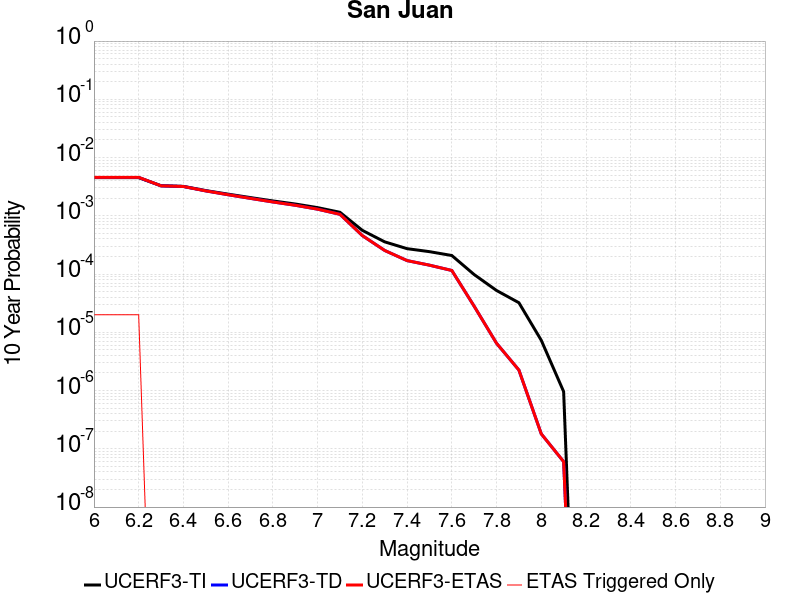 |

| Magnitude | 1 wk TI Prob | 1 wk TD Prob | 1 wk ETAS Prob | 1 wk ETAS/TD Gain | 1 wk ETAS Triggered Only | 1 mo TI Prob | 1 mo TD Prob | 1 mo ETAS Prob | 1 mo ETAS/TD Gain | 1 mo ETAS Triggered Only | 1 yr TI Prob | 1 yr TD Prob | 1 yr ETAS Prob | 1 yr ETAS/TD Gain | 1 yr ETAS Triggered Only | 10 yr TI Prob | 10 yr TD Prob | 10 yr ETAS Prob | 10 yr ETAS/TD Gain | 10 yr ETAS Triggered Only |
|-----|-----|-----|-----|-----|-----|-----|-----|-----|-----|-----|-----|-----|-----|-----|-----|-----|-----|-----|-----|-----|
| 6.0 | 8.682808E-6 | 8.749559E-6 | 8.749559E-6 | 1.0 | 0.0 | 3.72115E-5 | 3.7497597E-5 | 3.7497597E-5 | 1.0 | 0.0 | 4.5295584E-4 | 4.5644245E-4 | 4.89872E-4 | 1.0732393 | 3.3444816E-5 | 0.004520337 | 0.0045555905 | 0.0046221754 | 1.0146161 | 6.688963E-5 |
| 6.1 | 8.682808E-6 | 8.749559E-6 | 8.749559E-6 | 1.0 | 0.0 | 3.72115E-5 | 3.7497597E-5 | 3.7497597E-5 | 1.0 | 0.0 | 4.5295584E-4 | 4.5644245E-4 | 4.89872E-4 | 1.0732393 | 3.3444816E-5 | 0.004520337 | 0.0045555905 | 0.0046221754 | 1.0146161 | 6.688963E-5 |
| 6.2 | 8.682808E-6 | 8.749559E-6 | 8.749559E-6 | 1.0 | 0.0 | 3.72115E-5 | 3.7497597E-5 | 3.7497597E-5 | 1.0 | 0.0 | 4.5295584E-4 | 4.5644245E-4 | 4.89872E-4 | 1.0732393 | 3.3444816E-5 | 0.004520337 | 0.0045555905 | 0.0046221754 | 1.0146161 | 6.688963E-5 |
| 6.3 | 6.3054235E-6 | 6.282968E-6 | 6.282968E-6 | 1.0 | 0.0 | 2.7022963E-5 | 2.6926737E-5 | 2.6926737E-5 | 1.0 | 0.0 | 3.2895492E-4 | 3.277851E-4 | 3.277851E-4 | 1.0 | 0.0 | 0.003284684 | 0.0032732163 | 0.0032732163 | 1.0 | 0.0 |
| 6.4 | 6.1490473E-6 | 6.114796E-6 | 6.114796E-6 | 1.0 | 0.0 | 2.6352795E-5 | 2.6206013E-5 | 2.6206013E-5 | 1.0 | 0.0 | 3.2079802E-4 | 3.1901288E-4 | 3.1901288E-4 | 1.0 | 0.0 | 0.0032033534 | 0.0031857456 | 0.0031857456 | 1.0 | 0.0 |
| 6.5 | 5.204848E-6 | 5.137553E-6 | 5.137553E-6 | 1.0 | 0.0 | 2.23063E-5 | 2.2017904E-5 | 2.2017904E-5 | 1.0 | 0.0 | 2.7154534E-4 | 2.6803595E-4 | 2.6803595E-4 | 1.0 | 0.0 | 0.0027121378 | 0.002677281 | 0.002677281 | 1.0 | 0.0 |
| 6.6 | 4.5179986E-6 | 4.415269E-6 | 4.415269E-6 | 1.0 | 0.0 | 1.9362706E-5 | 1.8922448E-5 | 1.8922448E-5 | 1.0 | 0.0 | 2.3571544E-4 | 2.3035725E-4 | 2.3035725E-4 | 1.0 | 0.0 | 0.0023546559 | 0.0023013218 | 0.0023013218 | 1.0 | 0.0 |
| 6.7 | 3.9442616E-6 | 3.8200415E-6 | 3.8200415E-6 | 1.0 | 0.0 | 1.6903869E-5 | 1.6371509E-5 | 1.6371509E-5 | 1.0 | 0.0 | 2.0578515E-4 | 1.9930555E-4 | 1.9930555E-4 | 1.0 | 0.0 | 0.002055947 | 0.001991393 | 0.001991393 | 1.0 | 0.0 |
| 6.8 | 3.4536245E-6 | 3.31654E-6 | 3.31654E-6 | 1.0 | 0.0 | 1.4801163E-5 | 1.4213669E-5 | 1.4213669E-5 | 1.0 | 0.0 | 1.8018926E-4 | 1.730383E-4 | 1.730383E-4 | 1.0 | 0.0 | 0.0018004322 | 0.0017291544 | 0.0017291544 | 1.0 | 0.0 |
| 6.9 | 3.059865E-6 | 2.912227E-6 | 2.912227E-6 | 1.0 | 0.0 | 1.3113641E-5 | 1.2480916E-5 | 1.2480916E-5 | 1.0 | 0.0 | 1.596469E-4 | 1.5194513E-4 | 1.5194513E-4 | 1.0 | 0.0 | 0.0015953224 | 0.001518527 | 0.001518527 | 1.0 | 0.0 |
| 7.0 | 2.6504351E-6 | 2.4921849E-6 | 2.4921849E-6 | 1.0 | 0.0 | 1.1358958E-5 | 1.0680751E-5 | 1.0680751E-5 | 1.0 | 0.0 | 1.3828653E-4 | 1.3003094E-4 | 1.3003094E-4 | 1.0 | 0.0 | 0.0013820052 | 0.0012996603 | 0.0012996603 | 1.0 | 0.0 |
| 7.1 | 2.2039317E-6 | 2.0339805E-6 | 2.0339805E-6 | 1.0 | 0.0 | 9.445387E-6 | 8.717033E-6 | 8.717033E-6 | 1.0 | 0.0 | 1.1499152E-4 | 1.0612523E-4 | 1.0612523E-4 | 1.0 | 0.0 | 0.0011493203 | 0.0010608556 | 0.0010608556 | 1.0 | 0.0 |
| 7.2 | 1.0786707E-6 | 8.7714847E-7 | 8.7714847E-7 | 1.0 | 0.0 | 4.622866E-6 | 3.7592022E-6 | 3.7592022E-6 | 1.0 | 0.0 | 5.628194E-5 | 4.5767338E-5 | 4.5767338E-5 | 1.0 | 0.0 | 5.6267687E-4 | 4.5763818E-4 | 4.5763818E-4 | 1.0 | 0.0 |
| 7.3 | 6.846433E-7 | 4.869622E-7 | 4.869622E-7 | 1.0 | 0.0 | 2.9341822E-6 | 2.0869793E-6 | 2.0869793E-6 | 1.0 | 0.0 | 3.5723086E-5 | 2.5408679E-5 | 2.5408679E-5 | 1.0 | 0.0 | 3.571734E-4 | 2.5409125E-4 | 2.5409125E-4 | 1.0 | 0.0 |
| 7.4 | 5.23043E-7 | 3.2634222E-7 | 3.2634222E-7 | 1.0 | 0.0 | 2.2416111E-6 | 1.3986087E-6 | 1.3986087E-6 | 1.0 | 0.0 | 2.7291273E-5 | 1.7027929E-5 | 1.7027929E-5 | 1.0 | 0.0 | 2.7287923E-4 | 1.7029818E-4 | 1.7029818E-4 | 1.0 | 0.0 |
| 7.5 | 4.648444E-7 | 2.724016E-7 | 2.724016E-7 | 1.0 | 0.0 | 1.9921886E-6 | 1.1674349E-6 | 1.1674349E-6 | 1.0 | 0.0 | 2.4254627E-5 | 1.4213428E-5 | 1.4213428E-5 | 1.0 | 0.0 | 2.425198E-4 | 1.4215481E-4 | 1.4215481E-4 | 1.0 | 0.0 |
| 7.6 | 3.9906567E-7 | 2.2087482E-7 | 2.2087482E-7 | 1.0 | 0.0 | 1.7102802E-6 | 9.4660606E-7 | 9.4660606E-7 | 1.0 | 0.0 | 2.0822463E-5 | 1.1524869E-5 | 1.1524869E-5 | 1.0 | 0.0 | 2.0820512E-4 | 1.1526732E-4 | 1.1526732E-4 | 1.0 | 0.0 |
| 7.7 | 1.8784601E-7 | 5.3682427E-8 | 5.3682427E-8 | 1.0 | 0.0 | 8.0505407E-7 | 2.3006753E-7 | 2.3006753E-7 | 1.0 | 0.0 | 9.80149E-6 | 2.8010686E-6 | 2.8010686E-6 | 1.0 | 0.0 | 9.801057E-5 | 2.801939E-5 | 2.801939E-5 | 1.0 | 0.0 |
| 7.8 | 1.00154914E-7 | 1.24208075E-8 | 1.24208075E-8 | 1.0 | 0.0 | 4.2923529E-7 | 5.323204E-8 | 5.323204E-8 | 1.0 | 0.0 | 5.225927E-6 | 6.4809996E-7 | 6.4809996E-7 | 1.0 | 0.0 | 5.225804E-5 | 6.4868796E-6 | 6.4868796E-6 | 1.0 | 0.0 |
| 7.9 | 6.171429E-8 | 4.2991957E-9 | 4.2991957E-9 | 1.0 | 0.0 | 2.6448978E-7 | 1.8425133E-8 | 1.8425133E-8 | 1.0 | 0.0 | 3.2201583E-6 | 2.2432597E-7 | 2.2432597E-7 | 1.0 | 0.0 | 3.2201115E-5 | 2.248556E-6 | 2.248556E-6 | 1.0 | 0.0 |
| 8.0 | 1.3974572E-8 | 3.3835368E-10 | 3.3835368E-10 | 1.0 | 0.0 | 5.989102E-8 | 1.450087E-9 | 1.450087E-9 | 1.0 | 0.0 | 7.2917294E-7 | 1.7654811E-8 | 1.7654811E-8 | 1.0 | 0.0 | 7.2917055E-6 | 1.8085565E-7 | 1.8085565E-7 | 1.0 | 0.0 |
| 8.1 | 1.8403477E-9 | 1.13145604E-10 | 1.13145604E-10 | 1.0 | 0.0 | 7.887204E-9 | 4.8490567E-10 | 4.8490567E-10 | 1.0 | 0.0 | 9.602671E-8 | 5.903737E-9 | 5.903737E-9 | 1.0 | 0.0 | 9.602667E-7 | 6.028191E-8 | 6.028191E-8 | 1.0 | 0.0 |

## San Pedro Basin
*[(top)](#table-of-contents)*

| 1 Week | 1 Month | 1 Year | 10 Year |
|-----|-----|-----|-----|
|  |  |  |  |

| Magnitude | 1 wk TI Prob | 1 wk TD Prob | 1 wk ETAS Prob | 1 wk ETAS/TD Gain | 1 wk ETAS Triggered Only | 1 mo TI Prob | 1 mo TD Prob | 1 mo ETAS Prob | 1 mo ETAS/TD Gain | 1 mo ETAS Triggered Only | 1 yr TI Prob | 1 yr TD Prob | 1 yr ETAS Prob | 1 yr ETAS/TD Gain | 1 yr ETAS Triggered Only | 10 yr TI Prob | 10 yr TD Prob | 10 yr ETAS Prob | 10 yr ETAS/TD Gain | 10 yr ETAS Triggered Only |
|-----|-----|-----|-----|-----|-----|-----|-----|-----|-----|-----|-----|-----|-----|-----|-----|-----|-----|-----|-----|-----|
| 6.0 | 5.3449043E-5 | 6.3371124E-5 | 6.3371124E-5 | 1.0 | 0.0 | 2.2904722E-4 | 2.7156572E-4 | 2.7156572E-4 | 1.0 | 0.0 | 0.0027850836 | 0.0033019078 | 0.0033019078 | 1.0 | 0.0 | 0.027504366 | 0.032590248 | 0.032622606 | 1.0009928 | 3.3444816E-5 |
| 6.1 | 5.3449043E-5 | 6.3371124E-5 | 6.3371124E-5 | 1.0 | 0.0 | 2.2904722E-4 | 2.7156572E-4 | 2.7156572E-4 | 1.0 | 0.0 | 0.0027850836 | 0.0033019078 | 0.0033019078 | 1.0 | 0.0 | 0.027504366 | 0.032590248 | 0.032622606 | 1.0009928 | 3.3444816E-5 |
| 6.2 | 2.3189454E-5 | 2.6643334E-5 | 2.6643334E-5 | 1.0 | 0.0 | 9.9379584E-5 | 1.14180984E-4 | 1.14180984E-4 | 1.0 | 0.0 | 0.0012092749 | 0.0013893144 | 0.0013893144 | 1.0 | 0.0 | 0.012027155 | 0.013811161 | 0.013844144 | 1.0023881 | 3.3444816E-5 |
| 6.3 | 2.3189454E-5 | 2.6643334E-5 | 2.6643334E-5 | 1.0 | 0.0 | 9.9379584E-5 | 1.14180984E-4 | 1.14180984E-4 | 1.0 | 0.0 | 0.0012092749 | 0.0013893144 | 0.0013893144 | 1.0 | 0.0 | 0.012027155 | 0.013811161 | 0.013844144 | 1.0023881 | 3.3444816E-5 |
| 6.4 | 1.966056E-5 | 2.2463848E-5 | 2.2463848E-5 | 1.0 | 0.0 | 8.425682E-5 | 9.627031E-5 | 9.627031E-5 | 1.0 | 0.0 | 0.001025344 | 0.001171501 | 0.001171501 | 1.0 | 0.0 | 0.010206259 | 0.011657341 | 0.011690396 | 1.0028355 | 3.3444816E-5 |
| 6.5 | 1.7342953E-5 | 1.9745521E-5 | 1.9745521E-5 | 1.0 | 0.0 | 7.4324824E-5 | 8.4621126E-5 | 8.4621126E-5 | 1.0 | 0.0 | 9.04529E-4 | 0.0010298121 | 0.0010298121 | 1.0 | 0.0 | 0.009008561 | 0.010254124 | 0.010254124 | 1.0 | 0.0 |
| 6.6 | 1.439804E-5 | 1.6323014E-5 | 1.6323014E-5 | 1.0 | 0.0 | 6.170443E-5 | 6.995408E-5 | 6.995408E-5 | 1.0 | 0.0 | 7.509924E-4 | 8.513903E-4 | 8.513903E-4 | 1.0 | 0.0 | 0.0074845953 | 0.008484487 | 0.008484487 | 1.0 | 0.0 |
| 6.7 | 1.2634884E-5 | 1.4285554E-5 | 1.4285554E-5 | 1.0 | 0.0 | 5.414838E-5 | 6.1222534E-5 | 6.1222534E-5 | 1.0 | 0.0 | 6.590571E-4 | 7.451599E-4 | 7.451599E-4 | 1.0 | 0.0 | 0.006571059 | 0.007429634 | 0.007429634 | 1.0 | 0.0 |
| 6.8 | 1.146091E-5 | 1.2933421E-5 | 1.2933421E-5 | 1.0 | 0.0 | 4.911726E-5 | 5.542794E-5 | 5.542794E-5 | 1.0 | 0.0 | 5.9783855E-4 | 6.7465595E-4 | 6.7465595E-4 | 1.0 | 0.0 | 0.0059623276 | 0.0067290184 | 0.0067290184 | 1.0 | 0.0 |
| 6.9 | 9.109035E-6 | 1.0235189E-5 | 1.0235189E-5 | 1.0 | 0.0 | 3.9038136E-5 | 4.3864515E-5 | 4.3864515E-5 | 1.0 | 0.0 | 4.7518566E-4 | 5.339476E-4 | 5.339476E-4 | 1.0 | 0.0 | 0.0047417083 | 0.0053294008 | 0.0053294008 | 1.0 | 0.0 |
| 7.0 | 5.9351028E-6 | 6.584068E-6 | 6.584068E-6 | 1.0 | 0.0 | 2.5435906E-5 | 2.8217262E-5 | 2.8217262E-5 | 1.0 | 0.0 | 3.0963816E-4 | 3.4351464E-4 | 3.4351464E-4 | 1.0 | 0.0 | 0.0030920706 | 0.0034321535 | 0.0034321535 | 1.0 | 0.0 |
| 7.1 | 2.1557585E-6 | 2.2096608E-6 | 2.2096608E-6 | 1.0 | 0.0 | 9.238933E-6 | 9.469942E-6 | 9.469942E-6 | 1.0 | 0.0 | 1.1247819E-4 | 1.1529059E-4 | 1.1529059E-4 | 1.0 | 0.0 | 0.0011242128 | 0.0011523232 | 0.0011523232 | 1.0 | 0.0 |
| 7.2 | 2.1251979E-6 | 2.178007E-6 | 2.178007E-6 | 1.0 | 0.0 | 9.107958E-6 | 9.334282E-6 | 9.334282E-6 | 1.0 | 0.0 | 1.1088375E-4 | 1.1363912E-4 | 1.1363912E-4 | 1.0 | 0.0 | 0.0011082845 | 0.0011358254 | 0.0011358254 | 1.0 | 0.0 |
| 7.3 | 1.7145798E-6 | 1.7442967E-6 | 1.7442967E-6 | 1.0 | 0.0 | 7.3481783E-6 | 7.475536E-6 | 7.475536E-6 | 1.0 | 0.0 | 8.94604E-5 | 9.1010945E-5 | 9.1010945E-5 | 1.0 | 0.0 | 8.9424395E-4 | 9.0974587E-4 | 9.0974587E-4 | 1.0 | 0.0 |
| 7.4 | 1.4467993E-6 | 1.4641943E-6 | 1.4641943E-6 | 1.0 | 0.0 | 6.200554E-6 | 6.2751037E-6 | 6.2751037E-6 | 1.0 | 0.0 | 7.548913E-5 | 7.6396784E-5 | 7.6396784E-5 | 1.0 | 0.0 | 7.546349E-4 | 7.637125E-4 | 7.637125E-4 | 1.0 | 0.0 |
| 7.5 | 1.2803735E-6 | 1.2931564E-6 | 1.2931564E-6 | 1.0 | 0.0 | 5.487303E-6 | 5.5420874E-6 | 5.5420874E-6 | 1.0 | 0.0 | 6.680587E-5 | 6.7472894E-5 | 6.7472894E-5 | 1.0 | 0.0 | 6.678579E-4 | 6.7453115E-4 | 6.7453115E-4 | 1.0 | 0.0 |
| 7.6 | 6.755009E-7 | 6.769501E-7 | 6.769501E-7 | 1.0 | 0.0 | 2.8950008E-6 | 2.9012117E-6 | 2.9012117E-6 | 1.0 | 0.0 | 3.5246063E-5 | 3.5321737E-5 | 3.5321737E-5 | 1.0 | 0.0 | 3.5240475E-4 | 3.5316695E-4 | 3.5316695E-4 | 1.0 | 0.0 |
| 7.7 | 6.211885E-8 | 4.5699863E-8 | 4.5699863E-8 | 1.0 | 0.0 | 2.6622362E-7 | 1.9585654E-7 | 1.9585654E-7 | 1.0 | 0.0 | 3.2412677E-6 | 2.384551E-6 | 2.384551E-6 | 1.0 | 0.0 | 3.2412205E-5 | 2.3845274E-5 | 2.3845274E-5 | 1.0 | 0.0 |
| 7.8 | 2.6580573E-9 | 1.5138681E-9 | 1.5138681E-9 | 1.0 | 0.0 | 1.1391674E-8 | 6.488006E-9 | 6.488006E-9 | 1.0 | 0.0 | 1.3869362E-7 | 7.899148E-8 | 7.899148E-8 | 1.0 | 0.0 | 1.3869354E-6 | 7.8991474E-7 | 7.8991474E-7 | 1.0 | 0.0 |

## Calico-Hidalgo
*[(top)](#table-of-contents)*

| 1 Week | 1 Month | 1 Year | 10 Year |
|-----|-----|-----|-----|
|  |  |  | 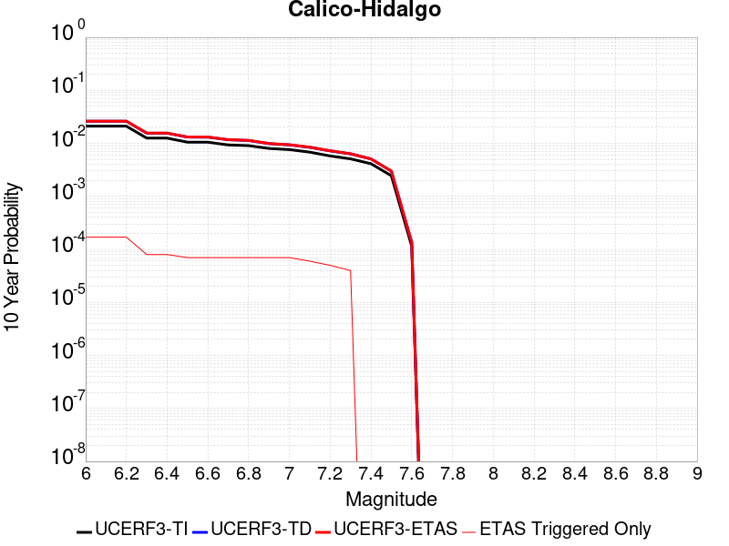 |

| Magnitude | 1 wk TI Prob | 1 wk TD Prob | 1 wk ETAS Prob | 1 wk ETAS/TD Gain | 1 wk ETAS Triggered Only | 1 mo TI Prob | 1 mo TD Prob | 1 mo ETAS Prob | 1 mo ETAS/TD Gain | 1 mo ETAS Triggered Only | 1 yr TI Prob | 1 yr TD Prob | 1 yr ETAS Prob | 1 yr ETAS/TD Gain | 1 yr ETAS Triggered Only | 10 yr TI Prob | 10 yr TD Prob | 10 yr ETAS Prob | 10 yr ETAS/TD Gain | 10 yr ETAS Triggered Only |
|-----|-----|-----|-----|-----|-----|-----|-----|-----|-----|-----|-----|-----|-----|-----|-----|-----|-----|-----|-----|-----|
| 6.0 | 4.0906612E-5 | 5.0704653E-5 | 8.4147774E-5 | 1.6595671 | 3.3444816E-5 | 1.7530227E-4 | 2.1728984E-4 | 2.5072737E-4 | 1.1538845 | 3.3444816E-5 | 0.0021322158 | 0.0026426981 | 0.0026760546 | 1.0126221 | 3.3444816E-5 | 0.02111873 | 0.026153097 | 0.026218237 | 1.0024908 | 6.688963E-5 |
| 6.1 | 4.0906612E-5 | 5.0704653E-5 | 8.4147774E-5 | 1.6595671 | 3.3444816E-5 | 1.7530227E-4 | 2.1728984E-4 | 2.5072737E-4 | 1.1538845 | 3.3444816E-5 | 0.0021322158 | 0.0026426981 | 0.0026760546 | 1.0126221 | 3.3444816E-5 | 0.02111873 | 0.026153097 | 0.026218237 | 1.0024908 | 6.688963E-5 |
| 6.2 | 4.0906612E-5 | 5.0704653E-5 | 8.4147774E-5 | 1.6595671 | 3.3444816E-5 | 1.7530227E-4 | 2.1728984E-4 | 2.5072737E-4 | 1.1538845 | 3.3444816E-5 | 0.0021322158 | 0.0026426981 | 0.0026760546 | 1.0126221 | 3.3444816E-5 | 0.02111873 | 0.026153097 | 0.026218237 | 1.0024908 | 6.688963E-5 |
| 6.3 | 2.4242801E-5 | 3.009103E-5 | 3.009103E-5 | 1.0 | 0.0 | 1.0389358E-4 | 1.2895538E-4 | 1.2895538E-4 | 1.0 | 0.0 | 0.0012641704 | 0.001568934 | 0.001568934 | 1.0 | 0.0 | 0.01257003 | 0.015582247 | 0.015615171 | 1.0021129 | 3.3444816E-5 |
| 6.4 | 2.4242801E-5 | 3.009103E-5 | 3.009103E-5 | 1.0 | 0.0 | 1.0389358E-4 | 1.2895538E-4 | 1.2895538E-4 | 1.0 | 0.0 | 0.0012641704 | 0.001568934 | 0.001568934 | 1.0 | 0.0 | 0.01257003 | 0.015582247 | 0.015615171 | 1.0021129 | 3.3444816E-5 |
| 6.5 | 2.0286952E-5 | 2.5315985E-5 | 2.5315985E-5 | 1.0 | 0.0 | 8.694118E-5 | 1.0849266E-4 | 1.0849266E-4 | 1.0 | 0.0 | 0.0010579949 | 0.0013201149 | 0.0013201149 | 1.0 | 0.0 | 0.010529719 | 0.013124665 | 0.013157671 | 1.0025148 | 3.3444816E-5 |
| 6.6 | 2.0269223E-5 | 2.5296935E-5 | 2.5296935E-5 | 1.0 | 0.0 | 8.6865206E-5 | 1.08411026E-4 | 1.08411026E-4 | 1.0 | 0.0 | 0.0010570707 | 0.0013191222 | 0.0013191222 | 1.0 | 0.0 | 0.010520565 | 0.013114855 | 0.013147861 | 1.0025167 | 3.3444816E-5 |
| 6.7 | 1.799852E-5 | 2.25408E-5 | 2.25408E-5 | 1.0 | 0.0 | 7.713423E-5 | 9.6599935E-5 | 9.6599935E-5 | 1.0 | 0.0 | 9.3870464E-4 | 0.0011754843 | 0.0011754843 | 1.0 | 0.0 | 0.009347493 | 0.011694277 | 0.01172733 | 1.0028265 | 3.3444816E-5 |
| 6.8 | 1.7458793E-5 | 2.1842314E-5 | 2.1842314E-5 | 1.0 | 0.0 | 7.4821255E-5 | 9.3606635E-5 | 9.3606635E-5 | 1.0 | 0.0 | 9.10568E-4 | 0.0011390795 | 0.0011390795 | 1.0 | 0.0 | 0.009068459 | 0.011333993 | 0.011367058 | 1.0029174 | 3.3444816E-5 |
| 6.9 | 1.542884E-5 | 1.9026087E-5 | 1.9026087E-5 | 1.0 | 0.0 | 6.612192E-5 | 8.1537895E-5 | 8.1537895E-5 | 1.0 | 0.0 | 8.04737E-4 | 9.92285E-4 | 9.92285E-4 | 1.0 | 0.0 | 0.008018291 | 0.00987994 | 0.009913054 | 1.0033517 | 3.3444816E-5 |
| 7.0 | 1.468253E-5 | 1.8030747E-5 | 1.8030747E-5 | 1.0 | 0.0 | 6.292361E-5 | 7.7272416E-5 | 7.7272416E-5 | 1.0 | 0.0 | 7.658257E-4 | 9.403986E-4 | 9.403986E-4 | 1.0 | 0.0 | 0.0076319184 | 0.009365558 | 0.0093986895 | 1.0035377 | 3.3444816E-5 |
| 7.1 | 1.3139281E-5 | 1.620107E-5 | 1.620107E-5 | 1.0 | 0.0 | 5.6309986E-5 | 6.943138E-5 | 6.943138E-5 | 1.0 | 0.0 | 6.853584E-4 | 8.4501173E-4 | 8.4501173E-4 | 1.0 | 0.0 | 0.0068324856 | 0.008419285 | 0.008452447 | 1.0039389 | 3.3444816E-5 |
| 7.2 | 1.1127404E-5 | 1.3866703E-5 | 1.3866703E-5 | 1.0 | 0.0 | 4.7688E-5 | 5.9427435E-5 | 5.9427435E-5 | 1.0 | 0.0 | 5.8044674E-4 | 7.2329975E-4 | 7.2329975E-4 | 1.0 | 0.0 | 0.0057893298 | 0.0072105634 | 0.007243767 | 1.0046048 | 3.3444816E-5 |
| 7.3 | 9.808154E-6 | 1.2176301E-5 | 1.2176301E-5 | 1.0 | 0.0 | 4.2034266E-5 | 5.2183164E-5 | 5.2183164E-5 | 1.0 | 0.0 | 5.11647E-4 | 6.3515553E-4 | 6.3515553E-4 | 1.0 | 0.0 | 0.0051047057 | 0.0063344776 | 0.006367711 | 1.0052464 | 3.3444816E-5 |
| 7.4 | 7.942452E-6 | 9.7922075E-6 | 9.7922075E-6 | 1.0 | 0.0 | 3.4038632E-5 | 4.196598E-5 | 4.196598E-5 | 1.0 | 0.0 | 4.1434157E-4 | 5.1082554E-4 | 5.1082554E-4 | 1.0 | 0.0 | 0.0041356985 | 0.0050974544 | 0.0050974544 | 1.0 | 0.0 |
| 7.5 | 4.7121216E-6 | 5.772871E-6 | 5.772871E-6 | 1.0 | 0.0 | 2.019465E-5 | 2.4740684E-5 | 2.4740684E-5 | 1.0 | 0.0 | 2.4584212E-4 | 3.0118387E-4 | 3.0118387E-4 | 1.0 | 0.0 | 0.0024557032 | 0.0030085093 | 0.0030085093 | 1.0 | 0.0 |
| 7.6 | 2.21172E-7 | 2.6039737E-7 | 2.6039737E-7 | 1.0 | 0.0 | 9.478797E-7 | 1.1159884E-6 | 1.1159884E-6 | 1.0 | 0.0 | 1.1540374E-5 | 1.3587103E-5 | 1.3587103E-5 | 1.0 | 0.0 | 1.1539775E-4 | 1.3586554E-4 | 1.3586554E-4 | 1.0 | 0.0 |

## Red Mountain
*[(top)](#table-of-contents)*

| 1 Week | 1 Month | 1 Year | 10 Year |
|-----|-----|-----|-----|
|  |  |  |  |

| Magnitude | 1 wk TI Prob | 1 wk TD Prob | 1 wk ETAS Prob | 1 wk ETAS/TD Gain | 1 wk ETAS Triggered Only | 1 mo TI Prob | 1 mo TD Prob | 1 mo ETAS Prob | 1 mo ETAS/TD Gain | 1 mo ETAS Triggered Only | 1 yr TI Prob | 1 yr TD Prob | 1 yr ETAS Prob | 1 yr ETAS/TD Gain | 1 yr ETAS Triggered Only | 10 yr TI Prob | 10 yr TD Prob | 10 yr ETAS Prob | 10 yr ETAS/TD Gain | 10 yr ETAS Triggered Only |
|-----|-----|-----|-----|-----|-----|-----|-----|-----|-----|-----|-----|-----|-----|-----|-----|-----|-----|-----|-----|-----|
| 6.0 | 4.1810763E-5 | 4.7591006E-5 | 8.103423E-5 | 1.7027216 | 3.3444816E-5 | 1.7917668E-4 | 2.0394645E-4 | 2.3738443E-4 | 1.1639547 | 3.3444816E-5 | 0.0021792934 | 0.0024803858 | 0.0025471095 | 1.0269005 | 6.688963E-5 | 0.021580452 | 0.02454463 | 0.024609879 | 1.0026584 | 6.688963E-5 |
| 6.1 | 4.1810763E-5 | 4.7591006E-5 | 8.103423E-5 | 1.7027216 | 3.3444816E-5 | 1.7917668E-4 | 2.0394645E-4 | 2.3738443E-4 | 1.1639547 | 3.3444816E-5 | 0.0021792934 | 0.0024803858 | 0.0025471095 | 1.0269005 | 6.688963E-5 | 0.021580452 | 0.02454463 | 0.024609879 | 1.0026584 | 6.688963E-5 |
| 6.2 | 4.1810763E-5 | 4.7591006E-5 | 8.103423E-5 | 1.7027216 | 3.3444816E-5 | 1.7917668E-4 | 2.0394645E-4 | 2.3738443E-4 | 1.1639547 | 3.3444816E-5 | 0.0021792934 | 0.0024803858 | 0.0025471095 | 1.0269005 | 6.688963E-5 | 0.021580452 | 0.02454463 | 0.024609879 | 1.0026584 | 6.688963E-5 |
| 6.3 | 4.1810763E-5 | 4.7591006E-5 | 8.103423E-5 | 1.7027216 | 3.3444816E-5 | 1.7917668E-4 | 2.0394645E-4 | 2.3738443E-4 | 1.1639547 | 3.3444816E-5 | 0.0021792934 | 0.0024803858 | 0.0025471095 | 1.0269005 | 6.688963E-5 | 0.021580452 | 0.02454463 | 0.024609879 | 1.0026584 | 6.688963E-5 |
| 6.4 | 4.1810763E-5 | 4.7591006E-5 | 8.103423E-5 | 1.7027216 | 3.3444816E-5 | 1.7917668E-4 | 2.0394645E-4 | 2.3738443E-4 | 1.1639547 | 3.3444816E-5 | 0.0021792934 | 0.0024803858 | 0.0025471095 | 1.0269005 | 6.688963E-5 | 0.021580452 | 0.02454463 | 0.024609879 | 1.0026584 | 6.688963E-5 |
| 6.5 | 3.154503E-5 | 3.5360477E-5 | 3.5360477E-5 | 1.0 | 0.0 | 1.3518598E-4 | 1.5153662E-4 | 1.5153662E-4 | 1.0 | 0.0 | 0.0016446467 | 0.0018434891 | 0.0018768723 | 1.0181087 | 3.3444816E-5 | 0.01632528 | 0.018291617 | 0.018324452 | 1.0017949 | 3.3444816E-5 |
| 6.6 | 3.1535834E-5 | 3.5349858E-5 | 3.5349858E-5 | 1.0 | 0.0 | 1.3514658E-4 | 1.5149111E-4 | 1.5149111E-4 | 1.0 | 0.0 | 0.0016441676 | 0.001842936 | 0.0018763192 | 1.0181141 | 3.3444816E-5 | 0.01632056 | 0.018286178 | 0.01831901 | 1.0017955 | 3.3444816E-5 |
| 6.7 | 2.8267326E-5 | 3.146999E-5 | 3.146999E-5 | 1.0 | 0.0 | 1.2114006E-4 | 1.348649E-4 | 1.348649E-4 | 1.0 | 0.0 | 0.0014738824 | 0.0016408286 | 0.0016742185 | 1.0203494 | 3.3444816E-5 | 0.014641452 | 0.016295899 | 0.016328799 | 1.0020189 | 3.3444816E-5 |
| 6.8 | 2.8212884E-5 | 3.1407875E-5 | 3.1407875E-5 | 1.0 | 0.0 | 1.20906756E-4 | 1.3459871E-4 | 1.3459871E-4 | 1.0 | 0.0 | 0.0014710457 | 0.0016375926 | 0.0016709827 | 1.0203897 | 3.3444816E-5 | 0.014613459 | 0.016264014 | 0.016296916 | 1.002023 | 3.3444816E-5 |
| 6.9 | 2.4227871E-5 | 2.6707517E-5 | 2.6707517E-5 | 1.0 | 0.0 | 1.03829596E-4 | 1.1445619E-4 | 1.1445619E-4 | 1.0 | 0.0 | 0.0012633923 | 0.0013926893 | 0.0014260875 | 1.0239811 | 3.3444816E-5 | 0.012562336 | 0.013847304 | 0.013880285 | 1.0023818 | 3.3444816E-5 |
| 7.0 | 2.348524E-5 | 2.5836282E-5 | 2.5836282E-5 | 1.0 | 0.0 | 1.0064714E-4 | 1.1072265E-4 | 1.1072265E-4 | 1.0 | 0.0 | 0.0012246901 | 0.0013472902 | 0.00138069 | 1.0247903 | 3.3444816E-5 | 0.012179627 | 0.013398857 | 0.013431854 | 1.0024626 | 3.3444816E-5 |
| 7.1 | 2.2311642E-5 | 2.4463316E-5 | 2.4463316E-5 | 1.0 | 0.0 | 9.561782E-5 | 1.04839E-4 | 1.04839E-4 | 1.0 | 0.0 | 0.0011635252 | 0.0012757422 | 0.0013091443 | 1.0261825 | 3.3444816E-5 | 0.01157452 | 0.012691703 | 0.012724724 | 1.0026017 | 3.3444816E-5 |
| 7.2 | 1.6533986E-5 | 1.7670676E-5 | 1.7670676E-5 | 1.0 | 0.0 | 7.085802E-5 | 7.572963E-5 | 7.572963E-5 | 1.0 | 0.0 | 8.623549E-4 | 9.2168164E-4 | 9.5509563E-4 | 1.0362533 | 3.3444816E-5 | 0.008590161 | 0.009184869 | 0.009218007 | 1.0036079 | 3.3444816E-5 |
| 7.3 | 1.4703092E-5 | 1.5559806E-5 | 1.5559806E-5 | 1.0 | 0.0 | 6.301173E-5 | 6.6683526E-5 | 6.6683526E-5 | 1.0 | 0.0 | 7.668978E-4 | 8.1163115E-4 | 8.4504887E-4 | 1.0411735 | 3.3444816E-5 | 0.0076425658 | 0.008092744 | 0.008125918 | 1.0040992 | 3.3444816E-5 |
| 7.4 | 6.1331984E-6 | 5.52893E-6 | 5.52893E-6 | 1.0 | 0.0 | 2.6284872E-5 | 2.3695204E-5 | 2.3695204E-5 | 1.0 | 0.0 | 3.199713E-4 | 2.8845144E-4 | 2.8845144E-4 | 1.0 | 0.0 | 0.0031951098 | 0.0028808247 | 0.0028808247 | 1.0 | 0.0 |
| 7.5 | 5.954766E-6 | 5.338558E-6 | 5.338558E-6 | 1.0 | 0.0 | 2.5520176E-5 | 2.2879336E-5 | 2.2879336E-5 | 1.0 | 0.0 | 3.1066386E-4 | 2.7852083E-4 | 2.7852083E-4 | 1.0 | 0.0 | 0.003102299 | 0.0027817716 | 0.0027817716 | 1.0 | 0.0 |
| 7.6 | 4.9726646E-6 | 4.315341E-6 | 4.315341E-6 | 1.0 | 0.0 | 2.1311245E-5 | 1.8494187E-5 | 1.8494187E-5 | 1.0 | 0.0 | 2.5943352E-4 | 2.2514381E-4 | 2.2514381E-4 | 1.0 | 0.0 | 0.0025913084 | 0.0022491917 | 0.0022491917 | 1.0 | 0.0 |
| 7.7 | 3.3613894E-6 | 2.8526943E-6 | 2.8526943E-6 | 1.0 | 0.0 | 1.4405875E-5 | 1.2225777E-5 | 1.2225777E-5 | 1.0 | 0.0 | 1.7537741E-4 | 1.4883894E-4 | 1.4883894E-4 | 1.0 | 0.0 | 0.0017523908 | 0.0014874188 | 0.0014874188 | 1.0 | 0.0 |
| 7.8 | 1.1828961E-6 | 1.0122844E-6 | 1.0122844E-6 | 1.0 | 0.0 | 5.069545E-6 | 4.338355E-6 | 4.338355E-6 | 1.0 | 0.0 | 6.171996E-5 | 5.281822E-5 | 5.281822E-5 | 1.0 | 0.0 | 6.170282E-4 | 5.280596E-4 | 5.280596E-4 | 1.0 | 0.0 |
| 7.9 | 2.2967266E-7 | 1.8619119E-7 | 1.8619119E-7 | 1.0 | 0.0 | 9.843111E-7 | 7.9796195E-7 | 7.9796195E-7 | 1.0 | 0.0 | 1.19839215E-5 | 9.715147E-6 | 9.715147E-6 | 1.0 | 0.0 | 1.1983275E-4 | 9.714751E-5 | 9.714751E-5 | 1.0 | 0.0 |

## Robinson Creek
*[(top)](#table-of-contents)*

| 1 Week | 1 Month | 1 Year | 10 Year |
|-----|-----|-----|-----|
|  |  | 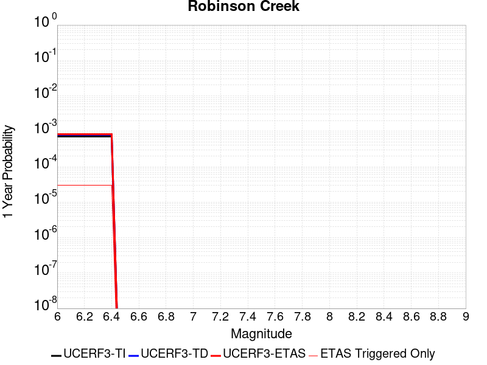 |  |

| Magnitude | 1 wk TI Prob | 1 wk TD Prob | 1 wk ETAS Prob | 1 wk ETAS/TD Gain | 1 wk ETAS Triggered Only | 1 mo TI Prob | 1 mo TD Prob | 1 mo ETAS Prob | 1 mo ETAS/TD Gain | 1 mo ETAS Triggered Only | 1 yr TI Prob | 1 yr TD Prob | 1 yr ETAS Prob | 1 yr ETAS/TD Gain | 1 yr ETAS Triggered Only | 10 yr TI Prob | 10 yr TD Prob | 10 yr ETAS Prob | 10 yr ETAS/TD Gain | 10 yr ETAS Triggered Only |
|-----|-----|-----|-----|-----|-----|-----|-----|-----|-----|-----|-----|-----|-----|-----|-----|-----|-----|-----|-----|-----|
| 6.0 | 1.3705327E-5 | 1.5285246E-5 | 1.5285246E-5 | 1.0 | 0.0 | 5.8735794E-5 | 6.5508204E-5 | 9.8950826E-5 | 1.5105106 | 3.3444816E-5 | 7.1487366E-4 | 7.9756236E-4 | 8.309805E-4 | 1.0419004 | 3.3444816E-5 | 0.0071257832 | 0.007975623 | 0.008008801 | 1.0041599 | 3.3444816E-5 |
| 6.1 | 1.3705327E-5 | 1.5285246E-5 | 1.5285246E-5 | 1.0 | 0.0 | 5.8735794E-5 | 6.5508204E-5 | 9.8950826E-5 | 1.5105106 | 3.3444816E-5 | 7.1487366E-4 | 7.9756236E-4 | 8.309805E-4 | 1.0419004 | 3.3444816E-5 | 0.0071257832 | 0.007975623 | 0.008008801 | 1.0041599 | 3.3444816E-5 |
| 6.2 | 1.3705327E-5 | 1.5285246E-5 | 1.5285246E-5 | 1.0 | 0.0 | 5.8735794E-5 | 6.5508204E-5 | 9.8950826E-5 | 1.5105106 | 3.3444816E-5 | 7.1487366E-4 | 7.9756236E-4 | 8.309805E-4 | 1.0419004 | 3.3444816E-5 | 0.0071257832 | 0.007975623 | 0.008008801 | 1.0041599 | 3.3444816E-5 |
| 6.3 | 1.3705327E-5 | 1.5285246E-5 | 1.5285246E-5 | 1.0 | 0.0 | 5.8735794E-5 | 6.5508204E-5 | 9.8950826E-5 | 1.5105106 | 3.3444816E-5 | 7.1487366E-4 | 7.9756236E-4 | 8.309805E-4 | 1.0419004 | 3.3444816E-5 | 0.0071257832 | 0.007975623 | 0.008008801 | 1.0041599 | 3.3444816E-5 |
| 6.4 | 1.3705327E-5 | 1.5285246E-5 | 1.5285246E-5 | 1.0 | 0.0 | 5.8735794E-5 | 6.5508204E-5 | 9.8950826E-5 | 1.5105106 | 3.3444816E-5 | 7.1487366E-4 | 7.9756236E-4 | 8.309805E-4 | 1.0419004 | 3.3444816E-5 | 0.0071257832 | 0.007975623 | 0.008008801 | 1.0041599 | 3.3444816E-5 |

## Green Valley 2011 CFM
*[(top)](#table-of-contents)*

| 1 Week | 1 Month | 1 Year | 10 Year |
|-----|-----|-----|-----|
|  |  |  |  |

| Magnitude | 1 wk TI Prob | 1 wk TD Prob | 1 wk ETAS Prob | 1 wk ETAS/TD Gain | 1 wk ETAS Triggered Only | 1 mo TI Prob | 1 mo TD Prob | 1 mo ETAS Prob | 1 mo ETAS/TD Gain | 1 mo ETAS Triggered Only | 1 yr TI Prob | 1 yr TD Prob | 1 yr ETAS Prob | 1 yr ETAS/TD Gain | 1 yr ETAS Triggered Only | 10 yr TI Prob | 10 yr TD Prob | 10 yr ETAS Prob | 10 yr ETAS/TD Gain | 10 yr ETAS Triggered Only |
|-----|-----|-----|-----|-----|-----|-----|-----|-----|-----|-----|-----|-----|-----|-----|-----|-----|-----|-----|-----|-----|
| 6.0 | 9.9629346E-5 | 1.7306181E-4 | 1.7306181E-4 | 1.0 | 0.0 | 4.2691303E-4 | 7.414477E-4 | 7.414477E-4 | 1.0 | 0.0 | 0.0051852856 | 0.00898687 | 0.00898687 | 1.0 | 0.0 | 0.050659515 | 0.085523866 | 0.08555445 | 1.0003576 | 3.3444816E-5 |
| 6.1 | 9.88615E-5 | 1.7153492E-4 | 1.7153492E-4 | 1.0 | 0.0 | 4.2362334E-4 | 7.349076E-4 | 7.349076E-4 | 1.0 | 0.0 | 0.0051454236 | 0.008907897 | 0.008907897 | 1.0 | 0.0 | 0.050279044 | 0.08481148 | 0.084842086 | 1.0003608 | 3.3444816E-5 |
| 6.2 | 9.696895E-5 | 1.679252E-4 | 1.679252E-4 | 1.0 | 0.0 | 4.15515E-4 | 7.1944593E-4 | 7.1944593E-4 | 1.0 | 0.0 | 0.0050471667 | 0.008721275 | 0.008721275 | 1.0 | 0.0 | 0.04934063 | 0.08312038 | 0.08315105 | 1.000369 | 3.3444816E-5 |
| 6.3 | 9.275224E-5 | 1.5971852E-4 | 1.5971852E-4 | 1.0 | 0.0 | 3.9744904E-4 | 6.842931E-4 | 6.842931E-4 | 1.0 | 0.0 | 0.0048282105 | 0.008296597 | 0.008296597 | 1.0 | 0.0 | 0.047246475 | 0.07925882 | 0.07928962 | 1.0003885 | 3.3444816E-5 |
| 6.4 | 8.391499E-5 | 1.4368363E-4 | 1.4368363E-4 | 1.0 | 0.0 | 3.595861E-4 | 6.156491E-4 | 6.156491E-4 | 1.0 | 0.0 | 0.004369175 | 0.007467232 | 0.007467232 | 1.0 | 0.0 | 0.04284265 | 0.07163251 | 0.07166356 | 1.0004334 | 3.3444816E-5 |
| 6.5 | 5.9519385E-5 | 9.9345336E-5 | 9.9345336E-5 | 1.0 | 0.0 | 2.5505814E-4 | 4.257004E-4 | 4.257004E-4 | 1.0 | 0.0 | 0.0031009112 | 0.0051684165 | 0.0051684165 | 1.0 | 0.0 | 0.030579966 | 0.050147217 | 0.050178986 | 1.0006335 | 3.3444816E-5 |
| 6.6 | 4.5361558E-5 | 7.4029726E-5 | 7.4029726E-5 | 1.0 | 0.0 | 1.9439218E-4 | 3.1723455E-4 | 3.1723455E-4 | 1.0 | 0.0 | 0.0023641558 | 0.003854048 | 0.003854048 | 1.0 | 0.0 | 0.023391623 | 0.03766713 | 0.037699312 | 1.0008545 | 3.3444816E-5 |
| 6.7 | 3.8808106E-5 | 6.265495E-5 | 6.265495E-5 | 1.0 | 0.0 | 1.6630985E-4 | 2.684962E-4 | 2.684962E-4 | 1.0 | 0.0 | 0.0020229418 | 0.003262755 | 0.003262755 | 1.0 | 0.0 | 0.020046256 | 0.03200691 | 0.03200691 | 1.0 | 0.0 |
| 6.8 | 2.2284667E-5 | 3.1285566E-5 | 3.1285566E-5 | 1.0 | 0.0 | 9.550222E-5 | 1.340742E-4 | 1.340742E-4 | 1.0 | 0.0 | 0.0011621192 | 0.001631124 | 0.001631124 | 1.0 | 0.0 | 0.011560607 | 0.016166156 | 0.016166156 | 1.0 | 0.0 |
| 6.9 | 1.8050168E-5 | 2.4448267E-5 | 2.4448267E-5 | 1.0 | 0.0 | 7.735557E-5 | 1.0477412E-4 | 1.0477412E-4 | 1.0 | 0.0 | 9.4139716E-4 | 0.001274882 | 0.001274882 | 1.0 | 0.0 | 0.009374191 | 0.01266794 | 0.01266794 | 1.0 | 0.0 |
| 7.0 | 1.4763166E-5 | 1.958302E-5 | 1.958302E-5 | 1.0 | 0.0 | 6.326917E-5 | 8.392455E-5 | 8.392455E-5 | 1.0 | 0.0 | 7.7002996E-4 | 0.0010213053 | 0.0010213053 | 1.0 | 0.0 | 0.007673672 | 0.010165428 | 0.010165428 | 1.0 | 0.0 |
| 7.1 | 1.2399713E-5 | 1.630385E-5 | 1.630385E-5 | 1.0 | 0.0 | 5.3140546E-5 | 6.987178E-5 | 6.987178E-5 | 1.0 | 0.0 | 6.467941E-4 | 8.5035886E-4 | 8.5035886E-4 | 1.0 | 0.0 | 0.006449148 | 0.008471329 | 0.008471329 | 1.0 | 0.0 |
| 7.2 | 1.0584195E-5 | 1.3921863E-5 | 1.3921863E-5 | 1.0 | 0.0 | 4.5360044E-5 | 5.9663773E-5 | 5.9663773E-5 | 1.0 | 0.0 | 5.521186E-4 | 7.2616595E-4 | 7.2616595E-4 | 1.0 | 0.0 | 0.0055074887 | 0.0072383475 | 0.0072383475 | 1.0 | 0.0 |
| 7.3 | 7.998173E-6 | 1.054412E-5 | 1.054412E-5 | 1.0 | 0.0 | 3.4277433E-5 | 4.5188313E-5 | 4.5188313E-5 | 1.0 | 0.0 | 4.1724785E-4 | 5.500299E-4 | 5.500299E-4 | 1.0 | 0.0 | 0.004164653 | 0.0054869517 | 0.0054869517 | 1.0 | 0.0 |
| 7.4 | 6.7571127E-6 | 8.932785E-6 | 8.932785E-6 | 1.0 | 0.0 | 2.8958733E-5 | 3.8282808E-5 | 3.8282808E-5 | 1.0 | 0.0 | 3.5251552E-4 | 4.6599447E-4 | 4.6599447E-4 | 1.0 | 0.0 | 0.0035195686 | 0.0046503763 | 0.0046503763 | 1.0 | 0.0 |
| 7.5 | 5.69878E-6 | 7.5163775E-6 | 7.5163775E-6 | 1.0 | 0.0 | 2.4423114E-5 | 3.2212654E-5 | 3.2212654E-5 | 1.0 | 0.0 | 2.9731085E-4 | 3.9211934E-4 | 3.9211934E-4 | 1.0 | 0.0 | 0.002969134 | 0.0039144265 | 0.0039144265 | 1.0 | 0.0 |
| 7.6 | 4.503664E-6 | 5.9357344E-6 | 5.9357344E-6 | 1.0 | 0.0 | 1.9301275E-5 | 2.5438618E-5 | 2.5438618E-5 | 1.0 | 0.0 | 2.3496768E-4 | 3.09672E-4 | 3.09672E-4 | 1.0 | 0.0 | 0.002347194 | 0.0030925297 | 0.0030925297 | 1.0 | 0.0 |
| 7.7 | 1.0873546E-6 | 1.4107108E-6 | 1.4107108E-6 | 1.0 | 0.0 | 4.6600826E-6 | 6.0458897E-6 | 6.0458897E-6 | 1.0 | 0.0 | 5.6735033E-5 | 7.360625E-5 | 7.360625E-5 | 1.0 | 0.0 | 5.672055E-4 | 7.3582074E-4 | 7.3582074E-4 | 1.0 | 0.0 |
| 7.8 | 4.9373917E-8 | 6.177787E-8 | 6.177787E-8 | 1.0 | 0.0 | 2.1160248E-7 | 2.6476226E-7 | 2.6476226E-7 | 1.0 | 0.0 | 2.5762572E-6 | 3.223477E-6 | 3.223477E-6 | 1.0 | 0.0 | 2.5762274E-5 | 3.223268E-5 | 3.223268E-5 | 1.0 | 0.0 |

## Pinto Mtn
*[(top)](#table-of-contents)*

| 1 Week | 1 Month | 1 Year | 10 Year |
|-----|-----|-----|-----|
|  | 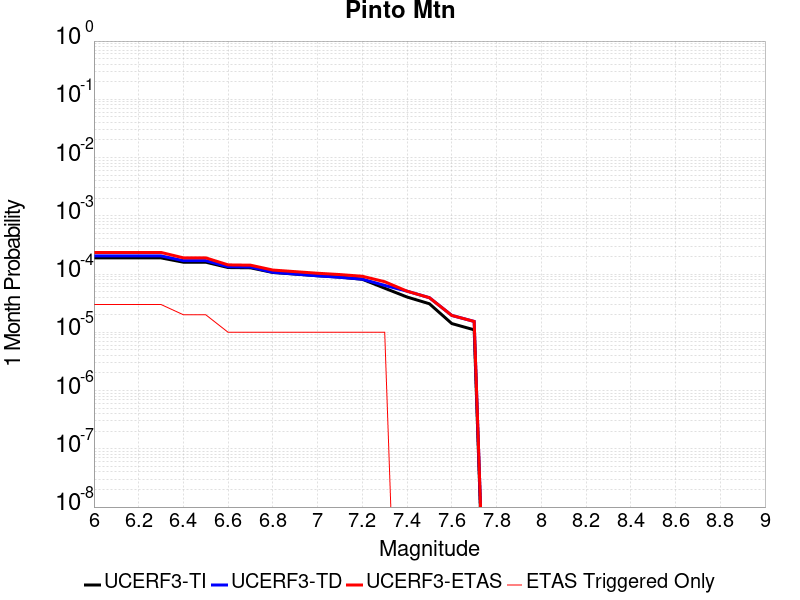 | 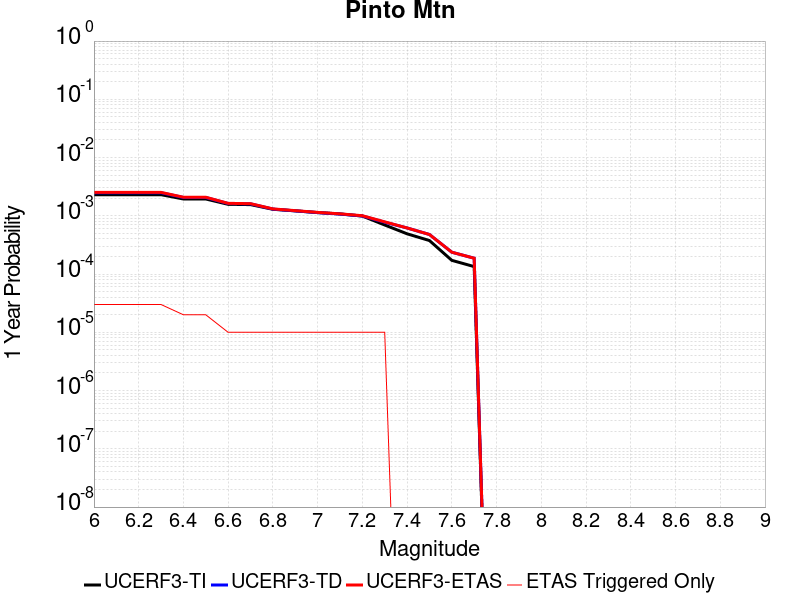 |  |

| Magnitude | 1 wk TI Prob | 1 wk TD Prob | 1 wk ETAS Prob | 1 wk ETAS/TD Gain | 1 wk ETAS Triggered Only | 1 mo TI Prob | 1 mo TD Prob | 1 mo ETAS Prob | 1 mo ETAS/TD Gain | 1 mo ETAS Triggered Only | 1 yr TI Prob | 1 yr TD Prob | 1 yr ETAS Prob | 1 yr ETAS/TD Gain | 1 yr ETAS Triggered Only | 10 yr TI Prob | 10 yr TD Prob | 10 yr ETAS Prob | 10 yr ETAS/TD Gain | 10 yr ETAS Triggered Only |
|-----|-----|-----|-----|-----|-----|-----|-----|-----|-----|-----|-----|-----|-----|-----|-----|-----|-----|-----|-----|-----|
| 6.0 | 4.4194956E-5 | 4.785523E-5 | 4.785523E-5 | 1.0 | 0.0 | 1.893932E-4 | 2.0507864E-4 | 2.0507864E-4 | 1.0 | 0.0 | 0.0023034236 | 0.002494138 | 0.002494138 | 1.0 | 0.0 | 0.022796938 | 0.024678964 | 0.024711585 | 1.0013218 | 3.3444816E-5 |
| 6.1 | 4.4194956E-5 | 4.785523E-5 | 4.785523E-5 | 1.0 | 0.0 | 1.893932E-4 | 2.0507864E-4 | 2.0507864E-4 | 1.0 | 0.0 | 0.0023034236 | 0.002494138 | 0.002494138 | 1.0 | 0.0 | 0.022796938 | 0.024678964 | 0.024711585 | 1.0013218 | 3.3444816E-5 |
| 6.2 | 4.4194956E-5 | 4.785523E-5 | 4.785523E-5 | 1.0 | 0.0 | 1.893932E-4 | 2.0507864E-4 | 2.0507864E-4 | 1.0 | 0.0 | 0.0023034236 | 0.002494138 | 0.002494138 | 1.0 | 0.0 | 0.022796938 | 0.024678964 | 0.024711585 | 1.0013218 | 3.3444816E-5 |
| 6.3 | 4.4194956E-5 | 4.785523E-5 | 4.785523E-5 | 1.0 | 0.0 | 1.893932E-4 | 2.0507864E-4 | 2.0507864E-4 | 1.0 | 0.0 | 0.0023034236 | 0.002494138 | 0.002494138 | 1.0 | 0.0 | 0.022796938 | 0.024678964 | 0.024711585 | 1.0013218 | 3.3444816E-5 |
| 6.4 | 3.729929E-5 | 3.960458E-5 | 3.960458E-5 | 1.0 | 0.0 | 1.5984432E-4 | 1.697234E-4 | 1.697234E-4 | 1.0 | 0.0 | 0.0019443673 | 0.0020645177 | 0.0020645177 | 1.0 | 0.0 | 0.019274427 | 0.020463403 | 0.020496164 | 1.001601 | 3.3444816E-5 |
| 6.5 | 3.729929E-5 | 3.960458E-5 | 3.960458E-5 | 1.0 | 0.0 | 1.5984432E-4 | 1.697234E-4 | 1.697234E-4 | 1.0 | 0.0 | 0.0019443673 | 0.0020645177 | 0.0020645177 | 1.0 | 0.0 | 0.019274427 | 0.020463403 | 0.020496164 | 1.001601 | 3.3444816E-5 |
| 6.6 | 3.0204548E-5 | 3.1206488E-5 | 3.1206488E-5 | 1.0 | 0.0 | 1.2944164E-4 | 1.3373543E-4 | 1.3373543E-4 | 1.0 | 0.0 | 0.0015748127 | 0.0016270474 | 0.0016270474 | 1.0 | 0.0 | 0.015636992 | 0.01615522 | 0.01615522 | 1.0 | 0.0 |
| 6.7 | 2.9857754E-5 | 3.0815863E-5 | 3.0815863E-5 | 1.0 | 0.0 | 1.2795553E-4 | 1.320615E-4 | 1.320615E-4 | 1.0 | 0.0 | 0.0015567453 | 0.0016066976 | 0.0016066976 | 1.0 | 0.0 | 0.015458848 | 0.015954657 | 0.015954657 | 1.0 | 0.0 |
| 6.8 | 2.4819734E-5 | 2.5010428E-5 | 2.5010428E-5 | 1.0 | 0.0 | 1.0636595E-4 | 1.0718327E-4 | 1.0718327E-4 | 1.0 | 0.0 | 0.0012942362 | 0.0013041968 | 0.0013041968 | 1.0 | 0.0 | 0.012867244 | 0.012967796 | 0.012967796 | 1.0 | 0.0 |
| 6.9 | 2.331124E-5 | 2.3338684E-5 | 2.3338684E-5 | 1.0 | 0.0 | 9.990149E-5 | 1.00019206E-4 | 1.00019206E-4 | 1.0 | 0.0 | 0.001215622 | 0.001217074 | 0.001217074 | 1.0 | 0.0 | 0.012089936 | 0.012106278 | 0.012106278 | 1.0 | 0.0 |
| 7.0 | 2.1818534E-5 | 2.1761793E-5 | 2.1761793E-5 | 1.0 | 0.0 | 9.3504656E-5 | 9.32616E-5 | 9.32616E-5 | 1.0 | 0.0 | 0.0011378246 | 0.0011348884 | 0.0011348884 | 1.0 | 0.0 | 0.011320163 | 0.01129303 | 0.01129303 | 1.0 | 0.0 |
| 7.1 | 2.066081E-5 | 2.054142E-5 | 2.054142E-5 | 1.0 | 0.0 | 8.854332E-5 | 8.80318E-5 | 8.80318E-5 | 1.0 | 0.0 | 0.0010774818 | 0.0010712796 | 0.0010712796 | 1.0 | 0.0 | 0.010722724 | 0.010663206 | 0.010663206 | 1.0 | 0.0 |
| 7.2 | 1.8990233E-5 | 1.9054683E-5 | 1.9054683E-5 | 1.0 | 0.0 | 8.138417E-5 | 8.166048E-5 | 8.166048E-5 | 1.0 | 0.0 | 9.904018E-4 | 9.937823E-4 | 9.937823E-4 | 1.0 | 0.0 | 0.009859995 | 0.0098953815 | 0.0098953815 | 1.0 | 0.0 |
| 7.3 | 1.3335872E-5 | 1.4907276E-5 | 1.4907276E-5 | 1.0 | 0.0 | 5.7152483E-5 | 6.388683E-5 | 6.388683E-5 | 1.0 | 0.0 | 6.956093E-4 | 7.775574E-4 | 7.775574E-4 | 1.0 | 0.0 | 0.006934359 | 0.0077496674 | 0.0077496674 | 1.0 | 0.0 |
| 7.4 | 9.414066E-6 | 1.186147E-5 | 1.186147E-5 | 1.0 | 0.0 | 4.0345374E-5 | 5.0833933E-5 | 5.0833933E-5 | 1.0 | 0.0 | 4.910942E-4 | 6.187368E-4 | 6.187368E-4 | 1.0 | 0.0 | 0.0049001034 | 0.0061710896 | 0.0061710896 | 1.0 | 0.0 |
| 7.5 | 7.2101157E-6 | 9.158733E-6 | 9.158733E-6 | 1.0 | 0.0 | 3.090013E-5 | 3.9251165E-5 | 3.9251165E-5 | 1.0 | 0.0 | 3.7614413E-4 | 4.7778594E-4 | 4.7778594E-4 | 1.0 | 0.0 | 0.0037550807 | 0.0047683627 | 0.0047683627 | 1.0 | 0.0 |
| 7.6 | 3.296375E-6 | 4.546122E-6 | 4.546122E-6 | 1.0 | 0.0 | 1.4127245E-5 | 1.9483241E-5 | 1.9483241E-5 | 1.0 | 0.0 | 1.7198564E-4 | 2.3718402E-4 | 2.3718402E-4 | 1.0 | 0.0 | 0.0017185259 | 0.0023694462 | 0.0023694462 | 1.0 | 0.0 |
| 7.7 | 2.5741092E-6 | 3.5850085E-6 | 3.5850085E-6 | 1.0 | 0.0 | 1.103185E-5 | 1.536424E-5 | 1.536424E-5 | 1.0 | 0.0 | 1.3430449E-4 | 1.8704488E-4 | 1.8704488E-4 | 1.0 | 0.0 | 0.0013422335 | 0.0018690043 | 0.0018690043 | 1.0 | 0.0 |

## Malibu Coast alt 1
*[(top)](#table-of-contents)*

| 1 Week | 1 Month | 1 Year | 10 Year |
|-----|-----|-----|-----|
|  |  |  |  |

| Magnitude | 1 wk TI Prob | 1 wk TD Prob | 1 wk ETAS Prob | 1 wk ETAS/TD Gain | 1 wk ETAS Triggered Only | 1 mo TI Prob | 1 mo TD Prob | 1 mo ETAS Prob | 1 mo ETAS/TD Gain | 1 mo ETAS Triggered Only | 1 yr TI Prob | 1 yr TD Prob | 1 yr ETAS Prob | 1 yr ETAS/TD Gain | 1 yr ETAS Triggered Only | 10 yr TI Prob | 10 yr TD Prob | 10 yr ETAS Prob | 10 yr ETAS/TD Gain | 10 yr ETAS Triggered Only |
|-----|-----|-----|-----|-----|-----|-----|-----|-----|-----|-----|-----|-----|-----|-----|-----|-----|-----|-----|-----|-----|
| 6.0 | 1.6572556E-5 | 1.7598268E-5 | 1.7598268E-5 | 1.0 | 0.0 | 7.102331E-5 | 7.541908E-5 | 7.541908E-5 | 1.0 | 0.0 | 8.6436566E-4 | 9.178593E-4 | 9.512734E-4 | 1.0364044 | 3.3444816E-5 | 0.0086101135 | 0.009142617 | 0.009175756 | 1.0036247 | 3.3444816E-5 |
| 6.1 | 1.6572556E-5 | 1.7598268E-5 | 1.7598268E-5 | 1.0 | 0.0 | 7.102331E-5 | 7.541908E-5 | 7.541908E-5 | 1.0 | 0.0 | 8.6436566E-4 | 9.178593E-4 | 9.178593E-4 | 1.0 | 0.0 | 0.0086101135 | 0.009142617 | 0.009142617 | 1.0 | 0.0 |
| 6.2 | 1.1085717E-5 | 1.1557268E-5 | 1.1557268E-5 | 1.0 | 0.0 | 4.750935E-5 | 4.953023E-5 | 4.953023E-5 | 1.0 | 0.0 | 5.782728E-4 | 6.028672E-4 | 6.028672E-4 | 1.0 | 0.0 | 0.0057677035 | 0.0060126884 | 0.0060126884 | 1.0 | 0.0 |
| 6.3 | 1.0208568E-5 | 1.05923455E-5 | 1.05923455E-5 | 1.0 | 0.0 | 4.375027E-5 | 4.5394994E-5 | 4.5394994E-5 | 1.0 | 0.0 | 5.325294E-4 | 5.525468E-4 | 5.525468E-4 | 1.0 | 0.0 | 0.0053125503 | 0.005512038 | 0.005512038 | 1.0 | 0.0 |
| 6.4 | 9.0682315E-6 | 9.34273E-6 | 9.34273E-6 | 1.0 | 0.0 | 3.8863272E-5 | 4.0039668E-5 | 4.0039668E-5 | 1.0 | 0.0 | 4.730576E-4 | 4.8737595E-4 | 4.8737595E-4 | 1.0 | 0.0 | 0.0047205184 | 0.004863284 | 0.004863284 | 1.0 | 0.0 |
| 6.5 | 7.605796E-6 | 7.74866E-6 | 7.74866E-6 | 1.0 | 0.0 | 3.259586E-5 | 3.320813E-5 | 3.320813E-5 | 1.0 | 0.0 | 3.9678233E-4 | 4.042353E-4 | 4.042353E-4 | 1.0 | 0.0 | 0.0039607463 | 0.004035138 | 0.004035138 | 1.0 | 0.0 |
| 6.6 | 5.889873E-6 | 5.8795895E-6 | 5.8795895E-6 | 1.0 | 0.0 | 2.5242069E-5 | 2.5197998E-5 | 2.5197998E-5 | 1.0 | 0.0 | 3.0727885E-4 | 3.0674253E-4 | 3.0674253E-4 | 1.0 | 0.0 | 0.003068543 | 0.0030632042 | 0.0030632042 | 1.0 | 0.0 |
| 6.7 | 5.66586E-6 | 5.64169E-6 | 5.64169E-6 | 1.0 | 0.0 | 2.428203E-5 | 2.417845E-5 | 2.417845E-5 | 1.0 | 0.0 | 2.955936E-4 | 2.9433295E-4 | 2.9433295E-4 | 1.0 | 0.0 | 0.0029520073 | 0.002939443 | 0.002939443 | 1.0 | 0.0 |
| 6.8 | 5.521556E-6 | 5.489475E-6 | 5.489475E-6 | 1.0 | 0.0 | 2.3663597E-5 | 2.3526109E-5 | 2.3526109E-5 | 1.0 | 0.0 | 2.880662E-4 | 2.8639284E-4 | 2.8639284E-4 | 1.0 | 0.0 | 0.0028769306 | 0.002860249 | 0.002860249 | 1.0 | 0.0 |
| 6.9 | 5.29752E-6 | 5.249977E-6 | 5.249977E-6 | 1.0 | 0.0 | 2.270346E-5 | 2.249971E-5 | 2.249971E-5 | 1.0 | 0.0 | 2.7637955E-4 | 2.738996E-4 | 2.738996E-4 | 1.0 | 0.0 | 0.0027603607 | 0.0027356306 | 0.0027356306 | 1.0 | 0.0 |
| 7.0 | 5.106743E-6 | 5.047723E-6 | 5.047723E-6 | 1.0 | 0.0 | 2.1885859E-5 | 2.1632919E-5 | 2.1632919E-5 | 1.0 | 0.0 | 2.6642776E-4 | 2.6334904E-4 | 2.6334904E-4 | 1.0 | 0.0 | 0.0026610855 | 0.002630379 | 0.002630379 | 1.0 | 0.0 |
| 7.1 | 4.8469647E-6 | 4.7704148E-6 | 4.7704148E-6 | 1.0 | 0.0 | 2.0772539E-5 | 2.0444475E-5 | 2.0444475E-5 | 1.0 | 0.0 | 2.528763E-4 | 2.488831E-4 | 2.488831E-4 | 1.0 | 0.0 | 0.0025258875 | 0.0024860518 | 0.0024860518 | 1.0 | 0.0 |
| 7.2 | 4.545514E-6 | 4.448232E-6 | 4.448232E-6 | 1.0 | 0.0 | 1.9480629E-5 | 1.9063713E-5 | 1.9063713E-5 | 1.0 | 0.0 | 2.3715083E-4 | 2.3207605E-4 | 2.3207605E-4 | 1.0 | 0.0 | 0.0023689792 | 0.0023183445 | 0.0023183445 | 1.0 | 0.0 |
| 7.3 | 3.794097E-6 | 3.6519655E-6 | 3.6519655E-6 | 1.0 | 0.0 | 1.6260314E-5 | 1.5651187E-5 | 1.5651187E-5 | 1.0 | 0.0 | 1.9795135E-4 | 1.9053658E-4 | 1.9053658E-4 | 1.0 | 0.0 | 0.001977751 | 0.0019037367 | 0.0019037367 | 1.0 | 0.0 |
| 7.4 | 2.808217E-6 | 2.7191E-6 | 2.7191E-6 | 1.0 | 0.0 | 1.203516E-5 | 1.1653234E-5 | 1.1653234E-5 | 1.0 | 0.0 | 1.4651821E-4 | 1.418689E-4 | 1.418689E-4 | 1.0 | 0.0 | 0.0014642165 | 0.0014177861 | 0.0014177861 | 1.0 | 0.0 |
| 7.5 | 1.83809E-6 | 1.8190852E-6 | 1.8190852E-6 | 1.0 | 0.0 | 7.877505E-6 | 7.796056E-6 | 7.796056E-6 | 1.0 | 0.0 | 9.59044E-5 | 9.4912866E-5 | 9.4912866E-5 | 1.0 | 0.0 | 9.5863023E-4 | 9.487253E-4 | 9.487253E-4 | 1.0 | 0.0 |
| 7.6 | 1.1292672E-6 | 1.100155E-6 | 1.100155E-6 | 1.0 | 0.0 | 4.839708E-6 | 4.7149415E-6 | 4.7149415E-6 | 1.0 | 0.0 | 5.8921847E-5 | 5.7402918E-5 | 5.7402918E-5 | 1.0 | 0.0 | 5.890623E-4 | 5.7388254E-4 | 5.7388254E-4 | 1.0 | 0.0 |
| 7.7 | 5.065272E-7 | 4.609203E-7 | 4.609203E-7 | 1.0 | 0.0 | 2.170829E-6 | 1.9753713E-6 | 1.9753713E-6 | 1.0 | 0.0 | 2.6429525E-5 | 2.404989E-5 | 2.404989E-5 | 1.0 | 0.0 | 2.642638E-4 | 2.4047401E-4 | 2.4047401E-4 | 1.0 | 0.0 |
| 7.8 | 8.952991E-8 | 6.708074E-8 | 6.708074E-8 | 1.0 | 0.0 | 3.8369956E-7 | 2.8748886E-7 | 2.8748886E-7 | 1.0 | 0.0 | 4.671532E-6 | 3.5001713E-6 | 3.5001713E-6 | 1.0 | 0.0 | 4.671434E-5 | 3.5001183E-5 | 3.5001183E-5 | 1.0 | 0.0 |
| 7.9 | 8.007447E-10 | 6.160915E-10 | 6.160915E-10 | 1.0 | 0.0 | 3.4317629E-9 | 2.6403923E-9 | 2.6403923E-9 | 1.0 | 0.0 | 4.1781714E-8 | 3.2146776E-8 | 3.2146776E-8 | 1.0 | 0.0 | 4.1781706E-7 | 3.2146772E-7 | 3.2146772E-7 | 1.0 | 0.0 |

## Hartley Springs 2011 CFM
*[(top)](#table-of-contents)*

| 1 Week | 1 Month | 1 Year | 10 Year |
|-----|-----|-----|-----|
|  |  |  |  |

| Magnitude | 1 wk TI Prob | 1 wk TD Prob | 1 wk ETAS Prob | 1 wk ETAS/TD Gain | 1 wk ETAS Triggered Only | 1 mo TI Prob | 1 mo TD Prob | 1 mo ETAS Prob | 1 mo ETAS/TD Gain | 1 mo ETAS Triggered Only | 1 yr TI Prob | 1 yr TD Prob | 1 yr ETAS Prob | 1 yr ETAS/TD Gain | 1 yr ETAS Triggered Only | 10 yr TI Prob | 10 yr TD Prob | 10 yr ETAS Prob | 10 yr ETAS/TD Gain | 10 yr ETAS Triggered Only |
|-----|-----|-----|-----|-----|-----|-----|-----|-----|-----|-----|-----|-----|-----|-----|-----|-----|-----|-----|-----|-----|
| 6.0 | 1.4352418E-5 | 1.443441E-5 | 1.443441E-5 | 1.0 | 0.0 | 6.1508916E-5 | 6.186122E-5 | 6.186122E-5 | 1.0 | 0.0 | 7.486137E-4 | 7.5306447E-4 | 7.8648404E-4 | 1.0443782 | 3.3444816E-5 | 0.007460968 | 0.007521247 | 0.0075544403 | 1.0044132 | 3.3444816E-5 |
| 6.1 | 1.4352418E-5 | 1.443441E-5 | 1.443441E-5 | 1.0 | 0.0 | 6.1508916E-5 | 6.186122E-5 | 6.186122E-5 | 1.0 | 0.0 | 7.486137E-4 | 7.5306447E-4 | 7.8648404E-4 | 1.0443782 | 3.3444816E-5 | 0.007460968 | 0.007521247 | 0.0075544403 | 1.0044132 | 3.3444816E-5 |
| 6.2 | 1.4352418E-5 | 1.443441E-5 | 1.443441E-5 | 1.0 | 0.0 | 6.1508916E-5 | 6.186122E-5 | 6.186122E-5 | 1.0 | 0.0 | 7.486137E-4 | 7.5306447E-4 | 7.8648404E-4 | 1.0443782 | 3.3444816E-5 | 0.007460968 | 0.007521247 | 0.0075544403 | 1.0044132 | 3.3444816E-5 |
| 6.3 | 1.4352418E-5 | 1.443441E-5 | 1.443441E-5 | 1.0 | 0.0 | 6.1508916E-5 | 6.186122E-5 | 6.186122E-5 | 1.0 | 0.0 | 7.486137E-4 | 7.5306447E-4 | 7.8648404E-4 | 1.0443782 | 3.3444816E-5 | 0.007460968 | 0.007521247 | 0.0075544403 | 1.0044132 | 3.3444816E-5 |
| 6.4 | 1.4352418E-5 | 1.443441E-5 | 1.443441E-5 | 1.0 | 0.0 | 6.1508916E-5 | 6.186122E-5 | 6.186122E-5 | 1.0 | 0.0 | 7.486137E-4 | 7.5306447E-4 | 7.8648404E-4 | 1.0443782 | 3.3444816E-5 | 0.007460968 | 0.007521247 | 0.0075544403 | 1.0044132 | 3.3444816E-5 |
| 6.5 | 1.2279858E-5 | 1.21333005E-5 | 1.21333005E-5 | 1.0 | 0.0 | 5.26269E-5 | 5.1999716E-5 | 5.1999716E-5 | 1.0 | 0.0 | 6.4054417E-4 | 6.330708E-4 | 6.664945E-4 | 1.052796 | 3.3444816E-5 | 0.0063870098 | 0.006328186 | 0.0063614193 | 1.0052516 | 3.3444816E-5 |
| 6.6 | 1.2279858E-5 | 1.21333005E-5 | 1.21333005E-5 | 1.0 | 0.0 | 5.26269E-5 | 5.1999716E-5 | 5.1999716E-5 | 1.0 | 0.0 | 6.4054417E-4 | 6.330708E-4 | 6.664945E-4 | 1.052796 | 3.3444816E-5 | 0.0063870098 | 0.006328186 | 0.0063614193 | 1.0052516 | 3.3444816E-5 |
| 6.7 | 2.1282601E-6 | 8.8951737E-7 | 8.8951737E-7 | 1.0 | 0.0 | 9.121083E-6 | 3.8122132E-6 | 3.8122132E-6 | 1.0 | 0.0 | 1.11043526E-4 | 4.6412963E-5 | 4.6412963E-5 | 1.0 | 0.0 | 0.0011098806 | 4.6405804E-4 | 4.6405804E-4 | 1.0 | 0.0 |
| 6.8 | 2.00516E-6 | 8.517915E-7 | 8.517915E-7 | 1.0 | 0.0 | 8.593515E-6 | 3.6505314E-6 | 3.6505314E-6 | 1.0 | 0.0 | 1.04621024E-4 | 4.4444572E-5 | 4.4444572E-5 | 1.0 | 0.0 | 0.0010457177 | 4.4438196E-4 | 4.4438196E-4 | 1.0 | 0.0 |
| 6.9 | 2.00516E-6 | 8.517915E-7 | 8.517915E-7 | 1.0 | 0.0 | 8.593515E-6 | 3.6505314E-6 | 3.6505314E-6 | 1.0 | 0.0 | 1.04621024E-4 | 4.4444572E-5 | 4.4444572E-5 | 1.0 | 0.0 | 0.0010457177 | 4.4438196E-4 | 4.4438196E-4 | 1.0 | 0.0 |
| 7.0 | 1.8366732E-6 | 8.2375976E-7 | 8.2375976E-7 | 1.0 | 0.0 | 7.871433E-6 | 3.5303958E-6 | 3.5303958E-6 | 1.0 | 0.0 | 9.583048E-5 | 4.2981977E-5 | 4.2981977E-5 | 1.0 | 0.0 | 9.5789164E-4 | 4.2976168E-4 | 4.2976168E-4 | 1.0 | 0.0 |
| 7.1 | 1.5097997E-6 | 7.1904884E-7 | 7.1904884E-7 | 1.0 | 0.0 | 6.470554E-6 | 3.0816354E-6 | 3.0816354E-6 | 1.0 | 0.0 | 7.877615E-5 | 3.7518508E-5 | 3.7518508E-5 | 1.0 | 0.0 | 7.874823E-4 | 3.7514546E-4 | 3.7514546E-4 | 1.0 | 0.0 |
| 7.2 | 1.3490993E-6 | 6.405452E-7 | 6.405452E-7 | 1.0 | 0.0 | 5.7818415E-6 | 2.7451922E-6 | 2.7451922E-6 | 1.0 | 0.0 | 7.0391645E-5 | 3.3422435E-5 | 3.3422435E-5 | 1.0 | 0.0 | 7.0369354E-4 | 3.3419704E-4 | 3.3419704E-4 | 1.0 | 0.0 |
| 7.3 | 7.900015E-7 | 4.089063E-7 | 4.089063E-7 | 1.0 | 0.0 | 3.3857161E-6 | 1.7524555E-6 | 1.7524555E-6 | 1.0 | 0.0 | 4.1220315E-5 | 2.1336145E-5 | 2.1336145E-5 | 1.0 | 0.0 | 4.121267E-4 | 2.1336146E-4 | 2.1336146E-4 | 1.0 | 0.0 |

## Cleghorn Lake
*[(top)](#table-of-contents)*

| 1 Week | 1 Month | 1 Year | 10 Year |
|-----|-----|-----|-----|
|  |  |  |  |

| Magnitude | 1 wk TI Prob | 1 wk TD Prob | 1 wk ETAS Prob | 1 wk ETAS/TD Gain | 1 wk ETAS Triggered Only | 1 mo TI Prob | 1 mo TD Prob | 1 mo ETAS Prob | 1 mo ETAS/TD Gain | 1 mo ETAS Triggered Only | 1 yr TI Prob | 1 yr TD Prob | 1 yr ETAS Prob | 1 yr ETAS/TD Gain | 1 yr ETAS Triggered Only | 10 yr TI Prob | 10 yr TD Prob | 10 yr ETAS Prob | 10 yr ETAS/TD Gain | 10 yr ETAS Triggered Only |
|-----|-----|-----|-----|-----|-----|-----|-----|-----|-----|-----|-----|-----|-----|-----|-----|-----|-----|-----|-----|-----|
| 6.0 | 1.5467183E-5 | 1.6794396E-5 | 1.6794396E-5 | 1.0 | 0.0 | 6.6286244E-5 | 7.1974304E-5 | 7.1974304E-5 | 1.0 | 0.0 | 8.067362E-4 | 8.7598973E-4 | 8.7598973E-4 | 1.0 | 0.0 | 0.008038137 | 0.008730795 | 0.0087639475 | 1.0037972 | 3.3444816E-5 |
| 6.1 | 1.5467183E-5 | 1.6794396E-5 | 1.6794396E-5 | 1.0 | 0.0 | 6.6286244E-5 | 7.1974304E-5 | 7.1974304E-5 | 1.0 | 0.0 | 8.067362E-4 | 8.7598973E-4 | 8.7598973E-4 | 1.0 | 0.0 | 0.008038137 | 0.008730795 | 0.0087639475 | 1.0037972 | 3.3444816E-5 |
| 6.2 | 1.2624631E-5 | 1.3681697E-5 | 1.3681697E-5 | 1.0 | 0.0 | 5.410444E-5 | 5.86348E-5 | 5.86348E-5 | 1.0 | 0.0 | 6.585225E-4 | 7.1369356E-4 | 7.1369356E-4 | 1.0 | 0.0 | 0.0065657445 | 0.007118811 | 0.0071520177 | 1.0046647 | 3.3444816E-5 |
| 6.3 | 1.2624631E-5 | 1.3681697E-5 | 1.3681697E-5 | 1.0 | 0.0 | 5.410444E-5 | 5.86348E-5 | 5.86348E-5 | 1.0 | 0.0 | 6.585225E-4 | 7.1369356E-4 | 7.1369356E-4 | 1.0 | 0.0 | 0.0065657445 | 0.007118811 | 0.0071520177 | 1.0046647 | 3.3444816E-5 |
| 6.4 | 9.417684E-6 | 1.0170226E-5 | 1.0170226E-5 | 1.0 | 0.0 | 4.036088E-5 | 4.3586184E-5 | 4.3586184E-5 | 1.0 | 0.0 | 4.912829E-4 | 5.305737E-4 | 5.305737E-4 | 1.0 | 0.0 | 0.004901982 | 0.0052971053 | 0.0052971053 | 1.0 | 0.0 |
| 6.5 | 9.368219E-6 | 1.0117652E-5 | 1.0117652E-5 | 1.0 | 0.0 | 4.014889E-5 | 4.3360877E-5 | 4.3360877E-5 | 1.0 | 0.0 | 4.8870314E-4 | 5.278319E-4 | 5.278319E-4 | 1.0 | 0.0 | 0.004876298 | 0.0052698175 | 0.0052698175 | 1.0 | 0.0 |
| 6.6 | 7.803798E-6 | 8.441923E-6 | 8.441923E-6 | 1.0 | 0.0 | 3.3444423E-5 | 3.6179394E-5 | 3.6179394E-5 | 1.0 | 0.0 | 4.0710976E-4 | 4.40435E-4 | 4.40435E-4 | 1.0 | 0.0 | 0.0040636472 | 0.004399538 | 0.004399538 | 1.0 | 0.0 |
| 6.7 | 2.3108669E-6 | 2.4438523E-6 | 2.4438523E-6 | 1.0 | 0.0 | 9.903678E-6 | 1.0473612E-5 | 1.0473612E-5 | 1.0 | 0.0 | 1.205706E-4 | 1.2750895E-4 | 1.2750895E-4 | 1.0 | 0.0 | 0.001205052 | 0.0012743765 | 0.0012743765 | 1.0 | 0.0 |
| 6.8 | 2.0882828E-6 | 2.2062986E-6 | 2.2062986E-6 | 1.0 | 0.0 | 8.949753E-6 | 9.455533E-6 | 9.455533E-6 | 1.0 | 0.0 | 1.08957785E-4 | 1.15115196E-4 | 1.15115196E-4 | 1.0 | 0.0 | 0.0010890438 | 0.0011505726 | 0.0011505726 | 1.0 | 0.0 |
| 6.9 | 1.876935E-6 | 1.9810657E-6 | 1.9810657E-6 | 1.0 | 0.0 | 8.043982E-6 | 8.490254E-6 | 8.490254E-6 | 1.0 | 0.0 | 9.7931086E-5 | 1.033641E-4 | 1.033641E-4 | 1.0 | 0.0 | 9.788794E-4 | 0.0010331762 | 0.0010331762 | 1.0 | 0.0 |
| 7.0 | 1.5357559E-6 | 1.6202926E-6 | 1.6202926E-6 | 1.0 | 0.0 | 6.5817944E-6 | 6.944093E-6 | 6.944093E-6 | 1.0 | 0.0 | 8.01304E-5 | 8.454118E-5 | 8.454118E-5 | 1.0 | 0.0 | 8.010151E-4 | 8.4510265E-4 | 8.4510265E-4 | 1.0 | 0.0 |
| 7.1 | 1.0905424E-6 | 1.1497702E-6 | 1.1497702E-6 | 1.0 | 0.0 | 4.6737446E-6 | 4.927578E-6 | 4.927578E-6 | 1.0 | 0.0 | 5.6901354E-5 | 5.999171E-5 | 5.999171E-5 | 1.0 | 0.0 | 5.6886784E-4 | 5.997649E-4 | 5.997649E-4 | 1.0 | 0.0 |
| 7.2 | 6.06668E-7 | 6.387322E-7 | 6.387322E-7 | 1.0 | 0.0 | 2.600003E-6 | 2.7374213E-6 | 2.7374213E-6 | 1.0 | 0.0 | 3.1654577E-5 | 3.3327666E-5 | 3.3327666E-5 | 1.0 | 0.0 | 3.1650066E-4 | 3.332335E-4 | 3.332335E-4 | 1.0 | 0.0 |

## Great Valley 04b Gordon Valley
*[(top)](#table-of-contents)*

| 1 Week | 1 Month | 1 Year | 10 Year |
|-----|-----|-----|-----|
|  |  | 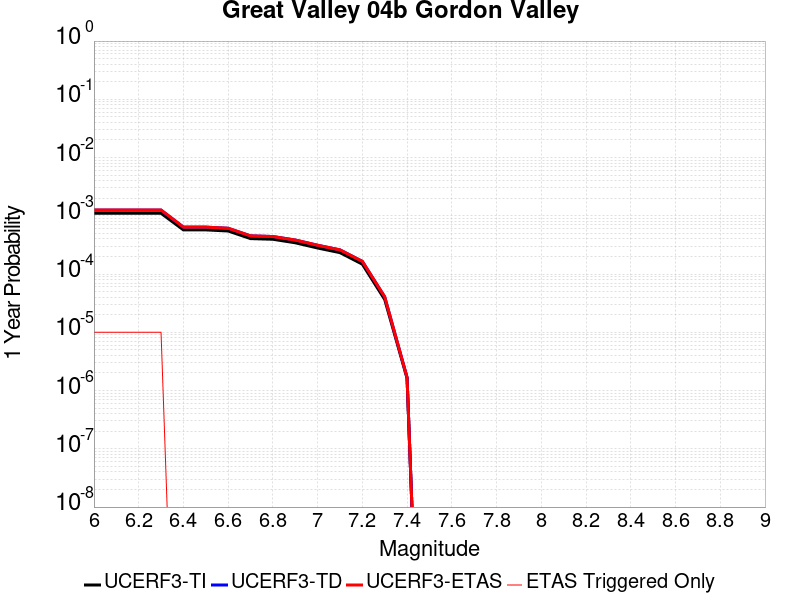 |  |

| Magnitude | 1 wk TI Prob | 1 wk TD Prob | 1 wk ETAS Prob | 1 wk ETAS/TD Gain | 1 wk ETAS Triggered Only | 1 mo TI Prob | 1 mo TD Prob | 1 mo ETAS Prob | 1 mo ETAS/TD Gain | 1 mo ETAS Triggered Only | 1 yr TI Prob | 1 yr TD Prob | 1 yr ETAS Prob | 1 yr ETAS/TD Gain | 1 yr ETAS Triggered Only | 10 yr TI Prob | 10 yr TD Prob | 10 yr ETAS Prob | 10 yr ETAS/TD Gain | 10 yr ETAS Triggered Only |
|-----|-----|-----|-----|-----|-----|-----|-----|-----|-----|-----|-----|-----|-----|-----|-----|-----|-----|-----|-----|-----|
| 6.0 | 2.1181217E-5 | 2.3982375E-5 | 2.3982375E-5 | 1.0 | 0.0 | 9.077348E-5 | 1.027785E-4 | 1.027785E-4 | 1.0 | 0.0 | 0.0011046068 | 0.0012507766 | 0.0012841796 | 1.0267057 | 3.3444816E-5 | 0.010991322 | 0.012453817 | 0.012486845 | 1.002652 | 3.3444816E-5 |
| 6.1 | 2.1181217E-5 | 2.3982375E-5 | 2.3982375E-5 | 1.0 | 0.0 | 9.077348E-5 | 1.027785E-4 | 1.027785E-4 | 1.0 | 0.0 | 0.0011046068 | 0.0012507766 | 0.0012841796 | 1.0267057 | 3.3444816E-5 | 0.010991322 | 0.012453817 | 0.012486845 | 1.002652 | 3.3444816E-5 |
| 6.2 | 2.1181217E-5 | 2.3982375E-5 | 2.3982375E-5 | 1.0 | 0.0 | 9.077348E-5 | 1.027785E-4 | 1.027785E-4 | 1.0 | 0.0 | 0.0011046068 | 0.0012507766 | 0.0012841796 | 1.0267057 | 3.3444816E-5 | 0.010991322 | 0.012453817 | 0.012486845 | 1.002652 | 3.3444816E-5 |
| 6.3 | 2.1181217E-5 | 2.3982375E-5 | 2.3982375E-5 | 1.0 | 0.0 | 9.077348E-5 | 1.027785E-4 | 1.027785E-4 | 1.0 | 0.0 | 0.0011046068 | 0.0012507766 | 0.0012841796 | 1.0267057 | 3.3444816E-5 | 0.010991322 | 0.012453817 | 0.012486845 | 1.002652 | 3.3444816E-5 |
| 6.4 | 1.0988268E-5 | 1.2254686E-5 | 1.2254686E-5 | 1.0 | 0.0 | 4.7091726E-5 | 5.2519114E-5 | 5.2519114E-5 | 1.0 | 0.0 | 5.731909E-4 | 6.392486E-4 | 6.392486E-4 | 1.0 | 0.0 | 0.005717147 | 0.006375685 | 0.006375685 | 1.0 | 0.0 |
| 6.5 | 1.0988268E-5 | 1.2254686E-5 | 1.2254686E-5 | 1.0 | 0.0 | 4.7091726E-5 | 5.2519114E-5 | 5.2519114E-5 | 1.0 | 0.0 | 5.731909E-4 | 6.392486E-4 | 6.392486E-4 | 1.0 | 0.0 | 0.005717147 | 0.006375685 | 0.006375685 | 1.0 | 0.0 |
| 6.6 | 1.0517822E-5 | 1.172424E-5 | 1.172424E-5 | 1.0 | 0.0 | 4.5075605E-5 | 5.0245864E-5 | 5.0245864E-5 | 1.0 | 0.0 | 5.4865726E-4 | 6.115873E-4 | 6.115873E-4 | 1.0 | 0.0 | 0.0054730466 | 0.006100596 | 0.006100596 | 1.0 | 0.0 |
| 6.7 | 7.789219E-6 | 8.677775E-6 | 8.677775E-6 | 1.0 | 0.0 | 3.3381937E-5 | 3.7189966E-5 | 3.7189966E-5 | 1.0 | 0.0 | 4.063493E-4 | 4.5269894E-4 | 4.5269894E-4 | 1.0 | 0.0 | 0.004056071 | 0.004518285 | 0.004518285 | 1.0 | 0.0 |
| 6.8 | 7.5850853E-6 | 8.452517E-6 | 8.452517E-6 | 1.0 | 0.0 | 3.2507105E-5 | 3.62246E-5 | 3.62246E-5 | 1.0 | 0.0 | 3.957021E-4 | 4.409504E-4 | 4.409504E-4 | 1.0 | 0.0 | 0.0039499826 | 0.004401267 | 0.004401267 | 1.0 | 0.0 |
| 6.9 | 6.604105E-6 | 7.3586607E-6 | 7.3586607E-6 | 1.0 | 0.0 | 2.8303E-5 | 3.1536758E-5 | 3.1536758E-5 | 1.0 | 0.0 | 3.4453452E-4 | 3.8389626E-4 | 3.8389626E-4 | 1.0 | 0.0 | 0.0034400085 | 0.0038327174 | 0.0038327174 | 1.0 | 0.0 |
| 7.0 | 5.3701115E-6 | 5.9885097E-6 | 5.9885097E-6 | 1.0 | 0.0 | 2.301456E-5 | 2.5664805E-5 | 2.5664805E-5 | 1.0 | 0.0 | 2.8016625E-4 | 3.1242712E-4 | 3.1242712E-4 | 1.0 | 0.0 | 0.0027981328 | 0.0031201674 | 0.0031201674 | 1.0 | 0.0 |
| 7.1 | 4.4685607E-6 | 4.986555E-6 | 4.986555E-6 | 1.0 | 0.0 | 1.9150835E-5 | 2.1370788E-5 | 2.1370788E-5 | 1.0 | 0.0 | 2.3313647E-4 | 2.6016077E-4 | 2.6016077E-4 | 1.0 | 0.0 | 0.0023289204 | 0.0025988068 | 0.0025988068 | 1.0 | 0.0 |
| 7.2 | 2.833378E-6 | 3.1644681E-6 | 3.1644681E-6 | 1.0 | 0.0 | 1.2142991E-5 | 1.3561946E-5 | 1.3561946E-5 | 1.0 | 0.0 | 1.4783088E-4 | 1.6510593E-4 | 1.6510593E-4 | 1.0 | 0.0 | 0.0014773258 | 0.0016500045 | 0.0016500045 | 1.0 | 0.0 |
| 7.3 | 7.0087293E-7 | 7.772929E-7 | 7.772929E-7 | 1.0 | 0.0 | 3.0037377E-6 | 3.3312535E-6 | 3.3312535E-6 | 1.0 | 0.0 | 3.656989E-5 | 4.0557716E-5 | 4.0557716E-5 | 1.0 | 0.0 | 3.6563876E-4 | 4.055481E-4 | 4.055481E-4 | 1.0 | 0.0 |
| 7.4 | 3.112171E-8 | 3.2068495E-8 | 3.2068495E-8 | 1.0 | 0.0 | 1.3337875E-7 | 1.374364E-7 | 1.374364E-7 | 1.0 | 0.0 | 1.6238852E-6 | 1.673287E-6 | 1.673287E-6 | 1.0 | 0.0 | 1.6238733E-5 | 1.6732753E-5 | 1.6732753E-5 | 1.0 | 0.0 |

## Carson Range (Genoa)
*[(top)](#table-of-contents)*

| 1 Week | 1 Month | 1 Year | 10 Year |
|-----|-----|-----|-----|
|  | 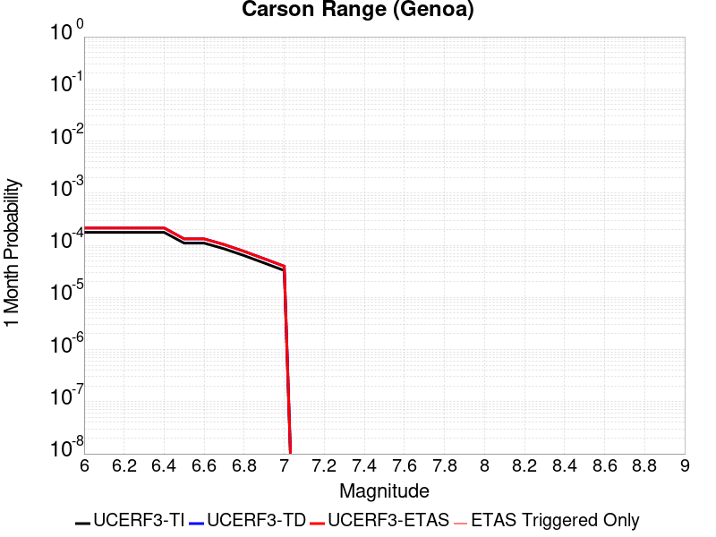 |  |  |

| Magnitude | 1 wk TI Prob | 1 wk TD Prob | 1 wk ETAS Prob | 1 wk ETAS/TD Gain | 1 wk ETAS Triggered Only | 1 mo TI Prob | 1 mo TD Prob | 1 mo ETAS Prob | 1 mo ETAS/TD Gain | 1 mo ETAS Triggered Only | 1 yr TI Prob | 1 yr TD Prob | 1 yr ETAS Prob | 1 yr ETAS/TD Gain | 1 yr ETAS Triggered Only | 10 yr TI Prob | 10 yr TD Prob | 10 yr ETAS Prob | 10 yr ETAS/TD Gain | 10 yr ETAS Triggered Only |
|-----|-----|-----|-----|-----|-----|-----|-----|-----|-----|-----|-----|-----|-----|-----|-----|-----|-----|-----|-----|-----|
| 6.0 | 4.1268457E-5 | 5.0148326E-5 | 5.0148326E-5 | 1.0 | 0.0 | 1.7685282E-4 | 2.1490594E-4 | 2.1490594E-4 | 1.0 | 0.0 | 0.0021510567 | 0.0026137296 | 0.0026137296 | 1.0 | 0.0 | 0.02130354 | 0.025869545 | 0.025902124 | 1.0012593 | 3.3444816E-5 |
| 6.1 | 4.1268457E-5 | 5.0148326E-5 | 5.0148326E-5 | 1.0 | 0.0 | 1.7685282E-4 | 2.1490594E-4 | 2.1490594E-4 | 1.0 | 0.0 | 0.0021510567 | 0.0026137296 | 0.0026137296 | 1.0 | 0.0 | 0.02130354 | 0.025869545 | 0.025902124 | 1.0012593 | 3.3444816E-5 |
| 6.2 | 4.1268457E-5 | 5.0148326E-5 | 5.0148326E-5 | 1.0 | 0.0 | 1.7685282E-4 | 2.1490594E-4 | 2.1490594E-4 | 1.0 | 0.0 | 0.0021510567 | 0.0026137296 | 0.0026137296 | 1.0 | 0.0 | 0.02130354 | 0.025869545 | 0.025902124 | 1.0012593 | 3.3444816E-5 |
| 6.3 | 4.1268457E-5 | 5.0148326E-5 | 5.0148326E-5 | 1.0 | 0.0 | 1.7685282E-4 | 2.1490594E-4 | 2.1490594E-4 | 1.0 | 0.0 | 0.0021510567 | 0.0026137296 | 0.0026137296 | 1.0 | 0.0 | 0.02130354 | 0.025869545 | 0.025902124 | 1.0012593 | 3.3444816E-5 |
| 6.4 | 4.1268457E-5 | 5.0148326E-5 | 5.0148326E-5 | 1.0 | 0.0 | 1.7685282E-4 | 2.1490594E-4 | 2.1490594E-4 | 1.0 | 0.0 | 0.0021510567 | 0.0026137296 | 0.0026137296 | 1.0 | 0.0 | 0.02130354 | 0.025869545 | 0.025902124 | 1.0012593 | 3.3444816E-5 |
| 6.5 | 2.5677185E-5 | 3.0979143E-5 | 3.0979143E-5 | 1.0 | 0.0 | 1.1004044E-4 | 1.3276203E-4 | 1.3276203E-4 | 1.0 | 0.0 | 0.0013389189 | 0.0016153576 | 0.0016153576 | 1.0 | 0.0 | 0.0133088045 | 0.016054086 | 0.016086994 | 1.0020498 | 3.3444816E-5 |
| 6.6 | 2.5677185E-5 | 3.0979143E-5 | 3.0979143E-5 | 1.0 | 0.0 | 1.1004044E-4 | 1.3276203E-4 | 1.3276203E-4 | 1.0 | 0.0 | 0.0013389189 | 0.0016153576 | 0.0016153576 | 1.0 | 0.0 | 0.0133088045 | 0.016054086 | 0.016086994 | 1.0020498 | 3.3444816E-5 |
| 6.7 | 1.9969408E-5 | 2.4064126E-5 | 2.4064126E-5 | 1.0 | 0.0 | 8.558037E-5 | 1.0312876E-4 | 1.0312876E-4 | 1.0 | 0.0 | 0.0010414429 | 0.001255023 | 0.001255023 | 1.0 | 0.0 | 0.010365757 | 0.012494512 | 0.012527538 | 1.0026433 | 3.3444816E-5 |
| 6.8 | 1.4783156E-5 | 1.7818053E-5 | 1.7818053E-5 | 1.0 | 0.0 | 6.335485E-5 | 7.636158E-5 | 7.636158E-5 | 1.0 | 0.0 | 7.710722E-4 | 9.2943595E-4 | 9.2943595E-4 | 1.0 | 0.0 | 0.0076840227 | 0.009268275 | 0.00930141 | 1.0035751 | 3.3444816E-5 |
| 6.9 | 1.06660555E-5 | 1.287738E-5 | 1.287738E-5 | 1.0 | 0.0 | 4.5710865E-5 | 5.5188255E-5 | 5.5188255E-5 | 1.0 | 0.0 | 5.5638765E-4 | 6.718251E-4 | 6.718251E-4 | 1.0 | 0.0 | 0.005549967 | 0.00670924 | 0.00670924 | 1.0 | 0.0 |
| 7.0 | 7.664838E-6 | 9.2585615E-6 | 9.2585615E-6 | 1.0 | 0.0 | 3.2848893E-5 | 3.967955E-5 | 3.967955E-5 | 1.0 | 0.0 | 3.998619E-4 | 4.8309853E-4 | 4.8309853E-4 | 1.0 | 0.0 | 0.0039914316 | 0.004830983 | 0.004830983 | 1.0 | 0.0 |

## San Luis Range 2011 CFM
*[(top)](#table-of-contents)*

| 1 Week | 1 Month | 1 Year | 10 Year |
|-----|-----|-----|-----|
|  |  | 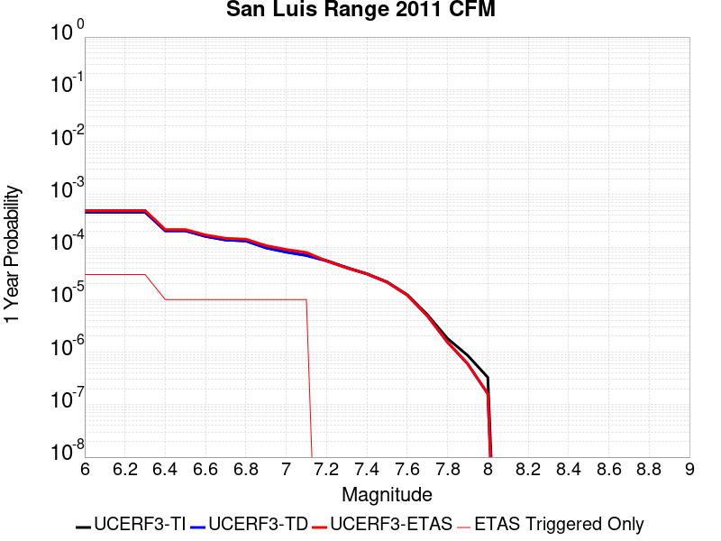 |  |

| Magnitude | 1 wk TI Prob | 1 wk TD Prob | 1 wk ETAS Prob | 1 wk ETAS/TD Gain | 1 wk ETAS Triggered Only | 1 mo TI Prob | 1 mo TD Prob | 1 mo ETAS Prob | 1 mo ETAS/TD Gain | 1 mo ETAS Triggered Only | 1 yr TI Prob | 1 yr TD Prob | 1 yr ETAS Prob | 1 yr ETAS/TD Gain | 1 yr ETAS Triggered Only | 10 yr TI Prob | 10 yr TD Prob | 10 yr ETAS Prob | 10 yr ETAS/TD Gain | 10 yr ETAS Triggered Only |
|-----|-----|-----|-----|-----|-----|-----|-----|-----|-----|-----|-----|-----|-----|-----|-----|-----|-----|-----|-----|-----|
| 6.0 | 8.8368415E-6 | 8.965477E-6 | 8.965477E-6 | 1.0 | 0.0 | 3.787163E-5 | 3.8422953E-5 | 3.8422953E-5 | 1.0 | 0.0 | 4.609895E-4 | 4.677069E-4 | 5.0113606E-4 | 1.0714747 | 3.3444816E-5 | 0.0046003438 | 0.0046680085 | 0.0047012973 | 1.0071312 | 3.3444816E-5 |
| 6.1 | 8.8368415E-6 | 8.965477E-6 | 8.965477E-6 | 1.0 | 0.0 | 3.787163E-5 | 3.8422953E-5 | 3.8422953E-5 | 1.0 | 0.0 | 4.609895E-4 | 4.677069E-4 | 5.0113606E-4 | 1.0714747 | 3.3444816E-5 | 0.0046003438 | 0.0046680085 | 0.0047012973 | 1.0071312 | 3.3444816E-5 |
| 6.2 | 8.8368415E-6 | 8.965477E-6 | 8.965477E-6 | 1.0 | 0.0 | 3.787163E-5 | 3.8422953E-5 | 3.8422953E-5 | 1.0 | 0.0 | 4.609895E-4 | 4.677069E-4 | 5.0113606E-4 | 1.0714747 | 3.3444816E-5 | 0.0046003438 | 0.0046680085 | 0.0047012973 | 1.0071312 | 3.3444816E-5 |
| 6.3 | 8.8368415E-6 | 8.965477E-6 | 8.965477E-6 | 1.0 | 0.0 | 3.787163E-5 | 3.8422953E-5 | 3.8422953E-5 | 1.0 | 0.0 | 4.609895E-4 | 4.677069E-4 | 5.0113606E-4 | 1.0714747 | 3.3444816E-5 | 0.0046003438 | 0.0046680085 | 0.0047012973 | 1.0071312 | 3.3444816E-5 |
| 6.4 | 3.9094193E-6 | 3.941213E-6 | 3.941213E-6 | 1.0 | 0.0 | 1.6754546E-5 | 1.6890806E-5 | 1.6890806E-5 | 1.0 | 0.0 | 2.039675E-4 | 2.0562643E-4 | 2.0562643E-4 | 1.0 | 0.0 | 0.0020378039 | 0.0020543905 | 0.0020543905 | 1.0 | 0.0 |
| 6.5 | 3.9094193E-6 | 3.941213E-6 | 3.941213E-6 | 1.0 | 0.0 | 1.6754546E-5 | 1.6890806E-5 | 1.6890806E-5 | 1.0 | 0.0 | 2.039675E-4 | 2.0562643E-4 | 2.0562643E-4 | 1.0 | 0.0 | 0.0020378039 | 0.0020543905 | 0.0020543905 | 1.0 | 0.0 |
| 6.6 | 3.0587726E-6 | 3.0753965E-6 | 3.0753965E-6 | 1.0 | 0.0 | 1.3108959E-5 | 1.3180205E-5 | 1.3180205E-5 | 1.0 | 0.0 | 1.595899E-4 | 1.604573E-4 | 1.604573E-4 | 1.0 | 0.0 | 0.0015947534 | 0.0016034264 | 0.0016034264 | 1.0 | 0.0 |
| 6.7 | 2.6160574E-6 | 2.6251346E-6 | 2.6251346E-6 | 1.0 | 0.0 | 1.1211626E-5 | 1.1250529E-5 | 1.1250529E-5 | 1.0 | 0.0 | 1.3649299E-4 | 1.3696664E-4 | 1.3696664E-4 | 1.0 | 0.0 | 0.0013640919 | 0.0013688284 | 0.0013688284 | 1.0 | 0.0 |
| 6.8 | 2.5110312E-6 | 2.5181473E-6 | 2.5181473E-6 | 1.0 | 0.0 | 1.0761518E-5 | 1.0792015E-5 | 1.0792015E-5 | 1.0 | 0.0 | 1.310136E-4 | 1.3138492E-4 | 1.3138492E-4 | 1.0 | 0.0 | 0.0013093639 | 0.0013130783 | 0.0013130783 | 1.0 | 0.0 |
| 6.9 | 1.8564405E-6 | 1.8524926E-6 | 1.8524926E-6 | 1.0 | 0.0 | 7.95615E-6 | 7.93923E-6 | 7.93923E-6 | 1.0 | 0.0 | 9.686181E-5 | 9.665586E-5 | 9.665586E-5 | 1.0 | 0.0 | 9.68196E-4 | 9.661402E-4 | 9.661402E-4 | 1.0 | 0.0 |
| 7.0 | 1.546127E-6 | 1.5369586E-6 | 1.5369586E-6 | 1.0 | 0.0 | 6.626242E-6 | 6.586949E-6 | 6.586949E-6 | 1.0 | 0.0 | 8.06715E-5 | 8.019316E-5 | 8.019316E-5 | 1.0 | 0.0 | 8.0642226E-4 | 8.016429E-4 | 8.016429E-4 | 1.0 | 0.0 |
| 7.1 | 1.3368208E-6 | 1.3235369E-6 | 1.3235369E-6 | 1.0 | 0.0 | 5.7292195E-6 | 5.672289E-6 | 5.672289E-6 | 1.0 | 0.0 | 6.975101E-5 | 6.905793E-5 | 6.905793E-5 | 1.0 | 0.0 | 6.972912E-4 | 6.903652E-4 | 6.903652E-4 | 1.0 | 0.0 |
| 7.2 | 1.0623363E-6 | 1.0454403E-6 | 1.0454403E-6 | 1.0 | 0.0 | 4.5528623E-6 | 4.480451E-6 | 4.480451E-6 | 1.0 | 0.0 | 5.5429686E-5 | 5.4548127E-5 | 5.4548127E-5 | 1.0 | 0.0 | 5.5415864E-4 | 5.4534763E-4 | 5.4534763E-4 | 1.0 | 0.0 |
| 7.3 | 7.831679E-7 | 7.7274194E-7 | 7.7274194E-7 | 1.0 | 0.0 | 3.3564295E-6 | 3.311747E-6 | 3.311747E-6 | 1.0 | 0.0 | 4.086376E-5 | 4.0319774E-5 | 4.0319774E-5 | 1.0 | 0.0 | 4.0856248E-4 | 4.0312472E-4 | 4.0312472E-4 | 1.0 | 0.0 |
| 7.4 | 5.9558846E-7 | 5.91066E-7 | 5.91066E-7 | 1.0 | 0.0 | 2.5525194E-6 | 2.5331376E-6 | 2.5331376E-6 | 1.0 | 0.0 | 3.107648E-5 | 3.0840514E-5 | 3.0840514E-5 | 1.0 | 0.0 | 3.1072134E-4 | 3.0836245E-4 | 3.0836245E-4 | 1.0 | 0.0 |
| 7.5 | 4.1616502E-7 | 4.1196506E-7 | 4.1196506E-7 | 1.0 | 0.0 | 1.7835631E-6 | 1.7655633E-6 | 1.7655633E-6 | 1.0 | 0.0 | 2.1714664E-5 | 2.1495522E-5 | 2.1495522E-5 | 1.0 | 0.0 | 2.1712543E-4 | 2.1493447E-4 | 2.1493447E-4 | 1.0 | 0.0 |
| 7.6 | 2.3816014E-7 | 2.3376697E-7 | 2.3376697E-7 | 1.0 | 0.0 | 1.0206859E-6 | 1.001858E-6 | 1.001858E-6 | 1.0 | 0.0 | 1.242678E-5 | 1.2197554E-5 | 1.2197554E-5 | 1.0 | 0.0 | 1.2426086E-4 | 1.2196886E-4 | 1.2196886E-4 | 1.0 | 0.0 |
| 7.7 | 9.918777E-8 | 9.386869E-8 | 9.386869E-8 | 1.0 | 0.0 | 4.2509038E-7 | 4.0229432E-7 | 4.0229432E-7 | 1.0 | 0.0 | 5.1754632E-6 | 4.8979223E-6 | 4.8979223E-6 | 1.0 | 0.0 | 5.1753424E-5 | 4.897815E-5 | 4.897815E-5 | 1.0 | 0.0 |
| 7.8 | 3.4982556E-8 | 2.9687454E-8 | 2.9687454E-8 | 1.0 | 0.0 | 1.4992524E-7 | 1.2723194E-7 | 1.2723194E-7 | 1.0 | 0.0 | 1.8253382E-6 | 1.5490477E-6 | 1.5490477E-6 | 1.0 | 0.0 | 1.8253233E-5 | 1.549037E-5 | 1.549037E-5 | 1.0 | 0.0 |
| 7.9 | 1.6624908E-8 | 1.1477859E-8 | 1.1477859E-8 | 1.0 | 0.0 | 7.12496E-8 | 4.919082E-8 | 4.919082E-8 | 1.0 | 0.0 | 8.6746354E-7 | 5.9889805E-7 | 5.9889805E-7 | 1.0 | 0.0 | 8.674601E-6 | 5.988965E-6 | 5.988965E-6 | 1.0 | 0.0 |
| 8.0 | 6.3352315E-9 | 3.0893488E-9 | 3.0893488E-9 | 1.0 | 0.0 | 2.715099E-8 | 1.3240064E-8 | 1.3240064E-8 | 1.0 | 0.0 | 3.3056327E-7 | 1.6119778E-7 | 1.6119778E-7 | 1.0 | 0.0 | 3.3056278E-6 | 1.6119766E-6 | 1.6119766E-6 | 1.0 | 0.0 |

## West Tahoe
*[(top)](#table-of-contents)*

| 1 Week | 1 Month | 1 Year | 10 Year |
|-----|-----|-----|-----|
|  |  |  |  |

| Magnitude | 1 wk TI Prob | 1 wk TD Prob | 1 wk ETAS Prob | 1 wk ETAS/TD Gain | 1 wk ETAS Triggered Only | 1 mo TI Prob | 1 mo TD Prob | 1 mo ETAS Prob | 1 mo ETAS/TD Gain | 1 mo ETAS Triggered Only | 1 yr TI Prob | 1 yr TD Prob | 1 yr ETAS Prob | 1 yr ETAS/TD Gain | 1 yr ETAS Triggered Only | 10 yr TI Prob | 10 yr TD Prob | 10 yr ETAS Prob | 10 yr ETAS/TD Gain | 10 yr ETAS Triggered Only |
|-----|-----|-----|-----|-----|-----|-----|-----|-----|-----|-----|-----|-----|-----|-----|-----|-----|-----|-----|-----|-----|
| 6.0 | 1.952444E-5 | 2.1183409E-5 | 2.1183409E-5 | 1.0 | 0.0 | 8.367348E-5 | 9.0783185E-5 | 9.0783185E-5 | 1.0 | 0.0 | 0.0010182485 | 0.0011047797 | 0.0011047797 | 1.0 | 0.0 | 0.010135954 | 0.010998359 | 0.011031436 | 1.0030074 | 3.3444816E-5 |
| 6.1 | 1.952444E-5 | 2.1183409E-5 | 2.1183409E-5 | 1.0 | 0.0 | 8.367348E-5 | 9.0783185E-5 | 9.0783185E-5 | 1.0 | 0.0 | 0.0010182485 | 0.0011047797 | 0.0011047797 | 1.0 | 0.0 | 0.010135954 | 0.010998359 | 0.011031436 | 1.0030074 | 3.3444816E-5 |
| 6.2 | 1.952444E-5 | 2.1183409E-5 | 2.1183409E-5 | 1.0 | 0.0 | 8.367348E-5 | 9.0783185E-5 | 9.0783185E-5 | 1.0 | 0.0 | 0.0010182485 | 0.0011047797 | 0.0011047797 | 1.0 | 0.0 | 0.010135954 | 0.010998359 | 0.011031436 | 1.0030074 | 3.3444816E-5 |
| 6.3 | 1.952444E-5 | 2.1183409E-5 | 2.1183409E-5 | 1.0 | 0.0 | 8.367348E-5 | 9.0783185E-5 | 9.0783185E-5 | 1.0 | 0.0 | 0.0010182485 | 0.0011047797 | 0.0011047797 | 1.0 | 0.0 | 0.010135954 | 0.010998359 | 0.011031436 | 1.0030074 | 3.3444816E-5 |
| 6.4 | 1.952444E-5 | 2.1183409E-5 | 2.1183409E-5 | 1.0 | 0.0 | 8.367348E-5 | 9.0783185E-5 | 9.0783185E-5 | 1.0 | 0.0 | 0.0010182485 | 0.0011047797 | 0.0011047797 | 1.0 | 0.0 | 0.010135954 | 0.010998359 | 0.011031436 | 1.0030074 | 3.3444816E-5 |
| 6.5 | 1.2685271E-5 | 1.3690772E-5 | 1.3690772E-5 | 1.0 | 0.0 | 5.4364315E-5 | 5.8673508E-5 | 5.8673508E-5 | 1.0 | 0.0 | 6.616845E-4 | 7.1413233E-4 | 7.1413233E-4 | 1.0 | 0.0 | 0.0065971776 | 0.0071200244 | 0.007153231 | 1.0046638 | 3.3444816E-5 |
| 6.6 | 1.2685271E-5 | 1.3690772E-5 | 1.3690772E-5 | 1.0 | 0.0 | 5.4364315E-5 | 5.8673508E-5 | 5.8673508E-5 | 1.0 | 0.0 | 6.616845E-4 | 7.1413233E-4 | 7.1413233E-4 | 1.0 | 0.0 | 0.0065971776 | 0.0071200244 | 0.007153231 | 1.0046638 | 3.3444816E-5 |
| 6.7 | 9.117886E-6 | 9.809945E-6 | 9.809945E-6 | 1.0 | 0.0 | 3.9076072E-5 | 4.2041986E-5 | 4.2041986E-5 | 1.0 | 0.0 | 4.756473E-4 | 5.1174813E-4 | 5.1174813E-4 | 1.0 | 0.0 | 0.0047463053 | 0.0051064147 | 0.005139689 | 1.0065161 | 3.3444816E-5 |
| 6.8 | 8.786828E-6 | 9.457959E-6 | 9.457959E-6 | 1.0 | 0.0 | 3.7657293E-5 | 4.053352E-5 | 4.053352E-5 | 1.0 | 0.0 | 4.5838108E-4 | 4.933909E-4 | 4.933909E-4 | 1.0 | 0.0 | 0.0045743673 | 0.004923656 | 0.004956936 | 1.0067593 | 3.3444816E-5 |
| 6.9 | 6.7562123E-6 | 7.263881E-6 | 7.263881E-6 | 1.0 | 0.0 | 2.8954875E-5 | 3.1130574E-5 | 3.1130574E-5 | 1.0 | 0.0 | 3.5246857E-4 | 3.7895358E-4 | 3.7895358E-4 | 1.0 | 0.0 | 0.0035191004 | 0.0037835457 | 0.003816864 | 1.0088061 | 3.3444816E-5 |
| 7.0 | 5.1792854E-6 | 5.5673936E-6 | 5.5673936E-6 | 1.0 | 0.0 | 2.2196748E-5 | 2.386006E-5 | 2.386006E-5 | 1.0 | 0.0 | 2.702119E-4 | 2.9046132E-4 | 2.9046132E-4 | 1.0 | 0.0 | 0.0026988357 | 0.002901192 | 0.002901192 | 1.0 | 0.0 |
| 7.1 | 4.090765E-6 | 4.3974665E-6 | 4.3974665E-6 | 1.0 | 0.0 | 1.7531731E-5 | 1.8846167E-5 | 1.8846167E-5 | 1.0 | 0.0 | 2.134279E-4 | 2.2943133E-4 | 2.2943133E-4 | 1.0 | 0.0 | 0.0021322304 | 0.0022922792 | 0.0022922792 | 1.0 | 0.0 |
| 7.2 | 2.2356758E-6 | 2.402392E-6 | 2.402392E-6 | 1.0 | 0.0 | 9.581432E-6 | 1.0295936E-5 | 1.0295936E-5 | 1.0 | 0.0 | 1.1664769E-4 | 1.2534771E-4 | 1.2534771E-4 | 1.0 | 0.0 | 0.0011658648 | 0.0012529559 | 0.0012529559 | 1.0 | 0.0 |

## Cedar Mtn-Mahogany Mtn
*[(top)](#table-of-contents)*

| 1 Week | 1 Month | 1 Year | 10 Year |
|-----|-----|-----|-----|
|  | 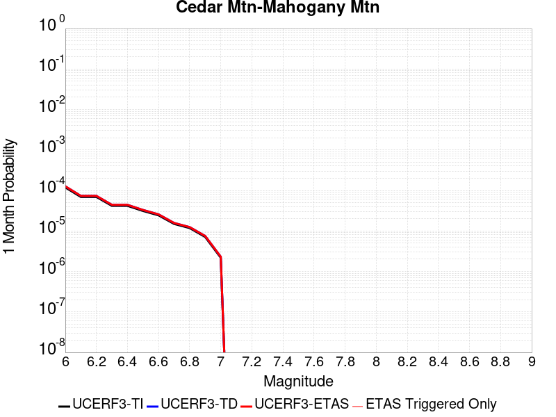 | 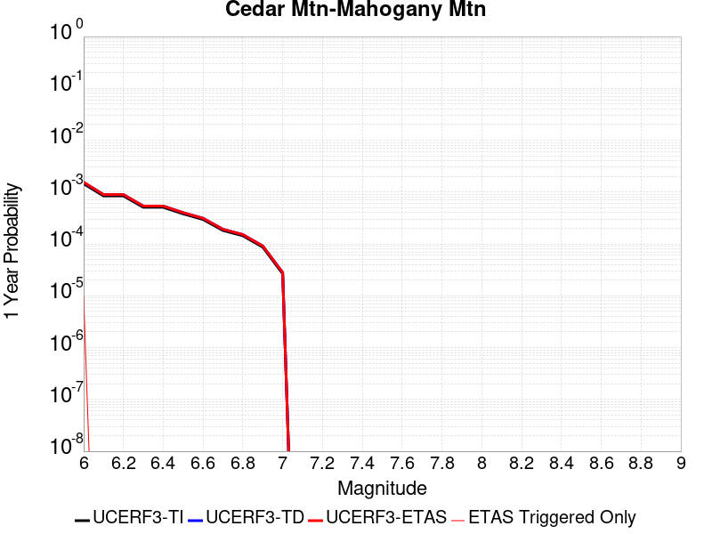 |  |

| Magnitude | 1 wk TI Prob | 1 wk TD Prob | 1 wk ETAS Prob | 1 wk ETAS/TD Gain | 1 wk ETAS Triggered Only | 1 mo TI Prob | 1 mo TD Prob | 1 mo ETAS Prob | 1 mo ETAS/TD Gain | 1 mo ETAS Triggered Only | 1 yr TI Prob | 1 yr TD Prob | 1 yr ETAS Prob | 1 yr ETAS/TD Gain | 1 yr ETAS Triggered Only | 10 yr TI Prob | 10 yr TD Prob | 10 yr ETAS Prob | 10 yr ETAS/TD Gain | 10 yr ETAS Triggered Only |
|-----|-----|-----|-----|-----|-----|-----|-----|-----|-----|-----|-----|-----|-----|-----|-----|-----|-----|-----|-----|-----|
| 6.0 | 2.7763876E-5 | 2.9589124E-5 | 2.9589124E-5 | 1.0 | 0.0 | 1.1898261E-4 | 1.2680476E-4 | 1.2680476E-4 | 1.0 | 0.0 | 0.0014476506 | 0.0015428247 | 0.0015762179 | 1.0216442 | 3.3444816E-5 | 0.0143825635 | 0.015328358 | 0.01536129 | 1.0021484 | 3.3444816E-5 |
| 6.1 | 1.6162443E-5 | 1.7143104E-5 | 1.7143104E-5 | 1.0 | 0.0 | 6.926578E-5 | 7.346847E-5 | 7.346847E-5 | 1.0 | 0.0 | 8.4298453E-4 | 8.9412933E-4 | 8.9412933E-4 | 1.0 | 0.0 | 0.008397939 | 0.00890713 | 0.00890713 | 1.0 | 0.0 |
| 6.2 | 1.6162443E-5 | 1.7143104E-5 | 1.7143104E-5 | 1.0 | 0.0 | 6.926578E-5 | 7.346847E-5 | 7.346847E-5 | 1.0 | 0.0 | 8.4298453E-4 | 8.9412933E-4 | 8.9412933E-4 | 1.0 | 0.0 | 0.008397939 | 0.00890713 | 0.00890713 | 1.0 | 0.0 |
| 6.3 | 9.746053E-6 | 1.030323E-5 | 1.030323E-5 | 1.0 | 0.0 | 4.1768133E-5 | 4.4155975E-5 | 4.4155975E-5 | 1.0 | 0.0 | 5.0840835E-4 | 5.374705E-4 | 5.374705E-4 | 1.0 | 0.0 | 0.0050724675 | 0.005362125 | 0.005362125 | 1.0 | 0.0 |
| 6.4 | 9.746053E-6 | 1.030323E-5 | 1.030323E-5 | 1.0 | 0.0 | 4.1768133E-5 | 4.4155975E-5 | 4.4155975E-5 | 1.0 | 0.0 | 5.0840835E-4 | 5.374705E-4 | 5.374705E-4 | 1.0 | 0.0 | 0.0050724675 | 0.005362125 | 0.005362125 | 1.0 | 0.0 |
| 6.5 | 7.290083E-6 | 7.695381E-6 | 7.695381E-6 | 1.0 | 0.0 | 3.124284E-5 | 3.2979802E-5 | 3.2979802E-5 | 1.0 | 0.0 | 3.8031515E-4 | 4.0145728E-4 | 4.0145728E-4 | 1.0 | 0.0 | 0.0037966494 | 0.0040075406 | 0.0040075406 | 1.0 | 0.0 |
| 6.6 | 5.67907E-6 | 5.9891963E-6 | 5.9891963E-6 | 1.0 | 0.0 | 2.4338644E-5 | 2.5667738E-5 | 2.5667738E-5 | 1.0 | 0.0 | 2.962827E-4 | 3.1246126E-4 | 3.1246126E-4 | 1.0 | 0.0 | 0.0029588798 | 0.0031203553 | 0.0031203553 | 1.0 | 0.0 |
| 6.7 | 3.4853963E-6 | 3.6726572E-6 | 3.6726572E-6 | 1.0 | 0.0 | 1.4937327E-5 | 1.5739868E-5 | 1.5739868E-5 | 1.0 | 0.0 | 1.8184677E-4 | 1.9161667E-4 | 1.9161667E-4 | 1.0 | 0.0 | 0.0018169804 | 0.0019145765 | 0.0019145765 | 1.0 | 0.0 |
| 6.8 | 2.7535168E-6 | 2.901597E-6 | 2.901597E-6 | 1.0 | 0.0 | 1.1800733E-5 | 1.2435359E-5 | 1.2435359E-5 | 1.0 | 0.0 | 1.4366445E-4 | 1.5139046E-4 | 1.5139046E-4 | 1.0 | 0.0 | 0.0014357162 | 0.0015129205 | 0.0015129205 | 1.0 | 0.0 |
| 6.9 | 1.6594106E-6 | 1.7497113E-6 | 1.7497113E-6 | 1.0 | 0.0 | 7.1117406E-6 | 7.4987424E-6 | 7.4987424E-6 | 1.0 | 0.0 | 8.6582E-5 | 9.1293674E-5 | 9.1293674E-5 | 1.0 | 0.0 | 8.654827E-4 | 9.1259216E-4 | 9.1259216E-4 | 1.0 | 0.0 |
| 7.0 | 5.10215E-7 | 5.389294E-7 | 5.389294E-7 | 1.0 | 0.0 | 2.186634E-6 | 2.3096961E-6 | 2.3096961E-6 | 1.0 | 0.0 | 2.6621943E-5 | 2.8120316E-5 | 2.8120316E-5 | 1.0 | 0.0 | 2.6618753E-4 | 2.811801E-4 | 2.811801E-4 | 1.0 | 0.0 |

## Greenville (So) 2011 CFM
*[(top)](#table-of-contents)*

| 1 Week | 1 Month | 1 Year | 10 Year |
|-----|-----|-----|-----|
|  | 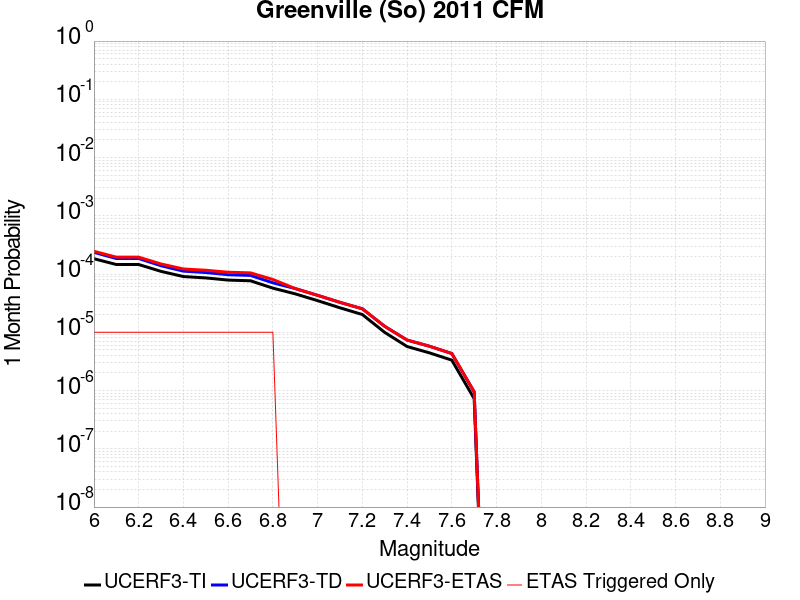 |  |  |

| Magnitude | 1 wk TI Prob | 1 wk TD Prob | 1 wk ETAS Prob | 1 wk ETAS/TD Gain | 1 wk ETAS Triggered Only | 1 mo TI Prob | 1 mo TD Prob | 1 mo ETAS Prob | 1 mo ETAS/TD Gain | 1 mo ETAS Triggered Only | 1 yr TI Prob | 1 yr TD Prob | 1 yr ETAS Prob | 1 yr ETAS/TD Gain | 1 yr ETAS Triggered Only | 10 yr TI Prob | 10 yr TD Prob | 10 yr ETAS Prob | 10 yr ETAS/TD Gain | 10 yr ETAS Triggered Only |
|-----|-----|-----|-----|-----|-----|-----|-----|-----|-----|-----|-----|-----|-----|-----|-----|-----|-----|-----|-----|-----|
| 6.0 | 4.279693E-5 | 5.5042052E-5 | 5.5042052E-5 | 1.0 | 0.0 | 1.8340252E-4 | 2.3587522E-4 | 2.6931215E-4 | 1.1417569 | 3.3444816E-5 | 0.0022306389 | 0.0028683394 | 0.0029016885 | 1.0116266 | 3.3444816E-5 | 0.022083808 | 0.028339082 | 0.02837158 | 1.0011467 | 3.3444816E-5 |
| 6.1 | 3.4037297E-5 | 4.319379E-5 | 4.319379E-5 | 1.0 | 0.0 | 1.4586597E-4 | 1.851043E-4 | 2.1854293E-4 | 1.1806475 | 3.3444816E-5 | 0.0017744715 | 0.0022515068 | 0.0022848763 | 1.0148209 | 3.3444816E-5 | 0.01760369 | 0.022303257 | 0.022335958 | 1.0014662 | 3.3444816E-5 |
| 6.2 | 3.4037297E-5 | 4.319379E-5 | 4.319379E-5 | 1.0 | 0.0 | 1.4586597E-4 | 1.851043E-4 | 2.1854293E-4 | 1.1806475 | 3.3444816E-5 | 0.0017744715 | 0.0022515068 | 0.0022848763 | 1.0148209 | 3.3444816E-5 | 0.01760369 | 0.022303257 | 0.022335958 | 1.0014662 | 3.3444816E-5 |
| 6.3 | 2.5956324E-5 | 3.242983E-5 | 3.242983E-5 | 1.0 | 0.0 | 1.11236644E-4 | 1.3897801E-4 | 1.7241818E-4 | 1.2406148 | 3.3444816E-5 | 0.0013534647 | 0.0016908189 | 0.0017242072 | 1.0197468 | 3.3444816E-5 | 0.013452509 | 0.016786352 | 0.016819235 | 1.001959 | 3.3444816E-5 |
| 6.4 | 2.1145053E-5 | 2.6198357E-5 | 2.6198357E-5 | 1.0 | 0.0 | 9.061851E-5 | 1.1227402E-4 | 1.4571508E-4 | 1.2978522 | 3.3444816E-5 | 0.0011027219 | 0.0013661105 | 0.0013995096 | 1.0244483 | 3.3444816E-5 | 0.01097266 | 0.013580529 | 0.013613519 | 1.0024292 | 3.3444816E-5 |
| 6.5 | 2.0030959E-5 | 2.4796413E-5 | 2.4796413E-5 | 1.0 | 0.0 | 8.584414E-5 | 1.0626618E-4 | 1.3970745E-4 | 1.3146933 | 3.3444816E-5 | 0.0010446513 | 0.001293055 | 0.0013264567 | 1.0258315 | 3.3444816E-5 | 0.010397541 | 0.012858664 | 0.012891678 | 1.0025675 | 3.3444816E-5 |
| 6.6 | 1.8395405E-5 | 2.2755032E-5 | 2.2755032E-5 | 1.0 | 0.0 | 7.8835066E-5 | 9.751807E-5 | 1.3095963E-4 | 1.3429267 | 3.3444816E-5 | 9.5939427E-4 | 0.0011866642 | 0.0012200694 | 1.0281504 | 3.3444816E-5 | 0.009552629 | 0.0118063325 | 0.011839382 | 1.0027994 | 3.3444816E-5 |
| 6.7 | 1.7883482E-5 | 2.2126056E-5 | 2.2126056E-5 | 1.0 | 0.0 | 7.664124E-5 | 9.4822666E-5 | 1.282643E-4 | 1.3526757 | 3.3444816E-5 | 9.3270757E-4 | 0.001153883 | 0.0011872891 | 1.0289512 | 3.3444816E-5 | 0.009288026 | 0.01148197 | 0.011515031 | 1.0028794 | 3.3444816E-5 |
| 6.8 | 1.3373564E-5 | 1.6506328E-5 | 1.6506328E-5 | 1.0 | 0.0 | 5.7314013E-5 | 7.0739574E-5 | 1.0418202E-4 | 1.4727545 | 3.3444816E-5 | 6.975747E-4 | 8.6092873E-4 | 8.9434476E-4 | 1.038814 | 3.3444816E-5 | 0.0069538904 | 0.008577544 | 0.008610702 | 1.0038657 | 3.3444816E-5 |
| 6.9 | 1.06692905E-5 | 1.3152838E-5 | 1.3152838E-5 | 1.0 | 0.0 | 4.5724726E-5 | 5.636815E-5 | 5.636815E-5 | 1.0 | 0.0 | 5.5655633E-4 | 6.8607734E-4 | 6.8607734E-4 | 1.0 | 0.0 | 0.005551645 | 0.006840826 | 0.006840826 | 1.0 | 0.0 |
| 7.0 | 8.157512E-6 | 1.0062801E-5 | 1.0062801E-5 | 1.0 | 0.0 | 3.4960296E-5 | 4.3125594E-5 | 4.3125594E-5 | 1.0 | 0.0 | 4.2555845E-4 | 5.249313E-4 | 5.249313E-4 | 1.0 | 0.0 | 0.004247444 | 0.005237391 | 0.005237391 | 1.0 | 0.0 |
| 7.1 | 6.1467113E-6 | 7.6275246E-6 | 7.6275246E-6 | 1.0 | 0.0 | 2.6342783E-5 | 3.2688986E-5 | 3.2688986E-5 | 1.0 | 0.0 | 3.206762E-4 | 3.979166E-4 | 3.979166E-4 | 1.0 | 0.0 | 0.0032021382 | 0.003972229 | 0.003972229 | 1.0 | 0.0 |
| 7.2 | 4.713467E-6 | 5.9142176E-6 | 5.9142176E-6 | 1.0 | 0.0 | 2.0200418E-5 | 2.5346404E-5 | 2.5346404E-5 | 1.0 | 0.0 | 2.4591232E-4 | 3.0854935E-4 | 3.0854935E-4 | 1.0 | 0.0 | 0.0024564038 | 0.003081363 | 0.003081363 | 1.0 | 0.0 |
| 7.3 | 2.3266216E-6 | 2.954034E-6 | 2.954034E-6 | 1.0 | 0.0 | 9.971197E-6 | 1.2660085E-5 | 1.2660085E-5 | 1.0 | 0.0 | 1.2139256E-4 | 1.541258E-4 | 1.541258E-4 | 1.0 | 0.0 | 0.0012132627 | 0.0015402584 | 0.0015402584 | 1.0 | 0.0 |
| 7.4 | 1.3314E-6 | 1.7179633E-6 | 1.7179633E-6 | 1.0 | 0.0 | 5.7059874E-6 | 7.3626793E-6 | 7.3626793E-6 | 1.0 | 0.0 | 6.946818E-5 | 8.963698E-5 | 8.963698E-5 | 1.0 | 0.0 | 6.9446466E-4 | 8.9604704E-4 | 8.9604704E-4 | 1.0 | 0.0 |
| 7.5 | 1.0362941E-6 | 1.3468865E-6 | 1.3468865E-6 | 1.0 | 0.0 | 4.4412527E-6 | 5.7723582E-6 | 5.7723582E-6 | 1.0 | 0.0 | 5.407091E-5 | 7.027624E-5 | 7.027624E-5 | 1.0 | 0.0 | 5.405776E-4 | 7.0257037E-4 | 7.0257037E-4 | 1.0 | 0.0 |
| 7.6 | 7.764784E-7 | 1.0088623E-6 | 1.0088623E-6 | 1.0 | 0.0 | 3.3277602E-6 | 4.323689E-6 | 4.323689E-6 | 1.0 | 0.0 | 4.0514726E-5 | 5.263968E-5 | 5.263968E-5 | 1.0 | 0.0 | 4.050734E-4 | 5.2629353E-4 | 5.2629353E-4 | 1.0 | 0.0 |
| 7.7 | 1.6927763E-7 | 2.2139328E-7 | 2.2139328E-7 | 1.0 | 0.0 | 7.2547533E-7 | 9.48828E-7 | 9.48828E-7 | 1.0 | 0.0 | 8.832627E-6 | 1.1551923E-5 | 1.1551923E-5 | 1.0 | 0.0 | 8.8322755E-5 | 1.1551595E-4 | 1.1551595E-4 | 1.0 | 0.0 |

## White Wolf
*[(top)](#table-of-contents)*

| 1 Week | 1 Month | 1 Year | 10 Year |
|-----|-----|-----|-----|
|  |  |  |  |

| Magnitude | 1 wk TI Prob | 1 wk TD Prob | 1 wk ETAS Prob | 1 wk ETAS/TD Gain | 1 wk ETAS Triggered Only | 1 mo TI Prob | 1 mo TD Prob | 1 mo ETAS Prob | 1 mo ETAS/TD Gain | 1 mo ETAS Triggered Only | 1 yr TI Prob | 1 yr TD Prob | 1 yr ETAS Prob | 1 yr ETAS/TD Gain | 1 yr ETAS Triggered Only | 10 yr TI Prob | 10 yr TD Prob | 10 yr ETAS Prob | 10 yr ETAS/TD Gain | 10 yr ETAS Triggered Only |
|-----|-----|-----|-----|-----|-----|-----|-----|-----|-----|-----|-----|-----|-----|-----|-----|-----|-----|-----|-----|-----|
| 6.0 | 2.0037822E-5 | 1.0469304E-6 | 3.449171E-5 | 32.945564 | 3.3444816E-5 | 8.587355E-5 | 4.486837E-6 | 3.7931502E-5 | 8.453952 | 3.3444816E-5 | 0.001045009 | 5.462592E-5 | 8.806891E-5 | 1.6122183 | 3.3444816E-5 | 0.010401085 | 5.4613E-4 | 5.7955657E-4 | 1.0612062 | 3.3444816E-5 |
| 6.1 | 2.0037822E-5 | 1.0469304E-6 | 3.449171E-5 | 32.945564 | 3.3444816E-5 | 8.587355E-5 | 4.486837E-6 | 3.7931502E-5 | 8.453952 | 3.3444816E-5 | 0.001045009 | 5.462592E-5 | 8.806891E-5 | 1.6122183 | 3.3444816E-5 | 0.010401085 | 5.4613E-4 | 5.7955657E-4 | 1.0612062 | 3.3444816E-5 |
| 6.2 | 2.0037822E-5 | 1.0469304E-6 | 3.449171E-5 | 32.945564 | 3.3444816E-5 | 8.587355E-5 | 4.486837E-6 | 3.7931502E-5 | 8.453952 | 3.3444816E-5 | 0.001045009 | 5.462592E-5 | 8.806891E-5 | 1.6122183 | 3.3444816E-5 | 0.010401085 | 5.4613E-4 | 5.7955657E-4 | 1.0612062 | 3.3444816E-5 |
| 6.3 | 2.0037822E-5 | 1.0469304E-6 | 3.449171E-5 | 32.945564 | 3.3444816E-5 | 8.587355E-5 | 4.486837E-6 | 3.7931502E-5 | 8.453952 | 3.3444816E-5 | 0.001045009 | 5.462592E-5 | 8.806891E-5 | 1.6122183 | 3.3444816E-5 | 0.010401085 | 5.4613E-4 | 5.7955657E-4 | 1.0612062 | 3.3444816E-5 |
| 6.4 | 1.132487E-5 | 1.0469304E-6 | 3.449171E-5 | 32.945564 | 3.3444816E-5 | 4.8534253E-5 | 4.486837E-6 | 3.7931502E-5 | 8.453952 | 3.3444816E-5 | 5.907443E-4 | 5.462592E-5 | 8.806891E-5 | 1.6122183 | 3.3444816E-5 | 0.005891764 | 5.4613E-4 | 5.7955657E-4 | 1.0612062 | 3.3444816E-5 |
| 6.5 | 1.132487E-5 | 1.0469304E-6 | 3.449171E-5 | 32.945564 | 3.3444816E-5 | 4.8534253E-5 | 4.486837E-6 | 3.7931502E-5 | 8.453952 | 3.3444816E-5 | 5.907443E-4 | 5.462592E-5 | 8.806891E-5 | 1.6122183 | 3.3444816E-5 | 0.005891764 | 5.4613E-4 | 5.7955657E-4 | 1.0612062 | 3.3444816E-5 |
| 6.6 | 9.347473E-6 | 1.0469304E-6 | 3.449171E-5 | 32.945564 | 3.3444816E-5 | 4.0059982E-5 | 4.486837E-6 | 3.7931502E-5 | 8.453952 | 3.3444816E-5 | 4.8762115E-4 | 5.462592E-5 | 8.806891E-5 | 1.6122183 | 3.3444816E-5 | 0.0048655253 | 5.4613E-4 | 5.7955657E-4 | 1.0612062 | 3.3444816E-5 |
| 6.7 | 7.842647E-6 | 1.0048476E-6 | 3.444963E-5 | 34.283436 | 3.3444816E-5 | 3.361091E-5 | 4.306483E-6 | 3.7751153E-5 | 8.766122 | 3.3444816E-5 | 4.0913603E-4 | 5.243022E-5 | 8.587328E-5 | 1.6378585 | 3.3444816E-5 | 0.004083836 | 5.2418344E-4 | 5.5761077E-4 | 1.0637702 | 3.3444816E-5 |
| 6.8 | 6.26597E-6 | 9.734948E-7 | 3.4418277E-5 | 35.355377 | 3.3444816E-5 | 2.685388E-5 | 4.172114E-6 | 3.761679E-5 | 9.016242 | 3.3444816E-5 | 3.2689696E-4 | 5.079436E-5 | 8.423747E-5 | 1.6584022 | 3.3444816E-5 | 0.003264165 | 5.078324E-4 | 5.4126023E-4 | 1.0658245 | 3.3444816E-5 |
| 6.9 | 5.258436E-6 | 9.183371E-7 | 3.436312E-5 | 37.418854 | 3.3444816E-5 | 2.2535958E-5 | 3.9357246E-6 | 3.738041E-5 | 9.497719 | 3.3444816E-5 | 2.7434074E-4 | 4.7916445E-5 | 8.1359656E-5 | 1.6979486 | 3.3444816E-5 | 0.0027400232 | 4.7906593E-4 | 5.124947E-4 | 1.0697792 | 3.3444816E-5 |
| 7.0 | 4.675028E-6 | 8.66129E-7 | 3.4310917E-5 | 39.614094 | 3.3444816E-5 | 2.003568E-5 | 3.7119764E-6 | 3.7156668E-5 | 10.009942 | 3.3444816E-5 | 2.4390711E-4 | 4.5192424E-5 | 7.863573E-5 | 1.7400202 | 3.3444816E-5 | 0.0024363957 | 4.5183706E-4 | 4.8526676E-4 | 1.0739862 | 3.3444816E-5 |
| 7.1 | 2.8270078E-6 | 6.8742594E-7 | 3.413222E-5 | 49.65221 | 3.3444816E-5 | 1.2115692E-5 | 2.9461082E-6 | 3.6390826E-5 | 12.352169 | 3.3444816E-5 | 1.4749856E-4 | 3.5868317E-5 | 6.931194E-5 | 1.9323999 | 3.3444816E-5 | 0.001474007 | 3.586294E-4 | 3.920622E-4 | 1.0932239 | 3.3444816E-5 |
| 7.2 | 1.6881406E-6 | 2.2706854E-7 | 2.2706854E-7 | 1.0 | 0.0 | 7.2348685E-6 | 9.731506E-7 | 9.731506E-7 | 1.0 | 0.0 | 8.808096E-5 | 1.1848045E-5 | 1.1848045E-5 | 1.0 | 0.0 | 8.8046055E-4 | 1.1847429E-4 | 1.1847429E-4 | 1.0 | 0.0 |
| 7.3 | 9.086107E-7 | 1.5266669E-7 | 1.5266669E-7 | 1.0 | 0.0 | 3.8940398E-6 | 6.5428566E-7 | 6.5428566E-7 | 1.0 | 0.0 | 4.7408903E-5 | 7.965899E-6 | 7.965899E-6 | 1.0 | 0.0 | 4.739879E-4 | 7.965622E-5 | 7.965622E-5 | 1.0 | 0.0 |
| 7.4 | 1.9717383E-7 | 9.003981E-8 | 9.003981E-8 | 1.0 | 0.0 | 8.450304E-7 | 3.8588485E-7 | 3.8588485E-7 | 1.0 | 0.0 | 1.0288197E-5 | 4.698138E-6 | 4.698138E-6 | 1.0 | 0.0 | 1.028772E-4 | 4.6980418E-5 | 4.6980418E-5 | 1.0 | 0.0 |
| 7.5 | 1.086975E-7 | 6.659757E-8 | 6.659757E-8 | 1.0 | 0.0 | 4.6584634E-7 | 2.8541814E-7 | 2.8541814E-7 | 1.0 | 0.0 | 5.6716644E-6 | 3.4749605E-6 | 3.4749605E-6 | 1.0 | 0.0 | 5.6715195E-5 | 3.4749086E-5 | 3.4749086E-5 | 1.0 | 0.0 |
| 7.6 | 2.4217808E-8 | 1.5820843E-8 | 1.5820843E-8 | 1.0 | 0.0 | 1.03790605E-7 | 6.780361E-8 | 6.780361E-8 | 1.0 | 0.0 | 1.2636499E-6 | 8.255087E-7 | 8.255087E-7 | 1.0 | 0.0 | 1.2636427E-5 | 8.255061E-6 | 8.255061E-6 | 1.0 | 0.0 |

## Greenville (No) 2011 CFM
*[(top)](#table-of-contents)*

| 1 Week | 1 Month | 1 Year | 10 Year |
|-----|-----|-----|-----|
|  | 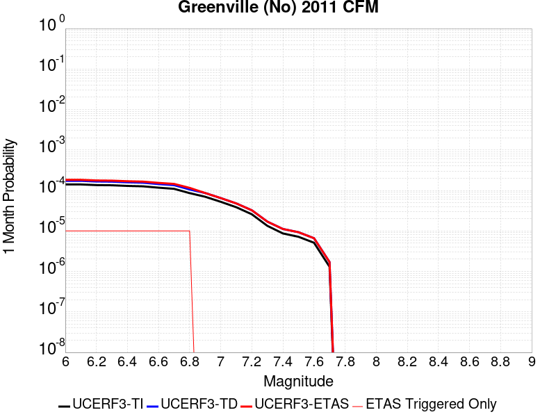 |  |  |

| Magnitude | 1 wk TI Prob | 1 wk TD Prob | 1 wk ETAS Prob | 1 wk ETAS/TD Gain | 1 wk ETAS Triggered Only | 1 mo TI Prob | 1 mo TD Prob | 1 mo ETAS Prob | 1 mo ETAS/TD Gain | 1 mo ETAS Triggered Only | 1 yr TI Prob | 1 yr TD Prob | 1 yr ETAS Prob | 1 yr ETAS/TD Gain | 1 yr ETAS Triggered Only | 10 yr TI Prob | 10 yr TD Prob | 10 yr ETAS Prob | 10 yr ETAS/TD Gain | 10 yr ETAS Triggered Only |
|-----|-----|-----|-----|-----|-----|-----|-----|-----|-----|-----|-----|-----|-----|-----|-----|-----|-----|-----|-----|-----|
| 6.0 | 3.286654E-5 | 4.036741E-5 | 4.036741E-5 | 1.0 | 0.0 | 1.4084899E-4 | 1.7299193E-4 | 2.0643095E-4 | 1.1932982 | 3.3444816E-5 | 0.0017134876 | 0.0021041804 | 0.0021375548 | 1.015861 | 3.3444816E-5 | 0.017003356 | 0.020847455 | 0.020880202 | 1.0015708 | 3.3444816E-5 |
| 6.1 | 3.286654E-5 | 4.036741E-5 | 4.036741E-5 | 1.0 | 0.0 | 1.4084899E-4 | 1.7299193E-4 | 2.0643095E-4 | 1.1932982 | 3.3444816E-5 | 0.0017134876 | 0.0021041804 | 0.0021375548 | 1.015861 | 3.3444816E-5 | 0.017003356 | 0.020847455 | 0.020880202 | 1.0015708 | 3.3444816E-5 |
| 6.2 | 3.1697953E-5 | 3.893027E-5 | 3.893027E-5 | 1.0 | 0.0 | 1.358413E-4 | 1.6683355E-4 | 2.0027279E-4 | 1.2004347 | 3.3444816E-5 | 0.0016526132 | 0.0020293442 | 0.0020627212 | 1.0164472 | 3.3444816E-5 | 0.01640377 | 0.020112827 | 0.020145599 | 1.0016295 | 3.3444816E-5 |
| 6.3 | 3.1363317E-5 | 3.8519134E-5 | 3.8519134E-5 | 1.0 | 0.0 | 1.344073E-4 | 1.6507176E-4 | 1.9851106E-4 | 1.2025743 | 3.3444816E-5 | 0.0016351803 | 0.002007934 | 0.0020413117 | 1.0166229 | 3.3444816E-5 | 0.016232004 | 0.019902589 | 0.019935368 | 1.001647 | 3.3444816E-5 |
| 6.4 | 3.0228604E-5 | 3.7126225E-5 | 3.7126225E-5 | 1.0 | 0.0 | 1.2954473E-4 | 1.5910288E-4 | 1.9254239E-4 | 1.2101753 | 3.3444816E-5 | 0.0015760659 | 0.0019353938 | 0.0019687738 | 1.0172472 | 3.3444816E-5 | 0.015649348 | 0.01918991 | 0.019222712 | 1.0017093 | 3.3444816E-5 |
| 6.5 | 2.9537814E-5 | 3.6281657E-5 | 3.6281657E-5 | 1.0 | 0.0 | 1.2658449E-4 | 1.5548375E-4 | 1.8892337E-4 | 1.2150682 | 3.3444816E-5 | 0.0015400766 | 0.0018914078 | 0.0019247893 | 1.017649 | 3.3444816E-5 | 0.01529447 | 0.018757557 | 0.018790375 | 1.0017495 | 3.3444816E-5 |
| 6.6 | 2.7345395E-5 | 3.3590906E-5 | 3.3590906E-5 | 1.0 | 0.0 | 1.1718928E-4 | 1.4395325E-4 | 1.7739326E-4 | 1.2322977 | 3.3444816E-5 | 0.0014258457 | 0.0017512529 | 0.0017846391 | 1.0190642 | 3.3444816E-5 | 0.014167317 | 0.017378341 | 0.017411204 | 1.001891 | 3.3444816E-5 |
| 6.7 | 2.5615784E-5 | 3.1567764E-5 | 3.1567764E-5 | 1.0 | 0.0 | 1.09777306E-4 | 1.3528357E-4 | 1.6872385E-4 | 1.2471867 | 3.3444816E-5 | 0.0013357193 | 0.0016458635 | 0.0016792533 | 1.020287 | 3.3444816E-5 | 0.013277191 | 0.016340412 | 0.01637331 | 1.0020133 | 3.3444816E-5 |
| 6.8 | 2.0059057E-5 | 2.4712537E-5 | 2.4712537E-5 | 1.0 | 0.0 | 8.596455E-5 | 1.0590666E-4 | 1.3934793E-4 | 1.3157618 | 3.3444816E-5 | 0.0010461159 | 0.0012886672 | 0.001322069 | 1.0259196 | 3.3444816E-5 | 0.0104120495 | 0.012813962 | 0.012846978 | 1.0025766 | 3.3444816E-5 |
| 6.9 | 1.6321746E-5 | 2.0185005E-5 | 2.0185005E-5 | 1.0 | 0.0 | 6.9948466E-5 | 8.650436E-5 | 8.650436E-5 | 1.0 | 0.0 | 8.5128983E-4 | 0.0010526942 | 0.0010526942 | 1.0 | 0.0 | 0.008480361 | 0.010478605 | 0.010478605 | 1.0 | 0.0 |
| 7.0 | 1.22527645E-5 | 1.5135852E-5 | 1.5135852E-5 | 1.0 | 0.0 | 5.2510793E-5 | 6.486634E-5 | 6.486634E-5 | 1.0 | 0.0 | 6.3913135E-4 | 7.894658E-4 | 7.894658E-4 | 1.0 | 0.0 | 0.0063729626 | 0.00786725 | 0.00786725 | 1.0 | 0.0 |
| 7.1 | 8.996482E-6 | 1.1165086E-5 | 1.1165086E-5 | 1.0 | 0.0 | 3.8555783E-5 | 4.78495E-5 | 4.78495E-5 | 1.0 | 0.0 | 4.6931554E-4 | 5.8241317E-4 | 5.8241317E-4 | 1.0 | 0.0 | 0.004683256 | 0.005809159 | 0.005809159 | 1.0 | 0.0 |
| 7.2 | 6.0273087E-6 | 7.569554E-6 | 7.569554E-6 | 1.0 | 0.0 | 2.5831067E-5 | 3.2440545E-5 | 3.2440545E-5 | 1.0 | 0.0 | 3.1444785E-4 | 3.9489273E-4 | 3.9489273E-4 | 1.0 | 0.0 | 0.0031400328 | 0.0039421073 | 0.0039421073 | 1.0 | 0.0 |
| 7.3 | 3.1209995E-6 | 3.966412E-6 | 3.966412E-6 | 1.0 | 0.0 | 1.3375643E-5 | 1.6998798E-5 | 1.6998798E-5 | 1.0 | 0.0 | 1.6283628E-4 | 2.0694088E-4 | 2.0694088E-4 | 1.0 | 0.0 | 0.0016271701 | 0.002067572 | 0.002067572 | 1.0 | 0.0 |
| 7.4 | 2.0254208E-6 | 2.609629E-6 | 2.609629E-6 | 1.0 | 0.0 | 8.680347E-6 | 1.1184077E-5 | 1.1184077E-5 | 1.0 | 0.0 | 1.0567809E-4 | 1.3615769E-4 | 1.3615769E-4 | 1.0 | 0.0 | 0.0010562785 | 0.0013607995 | 0.0013607995 | 1.0 | 0.0 |
| 7.5 | 1.6763418E-6 | 2.1733601E-6 | 2.1733601E-6 | 1.0 | 0.0 | 7.184302E-6 | 9.314368E-6 | 9.314368E-6 | 1.0 | 0.0 | 8.746537E-5 | 1.1339658E-4 | 1.1339658E-4 | 1.0 | 0.0 | 8.743095E-4 | 0.0011334341 | 0.0011334341 | 1.0 | 0.0 |
| 7.6 | 1.1935462E-6 | 1.5458515E-6 | 1.5458515E-6 | 1.0 | 0.0 | 5.115188E-6 | 6.6250614E-6 | 6.6250614E-6 | 1.0 | 0.0 | 6.2275634E-5 | 8.065718E-5 | 8.065718E-5 | 1.0 | 0.0 | 6.2258187E-4 | 8.0630975E-4 | 8.0630975E-4 | 1.0 | 0.0 |
| 7.7 | 3.0464201E-7 | 3.984697E-7 | 3.984697E-7 | 1.0 | 0.0 | 1.3056081E-6 | 1.7077261E-6 | 1.7077261E-6 | 1.0 | 0.0 | 1.589566E-5 | 2.0791373E-5 | 2.0791373E-5 | 1.0 | 0.0 | 1.5894524E-4 | 2.0789898E-4 | 2.0789898E-4 | 1.0 | 0.0 |

## La Panza 2011
*[(top)](#table-of-contents)*

| 1 Week | 1 Month | 1 Year | 10 Year |
|-----|-----|-----|-----|
|  |  |  | 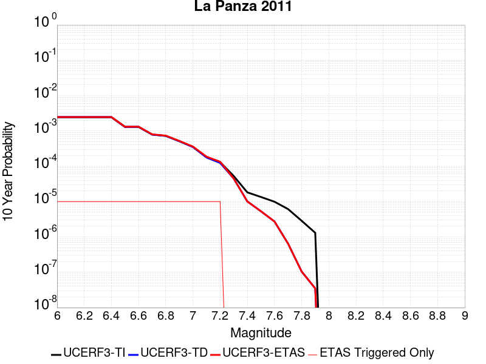 |

| Magnitude | 1 wk TI Prob | 1 wk TD Prob | 1 wk ETAS Prob | 1 wk ETAS/TD Gain | 1 wk ETAS Triggered Only | 1 mo TI Prob | 1 mo TD Prob | 1 mo ETAS Prob | 1 mo ETAS/TD Gain | 1 mo ETAS Triggered Only | 1 yr TI Prob | 1 yr TD Prob | 1 yr ETAS Prob | 1 yr ETAS/TD Gain | 1 yr ETAS Triggered Only | 10 yr TI Prob | 10 yr TD Prob | 10 yr ETAS Prob | 10 yr ETAS/TD Gain | 10 yr ETAS Triggered Only |
|-----|-----|-----|-----|-----|-----|-----|-----|-----|-----|-----|-----|-----|-----|-----|-----|-----|-----|-----|-----|-----|
| 6.0 | 4.6754544E-6 | 4.717608E-6 | 4.717608E-6 | 1.0 | 0.0 | 2.0037509E-5 | 2.0218175E-5 | 2.0218175E-5 | 1.0 | 0.0 | 2.4392935E-4 | 2.4613045E-4 | 2.4613045E-4 | 1.0 | 0.0 | 0.0024366176 | 0.0024587729 | 0.0024921354 | 1.0135688 | 3.3444816E-5 |
| 6.1 | 4.6754544E-6 | 4.717608E-6 | 4.717608E-6 | 1.0 | 0.0 | 2.0037509E-5 | 2.0218175E-5 | 2.0218175E-5 | 1.0 | 0.0 | 2.4392935E-4 | 2.4613045E-4 | 2.4613045E-4 | 1.0 | 0.0 | 0.0024366176 | 0.0024587729 | 0.0024921354 | 1.0135688 | 3.3444816E-5 |
| 6.2 | 4.6754544E-6 | 4.717608E-6 | 4.717608E-6 | 1.0 | 0.0 | 2.0037509E-5 | 2.0218175E-5 | 2.0218175E-5 | 1.0 | 0.0 | 2.4392935E-4 | 2.4613045E-4 | 2.4613045E-4 | 1.0 | 0.0 | 0.0024366176 | 0.0024587729 | 0.0024921354 | 1.0135688 | 3.3444816E-5 |
| 6.3 | 4.6754544E-6 | 4.717608E-6 | 4.717608E-6 | 1.0 | 0.0 | 2.0037509E-5 | 2.0218175E-5 | 2.0218175E-5 | 1.0 | 0.0 | 2.4392935E-4 | 2.4613045E-4 | 2.4613045E-4 | 1.0 | 0.0 | 0.0024366176 | 0.0024587729 | 0.0024921354 | 1.0135688 | 3.3444816E-5 |
| 6.4 | 4.6754544E-6 | 4.717608E-6 | 4.717608E-6 | 1.0 | 0.0 | 2.0037509E-5 | 2.0218175E-5 | 2.0218175E-5 | 1.0 | 0.0 | 2.4392935E-4 | 2.4613045E-4 | 2.4613045E-4 | 1.0 | 0.0 | 0.0024366176 | 0.0024587729 | 0.0024921354 | 1.0135688 | 3.3444816E-5 |
| 6.5 | 2.485343E-6 | 2.5006163E-6 | 2.5006163E-6 | 1.0 | 0.0 | 1.0651426E-5 | 1.0716885E-5 | 1.0716885E-5 | 1.0 | 0.0 | 1.296734E-4 | 1.3047065E-4 | 1.3047065E-4 | 1.0 | 0.0 | 0.0012959775 | 0.001303979 | 0.0013373803 | 1.0256149 | 3.3444816E-5 |
| 6.6 | 2.485343E-6 | 2.5006163E-6 | 2.5006163E-6 | 1.0 | 0.0 | 1.0651426E-5 | 1.0716885E-5 | 1.0716885E-5 | 1.0 | 0.0 | 1.296734E-4 | 1.3047065E-4 | 1.3047065E-4 | 1.0 | 0.0 | 0.0012959775 | 0.001303979 | 0.0013373803 | 1.0256149 | 3.3444816E-5 |
| 6.7 | 1.5108508E-6 | 1.5146534E-6 | 1.5146534E-6 | 1.0 | 0.0 | 6.4750584E-6 | 6.491356E-6 | 6.491356E-6 | 1.0 | 0.0 | 7.8830984E-5 | 7.90295E-5 | 7.90295E-5 | 1.0 | 0.0 | 7.880303E-4 | 7.900248E-4 | 8.2344323E-4 | 1.0423005 | 3.3444816E-5 |
| 6.8 | 1.3865837E-6 | 1.3885259E-6 | 1.3885259E-6 | 1.0 | 0.0 | 5.942488E-6 | 5.950812E-6 | 5.950812E-6 | 1.0 | 0.0 | 7.234739E-5 | 7.244883E-5 | 7.244883E-5 | 1.0 | 0.0 | 7.232384E-4 | 7.242619E-4 | 7.576825E-4 | 1.0461444 | 3.3444816E-5 |
| 6.9 | 9.826583E-7 | 9.796437E-7 | 9.796437E-7 | 1.0 | 0.0 | 4.2113857E-6 | 4.1984663E-6 | 4.1984663E-6 | 1.0 | 0.0 | 5.1272415E-5 | 5.1115185E-5 | 5.1115185E-5 | 1.0 | 0.0 | 5.126059E-4 | 5.1103963E-4 | 5.4446736E-4 | 1.0654112 | 3.3444816E-5 |
| 7.0 | 6.7797646E-7 | 6.71036E-7 | 6.71036E-7 | 1.0 | 0.0 | 2.9056102E-6 | 2.8758654E-6 | 2.8758654E-6 | 1.0 | 0.0 | 3.537523E-5 | 3.501313E-5 | 3.501313E-5 | 1.0 | 0.0 | 3.5369597E-4 | 3.5007924E-4 | 3.8351235E-4 | 1.0955015 | 3.3444816E-5 |
| 7.1 | 3.4979826E-7 | 3.3875276E-7 | 3.3875276E-7 | 1.0 | 0.0 | 1.4991346E-6 | 1.4517968E-6 | 1.4517968E-6 | 1.0 | 0.0 | 1.825181E-5 | 1.7675495E-5 | 1.7675495E-5 | 1.0 | 0.0 | 1.825031E-4 | 1.7674206E-4 | 2.1018097E-4 | 1.1891961 | 3.3444816E-5 |
| 7.2 | 2.5088332E-7 | 2.3833275E-7 | 2.3833275E-7 | 1.0 | 0.0 | 1.0752137E-6 | 1.0214256E-6 | 1.0214256E-6 | 1.0 | 0.0 | 1.3090649E-5 | 1.2435796E-5 | 1.2435796E-5 | 1.0 | 0.0 | 1.3089878E-4 | 1.2435185E-4 | 1.577925E-4 | 1.2689197 | 3.3444816E-5 |
| 7.3 | 1.0159086E-7 | 8.645961E-8 | 8.645961E-8 | 1.0 | 0.0 | 4.3538932E-7 | 3.7054113E-7 | 3.7054113E-7 | 1.0 | 0.0 | 5.300852E-6 | 4.5113293E-6 | 4.5113293E-6 | 1.0 | 0.0 | 5.3007258E-5 | 4.5112418E-5 | 4.5112418E-5 | 1.0 | 0.0 |
| 7.4 | 3.5006252E-8 | 1.940863E-8 | 1.940863E-8 | 1.0 | 0.0 | 1.5002678E-7 | 8.3179835E-8 | 8.3179835E-8 | 1.0 | 0.0 | 1.8265745E-6 | 1.012714E-6 | 1.012714E-6 | 1.0 | 0.0 | 1.8265595E-5 | 1.0127096E-5 | 1.0127096E-5 | 1.0 | 0.0 |
| 7.5 | 2.592274E-8 | 1.0242307E-8 | 1.0242307E-8 | 1.0 | 0.0 | 1.1109746E-7 | 4.3895596E-8 | 4.3895596E-8 | 1.0 | 0.0 | 1.3526106E-6 | 5.3442875E-7 | 5.3442875E-7 | 1.0 | 0.0 | 1.3526024E-5 | 5.3442755E-6 | 5.3442755E-6 | 1.0 | 0.0 |
| 7.6 | 1.9016717E-8 | 5.2468647E-9 | 5.2468647E-9 | 1.0 | 0.0 | 8.150022E-8 | 2.2486562E-8 | 2.2486562E-8 | 1.0 | 0.0 | 9.922647E-7 | 2.7377385E-7 | 2.7377385E-7 | 1.0 | 0.0 | 9.922603E-6 | 2.7377353E-6 | 2.7377353E-6 | 1.0 | 0.0 |
| 7.7 | 1.17738495E-8 | 1.2407027E-9 | 1.2407027E-9 | 1.0 | 0.0 | 5.0459356E-8 | 5.317297E-9 | 5.317297E-9 | 1.0 | 0.0 | 6.1434247E-7 | 6.473808E-8 | 6.473808E-8 | 1.0 | 0.0 | 6.143408E-6 | 6.4738066E-7 | 6.4738066E-7 | 1.0 | 0.0 |
| 7.8 | 5.489079E-9 | 2.0135205E-10 | 2.0135205E-10 | 1.0 | 0.0 | 2.3524624E-8 | 8.6293683E-10 | 8.6293683E-10 | 1.0 | 0.0 | 2.8641225E-7 | 1.0506253E-8 | 1.0506253E-8 | 1.0 | 0.0 | 2.8641189E-6 | 1.0506252E-7 | 1.0506252E-7 | 1.0 | 0.0 |
| 7.9 | 2.5081048E-9 | 6.6927686E-11 | 6.6927686E-11 | 1.0 | 0.0 | 1.0749021E-8 | 2.868329E-10 | 2.868329E-10 | 1.0 | 0.0 | 1.3086932E-7 | 3.492187E-9 | 3.492187E-9 | 1.0 | 0.0 | 1.3086925E-6 | 3.4921865E-8 | 3.4921865E-8 | 1.0 | 0.0 |

## Oak Ridge (Onshore)
*[(top)](#table-of-contents)*

| 1 Week | 1 Month | 1 Year | 10 Year |
|-----|-----|-----|-----|
|  |  | 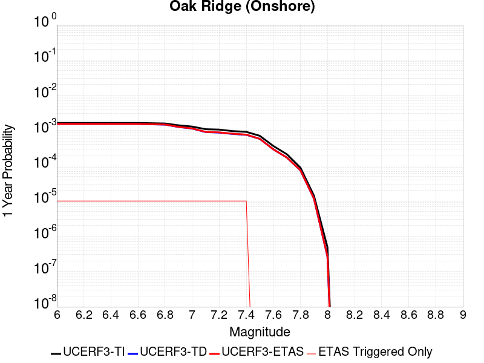 |  |

| Magnitude | 1 wk TI Prob | 1 wk TD Prob | 1 wk ETAS Prob | 1 wk ETAS/TD Gain | 1 wk ETAS Triggered Only | 1 mo TI Prob | 1 mo TD Prob | 1 mo ETAS Prob | 1 mo ETAS/TD Gain | 1 mo ETAS Triggered Only | 1 yr TI Prob | 1 yr TD Prob | 1 yr ETAS Prob | 1 yr ETAS/TD Gain | 1 yr ETAS Triggered Only | 10 yr TI Prob | 10 yr TD Prob | 10 yr ETAS Prob | 10 yr ETAS/TD Gain | 10 yr ETAS Triggered Only |
|-----|-----|-----|-----|-----|-----|-----|-----|-----|-----|-----|-----|-----|-----|-----|-----|-----|-----|-----|-----|-----|
| 6.0 | 3.155064E-5 | 2.952645E-5 | 2.952645E-5 | 1.0 | 0.0 | 1.3521002E-4 | 1.26536E-4 | 1.26536E-4 | 1.0 | 0.0 | 0.001644939 | 0.0015395252 | 0.0015395252 | 1.0 | 0.0 | 0.01632816 | 0.015293104 | 0.015326037 | 1.0021535 | 3.3444816E-5 |
| 6.1 | 3.155064E-5 | 2.952645E-5 | 2.952645E-5 | 1.0 | 0.0 | 1.3521002E-4 | 1.26536E-4 | 1.26536E-4 | 1.0 | 0.0 | 0.001644939 | 0.0015395252 | 0.0015395252 | 1.0 | 0.0 | 0.01632816 | 0.015293104 | 0.015326037 | 1.0021535 | 3.3444816E-5 |
| 6.2 | 3.155064E-5 | 2.952645E-5 | 2.952645E-5 | 1.0 | 0.0 | 1.3521002E-4 | 1.26536E-4 | 1.26536E-4 | 1.0 | 0.0 | 0.001644939 | 0.0015395252 | 0.0015395252 | 1.0 | 0.0 | 0.01632816 | 0.015293104 | 0.015326037 | 1.0021535 | 3.3444816E-5 |
| 6.3 | 3.155064E-5 | 2.952645E-5 | 2.952645E-5 | 1.0 | 0.0 | 1.3521002E-4 | 1.26536E-4 | 1.26536E-4 | 1.0 | 0.0 | 0.001644939 | 0.0015395252 | 0.0015395252 | 1.0 | 0.0 | 0.01632816 | 0.015293104 | 0.015326037 | 1.0021535 | 3.3444816E-5 |
| 6.4 | 3.155064E-5 | 2.952645E-5 | 2.952645E-5 | 1.0 | 0.0 | 1.3521002E-4 | 1.26536E-4 | 1.26536E-4 | 1.0 | 0.0 | 0.001644939 | 0.0015395252 | 0.0015395252 | 1.0 | 0.0 | 0.01632816 | 0.015293104 | 0.015326037 | 1.0021535 | 3.3444816E-5 |
| 6.5 | 3.155064E-5 | 2.952645E-5 | 2.952645E-5 | 1.0 | 0.0 | 1.3521002E-4 | 1.26536E-4 | 1.26536E-4 | 1.0 | 0.0 | 0.001644939 | 0.0015395252 | 0.0015395252 | 1.0 | 0.0 | 0.01632816 | 0.015293104 | 0.015326037 | 1.0021535 | 3.3444816E-5 |
| 6.6 | 3.155064E-5 | 2.952645E-5 | 2.952645E-5 | 1.0 | 0.0 | 1.3521002E-4 | 1.26536E-4 | 1.26536E-4 | 1.0 | 0.0 | 0.001644939 | 0.0015395252 | 0.0015395252 | 1.0 | 0.0 | 0.01632816 | 0.015293104 | 0.015326037 | 1.0021535 | 3.3444816E-5 |
| 6.7 | 3.098897E-5 | 2.8864635E-5 | 2.8864635E-5 | 1.0 | 0.0 | 1.328031E-4 | 1.2369992E-4 | 1.2369992E-4 | 1.0 | 0.0 | 0.0016156785 | 0.0015050438 | 0.0015050438 | 1.0 | 0.0 | 0.016039822 | 0.014952951 | 0.014985896 | 1.0022032 | 3.3444816E-5 |
| 6.8 | 3.0449872E-5 | 2.823982E-5 | 2.823982E-5 | 1.0 | 0.0 | 1.3049292E-4 | 1.2102239E-4 | 1.2102239E-4 | 1.0 | 0.0 | 0.0015875935 | 0.001472489 | 0.001472489 | 1.0 | 0.0 | 0.015762992 | 0.014631692 | 0.014664647 | 1.0022523 | 3.3444816E-5 |
| 6.9 | 2.697928E-5 | 2.4220137E-5 | 2.4220137E-5 | 1.0 | 0.0 | 1.15620365E-4 | 1.0379658E-4 | 1.0379658E-4 | 1.0 | 0.0 | 0.0014067689 | 0.0012630123 | 0.0012630123 | 1.0 | 0.0 | 0.0139789665 | 0.012561057 | 0.012594081 | 1.0026292 | 3.3444816E-5 |
| 7.0 | 2.4893961E-5 | 2.1862359E-5 | 2.1862359E-5 | 1.0 | 0.0 | 1.0668404E-4 | 9.369256E-5 | 9.369256E-5 | 1.0 | 0.0 | 0.0012981043 | 0.0011401277 | 0.0011401277 | 1.0 | 0.0 | 0.012905477 | 0.011345069 | 0.011378135 | 1.0029145 | 3.3444816E-5 |
| 7.1 | 2.0945363E-5 | 1.7354718E-5 | 1.7354718E-5 | 1.0 | 0.0 | 8.976275E-5 | 7.437527E-5 | 7.437527E-5 | 1.0 | 0.0 | 0.0010923136 | 9.051474E-4 | 9.051474E-4 | 1.0 | 0.0 | 0.0108696 | 0.009015542 | 0.009015542 | 1.0 | 0.0 |
| 7.2 | 2.0439404E-5 | 1.6809645E-5 | 1.6809645E-5 | 1.0 | 0.0 | 8.7594504E-5 | 7.2039365E-5 | 7.2039365E-5 | 1.0 | 0.0 | 0.0010659413 | 8.7673106E-4 | 8.7673106E-4 | 1.0 | 0.0 | 0.010608427 | 0.00873364 | 0.00873364 | 1.0 | 0.0 |
| 7.3 | 1.8463334E-5 | 1.5382002E-5 | 1.5382002E-5 | 1.0 | 0.0 | 7.912617E-5 | 6.5921224E-5 | 6.5921224E-5 | 1.0 | 0.0 | 9.6293533E-4 | 8.0229976E-4 | 8.0229976E-4 | 1.0 | 0.0 | 0.009587734 | 0.007994897 | 0.007994897 | 1.0 | 0.0 |
| 7.4 | 1.763139E-5 | 1.4517013E-5 | 1.4517013E-5 | 1.0 | 0.0 | 7.556091E-5 | 6.221431E-5 | 6.221431E-5 | 1.0 | 0.0 | 9.1956573E-4 | 7.5719994E-4 | 7.5719994E-4 | 1.0 | 0.0 | 0.009157699 | 0.007547003 | 0.007547003 | 1.0 | 0.0 |
| 7.5 | 1.3594944E-5 | 1.1163477E-5 | 1.1163477E-5 | 1.0 | 0.0 | 5.8262744E-5 | 4.7842612E-5 | 4.7842612E-5 | 1.0 | 0.0 | 7.0911803E-4 | 5.823306E-4 | 5.823306E-4 | 1.0 | 0.0 | 0.007068595 | 0.0058083185 | 0.0058083185 | 1.0 | 0.0 |
| 7.6 | 6.9889534E-6 | 5.6367617E-6 | 5.6367617E-6 | 1.0 | 0.0 | 2.9952313E-5 | 2.4157329E-5 | 2.4157329E-5 | 1.0 | 0.0 | 3.646084E-4 | 2.940762E-4 | 2.940762E-4 | 1.0 | 0.0 | 0.0036401073 | 0.0029369146 | 0.0029369146 | 1.0 | 0.0 |
| 7.7 | 4.0824193E-6 | 3.2832884E-6 | 3.2832884E-6 | 1.0 | 0.0 | 1.7495966E-5 | 1.4071161E-5 | 1.4071161E-5 | 1.0 | 0.0 | 2.1299256E-4 | 1.7130304E-4 | 1.7130304E-4 | 1.0 | 0.0 | 0.0021278851 | 0.0017117234 | 0.0017117234 | 1.0 | 0.0 |
| 7.8 | 1.7023609E-6 | 1.4370602E-6 | 1.4370602E-6 | 1.0 | 0.0 | 7.295812E-6 | 6.158815E-6 | 6.158815E-6 | 1.0 | 0.0 | 8.882289E-5 | 7.498102E-5 | 7.498102E-5 | 1.0 | 0.0 | 8.8787393E-4 | 7.4956E-4 | 7.4956E-4 | 1.0 | 0.0 |
| 7.9 | 2.721225E-7 | 2.2616715E-7 | 2.2616715E-7 | 1.0 | 0.0 | 1.1662388E-6 | 9.692874E-7 | 9.692874E-7 | 1.0 | 0.0 | 1.4198865E-5 | 1.1801013E-5 | 1.1801013E-5 | 1.0 | 0.0 | 1.4197957E-4 | 1.1800414E-4 | 1.1800414E-4 | 1.0 | 0.0 |
| 8.0 | 9.364255E-9 | 5.1209232E-9 | 5.1209232E-9 | 1.0 | 0.0 | 4.0132523E-8 | 2.1946814E-8 | 2.1946814E-8 | 1.0 | 0.0 | 4.8861335E-7 | 2.6720244E-7 | 2.6720244E-7 | 1.0 | 0.0 | 4.8861225E-6 | 2.6720215E-6 | 2.6720215E-6 | 1.0 | 0.0 |

## Cerro Prieto
*[(top)](#table-of-contents)*

| 1 Week | 1 Month | 1 Year | 10 Year |
|-----|-----|-----|-----|
|  |  |  |  |

| Magnitude | 1 wk TI Prob | 1 wk TD Prob | 1 wk ETAS Prob | 1 wk ETAS/TD Gain | 1 wk ETAS Triggered Only | 1 mo TI Prob | 1 mo TD Prob | 1 mo ETAS Prob | 1 mo ETAS/TD Gain | 1 mo ETAS Triggered Only | 1 yr TI Prob | 1 yr TD Prob | 1 yr ETAS Prob | 1 yr ETAS/TD Gain | 1 yr ETAS Triggered Only | 10 yr TI Prob | 10 yr TD Prob | 10 yr ETAS Prob | 10 yr ETAS/TD Gain | 10 yr ETAS Triggered Only |
|-----|-----|-----|-----|-----|-----|-----|-----|-----|-----|-----|-----|-----|-----|-----|-----|-----|-----|-----|-----|-----|
| 6.0 | 2.9101528E-4 | 5.965907E-4 | 5.965907E-4 | 1.0 | 0.0 | 0.0012466122 | 0.002554554 | 0.002554554 | 1.0 | 0.0 | 0.015072231 | 0.030653033 | 0.030653033 | 1.0 | 0.0 | 0.14089979 | 0.25401175 | 0.2540367 | 1.0000982 | 3.3444816E-5 |
| 6.1 | 2.9101528E-4 | 5.965907E-4 | 5.965907E-4 | 1.0 | 0.0 | 0.0012466122 | 0.002554554 | 0.002554554 | 1.0 | 0.0 | 0.015072231 | 0.030653033 | 0.030653033 | 1.0 | 0.0 | 0.14089979 | 0.25401175 | 0.2540367 | 1.0000982 | 3.3444816E-5 |
| 6.2 | 2.9101528E-4 | 5.965907E-4 | 5.965907E-4 | 1.0 | 0.0 | 0.0012466122 | 0.002554554 | 0.002554554 | 1.0 | 0.0 | 0.015072231 | 0.030653033 | 0.030653033 | 1.0 | 0.0 | 0.14089979 | 0.25401175 | 0.2540367 | 1.0000982 | 3.3444816E-5 |
| 6.3 | 2.9101528E-4 | 5.965907E-4 | 5.965907E-4 | 1.0 | 0.0 | 0.0012466122 | 0.002554554 | 0.002554554 | 1.0 | 0.0 | 0.015072231 | 0.030653033 | 0.030653033 | 1.0 | 0.0 | 0.14089979 | 0.25401175 | 0.2540367 | 1.0000982 | 3.3444816E-5 |
| 6.4 | 2.508648E-4 | 5.140792E-4 | 5.140792E-4 | 1.0 | 0.0 | 0.0010746918 | 0.0022015348 | 0.0022015348 | 1.0 | 0.0 | 0.013006088 | 0.026476625 | 0.026476625 | 1.0 | 0.0 | 0.12270685 | 0.22443727 | 0.22446321 | 1.0001155 | 3.3444816E-5 |
| 6.5 | 2.508648E-4 | 5.140792E-4 | 5.140792E-4 | 1.0 | 0.0 | 0.0010746918 | 0.0022015348 | 0.0022015348 | 1.0 | 0.0 | 0.013006088 | 0.026476625 | 0.026476625 | 1.0 | 0.0 | 0.12270685 | 0.22443727 | 0.22446321 | 1.0001155 | 3.3444816E-5 |
| 6.6 | 2.294914E-4 | 4.7126948E-4 | 4.7126948E-4 | 1.0 | 0.0 | 9.831638E-4 | 0.0020183506 | 0.0020183506 | 1.0 | 0.0 | 0.011904482 | 0.024303433 | 0.024303433 | 1.0 | 0.0 | 0.11286586 | 0.20861839 | 0.20864485 | 1.0001268 | 3.3444816E-5 |
| 6.7 | 1.9621674E-4 | 4.042872E-4 | 4.042872E-4 | 1.0 | 0.0 | 8.4065786E-4 | 0.0017316672 | 0.0017316672 | 1.0 | 0.0 | 0.010187071 | 0.020889567 | 0.020889567 | 1.0 | 0.0 | 0.09732539 | 0.18293467 | 0.182962 | 1.0001494 | 3.3444816E-5 |
| 6.8 | 1.5476145E-4 | 3.0573073E-4 | 3.0573073E-4 | 1.0 | 0.0 | 6.6309475E-4 | 0.0013097188 | 0.0013097188 | 1.0 | 0.0 | 0.008043335 | 0.015840806 | 0.015840806 | 1.0 | 0.0 | 0.07758363 | 0.14339209 | 0.14342074 | 1.0001998 | 3.3444816E-5 |
| 6.9 | 1.20509176E-4 | 2.2588969E-4 | 2.2588969E-4 | 1.0 | 0.0 | 5.1636563E-4 | 9.678028E-4 | 9.678028E-4 | 1.0 | 0.0 | 0.006268645 | 0.011729713 | 0.011729713 | 1.0 | 0.0 | 0.060947374 | 0.10947595 | 0.10947595 | 1.0 | 0.0 |
| 7.0 | 9.3269155E-5 | 1.672182E-4 | 1.672182E-4 | 1.0 | 0.0 | 3.9966372E-4 | 7.164957E-4 | 7.164957E-4 | 1.0 | 0.0 | 0.0048550544 | 0.008696101 | 0.008696101 | 1.0 | 0.0 | 0.04750344 | 0.08317999 | 0.08317999 | 1.0 | 0.0 |
| 7.1 | 5.029709E-5 | 8.1748294E-5 | 8.1748294E-5 | 1.0 | 0.0 | 2.1554115E-4 | 3.5032208E-4 | 3.5032208E-4 | 1.0 | 0.0 | 0.0026210553 | 0.0042602476 | 0.0042602476 | 1.0 | 0.0 | 0.025903556 | 0.04237809 | 0.04237809 | 1.0 | 0.0 |
| 7.2 | 6.5445185E-8 | 6.820826E-8 | 6.820826E-8 | 1.0 | 0.0 | 2.8047933E-7 | 2.923211E-7 | 2.923211E-7 | 1.0 | 0.0 | 3.4148304E-6 | 3.5590094E-6 | 3.5590094E-6 | 1.0 | 0.0 | 3.414778E-5 | 3.5590092E-5 | 3.5590092E-5 | 1.0 | 0.0 |

## Fontana (Seismicity)
*[(top)](#table-of-contents)*

| 1 Week | 1 Month | 1 Year | 10 Year |
|-----|-----|-----|-----|
|  |  | 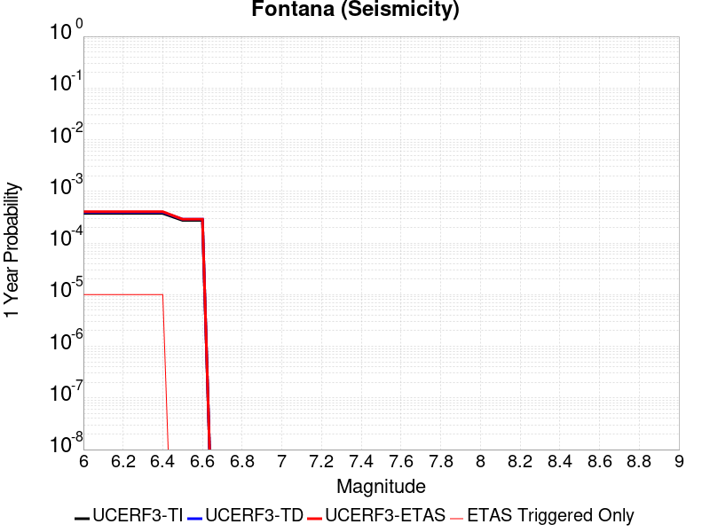 |  |

| Magnitude | 1 wk TI Prob | 1 wk TD Prob | 1 wk ETAS Prob | 1 wk ETAS/TD Gain | 1 wk ETAS Triggered Only | 1 mo TI Prob | 1 mo TD Prob | 1 mo ETAS Prob | 1 mo ETAS/TD Gain | 1 mo ETAS Triggered Only | 1 yr TI Prob | 1 yr TD Prob | 1 yr ETAS Prob | 1 yr ETAS/TD Gain | 1 yr ETAS Triggered Only | 10 yr TI Prob | 10 yr TD Prob | 10 yr ETAS Prob | 10 yr ETAS/TD Gain | 10 yr ETAS Triggered Only |
|-----|-----|-----|-----|-----|-----|-----|-----|-----|-----|-----|-----|-----|-----|-----|-----|-----|-----|-----|-----|-----|
| 6.0 | 7.1789214E-6 | 7.552053E-6 | 7.552053E-6 | 1.0 | 0.0 | 3.076644E-5 | 3.236577E-5 | 3.236577E-5 | 1.0 | 0.0 | 3.7451705E-4 | 3.9402276E-4 | 4.2745442E-4 | 1.084847 | 3.3444816E-5 | 0.003738865 | 0.003937241 | 0.003970554 | 1.008461 | 3.3444816E-5 |
| 6.1 | 7.1789214E-6 | 7.552053E-6 | 7.552053E-6 | 1.0 | 0.0 | 3.076644E-5 | 3.236577E-5 | 3.236577E-5 | 1.0 | 0.0 | 3.7451705E-4 | 3.9402276E-4 | 4.2745442E-4 | 1.084847 | 3.3444816E-5 | 0.003738865 | 0.003937241 | 0.003970554 | 1.008461 | 3.3444816E-5 |
| 6.2 | 7.1789214E-6 | 7.552053E-6 | 7.552053E-6 | 1.0 | 0.0 | 3.076644E-5 | 3.236577E-5 | 3.236577E-5 | 1.0 | 0.0 | 3.7451705E-4 | 3.9402276E-4 | 4.2745442E-4 | 1.084847 | 3.3444816E-5 | 0.003738865 | 0.003937241 | 0.003970554 | 1.008461 | 3.3444816E-5 |
| 6.3 | 7.1789214E-6 | 7.552053E-6 | 7.552053E-6 | 1.0 | 0.0 | 3.076644E-5 | 3.236577E-5 | 3.236577E-5 | 1.0 | 0.0 | 3.7451705E-4 | 3.9402276E-4 | 4.2745442E-4 | 1.084847 | 3.3444816E-5 | 0.003738865 | 0.003937241 | 0.003970554 | 1.008461 | 3.3444816E-5 |
| 6.4 | 7.1789214E-6 | 7.552053E-6 | 7.552053E-6 | 1.0 | 0.0 | 3.076644E-5 | 3.236577E-5 | 3.236577E-5 | 1.0 | 0.0 | 3.7451705E-4 | 3.9402276E-4 | 4.2745442E-4 | 1.084847 | 3.3444816E-5 | 0.003738865 | 0.003937241 | 0.003970554 | 1.008461 | 3.3444816E-5 |
| 6.5 | 5.2611317E-6 | 5.5327637E-6 | 5.5327637E-6 | 1.0 | 0.0 | 2.2547512E-5 | 2.3711844E-5 | 2.3711844E-5 | 1.0 | 0.0 | 2.744814E-4 | 2.886917E-4 | 2.886917E-4 | 1.0 | 0.0 | 0.002741426 | 0.002886917 | 0.002886917 | 1.0 | 0.0 |
| 6.6 | 5.2611317E-6 | 5.5327637E-6 | 5.5327637E-6 | 1.0 | 0.0 | 2.2547512E-5 | 2.3711844E-5 | 2.3711844E-5 | 1.0 | 0.0 | 2.744814E-4 | 2.886917E-4 | 2.886917E-4 | 1.0 | 0.0 | 0.002741426 | 0.002886917 | 0.002886917 | 1.0 | 0.0 |

## Oceanic - West Huasna
*[(top)](#table-of-contents)*

| 1 Week | 1 Month | 1 Year | 10 Year |
|-----|-----|-----|-----|
|  |  |  |  |

| Magnitude | 1 wk TI Prob | 1 wk TD Prob | 1 wk ETAS Prob | 1 wk ETAS/TD Gain | 1 wk ETAS Triggered Only | 1 mo TI Prob | 1 mo TD Prob | 1 mo ETAS Prob | 1 mo ETAS/TD Gain | 1 mo ETAS Triggered Only | 1 yr TI Prob | 1 yr TD Prob | 1 yr ETAS Prob | 1 yr ETAS/TD Gain | 1 yr ETAS Triggered Only | 10 yr TI Prob | 10 yr TD Prob | 10 yr ETAS Prob | 10 yr ETAS/TD Gain | 10 yr ETAS Triggered Only |
|-----|-----|-----|-----|-----|-----|-----|-----|-----|-----|-----|-----|-----|-----|-----|-----|-----|-----|-----|-----|-----|
| 6.0 | 3.195567E-5 | 2.7927153E-5 | 2.7927153E-5 | 1.0 | 0.0 | 1.3694567E-4 | 1.19682554E-4 | 1.19682554E-4 | 1.0 | 0.0 | 0.0016660384 | 0.0014562042 | 0.0014896003 | 1.0229337 | 3.3444816E-5 | 0.016536033 | 0.014471174 | 0.014504135 | 1.0022777 | 3.3444816E-5 |
| 6.1 | 2.1156782E-5 | 1.7573653E-5 | 1.7573653E-5 | 1.0 | 0.0 | 9.066878E-5 | 7.531353E-5 | 7.531353E-5 | 1.0 | 0.0 | 0.0011033333 | 9.1656594E-4 | 9.499801E-4 | 1.0364559 | 3.3444816E-5 | 0.010978713 | 0.009128864 | 0.009162004 | 1.0036302 | 3.3444816E-5 |
| 6.2 | 1.6195117E-5 | 1.3327269E-5 | 1.3327269E-5 | 1.0 | 0.0 | 6.9405796E-5 | 5.711563E-5 | 5.711563E-5 | 1.0 | 0.0 | 8.44688E-4 | 6.951635E-4 | 7.2858506E-4 | 1.0480772 | 3.3444816E-5 | 0.008414844 | 0.006930183 | 0.0069633964 | 1.0047926 | 3.3444816E-5 |
| 6.3 | 1.3559345E-5 | 1.1179233E-5 | 1.1179233E-5 | 1.0 | 0.0 | 5.811018E-5 | 4.7910125E-5 | 4.7910125E-5 | 1.0 | 0.0 | 7.072618E-4 | 5.831506E-4 | 6.1657594E-4 | 1.0573184 | 3.3444816E-5 | 0.0070501505 | 0.0058163223 | 0.0058495724 | 1.0057167 | 3.3444816E-5 |
| 6.4 | 1.2120619E-5 | 1.0001056E-5 | 1.0001056E-5 | 1.0 | 0.0 | 5.1944477E-5 | 4.2860964E-5 | 4.2860964E-5 | 1.0 | 0.0 | 6.322405E-4 | 5.217078E-4 | 5.217078E-4 | 1.0 | 0.0 | 0.006304447 | 0.005204898 | 0.005204898 | 1.0 | 0.0 |
| 6.5 | 1.13511915E-5 | 9.367545E-6 | 9.367545E-6 | 1.0 | 0.0 | 4.8647056E-5 | 4.014601E-5 | 4.014601E-5 | 1.0 | 0.0 | 5.9211696E-4 | 4.8866845E-4 | 4.8866845E-4 | 1.0 | 0.0 | 0.0059054173 | 0.004875998 | 0.004875998 | 1.0 | 0.0 |
| 6.6 | 9.850605E-6 | 8.135479E-6 | 8.135479E-6 | 1.0 | 0.0 | 4.2216197E-5 | 3.4865876E-5 | 3.4865876E-5 | 1.0 | 0.0 | 5.1386096E-4 | 4.2440955E-4 | 4.2440955E-4 | 1.0 | 0.0 | 0.0051267436 | 0.0042360225 | 0.0042360225 | 1.0 | 0.0 |
| 6.7 | 8.8558645E-6 | 7.318487E-6 | 7.318487E-6 | 1.0 | 0.0 | 3.7953152E-5 | 3.136457E-5 | 3.136457E-5 | 1.0 | 0.0 | 4.6198163E-4 | 3.8179688E-4 | 3.8179688E-4 | 1.0 | 0.0 | 0.004610224 | 0.003811435 | 0.003811435 | 1.0 | 0.0 |
| 6.8 | 7.67136E-6 | 6.3918033E-6 | 6.3918033E-6 | 1.0 | 0.0 | 3.2876844E-5 | 2.7393156E-5 | 2.7393156E-5 | 1.0 | 0.0 | 4.0020206E-4 | 3.334608E-4 | 3.334608E-4 | 1.0 | 0.0 | 0.003994821 | 0.0033296254 | 0.0033296254 | 1.0 | 0.0 |
| 6.9 | 6.534529E-6 | 5.45837E-6 | 5.45837E-6 | 1.0 | 0.0 | 2.8004823E-5 | 2.3392806E-5 | 2.3392806E-5 | 1.0 | 0.0 | 3.4090536E-4 | 2.8477033E-4 | 2.8477033E-4 | 1.0 | 0.0 | 0.0034038287 | 0.002844071 | 0.002844071 | 1.0 | 0.0 |
| 7.0 | 5.460525E-6 | 4.5699867E-6 | 4.5699867E-6 | 1.0 | 0.0 | 2.3402039E-5 | 1.9585512E-5 | 1.9585512E-5 | 1.0 | 0.0 | 2.8488258E-4 | 2.3842762E-4 | 2.3842762E-4 | 1.0 | 0.0 | 0.0028451765 | 0.002381732 | 0.002381732 | 1.0 | 0.0 |
| 7.1 | 4.4825083E-6 | 3.7524742E-6 | 3.7524742E-6 | 1.0 | 0.0 | 1.9210609E-5 | 1.6081935E-5 | 1.6081935E-5 | 1.0 | 0.0 | 2.3386406E-4 | 1.9578006E-4 | 1.9578006E-4 | 1.0 | 0.0 | 0.002336181 | 0.0019560878 | 0.0019560878 | 1.0 | 0.0 |
| 7.2 | 2.821708E-6 | 2.4249584E-6 | 2.4249584E-6 | 1.0 | 0.0 | 1.2092979E-5 | 1.0392638E-5 | 1.0392638E-5 | 1.0 | 0.0 | 1.4722206E-4 | 1.2652302E-4 | 1.2652302E-4 | 1.0 | 0.0 | 0.0014712457 | 0.0012645123 | 0.0012645123 | 1.0 | 0.0 |
| 7.3 | 2.0644757E-6 | 1.7687632E-6 | 1.7687632E-6 | 1.0 | 0.0 | 8.847723E-6 | 7.580392E-6 | 7.580392E-6 | 1.0 | 0.0 | 1.0771569E-4 | 9.2287366E-5 | 9.2287366E-5 | 1.0 | 0.0 | 0.001076635 | 9.224921E-4 | 9.224921E-4 | 1.0 | 0.0 |
| 7.4 | 1.6980367E-6 | 1.43801E-6 | 1.43801E-6 | 1.0 | 0.0 | 7.27728E-6 | 6.1628857E-6 | 6.1628857E-6 | 1.0 | 0.0 | 8.8597284E-5 | 7.503055E-5 | 7.503055E-5 | 1.0 | 0.0 | 8.8561967E-4 | 7.500538E-4 | 7.500538E-4 | 1.0 | 0.0 |
| 7.5 | 1.3637683E-6 | 1.1302833E-6 | 1.1302833E-6 | 1.0 | 0.0 | 5.844708E-6 | 4.8440625E-6 | 4.8440625E-6 | 1.0 | 0.0 | 7.1156996E-5 | 5.8974863E-5 | 5.8974863E-5 | 1.0 | 0.0 | 7.1134215E-4 | 5.8959366E-4 | 5.8959366E-4 | 1.0 | 0.0 |
| 7.6 | 9.802994E-7 | 7.677435E-7 | 7.677435E-7 | 1.0 | 0.0 | 4.2012766E-6 | 3.290325E-6 | 3.290325E-6 | 1.0 | 0.0 | 5.1149345E-5 | 4.005897E-5 | 4.005897E-5 | 1.0 | 0.0 | 5.113757E-4 | 4.005189E-4 | 4.005189E-4 | 1.0 | 0.0 |
| 7.7 | 5.986191E-7 | 4.0052313E-7 | 4.0052313E-7 | 1.0 | 0.0 | 2.5655079E-6 | 1.7165265E-6 | 1.7165265E-6 | 1.0 | 0.0 | 3.1234613E-5 | 2.0898511E-5 | 2.0898511E-5 | 1.0 | 0.0 | 3.123022E-4 | 2.0896681E-4 | 2.0896681E-4 | 1.0 | 0.0 |
| 7.8 | 2.9189815E-7 | 1.5287357E-7 | 1.5287357E-7 | 1.0 | 0.0 | 1.2509914E-6 | 6.5517224E-7 | 6.5517224E-7 | 1.0 | 0.0 | 1.5230714E-5 | 7.976692E-6 | 7.976692E-6 | 1.0 | 0.0 | 1.522967E-4 | 7.976538E-5 | 7.976538E-5 | 1.0 | 0.0 |
| 7.9 | 1.2057845E-7 | 4.6221164E-8 | 4.6221164E-8 | 1.0 | 0.0 | 5.1676466E-7 | 1.9809069E-7 | 1.9809069E-7 | 1.0 | 0.0 | 6.2915915E-6 | 2.4117514E-6 | 2.4117514E-6 | 1.0 | 0.0 | 6.2914136E-5 | 2.4118557E-5 | 2.4118557E-5 | 1.0 | 0.0 |
| 8.0 | 3.3806387E-9 | 9.0147434E-10 | 9.0147434E-10 | 1.0 | 0.0 | 1.4488451E-8 | 3.8634624E-9 | 3.8634624E-9 | 1.0 | 0.0 | 1.7639688E-7 | 4.703766E-8 | 4.703766E-8 | 1.0 | 0.0 | 1.7639674E-6 | 4.714705E-7 | 4.714705E-7 | 1.0 | 0.0 |

## Palos Verdes
*[(top)](#table-of-contents)*

| 1 Week | 1 Month | 1 Year | 10 Year |
|-----|-----|-----|-----|
|  |  |  |  |

| Magnitude | 1 wk TI Prob | 1 wk TD Prob | 1 wk ETAS Prob | 1 wk ETAS/TD Gain | 1 wk ETAS Triggered Only | 1 mo TI Prob | 1 mo TD Prob | 1 mo ETAS Prob | 1 mo ETAS/TD Gain | 1 mo ETAS Triggered Only | 1 yr TI Prob | 1 yr TD Prob | 1 yr ETAS Prob | 1 yr ETAS/TD Gain | 1 yr ETAS Triggered Only | 10 yr TI Prob | 10 yr TD Prob | 10 yr ETAS Prob | 10 yr ETAS/TD Gain | 10 yr ETAS Triggered Only |
|-----|-----|-----|-----|-----|-----|-----|-----|-----|-----|-----|-----|-----|-----|-----|-----|-----|-----|-----|-----|-----|
| 6.0 | 6.126063E-5 | 7.622862E-5 | 7.622862E-5 | 1.0 | 0.0 | 2.6251914E-4 | 3.2665656E-4 | 3.6009043E-4 | 1.1023518 | 3.3444816E-5 | 0.0031914865 | 0.0039702994 | 0.0040036114 | 1.0083903 | 3.3444816E-5 | 0.031460393 | 0.039050125 | 0.039082263 | 1.000823 | 3.3444816E-5 |
| 6.1 | 6.126063E-5 | 7.622862E-5 | 7.622862E-5 | 1.0 | 0.0 | 2.6251914E-4 | 3.2665656E-4 | 3.6009043E-4 | 1.1023518 | 3.3444816E-5 | 0.0031914865 | 0.0039702994 | 0.0040036114 | 1.0083903 | 3.3444816E-5 | 0.031460393 | 0.039050125 | 0.039082263 | 1.000823 | 3.3444816E-5 |
| 6.2 | 6.126063E-5 | 7.622862E-5 | 7.622862E-5 | 1.0 | 0.0 | 2.6251914E-4 | 3.2665656E-4 | 3.6009043E-4 | 1.1023518 | 3.3444816E-5 | 0.0031914865 | 0.0039702994 | 0.0040036114 | 1.0083903 | 3.3444816E-5 | 0.031460393 | 0.039050125 | 0.039082263 | 1.000823 | 3.3444816E-5 |
| 6.3 | 4.0838047E-5 | 4.975089E-5 | 4.975089E-5 | 1.0 | 0.0 | 1.7500846E-4 | 2.1320196E-4 | 2.1320196E-4 | 1.0 | 0.0 | 0.0021286458 | 0.0025928554 | 0.0025928554 | 1.0 | 0.0 | 0.021083709 | 0.025647415 | 0.025647415 | 1.0 | 0.0 |
| 6.4 | 4.0838047E-5 | 4.975089E-5 | 4.975089E-5 | 1.0 | 0.0 | 1.7500846E-4 | 2.1320196E-4 | 2.1320196E-4 | 1.0 | 0.0 | 0.0021286458 | 0.0025928554 | 0.0025928554 | 1.0 | 0.0 | 0.021083709 | 0.025647415 | 0.025647415 | 1.0 | 0.0 |
| 6.5 | 3.0512005E-5 | 3.6562593E-5 | 3.6562593E-5 | 1.0 | 0.0 | 1.3075917E-4 | 1.566881E-4 | 1.566881E-4 | 1.0 | 0.0 | 0.0015908304 | 0.001906127 | 0.001906127 | 1.0 | 0.0 | 0.015794903 | 0.01890965 | 0.01890965 | 1.0 | 0.0 |
| 6.6 | 2.9255087E-5 | 3.5155368E-5 | 3.5155368E-5 | 1.0 | 0.0 | 1.2537291E-4 | 1.5065783E-4 | 1.5065783E-4 | 1.0 | 0.0 | 0.0015253464 | 0.0018328319 | 0.0018328319 | 1.0 | 0.0 | 0.015149189 | 0.01818871 | 0.01818871 | 1.0 | 0.0 |
| 6.7 | 2.287198E-5 | 2.7248976E-5 | 2.7248976E-5 | 1.0 | 0.0 | 9.801909E-5 | 1.1677662E-4 | 1.1677662E-4 | 1.0 | 0.0 | 0.001192729 | 0.0014209197 | 0.0014209197 | 1.0 | 0.0 | 0.011863477 | 0.014127577 | 0.014127577 | 1.0 | 0.0 |
| 6.8 | 2.1325764E-5 | 2.5432531E-5 | 2.5432531E-5 | 1.0 | 0.0 | 9.139293E-5 | 1.0899252E-4 | 1.0899252E-4 | 1.0 | 0.0 | 0.001112141 | 0.0013262664 | 0.0013262664 | 1.0 | 0.0 | 0.011065915 | 0.013192548 | 0.013192548 | 1.0 | 0.0 |
| 6.9 | 1.9009392E-5 | 2.2614122E-5 | 2.2614122E-5 | 1.0 | 0.0 | 8.1466285E-5 | 9.6914555E-5 | 9.6914555E-5 | 1.0 | 0.0 | 9.914007E-4 | 0.0011793834 | 0.0011793834 | 1.0 | 0.0 | 0.009869894 | 0.011739929 | 0.011739929 | 1.0 | 0.0 |
| 7.0 | 1.7098473E-5 | 2.0319867E-5 | 2.0319867E-5 | 1.0 | 0.0 | 7.3277115E-5 | 8.708272E-5 | 8.708272E-5 | 1.0 | 0.0 | 8.917837E-4 | 0.0010598017 | 0.0010598017 | 1.0 | 0.0 | 0.008882134 | 0.010555912 | 0.010555912 | 1.0 | 0.0 |
| 7.1 | 1.5982785E-5 | 1.8995239E-5 | 1.8995239E-5 | 1.0 | 0.0 | 6.849585E-5 | 8.1406106E-5 | 8.1406106E-5 | 1.0 | 0.0 | 8.336179E-4 | 9.907534E-4 | 9.907534E-4 | 1.0 | 0.0 | 0.008304977 | 0.009871728 | 0.009871728 | 1.0 | 0.0 |
| 7.2 | 1.4468002E-5 | 1.719767E-5 | 1.719767E-5 | 1.0 | 0.0 | 6.200425E-5 | 7.370269E-5 | 7.370269E-5 | 1.0 | 0.0 | 7.546402E-4 | 8.970449E-4 | 8.970449E-4 | 1.0 | 0.0 | 0.007520827 | 0.008942509 | 0.008942509 | 1.0 | 0.0 |
| 7.3 | 5.288233E-6 | 6.2038207E-6 | 6.2038207E-6 | 1.0 | 0.0 | 2.2663658E-5 | 2.658773E-5 | 2.658773E-5 | 1.0 | 0.0 | 2.7589512E-4 | 3.2369242E-4 | 3.2369242E-4 | 1.0 | 0.0 | 0.0027555283 | 0.0032356323 | 0.0032356323 | 1.0 | 0.0 |
| 7.4 | 8.279556E-7 | 8.408364E-7 | 8.408364E-7 | 1.0 | 0.0 | 3.5483763E-6 | 3.60358E-6 | 3.60358E-6 | 1.0 | 0.0 | 4.3200624E-5 | 4.3872777E-5 | 4.3872777E-5 | 1.0 | 0.0 | 4.3192226E-4 | 4.3864836E-4 | 4.3864836E-4 | 1.0 | 0.0 |
| 7.5 | 6.559831E-7 | 6.667243E-7 | 6.667243E-7 | 1.0 | 0.0 | 2.8113532E-6 | 2.8573872E-6 | 2.8573872E-6 | 1.0 | 0.0 | 3.4227687E-5 | 3.47882E-5 | 3.47882E-5 | 1.0 | 0.0 | 3.4222414E-4 | 3.478342E-4 | 3.478342E-4 | 1.0 | 0.0 |
| 7.6 | 3.5018968E-7 | 3.562011E-7 | 3.562011E-7 | 1.0 | 0.0 | 1.500812E-6 | 1.5265755E-6 | 1.5265755E-6 | 1.0 | 0.0 | 1.8272232E-5 | 1.8585944E-5 | 1.8585944E-5 | 1.0 | 0.0 | 1.8270731E-4 | 1.858485E-4 | 1.858485E-4 | 1.0 | 0.0 |
| 7.7 | 1.1986104E-7 | 1.2198406E-7 | 1.2198406E-7 | 1.0 | 0.0 | 5.1369005E-7 | 5.227887E-7 | 5.227887E-7 | 1.0 | 0.0 | 6.2541585E-6 | 6.364934E-6 | 6.364934E-6 | 1.0 | 0.0 | 6.2539824E-5 | 6.364756E-5 | 6.364756E-5 | 1.0 | 0.0 |
| 7.8 | 3.0445005E-8 | 3.1027664E-8 | 3.1027664E-8 | 1.0 | 0.0 | 1.3047858E-7 | 1.3297569E-7 | 1.3297569E-7 | 1.0 | 0.0 | 1.5885756E-6 | 1.6189781E-6 | 1.6189781E-6 | 1.0 | 0.0 | 1.5885644E-5 | 1.6189684E-5 | 1.6189684E-5 | 1.0 | 0.0 |

## Pittville 2011 CFM
*[(top)](#table-of-contents)*

| 1 Week | 1 Month | 1 Year | 10 Year |
|-----|-----|-----|-----|
|  |  |  |  |

| Magnitude | 1 wk TI Prob | 1 wk TD Prob | 1 wk ETAS Prob | 1 wk ETAS/TD Gain | 1 wk ETAS Triggered Only | 1 mo TI Prob | 1 mo TD Prob | 1 mo ETAS Prob | 1 mo ETAS/TD Gain | 1 mo ETAS Triggered Only | 1 yr TI Prob | 1 yr TD Prob | 1 yr ETAS Prob | 1 yr ETAS/TD Gain | 1 yr ETAS Triggered Only | 10 yr TI Prob | 10 yr TD Prob | 10 yr ETAS Prob | 10 yr ETAS/TD Gain | 10 yr ETAS Triggered Only |
|-----|-----|-----|-----|-----|-----|-----|-----|-----|-----|-----|-----|-----|-----|-----|-----|-----|-----|-----|-----|-----|
| 6.0 | 2.5031832E-5 | 2.705726E-5 | 2.705726E-5 | 1.0 | 0.0 | 1.0727487E-4 | 1.1595508E-4 | 1.1595508E-4 | 1.0 | 0.0 | 0.001305289 | 0.0014109362 | 0.0014109362 | 1.0 | 0.0 | 0.012976485 | 0.014029565 | 0.014062541 | 1.0023504 | 3.3444816E-5 |
| 6.1 | 1.2540113E-5 | 1.3513205E-5 | 1.3513205E-5 | 1.0 | 0.0 | 5.3742235E-5 | 5.7912577E-5 | 5.7912577E-5 | 1.0 | 0.0 | 6.541153E-4 | 7.0488005E-4 | 7.0488005E-4 | 1.0 | 0.0 | 0.0065219323 | 0.0070286766 | 0.0070286766 | 1.0 | 0.0 |
| 6.2 | 6.603218E-6 | 7.107261E-6 | 7.107261E-6 | 1.0 | 0.0 | 2.8299199E-5 | 3.045937E-5 | 3.045937E-5 | 1.0 | 0.0 | 3.4448825E-4 | 3.7078623E-4 | 3.7078623E-4 | 1.0 | 0.0 | 0.0034395473 | 0.0037023167 | 0.0037023167 | 1.0 | 0.0 |
| 6.3 | 6.603218E-6 | 7.107261E-6 | 7.107261E-6 | 1.0 | 0.0 | 2.8299199E-5 | 3.045937E-5 | 3.045937E-5 | 1.0 | 0.0 | 3.4448825E-4 | 3.7078623E-4 | 3.7078623E-4 | 1.0 | 0.0 | 0.0034395473 | 0.0037023167 | 0.0037023167 | 1.0 | 0.0 |
| 6.4 | 3.9389015E-6 | 4.239218E-6 | 4.239218E-6 | 1.0 | 0.0 | 1.6880897E-5 | 1.8167968E-5 | 1.8167968E-5 | 1.0 | 0.0 | 2.0550552E-4 | 2.2117565E-4 | 2.2117565E-4 | 1.0 | 0.0 | 0.0020531558 | 0.0022098604 | 0.0022098604 | 1.0 | 0.0 |
| 6.5 | 2.4533072E-6 | 2.6412954E-6 | 2.6412954E-6 | 1.0 | 0.0 | 1.0514132E-5 | 1.1319799E-5 | 1.1319799E-5 | 1.0 | 0.0 | 1.2800204E-4 | 1.3781177E-4 | 1.3781177E-4 | 1.0 | 0.0 | 0.0012792832 | 0.0013774533 | 0.0013774533 | 1.0 | 0.0 |
| 6.6 | 1.3482367E-6 | 1.453008E-6 | 1.453008E-6 | 1.0 | 0.0 | 5.778144E-6 | 6.227169E-6 | 6.227169E-6 | 1.0 | 0.0 | 7.0346636E-5 | 7.581428E-5 | 7.581428E-5 | 1.0 | 0.0 | 7.032437E-4 | 7.5799524E-4 | 7.5799524E-4 | 1.0 | 0.0 |

## Santa Cruz Island
*[(top)](#table-of-contents)*

| 1 Week | 1 Month | 1 Year | 10 Year |
|-----|-----|-----|-----|
|  |  |  |  |

| Magnitude | 1 wk TI Prob | 1 wk TD Prob | 1 wk ETAS Prob | 1 wk ETAS/TD Gain | 1 wk ETAS Triggered Only | 1 mo TI Prob | 1 mo TD Prob | 1 mo ETAS Prob | 1 mo ETAS/TD Gain | 1 mo ETAS Triggered Only | 1 yr TI Prob | 1 yr TD Prob | 1 yr ETAS Prob | 1 yr ETAS/TD Gain | 1 yr ETAS Triggered Only | 10 yr TI Prob | 10 yr TD Prob | 10 yr ETAS Prob | 10 yr ETAS/TD Gain | 10 yr ETAS Triggered Only |
|-----|-----|-----|-----|-----|-----|-----|-----|-----|-----|-----|-----|-----|-----|-----|-----|-----|-----|-----|-----|-----|
| 6.0 | 2.9164563E-5 | 3.1600095E-5 | 3.1600095E-5 | 1.0 | 0.0 | 1.2498499E-4 | 1.3542273E-4 | 1.3542273E-4 | 1.0 | 0.0 | 0.0015206301 | 0.0016476609 | 0.0016476609 | 1.0 | 0.0 | 0.015102667 | 0.01636818 | 0.016401079 | 1.0020099 | 3.3444816E-5 |
| 6.1 | 2.9164563E-5 | 3.1600095E-5 | 3.1600095E-5 | 1.0 | 0.0 | 1.2498499E-4 | 1.3542273E-4 | 1.3542273E-4 | 1.0 | 0.0 | 0.0015206301 | 0.0016476609 | 0.0016476609 | 1.0 | 0.0 | 0.015102667 | 0.01636818 | 0.016401079 | 1.0020099 | 3.3444816E-5 |
| 6.2 | 2.9164563E-5 | 3.1600095E-5 | 3.1600095E-5 | 1.0 | 0.0 | 1.2498499E-4 | 1.3542273E-4 | 1.3542273E-4 | 1.0 | 0.0 | 0.0015206301 | 0.0016476609 | 0.0016476609 | 1.0 | 0.0 | 0.015102667 | 0.01636818 | 0.016401079 | 1.0020099 | 3.3444816E-5 |
| 6.3 | 1.6635553E-5 | 1.7804527E-5 | 1.7804527E-5 | 1.0 | 0.0 | 7.1293274E-5 | 7.630298E-5 | 7.630298E-5 | 1.0 | 0.0 | 8.6765E-4 | 9.286111E-4 | 9.286111E-4 | 1.0 | 0.0 | 0.008642701 | 0.009249181 | 0.009282316 | 1.0035825 | 3.3444816E-5 |
| 6.4 | 1.6635553E-5 | 1.7804527E-5 | 1.7804527E-5 | 1.0 | 0.0 | 7.1293274E-5 | 7.630298E-5 | 7.630298E-5 | 1.0 | 0.0 | 8.6765E-4 | 9.286111E-4 | 9.286111E-4 | 1.0 | 0.0 | 0.008642701 | 0.009249181 | 0.009282316 | 1.0035825 | 3.3444816E-5 |
| 6.5 | 1.2238748E-5 | 1.3043111E-5 | 1.3043111E-5 | 1.0 | 0.0 | 5.2450723E-5 | 5.5897868E-5 | 5.5897868E-5 | 1.0 | 0.0 | 6.3840044E-4 | 6.8034773E-4 | 6.8034773E-4 | 1.0 | 0.0 | 0.0063656955 | 0.006783047 | 0.006783047 | 1.0 | 0.0 |
| 6.6 | 1.0489767E-5 | 1.11567315E-5 | 1.11567315E-5 | 1.0 | 0.0 | 4.495537E-5 | 4.7813697E-5 | 4.7813697E-5 | 1.0 | 0.0 | 5.4719415E-4 | 5.8197853E-4 | 5.8197853E-4 | 1.0 | 0.0 | 0.005458487 | 0.005804785 | 0.005804785 | 1.0 | 0.0 |
| 6.7 | 8.699222E-6 | 9.236859E-6 | 9.236859E-6 | 1.0 | 0.0 | 3.7281847E-5 | 3.958594E-5 | 3.958594E-5 | 1.0 | 0.0 | 4.5381195E-4 | 4.818528E-4 | 4.818528E-4 | 1.0 | 0.0 | 0.0045288634 | 0.004808148 | 0.004808148 | 1.0 | 0.0 |
| 6.8 | 8.307732E-6 | 8.816977E-6 | 8.816977E-6 | 1.0 | 0.0 | 3.560408E-5 | 3.77865E-5 | 3.77865E-5 | 1.0 | 0.0 | 4.3339343E-4 | 4.5995394E-4 | 4.5995394E-4 | 1.0 | 0.0 | 0.004325492 | 0.004590073 | 0.004590073 | 1.0 | 0.0 |
| 6.9 | 8.073121E-6 | 8.565009E-6 | 8.565009E-6 | 1.0 | 0.0 | 3.459863E-5 | 3.6706668E-5 | 3.6706668E-5 | 1.0 | 0.0 | 4.2115687E-4 | 4.4681245E-4 | 4.4681245E-4 | 1.0 | 0.0 | 0.004203596 | 0.0044591925 | 0.0044591925 | 1.0 | 0.0 |
| 7.0 | 7.617019E-6 | 8.0747295E-6 | 8.0747295E-6 | 1.0 | 0.0 | 3.264396E-5 | 3.4605528E-5 | 3.4605528E-5 | 1.0 | 0.0 | 3.9736772E-4 | 4.2124125E-4 | 4.2124125E-4 | 1.0 | 0.0 | 0.003966579 | 0.0042044753 | 0.0042044753 | 1.0 | 0.0 |
| 7.1 | 7.1224836E-6 | 7.5458483E-6 | 7.5458483E-6 | 1.0 | 0.0 | 3.052457E-5 | 3.233895E-5 | 3.233895E-5 | 1.0 | 0.0 | 3.715733E-4 | 3.9365597E-4 | 3.9365597E-4 | 1.0 | 0.0 | 0.003709526 | 0.0039296295 | 0.0039296295 | 1.0 | 0.0 |
| 7.2 | 6.441115E-6 | 6.8274385E-6 | 6.8274385E-6 | 1.0 | 0.0 | 2.7604487E-5 | 2.9260125E-5 | 2.9260125E-5 | 1.0 | 0.0 | 3.360328E-4 | 3.5618403E-4 | 3.5618403E-4 | 1.0 | 0.0 | 0.0033552512 | 0.0035561598 | 0.0035561598 | 1.0 | 0.0 |
| 7.3 | 5.494274E-6 | 5.820041E-6 | 5.820041E-6 | 1.0 | 0.0 | 2.3546674E-5 | 2.4942796E-5 | 2.4942796E-5 | 1.0 | 0.0 | 2.8664304E-4 | 3.0363642E-4 | 3.0363642E-4 | 1.0 | 0.0 | 0.002862736 | 0.0030322387 | 0.0030322387 | 1.0 | 0.0 |
| 7.4 | 4.0802624E-6 | 4.3122895E-6 | 4.3122895E-6 | 1.0 | 0.0 | 1.7486722E-5 | 1.848111E-5 | 1.848111E-5 | 1.0 | 0.0 | 2.1288003E-4 | 2.2498437E-4 | 2.2498437E-4 | 1.0 | 0.0 | 0.0021267622 | 0.002247575 | 0.002247575 | 1.0 | 0.0 |
| 7.5 | 2.3584746E-6 | 2.4753267E-6 | 2.4753267E-6 | 1.0 | 0.0 | 1.0107709E-5 | 1.06085E-5 | 1.06085E-5 | 1.0 | 0.0 | 1.2305441E-4 | 1.2915088E-4 | 1.2915088E-4 | 1.0 | 0.0 | 0.0012298629 | 0.0012907633 | 0.0012907633 | 1.0 | 0.0 |
| 7.6 | 9.4981914E-7 | 9.860988E-7 | 9.860988E-7 | 1.0 | 0.0 | 4.0706473E-6 | 4.226131E-6 | 4.226131E-6 | 1.0 | 0.0 | 4.9559E-5 | 5.145194E-5 | 5.145194E-5 | 1.0 | 0.0 | 4.954795E-4 | 5.144016E-4 | 5.144016E-4 | 1.0 | 0.0 |
| 7.7 | 2.6013532E-7 | 2.641672E-7 | 2.641672E-7 | 1.0 | 0.0 | 1.1148652E-6 | 1.1321447E-6 | 1.1321447E-6 | 1.0 | 0.0 | 1.3573399E-5 | 1.3783775E-5 | 1.3783775E-5 | 1.0 | 0.0 | 1.357257E-4 | 1.3782927E-4 | 1.3782927E-4 | 1.0 | 0.0 |
| 7.8 | 4.1522263E-8 | 3.9656918E-8 | 3.9656918E-8 | 1.0 | 0.0 | 1.7795254E-7 | 1.6995821E-7 | 1.6995821E-7 | 1.0 | 0.0 | 2.16657E-6 | 2.0692394E-6 | 2.0692394E-6 | 1.0 | 0.0 | 2.1665488E-5 | 2.0692223E-5 | 2.0692223E-5 | 1.0 | 0.0 |
| 7.9 | 7.7242046E-10 | 5.946851E-10 | 5.946851E-10 | 1.0 | 0.0 | 3.3103735E-9 | 2.54865E-9 | 2.54865E-9 | 1.0 | 0.0 | 4.0303796E-8 | 3.1029813E-8 | 3.1029813E-8 | 1.0 | 0.0 | 4.030379E-7 | 3.102981E-7 | 3.102981E-7 | 1.0 | 0.0 |

## Imperial
*[(top)](#table-of-contents)*

| 1 Week | 1 Month | 1 Year | 10 Year |
|-----|-----|-----|-----|
|  |  |  |  |

| Magnitude | 1 wk TI Prob | 1 wk TD Prob | 1 wk ETAS Prob | 1 wk ETAS/TD Gain | 1 wk ETAS Triggered Only | 1 mo TI Prob | 1 mo TD Prob | 1 mo ETAS Prob | 1 mo ETAS/TD Gain | 1 mo ETAS Triggered Only | 1 yr TI Prob | 1 yr TD Prob | 1 yr ETAS Prob | 1 yr ETAS/TD Gain | 1 yr ETAS Triggered Only | 10 yr TI Prob | 10 yr TD Prob | 10 yr ETAS Prob | 10 yr ETAS/TD Gain | 10 yr ETAS Triggered Only |
|-----|-----|-----|-----|-----|-----|-----|-----|-----|-----|-----|-----|-----|-----|-----|-----|-----|-----|-----|-----|-----|
| 6.0 | 2.7496446E-4 | 5.0565513E-4 | 5.0565513E-4 | 1.0 | 0.0 | 0.0011778869 | 0.002165333 | 0.002165333 | 1.0 | 0.0 | 0.0142467655 | 0.026045265 | 0.026045265 | 1.0 | 0.0 | 0.13367249 | 0.22808637 | 0.22811219 | 1.0001131 | 3.3444816E-5 |
| 6.1 | 2.5356023E-4 | 4.8667885E-4 | 4.8667885E-4 | 1.0 | 0.0 | 0.001086234 | 0.0020841376 | 0.0020841376 | 1.0 | 0.0 | 0.013144928 | 0.02507692 | 0.02507692 | 1.0 | 0.0 | 0.123940155 | 0.21951756 | 0.21954367 | 1.0001189 | 3.3444816E-5 |
| 6.2 | 2.4820742E-4 | 4.7763108E-4 | 4.7763108E-4 | 1.0 | 0.0 | 0.0010633124 | 0.0020454223 | 0.0020454223 | 1.0 | 0.0 | 0.01286919 | 0.024616843 | 0.024616843 | 1.0 | 0.0 | 0.12148927 | 0.2160229 | 0.2160491 | 1.0001214 | 3.3444816E-5 |
| 6.3 | 2.3205351E-4 | 4.590021E-4 | 4.590021E-4 | 1.0 | 0.0 | 9.94136E-4 | 0.0019657058 | 0.0019657058 | 1.0 | 0.0 | 0.012036599 | 0.023666281 | 0.023666281 | 1.0 | 0.0 | 0.11405133 | 0.20796864 | 0.20799512 | 1.0001273 | 3.3444816E-5 |
| 6.4 | 2.0304754E-4 | 3.9885996E-4 | 3.9885996E-4 | 1.0 | 0.0 | 8.6991355E-4 | 0.0017082945 | 0.0017082945 | 1.0 | 0.0 | 0.010539869 | 0.020600514 | 0.020600514 | 1.0 | 0.0 | 0.100537635 | 0.18510117 | 0.18512842 | 1.0001472 | 3.3444816E-5 |
| 6.5 | 1.854992E-4 | 3.6997703E-4 | 3.6997703E-4 | 1.0 | 0.0 | 7.9475436E-4 | 0.0015846646 | 0.0015846646 | 1.0 | 0.0 | 0.009633281 | 0.019123985 | 0.019123985 | 1.0 | 0.0 | 0.0922623 | 0.17333072 | 0.17335837 | 1.0001595 | 3.3444816E-5 |
| 6.6 | 1.6586106E-4 | 3.4043082E-4 | 3.4043082E-4 | 1.0 | 0.0 | 7.106394E-4 | 0.0014581835 | 0.0014581835 | 1.0 | 0.0 | 0.008617763 | 0.017610526 | 0.017610526 | 1.0 | 0.0 | 0.08291132 | 0.16080588 | 0.16083394 | 1.0001745 | 3.3444816E-5 |
| 6.7 | 1.4224656E-4 | 3.077392E-4 | 3.077392E-4 | 1.0 | 0.0 | 6.094856E-4 | 0.0013182238 | 0.0013182238 | 1.0 | 0.0 | 0.0073952693 | 0.015933173 | 0.015933173 | 1.0 | 0.0 | 0.07153955 | 0.1465114 | 0.14653996 | 1.0001948 | 3.3444816E-5 |
| 6.8 | 1.2317259E-4 | 2.779711E-4 | 2.779711E-4 | 1.0 | 0.0 | 5.2777573E-4 | 0.0011907669 | 0.0011907669 | 1.0 | 0.0 | 0.0064067547 | 0.0144026 | 0.0144026 | 1.0 | 0.0 | 0.06225166 | 0.13296051 | 0.13298951 | 1.0002182 | 3.3444816E-5 |
| 6.9 | 9.859898E-5 | 2.5018715E-4 | 2.5018715E-4 | 1.0 | 0.0 | 4.2249862E-4 | 0.0010717943 | 0.0010717943 | 1.0 | 0.0 | 0.0051317946 | 0.012971984 | 0.012971984 | 1.0 | 0.0 | 0.05014893 | 0.11942433 | 0.11945378 | 1.0002466 | 3.3444816E-5 |
| 7.0 | 7.3191884E-5 | 2.1270063E-4 | 2.1270063E-4 | 1.0 | 0.0 | 3.136418E-4 | 9.1125886E-4 | 9.1125886E-4 | 1.0 | 0.0 | 0.003811904 | 0.011038825 | 0.011038825 | 1.0 | 0.0 | 0.037471764 | 0.10207849 | 0.102108516 | 1.0002942 | 3.3444816E-5 |
| 7.1 | 7.1760296E-5 | 2.0971385E-4 | 2.0971385E-4 | 1.0 | 0.0 | 3.0750787E-4 | 8.984672E-4 | 8.984672E-4 | 1.0 | 0.0 | 0.003737482 | 0.010884652 | 0.010884652 | 1.0 | 0.0 | 0.03675245 | 0.100714855 | 0.100744925 | 1.0002986 | 3.3444816E-5 |
| 7.2 | 6.46614E-5 | 1.9139807E-4 | 1.9139807E-4 | 1.0 | 0.0 | 2.7709085E-4 | 8.2002254E-4 | 8.2002254E-4 | 1.0 | 0.0 | 0.0033683628 | 0.009938694 | 0.009938694 | 1.0 | 0.0 | 0.033177625 | 0.09252202 | 0.09252202 | 1.0 | 0.0 |
| 7.3 | 6.088115E-5 | 1.781138E-4 | 1.781138E-4 | 1.0 | 0.0 | 2.6089314E-4 | 7.631244E-4 | 7.631244E-4 | 1.0 | 0.0 | 0.0031717476 | 0.009252035 | 0.009252035 | 1.0 | 0.0 | 0.031268585 | 0.08657247 | 0.08657247 | 1.0 | 0.0 |
| 7.4 | 4.199346E-5 | 1.15126604E-4 | 1.15126604E-4 | 1.0 | 0.0 | 1.7995955E-4 | 4.933073E-4 | 4.933073E-4 | 1.0 | 0.0 | 0.0021888057 | 0.005989646 | 0.005989646 | 1.0 | 0.0 | 0.02167372 | 0.057449933 | 0.057449933 | 1.0 | 0.0 |
| 7.5 | 3.130448E-5 | 8.335176E-5 | 8.335176E-5 | 1.0 | 0.0 | 1.3415517E-4 | 3.5717324E-4 | 3.5717324E-4 | 1.0 | 0.0 | 0.0016321153 | 0.0043399734 | 0.0043399734 | 1.0 | 0.0 | 0.016201803 | 0.042140562 | 0.042140562 | 1.0 | 0.0 |
| 7.6 | 2.3074248E-5 | 6.0860824E-5 | 6.0860824E-5 | 1.0 | 0.0 | 9.888588E-5 | 2.6080615E-4 | 2.6080615E-4 | 1.0 | 0.0 | 0.0012032706 | 0.0031707147 | 0.0031707147 | 1.0 | 0.0 | 0.011967761 | 0.031033779 | 0.031033779 | 1.0 | 0.0 |
| 7.7 | 1.45864815E-5 | 4.0138115E-5 | 4.0138115E-5 | 1.0 | 0.0 | 6.2511994E-5 | 1.7200918E-4 | 1.7200918E-4 | 1.0 | 0.0 | 7.608177E-4 | 0.0020922057 | 0.0020922057 | 1.0 | 0.0 | 0.007582182 | 0.020633917 | 0.020633917 | 1.0 | 0.0 |
| 7.8 | 1.0352979E-5 | 3.097231E-5 | 3.097231E-5 | 1.0 | 0.0 | 4.4369157E-5 | 1.3273173E-4 | 1.3273173E-4 | 1.0 | 0.0 | 5.400606E-4 | 0.0016148133 | 0.0016148133 | 1.0 | 0.0 | 0.0053875 | 0.016022068 | 0.016022068 | 1.0 | 0.0 |
| 7.9 | 8.137906E-6 | 2.2158269E-5 | 2.2158269E-5 | 1.0 | 0.0 | 3.4876273E-5 | 9.496055E-5 | 9.496055E-5 | 1.0 | 0.0 | 4.2453592E-4 | 0.0011555325 | 0.0011555325 | 1.0 | 0.0 | 0.004237258 | 0.011622174 | 0.011622174 | 1.0 | 0.0 |
| 8.0 | 6.93792E-6 | 1.801665E-5 | 1.801665E-5 | 1.0 | 0.0 | 2.9733603E-5 | 7.721193E-5 | 7.721193E-5 | 1.0 | 0.0 | 3.6194647E-4 | 9.396506E-4 | 9.396506E-4 | 1.0 | 0.0 | 0.0036135751 | 0.00950525 | 0.00950525 | 1.0 | 0.0 |
| 8.1 | 3.4286315E-6 | 6.3835337E-6 | 6.3835337E-6 | 1.0 | 0.0 | 1.4694053E-5 | 2.7357715E-5 | 2.7357715E-5 | 1.0 | 0.0 | 1.7888541E-4 | 3.330294E-4 | 3.330294E-4 | 1.0 | 0.0 | 0.0017874148 | 0.0034878491 | 0.0034878491 | 1.0 | 0.0 |
| 8.2 | 1.4906886E-6 | 1.9381007E-6 | 1.9381007E-6 | 1.0 | 0.0 | 6.3886496E-6 | 8.3061195E-6 | 8.3061195E-6 | 1.0 | 0.0 | 7.7779034E-5 | 1.0112235E-4 | 1.0112235E-4 | 1.0 | 0.0 | 7.775182E-4 | 0.0011082698 | 0.0011082698 | 1.0 | 0.0 |
| 8.3 | 2.5758007E-8 | 1.4514695E-8 | 1.4514695E-8 | 1.0 | 0.0 | 1.10391454E-7 | 6.2205835E-8 | 6.2205835E-8 | 1.0 | 0.0 | 1.3440151E-6 | 7.57356E-7 | 7.57356E-7 | 1.0 | 0.0 | 1.344007E-5 | 7.895551E-6 | 7.895551E-6 | 1.0 | 0.0 |

## Big Pine (West)
*[(top)](#table-of-contents)*

| 1 Week | 1 Month | 1 Year | 10 Year |
|-----|-----|-----|-----|
|  |  |  |  |

| Magnitude | 1 wk TI Prob | 1 wk TD Prob | 1 wk ETAS Prob | 1 wk ETAS/TD Gain | 1 wk ETAS Triggered Only | 1 mo TI Prob | 1 mo TD Prob | 1 mo ETAS Prob | 1 mo ETAS/TD Gain | 1 mo ETAS Triggered Only | 1 yr TI Prob | 1 yr TD Prob | 1 yr ETAS Prob | 1 yr ETAS/TD Gain | 1 yr ETAS Triggered Only | 10 yr TI Prob | 10 yr TD Prob | 10 yr ETAS Prob | 10 yr ETAS/TD Gain | 10 yr ETAS Triggered Only |
|-----|-----|-----|-----|-----|-----|-----|-----|-----|-----|-----|-----|-----|-----|-----|-----|-----|-----|-----|-----|-----|
| 6.0 | 6.8306974E-7 | 6.881837E-7 | 6.881837E-7 | 1.0 | 0.0 | 2.9274386E-6 | 2.949356E-6 | 3.6394074E-5 | 12.339668 | 3.3444816E-5 | 3.564098E-5 | 3.5907913E-5 | 6.9351525E-5 | 1.9313717 | 3.3444816E-5 | 3.5635266E-4 | 3.590305E-4 | 3.924633E-4 | 1.0931197 | 3.3444816E-5 |
| 6.1 | 6.8306974E-7 | 6.881837E-7 | 6.881837E-7 | 1.0 | 0.0 | 2.9274386E-6 | 2.949356E-6 | 3.6394074E-5 | 12.339668 | 3.3444816E-5 | 3.564098E-5 | 3.5907913E-5 | 6.9351525E-5 | 1.9313717 | 3.3444816E-5 | 3.5635266E-4 | 3.590305E-4 | 3.924633E-4 | 1.0931197 | 3.3444816E-5 |
| 6.2 | 6.8306974E-7 | 6.881837E-7 | 6.881837E-7 | 1.0 | 0.0 | 2.9274386E-6 | 2.949356E-6 | 3.6394074E-5 | 12.339668 | 3.3444816E-5 | 3.564098E-5 | 3.5907913E-5 | 6.9351525E-5 | 1.9313717 | 3.3444816E-5 | 3.5635266E-4 | 3.590305E-4 | 3.924633E-4 | 1.0931197 | 3.3444816E-5 |
| 6.3 | 4.227652E-7 | 4.2665656E-7 | 4.2665656E-7 | 1.0 | 0.0 | 1.8118495E-6 | 1.8285269E-6 | 3.5273282E-5 | 19.290545 | 3.3444816E-5 | 2.2059045E-5 | 2.2262107E-5 | 5.570618E-5 | 2.502287 | 3.3444816E-5 | 2.2056856E-4 | 2.2260059E-4 | 2.5603795E-4 | 1.1502124 | 3.3444816E-5 |
| 6.4 | 4.227652E-7 | 4.2665656E-7 | 4.2665656E-7 | 1.0 | 0.0 | 1.8118495E-6 | 1.8285269E-6 | 3.5273282E-5 | 19.290545 | 3.3444816E-5 | 2.2059045E-5 | 2.2262107E-5 | 5.570618E-5 | 2.502287 | 3.3444816E-5 | 2.2056856E-4 | 2.2260059E-4 | 2.5603795E-4 | 1.1502124 | 3.3444816E-5 |
| 6.5 | 3.1538403E-7 | 3.1884574E-7 | 3.1884574E-7 | 1.0 | 0.0 | 1.3516451E-6 | 1.366481E-6 | 3.481125E-5 | 25.475107 | 3.3444816E-5 | 1.6456155E-5 | 1.6636784E-5 | 5.0081042E-5 | 3.0102599 | 3.3444816E-5 | 1.6454936E-4 | 1.6635578E-4 | 1.9979503E-4 | 1.2010105 | 3.3444816E-5 |
| 6.6 | 3.1538403E-7 | 3.1884574E-7 | 3.1884574E-7 | 1.0 | 0.0 | 1.3516451E-6 | 1.366481E-6 | 3.481125E-5 | 25.475107 | 3.3444816E-5 | 1.6456155E-5 | 1.6636784E-5 | 5.0081042E-5 | 3.0102599 | 3.3444816E-5 | 1.6454936E-4 | 1.6635578E-4 | 1.9979503E-4 | 1.2010105 | 3.3444816E-5 |
| 6.7 | 3.1538403E-7 | 3.1884574E-7 | 3.1884574E-7 | 1.0 | 0.0 | 1.3516451E-6 | 1.366481E-6 | 3.481125E-5 | 25.475107 | 3.3444816E-5 | 1.6456155E-5 | 1.6636784E-5 | 5.0081042E-5 | 3.0102599 | 3.3444816E-5 | 1.6454936E-4 | 1.6635578E-4 | 1.9979503E-4 | 1.2010105 | 3.3444816E-5 |
| 6.8 | 3.1538403E-7 | 3.1884574E-7 | 3.1884574E-7 | 1.0 | 0.0 | 1.3516451E-6 | 1.366481E-6 | 3.481125E-5 | 25.475107 | 3.3444816E-5 | 1.6456155E-5 | 1.6636784E-5 | 5.0081042E-5 | 3.0102599 | 3.3444816E-5 | 1.6454936E-4 | 1.6635578E-4 | 1.9979503E-4 | 1.2010105 | 3.3444816E-5 |
| 6.9 | 3.0402092E-7 | 3.0739844E-7 | 3.0739844E-7 | 1.0 | 0.0 | 1.3029462E-6 | 1.3174212E-6 | 3.4762194E-5 | 26.386545 | 3.3444816E-5 | 1.5863254E-5 | 1.6039488E-5 | 4.948377E-5 | 3.0851212 | 3.3444816E-5 | 1.5862122E-4 | 1.603837E-4 | 1.9382316E-4 | 1.2084966 | 3.3444816E-5 |
| 7.0 | 2.3673063E-7 | 2.394435E-7 | 2.394435E-7 | 1.0 | 0.0 | 1.0145594E-6 | 1.026186E-6 | 3.4470966E-5 | 33.591343 | 3.3444816E-5 | 1.235219E-5 | 1.2493747E-5 | 4.5938144E-5 | 3.676891 | 3.3444816E-5 | 1.2351504E-4 | 1.2493072E-4 | 1.5837136E-4 | 1.2676735 | 3.3444816E-5 |
| 7.1 | 1.632138E-7 | 1.6514538E-7 | 1.6514538E-7 | 1.0 | 0.0 | 6.9948754E-7 | 7.077657E-7 | 7.077657E-7 | 1.0 | 0.0 | 8.516227E-6 | 8.617015E-6 | 8.617015E-6 | 1.0 | 0.0 | 8.5159016E-5 | 8.616698E-5 | 8.616698E-5 | 1.0 | 0.0 |
| 7.2 | 1.1523723E-7 | 1.16571826E-7 | 1.16571826E-7 | 1.0 | 0.0 | 4.9387376E-7 | 4.9959345E-7 | 4.9959345E-7 | 1.0 | 0.0 | 6.0128964E-6 | 6.0825346E-6 | 6.0825346E-6 | 1.0 | 0.0 | 6.0127335E-5 | 6.082379E-5 | 6.082379E-5 | 1.0 | 0.0 |
| 7.3 | 7.777805E-8 | 7.862457E-8 | 7.862457E-8 | 1.0 | 0.0 | 3.3333444E-7 | 3.3696242E-7 | 3.3696242E-7 | 1.0 | 0.0 | 4.0583395E-6 | 4.10251E-6 | 4.10251E-6 | 1.0 | 0.0 | 4.0582654E-5 | 4.1024403E-5 | 4.1024403E-5 | 1.0 | 0.0 |
| 7.4 | 4.609946E-8 | 4.652219E-8 | 4.652219E-8 | 1.0 | 0.0 | 1.975691E-7 | 1.9938079E-7 | 1.9938079E-7 | 1.0 | 0.0 | 2.4054011E-6 | 2.4274586E-6 | 2.4274586E-6 | 1.0 | 0.0 | 2.405375E-5 | 2.4274339E-5 | 2.4274339E-5 | 1.0 | 0.0 |
| 7.5 | 2.3439137E-8 | 2.3608306E-8 | 2.3608306E-8 | 1.0 | 0.0 | 1.00453434E-7 | 1.0117845E-7 | 1.0117845E-7 | 1.0 | 0.0 | 1.2230199E-6 | 1.231847E-6 | 1.231847E-6 | 1.0 | 0.0 | 1.2230132E-5 | 1.23184045E-5 | 1.23184045E-5 | 1.0 | 0.0 |
| 7.6 | 1.6699769E-8 | 1.6817088E-8 | 1.6817088E-8 | 1.0 | 0.0 | 7.157044E-8 | 7.2073234E-8 | 7.2073234E-8 | 1.0 | 0.0 | 8.713697E-7 | 8.774913E-7 | 8.774913E-7 | 1.0 | 0.0 | 8.713663E-6 | 8.7748795E-6 | 8.7748795E-6 | 1.0 | 0.0 |
| 7.7 | 7.4061512E-9 | 7.45417E-9 | 7.45417E-9 | 1.0 | 0.0 | 3.1740647E-8 | 3.1946442E-8 | 3.1946442E-8 | 1.0 | 0.0 | 3.864423E-7 | 3.8894788E-7 | 3.8894788E-7 | 1.0 | 0.0 | 3.8644166E-6 | 3.8894727E-6 | 3.8894727E-6 | 1.0 | 0.0 |
| 7.8 | 1.2189427E-9 | 1.2270773E-9 | 1.2270773E-9 | 1.0 | 0.0 | 5.2240403E-9 | 5.258903E-9 | 5.258903E-9 | 1.0 | 0.0 | 6.3602684E-8 | 6.402714E-8 | 6.402714E-8 | 1.0 | 0.0 | 6.360267E-7 | 6.402713E-7 | 6.402713E-7 | 1.0 | 0.0 |

## Pisgah-Bullion Mtn-Mesquite Lk
*[(top)](#table-of-contents)*

| 1 Week | 1 Month | 1 Year | 10 Year |
|-----|-----|-----|-----|
|  |  |  |  |

| Magnitude | 1 wk TI Prob | 1 wk TD Prob | 1 wk ETAS Prob | 1 wk ETAS/TD Gain | 1 wk ETAS Triggered Only | 1 mo TI Prob | 1 mo TD Prob | 1 mo ETAS Prob | 1 mo ETAS/TD Gain | 1 mo ETAS Triggered Only | 1 yr TI Prob | 1 yr TD Prob | 1 yr ETAS Prob | 1 yr ETAS/TD Gain | 1 yr ETAS Triggered Only | 10 yr TI Prob | 10 yr TD Prob | 10 yr ETAS Prob | 10 yr ETAS/TD Gain | 10 yr ETAS Triggered Only |
|-----|-----|-----|-----|-----|-----|-----|-----|-----|-----|-----|-----|-----|-----|-----|-----|-----|-----|-----|-----|-----|
| 6.0 | 3.0240792E-5 | 2.4091496E-5 | 2.4091496E-5 | 1.0 | 0.0 | 1.2959696E-4 | 1.0324575E-4 | 1.0324575E-4 | 1.0 | 0.0 | 0.0015767008 | 0.0012563926 | 0.0012897954 | 1.0265863 | 3.3444816E-5 | 0.015655609 | 0.012502918 | 0.012535945 | 1.0026416 | 3.3444816E-5 |
| 6.1 | 3.0240792E-5 | 2.4091496E-5 | 2.4091496E-5 | 1.0 | 0.0 | 1.2959696E-4 | 1.0324575E-4 | 1.0324575E-4 | 1.0 | 0.0 | 0.0015767008 | 0.0012563926 | 0.0012897954 | 1.0265863 | 3.3444816E-5 | 0.015655609 | 0.012502918 | 0.012535945 | 1.0026416 | 3.3444816E-5 |
| 6.2 | 3.0240792E-5 | 2.4091496E-5 | 2.4091496E-5 | 1.0 | 0.0 | 1.2959696E-4 | 1.0324575E-4 | 1.0324575E-4 | 1.0 | 0.0 | 0.0015767008 | 0.0012563926 | 0.0012897954 | 1.0265863 | 3.3444816E-5 | 0.015655609 | 0.012502918 | 0.012535945 | 1.0026416 | 3.3444816E-5 |
| 6.3 | 2.0498217E-5 | 1.3638254E-5 | 1.3638254E-5 | 1.0 | 0.0 | 8.784654E-5 | 5.8448444E-5 | 5.8448444E-5 | 1.0 | 0.0 | 0.0010690069 | 7.1139366E-4 | 7.1139366E-4 | 1.0 | 0.0 | 0.01063879 | 0.00709279 | 0.00709279 | 1.0 | 0.0 |
| 6.4 | 2.0498217E-5 | 1.3638254E-5 | 1.3638254E-5 | 1.0 | 0.0 | 8.784654E-5 | 5.8448444E-5 | 5.8448444E-5 | 1.0 | 0.0 | 0.0010690069 | 7.1139366E-4 | 7.1139366E-4 | 1.0 | 0.0 | 0.01063879 | 0.00709279 | 0.00709279 | 1.0 | 0.0 |
| 6.5 | 1.7316182E-5 | 1.0477178E-5 | 1.0477178E-5 | 1.0 | 0.0 | 7.42101E-5 | 4.4901473E-5 | 4.4901473E-5 | 1.0 | 0.0 | 9.0313336E-4 | 5.465483E-4 | 5.465483E-4 | 1.0 | 0.0 | 0.008994718 | 0.005453037 | 0.005453037 | 1.0 | 0.0 |
| 6.6 | 1.5251077E-5 | 8.414378E-6 | 8.414378E-6 | 1.0 | 0.0 | 6.536012E-5 | 3.606116E-5 | 3.606116E-5 | 1.0 | 0.0 | 7.9546886E-4 | 4.389634E-4 | 4.389634E-4 | 1.0 | 0.0 | 0.007926274 | 0.004381681 | 0.004381681 | 1.0 | 0.0 |
| 6.7 | 1.2997425E-5 | 6.411573E-6 | 6.411573E-6 | 1.0 | 0.0 | 5.570206E-5 | 2.7477907E-5 | 2.7477907E-5 | 1.0 | 0.0 | 6.7796157E-4 | 3.344968E-4 | 3.344968E-4 | 1.0 | 0.0 | 0.0067589693 | 0.0033403935 | 0.0033403935 | 1.0 | 0.0 |
| 6.8 | 1.035386E-5 | 4.333283E-6 | 4.333283E-6 | 1.0 | 0.0 | 4.437293E-5 | 1.8571085E-5 | 1.8571085E-5 | 1.0 | 0.0 | 5.401065E-4 | 2.2608037E-4 | 2.2608037E-4 | 1.0 | 0.0 | 0.0053879567 | 0.0022585907 | 0.0022585907 | 1.0 | 0.0 |
| 6.9 | 8.816252E-6 | 3.580692E-6 | 3.580692E-6 | 1.0 | 0.0 | 3.778339E-5 | 1.5345737E-5 | 1.5345737E-5 | 1.0 | 0.0 | 4.5991567E-4 | 1.8681891E-4 | 1.8681891E-4 | 1.0 | 0.0 | 0.00458965 | 0.0018666771 | 0.0018666771 | 1.0 | 0.0 |
| 7.0 | 6.8232207E-6 | 2.5676256E-6 | 2.5676256E-6 | 1.0 | 0.0 | 2.9242048E-5 | 1.10040655E-5 | 1.10040655E-5 | 1.0 | 0.0 | 3.5596377E-4 | 1.3396658E-4 | 1.3396658E-4 | 1.0 | 0.0 | 0.0035539411 | 0.0013388892 | 0.0013388892 | 1.0 | 0.0 |
| 7.1 | 5.837013E-6 | 2.2274157E-6 | 2.2274157E-6 | 1.0 | 0.0 | 2.501553E-5 | 9.546034E-6 | 9.546034E-6 | 1.0 | 0.0 | 3.045215E-4 | 1.1621706E-4 | 1.1621706E-4 | 1.0 | 0.0 | 0.0030410455 | 0.0011615918 | 0.0011615918 | 1.0 | 0.0 |
| 7.2 | 4.278052E-6 | 1.6275965E-6 | 1.6275965E-6 | 1.0 | 0.0 | 1.833438E-5 | 6.9753964E-6 | 6.9753964E-6 | 1.0 | 0.0 | 2.231982E-4 | 8.492238E-5 | 8.492238E-5 | 1.0 | 0.0 | 0.0022297418 | 8.489225E-4 | 8.489225E-4 | 1.0 | 0.0 |
| 7.3 | 1.8803692E-6 | 8.3450385E-7 | 8.3450385E-7 | 1.0 | 0.0 | 8.0587E-6 | 3.576441E-6 | 3.576441E-6 | 1.0 | 0.0 | 9.811026E-5 | 4.3542448E-5 | 4.3542448E-5 | 1.0 | 0.0 | 9.806695E-4 | 4.353536E-4 | 4.353536E-4 | 1.0 | 0.0 |

## Bullion Mountains
*[(top)](#table-of-contents)*

| 1 Week | 1 Month | 1 Year | 10 Year |
|-----|-----|-----|-----|
|  |  |  |  |

| Magnitude | 1 wk TI Prob | 1 wk TD Prob | 1 wk ETAS Prob | 1 wk ETAS/TD Gain | 1 wk ETAS Triggered Only | 1 mo TI Prob | 1 mo TD Prob | 1 mo ETAS Prob | 1 mo ETAS/TD Gain | 1 mo ETAS Triggered Only | 1 yr TI Prob | 1 yr TD Prob | 1 yr ETAS Prob | 1 yr ETAS/TD Gain | 1 yr ETAS Triggered Only | 10 yr TI Prob | 10 yr TD Prob | 10 yr ETAS Prob | 10 yr ETAS/TD Gain | 10 yr ETAS Triggered Only |
|-----|-----|-----|-----|-----|-----|-----|-----|-----|-----|-----|-----|-----|-----|-----|-----|-----|-----|-----|-----|-----|
| 6.0 | 1.6420427E-5 | 1.4692306E-5 | 1.4692306E-5 | 1.0 | 0.0 | 7.037136E-5 | 6.296572E-5 | 6.296572E-5 | 1.0 | 0.0 | 8.5643446E-4 | 7.663764E-4 | 7.9979555E-4 | 1.0436068 | 3.3444816E-5 | 0.008531413 | 0.0076411283 | 0.0076743173 | 1.0043435 | 3.3444816E-5 |
| 6.1 | 1.6420427E-5 | 1.4692306E-5 | 1.4692306E-5 | 1.0 | 0.0 | 7.037136E-5 | 6.296572E-5 | 6.296572E-5 | 1.0 | 0.0 | 8.5643446E-4 | 7.663764E-4 | 7.9979555E-4 | 1.0436068 | 3.3444816E-5 | 0.008531413 | 0.0076411283 | 0.0076743173 | 1.0043435 | 3.3444816E-5 |
| 6.2 | 1.6420427E-5 | 1.4692306E-5 | 1.4692306E-5 | 1.0 | 0.0 | 7.037136E-5 | 6.296572E-5 | 6.296572E-5 | 1.0 | 0.0 | 8.5643446E-4 | 7.663764E-4 | 7.9979555E-4 | 1.0436068 | 3.3444816E-5 | 0.008531413 | 0.0076411283 | 0.0076743173 | 1.0043435 | 3.3444816E-5 |
| 6.3 | 1.2046778E-5 | 9.862485E-6 | 9.862485E-6 | 1.0 | 0.0 | 5.1628023E-5 | 4.226724E-5 | 4.226724E-5 | 1.0 | 0.0 | 6.283899E-4 | 5.145053E-4 | 5.145053E-4 | 1.0 | 0.0 | 0.0062661595 | 0.0051354226 | 0.0051354226 | 1.0 | 0.0 |
| 6.4 | 1.2046778E-5 | 9.862485E-6 | 9.862485E-6 | 1.0 | 0.0 | 5.1628023E-5 | 4.226724E-5 | 4.226724E-5 | 1.0 | 0.0 | 6.283899E-4 | 5.145053E-4 | 5.145053E-4 | 1.0 | 0.0 | 0.0062661595 | 0.0051354226 | 0.0051354226 | 1.0 | 0.0 |
| 6.5 | 1.0244343E-5 | 7.879582E-6 | 7.879582E-6 | 1.0 | 0.0 | 4.390359E-5 | 3.3769316E-5 | 3.3769316E-5 | 1.0 | 0.0 | 5.343951E-4 | 4.1108453E-4 | 4.1108453E-4 | 1.0 | 0.0 | 0.005331118 | 0.0041052722 | 0.0041052722 | 1.0 | 0.0 |
| 6.6 | 9.605408E-6 | 7.1776108E-6 | 7.1776108E-6 | 1.0 | 0.0 | 4.1165385E-5 | 3.076094E-5 | 3.076094E-5 | 1.0 | 0.0 | 5.010733E-4 | 3.7447043E-4 | 3.7447043E-4 | 1.0 | 0.0 | 0.00499945 | 0.0037403915 | 0.0037403915 | 1.0 | 0.0 |
| 6.7 | 8.60418E-6 | 6.1241044E-6 | 6.1241044E-6 | 1.0 | 0.0 | 3.687454E-5 | 2.6246007E-5 | 2.6246007E-5 | 1.0 | 0.0 | 4.48855E-4 | 3.1951777E-4 | 3.1951777E-4 | 1.0 | 0.0 | 0.004479495 | 0.0031924958 | 0.0031924958 | 1.0 | 0.0 |
| 6.8 | 5.187994E-6 | 2.5632194E-6 | 2.5632194E-6 | 1.0 | 0.0 | 2.223407E-5 | 1.0985203E-5 | 1.0985203E-5 | 1.0 | 0.0 | 2.7066618E-4 | 1.3374063E-4 | 1.3374063E-4 | 1.0 | 0.0 | 0.0027033675 | 0.001336993 | 0.001336993 | 1.0 | 0.0 |
| 6.9 | 4.5302368E-6 | 2.3443622E-6 | 2.3443622E-6 | 1.0 | 0.0 | 1.9415156E-5 | 1.0047251E-5 | 1.0047251E-5 | 1.0 | 0.0 | 2.3635388E-4 | 1.2232238E-4 | 1.2232238E-4 | 1.0 | 0.0 | 0.0023610266 | 0.0012229396 | 0.0012229396 | 1.0 | 0.0 |
| 7.0 | 3.431668E-6 | 1.6882757E-6 | 1.6882757E-6 | 1.0 | 0.0 | 1.4707065E-5 | 7.2354674E-6 | 7.2354674E-6 | 1.0 | 0.0 | 1.7904381E-4 | 8.8091816E-5 | 8.8091816E-5 | 1.0 | 0.0 | 0.0017889962 | 8.809181E-4 | 8.809181E-4 | 1.0 | 0.0 |

## Lost Hills
*[(top)](#table-of-contents)*

| 1 Week | 1 Month | 1 Year | 10 Year |
|-----|-----|-----|-----|
|  |  |  |  |

| Magnitude | 1 wk TI Prob | 1 wk TD Prob | 1 wk ETAS Prob | 1 wk ETAS/TD Gain | 1 wk ETAS Triggered Only | 1 mo TI Prob | 1 mo TD Prob | 1 mo ETAS Prob | 1 mo ETAS/TD Gain | 1 mo ETAS Triggered Only | 1 yr TI Prob | 1 yr TD Prob | 1 yr ETAS Prob | 1 yr ETAS/TD Gain | 1 yr ETAS Triggered Only | 10 yr TI Prob | 10 yr TD Prob | 10 yr ETAS Prob | 10 yr ETAS/TD Gain | 10 yr ETAS Triggered Only |
|-----|-----|-----|-----|-----|-----|-----|-----|-----|-----|-----|-----|-----|-----|-----|-----|-----|-----|-----|-----|-----|
| 6.0 | 2.233523E-5 | 2.5106996E-5 | 2.5106996E-5 | 1.0 | 0.0 | 9.571891E-5 | 1.0759792E-4 | 1.0759792E-4 | 1.0 | 0.0 | 0.0011647546 | 0.0013093855 | 0.0013093855 | 1.0 | 0.0 | 0.011586686 | 0.013033304 | 0.013066313 | 1.0025326 | 3.3444816E-5 |
| 6.1 | 2.233523E-5 | 2.5106996E-5 | 2.5106996E-5 | 1.0 | 0.0 | 9.571891E-5 | 1.0759792E-4 | 1.0759792E-4 | 1.0 | 0.0 | 0.0011647546 | 0.0013093855 | 0.0013093855 | 1.0 | 0.0 | 0.011586686 | 0.013033304 | 0.013066313 | 1.0025326 | 3.3444816E-5 |
| 6.2 | 2.233523E-5 | 2.5106996E-5 | 2.5106996E-5 | 1.0 | 0.0 | 9.571891E-5 | 1.0759792E-4 | 1.0759792E-4 | 1.0 | 0.0 | 0.0011647546 | 0.0013093855 | 0.0013093855 | 1.0 | 0.0 | 0.011586686 | 0.013033304 | 0.013066313 | 1.0025326 | 3.3444816E-5 |
| 6.3 | 2.233523E-5 | 2.5106996E-5 | 2.5106996E-5 | 1.0 | 0.0 | 9.571891E-5 | 1.0759792E-4 | 1.0759792E-4 | 1.0 | 0.0 | 0.0011647546 | 0.0013093855 | 0.0013093855 | 1.0 | 0.0 | 0.011586686 | 0.013033304 | 0.013066313 | 1.0025326 | 3.3444816E-5 |
| 6.4 | 1.2288092E-5 | 1.37813295E-5 | 1.37813295E-5 | 1.0 | 0.0 | 5.2662188E-5 | 5.9062033E-5 | 5.9062033E-5 | 1.0 | 0.0 | 6.409735E-4 | 7.189368E-4 | 7.189368E-4 | 1.0 | 0.0 | 0.006391279 | 0.007175316 | 0.007208521 | 1.0046277 | 3.3444816E-5 |
| 6.5 | 1.2288092E-5 | 1.37813295E-5 | 1.37813295E-5 | 1.0 | 0.0 | 5.2662188E-5 | 5.9062033E-5 | 5.9062033E-5 | 1.0 | 0.0 | 6.409735E-4 | 7.189368E-4 | 7.189368E-4 | 1.0 | 0.0 | 0.006391279 | 0.007175316 | 0.007208521 | 1.0046277 | 3.3444816E-5 |
| 6.6 | 8.58281E-6 | 9.633926E-6 | 9.633926E-6 | 1.0 | 0.0 | 3.6782953E-5 | 4.1288073E-5 | 4.1288073E-5 | 1.0 | 0.0 | 4.4774043E-4 | 5.026495E-4 | 5.026495E-4 | 1.0 | 0.0 | 0.0044683935 | 0.0050232867 | 0.0050565633 | 1.0066245 | 3.3444816E-5 |
| 6.7 | 7.205685E-6 | 8.088433E-6 | 8.088433E-6 | 1.0 | 0.0 | 3.088114E-5 | 3.4664714E-5 | 3.4664714E-5 | 1.0 | 0.0 | 3.7591302E-4 | 4.2204288E-4 | 4.2204288E-4 | 1.0 | 0.0 | 0.0037527776 | 0.004220429 | 0.0042537325 | 1.007891 | 3.3444816E-5 |

## San Jacinto (Stepovers Combined)
*[(top)](#table-of-contents)*

| 1 Week | 1 Month | 1 Year | 10 Year |
|-----|-----|-----|-----|
|  |  |  |  |

| Magnitude | 1 wk TI Prob | 1 wk TD Prob | 1 wk ETAS Prob | 1 wk ETAS/TD Gain | 1 wk ETAS Triggered Only | 1 mo TI Prob | 1 mo TD Prob | 1 mo ETAS Prob | 1 mo ETAS/TD Gain | 1 mo ETAS Triggered Only | 1 yr TI Prob | 1 yr TD Prob | 1 yr ETAS Prob | 1 yr ETAS/TD Gain | 1 yr ETAS Triggered Only | 10 yr TI Prob | 10 yr TD Prob | 10 yr ETAS Prob | 10 yr ETAS/TD Gain | 10 yr ETAS Triggered Only |
|-----|-----|-----|-----|-----|-----|-----|-----|-----|-----|-----|-----|-----|-----|-----|-----|-----|-----|-----|-----|-----|
| 6.0 | 4.0667746E-5 | 3.5287198E-5 | 3.5287198E-5 | 1.0 | 0.0 | 1.742787E-4 | 1.5122209E-4 | 1.8466184E-4 | 1.2211301 | 3.3444816E-5 | 0.0021197782 | 0.0018395748 | 0.001872958 | 1.0181472 | 3.3444816E-5 | 0.020996714 | 0.018994363 | 0.019027172 | 1.0017273 | 3.3444816E-5 |
| 6.1 | 4.0667746E-5 | 3.5287198E-5 | 3.5287198E-5 | 1.0 | 0.0 | 1.742787E-4 | 1.5122209E-4 | 1.8466184E-4 | 1.2211301 | 3.3444816E-5 | 0.0021197782 | 0.0018395748 | 0.001872958 | 1.0181472 | 3.3444816E-5 | 0.020996714 | 0.018994363 | 0.019027172 | 1.0017273 | 3.3444816E-5 |
| 6.2 | 4.0667746E-5 | 3.5287198E-5 | 3.5287198E-5 | 1.0 | 0.0 | 1.742787E-4 | 1.5122209E-4 | 1.8466184E-4 | 1.2211301 | 3.3444816E-5 | 0.0021197782 | 0.0018395748 | 0.001872958 | 1.0181472 | 3.3444816E-5 | 0.020996714 | 0.018994363 | 0.019027172 | 1.0017273 | 3.3444816E-5 |
| 6.3 | 4.0667746E-5 | 3.5287198E-5 | 3.5287198E-5 | 1.0 | 0.0 | 1.742787E-4 | 1.5122209E-4 | 1.8466184E-4 | 1.2211301 | 3.3444816E-5 | 0.0021197782 | 0.0018395748 | 0.001872958 | 1.0181472 | 3.3444816E-5 | 0.020996714 | 0.018994363 | 0.019027172 | 1.0017273 | 3.3444816E-5 |
| 6.4 | 4.0577226E-5 | 3.515909E-5 | 3.515909E-5 | 1.0 | 0.0 | 1.738908E-4 | 1.5067312E-4 | 1.841129E-4 | 1.2219359 | 3.3444816E-5 | 0.0021150648 | 0.0018329041 | 0.0018662876 | 1.0182135 | 3.3444816E-5 | 0.020950472 | 0.018928928 | 0.01896174 | 1.0017334 | 3.3444816E-5 |
| 6.5 | 4.0577226E-5 | 3.515909E-5 | 3.515909E-5 | 1.0 | 0.0 | 1.738908E-4 | 1.5067312E-4 | 1.841129E-4 | 1.2219359 | 3.3444816E-5 | 0.0021150648 | 0.0018329041 | 0.0018662876 | 1.0182135 | 3.3444816E-5 | 0.020950472 | 0.018928928 | 0.01896174 | 1.0017334 | 3.3444816E-5 |
| 6.6 | 4.053861E-5 | 3.5104433E-5 | 3.5104433E-5 | 1.0 | 0.0 | 1.7372532E-4 | 1.5043891E-4 | 1.8387868E-4 | 1.2222815 | 3.3444816E-5 | 0.0021130538 | 0.0018300572 | 0.0018634408 | 1.0182419 | 3.3444816E-5 | 0.020930743 | 0.018901005 | 0.01893382 | 1.001736 | 3.3444816E-5 |
| 6.7 | 4.0516545E-5 | 3.50735E-5 | 3.50735E-5 | 1.0 | 0.0 | 1.7363077E-4 | 1.5030634E-4 | 1.8374613E-4 | 1.2224776 | 3.3444816E-5 | 0.002111905 | 0.0018284466 | 0.0018618302 | 1.018258 | 3.3444816E-5 | 0.020919468 | 0.018885203 | 0.018918015 | 1.0017375 | 3.3444816E-5 |
| 6.8 | 4.049434E-5 | 3.504506E-5 | 3.504506E-5 | 1.0 | 0.0 | 1.7353562E-4 | 1.5018447E-4 | 1.8362426E-4 | 1.2226582 | 3.3444816E-5 | 0.0021107488 | 0.0018269654 | 0.0018603491 | 1.0182728 | 3.3444816E-5 | 0.020908125 | 0.018870614 | 0.018903429 | 1.0017389 | 3.3444816E-5 |
| 6.9 | 4.046386E-5 | 3.500762E-5 | 3.500762E-5 | 1.0 | 0.0 | 1.73405E-4 | 1.5002403E-4 | 1.8346382E-4 | 1.2228963 | 3.3444816E-5 | 0.0021091616 | 0.0018250152 | 0.001858399 | 1.0182923 | 3.3444816E-5 | 0.020892553 | 0.018851386 | 0.0188842 | 1.0017407 | 3.3444816E-5 |
| 7.0 | 4.036382E-5 | 3.4888177E-5 | 3.4888177E-5 | 1.0 | 0.0 | 1.7297632E-4 | 1.4951221E-4 | 1.8295202E-4 | 1.2236594 | 3.3444816E-5 | 0.0021039525 | 0.0018187946 | 0.0018521786 | 1.018355 | 3.3444816E-5 | 0.02084144 | 0.018789997 | 0.018822815 | 1.0017465 | 3.3444816E-5 |
| 7.1 | 4.0343282E-5 | 3.486664E-5 | 3.486664E-5 | 1.0 | 0.0 | 1.7288832E-4 | 1.4941991E-4 | 1.8285973E-4 | 1.2237976 | 3.3444816E-5 | 0.002102883 | 0.0018176727 | 0.0018510568 | 1.0183663 | 3.3444816E-5 | 0.020830948 | 0.018778874 | 0.018811692 | 1.0017475 | 3.3444816E-5 |
| 7.2 | 4.0257353E-5 | 3.4771132E-5 | 3.4771132E-5 | 1.0 | 0.0 | 1.725201E-4 | 1.4901065E-4 | 1.8245049E-4 | 1.2244123 | 3.3444816E-5 | 0.0020984085 | 0.0018126983 | 0.0018460825 | 1.0184169 | 3.3444816E-5 | 0.020787042 | 0.01872961 | 0.018762428 | 1.0017523 | 3.3444816E-5 |
| 7.3 | 3.9940667E-5 | 3.4598754E-5 | 3.4598754E-5 | 1.0 | 0.0 | 1.7116306E-4 | 1.4827197E-4 | 1.8171182E-4 | 1.2255305 | 3.3444816E-5 | 0.0020819185 | 0.0018037198 | 0.0018371042 | 1.0185087 | 3.3444816E-5 | 0.020625217 | 0.018638225 | 0.018671047 | 1.001761 | 3.3444816E-5 |
| 7.4 | 3.9721202E-5 | 3.4484117E-5 | 3.4484117E-5 | 1.0 | 0.0 | 1.7022261E-4 | 1.4778072E-4 | 1.812206E-4 | 1.2262803 | 3.3444816E-5 | 0.0020704903 | 0.0017977487 | 0.0018311335 | 1.0185703 | 3.3444816E-5 | 0.020513052 | 0.018577335 | 0.018610159 | 1.0017668 | 3.3444816E-5 |
| 7.5 | 3.7036873E-5 | 3.355129E-5 | 3.355129E-5 | 1.0 | 0.0 | 1.5871979E-4 | 1.4378333E-4 | 1.7722334E-4 | 1.2325722 | 3.3444816E-5 | 0.0019307006 | 0.0017491594 | 0.0017825457 | 1.0190871 | 3.3444816E-5 | 0.019140124 | 0.018078765 | 0.018111605 | 1.0018165 | 3.3444816E-5 |
| 7.6 | 3.2940967E-5 | 3.133173E-5 | 3.133173E-5 | 1.0 | 0.0 | 1.4116794E-4 | 1.3427193E-4 | 1.6771226E-4 | 1.2490493 | 3.3444816E-5 | 0.0017173645 | 0.0016335372 | 0.0016669275 | 1.0204405 | 3.3444816E-5 | 0.01704153 | 0.016911475 | 0.016944354 | 1.0019442 | 3.3444816E-5 |
| 7.7 | 2.8236149E-5 | 2.7897275E-5 | 2.7897275E-5 | 1.0 | 0.0 | 1.2100645E-4 | 1.1955428E-4 | 1.529951E-4 | 1.2797124 | 3.3444816E-5 | 0.0014722579 | 0.0014546025 | 0.0014879986 | 1.022959 | 3.3444816E-5 | 0.014625421 | 0.015122045 | 0.015154984 | 1.0021782 | 3.3444816E-5 |
| 7.8 | 2.4329287E-5 | 2.5220394E-5 | 2.5220394E-5 | 1.0 | 0.0 | 1.042642E-4 | 1.0808293E-4 | 1.4152413E-4 | 1.3094032 | 3.3444816E-5 | 0.0012686774 | 0.0013151162 | 0.001348517 | 1.0253977 | 3.3444816E-5 | 0.012614589 | 0.013719083 | 0.013752068 | 1.0024043 | 3.3444816E-5 |
| 7.9 | 1.9370926E-5 | 2.0433014E-5 | 2.0433014E-5 | 1.0 | 0.0 | 8.301561E-5 | 8.7567125E-5 | 1.2100901E-4 | 1.3819001 | 3.3444816E-5 | 0.0010102465 | 0.001065609 | 0.0010990183 | 1.0313522 | 3.3444816E-5 | 0.0100566605 | 0.011205519 | 0.011238589 | 1.0029513 | 3.3444816E-5 |
| 8.0 | 1.5583017E-5 | 1.5896165E-5 | 1.5896165E-5 | 1.0 | 0.0 | 6.6782646E-5 | 6.8124646E-5 | 1.0156719E-4 | 1.4909022 | 3.3444816E-5 | 8.127754E-4 | 8.2910265E-4 | 8.625197E-4 | 1.0403051 | 3.3444816E-5 | 0.008098091 | 0.008786912 | 0.0088200625 | 1.0037727 | 3.3444816E-5 |
| 8.1 | 1.0024873E-5 | 8.298104E-6 | 8.298104E-6 | 1.0 | 0.0 | 4.2963035E-5 | 3.556282E-5 | 3.556282E-5 | 1.0 | 0.0 | 5.229494E-4 | 4.3289183E-4 | 4.3289183E-4 | 1.0 | 0.0 | 0.0052172043 | 0.0046564727 | 0.0046564727 | 1.0 | 0.0 |
| 8.2 | 4.142796E-6 | 1.5626505E-6 | 1.5626505E-6 | 1.0 | 0.0 | 1.775472E-5 | 6.697056E-6 | 6.697056E-6 | 1.0 | 0.0 | 2.1614227E-4 | 8.153364E-5 | 8.153364E-5 | 1.0 | 0.0 | 0.0021593217 | 9.464045E-4 | 9.464045E-4 | 1.0 | 0.0 |
| 8.3 | 1.2750878E-6 | 3.6166134E-7 | 3.6166134E-7 | 1.0 | 0.0 | 5.4646503E-6 | 1.5499762E-6 | 1.5499762E-6 | 1.0 | 0.0 | 6.653009E-5 | 1.8870802E-5 | 1.8870802E-5 | 1.0 | 0.0 | 6.6510175E-4 | 2.2760578E-4 | 2.2760578E-4 | 1.0 | 0.0 |

## San Jacinto (San Jacinto Valley) rev
*[(top)](#table-of-contents)*

| 1 Week | 1 Month | 1 Year | 10 Year |
|-----|-----|-----|-----|
|  |  |  |  |

| Magnitude | 1 wk TI Prob | 1 wk TD Prob | 1 wk ETAS Prob | 1 wk ETAS/TD Gain | 1 wk ETAS Triggered Only | 1 mo TI Prob | 1 mo TD Prob | 1 mo ETAS Prob | 1 mo ETAS/TD Gain | 1 mo ETAS Triggered Only | 1 yr TI Prob | 1 yr TD Prob | 1 yr ETAS Prob | 1 yr ETAS/TD Gain | 1 yr ETAS Triggered Only | 10 yr TI Prob | 10 yr TD Prob | 10 yr ETAS Prob | 10 yr ETAS/TD Gain | 10 yr ETAS Triggered Only |
|-----|-----|-----|-----|-----|-----|-----|-----|-----|-----|-----|-----|-----|-----|-----|-----|-----|-----|-----|-----|-----|
| 6.0 | 3.652694E-5 | 3.4417048E-5 | 3.4417048E-5 | 1.0 | 0.0 | 1.5653463E-4 | 1.4749331E-4 | 1.8093319E-4 | 1.2267214 | 3.3444816E-5 | 0.0019041431 | 0.0017942534 | 0.0018276382 | 1.0186065 | 3.3444816E-5 | 0.018879099 | 0.018534157 | 0.018566983 | 1.0017711 | 3.3444816E-5 |
| 6.1 | 3.652694E-5 | 3.4417048E-5 | 3.4417048E-5 | 1.0 | 0.0 | 1.5653463E-4 | 1.4749331E-4 | 1.8093319E-4 | 1.2267214 | 3.3444816E-5 | 0.0019041431 | 0.0017942534 | 0.0018276382 | 1.0186065 | 3.3444816E-5 | 0.018879099 | 0.018534157 | 0.018566983 | 1.0017711 | 3.3444816E-5 |
| 6.2 | 3.652694E-5 | 3.4417048E-5 | 3.4417048E-5 | 1.0 | 0.0 | 1.5653463E-4 | 1.4749331E-4 | 1.8093319E-4 | 1.2267214 | 3.3444816E-5 | 0.0019041431 | 0.0017942534 | 0.0018276382 | 1.0186065 | 3.3444816E-5 | 0.018879099 | 0.018534157 | 0.018566983 | 1.0017711 | 3.3444816E-5 |
| 6.3 | 3.652694E-5 | 3.4417048E-5 | 3.4417048E-5 | 1.0 | 0.0 | 1.5653463E-4 | 1.4749331E-4 | 1.8093319E-4 | 1.2267214 | 3.3444816E-5 | 0.0019041431 | 0.0017942534 | 0.0018276382 | 1.0186065 | 3.3444816E-5 | 0.018879099 | 0.018534157 | 0.018566983 | 1.0017711 | 3.3444816E-5 |
| 6.4 | 3.646941E-5 | 3.433862E-5 | 3.433862E-5 | 1.0 | 0.0 | 1.5628811E-4 | 1.4715722E-4 | 1.8059713E-4 | 1.2272393 | 3.3444816E-5 | 0.0019011468 | 0.0017901688 | 0.0018235538 | 1.0186491 | 3.3444816E-5 | 0.018849645 | 0.018494038 | 0.018526863 | 1.0017749 | 3.3444816E-5 |
| 6.5 | 3.646941E-5 | 3.433862E-5 | 3.433862E-5 | 1.0 | 0.0 | 1.5628811E-4 | 1.4715722E-4 | 1.8059713E-4 | 1.2272393 | 3.3444816E-5 | 0.0019011468 | 0.0017901688 | 0.0018235538 | 1.0186491 | 3.3444816E-5 | 0.018849645 | 0.018494038 | 0.018526863 | 1.0017749 | 3.3444816E-5 |
| 6.6 | 3.6442503E-5 | 3.4302004E-5 | 3.4302004E-5 | 1.0 | 0.0 | 1.561728E-4 | 1.4700032E-4 | 1.8044021E-4 | 1.2274818 | 3.3444816E-5 | 0.0018997455 | 0.0017882616 | 0.0018216466 | 1.018669 | 3.3444816E-5 | 0.018835869 | 0.018475305 | 0.018508133 | 1.0017768 | 3.3444816E-5 |
| 6.7 | 3.6432113E-5 | 3.4287576E-5 | 3.4287576E-5 | 1.0 | 0.0 | 1.5612828E-4 | 1.4693849E-4 | 1.8037838E-4 | 1.2275776 | 3.3444816E-5 | 0.0018992044 | 0.0017875104 | 0.0018208954 | 1.0186769 | 3.3444816E-5 | 0.018830549 | 0.01846793 | 0.018500756 | 1.0017775 | 3.3444816E-5 |
| 6.8 | 3.6409598E-5 | 3.425663E-5 | 3.425663E-5 | 1.0 | 0.0 | 1.560318E-4 | 1.4680588E-4 | 1.8024578E-4 | 1.2277832 | 3.3444816E-5 | 0.0018980318 | 0.0017858985 | 0.0018192836 | 1.0186937 | 3.3444816E-5 | 0.018819023 | 0.018452084 | 0.018484911 | 1.0017791 | 3.3444816E-5 |
| 6.9 | 3.638078E-5 | 3.4217053E-5 | 3.4217053E-5 | 1.0 | 0.0 | 1.5590832E-4 | 1.4663627E-4 | 1.8007618E-4 | 1.2280467 | 3.3444816E-5 | 0.0018965311 | 0.001783837 | 0.0018172221 | 1.0187154 | 3.3444816E-5 | 0.018804269 | 0.018431816 | 0.018464644 | 1.0017811 | 3.3444816E-5 |
| 7.0 | 3.6294874E-5 | 3.4099063E-5 | 3.4099063E-5 | 1.0 | 0.0 | 1.5554018E-4 | 1.4613067E-4 | 1.7957059E-4 | 1.2288358 | 3.3444816E-5 | 0.0018920569 | 0.0017776915 | 0.001811077 | 1.0187802 | 3.3444816E-5 | 0.018760284 | 0.018371396 | 0.018404227 | 1.0017871 | 3.3444816E-5 |
| 7.1 | 3.6260717E-5 | 3.405534E-5 | 3.405534E-5 | 1.0 | 0.0 | 1.5539382E-4 | 1.4594331E-4 | 1.7938325E-4 | 1.2291296 | 3.3444816E-5 | 0.001890278 | 0.0017754143 | 0.0018087998 | 1.0188043 | 3.3444816E-5 | 0.018742796 | 0.018348996 | 0.018381827 | 1.0017892 | 3.3444816E-5 |
| 7.2 | 3.6210204E-5 | 3.398956E-5 | 3.398956E-5 | 1.0 | 0.0 | 1.5517735E-4 | 1.4566141E-4 | 1.7910136E-4 | 1.2295731 | 3.3444816E-5 | 0.001887647 | 0.0017719879 | 0.0018053735 | 1.0188408 | 3.3444816E-5 | 0.01871693 | 0.018315274 | 0.018348105 | 1.0017927 | 3.3444816E-5 |
| 7.3 | 3.6119454E-5 | 3.3877837E-5 | 3.3877837E-5 | 1.0 | 0.0 | 1.5478847E-4 | 1.4518267E-4 | 1.7862262E-4 | 1.2303302 | 3.3444816E-5 | 0.0018829206 | 0.0017661685 | 0.0017995542 | 1.0189029 | 3.3444816E-5 | 0.018670462 | 0.018257825 | 0.018290658 | 1.0017984 | 3.3444816E-5 |
| 7.4 | 3.607848E-5 | 3.3825334E-5 | 3.3825334E-5 | 1.0 | 0.0 | 1.5461289E-4 | 1.4495767E-4 | 1.7839763E-4 | 1.2306879 | 3.3444816E-5 | 0.0018807866 | 0.0017634337 | 0.0017968195 | 1.0189323 | 3.3444816E-5 | 0.018649481 | 0.018230818 | 0.018263653 | 1.0018011 | 3.3444816E-5 |
| 7.5 | 3.5856774E-5 | 3.3635082E-5 | 3.3635082E-5 | 1.0 | 0.0 | 1.5366284E-4 | 1.4414241E-4 | 1.775824E-4 | 1.2319927 | 3.3444816E-5 | 0.0018692396 | 0.0017535238 | 0.00178691 | 1.0190395 | 3.3444816E-5 | 0.018535944 | 0.018131904 | 0.018164743 | 1.001811 | 3.3444816E-5 |
| 7.6 | 3.286655E-5 | 3.215777E-5 | 3.215777E-5 | 1.0 | 0.0 | 1.4084904E-4 | 1.3781176E-4 | 1.7125196E-4 | 1.2426513 | 3.3444816E-5 | 0.001713488 | 0.0016765689 | 0.0017099576 | 1.019915 | 3.3444816E-5 | 0.017003361 | 0.017351432 | 0.017384296 | 1.001894 | 3.3444816E-5 |
| 7.7 | 2.8882527E-5 | 2.9250317E-5 | 2.9250317E-5 | 1.0 | 0.0 | 1.237764E-4 | 1.2535248E-4 | 1.5879312E-4 | 1.2667727 | 3.3444816E-5 | 0.0015059357 | 0.0015250992 | 0.001558493 | 1.0218961 | 3.3444816E-5 | 0.014957713 | 0.015837716 | 0.01587063 | 1.0020783 | 3.3444816E-5 |
| 7.8 | 2.4950225E-5 | 2.6540692E-5 | 2.6540692E-5 | 1.0 | 0.0 | 1.0692515E-4 | 1.1374087E-4 | 1.4718188E-4 | 1.2940105 | 3.3444816E-5 | 0.0013010362 | 0.0013839162 | 0.0014173148 | 1.0241333 | 3.3444816E-5 | 0.012934455 | 0.0144187445 | 0.014451707 | 1.0022861 | 3.3444816E-5 |
| 7.9 | 1.9881603E-5 | 2.1519538E-5 | 2.1519538E-5 | 1.0 | 0.0 | 8.520408E-5 | 9.222333E-5 | 1.2566506E-4 | 1.3626168 | 3.3444816E-5 | 0.001036866 | 0.0011222415 | 0.0011556487 | 1.0297683 | 3.3444816E-5 | 0.010320415 | 0.011783319 | 0.011816369 | 1.0028049 | 3.3444816E-5 |
| 8.0 | 1.563292E-5 | 1.5947082E-5 | 1.5947082E-5 | 1.0 | 0.0 | 6.6996516E-5 | 6.834285E-5 | 1.0178538E-4 | 1.4893347 | 3.3444816E-5 | 8.153773E-4 | 8.3175726E-4 | 8.651743E-4 | 1.0401764 | 3.3444816E-5 | 0.00812392 | 0.008815629 | 0.008848779 | 1.0037603 | 3.3444816E-5 |
| 8.1 | 1.0045313E-5 | 8.307514E-6 | 8.307514E-6 | 1.0 | 0.0 | 4.305063E-5 | 3.5603145E-5 | 3.5603145E-5 | 1.0 | 0.0 | 5.2401534E-4 | 4.333826E-4 | 4.333826E-4 | 1.0 | 0.0 | 0.0052278144 | 0.0046621817 | 0.0046621817 | 1.0 | 0.0 |
| 8.2 | 4.1554413E-6 | 1.5672123E-6 | 1.5672123E-6 | 1.0 | 0.0 | 1.7808914E-5 | 6.716607E-6 | 6.716607E-6 | 1.0 | 0.0 | 2.1680194E-4 | 8.177165E-5 | 8.177165E-5 | 1.0 | 0.0 | 0.0021659054 | 9.492334E-4 | 9.492334E-4 | 1.0 | 0.0 |
| 8.3 | 1.2758221E-6 | 3.6194777E-7 | 3.6194777E-7 | 1.0 | 0.0 | 5.4677976E-6 | 1.5512038E-6 | 1.5512038E-6 | 1.0 | 0.0 | 6.65684E-5 | 1.8885747E-5 | 1.8885747E-5 | 1.0 | 0.0 | 6.6548464E-4 | 2.2777634E-4 | 2.2777634E-4 | 1.0 | 0.0 |

## San Andreas (Creeping Section) 2011 CFM
*[(top)](#table-of-contents)*

| 1 Week | 1 Month | 1 Year | 10 Year |
|-----|-----|-----|-----|
|  |  |  |  |

| Magnitude | 1 wk TI Prob | 1 wk TD Prob | 1 wk ETAS Prob | 1 wk ETAS/TD Gain | 1 wk ETAS Triggered Only | 1 mo TI Prob | 1 mo TD Prob | 1 mo ETAS Prob | 1 mo ETAS/TD Gain | 1 mo ETAS Triggered Only | 1 yr TI Prob | 1 yr TD Prob | 1 yr ETAS Prob | 1 yr ETAS/TD Gain | 1 yr ETAS Triggered Only | 10 yr TI Prob | 10 yr TD Prob | 10 yr ETAS Prob | 10 yr ETAS/TD Gain | 10 yr ETAS Triggered Only |
|-----|-----|-----|-----|-----|-----|-----|-----|-----|-----|-----|-----|-----|-----|-----|-----|-----|-----|-----|-----|-----|
| 6.0 | 5.986481E-4 | 0.0012278741 | 0.0012278741 | 1.0 | 0.0 | 0.0025631124 | 0.0052457973 | 0.0052457973 | 1.0 | 0.0 | 0.030762846 | 0.061208665 | 0.061208665 | 1.0 | 0.0 | 0.26835477 | 0.4259623 | 0.4259815 | 1.0000451 | 3.3444816E-5 |
| 6.1 | 5.015945E-4 | 0.0010222398 | 0.0010222398 | 1.0 | 0.0 | 0.00214792 | 0.004368119 | 0.004368119 | 1.0 | 0.0 | 0.025839351 | 0.0512512 | 0.0512512 | 1.0 | 0.0 | 0.23032776 | 0.37288252 | 0.3729035 | 1.0000563 | 3.3444816E-5 |
| 6.2 | 4.073338E-4 | 8.109135E-4 | 8.109135E-4 | 1.0 | 0.0 | 0.0017445484 | 0.0034676173 | 0.0034676173 | 1.0 | 0.0 | 0.021034058 | 0.040936444 | 0.040936444 | 1.0 | 0.0 | 0.19150782 | 0.3130621 | 0.31308508 | 1.0000734 | 3.3444816E-5 |
| 6.3 | 3.464099E-4 | 6.7394925E-4 | 6.7394925E-4 | 1.0 | 0.0 | 0.0014837692 | 0.00288274 | 0.00288274 | 1.0 | 0.0 | 0.017915873 | 0.034192428 | 0.034192428 | 1.0 | 0.0 | 0.16538359 | 0.27134693 | 0.27137128 | 1.0000898 | 3.3444816E-5 |
| 6.4 | 2.935057E-4 | 5.545115E-4 | 5.545115E-4 | 1.0 | 0.0 | 0.0012572751 | 0.0023718805 | 0.0023718805 | 1.0 | 0.0 | 0.015200248 | 0.028267467 | 0.028267467 | 1.0 | 0.0 | 0.14201577 | 0.2330172 | 0.23304287 | 1.00011 | 3.3444816E-5 |
| 6.5 | 2.3409708E-4 | 4.2095222E-4 | 4.2095222E-4 | 1.0 | 0.0 | 0.0010028875 | 0.0018015768 | 0.0018015768 | 1.0 | 0.0 | 0.012141965 | 0.021591473 | 0.021591473 | 1.0 | 0.0 | 0.11499573 | 0.18685804 | 0.18688524 | 1.0001456 | 3.3444816E-5 |
| 6.6 | 1.5842178E-4 | 2.5079807E-4 | 2.5079807E-4 | 1.0 | 0.0 | 6.7877385E-4 | 0.0010744074 | 0.0010744074 | 1.0 | 0.0 | 0.0082328 | 0.013001034 | 0.013001034 | 1.0 | 0.0 | 0.07934396 | 0.12318426 | 0.12321359 | 1.0002381 | 3.3444816E-5 |
| 6.7 | 1.5616413E-4 | 2.461632E-4 | 2.461632E-4 | 1.0 | 0.0 | 6.691031E-4 | 0.0010545597 | 0.0010545597 | 1.0 | 0.0 | 0.0081159435 | 0.012762894 | 0.012762894 | 1.0 | 0.0 | 0.0782586 | 0.12121142 | 0.12124081 | 1.0002425 | 3.3444816E-5 |
| 6.8 | 1.5538467E-4 | 2.4440174E-4 | 2.4440174E-4 | 1.0 | 0.0 | 6.6576427E-4 | 0.0010470168 | 0.0010470168 | 1.0 | 0.0 | 0.008075596 | 0.012672268 | 0.012672268 | 1.0 | 0.0 | 0.07788358 | 0.12044227 | 0.120471686 | 1.0002443 | 3.3444816E-5 |
| 6.9 | 1.5153569E-4 | 2.3549511E-4 | 2.3549511E-4 | 1.0 | 0.0 | 6.49277E-4 | 0.0010088764 | 0.0010088764 | 1.0 | 0.0 | 0.007876333 | 0.012214421 | 0.012214421 | 1.0 | 0.0 | 0.07602952 | 0.11651233 | 0.11654188 | 1.0002536 | 3.3444816E-5 |
| 7.0 | 1.4588932E-4 | 2.2406683E-4 | 2.2406683E-4 | 1.0 | 0.0 | 6.250901E-4 | 9.5993496E-4 | 9.5993496E-4 | 1.0 | 0.0 | 0.0075839474 | 0.011625077 | 0.011625077 | 1.0 | 0.0 | 0.073302895 | 0.111358546 | 0.111388266 | 1.0002669 | 3.3444816E-5 |
| 7.1 | 1.1565079E-4 | 1.6290719E-4 | 1.6290719E-4 | 1.0 | 0.0 | 4.955521E-4 | 6.9798774E-4 | 6.9798774E-4 | 1.0 | 0.0 | 0.006016669 | 0.008465091 | 0.008465091 | 1.0 | 0.0 | 0.058563538 | 0.08370675 | 0.083737396 | 1.0003661 | 3.3444816E-5 |
| 7.2 | 1.0393792E-4 | 1.4624344E-4 | 1.4624344E-4 | 1.0 | 0.0 | 4.4537216E-4 | 6.2660786E-4 | 6.2660786E-4 | 1.0 | 0.0 | 0.005408933 | 0.007602434 | 0.007602434 | 1.0 | 0.0 | 0.052791595 | 0.07565546 | 0.07568637 | 1.0004086 | 3.3444816E-5 |
| 7.3 | 9.332884E-5 | 1.2788197E-4 | 1.2788197E-4 | 1.0 | 0.0 | 3.999194E-4 | 5.479511E-4 | 5.479511E-4 | 1.0 | 0.0 | 0.0048581534 | 0.0066510327 | 0.0066510327 | 1.0 | 0.0 | 0.047533102 | 0.06651482 | 0.06654604 | 1.0004693 | 3.3444816E-5 |
| 7.4 | 8.670252E-5 | 1.17095995E-4 | 1.17095995E-4 | 1.0 | 0.0 | 3.715293E-4 | 5.0174404E-4 | 5.0174404E-4 | 1.0 | 0.0 | 0.004513991 | 0.006091744 | 0.006091744 | 1.0 | 0.0 | 0.044233937 | 0.061179653 | 0.061211053 | 1.0005132 | 3.3444816E-5 |
| 7.5 | 7.3036405E-5 | 9.011144E-5 | 9.011144E-5 | 1.0 | 0.0 | 3.129756E-4 | 3.861348E-4 | 3.861348E-4 | 1.0 | 0.0 | 0.0038038217 | 0.004691079 | 0.004691079 | 1.0 | 0.0 | 0.03739367 | 0.047901772 | 0.047901772 | 1.0 | 0.0 |
| 7.6 | 6.3935775E-5 | 8.284792E-5 | 8.284792E-5 | 1.0 | 0.0 | 2.7398168E-4 | 3.550143E-4 | 3.550143E-4 | 1.0 | 0.0 | 0.0033306254 | 0.004313751 | 0.004313751 | 1.0 | 0.0 | 0.032811474 | 0.04401211 | 0.04401211 | 1.0 | 0.0 |
| 7.7 | 5.5050095E-5 | 6.6657536E-5 | 6.6657536E-5 | 1.0 | 0.0 | 2.3590765E-4 | 2.8564388E-4 | 2.8564388E-4 | 1.0 | 0.0 | 0.0028683927 | 0.0034721727 | 0.0034721727 | 1.0 | 0.0 | 0.0283165 | 0.035814673 | 0.035814673 | 1.0 | 0.0 |
| 7.8 | 5.027131E-5 | 6.166444E-5 | 6.166444E-5 | 1.0 | 0.0 | 2.1543067E-4 | 2.6424942E-4 | 2.6424942E-4 | 1.0 | 0.0 | 0.0026197135 | 0.0032124936 | 0.0032124936 | 1.0 | 0.0 | 0.025890453 | 0.033143617 | 0.033143617 | 1.0 | 0.0 |
| 7.9 | 3.7271806E-5 | 5.0253755E-5 | 5.0253755E-5 | 1.0 | 0.0 | 1.5972654E-4 | 2.1535547E-4 | 2.1535547E-4 | 1.0 | 0.0 | 0.0019429359 | 0.0026188022 | 0.0026188022 | 1.0 | 0.0 | 0.019260362 | 0.027081102 | 0.027081102 | 1.0 | 0.0 |
| 8.0 | 2.7310243E-5 | 3.144777E-5 | 3.144777E-5 | 1.0 | 0.0 | 1.17038646E-4 | 1.3476919E-4 | 1.3476919E-4 | 1.0 | 0.0 | 0.0014240141 | 0.0016395808 | 0.0016395808 | 1.0 | 0.0 | 0.014149235 | 0.0172237 | 0.0172237 | 1.0 | 0.0 |
| 8.1 | 1.7940547E-5 | 1.7413187E-5 | 1.7413187E-5 | 1.0 | 0.0 | 7.688579E-5 | 7.4625816E-5 | 7.4625816E-5 | 1.0 | 0.0 | 9.3568244E-4 | 9.081911E-4 | 9.081911E-4 | 1.0 | 0.0 | 0.009317525 | 0.009805583 | 0.009805583 | 1.0 | 0.0 |
| 8.2 | 8.643924E-6 | 5.4798497E-6 | 5.4798497E-6 | 1.0 | 0.0 | 3.704486E-5 | 2.348486E-5 | 2.348486E-5 | 1.0 | 0.0 | 4.5092785E-4 | 2.858907E-4 | 2.858907E-4 | 1.0 | 0.0 | 0.0045001395 | 0.0032514327 | 0.0032514327 | 1.0 | 0.0 |
| 8.3 | 1.983087E-6 | 7.668296E-7 | 7.668296E-7 | 1.0 | 0.0 | 8.498917E-6 | 3.2864084E-6 | 3.2864084E-6 | 1.0 | 0.0 | 1.034694E-4 | 4.0011306E-5 | 4.0011306E-5 | 1.0 | 0.0 | 0.0010342124 | 4.724499E-4 | 4.724499E-4 | 1.0 | 0.0 |

## Kern Canyon (South Kern) 2011
*[(top)](#table-of-contents)*

| 1 Week | 1 Month | 1 Year | 10 Year |
|-----|-----|-----|-----|
|  |  |  |  |

| Magnitude | 1 wk TI Prob | 1 wk TD Prob | 1 wk ETAS Prob | 1 wk ETAS/TD Gain | 1 wk ETAS Triggered Only | 1 mo TI Prob | 1 mo TD Prob | 1 mo ETAS Prob | 1 mo ETAS/TD Gain | 1 mo ETAS Triggered Only | 1 yr TI Prob | 1 yr TD Prob | 1 yr ETAS Prob | 1 yr ETAS/TD Gain | 1 yr ETAS Triggered Only | 10 yr TI Prob | 10 yr TD Prob | 10 yr ETAS Prob | 10 yr ETAS/TD Gain | 10 yr ETAS Triggered Only |
|-----|-----|-----|-----|-----|-----|-----|-----|-----|-----|-----|-----|-----|-----|-----|-----|-----|-----|-----|-----|-----|
| 6.0 | 4.105075E-6 | 4.113737E-6 | 4.113737E-6 | 1.0 | 0.0 | 1.7593058E-5 | 1.7630186E-5 | 1.7630186E-5 | 1.0 | 0.0 | 2.1417443E-4 | 2.14627E-4 | 2.4806464E-4 | 1.1557941 | 3.3444816E-5 | 0.0021396813 | 0.002144261 | 0.002177634 | 1.015564 | 3.3444816E-5 |
| 6.1 | 4.105075E-6 | 4.113737E-6 | 4.113737E-6 | 1.0 | 0.0 | 1.7593058E-5 | 1.7630186E-5 | 1.7630186E-5 | 1.0 | 0.0 | 2.1417443E-4 | 2.14627E-4 | 2.4806464E-4 | 1.1557941 | 3.3444816E-5 | 0.0021396813 | 0.002144261 | 0.002177634 | 1.015564 | 3.3444816E-5 |
| 6.2 | 4.105075E-6 | 4.113737E-6 | 4.113737E-6 | 1.0 | 0.0 | 1.7593058E-5 | 1.7630186E-5 | 1.7630186E-5 | 1.0 | 0.0 | 2.1417443E-4 | 2.14627E-4 | 2.4806464E-4 | 1.1557941 | 3.3444816E-5 | 0.0021396813 | 0.002144261 | 0.002177634 | 1.015564 | 3.3444816E-5 |
| 6.3 | 4.105075E-6 | 4.113737E-6 | 4.113737E-6 | 1.0 | 0.0 | 1.7593058E-5 | 1.7630186E-5 | 1.7630186E-5 | 1.0 | 0.0 | 2.1417443E-4 | 2.14627E-4 | 2.4806464E-4 | 1.1557941 | 3.3444816E-5 | 0.0021396813 | 0.002144261 | 0.002177634 | 1.015564 | 3.3444816E-5 |
| 6.4 | 4.105075E-6 | 4.113737E-6 | 4.113737E-6 | 1.0 | 0.0 | 1.7593058E-5 | 1.7630186E-5 | 1.7630186E-5 | 1.0 | 0.0 | 2.1417443E-4 | 2.14627E-4 | 2.4806464E-4 | 1.1557941 | 3.3444816E-5 | 0.0021396813 | 0.002144261 | 0.002177634 | 1.015564 | 3.3444816E-5 |
| 6.5 | 2.9849807E-6 | 2.9731623E-6 | 2.9731623E-6 | 1.0 | 0.0 | 1.2792712E-5 | 1.2742063E-5 | 1.2742063E-5 | 1.0 | 0.0 | 1.5574014E-4 | 1.5512372E-4 | 1.8856334E-4 | 1.2155675 | 3.3444816E-5 | 0.0015563103 | 0.0015501695 | 0.0015835625 | 1.0215415 | 3.3444816E-5 |
| 6.6 | 2.9849807E-6 | 2.9731623E-6 | 2.9731623E-6 | 1.0 | 0.0 | 1.2792712E-5 | 1.2742063E-5 | 1.2742063E-5 | 1.0 | 0.0 | 1.5574014E-4 | 1.5512372E-4 | 1.8856334E-4 | 1.2155675 | 3.3444816E-5 | 0.0015563103 | 0.0015501695 | 0.0015835625 | 1.0215415 | 3.3444816E-5 |
| 6.7 | 2.6756725E-6 | 2.6582275E-6 | 2.6582275E-6 | 1.0 | 0.0 | 1.1467117E-5 | 1.1392354E-5 | 1.1392354E-5 | 1.0 | 0.0 | 1.396032E-4 | 1.386932E-4 | 1.7213337E-4 | 1.241109 | 3.3444816E-5 | 0.0013951553 | 0.0013860773 | 0.0014194758 | 1.0240957 | 3.3444816E-5 |
| 6.8 | 2.3283721E-6 | 2.3047846E-6 | 2.3047846E-6 | 1.0 | 0.0 | 9.9787E-6 | 9.877612E-6 | 9.877612E-6 | 1.0 | 0.0 | 1.214839E-4 | 1.2025336E-4 | 1.2025336E-4 | 1.0 | 0.0 | 0.001214175 | 0.0012018904 | 0.0012018904 | 1.0 | 0.0 |
| 6.9 | 2.0972677E-6 | 2.0696464E-6 | 2.0696464E-6 | 1.0 | 0.0 | 8.988259E-6 | 8.8698835E-6 | 8.8698835E-6 | 1.0 | 0.0 | 1.0942656E-4 | 1.0798554E-4 | 1.0798554E-4 | 1.0 | 0.0 | 0.0010937268 | 0.0010793365 | 0.0010793365 | 1.0 | 0.0 |
| 7.0 | 1.7132242E-6 | 1.678708E-6 | 1.678708E-6 | 1.0 | 0.0 | 7.3423685E-6 | 7.1944432E-6 | 7.1944432E-6 | 1.0 | 0.0 | 8.938967E-5 | 8.7588865E-5 | 8.7588865E-5 | 1.0 | 0.0 | 8.935372E-4 | 8.7554724E-4 | 8.7554724E-4 | 1.0 | 0.0 |
| 7.1 | 1.4215541E-6 | 1.381579E-6 | 1.381579E-6 | 1.0 | 0.0 | 6.0923603E-6 | 5.9210392E-6 | 5.9210392E-6 | 1.0 | 0.0 | 7.417196E-5 | 7.2086295E-5 | 7.2086295E-5 | 1.0 | 0.0 | 7.414721E-4 | 7.206318E-4 | 7.206318E-4 | 1.0 | 0.0 |
| 7.2 | 9.097853E-7 | 8.6038E-7 | 8.6038E-7 | 1.0 | 0.0 | 3.899074E-6 | 3.6873375E-6 | 3.6873375E-6 | 1.0 | 0.0 | 4.7470192E-5 | 4.4892422E-5 | 4.4892422E-5 | 1.0 | 0.0 | 4.7460053E-4 | 4.4883462E-4 | 4.4883462E-4 | 1.0 | 0.0 |
| 7.3 | 6.144169E-7 | 5.628223E-7 | 5.628223E-7 | 1.0 | 0.0 | 2.6332125E-6 | 2.4120934E-6 | 2.4120934E-6 | 1.0 | 0.0 | 3.205889E-5 | 2.9366847E-5 | 2.9366847E-5 | 1.0 | 0.0 | 3.2054266E-4 | 2.9363018E-4 | 2.9363018E-4 | 1.0 | 0.0 |
| 7.4 | 4.049844E-7 | 3.5728428E-7 | 3.5728428E-7 | 1.0 | 0.0 | 1.7356463E-6 | 1.5312174E-6 | 1.5312174E-6 | 1.0 | 0.0 | 2.1131287E-5 | 1.8642415E-5 | 1.8642415E-5 | 1.0 | 0.0 | 2.1129279E-4 | 1.8640877E-4 | 1.8640877E-4 | 1.0 | 0.0 |
| 7.5 | 1.9871162E-7 | 1.58305E-7 | 1.58305E-7 | 1.0 | 0.0 | 8.5162094E-7 | 6.7844985E-7 | 6.7844985E-7 | 1.0 | 0.0 | 1.0368436E-5 | 8.260096E-6 | 8.260096E-6 | 1.0 | 0.0 | 1.0367952E-4 | 8.259798E-5 | 8.259798E-5 | 1.0 | 0.0 |
| 7.6 | 2.572245E-8 | 1.7352637E-8 | 1.7352637E-8 | 1.0 | 0.0 | 1.10239064E-7 | 7.4368444E-8 | 7.4368444E-8 | 1.0 | 0.0 | 1.3421597E-6 | 9.0543546E-7 | 9.0543546E-7 | 1.0 | 0.0 | 1.3421517E-5 | 9.0543235E-6 | 9.0543235E-6 | 1.0 | 0.0 |

## Ventura-Pitas Point
*[(top)](#table-of-contents)*

| 1 Week | 1 Month | 1 Year | 10 Year |
|-----|-----|-----|-----|
|  |  |  |  |

| Magnitude | 1 wk TI Prob | 1 wk TD Prob | 1 wk ETAS Prob | 1 wk ETAS/TD Gain | 1 wk ETAS Triggered Only | 1 mo TI Prob | 1 mo TD Prob | 1 mo ETAS Prob | 1 mo ETAS/TD Gain | 1 mo ETAS Triggered Only | 1 yr TI Prob | 1 yr TD Prob | 1 yr ETAS Prob | 1 yr ETAS/TD Gain | 1 yr ETAS Triggered Only | 10 yr TI Prob | 10 yr TD Prob | 10 yr ETAS Prob | 10 yr ETAS/TD Gain | 10 yr ETAS Triggered Only |
|-----|-----|-----|-----|-----|-----|-----|-----|-----|-----|-----|-----|-----|-----|-----|-----|-----|-----|-----|-----|-----|
| 6.0 | 3.3179622E-5 | 3.3735807E-5 | 3.3735807E-5 | 1.0 | 0.0 | 1.4219063E-4 | 1.4457546E-4 | 1.4457546E-4 | 1.0 | 0.0 | 0.0017297962 | 0.001759042 | 0.001792428 | 1.0189797 | 3.3444816E-5 | 0.017163932 | 0.01747672 | 0.017509582 | 1.0018803 | 3.3444816E-5 |
| 6.1 | 3.3179622E-5 | 3.3735807E-5 | 3.3735807E-5 | 1.0 | 0.0 | 1.4219063E-4 | 1.4457546E-4 | 1.4457546E-4 | 1.0 | 0.0 | 0.0017297962 | 0.001759042 | 0.001792428 | 1.0189797 | 3.3444816E-5 | 0.017163932 | 0.01747672 | 0.017509582 | 1.0018803 | 3.3444816E-5 |
| 6.2 | 3.3179622E-5 | 3.3735807E-5 | 3.3735807E-5 | 1.0 | 0.0 | 1.4219063E-4 | 1.4457546E-4 | 1.4457546E-4 | 1.0 | 0.0 | 0.0017297962 | 0.001759042 | 0.001792428 | 1.0189797 | 3.3444816E-5 | 0.017163932 | 0.01747672 | 0.017509582 | 1.0018803 | 3.3444816E-5 |
| 6.3 | 3.3179622E-5 | 3.3735807E-5 | 3.3735807E-5 | 1.0 | 0.0 | 1.4219063E-4 | 1.4457546E-4 | 1.4457546E-4 | 1.0 | 0.0 | 0.0017297962 | 0.001759042 | 0.001792428 | 1.0189797 | 3.3444816E-5 | 0.017163932 | 0.01747672 | 0.017509582 | 1.0018803 | 3.3444816E-5 |
| 6.4 | 1.8754668E-5 | 1.701988E-5 | 1.701988E-5 | 1.0 | 0.0 | 8.037467E-5 | 7.2940435E-5 | 7.2940435E-5 | 1.0 | 0.0 | 9.781223E-4 | 8.87711E-4 | 8.87711E-4 | 1.0 | 0.0 | 0.009738282 | 0.008843987 | 0.008843987 | 1.0 | 0.0 |
| 6.5 | 1.8754668E-5 | 1.701988E-5 | 1.701988E-5 | 1.0 | 0.0 | 8.037467E-5 | 7.2940435E-5 | 7.2940435E-5 | 1.0 | 0.0 | 9.781223E-4 | 8.87711E-4 | 8.87711E-4 | 1.0 | 0.0 | 0.009738282 | 0.008843987 | 0.008843987 | 1.0 | 0.0 |
| 6.6 | 1.4361558E-5 | 1.2122469E-5 | 1.2122469E-5 | 1.0 | 0.0 | 6.154808E-5 | 5.195242E-5 | 5.195242E-5 | 1.0 | 0.0 | 7.490902E-4 | 6.323394E-4 | 6.323394E-4 | 1.0 | 0.0 | 0.0074657016 | 0.0063056583 | 0.0063056583 | 1.0 | 0.0 |
| 6.7 | 1.4361558E-5 | 1.2122469E-5 | 1.2122469E-5 | 1.0 | 0.0 | 6.154808E-5 | 5.195242E-5 | 5.195242E-5 | 1.0 | 0.0 | 7.490902E-4 | 6.323394E-4 | 6.323394E-4 | 1.0 | 0.0 | 0.0074657016 | 0.0063056583 | 0.0063056583 | 1.0 | 0.0 |
| 6.8 | 1.3663846E-5 | 1.13446E-5 | 1.13446E-5 | 1.0 | 0.0 | 5.8558027E-5 | 4.8618822E-5 | 4.8618822E-5 | 1.0 | 0.0 | 7.127108E-4 | 5.917753E-4 | 5.917753E-4 | 1.0 | 0.0 | 0.007104293 | 0.0059022107 | 0.0059022107 | 1.0 | 0.0 |
| 6.9 | 1.3644157E-5 | 1.1322701E-5 | 1.1322701E-5 | 1.0 | 0.0 | 5.8473648E-5 | 4.852497E-5 | 4.852497E-5 | 1.0 | 0.0 | 7.116841E-4 | 5.9063325E-4 | 5.9063325E-4 | 1.0 | 0.0 | 0.007094092 | 0.005890851 | 0.005890851 | 1.0 | 0.0 |
| 7.0 | 1.3568845E-5 | 1.1242266E-5 | 1.1242266E-5 | 1.0 | 0.0 | 5.8150898E-5 | 4.818026E-5 | 4.818026E-5 | 1.0 | 0.0 | 7.077572E-4 | 5.8643875E-4 | 5.8643875E-4 | 1.0 | 0.0 | 0.007055073 | 0.005849127 | 0.005849127 | 1.0 | 0.0 |
| 7.1 | 1.306572E-5 | 1.0720711E-5 | 1.0720711E-5 | 1.0 | 0.0 | 5.599474E-5 | 4.5945108E-5 | 4.5945108E-5 | 1.0 | 0.0 | 6.815227E-4 | 5.5923994E-4 | 5.5923994E-4 | 1.0 | 0.0 | 0.0067943637 | 0.0055785314 | 0.0055785314 | 1.0 | 0.0 |
| 7.2 | 1.232604E-5 | 9.995298E-6 | 9.995298E-6 | 1.0 | 0.0 | 5.2824813E-5 | 4.28363E-5 | 4.28363E-5 | 1.0 | 0.0 | 6.429523E-4 | 5.2140886E-4 | 5.2140886E-4 | 1.0 | 0.0 | 0.0064109527 | 0.005202047 | 0.005202047 | 1.0 | 0.0 |
| 7.3 | 1.0917261E-5 | 8.843967E-6 | 8.843967E-6 | 1.0 | 0.0 | 4.678742E-5 | 3.7902173E-5 | 3.7902173E-5 | 1.0 | 0.0 | 5.69488E-4 | 4.6136283E-4 | 4.6136283E-4 | 1.0 | 0.0 | 0.0056803077 | 0.0046042157 | 0.0046042157 | 1.0 | 0.0 |
| 7.4 | 1.039959E-5 | 8.423679E-6 | 8.423679E-6 | 1.0 | 0.0 | 4.456891E-5 | 3.610099E-5 | 3.610099E-5 | 1.0 | 0.0 | 5.424914E-4 | 4.3944246E-4 | 4.3944246E-4 | 1.0 | 0.0 | 0.0054116896 | 0.004385897 | 0.004385897 | 1.0 | 0.0 |
| 7.5 | 9.015877E-6 | 7.297639E-6 | 7.297639E-6 | 1.0 | 0.0 | 3.86389E-5 | 3.1275227E-5 | 3.1275227E-5 | 1.0 | 0.0 | 4.7032707E-4 | 3.807108E-4 | 3.807108E-4 | 1.0 | 0.0 | 0.004693329 | 0.003800731 | 0.003800731 | 1.0 | 0.0 |
| 7.6 | 4.900162E-6 | 3.8741514E-6 | 3.8741514E-6 | 1.0 | 0.0 | 2.1000526E-5 | 1.66034E-5 | 1.66034E-5 | 1.0 | 0.0 | 2.556514E-4 | 2.0212779E-4 | 2.0212779E-4 | 1.0 | 0.0 | 0.0025535747 | 0.002019453 | 0.002019453 | 1.0 | 0.0 |
| 7.7 | 3.8850626E-6 | 3.126758E-6 | 3.126758E-6 | 1.0 | 0.0 | 1.6650163E-5 | 1.3400323E-5 | 1.3400323E-5 | 1.0 | 0.0 | 2.0269687E-4 | 1.631368E-4 | 1.631368E-4 | 1.0 | 0.0 | 0.002025121 | 0.0016301798 | 0.0016301798 | 1.0 | 0.0 |
| 7.8 | 2.4654719E-6 | 2.029892E-6 | 2.029892E-6 | 1.0 | 0.0 | 1.0566265E-5 | 8.699508E-6 | 8.699508E-6 | 1.0 | 0.0 | 1.2863669E-4 | 1.0591141E-4 | 1.0591141E-4 | 1.0 | 0.0 | 0.0012856225 | 0.001058614 | 0.001058614 | 1.0 | 0.0 |
| 7.9 | 4.095894E-7 | 3.2765047E-7 | 3.2765047E-7 | 1.0 | 0.0 | 1.7553821E-6 | 1.4042156E-6 | 1.4042156E-6 | 1.0 | 0.0 | 2.1371567E-5 | 1.7096194E-5 | 1.7096194E-5 | 1.0 | 0.0 | 2.1369511E-4 | 1.7094909E-4 | 1.7094909E-4 | 1.0 | 0.0 |
| 8.0 | 7.791402E-9 | 5.683553E-9 | 5.683553E-9 | 1.0 | 0.0 | 3.3391725E-8 | 2.4358085E-8 | 2.4358085E-8 | 1.0 | 0.0 | 4.0654416E-7 | 2.9655968E-7 | 2.9655968E-7 | 1.0 | 0.0 | 4.065434E-6 | 2.9655946E-6 | 2.9655946E-6 | 1.0 | 0.0 |

## Ludlow
*[(top)](#table-of-contents)*

| 1 Week | 1 Month | 1 Year | 10 Year |
|-----|-----|-----|-----|
|  |  |  |  |

| Magnitude | 1 wk TI Prob | 1 wk TD Prob | 1 wk ETAS Prob | 1 wk ETAS/TD Gain | 1 wk ETAS Triggered Only | 1 mo TI Prob | 1 mo TD Prob | 1 mo ETAS Prob | 1 mo ETAS/TD Gain | 1 mo ETAS Triggered Only | 1 yr TI Prob | 1 yr TD Prob | 1 yr ETAS Prob | 1 yr ETAS/TD Gain | 1 yr ETAS Triggered Only | 10 yr TI Prob | 10 yr TD Prob | 10 yr ETAS Prob | 10 yr ETAS/TD Gain | 10 yr ETAS Triggered Only |
|-----|-----|-----|-----|-----|-----|-----|-----|-----|-----|-----|-----|-----|-----|-----|-----|-----|-----|-----|-----|-----|
| 6.0 | 2.2407607E-5 | 2.3657429E-5 | 2.3657429E-5 | 1.0 | 0.0 | 9.602906E-5 | 1.0138529E-4 | 1.0138529E-4 | 1.0 | 0.0 | 0.0011685267 | 0.001233711 | 0.001233711 | 1.0 | 0.0 | 0.011624013 | 0.012273132 | 0.012306167 | 1.0026916 | 3.3444816E-5 |
| 6.1 | 2.2407607E-5 | 2.3657429E-5 | 2.3657429E-5 | 1.0 | 0.0 | 9.602906E-5 | 1.0138529E-4 | 1.0138529E-4 | 1.0 | 0.0 | 0.0011685267 | 0.001233711 | 0.001233711 | 1.0 | 0.0 | 0.011624013 | 0.012273132 | 0.012306167 | 1.0026916 | 3.3444816E-5 |
| 6.2 | 1.0781252E-5 | 1.1365745E-5 | 1.1365745E-5 | 1.0 | 0.0 | 4.620455E-5 | 4.870945E-5 | 4.870945E-5 | 1.0 | 0.0 | 5.623952E-4 | 5.9288024E-4 | 5.9288024E-4 | 1.0 | 0.0 | 0.00560974 | 0.005913404 | 0.0059466506 | 1.0056223 | 3.3444816E-5 |
| 6.3 | 1.0781252E-5 | 1.1365745E-5 | 1.1365745E-5 | 1.0 | 0.0 | 4.620455E-5 | 4.870945E-5 | 4.870945E-5 | 1.0 | 0.0 | 5.623952E-4 | 5.9288024E-4 | 5.9288024E-4 | 1.0 | 0.0 | 0.00560974 | 0.005913404 | 0.0059466506 | 1.0056223 | 3.3444816E-5 |
| 6.4 | 7.814439E-6 | 8.237788E-6 | 8.237788E-6 | 1.0 | 0.0 | 3.3490025E-5 | 3.5304336E-5 | 3.5304336E-5 | 1.0 | 0.0 | 4.0766477E-4 | 4.2974693E-4 | 4.2974693E-4 | 1.0 | 0.0 | 0.0040691774 | 0.0042893053 | 0.0042893053 | 1.0 | 0.0 |
| 6.5 | 6.4986366E-6 | 6.850969E-6 | 6.850969E-6 | 1.0 | 0.0 | 2.7851002E-5 | 2.936097E-5 | 2.936097E-5 | 1.0 | 0.0 | 3.390332E-4 | 3.574121E-4 | 3.574121E-4 | 1.0 | 0.0 | 0.003385164 | 0.0035684688 | 0.0035684688 | 1.0 | 0.0 |
| 6.6 | 5.582177E-6 | 5.8860483E-6 | 5.8860483E-6 | 1.0 | 0.0 | 2.3923398E-5 | 2.522568E-5 | 2.522568E-5 | 1.0 | 0.0 | 2.9122844E-4 | 3.070801E-4 | 3.070801E-4 | 1.0 | 0.0 | 0.0029084706 | 0.003066631 | 0.003066631 | 1.0 | 0.0 |
| 6.7 | 4.6858763E-6 | 4.940463E-6 | 4.940463E-6 | 1.0 | 0.0 | 2.0082172E-5 | 2.1173244E-5 | 2.1173244E-5 | 1.0 | 0.0 | 2.4447302E-4 | 2.577543E-4 | 2.577543E-4 | 1.0 | 0.0 | 0.0024420423 | 0.0025746098 | 0.0025746098 | 1.0 | 0.0 |
| 6.8 | 3.5584908E-6 | 3.7520454E-6 | 3.7520454E-6 | 1.0 | 0.0 | 1.5250586E-5 | 1.6080097E-5 | 1.6080097E-5 | 1.0 | 0.0 | 1.8566006E-4 | 1.9575801E-4 | 1.9575801E-4 | 1.0 | 0.0 | 0.0018550502 | 0.0019558968 | 0.0019558968 | 1.0 | 0.0 |
| 6.9 | 2.532834E-6 | 2.6710227E-6 | 2.6710227E-6 | 1.0 | 0.0 | 1.0854958E-5 | 1.1447192E-5 | 1.1447192E-5 | 1.0 | 0.0 | 1.3215111E-4 | 1.3936093E-4 | 1.3936093E-4 | 1.0 | 0.0 | 0.0013207254 | 0.0013927629 | 0.0013927629 | 1.0 | 0.0 |
| 7.0 | 1.7083285E-6 | 1.801957E-6 | 1.801957E-6 | 1.0 | 0.0 | 7.3213873E-6 | 7.7226505E-6 | 7.7226505E-6 | 1.0 | 0.0 | 8.913424E-5 | 9.4019386E-5 | 9.4019386E-5 | 1.0 | 0.0 | 8.9098496E-4 | 9.3981257E-4 | 9.3981257E-4 | 1.0 | 0.0 |
| 7.1 | 1.0905424E-6 | 1.1497702E-6 | 1.1497702E-6 | 1.0 | 0.0 | 4.6737446E-6 | 4.927578E-6 | 4.927578E-6 | 1.0 | 0.0 | 5.6901354E-5 | 5.999171E-5 | 5.999171E-5 | 1.0 | 0.0 | 5.6886784E-4 | 5.997649E-4 | 5.997649E-4 | 1.0 | 0.0 |
| 7.2 | 6.06668E-7 | 6.387322E-7 | 6.387322E-7 | 1.0 | 0.0 | 2.600003E-6 | 2.7374213E-6 | 2.7374213E-6 | 1.0 | 0.0 | 3.1654577E-5 | 3.3327666E-5 | 3.3327666E-5 | 1.0 | 0.0 | 3.1650066E-4 | 3.332335E-4 | 3.332335E-4 | 1.0 | 0.0 |

## Santa Ynez River
*[(top)](#table-of-contents)*

| 1 Week | 1 Month | 1 Year | 10 Year |
|-----|-----|-----|-----|
|  |  |  |  |

| Magnitude | 1 wk TI Prob | 1 wk TD Prob | 1 wk ETAS Prob | 1 wk ETAS/TD Gain | 1 wk ETAS Triggered Only | 1 mo TI Prob | 1 mo TD Prob | 1 mo ETAS Prob | 1 mo ETAS/TD Gain | 1 mo ETAS Triggered Only | 1 yr TI Prob | 1 yr TD Prob | 1 yr ETAS Prob | 1 yr ETAS/TD Gain | 1 yr ETAS Triggered Only | 10 yr TI Prob | 10 yr TD Prob | 10 yr ETAS Prob | 10 yr ETAS/TD Gain | 10 yr ETAS Triggered Only |
|-----|-----|-----|-----|-----|-----|-----|-----|-----|-----|-----|-----|-----|-----|-----|-----|-----|-----|-----|-----|-----|
| 6.0 | 1.6396456E-5 | 1.7209564E-5 | 1.7209564E-5 | 1.0 | 0.0 | 7.026863E-5 | 7.375339E-5 | 7.375339E-5 | 1.0 | 0.0 | 8.551848E-4 | 8.976132E-4 | 9.31028E-4 | 1.0372263 | 3.3444816E-5 | 0.0085190125 | 0.008943425 | 0.00897657 | 1.0037061 | 3.3444816E-5 |
| 6.1 | 1.6396456E-5 | 1.7209564E-5 | 1.7209564E-5 | 1.0 | 0.0 | 7.026863E-5 | 7.375339E-5 | 7.375339E-5 | 1.0 | 0.0 | 8.551848E-4 | 8.976132E-4 | 9.31028E-4 | 1.0372263 | 3.3444816E-5 | 0.0085190125 | 0.008943425 | 0.00897657 | 1.0037061 | 3.3444816E-5 |
| 6.2 | 1.6396456E-5 | 1.7209564E-5 | 1.7209564E-5 | 1.0 | 0.0 | 7.026863E-5 | 7.375339E-5 | 7.375339E-5 | 1.0 | 0.0 | 8.551848E-4 | 8.976132E-4 | 9.31028E-4 | 1.0372263 | 3.3444816E-5 | 0.0085190125 | 0.008943425 | 0.00897657 | 1.0037061 | 3.3444816E-5 |
| 6.3 | 9.736976E-6 | 1.0122399E-5 | 1.0122399E-5 | 1.0 | 0.0 | 4.172923E-5 | 4.3381016E-5 | 4.3381016E-5 | 1.0 | 0.0 | 5.0793495E-4 | 5.2804087E-4 | 5.61468E-4 | 1.0633041 | 3.3444816E-5 | 0.005067755 | 0.0052683675 | 0.005301636 | 1.0063148 | 3.3444816E-5 |
| 6.4 | 9.736976E-6 | 1.0122399E-5 | 1.0122399E-5 | 1.0 | 0.0 | 4.172923E-5 | 4.3381016E-5 | 4.3381016E-5 | 1.0 | 0.0 | 5.0793495E-4 | 5.2804087E-4 | 5.61468E-4 | 1.0633041 | 3.3444816E-5 | 0.005067755 | 0.0052683675 | 0.005301636 | 1.0063148 | 3.3444816E-5 |
| 6.5 | 7.081964E-6 | 7.3299457E-6 | 7.3299457E-6 | 1.0 | 0.0 | 3.035092E-5 | 3.1413685E-5 | 3.1413685E-5 | 1.0 | 0.0 | 3.694598E-4 | 3.8239607E-4 | 4.1582808E-4 | 1.0874277 | 3.3444816E-5 | 0.0036884616 | 0.0038175425 | 0.0038508596 | 1.0087274 | 3.3444816E-5 |
| 6.6 | 5.873247E-6 | 6.0597836E-6 | 6.0597836E-6 | 1.0 | 0.0 | 2.5170815E-5 | 2.5970248E-5 | 2.5970248E-5 | 1.0 | 0.0 | 3.064116E-4 | 3.1614274E-4 | 3.49577E-4 | 1.1057568 | 3.3444816E-5 | 0.0030598943 | 0.0031570175 | 0.0031903568 | 1.0105604 | 3.3444816E-5 |
| 6.7 | 4.973277E-6 | 5.115936E-6 | 5.115936E-6 | 1.0 | 0.0 | 2.1313872E-5 | 2.1925258E-5 | 2.1925258E-5 | 1.0 | 0.0 | 2.5946548E-4 | 2.669078E-4 | 3.0034367E-4 | 1.1252713 | 3.3444816E-5 | 0.0025916274 | 0.002665921 | 0.002699277 | 1.0125118 | 3.3444816E-5 |
| 6.8 | 4.396492E-6 | 4.5110087E-6 | 4.5110087E-6 | 1.0 | 0.0 | 1.884197E-5 | 1.9332752E-5 | 1.9332752E-5 | 1.0 | 0.0 | 2.2937685E-4 | 2.3535118E-4 | 2.6878814E-4 | 1.1420726 | 3.3444816E-5 | 0.0022914023 | 0.0023510547 | 0.002384421 | 1.014192 | 3.3444816E-5 |
| 6.9 | 3.5255632E-6 | 3.6013587E-6 | 3.6013587E-6 | 1.0 | 0.0 | 1.5109469E-5 | 1.5434303E-5 | 1.5434303E-5 | 1.0 | 0.0 | 1.8394225E-4 | 1.878966E-4 | 2.2133514E-4 | 1.1779624 | 3.3444816E-5 | 0.0018379007 | 0.0018773936 | 0.0019107756 | 1.017781 | 3.3444816E-5 |
| 7.0 | 3.211603E-6 | 3.2736775E-6 | 3.2736775E-6 | 1.0 | 0.0 | 1.376394E-5 | 1.4029972E-5 | 1.4029972E-5 | 1.0 | 0.0 | 1.6756308E-4 | 1.7080165E-4 | 2.0424076E-4 | 1.1957774 | 3.3444816E-5 | 0.0016743679 | 0.001706718 | 0.0017401057 | 1.0195625 | 3.3444816E-5 |
| 7.1 | 2.5094619E-6 | 2.5409397E-6 | 2.5409397E-6 | 1.0 | 0.0 | 1.0754793E-5 | 1.0889697E-5 | 1.0889697E-5 | 1.0 | 0.0 | 1.3093173E-4 | 1.3257404E-4 | 1.6601443E-4 | 1.2522392 | 3.3444816E-5 | 0.0013085462 | 0.0013249556 | 0.0013583561 | 1.0252088 | 3.3444816E-5 |
| 7.2 | 2.0515774E-6 | 2.0619539E-6 | 2.0619539E-6 | 1.0 | 0.0 | 8.792445E-6 | 8.836915E-6 | 8.836915E-6 | 1.0 | 0.0 | 1.0704277E-4 | 1.0758417E-4 | 1.4102539E-4 | 1.3108377 | 3.3444816E-5 | 0.0010699122 | 0.0010753252 | 0.001108734 | 1.0310686 | 3.3444816E-5 |
| 7.3 | 1.6845745E-6 | 1.6774045E-6 | 1.6774045E-6 | 1.0 | 0.0 | 7.219585E-6 | 7.1888567E-6 | 7.1888567E-6 | 1.0 | 0.0 | 8.78949E-5 | 8.752084E-5 | 1.2096274E-4 | 1.382102 | 3.3444816E-5 | 8.7860145E-4 | 8.748666E-4 | 9.082822E-4 | 1.038195 | 3.3444816E-5 |
| 7.4 | 1.3600285E-6 | 1.3333469E-6 | 1.3333469E-6 | 1.0 | 0.0 | 5.82868E-6 | 5.714331E-6 | 5.714331E-6 | 1.0 | 0.0 | 7.096187E-5 | 6.956978E-5 | 1.0301227E-4 | 1.4807042 | 3.3444816E-5 | 7.0939213E-4 | 6.9548225E-4 | 7.289038E-4 | 1.0480552 | 3.3444816E-5 |
| 7.5 | 9.735342E-7 | 9.290183E-7 | 9.290183E-7 | 1.0 | 0.0 | 4.172283E-6 | 3.981501E-6 | 3.981501E-6 | 1.0 | 0.0 | 5.079636E-5 | 4.8473714E-5 | 8.191691E-5 | 1.6899244 | 3.3444816E-5 | 5.0784746E-4 | 4.846331E-4 | 5.180617E-4 | 1.0689771 | 3.3444816E-5 |
| 7.6 | 5.067187E-7 | 4.778607E-7 | 4.778607E-7 | 1.0 | 0.0 | 2.1716498E-6 | 2.0479727E-6 | 2.0479727E-6 | 1.0 | 0.0 | 2.6439517E-5 | 2.493379E-5 | 2.493379E-5 | 1.0 | 0.0 | 2.643637E-4 | 2.4931066E-4 | 2.4931066E-4 | 1.0 | 0.0 |
| 7.7 | 2.769089E-7 | 2.5759311E-7 | 2.5759311E-7 | 1.0 | 0.0 | 1.1867519E-6 | 1.1039699E-6 | 1.1039699E-6 | 1.0 | 0.0 | 1.4448608E-5 | 1.3440752E-5 | 1.3440752E-5 | 1.0 | 0.0 | 1.444767E-4 | 1.3439942E-4 | 1.3439942E-4 | 1.0 | 0.0 |
| 7.8 | 1.7044663E-7 | 1.5449127E-7 | 1.5449127E-7 | 1.0 | 0.0 | 7.3048534E-7 | 6.6210526E-7 | 6.6210526E-7 | 1.0 | 0.0 | 8.893623E-6 | 8.061102E-6 | 8.061102E-6 | 1.0 | 0.0 | 8.893267E-5 | 8.0608115E-5 | 8.0608115E-5 | 1.0 | 0.0 |
| 7.9 | 4.8344287E-8 | 4.0911235E-8 | 4.0911235E-8 | 1.0 | 0.0 | 2.0718979E-7 | 1.7533385E-7 | 1.7533385E-7 | 1.0 | 0.0 | 2.5225327E-6 | 2.1346877E-6 | 2.1346877E-6 | 1.0 | 0.0 | 2.5225041E-5 | 2.1346676E-5 | 2.1346676E-5 | 1.0 | 0.0 |

## Malibu Coast (Extension) alt 1
*[(top)](#table-of-contents)*

| 1 Week | 1 Month | 1 Year | 10 Year |
|-----|-----|-----|-----|
|  |  |  |  |

| Magnitude | 1 wk TI Prob | 1 wk TD Prob | 1 wk ETAS Prob | 1 wk ETAS/TD Gain | 1 wk ETAS Triggered Only | 1 mo TI Prob | 1 mo TD Prob | 1 mo ETAS Prob | 1 mo ETAS/TD Gain | 1 mo ETAS Triggered Only | 1 yr TI Prob | 1 yr TD Prob | 1 yr ETAS Prob | 1 yr ETAS/TD Gain | 1 yr ETAS Triggered Only | 10 yr TI Prob | 10 yr TD Prob | 10 yr ETAS Prob | 10 yr ETAS/TD Gain | 10 yr ETAS Triggered Only |
|-----|-----|-----|-----|-----|-----|-----|-----|-----|-----|-----|-----|-----|-----|-----|-----|-----|-----|-----|-----|-----|
| 6.0 | 8.930738E-6 | 9.329346E-6 | 9.329346E-6 | 1.0 | 0.0 | 3.827403E-5 | 3.9982307E-5 | 7.3425785E-5 | 1.836457 | 3.3444816E-5 | 4.6588664E-4 | 4.8667757E-4 | 5.201061E-4 | 1.0686872 | 3.3444816E-5 | 0.0046491115 | 0.0048563 | 0.0048895827 | 1.0068535 | 3.3444816E-5 |
| 6.1 | 7.199952E-6 | 7.530357E-6 | 7.530357E-6 | 1.0 | 0.0 | 3.0856572E-5 | 3.227256E-5 | 6.57163E-5 | 2.0362902 | 3.3444816E-5 | 3.75614E-4 | 3.928482E-4 | 4.2627988E-4 | 1.0851008 | 3.3444816E-5 | 0.0037497976 | 0.003921604 | 0.003954917 | 1.0084949 | 3.3444816E-5 |
| 6.2 | 6.3721413E-6 | 6.6668467E-6 | 6.6668467E-6 | 1.0 | 0.0 | 2.7308892E-5 | 2.857189E-5 | 6.201575E-5 | 2.1705163 | 3.3444816E-5 | 3.3243504E-4 | 3.478076E-4 | 3.8124077E-4 | 1.0961255 | 3.3444816E-5 | 0.0033193815 | 0.0034726725 | 0.003506001 | 1.0095974 | 3.3444816E-5 |
| 6.3 | 6.016345E-6 | 6.2952113E-6 | 6.2952113E-6 | 1.0 | 0.0 | 2.578408E-5 | 2.69792E-5 | 6.0423114E-5 | 2.2396185 | 3.3444816E-5 | 3.1387596E-4 | 3.2842258E-4 | 3.6185642E-4 | 1.1018013 | 3.3444816E-5 | 0.00313433 | 0.0032794084 | 0.0033127435 | 1.010165 | 3.3444816E-5 |
| 6.4 | 5.8104883E-6 | 6.0795965E-6 | 6.0795965E-6 | 1.0 | 0.0 | 2.4901856E-5 | 2.6055155E-5 | 5.94991E-5 | 2.2835827 | 3.3444816E-5 | 3.031379E-4 | 3.1717564E-4 | 3.5060986E-4 | 1.1054122 | 3.3444816E-5 | 0.0030272473 | 0.0031672644 | 0.0032006032 | 1.0105261 | 3.3444816E-5 |
| 6.5 | 5.476925E-6 | 5.7275624E-6 | 5.7275624E-6 | 1.0 | 0.0 | 2.3472323E-5 | 2.4546467E-5 | 5.7990463E-5 | 2.362477 | 3.3444816E-5 | 2.8573806E-4 | 2.9881255E-4 | 3.3224735E-4 | 1.1118923 | 3.3444816E-5 | 0.0028537093 | 0.0029841396 | 0.0030174844 | 1.0111741 | 3.3444816E-5 |
| 6.6 | 5.222387E-6 | 5.4586267E-6 | 5.4586267E-6 | 1.0 | 0.0 | 2.2381464E-5 | 2.3393906E-5 | 5.683794E-5 | 2.4296045 | 3.3444816E-5 | 2.7246025E-4 | 2.847839E-4 | 3.1821916E-4 | 1.1174059 | 3.3444816E-5 | 0.0027212645 | 0.00284422 | 0.0028775698 | 1.0117254 | 3.3444816E-5 |
| 6.7 | 5.0337076E-6 | 5.2591486E-6 | 5.2591486E-6 | 1.0 | 0.0 | 2.1572854E-5 | 2.2539016E-5 | 5.5983077E-5 | 2.4838297 | 3.3444816E-5 | 2.6261783E-4 | 2.7437825E-4 | 3.078139E-4 | 1.1218597 | 3.3444816E-5 | 0.002623077 | 0.0027404248 | 0.002773778 | 1.0121708 | 3.3444816E-5 |
| 6.8 | 4.5675624E-6 | 4.7587573E-6 | 4.7587573E-6 | 1.0 | 0.0 | 1.9575122E-5 | 2.0394515E-5 | 5.383865E-5 | 2.6398592 | 3.3444816E-5 | 2.3830103E-4 | 2.4827512E-4 | 2.8171163E-4 | 1.1346753 | 3.3444816E-5 | 0.0023804565 | 0.0024799972 | 0.002513359 | 1.0134524 | 3.3444816E-5 |
| 6.9 | 4.2802412E-6 | 4.4520584E-6 | 4.4520584E-6 | 1.0 | 0.0 | 1.8343762E-5 | 1.9080113E-5 | 5.252429E-5 | 2.752829 | 3.3444816E-5 | 2.2331243E-4 | 2.3227576E-4 | 2.6571282E-4 | 1.143954 | 3.3444816E-5 | 0.0022308815 | 0.0023203467 | 0.0023537138 | 1.0143802 | 3.3444816E-5 |
| 7.0 | 3.9794063E-6 | 4.130134E-6 | 4.130134E-6 | 1.0 | 0.0 | 1.7054486E-5 | 1.7700455E-5 | 1.7700455E-5 | 1.0 | 0.0 | 2.0761859E-4 | 2.1548186E-4 | 2.1548186E-4 | 1.0 | 0.0 | 0.0020742472 | 0.0021527428 | 0.0021527428 | 1.0 | 0.0 |
| 7.1 | 3.7730424E-6 | 3.91125E-6 | 3.91125E-6 | 1.0 | 0.0 | 1.6170083E-5 | 1.6762395E-5 | 1.6762395E-5 | 1.0 | 0.0 | 1.9685295E-4 | 2.0406317E-4 | 2.0406317E-4 | 1.0 | 0.0 | 0.0019667868 | 0.0020387706 | 0.0020387706 | 1.0 | 0.0 |
| 7.2 | 3.424985E-6 | 3.5413673E-6 | 3.5413673E-6 | 1.0 | 0.0 | 1.4678424E-5 | 1.51772E-5 | 1.51772E-5 | 1.0 | 0.0 | 1.7869516E-4 | 1.8476686E-4 | 1.8476686E-4 | 1.0 | 0.0 | 0.0017855153 | 0.0018461446 | 0.0018461446 | 1.0 | 0.0 |
| 7.3 | 2.6966375E-6 | 2.759676E-6 | 2.759676E-6 | 1.0 | 0.0 | 1.15569665E-5 | 1.1827129E-5 | 1.1827129E-5 | 1.0 | 0.0 | 1.4069698E-4 | 1.4398582E-4 | 1.4398582E-4 | 1.0 | 0.0 | 0.0014060794 | 0.0014389295 | 0.0014389295 | 1.0 | 0.0 |
| 7.4 | 2.215957E-6 | 2.2493962E-6 | 2.2493962E-6 | 1.0 | 0.0 | 9.496924E-6 | 9.640234E-6 | 9.640234E-6 | 1.0 | 0.0 | 1.1561892E-4 | 1.1736356E-4 | 1.1736356E-4 | 1.0 | 0.0 | 0.0011555878 | 0.0011730195 | 0.0011730195 | 1.0 | 0.0 |
| 7.5 | 1.2040218E-6 | 1.2219169E-6 | 1.2219169E-6 | 1.0 | 0.0 | 5.160083E-6 | 5.236777E-6 | 5.236777E-6 | 1.0 | 0.0 | 6.2822204E-5 | 6.3755906E-5 | 6.3755906E-5 | 1.0 | 0.0 | 6.280445E-4 | 6.37378E-4 | 6.37378E-4 | 1.0 | 0.0 |
| 7.6 | 6.6157446E-7 | 6.6790335E-7 | 6.6790335E-7 | 1.0 | 0.0 | 2.835316E-6 | 2.86244E-6 | 2.86244E-6 | 1.0 | 0.0 | 3.4519428E-5 | 3.4849665E-5 | 3.4849665E-5 | 1.0 | 0.0 | 3.4514067E-4 | 3.4844351E-4 | 3.4844351E-4 | 1.0 | 0.0 |
| 7.7 | 2.6012302E-7 | 2.4357794E-7 | 2.4357794E-7 | 1.0 | 0.0 | 1.1148124E-6 | 1.0439051E-6 | 1.0439051E-6 | 1.0 | 0.0 | 1.3572758E-5 | 1.2709481E-5 | 1.2709481E-5 | 1.0 | 0.0 | 1.3571928E-4 | 1.2708861E-4 | 1.2708861E-4 | 1.0 | 0.0 |
| 7.8 | 2.8323132E-8 | 2.026683E-8 | 2.026683E-8 | 1.0 | 0.0 | 1.2138484E-7 | 8.685784E-8 | 8.685784E-8 | 1.0 | 0.0 | 1.4778595E-6 | 1.0574938E-6 | 1.0574938E-6 | 1.0 | 0.0 | 1.4778497E-5 | 1.0574896E-5 | 1.0574896E-5 | 1.0 | 0.0 |

## Burnt Mtn
*[(top)](#table-of-contents)*

| 1 Week | 1 Month | 1 Year | 10 Year |
|-----|-----|-----|-----|
|  |  |  |  |

| Magnitude | 1 wk TI Prob | 1 wk TD Prob | 1 wk ETAS Prob | 1 wk ETAS/TD Gain | 1 wk ETAS Triggered Only | 1 mo TI Prob | 1 mo TD Prob | 1 mo ETAS Prob | 1 mo ETAS/TD Gain | 1 mo ETAS Triggered Only | 1 yr TI Prob | 1 yr TD Prob | 1 yr ETAS Prob | 1 yr ETAS/TD Gain | 1 yr ETAS Triggered Only | 10 yr TI Prob | 10 yr TD Prob | 10 yr ETAS Prob | 10 yr ETAS/TD Gain | 10 yr ETAS Triggered Only |
|-----|-----|-----|-----|-----|-----|-----|-----|-----|-----|-----|-----|-----|-----|-----|-----|-----|-----|-----|-----|-----|
| 6.0 | 1.5673151E-5 | 1.1749579E-5 | 1.1749579E-5 | 1.0 | 0.0 | 6.716892E-5 | 5.0355095E-5 | 5.0355095E-5 | 1.0 | 0.0 | 8.1747473E-4 | 6.130297E-4 | 6.4645405E-4 | 1.0545231 | 3.3444816E-5 | 0.008144741 | 0.0061260276 | 0.0061592674 | 1.005426 | 3.3444816E-5 |
| 6.1 | 1.5673151E-5 | 1.1749579E-5 | 1.1749579E-5 | 1.0 | 0.0 | 6.716892E-5 | 5.0355095E-5 | 5.0355095E-5 | 1.0 | 0.0 | 8.1747473E-4 | 6.130297E-4 | 6.4645405E-4 | 1.0545231 | 3.3444816E-5 | 0.008144741 | 0.0061260276 | 0.0061592674 | 1.005426 | 3.3444816E-5 |
| 6.2 | 1.5673151E-5 | 1.1749579E-5 | 1.1749579E-5 | 1.0 | 0.0 | 6.716892E-5 | 5.0355095E-5 | 5.0355095E-5 | 1.0 | 0.0 | 8.1747473E-4 | 6.130297E-4 | 6.4645405E-4 | 1.0545231 | 3.3444816E-5 | 0.008144741 | 0.0061260276 | 0.0061592674 | 1.005426 | 3.3444816E-5 |
| 6.3 | 1.5673151E-5 | 1.1749579E-5 | 1.1749579E-5 | 1.0 | 0.0 | 6.716892E-5 | 5.0355095E-5 | 5.0355095E-5 | 1.0 | 0.0 | 8.1747473E-4 | 6.130297E-4 | 6.4645405E-4 | 1.0545231 | 3.3444816E-5 | 0.008144741 | 0.0061260276 | 0.0061592674 | 1.005426 | 3.3444816E-5 |
| 6.4 | 1.5673151E-5 | 1.1749579E-5 | 1.1749579E-5 | 1.0 | 0.0 | 6.716892E-5 | 5.0355095E-5 | 5.0355095E-5 | 1.0 | 0.0 | 8.1747473E-4 | 6.130297E-4 | 6.4645405E-4 | 1.0545231 | 3.3444816E-5 | 0.008144741 | 0.0061260276 | 0.0061592674 | 1.005426 | 3.3444816E-5 |
| 6.5 | 1.36191375E-5 | 1.0078436E-5 | 1.0078436E-5 | 1.0 | 0.0 | 5.8366426E-5 | 4.3193297E-5 | 4.3193297E-5 | 1.0 | 0.0 | 7.103795E-4 | 5.258784E-4 | 5.593056E-4 | 1.0635645 | 3.3444816E-5 | 0.0070811296 | 0.005258784 | 0.005292053 | 1.0063263 | 3.3444816E-5 |

## San Luis Range - Oceano 2011 CFM
*[(top)](#table-of-contents)*

| 1 Week | 1 Month | 1 Year | 10 Year |
|-----|-----|-----|-----|
|  |  |  |  |

| Magnitude | 1 wk TI Prob | 1 wk TD Prob | 1 wk ETAS Prob | 1 wk ETAS/TD Gain | 1 wk ETAS Triggered Only | 1 mo TI Prob | 1 mo TD Prob | 1 mo ETAS Prob | 1 mo ETAS/TD Gain | 1 mo ETAS Triggered Only | 1 yr TI Prob | 1 yr TD Prob | 1 yr ETAS Prob | 1 yr ETAS/TD Gain | 1 yr ETAS Triggered Only | 10 yr TI Prob | 10 yr TD Prob | 10 yr ETAS Prob | 10 yr ETAS/TD Gain | 10 yr ETAS Triggered Only |
|-----|-----|-----|-----|-----|-----|-----|-----|-----|-----|-----|-----|-----|-----|-----|-----|-----|-----|-----|-----|-----|
| 6.0 | 1.6025788E-6 | 1.6201213E-6 | 1.6201213E-6 | 1.0 | 0.0 | 6.8681766E-6 | 6.943361E-6 | 6.943361E-6 | 1.0 | 0.0 | 8.361684E-5 | 8.4532556E-5 | 1.17974545E-4 | 1.3956108 | 3.3444816E-5 | 8.3585386E-4 | 8.450448E-4 | 8.7846135E-4 | 1.0395441 | 3.3444816E-5 |
| 6.1 | 1.6025788E-6 | 1.6201213E-6 | 1.6201213E-6 | 1.0 | 0.0 | 6.8681766E-6 | 6.943361E-6 | 6.943361E-6 | 1.0 | 0.0 | 8.361684E-5 | 8.4532556E-5 | 1.17974545E-4 | 1.3956108 | 3.3444816E-5 | 8.3585386E-4 | 8.450448E-4 | 8.7846135E-4 | 1.0395441 | 3.3444816E-5 |
| 6.2 | 1.6025788E-6 | 1.6201213E-6 | 1.6201213E-6 | 1.0 | 0.0 | 6.8681766E-6 | 6.943361E-6 | 6.943361E-6 | 1.0 | 0.0 | 8.361684E-5 | 8.4532556E-5 | 1.17974545E-4 | 1.3956108 | 3.3444816E-5 | 8.3585386E-4 | 8.450448E-4 | 8.7846135E-4 | 1.0395441 | 3.3444816E-5 |
| 6.3 | 1.6025788E-6 | 1.6201213E-6 | 1.6201213E-6 | 1.0 | 0.0 | 6.8681766E-6 | 6.943361E-6 | 6.943361E-6 | 1.0 | 0.0 | 8.361684E-5 | 8.4532556E-5 | 1.17974545E-4 | 1.3956108 | 3.3444816E-5 | 8.3585386E-4 | 8.450448E-4 | 8.7846135E-4 | 1.0395441 | 3.3444816E-5 |
| 6.4 | 1.1621186E-6 | 1.1749911E-6 | 1.1749911E-6 | 1.0 | 0.0 | 4.980499E-6 | 5.035668E-6 | 5.035668E-6 | 1.0 | 0.0 | 6.0635884E-5 | 6.130781E-5 | 9.475057E-5 | 1.5454895 | 3.3444816E-5 | 6.0619344E-4 | 6.129355E-4 | 6.4635987E-4 | 1.0545316 | 3.3444816E-5 |
| 6.5 | 1.1621186E-6 | 1.1749911E-6 | 1.1749911E-6 | 1.0 | 0.0 | 4.980499E-6 | 5.035668E-6 | 5.035668E-6 | 1.0 | 0.0 | 6.0635884E-5 | 6.130781E-5 | 9.475057E-5 | 1.5454895 | 3.3444816E-5 | 6.0619344E-4 | 6.129355E-4 | 6.4635987E-4 | 1.0545316 | 3.3444816E-5 |
| 6.6 | 7.164729E-7 | 7.248589E-7 | 7.248589E-7 | 1.0 | 0.0 | 3.0705946E-6 | 3.1065347E-6 | 3.1065347E-6 | 1.0 | 0.0 | 3.738385E-5 | 3.782142E-5 | 3.782142E-5 | 1.0 | 0.0 | 3.737756E-4 | 3.7815163E-4 | 3.7815163E-4 | 1.0 | 0.0 |
| 6.7 | 7.164729E-7 | 7.248589E-7 | 7.248589E-7 | 1.0 | 0.0 | 3.0705946E-6 | 3.1065347E-6 | 3.1065347E-6 | 1.0 | 0.0 | 3.738385E-5 | 3.782142E-5 | 3.782142E-5 | 1.0 | 0.0 | 3.737756E-4 | 3.7815163E-4 | 3.7815163E-4 | 1.0 | 0.0 |
| 6.8 | 6.700177E-7 | 6.77745E-7 | 6.77745E-7 | 1.0 | 0.0 | 2.8715012E-6 | 2.9046184E-6 | 2.9046184E-6 | 1.0 | 0.0 | 3.495997E-5 | 3.536317E-5 | 3.536317E-5 | 1.0 | 0.0 | 3.495447E-4 | 3.5357708E-4 | 3.5357708E-4 | 1.0 | 0.0 |
| 6.9 | 5.657865E-7 | 5.721795E-7 | 5.721795E-7 | 1.0 | 0.0 | 2.424797E-6 | 2.4521955E-6 | 2.4521955E-6 | 1.0 | 0.0 | 2.9521503E-5 | 2.9855084E-5 | 2.9855084E-5 | 1.0 | 0.0 | 2.9517582E-4 | 2.985118E-4 | 2.985118E-4 | 1.0 | 0.0 |
| 7.0 | 4.608413E-7 | 4.6601758E-7 | 4.6601758E-7 | 1.0 | 0.0 | 1.9750328E-6 | 1.9972167E-6 | 1.9972167E-6 | 1.0 | 0.0 | 2.4045758E-5 | 2.4315847E-5 | 2.4315847E-5 | 1.0 | 0.0 | 2.4043156E-4 | 2.4313215E-4 | 2.4313215E-4 | 1.0 | 0.0 |
| 7.1 | 3.9177846E-7 | 3.9621662E-7 | 3.9621662E-7 | 1.0 | 0.0 | 1.6790494E-6 | 1.6980702E-6 | 1.6980702E-6 | 1.0 | 0.0 | 2.0442236E-5 | 2.067381E-5 | 2.067381E-5 | 1.0 | 0.0 | 2.0440355E-4 | 2.06719E-4 | 2.06719E-4 | 1.0 | 0.0 |
| 7.2 | 3.3974752E-7 | 3.4366582E-7 | 3.4366582E-7 | 1.0 | 0.0 | 1.45606E-6 | 1.4728527E-6 | 1.4728527E-6 | 1.0 | 0.0 | 1.7727387E-5 | 1.7931836E-5 | 1.7931836E-5 | 1.0 | 0.0 | 1.7725973E-4 | 1.79304E-4 | 1.79304E-4 | 1.0 | 0.0 |
| 7.3 | 2.8900928E-7 | 2.9234062E-7 | 2.9234062E-7 | 1.0 | 0.0 | 1.2386106E-6 | 1.2528878E-6 | 1.2528878E-6 | 1.0 | 0.0 | 1.5079979E-5 | 1.5253803E-5 | 1.5253803E-5 | 1.0 | 0.0 | 1.5078956E-4 | 1.5252765E-4 | 1.5252765E-4 | 1.0 | 0.0 |
| 7.4 | 2.1881527E-7 | 2.2139628E-7 | 2.2139628E-7 | 1.0 | 0.0 | 9.3777936E-7 | 9.4884086E-7 | 9.4884086E-7 | 1.0 | 0.0 | 1.14174045E-5 | 1.1552077E-5 | 1.1552077E-5 | 1.0 | 0.0 | 1.1416818E-4 | 1.1551482E-4 | 1.1551482E-4 | 1.0 | 0.0 |
| 7.5 | 1.356398E-7 | 1.371866E-7 | 1.371866E-7 | 1.0 | 0.0 | 5.813133E-7 | 5.8794245E-7 | 5.8794245E-7 | 1.0 | 0.0 | 7.0774663E-6 | 7.158176E-6 | 7.158176E-6 | 1.0 | 0.0 | 7.077241E-5 | 7.157948E-5 | 7.157948E-5 | 1.0 | 0.0 |
| 7.6 | 5.9269272E-8 | 6.001375E-8 | 6.001375E-8 | 1.0 | 0.0 | 2.5401116E-7 | 2.5720172E-7 | 2.5720172E-7 | 1.0 | 0.0 | 3.0925814E-6 | 3.1314266E-6 | 3.1314266E-6 | 1.0 | 0.0 | 3.0925385E-5 | 3.1313837E-5 | 3.1313837E-5 | 1.0 | 0.0 |
| 7.7 | 5.946232E-9 | 6.0369403E-9 | 6.0369403E-9 | 1.0 | 0.0 | 2.5483851E-8 | 2.58726E-8 | 2.58726E-8 | 1.0 | 0.0 | 3.1026585E-7 | 3.1499889E-7 | 3.1499889E-7 | 1.0 | 0.0 | 3.102654E-6 | 3.149985E-6 | 3.149985E-6 | 1.0 | 0.0 |

## Monterey Bay-Tularcitos
*[(top)](#table-of-contents)*

| 1 Week | 1 Month | 1 Year | 10 Year |
|-----|-----|-----|-----|
|  |  |  |  |

| Magnitude | 1 wk TI Prob | 1 wk TD Prob | 1 wk ETAS Prob | 1 wk ETAS/TD Gain | 1 wk ETAS Triggered Only | 1 mo TI Prob | 1 mo TD Prob | 1 mo ETAS Prob | 1 mo ETAS/TD Gain | 1 mo ETAS Triggered Only | 1 yr TI Prob | 1 yr TD Prob | 1 yr ETAS Prob | 1 yr ETAS/TD Gain | 1 yr ETAS Triggered Only | 10 yr TI Prob | 10 yr TD Prob | 10 yr ETAS Prob | 10 yr ETAS/TD Gain | 10 yr ETAS Triggered Only |
|-----|-----|-----|-----|-----|-----|-----|-----|-----|-----|-----|-----|-----|-----|-----|-----|-----|-----|-----|-----|-----|
| 6.0 | 3.0131365E-5 | 3.2799162E-5 | 3.2799162E-5 | 1.0 | 0.0 | 1.2912804E-4 | 1.4056086E-4 | 1.4056086E-4 | 1.0 | 0.0 | 0.001571 | 0.0017100906 | 0.0017434782 | 1.0195239 | 3.3444816E-5 | 0.015599402 | 0.016980117 | 0.017012995 | 1.0019362 | 3.3444816E-5 |
| 6.1 | 3.0131365E-5 | 3.2799162E-5 | 3.2799162E-5 | 1.0 | 0.0 | 1.2912804E-4 | 1.4056086E-4 | 1.4056086E-4 | 1.0 | 0.0 | 0.001571 | 0.0017100906 | 0.0017434782 | 1.0195239 | 3.3444816E-5 | 0.015599402 | 0.016980117 | 0.017012995 | 1.0019362 | 3.3444816E-5 |
| 6.2 | 3.0131365E-5 | 3.2799162E-5 | 3.2799162E-5 | 1.0 | 0.0 | 1.2912804E-4 | 1.4056086E-4 | 1.4056086E-4 | 1.0 | 0.0 | 0.001571 | 0.0017100906 | 0.0017434782 | 1.0195239 | 3.3444816E-5 | 0.015599402 | 0.016980117 | 0.017012995 | 1.0019362 | 3.3444816E-5 |
| 6.3 | 1.6998249E-5 | 1.8330993E-5 | 1.8330993E-5 | 1.0 | 0.0 | 7.28476E-5 | 7.855914E-5 | 7.855914E-5 | 1.0 | 0.0 | 8.865586E-4 | 9.560565E-4 | 9.894694E-4 | 1.0349486 | 3.3444816E-5 | 0.0088303005 | 0.00952136 | 0.009554486 | 1.0034791 | 3.3444816E-5 |
| 6.4 | 1.6998249E-5 | 1.8330993E-5 | 1.8330993E-5 | 1.0 | 0.0 | 7.28476E-5 | 7.855914E-5 | 7.855914E-5 | 1.0 | 0.0 | 8.865586E-4 | 9.560565E-4 | 9.894694E-4 | 1.0349486 | 3.3444816E-5 | 0.0088303005 | 0.00952136 | 0.009554486 | 1.0034791 | 3.3444816E-5 |
| 6.5 | 1.27470785E-5 | 1.3693452E-5 | 1.3693452E-5 | 1.0 | 0.0 | 5.4629192E-5 | 5.868496E-5 | 5.868496E-5 | 1.0 | 0.0 | 6.649074E-4 | 7.142655E-4 | 7.142655E-4 | 1.0 | 0.0 | 0.0066292146 | 0.007120751 | 0.007120751 | 1.0 | 0.0 |
| 6.6 | 1.2739422E-5 | 1.3685539E-5 | 1.3685539E-5 | 1.0 | 0.0 | 5.4596385E-5 | 5.865105E-5 | 5.865105E-5 | 1.0 | 0.0 | 6.645082E-4 | 7.1385293E-4 | 7.1385293E-4 | 1.0 | 0.0 | 0.0066252467 | 0.007116651 | 0.007116651 | 1.0 | 0.0 |
| 6.7 | 1.0160109E-5 | 1.0885862E-5 | 1.0885862E-5 | 1.0 | 0.0 | 4.35426E-5 | 4.66529E-5 | 4.66529E-5 | 1.0 | 0.0 | 5.300022E-4 | 5.678581E-4 | 5.678581E-4 | 1.0 | 0.0 | 0.005287399 | 0.005664782 | 0.005664782 | 1.0 | 0.0 |
| 6.8 | 8.349859E-6 | 8.932674E-6 | 8.932674E-6 | 1.0 | 0.0 | 3.578462E-5 | 3.828236E-5 | 3.828236E-5 | 1.0 | 0.0 | 4.3559066E-4 | 4.659937E-4 | 4.659937E-4 | 1.0 | 0.0 | 0.004347378 | 0.0046507306 | 0.0046507306 | 1.0 | 0.0 |
| 6.9 | 5.193639E-6 | 5.536483E-6 | 5.536483E-6 | 1.0 | 0.0 | 2.2258262E-5 | 2.3727587E-5 | 2.3727587E-5 | 1.0 | 0.0 | 2.7096065E-4 | 2.8884833E-4 | 2.8884833E-4 | 1.0 | 0.0 | 0.0027063051 | 0.00288505 | 0.00288505 | 1.0 | 0.0 |
| 7.0 | 4.359381E-6 | 4.6434106E-6 | 4.6434106E-6 | 1.0 | 0.0 | 1.8682927E-5 | 1.9900195E-5 | 1.9900195E-5 | 1.0 | 0.0 | 2.274409E-4 | 2.4226093E-4 | 2.4226093E-4 | 1.0 | 0.0 | 0.0022720827 | 0.0024202613 | 0.0024202613 | 1.0 | 0.0 |
| 7.1 | 3.0398533E-6 | 3.231074E-6 | 3.231074E-6 | 1.0 | 0.0 | 1.3027877E-5 | 1.38474015E-5 | 1.38474015E-5 | 1.0 | 0.0 | 1.5860285E-4 | 1.685817E-4 | 1.685817E-4 | 1.0 | 0.0 | 0.001584897 | 0.0016847957 | 0.0016847957 | 1.0 | 0.0 |
| 7.2 | 1.642335E-6 | 1.7333325E-6 | 1.7333325E-6 | 1.0 | 0.0 | 7.0385595E-6 | 7.4285585E-6 | 7.4285585E-6 | 1.0 | 0.0 | 8.569109E-5 | 9.044101E-5 | 9.044101E-5 | 1.0 | 0.0 | 8.5658056E-4 | 9.042448E-4 | 9.042448E-4 | 1.0 | 0.0 |
| 7.3 | 3.356842E-7 | 3.295272E-7 | 3.295272E-7 | 1.0 | 0.0 | 1.4386458E-6 | 1.4122586E-6 | 1.4122586E-6 | 1.0 | 0.0 | 1.7515373E-5 | 1.7194114E-5 | 1.7194114E-5 | 1.0 | 0.0 | 1.7513991E-4 | 1.7192794E-4 | 1.7192794E-4 | 1.0 | 0.0 |
| 7.4 | 2.1973483E-7 | 2.1006697E-7 | 2.1006697E-7 | 1.0 | 0.0 | 9.417204E-7 | 9.002867E-7 | 9.002867E-7 | 1.0 | 0.0 | 1.1465385E-5 | 1.09609355E-5 | 1.09609355E-5 | 1.0 | 0.0 | 1.1464794E-4 | 1.09603985E-4 | 1.09603985E-4 | 1.0 | 0.0 |
| 7.5 | 1.1944135E-7 | 1.0696283E-7 | 1.0696283E-7 | 1.0 | 0.0 | 5.118914E-7 | 4.5841205E-7 | 4.5841205E-7 | 1.0 | 0.0 | 6.23226E-6 | 5.5811524E-6 | 5.5811524E-6 | 1.0 | 0.0 | 6.2320854E-5 | 5.5810135E-5 | 5.5810135E-5 | 1.0 | 0.0 |
| 7.6 | 4.636058E-8 | 3.3366945E-8 | 3.3366945E-8 | 1.0 | 0.0 | 1.9868818E-7 | 1.4300119E-7 | 1.4300119E-7 | 1.0 | 0.0 | 2.419026E-6 | 1.7410381E-6 | 1.7410381E-6 | 1.0 | 0.0 | 2.4189996E-5 | 1.7410246E-5 | 1.7410246E-5 | 1.0 | 0.0 |
| 7.7 | 1.8588572E-8 | 8.005146E-9 | 8.005146E-9 | 1.0 | 0.0 | 7.9665305E-8 | 3.4307767E-8 | 3.4307767E-8 | 1.0 | 0.0 | 9.699246E-7 | 4.1769698E-7 | 4.1769698E-7 | 1.0 | 0.0 | 9.699204E-6 | 4.176962E-6 | 4.176962E-6 | 1.0 | 0.0 |
| 7.8 | 2.7960154E-9 | 7.612305E-10 | 7.612305E-10 | 1.0 | 0.0 | 1.1982923E-8 | 3.2624166E-9 | 3.2624166E-9 | 1.0 | 0.0 | 1.4589209E-7 | 3.971992E-8 | 3.971992E-8 | 1.0 | 0.0 | 1.4589199E-6 | 3.9719916E-7 | 3.9719916E-7 | 1.0 | 0.0 |

## Owens Valley
*[(top)](#table-of-contents)*

| 1 Week | 1 Month | 1 Year | 10 Year |
|-----|-----|-----|-----|
|  |  |  |  |

| Magnitude | 1 wk TI Prob | 1 wk TD Prob | 1 wk ETAS Prob | 1 wk ETAS/TD Gain | 1 wk ETAS Triggered Only | 1 mo TI Prob | 1 mo TD Prob | 1 mo ETAS Prob | 1 mo ETAS/TD Gain | 1 mo ETAS Triggered Only | 1 yr TI Prob | 1 yr TD Prob | 1 yr ETAS Prob | 1 yr ETAS/TD Gain | 1 yr ETAS Triggered Only | 10 yr TI Prob | 10 yr TD Prob | 10 yr ETAS Prob | 10 yr ETAS/TD Gain | 10 yr ETAS Triggered Only |
|-----|-----|-----|-----|-----|-----|-----|-----|-----|-----|-----|-----|-----|-----|-----|-----|-----|-----|-----|-----|-----|
| 6.0 | 4.83821E-5 | 3.627396E-6 | 3.627396E-6 | 1.0 | 0.0 | 2.0733538E-4 | 1.5545897E-5 | 1.5545897E-5 | 1.0 | 0.0 | 0.002521386 | 1.8925584E-4 | 2.2269432E-4 | 1.176684 | 3.3444816E-5 | 0.024929691 | 0.0019254381 | 0.0019588184 | 1.0173365 | 3.3444816E-5 |
| 6.1 | 4.83821E-5 | 3.627396E-6 | 3.627396E-6 | 1.0 | 0.0 | 2.0733538E-4 | 1.5545897E-5 | 1.5545897E-5 | 1.0 | 0.0 | 0.002521386 | 1.8925584E-4 | 2.2269432E-4 | 1.176684 | 3.3444816E-5 | 0.024929691 | 0.0019254381 | 0.0019588184 | 1.0173365 | 3.3444816E-5 |
| 6.2 | 4.83821E-5 | 3.627396E-6 | 3.627396E-6 | 1.0 | 0.0 | 2.0733538E-4 | 1.5545897E-5 | 1.5545897E-5 | 1.0 | 0.0 | 0.002521386 | 1.8925584E-4 | 2.2269432E-4 | 1.176684 | 3.3444816E-5 | 0.024929691 | 0.0019254381 | 0.0019588184 | 1.0173365 | 3.3444816E-5 |
| 6.3 | 3.953008E-5 | 3.1558448E-6 | 3.1558448E-6 | 1.0 | 0.0 | 1.6940363E-4 | 1.3524983E-5 | 1.3524983E-5 | 1.0 | 0.0 | 0.002060538 | 1.6465495E-4 | 1.6465495E-4 | 1.0 | 0.0 | 0.020415364 | 0.0016594394 | 0.0016594394 | 1.0 | 0.0 |
| 6.4 | 3.953008E-5 | 3.1558448E-6 | 3.1558448E-6 | 1.0 | 0.0 | 1.6940363E-4 | 1.3524983E-5 | 1.3524983E-5 | 1.0 | 0.0 | 0.002060538 | 1.6465495E-4 | 1.6465495E-4 | 1.0 | 0.0 | 0.020415364 | 0.0016594394 | 0.0016594394 | 1.0 | 0.0 |
| 6.5 | 3.457342E-5 | 2.9718876E-6 | 2.9718876E-6 | 1.0 | 0.0 | 1.4816338E-4 | 1.2736603E-5 | 1.2736603E-5 | 1.0 | 0.0 | 0.0018023965 | 1.5505782E-4 | 1.5505782E-4 | 1.0 | 0.0 | 0.017878477 | 0.0015558768 | 0.0015558768 | 1.0 | 0.0 |
| 6.6 | 3.1127765E-5 | 2.8746979E-6 | 2.8746979E-6 | 1.0 | 0.0 | 1.3339789E-4 | 1.232008E-5 | 1.232008E-5 | 1.0 | 0.0 | 0.0016229092 | 1.4998733E-4 | 1.4998733E-4 | 1.0 | 0.0 | 0.016111081 | 0.001501365 | 0.001501365 | 1.0 | 0.0 |
| 6.7 | 2.806885E-5 | 2.810566E-6 | 2.810566E-6 | 1.0 | 0.0 | 1.2028952E-4 | 1.2045231E-5 | 1.2045231E-5 | 1.0 | 0.0 | 0.001463541 | 1.4664151E-4 | 1.4664151E-4 | 1.0 | 0.0 | 0.014539397 | 0.001465831 | 0.001465831 | 1.0 | 0.0 |
| 6.8 | 2.524524E-5 | 2.235501E-6 | 2.235501E-6 | 1.0 | 0.0 | 1.0818939E-4 | 9.5806845E-6 | 9.5806845E-6 | 1.0 | 0.0 | 0.0013164099 | 1.1663889E-4 | 1.1663889E-4 | 1.0 | 0.0 | 0.01308639 | 0.0011660501 | 0.0011660501 | 1.0 | 0.0 |
| 6.9 | 2.2704568E-5 | 1.6082656E-6 | 1.6082656E-6 | 1.0 | 0.0 | 9.730166E-5 | 6.8925488E-6 | 6.8925488E-6 | 1.0 | 0.0 | 0.0011840039 | 8.391357E-5 | 8.391357E-5 | 1.0 | 0.0 | 0.011777153 | 8.390308E-4 | 8.390308E-4 | 1.0 | 0.0 |
| 7.0 | 2.0871712E-5 | 1.5396373E-6 | 1.5396373E-6 | 1.0 | 0.0 | 8.944713E-5 | 6.598429E-6 | 6.598429E-6 | 1.0 | 0.0 | 0.0010884746 | 8.033293E-5 | 8.033293E-5 | 1.0 | 0.0 | 0.010831586 | 8.0321095E-4 | 8.0321095E-4 | 1.0 | 0.0 |
| 7.1 | 1.944928E-5 | 1.3864965E-6 | 1.3864965E-6 | 1.0 | 0.0 | 8.335139E-5 | 5.942114E-6 | 5.942114E-6 | 1.0 | 0.0 | 0.0010143308 | 7.2342846E-5 | 7.2342846E-5 | 1.0 | 0.0 | 0.010097133 | 7.233511E-4 | 7.233511E-4 | 1.0 | 0.0 |
| 7.2 | 1.7876306E-5 | 1.2489834E-6 | 1.2489834E-6 | 1.0 | 0.0 | 7.6610486E-5 | 5.3527747E-6 | 5.3527747E-6 | 1.0 | 0.0 | 9.3233347E-4 | 6.516809E-5 | 6.516809E-5 | 1.0 | 0.0 | 0.009284316 | 6.516274E-4 | 6.516274E-4 | 1.0 | 0.0 |
| 7.3 | 1.2618672E-5 | 1.1115851E-6 | 1.1115851E-6 | 1.0 | 0.0 | 5.40789E-5 | 4.763928E-6 | 4.763928E-6 | 1.0 | 0.0 | 6.582117E-4 | 5.799928E-5 | 5.799928E-5 | 1.0 | 0.0 | 0.0065626553 | 5.799741E-4 | 5.799741E-4 | 1.0 | 0.0 |
| 7.4 | 7.4874442E-6 | 8.549184E-7 | 8.549184E-7 | 1.0 | 0.0 | 3.208865E-5 | 3.663931E-6 | 3.663931E-6 | 1.0 | 0.0 | 3.906093E-4 | 4.4607452E-5 | 4.4607452E-5 | 1.0 | 0.0 | 0.003899234 | 4.4607726E-4 | 4.4607726E-4 | 1.0 | 0.0 |
| 7.5 | 2.4734156E-6 | 6.068976E-7 | 6.068976E-7 | 1.0 | 0.0 | 1.060031E-5 | 2.6009868E-6 | 2.6009868E-6 | 1.0 | 0.0 | 1.2905113E-4 | 3.1666557E-5 | 3.1666557E-5 | 1.0 | 0.0 | 0.0012897621 | 3.1662078E-4 | 3.1662078E-4 | 1.0 | 0.0 |
| 7.6 | 1.1328841E-6 | 3.1967096E-7 | 3.1967096E-7 | 1.0 | 0.0 | 4.8552088E-6 | 1.3700177E-6 | 1.3700177E-6 | 1.0 | 0.0 | 5.9110564E-5 | 1.6679838E-5 | 1.6679838E-5 | 1.0 | 0.0 | 5.9094845E-4 | 1.6678606E-4 | 1.6678606E-4 | 1.0 | 0.0 |
| 7.7 | 4.8613185E-7 | 8.965384E-8 | 8.965384E-8 | 1.0 | 0.0 | 2.0834207E-6 | 3.842307E-7 | 3.842307E-7 | 1.0 | 0.0 | 2.536535E-5 | 4.677999E-6 | 4.677999E-6 | 1.0 | 0.0 | 2.5362454E-4 | 4.6779078E-5 | 4.6779078E-5 | 1.0 | 0.0 |

## Hunting Creek - Berryessa 2011 CFM
*[(top)](#table-of-contents)*

| 1 Week | 1 Month | 1 Year | 10 Year |
|-----|-----|-----|-----|
|  |  |  |  |

| Magnitude | 1 wk TI Prob | 1 wk TD Prob | 1 wk ETAS Prob | 1 wk ETAS/TD Gain | 1 wk ETAS Triggered Only | 1 mo TI Prob | 1 mo TD Prob | 1 mo ETAS Prob | 1 mo ETAS/TD Gain | 1 mo ETAS Triggered Only | 1 yr TI Prob | 1 yr TD Prob | 1 yr ETAS Prob | 1 yr ETAS/TD Gain | 1 yr ETAS Triggered Only | 10 yr TI Prob | 10 yr TD Prob | 10 yr ETAS Prob | 10 yr ETAS/TD Gain | 10 yr ETAS Triggered Only |
|-----|-----|-----|-----|-----|-----|-----|-----|-----|-----|-----|-----|-----|-----|-----|-----|-----|-----|-----|-----|-----|
| 6.0 | 1.1270982E-4 | 2.0014354E-4 | 2.0014354E-4 | 1.0 | 0.0 | 4.8295266E-4 | 8.574329E-4 | 8.574329E-4 | 1.0 | 0.0 | 0.0058641075 | 0.010387073 | 0.010387073 | 1.0 | 0.0 | 0.057117578 | 0.09804065 | 0.098070815 | 1.0003077 | 3.3444816E-5 |
| 6.1 | 1.1239393E-4 | 1.9962489E-4 | 1.9962489E-4 | 1.0 | 0.0 | 4.8159933E-4 | 8.552116E-4 | 8.552116E-4 | 1.0 | 0.0 | 0.0058477195 | 0.010360309 | 0.010360309 | 1.0 | 0.0 | 0.056962132 | 0.09779912 | 0.0978293 | 1.0003085 | 3.3444816E-5 |
| 6.2 | 7.596265E-5 | 1.2941175E-4 | 1.2941175E-4 | 1.0 | 0.0 | 3.2551357E-4 | 5.544276E-4 | 5.544276E-4 | 1.0 | 0.0 | 0.0039559277 | 0.0067212153 | 0.0067212153 | 1.0 | 0.0 | 0.038862433 | 0.0645938 | 0.064625084 | 1.0004843 | 3.3444816E-5 |
| 6.3 | 6.78794E-5 | 1.145196E-4 | 1.145196E-4 | 1.0 | 0.0 | 2.9087928E-4 | 4.9066654E-4 | 4.9066654E-4 | 1.0 | 0.0 | 0.003535705 | 0.0059528556 | 0.0059528556 | 1.0 | 0.0 | 0.034799766 | 0.05746746 | 0.057498984 | 1.0005485 | 3.3444816E-5 |
| 6.4 | 6.2165134E-5 | 1.0437306E-4 | 1.0437306E-4 | 1.0 | 0.0 | 2.6639478E-4 | 4.4723987E-4 | 4.4723987E-4 | 1.0 | 0.0 | 0.0032385332 | 0.005427739 | 0.005427739 | 1.0 | 0.0 | 0.03191742 | 0.052552443 | 0.05258413 | 1.000603 | 3.3444816E-5 |
| 6.5 | 5.4368087E-5 | 9.071981E-5 | 9.071981E-5 | 1.0 | 0.0 | 2.3298527E-4 | 3.887444E-4 | 3.887444E-4 | 1.0 | 0.0 | 0.0028329059 | 0.004720021 | 0.004720021 | 1.0 | 0.0 | 0.027970633 | 0.045881823 | 0.045913734 | 1.0006955 | 3.3444816E-5 |
| 6.6 | 4.729947E-5 | 7.848042E-5 | 7.848042E-5 | 1.0 | 0.0 | 2.0269625E-4 | 3.363043E-4 | 3.363043E-4 | 1.0 | 0.0 | 0.002465034 | 0.0040850975 | 0.0040850975 | 1.0 | 0.0 | 0.02437869 | 0.039853033 | 0.039885145 | 1.0008057 | 3.3444816E-5 |
| 6.7 | 3.6875328E-5 | 6.0455113E-5 | 6.0455113E-5 | 1.0 | 0.0 | 1.5802756E-4 | 2.5907016E-4 | 2.5907016E-4 | 1.0 | 0.0 | 0.0019222875 | 0.0031483201 | 0.0031483201 | 1.0 | 0.0 | 0.019057442 | 0.030893533 | 0.030893533 | 1.0 | 0.0 |
| 6.8 | 2.0292036E-5 | 2.897696E-5 | 2.897696E-5 | 1.0 | 0.0 | 8.6962966E-5 | 1.241811E-4 | 1.241811E-4 | 1.0 | 0.0 | 0.0010582599 | 0.00151084 | 0.00151084 | 1.0 | 0.0 | 0.010532344 | 0.014978847 | 0.014978847 | 1.0 | 0.0 |
| 6.9 | 1.7871042E-5 | 2.4472789E-5 | 2.4472789E-5 | 1.0 | 0.0 | 7.658793E-5 | 1.048792E-4 | 1.048792E-4 | 1.0 | 0.0 | 9.320591E-4 | 0.0012761577 | 0.0012761577 | 1.0 | 0.0 | 0.009281595 | 0.012680048 | 0.012680048 | 1.0 | 0.0 |
| 7.0 | 1.6415532E-5 | 2.1906764E-5 | 2.1906764E-5 | 1.0 | 0.0 | 7.035038E-5 | 9.388277E-5 | 9.388277E-5 | 1.0 | 0.0 | 8.561793E-4 | 0.0011424269 | 0.0011424269 | 1.0 | 0.0 | 0.008528882 | 0.011364769 | 0.011364769 | 1.0 | 0.0 |
| 7.1 | 1.5409885E-5 | 2.03468E-5 | 2.03468E-5 | 1.0 | 0.0 | 6.6040695E-5 | 8.719768E-5 | 8.719768E-5 | 1.0 | 0.0 | 8.0374884E-4 | 0.0010611176 | 0.0010611176 | 1.0 | 0.0 | 0.00800848 | 0.010560832 | 0.010560832 | 1.0 | 0.0 |
| 7.2 | 1.4497423E-5 | 1.905539E-5 | 1.905539E-5 | 1.0 | 0.0 | 6.213033E-5 | 8.166341E-5 | 8.166341E-5 | 1.0 | 0.0 | 7.5617427E-4 | 9.938016E-4 | 9.938016E-4 | 1.0 | 0.0 | 0.0075360634 | 0.009894148 | 0.009894148 | 1.0 | 0.0 |
| 7.3 | 1.3615175E-5 | 1.7826538E-5 | 1.7826538E-5 | 1.0 | 0.0 | 5.8349444E-5 | 7.639723E-5 | 7.639723E-5 | 1.0 | 0.0 | 7.101729E-4 | 9.2974224E-4 | 9.2974224E-4 | 1.0 | 0.0 | 0.0070790765 | 0.009259034 | 0.009259034 | 1.0 | 0.0 |
| 7.4 | 1.2252825E-5 | 1.6026612E-5 | 1.6026612E-5 | 1.0 | 0.0 | 5.251105E-5 | 6.868369E-5 | 6.868369E-5 | 1.0 | 0.0 | 6.391345E-4 | 8.359059E-4 | 8.359059E-4 | 1.0 | 0.0 | 0.0063729943 | 0.008328059 | 0.008328059 | 1.0 | 0.0 |
| 7.5 | 1.0913301E-5 | 1.4241439E-5 | 1.4241439E-5 | 1.0 | 0.0 | 4.6770452E-5 | 6.103333E-5 | 6.103333E-5 | 1.0 | 0.0 | 5.6928146E-4 | 7.4283016E-4 | 7.4283016E-4 | 1.0 | 0.0 | 0.0056782532 | 0.0074038464 | 0.0074038464 | 1.0 | 0.0 |
| 7.6 | 8.623192E-6 | 1.1234897E-5 | 1.1234897E-5 | 1.0 | 0.0 | 3.6956015E-5 | 4.8148686E-5 | 4.8148686E-5 | 1.0 | 0.0 | 4.4984656E-4 | 5.860551E-4 | 5.860551E-4 | 1.0 | 0.0 | 0.00448937 | 0.0058454107 | 0.0058454107 | 1.0 | 0.0 |
| 7.7 | 2.0993634E-6 | 2.6626365E-6 | 2.6626365E-6 | 1.0 | 0.0 | 8.997241E-6 | 1.141125E-5 | 1.141125E-5 | 1.0 | 0.0 | 1.09535904E-4 | 1.3892318E-4 | 1.3892318E-4 | 1.0 | 0.0 | 0.0010948193 | 0.0013883698 | 0.0013883698 | 1.0 | 0.0 |
| 7.8 | 1.8428308E-7 | 2.167475E-7 | 2.167475E-7 | 1.0 | 0.0 | 7.897844E-7 | 9.2891753E-7 | 9.2891753E-7 | 1.0 | 0.0 | 9.615583E-6 | 1.1309516E-5 | 1.1309516E-5 | 1.0 | 0.0 | 9.615166E-5 | 1.13088005E-4 | 1.13088005E-4 | 1.0 | 0.0 |

## Newport-Inglewood alt 1
*[(top)](#table-of-contents)*

| 1 Week | 1 Month | 1 Year | 10 Year |
|-----|-----|-----|-----|
|  |  |  |  |

| Magnitude | 1 wk TI Prob | 1 wk TD Prob | 1 wk ETAS Prob | 1 wk ETAS/TD Gain | 1 wk ETAS Triggered Only | 1 mo TI Prob | 1 mo TD Prob | 1 mo ETAS Prob | 1 mo ETAS/TD Gain | 1 mo ETAS Triggered Only | 1 yr TI Prob | 1 yr TD Prob | 1 yr ETAS Prob | 1 yr ETAS/TD Gain | 1 yr ETAS Triggered Only | 10 yr TI Prob | 10 yr TD Prob | 10 yr ETAS Prob | 10 yr ETAS/TD Gain | 10 yr ETAS Triggered Only |
|-----|-----|-----|-----|-----|-----|-----|-----|-----|-----|-----|-----|-----|-----|-----|-----|-----|-----|-----|-----|-----|
| 6.0 | 2.9668912E-5 | 3.0405516E-5 | 3.0405516E-5 | 1.0 | 0.0 | 1.2714628E-4 | 1.3030559E-4 | 1.3030559E-4 | 1.0 | 0.0 | 0.0015469068 | 0.0015857986 | 0.0016191903 | 1.0210568 | 3.3444816E-5 | 0.015361829 | 0.015792403 | 0.01582532 | 1.0020844 | 3.3444816E-5 |
| 6.1 | 2.9668912E-5 | 3.0405516E-5 | 3.0405516E-5 | 1.0 | 0.0 | 1.2714628E-4 | 1.3030559E-4 | 1.3030559E-4 | 1.0 | 0.0 | 0.0015469068 | 0.0015857986 | 0.0016191903 | 1.0210568 | 3.3444816E-5 | 0.015361829 | 0.015792403 | 0.01582532 | 1.0020844 | 3.3444816E-5 |
| 6.2 | 2.9668912E-5 | 3.0405516E-5 | 3.0405516E-5 | 1.0 | 0.0 | 1.2714628E-4 | 1.3030559E-4 | 1.3030559E-4 | 1.0 | 0.0 | 0.0015469068 | 0.0015857986 | 0.0016191903 | 1.0210568 | 3.3444816E-5 | 0.015361829 | 0.015792403 | 0.01582532 | 1.0020844 | 3.3444816E-5 |
| 6.3 | 2.9668912E-5 | 3.0405516E-5 | 3.0405516E-5 | 1.0 | 0.0 | 1.2714628E-4 | 1.3030559E-4 | 1.3030559E-4 | 1.0 | 0.0 | 0.0015469068 | 0.0015857986 | 0.0016191903 | 1.0210568 | 3.3444816E-5 | 0.015361829 | 0.015792403 | 0.01582532 | 1.0020844 | 3.3444816E-5 |
| 6.4 | 1.275942E-5 | 1.0272664E-5 | 1.0272664E-5 | 1.0 | 0.0 | 5.4682085E-5 | 4.4024986E-5 | 4.4024986E-5 | 1.0 | 0.0 | 6.65551E-4 | 5.3587655E-4 | 5.3587655E-4 | 1.0 | 0.0 | 0.0066356123 | 0.0053462684 | 0.0053462684 | 1.0 | 0.0 |
| 6.5 | 1.275942E-5 | 1.0272664E-5 | 1.0272664E-5 | 1.0 | 0.0 | 5.4682085E-5 | 4.4024986E-5 | 4.4024986E-5 | 1.0 | 0.0 | 6.65551E-4 | 5.3587655E-4 | 5.3587655E-4 | 1.0 | 0.0 | 0.0066356123 | 0.0053462684 | 0.0053462684 | 1.0 | 0.0 |
| 6.6 | 1.1255358E-5 | 8.662018E-6 | 8.662018E-6 | 1.0 | 0.0 | 4.8236358E-5 | 3.7122416E-5 | 3.7122416E-5 | 1.0 | 0.0 | 5.871194E-4 | 4.5187338E-4 | 4.5187338E-4 | 1.0 | 0.0 | 0.005855706 | 0.004509723 | 0.004509723 | 1.0 | 0.0 |
| 6.7 | 1.0504745E-5 | 7.899919E-6 | 7.899919E-6 | 1.0 | 0.0 | 4.5019555E-5 | 3.3856366E-5 | 3.3856366E-5 | 1.0 | 0.0 | 5.4797524E-4 | 4.1212453E-4 | 4.1212453E-4 | 1.0 | 0.0 | 0.0054662596 | 0.0041137324 | 0.0041137324 | 1.0 | 0.0 |
| 6.8 | 1.0476007E-5 | 7.881301E-6 | 7.881301E-6 | 1.0 | 0.0 | 4.4896402E-5 | 3.377657E-5 | 3.377657E-5 | 1.0 | 0.0 | 5.464766E-4 | 4.1115342E-4 | 4.1115342E-4 | 1.0 | 0.0 | 0.005451347 | 0.0041040573 | 0.0041040573 | 1.0 | 0.0 |
| 6.9 | 9.076797E-6 | 6.489738E-6 | 6.489738E-6 | 1.0 | 0.0 | 3.889998E-5 | 2.7812868E-5 | 2.7812868E-5 | 1.0 | 0.0 | 4.7350433E-4 | 3.385694E-4 | 3.385694E-4 | 1.0 | 0.0 | 0.004724967 | 0.0033805731 | 0.0033805731 | 1.0 | 0.0 |
| 7.0 | 8.73795E-6 | 6.212118E-6 | 6.212118E-6 | 1.0 | 0.0 | 3.7447822E-5 | 2.6623095E-5 | 2.6623095E-5 | 1.0 | 0.0 | 4.5583185E-4 | 3.2408824E-4 | 3.2408824E-4 | 1.0 | 0.0 | 0.0045489795 | 0.0032361876 | 0.0032361876 | 1.0 | 0.0 |
| 7.1 | 8.391299E-6 | 5.955894E-6 | 5.955894E-6 | 1.0 | 0.0 | 3.5962214E-5 | 2.552501E-5 | 2.552501E-5 | 1.0 | 0.0 | 4.37752E-4 | 3.1072294E-4 | 3.1072294E-4 | 1.0 | 0.0 | 0.004368907 | 0.0031029144 | 0.0031029144 | 1.0 | 0.0 |
| 7.2 | 7.796882E-6 | 5.496635E-6 | 5.496635E-6 | 1.0 | 0.0 | 3.341478E-5 | 2.3556795E-5 | 2.3556795E-5 | 1.0 | 0.0 | 4.06749E-4 | 2.8676644E-4 | 2.8676644E-4 | 1.0 | 0.0 | 0.0040600533 | 0.002863988 | 0.002863988 | 1.0 | 0.0 |
| 7.3 | 6.4738833E-6 | 4.647859E-6 | 4.647859E-6 | 1.0 | 0.0 | 2.774492E-5 | 1.9919245E-5 | 1.9919245E-5 | 1.0 | 0.0 | 3.3774204E-4 | 2.4248997E-4 | 2.4248997E-4 | 1.0 | 0.0 | 0.0033722918 | 0.0024222704 | 0.0024222704 | 1.0 | 0.0 |
| 7.4 | 5.382145E-6 | 3.8857956E-6 | 3.8857956E-6 | 1.0 | 0.0 | 2.3066134E-5 | 1.6653305E-5 | 1.6653305E-5 | 1.0 | 0.0 | 2.8079396E-4 | 2.0273525E-4 | 2.0273525E-4 | 1.0 | 0.0 | 0.0028043943 | 0.0020255174 | 0.0020255174 | 1.0 | 0.0 |
| 7.5 | 3.648244E-6 | 2.573805E-6 | 2.573805E-6 | 1.0 | 0.0 | 1.5635238E-5 | 1.1030546E-5 | 1.1030546E-5 | 1.0 | 0.0 | 1.9034238E-4 | 1.3428873E-4 | 1.3428873E-4 | 1.0 | 0.0 | 0.0019017943 | 0.0013420862 | 0.0013420862 | 1.0 | 0.0 |
| 7.6 | 2.2906888E-6 | 1.5479983E-6 | 1.5479983E-6 | 1.0 | 0.0 | 9.817201E-6 | 6.6342623E-6 | 6.6342623E-6 | 1.0 | 0.0 | 1.1951787E-4 | 8.076921E-5 | 8.076921E-5 | 1.0 | 0.0 | 0.0011945361 | 8.0740533E-4 | 8.0740533E-4 | 1.0 | 0.0 |
| 7.7 | 6.0479874E-7 | 3.3975476E-7 | 3.3975476E-7 | 1.0 | 0.0 | 2.5919921E-6 | 1.456091E-6 | 1.456091E-6 | 1.0 | 0.0 | 3.1557047E-5 | 1.7727778E-5 | 1.7727778E-5 | 1.0 | 0.0 | 3.1552566E-4 | 1.7726503E-4 | 1.7726503E-4 | 1.0 | 0.0 |
| 7.8 | 1.16056995E-8 | 9.782392E-9 | 9.782392E-9 | 1.0 | 0.0 | 4.9738713E-8 | 4.1924537E-8 | 4.1924537E-8 | 1.0 | 0.0 | 6.0556863E-7 | 5.104312E-7 | 5.104312E-7 | 1.0 | 0.0 | 6.05567E-6 | 5.104312E-6 | 5.104312E-6 | 1.0 | 0.0 |

## Big Lagoon - Bald Mtn 2011 CFM
*[(top)](#table-of-contents)*

| 1 Week | 1 Month | 1 Year | 10 Year |
|-----|-----|-----|-----|
|  |  |  |  |

| Magnitude | 1 wk TI Prob | 1 wk TD Prob | 1 wk ETAS Prob | 1 wk ETAS/TD Gain | 1 wk ETAS Triggered Only | 1 mo TI Prob | 1 mo TD Prob | 1 mo ETAS Prob | 1 mo ETAS/TD Gain | 1 mo ETAS Triggered Only | 1 yr TI Prob | 1 yr TD Prob | 1 yr ETAS Prob | 1 yr ETAS/TD Gain | 1 yr ETAS Triggered Only | 10 yr TI Prob | 10 yr TD Prob | 10 yr ETAS Prob | 10 yr ETAS/TD Gain | 10 yr ETAS Triggered Only |
|-----|-----|-----|-----|-----|-----|-----|-----|-----|-----|-----|-----|-----|-----|-----|-----|-----|-----|-----|-----|-----|
| 6.0 | 1.8699735E-5 | 1.9850344E-5 | 1.9850344E-5 | 1.0 | 0.0 | 8.013926E-5 | 8.5070336E-5 | 8.5070336E-5 | 1.0 | 0.0 | 9.752587E-4 | 0.001035277 | 0.001035277 | 1.0 | 0.0 | 0.009709897 | 0.010308358 | 0.010341458 | 1.003211 | 3.3444816E-5 |
| 6.1 | 1.8699735E-5 | 1.9850344E-5 | 1.9850344E-5 | 1.0 | 0.0 | 8.013926E-5 | 8.5070336E-5 | 8.5070336E-5 | 1.0 | 0.0 | 9.752587E-4 | 0.001035277 | 0.001035277 | 1.0 | 0.0 | 0.009709897 | 0.010308358 | 0.010341458 | 1.003211 | 3.3444816E-5 |
| 6.2 | 1.8699735E-5 | 1.9850344E-5 | 1.9850344E-5 | 1.0 | 0.0 | 8.013926E-5 | 8.5070336E-5 | 8.5070336E-5 | 1.0 | 0.0 | 9.752587E-4 | 0.001035277 | 0.001035277 | 1.0 | 0.0 | 0.009709897 | 0.010308358 | 0.010341458 | 1.003211 | 3.3444816E-5 |
| 6.3 | 1.8699735E-5 | 1.9850344E-5 | 1.9850344E-5 | 1.0 | 0.0 | 8.013926E-5 | 8.5070336E-5 | 8.5070336E-5 | 1.0 | 0.0 | 9.752587E-4 | 0.001035277 | 0.001035277 | 1.0 | 0.0 | 0.009709897 | 0.010308358 | 0.010341458 | 1.003211 | 3.3444816E-5 |
| 6.4 | 1.8699735E-5 | 1.9850344E-5 | 1.9850344E-5 | 1.0 | 0.0 | 8.013926E-5 | 8.5070336E-5 | 8.5070336E-5 | 1.0 | 0.0 | 9.752587E-4 | 0.001035277 | 0.001035277 | 1.0 | 0.0 | 0.009709897 | 0.010308358 | 0.010341458 | 1.003211 | 3.3444816E-5 |
| 6.5 | 1.8699735E-5 | 1.9850344E-5 | 1.9850344E-5 | 1.0 | 0.0 | 8.013926E-5 | 8.5070336E-5 | 8.5070336E-5 | 1.0 | 0.0 | 9.752587E-4 | 0.001035277 | 0.001035277 | 1.0 | 0.0 | 0.009709897 | 0.010308358 | 0.010341458 | 1.003211 | 3.3444816E-5 |
| 6.6 | 1.8699735E-5 | 1.9850344E-5 | 1.9850344E-5 | 1.0 | 0.0 | 8.013926E-5 | 8.5070336E-5 | 8.5070336E-5 | 1.0 | 0.0 | 9.752587E-4 | 0.001035277 | 0.001035277 | 1.0 | 0.0 | 0.009709897 | 0.010308358 | 0.010341458 | 1.003211 | 3.3444816E-5 |
| 6.7 | 1.8699735E-5 | 1.9850344E-5 | 1.9850344E-5 | 1.0 | 0.0 | 8.013926E-5 | 8.5070336E-5 | 8.5070336E-5 | 1.0 | 0.0 | 9.752587E-4 | 0.001035277 | 0.001035277 | 1.0 | 0.0 | 0.009709897 | 0.010308358 | 0.010341458 | 1.003211 | 3.3444816E-5 |
| 6.8 | 1.18505095E-5 | 1.2499895E-5 | 1.2499895E-5 | 1.0 | 0.0 | 5.078691E-5 | 5.3569907E-5 | 5.3569907E-5 | 1.0 | 0.0 | 6.181552E-4 | 6.5202324E-4 | 6.5202324E-4 | 1.0 | 0.0 | 0.006164385 | 0.006501606 | 0.006501606 | 1.0 | 0.0 |
| 6.9 | 1.18505095E-5 | 1.2499895E-5 | 1.2499895E-5 | 1.0 | 0.0 | 5.078691E-5 | 5.3569907E-5 | 5.3569907E-5 | 1.0 | 0.0 | 6.181552E-4 | 6.5202324E-4 | 6.5202324E-4 | 1.0 | 0.0 | 0.006164385 | 0.006501606 | 0.006501606 | 1.0 | 0.0 |
| 7.0 | 9.719786E-6 | 1.023556E-5 | 1.023556E-5 | 1.0 | 0.0 | 4.1655563E-5 | 4.386596E-5 | 4.386596E-5 | 1.0 | 0.0 | 5.0703844E-4 | 5.339395E-4 | 5.339395E-4 | 1.0 | 0.0 | 0.005058831 | 0.005326813 | 0.005326813 | 1.0 | 0.0 |
| 7.1 | 8.523418E-6 | 8.969526E-6 | 8.969526E-6 | 1.0 | 0.0 | 3.652842E-5 | 3.8440267E-5 | 3.8440267E-5 | 1.0 | 0.0 | 4.4464276E-4 | 4.679113E-4 | 4.679113E-4 | 1.0 | 0.0 | 0.0044375416 | 0.0046694246 | 0.0046694246 | 1.0 | 0.0 |
| 7.2 | 7.378894E-6 | 7.761166E-6 | 7.761166E-6 | 1.0 | 0.0 | 3.162345E-5 | 3.326172E-5 | 3.326172E-5 | 1.0 | 0.0 | 3.8494746E-4 | 4.0488708E-4 | 4.0488708E-4 | 1.0 | 0.0 | 0.0038428132 | 0.0040415903 | 0.0040415903 | 1.0 | 0.0 |
| 7.3 | 6.4640294E-6 | 6.7924893E-6 | 6.7924893E-6 | 1.0 | 0.0 | 2.7702688E-5 | 2.9110348E-5 | 2.9110348E-5 | 1.0 | 0.0 | 3.3722803E-4 | 3.5436152E-4 | 3.5436152E-4 | 1.0 | 0.0 | 0.0033671674 | 0.0035380346 | 0.0035380346 | 1.0 | 0.0 |
| 7.4 | 5.9959093E-6 | 6.2988424E-6 | 6.2988424E-6 | 1.0 | 0.0 | 2.5696501E-5 | 2.6994763E-5 | 2.6994763E-5 | 1.0 | 0.0 | 3.1280998E-4 | 3.2861225E-4 | 3.2861225E-4 | 1.0 | 0.0 | 0.0031237002 | 0.0032813256 | 0.0032813256 | 1.0 | 0.0 |
| 7.5 | 4.929265E-6 | 5.1764305E-6 | 5.1764305E-6 | 1.0 | 0.0 | 2.112525E-5 | 2.2184515E-5 | 2.2184515E-5 | 1.0 | 0.0 | 2.5716957E-4 | 2.7006338E-4 | 2.7006338E-4 | 1.0 | 0.0 | 0.0025687215 | 0.0026973928 | 0.0026973928 | 1.0 | 0.0 |
| 7.6 | 3.8982403E-6 | 4.088953E-6 | 4.088953E-6 | 1.0 | 0.0 | 1.6706637E-5 | 1.752397E-5 | 1.752397E-5 | 1.0 | 0.0 | 2.0338432E-4 | 2.1333371E-4 | 2.1333371E-4 | 1.0 | 0.0 | 0.0020319829 | 0.002131317 | 0.002131317 | 1.0 | 0.0 |
| 7.7 | 2.820968E-6 | 2.9572307E-6 | 2.9572307E-6 | 1.0 | 0.0 | 1.2089806E-5 | 1.2673785E-5 | 1.2673785E-5 | 1.0 | 0.0 | 1.4718344E-4 | 1.5429257E-4 | 1.5429257E-4 | 1.0 | 0.0 | 0.00147086 | 0.0015418723 | 0.0015418723 | 1.0 | 0.0 |
| 7.8 | 1.9314455E-6 | 2.0260316E-6 | 2.0260316E-6 | 1.0 | 0.0 | 8.277597E-6 | 8.682965E-6 | 8.682965E-6 | 1.0 | 0.0 | 1.0077508E-4 | 1.05710096E-4 | 1.05710096E-4 | 1.0 | 0.0 | 0.0010072939 | 0.001056611 | 0.001056611 | 1.0 | 0.0 |
| 7.9 | 4.9586197E-7 | 5.2189574E-7 | 5.2189574E-7 | 1.0 | 0.0 | 2.125121E-6 | 2.2366944E-6 | 2.2366944E-6 | 1.0 | 0.0 | 2.5873042E-5 | 2.7231436E-5 | 2.7231436E-5 | 1.0 | 0.0 | 2.5870028E-4 | 2.7228307E-4 | 2.7228307E-4 | 1.0 | 0.0 |

## San Cayetano
*[(top)](#table-of-contents)*

| 1 Week | 1 Month | 1 Year | 10 Year |
|-----|-----|-----|-----|
|  |  |  |  |

| Magnitude | 1 wk TI Prob | 1 wk TD Prob | 1 wk ETAS Prob | 1 wk ETAS/TD Gain | 1 wk ETAS Triggered Only | 1 mo TI Prob | 1 mo TD Prob | 1 mo ETAS Prob | 1 mo ETAS/TD Gain | 1 mo ETAS Triggered Only | 1 yr TI Prob | 1 yr TD Prob | 1 yr ETAS Prob | 1 yr ETAS/TD Gain | 1 yr ETAS Triggered Only | 10 yr TI Prob | 10 yr TD Prob | 10 yr ETAS Prob | 10 yr ETAS/TD Gain | 10 yr ETAS Triggered Only |
|-----|-----|-----|-----|-----|-----|-----|-----|-----|-----|-----|-----|-----|-----|-----|-----|-----|-----|-----|-----|-----|
| 6.0 | 2.3476267E-5 | 1.816963E-5 | 1.816963E-5 | 1.0 | 0.0 | 1.0060869E-4 | 7.786754E-5 | 7.786754E-5 | 1.0 | 0.0 | 0.0012242225 | 9.4762864E-4 | 9.810417E-4 | 1.0352597 | 3.3444816E-5 | 0.012175002 | 0.009436766 | 0.009469895 | 1.0035106 | 3.3444816E-5 |
| 6.1 | 2.3476267E-5 | 1.816963E-5 | 1.816963E-5 | 1.0 | 0.0 | 1.0060869E-4 | 7.786754E-5 | 7.786754E-5 | 1.0 | 0.0 | 0.0012242225 | 9.4762864E-4 | 9.810417E-4 | 1.0352597 | 3.3444816E-5 | 0.012175002 | 0.009436766 | 0.009469895 | 1.0035106 | 3.3444816E-5 |
| 6.2 | 2.3476267E-5 | 1.816963E-5 | 1.816963E-5 | 1.0 | 0.0 | 1.0060869E-4 | 7.786754E-5 | 7.786754E-5 | 1.0 | 0.0 | 0.0012242225 | 9.4762864E-4 | 9.810417E-4 | 1.0352597 | 3.3444816E-5 | 0.012175002 | 0.009436766 | 0.009469895 | 1.0035106 | 3.3444816E-5 |
| 6.3 | 2.3476267E-5 | 1.816963E-5 | 1.816963E-5 | 1.0 | 0.0 | 1.0060869E-4 | 7.786754E-5 | 7.786754E-5 | 1.0 | 0.0 | 0.0012242225 | 9.4762864E-4 | 9.810417E-4 | 1.0352597 | 3.3444816E-5 | 0.012175002 | 0.009436766 | 0.009469895 | 1.0035106 | 3.3444816E-5 |
| 6.4 | 2.3476267E-5 | 1.816963E-5 | 1.816963E-5 | 1.0 | 0.0 | 1.0060869E-4 | 7.786754E-5 | 7.786754E-5 | 1.0 | 0.0 | 0.0012242225 | 9.4762864E-4 | 9.810417E-4 | 1.0352597 | 3.3444816E-5 | 0.012175002 | 0.009436766 | 0.009469895 | 1.0035106 | 3.3444816E-5 |
| 6.5 | 2.3476267E-5 | 1.816963E-5 | 1.816963E-5 | 1.0 | 0.0 | 1.0060869E-4 | 7.786754E-5 | 7.786754E-5 | 1.0 | 0.0 | 0.0012242225 | 9.4762864E-4 | 9.810417E-4 | 1.0352597 | 3.3444816E-5 | 0.012175002 | 0.009436766 | 0.009469895 | 1.0035106 | 3.3444816E-5 |
| 6.6 | 2.3476267E-5 | 1.816963E-5 | 1.816963E-5 | 1.0 | 0.0 | 1.0060869E-4 | 7.786754E-5 | 7.786754E-5 | 1.0 | 0.0 | 0.0012242225 | 9.4762864E-4 | 9.810417E-4 | 1.0352597 | 3.3444816E-5 | 0.012175002 | 0.009436766 | 0.009469895 | 1.0035106 | 3.3444816E-5 |
| 6.7 | 2.3476267E-5 | 1.816963E-5 | 1.816963E-5 | 1.0 | 0.0 | 1.0060869E-4 | 7.786754E-5 | 7.786754E-5 | 1.0 | 0.0 | 0.0012242225 | 9.4762864E-4 | 9.810417E-4 | 1.0352597 | 3.3444816E-5 | 0.012175002 | 0.009436766 | 0.009469895 | 1.0035106 | 3.3444816E-5 |
| 6.8 | 2.3241924E-5 | 1.7937333E-5 | 1.7937333E-5 | 1.0 | 0.0 | 9.960445E-5 | 7.6872035E-5 | 7.6872035E-5 | 1.0 | 0.0 | 0.0012120095 | 9.3551876E-4 | 9.689323E-4 | 1.0357165 | 3.3444816E-5 | 0.012054204 | 0.00931666 | 0.009349793 | 1.0035564 | 3.3444816E-5 |
| 6.9 | 2.2761007E-5 | 1.7432758E-5 | 1.7432758E-5 | 1.0 | 0.0 | 9.7543525E-5 | 7.47097E-5 | 7.47097E-5 | 1.0 | 0.0 | 0.0011869454 | 9.092145E-4 | 9.426289E-4 | 1.0367509 | 3.3444816E-5 | 0.011806256 | 0.009055776 | 0.009088918 | 1.0036597 | 3.3444816E-5 |
| 7.0 | 2.240283E-5 | 1.7066497E-5 | 1.7066497E-5 | 1.0 | 0.0 | 9.600859E-5 | 7.3140094E-5 | 7.3140094E-5 | 1.0 | 0.0 | 0.0011682777 | 8.901203E-4 | 9.235353E-4 | 1.03754 | 3.3444816E-5 | 0.011621549 | 0.008866365 | 0.008899513 | 1.0037386 | 3.3444816E-5 |
| 7.1 | 2.1871154E-5 | 1.6586335E-5 | 1.6586335E-5 | 1.0 | 0.0 | 9.373015E-5 | 7.108237E-5 | 7.108237E-5 | 1.0 | 0.0 | 0.0011405671 | 8.650876E-4 | 8.985035E-4 | 1.0386271 | 3.3444816E-5 | 0.011347309 | 0.008618002 | 0.008651159 | 1.0038474 | 3.3444816E-5 |
| 7.2 | 2.0714133E-5 | 1.5564854E-5 | 1.5564854E-5 | 1.0 | 0.0 | 8.8771834E-5 | 6.670483E-5 | 6.670483E-5 | 1.0 | 0.0 | 0.0010802611 | 8.1183197E-4 | 8.452496E-4 | 1.0411633 | 3.3444816E-5 | 0.010750249 | 0.008089437 | 0.008122612 | 1.0041009 | 3.3444816E-5 |
| 7.3 | 1.8408395E-5 | 1.3997111E-5 | 1.3997111E-5 | 1.0 | 0.0 | 7.8890735E-5 | 5.9986254E-5 | 5.9986254E-5 | 1.0 | 0.0 | 9.600714E-4 | 7.3009095E-4 | 7.6351134E-4 | 1.0457757 | 3.3444816E-5 | 0.009559342 | 0.007277643 | 0.0073108445 | 1.0045621 | 3.3444816E-5 |
| 7.4 | 1.6856795E-5 | 1.28503E-5 | 1.28503E-5 | 1.0 | 0.0 | 7.2241404E-5 | 5.5071567E-5 | 5.5071567E-5 | 1.0 | 0.0 | 8.7918417E-4 | 6.702929E-4 | 7.037153E-4 | 1.0498624 | 3.3444816E-5 | 0.00875714 | 0.0066833915 | 0.0067166127 | 1.0049707 | 3.3444816E-5 |
| 7.5 | 1.2822778E-5 | 9.577698E-6 | 9.577698E-6 | 1.0 | 0.0 | 5.495361E-5 | 4.104664E-5 | 4.104664E-5 | 1.0 | 0.0 | 6.688548E-4 | 4.996298E-4 | 5.3305796E-4 | 1.0669057 | 3.3444816E-5 | 0.006668452 | 0.0049852366 | 0.0050185146 | 1.0066754 | 3.3444816E-5 |
| 7.6 | 5.6272684E-6 | 3.8549683E-6 | 3.8549683E-6 | 1.0 | 0.0 | 2.4116642E-5 | 1.6521188E-5 | 1.6521188E-5 | 1.0 | 0.0 | 2.9358055E-4 | 2.01127E-4 | 2.01127E-4 | 1.0 | 0.0 | 0.0029319301 | 0.0020094607 | 0.0020094607 | 1.0 | 0.0 |
| 7.7 | 3.5261346E-6 | 2.340742E-6 | 2.340742E-6 | 1.0 | 0.0 | 1.5111918E-5 | 1.0031713E-5 | 1.0031713E-5 | 1.0 | 0.0 | 1.8397206E-4 | 1.2212934E-4 | 1.2212934E-4 | 1.0 | 0.0 | 0.0018381984 | 0.0012206296 | 0.0012206296 | 1.0 | 0.0 |
| 7.8 | 1.4826929E-6 | 1.0564453E-6 | 1.0564453E-6 | 1.0 | 0.0 | 6.354383E-6 | 4.5276147E-6 | 4.5276147E-6 | 1.0 | 0.0 | 7.736187E-5 | 5.512234E-5 | 5.512234E-5 | 1.0 | 0.0 | 7.733494E-4 | 5.5108865E-4 | 5.5108865E-4 | 1.0 | 0.0 |
| 7.9 | 2.7568166E-7 | 1.6978672E-7 | 1.6978672E-7 | 1.0 | 0.0 | 1.1814923E-6 | 7.2765715E-7 | 7.2765715E-7 | 1.0 | 0.0 | 1.4384574E-5 | 8.85919E-6 | 8.85919E-6 | 1.0 | 0.0 | 1.4383643E-4 | 8.85884E-5 | 8.85884E-5 | 1.0 | 0.0 |
| 8.0 | 5.407832E-8 | 2.6889136E-8 | 2.6889136E-8 | 1.0 | 0.0 | 2.3176422E-7 | 1.15239146E-7 | 1.15239146E-7 | 1.0 | 0.0 | 2.8217257E-6 | 1.4030358E-6 | 1.4030358E-6 | 1.0 | 0.0 | 2.8216898E-5 | 1.4030274E-5 | 1.4030274E-5 | 1.0 | 0.0 |

## Brawley (Seismic Zone) alt 1
*[(top)](#table-of-contents)*

| 1 Week | 1 Month | 1 Year | 10 Year |
|-----|-----|-----|-----|
|  |  |  |  |

| Magnitude | 1 wk TI Prob | 1 wk TD Prob | 1 wk ETAS Prob | 1 wk ETAS/TD Gain | 1 wk ETAS Triggered Only | 1 mo TI Prob | 1 mo TD Prob | 1 mo ETAS Prob | 1 mo ETAS/TD Gain | 1 mo ETAS Triggered Only | 1 yr TI Prob | 1 yr TD Prob | 1 yr ETAS Prob | 1 yr ETAS/TD Gain | 1 yr ETAS Triggered Only | 10 yr TI Prob | 10 yr TD Prob | 10 yr ETAS Prob | 10 yr ETAS/TD Gain | 10 yr ETAS Triggered Only |
|-----|-----|-----|-----|-----|-----|-----|-----|-----|-----|-----|-----|-----|-----|-----|-----|-----|-----|-----|-----|-----|
| 6.0 | 2.2521618E-4 | 4.7641253E-4 | 4.7641253E-4 | 1.0 | 0.0 | 9.6485513E-4 | 0.0020402074 | 0.0020402074 | 1.0 | 0.0 | 0.011683988 | 0.02455069 | 0.02455069 | 1.0 | 0.0 | 0.11088423 | 0.21353015 | 0.21355645 | 1.0001231 | 3.3444816E-5 |
| 6.1 | 2.2521618E-4 | 4.7641253E-4 | 4.7641253E-4 | 1.0 | 0.0 | 9.6485513E-4 | 0.0020402074 | 0.0020402074 | 1.0 | 0.0 | 0.011683988 | 0.02455069 | 0.02455069 | 1.0 | 0.0 | 0.11088423 | 0.21353015 | 0.21355645 | 1.0001231 | 3.3444816E-5 |
| 6.2 | 2.198148E-4 | 4.6725658E-4 | 4.6725658E-4 | 1.0 | 0.0 | 9.417233E-4 | 0.002001028 | 0.002001028 | 1.0 | 0.0 | 0.011405343 | 0.024084855 | 0.024084855 | 1.0 | 0.0 | 0.10837428 | 0.20996629 | 0.2099927 | 1.0001259 | 3.3444816E-5 |
| 6.3 | 2.1704129E-4 | 4.6161312E-4 | 4.6161312E-4 | 1.0 | 0.0 | 9.298453E-4 | 0.0019768786 | 0.0019768786 | 1.0 | 0.0 | 0.011262234 | 0.023797998 | 0.023797998 | 1.0 | 0.0 | 0.107082725 | 0.20785725 | 0.20788375 | 1.0001274 | 3.3444816E-5 |
| 6.4 | 1.876142E-4 | 4.0053183E-4 | 4.0053183E-4 | 1.0 | 0.0 | 8.038131E-4 | 0.0017154501 | 0.0017154501 | 1.0 | 0.0 | 0.00974259 | 0.02068463 | 0.02068463 | 1.0 | 0.0 | 0.093263686 | 0.184608 | 0.18463527 | 1.0001477 | 3.3444816E-5 |
| 6.5 | 1.7390939E-4 | 3.7485067E-4 | 3.7485067E-4 | 1.0 | 0.0 | 7.45113E-4 | 0.0016055258 | 0.0016055258 | 1.0 | 0.0 | 0.009034078 | 0.019372813 | 0.019372813 | 1.0 | 0.0 | 0.086755216 | 0.17442966 | 0.17445727 | 1.0001583 | 3.3444816E-5 |
| 6.6 | 1.591791E-4 | 3.489955E-4 | 3.489955E-4 | 1.0 | 0.0 | 6.8201777E-4 | 0.0014948477 | 0.0014948477 | 1.0 | 0.0 | 0.008271996 | 0.018049458 | 0.018049458 | 1.0 | 0.0 | 0.07970774 | 0.16383699 | 0.16386496 | 1.0001707 | 3.3444816E-5 |
| 6.7 | 1.4268003E-4 | 3.206533E-4 | 3.206533E-4 | 1.0 | 0.0 | 6.1134255E-4 | 0.0013735129 | 0.0013735129 | 1.0 | 0.0 | 0.007417723 | 0.016596261 | 0.016596261 | 1.0 | 0.0 | 0.07174956 | 0.15196045 | 0.15198882 | 1.0001867 | 3.3444816E-5 |
| 6.8 | 1.239713E-4 | 2.9059697E-4 | 2.9059697E-4 | 1.0 | 0.0 | 5.3119735E-4 | 0.0012448273 | 0.0012448273 | 1.0 | 0.0 | 0.0064481674 | 0.015051884 | 0.015051884 | 1.0 | 0.0 | 0.06264243 | 0.13840161 | 0.13843042 | 1.0002083 | 3.3444816E-5 |
| 6.9 | 1.0180238E-4 | 2.625907E-4 | 2.625907E-4 | 1.0 | 0.0 | 4.3622297E-4 | 0.0011249076 | 0.0011249076 | 1.0 | 0.0 | 0.005298089 | 0.013610746 | 0.013610746 | 1.0 | 0.0 | 0.05173543 | 0.12498065 | 0.12500991 | 1.0002341 | 3.3444816E-5 |
| 7.0 | 7.6619996E-5 | 2.2402873E-4 | 2.2402873E-4 | 1.0 | 0.0 | 3.283301E-4 | 9.59773E-4 | 9.59773E-4 | 1.0 | 0.0 | 0.0039900932 | 0.011623339 | 0.011623339 | 1.0 | 0.0 | 0.039192066 | 0.10728151 | 0.107311375 | 1.0002784 | 3.3444816E-5 |
| 7.1 | 7.5127435E-5 | 2.208599E-4 | 2.208599E-4 | 1.0 | 0.0 | 3.2193496E-4 | 9.4620226E-4 | 9.4620226E-4 | 1.0 | 0.0 | 0.0039125155 | 0.011459865 | 0.011459865 | 1.0 | 0.0 | 0.038443442 | 0.10584534 | 0.105875246 | 1.0002825 | 3.3444816E-5 |
| 7.2 | 6.788582E-5 | 2.0213598E-4 | 2.0213598E-4 | 1.0 | 0.0 | 2.9090676E-4 | 8.660125E-4 | 8.660125E-4 | 1.0 | 0.0 | 0.0035360386 | 0.010493369 | 0.010493369 | 1.0 | 0.0 | 0.034803 | 0.09751546 | 0.09751546 | 1.0 | 0.0 |
| 7.3 | 6.399602E-5 | 1.88444E-4 | 1.88444E-4 | 1.0 | 0.0 | 2.7423984E-4 | 8.0737006E-4 | 8.0737006E-4 | 1.0 | 0.0 | 0.0033337586 | 0.009786017 | 0.009786017 | 1.0 | 0.0 | 0.03284188 | 0.091409855 | 0.091409855 | 1.0 | 0.0 |
| 7.4 | 4.506759E-5 | 1.2531783E-4 | 1.2531783E-4 | 1.0 | 0.0 | 1.9313251E-4 | 5.369668E-4 | 5.369668E-4 | 1.0 | 0.0 | 0.0023488526 | 0.0065181484 | 0.0065181484 | 1.0 | 0.0 | 0.023241805 | 0.062375 | 0.062375 | 1.0 | 0.0 |
| 7.5 | 3.43289E-5 | 9.337587E-5 | 9.337587E-5 | 1.0 | 0.0 | 1.4711556E-4 | 4.0012124E-4 | 4.0012124E-4 | 1.0 | 0.0 | 0.0017896603 | 0.004860657 | 0.004860657 | 1.0 | 0.0 | 0.01775316 | 0.04706493 | 0.04706493 | 1.0 | 0.0 |
| 7.6 | 2.5980507E-5 | 7.054998E-5 | 7.054998E-5 | 1.0 | 0.0 | 1.1134028E-4 | 3.0232212E-4 | 3.0232212E-4 | 1.0 | 0.0 | 0.001354725 | 0.0036745837 | 0.0036745837 | 1.0 | 0.0 | 0.013464959 | 0.035849415 | 0.035849415 | 1.0 | 0.0 |
| 7.7 | 1.7292105E-5 | 4.9423474E-5 | 4.9423474E-5 | 1.0 | 0.0 | 7.4106916E-5 | 2.1179771E-4 | 2.1179771E-4 | 1.0 | 0.0 | 9.018782E-4 | 0.0025755935 | 0.0025755935 | 1.0 | 0.0 | 0.008982267 | 0.025297757 | 0.025297757 | 1.0 | 0.0 |
| 7.8 | 1.2927471E-5 | 3.970735E-5 | 3.970735E-5 | 1.0 | 0.0 | 5.5402274E-5 | 1.7016326E-4 | 1.7016326E-4 | 1.0 | 0.0 | 6.743139E-4 | 0.0020697718 | 0.0020697718 | 1.0 | 0.0 | 0.0067227143 | 0.02043814 | 0.02043814 | 1.0 | 0.0 |
| 7.9 | 1.0200774E-5 | 2.8757075E-5 | 2.8757075E-5 | 1.0 | 0.0 | 4.371687E-5 | 1.2323879E-4 | 1.2323879E-4 | 1.0 | 0.0 | 5.321229E-4 | 0.0014994006 | 0.0014994006 | 1.0 | 0.0 | 0.005308505 | 0.0149969105 | 0.0149969105 | 1.0 | 0.0 |
| 8.0 | 8.650396E-6 | 2.3287128E-5 | 2.3287128E-5 | 1.0 | 0.0 | 3.70726E-5 | 9.979816E-5 | 9.979816E-5 | 1.0 | 0.0 | 4.5126543E-4 | 0.0012143662 | 0.0012143662 | 1.0 | 0.0 | 0.0045035016 | 0.012215644 | 0.012215644 | 1.0 | 0.0 |
| 8.1 | 3.9368224E-6 | 7.3321658E-6 | 7.3321658E-6 | 1.0 | 0.0 | 1.6871985E-5 | 3.1423187E-5 | 3.1423187E-5 | 1.0 | 0.0 | 2.0539707E-4 | 3.825103E-4 | 3.825103E-4 | 1.0 | 0.0 | 0.0020520731 | 0.00400326 | 0.00400326 | 1.0 | 0.0 |
| 8.2 | 1.7101195E-6 | 2.2195122E-6 | 2.2195122E-6 | 1.0 | 0.0 | 7.329063E-6 | 9.51216E-6 | 9.51216E-6 | 1.0 | 0.0 | 8.922769E-5 | 1.15804425E-4 | 1.15804425E-4 | 1.0 | 0.0 | 8.9191867E-4 | 0.0012675166 | 0.0012675166 | 1.0 | 0.0 |
| 8.3 | 3.0346666E-8 | 1.7233086E-8 | 1.7233086E-8 | 1.0 | 0.0 | 1.3005713E-7 | 7.385608E-8 | 7.385608E-8 | 1.0 | 0.0 | 1.5834444E-6 | 8.991977E-7 | 8.991977E-7 | 1.0 | 0.0 | 1.5834332E-5 | 9.37692E-6 | 9.37692E-6 | 1.0 | 0.0 |

## Simi-Santa Rosa
*[(top)](#table-of-contents)*

| 1 Week | 1 Month | 1 Year | 10 Year |
|-----|-----|-----|-----|
|  |  |  |  |

| Magnitude | 1 wk TI Prob | 1 wk TD Prob | 1 wk ETAS Prob | 1 wk ETAS/TD Gain | 1 wk ETAS Triggered Only | 1 mo TI Prob | 1 mo TD Prob | 1 mo ETAS Prob | 1 mo ETAS/TD Gain | 1 mo ETAS Triggered Only | 1 yr TI Prob | 1 yr TD Prob | 1 yr ETAS Prob | 1 yr ETAS/TD Gain | 1 yr ETAS Triggered Only | 10 yr TI Prob | 10 yr TD Prob | 10 yr ETAS Prob | 10 yr ETAS/TD Gain | 10 yr ETAS Triggered Only |
|-----|-----|-----|-----|-----|-----|-----|-----|-----|-----|-----|-----|-----|-----|-----|-----|-----|-----|-----|-----|-----|
| 6.0 | 2.198912E-5 | 2.2275886E-5 | 2.2275886E-5 | 1.0 | 0.0 | 9.4235686E-5 | 9.5464835E-5 | 9.5464835E-5 | 1.0 | 0.0 | 0.0011467156 | 0.0011617085 | 0.0011617085 | 1.0 | 0.0 | 0.011408163 | 0.011560804 | 0.011593862 | 1.0028595 | 3.3444816E-5 |
| 6.1 | 2.198912E-5 | 2.2275886E-5 | 2.2275886E-5 | 1.0 | 0.0 | 9.4235686E-5 | 9.5464835E-5 | 9.5464835E-5 | 1.0 | 0.0 | 0.0011467156 | 0.0011617085 | 0.0011617085 | 1.0 | 0.0 | 0.011408163 | 0.011560804 | 0.011593862 | 1.0028595 | 3.3444816E-5 |
| 6.2 | 1.69983E-5 | 1.6668911E-5 | 1.6668911E-5 | 1.0 | 0.0 | 7.284782E-5 | 7.14364E-5 | 7.14364E-5 | 1.0 | 0.0 | 8.865613E-4 | 8.694203E-4 | 8.694203E-4 | 1.0 | 0.0 | 0.008830327 | 0.0086631095 | 0.008696265 | 1.0038272 | 3.3444816E-5 |
| 6.3 | 1.69983E-5 | 1.6668911E-5 | 1.6668911E-5 | 1.0 | 0.0 | 7.284782E-5 | 7.14364E-5 | 7.14364E-5 | 1.0 | 0.0 | 8.865613E-4 | 8.694203E-4 | 8.694203E-4 | 1.0 | 0.0 | 0.008830327 | 0.0086631095 | 0.008696265 | 1.0038272 | 3.3444816E-5 |
| 6.4 | 1.4666188E-5 | 1.4052852E-5 | 1.4052852E-5 | 1.0 | 0.0 | 6.285358E-5 | 6.022526E-5 | 6.022526E-5 | 1.0 | 0.0 | 7.6497364E-4 | 7.330208E-4 | 7.330208E-4 | 1.0 | 0.0 | 0.0076234564 | 0.0073085045 | 0.007341705 | 1.0045427 | 3.3444816E-5 |
| 6.5 | 1.4666188E-5 | 1.4052852E-5 | 1.4052852E-5 | 1.0 | 0.0 | 6.285358E-5 | 6.022526E-5 | 6.022526E-5 | 1.0 | 0.0 | 7.6497364E-4 | 7.330208E-4 | 7.330208E-4 | 1.0 | 0.0 | 0.0076234564 | 0.0073085045 | 0.007341705 | 1.0045427 | 3.3444816E-5 |
| 6.6 | 1.4377586E-5 | 1.3729887E-5 | 1.3729887E-5 | 1.0 | 0.0 | 6.1616774E-5 | 5.8841186E-5 | 5.8841186E-5 | 1.0 | 0.0 | 7.4992597E-4 | 7.1618083E-4 | 7.1618083E-4 | 1.0 | 0.0 | 0.007474003 | 0.007141196 | 0.007174402 | 1.0046499 | 3.3444816E-5 |
| 6.7 | 1.3881404E-5 | 1.3207847E-5 | 1.3207847E-5 | 1.0 | 0.0 | 5.9490372E-5 | 5.6603967E-5 | 5.6603967E-5 | 1.0 | 0.0 | 7.240546E-4 | 6.889601E-4 | 6.889601E-4 | 1.0 | 0.0 | 0.007217 | 0.0068706917 | 0.006903907 | 1.0048343 | 3.3444816E-5 |
| 6.8 | 1.0176516E-5 | 9.154378E-6 | 9.154378E-6 | 1.0 | 0.0 | 4.3612912E-5 | 3.9232553E-5 | 3.9232553E-5 | 1.0 | 0.0 | 5.308578E-4 | 4.7756822E-4 | 4.7756822E-4 | 1.0 | 0.0 | 0.0052959146 | 0.004767053 | 0.004800338 | 1.0069823 | 3.3444816E-5 |
| 6.9 | 9.699797E-6 | 8.7749395E-6 | 8.7749395E-6 | 1.0 | 0.0 | 4.15699E-5 | 3.7606434E-5 | 3.7606434E-5 | 1.0 | 0.0 | 5.05996E-4 | 4.5777857E-4 | 4.5777857E-4 | 1.0 | 0.0 | 0.005048454 | 0.004569974 | 0.004603266 | 1.0072849 | 3.3444816E-5 |
| 7.0 | 7.4049476E-6 | 6.559509E-6 | 6.559509E-6 | 1.0 | 0.0 | 3.1735104E-5 | 2.811195E-5 | 2.811195E-5 | 1.0 | 0.0 | 3.8630638E-4 | 3.422219E-4 | 3.422219E-4 | 1.0 | 0.0 | 0.0038563553 | 0.0034181913 | 0.0034515217 | 1.009751 | 3.3444816E-5 |
| 7.1 | 3.873439E-6 | 2.759614E-6 | 2.759614E-6 | 1.0 | 0.0 | 1.6600346E-5 | 1.1826865E-5 | 1.1826865E-5 | 1.0 | 0.0 | 2.0209046E-4 | 1.439828E-4 | 1.439828E-4 | 1.0 | 0.0 | 0.0020190678 | 0.0014389188 | 0.0014389188 | 1.0 | 0.0 |
| 7.2 | 3.417706E-6 | 2.3677471E-6 | 2.3677471E-6 | 1.0 | 0.0 | 1.4647229E-5 | 1.014745E-5 | 1.014745E-5 | 1.0 | 0.0 | 1.7831543E-4 | 1.2353843E-4 | 1.2353843E-4 | 1.0 | 0.0 | 0.0017817242 | 0.0012347198 | 0.0012347198 | 1.0 | 0.0 |
| 7.3 | 1.90225E-6 | 1.4074596E-6 | 1.4074596E-6 | 1.0 | 0.0 | 8.152474E-6 | 6.0319558E-6 | 6.0319558E-6 | 1.0 | 0.0 | 9.9251854E-5 | 7.343661E-5 | 7.343661E-5 | 1.0 | 0.0 | 9.920754E-4 | 7.341257E-4 | 7.341257E-4 | 1.0 | 0.0 |
| 7.4 | 1.5170556E-6 | 1.1025584E-6 | 1.1025584E-6 | 1.0 | 0.0 | 6.5016507E-6 | 4.7252415E-6 | 4.7252415E-6 | 1.0 | 0.0 | 7.915472E-5 | 5.752831E-5 | 5.752831E-5 | 1.0 | 0.0 | 7.9126534E-4 | 5.751353E-4 | 5.751353E-4 | 1.0 | 0.0 |
| 7.5 | 1.178732E-6 | 8.5358926E-7 | 8.5358926E-7 | 1.0 | 0.0 | 5.0516987E-6 | 3.6582346E-6 | 3.6582346E-6 | 1.0 | 0.0 | 6.1502695E-5 | 4.4538105E-5 | 4.4538105E-5 | 1.0 | 0.0 | 6.148568E-4 | 4.4529274E-4 | 4.4529274E-4 | 1.0 | 0.0 |
| 7.6 | 6.8722386E-7 | 4.793958E-7 | 4.793958E-7 | 1.0 | 0.0 | 2.9452417E-6 | 2.0545517E-6 | 2.0545517E-6 | 1.0 | 0.0 | 3.5857727E-5 | 2.5013882E-5 | 2.5013882E-5 | 1.0 | 0.0 | 3.5851944E-4 | 2.5011078E-4 | 2.5011078E-4 | 1.0 | 0.0 |
| 7.7 | 5.5126515E-7 | 3.673869E-7 | 3.673869E-7 | 1.0 | 0.0 | 2.3625628E-6 | 1.5745143E-6 | 1.5745143E-6 | 1.0 | 0.0 | 2.8763823E-5 | 1.9169544E-5 | 1.9169544E-5 | 1.0 | 0.0 | 2.87601E-4 | 1.91679E-4 | 1.91679E-4 | 1.0 | 0.0 |
| 7.8 | 3.3860243E-7 | 2.0081488E-7 | 2.0081488E-7 | 1.0 | 0.0 | 1.4511525E-6 | 8.6063494E-7 | 8.6063494E-7 | 1.0 | 0.0 | 1.7667637E-5 | 1.047818E-5 | 1.047818E-5 | 1.0 | 0.0 | 1.7666233E-4 | 1.0477692E-4 | 1.0477692E-4 | 1.0 | 0.0 |
| 7.9 | 2.7955386E-7 | 1.4654502E-7 | 1.4654502E-7 | 1.0 | 0.0 | 1.1980875E-6 | 6.280499E-7 | 6.280499E-7 | 1.0 | 0.0 | 1.4586617E-5 | 7.646482E-6 | 7.646482E-6 | 1.0 | 0.0 | 1.458566E-4 | 7.646223E-5 | 7.646223E-5 | 1.0 | 0.0 |
| 8.0 | 5.6259015E-8 | 3.3357086E-8 | 3.3357086E-8 | 1.0 | 0.0 | 2.4111003E-7 | 1.4295894E-7 | 1.4295894E-7 | 1.0 | 0.0 | 2.9355108E-6 | 1.7405239E-6 | 1.7405239E-6 | 1.0 | 0.0 | 2.935472E-5 | 1.7405117E-5 | 1.7405117E-5 | 1.0 | 0.0 |

## Concord 2011 CFM
*[(top)](#table-of-contents)*

| 1 Week | 1 Month | 1 Year | 10 Year |
|-----|-----|-----|-----|
|  |  |  |  |

| Magnitude | 1 wk TI Prob | 1 wk TD Prob | 1 wk ETAS Prob | 1 wk ETAS/TD Gain | 1 wk ETAS Triggered Only | 1 mo TI Prob | 1 mo TD Prob | 1 mo ETAS Prob | 1 mo ETAS/TD Gain | 1 mo ETAS Triggered Only | 1 yr TI Prob | 1 yr TD Prob | 1 yr ETAS Prob | 1 yr ETAS/TD Gain | 1 yr ETAS Triggered Only | 10 yr TI Prob | 10 yr TD Prob | 10 yr ETAS Prob | 10 yr ETAS/TD Gain | 10 yr ETAS Triggered Only |
|-----|-----|-----|-----|-----|-----|-----|-----|-----|-----|-----|-----|-----|-----|-----|-----|-----|-----|-----|-----|-----|
| 6.0 | 5.7865112E-5 | 9.7592994E-5 | 9.7592994E-5 | 1.0 | 0.0 | 2.4796976E-4 | 4.181934E-4 | 4.181934E-4 | 1.0 | 0.0 | 0.0030148525 | 0.005079523 | 0.005079523 | 1.0 | 0.0 | 0.029742775 | 0.04924955 | 0.049281348 | 1.0006456 | 3.3444816E-5 |
| 6.1 | 5.7865112E-5 | 9.7592994E-5 | 9.7592994E-5 | 1.0 | 0.0 | 2.4796976E-4 | 4.181934E-4 | 4.181934E-4 | 1.0 | 0.0 | 0.0030148525 | 0.005079523 | 0.005079523 | 1.0 | 0.0 | 0.029742775 | 0.04924955 | 0.049281348 | 1.0006456 | 3.3444816E-5 |
| 6.2 | 5.6789337E-5 | 9.579644E-5 | 9.579644E-5 | 1.0 | 0.0 | 2.4336016E-4 | 4.1049632E-4 | 4.1049632E-4 | 1.0 | 0.0 | 0.0029588845 | 0.0049862415 | 0.0049862415 | 1.0 | 0.0 | 0.029197963 | 0.04836609 | 0.048397914 | 1.000658 | 3.3444816E-5 |
| 6.3 | 5.203322E-5 | 8.8031295E-5 | 8.8031295E-5 | 1.0 | 0.0 | 2.2298045E-4 | 3.7722682E-4 | 3.7722682E-4 | 1.0 | 0.0 | 0.0027114071 | 0.0045838486 | 0.0045838486 | 1.0 | 0.0 | 0.026785625 | 0.04453707 | 0.044569027 | 1.0007175 | 3.3444816E-5 |
| 6.4 | 4.7120942E-5 | 7.897469E-5 | 7.897469E-5 | 1.0 | 0.0 | 2.0193127E-4 | 3.3842324E-4 | 3.3842324E-4 | 1.0 | 0.0 | 0.0024557412 | 0.0041132635 | 0.0041132635 | 1.0 | 0.0 | 0.024287801 | 0.04006584 | 0.040097944 | 1.0008013 | 3.3444816E-5 |
| 6.5 | 2.9598437E-5 | 4.667524E-5 | 4.667524E-5 | 1.0 | 0.0 | 1.2684427E-4 | 2.000226E-4 | 2.000226E-4 | 1.0 | 0.0 | 0.001543235 | 0.0024327657 | 0.0024327657 | 1.0 | 0.0 | 0.015325619 | 0.023910161 | 0.023942806 | 1.0013653 | 3.3444816E-5 |
| 6.6 | 2.0443718E-5 | 2.9984598E-5 | 2.9984598E-5 | 1.0 | 0.0 | 8.7613E-5 | 1.2849929E-4 | 1.2849929E-4 | 1.0 | 0.0 | 0.0010661662 | 0.0015633923 | 0.0015633923 | 1.0 | 0.0 | 0.010610655 | 0.015467131 | 0.0155000575 | 1.0021288 | 3.3444816E-5 |
| 6.7 | 1.798539E-5 | 2.5557623E-5 | 2.5557623E-5 | 1.0 | 0.0 | 7.7077966E-5 | 1.0952819E-4 | 1.0952819E-4 | 1.0 | 0.0 | 9.380202E-4 | 0.0013327115 | 0.0013327115 | 1.0 | 0.0 | 0.009340706 | 0.013217555 | 0.013217555 | 1.0 | 0.0 |
| 6.8 | 1.613555E-5 | 2.1959419E-5 | 2.1959419E-5 | 1.0 | 0.0 | 6.915052E-5 | 9.410847E-5 | 9.410847E-5 | 1.0 | 0.0 | 8.4158237E-4 | 0.0011451824 | 0.0011451824 | 1.0 | 0.0 | 0.008384023 | 0.01137831 | 0.01137831 | 1.0 | 0.0 |
| 6.9 | 1.2916435E-5 | 1.7081215E-5 | 1.7081215E-5 | 1.0 | 0.0 | 5.5354973E-5 | 7.3203184E-5 | 7.3203184E-5 | 1.0 | 0.0 | 6.7373837E-4 | 8.9089014E-4 | 8.9089014E-4 | 1.0 | 0.0 | 0.006716994 | 0.008867221 | 0.008867221 | 1.0 | 0.0 |
| 7.0 | 9.81129E-6 | 1.263095E-5 | 1.263095E-5 | 1.0 | 0.0 | 4.2047708E-5 | 5.4131524E-5 | 5.4131524E-5 | 1.0 | 0.0 | 5.118106E-4 | 6.588537E-4 | 6.588537E-4 | 1.0 | 0.0 | 0.005106334 | 0.006569215 | 0.006569215 | 1.0 | 0.0 |
| 7.1 | 8.0889195E-6 | 1.0418359E-5 | 1.0418359E-5 | 1.0 | 0.0 | 3.4666336E-5 | 4.464935E-5 | 4.464935E-5 | 1.0 | 0.0 | 4.219809E-4 | 5.434713E-4 | 5.434713E-4 | 1.0 | 0.0 | 0.004211805 | 0.0054216487 | 0.0054216487 | 1.0 | 0.0 |
| 7.2 | 6.267438E-6 | 8.115771E-6 | 8.115771E-6 | 1.0 | 0.0 | 2.6860173E-5 | 3.4781417E-5 | 3.4781417E-5 | 1.0 | 0.0 | 3.2697353E-4 | 4.233822E-4 | 4.233822E-4 | 1.0 | 0.0 | 0.0032649285 | 0.0042260066 | 0.0042260066 | 1.0 | 0.0 |
| 7.3 | 3.6761196E-6 | 4.8402017E-6 | 4.8402017E-6 | 1.0 | 0.0 | 1.5754704E-5 | 2.0743557E-5 | 2.0743557E-5 | 1.0 | 0.0 | 1.9179663E-4 | 2.5252375E-4 | 2.5252375E-4 | 1.0 | 0.0 | 0.0019163118 | 0.0025225056 | 0.0025225056 | 1.0 | 0.0 |
| 7.4 | 2.8044356E-6 | 3.7096308E-6 | 3.7096308E-6 | 1.0 | 0.0 | 1.2018954E-5 | 1.5898322E-5 | 1.5898322E-5 | 1.0 | 0.0 | 1.4632095E-4 | 1.93545E-4 | 1.93545E-4 | 1.0 | 0.0 | 0.0014622464 | 0.0019338625 | 0.0019338625 | 1.0 | 0.0 |
| 7.5 | 2.4578699E-6 | 3.244755E-6 | 3.244755E-6 | 1.0 | 0.0 | 1.0533685E-5 | 1.39060185E-5 | 1.39060185E-5 | 1.0 | 0.0 | 1.2824008E-4 | 1.6929273E-4 | 1.6929273E-4 | 1.0 | 0.0 | 0.0012816609 | 0.0016917185 | 0.0016917185 | 1.0 | 0.0 |
| 7.6 | 1.7713267E-6 | 2.3351265E-6 | 2.3351265E-6 | 1.0 | 0.0 | 7.591378E-6 | 1.0007647E-5 | 1.0007647E-5 | 1.0 | 0.0 | 9.2421105E-5 | 1.2183638E-4 | 1.2183638E-4 | 1.0 | 0.0 | 9.2382677E-4 | 0.0012177492 | 0.0012177492 | 1.0 | 0.0 |
| 7.7 | 5.1912366E-7 | 6.8290393E-7 | 6.8290393E-7 | 1.0 | 0.0 | 2.2248137E-6 | 2.926728E-6 | 2.926728E-6 | 1.0 | 0.0 | 2.708677E-5 | 3.5632343E-5 | 3.5632343E-5 | 1.0 | 0.0 | 2.708347E-4 | 3.5627425E-4 | 3.5627425E-4 | 1.0 | 0.0 |

