# Parent Section Magnitude-Probability Distributions

Only fault sections with at least one triggered aftershock are plotted. Sections are sorted by total supraseismogenic trigger rate (decreasing)

## Table Of Contents

* [Tank Canyon](#tank-canyon)
* [Garlock (Central)](#garlock-central)
* [Little Lake](#little-lake)
* [Owl Lake](#owl-lake)
* [Panamint Valley](#panamint-valley)
* [Airport Lake](#airport-lake)
* [Ash Hill](#ash-hill)
* [Garlock (East)](#garlock-east)
* [Blackwater](#blackwater)
* [Hunter Mountain-Saline Valley](#hunter-mountain-saline-valley)
* [Gravel Hills-Harper Lk](#gravel-hills-harper-lk)
* [Garlock (West)](#garlock-west)
* [McLean Lake](#mclean-lake)
* [Goldstone Lake](#goldstone-lake)
* [So Sierra Nevada](#so-sierra-nevada)
* [Coyote Canyon](#coyote-canyon)
* [San Andreas (Mojave S)](#san-andreas-mojave-s)
* [Lenwood-Lockhart-Old Woman Springs](#lenwood-lockhart-old-woman-springs)
* [Nelson Lake](#nelson-lake)
* [San Andreas (Mojave N)](#san-andreas-mojave-n)
* [Towne Pass](#towne-pass)
* [Death Valley (So)](#death-valley-so)
* [Paradise](#paradise)
* [Bicycle Lake](#bicycle-lake)
* [San Andreas (San Bernardino N)](#san-andreas-san-bernardino-n)
* [Garlic Springs](#garlic-springs)
* [Helendale-So Lockhart](#helendale-so-lockhart)
* [Death Valley (Black Mtns Frontal)](#death-valley-black-mtns-frontal)
* [San Andreas (Parkfield)](#san-andreas-parkfield)
* [San Andreas (Big Bend)](#san-andreas-big-bend)
* [San Andreas (San Bernardino S)](#san-andreas-san-bernardino-s)
* [Coyote Lake](#coyote-lake)
* [Sierra Nevada  (No Extension)](#sierra-nevada--no-extension)
* [Cady](#cady)
* [Death Valley (No)](#death-valley-no)
* [Elsinore (Glen Ivy) rev](#elsinore-glen-ivy-rev)
* [San Andreas (Cholame) rev](#san-andreas-cholame-rev)
* [San Andreas (Carrizo) rev](#san-andreas-carrizo-rev)
* [Scodie Lineament](#scodie-lineament)
* [Lake Isabella (Seismicity)](#lake-isabella-seismicity)
* [White Wolf (Extension)](#white-wolf-extension)
* [Ludlow](#ludlow)
* [Manix-Afton Hills](#manix-afton-hills)
* [Calico-Hidalgo](#calico-hidalgo)
* [Red Pass](#red-pass)
* [San Andreas (San Gorgonio Pass-Garnet HIll)](#san-andreas-san-gorgonio-pass-garnet-hill)
* [Death Valley (Fish Lake Valley)](#death-valley-fish-lake-valley)
* [San Jacinto (San Bernardino)](#san-jacinto-san-bernardino)
* [Owens Valley](#owens-valley)
* [San Andreas (Coachella) rev](#san-andreas-coachella-rev)
* [Baker](#baker)
* [San Andreas (Creeping Section) 2011 CFM](#san-andreas-creeping-section-2011-cfm)
* [Channel Islands Thrust](#channel-islands-thrust)
* [Ortigalita (North)](#ortigalita-north)
* [Independence rev 2011](#independence-rev-2011)
* [White Mountains](#white-mountains)
* [Santa Rosa Island](#santa-rosa-island)
* [Cleghorn Pass](#cleghorn-pass)
* [Mission Ridge-Arroyo Parida-Santa Ana](#mission-ridge-arroyo-parida-santa-ana)
* [Cleghorn Lake](#cleghorn-lake)
* [Rose Canyon](#rose-canyon)
* [San Jacinto (Stepovers Combined)](#san-jacinto-stepovers-combined)
* [San Jacinto (San Jacinto Valley) rev](#san-jacinto-san-jacinto-valley-rev)
* [Pinto Mtn](#pinto-mtn)
* [Lost Hills](#lost-hills)
* [Big Pine (East)](#big-pine-east)
* [San Jacinto (Lytle Creek connector)](#san-jacinto-lytle-creek-connector)
* [Santa Ynez (West)](#santa-ynez-west)
* [San Clemente](#san-clemente)
* [Santa Ynez River](#santa-ynez-river)
* [Dry Mountain](#dry-mountain)
* [San Gabriel](#san-gabriel)
* [Tin Mountain](#tin-mountain)
* [San Andreas (North Branch Mill Creek)](#san-andreas-north-branch-mill-creek)
* [Santa Cruz Catalina Ridge alt1](#santa-cruz-catalina-ridge-alt1)
* [Red Mountain](#red-mountain)
* [Deep Springs](#deep-springs)
* [Big Pine (Central)](#big-pine-central)
* [San Jacinto (Anza) rev](#san-jacinto-anza-rev)
* [Kern Canyon (North Kern) 2011](#kern-canyon-north-kern-2011)
* [Pisgah-Bullion Mtn-Mesquite Lk](#pisgah-bullion-mtn-mesquite-lk)
* [Brawley (Seismic Zone) alt 1](#brawley-seismic-zone-alt-1)
* [Blue Cut](#blue-cut)
* [Oceanic - West Huasna](#oceanic---west-huasna)
* [Sheephole](#sheephole)
* [Imperial](#imperial)
* [Santa Ynez (East)](#santa-ynez-east)
* [Ventura-Pitas Point](#ventura-pitas-point)
* [Pine Mtn](#pine-mtn)
* [Monterey Bay-Tularcitos](#monterey-bay-tularcitos)
* [Ortigalita (South)](#ortigalita-south)
* [Cleghorn](#cleghorn)
* [Palos Verdes](#palos-verdes)
* [Bullion Mountains](#bullion-mountains)
* [Pleito](#pleito)
* [Great Valley 03 Mysterious Ridge](#great-valley-03-mysterious-ridge)
* [Mission Creek](#mission-creek)
* [Coronado Bank alt1](#coronado-bank-alt1)
* [Santa Cruz Island](#santa-cruz-island)
* [San Pedro Basin](#san-pedro-basin)
* [San Diego Trough north alt1](#san-diego-trough-north-alt1)
* [Robinson Creek](#robinson-creek)
* [San Luis Range 2011 CFM](#san-luis-range-2011-cfm)
* [Chino alt 1](#chino-alt-1)
* [Great Valley 08 (Quinto)](#great-valley-08-quinto)
* [Fontana (Seismicity)](#fontana-seismicity)
* [Whittier alt 1](#whittier-alt-1)
* [Newport-Inglewood alt 1](#newport-inglewood-alt-1)
* [Owens Valley Keough Hot Springs](#owens-valley-keough-hot-springs)
* [Holser alt 1](#holser-alt-1)
* [San Jacinto (Superstition Mtn)](#san-jacinto-superstition-mtn)
* [San Jacinto (Clark) rev](#san-jacinto-clark-rev)
* [San Jacinto (Coyote Creek)](#san-jacinto-coyote-creek)
* [Del Valle](#del-valle)
* [White Wolf](#white-wolf)
* [San Cayetano](#san-cayetano)
* [San Juan](#san-juan)
* [San Luis Range - Oceano 2011 CFM](#san-luis-range---oceano-2011-cfm)
* [Great Valley 05 Pittsburg - Kirby Hills alt1](#great-valley-05-pittsburg---kirby-hills-alt1)
* [Hosgri](#hosgri)
* [Hunting Creek - Berryessa 2011 CFM](#hunting-creek---berryessa-2011-cfm)
* [Surprise Valley 2011 CFM](#surprise-valley-2011-cfm)
* [Oak Ridge (Onshore)](#oak-ridge-onshore)
* [Oceanside alt1](#oceanside-alt1)
* [Santa Susana alt 1](#santa-susana-alt-1)
* [Elysian Park (Upper)](#elysian-park-upper)
* [San Andreas (Santa Cruz Mts) 2011 CFM](#san-andreas-santa-cruz-mts-2011-cfm)
* [Trinidad (alt1)](#trinidad-alt1)
* [Cedar Mtn-Mahogany Mtn](#cedar-mtn-mahogany-mtn)
* [San Jacinto (Borrego)](#san-jacinto-borrego)
* [Homestead Valley 2011](#homestead-valley-2011)
* [Green Valley 2011 CFM](#green-valley-2011-cfm)
* [Great Valley 09 (Laguna Seca)](#great-valley-09-laguna-seca)
* [San Gabriel (Extension)](#san-gabriel-extension)
* [Sierra Madre](#sierra-madre)
* [Earthquake Valley (So Extension)](#earthquake-valley-so-extension)
* [Pitas Point (Lower West)](#pitas-point-lower-west)
* [Big Lagoon - Bald Mtn 2011 CFM](#big-lagoon---bald-mtn-2011-cfm)
* [Shoreline](#shoreline)
* [Malibu Coast alt 1](#malibu-coast-alt-1)
* [Greenville (So) 2011 CFM](#greenville-so-2011-cfm)
* [Burnt Mtn](#burnt-mtn)
* [Hayward (So) extension 2011 CFM](#hayward-so-extension-2011-cfm)
* [Davis Creek](#davis-creek)
* [Point Reyes 2011 CFM](#point-reyes-2011-cfm)
* [Los Alamos 2011 CFM](#los-alamos-2011-cfm)
* [San Joaquin Hills](#san-joaquin-hills)
* [Newport-Inglewood (Offshore)](#newport-inglewood-offshore)
* [San Gregorio (South) 2011 CFM](#san-gregorio-south-2011-cfm)
* [Pitas Point (Lower)-Montalvo](#pitas-point-lower-montalvo)
* [Calaveras (So) 2011 CFM](#calaveras-so-2011-cfm)
* [Kern Canyon (Lake Isabella) 2011](#kern-canyon-lake-isabella-2011)
* [Simi-Santa Rosa](#simi-santa-rosa)
* [Sisar](#sisar)
* [Carson Range (Genoa)](#carson-range-genoa)
* [West Tahoe](#west-tahoe)
* [La Panza 2011](#la-panza-2011)
* [Concord 2011 CFM](#concord-2011-cfm)
* [Great Valley 04b Gordon Valley](#great-valley-04b-gordon-valley)
* [Hosgri (Extension)](#hosgri-extension)
* [Los Osos 2011](#los-osos-2011)
* [Franklin 2011 CFM](#franklin-2011-cfm)
* [Mendocino](#mendocino)
* [Cerro Prieto](#cerro-prieto)
* [Superstition Hills](#superstition-hills)
* [Pittville 2011 CFM](#pittville-2011-cfm)
* [Elsinore (Stepovers Combined)](#elsinore-stepovers-combined)
* [Elsinore (Temecula) rev](#elsinore-temecula-rev)
* [Little Salmon (Offshore)](#little-salmon-offshore)
* [Fitzhugh Creek](#fitzhugh-creek)
* [Northridge](#northridge)
* [Casmalia 2011 CFM](#casmalia-2011-cfm)
* [Kern Canyon (South Kern) 2011](#kern-canyon-south-kern-2011)
* [Elmore Ranch](#elmore-ranch)
* [Hartley Springs 2011 CFM](#hartley-springs-2011-cfm)
* [Morales (West)](#morales-west)
* [Greenville (No) 2011 CFM](#greenville-no-2011-cfm)
* [Malibu Coast (Extension) alt 1](#malibu-coast-extension-alt-1)
* [Big Pine (West)](#big-pine-west)
* [Round Valley](#round-valley)
* [Elsinore (Coyote Mountains)](#elsinore-coyote-mountains)

## Tank Canyon
*[(top)](#table-of-contents)*

| 1 Week | 1 Month | 1 Year | 10 Year |
|-----|-----|-----|-----|
|  | 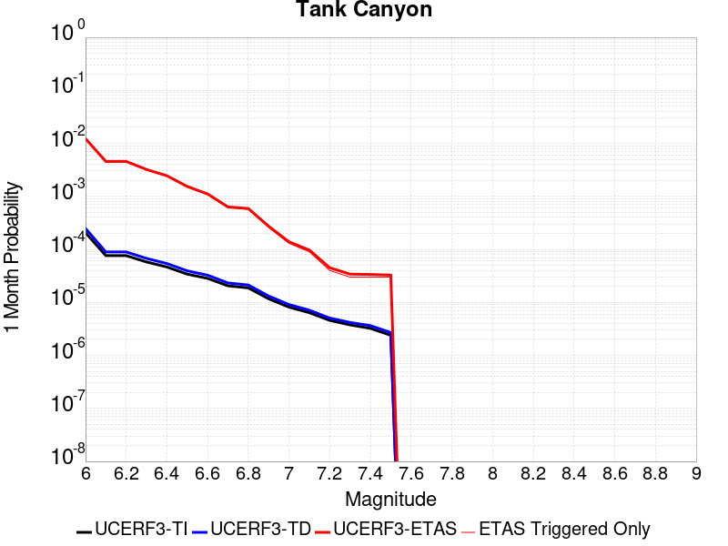 |  |  |

| Magnitude | 1 wk TI Prob | 1 wk TD Prob | 1 wk ETAS Prob | 1 wk ETAS/TD Gain | 1 wk ETAS Triggered Only | 1 mo TI Prob | 1 mo TD Prob | 1 mo ETAS Prob | 1 mo ETAS/TD Gain | 1 mo ETAS Triggered Only | 1 yr TI Prob | 1 yr TD Prob | 1 yr ETAS Prob | 1 yr ETAS/TD Gain | 1 yr ETAS Triggered Only | 10 yr TI Prob | 10 yr TD Prob | 10 yr ETAS Prob | 10 yr ETAS/TD Gain | 10 yr ETAS Triggered Only |
|-----|-----|-----|-----|-----|-----|-----|-----|-----|-----|-----|-----|-----|-----|-----|-----|-----|-----|-----|-----|-----|
| 6.0 | 4.8284557E-5 | 5.796635E-5 | 0.0046576997 | 80.35178 | 0.0046 | 2.0691741E-4 | 2.484074E-4 | 0.012325407 | 49.617714 | 0.01208 | 0.0025163088 | 0.0030208372 | 0.03595106 | 11.901025 | 0.03303 | 0.02488006 | 0.029864404 | 0.08632629 | 2.8906083 | 0.0582 |
| 6.1 | 1.7796336E-5 | 2.0873764E-5 | 0.00164084 | 78.607765 | 0.00162 | 7.626778E-5 | 8.945614E-5 | 0.0045690555 | 51.075928 | 0.00448 | 9.281647E-4 | 0.0010886216 | 0.014154382 | 13.002115 | 0.01308 | 0.009242975 | 0.010836975 | 0.034052633 | 3.1422637 | 0.02347 |
| 6.2 | 1.7796336E-5 | 2.0873764E-5 | 0.00164084 | 78.607765 | 0.00162 | 7.626778E-5 | 8.945614E-5 | 0.0045690555 | 51.075928 | 0.00448 | 9.281647E-4 | 0.0010886216 | 0.014154382 | 13.002115 | 0.01308 | 0.009242975 | 0.010836975 | 0.034052633 | 3.1422637 | 0.02347 |
| 6.3 | 1.3515912E-5 | 1.575988E-5 | 0.0010757432 | 68.25833 | 0.00106 | 5.792405E-5 | 6.7540735E-5 | 0.0032173279 | 47.635372 | 0.00315 | 7.049971E-4 | 8.220222E-4 | 0.010404139 | 12.656761 | 0.00959 | 0.007027647 | 0.008192427 | 0.025578814 | 3.1222508 | 0.01753 |
| 6.4 | 1.0870146E-5 | 1.2618259E-5 | 8.726074E-4 | 69.15434 | 8.6E-4 | 4.658551E-5 | 5.407723E-5 | 0.0024539474 | 45.37857 | 0.0024 | 5.67031E-4 | 6.582093E-4 | 0.007983385 | 12.128945 | 0.00733 | 0.005655863 | 0.006564614 | 0.019936254 | 3.0369272 | 0.01346 |
| 6.5 | 7.964826E-6 | 9.196251E-6 | 5.0919165E-4 | 55.36948 | 5.0E-4 | 3.4134522E-5 | 3.941197E-5 | 0.0015393528 | 39.058002 | 0.0015 | 4.1550855E-4 | 4.7974577E-4 | 0.005167496 | 10.771321 | 0.00469 | 0.0041473247 | 0.0047884025 | 0.013377079 | 2.793641 | 0.00863 |
| 6.6 | 6.6317E-6 | 7.6124184E-6 | 3.776096E-4 | 49.60442 | 3.7E-4 | 2.8421264E-5 | 3.2624295E-5 | 0.001112589 | 34.103085 | 0.00108 | 3.4597394E-4 | 3.971375E-4 | 0.0039257356 | 9.885078 | 0.00353 | 0.0034543579 | 0.00396543 | 0.010429694 | 2.6301546 | 0.00649 |
| 6.7 | 4.793663E-6 | 5.4308543E-6 | 1.9542982E-4 | 35.985096 | 1.9E-4 | 2.0544108E-5 | 2.3274906E-5 | 6.332607E-4 | 27.207872 | 6.1E-4 | 2.500958E-4 | 2.8333953E-4 | 0.00229277 | 8.091952 | 0.00201 | 0.0024981452 | 0.0028304753 | 0.0064302576 | 2.271794 | 0.00361 |
| 6.8 | 4.382823E-6 | 4.969316E-6 | 1.5496857E-4 | 31.185093 | 1.5E-4 | 1.8783392E-5 | 2.1296917E-5 | 5.9128477E-4 | 27.763866 | 5.7E-4 | 2.286638E-4 | 2.5926338E-4 | 0.0020787916 | 8.018068 | 0.00182 | 0.0022842865 | 0.0025902835 | 0.005821891 | 2.2475884 | 0.00324 |
| 6.9 | 2.729601E-6 | 3.0735694E-6 | 7.307335E-5 | 23.774754 | 7.0E-5 | 1.1698237E-5 | 1.317238E-5 | 2.7316896E-4 | 20.73801 | 2.6E-4 | 1.4241673E-4 | 1.6036315E-4 | 0.0010302237 | 6.4243164 | 8.7E-4 | 0.001423255 | 0.0016026403 | 0.0031401722 | 1.9593743 | 0.00154 |
| 7.0 | 1.8987357E-6 | 2.126954E-6 | 3.212689E-5 | 15.104648 | 3.0E-5 | 8.137413E-6 | 9.115489E-6 | 1.391143E-4 | 15.26131 | 1.3E-4 | 9.90685E-5 | 1.1097613E-4 | 5.80924E-4 | 5.234675 | 4.7E-4 | 9.902435E-4 | 0.0011092757 | 0.0019083883 | 1.7203913 | 8.0E-4 |
| 7.1 | 1.4928986E-6 | 1.6641375E-6 | 2.1664104E-5 | 13.018218 | 2.0E-5 | 6.398121E-6 | 7.1320014E-6 | 9.713136E-5 | 13.619088 | 9.0E-5 | 7.789434E-5 | 8.682925E-5 | 4.2679973E-4 | 4.915391 | 3.4E-4 | 7.786704E-4 | 8.680111E-4 | 0.0014075424 | 1.6215719 | 5.4E-4 |
| 7.2 | 1.069082E-6 | 1.1828638E-6 | 1.1828638E-6 | 1.0 | 0.0 | 4.581772E-6 | 5.0694093E-6 | 4.5069206E-5 | 8.890426 | 4.0E-5 | 5.5781646E-5 | 6.171884E-5 | 2.617065E-4 | 4.240301 | 2.0E-4 | 5.576765E-4 | 6.170693E-4 | 9.1688416E-4 | 1.485869 | 3.0E-4 |
| 7.3 | 8.776551E-7 | 9.770052E-7 | 9.770052E-7 | 1.0 | 0.0 | 3.7613736E-6 | 4.1871617E-6 | 3.4187036E-5 | 8.164728 | 3.0E-5 | 4.579376E-5 | 5.097802E-5 | 1.8097139E-4 | 3.5499887 | 1.3E-4 | 4.5784327E-4 | 5.0971424E-4 | 7.0961233E-4 | 1.3921767 | 2.0E-4 |
| 7.4 | 7.55721E-7 | 8.510284E-7 | 8.510284E-7 | 1.0 | 0.0 | 3.2388E-6 | 3.6472622E-6 | 3.3647153E-5 | 9.225318 | 3.0E-5 | 3.9431678E-5 | 4.440503E-5 | 1.5440014E-4 | 3.4770868 | 1.1E-4 | 3.942468E-4 | 4.4401243E-4 | 6.039414E-4 | 1.3601903 | 1.6E-4 |
| 7.5 | 5.587665E-7 | 6.305647E-7 | 6.305647E-7 | 1.0 | 0.0 | 2.3947114E-6 | 2.7024203E-6 | 3.270234E-5 | 12.10113 | 3.0E-5 | 2.915522E-5 | 3.2901968E-5 | 1.22899E-4 | 3.7353086 | 9.0E-5 | 2.9151395E-4 | 3.2901968E-4 | 4.6897362E-4 | 1.4253665 | 1.4E-4 |

## Garlock (Central)
*[(top)](#table-of-contents)*

| 1 Week | 1 Month | 1 Year | 10 Year |
|-----|-----|-----|-----|
|  |  |  | 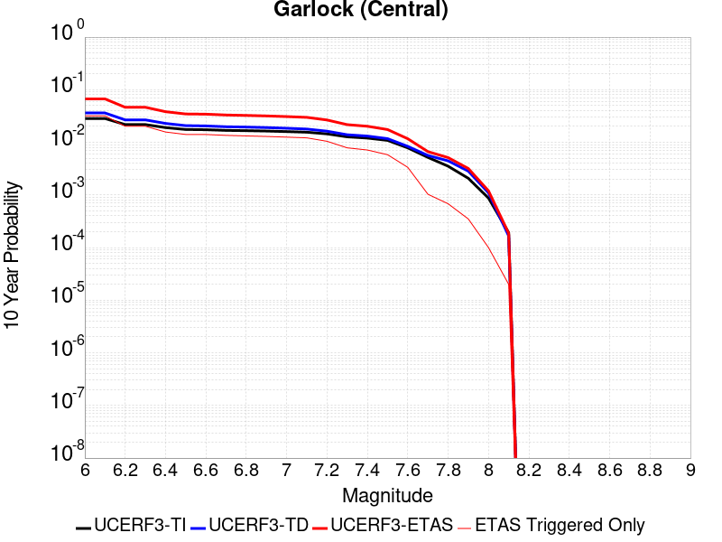 |

| Magnitude | 1 wk TI Prob | 1 wk TD Prob | 1 wk ETAS Prob | 1 wk ETAS/TD Gain | 1 wk ETAS Triggered Only | 1 mo TI Prob | 1 mo TD Prob | 1 mo ETAS Prob | 1 mo ETAS/TD Gain | 1 mo ETAS Triggered Only | 1 yr TI Prob | 1 yr TD Prob | 1 yr ETAS Prob | 1 yr ETAS/TD Gain | 1 yr ETAS Triggered Only | 10 yr TI Prob | 10 yr TD Prob | 10 yr ETAS Prob | 10 yr ETAS/TD Gain | 10 yr ETAS Triggered Only |
|-----|-----|-----|-----|-----|-----|-----|-----|-----|-----|-----|-----|-----|-----|-----|-----|-----|-----|-----|-----|-----|
| 6.0 | 5.5131142E-5 | 7.0252914E-5 | 0.0030700422 | 43.699852 | 0.003 | 2.3625491E-4 | 3.0104956E-4 | 0.008008729 | 26.602692 | 0.00771 | 0.0028726095 | 0.0036591839 | 0.022818817 | 6.23604 | 0.01923 | 0.028357591 | 0.03608289 | 0.06684148 | 1.8524426 | 0.03191 |
| 6.1 | 5.5131142E-5 | 7.0252914E-5 | 0.0030700422 | 43.699852 | 0.003 | 2.3625491E-4 | 3.0104956E-4 | 0.008008729 | 26.602692 | 0.00771 | 0.0028726095 | 0.0036591839 | 0.022818817 | 6.23604 | 0.01923 | 0.028357591 | 0.03608289 | 0.06684148 | 1.8524426 | 0.03191 |
| 6.2 | 4.216245E-5 | 5.166702E-5 | 0.0020115657 | 38.933266 | 0.00196 | 1.806837E-4 | 2.2141146E-4 | 0.0051303245 | 23.170998 | 0.00491 | 0.0021976046 | 0.0026923837 | 0.0148395905 | 5.511692 | 0.01218 | 0.021759989 | 0.02669258 | 0.046363123 | 1.7369292 | 0.02021 |
| 6.3 | 4.216245E-5 | 5.166702E-5 | 0.0020115657 | 38.933266 | 0.00196 | 1.806837E-4 | 2.2141146E-4 | 0.0051303245 | 23.170998 | 0.00491 | 0.0021976046 | 0.0026923837 | 0.0148395905 | 5.511692 | 0.01218 | 0.021759989 | 0.02669258 | 0.046363123 | 1.7369292 | 0.02021 |
| 6.4 | 3.6858168E-5 | 4.411584E-5 | 0.0015540492 | 35.22656 | 0.00151 | 1.5795401E-4 | 1.8905434E-4 | 0.0039783376 | 21.043358 | 0.00379 | 0.0019213937 | 0.0022993318 | 0.011717626 | 5.0961003 | 0.00944 | 0.019048655 | 0.02285164 | 0.03820264 | 1.671768 | 0.01571 |
| 6.5 | 3.39199E-5 | 4.0023286E-5 | 0.0014199681 | 35.478546 | 0.00138 | 1.453629E-4 | 1.7151721E-4 | 0.0036109271 | 21.052856 | 0.00344 | 0.0017683565 | 0.0020862438 | 0.010638365 | 5.099291 | 0.00857 | 0.017543508 | 0.02076252 | 0.034589354 | 1.6659516 | 0.01412 |
| 6.6 | 3.3571985E-5 | 3.947746E-5 | 0.001419423 | 35.955276 | 0.00138 | 1.4387199E-4 | 1.6917827E-4 | 0.003598598 | 21.271042 | 0.00343 | 0.0017502342 | 0.0020578213 | 0.010590227 | 5.14633 | 0.00855 | 0.017365133 | 0.02048383 | 0.03428521 | 1.6737697 | 0.01409 |
| 6.7 | 3.2580007E-5 | 3.8093858E-5 | 0.0013880425 | 36.437435 | 0.00135 | 1.3962112E-4 | 1.632493E-4 | 0.0034427138 | 21.088692 | 0.00328 | 0.0016985617 | 0.0019857697 | 0.010149526 | 5.1111293 | 0.00818 | 0.016856372 | 0.019776449 | 0.03306828 | 1.6721041 | 0.01356 |
| 6.8 | 3.2185937E-5 | 3.7521055E-5 | 0.0013374722 | 35.645912 | 0.0013 | 1.3793244E-4 | 1.6079473E-4 | 0.003330285 | 20.711407 | 0.00317 | 0.0016780337 | 0.0019559395 | 0.009910351 | 5.066798 | 0.00797 | 0.016654192 | 0.01948324 | 0.032465283 | 1.6663184 | 0.01324 |
| 6.9 | 3.165394E-5 | 3.672561E-5 | 0.00127668 | 34.762665 | 0.00124 | 1.3565269E-4 | 1.5738611E-4 | 0.0032468997 | 20.630156 | 0.00309 | 0.0016503202 | 0.0019145131 | 0.009689599 | 5.0611296 | 0.00779 | 0.01638118 | 0.01907586 | 0.031759206 | 1.66489 | 0.01293 |
| 7.0 | 3.0903822E-5 | 3.5630834E-5 | 0.0012455877 | 34.95814 | 0.00121 | 1.3243823E-4 | 1.5269476E-4 | 0.0031522366 | 20.64404 | 0.003 | 0.0016112428 | 0.0018574947 | 0.009373507 | 5.046317 | 0.00753 | 0.015996104 | 0.018515008 | 0.030842459 | 1.6658086 | 0.01256 |
| 7.1 | 3.0069863E-5 | 3.4397097E-5 | 0.0012143565 | 35.30404 | 0.00118 | 1.2886449E-4 | 1.4740792E-4 | 0.0030269835 | 20.53474 | 0.00288 | 0.0015677959 | 0.0017932352 | 0.009070163 | 5.057988 | 0.00729 | 0.01556781 | 0.017882649 | 0.029825196 | 1.6678287 | 0.01216 |
| 7.2 | 2.7957109E-5 | 3.1286367E-5 | 0.0010212554 | 32.642185 | 9.9E-4 | 1.1981068E-4 | 1.3407765E-4 | 0.002673737 | 19.941706 | 0.00254 | 0.0014577188 | 0.0016311926 | 0.007890965 | 4.8375435 | 0.00627 | 0.014481937 | 0.016286217 | 0.0265857 | 1.6324049 | 0.01047 |
| 7.3 | 2.4519275E-5 | 2.6719412E-5 | 7.267007E-4 | 27.197481 | 7.0E-4 | 1.0507837E-4 | 1.14506816E-4 | 0.0020142891 | 17.590998 | 0.0019 | 0.0012785783 | 0.0013932437 | 0.006056737 | 4.3472204 | 0.00467 | 0.012712469 | 0.013930428 | 0.021680934 | 1.5563725 | 0.00786 |
| 7.4 | 2.3225532E-5 | 2.5203923E-5 | 6.3518854E-4 | 25.201973 | 6.1E-4 | 9.95342E-5 | 1.0801242E-4 | 0.0018078288 | 16.73723 | 0.0017 | 0.0012111551 | 0.0013142723 | 0.0055486998 | 4.22188 | 0.00424 | 0.012045753 | 0.013148054 | 0.020204045 | 1.5366567 | 0.00715 |
| 7.5 | 2.097765E-5 | 2.2487986E-5 | 5.524761E-4 | 24.56761 | 5.3E-4 | 8.9901114E-5 | 9.637359E-5 | 0.0014662415 | 15.214144 | 0.00137 | 0.0010939965 | 0.0011727286 | 0.004598706 | 3.921373 | 0.00343 | 0.010886264 | 0.011742581 | 0.017494239 | 1.4898121 | 0.00582 |
| 7.6 | 1.511254E-5 | 1.5995334E-5 | 3.059907E-4 | 19.129997 | 2.9E-4 | 6.476642E-5 | 6.854967E-5 | 8.8849344E-4 | 12.9613085 | 8.2E-4 | 7.882459E-4 | 8.342805E-4 | 0.0028126286 | 3.3713224 | 0.00198 | 0.007854558 | 0.008385628 | 0.011707537 | 1.3961431 | 0.00335 |
| 7.7 | 9.934069E-6 | 1.0682508E-5 | 8.068176E-5 | 7.552698 | 7.0E-5 | 4.2573887E-5 | 4.5781377E-5 | 3.357681E-4 | 7.3341637 | 2.9E-4 | 5.182138E-4 | 5.572461E-4 | 0.0011968894 | 2.147865 | 6.4E-4 | 0.00517007 | 0.0056296107 | 0.0066538122 | 1.1819311 | 0.00103 |
| 7.8 | 6.7562896E-6 | 8.431477E-6 | 5.8431055E-5 | 6.9301095 | 5.0E-5 | 2.8955206E-5 | 3.61344E-5 | 2.161279E-4 | 5.9812226 | 1.8E-4 | 3.5247262E-4 | 4.3984767E-4 | 8.396717E-4 | 1.9090058 | 4.0E-4 | 0.0035191406 | 0.0044482257 | 0.005125201 | 1.15219 | 6.8E-4 |
| 7.9 | 3.975453E-6 | 5.3728795E-6 | 1.5372825E-5 | 2.8611894 | 1.0E-5 | 1.7037546E-5 | 2.3026425E-5 | 1.03024584E-4 | 4.4741893 | 8.0E-5 | 2.0741238E-4 | 2.8031075E-4 | 4.7025748E-4 | 1.6776291 | 1.9E-4 | 0.002072189 | 0.0028345888 | 0.0031835968 | 1.1231247 | 3.5E-4 |
| 8.0 | 1.6729537E-6 | 2.078155E-6 | 2.078155E-6 | 1.0 | 0.0 | 7.169782E-6 | 8.906349E-6 | 3.890608E-5 | 4.368354 | 3.0E-5 | 8.7288594E-5 | 1.08429434E-4 | 1.484251E-4 | 1.3688636 | 4.0E-5 | 8.7254314E-4 | 0.001097267 | 0.0011971573 | 1.0910355 | 1.0E-4 |
| 8.1 | 3.6733252E-7 | 3.1499187E-7 | 3.1499187E-7 | 1.0 | 0.0 | 1.5742813E-6 | 1.3499646E-6 | 1.3499646E-6 | 1.0 | 0.0 | 1.9166706E-5 | 1.643571E-5 | 1.643571E-5 | 1.0 | 0.0 | 1.9165053E-4 | 1.6643589E-4 | 1.8643256E-4 | 1.1201464 | 2.0E-5 |

## Little Lake
*[(top)](#table-of-contents)*

| 1 Week | 1 Month | 1 Year | 10 Year |
|-----|-----|-----|-----|
|  | 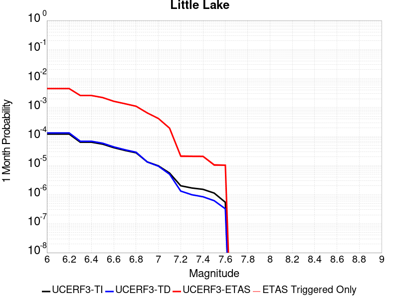 |  |  |

| Magnitude | 1 wk TI Prob | 1 wk TD Prob | 1 wk ETAS Prob | 1 wk ETAS/TD Gain | 1 wk ETAS Triggered Only | 1 mo TI Prob | 1 mo TD Prob | 1 mo ETAS Prob | 1 mo ETAS/TD Gain | 1 mo ETAS Triggered Only | 1 yr TI Prob | 1 yr TD Prob | 1 yr ETAS Prob | 1 yr ETAS/TD Gain | 1 yr ETAS Triggered Only | 10 yr TI Prob | 10 yr TD Prob | 10 yr ETAS Prob | 10 yr ETAS/TD Gain | 10 yr ETAS Triggered Only |
|-----|-----|-----|-----|-----|-----|-----|-----|-----|-----|-----|-----|-----|-----|-----|-----|-----|-----|-----|-----|-----|
| 6.0 | 2.8424427E-5 | 3.120616E-5 | 0.0019211472 | 61.563076 | 0.00189 | 1.2181328E-4 | 1.3373457E-4 | 0.00450315 | 33.672295 | 0.00437 | 0.0014820677 | 0.0016271356 | 0.0118504735 | 7.2830276 | 0.01024 | 0.014722223 | 0.016165627 | 0.031847946 | 1.9701028 | 0.01594 |
| 6.1 | 2.8424427E-5 | 3.120616E-5 | 0.0019211472 | 61.563076 | 0.00189 | 1.2181328E-4 | 1.3373457E-4 | 0.00450315 | 33.672295 | 0.00437 | 0.0014820677 | 0.0016271356 | 0.0118504735 | 7.2830276 | 0.01024 | 0.014722223 | 0.016165627 | 0.031847946 | 1.9701028 | 0.01594 |
| 6.2 | 2.8424427E-5 | 3.120616E-5 | 0.0019211472 | 61.563076 | 0.00189 | 1.2181328E-4 | 1.3373457E-4 | 0.00450315 | 33.672295 | 0.00437 | 0.0014820677 | 0.0016271356 | 0.0118504735 | 7.2830276 | 0.01024 | 0.014722223 | 0.016165627 | 0.031847946 | 1.9701028 | 0.01594 |
| 6.3 | 1.48860645E-5 | 1.6081593E-5 | 0.0011660631 | 72.50918 | 0.00115 | 6.379586E-5 | 6.891945E-5 | 0.002598745 | 37.70699 | 0.00253 | 7.7643775E-4 | 8.387995E-4 | 0.0067838086 | 8.087521 | 0.00595 | 0.007737305 | 0.008359154 | 0.017383086 | 2.079527 | 0.0091 |
| 6.4 | 1.48860645E-5 | 1.6081593E-5 | 0.0011660631 | 72.50918 | 0.00115 | 6.379586E-5 | 6.891945E-5 | 0.002598745 | 37.70699 | 0.00253 | 7.7643775E-4 | 8.387995E-4 | 0.0067838086 | 8.087521 | 0.00595 | 0.007737305 | 0.008359154 | 0.017383086 | 2.079527 | 0.0091 |
| 6.5 | 1.2797581E-5 | 1.3765735E-5 | 9.937523E-4 | 72.19028 | 9.8E-4 | 5.4845623E-5 | 5.899482E-5 | 0.002208868 | 37.441727 | 0.00215 | 6.675408E-4 | 7.180509E-4 | 0.005964281 | 8.30621 | 0.00525 | 0.006655392 | 0.0071598585 | 0.015132365 | 2.1135006 | 0.00803 |
| 6.6 | 9.661896E-6 | 1.0289158E-5 | 7.7028136E-4 | 74.863396 | 7.6E-4 | 4.1407468E-5 | 4.4095737E-5 | 0.0016440252 | 37.283085 | 0.0016 | 5.040193E-4 | 5.367496E-4 | 0.0048144525 | 8.969643 | 0.00428 | 0.005028777 | 0.0053561367 | 0.011751697 | 2.194062 | 0.00643 |
| 6.7 | 7.767871E-6 | 8.199779E-6 | 6.581945E-4 | 80.26978 | 6.5E-4 | 3.329045E-5 | 3.514151E-5 | 0.0013550951 | 38.561092 | 0.00132 | 4.0523586E-4 | 4.2777765E-4 | 0.003976259 | 9.295154 | 0.00355 | 0.004044977 | 0.0042708935 | 0.009617959 | 2.2519782 | 0.00537 |
| 6.8 | 6.4235196E-6 | 6.735819E-6 | 5.66732E-4 | 84.13707 | 5.6E-4 | 2.752908E-5 | 2.886755E-5 | 0.0011088364 | 38.41117 | 0.00108 | 3.35115E-4 | 3.5141854E-4 | 0.0033203748 | 9.44849 | 0.00297 | 0.003346101 | 0.0035098887 | 0.008004059 | 2.280431 | 0.00451 |
| 6.9 | 3.1283696E-6 | 3.1122067E-6 | 3.0311127E-4 | 97.394325 | 3.0E-4 | 1.3407229E-5 | 1.3337969E-5 | 6.533294E-4 | 48.982677 | 6.4E-4 | 1.6322079E-4 | 1.6237919E-4 | 0.001832108 | 11.2829 | 0.00167 | 0.0016310095 | 0.0016227537 | 0.0041386643 | 2.550396 | 0.00252 |
| 7.0 | 2.290603E-6 | 2.2287015E-6 | 2.1222823E-4 | 95.22506 | 2.1E-4 | 9.816834E-6 | 9.551549E-6 | 4.1954764E-4 | 43.924564 | 4.1E-4 | 1.19513395E-4 | 1.16284944E-4 | 0.0011261675 | 9.684551 | 0.00101 | 0.0011944914 | 0.0011623431 | 0.00272053 | 2.3405566 | 0.00156 |
| 7.1 | 1.293693E-6 | 1.1776951E-6 | 1.01177575E-4 | 85.91152 | 1.0E-4 | 5.5443866E-6 | 5.047259E-6 | 1.950463E-4 | 38.644005 | 1.9E-4 | 6.750081E-5 | 6.144935E-5 | 6.314143E-4 | 10.275363 | 5.7E-4 | 6.7480316E-4 | 6.14392E-4 | 0.0014039066 | 2.285034 | 7.9E-4 |
| 7.2 | 4.715842E-7 | 3.0918443E-7 | 2.0309179E-5 | 65.686295 | 2.0E-5 | 2.0210737E-6 | 1.3250755E-6 | 2.132505E-5 | 16.09346 | 2.0E-5 | 2.4606294E-5 | 1.613268E-5 | 8.613155E-5 | 5.3389487 | 7.0E-5 | 2.460357E-4 | 1.6131563E-4 | 2.513011E-4 | 1.5578225 | 9.0E-5 |
| 7.3 | 3.9430947E-7 | 2.3098025E-7 | 2.0230975E-5 | 87.58747 | 2.0E-5 | 1.6898966E-6 | 9.89915E-7 | 2.0989895E-5 | 21.203735 | 2.0E-5 | 2.0574296E-5 | 1.2052149E-5 | 7.205143E-5 | 5.9783053 | 6.0E-5 | 2.0572392E-4 | 1.20515026E-4 | 2.0050538E-4 | 1.6637377 | 8.0E-5 |
| 7.4 | 3.547123E-7 | 1.9679635E-7 | 2.0196792E-5 | 102.627884 | 2.0E-5 | 1.5201948E-6 | 8.4341264E-7 | 2.0843396E-5 | 24.713165 | 2.0E-5 | 1.8508214E-5 | 1.0268501E-5 | 7.026789E-5 | 6.843052 | 6.0E-5 | 1.8506673E-4 | 1.0268033E-4 | 1.8267211E-4 | 1.7790371 | 8.0E-5 |
| 7.5 | 2.6354266E-7 | 1.4423487E-7 | 1.0144234E-5 | 70.33135 | 1.0E-5 | 1.129468E-6 | 6.1814933E-7 | 1.0618143E-5 | 17.17731 | 1.0E-5 | 1.3751187E-5 | 7.5259427E-6 | 5.7525565E-5 | 7.643636 | 5.0E-5 | 1.3750336E-4 | 7.525693E-5 | 1.3525241E-4 | 1.7972088 | 6.0E-5 |
| 7.6 | 1.269913E-7 | 7.5727044E-8 | 1.0075726E-5 | 133.0532 | 1.0E-5 | 5.4424834E-7 | 3.2454443E-7 | 1.0324541E-5 | 31.812412 | 1.0E-5 | 6.6262032E-6 | 3.9513216E-6 | 2.3951243E-5 | 6.0615773 | 2.0E-5 | 6.626006E-5 | 3.951255E-5 | 5.951176E-5 | 1.5061483 | 2.0E-5 |

## Owl Lake
*[(top)](#table-of-contents)*

| 1 Week | 1 Month | 1 Year | 10 Year |
|-----|-----|-----|-----|
| 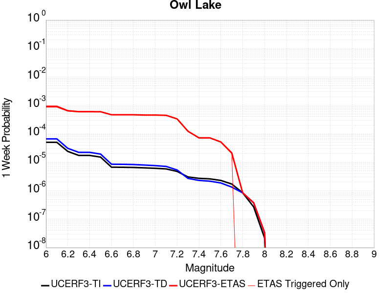 |  |  |  |

| Magnitude | 1 wk TI Prob | 1 wk TD Prob | 1 wk ETAS Prob | 1 wk ETAS/TD Gain | 1 wk ETAS Triggered Only | 1 mo TI Prob | 1 mo TD Prob | 1 mo ETAS Prob | 1 mo ETAS/TD Gain | 1 mo ETAS Triggered Only | 1 yr TI Prob | 1 yr TD Prob | 1 yr ETAS Prob | 1 yr ETAS/TD Gain | 1 yr ETAS Triggered Only | 10 yr TI Prob | 10 yr TD Prob | 10 yr ETAS Prob | 10 yr ETAS/TD Gain | 10 yr ETAS Triggered Only |
|-----|-----|-----|-----|-----|-----|-----|-----|-----|-----|-----|-----|-----|-----|-----|-----|-----|-----|-----|-----|-----|
| 6.0 | 5.0320643E-5 | 6.636149E-5 | 9.2630443E-4 | 13.958463 | 8.6E-4 | 2.1564208E-4 | 2.8438168E-4 | 0.00236379 | 8.312034 | 0.00208 | 0.0026222812 | 0.00345791 | 0.009257785 | 2.6772776 | 0.00582 | 0.02591553 | 0.0341423 | 0.04439971 | 1.3004311 | 0.01062 |
| 6.1 | 5.0320643E-5 | 6.636149E-5 | 9.2630443E-4 | 13.958463 | 8.6E-4 | 2.1564208E-4 | 2.8438168E-4 | 0.00236379 | 8.312034 | 0.00208 | 0.0026222812 | 0.00345791 | 0.009257785 | 2.6772776 | 0.00582 | 0.02591553 | 0.0341423 | 0.04439971 | 1.3004311 | 0.01062 |
| 6.2 | 2.4125871E-5 | 3.098269E-5 | 6.5096345E-4 | 21.010553 | 6.2E-4 | 1.0339249E-4 | 1.3277736E-4 | 0.0015925835 | 11.99439 | 0.00146 | 0.0012580766 | 0.0016155228 | 0.005898592 | 3.6511972 | 0.00429 | 0.012509781 | 0.016071297 | 0.02391321 | 1.4879452 | 0.00797 |
| 6.3 | 1.7433485E-5 | 2.2356835E-5 | 6.023439E-4 | 26.942268 | 5.8E-4 | 7.471279E-5 | 9.5812386E-5 | 0.0014156859 | 14.775604 | 0.00132 | 9.0924866E-4 | 0.0011660426 | 0.0047818217 | 4.100898 | 0.00362 | 0.009055373 | 0.01162957 | 0.018162698 | 1.5617688 | 0.00661 |
| 6.4 | 1.7433485E-5 | 2.2356835E-5 | 6.023439E-4 | 26.942268 | 5.8E-4 | 7.471279E-5 | 9.5812386E-5 | 0.0014156859 | 14.775604 | 0.00132 | 9.0924866E-4 | 0.0011660426 | 0.0047818217 | 4.100898 | 0.00362 | 0.009055373 | 0.01162957 | 0.018162698 | 1.5617688 | 0.00661 |
| 6.5 | 1.5182742E-5 | 1.9430352E-5 | 5.9941906E-4 | 30.849625 | 5.8E-4 | 6.506727E-5 | 8.327114E-5 | 0.0013331671 | 16.009954 | 0.00125 | 7.919061E-4 | 0.0010135059 | 0.0043701003 | 4.311865 | 0.00336 | 0.0078909 | 0.010119047 | 0.016216714 | 1.6025931 | 0.00616 |
| 6.6 | 6.7271576E-6 | 8.548157E-6 | 4.6854423E-4 | 54.81231 | 4.6E-4 | 2.8830356E-5 | 3.6634476E-5 | 9.6660043E-4 | 26.384993 | 9.3E-4 | 3.5095305E-4 | 4.4593913E-4 | 0.00286486 | 6.4243298 | 0.00242 | 0.0035039932 | 0.004468226 | 0.008480219 | 1.8978939 | 0.00403 |
| 6.7 | 6.682835E-6 | 8.4806015E-6 | 4.684767E-4 | 55.240974 | 4.6E-4 | 2.8640408E-5 | 3.634496E-5 | 9.6631114E-4 | 26.587212 | 9.3E-4 | 3.4864116E-4 | 4.424157E-4 | 0.0028613452 | 6.4675484 | 0.00242 | 0.003480947 | 0.004433152 | 0.008445286 | 1.9050298 | 0.00403 |
| 6.8 | 6.5774975E-6 | 8.327072E-6 | 4.6832324E-4 | 56.24105 | 4.6E-4 | 2.8188972E-5 | 3.5686993E-5 | 9.656538E-4 | 27.058985 | 9.3E-4 | 3.4314668E-4 | 4.3440814E-4 | 0.002853357 | 6.568378 | 0.00242 | 0.0034261728 | 0.0043532955 | 0.008365752 | 1.9217055 | 0.00403 |
| 6.9 | 6.363419E-6 | 8.0002355E-6 | 4.5799665E-4 | 57.247894 | 4.5E-4 | 2.727151E-5 | 3.4286306E-5 | 9.5425476E-4 | 27.831951 | 9.2E-4 | 3.3198006E-4 | 4.173614E-4 | 0.0028263556 | 6.771962 | 0.00241 | 0.0033148455 | 0.004183282 | 0.008166549 | 1.952187 | 0.004 |
| 7.0 | 6.1342453E-6 | 7.632424E-6 | 4.5762898E-4 | 59.958538 | 4.5E-4 | 2.6289357E-5 | 3.271001E-5 | 9.3268056E-4 | 28.513615 | 9.0E-4 | 3.2002592E-4 | 3.981771E-4 | 0.0027372453 | 6.874442 | 0.00234 | 0.0031956544 | 0.00399197 | 0.007886361 | 1.9755563 | 0.00391 |
| 7.1 | 5.842926E-6 | 7.142961E-6 | 4.471398E-4 | 62.598667 | 4.4E-4 | 2.504087E-5 | 3.0612362E-5 | 9.105854E-4 | 29.745678 | 8.8E-4 | 3.0482994E-4 | 3.7264716E-4 | 0.0026418013 | 7.089283 | 0.00227 | 0.0030441214 | 0.0037374226 | 0.0074933325 | 2.0049465 | 0.00377 |
| 7.2 | 4.77173E-6 | 5.3591634E-6 | 3.3535738E-4 | 62.576447 | 3.3E-4 | 2.045011E-5 | 2.2967664E-5 | 7.129518E-4 | 31.041548 | 6.9E-4 | 2.4895166E-4 | 2.7959948E-4 | 0.0019191409 | 6.863893 | 0.00164 | 0.0024867293 | 0.0028089995 | 0.0054415837 | 1.9371965 | 0.00264 |
| 7.3 | 3.0494948E-6 | 2.7109647E-6 | 1.2271064E-4 | 45.264565 | 1.2E-4 | 1.3069198E-5 | 1.1618369E-5 | 2.6161547E-4 | 22.517399 | 2.5E-4 | 1.5910587E-4 | 1.4144463E-4 | 6.9136685E-4 | 4.8878975 | 5.5E-4 | 0.0015899199 | 0.0014235033 | 0.0023521795 | 1.6523877 | 9.3E-4 |
| 7.4 | 2.7263884E-6 | 2.3061473E-6 | 7.2305986E-5 | 31.353584 | 7.0E-5 | 1.1684469E-5 | 9.883452E-6 | 1.5988197E-4 | 16.176733 | 1.5E-4 | 1.4224913E-4 | 1.2032448E-4 | 4.8028116E-4 | 3.9915497 | 3.6E-4 | 0.0014215811 | 0.0012114698 | 0.0018806581 | 1.5523772 | 6.7E-4 |
| 7.5 | 2.6090431E-6 | 2.1660758E-6 | 7.216592E-5 | 33.316437 | 7.0E-5 | 1.1181565E-5 | 9.283149E-6 | 1.4928186E-4 | 16.08095 | 1.4E-4 | 1.3612706E-4 | 1.1301658E-4 | 4.5297816E-4 | 4.008068 | 3.4E-4 | 0.001360437 | 0.001138222 | 0.0017475277 | 1.5353135 | 6.1E-4 |
| 7.6 | 2.3008756E-6 | 1.8732376E-6 | 5.1873143E-5 | 27.691706 | 5.0E-5 | 9.860858E-6 | 8.028137E-6 | 1.1802725E-4 | 14.701699 | 1.1E-4 | 1.20049335E-4 | 9.7738266E-5 | 3.5771285E-4 | 3.659906 | 2.6E-4 | 0.001199845 | 9.852252E-4 | 0.0014547621 | 1.4765784 | 4.7E-4 |
| 7.7 | 1.7184348E-6 | 1.3423282E-6 | 2.13423E-5 | 15.899466 | 2.0E-5 | 7.3646997E-6 | 5.7528227E-6 | 6.575248E-5 | 11.429603 | 6.0E-5 | 8.966153E-5 | 7.0038404E-5 | 2.1002861E-4 | 2.9987633 | 1.4E-4 | 8.962536E-4 | 7.080495E-4 | 9.4787957E-4 | 1.3387194 | 2.4E-4 |
| 7.8 | 8.4612907E-7 | 8.4087924E-7 | 8.4087924E-7 | 1.0 | 0.0 | 3.6262625E-6 | 3.6037634E-6 | 2.3603692E-5 | 6.549734 | 2.0E-5 | 4.4148852E-5 | 4.3874956E-5 | 8.38732E-5 | 1.9116418 | 4.0E-5 | 4.414008E-4 | 4.4413717E-4 | 5.340972E-4 | 1.20255 | 9.0E-5 |
| 7.9 | 2.716738E-7 | 3.7694025E-7 | 3.7694025E-7 | 1.0 | 0.0 | 1.1643157E-6 | 1.6154573E-6 | 1.6154573E-6 | 1.0 | 0.0 | 1.4175452E-5 | 1.9668027E-5 | 1.9668027E-5 | 1.0 | 0.0 | 1.4174548E-4 | 1.9843443E-4 | 2.0843245E-4 | 1.0503845 | 1.0E-5 |
| 8.0 | 2.1995428E-8 | 3.386013E-8 | 3.386013E-8 | 1.0 | 0.0 | 9.426611E-8 | 1.4511484E-7 | 1.4511484E-7 | 1.0 | 0.0 | 1.1476893E-6 | 1.7667724E-6 | 1.7667724E-6 | 1.0 | 0.0 | 1.14768345E-5 | 1.7968985E-5 | 1.7968985E-5 | 1.0 | 0.0 |

## Panamint Valley
*[(top)](#table-of-contents)*

| 1 Week | 1 Month | 1 Year | 10 Year |
|-----|-----|-----|-----|
|  |  |  |  |

| Magnitude | 1 wk TI Prob | 1 wk TD Prob | 1 wk ETAS Prob | 1 wk ETAS/TD Gain | 1 wk ETAS Triggered Only | 1 mo TI Prob | 1 mo TD Prob | 1 mo ETAS Prob | 1 mo ETAS/TD Gain | 1 mo ETAS Triggered Only | 1 yr TI Prob | 1 yr TD Prob | 1 yr ETAS Prob | 1 yr ETAS/TD Gain | 1 yr ETAS Triggered Only | 10 yr TI Prob | 10 yr TD Prob | 10 yr ETAS Prob | 10 yr ETAS/TD Gain | 10 yr ETAS Triggered Only |
|-----|-----|-----|-----|-----|-----|-----|-----|-----|-----|-----|-----|-----|-----|-----|-----|-----|-----|-----|-----|-----|
| 6.0 | 3.0211835E-5 | 3.3985398E-5 | 8.839565E-4 | 26.009892 | 8.5E-4 | 1.2947287E-4 | 1.4564373E-4 | 0.0024453087 | 16.78966 | 0.0023 | 0.0015751923 | 0.0017717998 | 0.008400035 | 4.7409616 | 0.00664 | 0.015640736 | 0.01758359 | 0.029205577 | 1.6609564 | 0.01183 |
| 6.1 | 3.0211835E-5 | 3.3985398E-5 | 8.839565E-4 | 26.009892 | 8.5E-4 | 1.2947287E-4 | 1.4564373E-4 | 0.0024453087 | 16.78966 | 0.0023 | 0.0015751923 | 0.0017717998 | 0.008400035 | 4.7409616 | 0.00664 | 0.015640736 | 0.01758359 | 0.029205577 | 1.6609564 | 0.01183 |
| 6.2 | 3.0211835E-5 | 3.3985398E-5 | 8.839565E-4 | 26.009892 | 8.5E-4 | 1.2947287E-4 | 1.4564373E-4 | 0.0024453087 | 16.78966 | 0.0023 | 0.0015751923 | 0.0017717998 | 0.008400035 | 4.7409616 | 0.00664 | 0.015640736 | 0.01758359 | 0.029205577 | 1.6609564 | 0.01183 |
| 6.3 | 2.8573924E-5 | 3.2103522E-5 | 8.520772E-4 | 26.54155 | 8.2E-4 | 1.2245393E-4 | 1.3757942E-4 | 0.002327278 | 16.915888 | 0.00219 | 0.001489857 | 0.0016737703 | 0.008023125 | 4.7934446 | 0.00636 | 0.01479908 | 0.016618231 | 0.02774028 | 1.6692678 | 0.01131 |
| 6.4 | 2.8573924E-5 | 3.2103522E-5 | 8.520772E-4 | 26.54155 | 8.2E-4 | 1.2245393E-4 | 1.3757942E-4 | 0.002327278 | 16.915888 | 0.00219 | 0.001489857 | 0.0016737703 | 0.008023125 | 4.7934446 | 0.00636 | 0.01479908 | 0.016618231 | 0.02774028 | 1.6692678 | 0.01131 |
| 6.5 | 2.7468774E-5 | 3.0829244E-5 | 8.308046E-4 | 26.948587 | 8.0E-4 | 1.1771801E-4 | 1.3211879E-4 | 0.0022618375 | 17.119724 | 0.00213 | 0.0014322745 | 0.0016073869 | 0.0077475016 | 4.819936 | 0.00615 | 0.014230782 | 0.015964093 | 0.026758967 | 1.6761972 | 0.01097 |
| 6.6 | 2.6135967E-5 | 2.9253257E-5 | 8.0923043E-4 | 27.662918 | 7.8E-4 | 1.1200648E-4 | 1.2536523E-4 | 0.0021651094 | 17.270414 | 0.00204 | 0.0013628257 | 0.0015252795 | 0.0074162805 | 4.8622437 | 0.0059 | 0.013544982 | 0.015154443 | 0.025544563 | 1.6856155 | 0.01055 |
| 6.7 | 2.4498746E-5 | 2.7342086E-5 | 7.6732185E-4 | 28.063763 | 7.4E-4 | 1.04990395E-4 | 1.1717525E-4 | 0.0020669468 | 17.63979 | 0.00195 | 0.0012775084 | 0.0014257001 | 0.006987759 | 4.9012823 | 0.00557 | 0.012701893 | 0.014171662 | 0.023970796 | 1.6914598 | 0.00994 |
| 6.8 | 2.2244329E-5 | 2.4936131E-5 | 7.1491895E-4 | 28.670002 | 6.9E-4 | 9.532935E-5 | 1.0686488E-4 | 0.001986664 | 18.59043 | 0.00188 | 0.0011600169 | 0.0013003252 | 0.0064835763 | 4.9861193 | 0.00519 | 0.011539802 | 0.012932883 | 0.021905323 | 1.6937696 | 0.00909 |
| 6.9 | 1.9902658E-5 | 2.2290924E-5 | 6.1227777E-4 | 27.467583 | 5.9E-4 | 8.529431E-5 | 9.552913E-5 | 0.0016353821 | 17.119196 | 0.00154 | 0.0010379635 | 0.0011624652 | 0.0053775595 | 4.6259966 | 0.00422 | 0.010331288 | 0.011568946 | 0.018735072 | 1.6194277 | 0.00725 |
| 7.0 | 1.8353881E-5 | 2.056681E-5 | 5.605557E-4 | 27.255356 | 5.4E-4 | 7.865712E-5 | 8.814059E-5 | 0.0014480207 | 16.428535 | 0.00136 | 9.5722964E-4 | 0.0010726011 | 0.0046987077 | 4.3806667 | 0.00363 | 0.009531168 | 0.0106791705 | 0.016832747 | 1.5762223 | 0.00622 |
| 7.1 | 1.7667631E-5 | 1.9773222E-5 | 5.297631E-4 | 26.791948 | 5.1E-4 | 7.571623E-5 | 8.473973E-5 | 0.0013846295 | 16.339792 | 0.0013 | 9.2145515E-4 | 0.0010312354 | 0.004477678 | 4.3420515 | 0.00345 | 0.009176437 | 0.010269388 | 0.016118696 | 1.5695869 | 0.00591 |
| 7.2 | 1.6381597E-5 | 1.8158824E-5 | 4.1815155E-4 | 23.027458 | 4.0E-4 | 7.020495E-5 | 7.782131E-5 | 0.0011677365 | 15.005357 | 0.00109 | 8.544101E-4 | 9.4707985E-4 | 0.003894286 | 4.111888 | 0.00295 | 0.008511325 | 0.009435088 | 0.014526592 | 1.539635 | 0.00514 |
| 7.3 | 1.4520491E-5 | 1.5966963E-5 | 3.459617E-4 | 21.667345 | 3.3E-4 | 6.222919E-5 | 6.842814E-5 | 9.4836793E-4 | 13.859326 | 8.8E-4 | 7.57377E-4 | 8.3281036E-4 | 0.0033007534 | 3.9633913 | 0.00247 | 0.0075480095 | 0.008300003 | 0.01257423 | 1.514967 | 0.00431 |
| 7.4 | 1.2852287E-5 | 1.4145856E-5 | 3.4414118E-4 | 24.328056 | 3.3E-4 | 5.5080065E-5 | 6.0623777E-5 | 9.1057224E-4 | 15.020051 | 8.5E-4 | 6.7039346E-4 | 7.3786033E-4 | 0.0030661412 | 4.155449 | 0.00233 | 0.0066837464 | 0.007357025 | 0.011407008 | 1.5504919 | 0.00408 |
| 7.5 | 1.1637851E-5 | 1.2837149E-5 | 3.428329E-4 | 26.706312 | 3.3E-4 | 4.987555E-5 | 5.5015284E-5 | 8.949691E-4 | 16.267645 | 8.4E-4 | 6.070656E-4 | 6.6962093E-4 | 0.0029381008 | 4.3877077 | 0.00227 | 0.006054099 | 0.0066789286 | 0.010632346 | 1.591924 | 0.00398 |
| 7.6 | 3.0068115E-6 | 3.3331687E-6 | 1.5333267E-4 | 46.00207 | 1.5E-4 | 1.2886271E-5 | 1.4284972E-5 | 3.8427967E-4 | 26.900976 | 3.7E-4 | 1.5687906E-4 | 1.7391294E-4 | 0.0011037512 | 6.3465734 | 9.3E-4 | 0.0015676835 | 0.001739208 | 0.0034063035 | 1.9585372 | 0.00167 |

## Airport Lake
*[(top)](#table-of-contents)*

| 1 Week | 1 Month | 1 Year | 10 Year |
|-----|-----|-----|-----|
|  |  |  |  |

| Magnitude | 1 wk TI Prob | 1 wk TD Prob | 1 wk ETAS Prob | 1 wk ETAS/TD Gain | 1 wk ETAS Triggered Only | 1 mo TI Prob | 1 mo TD Prob | 1 mo ETAS Prob | 1 mo ETAS/TD Gain | 1 mo ETAS Triggered Only | 1 yr TI Prob | 1 yr TD Prob | 1 yr ETAS Prob | 1 yr ETAS/TD Gain | 1 yr ETAS Triggered Only | 10 yr TI Prob | 10 yr TD Prob | 10 yr ETAS Prob | 10 yr ETAS/TD Gain | 10 yr ETAS Triggered Only |
|-----|-----|-----|-----|-----|-----|-----|-----|-----|-----|-----|-----|-----|-----|-----|-----|-----|-----|-----|-----|-----|
| 6.0 | 1.2387061E-5 | 1.31032575E-5 | 0.0011430884 | 87.23697 | 0.00113 | 5.3086325E-5 | 5.6155768E-5 | 0.0025260171 | 44.982327 | 0.00247 | 6.461343E-4 | 6.835104E-4 | 0.006729375 | 9.845315 | 0.00605 | 0.0064425888 | 0.0068168915 | 0.015854858 | 2.3258193 | 0.0091 |
| 6.1 | 1.2387061E-5 | 1.31032575E-5 | 0.0011430884 | 87.23697 | 0.00113 | 5.3086325E-5 | 5.6155768E-5 | 0.0025260171 | 44.982327 | 0.00247 | 6.461343E-4 | 6.835104E-4 | 0.006729375 | 9.845315 | 0.00605 | 0.0064425888 | 0.0068168915 | 0.015854858 | 2.3258193 | 0.0091 |
| 6.2 | 1.2387061E-5 | 1.31032575E-5 | 0.0011430884 | 87.23697 | 0.00113 | 5.3086325E-5 | 5.6155768E-5 | 0.0025260171 | 44.982327 | 0.00247 | 6.461343E-4 | 6.835104E-4 | 0.006729375 | 9.845315 | 0.00605 | 0.0064425888 | 0.0068168915 | 0.015854858 | 2.3258193 | 0.0091 |
| 6.3 | 1.2387061E-5 | 1.31032575E-5 | 0.0011430884 | 87.23697 | 0.00113 | 5.3086325E-5 | 5.6155768E-5 | 0.0025260171 | 44.982327 | 0.00247 | 6.461343E-4 | 6.835104E-4 | 0.006729375 | 9.845315 | 0.00605 | 0.0064425888 | 0.0068168915 | 0.015854858 | 2.3258193 | 0.0091 |
| 6.4 | 1.2387061E-5 | 1.31032575E-5 | 0.0011430884 | 87.23697 | 0.00113 | 5.3086325E-5 | 5.6155768E-5 | 0.0025260171 | 44.982327 | 0.00247 | 6.461343E-4 | 6.835104E-4 | 0.006729375 | 9.845315 | 0.00605 | 0.0064425888 | 0.0068168915 | 0.015854858 | 2.3258193 | 0.0091 |
| 6.5 | 6.9922594E-6 | 7.38498E-6 | 8.973784E-4 | 121.51399 | 8.9E-4 | 2.996648E-5 | 3.164956E-5 | 0.001881591 | 59.450775 | 0.00185 | 3.6478083E-4 | 3.8527072E-4 | 0.0049035293 | 12.72749 | 0.00452 | 0.003641826 | 0.0038465653 | 0.010530755 | 2.7377033 | 0.00671 |
| 6.6 | 6.9922594E-6 | 7.38498E-6 | 8.973784E-4 | 121.51399 | 8.9E-4 | 2.996648E-5 | 3.164956E-5 | 0.001881591 | 59.450775 | 0.00185 | 3.6478083E-4 | 3.8527072E-4 | 0.0049035293 | 12.72749 | 0.00452 | 0.003641826 | 0.0038465653 | 0.010530755 | 2.7377033 | 0.00671 |
| 6.7 | 5.477277E-6 | 5.7861116E-6 | 7.0578203E-4 | 121.978645 | 7.0E-4 | 2.3473833E-5 | 2.4797408E-5 | 0.0015547595 | 62.698467 | 0.00153 | 2.8575645E-4 | 3.0187052E-4 | 0.0040607355 | 13.451912 | 0.00376 | 0.0028538927 | 0.0030149885 | 0.0086280145 | 2.8617072 | 0.00563 |
| 6.8 | 3.9950432E-6 | 4.2191186E-6 | 5.242169E-4 | 124.24798 | 5.2E-4 | 1.7121502E-5 | 1.8081826E-5 | 0.0011780609 | 65.15165 | 0.00116 | 2.0843433E-4 | 2.2012675E-4 | 0.003089495 | 14.035072 | 0.00287 | 0.0020823893 | 0.002199358 | 0.006519835 | 2.9644263 | 0.00433 |
| 6.9 | 2.95695E-6 | 3.1230477E-6 | 3.731219E-4 | 119.47365 | 3.7E-4 | 1.2672582E-5 | 1.3384434E-5 | 8.9337263E-4 | 66.74714 | 8.8E-4 | 1.5427776E-4 | 1.6294557E-4 | 0.00222261 | 13.640199 | 0.00206 | 0.001541707 | 0.0016284833 | 0.0046835 | 2.8759892 | 0.00306 |
| 7.0 | 1.456072E-6 | 1.5408239E-6 | 1.6154058E-4 | 104.84039 | 1.6E-4 | 6.2402937E-6 | 6.60352E-6 | 3.4660127E-4 | 52.48735 | 3.4E-4 | 7.597293E-5 | 8.03959E-5 | 9.50326E-4 | 11.820578 | 8.7E-4 | 7.594696E-4 | 8.03767E-4 | 0.002162674 | 2.6906726 | 0.00136 |
| 7.1 | 6.995192E-7 | 7.4090326E-7 | 8.074084E-5 | 108.976234 | 8.0E-5 | 2.997936E-6 | 3.1752998E-6 | 1.6317479E-4 | 51.388786 | 1.6E-4 | 3.649926E-5 | 3.8659273E-5 | 5.2864035E-4 | 13.674347 | 4.9E-4 | 3.6493264E-4 | 3.8659273E-4 | 0.001076326 | 2.784134 | 6.9E-4 |

## Ash Hill
*[(top)](#table-of-contents)*

| 1 Week | 1 Month | 1 Year | 10 Year |
|-----|-----|-----|-----|
|  |  |  | 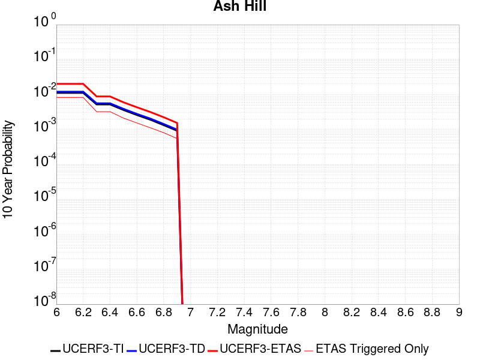 |

| Magnitude | 1 wk TI Prob | 1 wk TD Prob | 1 wk ETAS Prob | 1 wk ETAS/TD Gain | 1 wk ETAS Triggered Only | 1 mo TI Prob | 1 mo TD Prob | 1 mo ETAS Prob | 1 mo ETAS/TD Gain | 1 mo ETAS Triggered Only | 1 yr TI Prob | 1 yr TD Prob | 1 yr ETAS Prob | 1 yr ETAS/TD Gain | 1 yr ETAS Triggered Only | 10 yr TI Prob | 10 yr TD Prob | 10 yr ETAS Prob | 10 yr ETAS/TD Gain | 10 yr ETAS Triggered Only |
|-----|-----|-----|-----|-----|-----|-----|-----|-----|-----|-----|-----|-----|-----|-----|-----|-----|-----|-----|-----|-----|
| 6.0 | 2.1545662E-5 | 2.3194681E-5 | 8.631752E-4 | 37.21436 | 8.4E-4 | 9.2335285E-5 | 9.9402445E-5 | 0.0020692067 | 20.816456 | 0.00197 | 0.0011236023 | 0.0012096328 | 0.0058739837 | 4.8560057 | 0.00467 | 0.011179381 | 0.01203847 | 0.020189153 | 1.677053 | 0.00825 |
| 6.1 | 2.1545662E-5 | 2.3194681E-5 | 8.631752E-4 | 37.21436 | 8.4E-4 | 9.2335285E-5 | 9.9402445E-5 | 0.0020692067 | 20.816456 | 0.00197 | 0.0011236023 | 0.0012096328 | 0.0058739837 | 4.8560057 | 0.00467 | 0.011179381 | 0.01203847 | 0.020189153 | 1.677053 | 0.00825 |
| 6.2 | 2.1545662E-5 | 2.3194681E-5 | 8.631752E-4 | 37.21436 | 8.4E-4 | 9.2335285E-5 | 9.9402445E-5 | 0.0020692067 | 20.816456 | 0.00197 | 0.0011236023 | 0.0012096328 | 0.0058739837 | 4.8560057 | 0.00467 | 0.011179381 | 0.01203847 | 0.020189153 | 1.677053 | 0.00825 |
| 6.3 | 1.0025529E-5 | 1.0747037E-5 | 2.6074436E-4 | 24.261976 | 2.5E-4 | 4.2965847E-5 | 4.605799E-5 | 7.2602666E-4 | 15.763316 | 6.8E-4 | 5.229836E-4 | 5.60625E-4 | 0.0023696104 | 4.22673 | 0.00181 | 0.005217545 | 0.0055934195 | 0.008815297 | 1.5760121 | 0.00324 |
| 6.4 | 1.0025529E-5 | 1.0747037E-5 | 2.6074436E-4 | 24.261976 | 2.5E-4 | 4.2965847E-5 | 4.605799E-5 | 7.2602666E-4 | 15.763316 | 6.8E-4 | 5.229836E-4 | 5.60625E-4 | 0.0023696104 | 4.22673 | 0.00181 | 0.005217545 | 0.0055934195 | 0.008815297 | 1.5760121 | 0.00324 |
| 6.5 | 6.9617327E-6 | 7.456704E-6 | 1.4745566E-4 | 19.77491 | 1.4E-4 | 2.9835655E-5 | 3.1956963E-5 | 4.4194385E-4 | 13.829346 | 4.1E-4 | 3.6318856E-4 | 3.8901521E-4 | 0.0015985445 | 4.109208 | 0.00121 | 0.0036259557 | 0.0038841967 | 0.0059959623 | 1.5436814 | 0.00212 |
| 6.6 | 4.9919777E-6 | 5.346739E-6 | 1.05346204E-4 | 19.70289 | 1.0E-4 | 2.1394015E-5 | 2.2914432E-5 | 3.02908E-4 | 13.219094 | 2.8E-4 | 2.60441E-4 | 2.789542E-4 | 0.0011687059 | 4.189598 | 8.9E-4 | 0.0026013597 | 0.0027866988 | 0.0043224073 | 1.5510852 | 0.00154 |
| 6.7 | 3.6630722E-6 | 3.9246606E-6 | 6.3924424E-5 | 16.287886 | 6.0E-5 | 1.5698786E-5 | 1.6819899E-5 | 2.0681671E-4 | 12.295954 | 1.9E-4 | 1.9111596E-4 | 2.0476876E-4 | 8.1464386E-4 | 3.97836 | 6.1E-4 | 0.0019095168 | 0.002046364 | 0.003164072 | 1.5461923 | 0.00112 |
| 6.8 | 2.5599613E-6 | 2.7449514E-6 | 3.274487E-5 | 11.929125 | 3.0E-5 | 1.0971216E-5 | 1.1764052E-5 | 1.4176252E-4 | 12.050484 | 1.3E-4 | 1.3356637E-4 | 1.4322287E-4 | 6.03157E-4 | 4.2113175 | 4.6E-4 | 0.0013348613 | 0.0014317906 | 0.0022406308 | 1.5649152 | 8.1E-4 |
| 6.9 | 1.7684905E-6 | 1.896889E-6 | 2.189685E-5 | 11.54356 | 2.0E-5 | 7.579223E-6 | 8.129524E-6 | 7.812896E-5 | 9.61052 | 7.0E-5 | 9.2273134E-5 | 9.8976954E-5 | 4.0894627E-4 | 4.131732 | 3.1E-4 | 9.223483E-4 | 9.897696E-4 | 0.0015392252 | 1.5551349 | 5.5E-4 |

## Garlock (East)
*[(top)](#table-of-contents)*

| 1 Week | 1 Month | 1 Year | 10 Year |
|-----|-----|-----|-----|
|  |  |  |  |

| Magnitude | 1 wk TI Prob | 1 wk TD Prob | 1 wk ETAS Prob | 1 wk ETAS/TD Gain | 1 wk ETAS Triggered Only | 1 mo TI Prob | 1 mo TD Prob | 1 mo ETAS Prob | 1 mo ETAS/TD Gain | 1 mo ETAS Triggered Only | 1 yr TI Prob | 1 yr TD Prob | 1 yr ETAS Prob | 1 yr ETAS/TD Gain | 1 yr ETAS Triggered Only | 10 yr TI Prob | 10 yr TD Prob | 10 yr ETAS Prob | 10 yr ETAS/TD Gain | 10 yr ETAS Triggered Only |
|-----|-----|-----|-----|-----|-----|-----|-----|-----|-----|-----|-----|-----|-----|-----|-----|-----|-----|-----|-----|-----|
| 6.0 | 4.5092507E-5 | 6.2906794E-5 | 5.9287343E-4 | 9.424633 | 5.3E-4 | 1.9323928E-4 | 2.695752E-4 | 0.0017991627 | 6.674066 | 0.00153 | 0.0023501497 | 0.0032775842 | 0.007354179 | 2.2437804 | 0.00409 | 0.023254504 | 0.03235364 | 0.03933037 | 1.2156397 | 0.00721 |
| 6.1 | 4.5092507E-5 | 6.2906794E-5 | 5.9287343E-4 | 9.424633 | 5.3E-4 | 1.9323928E-4 | 2.695752E-4 | 0.0017991627 | 6.674066 | 0.00153 | 0.0023501497 | 0.0032775842 | 0.007354179 | 2.2437804 | 0.00409 | 0.023254504 | 0.03235364 | 0.03933037 | 1.2156397 | 0.00721 |
| 6.2 | 2.6674514E-5 | 3.4512483E-5 | 4.1449937E-4 | 12.010129 | 3.8E-4 | 1.1431433E-4 | 1.4790244E-4 | 0.0013077309 | 8.841847 | 0.00116 | 0.0013908884 | 0.001799258 | 0.004664094 | 2.592232 | 0.00287 | 0.01382215 | 0.017891733 | 0.022713885 | 1.2695184 | 0.00491 |
| 6.3 | 2.6674514E-5 | 3.4512483E-5 | 4.1449937E-4 | 12.010129 | 3.8E-4 | 1.1431433E-4 | 1.4790244E-4 | 0.0013077309 | 8.841847 | 0.00116 | 0.0013908884 | 0.001799258 | 0.004664094 | 2.592232 | 0.00287 | 0.01382215 | 0.017891733 | 0.022713885 | 1.2695184 | 0.00491 |
| 6.4 | 2.5312667E-5 | 3.2341675E-5 | 4.123294E-4 | 12.7491665 | 3.8E-4 | 1.0847834E-4 | 1.3859998E-4 | 0.0012984392 | 9.36825 | 0.00116 | 0.0013199237 | 0.001686178 | 0.00449144 | 2.6636808 | 0.00281 | 0.013121112 | 0.01677974 | 0.021479532 | 1.2800874 | 0.00478 |
| 6.5 | 2.5312667E-5 | 3.2341675E-5 | 4.123294E-4 | 12.7491665 | 3.8E-4 | 1.0847834E-4 | 1.3859998E-4 | 0.0012984392 | 9.36825 | 0.00116 | 0.0013199237 | 0.001686178 | 0.00449144 | 2.6636808 | 0.00281 | 0.013121112 | 0.01677974 | 0.021479532 | 1.2800874 | 0.00478 |
| 6.6 | 2.246556E-5 | 2.813642E-5 | 3.881263E-4 | 13.794445 | 3.6E-4 | 9.627742E-5 | 1.20579214E-4 | 0.0012304453 | 10.204457 | 0.00111 | 0.0011715472 | 0.0014670868 | 0.0040932284 | 2.7900383 | 0.00263 | 0.011653901 | 0.014620015 | 0.018945834 | 1.2958833 | 0.00439 |
| 6.7 | 2.2241198E-5 | 2.7806154E-5 | 3.8779614E-4 | 13.946414 | 3.6E-4 | 9.531594E-5 | 1.1916392E-4 | 0.0012290316 | 10.31379 | 0.00111 | 0.0011598538 | 0.0014498787 | 0.0040760655 | 2.8113148 | 0.00263 | 0.011538187 | 0.0144502055 | 0.018766914 | 1.2987299 | 0.00438 |
| 6.8 | 1.9528685E-5 | 2.3900653E-5 | 3.8389204E-4 | 16.06199 | 3.6E-4 | 8.369167E-5 | 1.0242746E-4 | 0.0011823168 | 11.542968 | 0.00108 | 0.0010184698 | 0.0012463606 | 0.003693307 | 2.9632733 | 0.00245 | 0.010138147 | 0.012437694 | 0.016457073 | 1.3231611 | 0.00407 |
| 6.9 | 1.3318621E-5 | 1.5201007E-5 | 3.3519615E-4 | 22.050917 | 3.2E-4 | 5.7078556E-5 | 6.514558E-5 | 0.0010150836 | 15.581775 | 9.5E-4 | 6.9470983E-4 | 7.928645E-4 | 0.002951152 | 3.7221391 | 0.00216 | 0.0069254204 | 0.007940986 | 0.011512399 | 1.4497442 | 0.0036 |
| 7.0 | 1.1760853E-5 | 1.3109839E-5 | 3.2310578E-4 | 24.646053 | 3.1E-4 | 5.0402683E-5 | 5.618384E-5 | 9.861316E-4 | 17.551872 | 9.3E-4 | 6.134799E-4 | 6.838286E-4 | 0.0027823925 | 4.0688453 | 0.0021 | 0.0061178906 | 0.006857582 | 0.010323648 | 1.5054357 | 0.00349 |
| 7.1 | 1.0064758E-5 | 1.090491E-5 | 3.2090154E-4 | 29.427254 | 3.1E-4 | 4.3133965E-5 | 4.673451E-5 | 9.166938E-4 | 19.614923 | 8.7E-4 | 5.2502943E-4 | 5.688476E-4 | 0.002537727 | 4.461172 | 0.00197 | 0.005237907 | 0.005714025 | 0.00896534 | 1.5690061 | 0.00327 |
| 7.2 | 9.768808E-6 | 1.0500772E-5 | 3.1049762E-4 | 29.569027 | 3.0E-4 | 4.186565E-5 | 4.500255E-5 | 8.949643E-4 | 19.886967 | 8.5E-4 | 5.095951E-4 | 5.477718E-4 | 0.002446731 | 4.4666977 | 0.0019 | 0.0050842804 | 0.005504284 | 0.008656835 | 1.5727451 | 0.00317 |
| 7.3 | 9.344516E-6 | 9.946395E-6 | 2.7994372E-4 | 28.145243 | 2.7E-4 | 4.004731E-5 | 4.2626732E-5 | 8.425926E-4 | 19.766766 | 8.0E-4 | 4.8746695E-4 | 5.1886035E-4 | 0.002277947 | 4.39029 | 0.00176 | 0.0048639905 | 0.005215945 | 0.008110766 | 1.5549947 | 0.00291 |
| 7.4 | 9.023491E-6 | 9.49255E-6 | 2.3949037E-4 | 25.229298 | 2.3E-4 | 3.867153E-5 | 4.068174E-5 | 7.70652E-4 | 18.943438 | 7.3E-4 | 4.7072413E-4 | 4.95191E-4 | 0.002134379 | 4.3102136 | 0.00164 | 0.004697283 | 0.004979378 | 0.0076062325 | 1.5275466 | 0.00264 |
| 7.5 | 7.081253E-6 | 7.0893525E-6 | 1.5708829E-4 | 22.15834 | 1.5E-4 | 3.0347876E-5 | 3.038259E-5 | 4.5036981E-4 | 14.823287 | 4.2E-4 | 3.6942272E-4 | 3.6984598E-4 | 0.0012395242 | 3.3514607 | 8.7E-4 | 0.003688092 | 0.0037251879 | 0.005129935 | 1.3770944 | 0.00141 |
| 7.6 | 6.116396E-6 | 5.9608415E-6 | 8.596037E-5 | 14.420843 | 8.0E-5 | 2.6212863E-5 | 2.5546216E-5 | 3.155388E-4 | 12.351685 | 2.9E-4 | 3.1909486E-4 | 3.1098103E-4 | 8.908007E-4 | 2.8644855 | 5.8E-4 | 0.0031863707 | 0.003136586 | 0.0040237946 | 1.282858 | 8.9E-4 |
| 7.7 | 4.797145E-6 | 4.7587923E-6 | 4.4758603E-5 | 9.405455 | 4.0E-5 | 2.055903E-5 | 2.0394666E-5 | 1.9039119E-4 | 9.335343 | 1.7E-4 | 2.5027743E-4 | 2.482769E-4 | 5.4820237E-4 | 2.2080283 | 3.0E-4 | 0.0024999576 | 0.002510134 | 0.0029989039 | 1.1947187 | 4.9E-4 |
| 7.8 | 3.4028885E-6 | 3.979809E-6 | 4.397965E-5 | 11.050693 | 4.0E-5 | 1.4583726E-5 | 1.7056214E-5 | 1.1705451E-4 | 6.8628654 | 1.0E-4 | 1.775424E-4 | 2.076397E-4 | 3.776044E-4 | 1.818556 | 1.7E-4 | 0.0017740062 | 0.0021019245 | 0.002421252 | 1.1519214 | 3.2E-4 |
| 7.9 | 2.5928412E-6 | 3.373588E-6 | 1.3373554E-5 | 3.964193 | 1.0E-5 | 1.1112129E-5 | 1.44581545E-5 | 7.445729E-5 | 5.1498475 | 6.0E-5 | 1.3528178E-4 | 1.7601387E-4 | 2.8599452E-4 | 1.6248407 | 1.1E-4 | 0.0013519945 | 0.0017818334 | 0.0020014413 | 1.1232483 | 2.2E-4 |
| 8.0 | 1.3743648E-6 | 1.673991E-6 | 1.673991E-6 | 1.0 | 0.0 | 5.8901214E-6 | 7.174228E-6 | 3.7174013E-5 | 5.181605 | 3.0E-5 | 7.1709874E-5 | 8.7342756E-5 | 1.2733926E-4 | 1.4579259 | 4.0E-5 | 7.1686733E-4 | 8.839922E-4 | 9.739126E-4 | 1.1017208 | 9.0E-5 |
| 8.1 | 3.6733252E-7 | 3.1499187E-7 | 3.1499187E-7 | 1.0 | 0.0 | 1.5742813E-6 | 1.3499646E-6 | 1.3499646E-6 | 1.0 | 0.0 | 1.9166706E-5 | 1.643571E-5 | 1.643571E-5 | 1.0 | 0.0 | 1.9165053E-4 | 1.6643589E-4 | 1.8643256E-4 | 1.1201464 | 2.0E-5 |

## Blackwater
*[(top)](#table-of-contents)*

| 1 Week | 1 Month | 1 Year | 10 Year |
|-----|-----|-----|-----|
|  | 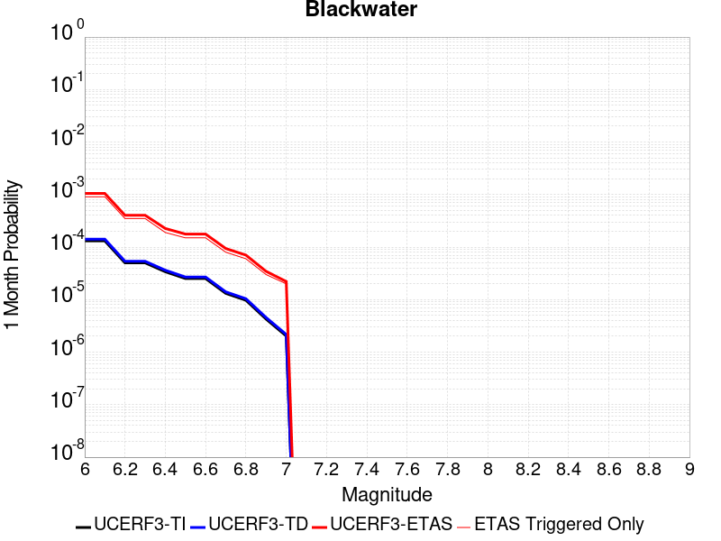 |  |  |

| Magnitude | 1 wk TI Prob | 1 wk TD Prob | 1 wk ETAS Prob | 1 wk ETAS/TD Gain | 1 wk ETAS Triggered Only | 1 mo TI Prob | 1 mo TD Prob | 1 mo ETAS Prob | 1 mo ETAS/TD Gain | 1 mo ETAS Triggered Only | 1 yr TI Prob | 1 yr TD Prob | 1 yr ETAS Prob | 1 yr ETAS/TD Gain | 1 yr ETAS Triggered Only | 10 yr TI Prob | 10 yr TD Prob | 10 yr ETAS Prob | 10 yr ETAS/TD Gain | 10 yr ETAS Triggered Only |
|-----|-----|-----|-----|-----|-----|-----|-----|-----|-----|-----|-----|-----|-----|-----|-----|-----|-----|-----|-----|-----|
| 6.0 | 3.0708583E-5 | 3.309619E-5 | 4.4308262E-4 | 13.387723 | 4.1E-4 | 1.3160157E-4 | 1.4183388E-4 | 0.0010517047 | 7.4150467 | 9.1E-4 | 0.0016010714 | 0.0017255963 | 0.004191334 | 2.4289193 | 0.00247 | 0.015895851 | 0.017135808 | 0.021558698 | 1.258108 | 0.0045 |
| 6.1 | 3.0708583E-5 | 3.309619E-5 | 4.4308262E-4 | 13.387723 | 4.1E-4 | 1.3160157E-4 | 1.4183388E-4 | 0.0010517047 | 7.4150467 | 9.1E-4 | 0.0016010714 | 0.0017255963 | 0.004191334 | 2.4289193 | 0.00247 | 0.015895851 | 0.017135808 | 0.021558698 | 1.258108 | 0.0045 |
| 6.2 | 1.1707779E-5 | 1.2545242E-5 | 1.5254348E-4 | 12.15947 | 1.4E-4 | 5.017523E-5 | 5.3764266E-5 | 4.0374545E-4 | 7.50955 | 3.5E-4 | 6.107122E-4 | 6.5439293E-4 | 0.0016337517 | 2.496591 | 9.8E-4 | 0.006090366 | 0.006525631 | 0.008294015 | 1.2709905 | 0.00178 |
| 6.3 | 1.1707779E-5 | 1.2545242E-5 | 1.5254348E-4 | 12.15947 | 1.4E-4 | 5.017523E-5 | 5.3764266E-5 | 4.0374545E-4 | 7.50955 | 3.5E-4 | 6.107122E-4 | 6.5439293E-4 | 0.0016337517 | 2.496591 | 9.8E-4 | 0.006090366 | 0.006525631 | 0.008294015 | 1.2709905 | 0.00178 |
| 6.4 | 7.929244E-6 | 8.480176E-6 | 9.847941E-5 | 11.612897 | 9.0E-5 | 3.3982033E-5 | 3.6343128E-5 | 2.2633623E-4 | 6.2277584 | 1.9E-4 | 4.136527E-4 | 4.4239179E-4 | 0.0010021441 | 2.2652862 | 5.6E-4 | 0.0041288356 | 0.0044155167 | 0.00546088 | 1.2367477 | 0.00105 |
| 6.5 | 5.8832115E-6 | 6.286048E-6 | 7.628561E-5 | 12.135702 | 7.0E-5 | 2.521352E-5 | 2.6939942E-5 | 1.7693591E-4 | 6.567791 | 1.5E-4 | 3.0693135E-4 | 3.2794697E-4 | 7.078223E-4 | 2.158344 | 3.8E-4 | 0.0030650778 | 0.0032748834 | 0.0040224274 | 1.2282658 | 7.5E-4 |
| 6.6 | 5.8832115E-6 | 6.286048E-6 | 7.628561E-5 | 12.135702 | 7.0E-5 | 2.521352E-5 | 2.6939942E-5 | 1.7693591E-4 | 6.567791 | 1.5E-4 | 3.0693135E-4 | 3.2794697E-4 | 7.078223E-4 | 2.158344 | 3.8E-4 | 0.0030650778 | 0.0032748834 | 0.0040224274 | 1.2282658 | 7.5E-4 |
| 6.7 | 3.0715053E-6 | 3.281496E-6 | 4.3281365E-5 | 13.189523 | 4.0E-5 | 1.3163528E-5 | 1.4063485E-5 | 9.406236E-5 | 6.6884108 | 8.0E-5 | 1.6025416E-4 | 1.7121063E-4 | 3.3118326E-4 | 1.9343613 | 1.6E-4 | 0.0016013865 | 0.0017109019 | 0.0020503202 | 1.1983856 | 3.4E-4 |
| 6.8 | 2.2722281E-6 | 2.4287758E-6 | 3.2428703E-5 | 13.3518715 | 3.0E-5 | 9.738084E-6 | 1.0409003E-5 | 7.040838E-5 | 6.7641807 | 6.0E-5 | 1.1855473E-4 | 1.2672316E-4 | 2.567067E-4 | 2.0257282 | 1.3E-4 | 0.001184915 | 0.0012665992 | 0.0015162824 | 1.1971289 | 2.5E-4 |
| 6.9 | 9.952399E-7 | 1.0653588E-6 | 1.1065348E-5 | 10.386498 | 1.0E-5 | 4.265307E-6 | 4.5658185E-6 | 3.456568E-5 | 7.5705338 | 3.0E-5 | 5.1928873E-5 | 5.5587938E-5 | 9.558571E-5 | 1.7195406 | 4.0E-5 | 5.191674E-4 | 5.5579096E-4 | 6.3574646E-4 | 1.143859 | 8.0E-5 |
| 7.0 | 4.7385504E-7 | 5.0756074E-7 | 1.0507556E-5 | 20.702066 | 1.0E-5 | 2.0308057E-6 | 2.1752603E-6 | 2.2175216E-5 | 10.194282 | 2.0E-5 | 2.4724779E-5 | 2.6483794E-5 | 5.6483E-5 | 2.132738 | 3.0E-5 | 2.4722028E-4 | 2.6483793E-4 | 3.2482206E-4 | 1.2264936 | 6.0E-5 |

## Hunter Mountain-Saline Valley
*[(top)](#table-of-contents)*

| 1 Week | 1 Month | 1 Year | 10 Year |
|-----|-----|-----|-----|
|  | 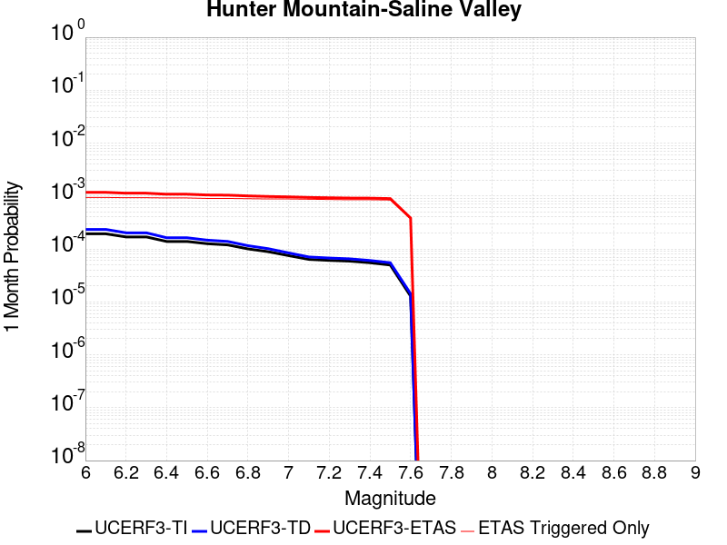 |  |  |

| Magnitude | 1 wk TI Prob | 1 wk TD Prob | 1 wk ETAS Prob | 1 wk ETAS/TD Gain | 1 wk ETAS Triggered Only | 1 mo TI Prob | 1 mo TD Prob | 1 mo ETAS Prob | 1 mo ETAS/TD Gain | 1 mo ETAS Triggered Only | 1 yr TI Prob | 1 yr TD Prob | 1 yr ETAS Prob | 1 yr ETAS/TD Gain | 1 yr ETAS Triggered Only | 10 yr TI Prob | 10 yr TD Prob | 10 yr ETAS Prob | 10 yr ETAS/TD Gain | 10 yr ETAS Triggered Only |
|-----|-----|-----|-----|-----|-----|-----|-----|-----|-----|-----|-----|-----|-----|-----|-----|-----|-----|-----|-----|-----|
| 6.0 | 4.5103672E-5 | 5.4571992E-5 | 4.245518E-4 | 7.779665 | 3.7E-4 | 1.9328714E-4 | 2.3385909E-4 | 0.0011736392 | 5.0185747 | 9.4E-4 | 0.002350731 | 0.0028436056 | 0.005416269 | 1.9047188 | 0.00258 | 0.023260195 | 0.028092787 | 0.032427493 | 1.1542996 | 0.00446 |
| 6.1 | 4.5103672E-5 | 5.4571992E-5 | 4.245518E-4 | 7.779665 | 3.7E-4 | 1.9328714E-4 | 2.3385909E-4 | 0.0011736392 | 5.0185747 | 9.4E-4 | 0.002350731 | 0.0028436056 | 0.005416269 | 1.9047188 | 0.00258 | 0.023260195 | 0.028092787 | 0.032427493 | 1.1542996 | 0.00446 |
| 6.2 | 3.9363465E-5 | 4.7064877E-5 | 4.0704792E-4 | 8.648656 | 3.6E-4 | 1.6868966E-4 | 2.0169078E-4 | 0.0011315033 | 5.610089 | 9.3E-4 | 0.002051862 | 0.0024528939 | 0.0050066146 | 2.0411053 | 0.00256 | 0.020330196 | 0.024274237 | 0.02860646 | 1.17847 | 0.00444 |
| 6.3 | 3.9363465E-5 | 4.7064877E-5 | 4.0704792E-4 | 8.648656 | 3.6E-4 | 1.6868966E-4 | 2.0169078E-4 | 0.0011315033 | 5.610089 | 9.3E-4 | 0.002051862 | 0.0024528939 | 0.0050066146 | 2.0411053 | 0.00256 | 0.020330196 | 0.024274237 | 0.02860646 | 1.17847 | 0.00444 |
| 6.4 | 3.2311684E-5 | 3.795214E-5 | 3.8793887E-4 | 10.221791 | 3.5E-4 | 1.384713E-4 | 1.626423E-4 | 0.0010824926 | 6.655665 | 9.2E-4 | 0.0016845843 | 0.0019784442 | 0.0044834786 | 2.2661636 | 0.00251 | 0.016718714 | 0.019617062 | 0.023901334 | 1.2183952 | 0.00437 |
| 6.5 | 3.2311684E-5 | 3.795214E-5 | 3.8793887E-4 | 10.221791 | 3.5E-4 | 1.384713E-4 | 1.626423E-4 | 0.0010824926 | 6.655665 | 9.2E-4 | 0.0016845843 | 0.0019784442 | 0.0044834786 | 2.2661636 | 0.00251 | 0.016718714 | 0.019617062 | 0.023901334 | 1.2183952 | 0.00437 |
| 6.6 | 2.9305844E-5 | 3.4182853E-5 | 3.7417124E-4 | 10.946167 | 3.4E-4 | 1.2559042E-4 | 1.4649007E-4 | 0.0010463583 | 7.142861 | 9.0E-4 | 0.0015279909 | 0.0017821203 | 0.0042577004 | 2.3891208 | 0.00248 | 0.015175272 | 0.017686214 | 0.021949457 | 1.2410488 | 0.00434 |
| 6.7 | 2.7826512E-5 | 3.2345237E-5 | 3.7233424E-4 | 11.511253 | 3.4E-4 | 1.19251024E-4 | 1.3861542E-4 | 0.0010384907 | 7.4918838 | 9.0E-4 | 0.0014509142 | 0.0016863967 | 0.004142248 | 2.4562716 | 0.00246 | 0.014414776 | 0.01674368 | 0.020991348 | 1.2536877 | 0.00432 |
| 6.8 | 2.3389874E-5 | 2.6867507E-5 | 3.6685838E-4 | 13.654351 | 3.4E-4 | 1.0023846E-4 | 1.1514164E-4 | 0.0010050392 | 8.72872 | 8.9E-4 | 0.00121972 | 0.0014009953 | 0.0038375768 | 2.7391791 | 0.00244 | 0.01213047 | 0.013927842 | 0.018167952 | 1.3044341 | 0.0043 |
| 6.9 | 2.069209E-5 | 2.3570727E-5 | 3.6356272E-4 | 15.424332 | 3.4E-4 | 8.867737E-5 | 1.0101369E-4 | 9.809248E-4 | 9.710811 | 8.8E-4 | 0.0010791123 | 0.001229184 | 0.0036462094 | 2.9663658 | 0.00242 | 0.010738871 | 0.012228882 | 0.016407155 | 1.3416724 | 0.00423 |
| 7.0 | 1.7462342E-5 | 1.9634126E-5 | 3.5962745E-4 | 18.316448 | 3.4E-4 | 7.483646E-5 | 8.414367E-5 | 9.640696E-4 | 11.457423 | 8.8E-4 | 9.1075303E-4 | 0.0010239903 | 0.0034215327 | 3.341372 | 0.0024 | 0.009070295 | 0.010196352 | 0.014363426 | 1.4086827 | 0.00421 |
| 7.1 | 1.4807709E-5 | 1.6442245E-5 | 3.464368E-4 | 21.069921 | 3.3E-4 | 6.3460066E-5 | 7.046495E-5 | 9.4040367E-4 | 13.345694 | 8.7E-4 | 7.723524E-4 | 8.575896E-4 | 0.0032155658 | 3.749539 | 0.00236 | 0.007696735 | 0.008545788 | 0.012670238 | 1.4826295 | 0.00416 |
| 7.2 | 1.4180048E-5 | 1.5698814E-5 | 3.4569364E-4 | 22.020367 | 3.3E-4 | 6.077022E-5 | 6.727898E-5 | 9.2722115E-4 | 13.781734 | 8.6E-4 | 7.396263E-4 | 8.1883004E-4 | 0.0031669058 | 3.8675985 | 0.00235 | 0.0073716943 | 0.00816108 | 0.012257375 | 1.5019305 | 0.00413 |
| 7.3 | 1.3730402E-5 | 1.5172541E-5 | 3.4516753E-4 | 22.749489 | 3.3E-4 | 5.8843252E-5 | 6.502365E-5 | 9.149684E-4 | 14.071318 | 8.5E-4 | 7.161811E-4 | 7.913914E-4 | 0.0031195474 | 3.9418516 | 0.00233 | 0.007138774 | 0.007888664 | 0.01195632 | 1.5156331 | 0.0041 |
| 7.4 | 1.2810095E-5 | 1.410972E-5 | 3.4410506E-4 | 24.387802 | 3.3E-4 | 5.489925E-5 | 6.0468916E-5 | 9.104175E-4 | 15.055959 | 8.5E-4 | 6.681934E-4 | 7.359762E-4 | 0.0030642613 | 4.163533 | 0.00233 | 0.006661878 | 0.0073382827 | 0.011388343 | 1.5519084 | 0.00408 |
| 7.5 | 1.1595659E-5 | 1.2801013E-5 | 3.427968E-4 | 26.77888 | 3.3E-4 | 4.9694736E-5 | 5.4860422E-5 | 8.948143E-4 | 16.310745 | 8.4E-4 | 6.0486543E-4 | 6.677366E-4 | 0.0029362207 | 4.397274 | 0.00227 | 0.006032217 | 0.0066601736 | 0.010613666 | 1.5936021 | 0.00398 |
| 7.6 | 2.997694E-6 | 3.3252948E-6 | 1.533248E-4 | 46.108635 | 1.5E-4 | 1.28471975E-5 | 1.4251226E-5 | 3.8424594E-4 | 26.962309 | 3.7E-4 | 1.564034E-4 | 1.7350215E-4 | 0.0011033408 | 6.3592343 | 9.3E-4 | 0.0015629337 | 0.0017351025 | 0.0034022047 | 1.9608092 | 0.00167 |

## Gravel Hills-Harper Lk
*[(top)](#table-of-contents)*

| 1 Week | 1 Month | 1 Year | 10 Year |
|-----|-----|-----|-----|
|  |  |  |  |

| Magnitude | 1 wk TI Prob | 1 wk TD Prob | 1 wk ETAS Prob | 1 wk ETAS/TD Gain | 1 wk ETAS Triggered Only | 1 mo TI Prob | 1 mo TD Prob | 1 mo ETAS Prob | 1 mo ETAS/TD Gain | 1 mo ETAS Triggered Only | 1 yr TI Prob | 1 yr TD Prob | 1 yr ETAS Prob | 1 yr ETAS/TD Gain | 1 yr ETAS Triggered Only | 10 yr TI Prob | 10 yr TD Prob | 10 yr ETAS Prob | 10 yr ETAS/TD Gain | 10 yr ETAS Triggered Only |
|-----|-----|-----|-----|-----|-----|-----|-----|-----|-----|-----|-----|-----|-----|-----|-----|-----|-----|-----|-----|-----|
| 6.0 | 3.0679566E-5 | 3.1465184E-5 | 2.2145921E-4 | 7.03823 | 1.9E-4 | 1.3147724E-4 | 1.3484505E-4 | 6.3477765E-4 | 4.70746 | 5.0E-4 | 0.0015995599 | 0.0016407187 | 0.0031182903 | 1.9005637 | 0.00148 | 0.015880952 | 0.016307615 | 0.018943911 | 1.1616604 | 0.00268 |
| 6.1 | 3.0679566E-5 | 3.1465184E-5 | 2.2145921E-4 | 7.03823 | 1.9E-4 | 1.3147724E-4 | 1.3484505E-4 | 6.3477765E-4 | 4.70746 | 5.0E-4 | 0.0015995599 | 0.0016407187 | 0.0031182903 | 1.9005637 | 0.00148 | 0.015880952 | 0.016307615 | 0.018943911 | 1.1616604 | 0.00268 |
| 6.2 | 1.514536E-5 | 1.3635392E-5 | 5.3634845E-5 | 3.9335024 | 4.0E-5 | 6.490707E-5 | 5.843615E-5 | 2.0842739E-4 | 3.566754 | 1.5E-4 | 7.8995706E-4 | 7.112398E-4 | 0.0011209482 | 1.5760481 | 4.1E-4 | 0.007871548 | 0.0070908363 | 0.007994384 | 1.1274246 | 9.1E-4 |
| 6.3 | 1.514536E-5 | 1.3635392E-5 | 5.3634845E-5 | 3.9335024 | 4.0E-5 | 6.490707E-5 | 5.843615E-5 | 2.0842739E-4 | 3.566754 | 1.5E-4 | 7.8995706E-4 | 7.112398E-4 | 0.0011209482 | 1.5760481 | 4.1E-4 | 0.007871548 | 0.0070908363 | 0.007994384 | 1.1274246 | 9.1E-4 |
| 6.4 | 1.2532521E-5 | 1.0689826E-5 | 4.0689505E-5 | 3.8063767 | 3.0E-5 | 5.37097E-5 | 4.581277E-5 | 1.5580773E-4 | 3.4009674 | 1.1E-4 | 6.537194E-4 | 5.576335E-4 | 8.374774E-4 | 1.5018419 | 2.8E-4 | 0.0065179965 | 0.0055629327 | 0.006129762 | 1.1018939 | 5.7E-4 |
| 6.5 | 1.1094058E-5 | 9.083774E-6 | 2.9083592E-5 | 3.201708 | 2.0E-5 | 4.7545094E-5 | 3.89299E-5 | 9.8927565E-5 | 2.5411718 | 6.0E-5 | 5.787078E-4 | 4.738725E-4 | 6.537872E-4 | 1.3796691 | 1.8E-4 | 0.0057720304 | 0.004729028 | 0.0050873253 | 1.0757656 | 3.6E-4 |
| 6.6 | 9.688328E-6 | 7.531784E-6 | 1.753171E-5 | 2.3276968 | 1.0E-5 | 4.1520743E-5 | 3.2278687E-5 | 7.22774E-5 | 2.2391677 | 4.0E-5 | 5.053978E-4 | 3.929247E-4 | 5.1287754E-4 | 1.305282 | 1.2E-4 | 0.0050424994 | 0.0039225565 | 0.004181537 | 1.0660233 | 2.6E-4 |
| 6.7 | 8.974824E-6 | 6.7494916E-6 | 1.6749424E-5 | 2.481583 | 1.0E-5 | 3.8462964E-5 | 2.8926084E-5 | 6.892493E-5 | 2.3827949 | 4.0E-5 | 4.6818596E-4 | 3.5212038E-4 | 4.4208867E-4 | 1.2555044 | 9.0E-5 | 0.004672008 | 0.0035158454 | 0.0036952125 | 1.0510168 | 1.8E-4 |
| 6.8 | 7.4780046E-6 | 5.116252E-6 | 5.116252E-6 | 1.0 | 0.0 | 3.20482E-5 | 2.1926619E-5 | 3.19264E-5 | 1.4560567 | 1.0E-5 | 3.9011694E-4 | 2.6692526E-4 | 3.1691193E-4 | 1.1872684 | 5.0E-5 | 0.0038943281 | 0.002666185 | 0.0027459715 | 1.0299255 | 8.0E-5 |
| 6.9 | 6.3409307E-6 | 3.9075426E-6 | 3.9075426E-6 | 1.0 | 0.0 | 2.7175134E-5 | 1.674651E-5 | 1.674651E-5 | 1.0 | 0.0 | 3.3080703E-4 | 2.0387067E-4 | 2.0387067E-4 | 1.0 | 0.0 | 0.0033031502 | 0.0020369345 | 0.0020668735 | 1.014698 | 3.0E-5 |
| 7.0 | 5.1239335E-6 | 2.6058885E-6 | 2.6058885E-6 | 1.0 | 0.0 | 2.195953E-5 | 1.11680465E-5 | 1.11680465E-5 | 1.0 | 0.0 | 2.6732447E-4 | 1.3596273E-4 | 1.3596273E-4 | 1.0 | 0.0 | 0.0026700313 | 0.0013588208 | 0.0013588208 | 1.0 | 0.0 |
| 7.1 | 4.438899E-6 | 2.0984994E-6 | 2.0984994E-6 | 1.0 | 0.0 | 1.9023713E-5 | 8.993539E-6 | 8.993539E-6 | 1.0 | 0.0 | 2.315891E-4 | 1.0949106E-4 | 1.0949106E-4 | 1.0 | 0.0 | 0.002313479 | 0.0010943931 | 0.0010943931 | 1.0 | 0.0 |
| 7.2 | 3.50367E-6 | 1.2615911E-6 | 1.2615911E-6 | 1.0 | 0.0 | 1.5015643E-5 | 5.406808E-6 | 5.406808E-6 | 1.0 | 0.0 | 1.8280011E-4 | 6.582599E-5 | 6.582599E-5 | 1.0 | 0.0 | 0.0018264982 | 6.580731E-4 | 6.580731E-4 | 1.0 | 0.0 |
| 7.3 | 2.561638E-6 | 7.119307E-7 | 7.119307E-7 | 1.0 | 0.0 | 1.0978401E-5 | 3.051128E-6 | 3.051128E-6 | 1.0 | 0.0 | 1.3365384E-4 | 3.714687E-5 | 3.714687E-5 | 1.0 | 0.0 | 0.0013357349 | 3.7140862E-4 | 3.7140862E-4 | 1.0 | 0.0 |
| 7.4 | 2.0368864E-6 | 5.304955E-7 | 5.304955E-7 | 1.0 | 0.0 | 8.729483E-6 | 2.2735503E-6 | 2.2735503E-6 | 1.0 | 0.0 | 1.06276275E-4 | 2.768013E-5 | 2.768013E-5 | 1.0 | 0.0 | 0.0010622547 | 2.7676736E-4 | 2.7676736E-4 | 1.0 | 0.0 |
| 7.5 | 1.1681728E-6 | 3.6031287E-7 | 3.6031287E-7 | 1.0 | 0.0 | 5.0064455E-6 | 1.5441972E-6 | 1.5441972E-6 | 1.0 | 0.0 | 6.0951766E-5 | 1.8800443E-5 | 1.8800443E-5 | 1.0 | 0.0 | 6.093505E-4 | 1.8798899E-4 | 1.8798899E-4 | 1.0 | 0.0 |
| 7.6 | 1.3154387E-7 | 7.1198265E-8 | 7.1198265E-8 | 1.0 | 0.0 | 5.6375933E-7 | 3.051354E-7 | 3.051354E-7 | 1.0 | 0.0 | 6.863748E-6 | 3.7150185E-6 | 3.7150185E-6 | 1.0 | 0.0 | 6.863536E-5 | 3.7149723E-5 | 3.7149723E-5 | 1.0 | 0.0 |

## Garlock (West)
*[(top)](#table-of-contents)*

| 1 Week | 1 Month | 1 Year | 10 Year |
|-----|-----|-----|-----|
|  |  | 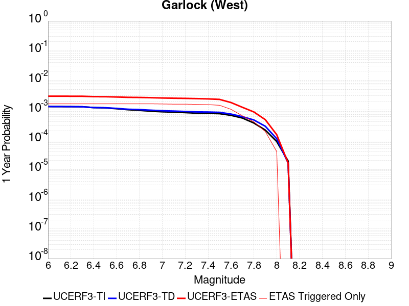 |  |

| Magnitude | 1 wk TI Prob | 1 wk TD Prob | 1 wk ETAS Prob | 1 wk ETAS/TD Gain | 1 wk ETAS Triggered Only | 1 mo TI Prob | 1 mo TD Prob | 1 mo ETAS Prob | 1 mo ETAS/TD Gain | 1 mo ETAS Triggered Only | 1 yr TI Prob | 1 yr TD Prob | 1 yr ETAS Prob | 1 yr ETAS/TD Gain | 1 yr ETAS Triggered Only | 10 yr TI Prob | 10 yr TD Prob | 10 yr ETAS Prob | 10 yr ETAS/TD Gain | 10 yr ETAS Triggered Only |
|-----|-----|-----|-----|-----|-----|-----|-----|-----|-----|-----|-----|-----|-----|-----|-----|-----|-----|-----|-----|-----|
| 6.0 | 2.5181727E-5 | 2.5202135E-5 | 2.5519633E-4 | 10.125981 | 2.3E-4 | 1.0791722E-4 | 1.080047E-4 | 8.17928E-4 | 7.573078 | 7.1E-4 | 0.0013131002 | 0.0013141674 | 0.0029320384 | 2.2310996 | 0.00162 | 0.013053683 | 0.013144457 | 0.015848441 | 1.2057129 | 0.00274 |
| 6.1 | 2.5077732E-5 | 2.5103205E-5 | 2.5509743E-4 | 10.161946 | 2.3E-4 | 1.0747157E-4 | 1.07580745E-4 | 8.1750436E-4 | 7.598984 | 7.1E-4 | 0.001307681 | 0.0013090121 | 0.0029268914 | 2.2359545 | 0.00162 | 0.013000126 | 0.0130935125 | 0.015797636 | 1.2065239 | 0.00274 |
| 6.2 | 2.494612E-5 | 2.498488E-5 | 2.5497912E-4 | 10.205338 | 2.3E-4 | 1.0690756E-4 | 1.07073676E-4 | 8.1699766E-4 | 7.630238 | 7.1E-4 | 0.0013008224 | 0.0013028459 | 0.0029207352 | 2.2418118 | 0.00162 | 0.012932341 | 0.013032575 | 0.015736867 | 1.2075024 | 0.00274 |
| 6.3 | 2.4733758E-5 | 2.4804243E-5 | 2.5479854E-4 | 10.272377 | 2.3E-4 | 1.0599751E-4 | 1.0629959E-4 | 8.162241E-4 | 7.678526 | 7.1E-4 | 0.0012897556 | 0.0012934325 | 0.0029113372 | 2.2508612 | 0.00162 | 0.012822957 | 0.012939542 | 0.015644088 | 1.209014 | 0.00274 |
| 6.4 | 2.3237335E-5 | 2.318352E-5 | 2.5317818E-4 | 10.92061 | 2.3E-4 | 9.958477E-5 | 9.935417E-5 | 8.0928364E-4 | 8.145442 | 7.1E-4 | 0.0012117702 | 0.0012089686 | 0.0028270101 | 2.338365 | 0.00162 | 0.012051838 | 0.012104375 | 0.014811209 | 1.2236245 | 0.00274 |
| 6.5 | 2.2732203E-5 | 2.2998063E-5 | 2.5299276E-4 | 11.000612 | 2.3E-4 | 9.742009E-5 | 9.8559416E-5 | 8.0848945E-4 | 8.203066 | 7.1E-4 | 0.0011854442 | 0.0011993032 | 0.0028173602 | 2.3491645 | 0.00162 | 0.011791403 | 0.012008769 | 0.014715866 | 1.2254266 | 0.00274 |
| 6.6 | 2.1319436E-5 | 2.1778224E-5 | 2.5177322E-4 | 11.560779 | 2.3E-4 | 9.136581E-5 | 9.333192E-5 | 8.0326566E-4 | 8.606548 | 7.1E-4 | 0.001111811 | 0.001135726 | 0.0027538862 | 2.4247804 | 0.00162 | 0.011062649 | 0.0113796545 | 0.014058815 | 1.2354343 | 0.00271 |
| 6.7 | 1.970802E-5 | 2.0398069E-5 | 2.5039338E-4 | 12.275347 | 2.3E-4 | 8.446021E-5 | 8.741738E-5 | 7.973553E-4 | 9.121245 | 7.1E-4 | 0.001027818 | 0.0010637887 | 0.0026820654 | 2.5212388 | 0.00162 | 0.010230771 | 0.010667368 | 0.013348459 | 1.2513357 | 0.00271 |
| 6.8 | 1.8744462E-5 | 1.9905692E-5 | 2.4990112E-4 | 12.554255 | 2.3E-4 | 8.033094E-5 | 8.530733E-5 | 7.9524674E-4 | 9.322139 | 7.1E-4 | 9.775903E-4 | 0.0010381235 | 0.0026564416 | 2.558888 | 0.00162 | 0.009733009 | 0.010413141 | 0.01307513 | 1.2556374 | 0.00269 |
| 6.9 | 1.7559682E-5 | 1.895803E-5 | 2.4895367E-4 | 13.131832 | 2.3E-4 | 7.5253614E-5 | 8.124618E-5 | 7.911885E-4 | 9.738163 | 7.1E-4 | 9.158276E-4 | 9.887248E-4 | 0.002607123 | 2.6368542 | 0.00162 | 0.0091206245 | 0.009923607 | 0.01256711 | 1.2663854 | 0.00267 |
| 7.0 | 1.6794445E-5 | 1.8220819E-5 | 2.4821662E-4 | 13.622693 | 2.3E-4 | 7.197421E-5 | 7.8086894E-5 | 7.6803303E-4 | 9.83562 | 6.9E-4 | 8.759337E-4 | 9.5029466E-4 | 0.0025487742 | 2.6820884 | 0.0016 | 0.008724891 | 0.0095425 | 0.012167212 | 1.275055 | 0.00265 |
| 7.1 | 1.6337795E-5 | 1.7721602E-5 | 2.4771751E-4 | 13.978281 | 2.3E-4 | 7.0017246E-5 | 7.5947515E-5 | 7.5589586E-4 | 9.952871 | 6.8E-4 | 8.521265E-4 | 9.2427013E-4 | 0.0025028097 | 2.707877 | 0.00158 | 0.008488664 | 0.009284343 | 0.011889925 | 1.2806426 | 0.00263 |
| 7.2 | 1.5780008E-5 | 1.7170225E-5 | 2.471663E-4 | 14.395052 | 2.3E-4 | 6.762685E-5 | 7.358461E-5 | 7.5353455E-4 | 10.240383 | 6.8E-4 | 8.2304585E-4 | 8.955257E-4 | 0.0024741108 | 2.7627468 | 0.00158 | 0.008200042 | 0.008999176 | 0.011595598 | 1.2885177 | 0.00262 |
| 7.3 | 1.5058865E-5 | 1.6623266E-5 | 2.4661946E-4 | 14.835799 | 2.3E-4 | 6.45364E-5 | 7.124063E-5 | 7.5119216E-4 | 10.544435 | 6.8E-4 | 7.854473E-4 | 8.6701073E-4 | 0.0024256583 | 2.7977257 | 0.00156 | 0.00782677 | 0.00871586 | 0.011283285 | 1.2945695 | 0.00259 |
| 7.4 | 1.4887923E-5 | 1.6459222E-5 | 2.4645543E-4 | 14.9737 | 2.3E-4 | 6.380382E-5 | 7.053762E-5 | 7.4049033E-4 | 10.4978075 | 6.7E-4 | 7.7653467E-4 | 8.5845834E-4 | 0.0023771534 | 2.769096 | 0.00152 | 0.0077382675 | 0.0086307125 | 0.011148791 | 1.2917578 | 0.00254 |
| 7.5 | 1.4509299E-5 | 1.6051208E-5 | 2.460475E-4 | 15.32891 | 2.3E-4 | 6.218123E-5 | 6.8789086E-5 | 6.8874646E-4 | 10.012438 | 6.2E-4 | 7.567935E-4 | 8.3718647E-4 | 0.0022859725 | 2.7305417 | 0.00145 | 0.0075422134 | 0.008419003 | 0.010818629 | 1.285025 | 0.00242 |
| 7.6 | 1.2756717E-5 | 1.4055129E-5 | 1.5405317E-4 | 10.960636 | 1.4E-4 | 5.4670498E-5 | 6.023488E-5 | 5.2020716E-4 | 8.636311 | 4.6E-4 | 6.6541E-4 | 7.331136E-4 | 0.0017923365 | 2.4448278 | 0.00106 | 0.006634211 | 0.007383898 | 0.009071345 | 1.2285306 | 0.0017 |
| 7.7 | 1.0328985E-5 | 1.1464573E-5 | 8.146377E-5 | 7.105696 | 7.0E-5 | 4.4266326E-5 | 4.913296E-5 | 3.391187E-4 | 6.9020615 | 2.9E-4 | 5.388092E-4 | 5.9803E-4 | 0.0012376473 | 2.0695405 | 6.4E-4 | 0.0053750467 | 0.0060405903 | 0.007064368 | 1.1694832 | 0.00103 |
| 7.8 | 7.0306583E-6 | 8.902813E-6 | 5.8902366E-5 | 6.616153 | 5.0E-5 | 3.0131043E-5 | 3.8154354E-5 | 2.1814748E-4 | 5.7174993 | 1.8E-4 | 3.667837E-4 | 4.644304E-4 | 8.6424465E-4 | 1.86087 | 4.0E-4 | 0.003661789 | 0.0046969377 | 0.005373744 | 1.1440952 | 6.8E-4 |
| 7.9 | 4.060633E-6 | 5.4672782E-6 | 1.5467223E-5 | 2.8290536 | 1.0E-5 | 1.7402595E-5 | 2.3430983E-5 | 1.03429105E-4 | 4.4142027 | 8.0E-5 | 2.11856E-4 | 2.8523497E-4 | 4.7518077E-4 | 1.6659275 | 1.9E-4 | 0.0021165414 | 0.0028851798 | 0.00323417 | 1.1209596 | 3.5E-4 |
| 8.0 | 1.6729537E-6 | 2.078155E-6 | 2.078155E-6 | 1.0 | 0.0 | 7.169782E-6 | 8.906349E-6 | 3.890608E-5 | 4.368354 | 3.0E-5 | 8.7288594E-5 | 1.08429434E-4 | 1.484251E-4 | 1.3688636 | 4.0E-5 | 8.7254314E-4 | 0.001097267 | 0.0011971573 | 1.0910355 | 1.0E-4 |
| 8.1 | 3.6733252E-7 | 3.1499187E-7 | 3.1499187E-7 | 1.0 | 0.0 | 1.5742813E-6 | 1.3499646E-6 | 1.3499646E-6 | 1.0 | 0.0 | 1.9166706E-5 | 1.643571E-5 | 1.643571E-5 | 1.0 | 0.0 | 1.9165053E-4 | 1.6643589E-4 | 1.8643256E-4 | 1.1201464 | 2.0E-5 |

## McLean Lake
*[(top)](#table-of-contents)*

| 1 Week | 1 Month | 1 Year | 10 Year |
|-----|-----|-----|-----|
|  |  |  |  |

| Magnitude | 1 wk TI Prob | 1 wk TD Prob | 1 wk ETAS Prob | 1 wk ETAS/TD Gain | 1 wk ETAS Triggered Only | 1 mo TI Prob | 1 mo TD Prob | 1 mo ETAS Prob | 1 mo ETAS/TD Gain | 1 mo ETAS Triggered Only | 1 yr TI Prob | 1 yr TD Prob | 1 yr ETAS Prob | 1 yr ETAS/TD Gain | 1 yr ETAS Triggered Only | 10 yr TI Prob | 10 yr TD Prob | 10 yr ETAS Prob | 10 yr ETAS/TD Gain | 10 yr ETAS Triggered Only |
|-----|-----|-----|-----|-----|-----|-----|-----|-----|-----|-----|-----|-----|-----|-----|-----|-----|-----|-----|-----|-----|
| 6.0 | 1.7360222E-5 | 1.8501789E-5 | 1.1849994E-4 | 6.404783 | 1.0E-4 | 7.439883E-5 | 7.929125E-5 | 4.1926428E-4 | 5.287649 | 3.4E-4 | 9.0542925E-4 | 9.64992E-4 | 0.002083911 | 2.1595113 | 0.00112 | 0.009017491 | 0.009612858 | 0.012039307 | 1.252417 | 0.00245 |
| 6.1 | 9.062689E-6 | 9.592268E-6 | 3.959198E-5 | 4.127489 | 3.0E-5 | 3.8839516E-5 | 4.110912E-5 | 2.2110173E-4 | 5.3784103 | 1.8E-4 | 4.727685E-4 | 5.003975E-4 | 0.0010901022 | 2.1784728 | 5.9E-4 | 0.0047176396 | 0.0049935905 | 0.006356749 | 1.2729816 | 0.00137 |
| 6.2 | 9.062689E-6 | 9.592268E-6 | 3.959198E-5 | 4.127489 | 3.0E-5 | 3.8839516E-5 | 4.110912E-5 | 2.2110173E-4 | 5.3784103 | 1.8E-4 | 4.727685E-4 | 5.003975E-4 | 0.0010901022 | 2.1784728 | 5.9E-4 | 0.0047176396 | 0.0049935905 | 0.006356749 | 1.2729816 | 0.00137 |
| 6.3 | 7.2575485E-6 | 7.667767E-6 | 2.7667613E-5 | 3.6083014 | 2.0E-5 | 3.110341E-5 | 3.2861484E-5 | 1.628572E-4 | 4.955869 | 1.3E-4 | 3.786182E-4 | 4.0002225E-4 | 8.2985027E-4 | 2.07451 | 4.3E-4 | 0.0037797375 | 0.003993727 | 0.005049493 | 1.2643563 | 0.00106 |
| 6.4 | 7.2575485E-6 | 7.667767E-6 | 2.7667613E-5 | 3.6083014 | 2.0E-5 | 3.110341E-5 | 3.2861484E-5 | 1.628572E-4 | 4.955869 | 1.3E-4 | 3.786182E-4 | 4.0002225E-4 | 8.2985027E-4 | 2.07451 | 4.3E-4 | 0.0037797375 | 0.003993727 | 0.005049493 | 1.2643563 | 0.00106 |
| 6.5 | 6.06582E-6 | 6.4039245E-6 | 2.6403797E-5 | 4.123065 | 2.0E-5 | 2.5996113E-5 | 2.7445138E-5 | 1.4744184E-4 | 5.372239 | 1.2E-4 | 3.164567E-4 | 3.340998E-4 | 7.039762E-4 | 2.1070836 | 3.7E-4 | 0.0031600643 | 0.0033366138 | 0.0042236443 | 1.2658474 | 8.9E-4 |
| 6.6 | 5.598744E-6 | 5.910306E-6 | 2.5910187E-5 | 4.3838997 | 2.0E-5 | 2.3994397E-5 | 2.5329673E-5 | 1.2532713E-4 | 4.947839 | 1.0E-4 | 2.9209262E-4 | 3.083515E-4 | 6.2825286E-4 | 2.0374568 | 3.2E-4 | 0.0029170897 | 0.0030798658 | 0.0038973403 | 1.2654253 | 8.2E-4 |
| 6.7 | 5.246996E-6 | 5.539203E-6 | 2.5539091E-5 | 4.6106076 | 2.0E-5 | 2.2486933E-5 | 2.3739261E-5 | 1.2373689E-4 | 5.212331 | 1.0E-4 | 2.73744E-4 | 2.8899353E-4 | 5.989039E-4 | 2.0723784 | 3.1E-4 | 0.0027340704 | 0.002886801 | 0.0036146936 | 1.252145 | 7.3E-4 |
| 6.8 | 4.02324E-6 | 4.246936E-6 | 1.4246893E-5 | 3.3546288 | 1.0E-5 | 1.7242342E-5 | 1.820106E-5 | 8.8199784E-5 | 4.84586 | 7.0E-5 | 2.099053E-4 | 2.2158133E-4 | 4.5153036E-4 | 2.0377636 | 2.3E-4 | 0.0020970714 | 0.0022141882 | 0.0027829262 | 1.2568607 | 5.7E-4 |
| 6.9 | 6.835972E-7 | 7.1399705E-7 | 7.1399705E-7 | 1.0 | 0.0 | 2.9296991E-6 | 3.0599856E-6 | 3.0599856E-6 | 1.0 | 0.0 | 3.56685E-5 | 3.7255006E-5 | 5.725426E-5 | 1.5368207 | 2.0E-5 | 3.5662777E-4 | 3.7251884E-4 | 4.4249278E-4 | 1.18784 | 7.0E-5 |

## Goldstone Lake
*[(top)](#table-of-contents)*

| 1 Week | 1 Month | 1 Year | 10 Year |
|-----|-----|-----|-----|
| 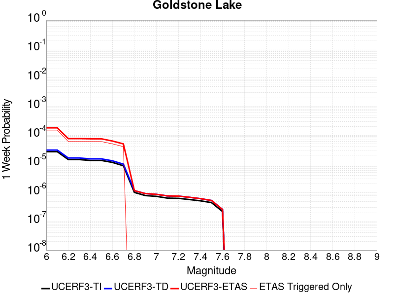 |  |  |  |

| Magnitude | 1 wk TI Prob | 1 wk TD Prob | 1 wk ETAS Prob | 1 wk ETAS/TD Gain | 1 wk ETAS Triggered Only | 1 mo TI Prob | 1 mo TD Prob | 1 mo ETAS Prob | 1 mo ETAS/TD Gain | 1 mo ETAS Triggered Only | 1 yr TI Prob | 1 yr TD Prob | 1 yr ETAS Prob | 1 yr ETAS/TD Gain | 1 yr ETAS Triggered Only | 10 yr TI Prob | 10 yr TD Prob | 10 yr ETAS Prob | 10 yr ETAS/TD Gain | 10 yr ETAS Triggered Only |
|-----|-----|-----|-----|-----|-----|-----|-----|-----|-----|-----|-----|-----|-----|-----|-----|-----|-----|-----|-----|-----|
| 6.0 | 2.671352E-5 | 3.0376628E-5 | 1.8037207E-4 | 5.937857 | 1.5E-4 | 1.1448149E-4 | 1.3018015E-4 | 5.401268E-4 | 4.1490717 | 4.1E-4 | 0.001392921 | 0.0015839875 | 0.0027321659 | 1.7248658 | 0.00115 | 0.013842222 | 0.015746472 | 0.018039783 | 1.1456397 | 0.00233 |
| 6.1 | 2.671352E-5 | 3.0376628E-5 | 1.8037207E-4 | 5.937857 | 1.5E-4 | 1.1448149E-4 | 1.3018015E-4 | 5.401268E-4 | 4.1490717 | 4.1E-4 | 0.001392921 | 0.0015839875 | 0.0027321659 | 1.7248658 | 0.00115 | 0.013842222 | 0.015746472 | 0.018039783 | 1.1456397 | 0.00233 |
| 6.2 | 1.4197047E-5 | 1.6096516E-5 | 7.609555E-5 | 4.7274547 | 6.0E-5 | 6.0843064E-5 | 6.89838E-5 | 2.7896932E-4 | 4.043983 | 2.1E-4 | 7.4051257E-4 | 8.396528E-4 | 0.001439149 | 1.7139812 | 6.0E-4 | 0.007380498 | 0.008374499 | 0.0095446175 | 1.1397239 | 0.00118 |
| 6.3 | 1.4197047E-5 | 1.6096516E-5 | 7.609555E-5 | 4.7274547 | 6.0E-5 | 6.0843064E-5 | 6.89838E-5 | 2.7896932E-4 | 4.043983 | 2.1E-4 | 7.4051257E-4 | 8.396528E-4 | 0.001439149 | 1.7139812 | 6.0E-4 | 0.007380498 | 0.008374499 | 0.0095446175 | 1.1397239 | 0.00118 |
| 6.4 | 1.3238931E-5 | 1.5008711E-5 | 7.500781E-5 | 4.997618 | 6.0E-5 | 5.6737044E-5 | 6.432201E-5 | 2.6430914E-4 | 4.109155 | 2.0E-4 | 6.9055456E-4 | 7.8293716E-4 | 0.0013125222 | 1.6764082 | 5.3E-4 | 0.006884126 | 0.007811414 | 0.008863134 | 1.1346389 | 0.00106 |
| 6.5 | 1.3238931E-5 | 1.5008711E-5 | 7.500781E-5 | 4.997618 | 6.0E-5 | 5.6737044E-5 | 6.432201E-5 | 2.6430914E-4 | 4.109155 | 2.0E-4 | 6.9055456E-4 | 7.8293716E-4 | 0.0013125222 | 1.6764082 | 5.3E-4 | 0.006884126 | 0.007811414 | 0.008863134 | 1.1346389 | 0.00106 |
| 6.6 | 1.1328278E-5 | 1.2855381E-5 | 6.2854735E-5 | 4.889372 | 5.0E-5 | 4.8548856E-5 | 5.5093864E-5 | 2.050856E-4 | 3.7224762 | 1.5E-4 | 5.90922E-4 | 6.706571E-4 | 0.001110362 | 1.655633 | 4.4E-4 | 0.0058935313 | 0.0066957204 | 0.007589694 | 1.1335142 | 9.0E-4 |
| 6.7 | 8.651175E-6 | 9.8247265E-6 | 4.9824335E-5 | 5.07132 | 4.0E-5 | 3.707594E-5 | 4.2105803E-5 | 1.6210075E-4 | 3.8498435 | 1.2E-4 | 4.5130608E-4 | 5.126081E-4 | 8.524338E-4 | 1.6629348 | 3.4E-4 | 0.0045039062 | 0.0051231356 | 0.0058195493 | 1.1359351 | 7.0E-4 |
| 6.8 | 1.0215377E-6 | 1.1754793E-6 | 1.1754793E-6 | 1.0 | 0.0 | 4.378012E-6 | 5.037759E-6 | 2.5037658E-5 | 4.9699993 | 2.0E-5 | 5.3300988E-5 | 6.133311E-5 | 1.01330654E-4 | 1.6521363 | 4.0E-5 | 5.3288206E-4 | 6.13173E-4 | 6.7313627E-4 | 1.0977917 | 6.0E-5 |
| 6.9 | 7.9360774E-7 | 9.2834586E-7 | 9.2834586E-7 | 1.0 | 0.0 | 3.4011714E-6 | 3.9786196E-6 | 2.397854E-5 | 6.0268493 | 2.0E-5 | 4.1408475E-5 | 4.8438687E-5 | 6.8437716E-5 | 1.4128731 | 2.0E-5 | 4.140076E-4 | 4.842883E-4 | 5.1427376E-4 | 1.0619166 | 3.0E-5 |
| 7.0 | 7.4382757E-7 | 8.7473853E-7 | 8.7473853E-7 | 1.0 | 0.0 | 3.1878285E-6 | 3.7488744E-6 | 2.37488E-5 | 6.3349147 | 2.0E-5 | 3.8811122E-5 | 4.5641656E-5 | 6.564074E-5 | 1.4381762 | 2.0E-5 | 3.8804344E-4 | 4.563295E-4 | 4.7632036E-4 | 1.043808 | 2.0E-5 |
| 7.1 | 6.4709513E-7 | 7.711347E-7 | 7.711347E-7 | 1.0 | 0.0 | 2.773262E-6 | 3.304859E-6 | 1.3304826E-5 | 4.0258374 | 1.0E-5 | 3.376394E-5 | 4.0235976E-5 | 5.0235576E-5 | 1.2485238 | 1.0E-5 | 3.375881E-4 | 4.0229288E-4 | 4.1228885E-4 | 1.0248475 | 1.0E-5 |
| 7.2 | 6.356704E-7 | 7.5884054E-7 | 7.5884054E-7 | 1.0 | 0.0 | 2.7242988E-6 | 3.25217E-6 | 1.3252137E-5 | 4.07486 | 1.0E-5 | 3.3167835E-5 | 3.959451E-5 | 4.9594117E-5 | 1.2525502 | 1.0E-5 | 3.3162883E-4 | 3.958805E-4 | 4.0587655E-4 | 1.0252502 | 1.0E-5 |
| 7.3 | 5.7695723E-7 | 6.8966074E-7 | 6.8966074E-7 | 1.0 | 0.0 | 2.4726714E-6 | 2.9556859E-6 | 1.29556565E-5 | 4.3832994 | 1.0E-5 | 3.0104358E-5 | 3.598494E-5 | 4.598458E-5 | 1.277884 | 1.0E-5 | 3.0100282E-4 | 3.5979686E-4 | 3.6979327E-4 | 1.0277835 | 1.0E-5 |
| 7.4 | 5.209647E-7 | 6.193549E-7 | 6.193549E-7 | 1.0 | 0.0 | 2.232704E-6 | 2.654376E-6 | 2.654376E-6 | 1.0 | 0.0 | 2.718283E-5 | 3.2316606E-5 | 3.2316606E-5 | 1.0 | 0.0 | 2.7179506E-4 | 3.231246E-4 | 3.231246E-4 | 1.0 | 0.0 |
| 7.5 | 4.512955E-7 | 5.3489146E-7 | 5.3489146E-7 | 1.0 | 0.0 | 1.934122E-6 | 2.2923903E-6 | 2.2923903E-6 | 1.0 | 0.0 | 2.3547682E-5 | 2.7909547E-5 | 2.7909547E-5 | 1.0 | 0.0 | 2.3545188E-4 | 2.7906572E-4 | 2.7906572E-4 | 1.0 | 0.0 |
| 7.6 | 2.21172E-7 | 2.6039737E-7 | 2.6039737E-7 | 1.0 | 0.0 | 9.478797E-7 | 1.1159884E-6 | 1.1159884E-6 | 1.0 | 0.0 | 1.1540374E-5 | 1.3587103E-5 | 1.3587103E-5 | 1.0 | 0.0 | 1.1539775E-4 | 1.3586554E-4 | 1.3586554E-4 | 1.0 | 0.0 |

## So Sierra Nevada
*[(top)](#table-of-contents)*

| 1 Week | 1 Month | 1 Year | 10 Year |
|-----|-----|-----|-----|
|  | 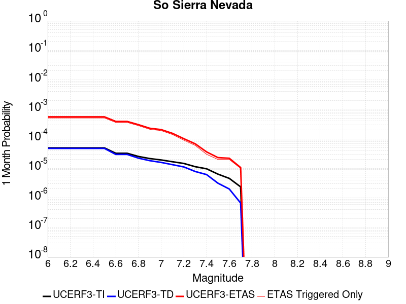 |  | 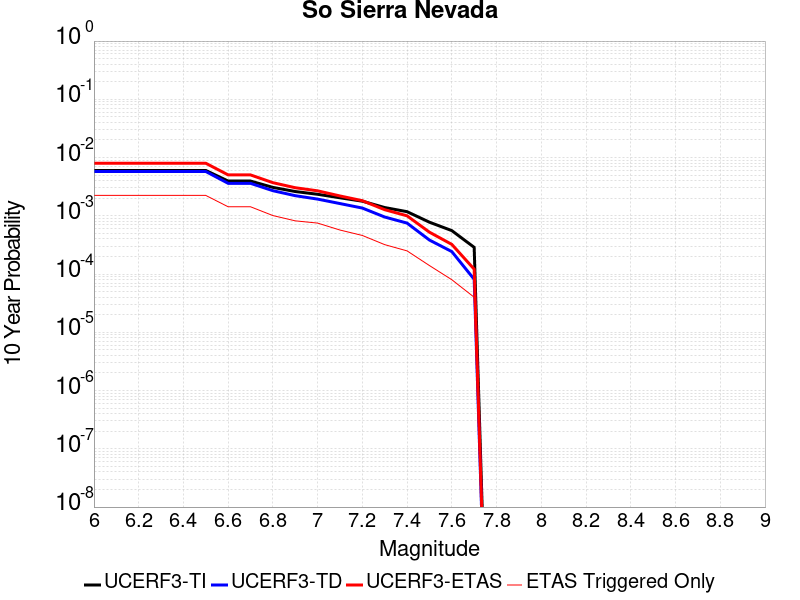 |

| Magnitude | 1 wk TI Prob | 1 wk TD Prob | 1 wk ETAS Prob | 1 wk ETAS/TD Gain | 1 wk ETAS Triggered Only | 1 mo TI Prob | 1 mo TD Prob | 1 mo ETAS Prob | 1 mo ETAS/TD Gain | 1 mo ETAS Triggered Only | 1 yr TI Prob | 1 yr TD Prob | 1 yr ETAS Prob | 1 yr ETAS/TD Gain | 1 yr ETAS Triggered Only | 10 yr TI Prob | 10 yr TD Prob | 10 yr ETAS Prob | 10 yr ETAS/TD Gain | 10 yr ETAS Triggered Only |
|-----|-----|-----|-----|-----|-----|-----|-----|-----|-----|-----|-----|-----|-----|-----|-----|-----|-----|-----|-----|-----|
| 6.0 | 1.15488665E-5 | 1.1079722E-5 | 2.210774E-4 | 19.953335 | 2.1E-4 | 4.9494203E-5 | 4.748373E-5 | 5.574595E-4 | 11.740011 | 5.1E-4 | 6.024253E-4 | 5.779738E-4 | 0.0019671705 | 3.4035633 | 0.00139 | 0.006007948 | 0.005765975 | 0.007993059 | 1.3862458 | 0.00224 |
| 6.1 | 1.15488665E-5 | 1.1079722E-5 | 2.210774E-4 | 19.953335 | 2.1E-4 | 4.9494203E-5 | 4.748373E-5 | 5.574595E-4 | 11.740011 | 5.1E-4 | 6.024253E-4 | 5.779738E-4 | 0.0019671705 | 3.4035633 | 0.00139 | 0.006007948 | 0.005765975 | 0.007993059 | 1.3862458 | 0.00224 |
| 6.2 | 1.15488665E-5 | 1.1079722E-5 | 2.210774E-4 | 19.953335 | 2.1E-4 | 4.9494203E-5 | 4.748373E-5 | 5.574595E-4 | 11.740011 | 5.1E-4 | 6.024253E-4 | 5.779738E-4 | 0.0019671705 | 3.4035633 | 0.00139 | 0.006007948 | 0.005765975 | 0.007993059 | 1.3862458 | 0.00224 |
| 6.3 | 1.15488665E-5 | 1.1079722E-5 | 2.210774E-4 | 19.953335 | 2.1E-4 | 4.9494203E-5 | 4.748373E-5 | 5.574595E-4 | 11.740011 | 5.1E-4 | 6.024253E-4 | 5.779738E-4 | 0.0019671705 | 3.4035633 | 0.00139 | 0.006007948 | 0.005765975 | 0.007993059 | 1.3862458 | 0.00224 |
| 6.4 | 1.15488665E-5 | 1.1079722E-5 | 2.210774E-4 | 19.953335 | 2.1E-4 | 4.9494203E-5 | 4.748373E-5 | 5.574595E-4 | 11.740011 | 5.1E-4 | 6.024253E-4 | 5.779738E-4 | 0.0019671705 | 3.4035633 | 0.00139 | 0.006007948 | 0.005765975 | 0.007993059 | 1.3862458 | 0.00224 |
| 6.5 | 1.15488665E-5 | 1.1079722E-5 | 2.210774E-4 | 19.953335 | 2.1E-4 | 4.9494203E-5 | 4.748373E-5 | 5.574595E-4 | 11.740011 | 5.1E-4 | 6.024253E-4 | 5.779738E-4 | 0.0019671705 | 3.4035633 | 0.00139 | 0.006007948 | 0.005765975 | 0.007993059 | 1.3862458 | 0.00224 |
| 6.6 | 7.587044E-6 | 6.935689E-6 | 1.5693465E-4 | 22.627117 | 1.5E-4 | 3.2515498E-5 | 2.9724059E-5 | 3.8971336E-4 | 13.111041 | 3.6E-4 | 3.9580427E-4 | 3.6183326E-4 | 0.0013314823 | 3.679823 | 9.7E-4 | 0.003951 | 0.0036127327 | 0.0050375666 | 1.3943923 | 0.00143 |
| 6.7 | 7.587044E-6 | 6.935689E-6 | 1.5693465E-4 | 22.627117 | 1.5E-4 | 3.2515498E-5 | 2.9724059E-5 | 3.8971336E-4 | 13.111041 | 3.6E-4 | 3.9580427E-4 | 3.6183326E-4 | 0.0013314823 | 3.679823 | 9.7E-4 | 0.003951 | 0.0036127327 | 0.0050375666 | 1.3943923 | 0.00143 |
| 6.8 | 5.9026956E-6 | 5.1794364E-6 | 1.2517882E-4 | 24.168423 | 1.2E-4 | 2.5297022E-5 | 2.2197402E-5 | 3.0219118E-4 | 13.613809 | 2.8E-4 | 3.0794772E-4 | 2.7022103E-4 | 9.900265E-4 | 3.6637654 | 7.2E-4 | 0.0030752132 | 0.0026990408 | 0.0037063148 | 1.3731971 | 0.00101 |
| 6.9 | 5.0118915E-6 | 4.2524644E-6 | 9.425208E-5 | 22.16411 | 9.0E-5 | 2.1479358E-5 | 1.8224722E-5 | 2.282209E-4 | 12.522599 | 2.1E-4 | 2.614798E-4 | 2.2186415E-4 | 7.7174214E-4 | 3.4784446 | 5.5E-4 | 0.0026117235 | 0.002216499 | 0.0030346815 | 1.3691328 | 8.2E-4 |
| 7.0 | 4.4924795E-6 | 3.713954E-6 | 9.371362E-5 | 25.232845 | 9.0E-5 | 1.925334E-5 | 1.5916852E-5 | 2.0591382E-4 | 12.936844 | 1.9E-4 | 2.3438422E-4 | 1.9377106E-4 | 7.0367224E-4 | 3.6314619 | 5.1E-4 | 0.0023413717 | 0.001936084 | 0.0026846319 | 1.3866299 | 7.5E-4 |
| 7.1 | 3.9118436E-6 | 3.1120105E-6 | 6.3111824E-5 | 20.28008 | 6.0E-5 | 1.6764936E-5 | 1.3337123E-5 | 1.5333526E-4 | 11.496877 | 1.4E-4 | 2.0409399E-4 | 1.6236794E-4 | 5.723014E-4 | 3.524719 | 4.1E-4 | 0.0020390663 | 0.0016225493 | 0.0021916244 | 1.3507291 | 5.7E-4 |
| 7.2 | 3.4200818E-6 | 2.6054847E-6 | 5.2605355E-5 | 20.190237 | 5.0E-5 | 1.4657411E-5 | 1.11663185E-5 | 1.01165315E-4 | 9.059863 | 9.0E-5 | 1.7843937E-4 | 1.3594194E-4 | 4.658971E-4 | 3.4271767 | 3.3E-4 | 0.0017829615 | 0.0013586376 | 0.0018180127 | 1.3381145 | 4.6E-4 |
| 7.3 | 2.6593618E-6 | 1.8284468E-6 | 4.1828374E-5 | 22.876451 | 4.0E-5 | 1.13972155E-5 | 7.836179E-6 | 6.783571E-5 | 8.6567335 | 6.0E-5 | 1.3875226E-4 | 9.540159E-5 | 3.4537775E-4 | 3.6202512 | 2.5E-4 | 0.0013866565 | 9.536353E-4 | 0.0012733302 | 1.3352381 | 3.2E-4 |
| 7.4 | 2.2577992E-6 | 1.4364622E-6 | 3.143642E-5 | 21.884613 | 3.0E-5 | 9.676246E-6 | 6.1562537E-6 | 3.615607E-5 | 5.8730636 | 3.0E-5 | 1.1780193E-4 | 7.495006E-5 | 2.7493507E-4 | 3.6682434 | 2.0E-4 | 0.001177395 | 7.4927293E-4 | 9.990856E-4 | 1.3334068 | 2.5E-4 |
| 7.5 | 1.489319E-6 | 7.3541264E-7 | 2.0735399E-5 | 28.195597 | 2.0E-5 | 6.3827797E-6 | 3.1517645E-6 | 2.3151702E-5 | 7.3456316 | 2.0E-5 | 7.770758E-5 | 3.837206E-5 | 1.6836707E-4 | 4.3877516 | 1.3E-4 | 7.7680405E-4 | 3.836548E-4 | 5.236011E-4 | 1.3647714 | 1.4E-4 |
| 7.6 | 1.0680322E-6 | 4.659796E-7 | 2.046597E-5 | 43.920315 | 2.0E-5 | 4.577273E-6 | 1.997054E-6 | 2.1997013E-5 | 11.014732 | 2.0E-5 | 5.5726876E-5 | 2.4313864E-5 | 1.0431192E-4 | 4.290224 | 8.0E-5 | 5.5712904E-4 | 2.431123E-4 | 3.2309286E-4 | 1.328986 | 8.0E-5 |
| 7.7 | 5.509146E-7 | 1.5581199E-7 | 1.0155811E-5 | 65.1799 | 1.0E-5 | 2.3610605E-6 | 6.677655E-7 | 1.0667759E-5 | 15.9753065 | 1.0E-5 | 2.8745531E-5 | 8.130016E-6 | 4.8129692E-5 | 5.9199996 | 4.0E-5 | 2.8741814E-4 | 8.12973E-5 | 1.2129405E-4 | 1.4919813 | 4.0E-5 |

## Coyote Canyon
*[(top)](#table-of-contents)*

| 1 Week | 1 Month | 1 Year | 10 Year |
|-----|-----|-----|-----|
|  |  |  |  |

| Magnitude | 1 wk TI Prob | 1 wk TD Prob | 1 wk ETAS Prob | 1 wk ETAS/TD Gain | 1 wk ETAS Triggered Only | 1 mo TI Prob | 1 mo TD Prob | 1 mo ETAS Prob | 1 mo ETAS/TD Gain | 1 mo ETAS Triggered Only | 1 yr TI Prob | 1 yr TD Prob | 1 yr ETAS Prob | 1 yr ETAS/TD Gain | 1 yr ETAS Triggered Only | 10 yr TI Prob | 10 yr TD Prob | 10 yr ETAS Prob | 10 yr ETAS/TD Gain | 10 yr ETAS Triggered Only |
|-----|-----|-----|-----|-----|-----|-----|-----|-----|-----|-----|-----|-----|-----|-----|-----|-----|-----|-----|-----|-----|
| 6.0 | 3.5090034E-5 | 4.036513E-5 | 1.403611E-4 | 3.4772859 | 1.0E-4 | 1.503772E-4 | 1.7298339E-4 | 4.2294015E-4 | 2.4449754 | 2.5E-4 | 0.0018293047 | 0.0021042947 | 0.0029724638 | 1.4125702 | 8.7E-4 | 0.018143194 | 0.020869615 | 0.022524344 | 1.079289 | 0.00169 |
| 6.1 | 3.5090034E-5 | 4.036513E-5 | 1.403611E-4 | 3.4772859 | 1.0E-4 | 1.503772E-4 | 1.7298339E-4 | 4.2294015E-4 | 2.4449754 | 2.5E-4 | 0.0018293047 | 0.0021042947 | 0.0029724638 | 1.4125702 | 8.7E-4 | 0.018143194 | 0.020869615 | 0.022524344 | 1.079289 | 0.00169 |
| 6.2 | 1.841879E-5 | 2.1060194E-5 | 9.105872E-5 | 4.323736 | 7.0E-5 | 7.8935285E-5 | 9.0255424E-5 | 2.4024189E-4 | 2.6618 | 1.5E-4 | 9.606133E-4 | 0.0010984079 | 0.0016577927 | 1.5092689 | 5.6E-4 | 0.0095647145 | 0.010939874 | 0.011889372 | 1.0867923 | 9.6E-4 |
| 6.3 | 1.841879E-5 | 2.1060194E-5 | 9.105872E-5 | 4.323736 | 7.0E-5 | 7.8935285E-5 | 9.0255424E-5 | 2.4024189E-4 | 2.6618 | 1.5E-4 | 9.606133E-4 | 0.0010984079 | 0.0016577927 | 1.5092689 | 5.6E-4 | 0.0095647145 | 0.010939874 | 0.011889372 | 1.0867923 | 9.6E-4 |
| 6.4 | 1.712201E-5 | 1.9565581E-5 | 8.9564215E-5 | 4.577641 | 7.0E-5 | 7.337798E-5 | 8.385037E-5 | 2.338378E-4 | 2.788751 | 1.5E-4 | 8.930107E-4 | 0.0010205007 | 0.0015499598 | 1.5188229 | 5.3E-4 | 0.008894307 | 0.0101680625 | 0.011058911 | 1.0876124 | 9.0E-4 |
| 6.5 | 1.4744935E-5 | 1.6837288E-5 | 8.683611E-5 | 5.157369 | 7.0E-5 | 6.3191044E-5 | 7.215834E-5 | 2.2214752E-4 | 3.0786119 | 1.5E-4 | 7.6907943E-4 | 8.7826716E-4 | 0.0013678368 | 1.5574268 | 4.9E-4 | 0.007664232 | 0.008757159 | 0.00957989 | 1.0939496 | 8.3E-4 |
| 6.6 | 1.2017839E-5 | 1.3724348E-5 | 5.3723797E-5 | 3.9144883 | 4.0E-5 | 5.150401E-5 | 5.8817808E-5 | 1.7881075E-4 | 3.0400784 | 1.2E-4 | 6.268809E-4 | 7.159601E-4 | 0.001095688 | 1.5303758 | 3.8E-4 | 0.0062511545 | 0.007145228 | 0.007810441 | 1.0930989 | 6.7E-4 |
| 6.7 | 1.00956095E-5 | 1.1533734E-5 | 5.1533272E-5 | 4.4680476 | 4.0E-5 | 4.326618E-5 | 4.9429844E-5 | 1.494249E-4 | 3.0229692 | 1.0E-4 | 5.266384E-4 | 6.0172915E-4 | 9.115426E-4 | 1.514872 | 3.1E-4 | 0.005253921 | 0.006009526 | 0.0065761004 | 1.0942794 | 5.7E-4 |

## San Andreas (Mojave S)
*[(top)](#table-of-contents)*

| 1 Week | 1 Month | 1 Year | 10 Year |
|-----|-----|-----|-----|
|  | 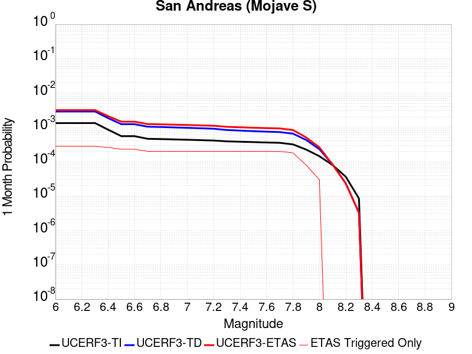 |  | 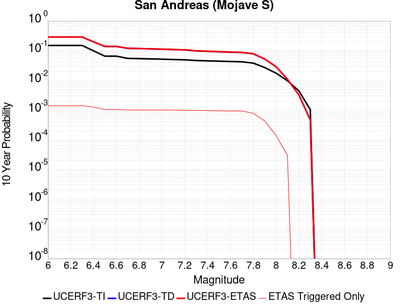 |

| Magnitude | 1 wk TI Prob | 1 wk TD Prob | 1 wk ETAS Prob | 1 wk ETAS/TD Gain | 1 wk ETAS Triggered Only | 1 mo TI Prob | 1 mo TD Prob | 1 mo ETAS Prob | 1 mo ETAS/TD Gain | 1 mo ETAS Triggered Only | 1 yr TI Prob | 1 yr TD Prob | 1 yr ETAS Prob | 1 yr ETAS/TD Gain | 1 yr ETAS Triggered Only | 10 yr TI Prob | 10 yr TD Prob | 10 yr ETAS Prob | 10 yr ETAS/TD Gain | 10 yr ETAS Triggered Only |
|-----|-----|-----|-----|-----|-----|-----|-----|-----|-----|-----|-----|-----|-----|-----|-----|-----|-----|-----|-----|-----|
| 6.0 | 3.1064058E-4 | 6.747043E-4 | 7.5465033E-4 | 1.1184905 | 8.0E-5 | 0.0013306376 | 0.002888514 | 0.0031677051 | 1.0966556 | 2.8E-4 | 0.016080605 | 0.03462661 | 0.035379604 | 1.021746 | 7.8E-4 | 0.1496549 | 0.28663692 | 0.28763562 | 1.0034842 | 0.0014 |
| 6.1 | 3.1064058E-4 | 6.747043E-4 | 7.5465033E-4 | 1.1184905 | 8.0E-5 | 0.0013306376 | 0.002888514 | 0.0031677051 | 1.0966556 | 2.8E-4 | 0.016080605 | 0.03462661 | 0.035379604 | 1.021746 | 7.8E-4 | 0.1496549 | 0.28663692 | 0.28763562 | 1.0034842 | 0.0014 |
| 6.2 | 3.1064058E-4 | 6.747043E-4 | 7.5465033E-4 | 1.1184905 | 8.0E-5 | 0.0013306376 | 0.002888514 | 0.0031677051 | 1.0966556 | 2.8E-4 | 0.016080605 | 0.03462661 | 0.035379604 | 1.021746 | 7.8E-4 | 0.1496549 | 0.28663692 | 0.28763562 | 1.0034842 | 0.0014 |
| 6.3 | 3.1064058E-4 | 6.747043E-4 | 7.5465033E-4 | 1.1184905 | 8.0E-5 | 0.0013306376 | 0.002888514 | 0.0031677051 | 1.0966556 | 2.8E-4 | 0.016080605 | 0.03462661 | 0.035379604 | 1.021746 | 7.8E-4 | 0.1496549 | 0.28663692 | 0.28763562 | 1.0034842 | 0.0014 |
| 6.4 | 1.9872203E-4 | 4.318848E-4 | 4.918589E-4 | 1.138866 | 6.0E-5 | 8.5138786E-4 | 0.0018496502 | 0.0021091693 | 1.1403071 | 2.6E-4 | 0.010316478 | 0.022293096 | 0.022987269 | 1.0311384 | 7.1E-4 | 0.098504856 | 0.19703239 | 0.19804414 | 1.0051349 | 0.00126 |
| 6.5 | 1.291105E-4 | 2.8761322E-4 | 3.4759595E-4 | 1.2085536 | 6.0E-5 | 5.5321335E-4 | 0.0012320485 | 0.0014617651 | 1.186451 | 2.3E-4 | 0.006714592 | 0.0148978485 | 0.01549876 | 1.0403355 | 6.1E-4 | 0.065152965 | 0.13807017 | 0.13897519 | 1.0065548 | 0.00105 |
| 6.6 | 1.291105E-4 | 2.8761322E-4 | 3.4759595E-4 | 1.2085536 | 6.0E-5 | 5.5321335E-4 | 0.0012320485 | 0.0014617651 | 1.186451 | 2.3E-4 | 0.006714592 | 0.0148978485 | 0.01549876 | 1.0403355 | 6.1E-4 | 0.065152965 | 0.13807017 | 0.13897519 | 1.0065548 | 0.00105 |
| 6.7 | 1.08001186E-4 | 2.4342406E-4 | 3.0340944E-4 | 1.2464235 | 6.0E-5 | 4.6278012E-4 | 0.0010428295 | 0.0012426209 | 1.1915859 | 2.0E-4 | 0.0056198016 | 0.012622835 | 0.013175766 | 1.043804 | 5.6E-4 | 0.054797906 | 0.11921291 | 0.120093696 | 1.0073884 | 0.001 |
| 6.8 | 1.0624356E-4 | 2.3860046E-4 | 2.9858615E-4 | 1.2514064 | 6.0E-5 | 4.5525006E-4 | 0.0010221732 | 0.0012219688 | 1.1954615 | 2.0E-4 | 0.0055285925 | 0.01237422 | 0.012927291 | 1.0446954 | 5.6E-4 | 0.053930566 | 0.117162056 | 0.11804489 | 1.0075352 | 0.001 |
| 6.9 | 1.0393785E-4 | 2.3230357E-4 | 2.9228965E-4 | 1.2582227 | 6.0E-5 | 4.4537184E-4 | 9.952073E-4 | 0.0011950083 | 1.2007631 | 2.0E-4 | 0.0054089287 | 0.012049583 | 0.012602835 | 1.0459146 | 5.6E-4 | 0.05279156 | 0.11445948 | 0.11534502 | 1.0077367 | 0.001 |
| 7.0 | 1.0155622E-4 | 2.2599897E-4 | 2.859854E-4 | 1.265428 | 6.0E-5 | 4.3516833E-4 | 9.682079E-4 | 0.0011680142 | 1.2063673 | 2.0E-4 | 0.005285311 | 0.011724443 | 0.012277878 | 1.0472034 | 5.6E-4 | 0.05161361 | 0.11171984 | 0.11260812 | 1.0079509 | 0.001 |
| 7.1 | 9.885595E-5 | 2.1888265E-4 | 2.788695E-4 | 1.2740595 | 6.0E-5 | 4.2359953E-4 | 9.377316E-4 | 0.001137544 | 1.2130806 | 2.0E-4 | 0.0051451353 | 0.011357316 | 0.011910956 | 1.0487474 | 5.6E-4 | 0.05027629 | 0.10860426 | 0.10949566 | 1.0082078 | 0.001 |
| 7.2 | 9.6411415E-5 | 2.125122E-4 | 2.7249946E-4 | 1.2822767 | 6.0E-5 | 4.1312634E-4 | 9.1044896E-4 | 0.0011102669 | 1.2194718 | 2.0E-4 | 0.005018219 | 0.01102856 | 0.011582384 | 1.0502173 | 5.6E-4 | 0.049064007 | 0.10579402 | 0.10667034 | 1.0082833 | 9.8E-4 |
| 7.3 | 9.1180635E-5 | 1.9479371E-4 | 2.5478203E-4 | 1.3079581 | 6.0E-5 | 3.907156E-4 | 8.345632E-4 | 0.0010343964 | 1.2394463 | 2.0E-4 | 0.004746591 | 0.010113581 | 0.010667918 | 1.0548111 | 5.6E-4 | 0.046464786 | 0.09798661 | 0.09887058 | 1.0090214 | 9.8E-4 |
| 7.4 | 8.887388E-5 | 1.8727897E-4 | 2.4726774E-4 | 1.3203176 | 6.0E-5 | 3.8083247E-4 | 8.023774E-4 | 0.001002217 | 1.2490593 | 2.0E-4 | 0.0046267817 | 0.009725285 | 0.010269936 | 1.0560036 | 5.5E-4 | 0.045316286 | 0.09462135 | 0.095490515 | 1.0091857 | 9.6E-4 |
| 7.5 | 8.6750515E-5 | 1.8059391E-4 | 2.4058307E-4 | 1.3321772 | 6.0E-5 | 3.7173493E-4 | 7.7374437E-4 | 9.7358966E-4 | 1.2582833 | 2.0E-4 | 0.004516484 | 0.009379733 | 0.009914668 | 1.0570309 | 5.4E-4 | 0.04425787 | 0.09158487 | 0.09244786 | 1.0094229 | 9.5E-4 |
| 7.6 | 8.453092E-5 | 1.7446902E-4 | 2.3445857E-4 | 1.3438406 | 6.0E-5 | 3.6222505E-4 | 7.475102E-4 | 9.473607E-4 | 1.2673548 | 2.0E-4 | 0.0044011753 | 0.009063034 | 0.009598141 | 1.0590427 | 5.4E-4 | 0.04315024 | 0.088743635 | 0.0895911 | 1.0095496 | 9.3E-4 |
| 7.7 | 8.259102E-5 | 1.6968958E-4 | 2.296794E-4 | 1.3535268 | 6.0E-5 | 3.539135E-4 | 7.270384E-4 | 9.2689303E-4 | 1.2748886 | 2.0E-4 | 0.004300386 | 0.008815835 | 0.009351075 | 1.0607134 | 5.4E-4 | 0.042181134 | 0.08649418 | 0.08734374 | 1.0098221 | 9.3E-4 |
| 7.8 | 7.444844E-5 | 1.5290553E-4 | 2.0289789E-4 | 1.3269492 | 5.0E-5 | 3.1902574E-4 | 6.551449E-4 | 8.3502696E-4 | 1.2745683 | 1.8E-4 | 0.0038772223 | 0.007947266 | 0.00839369 | 1.0561732 | 4.5E-4 | 0.03810269 | 0.07832232 | 0.079041235 | 1.0091789 | 7.8E-4 |
| 7.9 | 5.2586525E-5 | 1.0011239E-4 | 1.1011139E-4 | 1.0998777 | 1.0E-5 | 2.2535135E-4 | 4.2898257E-4 | 5.0894823E-4 | 1.1864078 | 8.0E-5 | 0.0027402006 | 0.005210366 | 0.005439168 | 1.0439128 | 2.3E-4 | 0.027066574 | 0.052222524 | 0.05263007 | 1.007804 | 4.3E-4 |
| 8.0 | 3.379877E-5 | 5.4101976E-5 | 5.4101976E-5 | 1.0 | 0.0 | 1.4484383E-4 | 2.3184501E-4 | 2.6183805E-4 | 1.1293668 | 3.0E-5 | 0.0017620471 | 0.002819061 | 0.00286892 | 1.0176864 | 5.0E-5 | 0.017481409 | 0.028848516 | 0.028984478 | 1.0047129 | 1.4E-4 |
| 8.1 | 1.8668277E-5 | 1.9322531E-5 | 1.9322531E-5 | 1.0 | 0.0 | 8.000444E-5 | 8.280823E-5 | 8.280823E-5 | 1.0 | 0.0 | 9.736188E-4 | 0.0010077246 | 0.0010077246 | 1.0 | 0.0 | 0.009693642 | 0.010805754 | 0.01083543 | 1.0027463 | 3.0E-5 |
| 8.2 | 8.541571E-6 | 5.465789E-6 | 5.465789E-6 | 1.0 | 0.0 | 3.660622E-5 | 2.34246E-5 | 2.34246E-5 | 1.0 | 0.0 | 4.455896E-4 | 2.8515726E-4 | 2.8515726E-4 | 1.0 | 0.0 | 0.0044469717 | 0.0032435213 | 0.0032435213 | 1.0 | 0.0 |
| 8.3 | 1.983087E-6 | 7.668296E-7 | 7.668296E-7 | 1.0 | 0.0 | 8.498917E-6 | 3.2864084E-6 | 3.2864084E-6 | 1.0 | 0.0 | 1.034694E-4 | 4.0011306E-5 | 4.0011306E-5 | 1.0 | 0.0 | 0.0010342124 | 4.724499E-4 | 4.724499E-4 | 1.0 | 0.0 |

## Lenwood-Lockhart-Old Woman Springs
*[(top)](#table-of-contents)*

| 1 Week | 1 Month | 1 Year | 10 Year |
|-----|-----|-----|-----|
| 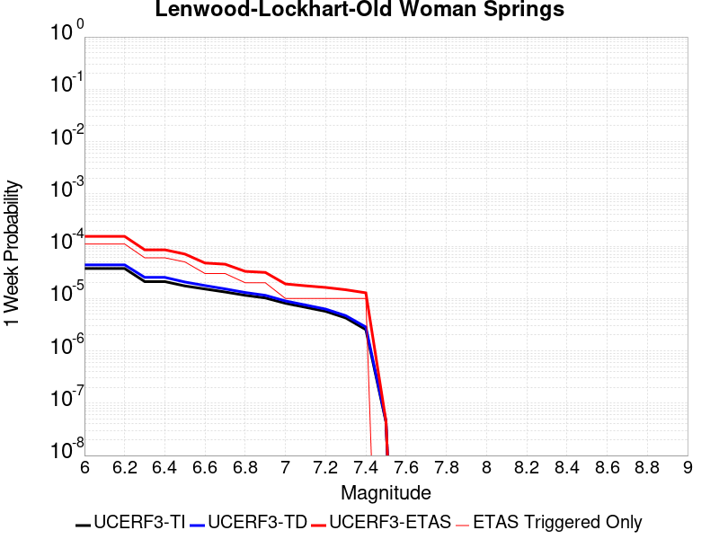 |  |  |  |

| Magnitude | 1 wk TI Prob | 1 wk TD Prob | 1 wk ETAS Prob | 1 wk ETAS/TD Gain | 1 wk ETAS Triggered Only | 1 mo TI Prob | 1 mo TD Prob | 1 mo ETAS Prob | 1 mo ETAS/TD Gain | 1 mo ETAS Triggered Only | 1 yr TI Prob | 1 yr TD Prob | 1 yr ETAS Prob | 1 yr ETAS/TD Gain | 1 yr ETAS Triggered Only | 10 yr TI Prob | 10 yr TD Prob | 10 yr ETAS Prob | 10 yr ETAS/TD Gain | 10 yr ETAS Triggered Only |
|-----|-----|-----|-----|-----|-----|-----|-----|-----|-----|-----|-----|-----|-----|-----|-----|-----|-----|-----|-----|-----|
| 6.0 | 3.744542E-5 | 4.3962966E-5 | 1.5395813E-4 | 3.501996 | 1.1E-4 | 1.604705E-4 | 1.8840008E-4 | 4.1835674E-4 | 2.2205763 | 2.3E-4 | 0.0019519776 | 0.0022915301 | 0.0029999032 | 1.3091266 | 7.1E-4 | 0.019349206 | 0.022697017 | 0.024114106 | 1.062435 | 0.00145 |
| 6.1 | 3.744542E-5 | 4.3962966E-5 | 1.5395813E-4 | 3.501996 | 1.1E-4 | 1.604705E-4 | 1.8840008E-4 | 4.1835674E-4 | 2.2205763 | 2.3E-4 | 0.0019519776 | 0.0022915301 | 0.0029999032 | 1.3091266 | 7.1E-4 | 0.019349206 | 0.022697017 | 0.024114106 | 1.062435 | 0.00145 |
| 6.2 | 3.744542E-5 | 4.3962966E-5 | 1.5395813E-4 | 3.501996 | 1.1E-4 | 1.604705E-4 | 1.8840008E-4 | 4.1835674E-4 | 2.2205763 | 2.3E-4 | 0.0019519776 | 0.0022915301 | 0.0029999032 | 1.3091266 | 7.1E-4 | 0.019349206 | 0.022697017 | 0.024114106 | 1.062435 | 0.00145 |
| 6.3 | 2.1079984E-5 | 2.5353596E-5 | 8.5352076E-5 | 3.3664682 | 6.0E-5 | 9.0339665E-5 | 1.0865386E-4 | 2.4863865E-4 | 2.2883554 | 1.4E-4 | 0.0010993304 | 0.0013220779 | 0.0016316681 | 1.2341694 | 3.1E-4 | 0.010939079 | 0.013144341 | 0.013825271 | 1.0518041 | 6.9E-4 |
| 6.4 | 2.1079984E-5 | 2.5353596E-5 | 8.5352076E-5 | 3.3664682 | 6.0E-5 | 9.0339665E-5 | 1.0865386E-4 | 2.4863865E-4 | 2.2883554 | 1.4E-4 | 0.0010993304 | 0.0013220779 | 0.0016316681 | 1.2341694 | 3.1E-4 | 0.010939079 | 0.013144341 | 0.013825271 | 1.0518041 | 6.9E-4 |
| 6.5 | 1.7397282E-5 | 2.0662535E-5 | 7.06615E-5 | 3.4197886 | 5.0E-5 | 7.455765E-5 | 8.855078E-5 | 2.0854016E-4 | 2.3550346 | 1.2E-4 | 9.073613E-4 | 0.0010775843 | 0.0013173257 | 1.2224804 | 2.4E-4 | 0.009036654 | 0.010724886 | 0.011239309 | 1.0479654 | 5.2E-4 |
| 6.6 | 1.52050325E-5 | 1.76798E-5 | 4.767927E-5 | 2.696822 | 3.0E-5 | 6.51628E-5 | 7.576841E-5 | 1.7576084E-4 | 2.3197112 | 1.0E-4 | 7.9306826E-4 | 9.220979E-4 | 0.0011418951 | 1.2383664 | 2.2E-4 | 0.007902439 | 0.009183581 | 0.009649265 | 1.0507083 | 4.7E-4 |
| 6.7 | 1.332523E-5 | 1.5264091E-5 | 4.5263634E-5 | 2.965367 | 3.0E-5 | 5.7106878E-5 | 6.541593E-5 | 1.5541005E-4 | 2.3757217 | 9.0E-5 | 6.950544E-4 | 7.9615373E-4 | 9.860025E-4 | 1.2384573 | 1.9E-4 | 0.006928845 | 0.007933645 | 0.008330472 | 1.0500182 | 4.0E-4 |
| 6.8 | 1.1525329E-5 | 1.303105E-5 | 3.303079E-5 | 2.5347757 | 2.0E-5 | 4.9393333E-5 | 5.5846183E-5 | 1.15842835E-4 | 2.0743196 | 6.0E-5 | 6.011979E-4 | 6.7971944E-4 | 8.196243E-4 | 1.2058274 | 1.4E-4 | 0.00599574 | 0.006776856 | 0.0070847548 | 1.0454339 | 3.1E-4 |
| 6.9 | 1.0253909E-5 | 1.15144985E-5 | 3.1514268E-5 | 2.7369206 | 2.0E-5 | 4.3944583E-5 | 4.9346934E-5 | 1.0934398E-4 | 2.215821 | 6.0E-5 | 5.3489394E-4 | 6.0063694E-4 | 7.105709E-4 | 1.1830289 | 1.1E-4 | 0.0053360825 | 0.005990515 | 0.0062390175 | 1.0414827 | 2.5E-4 |
| 7.0 | 8.104563E-6 | 8.991321E-6 | 1.8991232E-5 | 2.1121736 | 1.0E-5 | 3.4733377E-5 | 3.8533675E-5 | 6.853252E-5 | 1.7785097 | 3.0E-5 | 4.2279682E-4 | 4.6904891E-4 | 5.290208E-4 | 1.1278584 | 6.0E-5 | 0.0042199334 | 0.0046808375 | 0.0048400885 | 1.034022 | 1.6E-4 |
| 7.1 | 6.7986157E-6 | 7.515848E-6 | 1.7515773E-5 | 2.3305118 | 1.0E-5 | 2.91366E-5 | 3.221039E-5 | 4.221007E-5 | 1.3104488 | 1.0E-5 | 3.5468035E-4 | 3.9209312E-4 | 4.1208527E-4 | 1.0509883 | 2.0E-5 | 0.003541148 | 0.0039142296 | 0.004023799 | 1.0279926 | 1.1E-4 |
| 7.2 | 5.6893327E-6 | 6.280039E-6 | 1.6279977E-5 | 2.592337 | 1.0E-5 | 2.4382627E-5 | 2.6914187E-5 | 3.6913916E-5 | 1.3715413 | 1.0E-5 | 2.9681803E-4 | 3.2763294E-4 | 3.476264E-4 | 1.061024 | 2.0E-5 | 0.002964219 | 0.0032716978 | 0.003381338 | 1.0335116 | 1.1E-4 |
| 7.3 | 4.253348E-6 | 4.706927E-6 | 1.470688E-5 | 3.1245184 | 1.0E-5 | 1.8228506E-5 | 2.01724E-5 | 3.0172198E-5 | 1.4957168 | 1.0E-5 | 2.2190946E-4 | 2.4557312E-4 | 2.655682E-4 | 1.0814221 | 2.0E-5 | 0.00221688 | 0.0024531984 | 0.002552953 | 1.0406631 | 1.0E-4 |
| 7.4 | 2.5448119E-6 | 2.8520535E-6 | 1.2852025E-5 | 4.5062356 | 1.0E-5 | 1.0906291E-5 | 1.22230385E-5 | 2.2222916E-5 | 1.8181173 | 1.0E-5 | 1.3277601E-4 | 1.4880698E-4 | 1.5880549E-4 | 1.0671911 | 1.0E-5 | 0.001326967 | 0.0014872355 | 0.0015571314 | 1.0469972 | 7.0E-5 |
| 7.5 | 4.3706837E-8 | 4.5629356E-8 | 4.5629356E-8 | 1.0 | 0.0 | 1.8731501E-7 | 1.9555438E-7 | 1.9555438E-7 | 1.0 | 0.0 | 2.2805577E-6 | 2.3808725E-6 | 2.3808725E-6 | 1.0 | 0.0 | 2.2805343E-5 | 2.3808525E-5 | 2.3808525E-5 | 1.0 | 0.0 |

## Nelson Lake
*[(top)](#table-of-contents)*

| 1 Week | 1 Month | 1 Year | 10 Year |
|-----|-----|-----|-----|
|  |  |  |  |

| Magnitude | 1 wk TI Prob | 1 wk TD Prob | 1 wk ETAS Prob | 1 wk ETAS/TD Gain | 1 wk ETAS Triggered Only | 1 mo TI Prob | 1 mo TD Prob | 1 mo ETAS Prob | 1 mo ETAS/TD Gain | 1 mo ETAS Triggered Only | 1 yr TI Prob | 1 yr TD Prob | 1 yr ETAS Prob | 1 yr ETAS/TD Gain | 1 yr ETAS Triggered Only | 10 yr TI Prob | 10 yr TD Prob | 10 yr ETAS Prob | 10 yr ETAS/TD Gain | 10 yr ETAS Triggered Only |
|-----|-----|-----|-----|-----|-----|-----|-----|-----|-----|-----|-----|-----|-----|-----|-----|-----|-----|-----|-----|-----|
| 6.0 | 9.913453E-6 | 1.0192293E-5 | 5.0191884E-5 | 4.924494 | 4.0E-5 | 4.2485535E-5 | 4.3680586E-5 | 1.8367446E-4 | 4.204945 | 1.4E-4 | 5.1713863E-4 | 5.316917E-4 | 0.0010714045 | 2.0150862 | 5.4E-4 | 0.0051593683 | 0.0053052236 | 0.006568486 | 1.2381167 | 0.00127 |
| 6.1 | 9.913453E-6 | 1.0192293E-5 | 5.0191884E-5 | 4.924494 | 4.0E-5 | 4.2485535E-5 | 4.3680586E-5 | 1.8367446E-4 | 4.204945 | 1.4E-4 | 5.1713863E-4 | 5.316917E-4 | 0.0010714045 | 2.0150862 | 5.4E-4 | 0.0051593683 | 0.0053052236 | 0.006568486 | 1.2381167 | 0.00127 |
| 6.2 | 4.5596407E-6 | 4.696332E-6 | 2.4696237E-5 | 5.258623 | 2.0E-5 | 1.954117E-5 | 2.0126989E-5 | 1.1012518E-4 | 5.471518 | 9.0E-5 | 2.3788778E-4 | 2.450198E-4 | 4.84961E-4 | 1.9792727 | 2.4E-4 | 0.0023763329 | 0.0024476226 | 0.003006252 | 1.2282335 | 5.6E-4 |
| 6.3 | 4.5596407E-6 | 4.696332E-6 | 2.4696237E-5 | 5.258623 | 2.0E-5 | 1.954117E-5 | 2.0126989E-5 | 1.1012518E-4 | 5.471518 | 9.0E-5 | 2.3788778E-4 | 2.450198E-4 | 4.84961E-4 | 1.9792727 | 2.4E-4 | 0.0023763329 | 0.0024476226 | 0.003006252 | 1.2282335 | 5.6E-4 |
| 6.4 | 3.4025713E-6 | 3.509912E-6 | 2.3509841E-5 | 6.6981287 | 2.0E-5 | 1.4582367E-5 | 1.50423975E-5 | 7.50415E-5 | 4.9886656 | 6.0E-5 | 1.7752586E-4 | 1.8312664E-4 | 3.7309184E-4 | 2.0373433 | 1.9E-4 | 0.001773841 | 0.0018298404 | 0.0022690352 | 1.2400181 | 4.4E-4 |
| 6.5 | 2.8352947E-6 | 2.9278688E-6 | 2.292781E-5 | 7.8308873 | 2.0E-5 | 1.2151207E-5 | 1.2547953E-5 | 5.254745E-5 | 4.187731 | 4.0E-5 | 1.479309E-4 | 1.5276136E-4 | 2.9273998E-4 | 1.9163221 | 1.4E-4 | 0.0014783246 | 0.0015266375 | 0.0018761031 | 1.228912 | 3.5E-4 |
| 6.6 | 2.251518E-6 | 2.3290781E-6 | 2.2329032E-5 | 9.587069 | 2.0E-5 | 9.649328E-6 | 9.981729E-6 | 4.998133E-5 | 5.007282 | 4.0E-5 | 1.1747423E-4 | 1.2152141E-4 | 2.4150682E-4 | 1.9873604 | 1.2E-4 | 0.0011741214 | 0.0012146112 | 0.0015142469 | 1.2466927 | 3.0E-4 |
| 6.7 | 1.8911853E-6 | 1.9591491E-6 | 2.195911E-5 | 11.208494 | 2.0E-5 | 8.105055E-6 | 8.39633E-6 | 4.8395992E-5 | 5.7639465 | 4.0E-5 | 9.867457E-5 | 1.022211E-4 | 2.0221088E-4 | 1.9781716 | 1.0E-4 | 9.863076E-4 | 0.0010217984 | 0.0012715429 | 1.2444167 | 2.5E-4 |
| 6.8 | 1.4874814E-6 | 1.5438383E-6 | 2.1543807E-5 | 13.954705 | 2.0E-5 | 6.374905E-6 | 6.6164357E-6 | 3.661624E-5 | 5.5341334 | 3.0E-5 | 7.76117E-5 | 8.055265E-5 | 1.605462E-4 | 1.9930593 | 8.0E-5 | 7.75846E-4 | 8.052856E-4 | 0.0010251084 | 1.272975 | 2.2E-4 |
| 6.9 | 6.835972E-7 | 7.1399705E-7 | 7.1399705E-7 | 1.0 | 0.0 | 2.9296991E-6 | 3.0599856E-6 | 3.0599856E-6 | 1.0 | 0.0 | 3.56685E-5 | 3.7255006E-5 | 5.725426E-5 | 1.5368207 | 2.0E-5 | 3.5662777E-4 | 3.7251884E-4 | 4.4249278E-4 | 1.18784 | 7.0E-5 |

## San Andreas (Mojave N)
*[(top)](#table-of-contents)*

| 1 Week | 1 Month | 1 Year | 10 Year |
|-----|-----|-----|-----|
|  |  |  |  |

| Magnitude | 1 wk TI Prob | 1 wk TD Prob | 1 wk ETAS Prob | 1 wk ETAS/TD Gain | 1 wk ETAS Triggered Only | 1 mo TI Prob | 1 mo TD Prob | 1 mo ETAS Prob | 1 mo ETAS/TD Gain | 1 mo ETAS Triggered Only | 1 yr TI Prob | 1 yr TD Prob | 1 yr ETAS Prob | 1 yr ETAS/TD Gain | 1 yr ETAS Triggered Only | 10 yr TI Prob | 10 yr TD Prob | 10 yr ETAS Prob | 10 yr ETAS/TD Gain | 10 yr ETAS Triggered Only |
|-----|-----|-----|-----|-----|-----|-----|-----|-----|-----|-----|-----|-----|-----|-----|-----|-----|-----|-----|-----|-----|
| 6.0 | 9.877682E-5 | 1.9409315E-4 | 2.7407764E-4 | 1.4120932 | 8.0E-5 | 4.2326056E-4 | 8.315628E-4 | 0.0011313134 | 1.3604665 | 3.0E-4 | 0.0051410277 | 0.010077406 | 0.010839647 | 1.0756385 | 7.7E-4 | 0.05023708 | 0.09835201 | 0.09950612 | 1.0117345 | 0.00128 |
| 6.1 | 9.877682E-5 | 1.9409315E-4 | 2.7407764E-4 | 1.4120932 | 8.0E-5 | 4.2326056E-4 | 8.315628E-4 | 0.0011313134 | 1.3604665 | 3.0E-4 | 0.0051410277 | 0.010077406 | 0.010839647 | 1.0756385 | 7.7E-4 | 0.05023708 | 0.09835201 | 0.09950612 | 1.0117345 | 0.00128 |
| 6.2 | 9.877682E-5 | 1.9409315E-4 | 2.7407764E-4 | 1.4120932 | 8.0E-5 | 4.2326056E-4 | 8.315628E-4 | 0.0011313134 | 1.3604665 | 3.0E-4 | 0.0051410277 | 0.010077406 | 0.010839647 | 1.0756385 | 7.7E-4 | 0.05023708 | 0.09835201 | 0.09950612 | 1.0117345 | 0.00128 |
| 6.3 | 9.877682E-5 | 1.9409315E-4 | 2.7407764E-4 | 1.4120932 | 8.0E-5 | 4.2326056E-4 | 8.315628E-4 | 0.0011313134 | 1.3604665 | 3.0E-4 | 0.0051410277 | 0.010077406 | 0.010839647 | 1.0756385 | 7.7E-4 | 0.05023708 | 0.09835201 | 0.09950612 | 1.0117345 | 0.00128 |
| 6.4 | 9.877682E-5 | 1.9409315E-4 | 2.7407764E-4 | 1.4120932 | 8.0E-5 | 4.2326056E-4 | 8.315628E-4 | 0.0011313134 | 1.3604665 | 3.0E-4 | 0.0051410277 | 0.010077406 | 0.010839647 | 1.0756385 | 7.7E-4 | 0.05023708 | 0.09835201 | 0.09950612 | 1.0117345 | 0.00128 |
| 6.5 | 9.861474E-5 | 1.9383078E-4 | 2.738153E-4 | 1.4126512 | 8.0E-5 | 4.2256617E-4 | 8.304391E-4 | 0.00113019 | 1.3609546 | 3.0E-4 | 0.0051326132 | 0.010063851 | 0.010826102 | 1.0757414 | 7.7E-4 | 0.050156746 | 0.098229796 | 0.09938406 | 1.0117507 | 0.00128 |
| 6.6 | 9.861474E-5 | 1.9383078E-4 | 2.738153E-4 | 1.4126512 | 8.0E-5 | 4.2256617E-4 | 8.304391E-4 | 0.00113019 | 1.3609546 | 3.0E-4 | 0.0051326132 | 0.010063851 | 0.010826102 | 1.0757414 | 7.7E-4 | 0.050156746 | 0.098229796 | 0.09938406 | 1.0117507 | 0.00128 |
| 6.7 | 9.8552715E-5 | 1.9373032E-4 | 2.737148E-4 | 1.4128652 | 8.0E-5 | 4.223004E-4 | 8.3000876E-4 | 0.0011297597 | 1.3611419 | 3.0E-4 | 0.0051293927 | 0.01005866 | 0.010820915 | 1.075781 | 7.7E-4 | 0.050125998 | 0.098182976 | 0.0993373 | 1.0117569 | 0.00128 |
| 6.8 | 9.8464974E-5 | 1.9358192E-4 | 2.7356643E-4 | 1.4131818 | 8.0E-5 | 4.219245E-4 | 8.293732E-4 | 0.0011291243 | 1.361419 | 3.0E-4 | 0.0051248376 | 0.010050993 | 0.010813254 | 1.0758394 | 7.7E-4 | 0.05008251 | 0.09811299 | 0.09926741 | 1.0117662 | 0.00128 |
| 6.9 | 9.825824E-5 | 1.9326196E-4 | 2.732465E-4 | 1.4138659 | 8.0E-5 | 4.2103877E-4 | 8.280028E-4 | 0.0011277545 | 1.3620176 | 3.0E-4 | 0.0051141046 | 0.010034463 | 0.010796737 | 1.0759655 | 7.7E-4 | 0.049980022 | 0.09796208 | 0.09911669 | 1.0117862 | 0.00128 |
| 7.0 | 9.781462E-5 | 1.9257552E-4 | 2.725601E-4 | 1.4153414 | 8.0E-5 | 4.1913814E-4 | 8.250628E-4 | 0.0011248153 | 1.3633087 | 3.0E-4 | 0.005091073 | 0.009998998 | 0.010761298 | 1.0762377 | 7.7E-4 | 0.04976007 | 0.097638436 | 0.09879346 | 1.0118296 | 0.00128 |
| 7.1 | 9.7121134E-5 | 1.9159251E-4 | 2.7157718E-4 | 1.4174728 | 8.0E-5 | 4.1616702E-4 | 8.208525E-4 | 0.0011206063 | 1.3651737 | 3.0E-4 | 0.005055068 | 0.009948207 | 0.010710547 | 1.0766308 | 7.7E-4 | 0.04941613 | 0.097174905 | 0.09833052 | 1.0118921 | 0.00128 |
| 7.2 | 9.663819E-5 | 1.9090026E-4 | 2.7088498E-4 | 1.418987 | 8.0E-5 | 4.1409794E-4 | 8.178876E-4 | 0.0011176423 | 1.3664986 | 3.0E-4 | 0.0050299936 | 0.009912439 | 0.010674805 | 1.0769101 | 7.7E-4 | 0.049176537 | 0.09684814 | 0.09800417 | 1.0119365 | 0.00128 |
| 7.3 | 9.6277574E-5 | 1.9042526E-4 | 2.7041003E-4 | 1.4200324 | 8.0E-5 | 4.125529E-4 | 8.158532E-4 | 0.0011156085 | 1.3674132 | 3.0E-4 | 0.0050112694 | 0.009887895 | 0.010650281 | 1.077103 | 7.7E-4 | 0.04899759 | 0.09662155 | 0.09777787 | 1.0119675 | 0.00128 |
| 7.4 | 9.593308E-5 | 1.8982294E-4 | 2.6980776E-4 | 1.4213654 | 8.0E-5 | 4.1107697E-4 | 8.132734E-4 | 0.0011130294 | 1.3685796 | 3.0E-4 | 0.0049933824 | 0.00985677 | 0.01061918 | 1.077349 | 7.7E-4 | 0.04882661 | 0.09633968 | 0.09749637 | 1.0120063 | 0.00128 |
| 7.5 | 9.561707E-5 | 1.8928363E-4 | 2.692685E-4 | 1.4225662 | 8.0E-5 | 4.0972308E-4 | 8.109635E-4 | 0.0011107202 | 1.3696303 | 3.0E-4 | 0.0049769743 | 0.009828901 | 0.010581431 | 1.076563 | 7.6E-4 | 0.048669744 | 0.09608582 | 0.09723379 | 1.0119474 | 0.00127 |
| 7.6 | 9.418194E-5 | 1.8580563E-4 | 2.6579076E-4 | 1.4304775 | 8.0E-5 | 4.0357444E-4 | 7.96067E-4 | 0.0010958283 | 1.3765527 | 3.0E-4 | 0.004902454 | 0.009649157 | 0.010401823 | 1.0780034 | 7.6E-4 | 0.047957025 | 0.09446791 | 0.09559982 | 1.011982 | 0.00125 |
| 7.7 | 8.202141E-5 | 1.6029038E-4 | 2.3027915E-4 | 1.4366374 | 7.0E-5 | 3.51473E-4 | 6.86778E-4 | 9.765788E-4 | 1.4219717 | 2.9E-4 | 0.00427079 | 0.008329522 | 0.009013774 | 1.0821478 | 6.9E-4 | 0.04189639 | 0.08226675 | 0.083322145 | 1.012829 | 0.00115 |
| 7.8 | 7.2859846E-5 | 1.4523414E-4 | 1.9522688E-4 | 1.3442217 | 5.0E-5 | 3.1221908E-4 | 6.2228355E-4 | 8.0217153E-4 | 1.2890772 | 1.8E-4 | 0.003794643 | 0.007550025 | 0.007996627 | 1.0591525 | 4.5E-4 | 0.037304975 | 0.074755974 | 0.07547767 | 1.0096539 | 7.8E-4 |
| 7.9 | 5.3874453E-5 | 1.0050546E-4 | 1.1050445E-4 | 1.0994871 | 1.0E-5 | 2.3087008E-4 | 4.3066658E-4 | 5.106321E-4 | 1.1856786 | 8.0E-5 | 0.0028072202 | 0.005230771 | 0.005459568 | 1.0437406 | 2.3E-4 | 0.02772022 | 0.052447177 | 0.052854627 | 1.0077688 | 4.3E-4 |
| 8.0 | 3.468538E-5 | 5.4288335E-5 | 5.4288335E-5 | 1.0 | 0.0 | 1.4864317E-4 | 2.3264355E-4 | 2.6263657E-4 | 1.1289226 | 3.0E-5 | 0.0018082283 | 0.0028287582 | 0.0028786168 | 1.0176256 | 5.0E-5 | 0.017935853 | 0.028961267 | 0.029097214 | 1.004694 | 1.4E-4 |
| 8.1 | 1.9152367E-5 | 1.9415891E-5 | 1.9415891E-5 | 1.0 | 0.0 | 8.207899E-5 | 8.320831E-5 | 8.320831E-5 | 1.0 | 0.0 | 9.988535E-4 | 0.0010125911 | 0.0010125911 | 1.0 | 0.0 | 0.009943757 | 0.010863188 | 0.010892862 | 1.0027316 | 3.0E-5 |
| 8.2 | 8.643924E-6 | 5.4798497E-6 | 5.4798497E-6 | 1.0 | 0.0 | 3.704486E-5 | 2.348486E-5 | 2.348486E-5 | 1.0 | 0.0 | 4.5092785E-4 | 2.858907E-4 | 2.858907E-4 | 1.0 | 0.0 | 0.0045001395 | 0.0032514327 | 0.0032514327 | 1.0 | 0.0 |
| 8.3 | 1.983087E-6 | 7.668296E-7 | 7.668296E-7 | 1.0 | 0.0 | 8.498917E-6 | 3.2864084E-6 | 3.2864084E-6 | 1.0 | 0.0 | 1.034694E-4 | 4.0011306E-5 | 4.0011306E-5 | 1.0 | 0.0 | 0.0010342124 | 4.724499E-4 | 4.724499E-4 | 1.0 | 0.0 |

## Towne Pass
*[(top)](#table-of-contents)*

| 1 Week | 1 Month | 1 Year | 10 Year |
|-----|-----|-----|-----|
|  |  |  | 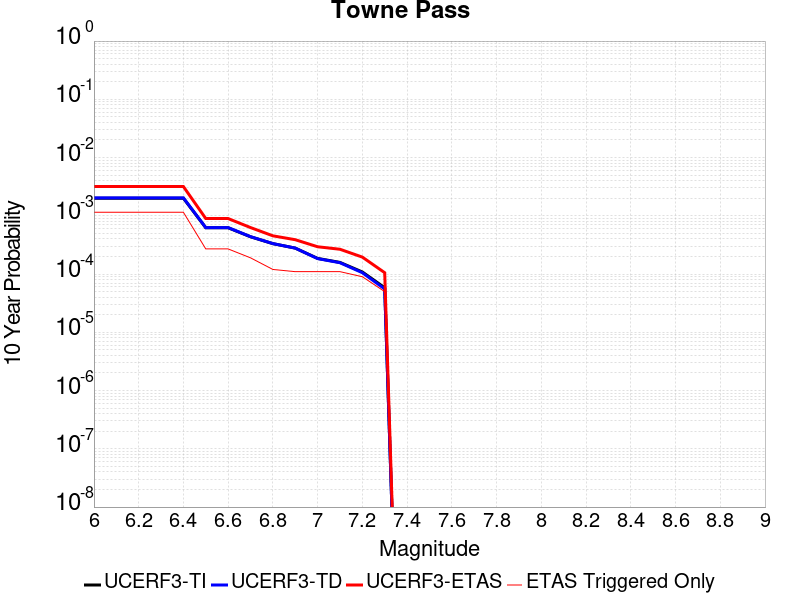 |

| Magnitude | 1 wk TI Prob | 1 wk TD Prob | 1 wk ETAS Prob | 1 wk ETAS/TD Gain | 1 wk ETAS Triggered Only | 1 mo TI Prob | 1 mo TD Prob | 1 mo ETAS Prob | 1 mo ETAS/TD Gain | 1 mo ETAS Triggered Only | 1 yr TI Prob | 1 yr TD Prob | 1 yr ETAS Prob | 1 yr ETAS/TD Gain | 1 yr ETAS Triggered Only | 10 yr TI Prob | 10 yr TD Prob | 10 yr ETAS Prob | 10 yr ETAS/TD Gain | 10 yr ETAS Triggered Only |
|-----|-----|-----|-----|-----|-----|-----|-----|-----|-----|-----|-----|-----|-----|-----|-----|-----|-----|-----|-----|-----|
| 6.0 | 3.849728E-6 | 3.8945495E-6 | 1.3894511E-5 | 3.567681 | 1.0E-5 | 1.649873E-5 | 1.6690845E-5 | 1.26689E-4 | 7.590329 | 1.1E-4 | 2.0085352E-4 | 2.0319645E-4 | 7.530847E-4 | 3.70619 | 5.5E-4 | 0.0020067208 | 0.0020305358 | 0.0031782007 | 1.565203 | 0.00115 |
| 6.1 | 3.849728E-6 | 3.8945495E-6 | 1.3894511E-5 | 3.567681 | 1.0E-5 | 1.649873E-5 | 1.6690845E-5 | 1.26689E-4 | 7.590329 | 1.1E-4 | 2.0085352E-4 | 2.0319645E-4 | 7.530847E-4 | 3.70619 | 5.5E-4 | 0.0020067208 | 0.0020305358 | 0.0031782007 | 1.565203 | 0.00115 |
| 6.2 | 3.849728E-6 | 3.8945495E-6 | 1.3894511E-5 | 3.567681 | 1.0E-5 | 1.649873E-5 | 1.6690845E-5 | 1.26689E-4 | 7.590329 | 1.1E-4 | 2.0085352E-4 | 2.0319645E-4 | 7.530847E-4 | 3.70619 | 5.5E-4 | 0.0020067208 | 0.0020305358 | 0.0031782007 | 1.565203 | 0.00115 |
| 6.3 | 3.849728E-6 | 3.8945495E-6 | 1.3894511E-5 | 3.567681 | 1.0E-5 | 1.649873E-5 | 1.6690845E-5 | 1.26689E-4 | 7.590329 | 1.1E-4 | 2.0085352E-4 | 2.0319645E-4 | 7.530847E-4 | 3.70619 | 5.5E-4 | 0.0020067208 | 0.0020305358 | 0.0031782007 | 1.565203 | 0.00115 |
| 6.4 | 3.849728E-6 | 3.8945495E-6 | 1.3894511E-5 | 3.567681 | 1.0E-5 | 1.649873E-5 | 1.6690845E-5 | 1.26689E-4 | 7.590329 | 1.1E-4 | 2.0085352E-4 | 2.0319645E-4 | 7.530847E-4 | 3.70619 | 5.5E-4 | 0.0020067208 | 0.0020305358 | 0.0031782007 | 1.565203 | 0.00115 |
| 6.5 | 1.1953545E-6 | 1.2030553E-6 | 1.2030553E-6 | 1.0 | 0.0 | 5.1229376E-6 | 5.155942E-6 | 2.5155838E-5 | 4.8789997 | 2.0E-5 | 6.236998E-5 | 6.27719E-5 | 2.1276249E-4 | 3.3894544 | 1.5E-4 | 6.235248E-4 | 6.2755344E-4 | 8.9738396E-4 | 1.4299723 | 2.7E-4 |
| 6.6 | 1.1953545E-6 | 1.2030553E-6 | 1.2030553E-6 | 1.0 | 0.0 | 5.1229376E-6 | 5.155942E-6 | 2.5155838E-5 | 4.8789997 | 2.0E-5 | 6.236998E-5 | 6.27719E-5 | 2.1276249E-4 | 3.3894544 | 1.5E-4 | 6.235248E-4 | 6.2755344E-4 | 8.9738396E-4 | 1.4299723 | 2.7E-4 |
| 6.7 | 8.375951E-7 | 8.410697E-7 | 8.410697E-7 | 1.0 | 0.0 | 3.5896885E-6 | 3.60458E-6 | 1.3604544E-5 | 3.7742383 | 1.0E-5 | 4.370358E-5 | 4.3884935E-5 | 1.2388143E-4 | 2.822869 | 8.0E-5 | 4.3694986E-4 | 4.387684E-4 | 6.2868505E-4 | 1.4328402 | 1.9E-4 |
| 6.8 | 6.38041E-7 | 6.39218E-7 | 6.39218E-7 | 1.0 | 0.0 | 2.7344586E-6 | 2.739503E-6 | 1.2739476E-5 | 4.650287 | 1.0E-5 | 3.3291526E-5 | 3.335298E-5 | 8.335131E-5 | 2.4990664 | 5.0E-5 | 3.3286537E-4 | 3.3348353E-4 | 4.5344353E-4 | 1.3597178 | 1.2E-4 |
| 6.9 | 5.3460053E-7 | 5.345355E-7 | 5.345355E-7 | 1.0 | 0.0 | 2.2911431E-6 | 2.2908646E-6 | 1.2290841E-5 | 5.365154 | 1.0E-5 | 2.789431E-5 | 2.7890954E-5 | 7.788956E-5 | 2.792646 | 5.0E-5 | 2.789081E-4 | 2.7887785E-4 | 3.8884717E-4 | 1.3943279 | 1.1E-4 |
| 7.0 | 3.557783E-7 | 3.5324413E-7 | 3.5324413E-7 | 1.0 | 0.0 | 1.5247632E-6 | 1.5139026E-6 | 1.1513887E-5 | 7.605435 | 1.0E-5 | 1.8563835E-5 | 1.8431618E-5 | 6.8430694E-5 | 3.7126799 | 5.0E-5 | 1.8562283E-4 | 1.8430172E-4 | 2.9428146E-4 | 1.5967374 | 1.1E-4 |
| 7.1 | 3.037942E-7 | 3.0002388E-7 | 3.0002388E-7 | 1.0 | 0.0 | 1.3019744E-6 | 1.2858161E-6 | 1.1285803E-5 | 8.777152 | 1.0E-5 | 1.5851423E-5 | 1.5654707E-5 | 6.565392E-5 | 4.1938777 | 5.0E-5 | 1.5850292E-4 | 1.5653679E-4 | 2.6651955E-4 | 1.7026002 | 1.1E-4 |
| 7.2 | 2.0808248E-7 | 2.021783E-7 | 2.021783E-7 | 1.0 | 0.0 | 8.917818E-7 | 8.6647816E-7 | 1.086647E-5 | 12.540962 | 1.0E-5 | 1.0857389E-5 | 1.0549325E-5 | 5.0548904E-5 | 4.7916718 | 4.0E-5 | 1.0856859E-4 | 1.054887E-4 | 1.9547921E-4 | 1.853082 | 9.0E-5 |
| 7.3 | 1.1162073E-7 | 1.06369825E-7 | 1.06369825E-7 | 1.0 | 0.0 | 4.7837443E-7 | 4.5587063E-7 | 4.5587063E-7 | 1.0 | 0.0 | 5.8241935E-6 | 5.550213E-6 | 3.5550045E-5 | 6.405168 | 3.0E-5 | 5.8240406E-5 | 5.5500943E-5 | 1.0549817E-4 | 1.9008356 | 5.0E-5 |

## Death Valley (So)
*[(top)](#table-of-contents)*

| 1 Week | 1 Month | 1 Year | 10 Year |
|-----|-----|-----|-----|
|  |  |  |  |

| Magnitude | 1 wk TI Prob | 1 wk TD Prob | 1 wk ETAS Prob | 1 wk ETAS/TD Gain | 1 wk ETAS Triggered Only | 1 mo TI Prob | 1 mo TD Prob | 1 mo ETAS Prob | 1 mo ETAS/TD Gain | 1 mo ETAS Triggered Only | 1 yr TI Prob | 1 yr TD Prob | 1 yr ETAS Prob | 1 yr ETAS/TD Gain | 1 yr ETAS Triggered Only | 10 yr TI Prob | 10 yr TD Prob | 10 yr ETAS Prob | 10 yr ETAS/TD Gain | 10 yr ETAS Triggered Only |
|-----|-----|-----|-----|-----|-----|-----|-----|-----|-----|-----|-----|-----|-----|-----|-----|-----|-----|-----|-----|-----|
| 6.0 | 2.0684236E-5 | 2.5618423E-5 | 9.5616626E-5 | 3.7323387 | 7.0E-5 | 8.864371E-5 | 1.09788714E-4 | 3.0976676E-4 | 2.821481 | 2.0E-4 | 0.0010787029 | 0.0013358749 | 0.00197502 | 1.4784468 | 6.4E-4 | 0.010734817 | 0.013281729 | 0.014406588 | 1.0846922 | 0.00114 |
| 6.1 | 2.0684236E-5 | 2.5618423E-5 | 9.5616626E-5 | 3.7323387 | 7.0E-5 | 8.864371E-5 | 1.09788714E-4 | 3.0976676E-4 | 2.821481 | 2.0E-4 | 0.0010787029 | 0.0013358749 | 0.00197502 | 1.4784468 | 6.4E-4 | 0.010734817 | 0.013281729 | 0.014406588 | 1.0846922 | 0.00114 |
| 6.2 | 2.0684236E-5 | 2.5618423E-5 | 9.5616626E-5 | 3.7323387 | 7.0E-5 | 8.864371E-5 | 1.09788714E-4 | 3.0976676E-4 | 2.821481 | 2.0E-4 | 0.0010787029 | 0.0013358749 | 0.00197502 | 1.4784468 | 6.4E-4 | 0.010734817 | 0.013281729 | 0.014406588 | 1.0846922 | 0.00114 |
| 6.3 | 2.0240292E-5 | 2.5118497E-5 | 9.511674E-5 | 3.7867208 | 7.0E-5 | 8.6741224E-5 | 1.0764636E-4 | 2.87627E-4 | 2.671962 | 1.8E-4 | 0.0010555626 | 0.0013098232 | 0.0018890635 | 1.4422278 | 5.8E-4 | 0.010505628 | 0.013024284 | 0.0140803475 | 1.0810843 | 0.00107 |
| 6.4 | 2.0240292E-5 | 2.5118497E-5 | 9.511674E-5 | 3.7867208 | 7.0E-5 | 8.6741224E-5 | 1.0764636E-4 | 2.87627E-4 | 2.671962 | 1.8E-4 | 0.0010555626 | 0.0013098232 | 0.0018890635 | 1.4422278 | 5.8E-4 | 0.010505628 | 0.013024284 | 0.0140803475 | 1.0810843 | 0.00107 |
| 6.5 | 1.9962767E-5 | 2.4807747E-5 | 9.480601E-5 | 3.8216293 | 7.0E-5 | 8.55519E-5 | 1.0631468E-4 | 2.8629554E-4 | 2.692907 | 1.8E-4 | 0.0010410968 | 0.0012936293 | 0.001862892 | 1.4400508 | 5.7E-4 | 0.010362327 | 0.012864228 | 0.013880977 | 1.079037 | 0.00103 |
| 6.6 | 1.8937297E-5 | 2.3311568E-5 | 9.3309936E-5 | 4.002731 | 7.0E-5 | 8.115732E-5 | 9.990298E-5 | 2.79885E-4 | 2.801568 | 1.8E-4 | 9.876423E-4 | 0.0012156547 | 0.0017450104 | 1.4354491 | 5.3E-4 | 0.009832645 | 0.0120931 | 0.012992094 | 1.0743395 | 9.1E-4 |
| 6.7 | 1.8621096E-5 | 2.2912203E-5 | 8.291083E-5 | 3.6186318 | 6.0E-5 | 7.980225E-5 | 9.8191544E-5 | 2.6817486E-4 | 2.73114 | 1.7E-4 | 9.711593E-4 | 0.0011948409 | 0.0016842554 | 1.4096065 | 4.9E-4 | 0.009669261 | 0.011887211 | 0.012736988 | 1.0714867 | 8.6E-4 |
| 6.8 | 1.7830353E-5 | 2.1806247E-5 | 8.180494E-5 | 3.751445 | 6.0E-5 | 7.641356E-5 | 9.345208E-5 | 2.5343712E-4 | 2.7119474 | 1.6E-4 | 9.29938E-4 | 0.0011371992 | 0.0015866875 | 1.395259 | 4.5E-4 | 0.009260561 | 0.011316643 | 0.012097702 | 1.0690187 | 7.9E-4 |
| 6.9 | 1.3135183E-5 | 1.5304242E-5 | 4.5303783E-5 | 2.960211 | 3.0E-5 | 5.6292425E-5 | 6.558799E-5 | 1.4558274E-4 | 2.2196555 | 8.0E-5 | 6.8514474E-4 | 7.982477E-4 | 0.0010980082 | 1.3755232 | 3.0E-4 | 0.006830362 | 0.007954813 | 0.008510358 | 1.0698377 | 5.6E-4 |
| 7.0 | 1.1507512E-5 | 1.3154444E-5 | 3.315418E-5 | 2.5203788 | 2.0E-5 | 4.9316975E-5 | 5.6375004E-5 | 1.1637162E-4 | 2.0642414 | 6.0E-5 | 6.002687E-4 | 6.861553E-4 | 9.0600434E-4 | 1.3204072 | 2.2E-4 | 0.0059864987 | 0.006841068 | 0.0072482633 | 1.0595222 | 4.1E-4 |
| 7.1 | 9.715903E-6 | 1.0865454E-5 | 3.0865238E-5 | 2.8406763 | 2.0E-5 | 4.1638916E-5 | 4.6565423E-5 | 7.656403E-5 | 1.6442249 | 3.0E-5 | 5.068359E-4 | 5.667908E-4 | 6.667341E-4 | 1.1763319 | 1.0E-4 | 0.0050568148 | 0.0056539057 | 0.0058627184 | 1.0369325 | 2.1E-4 |
| 7.2 | 9.233269E-6 | 1.0286473E-5 | 3.0286268E-5 | 2.944281 | 2.0E-5 | 3.9570554E-5 | 4.4084165E-5 | 7.408284E-5 | 1.6804864 | 3.0E-5 | 4.81665E-4 | 5.3659675E-4 | 6.165538E-4 | 1.1490078 | 8.0E-5 | 0.0048062233 | 0.005353442 | 0.0055324784 | 1.0334432 | 1.8E-4 |
| 7.3 | 8.8041315E-6 | 9.808313E-6 | 2.9808118E-5 | 3.0390666 | 2.0E-5 | 3.7731446E-5 | 4.2034975E-5 | 7.203371E-5 | 1.7136614 | 3.0E-5 | 4.592835E-4 | 5.1165983E-4 | 5.916189E-4 | 1.1562738 | 8.0E-5 | 0.0045833546 | 0.0051052445 | 0.005264428 | 1.0311803 | 1.6E-4 |
| 7.4 | 8.708749E-6 | 9.707323E-6 | 2.970713E-5 | 3.06028 | 2.0E-5 | 3.7322676E-5 | 4.1602176E-5 | 7.160092E-5 | 1.7210861 | 3.0E-5 | 4.5430884E-4 | 5.06393E-4 | 5.7635753E-4 | 1.1381626 | 7.0E-5 | 0.004533812 | 0.0050528166 | 0.0052020587 | 1.0295364 | 1.5E-4 |
| 7.5 | 8.612678E-6 | 9.604964E-6 | 2.9604773E-5 | 3.0822365 | 2.0E-5 | 3.6910955E-5 | 4.116351E-5 | 7.116227E-5 | 1.7287709 | 3.0E-5 | 4.492982E-4 | 5.010547E-4 | 5.710196E-4 | 1.1396353 | 7.0E-5 | 0.004483909 | 0.0049996753 | 0.005138975 | 1.0278618 | 1.4E-4 |
| 7.6 | 8.319024E-6 | 9.28406E-6 | 1.9283967E-5 | 2.077105 | 1.0E-5 | 3.5652476E-5 | 3.9788243E-5 | 5.978745E-5 | 1.5026411 | 2.0E-5 | 4.3398244E-4 | 4.8431839E-4 | 5.4428936E-4 | 1.1238254 | 6.0E-5 | 0.0043313587 | 0.004833053 | 0.0049524726 | 1.024709 | 1.2E-4 |
| 7.7 | 7.4718328E-6 | 8.3453E-6 | 1.8345216E-5 | 2.1982694 | 1.0E-5 | 3.2021748E-5 | 3.57651E-5 | 5.5764387E-5 | 1.5591843 | 2.0E-5 | 3.8979502E-4 | 4.3535716E-4 | 4.9533107E-4 | 1.1377579 | 6.0E-5 | 0.00389112 | 0.004345448 | 0.0044649267 | 1.0274951 | 1.2E-4 |
| 7.8 | 3.4586725E-7 | 3.648288E-7 | 3.648288E-7 | 1.0 | 0.0 | 1.4822873E-6 | 1.5635511E-6 | 1.5635511E-6 | 1.0 | 0.0 | 1.80467E-5 | 1.9036073E-5 | 2.9035882E-5 | 1.5253085 | 1.0E-5 | 1.8045233E-4 | 1.9034486E-4 | 2.0034295E-4 | 1.0525262 | 1.0E-5 |
| 7.9 | 2.5591178E-9 | 2.6696871E-9 | 2.6696871E-9 | 1.0 | 0.0 | 1.0967647E-8 | 1.1441516E-8 | 1.1441516E-8 | 1.0 | 0.0 | 1.335311E-7 | 1.3930045E-7 | 1.3930045E-7 | 1.0 | 0.0 | 1.3353102E-6 | 1.3930046E-6 | 1.3930046E-6 | 1.0 | 0.0 |

## Paradise
*[(top)](#table-of-contents)*

| 1 Week | 1 Month | 1 Year | 10 Year |
|-----|-----|-----|-----|
|  |  |  |  |

| Magnitude | 1 wk TI Prob | 1 wk TD Prob | 1 wk ETAS Prob | 1 wk ETAS/TD Gain | 1 wk ETAS Triggered Only | 1 mo TI Prob | 1 mo TD Prob | 1 mo ETAS Prob | 1 mo ETAS/TD Gain | 1 mo ETAS Triggered Only | 1 yr TI Prob | 1 yr TD Prob | 1 yr ETAS Prob | 1 yr ETAS/TD Gain | 1 yr ETAS Triggered Only | 10 yr TI Prob | 10 yr TD Prob | 10 yr ETAS Prob | 10 yr ETAS/TD Gain | 10 yr ETAS Triggered Only |
|-----|-----|-----|-----|-----|-----|-----|-----|-----|-----|-----|-----|-----|-----|-----|-----|-----|-----|-----|-----|-----|
| 6.0 | 1.4851273E-5 | 1.6694854E-5 | 3.669452E-5 | 2.197954 | 2.0E-5 | 6.364676E-5 | 7.154755E-5 | 2.1153752E-4 | 2.956601 | 1.4E-4 | 7.7462377E-4 | 8.707668E-4 | 0.0013403576 | 1.5392841 | 4.7E-4 | 0.0077192914 | 0.008675928 | 0.009587946 | 1.1051205 | 9.2E-4 |
| 6.1 | 1.4851273E-5 | 1.6694854E-5 | 3.669452E-5 | 2.197954 | 2.0E-5 | 6.364676E-5 | 7.154755E-5 | 2.1153752E-4 | 2.956601 | 1.4E-4 | 7.7462377E-4 | 8.707668E-4 | 0.0013403576 | 1.5392841 | 4.7E-4 | 0.0077192914 | 0.008675928 | 0.009587946 | 1.1051205 | 9.2E-4 |
| 6.2 | 1.4851273E-5 | 1.6694854E-5 | 3.669452E-5 | 2.197954 | 2.0E-5 | 6.364676E-5 | 7.154755E-5 | 2.1153752E-4 | 2.956601 | 1.4E-4 | 7.7462377E-4 | 8.707668E-4 | 0.0013403576 | 1.5392841 | 4.7E-4 | 0.0077192914 | 0.008675928 | 0.009587946 | 1.1051205 | 9.2E-4 |
| 6.3 | 1.0426831E-5 | 1.1888727E-5 | 2.1888609E-5 | 1.8411229 | 1.0E-5 | 4.4685654E-5 | 5.0950726E-5 | 1.3094665E-4 | 2.5700643 | 8.0E-5 | 5.43912E-4 | 6.201545E-4 | 8.500119E-4 | 1.3706453 | 2.3E-4 | 0.0054258266 | 0.006184847 | 0.0066022496 | 1.067488 | 4.2E-4 |
| 6.4 | 1.0426831E-5 | 1.1888727E-5 | 2.1888609E-5 | 1.8411229 | 1.0E-5 | 4.4685654E-5 | 5.0950726E-5 | 1.3094665E-4 | 2.5700643 | 8.0E-5 | 5.43912E-4 | 6.201545E-4 | 8.500119E-4 | 1.3706453 | 2.3E-4 | 0.0054258266 | 0.006184847 | 0.0066022496 | 1.067488 | 4.2E-4 |
| 6.5 | 9.25027E-6 | 1.0620054E-5 | 2.0619947E-5 | 1.9416049 | 1.0E-5 | 3.964341E-5 | 4.551375E-5 | 1.15510564E-4 | 2.5379267 | 7.0E-5 | 4.8255164E-4 | 5.539939E-4 | 7.1390526E-4 | 1.2886518 | 1.6E-4 | 0.0048150513 | 0.0055266283 | 0.0058150254 | 1.0521833 | 2.9E-4 |
| 6.6 | 7.904275E-6 | 9.159603E-6 | 1.9159512E-5 | 2.0917404 | 1.0E-5 | 3.3875025E-5 | 3.925487E-5 | 7.92533E-5 | 2.0189419 | 4.0E-5 | 4.1235037E-4 | 4.7782718E-4 | 5.7777937E-4 | 1.2091807 | 1.0E-4 | 0.0041158604 | 0.004768395 | 0.0049574887 | 1.0396557 | 1.9E-4 |
| 6.7 | 7.2061953E-6 | 8.407318E-6 | 1.8407234E-5 | 2.18943 | 1.0E-5 | 3.088333E-5 | 3.6030888E-5 | 7.602944E-5 | 2.1101186 | 4.0E-5 | 3.7593965E-4 | 4.385914E-4 | 5.2855193E-4 | 1.2051123 | 9.0E-5 | 0.003753043 | 0.0043776273 | 0.004497102 | 1.0272921 | 1.2E-4 |
| 6.8 | 6.6948724E-6 | 7.84223E-6 | 7.84223E-6 | 1.0 | 0.0 | 2.8691995E-5 | 3.3609143E-5 | 6.360814E-5 | 1.8925842 | 3.0E-5 | 3.4926904E-4 | 4.0911807E-4 | 4.7908945E-4 | 1.1710297 | 7.0E-5 | 0.003487206 | 0.0040840064 | 0.0041835983 | 1.0243858 | 1.0E-4 |
| 6.9 | 6.0421025E-6 | 7.130678E-6 | 7.130678E-6 | 1.0 | 0.0 | 2.5894467E-5 | 3.055971E-5 | 5.05591E-5 | 1.6544365 | 2.0E-5 | 3.1521954E-4 | 3.7200435E-4 | 4.119895E-4 | 1.1074857 | 4.0E-5 | 0.0031477278 | 0.0037141545 | 0.0037739316 | 1.0160944 | 6.0E-5 |
| 7.0 | 4.134091E-6 | 5.0803487E-6 | 5.0803487E-6 | 1.0 | 0.0 | 1.7717413E-5 | 2.177275E-5 | 4.1772317E-5 | 1.9185594 | 2.0E-5 | 2.1568815E-4 | 2.6505254E-4 | 3.0504193E-4 | 1.1508734 | 4.0E-5 | 0.0021547892 | 0.0026475172 | 0.0026973847 | 1.0188357 | 5.0E-5 |
| 7.1 | 3.7674888E-6 | 4.6319055E-6 | 4.6319055E-6 | 1.0 | 0.0 | 1.6146281E-5 | 1.985088E-5 | 2.9850682E-5 | 1.503746 | 1.0E-5 | 1.9656324E-4 | 2.4165919E-4 | 2.7165195E-4 | 1.1241118 | 3.0E-5 | 0.0019638946 | 0.0024141145 | 0.002454018 | 1.0165292 | 4.0E-5 |
| 7.2 | 3.4065345E-6 | 4.156755E-6 | 4.156755E-6 | 1.0 | 0.0 | 1.4599351E-5 | 1.7814553E-5 | 2.7814374E-5 | 1.5613289 | 1.0E-5 | 1.777326E-4 | 2.1687208E-4 | 2.468656E-4 | 1.1383004 | 3.0E-5 | 0.0017759053 | 0.0021667527 | 0.002206666 | 1.0184208 | 4.0E-5 |
| 7.3 | 2.9934936E-6 | 3.6293434E-6 | 3.6293434E-6 | 1.0 | 0.0 | 1.2829195E-5 | 1.5554244E-5 | 2.5554089E-5 | 1.6429013 | 1.0E-5 | 1.5618425E-4 | 1.8935793E-4 | 2.1935225E-4 | 1.1584 | 3.0E-5 | 0.0015607453 | 0.0018921113 | 0.0019320355 | 1.0211004 | 4.0E-5 |
| 7.4 | 2.4049796E-6 | 2.8890036E-6 | 2.8890036E-6 | 1.0 | 0.0 | 1.0307015E-5 | 1.2381393E-5 | 1.2381393E-5 | 1.0 | 0.0 | 1.2548068E-4 | 1.5073447E-4 | 1.5073447E-4 | 1.0 | 0.0 | 0.0012540985 | 0.0015064639 | 0.0015064639 | 1.0 | 0.0 |
| 7.5 | 1.2710091E-6 | 1.5134775E-6 | 1.5134775E-6 | 1.0 | 0.0 | 5.44717E-6 | 6.486323E-6 | 6.486323E-6 | 1.0 | 0.0 | 6.631728E-5 | 7.896937E-5 | 7.896937E-5 | 1.0 | 0.0 | 6.6297496E-4 | 7.8953576E-4 | 7.8953576E-4 | 1.0 | 0.0 |
| 7.6 | 2.21172E-7 | 2.6039737E-7 | 2.6039737E-7 | 1.0 | 0.0 | 9.478797E-7 | 1.1159884E-6 | 1.1159884E-6 | 1.0 | 0.0 | 1.1540374E-5 | 1.3587103E-5 | 1.3587103E-5 | 1.0 | 0.0 | 1.1539775E-4 | 1.3586554E-4 | 1.3586554E-4 | 1.0 | 0.0 |

## Bicycle Lake
*[(top)](#table-of-contents)*

| 1 Week | 1 Month | 1 Year | 10 Year |
|-----|-----|-----|-----|
|  |  |  |  |

| Magnitude | 1 wk TI Prob | 1 wk TD Prob | 1 wk ETAS Prob | 1 wk ETAS/TD Gain | 1 wk ETAS Triggered Only | 1 mo TI Prob | 1 mo TD Prob | 1 mo ETAS Prob | 1 mo ETAS/TD Gain | 1 mo ETAS Triggered Only | 1 yr TI Prob | 1 yr TD Prob | 1 yr ETAS Prob | 1 yr ETAS/TD Gain | 1 yr ETAS Triggered Only | 10 yr TI Prob | 10 yr TD Prob | 10 yr ETAS Prob | 10 yr ETAS/TD Gain | 10 yr ETAS Triggered Only |
|-----|-----|-----|-----|-----|-----|-----|-----|-----|-----|-----|-----|-----|-----|-----|-----|-----|-----|-----|-----|-----|
| 6.0 | 1.9621975E-5 | 2.2097447E-5 | 5.2096784E-5 | 2.3575928 | 3.0E-5 | 8.4091465E-5 | 9.470067E-5 | 2.1468931E-4 | 2.2670305 | 1.2E-4 | 0.0010233327 | 0.0011525059 | 0.0015720217 | 1.3640033 | 4.2E-4 | 0.01018633 | 0.011478599 | 0.012299072 | 1.0714785 | 8.3E-4 |
| 6.1 | 1.9621975E-5 | 2.2097447E-5 | 5.2096784E-5 | 2.3575928 | 3.0E-5 | 8.4091465E-5 | 9.470067E-5 | 2.1468931E-4 | 2.2670305 | 1.2E-4 | 0.0010233327 | 0.0011525059 | 0.0015720217 | 1.3640033 | 4.2E-4 | 0.01018633 | 0.011478599 | 0.012299072 | 1.0714785 | 8.3E-4 |
| 6.2 | 9.9971285E-6 | 1.1255827E-5 | 2.1255715E-5 | 1.8884187 | 1.0E-5 | 4.2844134E-5 | 4.823866E-5 | 1.0823577E-4 | 2.2437556 | 6.0E-5 | 5.2150246E-4 | 5.8719947E-4 | 8.470468E-4 | 1.4425197 | 2.6E-4 | 0.0052028033 | 0.005861584 | 0.0064083603 | 1.0932813 | 5.5E-4 |
| 6.3 | 9.589428E-6 | 1.0798527E-5 | 2.079842E-5 | 1.9260423 | 1.0E-5 | 4.10969E-5 | 4.627887E-5 | 1.0627609E-4 | 2.296428 | 6.0E-5 | 5.002399E-4 | 5.6335144E-4 | 8.23205E-4 | 1.4612637 | 2.6E-4 | 0.0049911533 | 0.0056243236 | 0.0061513428 | 1.0937035 | 5.3E-4 |
| 6.4 | 9.589428E-6 | 1.0798527E-5 | 2.079842E-5 | 1.9260423 | 1.0E-5 | 4.10969E-5 | 4.627887E-5 | 1.0627609E-4 | 2.296428 | 6.0E-5 | 5.002399E-4 | 5.6335144E-4 | 8.23205E-4 | 1.4612637 | 2.6E-4 | 0.0049911533 | 0.0056243236 | 0.0061513428 | 1.0937035 | 5.3E-4 |
| 6.5 | 5.557707E-6 | 6.2857107E-6 | 6.2857107E-6 | 1.0 | 0.0 | 2.3818526E-5 | 2.6938633E-5 | 6.693756E-5 | 2.4848163 | 4.0E-5 | 2.8995197E-4 | 3.2795538E-4 | 4.779062E-4 | 1.4572293 | 1.5E-4 | 0.0028957394 | 0.0032773502 | 0.0036062687 | 1.1003611 | 3.3E-4 |
| 6.6 | 4.8742945E-6 | 5.5133855E-6 | 5.5133855E-6 | 1.0 | 0.0 | 2.0889667E-5 | 2.3628729E-5 | 6.3627784E-5 | 2.6928146 | 4.0E-5 | 2.54302E-4 | 2.87668E-4 | 4.176306E-4 | 1.4517798 | 1.3E-4 | 0.002540112 | 0.0028755253 | 0.0031646914 | 1.1005611 | 2.9E-4 |
| 6.7 | 3.991108E-6 | 4.515989E-6 | 4.515989E-6 | 1.0 | 0.0 | 1.7104636E-5 | 1.9354238E-5 | 4.9353657E-5 | 2.550018 | 3.0E-5 | 2.0822904E-4 | 2.3563785E-4 | 3.3561428E-4 | 1.42428 | 1.0E-4 | 0.0020803404 | 0.0023563786 | 0.002595813 | 1.1016113 | 2.4E-4 |

## San Andreas (San Bernardino N)
*[(top)](#table-of-contents)*

| 1 Week | 1 Month | 1 Year | 10 Year |
|-----|-----|-----|-----|
|  |  |  |  |

| Magnitude | 1 wk TI Prob | 1 wk TD Prob | 1 wk ETAS Prob | 1 wk ETAS/TD Gain | 1 wk ETAS Triggered Only | 1 mo TI Prob | 1 mo TD Prob | 1 mo ETAS Prob | 1 mo ETAS/TD Gain | 1 mo ETAS Triggered Only | 1 yr TI Prob | 1 yr TD Prob | 1 yr ETAS Prob | 1 yr ETAS/TD Gain | 1 yr ETAS Triggered Only | 10 yr TI Prob | 10 yr TD Prob | 10 yr ETAS Prob | 10 yr ETAS/TD Gain | 10 yr ETAS Triggered Only |
|-----|-----|-----|-----|-----|-----|-----|-----|-----|-----|-----|-----|-----|-----|-----|-----|-----|-----|-----|-----|-----|
| 6.0 | 1.4273766E-4 | 3.161376E-4 | 3.3613126E-4 | 1.0632436 | 2.0E-5 | 6.115894E-4 | 0.0013541778 | 0.0014540424 | 1.0737455 | 1.0E-4 | 0.0074207084 | 0.016363978 | 0.016698414 | 1.0204374 | 3.4E-4 | 0.07177748 | 0.15029658 | 0.15084039 | 1.0036182 | 6.4E-4 |
| 6.1 | 1.4273766E-4 | 3.161376E-4 | 3.3613126E-4 | 1.0632436 | 2.0E-5 | 6.115894E-4 | 0.0013541778 | 0.0014540424 | 1.0737455 | 1.0E-4 | 0.0074207084 | 0.016363978 | 0.016698414 | 1.0204374 | 3.4E-4 | 0.07177748 | 0.15029658 | 0.15084039 | 1.0036182 | 6.4E-4 |
| 6.2 | 1.4273766E-4 | 3.161376E-4 | 3.3613126E-4 | 1.0632436 | 2.0E-5 | 6.115894E-4 | 0.0013541778 | 0.0014540424 | 1.0737455 | 1.0E-4 | 0.0074207084 | 0.016363978 | 0.016698414 | 1.0204374 | 3.4E-4 | 0.07177748 | 0.15029658 | 0.15084039 | 1.0036182 | 6.4E-4 |
| 6.3 | 1.3730655E-4 | 3.0518573E-4 | 3.2517966E-4 | 1.0655138 | 2.0E-5 | 5.883239E-4 | 0.001307289 | 0.0014071582 | 1.0763942 | 1.0E-4 | 0.0071393442 | 0.01580149 | 0.016136117 | 1.0211769 | 3.4E-4 | 0.06914291 | 0.14559646 | 0.14614329 | 1.0037557 | 6.4E-4 |
| 6.4 | 1.3730655E-4 | 3.0518573E-4 | 3.2517966E-4 | 1.0655138 | 2.0E-5 | 5.883239E-4 | 0.001307289 | 0.0014071582 | 1.0763942 | 1.0E-4 | 0.0071393442 | 0.01580149 | 0.016136117 | 1.0211769 | 3.4E-4 | 0.06914291 | 0.14559646 | 0.14614329 | 1.0037557 | 6.4E-4 |
| 6.5 | 1.2942807E-4 | 2.8932988E-4 | 3.093241E-4 | 1.0691053 | 2.0E-5 | 5.545738E-4 | 0.0012394012 | 0.0013392771 | 1.0805842 | 1.0E-4 | 0.0067310524 | 0.014986552 | 0.015321457 | 1.022347 | 3.4E-4 | 0.06530788 | 0.13873914 | 0.13929035 | 1.003973 | 6.4E-4 |
| 6.6 | 1.1125901E-4 | 2.537176E-4 | 2.737125E-4 | 1.0788078 | 2.0E-5 | 4.767372E-4 | 0.0010869103 | 0.0011868016 | 1.0919039 | 1.0E-4 | 0.005788839 | 0.013153472 | 0.013469263 | 1.0240082 | 3.2E-4 | 0.056403454 | 0.12302898 | 0.1235727 | 1.0044194 | 6.2E-4 |
| 6.7 | 1.02209575E-4 | 2.3506685E-4 | 2.5506216E-4 | 1.0850621 | 2.0E-5 | 4.3796748E-4 | 0.0010070418 | 0.0011069411 | 1.0992007 | 1.0E-4 | 0.0053192247 | 0.01219223 | 0.01249845 | 1.0251161 | 3.1E-4 | 0.051936906 | 0.11482068 | 0.11536064 | 1.0047027 | 6.1E-4 |
| 6.8 | 9.610582E-5 | 2.2032406E-4 | 2.4031964E-4 | 1.0907553 | 2.0E-5 | 4.1181705E-4 | 9.439049E-4 | 0.0010438105 | 1.1058428 | 1.0E-4 | 0.0050023515 | 0.011431754 | 0.01173821 | 1.0268074 | 3.1E-4 | 0.048912346 | 0.1082225 | 0.10876649 | 1.0050266 | 6.1E-4 |
| 6.9 | 9.3877505E-5 | 2.1487933E-4 | 2.3487503E-4 | 1.0930555 | 2.0E-5 | 4.0227012E-4 | 9.2058704E-4 | 0.001020495 | 1.1085263 | 1.0E-4 | 0.0048866454 | 0.011150793 | 0.011457336 | 1.0274907 | 3.1E-4 | 0.04780577 | 0.10581279 | 0.106349304 | 1.0050704 | 6.0E-4 |
| 7.0 | 9.1019785E-5 | 2.0814833E-4 | 2.2814417E-4 | 1.0960653 | 2.0E-5 | 3.900265E-4 | 8.917599E-4 | 9.916708E-4 | 1.1120378 | 1.0E-4 | 0.0047382377 | 0.010803353 | 0.011110004 | 1.0283848 | 3.1E-4 | 0.046384744 | 0.10278319 | 0.103321515 | 1.0052376 | 6.0E-4 |
| 7.1 | 8.771155E-5 | 1.9989353E-4 | 2.1988954E-4 | 1.1000333 | 2.0E-5 | 3.758525E-4 | 8.564058E-4 | 9.563202E-4 | 1.116667 | 1.0E-4 | 0.0045664064 | 0.01037709 | 0.010683873 | 1.0295635 | 3.1E-4 | 0.044737056 | 0.09909467 | 0.099635206 | 1.0054548 | 6.0E-4 |
| 7.2 | 8.0830236E-5 | 1.8394848E-4 | 2.039448E-4 | 1.1087061 | 2.0E-5 | 3.4636928E-4 | 7.881126E-4 | 8.8803377E-4 | 1.1267854 | 1.0E-4 | 0.0042088944 | 0.009553162 | 0.009860201 | 1.03214 | 3.1E-4 | 0.041300658 | 0.09182531 | 0.092342965 | 1.0056374 | 5.7E-4 |
| 7.3 | 7.7668235E-5 | 1.7338296E-4 | 1.9337948E-4 | 1.1153316 | 2.0E-5 | 3.328214E-4 | 7.428583E-4 | 8.42784E-4 | 1.1345152 | 1.0E-4 | 0.0040445733 | 0.009006873 | 0.009314081 | 1.0341082 | 3.1E-4 | 0.03971748 | 0.087092124 | 0.08761249 | 1.0059748 | 5.7E-4 |
| 7.4 | 7.520177E-5 | 1.6558339E-4 | 1.8558008E-4 | 1.1207651 | 2.0E-5 | 3.2225347E-4 | 7.0945016E-4 | 8.093792E-4 | 1.1408542 | 1.0E-4 | 0.0039163795 | 0.0086034145 | 0.008900833 | 1.0345699 | 3.0E-4 | 0.038480744 | 0.08354814 | 0.08405219 | 1.0060331 | 5.5E-4 |
| 7.5 | 7.274697E-5 | 1.5845922E-4 | 1.7845606E-4 | 1.1261954 | 2.0E-5 | 3.1173544E-4 | 6.789343E-4 | 7.7886635E-4 | 1.1471896 | 1.0E-4 | 0.003788775 | 0.008234753 | 0.008532283 | 1.036131 | 3.0E-4 | 0.03724827 | 0.08026466 | 0.080770515 | 1.0063024 | 5.5E-4 |
| 7.6 | 7.1185845E-5 | 1.5415733E-4 | 1.7415425E-4 | 1.1297176 | 2.0E-5 | 3.0504653E-4 | 6.6050707E-4 | 7.60441E-4 | 1.1512989 | 1.0E-4 | 0.0037076178 | 0.008012074 | 0.008309671 | 1.0371435 | 3.0E-4 | 0.036463667 | 0.078254156 | 0.078761116 | 1.0064784 | 5.5E-4 |
| 7.7 | 6.709961E-5 | 1.4324463E-4 | 1.6324177E-4 | 1.1396013 | 2.0E-5 | 2.8753807E-4 | 6.1376113E-4 | 7.136998E-4 | 1.1628299 | 1.0E-4 | 0.003495157 | 0.007446978 | 0.0077447435 | 1.0399848 | 3.0E-4 | 0.034406938 | 0.073082365 | 0.0735829 | 1.0068489 | 5.4E-4 |
| 7.8 | 6.300812E-5 | 1.3208245E-4 | 1.5207981E-4 | 1.1514006 | 2.0E-5 | 2.7000686E-4 | 5.659449E-4 | 6.658883E-4 | 1.1765957 | 1.0E-4 | 0.0032823787 | 0.0068686386 | 0.007166578 | 1.0433768 | 3.0E-4 | 0.032343175 | 0.06773997 | 0.06824339 | 1.0074316 | 5.4E-4 |
| 7.9 | 4.983037E-5 | 9.728091E-5 | 1.07279935E-4 | 1.1027851 | 1.0E-5 | 2.1354125E-4 | 4.1685157E-4 | 4.968182E-4 | 1.1918348 | 8.0E-5 | 0.0025967648 | 0.005063368 | 0.0052922033 | 1.0451943 | 2.3E-4 | 0.025666296 | 0.0506703 | 0.05107851 | 1.0080563 | 4.3E-4 |
| 8.0 | 3.2211527E-5 | 5.333152E-5 | 5.333152E-5 | 1.0 | 0.0 | 1.380421E-4 | 2.2854365E-4 | 2.585368E-4 | 1.131236 | 3.0E-5 | 0.0016793669 | 0.0027789702 | 0.0028288313 | 1.0179423 | 5.0E-5 | 0.016667323 | 0.02837451 | 0.028510537 | 1.004794 | 1.4E-4 |
| 8.1 | 1.743376E-5 | 1.8836954E-5 | 1.8836954E-5 | 1.0 | 0.0 | 7.471398E-5 | 8.07273E-5 | 8.07273E-5 | 1.0 | 0.0 | 9.0926304E-4 | 9.824124E-4 | 9.824124E-4 | 1.0 | 0.0 | 0.009055517 | 0.010490617 | 0.010520302 | 1.0028297 | 3.0E-5 |
| 8.2 | 7.831616E-6 | 5.1597067E-6 | 5.1597067E-6 | 1.0 | 0.0 | 3.3563636E-5 | 2.2112841E-5 | 2.2112841E-5 | 1.0 | 0.0 | 4.0856065E-4 | 2.6919067E-4 | 2.6919067E-4 | 1.0 | 0.0 | 0.004078103 | 0.003044315 | 0.003044315 | 1.0 | 0.0 |
| 8.3 | 1.983087E-6 | 7.668296E-7 | 7.668296E-7 | 1.0 | 0.0 | 8.498917E-6 | 3.2864084E-6 | 3.2864084E-6 | 1.0 | 0.0 | 1.034694E-4 | 4.0011306E-5 | 4.0011306E-5 | 1.0 | 0.0 | 0.0010342124 | 4.724499E-4 | 4.724499E-4 | 1.0 | 0.0 |

## Garlic Springs
*[(top)](#table-of-contents)*

| 1 Week | 1 Month | 1 Year | 10 Year |
|-----|-----|-----|-----|
|  | 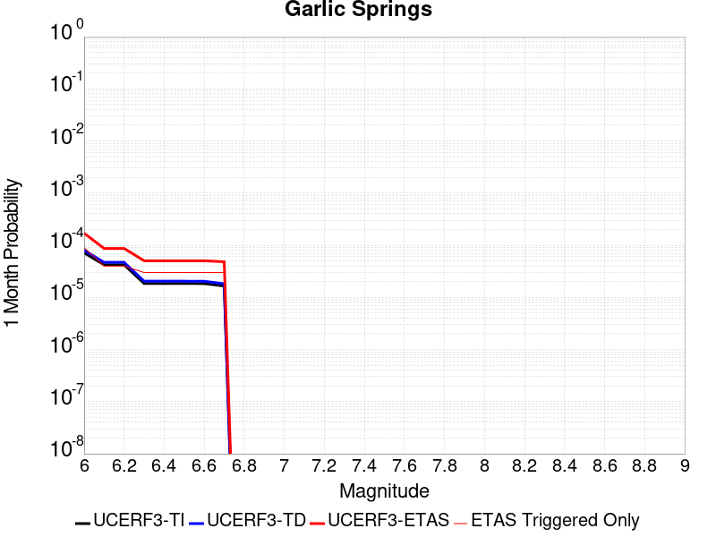 | 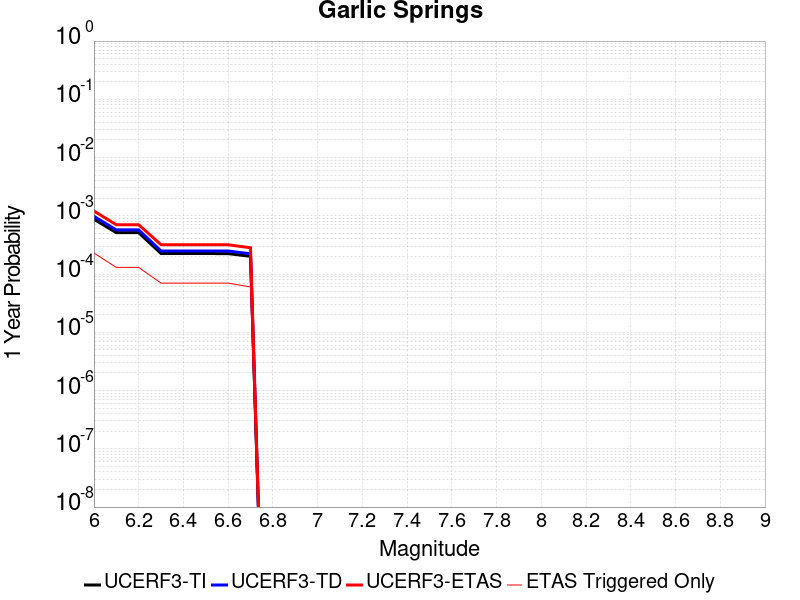 |  |

| Magnitude | 1 wk TI Prob | 1 wk TD Prob | 1 wk ETAS Prob | 1 wk ETAS/TD Gain | 1 wk ETAS Triggered Only | 1 mo TI Prob | 1 mo TD Prob | 1 mo ETAS Prob | 1 mo ETAS/TD Gain | 1 mo ETAS Triggered Only | 1 yr TI Prob | 1 yr TD Prob | 1 yr ETAS Prob | 1 yr ETAS/TD Gain | 1 yr ETAS Triggered Only | 10 yr TI Prob | 10 yr TD Prob | 10 yr ETAS Prob | 10 yr ETAS/TD Gain | 10 yr ETAS Triggered Only |
|-----|-----|-----|-----|-----|-----|-----|-----|-----|-----|-----|-----|-----|-----|-----|-----|-----|-----|-----|-----|-----|
| 6.0 | 1.6760017E-5 | 1.8777133E-5 | 3.8776758E-5 | 2.0651054 | 2.0E-5 | 7.182667E-5 | 8.0471604E-5 | 1.7046437E-4 | 2.118317 | 9.0E-5 | 8.7413884E-4 | 9.794189E-4 | 0.0012091935 | 1.2346032 | 2.3E-4 | 0.008707083 | 0.009762568 | 0.010277492 | 1.0527446 | 5.2E-4 |
| 6.1 | 9.852767E-6 | 1.0973752E-5 | 1.0973752E-5 | 1.0 | 0.0 | 4.222546E-5 | 4.702992E-5 | 8.702804E-5 | 1.8504823 | 4.0E-5 | 5.139737E-4 | 5.7250983E-4 | 7.024354E-4 | 1.2269404 | 1.3E-4 | 0.005127866 | 0.0057173073 | 0.0060155923 | 1.0521723 | 3.0E-4 |
| 6.2 | 9.852767E-6 | 1.0973752E-5 | 1.0973752E-5 | 1.0 | 0.0 | 4.222546E-5 | 4.702992E-5 | 8.702804E-5 | 1.8504823 | 4.0E-5 | 5.139737E-4 | 5.7250983E-4 | 7.024354E-4 | 1.2269404 | 1.3E-4 | 0.005127866 | 0.0057173073 | 0.0060155923 | 1.0521723 | 3.0E-4 |
| 6.3 | 4.3167724E-6 | 4.7780964E-6 | 4.7780964E-6 | 1.0 | 0.0 | 1.8500323E-5 | 2.0477524E-5 | 5.047691E-5 | 2.4649909 | 3.0E-5 | 2.2521814E-4 | 2.4930836E-4 | 3.192909E-4 | 1.2807068 | 7.0E-5 | 0.0022499003 | 0.0024925452 | 0.0026421715 | 1.0600295 | 1.5E-4 |
| 6.4 | 4.3167724E-6 | 4.7780964E-6 | 4.7780964E-6 | 1.0 | 0.0 | 1.8500323E-5 | 2.0477524E-5 | 5.047691E-5 | 2.4649909 | 3.0E-5 | 2.2521814E-4 | 2.4930836E-4 | 3.192909E-4 | 1.2807068 | 7.0E-5 | 0.0022499003 | 0.0024925452 | 0.0026421715 | 1.0600295 | 1.5E-4 |
| 6.5 | 4.3167724E-6 | 4.7780964E-6 | 4.7780964E-6 | 1.0 | 0.0 | 1.8500323E-5 | 2.0477524E-5 | 5.047691E-5 | 2.4649909 | 3.0E-5 | 2.2521814E-4 | 2.4930836E-4 | 3.192909E-4 | 1.2807068 | 7.0E-5 | 0.0022499003 | 0.0024925452 | 0.0026421715 | 1.0600295 | 1.5E-4 |
| 6.6 | 4.301311E-6 | 4.7609647E-6 | 4.7609647E-6 | 1.0 | 0.0 | 1.8434059E-5 | 2.0404104E-5 | 5.040349E-5 | 2.4702625 | 3.0E-5 | 2.2441156E-4 | 2.4841467E-4 | 3.1839727E-4 | 1.281717 | 7.0E-5 | 0.0022418506 | 0.0024836282 | 0.0026332557 | 1.0602455 | 1.5E-4 |
| 6.7 | 3.8599724E-6 | 4.2711204E-6 | 4.2711204E-6 | 1.0 | 0.0 | 1.6542634E-5 | 1.8304801E-5 | 4.8304253E-5 | 2.6388843 | 3.0E-5 | 2.0138794E-4 | 2.2286095E-4 | 2.8284758E-4 | 1.2691661 | 6.0E-5 | 0.0020120554 | 0.0022286095 | 0.0023682974 | 1.0626794 | 1.4E-4 |

## Helendale-So Lockhart
*[(top)](#table-of-contents)*

| 1 Week | 1 Month | 1 Year | 10 Year |
|-----|-----|-----|-----|
|  |  |  |  |

| Magnitude | 1 wk TI Prob | 1 wk TD Prob | 1 wk ETAS Prob | 1 wk ETAS/TD Gain | 1 wk ETAS Triggered Only | 1 mo TI Prob | 1 mo TD Prob | 1 mo ETAS Prob | 1 mo ETAS/TD Gain | 1 mo ETAS Triggered Only | 1 yr TI Prob | 1 yr TD Prob | 1 yr ETAS Prob | 1 yr ETAS/TD Gain | 1 yr ETAS Triggered Only | 10 yr TI Prob | 10 yr TD Prob | 10 yr ETAS Prob | 10 yr ETAS/TD Gain | 10 yr ETAS Triggered Only |
|-----|-----|-----|-----|-----|-----|-----|-----|-----|-----|-----|-----|-----|-----|-----|-----|-----|-----|-----|-----|-----|
| 6.0 | 1.7296055E-5 | 1.8103841E-5 | 6.8102934E-5 | 3.7617948 | 5.0E-5 | 7.412385E-5 | 7.7585704E-5 | 1.9757639E-4 | 2.5465567 | 1.2E-4 | 9.0208417E-4 | 9.442173E-4 | 0.001223953 | 1.2962619 | 2.8E-4 | 0.008984311 | 0.009404174 | 0.009899473 | 1.0526679 | 5.0E-4 |
| 6.1 | 1.7296055E-5 | 1.8103841E-5 | 6.8102934E-5 | 3.7617948 | 5.0E-5 | 7.412385E-5 | 7.7585704E-5 | 1.9757639E-4 | 2.5465567 | 1.2E-4 | 9.0208417E-4 | 9.442173E-4 | 0.001223953 | 1.2962619 | 2.8E-4 | 0.008984311 | 0.009404174 | 0.009899473 | 1.0526679 | 5.0E-4 |
| 6.2 | 1.7296055E-5 | 1.8103841E-5 | 6.8102934E-5 | 3.7617948 | 5.0E-5 | 7.412385E-5 | 7.7585704E-5 | 1.9757639E-4 | 2.5465567 | 1.2E-4 | 9.0208417E-4 | 9.442173E-4 | 0.001223953 | 1.2962619 | 2.8E-4 | 0.008984311 | 0.009404174 | 0.009899473 | 1.0526679 | 5.0E-4 |
| 6.3 | 1.0669118E-5 | 1.1135489E-5 | 6.113493E-5 | 5.4900985 | 5.0E-5 | 4.5723988E-5 | 4.7722668E-5 | 1.3771837E-4 | 2.8858063 | 9.0E-5 | 5.5654737E-4 | 5.8087136E-4 | 7.607668E-4 | 1.3096993 | 1.8E-4 | 0.0055515557 | 0.005793827 | 0.006102031 | 1.0531952 | 3.1E-4 |
| 6.4 | 1.0669118E-5 | 1.1135489E-5 | 6.113493E-5 | 5.4900985 | 5.0E-5 | 4.5723988E-5 | 4.7722668E-5 | 1.3771837E-4 | 2.8858063 | 9.0E-5 | 5.5654737E-4 | 5.8087136E-4 | 7.607668E-4 | 1.3096993 | 1.8E-4 | 0.0055515557 | 0.005793827 | 0.006102031 | 1.0531952 | 3.1E-4 |
| 6.5 | 8.790038E-6 | 9.1702495E-6 | 4.916988E-5 | 5.3618913 | 4.0E-5 | 3.767105E-5 | 3.9300485E-5 | 1.1929734E-4 | 3.0355182 | 8.0E-5 | 4.585485E-4 | 4.7837992E-4 | 6.2830816E-4 | 1.3134084 | 1.5E-4 | 0.0045760344 | 0.0047736657 | 0.005042377 | 1.0562903 | 2.7E-4 |
| 6.6 | 7.396949E-6 | 7.715581E-6 | 3.771535E-5 | 4.888206 | 3.0E-5 | 3.1700827E-5 | 3.3066364E-5 | 9.306438E-5 | 2.814473 | 6.0E-5 | 3.858892E-4 | 4.025096E-4 | 5.224613E-4 | 1.2980095 | 1.2E-4 | 0.003852198 | 0.004017913 | 0.004246989 | 1.0570136 | 2.3E-4 |
| 6.7 | 6.4600285E-6 | 6.7380697E-6 | 3.6737867E-5 | 5.452284 | 3.0E-5 | 2.7685543E-5 | 2.8877126E-5 | 8.887539E-5 | 3.0777092 | 6.0E-5 | 3.3701936E-4 | 3.5152308E-4 | 4.614844E-4 | 1.312814 | 1.1E-4 | 0.0033650869 | 0.003509752 | 0.0037289797 | 1.0624624 | 2.2E-4 |
| 6.8 | 5.600104E-6 | 5.836042E-6 | 1.5835984E-5 | 2.71348 | 1.0E-5 | 2.4000226E-5 | 2.5011372E-5 | 6.501037E-5 | 2.5992324 | 4.0E-5 | 2.9216358E-4 | 3.044715E-4 | 3.6445324E-4 | 1.1970028 | 6.0E-5 | 0.0029177975 | 0.003040605 | 0.0031801793 | 1.0459034 | 1.4E-4 |
| 6.9 | 4.839122E-6 | 5.039537E-6 | 1.5039486E-5 | 2.9842992 | 1.0E-5 | 2.0738931E-5 | 2.159784E-5 | 6.159698E-5 | 2.8519971 | 4.0E-5 | 2.5246723E-4 | 2.6292243E-4 | 3.2290665E-4 | 1.2281442 | 6.0E-5 | 0.002521806 | 0.002626161 | 0.002745846 | 1.0455741 | 1.2E-4 |
| 7.0 | 3.6937633E-6 | 3.845229E-6 | 3.845229E-6 | 1.0 | 0.0 | 1.5830317E-5 | 1.6479451E-5 | 2.6479285E-5 | 1.6068064 | 1.0E-5 | 1.9271708E-4 | 2.0061915E-4 | 2.3061312E-4 | 1.149507 | 3.0E-5 | 0.0019255003 | 0.0020044118 | 0.0020742714 | 1.034853 | 7.0E-5 |
| 7.1 | 2.7858857E-6 | 2.8978693E-6 | 2.8978693E-6 | 1.0 | 0.0 | 1.1939455E-5 | 1.2419382E-5 | 2.2419257E-5 | 1.805183 | 1.0E-5 | 1.4535317E-4 | 1.511957E-4 | 1.6119418E-4 | 1.0661294 | 1.0E-5 | 0.0014525814 | 0.0015109498 | 0.0015608743 | 1.0330417 | 5.0E-5 |
| 7.2 | 2.1672065E-6 | 2.2540248E-6 | 2.2540248E-6 | 1.0 | 0.0 | 9.2879945E-6 | 9.660072E-6 | 9.660072E-6 | 1.0 | 0.0 | 1.1307546E-4 | 1.176052E-4 | 1.176052E-4 | 1.0 | 0.0 | 0.0011301794 | 0.0011754478 | 0.0012154009 | 1.0339895 | 4.0E-5 |
| 7.3 | 1.4823496E-6 | 1.5422185E-6 | 1.5422185E-6 | 1.0 | 0.0 | 6.3529114E-6 | 6.6094917E-6 | 6.6094917E-6 | 1.0 | 0.0 | 7.734395E-5 | 8.046775E-5 | 8.046775E-5 | 1.0 | 0.0 | 7.731704E-4 | 8.044012E-4 | 8.243851E-4 | 1.0248432 | 2.0E-5 |
| 7.4 | 4.2321457E-7 | 4.4109012E-7 | 4.4109012E-7 | 1.0 | 0.0 | 1.8137755E-6 | 1.8903852E-6 | 1.8903852E-6 | 1.0 | 0.0 | 2.2082493E-5 | 2.3015242E-5 | 2.3015242E-5 | 1.0 | 0.0 | 2.2080299E-4 | 2.3013311E-4 | 2.3013311E-4 | 1.0 | 0.0 |
| 7.5 | 5.6942316E-8 | 5.941599E-8 | 5.941599E-8 | 1.0 | 0.0 | 2.440385E-7 | 2.5463993E-7 | 2.5463993E-7 | 1.0 | 0.0 | 2.9711643E-6 | 3.1002376E-6 | 3.1002376E-6 | 1.0 | 0.0 | 2.9711247E-5 | 3.1002022E-5 | 3.1002022E-5 | 1.0 | 0.0 |

## Death Valley (Black Mtns Frontal)
*[(top)](#table-of-contents)*

| 1 Week | 1 Month | 1 Year | 10 Year |
|-----|-----|-----|-----|
|  |  | 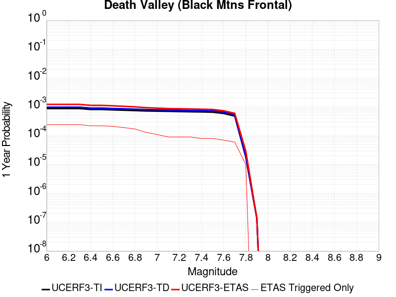 |  |

| Magnitude | 1 wk TI Prob | 1 wk TD Prob | 1 wk ETAS Prob | 1 wk ETAS/TD Gain | 1 wk ETAS Triggered Only | 1 mo TI Prob | 1 mo TD Prob | 1 mo ETAS Prob | 1 mo ETAS/TD Gain | 1 mo ETAS Triggered Only | 1 yr TI Prob | 1 yr TD Prob | 1 yr ETAS Prob | 1 yr ETAS/TD Gain | 1 yr ETAS Triggered Only | 10 yr TI Prob | 10 yr TD Prob | 10 yr ETAS Prob | 10 yr ETAS/TD Gain | 10 yr ETAS Triggered Only |
|-----|-----|-----|-----|-----|-----|-----|-----|-----|-----|-----|-----|-----|-----|-----|-----|-----|-----|-----|-----|-----|
| 6.0 | 1.6707214E-5 | 1.867056E-5 | 5.8669815E-5 | 3.1423702 | 4.0E-5 | 7.160038E-5 | 8.001427E-5 | 1.7000707E-4 | 2.1247094 | 9.0E-5 | 8.71386E-4 | 9.7374606E-4 | 0.0012135124 | 1.2462308 | 2.4E-4 | 0.00867977 | 0.009695647 | 0.010141284 | 1.0459626 | 4.5E-4 |
| 6.1 | 1.6707214E-5 | 1.867056E-5 | 5.8669815E-5 | 3.1423702 | 4.0E-5 | 7.160038E-5 | 8.001427E-5 | 1.7000707E-4 | 2.1247094 | 9.0E-5 | 8.71386E-4 | 9.7374606E-4 | 0.0012135124 | 1.2462308 | 2.4E-4 | 0.00867977 | 0.009695647 | 0.010141284 | 1.0459626 | 4.5E-4 |
| 6.2 | 1.6707214E-5 | 1.867056E-5 | 5.8669815E-5 | 3.1423702 | 4.0E-5 | 7.160038E-5 | 8.001427E-5 | 1.7000707E-4 | 2.1247094 | 9.0E-5 | 8.71386E-4 | 9.7374606E-4 | 0.0012135124 | 1.2462308 | 2.4E-4 | 0.00867977 | 0.009695647 | 0.010141284 | 1.0459626 | 4.5E-4 |
| 6.3 | 1.6707214E-5 | 1.867056E-5 | 5.8669815E-5 | 3.1423702 | 4.0E-5 | 7.160038E-5 | 8.001427E-5 | 1.7000707E-4 | 2.1247094 | 9.0E-5 | 8.71386E-4 | 9.7374606E-4 | 0.0012135124 | 1.2462308 | 2.4E-4 | 0.00867977 | 0.009695647 | 0.010141284 | 1.0459626 | 4.5E-4 |
| 6.4 | 1.5515609E-5 | 1.7338483E-5 | 5.733779E-5 | 3.3069668 | 4.0E-5 | 6.649377E-5 | 7.430571E-5 | 1.5429976E-4 | 2.0765533 | 8.0E-5 | 8.0926094E-4 | 9.0430264E-4 | 0.0011241037 | 1.2430614 | 2.2E-4 | 0.008063202 | 0.009006913 | 0.0093934005 | 1.0429101 | 3.9E-4 |
| 6.5 | 1.5515609E-5 | 1.7338483E-5 | 5.733779E-5 | 3.3069668 | 4.0E-5 | 6.649377E-5 | 7.430571E-5 | 1.5429976E-4 | 2.0765533 | 8.0E-5 | 8.0926094E-4 | 9.0430264E-4 | 0.0011241037 | 1.2430614 | 2.2E-4 | 0.008063202 | 0.009006913 | 0.0093934005 | 1.0429101 | 3.9E-4 |
| 6.6 | 1.5041828E-5 | 1.6809407E-5 | 4.6808902E-5 | 2.784685 | 3.0E-5 | 6.4463384E-5 | 7.203836E-5 | 1.4203331E-4 | 1.9716345 | 7.0E-5 | 7.8455906E-4 | 8.7672E-4 | 0.0010865359 | 1.2393192 | 2.1E-4 | 0.00781795 | 0.008733268 | 0.009100037 | 1.0419967 | 3.7E-4 |
| 6.7 | 1.4634985E-5 | 1.6356273E-5 | 4.635578E-5 | 2.8341289 | 3.0E-5 | 6.271985E-5 | 7.009646E-5 | 1.3009226E-4 | 1.8559034 | 6.0E-5 | 7.6334673E-4 | 8.53096E-4 | 0.0010429339 | 1.2225282 | 1.9E-4 | 0.007607299 | 0.008498848 | 0.008826043 | 1.0384988 | 3.3E-4 |
| 6.8 | 1.4209158E-5 | 1.5882297E-5 | 4.588182E-5 | 2.8888657 | 3.0E-5 | 6.089497E-5 | 6.806524E-5 | 1.18061835E-4 | 1.7345394 | 5.0E-5 | 7.4114406E-4 | 8.2838483E-4 | 9.98244E-4 | 1.2050487 | 1.7E-4 | 0.007386771 | 0.008253585 | 0.008551109 | 1.0360478 | 3.0E-4 |
| 6.9 | 1.3780098E-5 | 1.5404834E-5 | 3.5404526E-5 | 2.2982738 | 2.0E-5 | 5.9056227E-5 | 6.601908E-5 | 9.60171E-5 | 1.4543841 | 3.0E-5 | 7.1877235E-4 | 8.0349133E-4 | 9.333869E-4 | 1.1616639 | 1.3E-4 | 0.0071645193 | 0.008006458 | 0.008264376 | 1.0322138 | 2.6E-4 |
| 7.0 | 1.3585064E-5 | 1.5188394E-5 | 3.518809E-5 | 2.3167748 | 2.0E-5 | 5.8220405E-5 | 6.5091524E-5 | 9.508957E-5 | 1.4608595 | 3.0E-5 | 7.086029E-4 | 7.922066E-4 | 9.0211944E-4 | 1.1387427 | 1.1E-4 | 0.007063476 | 0.007894417 | 0.008132523 | 1.0301613 | 2.4E-4 |
| 7.1 | 1.3398601E-5 | 1.4981575E-5 | 3.4981276E-5 | 2.334953 | 2.0E-5 | 5.742131E-5 | 6.4205204E-5 | 9.420327E-5 | 1.4672219 | 3.0E-5 | 6.9888023E-4 | 7.814234E-4 | 8.713531E-4 | 1.1150844 | 9.0E-5 | 0.0069668638 | 0.007787346 | 0.007995711 | 1.0267569 | 2.1E-4 |
| 7.2 | 1.3126312E-5 | 1.4679792E-5 | 3.46795E-5 | 2.3623972 | 2.0E-5 | 5.6254412E-5 | 6.291191E-5 | 9.291002E-5 | 1.4768273 | 3.0E-5 | 6.846822E-4 | 7.656887E-4 | 8.5561984E-4 | 1.1174512 | 9.0E-5 | 0.006825765 | 0.00763109 | 0.007839487 | 1.0273091 | 2.1E-4 |
| 7.3 | 1.2922429E-5 | 1.4454016E-5 | 3.4453726E-5 | 2.3836784 | 2.0E-5 | 5.5380664E-5 | 6.1944345E-5 | 9.1942486E-5 | 1.4842757 | 3.0E-5 | 6.74051E-4 | 7.5391686E-4 | 8.43849E-4 | 1.1192865 | 9.0E-5 | 0.006720101 | 0.0075141727 | 0.007702745 | 1.0250956 | 1.9E-4 |
| 7.4 | 1.2768878E-5 | 1.4283997E-5 | 3.4283712E-5 | 2.4001484 | 2.0E-5 | 5.4722615E-5 | 6.1215724E-5 | 9.1213886E-5 | 1.4900402 | 3.0E-5 | 6.660441E-4 | 7.45052E-4 | 8.249924E-4 | 1.107295 | 8.0E-5 | 0.0066405144 | 0.0074261203 | 0.0076047834 | 1.0240588 | 1.8E-4 |
| 7.5 | 1.2521929E-5 | 1.40122365E-5 | 3.4011955E-5 | 2.4273038 | 2.0E-5 | 5.366431E-5 | 6.0051094E-5 | 9.004929E-5 | 1.4995446 | 3.0E-5 | 6.531671E-4 | 7.308822E-4 | 8.1082375E-4 | 1.1093768 | 8.0E-5 | 0.006512506 | 0.0072853607 | 0.007454122 | 1.0231645 | 1.7E-4 |
| 7.6 | 1.1301089E-5 | 1.2648349E-5 | 2.2648223E-5 | 1.790607 | 1.0E-5 | 4.8432343E-5 | 5.4206117E-5 | 7.420503E-5 | 1.368942 | 2.0E-5 | 5.895042E-4 | 6.597649E-4 | 7.297187E-4 | 1.1060284 | 7.0E-5 | 0.0058794282 | 0.0065786145 | 0.006717693 | 1.021141 | 1.4E-4 |
| 7.7 | 9.189108E-6 | 1.0283521E-5 | 2.0283418E-5 | 1.9724195 | 1.0E-5 | 3.93813E-5 | 4.407152E-5 | 6.4070635E-5 | 1.4537878 | 2.0E-5 | 4.7936183E-4 | 5.3644367E-4 | 5.9641147E-4 | 1.1117877 | 6.0E-5 | 0.004783291 | 0.0053519984 | 0.0054813027 | 1.02416 | 1.3E-4 |
| 7.8 | 3.4586725E-7 | 3.648288E-7 | 3.648288E-7 | 1.0 | 0.0 | 1.4822873E-6 | 1.5635511E-6 | 1.5635511E-6 | 1.0 | 0.0 | 1.80467E-5 | 1.9036073E-5 | 2.9035882E-5 | 1.5253085 | 1.0E-5 | 1.8045233E-4 | 1.9034486E-4 | 2.0034295E-4 | 1.0525262 | 1.0E-5 |
| 7.9 | 2.5591178E-9 | 2.6696871E-9 | 2.6696871E-9 | 1.0 | 0.0 | 1.0967647E-8 | 1.1441516E-8 | 1.1441516E-8 | 1.0 | 0.0 | 1.335311E-7 | 1.3930045E-7 | 1.3930045E-7 | 1.0 | 0.0 | 1.3353102E-6 | 1.3930046E-6 | 1.3930046E-6 | 1.0 | 0.0 |

## San Andreas (Parkfield)
*[(top)](#table-of-contents)*

| 1 Week | 1 Month | 1 Year | 10 Year |
|-----|-----|-----|-----|
|  | 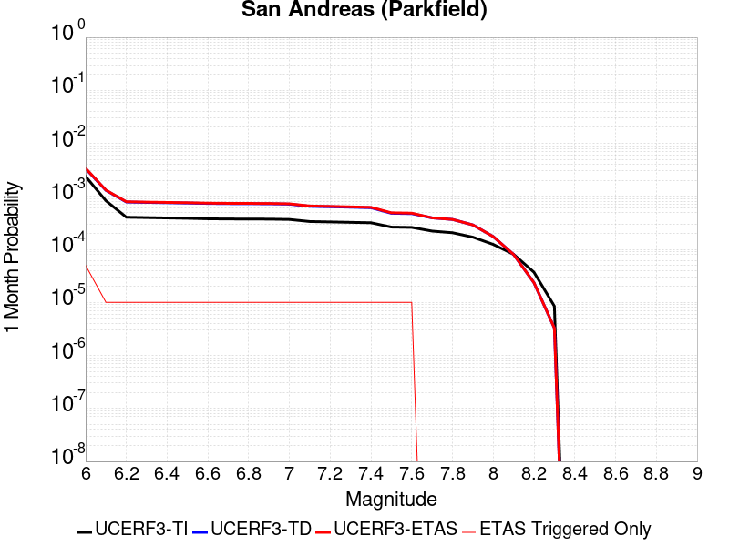 |  |  |

| Magnitude | 1 wk TI Prob | 1 wk TD Prob | 1 wk ETAS Prob | 1 wk ETAS/TD Gain | 1 wk ETAS Triggered Only | 1 mo TI Prob | 1 mo TD Prob | 1 mo ETAS Prob | 1 mo ETAS/TD Gain | 1 mo ETAS Triggered Only | 1 yr TI Prob | 1 yr TD Prob | 1 yr ETAS Prob | 1 yr ETAS/TD Gain | 1 yr ETAS Triggered Only | 10 yr TI Prob | 10 yr TD Prob | 10 yr ETAS Prob | 10 yr ETAS/TD Gain | 10 yr ETAS Triggered Only |
|-----|-----|-----|-----|-----|-----|-----|-----|-----|-----|-----|-----|-----|-----|-----|-----|-----|-----|-----|-----|-----|
| 6.0 | 5.556969E-4 | 7.788437E-4 | 7.888359E-4 | 1.0128295 | 1.0E-5 | 0.0023793848 | 0.0033341812 | 0.0033840144 | 1.0149462 | 5.0E-5 | 0.028586963 | 0.04023991 | 0.04037428 | 1.0033392 | 1.4E-4 | 0.25176284 | 0.33731642 | 0.3375351 | 1.0006483 | 3.3E-4 |
| 6.1 | 1.925858E-4 | 3.0304783E-4 | 3.1304482E-4 | 1.0329881 | 1.0E-5 | 8.2510663E-4 | 0.0012982241 | 0.0013082111 | 1.0076928 | 1.0E-5 | 0.0099994885 | 0.015792182 | 0.015831549 | 1.0024929 | 4.0E-5 | 0.095613256 | 0.14979222 | 0.14990275 | 1.0007379 | 1.3E-4 |
| 6.2 | 9.4306815E-5 | 1.8250331E-4 | 1.9250148E-4 | 1.0547836 | 1.0E-5 | 4.0410945E-4 | 7.819238E-4 | 7.91916E-4 | 1.012779 | 1.0E-5 | 0.0049089384 | 0.009478576 | 0.009518196 | 1.0041801 | 4.0E-5 | 0.048019063 | 0.09188674 | 0.09200479 | 1.0012848 | 1.3E-4 |
| 6.3 | 9.283051E-5 | 1.7946832E-4 | 1.8946652E-4 | 1.0557102 | 1.0E-5 | 3.9778434E-4 | 7.689244E-4 | 7.7891676E-4 | 1.0129951 | 1.0E-5 | 0.0048322747 | 0.009321672 | 0.0093613 | 1.0042511 | 4.0E-5 | 0.047285385 | 0.09053965 | 0.09065788 | 1.0013058 | 1.3E-4 |
| 6.4 | 9.138826E-5 | 1.770899E-4 | 1.8708812E-4 | 1.0564585 | 1.0E-5 | 3.916052E-4 | 7.5873715E-4 | 7.6872954E-4 | 1.0131698 | 1.0E-5 | 0.0047573745 | 0.009198696 | 0.009238329 | 1.0043085 | 4.0E-5 | 0.046568092 | 0.089441724 | 0.0895601 | 1.0013235 | 1.3E-4 |
| 6.5 | 9.000255E-5 | 1.746699E-4 | 1.8466816E-4 | 1.0572408 | 1.0E-5 | 3.8566816E-4 | 7.483717E-4 | 7.583642E-4 | 1.0133524 | 1.0E-5 | 0.0046854047 | 0.009073567 | 0.009113204 | 1.0043684 | 4.0E-5 | 0.045878403 | 0.08832737 | 0.08844589 | 1.0013418 | 1.3E-4 |
| 6.6 | 8.8109264E-5 | 1.7148067E-4 | 1.8147896E-4 | 1.0583056 | 1.0E-5 | 3.7755648E-4 | 7.3471136E-4 | 7.44704E-4 | 1.0136008 | 1.0E-5 | 0.0045870654 | 0.008908638 | 0.008948281 | 1.0044501 | 4.0E-5 | 0.04493529 | 0.086858675 | 0.086977385 | 1.0013667 | 1.3E-4 |
| 6.7 | 8.738073E-5 | 1.7015127E-4 | 1.8014957E-4 | 1.0587612 | 1.0E-5 | 3.7443507E-4 | 7.290171E-4 | 7.390098E-4 | 1.013707 | 1.0E-5 | 0.0045492216 | 0.008839916 | 0.008879563 | 1.0044849 | 4.0E-5 | 0.04457213 | 0.086258985 | 0.08637777 | 1.0013771 | 1.3E-4 |
| 6.8 | 8.710195E-5 | 1.6960612E-4 | 1.7960442E-4 | 1.0589502 | 1.0E-5 | 3.7324068E-4 | 7.266821E-4 | 7.366748E-4 | 1.0137511 | 1.0E-5 | 0.0045347405 | 0.008811726 | 0.008851374 | 1.0044994 | 4.0E-5 | 0.04443313 | 0.08600653 | 0.08612535 | 1.0013815 | 1.3E-4 |
| 6.9 | 8.6801556E-5 | 1.6901553E-4 | 1.7901385E-4 | 1.0591562 | 1.0E-5 | 3.7195362E-4 | 7.2415237E-4 | 7.341451E-4 | 1.0137992 | 1.0E-5 | 0.0045191357 | 0.008781176 | 0.008820824 | 1.0045152 | 4.0E-5 | 0.044283327 | 0.08573254 | 0.0858514 | 1.0013863 | 1.3E-4 |
| 7.0 | 8.5571606E-5 | 1.6654332E-4 | 1.7654165E-4 | 1.0600344 | 1.0E-5 | 3.6668387E-4 | 7.13563E-4 | 7.2355586E-4 | 1.0140042 | 1.0E-5 | 0.004455241 | 0.008653281 | 0.008692935 | 1.0045825 | 4.0E-5 | 0.043669727 | 0.08458075 | 0.08469976 | 1.001407 | 1.3E-4 |
| 7.1 | 7.82589E-5 | 1.5135074E-4 | 1.6134922E-4 | 1.0660617 | 1.0E-5 | 3.3535215E-4 | 6.484855E-4 | 6.5847905E-4 | 1.0154105 | 1.0E-5 | 0.0040752706 | 0.0078668995 | 0.007906585 | 1.0050446 | 4.0E-5 | 0.040013418 | 0.077491894 | 0.0776026 | 1.0014286 | 1.2E-4 |
| 7.2 | 7.690929E-5 | 1.4872287E-4 | 1.5872139E-4 | 1.0672292 | 1.0E-5 | 3.2956956E-4 | 6.372288E-4 | 6.4722245E-4 | 1.0156829 | 1.0E-5 | 0.004005129 | 0.007730829 | 0.00777052 | 1.0051341 | 4.0E-5 | 0.0393371 | 0.07626493 | 0.07637578 | 1.0014535 | 1.2E-4 |
| 7.3 | 7.5543794E-5 | 1.4568791E-4 | 1.5568646E-4 | 1.0686299 | 1.0E-5 | 3.2371894E-4 | 6.242281E-4 | 6.342218E-4 | 1.0160098 | 1.0E-5 | 0.003934157 | 0.007573656 | 0.007613353 | 1.0052415 | 4.0E-5 | 0.038652334 | 0.07482772 | 0.074938744 | 1.0014837 | 1.2E-4 |
| 7.4 | 7.4214564E-5 | 1.4269682E-4 | 1.526954E-4 | 1.0700686 | 1.0E-5 | 3.1802364E-4 | 6.114152E-4 | 6.214091E-4 | 1.0163455 | 1.0E-5 | 0.003865065 | 0.007418731 | 0.0074584344 | 1.0053518 | 4.0E-5 | 0.03798529 | 0.07340127 | 0.073512465 | 1.0015148 | 1.2E-4 |
| 7.5 | 6.149578E-5 | 1.1196503E-4 | 1.2196391E-4 | 1.0893036 | 1.0E-5 | 2.6352672E-4 | 4.7976198E-4 | 4.8975716E-4 | 1.0208336 | 1.0E-5 | 0.0032037178 | 0.00582549 | 0.0058652572 | 1.0068264 | 4.0E-5 | 0.03157923 | 0.058584154 | 0.058678295 | 1.001607 | 1.0E-4 |
| 7.6 | 6.0643448E-5 | 1.10251094E-4 | 1.2024999E-4 | 1.090692 | 1.0E-5 | 2.598746E-4 | 4.7241923E-4 | 4.824145E-4 | 1.0211576 | 1.0E-5 | 0.0031593828 | 0.0057365666 | 0.005776337 | 1.0069329 | 4.0E-5 | 0.031148417 | 0.057744972 | 0.0578392 | 1.0016317 | 1.0E-4 |
| 7.7 | 5.1652263E-5 | 9.179838E-5 | 9.179838E-5 | 1.0 | 0.0 | 2.2134806E-4 | 3.9336234E-4 | 3.9336234E-4 | 1.0 | 0.0 | 0.002691582 | 0.0047786795 | 0.0048085363 | 1.0062479 | 3.0E-5 | 0.026592141 | 0.048560265 | 0.048645895 | 1.0017633 | 9.0E-5 |
| 7.8 | 4.8090482E-5 | 8.564368E-5 | 8.564368E-5 | 1.0 | 0.0 | 2.060858E-4 | 3.6699275E-4 | 3.6699275E-4 | 1.0 | 0.0 | 0.0025062072 | 0.004458991 | 0.004488857 | 1.006698 | 3.0E-5 | 0.024781305 | 0.045324653 | 0.04539148 | 1.0014744 | 7.0E-5 |
| 7.9 | 3.970278E-5 | 6.754111E-5 | 6.754111E-5 | 1.0 | 0.0 | 1.7014367E-4 | 2.894298E-4 | 2.894298E-4 | 1.0 | 0.0 | 0.002069531 | 0.0035181176 | 0.003548012 | 1.0084972 | 3.0E-5 | 0.020503636 | 0.03589899 | 0.03596648 | 1.0018799 | 7.0E-5 |
| 8.0 | 2.8982335E-5 | 4.072124E-5 | 4.072124E-5 | 1.0 | 0.0 | 1.2420409E-4 | 1.7450792E-4 | 1.7450792E-4 | 1.0 | 0.0 | 0.0015111357 | 0.002122565 | 0.0021325436 | 1.0047013 | 1.0E-5 | 0.015009012 | 0.02202231 | 0.02206143 | 1.0017763 | 4.0E-5 |
| 8.1 | 1.8836186E-5 | 1.8694205E-5 | 1.8694205E-5 | 1.0 | 0.0 | 8.0724014E-5 | 8.011556E-5 | 8.011556E-5 | 1.0 | 0.0 | 9.823717E-4 | 9.749711E-4 | 9.749711E-4 | 1.0 | 0.0 | 0.009780403 | 0.010494972 | 0.010504866 | 1.0009428 | 1.0E-5 |
| 8.2 | 8.643924E-6 | 5.4798497E-6 | 5.4798497E-6 | 1.0 | 0.0 | 3.704486E-5 | 2.348486E-5 | 2.348486E-5 | 1.0 | 0.0 | 4.5092785E-4 | 2.858907E-4 | 2.858907E-4 | 1.0 | 0.0 | 0.0045001395 | 0.0032514327 | 0.0032514327 | 1.0 | 0.0 |
| 8.3 | 1.983087E-6 | 7.668296E-7 | 7.668296E-7 | 1.0 | 0.0 | 8.498917E-6 | 3.2864084E-6 | 3.2864084E-6 | 1.0 | 0.0 | 1.034694E-4 | 4.0011306E-5 | 4.0011306E-5 | 1.0 | 0.0 | 0.0010342124 | 4.724499E-4 | 4.724499E-4 | 1.0 | 0.0 |

## San Andreas (Big Bend)
*[(top)](#table-of-contents)*

| 1 Week | 1 Month | 1 Year | 10 Year |
|-----|-----|-----|-----|
|  |  |  |  |

| Magnitude | 1 wk TI Prob | 1 wk TD Prob | 1 wk ETAS Prob | 1 wk ETAS/TD Gain | 1 wk ETAS Triggered Only | 1 mo TI Prob | 1 mo TD Prob | 1 mo ETAS Prob | 1 mo ETAS/TD Gain | 1 mo ETAS Triggered Only | 1 yr TI Prob | 1 yr TD Prob | 1 yr ETAS Prob | 1 yr ETAS/TD Gain | 1 yr ETAS Triggered Only | 10 yr TI Prob | 10 yr TD Prob | 10 yr ETAS Prob | 10 yr ETAS/TD Gain | 10 yr ETAS Triggered Only |
|-----|-----|-----|-----|-----|-----|-----|-----|-----|-----|-----|-----|-----|-----|-----|-----|-----|-----|-----|-----|-----|
| 6.0 | 1.0179969E-4 | 2.0080687E-4 | 2.1080486E-4 | 1.0497891 | 1.0E-5 | 4.362114E-4 | 8.60318E-4 | 9.1027503E-4 | 1.058068 | 5.0E-5 | 0.0052979486 | 0.010424351 | 0.01061237 | 1.0180366 | 1.9E-4 | 0.051734097 | 0.1014857 | 0.10179119 | 1.0030103 | 3.4E-4 |
| 6.1 | 1.0179969E-4 | 2.0080687E-4 | 2.1080486E-4 | 1.0497891 | 1.0E-5 | 4.362114E-4 | 8.60318E-4 | 9.1027503E-4 | 1.058068 | 5.0E-5 | 0.0052979486 | 0.010424351 | 0.01061237 | 1.0180366 | 1.9E-4 | 0.051734097 | 0.1014857 | 0.10179119 | 1.0030103 | 3.4E-4 |
| 6.2 | 1.0179969E-4 | 2.0080687E-4 | 2.1080486E-4 | 1.0497891 | 1.0E-5 | 4.362114E-4 | 8.60318E-4 | 9.1027503E-4 | 1.058068 | 5.0E-5 | 0.0052979486 | 0.010424351 | 0.01061237 | 1.0180366 | 1.9E-4 | 0.051734097 | 0.1014857 | 0.10179119 | 1.0030103 | 3.4E-4 |
| 6.3 | 1.0179969E-4 | 2.0080687E-4 | 2.1080486E-4 | 1.0497891 | 1.0E-5 | 4.362114E-4 | 8.60318E-4 | 9.1027503E-4 | 1.058068 | 5.0E-5 | 0.0052979486 | 0.010424351 | 0.01061237 | 1.0180366 | 1.9E-4 | 0.051734097 | 0.1014857 | 0.10179119 | 1.0030103 | 3.4E-4 |
| 6.4 | 9.1639464E-5 | 1.8437792E-4 | 1.9437607E-4 | 1.0542264 | 1.0E-5 | 3.9268145E-4 | 7.89952E-4 | 8.099362E-4 | 1.025298 | 2.0E-5 | 0.0047704205 | 0.009575372 | 0.009684319 | 1.0113778 | 1.1E-4 | 0.046693064 | 0.09381153 | 0.09400183 | 1.0020286 | 2.1E-4 |
| 6.5 | 9.1639464E-5 | 1.8437792E-4 | 1.9437607E-4 | 1.0542264 | 1.0E-5 | 3.9268145E-4 | 7.89952E-4 | 8.099362E-4 | 1.025298 | 2.0E-5 | 0.0047704205 | 0.009575372 | 0.009684319 | 1.0113778 | 1.1E-4 | 0.046693064 | 0.09381153 | 0.09400183 | 1.0020286 | 2.1E-4 |
| 6.6 | 9.042622E-5 | 1.8244829E-4 | 1.9244647E-4 | 1.0548 | 1.0E-5 | 3.8748336E-4 | 7.8168715E-4 | 8.0167153E-4 | 1.0255656 | 2.0E-5 | 0.0047074095 | 0.009475624 | 0.009584582 | 1.0114987 | 1.1E-4 | 0.046089325 | 0.09290548 | 0.09309597 | 1.0020504 | 2.1E-4 |
| 6.7 | 8.9836685E-5 | 1.8159159E-4 | 1.9158977E-4 | 1.0550586 | 1.0E-5 | 3.8495753E-4 | 7.7801774E-4 | 7.980022E-4 | 1.0256864 | 2.0E-5 | 0.00467679 | 0.009431336 | 0.009540299 | 1.0115533 | 1.1E-4 | 0.045795817 | 0.09249973 | 0.09269031 | 1.0020603 | 2.1E-4 |
| 6.8 | 8.9471854E-5 | 1.8105932E-4 | 1.9105752E-4 | 1.0552205 | 1.0E-5 | 3.8339442E-4 | 7.75738E-4 | 7.957225E-4 | 1.0257618 | 2.0E-5 | 0.004657841 | 0.00940382 | 0.009512786 | 1.0115874 | 1.1E-4 | 0.04561414 | 0.09224692 | 0.09243755 | 1.0020665 | 2.1E-4 |
| 6.9 | 8.858234E-5 | 1.7987892E-4 | 1.8987713E-4 | 1.055583 | 1.0E-5 | 3.7958333E-4 | 7.706821E-4 | 7.806744E-4 | 1.0129656 | 1.0E-5 | 0.004611638 | 0.009342793 | 0.009431953 | 1.0095431 | 9.0E-5 | 0.04517103 | 0.091686994 | 0.09185957 | 1.0018823 | 1.9E-4 |
| 7.0 | 8.7433385E-5 | 1.7826671E-4 | 1.8826492E-4 | 1.0560857 | 1.0E-5 | 3.746607E-4 | 7.6377665E-4 | 7.7376905E-4 | 1.0130829 | 1.0E-5 | 0.004551957 | 0.009259437 | 0.009348604 | 1.0096298 | 9.0E-5 | 0.044598386 | 0.09092137 | 0.091085 | 1.0017997 | 1.8E-4 |
| 7.1 | 8.684964E-5 | 1.7738611E-4 | 1.8738434E-4 | 1.0563642 | 1.0E-5 | 3.7215967E-4 | 7.600049E-4 | 7.699973E-4 | 1.0131478 | 1.0E-5 | 0.0045216335 | 0.009213906 | 0.009303076 | 1.0096779 | 9.0E-5 | 0.04430731 | 0.09050287 | 0.09066658 | 1.0018089 | 1.8E-4 |
| 7.2 | 8.606521E-5 | 1.7629213E-4 | 1.8629037E-4 | 1.056714 | 1.0E-5 | 3.6879873E-4 | 7.5531914E-4 | 7.653116E-4 | 1.0132295 | 1.0E-5 | 0.0044808835 | 0.009157337 | 0.009246513 | 1.0097382 | 9.0E-5 | 0.043916024 | 0.08998334 | 0.090147145 | 1.0018203 | 1.8E-4 |
| 7.3 | 8.568266E-5 | 1.7571205E-4 | 1.8571029E-4 | 1.0569013 | 1.0E-5 | 3.6715972E-4 | 7.528345E-4 | 7.6282694E-4 | 1.0132731 | 1.0E-5 | 0.0044610105 | 0.00912734 | 0.009216519 | 1.0097705 | 9.0E-5 | 0.043725148 | 0.08970444 | 0.08986829 | 1.0018266 | 1.8E-4 |
| 7.4 | 8.5432206E-5 | 1.7533782E-4 | 1.8533606E-4 | 1.0570228 | 1.0E-5 | 3.6608664E-4 | 7.5123156E-4 | 7.612241E-4 | 1.0133015 | 1.0E-5 | 0.004447999 | 0.009107988 | 0.009197169 | 1.0097915 | 9.0E-5 | 0.043600157 | 0.08952458 | 0.089688465 | 1.0018306 | 1.8E-4 |
| 7.5 | 8.4791965E-5 | 1.7403076E-4 | 1.8402902E-4 | 1.0574511 | 1.0E-5 | 3.633435E-4 | 7.4563315E-4 | 7.5562566E-4 | 1.0134014 | 1.0E-5 | 0.0044147377 | 0.009040395 | 0.0091097625 | 1.007673 | 7.0E-5 | 0.043280575 | 0.0889021 | 0.08904787 | 1.0016397 | 1.6E-4 |
| 7.6 | 8.241105E-5 | 1.684837E-4 | 1.7848202E-4 | 1.059343 | 1.0E-5 | 3.531424E-4 | 7.2187337E-4 | 7.318661E-4 | 1.0138428 | 1.0E-5 | 0.0042910352 | 0.008753479 | 0.008822867 | 1.0079268 | 7.0E-5 | 0.042091176 | 0.08627858 | 0.08641564 | 1.0015886 | 1.5E-4 |
| 7.7 | 7.00432E-5 | 1.4211683E-4 | 1.4211683E-4 | 1.0 | 0.0 | 3.001506E-4 | 6.0893E-4 | 6.0893E-4 | 1.0 | 0.0 | 0.0036482112 | 0.007388561 | 0.0074381917 | 1.0067172 | 5.0E-5 | 0.035888977 | 0.07354971 | 0.07366089 | 1.0015116 | 1.2E-4 |
| 7.8 | 6.415362E-5 | 1.297541E-4 | 1.297541E-4 | 1.0 | 0.0 | 2.749151E-4 | 5.5597053E-4 | 5.5597053E-4 | 1.0 | 0.0 | 0.0033419547 | 0.006747963 | 0.006797625 | 1.0073596 | 5.0E-5 | 0.03292141 | 0.0672817 | 0.067374974 | 1.0013863 | 1.0E-4 |
| 7.9 | 4.939911E-5 | 9.345801E-5 | 9.345801E-5 | 1.0 | 0.0 | 2.116933E-4 | 4.0047284E-4 | 4.0047284E-4 | 1.0 | 0.0 | 0.0025743195 | 0.0048648654 | 0.004904671 | 1.0081822 | 4.0E-5 | 0.025447013 | 0.048936196 | 0.04901228 | 1.0015547 | 8.0E-5 |
| 8.0 | 3.344983E-5 | 5.225443E-5 | 5.225443E-5 | 1.0 | 0.0 | 1.4334853E-4 | 2.2392833E-4 | 2.2392833E-4 | 1.0 | 0.0 | 0.0017438711 | 0.0027229206 | 0.0027328935 | 1.0036626 | 1.0E-5 | 0.017302496 | 0.02793573 | 0.027974613 | 1.0013919 | 4.0E-5 |
| 8.1 | 1.9104898E-5 | 1.9186356E-5 | 1.9186356E-5 | 1.0 | 0.0 | 8.1875565E-5 | 8.222465E-5 | 8.222465E-5 | 1.0 | 0.0 | 9.963791E-4 | 0.001000626 | 0.001000626 | 1.0 | 0.0 | 0.009919235 | 0.010756767 | 0.01076666 | 1.0009197 | 1.0E-5 |
| 8.2 | 8.643924E-6 | 5.4798497E-6 | 5.4798497E-6 | 1.0 | 0.0 | 3.704486E-5 | 2.348486E-5 | 2.348486E-5 | 1.0 | 0.0 | 4.5092785E-4 | 2.858907E-4 | 2.858907E-4 | 1.0 | 0.0 | 0.0045001395 | 0.0032514327 | 0.0032514327 | 1.0 | 0.0 |
| 8.3 | 1.983087E-6 | 7.668296E-7 | 7.668296E-7 | 1.0 | 0.0 | 8.498917E-6 | 3.2864084E-6 | 3.2864084E-6 | 1.0 | 0.0 | 1.034694E-4 | 4.0011306E-5 | 4.0011306E-5 | 1.0 | 0.0 | 0.0010342124 | 4.724499E-4 | 4.724499E-4 | 1.0 | 0.0 |

## San Andreas (San Bernardino S)
*[(top)](#table-of-contents)*

| 1 Week | 1 Month | 1 Year | 10 Year |
|-----|-----|-----|-----|
|  |  |  |  |

| Magnitude | 1 wk TI Prob | 1 wk TD Prob | 1 wk ETAS Prob | 1 wk ETAS/TD Gain | 1 wk ETAS Triggered Only | 1 mo TI Prob | 1 mo TD Prob | 1 mo ETAS Prob | 1 mo ETAS/TD Gain | 1 mo ETAS Triggered Only | 1 yr TI Prob | 1 yr TD Prob | 1 yr ETAS Prob | 1 yr ETAS/TD Gain | 1 yr ETAS Triggered Only | 10 yr TI Prob | 10 yr TD Prob | 10 yr ETAS Prob | 10 yr ETAS/TD Gain | 10 yr ETAS Triggered Only |
|-----|-----|-----|-----|-----|-----|-----|-----|-----|-----|-----|-----|-----|-----|-----|-----|-----|-----|-----|-----|-----|
| 6.0 | 1.2336002E-4 | 3.0008948E-4 | 3.0008948E-4 | 1.0 | 0.0 | 5.2857865E-4 | 0.0012854899 | 0.0013254385 | 1.0310766 | 4.0E-5 | 0.006416472 | 0.015543484 | 0.015720686 | 1.0114005 | 1.8E-4 | 0.06234337 | 0.14285627 | 0.14313056 | 1.00192 | 3.2E-4 |
| 6.1 | 1.2336002E-4 | 3.0008948E-4 | 3.0008948E-4 | 1.0 | 0.0 | 5.2857865E-4 | 0.0012854899 | 0.0013254385 | 1.0310766 | 4.0E-5 | 0.006416472 | 0.015543484 | 0.015720686 | 1.0114005 | 1.8E-4 | 0.06234337 | 0.14285627 | 0.14313056 | 1.00192 | 3.2E-4 |
| 6.2 | 1.2336002E-4 | 3.0008948E-4 | 3.0008948E-4 | 1.0 | 0.0 | 5.2857865E-4 | 0.0012854899 | 0.0013254385 | 1.0310766 | 4.0E-5 | 0.006416472 | 0.015543484 | 0.015720686 | 1.0114005 | 1.8E-4 | 0.06234337 | 0.14285627 | 0.14313056 | 1.00192 | 3.2E-4 |
| 6.3 | 1.1712257E-4 | 2.8797207E-4 | 2.8797207E-4 | 1.0 | 0.0 | 5.018573E-4 | 0.001233608 | 0.0012735586 | 1.0323852 | 4.0E-5 | 0.006093008 | 0.01492059 | 0.015097904 | 1.0118839 | 1.8E-4 | 0.059286322 | 0.13756467 | 0.13784066 | 1.0020062 | 3.2E-4 |
| 6.4 | 1.1712257E-4 | 2.8797207E-4 | 2.8797207E-4 | 1.0 | 0.0 | 5.018573E-4 | 0.001233608 | 0.0012735586 | 1.0323852 | 4.0E-5 | 0.006093008 | 0.01492059 | 0.015097904 | 1.0118839 | 1.8E-4 | 0.059286322 | 0.13756467 | 0.13784066 | 1.0020062 | 3.2E-4 |
| 6.5 | 1.0689076E-4 | 2.6809986E-4 | 2.6809986E-4 | 1.0 | 0.0 | 4.5802278E-4 | 0.0011485183 | 0.0011784838 | 1.0260906 | 3.0E-5 | 0.0055621783 | 0.013898174 | 0.014065811 | 1.0120618 | 1.7E-4 | 0.05425003 | 0.12881182 | 0.12908189 | 1.0020967 | 3.1E-4 |
| 6.6 | 9.7648895E-5 | 2.5054725E-4 | 2.5054725E-4 | 1.0 | 0.0 | 4.1842813E-4 | 0.0010733557 | 0.0011033235 | 1.0279198 | 3.0E-5 | 0.005082469 | 0.012994168 | 0.013142219 | 1.0113937 | 1.5E-4 | 0.049677886 | 0.12097161 | 0.12121774 | 1.0020345 | 2.8E-4 |
| 6.7 | 8.757013E-5 | 2.3125445E-4 | 2.3125445E-4 | 1.0 | 0.0 | 3.7524657E-4 | 9.907364E-4 | 0.0010207066 | 1.0302505 | 3.0E-5 | 0.00455906 | 0.011999588 | 0.012147789 | 1.0123504 | 1.5E-4 | 0.04466656 | 0.11227982 | 0.11252838 | 1.0022137 | 2.8E-4 |
| 6.8 | 8.562978E-5 | 2.2685292E-4 | 2.2685292E-4 | 1.0 | 0.0 | 3.6693315E-4 | 9.7188674E-4 | 0.0010018576 | 1.0308378 | 3.0E-5 | 0.004458263 | 0.01177259 | 0.011920824 | 1.0125915 | 1.5E-4 | 0.043698758 | 0.11029001 | 0.11053914 | 1.0022588 | 2.8E-4 |
| 6.9 | 6.124075E-5 | 1.7069813E-4 | 1.7069813E-4 | 1.0 | 0.0 | 2.6243398E-4 | 7.313591E-4 | 7.6133717E-4 | 1.0409895 | 3.0E-5 | 0.0031904527 | 0.00886815 | 0.009006909 | 1.0156468 | 1.4E-4 | 0.031450346 | 0.08419993 | 0.08443804 | 1.0028279 | 2.6E-4 |
| 7.0 | 5.8598747E-5 | 1.6498787E-4 | 1.6498787E-4 | 1.0 | 0.0 | 2.5111332E-4 | 7.069001E-4 | 7.368789E-4 | 1.0424088 | 3.0E-5 | 0.0030530186 | 0.008572741 | 0.008711541 | 1.0161909 | 1.4E-4 | 0.03011414 | 0.08151753 | 0.08175634 | 1.0029294 | 2.6E-4 |
| 7.1 | 5.613814E-5 | 1.5917298E-4 | 1.5917298E-4 | 1.0 | 0.0 | 2.4056983E-4 | 6.819924E-4 | 7.119719E-4 | 1.0439588 | 3.0E-5 | 0.0029250039 | 0.008271826 | 0.008410668 | 1.0167849 | 1.4E-4 | 0.028868021 | 0.078816354 | 0.07905586 | 1.0030388 | 2.6E-4 |
| 7.2 | 4.991222E-5 | 1.4523676E-4 | 1.4523676E-4 | 1.0 | 0.0 | 2.1389198E-4 | 6.2229513E-4 | 6.5227645E-4 | 1.0481787 | 3.0E-5 | 0.002601025 | 0.0075502265 | 0.0076891696 | 1.0184025 | 1.4E-4 | 0.025707912 | 0.072269924 | 0.07250185 | 1.0032092 | 2.5E-4 |
| 7.3 | 4.7410045E-5 | 1.3717797E-4 | 1.3717797E-4 | 1.0 | 0.0 | 2.0317009E-4 | 5.8777345E-4 | 6.177558E-4 | 1.0510101 | 3.0E-5 | 0.0024707897 | 0.0071327467 | 0.007271748 | 1.0194877 | 1.4E-4 | 0.024434982 | 0.06855203 | 0.06878489 | 1.0033969 | 2.5E-4 |
| 7.4 | 4.5556746E-5 | 1.3125638E-4 | 1.3125638E-4 | 1.0 | 0.0 | 1.952286E-4 | 5.6240644E-4 | 5.9238955E-4 | 1.0533122 | 3.0E-5 | 0.002374317 | 0.006825879 | 0.006954992 | 1.0189152 | 1.3E-4 | 0.023491086 | 0.065804236 | 0.06602844 | 1.0034072 | 2.4E-4 |
| 7.5 | 4.3084514E-5 | 1.2360894E-4 | 1.2360894E-4 | 1.0 | 0.0 | 1.8463485E-4 | 5.2964536E-4 | 5.5962946E-4 | 1.0566117 | 3.0E-5 | 0.0022456115 | 0.006429438 | 0.006558602 | 1.0200895 | 1.3E-4 | 0.022230545 | 0.062204733 | 0.062429804 | 1.0036182 | 2.4E-4 |
| 7.6 | 3.408608E-5 | 9.838868E-5 | 9.838868E-5 | 1.0 | 0.0 | 1.4607502E-4 | 4.215977E-4 | 4.5158507E-4 | 1.0711279 | 3.0E-5 | 0.0017770125 | 0.005120897 | 0.0052502314 | 1.0252562 | 1.3E-4 | 0.017628696 | 0.050035115 | 0.050253607 | 1.0043668 | 2.3E-4 |
| 7.7 | 2.8315713E-5 | 8.251823E-5 | 8.251823E-5 | 1.0 | 0.0 | 1.2134742E-4 | 3.5360164E-4 | 3.8359105E-4 | 1.0848112 | 3.0E-5 | 0.0014764034 | 0.004296611 | 0.0044260523 | 1.0301265 | 1.3E-4 | 0.01466633 | 0.04228543 | 0.04249613 | 1.0049827 | 2.2E-4 |
| 7.8 | 2.6222975E-5 | 7.4660275E-5 | 7.4660275E-5 | 1.0 | 0.0 | 1.1237934E-4 | 3.1993337E-4 | 3.499238E-4 | 1.0937395 | 3.0E-5 | 0.0013673597 | 0.003888238 | 0.0040177326 | 1.0333042 | 1.3E-4 | 0.013589768 | 0.03844993 | 0.03866147 | 1.0055017 | 2.2E-4 |
| 7.9 | 2.1469694E-5 | 5.7903162E-5 | 5.7903162E-5 | 1.0 | 0.0 | 9.200973E-5 | 2.4813283E-4 | 2.7812537E-4 | 1.120873 | 3.0E-5 | 0.0011196428 | 0.003016835 | 0.003136473 | 1.0396568 | 1.2E-4 | 0.011140184 | 0.030163256 | 0.030366924 | 1.0067521 | 2.1E-4 |
| 8.0 | 1.2420249E-5 | 3.1332525E-5 | 3.1332525E-5 | 1.0 | 0.0 | 5.322855E-5 | 1.3427534E-4 | 1.3427534E-4 | 1.0 | 0.0 | 6.478649E-4 | 0.0016335774 | 0.0016535447 | 1.0122231 | 2.0E-5 | 0.0064597935 | 0.016528832 | 0.01658784 | 1.0035701 | 6.0E-5 |
| 8.1 | 4.9197724E-6 | 7.827271E-6 | 7.827271E-6 | 1.0 | 0.0 | 2.1084568E-5 | 3.3545013E-5 | 3.3545013E-5 | 1.0 | 0.0 | 2.566744E-4 | 4.0833413E-4 | 4.0833413E-4 | 1.0 | 0.0 | 0.002563781 | 0.0043868436 | 0.0043868436 | 1.0 | 0.0 |
| 8.2 | 2.5634774E-6 | 2.9089954E-6 | 2.9089954E-6 | 1.0 | 0.0 | 1.0986286E-5 | 1.2467063E-5 | 1.2467063E-5 | 1.0 | 0.0 | 1.3374983E-4 | 1.5177597E-4 | 1.5177597E-4 | 1.0 | 0.0 | 0.0013366934 | 0.0017061684 | 0.0017061684 | 1.0 | 0.0 |
| 8.3 | 5.2850464E-7 | 3.211945E-7 | 3.211945E-7 | 1.0 | 0.0 | 2.2650179E-6 | 1.3765473E-6 | 1.3765473E-6 | 1.0 | 0.0 | 2.7576245E-5 | 1.6759346E-5 | 1.6759346E-5 | 1.0 | 0.0 | 2.7572823E-4 | 1.9887649E-4 | 1.9887649E-4 | 1.0 | 0.0 |

## Coyote Lake
*[(top)](#table-of-contents)*

| 1 Week | 1 Month | 1 Year | 10 Year |
|-----|-----|-----|-----|
| 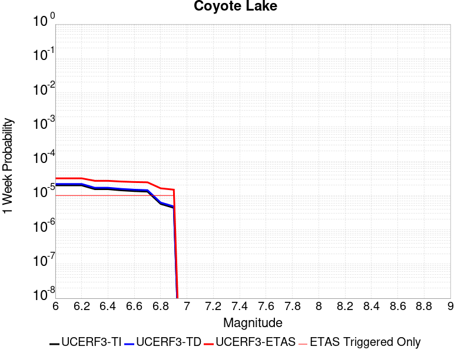 |  |  |  |

| Magnitude | 1 wk TI Prob | 1 wk TD Prob | 1 wk ETAS Prob | 1 wk ETAS/TD Gain | 1 wk ETAS Triggered Only | 1 mo TI Prob | 1 mo TD Prob | 1 mo ETAS Prob | 1 mo ETAS/TD Gain | 1 mo ETAS Triggered Only | 1 yr TI Prob | 1 yr TD Prob | 1 yr ETAS Prob | 1 yr ETAS/TD Gain | 1 yr ETAS Triggered Only | 10 yr TI Prob | 10 yr TD Prob | 10 yr ETAS Prob | 10 yr ETAS/TD Gain | 10 yr ETAS Triggered Only |
|-----|-----|-----|-----|-----|-----|-----|-----|-----|-----|-----|-----|-----|-----|-----|-----|-----|-----|-----|-----|-----|
| 6.0 | 1.980352E-5 | 2.1707021E-5 | 3.1706804E-5 | 1.4606705 | 1.0E-5 | 8.486947E-5 | 9.302718E-5 | 1.530216E-4 | 1.6449128 | 6.0E-5 | 0.0010327959 | 0.0011320895 | 0.001301897 | 1.1499949 | 1.7E-4 | 0.010280091 | 0.011270401 | 0.011586795 | 1.028073 | 3.2E-4 |
| 6.1 | 1.980352E-5 | 2.1707021E-5 | 3.1706804E-5 | 1.4606705 | 1.0E-5 | 8.486947E-5 | 9.302718E-5 | 1.530216E-4 | 1.6449128 | 6.0E-5 | 0.0010327959 | 0.0011320895 | 0.001301897 | 1.1499949 | 1.7E-4 | 0.010280091 | 0.011270401 | 0.011586795 | 1.028073 | 3.2E-4 |
| 6.2 | 1.980352E-5 | 2.1707021E-5 | 3.1706804E-5 | 1.4606705 | 1.0E-5 | 8.486947E-5 | 9.302718E-5 | 1.530216E-4 | 1.6449128 | 6.0E-5 | 0.0010327959 | 0.0011320895 | 0.001301897 | 1.1499949 | 1.7E-4 | 0.010280091 | 0.011270401 | 0.011586795 | 1.028073 | 3.2E-4 |
| 6.3 | 1.5344787E-5 | 1.6820884E-5 | 2.6820715E-5 | 1.5944891 | 1.0E-5 | 6.576172E-5 | 7.208785E-5 | 1.2208425E-4 | 1.6935481 | 5.0E-5 | 8.003548E-4 | 8.7737746E-4 | 0.0010172547 | 1.1594265 | 1.4E-4 | 0.007974784 | 0.00874518 | 0.009012819 | 1.0306041 | 2.7E-4 |
| 6.4 | 1.5344787E-5 | 1.6820884E-5 | 2.6820715E-5 | 1.5944891 | 1.0E-5 | 6.576172E-5 | 7.208785E-5 | 1.2208425E-4 | 1.6935481 | 5.0E-5 | 8.003548E-4 | 8.7737746E-4 | 0.0010172547 | 1.1594265 | 1.4E-4 | 0.007974784 | 0.00874518 | 0.009012819 | 1.0306041 | 2.7E-4 |
| 6.5 | 1.4189697E-5 | 1.5558186E-5 | 2.555803E-5 | 1.6427385 | 1.0E-5 | 6.081157E-5 | 6.667658E-5 | 1.06673906E-4 | 1.5998708 | 4.0E-5 | 7.401293E-4 | 8.1154524E-4 | 9.314479E-4 | 1.1477461 | 1.2E-4 | 0.0073766913 | 0.008091759 | 0.008329817 | 1.0294198 | 2.4E-4 |
| 6.6 | 1.3469301E-5 | 1.47717665E-5 | 2.477162E-5 | 1.6769571 | 1.0E-5 | 5.7724297E-5 | 6.3306376E-5 | 1.0330384E-4 | 1.6318079 | 4.0E-5 | 7.025667E-4 | 7.7054254E-4 | 8.8045775E-4 | 1.1426466 | 1.1E-4 | 0.0070034964 | 0.0076846126 | 0.007892999 | 1.0271174 | 2.1E-4 |
| 6.7 | 1.3027966E-5 | 1.4281927E-5 | 2.4281784E-5 | 1.7001756 | 1.0E-5 | 5.5832945E-5 | 6.120716E-5 | 1.01204714E-4 | 1.6534783 | 4.0E-5 | 6.7955407E-4 | 7.450021E-4 | 8.449276E-4 | 1.1341279 | 1.0E-4 | 0.006774798 | 0.007430923 | 0.0076294374 | 1.0267146 | 2.0E-4 |
| 6.8 | 5.695434E-6 | 6.2244944E-6 | 1.6224432E-5 | 2.6065462 | 1.0E-5 | 2.4408775E-5 | 2.6676302E-5 | 3.6676036E-5 | 1.3748546 | 1.0E-5 | 2.971363E-4 | 3.2476554E-4 | 3.5475582E-4 | 1.0923443 | 3.0E-5 | 0.0029673933 | 0.0032458503 | 0.0032857205 | 1.0122834 | 4.0E-5 |
| 6.9 | 4.385688E-6 | 4.7931144E-6 | 1.4793067E-5 | 3.086316 | 1.0E-5 | 1.879567E-5 | 2.0541918E-5 | 3.0541712E-5 | 1.4867995 | 1.0E-5 | 2.2881327E-4 | 2.5009786E-4 | 2.8009037E-4 | 1.119923 | 3.0E-5 | 0.002285778 | 0.0025009785 | 0.0025408785 | 1.0159538 | 4.0E-5 |

## Sierra Nevada  (No Extension)
*[(top)](#table-of-contents)*

| 1 Week | 1 Month | 1 Year | 10 Year |
|-----|-----|-----|-----|
|  |  |  |  |

| Magnitude | 1 wk TI Prob | 1 wk TD Prob | 1 wk ETAS Prob | 1 wk ETAS/TD Gain | 1 wk ETAS Triggered Only | 1 mo TI Prob | 1 mo TD Prob | 1 mo ETAS Prob | 1 mo ETAS/TD Gain | 1 mo ETAS Triggered Only | 1 yr TI Prob | 1 yr TD Prob | 1 yr ETAS Prob | 1 yr ETAS/TD Gain | 1 yr ETAS Triggered Only | 10 yr TI Prob | 10 yr TD Prob | 10 yr ETAS Prob | 10 yr ETAS/TD Gain | 10 yr ETAS Triggered Only |
|-----|-----|-----|-----|-----|-----|-----|-----|-----|-----|-----|-----|-----|-----|-----|-----|-----|-----|-----|-----|-----|
| 6.0 | 7.7690465E-6 | 6.9763832E-6 | 6.697596E-5 | 9.600385 | 6.0E-5 | 3.329549E-5 | 2.9898645E-5 | 8.989685E-5 | 3.0067198 | 6.0E-5 | 4.0529718E-4 | 3.6399104E-4 | 5.939073E-4 | 1.6316537 | 2.3E-4 | 0.004045588 | 0.0036374647 | 0.0039363736 | 1.082175 | 3.0E-4 |
| 6.1 | 7.7690465E-6 | 6.9763832E-6 | 6.697596E-5 | 9.600385 | 6.0E-5 | 3.329549E-5 | 2.9898645E-5 | 8.989685E-5 | 3.0067198 | 6.0E-5 | 4.0529718E-4 | 3.6399104E-4 | 5.939073E-4 | 1.6316537 | 2.3E-4 | 0.004045588 | 0.0036374647 | 0.0039363736 | 1.082175 | 3.0E-4 |
| 6.2 | 7.7690465E-6 | 6.9763832E-6 | 6.697596E-5 | 9.600385 | 6.0E-5 | 3.329549E-5 | 2.9898645E-5 | 8.989685E-5 | 3.0067198 | 6.0E-5 | 4.0529718E-4 | 3.6399104E-4 | 5.939073E-4 | 1.6316537 | 2.3E-4 | 0.004045588 | 0.0036374647 | 0.0039363736 | 1.082175 | 3.0E-4 |
| 6.3 | 7.7690465E-6 | 6.9763832E-6 | 6.697596E-5 | 9.600385 | 6.0E-5 | 3.329549E-5 | 2.9898645E-5 | 8.989685E-5 | 3.0067198 | 6.0E-5 | 4.0529718E-4 | 3.6399104E-4 | 5.939073E-4 | 1.6316537 | 2.3E-4 | 0.004045588 | 0.0036374647 | 0.0039363736 | 1.082175 | 3.0E-4 |
| 6.4 | 7.7690465E-6 | 6.9763832E-6 | 6.697596E-5 | 9.600385 | 6.0E-5 | 3.329549E-5 | 2.9898645E-5 | 8.989685E-5 | 3.0067198 | 6.0E-5 | 4.0529718E-4 | 3.6399104E-4 | 5.939073E-4 | 1.6316537 | 2.3E-4 | 0.004045588 | 0.0036374647 | 0.0039363736 | 1.082175 | 3.0E-4 |
| 6.5 | 7.7690465E-6 | 6.9763832E-6 | 6.697596E-5 | 9.600385 | 6.0E-5 | 3.329549E-5 | 2.9898645E-5 | 8.989685E-5 | 3.0067198 | 6.0E-5 | 4.0529718E-4 | 3.6399104E-4 | 5.939073E-4 | 1.6316537 | 2.3E-4 | 0.004045588 | 0.0036374647 | 0.0039363736 | 1.082175 | 3.0E-4 |
| 6.6 | 2.653E-6 | 1.6148814E-6 | 3.1614833E-5 | 19.577187 | 3.0E-5 | 1.136995E-5 | 6.920902E-6 | 3.6920694E-5 | 5.3346653 | 3.0E-5 | 1.3842035E-4 | 8.4258754E-5 | 2.3424612E-4 | 2.7800803 | 1.5E-4 | 0.0013833415 | 8.4227155E-4 | 0.0010121283 | 1.2016652 | 1.7E-4 |
| 6.7 | 2.5902466E-6 | 1.5502146E-6 | 3.1550167E-5 | 20.352129 | 3.0E-5 | 1.11010095E-5 | 6.64376E-6 | 3.664356E-5 | 5.5154853 | 3.0E-5 | 1.351464E-4 | 8.0884805E-5 | 2.3087267E-4 | 2.8543391 | 1.5E-4 | 0.0013506424 | 8.085567E-4 | 9.784192E-4 | 1.2100812 | 1.7E-4 |
| 6.8 | 2.5853892E-6 | 1.5470148E-6 | 3.154697E-5 | 20.392157 | 3.0E-5 | 1.1080193E-5 | 6.6300463E-6 | 3.662985E-5 | 5.524825 | 3.0E-5 | 1.34893E-4 | 8.071786E-5 | 2.3070574E-4 | 2.8581748 | 1.5E-4 | 0.0013481114 | 8.0688833E-4 | 9.767512E-4 | 1.2105159 | 1.7E-4 |
| 6.9 | 2.458257E-6 | 1.4220883E-6 | 3.1422045E-5 | 22.095705 | 3.0E-5 | 1.0535345E-5 | 6.0946504E-6 | 3.609447E-5 | 5.92232 | 3.0E-5 | 1.2826028E-4 | 7.419986E-5 | 2.2418873E-4 | 3.0214171 | 1.5E-4 | 0.0012818627 | 7.417528E-4 | 9.1162673E-4 | 1.2290169 | 1.7E-4 |
| 7.0 | 2.4341468E-6 | 1.399052E-6 | 3.139901E-5 | 22.44306 | 3.0E-5 | 1.0432016E-5 | 5.995924E-6 | 3.5995745E-5 | 6.0033693 | 3.0E-5 | 1.270024E-4 | 7.2997944E-5 | 2.22987E-4 | 3.0547023 | 1.5E-4 | 0.0012692984 | 7.297416E-4 | 8.9961756E-4 | 1.2327892 | 1.7E-4 |
| 7.1 | 2.3652476E-6 | 1.3340014E-6 | 3.1333962E-5 | 23.488703 | 3.0E-5 | 1.0136736E-5 | 5.717136E-6 | 3.5716963E-5 | 6.2473526 | 3.0E-5 | 1.2340778E-4 | 6.960393E-5 | 2.1959348E-4 | 3.1549008 | 1.5E-4 | 0.0012333926 | 6.9582294E-4 | 8.657047E-4 | 1.244145 | 1.7E-4 |
| 7.2 | 2.272158E-6 | 1.2503074E-6 | 3.125027E-5 | 24.99407 | 3.0E-5 | 9.737784E-6 | 5.3584495E-6 | 3.5358287E-5 | 6.5986047 | 3.0E-5 | 1.1855107E-4 | 6.523718E-5 | 2.152274E-4 | 3.2991521 | 1.5E-4 | 0.0011848784 | 6.5218186E-4 | 8.22071E-4 | 1.2604935 | 1.7E-4 |
| 7.3 | 2.1382127E-6 | 1.1419947E-6 | 3.114196E-5 | 27.269793 | 3.0E-5 | 9.163737E-6 | 4.8942543E-6 | 3.4894107E-5 | 7.1296067 | 3.0E-5 | 1.1156279E-4 | 5.9585927E-5 | 2.0957699E-4 | 3.517223 | 1.5E-4 | 0.001115068 | 5.957007E-4 | 7.655994E-4 | 1.2852082 | 1.7E-4 |
| 7.4 | 1.9048055E-6 | 9.575474E-7 | 3.095752E-5 | 32.33001 | 3.0E-5 | 8.163426E-6 | 4.1037683E-6 | 3.4103647E-5 | 8.310325 | 3.0E-5 | 9.9385186E-5 | 4.996224E-5 | 1.8995524E-4 | 3.8019762 | 1.4E-4 | 9.934074E-4 | 4.995108E-4 | 6.5943087E-4 | 1.3201535 | 1.6E-4 |
| 7.5 | 1.5373403E-6 | 7.5602395E-7 | 2.075601E-5 | 27.454168 | 2.0E-5 | 6.5885843E-6 | 3.2400987E-6 | 2.3240034E-5 | 7.1726313 | 2.0E-5 | 8.021306E-5 | 3.9447492E-5 | 1.6944237E-4 | 4.29539 | 1.3E-4 | 8.0184115E-4 | 3.944054E-4 | 5.3435017E-4 | 1.3548248 | 1.4E-4 |
| 7.6 | 1.0680322E-6 | 4.659796E-7 | 2.046597E-5 | 43.920315 | 2.0E-5 | 4.577273E-6 | 1.997054E-6 | 2.1997013E-5 | 11.014732 | 2.0E-5 | 5.5726876E-5 | 2.4313864E-5 | 1.0431192E-4 | 4.290224 | 8.0E-5 | 5.5712904E-4 | 2.431123E-4 | 3.2309286E-4 | 1.328986 | 8.0E-5 |
| 7.7 | 5.509146E-7 | 1.5581199E-7 | 1.0155811E-5 | 65.1799 | 1.0E-5 | 2.3610605E-6 | 6.677655E-7 | 1.0667759E-5 | 15.9753065 | 1.0E-5 | 2.8745531E-5 | 8.130016E-6 | 4.8129692E-5 | 5.9199996 | 4.0E-5 | 2.8741814E-4 | 8.12973E-5 | 1.2129405E-4 | 1.4919813 | 4.0E-5 |

## Cady
*[(top)](#table-of-contents)*

| 1 Week | 1 Month | 1 Year | 10 Year |
|-----|-----|-----|-----|
|  |  |  |  |

| Magnitude | 1 wk TI Prob | 1 wk TD Prob | 1 wk ETAS Prob | 1 wk ETAS/TD Gain | 1 wk ETAS Triggered Only | 1 mo TI Prob | 1 mo TD Prob | 1 mo ETAS Prob | 1 mo ETAS/TD Gain | 1 mo ETAS Triggered Only | 1 yr TI Prob | 1 yr TD Prob | 1 yr ETAS Prob | 1 yr ETAS/TD Gain | 1 yr ETAS Triggered Only | 10 yr TI Prob | 10 yr TD Prob | 10 yr ETAS Prob | 10 yr ETAS/TD Gain | 10 yr ETAS Triggered Only |
|-----|-----|-----|-----|-----|-----|-----|-----|-----|-----|-----|-----|-----|-----|-----|-----|-----|-----|-----|-----|-----|
| 6.0 | 1.9892565E-5 | 2.1859016E-5 | 3.18588E-5 | 1.4574671 | 1.0E-5 | 8.525106E-5 | 9.3678645E-5 | 1.13676775E-4 | 1.2134758 | 2.0E-5 | 0.0010374374 | 0.0011400316 | 0.0012499063 | 1.0963786 | 1.1E-4 | 0.010326075 | 0.011350849 | 0.011548579 | 1.0174198 | 2.0E-4 |
| 6.1 | 1.9892565E-5 | 2.1859016E-5 | 3.18588E-5 | 1.4574671 | 1.0E-5 | 8.525106E-5 | 9.3678645E-5 | 1.13676775E-4 | 1.2134758 | 2.0E-5 | 0.0010374374 | 0.0011400316 | 0.0012499063 | 1.0963786 | 1.1E-4 | 0.010326075 | 0.011350849 | 0.011548579 | 1.0174198 | 2.0E-4 |
| 6.2 | 1.9892565E-5 | 2.1859016E-5 | 3.18588E-5 | 1.4574671 | 1.0E-5 | 8.525106E-5 | 9.3678645E-5 | 1.13676775E-4 | 1.2134758 | 2.0E-5 | 0.0010374374 | 0.0011400316 | 0.0012499063 | 1.0963786 | 1.1E-4 | 0.010326075 | 0.011350849 | 0.011548579 | 1.0174198 | 2.0E-4 |
| 6.3 | 1.1117327E-5 | 1.2176738E-5 | 2.2176615E-5 | 1.821228 | 1.0E-5 | 4.764482E-5 | 5.218515E-5 | 6.218463E-5 | 1.1916153 | 1.0E-5 | 5.7992124E-4 | 6.3520053E-4 | 6.651815E-4 | 1.0471991 | 3.0E-5 | 0.0057841022 | 0.0063369554 | 0.0064164484 | 1.0125444 | 8.0E-5 |
| 6.4 | 1.1117327E-5 | 1.2176738E-5 | 2.2176615E-5 | 1.821228 | 1.0E-5 | 4.764482E-5 | 5.218515E-5 | 6.218463E-5 | 1.1916153 | 1.0E-5 | 5.7992124E-4 | 6.3520053E-4 | 6.651815E-4 | 1.0471991 | 3.0E-5 | 0.0057841022 | 0.0063369554 | 0.0064164484 | 1.0125444 | 8.0E-5 |
| 6.5 | 6.103093E-6 | 6.672103E-6 | 6.672103E-6 | 1.0 | 0.0 | 2.615585E-5 | 2.8594486E-5 | 2.8594486E-5 | 1.0 | 0.0 | 3.1840094E-4 | 3.4809482E-4 | 3.6808784E-4 | 1.0574356 | 2.0E-5 | 0.0031794512 | 0.0034767296 | 0.003536521 | 1.0171976 | 6.0E-5 |
| 6.6 | 5.817237E-6 | 6.365738E-6 | 6.365738E-6 | 1.0 | 0.0 | 2.4930776E-5 | 2.728152E-5 | 2.728152E-5 | 1.0 | 0.0 | 3.034899E-4 | 3.3211432E-4 | 3.521077E-4 | 1.0602002 | 2.0E-5 | 0.0030307577 | 0.003317402 | 0.0033672361 | 1.015022 | 5.0E-5 |
| 6.7 | 4.8846314E-6 | 5.3406343E-6 | 5.3406343E-6 | 1.0 | 0.0 | 2.0933967E-5 | 2.2888298E-5 | 2.2888298E-5 | 1.0 | 0.0 | 2.5484123E-4 | 2.7864118E-4 | 2.986356E-4 | 1.071757 | 2.0E-5 | 0.0025454918 | 0.0027840736 | 0.0028339343 | 1.0179093 | 5.0E-5 |
| 6.8 | 1.7788773E-6 | 1.9399313E-6 | 1.9399313E-6 | 1.0 | 0.0 | 7.6237375E-6 | 8.313974E-6 | 8.313974E-6 | 1.0 | 0.0 | 9.281505E-5 | 1.01219506E-4 | 1.01219506E-4 | 1.0 | 0.0 | 9.2776294E-4 | 0.0010118886 | 0.0010318684 | 1.019745 | 2.0E-5 |
| 6.9 | 7.5455404E-7 | 8.297202E-7 | 8.297202E-7 | 1.0 | 0.0 | 3.233799E-6 | 3.5559406E-6 | 3.5559406E-6 | 1.0 | 0.0 | 3.937079E-5 | 4.3293054E-5 | 4.3293054E-5 | 1.0 | 0.0 | 3.9363815E-4 | 4.3287914E-4 | 4.4287482E-4 | 1.0230911 | 1.0E-5 |
| 7.0 | 6.8578805E-7 | 7.541916E-7 | 7.541916E-7 | 1.0 | 0.0 | 2.9390883E-6 | 3.2322475E-6 | 3.2322475E-6 | 1.0 | 0.0 | 3.578281E-5 | 3.9352235E-5 | 3.9352235E-5 | 1.0 | 0.0 | 3.577705E-4 | 3.9348513E-4 | 4.034812E-4 | 1.025404 | 1.0E-5 |

## Death Valley (No)
*[(top)](#table-of-contents)*

| 1 Week | 1 Month | 1 Year | 10 Year |
|-----|-----|-----|-----|
|  |  |  |  |

| Magnitude | 1 wk TI Prob | 1 wk TD Prob | 1 wk ETAS Prob | 1 wk ETAS/TD Gain | 1 wk ETAS Triggered Only | 1 mo TI Prob | 1 mo TD Prob | 1 mo ETAS Prob | 1 mo ETAS/TD Gain | 1 mo ETAS Triggered Only | 1 yr TI Prob | 1 yr TD Prob | 1 yr ETAS Prob | 1 yr ETAS/TD Gain | 1 yr ETAS Triggered Only | 10 yr TI Prob | 10 yr TD Prob | 10 yr ETAS Prob | 10 yr ETAS/TD Gain | 10 yr ETAS Triggered Only |
|-----|-----|-----|-----|-----|-----|-----|-----|-----|-----|-----|-----|-----|-----|-----|-----|-----|-----|-----|-----|-----|
| 6.0 | 2.0074807E-5 | 2.2500446E-5 | 4.2499996E-5 | 1.8888513 | 2.0E-5 | 8.603206E-5 | 9.642696E-5 | 1.364231E-4 | 1.4147818 | 4.0E-5 | 0.001046937 | 0.0011733733 | 0.001273256 | 1.0851244 | 1.0E-4 | 0.010420183 | 0.011672693 | 0.011880242 | 1.0177807 | 2.1E-4 |
| 6.1 | 2.0074807E-5 | 2.2500446E-5 | 4.2499996E-5 | 1.8888513 | 2.0E-5 | 8.603206E-5 | 9.642696E-5 | 1.364231E-4 | 1.4147818 | 4.0E-5 | 0.001046937 | 0.0011733733 | 0.001273256 | 1.0851244 | 1.0E-4 | 0.010420183 | 0.011672693 | 0.011880242 | 1.0177807 | 2.1E-4 |
| 6.2 | 2.0074807E-5 | 2.2500446E-5 | 4.2499996E-5 | 1.8888513 | 2.0E-5 | 8.603206E-5 | 9.642696E-5 | 1.364231E-4 | 1.4147818 | 4.0E-5 | 0.001046937 | 0.0011733733 | 0.001273256 | 1.0851244 | 1.0E-4 | 0.010420183 | 0.011672693 | 0.011880242 | 1.0177807 | 2.1E-4 |
| 6.3 | 1.9050609E-5 | 2.1337288E-5 | 4.133686E-5 | 1.9373062 | 2.0E-5 | 8.164292E-5 | 9.144236E-5 | 1.314387E-4 | 1.437394 | 4.0E-5 | 9.935491E-4 | 0.0011127489 | 0.0012126375 | 1.0897676 | 1.0E-4 | 0.009891188 | 0.011072595 | 0.011270381 | 1.0178626 | 2.0E-4 |
| 6.4 | 1.9050609E-5 | 2.1337288E-5 | 4.133686E-5 | 1.9373062 | 2.0E-5 | 8.164292E-5 | 9.144236E-5 | 1.314387E-4 | 1.437394 | 4.0E-5 | 9.935491E-4 | 0.0011127489 | 0.0012126375 | 1.0897676 | 1.0E-4 | 0.009891188 | 0.011072595 | 0.011270381 | 1.0178626 | 2.0E-4 |
| 6.5 | 1.8367004E-5 | 2.0561336E-5 | 4.0560924E-5 | 1.9726795 | 2.0E-5 | 7.8713354E-5 | 8.811707E-5 | 1.2811355E-4 | 1.4539015 | 4.0E-5 | 9.5791375E-4 | 0.0010723039 | 0.0011721967 | 1.0931572 | 1.0E-4 | 0.009537951 | 0.010672084 | 0.01086995 | 1.0185405 | 2.0E-4 |
| 6.6 | 1.779439E-5 | 1.9911244E-5 | 3.9910847E-5 | 2.0044377 | 2.0E-5 | 7.625944E-5 | 8.533114E-5 | 1.2532773E-4 | 1.468722 | 4.0E-5 | 9.280632E-4 | 0.0010384179 | 0.0011383141 | 1.0962003 | 1.0E-4 | 0.009241969 | 0.010336416 | 0.010524452 | 1.0181916 | 1.9E-4 |
| 6.7 | 1.7025437E-5 | 1.9043726E-5 | 3.9043345E-5 | 2.0501947 | 2.0E-5 | 7.296412E-5 | 8.161345E-5 | 1.2161019E-4 | 1.4900752 | 4.0E-5 | 8.87976E-4 | 9.93197E-4 | 0.0010930976 | 1.100585 | 1.0E-4 | 0.008844362 | 0.009888301 | 0.010076422 | 1.0190246 | 1.9E-4 |
| 6.8 | 1.6545107E-5 | 1.851284E-5 | 3.851247E-5 | 2.0803113 | 2.0E-5 | 7.090568E-5 | 7.933836E-5 | 1.19335185E-4 | 1.5041298 | 4.0E-5 | 8.629347E-4 | 9.655226E-4 | 0.001065426 | 1.1034708 | 1.0E-4 | 0.008595915 | 0.009613981 | 0.009802153 | 1.0195729 | 1.9E-4 |
| 6.9 | 1.615478E-5 | 1.8087881E-5 | 3.808752E-5 | 2.1056926 | 2.0E-5 | 6.9232934E-5 | 7.751722E-5 | 1.1751412E-4 | 1.5159743 | 4.0E-5 | 8.4258494E-4 | 9.433697E-4 | 0.0010332848 | 1.0953127 | 9.0E-5 | 0.008393973 | 0.009394345 | 0.009572653 | 1.0189805 | 1.8E-4 |
| 7.0 | 1.5894311E-5 | 1.7805834E-5 | 3.780548E-5 | 2.1232073 | 2.0E-5 | 6.81167E-5 | 7.6308526E-5 | 1.1630547E-4 | 1.5241479 | 4.0E-5 | 8.2900526E-4 | 9.286663E-4 | 0.0010185827 | 1.0968232 | 9.0E-5 | 0.008259195 | 0.009248544 | 0.00942688 | 1.0192826 | 1.8E-4 |
| 7.1 | 1.5602263E-5 | 1.7483784E-5 | 3.7483434E-5 | 2.143897 | 2.0E-5 | 6.6865134E-5 | 7.4928386E-5 | 1.04926134E-4 | 1.4003524 | 3.0E-5 | 8.137789E-4 | 9.118773E-4 | 9.918044E-4 | 1.0876511 | 8.0E-5 | 0.008108052 | 0.009082039 | 0.009250495 | 1.0185483 | 1.7E-4 |
| 7.2 | 1.5323829E-5 | 1.7170905E-5 | 3.717056E-5 | 2.164741 | 2.0E-5 | 6.56719E-5 | 7.358755E-5 | 1.0358535E-4 | 1.4076476 | 3.0E-5 | 7.99262E-4 | 8.9556625E-4 | 9.754946E-4 | 1.089249 | 8.0E-5 | 0.007963934 | 0.008920249 | 0.009088732 | 1.0188878 | 1.7E-4 |
| 7.3 | 1.4556212E-5 | 1.6302716E-5 | 3.630239E-5 | 2.2267694 | 2.0E-5 | 6.238227E-5 | 6.986695E-5 | 9.986485E-5 | 1.4293576 | 3.0E-5 | 7.592395E-4 | 8.503039E-4 | 9.302359E-4 | 1.094004 | 8.0E-5 | 0.0075665074 | 0.008471149 | 0.008639709 | 1.019898 | 1.7E-4 |
| 7.4 | 1.411725E-5 | 1.5808211E-5 | 3.5807894E-5 | 2.2651453 | 2.0E-5 | 6.0501097E-5 | 6.774775E-5 | 9.7745724E-5 | 1.4427891 | 3.0E-5 | 7.363519E-4 | 8.245226E-4 | 9.044566E-4 | 1.0969459 | 8.0E-5 | 0.0073391674 | 0.008215268 | 0.008383872 | 1.0205232 | 1.7E-4 |
| 7.5 | 1.3503312E-5 | 1.5126531E-5 | 3.5126228E-5 | 2.3221602 | 2.0E-5 | 5.7870053E-5 | 6.482641E-5 | 9.482446E-5 | 1.4627444 | 3.0E-5 | 7.043401E-4 | 7.8898156E-4 | 8.6891843E-4 | 1.1013166 | 8.0E-5 | 0.007021119 | 0.007862429 | 0.008031093 | 1.0214518 | 1.7E-4 |
| 7.6 | 1.1279839E-5 | 1.2626528E-5 | 2.2626402E-5 | 1.7919734 | 1.0E-5 | 4.834127E-5 | 5.4112596E-5 | 7.4111515E-5 | 1.3695797 | 2.0E-5 | 5.88396E-4 | 6.58627E-4 | 7.285809E-4 | 1.1062117 | 7.0E-5 | 0.005868405 | 0.0065673026 | 0.006706383 | 1.0211778 | 1.4E-4 |
| 7.7 | 9.189108E-6 | 1.0283521E-5 | 2.0283418E-5 | 1.9724195 | 1.0E-5 | 3.93813E-5 | 4.407152E-5 | 6.4070635E-5 | 1.4537878 | 2.0E-5 | 4.7936183E-4 | 5.3644367E-4 | 5.9641147E-4 | 1.1117877 | 6.0E-5 | 0.004783291 | 0.0053519984 | 0.0054813027 | 1.02416 | 1.3E-4 |
| 7.8 | 3.4586725E-7 | 3.648288E-7 | 3.648288E-7 | 1.0 | 0.0 | 1.4822873E-6 | 1.5635511E-6 | 1.5635511E-6 | 1.0 | 0.0 | 1.80467E-5 | 1.9036073E-5 | 2.9035882E-5 | 1.5253085 | 1.0E-5 | 1.8045233E-4 | 1.9034486E-4 | 2.0034295E-4 | 1.0525262 | 1.0E-5 |
| 7.9 | 2.5591178E-9 | 2.6696871E-9 | 2.6696871E-9 | 1.0 | 0.0 | 1.0967647E-8 | 1.1441516E-8 | 1.1441516E-8 | 1.0 | 0.0 | 1.335311E-7 | 1.3930045E-7 | 1.3930045E-7 | 1.0 | 0.0 | 1.3353102E-6 | 1.3930046E-6 | 1.3930046E-6 | 1.0 | 0.0 |

## Elsinore (Glen Ivy) rev
*[(top)](#table-of-contents)*

| 1 Week | 1 Month | 1 Year | 10 Year |
|-----|-----|-----|-----|
|  |  |  |  |

| Magnitude | 1 wk TI Prob | 1 wk TD Prob | 1 wk ETAS Prob | 1 wk ETAS/TD Gain | 1 wk ETAS Triggered Only | 1 mo TI Prob | 1 mo TD Prob | 1 mo ETAS Prob | 1 mo ETAS/TD Gain | 1 mo ETAS Triggered Only | 1 yr TI Prob | 1 yr TD Prob | 1 yr ETAS Prob | 1 yr ETAS/TD Gain | 1 yr ETAS Triggered Only | 10 yr TI Prob | 10 yr TD Prob | 10 yr ETAS Prob | 10 yr ETAS/TD Gain | 10 yr ETAS Triggered Only |
|-----|-----|-----|-----|-----|-----|-----|-----|-----|-----|-----|-----|-----|-----|-----|-----|-----|-----|-----|-----|-----|
| 6.0 | 1.6204086E-4 | 2.9362022E-4 | 3.1361435E-4 | 1.0680952 | 2.0E-5 | 6.94276E-4 | 0.0012579202 | 0.0012878824 | 1.0238189 | 3.0E-5 | 0.008420097 | 0.015235162 | 0.015323792 | 1.0058174 | 9.0E-5 | 0.081081145 | 0.13969512 | 0.13984998 | 1.0011085 | 1.8E-4 |
| 6.1 | 1.6204086E-4 | 2.9362022E-4 | 3.1361435E-4 | 1.0680952 | 2.0E-5 | 6.94276E-4 | 0.0012579202 | 0.0012878824 | 1.0238189 | 3.0E-5 | 0.008420097 | 0.015235162 | 0.015323792 | 1.0058174 | 9.0E-5 | 0.081081145 | 0.13969512 | 0.13984998 | 1.0011085 | 1.8E-4 |
| 6.2 | 1.6204086E-4 | 2.9362022E-4 | 3.1361435E-4 | 1.0680952 | 2.0E-5 | 6.94276E-4 | 0.0012579202 | 0.0012878824 | 1.0238189 | 3.0E-5 | 0.008420097 | 0.015235162 | 0.015323792 | 1.0058174 | 9.0E-5 | 0.081081145 | 0.13969512 | 0.13984998 | 1.0011085 | 1.8E-4 |
| 6.3 | 1.0111737E-4 | 1.7703768E-4 | 1.9703415E-4 | 1.1129503 | 2.0E-5 | 4.332882E-4 | 7.58629E-4 | 7.7861384E-4 | 1.0263433 | 2.0E-5 | 0.005262531 | 0.0092178825 | 0.009267422 | 1.0053742 | 5.0E-5 | 0.0513964 | 0.08702082 | 0.08711212 | 1.0010492 | 1.0E-4 |
| 6.4 | 1.0111737E-4 | 1.7703768E-4 | 1.9703415E-4 | 1.1129503 | 2.0E-5 | 4.332882E-4 | 7.58629E-4 | 7.7861384E-4 | 1.0263433 | 2.0E-5 | 0.005262531 | 0.0092178825 | 0.009267422 | 1.0053742 | 5.0E-5 | 0.0513964 | 0.08702082 | 0.08711212 | 1.0010492 | 1.0E-4 |
| 6.5 | 3.6624708E-5 | 4.639301E-5 | 4.639301E-5 | 1.0 | 0.0 | 1.569536E-4 | 1.9881407E-4 | 1.9881407E-4 | 1.0 | 0.0 | 0.001909235 | 0.0024182373 | 0.002438189 | 1.0082505 | 2.0E-5 | 0.01892915 | 0.023740914 | 0.0237702 | 1.0012337 | 3.0E-5 |
| 6.6 | 2.5051324E-5 | 2.614908E-5 | 2.614908E-5 | 1.0 | 0.0 | 1.073584E-4 | 1.1206293E-4 | 1.1206293E-4 | 1.0 | 0.0 | 0.0013063047 | 0.0013635567 | 0.0013735432 | 1.0073237 | 1.0E-5 | 0.012986525 | 0.013565315 | 0.013575179 | 1.0007272 | 1.0E-5 |
| 6.7 | 2.2189772E-5 | 2.207403E-5 | 2.207403E-5 | 1.0 | 0.0 | 9.509556E-5 | 9.459976E-5 | 9.459976E-5 | 1.0 | 0.0 | 0.0011571734 | 0.0011511799 | 0.0011611684 | 1.0086768 | 1.0E-5 | 0.011511663 | 0.011466023 | 0.011475908 | 1.0008621 | 1.0E-5 |
| 6.8 | 1.6654378E-5 | 1.4438445E-5 | 1.4438445E-5 | 1.0 | 0.0 | 7.137396E-5 | 6.187761E-5 | 6.187761E-5 | 1.0 | 0.0 | 8.686314E-4 | 7.531047E-4 | 7.531047E-4 | 1.0 | 0.0 | 0.008652439 | 0.0075108632 | 0.0075108632 | 1.0 | 0.0 |
| 6.9 | 1.5042909E-5 | 1.23326745E-5 | 1.23326745E-5 | 1.0 | 0.0 | 6.446802E-5 | 5.2853266E-5 | 5.2853266E-5 | 1.0 | 0.0 | 7.8461546E-4 | 6.433017E-4 | 6.433017E-4 | 1.0 | 0.0 | 0.007818509 | 0.006418618 | 0.006418618 | 1.0 | 0.0 |
| 7.0 | 1.4361385E-5 | 1.14519435E-5 | 1.14519435E-5 | 1.0 | 0.0 | 6.154734E-5 | 4.907885E-5 | 4.907885E-5 | 1.0 | 0.0 | 7.490812E-4 | 5.973741E-4 | 5.973741E-4 | 1.0 | 0.0 | 0.007465612 | 0.0059616743 | 0.0059616743 | 1.0 | 0.0 |
| 7.1 | 1.3265571E-5 | 1.0245398E-5 | 1.0245398E-5 | 1.0 | 0.0 | 5.6851208E-5 | 4.3908123E-5 | 4.3908123E-5 | 1.0 | 0.0 | 6.919436E-4 | 5.344528E-4 | 5.344528E-4 | 1.0 | 0.0 | 0.006897931 | 0.0053350315 | 0.0053350315 | 1.0 | 0.0 |
| 7.2 | 1.1596403E-5 | 8.50544E-6 | 8.50544E-6 | 1.0 | 0.0 | 4.9697923E-5 | 3.6451387E-5 | 3.6451387E-5 | 1.0 | 0.0 | 6.049042E-4 | 4.4370696E-4 | 4.4370696E-4 | 1.0 | 0.0 | 0.006032603 | 0.004429626 | 0.004429626 | 1.0 | 0.0 |
| 7.3 | 1.0150827E-5 | 7.23907E-6 | 7.23907E-6 | 1.0 | 0.0 | 4.3502816E-5 | 3.1024225E-5 | 3.1024225E-5 | 1.0 | 0.0 | 5.2951806E-4 | 3.776559E-4 | 3.776559E-4 | 1.0 | 0.0 | 0.005282581 | 0.0037705277 | 0.0037705277 | 1.0 | 0.0 |
| 7.4 | 9.080705E-6 | 6.352785E-6 | 6.352785E-6 | 1.0 | 0.0 | 3.8916725E-5 | 2.7225946E-5 | 2.7225946E-5 | 1.0 | 0.0 | 4.7370812E-4 | 3.3142683E-4 | 3.3142683E-4 | 1.0 | 0.0 | 0.004726996 | 0.0033094764 | 0.0033094764 | 1.0 | 0.0 |
| 7.5 | 7.671649E-6 | 5.2258497E-6 | 5.2258497E-6 | 1.0 | 0.0 | 3.287808E-5 | 2.2396314E-5 | 2.2396314E-5 | 1.0 | 0.0 | 4.0021708E-4 | 2.7264224E-4 | 2.7264224E-4 | 1.0 | 0.0 | 0.0039949706 | 0.0027232026 | 0.0027232026 | 1.0 | 0.0 |
| 7.6 | 6.990086E-6 | 4.687739E-6 | 4.687739E-6 | 1.0 | 0.0 | 2.9957167E-5 | 2.0090161E-5 | 2.0090161E-5 | 1.0 | 0.0 | 3.6466747E-4 | 2.4457145E-4 | 2.4457145E-4 | 1.0 | 0.0 | 0.0036406964 | 0.002443139 | 0.002443139 | 1.0 | 0.0 |
| 7.7 | 4.163505E-6 | 2.3296475E-6 | 2.3296475E-6 | 1.0 | 0.0 | 1.7843471E-5 | 9.984169E-6 | 9.984169E-6 | 1.0 | 0.0 | 2.172226E-4 | 1.21551224E-4 | 1.21551224E-4 | 1.0 | 0.0 | 0.0021701038 | 0.0012149204 | 0.0012149204 | 1.0 | 0.0 |
| 7.8 | 2.2692414E-7 | 9.385943E-8 | 9.385943E-8 | 1.0 | 0.0 | 9.725317E-7 | 4.0225464E-7 | 4.0225464E-7 | 1.0 | 0.0 | 1.1840509E-5 | 4.8974425E-6 | 4.8974425E-6 | 1.0 | 0.0 | 1.1839878E-4 | 4.8973674E-5 | 4.8973674E-5 | 1.0 | 0.0 |
| 7.9 | 6.676829E-9 | 3.4399772E-9 | 3.4399772E-9 | 1.0 | 0.0 | 2.861498E-8 | 1.4742759E-8 | 1.4742759E-8 | 1.0 | 0.0 | 3.4838732E-7 | 1.7949307E-7 | 1.7949307E-7 | 1.0 | 0.0 | 3.4838679E-6 | 1.7949295E-6 | 1.7949295E-6 | 1.0 | 0.0 |

## San Andreas (Cholame) rev
*[(top)](#table-of-contents)*

| 1 Week | 1 Month | 1 Year | 10 Year |
|-----|-----|-----|-----|
| 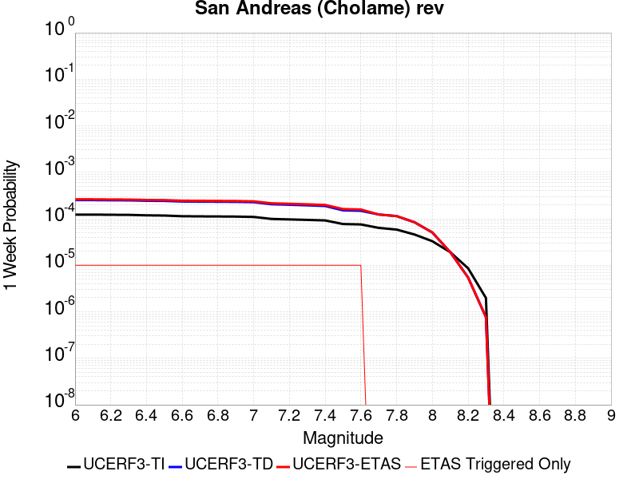 |  |  |  |

| Magnitude | 1 wk TI Prob | 1 wk TD Prob | 1 wk ETAS Prob | 1 wk ETAS/TD Gain | 1 wk ETAS Triggered Only | 1 mo TI Prob | 1 mo TD Prob | 1 mo ETAS Prob | 1 mo ETAS/TD Gain | 1 mo ETAS Triggered Only | 1 yr TI Prob | 1 yr TD Prob | 1 yr ETAS Prob | 1 yr ETAS/TD Gain | 1 yr ETAS Triggered Only | 10 yr TI Prob | 10 yr TD Prob | 10 yr ETAS Prob | 10 yr ETAS/TD Gain | 10 yr ETAS Triggered Only |
|-----|-----|-----|-----|-----|-----|-----|-----|-----|-----|-----|-----|-----|-----|-----|-----|-----|-----|-----|-----|-----|
| 6.0 | 1.2302514E-4 | 2.5213862E-4 | 2.6213608E-4 | 1.0396507 | 1.0E-5 | 5.27144E-4 | 0.0010801482 | 0.0010901374 | 1.009248 | 1.0E-5 | 0.0063991086 | 0.013072014 | 0.013150969 | 1.00604 | 8.0E-5 | 0.06217949 | 0.12443058 | 0.12460569 | 1.0014073 | 2.0E-4 |
| 6.1 | 1.2302514E-4 | 2.5213862E-4 | 2.6213608E-4 | 1.0396507 | 1.0E-5 | 5.27144E-4 | 0.0010801482 | 0.0010901374 | 1.009248 | 1.0E-5 | 0.0063991086 | 0.013072014 | 0.013150969 | 1.00604 | 8.0E-5 | 0.06217949 | 0.12443058 | 0.12460569 | 1.0014073 | 2.0E-4 |
| 6.2 | 1.2203569E-4 | 2.5030645E-4 | 2.6030396E-4 | 1.0399411 | 1.0E-5 | 5.2290526E-4 | 0.0010723026 | 0.0010822918 | 1.0093157 | 1.0E-5 | 0.006347804 | 0.0129776355 | 0.013056597 | 1.0060844 | 8.0E-5 | 0.061695136 | 0.12361675 | 0.12379202 | 1.0014179 | 2.0E-4 |
| 6.3 | 1.2142645E-4 | 2.491661E-4 | 2.5916361E-4 | 1.0401238 | 1.0E-5 | 5.202953E-4 | 0.0010674193 | 0.0010774087 | 1.0093584 | 1.0E-5 | 0.006316212 | 0.012918889 | 0.012997855 | 1.0061125 | 8.0E-5 | 0.06139677 | 0.12311087 | 0.12328624 | 1.0014246 | 2.0E-4 |
| 6.4 | 1.1865206E-4 | 2.4422092E-4 | 2.542185E-4 | 1.0409366 | 1.0E-5 | 5.0840975E-4 | 0.0010462429 | 0.0010562325 | 1.0095481 | 1.0E-5 | 0.006172335 | 0.012664088 | 0.012743075 | 1.006237 | 8.0E-5 | 0.060036868 | 0.12090351 | 0.121079326 | 1.0014542 | 2.0E-4 |
| 6.5 | 1.17443946E-4 | 2.421537E-4 | 2.5215128E-4 | 1.0412861 | 1.0E-5 | 5.032341E-4 | 0.0010373904 | 0.00104738 | 1.0096296 | 1.0E-5 | 0.006109677 | 0.012557554 | 0.012636549 | 1.0062907 | 8.0E-5 | 0.059444077 | 0.11997763 | 0.120153636 | 1.001467 | 2.0E-4 |
| 6.6 | 1.13579066E-4 | 2.3524289E-4 | 2.4524055E-4 | 1.0424993 | 1.0E-5 | 4.866766E-4 | 0.0010077958 | 0.0010177857 | 1.0099126 | 1.0E-5 | 0.0059092017 | 0.012201327 | 0.012280351 | 1.0064766 | 8.0E-5 | 0.057545185 | 0.11689143 | 0.117059216 | 1.0014354 | 1.9E-4 |
| 6.7 | 1.1271412E-4 | 2.336858E-4 | 2.4368346E-4 | 1.0427825 | 1.0E-5 | 4.829711E-4 | 0.0010011276 | 0.0010111177 | 1.0099788 | 1.0E-5 | 0.005864331 | 0.01212105 | 0.01220008 | 1.00652 | 8.0E-5 | 0.057119697 | 0.11619493 | 0.11636286 | 1.0014452 | 1.9E-4 |
| 6.8 | 1.1217975E-4 | 2.3256983E-4 | 2.425675E-4 | 1.0429878 | 1.0E-5 | 4.8068175E-4 | 9.963487E-4 | 0.0010063386 | 1.0100267 | 1.0E-5 | 0.005836608 | 0.012063511 | 0.012142546 | 1.0065516 | 8.0E-5 | 0.056856725 | 0.11569312 | 0.11586114 | 1.0014523 | 1.9E-4 |
| 6.9 | 1.1146753E-4 | 2.3105709E-4 | 2.4105477E-4 | 1.0432694 | 1.0E-5 | 4.7763053E-4 | 9.898704E-4 | 9.998605E-4 | 1.0100924 | 1.0E-5 | 0.0057996577 | 0.011985509 | 0.012064549 | 1.0065948 | 8.0E-5 | 0.056506127 | 0.11501348 | 0.11518163 | 1.001462 | 1.9E-4 |
| 7.0 | 1.0965793E-4 | 2.2728977E-4 | 2.372875E-4 | 1.0439867 | 1.0E-5 | 4.698779E-4 | 9.7373687E-4 | 9.837272E-4 | 1.0102597 | 1.0E-5 | 0.005705768 | 0.0117912255 | 0.011870283 | 1.0067047 | 8.0E-5 | 0.055614736 | 0.11331484 | 0.11348331 | 1.0014868 | 1.9E-4 |
| 7.1 | 9.927982E-5 | 2.0547757E-4 | 2.1547552E-4 | 1.0486571 | 1.0E-5 | 4.2541555E-4 | 8.80322E-4 | 8.903132E-4 | 1.0113494 | 1.0E-5 | 0.0051671406 | 0.010665542 | 0.010734796 | 1.0064932 | 7.0E-5 | 0.05048634 | 0.10340853 | 0.103551984 | 1.0013872 | 1.6E-4 |
| 7.2 | 9.696786E-5 | 2.0051954E-4 | 2.1051754E-4 | 1.0498605 | 1.0E-5 | 4.1551032E-4 | 8.5908745E-4 | 8.6907885E-4 | 1.0116303 | 1.0E-5 | 0.00504711 | 0.010409511 | 0.010478782 | 1.0066546 | 7.0E-5 | 0.04934009 | 0.10114636 | 0.10129018 | 1.0014218 | 1.6E-4 |
| 7.3 | 9.4727984E-5 | 1.9481099E-4 | 2.0480904E-4 | 1.0513219 | 1.0E-5 | 4.0591392E-4 | 8.346381E-4 | 8.446297E-4 | 1.0119712 | 1.0E-5 | 0.0049308087 | 0.010114641 | 0.010183933 | 1.0068507 | 7.0E-5 | 0.048228268 | 0.09851684 | 0.09866107 | 1.0014641 | 1.6E-4 |
| 7.4 | 9.220358E-5 | 1.885154E-4 | 1.9851352E-4 | 1.0530361 | 1.0E-5 | 3.9509835E-4 | 8.076739E-4 | 8.1766583E-4 | 1.0123712 | 1.0E-5 | 0.004799717 | 0.009789341 | 0.009858656 | 1.0070807 | 7.0E-5 | 0.046973653 | 0.09559427 | 0.09573898 | 1.0015137 | 1.6E-4 |
| 7.5 | 7.71631E-5 | 1.5185357E-4 | 1.6185206E-4 | 1.0658429 | 1.0E-5 | 3.306571E-4 | 6.506389E-4 | 6.606324E-4 | 1.0153595 | 1.0E-5 | 0.0040183207 | 0.007892828 | 0.007952355 | 1.0075419 | 6.0E-5 | 0.03946433 | 0.07831838 | 0.0784382 | 1.0015299 | 1.3E-4 |
| 7.6 | 7.5634416E-5 | 1.4844738E-4 | 1.584459E-4 | 1.067354 | 1.0E-5 | 3.241072E-4 | 6.360481E-4 | 6.460417E-4 | 1.015712 | 1.0E-5 | 0.0039388672 | 0.007716457 | 0.0077759936 | 1.0077156 | 6.0E-5 | 0.038697794 | 0.076681465 | 0.076801494 | 1.0015653 | 1.3E-4 |
| 7.7 | 6.3783E-5 | 1.2365259E-4 | 1.2365259E-4 | 1.0 | 0.0 | 2.7332708E-4 | 5.2983203E-4 | 5.2983203E-4 | 1.0 | 0.0 | 0.0033226798 | 0.0064316522 | 0.006471395 | 1.0061792 | 4.0E-5 | 0.032734364 | 0.064570144 | 0.064663686 | 1.0014488 | 1.0E-4 |
| 7.8 | 5.863422E-5 | 1.142205E-4 | 1.142205E-4 | 1.0 | 0.0 | 2.512653E-4 | 4.894246E-4 | 4.894246E-4 | 1.0 | 0.0 | 0.003054864 | 0.0059424853 | 0.0059822476 | 1.0066912 | 4.0E-5 | 0.030132094 | 0.059686445 | 0.05976167 | 1.0012603 | 8.0E-5 |
| 7.9 | 4.595283E-5 | 8.4306725E-5 | 8.4306725E-5 | 1.0 | 0.0 | 1.9692584E-4 | 3.612645E-4 | 3.612645E-4 | 1.0 | 0.0 | 0.0023949358 | 0.0043895314 | 0.0044194 | 1.0068045 | 3.0E-5 | 0.023692891 | 0.044382483 | 0.044449378 | 1.0015072 | 7.0E-5 |
| 8.0 | 3.2950178E-5 | 5.08E-5 | 5.08E-5 | 1.0 | 0.0 | 1.412074E-4 | 2.1769613E-4 | 2.1769613E-4 | 1.0 | 0.0 | 0.0017178444 | 0.0026472306 | 0.0026572042 | 1.0037675 | 1.0E-5 | 0.017046256 | 0.027193451 | 0.027232364 | 1.001431 | 4.0E-5 |
| 8.1 | 1.9177472E-5 | 1.9198456E-5 | 1.9198456E-5 | 1.0 | 0.0 | 8.218658E-5 | 8.227651E-5 | 8.227651E-5 | 1.0 | 0.0 | 0.0010001622 | 0.0010012568 | 0.0010012568 | 1.0 | 0.0 | 0.009956728 | 0.01076512 | 0.010775012 | 1.000919 | 1.0E-5 |
| 8.2 | 8.643924E-6 | 5.4798497E-6 | 5.4798497E-6 | 1.0 | 0.0 | 3.704486E-5 | 2.348486E-5 | 2.348486E-5 | 1.0 | 0.0 | 4.5092785E-4 | 2.858907E-4 | 2.858907E-4 | 1.0 | 0.0 | 0.0045001395 | 0.0032514327 | 0.0032514327 | 1.0 | 0.0 |
| 8.3 | 1.983087E-6 | 7.668296E-7 | 7.668296E-7 | 1.0 | 0.0 | 8.498917E-6 | 3.2864084E-6 | 3.2864084E-6 | 1.0 | 0.0 | 1.034694E-4 | 4.0011306E-5 | 4.0011306E-5 | 1.0 | 0.0 | 0.0010342124 | 4.724499E-4 | 4.724499E-4 | 1.0 | 0.0 |

## San Andreas (Carrizo) rev
*[(top)](#table-of-contents)*

| 1 Week | 1 Month | 1 Year | 10 Year |
|-----|-----|-----|-----|
|  |  |  | 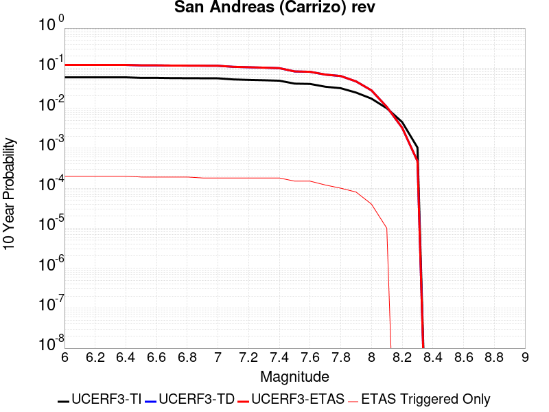 |

| Magnitude | 1 wk TI Prob | 1 wk TD Prob | 1 wk ETAS Prob | 1 wk ETAS/TD Gain | 1 wk ETAS Triggered Only | 1 mo TI Prob | 1 mo TD Prob | 1 mo ETAS Prob | 1 mo ETAS/TD Gain | 1 mo ETAS Triggered Only | 1 yr TI Prob | 1 yr TD Prob | 1 yr ETAS Prob | 1 yr ETAS/TD Gain | 1 yr ETAS Triggered Only | 10 yr TI Prob | 10 yr TD Prob | 10 yr ETAS Prob | 10 yr ETAS/TD Gain | 10 yr ETAS Triggered Only |
|-----|-----|-----|-----|-----|-----|-----|-----|-----|-----|-----|-----|-----|-----|-----|-----|-----|-----|-----|-----|-----|
| 6.0 | 1.1674632E-4 | 2.4332498E-4 | 2.5332253E-4 | 1.0410873 | 1.0E-5 | 5.002454E-4 | 0.0010424062 | 0.0010623854 | 1.0191664 | 2.0E-5 | 0.006073493 | 0.012617926 | 0.012716665 | 1.0078253 | 1.0E-4 | 0.0591016 | 0.12065402 | 0.12082989 | 1.0014577 | 2.0E-4 |
| 6.1 | 1.1674632E-4 | 2.4332498E-4 | 2.5332253E-4 | 1.0410873 | 1.0E-5 | 5.002454E-4 | 0.0010424062 | 0.0010623854 | 1.0191664 | 2.0E-5 | 0.006073493 | 0.012617926 | 0.012716665 | 1.0078253 | 1.0E-4 | 0.0591016 | 0.12065402 | 0.12082989 | 1.0014577 | 2.0E-4 |
| 6.2 | 1.1674632E-4 | 2.4332498E-4 | 2.5332253E-4 | 1.0410873 | 1.0E-5 | 5.002454E-4 | 0.0010424062 | 0.0010623854 | 1.0191664 | 2.0E-5 | 0.006073493 | 0.012617926 | 0.012716665 | 1.0078253 | 1.0E-4 | 0.0591016 | 0.12065402 | 0.12082989 | 1.0014577 | 2.0E-4 |
| 6.3 | 1.1674632E-4 | 2.4332498E-4 | 2.5332253E-4 | 1.0410873 | 1.0E-5 | 5.002454E-4 | 0.0010424062 | 0.0010623854 | 1.0191664 | 2.0E-5 | 0.006073493 | 0.012617926 | 0.012716665 | 1.0078253 | 1.0E-4 | 0.0591016 | 0.12065402 | 0.12082989 | 1.0014577 | 2.0E-4 |
| 6.4 | 1.1674632E-4 | 2.4332498E-4 | 2.5332253E-4 | 1.0410873 | 1.0E-5 | 5.002454E-4 | 0.0010424062 | 0.0010623854 | 1.0191664 | 2.0E-5 | 0.006073493 | 0.012617926 | 0.012716665 | 1.0078253 | 1.0E-4 | 0.0591016 | 0.12065402 | 0.12082989 | 1.0014577 | 2.0E-4 |
| 6.5 | 1.13136164E-4 | 2.3652466E-4 | 2.465223E-4 | 1.0422689 | 1.0E-5 | 4.847792E-4 | 0.0010132849 | 0.0010232747 | 1.0098588 | 1.0E-5 | 0.0058862255 | 0.012267408 | 0.012356304 | 1.0072465 | 9.0E-5 | 0.057327334 | 0.11762535 | 0.117793 | 1.0014253 | 1.9E-4 |
| 6.6 | 1.13136164E-4 | 2.3652466E-4 | 2.465223E-4 | 1.0422689 | 1.0E-5 | 4.847792E-4 | 0.0010132849 | 0.0010232747 | 1.0098588 | 1.0E-5 | 0.0058862255 | 0.012267408 | 0.012356304 | 1.0072465 | 9.0E-5 | 0.057327334 | 0.11762535 | 0.117793 | 1.0014253 | 1.9E-4 |
| 6.7 | 1.1149675E-4 | 2.3343669E-4 | 2.4343435E-4 | 1.0428282 | 1.0E-5 | 4.777557E-4 | 0.0010000608 | 0.0010100509 | 1.0099894 | 1.0E-5 | 0.0058011734 | 0.012108203 | 0.012197114 | 1.0073429 | 9.0E-5 | 0.05652051 | 0.11624688 | 0.11641479 | 1.0014445 | 1.9E-4 |
| 6.8 | 1.1103589E-4 | 2.3245816E-4 | 2.4245583E-4 | 1.0430084 | 1.0E-5 | 4.7578133E-4 | 9.958703E-4 | 0.0010058604 | 1.0100315 | 1.0E-5 | 0.005777263 | 0.0120577505 | 0.012146665 | 1.007374 | 9.0E-5 | 0.056293584 | 0.11580715 | 0.11597515 | 1.0014507 | 1.9E-4 |
| 6.9 | 1.1053259E-4 | 2.3138185E-4 | 2.4137954E-4 | 1.0432086 | 1.0E-5 | 4.7362508E-4 | 9.912612E-4 | 0.0010012513 | 1.0100782 | 1.0E-5 | 0.0057511497 | 0.012002253 | 0.012081292 | 1.0065854 | 8.0E-5 | 0.05604569 | 0.11532332 | 0.11548256 | 1.0013808 | 1.8E-4 |
| 7.0 | 1.1005377E-4 | 2.3039016E-4 | 2.4038786E-4 | 1.0433947 | 1.0E-5 | 4.7157376E-4 | 9.870143E-4 | 9.970044E-4 | 1.0101216 | 1.0E-5 | 0.0057263062 | 0.011951115 | 0.012030159 | 1.006614 | 8.0E-5 | 0.055809796 | 0.11487561 | 0.11503493 | 1.0013869 | 1.8E-4 |
| 7.1 | 1.0308142E-4 | 2.1548544E-4 | 2.254833E-4 | 1.0463969 | 1.0E-5 | 4.417027E-4 | 9.231832E-4 | 9.33174E-4 | 1.010822 | 1.0E-5 | 0.0053644776 | 0.011182146 | 0.011261251 | 1.0070742 | 8.0E-5 | 0.052368138 | 0.108131535 | 0.10829207 | 1.0014846 | 1.8E-4 |
| 7.2 | 1.0027479E-4 | 2.0956367E-4 | 2.1956158E-4 | 1.0477082 | 1.0E-5 | 4.296783E-4 | 8.978219E-4 | 9.078129E-4 | 1.0111281 | 1.0E-5 | 0.0052187922 | 0.0108764935 | 0.010955623 | 1.0072753 | 8.0E-5 | 0.050979212 | 0.10543535 | 0.10559637 | 1.0015272 | 1.8E-4 |
| 7.3 | 9.816942E-5 | 2.0431461E-4 | 2.1431256E-4 | 1.0489341 | 1.0E-5 | 4.2065824E-4 | 8.753412E-4 | 8.853324E-4 | 1.0114142 | 1.0E-5 | 0.005109493 | 0.010605487 | 0.010684639 | 1.0074632 | 8.0E-5 | 0.049935985 | 0.103018686 | 0.10318014 | 1.0015672 | 1.8E-4 |
| 7.4 | 9.5634205E-5 | 1.9800827E-4 | 2.080063E-4 | 1.0504929 | 1.0E-5 | 4.0979648E-4 | 8.4833184E-4 | 8.5832336E-4 | 1.0117779 | 1.0E-5 | 0.0049778637 | 0.0102797905 | 0.010358968 | 1.0077022 | 8.0E-5 | 0.048678253 | 0.100104466 | 0.10026645 | 1.0016181 | 1.8E-4 |
| 7.5 | 8.052417E-5 | 1.6120363E-4 | 1.7120202E-4 | 1.0620234 | 1.0E-5 | 3.4505792E-4 | 6.9068995E-4 | 7.0068304E-4 | 1.0144683 | 1.0E-5 | 0.0041929903 | 0.008376808 | 0.008446222 | 1.0082864 | 7.0E-5 | 0.04114753 | 0.08284498 | 0.08298255 | 1.0016606 | 1.5E-4 |
| 7.6 | 7.897024E-5 | 1.5773512E-4 | 1.6773354E-4 | 1.0633874 | 1.0E-5 | 3.384E-4 | 6.758327E-4 | 6.8582594E-4 | 1.0147866 | 1.0E-5 | 0.0041122385 | 0.008197296 | 0.008266722 | 1.0084693 | 7.0E-5 | 0.040369697 | 0.081185855 | 0.081323676 | 1.0016977 | 1.5E-4 |
| 7.7 | 6.707427E-5 | 1.3282998E-4 | 1.3282998E-4 | 1.0 | 0.0 | 2.8742946E-4 | 5.691472E-4 | 5.691472E-4 | 1.0 | 0.0 | 0.003493839 | 0.0069073834 | 0.0069570383 | 1.0071887 | 5.0E-5 | 0.034394164 | 0.06907934 | 0.069191046 | 1.0016171 | 1.2E-4 |
| 7.8 | 6.147705E-5 | 1.2203727E-4 | 1.2203727E-4 | 1.0 | 0.0 | 2.6344648E-4 | 5.229121E-4 | 5.229121E-4 | 1.0 | 0.0 | 0.0032027436 | 0.006347895 | 0.0063975775 | 1.0078267 | 5.0E-5 | 0.031569764 | 0.063543044 | 0.06363668 | 1.0014738 | 1.0E-4 |
| 7.9 | 4.7636717E-5 | 8.88427E-5 | 8.88427E-5 | 1.0 | 0.0 | 2.0414138E-4 | 3.806989E-4 | 3.806989E-4 | 1.0 | 0.0 | 0.0024825884 | 0.0046251663 | 0.0046649813 | 1.0086083 | 4.0E-5 | 0.024550365 | 0.046649244 | 0.04672551 | 1.001635 | 8.0E-5 |
| 8.0 | 3.3554235E-5 | 5.2164494E-5 | 5.2164494E-5 | 1.0 | 0.0 | 1.4379594E-4 | 2.2354297E-4 | 2.2354297E-4 | 1.0 | 0.0 | 0.0017493097 | 0.0027182405 | 0.0027282133 | 1.0036689 | 1.0E-5 | 0.017356034 | 0.027894506 | 0.02793339 | 1.001394 | 4.0E-5 |
| 8.1 | 1.9175432E-5 | 1.9198285E-5 | 1.9198285E-5 | 1.0 | 0.0 | 8.217783E-5 | 8.227578E-5 | 8.227578E-5 | 1.0 | 0.0 | 0.0010000558 | 0.0010012479 | 0.0010012479 | 1.0 | 0.0 | 0.009955673 | 0.010765004 | 0.0107748965 | 1.000919 | 1.0E-5 |
| 8.2 | 8.643924E-6 | 5.4798497E-6 | 5.4798497E-6 | 1.0 | 0.0 | 3.704486E-5 | 2.348486E-5 | 2.348486E-5 | 1.0 | 0.0 | 4.5092785E-4 | 2.858907E-4 | 2.858907E-4 | 1.0 | 0.0 | 0.0045001395 | 0.0032514327 | 0.0032514327 | 1.0 | 0.0 |
| 8.3 | 1.983087E-6 | 7.668296E-7 | 7.668296E-7 | 1.0 | 0.0 | 8.498917E-6 | 3.2864084E-6 | 3.2864084E-6 | 1.0 | 0.0 | 1.034694E-4 | 4.0011306E-5 | 4.0011306E-5 | 1.0 | 0.0 | 0.0010342124 | 4.724499E-4 | 4.724499E-4 | 1.0 | 0.0 |

## Scodie Lineament
*[(top)](#table-of-contents)*

| 1 Week | 1 Month | 1 Year | 10 Year |
|-----|-----|-----|-----|
|  |  |  |  |

| Magnitude | 1 wk TI Prob | 1 wk TD Prob | 1 wk ETAS Prob | 1 wk ETAS/TD Gain | 1 wk ETAS Triggered Only | 1 mo TI Prob | 1 mo TD Prob | 1 mo ETAS Prob | 1 mo ETAS/TD Gain | 1 mo ETAS Triggered Only | 1 yr TI Prob | 1 yr TD Prob | 1 yr ETAS Prob | 1 yr ETAS/TD Gain | 1 yr ETAS Triggered Only | 10 yr TI Prob | 10 yr TD Prob | 10 yr ETAS Prob | 10 yr ETAS/TD Gain | 10 yr ETAS Triggered Only |
|-----|-----|-----|-----|-----|-----|-----|-----|-----|-----|-----|-----|-----|-----|-----|-----|-----|-----|-----|-----|-----|
| 6.0 | 3.2919327E-6 | 3.0133565E-6 | 1.3013327E-5 | 4.3185487 | 1.0E-5 | 1.4108206E-5 | 1.2914339E-5 | 6.291369E-5 | 4.8716154 | 5.0E-5 | 1.7175387E-4 | 1.5722391E-4 | 2.9720188E-4 | 1.8903098 | 1.4E-4 | 0.0017162118 | 0.0015714383 | 0.0017611397 | 1.1207184 | 1.9E-4 |
| 6.1 | 1.8663811E-6 | 1.5490589E-6 | 1.1549044E-5 | 7.4555225 | 1.0E-5 | 7.998751E-6 | 6.6388097E-6 | 4.6638543E-5 | 7.0251365 | 4.0E-5 | 9.738045E-5 | 8.082501E-5 | 1.4082016E-4 | 1.7422845 | 6.0E-5 | 9.7337784E-4 | 8.0800493E-4 | 8.7794836E-4 | 1.0865631 | 7.0E-5 |
| 6.2 | 1.8663811E-6 | 1.5490589E-6 | 1.1549044E-5 | 7.4555225 | 1.0E-5 | 7.998751E-6 | 6.6388097E-6 | 4.6638543E-5 | 7.0251365 | 4.0E-5 | 9.738045E-5 | 8.082501E-5 | 1.4082016E-4 | 1.7422845 | 6.0E-5 | 9.7337784E-4 | 8.0800493E-4 | 8.7794836E-4 | 1.0865631 | 7.0E-5 |
| 6.3 | 1.8663811E-6 | 1.5490589E-6 | 1.1549044E-5 | 7.4555225 | 1.0E-5 | 7.998751E-6 | 6.6388097E-6 | 4.6638543E-5 | 7.0251365 | 4.0E-5 | 9.738045E-5 | 8.082501E-5 | 1.4082016E-4 | 1.7422845 | 6.0E-5 | 9.7337784E-4 | 8.0800493E-4 | 8.7794836E-4 | 1.0865631 | 7.0E-5 |
| 6.4 | 1.8663811E-6 | 1.5490589E-6 | 1.1549044E-5 | 7.4555225 | 1.0E-5 | 7.998751E-6 | 6.6388097E-6 | 4.6638543E-5 | 7.0251365 | 4.0E-5 | 9.738045E-5 | 8.082501E-5 | 1.4082016E-4 | 1.7422845 | 6.0E-5 | 9.7337784E-4 | 8.0800493E-4 | 8.7794836E-4 | 1.0865631 | 7.0E-5 |
| 6.5 | 1.8106311E-6 | 1.4909926E-6 | 1.1490978E-5 | 7.7069316 | 1.0E-5 | 7.759824E-6 | 6.3899556E-6 | 4.63897E-5 | 7.2597847 | 4.0E-5 | 9.447177E-5 | 7.779543E-5 | 1.3779076E-4 | 1.7711936 | 6.0E-5 | 9.4431615E-4 | 7.777306E-4 | 8.476761E-4 | 1.0899354 | 7.0E-5 |
| 6.6 | 1.2414679E-6 | 8.9976135E-7 | 1.0899752E-5 | 12.114048 | 1.0E-5 | 5.320566E-6 | 3.8561147E-6 | 2.3856037E-5 | 6.1865473 | 2.0E-5 | 6.477596E-5 | 4.6947276E-5 | 8.69454E-5 | 1.8519796 | 4.0E-5 | 6.475708E-4 | 4.6938224E-4 | 5.093635E-4 | 1.0851784 | 4.0E-5 |
| 6.7 | 1.1062215E-6 | 7.5943603E-7 | 1.0759429E-5 | 14.167656 | 1.0E-5 | 4.7409408E-6 | 3.254722E-6 | 2.3254657E-5 | 7.144898 | 2.0E-5 | 5.7719422E-5 | 3.9625593E-5 | 5.96248E-5 | 1.5047044 | 2.0E-5 | 5.770443E-4 | 3.9619225E-4 | 4.1618434E-4 | 1.0504606 | 2.0E-5 |
| 6.8 | 1.0006736E-6 | 6.5004406E-7 | 1.0650037E-5 | 16.383562 | 1.0E-5 | 4.288594E-6 | 2.7859005E-6 | 2.2785845E-5 | 8.1789875 | 2.0E-5 | 5.221238E-5 | 3.3917873E-5 | 5.3917192E-5 | 1.5896397 | 2.0E-5 | 5.220012E-4 | 3.3913302E-4 | 3.5912625E-4 | 1.0589539 | 2.0E-5 |
| 6.9 | 9.167364E-7 | 5.6316645E-7 | 1.0563161E-5 | 18.75673 | 1.0E-5 | 3.9288643E-6 | 2.4135686E-6 | 2.241352E-5 | 9.286465 | 2.0E-5 | 4.7832873E-5 | 2.9384859E-5 | 4.938427E-5 | 1.6806027 | 2.0E-5 | 4.782258E-4 | 2.9381542E-4 | 3.1380952E-4 | 1.0680499 | 2.0E-5 |
| 7.0 | 7.6987664E-7 | 4.113416E-7 | 1.0411338E-5 | 25.310684 | 1.0E-5 | 3.2994672E-6 | 1.7628915E-6 | 2.1762857E-5 | 12.344977 | 2.0E-5 | 4.0170275E-5 | 2.1463033E-5 | 4.1462605E-5 | 1.9318148 | 2.0E-5 | 4.0163012E-4 | 2.1461345E-4 | 2.3460916E-4 | 1.0931708 | 2.0E-5 |
| 7.1 | 7.1038727E-7 | 3.5211795E-7 | 1.0352114E-5 | 29.399565 | 1.0E-5 | 3.0445133E-6 | 1.5090762E-6 | 2.1509046E-5 | 14.25312 | 2.0E-5 | 3.706632E-5 | 1.8372884E-5 | 3.8372516E-5 | 2.0885408 | 2.0E-5 | 3.7060137E-4 | 1.8371714E-4 | 2.0371347E-4 | 1.108843 | 2.0E-5 |
| 7.2 | 2.0799602E-7 | 3.1187685E-8 | 3.1187685E-8 | 1.0 | 0.0 | 8.914113E-7 | 1.336615E-7 | 1.336615E-7 | 1.0 | 0.0 | 1.0852878E-5 | 1.6273277E-6 | 1.6273277E-6 | 1.0 | 0.0 | 1.08523476E-4 | 1.6273165E-5 | 1.6273165E-5 | 1.0 | 0.0 |
| 7.3 | 1.5048182E-7 | 1.5946263E-8 | 1.5946263E-8 | 1.0 | 0.0 | 6.449219E-7 | 6.834112E-8 | 6.834112E-8 | 1.0 | 0.0 | 7.851896E-6 | 8.320529E-7 | 8.320529E-7 | 1.0 | 0.0 | 7.851618E-5 | 8.3205005E-6 | 8.3205005E-6 | 1.0 | 0.0 |
| 7.4 | 5.9334678E-8 | 4.8685624E-9 | 4.8685624E-9 | 1.0 | 0.0 | 2.5429145E-7 | 2.0865269E-8 | 2.0865269E-8 | 1.0 | 0.0 | 3.095994E-6 | 2.5403463E-7 | 2.5403463E-7 | 1.0 | 0.0 | 3.095951E-5 | 2.5403444E-6 | 2.5403444E-6 | 1.0 | 0.0 |

## Lake Isabella (Seismicity)
*[(top)](#table-of-contents)*

| 1 Week | 1 Month | 1 Year | 10 Year |
|-----|-----|-----|-----|
|  |  |  | 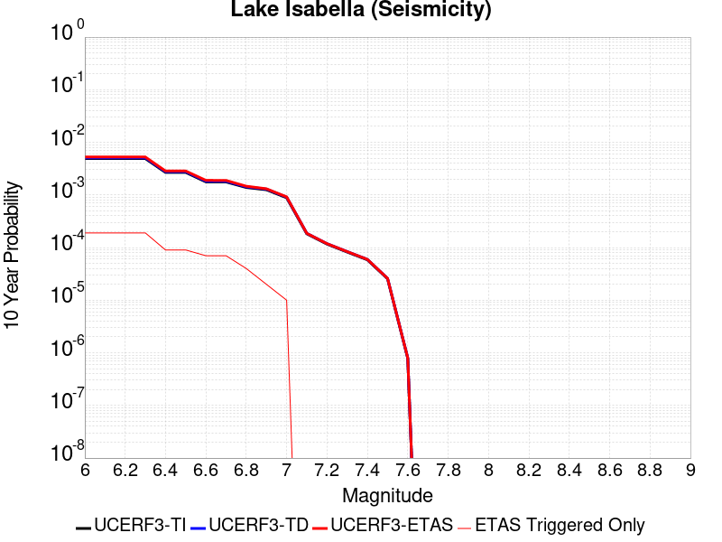 |

| Magnitude | 1 wk TI Prob | 1 wk TD Prob | 1 wk ETAS Prob | 1 wk ETAS/TD Gain | 1 wk ETAS Triggered Only | 1 mo TI Prob | 1 mo TD Prob | 1 mo ETAS Prob | 1 mo ETAS/TD Gain | 1 mo ETAS Triggered Only | 1 yr TI Prob | 1 yr TD Prob | 1 yr ETAS Prob | 1 yr ETAS/TD Gain | 1 yr ETAS Triggered Only | 10 yr TI Prob | 10 yr TD Prob | 10 yr ETAS Prob | 10 yr ETAS/TD Gain | 10 yr ETAS Triggered Only |
|-----|-----|-----|-----|-----|-----|-----|-----|-----|-----|-----|-----|-----|-----|-----|-----|-----|-----|-----|-----|-----|
| 6.0 | 9.431637E-6 | 9.741694E-6 | 4.9741306E-5 | 5.106022 | 4.0E-5 | 4.0420677E-5 | 4.1749525E-5 | 9.174744E-5 | 2.1975684 | 5.0E-5 | 4.920106E-4 | 5.0819496E-4 | 6.1813905E-4 | 1.2163423 | 1.1E-4 | 0.004909227 | 0.005071621 | 0.0052606575 | 1.0372734 | 1.9E-4 |
| 6.1 | 9.431637E-6 | 9.741694E-6 | 4.9741306E-5 | 5.106022 | 4.0E-5 | 4.0420677E-5 | 4.1749525E-5 | 9.174744E-5 | 2.1975684 | 5.0E-5 | 4.920106E-4 | 5.0819496E-4 | 6.1813905E-4 | 1.2163423 | 1.1E-4 | 0.004909227 | 0.005071621 | 0.0052606575 | 1.0372734 | 1.9E-4 |
| 6.2 | 9.431637E-6 | 9.741694E-6 | 4.9741306E-5 | 5.106022 | 4.0E-5 | 4.0420677E-5 | 4.1749525E-5 | 9.174744E-5 | 2.1975684 | 5.0E-5 | 4.920106E-4 | 5.0819496E-4 | 6.1813905E-4 | 1.2163423 | 1.1E-4 | 0.004909227 | 0.005071621 | 0.0052606575 | 1.0372734 | 1.9E-4 |
| 6.3 | 9.431637E-6 | 9.741694E-6 | 4.9741306E-5 | 5.106022 | 4.0E-5 | 4.0420677E-5 | 4.1749525E-5 | 9.174744E-5 | 2.1975684 | 5.0E-5 | 4.920106E-4 | 5.0819496E-4 | 6.1813905E-4 | 1.2163423 | 1.1E-4 | 0.004909227 | 0.005071621 | 0.0052606575 | 1.0372734 | 1.9E-4 |
| 6.4 | 5.144063E-6 | 5.3000977E-6 | 4.5299887E-5 | 8.546991 | 4.0E-5 | 2.2045799E-5 | 2.2714525E-5 | 6.271362E-5 | 2.7609477 | 4.0E-5 | 2.6837454E-4 | 2.765177E-4 | 3.365011E-4 | 1.2169243 | 6.0E-5 | 0.0026805066 | 0.002762077 | 0.0028518282 | 1.0324942 | 9.0E-5 |
| 6.5 | 5.144063E-6 | 5.3000977E-6 | 4.5299887E-5 | 8.546991 | 4.0E-5 | 2.2045799E-5 | 2.2714525E-5 | 6.271362E-5 | 2.7609477 | 4.0E-5 | 2.6837454E-4 | 2.765177E-4 | 3.365011E-4 | 1.2169243 | 6.0E-5 | 0.0026805066 | 0.002762077 | 0.0028518282 | 1.0324942 | 9.0E-5 |
| 6.6 | 3.4009804E-6 | 3.4987995E-6 | 3.3498694E-5 | 9.57434 | 3.0E-5 | 1.4575549E-5 | 1.4994778E-5 | 4.499433E-5 | 3.0006666 | 3.0E-5 | 1.7744285E-4 | 1.8254772E-4 | 2.2254043E-4 | 1.2190808 | 4.0E-5 | 0.0017730123 | 0.0018241355 | 0.0018940079 | 1.0383043 | 7.0E-5 |
| 6.7 | 3.3880428E-6 | 3.4856662E-6 | 3.348556E-5 | 9.606647 | 3.0E-5 | 1.4520103E-5 | 1.4938492E-5 | 4.4938046E-5 | 3.0082047 | 3.0E-5 | 1.767679E-4 | 1.8186258E-4 | 2.218553E-4 | 1.2199063 | 4.0E-5 | 0.0017662736 | 0.0018172951 | 0.0018871679 | 1.0384488 | 7.0E-5 |
| 6.8 | 2.6582E-6 | 2.7337105E-6 | 2.2733655E-5 | 8.316044 | 2.0E-5 | 1.1392236E-5 | 1.1715857E-5 | 3.1715623E-5 | 2.707068 | 2.0E-5 | 1.3869164E-4 | 1.4263256E-4 | 1.726283E-4 | 1.2103007 | 3.0E-5 | 0.0013860512 | 0.0014255423 | 0.0014654853 | 1.0280195 | 4.0E-5 |
| 6.9 | 2.406011E-6 | 2.474338E-6 | 1.2474314E-5 | 5.041475 | 1.0E-5 | 1.0311434E-5 | 1.0604271E-5 | 2.0604164E-5 | 1.9430063 | 1.0E-5 | 1.2553448E-4 | 1.2910066E-4 | 1.4909808E-4 | 1.1548978 | 2.0E-5 | 0.0012546359 | 0.0012903863 | 0.0013103605 | 1.0154792 | 2.0E-5 |
| 7.0 | 1.6953097E-6 | 1.7429437E-6 | 1.7429437E-6 | 1.0 | 0.0 | 7.265593E-6 | 7.469743E-6 | 7.469743E-6 | 1.0 | 0.0 | 8.8455E-5 | 9.094137E-5 | 1.00940466E-4 | 1.1099509 | 1.0E-5 | 8.84198E-4 | 9.0914435E-4 | 9.1913523E-4 | 1.0109893 | 1.0E-5 |
| 7.1 | 3.5013824E-7 | 3.571492E-7 | 3.571492E-7 | 1.0 | 0.0 | 1.5005916E-6 | 1.5306384E-6 | 1.5306384E-6 | 1.0 | 0.0 | 1.826955E-5 | 1.8635366E-5 | 1.8635366E-5 | 1.0 | 0.0 | 1.8268047E-4 | 1.863383E-4 | 1.863383E-4 | 1.0 | 0.0 |
| 7.2 | 2.2321095E-7 | 2.2750632E-7 | 2.2750632E-7 | 1.0 | 0.0 | 9.56618E-7 | 9.750268E-7 | 9.750268E-7 | 1.0 | 0.0 | 1.1646762E-5 | 1.1870887E-5 | 1.1870887E-5 | 1.0 | 0.0 | 1.1646151E-4 | 1.1870263E-4 | 1.1870263E-4 | 1.0 | 0.0 |
| 7.3 | 1.5760406E-7 | 1.6060963E-7 | 1.6060963E-7 | 1.0 | 0.0 | 6.7544585E-7 | 6.883268E-7 | 6.883268E-7 | 1.0 | 0.0 | 8.223522E-6 | 8.380347E-6 | 8.380347E-6 | 1.0 | 0.0 | 8.2232174E-5 | 8.3800376E-5 | 8.3800376E-5 | 1.0 | 0.0 |
| 7.4 | 1.1216497E-7 | 1.1431735E-7 | 1.1431735E-7 | 1.0 | 0.0 | 4.8070694E-7 | 4.8993144E-7 | 4.8993144E-7 | 1.0 | 0.0 | 5.852591E-6 | 5.964899E-6 | 5.964899E-6 | 1.0 | 0.0 | 5.8524372E-5 | 5.9647435E-5 | 5.9647435E-5 | 1.0 | 0.0 |
| 7.5 | 4.885185E-8 | 4.9787864E-8 | 4.9787864E-8 | 1.0 | 0.0 | 2.0936506E-7 | 2.1337654E-7 | 2.1337654E-7 | 1.0 | 0.0 | 2.5490165E-6 | 2.5978566E-6 | 2.5978566E-6 | 1.0 | 0.0 | 2.5489873E-5 | 2.597828E-5 | 2.597828E-5 | 1.0 | 0.0 |
| 7.6 | 1.504641E-9 | 1.5317939E-9 | 1.5317939E-9 | 1.0 | 0.0 | 6.4484613E-9 | 6.5648313E-9 | 6.5648313E-9 | 1.0 | 0.0 | 7.851001E-8 | 7.992682E-8 | 7.992682E-8 | 1.0 | 0.0 | 7.8509987E-7 | 7.992682E-7 | 7.992682E-7 | 1.0 | 0.0 |

## White Wolf (Extension)
*[(top)](#table-of-contents)*

| 1 Week | 1 Month | 1 Year | 10 Year |
|-----|-----|-----|-----|
|  | 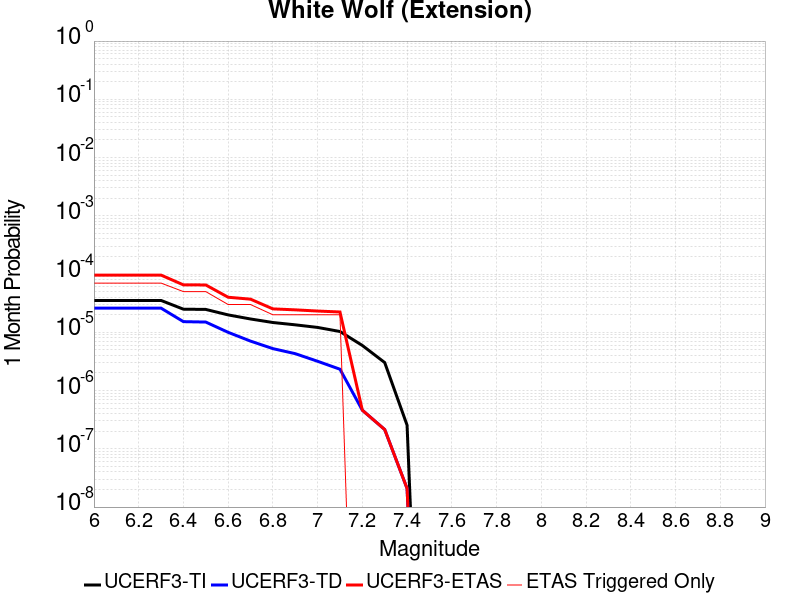 | 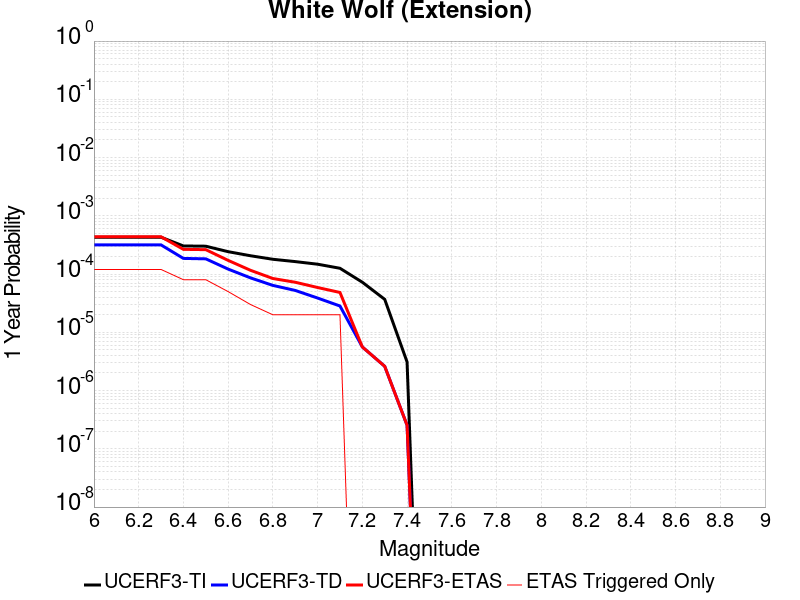 | 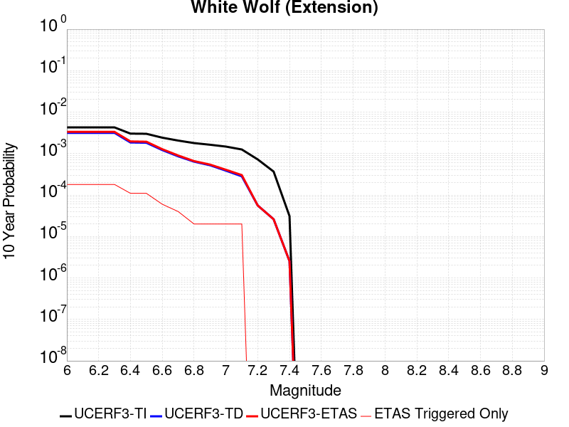 |

| Magnitude | 1 wk TI Prob | 1 wk TD Prob | 1 wk ETAS Prob | 1 wk ETAS/TD Gain | 1 wk ETAS Triggered Only | 1 mo TI Prob | 1 mo TD Prob | 1 mo ETAS Prob | 1 mo ETAS/TD Gain | 1 mo ETAS Triggered Only | 1 yr TI Prob | 1 yr TD Prob | 1 yr ETAS Prob | 1 yr ETAS/TD Gain | 1 yr ETAS Triggered Only | 10 yr TI Prob | 10 yr TD Prob | 10 yr ETAS Prob | 10 yr ETAS/TD Gain | 10 yr ETAS Triggered Only |
|-----|-----|-----|-----|-----|-----|-----|-----|-----|-----|-----|-----|-----|-----|-----|-----|-----|-----|-----|-----|-----|
| 6.0 | 8.222555E-6 | 6.0667057E-6 | 2.6066584E-5 | 4.296662 | 2.0E-5 | 3.5239045E-5 | 2.5999947E-5 | 9.5998126E-5 | 3.6922433 | 7.0E-5 | 4.289509E-4 | 3.1650998E-4 | 4.36472E-4 | 1.379015 | 1.2E-4 | 0.0042812387 | 0.0031612439 | 0.003340675 | 1.0567596 | 1.8E-4 |
| 6.1 | 8.222555E-6 | 6.0667057E-6 | 2.6066584E-5 | 4.296662 | 2.0E-5 | 3.5239045E-5 | 2.5999947E-5 | 9.5998126E-5 | 3.6922433 | 7.0E-5 | 4.289509E-4 | 3.1650998E-4 | 4.36472E-4 | 1.379015 | 1.2E-4 | 0.0042812387 | 0.0031612439 | 0.003340675 | 1.0567596 | 1.8E-4 |
| 6.2 | 8.222555E-6 | 6.0667057E-6 | 2.6066584E-5 | 4.296662 | 2.0E-5 | 3.5239045E-5 | 2.5999947E-5 | 9.5998126E-5 | 3.6922433 | 7.0E-5 | 4.289509E-4 | 3.1650998E-4 | 4.36472E-4 | 1.379015 | 1.2E-4 | 0.0042812387 | 0.0031612439 | 0.003340675 | 1.0567596 | 1.8E-4 |
| 6.3 | 8.222555E-6 | 6.0667057E-6 | 2.6066584E-5 | 4.296662 | 2.0E-5 | 3.5239045E-5 | 2.5999947E-5 | 9.5998126E-5 | 3.6922433 | 7.0E-5 | 4.289509E-4 | 3.1650998E-4 | 4.36472E-4 | 1.379015 | 1.2E-4 | 0.0042812387 | 0.0031612439 | 0.003340675 | 1.0567596 | 1.8E-4 |
| 6.4 | 5.821773E-6 | 3.5572016E-6 | 2.355713E-5 | 6.622377 | 2.0E-5 | 2.4950215E-5 | 1.5245067E-5 | 6.5244305E-5 | 4.2796993 | 5.0E-5 | 3.0372653E-4 | 1.8559398E-4 | 2.6557912E-4 | 1.4309685 | 8.0E-5 | 0.0030331176 | 0.0018544982 | 0.0019642941 | 1.0592053 | 1.1E-4 |
| 6.5 | 5.766023E-6 | 3.4991353E-6 | 2.3499066E-5 | 6.7156777 | 2.0E-5 | 2.4711293E-5 | 1.4996214E-5 | 6.499547E-5 | 4.3341246 | 5.0E-5 | 3.0081844E-4 | 1.8256472E-4 | 2.625501E-4 | 1.4381207 | 8.0E-5 | 0.0030041158 | 0.0018242556 | 0.0019340549 | 1.0601885 | 1.1E-4 |
| 6.6 | 4.643576E-6 | 2.332643E-6 | 2.2332597E-5 | 9.573946 | 2.0E-5 | 1.9900888E-5 | 9.997005E-6 | 3.9996703E-5 | 4.000869 | 3.0E-5 | 2.4226638E-4 | 1.2170716E-4 | 1.7170107E-4 | 1.4107722 | 5.0E-5 | 0.0024200242 | 0.0012164476 | 0.0012763746 | 1.049264 | 6.0E-5 |
| 6.7 | 3.9529173E-6 | 1.6483629E-6 | 2.164833E-5 | 13.133231 | 2.0E-5 | 1.6940963E-5 | 7.064394E-6 | 3.7064183E-5 | 5.2466187 | 3.0E-5 | 2.0623671E-4 | 8.600579E-5 | 1.1600321E-4 | 1.3487837 | 3.0E-5 | 0.002060454 | 8.5974357E-4 | 8.997092E-4 | 1.0464855 | 4.0E-5 |
| 6.8 | 3.4377522E-6 | 1.2245362E-6 | 1.1224524E-5 | 9.1663475 | 1.0E-5 | 1.473314E-5 | 5.2480023E-6 | 2.5247897E-5 | 4.810954 | 2.0E-5 | 1.7936122E-4 | 6.389264E-5 | 8.389137E-5 | 1.3130051 | 2.0E-5 | 0.0017921652 | 6.3875184E-4 | 6.5873907E-4 | 1.031291 | 2.0E-5 |
| 6.9 | 3.1367306E-6 | 1.0033893E-6 | 1.1003379E-5 | 10.966211 | 1.0E-5 | 1.3443062E-5 | 4.3002333E-6 | 2.4300147E-5 | 5.6508904 | 2.0E-5 | 1.63657E-4 | 5.235416E-5 | 7.235311E-5 | 1.3819935 | 2.0E-5 | 0.0016353652 | 5.234259E-4 | 5.4341543E-4 | 1.0381898 | 2.0E-5 |
| 7.0 | 2.8298145E-6 | 7.4287595E-7 | 1.0742869E-5 | 14.461187 | 1.0E-5 | 1.2127721E-5 | 3.1837506E-6 | 2.3183688E-5 | 7.281879 | 2.0E-5 | 1.47645E-4 | 3.8761526E-5 | 5.876075E-5 | 1.5159556 | 2.0E-5 | 0.0014754693 | 3.8755263E-4 | 4.0754487E-4 | 1.0515859 | 2.0E-5 |
| 7.1 | 2.4091064E-6 | 5.4228286E-7 | 1.0542278E-5 | 19.44055 | 1.0E-5 | 1.03247E-5 | 2.3240675E-6 | 2.232402E-5 | 9.605581 | 2.0E-5 | 1.2569598E-4 | 2.8295197E-5 | 4.829463E-5 | 1.7068138 | 2.0E-5 | 0.001256249 | 2.8291997E-4 | 3.0291433E-4 | 1.0706713 | 2.0E-5 |
| 7.2 | 1.3875518E-6 | 1.07434374E-7 | 1.07434374E-7 | 1.0 | 0.0 | 5.9466374E-6 | 4.6043297E-7 | 4.6043297E-7 | 1.0 | 0.0 | 7.23979E-5 | 5.6057584E-6 | 5.6057584E-6 | 1.0 | 0.0 | 7.2374323E-4 | 5.605628E-5 | 5.605628E-5 | 1.0 | 0.0 |
| 7.3 | 7.056077E-7 | 5.0022493E-8 | 5.0022493E-8 | 1.0 | 0.0 | 3.0240296E-6 | 2.143821E-7 | 2.143821E-7 | 1.0 | 0.0 | 3.681694E-5 | 2.6100993E-6 | 2.6100993E-6 | 1.0 | 0.0 | 3.681084E-4 | 2.6100734E-5 | 2.6100734E-5 | 1.0 | 0.0 |
| 7.4 | 5.9334678E-8 | 4.8685624E-9 | 4.8685624E-9 | 1.0 | 0.0 | 2.5429145E-7 | 2.0865269E-8 | 2.0865269E-8 | 1.0 | 0.0 | 3.095994E-6 | 2.5403463E-7 | 2.5403463E-7 | 1.0 | 0.0 | 3.095951E-5 | 2.5403444E-6 | 2.5403444E-6 | 1.0 | 0.0 |

## Ludlow
*[(top)](#table-of-contents)*

| 1 Week | 1 Month | 1 Year | 10 Year |
|-----|-----|-----|-----|
|  |  |  | 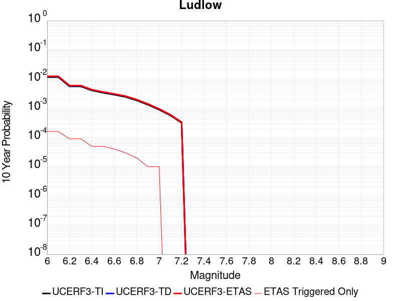 |

| Magnitude | 1 wk TI Prob | 1 wk TD Prob | 1 wk ETAS Prob | 1 wk ETAS/TD Gain | 1 wk ETAS Triggered Only | 1 mo TI Prob | 1 mo TD Prob | 1 mo ETAS Prob | 1 mo ETAS/TD Gain | 1 mo ETAS Triggered Only | 1 yr TI Prob | 1 yr TD Prob | 1 yr ETAS Prob | 1 yr ETAS/TD Gain | 1 yr ETAS Triggered Only | 10 yr TI Prob | 10 yr TD Prob | 10 yr ETAS Prob | 10 yr ETAS/TD Gain | 10 yr ETAS Triggered Only |
|-----|-----|-----|-----|-----|-----|-----|-----|-----|-----|-----|-----|-----|-----|-----|-----|-----|-----|-----|-----|-----|
| 6.0 | 2.2407607E-5 | 2.3657429E-5 | 2.3657429E-5 | 1.0 | 0.0 | 9.602906E-5 | 1.0138529E-4 | 1.2138326E-4 | 1.1972473 | 2.0E-5 | 0.0011685267 | 0.001233711 | 0.0012736617 | 1.0323825 | 4.0E-5 | 0.011624013 | 0.012273132 | 0.012431169 | 1.0128766 | 1.6E-4 |
| 6.1 | 2.2407607E-5 | 2.3657429E-5 | 2.3657429E-5 | 1.0 | 0.0 | 9.602906E-5 | 1.0138529E-4 | 1.2138326E-4 | 1.1972473 | 2.0E-5 | 0.0011685267 | 0.001233711 | 0.0012736617 | 1.0323825 | 4.0E-5 | 0.011624013 | 0.012273132 | 0.012431169 | 1.0128766 | 1.6E-4 |
| 6.2 | 1.0781252E-5 | 1.1365745E-5 | 1.1365745E-5 | 1.0 | 0.0 | 4.620455E-5 | 4.870945E-5 | 6.8708476E-5 | 1.4105779 | 2.0E-5 | 5.623952E-4 | 5.9288024E-4 | 6.228624E-4 | 1.0505705 | 3.0E-5 | 0.00560974 | 0.005913404 | 0.0060028713 | 1.0151297 | 9.0E-5 |
| 6.3 | 1.0781252E-5 | 1.1365745E-5 | 1.1365745E-5 | 1.0 | 0.0 | 4.620455E-5 | 4.870945E-5 | 6.8708476E-5 | 1.4105779 | 2.0E-5 | 5.623952E-4 | 5.9288024E-4 | 6.228624E-4 | 1.0505705 | 3.0E-5 | 0.00560974 | 0.005913404 | 0.0060028713 | 1.0151297 | 9.0E-5 |
| 6.4 | 7.814439E-6 | 8.237788E-6 | 8.237788E-6 | 1.0 | 0.0 | 3.3490025E-5 | 3.5304336E-5 | 4.5303983E-5 | 1.2832413 | 1.0E-5 | 4.0766477E-4 | 4.2974693E-4 | 4.397426E-4 | 1.0232595 | 1.0E-5 | 0.0040691774 | 0.0042893053 | 0.004339091 | 1.0116069 | 5.0E-5 |
| 6.5 | 6.4986366E-6 | 6.850969E-6 | 6.850969E-6 | 1.0 | 0.0 | 2.7851002E-5 | 2.936097E-5 | 3.9360675E-5 | 1.3405782 | 1.0E-5 | 3.390332E-4 | 3.574121E-4 | 3.6740853E-4 | 1.0279689 | 1.0E-5 | 0.003385164 | 0.0035684688 | 0.0036182904 | 1.0139616 | 5.0E-5 |
| 6.6 | 5.582177E-6 | 5.8860483E-6 | 5.8860483E-6 | 1.0 | 0.0 | 2.3923398E-5 | 2.522568E-5 | 3.522543E-5 | 1.3964114 | 1.0E-5 | 2.9122844E-4 | 3.070801E-4 | 3.17077E-4 | 1.0325547 | 1.0E-5 | 0.0029084706 | 0.003066631 | 0.0031065084 | 1.0130036 | 4.0E-5 |
| 6.7 | 4.6858763E-6 | 4.940463E-6 | 4.940463E-6 | 1.0 | 0.0 | 2.0082172E-5 | 2.1173244E-5 | 3.1173033E-5 | 1.4722842 | 1.0E-5 | 2.4447302E-4 | 2.577543E-4 | 2.6775172E-4 | 1.0387866 | 1.0E-5 | 0.0024420423 | 0.0025746098 | 0.0026045325 | 1.0116223 | 3.0E-5 |
| 6.8 | 3.5584908E-6 | 3.7520454E-6 | 3.7520454E-6 | 1.0 | 0.0 | 1.5250586E-5 | 1.6080097E-5 | 2.6079937E-5 | 1.6218767 | 1.0E-5 | 1.8566006E-4 | 1.9575801E-4 | 2.0575605E-4 | 1.0510734 | 1.0E-5 | 0.0018550502 | 0.0019558968 | 0.0019758577 | 1.0102055 | 2.0E-5 |
| 6.9 | 2.532834E-6 | 2.6710227E-6 | 2.6710227E-6 | 1.0 | 0.0 | 1.0854958E-5 | 1.1447192E-5 | 1.1447192E-5 | 1.0 | 0.0 | 1.3215111E-4 | 1.3936093E-4 | 1.3936093E-4 | 1.0 | 0.0 | 0.0013207254 | 0.0013927629 | 0.001402749 | 1.00717 | 1.0E-5 |
| 7.0 | 1.7083285E-6 | 1.801957E-6 | 1.801957E-6 | 1.0 | 0.0 | 7.3213873E-6 | 7.7226505E-6 | 7.7226505E-6 | 1.0 | 0.0 | 8.913424E-5 | 9.4019386E-5 | 9.4019386E-5 | 1.0 | 0.0 | 8.9098496E-4 | 9.3981257E-4 | 9.4980316E-4 | 1.0106304 | 1.0E-5 |
| 7.1 | 1.0905424E-6 | 1.1497702E-6 | 1.1497702E-6 | 1.0 | 0.0 | 4.6737446E-6 | 4.927578E-6 | 4.927578E-6 | 1.0 | 0.0 | 5.6901354E-5 | 5.999171E-5 | 5.999171E-5 | 1.0 | 0.0 | 5.6886784E-4 | 5.997649E-4 | 5.997649E-4 | 1.0 | 0.0 |
| 7.2 | 6.06668E-7 | 6.387322E-7 | 6.387322E-7 | 1.0 | 0.0 | 2.600003E-6 | 2.7374213E-6 | 2.7374213E-6 | 1.0 | 0.0 | 3.1654577E-5 | 3.3327666E-5 | 3.3327666E-5 | 1.0 | 0.0 | 3.1650066E-4 | 3.332335E-4 | 3.332335E-4 | 1.0 | 0.0 |

## Manix-Afton Hills
*[(top)](#table-of-contents)*

| 1 Week | 1 Month | 1 Year | 10 Year |
|-----|-----|-----|-----|
| 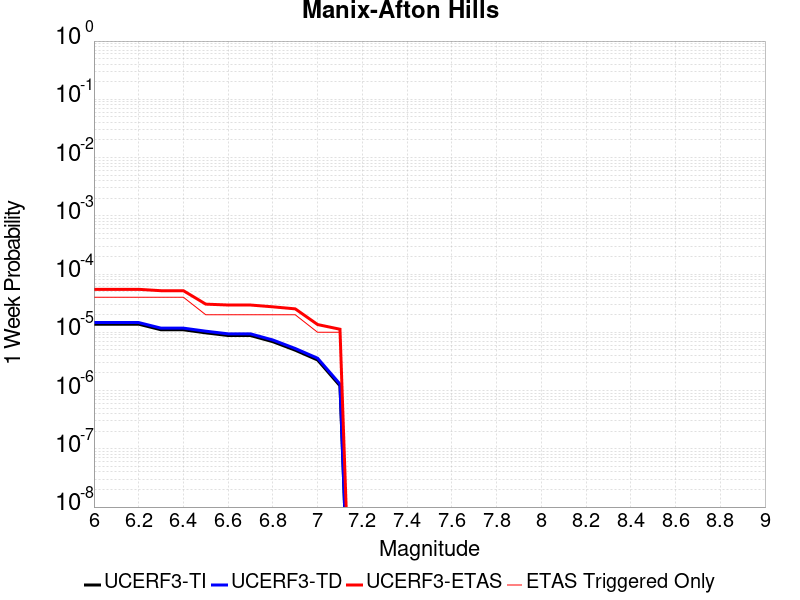 |  | 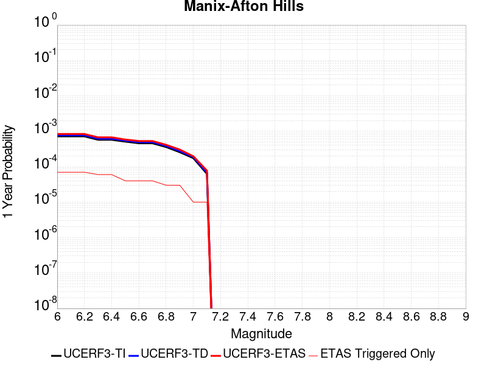 |  |

| Magnitude | 1 wk TI Prob | 1 wk TD Prob | 1 wk ETAS Prob | 1 wk ETAS/TD Gain | 1 wk ETAS Triggered Only | 1 mo TI Prob | 1 mo TD Prob | 1 mo ETAS Prob | 1 mo ETAS/TD Gain | 1 mo ETAS Triggered Only | 1 yr TI Prob | 1 yr TD Prob | 1 yr ETAS Prob | 1 yr ETAS/TD Gain | 1 yr ETAS Triggered Only | 10 yr TI Prob | 10 yr TD Prob | 10 yr ETAS Prob | 10 yr ETAS/TD Gain | 10 yr ETAS Triggered Only |
|-----|-----|-----|-----|-----|-----|-----|-----|-----|-----|-----|-----|-----|-----|-----|-----|-----|-----|-----|-----|-----|
| 6.0 | 1.3783202E-5 | 1.4711221E-5 | 5.4710632E-5 | 3.718973 | 4.0E-5 | 5.906953E-5 | 6.304667E-5 | 1.2304289E-4 | 1.951616 | 6.0E-5 | 7.189342E-4 | 7.673403E-4 | 8.372866E-4 | 1.0911542 | 7.0E-5 | 0.0071661277 | 0.007648664 | 0.007817363 | 1.0220561 | 1.7E-4 |
| 6.1 | 1.3783202E-5 | 1.4711221E-5 | 5.4710632E-5 | 3.718973 | 4.0E-5 | 5.906953E-5 | 6.304667E-5 | 1.2304289E-4 | 1.951616 | 6.0E-5 | 7.189342E-4 | 7.673403E-4 | 8.372866E-4 | 1.0911542 | 7.0E-5 | 0.0071661277 | 0.007648664 | 0.007817363 | 1.0220561 | 1.7E-4 |
| 6.2 | 1.3783202E-5 | 1.4711221E-5 | 5.4710632E-5 | 3.718973 | 4.0E-5 | 5.906953E-5 | 6.304667E-5 | 1.2304289E-4 | 1.951616 | 6.0E-5 | 7.189342E-4 | 7.673403E-4 | 8.372866E-4 | 1.0911542 | 7.0E-5 | 0.0071661277 | 0.007648664 | 0.007817363 | 1.0220561 | 1.7E-4 |
| 6.3 | 1.10494875E-5 | 1.1793241E-5 | 5.179277E-5 | 4.391733 | 4.0E-5 | 4.7354086E-5 | 5.054154E-5 | 1.00539015E-4 | 1.9892353 | 5.0E-5 | 5.763835E-4 | 6.151799E-4 | 6.75143E-4 | 1.0974724 | 6.0E-5 | 0.005748908 | 0.00613581 | 0.006255074 | 1.0194373 | 1.2E-4 |
| 6.4 | 1.10494875E-5 | 1.1793241E-5 | 5.179277E-5 | 4.391733 | 4.0E-5 | 4.7354086E-5 | 5.054154E-5 | 1.00539015E-4 | 1.9892353 | 5.0E-5 | 5.763835E-4 | 6.151799E-4 | 6.75143E-4 | 1.0974724 | 6.0E-5 | 0.005748908 | 0.00613581 | 0.006255074 | 1.0194373 | 1.2E-4 |
| 6.5 | 9.788949E-6 | 1.0454414E-5 | 3.0454205E-5 | 2.9130476 | 2.0E-5 | 4.1951964E-5 | 4.4803914E-5 | 7.480257E-5 | 1.6695544 | 3.0E-5 | 5.1064545E-4 | 5.4536044E-4 | 5.853386E-4 | 1.073306 | 4.0E-5 | 0.0050947363 | 0.005441148 | 0.005550549 | 1.0201063 | 1.1E-4 |
| 6.6 | 8.810006E-6 | 9.413714E-6 | 2.9413526E-5 | 3.12454 | 2.0E-5 | 3.775662E-5 | 4.0343915E-5 | 7.034271E-5 | 1.7435765 | 3.0E-5 | 4.5958988E-4 | 4.9108535E-4 | 5.310657E-4 | 1.0814122 | 4.0E-5 | 0.0045864056 | 0.004900884 | 0.0050003934 | 1.0203044 | 1.0E-4 |
| 6.7 | 8.80128E-6 | 9.404193E-6 | 2.9404006E-5 | 3.1266909 | 2.0E-5 | 3.7719226E-5 | 4.0303115E-5 | 7.03019E-5 | 1.7443293 | 3.0E-5 | 4.591348E-4 | 4.9058883E-4 | 5.305692E-4 | 1.0814947 | 4.0E-5 | 0.004581874 | 0.0048959404 | 0.004995451 | 1.0203251 | 1.0E-4 |
| 6.8 | 6.8994877E-6 | 7.3801443E-6 | 2.7379996E-5 | 3.709954 | 2.0E-5 | 2.9568899E-5 | 3.1628853E-5 | 6.162791E-5 | 1.9484711 | 3.0E-5 | 3.5994186E-4 | 3.850214E-4 | 4.1500985E-4 | 1.0778878 | 3.0E-5 | 0.003593594 | 0.0038443485 | 0.003924041 | 1.0207298 | 8.0E-5 |
| 6.9 | 4.9328037E-6 | 5.2710093E-6 | 2.5270903E-5 | 4.7943196 | 2.0E-5 | 2.1140417E-5 | 2.258988E-5 | 5.2589203E-5 | 2.3279984 | 3.0E-5 | 2.5735417E-4 | 2.7500323E-4 | 3.04995E-4 | 1.1090596 | 3.0E-5 | 0.0025705635 | 0.0027472344 | 0.0028070696 | 1.0217801 | 6.0E-5 |
| 7.0 | 3.347973E-6 | 3.5900646E-6 | 1.3590028E-5 | 3.7854552 | 1.0E-5 | 1.4348378E-5 | 1.5385924E-5 | 2.5385769E-5 | 1.6499348 | 1.0E-5 | 1.746775E-4 | 1.8731161E-4 | 1.9730974E-4 | 1.0533769 | 1.0E-5 | 0.0017454025 | 0.00187194 | 0.0019018837 | 1.0159961 | 3.0E-5 |
| 7.1 | 1.2073567E-6 | 1.2934943E-6 | 1.1293481E-5 | 8.730987 | 1.0E-5 | 5.1743755E-6 | 5.5435444E-6 | 1.5543488E-5 | 2.80389 | 1.0E-5 | 6.29962E-5 | 6.74922E-5 | 7.7491524E-5 | 1.1481553 | 1.0E-5 | 6.297835E-4 | 6.7487714E-4 | 6.848704E-4 | 1.0148075 | 1.0E-5 |

## Calico-Hidalgo
*[(top)](#table-of-contents)*

| 1 Week | 1 Month | 1 Year | 10 Year |
|-----|-----|-----|-----|
| 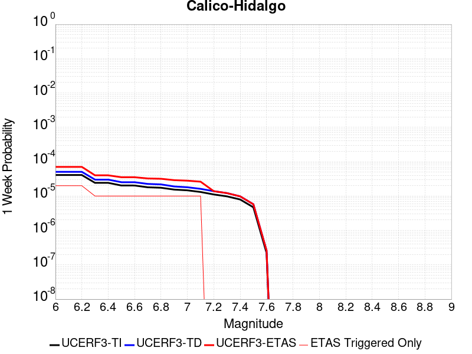 |  | 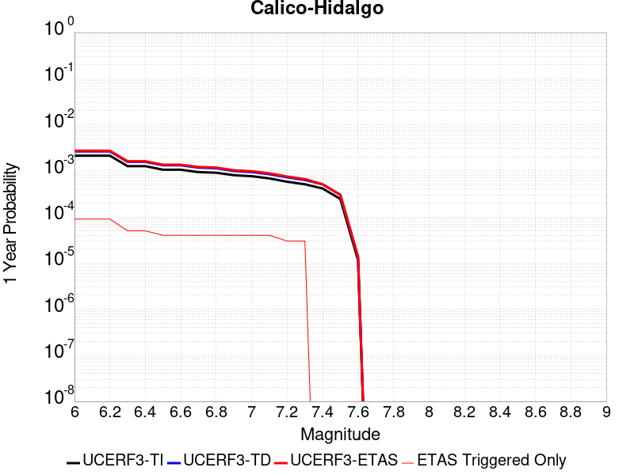 |  |

| Magnitude | 1 wk TI Prob | 1 wk TD Prob | 1 wk ETAS Prob | 1 wk ETAS/TD Gain | 1 wk ETAS Triggered Only | 1 mo TI Prob | 1 mo TD Prob | 1 mo ETAS Prob | 1 mo ETAS/TD Gain | 1 mo ETAS Triggered Only | 1 yr TI Prob | 1 yr TD Prob | 1 yr ETAS Prob | 1 yr ETAS/TD Gain | 1 yr ETAS Triggered Only | 10 yr TI Prob | 10 yr TD Prob | 10 yr ETAS Prob | 10 yr ETAS/TD Gain | 10 yr ETAS Triggered Only |
|-----|-----|-----|-----|-----|-----|-----|-----|-----|-----|-----|-----|-----|-----|-----|-----|-----|-----|-----|-----|-----|
| 6.0 | 4.0906612E-5 | 5.0704653E-5 | 7.070364E-5 | 1.3944211 | 2.0E-5 | 1.7530227E-4 | 2.1728984E-4 | 2.4728331E-4 | 1.1380345 | 3.0E-5 | 0.0021322158 | 0.0026426981 | 0.0027324604 | 1.0339661 | 9.0E-5 | 0.02111873 | 0.026153097 | 0.02631865 | 1.0063301 | 1.7E-4 |
| 6.1 | 4.0906612E-5 | 5.0704653E-5 | 7.070364E-5 | 1.3944211 | 2.0E-5 | 1.7530227E-4 | 2.1728984E-4 | 2.4728331E-4 | 1.1380345 | 3.0E-5 | 0.0021322158 | 0.0026426981 | 0.0027324604 | 1.0339661 | 9.0E-5 | 0.02111873 | 0.026153097 | 0.02631865 | 1.0063301 | 1.7E-4 |
| 6.2 | 4.0906612E-5 | 5.0704653E-5 | 7.070364E-5 | 1.3944211 | 2.0E-5 | 1.7530227E-4 | 2.1728984E-4 | 2.4728331E-4 | 1.1380345 | 3.0E-5 | 0.0021322158 | 0.0026426981 | 0.0027324604 | 1.0339661 | 9.0E-5 | 0.02111873 | 0.026153097 | 0.02631865 | 1.0063301 | 1.7E-4 |
| 6.3 | 2.4242801E-5 | 3.009103E-5 | 4.009073E-5 | 1.332315 | 1.0E-5 | 1.0389358E-4 | 1.2895538E-4 | 1.489528E-4 | 1.1550725 | 2.0E-5 | 0.0012641704 | 0.001568934 | 0.0016188555 | 1.0318187 | 5.0E-5 | 0.01257003 | 0.015582247 | 0.015661 | 1.005054 | 8.0E-5 |
| 6.4 | 2.4242801E-5 | 3.009103E-5 | 4.009073E-5 | 1.332315 | 1.0E-5 | 1.0389358E-4 | 1.2895538E-4 | 1.489528E-4 | 1.1550725 | 2.0E-5 | 0.0012641704 | 0.001568934 | 0.0016188555 | 1.0318187 | 5.0E-5 | 0.01257003 | 0.015582247 | 0.015661 | 1.005054 | 8.0E-5 |
| 6.5 | 2.0286952E-5 | 2.5315985E-5 | 3.5315734E-5 | 1.3949974 | 1.0E-5 | 8.694118E-5 | 1.0849266E-4 | 1.284905E-4 | 1.1843243 | 2.0E-5 | 0.0010579949 | 0.0013201149 | 0.0013600622 | 1.0302604 | 4.0E-5 | 0.010529719 | 0.013124665 | 0.013193746 | 1.0052634 | 7.0E-5 |
| 6.6 | 2.0269223E-5 | 2.5296935E-5 | 3.529668E-5 | 1.3952948 | 1.0E-5 | 8.6865206E-5 | 1.08411026E-4 | 1.2840885E-4 | 1.184463 | 2.0E-5 | 0.0010570707 | 0.0013191222 | 0.0013590694 | 1.0302832 | 4.0E-5 | 0.010520565 | 0.013114855 | 0.0131839365 | 1.0052675 | 7.0E-5 |
| 6.7 | 1.799852E-5 | 2.25408E-5 | 3.2540574E-5 | 1.44363 | 1.0E-5 | 7.713423E-5 | 9.6599935E-5 | 1.1659801E-4 | 1.2070194 | 2.0E-5 | 9.3870464E-4 | 0.0011754843 | 0.0012154372 | 1.0339885 | 4.0E-5 | 0.009347493 | 0.011694277 | 0.011763458 | 1.0059159 | 7.0E-5 |
| 6.8 | 1.7458793E-5 | 2.1842314E-5 | 3.1842093E-5 | 1.457817 | 1.0E-5 | 7.4821255E-5 | 9.3606635E-5 | 1.13604765E-4 | 1.2136401 | 2.0E-5 | 9.10568E-4 | 0.0011390795 | 0.0011790339 | 1.035076 | 4.0E-5 | 0.009068459 | 0.011333993 | 0.011403199 | 1.0061061 | 7.0E-5 |
| 6.9 | 1.542884E-5 | 1.9026087E-5 | 2.9025896E-5 | 1.5255841 | 1.0E-5 | 6.612192E-5 | 8.1537895E-5 | 1.01536265E-4 | 1.2452648 | 2.0E-5 | 8.04737E-4 | 9.92285E-4 | 0.0010322452 | 1.040271 | 4.0E-5 | 0.008018291 | 0.00987994 | 0.009949248 | 1.0070151 | 7.0E-5 |
| 7.0 | 1.468253E-5 | 1.8030747E-5 | 2.8030567E-5 | 1.5545982 | 1.0E-5 | 6.292361E-5 | 7.7272416E-5 | 9.7270866E-5 | 1.2588046 | 2.0E-5 | 7.658257E-4 | 9.403986E-4 | 9.80361E-4 | 1.0424951 | 4.0E-5 | 0.0076319184 | 0.009365558 | 0.009434902 | 1.0074042 | 7.0E-5 |
| 7.1 | 1.3139281E-5 | 1.620107E-5 | 2.6200907E-5 | 1.6172332 | 1.0E-5 | 5.6309986E-5 | 6.943138E-5 | 8.942999E-5 | 1.2880342 | 2.0E-5 | 6.853584E-4 | 8.4501173E-4 | 8.84978E-4 | 1.0472966 | 4.0E-5 | 0.0068324856 | 0.008419285 | 0.008478779 | 1.0070665 | 6.0E-5 |
| 7.2 | 1.1127404E-5 | 1.3866703E-5 | 1.3866703E-5 | 1.0 | 0.0 | 4.7688E-5 | 5.9427435E-5 | 6.942684E-5 | 1.1682625 | 1.0E-5 | 5.8044674E-4 | 7.2329975E-4 | 7.5327803E-4 | 1.0414466 | 3.0E-5 | 0.0057893298 | 0.0072105634 | 0.007260203 | 1.0068842 | 5.0E-5 |
| 7.3 | 9.808154E-6 | 1.2176301E-5 | 1.2176301E-5 | 1.0 | 0.0 | 4.2034266E-5 | 5.2183164E-5 | 6.218264E-5 | 1.1916227 | 1.0E-5 | 5.11647E-4 | 6.3515553E-4 | 6.651365E-4 | 1.0472025 | 3.0E-5 | 0.0051047057 | 0.0063344776 | 0.0063742246 | 1.0062747 | 4.0E-5 |
| 7.4 | 7.942452E-6 | 9.7922075E-6 | 9.7922075E-6 | 1.0 | 0.0 | 3.4038632E-5 | 4.196598E-5 | 4.196598E-5 | 1.0 | 0.0 | 4.1434157E-4 | 5.1082554E-4 | 5.1082554E-4 | 1.0 | 0.0 | 0.0041356985 | 0.0050974544 | 0.0050974544 | 1.0 | 0.0 |
| 7.5 | 4.7121216E-6 | 5.772871E-6 | 5.772871E-6 | 1.0 | 0.0 | 2.019465E-5 | 2.4740684E-5 | 2.4740684E-5 | 1.0 | 0.0 | 2.4584212E-4 | 3.0118387E-4 | 3.0118387E-4 | 1.0 | 0.0 | 0.0024557032 | 0.0030085093 | 0.0030085093 | 1.0 | 0.0 |
| 7.6 | 2.21172E-7 | 2.6039737E-7 | 2.6039737E-7 | 1.0 | 0.0 | 9.478797E-7 | 1.1159884E-6 | 1.1159884E-6 | 1.0 | 0.0 | 1.1540374E-5 | 1.3587103E-5 | 1.3587103E-5 | 1.0 | 0.0 | 1.1539775E-4 | 1.3586554E-4 | 1.3586554E-4 | 1.0 | 0.0 |

## Red Pass
*[(top)](#table-of-contents)*

| 1 Week | 1 Month | 1 Year | 10 Year |
|-----|-----|-----|-----|
|  |  |  |  |

| Magnitude | 1 wk TI Prob | 1 wk TD Prob | 1 wk ETAS Prob | 1 wk ETAS/TD Gain | 1 wk ETAS Triggered Only | 1 mo TI Prob | 1 mo TD Prob | 1 mo ETAS Prob | 1 mo ETAS/TD Gain | 1 mo ETAS Triggered Only | 1 yr TI Prob | 1 yr TD Prob | 1 yr ETAS Prob | 1 yr ETAS/TD Gain | 1 yr ETAS Triggered Only | 10 yr TI Prob | 10 yr TD Prob | 10 yr ETAS Prob | 10 yr ETAS/TD Gain | 10 yr ETAS Triggered Only |
|-----|-----|-----|-----|-----|-----|-----|-----|-----|-----|-----|-----|-----|-----|-----|-----|-----|-----|-----|-----|-----|
| 6.0 | 8.258278E-6 | 8.551305E-6 | 8.551305E-6 | 1.0 | 0.0 | 3.539214E-5 | 3.6648038E-5 | 3.6648038E-5 | 1.0 | 0.0 | 4.308141E-4 | 4.4611638E-4 | 4.8609852E-4 | 1.0896227 | 4.0E-5 | 0.0042997985 | 0.004453966 | 0.0046032974 | 1.0335279 | 1.5E-4 |
| 6.1 | 3.649988E-6 | 3.7753332E-6 | 3.7753332E-6 | 1.0 | 0.0 | 1.5642712E-5 | 1.6179927E-5 | 1.6179927E-5 | 1.0 | 0.0 | 1.9043336E-4 | 1.9697756E-4 | 2.1697363E-4 | 1.1015145 | 2.0E-5 | 0.0019027026 | 0.001968497 | 0.0020483395 | 1.0405601 | 8.0E-5 |
| 6.2 | 3.649988E-6 | 3.7753332E-6 | 3.7753332E-6 | 1.0 | 0.0 | 1.5642712E-5 | 1.6179927E-5 | 1.6179927E-5 | 1.0 | 0.0 | 1.9043336E-4 | 1.9697756E-4 | 2.1697363E-4 | 1.1015145 | 2.0E-5 | 0.0019027026 | 0.001968497 | 0.0020483395 | 1.0405601 | 8.0E-5 |
| 6.3 | 1.3924937E-6 | 1.4411233E-6 | 1.4411233E-6 | 1.0 | 0.0 | 5.9678164E-6 | 6.176236E-6 | 6.176236E-6 | 1.0 | 0.0 | 7.265574E-5 | 7.51945E-5 | 8.5193744E-5 | 1.1329784 | 1.0E-5 | 7.263199E-4 | 7.518293E-4 | 7.7181426E-4 | 1.0265818 | 2.0E-5 |
| 6.4 | 1.3924937E-6 | 1.4411233E-6 | 1.4411233E-6 | 1.0 | 0.0 | 5.9678164E-6 | 6.176236E-6 | 6.176236E-6 | 1.0 | 0.0 | 7.265574E-5 | 7.51945E-5 | 8.5193744E-5 | 1.1329784 | 1.0E-5 | 7.263199E-4 | 7.518293E-4 | 7.7181426E-4 | 1.0265818 | 2.0E-5 |
| 6.5 | 9.876812E-7 | 1.022196E-6 | 1.022196E-6 | 1.0 | 0.0 | 4.2329125E-6 | 4.38084E-6 | 4.38084E-6 | 1.0 | 0.0 | 5.153449E-5 | 5.3336724E-5 | 6.333619E-5 | 1.1874781 | 1.0E-5 | 5.1522546E-4 | 5.333672E-4 | 5.4336194E-4 | 1.0187389 | 1.0E-5 |

## San Andreas (San Gorgonio Pass-Garnet HIll)
*[(top)](#table-of-contents)*

| 1 Week | 1 Month | 1 Year | 10 Year |
|-----|-----|-----|-----|
|  | 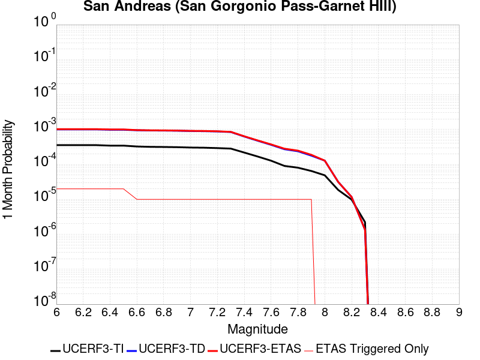 |  |  |

| Magnitude | 1 wk TI Prob | 1 wk TD Prob | 1 wk ETAS Prob | 1 wk ETAS/TD Gain | 1 wk ETAS Triggered Only | 1 mo TI Prob | 1 mo TD Prob | 1 mo ETAS Prob | 1 mo ETAS/TD Gain | 1 mo ETAS Triggered Only | 1 yr TI Prob | 1 yr TD Prob | 1 yr ETAS Prob | 1 yr ETAS/TD Gain | 1 yr ETAS Triggered Only | 10 yr TI Prob | 10 yr TD Prob | 10 yr ETAS Prob | 10 yr ETAS/TD Gain | 10 yr ETAS Triggered Only |
|-----|-----|-----|-----|-----|-----|-----|-----|-----|-----|-----|-----|-----|-----|-----|-----|-----|-----|-----|-----|-----|
| 6.0 | 8.31567E-5 | 2.3386451E-4 | 2.3386451E-4 | 1.0 | 0.0 | 3.5633717E-4 | 0.0010018935 | 0.0010218736 | 1.0199422 | 2.0E-5 | 0.004329778 | 0.012129918 | 0.012208948 | 1.0065153 | 8.0E-5 | 0.042463828 | 0.11259502 | 0.112737 | 1.001261 | 1.6E-4 |
| 6.1 | 8.31567E-5 | 2.3386451E-4 | 2.3386451E-4 | 1.0 | 0.0 | 3.5633717E-4 | 0.0010018935 | 0.0010218736 | 1.0199422 | 2.0E-5 | 0.004329778 | 0.012129918 | 0.012208948 | 1.0065153 | 8.0E-5 | 0.042463828 | 0.11259502 | 0.112737 | 1.001261 | 1.6E-4 |
| 6.2 | 8.31567E-5 | 2.3386451E-4 | 2.3386451E-4 | 1.0 | 0.0 | 3.5633717E-4 | 0.0010018935 | 0.0010218736 | 1.0199422 | 2.0E-5 | 0.004329778 | 0.012129918 | 0.012208948 | 1.0065153 | 8.0E-5 | 0.042463828 | 0.11259502 | 0.112737 | 1.001261 | 1.6E-4 |
| 6.3 | 8.31567E-5 | 2.3386451E-4 | 2.3386451E-4 | 1.0 | 0.0 | 3.5633717E-4 | 0.0010018935 | 0.0010218736 | 1.0199422 | 2.0E-5 | 0.004329778 | 0.012129918 | 0.012208948 | 1.0065153 | 8.0E-5 | 0.042463828 | 0.11259502 | 0.112737 | 1.001261 | 1.6E-4 |
| 6.4 | 8.059055E-5 | 2.2944735E-4 | 2.2944735E-4 | 1.0 | 0.0 | 3.4534236E-4 | 9.829777E-4 | 0.001002958 | 1.0203264 | 2.0E-5 | 0.0041964394 | 0.011902156 | 0.011981204 | 1.0066415 | 8.0E-5 | 0.041180745 | 0.110576175 | 0.11071849 | 1.001287 | 1.6E-4 |
| 6.5 | 8.059055E-5 | 2.2944735E-4 | 2.2944735E-4 | 1.0 | 0.0 | 3.4534236E-4 | 9.829777E-4 | 0.001002958 | 1.0203264 | 2.0E-5 | 0.0041964394 | 0.011902156 | 0.011981204 | 1.0066415 | 8.0E-5 | 0.041180745 | 0.110576175 | 0.11071849 | 1.001287 | 1.6E-4 |
| 6.6 | 7.619237E-5 | 2.2189032E-4 | 2.2189032E-4 | 1.0 | 0.0 | 3.2649786E-4 | 9.506143E-4 | 9.6060475E-4 | 1.0105095 | 1.0E-5 | 0.0039678677 | 0.0115128625 | 0.011572172 | 1.0051515 | 6.0E-5 | 0.03897764 | 0.10711278 | 0.10723778 | 1.001167 | 1.4E-4 |
| 6.7 | 7.440636E-5 | 2.1864849E-4 | 2.1864849E-4 | 1.0 | 0.0 | 3.188454E-4 | 9.367307E-4 | 9.4672135E-4 | 1.0106654 | 1.0E-5 | 0.0038750346 | 0.011345596 | 0.011404916 | 1.0052284 | 6.0E-5 | 0.038081564 | 0.10562121 | 0.105746426 | 1.0011855 | 1.4E-4 |
| 6.8 | 7.3735864E-5 | 2.1712016E-4 | 2.1712016E-4 | 1.0 | 0.0 | 3.1597257E-4 | 9.3018543E-4 | 9.4017613E-4 | 1.0107405 | 1.0E-5 | 0.0038401815 | 0.011266734 | 0.011326059 | 1.0052654 | 6.0E-5 | 0.03774495 | 0.10492276 | 0.10504806 | 1.0011944 | 1.4E-4 |
| 6.9 | 7.27575E-5 | 2.1480983E-4 | 2.1480983E-4 | 1.0 | 0.0 | 3.117806E-4 | 9.20291E-4 | 9.302818E-4 | 1.0108562 | 1.0E-5 | 0.003789323 | 0.011147508 | 0.01120684 | 1.0053223 | 6.0E-5 | 0.037253562 | 0.10387066 | 0.10398716 | 1.0011215 | 1.3E-4 |
| 7.0 | 7.102591E-5 | 2.1065009E-4 | 2.1065009E-4 | 1.0 | 0.0 | 3.0436125E-4 | 9.0247596E-4 | 9.1246696E-4 | 1.0110706 | 1.0E-5 | 0.003699303 | 0.010932805 | 0.010992149 | 1.0054281 | 6.0E-5 | 0.03638325 | 0.101972826 | 0.10208957 | 1.0011449 | 1.3E-4 |
| 7.1 | 7.028513E-5 | 2.0900648E-4 | 2.0900648E-4 | 1.0 | 0.0 | 3.0118722E-4 | 8.954368E-4 | 9.0542785E-4 | 1.0111578 | 1.0E-5 | 0.0036607897 | 0.01084796 | 0.010907309 | 1.005471 | 6.0E-5 | 0.036010686 | 0.10121585 | 0.10133269 | 1.0011544 | 1.3E-4 |
| 7.2 | 6.8498244E-5 | 2.0508505E-4 | 2.0508505E-4 | 1.0 | 0.0 | 2.9353087E-4 | 8.78642E-4 | 8.8863325E-4 | 1.0113713 | 1.0E-5 | 0.003567883 | 0.010645497 | 0.010704858 | 1.0055761 | 6.0E-5 | 0.035111405 | 0.09940783 | 0.09952491 | 1.0011778 | 1.3E-4 |
| 7.3 | 6.622592E-5 | 1.973576E-4 | 1.973576E-4 | 1.0 | 0.0 | 2.8379448E-4 | 8.4554625E-4 | 8.5553783E-4 | 1.0118166 | 1.0E-5 | 0.0034497243 | 0.010246415 | 0.0103058 | 1.0057957 | 6.0E-5 | 0.033966612 | 0.09590419 | 0.09602172 | 1.0012255 | 1.3E-4 |
| 7.4 | 5.1050705E-5 | 1.4692261E-4 | 1.4692261E-4 | 1.0 | 0.0 | 2.1877038E-4 | 6.295173E-4 | 6.39511E-4 | 1.0158752 | 1.0E-5 | 0.002660276 | 0.0076376316 | 0.0076971734 | 1.0077958 | 6.0E-5 | 0.02628654 | 0.07287696 | 0.07299749 | 1.0016538 | 1.3E-4 |
| 7.5 | 3.9302922E-5 | 1.11326524E-4 | 1.11326524E-4 | 1.0 | 0.0 | 1.6843023E-4 | 4.7702674E-4 | 4.8702196E-4 | 1.0209532 | 1.0E-5 | 0.0020487092 | 0.005792404 | 0.005842115 | 1.008582 | 5.0E-5 | 0.020299247 | 0.05602189 | 0.05613517 | 1.002022 | 1.2E-4 |
| 7.6 | 2.9851626E-5 | 8.49747E-5 | 8.49747E-5 | 1.0 | 0.0 | 1.2792926E-4 | 3.6412658E-4 | 3.7412293E-4 | 1.027453 | 1.0E-5 | 0.0015564259 | 0.004424255 | 0.004474034 | 1.0112513 | 5.0E-5 | 0.0154556995 | 0.043204896 | 0.043310143 | 1.002436 | 1.1E-4 |
| 7.7 | 2.1135214E-5 | 6.355116E-5 | 6.355116E-5 | 1.0 | 0.0 | 9.0576345E-5 | 2.723337E-4 | 2.8233096E-4 | 1.0367097 | 1.0E-5 | 0.0011022091 | 0.003310627 | 0.0033604617 | 1.0150529 | 5.0E-5 | 0.010967582 | 0.032592565 | 0.032689307 | 1.0029682 | 1.0E-4 |
| 7.8 | 1.883379E-5 | 5.5660596E-5 | 5.5660596E-5 | 1.0 | 0.0 | 8.0713755E-5 | 2.3852361E-4 | 2.4852122E-4 | 1.0419146 | 1.0E-5 | 9.822468E-4 | 0.0029001608 | 0.002950016 | 1.0171905 | 5.0E-5 | 0.0097791655 | 0.028704397 | 0.028801527 | 1.0033838 | 1.0E-4 |
| 7.9 | 1.5156185E-5 | 4.1675128E-5 | 4.1675128E-5 | 1.0 | 0.0 | 6.495346E-5 | 1.7859548E-4 | 1.885937E-4 | 1.0559825 | 1.0E-5 | 7.9052144E-4 | 0.0021722328 | 0.0022221243 | 1.0229678 | 5.0E-5 | 0.007877152 | 0.02176709 | 0.021864912 | 1.0044941 | 1.0E-4 |
| 8.0 | 1.1405907E-5 | 2.9986788E-5 | 2.9986788E-5 | 1.0 | 0.0 | 4.8881542E-5 | 1.2850849E-4 | 1.2850849E-4 | 1.0 | 0.0 | 5.9497025E-4 | 0.0015634688 | 0.0015834377 | 1.0127721 | 2.0E-5 | 0.005933798 | 0.015778678 | 0.01583773 | 1.0037426 | 6.0E-5 |
| 8.1 | 4.3511436E-6 | 7.373693E-6 | 7.373693E-6 | 1.0 | 0.0 | 1.8647626E-5 | 3.160116E-5 | 3.160116E-5 | 1.0 | 0.0 | 2.2701119E-4 | 3.8467633E-4 | 3.8467633E-4 | 1.0 | 0.0 | 0.0022677942 | 0.004118566 | 0.004118566 | 1.0 | 0.0 |
| 8.2 | 2.3042528E-6 | 2.7350309E-6 | 2.7350309E-6 | 1.0 | 0.0 | 9.875332E-6 | 1.1721509E-5 | 1.1721509E-5 | 1.0 | 0.0 | 1.2022553E-4 | 1.4270007E-4 | 1.4270007E-4 | 1.0 | 0.0 | 0.0012016051 | 0.0015990696 | 0.0015990696 | 1.0 | 0.0 |
| 8.3 | 5.202968E-7 | 3.1628537E-7 | 3.1628537E-7 | 1.0 | 0.0 | 2.2298414E-6 | 1.3555081E-6 | 1.3555081E-6 | 1.0 | 0.0 | 2.714798E-5 | 1.6503198E-5 | 1.6503198E-5 | 1.0 | 0.0 | 2.7144665E-4 | 1.9580164E-4 | 1.9580164E-4 | 1.0 | 0.0 |

## Death Valley (Fish Lake Valley)
*[(top)](#table-of-contents)*

| 1 Week | 1 Month | 1 Year | 10 Year |
|-----|-----|-----|-----|
|  |  |  |  |

| Magnitude | 1 wk TI Prob | 1 wk TD Prob | 1 wk ETAS Prob | 1 wk ETAS/TD Gain | 1 wk ETAS Triggered Only | 1 mo TI Prob | 1 mo TD Prob | 1 mo ETAS Prob | 1 mo ETAS/TD Gain | 1 mo ETAS Triggered Only | 1 yr TI Prob | 1 yr TD Prob | 1 yr ETAS Prob | 1 yr ETAS/TD Gain | 1 yr ETAS Triggered Only | 10 yr TI Prob | 10 yr TD Prob | 10 yr ETAS Prob | 10 yr ETAS/TD Gain | 10 yr ETAS Triggered Only |
|-----|-----|-----|-----|-----|-----|-----|-----|-----|-----|-----|-----|-----|-----|-----|-----|-----|-----|-----|-----|-----|
| 6.0 | 3.872328E-5 | 4.7268895E-5 | 5.7268422E-5 | 1.2115456 | 1.0E-5 | 1.6594635E-4 | 2.0256694E-4 | 2.2256289E-4 | 1.0987128 | 2.0E-5 | 0.0020185246 | 0.0024636039 | 0.0025434068 | 1.0323927 | 8.0E-5 | 0.02000288 | 0.024388881 | 0.024535224 | 1.0060004 | 1.5E-4 |
| 6.1 | 3.872328E-5 | 4.7268895E-5 | 5.7268422E-5 | 1.2115456 | 1.0E-5 | 1.6594635E-4 | 2.0256694E-4 | 2.2256289E-4 | 1.0987128 | 2.0E-5 | 0.0020185246 | 0.0024636039 | 0.0025434068 | 1.0323927 | 8.0E-5 | 0.02000288 | 0.024388881 | 0.024535224 | 1.0060004 | 1.5E-4 |
| 6.2 | 3.872328E-5 | 4.7268895E-5 | 5.7268422E-5 | 1.2115456 | 1.0E-5 | 1.6594635E-4 | 2.0256694E-4 | 2.2256289E-4 | 1.0987128 | 2.0E-5 | 0.0020185246 | 0.0024636039 | 0.0025434068 | 1.0323927 | 8.0E-5 | 0.02000288 | 0.024388881 | 0.024535224 | 1.0060004 | 1.5E-4 |
| 6.3 | 2.8356371E-5 | 3.3610693E-5 | 4.361036E-5 | 1.2975143 | 1.0E-5 | 1.2152165E-4 | 1.4403832E-4 | 1.6403545E-4 | 1.138832 | 2.0E-5 | 0.0014785219 | 0.001752335 | 0.0018321947 | 1.0455734 | 8.0E-5 | 0.014687235 | 0.01739221 | 0.017539602 | 1.0084746 | 1.5E-4 |
| 6.4 | 2.8356371E-5 | 3.3610693E-5 | 4.361036E-5 | 1.2975143 | 1.0E-5 | 1.2152165E-4 | 1.4403832E-4 | 1.6403545E-4 | 1.138832 | 2.0E-5 | 0.0014785219 | 0.001752335 | 0.0018321947 | 1.0455734 | 8.0E-5 | 0.014687235 | 0.01739221 | 0.017539602 | 1.0084746 | 1.5E-4 |
| 6.5 | 2.4448687E-5 | 2.8608209E-5 | 3.8607923E-5 | 1.34954 | 1.0E-5 | 1.0477588E-4 | 1.2260114E-4 | 1.4259868E-4 | 1.1631106 | 2.0E-5 | 0.0012748998 | 0.0014916973 | 0.001571578 | 1.0535502 | 8.0E-5 | 0.012676105 | 0.014821712 | 0.014969489 | 1.0099703 | 1.5E-4 |
| 6.6 | 2.1298161E-5 | 2.4660607E-5 | 3.466036E-5 | 1.405495 | 1.0E-5 | 9.127464E-5 | 1.0568422E-4 | 1.2568211E-4 | 1.189223 | 2.0E-5 | 0.0011107022 | 0.0012859798 | 0.0013658769 | 1.0621294 | 8.0E-5 | 0.011051672 | 0.012788794 | 0.012936876 | 1.011579 | 1.5E-4 |
| 6.7 | 1.8959729E-5 | 2.178146E-5 | 3.178124E-5 | 1.4590961 | 1.0E-5 | 8.125345E-5 | 9.3345916E-5 | 1.1334405E-4 | 1.2142369 | 2.0E-5 | 9.888117E-4 | 0.0011359196 | 0.0012158287 | 1.0703475 | 8.0E-5 | 0.009844234 | 0.011303794 | 0.011452098 | 1.0131199 | 1.5E-4 |
| 6.8 | 1.6691629E-5 | 1.9018706E-5 | 2.9018516E-5 | 1.5257881 | 1.0E-5 | 7.153359E-5 | 8.150629E-5 | 1.0150466E-4 | 1.2453598 | 2.0E-5 | 8.7057345E-4 | 9.919042E-4 | 0.0010718248 | 1.080573 | 8.0E-5 | 0.008671708 | 0.009876527 | 0.010025045 | 1.0150375 | 1.5E-4 |
| 6.9 | 1.450505E-5 | 1.6389824E-5 | 2.638966E-5 | 1.6101247 | 1.0E-5 | 6.216302E-5 | 7.024026E-5 | 9.023886E-5 | 1.284717 | 2.0E-5 | 7.5657194E-4 | 8.548484E-4 | 9.3478005E-4 | 1.0935038 | 8.0E-5 | 0.007540013 | 0.008516532 | 0.008665255 | 1.0174628 | 1.5E-4 |
| 7.0 | 1.2940855E-5 | 1.453821E-5 | 2.4538065E-5 | 1.6878326 | 1.0E-5 | 5.545963E-5 | 6.230516E-5 | 8.2303915E-5 | 1.3209807 | 2.0E-5 | 6.750118E-4 | 7.583071E-4 | 8.2825404E-4 | 1.0922409 | 7.0E-5 | 0.006729651 | 0.0075578135 | 0.007696755 | 1.0183839 | 1.4E-4 |
| 7.1 | 1.2544658E-5 | 1.4078437E-5 | 2.4078296E-5 | 1.7102962 | 1.0E-5 | 5.3761712E-5 | 6.033479E-5 | 8.0333586E-5 | 1.3314637 | 2.0E-5 | 6.5435225E-4 | 7.343341E-4 | 8.042827E-4 | 1.0952544 | 7.0E-5 | 0.006524288 | 0.0073196692 | 0.007458645 | 1.0189866 | 1.4E-4 |
| 7.2 | 1.2489416E-5 | 1.4015902E-5 | 2.4015762E-5 | 1.7134653 | 1.0E-5 | 5.3524967E-5 | 6.00668E-5 | 8.00656E-5 | 1.3329426 | 2.0E-5 | 6.514716E-4 | 7.310735E-4 | 8.0102234E-4 | 1.0956796 | 7.0E-5 | 0.006495651 | 0.007287278 | 0.0074262572 | 1.0190716 | 1.4E-4 |
| 7.3 | 1.2368307E-5 | 1.3880038E-5 | 2.3879898E-5 | 1.7204491 | 1.0E-5 | 5.3005948E-5 | 5.948455E-5 | 7.948336E-5 | 1.3362018 | 2.0E-5 | 6.451563E-4 | 7.239894E-4 | 7.939387E-4 | 1.0966165 | 7.0E-5 | 0.0064328653 | 0.0072168987 | 0.0073558884 | 1.0192589 | 1.4E-4 |
| 7.4 | 1.2161707E-5 | 1.3648089E-5 | 2.3647954E-5 | 1.7326933 | 1.0E-5 | 5.212056E-5 | 5.8490532E-5 | 7.8489364E-5 | 1.3419157 | 2.0E-5 | 6.3438306E-4 | 7.118952E-4 | 7.818453E-4 | 1.0982591 | 7.0E-5 | 0.006325751 | 0.0070967353 | 0.0072357417 | 1.0195874 | 1.4E-4 |
| 7.5 | 1.1707948E-5 | 1.314573E-5 | 2.3145598E-5 | 1.7606933 | 1.0E-5 | 5.0175953E-5 | 5.6337656E-5 | 7.633653E-5 | 1.3549824 | 2.0E-5 | 6.10721E-4 | 6.857007E-4 | 7.5565267E-4 | 1.1020154 | 7.0E-5 | 0.0060904534 | 0.0068364325 | 0.0069754752 | 1.0203385 | 1.4E-4 |
| 7.6 | 1.0319538E-5 | 1.157981E-5 | 2.1579694E-5 | 1.863562 | 1.0E-5 | 4.4225842E-5 | 4.9626844E-5 | 6.962585E-5 | 1.4029877 | 2.0E-5 | 5.383166E-4 | 6.040445E-4 | 6.740022E-4 | 1.1158155 | 7.0E-5 | 0.0053701443 | 0.0060245576 | 0.0061637145 | 1.0230982 | 1.4E-4 |
| 7.7 | 8.937764E-6 | 1.0022941E-5 | 2.002284E-5 | 1.9977012 | 1.0E-5 | 3.830414E-5 | 4.295478E-5 | 6.295392E-5 | 1.465586 | 2.0E-5 | 4.6625308E-4 | 5.2285404E-4 | 5.8282266E-4 | 1.1146948 | 6.0E-5 | 0.0046527605 | 0.005216748 | 0.00534607 | 1.0247897 | 1.3E-4 |
| 7.8 | 3.108007E-7 | 3.2846788E-7 | 3.2846788E-7 | 1.0 | 0.0 | 1.3320023E-6 | 1.4077187E-6 | 1.4077187E-6 | 1.0 | 0.0 | 1.6217007E-5 | 1.7138846E-5 | 2.7138674E-5 | 1.5834599 | 1.0E-5 | 1.6215823E-4 | 1.713756E-4 | 1.8137389E-4 | 1.0583414 | 1.0E-5 |
| 7.9 | 2.5591178E-9 | 2.6696871E-9 | 2.6696871E-9 | 1.0 | 0.0 | 1.0967647E-8 | 1.1441516E-8 | 1.1441516E-8 | 1.0 | 0.0 | 1.335311E-7 | 1.3930045E-7 | 1.3930045E-7 | 1.0 | 0.0 | 1.3353102E-6 | 1.3930046E-6 | 1.3930046E-6 | 1.0 | 0.0 |

## San Jacinto (San Bernardino)
*[(top)](#table-of-contents)*

| 1 Week | 1 Month | 1 Year | 10 Year |
|-----|-----|-----|-----|
|  |  |  |  |

| Magnitude | 1 wk TI Prob | 1 wk TD Prob | 1 wk ETAS Prob | 1 wk ETAS/TD Gain | 1 wk ETAS Triggered Only | 1 mo TI Prob | 1 mo TD Prob | 1 mo ETAS Prob | 1 mo ETAS/TD Gain | 1 mo ETAS Triggered Only | 1 yr TI Prob | 1 yr TD Prob | 1 yr ETAS Prob | 1 yr ETAS/TD Gain | 1 yr ETAS Triggered Only | 10 yr TI Prob | 10 yr TD Prob | 10 yr ETAS Prob | 10 yr ETAS/TD Gain | 10 yr ETAS Triggered Only |
|-----|-----|-----|-----|-----|-----|-----|-----|-----|-----|-----|-----|-----|-----|-----|-----|-----|-----|-----|-----|-----|
| 6.0 | 3.409352E-5 | 3.600249E-5 | 4.600213E-5 | 1.2777486 | 1.0E-5 | 1.461069E-4 | 1.5428728E-4 | 1.8428265E-4 | 1.1944125 | 3.0E-5 | 0.0017774 | 0.001876831 | 0.0019666622 | 1.0478631 | 9.0E-5 | 0.01763251 | 0.019358097 | 0.019505193 | 1.0075986 | 1.5E-4 |
| 6.1 | 3.409352E-5 | 3.600249E-5 | 4.600213E-5 | 1.2777486 | 1.0E-5 | 1.461069E-4 | 1.5428728E-4 | 1.8428265E-4 | 1.1944125 | 3.0E-5 | 0.0017774 | 0.001876831 | 0.0019666622 | 1.0478631 | 9.0E-5 | 0.01763251 | 0.019358097 | 0.019505193 | 1.0075986 | 1.5E-4 |
| 6.2 | 3.409352E-5 | 3.600249E-5 | 4.600213E-5 | 1.2777486 | 1.0E-5 | 1.461069E-4 | 1.5428728E-4 | 1.8428265E-4 | 1.1944125 | 3.0E-5 | 0.0017774 | 0.001876831 | 0.0019666622 | 1.0478631 | 9.0E-5 | 0.01763251 | 0.019358097 | 0.019505193 | 1.0075986 | 1.5E-4 |
| 6.3 | 3.409352E-5 | 3.600249E-5 | 4.600213E-5 | 1.2777486 | 1.0E-5 | 1.461069E-4 | 1.5428728E-4 | 1.8428265E-4 | 1.1944125 | 3.0E-5 | 0.0017774 | 0.001876831 | 0.0019666622 | 1.0478631 | 9.0E-5 | 0.01763251 | 0.019358097 | 0.019505193 | 1.0075986 | 1.5E-4 |
| 6.4 | 3.400795E-5 | 3.589515E-5 | 4.589479E-5 | 1.2785791 | 1.0E-5 | 1.4574021E-4 | 1.5382729E-4 | 1.8382269E-4 | 1.1949939 | 3.0E-5 | 0.0017729428 | 0.0018712406 | 0.0019610722 | 1.0480064 | 9.0E-5 | 0.017588645 | 0.019303178 | 0.019450283 | 1.0076207 | 1.5E-4 |
| 6.5 | 3.341482E-5 | 3.5155765E-5 | 4.515541E-5 | 1.2844384 | 1.0E-5 | 1.4319851E-4 | 1.5065886E-4 | 1.8065434E-4 | 1.1990954 | 3.0E-5 | 0.0017420477 | 0.0018327299 | 0.0019125832 | 1.0435708 | 8.0E-5 | 0.017284546 | 0.018924711 | 0.01906206 | 1.0072577 | 1.4E-4 |
| 6.6 | 3.3364955E-5 | 3.509298E-5 | 4.509263E-5 | 1.2849473 | 1.0E-5 | 1.4298483E-4 | 1.5038982E-4 | 1.8038531E-4 | 1.1994516 | 3.0E-5 | 0.0017394501 | 0.0018294598 | 0.0019093135 | 1.0436487 | 8.0E-5 | 0.017258976 | 0.018892575 | 0.01902993 | 1.0072703 | 1.4E-4 |
| 6.7 | 3.335922E-5 | 3.5082754E-5 | 4.5082405E-5 | 1.2850304 | 1.0E-5 | 1.4296026E-4 | 1.5034601E-4 | 1.8034149E-4 | 1.1995097 | 3.0E-5 | 0.0017391514 | 0.0018289272 | 0.0019087809 | 1.0436615 | 8.0E-5 | 0.017256035 | 0.018887365 | 0.019024722 | 1.0072724 | 1.4E-4 |
| 6.8 | 3.327683E-5 | 3.4976816E-5 | 4.4976467E-5 | 1.2858937 | 1.0E-5 | 1.4260718E-4 | 1.4989203E-4 | 1.7988755E-4 | 1.200114 | 3.0E-5 | 0.0017348597 | 0.0018234095 | 0.0019032635 | 1.0437938 | 8.0E-5 | 0.017213784 | 0.018833136 | 0.018970499 | 1.0072937 | 1.4E-4 |
| 6.9 | 3.3235785E-5 | 3.4917768E-5 | 4.491742E-5 | 1.2863772 | 1.0E-5 | 1.4243131E-4 | 1.49639E-4 | 1.7963452E-4 | 1.2004524 | 3.0E-5 | 0.0017327217 | 0.0018203339 | 0.0019001883 | 1.043868 | 8.0E-5 | 0.017192734 | 0.018803004 | 0.018940372 | 1.0073056 | 1.4E-4 |
| 7.0 | 3.3197095E-5 | 3.4857694E-5 | 4.485735E-5 | 1.2868707 | 1.0E-5 | 1.422655E-4 | 1.4938158E-4 | 1.793771E-4 | 1.200798 | 3.0E-5 | 0.0017307063 | 0.001817205 | 0.0018970596 | 1.0439436 | 8.0E-5 | 0.017172894 | 0.01877238 | 0.018909752 | 1.0073178 | 1.4E-4 |
| 7.1 | 3.3129716E-5 | 3.47379E-5 | 4.4737553E-5 | 1.28786 | 1.0E-5 | 1.4197677E-4 | 1.4886823E-4 | 1.7886376E-4 | 1.2014905 | 3.0E-5 | 0.0017271966 | 0.0018109654 | 0.0018908205 | 1.0440953 | 8.0E-5 | 0.017138338 | 0.018711457 | 0.018848838 | 1.0073421 | 1.4E-4 |
| 7.2 | 3.3034008E-5 | 3.4605342E-5 | 4.4604996E-5 | 1.2889627 | 1.0E-5 | 1.4156665E-4 | 1.4830018E-4 | 1.7829574E-4 | 1.2022624 | 3.0E-5 | 0.0017222111 | 0.001804061 | 0.0018839167 | 1.0442644 | 8.0E-5 | 0.017089253 | 0.018643849 | 0.018781237 | 1.0073692 | 1.4E-4 |
| 7.3 | 3.2956614E-5 | 3.447309E-5 | 4.4472745E-5 | 1.2900714 | 1.0E-5 | 1.4123498E-4 | 1.4773346E-4 | 1.7772903E-4 | 1.2030385 | 3.0E-5 | 0.0017181796 | 0.0017971725 | 0.0018770286 | 1.0444344 | 8.0E-5 | 0.017049557 | 0.018576592 | 0.01871399 | 1.0073963 | 1.4E-4 |
| 7.4 | 3.2915937E-5 | 3.439478E-5 | 4.4394434E-5 | 1.2907318 | 1.0E-5 | 1.4106068E-4 | 1.4739788E-4 | 1.7739345E-4 | 1.2035007 | 3.0E-5 | 0.0017160608 | 0.0017930934 | 0.00187295 | 1.0445356 | 8.0E-5 | 0.017028693 | 0.018536855 | 0.01867426 | 1.0074126 | 1.4E-4 |
| 7.5 | 3.281791E-5 | 3.4259683E-5 | 4.425934E-5 | 1.2918783 | 1.0E-5 | 1.406406E-4 | 1.4681896E-4 | 1.7681454E-4 | 1.2043033 | 3.0E-5 | 0.0017109542 | 0.0017860567 | 0.0018659137 | 1.0447115 | 8.0E-5 | 0.016978411 | 0.018467735 | 0.01860515 | 1.0074408 | 1.4E-4 |
| 7.6 | 3.2521442E-5 | 3.39846E-5 | 4.3984262E-5 | 1.294241 | 1.0E-5 | 1.3937015E-4 | 1.4564018E-4 | 1.7563581E-4 | 1.2059572 | 3.0E-5 | 0.0016955109 | 0.0017717284 | 0.0018515867 | 1.0450736 | 8.0E-5 | 0.016826328 | 0.01832535 | 0.018462785 | 1.0074997 | 1.4E-4 |
| 7.7 | 3.0287873E-5 | 3.246845E-5 | 4.2468128E-5 | 1.3079813 | 1.0E-5 | 1.297987E-4 | 1.391431E-4 | 1.6913892E-4 | 1.2155753 | 3.0E-5 | 0.0015791537 | 0.001692752 | 0.0017726165 | 1.0471803 | 8.0E-5 | 0.01567979 | 0.017536119 | 0.017673664 | 1.0078435 | 1.4E-4 |
| 7.8 | 2.6316151E-5 | 2.9678711E-5 | 3.9678416E-5 | 1.3369318 | 1.0E-5 | 1.1277862E-4 | 1.2718828E-4 | 1.5718446E-4 | 1.2358408 | 3.0E-5 | 0.0013722149 | 0.0015474184 | 0.0016272946 | 1.051619 | 8.0E-5 | 0.013637724 | 0.016077382 | 0.016215133 | 1.0085679 | 1.4E-4 |
| 7.9 | 2.0761147E-5 | 2.3431265E-5 | 3.343103E-5 | 1.4267702 | 1.0E-5 | 8.897331E-5 | 1.0041584E-4 | 1.3041284E-4 | 1.2987276 | 3.0E-5 | 0.0010827117 | 0.0012218781 | 0.0012917925 | 1.0572189 | 7.0E-5 | 0.010774517 | 0.012799971 | 0.012918435 | 1.009255 | 1.2E-4 |
| 8.0 | 1.5738568E-5 | 1.6043394E-5 | 1.6043394E-5 | 1.0 | 0.0 | 6.744926E-5 | 6.8755595E-5 | 8.875422E-5 | 1.2908654 | 2.0E-5 | 8.2088535E-4 | 8.3677855E-4 | 8.567618E-4 | 1.0238812 | 2.0E-5 | 0.008178596 | 0.008871087 | 0.008930555 | 1.0067035 | 6.0E-5 |
| 8.1 | 1.0105832E-5 | 8.336244E-6 | 8.336244E-6 | 1.0 | 0.0 | 4.3309992E-5 | 3.5726272E-5 | 3.5726272E-5 | 1.0 | 0.0 | 5.2717153E-4 | 4.3488108E-4 | 4.3488108E-4 | 1.0 | 0.0 | 0.005259227 | 0.00468032 | 0.0047101798 | 1.0063798 | 3.0E-5 |
| 8.2 | 4.189207E-6 | 1.5801045E-6 | 1.5801045E-6 | 1.0 | 0.0 | 1.7953622E-5 | 6.771859E-6 | 6.771859E-6 | 1.0 | 0.0 | 2.1856341E-4 | 8.244429E-5 | 8.244429E-5 | 1.0 | 0.0 | 0.0021834858 | 9.575395E-4 | 9.575395E-4 | 1.0 | 0.0 |
| 8.3 | 1.2758221E-6 | 3.6194777E-7 | 3.6194777E-7 | 1.0 | 0.0 | 5.4677976E-6 | 1.5512038E-6 | 1.5512038E-6 | 1.0 | 0.0 | 6.65684E-5 | 1.8885747E-5 | 1.8885747E-5 | 1.0 | 0.0 | 6.6548464E-4 | 2.2777634E-4 | 2.2777634E-4 | 1.0 | 0.0 |

## Owens Valley
*[(top)](#table-of-contents)*

| 1 Week | 1 Month | 1 Year | 10 Year |
|-----|-----|-----|-----|
|  |  |  |  |

| Magnitude | 1 wk TI Prob | 1 wk TD Prob | 1 wk ETAS Prob | 1 wk ETAS/TD Gain | 1 wk ETAS Triggered Only | 1 mo TI Prob | 1 mo TD Prob | 1 mo ETAS Prob | 1 mo ETAS/TD Gain | 1 mo ETAS Triggered Only | 1 yr TI Prob | 1 yr TD Prob | 1 yr ETAS Prob | 1 yr ETAS/TD Gain | 1 yr ETAS Triggered Only | 10 yr TI Prob | 10 yr TD Prob | 10 yr ETAS Prob | 10 yr ETAS/TD Gain | 10 yr ETAS Triggered Only |
|-----|-----|-----|-----|-----|-----|-----|-----|-----|-----|-----|-----|-----|-----|-----|-----|-----|-----|-----|-----|-----|
| 6.0 | 4.83821E-5 | 3.627396E-6 | 1.3627359E-5 | 3.7567885 | 1.0E-5 | 2.0733538E-4 | 1.5545897E-5 | 3.5545585E-5 | 2.2864933 | 2.0E-5 | 0.002521386 | 1.8925584E-4 | 2.792388E-4 | 1.4754567 | 9.0E-5 | 0.024929691 | 0.0019254381 | 0.0020651685 | 1.0725707 | 1.4E-4 |
| 6.1 | 4.83821E-5 | 3.627396E-6 | 1.3627359E-5 | 3.7567885 | 1.0E-5 | 2.0733538E-4 | 1.5545897E-5 | 3.5545585E-5 | 2.2864933 | 2.0E-5 | 0.002521386 | 1.8925584E-4 | 2.792388E-4 | 1.4754567 | 9.0E-5 | 0.024929691 | 0.0019254381 | 0.0020651685 | 1.0725707 | 1.4E-4 |
| 6.2 | 4.83821E-5 | 3.627396E-6 | 1.3627359E-5 | 3.7567885 | 1.0E-5 | 2.0733538E-4 | 1.5545897E-5 | 3.5545585E-5 | 2.2864933 | 2.0E-5 | 0.002521386 | 1.8925584E-4 | 2.792388E-4 | 1.4754567 | 9.0E-5 | 0.024929691 | 0.0019254381 | 0.0020651685 | 1.0725707 | 1.4E-4 |
| 6.3 | 3.953008E-5 | 3.1558448E-6 | 1.3155813E-5 | 4.1687136 | 1.0E-5 | 1.6940363E-4 | 1.3524983E-5 | 2.3524848E-5 | 1.7393625 | 1.0E-5 | 0.002060538 | 1.6465495E-4 | 2.3464343E-4 | 1.4250615 | 7.0E-5 | 0.020415364 | 0.0016594394 | 0.00174929 | 1.0541452 | 9.0E-5 |
| 6.4 | 3.953008E-5 | 3.1558448E-6 | 1.3155813E-5 | 4.1687136 | 1.0E-5 | 1.6940363E-4 | 1.3524983E-5 | 2.3524848E-5 | 1.7393625 | 1.0E-5 | 0.002060538 | 1.6465495E-4 | 2.3464343E-4 | 1.4250615 | 7.0E-5 | 0.020415364 | 0.0016594394 | 0.00174929 | 1.0541452 | 9.0E-5 |
| 6.5 | 3.457342E-5 | 2.9718876E-6 | 1.2971858E-5 | 4.364855 | 1.0E-5 | 1.4816338E-4 | 1.2736603E-5 | 2.2736476E-5 | 1.7851287 | 1.0E-5 | 0.0018023965 | 1.5505782E-4 | 2.2504696E-4 | 1.4513745 | 7.0E-5 | 0.017878477 | 0.0015558768 | 0.0016457367 | 1.0577552 | 9.0E-5 |
| 6.6 | 3.1127765E-5 | 2.8746979E-6 | 1.2874669E-5 | 4.478616 | 1.0E-5 | 1.3339789E-4 | 1.232008E-5 | 2.2319957E-5 | 1.811673 | 1.0E-5 | 0.0016229092 | 1.4998733E-4 | 2.1997684E-4 | 1.4666361 | 7.0E-5 | 0.016111081 | 0.001501365 | 0.0015912298 | 1.0598555 | 9.0E-5 |
| 6.7 | 2.806885E-5 | 2.810566E-6 | 1.2810538E-5 | 4.557992 | 1.0E-5 | 1.2028952E-4 | 1.2045231E-5 | 2.2045111E-5 | 1.8301941 | 1.0E-5 | 0.001463541 | 1.4664151E-4 | 2.1663125E-4 | 1.4772847 | 7.0E-5 | 0.014539397 | 0.001465831 | 0.001555699 | 1.0613086 | 9.0E-5 |
| 6.8 | 2.524524E-5 | 2.235501E-6 | 1.2235479E-5 | 5.4732604 | 1.0E-5 | 1.0818939E-4 | 9.5806845E-6 | 1.9580588E-5 | 2.0437567 | 1.0E-5 | 0.0013164099 | 1.1663889E-4 | 1.8663073E-4 | 1.6000729 | 7.0E-5 | 0.01308639 | 0.0011660501 | 0.0012559452 | 1.0770936 | 9.0E-5 |
| 6.9 | 2.2704568E-5 | 1.6082656E-6 | 1.1608249E-5 | 7.2178683 | 1.0E-5 | 9.730166E-5 | 6.8925488E-6 | 1.689248E-5 | 2.4508321 | 1.0E-5 | 0.0011840039 | 8.391357E-5 | 1.5390769E-4 | 1.8341217 | 7.0E-5 | 0.011777153 | 8.390308E-4 | 9.2895527E-4 | 1.1071767 | 9.0E-5 |
| 7.0 | 2.0871712E-5 | 1.5396373E-6 | 1.15396215E-5 | 7.495026 | 1.0E-5 | 8.944713E-5 | 6.598429E-6 | 1.6598364E-5 | 2.5155022 | 1.0E-5 | 0.0010884746 | 8.033293E-5 | 1.5032731E-4 | 1.8713037 | 7.0E-5 | 0.010831586 | 8.0321095E-4 | 8.9313864E-4 | 1.1119603 | 9.0E-5 |
| 7.1 | 1.944928E-5 | 1.3864965E-6 | 1.1386483E-5 | 8.212414 | 1.0E-5 | 8.335139E-5 | 5.942114E-6 | 1.5942054E-5 | 2.6828928 | 1.0E-5 | 0.0010143308 | 7.2342846E-5 | 1.4233778E-4 | 1.9675447 | 7.0E-5 | 0.010097133 | 7.233511E-4 | 8.1328594E-4 | 1.1243309 | 9.0E-5 |
| 7.2 | 1.7876306E-5 | 1.2489834E-6 | 1.1248971E-5 | 9.006502 | 1.0E-5 | 7.6610486E-5 | 5.3527747E-6 | 1.5352722E-5 | 2.86818 | 1.0E-5 | 9.3233347E-4 | 6.516809E-5 | 1.3516353E-4 | 2.0740752 | 7.0E-5 | 0.009284316 | 6.516274E-4 | 7.4156874E-4 | 1.1380258 | 9.0E-5 |
| 7.3 | 1.2618672E-5 | 1.1115851E-6 | 1.1111574E-5 | 9.996152 | 1.0E-5 | 5.40789E-5 | 4.763928E-6 | 1.476388E-5 | 3.0990982 | 1.0E-5 | 6.582117E-4 | 5.799928E-5 | 1.2799523E-4 | 2.2068415 | 7.0E-5 | 0.0065626553 | 5.799741E-4 | 6.699219E-4 | 1.1550894 | 9.0E-5 |
| 7.4 | 7.4874442E-6 | 8.549184E-7 | 1.085491E-5 | 12.697012 | 1.0E-5 | 3.208865E-5 | 3.663931E-6 | 1.3663895E-5 | 3.729299 | 1.0E-5 | 3.906093E-4 | 4.4607452E-5 | 1.1460433E-4 | 2.5691745 | 7.0E-5 | 0.003899234 | 4.4607726E-4 | 5.360371E-4 | 1.2016687 | 9.0E-5 |
| 7.5 | 2.4734156E-6 | 6.068976E-7 | 6.068976E-7 | 1.0 | 0.0 | 1.060031E-5 | 2.6009868E-6 | 2.6009868E-6 | 1.0 | 0.0 | 1.2905113E-4 | 3.1666557E-5 | 9.166466E-5 | 2.8946834 | 6.0E-5 | 0.0012897621 | 3.1662078E-4 | 3.8659864E-4 | 1.2210146 | 7.0E-5 |
| 7.6 | 1.1328841E-6 | 3.1967096E-7 | 3.1967096E-7 | 1.0 | 0.0 | 4.8552088E-6 | 1.3700177E-6 | 1.3700177E-6 | 1.0 | 0.0 | 5.9110564E-5 | 1.6679838E-5 | 6.667901E-5 | 3.9975808 | 5.0E-5 | 5.9094845E-4 | 1.6678606E-4 | 2.1677771E-4 | 1.2997353 | 5.0E-5 |
| 7.7 | 4.8613185E-7 | 8.965384E-8 | 8.965384E-8 | 1.0 | 0.0 | 2.0834207E-6 | 3.842307E-7 | 3.842307E-7 | 1.0 | 0.0 | 2.536535E-5 | 4.677999E-6 | 3.4677858E-5 | 7.4129677 | 3.0E-5 | 2.5362454E-4 | 4.6779078E-5 | 7.677767E-5 | 1.6412823 | 3.0E-5 |

## San Andreas (Coachella) rev
*[(top)](#table-of-contents)*

| 1 Week | 1 Month | 1 Year | 10 Year |
|-----|-----|-----|-----|
|  |  |  |  |

| Magnitude | 1 wk TI Prob | 1 wk TD Prob | 1 wk ETAS Prob | 1 wk ETAS/TD Gain | 1 wk ETAS Triggered Only | 1 mo TI Prob | 1 mo TD Prob | 1 mo ETAS Prob | 1 mo ETAS/TD Gain | 1 mo ETAS Triggered Only | 1 yr TI Prob | 1 yr TD Prob | 1 yr ETAS Prob | 1 yr ETAS/TD Gain | 1 yr ETAS Triggered Only | 10 yr TI Prob | 10 yr TD Prob | 10 yr ETAS Prob | 10 yr ETAS/TD Gain | 10 yr ETAS Triggered Only |
|-----|-----|-----|-----|-----|-----|-----|-----|-----|-----|-----|-----|-----|-----|-----|-----|-----|-----|-----|-----|-----|
| 6.0 | 1.1925945E-4 | 3.2733803E-4 | 3.2733803E-4 | 1.0 | 0.0 | 5.110118E-4 | 0.0014021277 | 0.0014021277 | 1.0 | 0.0 | 0.0062038354 | 0.016938623 | 0.016977945 | 1.0023215 | 4.0E-5 | 0.060334753 | 0.15267034 | 0.15278049 | 1.0007215 | 1.3E-4 |
| 6.1 | 1.1925945E-4 | 3.2733803E-4 | 3.2733803E-4 | 1.0 | 0.0 | 5.110118E-4 | 0.0014021277 | 0.0014021277 | 1.0 | 0.0 | 0.0062038354 | 0.016938623 | 0.016977945 | 1.0023215 | 4.0E-5 | 0.060334753 | 0.15267034 | 0.15278049 | 1.0007215 | 1.3E-4 |
| 6.2 | 1.07432395E-4 | 3.0234526E-4 | 3.0234526E-4 | 1.0 | 0.0 | 4.603433E-4 | 0.0012951259 | 0.0012951259 | 1.0 | 0.0 | 0.005590286 | 0.015655253 | 0.015694628 | 1.0025151 | 4.0E-5 | 0.05451731 | 0.14184146 | 0.14195302 | 1.0007865 | 1.3E-4 |
| 6.3 | 1.0718766E-4 | 3.017983E-4 | 3.017983E-4 | 1.0 | 0.0 | 4.592948E-4 | 0.0012927842 | 0.0012927842 | 1.0 | 0.0 | 0.005577586 | 0.015627153 | 0.015666528 | 1.0025196 | 4.0E-5 | 0.054396555 | 0.14160971 | 0.14172131 | 1.000788 | 1.3E-4 |
| 6.4 | 1.0355944E-4 | 2.9387916E-4 | 2.9387916E-4 | 1.0 | 0.0 | 4.4375064E-4 | 0.0012588782 | 0.0012588782 | 1.0 | 0.0 | 0.0053892885 | 0.015220184 | 0.015259575 | 1.002588 | 4.0E-5 | 0.052604496 | 0.13816981 | 0.13828185 | 1.0008109 | 1.3E-4 |
| 6.5 | 1.0227914E-4 | 2.910735E-4 | 2.910735E-4 | 1.0 | 0.0 | 4.382655E-4 | 0.0012468654 | 0.0012468654 | 1.0 | 0.0 | 0.0053228354 | 0.015075962 | 0.015115359 | 1.0026132 | 4.0E-5 | 0.051971316 | 0.136949 | 0.1370612 | 1.0008192 | 1.3E-4 |
| 6.6 | 1.0116757E-4 | 2.8873098E-4 | 2.8873098E-4 | 1.0 | 0.0 | 4.3350324E-4 | 0.0012368355 | 0.0012368355 | 1.0 | 0.0 | 0.0052651367 | 0.014955532 | 0.014985083 | 1.0019759 | 3.0E-5 | 0.051421247 | 0.13592719 | 0.13603088 | 1.0007628 | 1.2E-4 |
| 6.7 | 1.0050676E-4 | 2.873166E-4 | 2.873166E-4 | 1.0 | 0.0 | 4.3067214E-4 | 0.0012307797 | 0.0012307797 | 1.0 | 0.0 | 0.005230834 | 0.01488281 | 0.014912364 | 1.0019858 | 3.0E-5 | 0.051094085 | 0.13531192 | 0.13541567 | 1.0007669 | 1.2E-4 |
| 6.8 | 9.976819E-5 | 2.853531E-4 | 2.853531E-4 | 1.0 | 0.0 | 4.2750788E-4 | 0.0012223726 | 0.0012223726 | 1.0 | 0.0 | 0.0051924936 | 0.014781849 | 0.014811406 | 1.0019995 | 3.0E-5 | 0.050728295 | 0.13446361 | 0.13456747 | 1.0007725 | 1.2E-4 |
| 6.9 | 9.77719E-5 | 2.8032195E-4 | 2.8032195E-4 | 1.0 | 0.0 | 4.1895514E-4 | 0.0012008306 | 0.0012008306 | 1.0 | 0.0 | 0.0050888555 | 0.014523101 | 0.014552665 | 1.0020356 | 3.0E-5 | 0.049738888 | 0.13229203 | 0.13238749 | 1.0007215 | 1.1E-4 |
| 7.0 | 8.500761E-5 | 2.4766565E-4 | 2.4766565E-4 | 1.0 | 0.0 | 3.6426744E-4 | 0.0010609957 | 0.0010609957 | 1.0 | 0.0 | 0.0044259406 | 0.012841888 | 0.012871503 | 1.0023061 | 3.0E-5 | 0.04338823 | 0.11814933 | 0.11824634 | 1.000821 | 1.1E-4 |
| 7.1 | 8.319876E-5 | 2.4369264E-4 | 2.4369264E-4 | 1.0 | 0.0 | 3.5651738E-4 | 0.0010439822 | 0.0010439822 | 1.0 | 0.0 | 0.004331963 | 0.012637171 | 0.012666792 | 1.0023439 | 3.0E-5 | 0.042484846 | 0.116369456 | 0.11646666 | 1.0008353 | 1.1E-4 |
| 7.2 | 7.563917E-5 | 2.2417592E-4 | 2.2417592E-4 | 1.0 | 0.0 | 3.2412758E-4 | 9.6040324E-4 | 9.6040324E-4 | 1.0 | 0.0 | 0.0039391145 | 0.0116309095 | 0.011660561 | 1.0025493 | 3.0E-5 | 0.03870018 | 0.10777538 | 0.1078646 | 1.0008279 | 1.0E-4 |
| 7.3 | 7.082985E-5 | 2.073362E-4 | 2.073362E-4 | 1.0 | 0.0 | 3.0352117E-4 | 8.88284E-4 | 8.88284E-4 | 1.0 | 0.0 | 0.0036891096 | 0.010761855 | 0.010791532 | 1.0027577 | 3.0E-5 | 0.03628465 | 0.10029767 | 0.10038763 | 1.000897 | 1.0E-4 |
| 7.4 | 5.146215E-5 | 1.4276853E-4 | 1.4276853E-4 | 1.0 | 0.0 | 2.2053342E-4 | 6.117225E-4 | 6.117225E-4 | 1.0 | 0.0 | 0.0026816884 | 0.007422478 | 0.007452255 | 1.0040118 | 3.0E-5 | 0.02649557 | 0.07086292 | 0.070955835 | 1.0013112 | 1.0E-4 |
| 7.5 | 4.0285166E-5 | 1.0944253E-4 | 1.0944253E-4 | 1.0 | 0.0 | 1.7263928E-4 | 4.689554E-4 | 4.689554E-4 | 1.0 | 0.0 | 0.002099857 | 0.005694655 | 0.005714541 | 1.0034921 | 2.0E-5 | 0.020801254 | 0.055022955 | 0.055108003 | 1.0015457 | 9.0E-5 |
| 7.6 | 3.1168736E-5 | 8.441267E-5 | 8.441267E-5 | 1.0 | 0.0 | 1.3357346E-4 | 3.6171856E-4 | 3.6171856E-4 | 1.0 | 0.0 | 0.0016250437 | 0.004395057 | 0.004414969 | 1.0045305 | 2.0E-5 | 0.016132116 | 0.042820677 | 0.04290682 | 1.0020118 | 9.0E-5 |
| 7.7 | 2.2100989E-5 | 6.2408275E-5 | 6.2408275E-5 | 1.0 | 0.0 | 9.4715084E-5 | 2.6743664E-4 | 2.6743664E-4 | 1.0 | 0.0 | 0.001152546 | 0.003251186 | 0.003271121 | 1.0061316 | 2.0E-5 | 0.011465867 | 0.03190961 | 0.031987056 | 1.0024271 | 8.0E-5 |
| 7.8 | 1.7484861E-5 | 5.1814186E-5 | 5.1814186E-5 | 1.0 | 0.0 | 7.493296E-5 | 2.2204191E-4 | 2.2204191E-4 | 1.0 | 0.0 | 9.1192697E-4 | 0.002700012 | 0.0027199578 | 1.0073874 | 2.0E-5 | 0.009081938 | 0.026648527 | 0.026716663 | 1.0025568 | 7.0E-5 |
| 7.9 | 1.3967285E-5 | 3.8237675E-5 | 3.8237675E-5 | 1.0 | 0.0 | 5.985842E-5 | 1.6386545E-4 | 1.6386545E-4 | 1.0 | 0.0 | 7.2853256E-4 | 0.0019932375 | 0.0020131976 | 1.0100139 | 2.0E-5 | 0.0072614877 | 0.019916428 | 0.019985035 | 1.0034447 | 7.0E-5 |
| 8.0 | 1.1887396E-5 | 3.107819E-5 | 3.107819E-5 | 1.0 | 0.0 | 5.094499E-5 | 1.3318544E-4 | 1.3318544E-4 | 1.0 | 0.0 | 6.200787E-4 | 0.0016203277 | 0.0016303115 | 1.0061616 | 1.0E-5 | 0.006183513 | 0.016285317 | 0.01634434 | 1.0036243 | 6.0E-5 |
| 8.1 | 5.100864E-6 | 8.978668E-6 | 8.978668E-6 | 1.0 | 0.0 | 2.1860664E-5 | 3.847944E-5 | 3.847944E-5 | 1.0 | 0.0 | 2.6612106E-4 | 4.6838663E-4 | 4.6838663E-4 | 1.0 | 0.0 | 0.002658026 | 0.004920349 | 0.004920349 | 1.0 | 0.0 |
| 8.2 | 2.3004484E-6 | 2.7885583E-6 | 2.7885583E-6 | 1.0 | 0.0 | 9.859027E-6 | 1.19509095E-5 | 1.19509095E-5 | 1.0 | 0.0 | 1.2002704E-4 | 1.4549264E-4 | 1.4549264E-4 | 1.0 | 0.0 | 0.0011996223 | 0.0015984807 | 0.0015984807 | 1.0 | 0.0 |
| 8.3 | 1.0424446E-7 | 5.8219563E-8 | 5.8219563E-8 | 1.0 | 0.0 | 4.4676187E-7 | 2.495124E-7 | 2.495124E-7 | 1.0 | 0.0 | 5.439312E-6 | 3.0378094E-6 | 3.0378094E-6 | 1.0 | 0.0 | 5.4391792E-5 | 3.193819E-5 | 3.193819E-5 | 1.0 | 0.0 |

## Baker
*[(top)](#table-of-contents)*

| 1 Week | 1 Month | 1 Year | 10 Year |
|-----|-----|-----|-----|
|  |  |  |  |

| Magnitude | 1 wk TI Prob | 1 wk TD Prob | 1 wk ETAS Prob | 1 wk ETAS/TD Gain | 1 wk ETAS Triggered Only | 1 mo TI Prob | 1 mo TD Prob | 1 mo ETAS Prob | 1 mo ETAS/TD Gain | 1 mo ETAS Triggered Only | 1 yr TI Prob | 1 yr TD Prob | 1 yr ETAS Prob | 1 yr ETAS/TD Gain | 1 yr ETAS Triggered Only | 10 yr TI Prob | 10 yr TD Prob | 10 yr ETAS Prob | 10 yr ETAS/TD Gain | 10 yr ETAS Triggered Only |
|-----|-----|-----|-----|-----|-----|-----|-----|-----|-----|-----|-----|-----|-----|-----|-----|-----|-----|-----|-----|-----|
| 6.0 | 5.695525E-6 | 5.834856E-6 | 1.5834798E-5 | 2.7138283 | 1.0E-5 | 2.4409164E-5 | 2.500631E-5 | 4.500581E-5 | 1.7997781 | 2.0E-5 | 2.9714106E-4 | 3.044133E-4 | 3.8438893E-4 | 1.2627206 | 8.0E-5 | 0.0029674405 | 0.0030403587 | 0.0031699634 | 1.0426282 | 1.3E-4 |
| 6.1 | 5.695525E-6 | 5.834856E-6 | 1.5834798E-5 | 2.7138283 | 1.0E-5 | 2.4409164E-5 | 2.500631E-5 | 4.500581E-5 | 1.7997781 | 2.0E-5 | 2.9714106E-4 | 3.044133E-4 | 3.8438893E-4 | 1.2627206 | 8.0E-5 | 0.0029674405 | 0.0030403587 | 0.0031699634 | 1.0426282 | 1.3E-4 |
| 6.2 | 5.695525E-6 | 5.834856E-6 | 1.5834798E-5 | 2.7138283 | 1.0E-5 | 2.4409164E-5 | 2.500631E-5 | 4.500581E-5 | 1.7997781 | 2.0E-5 | 2.9714106E-4 | 3.044133E-4 | 3.8438893E-4 | 1.2627206 | 8.0E-5 | 0.0029674405 | 0.0030403587 | 0.0031699634 | 1.0426282 | 1.3E-4 |
| 6.3 | 3.2995713E-6 | 3.3836786E-6 | 1.3383645E-5 | 3.9553535 | 1.0E-5 | 1.4140943E-5 | 1.4501402E-5 | 2.4501256E-5 | 1.6895785 | 1.0E-5 | 1.7215237E-4 | 1.7654074E-4 | 2.1653368E-4 | 1.2265366 | 4.0E-5 | 0.0017201907 | 0.0017640521 | 0.0018239461 | 1.0339526 | 6.0E-5 |
| 6.4 | 3.2995713E-6 | 3.3836786E-6 | 1.3383645E-5 | 3.9553535 | 1.0E-5 | 1.4140943E-5 | 1.4501402E-5 | 2.4501256E-5 | 1.6895785 | 1.0E-5 | 1.7215237E-4 | 1.7654074E-4 | 2.1653368E-4 | 1.2265366 | 4.0E-5 | 0.0017201907 | 0.0017640521 | 0.0018239461 | 1.0339526 | 6.0E-5 |
| 6.5 | 2.782202E-6 | 2.8558507E-6 | 1.2855822E-5 | 4.5015736 | 1.0E-5 | 1.1923668E-5 | 1.2239304E-5 | 2.223918E-5 | 1.81703 | 1.0E-5 | 1.4516099E-4 | 1.4900367E-4 | 1.889977E-4 | 1.2684097 | 4.0E-5 | 0.001450662 | 0.0014890704 | 0.0015489811 | 1.0402336 | 6.0E-5 |
| 6.6 | 2.3163404E-6 | 2.380929E-6 | 1.2380905E-5 | 5.2000313 | 1.0E-5 | 9.927136E-6 | 1.0203942E-5 | 2.020384E-5 | 1.9800034 | 1.0E-5 | 1.20856166E-4 | 1.2422612E-4 | 1.5422239E-4 | 1.2414651 | 3.0E-5 | 0.0012079047 | 0.001241587 | 0.0012915249 | 1.0402211 | 5.0E-5 |
| 6.7 | 2.037056E-6 | 2.0965088E-6 | 1.2096488E-5 | 5.769825 | 1.0E-5 | 8.7302105E-6 | 8.985007E-6 | 1.8984918E-5 | 2.112955 | 1.0E-5 | 1.0628513E-4 | 1.0938713E-4 | 1.3938385E-4 | 1.2742252 | 3.0E-5 | 0.0010623431 | 0.0010933491 | 0.0011432944 | 1.045681 | 5.0E-5 |
| 6.8 | 1.8356744E-6 | 1.8915364E-6 | 1.1891518E-5 | 6.286698 | 1.0E-5 | 7.867153E-6 | 8.10656E-6 | 1.8106479E-5 | 2.233559 | 1.0E-5 | 9.577837E-5 | 9.869304E-5 | 1.2869008E-4 | 1.3039428 | 3.0E-5 | 9.57371E-4 | 9.865061E-4 | 0.0010364568 | 1.0506339 | 5.0E-5 |
| 6.9 | 1.6310546E-6 | 1.6832144E-6 | 1.6832144E-6 | 1.0 | 0.0 | 6.9902153E-6 | 7.213757E-6 | 7.213757E-6 | 1.0 | 0.0 | 8.510255E-5 | 8.782406E-5 | 1.0782231E-4 | 1.227708 | 2.0E-5 | 8.5069967E-4 | 8.779048E-4 | 9.178697E-4 | 1.045523 | 4.0E-5 |
| 7.0 | 1.2058036E-6 | 1.2508729E-6 | 1.2508729E-6 | 1.0 | 0.0 | 5.1677193E-6 | 5.3608724E-6 | 5.3608724E-6 | 1.0 | 0.0 | 6.291517E-5 | 6.526669E-5 | 7.526604E-5 | 1.1532075 | 1.0E-5 | 6.289736E-4 | 6.5247755E-4 | 6.724645E-4 | 1.0306324 | 2.0E-5 |
| 7.1 | 1.052382E-6 | 1.0951668E-6 | 1.0951668E-6 | 1.0 | 0.0 | 4.5102006E-6 | 4.693564E-6 | 4.693564E-6 | 1.0 | 0.0 | 5.491031E-5 | 5.7142646E-5 | 6.714208E-5 | 1.1749907 | 1.0E-5 | 5.4896745E-4 | 5.712804E-4 | 5.91269E-4 | 1.0349891 | 2.0E-5 |
| 7.2 | 1.0067454E-6 | 1.0487769E-6 | 1.0487769E-6 | 1.0 | 0.0 | 4.3146156E-6 | 4.4947506E-6 | 4.4947506E-6 | 1.0 | 0.0 | 5.252918E-5 | 5.4722223E-5 | 6.472167E-5 | 1.1827312 | 1.0E-5 | 5.251676E-4 | 5.4708833E-4 | 5.6707737E-4 | 1.0365372 | 2.0E-5 |
| 7.3 | 9.3596316E-7 | 9.76778E-7 | 9.76778E-7 | 1.0 | 0.0 | 4.0112645E-6 | 4.186185E-6 | 4.186185E-6 | 1.0 | 0.0 | 4.8836053E-5 | 5.0965617E-5 | 6.0965107E-5 | 1.1962007 | 1.0E-5 | 4.8825322E-4 | 5.095401E-4 | 5.295299E-4 | 1.0392311 | 2.0E-5 |
| 7.4 | 8.8117395E-7 | 9.2077187E-7 | 9.2077187E-7 | 1.0 | 0.0 | 3.7764542E-6 | 3.9461593E-6 | 3.9461593E-6 | 1.0 | 0.0 | 4.5977362E-5 | 4.8043436E-5 | 5.8042955E-5 | 1.208135 | 1.0E-5 | 4.596785E-4 | 4.8033125E-4 | 5.003217E-4 | 1.041618 | 2.0E-5 |
| 7.5 | 8.292386E-7 | 8.674649E-7 | 8.674649E-7 | 1.0 | 0.0 | 3.5538749E-6 | 3.7177015E-6 | 3.7177015E-6 | 1.0 | 0.0 | 4.326757E-5 | 4.5262084E-5 | 5.526163E-5 | 1.2209255 | 1.0E-5 | 4.3259145E-4 | 4.5252938E-4 | 4.6252485E-4 | 1.022088 | 1.0E-5 |
| 7.6 | 7.553842E-7 | 7.9145207E-7 | 7.9145207E-7 | 1.0 | 0.0 | 3.2373566E-6 | 3.3919332E-6 | 3.3919332E-6 | 1.0 | 0.0 | 3.9414106E-5 | 4.129601E-5 | 5.12956E-5 | 1.2421441 | 1.0E-5 | 3.9407116E-4 | 4.1288408E-4 | 4.2287994E-4 | 1.0242099 | 1.0E-5 |
| 7.7 | 6.5285366E-7 | 6.852842E-7 | 6.852842E-7 | 1.0 | 0.0 | 2.797941E-6 | 2.9369291E-6 | 2.9369291E-6 | 1.0 | 0.0 | 3.40644E-5 | 3.5756533E-5 | 4.5756173E-5 | 1.2796592 | 1.0E-5 | 3.405918E-4 | 3.5750846E-4 | 3.6750486E-4 | 1.0279614 | 1.0E-5 |
| 7.8 | 3.4586725E-7 | 3.648288E-7 | 3.648288E-7 | 1.0 | 0.0 | 1.4822873E-6 | 1.5635511E-6 | 1.5635511E-6 | 1.0 | 0.0 | 1.80467E-5 | 1.9036073E-5 | 2.9035882E-5 | 1.5253085 | 1.0E-5 | 1.8045233E-4 | 1.9034486E-4 | 2.0034295E-4 | 1.0525262 | 1.0E-5 |
| 7.9 | 2.5591178E-9 | 2.6696871E-9 | 2.6696871E-9 | 1.0 | 0.0 | 1.0967647E-8 | 1.1441516E-8 | 1.1441516E-8 | 1.0 | 0.0 | 1.335311E-7 | 1.3930045E-7 | 1.3930045E-7 | 1.0 | 0.0 | 1.3353102E-6 | 1.3930046E-6 | 1.3930046E-6 | 1.0 | 0.0 |

## San Andreas (Creeping Section) 2011 CFM
*[(top)](#table-of-contents)*

| 1 Week | 1 Month | 1 Year | 10 Year |
|-----|-----|-----|-----|
|  |  |  |  |

| Magnitude | 1 wk TI Prob | 1 wk TD Prob | 1 wk ETAS Prob | 1 wk ETAS/TD Gain | 1 wk ETAS Triggered Only | 1 mo TI Prob | 1 mo TD Prob | 1 mo ETAS Prob | 1 mo ETAS/TD Gain | 1 mo ETAS Triggered Only | 1 yr TI Prob | 1 yr TD Prob | 1 yr ETAS Prob | 1 yr ETAS/TD Gain | 1 yr ETAS Triggered Only | 10 yr TI Prob | 10 yr TD Prob | 10 yr ETAS Prob | 10 yr ETAS/TD Gain | 10 yr ETAS Triggered Only |
|-----|-----|-----|-----|-----|-----|-----|-----|-----|-----|-----|-----|-----|-----|-----|-----|-----|-----|-----|-----|-----|
| 6.0 | 5.986481E-4 | 0.0012278741 | 0.0012378617 | 1.0081341 | 1.0E-5 | 0.0025631124 | 0.0052457973 | 0.0052557453 | 1.0018963 | 1.0E-5 | 0.030762846 | 0.061208665 | 0.061246216 | 1.0006135 | 4.0E-5 | 0.26835477 | 0.4259623 | 0.42603117 | 1.0001618 | 1.2E-4 |
| 6.1 | 5.015945E-4 | 0.0010222398 | 0.0010322296 | 1.0097724 | 1.0E-5 | 0.00214792 | 0.004368119 | 0.0043780752 | 1.0022793 | 1.0E-5 | 0.025839351 | 0.0512512 | 0.05128915 | 1.0007405 | 4.0E-5 | 0.23032776 | 0.37288252 | 0.3729515 | 1.000185 | 1.1E-4 |
| 6.2 | 4.073338E-4 | 8.109135E-4 | 8.209054E-4 | 1.0123218 | 1.0E-5 | 0.0017445484 | 0.0034676173 | 0.0034775827 | 1.0028738 | 1.0E-5 | 0.021034058 | 0.040936444 | 0.040974807 | 1.0009371 | 4.0E-5 | 0.19150782 | 0.3130621 | 0.31313765 | 1.0002414 | 1.1E-4 |
| 6.3 | 3.464099E-4 | 6.7394925E-4 | 6.839425E-4 | 1.014828 | 1.0E-5 | 0.0014837692 | 0.00288274 | 0.002892711 | 1.003459 | 1.0E-5 | 0.017915873 | 0.034192428 | 0.034221403 | 1.0008473 | 3.0E-5 | 0.16538359 | 0.27134693 | 0.2714198 | 1.0002686 | 1.0E-4 |
| 6.4 | 2.935057E-4 | 5.545115E-4 | 5.64506E-4 | 1.0180238 | 1.0E-5 | 0.0012572751 | 0.0023718805 | 0.0023818568 | 1.0042061 | 1.0E-5 | 0.015200248 | 0.028267467 | 0.02829662 | 1.0010313 | 3.0E-5 | 0.14201577 | 0.2330172 | 0.23309392 | 1.0003291 | 1.0E-4 |
| 6.5 | 2.3409708E-4 | 4.2095222E-4 | 4.3094798E-4 | 1.0237457 | 1.0E-5 | 0.0010028875 | 0.0018015768 | 0.0018115588 | 1.0055407 | 1.0E-5 | 0.012141965 | 0.021591473 | 0.021620827 | 1.0013595 | 3.0E-5 | 0.11499573 | 0.18685804 | 0.18693936 | 1.0004351 | 1.0E-4 |
| 6.6 | 1.5842178E-4 | 2.5079807E-4 | 2.6079555E-4 | 1.0398628 | 1.0E-5 | 6.7877385E-4 | 0.0010744074 | 0.0010843966 | 1.0092975 | 1.0E-5 | 0.0082328 | 0.013001034 | 0.013030644 | 1.0022775 | 3.0E-5 | 0.07934396 | 0.12318426 | 0.12327194 | 1.0007118 | 1.0E-4 |
| 6.7 | 1.5616413E-4 | 2.461632E-4 | 2.561607E-4 | 1.0406134 | 1.0E-5 | 6.691031E-4 | 0.0010545597 | 0.0010645492 | 1.0094726 | 1.0E-5 | 0.0081159435 | 0.012762894 | 0.012792511 | 1.0023205 | 3.0E-5 | 0.0782586 | 0.12121142 | 0.1212993 | 1.000725 | 1.0E-4 |
| 6.8 | 1.5538467E-4 | 2.4440174E-4 | 2.5439932E-4 | 1.0409062 | 1.0E-5 | 6.6576427E-4 | 0.0010470168 | 0.0010570064 | 1.0095409 | 1.0E-5 | 0.008075596 | 0.012672268 | 0.012701888 | 1.0023373 | 3.0E-5 | 0.07788358 | 0.12044227 | 0.120530225 | 1.0007303 | 1.0E-4 |
| 6.9 | 1.5153569E-4 | 2.3549511E-4 | 2.4549276E-4 | 1.0424538 | 1.0E-5 | 6.49277E-4 | 0.0010088764 | 0.0010188663 | 1.009902 | 1.0E-5 | 0.007876333 | 0.012214421 | 0.012244055 | 1.0024261 | 3.0E-5 | 0.07602952 | 0.11651233 | 0.11660068 | 1.0007583 | 1.0E-4 |
| 7.0 | 1.4588932E-4 | 2.2406683E-4 | 2.3406459E-4 | 1.0446196 | 1.0E-5 | 6.250901E-4 | 9.5993496E-4 | 9.699254E-4 | 1.0104073 | 1.0E-5 | 0.0075839474 | 0.011625077 | 0.011654728 | 1.0025506 | 3.0E-5 | 0.073302895 | 0.111358546 | 0.11144741 | 1.000798 | 1.0E-4 |
| 7.1 | 1.1565079E-4 | 1.6290719E-4 | 1.7290557E-4 | 1.0613747 | 1.0E-5 | 4.955521E-4 | 6.9798774E-4 | 7.0798077E-4 | 1.0143169 | 1.0E-5 | 0.006016669 | 0.008465091 | 0.008494836 | 1.0035139 | 3.0E-5 | 0.058563538 | 0.08370675 | 0.08379838 | 1.0010947 | 1.0E-4 |
| 7.2 | 1.0393792E-4 | 1.4624344E-4 | 1.5624198E-4 | 1.0683692 | 1.0E-5 | 4.4537216E-4 | 6.2660786E-4 | 6.366016E-4 | 1.0159489 | 1.0E-5 | 0.005408933 | 0.007602434 | 0.007632206 | 1.0039161 | 3.0E-5 | 0.052791595 | 0.07565546 | 0.07574789 | 1.0012218 | 1.0E-4 |
| 7.3 | 9.332884E-5 | 1.2788197E-4 | 1.3788069E-4 | 1.0781871 | 1.0E-5 | 3.999194E-4 | 5.479511E-4 | 5.5794563E-4 | 1.0182399 | 1.0E-5 | 0.0048581534 | 0.0066510327 | 0.006680833 | 1.0044806 | 3.0E-5 | 0.047533102 | 0.06651482 | 0.06659883 | 1.001263 | 9.0E-5 |
| 7.4 | 8.670252E-5 | 1.17095995E-4 | 1.2709483E-4 | 1.08539 | 1.0E-5 | 3.715293E-4 | 5.0174404E-4 | 5.1173905E-4 | 1.0199205 | 1.0E-5 | 0.004513991 | 0.006091744 | 0.0061215614 | 1.0048947 | 3.0E-5 | 0.044233937 | 0.061179653 | 0.061264146 | 1.001381 | 9.0E-5 |
| 7.5 | 7.3036405E-5 | 9.011144E-5 | 1.00110534E-4 | 1.1109637 | 1.0E-5 | 3.129756E-4 | 3.861348E-4 | 3.9613093E-4 | 1.0258877 | 1.0E-5 | 0.0038038217 | 0.004691079 | 0.004720938 | 1.0063651 | 3.0E-5 | 0.03739367 | 0.047901772 | 0.04797794 | 1.0015901 | 8.0E-5 |
| 7.6 | 6.3935775E-5 | 8.284792E-5 | 9.284709E-5 | 1.1206931 | 1.0E-5 | 2.7398168E-4 | 3.550143E-4 | 3.6501072E-4 | 1.0281578 | 1.0E-5 | 0.0033306254 | 0.004313751 | 0.004343622 | 1.0069245 | 3.0E-5 | 0.032811474 | 0.04401211 | 0.044088587 | 1.0017377 | 8.0E-5 |
| 7.7 | 5.5050095E-5 | 6.6657536E-5 | 6.6657536E-5 | 1.0 | 0.0 | 2.3590765E-4 | 2.8564388E-4 | 2.8564388E-4 | 1.0 | 0.0 | 0.0028683927 | 0.0034721727 | 0.0034921032 | 1.00574 | 2.0E-5 | 0.0283165 | 0.035814673 | 0.035882164 | 1.0018845 | 7.0E-5 |
| 7.8 | 5.027131E-5 | 6.166444E-5 | 6.166444E-5 | 1.0 | 0.0 | 2.1543067E-4 | 2.6424942E-4 | 2.6424942E-4 | 1.0 | 0.0 | 0.0026197135 | 0.0032124936 | 0.0032324293 | 1.0062057 | 2.0E-5 | 0.025890453 | 0.033143617 | 0.03319196 | 1.0014586 | 5.0E-5 |
| 7.9 | 3.7271806E-5 | 5.0253755E-5 | 5.0253755E-5 | 1.0 | 0.0 | 1.5972654E-4 | 2.1535547E-4 | 2.1535547E-4 | 1.0 | 0.0 | 0.0019429359 | 0.0026188022 | 0.0026387498 | 1.0076171 | 2.0E-5 | 0.019260362 | 0.027081102 | 0.027129747 | 1.0017964 | 5.0E-5 |
| 8.0 | 2.7310243E-5 | 3.144777E-5 | 3.144777E-5 | 1.0 | 0.0 | 1.17038646E-4 | 1.3476919E-4 | 1.3476919E-4 | 1.0 | 0.0 | 0.0014240141 | 0.0016395808 | 0.0016495644 | 1.0060891 | 1.0E-5 | 0.014149235 | 0.0172237 | 0.017253185 | 1.0017118 | 3.0E-5 |
| 8.1 | 1.7940547E-5 | 1.7413187E-5 | 1.7413187E-5 | 1.0 | 0.0 | 7.688579E-5 | 7.4625816E-5 | 7.4625816E-5 | 1.0 | 0.0 | 9.3568244E-4 | 9.081911E-4 | 9.081911E-4 | 1.0 | 0.0 | 0.009317525 | 0.009805583 | 0.009815485 | 1.0010098 | 1.0E-5 |
| 8.2 | 8.643924E-6 | 5.4798497E-6 | 5.4798497E-6 | 1.0 | 0.0 | 3.704486E-5 | 2.348486E-5 | 2.348486E-5 | 1.0 | 0.0 | 4.5092785E-4 | 2.858907E-4 | 2.858907E-4 | 1.0 | 0.0 | 0.0045001395 | 0.0032514327 | 0.0032514327 | 1.0 | 0.0 |
| 8.3 | 1.983087E-6 | 7.668296E-7 | 7.668296E-7 | 1.0 | 0.0 | 8.498917E-6 | 3.2864084E-6 | 3.2864084E-6 | 1.0 | 0.0 | 1.034694E-4 | 4.0011306E-5 | 4.0011306E-5 | 1.0 | 0.0 | 0.0010342124 | 4.724499E-4 | 4.724499E-4 | 1.0 | 0.0 |

## Channel Islands Thrust
*[(top)](#table-of-contents)*

| 1 Week | 1 Month | 1 Year | 10 Year |
|-----|-----|-----|-----|
| 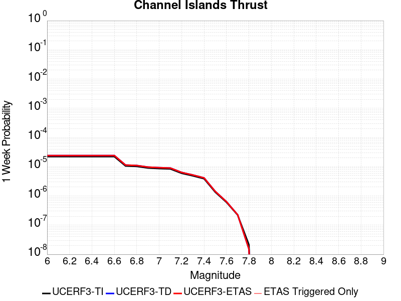 |  |  |  |

| Magnitude | 1 wk TI Prob | 1 wk TD Prob | 1 wk ETAS Prob | 1 wk ETAS/TD Gain | 1 wk ETAS Triggered Only | 1 mo TI Prob | 1 mo TD Prob | 1 mo ETAS Prob | 1 mo ETAS/TD Gain | 1 mo ETAS Triggered Only | 1 yr TI Prob | 1 yr TD Prob | 1 yr ETAS Prob | 1 yr ETAS/TD Gain | 1 yr ETAS Triggered Only | 10 yr TI Prob | 10 yr TD Prob | 10 yr ETAS Prob | 10 yr ETAS/TD Gain | 10 yr ETAS Triggered Only |
|-----|-----|-----|-----|-----|-----|-----|-----|-----|-----|-----|-----|-----|-----|-----|-----|-----|-----|-----|-----|-----|
| 6.0 | 2.2156251E-5 | 2.4092304E-5 | 2.4092304E-5 | 1.0 | 0.0 | 9.495191E-5 | 1.03249244E-4 | 1.2324718E-4 | 1.193686 | 2.0E-5 | 0.0011554264 | 0.0012564411 | 0.0013163658 | 1.047694 | 6.0E-5 | 0.011494373 | 0.012503966 | 0.01257309 | 1.0055282 | 7.0E-5 |
| 6.1 | 2.2156251E-5 | 2.4092304E-5 | 2.4092304E-5 | 1.0 | 0.0 | 9.495191E-5 | 1.03249244E-4 | 1.2324718E-4 | 1.193686 | 2.0E-5 | 0.0011554264 | 0.0012564411 | 0.0013163658 | 1.047694 | 6.0E-5 | 0.011494373 | 0.012503966 | 0.01257309 | 1.0055282 | 7.0E-5 |
| 6.2 | 2.2156251E-5 | 2.4092304E-5 | 2.4092304E-5 | 1.0 | 0.0 | 9.495191E-5 | 1.03249244E-4 | 1.2324718E-4 | 1.193686 | 2.0E-5 | 0.0011554264 | 0.0012564411 | 0.0013163658 | 1.047694 | 6.0E-5 | 0.011494373 | 0.012503966 | 0.01257309 | 1.0055282 | 7.0E-5 |
| 6.3 | 2.2156251E-5 | 2.4092304E-5 | 2.4092304E-5 | 1.0 | 0.0 | 9.495191E-5 | 1.03249244E-4 | 1.2324718E-4 | 1.193686 | 2.0E-5 | 0.0011554264 | 0.0012564411 | 0.0013163658 | 1.047694 | 6.0E-5 | 0.011494373 | 0.012503966 | 0.01257309 | 1.0055282 | 7.0E-5 |
| 6.4 | 2.2156251E-5 | 2.4092304E-5 | 2.4092304E-5 | 1.0 | 0.0 | 9.495191E-5 | 1.03249244E-4 | 1.2324718E-4 | 1.193686 | 2.0E-5 | 0.0011554264 | 0.0012564411 | 0.0013163658 | 1.047694 | 6.0E-5 | 0.011494373 | 0.012503966 | 0.01257309 | 1.0055282 | 7.0E-5 |
| 6.5 | 2.2156251E-5 | 2.4092304E-5 | 2.4092304E-5 | 1.0 | 0.0 | 9.495191E-5 | 1.03249244E-4 | 1.2324718E-4 | 1.193686 | 2.0E-5 | 0.0011554264 | 0.0012564411 | 0.0013163658 | 1.047694 | 6.0E-5 | 0.011494373 | 0.012503966 | 0.01257309 | 1.0055282 | 7.0E-5 |
| 6.6 | 2.2156251E-5 | 2.4092304E-5 | 2.4092304E-5 | 1.0 | 0.0 | 9.495191E-5 | 1.03249244E-4 | 1.2324718E-4 | 1.193686 | 2.0E-5 | 0.0011554264 | 0.0012564411 | 0.0013163658 | 1.047694 | 6.0E-5 | 0.011494373 | 0.012503966 | 0.01257309 | 1.0055282 | 7.0E-5 |
| 6.7 | 1.0601296E-5 | 1.1379656E-5 | 1.1379656E-5 | 1.0 | 0.0 | 4.5433335E-5 | 4.876907E-5 | 5.8768583E-5 | 1.205038 | 1.0E-5 | 5.5301044E-4 | 5.9360656E-4 | 6.0360064E-4 | 1.0168362 | 1.0E-5 | 0.005516363 | 0.0059207114 | 0.0059306524 | 1.001679 | 1.0E-5 |
| 6.8 | 1.0246747E-5 | 1.0996777E-5 | 1.0996777E-5 | 1.0 | 0.0 | 4.391389E-5 | 4.712822E-5 | 5.712775E-5 | 1.212177 | 1.0E-5 | 5.345204E-4 | 5.736398E-4 | 5.836341E-4 | 1.0174226 | 1.0E-5 | 0.0053323656 | 0.005722081 | 0.0057320236 | 1.0017376 | 1.0E-5 |
| 6.9 | 9.049551E-6 | 9.699738E-6 | 9.699738E-6 | 1.0 | 0.0 | 3.878322E-5 | 4.1569667E-5 | 5.156925E-5 | 1.24055 | 1.0E-5 | 4.7208337E-4 | 5.059973E-4 | 5.1599223E-4 | 1.019753 | 1.0E-5 | 0.0047108172 | 0.005048869 | 0.0050588185 | 1.0019706 | 1.0E-5 |
| 7.0 | 8.6542195E-6 | 9.274692E-6 | 9.274692E-6 | 1.0 | 0.0 | 3.7088983E-5 | 3.97481E-5 | 4.97477E-5 | 1.2515744 | 1.0E-5 | 4.5146482E-4 | 4.8382973E-4 | 4.938249E-4 | 1.0206584 | 1.0E-5 | 0.004505487 | 0.0048281755 | 0.0048381276 | 1.0020611 | 1.0E-5 |
| 7.1 | 8.391028E-6 | 8.993012E-6 | 8.993012E-6 | 1.0 | 0.0 | 3.5961057E-5 | 3.8540933E-5 | 3.8540933E-5 | 1.0 | 0.0 | 4.3773788E-4 | 4.691389E-4 | 4.691389E-4 | 1.0 | 0.0 | 0.004368766 | 0.0046818955 | 0.0046818955 | 1.0 | 0.0 |
| 7.2 | 5.965188E-6 | 6.3717544E-6 | 6.3717544E-6 | 1.0 | 0.0 | 2.556484E-5 | 2.7307235E-5 | 2.7307235E-5 | 1.0 | 0.0 | 3.1120746E-4 | 3.3241542E-4 | 3.3241542E-4 | 1.0 | 0.0 | 0.00310772 | 0.00331924 | 0.00331924 | 1.0 | 0.0 |
| 7.3 | 4.877518E-6 | 5.2060545E-6 | 5.2060545E-6 | 1.0 | 0.0 | 2.0903482E-5 | 2.2311473E-5 | 2.2311473E-5 | 1.0 | 0.0 | 2.5447016E-4 | 2.7160876E-4 | 2.7160876E-4 | 1.0 | 0.0 | 0.0025417898 | 0.0027128144 | 0.0027128144 | 1.0 | 0.0 |
| 7.4 | 3.8829853E-6 | 4.1419007E-6 | 4.1419007E-6 | 1.0 | 0.0 | 1.664126E-5 | 1.7750885E-5 | 1.7750885E-5 | 1.0 | 0.0 | 2.0258849E-4 | 2.16096E-4 | 2.16096E-4 | 1.0 | 0.0 | 0.002024039 | 0.0021589005 | 0.0021589005 | 1.0 | 0.0 |
| 7.5 | 1.3489616E-6 | 1.4278027E-6 | 1.4278027E-6 | 1.0 | 0.0 | 5.7812517E-6 | 6.1191404E-6 | 6.1191404E-6 | 1.0 | 0.0 | 7.038446E-5 | 7.449803E-5 | 7.449803E-5 | 1.0 | 0.0 | 7.036218E-4 | 7.447345E-4 | 7.447345E-4 | 1.0 | 0.0 |
| 7.6 | 6.058192E-7 | 6.353832E-7 | 6.353832E-7 | 1.0 | 0.0 | 2.5963652E-6 | 2.723068E-6 | 2.723068E-6 | 1.0 | 0.0 | 3.161029E-5 | 3.3152864E-5 | 3.3152864E-5 | 1.0 | 0.0 | 3.1605794E-4 | 3.314808E-4 | 3.314808E-4 | 1.0 | 0.0 |
| 7.7 | 2.2170494E-7 | 2.260808E-7 | 2.260808E-7 | 1.0 | 0.0 | 9.5016367E-7 | 9.689174E-7 | 9.689174E-7 | 1.0 | 0.0 | 1.1568181E-5 | 1.1796516E-5 | 1.1796516E-5 | 1.0 | 0.0 | 1.1567579E-4 | 1.17960015E-4 | 1.17960015E-4 | 1.0 | 0.0 |
| 7.8 | 2.1613102E-8 | 1.5466789E-8 | 1.5466789E-8 | 1.0 | 0.0 | 9.262757E-8 | 6.628623E-8 | 6.628623E-8 | 1.0 | 0.0 | 1.1277401E-6 | 8.0703467E-7 | 8.0703467E-7 | 1.0 | 0.0 | 1.1277344E-5 | 8.070325E-6 | 8.070325E-6 | 1.0 | 0.0 |

## Ortigalita (North)
*[(top)](#table-of-contents)*

| 1 Week | 1 Month | 1 Year | 10 Year |
|-----|-----|-----|-----|
| 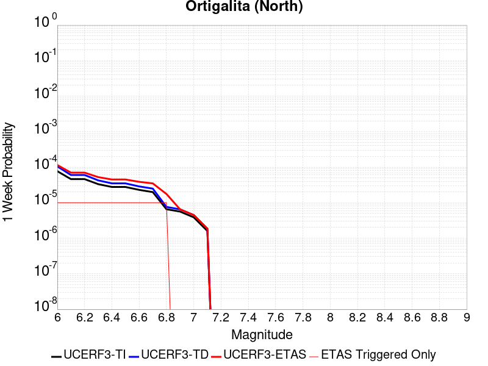 | 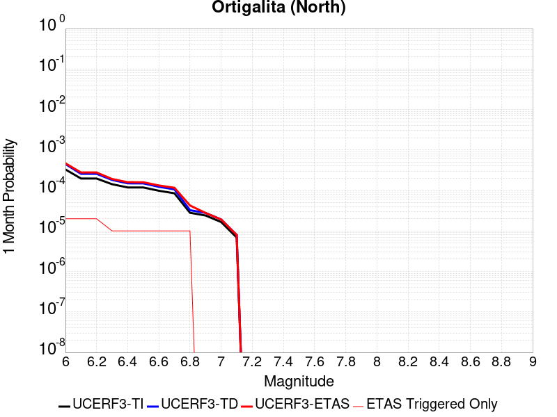 | 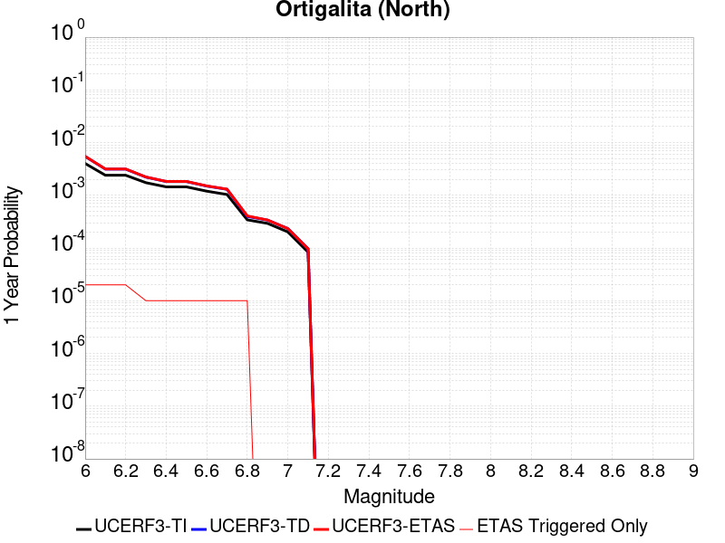 | 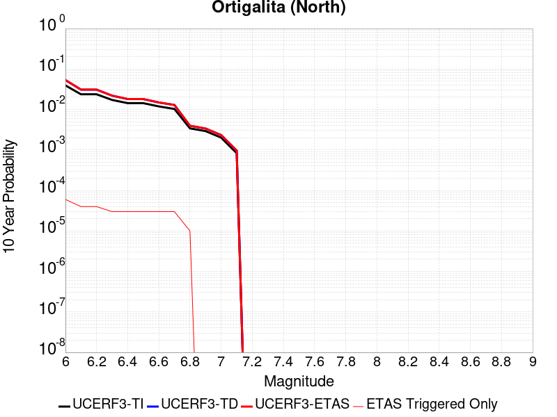 |

| Magnitude | 1 wk TI Prob | 1 wk TD Prob | 1 wk ETAS Prob | 1 wk ETAS/TD Gain | 1 wk ETAS Triggered Only | 1 mo TI Prob | 1 mo TD Prob | 1 mo ETAS Prob | 1 mo ETAS/TD Gain | 1 mo ETAS Triggered Only | 1 yr TI Prob | 1 yr TD Prob | 1 yr ETAS Prob | 1 yr ETAS/TD Gain | 1 yr ETAS Triggered Only | 10 yr TI Prob | 10 yr TD Prob | 10 yr ETAS Prob | 10 yr ETAS/TD Gain | 10 yr ETAS Triggered Only |
|-----|-----|-----|-----|-----|-----|-----|-----|-----|-----|-----|-----|-----|-----|-----|-----|-----|-----|-----|-----|-----|
| 6.0 | 7.711876E-5 | 1.0507023E-4 | 1.15069175E-4 | 1.0951644 | 1.0E-5 | 3.3046713E-4 | 4.5023413E-4 | 4.7022512E-4 | 1.0444013 | 2.0E-5 | 0.004016016 | 0.005468329 | 0.0054882197 | 1.0036374 | 2.0E-5 | 0.039442103 | 0.053457033 | 0.053513825 | 1.0010624 | 6.0E-5 |
| 6.1 | 4.607858E-5 | 6.024174E-5 | 7.0241134E-5 | 1.1659878 | 1.0E-5 | 1.9746469E-4 | 2.5815613E-4 | 2.7815095E-4 | 1.0774525 | 2.0E-5 | 0.0024014818 | 0.0031388826 | 0.0031588199 | 1.0063517 | 2.0E-5 | 0.023756953 | 0.030976266 | 0.031015027 | 1.0012513 | 4.0E-5 |
| 6.2 | 4.607858E-5 | 6.024174E-5 | 7.0241134E-5 | 1.1659878 | 1.0E-5 | 1.9746469E-4 | 2.5815613E-4 | 2.7815095E-4 | 1.0774525 | 2.0E-5 | 0.0024014818 | 0.0031388826 | 0.0031588199 | 1.0063517 | 2.0E-5 | 0.023756953 | 0.030976266 | 0.031015027 | 1.0012513 | 4.0E-5 |
| 6.3 | 3.327423E-5 | 4.247674E-5 | 5.2476313E-5 | 1.235413 | 1.0E-5 | 1.4259605E-4 | 1.820322E-4 | 1.9203039E-4 | 1.0549253 | 1.0E-5 | 0.0017347244 | 0.0022142797 | 0.0022242577 | 1.0045061 | 1.0E-5 | 0.017212452 | 0.021946438 | 0.02197578 | 1.0013369 | 3.0E-5 |
| 6.4 | 2.7732503E-5 | 3.4999855E-5 | 4.4999502E-5 | 1.2857054 | 1.0E-5 | 1.1884817E-4 | 1.4999225E-4 | 1.5999076E-4 | 1.0666602 | 1.0E-5 | 0.001446016 | 0.001824874 | 0.0018348558 | 1.0054698 | 1.0E-5 | 0.014366428 | 0.018121855 | 0.018151313 | 1.0016254 | 3.0E-5 |
| 6.5 | 2.7689714E-5 | 3.4949666E-5 | 4.4949316E-5 | 1.2861158 | 1.0E-5 | 1.186648E-4 | 1.4977719E-4 | 1.597757E-4 | 1.0667559 | 1.0E-5 | 0.0014437864 | 0.00182226 | 0.0018322418 | 1.0054777 | 1.0E-5 | 0.014344421 | 0.018096142 | 0.0181256 | 1.0016278 | 3.0E-5 |
| 6.6 | 2.2976905E-5 | 2.8719256E-5 | 3.871897E-5 | 1.3481884 | 1.0E-5 | 9.846873E-5 | 1.2307815E-4 | 1.3307692E-4 | 1.0812392 | 1.0E-5 | 0.0011981975 | 0.001497687 | 0.001507672 | 1.006667 | 1.0E-5 | 0.011917574 | 0.014899201 | 0.0149287535 | 1.0019835 | 3.0E-5 |
| 6.7 | 1.9871539E-5 | 2.490528E-5 | 3.490503E-5 | 1.4015113 | 1.0E-5 | 8.516096E-5 | 1.0673395E-4 | 1.1673288E-4 | 1.0936809 | 1.0E-5 | 0.0010363415 | 0.0012989598 | 0.0013089469 | 1.0076885 | 1.0E-5 | 0.010315218 | 0.012937365 | 0.0129669765 | 1.0022888 | 3.0E-5 |
| 6.8 | 6.5640475E-6 | 7.6056526E-6 | 1.7605576E-5 | 2.3148015 | 1.0E-5 | 2.813133E-5 | 3.2595264E-5 | 4.2594937E-5 | 1.3067831 | 1.0E-5 | 3.424451E-4 | 3.9677793E-4 | 4.0677396E-4 | 1.025193 | 1.0E-5 | 0.0034191788 | 0.0039609824 | 0.0039709425 | 1.0025146 | 1.0E-5 |
| 6.9 | 5.6219683E-6 | 6.5019726E-6 | 6.5019726E-6 | 1.0 | 0.0 | 2.4093928E-5 | 2.7865315E-5 | 2.7865315E-5 | 1.0 | 0.0 | 2.933041E-4 | 3.3920998E-4 | 3.3920998E-4 | 1.0 | 0.0 | 0.0029291727 | 0.0033871792 | 0.0033871792 | 1.0 | 0.0 |
| 7.0 | 3.875591E-6 | 4.4848484E-6 | 4.4848484E-6 | 1.0 | 0.0 | 1.6609569E-5 | 1.922065E-5 | 1.922065E-5 | 1.0 | 0.0 | 2.0220275E-4 | 2.339884E-4 | 2.339884E-4 | 1.0 | 0.0 | 0.0020201886 | 0.0023376285 | 0.0023376285 | 1.0 | 0.0 |
| 7.1 | 1.6017933E-6 | 1.8570811E-6 | 1.8570811E-6 | 1.0 | 0.0 | 6.8648105E-6 | 7.958901E-6 | 7.958901E-6 | 1.0 | 0.0 | 8.357586E-5 | 9.689637E-5 | 9.689637E-5 | 1.0 | 0.0 | 8.3544437E-4 | 9.686459E-4 | 9.686459E-4 | 1.0 | 0.0 |

## Independence rev 2011
*[(top)](#table-of-contents)*

| 1 Week | 1 Month | 1 Year | 10 Year |
|-----|-----|-----|-----|
|  |  |  |  |

| Magnitude | 1 wk TI Prob | 1 wk TD Prob | 1 wk ETAS Prob | 1 wk ETAS/TD Gain | 1 wk ETAS Triggered Only | 1 mo TI Prob | 1 mo TD Prob | 1 mo ETAS Prob | 1 mo ETAS/TD Gain | 1 mo ETAS Triggered Only | 1 yr TI Prob | 1 yr TD Prob | 1 yr ETAS Prob | 1 yr ETAS/TD Gain | 1 yr ETAS Triggered Only | 10 yr TI Prob | 10 yr TD Prob | 10 yr ETAS Prob | 10 yr ETAS/TD Gain | 10 yr ETAS Triggered Only |
|-----|-----|-----|-----|-----|-----|-----|-----|-----|-----|-----|-----|-----|-----|-----|-----|-----|-----|-----|-----|-----|
| 6.0 | 4.422171E-6 | 4.3262453E-6 | 2.4326158E-5 | 5.622926 | 2.0E-5 | 1.8952025E-5 | 1.8540937E-5 | 3.8540566E-5 | 2.078674 | 2.0E-5 | 2.3071647E-4 | 2.257155E-4 | 3.0569744E-4 | 1.3543484 | 8.0E-5 | 0.0023047708 | 0.0022551562 | 0.0023449531 | 1.0398185 | 9.0E-5 |
| 6.1 | 4.422171E-6 | 4.3262453E-6 | 2.4326158E-5 | 5.622926 | 2.0E-5 | 1.8952025E-5 | 1.8540937E-5 | 3.8540566E-5 | 2.078674 | 2.0E-5 | 2.3071647E-4 | 2.257155E-4 | 3.0569744E-4 | 1.3543484 | 8.0E-5 | 0.0023047708 | 0.0022551562 | 0.0023449531 | 1.0398185 | 9.0E-5 |
| 6.2 | 4.422171E-6 | 4.3262453E-6 | 2.4326158E-5 | 5.622926 | 2.0E-5 | 1.8952025E-5 | 1.8540937E-5 | 3.8540566E-5 | 2.078674 | 2.0E-5 | 2.3071647E-4 | 2.257155E-4 | 3.0569744E-4 | 1.3543484 | 8.0E-5 | 0.0023047708 | 0.0022551562 | 0.0023449531 | 1.0398185 | 9.0E-5 |
| 6.3 | 4.422171E-6 | 4.3262453E-6 | 2.4326158E-5 | 5.622926 | 2.0E-5 | 1.8952025E-5 | 1.8540937E-5 | 3.8540566E-5 | 2.078674 | 2.0E-5 | 2.3071647E-4 | 2.257155E-4 | 3.0569744E-4 | 1.3543484 | 8.0E-5 | 0.0023047708 | 0.0022551562 | 0.0023449531 | 1.0398185 | 9.0E-5 |
| 6.4 | 4.422171E-6 | 4.3262453E-6 | 2.4326158E-5 | 5.622926 | 2.0E-5 | 1.8952025E-5 | 1.8540937E-5 | 3.8540566E-5 | 2.078674 | 2.0E-5 | 2.3071647E-4 | 2.257155E-4 | 3.0569744E-4 | 1.3543484 | 8.0E-5 | 0.0023047708 | 0.0022551562 | 0.0023449531 | 1.0398185 | 9.0E-5 |
| 6.5 | 4.422171E-6 | 4.3262453E-6 | 2.4326158E-5 | 5.622926 | 2.0E-5 | 1.8952025E-5 | 1.8540937E-5 | 3.8540566E-5 | 2.078674 | 2.0E-5 | 2.3071647E-4 | 2.257155E-4 | 3.0569744E-4 | 1.3543484 | 8.0E-5 | 0.0023047708 | 0.0022551562 | 0.0023449531 | 1.0398185 | 9.0E-5 |
| 6.6 | 2.663744E-6 | 2.5319996E-6 | 2.2531949E-5 | 8.898875 | 2.0E-5 | 1.1415996E-5 | 1.0851385E-5 | 3.0851166E-5 | 2.8430629 | 2.0E-5 | 1.3898089E-4 | 1.3210809E-4 | 2.1209751E-4 | 1.6054847 | 8.0E-5 | 0.0013889399 | 0.0013203438 | 0.0014002381 | 1.0605103 | 8.0E-5 |
| 6.7 | 2.663744E-6 | 2.5319996E-6 | 2.2531949E-5 | 8.898875 | 2.0E-5 | 1.1415996E-5 | 1.0851385E-5 | 3.0851166E-5 | 2.8430629 | 2.0E-5 | 1.3898089E-4 | 1.3210809E-4 | 2.1209751E-4 | 1.6054847 | 8.0E-5 | 0.0013889399 | 0.0013203438 | 0.0014002381 | 1.0605103 | 8.0E-5 |
| 6.8 | 1.9716529E-6 | 1.83227E-6 | 2.1832233E-5 | 11.915402 | 2.0E-5 | 8.449913E-6 | 7.852563E-6 | 2.7852406E-5 | 3.5469193 | 2.0E-5 | 1.0287284E-4 | 9.560089E-5 | 1.7559323E-4 | 1.8367324 | 8.0E-5 | 0.0010282523 | 9.556105E-4 | 0.0010355341 | 1.0836362 | 8.0E-5 |
| 6.9 | 1.8788617E-6 | 1.7430103E-6 | 2.1742975E-5 | 12.474381 | 2.0E-5 | 8.0522395E-6 | 7.470024E-6 | 2.7469874E-5 | 3.6773477 | 2.0E-5 | 9.80316E-5 | 9.094387E-5 | 1.7093659E-4 | 1.8795835 | 8.0E-5 | 9.798837E-4 | 9.090785E-4 | 9.890058E-4 | 1.0879211 | 8.0E-5 |
| 7.0 | 1.5045488E-6 | 1.3849595E-6 | 2.1384933E-5 | 15.440835 | 2.0E-5 | 6.44805E-6 | 5.9355275E-6 | 2.593541E-5 | 4.36952 | 2.0E-5 | 7.8502184E-5 | 7.226271E-5 | 1.5225692E-4 | 2.1069918 | 8.0E-5 | 7.8474457E-4 | 7.2239724E-4 | 8.023394E-4 | 1.1106623 | 8.0E-5 |
| 7.1 | 1.272341E-6 | 1.1625177E-6 | 2.1162494E-5 | 18.20402 | 2.0E-5 | 5.4528787E-6 | 4.9822092E-6 | 2.498211E-5 | 5.0142636 | 2.0E-5 | 6.6386776E-5 | 6.065674E-5 | 1.4065189E-4 | 2.3188171 | 8.0E-5 | 6.636695E-4 | 6.06405E-4 | 6.8635656E-4 | 1.131845 | 8.0E-5 |
| 7.2 | 1.0416892E-6 | 9.4099494E-7 | 2.0940975E-5 | 22.25408 | 2.0E-5 | 4.464375E-6 | 4.032829E-6 | 2.4032748E-5 | 5.9592776 | 2.0E-5 | 5.4352407E-5 | 4.909861E-5 | 1.2909468E-4 | 2.6292942 | 8.0E-5 | 5.4339116E-4 | 4.9087947E-4 | 5.708402E-4 | 1.1628928 | 8.0E-5 |
| 7.3 | 7.9450155E-7 | 7.235053E-7 | 2.0723492E-5 | 28.643177 | 2.0E-5 | 3.4050022E-6 | 3.1007335E-6 | 2.310067E-5 | 7.4500666 | 2.0E-5 | 4.1455114E-5 | 3.7750786E-5 | 1.1774777E-4 | 3.119081 | 8.0E-5 | 4.144738E-4 | 3.7744487E-4 | 4.5741466E-4 | 1.2118715 | 8.0E-5 |
| 7.4 | 5.3893444E-7 | 5.0195445E-7 | 2.0501944E-5 | 40.844234 | 2.0E-5 | 2.309717E-6 | 2.1512315E-6 | 2.215119E-5 | 10.296981 | 2.0E-5 | 2.8120441E-5 | 2.6190934E-5 | 9.61891E-5 | 3.6726105 | 7.0E-5 | 2.8116882E-4 | 2.6187891E-4 | 3.318606E-4 | 1.2672291 | 7.0E-5 |
| 7.5 | 3.8852085E-7 | 3.6825747E-7 | 2.036825E-5 | 55.309807 | 2.0E-5 | 1.6650882E-6 | 1.5782454E-6 | 2.1578215E-5 | 13.67228 | 2.0E-5 | 2.027226E-5 | 1.9214971E-5 | 8.921362E-5 | 4.642923 | 7.0E-5 | 2.0270412E-4 | 1.921333E-4 | 2.6211987E-4 | 1.3642604 | 7.0E-5 |
| 7.6 | 2.414929E-7 | 2.3457659E-7 | 2.0234573E-5 | 86.25998 | 2.0E-5 | 1.0349692E-6 | 1.0053279E-6 | 2.1005308E-5 | 20.893988 | 2.0E-5 | 1.2600677E-5 | 1.22398E-5 | 4.2239433E-5 | 3.4509904 | 3.0E-5 | 1.2599962E-4 | 1.2239137E-4 | 1.523877E-4 | 1.2450854 | 3.0E-5 |
| 7.7 | 6.8298014E-8 | 6.858993E-8 | 1.0068589E-5 | 146.79399 | 1.0E-5 | 2.9270575E-7 | 2.939568E-7 | 1.0293954E-5 | 35.018593 | 1.0E-5 | 3.5636867E-6 | 3.5789185E-6 | 1.3578883E-5 | 3.79413 | 1.0E-5 | 3.5636294E-5 | 3.5788657E-5 | 4.57883E-5 | 1.2794081 | 1.0E-5 |

## White Mountains
*[(top)](#table-of-contents)*

| 1 Week | 1 Month | 1 Year | 10 Year |
|-----|-----|-----|-----|
|  |  |  |  |

| Magnitude | 1 wk TI Prob | 1 wk TD Prob | 1 wk ETAS Prob | 1 wk ETAS/TD Gain | 1 wk ETAS Triggered Only | 1 mo TI Prob | 1 mo TD Prob | 1 mo ETAS Prob | 1 mo ETAS/TD Gain | 1 mo ETAS Triggered Only | 1 yr TI Prob | 1 yr TD Prob | 1 yr ETAS Prob | 1 yr ETAS/TD Gain | 1 yr ETAS Triggered Only | 10 yr TI Prob | 10 yr TD Prob | 10 yr ETAS Prob | 10 yr ETAS/TD Gain | 10 yr ETAS Triggered Only |
|-----|-----|-----|-----|-----|-----|-----|-----|-----|-----|-----|-----|-----|-----|-----|-----|-----|-----|-----|-----|-----|
| 6.0 | 3.503579E-5 | 3.3784425E-5 | 3.3784425E-5 | 1.0 | 0.0 | 1.5014476E-4 | 1.4478304E-4 | 1.4478304E-4 | 1.0 | 0.0 | 0.0018264796 | 0.0017614291 | 0.0017813939 | 1.0113344 | 2.0E-5 | 0.018115403 | 0.017487012 | 0.017575437 | 1.0050566 | 9.0E-5 |
| 6.1 | 3.503579E-5 | 3.3784425E-5 | 3.3784425E-5 | 1.0 | 0.0 | 1.5014476E-4 | 1.4478304E-4 | 1.4478304E-4 | 1.0 | 0.0 | 0.0018264796 | 0.0017614291 | 0.0017813939 | 1.0113344 | 2.0E-5 | 0.018115403 | 0.017487012 | 0.017575437 | 1.0050566 | 9.0E-5 |
| 6.2 | 3.503579E-5 | 3.3784425E-5 | 3.3784425E-5 | 1.0 | 0.0 | 1.5014476E-4 | 1.4478304E-4 | 1.4478304E-4 | 1.0 | 0.0 | 0.0018264796 | 0.0017614291 | 0.0017813939 | 1.0113344 | 2.0E-5 | 0.018115403 | 0.017487012 | 0.017575437 | 1.0050566 | 9.0E-5 |
| 6.3 | 1.7818425E-5 | 1.5916237E-5 | 1.5916237E-5 | 1.0 | 0.0 | 7.636245E-5 | 6.821074E-5 | 6.821074E-5 | 1.0 | 0.0 | 9.293162E-4 | 8.301636E-4 | 8.4015535E-4 | 1.0120358 | 1.0E-5 | 0.009254395 | 0.0082720835 | 0.00832167 | 1.0059944 | 5.0E-5 |
| 6.4 | 1.7818425E-5 | 1.5916237E-5 | 1.5916237E-5 | 1.0 | 0.0 | 7.636245E-5 | 6.821074E-5 | 6.821074E-5 | 1.0 | 0.0 | 9.293162E-4 | 8.301636E-4 | 8.4015535E-4 | 1.0120358 | 1.0E-5 | 0.009254395 | 0.0082720835 | 0.00832167 | 1.0059944 | 5.0E-5 |
| 6.5 | 1.3397557E-5 | 1.1336382E-5 | 1.1336382E-5 | 1.0 | 0.0 | 5.741684E-5 | 4.8583628E-5 | 4.8583628E-5 | 1.0 | 0.0 | 6.988258E-4 | 5.913521E-4 | 6.013462E-4 | 1.0169004 | 1.0E-5 | 0.006966323 | 0.0058984905 | 0.005928314 | 1.005056 | 3.0E-5 |
| 6.6 | 1.0818695E-5 | 8.625452E-6 | 8.625452E-6 | 1.0 | 0.0 | 4.6365014E-5 | 3.6965725E-5 | 3.6965725E-5 | 1.0 | 0.0 | 5.6434784E-4 | 4.499691E-4 | 4.499691E-4 | 1.0 | 0.0 | 0.005629168 | 0.0044910167 | 0.0045009716 | 1.0022167 | 1.0E-5 |
| 6.7 | 9.067908E-6 | 6.8025106E-6 | 6.8025106E-6 | 1.0 | 0.0 | 3.8861883E-5 | 2.915331E-5 | 2.915331E-5 | 1.0 | 0.0 | 4.7304068E-4 | 3.5488693E-4 | 3.5488693E-4 | 1.0 | 0.0 | 0.00472035 | 0.0035435192 | 0.0035534836 | 1.002812 | 1.0E-5 |
| 6.8 | 7.295947E-6 | 4.9364417E-6 | 4.9364417E-6 | 1.0 | 0.0 | 3.126797E-5 | 2.1156015E-5 | 2.1156015E-5 | 1.0 | 0.0 | 3.8062103E-4 | 2.5754515E-4 | 2.5754515E-4 | 1.0 | 0.0 | 0.0037996976 | 0.0025725798 | 0.002582554 | 1.0038772 | 1.0E-5 |
| 6.9 | 6.2243444E-6 | 3.832255E-6 | 3.832255E-6 | 1.0 | 0.0 | 2.6675489E-5 | 1.6423848E-5 | 1.6423848E-5 | 1.0 | 0.0 | 3.2472567E-4 | 1.9994254E-4 | 1.9994254E-4 | 1.0 | 0.0 | 0.0032425157 | 0.0019976792 | 0.0020076593 | 1.0049958 | 1.0E-5 |
| 7.0 | 4.9878413E-6 | 2.6795697E-6 | 2.6795697E-6 | 1.0 | 0.0 | 2.1376287E-5 | 1.1483821E-5 | 1.1483821E-5 | 1.0 | 0.0 | 2.602252E-4 | 1.3980681E-4 | 1.3980681E-4 | 1.0 | 0.0 | 0.002599207 | 0.0013972148 | 0.0013972148 | 1.0 | 0.0 |
| 7.1 | 4.0252844E-6 | 1.88579E-6 | 1.88579E-6 | 1.0 | 0.0 | 1.7251105E-5 | 8.081933E-6 | 8.081933E-6 | 1.0 | 0.0 | 2.1001195E-4 | 9.839322E-5 | 9.839322E-5 | 1.0 | 0.0 | 0.0020981359 | 9.835094E-4 | 9.835094E-4 | 1.0 | 0.0 |
| 7.2 | 3.3284066E-6 | 1.2819944E-6 | 1.2819944E-6 | 1.0 | 0.0 | 1.4264522E-5 | 5.4942507E-6 | 5.4942507E-6 | 1.0 | 0.0 | 1.736567E-4 | 6.689055E-5 | 6.689055E-5 | 1.0 | 0.0 | 0.0017352107 | 6.6871423E-4 | 6.6871423E-4 | 1.0 | 0.0 |
| 7.3 | 2.458226E-6 | 6.057493E-7 | 6.057493E-7 | 1.0 | 0.0 | 1.0535211E-5 | 2.596066E-6 | 2.596066E-6 | 1.0 | 0.0 | 1.2825865E-4 | 3.1606683E-5 | 3.1606683E-5 | 1.0 | 0.0 | 0.0012818464 | 3.1602563E-4 | 3.1602563E-4 | 1.0 | 0.0 |
| 7.4 | 1.965953E-6 | 3.1091668E-7 | 3.1091668E-7 | 1.0 | 0.0 | 8.425486E-6 | 1.3324994E-6 | 1.3324994E-6 | 1.0 | 0.0 | 1.0257547E-4 | 1.622306E-5 | 1.622306E-5 | 1.0 | 0.0 | 0.0010252813 | 1.6221889E-4 | 1.6221889E-4 | 1.0 | 0.0 |
| 7.5 | 1.2014192E-6 | 1.824589E-7 | 1.824589E-7 | 1.0 | 0.0 | 5.148929E-6 | 7.819665E-7 | 7.819665E-7 | 1.0 | 0.0 | 6.2686406E-5 | 9.520401E-6 | 9.520401E-6 | 1.0 | 0.0 | 6.266873E-4 | 9.520002E-5 | 9.520002E-5 | 1.0 | 0.0 |
| 7.6 | 2.5612175E-7 | 4.8950795E-8 | 4.8950795E-8 | 1.0 | 0.0 | 1.0976642E-6 | 2.097891E-7 | 2.097891E-7 | 1.0 | 0.0 | 1.3363979E-5 | 2.5541797E-6 | 2.5541797E-6 | 1.0 | 0.0 | 1.3363175E-4 | 2.554154E-5 | 2.554154E-5 | 1.0 | 0.0 |

## Santa Rosa Island
*[(top)](#table-of-contents)*

| 1 Week | 1 Month | 1 Year | 10 Year |
|-----|-----|-----|-----|
|  | 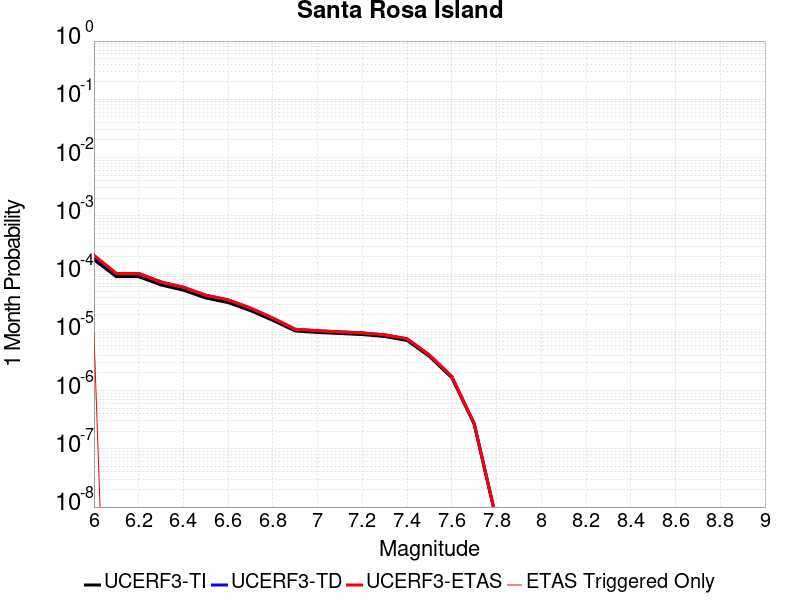 |  | 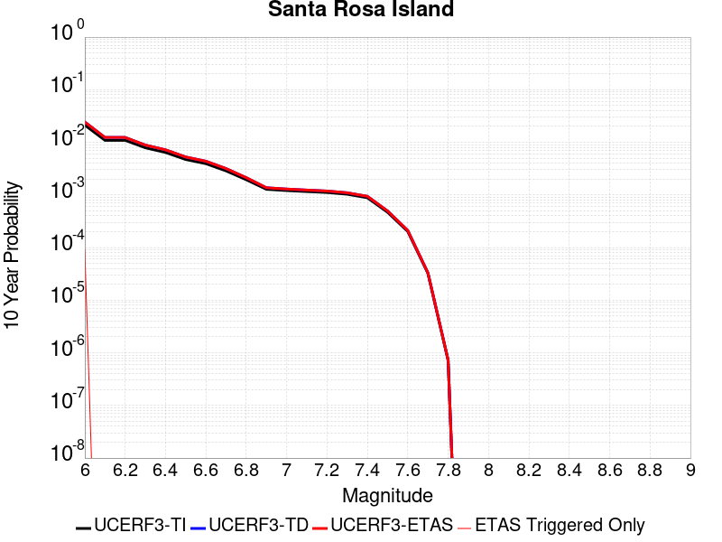 |

| Magnitude | 1 wk TI Prob | 1 wk TD Prob | 1 wk ETAS Prob | 1 wk ETAS/TD Gain | 1 wk ETAS Triggered Only | 1 mo TI Prob | 1 mo TD Prob | 1 mo ETAS Prob | 1 mo ETAS/TD Gain | 1 mo ETAS Triggered Only | 1 yr TI Prob | 1 yr TD Prob | 1 yr ETAS Prob | 1 yr ETAS/TD Gain | 1 yr ETAS Triggered Only | 10 yr TI Prob | 10 yr TD Prob | 10 yr ETAS Prob | 10 yr ETAS/TD Gain | 10 yr ETAS Triggered Only |
|-----|-----|-----|-----|-----|-----|-----|-----|-----|-----|-----|-----|-----|-----|-----|-----|-----|-----|-----|-----|-----|
| 6.0 | 4.1143165E-5 | 4.7092042E-5 | 5.709157E-5 | 1.2123401 | 1.0E-5 | 1.7631594E-4 | 2.0180854E-4 | 2.1180652E-4 | 1.049542 | 1.0E-5 | 0.002144533 | 0.0024544473 | 0.0024843735 | 1.0121927 | 3.0E-5 | 0.021239553 | 0.024294013 | 0.024381828 | 1.0036147 | 9.0E-5 |
| 6.1 | 2.1061249E-5 | 2.3865383E-5 | 2.3865383E-5 | 1.0 | 0.0 | 9.0259375E-5 | 1.0227637E-4 | 1.0227637E-4 | 1.0 | 0.0 | 0.0010983539 | 0.0012445324 | 0.0012445324 | 1.0 | 0.0 | 0.01092941 | 0.012378667 | 0.012378667 | 1.0 | 0.0 |
| 6.2 | 2.1061249E-5 | 2.3865383E-5 | 2.3865383E-5 | 1.0 | 0.0 | 9.0259375E-5 | 1.0227637E-4 | 1.0227637E-4 | 1.0 | 0.0 | 0.0010983539 | 0.0012445324 | 0.0012445324 | 1.0 | 0.0 | 0.01092941 | 0.012378667 | 0.012378667 | 1.0 | 0.0 |
| 6.3 | 1.5158236E-5 | 1.7074708E-5 | 1.7074708E-5 | 1.0 | 0.0 | 6.496225E-5 | 7.317533E-5 | 7.317533E-5 | 1.0 | 0.0 | 7.906284E-4 | 8.905574E-4 | 8.905574E-4 | 1.0 | 0.0 | 0.007878214 | 0.008871138 | 0.008871138 | 1.0 | 0.0 |
| 6.4 | 1.2341918E-5 | 1.3853143E-5 | 1.3853143E-5 | 1.0 | 0.0 | 5.2892858E-5 | 5.9369308E-5 | 5.9369308E-5 | 1.0 | 0.0 | 6.437803E-4 | 7.225897E-4 | 7.225897E-4 | 1.0 | 0.0 | 0.006419184 | 0.0072032386 | 0.0072032386 | 1.0 | 0.0 |
| 6.5 | 9.061158E-6 | 1.0117188E-5 | 1.0117188E-5 | 1.0 | 0.0 | 3.883296E-5 | 4.335869E-5 | 4.335869E-5 | 1.0 | 0.0 | 4.726887E-4 | 5.277695E-4 | 5.277695E-4 | 1.0 | 0.0 | 0.004716845 | 0.0052656992 | 0.0052656992 | 1.0 | 0.0 |
| 6.6 | 7.5461685E-6 | 8.400861E-6 | 8.400861E-6 | 1.0 | 0.0 | 3.2340322E-5 | 3.6003217E-5 | 3.6003217E-5 | 1.0 | 0.0 | 3.936723E-4 | 4.382553E-4 | 4.382553E-4 | 1.0 | 0.0 | 0.003929756 | 0.0043743397 | 0.0043743397 | 1.0 | 0.0 |
| 6.7 | 5.5023775E-6 | 6.0874677E-6 | 6.0874677E-6 | 1.0 | 0.0 | 2.3581404E-5 | 2.6088905E-5 | 2.6088905E-5 | 1.0 | 0.0 | 2.8706578E-4 | 3.1758935E-4 | 3.1758935E-4 | 1.0 | 0.0 | 0.0028669522 | 0.0031716768 | 0.0031716768 | 1.0 | 0.0 |
| 6.8 | 3.7351679E-6 | 4.0831915E-6 | 4.0831915E-6 | 1.0 | 0.0 | 1.6007763E-5 | 1.749929E-5 | 1.749929E-5 | 1.0 | 0.0 | 1.948771E-4 | 2.1303551E-4 | 2.1303551E-4 | 1.0 | 0.0 | 0.0019470629 | 0.002128558 | 0.002128558 | 1.0 | 0.0 |
| 6.9 | 2.456366E-6 | 2.6292953E-6 | 2.6292953E-6 | 1.0 | 0.0 | 1.0527241E-5 | 1.126836E-5 | 1.126836E-5 | 1.0 | 0.0 | 1.2816161E-4 | 1.3718367E-4 | 1.3718367E-4 | 1.0 | 0.0 | 0.0012808773 | 0.0013709929 | 0.0013709929 | 1.0 | 0.0 |
| 7.0 | 2.3245157E-6 | 2.482801E-6 | 2.482801E-6 | 1.0 | 0.0 | 9.962172E-6 | 1.0640532E-5 | 1.0640532E-5 | 1.0 | 0.0 | 1.2128269E-4 | 1.295408E-4 | 1.295408E-4 | 1.0 | 0.0 | 0.0012121652 | 0.0012946551 | 0.0012946551 | 1.0 | 0.0 |
| 7.1 | 2.2248344E-6 | 2.3732712E-6 | 2.3732712E-6 | 1.0 | 0.0 | 9.53497E-6 | 1.0171123E-5 | 1.0171123E-5 | 1.0 | 0.0 | 1.1608207E-4 | 1.238264E-4 | 1.238264E-4 | 1.0 | 0.0 | 0.0011602144 | 0.001237576 | 0.001237576 | 1.0 | 0.0 |
| 7.2 | 2.1350402E-6 | 2.2761742E-6 | 2.2761742E-6 | 1.0 | 0.0 | 9.150141E-6 | 9.7549955E-6 | 9.7549955E-6 | 1.0 | 0.0 | 1.1139726E-4 | 1.1876062E-4 | 1.1876062E-4 | 1.0 | 0.0 | 0.0011134144 | 0.0011869734 | 0.0011869734 | 1.0 | 0.0 |
| 7.3 | 1.9793572E-6 | 2.1087376E-6 | 2.1087376E-6 | 1.0 | 0.0 | 8.482932E-6 | 9.037415E-6 | 9.037415E-6 | 1.0 | 0.0 | 1.032748E-4 | 1.10024994E-4 | 1.10024994E-4 | 1.0 | 0.0 | 0.0010322682 | 0.001099707 | 0.001099707 | 1.0 | 0.0 |
| 7.4 | 1.6951194E-6 | 1.804589E-6 | 1.804589E-6 | 1.0 | 0.0 | 7.264777E-6 | 7.73393E-6 | 7.73393E-6 | 1.0 | 0.0 | 8.844508E-5 | 9.4156545E-5 | 9.4156545E-5 | 1.0 | 0.0 | 8.840988E-4 | 9.411682E-4 | 9.411682E-4 | 1.0 | 0.0 |
| 7.5 | 8.987207E-7 | 9.51229E-7 | 9.51229E-7 | 1.0 | 0.0 | 3.8516546E-6 | 4.0766895E-6 | 4.0766895E-6 | 1.0 | 0.0 | 4.6892885E-5 | 4.9632577E-5 | 4.9632577E-5 | 1.0 | 0.0 | 4.688299E-4 | 4.9621606E-4 | 4.9621606E-4 | 1.0 | 0.0 |
| 7.6 | 3.8783037E-7 | 4.052958E-7 | 4.052958E-7 | 1.0 | 0.0 | 1.6621291E-6 | 1.7369808E-6 | 1.7369808E-6 | 1.0 | 0.0 | 2.0236233E-5 | 2.1147544E-5 | 2.1147544E-5 | 1.0 | 0.0 | 2.023439E-4 | 2.1145596E-4 | 2.1145596E-4 | 1.0 | 0.0 |
| 7.7 | 6.181804E-8 | 6.3390665E-8 | 6.3390665E-8 | 1.0 | 0.0 | 2.6493444E-7 | 2.7167425E-7 | 2.7167425E-7 | 1.0 | 0.0 | 3.225572E-6 | 3.307629E-6 | 3.307629E-6 | 1.0 | 0.0 | 3.225525E-5 | 3.3075805E-5 | 3.3075805E-5 | 1.0 | 0.0 |
| 7.8 | 1.3704449E-9 | 1.3964188E-9 | 1.3964188E-9 | 1.0 | 0.0 | 5.873335E-9 | 5.984652E-9 | 5.984652E-9 | 1.0 | 0.0 | 7.1507856E-8 | 7.286314E-8 | 7.286314E-8 | 1.0 | 0.0 | 7.1507833E-7 | 7.286312E-7 | 7.286312E-7 | 1.0 | 0.0 |

## Cleghorn Pass
*[(top)](#table-of-contents)*

| 1 Week | 1 Month | 1 Year | 10 Year |
|-----|-----|-----|-----|
|  |  |  |  |

| Magnitude | 1 wk TI Prob | 1 wk TD Prob | 1 wk ETAS Prob | 1 wk ETAS/TD Gain | 1 wk ETAS Triggered Only | 1 mo TI Prob | 1 mo TD Prob | 1 mo ETAS Prob | 1 mo ETAS/TD Gain | 1 mo ETAS Triggered Only | 1 yr TI Prob | 1 yr TD Prob | 1 yr ETAS Prob | 1 yr ETAS/TD Gain | 1 yr ETAS Triggered Only | 10 yr TI Prob | 10 yr TD Prob | 10 yr ETAS Prob | 10 yr ETAS/TD Gain | 10 yr ETAS Triggered Only |
|-----|-----|-----|-----|-----|-----|-----|-----|-----|-----|-----|-----|-----|-----|-----|-----|-----|-----|-----|-----|-----|
| 6.0 | 1.0522846E-5 | 1.1040714E-5 | 1.1040714E-5 | 1.0 | 0.0 | 4.509713E-5 | 4.7316782E-5 | 7.7315366E-5 | 1.6339945 | 3.0E-5 | 5.4891926E-4 | 5.759822E-4 | 6.259534E-4 | 1.0867583 | 5.0E-5 | 0.0054756533 | 0.005750059 | 0.005819657 | 1.0121038 | 7.0E-5 |
| 6.1 | 1.0522846E-5 | 1.1040714E-5 | 1.1040714E-5 | 1.0 | 0.0 | 4.509713E-5 | 4.7316782E-5 | 7.7315366E-5 | 1.6339945 | 3.0E-5 | 5.4891926E-4 | 5.759822E-4 | 6.259534E-4 | 1.0867583 | 5.0E-5 | 0.0054756533 | 0.005750059 | 0.005819657 | 1.0121038 | 7.0E-5 |
| 6.2 | 2.1045846E-6 | 2.2082168E-6 | 2.2082168E-6 | 1.0 | 0.0 | 9.019617E-6 | 9.463776E-6 | 9.463776E-6 | 1.0 | 0.0 | 1.098083E-4 | 1.1521958E-4 | 1.2521842E-4 | 1.0867808 | 1.0E-5 | 0.0010975406 | 0.0011520098 | 0.0011719867 | 1.017341 | 2.0E-5 |
| 6.3 | 2.1045846E-6 | 2.2082168E-6 | 2.2082168E-6 | 1.0 | 0.0 | 9.019617E-6 | 9.463776E-6 | 9.463776E-6 | 1.0 | 0.0 | 1.098083E-4 | 1.1521958E-4 | 1.2521842E-4 | 1.0867808 | 1.0E-5 | 0.0010975406 | 0.0011520098 | 0.0011719867 | 1.017341 | 2.0E-5 |
| 6.4 | 1.7259927E-6 | 1.8108889E-6 | 1.8108889E-6 | 1.0 | 0.0 | 7.3970905E-6 | 7.760952E-6 | 7.760952E-6 | 1.0 | 0.0 | 9.005586E-5 | 9.4489595E-5 | 9.4489595E-5 | 1.0 | 0.0 | 9.001937E-4 | 9.4489596E-4 | 9.548865E-4 | 1.0105731 | 1.0E-5 |

## Mission Ridge-Arroyo Parida-Santa Ana
*[(top)](#table-of-contents)*

| 1 Week | 1 Month | 1 Year | 10 Year |
|-----|-----|-----|-----|
| 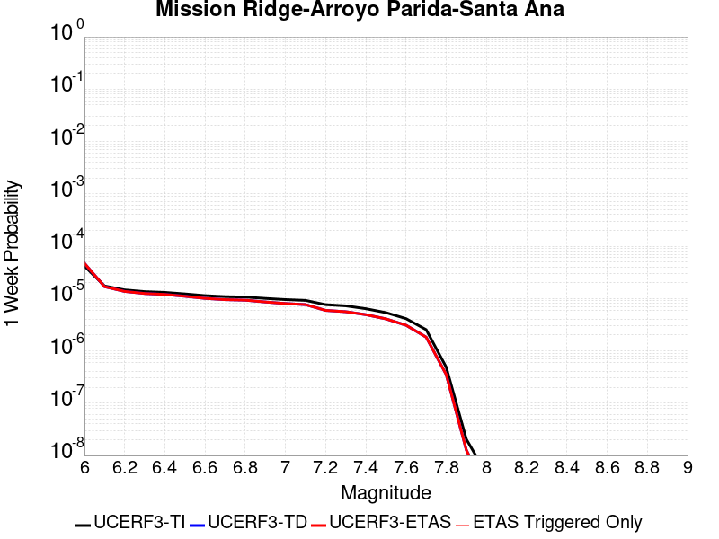 |  |  |  |

| Magnitude | 1 wk TI Prob | 1 wk TD Prob | 1 wk ETAS Prob | 1 wk ETAS/TD Gain | 1 wk ETAS Triggered Only | 1 mo TI Prob | 1 mo TD Prob | 1 mo ETAS Prob | 1 mo ETAS/TD Gain | 1 mo ETAS Triggered Only | 1 yr TI Prob | 1 yr TD Prob | 1 yr ETAS Prob | 1 yr ETAS/TD Gain | 1 yr ETAS Triggered Only | 10 yr TI Prob | 10 yr TD Prob | 10 yr ETAS Prob | 10 yr ETAS/TD Gain | 10 yr ETAS Triggered Only |
|-----|-----|-----|-----|-----|-----|-----|-----|-----|-----|-----|-----|-----|-----|-----|-----|-----|-----|-----|-----|-----|
| 6.0 | 4.169034E-5 | 4.7139558E-5 | 4.7139558E-5 | 1.0 | 0.0 | 1.7866064E-4 | 2.0201589E-4 | 2.0201589E-4 | 1.0 | 0.0 | 0.0021730233 | 0.0024575135 | 0.0024874397 | 1.0121775 | 3.0E-5 | 0.021518968 | 0.024385266 | 0.02445356 | 1.0028006 | 7.0E-5 |
| 6.1 | 1.73813E-5 | 1.6854512E-5 | 1.6854512E-5 | 1.0 | 0.0 | 7.4489166E-5 | 7.223168E-5 | 7.223168E-5 | 1.0 | 0.0 | 9.065282E-4 | 8.790767E-4 | 8.790767E-4 | 1.0 | 0.0 | 0.009028391 | 0.008757136 | 0.008776961 | 1.0022639 | 2.0E-5 |
| 6.2 | 1.4622182E-5 | 1.367351E-5 | 1.367351E-5 | 1.0 | 0.0 | 6.2664985E-5 | 5.8599464E-5 | 5.8599464E-5 | 1.0 | 0.0 | 7.6267915E-4 | 7.1321876E-4 | 7.1321876E-4 | 1.0 | 0.0 | 0.007600669 | 0.007109741 | 0.0071295993 | 1.0027931 | 2.0E-5 |
| 6.3 | 1.3552434E-5 | 1.2482403E-5 | 1.2482403E-5 | 1.0 | 0.0 | 5.8080568E-5 | 5.3494932E-5 | 5.3494932E-5 | 1.0 | 0.0 | 7.069015E-4 | 6.511093E-4 | 6.511093E-4 | 1.0 | 0.0 | 0.00704657 | 0.0064923796 | 0.00651225 | 1.0030606 | 2.0E-5 |
| 6.4 | 1.30977305E-5 | 1.1979351E-5 | 1.1979351E-5 | 1.0 | 0.0 | 5.613192E-5 | 5.133908E-5 | 5.133908E-5 | 1.0 | 0.0 | 6.831918E-4 | 6.2487705E-4 | 6.2487705E-4 | 1.0 | 0.0 | 0.006810953 | 0.0062315455 | 0.006251421 | 1.0031894 | 2.0E-5 |
| 6.5 | 1.225205E-5 | 1.10489855E-5 | 1.10489855E-5 | 1.0 | 0.0 | 5.2507727E-5 | 4.735195E-5 | 4.735195E-5 | 1.0 | 0.0 | 6.3909404E-4 | 5.763602E-4 | 5.763602E-4 | 1.0 | 0.0 | 0.006372592 | 0.005748964 | 0.005768849 | 1.0034589 | 2.0E-5 |
| 6.6 | 1.1352241E-5 | 1.0063705E-5 | 1.0063705E-5 | 1.0 | 0.0 | 4.8651553E-5 | 4.3129465E-5 | 4.3129465E-5 | 1.0 | 0.0 | 5.921717E-4 | 5.249768E-4 | 5.249768E-4 | 1.0 | 0.0 | 0.0059059616 | 0.005237613 | 0.005257508 | 1.0037985 | 2.0E-5 |
| 6.7 | 1.0864116E-5 | 9.517188E-6 | 9.517188E-6 | 1.0 | 0.0 | 4.6559664E-5 | 4.0787323E-5 | 4.0787323E-5 | 1.0 | 0.0 | 5.667165E-4 | 4.964745E-4 | 4.964745E-4 | 1.0 | 0.0 | 0.005652734 | 0.004953888 | 0.0049737887 | 1.0040172 | 2.0E-5 |
| 6.8 | 1.0666365E-5 | 9.299937E-6 | 9.299937E-6 | 1.0 | 0.0 | 4.571219E-5 | 3.9856277E-5 | 3.9856277E-5 | 1.0 | 0.0 | 5.564038E-4 | 4.8514412E-4 | 4.8514412E-4 | 1.0 | 0.0 | 0.005550127 | 0.0048410823 | 0.0048609856 | 1.0041113 | 2.0E-5 |
| 6.9 | 1.0038665E-5 | 8.592192E-6 | 8.592192E-6 | 1.0 | 0.0 | 4.302214E-5 | 3.682317E-5 | 3.682317E-5 | 1.0 | 0.0 | 5.236687E-4 | 4.4823167E-4 | 4.4823167E-4 | 1.0 | 0.0 | 0.005224364 | 0.004473487 | 0.0044933977 | 1.0044508 | 2.0E-5 |
| 7.0 | 9.5379955E-6 | 8.025209E-6 | 8.025209E-6 | 1.0 | 0.0 | 4.0876483E-5 | 3.439331E-5 | 3.439331E-5 | 1.0 | 0.0 | 4.975576E-4 | 4.186598E-4 | 4.186598E-4 | 1.0 | 0.0 | 0.00496445 | 0.0041789105 | 0.004198827 | 1.004766 | 2.0E-5 |
| 7.1 | 9.207389E-6 | 7.652504E-6 | 7.652504E-6 | 1.0 | 0.0 | 3.945964E-5 | 3.2796044E-5 | 3.2796044E-5 | 1.0 | 0.0 | 4.803152E-4 | 3.9922036E-4 | 3.9922036E-4 | 1.0 | 0.0 | 0.004792784 | 0.003985228 | 0.0040051485 | 1.0049986 | 2.0E-5 |
| 7.2 | 7.638091E-6 | 5.93121E-6 | 5.93121E-6 | 1.0 | 0.0 | 3.2734264E-5 | 2.5419227E-5 | 2.5419227E-5 | 1.0 | 0.0 | 3.984668E-4 | 3.0943545E-4 | 3.0943545E-4 | 1.0 | 0.0 | 0.0039775306 | 0.0030901027 | 0.0031000718 | 1.0032262 | 1.0E-5 |
| 7.3 | 7.2500147E-6 | 5.596238E-6 | 5.596238E-6 | 1.0 | 0.0 | 3.1071122E-5 | 2.3983659E-5 | 2.3983659E-5 | 1.0 | 0.0 | 3.7822526E-4 | 2.919622E-4 | 2.919622E-4 | 1.0 | 0.0 | 0.0037758215 | 0.002915842 | 0.0029258127 | 1.0034195 | 1.0E-5 |
| 7.4 | 6.3899715E-6 | 4.918567E-6 | 4.918567E-6 | 1.0 | 0.0 | 2.7385306E-5 | 2.1079404E-5 | 2.1079404E-5 | 1.0 | 0.0 | 3.3336508E-4 | 2.566117E-4 | 2.566117E-4 | 1.0 | 0.0 | 0.0033286542 | 0.0025631986 | 0.0025731728 | 1.0038913 | 1.0E-5 |
| 7.5 | 5.379025E-6 | 4.083909E-6 | 4.083909E-6 | 1.0 | 0.0 | 2.305276E-5 | 1.750235E-5 | 1.750235E-5 | 1.0 | 0.0 | 2.806312E-4 | 2.1307038E-4 | 2.1307038E-4 | 1.0 | 0.0 | 0.0028027708 | 0.0021286723 | 0.002138651 | 1.0046878 | 1.0E-5 |
| 7.6 | 4.1270696E-6 | 3.0883848E-6 | 3.0883848E-6 | 1.0 | 0.0 | 1.768732E-5 | 1.3235868E-5 | 1.3235868E-5 | 1.0 | 0.0 | 2.1532185E-4 | 1.6113486E-4 | 1.6113486E-4 | 1.0 | 0.0 | 0.0021511333 | 0.0016101883 | 0.0016201722 | 1.0062004 | 1.0E-5 |
| 7.7 | 2.5406805E-6 | 1.8282261E-6 | 1.8282261E-6 | 1.0 | 0.0 | 1.0888585E-5 | 7.835231E-6 | 7.835231E-6 | 1.0 | 0.0 | 1.3256045E-4 | 9.538983E-5 | 9.538983E-5 | 1.0 | 0.0 | 0.0013248142 | 9.53495E-4 | 9.53495E-4 | 1.0 | 0.0 |
| 7.8 | 4.8608285E-7 | 3.5099296E-7 | 3.5099296E-7 | 1.0 | 0.0 | 2.0832106E-6 | 1.5042547E-6 | 1.5042547E-6 | 1.0 | 0.0 | 2.5362791E-5 | 1.8314147E-5 | 1.8314147E-5 | 1.0 | 0.0 | 2.5359896E-4 | 1.8312651E-4 | 1.8312651E-4 | 1.0 | 0.0 |
| 7.9 | 2.0472514E-8 | 1.2689093E-8 | 1.2689093E-8 | 1.0 | 0.0 | 8.7739345E-8 | 5.438183E-8 | 5.438183E-8 | 1.0 | 0.0 | 1.068226E-6 | 6.6209856E-7 | 6.6209856E-7 | 1.0 | 0.0 | 1.0682209E-5 | 6.620967E-6 | 6.620967E-6 | 1.0 | 0.0 |
| 8.0 | 4.443582E-9 | 2.0322608E-9 | 2.0322608E-9 | 1.0 | 0.0 | 1.9043922E-8 | 8.709689E-9 | 8.709689E-9 | 1.0 | 0.0 | 2.3185973E-7 | 1.0604046E-7 | 1.0604046E-7 | 1.0 | 0.0 | 2.3185949E-6 | 1.0604042E-6 | 1.0604042E-6 | 1.0 | 0.0 |

## Cleghorn Lake
*[(top)](#table-of-contents)*

| 1 Week | 1 Month | 1 Year | 10 Year |
|-----|-----|-----|-----|
|  |  |  |  |

| Magnitude | 1 wk TI Prob | 1 wk TD Prob | 1 wk ETAS Prob | 1 wk ETAS/TD Gain | 1 wk ETAS Triggered Only | 1 mo TI Prob | 1 mo TD Prob | 1 mo ETAS Prob | 1 mo ETAS/TD Gain | 1 mo ETAS Triggered Only | 1 yr TI Prob | 1 yr TD Prob | 1 yr ETAS Prob | 1 yr ETAS/TD Gain | 1 yr ETAS Triggered Only | 10 yr TI Prob | 10 yr TD Prob | 10 yr ETAS Prob | 10 yr ETAS/TD Gain | 10 yr ETAS Triggered Only |
|-----|-----|-----|-----|-----|-----|-----|-----|-----|-----|-----|-----|-----|-----|-----|-----|-----|-----|-----|-----|-----|
| 6.0 | 1.5467183E-5 | 1.6794396E-5 | 1.6794396E-5 | 1.0 | 0.0 | 6.6286244E-5 | 7.1974304E-5 | 7.1974304E-5 | 1.0 | 0.0 | 8.067362E-4 | 8.7598973E-4 | 8.959722E-4 | 1.0228113 | 2.0E-5 | 0.008038137 | 0.008730795 | 0.008780358 | 1.0056769 | 5.0E-5 |
| 6.1 | 1.5467183E-5 | 1.6794396E-5 | 1.6794396E-5 | 1.0 | 0.0 | 6.6286244E-5 | 7.1974304E-5 | 7.1974304E-5 | 1.0 | 0.0 | 8.067362E-4 | 8.7598973E-4 | 8.959722E-4 | 1.0228113 | 2.0E-5 | 0.008038137 | 0.008730795 | 0.008780358 | 1.0056769 | 5.0E-5 |
| 6.2 | 1.2624631E-5 | 1.3681697E-5 | 1.3681697E-5 | 1.0 | 0.0 | 5.410444E-5 | 5.86348E-5 | 5.86348E-5 | 1.0 | 0.0 | 6.585225E-4 | 7.1369356E-4 | 7.336793E-4 | 1.0280032 | 2.0E-5 | 0.0065657445 | 0.007118811 | 0.007168455 | 1.0069736 | 5.0E-5 |
| 6.3 | 1.2624631E-5 | 1.3681697E-5 | 1.3681697E-5 | 1.0 | 0.0 | 5.410444E-5 | 5.86348E-5 | 5.86348E-5 | 1.0 | 0.0 | 6.585225E-4 | 7.1369356E-4 | 7.336793E-4 | 1.0280032 | 2.0E-5 | 0.0065657445 | 0.007118811 | 0.007168455 | 1.0069736 | 5.0E-5 |
| 6.4 | 9.417684E-6 | 1.0170226E-5 | 1.0170226E-5 | 1.0 | 0.0 | 4.036088E-5 | 4.3586184E-5 | 4.3586184E-5 | 1.0 | 0.0 | 4.912829E-4 | 5.305737E-4 | 5.405684E-4 | 1.0188376 | 1.0E-5 | 0.004901982 | 0.0052971053 | 0.0053269463 | 1.0056335 | 3.0E-5 |
| 6.5 | 9.368219E-6 | 1.0117652E-5 | 1.0117652E-5 | 1.0 | 0.0 | 4.014889E-5 | 4.3360877E-5 | 4.3360877E-5 | 1.0 | 0.0 | 4.8870314E-4 | 5.278319E-4 | 5.378266E-4 | 1.0189354 | 1.0E-5 | 0.004876298 | 0.0052698175 | 0.0052996594 | 1.0056628 | 3.0E-5 |
| 6.6 | 7.803798E-6 | 8.441923E-6 | 8.441923E-6 | 1.0 | 0.0 | 3.3444423E-5 | 3.6179394E-5 | 3.6179394E-5 | 1.0 | 0.0 | 4.0710976E-4 | 4.40435E-4 | 4.504306E-4 | 1.0226948 | 1.0E-5 | 0.0040636472 | 0.004399538 | 0.004429406 | 1.0067888 | 3.0E-5 |
| 6.7 | 2.3108669E-6 | 2.4438523E-6 | 2.4438523E-6 | 1.0 | 0.0 | 9.903678E-6 | 1.0473612E-5 | 1.0473612E-5 | 1.0 | 0.0 | 1.205706E-4 | 1.2750895E-4 | 1.2750895E-4 | 1.0 | 0.0 | 0.001205052 | 0.0012743765 | 0.0012743765 | 1.0 | 0.0 |
| 6.8 | 2.0882828E-6 | 2.2062986E-6 | 2.2062986E-6 | 1.0 | 0.0 | 8.949753E-6 | 9.455533E-6 | 9.455533E-6 | 1.0 | 0.0 | 1.08957785E-4 | 1.15115196E-4 | 1.15115196E-4 | 1.0 | 0.0 | 0.0010890438 | 0.0011505726 | 0.0011505726 | 1.0 | 0.0 |
| 6.9 | 1.876935E-6 | 1.9810657E-6 | 1.9810657E-6 | 1.0 | 0.0 | 8.043982E-6 | 8.490254E-6 | 8.490254E-6 | 1.0 | 0.0 | 9.7931086E-5 | 1.033641E-4 | 1.033641E-4 | 1.0 | 0.0 | 9.788794E-4 | 0.0010331762 | 0.0010331762 | 1.0 | 0.0 |
| 7.0 | 1.5357559E-6 | 1.6202926E-6 | 1.6202926E-6 | 1.0 | 0.0 | 6.5817944E-6 | 6.944093E-6 | 6.944093E-6 | 1.0 | 0.0 | 8.01304E-5 | 8.454118E-5 | 8.454118E-5 | 1.0 | 0.0 | 8.010151E-4 | 8.4510265E-4 | 8.4510265E-4 | 1.0 | 0.0 |
| 7.1 | 1.0905424E-6 | 1.1497702E-6 | 1.1497702E-6 | 1.0 | 0.0 | 4.6737446E-6 | 4.927578E-6 | 4.927578E-6 | 1.0 | 0.0 | 5.6901354E-5 | 5.999171E-5 | 5.999171E-5 | 1.0 | 0.0 | 5.6886784E-4 | 5.997649E-4 | 5.997649E-4 | 1.0 | 0.0 |
| 7.2 | 6.06668E-7 | 6.387322E-7 | 6.387322E-7 | 1.0 | 0.0 | 2.600003E-6 | 2.7374213E-6 | 2.7374213E-6 | 1.0 | 0.0 | 3.1654577E-5 | 3.3327666E-5 | 3.3327666E-5 | 1.0 | 0.0 | 3.1650066E-4 | 3.332335E-4 | 3.332335E-4 | 1.0 | 0.0 |

## Rose Canyon
*[(top)](#table-of-contents)*

| 1 Week | 1 Month | 1 Year | 10 Year |
|-----|-----|-----|-----|
|  | 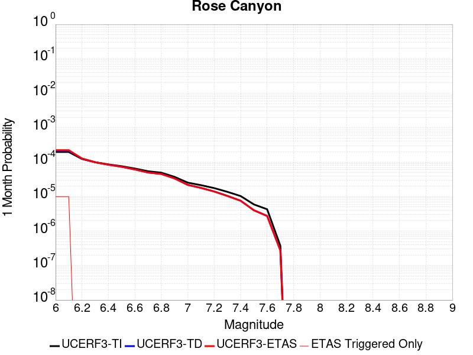 |  |  |

| Magnitude | 1 wk TI Prob | 1 wk TD Prob | 1 wk ETAS Prob | 1 wk ETAS/TD Gain | 1 wk ETAS Triggered Only | 1 mo TI Prob | 1 mo TD Prob | 1 mo ETAS Prob | 1 mo ETAS/TD Gain | 1 mo ETAS Triggered Only | 1 yr TI Prob | 1 yr TD Prob | 1 yr ETAS Prob | 1 yr ETAS/TD Gain | 1 yr ETAS Triggered Only | 10 yr TI Prob | 10 yr TD Prob | 10 yr ETAS Prob | 10 yr ETAS/TD Gain | 10 yr ETAS Triggered Only |
|-----|-----|-----|-----|-----|-----|-----|-----|-----|-----|-----|-----|-----|-----|-----|-----|-----|-----|-----|-----|-----|
| 6.0 | 4.5923203E-5 | 4.9715825E-5 | 4.9715825E-5 | 1.0 | 0.0 | 1.9679888E-4 | 2.1305127E-4 | 2.2304915E-4 | 1.0469271 | 1.0E-5 | 0.0023933933 | 0.0025910123 | 0.0026309087 | 1.015398 | 4.0E-5 | 0.023677798 | 0.025640773 | 0.025708979 | 1.00266 | 7.0E-5 |
| 6.1 | 4.5923203E-5 | 4.9715825E-5 | 4.9715825E-5 | 1.0 | 0.0 | 1.9679888E-4 | 2.1305127E-4 | 2.2304915E-4 | 1.0469271 | 1.0E-5 | 0.0023933933 | 0.0025910123 | 0.0026309087 | 1.015398 | 4.0E-5 | 0.023677798 | 0.025640773 | 0.025699234 | 1.00228 | 6.0E-5 |
| 6.2 | 2.8844734E-5 | 2.9669445E-5 | 2.9669445E-5 | 1.0 | 0.0 | 1.2361443E-4 | 1.2714828E-4 | 1.2714828E-4 | 1.0 | 0.0 | 0.0015039665 | 0.0015469306 | 0.0015668997 | 1.0129088 | 2.0E-5 | 0.0149382865 | 0.01537464 | 0.015414026 | 1.0025617 | 4.0E-5 |
| 6.3 | 2.3171577E-5 | 2.3161689E-5 | 2.3161689E-5 | 1.0 | 0.0 | 9.9302975E-5 | 9.926068E-5 | 9.926068E-5 | 1.0 | 0.0 | 0.0012083431 | 0.0012078421 | 0.0012178301 | 1.0082692 | 1.0E-5 | 0.012017938 | 0.0120226685 | 0.012052308 | 1.0024652 | 3.0E-5 |
| 6.4 | 2.0066604E-5 | 1.9667403E-5 | 1.9667403E-5 | 1.0 | 0.0 | 8.599689E-5 | 8.42862E-5 | 8.42862E-5 | 1.0 | 0.0 | 0.0010465092 | 0.0010257114 | 0.0010357011 | 1.0097393 | 1.0E-5 | 0.010415946 | 0.010217753 | 0.010247447 | 1.0029061 | 3.0E-5 |
| 6.5 | 1.776989E-5 | 1.7114124E-5 | 1.7114124E-5 | 1.0 | 0.0 | 7.615444E-5 | 7.334422E-5 | 7.334422E-5 | 1.0 | 0.0 | 9.267859E-4 | 8.92607E-4 | 8.92607E-4 | 1.0 | 0.0 | 0.009229303 | 0.008896374 | 0.008916196 | 1.0022281 | 2.0E-5 |
| 6.6 | 1.5227364E-5 | 1.43395055E-5 | 1.43395055E-5 | 1.0 | 0.0 | 6.52585E-5 | 6.1453604E-5 | 6.1453604E-5 | 1.0 | 0.0 | 7.942326E-4 | 7.47946E-4 | 7.47946E-4 | 1.0 | 0.0 | 0.007914 | 0.007458486 | 0.0074783373 | 1.0026615 | 2.0E-5 |
| 6.7 | 1.2703898E-5 | 1.167345E-5 | 1.167345E-5 | 1.0 | 0.0 | 5.4444143E-5 | 5.002814E-5 | 5.002814E-5 | 1.0 | 0.0 | 6.626558E-4 | 6.089266E-4 | 6.089266E-4 | 1.0 | 0.0 | 0.006606833 | 0.006075177 | 0.0060950555 | 1.003272 | 2.0E-5 |
| 6.8 | 1.1554917E-5 | 1.0609485E-5 | 1.0609485E-5 | 1.0 | 0.0 | 4.9520135E-5 | 4.5468452E-5 | 4.5468452E-5 | 1.0 | 0.0 | 6.0274085E-4 | 5.534419E-4 | 5.534419E-4 | 1.0 | 0.0 | 0.0060110865 | 0.005522644 | 0.0055425335 | 1.0036014 | 2.0E-5 |
| 6.9 | 8.732078E-6 | 7.881448E-6 | 7.881448E-6 | 1.0 | 0.0 | 3.7422655E-5 | 3.3777214E-5 | 3.3777214E-5 | 1.0 | 0.0 | 4.5552556E-4 | 4.111629E-4 | 4.111629E-4 | 1.0 | 0.0 | 0.0045459294 | 0.0041048555 | 0.004114814 | 1.0024261 | 1.0E-5 |
| 7.0 | 5.9337494E-6 | 5.107531E-6 | 5.107531E-6 | 1.0 | 0.0 | 2.5430107E-5 | 2.1889235E-5 | 2.1889235E-5 | 1.0 | 0.0 | 3.0956755E-4 | 2.66469E-4 | 2.66469E-4 | 1.0 | 0.0 | 0.0030913667 | 0.0026615104 | 0.0026714837 | 1.0037472 | 1.0E-5 |
| 7.1 | 5.013409E-6 | 4.177419E-6 | 4.177419E-6 | 1.0 | 0.0 | 2.1485863E-5 | 1.7903103E-5 | 1.7903103E-5 | 1.0 | 0.0 | 2.6155898E-4 | 2.1794859E-4 | 2.1794859E-4 | 1.0 | 0.0 | 0.0026125133 | 0.00217736 | 0.0021873382 | 1.0045828 | 1.0E-5 |
| 7.2 | 4.120763E-6 | 3.2821677E-6 | 3.2821677E-6 | 1.0 | 0.0 | 1.7660293E-5 | 1.4066358E-5 | 1.4066358E-5 | 1.0 | 0.0 | 2.1499286E-4 | 1.7124454E-4 | 1.7124454E-4 | 1.0 | 0.0 | 0.0021478499 | 0.0017111353 | 0.0017111353 | 1.0 | 0.0 |
| 7.3 | 3.2081239E-6 | 2.4405597E-6 | 2.4405597E-6 | 1.0 | 0.0 | 1.374903E-5 | 1.04595E-5 | 1.04595E-5 | 1.0 | 0.0 | 1.6738157E-4 | 1.2733703E-4 | 1.2733703E-4 | 1.0 | 0.0 | 0.0016725556 | 0.0012726476 | 0.0012726476 | 1.0 | 0.0 |
| 7.4 | 2.4194755E-6 | 1.7680803E-6 | 1.7680803E-6 | 1.0 | 0.0 | 1.0369139E-5 | 7.5774656E-6 | 7.5774656E-6 | 1.0 | 0.0 | 1.2623696E-4 | 9.2251794E-5 | 9.2251794E-5 | 1.0 | 0.0 | 0.0012616527 | 9.221403E-4 | 9.221403E-4 | 1.0 | 0.0 |
| 7.5 | 1.3842889E-6 | 9.378737E-7 | 9.378737E-7 | 1.0 | 0.0 | 5.9326535E-6 | 4.0194527E-6 | 4.0194527E-6 | 1.0 | 0.0 | 7.222766E-5 | 4.8935777E-5 | 4.8935777E-5 | 1.0 | 0.0 | 7.220419E-4 | 4.8925355E-4 | 4.8925355E-4 | 1.0 | 0.0 |
| 7.6 | 1.0021575E-6 | 6.411548E-7 | 6.411548E-7 | 1.0 | 0.0 | 4.2949537E-6 | 2.7478038E-6 | 2.7478038E-6 | 1.0 | 0.0 | 5.2289808E-5 | 3.345402E-5 | 3.345402E-5 | 1.0 | 0.0 | 5.2277505E-4 | 3.3449198E-4 | 3.3449198E-4 | 1.0 | 0.0 |
| 7.7 | 8.7620116E-8 | 6.449284E-8 | 6.449284E-8 | 1.0 | 0.0 | 3.7551473E-7 | 2.7639786E-7 | 2.7639786E-7 | 1.0 | 0.0 | 4.5718825E-6 | 3.365139E-6 | 3.365139E-6 | 1.0 | 0.0 | 4.5717883E-5 | 3.365091E-5 | 3.365091E-5 | 1.0 | 0.0 |

## San Jacinto (Stepovers Combined)
*[(top)](#table-of-contents)*

| 1 Week | 1 Month | 1 Year | 10 Year |
|-----|-----|-----|-----|
|  |  |  |  |

| Magnitude | 1 wk TI Prob | 1 wk TD Prob | 1 wk ETAS Prob | 1 wk ETAS/TD Gain | 1 wk ETAS Triggered Only | 1 mo TI Prob | 1 mo TD Prob | 1 mo ETAS Prob | 1 mo ETAS/TD Gain | 1 mo ETAS Triggered Only | 1 yr TI Prob | 1 yr TD Prob | 1 yr ETAS Prob | 1 yr ETAS/TD Gain | 1 yr ETAS Triggered Only | 10 yr TI Prob | 10 yr TD Prob | 10 yr ETAS Prob | 10 yr ETAS/TD Gain | 10 yr ETAS Triggered Only |
|-----|-----|-----|-----|-----|-----|-----|-----|-----|-----|-----|-----|-----|-----|-----|-----|-----|-----|-----|-----|-----|
| 6.0 | 4.0667746E-5 | 3.5287198E-5 | 3.5287198E-5 | 1.0 | 0.0 | 1.742787E-4 | 1.5122209E-4 | 1.7121906E-4 | 1.1322358 | 2.0E-5 | 0.0021197782 | 0.0018395748 | 0.0018695196 | 1.0162781 | 3.0E-5 | 0.020996714 | 0.018994363 | 0.019063033 | 1.0036153 | 7.0E-5 |
| 6.1 | 4.0667746E-5 | 3.5287198E-5 | 3.5287198E-5 | 1.0 | 0.0 | 1.742787E-4 | 1.5122209E-4 | 1.7121906E-4 | 1.1322358 | 2.0E-5 | 0.0021197782 | 0.0018395748 | 0.0018695196 | 1.0162781 | 3.0E-5 | 0.020996714 | 0.018994363 | 0.019063033 | 1.0036153 | 7.0E-5 |
| 6.2 | 4.0667746E-5 | 3.5287198E-5 | 3.5287198E-5 | 1.0 | 0.0 | 1.742787E-4 | 1.5122209E-4 | 1.7121906E-4 | 1.1322358 | 2.0E-5 | 0.0021197782 | 0.0018395748 | 0.0018695196 | 1.0162781 | 3.0E-5 | 0.020996714 | 0.018994363 | 0.019063033 | 1.0036153 | 7.0E-5 |
| 6.3 | 4.0667746E-5 | 3.5287198E-5 | 3.5287198E-5 | 1.0 | 0.0 | 1.742787E-4 | 1.5122209E-4 | 1.7121906E-4 | 1.1322358 | 2.0E-5 | 0.0021197782 | 0.0018395748 | 0.0018695196 | 1.0162781 | 3.0E-5 | 0.020996714 | 0.018994363 | 0.019063033 | 1.0036153 | 7.0E-5 |
| 6.4 | 4.0577226E-5 | 3.515909E-5 | 3.515909E-5 | 1.0 | 0.0 | 1.738908E-4 | 1.5067312E-4 | 1.706701E-4 | 1.1327177 | 2.0E-5 | 0.0021150648 | 0.0018329041 | 0.0018628491 | 1.0163375 | 3.0E-5 | 0.020950472 | 0.018928928 | 0.018997604 | 1.003628 | 7.0E-5 |
| 6.5 | 4.0577226E-5 | 3.515909E-5 | 3.515909E-5 | 1.0 | 0.0 | 1.738908E-4 | 1.5067312E-4 | 1.706701E-4 | 1.1327177 | 2.0E-5 | 0.0021150648 | 0.0018329041 | 0.0018628491 | 1.0163375 | 3.0E-5 | 0.020950472 | 0.018928928 | 0.018997604 | 1.003628 | 7.0E-5 |
| 6.6 | 4.053861E-5 | 3.5104433E-5 | 3.5104433E-5 | 1.0 | 0.0 | 1.7372532E-4 | 1.5043891E-4 | 1.7043589E-4 | 1.1329243 | 2.0E-5 | 0.0021130538 | 0.0018300572 | 0.0018600024 | 1.0163629 | 3.0E-5 | 0.020930743 | 0.018901005 | 0.018969683 | 1.0036335 | 7.0E-5 |
| 6.7 | 4.0516545E-5 | 3.50735E-5 | 3.50735E-5 | 1.0 | 0.0 | 1.7363077E-4 | 1.5030634E-4 | 1.7030333E-4 | 1.1330416 | 2.0E-5 | 0.002111905 | 0.0018284466 | 0.0018583917 | 1.0163773 | 3.0E-5 | 0.020919468 | 0.018885203 | 0.01895388 | 1.0036366 | 7.0E-5 |
| 6.8 | 4.049434E-5 | 3.504506E-5 | 3.504506E-5 | 1.0 | 0.0 | 1.7353562E-4 | 1.5018447E-4 | 1.7018148E-4 | 1.1331495 | 2.0E-5 | 0.0021107488 | 0.0018269654 | 0.0018569105 | 1.0163907 | 3.0E-5 | 0.020908125 | 0.018870614 | 0.018939294 | 1.0036395 | 7.0E-5 |
| 6.9 | 4.046386E-5 | 3.500762E-5 | 3.500762E-5 | 1.0 | 0.0 | 1.73405E-4 | 1.5002403E-4 | 1.7002103E-4 | 1.133292 | 2.0E-5 | 0.0021091616 | 0.0018250152 | 0.0018549605 | 1.0164082 | 3.0E-5 | 0.020892553 | 0.018851386 | 0.018920068 | 1.0036433 | 7.0E-5 |
| 7.0 | 4.036382E-5 | 3.4888177E-5 | 3.4888177E-5 | 1.0 | 0.0 | 1.7297632E-4 | 1.4951221E-4 | 1.6950922E-4 | 1.1337483 | 2.0E-5 | 0.0021039525 | 0.0018187946 | 0.00184874 | 1.0164645 | 3.0E-5 | 0.02084144 | 0.018789997 | 0.018858682 | 1.0036554 | 7.0E-5 |
| 7.1 | 4.0343282E-5 | 3.486664E-5 | 3.486664E-5 | 1.0 | 0.0 | 1.7288832E-4 | 1.4941991E-4 | 1.6941692E-4 | 1.133831 | 2.0E-5 | 0.002102883 | 0.0018176727 | 0.0018476183 | 1.0164746 | 3.0E-5 | 0.020830948 | 0.018778874 | 0.01884756 | 1.0036576 | 7.0E-5 |
| 7.2 | 4.0257353E-5 | 3.4771132E-5 | 3.4771132E-5 | 1.0 | 0.0 | 1.725201E-4 | 1.4901065E-4 | 1.6900768E-4 | 1.1341985 | 2.0E-5 | 0.0020984085 | 0.0018126983 | 0.001842644 | 1.0165199 | 3.0E-5 | 0.020787042 | 0.01872961 | 0.0187983 | 1.0036674 | 7.0E-5 |
| 7.3 | 3.9940667E-5 | 3.4598754E-5 | 3.4598754E-5 | 1.0 | 0.0 | 1.7116306E-4 | 1.4827197E-4 | 1.68269E-4 | 1.1348673 | 2.0E-5 | 0.0020819185 | 0.0018037198 | 0.0018336657 | 1.0166023 | 3.0E-5 | 0.020625217 | 0.018638225 | 0.01870692 | 1.0036857 | 7.0E-5 |
| 7.4 | 3.9721202E-5 | 3.4484117E-5 | 3.4484117E-5 | 1.0 | 0.0 | 1.7022261E-4 | 1.4778072E-4 | 1.6777778E-4 | 1.1353157 | 2.0E-5 | 0.0020704903 | 0.0017977487 | 0.0018276948 | 1.0166576 | 3.0E-5 | 0.020513052 | 0.018577335 | 0.018646033 | 1.003698 | 7.0E-5 |
| 7.5 | 3.7036873E-5 | 3.355129E-5 | 3.355129E-5 | 1.0 | 0.0 | 1.5871979E-4 | 1.4378333E-4 | 1.6378045E-4 | 1.1390781 | 2.0E-5 | 0.0019307006 | 0.0017491594 | 0.0017791069 | 1.0171211 | 3.0E-5 | 0.019140124 | 0.018078765 | 0.018147498 | 1.003802 | 7.0E-5 |
| 7.6 | 3.2940967E-5 | 3.133173E-5 | 3.133173E-5 | 1.0 | 0.0 | 1.4116794E-4 | 1.3427193E-4 | 1.5426925E-4 | 1.1489315 | 2.0E-5 | 0.0017173645 | 0.0016335372 | 0.0016634882 | 1.0183351 | 3.0E-5 | 0.01704153 | 0.016911475 | 0.016980292 | 1.0040692 | 7.0E-5 |
| 7.7 | 2.8236149E-5 | 2.7897275E-5 | 2.7897275E-5 | 1.0 | 0.0 | 1.2100645E-4 | 1.1955428E-4 | 1.3955189E-4 | 1.167268 | 2.0E-5 | 0.0014722579 | 0.0014546025 | 0.0014845589 | 1.0205942 | 3.0E-5 | 0.014625421 | 0.015122045 | 0.015190987 | 1.004559 | 7.0E-5 |
| 7.8 | 2.4329287E-5 | 2.5220394E-5 | 2.5220394E-5 | 1.0 | 0.0 | 1.042642E-4 | 1.0808293E-4 | 1.2808076E-4 | 1.1850231 | 2.0E-5 | 0.0012686774 | 0.0013151162 | 0.0013450767 | 1.0227817 | 3.0E-5 | 0.012614589 | 0.013719083 | 0.013788122 | 1.0050324 | 7.0E-5 |
| 7.9 | 1.9370926E-5 | 2.0433014E-5 | 2.0433014E-5 | 1.0 | 0.0 | 8.301561E-5 | 8.7567125E-5 | 1.0756537E-4 | 1.2283763 | 2.0E-5 | 0.0010102465 | 0.001065609 | 0.001095577 | 1.0281229 | 3.0E-5 | 0.0100566605 | 0.011205519 | 0.0112747345 | 1.006177 | 7.0E-5 |
| 8.0 | 1.5583017E-5 | 1.5896165E-5 | 1.5896165E-5 | 1.0 | 0.0 | 6.6782646E-5 | 6.8124646E-5 | 8.8123285E-5 | 1.2935596 | 2.0E-5 | 8.127754E-4 | 8.2910265E-4 | 8.490861E-4 | 1.0241024 | 2.0E-5 | 0.008098091 | 0.008786912 | 0.0088463845 | 1.0067683 | 6.0E-5 |
| 8.1 | 1.0024873E-5 | 8.298104E-6 | 8.298104E-6 | 1.0 | 0.0 | 4.2963035E-5 | 3.556282E-5 | 3.556282E-5 | 1.0 | 0.0 | 5.229494E-4 | 4.3289183E-4 | 4.3289183E-4 | 1.0 | 0.0 | 0.0052172043 | 0.0046564727 | 0.004686333 | 1.0064126 | 3.0E-5 |
| 8.2 | 4.142796E-6 | 1.5626505E-6 | 1.5626505E-6 | 1.0 | 0.0 | 1.775472E-5 | 6.697056E-6 | 6.697056E-6 | 1.0 | 0.0 | 2.1614227E-4 | 8.153364E-5 | 8.153364E-5 | 1.0 | 0.0 | 0.0021593217 | 9.464045E-4 | 9.464045E-4 | 1.0 | 0.0 |
| 8.3 | 1.2750878E-6 | 3.6166134E-7 | 3.6166134E-7 | 1.0 | 0.0 | 5.4646503E-6 | 1.5499762E-6 | 1.5499762E-6 | 1.0 | 0.0 | 6.653009E-5 | 1.8870802E-5 | 1.8870802E-5 | 1.0 | 0.0 | 6.6510175E-4 | 2.2760578E-4 | 2.2760578E-4 | 1.0 | 0.0 |

## San Jacinto (San Jacinto Valley) rev
*[(top)](#table-of-contents)*

| 1 Week | 1 Month | 1 Year | 10 Year |
|-----|-----|-----|-----|
|  | 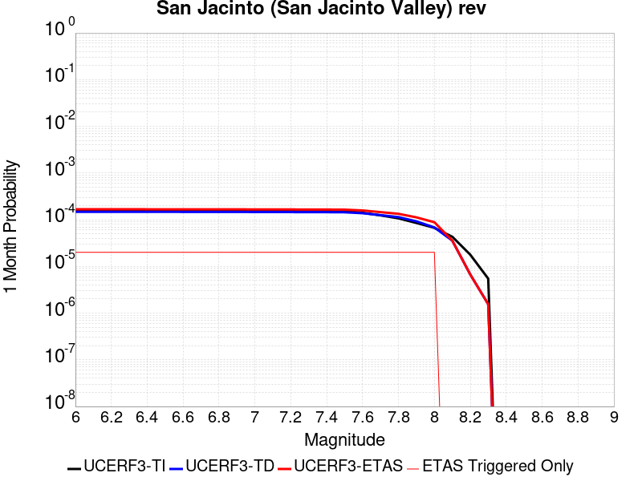 |  |  |

| Magnitude | 1 wk TI Prob | 1 wk TD Prob | 1 wk ETAS Prob | 1 wk ETAS/TD Gain | 1 wk ETAS Triggered Only | 1 mo TI Prob | 1 mo TD Prob | 1 mo ETAS Prob | 1 mo ETAS/TD Gain | 1 mo ETAS Triggered Only | 1 yr TI Prob | 1 yr TD Prob | 1 yr ETAS Prob | 1 yr ETAS/TD Gain | 1 yr ETAS Triggered Only | 10 yr TI Prob | 10 yr TD Prob | 10 yr ETAS Prob | 10 yr ETAS/TD Gain | 10 yr ETAS Triggered Only |
|-----|-----|-----|-----|-----|-----|-----|-----|-----|-----|-----|-----|-----|-----|-----|-----|-----|-----|-----|-----|-----|
| 6.0 | 3.652694E-5 | 3.4417048E-5 | 3.4417048E-5 | 1.0 | 0.0 | 1.5653463E-4 | 1.4749331E-4 | 1.6749035E-4 | 1.1355793 | 2.0E-5 | 0.0019041431 | 0.0017942534 | 0.0018241996 | 1.01669 | 3.0E-5 | 0.018879099 | 0.018534157 | 0.018602861 | 1.0037068 | 7.0E-5 |
| 6.1 | 3.652694E-5 | 3.4417048E-5 | 3.4417048E-5 | 1.0 | 0.0 | 1.5653463E-4 | 1.4749331E-4 | 1.6749035E-4 | 1.1355793 | 2.0E-5 | 0.0019041431 | 0.0017942534 | 0.0018241996 | 1.01669 | 3.0E-5 | 0.018879099 | 0.018534157 | 0.018602861 | 1.0037068 | 7.0E-5 |
| 6.2 | 3.652694E-5 | 3.4417048E-5 | 3.4417048E-5 | 1.0 | 0.0 | 1.5653463E-4 | 1.4749331E-4 | 1.6749035E-4 | 1.1355793 | 2.0E-5 | 0.0019041431 | 0.0017942534 | 0.0018241996 | 1.01669 | 3.0E-5 | 0.018879099 | 0.018534157 | 0.018602861 | 1.0037068 | 7.0E-5 |
| 6.3 | 3.652694E-5 | 3.4417048E-5 | 3.4417048E-5 | 1.0 | 0.0 | 1.5653463E-4 | 1.4749331E-4 | 1.6749035E-4 | 1.1355793 | 2.0E-5 | 0.0019041431 | 0.0017942534 | 0.0018241996 | 1.01669 | 3.0E-5 | 0.018879099 | 0.018534157 | 0.018602861 | 1.0037068 | 7.0E-5 |
| 6.4 | 3.646941E-5 | 3.433862E-5 | 3.433862E-5 | 1.0 | 0.0 | 1.5628811E-4 | 1.4715722E-4 | 1.6715429E-4 | 1.135889 | 2.0E-5 | 0.0019011468 | 0.0017901688 | 0.0018201151 | 1.0167282 | 3.0E-5 | 0.018849645 | 0.018494038 | 0.018562743 | 1.003715 | 7.0E-5 |
| 6.5 | 3.646941E-5 | 3.433862E-5 | 3.433862E-5 | 1.0 | 0.0 | 1.5628811E-4 | 1.4715722E-4 | 1.6715429E-4 | 1.135889 | 2.0E-5 | 0.0019011468 | 0.0017901688 | 0.0018201151 | 1.0167282 | 3.0E-5 | 0.018849645 | 0.018494038 | 0.018562743 | 1.003715 | 7.0E-5 |
| 6.6 | 3.6442503E-5 | 3.4302004E-5 | 3.4302004E-5 | 1.0 | 0.0 | 1.561728E-4 | 1.4700032E-4 | 1.6699737E-4 | 1.1360341 | 2.0E-5 | 0.0018997455 | 0.0017882616 | 0.0018182079 | 1.016746 | 3.0E-5 | 0.018835869 | 0.018475305 | 0.018544013 | 1.0037189 | 7.0E-5 |
| 6.7 | 3.6432113E-5 | 3.4287576E-5 | 3.4287576E-5 | 1.0 | 0.0 | 1.5612828E-4 | 1.4693849E-4 | 1.6693554E-4 | 1.1360914 | 2.0E-5 | 0.0018992044 | 0.0017875104 | 0.0018174567 | 1.0167531 | 3.0E-5 | 0.018830549 | 0.01846793 | 0.018536637 | 1.0037204 | 7.0E-5 |
| 6.8 | 3.6409598E-5 | 3.425663E-5 | 3.425663E-5 | 1.0 | 0.0 | 1.560318E-4 | 1.4680588E-4 | 1.6680294E-4 | 1.1362144 | 2.0E-5 | 0.0018980318 | 0.0017858985 | 0.0018158449 | 1.0167682 | 3.0E-5 | 0.018819023 | 0.018452084 | 0.018520791 | 1.0037236 | 7.0E-5 |
| 6.9 | 3.638078E-5 | 3.4217053E-5 | 3.4217053E-5 | 1.0 | 0.0 | 1.5590832E-4 | 1.4663627E-4 | 1.6663334E-4 | 1.1363719 | 2.0E-5 | 0.0018965311 | 0.001783837 | 0.0018137834 | 1.0167876 | 3.0E-5 | 0.018804269 | 0.018431816 | 0.018500526 | 1.0037278 | 7.0E-5 |
| 7.0 | 3.6294874E-5 | 3.4099063E-5 | 3.4099063E-5 | 1.0 | 0.0 | 1.5554018E-4 | 1.4613067E-4 | 1.6612773E-4 | 1.1368438 | 2.0E-5 | 0.0018920569 | 0.0017776915 | 0.0018076382 | 1.0168458 | 3.0E-5 | 0.018760284 | 0.018371396 | 0.01844011 | 1.0037403 | 7.0E-5 |
| 7.1 | 3.6260717E-5 | 3.405534E-5 | 3.405534E-5 | 1.0 | 0.0 | 1.5539382E-4 | 1.4594331E-4 | 1.659404E-4 | 1.1370195 | 2.0E-5 | 0.001890278 | 0.0017754143 | 0.0018053611 | 1.0168675 | 3.0E-5 | 0.018742796 | 0.018348996 | 0.01841771 | 1.003745 | 7.0E-5 |
| 7.2 | 3.6210204E-5 | 3.398956E-5 | 3.398956E-5 | 1.0 | 0.0 | 1.5517735E-4 | 1.4566141E-4 | 1.6565851E-4 | 1.1372848 | 2.0E-5 | 0.001887647 | 0.0017719879 | 0.0018019347 | 1.0169002 | 3.0E-5 | 0.01871693 | 0.018315274 | 0.018383991 | 1.003752 | 7.0E-5 |
| 7.3 | 3.6119454E-5 | 3.3877837E-5 | 3.3877837E-5 | 1.0 | 0.0 | 1.5478847E-4 | 1.4518267E-4 | 1.6517976E-4 | 1.1377375 | 2.0E-5 | 0.0018829206 | 0.0017661685 | 0.0017961155 | 1.016956 | 3.0E-5 | 0.018670462 | 0.018257825 | 0.018326545 | 1.0037639 | 7.0E-5 |
| 7.4 | 3.607848E-5 | 3.3825334E-5 | 3.3825334E-5 | 1.0 | 0.0 | 1.5461289E-4 | 1.4495767E-4 | 1.6495478E-4 | 1.1379513 | 2.0E-5 | 0.0018807866 | 0.0017634337 | 0.0017933807 | 1.0169823 | 3.0E-5 | 0.018649481 | 0.018230818 | 0.01829954 | 1.0037696 | 7.0E-5 |
| 7.5 | 3.5856774E-5 | 3.3635082E-5 | 3.3635082E-5 | 1.0 | 0.0 | 1.5366284E-4 | 1.4414241E-4 | 1.6413952E-4 | 1.1387317 | 2.0E-5 | 0.0018692396 | 0.0017535238 | 0.0017834712 | 1.0170784 | 3.0E-5 | 0.018535944 | 0.018131904 | 0.018200636 | 1.0037906 | 7.0E-5 |
| 7.6 | 3.286655E-5 | 3.215777E-5 | 3.215777E-5 | 1.0 | 0.0 | 1.4084904E-4 | 1.3781176E-4 | 1.57809E-4 | 1.1451055 | 2.0E-5 | 0.001713488 | 0.0016765689 | 0.0017065186 | 1.0178636 | 3.0E-5 | 0.017003361 | 0.017351432 | 0.017420217 | 1.0039643 | 7.0E-5 |
| 7.7 | 2.8882527E-5 | 2.9250317E-5 | 2.9250317E-5 | 1.0 | 0.0 | 1.237764E-4 | 1.2535248E-4 | 1.4534999E-4 | 1.15953 | 2.0E-5 | 0.0015059357 | 0.0015250992 | 0.0015550534 | 1.0196408 | 3.0E-5 | 0.014957713 | 0.015837716 | 0.015906608 | 1.0043498 | 7.0E-5 |
| 7.8 | 2.4950225E-5 | 2.6540692E-5 | 2.6540692E-5 | 1.0 | 0.0 | 1.0692515E-4 | 1.1374087E-4 | 1.3373859E-4 | 1.1758183 | 2.0E-5 | 0.0013010362 | 0.0013839162 | 0.0014138748 | 1.0216476 | 3.0E-5 | 0.012934455 | 0.0144187445 | 0.014487735 | 1.0047848 | 7.0E-5 |
| 7.9 | 1.9881603E-5 | 2.1519538E-5 | 2.1519538E-5 | 1.0 | 0.0 | 8.520408E-5 | 9.222333E-5 | 1.1222149E-4 | 1.2168449 | 2.0E-5 | 0.001036866 | 0.0011222415 | 0.0011522078 | 1.0267022 | 3.0E-5 | 0.010320415 | 0.011783319 | 0.0118524935 | 1.0058706 | 7.0E-5 |
| 8.0 | 1.563292E-5 | 1.5947082E-5 | 1.5947082E-5 | 1.0 | 0.0 | 6.6996516E-5 | 6.834285E-5 | 8.834148E-5 | 1.2926222 | 2.0E-5 | 8.153773E-4 | 8.3175726E-4 | 8.5174065E-4 | 1.0240254 | 2.0E-5 | 0.00812392 | 0.008815629 | 0.0088751 | 1.006746 | 6.0E-5 |
| 8.1 | 1.0045313E-5 | 8.307514E-6 | 8.307514E-6 | 1.0 | 0.0 | 4.305063E-5 | 3.5603145E-5 | 3.5603145E-5 | 1.0 | 0.0 | 5.2401534E-4 | 4.333826E-4 | 4.333826E-4 | 1.0 | 0.0 | 0.0052278144 | 0.0046621817 | 0.004692042 | 1.0064048 | 3.0E-5 |
| 8.2 | 4.1554413E-6 | 1.5672123E-6 | 1.5672123E-6 | 1.0 | 0.0 | 1.7808914E-5 | 6.716607E-6 | 6.716607E-6 | 1.0 | 0.0 | 2.1680194E-4 | 8.177165E-5 | 8.177165E-5 | 1.0 | 0.0 | 0.0021659054 | 9.492334E-4 | 9.492334E-4 | 1.0 | 0.0 |
| 8.3 | 1.2758221E-6 | 3.6194777E-7 | 3.6194777E-7 | 1.0 | 0.0 | 5.4677976E-6 | 1.5512038E-6 | 1.5512038E-6 | 1.0 | 0.0 | 6.65684E-5 | 1.8885747E-5 | 1.8885747E-5 | 1.0 | 0.0 | 6.6548464E-4 | 2.2777634E-4 | 2.2777634E-4 | 1.0 | 0.0 |

## Pinto Mtn
*[(top)](#table-of-contents)*

| 1 Week | 1 Month | 1 Year | 10 Year |
|-----|-----|-----|-----|
|  |  |  |  |

| Magnitude | 1 wk TI Prob | 1 wk TD Prob | 1 wk ETAS Prob | 1 wk ETAS/TD Gain | 1 wk ETAS Triggered Only | 1 mo TI Prob | 1 mo TD Prob | 1 mo ETAS Prob | 1 mo ETAS/TD Gain | 1 mo ETAS Triggered Only | 1 yr TI Prob | 1 yr TD Prob | 1 yr ETAS Prob | 1 yr ETAS/TD Gain | 1 yr ETAS Triggered Only | 10 yr TI Prob | 10 yr TD Prob | 10 yr ETAS Prob | 10 yr ETAS/TD Gain | 10 yr ETAS Triggered Only |
|-----|-----|-----|-----|-----|-----|-----|-----|-----|-----|-----|-----|-----|-----|-----|-----|-----|-----|-----|-----|-----|
| 6.0 | 4.4194956E-5 | 4.785523E-5 | 5.785475E-5 | 1.2089536 | 1.0E-5 | 1.893932E-4 | 2.0507864E-4 | 2.3507248E-4 | 1.1462554 | 3.0E-5 | 0.0023034236 | 0.002494138 | 0.0025240632 | 1.0119982 | 3.0E-5 | 0.022796938 | 0.024678964 | 0.024747238 | 1.0027664 | 7.0E-5 |
| 6.1 | 4.4194956E-5 | 4.785523E-5 | 5.785475E-5 | 1.2089536 | 1.0E-5 | 1.893932E-4 | 2.0507864E-4 | 2.3507248E-4 | 1.1462554 | 3.0E-5 | 0.0023034236 | 0.002494138 | 0.0025240632 | 1.0119982 | 3.0E-5 | 0.022796938 | 0.024678964 | 0.024747238 | 1.0027664 | 7.0E-5 |
| 6.2 | 4.4194956E-5 | 4.785523E-5 | 5.785475E-5 | 1.2089536 | 1.0E-5 | 1.893932E-4 | 2.0507864E-4 | 2.3507248E-4 | 1.1462554 | 3.0E-5 | 0.0023034236 | 0.002494138 | 0.0025240632 | 1.0119982 | 3.0E-5 | 0.022796938 | 0.024678964 | 0.024747238 | 1.0027664 | 7.0E-5 |
| 6.3 | 4.4194956E-5 | 4.785523E-5 | 5.785475E-5 | 1.2089536 | 1.0E-5 | 1.893932E-4 | 2.0507864E-4 | 2.3507248E-4 | 1.1462554 | 3.0E-5 | 0.0023034236 | 0.002494138 | 0.0025240632 | 1.0119982 | 3.0E-5 | 0.022796938 | 0.024678964 | 0.024747238 | 1.0027664 | 7.0E-5 |
| 6.4 | 3.729929E-5 | 3.960458E-5 | 3.960458E-5 | 1.0 | 0.0 | 1.5984432E-4 | 1.697234E-4 | 1.8972E-4 | 1.1178188 | 2.0E-5 | 0.0019443673 | 0.0020645177 | 0.0020844764 | 1.0096675 | 2.0E-5 | 0.019274427 | 0.020463403 | 0.020522175 | 1.0028721 | 6.0E-5 |
| 6.5 | 3.729929E-5 | 3.960458E-5 | 3.960458E-5 | 1.0 | 0.0 | 1.5984432E-4 | 1.697234E-4 | 1.8972E-4 | 1.1178188 | 2.0E-5 | 0.0019443673 | 0.0020645177 | 0.0020844764 | 1.0096675 | 2.0E-5 | 0.019274427 | 0.020463403 | 0.020522175 | 1.0028721 | 6.0E-5 |
| 6.6 | 3.0204548E-5 | 3.1206488E-5 | 3.1206488E-5 | 1.0 | 0.0 | 1.2944164E-4 | 1.3373543E-4 | 1.4373408E-4 | 1.0747645 | 1.0E-5 | 0.0015748127 | 0.0016270474 | 0.0016370311 | 1.0061361 | 1.0E-5 | 0.015636992 | 0.01615522 | 0.016194573 | 1.0024359 | 4.0E-5 |
| 6.7 | 2.9857754E-5 | 3.0815863E-5 | 3.0815863E-5 | 1.0 | 0.0 | 1.2795553E-4 | 1.320615E-4 | 1.4206018E-4 | 1.0757123 | 1.0E-5 | 0.0015567453 | 0.0016066976 | 0.0016166815 | 1.0062139 | 1.0E-5 | 0.015458848 | 0.015954657 | 0.015994018 | 1.0024672 | 4.0E-5 |
| 6.8 | 2.4819734E-5 | 2.5010428E-5 | 2.5010428E-5 | 1.0 | 0.0 | 1.0636595E-4 | 1.0718327E-4 | 1.1718219E-4 | 1.0932882 | 1.0E-5 | 0.0012942362 | 0.0013041968 | 0.0013141837 | 1.0076575 | 1.0E-5 | 0.012867244 | 0.012967796 | 0.013007277 | 1.0030446 | 4.0E-5 |
| 6.9 | 2.331124E-5 | 2.3338684E-5 | 2.3338684E-5 | 1.0 | 0.0 | 9.990149E-5 | 1.00019206E-4 | 1.10018205E-4 | 1.0999708 | 1.0E-5 | 0.001215622 | 0.001217074 | 0.0012270617 | 1.0082065 | 1.0E-5 | 0.012089936 | 0.012106278 | 0.012145793 | 1.0032641 | 4.0E-5 |
| 7.0 | 2.1818534E-5 | 2.1761793E-5 | 2.1761793E-5 | 1.0 | 0.0 | 9.3504656E-5 | 9.32616E-5 | 1.03260674E-4 | 1.1072153 | 1.0E-5 | 0.0011378246 | 0.0011348884 | 0.001144877 | 1.0088015 | 1.0E-5 | 0.011320163 | 0.01129303 | 0.011322692 | 1.0026265 | 3.0E-5 |
| 7.1 | 2.066081E-5 | 2.054142E-5 | 2.054142E-5 | 1.0 | 0.0 | 8.854332E-5 | 8.80318E-5 | 9.803091E-5 | 1.1135854 | 1.0E-5 | 0.0010774818 | 0.0010712796 | 0.001081269 | 1.0093247 | 1.0E-5 | 0.010722724 | 0.010663206 | 0.010682993 | 1.0018556 | 2.0E-5 |
| 7.2 | 1.8990233E-5 | 1.9054683E-5 | 1.9054683E-5 | 1.0 | 0.0 | 8.138417E-5 | 8.166048E-5 | 9.165967E-5 | 1.1224482 | 1.0E-5 | 9.904018E-4 | 9.937823E-4 | 0.0010037724 | 1.0100526 | 1.0E-5 | 0.009859995 | 0.0098953815 | 0.009915183 | 1.0020012 | 2.0E-5 |
| 7.3 | 1.3335872E-5 | 1.4907276E-5 | 1.4907276E-5 | 1.0 | 0.0 | 5.7152483E-5 | 6.388683E-5 | 7.388619E-5 | 1.1565168 | 1.0E-5 | 6.956093E-4 | 7.775574E-4 | 7.875496E-4 | 1.0128508 | 1.0E-5 | 0.006934359 | 0.0077496674 | 0.0077695125 | 1.0025607 | 2.0E-5 |
| 7.4 | 9.414066E-6 | 1.186147E-5 | 1.186147E-5 | 1.0 | 0.0 | 4.0345374E-5 | 5.0833933E-5 | 5.0833933E-5 | 1.0 | 0.0 | 4.910942E-4 | 6.187368E-4 | 6.187368E-4 | 1.0 | 0.0 | 0.0049001034 | 0.0061710896 | 0.006181028 | 1.0016105 | 1.0E-5 |
| 7.5 | 7.2101157E-6 | 9.158733E-6 | 9.158733E-6 | 1.0 | 0.0 | 3.090013E-5 | 3.9251165E-5 | 3.9251165E-5 | 1.0 | 0.0 | 3.7614413E-4 | 4.7778594E-4 | 4.7778594E-4 | 1.0 | 0.0 | 0.0037550807 | 0.0047683627 | 0.004778315 | 1.0020871 | 1.0E-5 |
| 7.6 | 3.296375E-6 | 4.546122E-6 | 4.546122E-6 | 1.0 | 0.0 | 1.4127245E-5 | 1.9483241E-5 | 1.9483241E-5 | 1.0 | 0.0 | 1.7198564E-4 | 2.3718402E-4 | 2.3718402E-4 | 1.0 | 0.0 | 0.0017185259 | 0.0023694462 | 0.0023794225 | 1.0042104 | 1.0E-5 |
| 7.7 | 2.5741092E-6 | 3.5850085E-6 | 3.5850085E-6 | 1.0 | 0.0 | 1.103185E-5 | 1.536424E-5 | 1.536424E-5 | 1.0 | 0.0 | 1.3430449E-4 | 1.8704488E-4 | 1.8704488E-4 | 1.0 | 0.0 | 0.0013422335 | 0.0018690043 | 0.0018789857 | 1.0053405 | 1.0E-5 |

## Lost Hills
*[(top)](#table-of-contents)*

| 1 Week | 1 Month | 1 Year | 10 Year |
|-----|-----|-----|-----|
|  | 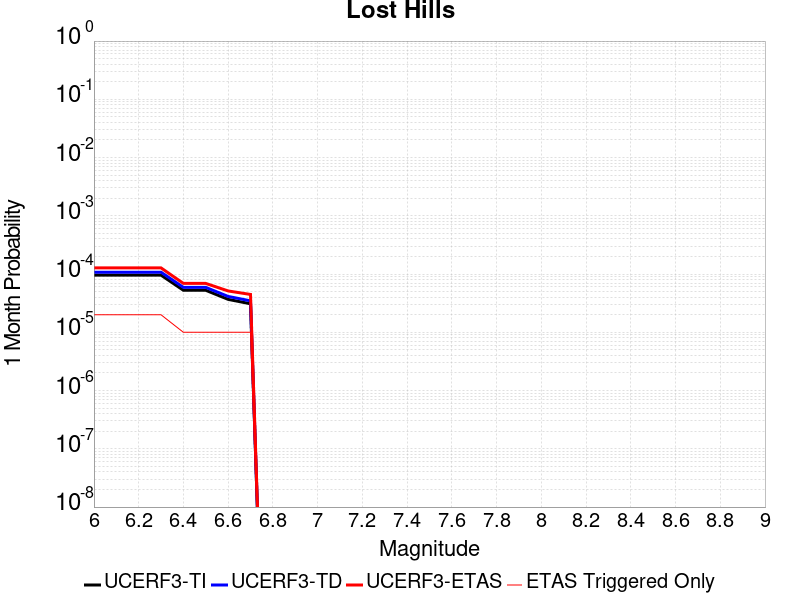 |  |  |

| Magnitude | 1 wk TI Prob | 1 wk TD Prob | 1 wk ETAS Prob | 1 wk ETAS/TD Gain | 1 wk ETAS Triggered Only | 1 mo TI Prob | 1 mo TD Prob | 1 mo ETAS Prob | 1 mo ETAS/TD Gain | 1 mo ETAS Triggered Only | 1 yr TI Prob | 1 yr TD Prob | 1 yr ETAS Prob | 1 yr ETAS/TD Gain | 1 yr ETAS Triggered Only | 10 yr TI Prob | 10 yr TD Prob | 10 yr ETAS Prob | 10 yr ETAS/TD Gain | 10 yr ETAS Triggered Only |
|-----|-----|-----|-----|-----|-----|-----|-----|-----|-----|-----|-----|-----|-----|-----|-----|-----|-----|-----|-----|-----|
| 6.0 | 2.233523E-5 | 2.5106996E-5 | 3.5106743E-5 | 1.3982854 | 1.0E-5 | 9.571891E-5 | 1.0759792E-4 | 1.2759576E-4 | 1.1858572 | 2.0E-5 | 0.0011647546 | 0.0013093855 | 0.0013393463 | 1.0228815 | 3.0E-5 | 0.011586686 | 0.013033304 | 0.013102392 | 1.0053009 | 7.0E-5 |
| 6.1 | 2.233523E-5 | 2.5106996E-5 | 3.5106743E-5 | 1.3982854 | 1.0E-5 | 9.571891E-5 | 1.0759792E-4 | 1.2759576E-4 | 1.1858572 | 2.0E-5 | 0.0011647546 | 0.0013093855 | 0.0013393463 | 1.0228815 | 3.0E-5 | 0.011586686 | 0.013033304 | 0.013102392 | 1.0053009 | 7.0E-5 |
| 6.2 | 2.233523E-5 | 2.5106996E-5 | 3.5106743E-5 | 1.3982854 | 1.0E-5 | 9.571891E-5 | 1.0759792E-4 | 1.2759576E-4 | 1.1858572 | 2.0E-5 | 0.0011647546 | 0.0013093855 | 0.0013393463 | 1.0228815 | 3.0E-5 | 0.011586686 | 0.013033304 | 0.013102392 | 1.0053009 | 7.0E-5 |
| 6.3 | 2.233523E-5 | 2.5106996E-5 | 3.5106743E-5 | 1.3982854 | 1.0E-5 | 9.571891E-5 | 1.0759792E-4 | 1.2759576E-4 | 1.1858572 | 2.0E-5 | 0.0011647546 | 0.0013093855 | 0.0013393463 | 1.0228815 | 3.0E-5 | 0.011586686 | 0.013033304 | 0.013102392 | 1.0053009 | 7.0E-5 |
| 6.4 | 1.2288092E-5 | 1.37813295E-5 | 2.3781191E-5 | 1.7256094 | 1.0E-5 | 5.2662188E-5 | 5.9062033E-5 | 6.906144E-5 | 1.1693035 | 1.0E-5 | 6.409735E-4 | 7.189368E-4 | 7.3892245E-4 | 1.0277989 | 2.0E-5 | 0.006391279 | 0.007175316 | 0.007215029 | 1.0055346 | 4.0E-5 |
| 6.5 | 1.2288092E-5 | 1.37813295E-5 | 2.3781191E-5 | 1.7256094 | 1.0E-5 | 5.2662188E-5 | 5.9062033E-5 | 6.906144E-5 | 1.1693035 | 1.0E-5 | 6.409735E-4 | 7.189368E-4 | 7.3892245E-4 | 1.0277989 | 2.0E-5 | 0.006391279 | 0.007175316 | 0.007215029 | 1.0055346 | 4.0E-5 |
| 6.6 | 8.58281E-6 | 9.633926E-6 | 1.963383E-5 | 2.0379884 | 1.0E-5 | 3.6782953E-5 | 4.1288073E-5 | 5.1287658E-5 | 1.2421907 | 1.0E-5 | 4.4774043E-4 | 5.026495E-4 | 5.226395E-4 | 1.0397692 | 2.0E-5 | 0.0044683935 | 0.0050232867 | 0.005053136 | 1.0059422 | 3.0E-5 |
| 6.7 | 7.205685E-6 | 8.088433E-6 | 1.8088353E-5 | 2.2363234 | 1.0E-5 | 3.088114E-5 | 3.4664714E-5 | 4.4664368E-5 | 1.2884678 | 1.0E-5 | 3.7591302E-4 | 4.2204288E-4 | 4.4203445E-4 | 1.0473685 | 2.0E-5 | 0.0037527776 | 0.004220429 | 0.0042503024 | 1.0070783 | 3.0E-5 |

## Big Pine (East)
*[(top)](#table-of-contents)*

| 1 Week | 1 Month | 1 Year | 10 Year |
|-----|-----|-----|-----|
|  | 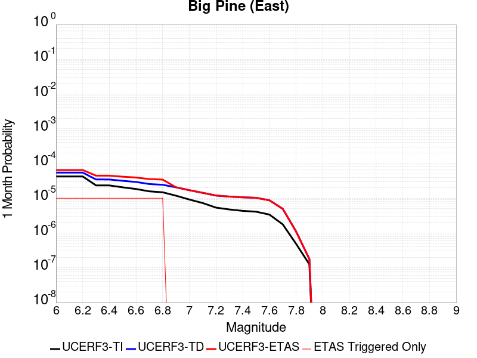 |  |  |

| Magnitude | 1 wk TI Prob | 1 wk TD Prob | 1 wk ETAS Prob | 1 wk ETAS/TD Gain | 1 wk ETAS Triggered Only | 1 mo TI Prob | 1 mo TD Prob | 1 mo ETAS Prob | 1 mo ETAS/TD Gain | 1 mo ETAS Triggered Only | 1 yr TI Prob | 1 yr TD Prob | 1 yr ETAS Prob | 1 yr ETAS/TD Gain | 1 yr ETAS Triggered Only | 10 yr TI Prob | 10 yr TD Prob | 10 yr ETAS Prob | 10 yr ETAS/TD Gain | 10 yr ETAS Triggered Only |
|-----|-----|-----|-----|-----|-----|-----|-----|-----|-----|-----|-----|-----|-----|-----|-----|-----|-----|-----|-----|-----|
| 6.0 | 9.916913E-6 | 1.2818231E-5 | 1.2818231E-5 | 1.0 | 0.0 | 4.250036E-5 | 5.4934244E-5 | 6.4933694E-5 | 1.1820258 | 1.0E-5 | 5.173191E-4 | 6.686413E-4 | 7.1860786E-4 | 1.0747285 | 5.0E-5 | 0.0051611643 | 0.0066710766 | 0.0067406096 | 1.0104231 | 7.0E-5 |
| 6.1 | 9.916913E-6 | 1.2818231E-5 | 1.2818231E-5 | 1.0 | 0.0 | 4.250036E-5 | 5.4934244E-5 | 6.4933694E-5 | 1.1820258 | 1.0E-5 | 5.173191E-4 | 6.686413E-4 | 7.1860786E-4 | 1.0747285 | 5.0E-5 | 0.0051611643 | 0.0066710766 | 0.0067406096 | 1.0104231 | 7.0E-5 |
| 6.2 | 9.916913E-6 | 1.2818231E-5 | 1.2818231E-5 | 1.0 | 0.0 | 4.250036E-5 | 5.4934244E-5 | 6.4933694E-5 | 1.1820258 | 1.0E-5 | 5.173191E-4 | 6.686413E-4 | 7.1860786E-4 | 1.0747285 | 5.0E-5 | 0.0051611643 | 0.0066710766 | 0.0067406096 | 1.0104231 | 7.0E-5 |
| 6.3 | 5.479711E-6 | 8.114161E-6 | 8.114161E-6 | 1.0 | 0.0 | 2.3484265E-5 | 3.4774526E-5 | 4.477418E-5 | 1.2875568 | 1.0E-5 | 2.858834E-4 | 4.233008E-4 | 4.532881E-4 | 1.0708416 | 3.0E-5 | 0.0028551589 | 0.0042278613 | 0.0042577344 | 1.0070658 | 3.0E-5 |
| 6.4 | 5.465009E-6 | 8.098454E-6 | 8.098454E-6 | 1.0 | 0.0 | 2.3421257E-5 | 3.4707216E-5 | 4.4706867E-5 | 1.2881145 | 1.0E-5 | 2.851165E-4 | 4.224816E-4 | 4.5246893E-4 | 1.070979 | 3.0E-5 | 0.0028475097 | 0.0042197 | 0.0042495737 | 1.0070795 | 3.0E-5 |
| 6.5 | 4.826767E-6 | 7.423505E-6 | 7.423505E-6 | 1.0 | 0.0 | 2.068598E-5 | 3.181465E-5 | 4.181433E-5 | 1.3143107 | 1.0E-5 | 2.518227E-4 | 3.8727728E-4 | 4.1726566E-4 | 1.0774338 | 3.0E-5 | 0.0025153751 | 0.003868898 | 0.003898782 | 1.0077242 | 3.0E-5 |
| 6.6 | 4.3146847E-6 | 6.883437E-6 | 6.883437E-6 | 1.0 | 0.0 | 1.8491375E-5 | 2.9500125E-5 | 3.9499828E-5 | 1.3389716 | 1.0E-5 | 2.2510924E-4 | 3.5910727E-4 | 3.890965E-4 | 1.0835105 | 3.0E-5 | 0.0022488134 | 0.0035881116 | 0.003618004 | 1.008331 | 3.0E-5 |
| 6.7 | 3.6968106E-6 | 5.9966014E-6 | 5.9966014E-6 | 1.0 | 0.0 | 1.5843378E-5 | 2.5699477E-5 | 3.569922E-5 | 1.3891029 | 1.0E-5 | 1.9287605E-4 | 3.1284773E-4 | 3.4283835E-4 | 1.0958633 | 3.0E-5 | 0.0019270873 | 0.003126825 | 0.0031567311 | 1.0095644 | 3.0E-5 |
| 6.8 | 3.4671132E-6 | 5.7032753E-6 | 5.7032753E-6 | 1.0 | 0.0 | 1.4858972E-5 | 2.4442388E-5 | 3.4442142E-5 | 1.4091153 | 1.0E-5 | 1.8089297E-4 | 2.9754688E-4 | 3.2753797E-4 | 1.1007944 | 3.0E-5 | 0.0018074579 | 0.002974228 | 0.0030041388 | 1.0100566 | 3.0E-5 |
| 6.9 | 2.7686972E-6 | 4.8262373E-6 | 4.8262373E-6 | 1.0 | 0.0 | 1.1865792E-5 | 2.0683714E-5 | 2.0683714E-5 | 1.0 | 0.0 | 1.4445644E-4 | 2.5179586E-4 | 2.6179335E-4 | 1.0397047 | 1.0E-5 | 0.0014436257 | 0.002517781 | 0.0025277557 | 1.0039618 | 1.0E-5 |
| 7.0 | 2.1472624E-6 | 3.985962E-6 | 3.985962E-6 | 1.0 | 0.0 | 9.20252E-6 | 1.7082584E-5 | 1.7082584E-5 | 1.0 | 0.0 | 1.12034926E-4 | 2.0796116E-4 | 2.1795907E-4 | 1.0480759 | 1.0E-5 | 0.0011197845 | 0.0020803085 | 0.0020902876 | 1.004797 | 1.0E-5 |
| 7.1 | 1.7018335E-6 | 3.3457143E-6 | 3.3457143E-6 | 1.0 | 0.0 | 7.293552E-6 | 1.4338699E-5 | 1.4338699E-5 | 1.0 | 0.0 | 8.879537E-5 | 1.7456003E-4 | 1.8455829E-4 | 1.0572768 | 1.0E-5 | 8.87599E-4 | 0.0017468405 | 0.001756823 | 1.0057147 | 1.0E-5 |
| 7.2 | 1.25603E-6 | 2.795276E-6 | 2.795276E-6 | 1.0 | 0.0 | 5.3829745E-6 | 1.19797005E-5 | 1.19797005E-5 | 1.0 | 0.0 | 6.553574E-5 | 1.4584333E-4 | 1.5584186E-4 | 1.0685568 | 1.0E-5 | 6.551642E-4 | 0.001460063 | 0.0014700484 | 1.006839 | 1.0E-5 |
| 7.3 | 1.112297E-6 | 2.6110797E-6 | 2.6110797E-6 | 1.0 | 0.0 | 4.7669787E-6 | 1.11902955E-5 | 1.11902955E-5 | 1.0 | 0.0 | 5.803642E-5 | 1.3623355E-4 | 1.4623218E-4 | 1.0733933 | 1.0E-5 | 5.802127E-4 | 0.0013639197 | 0.001373906 | 1.0073218 | 1.0E-5 |
| 7.4 | 1.0137181E-6 | 2.4842075E-6 | 2.4842075E-6 | 1.0 | 0.0 | 4.3444993E-6 | 1.0646561E-5 | 1.0646561E-5 | 1.0 | 0.0 | 5.2892992E-5 | 1.2961439E-4 | 1.396131E-4 | 1.0771419 | 1.0E-5 | 5.288041E-4 | 0.0012975911 | 0.0013075782 | 1.0076966 | 1.0E-5 |
| 7.5 | 9.598608E-7 | 2.4078427E-6 | 2.4078427E-6 | 1.0 | 0.0 | 4.1136827E-6 | 1.0319286E-5 | 1.0319286E-5 | 1.0 | 0.0 | 5.0082934E-5 | 1.2563028E-4 | 1.2563028E-4 | 1.0 | 0.0 | 5.007165E-4 | 0.0012576039 | 0.0012576039 | 1.0 | 0.0 |
| 7.6 | 7.929459E-7 | 2.0454722E-6 | 2.0454722E-6 | 1.0 | 0.0 | 3.3983351E-6 | 8.766281E-6 | 8.766281E-6 | 1.0 | 0.0 | 4.1373947E-5 | 1.06724416E-4 | 1.06724416E-4 | 1.0 | 0.0 | 4.1366243E-4 | 0.0010688324 | 0.0010688324 | 1.0 | 0.0 |
| 7.7 | 4.155788E-7 | 1.1609936E-6 | 1.1609936E-6 | 1.0 | 0.0 | 1.7810507E-6 | 4.975678E-6 | 4.975678E-6 | 1.0 | 0.0 | 2.1684076E-5 | 6.0577237E-5 | 6.0577237E-5 | 1.0 | 0.0 | 2.1681961E-4 | 6.087925E-4 | 6.087925E-4 | 1.0 | 0.0 |
| 7.8 | 1.14666925E-7 | 2.5929913E-7 | 2.5929913E-7 | 1.0 | 0.0 | 4.914296E-7 | 1.1112816E-6 | 1.1112816E-6 | 1.0 | 0.0 | 5.9831386E-6 | 1.3529773E-5 | 1.3529773E-5 | 1.0 | 0.0 | 5.9829777E-5 | 1.3639126E-4 | 1.3639126E-4 | 1.0 | 0.0 |
| 7.9 | 2.9231824E-8 | 4.148024E-8 | 4.148024E-8 | 1.0 | 0.0 | 1.2527924E-7 | 1.7777246E-7 | 1.7777246E-7 | 1.0 | 0.0 | 1.5252737E-6 | 2.1643777E-6 | 2.1643777E-6 | 1.0 | 0.0 | 1.5252632E-5 | 2.1976275E-5 | 2.1976275E-5 | 1.0 | 0.0 |

## San Jacinto (Lytle Creek connector)
*[(top)](#table-of-contents)*

| 1 Week | 1 Month | 1 Year | 10 Year |
|-----|-----|-----|-----|
|  |  |  |  |

| Magnitude | 1 wk TI Prob | 1 wk TD Prob | 1 wk ETAS Prob | 1 wk ETAS/TD Gain | 1 wk ETAS Triggered Only | 1 mo TI Prob | 1 mo TD Prob | 1 mo ETAS Prob | 1 mo ETAS/TD Gain | 1 mo ETAS Triggered Only | 1 yr TI Prob | 1 yr TD Prob | 1 yr ETAS Prob | 1 yr ETAS/TD Gain | 1 yr ETAS Triggered Only | 10 yr TI Prob | 10 yr TD Prob | 10 yr ETAS Prob | 10 yr ETAS/TD Gain | 10 yr ETAS Triggered Only |
|-----|-----|-----|-----|-----|-----|-----|-----|-----|-----|-----|-----|-----|-----|-----|-----|-----|-----|-----|-----|-----|
| 6.0 | 6.693995E-6 | 6.662972E-6 | 6.662972E-6 | 1.0 | 0.0 | 2.8688235E-5 | 2.8555281E-5 | 3.8554997E-5 | 1.3501879 | 1.0E-5 | 3.492233E-4 | 3.4760518E-4 | 3.7759476E-4 | 1.0862749 | 3.0E-5 | 0.00348675 | 0.0035508168 | 0.0036205682 | 1.0196438 | 7.0E-5 |
| 6.1 | 6.693995E-6 | 6.662972E-6 | 6.662972E-6 | 1.0 | 0.0 | 2.8688235E-5 | 2.8555281E-5 | 3.8554997E-5 | 1.3501879 | 1.0E-5 | 3.492233E-4 | 3.4760518E-4 | 3.7759476E-4 | 1.0862749 | 3.0E-5 | 0.00348675 | 0.0035508168 | 0.0036205682 | 1.0196438 | 7.0E-5 |
| 6.2 | 6.693995E-6 | 6.662972E-6 | 6.662972E-6 | 1.0 | 0.0 | 2.8688235E-5 | 2.8555281E-5 | 3.8554997E-5 | 1.3501879 | 1.0E-5 | 3.492233E-4 | 3.4760518E-4 | 3.7759476E-4 | 1.0862749 | 3.0E-5 | 0.00348675 | 0.0035508168 | 0.0036205682 | 1.0196438 | 7.0E-5 |
| 6.3 | 6.693995E-6 | 6.662972E-6 | 6.662972E-6 | 1.0 | 0.0 | 2.8688235E-5 | 2.8555281E-5 | 3.8554997E-5 | 1.3501879 | 1.0E-5 | 3.492233E-4 | 3.4760518E-4 | 3.7759476E-4 | 1.0862749 | 3.0E-5 | 0.00348675 | 0.0035508168 | 0.0036205682 | 1.0196438 | 7.0E-5 |
| 6.4 | 6.693995E-6 | 6.662972E-6 | 6.662972E-6 | 1.0 | 0.0 | 2.8688235E-5 | 2.8555281E-5 | 3.8554997E-5 | 1.3501879 | 1.0E-5 | 3.492233E-4 | 3.4760518E-4 | 3.7759476E-4 | 1.0862749 | 3.0E-5 | 0.00348675 | 0.0035508168 | 0.0036205682 | 1.0196438 | 7.0E-5 |
| 6.5 | 6.6561875E-6 | 6.6231896E-6 | 6.6231896E-6 | 1.0 | 0.0 | 2.8526205E-5 | 2.838479E-5 | 3.8384507E-5 | 1.3522913 | 1.0E-5 | 3.472512E-4 | 3.455301E-4 | 3.7551974E-4 | 1.0867931 | 3.0E-5 | 0.0034670907 | 0.0035301324 | 0.0035998852 | 1.0197593 | 7.0E-5 |
| 6.6 | 6.6561875E-6 | 6.6231896E-6 | 6.6231896E-6 | 1.0 | 0.0 | 2.8526205E-5 | 2.838479E-5 | 3.8384507E-5 | 1.3522913 | 1.0E-5 | 3.472512E-4 | 3.455301E-4 | 3.7551974E-4 | 1.0867931 | 3.0E-5 | 0.0034670907 | 0.0035301324 | 0.0035998852 | 1.0197593 | 7.0E-5 |
| 6.7 | 6.5802237E-6 | 6.5423656E-6 | 6.5423656E-6 | 1.0 | 0.0 | 2.8200653E-5 | 2.803841E-5 | 3.8038128E-5 | 1.3566436 | 1.0E-5 | 3.4328885E-4 | 3.4131424E-4 | 3.71304E-4 | 1.0878656 | 3.0E-5 | 0.0034275902 | 0.0034881064 | 0.0035578622 | 1.0199982 | 7.0E-5 |
| 6.8 | 6.575632E-6 | 6.5368554E-6 | 6.5368554E-6 | 1.0 | 0.0 | 2.8180975E-5 | 2.8014794E-5 | 3.8014514E-5 | 1.3569443 | 1.0E-5 | 3.4304935E-4 | 3.410268E-4 | 3.7101656E-4 | 1.0879396 | 3.0E-5 | 0.0034252026 | 0.0034852412 | 0.003554997 | 1.0200146 | 7.0E-5 |
| 6.9 | 6.570433E-6 | 6.528249E-6 | 6.528249E-6 | 1.0 | 0.0 | 2.8158694E-5 | 2.797791E-5 | 3.7977632E-5 | 1.3574148 | 1.0E-5 | 3.4277816E-4 | 3.4057788E-4 | 3.7056766E-4 | 1.0880556 | 3.0E-5 | 0.0034224992 | 0.003480766 | 0.0035505225 | 1.0200405 | 7.0E-5 |
| 7.0 | 6.5643826E-6 | 6.5183694E-6 | 6.5183694E-6 | 1.0 | 0.0 | 2.8132765E-5 | 2.7935572E-5 | 3.7935293E-5 | 1.3579565 | 1.0E-5 | 3.424626E-4 | 3.4006257E-4 | 3.7005238E-4 | 1.088189 | 3.0E-5 | 0.0034193532 | 0.003475629 | 0.0035453858 | 1.0200702 | 7.0E-5 |
| 7.1 | 6.557402E-6 | 6.5070813E-6 | 6.5070813E-6 | 1.0 | 0.0 | 2.8102848E-5 | 2.7887192E-5 | 3.788691E-5 | 1.3585776 | 1.0E-5 | 3.4209844E-4 | 3.3947374E-4 | 3.6946355E-4 | 1.0883421 | 3.0E-5 | 0.0034157229 | 0.0034697603 | 0.0035395173 | 1.0201043 | 7.0E-5 |
| 7.2 | 6.546394E-6 | 6.489047E-6 | 6.489047E-6 | 1.0 | 0.0 | 2.8055672E-5 | 2.7809905E-5 | 3.7809627E-5 | 1.3595741 | 1.0E-5 | 3.4152428E-4 | 3.3853305E-4 | 3.685229E-4 | 1.0885876 | 3.0E-5 | 0.0034099987 | 0.003460387 | 0.003530145 | 1.020159 | 7.0E-5 |
| 7.3 | 6.5364216E-6 | 6.469831E-6 | 6.469831E-6 | 1.0 | 0.0 | 2.8012933E-5 | 2.7727552E-5 | 3.7727277E-5 | 1.3606421 | 1.0E-5 | 3.4100408E-4 | 3.3753074E-4 | 3.675206E-4 | 1.0888507 | 3.0E-5 | 0.003404813 | 0.0034504079 | 0.0035201663 | 1.0202174 | 7.0E-5 |
| 7.4 | 6.5269523E-6 | 6.4509163E-6 | 6.4509163E-6 | 1.0 | 0.0 | 2.7972354E-5 | 2.764649E-5 | 3.7646216E-5 | 1.3616996 | 1.0E-5 | 3.4051016E-4 | 3.3654412E-4 | 3.6653402E-4 | 1.0891113 | 3.0E-5 | 0.0033998888 | 0.003440589 | 0.003510348 | 1.0202754 | 7.0E-5 |
| 7.5 | 6.5111835E-6 | 6.4271885E-6 | 6.4271885E-6 | 1.0 | 0.0 | 2.7904773E-5 | 2.7544802E-5 | 3.7544527E-5 | 1.3630348 | 1.0E-5 | 3.3968766E-4 | 3.3530645E-4 | 3.6529638E-4 | 1.0894403 | 3.0E-5 | 0.0033916887 | 0.003428261 | 0.003498021 | 1.0203485 | 7.0E-5 |
| 7.6 | 6.4768806E-6 | 6.3862944E-6 | 6.3862944E-6 | 1.0 | 0.0 | 2.7757764E-5 | 2.7369546E-5 | 3.736927E-5 | 1.3653595 | 1.0E-5 | 3.3789838E-4 | 3.3317335E-4 | 3.6316336E-4 | 1.0900133 | 3.0E-5 | 0.0033738504 | 0.0034069915 | 0.0034767531 | 1.020476 | 7.0E-5 |
| 7.7 | 6.1655364E-6 | 6.1787587E-6 | 6.1787587E-6 | 1.0 | 0.0 | 2.642346E-5 | 2.6480126E-5 | 3.647986E-5 | 1.3776317 | 1.0E-5 | 3.2165812E-4 | 3.2234789E-4 | 3.5233822E-4 | 1.0930371 | 3.0E-5 | 0.0032119295 | 0.003298596 | 0.003368365 | 1.0211512 | 7.0E-5 |
| 7.8 | 5.5043524E-6 | 5.7397438E-6 | 5.7397438E-6 | 1.0 | 0.0 | 2.3589868E-5 | 2.459867E-5 | 3.4598426E-5 | 1.4065161 | 1.0E-5 | 2.871688E-4 | 2.994477E-4 | 3.2943874E-4 | 1.1001544 | 3.0E-5 | 0.0028679797 | 0.0030686588 | 0.003138444 | 1.0227413 | 7.0E-5 |
| 7.9 | 3.889249E-6 | 4.0789296E-6 | 4.0789296E-6 | 1.0 | 0.0 | 1.6668104E-5 | 1.748101E-5 | 2.7480835E-5 | 1.5720394 | 1.0E-5 | 2.0291525E-4 | 2.1281054E-4 | 2.4280416E-4 | 1.1409404 | 3.0E-5 | 0.0020273007 | 0.0021954647 | 0.002265311 | 1.0318139 | 7.0E-5 |
| 8.0 | 2.668535E-6 | 2.5329996E-6 | 2.5329996E-6 | 1.0 | 0.0 | 1.1436528E-5 | 1.0855668E-5 | 2.085556E-5 | 1.9211677 | 1.0E-5 | 1.3923083E-4 | 1.3215977E-4 | 1.4215845E-4 | 1.0756559 | 1.0E-5 | 0.0013914363 | 0.0013765821 | 0.0014265133 | 1.0362718 | 5.0E-5 |
| 8.1 | 1.5911459E-6 | 1.2194711E-6 | 1.2194711E-6 | 1.0 | 0.0 | 6.8191785E-6 | 5.226294E-6 | 5.226294E-6 | 1.0 | 0.0 | 8.3020335E-5 | 6.362829E-5 | 6.362829E-5 | 1.0 | 0.0 | 8.298933E-4 | 6.6975754E-4 | 6.9973746E-4 | 1.0447624 | 3.0E-5 |
| 8.2 | 6.1294963E-7 | 2.1835329E-7 | 2.1835329E-7 | 1.0 | 0.0 | 2.6269242E-6 | 9.357995E-7 | 9.357995E-7 | 1.0 | 0.0 | 3.1982334E-5 | 1.1393299E-5 | 1.1393299E-5 | 1.0 | 0.0 | 3.1977732E-4 | 1.2797497E-4 | 1.2797497E-4 | 1.0 | 0.0 |
| 8.3 | 1.762871E-7 | 4.7604622E-8 | 4.7604622E-8 | 1.0 | 0.0 | 7.5551594E-7 | 2.0401978E-7 | 2.0401978E-7 | 1.0 | 0.0 | 9.1983675E-6 | 2.4839383E-6 | 2.4839383E-6 | 1.0 | 0.0 | 9.197987E-5 | 2.8720697E-5 | 2.8720697E-5 | 1.0 | 0.0 |

## Santa Ynez (West)
*[(top)](#table-of-contents)*

| 1 Week | 1 Month | 1 Year | 10 Year |
|-----|-----|-----|-----|
|  |  |  |  |

| Magnitude | 1 wk TI Prob | 1 wk TD Prob | 1 wk ETAS Prob | 1 wk ETAS/TD Gain | 1 wk ETAS Triggered Only | 1 mo TI Prob | 1 mo TD Prob | 1 mo ETAS Prob | 1 mo ETAS/TD Gain | 1 mo ETAS Triggered Only | 1 yr TI Prob | 1 yr TD Prob | 1 yr ETAS Prob | 1 yr ETAS/TD Gain | 1 yr ETAS Triggered Only | 10 yr TI Prob | 10 yr TD Prob | 10 yr ETAS Prob | 10 yr ETAS/TD Gain | 10 yr ETAS Triggered Only |
|-----|-----|-----|-----|-----|-----|-----|-----|-----|-----|-----|-----|-----|-----|-----|-----|-----|-----|-----|-----|-----|
| 6.0 | 4.7352758E-5 | 5.497349E-5 | 5.497349E-5 | 1.0 | 0.0 | 2.0292461E-4 | 2.3558107E-4 | 2.3558107E-4 | 1.0 | 0.0 | 0.0024678076 | 0.0028645964 | 0.0029044817 | 1.0139235 | 4.0E-5 | 0.024405818 | 0.028305095 | 0.02835368 | 1.0017165 | 5.0E-5 |
| 6.1 | 4.7352758E-5 | 5.497349E-5 | 5.497349E-5 | 1.0 | 0.0 | 2.0292461E-4 | 2.3558107E-4 | 2.3558107E-4 | 1.0 | 0.0 | 0.0024678076 | 0.0028645964 | 0.0029044817 | 1.0139235 | 4.0E-5 | 0.024405818 | 0.028305095 | 0.02835368 | 1.0017165 | 5.0E-5 |
| 6.2 | 3.0415853E-5 | 3.3925786E-5 | 3.3925786E-5 | 1.0 | 0.0 | 1.3034715E-4 | 1.4538833E-4 | 1.4538833E-4 | 1.0 | 0.0 | 0.0015858212 | 0.0017687011 | 0.001798648 | 1.0169317 | 3.0E-5 | 0.015745522 | 0.01755015 | 0.017589448 | 1.0022392 | 4.0E-5 |
| 6.3 | 3.0415853E-5 | 3.3925786E-5 | 3.3925786E-5 | 1.0 | 0.0 | 1.3034715E-4 | 1.4538833E-4 | 1.4538833E-4 | 1.0 | 0.0 | 0.0015858212 | 0.0017687011 | 0.001798648 | 1.0169317 | 3.0E-5 | 0.015745522 | 0.01755015 | 0.017589448 | 1.0022392 | 4.0E-5 |
| 6.4 | 2.5452082E-5 | 2.7912925E-5 | 2.7912925E-5 | 1.0 | 0.0 | 1.09075794E-4 | 1.1962145E-4 | 1.1962145E-4 | 1.0 | 0.0 | 0.0013271887 | 0.001455435 | 0.0014853913 | 1.0205824 | 3.0E-5 | 0.013192902 | 0.014461209 | 0.014500631 | 1.0027261 | 4.0E-5 |
| 6.5 | 2.3143784E-5 | 2.5128682E-5 | 2.5128682E-5 | 1.0 | 0.0 | 9.9183875E-5 | 1.0768999E-4 | 1.0768999E-4 | 1.0 | 0.0 | 0.0012068948 | 0.0013103489 | 0.0013403095 | 1.0228647 | 3.0E-5 | 0.012003611 | 0.013027899 | 0.013067378 | 1.0030303 | 4.0E-5 |
| 6.6 | 1.9118515E-5 | 2.0354646E-5 | 2.0354646E-5 | 1.0 | 0.0 | 8.193392E-5 | 8.723133E-5 | 8.723133E-5 | 1.0 | 0.0 | 9.97089E-4 | 0.001061532 | 0.0010915002 | 1.028231 | 3.0E-5 | 0.00992627 | 0.010565523 | 0.010605101 | 1.0037459 | 4.0E-5 |
| 6.7 | 1.722807E-5 | 1.8146604E-5 | 1.8146604E-5 | 1.0 | 0.0 | 7.3832496E-5 | 7.776888E-5 | 7.776888E-5 | 1.0 | 0.0 | 8.985399E-4 | 9.464303E-4 | 9.7640196E-4 | 1.0316681 | 3.0E-5 | 0.008949154 | 0.009424643 | 0.009464266 | 1.0042042 | 4.0E-5 |
| 6.8 | 1.5317364E-5 | 1.5926695E-5 | 1.5926695E-5 | 1.0 | 0.0 | 6.56442E-5 | 6.82555E-5 | 6.82555E-5 | 1.0 | 0.0 | 7.98925E-4 | 8.306982E-4 | 8.6067326E-4 | 1.0360842 | 3.0E-5 | 0.007960589 | 0.008276418 | 0.008316087 | 1.004793 | 4.0E-5 |
| 6.9 | 1.3071226E-5 | 1.3329779E-5 | 1.3329779E-5 | 1.0 | 0.0 | 5.6018336E-5 | 5.7126388E-5 | 5.7126388E-5 | 1.0 | 0.0 | 6.8180985E-4 | 6.9529406E-4 | 7.052871E-4 | 1.0143723 | 1.0E-5 | 0.0067972173 | 0.0069314474 | 0.006951309 | 1.0028654 | 2.0E-5 |
| 7.0 | 1.1836986E-5 | 1.19329125E-5 | 1.19329125E-5 | 1.0 | 0.0 | 5.0728955E-5 | 5.1140058E-5 | 5.1140058E-5 | 1.0 | 0.0 | 6.1745E-4 | 6.2245404E-4 | 6.324478E-4 | 1.0160555 | 1.0E-5 | 0.006157372 | 0.006207299 | 0.006227175 | 1.003202 | 2.0E-5 |
| 7.1 | 1.0597169E-5 | 1.0542309E-5 | 1.0542309E-5 | 1.0 | 0.0 | 4.541565E-5 | 4.5180546E-5 | 4.5180546E-5 | 1.0 | 0.0 | 5.5279525E-4 | 5.4993544E-4 | 5.5993E-4 | 1.0181739 | 1.0E-5 | 0.0055142213 | 0.005485877 | 0.005505767 | 1.0036258 | 2.0E-5 |
| 7.2 | 9.59113E-6 | 9.459241E-6 | 9.459241E-6 | 1.0 | 0.0 | 4.11042E-5 | 4.053898E-5 | 4.053898E-5 | 1.0 | 0.0 | 5.0032866E-4 | 4.9345137E-4 | 5.0344644E-4 | 1.0202554 | 1.0E-5 | 0.004992037 | 0.0049236757 | 0.0049336264 | 1.002021 | 1.0E-5 |
| 7.3 | 8.586084E-6 | 8.379669E-6 | 8.379669E-6 | 1.0 | 0.0 | 3.679698E-5 | 3.591238E-5 | 3.591238E-5 | 1.0 | 0.0 | 4.4791115E-4 | 4.3714655E-4 | 4.4714217E-4 | 1.0228657 | 1.0E-5 | 0.004470094 | 0.0043629776 | 0.004372934 | 1.002282 | 1.0E-5 |
| 7.4 | 7.2622997E-6 | 6.951613E-6 | 6.951613E-6 | 1.0 | 0.0 | 3.112377E-5 | 2.9792294E-5 | 2.9792294E-5 | 1.0 | 0.0 | 3.78866E-4 | 3.6266178E-4 | 3.7265813E-4 | 1.0275639 | 1.0E-5 | 0.0037822074 | 0.0036207996 | 0.0036307634 | 1.0027518 | 1.0E-5 |
| 7.5 | 5.627296E-6 | 5.251639E-6 | 5.251639E-6 | 1.0 | 0.0 | 2.411676E-5 | 2.2506834E-5 | 2.2506834E-5 | 1.0 | 0.0 | 2.9358198E-4 | 2.7398695E-4 | 2.8398423E-4 | 1.036488 | 1.0E-5 | 0.0029319443 | 0.0027365636 | 0.0027465362 | 1.0036442 | 1.0E-5 |
| 7.6 | 2.265244E-6 | 2.0608784E-6 | 2.0608784E-6 | 1.0 | 0.0 | 9.708152E-6 | 8.832307E-6 | 8.832307E-6 | 1.0 | 0.0 | 1.18190335E-4 | 1.0752812E-4 | 1.0752812E-4 | 1.0 | 0.0 | 0.001181275 | 0.0010747695 | 0.0010747695 | 1.0 | 0.0 |
| 7.7 | 1.3099874E-6 | 1.1016341E-6 | 1.1016341E-6 | 1.0 | 0.0 | 5.61422E-6 | 4.7212807E-6 | 4.7212807E-6 | 1.0 | 0.0 | 6.8350986E-5 | 5.74801E-5 | 5.74801E-5 | 1.0 | 0.0 | 6.832996E-4 | 5.746547E-4 | 5.746547E-4 | 1.0 | 0.0 |
| 7.8 | 7.903951E-7 | 6.071191E-7 | 6.071191E-7 | 1.0 | 0.0 | 3.3874032E-6 | 2.6019363E-6 | 2.6019363E-6 | 1.0 | 0.0 | 4.1240855E-5 | 3.1678126E-5 | 3.1678126E-5 | 1.0 | 0.0 | 4.12332E-4 | 3.1673745E-4 | 3.1673745E-4 | 1.0 | 0.0 |
| 7.9 | 7.0753297E-9 | 5.089978E-9 | 5.089978E-9 | 1.0 | 0.0 | 3.032284E-8 | 2.1814193E-8 | 2.1814193E-8 | 1.0 | 0.0 | 3.6918053E-7 | 2.6558777E-7 | 2.6558777E-7 | 1.0 | 0.0 | 3.691799E-6 | 2.6558755E-6 | 2.6558755E-6 | 1.0 | 0.0 |

## San Clemente
*[(top)](#table-of-contents)*

| 1 Week | 1 Month | 1 Year | 10 Year |
|-----|-----|-----|-----|
|  | 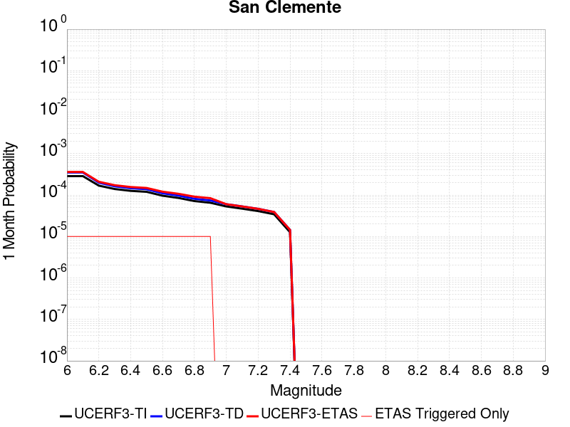 | 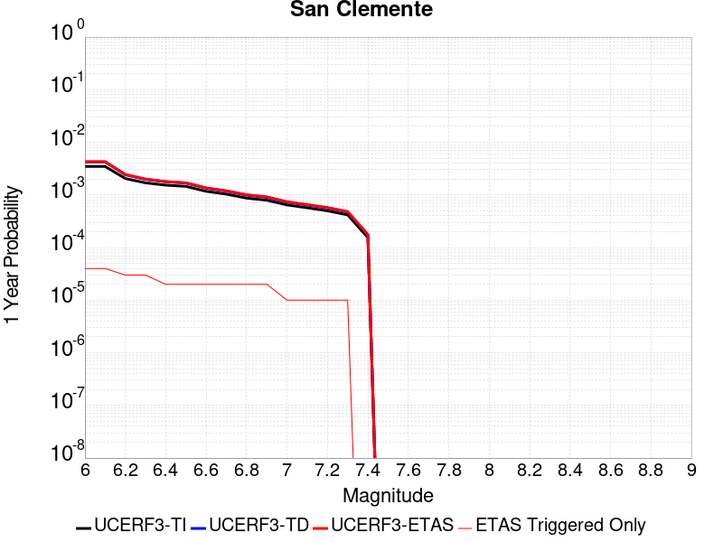 |  |

| Magnitude | 1 wk TI Prob | 1 wk TD Prob | 1 wk ETAS Prob | 1 wk ETAS/TD Gain | 1 wk ETAS Triggered Only | 1 mo TI Prob | 1 mo TD Prob | 1 mo ETAS Prob | 1 mo ETAS/TD Gain | 1 mo ETAS Triggered Only | 1 yr TI Prob | 1 yr TD Prob | 1 yr ETAS Prob | 1 yr ETAS/TD Gain | 1 yr ETAS Triggered Only | 10 yr TI Prob | 10 yr TD Prob | 10 yr ETAS Prob | 10 yr ETAS/TD Gain | 10 yr ETAS Triggered Only |
|-----|-----|-----|-----|-----|-----|-----|-----|-----|-----|-----|-----|-----|-----|-----|-----|-----|-----|-----|-----|-----|
| 6.0 | 6.681379E-5 | 8.163669E-5 | 8.163669E-5 | 1.0 | 0.0 | 2.8631336E-4 | 3.4982787E-4 | 3.5982436E-4 | 1.0285755 | 1.0E-5 | 0.003480294 | 0.004251416 | 0.0042912457 | 1.0093687 | 4.0E-5 | 0.03426291 | 0.041756913 | 0.04181441 | 1.0013769 | 6.0E-5 |
| 6.1 | 6.681379E-5 | 8.163669E-5 | 8.163669E-5 | 1.0 | 0.0 | 2.8631336E-4 | 3.4982787E-4 | 3.5982436E-4 | 1.0285755 | 1.0E-5 | 0.003480294 | 0.004251416 | 0.0042912457 | 1.0093687 | 4.0E-5 | 0.03426291 | 0.041756913 | 0.04181441 | 1.0013769 | 6.0E-5 |
| 6.2 | 3.9400576E-5 | 4.6453104E-5 | 4.6453104E-5 | 1.0 | 0.0 | 1.6884868E-4 | 1.9906988E-4 | 2.0906789E-4 | 1.0502236 | 1.0E-5 | 0.0020537945 | 0.0024210429 | 0.0024509702 | 1.0123614 | 3.0E-5 | 0.020349167 | 0.023953425 | 0.023982706 | 1.0012224 | 3.0E-5 |
| 6.3 | 3.2590255E-5 | 3.792992E-5 | 3.792992E-5 | 1.0 | 0.0 | 1.3966505E-4 | 1.6254683E-4 | 1.725452E-4 | 1.0615107 | 1.0E-5 | 0.0016990956 | 0.0019772416 | 0.0020071822 | 1.0151427 | 3.0E-5 | 0.01686163 | 0.019600289 | 0.019629702 | 1.0015006 | 3.0E-5 |
| 6.4 | 2.9454652E-5 | 3.4098495E-5 | 3.4098495E-5 | 1.0 | 0.0 | 1.2622811E-4 | 1.4612835E-4 | 1.5612689E-4 | 1.068423 | 1.0E-5 | 0.0015357438 | 0.0017776854 | 0.0017976499 | 1.0112306 | 2.0E-5 | 0.015251739 | 0.017637825 | 0.017657472 | 1.0011139 | 2.0E-5 |
| 6.5 | 2.790836E-5 | 3.2248132E-5 | 3.2248132E-5 | 1.0 | 0.0 | 1.1960178E-4 | 1.3819907E-4 | 1.481977E-4 | 1.0723494 | 1.0E-5 | 0.001455179 | 0.0016812999 | 0.0017012662 | 1.0118755 | 2.0E-5 | 0.014456868 | 0.016688818 | 0.016708484 | 1.0011784 | 2.0E-5 |
| 6.6 | 2.2492153E-5 | 2.5763205E-5 | 2.5763205E-5 | 1.0 | 0.0 | 9.639138E-5 | 1.1040914E-4 | 1.2040804E-4 | 1.0905622 | 1.0E-5 | 0.0011729331 | 0.0013434167 | 0.0013633899 | 1.0148674 | 2.0E-5 | 0.011667615 | 0.013354672 | 0.013374405 | 1.0014776 | 2.0E-5 |
| 6.7 | 1.9862755E-5 | 2.2666847E-5 | 2.2666847E-5 | 1.0 | 0.0 | 8.512331E-5 | 9.714008E-5 | 1.0713911E-4 | 1.1029341 | 1.0E-5 | 0.0010358836 | 0.0011820501 | 0.0012020264 | 1.0168997 | 2.0E-5 | 0.010310682 | 0.01175892 | 0.011778684 | 1.0016809 | 2.0E-5 |
| 6.8 | 1.6697575E-5 | 1.8978053E-5 | 1.8978053E-5 | 1.0 | 0.0 | 7.155907E-5 | 8.133203E-5 | 9.133122E-5 | 1.1229428 | 1.0E-5 | 8.7088346E-4 | 9.89777E-4 | 0.0010097572 | 1.0201865 | 2.0E-5 | 0.008674784 | 0.009854714 | 0.009874517 | 1.0020095 | 2.0E-5 |
| 6.9 | 1.5218415E-5 | 1.726971E-5 | 1.726971E-5 | 1.0 | 0.0 | 6.522015E-5 | 7.401099E-5 | 8.401025E-5 | 1.135105 | 1.0E-5 | 7.93766E-4 | 9.0072013E-4 | 9.2070206E-4 | 1.0221845 | 2.0E-5 | 0.007909367 | 0.00897164 | 0.00899146 | 1.0022093 | 2.0E-5 |
| 7.0 | 1.2392958E-5 | 1.4033262E-5 | 1.4033262E-5 | 1.0 | 0.0 | 5.3111595E-5 | 6.0141207E-5 | 6.0141207E-5 | 1.0 | 0.0 | 6.4644177E-4 | 7.319808E-4 | 7.4197346E-4 | 1.0136516 | 1.0E-5 | 0.0064456454 | 0.0072964844 | 0.0073064114 | 1.0013605 | 1.0E-5 |
| 7.1 | 1.0934128E-5 | 1.2375354E-5 | 1.2375354E-5 | 1.0 | 0.0 | 4.6859706E-5 | 5.3036194E-5 | 5.3036194E-5 | 1.0 | 0.0 | 5.7036756E-4 | 6.455317E-4 | 6.5552525E-4 | 1.0154811 | 1.0E-5 | 0.0056890585 | 0.006437312 | 0.0064472477 | 1.0015434 | 1.0E-5 |
| 7.2 | 9.5798805E-6 | 1.0845125E-5 | 1.0845125E-5 | 1.0 | 0.0 | 4.1055984E-5 | 4.647832E-5 | 4.647832E-5 | 1.0 | 0.0 | 4.9974193E-4 | 5.657338E-4 | 5.757282E-4 | 1.0176661 | 1.0E-5 | 0.0049861963 | 0.00564366 | 0.0056536035 | 1.0017619 | 1.0E-5 |
| 7.3 | 8.0167365E-6 | 9.084078E-6 | 9.084078E-6 | 1.0 | 0.0 | 3.4356988E-5 | 3.8931223E-5 | 3.8931223E-5 | 1.0 | 0.0 | 4.1821605E-4 | 4.738916E-4 | 4.8388686E-4 | 1.0210918 | 1.0E-5 | 0.0041742986 | 0.004729513 | 0.004739466 | 1.0021044 | 1.0E-5 |
| 7.4 | 2.9581017E-6 | 3.36244E-6 | 3.36244E-6 | 1.0 | 0.0 | 1.2677518E-5 | 1.4410407E-5 | 1.4410407E-5 | 1.0 | 0.0 | 1.5433785E-4 | 1.7543763E-4 | 1.7543763E-4 | 1.0 | 0.0 | 0.001542307 | 0.0017534863 | 0.0017534863 | 1.0 | 0.0 |

## Santa Ynez River
*[(top)](#table-of-contents)*

| 1 Week | 1 Month | 1 Year | 10 Year |
|-----|-----|-----|-----|
|  | 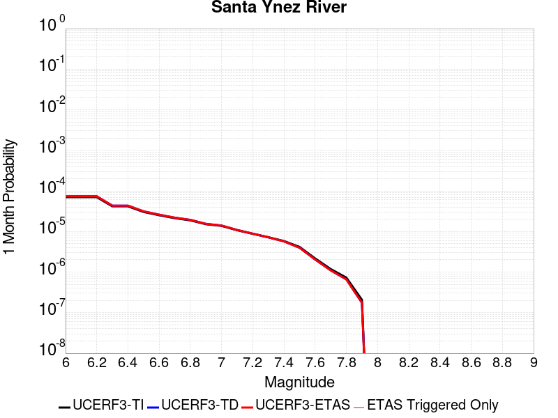 |  | 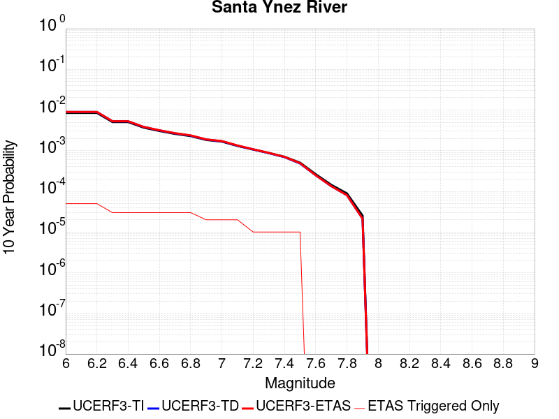 |

| Magnitude | 1 wk TI Prob | 1 wk TD Prob | 1 wk ETAS Prob | 1 wk ETAS/TD Gain | 1 wk ETAS Triggered Only | 1 mo TI Prob | 1 mo TD Prob | 1 mo ETAS Prob | 1 mo ETAS/TD Gain | 1 mo ETAS Triggered Only | 1 yr TI Prob | 1 yr TD Prob | 1 yr ETAS Prob | 1 yr ETAS/TD Gain | 1 yr ETAS Triggered Only | 10 yr TI Prob | 10 yr TD Prob | 10 yr ETAS Prob | 10 yr ETAS/TD Gain | 10 yr ETAS Triggered Only |
|-----|-----|-----|-----|-----|-----|-----|-----|-----|-----|-----|-----|-----|-----|-----|-----|-----|-----|-----|-----|-----|
| 6.0 | 1.6396456E-5 | 1.7209564E-5 | 1.7209564E-5 | 1.0 | 0.0 | 7.026863E-5 | 7.375339E-5 | 7.375339E-5 | 1.0 | 0.0 | 8.551848E-4 | 8.976132E-4 | 9.1759523E-4 | 1.0222613 | 2.0E-5 | 0.0085190125 | 0.008943425 | 0.008992977 | 1.0055407 | 5.0E-5 |
| 6.1 | 1.6396456E-5 | 1.7209564E-5 | 1.7209564E-5 | 1.0 | 0.0 | 7.026863E-5 | 7.375339E-5 | 7.375339E-5 | 1.0 | 0.0 | 8.551848E-4 | 8.976132E-4 | 9.1759523E-4 | 1.0222613 | 2.0E-5 | 0.0085190125 | 0.008943425 | 0.008992977 | 1.0055407 | 5.0E-5 |
| 6.2 | 1.6396456E-5 | 1.7209564E-5 | 1.7209564E-5 | 1.0 | 0.0 | 7.026863E-5 | 7.375339E-5 | 7.375339E-5 | 1.0 | 0.0 | 8.551848E-4 | 8.976132E-4 | 9.1759523E-4 | 1.0222613 | 2.0E-5 | 0.0085190125 | 0.008943425 | 0.008992977 | 1.0055407 | 5.0E-5 |
| 6.3 | 9.736976E-6 | 1.0122399E-5 | 1.0122399E-5 | 1.0 | 0.0 | 4.172923E-5 | 4.3381016E-5 | 4.3381016E-5 | 1.0 | 0.0 | 5.0793495E-4 | 5.2804087E-4 | 5.480303E-4 | 1.0378559 | 2.0E-5 | 0.005067755 | 0.0052683675 | 0.0052982094 | 1.0056643 | 3.0E-5 |
| 6.4 | 9.736976E-6 | 1.0122399E-5 | 1.0122399E-5 | 1.0 | 0.0 | 4.172923E-5 | 4.3381016E-5 | 4.3381016E-5 | 1.0 | 0.0 | 5.0793495E-4 | 5.2804087E-4 | 5.480303E-4 | 1.0378559 | 2.0E-5 | 0.005067755 | 0.0052683675 | 0.0052982094 | 1.0056643 | 3.0E-5 |
| 6.5 | 7.081964E-6 | 7.3299457E-6 | 7.3299457E-6 | 1.0 | 0.0 | 3.035092E-5 | 3.1413685E-5 | 3.1413685E-5 | 1.0 | 0.0 | 3.694598E-4 | 3.8239607E-4 | 4.0238842E-4 | 1.0522817 | 2.0E-5 | 0.0036884616 | 0.0038175425 | 0.003847428 | 1.0078285 | 3.0E-5 |
| 6.6 | 5.873247E-6 | 6.0597836E-6 | 6.0597836E-6 | 1.0 | 0.0 | 2.5170815E-5 | 2.5970248E-5 | 2.5970248E-5 | 1.0 | 0.0 | 3.064116E-4 | 3.1614274E-4 | 3.3613644E-4 | 1.0632426 | 2.0E-5 | 0.0030598943 | 0.0031570175 | 0.0031869228 | 1.0094726 | 3.0E-5 |
| 6.7 | 4.973277E-6 | 5.115936E-6 | 5.115936E-6 | 1.0 | 0.0 | 2.1313872E-5 | 2.1925258E-5 | 2.1925258E-5 | 1.0 | 0.0 | 2.5946548E-4 | 2.669078E-4 | 2.8690245E-4 | 1.0749122 | 2.0E-5 | 0.0025916274 | 0.002665921 | 0.0026958412 | 1.0112232 | 3.0E-5 |
| 6.8 | 4.396492E-6 | 4.5110087E-6 | 4.5110087E-6 | 1.0 | 0.0 | 1.884197E-5 | 1.9332752E-5 | 1.9332752E-5 | 1.0 | 0.0 | 2.2937685E-4 | 2.3535118E-4 | 2.5534647E-4 | 1.0849594 | 2.0E-5 | 0.0022914023 | 0.0023510547 | 0.0023809841 | 1.0127302 | 3.0E-5 |
| 6.9 | 3.5255632E-6 | 3.6013587E-6 | 3.6013587E-6 | 1.0 | 0.0 | 1.5109469E-5 | 1.5434303E-5 | 1.5434303E-5 | 1.0 | 0.0 | 1.8394225E-4 | 1.878966E-4 | 1.9789473E-4 | 1.0532107 | 1.0E-5 | 0.0018379007 | 0.0018773936 | 0.001897356 | 1.0106331 | 2.0E-5 |
| 7.0 | 3.211603E-6 | 3.2736775E-6 | 3.2736775E-6 | 1.0 | 0.0 | 1.376394E-5 | 1.4029972E-5 | 1.4029972E-5 | 1.0 | 0.0 | 1.6756308E-4 | 1.7080165E-4 | 1.8079995E-4 | 1.0585375 | 1.0E-5 | 0.0016743679 | 0.001706718 | 0.0017266838 | 1.0116984 | 2.0E-5 |
| 7.1 | 2.5094619E-6 | 2.5409397E-6 | 2.5409397E-6 | 1.0 | 0.0 | 1.0754793E-5 | 1.0889697E-5 | 1.0889697E-5 | 1.0 | 0.0 | 1.3093173E-4 | 1.3257404E-4 | 1.4257272E-4 | 1.0754195 | 1.0E-5 | 0.0013085462 | 0.0013249556 | 0.0013449291 | 1.0150748 | 2.0E-5 |
| 7.2 | 2.0515774E-6 | 2.0619539E-6 | 2.0619539E-6 | 1.0 | 0.0 | 8.792445E-6 | 8.836915E-6 | 8.836915E-6 | 1.0 | 0.0 | 1.0704277E-4 | 1.0758417E-4 | 1.175831E-4 | 1.0929404 | 1.0E-5 | 0.0010699122 | 0.0010753252 | 0.0010853144 | 1.0092895 | 1.0E-5 |
| 7.3 | 1.6845745E-6 | 1.6774045E-6 | 1.6774045E-6 | 1.0 | 0.0 | 7.219585E-6 | 7.1888567E-6 | 7.1888567E-6 | 1.0 | 0.0 | 8.78949E-5 | 8.752084E-5 | 9.751997E-5 | 1.1142485 | 1.0E-5 | 8.7860145E-4 | 8.748666E-4 | 8.848579E-4 | 1.0114204 | 1.0E-5 |
| 7.4 | 1.3600285E-6 | 1.3333469E-6 | 1.3333469E-6 | 1.0 | 0.0 | 5.82868E-6 | 5.714331E-6 | 5.714331E-6 | 1.0 | 0.0 | 7.096187E-5 | 6.956978E-5 | 7.956909E-5 | 1.1437305 | 1.0E-5 | 7.0939213E-4 | 6.9548225E-4 | 7.0547534E-4 | 1.0143685 | 1.0E-5 |
| 7.5 | 9.735342E-7 | 9.290183E-7 | 9.290183E-7 | 1.0 | 0.0 | 4.172283E-6 | 3.981501E-6 | 3.981501E-6 | 1.0 | 0.0 | 5.079636E-5 | 4.8473714E-5 | 5.847323E-5 | 1.2062874 | 1.0E-5 | 5.0784746E-4 | 4.846331E-4 | 4.946283E-4 | 1.0206242 | 1.0E-5 |
| 7.6 | 5.067187E-7 | 4.778607E-7 | 4.778607E-7 | 1.0 | 0.0 | 2.1716498E-6 | 2.0479727E-6 | 2.0479727E-6 | 1.0 | 0.0 | 2.6439517E-5 | 2.493379E-5 | 2.493379E-5 | 1.0 | 0.0 | 2.643637E-4 | 2.4931066E-4 | 2.4931066E-4 | 1.0 | 0.0 |
| 7.7 | 2.769089E-7 | 2.5759311E-7 | 2.5759311E-7 | 1.0 | 0.0 | 1.1867519E-6 | 1.1039699E-6 | 1.1039699E-6 | 1.0 | 0.0 | 1.4448608E-5 | 1.3440752E-5 | 1.3440752E-5 | 1.0 | 0.0 | 1.444767E-4 | 1.3439942E-4 | 1.3439942E-4 | 1.0 | 0.0 |
| 7.8 | 1.7044663E-7 | 1.5449127E-7 | 1.5449127E-7 | 1.0 | 0.0 | 7.3048534E-7 | 6.6210526E-7 | 6.6210526E-7 | 1.0 | 0.0 | 8.893623E-6 | 8.061102E-6 | 8.061102E-6 | 1.0 | 0.0 | 8.893267E-5 | 8.0608115E-5 | 8.0608115E-5 | 1.0 | 0.0 |
| 7.9 | 4.8344287E-8 | 4.0911235E-8 | 4.0911235E-8 | 1.0 | 0.0 | 2.0718979E-7 | 1.7533385E-7 | 1.7533385E-7 | 1.0 | 0.0 | 2.5225327E-6 | 2.1346877E-6 | 2.1346877E-6 | 1.0 | 0.0 | 2.5225041E-5 | 2.1346676E-5 | 2.1346676E-5 | 1.0 | 0.0 |

## Dry Mountain
*[(top)](#table-of-contents)*

| 1 Week | 1 Month | 1 Year | 10 Year |
|-----|-----|-----|-----|
|  |  |  |  |

| Magnitude | 1 wk TI Prob | 1 wk TD Prob | 1 wk ETAS Prob | 1 wk ETAS/TD Gain | 1 wk ETAS Triggered Only | 1 mo TI Prob | 1 mo TD Prob | 1 mo ETAS Prob | 1 mo ETAS/TD Gain | 1 mo ETAS Triggered Only | 1 yr TI Prob | 1 yr TD Prob | 1 yr ETAS Prob | 1 yr ETAS/TD Gain | 1 yr ETAS Triggered Only | 10 yr TI Prob | 10 yr TD Prob | 10 yr ETAS Prob | 10 yr ETAS/TD Gain | 10 yr ETAS Triggered Only |
|-----|-----|-----|-----|-----|-----|-----|-----|-----|-----|-----|-----|-----|-----|-----|-----|-----|-----|-----|-----|-----|
| 6.0 | 6.222801E-6 | 6.439411E-6 | 1.6439346E-5 | 2.552927 | 1.0E-5 | 2.6668875E-5 | 2.7597274E-5 | 3.7596998E-5 | 1.3623446 | 1.0E-5 | 3.2464517E-4 | 3.359609E-4 | 3.7594748E-4 | 1.1190214 | 4.0E-5 | 0.0032417132 | 0.0033560924 | 0.003415891 | 1.017818 | 6.0E-5 |
| 6.1 | 6.222801E-6 | 6.439411E-6 | 1.6439346E-5 | 2.552927 | 1.0E-5 | 2.6668875E-5 | 2.7597274E-5 | 3.7596998E-5 | 1.3623446 | 1.0E-5 | 3.2464517E-4 | 3.359609E-4 | 3.7594748E-4 | 1.1190214 | 4.0E-5 | 0.0032417132 | 0.0033560924 | 0.003415891 | 1.017818 | 6.0E-5 |
| 6.2 | 6.222801E-6 | 6.439411E-6 | 1.6439346E-5 | 2.552927 | 1.0E-5 | 2.6668875E-5 | 2.7597274E-5 | 3.7596998E-5 | 1.3623446 | 1.0E-5 | 3.2464517E-4 | 3.359609E-4 | 3.7594748E-4 | 1.1190214 | 4.0E-5 | 0.0032417132 | 0.0033560924 | 0.003415891 | 1.017818 | 6.0E-5 |
| 6.3 | 6.222801E-6 | 6.439411E-6 | 1.6439346E-5 | 2.552927 | 1.0E-5 | 2.6668875E-5 | 2.7597274E-5 | 3.7596998E-5 | 1.3623446 | 1.0E-5 | 3.2464517E-4 | 3.359609E-4 | 3.7594748E-4 | 1.1190214 | 4.0E-5 | 0.0032417132 | 0.0033560924 | 0.003415891 | 1.017818 | 6.0E-5 |
| 6.4 | 6.222801E-6 | 6.439411E-6 | 1.6439346E-5 | 2.552927 | 1.0E-5 | 2.6668875E-5 | 2.7597274E-5 | 3.7596998E-5 | 1.3623446 | 1.0E-5 | 3.2464517E-4 | 3.359609E-4 | 3.7594748E-4 | 1.1190214 | 4.0E-5 | 0.0032417132 | 0.0033560924 | 0.003415891 | 1.017818 | 6.0E-5 |
| 6.5 | 2.8528623E-6 | 2.952182E-6 | 1.2952152E-5 | 4.387315 | 1.0E-5 | 1.22264955E-5 | 1.2652196E-5 | 2.265207E-5 | 1.7903666 | 1.0E-5 | 1.4884741E-4 | 1.5403831E-4 | 1.8403368E-4 | 1.1947267 | 3.0E-5 | 0.0014874774 | 0.0015401688 | 0.0015701225 | 1.0194484 | 3.0E-5 |
| 6.6 | 2.8528623E-6 | 2.952182E-6 | 1.2952152E-5 | 4.387315 | 1.0E-5 | 1.22264955E-5 | 1.2652196E-5 | 2.265207E-5 | 1.7903666 | 1.0E-5 | 1.4884741E-4 | 1.5403831E-4 | 1.8403368E-4 | 1.1947267 | 3.0E-5 | 0.0014874774 | 0.0015401688 | 0.0015701225 | 1.0194484 | 3.0E-5 |
| 6.7 | 2.541E-6 | 2.62937E-6 | 1.26293435E-5 | 4.8031826 | 1.0E-5 | 1.0889954E-5 | 1.12687285E-5 | 2.1268615E-5 | 1.8874016 | 1.0E-5 | 1.3257713E-4 | 1.3719677E-4 | 1.6719266E-4 | 1.218634 | 3.0E-5 | 0.0013249806 | 0.0013719677 | 0.0014019265 | 1.0218364 | 3.0E-5 |

## San Gabriel
*[(top)](#table-of-contents)*

| 1 Week | 1 Month | 1 Year | 10 Year |
|-----|-----|-----|-----|
| 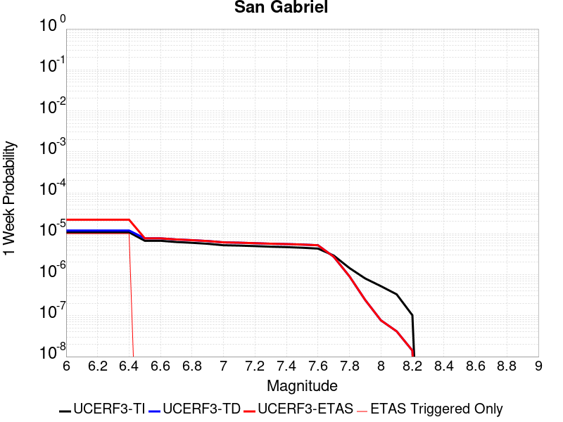 |  |  |  |

| Magnitude | 1 wk TI Prob | 1 wk TD Prob | 1 wk ETAS Prob | 1 wk ETAS/TD Gain | 1 wk ETAS Triggered Only | 1 mo TI Prob | 1 mo TD Prob | 1 mo ETAS Prob | 1 mo ETAS/TD Gain | 1 mo ETAS Triggered Only | 1 yr TI Prob | 1 yr TD Prob | 1 yr ETAS Prob | 1 yr ETAS/TD Gain | 1 yr ETAS Triggered Only | 10 yr TI Prob | 10 yr TD Prob | 10 yr ETAS Prob | 10 yr ETAS/TD Gain | 10 yr ETAS Triggered Only |
|-----|-----|-----|-----|-----|-----|-----|-----|-----|-----|-----|-----|-----|-----|-----|-----|-----|-----|-----|-----|-----|
| 6.0 | 1.083775E-5 | 1.1987322E-5 | 2.1987202E-5 | 1.8342047 | 1.0E-5 | 4.6446676E-5 | 5.1373292E-5 | 6.1372775E-5 | 1.1946437 | 1.0E-5 | 5.653415E-4 | 6.253016E-4 | 6.652766E-4 | 1.0639291 | 4.0E-5 | 0.0056390543 | 0.006247514 | 0.006307139 | 1.0095438 | 6.0E-5 |
| 6.1 | 1.083775E-5 | 1.1987322E-5 | 2.1987202E-5 | 1.8342047 | 1.0E-5 | 4.6446676E-5 | 5.1373292E-5 | 6.1372775E-5 | 1.1946437 | 1.0E-5 | 5.653415E-4 | 6.253016E-4 | 6.652766E-4 | 1.0639291 | 4.0E-5 | 0.0056390543 | 0.006247514 | 0.006307139 | 1.0095438 | 6.0E-5 |
| 6.2 | 1.083775E-5 | 1.1987322E-5 | 2.1987202E-5 | 1.8342047 | 1.0E-5 | 4.6446676E-5 | 5.1373292E-5 | 6.1372775E-5 | 1.1946437 | 1.0E-5 | 5.653415E-4 | 6.253016E-4 | 6.652766E-4 | 1.0639291 | 4.0E-5 | 0.0056390543 | 0.006247514 | 0.006307139 | 1.0095438 | 6.0E-5 |
| 6.3 | 1.083775E-5 | 1.1987322E-5 | 2.1987202E-5 | 1.8342047 | 1.0E-5 | 4.6446676E-5 | 5.1373292E-5 | 6.1372775E-5 | 1.1946437 | 1.0E-5 | 5.653415E-4 | 6.253016E-4 | 6.652766E-4 | 1.0639291 | 4.0E-5 | 0.0056390543 | 0.006247514 | 0.006307139 | 1.0095438 | 6.0E-5 |
| 6.4 | 1.083775E-5 | 1.1987322E-5 | 2.1987202E-5 | 1.8342047 | 1.0E-5 | 4.6446676E-5 | 5.1373292E-5 | 6.1372775E-5 | 1.1946437 | 1.0E-5 | 5.653415E-4 | 6.253016E-4 | 6.652766E-4 | 1.0639291 | 4.0E-5 | 0.0056390543 | 0.006247514 | 0.006307139 | 1.0095438 | 6.0E-5 |
| 6.5 | 6.7317824E-6 | 7.719057E-6 | 7.719057E-6 | 1.0 | 0.0 | 2.8850178E-5 | 3.308126E-5 | 3.308126E-5 | 1.0 | 0.0 | 3.511943E-4 | 4.0269096E-4 | 4.3267888E-4 | 1.0744689 | 3.0E-5 | 0.003506398 | 0.0040307054 | 0.004070544 | 1.0098839 | 4.0E-5 |
| 6.6 | 6.7317824E-6 | 7.719057E-6 | 7.719057E-6 | 1.0 | 0.0 | 2.8850178E-5 | 3.308126E-5 | 3.308126E-5 | 1.0 | 0.0 | 3.511943E-4 | 4.0269096E-4 | 4.3267888E-4 | 1.0744689 | 3.0E-5 | 0.003506398 | 0.0040307054 | 0.004070544 | 1.0098839 | 4.0E-5 |
| 6.7 | 6.274881E-6 | 7.247975E-6 | 7.247975E-6 | 1.0 | 0.0 | 2.6892068E-5 | 3.1062387E-5 | 3.1062387E-5 | 1.0 | 0.0 | 3.2736175E-4 | 3.781199E-4 | 4.0810855E-4 | 1.0793099 | 3.0E-5 | 0.0032687993 | 0.0037858514 | 0.0038257 | 1.0105257 | 4.0E-5 |
| 6.8 | 5.996209E-6 | 6.9606945E-6 | 6.9606945E-6 | 1.0 | 0.0 | 2.5697784E-5 | 2.9831212E-5 | 2.9831212E-5 | 1.0 | 0.0 | 3.128256E-4 | 3.6313542E-4 | 3.931245E-4 | 1.0825838 | 3.0E-5 | 0.003123856 | 0.0036365038 | 0.0036763584 | 1.0109596 | 4.0E-5 |
| 6.9 | 5.686331E-6 | 6.6257326E-6 | 6.6257326E-6 | 1.0 | 0.0 | 2.4369761E-5 | 2.8395692E-5 | 2.8395692E-5 | 1.0 | 0.0 | 2.9666146E-4 | 3.4566363E-4 | 3.5566016E-4 | 1.0289198 | 1.0E-5 | 0.0029626573 | 0.0034623418 | 0.0034822726 | 1.0057564 | 2.0E-5 |
| 7.0 | 5.2329838E-6 | 6.14961E-6 | 6.14961E-6 | 1.0 | 0.0 | 2.242688E-5 | 2.6355208E-5 | 2.6355208E-5 | 1.0 | 0.0 | 2.7301308E-4 | 3.2082817E-4 | 3.3082496E-4 | 1.0311593 | 1.0E-5 | 0.002726779 | 0.00321472 | 0.0032346556 | 1.0062014 | 2.0E-5 |
| 7.1 | 5.135671E-6 | 6.03973E-6 | 6.03973E-6 | 1.0 | 0.0 | 2.2009834E-5 | 2.5884305E-5 | 2.5884305E-5 | 1.0 | 0.0 | 2.6793676E-4 | 3.150966E-4 | 3.2509345E-4 | 1.0317262 | 1.0E-5 | 0.0026761394 | 0.0031575684 | 0.0031775052 | 1.006314 | 2.0E-5 |
| 7.2 | 4.989062E-6 | 5.873101E-6 | 5.873101E-6 | 1.0 | 0.0 | 2.1381518E-5 | 2.5170193E-5 | 2.5170193E-5 | 1.0 | 0.0 | 2.6028889E-4 | 3.0640478E-4 | 3.164017E-4 | 1.0326265 | 1.0E-5 | 0.0025998424 | 0.003070893 | 0.0030908317 | 1.0064927 | 2.0E-5 |
| 7.3 | 4.8219395E-6 | 5.7046464E-6 | 5.7046464E-6 | 1.0 | 0.0 | 2.0665291E-5 | 2.444826E-5 | 2.444826E-5 | 1.0 | 0.0 | 2.5157086E-4 | 2.9761766E-4 | 3.0761468E-4 | 1.0335902 | 1.0E-5 | 0.0025128627 | 0.0029832611 | 0.0030032014 | 1.0066841 | 2.0E-5 |
| 7.4 | 4.7118383E-6 | 5.593198E-6 | 5.593198E-6 | 1.0 | 0.0 | 2.0193436E-5 | 2.3970631E-5 | 2.3970631E-5 | 1.0 | 0.0 | 2.4582737E-4 | 2.918041E-4 | 3.018012E-4 | 1.0342596 | 1.0E-5 | 0.002455556 | 0.0029252786 | 0.0029452203 | 1.006817 | 2.0E-5 |
| 7.5 | 4.5506545E-6 | 5.4385555E-6 | 5.4385555E-6 | 1.0 | 0.0 | 1.9502659E-5 | 2.330789E-5 | 2.330789E-5 | 1.0 | 0.0 | 2.37419E-4 | 2.8373738E-4 | 2.9373454E-4 | 1.0352339 | 1.0E-5 | 0.002371655 | 0.0028448196 | 0.0028647627 | 1.0070103 | 2.0E-5 |
| 7.6 | 4.343636E-6 | 5.2314185E-6 | 5.2314185E-6 | 1.0 | 0.0 | 1.861545E-5 | 2.2420176E-5 | 2.2420176E-5 | 1.0 | 0.0 | 2.2661954E-4 | 2.729322E-4 | 2.8292948E-4 | 1.0366291 | 1.0E-5 | 0.0022638857 | 0.00273703 | 0.0027569751 | 1.0072871 | 2.0E-5 |
| 7.7 | 2.936235E-6 | 2.7454162E-6 | 2.7454162E-6 | 1.0 | 0.0 | 1.2583803E-5 | 1.17660165E-5 | 1.17660165E-5 | 1.0 | 0.0 | 1.5319703E-4 | 1.4324186E-4 | 1.4324186E-4 | 1.0 | 0.0 | 0.0015309147 | 0.0014387933 | 0.0014387933 | 1.0 | 0.0 |
| 7.8 | 1.4541639E-6 | 9.129234E-7 | 9.129234E-7 | 1.0 | 0.0 | 6.232116E-6 | 3.912523E-6 | 3.912523E-6 | 1.0 | 0.0 | 7.587337E-5 | 4.7633926E-5 | 4.7633926E-5 | 1.0 | 0.0 | 7.584747E-4 | 4.8114438E-4 | 4.8114438E-4 | 1.0 | 0.0 |
| 7.9 | 8.098958E-7 | 2.419679E-7 | 2.419679E-7 | 1.0 | 0.0 | 3.4709774E-6 | 1.0370048E-6 | 1.0370048E-6 | 1.0 | 0.0 | 4.225833E-5 | 1.2625461E-5 | 1.2625461E-5 | 1.0 | 0.0 | 4.2250296E-4 | 1.2933378E-4 | 1.2933378E-4 | 1.0 | 0.0 |
| 8.0 | 5.2473234E-7 | 7.6891794E-8 | 7.6891794E-8 | 1.0 | 0.0 | 2.248851E-6 | 3.2953622E-7 | 3.2953622E-7 | 1.0 | 0.0 | 2.7379416E-5 | 4.012096E-6 | 4.012096E-6 | 1.0 | 0.0 | 2.7376044E-4 | 4.224638E-5 | 4.224638E-5 | 1.0 | 0.0 |
| 8.1 | 3.3162388E-7 | 4.155149E-8 | 4.155149E-8 | 1.0 | 0.0 | 1.4212444E-6 | 1.7807781E-7 | 1.7807781E-7 | 1.0 | 0.0 | 1.7303513E-5 | 2.168095E-6 | 2.168095E-6 | 1.0 | 0.0 | 1.7302166E-4 | 2.2995899E-5 | 2.2995899E-5 | 1.0 | 0.0 |
| 8.2 | 1.0235345E-7 | 1.4060946E-8 | 1.4060946E-8 | 1.0 | 0.0 | 4.3865757E-7 | 6.02612E-8 | 6.02612E-8 | 1.0 | 0.0 | 5.340643E-6 | 7.336798E-7 | 7.336798E-7 | 1.0 | 0.0 | 5.3405143E-5 | 7.937039E-6 | 7.937039E-6 | 1.0 | 0.0 |

## Tin Mountain
*[(top)](#table-of-contents)*

| 1 Week | 1 Month | 1 Year | 10 Year |
|-----|-----|-----|-----|
|  |  | 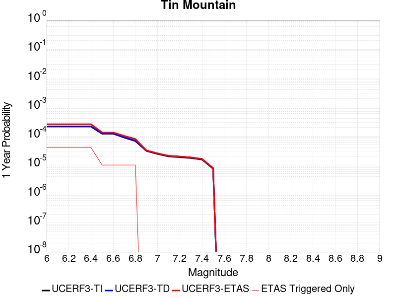 |  |

| Magnitude | 1 wk TI Prob | 1 wk TD Prob | 1 wk ETAS Prob | 1 wk ETAS/TD Gain | 1 wk ETAS Triggered Only | 1 mo TI Prob | 1 mo TD Prob | 1 mo ETAS Prob | 1 mo ETAS/TD Gain | 1 mo ETAS Triggered Only | 1 yr TI Prob | 1 yr TD Prob | 1 yr ETAS Prob | 1 yr ETAS/TD Gain | 1 yr ETAS Triggered Only | 10 yr TI Prob | 10 yr TD Prob | 10 yr ETAS Prob | 10 yr ETAS/TD Gain | 10 yr ETAS Triggered Only |
|-----|-----|-----|-----|-----|-----|-----|-----|-----|-----|-----|-----|-----|-----|-----|-----|-----|-----|-----|-----|-----|
| 6.0 | 4.083776E-6 | 4.18155E-6 | 4.18155E-6 | 1.0 | 0.0 | 1.750178E-5 | 1.7920827E-5 | 2.7920647E-5 | 1.558 | 1.0E-5 | 2.1306332E-4 | 2.1816794E-4 | 2.581592E-4 | 1.183305 | 4.0E-5 | 0.0021285915 | 0.0021799032 | 0.0022397726 | 1.0274642 | 6.0E-5 |
| 6.1 | 4.083776E-6 | 4.18155E-6 | 4.18155E-6 | 1.0 | 0.0 | 1.750178E-5 | 1.7920827E-5 | 2.7920647E-5 | 1.558 | 1.0E-5 | 2.1306332E-4 | 2.1816794E-4 | 2.581592E-4 | 1.183305 | 4.0E-5 | 0.0021285915 | 0.0021799032 | 0.0022397726 | 1.0274642 | 6.0E-5 |
| 6.2 | 4.083776E-6 | 4.18155E-6 | 4.18155E-6 | 1.0 | 0.0 | 1.750178E-5 | 1.7920827E-5 | 2.7920647E-5 | 1.558 | 1.0E-5 | 2.1306332E-4 | 2.1816794E-4 | 2.581592E-4 | 1.183305 | 4.0E-5 | 0.0021285915 | 0.0021799032 | 0.0022397726 | 1.0274642 | 6.0E-5 |
| 6.3 | 4.083776E-6 | 4.18155E-6 | 4.18155E-6 | 1.0 | 0.0 | 1.750178E-5 | 1.7920827E-5 | 2.7920647E-5 | 1.558 | 1.0E-5 | 2.1306332E-4 | 2.1816794E-4 | 2.581592E-4 | 1.183305 | 4.0E-5 | 0.0021285915 | 0.0021799032 | 0.0022397726 | 1.0274642 | 6.0E-5 |
| 6.4 | 4.083776E-6 | 4.18155E-6 | 4.18155E-6 | 1.0 | 0.0 | 1.750178E-5 | 1.7920827E-5 | 2.7920647E-5 | 1.558 | 1.0E-5 | 2.1306332E-4 | 2.1816794E-4 | 2.581592E-4 | 1.183305 | 4.0E-5 | 0.0021285915 | 0.0021799032 | 0.0022397726 | 1.0274642 | 6.0E-5 |
| 6.5 | 2.3143427E-6 | 2.3731652E-6 | 2.3731652E-6 | 1.0 | 0.0 | 9.9185745E-6 | 1.0170673E-5 | 1.0170673E-5 | 1.0 | 0.0 | 1.2075195E-4 | 1.2382168E-4 | 1.3382045E-4 | 1.0807513 | 1.0E-5 | 0.0012068636 | 0.0012376028 | 0.001257578 | 1.0161402 | 2.0E-5 |
| 6.6 | 2.3143427E-6 | 2.3731652E-6 | 2.3731652E-6 | 1.0 | 0.0 | 9.9185745E-6 | 1.0170673E-5 | 1.0170673E-5 | 1.0 | 0.0 | 1.2075195E-4 | 1.2382168E-4 | 1.3382045E-4 | 1.0807513 | 1.0E-5 | 0.0012068636 | 0.0012376028 | 0.001257578 | 1.0161402 | 2.0E-5 |
| 6.7 | 1.7029532E-6 | 1.7497979E-6 | 1.7497979E-6 | 1.0 | 0.0 | 7.2983503E-6 | 7.4991153E-6 | 7.4991153E-6 | 1.0 | 0.0 | 8.885379E-5 | 9.129844E-5 | 1.01297526E-4 | 1.1095209 | 1.0E-5 | 8.881827E-4 | 9.1266196E-4 | 9.2265283E-4 | 1.010947 | 1.0E-5 |
| 6.8 | 1.2914646E-6 | 1.3299432E-6 | 1.3299432E-6 | 1.0 | 0.0 | 5.534837E-6 | 5.6997465E-6 | 5.6997465E-6 | 1.0 | 0.0 | 6.738455E-5 | 6.939264E-5 | 7.939195E-5 | 1.1440974 | 1.0E-5 | 6.736412E-4 | 6.937531E-4 | 7.0374616E-4 | 1.0144043 | 1.0E-5 |
| 6.9 | 5.8708974E-7 | 6.117028E-7 | 6.117028E-7 | 1.0 | 0.0 | 2.5160964E-6 | 2.621581E-6 | 2.621581E-6 | 1.0 | 0.0 | 3.0633044E-5 | 3.1917323E-5 | 3.1917323E-5 | 1.0 | 0.0 | 3.0628822E-4 | 3.191315E-4 | 3.191315E-4 | 1.0 | 0.0 |
| 7.0 | 4.6248786E-7 | 4.832044E-7 | 4.832044E-7 | 1.0 | 0.0 | 1.9820893E-6 | 2.0708746E-6 | 2.0708746E-6 | 1.0 | 0.0 | 2.413167E-5 | 2.5212645E-5 | 2.5212645E-5 | 1.0 | 0.0 | 2.412905E-4 | 2.5210154E-4 | 2.5210154E-4 | 1.0 | 0.0 |
| 7.1 | 3.804606E-7 | 3.9871725E-7 | 3.9871725E-7 | 1.0 | 0.0 | 1.6305444E-6 | 1.7087873E-6 | 1.7087873E-6 | 1.0 | 0.0 | 1.9851697E-5 | 2.080432E-5 | 2.080432E-5 | 1.0 | 0.0 | 1.9849923E-4 | 2.080271E-4 | 2.080271E-4 | 1.0 | 0.0 |
| 7.2 | 3.5864858E-7 | 3.7617107E-7 | 3.7617107E-7 | 1.0 | 0.0 | 1.5370645E-6 | 1.6121609E-6 | 1.6121609E-6 | 1.0 | 0.0 | 1.87136E-5 | 1.9627916E-5 | 1.9627916E-5 | 1.0 | 0.0 | 1.8712023E-4 | 1.9626514E-4 | 1.9626514E-4 | 1.0 | 0.0 |
| 7.3 | 3.342063E-7 | 3.50637E-7 | 3.50637E-7 | 1.0 | 0.0 | 1.4323119E-6 | 1.5027293E-6 | 1.5027293E-6 | 1.0 | 0.0 | 1.7438259E-5 | 1.829561E-5 | 1.829561E-5 | 1.0 | 0.0 | 1.743689E-4 | 1.8294434E-4 | 1.8294434E-4 | 1.0 | 0.0 |
| 7.4 | 2.971242E-7 | 3.116602E-7 | 3.116602E-7 | 1.0 | 0.0 | 1.2733886E-6 | 1.3356861E-6 | 1.3356861E-6 | 1.0 | 0.0 | 1.5503398E-5 | 1.626189E-5 | 1.626189E-5 | 1.0 | 0.0 | 1.5502315E-4 | 1.6261027E-4 | 1.6261027E-4 | 1.0 | 0.0 |
| 7.5 | 1.4326713E-7 | 1.501262E-7 | 1.501262E-7 | 1.0 | 0.0 | 6.140018E-7 | 6.43398E-7 | 6.43398E-7 | 1.0 | 0.0 | 7.4754466E-6 | 7.833371E-6 | 7.833371E-6 | 1.0 | 0.0 | 7.475195E-5 | 7.83337E-5 | 7.83337E-5 | 1.0 | 0.0 |

## San Andreas (North Branch Mill Creek)
*[(top)](#table-of-contents)*

| 1 Week | 1 Month | 1 Year | 10 Year |
|-----|-----|-----|-----|
|  | 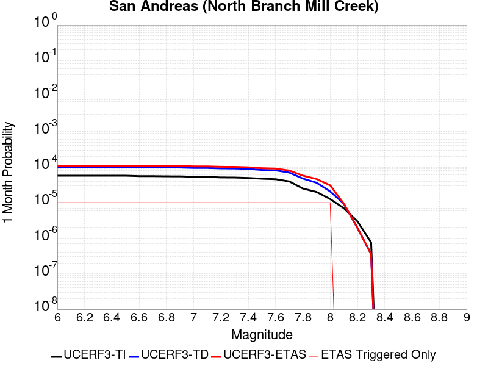 |  |  |

| Magnitude | 1 wk TI Prob | 1 wk TD Prob | 1 wk ETAS Prob | 1 wk ETAS/TD Gain | 1 wk ETAS Triggered Only | 1 mo TI Prob | 1 mo TD Prob | 1 mo ETAS Prob | 1 mo ETAS/TD Gain | 1 mo ETAS Triggered Only | 1 yr TI Prob | 1 yr TD Prob | 1 yr ETAS Prob | 1 yr ETAS/TD Gain | 1 yr ETAS Triggered Only | 10 yr TI Prob | 10 yr TD Prob | 10 yr ETAS Prob | 10 yr ETAS/TD Gain | 10 yr ETAS Triggered Only |
|-----|-----|-----|-----|-----|-----|-----|-----|-----|-----|-----|-----|-----|-----|-----|-----|-----|-----|-----|-----|-----|
| 6.0 | 1.3461156E-5 | 2.3506776E-5 | 2.3506776E-5 | 1.0 | 0.0 | 5.7689394E-5 | 1.0073945E-4 | 1.10738445E-4 | 1.0992559 | 1.0E-5 | 7.02142E-4 | 0.0012258161 | 0.0012457916 | 1.0162957 | 2.0E-5 | 0.0069992766 | 0.012233093 | 0.012292359 | 1.0048448 | 6.0E-5 |
| 6.1 | 1.3461156E-5 | 2.3506776E-5 | 2.3506776E-5 | 1.0 | 0.0 | 5.7689394E-5 | 1.0073945E-4 | 1.10738445E-4 | 1.0992559 | 1.0E-5 | 7.02142E-4 | 0.0012258161 | 0.0012457916 | 1.0162957 | 2.0E-5 | 0.0069992766 | 0.012233093 | 0.012292359 | 1.0048448 | 6.0E-5 |
| 6.2 | 1.3461156E-5 | 2.3506776E-5 | 2.3506776E-5 | 1.0 | 0.0 | 5.7689394E-5 | 1.0073945E-4 | 1.10738445E-4 | 1.0992559 | 1.0E-5 | 7.02142E-4 | 0.0012258161 | 0.0012457916 | 1.0162957 | 2.0E-5 | 0.0069992766 | 0.012233093 | 0.012292359 | 1.0048448 | 6.0E-5 |
| 6.3 | 1.3461156E-5 | 2.3506776E-5 | 2.3506776E-5 | 1.0 | 0.0 | 5.7689394E-5 | 1.0073945E-4 | 1.10738445E-4 | 1.0992559 | 1.0E-5 | 7.02142E-4 | 0.0012258161 | 0.0012457916 | 1.0162957 | 2.0E-5 | 0.0069992766 | 0.012233093 | 0.012292359 | 1.0048448 | 6.0E-5 |
| 6.4 | 1.3461156E-5 | 2.3506776E-5 | 2.3506776E-5 | 1.0 | 0.0 | 5.7689394E-5 | 1.0073945E-4 | 1.10738445E-4 | 1.0992559 | 1.0E-5 | 7.02142E-4 | 0.0012258161 | 0.0012457916 | 1.0162957 | 2.0E-5 | 0.0069992766 | 0.012233093 | 0.012292359 | 1.0048448 | 6.0E-5 |
| 6.5 | 1.3450706E-5 | 2.3495735E-5 | 2.3495735E-5 | 1.0 | 0.0 | 5.764461E-5 | 1.0069214E-4 | 1.1069114E-4 | 1.0993026 | 1.0E-5 | 7.0159714E-4 | 0.0012252406 | 0.0012452162 | 1.0163033 | 2.0E-5 | 0.006993862 | 0.012227403 | 0.01228667 | 1.004847 | 6.0E-5 |
| 6.6 | 1.3074523E-5 | 2.3110017E-5 | 2.3110017E-5 | 1.0 | 0.0 | 5.6032466E-5 | 9.9039185E-5 | 1.0903819E-4 | 1.1009601 | 1.0E-5 | 6.8198174E-4 | 0.0012051383 | 0.0012251142 | 1.0165756 | 2.0E-5 | 0.006798926 | 0.0120285675 | 0.012087846 | 1.0049281 | 6.0E-5 |
| 6.7 | 1.3050216E-5 | 2.3085311E-5 | 2.3085311E-5 | 1.0 | 0.0 | 5.59283E-5 | 9.893332E-5 | 1.0893233E-4 | 1.1010681 | 1.0E-5 | 6.8071426E-4 | 0.0012038508 | 0.0012238267 | 1.0165933 | 2.0E-5 | 0.0067863287 | 0.012015832 | 0.012075111 | 1.0049334 | 6.0E-5 |
| 6.8 | 1.29049395E-5 | 2.293372E-5 | 2.293372E-5 | 1.0 | 0.0 | 5.530571E-5 | 9.828369E-5 | 1.082827E-4 | 1.1017363 | 1.0E-5 | 6.73139E-4 | 0.0011959502 | 0.0012159263 | 1.0167031 | 2.0E-5 | 0.0067110364 | 0.011937677 | 0.01199696 | 1.0049661 | 6.0E-5 |
| 6.9 | 1.2867369E-5 | 2.2893122E-5 | 2.2893122E-5 | 1.0 | 0.0 | 5.51447E-5 | 9.810971E-5 | 1.08108725E-4 | 1.1019167 | 1.0E-5 | 6.711799E-4 | 0.0011938344 | 0.0012138105 | 1.0167327 | 2.0E-5 | 0.006691564 | 0.011916745 | 0.011976031 | 1.004975 | 6.0E-5 |
| 7.0 | 1.2495996E-5 | 2.2293154E-5 | 2.2293154E-5 | 1.0 | 0.0 | 5.3553173E-5 | 9.5538606E-5 | 1.05537656E-4 | 1.1046597 | 1.0E-5 | 6.518148E-4 | 0.0011625647 | 0.0011825415 | 1.0171833 | 2.0E-5 | 0.0064990623 | 0.011607327 | 0.01166663 | 1.0051092 | 6.0E-5 |
| 7.1 | 1.2452067E-5 | 2.2238226E-5 | 2.2238226E-5 | 1.0 | 0.0 | 5.3364907E-5 | 9.5303214E-5 | 1.05302264E-4 | 1.1049182 | 1.0E-5 | 6.4952404E-4 | 0.0011597018 | 0.0011796787 | 1.0172259 | 2.0E-5 | 0.0064762887 | 0.011578998 | 0.011638302 | 1.0051218 | 6.0E-5 |
| 7.2 | 1.2002777E-5 | 2.1616754E-5 | 2.1616754E-5 | 1.0 | 0.0 | 5.143946E-5 | 9.263996E-5 | 1.0263903E-4 | 1.1079348 | 1.0E-5 | 6.2609545E-4 | 0.0011273106 | 0.001147288 | 1.0177213 | 2.0E-5 | 0.006243344 | 0.011258403 | 0.011317727 | 1.0052694 | 6.0E-5 |
| 7.3 | 1.1923425E-5 | 2.1486576E-5 | 2.1486576E-5 | 1.0 | 0.0 | 5.109939E-5 | 9.208209E-5 | 1.0208117E-4 | 1.1085887 | 1.0E-5 | 6.219575E-4 | 0.0011205255 | 0.0011405031 | 1.0178288 | 2.0E-5 | 0.0062021962 | 0.011191265 | 0.011250594 | 1.0053014 | 6.0E-5 |
| 7.4 | 1.16105175E-5 | 2.0860489E-5 | 2.0860489E-5 | 1.0 | 0.0 | 4.975841E-5 | 8.9399044E-5 | 9.939815E-5 | 1.111848 | 1.0E-5 | 6.0564023E-4 | 0.0010878925 | 0.0011078707 | 1.0183642 | 2.0E-5 | 0.006039923 | 0.01086884 | 0.0109281875 | 1.0054604 | 6.0E-5 |
| 7.5 | 1.1037265E-5 | 1.956039E-5 | 1.956039E-5 | 1.0 | 0.0 | 4.7301706E-5 | 8.382756E-5 | 9.382672E-5 | 1.1192825 | 1.0E-5 | 5.757461E-4 | 0.0010201249 | 0.0010401044 | 1.0195855 | 2.0E-5 | 0.005742567 | 0.010198223 | 0.010257612 | 1.0058234 | 6.0E-5 |
| 7.6 | 1.0720915E-5 | 1.900222E-5 | 1.900222E-5 | 1.0 | 0.0 | 4.5945973E-5 | 8.143555E-5 | 9.143474E-5 | 1.1227865 | 1.0E-5 | 5.592486E-4 | 9.910291E-4 | 0.0010110092 | 1.020161 | 2.0E-5 | 0.005578433 | 0.009909907 | 0.009969313 | 1.0059946 | 6.0E-5 |
| 7.7 | 9.276279E-6 | 1.6447744E-5 | 1.6447744E-5 | 1.0 | 0.0 | 3.9754876E-5 | 7.048844E-5 | 8.0487735E-5 | 1.1418573 | 1.0E-5 | 4.839081E-4 | 8.578605E-4 | 8.778433E-4 | 1.0232939 | 2.0E-5 | 0.0048285574 | 0.008589173 | 0.008648657 | 1.0069256 | 6.0E-5 |
| 7.8 | 5.8346777E-6 | 1.1159965E-5 | 1.1159965E-5 | 1.0 | 0.0 | 2.5005522E-5 | 4.7827543E-5 | 5.7827063E-5 | 1.2090745 | 1.0E-5 | 3.043997E-4 | 5.821449E-4 | 6.021332E-4 | 1.0343357 | 2.0E-5 | 0.0030398308 | 0.005849473 | 0.0058991807 | 1.0084978 | 5.0E-5 |
| 7.9 | 4.690204E-6 | 8.513225E-6 | 8.513225E-6 | 1.0 | 0.0 | 2.0100719E-5 | 3.648474E-5 | 4.6484376E-5 | 1.2740772 | 1.0E-5 | 2.4469878E-4 | 4.4411127E-4 | 4.641024E-4 | 1.0450138 | 2.0E-5 | 0.002444295 | 0.0044728746 | 0.0045126956 | 1.0089028 | 4.0E-5 |
| 8.0 | 2.9570454E-6 | 4.8494758E-6 | 4.8494758E-6 | 1.0 | 0.0 | 1.267299E-5 | 2.0783302E-5 | 3.0783092E-5 | 1.4811455 | 1.0E-5 | 1.5428272E-4 | 2.5300734E-4 | 2.6300483E-4 | 1.0395145 | 1.0E-5 | 0.0015417566 | 0.0025509594 | 0.0025709083 | 1.0078201 | 2.0E-5 |
| 8.1 | 1.6376824E-6 | 2.198225E-6 | 2.198225E-6 | 1.0 | 0.0 | 7.01862E-6 | 9.420931E-6 | 9.420931E-6 | 1.0 | 0.0 | 8.544835E-5 | 1.1469381E-4 | 1.1469381E-4 | 1.0 | 0.0 | 8.54155E-4 | 0.0011613552 | 0.0011613552 | 1.0 | 0.0 |
| 8.2 | 6.9631557E-7 | 4.5401492E-7 | 4.5401492E-7 | 1.0 | 0.0 | 2.984206E-6 | 1.9457768E-6 | 1.9457768E-6 | 1.0 | 0.0 | 3.63321E-5 | 2.3689576E-5 | 2.3689576E-5 | 1.0 | 0.0 | 3.6326164E-4 | 2.453756E-4 | 2.453756E-4 | 1.0 | 0.0 |
| 8.3 | 1.7876137E-7 | 8.368747E-8 | 8.368747E-8 | 1.0 | 0.0 | 7.661199E-7 | 3.5866054E-7 | 3.5866054E-7 | 1.0 | 0.0 | 9.32747E-6 | 4.3666837E-6 | 4.3666837E-6 | 1.0 | 0.0 | 9.3270784E-5 | 4.5861943E-5 | 4.5861943E-5 | 1.0 | 0.0 |

## Santa Cruz Catalina Ridge alt1
*[(top)](#table-of-contents)*

| 1 Week | 1 Month | 1 Year | 10 Year |
|-----|-----|-----|-----|
| 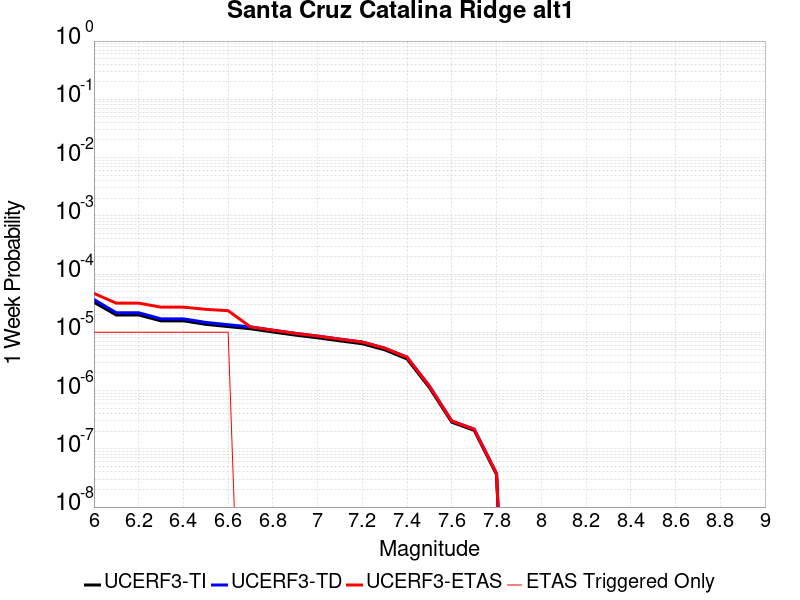 |  |  |  |

| Magnitude | 1 wk TI Prob | 1 wk TD Prob | 1 wk ETAS Prob | 1 wk ETAS/TD Gain | 1 wk ETAS Triggered Only | 1 mo TI Prob | 1 mo TD Prob | 1 mo ETAS Prob | 1 mo ETAS/TD Gain | 1 mo ETAS Triggered Only | 1 yr TI Prob | 1 yr TD Prob | 1 yr ETAS Prob | 1 yr ETAS/TD Gain | 1 yr ETAS Triggered Only | 10 yr TI Prob | 10 yr TD Prob | 10 yr ETAS Prob | 10 yr ETAS/TD Gain | 10 yr ETAS Triggered Only |
|-----|-----|-----|-----|-----|-----|-----|-----|-----|-----|-----|-----|-----|-----|-----|-----|-----|-----|-----|-----|-----|
| 6.0 | 3.2833184E-5 | 3.655896E-5 | 4.655859E-5 | 1.2735208 | 1.0E-5 | 1.4070606E-4 | 1.5667277E-4 | 1.8666807E-4 | 1.1914519 | 3.0E-5 | 0.00171175 | 0.0019059887 | 0.0019359315 | 1.0157099 | 3.0E-5 | 0.016986247 | 0.018913316 | 0.01897218 | 1.0031123 | 6.0E-5 |
| 6.1 | 1.9835548E-5 | 2.1659771E-5 | 3.1659554E-5 | 1.4616754 | 1.0E-5 | 8.500672E-5 | 9.2824404E-5 | 1.1282255E-4 | 1.2154406 | 2.0E-5 | 0.0010344655 | 0.0011295713 | 0.0011495488 | 1.0176859 | 2.0E-5 | 0.010296632 | 0.011240433 | 0.011260208 | 1.0017593 | 2.0E-5 |
| 6.2 | 1.9835548E-5 | 2.1659771E-5 | 3.1659554E-5 | 1.4616754 | 1.0E-5 | 8.500672E-5 | 9.2824404E-5 | 1.1282255E-4 | 1.2154406 | 2.0E-5 | 0.0010344655 | 0.0011295713 | 0.0011495488 | 1.0176859 | 2.0E-5 | 0.010296632 | 0.011240433 | 0.011260208 | 1.0017593 | 2.0E-5 |
| 6.3 | 1.5728183E-5 | 1.7034137E-5 | 2.7033968E-5 | 1.5870464 | 1.0E-5 | 6.7404755E-5 | 7.3001436E-5 | 9.299998E-5 | 1.2739472 | 2.0E-5 | 8.2034385E-4 | 8.884362E-4 | 9.0841844E-4 | 1.0224915 | 2.0E-5 | 0.008173222 | 0.008849524 | 0.008869347 | 1.0022401 | 2.0E-5 |
| 6.4 | 1.5728183E-5 | 1.7034137E-5 | 2.7033968E-5 | 1.5870464 | 1.0E-5 | 6.7404755E-5 | 7.3001436E-5 | 9.299998E-5 | 1.2739472 | 2.0E-5 | 8.2034385E-4 | 8.884362E-4 | 9.0841844E-4 | 1.0224915 | 2.0E-5 | 0.008173222 | 0.008849524 | 0.008869347 | 1.0022401 | 2.0E-5 |
| 6.5 | 1.3707734E-5 | 1.4794678E-5 | 2.479453E-5 | 1.6759087 | 1.0E-5 | 5.8746107E-5 | 6.3404244E-5 | 8.340297E-5 | 1.3154163 | 2.0E-5 | 7.1499916E-4 | 7.716768E-4 | 7.916613E-4 | 1.0258976 | 2.0E-5 | 0.0071270303 | 0.0076903705 | 0.0077102166 | 1.0025806 | 2.0E-5 |
| 6.6 | 1.2539813E-5 | 1.3510358E-5 | 2.3510223E-5 | 1.7401628 | 1.0E-5 | 5.3740947E-5 | 5.7900266E-5 | 7.789911E-5 | 1.3454015 | 2.0E-5 | 6.540996E-4 | 7.0471043E-4 | 7.246963E-4 | 1.0283605 | 2.0E-5 | 0.0065217763 | 0.0070250607 | 0.0070449198 | 1.0028269 | 2.0E-5 |
| 6.7 | 1.1504083E-5 | 1.23775E-5 | 1.23775E-5 | 1.0 | 0.0 | 4.930228E-5 | 5.304536E-5 | 6.304483E-5 | 1.1885079 | 1.0E-5 | 6.0008996E-4 | 6.456379E-4 | 6.556315E-4 | 1.0154786 | 1.0E-5 | 0.005984721 | 0.0064378507 | 0.0064477865 | 1.0015433 | 1.0E-5 |
| 6.8 | 1.012739E-5 | 1.0877178E-5 | 1.0877178E-5 | 1.0 | 0.0 | 4.340238E-5 | 4.6615653E-5 | 5.6615187E-5 | 1.2145102 | 1.0E-5 | 5.282958E-4 | 5.673993E-4 | 5.773936E-4 | 1.0176142 | 1.0E-5 | 0.0052704164 | 0.005659675 | 0.0056696185 | 1.0017569 | 1.0E-5 |
| 6.9 | 8.9607865E-6 | 9.60921E-6 | 9.60921E-6 | 1.0 | 0.0 | 3.8402806E-5 | 4.1181684E-5 | 5.1181272E-5 | 1.2428164 | 1.0E-5 | 4.6745385E-4 | 5.0127273E-4 | 5.112677E-4 | 1.0199392 | 1.0E-5 | 0.0046647177 | 0.00500154 | 0.0050114896 | 1.0019894 | 1.0E-5 |
| 7.0 | 8.046829E-6 | 8.619827E-6 | 8.619827E-6 | 1.0 | 0.0 | 3.4485955E-5 | 3.6941598E-5 | 4.694123E-5 | 1.2706876 | 1.0E-5 | 4.1978562E-4 | 4.4967196E-4 | 4.5966747E-4 | 1.0222285 | 1.0E-5 | 0.004189935 | 0.004487711 | 0.0044976664 | 1.0022184 | 1.0E-5 |
| 7.1 | 7.136131E-6 | 7.637727E-6 | 7.637727E-6 | 1.0 | 0.0 | 3.0583058E-5 | 3.273271E-5 | 3.273271E-5 | 1.0 | 0.0 | 3.7228514E-4 | 3.9844858E-4 | 3.9844858E-4 | 1.0 | 0.0 | 0.0037166206 | 0.0039774184 | 0.0039774184 | 1.0 | 0.0 |
| 7.2 | 6.362014E-6 | 6.8050217E-6 | 6.8050217E-6 | 1.0 | 0.0 | 2.726549E-5 | 2.9164055E-5 | 2.9164055E-5 | 1.0 | 0.0 | 3.3190678E-4 | 3.5501516E-4 | 3.5501516E-4 | 1.0 | 0.0 | 0.0033141149 | 0.0035445488 | 0.0035445488 | 1.0 | 0.0 |
| 7.3 | 5.004101E-6 | 5.3517642E-6 | 5.3517642E-6 | 1.0 | 0.0 | 2.1445969E-5 | 2.2935934E-5 | 2.2935934E-5 | 1.0 | 0.0 | 2.6107338E-4 | 2.7920975E-4 | 2.7920975E-4 | 1.0 | 0.0 | 0.002607669 | 0.0027886443 | 0.0027886443 | 1.0 | 0.0 |
| 7.4 | 3.4901443E-6 | 3.732087E-6 | 3.732087E-6 | 1.0 | 0.0 | 1.4957676E-5 | 1.5994563E-5 | 1.5994563E-5 | 1.0 | 0.0 | 1.8209449E-4 | 1.9471678E-4 | 1.9471678E-4 | 1.0 | 0.0 | 0.0018194534 | 0.0019455003 | 0.0019455003 | 1.0 | 0.0 |
| 7.5 | 1.1215045E-6 | 1.1893966E-6 | 1.1893966E-6 | 1.0 | 0.0 | 4.806439E-6 | 5.0974045E-6 | 5.0974045E-6 | 1.0 | 0.0 | 5.851682E-5 | 6.205916E-5 | 6.205916E-5 | 1.0 | 0.0 | 5.850142E-4 | 6.204214E-4 | 6.204214E-4 | 1.0 | 0.0 |
| 7.6 | 2.8599047E-7 | 2.9952182E-7 | 2.9952182E-7 | 1.0 | 0.0 | 1.2256729E-6 | 1.2836642E-6 | 1.2836642E-6 | 1.0 | 0.0 | 1.4922465E-5 | 1.5628502E-5 | 1.5628502E-5 | 1.0 | 0.0 | 1.4921463E-4 | 1.5627417E-4 | 1.5627417E-4 | 1.0 | 0.0 |
| 7.7 | 2.0781519E-7 | 2.1744457E-7 | 2.1744457E-7 | 1.0 | 0.0 | 8.906362E-7 | 9.3190494E-7 | 9.3190494E-7 | 1.0 | 0.0 | 1.08434415E-5 | 1.1345885E-5 | 1.1345885E-5 | 1.0 | 0.0 | 1.0842913E-4 | 1.1345315E-4 | 1.1345315E-4 | 1.0 | 0.0 |
| 7.8 | 3.614776E-8 | 3.7641225E-8 | 3.7641225E-8 | 1.0 | 0.0 | 1.5491896E-7 | 1.6131952E-7 | 1.6131952E-7 | 1.0 | 0.0 | 1.8861368E-6 | 1.9640636E-6 | 1.9640636E-6 | 1.0 | 0.0 | 1.8861208E-5 | 1.9640474E-5 | 1.9640474E-5 | 1.0 | 0.0 |

## Red Mountain
*[(top)](#table-of-contents)*

| 1 Week | 1 Month | 1 Year | 10 Year |
|-----|-----|-----|-----|
|  |  |  |  |

| Magnitude | 1 wk TI Prob | 1 wk TD Prob | 1 wk ETAS Prob | 1 wk ETAS/TD Gain | 1 wk ETAS Triggered Only | 1 mo TI Prob | 1 mo TD Prob | 1 mo ETAS Prob | 1 mo ETAS/TD Gain | 1 mo ETAS Triggered Only | 1 yr TI Prob | 1 yr TD Prob | 1 yr ETAS Prob | 1 yr ETAS/TD Gain | 1 yr ETAS Triggered Only | 10 yr TI Prob | 10 yr TD Prob | 10 yr ETAS Prob | 10 yr ETAS/TD Gain | 10 yr ETAS Triggered Only |
|-----|-----|-----|-----|-----|-----|-----|-----|-----|-----|-----|-----|-----|-----|-----|-----|-----|-----|-----|-----|-----|
| 6.0 | 4.1810763E-5 | 4.7591006E-5 | 5.759053E-5 | 1.2101138 | 1.0E-5 | 1.7917668E-4 | 2.0394645E-4 | 2.139444E-4 | 1.0490224 | 1.0E-5 | 0.0021792934 | 0.0024803858 | 0.0025202865 | 1.0160866 | 4.0E-5 | 0.021580452 | 0.02454463 | 0.024603158 | 1.0023845 | 6.0E-5 |
| 6.1 | 4.1810763E-5 | 4.7591006E-5 | 5.759053E-5 | 1.2101138 | 1.0E-5 | 1.7917668E-4 | 2.0394645E-4 | 2.139444E-4 | 1.0490224 | 1.0E-5 | 0.0021792934 | 0.0024803858 | 0.0025202865 | 1.0160866 | 4.0E-5 | 0.021580452 | 0.02454463 | 0.024603158 | 1.0023845 | 6.0E-5 |
| 6.2 | 4.1810763E-5 | 4.7591006E-5 | 5.759053E-5 | 1.2101138 | 1.0E-5 | 1.7917668E-4 | 2.0394645E-4 | 2.139444E-4 | 1.0490224 | 1.0E-5 | 0.0021792934 | 0.0024803858 | 0.0025202865 | 1.0160866 | 4.0E-5 | 0.021580452 | 0.02454463 | 0.024603158 | 1.0023845 | 6.0E-5 |
| 6.3 | 4.1810763E-5 | 4.7591006E-5 | 5.759053E-5 | 1.2101138 | 1.0E-5 | 1.7917668E-4 | 2.0394645E-4 | 2.139444E-4 | 1.0490224 | 1.0E-5 | 0.0021792934 | 0.0024803858 | 0.0025202865 | 1.0160866 | 4.0E-5 | 0.021580452 | 0.02454463 | 0.024603158 | 1.0023845 | 6.0E-5 |
| 6.4 | 4.1810763E-5 | 4.7591006E-5 | 5.759053E-5 | 1.2101138 | 1.0E-5 | 1.7917668E-4 | 2.0394645E-4 | 2.139444E-4 | 1.0490224 | 1.0E-5 | 0.0021792934 | 0.0024803858 | 0.0025202865 | 1.0160866 | 4.0E-5 | 0.021580452 | 0.02454463 | 0.024603158 | 1.0023845 | 6.0E-5 |
| 6.5 | 3.154503E-5 | 3.5360477E-5 | 3.5360477E-5 | 1.0 | 0.0 | 1.3518598E-4 | 1.5153662E-4 | 1.5153662E-4 | 1.0 | 0.0 | 0.0016446467 | 0.0018434891 | 0.0018634523 | 1.010829 | 2.0E-5 | 0.01632528 | 0.018291617 | 0.018330885 | 1.0021468 | 4.0E-5 |
| 6.6 | 3.1535834E-5 | 3.5349858E-5 | 3.5349858E-5 | 1.0 | 0.0 | 1.3514658E-4 | 1.5149111E-4 | 1.5149111E-4 | 1.0 | 0.0 | 0.0016441676 | 0.001842936 | 0.0018628992 | 1.0108322 | 2.0E-5 | 0.01632056 | 0.018286178 | 0.018325446 | 1.0021474 | 4.0E-5 |
| 6.7 | 2.8267326E-5 | 3.146999E-5 | 3.146999E-5 | 1.0 | 0.0 | 1.2114006E-4 | 1.348649E-4 | 1.348649E-4 | 1.0 | 0.0 | 0.0014738824 | 0.0016408286 | 0.0016607956 | 1.012169 | 2.0E-5 | 0.014641452 | 0.016295899 | 0.016335247 | 1.0024146 | 4.0E-5 |
| 6.8 | 2.8212884E-5 | 3.1407875E-5 | 3.1407875E-5 | 1.0 | 0.0 | 1.20906756E-4 | 1.3459871E-4 | 1.3459871E-4 | 1.0 | 0.0 | 0.0014710457 | 0.0016375926 | 0.0016575599 | 1.0121931 | 2.0E-5 | 0.014613459 | 0.016264014 | 0.016303364 | 1.0024195 | 4.0E-5 |
| 6.9 | 2.4227871E-5 | 2.6707517E-5 | 2.6707517E-5 | 1.0 | 0.0 | 1.03829596E-4 | 1.1445619E-4 | 1.1445619E-4 | 1.0 | 0.0 | 0.0012633923 | 0.0013926893 | 0.0014126614 | 1.0143408 | 2.0E-5 | 0.012562336 | 0.013847304 | 0.01388675 | 1.0028486 | 4.0E-5 |
| 7.0 | 2.348524E-5 | 2.5836282E-5 | 2.5836282E-5 | 1.0 | 0.0 | 1.0064714E-4 | 1.1072265E-4 | 1.1072265E-4 | 1.0 | 0.0 | 0.0012246901 | 0.0013472902 | 0.0013672633 | 1.0148246 | 2.0E-5 | 0.012179627 | 0.013398857 | 0.013438321 | 1.0029453 | 4.0E-5 |
| 7.1 | 2.2311642E-5 | 2.4463316E-5 | 2.4463316E-5 | 1.0 | 0.0 | 9.561782E-5 | 1.04839E-4 | 1.04839E-4 | 1.0 | 0.0 | 0.0011635252 | 0.0012757422 | 0.0012957166 | 1.0156572 | 2.0E-5 | 0.01157452 | 0.012691703 | 0.012731195 | 1.0031117 | 4.0E-5 |
| 7.2 | 1.6533986E-5 | 1.7670676E-5 | 1.7670676E-5 | 1.0 | 0.0 | 7.085802E-5 | 7.572963E-5 | 7.572963E-5 | 1.0 | 0.0 | 8.623549E-4 | 9.2168164E-4 | 9.416632E-4 | 1.0216795 | 2.0E-5 | 0.008590161 | 0.009184869 | 0.009204686 | 1.0021574 | 2.0E-5 |
| 7.3 | 1.4703092E-5 | 1.5559806E-5 | 1.5559806E-5 | 1.0 | 0.0 | 6.301173E-5 | 6.6683526E-5 | 6.6683526E-5 | 1.0 | 0.0 | 7.668978E-4 | 8.1163115E-4 | 8.3161495E-4 | 1.0246217 | 2.0E-5 | 0.0076425658 | 0.008092744 | 0.008112582 | 1.0024513 | 2.0E-5 |
| 7.4 | 6.1331984E-6 | 5.52893E-6 | 5.52893E-6 | 1.0 | 0.0 | 2.6284872E-5 | 2.3695204E-5 | 2.3695204E-5 | 1.0 | 0.0 | 3.199713E-4 | 2.8845144E-4 | 2.8845144E-4 | 1.0 | 0.0 | 0.0031951098 | 0.0028808247 | 0.0028808247 | 1.0 | 0.0 |
| 7.5 | 5.954766E-6 | 5.338558E-6 | 5.338558E-6 | 1.0 | 0.0 | 2.5520176E-5 | 2.2879336E-5 | 2.2879336E-5 | 1.0 | 0.0 | 3.1066386E-4 | 2.7852083E-4 | 2.7852083E-4 | 1.0 | 0.0 | 0.003102299 | 0.0027817716 | 0.0027817716 | 1.0 | 0.0 |
| 7.6 | 4.9726646E-6 | 4.315341E-6 | 4.315341E-6 | 1.0 | 0.0 | 2.1311245E-5 | 1.8494187E-5 | 1.8494187E-5 | 1.0 | 0.0 | 2.5943352E-4 | 2.2514381E-4 | 2.2514381E-4 | 1.0 | 0.0 | 0.0025913084 | 0.0022491917 | 0.0022491917 | 1.0 | 0.0 |
| 7.7 | 3.3613894E-6 | 2.8526943E-6 | 2.8526943E-6 | 1.0 | 0.0 | 1.4405875E-5 | 1.2225777E-5 | 1.2225777E-5 | 1.0 | 0.0 | 1.7537741E-4 | 1.4883894E-4 | 1.4883894E-4 | 1.0 | 0.0 | 0.0017523908 | 0.0014874188 | 0.0014874188 | 1.0 | 0.0 |
| 7.8 | 1.1828961E-6 | 1.0122844E-6 | 1.0122844E-6 | 1.0 | 0.0 | 5.069545E-6 | 4.338355E-6 | 4.338355E-6 | 1.0 | 0.0 | 6.171996E-5 | 5.281822E-5 | 5.281822E-5 | 1.0 | 0.0 | 6.170282E-4 | 5.280596E-4 | 5.280596E-4 | 1.0 | 0.0 |
| 7.9 | 2.2967266E-7 | 1.8619119E-7 | 1.8619119E-7 | 1.0 | 0.0 | 9.843111E-7 | 7.9796195E-7 | 7.9796195E-7 | 1.0 | 0.0 | 1.19839215E-5 | 9.715147E-6 | 9.715147E-6 | 1.0 | 0.0 | 1.1983275E-4 | 9.714751E-5 | 9.714751E-5 | 1.0 | 0.0 |

## Deep Springs
*[(top)](#table-of-contents)*

| 1 Week | 1 Month | 1 Year | 10 Year |
|-----|-----|-----|-----|
| 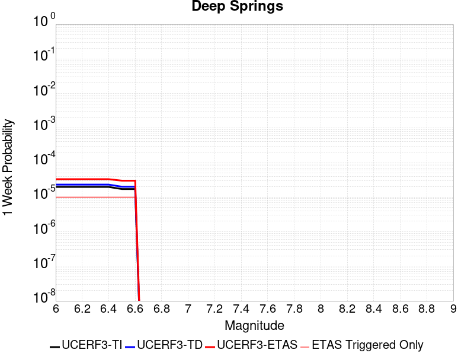 |  |  |  |

| Magnitude | 1 wk TI Prob | 1 wk TD Prob | 1 wk ETAS Prob | 1 wk ETAS/TD Gain | 1 wk ETAS Triggered Only | 1 mo TI Prob | 1 mo TD Prob | 1 mo ETAS Prob | 1 mo ETAS/TD Gain | 1 mo ETAS Triggered Only | 1 yr TI Prob | 1 yr TD Prob | 1 yr ETAS Prob | 1 yr ETAS/TD Gain | 1 yr ETAS Triggered Only | 10 yr TI Prob | 10 yr TD Prob | 10 yr ETAS Prob | 10 yr ETAS/TD Gain | 10 yr ETAS Triggered Only |
|-----|-----|-----|-----|-----|-----|-----|-----|-----|-----|-----|-----|-----|-----|-----|-----|-----|-----|-----|-----|-----|
| 6.0 | 1.9810619E-5 | 2.311303E-5 | 3.31128E-5 | 1.4326464 | 1.0E-5 | 8.489989E-5 | 9.905495E-5 | 1.0905396E-4 | 1.100944 | 1.0E-5 | 0.001033166 | 0.0012058346 | 0.0012457863 | 1.0331321 | 4.0E-5 | 0.010283757 | 0.01204269 | 0.012101968 | 1.0049223 | 6.0E-5 |
| 6.1 | 1.9810619E-5 | 2.311303E-5 | 3.31128E-5 | 1.4326464 | 1.0E-5 | 8.489989E-5 | 9.905495E-5 | 1.0905396E-4 | 1.100944 | 1.0E-5 | 0.001033166 | 0.0012058346 | 0.0012457863 | 1.0331321 | 4.0E-5 | 0.010283757 | 0.01204269 | 0.012101968 | 1.0049223 | 6.0E-5 |
| 6.2 | 1.9810619E-5 | 2.311303E-5 | 3.31128E-5 | 1.4326464 | 1.0E-5 | 8.489989E-5 | 9.905495E-5 | 1.0905396E-4 | 1.100944 | 1.0E-5 | 0.001033166 | 0.0012058346 | 0.0012457863 | 1.0331321 | 4.0E-5 | 0.010283757 | 0.01204269 | 0.012101968 | 1.0049223 | 6.0E-5 |
| 6.3 | 1.9810619E-5 | 2.311303E-5 | 3.31128E-5 | 1.4326464 | 1.0E-5 | 8.489989E-5 | 9.905495E-5 | 1.0905396E-4 | 1.100944 | 1.0E-5 | 0.001033166 | 0.0012058346 | 0.0012457863 | 1.0331321 | 4.0E-5 | 0.010283757 | 0.01204269 | 0.012101968 | 1.0049223 | 6.0E-5 |
| 6.4 | 1.9810619E-5 | 2.311303E-5 | 3.31128E-5 | 1.4326464 | 1.0E-5 | 8.489989E-5 | 9.905495E-5 | 1.0905396E-4 | 1.100944 | 1.0E-5 | 0.001033166 | 0.0012058346 | 0.0012457863 | 1.0331321 | 4.0E-5 | 0.010283757 | 0.01204269 | 0.012101968 | 1.0049223 | 6.0E-5 |
| 6.5 | 1.7190405E-5 | 2.0050999E-5 | 3.0050798E-5 | 1.4987183 | 1.0E-5 | 7.367108E-5 | 8.593285E-5 | 9.593199E-5 | 1.11636 | 1.0E-5 | 8.9657627E-4 | 0.0010462324 | 0.0010861906 | 1.0381924 | 4.0E-5 | 0.008929676 | 0.010462287 | 0.01052166 | 1.0056748 | 6.0E-5 |
| 6.6 | 1.7190405E-5 | 2.0050999E-5 | 3.0050798E-5 | 1.4987183 | 1.0E-5 | 7.367108E-5 | 8.593285E-5 | 9.593199E-5 | 1.11636 | 1.0E-5 | 8.9657627E-4 | 0.0010462324 | 0.0010861906 | 1.0381924 | 4.0E-5 | 0.008929676 | 0.010462287 | 0.01052166 | 1.0056748 | 6.0E-5 |

## Big Pine (Central)
*[(top)](#table-of-contents)*

| 1 Week | 1 Month | 1 Year | 10 Year |
|-----|-----|-----|-----|
|  |  |  |  |

| Magnitude | 1 wk TI Prob | 1 wk TD Prob | 1 wk ETAS Prob | 1 wk ETAS/TD Gain | 1 wk ETAS Triggered Only | 1 mo TI Prob | 1 mo TD Prob | 1 mo ETAS Prob | 1 mo ETAS/TD Gain | 1 mo ETAS Triggered Only | 1 yr TI Prob | 1 yr TD Prob | 1 yr ETAS Prob | 1 yr ETAS/TD Gain | 1 yr ETAS Triggered Only | 10 yr TI Prob | 10 yr TD Prob | 10 yr ETAS Prob | 10 yr ETAS/TD Gain | 10 yr ETAS Triggered Only |
|-----|-----|-----|-----|-----|-----|-----|-----|-----|-----|-----|-----|-----|-----|-----|-----|-----|-----|-----|-----|-----|
| 6.0 | 1.2706755E-5 | 1.4251012E-5 | 1.4251012E-5 | 1.0 | 0.0 | 5.4456385E-5 | 6.107454E-5 | 8.107332E-5 | 1.3274487 | 2.0E-5 | 6.628048E-4 | 7.4336544E-4 | 7.833357E-4 | 1.0537694 | 4.0E-5 | 0.006608314 | 0.0074138143 | 0.0074634436 | 1.0066942 | 5.0E-5 |
| 6.1 | 8.342579E-6 | 9.511191E-6 | 9.511191E-6 | 1.0 | 0.0 | 3.5753423E-5 | 4.0761734E-5 | 6.0760918E-5 | 1.4906362 | 2.0E-5 | 4.3521097E-4 | 4.961828E-4 | 5.36163E-4 | 1.0805755 | 4.0E-5 | 0.0043435963 | 0.0049543027 | 0.004994104 | 1.0080338 | 4.0E-5 |
| 6.2 | 6.923899E-6 | 7.967559E-6 | 7.967559E-6 | 1.0 | 0.0 | 2.9673516E-5 | 3.4146342E-5 | 5.414566E-5 | 1.5856943 | 2.0E-5 | 3.6121515E-4 | 4.1567165E-4 | 4.4565919E-4 | 1.0721424 | 3.0E-5 | 0.003606286 | 0.0041522477 | 0.004182123 | 1.007195 | 3.0E-5 |
| 6.3 | 2.728396E-6 | 3.4246525E-6 | 3.4246525E-6 | 1.0 | 0.0 | 1.1693074E-5 | 1.4677004E-5 | 3.4676712E-5 | 2.3626559 | 2.0E-5 | 1.4235388E-4 | 1.7867875E-4 | 2.0867339E-4 | 1.1678691 | 3.0E-5 | 0.0014226272 | 0.0017868559 | 0.0018168022 | 1.0167593 | 3.0E-5 |
| 6.4 | 2.7136944E-6 | 3.4089458E-6 | 3.4089458E-6 | 1.0 | 0.0 | 1.1630066E-5 | 1.4609691E-5 | 3.46094E-5 | 2.3689344 | 2.0E-5 | 1.4158686E-4 | 1.7785933E-4 | 2.07854E-4 | 1.1686426 | 3.0E-5 | 0.0014149669 | 0.0017786748 | 0.0018086215 | 1.0168365 | 3.0E-5 |
| 6.5 | 2.6971882E-6 | 3.3912906E-6 | 3.3912906E-6 | 1.0 | 0.0 | 1.1559327E-5 | 1.4534027E-5 | 3.4533736E-5 | 2.3760612 | 2.0E-5 | 1.4072572E-4 | 1.7693828E-4 | 2.0693296E-4 | 1.1695206 | 3.0E-5 | 0.0014063664 | 0.0017694789 | 0.0017994258 | 1.0169241 | 3.0E-5 |
| 6.6 | 2.669092E-6 | 3.361311E-6 | 3.361311E-6 | 1.0 | 0.0 | 1.1438916E-5 | 1.4405543E-5 | 3.4405257E-5 | 2.3883345 | 2.0E-5 | 1.3925991E-4 | 1.7537424E-4 | 2.0536898E-4 | 1.1710328 | 3.0E-5 | 0.0013917267 | 0.0017538633 | 0.0017838107 | 1.0170751 | 3.0E-5 |
| 6.7 | 2.6408059E-6 | 3.3313363E-6 | 3.3313363E-6 | 1.0 | 0.0 | 1.1317691E-5 | 1.4277082E-5 | 3.4276796E-5 | 2.4008265 | 2.0E-5 | 1.3778417E-4 | 1.7381048E-4 | 2.0380526E-4 | 1.1725718 | 3.0E-5 | 0.0013769877 | 0.0017382503 | 0.0017681981 | 1.0172287 | 3.0E-5 |
| 6.8 | 2.1786943E-6 | 2.8547915E-6 | 2.8547915E-6 | 1.0 | 0.0 | 9.337228E-6 | 1.2234768E-5 | 3.2234522E-5 | 2.6346657 | 2.0E-5 | 1.1367482E-4 | 1.4894885E-4 | 1.7894438E-4 | 1.2013814 | 3.0E-5 | 0.0011361669 | 0.0014899815 | 0.0015199368 | 1.0201045 | 3.0E-5 |
| 6.9 | 1.4411696E-6 | 2.0688422E-6 | 2.0688422E-6 | 1.0 | 0.0 | 6.1764263E-6 | 8.866437E-6 | 1.8866349E-5 | 2.1278386 | 1.0E-5 | 7.51954E-5 | 1.079438E-4 | 1.1794272E-4 | 1.0926307 | 1.0E-5 | 7.5169955E-4 | 0.0010803605 | 0.0010903496 | 1.0092461 | 1.0E-5 |
| 7.0 | 1.0073411E-6 | 1.5545673E-6 | 1.5545673E-6 | 1.0 | 0.0 | 4.317169E-6 | 6.662415E-6 | 1.6662349E-5 | 2.5009472 | 1.0E-5 | 5.2560266E-5 | 8.111204E-5 | 9.111123E-5 | 1.1232762 | 1.0E-5 | 5.2547833E-4 | 8.1225985E-4 | 8.222517E-4 | 1.0123013 | 1.0E-5 |
| 7.1 | 8.947104E-7 | 1.4305514E-6 | 1.4305514E-6 | 1.0 | 0.0 | 3.834468E-6 | 6.130921E-6 | 6.130921E-6 | 1.0 | 0.0 | 4.6683643E-5 | 7.464155E-5 | 7.464155E-5 | 1.0 | 0.0 | 4.6673836E-4 | 7.476001E-4 | 7.476001E-4 | 1.0 | 0.0 |
| 7.2 | 5.215166E-7 | 1.0114496E-6 | 1.0114496E-6 | 1.0 | 0.0 | 2.2350691E-6 | 4.3347773E-6 | 4.3347773E-6 | 1.0 | 0.0 | 2.7211627E-5 | 5.2774678E-5 | 5.2774678E-5 | 1.0 | 0.0 | 2.7208295E-4 | 5.290466E-4 | 5.290466E-4 | 1.0 | 0.0 |
| 7.3 | 4.4024807E-7 | 9.2223235E-7 | 9.2223235E-7 | 1.0 | 0.0 | 1.8867761E-6 | 3.9524184E-6 | 3.9524184E-6 | 1.0 | 0.0 | 2.2971257E-5 | 4.8119677E-5 | 4.8119677E-5 | 1.0 | 0.0 | 2.2968883E-4 | 4.8251753E-4 | 4.8251753E-4 | 1.0 | 0.0 |
| 7.4 | 3.6130905E-7 | 8.3611724E-7 | 8.3611724E-7 | 1.0 | 0.0 | 1.5484665E-6 | 3.583355E-6 | 3.583355E-6 | 1.0 | 0.0 | 1.8852415E-5 | 4.362651E-5 | 4.362651E-5 | 1.0 | 0.0 | 1.8850817E-4 | 4.3759486E-4 | 4.3759486E-4 | 1.0 | 0.0 |
| 7.5 | 3.408184E-7 | 8.110739E-7 | 8.110739E-7 | 1.0 | 0.0 | 1.4606494E-6 | 3.4760267E-6 | 3.4760267E-6 | 1.0 | 0.0 | 1.7783263E-5 | 4.231984E-5 | 4.231984E-5 | 1.0 | 0.0 | 1.778184E-4 | 4.2451176E-4 | 4.2451176E-4 | 1.0 | 0.0 |
| 7.6 | 3.1428627E-7 | 7.7341E-7 | 7.7341E-7 | 1.0 | 0.0 | 1.3469405E-6 | 3.3146102E-6 | 3.3146102E-6 | 1.0 | 0.0 | 1.6398877E-5 | 4.0354673E-5 | 4.0354673E-5 | 1.0 | 0.0 | 1.6397667E-4 | 4.0483844E-4 | 4.0483844E-4 | 1.0 | 0.0 |
| 7.7 | 1.7972785E-7 | 5.0796626E-7 | 5.0796626E-7 | 1.0 | 0.0 | 7.70262E-7 | 2.1769965E-6 | 2.1769965E-6 | 1.0 | 0.0 | 9.377899E-6 | 2.6504622E-5 | 2.6504622E-5 | 1.0 | 0.0 | 9.377503E-5 | 2.663867E-4 | 2.663867E-4 | 1.0 | 0.0 |
| 7.8 | 4.9230927E-8 | 1.1985297E-7 | 1.1985297E-7 | 1.0 | 0.0 | 2.1098968E-7 | 5.136555E-7 | 5.136555E-7 | 1.0 | 0.0 | 2.5687964E-6 | 6.2537392E-6 | 6.2537392E-6 | 1.0 | 0.0 | 2.5687666E-5 | 6.2977226E-5 | 6.2977226E-5 | 1.0 | 0.0 |
| 7.9 | 3.6805972E-9 | 4.1070685E-9 | 4.1070685E-9 | 1.0 | 0.0 | 1.5773987E-8 | 1.7601723E-8 | 1.7601723E-8 | 1.0 | 0.0 | 1.9204828E-7 | 2.1430095E-7 | 2.1430095E-7 | 1.0 | 0.0 | 1.920481E-6 | 2.190991E-6 | 2.190991E-6 | 1.0 | 0.0 |

## San Jacinto (Anza) rev
*[(top)](#table-of-contents)*

| 1 Week | 1 Month | 1 Year | 10 Year |
|-----|-----|-----|-----|
|  |  |  |  |

| Magnitude | 1 wk TI Prob | 1 wk TD Prob | 1 wk ETAS Prob | 1 wk ETAS/TD Gain | 1 wk ETAS Triggered Only | 1 mo TI Prob | 1 mo TD Prob | 1 mo ETAS Prob | 1 mo ETAS/TD Gain | 1 mo ETAS Triggered Only | 1 yr TI Prob | 1 yr TD Prob | 1 yr ETAS Prob | 1 yr ETAS/TD Gain | 1 yr ETAS Triggered Only | 10 yr TI Prob | 10 yr TD Prob | 10 yr ETAS Prob | 10 yr ETAS/TD Gain | 10 yr ETAS Triggered Only |
|-----|-----|-----|-----|-----|-----|-----|-----|-----|-----|-----|-----|-----|-----|-----|-----|-----|-----|-----|-----|-----|
| 6.0 | 6.3015636E-5 | 4.3319626E-5 | 4.3319626E-5 | 1.0 | 0.0 | 2.7003905E-4 | 1.8564239E-4 | 1.9564053E-4 | 1.053857 | 1.0E-5 | 0.0032827691 | 0.0022578652 | 0.0022678426 | 1.004419 | 1.0E-5 | 0.032346968 | 0.02330496 | 0.023353795 | 1.0020955 | 5.0E-5 |
| 6.1 | 6.3015636E-5 | 4.3319626E-5 | 4.3319626E-5 | 1.0 | 0.0 | 2.7003905E-4 | 1.8564239E-4 | 1.9564053E-4 | 1.053857 | 1.0E-5 | 0.0032827691 | 0.0022578652 | 0.0022678426 | 1.004419 | 1.0E-5 | 0.032346968 | 0.02330496 | 0.023353795 | 1.0020955 | 5.0E-5 |
| 6.2 | 6.3015636E-5 | 4.3319626E-5 | 4.3319626E-5 | 1.0 | 0.0 | 2.7003905E-4 | 1.8564239E-4 | 1.9564053E-4 | 1.053857 | 1.0E-5 | 0.0032827691 | 0.0022578652 | 0.0022678426 | 1.004419 | 1.0E-5 | 0.032346968 | 0.02330496 | 0.023353795 | 1.0020955 | 5.0E-5 |
| 6.3 | 6.3015636E-5 | 4.3319626E-5 | 4.3319626E-5 | 1.0 | 0.0 | 2.7003905E-4 | 1.8564239E-4 | 1.9564053E-4 | 1.053857 | 1.0E-5 | 0.0032827691 | 0.0022578652 | 0.0022678426 | 1.004419 | 1.0E-5 | 0.032346968 | 0.02330496 | 0.023353795 | 1.0020955 | 5.0E-5 |
| 6.4 | 6.3015636E-5 | 4.3319626E-5 | 4.3319626E-5 | 1.0 | 0.0 | 2.7003905E-4 | 1.8564239E-4 | 1.9564053E-4 | 1.053857 | 1.0E-5 | 0.0032827691 | 0.0022578652 | 0.0022678426 | 1.004419 | 1.0E-5 | 0.032346968 | 0.02330496 | 0.023353795 | 1.0020955 | 5.0E-5 |
| 6.5 | 5.811017E-5 | 4.0098632E-5 | 4.0098632E-5 | 1.0 | 0.0 | 2.4901982E-4 | 1.7184E-4 | 1.8183827E-4 | 1.0581837 | 1.0E-5 | 0.0030276014 | 0.00209015 | 0.0021001291 | 1.0047743 | 1.0E-5 | 0.02986684 | 0.021602087 | 0.021651005 | 1.0022646 | 5.0E-5 |
| 6.6 | 5.811017E-5 | 4.0098632E-5 | 4.0098632E-5 | 1.0 | 0.0 | 2.4901982E-4 | 1.7184E-4 | 1.8183827E-4 | 1.0581837 | 1.0E-5 | 0.0030276014 | 0.00209015 | 0.0021001291 | 1.0047743 | 1.0E-5 | 0.02986684 | 0.021602087 | 0.021651005 | 1.0022646 | 5.0E-5 |
| 6.7 | 5.712442E-5 | 3.952116E-5 | 3.952116E-5 | 1.0 | 0.0 | 2.4479596E-4 | 1.6936543E-4 | 1.7936373E-4 | 1.0590339 | 1.0E-5 | 0.0029763177 | 0.0020600795 | 0.0020700588 | 1.0048442 | 1.0E-5 | 0.029367693 | 0.021293823 | 0.021342758 | 1.0022981 | 5.0E-5 |
| 6.8 | 5.6967532E-5 | 3.9377548E-5 | 3.9377548E-5 | 1.0 | 0.0 | 2.4412372E-4 | 1.6875003E-4 | 1.7874835E-4 | 1.0592493 | 1.0E-5 | 0.0029681553 | 0.0020526012 | 0.0020625808 | 1.0048618 | 1.0E-5 | 0.029288229 | 0.021218529 | 0.021267468 | 1.0023065 | 5.0E-5 |
| 6.9 | 5.6211324E-5 | 3.9082228E-5 | 3.9082228E-5 | 1.0 | 0.0 | 2.4088343E-4 | 1.6748454E-4 | 1.7748287E-4 | 1.059697 | 1.0E-5 | 0.0029288116 | 0.0020372227 | 0.0020472023 | 1.0048987 | 1.0E-5 | 0.028905109 | 0.021057902 | 0.021106848 | 1.0023245 | 5.0E-5 |
| 7.0 | 5.4383527E-5 | 3.7942387E-5 | 3.7942387E-5 | 1.0 | 0.0 | 2.3305144E-4 | 1.6260012E-4 | 1.7259849E-4 | 1.0614905 | 1.0E-5 | 0.0028337094 | 0.001977864 | 0.001987844 | 1.005046 | 1.0E-5 | 0.027978465 | 0.020448677 | 0.020497654 | 1.0023952 | 5.0E-5 |
| 7.1 | 5.1393665E-5 | 3.640475E-5 | 3.640475E-5 | 1.0 | 0.0 | 2.2023996E-4 | 1.5601104E-4 | 1.6600947E-4 | 1.064088 | 1.0E-5 | 0.0026781242 | 0.0018977838 | 0.0019077648 | 1.0052593 | 1.0E-5 | 0.026460782 | 0.019622007 | 0.019671025 | 1.0024981 | 5.0E-5 |
| 7.2 | 4.785222E-5 | 3.475601E-5 | 3.475601E-5 | 1.0 | 0.0 | 2.0506482E-4 | 1.4894584E-4 | 1.5894436E-4 | 1.0671285 | 1.0E-5 | 0.0024938055 | 0.0018119109 | 0.0018218927 | 1.005509 | 1.0E-5 | 0.024660049 | 0.018736389 | 0.018785452 | 1.0026186 | 5.0E-5 |
| 7.3 | 4.2143256E-5 | 3.3850083E-5 | 3.3850083E-5 | 1.0 | 0.0 | 1.8060145E-4 | 1.4506375E-4 | 1.550623E-4 | 1.0689253 | 1.0E-5 | 0.002196605 | 0.0017647238 | 0.0017747062 | 1.0056566 | 1.0E-5 | 0.02175019 | 0.018244414 | 0.018293502 | 1.0026906 | 5.0E-5 |
| 7.4 | 4.0264713E-5 | 3.3488133E-5 | 3.3488133E-5 | 1.0 | 0.0 | 1.7255165E-4 | 1.435127E-4 | 1.5351127E-4 | 1.0696702 | 1.0E-5 | 0.002098792 | 0.0017458702 | 0.0017558528 | 1.0057178 | 1.0E-5 | 0.020790804 | 0.018048922 | 0.018098019 | 1.0027202 | 5.0E-5 |
| 7.5 | 3.694492E-5 | 3.2201835E-5 | 3.2201835E-5 | 1.0 | 0.0 | 1.5832575E-4 | 1.3800059E-4 | 1.479992E-4 | 1.0724535 | 1.0E-5 | 0.0019259118 | 0.0016788654 | 0.0016888486 | 1.0059464 | 1.0E-5 | 0.01909306 | 0.017365217 | 0.017414348 | 1.0028293 | 5.0E-5 |
| 7.6 | 3.200565E-5 | 2.9517045E-5 | 2.9517045E-5 | 1.0 | 0.0 | 1.3715986E-4 | 1.2649549E-4 | 1.3649423E-4 | 1.0790442 | 1.0E-5 | 0.001668642 | 0.0015389969 | 0.0015489815 | 1.0064877 | 1.0E-5 | 0.01656168 | 0.015953032 | 0.016002234 | 1.0030842 | 5.0E-5 |
| 7.7 | 2.731642E-5 | 2.610537E-5 | 2.610537E-5 | 1.0 | 0.0 | 1.1706512E-4 | 1.11875364E-4 | 1.2187425E-4 | 1.0893751 | 1.0E-5 | 0.001424336 | 0.0013612325 | 0.0013712189 | 1.0073363 | 1.0E-5 | 0.014152412 | 0.0141735645 | 0.014222857 | 1.0034777 | 5.0E-5 |
| 7.8 | 2.3466424E-5 | 2.3516895E-5 | 2.3516895E-5 | 1.0 | 0.0 | 1.0056651E-4 | 1.007828E-4 | 1.10781795E-4 | 1.0992132 | 1.0E-5 | 0.0012237094 | 0.0012263408 | 0.0012363285 | 1.0081444 | 1.0E-5 | 0.012169928 | 0.012815201 | 0.01286456 | 1.0038517 | 5.0E-5 |
| 7.9 | 1.8611925E-5 | 1.8918972E-5 | 1.8918972E-5 | 1.0 | 0.0 | 7.9762955E-5 | 8.107879E-5 | 9.107798E-5 | 1.1233268 | 1.0E-5 | 9.7068126E-4 | 9.86688E-4 | 9.966781E-4 | 1.0101249 | 1.0E-5 | 0.0096645225 | 0.010399517 | 0.010448997 | 1.0047579 | 5.0E-5 |
| 8.0 | 1.5460775E-5 | 1.5750582E-5 | 1.5750582E-5 | 1.0 | 0.0 | 6.6258784E-5 | 6.7500754E-5 | 7.750008E-5 | 1.1481365 | 1.0E-5 | 8.0640207E-4 | 8.215125E-4 | 8.315043E-4 | 1.0121627 | 1.0E-5 | 0.008034821 | 0.008707945 | 0.00875751 | 1.0056919 | 5.0E-5 |
| 8.1 | 9.983884E-6 | 8.275629E-6 | 8.275629E-6 | 1.0 | 0.0 | 4.2787375E-5 | 3.54665E-5 | 3.54665E-5 | 1.0 | 0.0 | 5.2081177E-4 | 4.3171959E-4 | 4.3171959E-4 | 1.0 | 0.0 | 0.0051959283 | 0.004643071 | 0.004672932 | 1.0064312 | 3.0E-5 |
| 8.2 | 4.1226E-6 | 1.5546157E-6 | 1.5546157E-6 | 1.0 | 0.0 | 1.7668166E-5 | 6.6626217E-6 | 6.6626217E-6 | 1.0 | 0.0 | 2.1508869E-4 | 8.111443E-5 | 8.111443E-5 | 1.0 | 0.0 | 0.0021488064 | 9.4143586E-4 | 9.4143586E-4 | 1.0 | 0.0 |
| 8.3 | 1.2750878E-6 | 3.6166134E-7 | 3.6166134E-7 | 1.0 | 0.0 | 5.4646503E-6 | 1.5499762E-6 | 1.5499762E-6 | 1.0 | 0.0 | 6.653009E-5 | 1.8870802E-5 | 1.8870802E-5 | 1.0 | 0.0 | 6.6510175E-4 | 2.2760578E-4 | 2.2760578E-4 | 1.0 | 0.0 |

## Kern Canyon (North Kern) 2011
*[(top)](#table-of-contents)*

| 1 Week | 1 Month | 1 Year | 10 Year |
|-----|-----|-----|-----|
|  |  |  |  |

| Magnitude | 1 wk TI Prob | 1 wk TD Prob | 1 wk ETAS Prob | 1 wk ETAS/TD Gain | 1 wk ETAS Triggered Only | 1 mo TI Prob | 1 mo TD Prob | 1 mo ETAS Prob | 1 mo ETAS/TD Gain | 1 mo ETAS Triggered Only | 1 yr TI Prob | 1 yr TD Prob | 1 yr ETAS Prob | 1 yr ETAS/TD Gain | 1 yr ETAS Triggered Only | 10 yr TI Prob | 10 yr TD Prob | 10 yr ETAS Prob | 10 yr ETAS/TD Gain | 10 yr ETAS Triggered Only |
|-----|-----|-----|-----|-----|-----|-----|-----|-----|-----|-----|-----|-----|-----|-----|-----|-----|-----|-----|-----|-----|
| 6.0 | 6.6264497E-6 | 6.7573515E-6 | 6.7573515E-6 | 1.0 | 0.0 | 2.8398761E-5 | 2.8959801E-5 | 3.895951E-5 | 1.3452963 | 1.0E-5 | 3.4570007E-4 | 3.5253653E-4 | 3.8252596E-4 | 1.0850675 | 3.0E-5 | 0.0034516277 | 0.0035205614 | 0.0035703853 | 1.0141523 | 5.0E-5 |
| 6.1 | 6.6264497E-6 | 6.7573515E-6 | 6.7573515E-6 | 1.0 | 0.0 | 2.8398761E-5 | 2.8959801E-5 | 3.895951E-5 | 1.3452963 | 1.0E-5 | 3.4570007E-4 | 3.5253653E-4 | 3.8252596E-4 | 1.0850675 | 3.0E-5 | 0.0034516277 | 0.0035205614 | 0.0035703853 | 1.0141523 | 5.0E-5 |
| 6.2 | 6.6264497E-6 | 6.7573515E-6 | 6.7573515E-6 | 1.0 | 0.0 | 2.8398761E-5 | 2.8959801E-5 | 3.895951E-5 | 1.3452963 | 1.0E-5 | 3.4570007E-4 | 3.5253653E-4 | 3.8252596E-4 | 1.0850675 | 3.0E-5 | 0.0034516277 | 0.0035205614 | 0.0035703853 | 1.0141523 | 5.0E-5 |
| 6.3 | 6.6264497E-6 | 6.7573515E-6 | 6.7573515E-6 | 1.0 | 0.0 | 2.8398761E-5 | 2.8959801E-5 | 3.895951E-5 | 1.3452963 | 1.0E-5 | 3.4570007E-4 | 3.5253653E-4 | 3.8252596E-4 | 1.0850675 | 3.0E-5 | 0.0034516277 | 0.0035205614 | 0.0035703853 | 1.0141523 | 5.0E-5 |
| 6.4 | 6.6264497E-6 | 6.7573515E-6 | 6.7573515E-6 | 1.0 | 0.0 | 2.8398761E-5 | 2.8959801E-5 | 3.895951E-5 | 1.3452963 | 1.0E-5 | 3.4570007E-4 | 3.5253653E-4 | 3.8252596E-4 | 1.0850675 | 3.0E-5 | 0.0034516277 | 0.0035205614 | 0.0035703853 | 1.0141523 | 5.0E-5 |
| 6.5 | 3.2162225E-6 | 3.2571006E-6 | 3.2571006E-6 | 1.0 | 0.0 | 1.3783738E-5 | 1.3958933E-5 | 1.3958933E-5 | 1.0 | 0.0 | 1.6780409E-4 | 1.6993756E-4 | 1.7993586E-4 | 1.0588351 | 1.0E-5 | 0.0016767744 | 0.0016981558 | 0.0017081387 | 1.0058787 | 1.0E-5 |
| 6.6 | 3.2162225E-6 | 3.2571006E-6 | 3.2571006E-6 | 1.0 | 0.0 | 1.3783738E-5 | 1.3958933E-5 | 1.3958933E-5 | 1.0 | 0.0 | 1.6780409E-4 | 1.6993756E-4 | 1.7993586E-4 | 1.0588351 | 1.0E-5 | 0.0016767744 | 0.0016981558 | 0.0017081387 | 1.0058787 | 1.0E-5 |
| 6.7 | 2.1908265E-6 | 2.2071279E-6 | 2.2071279E-6 | 1.0 | 0.0 | 9.389223E-6 | 9.459087E-6 | 9.459087E-6 | 1.0 | 0.0 | 1.1430779E-4 | 1.1515849E-4 | 1.1515849E-4 | 1.0 | 0.0 | 0.0011424901 | 0.0011510076 | 0.0011510076 | 1.0 | 0.0 |
| 6.8 | 1.7303895E-6 | 1.7365574E-6 | 1.7365574E-6 | 1.0 | 0.0 | 7.415934E-6 | 7.442368E-6 | 7.442368E-6 | 1.0 | 0.0 | 9.028525E-5 | 9.060716E-5 | 9.060716E-5 | 1.0 | 0.0 | 9.024858E-4 | 9.057119E-4 | 9.057119E-4 | 1.0 | 0.0 |
| 6.9 | 1.3700314E-6 | 1.3688657E-6 | 1.3688657E-6 | 1.0 | 0.0 | 5.87155E-6 | 5.866554E-6 | 5.866554E-6 | 1.0 | 0.0 | 7.148377E-5 | 7.1423005E-5 | 7.1423005E-5 | 1.0 | 0.0 | 7.146078E-4 | 7.1400503E-4 | 7.1400503E-4 | 1.0 | 0.0 |
| 7.0 | 1.1467797E-6 | 1.1413833E-6 | 1.1413833E-6 | 1.0 | 0.0 | 4.9147607E-6 | 4.8916336E-6 | 4.8916336E-6 | 1.0 | 0.0 | 5.983557E-5 | 5.9554044E-5 | 5.9554044E-5 | 1.0 | 0.0 | 5.981946E-4 | 5.95384E-4 | 5.95384E-4 | 1.0 | 0.0 |
| 7.1 | 9.3952065E-7 | 9.302714E-7 | 9.302714E-7 | 1.0 | 0.0 | 4.026511E-6 | 3.9868714E-6 | 3.9868714E-6 | 1.0 | 0.0 | 4.9021666E-5 | 4.8539096E-5 | 4.8539096E-5 | 1.0 | 0.0 | 4.901085E-4 | 4.8528673E-4 | 4.8528673E-4 | 1.0 | 0.0 |
| 7.2 | 6.858055E-7 | 6.719318E-7 | 6.719318E-7 | 1.0 | 0.0 | 2.939163E-6 | 2.8797044E-6 | 2.8797044E-6 | 1.0 | 0.0 | 3.5783723E-5 | 3.5059846E-5 | 3.5059846E-5 | 1.0 | 0.0 | 3.5777962E-4 | 3.5054405E-4 | 3.5054405E-4 | 1.0 | 0.0 |
| 7.3 | 5.1101983E-7 | 4.939313E-7 | 4.939313E-7 | 1.0 | 0.0 | 2.1900833E-6 | 2.1168466E-6 | 2.1168466E-6 | 1.0 | 0.0 | 2.6663936E-5 | 2.5772308E-5 | 2.5772308E-5 | 1.0 | 0.0 | 2.6660739E-4 | 2.5769367E-4 | 2.5769367E-4 | 1.0 | 0.0 |
| 7.4 | 3.4999414E-7 | 3.2995996E-7 | 3.2995996E-7 | 1.0 | 0.0 | 1.499974E-6 | 1.4141134E-6 | 1.4141134E-6 | 1.0 | 0.0 | 1.8262032E-5 | 1.7216697E-5 | 1.7216697E-5 | 1.0 | 0.0 | 1.826053E-4 | 1.7215387E-4 | 1.7215387E-4 | 1.0 | 0.0 |
| 7.5 | 1.7021522E-7 | 1.4750091E-7 | 1.4750091E-7 | 1.0 | 0.0 | 7.2949354E-7 | 6.3214657E-7 | 6.3214657E-7 | 1.0 | 0.0 | 8.881548E-6 | 7.696359E-6 | 7.696359E-6 | 1.0 | 0.0 | 8.8811925E-5 | 7.6961E-5 | 7.6961E-5 | 1.0 | 0.0 |
| 7.6 | 2.572245E-8 | 1.7352637E-8 | 1.7352637E-8 | 1.0 | 0.0 | 1.10239064E-7 | 7.4368444E-8 | 7.4368444E-8 | 1.0 | 0.0 | 1.3421597E-6 | 9.0543546E-7 | 9.0543546E-7 | 1.0 | 0.0 | 1.3421517E-5 | 9.0543235E-6 | 9.0543235E-6 | 1.0 | 0.0 |

## Pisgah-Bullion Mtn-Mesquite Lk
*[(top)](#table-of-contents)*

| 1 Week | 1 Month | 1 Year | 10 Year |
|-----|-----|-----|-----|
|  |  |  |  |

| Magnitude | 1 wk TI Prob | 1 wk TD Prob | 1 wk ETAS Prob | 1 wk ETAS/TD Gain | 1 wk ETAS Triggered Only | 1 mo TI Prob | 1 mo TD Prob | 1 mo ETAS Prob | 1 mo ETAS/TD Gain | 1 mo ETAS Triggered Only | 1 yr TI Prob | 1 yr TD Prob | 1 yr ETAS Prob | 1 yr ETAS/TD Gain | 1 yr ETAS Triggered Only | 10 yr TI Prob | 10 yr TD Prob | 10 yr ETAS Prob | 10 yr ETAS/TD Gain | 10 yr ETAS Triggered Only |
|-----|-----|-----|-----|-----|-----|-----|-----|-----|-----|-----|-----|-----|-----|-----|-----|-----|-----|-----|-----|-----|
| 6.0 | 3.0240792E-5 | 2.4091496E-5 | 2.4091496E-5 | 1.0 | 0.0 | 1.2959696E-4 | 1.0324575E-4 | 1.1324472E-4 | 1.0968463 | 1.0E-5 | 0.0015767008 | 0.0012563926 | 0.0012963424 | 1.0317972 | 4.0E-5 | 0.015655609 | 0.012502918 | 0.012552293 | 1.003949 | 5.0E-5 |
| 6.1 | 3.0240792E-5 | 2.4091496E-5 | 2.4091496E-5 | 1.0 | 0.0 | 1.2959696E-4 | 1.0324575E-4 | 1.1324472E-4 | 1.0968463 | 1.0E-5 | 0.0015767008 | 0.0012563926 | 0.0012963424 | 1.0317972 | 4.0E-5 | 0.015655609 | 0.012502918 | 0.012552293 | 1.003949 | 5.0E-5 |
| 6.2 | 3.0240792E-5 | 2.4091496E-5 | 2.4091496E-5 | 1.0 | 0.0 | 1.2959696E-4 | 1.0324575E-4 | 1.1324472E-4 | 1.0968463 | 1.0E-5 | 0.0015767008 | 0.0012563926 | 0.0012963424 | 1.0317972 | 4.0E-5 | 0.015655609 | 0.012502918 | 0.012552293 | 1.003949 | 5.0E-5 |
| 6.3 | 2.0498217E-5 | 1.3638254E-5 | 1.3638254E-5 | 1.0 | 0.0 | 8.784654E-5 | 5.8448444E-5 | 6.844786E-5 | 1.171081 | 1.0E-5 | 0.0010690069 | 7.1139366E-4 | 7.213866E-4 | 1.0140469 | 1.0E-5 | 0.01063879 | 0.00709279 | 0.0071027195 | 1.0013999 | 1.0E-5 |
| 6.4 | 2.0498217E-5 | 1.3638254E-5 | 1.3638254E-5 | 1.0 | 0.0 | 8.784654E-5 | 5.8448444E-5 | 6.844786E-5 | 1.171081 | 1.0E-5 | 0.0010690069 | 7.1139366E-4 | 7.213866E-4 | 1.0140469 | 1.0E-5 | 0.01063879 | 0.00709279 | 0.0071027195 | 1.0013999 | 1.0E-5 |
| 6.5 | 1.7316182E-5 | 1.0477178E-5 | 1.0477178E-5 | 1.0 | 0.0 | 7.42101E-5 | 4.4901473E-5 | 5.4901026E-5 | 1.2226999 | 1.0E-5 | 9.0313336E-4 | 5.465483E-4 | 5.5654283E-4 | 1.0182866 | 1.0E-5 | 0.008994718 | 0.005453037 | 0.0054629827 | 1.0018238 | 1.0E-5 |
| 6.6 | 1.5251077E-5 | 8.414378E-6 | 8.414378E-6 | 1.0 | 0.0 | 6.536012E-5 | 3.606116E-5 | 4.60608E-5 | 1.2772967 | 1.0E-5 | 7.9546886E-4 | 4.389634E-4 | 4.4895904E-4 | 1.022771 | 1.0E-5 | 0.007926274 | 0.004381681 | 0.004391637 | 1.0022722 | 1.0E-5 |
| 6.7 | 1.2997425E-5 | 6.411573E-6 | 6.411573E-6 | 1.0 | 0.0 | 5.570206E-5 | 2.7477907E-5 | 3.7477632E-5 | 1.3639188 | 1.0E-5 | 6.7796157E-4 | 3.344968E-4 | 3.4449348E-4 | 1.0298856 | 1.0E-5 | 0.0067589693 | 0.0033403935 | 0.0033503603 | 1.0029837 | 1.0E-5 |
| 6.8 | 1.035386E-5 | 4.333283E-6 | 4.333283E-6 | 1.0 | 0.0 | 4.437293E-5 | 1.8571085E-5 | 2.85709E-5 | 1.5384614 | 1.0E-5 | 5.401065E-4 | 2.2608037E-4 | 2.360781E-4 | 1.044222 | 1.0E-5 | 0.0053879567 | 0.0022585907 | 0.002268568 | 1.0044175 | 1.0E-5 |
| 6.9 | 8.816252E-6 | 3.580692E-6 | 3.580692E-6 | 1.0 | 0.0 | 3.778339E-5 | 1.5345737E-5 | 2.5345582E-5 | 1.6516368 | 1.0E-5 | 4.5991567E-4 | 1.8681891E-4 | 1.9681704E-4 | 1.0535178 | 1.0E-5 | 0.00458965 | 0.0018666771 | 0.0018766584 | 1.0053471 | 1.0E-5 |
| 7.0 | 6.8232207E-6 | 2.5676256E-6 | 2.5676256E-6 | 1.0 | 0.0 | 2.9242048E-5 | 1.10040655E-5 | 2.1003956E-5 | 1.908745 | 1.0E-5 | 3.5596377E-4 | 1.3396658E-4 | 1.4396524E-4 | 1.0746355 | 1.0E-5 | 0.0035539411 | 0.0013388892 | 0.0013488758 | 1.0074589 | 1.0E-5 |
| 7.1 | 5.837013E-6 | 2.2274157E-6 | 2.2274157E-6 | 1.0 | 0.0 | 2.501553E-5 | 9.546034E-6 | 1.9545938E-5 | 2.0475454 | 1.0E-5 | 3.045215E-4 | 1.1621706E-4 | 1.2621589E-4 | 1.0860358 | 1.0E-5 | 0.0030410455 | 0.0011615918 | 0.0011715803 | 1.0085989 | 1.0E-5 |
| 7.2 | 4.278052E-6 | 1.6275965E-6 | 1.6275965E-6 | 1.0 | 0.0 | 1.833438E-5 | 6.9753964E-6 | 1.6975326E-5 | 2.4336002 | 1.0E-5 | 2.231982E-4 | 8.492238E-5 | 9.4921525E-5 | 1.1177446 | 1.0E-5 | 0.0022297418 | 8.489225E-4 | 8.58914E-4 | 1.0117697 | 1.0E-5 |
| 7.3 | 1.8803692E-6 | 8.3450385E-7 | 8.3450385E-7 | 1.0 | 0.0 | 8.0587E-6 | 3.576441E-6 | 1.3576405E-5 | 3.7960658 | 1.0E-5 | 9.811026E-5 | 4.3542448E-5 | 5.354201E-5 | 1.229651 | 1.0E-5 | 9.806695E-4 | 4.353536E-4 | 4.4534926E-4 | 1.0229598 | 1.0E-5 |

## Brawley (Seismic Zone) alt 1
*[(top)](#table-of-contents)*

| 1 Week | 1 Month | 1 Year | 10 Year |
|-----|-----|-----|-----|
|  |  |  |  |

| Magnitude | 1 wk TI Prob | 1 wk TD Prob | 1 wk ETAS Prob | 1 wk ETAS/TD Gain | 1 wk ETAS Triggered Only | 1 mo TI Prob | 1 mo TD Prob | 1 mo ETAS Prob | 1 mo ETAS/TD Gain | 1 mo ETAS Triggered Only | 1 yr TI Prob | 1 yr TD Prob | 1 yr ETAS Prob | 1 yr ETAS/TD Gain | 1 yr ETAS Triggered Only | 10 yr TI Prob | 10 yr TD Prob | 10 yr ETAS Prob | 10 yr ETAS/TD Gain | 10 yr ETAS Triggered Only |
|-----|-----|-----|-----|-----|-----|-----|-----|-----|-----|-----|-----|-----|-----|-----|-----|-----|-----|-----|-----|-----|
| 6.0 | 2.2521618E-4 | 4.7641253E-4 | 4.7641253E-4 | 1.0 | 0.0 | 9.6485513E-4 | 0.0020402074 | 0.0020402074 | 1.0 | 0.0 | 0.011683988 | 0.02455069 | 0.024570197 | 1.0007946 | 2.0E-5 | 0.11088423 | 0.21353015 | 0.21356948 | 1.0001842 | 5.0E-5 |
| 6.1 | 2.2521618E-4 | 4.7641253E-4 | 4.7641253E-4 | 1.0 | 0.0 | 9.6485513E-4 | 0.0020402074 | 0.0020402074 | 1.0 | 0.0 | 0.011683988 | 0.02455069 | 0.024570197 | 1.0007946 | 2.0E-5 | 0.11088423 | 0.21353015 | 0.21356948 | 1.0001842 | 5.0E-5 |
| 6.2 | 2.198148E-4 | 4.6725658E-4 | 4.6725658E-4 | 1.0 | 0.0 | 9.417233E-4 | 0.002001028 | 0.002001028 | 1.0 | 0.0 | 0.011405343 | 0.024084855 | 0.024104374 | 1.0008104 | 2.0E-5 | 0.10837428 | 0.20996629 | 0.21000579 | 1.0001881 | 5.0E-5 |
| 6.3 | 2.1704129E-4 | 4.6161312E-4 | 4.6161312E-4 | 1.0 | 0.0 | 9.298453E-4 | 0.0019768786 | 0.0019768786 | 1.0 | 0.0 | 0.011262234 | 0.023797998 | 0.023817522 | 1.0008204 | 2.0E-5 | 0.107082725 | 0.20785725 | 0.20789686 | 1.0001905 | 5.0E-5 |
| 6.4 | 1.876142E-4 | 4.0053183E-4 | 4.0053183E-4 | 1.0 | 0.0 | 8.038131E-4 | 0.0017154501 | 0.0017154501 | 1.0 | 0.0 | 0.00974259 | 0.02068463 | 0.020704217 | 1.0009469 | 2.0E-5 | 0.093263686 | 0.184608 | 0.18464877 | 1.0002209 | 5.0E-5 |
| 6.5 | 1.7390939E-4 | 3.7485067E-4 | 3.7485067E-4 | 1.0 | 0.0 | 7.45113E-4 | 0.0016055258 | 0.0016055258 | 1.0 | 0.0 | 0.009034078 | 0.019372813 | 0.019392425 | 1.0010123 | 2.0E-5 | 0.086755216 | 0.17442966 | 0.17447095 | 1.0002366 | 5.0E-5 |
| 6.6 | 1.591791E-4 | 3.489955E-4 | 3.489955E-4 | 1.0 | 0.0 | 6.8201777E-4 | 0.0014948477 | 0.0014948477 | 1.0 | 0.0 | 0.008271996 | 0.018049458 | 0.018069098 | 1.001088 | 2.0E-5 | 0.07970774 | 0.16383699 | 0.1638788 | 1.0002552 | 5.0E-5 |
| 6.7 | 1.4268003E-4 | 3.206533E-4 | 3.206533E-4 | 1.0 | 0.0 | 6.1134255E-4 | 0.0013735129 | 0.0013735129 | 1.0 | 0.0 | 0.007417723 | 0.016596261 | 0.01661593 | 1.001185 | 2.0E-5 | 0.07174956 | 0.15196045 | 0.15200286 | 1.0002791 | 5.0E-5 |
| 6.8 | 1.239713E-4 | 2.9059697E-4 | 2.9059697E-4 | 1.0 | 0.0 | 5.3119735E-4 | 0.0012448273 | 0.0012448273 | 1.0 | 0.0 | 0.0064481674 | 0.015051884 | 0.015071582 | 1.0013087 | 2.0E-5 | 0.06264243 | 0.13840161 | 0.13844469 | 1.0003113 | 5.0E-5 |
| 6.9 | 1.0180238E-4 | 2.625907E-4 | 2.625907E-4 | 1.0 | 0.0 | 4.3622297E-4 | 0.0011249076 | 0.0011249076 | 1.0 | 0.0 | 0.005298089 | 0.013610746 | 0.013630474 | 1.0014495 | 2.0E-5 | 0.05173543 | 0.12498065 | 0.12502441 | 1.0003501 | 5.0E-5 |
| 7.0 | 7.6619996E-5 | 2.2402873E-4 | 2.2402873E-4 | 1.0 | 0.0 | 3.283301E-4 | 9.59773E-4 | 9.59773E-4 | 1.0 | 0.0 | 0.0039900932 | 0.011623339 | 0.011643106 | 1.0017006 | 2.0E-5 | 0.039192066 | 0.10728151 | 0.10732615 | 1.000416 | 5.0E-5 |
| 7.1 | 7.5127435E-5 | 2.208599E-4 | 2.208599E-4 | 1.0 | 0.0 | 3.2193496E-4 | 9.4620226E-4 | 9.4620226E-4 | 1.0 | 0.0 | 0.0039125155 | 0.011459865 | 0.011479635 | 1.0017252 | 2.0E-5 | 0.038443442 | 0.10584534 | 0.10589005 | 1.0004224 | 5.0E-5 |
| 7.2 | 6.788582E-5 | 2.0213598E-4 | 2.0213598E-4 | 1.0 | 0.0 | 2.9090676E-4 | 8.660125E-4 | 8.660125E-4 | 1.0 | 0.0 | 0.0035360386 | 0.010493369 | 0.0105131585 | 1.001886 | 2.0E-5 | 0.034803 | 0.09751546 | 0.097551554 | 1.0003701 | 4.0E-5 |
| 7.3 | 6.399602E-5 | 1.88444E-4 | 1.88444E-4 | 1.0 | 0.0 | 2.7423984E-4 | 8.0737006E-4 | 8.0737006E-4 | 1.0 | 0.0 | 0.0033337586 | 0.009786017 | 0.009805822 | 1.0020237 | 2.0E-5 | 0.03284188 | 0.091409855 | 0.0914462 | 1.0003976 | 4.0E-5 |
| 7.4 | 4.506759E-5 | 1.2531783E-4 | 1.2531783E-4 | 1.0 | 0.0 | 1.9313251E-4 | 5.369668E-4 | 5.369668E-4 | 1.0 | 0.0 | 0.0023488526 | 0.0065181484 | 0.006538018 | 1.0030483 | 2.0E-5 | 0.023241805 | 0.062375 | 0.062412508 | 1.0006013 | 4.0E-5 |
| 7.5 | 3.43289E-5 | 9.337587E-5 | 9.337587E-5 | 1.0 | 0.0 | 1.4711556E-4 | 4.0012124E-4 | 4.0012124E-4 | 1.0 | 0.0 | 0.0017896603 | 0.004860657 | 0.0048706084 | 1.0020473 | 1.0E-5 | 0.01775316 | 0.04706493 | 0.047093518 | 1.0006074 | 3.0E-5 |
| 7.6 | 2.5980507E-5 | 7.054998E-5 | 7.054998E-5 | 1.0 | 0.0 | 1.1134028E-4 | 3.0232212E-4 | 3.0232212E-4 | 1.0 | 0.0 | 0.001354725 | 0.0036745837 | 0.003684547 | 1.0027114 | 1.0E-5 | 0.013464959 | 0.035849415 | 0.03587834 | 1.0008068 | 3.0E-5 |
| 7.7 | 1.7292105E-5 | 4.9423474E-5 | 4.9423474E-5 | 1.0 | 0.0 | 7.4106916E-5 | 2.1179771E-4 | 2.1179771E-4 | 1.0 | 0.0 | 9.018782E-4 | 0.0025755935 | 0.0025855678 | 1.0038726 | 1.0E-5 | 0.008982267 | 0.025297757 | 0.025317252 | 1.0007706 | 2.0E-5 |
| 7.8 | 1.2927471E-5 | 3.970735E-5 | 3.970735E-5 | 1.0 | 0.0 | 5.5402274E-5 | 1.7016326E-4 | 1.7016326E-4 | 1.0 | 0.0 | 6.743139E-4 | 0.0020697718 | 0.002079751 | 1.0048214 | 1.0E-5 | 0.0067227143 | 0.02043814 | 0.020447936 | 1.0004793 | 1.0E-5 |
| 7.9 | 1.0200774E-5 | 2.8757075E-5 | 2.8757075E-5 | 1.0 | 0.0 | 4.371687E-5 | 1.2323879E-4 | 1.2323879E-4 | 1.0 | 0.0 | 5.321229E-4 | 0.0014994006 | 0.0015093856 | 1.0066594 | 1.0E-5 | 0.005308505 | 0.0149969105 | 0.01500676 | 1.0006568 | 1.0E-5 |
| 8.0 | 8.650396E-6 | 2.3287128E-5 | 2.3287128E-5 | 1.0 | 0.0 | 3.70726E-5 | 9.979816E-5 | 9.979816E-5 | 1.0 | 0.0 | 4.5126543E-4 | 0.0012143662 | 0.001224354 | 1.0082247 | 1.0E-5 | 0.0045035016 | 0.012215644 | 0.012225523 | 1.0008086 | 1.0E-5 |
| 8.1 | 3.9368224E-6 | 7.3321658E-6 | 7.3321658E-6 | 1.0 | 0.0 | 1.6871985E-5 | 3.1423187E-5 | 3.1423187E-5 | 1.0 | 0.0 | 2.0539707E-4 | 3.825103E-4 | 3.825103E-4 | 1.0 | 0.0 | 0.0020520731 | 0.00400326 | 0.00400326 | 1.0 | 0.0 |
| 8.2 | 1.7101195E-6 | 2.2195122E-6 | 2.2195122E-6 | 1.0 | 0.0 | 7.329063E-6 | 9.51216E-6 | 9.51216E-6 | 1.0 | 0.0 | 8.922769E-5 | 1.15804425E-4 | 1.15804425E-4 | 1.0 | 0.0 | 8.9191867E-4 | 0.0012675166 | 0.0012675166 | 1.0 | 0.0 |
| 8.3 | 3.0346666E-8 | 1.7233086E-8 | 1.7233086E-8 | 1.0 | 0.0 | 1.3005713E-7 | 7.385608E-8 | 7.385608E-8 | 1.0 | 0.0 | 1.5834444E-6 | 8.991977E-7 | 8.991977E-7 | 1.0 | 0.0 | 1.5834332E-5 | 9.37692E-6 | 9.37692E-6 | 1.0 | 0.0 |

## Blue Cut
*[(top)](#table-of-contents)*

| 1 Week | 1 Month | 1 Year | 10 Year |
|-----|-----|-----|-----|
|  |  |  |  |

| Magnitude | 1 wk TI Prob | 1 wk TD Prob | 1 wk ETAS Prob | 1 wk ETAS/TD Gain | 1 wk ETAS Triggered Only | 1 mo TI Prob | 1 mo TD Prob | 1 mo ETAS Prob | 1 mo ETAS/TD Gain | 1 mo ETAS Triggered Only | 1 yr TI Prob | 1 yr TD Prob | 1 yr ETAS Prob | 1 yr ETAS/TD Gain | 1 yr ETAS Triggered Only | 10 yr TI Prob | 10 yr TD Prob | 10 yr ETAS Prob | 10 yr ETAS/TD Gain | 10 yr ETAS Triggered Only |
|-----|-----|-----|-----|-----|-----|-----|-----|-----|-----|-----|-----|-----|-----|-----|-----|-----|-----|-----|-----|-----|
| 6.0 | 2.1227985E-5 | 2.2719787E-5 | 2.2719787E-5 | 1.0 | 0.0 | 9.097391E-5 | 9.736721E-5 | 1.07366235E-4 | 1.102694 | 1.0E-5 | 0.0011070445 | 0.0011848592 | 0.0011948473 | 1.0084298 | 1.0E-5 | 0.011015458 | 0.011791261 | 0.011830789 | 1.0033523 | 4.0E-5 |
| 6.1 | 2.1227985E-5 | 2.2719787E-5 | 2.2719787E-5 | 1.0 | 0.0 | 9.097391E-5 | 9.736721E-5 | 1.07366235E-4 | 1.102694 | 1.0E-5 | 0.0011070445 | 0.0011848592 | 0.0011948473 | 1.0084298 | 1.0E-5 | 0.011015458 | 0.011791261 | 0.011830789 | 1.0033523 | 4.0E-5 |
| 6.2 | 2.1227985E-5 | 2.2719787E-5 | 2.2719787E-5 | 1.0 | 0.0 | 9.097391E-5 | 9.736721E-5 | 1.07366235E-4 | 1.102694 | 1.0E-5 | 0.0011070445 | 0.0011848592 | 0.0011948473 | 1.0084298 | 1.0E-5 | 0.011015458 | 0.011791261 | 0.011830789 | 1.0033523 | 4.0E-5 |
| 6.3 | 1.1613981E-5 | 1.23536465E-5 | 1.23536465E-5 | 1.0 | 0.0 | 4.9773254E-5 | 5.2943193E-5 | 5.2943193E-5 | 1.0 | 0.0 | 6.0582085E-4 | 6.444052E-4 | 6.444052E-4 | 1.0 | 0.0 | 0.0060417196 | 0.0064266133 | 0.0064564208 | 1.0046381 | 3.0E-5 |
| 6.4 | 1.1613981E-5 | 1.23536465E-5 | 1.23536465E-5 | 1.0 | 0.0 | 4.9773254E-5 | 5.2943193E-5 | 5.2943193E-5 | 1.0 | 0.0 | 6.0582085E-4 | 6.444052E-4 | 6.444052E-4 | 1.0 | 0.0 | 0.0060417196 | 0.0064266133 | 0.0064564208 | 1.0046381 | 3.0E-5 |
| 6.5 | 8.931326E-6 | 9.481677E-6 | 9.481677E-6 | 1.0 | 0.0 | 3.8276554E-5 | 4.063518E-5 | 4.063518E-5 | 1.0 | 0.0 | 4.6591737E-4 | 4.9463013E-4 | 4.9463013E-4 | 1.0 | 0.0 | 0.0046494175 | 0.0049362015 | 0.0049561025 | 1.0040317 | 2.0E-5 |
| 6.6 | 7.345353E-6 | 7.790341E-6 | 7.790341E-6 | 1.0 | 0.0 | 3.1479703E-5 | 3.3386797E-5 | 3.3386797E-5 | 1.0 | 0.0 | 3.83198E-4 | 4.0641645E-4 | 4.0641645E-4 | 1.0 | 0.0 | 0.0038253788 | 0.0040575233 | 0.004067483 | 1.0024545 | 1.0E-5 |
| 6.7 | 6.2775666E-6 | 6.655202E-6 | 6.655202E-6 | 1.0 | 0.0 | 2.690358E-5 | 2.8522025E-5 | 2.8522025E-5 | 1.0 | 0.0 | 3.2750185E-4 | 3.4720785E-4 | 3.4720785E-4 | 1.0 | 0.0 | 0.0032701963 | 0.0034673947 | 0.0034673947 | 1.0 | 0.0 |
| 6.8 | 5.5234095E-6 | 5.8551577E-6 | 5.8551577E-6 | 1.0 | 0.0 | 2.367154E-5 | 2.5093334E-5 | 2.5093334E-5 | 1.0 | 0.0 | 2.8816288E-4 | 3.0547578E-4 | 3.0547578E-4 | 1.0 | 0.0 | 0.002877895 | 0.003051275 | 0.003051275 | 1.0 | 0.0 |
| 6.9 | 4.7780054E-6 | 5.0654608E-6 | 5.0654608E-6 | 1.0 | 0.0 | 2.0477004E-5 | 2.1708976E-5 | 2.1708976E-5 | 1.0 | 0.0 | 2.4927902E-4 | 2.6428179E-4 | 2.6428179E-4 | 1.0 | 0.0 | 0.0024899957 | 0.0026403673 | 0.0026403673 | 1.0 | 0.0 |
| 7.0 | 3.883171E-6 | 4.1185203E-6 | 4.1185203E-6 | 1.0 | 0.0 | 1.6642054E-5 | 1.765072E-5 | 1.765072E-5 | 1.0 | 0.0 | 2.0259817E-4 | 2.1488321E-4 | 2.1488321E-4 | 1.0 | 0.0 | 0.0020241356 | 0.00214743 | 0.00214743 | 1.0 | 0.0 |
| 7.1 | 2.8358215E-6 | 3.0097403E-6 | 3.0097403E-6 | 1.0 | 0.0 | 1.2153464E-5 | 1.289886E-5 | 1.289886E-5 | 1.0 | 0.0 | 1.4795837E-4 | 1.5703888E-4 | 1.5703888E-4 | 1.0 | 0.0 | 0.001478599 | 0.0015699244 | 0.0015699244 | 1.0 | 0.0 |

## Oceanic - West Huasna
*[(top)](#table-of-contents)*

| 1 Week | 1 Month | 1 Year | 10 Year |
|-----|-----|-----|-----|
|  |  |  |  |

| Magnitude | 1 wk TI Prob | 1 wk TD Prob | 1 wk ETAS Prob | 1 wk ETAS/TD Gain | 1 wk ETAS Triggered Only | 1 mo TI Prob | 1 mo TD Prob | 1 mo ETAS Prob | 1 mo ETAS/TD Gain | 1 mo ETAS Triggered Only | 1 yr TI Prob | 1 yr TD Prob | 1 yr ETAS Prob | 1 yr ETAS/TD Gain | 1 yr ETAS Triggered Only | 10 yr TI Prob | 10 yr TD Prob | 10 yr ETAS Prob | 10 yr ETAS/TD Gain | 10 yr ETAS Triggered Only |
|-----|-----|-----|-----|-----|-----|-----|-----|-----|-----|-----|-----|-----|-----|-----|-----|-----|-----|-----|-----|-----|
| 6.0 | 3.195567E-5 | 2.7927153E-5 | 2.7927153E-5 | 1.0 | 0.0 | 1.3694567E-4 | 1.19682554E-4 | 1.19682554E-4 | 1.0 | 0.0 | 0.0016660384 | 0.0014562042 | 0.001476175 | 1.0137143 | 2.0E-5 | 0.016536033 | 0.014471174 | 0.01450074 | 1.0020431 | 3.0E-5 |
| 6.1 | 2.1156782E-5 | 1.7573653E-5 | 1.7573653E-5 | 1.0 | 0.0 | 9.066878E-5 | 7.531353E-5 | 7.531353E-5 | 1.0 | 0.0 | 0.0011033333 | 9.1656594E-4 | 9.365476E-4 | 1.0218006 | 2.0E-5 | 0.010978713 | 0.009128864 | 0.009148682 | 1.0021708 | 2.0E-5 |
| 6.2 | 1.6195117E-5 | 1.3327269E-5 | 1.3327269E-5 | 1.0 | 0.0 | 6.9405796E-5 | 5.711563E-5 | 5.711563E-5 | 1.0 | 0.0 | 8.44688E-4 | 6.951635E-4 | 7.151496E-4 | 1.0287502 | 2.0E-5 | 0.008414844 | 0.006930183 | 0.006950045 | 1.0028659 | 2.0E-5 |
| 6.3 | 1.3559345E-5 | 1.1179233E-5 | 1.1179233E-5 | 1.0 | 0.0 | 5.811018E-5 | 4.7910125E-5 | 4.7910125E-5 | 1.0 | 0.0 | 7.072618E-4 | 5.831506E-4 | 6.0313893E-4 | 1.0342765 | 2.0E-5 | 0.0070501505 | 0.0058163223 | 0.005836206 | 1.0034186 | 2.0E-5 |
| 6.4 | 1.2120619E-5 | 1.0001056E-5 | 1.0001056E-5 | 1.0 | 0.0 | 5.1944477E-5 | 4.2860964E-5 | 4.2860964E-5 | 1.0 | 0.0 | 6.322405E-4 | 5.217078E-4 | 5.317026E-4 | 1.0191578 | 1.0E-5 | 0.006304447 | 0.005204898 | 0.0052148458 | 1.0019113 | 1.0E-5 |
| 6.5 | 1.13511915E-5 | 9.367545E-6 | 9.367545E-6 | 1.0 | 0.0 | 4.8647056E-5 | 4.014601E-5 | 4.014601E-5 | 1.0 | 0.0 | 5.9211696E-4 | 4.8866845E-4 | 4.986636E-4 | 1.0204538 | 1.0E-5 | 0.0059054173 | 0.004875998 | 0.004885949 | 1.0020409 | 1.0E-5 |
| 6.6 | 9.850605E-6 | 8.135479E-6 | 8.135479E-6 | 1.0 | 0.0 | 4.2216197E-5 | 3.4865876E-5 | 3.4865876E-5 | 1.0 | 0.0 | 5.1386096E-4 | 4.2440955E-4 | 4.3440532E-4 | 1.0235522 | 1.0E-5 | 0.0051267436 | 0.0042360225 | 0.00424598 | 1.0023507 | 1.0E-5 |
| 6.7 | 8.8558645E-6 | 7.318487E-6 | 7.318487E-6 | 1.0 | 0.0 | 3.7953152E-5 | 3.136457E-5 | 3.136457E-5 | 1.0 | 0.0 | 4.6198163E-4 | 3.8179688E-4 | 3.917931E-4 | 1.0261819 | 1.0E-5 | 0.004610224 | 0.003811435 | 0.003821397 | 1.0026137 | 1.0E-5 |
| 6.8 | 7.67136E-6 | 6.3918033E-6 | 6.3918033E-6 | 1.0 | 0.0 | 3.2876844E-5 | 2.7393156E-5 | 2.7393156E-5 | 1.0 | 0.0 | 4.0020206E-4 | 3.334608E-4 | 3.334608E-4 | 1.0 | 0.0 | 0.003994821 | 0.0033296254 | 0.0033296254 | 1.0 | 0.0 |
| 6.9 | 6.534529E-6 | 5.45837E-6 | 5.45837E-6 | 1.0 | 0.0 | 2.8004823E-5 | 2.3392806E-5 | 2.3392806E-5 | 1.0 | 0.0 | 3.4090536E-4 | 2.8477033E-4 | 2.8477033E-4 | 1.0 | 0.0 | 0.0034038287 | 0.002844071 | 0.002844071 | 1.0 | 0.0 |
| 7.0 | 5.460525E-6 | 4.5699867E-6 | 4.5699867E-6 | 1.0 | 0.0 | 2.3402039E-5 | 1.9585512E-5 | 1.9585512E-5 | 1.0 | 0.0 | 2.8488258E-4 | 2.3842762E-4 | 2.3842762E-4 | 1.0 | 0.0 | 0.0028451765 | 0.002381732 | 0.002381732 | 1.0 | 0.0 |
| 7.1 | 4.4825083E-6 | 3.7524742E-6 | 3.7524742E-6 | 1.0 | 0.0 | 1.9210609E-5 | 1.6081935E-5 | 1.6081935E-5 | 1.0 | 0.0 | 2.3386406E-4 | 1.9578006E-4 | 1.9578006E-4 | 1.0 | 0.0 | 0.002336181 | 0.0019560878 | 0.0019560878 | 1.0 | 0.0 |
| 7.2 | 2.821708E-6 | 2.4249584E-6 | 2.4249584E-6 | 1.0 | 0.0 | 1.2092979E-5 | 1.0392638E-5 | 1.0392638E-5 | 1.0 | 0.0 | 1.4722206E-4 | 1.2652302E-4 | 1.2652302E-4 | 1.0 | 0.0 | 0.0014712457 | 0.0012645123 | 0.0012645123 | 1.0 | 0.0 |
| 7.3 | 2.0644757E-6 | 1.7687632E-6 | 1.7687632E-6 | 1.0 | 0.0 | 8.847723E-6 | 7.580392E-6 | 7.580392E-6 | 1.0 | 0.0 | 1.0771569E-4 | 9.2287366E-5 | 9.2287366E-5 | 1.0 | 0.0 | 0.001076635 | 9.224921E-4 | 9.224921E-4 | 1.0 | 0.0 |
| 7.4 | 1.6980367E-6 | 1.43801E-6 | 1.43801E-6 | 1.0 | 0.0 | 7.27728E-6 | 6.1628857E-6 | 6.1628857E-6 | 1.0 | 0.0 | 8.8597284E-5 | 7.503055E-5 | 7.503055E-5 | 1.0 | 0.0 | 8.8561967E-4 | 7.500538E-4 | 7.500538E-4 | 1.0 | 0.0 |
| 7.5 | 1.3637683E-6 | 1.1302833E-6 | 1.1302833E-6 | 1.0 | 0.0 | 5.844708E-6 | 4.8440625E-6 | 4.8440625E-6 | 1.0 | 0.0 | 7.1156996E-5 | 5.8974863E-5 | 5.8974863E-5 | 1.0 | 0.0 | 7.1134215E-4 | 5.8959366E-4 | 5.8959366E-4 | 1.0 | 0.0 |
| 7.6 | 9.802994E-7 | 7.677435E-7 | 7.677435E-7 | 1.0 | 0.0 | 4.2012766E-6 | 3.290325E-6 | 3.290325E-6 | 1.0 | 0.0 | 5.1149345E-5 | 4.005897E-5 | 4.005897E-5 | 1.0 | 0.0 | 5.113757E-4 | 4.005189E-4 | 4.005189E-4 | 1.0 | 0.0 |
| 7.7 | 5.986191E-7 | 4.0052313E-7 | 4.0052313E-7 | 1.0 | 0.0 | 2.5655079E-6 | 1.7165265E-6 | 1.7165265E-6 | 1.0 | 0.0 | 3.1234613E-5 | 2.0898511E-5 | 2.0898511E-5 | 1.0 | 0.0 | 3.123022E-4 | 2.0896681E-4 | 2.0896681E-4 | 1.0 | 0.0 |
| 7.8 | 2.9189815E-7 | 1.5287357E-7 | 1.5287357E-7 | 1.0 | 0.0 | 1.2509914E-6 | 6.5517224E-7 | 6.5517224E-7 | 1.0 | 0.0 | 1.5230714E-5 | 7.976692E-6 | 7.976692E-6 | 1.0 | 0.0 | 1.522967E-4 | 7.976538E-5 | 7.976538E-5 | 1.0 | 0.0 |
| 7.9 | 1.2057845E-7 | 4.6221164E-8 | 4.6221164E-8 | 1.0 | 0.0 | 5.1676466E-7 | 1.9809069E-7 | 1.9809069E-7 | 1.0 | 0.0 | 6.2915915E-6 | 2.4117514E-6 | 2.4117514E-6 | 1.0 | 0.0 | 6.2914136E-5 | 2.4118557E-5 | 2.4118557E-5 | 1.0 | 0.0 |
| 8.0 | 3.3806387E-9 | 9.0147434E-10 | 9.0147434E-10 | 1.0 | 0.0 | 1.4488451E-8 | 3.8634624E-9 | 3.8634624E-9 | 1.0 | 0.0 | 1.7639688E-7 | 4.703766E-8 | 4.703766E-8 | 1.0 | 0.0 | 1.7639674E-6 | 4.714705E-7 | 4.714705E-7 | 1.0 | 0.0 |

## Sheephole
*[(top)](#table-of-contents)*

| 1 Week | 1 Month | 1 Year | 10 Year |
|-----|-----|-----|-----|
|  |  |  |  |

| Magnitude | 1 wk TI Prob | 1 wk TD Prob | 1 wk ETAS Prob | 1 wk ETAS/TD Gain | 1 wk ETAS Triggered Only | 1 mo TI Prob | 1 mo TD Prob | 1 mo ETAS Prob | 1 mo ETAS/TD Gain | 1 mo ETAS Triggered Only | 1 yr TI Prob | 1 yr TD Prob | 1 yr ETAS Prob | 1 yr ETAS/TD Gain | 1 yr ETAS Triggered Only | 10 yr TI Prob | 10 yr TD Prob | 10 yr ETAS Prob | 10 yr ETAS/TD Gain | 10 yr ETAS Triggered Only |
|-----|-----|-----|-----|-----|-----|-----|-----|-----|-----|-----|-----|-----|-----|-----|-----|-----|-----|-----|-----|-----|
| 6.0 | 4.5579695E-6 | 4.7412877E-6 | 4.7412877E-6 | 1.0 | 0.0 | 1.9534009E-5 | 2.0319678E-5 | 2.0319678E-5 | 1.0 | 0.0 | 2.3780059E-4 | 2.4736955E-4 | 2.5736706E-4 | 1.0404154 | 1.0E-5 | 0.0023754628 | 0.0024714863 | 0.0025014123 | 1.0121084 | 3.0E-5 |
| 6.1 | 4.5579695E-6 | 4.7412877E-6 | 4.7412877E-6 | 1.0 | 0.0 | 1.9534009E-5 | 2.0319678E-5 | 2.0319678E-5 | 1.0 | 0.0 | 2.3780059E-4 | 2.4736955E-4 | 2.5736706E-4 | 1.0404154 | 1.0E-5 | 0.0023754628 | 0.0024714863 | 0.0025014123 | 1.0121084 | 3.0E-5 |
| 6.2 | 2.6677674E-6 | 2.7874107E-6 | 2.7874107E-6 | 1.0 | 0.0 | 1.1433239E-5 | 1.1945997E-5 | 1.1945997E-5 | 1.0 | 0.0 | 1.3919079E-4 | 1.4543389E-4 | 1.4543389E-4 | 1.0 | 0.0 | 0.0013910364 | 0.001453493 | 0.0014834495 | 1.02061 | 3.0E-5 |
| 6.3 | 2.6677674E-6 | 2.7874107E-6 | 2.7874107E-6 | 1.0 | 0.0 | 1.1433239E-5 | 1.1945997E-5 | 1.1945997E-5 | 1.0 | 0.0 | 1.3919079E-4 | 1.4543389E-4 | 1.4543389E-4 | 1.0 | 0.0 | 0.0013910364 | 0.001453493 | 0.0014834495 | 1.02061 | 3.0E-5 |
| 6.4 | 2.2159759E-6 | 2.3228936E-6 | 2.3228936E-6 | 1.0 | 0.0 | 9.497005E-6 | 9.955224E-6 | 9.955224E-6 | 1.0 | 0.0 | 1.156199E-4 | 1.2119893E-4 | 1.2119893E-4 | 1.0 | 0.0 | 0.0011555976 | 0.0012114076 | 0.0012213956 | 1.0082449 | 1.0E-5 |
| 6.5 | 2.1986082E-6 | 2.3047737E-6 | 2.3047737E-6 | 1.0 | 0.0 | 9.4225725E-6 | 9.877569E-6 | 9.877569E-6 | 1.0 | 0.0 | 1.1471378E-4 | 1.2025358E-4 | 1.2025358E-4 | 1.0 | 0.0 | 0.0011465458 | 0.0012019643 | 0.0012119523 | 1.0083097 | 1.0E-5 |
| 6.6 | 1.5232331E-6 | 1.6019028E-6 | 1.6019028E-6 | 1.0 | 0.0 | 6.5281256E-6 | 6.8652807E-6 | 6.8652807E-6 | 1.0 | 0.0 | 7.947703E-5 | 8.358178E-5 | 8.358178E-5 | 1.0 | 0.0 | 7.9448614E-4 | 8.3552214E-4 | 8.3552214E-4 | 1.0 | 0.0 |
| 6.7 | 1.3137362E-6 | 1.3828287E-6 | 1.3828287E-6 | 1.0 | 0.0 | 5.6302856E-6 | 5.926396E-6 | 5.926396E-6 | 1.0 | 0.0 | 6.854657E-5 | 7.2151626E-5 | 7.2151626E-5 | 1.0 | 0.0 | 6.8525434E-4 | 7.212959E-4 | 7.212959E-4 | 1.0 | 0.0 |
| 6.8 | 1.2275751E-6 | 1.2922936E-6 | 1.2922936E-6 | 1.0 | 0.0 | 5.2610258E-6 | 5.5383903E-6 | 5.5383903E-6 | 1.0 | 0.0 | 6.4051106E-5 | 6.742795E-5 | 6.742795E-5 | 1.0 | 0.0 | 6.4032647E-4 | 6.740883E-4 | 6.740883E-4 | 1.0 | 0.0 |
| 6.9 | 1.1837088E-6 | 1.2461107E-6 | 1.2461107E-6 | 1.0 | 0.0 | 5.0730278E-6 | 5.340464E-6 | 5.340464E-6 | 1.0 | 0.0 | 6.176237E-5 | 6.501835E-5 | 6.501835E-5 | 1.0 | 0.0 | 6.17452E-4 | 6.500064E-4 | 6.500064E-4 | 1.0 | 0.0 |
| 7.0 | 9.849371E-7 | 1.036636E-6 | 1.036636E-6 | 1.0 | 0.0 | 4.2211523E-6 | 4.442719E-6 | 4.442719E-6 | 1.0 | 0.0 | 5.1391315E-5 | 5.408886E-5 | 5.408886E-5 | 1.0 | 0.0 | 5.137943E-4 | 5.4076704E-4 | 5.4076704E-4 | 1.0 | 0.0 |
| 7.1 | 8.1643645E-7 | 8.5917287E-7 | 8.5917287E-7 | 1.0 | 0.0 | 3.4990085E-6 | 3.6821648E-6 | 3.6821648E-6 | 1.0 | 0.0 | 4.2599597E-5 | 4.482952E-5 | 4.482952E-5 | 1.0 | 0.0 | 4.259143E-4 | 4.482134E-4 | 4.482134E-4 | 1.0 | 0.0 |
| 7.2 | 5.7295756E-7 | 6.029544E-7 | 6.029544E-7 | 1.0 | 0.0 | 2.45553E-6 | 2.584088E-6 | 2.584088E-6 | 1.0 | 0.0 | 2.9895667E-5 | 3.1460884E-5 | 3.1460884E-5 | 1.0 | 0.0 | 2.9891645E-4 | 3.14571E-4 | 3.14571E-4 | 1.0 | 0.0 |

## Imperial
*[(top)](#table-of-contents)*

| 1 Week | 1 Month | 1 Year | 10 Year |
|-----|-----|-----|-----|
|  |  |  |  |

| Magnitude | 1 wk TI Prob | 1 wk TD Prob | 1 wk ETAS Prob | 1 wk ETAS/TD Gain | 1 wk ETAS Triggered Only | 1 mo TI Prob | 1 mo TD Prob | 1 mo ETAS Prob | 1 mo ETAS/TD Gain | 1 mo ETAS Triggered Only | 1 yr TI Prob | 1 yr TD Prob | 1 yr ETAS Prob | 1 yr ETAS/TD Gain | 1 yr ETAS Triggered Only | 10 yr TI Prob | 10 yr TD Prob | 10 yr ETAS Prob | 10 yr ETAS/TD Gain | 10 yr ETAS Triggered Only |
|-----|-----|-----|-----|-----|-----|-----|-----|-----|-----|-----|-----|-----|-----|-----|-----|-----|-----|-----|-----|-----|
| 6.0 | 2.7496446E-4 | 5.0565513E-4 | 5.0565513E-4 | 1.0 | 0.0 | 0.0011778869 | 0.002165333 | 0.002165333 | 1.0 | 0.0 | 0.0142467655 | 0.026045265 | 0.026055004 | 1.000374 | 1.0E-5 | 0.13367249 | 0.22808637 | 0.22811724 | 1.0001354 | 4.0E-5 |
| 6.1 | 2.5356023E-4 | 4.8667885E-4 | 4.8667885E-4 | 1.0 | 0.0 | 0.001086234 | 0.0020841376 | 0.0020841376 | 1.0 | 0.0 | 0.013144928 | 0.02507692 | 0.02508667 | 1.0003887 | 1.0E-5 | 0.123940155 | 0.21951756 | 0.21954878 | 1.0001422 | 4.0E-5 |
| 6.2 | 2.4820742E-4 | 4.7763108E-4 | 4.7763108E-4 | 1.0 | 0.0 | 0.0010633124 | 0.0020454223 | 0.0020454223 | 1.0 | 0.0 | 0.01286919 | 0.024616843 | 0.024626596 | 1.0003963 | 1.0E-5 | 0.12148927 | 0.2160229 | 0.21605425 | 1.0001452 | 4.0E-5 |
| 6.3 | 2.3205351E-4 | 4.590021E-4 | 4.590021E-4 | 1.0 | 0.0 | 9.94136E-4 | 0.0019657058 | 0.0019657058 | 1.0 | 0.0 | 0.012036599 | 0.023666281 | 0.023676043 | 1.0004126 | 1.0E-5 | 0.11405133 | 0.20796864 | 0.20800032 | 1.0001523 | 4.0E-5 |
| 6.4 | 2.0304754E-4 | 3.9885996E-4 | 3.9885996E-4 | 1.0 | 0.0 | 8.6991355E-4 | 0.0017082945 | 0.0017082945 | 1.0 | 0.0 | 0.010539869 | 0.020600514 | 0.020610308 | 1.0004754 | 1.0E-5 | 0.100537635 | 0.18510117 | 0.18513377 | 1.0001761 | 4.0E-5 |
| 6.5 | 1.854992E-4 | 3.6997703E-4 | 3.6997703E-4 | 1.0 | 0.0 | 7.9475436E-4 | 0.0015846646 | 0.0015846646 | 1.0 | 0.0 | 0.009633281 | 0.019123985 | 0.019133793 | 1.000513 | 1.0E-5 | 0.0922623 | 0.17333072 | 0.17336379 | 1.0001907 | 4.0E-5 |
| 6.6 | 1.6586106E-4 | 3.4043082E-4 | 3.4043082E-4 | 1.0 | 0.0 | 7.106394E-4 | 0.0014581835 | 0.0014581835 | 1.0 | 0.0 | 0.008617763 | 0.017610526 | 0.017620351 | 1.0005579 | 1.0E-5 | 0.08291132 | 0.16080588 | 0.16083945 | 1.0002087 | 4.0E-5 |
| 6.7 | 1.4224656E-4 | 3.077392E-4 | 3.077392E-4 | 1.0 | 0.0 | 6.094856E-4 | 0.0013182238 | 0.0013182238 | 1.0 | 0.0 | 0.0073952693 | 0.015933173 | 0.015943013 | 1.0006176 | 1.0E-5 | 0.07153955 | 0.1465114 | 0.14654554 | 1.000233 | 4.0E-5 |
| 6.8 | 1.2317259E-4 | 2.779711E-4 | 2.779711E-4 | 1.0 | 0.0 | 5.2777573E-4 | 0.0011907669 | 0.0011907669 | 1.0 | 0.0 | 0.0064067547 | 0.0144026 | 0.014412456 | 1.0006843 | 1.0E-5 | 0.06225166 | 0.13296051 | 0.13299519 | 1.0002608 | 4.0E-5 |
| 6.9 | 9.859898E-5 | 2.5018715E-4 | 2.5018715E-4 | 1.0 | 0.0 | 4.2249862E-4 | 0.0010717943 | 0.0010717943 | 1.0 | 0.0 | 0.0051317946 | 0.012971984 | 0.012981854 | 1.0007609 | 1.0E-5 | 0.05014893 | 0.11942433 | 0.119459555 | 1.0002949 | 4.0E-5 |
| 7.0 | 7.3191884E-5 | 2.1270063E-4 | 2.1270063E-4 | 1.0 | 0.0 | 3.136418E-4 | 9.1125886E-4 | 9.1125886E-4 | 1.0 | 0.0 | 0.003811904 | 0.011038825 | 0.011048714 | 1.0008959 | 1.0E-5 | 0.037471764 | 0.10207849 | 0.1021144 | 1.0003519 | 4.0E-5 |
| 7.1 | 7.1760296E-5 | 2.0971385E-4 | 2.0971385E-4 | 1.0 | 0.0 | 3.0750787E-4 | 8.984672E-4 | 8.984672E-4 | 1.0 | 0.0 | 0.003737482 | 0.010884652 | 0.0108945435 | 1.0009087 | 1.0E-5 | 0.03675245 | 0.100714855 | 0.10075083 | 1.0003572 | 4.0E-5 |
| 7.2 | 6.46614E-5 | 1.9139807E-4 | 1.9139807E-4 | 1.0 | 0.0 | 2.7709085E-4 | 8.2002254E-4 | 8.2002254E-4 | 1.0 | 0.0 | 0.0033683628 | 0.009938694 | 0.0099485945 | 1.0009961 | 1.0E-5 | 0.033177625 | 0.09252202 | 0.09254924 | 1.0002942 | 3.0E-5 |
| 7.3 | 6.088115E-5 | 1.781138E-4 | 1.781138E-4 | 1.0 | 0.0 | 2.6089314E-4 | 7.631244E-4 | 7.631244E-4 | 1.0 | 0.0 | 0.0031717476 | 0.009252035 | 0.0092619425 | 1.0010709 | 1.0E-5 | 0.031268585 | 0.08657247 | 0.08659987 | 1.0003165 | 3.0E-5 |
| 7.4 | 4.199346E-5 | 1.15126604E-4 | 1.15126604E-4 | 1.0 | 0.0 | 1.7995955E-4 | 4.933073E-4 | 4.933073E-4 | 1.0 | 0.0 | 0.0021888057 | 0.005989646 | 0.005999586 | 1.0016595 | 1.0E-5 | 0.02167372 | 0.057449933 | 0.057478208 | 1.0004922 | 3.0E-5 |
| 7.5 | 3.130448E-5 | 8.335176E-5 | 8.335176E-5 | 1.0 | 0.0 | 1.3415517E-4 | 3.5717324E-4 | 3.5717324E-4 | 1.0 | 0.0 | 0.0016321153 | 0.0043399734 | 0.0043399734 | 1.0 | 0.0 | 0.016201803 | 0.042140562 | 0.04215972 | 1.0004545 | 2.0E-5 |
| 7.6 | 2.3074248E-5 | 6.0860824E-5 | 6.0860824E-5 | 1.0 | 0.0 | 9.888588E-5 | 2.6080615E-4 | 2.6080615E-4 | 1.0 | 0.0 | 0.0012032706 | 0.0031707147 | 0.0031707147 | 1.0 | 0.0 | 0.011967761 | 0.031033779 | 0.031053158 | 1.0006244 | 2.0E-5 |
| 7.7 | 1.45864815E-5 | 4.0138115E-5 | 4.0138115E-5 | 1.0 | 0.0 | 6.2511994E-5 | 1.7200918E-4 | 1.7200918E-4 | 1.0 | 0.0 | 7.608177E-4 | 0.0020922057 | 0.0020922057 | 1.0 | 0.0 | 0.007582182 | 0.020633917 | 0.020643711 | 1.0004747 | 1.0E-5 |
| 7.8 | 1.0352979E-5 | 3.097231E-5 | 3.097231E-5 | 1.0 | 0.0 | 4.4369157E-5 | 1.3273173E-4 | 1.3273173E-4 | 1.0 | 0.0 | 5.400606E-4 | 0.0016148133 | 0.0016148133 | 1.0 | 0.0 | 0.0053875 | 0.016022068 | 0.016022068 | 1.0 | 0.0 |
| 7.9 | 8.137906E-6 | 2.2158269E-5 | 2.2158269E-5 | 1.0 | 0.0 | 3.4876273E-5 | 9.496055E-5 | 9.496055E-5 | 1.0 | 0.0 | 4.2453592E-4 | 0.0011555325 | 0.0011555325 | 1.0 | 0.0 | 0.004237258 | 0.011622174 | 0.011622174 | 1.0 | 0.0 |
| 8.0 | 6.93792E-6 | 1.801665E-5 | 1.801665E-5 | 1.0 | 0.0 | 2.9733603E-5 | 7.721193E-5 | 7.721193E-5 | 1.0 | 0.0 | 3.6194647E-4 | 9.396506E-4 | 9.396506E-4 | 1.0 | 0.0 | 0.0036135751 | 0.00950525 | 0.00950525 | 1.0 | 0.0 |
| 8.1 | 3.4286315E-6 | 6.3835337E-6 | 6.3835337E-6 | 1.0 | 0.0 | 1.4694053E-5 | 2.7357715E-5 | 2.7357715E-5 | 1.0 | 0.0 | 1.7888541E-4 | 3.330294E-4 | 3.330294E-4 | 1.0 | 0.0 | 0.0017874148 | 0.0034878491 | 0.0034878491 | 1.0 | 0.0 |
| 8.2 | 1.4906886E-6 | 1.9381007E-6 | 1.9381007E-6 | 1.0 | 0.0 | 6.3886496E-6 | 8.3061195E-6 | 8.3061195E-6 | 1.0 | 0.0 | 7.7779034E-5 | 1.0112235E-4 | 1.0112235E-4 | 1.0 | 0.0 | 7.775182E-4 | 0.0011082698 | 0.0011082698 | 1.0 | 0.0 |
| 8.3 | 2.5758007E-8 | 1.4514695E-8 | 1.4514695E-8 | 1.0 | 0.0 | 1.10391454E-7 | 6.2205835E-8 | 6.2205835E-8 | 1.0 | 0.0 | 1.3440151E-6 | 7.57356E-7 | 7.57356E-7 | 1.0 | 0.0 | 1.344007E-5 | 7.895551E-6 | 7.895551E-6 | 1.0 | 0.0 |

## Santa Ynez (East)
*[(top)](#table-of-contents)*

| 1 Week | 1 Month | 1 Year | 10 Year |
|-----|-----|-----|-----|
|  | 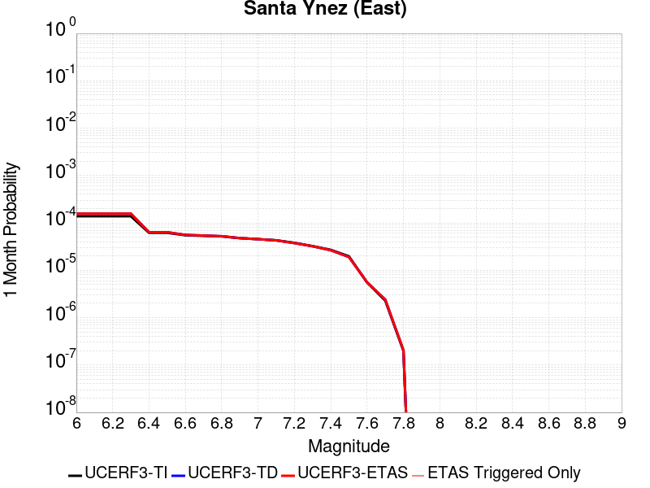 |  |  |

| Magnitude | 1 wk TI Prob | 1 wk TD Prob | 1 wk ETAS Prob | 1 wk ETAS/TD Gain | 1 wk ETAS Triggered Only | 1 mo TI Prob | 1 mo TD Prob | 1 mo ETAS Prob | 1 mo ETAS/TD Gain | 1 mo ETAS Triggered Only | 1 yr TI Prob | 1 yr TD Prob | 1 yr ETAS Prob | 1 yr ETAS/TD Gain | 1 yr ETAS Triggered Only | 10 yr TI Prob | 10 yr TD Prob | 10 yr ETAS Prob | 10 yr ETAS/TD Gain | 10 yr ETAS Triggered Only |
|-----|-----|-----|-----|-----|-----|-----|-----|-----|-----|-----|-----|-----|-----|-----|-----|-----|-----|-----|-----|-----|
| 6.0 | 3.2269712E-5 | 3.6751346E-5 | 3.6751346E-5 | 1.0 | 0.0 | 1.3829143E-4 | 1.5749958E-4 | 1.5749958E-4 | 1.0 | 0.0 | 0.0016823979 | 0.0019164606 | 0.0019264414 | 1.0052079 | 1.0E-5 | 0.016697178 | 0.019056875 | 0.019086303 | 1.0015442 | 3.0E-5 |
| 6.1 | 3.2269712E-5 | 3.6751346E-5 | 3.6751346E-5 | 1.0 | 0.0 | 1.3829143E-4 | 1.5749958E-4 | 1.5749958E-4 | 1.0 | 0.0 | 0.0016823979 | 0.0019164606 | 0.0019264414 | 1.0052079 | 1.0E-5 | 0.016697178 | 0.019056875 | 0.019086303 | 1.0015442 | 3.0E-5 |
| 6.2 | 3.2269712E-5 | 3.6751346E-5 | 3.6751346E-5 | 1.0 | 0.0 | 1.3829143E-4 | 1.5749958E-4 | 1.5749958E-4 | 1.0 | 0.0 | 0.0016823979 | 0.0019164606 | 0.0019264414 | 1.0052079 | 1.0E-5 | 0.016697178 | 0.019056875 | 0.019086303 | 1.0015442 | 3.0E-5 |
| 6.3 | 3.2269712E-5 | 3.6751346E-5 | 3.6751346E-5 | 1.0 | 0.0 | 1.3829143E-4 | 1.5749958E-4 | 1.5749958E-4 | 1.0 | 0.0 | 0.0016823979 | 0.0019164606 | 0.0019264414 | 1.0052079 | 1.0E-5 | 0.016697178 | 0.019056875 | 0.019086303 | 1.0015442 | 3.0E-5 |
| 6.4 | 1.4404779E-5 | 1.4849569E-5 | 1.4849569E-5 | 1.0 | 0.0 | 6.1733306E-5 | 6.363949E-5 | 6.363949E-5 | 1.0 | 0.0 | 7.513438E-4 | 7.7454036E-4 | 7.845326E-4 | 1.0129008 | 1.0E-5 | 0.0074880854 | 0.007718959 | 0.007748727 | 1.0038565 | 3.0E-5 |
| 6.5 | 1.4404779E-5 | 1.4849569E-5 | 1.4849569E-5 | 1.0 | 0.0 | 6.1733306E-5 | 6.363949E-5 | 6.363949E-5 | 1.0 | 0.0 | 7.513438E-4 | 7.7454036E-4 | 7.845326E-4 | 1.0129008 | 1.0E-5 | 0.0074880854 | 0.007718959 | 0.007748727 | 1.0038565 | 3.0E-5 |
| 6.6 | 1.280208E-5 | 1.3012098E-5 | 1.3012098E-5 | 1.0 | 0.0 | 5.4864904E-5 | 5.5764955E-5 | 5.5764955E-5 | 1.0 | 0.0 | 6.6777546E-4 | 6.7872857E-4 | 6.887218E-4 | 1.0147234 | 1.0E-5 | 0.006657724 | 0.006766767 | 0.006796564 | 1.0044035 | 3.0E-5 |
| 6.7 | 1.2457027E-5 | 1.2628613E-5 | 1.2628613E-5 | 1.0 | 0.0 | 5.3386164E-5 | 5.4121516E-5 | 5.4121516E-5 | 1.0 | 0.0 | 6.497827E-4 | 6.587319E-4 | 6.687253E-4 | 1.0151707 | 1.0E-5 | 0.00647886 | 0.0065679904 | 0.006597793 | 1.0045376 | 3.0E-5 |
| 6.8 | 1.2095134E-5 | 1.2231055E-5 | 1.2231055E-5 | 1.0 | 0.0 | 5.1835254E-5 | 5.2417763E-5 | 5.2417763E-5 | 1.0 | 0.0 | 6.309115E-4 | 6.38001E-4 | 6.4799463E-4 | 1.015664 | 1.0E-5 | 0.0062912325 | 0.0063618817 | 0.006391691 | 1.0046856 | 3.0E-5 |
| 6.9 | 1.1104036E-5 | 1.11574755E-5 | 1.11574755E-5 | 1.0 | 0.0 | 4.758786E-5 | 4.7816884E-5 | 4.7816884E-5 | 1.0 | 0.0 | 5.7922816E-4 | 5.820163E-4 | 5.9201044E-4 | 1.0171716 | 1.0E-5 | 0.005777207 | 0.005805066 | 0.0058348915 | 1.0051379 | 3.0E-5 |
| 7.0 | 1.0577444E-5 | 1.0581802E-5 | 1.0581802E-5 | 1.0 | 0.0 | 4.5331115E-5 | 4.5349796E-5 | 4.5349796E-5 | 1.0 | 0.0 | 5.5176654E-4 | 5.519951E-4 | 5.6198955E-4 | 1.0181061 | 1.0E-5 | 0.0055039856 | 0.0055063786 | 0.005536213 | 1.0054182 | 3.0E-5 |
| 7.1 | 1.0021775E-5 | 9.981102E-6 | 9.981102E-6 | 1.0 | 0.0 | 4.294976E-5 | 4.2775457E-5 | 4.2775457E-5 | 1.0 | 0.0 | 5.2278786E-4 | 5.2066793E-4 | 5.306627E-4 | 1.0191962 | 1.0E-5 | 0.0052155964 | 0.0051946132 | 0.005224457 | 1.0057452 | 3.0E-5 |
| 7.2 | 8.874109E-6 | 8.748894E-6 | 8.748894E-6 | 1.0 | 0.0 | 3.8031343E-5 | 3.749473E-5 | 3.749473E-5 | 1.0 | 0.0 | 4.629332E-4 | 4.564038E-4 | 4.6639924E-4 | 1.0219004 | 1.0E-5 | 0.0046197 | 0.0045547825 | 0.004584646 | 1.0065565 | 3.0E-5 |
| 7.3 | 7.5504267E-6 | 7.505199E-6 | 7.505199E-6 | 1.0 | 0.0 | 3.235857E-5 | 3.216475E-5 | 3.216475E-5 | 1.0 | 0.0 | 3.9389438E-4 | 3.9153645E-4 | 4.0153254E-4 | 1.0255305 | 1.0E-5 | 0.0039319694 | 0.003908573 | 0.003928495 | 1.0050969 | 2.0E-5 |
| 7.4 | 6.309394E-6 | 6.1832216E-6 | 6.1832216E-6 | 1.0 | 0.0 | 2.703998E-5 | 2.6499258E-5 | 2.6499258E-5 | 1.0 | 0.0 | 3.2916202E-4 | 3.2258165E-4 | 3.325784E-4 | 1.0309899 | 1.0E-5 | 0.003286749 | 0.0032212313 | 0.003241167 | 1.0061888 | 2.0E-5 |
| 7.5 | 4.6103073E-6 | 4.440935E-6 | 4.440935E-6 | 1.0 | 0.0 | 1.975831E-5 | 1.9032443E-5 | 1.9032443E-5 | 1.0 | 0.0 | 2.4053088E-4 | 2.3169606E-4 | 2.4169374E-4 | 1.04315 | 1.0E-5 | 0.002402707 | 0.0023146144 | 0.002334568 | 1.0086207 | 2.0E-5 |
| 7.6 | 1.2858658E-6 | 1.3008267E-6 | 1.3008267E-6 | 1.0 | 0.0 | 5.5108417E-6 | 5.5749606E-6 | 5.5749606E-6 | 1.0 | 0.0 | 6.7092435E-5 | 6.78731E-5 | 6.78731E-5 | 1.0 | 0.0 | 6.707218E-4 | 6.7853054E-4 | 6.885238E-4 | 1.0147277 | 1.0E-5 |
| 7.7 | 5.3302307E-7 | 5.612178E-7 | 5.612178E-7 | 1.0 | 0.0 | 2.2843826E-6 | 2.4052172E-6 | 2.4052172E-6 | 1.0 | 0.0 | 2.7812002E-5 | 2.9283161E-5 | 2.9283161E-5 | 1.0 | 0.0 | 2.7808524E-4 | 2.9279658E-4 | 2.9279658E-4 | 1.0 | 0.0 |
| 7.8 | 4.613933E-8 | 4.803036E-8 | 4.803036E-8 | 1.0 | 0.0 | 1.9773998E-7 | 2.0584437E-7 | 2.0584437E-7 | 1.0 | 0.0 | 2.4074816E-6 | 2.5061524E-6 | 2.5061524E-6 | 1.0 | 0.0 | 2.4074554E-5 | 2.5061252E-5 | 2.5061252E-5 | 1.0 | 0.0 |

## Ventura-Pitas Point
*[(top)](#table-of-contents)*

| 1 Week | 1 Month | 1 Year | 10 Year |
|-----|-----|-----|-----|
|  |  |  |  |

| Magnitude | 1 wk TI Prob | 1 wk TD Prob | 1 wk ETAS Prob | 1 wk ETAS/TD Gain | 1 wk ETAS Triggered Only | 1 mo TI Prob | 1 mo TD Prob | 1 mo ETAS Prob | 1 mo ETAS/TD Gain | 1 mo ETAS Triggered Only | 1 yr TI Prob | 1 yr TD Prob | 1 yr ETAS Prob | 1 yr ETAS/TD Gain | 1 yr ETAS Triggered Only | 10 yr TI Prob | 10 yr TD Prob | 10 yr ETAS Prob | 10 yr ETAS/TD Gain | 10 yr ETAS Triggered Only |
|-----|-----|-----|-----|-----|-----|-----|-----|-----|-----|-----|-----|-----|-----|-----|-----|-----|-----|-----|-----|-----|
| 6.0 | 3.3179622E-5 | 3.3735807E-5 | 3.3735807E-5 | 1.0 | 0.0 | 1.4219063E-4 | 1.4457546E-4 | 1.4457546E-4 | 1.0 | 0.0 | 0.0017297962 | 0.001759042 | 0.0017790068 | 1.0113498 | 2.0E-5 | 0.017163932 | 0.01747672 | 0.01751602 | 1.0022488 | 4.0E-5 |
| 6.1 | 3.3179622E-5 | 3.3735807E-5 | 3.3735807E-5 | 1.0 | 0.0 | 1.4219063E-4 | 1.4457546E-4 | 1.4457546E-4 | 1.0 | 0.0 | 0.0017297962 | 0.001759042 | 0.0017790068 | 1.0113498 | 2.0E-5 | 0.017163932 | 0.01747672 | 0.01751602 | 1.0022488 | 4.0E-5 |
| 6.2 | 3.3179622E-5 | 3.3735807E-5 | 3.3735807E-5 | 1.0 | 0.0 | 1.4219063E-4 | 1.4457546E-4 | 1.4457546E-4 | 1.0 | 0.0 | 0.0017297962 | 0.001759042 | 0.0017790068 | 1.0113498 | 2.0E-5 | 0.017163932 | 0.01747672 | 0.01751602 | 1.0022488 | 4.0E-5 |
| 6.3 | 3.3179622E-5 | 3.3735807E-5 | 3.3735807E-5 | 1.0 | 0.0 | 1.4219063E-4 | 1.4457546E-4 | 1.4457546E-4 | 1.0 | 0.0 | 0.0017297962 | 0.001759042 | 0.0017790068 | 1.0113498 | 2.0E-5 | 0.017163932 | 0.01747672 | 0.01751602 | 1.0022488 | 4.0E-5 |
| 6.4 | 1.8754668E-5 | 1.701988E-5 | 1.701988E-5 | 1.0 | 0.0 | 8.037467E-5 | 7.2940435E-5 | 7.2940435E-5 | 1.0 | 0.0 | 9.781223E-4 | 8.87711E-4 | 8.87711E-4 | 1.0 | 0.0 | 0.009738282 | 0.008843987 | 0.008843987 | 1.0 | 0.0 |
| 6.5 | 1.8754668E-5 | 1.701988E-5 | 1.701988E-5 | 1.0 | 0.0 | 8.037467E-5 | 7.2940435E-5 | 7.2940435E-5 | 1.0 | 0.0 | 9.781223E-4 | 8.87711E-4 | 8.87711E-4 | 1.0 | 0.0 | 0.009738282 | 0.008843987 | 0.008843987 | 1.0 | 0.0 |
| 6.6 | 1.4361558E-5 | 1.2122469E-5 | 1.2122469E-5 | 1.0 | 0.0 | 6.154808E-5 | 5.195242E-5 | 5.195242E-5 | 1.0 | 0.0 | 7.490902E-4 | 6.323394E-4 | 6.323394E-4 | 1.0 | 0.0 | 0.0074657016 | 0.0063056583 | 0.0063056583 | 1.0 | 0.0 |
| 6.7 | 1.4361558E-5 | 1.2122469E-5 | 1.2122469E-5 | 1.0 | 0.0 | 6.154808E-5 | 5.195242E-5 | 5.195242E-5 | 1.0 | 0.0 | 7.490902E-4 | 6.323394E-4 | 6.323394E-4 | 1.0 | 0.0 | 0.0074657016 | 0.0063056583 | 0.0063056583 | 1.0 | 0.0 |
| 6.8 | 1.3663846E-5 | 1.13446E-5 | 1.13446E-5 | 1.0 | 0.0 | 5.8558027E-5 | 4.8618822E-5 | 4.8618822E-5 | 1.0 | 0.0 | 7.127108E-4 | 5.917753E-4 | 5.917753E-4 | 1.0 | 0.0 | 0.007104293 | 0.0059022107 | 0.0059022107 | 1.0 | 0.0 |
| 6.9 | 1.3644157E-5 | 1.1322701E-5 | 1.1322701E-5 | 1.0 | 0.0 | 5.8473648E-5 | 4.852497E-5 | 4.852497E-5 | 1.0 | 0.0 | 7.116841E-4 | 5.9063325E-4 | 5.9063325E-4 | 1.0 | 0.0 | 0.007094092 | 0.005890851 | 0.005890851 | 1.0 | 0.0 |
| 7.0 | 1.3568845E-5 | 1.1242266E-5 | 1.1242266E-5 | 1.0 | 0.0 | 5.8150898E-5 | 4.818026E-5 | 4.818026E-5 | 1.0 | 0.0 | 7.077572E-4 | 5.8643875E-4 | 5.8643875E-4 | 1.0 | 0.0 | 0.007055073 | 0.005849127 | 0.005849127 | 1.0 | 0.0 |
| 7.1 | 1.306572E-5 | 1.0720711E-5 | 1.0720711E-5 | 1.0 | 0.0 | 5.599474E-5 | 4.5945108E-5 | 4.5945108E-5 | 1.0 | 0.0 | 6.815227E-4 | 5.5923994E-4 | 5.5923994E-4 | 1.0 | 0.0 | 0.0067943637 | 0.0055785314 | 0.0055785314 | 1.0 | 0.0 |
| 7.2 | 1.232604E-5 | 9.995298E-6 | 9.995298E-6 | 1.0 | 0.0 | 5.2824813E-5 | 4.28363E-5 | 4.28363E-5 | 1.0 | 0.0 | 6.429523E-4 | 5.2140886E-4 | 5.2140886E-4 | 1.0 | 0.0 | 0.0064109527 | 0.005202047 | 0.005202047 | 1.0 | 0.0 |
| 7.3 | 1.0917261E-5 | 8.843967E-6 | 8.843967E-6 | 1.0 | 0.0 | 4.678742E-5 | 3.7902173E-5 | 3.7902173E-5 | 1.0 | 0.0 | 5.69488E-4 | 4.6136283E-4 | 4.6136283E-4 | 1.0 | 0.0 | 0.0056803077 | 0.0046042157 | 0.0046042157 | 1.0 | 0.0 |
| 7.4 | 1.039959E-5 | 8.423679E-6 | 8.423679E-6 | 1.0 | 0.0 | 4.456891E-5 | 3.610099E-5 | 3.610099E-5 | 1.0 | 0.0 | 5.424914E-4 | 4.3944246E-4 | 4.3944246E-4 | 1.0 | 0.0 | 0.0054116896 | 0.004385897 | 0.004385897 | 1.0 | 0.0 |
| 7.5 | 9.015877E-6 | 7.297639E-6 | 7.297639E-6 | 1.0 | 0.0 | 3.86389E-5 | 3.1275227E-5 | 3.1275227E-5 | 1.0 | 0.0 | 4.7032707E-4 | 3.807108E-4 | 3.807108E-4 | 1.0 | 0.0 | 0.004693329 | 0.003800731 | 0.003800731 | 1.0 | 0.0 |
| 7.6 | 4.900162E-6 | 3.8741514E-6 | 3.8741514E-6 | 1.0 | 0.0 | 2.1000526E-5 | 1.66034E-5 | 1.66034E-5 | 1.0 | 0.0 | 2.556514E-4 | 2.0212779E-4 | 2.0212779E-4 | 1.0 | 0.0 | 0.0025535747 | 0.002019453 | 0.002019453 | 1.0 | 0.0 |
| 7.7 | 3.8850626E-6 | 3.126758E-6 | 3.126758E-6 | 1.0 | 0.0 | 1.6650163E-5 | 1.3400323E-5 | 1.3400323E-5 | 1.0 | 0.0 | 2.0269687E-4 | 1.631368E-4 | 1.631368E-4 | 1.0 | 0.0 | 0.002025121 | 0.0016301798 | 0.0016301798 | 1.0 | 0.0 |
| 7.8 | 2.4654719E-6 | 2.029892E-6 | 2.029892E-6 | 1.0 | 0.0 | 1.0566265E-5 | 8.699508E-6 | 8.699508E-6 | 1.0 | 0.0 | 1.2863669E-4 | 1.0591141E-4 | 1.0591141E-4 | 1.0 | 0.0 | 0.0012856225 | 0.001058614 | 0.001058614 | 1.0 | 0.0 |
| 7.9 | 4.095894E-7 | 3.2765047E-7 | 3.2765047E-7 | 1.0 | 0.0 | 1.7553821E-6 | 1.4042156E-6 | 1.4042156E-6 | 1.0 | 0.0 | 2.1371567E-5 | 1.7096194E-5 | 1.7096194E-5 | 1.0 | 0.0 | 2.1369511E-4 | 1.7094909E-4 | 1.7094909E-4 | 1.0 | 0.0 |
| 8.0 | 7.791402E-9 | 5.683553E-9 | 5.683553E-9 | 1.0 | 0.0 | 3.3391725E-8 | 2.4358085E-8 | 2.4358085E-8 | 1.0 | 0.0 | 4.0654416E-7 | 2.9655968E-7 | 2.9655968E-7 | 1.0 | 0.0 | 4.065434E-6 | 2.9655946E-6 | 2.9655946E-6 | 1.0 | 0.0 |

## Pine Mtn
*[(top)](#table-of-contents)*

| 1 Week | 1 Month | 1 Year | 10 Year |
|-----|-----|-----|-----|
|  |  |  |  |

| Magnitude | 1 wk TI Prob | 1 wk TD Prob | 1 wk ETAS Prob | 1 wk ETAS/TD Gain | 1 wk ETAS Triggered Only | 1 mo TI Prob | 1 mo TD Prob | 1 mo ETAS Prob | 1 mo ETAS/TD Gain | 1 mo ETAS Triggered Only | 1 yr TI Prob | 1 yr TD Prob | 1 yr ETAS Prob | 1 yr ETAS/TD Gain | 1 yr ETAS Triggered Only | 10 yr TI Prob | 10 yr TD Prob | 10 yr ETAS Prob | 10 yr ETAS/TD Gain | 10 yr ETAS Triggered Only |
|-----|-----|-----|-----|-----|-----|-----|-----|-----|-----|-----|-----|-----|-----|-----|-----|-----|-----|-----|-----|-----|
| 6.0 | 6.894797E-6 | 7.2255634E-6 | 7.2255634E-6 | 1.0 | 0.0 | 2.9548795E-5 | 3.0966352E-5 | 4.096604E-5 | 1.3229212 | 1.0E-5 | 3.596972E-4 | 3.7695307E-4 | 4.0694175E-4 | 1.0795555 | 3.0E-5 | 0.0035911554 | 0.0037634342 | 0.0038032837 | 1.0105886 | 4.0E-5 |
| 6.1 | 6.894797E-6 | 7.2255634E-6 | 7.2255634E-6 | 1.0 | 0.0 | 2.9548795E-5 | 3.0966352E-5 | 4.096604E-5 | 1.3229212 | 1.0E-5 | 3.596972E-4 | 3.7695307E-4 | 4.0694175E-4 | 1.0795555 | 3.0E-5 | 0.0035911554 | 0.0037634342 | 0.0038032837 | 1.0105886 | 4.0E-5 |
| 6.2 | 6.894797E-6 | 7.2255634E-6 | 7.2255634E-6 | 1.0 | 0.0 | 2.9548795E-5 | 3.0966352E-5 | 4.096604E-5 | 1.3229212 | 1.0E-5 | 3.596972E-4 | 3.7695307E-4 | 4.0694175E-4 | 1.0795555 | 3.0E-5 | 0.0035911554 | 0.0037634342 | 0.0038032837 | 1.0105886 | 4.0E-5 |
| 6.3 | 6.894797E-6 | 7.2255634E-6 | 7.2255634E-6 | 1.0 | 0.0 | 2.9548795E-5 | 3.0966352E-5 | 4.096604E-5 | 1.3229212 | 1.0E-5 | 3.596972E-4 | 3.7695307E-4 | 4.0694175E-4 | 1.0795555 | 3.0E-5 | 0.0035911554 | 0.0037634342 | 0.0038032837 | 1.0105886 | 4.0E-5 |
| 6.4 | 6.894797E-6 | 7.2255634E-6 | 7.2255634E-6 | 1.0 | 0.0 | 2.9548795E-5 | 3.0966352E-5 | 4.096604E-5 | 1.3229212 | 1.0E-5 | 3.596972E-4 | 3.7695307E-4 | 4.0694175E-4 | 1.0795555 | 3.0E-5 | 0.0035911554 | 0.0037634342 | 0.0038032837 | 1.0105886 | 4.0E-5 |
| 6.5 | 6.894797E-6 | 7.2255634E-6 | 7.2255634E-6 | 1.0 | 0.0 | 2.9548795E-5 | 3.0966352E-5 | 4.096604E-5 | 1.3229212 | 1.0E-5 | 3.596972E-4 | 3.7695307E-4 | 4.0694175E-4 | 1.0795555 | 3.0E-5 | 0.0035911554 | 0.0037634342 | 0.0038032837 | 1.0105886 | 4.0E-5 |
| 6.6 | 6.894797E-6 | 7.2255634E-6 | 7.2255634E-6 | 1.0 | 0.0 | 2.9548795E-5 | 3.0966352E-5 | 4.096604E-5 | 1.3229212 | 1.0E-5 | 3.596972E-4 | 3.7695307E-4 | 4.0694175E-4 | 1.0795555 | 3.0E-5 | 0.0035911554 | 0.0037634342 | 0.0038032837 | 1.0105886 | 4.0E-5 |
| 6.7 | 6.0867933E-6 | 6.397213E-6 | 6.397213E-6 | 1.0 | 0.0 | 2.6085996E-5 | 2.741635E-5 | 3.7416077E-5 | 1.3647358 | 1.0E-5 | 3.1755073E-4 | 3.3374512E-4 | 3.637351E-4 | 1.089859 | 3.0E-5 | 0.0031709734 | 0.0033326582 | 0.0033725249 | 1.0119624 | 4.0E-5 |
| 6.8 | 5.6530425E-6 | 5.9506933E-6 | 5.9506933E-6 | 1.0 | 0.0 | 2.42271E-5 | 2.5502733E-5 | 3.550248E-5 | 1.3921049 | 1.0E-5 | 2.94925E-4 | 3.104536E-4 | 3.404443E-4 | 1.0966028 | 3.0E-5 | 0.002945339 | 0.0031004036 | 0.0031402796 | 1.0128615 | 4.0E-5 |
| 6.9 | 4.6015225E-6 | 4.8639267E-6 | 4.8639267E-6 | 1.0 | 0.0 | 1.9720663E-5 | 2.0845242E-5 | 3.0845033E-5 | 1.4797157 | 1.0E-5 | 2.4007261E-4 | 2.5376273E-4 | 2.7375764E-4 | 1.0787938 | 2.0E-5 | 0.0023981342 | 0.0025348738 | 0.0025647976 | 1.0118049 | 3.0E-5 |
| 7.0 | 4.4875965E-6 | 4.7475655E-6 | 4.7475655E-6 | 1.0 | 0.0 | 1.9232413E-5 | 2.0346559E-5 | 3.0346357E-5 | 1.4914736 | 1.0E-5 | 2.3412947E-4 | 2.4769266E-4 | 2.676877E-4 | 1.0807252 | 2.0E-5 | 0.0023388295 | 0.0024743096 | 0.0025042354 | 1.0120946 | 3.0E-5 |
| 7.1 | 3.203907E-6 | 3.4294974E-6 | 3.4294974E-6 | 1.0 | 0.0 | 1.3730958E-5 | 1.4697767E-5 | 1.4697767E-5 | 1.0 | 0.0 | 1.6716159E-4 | 1.7893128E-4 | 1.889295E-4 | 1.0558773 | 1.0E-5 | 0.0016703589 | 0.0017879383 | 0.0018079026 | 1.0111661 | 2.0E-5 |
| 7.2 | 2.2060601E-6 | 2.3785535E-6 | 2.3785535E-6 | 1.0 | 0.0 | 9.4545085E-6 | 1.0193763E-5 | 1.0193763E-5 | 1.0 | 0.0 | 1.15102564E-4 | 1.2410246E-4 | 1.2410246E-4 | 1.0 | 0.0 | 0.0011504296 | 0.0012403764 | 0.0012503639 | 1.0080521 | 1.0E-5 |
| 7.3 | 1.3765207E-6 | 1.5217128E-6 | 1.5217128E-6 | 1.0 | 0.0 | 5.899361E-6 | 6.52161E-6 | 6.52161E-6 | 1.0 | 0.0 | 7.182235E-5 | 7.93978E-5 | 7.93978E-5 | 1.0 | 0.0 | 7.1799144E-4 | 7.937035E-4 | 7.937035E-4 | 1.0 | 0.0 |
| 7.4 | 1.1245983E-6 | 1.2587657E-6 | 1.2587657E-6 | 1.0 | 0.0 | 4.819698E-6 | 5.3946997E-6 | 5.3946997E-6 | 1.0 | 0.0 | 5.8678244E-5 | 6.567857E-5 | 6.567857E-5 | 1.0 | 0.0 | 5.866275E-4 | 6.5659994E-4 | 6.5659994E-4 | 1.0 | 0.0 |
| 7.5 | 8.031682E-7 | 9.277495E-7 | 9.277495E-7 | 1.0 | 0.0 | 3.4421448E-6 | 3.9760635E-6 | 3.9760635E-6 | 1.0 | 0.0 | 4.1907308E-5 | 4.8407568E-5 | 4.8407568E-5 | 1.0 | 0.0 | 4.1899405E-4 | 4.83977E-4 | 4.83977E-4 | 1.0 | 0.0 |
| 7.6 | 4.8953444E-7 | 6.0034915E-7 | 6.0034915E-7 | 1.0 | 0.0 | 2.098003E-6 | 2.5729225E-6 | 2.5729225E-6 | 1.0 | 0.0 | 2.5542888E-5 | 3.1324933E-5 | 3.1324933E-5 | 1.0 | 0.0 | 2.5539953E-4 | 3.1321004E-4 | 3.1321004E-4 | 1.0 | 0.0 |
| 7.7 | 6.634529E-8 | 6.788847E-8 | 6.788847E-8 | 1.0 | 0.0 | 2.843369E-7 | 2.9095054E-7 | 2.9095054E-7 | 1.0 | 0.0 | 3.4617963E-6 | 3.5423177E-6 | 3.5423177E-6 | 1.0 | 0.0 | 3.4617424E-5 | 3.542266E-5 | 3.542266E-5 | 1.0 | 0.0 |
| 7.8 | 9.235578E-9 | 9.488601E-9 | 9.488601E-9 | 1.0 | 0.0 | 3.9581046E-8 | 4.0665434E-8 | 4.0665434E-8 | 1.0 | 0.0 | 4.818991E-7 | 4.951016E-7 | 4.951016E-7 | 1.0 | 0.0 | 4.8189804E-6 | 4.9510063E-6 | 4.9510063E-6 | 1.0 | 0.0 |

## Monterey Bay-Tularcitos
*[(top)](#table-of-contents)*

| 1 Week | 1 Month | 1 Year | 10 Year |
|-----|-----|-----|-----|
|  |  |  | 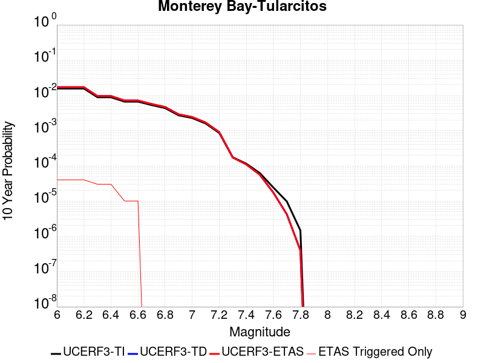 |

| Magnitude | 1 wk TI Prob | 1 wk TD Prob | 1 wk ETAS Prob | 1 wk ETAS/TD Gain | 1 wk ETAS Triggered Only | 1 mo TI Prob | 1 mo TD Prob | 1 mo ETAS Prob | 1 mo ETAS/TD Gain | 1 mo ETAS Triggered Only | 1 yr TI Prob | 1 yr TD Prob | 1 yr ETAS Prob | 1 yr ETAS/TD Gain | 1 yr ETAS Triggered Only | 10 yr TI Prob | 10 yr TD Prob | 10 yr ETAS Prob | 10 yr ETAS/TD Gain | 10 yr ETAS Triggered Only |
|-----|-----|-----|-----|-----|-----|-----|-----|-----|-----|-----|-----|-----|-----|-----|-----|-----|-----|-----|-----|-----|
| 6.0 | 3.0131365E-5 | 3.2799162E-5 | 3.2799162E-5 | 1.0 | 0.0 | 1.2912804E-4 | 1.4056086E-4 | 1.5055946E-4 | 1.0711336 | 1.0E-5 | 0.001571 | 0.0017100906 | 0.0017500222 | 1.0233506 | 4.0E-5 | 0.015599402 | 0.016980117 | 0.017019438 | 1.0023156 | 4.0E-5 |
| 6.1 | 3.0131365E-5 | 3.2799162E-5 | 3.2799162E-5 | 1.0 | 0.0 | 1.2912804E-4 | 1.4056086E-4 | 1.5055946E-4 | 1.0711336 | 1.0E-5 | 0.001571 | 0.0017100906 | 0.0017500222 | 1.0233506 | 4.0E-5 | 0.015599402 | 0.016980117 | 0.017019438 | 1.0023156 | 4.0E-5 |
| 6.2 | 3.0131365E-5 | 3.2799162E-5 | 3.2799162E-5 | 1.0 | 0.0 | 1.2912804E-4 | 1.4056086E-4 | 1.5055946E-4 | 1.0711336 | 1.0E-5 | 0.001571 | 0.0017100906 | 0.0017500222 | 1.0233506 | 4.0E-5 | 0.015599402 | 0.016980117 | 0.017019438 | 1.0023156 | 4.0E-5 |
| 6.3 | 1.6998249E-5 | 1.8330993E-5 | 1.8330993E-5 | 1.0 | 0.0 | 7.28476E-5 | 7.855914E-5 | 8.855836E-5 | 1.1272826 | 1.0E-5 | 8.865586E-4 | 9.560565E-4 | 9.860279E-4 | 1.031349 | 3.0E-5 | 0.0088303005 | 0.00952136 | 0.009551073 | 1.0031208 | 3.0E-5 |
| 6.4 | 1.6998249E-5 | 1.8330993E-5 | 1.8330993E-5 | 1.0 | 0.0 | 7.28476E-5 | 7.855914E-5 | 8.855836E-5 | 1.1272826 | 1.0E-5 | 8.865586E-4 | 9.560565E-4 | 9.860279E-4 | 1.031349 | 3.0E-5 | 0.0088303005 | 0.00952136 | 0.009551073 | 1.0031208 | 3.0E-5 |
| 6.5 | 1.27470785E-5 | 1.3693452E-5 | 1.3693452E-5 | 1.0 | 0.0 | 5.4629192E-5 | 5.868496E-5 | 5.868496E-5 | 1.0 | 0.0 | 6.649074E-4 | 7.142655E-4 | 7.2425837E-4 | 1.0139904 | 1.0E-5 | 0.0066292146 | 0.007120751 | 0.0071306797 | 1.0013944 | 1.0E-5 |
| 6.6 | 1.2739422E-5 | 1.3685539E-5 | 1.3685539E-5 | 1.0 | 0.0 | 5.4596385E-5 | 5.865105E-5 | 5.865105E-5 | 1.0 | 0.0 | 6.645082E-4 | 7.1385293E-4 | 7.238458E-4 | 1.0139985 | 1.0E-5 | 0.0066252467 | 0.007116651 | 0.00712658 | 1.0013951 | 1.0E-5 |
| 6.7 | 1.0160109E-5 | 1.0885862E-5 | 1.0885862E-5 | 1.0 | 0.0 | 4.35426E-5 | 4.66529E-5 | 4.66529E-5 | 1.0 | 0.0 | 5.300022E-4 | 5.678581E-4 | 5.678581E-4 | 1.0 | 0.0 | 0.005287399 | 0.005664782 | 0.005664782 | 1.0 | 0.0 |
| 6.8 | 8.349859E-6 | 8.932674E-6 | 8.932674E-6 | 1.0 | 0.0 | 3.578462E-5 | 3.828236E-5 | 3.828236E-5 | 1.0 | 0.0 | 4.3559066E-4 | 4.659937E-4 | 4.659937E-4 | 1.0 | 0.0 | 0.004347378 | 0.0046507306 | 0.0046507306 | 1.0 | 0.0 |
| 6.9 | 5.193639E-6 | 5.536483E-6 | 5.536483E-6 | 1.0 | 0.0 | 2.2258262E-5 | 2.3727587E-5 | 2.3727587E-5 | 1.0 | 0.0 | 2.7096065E-4 | 2.8884833E-4 | 2.8884833E-4 | 1.0 | 0.0 | 0.0027063051 | 0.00288505 | 0.00288505 | 1.0 | 0.0 |
| 7.0 | 4.359381E-6 | 4.6434106E-6 | 4.6434106E-6 | 1.0 | 0.0 | 1.8682927E-5 | 1.9900195E-5 | 1.9900195E-5 | 1.0 | 0.0 | 2.274409E-4 | 2.4226093E-4 | 2.4226093E-4 | 1.0 | 0.0 | 0.0022720827 | 0.0024202613 | 0.0024202613 | 1.0 | 0.0 |
| 7.1 | 3.0398533E-6 | 3.231074E-6 | 3.231074E-6 | 1.0 | 0.0 | 1.3027877E-5 | 1.38474015E-5 | 1.38474015E-5 | 1.0 | 0.0 | 1.5860285E-4 | 1.685817E-4 | 1.685817E-4 | 1.0 | 0.0 | 0.001584897 | 0.0016847957 | 0.0016847957 | 1.0 | 0.0 |
| 7.2 | 1.642335E-6 | 1.7333325E-6 | 1.7333325E-6 | 1.0 | 0.0 | 7.0385595E-6 | 7.4285585E-6 | 7.4285585E-6 | 1.0 | 0.0 | 8.569109E-5 | 9.044101E-5 | 9.044101E-5 | 1.0 | 0.0 | 8.5658056E-4 | 9.042448E-4 | 9.042448E-4 | 1.0 | 0.0 |
| 7.3 | 3.356842E-7 | 3.295272E-7 | 3.295272E-7 | 1.0 | 0.0 | 1.4386458E-6 | 1.4122586E-6 | 1.4122586E-6 | 1.0 | 0.0 | 1.7515373E-5 | 1.7194114E-5 | 1.7194114E-5 | 1.0 | 0.0 | 1.7513991E-4 | 1.7192794E-4 | 1.7192794E-4 | 1.0 | 0.0 |
| 7.4 | 2.1973483E-7 | 2.1006697E-7 | 2.1006697E-7 | 1.0 | 0.0 | 9.417204E-7 | 9.002867E-7 | 9.002867E-7 | 1.0 | 0.0 | 1.1465385E-5 | 1.09609355E-5 | 1.09609355E-5 | 1.0 | 0.0 | 1.1464794E-4 | 1.09603985E-4 | 1.09603985E-4 | 1.0 | 0.0 |
| 7.5 | 1.1944135E-7 | 1.0696283E-7 | 1.0696283E-7 | 1.0 | 0.0 | 5.118914E-7 | 4.5841205E-7 | 4.5841205E-7 | 1.0 | 0.0 | 6.23226E-6 | 5.5811524E-6 | 5.5811524E-6 | 1.0 | 0.0 | 6.2320854E-5 | 5.5810135E-5 | 5.5810135E-5 | 1.0 | 0.0 |
| 7.6 | 4.636058E-8 | 3.3366945E-8 | 3.3366945E-8 | 1.0 | 0.0 | 1.9868818E-7 | 1.4300119E-7 | 1.4300119E-7 | 1.0 | 0.0 | 2.419026E-6 | 1.7410381E-6 | 1.7410381E-6 | 1.0 | 0.0 | 2.4189996E-5 | 1.7410246E-5 | 1.7410246E-5 | 1.0 | 0.0 |
| 7.7 | 1.8588572E-8 | 8.005146E-9 | 8.005146E-9 | 1.0 | 0.0 | 7.9665305E-8 | 3.4307767E-8 | 3.4307767E-8 | 1.0 | 0.0 | 9.699246E-7 | 4.1769698E-7 | 4.1769698E-7 | 1.0 | 0.0 | 9.699204E-6 | 4.176962E-6 | 4.176962E-6 | 1.0 | 0.0 |
| 7.8 | 2.7960154E-9 | 7.612305E-10 | 7.612305E-10 | 1.0 | 0.0 | 1.1982923E-8 | 3.2624166E-9 | 3.2624166E-9 | 1.0 | 0.0 | 1.4589209E-7 | 3.971992E-8 | 3.971992E-8 | 1.0 | 0.0 | 1.4589199E-6 | 3.9719916E-7 | 3.9719916E-7 | 1.0 | 0.0 |

## Ortigalita (South)
*[(top)](#table-of-contents)*

| 1 Week | 1 Month | 1 Year | 10 Year |
|-----|-----|-----|-----|
| 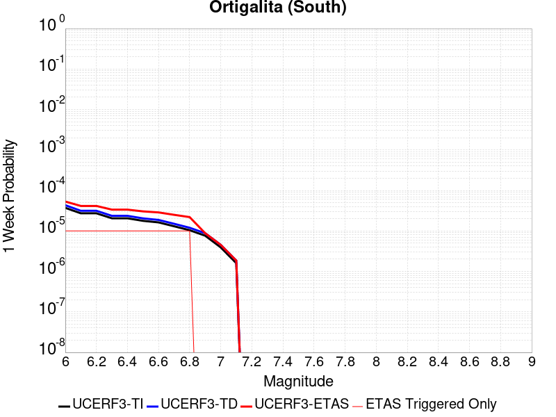 | 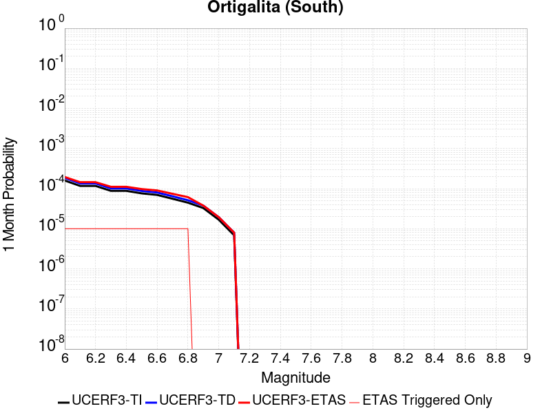 | 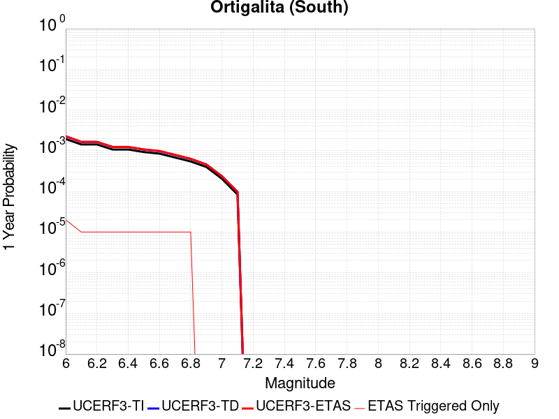 |  |

| Magnitude | 1 wk TI Prob | 1 wk TD Prob | 1 wk ETAS Prob | 1 wk ETAS/TD Gain | 1 wk ETAS Triggered Only | 1 mo TI Prob | 1 mo TD Prob | 1 mo ETAS Prob | 1 mo ETAS/TD Gain | 1 mo ETAS Triggered Only | 1 yr TI Prob | 1 yr TD Prob | 1 yr ETAS Prob | 1 yr ETAS/TD Gain | 1 yr ETAS Triggered Only | 10 yr TI Prob | 10 yr TD Prob | 10 yr ETAS Prob | 10 yr ETAS/TD Gain | 10 yr ETAS Triggered Only |
|-----|-----|-----|-----|-----|-----|-----|-----|-----|-----|-----|-----|-----|-----|-----|-----|-----|-----|-----|-----|-----|
| 6.0 | 3.72394E-5 | 4.325655E-5 | 5.3256117E-5 | 1.2311689 | 1.0E-5 | 1.5958765E-4 | 1.8537292E-4 | 1.9537107E-4 | 1.0539353 | 1.0E-5 | 0.0019412481 | 0.002254736 | 0.002274691 | 1.0088502 | 2.0E-5 | 0.019243775 | 0.022334972 | 0.022364302 | 1.0013132 | 3.0E-5 |
| 6.1 | 2.7299884E-5 | 3.1492684E-5 | 4.149237E-5 | 1.3175241 | 1.0E-5 | 1.16994255E-4 | 1.3496199E-4 | 1.4496064E-4 | 1.074085 | 1.0E-5 | 0.0014234743 | 0.0016419792 | 0.0016519628 | 1.0060803 | 1.0E-5 | 0.014143906 | 0.016304402 | 0.016324075 | 1.0012066 | 2.0E-5 |
| 6.2 | 2.7299884E-5 | 3.1492684E-5 | 4.149237E-5 | 1.3175241 | 1.0E-5 | 1.16994255E-4 | 1.3496199E-4 | 1.4496064E-4 | 1.074085 | 1.0E-5 | 0.0014234743 | 0.0016419792 | 0.0016519628 | 1.0060803 | 1.0E-5 | 0.014143906 | 0.016304402 | 0.016324075 | 1.0012066 | 2.0E-5 |
| 6.3 | 2.0546433E-5 | 2.3631923E-5 | 3.3631684E-5 | 1.4231465 | 1.0E-5 | 8.805317E-5 | 1.01275844E-4 | 1.1127483E-4 | 1.0987302 | 1.0E-5 | 0.00107152 | 0.0012323549 | 0.0012423425 | 1.0081046 | 1.0E-5 | 0.010663681 | 0.012257273 | 0.012267151 | 1.0008059 | 1.0E-5 |
| 6.4 | 2.0546433E-5 | 2.3631923E-5 | 3.3631684E-5 | 1.4231465 | 1.0E-5 | 8.805317E-5 | 1.01275844E-4 | 1.1127483E-4 | 1.0987302 | 1.0E-5 | 0.00107152 | 0.0012323549 | 0.0012423425 | 1.0081046 | 1.0E-5 | 0.010663681 | 0.012257273 | 0.012267151 | 1.0008059 | 1.0E-5 |
| 6.5 | 1.7779594E-5 | 2.0447382E-5 | 3.0447178E-5 | 1.4890501 | 1.0E-5 | 7.619603E-5 | 8.7628774E-5 | 9.76279E-5 | 1.1141077 | 1.0E-5 | 9.272918E-4 | 0.0010663717 | 0.001076361 | 1.0093676 | 1.0E-5 | 0.009234319 | 0.010614014 | 0.010623908 | 1.0009321 | 1.0E-5 |
| 6.6 | 1.6272212E-5 | 1.8715342E-5 | 2.8715154E-5 | 1.534311 | 1.0E-5 | 6.973618E-5 | 8.0206206E-5 | 9.020541E-5 | 1.1246686 | 1.0E-5 | 8.487073E-4 | 9.760853E-4 | 9.860756E-4 | 1.010235 | 1.0E-5 | 0.008454733 | 0.009719283 | 0.009729186 | 1.0010189 | 1.0E-5 |
| 6.7 | 1.3051484E-5 | 1.5039062E-5 | 2.5038913E-5 | 1.6649251 | 1.0E-5 | 5.593373E-5 | 6.445159E-5 | 7.4450945E-5 | 1.1551452 | 1.0E-5 | 6.807804E-4 | 7.8442506E-4 | 7.944172E-4 | 1.0127382 | 1.0E-5 | 0.006786986 | 0.007817546 | 0.007827467 | 1.0012692 | 1.0E-5 |
| 6.8 | 1.04277415E-5 | 1.1987473E-5 | 2.1987353E-5 | 1.8341942 | 1.0E-5 | 4.4689557E-5 | 5.1373918E-5 | 6.13734E-5 | 1.1946414 | 1.0E-5 | 5.439595E-4 | 6.2530534E-4 | 6.3529913E-4 | 1.0159822 | 1.0E-5 | 0.0054262993 | 0.0062362133 | 0.006246151 | 1.0015936 | 1.0E-5 |
| 6.9 | 7.639968E-6 | 8.79168E-6 | 8.79168E-6 | 1.0 | 0.0 | 3.274231E-5 | 3.7678114E-5 | 3.7678114E-5 | 1.0 | 0.0 | 3.9856473E-4 | 4.5864037E-4 | 4.5864037E-4 | 1.0 | 0.0 | 0.003978506 | 0.0045775245 | 0.0045775245 | 1.0 | 0.0 |
| 7.0 | 3.919831E-6 | 4.5334955E-6 | 4.5334955E-6 | 1.0 | 0.0 | 1.679917E-5 | 1.9429133E-5 | 1.9429133E-5 | 1.0 | 0.0 | 2.045107E-4 | 2.3652615E-4 | 2.3652615E-4 | 1.0 | 0.0 | 0.0020432258 | 0.0023629526 | 0.0023629526 | 1.0 | 0.0 |
| 7.1 | 1.6017933E-6 | 1.8570811E-6 | 1.8570811E-6 | 1.0 | 0.0 | 6.8648105E-6 | 7.958901E-6 | 7.958901E-6 | 1.0 | 0.0 | 8.357586E-5 | 9.689637E-5 | 9.689637E-5 | 1.0 | 0.0 | 8.3544437E-4 | 9.686459E-4 | 9.686459E-4 | 1.0 | 0.0 |

## Cleghorn
*[(top)](#table-of-contents)*

| 1 Week | 1 Month | 1 Year | 10 Year |
|-----|-----|-----|-----|
|  |  |  | 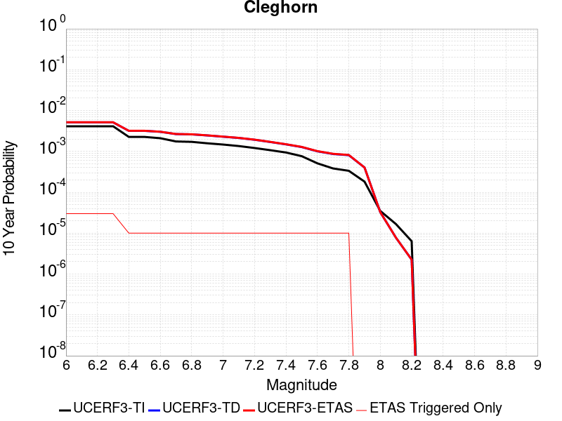 |

| Magnitude | 1 wk TI Prob | 1 wk TD Prob | 1 wk ETAS Prob | 1 wk ETAS/TD Gain | 1 wk ETAS Triggered Only | 1 mo TI Prob | 1 mo TD Prob | 1 mo ETAS Prob | 1 mo ETAS/TD Gain | 1 mo ETAS Triggered Only | 1 yr TI Prob | 1 yr TD Prob | 1 yr ETAS Prob | 1 yr ETAS/TD Gain | 1 yr ETAS Triggered Only | 10 yr TI Prob | 10 yr TD Prob | 10 yr ETAS Prob | 10 yr ETAS/TD Gain | 10 yr ETAS Triggered Only |
|-----|-----|-----|-----|-----|-----|-----|-----|-----|-----|-----|-----|-----|-----|-----|-----|-----|-----|-----|-----|-----|
| 6.0 | 7.9267165E-6 | 9.832575E-6 | 9.832575E-6 | 1.0 | 0.0 | 3.39712E-5 | 4.213899E-5 | 4.213899E-5 | 1.0 | 0.0 | 4.1352084E-4 | 5.12932E-4 | 5.12932E-4 | 1.0 | 0.0 | 0.004127522 | 0.005132577 | 0.005162423 | 1.005815 | 3.0E-5 |
| 6.1 | 7.9267165E-6 | 9.832575E-6 | 9.832575E-6 | 1.0 | 0.0 | 3.39712E-5 | 4.213899E-5 | 4.213899E-5 | 1.0 | 0.0 | 4.1352084E-4 | 5.12932E-4 | 5.12932E-4 | 1.0 | 0.0 | 0.004127522 | 0.005132577 | 0.005162423 | 1.005815 | 3.0E-5 |
| 6.2 | 7.9267165E-6 | 9.832575E-6 | 9.832575E-6 | 1.0 | 0.0 | 3.39712E-5 | 4.213899E-5 | 4.213899E-5 | 1.0 | 0.0 | 4.1352084E-4 | 5.12932E-4 | 5.12932E-4 | 1.0 | 0.0 | 0.004127522 | 0.005132577 | 0.005162423 | 1.005815 | 3.0E-5 |
| 6.3 | 7.9267165E-6 | 9.832575E-6 | 9.832575E-6 | 1.0 | 0.0 | 3.39712E-5 | 4.213899E-5 | 4.213899E-5 | 1.0 | 0.0 | 4.1352084E-4 | 5.12932E-4 | 5.12932E-4 | 1.0 | 0.0 | 0.004127522 | 0.005132577 | 0.005162423 | 1.005815 | 3.0E-5 |
| 6.4 | 4.3445207E-6 | 6.0924144E-6 | 6.0924144E-6 | 1.0 | 0.0 | 1.8619241E-5 | 2.6110092E-5 | 2.6110092E-5 | 1.0 | 0.0 | 2.2666567E-4 | 3.1784503E-4 | 3.1784503E-4 | 1.0 | 0.0 | 0.0022643462 | 0.0031880767 | 0.0031980446 | 1.0031267 | 1.0E-5 |
| 6.5 | 4.3445207E-6 | 6.0924144E-6 | 6.0924144E-6 | 1.0 | 0.0 | 1.8619241E-5 | 2.6110092E-5 | 2.6110092E-5 | 1.0 | 0.0 | 2.2666567E-4 | 3.1784503E-4 | 3.1784503E-4 | 1.0 | 0.0 | 0.0022643462 | 0.0031880767 | 0.0031980446 | 1.0031267 | 1.0E-5 |
| 6.6 | 4.040109E-6 | 5.7748202E-6 | 5.7748202E-6 | 1.0 | 0.0 | 1.7314638E-5 | 2.4749E-5 | 2.4749E-5 | 1.0 | 0.0 | 2.1078532E-4 | 3.0127834E-4 | 3.0127834E-4 | 1.0 | 0.0 | 0.002105855 | 0.0030228654 | 0.0030328352 | 1.0032982 | 1.0E-5 |
| 6.7 | 3.3632055E-6 | 5.0683134E-6 | 5.0683134E-6 | 1.0 | 0.0 | 1.4413658E-5 | 2.1721164E-5 | 2.1721164E-5 | 1.0 | 0.0 | 1.7547216E-4 | 2.6442338E-4 | 2.6442338E-4 | 1.0 | 0.0 | 0.0017533366 | 0.0026551976 | 0.0026651712 | 1.0037562 | 1.0E-5 |
| 6.8 | 3.2902772E-6 | 4.99022E-6 | 4.99022E-6 | 1.0 | 0.0 | 1.4101111E-5 | 2.1386484E-5 | 2.1386484E-5 | 1.0 | 0.0 | 1.716675E-4 | 2.6034965E-4 | 2.6034965E-4 | 1.0 | 0.0 | 0.0017153495 | 0.0026145563 | 0.00262453 | 1.0038147 | 1.0E-5 |
| 6.9 | 3.031547E-6 | 4.6919777E-6 | 4.6919777E-6 | 1.0 | 0.0 | 1.299228E-5 | 2.0108322E-5 | 2.0108322E-5 | 1.0 | 0.0 | 1.5816953E-4 | 2.447916E-4 | 2.447916E-4 | 1.0 | 0.0 | 0.00158057 | 0.0024593272 | 0.0024693029 | 1.0040561 | 1.0E-5 |
| 7.0 | 2.8259715E-6 | 4.371534E-6 | 4.371534E-6 | 1.0 | 0.0 | 1.211125E-5 | 1.8735012E-5 | 1.8735012E-5 | 1.0 | 0.0 | 1.4744449E-4 | 2.2807514E-4 | 2.2807514E-4 | 1.0 | 0.0 | 0.001473467 | 0.002292517 | 0.0023024941 | 1.004352 | 1.0E-5 |
| 7.1 | 2.5962665E-6 | 4.066747E-6 | 4.066747E-6 | 1.0 | 0.0 | 1.1126809E-5 | 1.74288E-5 | 1.74288E-5 | 1.0 | 0.0 | 1.3546048E-4 | 2.1217519E-4 | 2.1217519E-4 | 1.0 | 0.0 | 0.0013537793 | 0.0021338374 | 0.002143816 | 1.0046763 | 1.0E-5 |
| 7.2 | 2.3247253E-6 | 3.6772897E-6 | 3.6772897E-6 | 1.0 | 0.0 | 9.96307E-6 | 1.5759719E-5 | 1.5759719E-5 | 1.0 | 0.0 | 1.21293626E-4 | 1.9185786E-4 | 1.9185786E-4 | 1.0 | 0.0 | 0.0012122744 | 0.0019310551 | 0.0019410357 | 1.0051686 | 1.0E-5 |
| 7.3 | 2.056928E-6 | 3.2359856E-6 | 3.2359856E-6 | 1.0 | 0.0 | 8.815376E-6 | 1.3868437E-5 | 1.3868437E-5 | 1.0 | 0.0 | 1.0732192E-4 | 1.688353E-4 | 1.688353E-4 | 1.0 | 0.0 | 0.001072701 | 0.0017012694 | 0.0017112524 | 1.005868 | 1.0E-5 |
| 7.4 | 1.8055999E-6 | 2.8263637E-6 | 2.8263637E-6 | 1.0 | 0.0 | 7.738263E-6 | 1.21129315E-5 | 1.21129315E-5 | 1.0 | 0.0 | 9.4209274E-5 | 1.474651E-4 | 1.474651E-4 | 1.0 | 0.0 | 9.4169343E-4 | 0.001488009 | 0.0014979942 | 1.0067104 | 1.0E-5 |
| 7.5 | 1.4683443E-6 | 2.425593E-6 | 2.425593E-6 | 1.0 | 0.0 | 6.292889E-6 | 1.0395358E-5 | 1.0395358E-5 | 1.0 | 0.0 | 7.661323E-5 | 1.2655623E-4 | 1.2655623E-4 | 1.0 | 0.0 | 7.658682E-4 | 0.0012792206 | 0.0012892077 | 1.0078073 | 1.0E-5 |
| 7.6 | 9.804088E-7 | 1.901101E-6 | 1.901101E-6 | 1.0 | 0.0 | 4.201745E-6 | 8.147551E-6 | 8.147551E-6 | 1.0 | 0.0 | 5.1155046E-5 | 9.919196E-5 | 9.919196E-5 | 1.0 | 0.0 | 5.114327E-4 | 0.0010058905 | 0.0010158805 | 1.0099314 | 1.0E-5 |
| 7.7 | 7.3434086E-7 | 1.6292396E-6 | 1.6292396E-6 | 1.0 | 0.0 | 3.1471714E-6 | 6.982437E-6 | 6.982437E-6 | 1.0 | 0.0 | 3.831614E-5 | 8.500788E-5 | 8.500788E-5 | 1.0 | 0.0 | 3.8309532E-4 | 8.642013E-4 | 8.741927E-4 | 1.0115614 | 1.0E-5 |
| 7.8 | 6.434184E-7 | 1.522801E-6 | 1.522801E-6 | 1.0 | 0.0 | 2.7575045E-6 | 6.5262734E-6 | 6.5262734E-6 | 1.0 | 0.0 | 3.35721E-5 | 7.9454505E-5 | 7.9454505E-5 | 1.0 | 0.0 | 3.3567028E-4 | 8.083677E-4 | 8.183596E-4 | 1.0123606 | 1.0E-5 |
| 7.9 | 3.4943926E-7 | 7.5788125E-7 | 7.5788125E-7 | 1.0 | 0.0 | 1.497596E-6 | 3.2480586E-6 | 3.2480586E-6 | 1.0 | 0.0 | 1.8233079E-5 | 3.9544404E-5 | 3.9544404E-5 | 1.0 | 0.0 | 1.8231584E-4 | 4.0423044E-4 | 4.0423044E-4 | 1.0 | 0.0 |
| 8.0 | 6.717524E-8 | 5.8440865E-8 | 5.8440865E-8 | 1.0 | 0.0 | 2.8789387E-7 | 2.5046083E-7 | 2.5046083E-7 | 1.0 | 0.0 | 3.505102E-6 | 3.0493563E-6 | 3.0493563E-6 | 1.0 | 0.0 | 3.5050467E-5 | 3.276327E-5 | 3.276327E-5 | 1.0 | 0.0 |
| 8.1 | 3.1984914E-8 | 1.2973213E-8 | 1.2973213E-8 | 1.0 | 0.0 | 1.370782E-7 | 5.5599482E-8 | 5.5599482E-8 | 1.0 | 0.0 | 1.6689258E-6 | 6.769235E-7 | 6.769235E-7 | 1.0 | 0.0 | 1.6689133E-5 | 7.754204E-6 | 7.754204E-6 | 1.0 | 0.0 |
| 8.2 | 1.21887656E-8 | 3.654808E-9 | 3.654808E-9 | 1.0 | 0.0 | 5.2237567E-8 | 1.5663463E-8 | 1.5663463E-8 | 1.0 | 0.0 | 6.359922E-7 | 1.9070265E-7 | 1.9070265E-7 | 1.0 | 0.0 | 6.3599036E-6 | 2.2501451E-6 | 2.2501451E-6 | 1.0 | 0.0 |

## Palos Verdes
*[(top)](#table-of-contents)*

| 1 Week | 1 Month | 1 Year | 10 Year |
|-----|-----|-----|-----|
|  |  |  |  |

| Magnitude | 1 wk TI Prob | 1 wk TD Prob | 1 wk ETAS Prob | 1 wk ETAS/TD Gain | 1 wk ETAS Triggered Only | 1 mo TI Prob | 1 mo TD Prob | 1 mo ETAS Prob | 1 mo ETAS/TD Gain | 1 mo ETAS Triggered Only | 1 yr TI Prob | 1 yr TD Prob | 1 yr ETAS Prob | 1 yr ETAS/TD Gain | 1 yr ETAS Triggered Only | 10 yr TI Prob | 10 yr TD Prob | 10 yr ETAS Prob | 10 yr ETAS/TD Gain | 10 yr ETAS Triggered Only |
|-----|-----|-----|-----|-----|-----|-----|-----|-----|-----|-----|-----|-----|-----|-----|-----|-----|-----|-----|-----|-----|
| 6.0 | 6.126063E-5 | 7.622862E-5 | 7.622862E-5 | 1.0 | 0.0 | 2.6251914E-4 | 3.2665656E-4 | 3.366533E-4 | 1.0306032 | 1.0E-5 | 0.0031914865 | 0.0039702994 | 0.0039802594 | 1.0025088 | 1.0E-5 | 0.031460393 | 0.039050125 | 0.03907895 | 1.0007383 | 3.0E-5 |
| 6.1 | 6.126063E-5 | 7.622862E-5 | 7.622862E-5 | 1.0 | 0.0 | 2.6251914E-4 | 3.2665656E-4 | 3.366533E-4 | 1.0306032 | 1.0E-5 | 0.0031914865 | 0.0039702994 | 0.0039802594 | 1.0025088 | 1.0E-5 | 0.031460393 | 0.039050125 | 0.03907895 | 1.0007383 | 3.0E-5 |
| 6.2 | 6.126063E-5 | 7.622862E-5 | 7.622862E-5 | 1.0 | 0.0 | 2.6251914E-4 | 3.2665656E-4 | 3.366533E-4 | 1.0306032 | 1.0E-5 | 0.0031914865 | 0.0039702994 | 0.0039802594 | 1.0025088 | 1.0E-5 | 0.031460393 | 0.039050125 | 0.03907895 | 1.0007383 | 3.0E-5 |
| 6.3 | 4.0838047E-5 | 4.975089E-5 | 4.975089E-5 | 1.0 | 0.0 | 1.7500846E-4 | 2.1320196E-4 | 2.1320196E-4 | 1.0 | 0.0 | 0.0021286458 | 0.0025928554 | 0.0025928554 | 1.0 | 0.0 | 0.021083709 | 0.025647415 | 0.025657158 | 1.0003799 | 1.0E-5 |
| 6.4 | 4.0838047E-5 | 4.975089E-5 | 4.975089E-5 | 1.0 | 0.0 | 1.7500846E-4 | 2.1320196E-4 | 2.1320196E-4 | 1.0 | 0.0 | 0.0021286458 | 0.0025928554 | 0.0025928554 | 1.0 | 0.0 | 0.021083709 | 0.025647415 | 0.025657158 | 1.0003799 | 1.0E-5 |
| 6.5 | 3.0512005E-5 | 3.6562593E-5 | 3.6562593E-5 | 1.0 | 0.0 | 1.3075917E-4 | 1.566881E-4 | 1.566881E-4 | 1.0 | 0.0 | 0.0015908304 | 0.001906127 | 0.001906127 | 1.0 | 0.0 | 0.015794903 | 0.01890965 | 0.01891946 | 1.0005188 | 1.0E-5 |
| 6.6 | 2.9255087E-5 | 3.5155368E-5 | 3.5155368E-5 | 1.0 | 0.0 | 1.2537291E-4 | 1.5065783E-4 | 1.5065783E-4 | 1.0 | 0.0 | 0.0015253464 | 0.0018328319 | 0.0018328319 | 1.0 | 0.0 | 0.015149189 | 0.01818871 | 0.018198527 | 1.0005398 | 1.0E-5 |
| 6.7 | 2.287198E-5 | 2.7248976E-5 | 2.7248976E-5 | 1.0 | 0.0 | 9.801909E-5 | 1.1677662E-4 | 1.1677662E-4 | 1.0 | 0.0 | 0.001192729 | 0.0014209197 | 0.0014209197 | 1.0 | 0.0 | 0.011863477 | 0.014127577 | 0.014137435 | 1.0006979 | 1.0E-5 |
| 6.8 | 2.1325764E-5 | 2.5432531E-5 | 2.5432531E-5 | 1.0 | 0.0 | 9.139293E-5 | 1.0899252E-4 | 1.0899252E-4 | 1.0 | 0.0 | 0.001112141 | 0.0013262664 | 0.0013262664 | 1.0 | 0.0 | 0.011065915 | 0.013192548 | 0.013202417 | 1.000748 | 1.0E-5 |
| 6.9 | 1.9009392E-5 | 2.2614122E-5 | 2.2614122E-5 | 1.0 | 0.0 | 8.1466285E-5 | 9.6914555E-5 | 9.6914555E-5 | 1.0 | 0.0 | 9.914007E-4 | 0.0011793834 | 0.0011793834 | 1.0 | 0.0 | 0.009869894 | 0.011739929 | 0.0117498115 | 1.0008417 | 1.0E-5 |
| 7.0 | 1.7098473E-5 | 2.0319867E-5 | 2.0319867E-5 | 1.0 | 0.0 | 7.3277115E-5 | 8.708272E-5 | 8.708272E-5 | 1.0 | 0.0 | 8.917837E-4 | 0.0010598017 | 0.0010598017 | 1.0 | 0.0 | 0.008882134 | 0.010555912 | 0.010565806 | 1.0009373 | 1.0E-5 |
| 7.1 | 1.5982785E-5 | 1.8995239E-5 | 1.8995239E-5 | 1.0 | 0.0 | 6.849585E-5 | 8.1406106E-5 | 8.1406106E-5 | 1.0 | 0.0 | 8.336179E-4 | 9.907534E-4 | 9.907534E-4 | 1.0 | 0.0 | 0.008304977 | 0.009871728 | 0.009871728 | 1.0 | 0.0 |
| 7.2 | 1.4468002E-5 | 1.719767E-5 | 1.719767E-5 | 1.0 | 0.0 | 6.200425E-5 | 7.370269E-5 | 7.370269E-5 | 1.0 | 0.0 | 7.546402E-4 | 8.970449E-4 | 8.970449E-4 | 1.0 | 0.0 | 0.007520827 | 0.008942509 | 0.008942509 | 1.0 | 0.0 |
| 7.3 | 5.288233E-6 | 6.2038207E-6 | 6.2038207E-6 | 1.0 | 0.0 | 2.2663658E-5 | 2.658773E-5 | 2.658773E-5 | 1.0 | 0.0 | 2.7589512E-4 | 3.2369242E-4 | 3.2369242E-4 | 1.0 | 0.0 | 0.0027555283 | 0.0032356323 | 0.0032356323 | 1.0 | 0.0 |
| 7.4 | 8.279556E-7 | 8.408364E-7 | 8.408364E-7 | 1.0 | 0.0 | 3.5483763E-6 | 3.60358E-6 | 3.60358E-6 | 1.0 | 0.0 | 4.3200624E-5 | 4.3872777E-5 | 4.3872777E-5 | 1.0 | 0.0 | 4.3192226E-4 | 4.3864836E-4 | 4.3864836E-4 | 1.0 | 0.0 |
| 7.5 | 6.559831E-7 | 6.667243E-7 | 6.667243E-7 | 1.0 | 0.0 | 2.8113532E-6 | 2.8573872E-6 | 2.8573872E-6 | 1.0 | 0.0 | 3.4227687E-5 | 3.47882E-5 | 3.47882E-5 | 1.0 | 0.0 | 3.4222414E-4 | 3.478342E-4 | 3.478342E-4 | 1.0 | 0.0 |
| 7.6 | 3.5018968E-7 | 3.562011E-7 | 3.562011E-7 | 1.0 | 0.0 | 1.500812E-6 | 1.5265755E-6 | 1.5265755E-6 | 1.0 | 0.0 | 1.8272232E-5 | 1.8585944E-5 | 1.8585944E-5 | 1.0 | 0.0 | 1.8270731E-4 | 1.858485E-4 | 1.858485E-4 | 1.0 | 0.0 |
| 7.7 | 1.1986104E-7 | 1.2198406E-7 | 1.2198406E-7 | 1.0 | 0.0 | 5.1369005E-7 | 5.227887E-7 | 5.227887E-7 | 1.0 | 0.0 | 6.2541585E-6 | 6.364934E-6 | 6.364934E-6 | 1.0 | 0.0 | 6.2539824E-5 | 6.364756E-5 | 6.364756E-5 | 1.0 | 0.0 |
| 7.8 | 3.0445005E-8 | 3.1027664E-8 | 3.1027664E-8 | 1.0 | 0.0 | 1.3047858E-7 | 1.3297569E-7 | 1.3297569E-7 | 1.0 | 0.0 | 1.5885756E-6 | 1.6189781E-6 | 1.6189781E-6 | 1.0 | 0.0 | 1.5885644E-5 | 1.6189684E-5 | 1.6189684E-5 | 1.0 | 0.0 |

## Bullion Mountains
*[(top)](#table-of-contents)*

| 1 Week | 1 Month | 1 Year | 10 Year |
|-----|-----|-----|-----|
|  |  |  |  |

| Magnitude | 1 wk TI Prob | 1 wk TD Prob | 1 wk ETAS Prob | 1 wk ETAS/TD Gain | 1 wk ETAS Triggered Only | 1 mo TI Prob | 1 mo TD Prob | 1 mo ETAS Prob | 1 mo ETAS/TD Gain | 1 mo ETAS Triggered Only | 1 yr TI Prob | 1 yr TD Prob | 1 yr ETAS Prob | 1 yr ETAS/TD Gain | 1 yr ETAS Triggered Only | 10 yr TI Prob | 10 yr TD Prob | 10 yr ETAS Prob | 10 yr ETAS/TD Gain | 10 yr ETAS Triggered Only |
|-----|-----|-----|-----|-----|-----|-----|-----|-----|-----|-----|-----|-----|-----|-----|-----|-----|-----|-----|-----|-----|
| 6.0 | 1.6420427E-5 | 1.4692306E-5 | 1.4692306E-5 | 1.0 | 0.0 | 7.037136E-5 | 6.296572E-5 | 6.296572E-5 | 1.0 | 0.0 | 8.5643446E-4 | 7.663764E-4 | 7.8636105E-4 | 1.0260768 | 2.0E-5 | 0.008531413 | 0.0076411283 | 0.007670899 | 1.0038961 | 3.0E-5 |
| 6.1 | 1.6420427E-5 | 1.4692306E-5 | 1.4692306E-5 | 1.0 | 0.0 | 7.037136E-5 | 6.296572E-5 | 6.296572E-5 | 1.0 | 0.0 | 8.5643446E-4 | 7.663764E-4 | 7.8636105E-4 | 1.0260768 | 2.0E-5 | 0.008531413 | 0.0076411283 | 0.007670899 | 1.0038961 | 3.0E-5 |
| 6.2 | 1.6420427E-5 | 1.4692306E-5 | 1.4692306E-5 | 1.0 | 0.0 | 7.037136E-5 | 6.296572E-5 | 6.296572E-5 | 1.0 | 0.0 | 8.5643446E-4 | 7.663764E-4 | 7.8636105E-4 | 1.0260768 | 2.0E-5 | 0.008531413 | 0.0076411283 | 0.007670899 | 1.0038961 | 3.0E-5 |
| 6.3 | 1.2046778E-5 | 9.862485E-6 | 9.862485E-6 | 1.0 | 0.0 | 5.1628023E-5 | 4.226724E-5 | 4.226724E-5 | 1.0 | 0.0 | 6.283899E-4 | 5.145053E-4 | 5.2450015E-4 | 1.0194261 | 1.0E-5 | 0.0062661595 | 0.0051354226 | 0.00515532 | 1.0038745 | 2.0E-5 |
| 6.4 | 1.2046778E-5 | 9.862485E-6 | 9.862485E-6 | 1.0 | 0.0 | 5.1628023E-5 | 4.226724E-5 | 4.226724E-5 | 1.0 | 0.0 | 6.283899E-4 | 5.145053E-4 | 5.2450015E-4 | 1.0194261 | 1.0E-5 | 0.0062661595 | 0.0051354226 | 0.00515532 | 1.0038745 | 2.0E-5 |
| 6.5 | 1.0244343E-5 | 7.879582E-6 | 7.879582E-6 | 1.0 | 0.0 | 4.390359E-5 | 3.3769316E-5 | 3.3769316E-5 | 1.0 | 0.0 | 5.343951E-4 | 4.1108453E-4 | 4.2108042E-4 | 1.024316 | 1.0E-5 | 0.005331118 | 0.0041052722 | 0.00412519 | 1.0048518 | 2.0E-5 |
| 6.6 | 9.605408E-6 | 7.1776108E-6 | 7.1776108E-6 | 1.0 | 0.0 | 4.1165385E-5 | 3.076094E-5 | 3.076094E-5 | 1.0 | 0.0 | 5.010733E-4 | 3.7447043E-4 | 3.7447043E-4 | 1.0 | 0.0 | 0.00499945 | 0.0037403915 | 0.003750354 | 1.0026635 | 1.0E-5 |
| 6.7 | 8.60418E-6 | 6.1241044E-6 | 6.1241044E-6 | 1.0 | 0.0 | 3.687454E-5 | 2.6246007E-5 | 2.6246007E-5 | 1.0 | 0.0 | 4.48855E-4 | 3.1951777E-4 | 3.1951777E-4 | 1.0 | 0.0 | 0.004479495 | 0.0031924958 | 0.0032024637 | 1.0031223 | 1.0E-5 |
| 6.8 | 5.187994E-6 | 2.5632194E-6 | 2.5632194E-6 | 1.0 | 0.0 | 2.223407E-5 | 1.0985203E-5 | 1.0985203E-5 | 1.0 | 0.0 | 2.7066618E-4 | 1.3374063E-4 | 1.3374063E-4 | 1.0 | 0.0 | 0.0027033675 | 0.001336993 | 0.001336993 | 1.0 | 0.0 |
| 6.9 | 4.5302368E-6 | 2.3443622E-6 | 2.3443622E-6 | 1.0 | 0.0 | 1.9415156E-5 | 1.0047251E-5 | 1.0047251E-5 | 1.0 | 0.0 | 2.3635388E-4 | 1.2232238E-4 | 1.2232238E-4 | 1.0 | 0.0 | 0.0023610266 | 0.0012229396 | 0.0012229396 | 1.0 | 0.0 |
| 7.0 | 3.431668E-6 | 1.6882757E-6 | 1.6882757E-6 | 1.0 | 0.0 | 1.4707065E-5 | 7.2354674E-6 | 7.2354674E-6 | 1.0 | 0.0 | 1.7904381E-4 | 8.8091816E-5 | 8.8091816E-5 | 1.0 | 0.0 | 0.0017889962 | 8.809181E-4 | 8.809181E-4 | 1.0 | 0.0 |

## Pleito
*[(top)](#table-of-contents)*

| 1 Week | 1 Month | 1 Year | 10 Year |
|-----|-----|-----|-----|
| 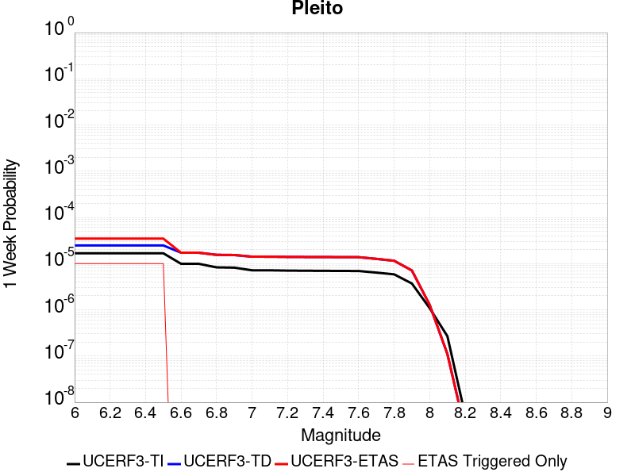 | 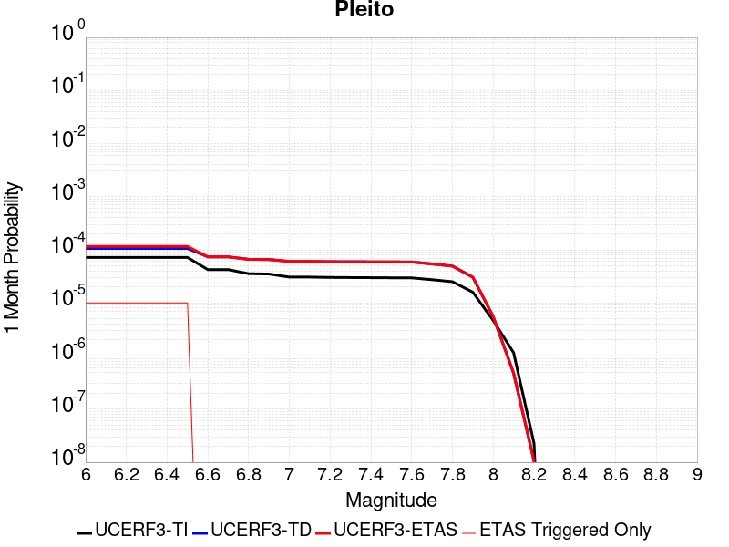 | 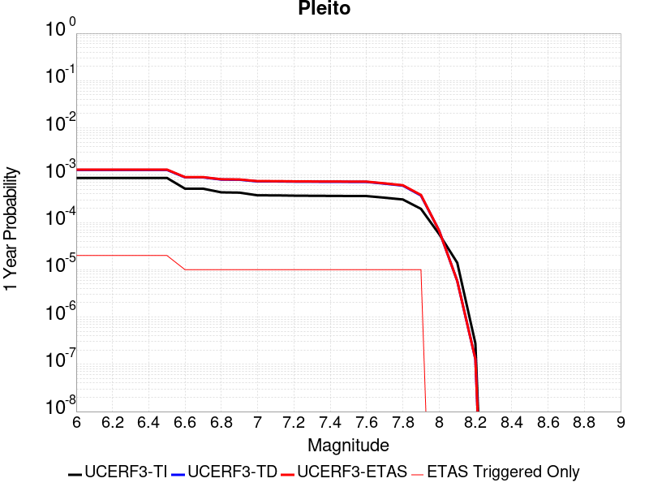 | 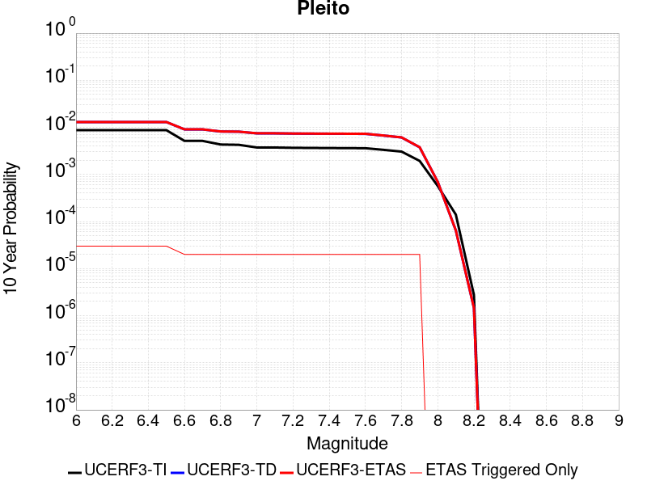 |

| Magnitude | 1 wk TI Prob | 1 wk TD Prob | 1 wk ETAS Prob | 1 wk ETAS/TD Gain | 1 wk ETAS Triggered Only | 1 mo TI Prob | 1 mo TD Prob | 1 mo ETAS Prob | 1 mo ETAS/TD Gain | 1 mo ETAS Triggered Only | 1 yr TI Prob | 1 yr TD Prob | 1 yr ETAS Prob | 1 yr ETAS/TD Gain | 1 yr ETAS Triggered Only | 10 yr TI Prob | 10 yr TD Prob | 10 yr ETAS Prob | 10 yr ETAS/TD Gain | 10 yr ETAS Triggered Only |
|-----|-----|-----|-----|-----|-----|-----|-----|-----|-----|-----|-----|-----|-----|-----|-----|-----|-----|-----|-----|-----|
| 6.0 | 1.6763008E-5 | 2.47705E-5 | 3.477025E-5 | 1.4036961 | 1.0E-5 | 7.183948E-5 | 1.0615537E-4 | 1.1615431E-4 | 1.0941916 | 1.0E-5 | 8.742947E-4 | 0.0012917474 | 0.0013117216 | 1.0154629 | 2.0E-5 | 0.00870863 | 0.012957253 | 0.012986864 | 1.0022854 | 3.0E-5 |
| 6.1 | 1.6763008E-5 | 2.47705E-5 | 3.477025E-5 | 1.4036961 | 1.0E-5 | 7.183948E-5 | 1.0615537E-4 | 1.1615431E-4 | 1.0941916 | 1.0E-5 | 8.742947E-4 | 0.0012917474 | 0.0013117216 | 1.0154629 | 2.0E-5 | 0.00870863 | 0.012957253 | 0.012986864 | 1.0022854 | 3.0E-5 |
| 6.2 | 1.6763008E-5 | 2.47705E-5 | 3.477025E-5 | 1.4036961 | 1.0E-5 | 7.183948E-5 | 1.0615537E-4 | 1.1615431E-4 | 1.0941916 | 1.0E-5 | 8.742947E-4 | 0.0012917474 | 0.0013117216 | 1.0154629 | 2.0E-5 | 0.00870863 | 0.012957253 | 0.012986864 | 1.0022854 | 3.0E-5 |
| 6.3 | 1.6763008E-5 | 2.47705E-5 | 3.477025E-5 | 1.4036961 | 1.0E-5 | 7.183948E-5 | 1.0615537E-4 | 1.1615431E-4 | 1.0941916 | 1.0E-5 | 8.742947E-4 | 0.0012917474 | 0.0013117216 | 1.0154629 | 2.0E-5 | 0.00870863 | 0.012957253 | 0.012986864 | 1.0022854 | 3.0E-5 |
| 6.4 | 1.6763008E-5 | 2.47705E-5 | 3.477025E-5 | 1.4036961 | 1.0E-5 | 7.183948E-5 | 1.0615537E-4 | 1.1615431E-4 | 1.0941916 | 1.0E-5 | 8.742947E-4 | 0.0012917474 | 0.0013117216 | 1.0154629 | 2.0E-5 | 0.00870863 | 0.012957253 | 0.012986864 | 1.0022854 | 3.0E-5 |
| 6.5 | 1.6763008E-5 | 2.47705E-5 | 3.477025E-5 | 1.4036961 | 1.0E-5 | 7.183948E-5 | 1.0615537E-4 | 1.1615431E-4 | 1.0941916 | 1.0E-5 | 8.742947E-4 | 0.0012917474 | 0.0013117216 | 1.0154629 | 2.0E-5 | 0.00870863 | 0.012957253 | 0.012986864 | 1.0022854 | 3.0E-5 |
| 6.6 | 9.910213E-6 | 1.7221182E-5 | 1.7221182E-5 | 1.0 | 0.0 | 4.247165E-5 | 7.3803E-5 | 7.3803E-5 | 1.0 | 0.0 | 5.169696E-4 | 8.9818484E-4 | 9.0817583E-4 | 1.0111235 | 1.0E-5 | 0.0051576863 | 0.009054025 | 0.009073844 | 1.0021889 | 2.0E-5 |
| 6.7 | 9.910213E-6 | 1.7221182E-5 | 1.7221182E-5 | 1.0 | 0.0 | 4.247165E-5 | 7.3803E-5 | 7.3803E-5 | 1.0 | 0.0 | 5.169696E-4 | 8.9818484E-4 | 9.0817583E-4 | 1.0111235 | 1.0E-5 | 0.0051576863 | 0.009054025 | 0.009073844 | 1.0021889 | 2.0E-5 |
| 6.8 | 8.300162E-6 | 1.5480773E-5 | 1.5480773E-5 | 1.0 | 0.0 | 3.557164E-5 | 6.634449E-5 | 6.634449E-5 | 1.0 | 0.0 | 4.3299864E-4 | 8.0744625E-4 | 8.174382E-4 | 1.0123748 | 1.0E-5 | 0.004321559 | 0.008153455 | 0.0081732925 | 1.002433 | 2.0E-5 |
| 6.9 | 8.183114E-6 | 1.5351985E-5 | 1.5351985E-5 | 1.0 | 0.0 | 3.5070017E-5 | 6.579257E-5 | 6.579257E-5 | 1.0 | 0.0 | 4.2689382E-4 | 8.007316E-4 | 8.107236E-4 | 1.0124786 | 1.0E-5 | 0.0042607468 | 0.008086799 | 0.008106637 | 1.0024532 | 2.0E-5 |
| 7.0 | 7.1748823E-6 | 1.4138895E-5 | 1.4138895E-5 | 1.0 | 0.0 | 3.0749135E-5 | 6.059386E-5 | 6.059386E-5 | 1.0 | 0.0 | 3.743064E-4 | 7.3748105E-4 | 7.474737E-4 | 1.0135497 | 1.0E-5 | 0.0037367654 | 0.0074582137 | 0.0074780644 | 1.0026616 | 2.0E-5 |
| 7.1 | 7.1671807E-6 | 1.4129264E-5 | 1.4129264E-5 | 1.0 | 0.0 | 3.0716128E-5 | 6.0552586E-5 | 6.0552586E-5 | 1.0 | 0.0 | 3.7390468E-4 | 7.369789E-4 | 7.469715E-4 | 1.0135589 | 1.0E-5 | 0.0037327618 | 0.007453226 | 0.007473077 | 1.0026634 | 2.0E-5 |
| 7.2 | 7.0649667E-6 | 1.3976534E-5 | 1.3976534E-5 | 1.0 | 0.0 | 3.0278077E-5 | 5.989806E-5 | 5.989806E-5 | 1.0 | 0.0 | 3.6857324E-4 | 7.290154E-4 | 7.390081E-4 | 1.0137072 | 1.0E-5 | 0.0036796255 | 0.007373973 | 0.0073938253 | 1.0026922 | 2.0E-5 |
| 7.3 | 7.02082E-6 | 1.39199765E-5 | 1.39199765E-5 | 1.0 | 0.0 | 3.008888E-5 | 5.9655682E-5 | 5.9655682E-5 | 1.0 | 0.0 | 3.6627054E-4 | 7.260664E-4 | 7.3605916E-4 | 1.0137628 | 1.0E-5 | 0.0036566744 | 0.0073444657 | 0.007364319 | 1.0027032 | 2.0E-5 |
| 7.4 | 6.987146E-6 | 1.3879531E-5 | 1.3879531E-5 | 1.0 | 0.0 | 2.9944567E-5 | 5.948235E-5 | 5.948235E-5 | 1.0 | 0.0 | 3.6451413E-4 | 7.239575E-4 | 7.339503E-4 | 1.013803 | 1.0E-5 | 0.0036391679 | 0.007323398 | 0.0073432513 | 1.0027109 | 2.0E-5 |
| 7.5 | 6.9494554E-6 | 1.3836431E-5 | 1.3836431E-5 | 1.0 | 0.0 | 2.9783041E-5 | 5.9297647E-5 | 5.9297647E-5 | 1.0 | 0.0 | 3.625482E-4 | 7.217102E-4 | 7.31703E-4 | 1.0138459 | 1.0E-5 | 0.0036195726 | 0.007301023 | 0.007320877 | 1.0027193 | 2.0E-5 |
| 7.6 | 6.92694E-6 | 1.3795536E-5 | 1.3795536E-5 | 1.0 | 0.0 | 2.9686547E-5 | 5.9122387E-5 | 5.9122387E-5 | 1.0 | 0.0 | 3.6137376E-4 | 7.1957783E-4 | 7.2957063E-4 | 1.013887 | 1.0E-5 | 0.0036078666 | 0.0072797714 | 0.007299626 | 1.0027274 | 2.0E-5 |
| 7.7 | 6.395867E-6 | 1.2674343E-5 | 1.2674343E-5 | 1.0 | 0.0 | 2.741057E-5 | 5.4317487E-5 | 5.4317487E-5 | 1.0 | 0.0 | 3.336726E-4 | 6.6111505E-4 | 6.711084E-4 | 1.015116 | 1.0E-5 | 0.0033317201 | 0.006698295 | 0.0067181606 | 1.0029658 | 2.0E-5 |
| 7.8 | 5.8664327E-6 | 1.1541453E-5 | 1.1541453E-5 | 1.0 | 0.0 | 2.5141611E-5 | 4.9462433E-5 | 4.9462433E-5 | 1.0 | 0.0 | 3.060561E-4 | 6.020389E-4 | 6.1203295E-4 | 1.0166003 | 1.0E-5 | 0.0030563495 | 0.006103509 | 0.006123387 | 1.0032568 | 2.0E-5 |
| 7.9 | 3.7167474E-6 | 7.1174723E-6 | 7.1174723E-6 | 1.0 | 0.0 | 1.592882E-5 | 3.0503097E-5 | 3.0503097E-5 | 1.0 | 0.0 | 1.9391612E-4 | 3.7131205E-4 | 3.8130835E-4 | 1.0269215 | 1.0E-5 | 0.0019374699 | 0.0037692138 | 0.0037891383 | 1.0052861 | 2.0E-5 |
| 8.0 | 1.0903841E-6 | 1.2886832E-6 | 1.2886832E-6 | 1.0 | 0.0 | 4.6730665E-6 | 5.522916E-6 | 5.522916E-6 | 1.0 | 0.0 | 5.68931E-5 | 6.723944E-5 | 6.723944E-5 | 1.0 | 0.0 | 5.6878536E-4 | 6.9458556E-4 | 6.9458556E-4 | 1.0 | 0.0 |
| 8.1 | 2.6894583E-7 | 1.1072907E-7 | 1.1072907E-7 | 1.0 | 0.0 | 1.1526245E-6 | 4.7455305E-7 | 4.7455305E-7 | 1.0 | 0.0 | 1.4033113E-5 | 5.7776683E-6 | 5.7776683E-6 | 1.0 | 0.0 | 1.4032227E-4 | 6.4639265E-5 | 6.4639265E-5 | 1.0 | 0.0 |
| 8.2 | 5.2967013E-9 | 2.4608289E-9 | 2.4608289E-9 | 1.0 | 0.0 | 2.2700148E-8 | 1.054641E-8 | 1.054641E-8 | 1.0 | 0.0 | 2.7637427E-7 | 1.2840253E-7 | 1.2840253E-7 | 1.0 | 0.0 | 2.7637393E-6 | 1.46096E-6 | 1.46096E-6 | 1.0 | 0.0 |

## Great Valley 03 Mysterious Ridge
*[(top)](#table-of-contents)*

| 1 Week | 1 Month | 1 Year | 10 Year |
|-----|-----|-----|-----|
|  |  |  |  |

| Magnitude | 1 wk TI Prob | 1 wk TD Prob | 1 wk ETAS Prob | 1 wk ETAS/TD Gain | 1 wk ETAS Triggered Only | 1 mo TI Prob | 1 mo TD Prob | 1 mo ETAS Prob | 1 mo ETAS/TD Gain | 1 mo ETAS Triggered Only | 1 yr TI Prob | 1 yr TD Prob | 1 yr ETAS Prob | 1 yr ETAS/TD Gain | 1 yr ETAS Triggered Only | 10 yr TI Prob | 10 yr TD Prob | 10 yr ETAS Prob | 10 yr ETAS/TD Gain | 10 yr ETAS Triggered Only |
|-----|-----|-----|-----|-----|-----|-----|-----|-----|-----|-----|-----|-----|-----|-----|-----|-----|-----|-----|-----|-----|
| 6.0 | 3.1182444E-5 | 3.603498E-5 | 3.603498E-5 | 1.0 | 0.0 | 1.336322E-4 | 1.5442717E-4 | 1.7442407E-4 | 1.1294909 | 2.0E-5 | 0.0016257578 | 0.0018787086 | 0.0018986709 | 1.0106256 | 2.0E-5 | 0.016139153 | 0.018647036 | 0.018666662 | 1.0010525 | 2.0E-5 |
| 6.1 | 3.1182444E-5 | 3.603498E-5 | 3.603498E-5 | 1.0 | 0.0 | 1.336322E-4 | 1.5442717E-4 | 1.7442407E-4 | 1.1294909 | 2.0E-5 | 0.0016257578 | 0.0018787086 | 0.0018986709 | 1.0106256 | 2.0E-5 | 0.016139153 | 0.018647036 | 0.018666662 | 1.0010525 | 2.0E-5 |
| 6.2 | 3.1182444E-5 | 3.603498E-5 | 3.603498E-5 | 1.0 | 0.0 | 1.336322E-4 | 1.5442717E-4 | 1.7442407E-4 | 1.1294909 | 2.0E-5 | 0.0016257578 | 0.0018787086 | 0.0018986709 | 1.0106256 | 2.0E-5 | 0.016139153 | 0.018647036 | 0.018666662 | 1.0010525 | 2.0E-5 |
| 6.3 | 2.106934E-5 | 2.3850727E-5 | 2.3850727E-5 | 1.0 | 0.0 | 9.0294045E-5 | 1.0221358E-4 | 1.0221358E-4 | 1.0 | 0.0 | 0.0010987755 | 0.0012437708 | 0.0012437708 | 1.0 | 0.0 | 0.010933585 | 0.012371344 | 0.012381219 | 1.0007983 | 1.0E-5 |
| 6.4 | 2.106934E-5 | 2.3850727E-5 | 2.3850727E-5 | 1.0 | 0.0 | 9.0294045E-5 | 1.0221358E-4 | 1.0221358E-4 | 1.0 | 0.0 | 0.0010987755 | 0.0012437708 | 0.0012437708 | 1.0 | 0.0 | 0.010933585 | 0.012371344 | 0.012381219 | 1.0007983 | 1.0E-5 |
| 6.5 | 1.9389783E-5 | 2.188536E-5 | 2.188536E-5 | 1.0 | 0.0 | 8.309642E-5 | 9.379118E-5 | 9.379118E-5 | 1.0 | 0.0 | 0.0010112294 | 0.001141337 | 0.001141337 | 1.0 | 0.0 | 0.010066401 | 0.011357628 | 0.011357628 | 1.0 | 0.0 |
| 6.6 | 1.9370193E-5 | 2.186528E-5 | 2.186528E-5 | 1.0 | 0.0 | 8.301247E-5 | 9.370514E-5 | 9.370514E-5 | 1.0 | 0.0 | 0.0010102082 | 0.0011402905 | 0.0011402905 | 1.0 | 0.0 | 0.010056281 | 0.01134727 | 0.01134727 | 1.0 | 0.0 |
| 6.7 | 1.6723505E-5 | 1.8799592E-5 | 1.8799592E-5 | 1.0 | 0.0 | 7.16702E-5 | 8.0567304E-5 | 8.0567304E-5 | 1.0 | 0.0 | 8.722353E-4 | 9.80485E-4 | 9.80485E-4 | 1.0 | 0.0 | 0.008688197 | 0.0097636 | 0.0097636 | 1.0 | 0.0 |
| 6.8 | 1.426937E-5 | 1.5997468E-5 | 1.5997468E-5 | 1.0 | 0.0 | 6.115301E-5 | 6.855885E-5 | 6.855885E-5 | 1.0 | 0.0 | 7.4428355E-4 | 8.3439884E-4 | 8.3439884E-4 | 1.0 | 0.0 | 0.007417957 | 0.008314138 | 0.008314138 | 1.0 | 0.0 |
| 6.9 | 1.2469891E-5 | 1.395715E-5 | 1.395715E-5 | 1.0 | 0.0 | 5.3441294E-5 | 5.9815055E-5 | 5.9815055E-5 | 1.0 | 0.0 | 6.504535E-4 | 7.28017E-4 | 7.28017E-4 | 1.0 | 0.0 | 0.006485529 | 0.007257545 | 0.007257545 | 1.0 | 0.0 |
| 7.0 | 8.7746275E-6 | 9.791885E-6 | 9.791885E-6 | 1.0 | 0.0 | 3.7605005E-5 | 4.1964588E-5 | 4.1964588E-5 | 1.0 | 0.0 | 4.5774475E-4 | 5.108064E-4 | 5.108064E-4 | 1.0 | 0.0 | 0.00456803 | 0.005097056 | 0.005097056 | 1.0 | 0.0 |
| 7.1 | 6.1067153E-6 | 6.81383E-6 | 6.81383E-6 | 1.0 | 0.0 | 2.6171374E-5 | 2.9201834E-5 | 2.9201834E-5 | 1.0 | 0.0 | 3.1858988E-4 | 3.5547992E-4 | 3.5547992E-4 | 1.0 | 0.0 | 0.0031813353 | 0.0035496636 | 0.0035496636 | 1.0 | 0.0 |
| 7.2 | 2.939283E-6 | 3.2741555E-6 | 3.2741555E-6 | 1.0 | 0.0 | 1.2596866E-5 | 1.4032029E-5 | 1.4032029E-5 | 1.0 | 0.0 | 1.5335606E-4 | 1.7082831E-4 | 1.7082831E-4 | 1.0 | 0.0 | 0.0015325027 | 0.001707142 | 0.001707142 | 1.0 | 0.0 |
| 7.3 | 7.2387763E-7 | 8.008619E-7 | 8.008619E-7 | 1.0 | 0.0 | 3.102329E-6 | 3.4322634E-6 | 3.4322634E-6 | 1.0 | 0.0 | 3.77702E-5 | 4.1787465E-5 | 4.1787465E-5 | 1.0 | 0.0 | 3.7763783E-4 | 4.1784105E-4 | 4.1784105E-4 | 1.0 | 0.0 |
| 7.4 | 3.112171E-8 | 3.2068495E-8 | 3.2068495E-8 | 1.0 | 0.0 | 1.3337875E-7 | 1.374364E-7 | 1.374364E-7 | 1.0 | 0.0 | 1.6238852E-6 | 1.673287E-6 | 1.673287E-6 | 1.0 | 0.0 | 1.6238733E-5 | 1.6732753E-5 | 1.6732753E-5 | 1.0 | 0.0 |

## Mission Creek
*[(top)](#table-of-contents)*

| 1 Week | 1 Month | 1 Year | 10 Year |
|-----|-----|-----|-----|
| 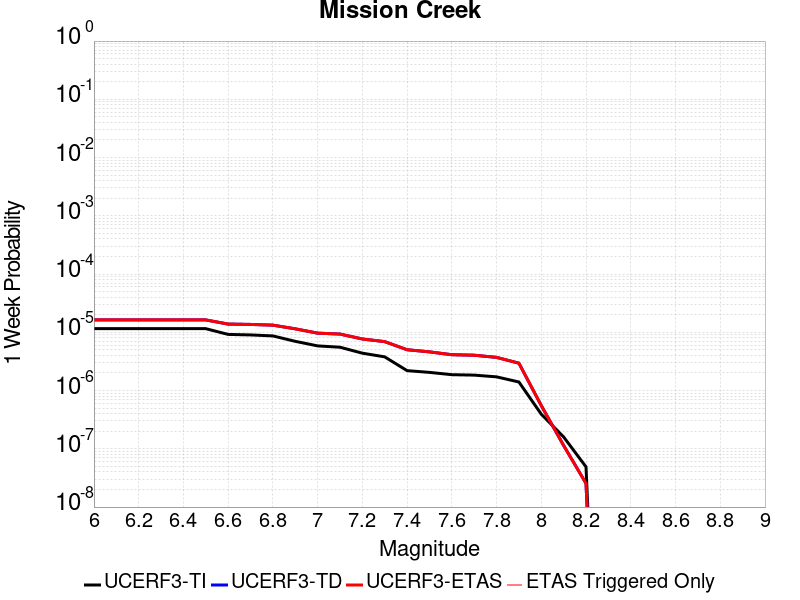 |  | 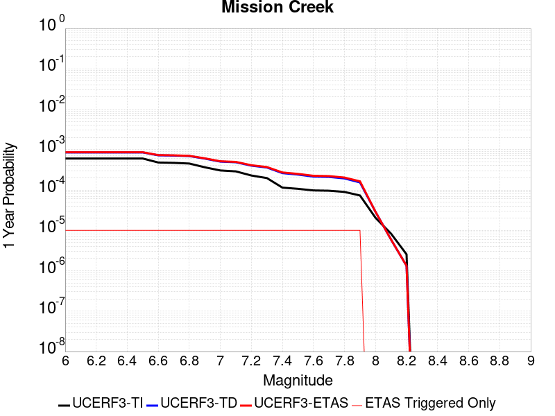 | 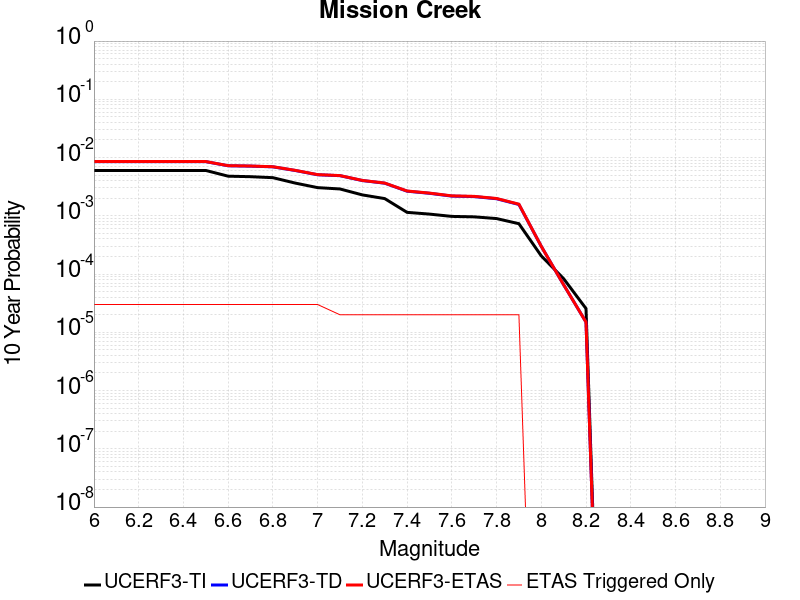 |

| Magnitude | 1 wk TI Prob | 1 wk TD Prob | 1 wk ETAS Prob | 1 wk ETAS/TD Gain | 1 wk ETAS Triggered Only | 1 mo TI Prob | 1 mo TD Prob | 1 mo ETAS Prob | 1 mo ETAS/TD Gain | 1 mo ETAS Triggered Only | 1 yr TI Prob | 1 yr TD Prob | 1 yr ETAS Prob | 1 yr ETAS/TD Gain | 1 yr ETAS Triggered Only | 10 yr TI Prob | 10 yr TD Prob | 10 yr ETAS Prob | 10 yr ETAS/TD Gain | 10 yr ETAS Triggered Only |
|-----|-----|-----|-----|-----|-----|-----|-----|-----|-----|-----|-----|-----|-----|-----|-----|-----|-----|-----|-----|-----|
| 6.0 | 1.1549387E-5 | 1.6324713E-5 | 1.6324713E-5 | 1.0 | 0.0 | 4.9496433E-5 | 6.9961265E-5 | 6.9961265E-5 | 1.0 | 0.0 | 6.0245243E-4 | 8.5146056E-4 | 8.61452E-4 | 1.0117345 | 1.0E-5 | 0.006008218 | 0.008511184 | 0.008540929 | 1.0034947 | 3.0E-5 |
| 6.1 | 1.1549387E-5 | 1.6324713E-5 | 1.6324713E-5 | 1.0 | 0.0 | 4.9496433E-5 | 6.9961265E-5 | 6.9961265E-5 | 1.0 | 0.0 | 6.0245243E-4 | 8.5146056E-4 | 8.61452E-4 | 1.0117345 | 1.0E-5 | 0.006008218 | 0.008511184 | 0.008540929 | 1.0034947 | 3.0E-5 |
| 6.2 | 1.1549387E-5 | 1.6324713E-5 | 1.6324713E-5 | 1.0 | 0.0 | 4.9496433E-5 | 6.9961265E-5 | 6.9961265E-5 | 1.0 | 0.0 | 6.0245243E-4 | 8.5146056E-4 | 8.61452E-4 | 1.0117345 | 1.0E-5 | 0.006008218 | 0.008511184 | 0.008540929 | 1.0034947 | 3.0E-5 |
| 6.3 | 1.1549387E-5 | 1.6324713E-5 | 1.6324713E-5 | 1.0 | 0.0 | 4.9496433E-5 | 6.9961265E-5 | 6.9961265E-5 | 1.0 | 0.0 | 6.0245243E-4 | 8.5146056E-4 | 8.61452E-4 | 1.0117345 | 1.0E-5 | 0.006008218 | 0.008511184 | 0.008540929 | 1.0034947 | 3.0E-5 |
| 6.4 | 1.1549387E-5 | 1.6324713E-5 | 1.6324713E-5 | 1.0 | 0.0 | 4.9496433E-5 | 6.9961265E-5 | 6.9961265E-5 | 1.0 | 0.0 | 6.0245243E-4 | 8.5146056E-4 | 8.61452E-4 | 1.0117345 | 1.0E-5 | 0.006008218 | 0.008511184 | 0.008540929 | 1.0034947 | 3.0E-5 |
| 6.5 | 1.1549387E-5 | 1.6324713E-5 | 1.6324713E-5 | 1.0 | 0.0 | 4.9496433E-5 | 6.9961265E-5 | 6.9961265E-5 | 1.0 | 0.0 | 6.0245243E-4 | 8.5146056E-4 | 8.61452E-4 | 1.0117345 | 1.0E-5 | 0.006008218 | 0.008511184 | 0.008540929 | 1.0034947 | 3.0E-5 |
| 6.6 | 9.202681E-6 | 1.3847972E-5 | 1.3847972E-5 | 1.0 | 0.0 | 3.9439463E-5 | 5.9347152E-5 | 5.9347152E-5 | 1.0 | 0.0 | 4.800697E-4 | 7.2232104E-4 | 7.3231384E-4 | 1.0138342 | 1.0E-5 | 0.004790339 | 0.0072283596 | 0.007258143 | 1.0041203 | 3.0E-5 |
| 6.7 | 9.019164E-6 | 1.365364E-5 | 1.365364E-5 | 1.0 | 0.0 | 3.8652986E-5 | 5.8514335E-5 | 5.8514335E-5 | 1.0 | 0.0 | 4.7049852E-4 | 7.121882E-4 | 7.2218105E-4 | 1.0140313 | 1.0E-5 | 0.004695036 | 0.0071276836 | 0.0071574696 | 1.0041789 | 3.0E-5 |
| 6.8 | 8.673558E-6 | 1.3275746E-5 | 1.3275746E-5 | 1.0 | 0.0 | 3.717186E-5 | 5.6894864E-5 | 5.6894864E-5 | 1.0 | 0.0 | 4.524734E-4 | 6.924836E-4 | 7.024767E-4 | 1.0144308 | 1.0E-5 | 0.0045155324 | 0.0069318693 | 0.0069616614 | 1.0042979 | 3.0E-5 |
| 6.9 | 7.002255E-6 | 1.1479958E-5 | 1.1479958E-5 | 1.0 | 0.0 | 3.000932E-5 | 4.9198927E-5 | 4.9198927E-5 | 1.0 | 0.0 | 3.653022E-4 | 5.988392E-4 | 6.0883316E-4 | 1.016689 | 1.0E-5 | 0.0036470229 | 0.0060006846 | 0.0060305046 | 1.0049695 | 3.0E-5 |
| 7.0 | 5.84644E-6 | 9.677164E-6 | 9.677164E-6 | 1.0 | 0.0 | 2.5055931E-5 | 4.1472922E-5 | 4.1472922E-5 | 1.0 | 0.0 | 3.0501327E-4 | 5.0482043E-4 | 5.148154E-4 | 1.019799 | 1.0E-5 | 0.0030459496 | 0.0050649596 | 0.0050948076 | 1.005893 | 3.0E-5 |
| 7.1 | 5.54703E-6 | 9.331631E-6 | 9.331631E-6 | 1.0 | 0.0 | 2.377277E-5 | 3.999212E-5 | 3.999212E-5 | 1.0 | 0.0 | 2.8939504E-4 | 4.8679972E-4 | 4.967948E-4 | 1.0205324 | 1.0E-5 | 0.0028901845 | 0.0048855497 | 0.004905452 | 1.0040737 | 2.0E-5 |
| 7.2 | 4.384709E-6 | 7.6836495E-6 | 7.6836495E-6 | 1.0 | 0.0 | 1.8791474E-5 | 3.292953E-5 | 3.292953E-5 | 1.0 | 0.0 | 2.2876218E-4 | 4.0084694E-4 | 4.108429E-4 | 1.0249372 | 1.0E-5 | 0.0022852682 | 0.0040294197 | 0.004049339 | 1.0049435 | 2.0E-5 |
| 7.3 | 3.7888456E-6 | 6.9174894E-6 | 6.9174894E-6 | 1.0 | 0.0 | 1.623781E-5 | 2.9646066E-5 | 2.9646066E-5 | 1.0 | 0.0 | 1.9767738E-4 | 3.608844E-4 | 3.7088082E-4 | 1.0276997 | 1.0E-5 | 0.0019750162 | 0.0036311483 | 0.0036510755 | 1.0054879 | 2.0E-5 |
| 7.4 | 2.1982462E-6 | 5.0257536E-6 | 5.0257536E-6 | 1.0 | 0.0 | 9.421021E-6 | 2.1538768E-5 | 2.1538768E-5 | 1.0 | 0.0 | 1.1469489E-4 | 2.6220313E-4 | 2.722005E-4 | 1.0381284 | 1.0E-5 | 0.0011463572 | 0.0026468872 | 0.0026668343 | 1.007536 | 2.0E-5 |
| 7.5 | 2.051923E-6 | 4.6169393E-6 | 4.6169393E-6 | 1.0 | 0.0 | 8.793926E-6 | 1.9786734E-5 | 1.9786734E-5 | 1.0 | 0.0 | 1.0706078E-4 | 2.40877E-4 | 2.5087458E-4 | 1.041505 | 1.0E-5 | 0.0010700922 | 0.0024345173 | 0.0024544685 | 1.0081952 | 2.0E-5 |
| 7.6 | 1.8733427E-6 | 4.1252324E-6 | 4.1252324E-6 | 1.0 | 0.0 | 8.028587E-6 | 1.767945E-5 | 1.767945E-5 | 1.0 | 0.0 | 9.774366E-5 | 2.1522611E-4 | 2.2522395E-4 | 1.0464528 | 1.0E-5 | 9.770069E-4 | 0.0021790217 | 0.002198978 | 1.0091584 | 2.0E-5 |
| 7.7 | 1.8411953E-6 | 4.044895E-6 | 4.044895E-6 | 1.0 | 0.0 | 7.890813E-6 | 1.733515E-5 | 1.733515E-5 | 1.0 | 0.0 | 9.606641E-5 | 2.1103508E-4 | 2.2103297E-4 | 1.0473754 | 1.0E-5 | 9.6024893E-4 | 0.0021373003 | 0.0021572576 | 1.0093375 | 2.0E-5 |
| 7.8 | 1.7194251E-6 | 3.7121463E-6 | 3.7121463E-6 | 1.0 | 0.0 | 7.368944E-6 | 1.5909101E-5 | 1.5909101E-5 | 1.0 | 0.0 | 8.97132E-5 | 1.9367617E-4 | 2.0367424E-4 | 1.0516226 | 1.0E-5 | 8.967699E-4 | 0.0019632233 | 0.001983184 | 1.0101674 | 2.0E-5 |
| 7.9 | 1.4035052E-6 | 2.9514722E-6 | 2.9514722E-6 | 1.0 | 0.0 | 6.0150082E-6 | 1.2649106E-5 | 1.2649106E-5 | 1.0 | 0.0 | 7.3230265E-5 | 1.5399205E-4 | 1.6399051E-4 | 1.0649284 | 1.0E-5 | 7.3206134E-4 | 0.0015638224 | 0.0015837911 | 1.0127692 | 2.0E-5 |
| 8.0 | 3.9318823E-7 | 5.5319464E-7 | 5.5319464E-7 | 1.0 | 0.0 | 1.6850913E-6 | 2.3708321E-6 | 2.3708321E-6 | 1.0 | 0.0 | 2.0515794E-5 | 2.8864504E-5 | 2.8864504E-5 | 1.0 | 0.0 | 2.0513899E-4 | 2.9916913E-4 | 2.9916913E-4 | 1.0 | 0.0 |
| 8.1 | 1.596793E-7 | 1.1391901E-7 | 1.1391901E-7 | 1.0 | 0.0 | 6.8433974E-7 | 4.8822426E-7 | 4.8822426E-7 | 1.0 | 0.0 | 8.331805E-6 | 5.944114E-6 | 5.944114E-6 | 1.0 | 0.0 | 8.331492E-5 | 6.5564316E-5 | 6.5564316E-5 | 1.0 | 0.0 |
| 8.2 | 4.9003038E-8 | 2.5475106E-8 | 2.5475106E-8 | 1.0 | 0.0 | 2.10013E-7 | 1.0917902E-7 | 1.0917902E-7 | 1.0 | 0.0 | 2.5569052E-6 | 1.3292538E-6 | 1.3292538E-6 | 1.0 | 0.0 | 2.556876E-5 | 1.4973085E-5 | 1.4973085E-5 | 1.0 | 0.0 |

## Coronado Bank alt1
*[(top)](#table-of-contents)*

| 1 Week | 1 Month | 1 Year | 10 Year |
|-----|-----|-----|-----|
| 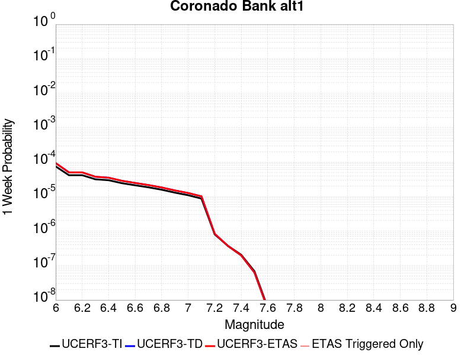 |  | 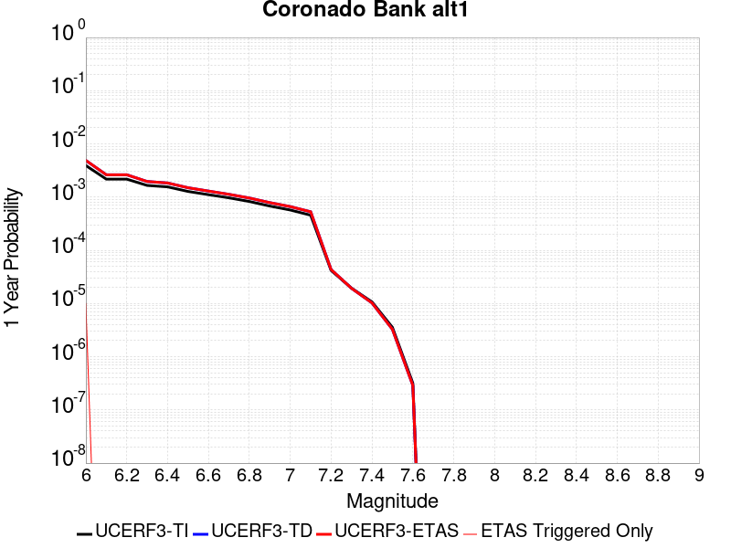 |  |

| Magnitude | 1 wk TI Prob | 1 wk TD Prob | 1 wk ETAS Prob | 1 wk ETAS/TD Gain | 1 wk ETAS Triggered Only | 1 mo TI Prob | 1 mo TD Prob | 1 mo ETAS Prob | 1 mo ETAS/TD Gain | 1 mo ETAS Triggered Only | 1 yr TI Prob | 1 yr TD Prob | 1 yr ETAS Prob | 1 yr ETAS/TD Gain | 1 yr ETAS Triggered Only | 10 yr TI Prob | 10 yr TD Prob | 10 yr ETAS Prob | 10 yr ETAS/TD Gain | 10 yr ETAS Triggered Only |
|-----|-----|-----|-----|-----|-----|-----|-----|-----|-----|-----|-----|-----|-----|-----|-----|-----|-----|-----|-----|-----|
| 6.0 | 7.533492E-5 | 9.3952294E-5 | 9.3952294E-5 | 1.0 | 0.0 | 3.22824E-4 | 4.0259483E-4 | 4.0259483E-4 | 1.0 | 0.0 | 0.0039233007 | 0.004891124 | 0.0049010753 | 1.0020345 | 1.0E-5 | 0.03854755 | 0.047905073 | 0.047933638 | 1.0005963 | 3.0E-5 |
| 6.1 | 4.1807285E-5 | 5.049425E-5 | 5.049425E-5 | 1.0 | 0.0 | 1.7916178E-4 | 2.1638657E-4 | 2.1638657E-4 | 1.0 | 0.0 | 0.0021791123 | 0.002631421 | 0.002631421 | 1.0 | 0.0 | 0.021578677 | 0.026011758 | 0.026011758 | 1.0 | 0.0 |
| 6.2 | 4.1807285E-5 | 5.049425E-5 | 5.049425E-5 | 1.0 | 0.0 | 1.7916178E-4 | 2.1638657E-4 | 2.1638657E-4 | 1.0 | 0.0 | 0.0021791123 | 0.002631421 | 0.002631421 | 1.0 | 0.0 | 0.021578677 | 0.026011758 | 0.026011758 | 1.0 | 0.0 |
| 6.3 | 3.1793104E-5 | 3.771206E-5 | 3.771206E-5 | 1.0 | 0.0 | 1.3624904E-4 | 1.6161331E-4 | 1.6161331E-4 | 1.0 | 0.0 | 0.0016575698 | 0.001965897 | 0.001965897 | 1.0 | 0.0 | 0.016452603 | 0.019488946 | 0.019488946 | 1.0 | 0.0 |
| 6.4 | 2.9878007E-5 | 3.5336663E-5 | 3.5336663E-5 | 1.0 | 0.0 | 1.2804232E-4 | 1.5143424E-4 | 1.5143424E-4 | 1.0 | 0.0 | 0.0015578003 | 0.0018421836 | 0.0018421836 | 1.0 | 0.0 | 0.015469253 | 0.018272884 | 0.018272884 | 1.0 | 0.0 |
| 6.5 | 2.4512565E-5 | 2.8764713E-5 | 2.8764713E-5 | 1.0 | 0.0 | 1.0504962E-4 | 1.2327167E-4 | 1.2327167E-4 | 1.0 | 0.0 | 0.0012782287 | 0.001499827 | 0.001499827 | 1.0 | 0.0 | 0.012709012 | 0.014900027 | 0.014900027 | 1.0 | 0.0 |
| 6.6 | 2.1317413E-5 | 2.4907233E-5 | 2.4907233E-5 | 1.0 | 0.0 | 9.135714E-5 | 1.0674105E-4 | 1.0674105E-4 | 1.0 | 0.0 | 0.0011117056 | 0.0012988199 | 0.0012988199 | 1.0 | 0.0 | 0.011061605 | 0.012914695 | 0.012914695 | 1.0 | 0.0 |
| 6.7 | 1.8585655E-5 | 2.1635356E-5 | 2.1635356E-5 | 1.0 | 0.0 | 7.9650374E-5 | 9.2719776E-5 | 9.2719776E-5 | 1.0 | 0.0 | 9.6931186E-4 | 0.0011282992 | 0.0011282992 | 1.0 | 0.0 | 0.0096509475 | 0.0112278685 | 0.0112278685 | 1.0 | 0.0 |
| 6.8 | 1.5862879E-5 | 1.8419874E-5 | 1.8419874E-5 | 1.0 | 0.0 | 6.798199E-5 | 7.894004E-5 | 7.894004E-5 | 1.0 | 0.0 | 8.273665E-4 | 9.606905E-4 | 9.606905E-4 | 1.0 | 0.0 | 0.008242928 | 0.009567357 | 0.009567357 | 1.0 | 0.0 |
| 6.9 | 1.3021509E-5 | 1.5095589E-5 | 1.5095589E-5 | 1.0 | 0.0 | 5.5805274E-5 | 6.469388E-5 | 6.469388E-5 | 1.0 | 0.0 | 6.792174E-4 | 7.8738143E-4 | 7.8738143E-4 | 1.0 | 0.0 | 0.006771452 | 0.00784774 | 0.00784774 | 1.0 | 0.0 |
| 7.0 | 1.0974371E-5 | 1.27203775E-5 | 1.27203775E-5 | 1.0 | 0.0 | 4.7032172E-5 | 5.4514865E-5 | 5.4514865E-5 | 1.0 | 0.0 | 5.7246623E-4 | 6.635339E-4 | 6.635339E-4 | 1.0 | 0.0 | 0.0057099373 | 0.006617277 | 0.006617277 | 1.0 | 0.0 |
| 7.1 | 8.766221E-6 | 1.0164053E-5 | 1.0164053E-5 | 1.0 | 0.0 | 3.7568978E-5 | 4.3559594E-5 | 4.3559594E-5 | 1.0 | 0.0 | 4.573063E-4 | 5.302262E-4 | 5.302262E-4 | 1.0 | 0.0 | 0.0045636636 | 0.005291311 | 0.005291311 | 1.0 | 0.0 |
| 7.2 | 8.026024E-7 | 8.331837E-7 | 8.331837E-7 | 1.0 | 0.0 | 3.43972E-6 | 3.5707824E-6 | 3.5707824E-6 | 1.0 | 0.0 | 4.1877785E-5 | 4.347342E-5 | 4.347342E-5 | 1.0 | 0.0 | 4.1869894E-4 | 4.3465025E-4 | 4.3465025E-4 | 1.0 | 0.0 |
| 7.3 | 3.7293114E-7 | 3.7001186E-7 | 3.7001186E-7 | 1.0 | 0.0 | 1.5982754E-6 | 1.5857643E-6 | 1.5857643E-6 | 1.0 | 0.0 | 1.9458828E-5 | 1.930651E-5 | 1.930651E-5 | 1.0 | 0.0 | 1.9457124E-4 | 1.9304838E-4 | 1.9304838E-4 | 1.0 | 0.0 |
| 7.4 | 2.0557036E-7 | 1.9674462E-7 | 1.9674462E-7 | 1.0 | 0.0 | 8.810155E-7 | 8.43191E-7 | 8.43191E-7 | 1.0 | 0.0 | 1.0726311E-5 | 1.0265802E-5 | 1.0265802E-5 | 1.0 | 0.0 | 1.0725793E-4 | 1.02653314E-4 | 1.02653314E-4 | 1.0 | 0.0 |
| 7.5 | 6.845446E-8 | 6.279388E-8 | 6.279388E-8 | 1.0 | 0.0 | 2.9337625E-7 | 2.6911658E-7 | 2.6911658E-7 | 1.0 | 0.0 | 3.5718497E-6 | 3.2764897E-6 | 3.2764897E-6 | 1.0 | 0.0 | 3.5717923E-5 | 3.2764423E-5 | 3.2764423E-5 | 1.0 | 0.0 |
| 7.6 | 6.0975145E-9 | 5.531861E-9 | 5.531861E-9 | 1.0 | 0.0 | 2.6132206E-8 | 2.3707976E-8 | 2.3707976E-8 | 1.0 | 0.0 | 3.1815955E-7 | 2.8864457E-7 | 2.8864457E-7 | 1.0 | 0.0 | 3.181591E-6 | 2.886443E-6 | 2.886443E-6 | 1.0 | 0.0 |

## Santa Cruz Island
*[(top)](#table-of-contents)*

| 1 Week | 1 Month | 1 Year | 10 Year |
|-----|-----|-----|-----|
|  |  |  |  |

| Magnitude | 1 wk TI Prob | 1 wk TD Prob | 1 wk ETAS Prob | 1 wk ETAS/TD Gain | 1 wk ETAS Triggered Only | 1 mo TI Prob | 1 mo TD Prob | 1 mo ETAS Prob | 1 mo ETAS/TD Gain | 1 mo ETAS Triggered Only | 1 yr TI Prob | 1 yr TD Prob | 1 yr ETAS Prob | 1 yr ETAS/TD Gain | 1 yr ETAS Triggered Only | 10 yr TI Prob | 10 yr TD Prob | 10 yr ETAS Prob | 10 yr ETAS/TD Gain | 10 yr ETAS Triggered Only |
|-----|-----|-----|-----|-----|-----|-----|-----|-----|-----|-----|-----|-----|-----|-----|-----|-----|-----|-----|-----|-----|
| 6.0 | 2.9164563E-5 | 3.1600095E-5 | 3.1600095E-5 | 1.0 | 0.0 | 1.2498499E-4 | 1.3542273E-4 | 1.3542273E-4 | 1.0 | 0.0 | 0.0015206301 | 0.0016476609 | 0.0016576444 | 1.0060592 | 1.0E-5 | 0.015102667 | 0.01636818 | 0.01639769 | 1.0018028 | 3.0E-5 |
| 6.1 | 2.9164563E-5 | 3.1600095E-5 | 3.1600095E-5 | 1.0 | 0.0 | 1.2498499E-4 | 1.3542273E-4 | 1.3542273E-4 | 1.0 | 0.0 | 0.0015206301 | 0.0016476609 | 0.0016576444 | 1.0060592 | 1.0E-5 | 0.015102667 | 0.01636818 | 0.01639769 | 1.0018028 | 3.0E-5 |
| 6.2 | 2.9164563E-5 | 3.1600095E-5 | 3.1600095E-5 | 1.0 | 0.0 | 1.2498499E-4 | 1.3542273E-4 | 1.3542273E-4 | 1.0 | 0.0 | 0.0015206301 | 0.0016476609 | 0.0016576444 | 1.0060592 | 1.0E-5 | 0.015102667 | 0.01636818 | 0.01639769 | 1.0018028 | 3.0E-5 |
| 6.3 | 1.6635553E-5 | 1.7804527E-5 | 1.7804527E-5 | 1.0 | 0.0 | 7.1293274E-5 | 7.630298E-5 | 7.630298E-5 | 1.0 | 0.0 | 8.6765E-4 | 9.286111E-4 | 9.286111E-4 | 1.0 | 0.0 | 0.008642701 | 0.009249181 | 0.009268995 | 1.0021423 | 2.0E-5 |
| 6.4 | 1.6635553E-5 | 1.7804527E-5 | 1.7804527E-5 | 1.0 | 0.0 | 7.1293274E-5 | 7.630298E-5 | 7.630298E-5 | 1.0 | 0.0 | 8.6765E-4 | 9.286111E-4 | 9.286111E-4 | 1.0 | 0.0 | 0.008642701 | 0.009249181 | 0.009268995 | 1.0021423 | 2.0E-5 |
| 6.5 | 1.2238748E-5 | 1.3043111E-5 | 1.3043111E-5 | 1.0 | 0.0 | 5.2450723E-5 | 5.5897868E-5 | 5.5897868E-5 | 1.0 | 0.0 | 6.3840044E-4 | 6.8034773E-4 | 6.8034773E-4 | 1.0 | 0.0 | 0.0063656955 | 0.006783047 | 0.00679298 | 1.0014642 | 1.0E-5 |
| 6.6 | 1.0489767E-5 | 1.11567315E-5 | 1.11567315E-5 | 1.0 | 0.0 | 4.495537E-5 | 4.7813697E-5 | 4.7813697E-5 | 1.0 | 0.0 | 5.4719415E-4 | 5.8197853E-4 | 5.8197853E-4 | 1.0 | 0.0 | 0.005458487 | 0.005804785 | 0.0058147274 | 1.0017127 | 1.0E-5 |
| 6.7 | 8.699222E-6 | 9.236859E-6 | 9.236859E-6 | 1.0 | 0.0 | 3.7281847E-5 | 3.958594E-5 | 3.958594E-5 | 1.0 | 0.0 | 4.5381195E-4 | 4.818528E-4 | 4.818528E-4 | 1.0 | 0.0 | 0.0045288634 | 0.004808148 | 0.004808148 | 1.0 | 0.0 |
| 6.8 | 8.307732E-6 | 8.816977E-6 | 8.816977E-6 | 1.0 | 0.0 | 3.560408E-5 | 3.77865E-5 | 3.77865E-5 | 1.0 | 0.0 | 4.3339343E-4 | 4.5995394E-4 | 4.5995394E-4 | 1.0 | 0.0 | 0.004325492 | 0.004590073 | 0.004590073 | 1.0 | 0.0 |
| 6.9 | 8.073121E-6 | 8.565009E-6 | 8.565009E-6 | 1.0 | 0.0 | 3.459863E-5 | 3.6706668E-5 | 3.6706668E-5 | 1.0 | 0.0 | 4.2115687E-4 | 4.4681245E-4 | 4.4681245E-4 | 1.0 | 0.0 | 0.004203596 | 0.0044591925 | 0.0044591925 | 1.0 | 0.0 |
| 7.0 | 7.617019E-6 | 8.0747295E-6 | 8.0747295E-6 | 1.0 | 0.0 | 3.264396E-5 | 3.4605528E-5 | 3.4605528E-5 | 1.0 | 0.0 | 3.9736772E-4 | 4.2124125E-4 | 4.2124125E-4 | 1.0 | 0.0 | 0.003966579 | 0.0042044753 | 0.0042044753 | 1.0 | 0.0 |
| 7.1 | 7.1224836E-6 | 7.5458483E-6 | 7.5458483E-6 | 1.0 | 0.0 | 3.052457E-5 | 3.233895E-5 | 3.233895E-5 | 1.0 | 0.0 | 3.715733E-4 | 3.9365597E-4 | 3.9365597E-4 | 1.0 | 0.0 | 0.003709526 | 0.0039296295 | 0.0039296295 | 1.0 | 0.0 |
| 7.2 | 6.441115E-6 | 6.8274385E-6 | 6.8274385E-6 | 1.0 | 0.0 | 2.7604487E-5 | 2.9260125E-5 | 2.9260125E-5 | 1.0 | 0.0 | 3.360328E-4 | 3.5618403E-4 | 3.5618403E-4 | 1.0 | 0.0 | 0.0033552512 | 0.0035561598 | 0.0035561598 | 1.0 | 0.0 |
| 7.3 | 5.494274E-6 | 5.820041E-6 | 5.820041E-6 | 1.0 | 0.0 | 2.3546674E-5 | 2.4942796E-5 | 2.4942796E-5 | 1.0 | 0.0 | 2.8664304E-4 | 3.0363642E-4 | 3.0363642E-4 | 1.0 | 0.0 | 0.002862736 | 0.0030322387 | 0.0030322387 | 1.0 | 0.0 |
| 7.4 | 4.0802624E-6 | 4.3122895E-6 | 4.3122895E-6 | 1.0 | 0.0 | 1.7486722E-5 | 1.848111E-5 | 1.848111E-5 | 1.0 | 0.0 | 2.1288003E-4 | 2.2498437E-4 | 2.2498437E-4 | 1.0 | 0.0 | 0.0021267622 | 0.002247575 | 0.002247575 | 1.0 | 0.0 |
| 7.5 | 2.3584746E-6 | 2.4753267E-6 | 2.4753267E-6 | 1.0 | 0.0 | 1.0107709E-5 | 1.06085E-5 | 1.06085E-5 | 1.0 | 0.0 | 1.2305441E-4 | 1.2915088E-4 | 1.2915088E-4 | 1.0 | 0.0 | 0.0012298629 | 0.0012907633 | 0.0012907633 | 1.0 | 0.0 |
| 7.6 | 9.4981914E-7 | 9.860988E-7 | 9.860988E-7 | 1.0 | 0.0 | 4.0706473E-6 | 4.226131E-6 | 4.226131E-6 | 1.0 | 0.0 | 4.9559E-5 | 5.145194E-5 | 5.145194E-5 | 1.0 | 0.0 | 4.954795E-4 | 5.144016E-4 | 5.144016E-4 | 1.0 | 0.0 |
| 7.7 | 2.6013532E-7 | 2.641672E-7 | 2.641672E-7 | 1.0 | 0.0 | 1.1148652E-6 | 1.1321447E-6 | 1.1321447E-6 | 1.0 | 0.0 | 1.3573399E-5 | 1.3783775E-5 | 1.3783775E-5 | 1.0 | 0.0 | 1.357257E-4 | 1.3782927E-4 | 1.3782927E-4 | 1.0 | 0.0 |
| 7.8 | 4.1522263E-8 | 3.9656918E-8 | 3.9656918E-8 | 1.0 | 0.0 | 1.7795254E-7 | 1.6995821E-7 | 1.6995821E-7 | 1.0 | 0.0 | 2.16657E-6 | 2.0692394E-6 | 2.0692394E-6 | 1.0 | 0.0 | 2.1665488E-5 | 2.0692223E-5 | 2.0692223E-5 | 1.0 | 0.0 |
| 7.9 | 7.7242046E-10 | 5.946851E-10 | 5.946851E-10 | 1.0 | 0.0 | 3.3103735E-9 | 2.54865E-9 | 2.54865E-9 | 1.0 | 0.0 | 4.0303796E-8 | 3.1029813E-8 | 3.1029813E-8 | 1.0 | 0.0 | 4.030379E-7 | 3.102981E-7 | 3.102981E-7 | 1.0 | 0.0 |

## San Pedro Basin
*[(top)](#table-of-contents)*

| 1 Week | 1 Month | 1 Year | 10 Year |
|-----|-----|-----|-----|
|  |  | 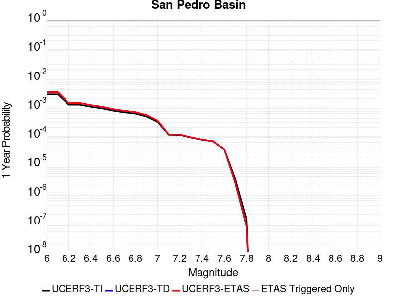 |  |

| Magnitude | 1 wk TI Prob | 1 wk TD Prob | 1 wk ETAS Prob | 1 wk ETAS/TD Gain | 1 wk ETAS Triggered Only | 1 mo TI Prob | 1 mo TD Prob | 1 mo ETAS Prob | 1 mo ETAS/TD Gain | 1 mo ETAS Triggered Only | 1 yr TI Prob | 1 yr TD Prob | 1 yr ETAS Prob | 1 yr ETAS/TD Gain | 1 yr ETAS Triggered Only | 10 yr TI Prob | 10 yr TD Prob | 10 yr ETAS Prob | 10 yr ETAS/TD Gain | 10 yr ETAS Triggered Only |
|-----|-----|-----|-----|-----|-----|-----|-----|-----|-----|-----|-----|-----|-----|-----|-----|-----|-----|-----|-----|-----|
| 6.0 | 5.3449043E-5 | 6.3371124E-5 | 6.3371124E-5 | 1.0 | 0.0 | 2.2904722E-4 | 2.7156572E-4 | 2.7156572E-4 | 1.0 | 0.0 | 0.0027850836 | 0.0033019078 | 0.0033019078 | 1.0 | 0.0 | 0.027504366 | 0.032590248 | 0.032609597 | 1.0005937 | 2.0E-5 |
| 6.1 | 5.3449043E-5 | 6.3371124E-5 | 6.3371124E-5 | 1.0 | 0.0 | 2.2904722E-4 | 2.7156572E-4 | 2.7156572E-4 | 1.0 | 0.0 | 0.0027850836 | 0.0033019078 | 0.0033019078 | 1.0 | 0.0 | 0.027504366 | 0.032590248 | 0.032609597 | 1.0005937 | 2.0E-5 |
| 6.2 | 2.3189454E-5 | 2.6643334E-5 | 2.6643334E-5 | 1.0 | 0.0 | 9.9379584E-5 | 1.14180984E-4 | 1.14180984E-4 | 1.0 | 0.0 | 0.0012092749 | 0.0013893144 | 0.0013893144 | 1.0 | 0.0 | 0.012027155 | 0.013811161 | 0.013821023 | 1.0007141 | 1.0E-5 |
| 6.3 | 2.3189454E-5 | 2.6643334E-5 | 2.6643334E-5 | 1.0 | 0.0 | 9.9379584E-5 | 1.14180984E-4 | 1.14180984E-4 | 1.0 | 0.0 | 0.0012092749 | 0.0013893144 | 0.0013893144 | 1.0 | 0.0 | 0.012027155 | 0.013811161 | 0.013821023 | 1.0007141 | 1.0E-5 |
| 6.4 | 1.966056E-5 | 2.2463848E-5 | 2.2463848E-5 | 1.0 | 0.0 | 8.425682E-5 | 9.627031E-5 | 9.627031E-5 | 1.0 | 0.0 | 0.001025344 | 0.001171501 | 0.001171501 | 1.0 | 0.0 | 0.010206259 | 0.011657341 | 0.011667225 | 1.0008478 | 1.0E-5 |
| 6.5 | 1.7342953E-5 | 1.9745521E-5 | 1.9745521E-5 | 1.0 | 0.0 | 7.4324824E-5 | 8.4621126E-5 | 8.4621126E-5 | 1.0 | 0.0 | 9.04529E-4 | 0.0010298121 | 0.0010298121 | 1.0 | 0.0 | 0.009008561 | 0.010254124 | 0.010254124 | 1.0 | 0.0 |
| 6.6 | 1.439804E-5 | 1.6323014E-5 | 1.6323014E-5 | 1.0 | 0.0 | 6.170443E-5 | 6.995408E-5 | 6.995408E-5 | 1.0 | 0.0 | 7.509924E-4 | 8.513903E-4 | 8.513903E-4 | 1.0 | 0.0 | 0.0074845953 | 0.008484487 | 0.008484487 | 1.0 | 0.0 |
| 6.7 | 1.2634884E-5 | 1.4285554E-5 | 1.4285554E-5 | 1.0 | 0.0 | 5.414838E-5 | 6.1222534E-5 | 6.1222534E-5 | 1.0 | 0.0 | 6.590571E-4 | 7.451599E-4 | 7.451599E-4 | 1.0 | 0.0 | 0.006571059 | 0.007429634 | 0.007429634 | 1.0 | 0.0 |
| 6.8 | 1.146091E-5 | 1.2933421E-5 | 1.2933421E-5 | 1.0 | 0.0 | 4.911726E-5 | 5.542794E-5 | 5.542794E-5 | 1.0 | 0.0 | 5.9783855E-4 | 6.7465595E-4 | 6.7465595E-4 | 1.0 | 0.0 | 0.0059623276 | 0.0067290184 | 0.0067290184 | 1.0 | 0.0 |
| 6.9 | 9.109035E-6 | 1.0235189E-5 | 1.0235189E-5 | 1.0 | 0.0 | 3.9038136E-5 | 4.3864515E-5 | 4.3864515E-5 | 1.0 | 0.0 | 4.7518566E-4 | 5.339476E-4 | 5.339476E-4 | 1.0 | 0.0 | 0.0047417083 | 0.0053294008 | 0.0053294008 | 1.0 | 0.0 |
| 7.0 | 5.9351028E-6 | 6.584068E-6 | 6.584068E-6 | 1.0 | 0.0 | 2.5435906E-5 | 2.8217262E-5 | 2.8217262E-5 | 1.0 | 0.0 | 3.0963816E-4 | 3.4351464E-4 | 3.4351464E-4 | 1.0 | 0.0 | 0.0030920706 | 0.0034321535 | 0.0034321535 | 1.0 | 0.0 |
| 7.1 | 2.1557585E-6 | 2.2096608E-6 | 2.2096608E-6 | 1.0 | 0.0 | 9.238933E-6 | 9.469942E-6 | 9.469942E-6 | 1.0 | 0.0 | 1.1247819E-4 | 1.1529059E-4 | 1.1529059E-4 | 1.0 | 0.0 | 0.0011242128 | 0.0011523232 | 0.0011523232 | 1.0 | 0.0 |
| 7.2 | 2.1251979E-6 | 2.178007E-6 | 2.178007E-6 | 1.0 | 0.0 | 9.107958E-6 | 9.334282E-6 | 9.334282E-6 | 1.0 | 0.0 | 1.1088375E-4 | 1.1363912E-4 | 1.1363912E-4 | 1.0 | 0.0 | 0.0011082845 | 0.0011358254 | 0.0011358254 | 1.0 | 0.0 |
| 7.3 | 1.7145798E-6 | 1.7442967E-6 | 1.7442967E-6 | 1.0 | 0.0 | 7.3481783E-6 | 7.475536E-6 | 7.475536E-6 | 1.0 | 0.0 | 8.94604E-5 | 9.1010945E-5 | 9.1010945E-5 | 1.0 | 0.0 | 8.9424395E-4 | 9.0974587E-4 | 9.0974587E-4 | 1.0 | 0.0 |
| 7.4 | 1.4467993E-6 | 1.4641943E-6 | 1.4641943E-6 | 1.0 | 0.0 | 6.200554E-6 | 6.2751037E-6 | 6.2751037E-6 | 1.0 | 0.0 | 7.548913E-5 | 7.6396784E-5 | 7.6396784E-5 | 1.0 | 0.0 | 7.546349E-4 | 7.637125E-4 | 7.637125E-4 | 1.0 | 0.0 |
| 7.5 | 1.2803735E-6 | 1.2931564E-6 | 1.2931564E-6 | 1.0 | 0.0 | 5.487303E-6 | 5.5420874E-6 | 5.5420874E-6 | 1.0 | 0.0 | 6.680587E-5 | 6.7472894E-5 | 6.7472894E-5 | 1.0 | 0.0 | 6.678579E-4 | 6.7453115E-4 | 6.7453115E-4 | 1.0 | 0.0 |
| 7.6 | 6.755009E-7 | 6.769501E-7 | 6.769501E-7 | 1.0 | 0.0 | 2.8950008E-6 | 2.9012117E-6 | 2.9012117E-6 | 1.0 | 0.0 | 3.5246063E-5 | 3.5321737E-5 | 3.5321737E-5 | 1.0 | 0.0 | 3.5240475E-4 | 3.5316695E-4 | 3.5316695E-4 | 1.0 | 0.0 |
| 7.7 | 6.211885E-8 | 4.5699863E-8 | 4.5699863E-8 | 1.0 | 0.0 | 2.6622362E-7 | 1.9585654E-7 | 1.9585654E-7 | 1.0 | 0.0 | 3.2412677E-6 | 2.384551E-6 | 2.384551E-6 | 1.0 | 0.0 | 3.2412205E-5 | 2.3845274E-5 | 2.3845274E-5 | 1.0 | 0.0 |
| 7.8 | 2.6580573E-9 | 1.5138681E-9 | 1.5138681E-9 | 1.0 | 0.0 | 1.1391674E-8 | 6.488006E-9 | 6.488006E-9 | 1.0 | 0.0 | 1.3869362E-7 | 7.899148E-8 | 7.899148E-8 | 1.0 | 0.0 | 1.3869354E-6 | 7.8991474E-7 | 7.8991474E-7 | 1.0 | 0.0 |

## San Diego Trough north alt1
*[(top)](#table-of-contents)*

| 1 Week | 1 Month | 1 Year | 10 Year |
|-----|-----|-----|-----|
| 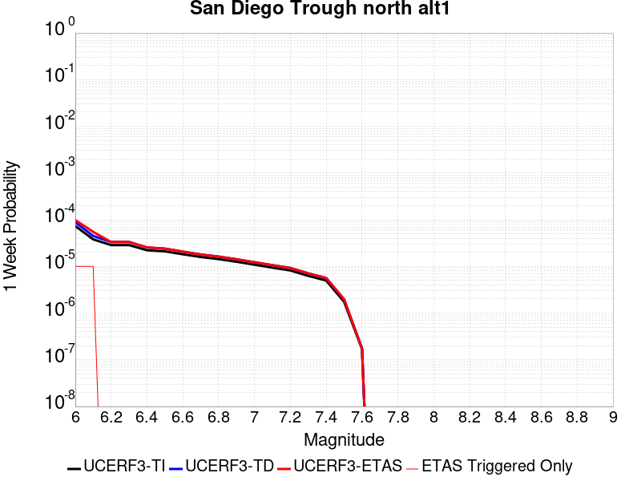 | 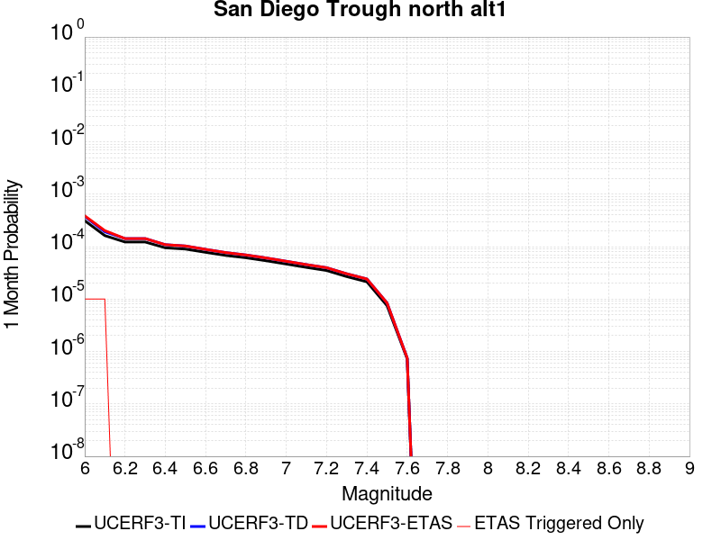 | 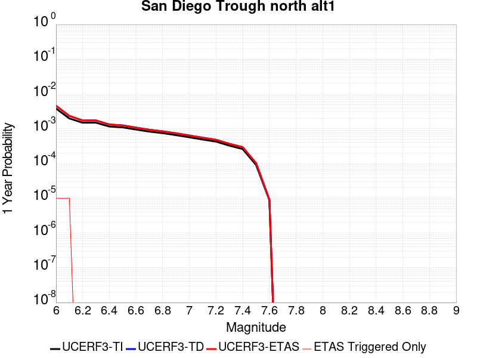 | 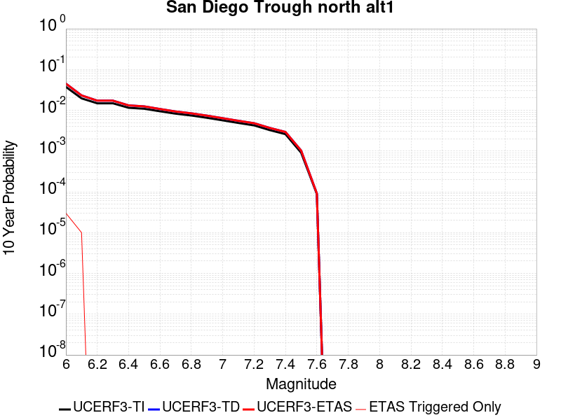 |

| Magnitude | 1 wk TI Prob | 1 wk TD Prob | 1 wk ETAS Prob | 1 wk ETAS/TD Gain | 1 wk ETAS Triggered Only | 1 mo TI Prob | 1 mo TD Prob | 1 mo ETAS Prob | 1 mo ETAS/TD Gain | 1 mo ETAS Triggered Only | 1 yr TI Prob | 1 yr TD Prob | 1 yr ETAS Prob | 1 yr ETAS/TD Gain | 1 yr ETAS Triggered Only | 10 yr TI Prob | 10 yr TD Prob | 10 yr ETAS Prob | 10 yr ETAS/TD Gain | 10 yr ETAS Triggered Only |
|-----|-----|-----|-----|-----|-----|-----|-----|-----|-----|-----|-----|-----|-----|-----|-----|-----|-----|-----|-----|-----|
| 6.0 | 7.329252E-5 | 8.821339E-5 | 9.8212506E-5 | 1.1133515 | 1.0E-5 | 3.14073E-4 | 3.7800625E-4 | 3.880025E-4 | 1.0264446 | 1.0E-5 | 0.0038171355 | 0.0045931544 | 0.0046031084 | 1.0021671 | 1.0E-5 | 0.03752231 | 0.045046188 | 0.045074835 | 1.000636 | 3.0E-5 |
| 6.1 | 3.7940346E-5 | 4.488612E-5 | 5.4885673E-5 | 1.222776 | 1.0E-5 | 1.6259136E-4 | 1.9235547E-4 | 2.0235353E-4 | 1.051977 | 1.0E-5 | 0.0019777524 | 0.002339501 | 0.0023494775 | 1.0042645 | 1.0E-5 | 0.019602431 | 0.023157248 | 0.023167018 | 1.0004219 | 1.0E-5 |
| 6.2 | 2.8645263E-5 | 3.329751E-5 | 3.329751E-5 | 1.0 | 0.0 | 1.2275964E-4 | 1.4269596E-4 | 1.4269596E-4 | 1.0 | 0.0 | 0.0014935739 | 0.0017359565 | 0.0017359565 | 1.0 | 0.0 | 0.0148357535 | 0.01722662 | 0.01722662 | 1.0 | 0.0 |
| 6.3 | 2.8645263E-5 | 3.329751E-5 | 3.329751E-5 | 1.0 | 0.0 | 1.2275964E-4 | 1.4269596E-4 | 1.4269596E-4 | 1.0 | 0.0 | 0.0014935739 | 0.0017359565 | 0.0017359565 | 1.0 | 0.0 | 0.0148357535 | 0.01722662 | 0.01722662 | 1.0 | 0.0 |
| 6.4 | 2.2204576E-5 | 2.5448817E-5 | 2.5448817E-5 | 1.0 | 0.0 | 9.5159E-5 | 1.0906186E-4 | 1.0906186E-4 | 1.0 | 0.0 | 0.001157945 | 0.0013270293 | 0.0013270293 | 1.0 | 0.0 | 0.011519298 | 0.013192211 | 0.013192211 | 1.0 | 0.0 |
| 6.5 | 2.1004838E-5 | 2.4025157E-5 | 2.4025157E-5 | 1.0 | 0.0 | 9.0017624E-5 | 1.0296095E-4 | 1.0296095E-4 | 1.0 | 0.0 | 0.0010954136 | 0.001252838 | 0.001252838 | 1.0 | 0.0 | 0.010900296 | 0.012458827 | 0.012458827 | 1.0 | 0.0 |
| 6.6 | 1.820557E-5 | 2.0705167E-5 | 2.0705167E-5 | 1.0 | 0.0 | 7.802154E-5 | 8.873344E-5 | 8.873344E-5 | 1.0 | 0.0 | 9.4949827E-4 | 0.0010797997 | 0.0010797997 | 1.0 | 0.0 | 0.009454516 | 0.010746201 | 0.010746201 | 1.0 | 0.0 |
| 6.7 | 1.5884485E-5 | 1.7983964E-5 | 1.7983964E-5 | 1.0 | 0.0 | 6.807459E-5 | 7.707187E-5 | 7.707187E-5 | 1.0 | 0.0 | 8.284929E-4 | 9.379488E-4 | 9.379488E-4 | 1.0 | 0.0 | 0.008254109 | 0.009340268 | 0.009340268 | 1.0 | 0.0 |
| 6.8 | 1.4331171E-5 | 1.6201348E-5 | 1.6201348E-5 | 1.0 | 0.0 | 6.141786E-5 | 6.9432506E-5 | 6.9432506E-5 | 1.0 | 0.0 | 7.4750587E-4 | 8.4501493E-4 | 8.4501493E-4 | 1.0 | 0.0 | 0.0074499645 | 0.008418285 | 0.008418285 | 1.0 | 0.0 |
| 6.9 | 1.2574203E-5 | 1.4206081E-5 | 1.4206081E-5 | 1.0 | 0.0 | 5.3888325E-5 | 6.088179E-5 | 6.088179E-5 | 1.0 | 0.0 | 6.558929E-4 | 7.4098515E-4 | 7.4098515E-4 | 1.0 | 0.0 | 0.0065396037 | 0.0073853307 | 0.0073853307 | 1.0 | 0.0 |
| 7.0 | 1.0883844E-5 | 1.22894735E-5 | 1.22894735E-5 | 1.0 | 0.0 | 4.664421E-5 | 5.2668114E-5 | 5.2668114E-5 | 1.0 | 0.0 | 5.677453E-4 | 6.410466E-4 | 6.410466E-4 | 1.0 | 0.0 | 0.00566297 | 0.0063921027 | 0.0063921027 | 1.0 | 0.0 |
| 7.1 | 9.393088E-6 | 1.0607203E-5 | 1.0607203E-5 | 1.0 | 0.0 | 4.025547E-5 | 4.5458655E-5 | 4.5458655E-5 | 1.0 | 0.0 | 4.900001E-4 | 5.5331935E-4 | 5.5331935E-4 | 1.0 | 0.0 | 0.0048892107 | 0.005519513 | 0.005519513 | 1.0 | 0.0 |
| 7.2 | 8.190791E-6 | 9.258787E-6 | 9.258787E-6 | 1.0 | 0.0 | 3.510292E-5 | 3.9679915E-5 | 3.9679915E-5 | 1.0 | 0.0 | 4.2729423E-4 | 4.8299658E-4 | 4.8299658E-4 | 1.0 | 0.0 | 0.0042647356 | 0.004819548 | 0.004819548 | 1.0 | 0.0 |
| 7.3 | 6.268162E-6 | 7.08984E-6 | 7.08984E-6 | 1.0 | 0.0 | 2.6863276E-5 | 3.0384675E-5 | 3.0384675E-5 | 1.0 | 0.0 | 3.2701128E-4 | 3.6987104E-4 | 3.6987104E-4 | 1.0 | 0.0 | 0.003265305 | 0.0036926004 | 0.0036926004 | 1.0 | 0.0 |
| 7.4 | 4.985186E-6 | 5.6427807E-6 | 5.6427807E-6 | 1.0 | 0.0 | 2.1364907E-5 | 2.4183124E-5 | 2.4183124E-5 | 1.0 | 0.0 | 2.600867E-4 | 2.9439016E-4 | 2.9439016E-4 | 1.0 | 0.0 | 0.002597825 | 0.002940043 | 0.002940043 | 1.0 | 0.0 |
| 7.5 | 1.7489613E-6 | 1.9697113E-6 | 1.9697113E-6 | 1.0 | 0.0 | 7.495527E-6 | 8.441594E-6 | 8.441594E-6 | 1.0 | 0.0 | 9.125422E-5 | 1.0277178E-4 | 1.0277178E-4 | 1.0 | 0.0 | 9.1216754E-4 | 0.0010272645 | 0.0010272645 | 1.0 | 0.0 |
| 7.6 | 1.6988751E-7 | 1.7533898E-7 | 1.7533898E-7 | 1.0 | 0.0 | 7.2808916E-7 | 7.5145255E-7 | 7.5145255E-7 | 1.0 | 0.0 | 8.864449E-6 | 9.148898E-6 | 9.148898E-6 | 1.0 | 0.0 | 8.8640954E-5 | 9.148542E-5 | 9.148542E-5 | 1.0 | 0.0 |

## Robinson Creek
*[(top)](#table-of-contents)*

| 1 Week | 1 Month | 1 Year | 10 Year |
|-----|-----|-----|-----|
|  | 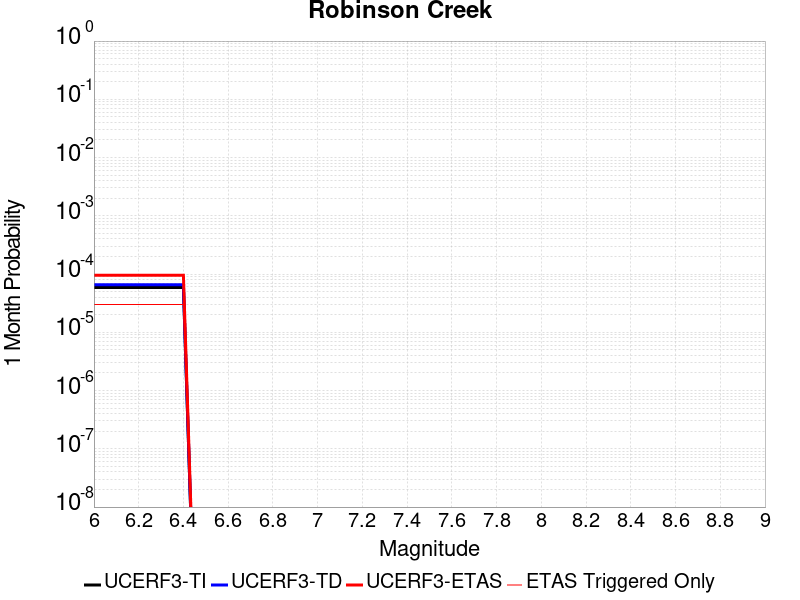 |  |  |

| Magnitude | 1 wk TI Prob | 1 wk TD Prob | 1 wk ETAS Prob | 1 wk ETAS/TD Gain | 1 wk ETAS Triggered Only | 1 mo TI Prob | 1 mo TD Prob | 1 mo ETAS Prob | 1 mo ETAS/TD Gain | 1 mo ETAS Triggered Only | 1 yr TI Prob | 1 yr TD Prob | 1 yr ETAS Prob | 1 yr ETAS/TD Gain | 1 yr ETAS Triggered Only | 10 yr TI Prob | 10 yr TD Prob | 10 yr ETAS Prob | 10 yr ETAS/TD Gain | 10 yr ETAS Triggered Only |
|-----|-----|-----|-----|-----|-----|-----|-----|-----|-----|-----|-----|-----|-----|-----|-----|-----|-----|-----|-----|-----|
| 6.0 | 1.3705327E-5 | 1.5285246E-5 | 2.5285093E-5 | 1.6542156 | 1.0E-5 | 5.8735794E-5 | 6.5508204E-5 | 9.5506235E-5 | 1.457928 | 3.0E-5 | 7.1487366E-4 | 7.9756236E-4 | 8.2753843E-4 | 1.0375847 | 3.0E-5 | 0.0071257832 | 0.007975623 | 0.008005384 | 1.0037315 | 3.0E-5 |
| 6.1 | 1.3705327E-5 | 1.5285246E-5 | 2.5285093E-5 | 1.6542156 | 1.0E-5 | 5.8735794E-5 | 6.5508204E-5 | 9.5506235E-5 | 1.457928 | 3.0E-5 | 7.1487366E-4 | 7.9756236E-4 | 8.2753843E-4 | 1.0375847 | 3.0E-5 | 0.0071257832 | 0.007975623 | 0.008005384 | 1.0037315 | 3.0E-5 |
| 6.2 | 1.3705327E-5 | 1.5285246E-5 | 2.5285093E-5 | 1.6542156 | 1.0E-5 | 5.8735794E-5 | 6.5508204E-5 | 9.5506235E-5 | 1.457928 | 3.0E-5 | 7.1487366E-4 | 7.9756236E-4 | 8.2753843E-4 | 1.0375847 | 3.0E-5 | 0.0071257832 | 0.007975623 | 0.008005384 | 1.0037315 | 3.0E-5 |
| 6.3 | 1.3705327E-5 | 1.5285246E-5 | 2.5285093E-5 | 1.6542156 | 1.0E-5 | 5.8735794E-5 | 6.5508204E-5 | 9.5506235E-5 | 1.457928 | 3.0E-5 | 7.1487366E-4 | 7.9756236E-4 | 8.2753843E-4 | 1.0375847 | 3.0E-5 | 0.0071257832 | 0.007975623 | 0.008005384 | 1.0037315 | 3.0E-5 |
| 6.4 | 1.3705327E-5 | 1.5285246E-5 | 2.5285093E-5 | 1.6542156 | 1.0E-5 | 5.8735794E-5 | 6.5508204E-5 | 9.5506235E-5 | 1.457928 | 3.0E-5 | 7.1487366E-4 | 7.9756236E-4 | 8.2753843E-4 | 1.0375847 | 3.0E-5 | 0.0071257832 | 0.007975623 | 0.008005384 | 1.0037315 | 3.0E-5 |

## San Luis Range 2011 CFM
*[(top)](#table-of-contents)*

| 1 Week | 1 Month | 1 Year | 10 Year |
|-----|-----|-----|-----|
|  |  |  |  |

| Magnitude | 1 wk TI Prob | 1 wk TD Prob | 1 wk ETAS Prob | 1 wk ETAS/TD Gain | 1 wk ETAS Triggered Only | 1 mo TI Prob | 1 mo TD Prob | 1 mo ETAS Prob | 1 mo ETAS/TD Gain | 1 mo ETAS Triggered Only | 1 yr TI Prob | 1 yr TD Prob | 1 yr ETAS Prob | 1 yr ETAS/TD Gain | 1 yr ETAS Triggered Only | 10 yr TI Prob | 10 yr TD Prob | 10 yr ETAS Prob | 10 yr ETAS/TD Gain | 10 yr ETAS Triggered Only |
|-----|-----|-----|-----|-----|-----|-----|-----|-----|-----|-----|-----|-----|-----|-----|-----|-----|-----|-----|-----|-----|
| 6.0 | 8.8368415E-6 | 8.965477E-6 | 1.8965387E-5 | 2.1153796 | 1.0E-5 | 3.787163E-5 | 3.8422953E-5 | 4.8422567E-5 | 1.260251 | 1.0E-5 | 4.609895E-4 | 4.677069E-4 | 4.976929E-4 | 1.0641128 | 3.0E-5 | 0.0046003438 | 0.0046680085 | 0.0046978686 | 1.0063968 | 3.0E-5 |
| 6.1 | 8.8368415E-6 | 8.965477E-6 | 1.8965387E-5 | 2.1153796 | 1.0E-5 | 3.787163E-5 | 3.8422953E-5 | 4.8422567E-5 | 1.260251 | 1.0E-5 | 4.609895E-4 | 4.677069E-4 | 4.976929E-4 | 1.0641128 | 3.0E-5 | 0.0046003438 | 0.0046680085 | 0.0046978686 | 1.0063968 | 3.0E-5 |
| 6.2 | 8.8368415E-6 | 8.965477E-6 | 1.8965387E-5 | 2.1153796 | 1.0E-5 | 3.787163E-5 | 3.8422953E-5 | 4.8422567E-5 | 1.260251 | 1.0E-5 | 4.609895E-4 | 4.677069E-4 | 4.976929E-4 | 1.0641128 | 3.0E-5 | 0.0046003438 | 0.0046680085 | 0.0046978686 | 1.0063968 | 3.0E-5 |
| 6.3 | 8.8368415E-6 | 8.965477E-6 | 1.8965387E-5 | 2.1153796 | 1.0E-5 | 3.787163E-5 | 3.8422953E-5 | 4.8422567E-5 | 1.260251 | 1.0E-5 | 4.609895E-4 | 4.677069E-4 | 4.976929E-4 | 1.0641128 | 3.0E-5 | 0.0046003438 | 0.0046680085 | 0.0046978686 | 1.0063968 | 3.0E-5 |
| 6.4 | 3.9094193E-6 | 3.941213E-6 | 1.3941174E-5 | 3.5372798 | 1.0E-5 | 1.6754546E-5 | 1.6890806E-5 | 2.6890637E-5 | 1.592028 | 1.0E-5 | 2.039675E-4 | 2.0562643E-4 | 2.1562437E-4 | 1.0486219 | 1.0E-5 | 0.0020378039 | 0.0020543905 | 0.0020643699 | 1.0048577 | 1.0E-5 |
| 6.5 | 3.9094193E-6 | 3.941213E-6 | 1.3941174E-5 | 3.5372798 | 1.0E-5 | 1.6754546E-5 | 1.6890806E-5 | 2.6890637E-5 | 1.592028 | 1.0E-5 | 2.039675E-4 | 2.0562643E-4 | 2.1562437E-4 | 1.0486219 | 1.0E-5 | 0.0020378039 | 0.0020543905 | 0.0020643699 | 1.0048577 | 1.0E-5 |
| 6.6 | 3.0587726E-6 | 3.0753965E-6 | 1.3075366E-5 | 4.251603 | 1.0E-5 | 1.3108959E-5 | 1.3180205E-5 | 2.3180073E-5 | 1.7587035 | 1.0E-5 | 1.595899E-4 | 1.604573E-4 | 1.7045569E-4 | 1.0623119 | 1.0E-5 | 0.0015947534 | 0.0016034264 | 0.0016134104 | 1.0062267 | 1.0E-5 |
| 6.7 | 2.6160574E-6 | 2.6251346E-6 | 1.2625108E-5 | 4.8093185 | 1.0E-5 | 1.1211626E-5 | 1.1250529E-5 | 2.1250416E-5 | 1.8888371 | 1.0E-5 | 1.3649299E-4 | 1.3696664E-4 | 1.4696526E-4 | 1.0730004 | 1.0E-5 | 0.0013640919 | 0.0013688284 | 0.0013788147 | 1.0072955 | 1.0E-5 |
| 6.8 | 2.5110312E-6 | 2.5181473E-6 | 1.2518122E-5 | 4.9711637 | 1.0E-5 | 1.0761518E-5 | 1.0792015E-5 | 2.0791907E-5 | 1.926601 | 1.0E-5 | 1.310136E-4 | 1.3138492E-4 | 1.413836E-4 | 1.0761023 | 1.0E-5 | 0.0013093639 | 0.0013130783 | 0.0013230651 | 1.0076057 | 1.0E-5 |
| 6.9 | 1.8564405E-6 | 1.8524926E-6 | 1.1852474E-5 | 6.3981223 | 1.0E-5 | 7.95615E-6 | 7.93923E-6 | 1.793915E-5 | 2.259558 | 1.0E-5 | 9.686181E-5 | 9.665586E-5 | 1.0665489E-4 | 1.1034498 | 1.0E-5 | 9.68196E-4 | 9.661402E-4 | 9.7613054E-4 | 1.0103405 | 1.0E-5 |
| 7.0 | 1.546127E-6 | 1.5369586E-6 | 1.1536943E-5 | 7.5063457 | 1.0E-5 | 6.626242E-6 | 6.586949E-6 | 1.6586882E-5 | 2.5181437 | 1.0E-5 | 8.06715E-5 | 8.019316E-5 | 9.0192356E-5 | 1.1246889 | 1.0E-5 | 8.0642226E-4 | 8.016429E-4 | 8.116349E-4 | 1.0124644 | 1.0E-5 |
| 7.1 | 1.3368208E-6 | 1.3235369E-6 | 1.1323524E-5 | 8.555503 | 1.0E-5 | 5.7292195E-6 | 5.672289E-6 | 1.5672233E-5 | 2.7629468 | 1.0E-5 | 6.975101E-5 | 6.905793E-5 | 7.9057245E-5 | 1.144796 | 1.0E-5 | 6.972912E-4 | 6.903652E-4 | 7.003583E-4 | 1.0144751 | 1.0E-5 |
| 7.2 | 1.0623363E-6 | 1.0454403E-6 | 1.0454403E-6 | 1.0 | 0.0 | 4.5528623E-6 | 4.480451E-6 | 4.480451E-6 | 1.0 | 0.0 | 5.5429686E-5 | 5.4548127E-5 | 5.4548127E-5 | 1.0 | 0.0 | 5.5415864E-4 | 5.4534763E-4 | 5.4534763E-4 | 1.0 | 0.0 |
| 7.3 | 7.831679E-7 | 7.7274194E-7 | 7.7274194E-7 | 1.0 | 0.0 | 3.3564295E-6 | 3.311747E-6 | 3.311747E-6 | 1.0 | 0.0 | 4.086376E-5 | 4.0319774E-5 | 4.0319774E-5 | 1.0 | 0.0 | 4.0856248E-4 | 4.0312472E-4 | 4.0312472E-4 | 1.0 | 0.0 |
| 7.4 | 5.9558846E-7 | 5.91066E-7 | 5.91066E-7 | 1.0 | 0.0 | 2.5525194E-6 | 2.5331376E-6 | 2.5331376E-6 | 1.0 | 0.0 | 3.107648E-5 | 3.0840514E-5 | 3.0840514E-5 | 1.0 | 0.0 | 3.1072134E-4 | 3.0836245E-4 | 3.0836245E-4 | 1.0 | 0.0 |
| 7.5 | 4.1616502E-7 | 4.1196506E-7 | 4.1196506E-7 | 1.0 | 0.0 | 1.7835631E-6 | 1.7655633E-6 | 1.7655633E-6 | 1.0 | 0.0 | 2.1714664E-5 | 2.1495522E-5 | 2.1495522E-5 | 1.0 | 0.0 | 2.1712543E-4 | 2.1493447E-4 | 2.1493447E-4 | 1.0 | 0.0 |
| 7.6 | 2.3816014E-7 | 2.3376697E-7 | 2.3376697E-7 | 1.0 | 0.0 | 1.0206859E-6 | 1.001858E-6 | 1.001858E-6 | 1.0 | 0.0 | 1.242678E-5 | 1.2197554E-5 | 1.2197554E-5 | 1.0 | 0.0 | 1.2426086E-4 | 1.2196886E-4 | 1.2196886E-4 | 1.0 | 0.0 |
| 7.7 | 9.918777E-8 | 9.386869E-8 | 9.386869E-8 | 1.0 | 0.0 | 4.2509038E-7 | 4.0229432E-7 | 4.0229432E-7 | 1.0 | 0.0 | 5.1754632E-6 | 4.8979223E-6 | 4.8979223E-6 | 1.0 | 0.0 | 5.1753424E-5 | 4.897815E-5 | 4.897815E-5 | 1.0 | 0.0 |
| 7.8 | 3.4982556E-8 | 2.9687454E-8 | 2.9687454E-8 | 1.0 | 0.0 | 1.4992524E-7 | 1.2723194E-7 | 1.2723194E-7 | 1.0 | 0.0 | 1.8253382E-6 | 1.5490477E-6 | 1.5490477E-6 | 1.0 | 0.0 | 1.8253233E-5 | 1.549037E-5 | 1.549037E-5 | 1.0 | 0.0 |
| 7.9 | 1.6624908E-8 | 1.1477859E-8 | 1.1477859E-8 | 1.0 | 0.0 | 7.12496E-8 | 4.919082E-8 | 4.919082E-8 | 1.0 | 0.0 | 8.6746354E-7 | 5.9889805E-7 | 5.9889805E-7 | 1.0 | 0.0 | 8.674601E-6 | 5.988965E-6 | 5.988965E-6 | 1.0 | 0.0 |
| 8.0 | 6.3352315E-9 | 3.0893488E-9 | 3.0893488E-9 | 1.0 | 0.0 | 2.715099E-8 | 1.3240064E-8 | 1.3240064E-8 | 1.0 | 0.0 | 3.3056327E-7 | 1.6119778E-7 | 1.6119778E-7 | 1.0 | 0.0 | 3.3056278E-6 | 1.6119766E-6 | 1.6119766E-6 | 1.0 | 0.0 |

## Chino alt 1
*[(top)](#table-of-contents)*

| 1 Week | 1 Month | 1 Year | 10 Year |
|-----|-----|-----|-----|
| 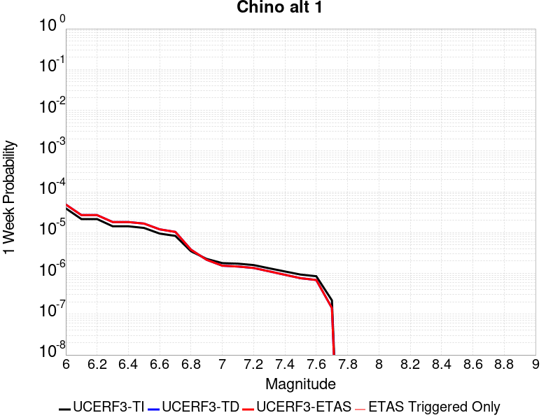 |  |  |  |

| Magnitude | 1 wk TI Prob | 1 wk TD Prob | 1 wk ETAS Prob | 1 wk ETAS/TD Gain | 1 wk ETAS Triggered Only | 1 mo TI Prob | 1 mo TD Prob | 1 mo ETAS Prob | 1 mo ETAS/TD Gain | 1 mo ETAS Triggered Only | 1 yr TI Prob | 1 yr TD Prob | 1 yr ETAS Prob | 1 yr ETAS/TD Gain | 1 yr ETAS Triggered Only | 10 yr TI Prob | 10 yr TD Prob | 10 yr ETAS Prob | 10 yr ETAS/TD Gain | 10 yr ETAS Triggered Only |
|-----|-----|-----|-----|-----|-----|-----|-----|-----|-----|-----|-----|-----|-----|-----|-----|-----|-----|-----|-----|-----|
| 6.0 | 3.939946E-5 | 4.895037E-5 | 4.895037E-5 | 1.0 | 0.0 | 1.6884391E-4 | 2.0977337E-4 | 2.0977337E-4 | 1.0 | 0.0 | 0.0020537362 | 0.0025514876 | 0.0025514876 | 1.0 | 0.0 | 0.020348595 | 0.025278764 | 0.025308006 | 1.0011568 | 3.0E-5 |
| 6.1 | 2.1505624E-5 | 2.6880154E-5 | 2.6880154E-5 | 1.0 | 0.0 | 9.2163704E-5 | 1.151962E-4 | 1.151962E-4 | 1.0 | 0.0 | 0.0011215154 | 0.0014017228 | 0.0014017228 | 1.0 | 0.0 | 0.011158722 | 0.013945717 | 0.013965438 | 1.0014142 | 2.0E-5 |
| 6.2 | 2.1505624E-5 | 2.6880154E-5 | 2.6880154E-5 | 1.0 | 0.0 | 9.2163704E-5 | 1.151962E-4 | 1.151962E-4 | 1.0 | 0.0 | 0.0011215154 | 0.0014017228 | 0.0014017228 | 1.0 | 0.0 | 0.011158722 | 0.013945717 | 0.013965438 | 1.0014142 | 2.0E-5 |
| 6.3 | 1.4290785E-5 | 1.8166014E-5 | 1.8166014E-5 | 1.0 | 0.0 | 6.1244784E-5 | 7.785228E-5 | 7.785228E-5 | 1.0 | 0.0 | 7.454001E-4 | 9.4748475E-4 | 9.4748475E-4 | 1.0 | 0.0 | 0.007429048 | 0.009444912 | 0.0094548175 | 1.0010488 | 1.0E-5 |
| 6.4 | 1.4290785E-5 | 1.8166014E-5 | 1.8166014E-5 | 1.0 | 0.0 | 6.1244784E-5 | 7.785228E-5 | 7.785228E-5 | 1.0 | 0.0 | 7.454001E-4 | 9.4748475E-4 | 9.4748475E-4 | 1.0 | 0.0 | 0.007429048 | 0.009444912 | 0.0094548175 | 1.0010488 | 1.0E-5 |
| 6.5 | 1.3017944E-5 | 1.6652937E-5 | 1.6652937E-5 | 1.0 | 0.0 | 5.5789995E-5 | 7.136803E-5 | 7.136803E-5 | 1.0 | 0.0 | 6.790315E-4 | 8.686031E-4 | 8.686031E-4 | 1.0 | 0.0 | 0.0067696036 | 0.008662385 | 0.008672298 | 1.0011444 | 1.0E-5 |
| 6.6 | 9.470016E-6 | 1.2040057E-5 | 1.2040057E-5 | 1.0 | 0.0 | 4.058515E-5 | 5.1599414E-5 | 5.1599414E-5 | 1.0 | 0.0 | 4.940122E-4 | 6.2807574E-4 | 6.2807574E-4 | 1.0 | 0.0 | 0.004929154 | 0.0062722242 | 0.0062722242 | 1.0 | 0.0 |
| 6.7 | 8.314155E-6 | 1.0408293E-5 | 1.0408293E-5 | 1.0 | 0.0 | 3.5631605E-5 | 4.460639E-5 | 4.460639E-5 | 1.0 | 0.0 | 4.3372845E-4 | 5.429797E-4 | 5.429797E-4 | 1.0 | 0.0 | 0.004328829 | 0.005426062 | 0.005426062 | 1.0 | 0.0 |
| 6.8 | 3.4856364E-6 | 3.8135372E-6 | 3.8135372E-6 | 1.0 | 0.0 | 1.4938357E-5 | 1.634364E-5 | 1.634364E-5 | 1.0 | 0.0 | 1.8185932E-4 | 1.9896773E-4 | 1.9896773E-4 | 1.0 | 0.0 | 0.0018171056 | 0.001989573 | 0.001989573 | 1.0 | 0.0 |
| 6.9 | 2.2645952E-6 | 2.152999E-6 | 2.152999E-6 | 1.0 | 0.0 | 9.705372E-6 | 9.227107E-6 | 9.227107E-6 | 1.0 | 0.0 | 1.18156495E-4 | 1.1233445E-4 | 1.1233445E-4 | 1.0 | 0.0 | 0.0011809369 | 0.0011233927 | 0.0011233927 | 1.0 | 0.0 |
| 7.0 | 1.7864003E-6 | 1.5431575E-6 | 1.5431575E-6 | 1.0 | 0.0 | 7.655979E-6 | 6.613516E-6 | 6.613516E-6 | 1.0 | 0.0 | 9.3207556E-5 | 8.0516635E-5 | 8.0516635E-5 | 1.0 | 0.0 | 9.316847E-4 | 8.0532173E-4 | 8.0532173E-4 | 1.0 | 0.0 |
| 7.1 | 1.7315456E-6 | 1.4734279E-6 | 1.4734279E-6 | 1.0 | 0.0 | 7.420889E-6 | 6.3146763E-6 | 6.3146763E-6 | 1.0 | 0.0 | 9.034557E-5 | 7.6878525E-5 | 7.6878525E-5 | 1.0 | 0.0 | 9.0308854E-4 | 7.6895714E-4 | 7.6895714E-4 | 1.0 | 0.0 |
| 7.2 | 1.6008337E-6 | 1.3574753E-6 | 1.3574753E-6 | 1.0 | 0.0 | 6.860698E-6 | 5.817739E-6 | 5.817739E-6 | 1.0 | 0.0 | 8.352579E-5 | 7.082872E-5 | 7.082872E-5 | 1.0 | 0.0 | 8.34944E-4 | 7.084856E-4 | 7.084856E-4 | 1.0 | 0.0 |
| 7.3 | 1.3320939E-6 | 1.1218251E-6 | 1.1218251E-6 | 1.0 | 0.0 | 5.7089615E-6 | 4.8078136E-6 | 4.8078136E-6 | 1.0 | 0.0 | 6.9504385E-5 | 5.8533606E-5 | 5.8533606E-5 | 1.0 | 0.0 | 6.9482654E-4 | 5.853264E-4 | 5.853264E-4 | 1.0 | 0.0 |
| 7.4 | 1.114294E-6 | 9.2374523E-7 | 9.2374523E-7 | 1.0 | 0.0 | 4.775537E-6 | 3.958902E-6 | 3.958902E-6 | 1.0 | 0.0 | 5.8140613E-5 | 4.8198606E-5 | 4.8198606E-5 | 1.0 | 0.0 | 5.81254E-4 | 4.8189834E-4 | 4.8189834E-4 | 1.0 | 0.0 |
| 7.5 | 9.354081E-7 | 7.623702E-7 | 7.623702E-7 | 1.0 | 0.0 | 4.0088858E-6 | 3.2672967E-6 | 3.2672967E-6 | 1.0 | 0.0 | 4.8807087E-5 | 3.9778646E-5 | 3.9778646E-5 | 1.0 | 0.0 | 4.879637E-4 | 3.9771866E-4 | 3.9771866E-4 | 1.0 | 0.0 |
| 7.6 | 8.521771E-7 | 6.8809493E-7 | 6.8809493E-7 | 1.0 | 0.0 | 3.6521824E-6 | 2.9489752E-6 | 2.9489752E-6 | 1.0 | 0.0 | 4.4464414E-5 | 3.5903213E-5 | 3.5903213E-5 | 1.0 | 0.0 | 4.4455516E-4 | 3.589773E-4 | 3.589773E-4 | 1.0 | 0.0 |
| 7.7 | 2.1803626E-7 | 1.4187151E-7 | 1.4187151E-7 | 1.0 | 0.0 | 9.344408E-7 | 6.080207E-7 | 6.080207E-7 | 1.0 | 0.0 | 1.1376757E-5 | 7.402636E-6 | 7.402636E-6 | 1.0 | 0.0 | 1.13761744E-4 | 7.402486E-5 | 7.402486E-5 | 1.0 | 0.0 |

## Great Valley 08 (Quinto)
*[(top)](#table-of-contents)*

| 1 Week | 1 Month | 1 Year | 10 Year |
|-----|-----|-----|-----|
| 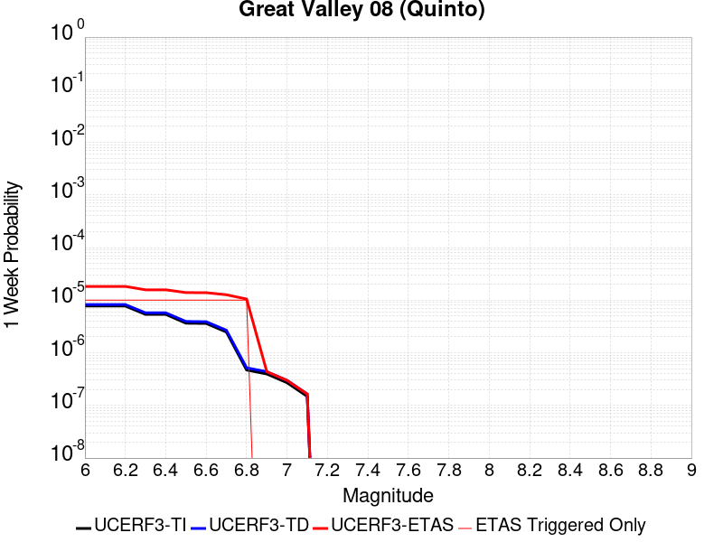 | 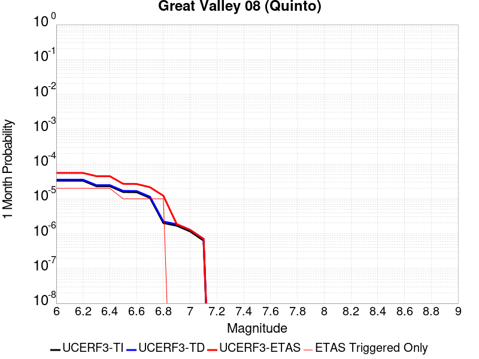 | 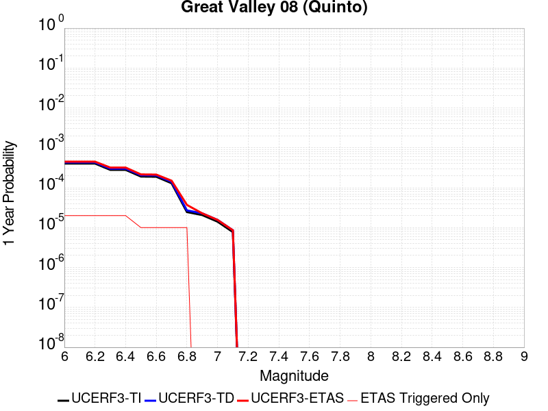 | 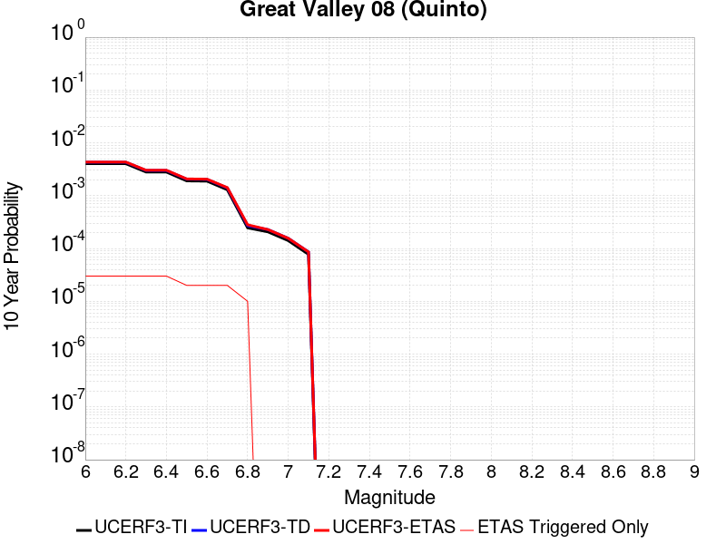 |

| Magnitude | 1 wk TI Prob | 1 wk TD Prob | 1 wk ETAS Prob | 1 wk ETAS/TD Gain | 1 wk ETAS Triggered Only | 1 mo TI Prob | 1 mo TD Prob | 1 mo ETAS Prob | 1 mo ETAS/TD Gain | 1 mo ETAS Triggered Only | 1 yr TI Prob | 1 yr TD Prob | 1 yr ETAS Prob | 1 yr ETAS/TD Gain | 1 yr ETAS Triggered Only | 10 yr TI Prob | 10 yr TD Prob | 10 yr ETAS Prob | 10 yr ETAS/TD Gain | 10 yr ETAS Triggered Only |
|-----|-----|-----|-----|-----|-----|-----|-----|-----|-----|-----|-----|-----|-----|-----|-----|-----|-----|-----|-----|-----|
| 6.0 | 7.737697E-6 | 8.253111E-6 | 1.825303E-5 | 2.2116542 | 1.0E-5 | 3.3161137E-5 | 3.5370103E-5 | 5.5369397E-5 | 1.5654293 | 2.0E-5 | 4.0366207E-4 | 4.3056477E-4 | 4.5055617E-4 | 1.0464306 | 2.0E-5 | 0.004029296 | 0.0042991587 | 0.0043290295 | 1.0069481 | 3.0E-5 |
| 6.1 | 7.737697E-6 | 8.253111E-6 | 1.825303E-5 | 2.2116542 | 1.0E-5 | 3.3161137E-5 | 3.5370103E-5 | 5.5369397E-5 | 1.5654293 | 2.0E-5 | 4.0366207E-4 | 4.3056477E-4 | 4.5055617E-4 | 1.0464306 | 2.0E-5 | 0.004029296 | 0.0042991587 | 0.0043290295 | 1.0069481 | 3.0E-5 |
| 6.2 | 7.737697E-6 | 8.253111E-6 | 1.825303E-5 | 2.2116542 | 1.0E-5 | 3.3161137E-5 | 3.5370103E-5 | 5.5369397E-5 | 1.5654293 | 2.0E-5 | 4.0366207E-4 | 4.3056477E-4 | 4.5055617E-4 | 1.0464306 | 2.0E-5 | 0.004029296 | 0.0042991587 | 0.0043290295 | 1.0069481 | 3.0E-5 |
| 6.3 | 5.374012E-6 | 5.750627E-6 | 1.575057E-5 | 2.7389307 | 1.0E-5 | 2.3031276E-5 | 2.4645375E-5 | 4.4644883E-5 | 1.8114913 | 2.0E-5 | 2.803697E-4 | 3.0002726E-4 | 3.2002127E-4 | 1.0666406 | 2.0E-5 | 0.0028001624 | 0.0029973155 | 0.0030272254 | 1.009979 | 3.0E-5 |
| 6.4 | 5.374012E-6 | 5.750627E-6 | 1.575057E-5 | 2.7389307 | 1.0E-5 | 2.3031276E-5 | 2.4645375E-5 | 4.4644883E-5 | 1.8114913 | 2.0E-5 | 2.803697E-4 | 3.0002726E-4 | 3.2002127E-4 | 1.0666406 | 2.0E-5 | 0.0028001624 | 0.0029973155 | 0.0030272254 | 1.009979 | 3.0E-5 |
| 6.5 | 3.65427E-6 | 3.941365E-6 | 1.3941326E-5 | 3.537182 | 1.0E-5 | 1.5661062E-5 | 1.6891494E-5 | 2.6891326E-5 | 1.592004 | 1.0E-5 | 1.9065675E-4 | 2.056416E-4 | 2.1563953E-4 | 1.0486183 | 1.0E-5 | 0.0019049325 | 0.0020552047 | 0.0020751636 | 1.0097114 | 2.0E-5 |
| 6.6 | 3.6143538E-6 | 3.8985513E-6 | 1.3898512E-5 | 3.5650454 | 1.0E-5 | 1.5489995E-5 | 1.6708009E-5 | 2.6707843E-5 | 1.5985054 | 1.0E-5 | 1.8857437E-4 | 2.0340808E-4 | 2.1340605E-4 | 1.0491523 | 1.0E-5 | 0.0018841444 | 0.0020329105 | 0.0020528699 | 1.0098181 | 2.0E-5 |
| 6.7 | 2.4821015E-6 | 2.685736E-6 | 1.2685709E-5 | 4.723364 | 1.0E-5 | 1.0637535E-5 | 1.15102785E-5 | 2.1510163E-5 | 1.8687787 | 1.0E-5 | 1.2950429E-4 | 1.4013429E-4 | 1.5013288E-4 | 1.0713501 | 1.0E-5 | 0.0012942884 | 0.0014010142 | 0.0014209861 | 1.0142554 | 2.0E-5 |
| 6.8 | 4.7110538E-7 | 5.1930914E-7 | 1.0519304E-5 | 20.256342 | 1.0E-5 | 2.0190216E-6 | 2.2256088E-6 | 1.2225587E-5 | 5.4931426 | 1.0E-5 | 2.458131E-5 | 2.7096468E-5 | 3.7096197E-5 | 1.3690418 | 1.0E-5 | 2.457859E-4 | 2.7093347E-4 | 2.8093075E-4 | 1.0368994 | 1.0E-5 |
| 6.9 | 3.958685E-7 | 4.3704054E-7 | 4.3704054E-7 | 1.0 | 0.0 | 1.6965782E-6 | 1.8730296E-6 | 1.8730296E-6 | 1.0 | 0.0 | 2.0655643E-5 | 2.2803915E-5 | 2.2803915E-5 | 1.0 | 0.0 | 2.0653724E-4 | 2.2801736E-4 | 2.2801736E-4 | 1.0 | 0.0 |
| 7.0 | 2.70294E-7 | 2.9920432E-7 | 2.9920432E-7 | 1.0 | 0.0 | 1.1584025E-6 | 1.2823037E-6 | 1.2823037E-6 | 1.0 | 0.0 | 1.4103458E-5 | 1.561195E-5 | 1.561195E-5 | 1.0 | 0.0 | 1.4102564E-4 | 1.561098E-4 | 1.561098E-4 | 1.0 | 0.0 |
| 7.1 | 1.4828602E-7 | 1.6469349E-7 | 1.6469349E-7 | 1.0 | 0.0 | 6.3551136E-7 | 7.058291E-7 | 7.058291E-7 | 1.0 | 0.0 | 7.737323E-6 | 8.593443E-6 | 8.593443E-6 | 1.0 | 0.0 | 7.737054E-5 | 8.593191E-5 | 8.593191E-5 | 1.0 | 0.0 |

## Fontana (Seismicity)
*[(top)](#table-of-contents)*

| 1 Week | 1 Month | 1 Year | 10 Year |
|-----|-----|-----|-----|
|  |  |  |  |

| Magnitude | 1 wk TI Prob | 1 wk TD Prob | 1 wk ETAS Prob | 1 wk ETAS/TD Gain | 1 wk ETAS Triggered Only | 1 mo TI Prob | 1 mo TD Prob | 1 mo ETAS Prob | 1 mo ETAS/TD Gain | 1 mo ETAS Triggered Only | 1 yr TI Prob | 1 yr TD Prob | 1 yr ETAS Prob | 1 yr ETAS/TD Gain | 1 yr ETAS Triggered Only | 10 yr TI Prob | 10 yr TD Prob | 10 yr ETAS Prob | 10 yr ETAS/TD Gain | 10 yr ETAS Triggered Only |
|-----|-----|-----|-----|-----|-----|-----|-----|-----|-----|-----|-----|-----|-----|-----|-----|-----|-----|-----|-----|-----|
| 6.0 | 7.1789214E-6 | 7.552053E-6 | 7.552053E-6 | 1.0 | 0.0 | 3.076644E-5 | 3.236577E-5 | 3.236577E-5 | 1.0 | 0.0 | 3.7451705E-4 | 3.9402276E-4 | 4.0401882E-4 | 1.0253693 | 1.0E-5 | 0.003738865 | 0.003937241 | 0.003967123 | 1.0075896 | 3.0E-5 |
| 6.1 | 7.1789214E-6 | 7.552053E-6 | 7.552053E-6 | 1.0 | 0.0 | 3.076644E-5 | 3.236577E-5 | 3.236577E-5 | 1.0 | 0.0 | 3.7451705E-4 | 3.9402276E-4 | 4.0401882E-4 | 1.0253693 | 1.0E-5 | 0.003738865 | 0.003937241 | 0.003967123 | 1.0075896 | 3.0E-5 |
| 6.2 | 7.1789214E-6 | 7.552053E-6 | 7.552053E-6 | 1.0 | 0.0 | 3.076644E-5 | 3.236577E-5 | 3.236577E-5 | 1.0 | 0.0 | 3.7451705E-4 | 3.9402276E-4 | 4.0401882E-4 | 1.0253693 | 1.0E-5 | 0.003738865 | 0.003937241 | 0.003967123 | 1.0075896 | 3.0E-5 |
| 6.3 | 7.1789214E-6 | 7.552053E-6 | 7.552053E-6 | 1.0 | 0.0 | 3.076644E-5 | 3.236577E-5 | 3.236577E-5 | 1.0 | 0.0 | 3.7451705E-4 | 3.9402276E-4 | 4.0401882E-4 | 1.0253693 | 1.0E-5 | 0.003738865 | 0.003937241 | 0.003967123 | 1.0075896 | 3.0E-5 |
| 6.4 | 7.1789214E-6 | 7.552053E-6 | 7.552053E-6 | 1.0 | 0.0 | 3.076644E-5 | 3.236577E-5 | 3.236577E-5 | 1.0 | 0.0 | 3.7451705E-4 | 3.9402276E-4 | 4.0401882E-4 | 1.0253693 | 1.0E-5 | 0.003738865 | 0.003937241 | 0.003967123 | 1.0075896 | 3.0E-5 |
| 6.5 | 5.2611317E-6 | 5.5327637E-6 | 5.5327637E-6 | 1.0 | 0.0 | 2.2547512E-5 | 2.3711844E-5 | 2.3711844E-5 | 1.0 | 0.0 | 2.744814E-4 | 2.886917E-4 | 2.886917E-4 | 1.0 | 0.0 | 0.002741426 | 0.002886917 | 0.002886917 | 1.0 | 0.0 |
| 6.6 | 5.2611317E-6 | 5.5327637E-6 | 5.5327637E-6 | 1.0 | 0.0 | 2.2547512E-5 | 2.3711844E-5 | 2.3711844E-5 | 1.0 | 0.0 | 2.744814E-4 | 2.886917E-4 | 2.886917E-4 | 1.0 | 0.0 | 0.002741426 | 0.002886917 | 0.002886917 | 1.0 | 0.0 |

## Whittier alt 1
*[(top)](#table-of-contents)*

| 1 Week | 1 Month | 1 Year | 10 Year |
|-----|-----|-----|-----|
|  |  |  | 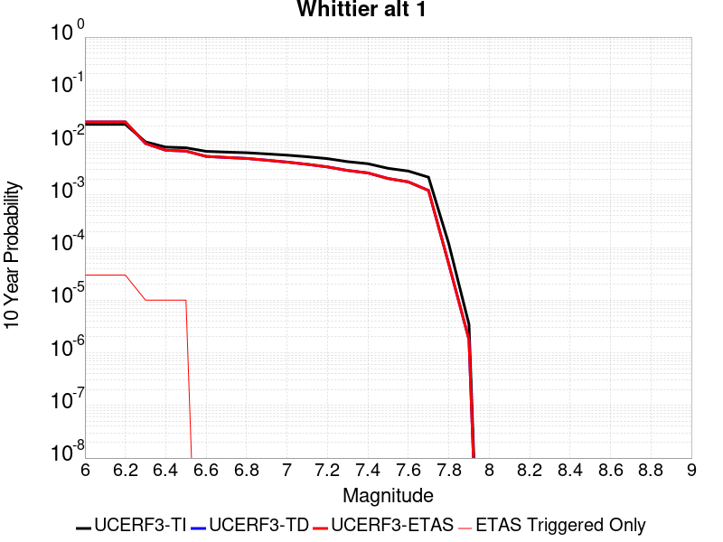 |

| Magnitude | 1 wk TI Prob | 1 wk TD Prob | 1 wk ETAS Prob | 1 wk ETAS/TD Gain | 1 wk ETAS Triggered Only | 1 mo TI Prob | 1 mo TD Prob | 1 mo ETAS Prob | 1 mo ETAS/TD Gain | 1 mo ETAS Triggered Only | 1 yr TI Prob | 1 yr TD Prob | 1 yr ETAS Prob | 1 yr ETAS/TD Gain | 1 yr ETAS Triggered Only | 10 yr TI Prob | 10 yr TD Prob | 10 yr ETAS Prob | 10 yr ETAS/TD Gain | 10 yr ETAS Triggered Only |
|-----|-----|-----|-----|-----|-----|-----|-----|-----|-----|-----|-----|-----|-----|-----|-----|-----|-----|-----|-----|-----|
| 6.0 | 4.2554693E-5 | 4.7253463E-5 | 4.7253463E-5 | 1.0 | 0.0 | 1.8236451E-4 | 2.0250095E-4 | 2.0250095E-4 | 1.0 | 0.0 | 0.002218027 | 0.0024629822 | 0.0024729574 | 1.0040501 | 1.0E-5 | 0.02196019 | 0.02439089 | 0.024420157 | 1.0012 | 3.0E-5 |
| 6.1 | 4.2554693E-5 | 4.7253463E-5 | 4.7253463E-5 | 1.0 | 0.0 | 1.8236451E-4 | 2.0250095E-4 | 2.0250095E-4 | 1.0 | 0.0 | 0.002218027 | 0.0024629822 | 0.0024729574 | 1.0040501 | 1.0E-5 | 0.02196019 | 0.02439089 | 0.024420157 | 1.0012 | 3.0E-5 |
| 6.2 | 4.2554693E-5 | 4.7253463E-5 | 4.7253463E-5 | 1.0 | 0.0 | 1.8236451E-4 | 2.0250095E-4 | 2.0250095E-4 | 1.0 | 0.0 | 0.002218027 | 0.0024629822 | 0.0024729574 | 1.0040501 | 1.0E-5 | 0.02196019 | 0.02439089 | 0.024420157 | 1.0012 | 3.0E-5 |
| 6.3 | 1.9617712E-5 | 1.8269313E-5 | 1.8269313E-5 | 1.0 | 0.0 | 8.40732E-5 | 7.829482E-5 | 7.829482E-5 | 1.0 | 0.0 | 0.0010231105 | 9.528416E-4 | 9.6283207E-4 | 1.0104849 | 1.0E-5 | 0.01018413 | 0.009490847 | 0.009500752 | 1.0010437 | 1.0E-5 |
| 6.4 | 1.5611336E-5 | 1.3604893E-5 | 1.3604893E-5 | 1.0 | 0.0 | 6.690401E-5 | 5.8305417E-5 | 5.8305417E-5 | 1.0 | 0.0 | 8.142519E-4 | 7.0964324E-4 | 7.196361E-4 | 1.0140816 | 1.0E-5 | 0.008112748 | 0.0070757363 | 0.0070856656 | 1.0014033 | 1.0E-5 |
| 6.5 | 1.5150166E-5 | 1.3101541E-5 | 1.3101541E-5 | 1.0 | 0.0 | 6.492767E-5 | 5.614829E-5 | 5.614829E-5 | 1.0 | 0.0 | 7.9020765E-4 | 6.833969E-4 | 6.9339003E-4 | 1.0146228 | 1.0E-5 | 0.007874036 | 0.0068149036 | 0.006824835 | 1.0014573 | 1.0E-5 |
| 6.6 | 1.295588E-5 | 1.0381249E-5 | 1.0381249E-5 | 1.0 | 0.0 | 5.552402E-5 | 4.449032E-5 | 4.449032E-5 | 1.0 | 0.0 | 6.7579525E-4 | 5.4153695E-4 | 5.4153695E-4 | 1.0 | 0.0 | 0.006737438 | 0.005403607 | 0.005403607 | 1.0 | 0.0 |
| 6.7 | 1.2542085E-5 | 9.899882E-6 | 9.899882E-6 | 1.0 | 0.0 | 5.3750682E-5 | 4.2427386E-5 | 4.2427386E-5 | 1.0 | 0.0 | 6.542181E-4 | 5.1643286E-4 | 5.1643286E-4 | 1.0 | 0.0 | 0.006522954 | 0.0051537454 | 0.0051537454 | 1.0 | 0.0 |
| 6.8 | 1.2195878E-5 | 9.495912E-6 | 9.495912E-6 | 1.0 | 0.0 | 5.2267E-5 | 4.0696144E-5 | 4.0696144E-5 | 1.0 | 0.0 | 6.36165E-4 | 4.953648E-4 | 4.953648E-4 | 1.0 | 0.0 | 0.0063434686 | 0.0049439464 | 0.0049439464 | 1.0 | 0.0 |
| 6.9 | 1.1580298E-5 | 8.773408E-6 | 8.773408E-6 | 1.0 | 0.0 | 4.9628903E-5 | 3.7599788E-5 | 3.7599788E-5 | 1.0 | 0.0 | 6.040644E-4 | 4.576829E-4 | 4.576829E-4 | 1.0 | 0.0 | 0.00602425 | 0.0045686625 | 0.0045686625 | 1.0 | 0.0 |
| 7.0 | 1.0964795E-5 | 8.084448E-6 | 8.084448E-6 | 1.0 | 0.0 | 4.6991136E-5 | 3.4647182E-5 | 3.4647182E-5 | 1.0 | 0.0 | 5.7196687E-4 | 4.2174934E-4 | 4.2174934E-4 | 1.0 | 0.0 | 0.0057049696 | 0.004210698 | 0.004210698 | 1.0 | 0.0 |
| 7.1 | 1.0230601E-5 | 7.3269985E-6 | 7.3269985E-6 | 1.0 | 0.0 | 4.3844695E-5 | 3.140105E-5 | 3.140105E-5 | 1.0 | 0.0 | 5.336784E-4 | 3.8224205E-4 | 3.8224205E-4 | 1.0 | 0.0 | 0.005323986 | 0.0038170093 | 0.0038170093 | 1.0 | 0.0 |
| 7.2 | 9.40865E-6 | 6.5435725E-6 | 6.5435725E-6 | 1.0 | 0.0 | 4.032216E-5 | 2.8043587E-5 | 2.8043587E-5 | 1.0 | 0.0 | 4.908117E-4 | 3.413784E-4 | 3.413784E-4 | 1.0 | 0.0 | 0.0048972913 | 0.0034096325 | 0.0034096325 | 1.0 | 0.0 |
| 7.3 | 8.237384E-6 | 5.5979945E-6 | 5.5979945E-6 | 1.0 | 0.0 | 3.5302593E-5 | 2.399119E-5 | 2.399119E-5 | 1.0 | 0.0 | 4.2972428E-4 | 2.9205464E-4 | 2.9205464E-4 | 1.0 | 0.0 | 0.0042889426 | 0.002917029 | 0.002917029 | 1.0 | 0.0 |
| 7.4 | 7.5316966E-6 | 5.0280382E-6 | 5.0280382E-6 | 1.0 | 0.0 | 3.2278298E-5 | 2.1548563E-5 | 2.1548563E-5 | 1.0 | 0.0 | 3.9291743E-4 | 2.6232318E-4 | 2.6232318E-4 | 1.0 | 0.0 | 0.0039222343 | 0.0026202472 | 0.0026202472 | 1.0 | 0.0 |
| 7.5 | 6.149649E-6 | 3.934013E-6 | 3.934013E-6 | 1.0 | 0.0 | 2.6355372E-5 | 1.685995E-5 | 1.685995E-5 | 1.0 | 0.0 | 3.208294E-4 | 2.0525148E-4 | 2.0525148E-4 | 1.0 | 0.0 | 0.003203666 | 0.0020507083 | 0.0020507083 | 1.0 | 0.0 |
| 7.6 | 5.457711E-6 | 3.395529E-6 | 3.395529E-6 | 1.0 | 0.0 | 2.338998E-5 | 1.4552191E-5 | 1.4552191E-5 | 1.0 | 0.0 | 2.8473578E-4 | 1.7715934E-4 | 1.7715934E-4 | 1.0 | 0.0 | 0.0028437122 | 0.0017702618 | 0.0017702618 | 1.0 | 0.0 |
| 7.7 | 4.1676276E-6 | 2.3333084E-6 | 2.3333084E-6 | 1.0 | 0.0 | 1.7861139E-5 | 9.99986E-6 | 9.99986E-6 | 1.0 | 0.0 | 2.1743766E-4 | 1.2174223E-4 | 1.2174223E-4 | 1.0 | 0.0 | 0.0021722503 | 0.0012168285 | 0.0012168285 | 1.0 | 0.0 |
| 7.8 | 2.2692414E-7 | 9.385943E-8 | 9.385943E-8 | 1.0 | 0.0 | 9.725317E-7 | 4.0225464E-7 | 4.0225464E-7 | 1.0 | 0.0 | 1.1840509E-5 | 4.8974425E-6 | 4.8974425E-6 | 1.0 | 0.0 | 1.1839878E-4 | 4.8973674E-5 | 4.8973674E-5 | 1.0 | 0.0 |
| 7.9 | 6.676829E-9 | 3.4399772E-9 | 3.4399772E-9 | 1.0 | 0.0 | 2.861498E-8 | 1.4742759E-8 | 1.4742759E-8 | 1.0 | 0.0 | 3.4838732E-7 | 1.7949307E-7 | 1.7949307E-7 | 1.0 | 0.0 | 3.4838679E-6 | 1.7949295E-6 | 1.7949295E-6 | 1.0 | 0.0 |

## Newport-Inglewood alt 1
*[(top)](#table-of-contents)*

| 1 Week | 1 Month | 1 Year | 10 Year |
|-----|-----|-----|-----|
|  |  |  |  |

| Magnitude | 1 wk TI Prob | 1 wk TD Prob | 1 wk ETAS Prob | 1 wk ETAS/TD Gain | 1 wk ETAS Triggered Only | 1 mo TI Prob | 1 mo TD Prob | 1 mo ETAS Prob | 1 mo ETAS/TD Gain | 1 mo ETAS Triggered Only | 1 yr TI Prob | 1 yr TD Prob | 1 yr ETAS Prob | 1 yr ETAS/TD Gain | 1 yr ETAS Triggered Only | 10 yr TI Prob | 10 yr TD Prob | 10 yr ETAS Prob | 10 yr ETAS/TD Gain | 10 yr ETAS Triggered Only |
|-----|-----|-----|-----|-----|-----|-----|-----|-----|-----|-----|-----|-----|-----|-----|-----|-----|-----|-----|-----|-----|
| 6.0 | 2.9668912E-5 | 3.0405516E-5 | 3.0405516E-5 | 1.0 | 0.0 | 1.2714628E-4 | 1.3030559E-4 | 1.3030559E-4 | 1.0 | 0.0 | 0.0015469068 | 0.0015857986 | 0.001615751 | 1.0188879 | 3.0E-5 | 0.015361829 | 0.015792403 | 0.015821928 | 1.0018697 | 3.0E-5 |
| 6.1 | 2.9668912E-5 | 3.0405516E-5 | 3.0405516E-5 | 1.0 | 0.0 | 1.2714628E-4 | 1.3030559E-4 | 1.3030559E-4 | 1.0 | 0.0 | 0.0015469068 | 0.0015857986 | 0.001615751 | 1.0188879 | 3.0E-5 | 0.015361829 | 0.015792403 | 0.015821928 | 1.0018697 | 3.0E-5 |
| 6.2 | 2.9668912E-5 | 3.0405516E-5 | 3.0405516E-5 | 1.0 | 0.0 | 1.2714628E-4 | 1.3030559E-4 | 1.3030559E-4 | 1.0 | 0.0 | 0.0015469068 | 0.0015857986 | 0.001615751 | 1.0188879 | 3.0E-5 | 0.015361829 | 0.015792403 | 0.015821928 | 1.0018697 | 3.0E-5 |
| 6.3 | 2.9668912E-5 | 3.0405516E-5 | 3.0405516E-5 | 1.0 | 0.0 | 1.2714628E-4 | 1.3030559E-4 | 1.3030559E-4 | 1.0 | 0.0 | 0.0015469068 | 0.0015857986 | 0.001615751 | 1.0188879 | 3.0E-5 | 0.015361829 | 0.015792403 | 0.015821928 | 1.0018697 | 3.0E-5 |
| 6.4 | 1.275942E-5 | 1.0272664E-5 | 1.0272664E-5 | 1.0 | 0.0 | 5.4682085E-5 | 4.4024986E-5 | 4.4024986E-5 | 1.0 | 0.0 | 6.65551E-4 | 5.3587655E-4 | 5.558658E-4 | 1.037302 | 2.0E-5 | 0.0066356123 | 0.0053462684 | 0.0053661615 | 1.0037209 | 2.0E-5 |
| 6.5 | 1.275942E-5 | 1.0272664E-5 | 1.0272664E-5 | 1.0 | 0.0 | 5.4682085E-5 | 4.4024986E-5 | 4.4024986E-5 | 1.0 | 0.0 | 6.65551E-4 | 5.3587655E-4 | 5.558658E-4 | 1.037302 | 2.0E-5 | 0.0066356123 | 0.0053462684 | 0.0053661615 | 1.0037209 | 2.0E-5 |
| 6.6 | 1.1255358E-5 | 8.662018E-6 | 8.662018E-6 | 1.0 | 0.0 | 4.8236358E-5 | 3.7122416E-5 | 3.7122416E-5 | 1.0 | 0.0 | 5.871194E-4 | 4.5187338E-4 | 4.7186433E-4 | 1.0442402 | 2.0E-5 | 0.005855706 | 0.004509723 | 0.0045296326 | 1.0044149 | 2.0E-5 |
| 6.7 | 1.0504745E-5 | 7.899919E-6 | 7.899919E-6 | 1.0 | 0.0 | 4.5019555E-5 | 3.3856366E-5 | 3.3856366E-5 | 1.0 | 0.0 | 5.4797524E-4 | 4.1212453E-4 | 4.3211627E-4 | 1.048509 | 2.0E-5 | 0.0054662596 | 0.0041137324 | 0.00413365 | 1.0048418 | 2.0E-5 |
| 6.8 | 1.0476007E-5 | 7.881301E-6 | 7.881301E-6 | 1.0 | 0.0 | 4.4896402E-5 | 3.377657E-5 | 3.377657E-5 | 1.0 | 0.0 | 5.464766E-4 | 4.1115342E-4 | 4.311452E-4 | 1.0486237 | 2.0E-5 | 0.005451347 | 0.0041040573 | 0.004123975 | 1.0048532 | 2.0E-5 |
| 6.9 | 9.076797E-6 | 6.489738E-6 | 6.489738E-6 | 1.0 | 0.0 | 3.889998E-5 | 2.7812868E-5 | 2.7812868E-5 | 1.0 | 0.0 | 4.7350433E-4 | 3.385694E-4 | 3.48566E-4 | 1.029526 | 1.0E-5 | 0.004724967 | 0.0033805731 | 0.0033905394 | 1.002948 | 1.0E-5 |
| 7.0 | 8.73795E-6 | 6.212118E-6 | 6.212118E-6 | 1.0 | 0.0 | 3.7447822E-5 | 2.6623095E-5 | 2.6623095E-5 | 1.0 | 0.0 | 4.5583185E-4 | 3.2408824E-4 | 3.34085E-4 | 1.0308458 | 1.0E-5 | 0.0045489795 | 0.0032361876 | 0.0032461553 | 1.00308 | 1.0E-5 |
| 7.1 | 8.391299E-6 | 5.955894E-6 | 5.955894E-6 | 1.0 | 0.0 | 3.5962214E-5 | 2.552501E-5 | 2.552501E-5 | 1.0 | 0.0 | 4.37752E-4 | 3.1072294E-4 | 3.2071985E-4 | 1.032173 | 1.0E-5 | 0.004368907 | 0.0031029144 | 0.0031128835 | 1.0032128 | 1.0E-5 |
| 7.2 | 7.796882E-6 | 5.496635E-6 | 5.496635E-6 | 1.0 | 0.0 | 3.341478E-5 | 2.3556795E-5 | 2.3556795E-5 | 1.0 | 0.0 | 4.06749E-4 | 2.8676644E-4 | 2.9676358E-4 | 1.0348616 | 1.0E-5 | 0.0040600533 | 0.002863988 | 0.0028739595 | 1.0034816 | 1.0E-5 |
| 7.3 | 6.4738833E-6 | 4.647859E-6 | 4.647859E-6 | 1.0 | 0.0 | 2.774492E-5 | 1.9919245E-5 | 1.9919245E-5 | 1.0 | 0.0 | 3.3774204E-4 | 2.4248997E-4 | 2.5248755E-4 | 1.0412288 | 1.0E-5 | 0.0033722918 | 0.0024222704 | 0.0024322462 | 1.0041183 | 1.0E-5 |
| 7.4 | 5.382145E-6 | 3.8857956E-6 | 3.8857956E-6 | 1.0 | 0.0 | 2.3066134E-5 | 1.6653305E-5 | 1.6653305E-5 | 1.0 | 0.0 | 2.8079396E-4 | 2.0273525E-4 | 2.1273323E-4 | 1.0493155 | 1.0E-5 | 0.0028043943 | 0.0020255174 | 0.0020354972 | 1.004927 | 1.0E-5 |
| 7.5 | 3.648244E-6 | 2.573805E-6 | 2.573805E-6 | 1.0 | 0.0 | 1.5635238E-5 | 1.1030546E-5 | 1.1030546E-5 | 1.0 | 0.0 | 1.9034238E-4 | 1.3428873E-4 | 1.4428739E-4 | 1.0744565 | 1.0E-5 | 0.0019017943 | 0.0013420862 | 0.0013520728 | 1.007441 | 1.0E-5 |
| 7.6 | 2.2906888E-6 | 1.5479983E-6 | 1.5479983E-6 | 1.0 | 0.0 | 9.817201E-6 | 6.6342623E-6 | 6.6342623E-6 | 1.0 | 0.0 | 1.1951787E-4 | 8.076921E-5 | 8.076921E-5 | 1.0 | 0.0 | 0.0011945361 | 8.0740533E-4 | 8.0740533E-4 | 1.0 | 0.0 |
| 7.7 | 6.0479874E-7 | 3.3975476E-7 | 3.3975476E-7 | 1.0 | 0.0 | 2.5919921E-6 | 1.456091E-6 | 1.456091E-6 | 1.0 | 0.0 | 3.1557047E-5 | 1.7727778E-5 | 1.7727778E-5 | 1.0 | 0.0 | 3.1552566E-4 | 1.7726503E-4 | 1.7726503E-4 | 1.0 | 0.0 |
| 7.8 | 1.16056995E-8 | 9.782392E-9 | 9.782392E-9 | 1.0 | 0.0 | 4.9738713E-8 | 4.1924537E-8 | 4.1924537E-8 | 1.0 | 0.0 | 6.0556863E-7 | 5.104312E-7 | 5.104312E-7 | 1.0 | 0.0 | 6.05567E-6 | 5.104312E-6 | 5.104312E-6 | 1.0 | 0.0 |

## Owens Valley Keough Hot Springs
*[(top)](#table-of-contents)*

| 1 Week | 1 Month | 1 Year | 10 Year |
|-----|-----|-----|-----|
|  |  |  | 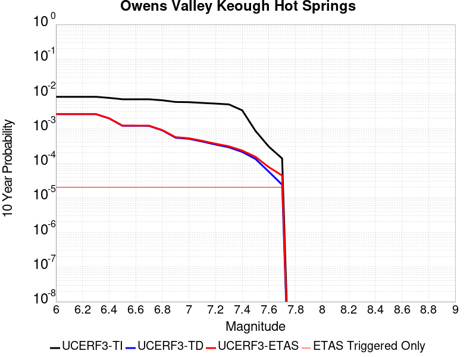 |

| Magnitude | 1 wk TI Prob | 1 wk TD Prob | 1 wk ETAS Prob | 1 wk ETAS/TD Gain | 1 wk ETAS Triggered Only | 1 mo TI Prob | 1 mo TD Prob | 1 mo ETAS Prob | 1 mo ETAS/TD Gain | 1 mo ETAS Triggered Only | 1 yr TI Prob | 1 yr TD Prob | 1 yr ETAS Prob | 1 yr ETAS/TD Gain | 1 yr ETAS Triggered Only | 10 yr TI Prob | 10 yr TD Prob | 10 yr ETAS Prob | 10 yr ETAS/TD Gain | 10 yr ETAS Triggered Only |
|-----|-----|-----|-----|-----|-----|-----|-----|-----|-----|-----|-----|-----|-----|-----|-----|-----|-----|-----|-----|-----|
| 6.0 | 1.5708529E-5 | 4.9508244E-6 | 4.9508244E-6 | 1.0 | 0.0 | 6.7320536E-5 | 2.1217675E-5 | 2.1217675E-5 | 1.0 | 0.0 | 8.193192E-4 | 2.582997E-4 | 2.7829452E-4 | 1.0774094 | 2.0E-5 | 0.008163051 | 0.0025806532 | 0.0026006014 | 1.00773 | 2.0E-5 |
| 6.1 | 1.5708529E-5 | 4.9508244E-6 | 4.9508244E-6 | 1.0 | 0.0 | 6.7320536E-5 | 2.1217675E-5 | 2.1217675E-5 | 1.0 | 0.0 | 8.193192E-4 | 2.582997E-4 | 2.7829452E-4 | 1.0774094 | 2.0E-5 | 0.008163051 | 0.0025806532 | 0.0026006014 | 1.00773 | 2.0E-5 |
| 6.2 | 1.5708529E-5 | 4.9508244E-6 | 4.9508244E-6 | 1.0 | 0.0 | 6.7320536E-5 | 2.1217675E-5 | 2.1217675E-5 | 1.0 | 0.0 | 8.193192E-4 | 2.582997E-4 | 2.7829452E-4 | 1.0774094 | 2.0E-5 | 0.008163051 | 0.0025806532 | 0.0026006014 | 1.00773 | 2.0E-5 |
| 6.3 | 1.5708529E-5 | 4.9508244E-6 | 4.9508244E-6 | 1.0 | 0.0 | 6.7320536E-5 | 2.1217675E-5 | 2.1217675E-5 | 1.0 | 0.0 | 8.193192E-4 | 2.582997E-4 | 2.7829452E-4 | 1.0774094 | 2.0E-5 | 0.008163051 | 0.0025806532 | 0.0026006014 | 1.00773 | 2.0E-5 |
| 6.4 | 1.4622509E-5 | 3.7266684E-6 | 3.7266684E-6 | 1.0 | 0.0 | 6.266639E-5 | 1.5971356E-5 | 1.5971356E-5 | 1.0 | 0.0 | 7.626962E-4 | 1.9443722E-4 | 2.1443333E-4 | 1.102841 | 2.0E-5 | 0.007600839 | 0.0019431504 | 0.0019631116 | 1.0102726 | 2.0E-5 |
| 6.5 | 1.3335527E-5 | 2.2778408E-6 | 2.2778408E-6 | 1.0 | 0.0 | 5.7151006E-5 | 9.762142E-6 | 9.762142E-6 | 1.0 | 0.0 | 6.955913E-4 | 1.18848286E-4 | 1.388459E-4 | 1.1682618 | 2.0E-5 | 0.0069341804 | 0.0011880693 | 0.0012080456 | 1.016814 | 2.0E-5 |
| 6.6 | 1.3332855E-5 | 2.27499E-6 | 2.27499E-6 | 1.0 | 0.0 | 5.7139558E-5 | 9.749924E-6 | 9.749924E-6 | 1.0 | 0.0 | 6.9545204E-4 | 1.1869955E-4 | 1.3869717E-4 | 1.1684726 | 2.0E-5 | 0.0069327964 | 0.0011865837 | 0.0012065598 | 1.0168351 | 2.0E-5 |
| 6.7 | 1.3318214E-5 | 2.26422E-6 | 2.26422E-6 | 1.0 | 0.0 | 5.707681E-5 | 9.703767E-6 | 9.703767E-6 | 1.0 | 0.0 | 6.946886E-4 | 1.1813765E-4 | 1.3813528E-4 | 1.1692741 | 2.0E-5 | 0.0069252094 | 0.0011809706 | 0.001200947 | 1.0169152 | 2.0E-5 |
| 6.8 | 1.2441338E-5 | 1.6778914E-6 | 1.6778914E-6 | 1.0 | 0.0 | 5.331893E-5 | 7.190945E-6 | 7.190945E-6 | 1.0 | 0.0 | 6.489646E-4 | 8.7546534E-5 | 1.0754479E-4 | 1.2284299 | 2.0E-5 | 0.0064707273 | 8.75305E-4 | 8.9528743E-4 | 1.0228292 | 2.0E-5 |
| 6.9 | 1.1130476E-5 | 1.0304584E-6 | 1.0304584E-6 | 1.0 | 0.0 | 4.7701167E-5 | 4.416243E-6 | 4.416243E-6 | 1.0 | 0.0 | 5.806069E-4 | 5.3766445E-5 | 7.3765375E-5 | 1.3719592 | 2.0E-5 | 0.0057909233 | 5.376886E-4 | 5.576779E-4 | 1.0371763 | 2.0E-5 |
| 7.0 | 1.0986073E-5 | 9.580101E-7 | 9.580101E-7 | 1.0 | 0.0 | 4.7082318E-5 | 4.105751E-6 | 4.105751E-6 | 1.0 | 0.0 | 5.730765E-4 | 4.9986385E-5 | 6.9985384E-5 | 1.4000889 | 2.0E-5 | 0.0057160086 | 4.999046E-4 | 5.1989465E-4 | 1.0399877 | 2.0E-5 |
| 7.1 | 1.0451338E-5 | 8.000831E-7 | 8.000831E-7 | 1.0 | 0.0 | 4.4790682E-5 | 3.428923E-6 | 3.428923E-6 | 1.0 | 0.0 | 5.451901E-4 | 4.1746345E-5 | 6.174551E-5 | 1.4790639 | 2.0E-5 | 0.005438545 | 4.1753432E-4 | 4.3752597E-4 | 1.0478803 | 2.0E-5 |
| 7.2 | 9.989061E-6 | 6.545439E-7 | 6.545439E-7 | 1.0 | 0.0 | 4.280956E-5 | 2.805185E-6 | 2.805185E-6 | 1.0 | 0.0 | 5.2108173E-4 | 3.4152596E-5 | 5.4151915E-5 | 1.585587 | 2.0E-5 | 0.0051986156 | 3.4161055E-4 | 3.616037E-4 | 1.0585262 | 2.0E-5 |
| 7.3 | 9.465365E-6 | 5.4604976E-7 | 5.4604976E-7 | 1.0 | 0.0 | 4.056522E-5 | 2.340211E-6 | 2.340211E-6 | 1.0 | 0.0 | 4.937696E-4 | 2.84917E-5 | 4.849113E-5 | 1.7019389 | 2.0E-5 | 0.0049267393 | 2.8501268E-4 | 3.0500698E-4 | 1.0701523 | 2.0E-5 |
| 7.4 | 6.3824805E-6 | 4.016707E-7 | 4.016707E-7 | 1.0 | 0.0 | 2.73532E-5 | 1.7214446E-6 | 1.7214446E-6 | 1.0 | 0.0 | 3.3297433E-4 | 2.0958389E-5 | 4.095797E-5 | 1.9542518 | 2.0E-5 | 0.0033247585 | 2.0965615E-4 | 2.2965197E-4 | 1.0953743 | 2.0E-5 |
| 7.5 | 1.6192645E-6 | 2.5163493E-7 | 2.5163493E-7 | 1.0 | 0.0 | 6.9396865E-6 | 1.0784349E-6 | 1.0784349E-6 | 1.0 | 0.0 | 8.448741E-5 | 1.31298675E-5 | 3.3129603E-5 | 2.5232246 | 2.0E-5 | 8.4455294E-4 | 1.3129105E-4 | 1.5128842E-4 | 1.1523134 | 2.0E-5 |
| 7.6 | 5.7062545E-7 | 1.079331E-7 | 1.079331E-7 | 1.0 | 0.0 | 2.4455355E-6 | 4.6257034E-7 | 4.6257034E-7 | 1.0 | 0.0 | 2.9773988E-5 | 5.63178E-6 | 2.5631667E-5 | 4.551255 | 2.0E-5 | 2.977E-4 | 5.6316454E-5 | 7.631533E-5 | 1.355116 | 2.0E-5 |
| 7.7 | 2.5988817E-7 | 4.5461668E-8 | 4.5461668E-8 | 1.0 | 0.0 | 1.113806E-6 | 1.948357E-7 | 1.948357E-7 | 1.0 | 0.0 | 1.3560503E-5 | 2.3721225E-6 | 2.2372074E-5 | 9.431248 | 2.0E-5 | 1.3559677E-4 | 2.3721017E-5 | 4.372054E-5 | 1.8431141 | 2.0E-5 |

## Holser alt 1
*[(top)](#table-of-contents)*

| 1 Week | 1 Month | 1 Year | 10 Year |
|-----|-----|-----|-----|
| 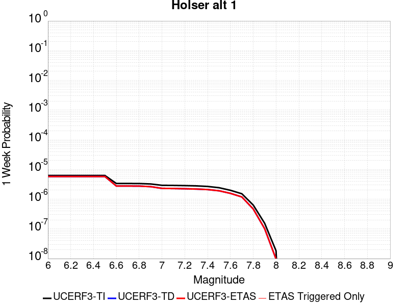 |  |  |  |

| Magnitude | 1 wk TI Prob | 1 wk TD Prob | 1 wk ETAS Prob | 1 wk ETAS/TD Gain | 1 wk ETAS Triggered Only | 1 mo TI Prob | 1 mo TD Prob | 1 mo ETAS Prob | 1 mo ETAS/TD Gain | 1 mo ETAS Triggered Only | 1 yr TI Prob | 1 yr TD Prob | 1 yr ETAS Prob | 1 yr ETAS/TD Gain | 1 yr ETAS Triggered Only | 10 yr TI Prob | 10 yr TD Prob | 10 yr ETAS Prob | 10 yr ETAS/TD Gain | 10 yr ETAS Triggered Only |
|-----|-----|-----|-----|-----|-----|-----|-----|-----|-----|-----|-----|-----|-----|-----|-----|-----|-----|-----|-----|-----|
| 6.0 | 6.2746653E-6 | 5.790017E-6 | 5.790017E-6 | 1.0 | 0.0 | 2.6891146E-5 | 2.4814188E-5 | 2.4814188E-5 | 1.0 | 0.0 | 3.273505E-4 | 3.020824E-4 | 3.1207936E-4 | 1.0330936 | 1.0E-5 | 0.0032686873 | 0.0030178505 | 0.00303779 | 1.0066072 | 2.0E-5 |
| 6.1 | 6.2746653E-6 | 5.790017E-6 | 5.790017E-6 | 1.0 | 0.0 | 2.6891146E-5 | 2.4814188E-5 | 2.4814188E-5 | 1.0 | 0.0 | 3.273505E-4 | 3.020824E-4 | 3.1207936E-4 | 1.0330936 | 1.0E-5 | 0.0032686873 | 0.0030178505 | 0.00303779 | 1.0066072 | 2.0E-5 |
| 6.2 | 6.2746653E-6 | 5.790017E-6 | 5.790017E-6 | 1.0 | 0.0 | 2.6891146E-5 | 2.4814188E-5 | 2.4814188E-5 | 1.0 | 0.0 | 3.273505E-4 | 3.020824E-4 | 3.1207936E-4 | 1.0330936 | 1.0E-5 | 0.0032686873 | 0.0030178505 | 0.00303779 | 1.0066072 | 2.0E-5 |
| 6.3 | 6.2746653E-6 | 5.790017E-6 | 5.790017E-6 | 1.0 | 0.0 | 2.6891146E-5 | 2.4814188E-5 | 2.4814188E-5 | 1.0 | 0.0 | 3.273505E-4 | 3.020824E-4 | 3.1207936E-4 | 1.0330936 | 1.0E-5 | 0.0032686873 | 0.0030178505 | 0.00303779 | 1.0066072 | 2.0E-5 |
| 6.4 | 6.2746653E-6 | 5.790017E-6 | 5.790017E-6 | 1.0 | 0.0 | 2.6891146E-5 | 2.4814188E-5 | 2.4814188E-5 | 1.0 | 0.0 | 3.273505E-4 | 3.020824E-4 | 3.1207936E-4 | 1.0330936 | 1.0E-5 | 0.0032686873 | 0.0030178505 | 0.00303779 | 1.0066072 | 2.0E-5 |
| 6.5 | 6.2746653E-6 | 5.790017E-6 | 5.790017E-6 | 1.0 | 0.0 | 2.6891146E-5 | 2.4814188E-5 | 2.4814188E-5 | 1.0 | 0.0 | 3.273505E-4 | 3.020824E-4 | 3.1207936E-4 | 1.0330936 | 1.0E-5 | 0.0032686873 | 0.0030178505 | 0.00303779 | 1.0066072 | 2.0E-5 |
| 6.6 | 3.375825E-6 | 2.7712251E-6 | 2.7712251E-6 | 1.0 | 0.0 | 1.4467741E-5 | 1.1876626E-5 | 1.1876626E-5 | 1.0 | 0.0 | 1.761305E-4 | 1.4458848E-4 | 1.5458705E-4 | 1.0691518 | 1.0E-5 | 0.0017599097 | 0.0014449612 | 0.0014649322 | 1.0138212 | 2.0E-5 |
| 6.7 | 3.375825E-6 | 2.7712251E-6 | 2.7712251E-6 | 1.0 | 0.0 | 1.4467741E-5 | 1.1876626E-5 | 1.1876626E-5 | 1.0 | 0.0 | 1.761305E-4 | 1.4458848E-4 | 1.5458705E-4 | 1.0691518 | 1.0E-5 | 0.0017599097 | 0.0014449612 | 0.0014649322 | 1.0138212 | 2.0E-5 |
| 6.8 | 3.366533E-6 | 2.7616245E-6 | 2.7616245E-6 | 1.0 | 0.0 | 1.4427919E-5 | 1.1835481E-5 | 1.1835481E-5 | 1.0 | 0.0 | 1.7564575E-4 | 1.4408762E-4 | 1.5408618E-4 | 1.0693922 | 1.0E-5 | 0.0017550698 | 0.0014399589 | 0.0014599301 | 1.0138693 | 2.0E-5 |
| 6.9 | 3.253174E-6 | 2.643846E-6 | 2.643846E-6 | 1.0 | 0.0 | 1.39421E-5 | 1.1330721E-5 | 1.1330721E-5 | 1.0 | 0.0 | 1.6973184E-4 | 1.3794295E-4 | 1.3794295E-4 | 1.0 | 0.0 | 0.0016960226 | 0.0013785891 | 0.0013885753 | 1.0072438 | 1.0E-5 |
| 7.0 | 2.9336593E-6 | 2.311832E-6 | 2.311832E-6 | 1.0 | 0.0 | 1.2572766E-5 | 9.907814E-6 | 9.907814E-6 | 1.0 | 0.0 | 1.5306266E-4 | 1.20620985E-4 | 1.20620985E-4 | 1.0 | 0.0 | 0.0015295728 | 0.0012055576 | 0.0012155456 | 1.0082849 | 1.0E-5 |
| 7.1 | 2.9087812E-6 | 2.287684E-6 | 2.287684E-6 | 1.0 | 0.0 | 1.2466146E-5 | 9.804324E-6 | 9.804324E-6 | 1.0 | 0.0 | 1.5176475E-4 | 1.19361124E-4 | 1.19361124E-4 | 1.0 | 0.0 | 0.0015166114 | 0.0011929726 | 0.0012029607 | 1.0083724 | 1.0E-5 |
| 7.2 | 2.8674524E-6 | 2.247575E-6 | 2.247575E-6 | 1.0 | 0.0 | 1.2289024E-5 | 9.632428E-6 | 9.632428E-6 | 1.0 | 0.0 | 1.4960859E-4 | 1.1726853E-4 | 1.1726853E-4 | 1.0 | 0.0 | 0.0014950791 | 0.0011720689 | 0.0011820571 | 1.0085219 | 1.0E-5 |
| 7.3 | 2.8057775E-6 | 2.1954638E-6 | 2.1954638E-6 | 1.0 | 0.0 | 1.2024705E-5 | 9.409097E-6 | 9.409097E-6 | 1.0 | 0.0 | 1.4639096E-4 | 1.1454976E-4 | 1.1454976E-4 | 1.0 | 0.0 | 0.0014629456 | 0.0011449094 | 0.001154898 | 1.0087243 | 1.0E-5 |
| 7.4 | 2.683666E-6 | 2.10926E-6 | 2.10926E-6 | 1.0 | 0.0 | 1.1501375E-5 | 9.039655E-6 | 9.039655E-6 | 1.0 | 0.0 | 1.4002025E-4 | 1.1005226E-4 | 1.1005226E-4 | 1.0 | 0.0 | 0.0013993206 | 0.0010999797 | 0.0011099688 | 1.0090811 | 1.0E-5 |
| 7.5 | 2.434495E-6 | 1.9195622E-6 | 1.9195622E-6 | 1.0 | 0.0 | 1.0433508E-5 | 8.22667E-6 | 8.22667E-6 | 1.0 | 0.0 | 1.2702055E-4 | 1.0015511E-4 | 1.0015511E-4 | 1.0 | 0.0 | 0.0012694797 | 0.0010011018 | 0.0010110918 | 1.009979 | 1.0E-5 |
| 7.6 | 1.9914562E-6 | 1.5731666E-6 | 1.5731666E-6 | 1.0 | 0.0 | 8.534785E-6 | 6.7421256E-6 | 6.7421256E-6 | 1.0 | 0.0 | 1.03906044E-4 | 8.20823E-5 | 8.20823E-5 | 1.0 | 0.0 | 0.0010385747 | 8.205214E-4 | 8.305132E-4 | 1.0121773 | 1.0E-5 |
| 7.7 | 1.5229501E-6 | 1.1896215E-6 | 1.1896215E-6 | 1.0 | 0.0 | 6.526913E-6 | 5.0983676E-6 | 5.0983676E-6 | 1.0 | 0.0 | 7.946226E-5 | 6.207087E-5 | 6.207087E-5 | 1.0 | 0.0 | 7.943385E-4 | 6.205366E-4 | 6.205366E-4 | 1.0 | 0.0 |
| 7.8 | 6.3489426E-7 | 4.6878762E-7 | 4.6878762E-7 | 1.0 | 0.0 | 2.7209726E-6 | 2.0090881E-6 | 2.0090881E-6 | 1.0 | 0.0 | 3.312734E-5 | 2.4460376E-5 | 2.4460376E-5 | 1.0 | 0.0 | 3.31224E-4 | 2.44577E-4 | 2.44577E-4 | 1.0 | 0.0 |
| 7.9 | 1.5459432E-7 | 1.0194E-7 | 1.0194E-7 | 1.0 | 0.0 | 6.6254694E-7 | 4.3688564E-7 | 4.3688564E-7 | 1.0 | 0.0 | 8.066479E-6 | 5.31907E-6 | 5.31907E-6 | 1.0 | 0.0 | 8.066186E-5 | 5.3189444E-5 | 5.3189444E-5 | 1.0 | 0.0 |
| 8.0 | 1.8307812E-8 | 9.69079E-9 | 9.69079E-9 | 1.0 | 0.0 | 7.846205E-8 | 4.1531962E-8 | 4.1531962E-8 | 1.0 | 0.0 | 9.55275E-7 | 5.056515E-7 | 5.056515E-7 | 1.0 | 0.0 | 9.552709E-6 | 5.056504E-6 | 5.056504E-6 | 1.0 | 0.0 |

## San Jacinto (Superstition Mtn)
*[(top)](#table-of-contents)*

| 1 Week | 1 Month | 1 Year | 10 Year |
|-----|-----|-----|-----|
|  |  | 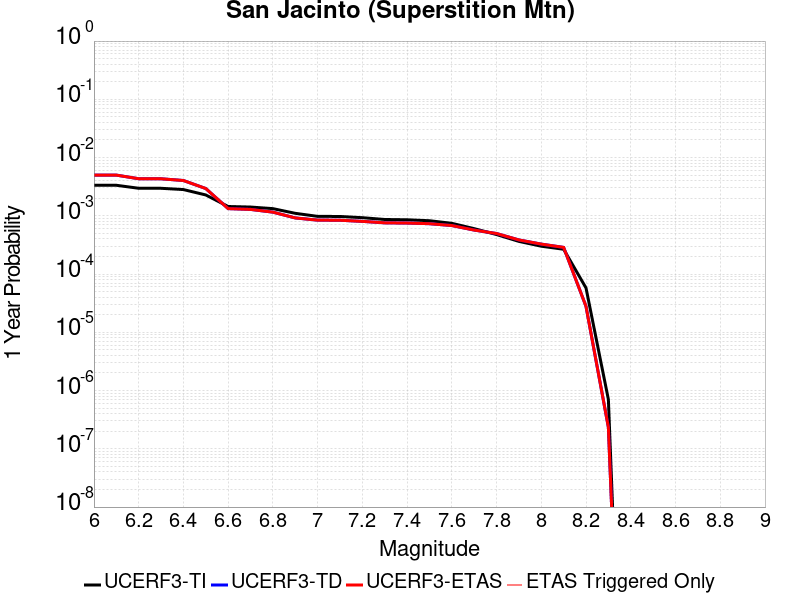 |  |

| Magnitude | 1 wk TI Prob | 1 wk TD Prob | 1 wk ETAS Prob | 1 wk ETAS/TD Gain | 1 wk ETAS Triggered Only | 1 mo TI Prob | 1 mo TD Prob | 1 mo ETAS Prob | 1 mo ETAS/TD Gain | 1 mo ETAS Triggered Only | 1 yr TI Prob | 1 yr TD Prob | 1 yr ETAS Prob | 1 yr ETAS/TD Gain | 1 yr ETAS Triggered Only | 10 yr TI Prob | 10 yr TD Prob | 10 yr ETAS Prob | 10 yr ETAS/TD Gain | 10 yr ETAS Triggered Only |
|-----|-----|-----|-----|-----|-----|-----|-----|-----|-----|-----|-----|-----|-----|-----|-----|-----|-----|-----|-----|-----|
| 6.0 | 6.4193904E-5 | 9.600102E-5 | 9.600102E-5 | 1.0 | 0.0 | 2.7508775E-4 | 4.1137784E-4 | 4.1137784E-4 | 1.0 | 0.0 | 0.0033440501 | 0.004998455 | 0.004998455 | 1.0 | 0.0 | 0.03294174 | 0.048827495 | 0.04884652 | 1.0003896 | 2.0E-5 |
| 6.1 | 6.4193904E-5 | 9.600102E-5 | 9.600102E-5 | 1.0 | 0.0 | 2.7508775E-4 | 4.1137784E-4 | 4.1137784E-4 | 1.0 | 0.0 | 0.0033440501 | 0.004998455 | 0.004998455 | 1.0 | 0.0 | 0.03294174 | 0.048827495 | 0.04884652 | 1.0003896 | 2.0E-5 |
| 6.2 | 5.7023593E-5 | 8.3151084E-5 | 8.3151084E-5 | 1.0 | 0.0 | 2.4436394E-4 | 3.5632253E-4 | 3.5632253E-4 | 1.0 | 0.0 | 0.002971072 | 0.004331238 | 0.004331238 | 1.0 | 0.0 | 0.029316625 | 0.04250735 | 0.042516924 | 1.0002253 | 1.0E-5 |
| 6.3 | 5.6940098E-5 | 8.299644E-5 | 8.299644E-5 | 1.0 | 0.0 | 2.4400617E-4 | 3.5565995E-4 | 3.5565995E-4 | 1.0 | 0.0 | 0.002966728 | 0.004323203 | 0.004323203 | 1.0 | 0.0 | 0.029274331 | 0.0424306 | 0.042440176 | 1.0002257 | 1.0E-5 |
| 6.4 | 5.4171585E-5 | 7.7490105E-5 | 7.7490105E-5 | 1.0 | 0.0 | 2.3214328E-4 | 3.320675E-4 | 3.320675E-4 | 1.0 | 0.0 | 0.0028226813 | 0.004037075 | 0.004037075 | 1.0 | 0.0 | 0.02787096 | 0.03971982 | 0.039729424 | 1.0002418 | 1.0E-5 |
| 6.5 | 4.375144E-5 | 5.6427685E-5 | 5.6427685E-5 | 1.0 | 0.0 | 1.874927E-4 | 2.4181715E-4 | 2.4181715E-4 | 1.0 | 0.0 | 0.0022803338 | 0.0029413246 | 0.0029413246 | 1.0 | 0.0 | 0.022570757 | 0.029240036 | 0.029249744 | 1.000332 | 1.0E-5 |
| 6.6 | 2.772192E-5 | 2.5494404E-5 | 2.5494404E-5 | 1.0 | 0.0 | 1.1880282E-4 | 1.0925727E-4 | 1.0925727E-4 | 1.0 | 0.0 | 0.0014454646 | 0.0013294149 | 0.0013294149 | 1.0 | 0.0 | 0.014360986 | 0.013543627 | 0.013553492 | 1.0007284 | 1.0E-5 |
| 6.7 | 2.7124124E-5 | 2.4705407E-5 | 2.4705407E-5 | 1.0 | 0.0 | 1.1624106E-4 | 1.05876126E-4 | 1.05876126E-4 | 1.0 | 0.0 | 0.0014143161 | 0.0012882988 | 0.0012882988 | 1.0 | 0.0 | 0.014053487 | 0.013137068 | 0.013146936 | 1.0007513 | 1.0E-5 |
| 6.8 | 2.5475807E-5 | 2.2170334E-5 | 2.2170334E-5 | 1.0 | 0.0 | 1.0917746E-4 | 9.501232E-5 | 9.501232E-5 | 1.0 | 0.0 | 0.001328425 | 0.0011561731 | 0.0011561731 | 1.0 | 0.0 | 0.0132051185 | 0.0118252365 | 0.011835119 | 1.0008357 | 1.0E-5 |
| 6.9 | 2.1162023E-5 | 1.7631666E-5 | 1.7631666E-5 | 1.0 | 0.0 | 9.069123E-5 | 7.5562115E-5 | 7.5562115E-5 | 1.0 | 0.0 | 0.0011036064 | 9.195843E-4 | 9.195843E-4 | 1.0 | 0.0 | 0.010981417 | 0.009449712 | 0.009459618 | 1.0010482 | 1.0E-5 |
| 7.0 | 1.8754288E-5 | 1.6166736E-5 | 1.6166736E-5 | 1.0 | 0.0 | 8.037304E-5 | 6.9284186E-5 | 6.9284186E-5 | 1.0 | 0.0 | 9.781026E-4 | 8.4321096E-4 | 8.4321096E-4 | 1.0 | 0.0 | 0.009738087 | 0.008672746 | 0.008682659 | 1.001143 | 1.0E-5 |
| 7.1 | 1.8678527E-5 | 1.6091873E-5 | 1.6091873E-5 | 1.0 | 0.0 | 8.0048376E-5 | 6.896337E-5 | 6.896337E-5 | 1.0 | 0.0 | 9.7415317E-4 | 8.3930796E-4 | 8.3930796E-4 | 1.0 | 0.0 | 0.009698939 | 0.008633699 | 0.008643613 | 1.0011482 | 1.0E-5 |
| 7.2 | 1.7804578E-5 | 1.5386398E-5 | 1.5386398E-5 | 1.0 | 0.0 | 7.6303106E-5 | 6.5940054E-5 | 6.5940054E-5 | 1.0 | 0.0 | 9.285943E-4 | 8.0252666E-4 | 8.0252666E-4 | 1.0 | 0.0 | 0.009247236 | 0.008264985 | 0.008274903 | 1.0012 | 1.0E-5 |
| 7.3 | 1.6583685E-5 | 1.4535444E-5 | 1.4535444E-5 | 1.0 | 0.0 | 7.1070994E-5 | 6.2293286E-5 | 6.2293286E-5 | 1.0 | 0.0 | 8.649459E-4 | 7.5815886E-4 | 7.5815886E-4 | 1.0 | 0.0 | 0.00861587 | 0.007820267 | 0.007830189 | 1.0012687 | 1.0E-5 |
| 7.4 | 1.6387552E-5 | 1.4400321E-5 | 1.4400321E-5 | 1.0 | 0.0 | 7.023047E-5 | 6.171421E-5 | 6.171421E-5 | 1.0 | 0.0 | 8.5472054E-4 | 7.5111346E-4 | 7.5111346E-4 | 1.0 | 0.0 | 0.008514405 | 0.007749644 | 0.007759567 | 1.0012804 | 1.0E-5 |
| 7.5 | 1.5790754E-5 | 1.4040957E-5 | 1.4040957E-5 | 1.0 | 0.0 | 6.767291E-5 | 6.017415E-5 | 6.017415E-5 | 1.0 | 0.0 | 8.236062E-4 | 7.32376E-4 | 7.32376E-4 | 1.0 | 0.0 | 0.008205604 | 0.007560181 | 0.007570105 | 1.0013127 | 1.0E-5 |
| 7.6 | 1.4248672E-5 | 1.30597955E-5 | 1.30597955E-5 | 1.0 | 0.0 | 6.106431E-5 | 5.596936E-5 | 5.596936E-5 | 1.0 | 0.0 | 7.432043E-4 | 6.8121566E-4 | 6.8121566E-4 | 1.0 | 0.0 | 0.007407237 | 0.007042702 | 0.007052631 | 1.0014099 | 1.0E-5 |
| 7.7 | 1.15449975E-5 | 1.09083485E-5 | 1.09083485E-5 | 1.0 | 0.0 | 4.947762E-5 | 4.6749232E-5 | 4.6749232E-5 | 1.0 | 0.0 | 6.022235E-4 | 5.69024E-4 | 5.69024E-4 | 1.0 | 0.0 | 0.006005941 | 0.005912628 | 0.005922569 | 1.0016813 | 1.0E-5 |
| 7.8 | 9.1391985E-6 | 9.518787E-6 | 9.518787E-6 | 1.0 | 0.0 | 3.9167408E-5 | 4.0794166E-5 | 4.0794166E-5 | 1.0 | 0.0 | 4.767588E-4 | 4.9655634E-4 | 4.9655634E-4 | 1.0 | 0.0 | 0.0047573727 | 0.0051790397 | 0.005188988 | 1.0019208 | 1.0E-5 |
| 7.9 | 6.973017E-6 | 7.3861297E-6 | 7.3861297E-6 | 1.0 | 0.0 | 2.9884017E-5 | 3.165446E-5 | 3.165446E-5 | 1.0 | 0.0 | 3.6377716E-4 | 3.8532543E-4 | 3.8532543E-4 | 1.0 | 0.0 | 0.0036318225 | 0.004053871 | 0.0040638302 | 1.0024568 | 1.0E-5 |
| 8.0 | 5.7638235E-6 | 6.263572E-6 | 6.263572E-6 | 1.0 | 0.0 | 2.4701867E-5 | 2.6843605E-5 | 2.6843605E-5 | 1.0 | 0.0 | 3.0070372E-4 | 3.267724E-4 | 3.267724E-4 | 1.0 | 0.0 | 0.0030029714 | 0.0034553434 | 0.0034653088 | 1.002884 | 1.0E-5 |
| 8.1 | 5.1124434E-6 | 5.498948E-6 | 5.498948E-6 | 1.0 | 0.0 | 2.1910288E-5 | 2.3566712E-5 | 2.3566712E-5 | 1.0 | 0.0 | 2.6672508E-4 | 2.8688743E-4 | 2.8688743E-4 | 1.0 | 0.0 | 0.0026640517 | 0.0030420625 | 0.003052032 | 1.0032773 | 1.0E-5 |
| 8.2 | 1.1075938E-6 | 5.341373E-7 | 5.341373E-7 | 1.0 | 0.0 | 4.7468216E-6 | 2.289158E-6 | 2.289158E-6 | 1.0 | 0.0 | 5.779102E-5 | 2.7870163E-5 | 2.7870163E-5 | 1.0 | 0.0 | 5.777599E-4 | 3.1373248E-4 | 3.1373248E-4 | 1.0 | 0.0 |
| 8.3 | 1.3584393E-8 | 4.478424E-9 | 4.478424E-9 | 1.0 | 0.0 | 5.8218827E-8 | 1.9193244E-8 | 1.9193244E-8 | 1.0 | 0.0 | 7.0881396E-7 | 2.3367775E-7 | 2.3367775E-7 | 1.0 | 0.0 | 7.0881174E-6 | 2.6188773E-6 | 2.6188773E-6 | 1.0 | 0.0 |

## San Jacinto (Clark) rev
*[(top)](#table-of-contents)*

| 1 Week | 1 Month | 1 Year | 10 Year |
|-----|-----|-----|-----|
|  |  |  |  |

| Magnitude | 1 wk TI Prob | 1 wk TD Prob | 1 wk ETAS Prob | 1 wk ETAS/TD Gain | 1 wk ETAS Triggered Only | 1 mo TI Prob | 1 mo TD Prob | 1 mo ETAS Prob | 1 mo ETAS/TD Gain | 1 mo ETAS Triggered Only | 1 yr TI Prob | 1 yr TD Prob | 1 yr ETAS Prob | 1 yr ETAS/TD Gain | 1 yr ETAS Triggered Only | 10 yr TI Prob | 10 yr TD Prob | 10 yr ETAS Prob | 10 yr ETAS/TD Gain | 10 yr ETAS Triggered Only |
|-----|-----|-----|-----|-----|-----|-----|-----|-----|-----|-----|-----|-----|-----|-----|-----|-----|-----|-----|-----|-----|
| 6.0 | 4.482615E-5 | 2.1162805E-5 | 2.1162805E-5 | 1.0 | 0.0 | 1.9209793E-4 | 9.069463E-5 | 1.00693724E-4 | 1.1102501 | 1.0E-5 | 0.0023362834 | 0.0011036571 | 0.001113646 | 1.0090507 | 1.0E-5 | 0.02311874 | 0.011508432 | 0.011528201 | 1.0017178 | 2.0E-5 |
| 6.1 | 4.482615E-5 | 2.1162805E-5 | 2.1162805E-5 | 1.0 | 0.0 | 1.9209793E-4 | 9.069463E-5 | 1.00693724E-4 | 1.1102501 | 1.0E-5 | 0.0023362834 | 0.0011036571 | 0.001113646 | 1.0090507 | 1.0E-5 | 0.02311874 | 0.011508432 | 0.011528201 | 1.0017178 | 2.0E-5 |
| 6.2 | 4.482615E-5 | 2.1162805E-5 | 2.1162805E-5 | 1.0 | 0.0 | 1.9209793E-4 | 9.069463E-5 | 1.00693724E-4 | 1.1102501 | 1.0E-5 | 0.0023362834 | 0.0011036571 | 0.001113646 | 1.0090507 | 1.0E-5 | 0.02311874 | 0.011508432 | 0.011528201 | 1.0017178 | 2.0E-5 |
| 6.3 | 4.482615E-5 | 2.1162805E-5 | 2.1162805E-5 | 1.0 | 0.0 | 1.9209793E-4 | 9.069463E-5 | 1.00693724E-4 | 1.1102501 | 1.0E-5 | 0.0023362834 | 0.0011036571 | 0.001113646 | 1.0090507 | 1.0E-5 | 0.02311874 | 0.011508432 | 0.011528201 | 1.0017178 | 2.0E-5 |
| 6.4 | 4.482615E-5 | 2.1162805E-5 | 2.1162805E-5 | 1.0 | 0.0 | 1.9209793E-4 | 9.069463E-5 | 1.00693724E-4 | 1.1102501 | 1.0E-5 | 0.0023362834 | 0.0011036571 | 0.001113646 | 1.0090507 | 1.0E-5 | 0.02311874 | 0.011508432 | 0.011528201 | 1.0017178 | 2.0E-5 |
| 6.5 | 3.7294863E-5 | 1.7363767E-5 | 1.7363767E-5 | 1.0 | 0.0 | 1.5982533E-4 | 7.441404E-5 | 8.44133E-5 | 1.1343732 | 1.0E-5 | 0.0019441366 | 9.056189E-4 | 9.156099E-4 | 1.0110322 | 1.0E-5 | 0.01927216 | 0.009498186 | 0.009517997 | 1.0020857 | 2.0E-5 |
| 6.6 | 3.7294863E-5 | 1.7363767E-5 | 1.7363767E-5 | 1.0 | 0.0 | 1.5982533E-4 | 7.441404E-5 | 8.44133E-5 | 1.1343732 | 1.0E-5 | 0.0019441366 | 9.056189E-4 | 9.156099E-4 | 1.0110322 | 1.0E-5 | 0.01927216 | 0.009498186 | 0.009517997 | 1.0020857 | 2.0E-5 |
| 6.7 | 3.6039248E-5 | 1.661182E-5 | 1.661182E-5 | 1.0 | 0.0 | 1.5444479E-4 | 7.11916E-5 | 8.119088E-5 | 1.140456 | 1.0E-5 | 0.0018787434 | 8.6641713E-4 | 8.764085E-4 | 1.0115318 | 1.0E-5 | 0.01862939 | 0.009100041 | 0.009119859 | 1.0021778 | 2.0E-5 |
| 6.8 | 3.5031844E-5 | 1.6240316E-5 | 1.6240316E-5 | 1.0 | 0.0 | 1.5012783E-4 | 6.959952E-5 | 7.959882E-5 | 1.1436691 | 1.0E-5 | 0.0018262739 | 8.470488E-4 | 8.5704034E-4 | 1.0117956 | 1.0E-5 | 0.01811338 | 0.008899899 | 0.0089197215 | 1.0022272 | 2.0E-5 |
| 6.9 | 3.435112E-5 | 1.6070499E-5 | 1.6070499E-5 | 1.0 | 0.0 | 1.4721078E-4 | 6.887177E-5 | 7.887108E-5 | 1.1451874 | 1.0E-5 | 0.0017908178 | 8.381953E-4 | 8.481869E-4 | 1.0119205 | 1.0E-5 | 0.017764548 | 0.008808068 | 0.008827892 | 1.0022507 | 2.0E-5 |
| 7.0 | 2.8959772E-5 | 1.4343366E-5 | 1.4343366E-5 | 1.0 | 0.0 | 1.241074E-4 | 6.1470135E-5 | 7.146952E-5 | 1.1626706 | 1.0E-5 | 0.0015099603 | 7.481447E-4 | 7.5813726E-4 | 1.0133564 | 1.0E-5 | 0.014997416 | 0.0078715505 | 0.007891393 | 1.0025208 | 2.0E-5 |
| 7.1 | 2.6002877E-5 | 1.2835043E-5 | 1.2835043E-5 | 1.0 | 0.0 | 1.11436144E-4 | 5.500618E-5 | 6.500563E-5 | 1.1817877 | 1.0E-5 | 0.0013558907 | 6.694966E-4 | 6.794899E-4 | 1.0149266 | 1.0E-5 | 0.013476475 | 0.007049743 | 0.007069602 | 1.002817 | 2.0E-5 |
| 7.2 | 2.2544838E-5 | 1.1267972E-5 | 1.1267972E-5 | 1.0 | 0.0 | 9.661716E-5 | 4.829042E-5 | 5.828994E-5 | 1.2070704 | 1.0E-5 | 0.001175679 | 5.8777875E-4 | 5.977728E-4 | 1.0170032 | 1.0E-5 | 0.011694785 | 0.0061956523 | 0.006215528 | 1.003208 | 2.0E-5 |
| 7.3 | 1.75334E-5 | 1.081679E-5 | 1.081679E-5 | 1.0 | 0.0 | 7.514098E-5 | 4.6356854E-5 | 5.635639E-5 | 1.2157078 | 1.0E-5 | 9.144575E-4 | 5.6424993E-4 | 5.742443E-4 | 1.0177126 | 1.0E-5 | 0.009107036 | 0.005936473 | 0.0059563546 | 1.003349 | 2.0E-5 |
| 7.4 | 1.5924552E-5 | 1.0616479E-5 | 1.0616479E-5 | 1.0 | 0.0 | 6.82463E-5 | 4.5498407E-5 | 5.5497956E-5 | 1.219778 | 1.0E-5 | 8.305819E-4 | 5.538037E-4 | 5.637982E-4 | 1.018047 | 1.0E-5 | 0.008274844 | 0.005823671 | 0.0058435546 | 1.0034143 | 2.0E-5 |
| 7.5 | 1.3428931E-5 | 9.856627E-6 | 9.856627E-6 | 1.0 | 0.0 | 5.7551293E-5 | 4.224201E-5 | 5.2241587E-5 | 1.2367212 | 1.0E-5 | 7.004617E-4 | 5.1417615E-4 | 5.2417105E-4 | 1.0194386 | 1.0E-5 | 0.006982579 | 0.005409115 | 0.0054290066 | 1.0036775 | 2.0E-5 |
| 7.6 | 1.0688787E-5 | 8.61931E-6 | 8.61931E-6 | 1.0 | 0.0 | 4.5808283E-5 | 3.6939382E-5 | 4.6939014E-5 | 1.2707038 | 1.0E-5 | 5.5757316E-4 | 4.4964463E-4 | 4.5964014E-4 | 1.0222298 | 1.0E-5 | 0.005561762 | 0.004744031 | 0.004763936 | 1.0041958 | 2.0E-5 |
| 7.7 | 8.81236E-6 | 7.4723484E-6 | 7.4723484E-6 | 1.0 | 0.0 | 3.776671E-5 | 3.202396E-5 | 4.202364E-5 | 1.3122562 | 1.0E-5 | 4.597127E-4 | 3.8982215E-4 | 3.9981824E-4 | 1.0256428 | 1.0E-5 | 0.0045876284 | 0.004136955 | 0.004156872 | 1.0048145 | 2.0E-5 |
| 7.8 | 7.780431E-6 | 6.7006613E-6 | 6.7006613E-6 | 1.0 | 0.0 | 3.3344273E-5 | 2.8716804E-5 | 3.8716516E-5 | 1.3482182 | 1.0E-5 | 4.0589093E-4 | 3.4957117E-4 | 3.595677E-4 | 1.0285965 | 1.0E-5 | 0.0040515037 | 0.0037249678 | 0.0037448932 | 1.0053492 | 2.0E-5 |
| 7.9 | 6.5437994E-6 | 5.784193E-6 | 5.784193E-6 | 1.0 | 0.0 | 2.8044553E-5 | 2.4789164E-5 | 3.4788918E-5 | 1.4033921 | 1.0E-5 | 3.4138895E-4 | 3.0176644E-4 | 3.1176343E-4 | 1.0331283 | 1.0E-5 | 0.0034086495 | 0.003236521 | 0.0032564562 | 1.0061594 | 2.0E-5 |
| 8.0 | 5.4488164E-6 | 4.8167294E-6 | 4.8167294E-6 | 1.0 | 0.0 | 2.3351862E-5 | 2.0642963E-5 | 3.0642757E-5 | 1.4844166 | 1.0E-5 | 2.8427184E-4 | 2.5129924E-4 | 2.6129672E-4 | 1.0397832 | 1.0E-5 | 0.0028390845 | 0.0027126544 | 0.0027326003 | 1.0073528 | 2.0E-5 |
| 8.1 | 2.8397242E-6 | 1.3684335E-6 | 1.3684335E-6 | 1.0 | 0.0 | 1.217019E-5 | 5.864702E-6 | 5.864702E-6 | 1.0 | 0.0 | 1.4816198E-4 | 7.140042E-5 | 7.140042E-5 | 1.0 | 0.0 | 0.0014806325 | 8.12321E-4 | 8.223129E-4 | 1.0123004 | 1.0E-5 |
| 8.2 | 2.030244E-6 | 6.326596E-7 | 6.326596E-7 | 1.0 | 0.0 | 8.701017E-6 | 2.7113954E-6 | 2.7113954E-6 | 1.0 | 0.0 | 1.05929736E-4 | 3.3010747E-5 | 3.3010747E-5 | 1.0 | 0.0 | 0.0010587925 | 3.9531066E-4 | 3.9531066E-4 | 1.0 | 0.0 |
| 8.3 | 1.0659804E-6 | 2.9287372E-7 | 2.9287372E-7 | 1.0 | 0.0 | 4.568479E-6 | 1.2551725E-6 | 1.2551725E-6 | 1.0 | 0.0 | 5.5619817E-5 | 1.5281621E-5 | 1.5281621E-5 | 1.0 | 0.0 | 5.5605895E-4 | 1.8588232E-4 | 1.8588232E-4 | 1.0 | 0.0 |

## San Jacinto (Coyote Creek)
*[(top)](#table-of-contents)*

| 1 Week | 1 Month | 1 Year | 10 Year |
|-----|-----|-----|-----|
|  |  | 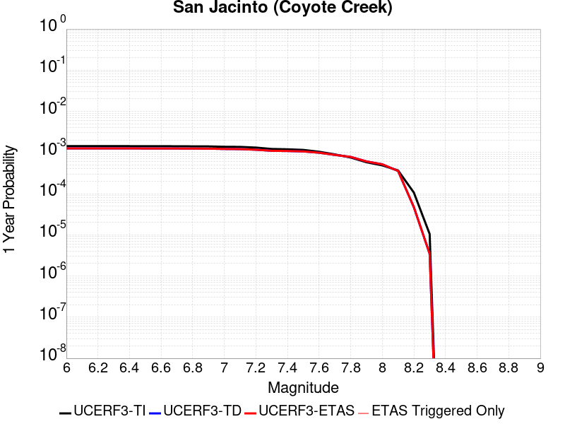 |  |

| Magnitude | 1 wk TI Prob | 1 wk TD Prob | 1 wk ETAS Prob | 1 wk ETAS/TD Gain | 1 wk ETAS Triggered Only | 1 mo TI Prob | 1 mo TD Prob | 1 mo ETAS Prob | 1 mo ETAS/TD Gain | 1 mo ETAS Triggered Only | 1 yr TI Prob | 1 yr TD Prob | 1 yr ETAS Prob | 1 yr ETAS/TD Gain | 1 yr ETAS Triggered Only | 10 yr TI Prob | 10 yr TD Prob | 10 yr ETAS Prob | 10 yr ETAS/TD Gain | 10 yr ETAS Triggered Only |
|-----|-----|-----|-----|-----|-----|-----|-----|-----|-----|-----|-----|-----|-----|-----|-----|-----|-----|-----|-----|-----|
| 6.0 | 2.7374346E-5 | 2.415327E-5 | 2.415327E-5 | 1.0 | 0.0 | 1.1731335E-4 | 1.0350993E-4 | 1.0350993E-4 | 1.0 | 0.0 | 0.0014273542 | 0.0012595074 | 0.0012595074 | 1.0 | 0.0 | 0.01418221 | 0.01293251 | 0.012952251 | 1.0015265 | 2.0E-5 |
| 6.1 | 2.7374346E-5 | 2.415327E-5 | 2.415327E-5 | 1.0 | 0.0 | 1.1731335E-4 | 1.0350993E-4 | 1.0350993E-4 | 1.0 | 0.0 | 0.0014273542 | 0.0012595074 | 0.0012595074 | 1.0 | 0.0 | 0.01418221 | 0.01293251 | 0.012952251 | 1.0015265 | 2.0E-5 |
| 6.2 | 2.7374346E-5 | 2.415327E-5 | 2.415327E-5 | 1.0 | 0.0 | 1.1731335E-4 | 1.0350993E-4 | 1.0350993E-4 | 1.0 | 0.0 | 0.0014273542 | 0.0012595074 | 0.0012595074 | 1.0 | 0.0 | 0.01418221 | 0.01293251 | 0.012952251 | 1.0015265 | 2.0E-5 |
| 6.3 | 2.7374346E-5 | 2.415327E-5 | 2.415327E-5 | 1.0 | 0.0 | 1.1731335E-4 | 1.0350993E-4 | 1.0350993E-4 | 1.0 | 0.0 | 0.0014273542 | 0.0012595074 | 0.0012595074 | 1.0 | 0.0 | 0.01418221 | 0.01293251 | 0.012952251 | 1.0015265 | 2.0E-5 |
| 6.4 | 2.7374346E-5 | 2.415327E-5 | 2.415327E-5 | 1.0 | 0.0 | 1.1731335E-4 | 1.0350993E-4 | 1.0350993E-4 | 1.0 | 0.0 | 0.0014273542 | 0.0012595074 | 0.0012595074 | 1.0 | 0.0 | 0.01418221 | 0.01293251 | 0.012952251 | 1.0015265 | 2.0E-5 |
| 6.5 | 2.7282445E-5 | 2.4039346E-5 | 2.4039346E-5 | 1.0 | 0.0 | 1.16919524E-4 | 1.0302171E-4 | 1.0302171E-4 | 1.0 | 0.0 | 0.0014225657 | 0.0012535703 | 0.0012535703 | 1.0 | 0.0 | 0.014134934 | 0.012873836 | 0.012893579 | 1.0015335 | 2.0E-5 |
| 6.6 | 2.7282445E-5 | 2.4039346E-5 | 2.4039346E-5 | 1.0 | 0.0 | 1.16919524E-4 | 1.0302171E-4 | 1.0302171E-4 | 1.0 | 0.0 | 0.0014225657 | 0.0012535703 | 0.0012535703 | 1.0 | 0.0 | 0.014134934 | 0.012873836 | 0.012893579 | 1.0015335 | 2.0E-5 |
| 6.7 | 2.7216198E-5 | 2.3964463E-5 | 2.3964463E-5 | 1.0 | 0.0 | 1.1663563E-4 | 1.0270082E-4 | 1.0270082E-4 | 1.0 | 0.0 | 0.0014191137 | 0.0012496678 | 0.0012496678 | 1.0 | 0.0 | 0.014100855 | 0.0128352465 | 0.01285499 | 1.0015382 | 2.0E-5 |
| 6.8 | 2.7078617E-5 | 2.3881676E-5 | 2.3881676E-5 | 1.0 | 0.0 | 1.1604605E-4 | 1.0234604E-4 | 1.0234604E-4 | 1.0 | 0.0 | 0.001411945 | 0.0012453535 | 0.0012453535 | 1.0 | 0.0 | 0.014030075 | 0.012792386 | 0.01281213 | 1.0015434 | 2.0E-5 |
| 6.9 | 2.6982952E-5 | 2.3801183E-5 | 2.3801183E-5 | 1.0 | 0.0 | 1.15636096E-4 | 1.020011E-4 | 1.020011E-4 | 1.0 | 0.0 | 0.0014069602 | 0.0012411585 | 0.0012411585 | 1.0 | 0.0 | 0.013980856 | 0.012750699 | 0.012770444 | 1.0015485 | 2.0E-5 |
| 7.0 | 2.6449972E-5 | 2.3378187E-5 | 2.3378187E-5 | 1.0 | 0.0 | 1.1335209E-4 | 1.001884E-4 | 1.001884E-4 | 1.0 | 0.0 | 0.001379188 | 0.0012191138 | 0.0012191138 | 1.0 | 0.0 | 0.0137065975 | 0.0125320535 | 0.012551802 | 1.001576 | 2.0E-5 |
| 7.1 | 2.6257849E-5 | 2.3204217E-5 | 2.3204217E-5 | 1.0 | 0.0 | 1.1252879E-4 | 9.944286E-5 | 9.944286E-5 | 1.0 | 0.0 | 0.0013691769 | 0.001210047 | 0.001210047 | 1.0 | 0.0 | 0.013607717 | 0.012441914 | 0.012461665 | 1.0015875 | 2.0E-5 |
| 7.2 | 2.5270041E-5 | 2.2398921E-5 | 2.2398921E-5 | 1.0 | 0.0 | 1.0829568E-4 | 9.5991854E-5 | 9.5991854E-5 | 1.0 | 0.0 | 0.0013177024 | 0.0011680766 | 0.0011680766 | 1.0 | 0.0 | 0.013099162 | 0.012022921 | 0.01204268 | 1.0016435 | 2.0E-5 |
| 7.3 | 2.339701E-5 | 2.1130656E-5 | 2.1130656E-5 | 1.0 | 0.0 | 1.0026905E-4 | 9.055682E-5 | 9.055682E-5 | 1.0 | 0.0 | 0.001220092 | 0.0011019738 | 0.0011019738 | 1.0 | 0.0 | 0.012134149 | 0.011361783 | 0.011381556 | 1.0017403 | 2.0E-5 |
| 7.4 | 2.296333E-5 | 2.0860984E-5 | 2.0860984E-5 | 1.0 | 0.0 | 9.841056E-5 | 8.940117E-5 | 8.940117E-5 | 1.0 | 0.0 | 0.0011974899 | 0.0010879177 | 0.0010879177 | 1.0 | 0.0 | 0.011910575 | 0.011220883 | 0.011240658 | 1.0017624 | 2.0E-5 |
| 7.5 | 2.2188895E-5 | 2.0383844E-5 | 2.0383844E-5 | 1.0 | 0.0 | 9.50918E-5 | 8.735642E-5 | 8.735642E-5 | 1.0 | 0.0 | 0.0011571277 | 0.0010630476 | 0.0010630476 | 1.0 | 0.0 | 0.011511209 | 0.010970469 | 0.01099025 | 1.001803 | 2.0E-5 |
| 7.6 | 2.0013189E-5 | 1.8969942E-5 | 1.8969942E-5 | 1.0 | 0.0 | 8.5767984E-5 | 8.1297236E-5 | 8.1297236E-5 | 1.0 | 0.0 | 0.001043725 | 9.893461E-4 | 9.893461E-4 | 1.0 | 0.0 | 0.010388365 | 0.010228388 | 0.010248183 | 1.0019354 | 2.0E-5 |
| 7.7 | 1.7230794E-5 | 1.6751088E-5 | 1.6751088E-5 | 1.0 | 0.0 | 7.384417E-5 | 7.17884E-5 | 7.17884E-5 | 1.0 | 0.0 | 8.986819E-4 | 8.736742E-4 | 8.736742E-4 | 1.0 | 0.0 | 0.008950562 | 0.009066812 | 0.00908663 | 1.0021858 | 2.0E-5 |
| 7.8 | 1.4478809E-5 | 1.49981E-5 | 1.49981E-5 | 1.0 | 0.0 | 6.205057E-5 | 6.427599E-5 | 6.427599E-5 | 1.0 | 0.0 | 7.552038E-4 | 7.822799E-4 | 7.822799E-4 | 1.0 | 0.0 | 0.0075264242 | 0.008145113 | 0.00816495 | 1.0024354 | 2.0E-5 |
| 7.9 | 1.1114467E-5 | 1.1651392E-5 | 1.1651392E-5 | 1.0 | 0.0 | 4.7632562E-5 | 4.9933584E-5 | 4.9933584E-5 | 1.0 | 0.0 | 5.797721E-4 | 6.077724E-4 | 6.077724E-4 | 1.0 | 0.0 | 0.0057826187 | 0.0063836263 | 0.006403499 | 1.003113 | 2.0E-5 |
| 8.0 | 9.327402E-6 | 9.904865E-6 | 9.904865E-6 | 1.0 | 0.0 | 3.9973966E-5 | 4.2448733E-5 | 4.2448733E-5 | 1.0 | 0.0 | 4.8657437E-4 | 5.166913E-4 | 5.166913E-4 | 1.0 | 0.0 | 0.0048551033 | 0.0054529547 | 0.0054728454 | 1.0036477 | 2.0E-5 |
| 8.1 | 7.0235833E-6 | 6.83171E-6 | 6.83171E-6 | 1.0 | 0.0 | 3.0100724E-5 | 2.9278432E-5 | 2.9278432E-5 | 1.0 | 0.0 | 3.664147E-4 | 3.5640708E-4 | 3.5640708E-4 | 1.0 | 0.0 | 0.003658111 | 0.0037898365 | 0.0038097606 | 1.0052572 | 2.0E-5 |
| 8.2 | 2.0358202E-6 | 9.0030267E-7 | 9.0030267E-7 | 1.0 | 0.0 | 8.724915E-6 | 3.8584344E-6 | 3.8584344E-6 | 1.0 | 0.0 | 1.06220665E-4 | 4.697545E-5 | 4.697545E-5 | 1.0 | 0.0 | 0.001061699 | 5.3301745E-4 | 5.3301745E-4 | 1.0 | 0.0 |
| 8.3 | 2.0051264E-7 | 6.6244816E-8 | 6.6244816E-8 | 1.0 | 0.0 | 8.5933965E-7 | 2.8390633E-7 | 2.8390633E-7 | 1.0 | 0.0 | 1.046241E-5 | 3.4565546E-6 | 3.4565546E-6 | 1.0 | 0.0 | 1.0461917E-4 | 4.018022E-5 | 4.018022E-5 | 1.0 | 0.0 |

## Del Valle
*[(top)](#table-of-contents)*

| 1 Week | 1 Month | 1 Year | 10 Year |
|-----|-----|-----|-----|
|  |  |  |  |

| Magnitude | 1 wk TI Prob | 1 wk TD Prob | 1 wk ETAS Prob | 1 wk ETAS/TD Gain | 1 wk ETAS Triggered Only | 1 mo TI Prob | 1 mo TD Prob | 1 mo ETAS Prob | 1 mo ETAS/TD Gain | 1 mo ETAS Triggered Only | 1 yr TI Prob | 1 yr TD Prob | 1 yr ETAS Prob | 1 yr ETAS/TD Gain | 1 yr ETAS Triggered Only | 10 yr TI Prob | 10 yr TD Prob | 10 yr ETAS Prob | 10 yr ETAS/TD Gain | 10 yr ETAS Triggered Only |
|-----|-----|-----|-----|-----|-----|-----|-----|-----|-----|-----|-----|-----|-----|-----|-----|-----|-----|-----|-----|-----|
| 6.0 | 1.0716125E-5 | 8.768052E-6 | 8.768052E-6 | 1.0 | 0.0 | 4.592544E-5 | 3.7576934E-5 | 4.757656E-5 | 1.2661107 | 1.0E-5 | 5.589988E-4 | 4.574229E-4 | 4.7741376E-4 | 1.0437032 | 2.0E-5 | 0.0055759475 | 0.0045667686 | 0.004586677 | 1.0043595 | 2.0E-5 |
| 6.1 | 1.0716125E-5 | 8.768052E-6 | 8.768052E-6 | 1.0 | 0.0 | 4.592544E-5 | 3.7576934E-5 | 4.757656E-5 | 1.2661107 | 1.0E-5 | 5.589988E-4 | 4.574229E-4 | 4.7741376E-4 | 1.0437032 | 2.0E-5 | 0.0055759475 | 0.0045667686 | 0.004586677 | 1.0043595 | 2.0E-5 |
| 6.2 | 1.0716125E-5 | 8.768052E-6 | 8.768052E-6 | 1.0 | 0.0 | 4.592544E-5 | 3.7576934E-5 | 4.757656E-5 | 1.2661107 | 1.0E-5 | 5.589988E-4 | 4.574229E-4 | 4.7741376E-4 | 1.0437032 | 2.0E-5 | 0.0055759475 | 0.0045667686 | 0.004586677 | 1.0043595 | 2.0E-5 |
| 6.3 | 7.1293784E-6 | 4.865947E-6 | 4.865947E-6 | 1.0 | 0.0 | 3.055412E-5 | 2.0853897E-5 | 2.0853897E-5 | 1.0 | 0.0 | 3.7193293E-4 | 2.5386736E-4 | 2.6386481E-4 | 1.0393807 | 1.0E-5 | 0.0037131102 | 0.0025358594 | 0.002545834 | 1.0039334 | 1.0E-5 |
| 6.4 | 7.1293784E-6 | 4.865947E-6 | 4.865947E-6 | 1.0 | 0.0 | 3.055412E-5 | 2.0853897E-5 | 2.0853897E-5 | 1.0 | 0.0 | 3.7193293E-4 | 2.5386736E-4 | 2.6386481E-4 | 1.0393807 | 1.0E-5 | 0.0037131102 | 0.0025358594 | 0.002545834 | 1.0039334 | 1.0E-5 |
| 6.5 | 7.1293784E-6 | 4.865947E-6 | 4.865947E-6 | 1.0 | 0.0 | 3.055412E-5 | 2.0853897E-5 | 2.0853897E-5 | 1.0 | 0.0 | 3.7193293E-4 | 2.5386736E-4 | 2.6386481E-4 | 1.0393807 | 1.0E-5 | 0.0037131102 | 0.0025358594 | 0.002545834 | 1.0039334 | 1.0E-5 |
| 6.6 | 7.1293784E-6 | 4.865947E-6 | 4.865947E-6 | 1.0 | 0.0 | 3.055412E-5 | 2.0853897E-5 | 2.0853897E-5 | 1.0 | 0.0 | 3.7193293E-4 | 2.5386736E-4 | 2.6386481E-4 | 1.0393807 | 1.0E-5 | 0.0037131102 | 0.0025358594 | 0.002545834 | 1.0039334 | 1.0E-5 |
| 6.7 | 7.12272E-6 | 4.863323E-6 | 4.863323E-6 | 1.0 | 0.0 | 3.0525585E-5 | 2.084265E-5 | 2.084265E-5 | 1.0 | 0.0 | 3.7158563E-4 | 2.5373045E-4 | 2.637279E-4 | 1.0394019 | 1.0E-5 | 0.003709649 | 0.0025344936 | 0.002544468 | 1.0039356 | 1.0E-5 |
| 6.8 | 6.7558703E-6 | 4.5595193E-6 | 4.5595193E-6 | 1.0 | 0.0 | 2.895341E-5 | 1.9540656E-5 | 1.9540656E-5 | 1.0 | 0.0 | 3.5245073E-4 | 2.3788214E-4 | 2.4787977E-4 | 1.0420276 | 1.0E-5 | 0.0035189227 | 0.0023763503 | 0.0023863264 | 1.0041981 | 1.0E-5 |
| 6.9 | 6.6700386E-6 | 4.5026545E-6 | 4.5026545E-6 | 1.0 | 0.0 | 2.8585566E-5 | 1.9296951E-5 | 1.9296951E-5 | 1.0 | 0.0 | 3.479737E-4 | 2.3491567E-4 | 2.4491333E-4 | 1.0425584 | 1.0E-5 | 0.003474293 | 0.0023467485 | 0.002356725 | 1.0042512 | 1.0E-5 |
| 7.0 | 6.3181424E-6 | 4.09881E-6 | 4.09881E-6 | 1.0 | 0.0 | 2.7077473E-5 | 1.7566214E-5 | 1.7566214E-5 | 1.0 | 0.0 | 3.2961834E-4 | 2.1384809E-4 | 2.1384809E-4 | 1.0 | 0.0 | 0.0032912986 | 0.002136478 | 0.002136478 | 1.0 | 0.0 |
| 7.1 | 6.248759E-6 | 4.034E-6 | 4.034E-6 | 1.0 | 0.0 | 2.678012E-5 | 1.728846E-5 | 1.728846E-5 | 1.0 | 0.0 | 3.2599916E-4 | 2.1046709E-4 | 2.1046709E-4 | 1.0 | 0.0 | 0.0032552136 | 0.002102732 | 0.002102732 | 1.0 | 0.0 |
| 7.2 | 6.0411944E-6 | 3.869988E-6 | 3.869988E-6 | 1.0 | 0.0 | 2.5890577E-5 | 1.6585562E-5 | 1.6585562E-5 | 1.0 | 0.0 | 3.1517216E-4 | 2.0191091E-4 | 2.0191091E-4 | 1.0 | 0.0 | 0.0031472554 | 0.002017328 | 0.002017328 | 1.0 | 0.0 |
| 7.3 | 4.7691183E-6 | 3.078193E-6 | 3.078193E-6 | 1.0 | 0.0 | 2.0438918E-5 | 1.319219E-5 | 1.319219E-5 | 1.0 | 0.0 | 2.488154E-4 | 1.6060329E-4 | 1.6060329E-4 | 1.0 | 0.0 | 0.00248537 | 0.0016048981 | 0.0016048981 | 1.0 | 0.0 |
| 7.4 | 3.5524722E-6 | 2.1893868E-6 | 2.1893868E-6 | 1.0 | 0.0 | 1.5224792E-5 | 9.383053E-6 | 9.383053E-6 | 1.0 | 0.0 | 1.8534607E-4 | 1.1423277E-4 | 1.1423277E-4 | 1.0 | 0.0 | 0.0018519156 | 0.0011417487 | 0.0011417487 | 1.0 | 0.0 |
| 7.5 | 2.7133442E-6 | 1.591647E-6 | 1.591647E-6 | 1.0 | 0.0 | 1.1628566E-5 | 6.8213267E-6 | 6.8213267E-6 | 1.0 | 0.0 | 1.415686E-4 | 8.304651E-5 | 8.304651E-5 | 1.0 | 0.0 | 0.0014147845 | 8.3015667E-4 | 8.3015667E-4 | 1.0 | 0.0 |
| 7.6 | 1.915338E-6 | 1.1739402E-6 | 1.1739402E-6 | 1.0 | 0.0 | 8.208566E-6 | 5.031163E-6 | 5.031163E-6 | 1.0 | 0.0 | 9.993471E-5 | 6.125269E-5 | 6.125269E-5 | 1.0 | 0.0 | 9.988978E-4 | 6.12359E-4 | 6.12359E-4 | 1.0 | 0.0 |
| 7.7 | 1.2120448E-6 | 7.1804885E-7 | 7.1804885E-7 | 1.0 | 0.0 | 5.194467E-6 | 3.0773488E-6 | 3.0773488E-6 | 1.0 | 0.0 | 6.3240805E-5 | 3.746608E-5 | 3.746608E-5 | 1.0 | 0.0 | 6.322281E-4 | 3.7459802E-4 | 3.7459802E-4 | 1.0 | 0.0 |
| 7.8 | 6.272381E-7 | 3.9326522E-7 | 3.9326522E-7 | 1.0 | 0.0 | 2.6881603E-6 | 1.6854212E-6 | 1.6854212E-6 | 1.0 | 0.0 | 3.272786E-5 | 2.0519812E-5 | 2.0519812E-5 | 1.0 | 0.0 | 3.272304E-4 | 2.0517933E-4 | 2.0517933E-4 | 1.0 | 0.0 |
| 7.9 | 2.0292627E-7 | 1.2005012E-7 | 1.2005012E-7 | 1.0 | 0.0 | 8.6968373E-7 | 5.145004E-7 | 5.145004E-7 | 1.0 | 0.0 | 1.0588348E-5 | 6.2640247E-6 | 6.2640247E-6 | 1.0 | 0.0 | 1.0587843E-4 | 6.26385E-5 | 6.26385E-5 | 1.0 | 0.0 |
| 8.0 | 4.374492E-8 | 2.1900798E-8 | 2.1900798E-8 | 1.0 | 0.0 | 1.8747821E-7 | 9.386056E-8 | 9.386056E-8 | 1.0 | 0.0 | 2.2825448E-6 | 1.1427518E-6 | 1.1427518E-6 | 1.0 | 0.0 | 2.2825214E-5 | 1.1427463E-5 | 1.1427463E-5 | 1.0 | 0.0 |

## White Wolf
*[(top)](#table-of-contents)*

| 1 Week | 1 Month | 1 Year | 10 Year |
|-----|-----|-----|-----|
|  |  |  |  |

| Magnitude | 1 wk TI Prob | 1 wk TD Prob | 1 wk ETAS Prob | 1 wk ETAS/TD Gain | 1 wk ETAS Triggered Only | 1 mo TI Prob | 1 mo TD Prob | 1 mo ETAS Prob | 1 mo ETAS/TD Gain | 1 mo ETAS Triggered Only | 1 yr TI Prob | 1 yr TD Prob | 1 yr ETAS Prob | 1 yr ETAS/TD Gain | 1 yr ETAS Triggered Only | 10 yr TI Prob | 10 yr TD Prob | 10 yr ETAS Prob | 10 yr ETAS/TD Gain | 10 yr ETAS Triggered Only |
|-----|-----|-----|-----|-----|-----|-----|-----|-----|-----|-----|-----|-----|-----|-----|-----|-----|-----|-----|-----|-----|
| 6.0 | 2.0037822E-5 | 1.0469304E-6 | 1.104692E-5 | 10.5517235 | 1.0E-5 | 8.587355E-5 | 4.486837E-6 | 2.4486748E-5 | 5.4574633 | 2.0E-5 | 0.001045009 | 5.462592E-5 | 7.4624826E-5 | 1.3661065 | 2.0E-5 | 0.010401085 | 5.4613E-4 | 5.661191E-4 | 1.0366013 | 2.0E-5 |
| 6.1 | 2.0037822E-5 | 1.0469304E-6 | 1.104692E-5 | 10.5517235 | 1.0E-5 | 8.587355E-5 | 4.486837E-6 | 2.4486748E-5 | 5.4574633 | 2.0E-5 | 0.001045009 | 5.462592E-5 | 7.4624826E-5 | 1.3661065 | 2.0E-5 | 0.010401085 | 5.4613E-4 | 5.661191E-4 | 1.0366013 | 2.0E-5 |
| 6.2 | 2.0037822E-5 | 1.0469304E-6 | 1.104692E-5 | 10.5517235 | 1.0E-5 | 8.587355E-5 | 4.486837E-6 | 2.4486748E-5 | 5.4574633 | 2.0E-5 | 0.001045009 | 5.462592E-5 | 7.4624826E-5 | 1.3661065 | 2.0E-5 | 0.010401085 | 5.4613E-4 | 5.661191E-4 | 1.0366013 | 2.0E-5 |
| 6.3 | 2.0037822E-5 | 1.0469304E-6 | 1.104692E-5 | 10.5517235 | 1.0E-5 | 8.587355E-5 | 4.486837E-6 | 2.4486748E-5 | 5.4574633 | 2.0E-5 | 0.001045009 | 5.462592E-5 | 7.4624826E-5 | 1.3661065 | 2.0E-5 | 0.010401085 | 5.4613E-4 | 5.661191E-4 | 1.0366013 | 2.0E-5 |
| 6.4 | 1.132487E-5 | 1.0469304E-6 | 1.104692E-5 | 10.5517235 | 1.0E-5 | 4.8534253E-5 | 4.486837E-6 | 2.4486748E-5 | 5.4574633 | 2.0E-5 | 5.907443E-4 | 5.462592E-5 | 7.4624826E-5 | 1.3661065 | 2.0E-5 | 0.005891764 | 5.4613E-4 | 5.661191E-4 | 1.0366013 | 2.0E-5 |
| 6.5 | 1.132487E-5 | 1.0469304E-6 | 1.104692E-5 | 10.5517235 | 1.0E-5 | 4.8534253E-5 | 4.486837E-6 | 2.4486748E-5 | 5.4574633 | 2.0E-5 | 5.907443E-4 | 5.462592E-5 | 7.4624826E-5 | 1.3661065 | 2.0E-5 | 0.005891764 | 5.4613E-4 | 5.661191E-4 | 1.0366013 | 2.0E-5 |
| 6.6 | 9.347473E-6 | 1.0469304E-6 | 1.104692E-5 | 10.5517235 | 1.0E-5 | 4.0059982E-5 | 4.486837E-6 | 2.4486748E-5 | 5.4574633 | 2.0E-5 | 4.8762115E-4 | 5.462592E-5 | 7.4624826E-5 | 1.3661065 | 2.0E-5 | 0.0048655253 | 5.4613E-4 | 5.661191E-4 | 1.0366013 | 2.0E-5 |
| 6.7 | 7.842647E-6 | 1.0048476E-6 | 1.1004838E-5 | 10.951748 | 1.0E-5 | 3.361091E-5 | 4.306483E-6 | 2.4306397E-5 | 5.6441407 | 2.0E-5 | 4.0913603E-4 | 5.243022E-5 | 7.242917E-5 | 1.3814394 | 2.0E-5 | 0.004083836 | 5.2418344E-4 | 5.4417294E-4 | 1.0381346 | 2.0E-5 |
| 6.8 | 6.26597E-6 | 9.734948E-7 | 1.0973485E-5 | 11.272259 | 1.0E-5 | 2.685388E-5 | 4.172114E-6 | 2.417203E-5 | 5.7937126 | 2.0E-5 | 3.2689696E-4 | 5.079436E-5 | 7.079334E-5 | 1.3937246 | 2.0E-5 | 0.003264165 | 5.078324E-4 | 5.2782224E-4 | 1.039363 | 2.0E-5 |
| 6.9 | 5.258436E-6 | 9.183371E-7 | 1.0918328E-5 | 11.889237 | 1.0E-5 | 2.2535958E-5 | 3.9357246E-6 | 2.3935647E-5 | 6.081636 | 2.0E-5 | 2.7434074E-4 | 4.7916445E-5 | 6.7915484E-5 | 1.4173732 | 2.0E-5 | 0.0027400232 | 4.7906593E-4 | 4.9905636E-4 | 1.0417279 | 2.0E-5 |
| 7.0 | 4.675028E-6 | 8.66129E-7 | 1.0866121E-5 | 12.545614 | 1.0E-5 | 2.003568E-5 | 3.7119764E-6 | 2.3711902E-5 | 6.387945 | 2.0E-5 | 2.4390711E-4 | 4.5192424E-5 | 6.519152E-5 | 1.4425321 | 2.0E-5 | 0.0024363957 | 4.5183706E-4 | 4.71828E-4 | 1.0442437 | 2.0E-5 |
| 7.1 | 2.8270078E-6 | 6.8742594E-7 | 1.06874195E-5 | 15.547011 | 1.0E-5 | 1.2115692E-5 | 2.9461082E-6 | 2.294605E-5 | 7.788597 | 2.0E-5 | 1.4749856E-4 | 3.5868317E-5 | 5.58676E-5 | 1.5575751 | 2.0E-5 | 0.001474007 | 3.586294E-4 | 3.786222E-4 | 1.0557479 | 2.0E-5 |
| 7.2 | 1.6881406E-6 | 2.2706854E-7 | 2.2706854E-7 | 1.0 | 0.0 | 7.2348685E-6 | 9.731506E-7 | 9.731506E-7 | 1.0 | 0.0 | 8.808096E-5 | 1.1848045E-5 | 1.1848045E-5 | 1.0 | 0.0 | 8.8046055E-4 | 1.1847429E-4 | 1.1847429E-4 | 1.0 | 0.0 |
| 7.3 | 9.086107E-7 | 1.5266669E-7 | 1.5266669E-7 | 1.0 | 0.0 | 3.8940398E-6 | 6.5428566E-7 | 6.5428566E-7 | 1.0 | 0.0 | 4.7408903E-5 | 7.965899E-6 | 7.965899E-6 | 1.0 | 0.0 | 4.739879E-4 | 7.965622E-5 | 7.965622E-5 | 1.0 | 0.0 |
| 7.4 | 1.9717383E-7 | 9.003981E-8 | 9.003981E-8 | 1.0 | 0.0 | 8.450304E-7 | 3.8588485E-7 | 3.8588485E-7 | 1.0 | 0.0 | 1.0288197E-5 | 4.698138E-6 | 4.698138E-6 | 1.0 | 0.0 | 1.028772E-4 | 4.6980418E-5 | 4.6980418E-5 | 1.0 | 0.0 |
| 7.5 | 1.086975E-7 | 6.659757E-8 | 6.659757E-8 | 1.0 | 0.0 | 4.6584634E-7 | 2.8541814E-7 | 2.8541814E-7 | 1.0 | 0.0 | 5.6716644E-6 | 3.4749605E-6 | 3.4749605E-6 | 1.0 | 0.0 | 5.6715195E-5 | 3.4749086E-5 | 3.4749086E-5 | 1.0 | 0.0 |
| 7.6 | 2.4217808E-8 | 1.5820843E-8 | 1.5820843E-8 | 1.0 | 0.0 | 1.03790605E-7 | 6.780361E-8 | 6.780361E-8 | 1.0 | 0.0 | 1.2636499E-6 | 8.255087E-7 | 8.255087E-7 | 1.0 | 0.0 | 1.2636427E-5 | 8.255061E-6 | 8.255061E-6 | 1.0 | 0.0 |

## San Cayetano
*[(top)](#table-of-contents)*

| 1 Week | 1 Month | 1 Year | 10 Year |
|-----|-----|-----|-----|
| 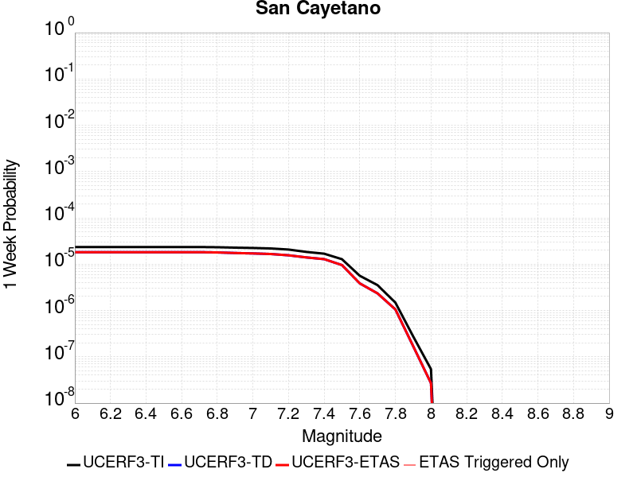 |  |  |  |

| Magnitude | 1 wk TI Prob | 1 wk TD Prob | 1 wk ETAS Prob | 1 wk ETAS/TD Gain | 1 wk ETAS Triggered Only | 1 mo TI Prob | 1 mo TD Prob | 1 mo ETAS Prob | 1 mo ETAS/TD Gain | 1 mo ETAS Triggered Only | 1 yr TI Prob | 1 yr TD Prob | 1 yr ETAS Prob | 1 yr ETAS/TD Gain | 1 yr ETAS Triggered Only | 10 yr TI Prob | 10 yr TD Prob | 10 yr ETAS Prob | 10 yr ETAS/TD Gain | 10 yr ETAS Triggered Only |
|-----|-----|-----|-----|-----|-----|-----|-----|-----|-----|-----|-----|-----|-----|-----|-----|-----|-----|-----|-----|-----|
| 6.0 | 2.3476267E-5 | 1.816963E-5 | 1.816963E-5 | 1.0 | 0.0 | 1.0060869E-4 | 7.786754E-5 | 7.786754E-5 | 1.0 | 0.0 | 0.0012242225 | 9.4762864E-4 | 9.5761917E-4 | 1.0105426 | 1.0E-5 | 0.012175002 | 0.009436766 | 0.009456577 | 1.0020994 | 2.0E-5 |
| 6.1 | 2.3476267E-5 | 1.816963E-5 | 1.816963E-5 | 1.0 | 0.0 | 1.0060869E-4 | 7.786754E-5 | 7.786754E-5 | 1.0 | 0.0 | 0.0012242225 | 9.4762864E-4 | 9.5761917E-4 | 1.0105426 | 1.0E-5 | 0.012175002 | 0.009436766 | 0.009456577 | 1.0020994 | 2.0E-5 |
| 6.2 | 2.3476267E-5 | 1.816963E-5 | 1.816963E-5 | 1.0 | 0.0 | 1.0060869E-4 | 7.786754E-5 | 7.786754E-5 | 1.0 | 0.0 | 0.0012242225 | 9.4762864E-4 | 9.5761917E-4 | 1.0105426 | 1.0E-5 | 0.012175002 | 0.009436766 | 0.009456577 | 1.0020994 | 2.0E-5 |
| 6.3 | 2.3476267E-5 | 1.816963E-5 | 1.816963E-5 | 1.0 | 0.0 | 1.0060869E-4 | 7.786754E-5 | 7.786754E-5 | 1.0 | 0.0 | 0.0012242225 | 9.4762864E-4 | 9.5761917E-4 | 1.0105426 | 1.0E-5 | 0.012175002 | 0.009436766 | 0.009456577 | 1.0020994 | 2.0E-5 |
| 6.4 | 2.3476267E-5 | 1.816963E-5 | 1.816963E-5 | 1.0 | 0.0 | 1.0060869E-4 | 7.786754E-5 | 7.786754E-5 | 1.0 | 0.0 | 0.0012242225 | 9.4762864E-4 | 9.5761917E-4 | 1.0105426 | 1.0E-5 | 0.012175002 | 0.009436766 | 0.009456577 | 1.0020994 | 2.0E-5 |
| 6.5 | 2.3476267E-5 | 1.816963E-5 | 1.816963E-5 | 1.0 | 0.0 | 1.0060869E-4 | 7.786754E-5 | 7.786754E-5 | 1.0 | 0.0 | 0.0012242225 | 9.4762864E-4 | 9.5761917E-4 | 1.0105426 | 1.0E-5 | 0.012175002 | 0.009436766 | 0.009456577 | 1.0020994 | 2.0E-5 |
| 6.6 | 2.3476267E-5 | 1.816963E-5 | 1.816963E-5 | 1.0 | 0.0 | 1.0060869E-4 | 7.786754E-5 | 7.786754E-5 | 1.0 | 0.0 | 0.0012242225 | 9.4762864E-4 | 9.5761917E-4 | 1.0105426 | 1.0E-5 | 0.012175002 | 0.009436766 | 0.009456577 | 1.0020994 | 2.0E-5 |
| 6.7 | 2.3476267E-5 | 1.816963E-5 | 1.816963E-5 | 1.0 | 0.0 | 1.0060869E-4 | 7.786754E-5 | 7.786754E-5 | 1.0 | 0.0 | 0.0012242225 | 9.4762864E-4 | 9.5761917E-4 | 1.0105426 | 1.0E-5 | 0.012175002 | 0.009436766 | 0.009456577 | 1.0020994 | 2.0E-5 |
| 6.8 | 2.3241924E-5 | 1.7937333E-5 | 1.7937333E-5 | 1.0 | 0.0 | 9.960445E-5 | 7.6872035E-5 | 7.6872035E-5 | 1.0 | 0.0 | 0.0012120095 | 9.3551876E-4 | 9.455094E-4 | 1.0106792 | 1.0E-5 | 0.012054204 | 0.00931666 | 0.009336474 | 1.0021267 | 2.0E-5 |
| 6.9 | 2.2761007E-5 | 1.7432758E-5 | 1.7432758E-5 | 1.0 | 0.0 | 9.7543525E-5 | 7.47097E-5 | 7.47097E-5 | 1.0 | 0.0 | 0.0011869454 | 9.092145E-4 | 9.1920537E-4 | 1.0109885 | 1.0E-5 | 0.011806256 | 0.009055776 | 0.009075595 | 1.0021886 | 2.0E-5 |
| 7.0 | 2.240283E-5 | 1.7066497E-5 | 1.7066497E-5 | 1.0 | 0.0 | 9.600859E-5 | 7.3140094E-5 | 7.3140094E-5 | 1.0 | 0.0 | 0.0011682777 | 8.901203E-4 | 9.001114E-4 | 1.0112244 | 1.0E-5 | 0.011621549 | 0.008866365 | 0.008886187 | 1.0022358 | 2.0E-5 |
| 7.1 | 2.1871154E-5 | 1.6586335E-5 | 1.6586335E-5 | 1.0 | 0.0 | 9.373015E-5 | 7.108237E-5 | 7.108237E-5 | 1.0 | 0.0 | 0.0011405671 | 8.650876E-4 | 8.75079E-4 | 1.0115495 | 1.0E-5 | 0.011347309 | 0.008618002 | 0.00863783 | 1.0023007 | 2.0E-5 |
| 7.2 | 2.0714133E-5 | 1.5564854E-5 | 1.5564854E-5 | 1.0 | 0.0 | 8.8771834E-5 | 6.670483E-5 | 6.670483E-5 | 1.0 | 0.0 | 0.0010802611 | 8.1183197E-4 | 8.2182384E-4 | 1.0123078 | 1.0E-5 | 0.010750249 | 0.008089437 | 0.008109275 | 1.0024524 | 2.0E-5 |
| 7.3 | 1.8408395E-5 | 1.3997111E-5 | 1.3997111E-5 | 1.0 | 0.0 | 7.8890735E-5 | 5.9986254E-5 | 5.9986254E-5 | 1.0 | 0.0 | 9.600714E-4 | 7.3009095E-4 | 7.4008363E-4 | 1.0136869 | 1.0E-5 | 0.009559342 | 0.007277643 | 0.0072974972 | 1.0027281 | 2.0E-5 |
| 7.4 | 1.6856795E-5 | 1.28503E-5 | 1.28503E-5 | 1.0 | 0.0 | 7.2241404E-5 | 5.5071567E-5 | 5.5071567E-5 | 1.0 | 0.0 | 8.7918417E-4 | 6.702929E-4 | 6.802862E-4 | 1.0149089 | 1.0E-5 | 0.00875714 | 0.0066833915 | 0.006703258 | 1.0029725 | 2.0E-5 |
| 7.5 | 1.2822778E-5 | 9.577698E-6 | 9.577698E-6 | 1.0 | 0.0 | 5.495361E-5 | 4.104664E-5 | 4.104664E-5 | 1.0 | 0.0 | 6.688548E-4 | 4.996298E-4 | 5.0962484E-4 | 1.0200049 | 1.0E-5 | 0.006668452 | 0.0049852366 | 0.0050051366 | 1.0039918 | 2.0E-5 |
| 7.6 | 5.6272684E-6 | 3.8549683E-6 | 3.8549683E-6 | 1.0 | 0.0 | 2.4116642E-5 | 1.6521188E-5 | 1.6521188E-5 | 1.0 | 0.0 | 2.9358055E-4 | 2.01127E-4 | 2.01127E-4 | 1.0 | 0.0 | 0.0029319301 | 0.0020094607 | 0.0020194405 | 1.0049665 | 1.0E-5 |
| 7.7 | 3.5261346E-6 | 2.340742E-6 | 2.340742E-6 | 1.0 | 0.0 | 1.5111918E-5 | 1.0031713E-5 | 1.0031713E-5 | 1.0 | 0.0 | 1.8397206E-4 | 1.2212934E-4 | 1.2212934E-4 | 1.0 | 0.0 | 0.0018381984 | 0.0012206296 | 0.0012206296 | 1.0 | 0.0 |
| 7.8 | 1.4826929E-6 | 1.0564453E-6 | 1.0564453E-6 | 1.0 | 0.0 | 6.354383E-6 | 4.5276147E-6 | 4.5276147E-6 | 1.0 | 0.0 | 7.736187E-5 | 5.512234E-5 | 5.512234E-5 | 1.0 | 0.0 | 7.733494E-4 | 5.5108865E-4 | 5.5108865E-4 | 1.0 | 0.0 |
| 7.9 | 2.7568166E-7 | 1.6978672E-7 | 1.6978672E-7 | 1.0 | 0.0 | 1.1814923E-6 | 7.2765715E-7 | 7.2765715E-7 | 1.0 | 0.0 | 1.4384574E-5 | 8.85919E-6 | 8.85919E-6 | 1.0 | 0.0 | 1.4383643E-4 | 8.85884E-5 | 8.85884E-5 | 1.0 | 0.0 |
| 8.0 | 5.407832E-8 | 2.6889136E-8 | 2.6889136E-8 | 1.0 | 0.0 | 2.3176422E-7 | 1.15239146E-7 | 1.15239146E-7 | 1.0 | 0.0 | 2.8217257E-6 | 1.4030358E-6 | 1.4030358E-6 | 1.0 | 0.0 | 2.8216898E-5 | 1.4030274E-5 | 1.4030274E-5 | 1.0 | 0.0 |

## San Juan
*[(top)](#table-of-contents)*

| 1 Week | 1 Month | 1 Year | 10 Year |
|-----|-----|-----|-----|
|  |  |  |  |

| Magnitude | 1 wk TI Prob | 1 wk TD Prob | 1 wk ETAS Prob | 1 wk ETAS/TD Gain | 1 wk ETAS Triggered Only | 1 mo TI Prob | 1 mo TD Prob | 1 mo ETAS Prob | 1 mo ETAS/TD Gain | 1 mo ETAS Triggered Only | 1 yr TI Prob | 1 yr TD Prob | 1 yr ETAS Prob | 1 yr ETAS/TD Gain | 1 yr ETAS Triggered Only | 10 yr TI Prob | 10 yr TD Prob | 10 yr ETAS Prob | 10 yr ETAS/TD Gain | 10 yr ETAS Triggered Only |
|-----|-----|-----|-----|-----|-----|-----|-----|-----|-----|-----|-----|-----|-----|-----|-----|-----|-----|-----|-----|-----|
| 6.0 | 8.682808E-6 | 8.749559E-6 | 8.749559E-6 | 1.0 | 0.0 | 3.72115E-5 | 3.7497597E-5 | 3.7497597E-5 | 1.0 | 0.0 | 4.5295584E-4 | 4.5644245E-4 | 4.6643786E-4 | 1.0218985 | 1.0E-5 | 0.004520337 | 0.0045555905 | 0.0045754993 | 1.0043702 | 2.0E-5 |
| 6.1 | 8.682808E-6 | 8.749559E-6 | 8.749559E-6 | 1.0 | 0.0 | 3.72115E-5 | 3.7497597E-5 | 3.7497597E-5 | 1.0 | 0.0 | 4.5295584E-4 | 4.5644245E-4 | 4.6643786E-4 | 1.0218985 | 1.0E-5 | 0.004520337 | 0.0045555905 | 0.0045754993 | 1.0043702 | 2.0E-5 |
| 6.2 | 8.682808E-6 | 8.749559E-6 | 8.749559E-6 | 1.0 | 0.0 | 3.72115E-5 | 3.7497597E-5 | 3.7497597E-5 | 1.0 | 0.0 | 4.5295584E-4 | 4.5644245E-4 | 4.6643786E-4 | 1.0218985 | 1.0E-5 | 0.004520337 | 0.0045555905 | 0.0045754993 | 1.0043702 | 2.0E-5 |
| 6.3 | 6.3054235E-6 | 6.282968E-6 | 6.282968E-6 | 1.0 | 0.0 | 2.7022963E-5 | 2.6926737E-5 | 2.6926737E-5 | 1.0 | 0.0 | 3.2895492E-4 | 3.277851E-4 | 3.277851E-4 | 1.0 | 0.0 | 0.003284684 | 0.0032732163 | 0.0032732163 | 1.0 | 0.0 |
| 6.4 | 6.1490473E-6 | 6.114796E-6 | 6.114796E-6 | 1.0 | 0.0 | 2.6352795E-5 | 2.6206013E-5 | 2.6206013E-5 | 1.0 | 0.0 | 3.2079802E-4 | 3.1901288E-4 | 3.1901288E-4 | 1.0 | 0.0 | 0.0032033534 | 0.0031857456 | 0.0031857456 | 1.0 | 0.0 |
| 6.5 | 5.204848E-6 | 5.137553E-6 | 5.137553E-6 | 1.0 | 0.0 | 2.23063E-5 | 2.2017904E-5 | 2.2017904E-5 | 1.0 | 0.0 | 2.7154534E-4 | 2.6803595E-4 | 2.6803595E-4 | 1.0 | 0.0 | 0.0027121378 | 0.002677281 | 0.002677281 | 1.0 | 0.0 |
| 6.6 | 4.5179986E-6 | 4.415269E-6 | 4.415269E-6 | 1.0 | 0.0 | 1.9362706E-5 | 1.8922448E-5 | 1.8922448E-5 | 1.0 | 0.0 | 2.3571544E-4 | 2.3035725E-4 | 2.3035725E-4 | 1.0 | 0.0 | 0.0023546559 | 0.0023013218 | 0.0023013218 | 1.0 | 0.0 |
| 6.7 | 3.9442616E-6 | 3.8200415E-6 | 3.8200415E-6 | 1.0 | 0.0 | 1.6903869E-5 | 1.6371509E-5 | 1.6371509E-5 | 1.0 | 0.0 | 2.0578515E-4 | 1.9930555E-4 | 1.9930555E-4 | 1.0 | 0.0 | 0.002055947 | 0.001991393 | 0.001991393 | 1.0 | 0.0 |
| 6.8 | 3.4536245E-6 | 3.31654E-6 | 3.31654E-6 | 1.0 | 0.0 | 1.4801163E-5 | 1.4213669E-5 | 1.4213669E-5 | 1.0 | 0.0 | 1.8018926E-4 | 1.730383E-4 | 1.730383E-4 | 1.0 | 0.0 | 0.0018004322 | 0.0017291544 | 0.0017291544 | 1.0 | 0.0 |
| 6.9 | 3.059865E-6 | 2.912227E-6 | 2.912227E-6 | 1.0 | 0.0 | 1.3113641E-5 | 1.2480916E-5 | 1.2480916E-5 | 1.0 | 0.0 | 1.596469E-4 | 1.5194513E-4 | 1.5194513E-4 | 1.0 | 0.0 | 0.0015953224 | 0.001518527 | 0.001518527 | 1.0 | 0.0 |
| 7.0 | 2.6504351E-6 | 2.4921849E-6 | 2.4921849E-6 | 1.0 | 0.0 | 1.1358958E-5 | 1.0680751E-5 | 1.0680751E-5 | 1.0 | 0.0 | 1.3828653E-4 | 1.3003094E-4 | 1.3003094E-4 | 1.0 | 0.0 | 0.0013820052 | 0.0012996603 | 0.0012996603 | 1.0 | 0.0 |
| 7.1 | 2.2039317E-6 | 2.0339805E-6 | 2.0339805E-6 | 1.0 | 0.0 | 9.445387E-6 | 8.717033E-6 | 8.717033E-6 | 1.0 | 0.0 | 1.1499152E-4 | 1.0612523E-4 | 1.0612523E-4 | 1.0 | 0.0 | 0.0011493203 | 0.0010608556 | 0.0010608556 | 1.0 | 0.0 |
| 7.2 | 1.0786707E-6 | 8.7714847E-7 | 8.7714847E-7 | 1.0 | 0.0 | 4.622866E-6 | 3.7592022E-6 | 3.7592022E-6 | 1.0 | 0.0 | 5.628194E-5 | 4.5767338E-5 | 4.5767338E-5 | 1.0 | 0.0 | 5.6267687E-4 | 4.5763818E-4 | 4.5763818E-4 | 1.0 | 0.0 |
| 7.3 | 6.846433E-7 | 4.869622E-7 | 4.869622E-7 | 1.0 | 0.0 | 2.9341822E-6 | 2.0869793E-6 | 2.0869793E-6 | 1.0 | 0.0 | 3.5723086E-5 | 2.5408679E-5 | 2.5408679E-5 | 1.0 | 0.0 | 3.571734E-4 | 2.5409125E-4 | 2.5409125E-4 | 1.0 | 0.0 |
| 7.4 | 5.23043E-7 | 3.2634222E-7 | 3.2634222E-7 | 1.0 | 0.0 | 2.2416111E-6 | 1.3986087E-6 | 1.3986087E-6 | 1.0 | 0.0 | 2.7291273E-5 | 1.7027929E-5 | 1.7027929E-5 | 1.0 | 0.0 | 2.7287923E-4 | 1.7029818E-4 | 1.7029818E-4 | 1.0 | 0.0 |
| 7.5 | 4.648444E-7 | 2.724016E-7 | 2.724016E-7 | 1.0 | 0.0 | 1.9921886E-6 | 1.1674349E-6 | 1.1674349E-6 | 1.0 | 0.0 | 2.4254627E-5 | 1.4213428E-5 | 1.4213428E-5 | 1.0 | 0.0 | 2.425198E-4 | 1.4215481E-4 | 1.4215481E-4 | 1.0 | 0.0 |
| 7.6 | 3.9906567E-7 | 2.2087482E-7 | 2.2087482E-7 | 1.0 | 0.0 | 1.7102802E-6 | 9.4660606E-7 | 9.4660606E-7 | 1.0 | 0.0 | 2.0822463E-5 | 1.1524869E-5 | 1.1524869E-5 | 1.0 | 0.0 | 2.0820512E-4 | 1.1526732E-4 | 1.1526732E-4 | 1.0 | 0.0 |
| 7.7 | 1.8784601E-7 | 5.3682427E-8 | 5.3682427E-8 | 1.0 | 0.0 | 8.0505407E-7 | 2.3006753E-7 | 2.3006753E-7 | 1.0 | 0.0 | 9.80149E-6 | 2.8010686E-6 | 2.8010686E-6 | 1.0 | 0.0 | 9.801057E-5 | 2.801939E-5 | 2.801939E-5 | 1.0 | 0.0 |
| 7.8 | 1.00154914E-7 | 1.24208075E-8 | 1.24208075E-8 | 1.0 | 0.0 | 4.2923529E-7 | 5.323204E-8 | 5.323204E-8 | 1.0 | 0.0 | 5.225927E-6 | 6.4809996E-7 | 6.4809996E-7 | 1.0 | 0.0 | 5.225804E-5 | 6.4868796E-6 | 6.4868796E-6 | 1.0 | 0.0 |
| 7.9 | 6.171429E-8 | 4.2991957E-9 | 4.2991957E-9 | 1.0 | 0.0 | 2.6448978E-7 | 1.8425133E-8 | 1.8425133E-8 | 1.0 | 0.0 | 3.2201583E-6 | 2.2432597E-7 | 2.2432597E-7 | 1.0 | 0.0 | 3.2201115E-5 | 2.248556E-6 | 2.248556E-6 | 1.0 | 0.0 |
| 8.0 | 1.3974572E-8 | 3.3835368E-10 | 3.3835368E-10 | 1.0 | 0.0 | 5.989102E-8 | 1.450087E-9 | 1.450087E-9 | 1.0 | 0.0 | 7.2917294E-7 | 1.7654811E-8 | 1.7654811E-8 | 1.0 | 0.0 | 7.2917055E-6 | 1.8085565E-7 | 1.8085565E-7 | 1.0 | 0.0 |
| 8.1 | 1.8403477E-9 | 1.13145604E-10 | 1.13145604E-10 | 1.0 | 0.0 | 7.887204E-9 | 4.8490567E-10 | 4.8490567E-10 | 1.0 | 0.0 | 9.602671E-8 | 5.903737E-9 | 5.903737E-9 | 1.0 | 0.0 | 9.602667E-7 | 6.028191E-8 | 6.028191E-8 | 1.0 | 0.0 |

## San Luis Range - Oceano 2011 CFM
*[(top)](#table-of-contents)*

| 1 Week | 1 Month | 1 Year | 10 Year |
|-----|-----|-----|-----|
|  |  |  |  |

| Magnitude | 1 wk TI Prob | 1 wk TD Prob | 1 wk ETAS Prob | 1 wk ETAS/TD Gain | 1 wk ETAS Triggered Only | 1 mo TI Prob | 1 mo TD Prob | 1 mo ETAS Prob | 1 mo ETAS/TD Gain | 1 mo ETAS Triggered Only | 1 yr TI Prob | 1 yr TD Prob | 1 yr ETAS Prob | 1 yr ETAS/TD Gain | 1 yr ETAS Triggered Only | 10 yr TI Prob | 10 yr TD Prob | 10 yr ETAS Prob | 10 yr ETAS/TD Gain | 10 yr ETAS Triggered Only |
|-----|-----|-----|-----|-----|-----|-----|-----|-----|-----|-----|-----|-----|-----|-----|-----|-----|-----|-----|-----|-----|
| 6.0 | 1.6025788E-6 | 1.6201213E-6 | 1.6201213E-6 | 1.0 | 0.0 | 6.8681766E-6 | 6.943361E-6 | 6.943361E-6 | 1.0 | 0.0 | 8.361684E-5 | 8.4532556E-5 | 9.453171E-5 | 1.1182876 | 1.0E-5 | 8.3585386E-4 | 8.450448E-4 | 8.650279E-4 | 1.0236474 | 2.0E-5 |
| 6.1 | 1.6025788E-6 | 1.6201213E-6 | 1.6201213E-6 | 1.0 | 0.0 | 6.8681766E-6 | 6.943361E-6 | 6.943361E-6 | 1.0 | 0.0 | 8.361684E-5 | 8.4532556E-5 | 9.453171E-5 | 1.1182876 | 1.0E-5 | 8.3585386E-4 | 8.450448E-4 | 8.650279E-4 | 1.0236474 | 2.0E-5 |
| 6.2 | 1.6025788E-6 | 1.6201213E-6 | 1.6201213E-6 | 1.0 | 0.0 | 6.8681766E-6 | 6.943361E-6 | 6.943361E-6 | 1.0 | 0.0 | 8.361684E-5 | 8.4532556E-5 | 9.453171E-5 | 1.1182876 | 1.0E-5 | 8.3585386E-4 | 8.450448E-4 | 8.650279E-4 | 1.0236474 | 2.0E-5 |
| 6.3 | 1.6025788E-6 | 1.6201213E-6 | 1.6201213E-6 | 1.0 | 0.0 | 6.8681766E-6 | 6.943361E-6 | 6.943361E-6 | 1.0 | 0.0 | 8.361684E-5 | 8.4532556E-5 | 9.453171E-5 | 1.1182876 | 1.0E-5 | 8.3585386E-4 | 8.450448E-4 | 8.650279E-4 | 1.0236474 | 2.0E-5 |
| 6.4 | 1.1621186E-6 | 1.1749911E-6 | 1.1749911E-6 | 1.0 | 0.0 | 4.980499E-6 | 5.035668E-6 | 5.035668E-6 | 1.0 | 0.0 | 6.0635884E-5 | 6.130781E-5 | 7.130719E-5 | 1.1631013 | 1.0E-5 | 6.0619344E-4 | 6.129355E-4 | 6.229294E-4 | 1.016305 | 1.0E-5 |
| 6.5 | 1.1621186E-6 | 1.1749911E-6 | 1.1749911E-6 | 1.0 | 0.0 | 4.980499E-6 | 5.035668E-6 | 5.035668E-6 | 1.0 | 0.0 | 6.0635884E-5 | 6.130781E-5 | 7.130719E-5 | 1.1631013 | 1.0E-5 | 6.0619344E-4 | 6.129355E-4 | 6.229294E-4 | 1.016305 | 1.0E-5 |
| 6.6 | 7.164729E-7 | 7.248589E-7 | 7.248589E-7 | 1.0 | 0.0 | 3.0705946E-6 | 3.1065347E-6 | 3.1065347E-6 | 1.0 | 0.0 | 3.738385E-5 | 3.782142E-5 | 3.782142E-5 | 1.0 | 0.0 | 3.737756E-4 | 3.7815163E-4 | 3.7815163E-4 | 1.0 | 0.0 |
| 6.7 | 7.164729E-7 | 7.248589E-7 | 7.248589E-7 | 1.0 | 0.0 | 3.0705946E-6 | 3.1065347E-6 | 3.1065347E-6 | 1.0 | 0.0 | 3.738385E-5 | 3.782142E-5 | 3.782142E-5 | 1.0 | 0.0 | 3.737756E-4 | 3.7815163E-4 | 3.7815163E-4 | 1.0 | 0.0 |
| 6.8 | 6.700177E-7 | 6.77745E-7 | 6.77745E-7 | 1.0 | 0.0 | 2.8715012E-6 | 2.9046184E-6 | 2.9046184E-6 | 1.0 | 0.0 | 3.495997E-5 | 3.536317E-5 | 3.536317E-5 | 1.0 | 0.0 | 3.495447E-4 | 3.5357708E-4 | 3.5357708E-4 | 1.0 | 0.0 |
| 6.9 | 5.657865E-7 | 5.721795E-7 | 5.721795E-7 | 1.0 | 0.0 | 2.424797E-6 | 2.4521955E-6 | 2.4521955E-6 | 1.0 | 0.0 | 2.9521503E-5 | 2.9855084E-5 | 2.9855084E-5 | 1.0 | 0.0 | 2.9517582E-4 | 2.985118E-4 | 2.985118E-4 | 1.0 | 0.0 |
| 7.0 | 4.608413E-7 | 4.6601758E-7 | 4.6601758E-7 | 1.0 | 0.0 | 1.9750328E-6 | 1.9972167E-6 | 1.9972167E-6 | 1.0 | 0.0 | 2.4045758E-5 | 2.4315847E-5 | 2.4315847E-5 | 1.0 | 0.0 | 2.4043156E-4 | 2.4313215E-4 | 2.4313215E-4 | 1.0 | 0.0 |
| 7.1 | 3.9177846E-7 | 3.9621662E-7 | 3.9621662E-7 | 1.0 | 0.0 | 1.6790494E-6 | 1.6980702E-6 | 1.6980702E-6 | 1.0 | 0.0 | 2.0442236E-5 | 2.067381E-5 | 2.067381E-5 | 1.0 | 0.0 | 2.0440355E-4 | 2.06719E-4 | 2.06719E-4 | 1.0 | 0.0 |
| 7.2 | 3.3974752E-7 | 3.4366582E-7 | 3.4366582E-7 | 1.0 | 0.0 | 1.45606E-6 | 1.4728527E-6 | 1.4728527E-6 | 1.0 | 0.0 | 1.7727387E-5 | 1.7931836E-5 | 1.7931836E-5 | 1.0 | 0.0 | 1.7725973E-4 | 1.79304E-4 | 1.79304E-4 | 1.0 | 0.0 |
| 7.3 | 2.8900928E-7 | 2.9234062E-7 | 2.9234062E-7 | 1.0 | 0.0 | 1.2386106E-6 | 1.2528878E-6 | 1.2528878E-6 | 1.0 | 0.0 | 1.5079979E-5 | 1.5253803E-5 | 1.5253803E-5 | 1.0 | 0.0 | 1.5078956E-4 | 1.5252765E-4 | 1.5252765E-4 | 1.0 | 0.0 |
| 7.4 | 2.1881527E-7 | 2.2139628E-7 | 2.2139628E-7 | 1.0 | 0.0 | 9.3777936E-7 | 9.4884086E-7 | 9.4884086E-7 | 1.0 | 0.0 | 1.14174045E-5 | 1.1552077E-5 | 1.1552077E-5 | 1.0 | 0.0 | 1.1416818E-4 | 1.1551482E-4 | 1.1551482E-4 | 1.0 | 0.0 |
| 7.5 | 1.356398E-7 | 1.371866E-7 | 1.371866E-7 | 1.0 | 0.0 | 5.813133E-7 | 5.8794245E-7 | 5.8794245E-7 | 1.0 | 0.0 | 7.0774663E-6 | 7.158176E-6 | 7.158176E-6 | 1.0 | 0.0 | 7.077241E-5 | 7.157948E-5 | 7.157948E-5 | 1.0 | 0.0 |
| 7.6 | 5.9269272E-8 | 6.001375E-8 | 6.001375E-8 | 1.0 | 0.0 | 2.5401116E-7 | 2.5720172E-7 | 2.5720172E-7 | 1.0 | 0.0 | 3.0925814E-6 | 3.1314266E-6 | 3.1314266E-6 | 1.0 | 0.0 | 3.0925385E-5 | 3.1313837E-5 | 3.1313837E-5 | 1.0 | 0.0 |
| 7.7 | 5.946232E-9 | 6.0369403E-9 | 6.0369403E-9 | 1.0 | 0.0 | 2.5483851E-8 | 2.58726E-8 | 2.58726E-8 | 1.0 | 0.0 | 3.1026585E-7 | 3.1499889E-7 | 3.1499889E-7 | 1.0 | 0.0 | 3.102654E-6 | 3.149985E-6 | 3.149985E-6 | 1.0 | 0.0 |

## Great Valley 05 Pittsburg - Kirby Hills alt1
*[(top)](#table-of-contents)*

| 1 Week | 1 Month | 1 Year | 10 Year |
|-----|-----|-----|-----|
|  | 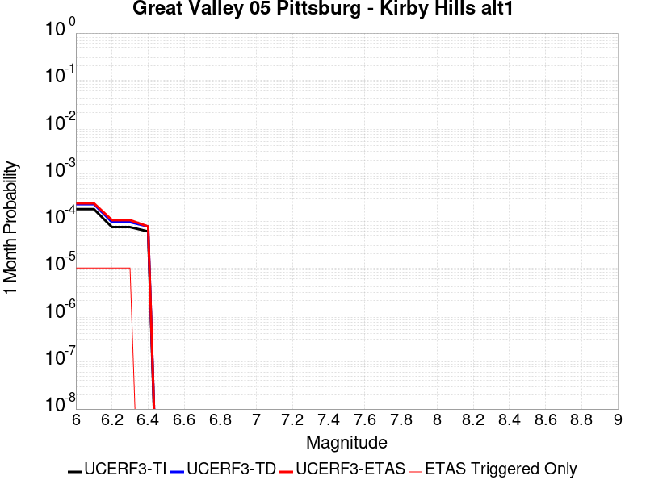 |  |  |

| Magnitude | 1 wk TI Prob | 1 wk TD Prob | 1 wk ETAS Prob | 1 wk ETAS/TD Gain | 1 wk ETAS Triggered Only | 1 mo TI Prob | 1 mo TD Prob | 1 mo ETAS Prob | 1 mo ETAS/TD Gain | 1 mo ETAS Triggered Only | 1 yr TI Prob | 1 yr TD Prob | 1 yr ETAS Prob | 1 yr ETAS/TD Gain | 1 yr ETAS Triggered Only | 10 yr TI Prob | 10 yr TD Prob | 10 yr ETAS Prob | 10 yr ETAS/TD Gain | 10 yr ETAS Triggered Only |
|-----|-----|-----|-----|-----|-----|-----|-----|-----|-----|-----|-----|-----|-----|-----|-----|-----|-----|-----|-----|-----|
| 6.0 | 4.187212E-5 | 5.3444037E-5 | 6.34435E-5 | 1.1871016 | 1.0E-5 | 1.794396E-4 | 2.2903152E-4 | 2.3902922E-4 | 1.043652 | 1.0E-5 | 0.002182488 | 0.0027858876 | 0.0027958597 | 1.0035795 | 1.0E-5 | 0.021611776 | 0.027604017 | 0.027613742 | 1.0003523 | 1.0E-5 |
| 6.1 | 4.187212E-5 | 5.3444037E-5 | 6.34435E-5 | 1.1871016 | 1.0E-5 | 1.794396E-4 | 2.2903152E-4 | 2.3902922E-4 | 1.043652 | 1.0E-5 | 0.002182488 | 0.0027858876 | 0.0027958597 | 1.0035795 | 1.0E-5 | 0.021611776 | 0.027604017 | 0.027613742 | 1.0003523 | 1.0E-5 |
| 6.2 | 1.7353306E-5 | 2.2155189E-5 | 3.2154967E-5 | 1.4513515 | 1.0E-5 | 7.436919E-5 | 9.4949675E-5 | 1.04948725E-4 | 1.105309 | 1.0E-5 | 9.050688E-4 | 0.0011557965 | 0.0011657849 | 1.0086421 | 1.0E-5 | 0.009013915 | 0.011535524 | 0.011545409 | 1.0008569 | 1.0E-5 |
| 6.3 | 1.7353306E-5 | 2.2155189E-5 | 3.2154967E-5 | 1.4513515 | 1.0E-5 | 7.436919E-5 | 9.4949675E-5 | 1.04948725E-4 | 1.105309 | 1.0E-5 | 9.050688E-4 | 0.0011557965 | 0.0011657849 | 1.0086421 | 1.0E-5 | 0.009013915 | 0.011535524 | 0.011545409 | 1.0008569 | 1.0E-5 |
| 6.4 | 1.4028824E-5 | 1.7901253E-5 | 1.7901253E-5 | 1.0 | 0.0 | 6.0122147E-5 | 7.6719654E-5 | 7.6719654E-5 | 1.0 | 0.0 | 7.3174125E-4 | 9.3406177E-4 | 9.3406177E-4 | 1.0 | 0.0 | 0.0072933645 | 0.00933847 | 0.00933847 | 1.0 | 0.0 |

## Hosgri
*[(top)](#table-of-contents)*

| 1 Week | 1 Month | 1 Year | 10 Year |
|-----|-----|-----|-----|
|  |  | 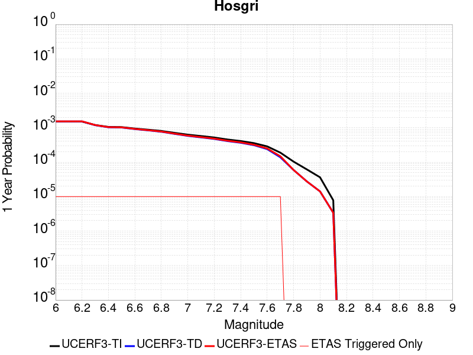 | 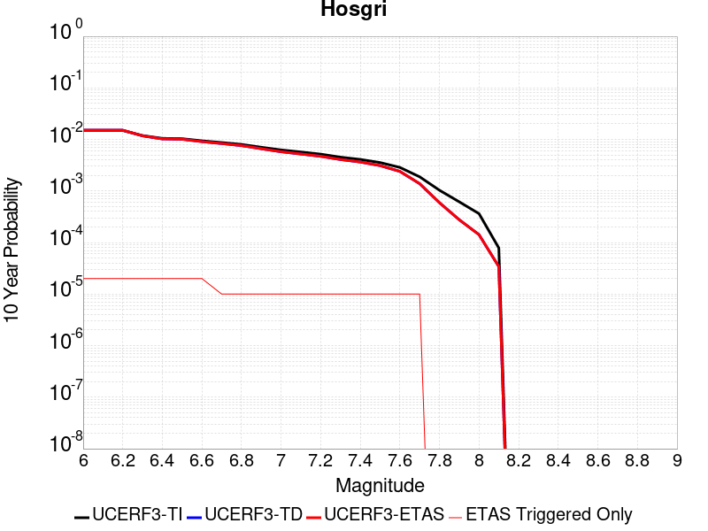 |

| Magnitude | 1 wk TI Prob | 1 wk TD Prob | 1 wk ETAS Prob | 1 wk ETAS/TD Gain | 1 wk ETAS Triggered Only | 1 mo TI Prob | 1 mo TD Prob | 1 mo ETAS Prob | 1 mo ETAS/TD Gain | 1 mo ETAS Triggered Only | 1 yr TI Prob | 1 yr TD Prob | 1 yr ETAS Prob | 1 yr ETAS/TD Gain | 1 yr ETAS Triggered Only | 10 yr TI Prob | 10 yr TD Prob | 10 yr ETAS Prob | 10 yr ETAS/TD Gain | 10 yr ETAS Triggered Only |
|-----|-----|-----|-----|-----|-----|-----|-----|-----|-----|-----|-----|-----|-----|-----|-----|-----|-----|-----|-----|-----|
| 6.0 | 2.883978E-5 | 2.9128829E-5 | 2.9128829E-5 | 1.0 | 0.0 | 1.235932E-4 | 1.2483202E-4 | 1.2483202E-4 | 1.0 | 0.0 | 0.0015037085 | 0.0015187975 | 0.0015287822 | 1.0065742 | 1.0E-5 | 0.01493574 | 0.015087952 | 0.01510765 | 1.0013056 | 2.0E-5 |
| 6.1 | 2.883978E-5 | 2.9128829E-5 | 2.9128829E-5 | 1.0 | 0.0 | 1.235932E-4 | 1.2483202E-4 | 1.2483202E-4 | 1.0 | 0.0 | 0.0015037085 | 0.0015187975 | 0.0015287822 | 1.0065742 | 1.0E-5 | 0.01493574 | 0.015087952 | 0.01510765 | 1.0013056 | 2.0E-5 |
| 6.2 | 2.883978E-5 | 2.9128829E-5 | 2.9128829E-5 | 1.0 | 0.0 | 1.235932E-4 | 1.2483202E-4 | 1.2483202E-4 | 1.0 | 0.0 | 0.0015037085 | 0.0015187975 | 0.0015287822 | 1.0065742 | 1.0E-5 | 0.01493574 | 0.015087952 | 0.01510765 | 1.0013056 | 2.0E-5 |
| 6.3 | 2.2914428E-5 | 2.26423E-5 | 2.26423E-5 | 1.0 | 0.0 | 9.8200995E-5 | 9.703485E-5 | 9.703485E-5 | 1.0 | 0.0 | 0.0011949413 | 0.0011807639 | 0.0011907521 | 1.0084591 | 1.0E-5 | 0.011885363 | 0.011746303 | 0.011766069 | 1.0016826 | 2.0E-5 |
| 6.4 | 2.0195741E-5 | 1.9696858E-5 | 1.9696858E-5 | 1.0 | 0.0 | 8.65503E-5 | 8.4412386E-5 | 8.4412386E-5 | 1.0 | 0.0 | 0.0010532405 | 0.0010272382 | 0.0010372279 | 1.0097249 | 1.0E-5 | 0.010482626 | 0.010225947 | 0.010245742 | 1.0019358 | 2.0E-5 |
| 6.5 | 1.9924333E-5 | 1.9409275E-5 | 1.9409275E-5 | 1.0 | 0.0 | 8.53872E-5 | 8.317997E-5 | 8.317997E-5 | 1.0 | 0.0 | 0.0010390934 | 0.0010122475 | 0.0010222375 | 1.009869 | 1.0E-5 | 0.010342481 | 0.010077406 | 0.010097205 | 1.0019647 | 2.0E-5 |
| 6.6 | 1.809694E-5 | 1.7458577E-5 | 1.7458577E-5 | 1.0 | 0.0 | 7.7556004E-5 | 7.482033E-5 | 7.482033E-5 | 1.0 | 0.0 | 9.438353E-4 | 9.1055816E-4 | 9.2054904E-4 | 1.0109723 | 1.0E-5 | 0.009398366 | 0.009069216 | 0.009089035 | 1.0021852 | 2.0E-5 |
| 6.7 | 1.675989E-5 | 1.6043028E-5 | 1.6043028E-5 | 1.0 | 0.0 | 7.182612E-5 | 6.875403E-5 | 6.875403E-5 | 1.0 | 0.0 | 8.7413215E-4 | 8.3676E-4 | 8.467516E-4 | 1.0119408 | 1.0E-5 | 0.008707017 | 0.008337 | 0.008346916 | 1.0011895 | 1.0E-5 |
| 6.8 | 1.5401129E-5 | 1.4614334E-5 | 1.4614334E-5 | 1.0 | 0.0 | 6.6003166E-5 | 6.263136E-5 | 6.263136E-5 | 1.0 | 0.0 | 8.032922E-4 | 7.622709E-4 | 7.722633E-4 | 1.0131087 | 1.0E-5 | 0.008003947 | 0.0075974264 | 0.0076073506 | 1.0013062 | 1.0E-5 |
| 6.9 | 1.356559E-5 | 1.2690202E-5 | 1.2690202E-5 | 1.0 | 0.0 | 5.8136946E-5 | 5.4385448E-5 | 5.4385448E-5 | 1.0 | 0.0 | 7.0758746E-4 | 6.619421E-4 | 6.719355E-4 | 1.015097 | 1.0E-5 | 0.007053386 | 0.00660051 | 0.006610444 | 1.001505 | 1.0E-5 |
| 7.0 | 1.2030819E-5 | 1.1096183E-5 | 1.1096183E-5 | 1.0 | 0.0 | 5.155963E-5 | 4.75542E-5 | 4.75542E-5 | 1.0 | 0.0 | 6.275577E-4 | 5.788187E-4 | 5.888129E-4 | 1.0172665 | 1.0E-5 | 0.006257884 | 0.005773872 | 0.0057838145 | 1.001722 | 1.0E-5 |
| 7.1 | 1.0972698E-5 | 1.0022392E-5 | 1.0022392E-5 | 1.0 | 0.0 | 4.7025E-5 | 4.29524E-5 | 4.29524E-5 | 1.0 | 0.0 | 5.72379E-4 | 5.228201E-4 | 5.328149E-4 | 1.019117 | 1.0E-5 | 0.0057090693 | 0.005216653 | 0.005226601 | 1.001907 | 1.0E-5 |
| 7.2 | 9.961926E-6 | 9.034952E-6 | 9.034952E-6 | 1.0 | 0.0 | 4.2693267E-5 | 3.872065E-5 | 3.872065E-5 | 1.0 | 0.0 | 5.1966653E-4 | 4.7132198E-4 | 4.8131726E-4 | 1.021207 | 1.0E-5 | 0.00518453 | 0.00470397 | 0.004713923 | 1.0021158 | 1.0E-5 |
| 7.3 | 8.700929E-6 | 7.828299E-6 | 7.828299E-6 | 1.0 | 0.0 | 3.7289166E-5 | 3.3549422E-5 | 3.3549422E-5 | 1.0 | 0.0 | 4.53901E-4 | 4.0838768E-4 | 4.183836E-4 | 1.0244765 | 1.0E-5 | 0.00452975 | 0.0040771114 | 0.004087071 | 1.0024427 | 1.0E-5 |
| 7.4 | 7.866285E-6 | 6.998933E-6 | 6.998933E-6 | 1.0 | 0.0 | 3.3712215E-5 | 2.999508E-5 | 2.999508E-5 | 1.0 | 0.0 | 4.103689E-4 | 3.6512894E-4 | 3.751253E-4 | 1.0273776 | 1.0E-5 | 0.004096119 | 0.0036460275 | 0.003655991 | 1.0027328 | 1.0E-5 |
| 7.5 | 6.8381305E-6 | 5.959883E-6 | 5.959883E-6 | 1.0 | 0.0 | 2.9305946E-5 | 2.5542106E-5 | 2.5542106E-5 | 1.0 | 0.0 | 3.5674145E-4 | 3.1093077E-4 | 3.2092768E-4 | 1.0321515 | 1.0E-5 | 0.0035616932 | 0.0031056926 | 0.0031156614 | 1.00321 | 1.0E-5 |
| 7.6 | 5.503376E-6 | 4.5954234E-6 | 4.5954234E-6 | 1.0 | 0.0 | 2.3585684E-5 | 1.9694522E-5 | 1.9694522E-5 | 1.0 | 0.0 | 2.8711787E-4 | 2.3975444E-4 | 2.4975205E-4 | 1.0416993 | 1.0E-5 | 0.002867472 | 0.002395691 | 0.002405667 | 1.0041642 | 1.0E-5 |
| 7.7 | 3.6144982E-6 | 2.6523774E-6 | 2.6523774E-6 | 1.0 | 0.0 | 1.5490614E-5 | 1.1367281E-5 | 1.1367281E-5 | 1.0 | 0.0 | 1.8858191E-4 | 1.3838787E-4 | 1.4838649E-4 | 1.0722507 | 1.0E-5 | 0.0018842196 | 0.0013837481 | 0.0013937344 | 1.0072167 | 1.0E-5 |
| 7.8 | 1.9853494E-6 | 1.1362536E-6 | 1.1362536E-6 | 1.0 | 0.0 | 8.508612E-6 | 4.8696493E-6 | 4.8696493E-6 | 1.0 | 0.0 | 1.0358743E-4 | 5.9286365E-5 | 5.9286365E-5 | 1.0 | 0.0 | 0.0010353916 | 5.934354E-4 | 5.934354E-4 | 1.0 | 0.0 |
| 7.9 | 1.1818757E-6 | 5.2963003E-7 | 5.2963003E-7 | 1.0 | 0.0 | 5.0651715E-6 | 2.269841E-6 | 2.269841E-6 | 1.0 | 0.0 | 6.1666724E-5 | 2.7634964E-5 | 2.7634964E-5 | 1.0 | 0.0 | 6.1649614E-4 | 2.7700354E-4 | 2.7700354E-4 | 1.0 | 0.0 |
| 8.0 | 6.962958E-7 | 2.7147578E-7 | 2.7147578E-7 | 1.0 | 0.0 | 2.9841215E-6 | 1.163467E-6 | 1.163467E-6 | 1.0 | 0.0 | 3.6331072E-5 | 1.4165119E-5 | 1.4165119E-5 | 1.0 | 0.0 | 3.6325134E-4 | 1.4221264E-4 | 1.4221264E-4 | 1.0 | 0.0 |
| 8.1 | 1.5033264E-7 | 6.529188E-8 | 6.529188E-8 | 1.0 | 0.0 | 6.442826E-7 | 2.798223E-7 | 2.798223E-7 | 1.0 | 0.0 | 7.844113E-6 | 3.4068314E-6 | 3.4068314E-6 | 1.0 | 0.0 | 7.843835E-5 | 3.4085097E-5 | 3.4085097E-5 | 1.0 | 0.0 |

## Hunting Creek - Berryessa 2011 CFM
*[(top)](#table-of-contents)*

| 1 Week | 1 Month | 1 Year | 10 Year |
|-----|-----|-----|-----|
| 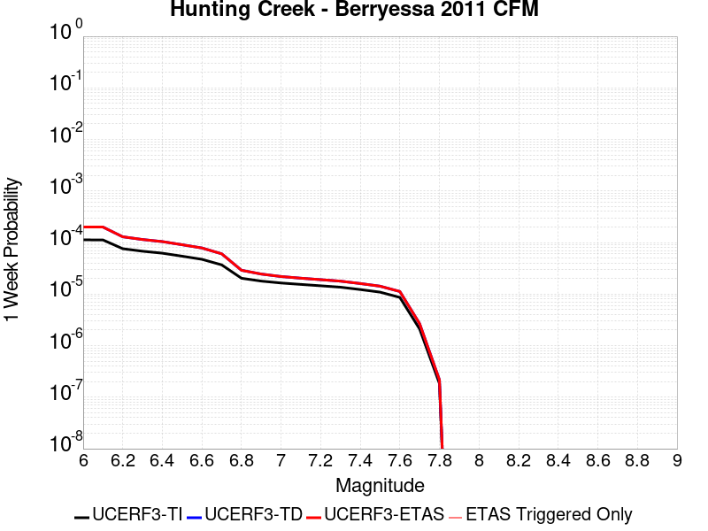 | 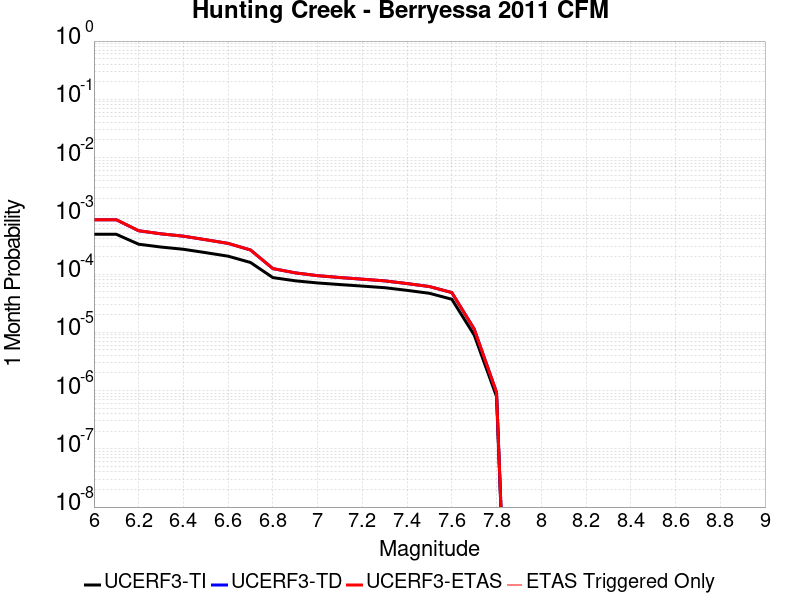 |  |  |

| Magnitude | 1 wk TI Prob | 1 wk TD Prob | 1 wk ETAS Prob | 1 wk ETAS/TD Gain | 1 wk ETAS Triggered Only | 1 mo TI Prob | 1 mo TD Prob | 1 mo ETAS Prob | 1 mo ETAS/TD Gain | 1 mo ETAS Triggered Only | 1 yr TI Prob | 1 yr TD Prob | 1 yr ETAS Prob | 1 yr ETAS/TD Gain | 1 yr ETAS Triggered Only | 10 yr TI Prob | 10 yr TD Prob | 10 yr ETAS Prob | 10 yr ETAS/TD Gain | 10 yr ETAS Triggered Only |
|-----|-----|-----|-----|-----|-----|-----|-----|-----|-----|-----|-----|-----|-----|-----|-----|-----|-----|-----|-----|-----|
| 6.0 | 1.1270982E-4 | 2.0014354E-4 | 2.0014354E-4 | 1.0 | 0.0 | 4.8295266E-4 | 8.574329E-4 | 8.574329E-4 | 1.0 | 0.0 | 0.0058641075 | 0.010387073 | 0.010387073 | 1.0 | 0.0 | 0.057117578 | 0.09804065 | 0.09805869 | 1.0001839 | 2.0E-5 |
| 6.1 | 1.1239393E-4 | 1.9962489E-4 | 1.9962489E-4 | 1.0 | 0.0 | 4.8159933E-4 | 8.552116E-4 | 8.552116E-4 | 1.0 | 0.0 | 0.0058477195 | 0.010360309 | 0.010360309 | 1.0 | 0.0 | 0.056962132 | 0.09779912 | 0.09781717 | 1.0001845 | 2.0E-5 |
| 6.2 | 7.596265E-5 | 1.2941175E-4 | 1.2941175E-4 | 1.0 | 0.0 | 3.2551357E-4 | 5.544276E-4 | 5.544276E-4 | 1.0 | 0.0 | 0.0039559277 | 0.0067212153 | 0.0067212153 | 1.0 | 0.0 | 0.038862433 | 0.0645938 | 0.06461251 | 1.0002897 | 2.0E-5 |
| 6.3 | 6.78794E-5 | 1.145196E-4 | 1.145196E-4 | 1.0 | 0.0 | 2.9087928E-4 | 4.9066654E-4 | 4.9066654E-4 | 1.0 | 0.0 | 0.003535705 | 0.0059528556 | 0.0059528556 | 1.0 | 0.0 | 0.034799766 | 0.05746746 | 0.05748631 | 1.0003281 | 2.0E-5 |
| 6.4 | 6.2165134E-5 | 1.0437306E-4 | 1.0437306E-4 | 1.0 | 0.0 | 2.6639478E-4 | 4.4723987E-4 | 4.4723987E-4 | 1.0 | 0.0 | 0.0032385332 | 0.005427739 | 0.005427739 | 1.0 | 0.0 | 0.03191742 | 0.052552443 | 0.052571394 | 1.0003606 | 2.0E-5 |
| 6.5 | 5.4368087E-5 | 9.071981E-5 | 9.071981E-5 | 1.0 | 0.0 | 2.3298527E-4 | 3.887444E-4 | 3.887444E-4 | 1.0 | 0.0 | 0.0028329059 | 0.004720021 | 0.004720021 | 1.0 | 0.0 | 0.027970633 | 0.045881823 | 0.045891363 | 1.0002079 | 1.0E-5 |
| 6.6 | 4.729947E-5 | 7.848042E-5 | 7.848042E-5 | 1.0 | 0.0 | 2.0269625E-4 | 3.363043E-4 | 3.363043E-4 | 1.0 | 0.0 | 0.002465034 | 0.0040850975 | 0.0040850975 | 1.0 | 0.0 | 0.02437869 | 0.039853033 | 0.039862636 | 1.0002409 | 1.0E-5 |
| 6.7 | 3.6875328E-5 | 6.0455113E-5 | 6.0455113E-5 | 1.0 | 0.0 | 1.5802756E-4 | 2.5907016E-4 | 2.5907016E-4 | 1.0 | 0.0 | 0.0019222875 | 0.0031483201 | 0.0031483201 | 1.0 | 0.0 | 0.019057442 | 0.030893533 | 0.030893533 | 1.0 | 0.0 |
| 6.8 | 2.0292036E-5 | 2.897696E-5 | 2.897696E-5 | 1.0 | 0.0 | 8.6962966E-5 | 1.241811E-4 | 1.241811E-4 | 1.0 | 0.0 | 0.0010582599 | 0.00151084 | 0.00151084 | 1.0 | 0.0 | 0.010532344 | 0.014978847 | 0.014978847 | 1.0 | 0.0 |
| 6.9 | 1.7871042E-5 | 2.4472789E-5 | 2.4472789E-5 | 1.0 | 0.0 | 7.658793E-5 | 1.048792E-4 | 1.048792E-4 | 1.0 | 0.0 | 9.320591E-4 | 0.0012761577 | 0.0012761577 | 1.0 | 0.0 | 0.009281595 | 0.012680048 | 0.012680048 | 1.0 | 0.0 |
| 7.0 | 1.6415532E-5 | 2.1906764E-5 | 2.1906764E-5 | 1.0 | 0.0 | 7.035038E-5 | 9.388277E-5 | 9.388277E-5 | 1.0 | 0.0 | 8.561793E-4 | 0.0011424269 | 0.0011424269 | 1.0 | 0.0 | 0.008528882 | 0.011364769 | 0.011364769 | 1.0 | 0.0 |
| 7.1 | 1.5409885E-5 | 2.03468E-5 | 2.03468E-5 | 1.0 | 0.0 | 6.6040695E-5 | 8.719768E-5 | 8.719768E-5 | 1.0 | 0.0 | 8.0374884E-4 | 0.0010611176 | 0.0010611176 | 1.0 | 0.0 | 0.00800848 | 0.010560832 | 0.010560832 | 1.0 | 0.0 |
| 7.2 | 1.4497423E-5 | 1.905539E-5 | 1.905539E-5 | 1.0 | 0.0 | 6.213033E-5 | 8.166341E-5 | 8.166341E-5 | 1.0 | 0.0 | 7.5617427E-4 | 9.938016E-4 | 9.938016E-4 | 1.0 | 0.0 | 0.0075360634 | 0.009894148 | 0.009894148 | 1.0 | 0.0 |
| 7.3 | 1.3615175E-5 | 1.7826538E-5 | 1.7826538E-5 | 1.0 | 0.0 | 5.8349444E-5 | 7.639723E-5 | 7.639723E-5 | 1.0 | 0.0 | 7.101729E-4 | 9.2974224E-4 | 9.2974224E-4 | 1.0 | 0.0 | 0.0070790765 | 0.009259034 | 0.009259034 | 1.0 | 0.0 |
| 7.4 | 1.2252825E-5 | 1.6026612E-5 | 1.6026612E-5 | 1.0 | 0.0 | 5.251105E-5 | 6.868369E-5 | 6.868369E-5 | 1.0 | 0.0 | 6.391345E-4 | 8.359059E-4 | 8.359059E-4 | 1.0 | 0.0 | 0.0063729943 | 0.008328059 | 0.008328059 | 1.0 | 0.0 |
| 7.5 | 1.0913301E-5 | 1.4241439E-5 | 1.4241439E-5 | 1.0 | 0.0 | 4.6770452E-5 | 6.103333E-5 | 6.103333E-5 | 1.0 | 0.0 | 5.6928146E-4 | 7.4283016E-4 | 7.4283016E-4 | 1.0 | 0.0 | 0.0056782532 | 0.0074038464 | 0.0074038464 | 1.0 | 0.0 |
| 7.6 | 8.623192E-6 | 1.1234897E-5 | 1.1234897E-5 | 1.0 | 0.0 | 3.6956015E-5 | 4.8148686E-5 | 4.8148686E-5 | 1.0 | 0.0 | 4.4984656E-4 | 5.860551E-4 | 5.860551E-4 | 1.0 | 0.0 | 0.00448937 | 0.0058454107 | 0.0058454107 | 1.0 | 0.0 |
| 7.7 | 2.0993634E-6 | 2.6626365E-6 | 2.6626365E-6 | 1.0 | 0.0 | 8.997241E-6 | 1.141125E-5 | 1.141125E-5 | 1.0 | 0.0 | 1.09535904E-4 | 1.3892318E-4 | 1.3892318E-4 | 1.0 | 0.0 | 0.0010948193 | 0.0013883698 | 0.0013883698 | 1.0 | 0.0 |
| 7.8 | 1.8428308E-7 | 2.167475E-7 | 2.167475E-7 | 1.0 | 0.0 | 7.897844E-7 | 9.2891753E-7 | 9.2891753E-7 | 1.0 | 0.0 | 9.615583E-6 | 1.1309516E-5 | 1.1309516E-5 | 1.0 | 0.0 | 9.615166E-5 | 1.13088005E-4 | 1.13088005E-4 | 1.0 | 0.0 |

## Surprise Valley 2011 CFM
*[(top)](#table-of-contents)*

| 1 Week | 1 Month | 1 Year | 10 Year |
|-----|-----|-----|-----|
| 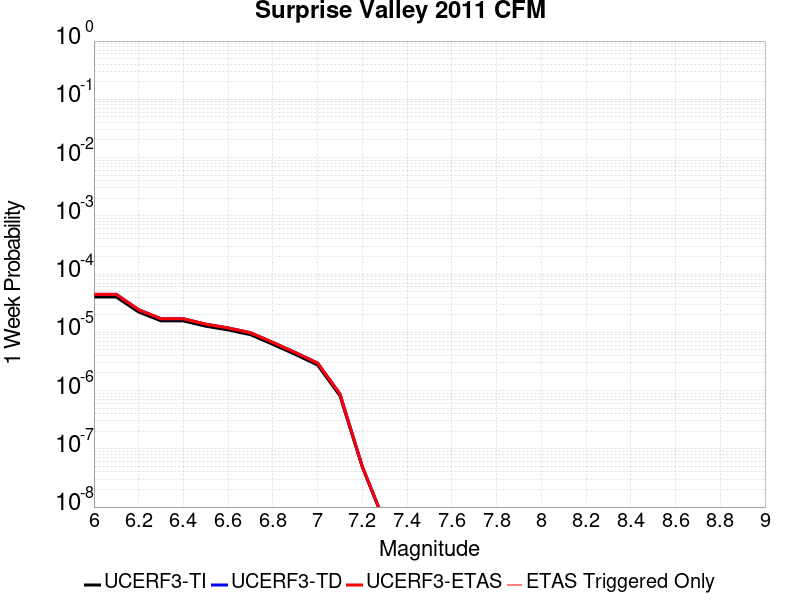 |  |  | 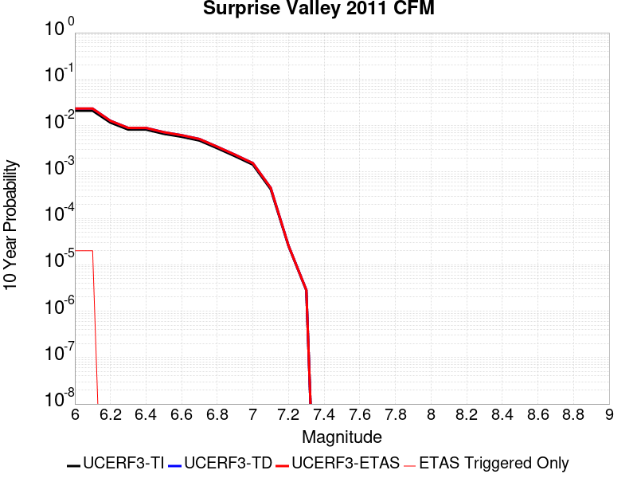 |

| Magnitude | 1 wk TI Prob | 1 wk TD Prob | 1 wk ETAS Prob | 1 wk ETAS/TD Gain | 1 wk ETAS Triggered Only | 1 mo TI Prob | 1 mo TD Prob | 1 mo ETAS Prob | 1 mo ETAS/TD Gain | 1 mo ETAS Triggered Only | 1 yr TI Prob | 1 yr TD Prob | 1 yr ETAS Prob | 1 yr ETAS/TD Gain | 1 yr ETAS Triggered Only | 10 yr TI Prob | 10 yr TD Prob | 10 yr ETAS Prob | 10 yr ETAS/TD Gain | 10 yr ETAS Triggered Only |
|-----|-----|-----|-----|-----|-----|-----|-----|-----|-----|-----|-----|-----|-----|-----|-----|-----|-----|-----|-----|-----|
| 6.0 | 4.0396248E-5 | 4.485197E-5 | 4.485197E-5 | 1.0 | 0.0 | 1.7311527E-4 | 1.9220974E-4 | 1.9220974E-4 | 1.0 | 0.0 | 0.002105641 | 0.002337852 | 0.0023478286 | 1.0042675 | 1.0E-5 | 0.020858008 | 0.023154303 | 0.02317384 | 1.0008438 | 2.0E-5 |
| 6.1 | 4.0396248E-5 | 4.485197E-5 | 4.485197E-5 | 1.0 | 0.0 | 1.7311527E-4 | 1.9220974E-4 | 1.9220974E-4 | 1.0 | 0.0 | 0.002105641 | 0.002337852 | 0.0023478286 | 1.0042675 | 1.0E-5 | 0.020858008 | 0.023154303 | 0.02317384 | 1.0008438 | 2.0E-5 |
| 6.2 | 2.2295266E-5 | 2.4401555E-5 | 2.4401555E-5 | 1.0 | 0.0 | 9.554764E-5 | 1.0457408E-4 | 1.0457408E-4 | 1.0 | 0.0 | 0.0011626717 | 0.0012724766 | 0.0012724766 | 1.0 | 0.0 | 0.011566074 | 0.012655139 | 0.012655139 | 1.0 | 0.0 |
| 6.3 | 1.572643E-5 | 1.7097005E-5 | 1.7097005E-5 | 1.0 | 0.0 | 6.7397246E-5 | 7.327088E-5 | 7.327088E-5 | 1.0 | 0.0 | 8.202525E-4 | 8.917184E-4 | 8.917184E-4 | 1.0 | 0.0 | 0.008172315 | 0.00888251 | 0.00888251 | 1.0 | 0.0 |
| 6.4 | 1.5714395E-5 | 1.7084827E-5 | 1.7084827E-5 | 1.0 | 0.0 | 6.734567E-5 | 7.321869E-5 | 7.321869E-5 | 1.0 | 0.0 | 8.1962504E-4 | 8.910835E-4 | 8.910835E-4 | 1.0 | 0.0 | 0.008166086 | 0.008876211 | 0.008876211 | 1.0 | 0.0 |
| 6.5 | 1.2733495E-5 | 1.3801754E-5 | 1.3801754E-5 | 1.0 | 0.0 | 5.457098E-5 | 5.914907E-5 | 5.914907E-5 | 1.0 | 0.0 | 6.641992E-4 | 7.199087E-4 | 7.199087E-4 | 1.0 | 0.0 | 0.0066221743 | 0.0071764593 | 0.0071764593 | 1.0 | 0.0 |
| 6.6 | 1.0983784E-5 | 1.1886684E-5 | 1.1886684E-5 | 1.0 | 0.0 | 4.7072506E-5 | 5.0941966E-5 | 5.0941966E-5 | 1.0 | 0.0 | 5.7295704E-4 | 6.2004727E-4 | 6.2004727E-4 | 1.0 | 0.0 | 0.0057148207 | 0.006183722 | 0.006183722 | 1.0 | 0.0 |
| 6.7 | 9.104806E-6 | 9.839597E-6 | 9.839597E-6 | 1.0 | 0.0 | 3.902001E-5 | 4.2169042E-5 | 4.2169042E-5 | 1.0 | 0.0 | 4.7496508E-4 | 5.1329104E-4 | 5.1329104E-4 | 1.0 | 0.0 | 0.004739512 | 0.005121452 | 0.005121452 | 1.0 | 0.0 |
| 6.8 | 6.2162403E-6 | 6.7042038E-6 | 6.7042038E-6 | 1.0 | 0.0 | 2.6640759E-5 | 2.8731998E-5 | 2.8731998E-5 | 1.0 | 0.0 | 3.2430296E-4 | 3.4975816E-4 | 3.4975816E-4 | 1.0 | 0.0 | 0.003238301 | 0.0034923002 | 0.0034923002 | 1.0 | 0.0 |
| 6.9 | 4.1792696E-6 | 4.5032766E-6 | 4.5032766E-6 | 1.0 | 0.0 | 1.7911032E-5 | 1.9299621E-5 | 1.9299621E-5 | 1.0 | 0.0 | 2.1804498E-4 | 2.3494911E-4 | 2.3494911E-4 | 1.0 | 0.0 | 0.0021783116 | 0.0023471604 | 0.0023471604 | 1.0 | 0.0 |
| 7.0 | 2.7478413E-6 | 2.9622734E-6 | 2.9622734E-6 | 1.0 | 0.0 | 1.177641E-5 | 1.2695402E-5 | 1.2695402E-5 | 1.0 | 0.0 | 1.4336836E-4 | 1.5455681E-4 | 1.5455681E-4 | 1.0 | 0.0 | 0.001432759 | 0.0015446156 | 0.0015446156 | 1.0 | 0.0 |
| 7.1 | 8.128648E-7 | 8.725007E-7 | 8.725007E-7 | 1.0 | 0.0 | 3.4837017E-6 | 3.739287E-6 | 3.739287E-6 | 1.0 | 0.0 | 4.2413245E-5 | 4.5525467E-5 | 4.5525467E-5 | 1.0 | 0.0 | 4.2405148E-4 | 4.5522023E-4 | 4.5522023E-4 | 1.0 | 0.0 |
| 7.2 | 4.8641045E-8 | 4.9402168E-8 | 4.9402168E-8 | 1.0 | 0.0 | 2.084616E-7 | 2.1172356E-7 | 2.1172356E-7 | 1.0 | 0.0 | 2.538017E-6 | 2.5777315E-6 | 2.5777315E-6 | 1.0 | 0.0 | 2.537988E-5 | 2.5777028E-5 | 2.5777028E-5 | 1.0 | 0.0 |
| 7.3 | 5.3911844E-9 | 5.4758256E-9 | 5.4758256E-9 | 1.0 | 0.0 | 2.3105075E-8 | 2.3467823E-8 | 2.3467823E-8 | 1.0 | 0.0 | 2.8130427E-7 | 2.8572074E-7 | 2.8572074E-7 | 1.0 | 0.0 | 2.8130391E-6 | 2.8572053E-6 | 2.8572053E-6 | 1.0 | 0.0 |

## Oak Ridge (Onshore)
*[(top)](#table-of-contents)*

| 1 Week | 1 Month | 1 Year | 10 Year |
|-----|-----|-----|-----|
|  |  |  |  |

| Magnitude | 1 wk TI Prob | 1 wk TD Prob | 1 wk ETAS Prob | 1 wk ETAS/TD Gain | 1 wk ETAS Triggered Only | 1 mo TI Prob | 1 mo TD Prob | 1 mo ETAS Prob | 1 mo ETAS/TD Gain | 1 mo ETAS Triggered Only | 1 yr TI Prob | 1 yr TD Prob | 1 yr ETAS Prob | 1 yr ETAS/TD Gain | 1 yr ETAS Triggered Only | 10 yr TI Prob | 10 yr TD Prob | 10 yr ETAS Prob | 10 yr ETAS/TD Gain | 10 yr ETAS Triggered Only |
|-----|-----|-----|-----|-----|-----|-----|-----|-----|-----|-----|-----|-----|-----|-----|-----|-----|-----|-----|-----|-----|
| 6.0 | 3.155064E-5 | 2.952645E-5 | 2.952645E-5 | 1.0 | 0.0 | 1.3521002E-4 | 1.26536E-4 | 1.26536E-4 | 1.0 | 0.0 | 0.001644939 | 0.0015395252 | 0.0015495098 | 1.0064855 | 1.0E-5 | 0.01632816 | 0.015293104 | 0.015312798 | 1.0012878 | 2.0E-5 |
| 6.1 | 3.155064E-5 | 2.952645E-5 | 2.952645E-5 | 1.0 | 0.0 | 1.3521002E-4 | 1.26536E-4 | 1.26536E-4 | 1.0 | 0.0 | 0.001644939 | 0.0015395252 | 0.0015495098 | 1.0064855 | 1.0E-5 | 0.01632816 | 0.015293104 | 0.015312798 | 1.0012878 | 2.0E-5 |
| 6.2 | 3.155064E-5 | 2.952645E-5 | 2.952645E-5 | 1.0 | 0.0 | 1.3521002E-4 | 1.26536E-4 | 1.26536E-4 | 1.0 | 0.0 | 0.001644939 | 0.0015395252 | 0.0015495098 | 1.0064855 | 1.0E-5 | 0.01632816 | 0.015293104 | 0.015312798 | 1.0012878 | 2.0E-5 |
| 6.3 | 3.155064E-5 | 2.952645E-5 | 2.952645E-5 | 1.0 | 0.0 | 1.3521002E-4 | 1.26536E-4 | 1.26536E-4 | 1.0 | 0.0 | 0.001644939 | 0.0015395252 | 0.0015495098 | 1.0064855 | 1.0E-5 | 0.01632816 | 0.015293104 | 0.015312798 | 1.0012878 | 2.0E-5 |
| 6.4 | 3.155064E-5 | 2.952645E-5 | 2.952645E-5 | 1.0 | 0.0 | 1.3521002E-4 | 1.26536E-4 | 1.26536E-4 | 1.0 | 0.0 | 0.001644939 | 0.0015395252 | 0.0015495098 | 1.0064855 | 1.0E-5 | 0.01632816 | 0.015293104 | 0.015312798 | 1.0012878 | 2.0E-5 |
| 6.5 | 3.155064E-5 | 2.952645E-5 | 2.952645E-5 | 1.0 | 0.0 | 1.3521002E-4 | 1.26536E-4 | 1.26536E-4 | 1.0 | 0.0 | 0.001644939 | 0.0015395252 | 0.0015495098 | 1.0064855 | 1.0E-5 | 0.01632816 | 0.015293104 | 0.015312798 | 1.0012878 | 2.0E-5 |
| 6.6 | 3.155064E-5 | 2.952645E-5 | 2.952645E-5 | 1.0 | 0.0 | 1.3521002E-4 | 1.26536E-4 | 1.26536E-4 | 1.0 | 0.0 | 0.001644939 | 0.0015395252 | 0.0015495098 | 1.0064855 | 1.0E-5 | 0.01632816 | 0.015293104 | 0.015312798 | 1.0012878 | 2.0E-5 |
| 6.7 | 3.098897E-5 | 2.8864635E-5 | 2.8864635E-5 | 1.0 | 0.0 | 1.328031E-4 | 1.2369992E-4 | 1.2369992E-4 | 1.0 | 0.0 | 0.0016156785 | 0.0015050438 | 0.0015150288 | 1.0066344 | 1.0E-5 | 0.016039822 | 0.014952951 | 0.014972651 | 1.0013175 | 2.0E-5 |
| 6.8 | 3.0449872E-5 | 2.823982E-5 | 2.823982E-5 | 1.0 | 0.0 | 1.3049292E-4 | 1.2102239E-4 | 1.2102239E-4 | 1.0 | 0.0 | 0.0015875935 | 0.001472489 | 0.0014824743 | 1.0067812 | 1.0E-5 | 0.015762992 | 0.014631692 | 0.014651399 | 1.001347 | 2.0E-5 |
| 6.9 | 2.697928E-5 | 2.4220137E-5 | 2.4220137E-5 | 1.0 | 0.0 | 1.15620365E-4 | 1.0379658E-4 | 1.0379658E-4 | 1.0 | 0.0 | 0.0014067689 | 0.0012630123 | 0.0012729996 | 1.0079076 | 1.0E-5 | 0.0139789665 | 0.012561057 | 0.012580805 | 1.0015723 | 2.0E-5 |
| 7.0 | 2.4893961E-5 | 2.1862359E-5 | 2.1862359E-5 | 1.0 | 0.0 | 1.0668404E-4 | 9.369256E-5 | 9.369256E-5 | 1.0 | 0.0 | 0.0012981043 | 0.0011401277 | 0.0011501163 | 1.0087609 | 1.0E-5 | 0.012905477 | 0.011345069 | 0.011364842 | 1.0017428 | 2.0E-5 |
| 7.1 | 2.0945363E-5 | 1.7354718E-5 | 1.7354718E-5 | 1.0 | 0.0 | 8.976275E-5 | 7.437527E-5 | 7.437527E-5 | 1.0 | 0.0 | 0.0010923136 | 9.051474E-4 | 9.1513834E-4 | 1.011038 | 1.0E-5 | 0.0108696 | 0.009015542 | 0.009025452 | 1.0010992 | 1.0E-5 |
| 7.2 | 2.0439404E-5 | 1.6809645E-5 | 1.6809645E-5 | 1.0 | 0.0 | 8.7594504E-5 | 7.2039365E-5 | 7.2039365E-5 | 1.0 | 0.0 | 0.0010659413 | 8.7673106E-4 | 8.867223E-4 | 1.011396 | 1.0E-5 | 0.010608427 | 0.00873364 | 0.0087435525 | 1.001135 | 1.0E-5 |
| 7.3 | 1.8463334E-5 | 1.5382002E-5 | 1.5382002E-5 | 1.0 | 0.0 | 7.912617E-5 | 6.5921224E-5 | 6.5921224E-5 | 1.0 | 0.0 | 9.6293533E-4 | 8.0229976E-4 | 8.1229175E-4 | 1.0124542 | 1.0E-5 | 0.009587734 | 0.007994897 | 0.008004816 | 1.0012408 | 1.0E-5 |
| 7.4 | 1.763139E-5 | 1.4517013E-5 | 1.4517013E-5 | 1.0 | 0.0 | 7.556091E-5 | 6.221431E-5 | 6.221431E-5 | 1.0 | 0.0 | 9.1956573E-4 | 7.5719994E-4 | 7.6719234E-4 | 1.0131966 | 1.0E-5 | 0.009157699 | 0.007547003 | 0.007556928 | 1.001315 | 1.0E-5 |
| 7.5 | 1.3594944E-5 | 1.1163477E-5 | 1.1163477E-5 | 1.0 | 0.0 | 5.8262744E-5 | 4.7842612E-5 | 4.7842612E-5 | 1.0 | 0.0 | 7.0911803E-4 | 5.823306E-4 | 5.823306E-4 | 1.0 | 0.0 | 0.007068595 | 0.0058083185 | 0.0058083185 | 1.0 | 0.0 |
| 7.6 | 6.9889534E-6 | 5.6367617E-6 | 5.6367617E-6 | 1.0 | 0.0 | 2.9952313E-5 | 2.4157329E-5 | 2.4157329E-5 | 1.0 | 0.0 | 3.646084E-4 | 2.940762E-4 | 2.940762E-4 | 1.0 | 0.0 | 0.0036401073 | 0.0029369146 | 0.0029369146 | 1.0 | 0.0 |
| 7.7 | 4.0824193E-6 | 3.2832884E-6 | 3.2832884E-6 | 1.0 | 0.0 | 1.7495966E-5 | 1.4071161E-5 | 1.4071161E-5 | 1.0 | 0.0 | 2.1299256E-4 | 1.7130304E-4 | 1.7130304E-4 | 1.0 | 0.0 | 0.0021278851 | 0.0017117234 | 0.0017117234 | 1.0 | 0.0 |
| 7.8 | 1.7023609E-6 | 1.4370602E-6 | 1.4370602E-6 | 1.0 | 0.0 | 7.295812E-6 | 6.158815E-6 | 6.158815E-6 | 1.0 | 0.0 | 8.882289E-5 | 7.498102E-5 | 7.498102E-5 | 1.0 | 0.0 | 8.8787393E-4 | 7.4956E-4 | 7.4956E-4 | 1.0 | 0.0 |
| 7.9 | 2.721225E-7 | 2.2616715E-7 | 2.2616715E-7 | 1.0 | 0.0 | 1.1662388E-6 | 9.692874E-7 | 9.692874E-7 | 1.0 | 0.0 | 1.4198865E-5 | 1.1801013E-5 | 1.1801013E-5 | 1.0 | 0.0 | 1.4197957E-4 | 1.1800414E-4 | 1.1800414E-4 | 1.0 | 0.0 |
| 8.0 | 9.364255E-9 | 5.1209232E-9 | 5.1209232E-9 | 1.0 | 0.0 | 4.0132523E-8 | 2.1946814E-8 | 2.1946814E-8 | 1.0 | 0.0 | 4.8861335E-7 | 2.6720244E-7 | 2.6720244E-7 | 1.0 | 0.0 | 4.8861225E-6 | 2.6720215E-6 | 2.6720215E-6 | 1.0 | 0.0 |

## Oceanside alt1
*[(top)](#table-of-contents)*

| 1 Week | 1 Month | 1 Year | 10 Year |
|-----|-----|-----|-----|
|  | 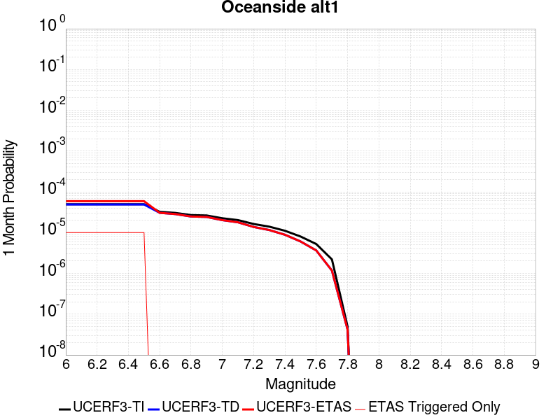 | 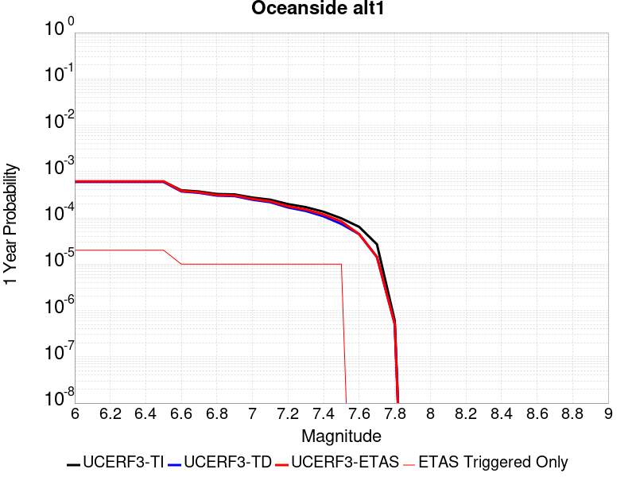 | 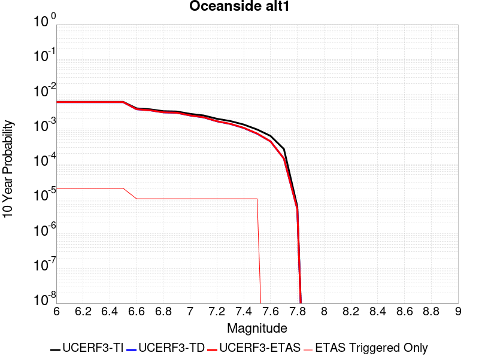 |

| Magnitude | 1 wk TI Prob | 1 wk TD Prob | 1 wk ETAS Prob | 1 wk ETAS/TD Gain | 1 wk ETAS Triggered Only | 1 mo TI Prob | 1 mo TD Prob | 1 mo ETAS Prob | 1 mo ETAS/TD Gain | 1 mo ETAS Triggered Only | 1 yr TI Prob | 1 yr TD Prob | 1 yr ETAS Prob | 1 yr ETAS/TD Gain | 1 yr ETAS Triggered Only | 10 yr TI Prob | 10 yr TD Prob | 10 yr ETAS Prob | 10 yr ETAS/TD Gain | 10 yr ETAS Triggered Only |
|-----|-----|-----|-----|-----|-----|-----|-----|-----|-----|-----|-----|-----|-----|-----|-----|-----|-----|-----|-----|-----|
| 6.0 | 1.1617542E-5 | 1.142357E-5 | 1.142357E-5 | 1.0 | 0.0 | 4.9788516E-5 | 4.895733E-5 | 5.895684E-5 | 1.2042495 | 1.0E-5 | 6.060066E-4 | 5.9590855E-4 | 6.1589666E-4 | 1.0335422 | 2.0E-5 | 0.0060435664 | 0.0059447046 | 0.0059645856 | 1.0033443 | 2.0E-5 |
| 6.1 | 1.1617542E-5 | 1.142357E-5 | 1.142357E-5 | 1.0 | 0.0 | 4.9788516E-5 | 4.895733E-5 | 5.895684E-5 | 1.2042495 | 1.0E-5 | 6.060066E-4 | 5.9590855E-4 | 6.1589666E-4 | 1.0335422 | 2.0E-5 | 0.0060435664 | 0.0059447046 | 0.0059645856 | 1.0033443 | 2.0E-5 |
| 6.2 | 1.1617542E-5 | 1.142357E-5 | 1.142357E-5 | 1.0 | 0.0 | 4.9788516E-5 | 4.895733E-5 | 5.895684E-5 | 1.2042495 | 1.0E-5 | 6.060066E-4 | 5.9590855E-4 | 6.1589666E-4 | 1.0335422 | 2.0E-5 | 0.0060435664 | 0.0059447046 | 0.0059645856 | 1.0033443 | 2.0E-5 |
| 6.3 | 1.1617542E-5 | 1.142357E-5 | 1.142357E-5 | 1.0 | 0.0 | 4.9788516E-5 | 4.895733E-5 | 5.895684E-5 | 1.2042495 | 1.0E-5 | 6.060066E-4 | 5.9590855E-4 | 6.1589666E-4 | 1.0335422 | 2.0E-5 | 0.0060435664 | 0.0059447046 | 0.0059645856 | 1.0033443 | 2.0E-5 |
| 6.4 | 1.1617542E-5 | 1.142357E-5 | 1.142357E-5 | 1.0 | 0.0 | 4.9788516E-5 | 4.895733E-5 | 5.895684E-5 | 1.2042495 | 1.0E-5 | 6.060066E-4 | 5.9590855E-4 | 6.1589666E-4 | 1.0335422 | 2.0E-5 | 0.0060435664 | 0.0059447046 | 0.0059645856 | 1.0033443 | 2.0E-5 |
| 6.5 | 1.1617542E-5 | 1.142357E-5 | 1.142357E-5 | 1.0 | 0.0 | 4.9788516E-5 | 4.895733E-5 | 5.895684E-5 | 1.2042495 | 1.0E-5 | 6.060066E-4 | 5.9590855E-4 | 6.1589666E-4 | 1.0335422 | 2.0E-5 | 0.0060435664 | 0.0059447046 | 0.0059645856 | 1.0033443 | 2.0E-5 |
| 6.6 | 7.561768E-6 | 7.1336603E-6 | 7.1336603E-6 | 1.0 | 0.0 | 3.2407173E-5 | 3.057248E-5 | 3.057248E-5 | 1.0 | 0.0 | 3.9448592E-4 | 3.7215743E-4 | 3.821537E-4 | 1.0268604 | 1.0E-5 | 0.0039378637 | 0.0037154534 | 0.0037254163 | 1.0026815 | 1.0E-5 |
| 6.7 | 7.1042605E-6 | 6.6557277E-6 | 6.6557277E-6 | 1.0 | 0.0 | 3.0446476E-5 | 2.852424E-5 | 2.852424E-5 | 1.0 | 0.0 | 3.706228E-4 | 3.4722808E-4 | 3.572246E-4 | 1.0287895 | 1.0E-5 | 0.0037000529 | 0.0034669389 | 0.0034769042 | 1.0028744 | 1.0E-5 |
| 6.8 | 6.285554E-6 | 5.7997427E-6 | 5.7997427E-6 | 1.0 | 0.0 | 2.693781E-5 | 2.4855806E-5 | 2.4855806E-5 | 1.0 | 0.0 | 3.2791847E-4 | 3.0257797E-4 | 3.1257494E-4 | 1.0330393 | 1.0E-5 | 0.0032743502 | 0.0030217173 | 0.003031687 | 1.0032994 | 1.0E-5 |
| 6.9 | 6.148883E-6 | 5.6565805E-6 | 5.6565805E-6 | 1.0 | 0.0 | 2.635209E-5 | 2.4242265E-5 | 2.4242265E-5 | 1.0 | 0.0 | 3.2078946E-4 | 2.9511016E-4 | 3.051072E-4 | 1.0338757 | 1.0E-5 | 0.003203268 | 0.0029472397 | 0.0029572102 | 1.003383 | 1.0E-5 |
| 7.0 | 5.253857E-6 | 4.7224344E-6 | 4.7224344E-6 | 1.0 | 0.0 | 2.2516335E-5 | 2.023885E-5 | 2.023885E-5 | 1.0 | 0.0 | 2.7410188E-4 | 2.4638043E-4 | 2.5637797E-4 | 1.0405777 | 1.0E-5 | 0.0027376404 | 0.0024611044 | 0.0024710798 | 1.0040532 | 1.0E-5 |
| 7.1 | 4.730754E-6 | 4.1785374E-6 | 4.1785374E-6 | 1.0 | 0.0 | 2.0274503E-5 | 1.7907896E-5 | 1.7907896E-5 | 1.0 | 0.0 | 2.468141E-4 | 2.1800707E-4 | 2.280049E-4 | 1.04586 | 1.0E-5 | 0.0024654015 | 0.0021779586 | 0.0021879368 | 1.0045815 | 1.0E-5 |
| 7.2 | 3.7998386E-6 | 3.2140474E-6 | 3.2140474E-6 | 1.0 | 0.0 | 1.6284921E-5 | 1.3774416E-5 | 1.3774416E-5 | 1.0 | 0.0 | 1.9825088E-4 | 1.6769074E-4 | 1.7768906E-4 | 1.0596236 | 1.0E-5 | 0.001980741 | 0.0016756542 | 0.0016856375 | 1.0059578 | 1.0E-5 |
| 7.3 | 3.2656465E-6 | 2.6983946E-6 | 2.6983946E-6 | 1.0 | 0.0 | 1.3995553E-5 | 1.1564497E-5 | 1.1564497E-5 | 1.0 | 0.0 | 1.7038253E-4 | 1.4078878E-4 | 1.5078737E-4 | 1.0710183 | 1.0E-5 | 0.0017025196 | 0.0014070069 | 0.0014169929 | 1.0070972 | 1.0E-5 |
| 7.4 | 2.593703E-6 | 2.068043E-6 | 2.068043E-6 | 1.0 | 0.0 | 1.1115822E-5 | 8.863011E-6 | 8.863011E-6 | 1.0 | 0.0 | 1.3532673E-4 | 1.07901906E-4 | 1.17900825E-4 | 1.0926667 | 1.0E-5 | 0.0013524436 | 0.001078504 | 0.0010884933 | 1.0092621 | 1.0E-5 |
| 7.5 | 1.8715585E-6 | 1.4137245E-6 | 1.4137245E-6 | 1.0 | 0.0 | 8.020941E-6 | 6.0588054E-6 | 6.0588054E-6 | 1.0 | 0.0 | 9.7650576E-5 | 7.376352E-5 | 8.376278E-5 | 1.1355584 | 1.0E-5 | 9.7607676E-4 | 7.373964E-4 | 7.4738904E-4 | 1.0135512 | 1.0E-5 |
| 7.6 | 1.2246786E-6 | 8.5268715E-7 | 8.5268715E-7 | 1.0 | 0.0 | 5.248612E-6 | 3.6543686E-6 | 3.6543686E-6 | 1.0 | 0.0 | 6.389998E-5 | 4.4491073E-5 | 4.4491073E-5 | 1.0 | 0.0 | 6.3881604E-4 | 4.4482618E-4 | 4.4482618E-4 | 1.0 | 0.0 |
| 7.7 | 5.140719E-7 | 2.7347338E-7 | 2.7347338E-7 | 1.0 | 0.0 | 2.2031636E-6 | 1.1720283E-6 | 1.1720283E-6 | 1.0 | 0.0 | 2.6823185E-5 | 1.4269365E-5 | 1.4269365E-5 | 1.0 | 0.0 | 2.6819948E-4 | 1.4268584E-4 | 1.4268584E-4 | 1.0 | 0.0 |
| 7.8 | 1.16056995E-8 | 9.782392E-9 | 9.782392E-9 | 1.0 | 0.0 | 4.9738713E-8 | 4.1924537E-8 | 4.1924537E-8 | 1.0 | 0.0 | 6.0556863E-7 | 5.104312E-7 | 5.104312E-7 | 1.0 | 0.0 | 6.05567E-6 | 5.104312E-6 | 5.104312E-6 | 1.0 | 0.0 |

## Santa Susana alt 1
*[(top)](#table-of-contents)*

| 1 Week | 1 Month | 1 Year | 10 Year |
|-----|-----|-----|-----|
| 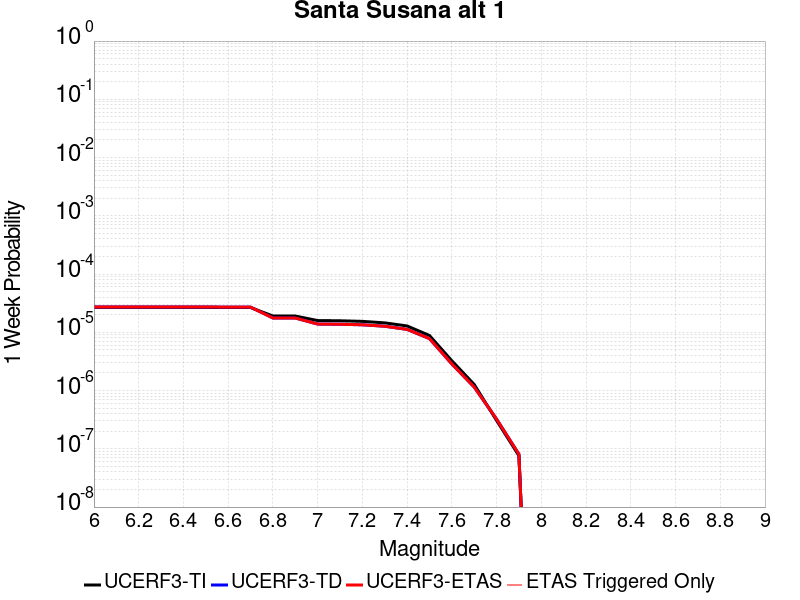 | 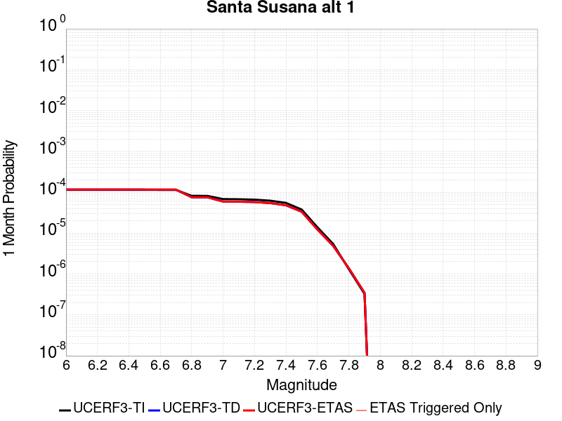 | 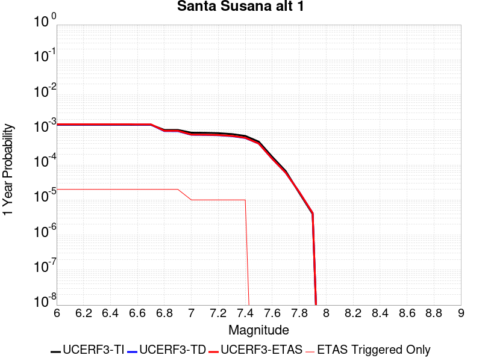 | 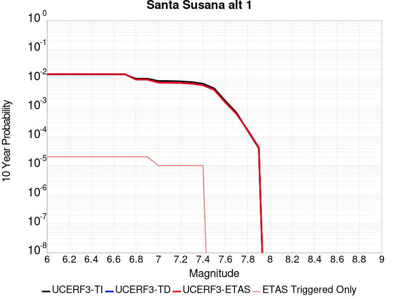 |

| Magnitude | 1 wk TI Prob | 1 wk TD Prob | 1 wk ETAS Prob | 1 wk ETAS/TD Gain | 1 wk ETAS Triggered Only | 1 mo TI Prob | 1 mo TD Prob | 1 mo ETAS Prob | 1 mo ETAS/TD Gain | 1 mo ETAS Triggered Only | 1 yr TI Prob | 1 yr TD Prob | 1 yr ETAS Prob | 1 yr ETAS/TD Gain | 1 yr ETAS Triggered Only | 10 yr TI Prob | 10 yr TD Prob | 10 yr ETAS Prob | 10 yr ETAS/TD Gain | 10 yr ETAS Triggered Only |
|-----|-----|-----|-----|-----|-----|-----|-----|-----|-----|-----|-----|-----|-----|-----|-----|-----|-----|-----|-----|-----|
| 6.0 | 2.674877E-5 | 2.7198636E-5 | 2.7198636E-5 | 1.0 | 0.0 | 1.1463255E-4 | 1.16561016E-4 | 1.16561016E-4 | 1.0 | 0.0 | 0.0013947578 | 0.0014183201 | 0.0014382917 | 1.0140812 | 2.0E-5 | 0.013860362 | 0.014104444 | 0.014124162 | 1.001398 | 2.0E-5 |
| 6.1 | 2.674877E-5 | 2.7198636E-5 | 2.7198636E-5 | 1.0 | 0.0 | 1.1463255E-4 | 1.16561016E-4 | 1.16561016E-4 | 1.0 | 0.0 | 0.0013947578 | 0.0014183201 | 0.0014382917 | 1.0140812 | 2.0E-5 | 0.013860362 | 0.014104444 | 0.014124162 | 1.001398 | 2.0E-5 |
| 6.2 | 2.674877E-5 | 2.7198636E-5 | 2.7198636E-5 | 1.0 | 0.0 | 1.1463255E-4 | 1.16561016E-4 | 1.16561016E-4 | 1.0 | 0.0 | 0.0013947578 | 0.0014183201 | 0.0014382917 | 1.0140812 | 2.0E-5 | 0.013860362 | 0.014104444 | 0.014124162 | 1.001398 | 2.0E-5 |
| 6.3 | 2.674877E-5 | 2.7198636E-5 | 2.7198636E-5 | 1.0 | 0.0 | 1.1463255E-4 | 1.16561016E-4 | 1.16561016E-4 | 1.0 | 0.0 | 0.0013947578 | 0.0014183201 | 0.0014382917 | 1.0140812 | 2.0E-5 | 0.013860362 | 0.014104444 | 0.014124162 | 1.001398 | 2.0E-5 |
| 6.4 | 2.674877E-5 | 2.7198636E-5 | 2.7198636E-5 | 1.0 | 0.0 | 1.1463255E-4 | 1.16561016E-4 | 1.16561016E-4 | 1.0 | 0.0 | 0.0013947578 | 0.0014183201 | 0.0014382917 | 1.0140812 | 2.0E-5 | 0.013860362 | 0.014104444 | 0.014124162 | 1.001398 | 2.0E-5 |
| 6.5 | 2.674877E-5 | 2.7198636E-5 | 2.7198636E-5 | 1.0 | 0.0 | 1.1463255E-4 | 1.16561016E-4 | 1.16561016E-4 | 1.0 | 0.0 | 0.0013947578 | 0.0014183201 | 0.0014382917 | 1.0140812 | 2.0E-5 | 0.013860362 | 0.014104444 | 0.014124162 | 1.001398 | 2.0E-5 |
| 6.6 | 2.6647976E-5 | 2.707497E-5 | 2.707497E-5 | 1.0 | 0.0 | 1.14200615E-4 | 1.16031064E-4 | 1.16031064E-4 | 1.0 | 0.0 | 0.0013895056 | 0.0014118766 | 0.0014318484 | 1.0141455 | 2.0E-5 | 0.013808494 | 0.014040828 | 0.014060547 | 1.0014044 | 2.0E-5 |
| 6.7 | 2.6647976E-5 | 2.707497E-5 | 2.707497E-5 | 1.0 | 0.0 | 1.14200615E-4 | 1.16031064E-4 | 1.16031064E-4 | 1.0 | 0.0 | 0.0013895056 | 0.0014118766 | 0.0014318484 | 1.0141455 | 2.0E-5 | 0.013808494 | 0.014040828 | 0.014060547 | 1.0014044 | 2.0E-5 |
| 6.8 | 1.9073179E-5 | 1.7637585E-5 | 1.7637585E-5 | 1.0 | 0.0 | 8.1739636E-5 | 7.5587566E-5 | 7.5587566E-5 | 1.0 | 0.0 | 9.947256E-4 | 9.199082E-4 | 9.398898E-4 | 1.0217212 | 2.0E-5 | 0.009902848 | 0.009163258 | 0.009183074 | 1.0021626 | 2.0E-5 |
| 6.9 | 1.9041876E-5 | 1.7619717E-5 | 1.7619717E-5 | 1.0 | 0.0 | 8.160549E-5 | 7.551099E-5 | 7.551099E-5 | 1.0 | 0.0 | 9.930939E-4 | 9.189767E-4 | 9.389583E-4 | 1.0217433 | 2.0E-5 | 0.0098866755 | 0.009154019 | 0.009173836 | 1.0021648 | 2.0E-5 |
| 7.0 | 1.5917482E-5 | 1.3864059E-5 | 1.3864059E-5 | 1.0 | 0.0 | 6.8215995E-5 | 5.941607E-5 | 5.941607E-5 | 1.0 | 0.0 | 8.302132E-4 | 7.231552E-4 | 7.3314796E-4 | 1.0138183 | 1.0E-5 | 0.008271185 | 0.007208915 | 0.007218843 | 1.0013772 | 1.0E-5 |
| 7.1 | 1.577788E-5 | 1.3744065E-5 | 1.3744065E-5 | 1.0 | 0.0 | 6.761774E-5 | 5.890183E-5 | 5.890183E-5 | 1.0 | 0.0 | 8.2293496E-4 | 7.168985E-4 | 7.268913E-4 | 1.013939 | 1.0E-5 | 0.008198941 | 0.0071467515 | 0.0071566803 | 1.0013893 | 1.0E-5 |
| 7.2 | 1.5416446E-5 | 1.3470131E-5 | 1.3470131E-5 | 1.0 | 0.0 | 6.606882E-5 | 5.7727884E-5 | 5.7727884E-5 | 1.0 | 0.0 | 8.0409093E-4 | 7.0261495E-4 | 7.126079E-4 | 1.0142225 | 1.0E-5 | 0.008011877 | 0.0070048203 | 0.0070147505 | 1.0014176 | 1.0E-5 |
| 7.3 | 1.4534083E-5 | 1.2718048E-5 | 1.2718048E-5 | 1.0 | 0.0 | 6.228744E-5 | 5.4504806E-5 | 5.4504806E-5 | 1.0 | 0.0 | 7.580857E-4 | 6.633984E-4 | 6.733918E-4 | 1.0150639 | 1.0E-5 | 0.007555048 | 0.006615032 | 0.006624966 | 1.0015017 | 1.0E-5 |
| 7.4 | 1.2858995E-5 | 1.1229788E-5 | 1.1229788E-5 | 1.0 | 0.0 | 5.5108816E-5 | 4.8126793E-5 | 4.8126793E-5 | 1.0 | 0.0 | 6.7074323E-4 | 5.8579014E-4 | 5.957843E-4 | 1.017061 | 1.0E-5 | 0.0066872234 | 0.0058432347 | 0.0058531766 | 1.0017014 | 1.0E-5 |
| 7.5 | 8.827668E-6 | 7.805538E-6 | 7.805538E-6 | 1.0 | 0.0 | 3.7832317E-5 | 3.345189E-5 | 3.345189E-5 | 1.0 | 0.0 | 4.605111E-4 | 4.0720313E-4 | 4.0720313E-4 | 1.0 | 0.0 | 0.0045955796 | 0.004064819 | 0.004064819 | 1.0 | 0.0 |
| 7.6 | 3.2533426E-6 | 2.872008E-6 | 2.872008E-6 | 1.0 | 0.0 | 1.3942822E-5 | 1.230855E-5 | 1.230855E-5 | 1.0 | 0.0 | 1.6974064E-4 | 1.4984666E-4 | 1.4984666E-4 | 1.0 | 0.0 | 0.0016961104 | 0.0014974931 | 0.0014974931 | 1.0 | 0.0 |
| 7.7 | 1.2751709E-6 | 1.1491198E-6 | 1.1491198E-6 | 1.0 | 0.0 | 5.4650063E-6 | 4.9247906E-6 | 4.9247906E-6 | 1.0 | 0.0 | 6.653442E-5 | 5.9957765E-5 | 5.9957765E-5 | 1.0 | 0.0 | 6.6514505E-4 | 5.994248E-4 | 5.994248E-4 | 1.0 | 0.0 |
| 7.8 | 3.067544E-7 | 3.240072E-7 | 3.240072E-7 | 1.0 | 0.0 | 1.3146611E-6 | 1.3886016E-6 | 1.3886016E-6 | 1.0 | 0.0 | 1.600588E-5 | 1.6906104E-5 | 1.6906104E-5 | 1.0 | 0.0 | 1.6004729E-4 | 1.690492E-4 | 1.690492E-4 | 1.0 | 0.0 |
| 7.9 | 7.622999E-8 | 8.088032E-8 | 8.088032E-8 | 1.0 | 0.0 | 3.2669993E-7 | 3.4662992E-7 | 3.4662992E-7 | 1.0 | 0.0 | 3.977564E-6 | 4.220213E-6 | 4.220213E-6 | 1.0 | 0.0 | 3.977493E-5 | 4.2201536E-5 | 4.2201536E-5 | 1.0 | 0.0 |

## Elysian Park (Upper)
*[(top)](#table-of-contents)*

| 1 Week | 1 Month | 1 Year | 10 Year |
|-----|-----|-----|-----|
|  |  |  |  |

| Magnitude | 1 wk TI Prob | 1 wk TD Prob | 1 wk ETAS Prob | 1 wk ETAS/TD Gain | 1 wk ETAS Triggered Only | 1 mo TI Prob | 1 mo TD Prob | 1 mo ETAS Prob | 1 mo ETAS/TD Gain | 1 mo ETAS Triggered Only | 1 yr TI Prob | 1 yr TD Prob | 1 yr ETAS Prob | 1 yr ETAS/TD Gain | 1 yr ETAS Triggered Only | 10 yr TI Prob | 10 yr TD Prob | 10 yr ETAS Prob | 10 yr ETAS/TD Gain | 10 yr ETAS Triggered Only |
|-----|-----|-----|-----|-----|-----|-----|-----|-----|-----|-----|-----|-----|-----|-----|-----|-----|-----|-----|-----|-----|
| 6.0 | 3.1876025E-5 | 3.703652E-5 | 3.703652E-5 | 1.0 | 0.0 | 1.3660437E-4 | 1.5872101E-4 | 1.6871943E-4 | 1.0629936 | 1.0E-5 | 0.0016618895 | 0.0019311584 | 0.001941139 | 1.0051682 | 1.0E-5 | 0.016495159 | 0.019190295 | 0.01920991 | 1.0010222 | 2.0E-5 |
| 6.1 | 3.1876025E-5 | 3.703652E-5 | 3.703652E-5 | 1.0 | 0.0 | 1.3660437E-4 | 1.5872101E-4 | 1.6871943E-4 | 1.0629936 | 1.0E-5 | 0.0016618895 | 0.0019311584 | 0.001941139 | 1.0051682 | 1.0E-5 | 0.016495159 | 0.019190295 | 0.01920991 | 1.0010222 | 2.0E-5 |
| 6.2 | 3.1876025E-5 | 3.703652E-5 | 3.703652E-5 | 1.0 | 0.0 | 1.3660437E-4 | 1.5872101E-4 | 1.6871943E-4 | 1.0629936 | 1.0E-5 | 0.0016618895 | 0.0019311584 | 0.001941139 | 1.0051682 | 1.0E-5 | 0.016495159 | 0.019190295 | 0.01920991 | 1.0010222 | 2.0E-5 |
| 6.3 | 3.1876025E-5 | 3.703652E-5 | 3.703652E-5 | 1.0 | 0.0 | 1.3660437E-4 | 1.5872101E-4 | 1.6871943E-4 | 1.0629936 | 1.0E-5 | 0.0016618895 | 0.0019311584 | 0.001941139 | 1.0051682 | 1.0E-5 | 0.016495159 | 0.019190295 | 0.01920991 | 1.0010222 | 2.0E-5 |
| 6.4 | 1.9273462E-5 | 2.120273E-5 | 2.120273E-5 | 1.0 | 0.0 | 8.259794E-5 | 9.0866655E-5 | 1.0086575E-4 | 1.1100414 | 1.0E-5 | 0.001005166 | 0.0011059135 | 0.0011159024 | 1.0090322 | 1.0E-5 | 0.010006315 | 0.011020964 | 0.011030854 | 1.0008974 | 1.0E-5 |
| 6.5 | 1.9273462E-5 | 2.120273E-5 | 2.120273E-5 | 1.0 | 0.0 | 8.259794E-5 | 9.0866655E-5 | 1.0086575E-4 | 1.1100414 | 1.0E-5 | 0.001005166 | 0.0011059135 | 0.0011159024 | 1.0090322 | 1.0E-5 | 0.010006315 | 0.011020964 | 0.011030854 | 1.0008974 | 1.0E-5 |
| 6.6 | 9.813258E-6 | 9.665728E-6 | 9.665728E-6 | 1.0 | 0.0 | 4.205614E-5 | 4.142393E-5 | 4.142393E-5 | 1.0 | 0.0 | 5.119132E-4 | 5.042269E-4 | 5.042269E-4 | 1.0 | 0.0 | 0.005107356 | 0.005031552 | 0.005031552 | 1.0 | 0.0 |
| 6.7 | 9.801478E-6 | 9.653297E-6 | 9.653297E-6 | 1.0 | 0.0 | 4.2005657E-5 | 4.137066E-5 | 4.137066E-5 | 1.0 | 0.0 | 5.112989E-4 | 5.0357863E-4 | 5.0357863E-4 | 1.0 | 0.0 | 0.0051012407 | 0.0050250986 | 0.0050250986 | 1.0 | 0.0 |
| 6.8 | 8.102489E-6 | 7.7731065E-6 | 7.7731065E-6 | 1.0 | 0.0 | 3.4724493E-5 | 3.3312917E-5 | 3.3312917E-5 | 1.0 | 0.0 | 4.2268867E-4 | 4.0551423E-4 | 4.0551423E-4 | 1.0 | 0.0 | 0.004218856 | 0.0040482366 | 0.0040482366 | 1.0 | 0.0 |
| 6.9 | 6.08275E-6 | 5.4815127E-6 | 5.4815127E-6 | 1.0 | 0.0 | 2.6068668E-5 | 2.349199E-5 | 2.349199E-5 | 1.0 | 0.0 | 3.173398E-4 | 2.8597823E-4 | 2.8597823E-4 | 1.0 | 0.0 | 0.0031688702 | 0.0028561796 | 0.0028561796 | 1.0 | 0.0 |
| 7.0 | 5.5995934E-6 | 4.982836E-6 | 4.982836E-6 | 1.0 | 0.0 | 2.3998036E-5 | 2.135484E-5 | 2.135484E-5 | 1.0 | 0.0 | 2.9213692E-4 | 2.599648E-4 | 2.599648E-4 | 1.0 | 0.0 | 0.0029175316 | 0.0025966743 | 0.0025966743 | 1.0 | 0.0 |
| 7.1 | 4.709881E-6 | 4.0874465E-6 | 4.0874465E-6 | 1.0 | 0.0 | 2.0185047E-5 | 1.7517514E-5 | 1.7517514E-5 | 1.0 | 0.0 | 2.4572524E-4 | 2.1325526E-4 | 2.1325526E-4 | 1.0 | 0.0 | 0.002454537 | 0.0021305475 | 0.0021305475 | 1.0 | 0.0 |
| 7.2 | 3.6063436E-6 | 2.9779865E-6 | 2.9779865E-6 | 1.0 | 0.0 | 1.5455667E-5 | 1.2762738E-5 | 1.2762738E-5 | 1.0 | 0.0 | 1.881565E-4 | 1.5537537E-4 | 1.5537537E-4 | 1.0 | 0.0 | 0.0018799726 | 0.0015526785 | 0.0015526785 | 1.0 | 0.0 |
| 7.3 | 2.471135E-6 | 2.0954842E-6 | 2.0954842E-6 | 1.0 | 0.0 | 1.0590536E-5 | 8.980616E-6 | 8.980616E-6 | 1.0 | 0.0 | 1.2893214E-4 | 1.0933358E-4 | 1.0933358E-4 | 1.0 | 0.0 | 0.0012885736 | 0.0010928052 | 0.0010928052 | 1.0 | 0.0 |
| 7.4 | 1.163943E-6 | 1.0275212E-6 | 1.0275212E-6 | 1.0 | 0.0 | 4.988318E-6 | 4.403655E-6 | 4.403655E-6 | 1.0 | 0.0 | 6.0731076E-5 | 5.3613214E-5 | 5.3613214E-5 | 1.0 | 0.0 | 6.071448E-4 | 5.3600577E-4 | 5.3600577E-4 | 1.0 | 0.0 |
| 7.5 | 4.99459E-7 | 4.9176606E-7 | 4.9176606E-7 | 1.0 | 0.0 | 2.140537E-6 | 2.107567E-6 | 2.107567E-6 | 1.0 | 0.0 | 2.6060725E-5 | 2.5659343E-5 | 2.5659343E-5 | 1.0 | 0.0 | 2.605767E-4 | 2.5656537E-4 | 2.5656537E-4 | 1.0 | 0.0 |
| 7.6 | 2.4667852E-7 | 2.4778674E-7 | 2.4778674E-7 | 1.0 | 0.0 | 1.0571932E-6 | 1.0619428E-6 | 1.0619428E-6 | 1.0 | 0.0 | 1.2871251E-5 | 1.2929081E-5 | 1.2929081E-5 | 1.0 | 0.0 | 1.2870505E-4 | 1.2928365E-4 | 1.2928365E-4 | 1.0 | 0.0 |
| 7.7 | 8.2312795E-8 | 7.386629E-8 | 7.386629E-8 | 1.0 | 0.0 | 3.527691E-7 | 3.1656978E-7 | 3.1656978E-7 | 1.0 | 0.0 | 4.294955E-6 | 3.8542316E-6 | 3.8542316E-6 | 1.0 | 0.0 | 4.2948723E-5 | 3.8541762E-5 | 3.8541762E-5 | 1.0 | 0.0 |
| 7.8 | 2.7819295E-8 | 1.7567322E-8 | 1.7567322E-8 | 1.0 | 0.0 | 1.1922555E-7 | 7.528852E-8 | 7.528852E-8 | 1.0 | 0.0 | 1.45157E-6 | 9.166375E-7 | 9.166375E-7 | 1.0 | 0.0 | 1.45156055E-5 | 9.166352E-6 | 9.166352E-6 | 1.0 | 0.0 |

## San Andreas (Santa Cruz Mts) 2011 CFM
*[(top)](#table-of-contents)*

| 1 Week | 1 Month | 1 Year | 10 Year |
|-----|-----|-----|-----|
|  |  | 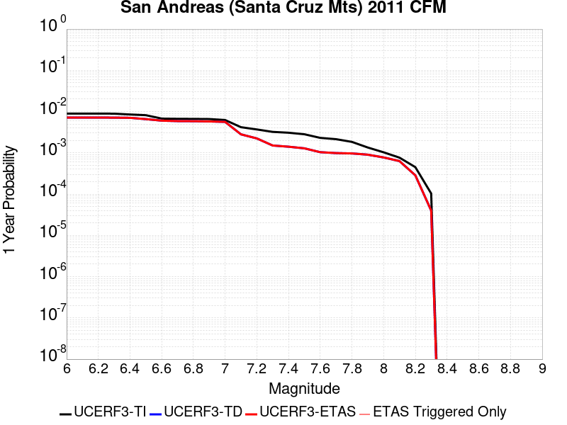 |  |

| Magnitude | 1 wk TI Prob | 1 wk TD Prob | 1 wk ETAS Prob | 1 wk ETAS/TD Gain | 1 wk ETAS Triggered Only | 1 mo TI Prob | 1 mo TD Prob | 1 mo ETAS Prob | 1 mo ETAS/TD Gain | 1 mo ETAS Triggered Only | 1 yr TI Prob | 1 yr TD Prob | 1 yr ETAS Prob | 1 yr ETAS/TD Gain | 1 yr ETAS Triggered Only | 10 yr TI Prob | 10 yr TD Prob | 10 yr ETAS Prob | 10 yr ETAS/TD Gain | 10 yr ETAS Triggered Only |
|-----|-----|-----|-----|-----|-----|-----|-----|-----|-----|-----|-----|-----|-----|-----|-----|-----|-----|-----|-----|-----|
| 6.0 | 1.7221631E-4 | 1.3800614E-4 | 1.3800614E-4 | 1.0 | 0.0 | 7.378611E-4 | 5.9132284E-4 | 5.9132284E-4 | 1.0 | 0.0 | 0.008946515 | 0.0071759806 | 0.0071759806 | 1.0 | 0.0 | 0.08594794 | 0.070589736 | 0.070608325 | 1.0002633 | 2.0E-5 |
| 6.1 | 1.7221631E-4 | 1.3800614E-4 | 1.3800614E-4 | 1.0 | 0.0 | 7.378611E-4 | 5.9132284E-4 | 5.9132284E-4 | 1.0 | 0.0 | 0.008946515 | 0.0071759806 | 0.0071759806 | 1.0 | 0.0 | 0.08594794 | 0.070589736 | 0.070608325 | 1.0002633 | 2.0E-5 |
| 6.2 | 1.7221631E-4 | 1.3800614E-4 | 1.3800614E-4 | 1.0 | 0.0 | 7.378611E-4 | 5.9132284E-4 | 5.9132284E-4 | 1.0 | 0.0 | 0.008946515 | 0.0071759806 | 0.0071759806 | 1.0 | 0.0 | 0.08594794 | 0.070589736 | 0.070608325 | 1.0002633 | 2.0E-5 |
| 6.3 | 1.716926E-4 | 1.3720038E-4 | 1.3720038E-4 | 1.0 | 0.0 | 7.3561794E-4 | 5.878712E-4 | 5.878712E-4 | 1.0 | 0.0 | 0.008919428 | 0.0071342313 | 0.0071342313 | 1.0 | 0.0 | 0.08569809 | 0.07020187 | 0.07022046 | 1.0002649 | 2.0E-5 |
| 6.4 | 1.6392978E-4 | 1.3595779E-4 | 1.3595779E-4 | 1.0 | 0.0 | 7.02367E-4 | 5.8254815E-4 | 5.8254815E-4 | 1.0 | 0.0 | 0.008517839 | 0.007069845 | 0.007069845 | 1.0 | 0.0 | 0.08198654 | 0.06943514 | 0.06945375 | 1.000268 | 2.0E-5 |
| 6.5 | 1.5742714E-4 | 1.2655502E-4 | 1.2655502E-4 | 1.0 | 0.0 | 6.745133E-4 | 5.422677E-4 | 5.422677E-4 | 1.0 | 0.0 | 0.00818132 | 0.0065824483 | 0.0065824483 | 1.0 | 0.0 | 0.078865945 | 0.064896256 | 0.064914964 | 1.0002881 | 2.0E-5 |
| 6.6 | 1.3038084E-4 | 1.1594853E-4 | 1.1594853E-4 | 1.0 | 0.0 | 5.5865536E-4 | 4.968289E-4 | 4.968289E-4 | 1.0 | 0.0 | 0.006780438 | 0.0060323575 | 0.0060323575 | 1.0 | 0.0 | 0.0657725 | 0.059357777 | 0.05937659 | 1.000317 | 2.0E-5 |
| 6.7 | 1.2867592E-4 | 1.1321309E-4 | 1.1321309E-4 | 1.0 | 0.0 | 5.5135164E-4 | 4.8511004E-4 | 4.8511004E-4 | 1.0 | 0.0 | 0.0066920654 | 0.005890459 | 0.005890459 | 1.0 | 0.0 | 0.06494093 | 0.058068715 | 0.058087554 | 1.0003244 | 2.0E-5 |
| 6.8 | 1.2801298E-4 | 1.1258862E-4 | 1.1258862E-4 | 1.0 | 0.0 | 5.485117E-4 | 4.824347E-4 | 4.824347E-4 | 1.0 | 0.0 | 0.0066577005 | 0.0058580628 | 0.0058580628 | 1.0 | 0.0 | 0.06461738 | 0.057782546 | 0.05780139 | 1.0003262 | 2.0E-5 |
| 6.9 | 1.269149E-4 | 1.1101053E-4 | 1.1101053E-4 | 1.0 | 0.0 | 5.4380763E-4 | 4.7567394E-4 | 4.7567394E-4 | 1.0 | 0.0 | 0.006600777 | 0.0057761897 | 0.0057761897 | 1.0 | 0.0 | 0.06408122 | 0.05705434 | 0.0570732 | 1.0003306 | 2.0E-5 |
| 7.0 | 1.2030331E-4 | 1.0831018E-4 | 1.0831018E-4 | 1.0 | 0.0 | 5.154837E-4 | 4.641052E-4 | 4.641052E-4 | 1.0 | 0.0 | 0.006257969 | 0.0056360774 | 0.0056360774 | 1.0 | 0.0 | 0.06084648 | 0.055726517 | 0.055745404 | 1.0003389 | 2.0E-5 |
| 7.1 | 8.049617E-5 | 5.3976473E-5 | 5.3976473E-5 | 1.0 | 0.0 | 3.4493793E-4 | 2.3130744E-4 | 2.3130744E-4 | 1.0 | 0.0 | 0.0041915346 | 0.002812566 | 0.002812566 | 1.0 | 0.0 | 0.041133516 | 0.02964314 | 0.02966255 | 1.0006547 | 2.0E-5 |
| 7.2 | 7.093979E-5 | 4.298351E-5 | 4.298351E-5 | 1.0 | 0.0 | 3.0399222E-4 | 1.8420216E-4 | 1.8420216E-4 | 1.0 | 0.0 | 0.0036948253 | 0.0022403775 | 0.0022403775 | 1.0 | 0.0 | 0.03633994 | 0.023964057 | 0.023983577 | 1.0008146 | 2.0E-5 |
| 7.3 | 6.193693E-5 | 2.8926645E-5 | 2.8926645E-5 | 1.0 | 0.0 | 2.6541698E-4 | 1.2396545E-4 | 1.2396545E-4 | 1.0 | 0.0 | 0.0032266637 | 0.0015082362 | 0.0015082362 | 1.0 | 0.0 | 0.031802133 | 0.016516065 | 0.0165259 | 1.0005955 | 1.0E-5 |
| 7.4 | 5.906492E-5 | 2.7052607E-5 | 2.7052607E-5 | 1.0 | 0.0 | 2.5311083E-4 | 1.159346E-4 | 1.159346E-4 | 1.0 | 0.0 | 0.0030772698 | 0.0014105912 | 0.0014105912 | 1.0 | 0.0 | 0.030350044 | 0.01548636 | 0.015496205 | 1.0006357 | 1.0E-5 |
| 7.5 | 5.424296E-5 | 2.4703162E-5 | 2.4703162E-5 | 1.0 | 0.0 | 2.324491E-4 | 1.05866406E-4 | 1.05866406E-4 | 1.0 | 0.0 | 0.002826395 | 0.0012881625 | 0.0012881625 | 1.0 | 0.0 | 0.027907165 | 0.014176421 | 0.014186279 | 1.0006953 | 1.0E-5 |
| 7.6 | 4.43084E-5 | 1.9920975E-5 | 1.9920975E-5 | 1.0 | 0.0 | 1.8987931E-4 | 8.537281E-5 | 8.537281E-5 | 1.0 | 0.0 | 0.0023093296 | 0.0010389186 | 0.0010389186 | 1.0 | 0.0 | 0.022854783 | 0.011421678 | 0.011431564 | 1.0008656 | 1.0E-5 |
| 7.7 | 4.118098E-5 | 1.8952078E-5 | 1.8952078E-5 | 1.0 | 0.0 | 1.7647797E-4 | 8.122066E-5 | 8.122066E-5 | 1.0 | 0.0 | 0.002146502 | 9.884132E-4 | 9.884132E-4 | 1.0 | 0.0 | 0.021258866 | 0.010878919 | 0.010888809 | 1.0009092 | 1.0E-5 |
| 7.8 | 3.5408906E-5 | 1.8579587E-5 | 1.8579587E-5 | 1.0 | 0.0 | 1.5174363E-4 | 7.962437E-5 | 7.962437E-5 | 1.0 | 0.0 | 0.0018459131 | 9.6899585E-4 | 9.6899585E-4 | 1.0 | 0.0 | 0.018306552 | 0.010660154 | 0.010670047 | 1.000928 | 1.0E-5 |
| 7.9 | 2.5860836E-5 | 1.732955E-5 | 1.732955E-5 | 1.0 | 0.0 | 1.10827445E-4 | 7.426739E-5 | 7.426739E-5 | 1.0 | 0.0 | 0.001348489 | 9.038306E-4 | 9.038306E-4 | 1.0 | 0.0 | 0.013403354 | 0.009914779 | 0.00992468 | 1.0009986 | 1.0E-5 |
| 8.0 | 1.9777332E-5 | 1.4851258E-5 | 1.4851258E-5 | 1.0 | 0.0 | 8.4757245E-5 | 6.36467E-5 | 6.36467E-5 | 1.0 | 0.0 | 0.0010314309 | 7.7462324E-4 | 7.7462324E-4 | 1.0 | 0.0 | 0.010266567 | 0.008515148 | 0.008525063 | 1.0011644 | 1.0E-5 |
| 8.1 | 1.468494E-5 | 1.2116955E-5 | 1.2116955E-5 | 1.0 | 0.0 | 6.293394E-5 | 5.1928775E-5 | 5.1928775E-5 | 1.0 | 0.0 | 7.6595135E-4 | 6.3204963E-4 | 6.3204963E-4 | 1.0 | 0.0 | 0.0076331664 | 0.006974249 | 0.006974249 | 1.0 | 0.0 |
| 8.2 | 8.63836E-6 | 5.4740453E-6 | 5.4740453E-6 | 1.0 | 0.0 | 3.7021015E-5 | 2.3459983E-5 | 2.3459983E-5 | 1.0 | 0.0 | 4.5063766E-4 | 2.8558794E-4 | 2.8558794E-4 | 1.0 | 0.0 | 0.004497249 | 0.0032484138 | 0.0032484138 | 1.0 | 0.0 |
| 8.3 | 1.983087E-6 | 7.668296E-7 | 7.668296E-7 | 1.0 | 0.0 | 8.498917E-6 | 3.2864084E-6 | 3.2864084E-6 | 1.0 | 0.0 | 1.034694E-4 | 4.0011306E-5 | 4.0011306E-5 | 1.0 | 0.0 | 0.0010342124 | 4.724499E-4 | 4.724499E-4 | 1.0 | 0.0 |

## Trinidad (alt1)
*[(top)](#table-of-contents)*

| 1 Week | 1 Month | 1 Year | 10 Year |
|-----|-----|-----|-----|
| 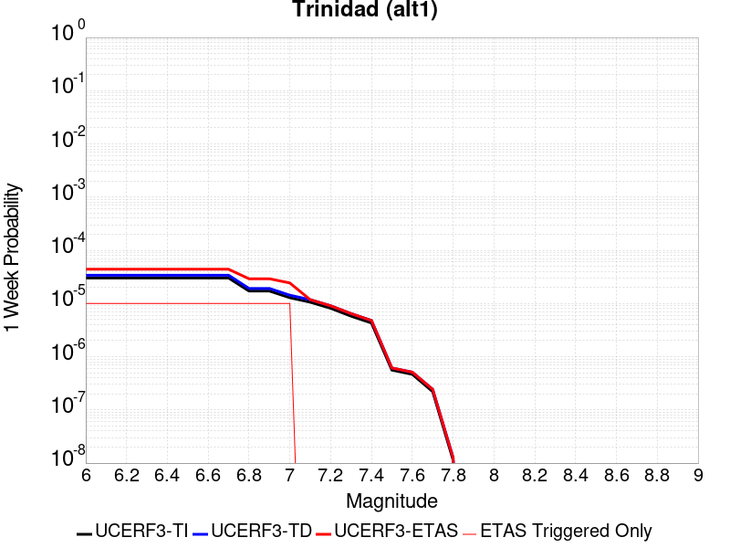 | 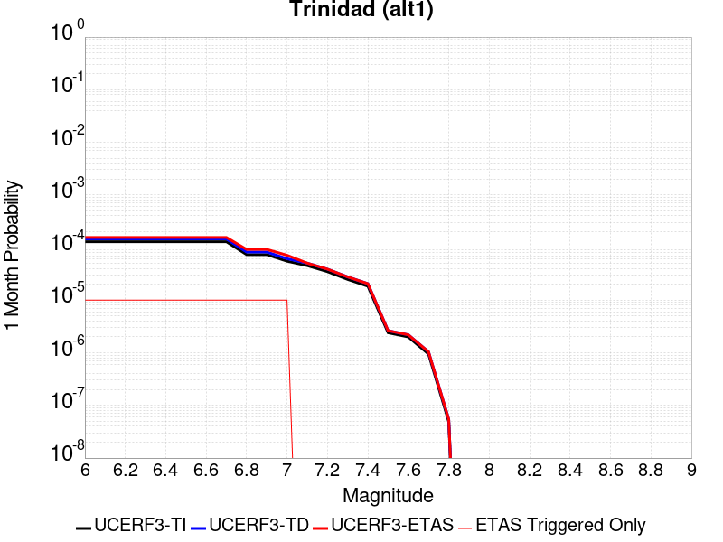 |  | 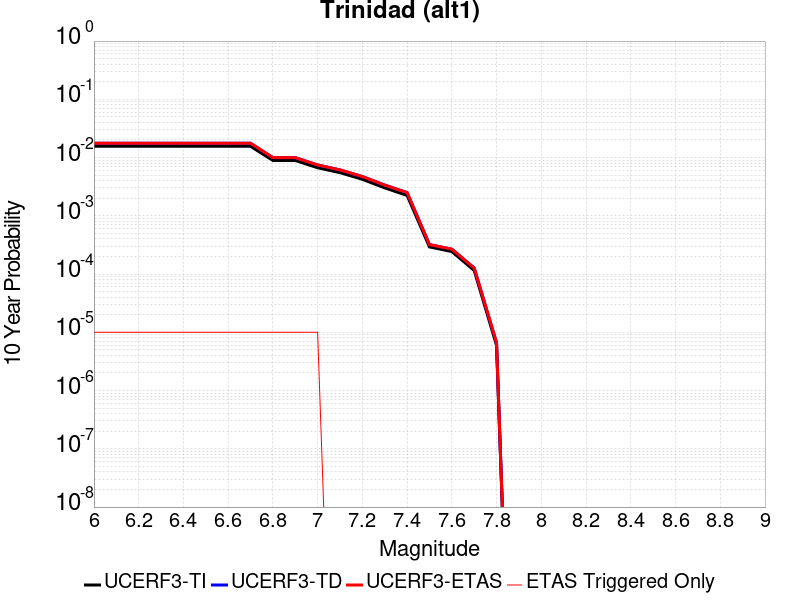 |

| Magnitude | 1 wk TI Prob | 1 wk TD Prob | 1 wk ETAS Prob | 1 wk ETAS/TD Gain | 1 wk ETAS Triggered Only | 1 mo TI Prob | 1 mo TD Prob | 1 mo ETAS Prob | 1 mo ETAS/TD Gain | 1 mo ETAS Triggered Only | 1 yr TI Prob | 1 yr TD Prob | 1 yr ETAS Prob | 1 yr ETAS/TD Gain | 1 yr ETAS Triggered Only | 10 yr TI Prob | 10 yr TD Prob | 10 yr ETAS Prob | 10 yr ETAS/TD Gain | 10 yr ETAS Triggered Only |
|-----|-----|-----|-----|-----|-----|-----|-----|-----|-----|-----|-----|-----|-----|-----|-----|-----|-----|-----|-----|-----|
| 6.0 | 3.0167168E-5 | 3.4033765E-5 | 4.4033422E-5 | 1.2938159 | 1.0E-5 | 1.2928146E-4 | 1.4585178E-4 | 1.5585033E-4 | 1.0685527 | 1.0E-5 | 0.0015728653 | 0.0017744675 | 0.0017844498 | 1.0056255 | 1.0E-5 | 0.0156177925 | 0.017619943 | 0.017629767 | 1.0005575 | 1.0E-5 |
| 6.1 | 3.0167168E-5 | 3.4033765E-5 | 4.4033422E-5 | 1.2938159 | 1.0E-5 | 1.2928146E-4 | 1.4585178E-4 | 1.5585033E-4 | 1.0685527 | 1.0E-5 | 0.0015728653 | 0.0017744675 | 0.0017844498 | 1.0056255 | 1.0E-5 | 0.0156177925 | 0.017619943 | 0.017629767 | 1.0005575 | 1.0E-5 |
| 6.2 | 3.0167168E-5 | 3.4033765E-5 | 4.4033422E-5 | 1.2938159 | 1.0E-5 | 1.2928146E-4 | 1.4585178E-4 | 1.5585033E-4 | 1.0685527 | 1.0E-5 | 0.0015728653 | 0.0017744675 | 0.0017844498 | 1.0056255 | 1.0E-5 | 0.0156177925 | 0.017619943 | 0.017629767 | 1.0005575 | 1.0E-5 |
| 6.3 | 3.0167168E-5 | 3.4033765E-5 | 4.4033422E-5 | 1.2938159 | 1.0E-5 | 1.2928146E-4 | 1.4585178E-4 | 1.5585033E-4 | 1.0685527 | 1.0E-5 | 0.0015728653 | 0.0017744675 | 0.0017844498 | 1.0056255 | 1.0E-5 | 0.0156177925 | 0.017619943 | 0.017629767 | 1.0005575 | 1.0E-5 |
| 6.4 | 3.0167168E-5 | 3.4033765E-5 | 4.4033422E-5 | 1.2938159 | 1.0E-5 | 1.2928146E-4 | 1.4585178E-4 | 1.5585033E-4 | 1.0685527 | 1.0E-5 | 0.0015728653 | 0.0017744675 | 0.0017844498 | 1.0056255 | 1.0E-5 | 0.0156177925 | 0.017619943 | 0.017629767 | 1.0005575 | 1.0E-5 |
| 6.5 | 3.0167168E-5 | 3.4033765E-5 | 4.4033422E-5 | 1.2938159 | 1.0E-5 | 1.2928146E-4 | 1.4585178E-4 | 1.5585033E-4 | 1.0685527 | 1.0E-5 | 0.0015728653 | 0.0017744675 | 0.0017844498 | 1.0056255 | 1.0E-5 | 0.0156177925 | 0.017619943 | 0.017629767 | 1.0005575 | 1.0E-5 |
| 6.6 | 3.0167168E-5 | 3.4033765E-5 | 4.4033422E-5 | 1.2938159 | 1.0E-5 | 1.2928146E-4 | 1.4585178E-4 | 1.5585033E-4 | 1.0685527 | 1.0E-5 | 0.0015728653 | 0.0017744675 | 0.0017844498 | 1.0056255 | 1.0E-5 | 0.0156177925 | 0.017619943 | 0.017629767 | 1.0005575 | 1.0E-5 |
| 6.7 | 3.0167168E-5 | 3.4033765E-5 | 4.4033422E-5 | 1.2938159 | 1.0E-5 | 1.2928146E-4 | 1.4585178E-4 | 1.5585033E-4 | 1.0685527 | 1.0E-5 | 0.0015728653 | 0.0017744675 | 0.0017844498 | 1.0056255 | 1.0E-5 | 0.0156177925 | 0.017619943 | 0.017629767 | 1.0005575 | 1.0E-5 |
| 6.8 | 1.717077E-5 | 1.9195984E-5 | 2.9195791E-5 | 1.5209323 | 1.0E-5 | 7.358694E-5 | 8.226616E-5 | 9.2265334E-5 | 1.1215466 | 1.0E-5 | 8.9555274E-4 | 0.0010011748 | 0.0010111647 | 1.0099783 | 1.0E-5 | 0.008919522 | 0.009971094 | 0.009980994 | 1.0009929 | 1.0E-5 |
| 6.9 | 1.717077E-5 | 1.9195984E-5 | 2.9195791E-5 | 1.5209323 | 1.0E-5 | 7.358694E-5 | 8.226616E-5 | 9.2265334E-5 | 1.1215466 | 1.0E-5 | 8.9555274E-4 | 0.0010011748 | 0.0010111647 | 1.0099783 | 1.0E-5 | 0.008919522 | 0.009971094 | 0.009980994 | 1.0009929 | 1.0E-5 |
| 7.0 | 1.2858572E-5 | 1.4337589E-5 | 2.4337445E-5 | 1.6974573 | 1.0E-5 | 5.5107E-5 | 6.144554E-5 | 7.144493E-5 | 1.1627357 | 1.0E-5 | 6.707212E-4 | 7.4787484E-4 | 7.5786735E-4 | 1.0133612 | 1.0E-5 | 0.006687004 | 0.007456759 | 0.0074666846 | 1.0013311 | 1.0E-5 |
| 7.1 | 1.0588431E-5 | 1.1801449E-5 | 1.1801449E-5 | 1.0 | 0.0 | 4.53782E-5 | 5.057682E-5 | 5.057682E-5 | 1.0 | 0.0 | 5.5233954E-4 | 6.156277E-4 | 6.156277E-4 | 1.0 | 0.0 | 0.005509687 | 0.006142072 | 0.006142072 | 1.0 | 0.0 |
| 7.2 | 8.138061E-6 | 9.067351E-6 | 9.067351E-6 | 1.0 | 0.0 | 3.487694E-5 | 3.8859635E-5 | 3.8859635E-5 | 1.0 | 0.0 | 4.2454398E-4 | 4.730382E-4 | 4.730382E-4 | 1.0 | 0.0 | 0.0042373384 | 0.004722754 | 0.004722754 | 1.0 | 0.0 |
| 7.3 | 5.787542E-6 | 6.4604196E-6 | 6.4604196E-6 | 1.0 | 0.0 | 2.4803514E-5 | 2.7687342E-5 | 2.7687342E-5 | 1.0 | 0.0 | 3.0194095E-4 | 3.3706275E-4 | 3.3706275E-4 | 1.0 | 0.0 | 0.00301531 | 0.003367626 | 0.003367626 | 1.0 | 0.0 |
| 7.4 | 4.303563E-6 | 4.8009247E-6 | 4.8009247E-6 | 1.0 | 0.0 | 1.844371E-5 | 2.057534E-5 | 2.057534E-5 | 1.0 | 0.0 | 2.2452902E-4 | 2.5049574E-4 | 2.5049574E-4 | 1.0 | 0.0 | 0.0022430231 | 0.0025040722 | 0.0025040722 | 1.0 | 0.0 |
| 7.5 | 5.6063425E-7 | 6.1430603E-7 | 6.1430603E-7 | 1.0 | 0.0 | 2.402716E-6 | 2.6327375E-6 | 2.6327375E-6 | 1.0 | 0.0 | 2.9252675E-5 | 3.205312E-5 | 3.205312E-5 | 1.0 | 0.0 | 2.9248823E-4 | 3.2048655E-4 | 3.2048655E-4 | 1.0 | 0.0 |
| 7.6 | 4.6699128E-7 | 5.125866E-7 | 5.125866E-7 | 1.0 | 0.0 | 2.0013897E-6 | 2.1967978E-6 | 2.1967978E-6 | 1.0 | 0.0 | 2.4366647E-5 | 2.67457E-5 | 2.67457E-5 | 1.0 | 0.0 | 2.4363975E-4 | 2.6742622E-4 | 2.6742622E-4 | 1.0 | 0.0 |
| 7.7 | 2.2080937E-7 | 2.4347227E-7 | 2.4347227E-7 | 1.0 | 0.0 | 9.4632554E-7 | 1.0434522E-6 | 1.0434522E-6 | 1.0 | 0.0 | 1.15214525E-5 | 1.2703963E-5 | 1.2703963E-5 | 1.0 | 0.0 | 1.1520855E-4 | 1.2703297E-4 | 1.2703297E-4 | 1.0 | 0.0 |
| 7.8 | 1.1438307E-8 | 1.2683146E-8 | 1.2683146E-8 | 1.0 | 0.0 | 4.9021317E-8 | 5.435634E-8 | 5.435634E-8 | 1.0 | 0.0 | 5.9683435E-7 | 6.617884E-7 | 6.617884E-7 | 1.0 | 0.0 | 5.9683275E-6 | 6.6178845E-6 | 6.6178845E-6 | 1.0 | 0.0 |

## Cedar Mtn-Mahogany Mtn
*[(top)](#table-of-contents)*

| 1 Week | 1 Month | 1 Year | 10 Year |
|-----|-----|-----|-----|
|  |  |  |  |

| Magnitude | 1 wk TI Prob | 1 wk TD Prob | 1 wk ETAS Prob | 1 wk ETAS/TD Gain | 1 wk ETAS Triggered Only | 1 mo TI Prob | 1 mo TD Prob | 1 mo ETAS Prob | 1 mo ETAS/TD Gain | 1 mo ETAS Triggered Only | 1 yr TI Prob | 1 yr TD Prob | 1 yr ETAS Prob | 1 yr ETAS/TD Gain | 1 yr ETAS Triggered Only | 10 yr TI Prob | 10 yr TD Prob | 10 yr ETAS Prob | 10 yr ETAS/TD Gain | 10 yr ETAS Triggered Only |
|-----|-----|-----|-----|-----|-----|-----|-----|-----|-----|-----|-----|-----|-----|-----|-----|-----|-----|-----|-----|-----|
| 6.0 | 2.7763876E-5 | 2.9589124E-5 | 2.9589124E-5 | 1.0 | 0.0 | 1.1898261E-4 | 1.2680476E-4 | 1.2680476E-4 | 1.0 | 0.0 | 0.0014476506 | 0.0015428247 | 0.0015528093 | 1.0064716 | 1.0E-5 | 0.0143825635 | 0.015328358 | 0.015348052 | 1.0012847 | 2.0E-5 |
| 6.1 | 1.6162443E-5 | 1.7143104E-5 | 1.7143104E-5 | 1.0 | 0.0 | 6.926578E-5 | 7.346847E-5 | 7.346847E-5 | 1.0 | 0.0 | 8.4298453E-4 | 8.9412933E-4 | 8.9412933E-4 | 1.0 | 0.0 | 0.008397939 | 0.00890713 | 0.008917041 | 1.0011127 | 1.0E-5 |
| 6.2 | 1.6162443E-5 | 1.7143104E-5 | 1.7143104E-5 | 1.0 | 0.0 | 6.926578E-5 | 7.346847E-5 | 7.346847E-5 | 1.0 | 0.0 | 8.4298453E-4 | 8.9412933E-4 | 8.9412933E-4 | 1.0 | 0.0 | 0.008397939 | 0.00890713 | 0.008917041 | 1.0011127 | 1.0E-5 |
| 6.3 | 9.746053E-6 | 1.030323E-5 | 1.030323E-5 | 1.0 | 0.0 | 4.1768133E-5 | 4.4155975E-5 | 4.4155975E-5 | 1.0 | 0.0 | 5.0840835E-4 | 5.374705E-4 | 5.374705E-4 | 1.0 | 0.0 | 0.0050724675 | 0.005362125 | 0.005362125 | 1.0 | 0.0 |
| 6.4 | 9.746053E-6 | 1.030323E-5 | 1.030323E-5 | 1.0 | 0.0 | 4.1768133E-5 | 4.4155975E-5 | 4.4155975E-5 | 1.0 | 0.0 | 5.0840835E-4 | 5.374705E-4 | 5.374705E-4 | 1.0 | 0.0 | 0.0050724675 | 0.005362125 | 0.005362125 | 1.0 | 0.0 |
| 6.5 | 7.290083E-6 | 7.695381E-6 | 7.695381E-6 | 1.0 | 0.0 | 3.124284E-5 | 3.2979802E-5 | 3.2979802E-5 | 1.0 | 0.0 | 3.8031515E-4 | 4.0145728E-4 | 4.0145728E-4 | 1.0 | 0.0 | 0.0037966494 | 0.0040075406 | 0.0040075406 | 1.0 | 0.0 |
| 6.6 | 5.67907E-6 | 5.9891963E-6 | 5.9891963E-6 | 1.0 | 0.0 | 2.4338644E-5 | 2.5667738E-5 | 2.5667738E-5 | 1.0 | 0.0 | 2.962827E-4 | 3.1246126E-4 | 3.1246126E-4 | 1.0 | 0.0 | 0.0029588798 | 0.0031203553 | 0.0031203553 | 1.0 | 0.0 |
| 6.7 | 3.4853963E-6 | 3.6726572E-6 | 3.6726572E-6 | 1.0 | 0.0 | 1.4937327E-5 | 1.5739868E-5 | 1.5739868E-5 | 1.0 | 0.0 | 1.8184677E-4 | 1.9161667E-4 | 1.9161667E-4 | 1.0 | 0.0 | 0.0018169804 | 0.0019145765 | 0.0019145765 | 1.0 | 0.0 |
| 6.8 | 2.7535168E-6 | 2.901597E-6 | 2.901597E-6 | 1.0 | 0.0 | 1.1800733E-5 | 1.2435359E-5 | 1.2435359E-5 | 1.0 | 0.0 | 1.4366445E-4 | 1.5139046E-4 | 1.5139046E-4 | 1.0 | 0.0 | 0.0014357162 | 0.0015129205 | 0.0015129205 | 1.0 | 0.0 |
| 6.9 | 1.6594106E-6 | 1.7497113E-6 | 1.7497113E-6 | 1.0 | 0.0 | 7.1117406E-6 | 7.4987424E-6 | 7.4987424E-6 | 1.0 | 0.0 | 8.6582E-5 | 9.1293674E-5 | 9.1293674E-5 | 1.0 | 0.0 | 8.654827E-4 | 9.1259216E-4 | 9.1259216E-4 | 1.0 | 0.0 |
| 7.0 | 5.10215E-7 | 5.389294E-7 | 5.389294E-7 | 1.0 | 0.0 | 2.186634E-6 | 2.3096961E-6 | 2.3096961E-6 | 1.0 | 0.0 | 2.6621943E-5 | 2.8120316E-5 | 2.8120316E-5 | 1.0 | 0.0 | 2.6618753E-4 | 2.811801E-4 | 2.811801E-4 | 1.0 | 0.0 |

## San Jacinto (Borrego)
*[(top)](#table-of-contents)*

| 1 Week | 1 Month | 1 Year | 10 Year |
|-----|-----|-----|-----|
|  |  |  |  |

| Magnitude | 1 wk TI Prob | 1 wk TD Prob | 1 wk ETAS Prob | 1 wk ETAS/TD Gain | 1 wk ETAS Triggered Only | 1 mo TI Prob | 1 mo TD Prob | 1 mo ETAS Prob | 1 mo ETAS/TD Gain | 1 mo ETAS Triggered Only | 1 yr TI Prob | 1 yr TD Prob | 1 yr ETAS Prob | 1 yr ETAS/TD Gain | 1 yr ETAS Triggered Only | 10 yr TI Prob | 10 yr TD Prob | 10 yr ETAS Prob | 10 yr ETAS/TD Gain | 10 yr ETAS Triggered Only |
|-----|-----|-----|-----|-----|-----|-----|-----|-----|-----|-----|-----|-----|-----|-----|-----|-----|-----|-----|-----|-----|
| 6.0 | 3.543992E-5 | 2.7934115E-5 | 2.7934115E-5 | 1.0 | 0.0 | 1.5187653E-4 | 1.1971221E-4 | 1.1971221E-4 | 1.0 | 0.0 | 0.0018475284 | 0.001456534 | 0.001456534 | 1.0 | 0.0 | 0.018322436 | 0.014873597 | 0.014893299 | 1.0013247 | 2.0E-5 |
| 6.1 | 3.542281E-5 | 2.7934115E-5 | 2.7934115E-5 | 1.0 | 0.0 | 1.5180321E-4 | 1.1971221E-4 | 1.1971221E-4 | 1.0 | 0.0 | 0.0018466372 | 0.001456534 | 0.001456534 | 1.0 | 0.0 | 0.018313672 | 0.014873597 | 0.014893299 | 1.0013247 | 2.0E-5 |
| 6.2 | 3.4688688E-5 | 2.7934115E-5 | 2.7934115E-5 | 1.0 | 0.0 | 1.4865733E-4 | 1.1971221E-4 | 1.1971221E-4 | 1.0 | 0.0 | 0.0018084005 | 0.0014565339 | 0.0014565339 | 1.0 | 0.0 | 0.017937548 | 0.014873596 | 0.014893299 | 1.0013247 | 2.0E-5 |
| 6.3 | 3.2087122E-5 | 2.7779462E-5 | 2.7779462E-5 | 1.0 | 0.0 | 1.3750899E-4 | 1.1904947E-4 | 1.1904947E-4 | 1.0 | 0.0 | 0.0016728862 | 0.0014484759 | 0.0014484759 | 1.0 | 0.0 | 0.016603488 | 0.01479463 | 0.014814334 | 1.0013318 | 2.0E-5 |
| 6.4 | 3.1828724E-5 | 2.7746448E-5 | 2.7746448E-5 | 1.0 | 0.0 | 1.364017E-4 | 1.18908E-4 | 1.18908E-4 | 1.0 | 0.0 | 0.0016594254 | 0.0014467557 | 0.0014467557 | 1.0 | 0.0 | 0.016470885 | 0.014777708 | 0.014797413 | 1.0013334 | 2.0E-5 |
| 6.5 | 3.1563577E-5 | 2.7486154E-5 | 2.7486154E-5 | 1.0 | 0.0 | 1.3526545E-4 | 1.1779256E-4 | 1.1779256E-4 | 1.0 | 0.0 | 0.0016456128 | 0.0014331931 | 0.0014331931 | 1.0 | 0.0 | 0.0163348 | 0.014644288 | 0.014663995 | 1.0013458 | 2.0E-5 |
| 6.6 | 3.1467625E-5 | 2.7330374E-5 | 2.7330374E-5 | 1.0 | 0.0 | 1.3485427E-4 | 1.1712498E-4 | 1.1712498E-4 | 1.0 | 0.0 | 0.0016406142 | 0.001425076 | 0.001425076 | 1.0 | 0.0 | 0.016285548 | 0.014564533 | 0.014584241 | 1.0013531 | 2.0E-5 |
| 6.7 | 3.1223695E-5 | 2.6948383E-5 | 2.6948383E-5 | 1.0 | 0.0 | 1.3380898E-4 | 1.1548802E-4 | 1.1548802E-4 | 1.0 | 0.0 | 0.0016279068 | 0.0014051719 | 0.0014051719 | 1.0 | 0.0 | 0.01616033 | 0.014368899 | 0.0143886125 | 1.0013719 | 2.0E-5 |
| 6.8 | 3.1015585E-5 | 2.6769376E-5 | 2.6769376E-5 | 1.0 | 0.0 | 1.3291716E-4 | 1.14720926E-4 | 1.14720926E-4 | 1.0 | 0.0 | 0.001617065 | 0.0013958444 | 0.0013958444 | 1.0 | 0.0 | 0.016053487 | 0.014276173 | 0.014295887 | 1.0013809 | 2.0E-5 |
| 6.9 | 2.6641965E-5 | 2.2191349E-5 | 2.2191349E-5 | 1.0 | 0.0 | 1.1417485E-4 | 9.510233E-5 | 9.510233E-5 | 1.0 | 0.0 | 0.0013891924 | 0.0011572598 | 0.0011572598 | 1.0 | 0.0 | 0.0138054015 | 0.011886145 | 0.011905907 | 1.0016626 | 2.0E-5 |
| 7.0 | 2.3854353E-5 | 2.048587E-5 | 2.048587E-5 | 1.0 | 0.0 | 1.02228936E-4 | 8.779365E-5 | 8.779365E-5 | 1.0 | 0.0 | 0.0012439266 | 0.0010683661 | 0.0010683661 | 1.0 | 0.0 | 0.012369866 | 0.010986375 | 0.011006155 | 1.0018004 | 2.0E-5 |
| 7.1 | 2.3672901E-5 | 2.032235E-5 | 2.032235E-5 | 1.0 | 0.0 | 1.0145135E-4 | 8.709289E-5 | 8.709289E-5 | 1.0 | 0.0 | 0.0012344702 | 0.0010598428 | 0.0010598428 | 1.0 | 0.0 | 0.0122763505 | 0.010901547 | 0.010921329 | 1.0018146 | 2.0E-5 |
| 7.2 | 2.2717244E-5 | 1.9549674E-5 | 1.9549674E-5 | 1.0 | 0.0 | 9.735599E-5 | 8.378164E-5 | 8.378164E-5 | 1.0 | 0.0 | 0.0011846646 | 0.0010195666 | 0.0010195666 | 1.0 | 0.0 | 0.01178369 | 0.010498884 | 0.010518674 | 1.0018849 | 2.0E-5 |
| 7.3 | 2.1016205E-5 | 1.8391213E-5 | 1.8391213E-5 | 1.0 | 0.0 | 9.006634E-5 | 7.881711E-5 | 7.881711E-5 | 1.0 | 0.0 | 0.001096006 | 9.5917797E-4 | 9.5917797E-4 | 1.0 | 0.0 | 0.010906163 | 0.009894462 | 0.009914264 | 1.0020013 | 2.0E-5 |
| 7.4 | 2.0683625E-5 | 1.8193714E-5 | 1.8193714E-5 | 1.0 | 0.0 | 8.86411E-5 | 7.797074E-5 | 7.797074E-5 | 1.0 | 0.0 | 0.001078671 | 9.488824E-4 | 9.488824E-4 | 1.0 | 0.0 | 0.010734501 | 0.009791178 | 0.009810981 | 1.0020226 | 2.0E-5 |
| 7.5 | 1.9993966E-5 | 1.7788683E-5 | 1.7788683E-5 | 1.0 | 0.0 | 8.568561E-5 | 7.6234996E-5 | 7.6234996E-5 | 1.0 | 0.0 | 0.001042723 | 9.2776783E-4 | 9.2776783E-4 | 1.0 | 0.0 | 0.010378438 | 0.00957807 | 0.009597878 | 1.0020682 | 2.0E-5 |
| 7.6 | 1.788966E-5 | 1.6441732E-5 | 1.6441732E-5 | 1.0 | 0.0 | 7.666772E-5 | 7.046267E-5 | 7.046267E-5 | 1.0 | 0.0 | 9.3302975E-4 | 8.575471E-4 | 8.575471E-4 | 1.0 | 0.0 | 0.00929122 | 0.0088698575 | 0.00888968 | 1.0022348 | 2.0E-5 |
| 7.7 | 1.5125781E-5 | 1.4243621E-5 | 1.4243621E-5 | 1.0 | 0.0 | 6.4823165E-5 | 6.1042665E-5 | 6.1042665E-5 | 1.0 | 0.0 | 7.889362E-4 | 7.4294186E-4 | 7.4294186E-4 | 1.0 | 0.0 | 0.007861412 | 0.0077174758 | 0.007737322 | 1.0025715 | 2.0E-5 |
| 7.8 | 1.250089E-5 | 1.2636515E-5 | 1.2636515E-5 | 1.0 | 0.0 | 5.3574146E-5 | 5.415537E-5 | 5.415537E-5 | 1.0 | 0.0 | 6.5207E-4 | 6.591428E-4 | 6.591428E-4 | 1.0 | 0.0 | 0.006501599 | 0.00687092 | 0.006890782 | 1.0028908 | 2.0E-5 |
| 7.9 | 9.561E-6 | 9.759914E-6 | 9.759914E-6 | 1.0 | 0.0 | 4.0975072E-5 | 4.1827538E-5 | 4.1827538E-5 | 1.0 | 0.0 | 4.987573E-4 | 5.091318E-4 | 5.091318E-4 | 1.0 | 0.0 | 0.0049763937 | 0.0053551346 | 0.0053750277 | 1.0037147 | 2.0E-5 |
| 8.0 | 8.01699E-6 | 8.2982915E-6 | 8.2982915E-6 | 1.0 | 0.0 | 3.4358076E-5 | 3.5563622E-5 | 3.5563622E-5 | 1.0 | 0.0 | 4.1822926E-4 | 4.329016E-4 | 4.329016E-4 | 1.0 | 0.0 | 0.0041744304 | 0.0045759073 | 0.0045958157 | 1.0043507 | 2.0E-5 |
| 8.1 | 6.541947E-6 | 6.466171E-6 | 6.466171E-6 | 1.0 | 0.0 | 2.8036617E-5 | 2.7711869E-5 | 2.7711869E-5 | 1.0 | 0.0 | 3.4129233E-4 | 3.3734026E-4 | 3.3734026E-4 | 1.0 | 0.0 | 0.0034076865 | 0.0035827826 | 0.003602711 | 1.0055623 | 2.0E-5 |
| 8.2 | 1.7968189E-6 | 7.978815E-7 | 7.978815E-7 | 1.0 | 0.0 | 7.70063E-6 | 3.419488E-6 | 3.419488E-6 | 1.0 | 0.0 | 9.3751136E-5 | 4.163149E-5 | 4.163149E-5 | 1.0 | 0.0 | 9.371159E-4 | 4.7162327E-4 | 4.7162327E-4 | 1.0 | 0.0 |
| 8.3 | 1.5167889E-7 | 4.9030522E-8 | 4.9030522E-8 | 1.0 | 0.0 | 6.500522E-7 | 2.1013079E-7 | 2.1013079E-7 | 1.0 | 0.0 | 7.9143565E-6 | 2.55834E-6 | 2.55834E-6 | 1.0 | 0.0 | 7.914075E-5 | 2.9725656E-5 | 2.9725656E-5 | 1.0 | 0.0 |

## Homestead Valley 2011
*[(top)](#table-of-contents)*

| 1 Week | 1 Month | 1 Year | 10 Year |
|-----|-----|-----|-----|
|  |  |  |  |

| Magnitude | 1 wk TI Prob | 1 wk TD Prob | 1 wk ETAS Prob | 1 wk ETAS/TD Gain | 1 wk ETAS Triggered Only | 1 mo TI Prob | 1 mo TD Prob | 1 mo ETAS Prob | 1 mo ETAS/TD Gain | 1 mo ETAS Triggered Only | 1 yr TI Prob | 1 yr TD Prob | 1 yr ETAS Prob | 1 yr ETAS/TD Gain | 1 yr ETAS Triggered Only | 10 yr TI Prob | 10 yr TD Prob | 10 yr ETAS Prob | 10 yr ETAS/TD Gain | 10 yr ETAS Triggered Only |
|-----|-----|-----|-----|-----|-----|-----|-----|-----|-----|-----|-----|-----|-----|-----|-----|-----|-----|-----|-----|-----|
| 6.0 | 1.539795E-5 | 6.2866725E-6 | 6.2866725E-6 | 1.0 | 0.0 | 6.5989545E-5 | 2.694272E-5 | 2.694272E-5 | 1.0 | 0.0 | 8.0312655E-4 | 3.2799886E-4 | 3.3799556E-4 | 1.0304779 | 1.0E-5 | 0.008002302 | 0.0032771684 | 0.0032971029 | 1.0060828 | 2.0E-5 |
| 6.1 | 1.539795E-5 | 6.2866725E-6 | 6.2866725E-6 | 1.0 | 0.0 | 6.5989545E-5 | 2.694272E-5 | 2.694272E-5 | 1.0 | 0.0 | 8.0312655E-4 | 3.2799886E-4 | 3.3799556E-4 | 1.0304779 | 1.0E-5 | 0.008002302 | 0.0032771684 | 0.0032971029 | 1.0060828 | 2.0E-5 |
| 6.2 | 1.539795E-5 | 6.2866725E-6 | 6.2866725E-6 | 1.0 | 0.0 | 6.5989545E-5 | 2.694272E-5 | 2.694272E-5 | 1.0 | 0.0 | 8.0312655E-4 | 3.2799886E-4 | 3.3799556E-4 | 1.0304779 | 1.0E-5 | 0.008002302 | 0.0032771684 | 0.0032971029 | 1.0060828 | 2.0E-5 |
| 6.3 | 1.539795E-5 | 6.2866725E-6 | 6.2866725E-6 | 1.0 | 0.0 | 6.5989545E-5 | 2.694272E-5 | 2.694272E-5 | 1.0 | 0.0 | 8.0312655E-4 | 3.2799886E-4 | 3.3799556E-4 | 1.0304779 | 1.0E-5 | 0.008002302 | 0.0032771684 | 0.0032971029 | 1.0060828 | 2.0E-5 |
| 6.4 | 1.539795E-5 | 6.2866725E-6 | 6.2866725E-6 | 1.0 | 0.0 | 6.5989545E-5 | 2.694272E-5 | 2.694272E-5 | 1.0 | 0.0 | 8.0312655E-4 | 3.2799886E-4 | 3.3799556E-4 | 1.0304779 | 1.0E-5 | 0.008002302 | 0.0032771684 | 0.0032971029 | 1.0060828 | 2.0E-5 |
| 6.5 | 1.0265258E-5 | 2.8788809E-6 | 2.8788809E-6 | 1.0 | 0.0 | 4.3993223E-5 | 1.2338042E-5 | 1.2338042E-5 | 1.0 | 0.0 | 5.3548586E-4 | 1.5021226E-4 | 1.5021226E-4 | 1.0 | 0.0 | 0.005341973 | 0.0015017892 | 0.0015017892 | 1.0 | 0.0 |
| 6.6 | 6.664671E-6 | 5.3483575E-7 | 5.3483575E-7 | 1.0 | 0.0 | 2.8562565E-5 | 2.2921517E-6 | 2.2921517E-6 | 1.0 | 0.0 | 3.476937E-4 | 2.790671E-5 | 2.790671E-5 | 1.0 | 0.0 | 0.003471502 | 2.7904368E-4 | 2.7904368E-4 | 1.0 | 0.0 |
| 6.7 | 6.5954046E-6 | 5.3483575E-7 | 5.3483575E-7 | 1.0 | 0.0 | 2.8265715E-5 | 2.2921517E-6 | 2.2921517E-6 | 1.0 | 0.0 | 3.4408073E-4 | 2.790671E-5 | 2.790671E-5 | 1.0 | 0.0 | 0.0034354846 | 2.7904368E-4 | 2.7904368E-4 | 1.0 | 0.0 |
| 6.8 | 4.648189E-6 | 2.3266526E-7 | 2.3266526E-7 | 1.0 | 0.0 | 1.9920659E-5 | 9.971365E-7 | 9.971365E-7 | 1.0 | 0.0 | 2.4250703E-4 | 1.21400735E-5 | 1.21400735E-5 | 1.0 | 0.0 | 0.0024224254 | 1.2139459E-4 | 1.2139459E-4 | 1.0 | 0.0 |
| 6.9 | 4.1428534E-6 | 1.9345389E-7 | 1.9345389E-7 | 1.0 | 0.0 | 1.7754966E-5 | 8.2908787E-7 | 8.2908787E-7 | 1.0 | 0.0 | 2.1614527E-4 | 1.0094101E-5 | 1.0094101E-5 | 1.0 | 0.0 | 0.0021593515 | 1.0093672E-4 | 1.0093672E-4 | 1.0 | 0.0 |
| 7.0 | 3.0673707E-6 | 1.5368272E-7 | 1.5368272E-7 | 1.0 | 0.0 | 1.3145808E-5 | 6.5864003E-7 | 6.5864003E-7 | 1.0 | 0.0 | 1.6003846E-4 | 8.018914E-6 | 8.018914E-6 | 1.0 | 0.0 | 0.0015992324 | 8.018635E-5 | 8.018635E-5 | 1.0 | 0.0 |
| 7.1 | 2.340854E-6 | 1.468828E-7 | 1.468828E-7 | 1.0 | 0.0 | 1.0032193E-5 | 6.2949755E-7 | 6.2949755E-7 | 1.0 | 0.0 | 1.221351E-4 | 7.664107E-6 | 7.664107E-6 | 1.0 | 0.0 | 0.00122068 | 7.663853E-5 | 7.663853E-5 | 1.0 | 0.0 |
| 7.2 | 1.3754182E-6 | 1.3923189E-7 | 1.3923189E-7 | 1.0 | 0.0 | 5.8946357E-6 | 5.9670793E-7 | 5.9670793E-7 | 1.0 | 0.0 | 7.176483E-5 | 7.264896E-6 | 7.264896E-6 | 1.0 | 0.0 | 7.174166E-4 | 7.2646675E-5 | 7.2646675E-5 | 1.0 | 0.0 |
| 7.3 | 1.2573237E-6 | 1.3827695E-7 | 1.3827695E-7 | 1.0 | 0.0 | 5.388519E-6 | 5.926153E-7 | 5.926153E-7 | 1.0 | 0.0 | 6.560324E-5 | 7.2150688E-6 | 7.2150688E-6 | 1.0 | 0.0 | 6.558388E-4 | 7.214844E-5 | 7.214844E-5 | 1.0 | 0.0 |
| 7.4 | 1.0994207E-6 | 1.3106616E-7 | 1.3106616E-7 | 1.0 | 0.0 | 4.7117946E-6 | 5.61712E-7 | 5.61712E-7 | 1.0 | 0.0 | 5.736459E-5 | 6.838823E-6 | 6.838823E-6 | 1.0 | 0.0 | 5.734978E-4 | 6.8386216E-5 | 6.8386216E-5 | 1.0 | 0.0 |
| 7.5 | 5.5569126E-7 | 6.773262E-8 | 6.773262E-8 | 1.0 | 0.0 | 2.3815317E-6 | 2.9028263E-7 | 2.9028263E-7 | 1.0 | 0.0 | 2.8994764E-5 | 3.534186E-6 | 3.534186E-6 | 1.0 | 0.0 | 2.899098E-4 | 3.534136E-5 | 3.534136E-5 | 1.0 | 0.0 |

## Green Valley 2011 CFM
*[(top)](#table-of-contents)*

| 1 Week | 1 Month | 1 Year | 10 Year |
|-----|-----|-----|-----|
|  |  | 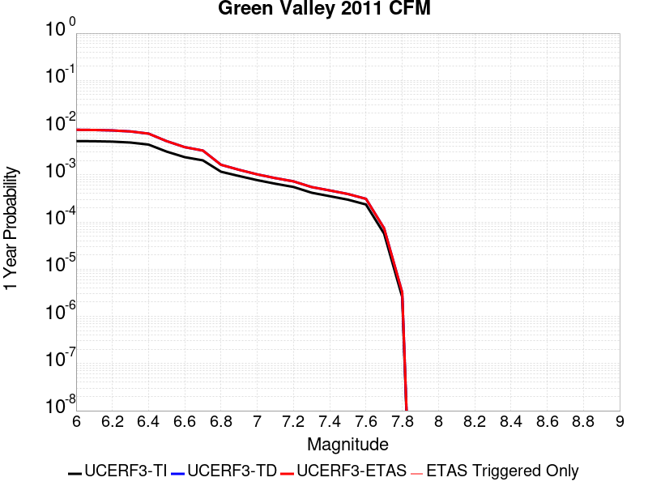 |  |

| Magnitude | 1 wk TI Prob | 1 wk TD Prob | 1 wk ETAS Prob | 1 wk ETAS/TD Gain | 1 wk ETAS Triggered Only | 1 mo TI Prob | 1 mo TD Prob | 1 mo ETAS Prob | 1 mo ETAS/TD Gain | 1 mo ETAS Triggered Only | 1 yr TI Prob | 1 yr TD Prob | 1 yr ETAS Prob | 1 yr ETAS/TD Gain | 1 yr ETAS Triggered Only | 10 yr TI Prob | 10 yr TD Prob | 10 yr ETAS Prob | 10 yr ETAS/TD Gain | 10 yr ETAS Triggered Only |
|-----|-----|-----|-----|-----|-----|-----|-----|-----|-----|-----|-----|-----|-----|-----|-----|-----|-----|-----|-----|-----|
| 6.0 | 9.9629346E-5 | 1.7306181E-4 | 1.7306181E-4 | 1.0 | 0.0 | 4.2691303E-4 | 7.414477E-4 | 7.414477E-4 | 1.0 | 0.0 | 0.0051852856 | 0.00898687 | 0.00898687 | 1.0 | 0.0 | 0.050659515 | 0.085523866 | 0.08554216 | 1.0002139 | 2.0E-5 |
| 6.1 | 9.88615E-5 | 1.7153492E-4 | 1.7153492E-4 | 1.0 | 0.0 | 4.2362334E-4 | 7.349076E-4 | 7.349076E-4 | 1.0 | 0.0 | 0.0051454236 | 0.008907897 | 0.008907897 | 1.0 | 0.0 | 0.050279044 | 0.08481148 | 0.084829785 | 1.0002158 | 2.0E-5 |
| 6.2 | 9.696895E-5 | 1.679252E-4 | 1.679252E-4 | 1.0 | 0.0 | 4.15515E-4 | 7.1944593E-4 | 7.1944593E-4 | 1.0 | 0.0 | 0.0050471667 | 0.008721275 | 0.008721275 | 1.0 | 0.0 | 0.04934063 | 0.08312038 | 0.08313872 | 1.0002207 | 2.0E-5 |
| 6.3 | 9.275224E-5 | 1.5971852E-4 | 1.5971852E-4 | 1.0 | 0.0 | 3.9744904E-4 | 6.842931E-4 | 6.842931E-4 | 1.0 | 0.0 | 0.0048282105 | 0.008296597 | 0.008296597 | 1.0 | 0.0 | 0.047246475 | 0.07925882 | 0.07927724 | 1.0002323 | 2.0E-5 |
| 6.4 | 8.391499E-5 | 1.4368363E-4 | 1.4368363E-4 | 1.0 | 0.0 | 3.595861E-4 | 6.156491E-4 | 6.156491E-4 | 1.0 | 0.0 | 0.004369175 | 0.007467232 | 0.007467232 | 1.0 | 0.0 | 0.04284265 | 0.07163251 | 0.07165108 | 1.0002592 | 2.0E-5 |
| 6.5 | 5.9519385E-5 | 9.9345336E-5 | 9.9345336E-5 | 1.0 | 0.0 | 2.5505814E-4 | 4.257004E-4 | 4.257004E-4 | 1.0 | 0.0 | 0.0031009112 | 0.0051684165 | 0.0051684165 | 1.0 | 0.0 | 0.030579966 | 0.050147217 | 0.050156716 | 1.0001894 | 1.0E-5 |
| 6.6 | 4.5361558E-5 | 7.4029726E-5 | 7.4029726E-5 | 1.0 | 0.0 | 1.9439218E-4 | 3.1723455E-4 | 3.1723455E-4 | 1.0 | 0.0 | 0.0023641558 | 0.003854048 | 0.003854048 | 1.0 | 0.0 | 0.023391623 | 0.03766713 | 0.03767675 | 1.0002555 | 1.0E-5 |
| 6.7 | 3.8808106E-5 | 6.265495E-5 | 6.265495E-5 | 1.0 | 0.0 | 1.6630985E-4 | 2.684962E-4 | 2.684962E-4 | 1.0 | 0.0 | 0.0020229418 | 0.003262755 | 0.003262755 | 1.0 | 0.0 | 0.020046256 | 0.03200691 | 0.03200691 | 1.0 | 0.0 |
| 6.8 | 2.2284667E-5 | 3.1285566E-5 | 3.1285566E-5 | 1.0 | 0.0 | 9.550222E-5 | 1.340742E-4 | 1.340742E-4 | 1.0 | 0.0 | 0.0011621192 | 0.001631124 | 0.001631124 | 1.0 | 0.0 | 0.011560607 | 0.016166156 | 0.016166156 | 1.0 | 0.0 |
| 6.9 | 1.8050168E-5 | 2.4448267E-5 | 2.4448267E-5 | 1.0 | 0.0 | 7.735557E-5 | 1.0477412E-4 | 1.0477412E-4 | 1.0 | 0.0 | 9.4139716E-4 | 0.001274882 | 0.001274882 | 1.0 | 0.0 | 0.009374191 | 0.01266794 | 0.01266794 | 1.0 | 0.0 |
| 7.0 | 1.4763166E-5 | 1.958302E-5 | 1.958302E-5 | 1.0 | 0.0 | 6.326917E-5 | 8.392455E-5 | 8.392455E-5 | 1.0 | 0.0 | 7.7002996E-4 | 0.0010213053 | 0.0010213053 | 1.0 | 0.0 | 0.007673672 | 0.010165428 | 0.010165428 | 1.0 | 0.0 |
| 7.1 | 1.2399713E-5 | 1.630385E-5 | 1.630385E-5 | 1.0 | 0.0 | 5.3140546E-5 | 6.987178E-5 | 6.987178E-5 | 1.0 | 0.0 | 6.467941E-4 | 8.5035886E-4 | 8.5035886E-4 | 1.0 | 0.0 | 0.006449148 | 0.008471329 | 0.008471329 | 1.0 | 0.0 |
| 7.2 | 1.0584195E-5 | 1.3921863E-5 | 1.3921863E-5 | 1.0 | 0.0 | 4.5360044E-5 | 5.9663773E-5 | 5.9663773E-5 | 1.0 | 0.0 | 5.521186E-4 | 7.2616595E-4 | 7.2616595E-4 | 1.0 | 0.0 | 0.0055074887 | 0.0072383475 | 0.0072383475 | 1.0 | 0.0 |
| 7.3 | 7.998173E-6 | 1.054412E-5 | 1.054412E-5 | 1.0 | 0.0 | 3.4277433E-5 | 4.5188313E-5 | 4.5188313E-5 | 1.0 | 0.0 | 4.1724785E-4 | 5.500299E-4 | 5.500299E-4 | 1.0 | 0.0 | 0.004164653 | 0.0054869517 | 0.0054869517 | 1.0 | 0.0 |
| 7.4 | 6.7571127E-6 | 8.932785E-6 | 8.932785E-6 | 1.0 | 0.0 | 2.8958733E-5 | 3.8282808E-5 | 3.8282808E-5 | 1.0 | 0.0 | 3.5251552E-4 | 4.6599447E-4 | 4.6599447E-4 | 1.0 | 0.0 | 0.0035195686 | 0.0046503763 | 0.0046503763 | 1.0 | 0.0 |
| 7.5 | 5.69878E-6 | 7.5163775E-6 | 7.5163775E-6 | 1.0 | 0.0 | 2.4423114E-5 | 3.2212654E-5 | 3.2212654E-5 | 1.0 | 0.0 | 2.9731085E-4 | 3.9211934E-4 | 3.9211934E-4 | 1.0 | 0.0 | 0.002969134 | 0.0039144265 | 0.0039144265 | 1.0 | 0.0 |
| 7.6 | 4.503664E-6 | 5.9357344E-6 | 5.9357344E-6 | 1.0 | 0.0 | 1.9301275E-5 | 2.5438618E-5 | 2.5438618E-5 | 1.0 | 0.0 | 2.3496768E-4 | 3.09672E-4 | 3.09672E-4 | 1.0 | 0.0 | 0.002347194 | 0.0030925297 | 0.0030925297 | 1.0 | 0.0 |
| 7.7 | 1.0873546E-6 | 1.4107108E-6 | 1.4107108E-6 | 1.0 | 0.0 | 4.6600826E-6 | 6.0458897E-6 | 6.0458897E-6 | 1.0 | 0.0 | 5.6735033E-5 | 7.360625E-5 | 7.360625E-5 | 1.0 | 0.0 | 5.672055E-4 | 7.3582074E-4 | 7.3582074E-4 | 1.0 | 0.0 |
| 7.8 | 4.9373917E-8 | 6.177787E-8 | 6.177787E-8 | 1.0 | 0.0 | 2.1160248E-7 | 2.6476226E-7 | 2.6476226E-7 | 1.0 | 0.0 | 2.5762572E-6 | 3.223477E-6 | 3.223477E-6 | 1.0 | 0.0 | 2.5762274E-5 | 3.223268E-5 | 3.223268E-5 | 1.0 | 0.0 |

## Great Valley 09 (Laguna Seca)
*[(top)](#table-of-contents)*

| 1 Week | 1 Month | 1 Year | 10 Year |
|-----|-----|-----|-----|
|  | 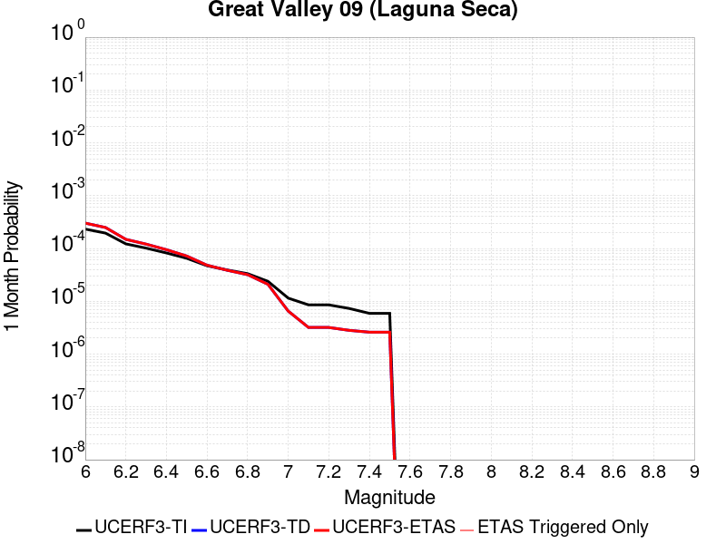 |  |  |

| Magnitude | 1 wk TI Prob | 1 wk TD Prob | 1 wk ETAS Prob | 1 wk ETAS/TD Gain | 1 wk ETAS Triggered Only | 1 mo TI Prob | 1 mo TD Prob | 1 mo ETAS Prob | 1 mo ETAS/TD Gain | 1 mo ETAS Triggered Only | 1 yr TI Prob | 1 yr TD Prob | 1 yr ETAS Prob | 1 yr ETAS/TD Gain | 1 yr ETAS Triggered Only | 10 yr TI Prob | 10 yr TD Prob | 10 yr ETAS Prob | 10 yr ETAS/TD Gain | 10 yr ETAS Triggered Only |
|-----|-----|-----|-----|-----|-----|-----|-----|-----|-----|-----|-----|-----|-----|-----|-----|-----|-----|-----|-----|-----|
| 6.0 | 5.4353277E-5 | 7.050538E-5 | 7.050538E-5 | 1.0 | 0.0 | 2.3292181E-4 | 3.0212724E-4 | 3.0212724E-4 | 1.0 | 0.0 | 0.0028321352 | 0.003672335 | 0.0036822984 | 1.0027131 | 1.0E-5 | 0.02796312 | 0.036116913 | 0.036136188 | 1.0005337 | 2.0E-5 |
| 6.1 | 4.5578287E-5 | 5.822371E-5 | 5.822371E-5 | 1.0 | 0.0 | 1.953209E-4 | 2.49502E-4 | 2.49502E-4 | 1.0 | 0.0 | 0.0023754383 | 0.0030335493 | 0.0030335493 | 1.0 | 0.0 | 0.023502063 | 0.029920705 | 0.029920705 | 1.0 | 0.0 |
| 6.2 | 2.8536782E-5 | 3.47386E-5 | 3.47386E-5 | 1.0 | 0.0 | 1.2229476E-4 | 1.488658E-4 | 1.488658E-4 | 1.0 | 0.0 | 0.0014879217 | 0.0018108767 | 0.0018108767 | 1.0 | 0.0 | 0.014779986 | 0.017958745 | 0.017958745 | 1.0 | 0.0 |
| 6.3 | 2.3698774E-5 | 2.8214314E-5 | 2.8214314E-5 | 1.0 | 0.0 | 1.01562226E-4 | 1.2090732E-4 | 1.2090732E-4 | 1.0 | 0.0 | 0.0012358186 | 0.0014710726 | 0.0014710726 | 1.0 | 0.0 | 0.012289686 | 0.014611831 | 0.014611831 | 1.0 | 0.0 |
| 6.4 | 1.9191197E-5 | 2.2123912E-5 | 2.2123912E-5 | 1.0 | 0.0 | 8.2245395E-5 | 9.480767E-5 | 9.480767E-5 | 1.0 | 0.0 | 0.0010008777 | 0.0011536786 | 0.0011536786 | 1.0 | 0.0 | 0.009963818 | 0.011477305 | 0.011477305 | 1.0 | 0.0 |
| 6.5 | 1.5203241E-5 | 1.680269E-5 | 1.680269E-5 | 1.0 | 0.0 | 6.5155116E-5 | 7.200383E-5 | 7.200383E-5 | 1.0 | 0.0 | 7.9297484E-4 | 8.7628904E-4 | 8.7628904E-4 | 1.0 | 0.0 | 0.007901512 | 0.008729759 | 0.008729759 | 1.0 | 0.0 |
| 6.6 | 1.0984925E-5 | 1.1242844E-5 | 1.1242844E-5 | 1.0 | 0.0 | 4.70774E-5 | 4.818275E-5 | 4.818275E-5 | 1.0 | 0.0 | 5.730166E-4 | 5.864695E-4 | 5.864695E-4 | 1.0 | 0.0 | 0.005715413 | 0.0058496143 | 0.0058496143 | 1.0 | 0.0 |
| 6.7 | 9.134616E-6 | 9.020084E-6 | 9.020084E-6 | 1.0 | 0.0 | 3.9147766E-5 | 3.865694E-5 | 3.865694E-5 | 1.0 | 0.0 | 4.7651984E-4 | 4.7054898E-4 | 4.7054898E-4 | 1.0 | 0.0 | 0.004754993 | 0.0046957717 | 0.0046957717 | 1.0 | 0.0 |
| 6.8 | 7.785589E-6 | 7.4521E-6 | 7.4521E-6 | 1.0 | 0.0 | 3.3366385E-5 | 3.193719E-5 | 3.193719E-5 | 1.0 | 0.0 | 4.0616E-4 | 3.8876795E-4 | 3.8876795E-4 | 1.0 | 0.0 | 0.0040541845 | 0.0038810824 | 0.0038810824 | 1.0 | 0.0 |
| 6.9 | 5.579095E-6 | 4.8985944E-6 | 4.8985944E-6 | 1.0 | 0.0 | 2.3910188E-5 | 2.0993815E-5 | 2.0993815E-5 | 1.0 | 0.0 | 2.9106764E-4 | 2.555711E-4 | 2.555711E-4 | 1.0 | 0.0 | 0.002906867 | 0.0025529093 | 0.0025529093 | 1.0 | 0.0 |
| 7.0 | 2.6816688E-6 | 1.5216407E-6 | 1.5216407E-6 | 1.0 | 0.0 | 1.1492816E-5 | 6.5213017E-6 | 6.5213017E-6 | 1.0 | 0.0 | 1.3991605E-4 | 7.939404E-5 | 7.939404E-5 | 1.0 | 0.0 | 0.0013982799 | 7.936655E-4 | 7.936655E-4 | 1.0 | 0.0 |
| 7.1 | 1.9951021E-6 | 7.4539724E-7 | 7.4539724E-7 | 1.0 | 0.0 | 8.55041E-6 | 3.194556E-6 | 3.194556E-6 | 1.0 | 0.0 | 1.0409627E-4 | 3.8893068E-5 | 3.8893068E-5 | 1.0 | 0.0 | 0.0010404752 | 3.8886676E-4 | 3.8886676E-4 | 1.0 | 0.0 |
| 7.2 | 1.9951021E-6 | 7.4539724E-7 | 7.4539724E-7 | 1.0 | 0.0 | 8.55041E-6 | 3.194556E-6 | 3.194556E-6 | 1.0 | 0.0 | 1.0409627E-4 | 3.8893068E-5 | 3.8893068E-5 | 1.0 | 0.0 | 0.0010404752 | 3.8886676E-4 | 3.8886676E-4 | 1.0 | 0.0 |
| 7.3 | 1.7087556E-6 | 6.579003E-7 | 6.579003E-7 | 1.0 | 0.0 | 7.3232177E-6 | 2.81957E-6 | 2.81957E-6 | 1.0 | 0.0 | 8.915652E-5 | 3.4327764E-5 | 3.4327764E-5 | 1.0 | 0.0 | 8.9120766E-4 | 3.4322866E-4 | 3.4322866E-4 | 1.0 | 0.0 |
| 7.4 | 1.3804846E-6 | 6.0739524E-7 | 6.0739524E-7 | 1.0 | 0.0 | 5.916349E-6 | 2.60312E-6 | 2.60312E-6 | 1.0 | 0.0 | 7.2029165E-5 | 3.1692565E-5 | 3.1692565E-5 | 1.0 | 0.0 | 7.200583E-4 | 3.1688449E-4 | 3.1688449E-4 | 1.0 | 0.0 |
| 7.5 | 1.3804846E-6 | 6.0739524E-7 | 6.0739524E-7 | 1.0 | 0.0 | 5.916349E-6 | 2.60312E-6 | 2.60312E-6 | 1.0 | 0.0 | 7.2029165E-5 | 3.1692565E-5 | 3.1692565E-5 | 1.0 | 0.0 | 7.200583E-4 | 3.1688449E-4 | 3.1688449E-4 | 1.0 | 0.0 |

## San Gabriel (Extension)
*[(top)](#table-of-contents)*

| 1 Week | 1 Month | 1 Year | 10 Year |
|-----|-----|-----|-----|
|  |  |  |  |

| Magnitude | 1 wk TI Prob | 1 wk TD Prob | 1 wk ETAS Prob | 1 wk ETAS/TD Gain | 1 wk ETAS Triggered Only | 1 mo TI Prob | 1 mo TD Prob | 1 mo ETAS Prob | 1 mo ETAS/TD Gain | 1 mo ETAS Triggered Only | 1 yr TI Prob | 1 yr TD Prob | 1 yr ETAS Prob | 1 yr ETAS/TD Gain | 1 yr ETAS Triggered Only | 10 yr TI Prob | 10 yr TD Prob | 10 yr ETAS Prob | 10 yr ETAS/TD Gain | 10 yr ETAS Triggered Only |
|-----|-----|-----|-----|-----|-----|-----|-----|-----|-----|-----|-----|-----|-----|-----|-----|-----|-----|-----|-----|-----|
| 6.0 | 5.6486106E-6 | 5.7171446E-6 | 5.7171446E-6 | 1.0 | 0.0 | 2.4208108E-5 | 2.4501825E-5 | 2.4501825E-5 | 1.0 | 0.0 | 2.9469383E-4 | 2.9827014E-4 | 2.9827014E-4 | 1.0 | 0.0 | 0.0029430336 | 0.0029788287 | 0.002998769 | 1.0066941 | 2.0E-5 |
| 6.1 | 5.6486106E-6 | 5.7171446E-6 | 5.7171446E-6 | 1.0 | 0.0 | 2.4208108E-5 | 2.4501825E-5 | 2.4501825E-5 | 1.0 | 0.0 | 2.9469383E-4 | 2.9827014E-4 | 2.9827014E-4 | 1.0 | 0.0 | 0.0029430336 | 0.0029788287 | 0.002998769 | 1.0066941 | 2.0E-5 |
| 6.2 | 5.6486106E-6 | 5.7171446E-6 | 5.7171446E-6 | 1.0 | 0.0 | 2.4208108E-5 | 2.4501825E-5 | 2.4501825E-5 | 1.0 | 0.0 | 2.9469383E-4 | 2.9827014E-4 | 2.9827014E-4 | 1.0 | 0.0 | 0.0029430336 | 0.0029788287 | 0.002998769 | 1.0066941 | 2.0E-5 |
| 6.3 | 5.6486106E-6 | 5.7171446E-6 | 5.7171446E-6 | 1.0 | 0.0 | 2.4208108E-5 | 2.4501825E-5 | 2.4501825E-5 | 1.0 | 0.0 | 2.9469383E-4 | 2.9827014E-4 | 2.9827014E-4 | 1.0 | 0.0 | 0.0029430336 | 0.0029788287 | 0.002998769 | 1.0066941 | 2.0E-5 |
| 6.4 | 5.6486106E-6 | 5.7171446E-6 | 5.7171446E-6 | 1.0 | 0.0 | 2.4208108E-5 | 2.4501825E-5 | 2.4501825E-5 | 1.0 | 0.0 | 2.9469383E-4 | 2.9827014E-4 | 2.9827014E-4 | 1.0 | 0.0 | 0.0029430336 | 0.0029788287 | 0.002998769 | 1.0066941 | 2.0E-5 |
| 6.5 | 4.7134554E-6 | 4.754565E-6 | 4.754565E-6 | 1.0 | 0.0 | 2.0200367E-5 | 2.0376552E-5 | 2.0376552E-5 | 1.0 | 0.0 | 2.459117E-4 | 2.4805713E-4 | 2.4805713E-4 | 1.0 | 0.0 | 0.0024563975 | 0.0024778906 | 0.0024978411 | 1.0080514 | 2.0E-5 |
| 6.6 | 4.7134554E-6 | 4.754565E-6 | 4.754565E-6 | 1.0 | 0.0 | 2.0200367E-5 | 2.0376552E-5 | 2.0376552E-5 | 1.0 | 0.0 | 2.459117E-4 | 2.4805713E-4 | 2.4805713E-4 | 1.0 | 0.0 | 0.0024563975 | 0.0024778906 | 0.0024978411 | 1.0080514 | 2.0E-5 |
| 6.7 | 4.2468837E-6 | 4.2743804E-6 | 4.2743804E-6 | 1.0 | 0.0 | 1.8200803E-5 | 1.8318648E-5 | 1.8318648E-5 | 1.0 | 0.0 | 2.2157225E-4 | 2.2300745E-4 | 2.2300745E-4 | 1.0 | 0.0 | 0.0022135144 | 0.0022279124 | 0.0022378901 | 1.0044785 | 1.0E-5 |
| 6.8 | 4.1180615E-6 | 4.1417693E-6 | 4.1417693E-6 | 1.0 | 0.0 | 1.7648716E-5 | 1.7750324E-5 | 1.7750324E-5 | 1.0 | 0.0 | 2.1485193E-4 | 2.1608948E-4 | 2.1608948E-4 | 1.0 | 0.0 | 0.0021464431 | 0.0021588686 | 0.002168847 | 1.0046221 | 1.0E-5 |
| 6.9 | 3.863861E-6 | 3.8800836E-6 | 3.8800836E-6 | 1.0 | 0.0 | 1.65593E-5 | 1.6628828E-5 | 1.6628828E-5 | 1.0 | 0.0 | 2.0159081E-4 | 2.0243786E-4 | 2.0243786E-4 | 1.0 | 0.0 | 0.0020140803 | 0.0020226059 | 0.0020325857 | 1.0049341 | 1.0E-5 |
| 7.0 | 3.6947372E-6 | 3.7059822E-6 | 3.7059822E-6 | 1.0 | 0.0 | 1.5834492E-5 | 1.5882688E-5 | 1.5882688E-5 | 1.0 | 0.0 | 1.9276788E-4 | 1.9335524E-4 | 1.9335524E-4 | 1.0 | 0.0 | 0.0019260074 | 0.0019319403 | 0.001941921 | 1.0051662 | 1.0E-5 |
| 7.1 | 3.5686835E-6 | 3.5732016E-6 | 3.5732016E-6 | 1.0 | 0.0 | 1.5294268E-5 | 1.5313635E-5 | 1.5313635E-5 | 1.0 | 0.0 | 1.861918E-4 | 1.8642822E-4 | 1.8642822E-4 | 1.0 | 0.0 | 0.0018603588 | 0.0018627879 | 0.0018727693 | 1.0053583 | 1.0E-5 |
| 7.2 | 2.8023446E-6 | 2.7770893E-6 | 2.7770893E-6 | 1.0 | 0.0 | 1.2009994E-5 | 1.1901758E-5 | 1.1901758E-5 | 1.0 | 0.0 | 1.4621185E-4 | 1.4489438E-4 | 1.4489438E-4 | 1.0 | 0.0 | 0.001461157 | 0.0014480136 | 0.0014579991 | 1.006896 | 1.0E-5 |
| 7.3 | 2.5843012E-6 | 2.546262E-6 | 2.546262E-6 | 1.0 | 0.0 | 1.1075529E-5 | 1.0912507E-5 | 1.0912507E-5 | 1.0 | 0.0 | 1.3483623E-4 | 1.3285177E-4 | 1.3285177E-4 | 1.0 | 0.0 | 0.0013475444 | 0.001327737 | 0.0013377237 | 1.0075216 | 1.0E-5 |
| 7.4 | 2.4464468E-6 | 2.3969585E-6 | 2.3969585E-6 | 1.0 | 0.0 | 1.04847295E-5 | 1.027264E-5 | 1.027264E-5 | 1.0 | 0.0 | 1.276441E-4 | 1.250623E-4 | 1.250623E-4 | 1.0 | 0.0 | 0.0012757082 | 0.0012499326 | 0.0012599201 | 1.0079905 | 1.0E-5 |
| 7.5 | 2.0420266E-6 | 1.8913017E-6 | 1.8913017E-6 | 1.0 | 0.0 | 8.751514E-6 | 8.105554E-6 | 8.105554E-6 | 1.0 | 0.0 | 1.0654447E-4 | 9.8680684E-5 | 9.8680684E-5 | 1.0 | 0.0 | 0.001064934 | 9.863758E-4 | 9.963659E-4 | 1.0101281 | 1.0E-5 |
| 7.6 | 1.8326596E-6 | 1.640076E-6 | 1.640076E-6 | 1.0 | 0.0 | 7.854232E-6 | 7.0288784E-6 | 7.0288784E-6 | 1.0 | 0.0 | 9.562107E-5 | 8.557326E-5 | 8.557326E-5 | 1.0 | 0.0 | 9.5579936E-4 | 8.5540896E-4 | 8.6540036E-4 | 1.0116804 | 1.0E-5 |
| 7.7 | 1.4786998E-6 | 1.2526061E-6 | 1.2526061E-6 | 1.0 | 0.0 | 6.3372695E-6 | 5.368301E-6 | 5.368301E-6 | 1.0 | 0.0 | 7.715353E-5 | 6.535712E-5 | 6.535712E-5 | 1.0 | 0.0 | 7.7126746E-4 | 6.533867E-4 | 6.533867E-4 | 1.0 | 0.0 |
| 7.8 | 7.6975533E-7 | 6.071264E-7 | 6.071264E-7 | 1.0 | 0.0 | 3.2989474E-6 | 2.601968E-6 | 2.601968E-6 | 1.0 | 0.0 | 4.0163945E-5 | 3.16785E-5 | 3.16785E-5 | 1.0 | 0.0 | 4.0156685E-4 | 3.1674592E-4 | 3.1674592E-4 | 1.0 | 0.0 |
| 7.9 | 1.7645915E-7 | 9.218553E-8 | 9.218553E-8 | 1.0 | 0.0 | 7.562533E-7 | 3.9508078E-7 | 3.9508078E-7 | 1.0 | 0.0 | 9.207345E-6 | 4.810098E-6 | 4.810098E-6 | 1.0 | 0.0 | 9.206964E-5 | 4.810463E-5 | 4.810463E-5 | 1.0 | 0.0 |
| 8.0 | 1.0463461E-7 | 2.4971815E-8 | 2.4971815E-8 | 1.0 | 0.0 | 4.4843398E-7 | 1.0702206E-7 | 1.0702206E-7 | 1.0 | 0.0 | 5.45967E-6 | 1.3029928E-6 | 1.3029928E-6 | 1.0 | 0.0 | 5.459536E-5 | 1.3034539E-5 | 1.3034539E-5 | 1.0 | 0.0 |
| 8.1 | 7.875717E-8 | 1.38816025E-8 | 1.38816025E-8 | 1.0 | 0.0 | 3.3753068E-7 | 5.949258E-8 | 5.949258E-8 | 1.0 | 0.0 | 4.109428E-6 | 7.243219E-7 | 7.243219E-7 | 1.0 | 0.0 | 4.109352E-5 | 7.247882E-6 | 7.247882E-6 | 1.0 | 0.0 |
| 8.2 | 1.33163E-8 | 1.7755355E-9 | 1.7755355E-9 | 1.0 | 0.0 | 5.7069855E-8 | 7.609438E-9 | 7.609438E-9 | 1.0 | 0.0 | 6.9482525E-7 | 9.26449E-8 | 9.26449E-8 | 1.0 | 0.0 | 6.9482307E-6 | 9.284174E-7 | 9.284174E-7 | 1.0 | 0.0 |

## Sierra Madre
*[(top)](#table-of-contents)*

| 1 Week | 1 Month | 1 Year | 10 Year |
|-----|-----|-----|-----|
| 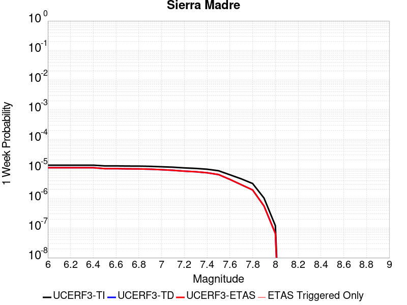 | 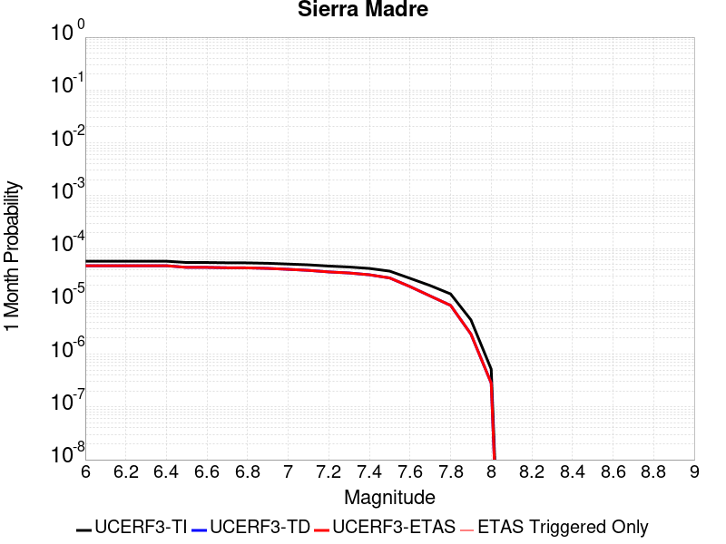 | 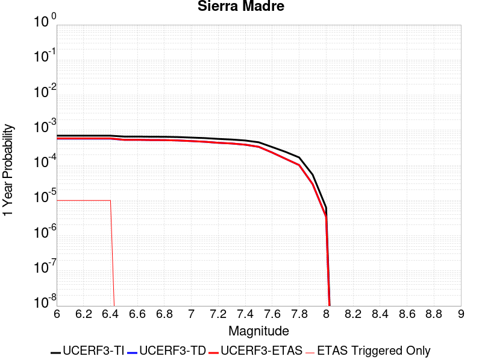 | 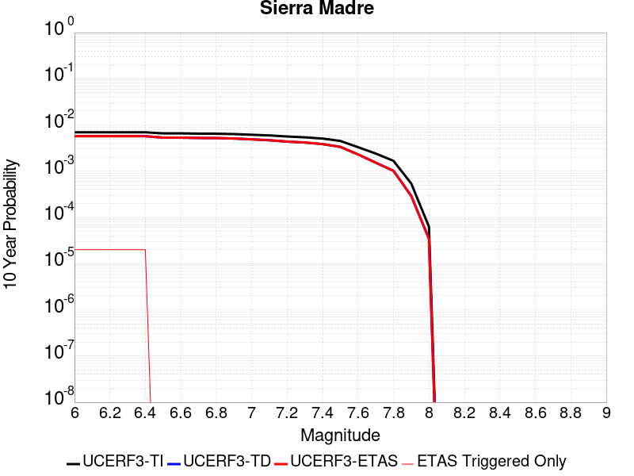 |

| Magnitude | 1 wk TI Prob | 1 wk TD Prob | 1 wk ETAS Prob | 1 wk ETAS/TD Gain | 1 wk ETAS Triggered Only | 1 mo TI Prob | 1 mo TD Prob | 1 mo ETAS Prob | 1 mo ETAS/TD Gain | 1 mo ETAS Triggered Only | 1 yr TI Prob | 1 yr TD Prob | 1 yr ETAS Prob | 1 yr ETAS/TD Gain | 1 yr ETAS Triggered Only | 10 yr TI Prob | 10 yr TD Prob | 10 yr ETAS Prob | 10 yr ETAS/TD Gain | 10 yr ETAS Triggered Only |
|-----|-----|-----|-----|-----|-----|-----|-----|-----|-----|-----|-----|-----|-----|-----|-----|-----|-----|-----|-----|-----|
| 6.0 | 1.3379373E-5 | 1.100113E-5 | 1.100113E-5 | 1.0 | 0.0 | 5.7338908E-5 | 4.7146856E-5 | 4.7146856E-5 | 1.0 | 0.0 | 6.978776E-4 | 5.738633E-4 | 5.8385753E-4 | 1.0174158 | 1.0E-5 | 0.0069569005 | 0.005724178 | 0.0057440633 | 1.003474 | 2.0E-5 |
| 6.1 | 1.3379373E-5 | 1.100113E-5 | 1.100113E-5 | 1.0 | 0.0 | 5.7338908E-5 | 4.7146856E-5 | 4.7146856E-5 | 1.0 | 0.0 | 6.978776E-4 | 5.738633E-4 | 5.8385753E-4 | 1.0174158 | 1.0E-5 | 0.0069569005 | 0.005724178 | 0.0057440633 | 1.003474 | 2.0E-5 |
| 6.2 | 1.3379373E-5 | 1.100113E-5 | 1.100113E-5 | 1.0 | 0.0 | 5.7338908E-5 | 4.7146856E-5 | 4.7146856E-5 | 1.0 | 0.0 | 6.978776E-4 | 5.738633E-4 | 5.8385753E-4 | 1.0174158 | 1.0E-5 | 0.0069569005 | 0.005724178 | 0.0057440633 | 1.003474 | 2.0E-5 |
| 6.3 | 1.3379373E-5 | 1.100113E-5 | 1.100113E-5 | 1.0 | 0.0 | 5.7338908E-5 | 4.7146856E-5 | 4.7146856E-5 | 1.0 | 0.0 | 6.978776E-4 | 5.738633E-4 | 5.8385753E-4 | 1.0174158 | 1.0E-5 | 0.0069569005 | 0.005724178 | 0.0057440633 | 1.003474 | 2.0E-5 |
| 6.4 | 1.3379373E-5 | 1.100113E-5 | 1.100113E-5 | 1.0 | 0.0 | 5.7338908E-5 | 4.7146856E-5 | 4.7146856E-5 | 1.0 | 0.0 | 6.978776E-4 | 5.738633E-4 | 5.8385753E-4 | 1.0174158 | 1.0E-5 | 0.0069569005 | 0.005724178 | 0.0057440633 | 1.003474 | 2.0E-5 |
| 6.5 | 1.26563245E-5 | 1.0230579E-5 | 1.0230579E-5 | 1.0 | 0.0 | 5.4240263E-5 | 4.3844608E-5 | 4.3844608E-5 | 1.0 | 0.0 | 6.601751E-4 | 5.3367845E-4 | 5.3367845E-4 | 1.0 | 0.0 | 0.006582173 | 0.00532429 | 0.00532429 | 1.0 | 0.0 |
| 6.6 | 1.26563245E-5 | 1.0230579E-5 | 1.0230579E-5 | 1.0 | 0.0 | 5.4240263E-5 | 4.3844608E-5 | 4.3844608E-5 | 1.0 | 0.0 | 6.601751E-4 | 5.3367845E-4 | 5.3367845E-4 | 1.0 | 0.0 | 0.006582173 | 0.00532429 | 0.00532429 | 1.0 | 0.0 |
| 6.7 | 1.2502474E-5 | 1.0066722E-5 | 1.0066722E-5 | 1.0 | 0.0 | 5.3580934E-5 | 4.3142387E-5 | 4.3142387E-5 | 1.0 | 0.0 | 6.521526E-4 | 5.2513304E-4 | 5.2513304E-4 | 1.0 | 0.0 | 0.0065024206 | 0.0052392404 | 0.0052392404 | 1.0 | 0.0 |
| 6.8 | 1.2454966E-5 | 1.0019007E-5 | 1.0019007E-5 | 1.0 | 0.0 | 5.3377335E-5 | 4.29379E-5 | 4.29379E-5 | 1.0 | 0.0 | 6.4967526E-4 | 5.226446E-4 | 5.226446E-4 | 1.0 | 0.0 | 0.006477792 | 0.005214473 | 0.005214473 | 1.0 | 0.0 |
| 6.9 | 1.2225574E-5 | 9.7929815E-6 | 9.7929815E-6 | 1.0 | 0.0 | 5.2394265E-5 | 4.196925E-5 | 4.196925E-5 | 1.0 | 0.0 | 6.3771347E-4 | 5.108569E-4 | 5.108569E-4 | 1.0 | 0.0 | 0.006358865 | 0.0050971415 | 0.0050971415 | 1.0 | 0.0 |
| 7.0 | 1.182946E-5 | 9.3995195E-6 | 9.3995195E-6 | 1.0 | 0.0 | 5.06967E-5 | 4.0283037E-5 | 4.0283037E-5 | 1.0 | 0.0 | 6.1705755E-4 | 4.903367E-4 | 4.903367E-4 | 1.0 | 0.0 | 0.006153469 | 0.004892859 | 0.004892859 | 1.0 | 0.0 |
| 7.1 | 1.14369095E-5 | 8.986527E-6 | 8.986527E-6 | 1.0 | 0.0 | 4.9014405E-5 | 3.8513124E-5 | 3.8513124E-5 | 1.0 | 0.0 | 5.9658696E-4 | 4.6879737E-4 | 4.6879737E-4 | 1.0 | 0.0 | 0.005949879 | 0.00467839 | 0.00467839 | 1.0 | 0.0 |
| 7.2 | 1.0836419E-5 | 8.399916E-6 | 8.399916E-6 | 1.0 | 0.0 | 4.644097E-5 | 3.5999146E-5 | 3.5999146E-5 | 1.0 | 0.0 | 5.652721E-4 | 4.3820238E-4 | 4.3820238E-4 | 1.0 | 0.0 | 0.0056383642 | 0.0043736803 | 0.0043736803 | 1.0 | 0.0 |
| 7.3 | 1.0403439E-5 | 8.021173E-6 | 8.021173E-6 | 1.0 | 0.0 | 4.4585406E-5 | 3.4376008E-5 | 3.4376008E-5 | 1.0 | 0.0 | 5.426921E-4 | 4.1844844E-4 | 4.1844844E-4 | 1.0 | 0.0 | 0.005413687 | 0.0041769007 | 0.0041769007 | 1.0 | 0.0 |
| 7.4 | 9.768864E-6 | 7.414793E-6 | 7.414793E-6 | 1.0 | 0.0 | 4.186589E-5 | 3.17773E-5 | 3.17773E-5 | 1.0 | 0.0 | 5.09598E-4 | 3.8682084E-4 | 3.8682084E-4 | 1.0 | 0.0 | 0.0050843097 | 0.0038617672 | 0.0038617672 | 1.0 | 0.0 |
| 7.5 | 8.687089E-6 | 6.4504875E-6 | 6.4504875E-6 | 1.0 | 0.0 | 3.722985E-5 | 2.7644659E-5 | 2.7644659E-5 | 1.0 | 0.0 | 4.5317915E-4 | 3.3652261E-4 | 3.3652261E-4 | 1.0 | 0.0 | 0.004522561 | 0.0033604174 | 0.0033604174 | 1.0 | 0.0 |
| 7.6 | 6.3506063E-6 | 4.430626E-6 | 4.430626E-6 | 1.0 | 0.0 | 2.72166E-5 | 1.8988261E-5 | 1.8988261E-5 | 1.0 | 0.0 | 3.3131172E-4 | 2.3115781E-4 | 2.3115781E-4 | 1.0 | 0.0 | 0.003308182 | 0.0023093987 | 0.0023093987 | 1.0 | 0.0 |
| 7.7 | 4.62223E-6 | 2.9332562E-6 | 2.9332562E-6 | 1.0 | 0.0 | 1.9809406E-5 | 1.2571038E-5 | 1.2571038E-5 | 1.0 | 0.0 | 2.4115283E-4 | 1.5304166E-4 | 1.5304166E-4 | 1.0 | 0.0 | 0.0024089129 | 0.0015295637 | 0.0015295637 | 1.0 | 0.0 |
| 7.8 | 3.2145008E-6 | 1.9496579E-6 | 1.9496579E-6 | 1.0 | 0.0 | 1.3776359E-5 | 8.35565E-6 | 8.35565E-6 | 1.0 | 0.0 | 1.6771426E-4 | 1.01725294E-4 | 1.01725294E-4 | 1.0 | 0.0 | 0.0016758774 | 0.0010169316 | 0.0010169316 | 1.0 | 0.0 |
| 7.9 | 1.0391769E-6 | 5.6034094E-7 | 5.6034094E-7 | 1.0 | 0.0 | 4.4536077E-6 | 2.401459E-6 | 2.401459E-6 | 1.0 | 0.0 | 5.4221324E-5 | 2.9237375E-5 | 2.9237375E-5 | 1.0 | 0.0 | 5.4208096E-4 | 2.9233572E-4 | 2.9233572E-4 | 1.0 | 0.0 |
| 8.0 | 1.210983E-7 | 6.6141716E-8 | 6.6141716E-8 | 1.0 | 0.0 | 5.1899264E-7 | 2.8346446E-7 | 2.8346446E-7 | 1.0 | 0.0 | 6.3187167E-6 | 3.4511747E-6 | 3.4511747E-6 | 1.0 | 0.0 | 6.318537E-5 | 3.4511228E-5 | 3.4511228E-5 | 1.0 | 0.0 |

## Earthquake Valley (So Extension)
*[(top)](#table-of-contents)*

| 1 Week | 1 Month | 1 Year | 10 Year |
|-----|-----|-----|-----|
| 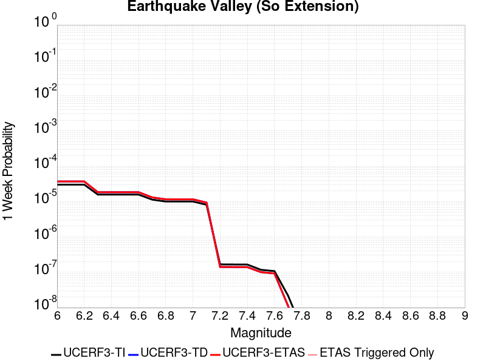 | 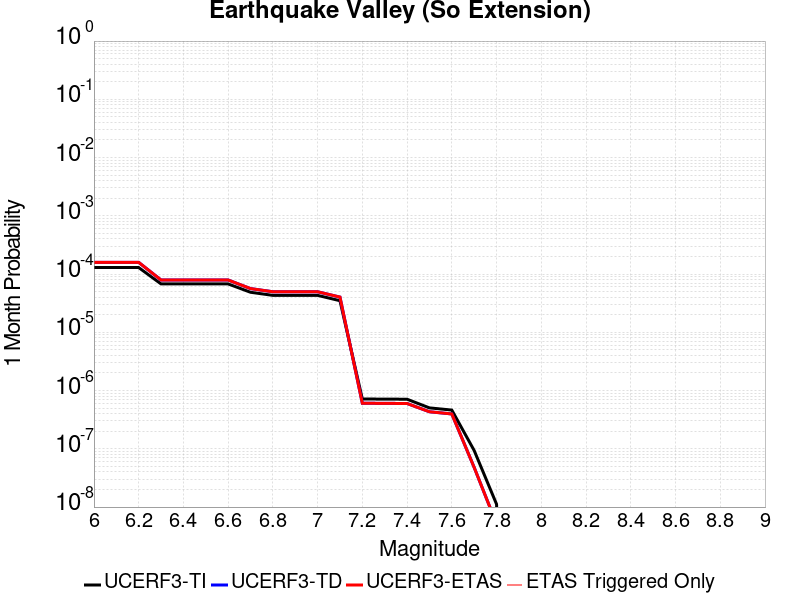 | 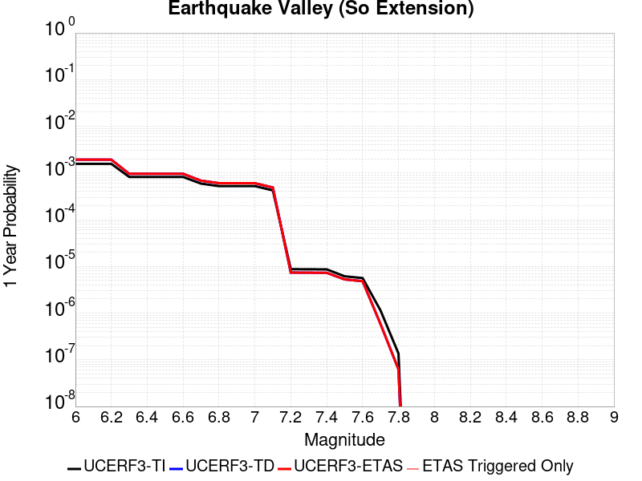 | 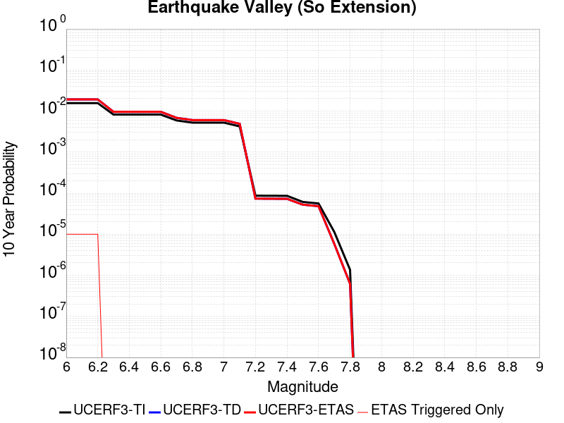 |

| Magnitude | 1 wk TI Prob | 1 wk TD Prob | 1 wk ETAS Prob | 1 wk ETAS/TD Gain | 1 wk ETAS Triggered Only | 1 mo TI Prob | 1 mo TD Prob | 1 mo ETAS Prob | 1 mo ETAS/TD Gain | 1 mo ETAS Triggered Only | 1 yr TI Prob | 1 yr TD Prob | 1 yr ETAS Prob | 1 yr ETAS/TD Gain | 1 yr ETAS Triggered Only | 10 yr TI Prob | 10 yr TD Prob | 10 yr ETAS Prob | 10 yr ETAS/TD Gain | 10 yr ETAS Triggered Only |
|-----|-----|-----|-----|-----|-----|-----|-----|-----|-----|-----|-----|-----|-----|-----|-----|-----|-----|-----|-----|-----|
| 6.0 | 3.0194888E-5 | 3.707326E-5 | 3.707326E-5 | 1.0 | 0.0 | 1.2940024E-4 | 1.588788E-4 | 1.588788E-4 | 1.0 | 0.0 | 0.0015743093 | 0.0019331772 | 0.0019331772 | 1.0 | 0.0 | 0.01563203 | 0.019213596 | 0.019223403 | 1.0005105 | 1.0E-5 |
| 6.1 | 3.0194888E-5 | 3.707326E-5 | 3.707326E-5 | 1.0 | 0.0 | 1.2940024E-4 | 1.588788E-4 | 1.588788E-4 | 1.0 | 0.0 | 0.0015743093 | 0.0019331772 | 0.0019331772 | 1.0 | 0.0 | 0.01563203 | 0.019213596 | 0.019223403 | 1.0005105 | 1.0E-5 |
| 6.2 | 3.0194888E-5 | 3.707326E-5 | 3.707326E-5 | 1.0 | 0.0 | 1.2940024E-4 | 1.588788E-4 | 1.588788E-4 | 1.0 | 0.0 | 0.0015743093 | 0.0019331772 | 0.0019331772 | 1.0 | 0.0 | 0.01563203 | 0.019213596 | 0.019223403 | 1.0005105 | 1.0E-5 |
| 6.3 | 1.5795305E-5 | 1.8447001E-5 | 1.8447001E-5 | 1.0 | 0.0 | 6.769241E-5 | 7.905681E-5 | 7.905681E-5 | 1.0 | 0.0 | 8.238434E-4 | 9.622029E-4 | 9.622029E-4 | 1.0 | 0.0 | 0.008207959 | 0.009591279 | 0.009591279 | 1.0 | 0.0 |
| 6.4 | 1.5795305E-5 | 1.8447001E-5 | 1.8447001E-5 | 1.0 | 0.0 | 6.769241E-5 | 7.905681E-5 | 7.905681E-5 | 1.0 | 0.0 | 8.238434E-4 | 9.622029E-4 | 9.622029E-4 | 1.0 | 0.0 | 0.008207959 | 0.009591279 | 0.009591279 | 1.0 | 0.0 |
| 6.5 | 1.5795305E-5 | 1.8447001E-5 | 1.8447001E-5 | 1.0 | 0.0 | 6.769241E-5 | 7.905681E-5 | 7.905681E-5 | 1.0 | 0.0 | 8.238434E-4 | 9.622029E-4 | 9.622029E-4 | 1.0 | 0.0 | 0.008207959 | 0.009591279 | 0.009591279 | 1.0 | 0.0 |
| 6.6 | 1.5795305E-5 | 1.8447001E-5 | 1.8447001E-5 | 1.0 | 0.0 | 6.769241E-5 | 7.905681E-5 | 7.905681E-5 | 1.0 | 0.0 | 8.238434E-4 | 9.622029E-4 | 9.622029E-4 | 1.0 | 0.0 | 0.008207959 | 0.009591279 | 0.009591279 | 1.0 | 0.0 |
| 6.7 | 1.1363076E-5 | 1.3138576E-5 | 1.3138576E-5 | 1.0 | 0.0 | 4.8697988E-5 | 5.6307395E-5 | 5.6307395E-5 | 1.0 | 0.0 | 5.927367E-4 | 6.85403E-4 | 6.85403E-4 | 1.0 | 0.0 | 0.0059115817 | 0.0068403645 | 0.0068403645 | 1.0 | 0.0 |
| 6.8 | 1.0049611E-5 | 1.15945795E-5 | 1.15945795E-5 | 1.0 | 0.0 | 4.306905E-5 | 4.969052E-5 | 4.969052E-5 | 1.0 | 0.0 | 5.242395E-4 | 6.048873E-4 | 6.048873E-4 | 1.0 | 0.0 | 0.0052300454 | 0.0060395855 | 0.0060395855 | 1.0 | 0.0 |
| 6.9 | 1.0049611E-5 | 1.15945795E-5 | 1.15945795E-5 | 1.0 | 0.0 | 4.306905E-5 | 4.969052E-5 | 4.969052E-5 | 1.0 | 0.0 | 5.242395E-4 | 6.048873E-4 | 6.048873E-4 | 1.0 | 0.0 | 0.0052300454 | 0.0060395855 | 0.0060395855 | 1.0 | 0.0 |
| 7.0 | 1.0049611E-5 | 1.15945795E-5 | 1.15945795E-5 | 1.0 | 0.0 | 4.306905E-5 | 4.969052E-5 | 4.969052E-5 | 1.0 | 0.0 | 5.242395E-4 | 6.048873E-4 | 6.048873E-4 | 1.0 | 0.0 | 0.0052300454 | 0.0060395855 | 0.0060395855 | 1.0 | 0.0 |
| 7.1 | 8.140254E-6 | 9.383657E-6 | 9.383657E-6 | 1.0 | 0.0 | 3.4886336E-5 | 4.021543E-5 | 4.021543E-5 | 1.0 | 0.0 | 4.2465836E-4 | 4.895799E-4 | 4.895799E-4 | 1.0 | 0.0 | 0.0042384774 | 0.00489159 | 0.00489159 | 1.0 | 0.0 |
| 7.2 | 1.673835E-7 | 1.4154533E-7 | 1.4154533E-7 | 1.0 | 0.0 | 7.173577E-7 | 6.066227E-7 | 6.066227E-7 | 1.0 | 0.0 | 8.733795E-6 | 7.38561E-6 | 7.38561E-6 | 1.0 | 0.0 | 8.733451E-5 | 7.3854E-5 | 7.3854E-5 | 1.0 | 0.0 |
| 7.3 | 1.6632116E-7 | 1.405276E-7 | 1.405276E-7 | 1.0 | 0.0 | 7.1280476E-7 | 6.02261E-7 | 6.02261E-7 | 1.0 | 0.0 | 8.678364E-6 | 7.332507E-6 | 7.332507E-6 | 1.0 | 0.0 | 8.6780245E-5 | 7.3323004E-5 | 7.3323004E-5 | 1.0 | 0.0 |
| 7.4 | 1.6569169E-7 | 1.3997388E-7 | 1.3997388E-7 | 1.0 | 0.0 | 7.1010703E-7 | 5.998879E-7 | 5.998879E-7 | 1.0 | 0.0 | 8.645519E-6 | 7.3036144E-6 | 7.3036144E-6 | 1.0 | 0.0 | 8.645182E-5 | 7.30341E-5 | 7.30341E-5 | 1.0 | 0.0 |
| 7.5 | 1.1764555E-7 | 1.0096232E-7 | 1.0096232E-7 | 1.0 | 0.0 | 5.041951E-7 | 4.3269557E-7 | 4.3269557E-7 | 1.0 | 0.0 | 6.138558E-6 | 5.268058E-6 | 5.268058E-6 | 1.0 | 0.0 | 6.1383886E-5 | 5.267955E-5 | 5.267955E-5 | 1.0 | 0.0 |
| 7.6 | 1.07927605E-7 | 9.261032E-8 | 9.261032E-8 | 1.0 | 0.0 | 4.6254678E-7 | 3.9690133E-7 | 3.9690133E-7 | 1.0 | 0.0 | 5.6314925E-6 | 4.832265E-6 | 4.832265E-6 | 1.0 | 0.0 | 5.63135E-5 | 4.832181E-5 | 4.832181E-5 | 1.0 | 0.0 |
| 7.7 | 2.1826905E-8 | 1.1181076E-8 | 1.1181076E-8 | 1.0 | 0.0 | 9.3543875E-8 | 4.7918892E-8 | 4.7918892E-8 | 1.0 | 0.0 | 1.1388961E-6 | 5.8341243E-7 | 5.8341243E-7 | 1.0 | 0.0 | 1.1388902E-5 | 5.8341143E-6 | 5.8341143E-6 | 1.0 | 0.0 |
| 7.8 | 2.6169649E-9 | 1.1970057E-9 | 1.1970057E-9 | 1.0 | 0.0 | 1.1215564E-8 | 5.130025E-9 | 5.130025E-9 | 1.0 | 0.0 | 1.3654947E-7 | 6.245805E-8 | 6.245805E-8 | 1.0 | 0.0 | 1.365494E-6 | 6.245805E-7 | 6.245805E-7 | 1.0 | 0.0 |

## Pitas Point (Lower West)
*[(top)](#table-of-contents)*

| 1 Week | 1 Month | 1 Year | 10 Year |
|-----|-----|-----|-----|
|  | 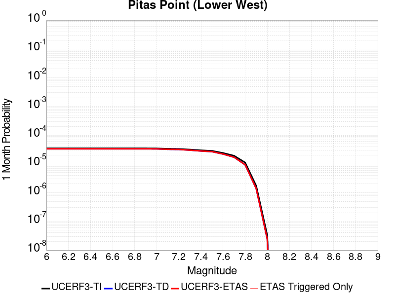 | 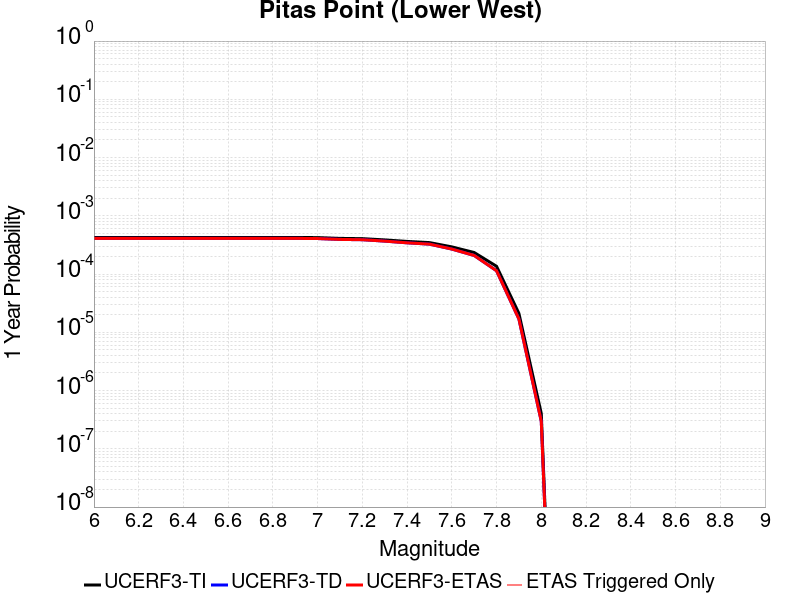 | 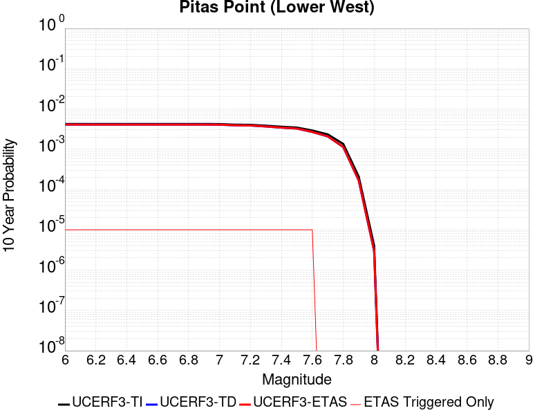 |

| Magnitude | 1 wk TI Prob | 1 wk TD Prob | 1 wk ETAS Prob | 1 wk ETAS/TD Gain | 1 wk ETAS Triggered Only | 1 mo TI Prob | 1 mo TD Prob | 1 mo ETAS Prob | 1 mo ETAS/TD Gain | 1 mo ETAS Triggered Only | 1 yr TI Prob | 1 yr TD Prob | 1 yr ETAS Prob | 1 yr ETAS/TD Gain | 1 yr ETAS Triggered Only | 10 yr TI Prob | 10 yr TD Prob | 10 yr ETAS Prob | 10 yr ETAS/TD Gain | 10 yr ETAS Triggered Only |
|-----|-----|-----|-----|-----|-----|-----|-----|-----|-----|-----|-----|-----|-----|-----|-----|-----|-----|-----|-----|-----|
| 6.0 | 8.151497E-6 | 7.855829E-6 | 7.855829E-6 | 1.0 | 0.0 | 3.493452E-5 | 3.3667406E-5 | 3.3667406E-5 | 1.0 | 0.0 | 4.252448E-4 | 4.098243E-4 | 4.098243E-4 | 1.0 | 0.0 | 0.0042443196 | 0.004090766 | 0.004100725 | 1.0024345 | 1.0E-5 |
| 6.1 | 8.151497E-6 | 7.855829E-6 | 7.855829E-6 | 1.0 | 0.0 | 3.493452E-5 | 3.3667406E-5 | 3.3667406E-5 | 1.0 | 0.0 | 4.252448E-4 | 4.098243E-4 | 4.098243E-4 | 1.0 | 0.0 | 0.0042443196 | 0.004090766 | 0.004100725 | 1.0024345 | 1.0E-5 |
| 6.2 | 8.151497E-6 | 7.855829E-6 | 7.855829E-6 | 1.0 | 0.0 | 3.493452E-5 | 3.3667406E-5 | 3.3667406E-5 | 1.0 | 0.0 | 4.252448E-4 | 4.098243E-4 | 4.098243E-4 | 1.0 | 0.0 | 0.0042443196 | 0.004090766 | 0.004100725 | 1.0024345 | 1.0E-5 |
| 6.3 | 8.151497E-6 | 7.855829E-6 | 7.855829E-6 | 1.0 | 0.0 | 3.493452E-5 | 3.3667406E-5 | 3.3667406E-5 | 1.0 | 0.0 | 4.252448E-4 | 4.098243E-4 | 4.098243E-4 | 1.0 | 0.0 | 0.0042443196 | 0.004090766 | 0.004100725 | 1.0024345 | 1.0E-5 |
| 6.4 | 8.151497E-6 | 7.855829E-6 | 7.855829E-6 | 1.0 | 0.0 | 3.493452E-5 | 3.3667406E-5 | 3.3667406E-5 | 1.0 | 0.0 | 4.252448E-4 | 4.098243E-4 | 4.098243E-4 | 1.0 | 0.0 | 0.0042443196 | 0.004090766 | 0.004100725 | 1.0024345 | 1.0E-5 |
| 6.5 | 8.151497E-6 | 7.855829E-6 | 7.855829E-6 | 1.0 | 0.0 | 3.493452E-5 | 3.3667406E-5 | 3.3667406E-5 | 1.0 | 0.0 | 4.252448E-4 | 4.098243E-4 | 4.098243E-4 | 1.0 | 0.0 | 0.0042443196 | 0.004090766 | 0.004100725 | 1.0024345 | 1.0E-5 |
| 6.6 | 8.151497E-6 | 7.855829E-6 | 7.855829E-6 | 1.0 | 0.0 | 3.493452E-5 | 3.3667406E-5 | 3.3667406E-5 | 1.0 | 0.0 | 4.252448E-4 | 4.098243E-4 | 4.098243E-4 | 1.0 | 0.0 | 0.0042443196 | 0.004090766 | 0.004100725 | 1.0024345 | 1.0E-5 |
| 6.7 | 8.151497E-6 | 7.855829E-6 | 7.855829E-6 | 1.0 | 0.0 | 3.493452E-5 | 3.3667406E-5 | 3.3667406E-5 | 1.0 | 0.0 | 4.252448E-4 | 4.098243E-4 | 4.098243E-4 | 1.0 | 0.0 | 0.0042443196 | 0.004090766 | 0.004100725 | 1.0024345 | 1.0E-5 |
| 6.8 | 8.151497E-6 | 7.855829E-6 | 7.855829E-6 | 1.0 | 0.0 | 3.493452E-5 | 3.3667406E-5 | 3.3667406E-5 | 1.0 | 0.0 | 4.252448E-4 | 4.098243E-4 | 4.098243E-4 | 1.0 | 0.0 | 0.0042443196 | 0.004090766 | 0.004100725 | 1.0024345 | 1.0E-5 |
| 6.9 | 8.151497E-6 | 7.855829E-6 | 7.855829E-6 | 1.0 | 0.0 | 3.493452E-5 | 3.3667406E-5 | 3.3667406E-5 | 1.0 | 0.0 | 4.252448E-4 | 4.098243E-4 | 4.098243E-4 | 1.0 | 0.0 | 0.0042443196 | 0.004090766 | 0.004100725 | 1.0024345 | 1.0E-5 |
| 7.0 | 8.103535E-6 | 7.805258E-6 | 7.805258E-6 | 1.0 | 0.0 | 3.4728975E-5 | 3.345068E-5 | 3.345068E-5 | 1.0 | 0.0 | 4.2274324E-4 | 4.0718666E-4 | 4.0718666E-4 | 1.0 | 0.0 | 0.0042193993 | 0.0040644864 | 0.0040744455 | 1.0024503 | 1.0E-5 |
| 7.1 | 7.853298E-6 | 7.540947E-6 | 7.540947E-6 | 1.0 | 0.0 | 3.3656554E-5 | 3.231795E-5 | 3.231795E-5 | 1.0 | 0.0 | 4.096915E-4 | 3.9340067E-4 | 3.9340067E-4 | 1.0 | 0.0 | 0.00408937 | 0.0039271186 | 0.0039370796 | 1.0025364 | 1.0E-5 |
| 7.2 | 7.771102E-6 | 7.453228E-6 | 7.453228E-6 | 1.0 | 0.0 | 3.33043E-5 | 3.1942018E-5 | 3.1942018E-5 | 1.0 | 0.0 | 4.0540437E-4 | 3.8882537E-4 | 3.8882537E-4 | 1.0 | 0.0 | 0.0040466557 | 0.0038815264 | 0.0038914874 | 1.0025663 | 1.0E-5 |
| 7.3 | 7.3945344E-6 | 7.049329E-6 | 7.049329E-6 | 1.0 | 0.0 | 3.1690477E-5 | 3.0211062E-5 | 3.0211062E-5 | 1.0 | 0.0 | 3.8576324E-4 | 3.6775824E-4 | 3.6775824E-4 | 1.0 | 0.0 | 0.0038509427 | 0.0036715642 | 0.0036815275 | 1.0027137 | 1.0E-5 |
| 7.4 | 6.964645E-6 | 6.5901736E-6 | 6.5901736E-6 | 1.0 | 0.0 | 2.9848137E-5 | 2.8243297E-5 | 2.8243297E-5 | 1.0 | 0.0 | 3.6334046E-4 | 3.4380838E-4 | 3.4380838E-4 | 1.0 | 0.0 | 0.0036274698 | 0.0034328182 | 0.0034427838 | 1.0029031 | 1.0E-5 |
| 7.5 | 6.6525035E-6 | 6.2592094E-6 | 6.2592094E-6 | 1.0 | 0.0 | 2.851042E-5 | 2.682491E-5 | 2.682491E-5 | 1.0 | 0.0 | 3.4705905E-4 | 3.2654483E-4 | 3.2654483E-4 | 1.0 | 0.0 | 0.0034651754 | 0.0032607014 | 0.003270669 | 1.0030569 | 1.0E-5 |
| 7.6 | 5.613338E-6 | 5.1514285E-6 | 5.1514285E-6 | 1.0 | 0.0 | 2.405694E-5 | 2.2077365E-5 | 2.2077365E-5 | 1.0 | 0.0 | 2.928539E-4 | 2.6875906E-4 | 2.6875906E-4 | 1.0 | 0.0 | 0.0029246826 | 0.002684372 | 0.002694345 | 1.0037153 | 1.0E-5 |
| 7.7 | 4.494704E-6 | 3.996944E-6 | 3.996944E-6 | 1.0 | 0.0 | 1.9262876E-5 | 1.712965E-5 | 1.712965E-5 | 1.0 | 0.0 | 2.3450027E-4 | 2.0853376E-4 | 2.0853376E-4 | 1.0 | 0.0 | 0.0023425296 | 0.002083405 | 0.002083405 | 1.0 | 0.0 |
| 7.8 | 2.6075882E-6 | 2.1836554E-6 | 2.1836554E-6 | 1.0 | 0.0 | 1.117533E-5 | 9.35849E-6 | 9.35849E-6 | 1.0 | 0.0 | 1.3605114E-4 | 1.1393371E-4 | 1.1393371E-4 | 1.0 | 0.0 | 0.0013596788 | 0.0011387577 | 0.0011387577 | 1.0 | 0.0 |
| 7.9 | 4.045984E-7 | 3.242403E-7 | 3.242403E-7 | 1.0 | 0.0 | 1.733992E-6 | 1.3896005E-6 | 1.3896005E-6 | 1.0 | 0.0 | 2.1111147E-5 | 1.6918259E-5 | 1.6918259E-5 | 1.0 | 0.0 | 2.1109142E-4 | 1.6917E-4 | 1.6917E-4 | 1.0 | 0.0 |
| 8.0 | 7.791402E-9 | 5.683553E-9 | 5.683553E-9 | 1.0 | 0.0 | 3.3391725E-8 | 2.4358085E-8 | 2.4358085E-8 | 1.0 | 0.0 | 4.0654416E-7 | 2.9655968E-7 | 2.9655968E-7 | 1.0 | 0.0 | 4.065434E-6 | 2.9655946E-6 | 2.9655946E-6 | 1.0 | 0.0 |

## Big Lagoon - Bald Mtn 2011 CFM
*[(top)](#table-of-contents)*

| 1 Week | 1 Month | 1 Year | 10 Year |
|-----|-----|-----|-----|
|  |  |  |  |

| Magnitude | 1 wk TI Prob | 1 wk TD Prob | 1 wk ETAS Prob | 1 wk ETAS/TD Gain | 1 wk ETAS Triggered Only | 1 mo TI Prob | 1 mo TD Prob | 1 mo ETAS Prob | 1 mo ETAS/TD Gain | 1 mo ETAS Triggered Only | 1 yr TI Prob | 1 yr TD Prob | 1 yr ETAS Prob | 1 yr ETAS/TD Gain | 1 yr ETAS Triggered Only | 10 yr TI Prob | 10 yr TD Prob | 10 yr ETAS Prob | 10 yr ETAS/TD Gain | 10 yr ETAS Triggered Only |
|-----|-----|-----|-----|-----|-----|-----|-----|-----|-----|-----|-----|-----|-----|-----|-----|-----|-----|-----|-----|-----|
| 6.0 | 1.8699735E-5 | 1.9850344E-5 | 1.9850344E-5 | 1.0 | 0.0 | 8.013926E-5 | 8.5070336E-5 | 8.5070336E-5 | 1.0 | 0.0 | 9.752587E-4 | 0.001035277 | 0.001035277 | 1.0 | 0.0 | 0.009709897 | 0.010308358 | 0.010318255 | 1.0009601 | 1.0E-5 |
| 6.1 | 1.8699735E-5 | 1.9850344E-5 | 1.9850344E-5 | 1.0 | 0.0 | 8.013926E-5 | 8.5070336E-5 | 8.5070336E-5 | 1.0 | 0.0 | 9.752587E-4 | 0.001035277 | 0.001035277 | 1.0 | 0.0 | 0.009709897 | 0.010308358 | 0.010318255 | 1.0009601 | 1.0E-5 |
| 6.2 | 1.8699735E-5 | 1.9850344E-5 | 1.9850344E-5 | 1.0 | 0.0 | 8.013926E-5 | 8.5070336E-5 | 8.5070336E-5 | 1.0 | 0.0 | 9.752587E-4 | 0.001035277 | 0.001035277 | 1.0 | 0.0 | 0.009709897 | 0.010308358 | 0.010318255 | 1.0009601 | 1.0E-5 |
| 6.3 | 1.8699735E-5 | 1.9850344E-5 | 1.9850344E-5 | 1.0 | 0.0 | 8.013926E-5 | 8.5070336E-5 | 8.5070336E-5 | 1.0 | 0.0 | 9.752587E-4 | 0.001035277 | 0.001035277 | 1.0 | 0.0 | 0.009709897 | 0.010308358 | 0.010318255 | 1.0009601 | 1.0E-5 |
| 6.4 | 1.8699735E-5 | 1.9850344E-5 | 1.9850344E-5 | 1.0 | 0.0 | 8.013926E-5 | 8.5070336E-5 | 8.5070336E-5 | 1.0 | 0.0 | 9.752587E-4 | 0.001035277 | 0.001035277 | 1.0 | 0.0 | 0.009709897 | 0.010308358 | 0.010318255 | 1.0009601 | 1.0E-5 |
| 6.5 | 1.8699735E-5 | 1.9850344E-5 | 1.9850344E-5 | 1.0 | 0.0 | 8.013926E-5 | 8.5070336E-5 | 8.5070336E-5 | 1.0 | 0.0 | 9.752587E-4 | 0.001035277 | 0.001035277 | 1.0 | 0.0 | 0.009709897 | 0.010308358 | 0.010318255 | 1.0009601 | 1.0E-5 |
| 6.6 | 1.8699735E-5 | 1.9850344E-5 | 1.9850344E-5 | 1.0 | 0.0 | 8.013926E-5 | 8.5070336E-5 | 8.5070336E-5 | 1.0 | 0.0 | 9.752587E-4 | 0.001035277 | 0.001035277 | 1.0 | 0.0 | 0.009709897 | 0.010308358 | 0.010318255 | 1.0009601 | 1.0E-5 |
| 6.7 | 1.8699735E-5 | 1.9850344E-5 | 1.9850344E-5 | 1.0 | 0.0 | 8.013926E-5 | 8.5070336E-5 | 8.5070336E-5 | 1.0 | 0.0 | 9.752587E-4 | 0.001035277 | 0.001035277 | 1.0 | 0.0 | 0.009709897 | 0.010308358 | 0.010318255 | 1.0009601 | 1.0E-5 |
| 6.8 | 1.18505095E-5 | 1.2499895E-5 | 1.2499895E-5 | 1.0 | 0.0 | 5.078691E-5 | 5.3569907E-5 | 5.3569907E-5 | 1.0 | 0.0 | 6.181552E-4 | 6.5202324E-4 | 6.5202324E-4 | 1.0 | 0.0 | 0.006164385 | 0.006501606 | 0.006501606 | 1.0 | 0.0 |
| 6.9 | 1.18505095E-5 | 1.2499895E-5 | 1.2499895E-5 | 1.0 | 0.0 | 5.078691E-5 | 5.3569907E-5 | 5.3569907E-5 | 1.0 | 0.0 | 6.181552E-4 | 6.5202324E-4 | 6.5202324E-4 | 1.0 | 0.0 | 0.006164385 | 0.006501606 | 0.006501606 | 1.0 | 0.0 |
| 7.0 | 9.719786E-6 | 1.023556E-5 | 1.023556E-5 | 1.0 | 0.0 | 4.1655563E-5 | 4.386596E-5 | 4.386596E-5 | 1.0 | 0.0 | 5.0703844E-4 | 5.339395E-4 | 5.339395E-4 | 1.0 | 0.0 | 0.005058831 | 0.005326813 | 0.005326813 | 1.0 | 0.0 |
| 7.1 | 8.523418E-6 | 8.969526E-6 | 8.969526E-6 | 1.0 | 0.0 | 3.652842E-5 | 3.8440267E-5 | 3.8440267E-5 | 1.0 | 0.0 | 4.4464276E-4 | 4.679113E-4 | 4.679113E-4 | 1.0 | 0.0 | 0.0044375416 | 0.0046694246 | 0.0046694246 | 1.0 | 0.0 |
| 7.2 | 7.378894E-6 | 7.761166E-6 | 7.761166E-6 | 1.0 | 0.0 | 3.162345E-5 | 3.326172E-5 | 3.326172E-5 | 1.0 | 0.0 | 3.8494746E-4 | 4.0488708E-4 | 4.0488708E-4 | 1.0 | 0.0 | 0.0038428132 | 0.0040415903 | 0.0040415903 | 1.0 | 0.0 |
| 7.3 | 6.4640294E-6 | 6.7924893E-6 | 6.7924893E-6 | 1.0 | 0.0 | 2.7702688E-5 | 2.9110348E-5 | 2.9110348E-5 | 1.0 | 0.0 | 3.3722803E-4 | 3.5436152E-4 | 3.5436152E-4 | 1.0 | 0.0 | 0.0033671674 | 0.0035380346 | 0.0035380346 | 1.0 | 0.0 |
| 7.4 | 5.9959093E-6 | 6.2988424E-6 | 6.2988424E-6 | 1.0 | 0.0 | 2.5696501E-5 | 2.6994763E-5 | 2.6994763E-5 | 1.0 | 0.0 | 3.1280998E-4 | 3.2861225E-4 | 3.2861225E-4 | 1.0 | 0.0 | 0.0031237002 | 0.0032813256 | 0.0032813256 | 1.0 | 0.0 |
| 7.5 | 4.929265E-6 | 5.1764305E-6 | 5.1764305E-6 | 1.0 | 0.0 | 2.112525E-5 | 2.2184515E-5 | 2.2184515E-5 | 1.0 | 0.0 | 2.5716957E-4 | 2.7006338E-4 | 2.7006338E-4 | 1.0 | 0.0 | 0.0025687215 | 0.0026973928 | 0.0026973928 | 1.0 | 0.0 |
| 7.6 | 3.8982403E-6 | 4.088953E-6 | 4.088953E-6 | 1.0 | 0.0 | 1.6706637E-5 | 1.752397E-5 | 1.752397E-5 | 1.0 | 0.0 | 2.0338432E-4 | 2.1333371E-4 | 2.1333371E-4 | 1.0 | 0.0 | 0.0020319829 | 0.002131317 | 0.002131317 | 1.0 | 0.0 |
| 7.7 | 2.820968E-6 | 2.9572307E-6 | 2.9572307E-6 | 1.0 | 0.0 | 1.2089806E-5 | 1.2673785E-5 | 1.2673785E-5 | 1.0 | 0.0 | 1.4718344E-4 | 1.5429257E-4 | 1.5429257E-4 | 1.0 | 0.0 | 0.00147086 | 0.0015418723 | 0.0015418723 | 1.0 | 0.0 |
| 7.8 | 1.9314455E-6 | 2.0260316E-6 | 2.0260316E-6 | 1.0 | 0.0 | 8.277597E-6 | 8.682965E-6 | 8.682965E-6 | 1.0 | 0.0 | 1.0077508E-4 | 1.05710096E-4 | 1.05710096E-4 | 1.0 | 0.0 | 0.0010072939 | 0.001056611 | 0.001056611 | 1.0 | 0.0 |
| 7.9 | 4.9586197E-7 | 5.2189574E-7 | 5.2189574E-7 | 1.0 | 0.0 | 2.125121E-6 | 2.2366944E-6 | 2.2366944E-6 | 1.0 | 0.0 | 2.5873042E-5 | 2.7231436E-5 | 2.7231436E-5 | 1.0 | 0.0 | 2.5870028E-4 | 2.7228307E-4 | 2.7228307E-4 | 1.0 | 0.0 |

## Shoreline
*[(top)](#table-of-contents)*

| 1 Week | 1 Month | 1 Year | 10 Year |
|-----|-----|-----|-----|
| 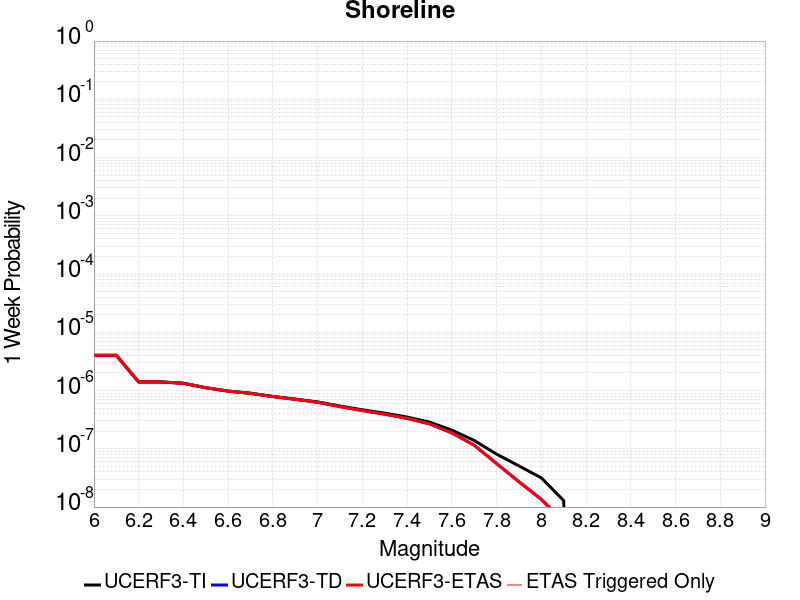 |  |  |  |

| Magnitude | 1 wk TI Prob | 1 wk TD Prob | 1 wk ETAS Prob | 1 wk ETAS/TD Gain | 1 wk ETAS Triggered Only | 1 mo TI Prob | 1 mo TD Prob | 1 mo ETAS Prob | 1 mo ETAS/TD Gain | 1 mo ETAS Triggered Only | 1 yr TI Prob | 1 yr TD Prob | 1 yr ETAS Prob | 1 yr ETAS/TD Gain | 1 yr ETAS Triggered Only | 10 yr TI Prob | 10 yr TD Prob | 10 yr ETAS Prob | 10 yr ETAS/TD Gain | 10 yr ETAS Triggered Only |
|-----|-----|-----|-----|-----|-----|-----|-----|-----|-----|-----|-----|-----|-----|-----|-----|-----|-----|-----|-----|-----|
| 6.0 | 3.9888673E-6 | 4.047945E-6 | 4.047945E-6 | 1.0 | 0.0 | 1.7095033E-5 | 1.7348251E-5 | 1.7348251E-5 | 1.0 | 0.0 | 2.0811215E-4 | 2.1120008E-4 | 2.2119797E-4 | 1.0473385 | 1.0E-5 | 0.0020791737 | 0.0021105423 | 0.0021205212 | 1.0047281 | 1.0E-5 |
| 6.1 | 3.9888673E-6 | 4.047945E-6 | 4.047945E-6 | 1.0 | 0.0 | 1.7095033E-5 | 1.7348251E-5 | 1.7348251E-5 | 1.0 | 0.0 | 2.0811215E-4 | 2.1120008E-4 | 2.2119797E-4 | 1.0473385 | 1.0E-5 | 0.0020791737 | 0.0021105423 | 0.0021205212 | 1.0047281 | 1.0E-5 |
| 6.2 | 1.4039653E-6 | 1.4100978E-6 | 1.4100978E-6 | 1.0 | 0.0 | 6.0169805E-6 | 6.0432626E-6 | 6.0432626E-6 | 1.0 | 0.0 | 7.325427E-5 | 7.3574294E-5 | 7.3574294E-5 | 1.0 | 0.0 | 7.3230127E-4 | 7.3550537E-4 | 7.3550537E-4 | 1.0 | 0.0 |
| 6.3 | 1.4039653E-6 | 1.4100978E-6 | 1.4100978E-6 | 1.0 | 0.0 | 6.0169805E-6 | 6.0432626E-6 | 6.0432626E-6 | 1.0 | 0.0 | 7.325427E-5 | 7.3574294E-5 | 7.3574294E-5 | 1.0 | 0.0 | 7.3230127E-4 | 7.3550537E-4 | 7.3550537E-4 | 1.0 | 0.0 |
| 6.4 | 1.3314152E-6 | 1.336169E-6 | 1.336169E-6 | 1.0 | 0.0 | 5.7060524E-6 | 5.726426E-6 | 5.726426E-6 | 1.0 | 0.0 | 6.946897E-5 | 6.971706E-5 | 6.971706E-5 | 1.0 | 0.0 | 6.9447263E-4 | 6.969573E-4 | 6.969573E-4 | 1.0 | 0.0 |
| 6.5 | 1.1187026E-6 | 1.1203721E-6 | 1.1203721E-6 | 1.0 | 0.0 | 4.794431E-6 | 4.801586E-6 | 4.801586E-6 | 1.0 | 0.0 | 5.8370628E-5 | 5.8457765E-5 | 5.8457765E-5 | 1.0 | 0.0 | 5.83553E-4 | 5.844264E-4 | 5.844264E-4 | 1.0 | 0.0 |
| 6.6 | 9.793089E-7 | 9.784997E-7 | 9.784997E-7 | 1.0 | 0.0 | 4.1970316E-6 | 4.193563E-6 | 4.193563E-6 | 1.0 | 0.0 | 5.1097657E-5 | 5.105545E-5 | 5.105545E-5 | 1.0 | 0.0 | 5.108591E-4 | 5.104385E-4 | 5.104385E-4 | 1.0 | 0.0 |
| 6.7 | 8.995986E-7 | 8.972875E-7 | 8.972875E-7 | 1.0 | 0.0 | 3.8554167E-6 | 3.8455123E-6 | 3.8455123E-6 | 1.0 | 0.0 | 4.693869E-5 | 4.6818117E-5 | 4.6818117E-5 | 1.0 | 0.0 | 4.6928777E-4 | 4.6808348E-4 | 4.6808348E-4 | 1.0 | 0.0 |
| 6.8 | 7.931612E-7 | 7.8804743E-7 | 7.8804743E-7 | 1.0 | 0.0 | 3.3992578E-6 | 3.3773417E-6 | 3.3773417E-6 | 1.0 | 0.0 | 4.1385178E-5 | 4.1118365E-5 | 4.1118365E-5 | 1.0 | 0.0 | 4.1377472E-4 | 4.111081E-4 | 4.111081E-4 | 1.0 | 0.0 |
| 6.9 | 7.1465956E-7 | 7.078075E-7 | 7.078075E-7 | 1.0 | 0.0 | 3.062823E-6 | 3.0334572E-6 | 3.0334572E-6 | 1.0 | 0.0 | 3.7289232E-5 | 3.6931717E-5 | 3.6931717E-5 | 1.0 | 0.0 | 3.7282976E-4 | 3.692562E-4 | 3.692562E-4 | 1.0 | 0.0 |
| 7.0 | 6.389046E-7 | 6.299524E-7 | 6.299524E-7 | 1.0 | 0.0 | 2.7381598E-6 | 2.6997934E-6 | 2.6997934E-6 | 1.0 | 0.0 | 3.3336586E-5 | 3.286949E-5 | 3.286949E-5 | 1.0 | 0.0 | 3.3331584E-4 | 3.2864654E-4 | 3.2864654E-4 | 1.0 | 0.0 |
| 7.1 | 5.4300875E-7 | 5.311193E-7 | 5.311193E-7 | 1.0 | 0.0 | 2.3271782E-6 | 2.2762235E-6 | 2.2762235E-6 | 1.0 | 0.0 | 2.8333026E-5 | 2.7712671E-5 | 2.7712671E-5 | 1.0 | 0.0 | 2.8329415E-4 | 2.7709227E-4 | 2.7709227E-4 | 1.0 | 0.0 |
| 7.2 | 4.6768855E-7 | 4.5349543E-7 | 4.5349543E-7 | 1.0 | 0.0 | 2.0043778E-6 | 1.9435504E-6 | 1.9435504E-6 | 1.0 | 0.0 | 2.4403027E-5 | 2.366247E-5 | 2.366247E-5 | 1.0 | 0.0 | 2.4400349E-4 | 2.3659955E-4 | 2.3659955E-4 | 1.0 | 0.0 |
| 7.3 | 4.0966103E-7 | 3.938623E-7 | 3.938623E-7 | 1.0 | 0.0 | 1.7556889E-6 | 1.6879802E-6 | 1.6879802E-6 | 1.0 | 0.0 | 2.1375303E-5 | 2.0550966E-5 | 2.0550966E-5 | 1.0 | 0.0 | 2.1373246E-4 | 2.0549068E-4 | 2.0549068E-4 | 1.0 | 0.0 |
| 7.4 | 3.5105785E-7 | 3.336452E-7 | 3.336452E-7 | 1.0 | 0.0 | 1.5045327E-6 | 1.4299071E-6 | 1.4299071E-6 | 1.0 | 0.0 | 1.8317533E-5 | 1.740898E-5 | 1.740898E-5 | 1.0 | 0.0 | 1.8316023E-4 | 1.740762E-4 | 1.740762E-4 | 1.0 | 0.0 |
| 7.5 | 2.8737534E-7 | 2.682056E-7 | 2.682056E-7 | 1.0 | 0.0 | 1.2316079E-6 | 1.149452E-6 | 1.149452E-6 | 1.0 | 0.0 | 1.4994724E-5 | 1.3994489E-5 | 1.3994489E-5 | 1.0 | 0.0 | 1.4993713E-4 | 1.3993609E-4 | 1.3993609E-4 | 1.0 | 0.0 |
| 7.6 | 2.0924051E-7 | 1.8779478E-7 | 1.8779478E-7 | 1.0 | 0.0 | 8.967448E-7 | 8.048345E-7 | 8.048345E-7 | 1.0 | 0.0 | 1.0917813E-5 | 9.798816E-6 | 9.798816E-6 | 1.0 | 0.0 | 1.0917276E-4 | 9.798385E-5 | 9.798385E-5 | 1.0 | 0.0 |
| 7.7 | 1.392265E-7 | 1.1543848E-7 | 1.1543848E-7 | 1.0 | 0.0 | 5.9668486E-7 | 4.9473624E-7 | 4.9473624E-7 | 1.0 | 0.0 | 7.2646135E-6 | 6.023397E-6 | 6.023397E-6 | 1.0 | 0.0 | 7.2643765E-5 | 6.023234E-5 | 6.023234E-5 | 1.0 | 0.0 |
| 7.8 | 8.1080074E-8 | 5.58715E-8 | 5.58715E-8 | 1.0 | 0.0 | 3.4748598E-7 | 2.3944926E-7 | 2.3944926E-7 | 1.0 | 0.0 | 4.2306337E-6 | 2.915291E-6 | 2.915291E-6 | 1.0 | 0.0 | 4.230553E-5 | 2.9152527E-5 | 2.9152527E-5 | 1.0 | 0.0 |
| 7.9 | 5.0859036E-8 | 2.7248419E-8 | 2.7248419E-8 | 1.0 | 0.0 | 2.1796728E-7 | 1.16778935E-7 | 1.16778935E-7 | 1.0 | 0.0 | 2.6537484E-6 | 1.4217826E-6 | 1.4217826E-6 | 1.0 | 0.0 | 2.6537167E-5 | 1.4217735E-5 | 1.4217735E-5 | 1.0 | 0.0 |
| 8.0 | 3.1760536E-8 | 1.3580286E-8 | 1.3580286E-8 | 1.0 | 0.0 | 1.3611657E-7 | 5.8201223E-8 | 5.8201223E-8 | 1.0 | 0.0 | 1.6572179E-6 | 7.0859966E-7 | 7.0859966E-7 | 1.0 | 0.0 | 1.6572056E-5 | 7.085974E-6 | 7.085974E-6 | 1.0 | 0.0 |
| 8.1 | 1.2947896E-8 | 5.6641998E-9 | 5.6641998E-9 | 1.0 | 0.0 | 5.5490982E-8 | 2.4275142E-8 | 2.4275142E-8 | 1.0 | 0.0 | 6.756025E-7 | 2.955498E-7 | 2.955498E-7 | 1.0 | 0.0 | 6.7560045E-6 | 2.9554942E-6 | 2.9554942E-6 | 1.0 | 0.0 |

## Malibu Coast alt 1
*[(top)](#table-of-contents)*

| 1 Week | 1 Month | 1 Year | 10 Year |
|-----|-----|-----|-----|
|  |  |  |  |

| Magnitude | 1 wk TI Prob | 1 wk TD Prob | 1 wk ETAS Prob | 1 wk ETAS/TD Gain | 1 wk ETAS Triggered Only | 1 mo TI Prob | 1 mo TD Prob | 1 mo ETAS Prob | 1 mo ETAS/TD Gain | 1 mo ETAS Triggered Only | 1 yr TI Prob | 1 yr TD Prob | 1 yr ETAS Prob | 1 yr ETAS/TD Gain | 1 yr ETAS Triggered Only | 10 yr TI Prob | 10 yr TD Prob | 10 yr ETAS Prob | 10 yr ETAS/TD Gain | 10 yr ETAS Triggered Only |
|-----|-----|-----|-----|-----|-----|-----|-----|-----|-----|-----|-----|-----|-----|-----|-----|-----|-----|-----|-----|-----|
| 6.0 | 1.6572556E-5 | 1.7598268E-5 | 1.7598268E-5 | 1.0 | 0.0 | 7.102331E-5 | 7.541908E-5 | 7.541908E-5 | 1.0 | 0.0 | 8.6436566E-4 | 9.178593E-4 | 9.2785014E-4 | 1.0108849 | 1.0E-5 | 0.0086101135 | 0.009142617 | 0.009152526 | 1.0010837 | 1.0E-5 |
| 6.1 | 1.6572556E-5 | 1.7598268E-5 | 1.7598268E-5 | 1.0 | 0.0 | 7.102331E-5 | 7.541908E-5 | 7.541908E-5 | 1.0 | 0.0 | 8.6436566E-4 | 9.178593E-4 | 9.178593E-4 | 1.0 | 0.0 | 0.0086101135 | 0.009142617 | 0.009142617 | 1.0 | 0.0 |
| 6.2 | 1.1085717E-5 | 1.1557268E-5 | 1.1557268E-5 | 1.0 | 0.0 | 4.750935E-5 | 4.953023E-5 | 4.953023E-5 | 1.0 | 0.0 | 5.782728E-4 | 6.028672E-4 | 6.028672E-4 | 1.0 | 0.0 | 0.0057677035 | 0.0060126884 | 0.0060126884 | 1.0 | 0.0 |
| 6.3 | 1.0208568E-5 | 1.05923455E-5 | 1.05923455E-5 | 1.0 | 0.0 | 4.375027E-5 | 4.5394994E-5 | 4.5394994E-5 | 1.0 | 0.0 | 5.325294E-4 | 5.525468E-4 | 5.525468E-4 | 1.0 | 0.0 | 0.0053125503 | 0.005512038 | 0.005512038 | 1.0 | 0.0 |
| 6.4 | 9.0682315E-6 | 9.34273E-6 | 9.34273E-6 | 1.0 | 0.0 | 3.8863272E-5 | 4.0039668E-5 | 4.0039668E-5 | 1.0 | 0.0 | 4.730576E-4 | 4.8737595E-4 | 4.8737595E-4 | 1.0 | 0.0 | 0.0047205184 | 0.004863284 | 0.004863284 | 1.0 | 0.0 |
| 6.5 | 7.605796E-6 | 7.74866E-6 | 7.74866E-6 | 1.0 | 0.0 | 3.259586E-5 | 3.320813E-5 | 3.320813E-5 | 1.0 | 0.0 | 3.9678233E-4 | 4.042353E-4 | 4.042353E-4 | 1.0 | 0.0 | 0.0039607463 | 0.004035138 | 0.004035138 | 1.0 | 0.0 |
| 6.6 | 5.889873E-6 | 5.8795895E-6 | 5.8795895E-6 | 1.0 | 0.0 | 2.5242069E-5 | 2.5197998E-5 | 2.5197998E-5 | 1.0 | 0.0 | 3.0727885E-4 | 3.0674253E-4 | 3.0674253E-4 | 1.0 | 0.0 | 0.003068543 | 0.0030632042 | 0.0030632042 | 1.0 | 0.0 |
| 6.7 | 5.66586E-6 | 5.64169E-6 | 5.64169E-6 | 1.0 | 0.0 | 2.428203E-5 | 2.417845E-5 | 2.417845E-5 | 1.0 | 0.0 | 2.955936E-4 | 2.9433295E-4 | 2.9433295E-4 | 1.0 | 0.0 | 0.0029520073 | 0.002939443 | 0.002939443 | 1.0 | 0.0 |
| 6.8 | 5.521556E-6 | 5.489475E-6 | 5.489475E-6 | 1.0 | 0.0 | 2.3663597E-5 | 2.3526109E-5 | 2.3526109E-5 | 1.0 | 0.0 | 2.880662E-4 | 2.8639284E-4 | 2.8639284E-4 | 1.0 | 0.0 | 0.0028769306 | 0.002860249 | 0.002860249 | 1.0 | 0.0 |
| 6.9 | 5.29752E-6 | 5.249977E-6 | 5.249977E-6 | 1.0 | 0.0 | 2.270346E-5 | 2.249971E-5 | 2.249971E-5 | 1.0 | 0.0 | 2.7637955E-4 | 2.738996E-4 | 2.738996E-4 | 1.0 | 0.0 | 0.0027603607 | 0.0027356306 | 0.0027356306 | 1.0 | 0.0 |
| 7.0 | 5.106743E-6 | 5.047723E-6 | 5.047723E-6 | 1.0 | 0.0 | 2.1885859E-5 | 2.1632919E-5 | 2.1632919E-5 | 1.0 | 0.0 | 2.6642776E-4 | 2.6334904E-4 | 2.6334904E-4 | 1.0 | 0.0 | 0.0026610855 | 0.002630379 | 0.002630379 | 1.0 | 0.0 |
| 7.1 | 4.8469647E-6 | 4.7704148E-6 | 4.7704148E-6 | 1.0 | 0.0 | 2.0772539E-5 | 2.0444475E-5 | 2.0444475E-5 | 1.0 | 0.0 | 2.528763E-4 | 2.488831E-4 | 2.488831E-4 | 1.0 | 0.0 | 0.0025258875 | 0.0024860518 | 0.0024860518 | 1.0 | 0.0 |
| 7.2 | 4.545514E-6 | 4.448232E-6 | 4.448232E-6 | 1.0 | 0.0 | 1.9480629E-5 | 1.9063713E-5 | 1.9063713E-5 | 1.0 | 0.0 | 2.3715083E-4 | 2.3207605E-4 | 2.3207605E-4 | 1.0 | 0.0 | 0.0023689792 | 0.0023183445 | 0.0023183445 | 1.0 | 0.0 |
| 7.3 | 3.794097E-6 | 3.6519655E-6 | 3.6519655E-6 | 1.0 | 0.0 | 1.6260314E-5 | 1.5651187E-5 | 1.5651187E-5 | 1.0 | 0.0 | 1.9795135E-4 | 1.9053658E-4 | 1.9053658E-4 | 1.0 | 0.0 | 0.001977751 | 0.0019037367 | 0.0019037367 | 1.0 | 0.0 |
| 7.4 | 2.808217E-6 | 2.7191E-6 | 2.7191E-6 | 1.0 | 0.0 | 1.203516E-5 | 1.1653234E-5 | 1.1653234E-5 | 1.0 | 0.0 | 1.4651821E-4 | 1.418689E-4 | 1.418689E-4 | 1.0 | 0.0 | 0.0014642165 | 0.0014177861 | 0.0014177861 | 1.0 | 0.0 |
| 7.5 | 1.83809E-6 | 1.8190852E-6 | 1.8190852E-6 | 1.0 | 0.0 | 7.877505E-6 | 7.796056E-6 | 7.796056E-6 | 1.0 | 0.0 | 9.59044E-5 | 9.4912866E-5 | 9.4912866E-5 | 1.0 | 0.0 | 9.5863023E-4 | 9.487253E-4 | 9.487253E-4 | 1.0 | 0.0 |
| 7.6 | 1.1292672E-6 | 1.100155E-6 | 1.100155E-6 | 1.0 | 0.0 | 4.839708E-6 | 4.7149415E-6 | 4.7149415E-6 | 1.0 | 0.0 | 5.8921847E-5 | 5.7402918E-5 | 5.7402918E-5 | 1.0 | 0.0 | 5.890623E-4 | 5.7388254E-4 | 5.7388254E-4 | 1.0 | 0.0 |
| 7.7 | 5.065272E-7 | 4.609203E-7 | 4.609203E-7 | 1.0 | 0.0 | 2.170829E-6 | 1.9753713E-6 | 1.9753713E-6 | 1.0 | 0.0 | 2.6429525E-5 | 2.404989E-5 | 2.404989E-5 | 1.0 | 0.0 | 2.642638E-4 | 2.4047401E-4 | 2.4047401E-4 | 1.0 | 0.0 |
| 7.8 | 8.952991E-8 | 6.708074E-8 | 6.708074E-8 | 1.0 | 0.0 | 3.8369956E-7 | 2.8748886E-7 | 2.8748886E-7 | 1.0 | 0.0 | 4.671532E-6 | 3.5001713E-6 | 3.5001713E-6 | 1.0 | 0.0 | 4.671434E-5 | 3.5001183E-5 | 3.5001183E-5 | 1.0 | 0.0 |
| 7.9 | 8.007447E-10 | 6.160915E-10 | 6.160915E-10 | 1.0 | 0.0 | 3.4317629E-9 | 2.6403923E-9 | 2.6403923E-9 | 1.0 | 0.0 | 4.1781714E-8 | 3.2146776E-8 | 3.2146776E-8 | 1.0 | 0.0 | 4.1781706E-7 | 3.2146772E-7 | 3.2146772E-7 | 1.0 | 0.0 |

## Greenville (So) 2011 CFM
*[(top)](#table-of-contents)*

| 1 Week | 1 Month | 1 Year | 10 Year |
|-----|-----|-----|-----|
|  |  |  |  |

| Magnitude | 1 wk TI Prob | 1 wk TD Prob | 1 wk ETAS Prob | 1 wk ETAS/TD Gain | 1 wk ETAS Triggered Only | 1 mo TI Prob | 1 mo TD Prob | 1 mo ETAS Prob | 1 mo ETAS/TD Gain | 1 mo ETAS Triggered Only | 1 yr TI Prob | 1 yr TD Prob | 1 yr ETAS Prob | 1 yr ETAS/TD Gain | 1 yr ETAS Triggered Only | 10 yr TI Prob | 10 yr TD Prob | 10 yr ETAS Prob | 10 yr ETAS/TD Gain | 10 yr ETAS Triggered Only |
|-----|-----|-----|-----|-----|-----|-----|-----|-----|-----|-----|-----|-----|-----|-----|-----|-----|-----|-----|-----|-----|
| 6.0 | 4.279693E-5 | 5.5042052E-5 | 5.5042052E-5 | 1.0 | 0.0 | 1.8340252E-4 | 2.3587522E-4 | 2.4587286E-4 | 1.0423853 | 1.0E-5 | 0.0022306389 | 0.0028683394 | 0.0028783109 | 1.0034764 | 1.0E-5 | 0.022083808 | 0.028339082 | 0.0283488 | 1.0003428 | 1.0E-5 |
| 6.1 | 3.4037297E-5 | 4.319379E-5 | 4.319379E-5 | 1.0 | 0.0 | 1.4586597E-4 | 1.851043E-4 | 1.9510246E-4 | 1.0540136 | 1.0E-5 | 0.0017744715 | 0.0022515068 | 0.0022614843 | 1.0044315 | 1.0E-5 | 0.01760369 | 0.022303257 | 0.022313034 | 1.0004383 | 1.0E-5 |
| 6.2 | 3.4037297E-5 | 4.319379E-5 | 4.319379E-5 | 1.0 | 0.0 | 1.4586597E-4 | 1.851043E-4 | 1.9510246E-4 | 1.0540136 | 1.0E-5 | 0.0017744715 | 0.0022515068 | 0.0022614843 | 1.0044315 | 1.0E-5 | 0.01760369 | 0.022303257 | 0.022313034 | 1.0004383 | 1.0E-5 |
| 6.3 | 2.5956324E-5 | 3.242983E-5 | 3.242983E-5 | 1.0 | 0.0 | 1.11236644E-4 | 1.3897801E-4 | 1.4897661E-4 | 1.0719439 | 1.0E-5 | 0.0013534647 | 0.0016908189 | 0.001700802 | 1.0059043 | 1.0E-5 | 0.013452509 | 0.016786352 | 0.016796185 | 1.0005857 | 1.0E-5 |
| 6.4 | 2.1145053E-5 | 2.6198357E-5 | 2.6198357E-5 | 1.0 | 0.0 | 9.061851E-5 | 1.1227402E-4 | 1.222729E-4 | 1.0890578 | 1.0E-5 | 0.0011027219 | 0.0013661105 | 0.0013760969 | 1.00731 | 1.0E-5 | 0.01097266 | 0.013580529 | 0.013590394 | 1.0007263 | 1.0E-5 |
| 6.5 | 2.0030959E-5 | 2.4796413E-5 | 2.4796413E-5 | 1.0 | 0.0 | 8.584414E-5 | 1.0626618E-4 | 1.16265124E-4 | 1.0940933 | 1.0E-5 | 0.0010446513 | 0.001293055 | 0.0013030422 | 1.0077236 | 1.0E-5 | 0.010397541 | 0.012858664 | 0.012868535 | 1.0007677 | 1.0E-5 |
| 6.6 | 1.8395405E-5 | 2.2755032E-5 | 2.2755032E-5 | 1.0 | 0.0 | 7.8835066E-5 | 9.751807E-5 | 1.07517095E-4 | 1.1025351 | 1.0E-5 | 9.5939427E-4 | 0.0011866642 | 0.0011966524 | 1.008417 | 1.0E-5 | 0.009552629 | 0.0118063325 | 0.011816215 | 1.000837 | 1.0E-5 |
| 6.7 | 1.7883482E-5 | 2.2126056E-5 | 2.2126056E-5 | 1.0 | 0.0 | 7.664124E-5 | 9.4822666E-5 | 1.0482172E-4 | 1.10545 | 1.0E-5 | 9.3270757E-4 | 0.001153883 | 0.0011638714 | 1.0086564 | 1.0E-5 | 0.009288026 | 0.01148197 | 0.011491856 | 1.0008609 | 1.0E-5 |
| 6.8 | 1.3373564E-5 | 1.6506328E-5 | 1.6506328E-5 | 1.0 | 0.0 | 5.7314013E-5 | 7.0739574E-5 | 8.0738864E-5 | 1.1413536 | 1.0E-5 | 6.975747E-4 | 8.6092873E-4 | 8.7092014E-4 | 1.0116054 | 1.0E-5 | 0.0069538904 | 0.008577544 | 0.008587459 | 1.0011559 | 1.0E-5 |
| 6.9 | 1.06692905E-5 | 1.3152838E-5 | 1.3152838E-5 | 1.0 | 0.0 | 4.5724726E-5 | 5.636815E-5 | 5.636815E-5 | 1.0 | 0.0 | 5.5655633E-4 | 6.8607734E-4 | 6.8607734E-4 | 1.0 | 0.0 | 0.005551645 | 0.006840826 | 0.006840826 | 1.0 | 0.0 |
| 7.0 | 8.157512E-6 | 1.0062801E-5 | 1.0062801E-5 | 1.0 | 0.0 | 3.4960296E-5 | 4.3125594E-5 | 4.3125594E-5 | 1.0 | 0.0 | 4.2555845E-4 | 5.249313E-4 | 5.249313E-4 | 1.0 | 0.0 | 0.004247444 | 0.005237391 | 0.005237391 | 1.0 | 0.0 |
| 7.1 | 6.1467113E-6 | 7.6275246E-6 | 7.6275246E-6 | 1.0 | 0.0 | 2.6342783E-5 | 3.2688986E-5 | 3.2688986E-5 | 1.0 | 0.0 | 3.206762E-4 | 3.979166E-4 | 3.979166E-4 | 1.0 | 0.0 | 0.0032021382 | 0.003972229 | 0.003972229 | 1.0 | 0.0 |
| 7.2 | 4.713467E-6 | 5.9142176E-6 | 5.9142176E-6 | 1.0 | 0.0 | 2.0200418E-5 | 2.5346404E-5 | 2.5346404E-5 | 1.0 | 0.0 | 2.4591232E-4 | 3.0854935E-4 | 3.0854935E-4 | 1.0 | 0.0 | 0.0024564038 | 0.003081363 | 0.003081363 | 1.0 | 0.0 |
| 7.3 | 2.3266216E-6 | 2.954034E-6 | 2.954034E-6 | 1.0 | 0.0 | 9.971197E-6 | 1.2660085E-5 | 1.2660085E-5 | 1.0 | 0.0 | 1.2139256E-4 | 1.541258E-4 | 1.541258E-4 | 1.0 | 0.0 | 0.0012132627 | 0.0015402584 | 0.0015402584 | 1.0 | 0.0 |
| 7.4 | 1.3314E-6 | 1.7179633E-6 | 1.7179633E-6 | 1.0 | 0.0 | 5.7059874E-6 | 7.3626793E-6 | 7.3626793E-6 | 1.0 | 0.0 | 6.946818E-5 | 8.963698E-5 | 8.963698E-5 | 1.0 | 0.0 | 6.9446466E-4 | 8.9604704E-4 | 8.9604704E-4 | 1.0 | 0.0 |
| 7.5 | 1.0362941E-6 | 1.3468865E-6 | 1.3468865E-6 | 1.0 | 0.0 | 4.4412527E-6 | 5.7723582E-6 | 5.7723582E-6 | 1.0 | 0.0 | 5.407091E-5 | 7.027624E-5 | 7.027624E-5 | 1.0 | 0.0 | 5.405776E-4 | 7.0257037E-4 | 7.0257037E-4 | 1.0 | 0.0 |
| 7.6 | 7.764784E-7 | 1.0088623E-6 | 1.0088623E-6 | 1.0 | 0.0 | 3.3277602E-6 | 4.323689E-6 | 4.323689E-6 | 1.0 | 0.0 | 4.0514726E-5 | 5.263968E-5 | 5.263968E-5 | 1.0 | 0.0 | 4.050734E-4 | 5.2629353E-4 | 5.2629353E-4 | 1.0 | 0.0 |
| 7.7 | 1.6927763E-7 | 2.2139328E-7 | 2.2139328E-7 | 1.0 | 0.0 | 7.2547533E-7 | 9.48828E-7 | 9.48828E-7 | 1.0 | 0.0 | 8.832627E-6 | 1.1551923E-5 | 1.1551923E-5 | 1.0 | 0.0 | 8.8322755E-5 | 1.1551595E-4 | 1.1551595E-4 | 1.0 | 0.0 |

## Burnt Mtn
*[(top)](#table-of-contents)*

| 1 Week | 1 Month | 1 Year | 10 Year |
|-----|-----|-----|-----|
|  |  |  |  |

| Magnitude | 1 wk TI Prob | 1 wk TD Prob | 1 wk ETAS Prob | 1 wk ETAS/TD Gain | 1 wk ETAS Triggered Only | 1 mo TI Prob | 1 mo TD Prob | 1 mo ETAS Prob | 1 mo ETAS/TD Gain | 1 mo ETAS Triggered Only | 1 yr TI Prob | 1 yr TD Prob | 1 yr ETAS Prob | 1 yr ETAS/TD Gain | 1 yr ETAS Triggered Only | 10 yr TI Prob | 10 yr TD Prob | 10 yr ETAS Prob | 10 yr ETAS/TD Gain | 10 yr ETAS Triggered Only |
|-----|-----|-----|-----|-----|-----|-----|-----|-----|-----|-----|-----|-----|-----|-----|-----|-----|-----|-----|-----|-----|
| 6.0 | 1.5673151E-5 | 1.1749579E-5 | 1.1749579E-5 | 1.0 | 0.0 | 6.716892E-5 | 5.0355095E-5 | 5.0355095E-5 | 1.0 | 0.0 | 8.1747473E-4 | 6.130297E-4 | 6.230236E-4 | 1.0163025 | 1.0E-5 | 0.008144741 | 0.0061260276 | 0.006135966 | 1.0016224 | 1.0E-5 |
| 6.1 | 1.5673151E-5 | 1.1749579E-5 | 1.1749579E-5 | 1.0 | 0.0 | 6.716892E-5 | 5.0355095E-5 | 5.0355095E-5 | 1.0 | 0.0 | 8.1747473E-4 | 6.130297E-4 | 6.230236E-4 | 1.0163025 | 1.0E-5 | 0.008144741 | 0.0061260276 | 0.006135966 | 1.0016224 | 1.0E-5 |
| 6.2 | 1.5673151E-5 | 1.1749579E-5 | 1.1749579E-5 | 1.0 | 0.0 | 6.716892E-5 | 5.0355095E-5 | 5.0355095E-5 | 1.0 | 0.0 | 8.1747473E-4 | 6.130297E-4 | 6.230236E-4 | 1.0163025 | 1.0E-5 | 0.008144741 | 0.0061260276 | 0.006135966 | 1.0016224 | 1.0E-5 |
| 6.3 | 1.5673151E-5 | 1.1749579E-5 | 1.1749579E-5 | 1.0 | 0.0 | 6.716892E-5 | 5.0355095E-5 | 5.0355095E-5 | 1.0 | 0.0 | 8.1747473E-4 | 6.130297E-4 | 6.230236E-4 | 1.0163025 | 1.0E-5 | 0.008144741 | 0.0061260276 | 0.006135966 | 1.0016224 | 1.0E-5 |
| 6.4 | 1.5673151E-5 | 1.1749579E-5 | 1.1749579E-5 | 1.0 | 0.0 | 6.716892E-5 | 5.0355095E-5 | 5.0355095E-5 | 1.0 | 0.0 | 8.1747473E-4 | 6.130297E-4 | 6.230236E-4 | 1.0163025 | 1.0E-5 | 0.008144741 | 0.0061260276 | 0.006135966 | 1.0016224 | 1.0E-5 |
| 6.5 | 1.36191375E-5 | 1.0078436E-5 | 1.0078436E-5 | 1.0 | 0.0 | 5.8366426E-5 | 4.3193297E-5 | 4.3193297E-5 | 1.0 | 0.0 | 7.103795E-4 | 5.258784E-4 | 5.358731E-4 | 1.0190058 | 1.0E-5 | 0.0070811296 | 0.005258784 | 0.005268731 | 1.0018916 | 1.0E-5 |

## Hayward (So) extension 2011 CFM
*[(top)](#table-of-contents)*

| 1 Week | 1 Month | 1 Year | 10 Year |
|-----|-----|-----|-----|
|  |  |  |  |

| Magnitude | 1 wk TI Prob | 1 wk TD Prob | 1 wk ETAS Prob | 1 wk ETAS/TD Gain | 1 wk ETAS Triggered Only | 1 mo TI Prob | 1 mo TD Prob | 1 mo ETAS Prob | 1 mo ETAS/TD Gain | 1 mo ETAS Triggered Only | 1 yr TI Prob | 1 yr TD Prob | 1 yr ETAS Prob | 1 yr ETAS/TD Gain | 1 yr ETAS Triggered Only | 10 yr TI Prob | 10 yr TD Prob | 10 yr ETAS Prob | 10 yr ETAS/TD Gain | 10 yr ETAS Triggered Only |
|-----|-----|-----|-----|-----|-----|-----|-----|-----|-----|-----|-----|-----|-----|-----|-----|-----|-----|-----|-----|-----|
| 6.0 | 1.1721256E-4 | 2.363781E-4 | 2.363781E-4 | 1.0 | 0.0 | 5.022428E-4 | 0.0010123947 | 0.0010123947 | 1.0 | 0.0 | 0.0060976758 | 0.012248728 | 0.012258606 | 1.0008065 | 1.0E-5 | 0.0593305 | 0.11284924 | 0.11285812 | 1.0000786 | 1.0E-5 |
| 6.1 | 6.99169E-5 | 1.3800772E-4 | 1.3800772E-4 | 1.0 | 0.0 | 2.9960944E-4 | 5.910222E-4 | 5.910222E-4 | 1.0 | 0.0 | 0.0036416445 | 0.0071723694 | 0.0071723694 | 1.0 | 0.0 | 0.035825435 | 0.067808375 | 0.067808375 | 1.0 | 0.0 |
| 6.2 | 6.99169E-5 | 1.3800772E-4 | 1.3800772E-4 | 1.0 | 0.0 | 2.9960944E-4 | 5.910222E-4 | 5.910222E-4 | 1.0 | 0.0 | 0.0036416445 | 0.0071723694 | 0.0071723694 | 1.0 | 0.0 | 0.035825435 | 0.067808375 | 0.067808375 | 1.0 | 0.0 |
| 6.3 | 6.970908E-5 | 1.3768923E-4 | 1.3768923E-4 | 1.0 | 0.0 | 2.9871898E-4 | 5.896579E-4 | 5.896579E-4 | 1.0 | 0.0 | 0.0036308395 | 0.0071559055 | 0.0071559055 | 1.0 | 0.0 | 0.035720866 | 0.06765734 | 0.06765734 | 1.0 | 0.0 |
| 6.4 | 6.9517155E-5 | 1.3735797E-4 | 1.3735797E-4 | 1.0 | 0.0 | 2.9789665E-4 | 5.882389E-4 | 5.882389E-4 | 1.0 | 0.0 | 0.0036208609 | 0.007138817 | 0.007138817 | 1.0 | 0.0 | 0.03562429 | 0.06750137 | 0.06750137 | 1.0 | 0.0 |
| 6.5 | 4.786248E-5 | 9.415959E-5 | 9.415959E-5 | 1.0 | 0.0 | 2.0510878E-4 | 4.0348133E-4 | 4.0348133E-4 | 1.0 | 0.0 | 0.0024943394 | 0.004901734 | 0.004901734 | 1.0 | 0.0 | 0.02466527 | 0.046906155 | 0.046906155 | 1.0 | 0.0 |
| 6.6 | 4.4662214E-5 | 8.882604E-5 | 8.882604E-5 | 1.0 | 0.0 | 1.9139545E-4 | 3.8063008E-4 | 3.8063008E-4 | 1.0 | 0.0 | 0.0023277493 | 0.004624787 | 0.004624787 | 1.0 | 0.0 | 0.02303517 | 0.044297572 | 0.044297572 | 1.0 | 0.0 |
| 6.7 | 3.884542E-5 | 7.865713E-5 | 7.865713E-5 | 1.0 | 0.0 | 1.6646975E-4 | 3.3706092E-4 | 3.3706092E-4 | 1.0 | 0.0 | 0.002024885 | 0.0040964396 | 0.0040964396 | 1.0 | 0.0 | 0.020065336 | 0.03933719 | 0.03933719 | 1.0 | 0.0 |
| 6.8 | 3.4221863E-5 | 6.856472E-5 | 6.856472E-5 | 1.0 | 0.0 | 1.4665688E-4 | 2.9381807E-4 | 2.9381807E-4 | 1.0 | 0.0 | 0.0017840851 | 0.0035717883 | 0.0035717883 | 1.0 | 0.0 | 0.017698295 | 0.034424704 | 0.034424704 | 1.0 | 0.0 |
| 6.9 | 1.6927712E-5 | 3.0066385E-5 | 3.0066385E-5 | 1.0 | 0.0 | 7.2545314E-5 | 1.2884989E-4 | 1.2884989E-4 | 1.0 | 0.0 | 8.828813E-4 | 0.0015676755 | 0.0015676755 | 1.0 | 0.0 | 0.008793819 | 0.015465583 | 0.015465583 | 1.0 | 0.0 |
| 7.0 | 1.2509653E-5 | 2.2467022E-5 | 2.2467022E-5 | 1.0 | 0.0 | 5.3611697E-5 | 9.628393E-5 | 9.628393E-5 | 1.0 | 0.0 | 6.525269E-4 | 0.0011716705 | 0.0011716705 | 1.0 | 0.0 | 0.0065061417 | 0.0115844635 | 0.0115844635 | 1.0 | 0.0 |
| 7.1 | 8.751583E-6 | 1.4929308E-5 | 1.4929308E-5 | 1.0 | 0.0 | 3.750624E-5 | 6.398121E-5 | 6.398121E-5 | 1.0 | 0.0 | 4.5654282E-4 | 7.786987E-4 | 7.786987E-4 | 1.0 | 0.0 | 0.0045560603 | 0.0077653006 | 0.0077653006 | 1.0 | 0.0 |
| 7.2 | 6.354379E-6 | 1.1502135E-5 | 1.1502135E-5 | 1.0 | 0.0 | 2.7232769E-5 | 4.9293958E-5 | 4.9293958E-5 | 1.0 | 0.0 | 3.3150852E-4 | 5.999935E-4 | 5.999935E-4 | 1.0 | 0.0 | 0.0033101442 | 0.0060020364 | 0.0060020364 | 1.0 | 0.0 |
| 7.3 | 4.645554E-6 | 8.821418E-6 | 8.821418E-6 | 1.0 | 0.0 | 1.9909365E-5 | 3.7805556E-5 | 3.7805556E-5 | 1.0 | 0.0 | 2.4236954E-4 | 4.6018933E-4 | 4.6018933E-4 | 1.0 | 0.0 | 0.0024210536 | 0.0046123224 | 0.0046123224 | 1.0 | 0.0 |
| 7.4 | 4.23437E-6 | 7.99567E-6 | 7.99567E-6 | 1.0 | 0.0 | 1.8147173E-5 | 3.4266726E-5 | 3.4266726E-5 | 1.0 | 0.0 | 2.2091944E-4 | 4.171214E-4 | 4.171214E-4 | 1.0 | 0.0 | 0.0022069993 | 0.004183535 | 0.004183535 | 1.0 | 0.0 |
| 7.5 | 2.2187417E-6 | 3.9527254E-6 | 3.9527254E-6 | 1.0 | 0.0 | 9.508858E-6 | 1.6940156E-5 | 1.6940156E-5 | 1.0 | 0.0 | 1.157642E-4 | 2.0622948E-4 | 2.0622948E-4 | 1.0 | 0.0 | 0.0011570391 | 0.0020737252 | 0.0020737252 | 1.0 | 0.0 |
| 7.6 | 2.7952495E-8 | 3.8797385E-8 | 3.8797385E-8 | 1.0 | 0.0 | 1.1979641E-7 | 1.6627449E-7 | 1.6627449E-7 | 1.0 | 0.0 | 1.4585203E-6 | 2.0243901E-6 | 2.0243901E-6 | 1.0 | 0.0 | 1.4585107E-5 | 2.0334499E-5 | 2.0334499E-5 | 1.0 | 0.0 |
| 7.7 | 1.7192724E-8 | 2.3447157E-8 | 2.3447157E-8 | 1.0 | 0.0 | 7.36831E-8 | 1.0048782E-7 | 1.0048782E-7 | 1.0 | 0.0 | 8.9709135E-7 | 1.2234385E-6 | 1.2234385E-6 | 1.0 | 0.0 | 8.970877E-6 | 1.2302498E-5 | 1.2302498E-5 | 1.0 | 0.0 |

## Davis Creek
*[(top)](#table-of-contents)*

| 1 Week | 1 Month | 1 Year | 10 Year |
|-----|-----|-----|-----|
| 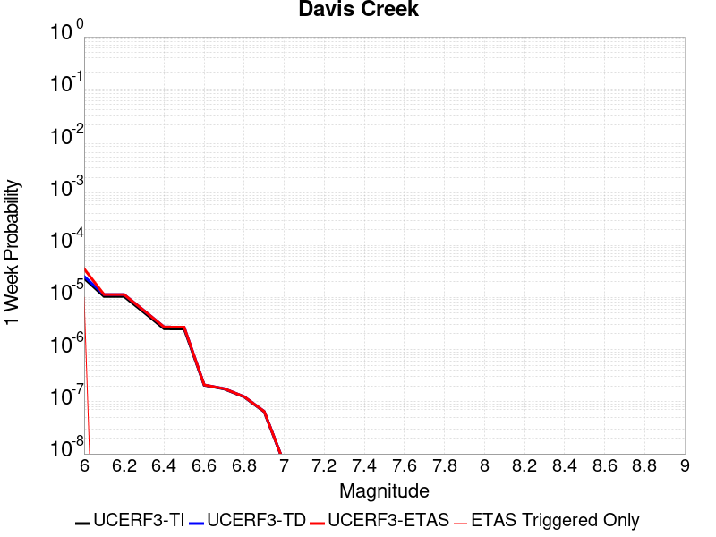 |  |  |  |

| Magnitude | 1 wk TI Prob | 1 wk TD Prob | 1 wk ETAS Prob | 1 wk ETAS/TD Gain | 1 wk ETAS Triggered Only | 1 mo TI Prob | 1 mo TD Prob | 1 mo ETAS Prob | 1 mo ETAS/TD Gain | 1 mo ETAS Triggered Only | 1 yr TI Prob | 1 yr TD Prob | 1 yr ETAS Prob | 1 yr ETAS/TD Gain | 1 yr ETAS Triggered Only | 10 yr TI Prob | 10 yr TD Prob | 10 yr ETAS Prob | 10 yr ETAS/TD Gain | 10 yr ETAS Triggered Only |
|-----|-----|-----|-----|-----|-----|-----|-----|-----|-----|-----|-----|-----|-----|-----|-----|-----|-----|-----|-----|-----|
| 6.0 | 2.331472E-5 | 2.5417517E-5 | 3.5417263E-5 | 1.3934195 | 1.0E-5 | 9.99164E-5 | 1.0892834E-4 | 1.1892725E-4 | 1.0917934 | 1.0E-5 | 0.0012158032 | 0.0013255142 | 0.001335501 | 1.0075343 | 1.0E-5 | 0.01209173 | 0.013187861 | 0.013197729 | 1.0007483 | 1.0E-5 |
| 6.1 | 1.0407654E-5 | 1.1317118E-5 | 1.1317118E-5 | 1.0 | 0.0 | 4.4603472E-5 | 4.8501184E-5 | 4.8501184E-5 | 1.0 | 0.0 | 5.4291193E-4 | 5.9036905E-4 | 5.9036905E-4 | 1.0 | 0.0 | 0.0054158745 | 0.005890679 | 0.005890679 | 1.0 | 0.0 |
| 6.2 | 1.0407654E-5 | 1.1317118E-5 | 1.1317118E-5 | 1.0 | 0.0 | 4.4603472E-5 | 4.8501184E-5 | 4.8501184E-5 | 1.0 | 0.0 | 5.4291193E-4 | 5.9036905E-4 | 5.9036905E-4 | 1.0 | 0.0 | 0.0054158745 | 0.005890679 | 0.005890679 | 1.0 | 0.0 |
| 6.3 | 5.1323277E-6 | 5.5686187E-6 | 5.5686187E-6 | 1.0 | 0.0 | 2.1995505E-5 | 2.386534E-5 | 2.386534E-5 | 1.0 | 0.0 | 2.6776237E-4 | 2.9053038E-4 | 2.9053038E-4 | 1.0 | 0.0 | 0.0026743996 | 0.0029023518 | 0.0029023518 | 1.0 | 0.0 |
| 6.4 | 2.4985154E-6 | 2.7045678E-6 | 2.7045678E-6 | 1.0 | 0.0 | 1.07078795E-5 | 1.1590974E-5 | 1.1590974E-5 | 1.0 | 0.0 | 1.3036063E-4 | 1.411146E-4 | 1.411146E-4 | 1.0 | 0.0 | 0.0013028418 | 0.0014106046 | 0.0014106046 | 1.0 | 0.0 |
| 6.5 | 2.4846438E-6 | 2.690502E-6 | 2.690502E-6 | 1.0 | 0.0 | 1.064843E-5 | 1.1530692E-5 | 1.1530692E-5 | 1.0 | 0.0 | 1.2963692E-4 | 1.4038075E-4 | 1.4038075E-4 | 1.0 | 0.0 | 0.0012956132 | 0.0014032754 | 0.0014032754 | 1.0 | 0.0 |
| 6.6 | 2.072566E-7 | 2.1018127E-7 | 2.1018127E-7 | 1.0 | 0.0 | 8.882423E-7 | 9.0077657E-7 | 9.0077657E-7 | 1.0 | 0.0 | 1.0814296E-5 | 1.0966901E-5 | 1.0966901E-5 | 1.0 | 0.0 | 1.081377E-4 | 1.09663786E-4 | 1.09663786E-4 | 1.0 | 0.0 |
| 6.7 | 1.7544528E-7 | 1.7790859E-7 | 1.7790859E-7 | 1.0 | 0.0 | 7.5190815E-7 | 7.6246516E-7 | 7.6246516E-7 | 1.0 | 0.0 | 9.154443E-6 | 9.282975E-6 | 9.282975E-6 | 1.0 | 0.0 | 9.1540656E-5 | 9.2826034E-5 | 9.2826034E-5 | 1.0 | 0.0 |
| 6.8 | 1.2320395E-7 | 1.2481159E-7 | 1.2481159E-7 | 1.0 | 0.0 | 5.280168E-7 | 5.3490675E-7 | 5.3490675E-7 | 1.0 | 0.0 | 6.428586E-6 | 6.512471E-6 | 6.512471E-6 | 1.0 | 0.0 | 6.4284E-5 | 6.512291E-5 | 6.512291E-5 | 1.0 | 0.0 |
| 6.9 | 6.399997E-8 | 6.486069E-8 | 6.486069E-8 | 1.0 | 0.0 | 2.7428555E-7 | 2.7797438E-7 | 2.7797438E-7 | 1.0 | 0.0 | 3.3394215E-6 | 3.3843335E-6 | 3.3843335E-6 | 1.0 | 0.0 | 3.3393713E-5 | 3.3842884E-5 | 3.3842884E-5 | 1.0 | 0.0 |
| 7.0 | 6.4455685E-9 | 6.5352763E-9 | 6.5352763E-9 | 1.0 | 0.0 | 2.7623864E-8 | 2.8008326E-8 | 2.8008326E-8 | 1.0 | 0.0 | 3.3632048E-7 | 3.4100137E-7 | 3.4100137E-7 | 1.0 | 0.0 | 3.3631998E-6 | 3.4100137E-6 | 3.4100137E-6 | 1.0 | 0.0 |

## Point Reyes 2011 CFM
*[(top)](#table-of-contents)*

| 1 Week | 1 Month | 1 Year | 10 Year |
|-----|-----|-----|-----|
| 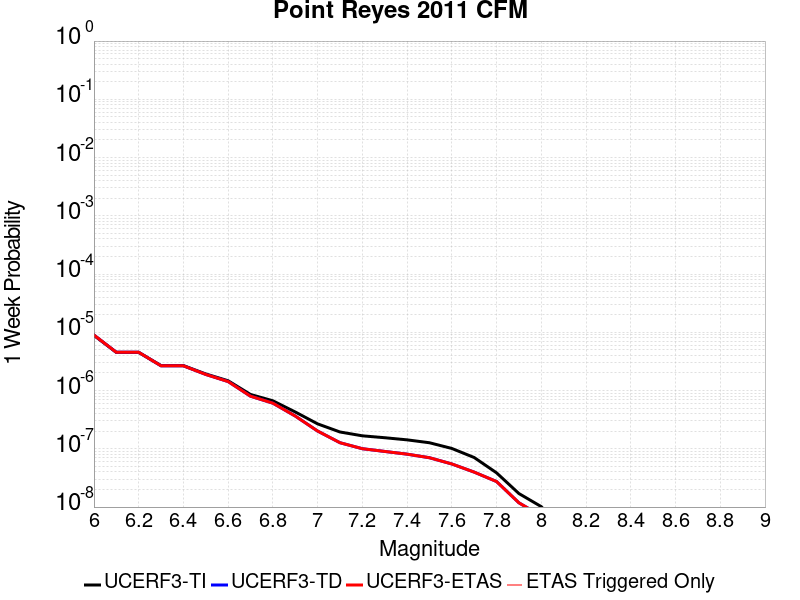 | 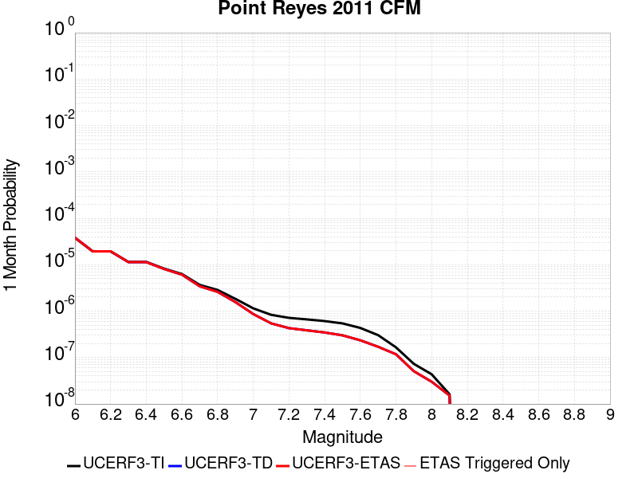 | 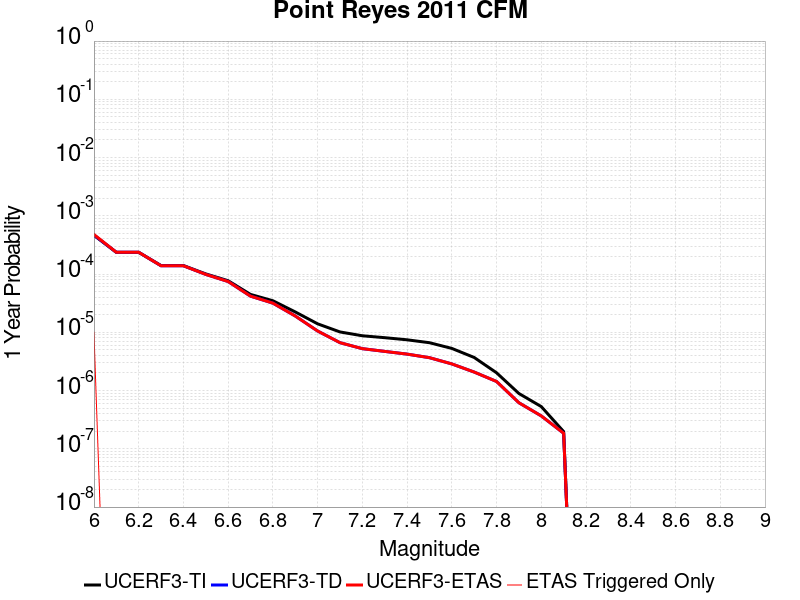 | 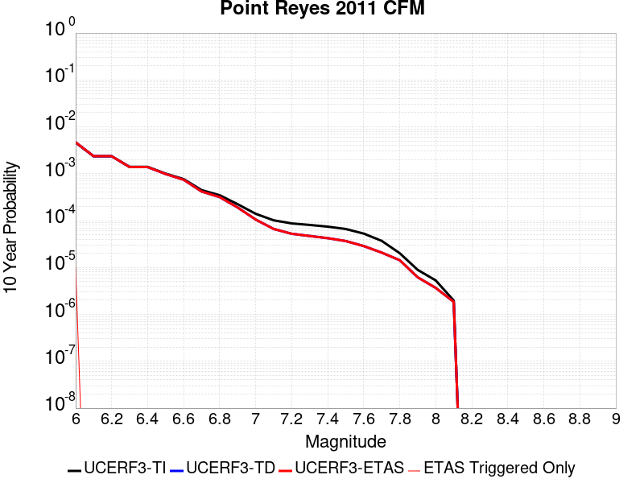 |

| Magnitude | 1 wk TI Prob | 1 wk TD Prob | 1 wk ETAS Prob | 1 wk ETAS/TD Gain | 1 wk ETAS Triggered Only | 1 mo TI Prob | 1 mo TD Prob | 1 mo ETAS Prob | 1 mo ETAS/TD Gain | 1 mo ETAS Triggered Only | 1 yr TI Prob | 1 yr TD Prob | 1 yr ETAS Prob | 1 yr ETAS/TD Gain | 1 yr ETAS Triggered Only | 10 yr TI Prob | 10 yr TD Prob | 10 yr ETAS Prob | 10 yr ETAS/TD Gain | 10 yr ETAS Triggered Only |
|-----|-----|-----|-----|-----|-----|-----|-----|-----|-----|-----|-----|-----|-----|-----|-----|-----|-----|-----|-----|-----|
| 6.0 | 8.8644965E-6 | 8.967201E-6 | 8.967201E-6 | 1.0 | 0.0 | 3.7990147E-5 | 3.843033E-5 | 3.843033E-5 | 1.0 | 0.0 | 4.624319E-4 | 4.6779512E-4 | 4.7779045E-4 | 1.0213668 | 1.0E-5 | 0.0046147075 | 0.0046687326 | 0.004678686 | 1.0021319 | 1.0E-5 |
| 6.1 | 4.526405E-6 | 4.5392444E-6 | 4.5392444E-6 | 1.0 | 0.0 | 1.9398734E-5 | 1.9453766E-5 | 1.9453766E-5 | 1.0 | 0.0 | 2.36154E-4 | 2.368249E-4 | 2.368249E-4 | 1.0 | 0.0 | 0.002359032 | 0.0023658313 | 0.0023658313 | 1.0 | 0.0 |
| 6.2 | 4.526405E-6 | 4.5392444E-6 | 4.5392444E-6 | 1.0 | 0.0 | 1.9398734E-5 | 1.9453766E-5 | 1.9453766E-5 | 1.0 | 0.0 | 2.36154E-4 | 2.368249E-4 | 2.368249E-4 | 1.0 | 0.0 | 0.002359032 | 0.0023658313 | 0.0023658313 | 1.0 | 0.0 |
| 6.3 | 2.6842322E-6 | 2.6606972E-6 | 2.6606972E-6 | 1.0 | 0.0 | 1.1503801E-5 | 1.1402939E-5 | 1.1402939E-5 | 1.0 | 0.0 | 1.4004979E-4 | 1.3882213E-4 | 1.3882213E-4 | 1.0 | 0.0 | 0.0013996155 | 0.0013873759 | 0.0013873759 | 1.0 | 0.0 |
| 6.4 | 2.6842322E-6 | 2.6606972E-6 | 2.6606972E-6 | 1.0 | 0.0 | 1.1503801E-5 | 1.1402939E-5 | 1.1402939E-5 | 1.0 | 0.0 | 1.4004979E-4 | 1.3882213E-4 | 1.3882213E-4 | 1.0 | 0.0 | 0.0013996155 | 0.0013873759 | 0.0013873759 | 1.0 | 0.0 |
| 6.5 | 1.9281833E-6 | 1.8906454E-6 | 1.8906454E-6 | 1.0 | 0.0 | 8.263617E-6 | 8.102741E-6 | 8.102741E-6 | 1.0 | 0.0 | 1.0060489E-4 | 9.8646495E-5 | 9.8646495E-5 | 1.0 | 0.0 | 0.0010055936 | 9.860379E-4 | 9.860379E-4 | 1.0 | 0.0 |
| 6.6 | 1.4726726E-6 | 1.4269757E-6 | 1.4269757E-6 | 1.0 | 0.0 | 6.3114385E-6 | 6.115596E-6 | 6.115596E-6 | 1.0 | 0.0 | 7.683905E-5 | 7.445489E-5 | 7.445489E-5 | 1.0 | 0.0 | 7.6812494E-4 | 7.443066E-4 | 7.443066E-4 | 1.0 | 0.0 |
| 6.7 | 8.572307E-7 | 8.007378E-7 | 8.007378E-7 | 1.0 | 0.0 | 3.6738406E-6 | 3.4317288E-6 | 3.4317288E-6 | 1.0 | 0.0 | 4.472809E-5 | 4.1780513E-5 | 4.1780513E-5 | 1.0 | 0.0 | 4.471909E-4 | 4.177305E-4 | 4.177305E-4 | 1.0 | 0.0 |
| 6.8 | 6.6745434E-7 | 6.0774613E-7 | 6.0774613E-7 | 1.0 | 0.0 | 2.8605155E-6 | 2.6046237E-6 | 2.6046237E-6 | 1.0 | 0.0 | 3.482622E-5 | 3.1710842E-5 | 3.1710842E-5 | 1.0 | 0.0 | 3.4820763E-4 | 3.1706647E-4 | 3.1706647E-4 | 1.0 | 0.0 |
| 6.9 | 4.291521E-7 | 3.65375E-7 | 3.65375E-7 | 1.0 | 0.0 | 1.839222E-6 | 1.5658918E-6 | 1.5658918E-6 | 1.0 | 0.0 | 2.2392298E-5 | 1.906457E-5 | 1.906457E-5 | 1.0 | 0.0 | 2.2390042E-4 | 1.90632E-4 | 1.90632E-4 | 1.0 | 0.0 |
| 7.0 | 2.6812808E-7 | 2.0188939E-7 | 2.0188939E-7 | 1.0 | 0.0 | 1.1491198E-6 | 8.6523994E-7 | 8.6523994E-7 | 1.0 | 0.0 | 1.3990444E-5 | 1.0534246E-5 | 1.0534246E-5 | 1.0 | 0.0 | 1.3989564E-4 | 1.05339815E-4 | 1.05339815E-4 | 1.0 | 0.0 |
| 7.1 | 1.9451231E-7 | 1.2727004E-7 | 1.2727004E-7 | 1.0 | 0.0 | 8.336239E-7 | 5.454429E-7 | 5.454429E-7 | 1.0 | 0.0 | 1.0149324E-5 | 6.640747E-6 | 6.640747E-6 | 1.0 | 0.0 | 1.014886E-4 | 6.640777E-5 | 6.640777E-5 | 1.0 | 0.0 |
| 7.2 | 1.6715143E-7 | 1.0044323E-7 | 1.0044323E-7 | 1.0 | 0.0 | 7.1636305E-7 | 4.304709E-7 | 4.304709E-7 | 1.0 | 0.0 | 8.721685E-6 | 5.2409705E-6 | 5.2409705E-6 | 1.0 | 0.0 | 8.721343E-5 | 5.2410738E-5 | 5.2410738E-5 | 1.0 | 0.0 |
| 7.3 | 1.5503173E-7 | 9.014564E-8 | 9.014564E-8 | 1.0 | 0.0 | 6.644215E-7 | 3.8633837E-7 | 3.8633837E-7 | 1.0 | 0.0 | 8.089301E-6 | 4.703659E-6 | 4.703659E-6 | 1.0 | 0.0 | 8.089007E-5 | 4.703787E-5 | 4.703787E-5 | 1.0 | 0.0 |
| 7.4 | 1.4251614E-7 | 8.099046E-8 | 8.099046E-8 | 1.0 | 0.0 | 6.1078333E-7 | 3.4710192E-7 | 3.4710192E-7 | 1.0 | 0.0 | 7.4362615E-6 | 4.2259576E-6 | 4.2259576E-6 | 1.0 | 0.0 | 7.436013E-5 | 4.2261043E-5 | 4.2261043E-5 | 1.0 | 0.0 |
| 7.5 | 1.2710186E-7 | 7.031006E-8 | 7.031006E-8 | 1.0 | 0.0 | 5.447221E-7 | 3.0132875E-7 | 3.0132875E-7 | 1.0 | 0.0 | 6.6319717E-6 | 3.6686715E-6 | 3.6686715E-6 | 1.0 | 0.0 | 6.6317734E-5 | 3.668838E-5 | 3.668838E-5 | 1.0 | 0.0 |
| 7.6 | 1.0144708E-7 | 5.496477E-8 | 5.496477E-8 | 1.0 | 0.0 | 4.347731E-7 | 2.3556325E-7 | 2.3556325E-7 | 1.0 | 0.0 | 5.2933497E-6 | 2.8679788E-6 | 2.8679788E-6 | 1.0 | 0.0 | 5.293224E-5 | 2.8681687E-5 | 2.8681687E-5 | 1.0 | 0.0 |
| 7.7 | 7.090527E-8 | 3.9833534E-8 | 3.9833534E-8 | 1.0 | 0.0 | 3.038797E-7 | 1.7071513E-7 | 1.7071513E-7 | 1.0 | 0.0 | 3.699729E-6 | 2.0784546E-6 | 2.0784546E-6 | 1.0 | 0.0 | 3.6996673E-5 | 2.0786621E-5 | 2.0786621E-5 | 1.0 | 0.0 |
| 7.8 | 3.8712045E-8 | 2.7448936E-8 | 2.7448936E-8 | 1.0 | 0.0 | 1.6590876E-7 | 1.17638294E-7 | 1.17638294E-7 | 1.0 | 0.0 | 2.0199373E-6 | 1.4322452E-6 | 1.4322452E-6 | 1.0 | 0.0 | 2.0199188E-5 | 1.432463E-5 | 1.432463E-5 | 1.0 | 0.0 |
| 7.9 | 1.7068782E-8 | 1.18407035E-8 | 1.18407035E-8 | 1.0 | 0.0 | 7.315192E-8 | 5.0745875E-8 | 5.0745875E-8 | 1.0 | 0.0 | 8.906242E-7 | 6.1783084E-7 | 6.1783084E-7 | 1.0 | 0.0 | 8.906207E-6 | 6.1805604E-6 | 6.1805604E-6 | 1.0 | 0.0 |
| 8.0 | 1.0172592E-8 | 7.0342603E-9 | 7.0342603E-9 | 1.0 | 0.0 | 4.359682E-8 | 3.0146833E-8 | 3.0146833E-8 | 1.0 | 0.0 | 5.3079117E-7 | 3.6703761E-7 | 3.6703761E-7 | 1.0 | 0.0 | 5.307899E-6 | 3.6726397E-6 | 3.6726397E-6 | 1.0 | 0.0 |
| 8.1 | 3.7861243E-9 | 3.5482264E-9 | 3.5482264E-9 | 1.0 | 0.0 | 1.6226247E-8 | 1.5206684E-8 | 1.5206684E-8 | 1.0 | 0.0 | 1.9755454E-7 | 1.8514133E-7 | 1.8514133E-7 | 1.0 | 0.0 | 1.9755437E-6 | 1.8534101E-6 | 1.8534101E-6 | 1.0 | 0.0 |

## Los Alamos 2011 CFM
*[(top)](#table-of-contents)*

| 1 Week | 1 Month | 1 Year | 10 Year |
|-----|-----|-----|-----|
|  | 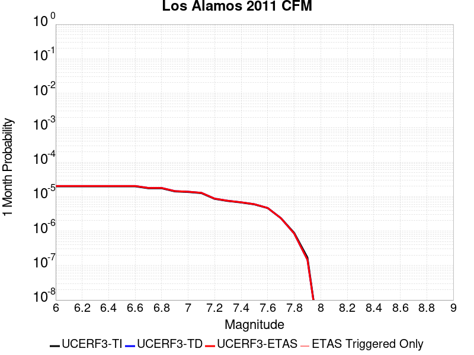 | 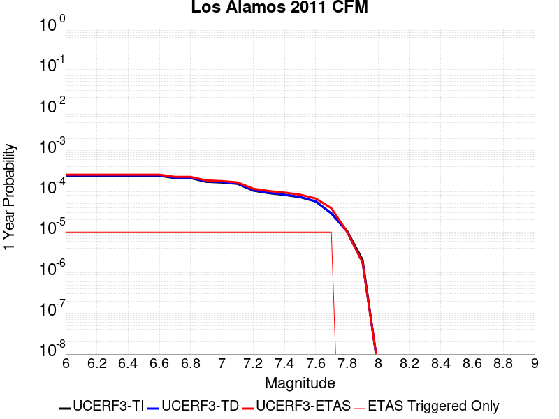 |  |

| Magnitude | 1 wk TI Prob | 1 wk TD Prob | 1 wk ETAS Prob | 1 wk ETAS/TD Gain | 1 wk ETAS Triggered Only | 1 mo TI Prob | 1 mo TD Prob | 1 mo ETAS Prob | 1 mo ETAS/TD Gain | 1 mo ETAS Triggered Only | 1 yr TI Prob | 1 yr TD Prob | 1 yr ETAS Prob | 1 yr ETAS/TD Gain | 1 yr ETAS Triggered Only | 10 yr TI Prob | 10 yr TD Prob | 10 yr ETAS Prob | 10 yr ETAS/TD Gain | 10 yr ETAS Triggered Only |
|-----|-----|-----|-----|-----|-----|-----|-----|-----|-----|-----|-----|-----|-----|-----|-----|-----|-----|-----|-----|-----|
| 6.0 | 4.6284417E-6 | 4.751753E-6 | 4.751753E-6 | 1.0 | 0.0 | 1.9836029E-5 | 2.0364507E-5 | 2.0364507E-5 | 1.0 | 0.0 | 2.4147688E-4 | 2.4791143E-4 | 2.5790895E-4 | 1.040327 | 1.0E-5 | 0.0024121467 | 0.0024765227 | 0.002486498 | 1.004028 | 1.0E-5 |
| 6.1 | 4.6284417E-6 | 4.751753E-6 | 4.751753E-6 | 1.0 | 0.0 | 1.9836029E-5 | 2.0364507E-5 | 2.0364507E-5 | 1.0 | 0.0 | 2.4147688E-4 | 2.4791143E-4 | 2.5790895E-4 | 1.040327 | 1.0E-5 | 0.0024121467 | 0.0024765227 | 0.002486498 | 1.004028 | 1.0E-5 |
| 6.2 | 4.6284417E-6 | 4.751753E-6 | 4.751753E-6 | 1.0 | 0.0 | 1.9836029E-5 | 2.0364507E-5 | 2.0364507E-5 | 1.0 | 0.0 | 2.4147688E-4 | 2.4791143E-4 | 2.5790895E-4 | 1.040327 | 1.0E-5 | 0.0024121467 | 0.0024765227 | 0.002486498 | 1.004028 | 1.0E-5 |
| 6.3 | 4.6284417E-6 | 4.751753E-6 | 4.751753E-6 | 1.0 | 0.0 | 1.9836029E-5 | 2.0364507E-5 | 2.0364507E-5 | 1.0 | 0.0 | 2.4147688E-4 | 2.4791143E-4 | 2.5790895E-4 | 1.040327 | 1.0E-5 | 0.0024121467 | 0.0024765227 | 0.002486498 | 1.004028 | 1.0E-5 |
| 6.4 | 4.6284417E-6 | 4.751753E-6 | 4.751753E-6 | 1.0 | 0.0 | 1.9836029E-5 | 2.0364507E-5 | 2.0364507E-5 | 1.0 | 0.0 | 2.4147688E-4 | 2.4791143E-4 | 2.5790895E-4 | 1.040327 | 1.0E-5 | 0.0024121467 | 0.0024765227 | 0.002486498 | 1.004028 | 1.0E-5 |
| 6.5 | 4.6284417E-6 | 4.751753E-6 | 4.751753E-6 | 1.0 | 0.0 | 1.9836029E-5 | 2.0364507E-5 | 2.0364507E-5 | 1.0 | 0.0 | 2.4147688E-4 | 2.4791143E-4 | 2.5790895E-4 | 1.040327 | 1.0E-5 | 0.0024121467 | 0.0024765227 | 0.002486498 | 1.004028 | 1.0E-5 |
| 6.6 | 4.6284417E-6 | 4.751753E-6 | 4.751753E-6 | 1.0 | 0.0 | 1.9836029E-5 | 2.0364507E-5 | 2.0364507E-5 | 1.0 | 0.0 | 2.4147688E-4 | 2.4791143E-4 | 2.5790895E-4 | 1.040327 | 1.0E-5 | 0.0024121467 | 0.0024765227 | 0.002486498 | 1.004028 | 1.0E-5 |
| 6.7 | 4.062321E-6 | 4.166368E-6 | 4.166368E-6 | 1.0 | 0.0 | 1.7409831E-5 | 1.785575E-5 | 1.785575E-5 | 1.0 | 0.0 | 2.1194408E-4 | 2.1737357E-4 | 2.273714E-4 | 1.0459938 | 1.0E-5 | 0.0021174205 | 0.0021717593 | 0.0021817375 | 1.0045946 | 1.0E-5 |
| 6.8 | 4.062321E-6 | 4.166368E-6 | 4.166368E-6 | 1.0 | 0.0 | 1.7409831E-5 | 1.785575E-5 | 1.785575E-5 | 1.0 | 0.0 | 2.1194408E-4 | 2.1737357E-4 | 2.273714E-4 | 1.0459938 | 1.0E-5 | 0.0021174205 | 0.0021717593 | 0.0021817375 | 1.0045946 | 1.0E-5 |
| 6.9 | 3.2936077E-6 | 3.3729737E-6 | 3.3729737E-6 | 1.0 | 0.0 | 1.4115385E-5 | 1.4455527E-5 | 1.4455527E-5 | 1.0 | 0.0 | 1.7184127E-4 | 1.7598276E-4 | 1.85981E-4 | 1.0568137 | 1.0E-5 | 0.0017170844 | 0.0017585267 | 0.001768509 | 1.0056766 | 1.0E-5 |
| 7.0 | 3.1687898E-6 | 3.2448309E-6 | 3.2448309E-6 | 1.0 | 0.0 | 1.3580457E-5 | 1.39063495E-5 | 1.39063495E-5 | 1.0 | 0.0 | 1.6532952E-4 | 1.6929758E-4 | 1.7929588E-4 | 1.0590576 | 1.0E-5 | 0.0016520657 | 0.0016917776 | 0.0017017607 | 1.005901 | 1.0E-5 |
| 7.1 | 2.9379228E-6 | 3.0073402E-6 | 3.0073402E-6 | 1.0 | 0.0 | 1.25910365E-5 | 1.2888542E-5 | 1.2888542E-5 | 1.0 | 0.0 | 1.5328509E-4 | 1.5690761E-4 | 1.6690604E-4 | 1.0637218 | 1.0E-5 | 0.001531794 | 0.0015680575 | 0.0015780417 | 1.0063673 | 1.0E-5 |
| 7.2 | 2.0020686E-6 | 2.04164E-6 | 2.04164E-6 | 1.0 | 0.0 | 8.580266E-6 | 8.749857E-6 | 8.749857E-6 | 1.0 | 0.0 | 1.0445973E-4 | 1.0652435E-4 | 1.1652328E-4 | 1.0938653 | 1.0E-5 | 0.0010441064 | 0.0010647373 | 0.0010747267 | 1.009382 | 1.0E-5 |
| 7.3 | 1.7364243E-6 | 1.7678894E-6 | 1.7678894E-6 | 1.0 | 0.0 | 7.441797E-6 | 7.5766475E-6 | 7.5766475E-6 | 1.0 | 0.0 | 9.0600115E-5 | 9.224181E-5 | 1.0224088E-4 | 1.1084007 | 1.0E-5 | 9.0563187E-4 | 9.220384E-4 | 9.3202916E-4 | 1.0108355 | 1.0E-5 |
| 7.4 | 1.5718434E-6 | 1.5983262E-6 | 1.5983262E-6 | 1.0 | 0.0 | 6.7364545E-6 | 6.8499517E-6 | 6.8499517E-6 | 1.0 | 0.0 | 8.201325E-5 | 8.3395E-5 | 9.339416E-5 | 1.1199013 | 1.0E-5 | 8.198299E-4 | 8.3364005E-4 | 8.436317E-4 | 1.0119855 | 1.0E-5 |
| 7.5 | 1.3841119E-6 | 1.404287E-6 | 1.404287E-6 | 1.0 | 0.0 | 5.9318945E-6 | 6.018359E-6 | 6.018359E-6 | 1.0 | 0.0 | 7.221842E-5 | 7.327108E-5 | 8.327035E-5 | 1.1364695 | 1.0E-5 | 7.2194956E-4 | 7.324721E-4 | 7.424648E-4 | 1.0136424 | 1.0E-5 |
| 7.6 | 1.0843726E-6 | 1.0934483E-6 | 1.0934483E-6 | 1.0 | 0.0 | 4.647303E-6 | 4.6861987E-6 | 4.6861987E-6 | 1.0 | 0.0 | 5.6579443E-5 | 5.7053E-5 | 6.705243E-5 | 1.1752657 | 1.0E-5 | 5.656504E-4 | 5.703861E-4 | 5.8038044E-4 | 1.017522 | 1.0E-5 |
| 7.7 | 5.544814E-7 | 5.501903E-7 | 5.501903E-7 | 1.0 | 0.0 | 2.3763469E-6 | 2.3579564E-6 | 2.3579564E-6 | 1.0 | 0.0 | 2.8931638E-5 | 2.8707742E-5 | 3.8707454E-5 | 1.3483281 | 1.0E-5 | 2.8927872E-4 | 2.870405E-4 | 2.9703762E-4 | 1.0348283 | 1.0E-5 |
| 7.8 | 2.0707465E-7 | 1.9778587E-7 | 1.9778587E-7 | 1.0 | 0.0 | 8.874625E-7 | 8.4765344E-7 | 8.4765344E-7 | 1.0 | 0.0 | 1.08048025E-5 | 1.0320132E-5 | 1.0320132E-5 | 1.0 | 0.0 | 1.0804277E-4 | 1.0319657E-4 | 1.0319657E-4 | 1.0 | 0.0 |
| 7.9 | 3.9821284E-8 | 3.4331322E-8 | 3.4331322E-8 | 1.0 | 0.0 | 1.7066264E-7 | 1.4713423E-7 | 1.4713423E-7 | 1.0 | 0.0 | 2.0778157E-6 | 1.7913579E-6 | 1.7913579E-6 | 1.0 | 0.0 | 2.0777963E-5 | 1.791344E-5 | 1.791344E-5 | 1.0 | 0.0 |
| 8.0 | 7.880441E-11 | 8.235368E-11 | 8.235368E-11 | 1.0 | 0.0 | 3.3773329E-10 | 3.5294412E-10 | 3.5294412E-10 | 1.0 | 0.0 | 4.1119033E-9 | 4.297095E-9 | 4.297095E-9 | 1.0 | 0.0 | 4.1119034E-8 | 4.2970953E-8 | 4.2970953E-8 | 1.0 | 0.0 |

## San Joaquin Hills
*[(top)](#table-of-contents)*

| 1 Week | 1 Month | 1 Year | 10 Year |
|-----|-----|-----|-----|
| 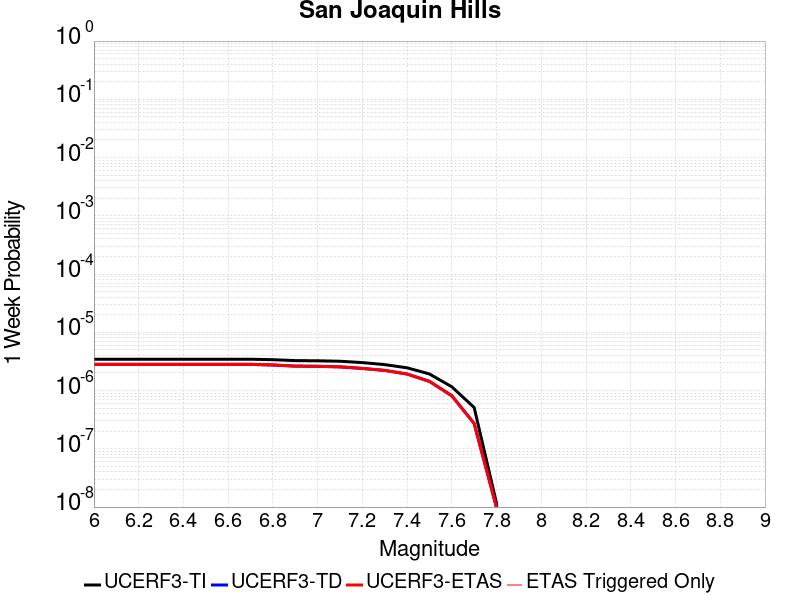 | 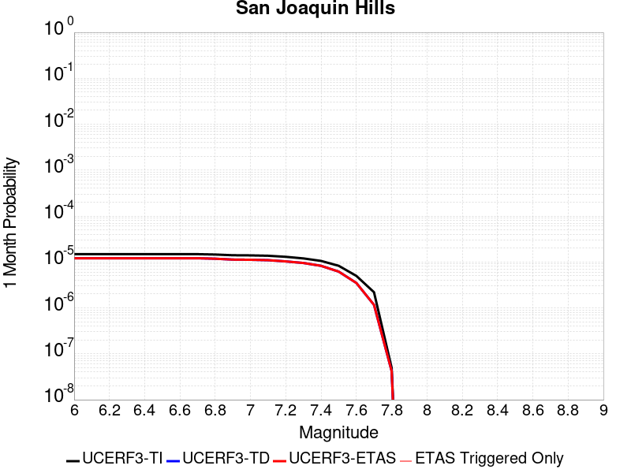 | 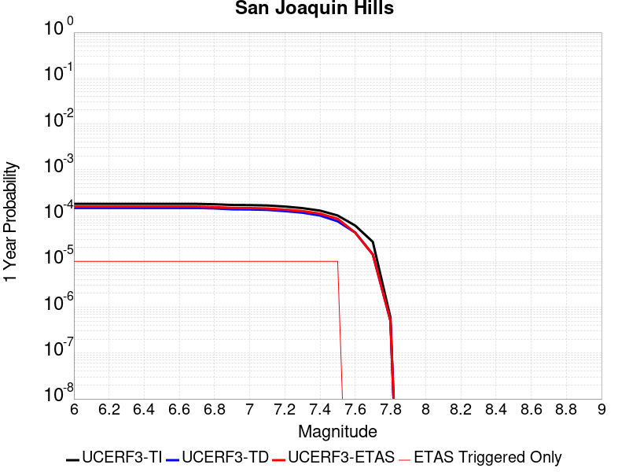 | 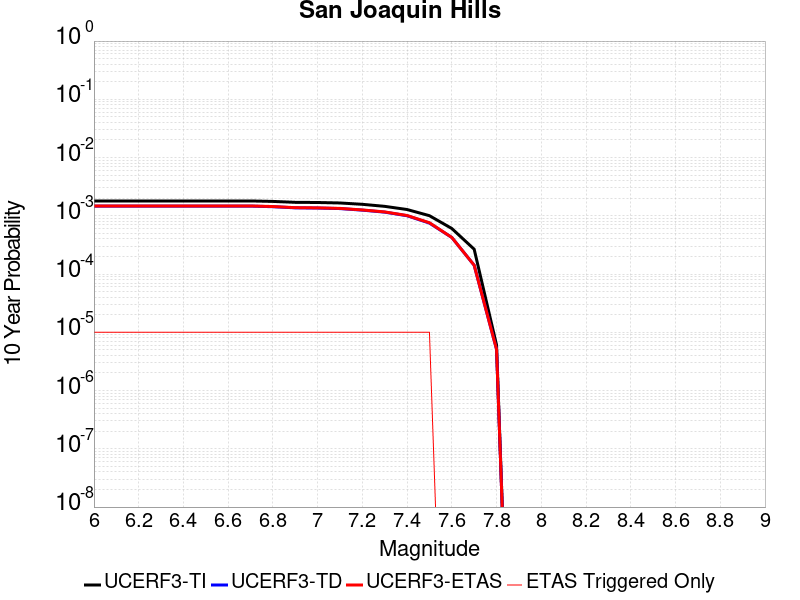 |

| Magnitude | 1 wk TI Prob | 1 wk TD Prob | 1 wk ETAS Prob | 1 wk ETAS/TD Gain | 1 wk ETAS Triggered Only | 1 mo TI Prob | 1 mo TD Prob | 1 mo ETAS Prob | 1 mo ETAS/TD Gain | 1 mo ETAS Triggered Only | 1 yr TI Prob | 1 yr TD Prob | 1 yr ETAS Prob | 1 yr ETAS/TD Gain | 1 yr ETAS Triggered Only | 10 yr TI Prob | 10 yr TD Prob | 10 yr ETAS Prob | 10 yr ETAS/TD Gain | 10 yr ETAS Triggered Only |
|-----|-----|-----|-----|-----|-----|-----|-----|-----|-----|-----|-----|-----|-----|-----|-----|-----|-----|-----|-----|-----|
| 6.0 | 3.4525704E-6 | 2.813994E-6 | 2.813994E-6 | 1.0 | 0.0 | 1.4796647E-5 | 1.2059919E-5 | 1.2059919E-5 | 1.0 | 0.0 | 1.8013427E-4 | 1.4681974E-4 | 1.5681828E-4 | 1.0681007 | 1.0E-5 | 0.0017998833 | 0.0014672407 | 0.001477226 | 1.0068055 | 1.0E-5 |
| 6.1 | 3.4525704E-6 | 2.813994E-6 | 2.813994E-6 | 1.0 | 0.0 | 1.4796647E-5 | 1.2059919E-5 | 1.2059919E-5 | 1.0 | 0.0 | 1.8013427E-4 | 1.4681974E-4 | 1.5681828E-4 | 1.0681007 | 1.0E-5 | 0.0017998833 | 0.0014672407 | 0.001477226 | 1.0068055 | 1.0E-5 |
| 6.2 | 3.4525704E-6 | 2.813994E-6 | 2.813994E-6 | 1.0 | 0.0 | 1.4796647E-5 | 1.2059919E-5 | 1.2059919E-5 | 1.0 | 0.0 | 1.8013427E-4 | 1.4681974E-4 | 1.5681828E-4 | 1.0681007 | 1.0E-5 | 0.0017998833 | 0.0014672407 | 0.001477226 | 1.0068055 | 1.0E-5 |
| 6.3 | 3.4525704E-6 | 2.813994E-6 | 2.813994E-6 | 1.0 | 0.0 | 1.4796647E-5 | 1.2059919E-5 | 1.2059919E-5 | 1.0 | 0.0 | 1.8013427E-4 | 1.4681974E-4 | 1.5681828E-4 | 1.0681007 | 1.0E-5 | 0.0017998833 | 0.0014672407 | 0.001477226 | 1.0068055 | 1.0E-5 |
| 6.4 | 3.4525704E-6 | 2.813994E-6 | 2.813994E-6 | 1.0 | 0.0 | 1.4796647E-5 | 1.2059919E-5 | 1.2059919E-5 | 1.0 | 0.0 | 1.8013427E-4 | 1.4681974E-4 | 1.5681828E-4 | 1.0681007 | 1.0E-5 | 0.0017998833 | 0.0014672407 | 0.001477226 | 1.0068055 | 1.0E-5 |
| 6.5 | 3.4525704E-6 | 2.813994E-6 | 2.813994E-6 | 1.0 | 0.0 | 1.4796647E-5 | 1.2059919E-5 | 1.2059919E-5 | 1.0 | 0.0 | 1.8013427E-4 | 1.4681974E-4 | 1.5681828E-4 | 1.0681007 | 1.0E-5 | 0.0017998833 | 0.0014672407 | 0.001477226 | 1.0068055 | 1.0E-5 |
| 6.6 | 3.4525704E-6 | 2.813994E-6 | 2.813994E-6 | 1.0 | 0.0 | 1.4796647E-5 | 1.2059919E-5 | 1.2059919E-5 | 1.0 | 0.0 | 1.8013427E-4 | 1.4681974E-4 | 1.5681828E-4 | 1.0681007 | 1.0E-5 | 0.0017998833 | 0.0014672407 | 0.001477226 | 1.0068055 | 1.0E-5 |
| 6.7 | 3.4525704E-6 | 2.813994E-6 | 2.813994E-6 | 1.0 | 0.0 | 1.4796647E-5 | 1.2059919E-5 | 1.2059919E-5 | 1.0 | 0.0 | 1.8013427E-4 | 1.4681974E-4 | 1.5681828E-4 | 1.0681007 | 1.0E-5 | 0.0017998833 | 0.0014672407 | 0.001477226 | 1.0068055 | 1.0E-5 |
| 6.8 | 3.388654E-6 | 2.748432E-6 | 2.748432E-6 | 1.0 | 0.0 | 1.4522722E-5 | 1.1778942E-5 | 1.1778942E-5 | 1.0 | 0.0 | 1.767998E-4 | 1.433993E-4 | 1.5339788E-4 | 1.0697254 | 1.0E-5 | 0.001766592 | 0.0014330806 | 0.0014430663 | 1.006968 | 1.0E-5 |
| 6.9 | 3.2694352E-6 | 2.628346E-6 | 2.628346E-6 | 1.0 | 0.0 | 1.401179E-5 | 1.1264292E-5 | 1.1264292E-5 | 1.0 | 0.0 | 1.7058018E-4 | 1.3713424E-4 | 1.4713287E-4 | 1.0729113 | 1.0E-5 | 0.0017044931 | 0.0013705074 | 0.0013804937 | 1.0072865 | 1.0E-5 |
| 7.0 | 3.246912E-6 | 2.6070031E-6 | 2.6070031E-6 | 1.0 | 0.0 | 1.39152635E-5 | 1.1172823E-5 | 1.1172823E-5 | 1.0 | 0.0 | 1.6940516E-4 | 1.3602074E-4 | 1.4601937E-4 | 1.0735081 | 1.0E-5 | 0.0016927607 | 0.0013593861 | 0.0013693725 | 1.0073463 | 1.0E-5 |
| 7.1 | 3.1864927E-6 | 2.552331E-6 | 2.552331E-6 | 1.0 | 0.0 | 1.3656326E-5 | 1.09385155E-5 | 1.09385155E-5 | 1.0 | 0.0 | 1.6625308E-4 | 1.331684E-4 | 1.4316707E-4 | 1.0750829 | 1.0E-5 | 0.0016612876 | 0.0013308971 | 0.0013408838 | 1.0075037 | 1.0E-5 |
| 7.2 | 3.0220644E-6 | 2.3991784E-6 | 2.3991784E-6 | 1.0 | 0.0 | 1.295164E-5 | 1.0282153E-5 | 1.0282153E-5 | 1.0 | 0.0 | 1.576748E-4 | 1.2517812E-4 | 1.3517687E-4 | 1.0798762 | 1.0E-5 | 0.0015756298 | 0.0012510865 | 0.001261074 | 1.0079831 | 1.0E-5 |
| 7.3 | 2.787619E-6 | 2.2173956E-6 | 2.2173956E-6 | 1.0 | 0.0 | 1.1946884E-5 | 9.50309E-6 | 9.50309E-6 | 1.0 | 0.0 | 1.454436E-4 | 1.1569408E-4 | 1.2569292E-4 | 1.0864248 | 1.0E-5 | 0.0014534845 | 0.0011563484 | 0.0011663368 | 1.0086379 | 1.0E-5 |
| 7.4 | 2.4593792E-6 | 1.9226395E-6 | 1.9226395E-6 | 1.0 | 0.0 | 1.0540153E-5 | 8.239858E-6 | 8.239858E-6 | 1.0 | 0.0 | 1.2831882E-4 | 1.00315745E-4 | 1.1031474E-4 | 1.0996753 | 1.0E-5 | 0.0012824474 | 0.0010027133 | 0.0010127034 | 1.0099629 | 1.0E-5 |
| 7.5 | 1.926764E-6 | 1.4383094E-6 | 1.4383094E-6 | 1.0 | 0.0 | 8.257534E-6 | 6.1641686E-6 | 6.1641686E-6 | 1.0 | 0.0 | 1.00530844E-4 | 7.5046235E-5 | 8.504548E-5 | 1.1332412 | 1.0E-5 | 0.0010048538 | 7.5021526E-4 | 7.6020777E-4 | 1.0133195 | 1.0E-5 |
| 7.6 | 1.1609359E-6 | 8.1456284E-7 | 8.1456284E-7 | 1.0 | 0.0 | 4.97543E-6 | 3.4909792E-6 | 3.4909792E-6 | 1.0 | 0.0 | 6.0574173E-5 | 4.2501888E-5 | 4.2501888E-5 | 1.0 | 0.0 | 6.055767E-4 | 4.249419E-4 | 4.249419E-4 | 1.0 | 0.0 |
| 7.7 | 5.1168536E-7 | 2.7156221E-7 | 2.7156221E-7 | 1.0 | 0.0 | 2.1929354E-6 | 1.1638376E-6 | 1.1638376E-6 | 1.0 | 0.0 | 2.669866E-5 | 1.4169645E-5 | 1.4169645E-5 | 1.0 | 0.0 | 2.6695454E-4 | 1.4168875E-4 | 1.4168875E-4 | 1.0 | 0.0 |
| 7.8 | 1.16056995E-8 | 9.782392E-9 | 9.782392E-9 | 1.0 | 0.0 | 4.9738713E-8 | 4.1924537E-8 | 4.1924537E-8 | 1.0 | 0.0 | 6.0556863E-7 | 5.104312E-7 | 5.104312E-7 | 1.0 | 0.0 | 6.05567E-6 | 5.104312E-6 | 5.104312E-6 | 1.0 | 0.0 |

## Newport-Inglewood (Offshore)
*[(top)](#table-of-contents)*

| 1 Week | 1 Month | 1 Year | 10 Year |
|-----|-----|-----|-----|
| 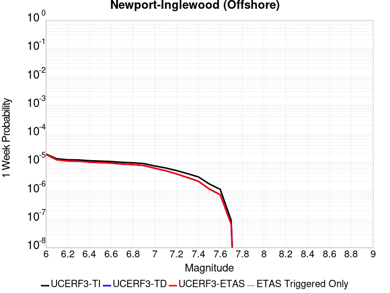 | 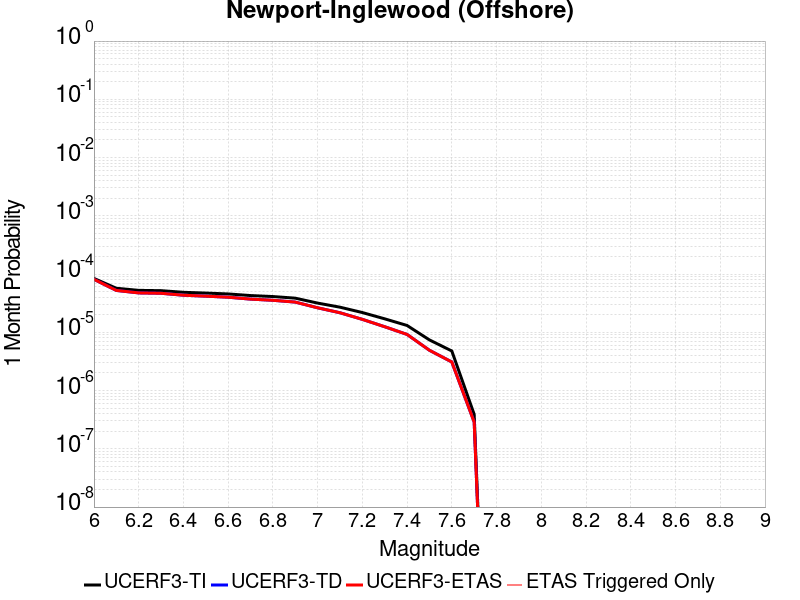 | 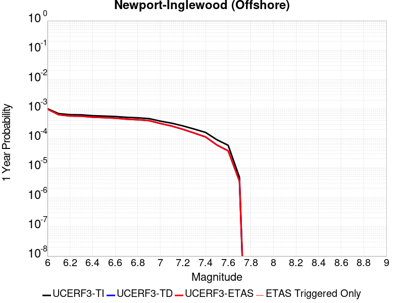 | 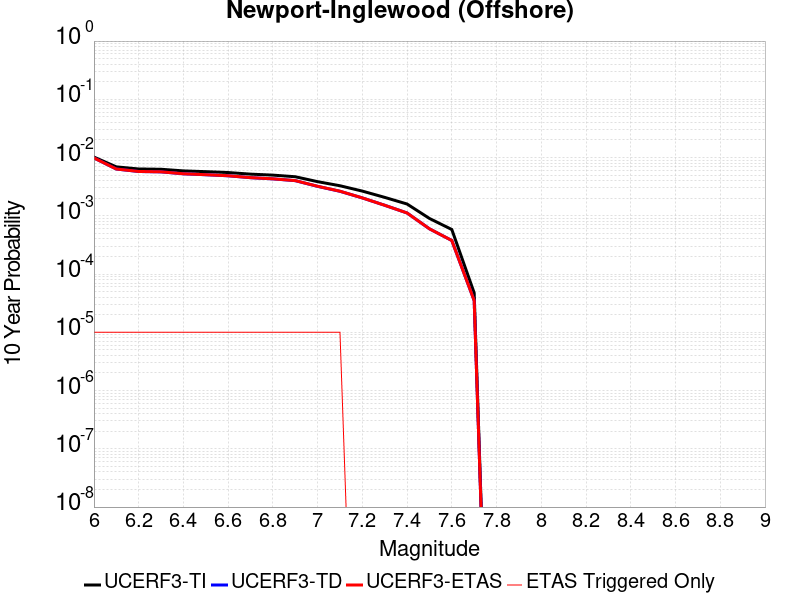 |

| Magnitude | 1 wk TI Prob | 1 wk TD Prob | 1 wk ETAS Prob | 1 wk ETAS/TD Gain | 1 wk ETAS Triggered Only | 1 mo TI Prob | 1 mo TD Prob | 1 mo ETAS Prob | 1 mo ETAS/TD Gain | 1 mo ETAS Triggered Only | 1 yr TI Prob | 1 yr TD Prob | 1 yr ETAS Prob | 1 yr ETAS/TD Gain | 1 yr ETAS Triggered Only | 10 yr TI Prob | 10 yr TD Prob | 10 yr ETAS Prob | 10 yr ETAS/TD Gain | 10 yr ETAS Triggered Only |
|-----|-----|-----|-----|-----|-----|-----|-----|-----|-----|-----|-----|-----|-----|-----|-----|-----|-----|-----|-----|-----|
| 6.0 | 1.9626508E-5 | 1.896559E-5 | 1.896559E-5 | 1.0 | 0.0 | 8.411089E-5 | 8.127864E-5 | 8.127864E-5 | 1.0 | 0.0 | 0.001023569 | 9.891307E-4 | 9.891307E-4 | 1.0 | 0.0 | 0.010188672 | 0.0098486245 | 0.009858525 | 1.0010054 | 1.0E-5 |
| 6.1 | 1.331886E-5 | 1.2218263E-5 | 1.2218263E-5 | 1.0 | 0.0 | 5.707958E-5 | 5.2362942E-5 | 5.2362942E-5 | 1.0 | 0.0 | 6.947222E-4 | 6.3733384E-4 | 6.3733384E-4 | 1.0 | 0.0 | 0.006925544 | 0.0063552377 | 0.006365174 | 1.0015635 | 1.0E-5 |
| 6.2 | 1.2250852E-5 | 1.1076189E-5 | 1.1076189E-5 | 1.0 | 0.0 | 5.2502597E-5 | 4.7468526E-5 | 4.7468526E-5 | 1.0 | 0.0 | 6.3903164E-4 | 5.7777704E-4 | 5.7777704E-4 | 1.0 | 0.0 | 0.006371971 | 0.00576287 | 0.0057728123 | 1.0017252 | 1.0E-5 |
| 6.3 | 1.2106258E-5 | 1.091905E-5 | 1.091905E-5 | 1.0 | 0.0 | 5.1882926E-5 | 4.6795092E-5 | 4.6795092E-5 | 1.0 | 0.0 | 6.3149154E-4 | 5.695823E-4 | 5.695823E-4 | 1.0 | 0.0 | 0.0062970007 | 0.0056813415 | 0.005691285 | 1.0017501 | 1.0E-5 |
| 6.4 | 1.1348758E-5 | 1.0109513E-5 | 1.0109513E-5 | 1.0 | 0.0 | 4.8636626E-5 | 4.332577E-5 | 4.332577E-5 | 1.0 | 0.0 | 5.919901E-4 | 5.273644E-4 | 5.273644E-4 | 1.0 | 0.0 | 0.005904155 | 0.005261225 | 0.005271172 | 1.0018907 | 1.0E-5 |
| 6.5 | 1.100837E-5 | 9.743537E-6 | 9.743537E-6 | 1.0 | 0.0 | 4.7177873E-5 | 4.175735E-5 | 4.175735E-5 | 1.0 | 0.0 | 5.7423924E-4 | 5.082779E-4 | 5.082779E-4 | 1.0 | 0.0 | 0.005727576 | 0.0050712456 | 0.0050811945 | 1.001962 | 1.0E-5 |
| 6.6 | 1.0634696E-5 | 9.345687E-6 | 9.345687E-6 | 1.0 | 0.0 | 4.557647E-5 | 4.0052335E-5 | 4.0052335E-5 | 1.0 | 0.0 | 5.5475225E-4 | 4.875288E-4 | 4.875288E-4 | 1.0 | 0.0 | 0.0055336943 | 0.004864679 | 0.0048746304 | 1.0020456 | 1.0E-5 |
| 6.7 | 9.9780855E-6 | 8.668048E-6 | 8.668048E-6 | 1.0 | 0.0 | 4.276252E-5 | 3.7148253E-5 | 3.7148253E-5 | 1.0 | 0.0 | 5.205093E-4 | 4.521868E-4 | 4.521868E-4 | 1.0 | 0.0 | 0.0051929182 | 0.0045127464 | 0.0045227013 | 1.002206 | 1.0E-5 |
| 6.8 | 9.59546E-6 | 8.273084E-6 | 8.273084E-6 | 1.0 | 0.0 | 4.1122752E-5 | 3.5455596E-5 | 3.5455596E-5 | 1.0 | 0.0 | 5.0055445E-4 | 4.3158708E-4 | 4.3158708E-4 | 1.0 | 0.0 | 0.004994285 | 0.004307565 | 0.0043175216 | 1.0023115 | 1.0E-5 |
| 6.9 | 9.000614E-6 | 7.706967E-6 | 7.706967E-6 | 1.0 | 0.0 | 3.857349E-5 | 3.3029446E-5 | 3.3029446E-5 | 1.0 | 0.0 | 4.6953102E-4 | 4.0205996E-4 | 4.0205996E-4 | 1.0 | 0.0 | 0.004685402 | 0.004013397 | 0.004023357 | 1.0024817 | 1.0E-5 |
| 7.0 | 7.4070194E-6 | 6.1490105E-6 | 6.1490105E-6 | 1.0 | 0.0 | 3.1743984E-5 | 2.6352638E-5 | 2.6352638E-5 | 1.0 | 0.0 | 3.8641447E-4 | 3.2079627E-4 | 3.2079627E-4 | 1.0 | 0.0 | 0.0038574322 | 0.0032033517 | 0.0032133197 | 1.0031117 | 1.0E-5 |
| 7.1 | 6.299615E-6 | 5.056689E-6 | 5.056689E-6 | 1.0 | 0.0 | 2.699807E-5 | 2.1671345E-5 | 2.1671345E-5 | 1.0 | 0.0 | 3.2865192E-4 | 2.6381682E-4 | 2.6381682E-4 | 1.0 | 0.0 | 0.003281663 | 0.002635051 | 0.0026450248 | 1.003785 | 1.0E-5 |
| 7.2 | 5.096653E-6 | 3.8928574E-6 | 3.8928574E-6 | 1.0 | 0.0 | 2.1842614E-5 | 1.6683567E-5 | 1.6683567E-5 | 1.0 | 0.0 | 2.6590136E-4 | 2.0310361E-4 | 2.0310361E-4 | 1.0 | 0.0 | 0.0026558342 | 0.002029191 | 0.002029191 | 1.0 | 0.0 |
| 7.3 | 3.9753018E-6 | 2.9099435E-6 | 2.9099435E-6 | 1.0 | 0.0 | 1.7036897E-5 | 1.2471127E-5 | 1.2471127E-5 | 1.0 | 0.0 | 2.0740448E-4 | 1.5182547E-4 | 1.5182547E-4 | 1.0 | 0.0 | 0.00207211 | 0.0015172255 | 0.0015172255 | 1.0 | 0.0 |
| 7.4 | 3.0568392E-6 | 2.145023E-6 | 2.145023E-6 | 1.0 | 0.0 | 1.3100675E-5 | 9.192923E-6 | 9.192923E-6 | 1.0 | 0.0 | 1.5948903E-4 | 1.11918154E-4 | 1.11918154E-4 | 1.0 | 0.0 | 0.0015937461 | 0.0011186242 | 0.0011186242 | 1.0 | 0.0 |
| 7.5 | 1.7279019E-6 | 1.1470016E-6 | 1.1470016E-6 | 1.0 | 0.0 | 7.405273E-6 | 4.9157125E-6 | 4.9157125E-6 | 1.0 | 0.0 | 9.015547E-5 | 5.9847192E-5 | 5.9847192E-5 | 1.0 | 0.0 | 9.01189E-4 | 5.983146E-4 | 5.983146E-4 | 1.0 | 0.0 |
| 7.6 | 1.1156416E-6 | 7.2231035E-7 | 7.2231035E-7 | 1.0 | 0.0 | 4.7813123E-6 | 3.0956123E-6 | 3.0956123E-6 | 1.0 | 0.0 | 5.821092E-5 | 3.7688453E-5 | 3.7688453E-5 | 1.0 | 0.0 | 5.8195676E-4 | 3.7682295E-4 | 3.7682295E-4 | 1.0 | 0.0 |
| 7.7 | 9.117973E-8 | 6.7341894E-8 | 6.7341894E-8 | 1.0 | 0.0 | 3.907702E-7 | 2.8860808E-7 | 2.8860808E-7 | 1.0 | 0.0 | 4.757617E-6 | 3.513798E-6 | 3.513798E-6 | 1.0 | 0.0 | 4.7575148E-5 | 3.5137455E-5 | 3.5137455E-5 | 1.0 | 0.0 |

## San Gregorio (South) 2011 CFM
*[(top)](#table-of-contents)*

| 1 Week | 1 Month | 1 Year | 10 Year |
|-----|-----|-----|-----|
| 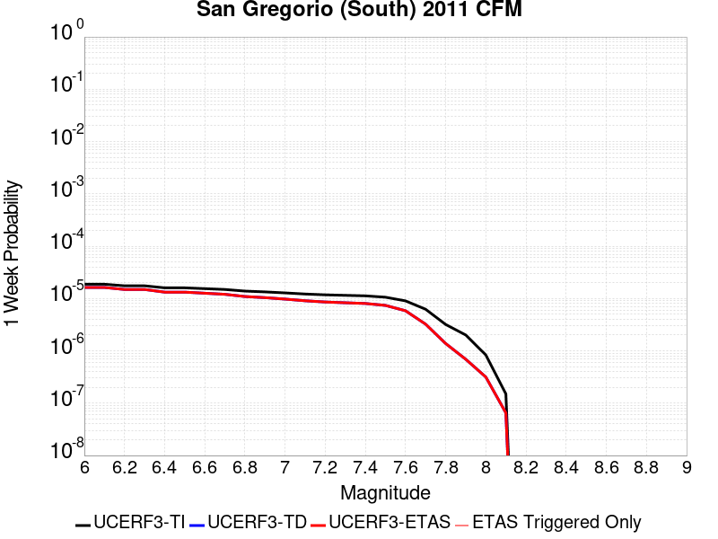 |  | 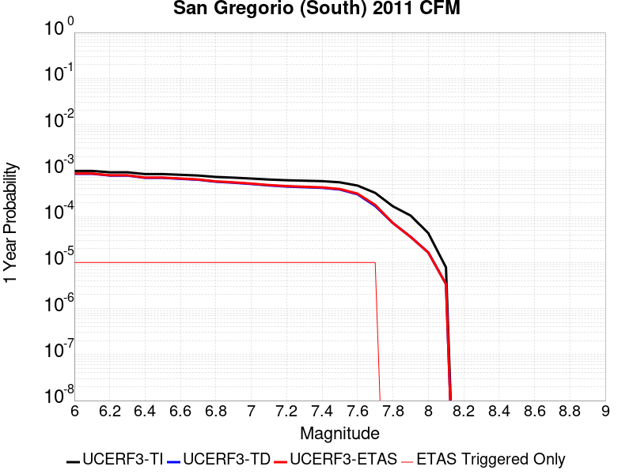 | 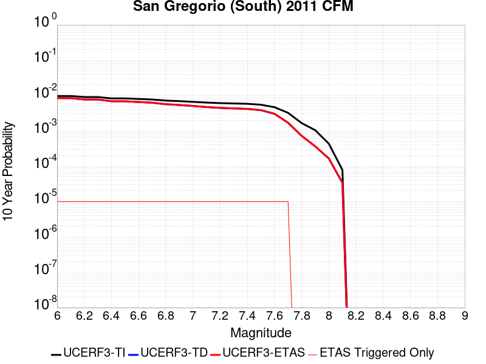 |

| Magnitude | 1 wk TI Prob | 1 wk TD Prob | 1 wk ETAS Prob | 1 wk ETAS/TD Gain | 1 wk ETAS Triggered Only | 1 mo TI Prob | 1 mo TD Prob | 1 mo ETAS Prob | 1 mo ETAS/TD Gain | 1 mo ETAS Triggered Only | 1 yr TI Prob | 1 yr TD Prob | 1 yr ETAS Prob | 1 yr ETAS/TD Gain | 1 yr ETAS Triggered Only | 10 yr TI Prob | 10 yr TD Prob | 10 yr ETAS Prob | 10 yr ETAS/TD Gain | 10 yr ETAS Triggered Only |
|-----|-----|-----|-----|-----|-----|-----|-----|-----|-----|-----|-----|-----|-----|-----|-----|-----|-----|-----|-----|-----|
| 6.0 | 1.8770423E-5 | 1.6280406E-5 | 1.6280406E-5 | 1.0 | 0.0 | 8.044219E-5 | 6.977132E-5 | 6.977132E-5 | 1.0 | 0.0 | 9.789435E-4 | 8.491386E-4 | 8.5913006E-4 | 1.0117667 | 1.0E-5 | 0.009746423 | 0.008471654 | 0.008481569 | 1.0011704 | 1.0E-5 |
| 6.1 | 1.8770423E-5 | 1.6280406E-5 | 1.6280406E-5 | 1.0 | 0.0 | 8.044219E-5 | 6.977132E-5 | 6.977132E-5 | 1.0 | 0.0 | 9.789435E-4 | 8.491386E-4 | 8.5913006E-4 | 1.0117667 | 1.0E-5 | 0.009746423 | 0.008471654 | 0.008481569 | 1.0011704 | 1.0E-5 |
| 6.2 | 1.7508692E-5 | 1.4899894E-5 | 1.4899894E-5 | 1.0 | 0.0 | 7.5035096E-5 | 6.385514E-5 | 6.385514E-5 | 1.0 | 0.0 | 9.1316935E-4 | 7.771621E-4 | 7.871543E-4 | 1.0128573 | 1.0E-5 | 0.00909426 | 0.0077570733 | 0.0077669956 | 1.0012791 | 1.0E-5 |
| 6.3 | 1.7508692E-5 | 1.4899894E-5 | 1.4899894E-5 | 1.0 | 0.0 | 7.5035096E-5 | 6.385514E-5 | 6.385514E-5 | 1.0 | 0.0 | 9.1316935E-4 | 7.771621E-4 | 7.871543E-4 | 1.0128573 | 1.0E-5 | 0.00909426 | 0.0077570733 | 0.0077669956 | 1.0012791 | 1.0E-5 |
| 6.4 | 1.6004591E-5 | 1.324971E-5 | 1.324971E-5 | 1.0 | 0.0 | 6.85893E-5 | 5.678324E-5 | 5.678324E-5 | 1.0 | 0.0 | 8.347548E-4 | 6.911177E-4 | 7.011108E-4 | 1.0144594 | 1.0E-5 | 0.008316261 | 0.0069021136 | 0.0069120442 | 1.0014389 | 1.0E-5 |
| 6.5 | 1.6004591E-5 | 1.324971E-5 | 1.324971E-5 | 1.0 | 0.0 | 6.85893E-5 | 5.678324E-5 | 5.678324E-5 | 1.0 | 0.0 | 8.347548E-4 | 6.911177E-4 | 7.011108E-4 | 1.0144594 | 1.0E-5 | 0.008316261 | 0.0069021136 | 0.0069120442 | 1.0014389 | 1.0E-5 |
| 6.6 | 1.5442201E-5 | 1.2634333E-5 | 1.2634333E-5 | 1.0 | 0.0 | 6.617918E-5 | 5.4146025E-5 | 5.4146025E-5 | 1.0 | 0.0 | 8.0543366E-4 | 6.590293E-4 | 6.6902273E-4 | 1.0151638 | 1.0E-5 | 0.008025207 | 0.006583161 | 0.006593095 | 1.0015091 | 1.0E-5 |
| 6.7 | 1.489921E-5 | 1.2042835E-5 | 1.2042835E-5 | 1.0 | 0.0 | 6.3852196E-5 | 5.1611136E-5 | 5.1611136E-5 | 1.0 | 0.0 | 7.7712315E-4 | 6.281851E-4 | 6.3817884E-4 | 1.0159088 | 1.0E-5 | 0.0077441116 | 0.0062764906 | 0.006286428 | 1.0015832 | 1.0E-5 |
| 6.8 | 1.3876024E-5 | 1.0921772E-5 | 1.0921772E-5 | 1.0 | 0.0 | 5.9467322E-5 | 4.6806756E-5 | 4.6806756E-5 | 1.0 | 0.0 | 7.237741E-4 | 5.697236E-4 | 5.7971786E-4 | 1.0175424 | 1.0E-5 | 0.0072142133 | 0.0056949924 | 0.0057049356 | 1.0017459 | 1.0E-5 |
| 6.9 | 1.33922495E-5 | 1.0393267E-5 | 1.0393267E-5 | 1.0 | 0.0 | 5.7394092E-5 | 4.4541815E-5 | 4.4541815E-5 | 1.0 | 0.0 | 6.9854903E-4 | 5.421619E-4 | 5.5215653E-4 | 1.0184346 | 1.0E-5 | 0.0069635725 | 0.0054207467 | 0.005430693 | 1.0018348 | 1.0E-5 |
| 7.0 | 1.2807324E-5 | 9.753221E-6 | 9.753221E-6 | 1.0 | 0.0 | 5.4887376E-5 | 4.179885E-5 | 4.179885E-5 | 1.0 | 0.0 | 6.680489E-4 | 5.0878234E-4 | 5.1877723E-4 | 1.0196447 | 1.0E-5 | 0.006660442 | 0.005088521 | 0.00509847 | 1.0019552 | 1.0E-5 |
| 7.1 | 1.2191438E-5 | 9.062097E-6 | 9.062097E-6 | 1.0 | 0.0 | 5.224797E-5 | 3.883698E-5 | 3.883698E-5 | 1.0 | 0.0 | 6.3593336E-4 | 4.7273774E-4 | 4.82733E-4 | 1.0211434 | 1.0E-5 | 0.0063411663 | 0.0047296593 | 0.004739612 | 1.0021043 | 1.0E-5 |
| 7.2 | 1.1769438E-5 | 8.582283E-6 | 8.582283E-6 | 1.0 | 0.0 | 5.0439474E-5 | 3.6780693E-5 | 3.6780693E-5 | 1.0 | 0.0 | 6.1392755E-4 | 4.47713E-4 | 4.5770852E-4 | 1.0223258 | 1.0E-5 | 0.0061223423 | 0.004480447 | 0.0044904025 | 1.002222 | 1.0E-5 |
| 7.3 | 1.150374E-5 | 8.297709E-6 | 8.297709E-6 | 1.0 | 0.0 | 4.9300812E-5 | 3.5561126E-5 | 3.5561126E-5 | 1.0 | 0.0 | 6.0007203E-4 | 4.3287076E-4 | 4.4286644E-4 | 1.0230916 | 1.0E-5 | 0.0059845424 | 0.004332595 | 0.0043425513 | 1.0022981 | 1.0E-5 |
| 7.4 | 1.12514E-5 | 8.043448E-6 | 8.043448E-6 | 1.0 | 0.0 | 4.8219394E-5 | 3.4471464E-5 | 3.4471464E-5 | 1.0 | 0.0 | 5.8691297E-4 | 4.1960934E-4 | 4.2960513E-4 | 1.0238217 | 1.0E-5 | 0.005853653 | 0.0042004758 | 0.0042104335 | 1.0023707 | 1.0E-5 |
| 7.5 | 1.059696E-5 | 7.393731E-6 | 7.393731E-6 | 1.0 | 0.0 | 4.5414752E-5 | 3.1687036E-5 | 3.1687036E-5 | 1.0 | 0.0 | 5.5278436E-4 | 3.857214E-4 | 3.9571754E-4 | 1.0259155 | 1.0E-5 | 0.0055141128 | 0.00386276 | 0.0038727215 | 1.0025789 | 1.0E-5 |
| 7.6 | 9.018592E-6 | 5.837476E-6 | 5.837476E-6 | 1.0 | 0.0 | 3.8650534E-5 | 2.5017514E-5 | 2.5017514E-5 | 1.0 | 0.0 | 4.7046866E-4 | 3.045457E-4 | 3.1454265E-4 | 1.0328258 | 1.0E-5 | 0.004694739 | 0.003053146 | 0.0030631155 | 1.0032653 | 1.0E-5 |
| 7.7 | 6.243489E-6 | 3.239967E-6 | 3.239967E-6 | 1.0 | 0.0 | 2.6757538E-5 | 1.3885499E-5 | 1.3885499E-5 | 1.0 | 0.0 | 3.257243E-4 | 1.6904285E-4 | 1.7904116E-4 | 1.0591466 | 1.0E-5 | 0.003252473 | 0.001699331 | 0.001709314 | 1.0058746 | 1.0E-5 |
| 7.8 | 3.1941963E-6 | 1.3812611E-6 | 1.3812611E-6 | 1.0 | 0.0 | 1.368934E-5 | 5.919677E-6 | 5.919677E-6 | 1.0 | 0.0 | 1.6665498E-4 | 7.2069684E-5 | 7.2069684E-5 | 1.0 | 0.0 | 0.0016653005 | 7.2645675E-4 | 7.2645675E-4 | 1.0 | 0.0 |
| 7.9 | 2.0098398E-6 | 6.9180976E-7 | 6.9180976E-7 | 1.0 | 0.0 | 8.6135715E-6 | 2.9648954E-6 | 2.9648954E-6 | 1.0 | 0.0 | 1.0486518E-4 | 3.6097004E-5 | 3.6097004E-5 | 1.0 | 0.0 | 0.0010481571 | 3.6582787E-4 | 3.6582787E-4 | 1.0 | 0.0 |
| 8.0 | 8.353119E-7 | 3.163282E-7 | 3.163282E-7 | 1.0 | 0.0 | 3.579903E-6 | 1.3556916E-6 | 1.3556916E-6 | 1.0 | 0.0 | 4.358445E-5 | 1.650542E-5 | 1.650542E-5 | 1.0 | 0.0 | 4.3575902E-4 | 1.6624204E-4 | 1.6624204E-4 | 1.0 | 0.0 |
| 8.1 | 1.5033264E-7 | 6.529188E-8 | 6.529188E-8 | 1.0 | 0.0 | 6.442826E-7 | 2.798223E-7 | 2.798223E-7 | 1.0 | 0.0 | 7.844113E-6 | 3.4068314E-6 | 3.4068314E-6 | 1.0 | 0.0 | 7.843835E-5 | 3.4085097E-5 | 3.4085097E-5 | 1.0 | 0.0 |

## Pitas Point (Lower)-Montalvo
*[(top)](#table-of-contents)*

| 1 Week | 1 Month | 1 Year | 10 Year |
|-----|-----|-----|-----|
|  |  | 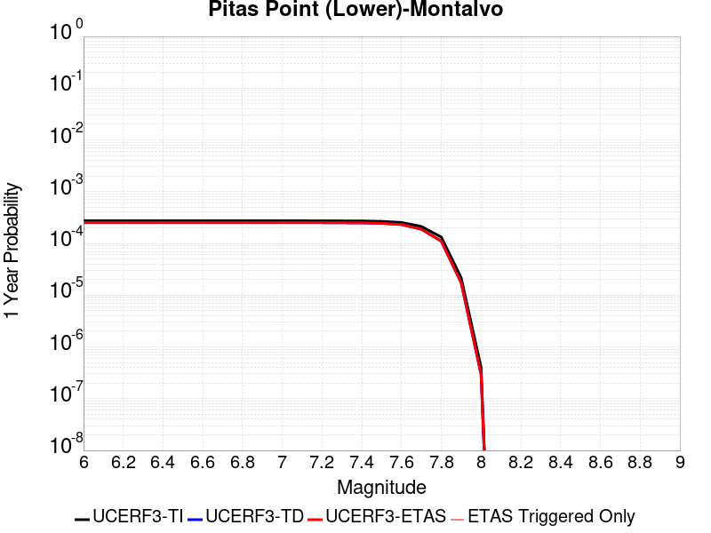 | 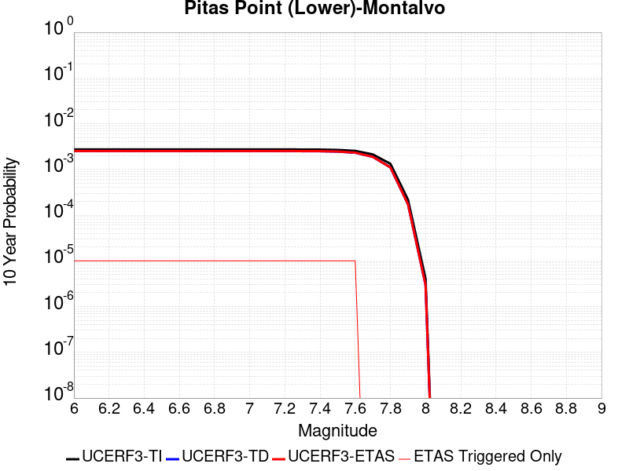 |

| Magnitude | 1 wk TI Prob | 1 wk TD Prob | 1 wk ETAS Prob | 1 wk ETAS/TD Gain | 1 wk ETAS Triggered Only | 1 mo TI Prob | 1 mo TD Prob | 1 mo ETAS Prob | 1 mo ETAS/TD Gain | 1 mo ETAS Triggered Only | 1 yr TI Prob | 1 yr TD Prob | 1 yr ETAS Prob | 1 yr ETAS/TD Gain | 1 yr ETAS Triggered Only | 10 yr TI Prob | 10 yr TD Prob | 10 yr ETAS Prob | 10 yr ETAS/TD Gain | 10 yr ETAS Triggered Only |
|-----|-----|-----|-----|-----|-----|-----|-----|-----|-----|-----|-----|-----|-----|-----|-----|-----|-----|-----|-----|-----|
| 6.0 | 5.2543637E-6 | 4.8379093E-6 | 4.8379093E-6 | 1.0 | 0.0 | 2.2518509E-5 | 2.0733734E-5 | 2.0733734E-5 | 1.0 | 0.0 | 2.7412834E-4 | 2.5240428E-4 | 2.5240428E-4 | 1.0 | 0.0 | 0.0027379042 | 0.0025212085 | 0.0025311834 | 1.0039563 | 1.0E-5 |
| 6.1 | 5.2543637E-6 | 4.8379093E-6 | 4.8379093E-6 | 1.0 | 0.0 | 2.2518509E-5 | 2.0733734E-5 | 2.0733734E-5 | 1.0 | 0.0 | 2.7412834E-4 | 2.5240428E-4 | 2.5240428E-4 | 1.0 | 0.0 | 0.0027379042 | 0.0025212085 | 0.0025311834 | 1.0039563 | 1.0E-5 |
| 6.2 | 5.2543637E-6 | 4.8379093E-6 | 4.8379093E-6 | 1.0 | 0.0 | 2.2518509E-5 | 2.0733734E-5 | 2.0733734E-5 | 1.0 | 0.0 | 2.7412834E-4 | 2.5240428E-4 | 2.5240428E-4 | 1.0 | 0.0 | 0.0027379042 | 0.0025212085 | 0.0025311834 | 1.0039563 | 1.0E-5 |
| 6.3 | 5.2543637E-6 | 4.8379093E-6 | 4.8379093E-6 | 1.0 | 0.0 | 2.2518509E-5 | 2.0733734E-5 | 2.0733734E-5 | 1.0 | 0.0 | 2.7412834E-4 | 2.5240428E-4 | 2.5240428E-4 | 1.0 | 0.0 | 0.0027379042 | 0.0025212085 | 0.0025311834 | 1.0039563 | 1.0E-5 |
| 6.4 | 5.2543637E-6 | 4.8379093E-6 | 4.8379093E-6 | 1.0 | 0.0 | 2.2518509E-5 | 2.0733734E-5 | 2.0733734E-5 | 1.0 | 0.0 | 2.7412834E-4 | 2.5240428E-4 | 2.5240428E-4 | 1.0 | 0.0 | 0.0027379042 | 0.0025212085 | 0.0025311834 | 1.0039563 | 1.0E-5 |
| 6.5 | 5.2543637E-6 | 4.8379093E-6 | 4.8379093E-6 | 1.0 | 0.0 | 2.2518509E-5 | 2.0733734E-5 | 2.0733734E-5 | 1.0 | 0.0 | 2.7412834E-4 | 2.5240428E-4 | 2.5240428E-4 | 1.0 | 0.0 | 0.0027379042 | 0.0025212085 | 0.0025311834 | 1.0039563 | 1.0E-5 |
| 6.6 | 5.2543637E-6 | 4.8379093E-6 | 4.8379093E-6 | 1.0 | 0.0 | 2.2518509E-5 | 2.0733734E-5 | 2.0733734E-5 | 1.0 | 0.0 | 2.7412834E-4 | 2.5240428E-4 | 2.5240428E-4 | 1.0 | 0.0 | 0.0027379042 | 0.0025212085 | 0.0025311834 | 1.0039563 | 1.0E-5 |
| 6.7 | 5.2543637E-6 | 4.8379093E-6 | 4.8379093E-6 | 1.0 | 0.0 | 2.2518509E-5 | 2.0733734E-5 | 2.0733734E-5 | 1.0 | 0.0 | 2.7412834E-4 | 2.5240428E-4 | 2.5240428E-4 | 1.0 | 0.0 | 0.0027379042 | 0.0025212085 | 0.0025311834 | 1.0039563 | 1.0E-5 |
| 6.8 | 5.2543637E-6 | 4.8379093E-6 | 4.8379093E-6 | 1.0 | 0.0 | 2.2518509E-5 | 2.0733734E-5 | 2.0733734E-5 | 1.0 | 0.0 | 2.7412834E-4 | 2.5240428E-4 | 2.5240428E-4 | 1.0 | 0.0 | 0.0027379042 | 0.0025212085 | 0.0025311834 | 1.0039563 | 1.0E-5 |
| 6.9 | 5.2543637E-6 | 4.8379093E-6 | 4.8379093E-6 | 1.0 | 0.0 | 2.2518509E-5 | 2.0733734E-5 | 2.0733734E-5 | 1.0 | 0.0 | 2.7412834E-4 | 2.5240428E-4 | 2.5240428E-4 | 1.0 | 0.0 | 0.0027379042 | 0.0025212085 | 0.0025311834 | 1.0039563 | 1.0E-5 |
| 7.0 | 5.2543637E-6 | 4.8379093E-6 | 4.8379093E-6 | 1.0 | 0.0 | 2.2518509E-5 | 2.0733734E-5 | 2.0733734E-5 | 1.0 | 0.0 | 2.7412834E-4 | 2.5240428E-4 | 2.5240428E-4 | 1.0 | 0.0 | 0.0027379042 | 0.0025212085 | 0.0025311834 | 1.0039563 | 1.0E-5 |
| 7.1 | 5.2543637E-6 | 4.8379093E-6 | 4.8379093E-6 | 1.0 | 0.0 | 2.2518509E-5 | 2.0733734E-5 | 2.0733734E-5 | 1.0 | 0.0 | 2.7412834E-4 | 2.5240428E-4 | 2.5240428E-4 | 1.0 | 0.0 | 0.0027379042 | 0.0025212085 | 0.0025311834 | 1.0039563 | 1.0E-5 |
| 7.2 | 5.2458695E-6 | 4.829063E-6 | 4.829063E-6 | 1.0 | 0.0 | 2.2482105E-5 | 2.0695821E-5 | 2.0695821E-5 | 1.0 | 0.0 | 2.7368523E-4 | 2.519428E-4 | 2.519428E-4 | 1.0 | 0.0 | 0.0027334841 | 0.0025166043 | 0.0025265792 | 1.0039636 | 1.0E-5 |
| 7.3 | 5.22665E-6 | 4.80898E-6 | 4.80898E-6 | 1.0 | 0.0 | 2.2399736E-5 | 2.0609754E-5 | 2.0609754E-5 | 1.0 | 0.0 | 2.7268266E-4 | 2.508952E-4 | 2.508952E-4 | 1.0 | 0.0 | 0.002723483 | 0.0025061516 | 0.0025161265 | 1.0039802 | 1.0E-5 |
| 7.4 | 5.210642E-6 | 4.7921926E-6 | 4.7921926E-6 | 1.0 | 0.0 | 2.233113E-5 | 2.0537807E-5 | 2.0537807E-5 | 1.0 | 0.0 | 2.718476E-4 | 2.5001942E-4 | 2.5001942E-4 | 1.0 | 0.0 | 0.002715153 | 0.002497414 | 0.0025073888 | 1.0039941 | 1.0E-5 |
| 7.5 | 5.1226016E-6 | 4.7000785E-6 | 4.7000785E-6 | 1.0 | 0.0 | 2.1953823E-5 | 2.014304E-5 | 2.014304E-5 | 1.0 | 0.0 | 2.67255E-4 | 2.452142E-4 | 2.452142E-4 | 1.0 | 0.0 | 0.0026693381 | 0.002449468 | 0.0024594436 | 1.0040725 | 1.0E-5 |
| 7.6 | 4.8796987E-6 | 4.4449766E-6 | 4.4449766E-6 | 1.0 | 0.0 | 2.0912828E-5 | 1.9049763E-5 | 1.9049763E-5 | 1.0 | 0.0 | 2.5458392E-4 | 2.3190647E-4 | 2.3190647E-4 | 1.0 | 0.0 | 0.0025429246 | 0.0023166754 | 0.0023266522 | 1.0043066 | 1.0E-5 |
| 7.7 | 4.0834398E-6 | 3.6091424E-6 | 3.6091424E-6 | 1.0 | 0.0 | 1.7500339E-5 | 1.5467662E-5 | 1.5467662E-5 | 1.0 | 0.0 | 2.1304579E-4 | 1.8830276E-4 | 1.8830276E-4 | 1.0 | 0.0 | 0.0021284167 | 0.0018814557 | 0.0018814557 | 1.0 | 0.0 |
| 7.8 | 2.5445438E-6 | 2.1212452E-6 | 2.1212452E-6 | 1.0 | 0.0 | 1.0905142E-5 | 9.09102E-6 | 9.09102E-6 | 1.0 | 0.0 | 1.3276201E-4 | 1.1067759E-4 | 1.1067759E-4 | 1.0 | 0.0 | 0.0013268272 | 0.0011062294 | 0.0011062294 | 1.0 | 0.0 |
| 7.9 | 4.1677114E-7 | 3.3293983E-7 | 3.3293983E-7 | 1.0 | 0.0 | 1.7861609E-6 | 1.4268842E-6 | 1.4268842E-6 | 1.0 | 0.0 | 2.1746291E-5 | 1.737218E-5 | 1.737218E-5 | 1.0 | 0.0 | 2.1744163E-4 | 1.7370853E-4 | 1.7370853E-4 | 1.0 | 0.0 |
| 8.0 | 7.791402E-9 | 5.683553E-9 | 5.683553E-9 | 1.0 | 0.0 | 3.3391725E-8 | 2.4358085E-8 | 2.4358085E-8 | 1.0 | 0.0 | 4.0654416E-7 | 2.9655968E-7 | 2.9655968E-7 | 1.0 | 0.0 | 4.065434E-6 | 2.9655946E-6 | 2.9655946E-6 | 1.0 | 0.0 |

## Calaveras (So) 2011 CFM
*[(top)](#table-of-contents)*

| 1 Week | 1 Month | 1 Year | 10 Year |
|-----|-----|-----|-----|
|  |  |  |  |

| Magnitude | 1 wk TI Prob | 1 wk TD Prob | 1 wk ETAS Prob | 1 wk ETAS/TD Gain | 1 wk ETAS Triggered Only | 1 mo TI Prob | 1 mo TD Prob | 1 mo ETAS Prob | 1 mo ETAS/TD Gain | 1 mo ETAS Triggered Only | 1 yr TI Prob | 1 yr TD Prob | 1 yr ETAS Prob | 1 yr ETAS/TD Gain | 1 yr ETAS Triggered Only | 10 yr TI Prob | 10 yr TD Prob | 10 yr ETAS Prob | 10 yr ETAS/TD Gain | 10 yr ETAS Triggered Only |
|-----|-----|-----|-----|-----|-----|-----|-----|-----|-----|-----|-----|-----|-----|-----|-----|-----|-----|-----|-----|-----|
| 6.0 | 1.5950744E-4 | 3.0719102E-4 | 3.0719102E-4 | 1.0 | 0.0 | 6.834242E-4 | 0.0013158836 | 0.0013158836 | 1.0 | 0.0 | 0.00828899 | 0.015860915 | 0.015870756 | 1.0006205 | 1.0E-5 | 0.079865426 | 0.14441721 | 0.14442576 | 1.0000592 | 1.0E-5 |
| 6.1 | 1.3584697E-4 | 2.604323E-4 | 2.604323E-4 | 1.0 | 0.0 | 5.8207137E-4 | 0.0011156795 | 0.0011156795 | 1.0 | 0.0 | 0.007063716 | 0.013463869 | 0.013473734 | 1.0007328 | 1.0E-5 | 0.06843361 | 0.124044694 | 0.124053456 | 1.0000706 | 1.0E-5 |
| 6.2 | 1.14676266E-4 | 2.1731424E-4 | 2.1731424E-4 | 1.0 | 0.0 | 4.9137714E-4 | 9.310301E-4 | 9.310301E-4 | 1.0 | 0.0 | 0.0059661185 | 0.01124721 | 0.011257097 | 1.0008792 | 1.0E-5 | 0.058084648 | 0.10503508 | 0.10504404 | 1.0000852 | 1.0E-5 |
| 6.3 | 8.691518E-5 | 1.5990793E-4 | 1.5990793E-4 | 1.0 | 0.0 | 3.7244044E-4 | 6.851358E-4 | 6.851358E-4 | 1.0 | 0.0 | 0.004525038 | 0.008302716 | 0.008302716 | 1.0 | 0.0 | 0.044339992 | 0.079350494 | 0.079350494 | 1.0 | 0.0 |
| 6.4 | 8.50982E-5 | 1.5697183E-4 | 1.5697183E-4 | 1.0 | 0.0 | 3.646556E-4 | 6.725591E-4 | 6.725591E-4 | 1.0 | 0.0 | 0.0044306475 | 0.008150746 | 0.008150746 | 1.0 | 0.0 | 0.04343345 | 0.0779566 | 0.0779566 | 1.0 | 0.0 |
| 6.5 | 8.4062965E-5 | 1.5521735E-4 | 1.5521735E-4 | 1.0 | 0.0 | 3.602201E-4 | 6.650437E-4 | 6.650437E-4 | 1.0 | 0.0 | 0.004376863 | 0.008059946 | 0.008059946 | 1.0 | 0.0 | 0.042916555 | 0.07712786 | 0.07712786 | 1.0 | 0.0 |
| 6.6 | 8.194716E-5 | 1.5157646E-4 | 1.5157646E-4 | 1.0 | 0.0 | 3.5115483E-4 | 6.494477E-4 | 6.494477E-4 | 1.0 | 0.0 | 0.0042669317 | 0.007871782 | 0.007871782 | 1.0 | 0.0 | 0.04185927 | 0.075413086 | 0.075413086 | 1.0 | 0.0 |
| 6.7 | 8.012326E-5 | 1.4825336E-4 | 1.4825336E-4 | 1.0 | 0.0 | 3.433402E-4 | 6.3521386E-4 | 6.3521386E-4 | 1.0 | 0.0 | 0.004172157 | 0.0077002714 | 0.0077002714 | 1.0 | 0.0 | 0.040946912 | 0.073855184 | 0.073855184 | 1.0 | 0.0 |
| 6.8 | 7.119773E-5 | 1.2883788E-4 | 1.2883788E-4 | 1.0 | 0.0 | 3.0509746E-4 | 5.5204553E-4 | 5.5204553E-4 | 1.0 | 0.0 | 0.0037082357 | 0.0066975304 | 0.0066975304 | 1.0 | 0.0 | 0.036469642 | 0.064698465 | 0.064698465 | 1.0 | 0.0 |
| 6.9 | 5.7343088E-5 | 9.921204E-5 | 9.921204E-5 | 1.0 | 0.0 | 2.4573295E-4 | 4.2512562E-4 | 4.2512562E-4 | 1.0 | 0.0 | 0.0029876942 | 0.005163703 | 0.005163703 | 1.0 | 0.0 | 0.02947844 | 0.050519872 | 0.050519872 | 1.0 | 0.0 |
| 7.0 | 4.8746577E-5 | 8.286983E-5 | 8.286983E-5 | 1.0 | 0.0 | 2.0889717E-4 | 3.5510844E-4 | 3.5510844E-4 | 1.0 | 0.0 | 0.0025403565 | 0.004314941 | 0.004314941 | 1.0 | 0.0 | 0.025115121 | 0.042495564 | 0.042495564 | 1.0 | 0.0 |
| 7.1 | 4.2998014E-5 | 7.266396E-5 | 7.266396E-5 | 1.0 | 0.0 | 1.8426418E-4 | 3.1138014E-4 | 3.1138014E-4 | 1.0 | 0.0 | 0.002241108 | 0.0037845233 | 0.0037845233 | 1.0 | 0.0 | 0.022186412 | 0.03743038 | 0.03743038 | 1.0 | 0.0 |
| 7.2 | 3.221292E-5 | 5.3919634E-5 | 5.3919634E-5 | 1.0 | 0.0 | 1.3804805E-4 | 2.3106382E-4 | 2.3106382E-4 | 1.0 | 0.0 | 0.0016794393 | 0.002809601 | 0.002809601 | 1.0 | 0.0 | 0.016668037 | 0.0280428 | 0.0280428 | 1.0 | 0.0 |
| 7.3 | 2.3756531E-5 | 3.9484363E-5 | 3.9484363E-5 | 1.0 | 0.0 | 1.0180973E-4 | 1.6920782E-4 | 1.6920782E-4 | 1.0 | 0.0 | 0.0012388286 | 0.0020581756 | 0.0020581756 | 1.0 | 0.0 | 0.012319452 | 0.020649675 | 0.020649675 | 1.0 | 0.0 |
| 7.4 | 1.5997684E-5 | 2.7347376E-5 | 2.7347376E-5 | 1.0 | 0.0 | 6.8559704E-5 | 1.17197786E-4 | 1.17197786E-4 | 1.0 | 0.0 | 8.343947E-4 | 0.0014259516 | 0.0014259516 | 1.0 | 0.0 | 0.008312687 | 0.014379721 | 0.014379721 | 1.0 | 0.0 |
| 7.5 | 1.3814293E-5 | 2.4788933E-5 | 2.4788933E-5 | 1.0 | 0.0 | 5.9202768E-5 | 1.0623397E-4 | 1.0623397E-4 | 1.0 | 0.0 | 7.205553E-4 | 0.0012926336 | 0.0012926336 | 1.0 | 0.0 | 0.007182234 | 0.013058846 | 0.013058846 | 1.0 | 0.0 |
| 7.6 | 8.817309E-6 | 1.643521E-5 | 1.643521E-5 | 1.0 | 0.0 | 3.7787922E-5 | 7.043472E-5 | 7.043472E-5 | 1.0 | 0.0 | 4.5997082E-4 | 8.572067E-4 | 8.572067E-4 | 1.0 | 0.0 | 0.004590199 | 0.008722494 | 0.008722494 | 1.0 | 0.0 |
| 7.7 | 4.0352206E-6 | 7.711002E-6 | 7.711002E-6 | 1.0 | 0.0 | 1.7293689E-5 | 3.304673E-5 | 3.304673E-5 | 1.0 | 0.0 | 2.1053031E-4 | 4.0226974E-4 | 4.0226974E-4 | 1.0 | 0.0 | 0.0021033096 | 0.00416701 | 0.00416701 | 1.0 | 0.0 |
| 7.8 | 3.413169E-6 | 6.7905053E-6 | 6.7905053E-6 | 1.0 | 0.0 | 1.4627784E-5 | 2.910184E-5 | 2.910184E-5 | 1.0 | 0.0 | 1.7807873E-4 | 3.5425735E-4 | 3.5425735E-4 | 1.0 | 0.0 | 0.0017793609 | 0.0036680899 | 0.0036680899 | 1.0 | 0.0 |
| 7.9 | 2.4740732E-6 | 5.2815635E-6 | 5.2815635E-6 | 1.0 | 0.0 | 1.06031275E-5 | 2.2635075E-5 | 2.2635075E-5 | 1.0 | 0.0 | 1.2908543E-4 | 2.7554724E-4 | 2.7554724E-4 | 1.0 | 0.0 | 0.0012901047 | 0.0028359778 | 0.0028359778 | 1.0 | 0.0 |
| 8.0 | 1.5231818E-6 | 3.2903374E-6 | 3.2903374E-6 | 1.0 | 0.0 | 6.527906E-6 | 1.410137E-5 | 1.410137E-5 | 1.0 | 0.0 | 7.9474354E-5 | 1.7167069E-4 | 1.7167069E-4 | 1.0 | 0.0 | 7.944594E-4 | 0.0017571712 | 0.0017571712 | 1.0 | 0.0 |
| 8.1 | 1.0104524E-6 | 2.0467116E-6 | 2.0467116E-6 | 1.0 | 0.0 | 4.330503E-6 | 8.771593E-6 | 8.771593E-6 | 1.0 | 0.0 | 5.2722597E-5 | 1.0678893E-4 | 1.0678893E-4 | 1.0 | 0.0 | 5.271009E-4 | 0.0010934469 | 0.0010934469 | 1.0 | 0.0 |

## Kern Canyon (Lake Isabella) 2011
*[(top)](#table-of-contents)*

| 1 Week | 1 Month | 1 Year | 10 Year |
|-----|-----|-----|-----|
|  |  |  | 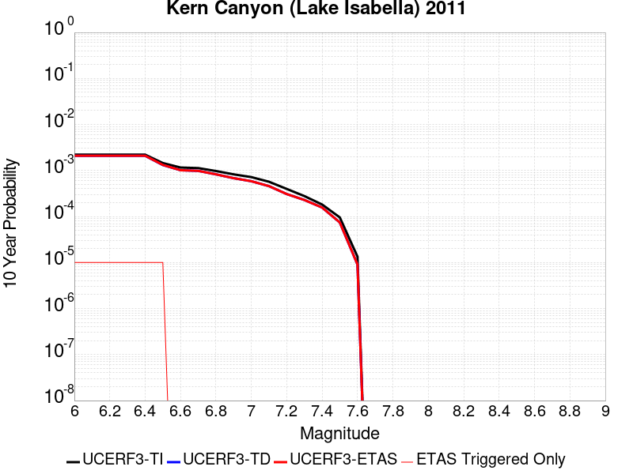 |

| Magnitude | 1 wk TI Prob | 1 wk TD Prob | 1 wk ETAS Prob | 1 wk ETAS/TD Gain | 1 wk ETAS Triggered Only | 1 mo TI Prob | 1 mo TD Prob | 1 mo ETAS Prob | 1 mo ETAS/TD Gain | 1 mo ETAS Triggered Only | 1 yr TI Prob | 1 yr TD Prob | 1 yr ETAS Prob | 1 yr ETAS/TD Gain | 1 yr ETAS Triggered Only | 10 yr TI Prob | 10 yr TD Prob | 10 yr ETAS Prob | 10 yr ETAS/TD Gain | 10 yr ETAS Triggered Only |
|-----|-----|-----|-----|-----|-----|-----|-----|-----|-----|-----|-----|-----|-----|-----|-----|-----|-----|-----|-----|-----|
| 6.0 | 4.2387383E-6 | 4.0016507E-6 | 4.0016507E-6 | 1.0 | 0.0 | 1.8165894E-5 | 1.7149829E-5 | 1.7149829E-5 | 1.0 | 0.0 | 2.2114732E-4 | 2.0878103E-4 | 2.0878103E-4 | 1.0 | 0.0 | 0.0022092736 | 0.0020860326 | 0.002096012 | 1.0047837 | 1.0E-5 |
| 6.1 | 4.2387383E-6 | 4.0016507E-6 | 4.0016507E-6 | 1.0 | 0.0 | 1.8165894E-5 | 1.7149829E-5 | 1.7149829E-5 | 1.0 | 0.0 | 2.2114732E-4 | 2.0878103E-4 | 2.0878103E-4 | 1.0 | 0.0 | 0.0022092736 | 0.0020860326 | 0.002096012 | 1.0047837 | 1.0E-5 |
| 6.2 | 4.2387383E-6 | 4.0016507E-6 | 4.0016507E-6 | 1.0 | 0.0 | 1.8165894E-5 | 1.7149829E-5 | 1.7149829E-5 | 1.0 | 0.0 | 2.2114732E-4 | 2.0878103E-4 | 2.0878103E-4 | 1.0 | 0.0 | 0.0022092736 | 0.0020860326 | 0.002096012 | 1.0047837 | 1.0E-5 |
| 6.3 | 4.2387383E-6 | 4.0016507E-6 | 4.0016507E-6 | 1.0 | 0.0 | 1.8165894E-5 | 1.7149829E-5 | 1.7149829E-5 | 1.0 | 0.0 | 2.2114732E-4 | 2.0878103E-4 | 2.0878103E-4 | 1.0 | 0.0 | 0.0022092736 | 0.0020860326 | 0.002096012 | 1.0047837 | 1.0E-5 |
| 6.4 | 4.2387383E-6 | 4.0016507E-6 | 4.0016507E-6 | 1.0 | 0.0 | 1.8165894E-5 | 1.7149829E-5 | 1.7149829E-5 | 1.0 | 0.0 | 2.2114732E-4 | 2.0878103E-4 | 2.0878103E-4 | 1.0 | 0.0 | 0.0022092736 | 0.0020860326 | 0.002096012 | 1.0047837 | 1.0E-5 |
| 6.5 | 2.7857532E-6 | 2.5178747E-6 | 2.5178747E-6 | 1.0 | 0.0 | 1.1938888E-5 | 1.0790849E-5 | 1.0790849E-5 | 1.0 | 0.0 | 1.4534626E-4 | 1.31371E-4 | 1.31371E-4 | 1.0 | 0.0 | 0.0014525123 | 0.0013129661 | 0.0013229529 | 1.0076064 | 1.0E-5 |
| 6.6 | 2.2233348E-6 | 1.94413E-6 | 1.94413E-6 | 1.0 | 0.0 | 9.528543E-6 | 8.331959E-6 | 8.331959E-6 | 1.0 | 0.0 | 1.1600384E-4 | 1.0143697E-4 | 1.0143697E-4 | 1.0 | 0.0 | 0.001159433 | 0.0010139153 | 0.0010139153 | 1.0 | 0.0 |
| 6.7 | 2.1635126E-6 | 1.8835098E-6 | 1.8835098E-6 | 1.0 | 0.0 | 9.272164E-6 | 8.07216E-6 | 8.07216E-6 | 1.0 | 0.0 | 1.1288274E-4 | 9.82742E-5 | 9.82742E-5 | 1.0 | 0.0 | 0.0011282542 | 9.823156E-4 | 9.823156E-4 | 1.0 | 0.0 |
| 6.8 | 1.8685711E-6 | 1.583148E-6 | 1.583148E-6 | 1.0 | 0.0 | 8.008137E-6 | 6.784903E-6 | 6.784903E-6 | 1.0 | 0.0 | 9.74947E-5 | 8.260311E-5 | 8.260311E-5 | 1.0 | 0.0 | 9.745194E-4 | 8.25729E-4 | 8.25729E-4 | 1.0 | 0.0 |
| 6.9 | 1.5815071E-6 | 1.3064976E-6 | 1.3064976E-6 | 1.0 | 0.0 | 6.77787E-6 | 5.599263E-6 | 5.599263E-6 | 1.0 | 0.0 | 8.251744E-5 | 6.816892E-5 | 6.816892E-5 | 1.0 | 0.0 | 8.248681E-4 | 6.814828E-4 | 6.814828E-4 | 1.0 | 0.0 |
| 7.0 | 1.3772564E-6 | 1.1210758E-6 | 1.1210758E-6 | 1.0 | 0.0 | 5.9025137E-6 | 4.804602E-6 | 4.804602E-6 | 1.0 | 0.0 | 7.186073E-5 | 5.849448E-5 | 5.849448E-5 | 1.0 | 0.0 | 7.18375E-4 | 5.8479287E-4 | 5.8479287E-4 | 1.0 | 0.0 |
| 7.1 | 1.0916998E-6 | 8.763808E-7 | 8.763808E-7 | 1.0 | 0.0 | 4.678705E-6 | 3.7559125E-6 | 3.7559125E-6 | 1.0 | 0.0 | 5.6961744E-5 | 4.5727287E-5 | 4.5727287E-5 | 1.0 | 0.0 | 5.6947145E-4 | 4.5718014E-4 | 4.5718014E-4 | 1.0 | 0.0 |
| 7.2 | 7.6277024E-7 | 5.901475E-7 | 5.901475E-7 | 1.0 | 0.0 | 3.2690114E-6 | 2.5292013E-6 | 2.5292013E-6 | 1.0 | 0.0 | 3.9799485E-5 | 3.0792595E-5 | 3.0792595E-5 | 1.0 | 0.0 | 3.9792358E-4 | 3.078839E-4 | 3.078839E-4 | 1.0 | 0.0 |
| 7.3 | 5.3265916E-7 | 4.3824562E-7 | 4.3824562E-7 | 1.0 | 0.0 | 2.282823E-6 | 1.8781942E-6 | 1.8781942E-6 | 1.0 | 0.0 | 2.7793016E-5 | 2.286678E-5 | 2.286678E-5 | 1.0 | 0.0 | 2.778954E-4 | 2.2864464E-4 | 2.2864464E-4 | 1.0 | 0.0 |
| 7.4 | 3.4946007E-7 | 3.006581E-7 | 3.006581E-7 | 1.0 | 0.0 | 1.497685E-6 | 1.288534E-6 | 1.288534E-6 | 1.0 | 0.0 | 1.8234163E-5 | 1.568779E-5 | 1.568779E-5 | 1.0 | 0.0 | 1.8232666E-4 | 1.5686706E-4 | 1.5686706E-4 | 1.0 | 0.0 |
| 7.5 | 1.8317026E-7 | 1.4244868E-7 | 1.4244868E-7 | 1.0 | 0.0 | 7.850152E-7 | 6.104942E-7 | 6.104942E-7 | 1.0 | 0.0 | 9.557518E-6 | 7.4327427E-6 | 7.4327427E-6 | 1.0 | 0.0 | 9.5571064E-5 | 7.432502E-5 | 7.432502E-5 | 1.0 | 0.0 |
| 7.6 | 2.572245E-8 | 1.7352637E-8 | 1.7352637E-8 | 1.0 | 0.0 | 1.10239064E-7 | 7.4368444E-8 | 7.4368444E-8 | 1.0 | 0.0 | 1.3421597E-6 | 9.0543546E-7 | 9.0543546E-7 | 1.0 | 0.0 | 1.3421517E-5 | 9.0543235E-6 | 9.0543235E-6 | 1.0 | 0.0 |

## Simi-Santa Rosa
*[(top)](#table-of-contents)*

| 1 Week | 1 Month | 1 Year | 10 Year |
|-----|-----|-----|-----|
|  |  |  |  |

| Magnitude | 1 wk TI Prob | 1 wk TD Prob | 1 wk ETAS Prob | 1 wk ETAS/TD Gain | 1 wk ETAS Triggered Only | 1 mo TI Prob | 1 mo TD Prob | 1 mo ETAS Prob | 1 mo ETAS/TD Gain | 1 mo ETAS Triggered Only | 1 yr TI Prob | 1 yr TD Prob | 1 yr ETAS Prob | 1 yr ETAS/TD Gain | 1 yr ETAS Triggered Only | 10 yr TI Prob | 10 yr TD Prob | 10 yr ETAS Prob | 10 yr ETAS/TD Gain | 10 yr ETAS Triggered Only |
|-----|-----|-----|-----|-----|-----|-----|-----|-----|-----|-----|-----|-----|-----|-----|-----|-----|-----|-----|-----|-----|
| 6.0 | 2.198912E-5 | 2.2275886E-5 | 2.2275886E-5 | 1.0 | 0.0 | 9.4235686E-5 | 9.5464835E-5 | 9.5464835E-5 | 1.0 | 0.0 | 0.0011467156 | 0.0011617085 | 0.0011617085 | 1.0 | 0.0 | 0.011408163 | 0.011560804 | 0.011570688 | 1.000855 | 1.0E-5 |
| 6.1 | 2.198912E-5 | 2.2275886E-5 | 2.2275886E-5 | 1.0 | 0.0 | 9.4235686E-5 | 9.5464835E-5 | 9.5464835E-5 | 1.0 | 0.0 | 0.0011467156 | 0.0011617085 | 0.0011617085 | 1.0 | 0.0 | 0.011408163 | 0.011560804 | 0.011570688 | 1.000855 | 1.0E-5 |
| 6.2 | 1.69983E-5 | 1.6668911E-5 | 1.6668911E-5 | 1.0 | 0.0 | 7.284782E-5 | 7.14364E-5 | 7.14364E-5 | 1.0 | 0.0 | 8.865613E-4 | 8.694203E-4 | 8.694203E-4 | 1.0 | 0.0 | 0.008830327 | 0.0086631095 | 0.0086730225 | 1.0011443 | 1.0E-5 |
| 6.3 | 1.69983E-5 | 1.6668911E-5 | 1.6668911E-5 | 1.0 | 0.0 | 7.284782E-5 | 7.14364E-5 | 7.14364E-5 | 1.0 | 0.0 | 8.865613E-4 | 8.694203E-4 | 8.694203E-4 | 1.0 | 0.0 | 0.008830327 | 0.0086631095 | 0.0086730225 | 1.0011443 | 1.0E-5 |
| 6.4 | 1.4666188E-5 | 1.4052852E-5 | 1.4052852E-5 | 1.0 | 0.0 | 6.285358E-5 | 6.022526E-5 | 6.022526E-5 | 1.0 | 0.0 | 7.6497364E-4 | 7.330208E-4 | 7.330208E-4 | 1.0 | 0.0 | 0.0076234564 | 0.0073085045 | 0.0073184315 | 1.0013583 | 1.0E-5 |
| 6.5 | 1.4666188E-5 | 1.4052852E-5 | 1.4052852E-5 | 1.0 | 0.0 | 6.285358E-5 | 6.022526E-5 | 6.022526E-5 | 1.0 | 0.0 | 7.6497364E-4 | 7.330208E-4 | 7.330208E-4 | 1.0 | 0.0 | 0.0076234564 | 0.0073085045 | 0.0073184315 | 1.0013583 | 1.0E-5 |
| 6.6 | 1.4377586E-5 | 1.3729887E-5 | 1.3729887E-5 | 1.0 | 0.0 | 6.1616774E-5 | 5.8841186E-5 | 5.8841186E-5 | 1.0 | 0.0 | 7.4992597E-4 | 7.1618083E-4 | 7.1618083E-4 | 1.0 | 0.0 | 0.007474003 | 0.007141196 | 0.0071511245 | 1.0013903 | 1.0E-5 |
| 6.7 | 1.3881404E-5 | 1.3207847E-5 | 1.3207847E-5 | 1.0 | 0.0 | 5.9490372E-5 | 5.6603967E-5 | 5.6603967E-5 | 1.0 | 0.0 | 7.240546E-4 | 6.889601E-4 | 6.889601E-4 | 1.0 | 0.0 | 0.007217 | 0.0068706917 | 0.006880623 | 1.0014454 | 1.0E-5 |
| 6.8 | 1.0176516E-5 | 9.154378E-6 | 9.154378E-6 | 1.0 | 0.0 | 4.3612912E-5 | 3.9232553E-5 | 3.9232553E-5 | 1.0 | 0.0 | 5.308578E-4 | 4.7756822E-4 | 4.7756822E-4 | 1.0 | 0.0 | 0.0052959146 | 0.004767053 | 0.004777005 | 1.0020877 | 1.0E-5 |
| 6.9 | 9.699797E-6 | 8.7749395E-6 | 8.7749395E-6 | 1.0 | 0.0 | 4.15699E-5 | 3.7606434E-5 | 3.7606434E-5 | 1.0 | 0.0 | 5.05996E-4 | 4.5777857E-4 | 4.5777857E-4 | 1.0 | 0.0 | 0.005048454 | 0.004569974 | 0.0045799282 | 1.0021782 | 1.0E-5 |
| 7.0 | 7.4049476E-6 | 6.559509E-6 | 6.559509E-6 | 1.0 | 0.0 | 3.1735104E-5 | 2.811195E-5 | 2.811195E-5 | 1.0 | 0.0 | 3.8630638E-4 | 3.422219E-4 | 3.422219E-4 | 1.0 | 0.0 | 0.0038563553 | 0.0034181913 | 0.0034281572 | 1.0029155 | 1.0E-5 |
| 7.1 | 3.873439E-6 | 2.759614E-6 | 2.759614E-6 | 1.0 | 0.0 | 1.6600346E-5 | 1.1826865E-5 | 1.1826865E-5 | 1.0 | 0.0 | 2.0209046E-4 | 1.439828E-4 | 1.439828E-4 | 1.0 | 0.0 | 0.0020190678 | 0.0014389188 | 0.0014389188 | 1.0 | 0.0 |
| 7.2 | 3.417706E-6 | 2.3677471E-6 | 2.3677471E-6 | 1.0 | 0.0 | 1.4647229E-5 | 1.014745E-5 | 1.014745E-5 | 1.0 | 0.0 | 1.7831543E-4 | 1.2353843E-4 | 1.2353843E-4 | 1.0 | 0.0 | 0.0017817242 | 0.0012347198 | 0.0012347198 | 1.0 | 0.0 |
| 7.3 | 1.90225E-6 | 1.4074596E-6 | 1.4074596E-6 | 1.0 | 0.0 | 8.152474E-6 | 6.0319558E-6 | 6.0319558E-6 | 1.0 | 0.0 | 9.9251854E-5 | 7.343661E-5 | 7.343661E-5 | 1.0 | 0.0 | 9.920754E-4 | 7.341257E-4 | 7.341257E-4 | 1.0 | 0.0 |
| 7.4 | 1.5170556E-6 | 1.1025584E-6 | 1.1025584E-6 | 1.0 | 0.0 | 6.5016507E-6 | 4.7252415E-6 | 4.7252415E-6 | 1.0 | 0.0 | 7.915472E-5 | 5.752831E-5 | 5.752831E-5 | 1.0 | 0.0 | 7.9126534E-4 | 5.751353E-4 | 5.751353E-4 | 1.0 | 0.0 |
| 7.5 | 1.178732E-6 | 8.5358926E-7 | 8.5358926E-7 | 1.0 | 0.0 | 5.0516987E-6 | 3.6582346E-6 | 3.6582346E-6 | 1.0 | 0.0 | 6.1502695E-5 | 4.4538105E-5 | 4.4538105E-5 | 1.0 | 0.0 | 6.148568E-4 | 4.4529274E-4 | 4.4529274E-4 | 1.0 | 0.0 |
| 7.6 | 6.8722386E-7 | 4.793958E-7 | 4.793958E-7 | 1.0 | 0.0 | 2.9452417E-6 | 2.0545517E-6 | 2.0545517E-6 | 1.0 | 0.0 | 3.5857727E-5 | 2.5013882E-5 | 2.5013882E-5 | 1.0 | 0.0 | 3.5851944E-4 | 2.5011078E-4 | 2.5011078E-4 | 1.0 | 0.0 |
| 7.7 | 5.5126515E-7 | 3.673869E-7 | 3.673869E-7 | 1.0 | 0.0 | 2.3625628E-6 | 1.5745143E-6 | 1.5745143E-6 | 1.0 | 0.0 | 2.8763823E-5 | 1.9169544E-5 | 1.9169544E-5 | 1.0 | 0.0 | 2.87601E-4 | 1.91679E-4 | 1.91679E-4 | 1.0 | 0.0 |
| 7.8 | 3.3860243E-7 | 2.0081488E-7 | 2.0081488E-7 | 1.0 | 0.0 | 1.4511525E-6 | 8.6063494E-7 | 8.6063494E-7 | 1.0 | 0.0 | 1.7667637E-5 | 1.047818E-5 | 1.047818E-5 | 1.0 | 0.0 | 1.7666233E-4 | 1.0477692E-4 | 1.0477692E-4 | 1.0 | 0.0 |
| 7.9 | 2.7955386E-7 | 1.4654502E-7 | 1.4654502E-7 | 1.0 | 0.0 | 1.1980875E-6 | 6.280499E-7 | 6.280499E-7 | 1.0 | 0.0 | 1.4586617E-5 | 7.646482E-6 | 7.646482E-6 | 1.0 | 0.0 | 1.458566E-4 | 7.646223E-5 | 7.646223E-5 | 1.0 | 0.0 |
| 8.0 | 5.6259015E-8 | 3.3357086E-8 | 3.3357086E-8 | 1.0 | 0.0 | 2.4111003E-7 | 1.4295894E-7 | 1.4295894E-7 | 1.0 | 0.0 | 2.9355108E-6 | 1.7405239E-6 | 1.7405239E-6 | 1.0 | 0.0 | 2.935472E-5 | 1.7405117E-5 | 1.7405117E-5 | 1.0 | 0.0 |

## Sisar
*[(top)](#table-of-contents)*

| 1 Week | 1 Month | 1 Year | 10 Year |
|-----|-----|-----|-----|
| 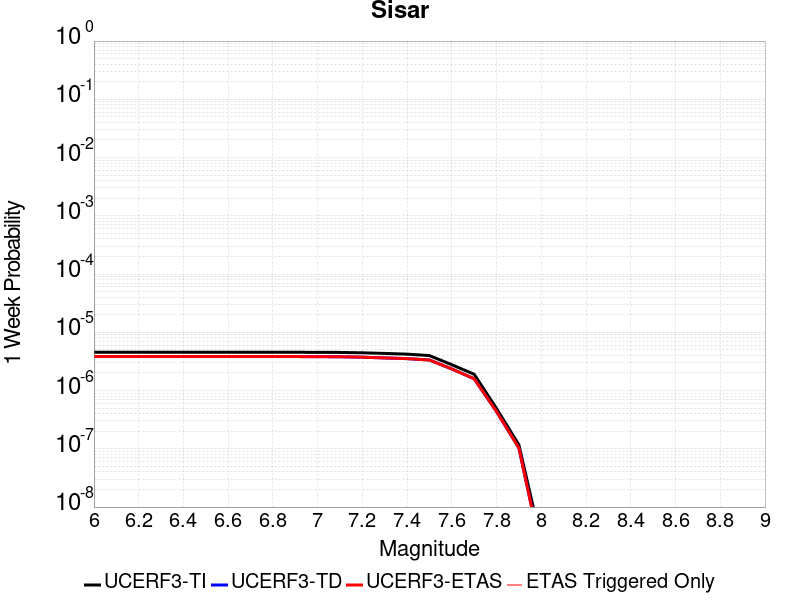 | 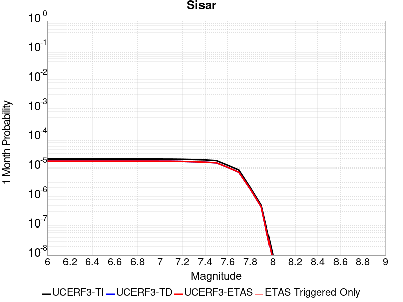 |  | 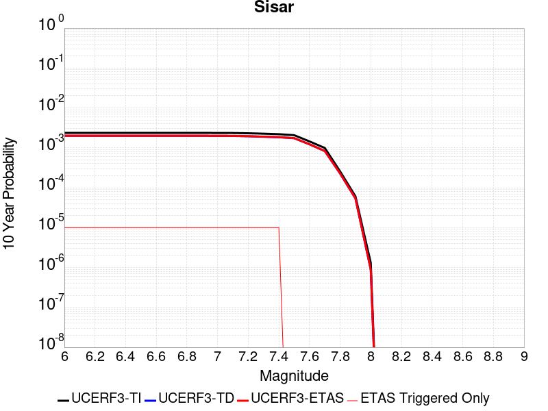 |

| Magnitude | 1 wk TI Prob | 1 wk TD Prob | 1 wk ETAS Prob | 1 wk ETAS/TD Gain | 1 wk ETAS Triggered Only | 1 mo TI Prob | 1 mo TD Prob | 1 mo ETAS Prob | 1 mo ETAS/TD Gain | 1 mo ETAS Triggered Only | 1 yr TI Prob | 1 yr TD Prob | 1 yr ETAS Prob | 1 yr ETAS/TD Gain | 1 yr ETAS Triggered Only | 10 yr TI Prob | 10 yr TD Prob | 10 yr ETAS Prob | 10 yr ETAS/TD Gain | 10 yr ETAS Triggered Only |
|-----|-----|-----|-----|-----|-----|-----|-----|-----|-----|-----|-----|-----|-----|-----|-----|-----|-----|-----|-----|-----|
| 6.0 | 4.544193E-6 | 3.8396215E-6 | 3.8396215E-6 | 1.0 | 0.0 | 1.9474966E-5 | 1.6455419E-5 | 1.6455419E-5 | 1.0 | 0.0 | 2.3708193E-4 | 2.0032664E-4 | 2.1032464E-4 | 1.0499085 | 1.0E-5 | 0.0023682916 | 0.0020014944 | 0.0020114745 | 1.0049863 | 1.0E-5 |
| 6.1 | 4.544193E-6 | 3.8396215E-6 | 3.8396215E-6 | 1.0 | 0.0 | 1.9474966E-5 | 1.6455419E-5 | 1.6455419E-5 | 1.0 | 0.0 | 2.3708193E-4 | 2.0032664E-4 | 2.1032464E-4 | 1.0499085 | 1.0E-5 | 0.0023682916 | 0.0020014944 | 0.0020114745 | 1.0049863 | 1.0E-5 |
| 6.2 | 4.544193E-6 | 3.8396215E-6 | 3.8396215E-6 | 1.0 | 0.0 | 1.9474966E-5 | 1.6455419E-5 | 1.6455419E-5 | 1.0 | 0.0 | 2.3708193E-4 | 2.0032664E-4 | 2.1032464E-4 | 1.0499085 | 1.0E-5 | 0.0023682916 | 0.0020014944 | 0.0020114745 | 1.0049863 | 1.0E-5 |
| 6.3 | 4.544193E-6 | 3.8396215E-6 | 3.8396215E-6 | 1.0 | 0.0 | 1.9474966E-5 | 1.6455419E-5 | 1.6455419E-5 | 1.0 | 0.0 | 2.3708193E-4 | 2.0032664E-4 | 2.1032464E-4 | 1.0499085 | 1.0E-5 | 0.0023682916 | 0.0020014944 | 0.0020114745 | 1.0049863 | 1.0E-5 |
| 6.4 | 4.544193E-6 | 3.8396215E-6 | 3.8396215E-6 | 1.0 | 0.0 | 1.9474966E-5 | 1.6455419E-5 | 1.6455419E-5 | 1.0 | 0.0 | 2.3708193E-4 | 2.0032664E-4 | 2.1032464E-4 | 1.0499085 | 1.0E-5 | 0.0023682916 | 0.0020014944 | 0.0020114745 | 1.0049863 | 1.0E-5 |
| 6.5 | 4.544193E-6 | 3.8396215E-6 | 3.8396215E-6 | 1.0 | 0.0 | 1.9474966E-5 | 1.6455419E-5 | 1.6455419E-5 | 1.0 | 0.0 | 2.3708193E-4 | 2.0032664E-4 | 2.1032464E-4 | 1.0499085 | 1.0E-5 | 0.0023682916 | 0.0020014944 | 0.0020114745 | 1.0049863 | 1.0E-5 |
| 6.6 | 4.544193E-6 | 3.8396215E-6 | 3.8396215E-6 | 1.0 | 0.0 | 1.9474966E-5 | 1.6455419E-5 | 1.6455419E-5 | 1.0 | 0.0 | 2.3708193E-4 | 2.0032664E-4 | 2.1032464E-4 | 1.0499085 | 1.0E-5 | 0.0023682916 | 0.0020014944 | 0.0020114745 | 1.0049863 | 1.0E-5 |
| 6.7 | 4.544193E-6 | 3.8396215E-6 | 3.8396215E-6 | 1.0 | 0.0 | 1.9474966E-5 | 1.6455419E-5 | 1.6455419E-5 | 1.0 | 0.0 | 2.3708193E-4 | 2.0032664E-4 | 2.1032464E-4 | 1.0499085 | 1.0E-5 | 0.0023682916 | 0.0020014944 | 0.0020114745 | 1.0049863 | 1.0E-5 |
| 6.8 | 4.544193E-6 | 3.8396215E-6 | 3.8396215E-6 | 1.0 | 0.0 | 1.9474966E-5 | 1.6455419E-5 | 1.6455419E-5 | 1.0 | 0.0 | 2.3708193E-4 | 2.0032664E-4 | 2.1032464E-4 | 1.0499085 | 1.0E-5 | 0.0023682916 | 0.0020014944 | 0.0020114745 | 1.0049863 | 1.0E-5 |
| 6.9 | 4.542225E-6 | 3.8375833E-6 | 3.8375833E-6 | 1.0 | 0.0 | 1.9466532E-5 | 1.6446686E-5 | 1.6446686E-5 | 1.0 | 0.0 | 2.3697925E-4 | 2.0022033E-4 | 2.1021832E-4 | 1.049935 | 1.0E-5 | 0.002367267 | 0.0020004332 | 0.002010413 | 1.0049889 | 1.0E-5 |
| 7.0 | 4.5278484E-6 | 3.8226476E-6 | 3.8226476E-6 | 1.0 | 0.0 | 1.940492E-5 | 1.6382673E-5 | 1.6382673E-5 | 1.0 | 0.0 | 2.3622929E-4 | 1.9944114E-4 | 2.0943914E-4 | 1.0501301 | 1.0E-5 | 0.0023597833 | 0.0019926552 | 0.0020026353 | 1.0050085 | 1.0E-5 |
| 7.1 | 4.5132488E-6 | 3.807435E-6 | 3.807435E-6 | 1.0 | 0.0 | 1.9342351E-5 | 1.6317477E-5 | 1.6317477E-5 | 1.0 | 0.0 | 2.3546767E-4 | 1.9864751E-4 | 2.0864554E-4 | 1.0503304 | 1.0E-5 | 0.0023521832 | 0.0019847332 | 0.0019947134 | 1.0050285 | 1.0E-5 |
| 7.2 | 4.448859E-6 | 3.739895E-6 | 3.739895E-6 | 1.0 | 0.0 | 1.9066398E-5 | 1.6028025E-5 | 1.6028025E-5 | 1.0 | 0.0 | 2.3210866E-4 | 1.9512406E-4 | 2.0512211E-4 | 1.0512395 | 1.0E-5 | 0.0023186638 | 0.001949561 | 0.0019595413 | 1.0051193 | 1.0E-5 |
| 7.3 | 4.3424366E-6 | 3.6337285E-6 | 3.6337285E-6 | 1.0 | 0.0 | 1.861031E-5 | 1.557303E-5 | 1.557303E-5 | 1.0 | 0.0 | 2.2655698E-4 | 1.895855E-4 | 1.9958359E-4 | 1.0527366 | 1.0E-5 | 0.0022632615 | 0.001894271 | 0.0019042521 | 1.005269 | 1.0E-5 |
| 7.4 | 4.218641E-6 | 3.533081E-6 | 3.533081E-6 | 1.0 | 0.0 | 1.8079765E-5 | 1.514169E-5 | 1.514169E-5 | 1.0 | 0.0 | 2.2009891E-4 | 1.8433481E-4 | 1.9433297E-4 | 1.0542392 | 1.0E-5 | 0.0021988105 | 0.0018418524 | 0.001851834 | 1.0054194 | 1.0E-5 |
| 7.5 | 3.983779E-6 | 3.3478473E-6 | 3.3478473E-6 | 1.0 | 0.0 | 1.7073227E-5 | 1.434784E-5 | 1.434784E-5 | 1.0 | 0.0 | 2.0784672E-4 | 1.7467128E-4 | 1.7467128E-4 | 1.0 | 0.0 | 0.0020765243 | 0.0017453729 | 0.0017453729 | 1.0 | 0.0 |
| 7.6 | 2.777393E-6 | 2.352279E-6 | 2.352279E-6 | 1.0 | 0.0 | 1.1903058E-5 | 1.0081157E-5 | 1.0081157E-5 | 1.0 | 0.0 | 1.449101E-4 | 1.2273125E-4 | 1.2273125E-4 | 1.0 | 0.0 | 0.0014481564 | 0.0012266424 | 0.0012266424 | 1.0 | 0.0 |
| 7.7 | 1.9028433E-6 | 1.5938915E-6 | 1.5938915E-6 | 1.0 | 0.0 | 8.155017E-6 | 6.830946E-6 | 6.830946E-6 | 1.0 | 0.0 | 9.928281E-5 | 8.316364E-5 | 8.316364E-5 | 1.0 | 0.0 | 9.923846E-4 | 8.313299E-4 | 8.313299E-4 | 1.0 | 0.0 |
| 7.8 | 4.9095956E-7 | 4.358398E-7 | 4.358398E-7 | 1.0 | 0.0 | 2.1041105E-6 | 1.8678836E-6 | 1.8678836E-6 | 1.0 | 0.0 | 2.5617246E-5 | 2.2741247E-5 | 2.2741247E-5 | 1.0 | 0.0 | 2.5614293E-4 | 2.2738938E-4 | 2.2738938E-4 | 1.0 | 0.0 |
| 7.9 | 1.16657894E-7 | 1.0335634E-7 | 1.0335634E-7 | 1.0 | 0.0 | 4.999623E-7 | 4.4295567E-7 | 4.4295567E-7 | 1.0 | 0.0 | 6.087024E-6 | 5.392972E-6 | 5.392972E-6 | 1.0 | 0.0 | 6.0868573E-5 | 5.3928445E-5 | 5.3928445E-5 | 1.0 | 0.0 |
| 8.0 | 2.5100346E-9 | 1.7068081E-9 | 1.7068081E-9 | 1.0 | 0.0 | 1.0757291E-8 | 7.3148922E-9 | 7.3148922E-9 | 1.0 | 0.0 | 1.3097001E-7 | 8.905881E-8 | 8.905881E-8 | 1.0 | 0.0 | 1.3096993E-6 | 8.905878E-7 | 8.905878E-7 | 1.0 | 0.0 |

## Carson Range (Genoa)
*[(top)](#table-of-contents)*

| 1 Week | 1 Month | 1 Year | 10 Year |
|-----|-----|-----|-----|
|  |  |  |  |

| Magnitude | 1 wk TI Prob | 1 wk TD Prob | 1 wk ETAS Prob | 1 wk ETAS/TD Gain | 1 wk ETAS Triggered Only | 1 mo TI Prob | 1 mo TD Prob | 1 mo ETAS Prob | 1 mo ETAS/TD Gain | 1 mo ETAS Triggered Only | 1 yr TI Prob | 1 yr TD Prob | 1 yr ETAS Prob | 1 yr ETAS/TD Gain | 1 yr ETAS Triggered Only | 10 yr TI Prob | 10 yr TD Prob | 10 yr ETAS Prob | 10 yr ETAS/TD Gain | 10 yr ETAS Triggered Only |
|-----|-----|-----|-----|-----|-----|-----|-----|-----|-----|-----|-----|-----|-----|-----|-----|-----|-----|-----|-----|-----|
| 6.0 | 4.1268457E-5 | 5.0148326E-5 | 5.0148326E-5 | 1.0 | 0.0 | 1.7685282E-4 | 2.1490594E-4 | 2.1490594E-4 | 1.0 | 0.0 | 0.0021510567 | 0.0026137296 | 0.0026137296 | 1.0 | 0.0 | 0.02130354 | 0.025869545 | 0.025879284 | 1.0003766 | 1.0E-5 |
| 6.1 | 4.1268457E-5 | 5.0148326E-5 | 5.0148326E-5 | 1.0 | 0.0 | 1.7685282E-4 | 2.1490594E-4 | 2.1490594E-4 | 1.0 | 0.0 | 0.0021510567 | 0.0026137296 | 0.0026137296 | 1.0 | 0.0 | 0.02130354 | 0.025869545 | 0.025879284 | 1.0003766 | 1.0E-5 |
| 6.2 | 4.1268457E-5 | 5.0148326E-5 | 5.0148326E-5 | 1.0 | 0.0 | 1.7685282E-4 | 2.1490594E-4 | 2.1490594E-4 | 1.0 | 0.0 | 0.0021510567 | 0.0026137296 | 0.0026137296 | 1.0 | 0.0 | 0.02130354 | 0.025869545 | 0.025879284 | 1.0003766 | 1.0E-5 |
| 6.3 | 4.1268457E-5 | 5.0148326E-5 | 5.0148326E-5 | 1.0 | 0.0 | 1.7685282E-4 | 2.1490594E-4 | 2.1490594E-4 | 1.0 | 0.0 | 0.0021510567 | 0.0026137296 | 0.0026137296 | 1.0 | 0.0 | 0.02130354 | 0.025869545 | 0.025879284 | 1.0003766 | 1.0E-5 |
| 6.4 | 4.1268457E-5 | 5.0148326E-5 | 5.0148326E-5 | 1.0 | 0.0 | 1.7685282E-4 | 2.1490594E-4 | 2.1490594E-4 | 1.0 | 0.0 | 0.0021510567 | 0.0026137296 | 0.0026137296 | 1.0 | 0.0 | 0.02130354 | 0.025869545 | 0.025879284 | 1.0003766 | 1.0E-5 |
| 6.5 | 2.5677185E-5 | 3.0979143E-5 | 3.0979143E-5 | 1.0 | 0.0 | 1.1004044E-4 | 1.3276203E-4 | 1.3276203E-4 | 1.0 | 0.0 | 0.0013389189 | 0.0016153576 | 0.0016153576 | 1.0 | 0.0 | 0.0133088045 | 0.016054086 | 0.016063925 | 1.0006129 | 1.0E-5 |
| 6.6 | 2.5677185E-5 | 3.0979143E-5 | 3.0979143E-5 | 1.0 | 0.0 | 1.1004044E-4 | 1.3276203E-4 | 1.3276203E-4 | 1.0 | 0.0 | 0.0013389189 | 0.0016153576 | 0.0016153576 | 1.0 | 0.0 | 0.0133088045 | 0.016054086 | 0.016063925 | 1.0006129 | 1.0E-5 |
| 6.7 | 1.9969408E-5 | 2.4064126E-5 | 2.4064126E-5 | 1.0 | 0.0 | 8.558037E-5 | 1.0312876E-4 | 1.0312876E-4 | 1.0 | 0.0 | 0.0010414429 | 0.001255023 | 0.001255023 | 1.0 | 0.0 | 0.010365757 | 0.012494512 | 0.012504387 | 1.0007904 | 1.0E-5 |
| 6.8 | 1.4783156E-5 | 1.7818053E-5 | 1.7818053E-5 | 1.0 | 0.0 | 6.335485E-5 | 7.636158E-5 | 7.636158E-5 | 1.0 | 0.0 | 7.710722E-4 | 9.2943595E-4 | 9.2943595E-4 | 1.0 | 0.0 | 0.0076840227 | 0.009268275 | 0.009278183 | 1.001069 | 1.0E-5 |
| 6.9 | 1.06660555E-5 | 1.287738E-5 | 1.287738E-5 | 1.0 | 0.0 | 4.5710865E-5 | 5.5188255E-5 | 5.5188255E-5 | 1.0 | 0.0 | 5.5638765E-4 | 6.718251E-4 | 6.718251E-4 | 1.0 | 0.0 | 0.005549967 | 0.00670924 | 0.00670924 | 1.0 | 0.0 |
| 7.0 | 7.664838E-6 | 9.2585615E-6 | 9.2585615E-6 | 1.0 | 0.0 | 3.2848893E-5 | 3.967955E-5 | 3.967955E-5 | 1.0 | 0.0 | 3.998619E-4 | 4.8309853E-4 | 4.8309853E-4 | 1.0 | 0.0 | 0.0039914316 | 0.004830983 | 0.004830983 | 1.0 | 0.0 |

## West Tahoe
*[(top)](#table-of-contents)*

| 1 Week | 1 Month | 1 Year | 10 Year |
|-----|-----|-----|-----|
| 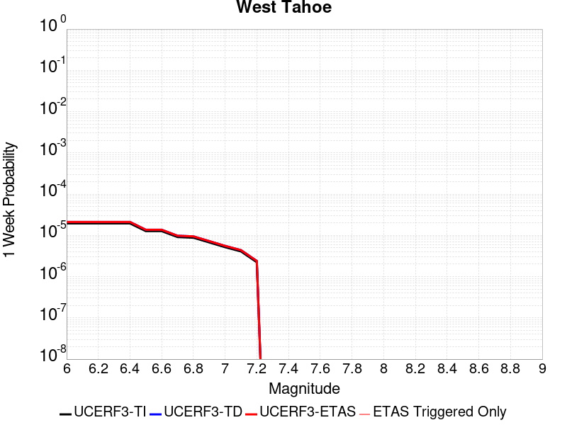 |  |  |  |

| Magnitude | 1 wk TI Prob | 1 wk TD Prob | 1 wk ETAS Prob | 1 wk ETAS/TD Gain | 1 wk ETAS Triggered Only | 1 mo TI Prob | 1 mo TD Prob | 1 mo ETAS Prob | 1 mo ETAS/TD Gain | 1 mo ETAS Triggered Only | 1 yr TI Prob | 1 yr TD Prob | 1 yr ETAS Prob | 1 yr ETAS/TD Gain | 1 yr ETAS Triggered Only | 10 yr TI Prob | 10 yr TD Prob | 10 yr ETAS Prob | 10 yr ETAS/TD Gain | 10 yr ETAS Triggered Only |
|-----|-----|-----|-----|-----|-----|-----|-----|-----|-----|-----|-----|-----|-----|-----|-----|-----|-----|-----|-----|-----|
| 6.0 | 1.952444E-5 | 2.1183409E-5 | 2.1183409E-5 | 1.0 | 0.0 | 8.367348E-5 | 9.0783185E-5 | 9.0783185E-5 | 1.0 | 0.0 | 0.0010182485 | 0.0011047797 | 0.0011047797 | 1.0 | 0.0 | 0.010135954 | 0.010998359 | 0.011008249 | 1.0008992 | 1.0E-5 |
| 6.1 | 1.952444E-5 | 2.1183409E-5 | 2.1183409E-5 | 1.0 | 0.0 | 8.367348E-5 | 9.0783185E-5 | 9.0783185E-5 | 1.0 | 0.0 | 0.0010182485 | 0.0011047797 | 0.0011047797 | 1.0 | 0.0 | 0.010135954 | 0.010998359 | 0.011008249 | 1.0008992 | 1.0E-5 |
| 6.2 | 1.952444E-5 | 2.1183409E-5 | 2.1183409E-5 | 1.0 | 0.0 | 8.367348E-5 | 9.0783185E-5 | 9.0783185E-5 | 1.0 | 0.0 | 0.0010182485 | 0.0011047797 | 0.0011047797 | 1.0 | 0.0 | 0.010135954 | 0.010998359 | 0.011008249 | 1.0008992 | 1.0E-5 |
| 6.3 | 1.952444E-5 | 2.1183409E-5 | 2.1183409E-5 | 1.0 | 0.0 | 8.367348E-5 | 9.0783185E-5 | 9.0783185E-5 | 1.0 | 0.0 | 0.0010182485 | 0.0011047797 | 0.0011047797 | 1.0 | 0.0 | 0.010135954 | 0.010998359 | 0.011008249 | 1.0008992 | 1.0E-5 |
| 6.4 | 1.952444E-5 | 2.1183409E-5 | 2.1183409E-5 | 1.0 | 0.0 | 8.367348E-5 | 9.0783185E-5 | 9.0783185E-5 | 1.0 | 0.0 | 0.0010182485 | 0.0011047797 | 0.0011047797 | 1.0 | 0.0 | 0.010135954 | 0.010998359 | 0.011008249 | 1.0008992 | 1.0E-5 |
| 6.5 | 1.2685271E-5 | 1.3690772E-5 | 1.3690772E-5 | 1.0 | 0.0 | 5.4364315E-5 | 5.8673508E-5 | 5.8673508E-5 | 1.0 | 0.0 | 6.616845E-4 | 7.1413233E-4 | 7.1413233E-4 | 1.0 | 0.0 | 0.0065971776 | 0.0071200244 | 0.0071299532 | 1.0013945 | 1.0E-5 |
| 6.6 | 1.2685271E-5 | 1.3690772E-5 | 1.3690772E-5 | 1.0 | 0.0 | 5.4364315E-5 | 5.8673508E-5 | 5.8673508E-5 | 1.0 | 0.0 | 6.616845E-4 | 7.1413233E-4 | 7.1413233E-4 | 1.0 | 0.0 | 0.0065971776 | 0.0071200244 | 0.0071299532 | 1.0013945 | 1.0E-5 |
| 6.7 | 9.117886E-6 | 9.809945E-6 | 9.809945E-6 | 1.0 | 0.0 | 3.9076072E-5 | 4.2041986E-5 | 4.2041986E-5 | 1.0 | 0.0 | 4.756473E-4 | 5.1174813E-4 | 5.1174813E-4 | 1.0 | 0.0 | 0.0047463053 | 0.0051064147 | 0.005116364 | 1.0019484 | 1.0E-5 |
| 6.8 | 8.786828E-6 | 9.457959E-6 | 9.457959E-6 | 1.0 | 0.0 | 3.7657293E-5 | 4.053352E-5 | 4.053352E-5 | 1.0 | 0.0 | 4.5838108E-4 | 4.933909E-4 | 4.933909E-4 | 1.0 | 0.0 | 0.0045743673 | 0.004923656 | 0.004933607 | 1.002021 | 1.0E-5 |
| 6.9 | 6.7562123E-6 | 7.263881E-6 | 7.263881E-6 | 1.0 | 0.0 | 2.8954875E-5 | 3.1130574E-5 | 3.1130574E-5 | 1.0 | 0.0 | 3.5246857E-4 | 3.7895358E-4 | 3.7895358E-4 | 1.0 | 0.0 | 0.0035191004 | 0.0037835457 | 0.003793508 | 1.002633 | 1.0E-5 |
| 7.0 | 5.1792854E-6 | 5.5673936E-6 | 5.5673936E-6 | 1.0 | 0.0 | 2.2196748E-5 | 2.386006E-5 | 2.386006E-5 | 1.0 | 0.0 | 2.702119E-4 | 2.9046132E-4 | 2.9046132E-4 | 1.0 | 0.0 | 0.0026988357 | 0.002901192 | 0.002901192 | 1.0 | 0.0 |
| 7.1 | 4.090765E-6 | 4.3974665E-6 | 4.3974665E-6 | 1.0 | 0.0 | 1.7531731E-5 | 1.8846167E-5 | 1.8846167E-5 | 1.0 | 0.0 | 2.134279E-4 | 2.2943133E-4 | 2.2943133E-4 | 1.0 | 0.0 | 0.0021322304 | 0.0022922792 | 0.0022922792 | 1.0 | 0.0 |
| 7.2 | 2.2356758E-6 | 2.402392E-6 | 2.402392E-6 | 1.0 | 0.0 | 9.581432E-6 | 1.0295936E-5 | 1.0295936E-5 | 1.0 | 0.0 | 1.1664769E-4 | 1.2534771E-4 | 1.2534771E-4 | 1.0 | 0.0 | 0.0011658648 | 0.0012529559 | 0.0012529559 | 1.0 | 0.0 |

## La Panza 2011
*[(top)](#table-of-contents)*

| 1 Week | 1 Month | 1 Year | 10 Year |
|-----|-----|-----|-----|
|  |  |  |  |

| Magnitude | 1 wk TI Prob | 1 wk TD Prob | 1 wk ETAS Prob | 1 wk ETAS/TD Gain | 1 wk ETAS Triggered Only | 1 mo TI Prob | 1 mo TD Prob | 1 mo ETAS Prob | 1 mo ETAS/TD Gain | 1 mo ETAS Triggered Only | 1 yr TI Prob | 1 yr TD Prob | 1 yr ETAS Prob | 1 yr ETAS/TD Gain | 1 yr ETAS Triggered Only | 10 yr TI Prob | 10 yr TD Prob | 10 yr ETAS Prob | 10 yr ETAS/TD Gain | 10 yr ETAS Triggered Only |
|-----|-----|-----|-----|-----|-----|-----|-----|-----|-----|-----|-----|-----|-----|-----|-----|-----|-----|-----|-----|-----|
| 6.0 | 4.6754544E-6 | 4.717608E-6 | 4.717608E-6 | 1.0 | 0.0 | 2.0037509E-5 | 2.0218175E-5 | 2.0218175E-5 | 1.0 | 0.0 | 2.4392935E-4 | 2.4613045E-4 | 2.4613045E-4 | 1.0 | 0.0 | 0.0024366176 | 0.0024587729 | 0.0024687483 | 1.004057 | 1.0E-5 |
| 6.1 | 4.6754544E-6 | 4.717608E-6 | 4.717608E-6 | 1.0 | 0.0 | 2.0037509E-5 | 2.0218175E-5 | 2.0218175E-5 | 1.0 | 0.0 | 2.4392935E-4 | 2.4613045E-4 | 2.4613045E-4 | 1.0 | 0.0 | 0.0024366176 | 0.0024587729 | 0.0024687483 | 1.004057 | 1.0E-5 |
| 6.2 | 4.6754544E-6 | 4.717608E-6 | 4.717608E-6 | 1.0 | 0.0 | 2.0037509E-5 | 2.0218175E-5 | 2.0218175E-5 | 1.0 | 0.0 | 2.4392935E-4 | 2.4613045E-4 | 2.4613045E-4 | 1.0 | 0.0 | 0.0024366176 | 0.0024587729 | 0.0024687483 | 1.004057 | 1.0E-5 |
| 6.3 | 4.6754544E-6 | 4.717608E-6 | 4.717608E-6 | 1.0 | 0.0 | 2.0037509E-5 | 2.0218175E-5 | 2.0218175E-5 | 1.0 | 0.0 | 2.4392935E-4 | 2.4613045E-4 | 2.4613045E-4 | 1.0 | 0.0 | 0.0024366176 | 0.0024587729 | 0.0024687483 | 1.004057 | 1.0E-5 |
| 6.4 | 4.6754544E-6 | 4.717608E-6 | 4.717608E-6 | 1.0 | 0.0 | 2.0037509E-5 | 2.0218175E-5 | 2.0218175E-5 | 1.0 | 0.0 | 2.4392935E-4 | 2.4613045E-4 | 2.4613045E-4 | 1.0 | 0.0 | 0.0024366176 | 0.0024587729 | 0.0024687483 | 1.004057 | 1.0E-5 |
| 6.5 | 2.485343E-6 | 2.5006163E-6 | 2.5006163E-6 | 1.0 | 0.0 | 1.0651426E-5 | 1.0716885E-5 | 1.0716885E-5 | 1.0 | 0.0 | 1.296734E-4 | 1.3047065E-4 | 1.3047065E-4 | 1.0 | 0.0 | 0.0012959775 | 0.001303979 | 0.001313966 | 1.0076588 | 1.0E-5 |
| 6.6 | 2.485343E-6 | 2.5006163E-6 | 2.5006163E-6 | 1.0 | 0.0 | 1.0651426E-5 | 1.0716885E-5 | 1.0716885E-5 | 1.0 | 0.0 | 1.296734E-4 | 1.3047065E-4 | 1.3047065E-4 | 1.0 | 0.0 | 0.0012959775 | 0.001303979 | 0.001313966 | 1.0076588 | 1.0E-5 |
| 6.7 | 1.5108508E-6 | 1.5146534E-6 | 1.5146534E-6 | 1.0 | 0.0 | 6.4750584E-6 | 6.491356E-6 | 6.491356E-6 | 1.0 | 0.0 | 7.8830984E-5 | 7.90295E-5 | 7.90295E-5 | 1.0 | 0.0 | 7.880303E-4 | 7.900248E-4 | 8.000169E-4 | 1.0126479 | 1.0E-5 |
| 6.8 | 1.3865837E-6 | 1.3885259E-6 | 1.3885259E-6 | 1.0 | 0.0 | 5.942488E-6 | 5.950812E-6 | 5.950812E-6 | 1.0 | 0.0 | 7.234739E-5 | 7.244883E-5 | 7.244883E-5 | 1.0 | 0.0 | 7.232384E-4 | 7.242619E-4 | 7.3425466E-4 | 1.0137972 | 1.0E-5 |
| 6.9 | 9.826583E-7 | 9.796437E-7 | 9.796437E-7 | 1.0 | 0.0 | 4.2113857E-6 | 4.1984663E-6 | 4.1984663E-6 | 1.0 | 0.0 | 5.1272415E-5 | 5.1115185E-5 | 5.1115185E-5 | 1.0 | 0.0 | 5.126059E-4 | 5.1103963E-4 | 5.210345E-4 | 1.019558 | 1.0E-5 |
| 7.0 | 6.7797646E-7 | 6.71036E-7 | 6.71036E-7 | 1.0 | 0.0 | 2.9056102E-6 | 2.8758654E-6 | 2.8758654E-6 | 1.0 | 0.0 | 3.537523E-5 | 3.501313E-5 | 3.501313E-5 | 1.0 | 0.0 | 3.5369597E-4 | 3.5007924E-4 | 3.6007573E-4 | 1.0285549 | 1.0E-5 |
| 7.1 | 3.4979826E-7 | 3.3875276E-7 | 3.3875276E-7 | 1.0 | 0.0 | 1.4991346E-6 | 1.4517968E-6 | 1.4517968E-6 | 1.0 | 0.0 | 1.825181E-5 | 1.7675495E-5 | 1.7675495E-5 | 1.0 | 0.0 | 1.825031E-4 | 1.7674206E-4 | 1.8674029E-4 | 1.0565696 | 1.0E-5 |
| 7.2 | 2.5088332E-7 | 2.3833275E-7 | 2.3833275E-7 | 1.0 | 0.0 | 1.0752137E-6 | 1.0214256E-6 | 1.0214256E-6 | 1.0 | 0.0 | 1.3090649E-5 | 1.2435796E-5 | 1.2435796E-5 | 1.0 | 0.0 | 1.3089878E-4 | 1.2435185E-4 | 1.343506E-4 | 1.080407 | 1.0E-5 |
| 7.3 | 1.0159086E-7 | 8.645961E-8 | 8.645961E-8 | 1.0 | 0.0 | 4.3538932E-7 | 3.7054113E-7 | 3.7054113E-7 | 1.0 | 0.0 | 5.300852E-6 | 4.5113293E-6 | 4.5113293E-6 | 1.0 | 0.0 | 5.3007258E-5 | 4.5112418E-5 | 4.5112418E-5 | 1.0 | 0.0 |
| 7.4 | 3.5006252E-8 | 1.940863E-8 | 1.940863E-8 | 1.0 | 0.0 | 1.5002678E-7 | 8.3179835E-8 | 8.3179835E-8 | 1.0 | 0.0 | 1.8265745E-6 | 1.012714E-6 | 1.012714E-6 | 1.0 | 0.0 | 1.8265595E-5 | 1.0127096E-5 | 1.0127096E-5 | 1.0 | 0.0 |
| 7.5 | 2.592274E-8 | 1.0242307E-8 | 1.0242307E-8 | 1.0 | 0.0 | 1.1109746E-7 | 4.3895596E-8 | 4.3895596E-8 | 1.0 | 0.0 | 1.3526106E-6 | 5.3442875E-7 | 5.3442875E-7 | 1.0 | 0.0 | 1.3526024E-5 | 5.3442755E-6 | 5.3442755E-6 | 1.0 | 0.0 |
| 7.6 | 1.9016717E-8 | 5.2468647E-9 | 5.2468647E-9 | 1.0 | 0.0 | 8.150022E-8 | 2.2486562E-8 | 2.2486562E-8 | 1.0 | 0.0 | 9.922647E-7 | 2.7377385E-7 | 2.7377385E-7 | 1.0 | 0.0 | 9.922603E-6 | 2.7377353E-6 | 2.7377353E-6 | 1.0 | 0.0 |
| 7.7 | 1.17738495E-8 | 1.2407027E-9 | 1.2407027E-9 | 1.0 | 0.0 | 5.0459356E-8 | 5.317297E-9 | 5.317297E-9 | 1.0 | 0.0 | 6.1434247E-7 | 6.473808E-8 | 6.473808E-8 | 1.0 | 0.0 | 6.143408E-6 | 6.4738066E-7 | 6.4738066E-7 | 1.0 | 0.0 |
| 7.8 | 5.489079E-9 | 2.0135205E-10 | 2.0135205E-10 | 1.0 | 0.0 | 2.3524624E-8 | 8.6293683E-10 | 8.6293683E-10 | 1.0 | 0.0 | 2.8641225E-7 | 1.0506253E-8 | 1.0506253E-8 | 1.0 | 0.0 | 2.8641189E-6 | 1.0506252E-7 | 1.0506252E-7 | 1.0 | 0.0 |
| 7.9 | 2.5081048E-9 | 6.6927686E-11 | 6.6927686E-11 | 1.0 | 0.0 | 1.0749021E-8 | 2.868329E-10 | 2.868329E-10 | 1.0 | 0.0 | 1.3086932E-7 | 3.492187E-9 | 3.492187E-9 | 1.0 | 0.0 | 1.3086925E-6 | 3.4921865E-8 | 3.4921865E-8 | 1.0 | 0.0 |

## Concord 2011 CFM
*[(top)](#table-of-contents)*

| 1 Week | 1 Month | 1 Year | 10 Year |
|-----|-----|-----|-----|
|  |  |  |  |

| Magnitude | 1 wk TI Prob | 1 wk TD Prob | 1 wk ETAS Prob | 1 wk ETAS/TD Gain | 1 wk ETAS Triggered Only | 1 mo TI Prob | 1 mo TD Prob | 1 mo ETAS Prob | 1 mo ETAS/TD Gain | 1 mo ETAS Triggered Only | 1 yr TI Prob | 1 yr TD Prob | 1 yr ETAS Prob | 1 yr ETAS/TD Gain | 1 yr ETAS Triggered Only | 10 yr TI Prob | 10 yr TD Prob | 10 yr ETAS Prob | 10 yr ETAS/TD Gain | 10 yr ETAS Triggered Only |
|-----|-----|-----|-----|-----|-----|-----|-----|-----|-----|-----|-----|-----|-----|-----|-----|-----|-----|-----|-----|-----|
| 6.0 | 5.7865112E-5 | 9.7592994E-5 | 9.7592994E-5 | 1.0 | 0.0 | 2.4796976E-4 | 4.181934E-4 | 4.181934E-4 | 1.0 | 0.0 | 0.0030148525 | 0.005079523 | 0.005079523 | 1.0 | 0.0 | 0.029742775 | 0.04924955 | 0.049259055 | 1.000193 | 1.0E-5 |
| 6.1 | 5.7865112E-5 | 9.7592994E-5 | 9.7592994E-5 | 1.0 | 0.0 | 2.4796976E-4 | 4.181934E-4 | 4.181934E-4 | 1.0 | 0.0 | 0.0030148525 | 0.005079523 | 0.005079523 | 1.0 | 0.0 | 0.029742775 | 0.04924955 | 0.049259055 | 1.000193 | 1.0E-5 |
| 6.2 | 5.6789337E-5 | 9.579644E-5 | 9.579644E-5 | 1.0 | 0.0 | 2.4336016E-4 | 4.1049632E-4 | 4.1049632E-4 | 1.0 | 0.0 | 0.0029588845 | 0.0049862415 | 0.0049862415 | 1.0 | 0.0 | 0.029197963 | 0.04836609 | 0.048375603 | 1.0001968 | 1.0E-5 |
| 6.3 | 5.203322E-5 | 8.8031295E-5 | 8.8031295E-5 | 1.0 | 0.0 | 2.2298045E-4 | 3.7722682E-4 | 3.7722682E-4 | 1.0 | 0.0 | 0.0027114071 | 0.0045838486 | 0.0045838486 | 1.0 | 0.0 | 0.026785625 | 0.04453707 | 0.044546623 | 1.0002146 | 1.0E-5 |
| 6.4 | 4.7120942E-5 | 7.897469E-5 | 7.897469E-5 | 1.0 | 0.0 | 2.0193127E-4 | 3.3842324E-4 | 3.3842324E-4 | 1.0 | 0.0 | 0.0024557412 | 0.0041132635 | 0.0041132635 | 1.0 | 0.0 | 0.024287801 | 0.04006584 | 0.04007544 | 1.0002396 | 1.0E-5 |
| 6.5 | 2.9598437E-5 | 4.667524E-5 | 4.667524E-5 | 1.0 | 0.0 | 1.2684427E-4 | 2.000226E-4 | 2.000226E-4 | 1.0 | 0.0 | 0.001543235 | 0.0024327657 | 0.0024327657 | 1.0 | 0.0 | 0.015325619 | 0.023910161 | 0.023919921 | 1.0004083 | 1.0E-5 |
| 6.6 | 2.0443718E-5 | 2.9984598E-5 | 2.9984598E-5 | 1.0 | 0.0 | 8.7613E-5 | 1.2849929E-4 | 1.2849929E-4 | 1.0 | 0.0 | 0.0010661662 | 0.0015633923 | 0.0015633923 | 1.0 | 0.0 | 0.010610655 | 0.015467131 | 0.015476976 | 1.0006366 | 1.0E-5 |
| 6.7 | 1.798539E-5 | 2.5557623E-5 | 2.5557623E-5 | 1.0 | 0.0 | 7.7077966E-5 | 1.0952819E-4 | 1.0952819E-4 | 1.0 | 0.0 | 9.380202E-4 | 0.0013327115 | 0.0013327115 | 1.0 | 0.0 | 0.009340706 | 0.013217555 | 0.013217555 | 1.0 | 0.0 |
| 6.8 | 1.613555E-5 | 2.1959419E-5 | 2.1959419E-5 | 1.0 | 0.0 | 6.915052E-5 | 9.410847E-5 | 9.410847E-5 | 1.0 | 0.0 | 8.4158237E-4 | 0.0011451824 | 0.0011451824 | 1.0 | 0.0 | 0.008384023 | 0.01137831 | 0.01137831 | 1.0 | 0.0 |
| 6.9 | 1.2916435E-5 | 1.7081215E-5 | 1.7081215E-5 | 1.0 | 0.0 | 5.5354973E-5 | 7.3203184E-5 | 7.3203184E-5 | 1.0 | 0.0 | 6.7373837E-4 | 8.9089014E-4 | 8.9089014E-4 | 1.0 | 0.0 | 0.006716994 | 0.008867221 | 0.008867221 | 1.0 | 0.0 |
| 7.0 | 9.81129E-6 | 1.263095E-5 | 1.263095E-5 | 1.0 | 0.0 | 4.2047708E-5 | 5.4131524E-5 | 5.4131524E-5 | 1.0 | 0.0 | 5.118106E-4 | 6.588537E-4 | 6.588537E-4 | 1.0 | 0.0 | 0.005106334 | 0.006569215 | 0.006569215 | 1.0 | 0.0 |
| 7.1 | 8.0889195E-6 | 1.0418359E-5 | 1.0418359E-5 | 1.0 | 0.0 | 3.4666336E-5 | 4.464935E-5 | 4.464935E-5 | 1.0 | 0.0 | 4.219809E-4 | 5.434713E-4 | 5.434713E-4 | 1.0 | 0.0 | 0.004211805 | 0.0054216487 | 0.0054216487 | 1.0 | 0.0 |
| 7.2 | 6.267438E-6 | 8.115771E-6 | 8.115771E-6 | 1.0 | 0.0 | 2.6860173E-5 | 3.4781417E-5 | 3.4781417E-5 | 1.0 | 0.0 | 3.2697353E-4 | 4.233822E-4 | 4.233822E-4 | 1.0 | 0.0 | 0.0032649285 | 0.0042260066 | 0.0042260066 | 1.0 | 0.0 |
| 7.3 | 3.6761196E-6 | 4.8402017E-6 | 4.8402017E-6 | 1.0 | 0.0 | 1.5754704E-5 | 2.0743557E-5 | 2.0743557E-5 | 1.0 | 0.0 | 1.9179663E-4 | 2.5252375E-4 | 2.5252375E-4 | 1.0 | 0.0 | 0.0019163118 | 0.0025225056 | 0.0025225056 | 1.0 | 0.0 |
| 7.4 | 2.8044356E-6 | 3.7096308E-6 | 3.7096308E-6 | 1.0 | 0.0 | 1.2018954E-5 | 1.5898322E-5 | 1.5898322E-5 | 1.0 | 0.0 | 1.4632095E-4 | 1.93545E-4 | 1.93545E-4 | 1.0 | 0.0 | 0.0014622464 | 0.0019338625 | 0.0019338625 | 1.0 | 0.0 |
| 7.5 | 2.4578699E-6 | 3.244755E-6 | 3.244755E-6 | 1.0 | 0.0 | 1.0533685E-5 | 1.39060185E-5 | 1.39060185E-5 | 1.0 | 0.0 | 1.2824008E-4 | 1.6929273E-4 | 1.6929273E-4 | 1.0 | 0.0 | 0.0012816609 | 0.0016917185 | 0.0016917185 | 1.0 | 0.0 |
| 7.6 | 1.7713267E-6 | 2.3351265E-6 | 2.3351265E-6 | 1.0 | 0.0 | 7.591378E-6 | 1.0007647E-5 | 1.0007647E-5 | 1.0 | 0.0 | 9.2421105E-5 | 1.2183638E-4 | 1.2183638E-4 | 1.0 | 0.0 | 9.2382677E-4 | 0.0012177492 | 0.0012177492 | 1.0 | 0.0 |
| 7.7 | 5.1912366E-7 | 6.8290393E-7 | 6.8290393E-7 | 1.0 | 0.0 | 2.2248137E-6 | 2.926728E-6 | 2.926728E-6 | 1.0 | 0.0 | 2.708677E-5 | 3.5632343E-5 | 3.5632343E-5 | 1.0 | 0.0 | 2.708347E-4 | 3.5627425E-4 | 3.5627425E-4 | 1.0 | 0.0 |

## Great Valley 04b Gordon Valley
*[(top)](#table-of-contents)*

| 1 Week | 1 Month | 1 Year | 10 Year |
|-----|-----|-----|-----|
|  |  |  |  |

| Magnitude | 1 wk TI Prob | 1 wk TD Prob | 1 wk ETAS Prob | 1 wk ETAS/TD Gain | 1 wk ETAS Triggered Only | 1 mo TI Prob | 1 mo TD Prob | 1 mo ETAS Prob | 1 mo ETAS/TD Gain | 1 mo ETAS Triggered Only | 1 yr TI Prob | 1 yr TD Prob | 1 yr ETAS Prob | 1 yr ETAS/TD Gain | 1 yr ETAS Triggered Only | 10 yr TI Prob | 10 yr TD Prob | 10 yr ETAS Prob | 10 yr ETAS/TD Gain | 10 yr ETAS Triggered Only |
|-----|-----|-----|-----|-----|-----|-----|-----|-----|-----|-----|-----|-----|-----|-----|-----|-----|-----|-----|-----|-----|
| 6.0 | 2.1181217E-5 | 2.3982375E-5 | 2.3982375E-5 | 1.0 | 0.0 | 9.077348E-5 | 1.027785E-4 | 1.027785E-4 | 1.0 | 0.0 | 0.0011046068 | 0.0012507766 | 0.0012607641 | 1.007985 | 1.0E-5 | 0.010991322 | 0.012453817 | 0.012463693 | 1.000793 | 1.0E-5 |
| 6.1 | 2.1181217E-5 | 2.3982375E-5 | 2.3982375E-5 | 1.0 | 0.0 | 9.077348E-5 | 1.027785E-4 | 1.027785E-4 | 1.0 | 0.0 | 0.0011046068 | 0.0012507766 | 0.0012607641 | 1.007985 | 1.0E-5 | 0.010991322 | 0.012453817 | 0.012463693 | 1.000793 | 1.0E-5 |
| 6.2 | 2.1181217E-5 | 2.3982375E-5 | 2.3982375E-5 | 1.0 | 0.0 | 9.077348E-5 | 1.027785E-4 | 1.027785E-4 | 1.0 | 0.0 | 0.0011046068 | 0.0012507766 | 0.0012607641 | 1.007985 | 1.0E-5 | 0.010991322 | 0.012453817 | 0.012463693 | 1.000793 | 1.0E-5 |
| 6.3 | 2.1181217E-5 | 2.3982375E-5 | 2.3982375E-5 | 1.0 | 0.0 | 9.077348E-5 | 1.027785E-4 | 1.027785E-4 | 1.0 | 0.0 | 0.0011046068 | 0.0012507766 | 0.0012607641 | 1.007985 | 1.0E-5 | 0.010991322 | 0.012453817 | 0.012463693 | 1.000793 | 1.0E-5 |
| 6.4 | 1.0988268E-5 | 1.2254686E-5 | 1.2254686E-5 | 1.0 | 0.0 | 4.7091726E-5 | 5.2519114E-5 | 5.2519114E-5 | 1.0 | 0.0 | 5.731909E-4 | 6.392486E-4 | 6.392486E-4 | 1.0 | 0.0 | 0.005717147 | 0.006375685 | 0.006375685 | 1.0 | 0.0 |
| 6.5 | 1.0988268E-5 | 1.2254686E-5 | 1.2254686E-5 | 1.0 | 0.0 | 4.7091726E-5 | 5.2519114E-5 | 5.2519114E-5 | 1.0 | 0.0 | 5.731909E-4 | 6.392486E-4 | 6.392486E-4 | 1.0 | 0.0 | 0.005717147 | 0.006375685 | 0.006375685 | 1.0 | 0.0 |
| 6.6 | 1.0517822E-5 | 1.172424E-5 | 1.172424E-5 | 1.0 | 0.0 | 4.5075605E-5 | 5.0245864E-5 | 5.0245864E-5 | 1.0 | 0.0 | 5.4865726E-4 | 6.115873E-4 | 6.115873E-4 | 1.0 | 0.0 | 0.0054730466 | 0.006100596 | 0.006100596 | 1.0 | 0.0 |
| 6.7 | 7.789219E-6 | 8.677775E-6 | 8.677775E-6 | 1.0 | 0.0 | 3.3381937E-5 | 3.7189966E-5 | 3.7189966E-5 | 1.0 | 0.0 | 4.063493E-4 | 4.5269894E-4 | 4.5269894E-4 | 1.0 | 0.0 | 0.004056071 | 0.004518285 | 0.004518285 | 1.0 | 0.0 |
| 6.8 | 7.5850853E-6 | 8.452517E-6 | 8.452517E-6 | 1.0 | 0.0 | 3.2507105E-5 | 3.62246E-5 | 3.62246E-5 | 1.0 | 0.0 | 3.957021E-4 | 4.409504E-4 | 4.409504E-4 | 1.0 | 0.0 | 0.0039499826 | 0.004401267 | 0.004401267 | 1.0 | 0.0 |
| 6.9 | 6.604105E-6 | 7.3586607E-6 | 7.3586607E-6 | 1.0 | 0.0 | 2.8303E-5 | 3.1536758E-5 | 3.1536758E-5 | 1.0 | 0.0 | 3.4453452E-4 | 3.8389626E-4 | 3.8389626E-4 | 1.0 | 0.0 | 0.0034400085 | 0.0038327174 | 0.0038327174 | 1.0 | 0.0 |
| 7.0 | 5.3701115E-6 | 5.9885097E-6 | 5.9885097E-6 | 1.0 | 0.0 | 2.301456E-5 | 2.5664805E-5 | 2.5664805E-5 | 1.0 | 0.0 | 2.8016625E-4 | 3.1242712E-4 | 3.1242712E-4 | 1.0 | 0.0 | 0.0027981328 | 0.0031201674 | 0.0031201674 | 1.0 | 0.0 |
| 7.1 | 4.4685607E-6 | 4.986555E-6 | 4.986555E-6 | 1.0 | 0.0 | 1.9150835E-5 | 2.1370788E-5 | 2.1370788E-5 | 1.0 | 0.0 | 2.3313647E-4 | 2.6016077E-4 | 2.6016077E-4 | 1.0 | 0.0 | 0.0023289204 | 0.0025988068 | 0.0025988068 | 1.0 | 0.0 |
| 7.2 | 2.833378E-6 | 3.1644681E-6 | 3.1644681E-6 | 1.0 | 0.0 | 1.2142991E-5 | 1.3561946E-5 | 1.3561946E-5 | 1.0 | 0.0 | 1.4783088E-4 | 1.6510593E-4 | 1.6510593E-4 | 1.0 | 0.0 | 0.0014773258 | 0.0016500045 | 0.0016500045 | 1.0 | 0.0 |
| 7.3 | 7.0087293E-7 | 7.772929E-7 | 7.772929E-7 | 1.0 | 0.0 | 3.0037377E-6 | 3.3312535E-6 | 3.3312535E-6 | 1.0 | 0.0 | 3.656989E-5 | 4.0557716E-5 | 4.0557716E-5 | 1.0 | 0.0 | 3.6563876E-4 | 4.055481E-4 | 4.055481E-4 | 1.0 | 0.0 |
| 7.4 | 3.112171E-8 | 3.2068495E-8 | 3.2068495E-8 | 1.0 | 0.0 | 1.3337875E-7 | 1.374364E-7 | 1.374364E-7 | 1.0 | 0.0 | 1.6238852E-6 | 1.673287E-6 | 1.673287E-6 | 1.0 | 0.0 | 1.6238733E-5 | 1.6732753E-5 | 1.6732753E-5 | 1.0 | 0.0 |

## Hosgri (Extension)
*[(top)](#table-of-contents)*

| 1 Week | 1 Month | 1 Year | 10 Year |
|-----|-----|-----|-----|
| 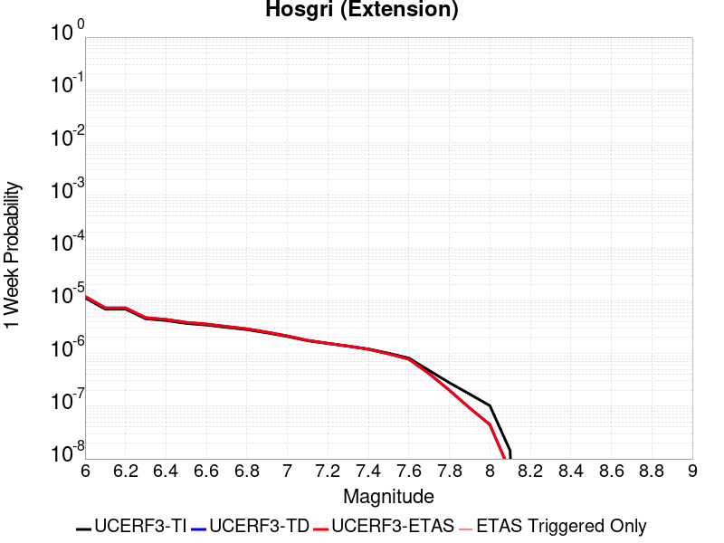 |  | 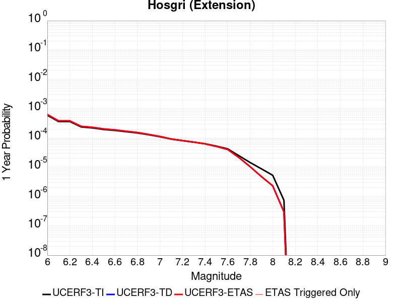 | 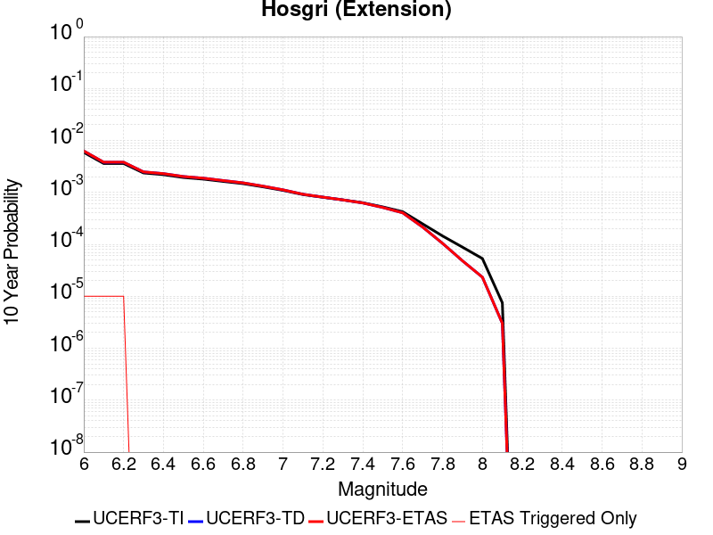 |

| Magnitude | 1 wk TI Prob | 1 wk TD Prob | 1 wk ETAS Prob | 1 wk ETAS/TD Gain | 1 wk ETAS Triggered Only | 1 mo TI Prob | 1 mo TD Prob | 1 mo ETAS Prob | 1 mo ETAS/TD Gain | 1 mo ETAS Triggered Only | 1 yr TI Prob | 1 yr TD Prob | 1 yr ETAS Prob | 1 yr ETAS/TD Gain | 1 yr ETAS Triggered Only | 10 yr TI Prob | 10 yr TD Prob | 10 yr ETAS Prob | 10 yr ETAS/TD Gain | 10 yr ETAS Triggered Only |
|-----|-----|-----|-----|-----|-----|-----|-----|-----|-----|-----|-----|-----|-----|-----|-----|-----|-----|-----|-----|-----|
| 6.0 | 1.1369135E-5 | 1.2083198E-5 | 1.2083198E-5 | 1.0 | 0.0 | 4.8723956E-5 | 5.1784238E-5 | 5.1784238E-5 | 1.0 | 0.0 | 5.9305265E-4 | 6.303134E-4 | 6.303134E-4 | 1.0 | 0.0 | 0.005914725 | 0.0062875054 | 0.0062974426 | 1.0015805 | 1.0E-5 |
| 6.1 | 6.934979E-6 | 7.3246356E-6 | 7.3246356E-6 | 1.0 | 0.0 | 2.9721E-5 | 3.139094E-5 | 3.139094E-5 | 1.0 | 0.0 | 3.617931E-4 | 3.8212183E-4 | 3.8212183E-4 | 1.0 | 0.0 | 0.0036120464 | 0.0038150605 | 0.0038250224 | 1.0026112 | 1.0E-5 |
| 6.2 | 6.934979E-6 | 7.3246356E-6 | 7.3246356E-6 | 1.0 | 0.0 | 2.9721E-5 | 3.139094E-5 | 3.139094E-5 | 1.0 | 0.0 | 3.617931E-4 | 3.8212183E-4 | 3.8212183E-4 | 1.0 | 0.0 | 0.0036120464 | 0.0038150605 | 0.0038250224 | 1.0026112 | 1.0E-5 |
| 6.3 | 4.5484676E-6 | 4.769387E-6 | 4.769387E-6 | 1.0 | 0.0 | 1.9493287E-5 | 2.0440071E-5 | 2.0440071E-5 | 1.0 | 0.0 | 2.3730492E-4 | 2.4882986E-4 | 2.4882986E-4 | 1.0 | 0.0 | 0.0023705168 | 0.0024855551 | 0.0024855551 | 1.0 | 0.0 |
| 6.4 | 4.218095E-6 | 4.416915E-6 | 4.416915E-6 | 1.0 | 0.0 | 1.8077424E-5 | 1.89295E-5 | 1.89295E-5 | 1.0 | 0.0 | 2.2007042E-4 | 2.3044262E-4 | 2.3044262E-4 | 1.0 | 0.0 | 0.002198526 | 0.0023020701 | 0.0023020701 | 1.0 | 0.0 |
| 6.5 | 3.717374E-6 | 3.8839266E-6 | 3.8839266E-6 | 1.0 | 0.0 | 1.5931506E-5 | 1.6645294E-5 | 1.6645294E-5 | 1.0 | 0.0 | 1.9394881E-4 | 2.0263779E-4 | 2.0263779E-4 | 1.0 | 0.0 | 0.0019377962 | 0.002024549 | 0.002024549 | 1.0 | 0.0 |
| 6.6 | 3.4605036E-6 | 3.6083522E-6 | 3.6083522E-6 | 1.0 | 0.0 | 1.4830645E-5 | 1.5464277E-5 | 1.5464277E-5 | 1.0 | 0.0 | 1.8054814E-4 | 1.8826143E-4 | 1.8826143E-4 | 1.0 | 0.0 | 0.0018040152 | 0.0018810342 | 0.0018810342 | 1.0 | 0.0 |
| 6.7 | 3.123439E-6 | 3.2466114E-6 | 3.2466114E-6 | 1.0 | 0.0 | 1.33860985E-5 | 1.3913976E-5 | 1.3913976E-5 | 1.0 | 0.0 | 1.6296357E-4 | 1.6938959E-4 | 1.6938959E-4 | 1.0 | 0.0 | 0.001628441 | 0.0016926157 | 0.0016926157 | 1.0 | 0.0 |
| 6.8 | 2.8290783E-6 | 2.93058E-6 | 2.93058E-6 | 1.0 | 0.0 | 1.2124565E-5 | 1.2559569E-5 | 1.2559569E-5 | 1.0 | 0.0 | 1.4760658E-4 | 1.529021E-4 | 1.529021E-4 | 1.0 | 0.0 | 0.0014750857 | 0.0015279776 | 0.0015279776 | 1.0 | 0.0 |
| 6.9 | 2.454112E-6 | 2.5283553E-6 | 2.5283553E-6 | 1.0 | 0.0 | 1.0517581E-5 | 1.08357635E-5 | 1.08357635E-5 | 1.0 | 0.0 | 1.2804402E-4 | 1.3191749E-4 | 1.3191749E-4 | 1.0 | 0.0 | 0.0012797028 | 0.001318398 | 0.001318398 | 1.0 | 0.0 |
| 7.0 | 2.1008145E-6 | 2.1499025E-6 | 2.1499025E-6 | 1.0 | 0.0 | 9.003459E-6 | 9.213836E-6 | 9.213836E-6 | 1.0 | 0.0 | 1.096116E-4 | 1.1217271E-4 | 1.1217271E-4 | 1.0 | 0.0 | 0.0010955755 | 0.0011211646 | 0.0011211646 | 1.0 | 0.0 |
| 7.1 | 1.744384E-6 | 1.7686639E-6 | 1.7686639E-6 | 1.0 | 0.0 | 7.47591E-6 | 7.579966E-6 | 7.579966E-6 | 1.0 | 0.0 | 9.1015405E-5 | 9.22822E-5 | 9.22822E-5 | 1.0 | 0.0 | 9.097813E-4 | 9.224405E-4 | 9.224405E-4 | 1.0 | 0.0 |
| 7.2 | 1.5456587E-6 | 1.556315E-6 | 1.556315E-6 | 1.0 | 0.0 | 6.6242346E-6 | 6.6699045E-6 | 6.6699045E-6 | 1.0 | 0.0 | 8.064707E-5 | 8.120307E-5 | 8.120307E-5 | 1.0 | 0.0 | 8.0617814E-4 | 8.117353E-4 | 8.117353E-4 | 1.0 | 0.0 |
| 7.3 | 1.3775123E-6 | 1.3766333E-6 | 1.3766333E-6 | 1.0 | 0.0 | 5.9036106E-6 | 5.899844E-6 | 5.899844E-6 | 1.0 | 0.0 | 7.187409E-5 | 7.182824E-5 | 7.182824E-5 | 1.0 | 0.0 | 7.185085E-4 | 7.180513E-4 | 7.180513E-4 | 1.0 | 0.0 |
| 7.4 | 1.214491E-6 | 1.2023696E-6 | 1.2023696E-6 | 1.0 | 0.0 | 5.2049513E-6 | 5.1530023E-6 | 5.1530023E-6 | 1.0 | 0.0 | 6.336844E-5 | 6.2736006E-5 | 6.2736006E-5 | 1.0 | 0.0 | 6.335037E-4 | 6.2718376E-4 | 6.2718376E-4 | 1.0 | 0.0 |
| 7.5 | 1.0101123E-6 | 9.842462E-7 | 9.842462E-7 | 1.0 | 0.0 | 4.3290456E-6 | 4.218191E-6 | 4.218191E-6 | 1.0 | 0.0 | 5.2704854E-5 | 5.135527E-5 | 5.135527E-5 | 1.0 | 0.0 | 5.2692357E-4 | 5.1343464E-4 | 5.1343464E-4 | 1.0 | 0.0 |
| 7.6 | 8.1558215E-7 | 7.7661633E-7 | 7.7661633E-7 | 1.0 | 0.0 | 3.4953473E-6 | 3.3283516E-6 | 3.3283516E-6 | 1.0 | 0.0 | 4.255502E-5 | 4.0521933E-5 | 4.0521933E-5 | 1.0 | 0.0 | 4.2546875E-4 | 4.0514587E-4 | 4.0514587E-4 | 1.0 | 0.0 |
| 7.7 | 4.757816E-7 | 4.1310525E-7 | 4.1310525E-7 | 1.0 | 0.0 | 2.0390623E-6 | 1.7704498E-6 | 1.7704498E-6 | 1.0 | 0.0 | 2.4825302E-5 | 2.1555015E-5 | 2.1555015E-5 | 1.0 | 0.0 | 2.482253E-4 | 2.1552936E-4 | 2.1552936E-4 | 1.0 | 0.0 |
| 7.8 | 2.782787E-7 | 2.0049143E-7 | 2.0049143E-7 | 1.0 | 0.0 | 1.1926223E-6 | 8.5924864E-7 | 8.5924864E-7 | 1.0 | 0.0 | 1.452008E-5 | 1.0461303E-5 | 1.0461303E-5 | 1.0 | 0.0 | 1.4519131E-4 | 1.0460813E-4 | 1.0460813E-4 | 1.0 | 0.0 |
| 7.9 | 1.6948086E-7 | 9.2455664E-8 | 9.2455664E-8 | 1.0 | 0.0 | 7.2634634E-7 | 3.9623848E-7 | 3.9623848E-7 | 1.0 | 0.0 | 8.843231E-6 | 4.824193E-6 | 4.824193E-6 | 1.0 | 0.0 | 8.842879E-5 | 4.824089E-5 | 4.824089E-5 | 1.0 | 0.0 |
| 8.0 | 1.0225492E-7 | 4.4748486E-8 | 4.4748486E-8 | 1.0 | 0.0 | 4.382353E-7 | 1.9177921E-7 | 1.9177921E-7 | 1.0 | 0.0 | 5.335502E-6 | 2.3349094E-6 | 2.3349094E-6 | 1.0 | 0.0 | 5.335374E-5 | 2.3348852E-5 | 2.3348852E-5 | 1.0 | 0.0 |
| 8.1 | 1.43711345E-8 | 5.789212E-9 | 5.789212E-9 | 1.0 | 0.0 | 6.1590576E-8 | 2.4810909E-8 | 2.4810909E-8 | 1.0 | 0.0 | 7.4986497E-7 | 3.0207278E-7 | 3.0207278E-7 | 1.0 | 0.0 | 7.4986247E-6 | 3.0207243E-6 | 3.0207243E-6 | 1.0 | 0.0 |

## Los Osos 2011
*[(top)](#table-of-contents)*

| 1 Week | 1 Month | 1 Year | 10 Year |
|-----|-----|-----|-----|
| 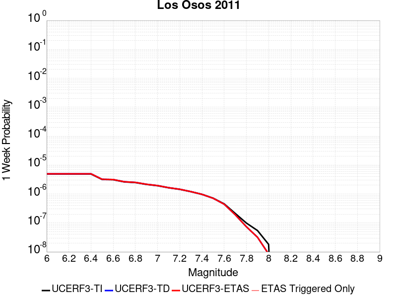 |  | 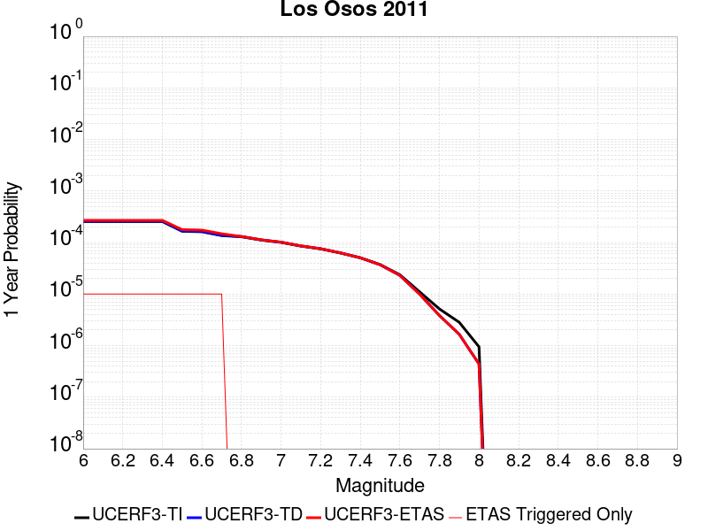 | 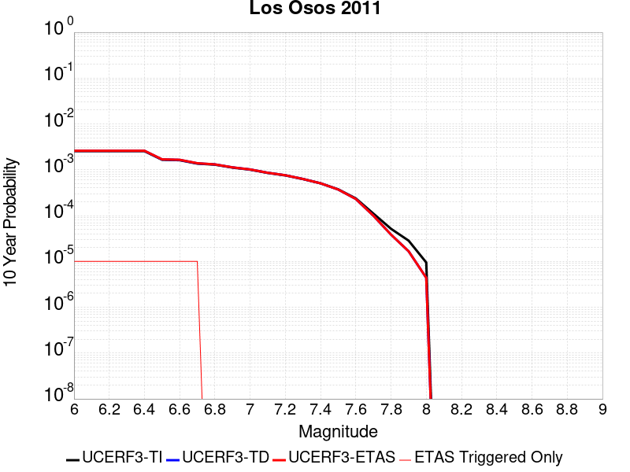 |

| Magnitude | 1 wk TI Prob | 1 wk TD Prob | 1 wk ETAS Prob | 1 wk ETAS/TD Gain | 1 wk ETAS Triggered Only | 1 mo TI Prob | 1 mo TD Prob | 1 mo ETAS Prob | 1 mo ETAS/TD Gain | 1 mo ETAS Triggered Only | 1 yr TI Prob | 1 yr TD Prob | 1 yr ETAS Prob | 1 yr ETAS/TD Gain | 1 yr ETAS Triggered Only | 10 yr TI Prob | 10 yr TD Prob | 10 yr ETAS Prob | 10 yr ETAS/TD Gain | 10 yr ETAS Triggered Only |
|-----|-----|-----|-----|-----|-----|-----|-----|-----|-----|-----|-----|-----|-----|-----|-----|-----|-----|-----|-----|-----|
| 6.0 | 4.8871775E-6 | 4.9815035E-6 | 4.9815035E-6 | 1.0 | 0.0 | 2.0944879E-5 | 2.1349142E-5 | 2.1349142E-5 | 1.0 | 0.0 | 2.5497406E-4 | 2.5989758E-4 | 2.6989498E-4 | 1.0384667 | 1.0E-5 | 0.002546817 | 0.002596211 | 0.002606185 | 1.0038418 | 1.0E-5 |
| 6.1 | 4.8871775E-6 | 4.9815035E-6 | 4.9815035E-6 | 1.0 | 0.0 | 2.0944879E-5 | 2.1349142E-5 | 2.1349142E-5 | 1.0 | 0.0 | 2.5497406E-4 | 2.5989758E-4 | 2.6989498E-4 | 1.0384667 | 1.0E-5 | 0.002546817 | 0.002596211 | 0.002606185 | 1.0038418 | 1.0E-5 |
| 6.2 | 4.8871775E-6 | 4.9815035E-6 | 4.9815035E-6 | 1.0 | 0.0 | 2.0944879E-5 | 2.1349142E-5 | 2.1349142E-5 | 1.0 | 0.0 | 2.5497406E-4 | 2.5989758E-4 | 2.6989498E-4 | 1.0384667 | 1.0E-5 | 0.002546817 | 0.002596211 | 0.002606185 | 1.0038418 | 1.0E-5 |
| 6.3 | 4.8871775E-6 | 4.9815035E-6 | 4.9815035E-6 | 1.0 | 0.0 | 2.0944879E-5 | 2.1349142E-5 | 2.1349142E-5 | 1.0 | 0.0 | 2.5497406E-4 | 2.5989758E-4 | 2.6989498E-4 | 1.0384667 | 1.0E-5 | 0.002546817 | 0.002596211 | 0.002606185 | 1.0038418 | 1.0E-5 |
| 6.4 | 4.8871775E-6 | 4.9815035E-6 | 4.9815035E-6 | 1.0 | 0.0 | 2.0944879E-5 | 2.1349142E-5 | 2.1349142E-5 | 1.0 | 0.0 | 2.5497406E-4 | 2.5989758E-4 | 2.6989498E-4 | 1.0384667 | 1.0E-5 | 0.002546817 | 0.002596211 | 0.002606185 | 1.0038418 | 1.0E-5 |
| 6.5 | 3.1724062E-6 | 3.2234093E-6 | 3.2234093E-6 | 1.0 | 0.0 | 1.3595956E-5 | 1.3814539E-5 | 1.3814539E-5 | 1.0 | 0.0 | 1.6551818E-4 | 1.6817916E-4 | 1.7817748E-4 | 1.0594504 | 1.0E-5 | 0.0016539496 | 0.0016805324 | 0.0016905155 | 1.0059404 | 1.0E-5 |
| 6.6 | 3.1022591E-6 | 3.1511186E-6 | 3.1511186E-6 | 1.0 | 0.0 | 1.3295328E-5 | 1.3504725E-5 | 1.3504725E-5 | 1.0 | 0.0 | 1.618586E-4 | 1.6440774E-4 | 1.744061E-4 | 1.0608144 | 1.0E-5 | 0.0016174077 | 0.001642874 | 0.0016528575 | 1.0060769 | 1.0E-5 |
| 6.7 | 2.611518E-6 | 2.649196E-6 | 2.649196E-6 | 1.0 | 0.0 | 1.1192172E-5 | 1.1353647E-5 | 1.1353647E-5 | 1.0 | 0.0 | 1.3625617E-4 | 1.3822193E-4 | 1.4822054E-4 | 1.0723374 | 1.0E-5 | 0.0013617266 | 0.0013813641 | 0.0013913503 | 1.0072292 | 1.0E-5 |
| 6.8 | 2.4780884E-6 | 2.5121715E-6 | 2.5121715E-6 | 1.0 | 0.0 | 1.0620336E-5 | 1.0766405E-5 | 1.0766405E-5 | 1.0 | 0.0 | 1.2929492E-4 | 1.3107313E-4 | 1.3107313E-4 | 1.0 | 0.0 | 0.0012921972 | 0.0013099624 | 0.0013099624 | 1.0 | 0.0 |
| 6.9 | 2.1376322E-6 | 2.1635167E-6 | 2.1635167E-6 | 1.0 | 0.0 | 9.161248E-6 | 9.272181E-6 | 9.272181E-6 | 1.0 | 0.0 | 1.1153249E-4 | 1.12882975E-4 | 1.12882975E-4 | 1.0 | 0.0 | 0.0011147653 | 0.0011282583 | 0.0011282583 | 1.0 | 0.0 |
| 7.0 | 1.9282882E-6 | 1.949469E-6 | 1.949469E-6 | 1.0 | 0.0 | 8.264066E-6 | 8.35484E-6 | 8.35484E-6 | 1.0 | 0.0 | 1.0061036E-4 | 1.0171544E-4 | 1.0171544E-4 | 1.0 | 0.0 | 0.0010056482 | 0.0010166903 | 0.0010166903 | 1.0 | 0.0 |
| 7.1 | 1.6353226E-6 | 1.6501212E-6 | 1.6501212E-6 | 1.0 | 0.0 | 7.0085066E-6 | 7.0719293E-6 | 7.0719293E-6 | 1.0 | 0.0 | 8.532523E-5 | 8.6097345E-5 | 8.6097345E-5 | 1.0 | 0.0 | 8.529247E-4 | 8.6064066E-4 | 8.6064066E-4 | 1.0 | 0.0 |
| 7.2 | 1.4446276E-6 | 1.4553431E-6 | 1.4553431E-6 | 1.0 | 0.0 | 6.191247E-6 | 6.2371696E-6 | 6.2371696E-6 | 1.0 | 0.0 | 7.537582E-5 | 7.59349E-5 | 7.59349E-5 | 1.0 | 0.0 | 7.535026E-4 | 7.590901E-4 | 7.590901E-4 | 1.0 | 0.0 |
| 7.3 | 1.2014582E-6 | 1.2069155E-6 | 1.2069155E-6 | 1.0 | 0.0 | 5.149096E-6 | 5.1724846E-6 | 5.1724846E-6 | 1.0 | 0.0 | 6.268844E-5 | 6.297319E-5 | 6.297319E-5 | 1.0 | 0.0 | 6.267076E-4 | 6.295538E-4 | 6.295538E-4 | 1.0 | 0.0 |
| 7.4 | 9.707733E-7 | 9.709848E-7 | 9.709848E-7 | 1.0 | 0.0 | 4.16045E-6 | 4.161357E-6 | 4.161357E-6 | 1.0 | 0.0 | 5.0652303E-5 | 5.0663344E-5 | 5.0663344E-5 | 1.0 | 0.0 | 5.064076E-4 | 5.0651823E-4 | 5.0651823E-4 | 1.0 | 0.0 |
| 7.5 | 7.174908E-7 | 7.1149805E-7 | 7.1149805E-7 | 1.0 | 0.0 | 3.074957E-6 | 3.0492738E-6 | 3.0492738E-6 | 1.0 | 0.0 | 3.743696E-5 | 3.712428E-5 | 3.712428E-5 | 1.0 | 0.0 | 3.7430652E-4 | 3.7118094E-4 | 3.7118094E-4 | 1.0 | 0.0 |
| 7.6 | 4.5535776E-7 | 4.420849E-7 | 4.420849E-7 | 1.0 | 0.0 | 1.9515319E-6 | 1.8946482E-6 | 1.8946482E-6 | 1.0 | 0.0 | 2.3759641E-5 | 2.30671E-5 | 2.30671E-5 | 1.0 | 0.0 | 2.37571E-4 | 2.3064714E-4 | 2.3064714E-4 | 1.0 | 0.0 |
| 7.7 | 2.1173553E-7 | 1.9061258E-7 | 1.9061258E-7 | 1.0 | 0.0 | 9.0743765E-7 | 8.169108E-7 | 8.169108E-7 | 1.0 | 0.0 | 1.1047998E-5 | 9.945844E-6 | 9.945844E-6 | 1.0 | 0.0 | 1.1047449E-4 | 9.945402E-5 | 9.945402E-5 | 1.0 | 0.0 |
| 7.8 | 9.873608E-8 | 7.3679686E-8 | 7.3679686E-8 | 1.0 | 0.0 | 4.2315455E-7 | 3.1577002E-7 | 3.1577002E-7 | 1.0 | 0.0 | 5.1518946E-6 | 3.844493E-6 | 3.844493E-6 | 1.0 | 0.0 | 5.1517753E-5 | 3.8444276E-5 | 3.8444276E-5 | 1.0 | 0.0 |
| 7.9 | 5.4399106E-8 | 3.1883726E-8 | 3.1883726E-8 | 1.0 | 0.0 | 2.33139E-7 | 1.3664453E-7 | 1.3664453E-7 | 1.0 | 0.0 | 2.8384638E-6 | 1.6636459E-6 | 1.6636459E-6 | 1.0 | 0.0 | 2.8384275E-5 | 1.6636335E-5 | 1.6636335E-5 | 1.0 | 0.0 |
| 8.0 | 1.817203E-8 | 8.422238E-9 | 8.422238E-9 | 1.0 | 0.0 | 7.7880124E-8 | 3.6095305E-8 | 3.6095305E-8 | 1.0 | 0.0 | 9.481901E-7 | 4.3946025E-7 | 4.3946025E-7 | 1.0 | 0.0 | 9.481861E-6 | 4.3945943E-6 | 4.3945943E-6 | 1.0 | 0.0 |

## Franklin 2011 CFM
*[(top)](#table-of-contents)*

| 1 Week | 1 Month | 1 Year | 10 Year |
|-----|-----|-----|-----|
|  |  |  |  |

| Magnitude | 1 wk TI Prob | 1 wk TD Prob | 1 wk ETAS Prob | 1 wk ETAS/TD Gain | 1 wk ETAS Triggered Only | 1 mo TI Prob | 1 mo TD Prob | 1 mo ETAS Prob | 1 mo ETAS/TD Gain | 1 mo ETAS Triggered Only | 1 yr TI Prob | 1 yr TD Prob | 1 yr ETAS Prob | 1 yr ETAS/TD Gain | 1 yr ETAS Triggered Only | 10 yr TI Prob | 10 yr TD Prob | 10 yr ETAS Prob | 10 yr ETAS/TD Gain | 10 yr ETAS Triggered Only |
|-----|-----|-----|-----|-----|-----|-----|-----|-----|-----|-----|-----|-----|-----|-----|-----|-----|-----|-----|-----|-----|
| 6.0 | 1.845602E-5 | 2.0213281E-5 | 2.0213281E-5 | 1.0 | 0.0 | 7.9094825E-5 | 8.662564E-5 | 8.662564E-5 | 1.0 | 0.0 | 9.6255407E-4 | 0.0010541859 | 0.0010541859 | 1.0 | 0.0 | 0.009583955 | 0.010509172 | 0.010519068 | 1.0009415 | 1.0E-5 |
| 6.1 | 1.845602E-5 | 2.0213281E-5 | 2.0213281E-5 | 1.0 | 0.0 | 7.9094825E-5 | 8.662564E-5 | 8.662564E-5 | 1.0 | 0.0 | 9.6255407E-4 | 0.0010541859 | 0.0010541859 | 1.0 | 0.0 | 0.009583955 | 0.010509172 | 0.010519068 | 1.0009415 | 1.0E-5 |
| 6.2 | 1.845602E-5 | 2.0213281E-5 | 2.0213281E-5 | 1.0 | 0.0 | 7.9094825E-5 | 8.662564E-5 | 8.662564E-5 | 1.0 | 0.0 | 9.6255407E-4 | 0.0010541859 | 0.0010541859 | 1.0 | 0.0 | 0.009583955 | 0.010509172 | 0.010519068 | 1.0009415 | 1.0E-5 |
| 6.3 | 1.3813506E-5 | 1.51554295E-5 | 1.51554295E-5 | 1.0 | 0.0 | 5.9199396E-5 | 6.495027E-5 | 6.495027E-5 | 1.0 | 0.0 | 7.205143E-4 | 7.904903E-4 | 7.904903E-4 | 1.0 | 0.0 | 0.007181826 | 0.007891989 | 0.007891989 | 1.0 | 0.0 |
| 6.4 | 1.3813506E-5 | 1.51554295E-5 | 1.51554295E-5 | 1.0 | 0.0 | 5.9199396E-5 | 6.495027E-5 | 6.495027E-5 | 1.0 | 0.0 | 7.205143E-4 | 7.904903E-4 | 7.904903E-4 | 1.0 | 0.0 | 0.007181826 | 0.007891989 | 0.007891989 | 1.0 | 0.0 |
| 6.5 | 1.1308949E-5 | 1.2418368E-5 | 1.2418368E-5 | 1.0 | 0.0 | 4.8466023E-5 | 5.3220505E-5 | 5.3220505E-5 | 1.0 | 0.0 | 5.899141E-4 | 6.47769E-4 | 6.47769E-4 | 1.0 | 0.0 | 0.0058835056 | 0.0064734593 | 0.0064734593 | 1.0 | 0.0 |
| 6.6 | 1.0813164E-5 | 1.1876584E-5 | 1.1876584E-5 | 1.0 | 0.0 | 4.6341313E-5 | 5.0898663E-5 | 5.0898663E-5 | 1.0 | 0.0 | 5.640594E-4 | 6.1951694E-4 | 6.1951694E-4 | 1.0 | 0.0 | 0.005626298 | 0.0061925333 | 0.0061925333 | 1.0 | 0.0 |
| 6.7 | 1.0706348E-5 | 1.1758347E-5 | 1.1758347E-5 | 1.0 | 0.0 | 4.5883542E-5 | 5.039195E-5 | 5.039195E-5 | 1.0 | 0.0 | 5.5848894E-4 | 6.133512E-4 | 6.133512E-4 | 1.0 | 0.0 | 0.005570874 | 0.006131218 | 0.006131218 | 1.0 | 0.0 |
| 6.8 | 9.443655E-6 | 1.0349647E-5 | 1.0349647E-5 | 1.0 | 0.0 | 4.0472176E-5 | 4.4354885E-5 | 4.4354885E-5 | 1.0 | 0.0 | 4.9263734E-4 | 5.398883E-4 | 5.398883E-4 | 1.0 | 0.0 | 0.0049154665 | 0.0054003512 | 0.0054003512 | 1.0 | 0.0 |
| 6.9 | 8.7001645E-6 | 9.522704E-6 | 9.522704E-6 | 1.0 | 0.0 | 3.728589E-5 | 4.081096E-5 | 4.081096E-5 | 1.0 | 0.0 | 4.538611E-4 | 4.967614E-4 | 4.967614E-4 | 1.0 | 0.0 | 0.0045293528 | 0.0049710795 | 0.0049710795 | 1.0 | 0.0 |
| 7.0 | 8.074731E-6 | 8.81631E-6 | 8.81631E-6 | 1.0 | 0.0 | 3.460553E-5 | 3.778364E-5 | 3.778364E-5 | 1.0 | 0.0 | 4.212409E-4 | 4.5991983E-4 | 4.5991983E-4 | 1.0 | 0.0 | 0.004204433 | 0.0046042353 | 0.0046042353 | 1.0 | 0.0 |
| 7.1 | 7.3370957E-6 | 7.9621705E-6 | 7.9621705E-6 | 1.0 | 0.0 | 3.1444317E-5 | 3.4123146E-5 | 3.4123146E-5 | 1.0 | 0.0 | 3.8276732E-4 | 4.1537115E-4 | 4.1537115E-4 | 1.0 | 0.0 | 0.0038210868 | 0.0041603437 | 0.0041603437 | 1.0 | 0.0 |
| 7.2 | 5.1750103E-6 | 5.4575758E-6 | 5.4575758E-6 | 1.0 | 0.0 | 2.2178427E-5 | 2.33894E-5 | 2.33894E-5 | 1.0 | 0.0 | 2.699889E-4 | 2.8472906E-4 | 2.8472906E-4 | 1.0 | 0.0 | 0.002696611 | 0.0028575582 | 0.0028575582 | 1.0 | 0.0 |
| 7.3 | 3.5221371E-6 | 3.7964737E-6 | 3.7964737E-6 | 1.0 | 0.0 | 1.5094786E-5 | 1.62705E-5 | 1.62705E-5 | 1.0 | 0.0 | 1.8376352E-4 | 1.9807543E-4 | 1.9807543E-4 | 1.0 | 0.0 | 0.0018361164 | 0.0019924217 | 0.0019924217 | 1.0 | 0.0 |
| 7.4 | 2.5749775E-6 | 2.8185839E-6 | 2.8185839E-6 | 1.0 | 0.0 | 1.1035571E-5 | 1.2079589E-5 | 1.2079589E-5 | 1.0 | 0.0 | 1.343498E-4 | 1.4705914E-4 | 1.4705914E-4 | 1.0 | 0.0 | 0.001342686 | 0.0014818412 | 0.0014818412 | 1.0 | 0.0 |
| 7.5 | 1.3642131E-6 | 1.5500917E-6 | 1.5500917E-6 | 1.0 | 0.0 | 5.8466144E-6 | 6.6432335E-6 | 6.6432335E-6 | 1.0 | 0.0 | 7.1180206E-5 | 8.087838E-5 | 8.087838E-5 | 1.0 | 0.0 | 7.115741E-4 | 8.19299E-4 | 8.19299E-4 | 1.0 | 0.0 |
| 7.6 | 5.329124E-7 | 6.70406E-7 | 6.70406E-7 | 1.0 | 0.0 | 2.2839083E-6 | 2.8731654E-6 | 2.8731654E-6 | 1.0 | 0.0 | 2.7806227E-5 | 3.498023E-5 | 3.498023E-5 | 1.0 | 0.0 | 2.780275E-4 | 3.6013933E-4 | 3.6013933E-4 | 1.0 | 0.0 |
| 7.7 | 4.199127E-7 | 5.489591E-7 | 5.489591E-7 | 1.0 | 0.0 | 1.7996247E-6 | 2.3526798E-6 | 2.3526798E-6 | 1.0 | 0.0 | 2.191021E-5 | 2.8643502E-5 | 2.8643502E-5 | 1.0 | 0.0 | 2.190805E-4 | 2.966018E-4 | 2.966018E-4 | 1.0 | 0.0 |
| 7.8 | 2.2586491E-7 | 3.067814E-7 | 3.067814E-7 | 1.0 | 0.0 | 9.67992E-7 | 1.3147768E-6 | 1.3147768E-6 | 1.0 | 0.0 | 1.178524E-5 | 1.600729E-5 | 1.600729E-5 | 1.0 | 0.0 | 1.17846146E-4 | 1.663756E-4 | 1.663756E-4 | 1.0 | 0.0 |
| 7.9 | 1.4568845E-7 | 2.1214095E-7 | 2.1214095E-7 | 1.0 | 0.0 | 6.243789E-7 | 9.091752E-7 | 9.091752E-7 | 1.0 | 0.0 | 7.601787E-6 | 1.1069152E-5 | 1.1069152E-5 | 1.0 | 0.0 | 7.601527E-5 | 1.15139796E-4 | 1.15139796E-4 | 1.0 | 0.0 |
| 8.0 | 5.2868224E-8 | 1.0001987E-7 | 1.0001987E-7 | 1.0 | 0.0 | 2.2657808E-7 | 4.2865648E-7 | 4.2865648E-7 | 1.0 | 0.0 | 2.7585847E-6 | 5.2188802E-6 | 5.2188802E-6 | 1.0 | 0.0 | 2.7585504E-5 | 5.4041117E-5 | 5.4041117E-5 | 1.0 | 0.0 |
| 8.1 | 2.654434E-9 | 4.724749E-9 | 4.724749E-9 | 1.0 | 0.0 | 1.1376145E-8 | 2.0248923E-8 | 2.0248923E-8 | 1.0 | 0.0 | 1.3850456E-7 | 2.465306E-7 | 2.465306E-7 | 1.0 | 0.0 | 1.3850448E-6 | 2.5347126E-6 | 2.5347126E-6 | 1.0 | 0.0 |

## Mendocino
*[(top)](#table-of-contents)*

| 1 Week | 1 Month | 1 Year | 10 Year |
|-----|-----|-----|-----|
| 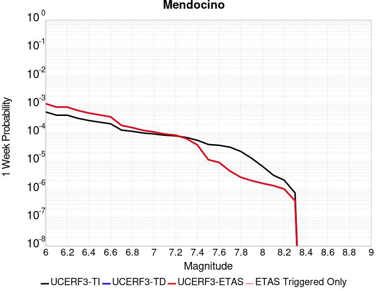 | 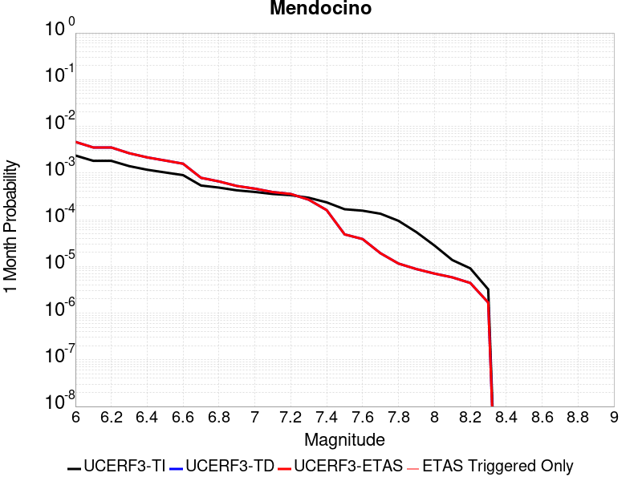 | 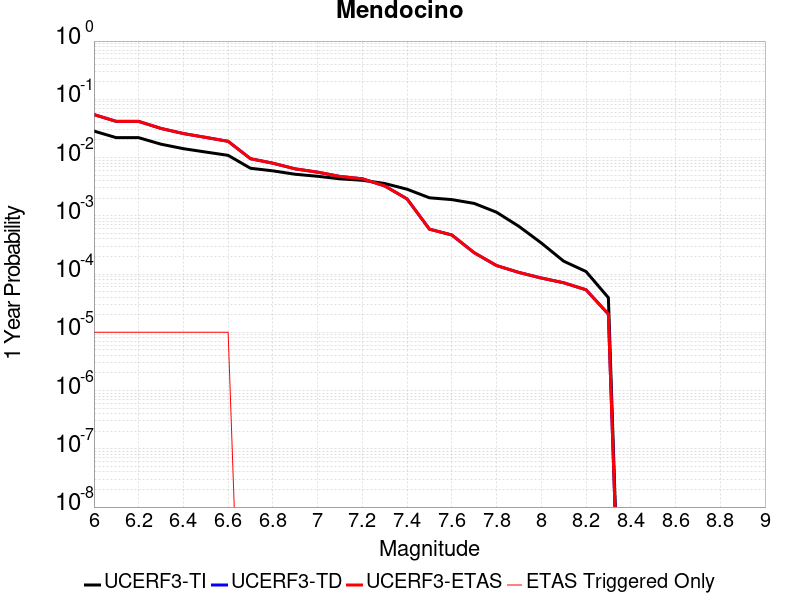 | 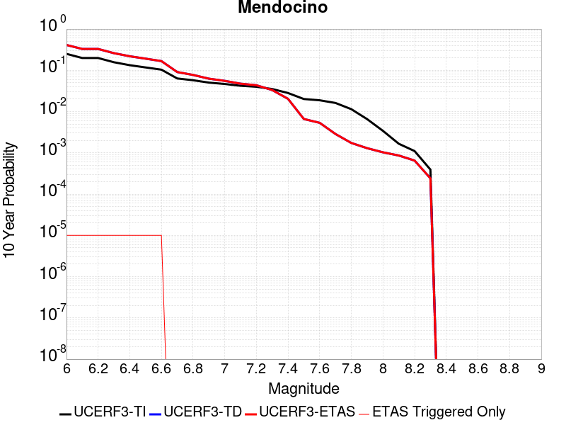 |

| Magnitude | 1 wk TI Prob | 1 wk TD Prob | 1 wk ETAS Prob | 1 wk ETAS/TD Gain | 1 wk ETAS Triggered Only | 1 mo TI Prob | 1 mo TD Prob | 1 mo ETAS Prob | 1 mo ETAS/TD Gain | 1 mo ETAS Triggered Only | 1 yr TI Prob | 1 yr TD Prob | 1 yr ETAS Prob | 1 yr ETAS/TD Gain | 1 yr ETAS Triggered Only | 10 yr TI Prob | 10 yr TD Prob | 10 yr ETAS Prob | 10 yr ETAS/TD Gain | 10 yr ETAS Triggered Only |
|-----|-----|-----|-----|-----|-----|-----|-----|-----|-----|-----|-----|-----|-----|-----|-----|-----|-----|-----|-----|-----|
| 6.0 | 5.5409013E-4 | 0.0010852285 | 0.0010852285 | 1.0 | 0.0 | 0.0023725112 | 0.0046360446 | 0.0046360446 | 1.0 | 0.0 | 0.028505474 | 0.05467416 | 0.05468361 | 1.0001729 | 1.0E-5 | 0.25113493 | 0.4118937 | 0.41189957 | 1.0000143 | 1.0E-5 |
| 6.1 | 4.2515888E-4 | 8.2346477E-4 | 8.2346477E-4 | 1.0 | 0.0 | 0.0018208373 | 0.0035216822 | 0.0035216822 | 1.0 | 0.0 | 0.021944538 | 0.041751396 | 0.041760977 | 1.0002295 | 1.0E-5 | 0.19899574 | 0.32996672 | 0.32997343 | 1.0000203 | 1.0E-5 |
| 6.2 | 4.2515888E-4 | 8.2346477E-4 | 8.2346477E-4 | 1.0 | 0.0 | 0.0018208373 | 0.0035216822 | 0.0035216822 | 1.0 | 0.0 | 0.021944538 | 0.041751396 | 0.041760977 | 1.0002295 | 1.0E-5 | 0.19899574 | 0.32996672 | 0.32997343 | 1.0000203 | 1.0E-5 |
| 6.3 | 3.2773745E-4 | 6.1948557E-4 | 6.1948557E-4 | 1.0 | 0.0 | 0.0014038329 | 0.002650933 | 0.002650933 | 1.0 | 0.0 | 0.016958237 | 0.031594634 | 0.031604316 | 1.0003065 | 1.0E-5 | 0.1572094 | 0.26078948 | 0.26079687 | 1.0000284 | 1.0E-5 |
| 6.4 | 2.7417165E-4 | 5.048574E-4 | 5.048574E-4 | 1.0 | 0.0 | 0.0011744922 | 0.0021605599 | 0.0021605599 | 1.0 | 0.0 | 0.014205975 | 0.02583938 | 0.025849123 | 1.000377 | 1.0E-5 | 0.13331394 | 0.21949135 | 0.21949916 | 1.0000355 | 1.0E-5 |
| 6.5 | 2.3984899E-4 | 4.3240076E-4 | 4.3240076E-4 | 1.0 | 0.0 | 0.0010275192 | 0.0018511139 | 0.0018511139 | 1.0 | 0.0 | 0.012438473 | 0.022182709 | 0.022192487 | 1.0004408 | 1.0E-5 | 0.11764851 | 0.1920481 | 0.19205618 | 1.0000421 | 1.0E-5 |
| 6.6 | 2.1023539E-4 | 3.6948398E-4 | 3.6948398E-4 | 1.0 | 0.0 | 9.0069766E-4 | 0.0015818389 | 0.0015818389 | 1.0 | 0.0 | 0.010910975 | 0.018992178 | 0.019001989 | 1.0005165 | 1.0E-5 | 0.10390546 | 0.16750489 | 0.16751322 | 1.0000497 | 1.0E-5 |
| 6.7 | 1.2592976E-4 | 1.8441462E-4 | 1.8441462E-4 | 1.0 | 0.0 | 5.395873E-4 | 7.8937993E-4 | 7.8937993E-4 | 1.0 | 0.0 | 0.006549705 | 0.009557213 | 0.009557213 | 1.0 | 0.0 | 0.063599944 | 0.090980574 | 0.090980574 | 1.0 | 0.0 |
| 6.8 | 1.13663555E-4 | 1.5405433E-4 | 1.5405433E-4 | 1.0 | 0.0 | 4.8703855E-4 | 6.6000264E-4 | 6.6000264E-4 | 1.0 | 0.0 | 0.0059135845 | 0.008001281 | 0.008001281 | 1.0 | 0.0 | 0.057586733 | 0.07740433 | 0.07740433 | 1.0 | 0.0 |
| 6.9 | 9.926894E-5 | 1.230104E-4 | 1.230104E-4 | 1.0 | 0.0 | 4.2536893E-4 | 5.270755E-4 | 5.270755E-4 | 1.0 | 0.0 | 0.0051665753 | 0.0063979477 | 0.0063979477 | 1.0 | 0.0 | 0.050480947 | 0.06287117 | 0.06287117 | 1.0 | 0.0 |
| 7.0 | 9.168125E-5 | 1.07859436E-4 | 1.07859436E-4 | 1.0 | 0.0 | 3.9286047E-4 | 4.621673E-4 | 4.621673E-4 | 1.0 | 0.0 | 0.004772591 | 0.0056120865 | 0.0056120865 | 1.0 | 0.0 | 0.04671385 | 0.05563225 | 0.05563225 | 1.0 | 0.0 |
| 7.1 | 8.2854116E-5 | 9.107158E-5 | 9.107158E-5 | 1.0 | 0.0 | 3.5504074E-4 | 3.9024925E-4 | 3.9024925E-4 | 1.0 | 0.0 | 0.004314056 | 0.0047409474 | 0.0047409474 | 1.0 | 0.0 | 0.042312626 | 0.047491476 | 0.047491476 | 1.0 | 0.0 |
| 7.2 | 7.8255274E-5 | 8.302302E-5 | 8.302302E-5 | 1.0 | 0.0 | 3.3533663E-4 | 3.5576525E-4 | 3.5576525E-4 | 1.0 | 0.0 | 0.0040750825 | 0.004322985 | 0.004322985 | 1.0 | 0.0 | 0.040011603 | 0.043535773 | 0.043535773 | 1.0 | 0.0 |
| 7.3 | 6.887904E-5 | 6.2604966E-5 | 6.2604966E-5 | 1.0 | 0.0 | 2.9516246E-4 | 2.6827995E-4 | 2.6827995E-4 | 1.0 | 0.0 | 0.0035876823 | 0.0032615114 | 0.0032615114 | 1.0 | 0.0 | 0.035303112 | 0.033360668 | 0.033360668 | 1.0 | 0.0 |
| 7.4 | 5.4898497E-5 | 3.7411526E-5 | 3.7411526E-5 | 1.0 | 0.0 | 2.3525805E-4 | 1.603256E-4 | 1.603256E-4 | 1.0 | 0.0 | 0.0028605047 | 0.0019502726 | 0.0019502726 | 1.0 | 0.0 | 0.02823963 | 0.020417504 | 0.020417504 | 1.0 | 0.0 |
| 7.5 | 3.9103943E-5 | 1.1314015E-5 | 1.1314015E-5 | 1.0 | 0.0 | 1.6757756E-4 | 4.8487742E-5 | 4.8487742E-5 | 1.0 | 0.0 | 0.0020383475 | 5.9018E-4 | 5.9018E-4 | 1.0 | 0.0 | 0.020197518 | 0.006628048 | 0.006628048 | 1.0 | 0.0 |
| 7.6 | 3.641042E-5 | 8.990225E-6 | 8.990225E-6 | 1.0 | 0.0 | 1.5603533E-4 | 3.8528975E-5 | 3.8528975E-5 | 1.0 | 0.0 | 0.0018980748 | 4.6899065E-4 | 4.6899065E-4 | 1.0 | 0.0 | 0.018819444 | 0.005351568 | 0.005351568 | 1.0 | 0.0 |
| 7.7 | 3.1318774E-5 | 4.459964E-6 | 4.459964E-6 | 1.0 | 0.0 | 1.342164E-4 | 1.9113993E-5 | 1.9113993E-5 | 1.0 | 0.0 | 0.0016328598 | 2.326882E-4 | 2.326882E-4 | 1.0 | 0.0 | 0.016209139 | 0.0028688249 | 0.0028688249 | 1.0 | 0.0 |
| 7.8 | 2.209241E-5 | 2.6845835E-6 | 2.6845835E-6 | 1.0 | 0.0 | 9.467832E-5 | 1.1505307E-5 | 1.1505307E-5 | 1.0 | 0.0 | 0.001152099 | 1.4006814E-4 | 1.4006814E-4 | 1.0 | 0.0 | 0.011461443 | 0.001739748 | 0.001739748 | 1.0 | 0.0 |
| 7.9 | 1.2640477E-5 | 2.0445516E-6 | 2.0445516E-6 | 1.0 | 0.0 | 5.4172346E-5 | 8.762335E-6 | 8.762335E-6 | 1.0 | 0.0 | 6.593487E-4 | 1.0667623E-4 | 1.0667623E-4 | 1.0 | 0.0 | 0.006573958 | 0.0012994353 | 0.0012994353 | 1.0 | 0.0 |
| 8.0 | 6.5548907E-6 | 1.6404656E-6 | 1.6404656E-6 | 1.0 | 0.0 | 2.8092087E-5 | 7.030548E-6 | 7.030548E-6 | 1.0 | 0.0 | 3.4196748E-4 | 8.559359E-5 | 8.559359E-5 | 1.0 | 0.0 | 0.0034144172 | 0.0010320483 | 0.0010320483 | 1.0 | 0.0 |
| 8.1 | 3.1916707E-6 | 1.3598082E-6 | 1.3598082E-6 | 1.0 | 0.0 | 1.3678517E-5 | 5.8277365E-6 | 5.8277365E-6 | 1.0 | 0.0 | 1.6652321E-4 | 7.09504E-5 | 7.09504E-5 | 1.0 | 0.0 | 0.0016639848 | 8.6360757E-4 | 8.6360757E-4 | 1.0 | 0.0 |
| 8.2 | 2.1193785E-6 | 1.031243E-6 | 1.031243E-6 | 1.0 | 0.0 | 9.083019E-6 | 4.4196054E-6 | 4.4196054E-6 | 1.0 | 0.0 | 1.1058014E-4 | 5.3807384E-5 | 5.3807384E-5 | 1.0 | 0.0 | 0.0011052513 | 6.5092335E-4 | 6.5092335E-4 | 1.0 | 0.0 |
| 8.3 | 7.536878E-7 | 3.931253E-7 | 3.931253E-7 | 1.0 | 0.0 | 3.2300866E-6 | 1.6848217E-6 | 1.6848217E-6 | 1.0 | 0.0 | 3.9325594E-5 | 2.0512523E-5 | 2.0512523E-5 | 1.0 | 0.0 | 3.9318635E-4 | 2.4152464E-4 | 2.4152464E-4 | 1.0 | 0.0 |

## Cerro Prieto
*[(top)](#table-of-contents)*

| 1 Week | 1 Month | 1 Year | 10 Year |
|-----|-----|-----|-----|
|  |  | 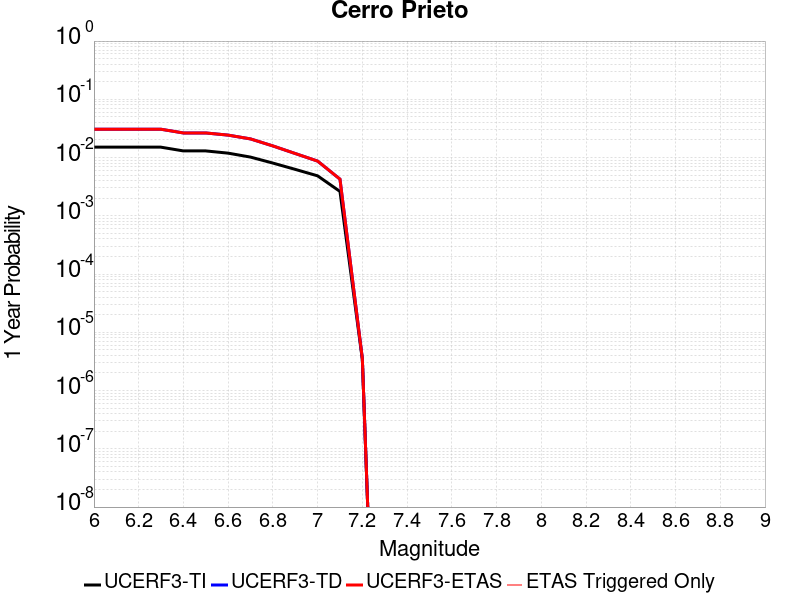 |  |

| Magnitude | 1 wk TI Prob | 1 wk TD Prob | 1 wk ETAS Prob | 1 wk ETAS/TD Gain | 1 wk ETAS Triggered Only | 1 mo TI Prob | 1 mo TD Prob | 1 mo ETAS Prob | 1 mo ETAS/TD Gain | 1 mo ETAS Triggered Only | 1 yr TI Prob | 1 yr TD Prob | 1 yr ETAS Prob | 1 yr ETAS/TD Gain | 1 yr ETAS Triggered Only | 10 yr TI Prob | 10 yr TD Prob | 10 yr ETAS Prob | 10 yr ETAS/TD Gain | 10 yr ETAS Triggered Only |
|-----|-----|-----|-----|-----|-----|-----|-----|-----|-----|-----|-----|-----|-----|-----|-----|-----|-----|-----|-----|-----|
| 6.0 | 2.9101528E-4 | 5.965907E-4 | 5.965907E-4 | 1.0 | 0.0 | 0.0012466122 | 0.002554554 | 0.002554554 | 1.0 | 0.0 | 0.015072231 | 0.030653033 | 0.030653033 | 1.0 | 0.0 | 0.14089979 | 0.25401175 | 0.2540192 | 1.0000293 | 1.0E-5 |
| 6.1 | 2.9101528E-4 | 5.965907E-4 | 5.965907E-4 | 1.0 | 0.0 | 0.0012466122 | 0.002554554 | 0.002554554 | 1.0 | 0.0 | 0.015072231 | 0.030653033 | 0.030653033 | 1.0 | 0.0 | 0.14089979 | 0.25401175 | 0.2540192 | 1.0000293 | 1.0E-5 |
| 6.2 | 2.9101528E-4 | 5.965907E-4 | 5.965907E-4 | 1.0 | 0.0 | 0.0012466122 | 0.002554554 | 0.002554554 | 1.0 | 0.0 | 0.015072231 | 0.030653033 | 0.030653033 | 1.0 | 0.0 | 0.14089979 | 0.25401175 | 0.2540192 | 1.0000293 | 1.0E-5 |
| 6.3 | 2.9101528E-4 | 5.965907E-4 | 5.965907E-4 | 1.0 | 0.0 | 0.0012466122 | 0.002554554 | 0.002554554 | 1.0 | 0.0 | 0.015072231 | 0.030653033 | 0.030653033 | 1.0 | 0.0 | 0.14089979 | 0.25401175 | 0.2540192 | 1.0000293 | 1.0E-5 |
| 6.4 | 2.508648E-4 | 5.140792E-4 | 5.140792E-4 | 1.0 | 0.0 | 0.0010746918 | 0.0022015348 | 0.0022015348 | 1.0 | 0.0 | 0.013006088 | 0.026476625 | 0.026476625 | 1.0 | 0.0 | 0.12270685 | 0.22443727 | 0.22444503 | 1.0000346 | 1.0E-5 |
| 6.5 | 2.508648E-4 | 5.140792E-4 | 5.140792E-4 | 1.0 | 0.0 | 0.0010746918 | 0.0022015348 | 0.0022015348 | 1.0 | 0.0 | 0.013006088 | 0.026476625 | 0.026476625 | 1.0 | 0.0 | 0.12270685 | 0.22443727 | 0.22444503 | 1.0000346 | 1.0E-5 |
| 6.6 | 2.294914E-4 | 4.7126948E-4 | 4.7126948E-4 | 1.0 | 0.0 | 9.831638E-4 | 0.0020183506 | 0.0020183506 | 1.0 | 0.0 | 0.011904482 | 0.024303433 | 0.024303433 | 1.0 | 0.0 | 0.11286586 | 0.20861839 | 0.2086263 | 1.0000379 | 1.0E-5 |
| 6.7 | 1.9621674E-4 | 4.042872E-4 | 4.042872E-4 | 1.0 | 0.0 | 8.4065786E-4 | 0.0017316672 | 0.0017316672 | 1.0 | 0.0 | 0.010187071 | 0.020889567 | 0.020889567 | 1.0 | 0.0 | 0.09732539 | 0.18293467 | 0.18294284 | 1.0000447 | 1.0E-5 |
| 6.8 | 1.5476145E-4 | 3.0573073E-4 | 3.0573073E-4 | 1.0 | 0.0 | 6.6309475E-4 | 0.0013097188 | 0.0013097188 | 1.0 | 0.0 | 0.008043335 | 0.015840806 | 0.015840806 | 1.0 | 0.0 | 0.07758363 | 0.14339209 | 0.14340065 | 1.0000597 | 1.0E-5 |
| 6.9 | 1.20509176E-4 | 2.2588969E-4 | 2.2588969E-4 | 1.0 | 0.0 | 5.1636563E-4 | 9.678028E-4 | 9.678028E-4 | 1.0 | 0.0 | 0.006268645 | 0.011729713 | 0.011729713 | 1.0 | 0.0 | 0.060947374 | 0.10947595 | 0.10947595 | 1.0 | 0.0 |
| 7.0 | 9.3269155E-5 | 1.672182E-4 | 1.672182E-4 | 1.0 | 0.0 | 3.9966372E-4 | 7.164957E-4 | 7.164957E-4 | 1.0 | 0.0 | 0.0048550544 | 0.008696101 | 0.008696101 | 1.0 | 0.0 | 0.04750344 | 0.08317999 | 0.08317999 | 1.0 | 0.0 |
| 7.1 | 5.029709E-5 | 8.1748294E-5 | 8.1748294E-5 | 1.0 | 0.0 | 2.1554115E-4 | 3.5032208E-4 | 3.5032208E-4 | 1.0 | 0.0 | 0.0026210553 | 0.0042602476 | 0.0042602476 | 1.0 | 0.0 | 0.025903556 | 0.04237809 | 0.04237809 | 1.0 | 0.0 |
| 7.2 | 6.5445185E-8 | 6.820826E-8 | 6.820826E-8 | 1.0 | 0.0 | 2.8047933E-7 | 2.923211E-7 | 2.923211E-7 | 1.0 | 0.0 | 3.4148304E-6 | 3.5590094E-6 | 3.5590094E-6 | 1.0 | 0.0 | 3.414778E-5 | 3.5590092E-5 | 3.5590092E-5 | 1.0 | 0.0 |

## Superstition Hills
*[(top)](#table-of-contents)*

| 1 Week | 1 Month | 1 Year | 10 Year |
|-----|-----|-----|-----|
| 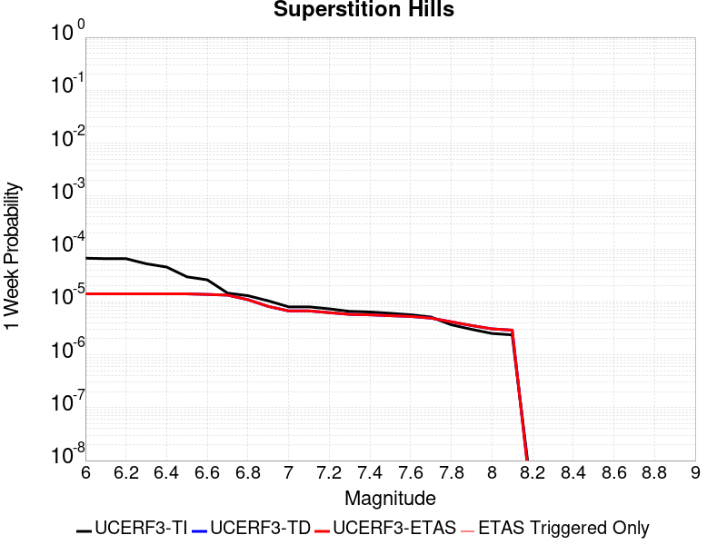 | 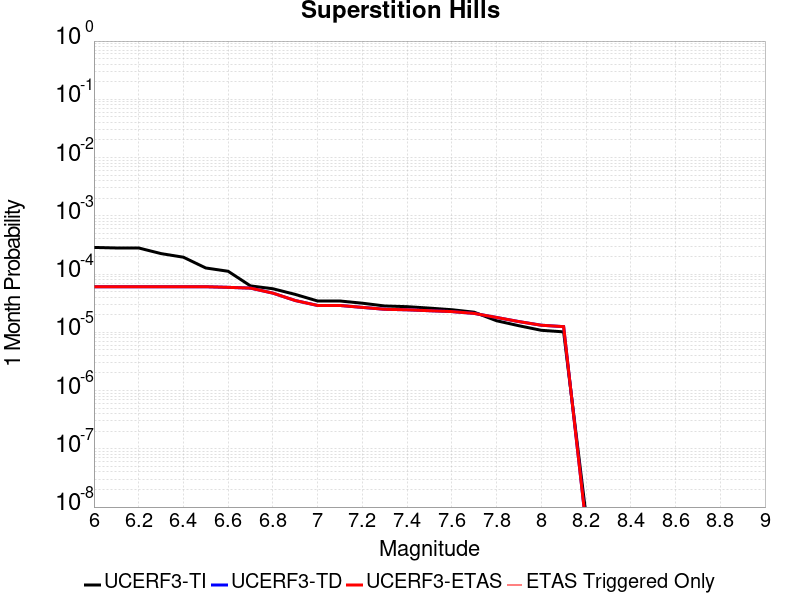 |  |  |

| Magnitude | 1 wk TI Prob | 1 wk TD Prob | 1 wk ETAS Prob | 1 wk ETAS/TD Gain | 1 wk ETAS Triggered Only | 1 mo TI Prob | 1 mo TD Prob | 1 mo ETAS Prob | 1 mo ETAS/TD Gain | 1 mo ETAS Triggered Only | 1 yr TI Prob | 1 yr TD Prob | 1 yr ETAS Prob | 1 yr ETAS/TD Gain | 1 yr ETAS Triggered Only | 10 yr TI Prob | 10 yr TD Prob | 10 yr ETAS Prob | 10 yr ETAS/TD Gain | 10 yr ETAS Triggered Only |
|-----|-----|-----|-----|-----|-----|-----|-----|-----|-----|-----|-----|-----|-----|-----|-----|-----|-----|-----|-----|-----|
| 6.0 | 6.6865185E-5 | 1.4140716E-5 | 1.4140716E-5 | 1.0 | 0.0 | 2.8653358E-4 | 6.0601753E-5 | 6.0601753E-5 | 1.0 | 0.0 | 0.0034829667 | 7.3759275E-4 | 7.3759275E-4 | 1.0 | 0.0 | 0.03428881 | 0.0075219767 | 0.0075319014 | 1.0013194 | 1.0E-5 |
| 6.1 | 6.544851E-5 | 1.4140715E-5 | 1.4140715E-5 | 1.0 | 0.0 | 2.8046346E-4 | 6.0601753E-5 | 6.0601753E-5 | 1.0 | 0.0 | 0.0034092965 | 7.3759275E-4 | 7.3759275E-4 | 1.0 | 0.0 | 0.033574644 | 0.007521976 | 0.007531901 | 1.0013194 | 1.0E-5 |
| 6.2 | 6.544851E-5 | 1.4140715E-5 | 1.4140715E-5 | 1.0 | 0.0 | 2.8046346E-4 | 6.0601753E-5 | 6.0601753E-5 | 1.0 | 0.0 | 0.0034092965 | 7.3759275E-4 | 7.3759275E-4 | 1.0 | 0.0 | 0.033574644 | 0.007521976 | 0.007531901 | 1.0013194 | 1.0E-5 |
| 6.3 | 5.2402065E-5 | 1.41407145E-5 | 1.41407145E-5 | 1.0 | 0.0 | 2.2456095E-4 | 6.0601746E-5 | 6.0601746E-5 | 1.0 | 0.0 | 0.0027306017 | 7.375927E-4 | 7.375927E-4 | 1.0 | 0.0 | 0.02697292 | 0.0075219707 | 0.0075318953 | 1.0013194 | 1.0E-5 |
| 6.4 | 4.542238E-5 | 1.4140714E-5 | 1.4140714E-5 | 1.0 | 0.0 | 1.9465282E-4 | 6.0601742E-5 | 6.0601742E-5 | 1.0 | 0.0 | 0.0023673223 | 7.3759264E-4 | 7.3759264E-4 | 1.0 | 0.0 | 0.023422617 | 0.007521968 | 0.0075318925 | 1.0013194 | 1.0E-5 |
| 6.5 | 2.9672969E-5 | 1.4140713E-5 | 1.4140713E-5 | 1.0 | 0.0 | 1.2716366E-4 | 6.060174E-5 | 6.060174E-5 | 1.0 | 0.0 | 0.0015471181 | 7.375926E-4 | 7.375926E-4 | 1.0 | 0.0 | 0.015363912 | 0.0075219613 | 0.007531886 | 1.0013194 | 1.0E-5 |
| 6.6 | 2.6056105E-5 | 1.3806452E-5 | 1.3806452E-5 | 1.0 | 0.0 | 1.1166424E-4 | 5.916926E-5 | 5.916926E-5 | 1.0 | 0.0 | 0.0013586642 | 7.201637E-4 | 7.201637E-4 | 1.0 | 0.0 | 0.013503874 | 0.007346386 | 0.0073563126 | 1.0013512 | 1.0E-5 |
| 6.7 | 1.4611248E-5 | 1.3386336E-5 | 1.3386336E-5 | 1.0 | 0.0 | 6.261813E-5 | 5.736884E-5 | 5.736884E-5 | 1.0 | 0.0 | 7.6210906E-4 | 6.9825776E-4 | 6.9825776E-4 | 1.0 | 0.0 | 0.0075950073 | 0.007127569 | 0.007137498 | 1.001393 | 1.0E-5 |
| 6.8 | 1.30607E-5 | 1.0981634E-5 | 1.0981634E-5 | 1.0 | 0.0 | 5.597323E-5 | 4.7063342E-5 | 4.7063342E-5 | 1.0 | 0.0 | 6.8126095E-4 | 5.728543E-4 | 5.728543E-4 | 1.0 | 0.0 | 0.006791762 | 0.005875862 | 0.0058858036 | 1.0016919 | 1.0E-5 |
| 6.9 | 1.0443096E-5 | 8.197917E-6 | 8.197917E-6 | 1.0 | 0.0 | 4.4755358E-5 | 3.513347E-5 | 3.513347E-5 | 1.0 | 0.0 | 5.447602E-4 | 4.2766842E-4 | 4.2766842E-4 | 1.0 | 0.0 | 0.005434267 | 0.004410797 | 0.0044207526 | 1.0022571 | 1.0E-5 |
| 7.0 | 8.045912E-6 | 6.742015E-6 | 6.742015E-6 | 1.0 | 0.0 | 3.4482026E-5 | 2.8894035E-5 | 2.8894035E-5 | 1.0 | 0.0 | 4.197378E-4 | 3.5172913E-4 | 3.5172913E-4 | 1.0 | 0.0 | 0.0041894587 | 0.003634624 | 0.0036445877 | 1.0027413 | 1.0E-5 |
| 7.1 | 8.045912E-6 | 6.742015E-6 | 6.742015E-6 | 1.0 | 0.0 | 3.4482026E-5 | 2.8894035E-5 | 2.8894035E-5 | 1.0 | 0.0 | 4.197378E-4 | 3.5172913E-4 | 3.5172913E-4 | 1.0 | 0.0 | 0.0041894587 | 0.003634624 | 0.0036445877 | 1.0027413 | 1.0E-5 |
| 7.2 | 7.375506E-6 | 6.2489075E-6 | 6.2489075E-6 | 1.0 | 0.0 | 3.1608928E-5 | 2.6780763E-5 | 2.6780763E-5 | 1.0 | 0.0 | 3.8477074E-4 | 3.2600787E-4 | 3.2600787E-4 | 1.0 | 0.0 | 0.003841052 | 0.0033750783 | 0.0033850446 | 1.0029529 | 1.0E-5 |
| 7.3 | 6.6063913E-6 | 5.8012956E-6 | 5.8012956E-6 | 1.0 | 0.0 | 2.8312797E-5 | 2.4862462E-5 | 2.4862462E-5 | 1.0 | 0.0 | 3.446538E-4 | 3.0265914E-4 | 3.0265914E-4 | 1.0 | 0.0 | 0.0034411973 | 0.0031393243 | 0.0031492927 | 1.0031754 | 1.0E-5 |
| 7.4 | 6.4313126E-6 | 5.6827116E-6 | 5.6827116E-6 | 1.0 | 0.0 | 2.7562477E-5 | 2.4354254E-5 | 2.4354254E-5 | 1.0 | 0.0 | 3.355215E-4 | 2.964734E-4 | 2.964734E-4 | 1.0 | 0.0 | 0.0033501536 | 0.003077082 | 0.0030870514 | 1.0032399 | 1.0E-5 |
| 7.5 | 6.0742927E-6 | 5.478511E-6 | 5.478511E-6 | 1.0 | 0.0 | 2.6032423E-5 | 2.3479126E-5 | 2.3479126E-5 | 1.0 | 0.0 | 3.1689866E-4 | 2.8582153E-4 | 2.8582153E-4 | 1.0 | 0.0 | 0.0031644711 | 0.0029689074 | 0.0029788776 | 1.0033582 | 1.0E-5 |
| 7.6 | 5.6987187E-6 | 5.2966907E-6 | 5.2966907E-6 | 1.0 | 0.0 | 2.4422852E-5 | 2.269991E-5 | 2.269991E-5 | 1.0 | 0.0 | 2.9730765E-4 | 2.76337E-4 | 2.76337E-4 | 1.0 | 0.0 | 0.002969102 | 0.0028721471 | 0.0028821183 | 1.0034717 | 1.0E-5 |
| 7.7 | 5.1658035E-6 | 4.9276673E-6 | 4.9276673E-6 | 1.0 | 0.0 | 2.2138971E-5 | 2.1118407E-5 | 2.1118407E-5 | 1.0 | 0.0 | 2.6950863E-4 | 2.5708685E-4 | 2.5708685E-4 | 1.0 | 0.0 | 0.00269182 | 0.002677178 | 0.0026871513 | 1.0037253 | 1.0E-5 |
| 7.8 | 3.6864697E-6 | 4.198542E-6 | 4.198542E-6 | 1.0 | 0.0 | 1.579906E-5 | 1.7993629E-5 | 1.7993629E-5 | 1.0 | 0.0 | 1.9233658E-4 | 2.1905087E-4 | 2.1905087E-4 | 1.0 | 0.0 | 0.0019217018 | 0.0022903313 | 0.0023003083 | 1.0043561 | 1.0E-5 |
| 7.9 | 3.0265903E-6 | 3.565613E-6 | 3.565613E-6 | 1.0 | 0.0 | 1.2971037E-5 | 1.5281112E-5 | 1.5281112E-5 | 1.0 | 0.0 | 1.5791094E-4 | 1.8603209E-4 | 1.8603209E-4 | 1.0 | 0.0 | 0.0015779877 | 0.0019544594 | 0.0019644399 | 1.0051064 | 1.0E-5 |
| 8.0 | 2.5271493E-6 | 3.0884585E-6 | 3.0884585E-6 | 1.0 | 0.0 | 1.0830595E-5 | 1.3236186E-5 | 1.3236186E-5 | 1.0 | 0.0 | 1.3185451E-4 | 1.6113906E-4 | 1.6113906E-4 | 1.0 | 0.0 | 0.0013177631 | 0.0016982564 | 0.0017082393 | 1.0058784 | 1.0E-5 |
| 8.1 | 2.3749135E-6 | 2.919021E-6 | 2.919021E-6 | 1.0 | 0.0 | 1.0178161E-5 | 1.2510032E-5 | 1.2510032E-5 | 1.0 | 0.0 | 1.2391206E-4 | 1.5229941E-4 | 1.5229941E-4 | 1.0 | 0.0 | 0.0012384299 | 0.0016058089 | 0.0016157929 | 1.0062174 | 1.0E-5 |
| 8.2 | 1.7186406E-9 | 1.1449343E-9 | 1.1449343E-9 | 1.0 | 0.0 | 7.3656024E-9 | 4.906861E-9 | 4.906861E-9 | 1.0 | 0.0 | 8.9676206E-8 | 5.974103E-8 | 5.974103E-8 | 1.0 | 0.0 | 8.9676166E-7 | 6.393774E-7 | 6.393774E-7 | 1.0 | 0.0 |

## Pittville 2011 CFM
*[(top)](#table-of-contents)*

| 1 Week | 1 Month | 1 Year | 10 Year |
|-----|-----|-----|-----|
|  |  |  |  |

| Magnitude | 1 wk TI Prob | 1 wk TD Prob | 1 wk ETAS Prob | 1 wk ETAS/TD Gain | 1 wk ETAS Triggered Only | 1 mo TI Prob | 1 mo TD Prob | 1 mo ETAS Prob | 1 mo ETAS/TD Gain | 1 mo ETAS Triggered Only | 1 yr TI Prob | 1 yr TD Prob | 1 yr ETAS Prob | 1 yr ETAS/TD Gain | 1 yr ETAS Triggered Only | 10 yr TI Prob | 10 yr TD Prob | 10 yr ETAS Prob | 10 yr ETAS/TD Gain | 10 yr ETAS Triggered Only |
|-----|-----|-----|-----|-----|-----|-----|-----|-----|-----|-----|-----|-----|-----|-----|-----|-----|-----|-----|-----|-----|
| 6.0 | 2.5031832E-5 | 2.705726E-5 | 2.705726E-5 | 1.0 | 0.0 | 1.0727487E-4 | 1.1595508E-4 | 1.1595508E-4 | 1.0 | 0.0 | 0.001305289 | 0.0014109362 | 0.0014109362 | 1.0 | 0.0 | 0.012976485 | 0.014029565 | 0.014039425 | 1.0007027 | 1.0E-5 |
| 6.1 | 1.2540113E-5 | 1.3513205E-5 | 1.3513205E-5 | 1.0 | 0.0 | 5.3742235E-5 | 5.7912577E-5 | 5.7912577E-5 | 1.0 | 0.0 | 6.541153E-4 | 7.0488005E-4 | 7.0488005E-4 | 1.0 | 0.0 | 0.0065219323 | 0.0070286766 | 0.0070286766 | 1.0 | 0.0 |
| 6.2 | 6.603218E-6 | 7.107261E-6 | 7.107261E-6 | 1.0 | 0.0 | 2.8299199E-5 | 3.045937E-5 | 3.045937E-5 | 1.0 | 0.0 | 3.4448825E-4 | 3.7078623E-4 | 3.7078623E-4 | 1.0 | 0.0 | 0.0034395473 | 0.0037023167 | 0.0037023167 | 1.0 | 0.0 |
| 6.3 | 6.603218E-6 | 7.107261E-6 | 7.107261E-6 | 1.0 | 0.0 | 2.8299199E-5 | 3.045937E-5 | 3.045937E-5 | 1.0 | 0.0 | 3.4448825E-4 | 3.7078623E-4 | 3.7078623E-4 | 1.0 | 0.0 | 0.0034395473 | 0.0037023167 | 0.0037023167 | 1.0 | 0.0 |
| 6.4 | 3.9389015E-6 | 4.239218E-6 | 4.239218E-6 | 1.0 | 0.0 | 1.6880897E-5 | 1.8167968E-5 | 1.8167968E-5 | 1.0 | 0.0 | 2.0550552E-4 | 2.2117565E-4 | 2.2117565E-4 | 1.0 | 0.0 | 0.0020531558 | 0.0022098604 | 0.0022098604 | 1.0 | 0.0 |
| 6.5 | 2.4533072E-6 | 2.6412954E-6 | 2.6412954E-6 | 1.0 | 0.0 | 1.0514132E-5 | 1.1319799E-5 | 1.1319799E-5 | 1.0 | 0.0 | 1.2800204E-4 | 1.3781177E-4 | 1.3781177E-4 | 1.0 | 0.0 | 0.0012792832 | 0.0013774533 | 0.0013774533 | 1.0 | 0.0 |
| 6.6 | 1.3482367E-6 | 1.453008E-6 | 1.453008E-6 | 1.0 | 0.0 | 5.778144E-6 | 6.227169E-6 | 6.227169E-6 | 1.0 | 0.0 | 7.0346636E-5 | 7.581428E-5 | 7.581428E-5 | 1.0 | 0.0 | 7.032437E-4 | 7.5799524E-4 | 7.5799524E-4 | 1.0 | 0.0 |

## Elsinore (Stepovers Combined)
*[(top)](#table-of-contents)*

| 1 Week | 1 Month | 1 Year | 10 Year |
|-----|-----|-----|-----|
|  |  |  |  |

| Magnitude | 1 wk TI Prob | 1 wk TD Prob | 1 wk ETAS Prob | 1 wk ETAS/TD Gain | 1 wk ETAS Triggered Only | 1 mo TI Prob | 1 mo TD Prob | 1 mo ETAS Prob | 1 mo ETAS/TD Gain | 1 mo ETAS Triggered Only | 1 yr TI Prob | 1 yr TD Prob | 1 yr ETAS Prob | 1 yr ETAS/TD Gain | 1 yr ETAS Triggered Only | 10 yr TI Prob | 10 yr TD Prob | 10 yr ETAS Prob | 10 yr ETAS/TD Gain | 10 yr ETAS Triggered Only |
|-----|-----|-----|-----|-----|-----|-----|-----|-----|-----|-----|-----|-----|-----|-----|-----|-----|-----|-----|-----|-----|
| 6.0 | 2.144392E-5 | 1.976108E-5 | 1.976108E-5 | 1.0 | 0.0 | 9.189928E-5 | 8.468772E-5 | 8.468772E-5 | 1.0 | 0.0 | 0.0011182994 | 0.0010306069 | 0.0010405966 | 1.009693 | 1.0E-5 | 0.011126885 | 0.010265374 | 0.010275271 | 1.0009642 | 1.0E-5 |
| 6.1 | 2.144392E-5 | 1.976108E-5 | 1.976108E-5 | 1.0 | 0.0 | 9.189928E-5 | 8.468772E-5 | 8.468772E-5 | 1.0 | 0.0 | 0.0011182994 | 0.0010306069 | 0.0010405966 | 1.009693 | 1.0E-5 | 0.011126885 | 0.010265374 | 0.010275271 | 1.0009642 | 1.0E-5 |
| 6.2 | 2.144392E-5 | 1.976108E-5 | 1.976108E-5 | 1.0 | 0.0 | 9.189928E-5 | 8.468772E-5 | 8.468772E-5 | 1.0 | 0.0 | 0.0011182994 | 0.0010306069 | 0.0010405966 | 1.009693 | 1.0E-5 | 0.011126885 | 0.010265374 | 0.010275271 | 1.0009642 | 1.0E-5 |
| 6.3 | 1.9751555E-5 | 1.7742288E-5 | 1.7742288E-5 | 1.0 | 0.0 | 8.4646774E-5 | 7.603626E-5 | 7.603626E-5 | 1.0 | 0.0 | 0.0010300872 | 9.253649E-4 | 9.3535567E-4 | 1.0107965 | 1.0E-5 | 0.010253254 | 0.009221707 | 0.009231614 | 1.0010744 | 1.0E-5 |
| 6.4 | 1.9751555E-5 | 1.7742288E-5 | 1.7742288E-5 | 1.0 | 0.0 | 8.4646774E-5 | 7.603626E-5 | 7.603626E-5 | 1.0 | 0.0 | 0.0010300872 | 9.253649E-4 | 9.3535567E-4 | 1.0107965 | 1.0E-5 | 0.010253254 | 0.009221707 | 0.009231614 | 1.0010744 | 1.0E-5 |
| 6.5 | 1.9751555E-5 | 1.7742288E-5 | 1.7742288E-5 | 1.0 | 0.0 | 8.4646774E-5 | 7.603626E-5 | 7.603626E-5 | 1.0 | 0.0 | 0.0010300872 | 9.253649E-4 | 9.3535567E-4 | 1.0107965 | 1.0E-5 | 0.010253254 | 0.009221707 | 0.009231614 | 1.0010744 | 1.0E-5 |
| 6.6 | 1.9188685E-5 | 1.7004199E-5 | 1.7004199E-5 | 1.0 | 0.0 | 8.2234634E-5 | 7.287319E-5 | 7.287319E-5 | 1.0 | 0.0 | 0.0010007467 | 8.8688615E-4 | 8.9687726E-4 | 1.0112654 | 1.0E-5 | 0.00996252 | 0.008840263 | 0.008850174 | 1.0011212 | 1.0E-5 |
| 6.7 | 1.7608272E-5 | 1.4733327E-5 | 1.4733327E-5 | 1.0 | 0.0 | 7.546184E-5 | 6.314136E-5 | 6.314136E-5 | 1.0 | 0.0 | 9.183606E-4 | 7.684846E-4 | 7.7847694E-4 | 1.0130026 | 1.0E-5 | 0.009145746 | 0.0076652775 | 0.007675201 | 1.0012946 | 1.0E-5 |
| 6.8 | 1.697165E-5 | 1.378403E-5 | 1.378403E-5 | 1.0 | 0.0 | 7.273361E-5 | 5.9073125E-5 | 5.9073125E-5 | 1.0 | 0.0 | 8.8517193E-4 | 7.189867E-4 | 7.189867E-4 | 1.0 | 0.0 | 0.008816543 | 0.0071730195 | 0.0071730195 | 1.0 | 0.0 |
| 6.9 | 1.600365E-5 | 1.2847316E-5 | 1.2847316E-5 | 1.0 | 0.0 | 6.858527E-5 | 5.505881E-5 | 5.505881E-5 | 1.0 | 0.0 | 8.347058E-4 | 6.701426E-4 | 6.701426E-4 | 1.0 | 0.0 | 0.008315775 | 0.0066871 | 0.0066871 | 1.0 | 0.0 |
| 7.0 | 1.3314581E-5 | 1.0448118E-5 | 1.0448118E-5 | 1.0 | 0.0 | 5.7061243E-5 | 4.4776894E-5 | 4.4776894E-5 | 1.0 | 0.0 | 6.944992E-4 | 5.4502505E-4 | 5.4502505E-4 | 1.0 | 0.0 | 0.006923327 | 0.0054408107 | 0.0054408107 | 1.0 | 0.0 |
| 7.1 | 1.2865345E-5 | 9.937989E-6 | 9.937989E-6 | 1.0 | 0.0 | 5.5136024E-5 | 4.25907E-5 | 4.25907E-5 | 1.0 | 0.0 | 6.710743E-4 | 5.1842094E-4 | 5.1842094E-4 | 1.0 | 0.0 | 0.0066905143 | 0.005175448 | 0.005175448 | 1.0 | 0.0 |
| 7.2 | 1.1650051E-5 | 8.634182E-6 | 8.634182E-6 | 1.0 | 0.0 | 4.9927836E-5 | 3.7003123E-5 | 3.7003123E-5 | 1.0 | 0.0 | 6.0770183E-4 | 4.5042168E-4 | 4.5042168E-4 | 1.0 | 0.0 | 0.0060604266 | 0.004496511 | 0.004496511 | 1.0 | 0.0 |
| 7.3 | 1.0008533E-5 | 7.2013468E-6 | 7.2013468E-6 | 1.0 | 0.0 | 4.2893007E-5 | 3.0862557E-5 | 3.0862557E-5 | 1.0 | 0.0 | 5.220972E-4 | 3.756883E-4 | 3.756883E-4 | 1.0 | 0.0 | 0.005208723 | 0.0037509191 | 0.0037509191 | 1.0 | 0.0 |
| 7.4 | 9.116759E-6 | 6.4103333E-6 | 6.4103333E-6 | 1.0 | 0.0 | 3.907124E-5 | 2.7472577E-5 | 2.7472577E-5 | 1.0 | 0.0 | 4.7558855E-4 | 3.3442865E-4 | 3.3442865E-4 | 1.0 | 0.0 | 0.00474572 | 0.0033394059 | 0.0033394059 | 1.0 | 0.0 |
| 7.5 | 7.870524E-6 | 5.3827566E-6 | 5.3827566E-6 | 1.0 | 0.0 | 3.3730383E-5 | 2.306876E-5 | 2.306876E-5 | 1.0 | 0.0 | 4.1059E-4 | 2.8082723E-4 | 2.8082723E-4 | 1.0 | 0.0 | 0.0040983222 | 0.00280485 | 0.00280485 | 1.0 | 0.0 |
| 7.6 | 6.9774537E-6 | 4.677801E-6 | 4.677801E-6 | 1.0 | 0.0 | 2.990303E-5 | 2.0047572E-5 | 2.0047572E-5 | 1.0 | 0.0 | 3.640086E-4 | 2.4405301E-4 | 2.4405301E-4 | 1.0 | 0.0 | 0.003634129 | 0.0024379662 | 0.0024379662 | 1.0 | 0.0 |
| 7.7 | 4.1616954E-6 | 2.3284533E-6 | 2.3284533E-6 | 1.0 | 0.0 | 1.7835715E-5 | 9.979052E-6 | 9.979052E-6 | 1.0 | 0.0 | 2.171282E-4 | 1.2148893E-4 | 1.2148893E-4 | 1.0 | 0.0 | 0.0021691616 | 0.0012142982 | 0.0012142982 | 1.0 | 0.0 |
| 7.8 | 2.2692414E-7 | 9.385943E-8 | 9.385943E-8 | 1.0 | 0.0 | 9.725317E-7 | 4.0225464E-7 | 4.0225464E-7 | 1.0 | 0.0 | 1.1840509E-5 | 4.8974425E-6 | 4.8974425E-6 | 1.0 | 0.0 | 1.1839878E-4 | 4.8973674E-5 | 4.8973674E-5 | 1.0 | 0.0 |
| 7.9 | 6.676829E-9 | 3.4399772E-9 | 3.4399772E-9 | 1.0 | 0.0 | 2.861498E-8 | 1.4742759E-8 | 1.4742759E-8 | 1.0 | 0.0 | 3.4838732E-7 | 1.7949307E-7 | 1.7949307E-7 | 1.0 | 0.0 | 3.4838679E-6 | 1.7949295E-6 | 1.7949295E-6 | 1.0 | 0.0 |

## Elsinore (Temecula) rev
*[(top)](#table-of-contents)*

| 1 Week | 1 Month | 1 Year | 10 Year |
|-----|-----|-----|-----|
| 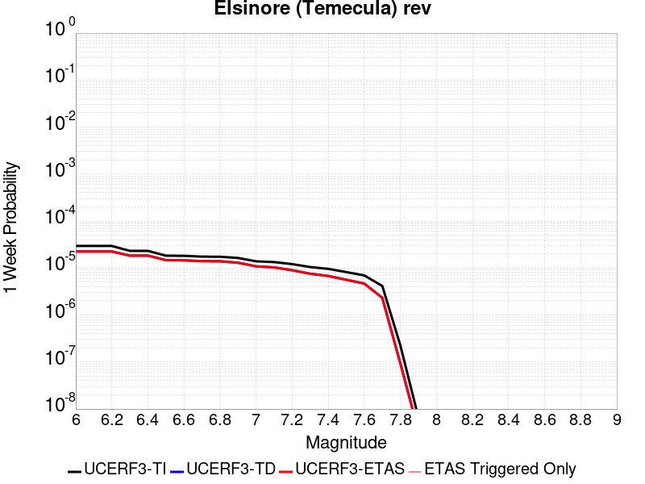 | 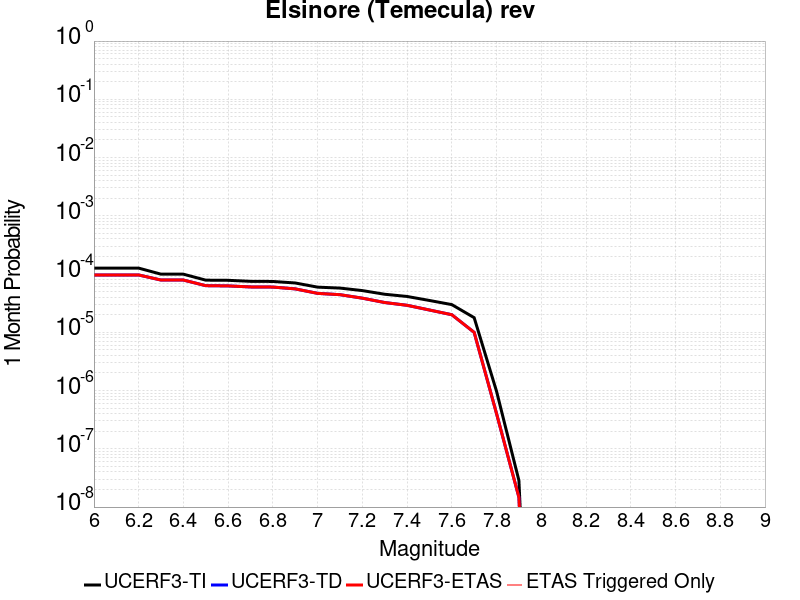 | 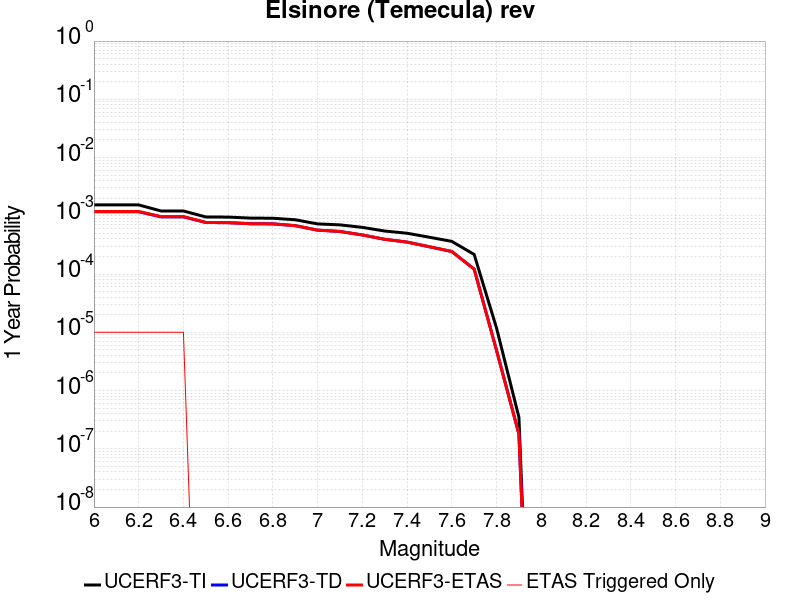 | 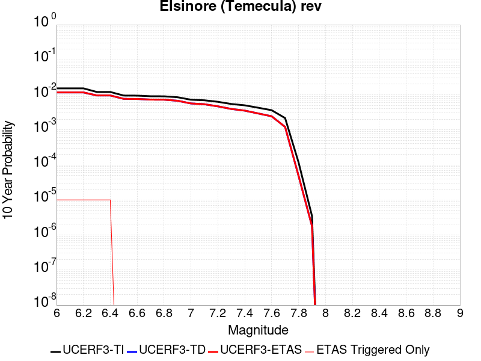 |

| Magnitude | 1 wk TI Prob | 1 wk TD Prob | 1 wk ETAS Prob | 1 wk ETAS/TD Gain | 1 wk ETAS Triggered Only | 1 mo TI Prob | 1 mo TD Prob | 1 mo ETAS Prob | 1 mo ETAS/TD Gain | 1 mo ETAS Triggered Only | 1 yr TI Prob | 1 yr TD Prob | 1 yr ETAS Prob | 1 yr ETAS/TD Gain | 1 yr ETAS Triggered Only | 10 yr TI Prob | 10 yr TD Prob | 10 yr ETAS Prob | 10 yr ETAS/TD Gain | 10 yr ETAS Triggered Only |
|-----|-----|-----|-----|-----|-----|-----|-----|-----|-----|-----|-----|-----|-----|-----|-----|-----|-----|-----|-----|-----|
| 6.0 | 2.9514995E-5 | 2.2518343E-5 | 2.2518343E-5 | 1.0 | 0.0 | 1.264867E-4 | 9.650374E-5 | 9.650374E-5 | 1.0 | 0.0 | 0.0015388876 | 0.001174322 | 0.0011843103 | 1.0085056 | 1.0E-5 | 0.015282745 | 0.011697536 | 0.0117074195 | 1.0008448 | 1.0E-5 |
| 6.1 | 2.9514995E-5 | 2.2518343E-5 | 2.2518343E-5 | 1.0 | 0.0 | 1.264867E-4 | 9.650374E-5 | 9.650374E-5 | 1.0 | 0.0 | 0.0015388876 | 0.001174322 | 0.0011843103 | 1.0085056 | 1.0E-5 | 0.015282745 | 0.011697536 | 0.0117074195 | 1.0008448 | 1.0E-5 |
| 6.2 | 2.9514995E-5 | 2.2518343E-5 | 2.2518343E-5 | 1.0 | 0.0 | 1.264867E-4 | 9.650374E-5 | 9.650374E-5 | 1.0 | 0.0 | 0.0015388876 | 0.001174322 | 0.0011843103 | 1.0085056 | 1.0E-5 | 0.015282745 | 0.011697536 | 0.0117074195 | 1.0008448 | 1.0E-5 |
| 6.3 | 2.3223649E-5 | 1.8407327E-5 | 1.8407327E-5 | 1.0 | 0.0 | 9.952613E-5 | 7.888625E-5 | 7.888625E-5 | 1.0 | 0.0 | 0.001211057 | 9.6003426E-4 | 9.700246E-4 | 1.0104063 | 1.0E-5 | 0.012044783 | 0.009570387 | 0.009580291 | 1.0010349 | 1.0E-5 |
| 6.4 | 2.3223649E-5 | 1.8407327E-5 | 1.8407327E-5 | 1.0 | 0.0 | 9.952613E-5 | 7.888625E-5 | 7.888625E-5 | 1.0 | 0.0 | 0.001211057 | 9.6003426E-4 | 9.700246E-4 | 1.0104063 | 1.0E-5 | 0.012044783 | 0.009570387 | 0.009580291 | 1.0010349 | 1.0E-5 |
| 6.5 | 1.8338875E-5 | 1.4750731E-5 | 1.4750731E-5 | 1.0 | 0.0 | 7.8592806E-5 | 6.3215935E-5 | 6.3215935E-5 | 1.0 | 0.0 | 9.5644733E-4 | 7.6939096E-4 | 7.6939096E-4 | 1.0 | 0.0 | 0.009523412 | 0.007674229 | 0.007674229 | 1.0 | 0.0 |
| 6.6 | 1.8223333E-5 | 1.46132825E-5 | 1.46132825E-5 | 1.0 | 0.0 | 7.809766E-5 | 6.26269E-5 | 6.26269E-5 | 1.0 | 0.0 | 9.504242E-4 | 7.6222455E-4 | 7.6222455E-4 | 1.0 | 0.0 | 0.009463696 | 0.0076030563 | 0.0076030563 | 1.0 | 0.0 |
| 6.7 | 1.7512752E-5 | 1.4027789E-5 | 1.4027789E-5 | 1.0 | 0.0 | 7.505249E-5 | 6.011776E-5 | 6.011776E-5 | 1.0 | 0.0 | 9.13381E-4 | 7.316965E-4 | 7.316965E-4 | 1.0 | 0.0 | 0.00909636 | 0.0072992197 | 0.0072992197 | 1.0 | 0.0 |
| 6.8 | 1.7417142E-5 | 1.3951771E-5 | 1.3951771E-5 | 1.0 | 0.0 | 7.4642754E-5 | 5.979198E-5 | 5.979198E-5 | 1.0 | 0.0 | 9.083966E-4 | 7.277328E-4 | 7.277328E-4 | 1.0 | 0.0 | 0.009046922 | 0.0072597866 | 0.0072597866 | 1.0 | 0.0 |
| 6.9 | 1.6402591E-5 | 1.2989167E-5 | 1.2989167E-5 | 1.0 | 0.0 | 7.0294926E-5 | 5.5666715E-5 | 5.5666715E-5 | 1.0 | 0.0 | 8.5550465E-4 | 6.7753915E-4 | 6.7753915E-4 | 1.0 | 0.0 | 0.008522186 | 0.006760456 | 0.006760456 | 1.0 | 0.0 |
| 7.0 | 1.3912486E-5 | 1.0878723E-5 | 1.0878723E-5 | 1.0 | 0.0 | 5.9623577E-5 | 4.6622277E-5 | 4.6622277E-5 | 1.0 | 0.0 | 7.2567526E-4 | 5.674811E-4 | 5.674811E-4 | 1.0 | 0.0 | 0.0072331014 | 0.005664239 | 0.005664239 | 1.0 | 0.0 |
| 7.1 | 1.3405147E-5 | 1.0327884E-5 | 1.0327884E-5 | 1.0 | 0.0 | 5.7449364E-5 | 4.4261626E-5 | 4.4261626E-5 | 1.0 | 0.0 | 6.9922156E-4 | 5.387546E-4 | 5.387546E-4 | 1.0 | 0.0 | 0.0069702556 | 0.0053778174 | 0.0053778174 | 1.0 | 0.0 |
| 7.2 | 1.21402E-5 | 8.99712E-6 | 8.99712E-6 | 1.0 | 0.0 | 5.202839E-5 | 3.8558526E-5 | 3.8558526E-5 | 1.0 | 0.0 | 6.332616E-4 | 4.693507E-4 | 4.693507E-4 | 1.0 | 0.0 | 0.0063146 | 0.0046850196 | 0.0046850196 | 1.0 | 0.0 |
| 7.3 | 1.05047775E-5 | 7.572085E-6 | 7.572085E-6 | 1.0 | 0.0 | 4.5019697E-5 | 3.2451397E-5 | 3.2451397E-5 | 1.0 | 0.0 | 5.4797693E-4 | 3.950256E-4 | 3.950256E-4 | 1.0 | 0.0 | 0.005466277 | 0.0039436235 | 0.0039436235 | 1.0 | 0.0 |
| 7.4 | 9.624483E-6 | 6.7871442E-6 | 6.7871442E-6 | 1.0 | 0.0 | 4.124713E-5 | 2.9087445E-5 | 2.9087445E-5 | 1.0 | 0.0 | 5.0206814E-4 | 3.540835E-4 | 3.540835E-4 | 1.0 | 0.0 | 0.005009353 | 0.003535347 | 0.003535347 | 1.0 | 0.0 |
| 7.5 | 8.215151E-6 | 5.635765E-6 | 5.635765E-6 | 1.0 | 0.0 | 3.5207315E-5 | 2.4153062E-5 | 2.4153062E-5 | 1.0 | 0.0 | 4.2856473E-4 | 2.940251E-4 | 2.940251E-4 | 1.0 | 0.0 | 0.004277392 | 0.002936489 | 0.002936489 | 1.0 | 0.0 |
| 7.6 | 6.975058E-6 | 4.6762393E-6 | 4.6762393E-6 | 1.0 | 0.0 | 2.9892764E-5 | 2.0040878E-5 | 2.0040878E-5 | 1.0 | 0.0 | 3.6388362E-4 | 2.4397153E-4 | 2.4397153E-4 | 1.0 | 0.0 | 0.0036328835 | 0.0024371531 | 0.0024371531 | 1.0 | 0.0 |
| 7.7 | 4.159604E-6 | 2.3271057E-6 | 2.3271057E-6 | 1.0 | 0.0 | 1.7826753E-5 | 9.973276E-6 | 9.973276E-6 | 1.0 | 0.0 | 2.1701909E-4 | 1.2141861E-4 | 1.2141861E-4 | 1.0 | 0.0 | 0.0021680726 | 0.0012135957 | 0.0012135957 | 1.0 | 0.0 |
| 7.8 | 2.2692414E-7 | 9.385943E-8 | 9.385943E-8 | 1.0 | 0.0 | 9.725317E-7 | 4.0225464E-7 | 4.0225464E-7 | 1.0 | 0.0 | 1.1840509E-5 | 4.8974425E-6 | 4.8974425E-6 | 1.0 | 0.0 | 1.1839878E-4 | 4.8973674E-5 | 4.8973674E-5 | 1.0 | 0.0 |
| 7.9 | 6.676829E-9 | 3.4399772E-9 | 3.4399772E-9 | 1.0 | 0.0 | 2.861498E-8 | 1.4742759E-8 | 1.4742759E-8 | 1.0 | 0.0 | 3.4838732E-7 | 1.7949307E-7 | 1.7949307E-7 | 1.0 | 0.0 | 3.4838679E-6 | 1.7949295E-6 | 1.7949295E-6 | 1.0 | 0.0 |

## Little Salmon (Offshore)
*[(top)](#table-of-contents)*

| 1 Week | 1 Month | 1 Year | 10 Year |
|-----|-----|-----|-----|
| 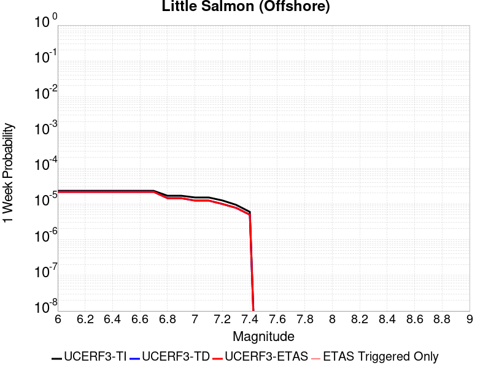 | 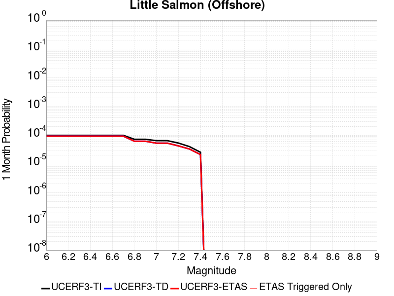 | 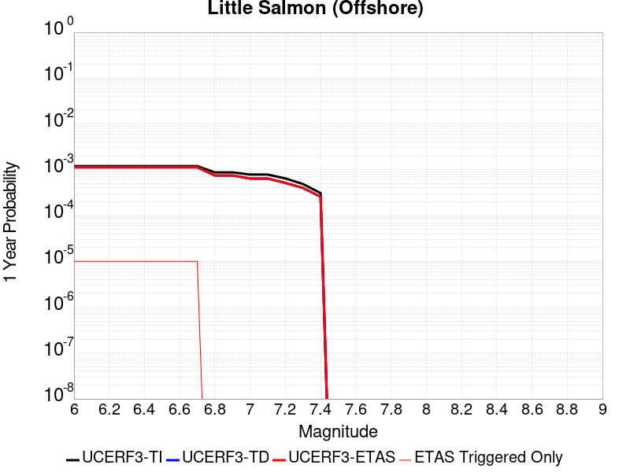 | 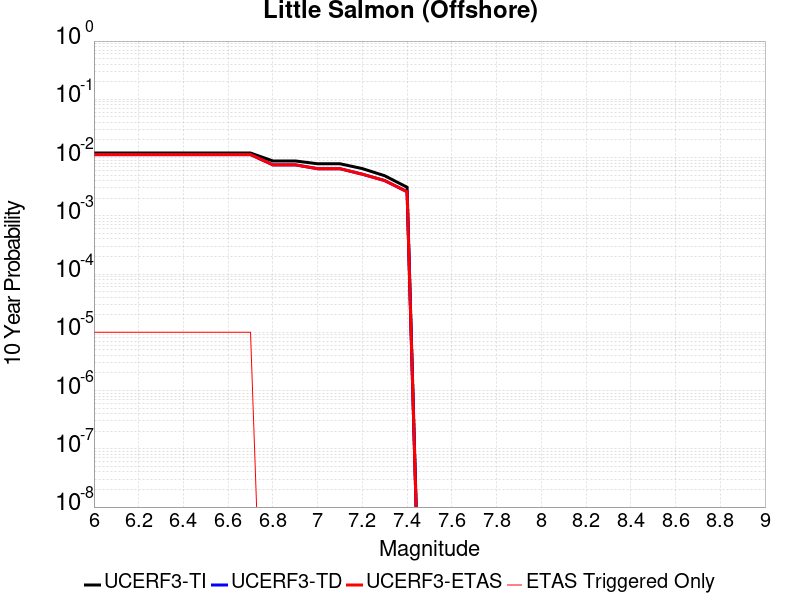 |

| Magnitude | 1 wk TI Prob | 1 wk TD Prob | 1 wk ETAS Prob | 1 wk ETAS/TD Gain | 1 wk ETAS Triggered Only | 1 mo TI Prob | 1 mo TD Prob | 1 mo ETAS Prob | 1 mo ETAS/TD Gain | 1 mo ETAS Triggered Only | 1 yr TI Prob | 1 yr TD Prob | 1 yr ETAS Prob | 1 yr ETAS/TD Gain | 1 yr ETAS Triggered Only | 10 yr TI Prob | 10 yr TD Prob | 10 yr ETAS Prob | 10 yr ETAS/TD Gain | 10 yr ETAS Triggered Only |
|-----|-----|-----|-----|-----|-----|-----|-----|-----|-----|-----|-----|-----|-----|-----|-----|-----|-----|-----|-----|-----|
| 6.0 | 2.3052053E-5 | 2.1606404E-5 | 2.1606404E-5 | 1.0 | 0.0 | 9.879077E-5 | 9.259624E-5 | 9.259624E-5 | 1.0 | 0.0 | 0.0012021139 | 0.001126891 | 0.0011368798 | 1.0088639 | 1.0E-5 | 0.011956319 | 0.011244767 | 0.011254654 | 1.0008793 | 1.0E-5 |
| 6.1 | 2.3052053E-5 | 2.1606404E-5 | 2.1606404E-5 | 1.0 | 0.0 | 9.879077E-5 | 9.259624E-5 | 9.259624E-5 | 1.0 | 0.0 | 0.0012021139 | 0.001126891 | 0.0011368798 | 1.0088639 | 1.0E-5 | 0.011956319 | 0.011244767 | 0.011254654 | 1.0008793 | 1.0E-5 |
| 6.2 | 2.3052053E-5 | 2.1606404E-5 | 2.1606404E-5 | 1.0 | 0.0 | 9.879077E-5 | 9.259624E-5 | 9.259624E-5 | 1.0 | 0.0 | 0.0012021139 | 0.001126891 | 0.0011368798 | 1.0088639 | 1.0E-5 | 0.011956319 | 0.011244767 | 0.011254654 | 1.0008793 | 1.0E-5 |
| 6.3 | 2.3052053E-5 | 2.1606404E-5 | 2.1606404E-5 | 1.0 | 0.0 | 9.879077E-5 | 9.259624E-5 | 9.259624E-5 | 1.0 | 0.0 | 0.0012021139 | 0.001126891 | 0.0011368798 | 1.0088639 | 1.0E-5 | 0.011956319 | 0.011244767 | 0.011254654 | 1.0008793 | 1.0E-5 |
| 6.4 | 2.3052053E-5 | 2.1606404E-5 | 2.1606404E-5 | 1.0 | 0.0 | 9.879077E-5 | 9.259624E-5 | 9.259624E-5 | 1.0 | 0.0 | 0.0012021139 | 0.001126891 | 0.0011368798 | 1.0088639 | 1.0E-5 | 0.011956319 | 0.011244767 | 0.011254654 | 1.0008793 | 1.0E-5 |
| 6.5 | 2.3052053E-5 | 2.1606404E-5 | 2.1606404E-5 | 1.0 | 0.0 | 9.879077E-5 | 9.259624E-5 | 9.259624E-5 | 1.0 | 0.0 | 0.0012021139 | 0.001126891 | 0.0011368798 | 1.0088639 | 1.0E-5 | 0.011956319 | 0.011244767 | 0.011254654 | 1.0008793 | 1.0E-5 |
| 6.6 | 2.3052053E-5 | 2.1606404E-5 | 2.1606404E-5 | 1.0 | 0.0 | 9.879077E-5 | 9.259624E-5 | 9.259624E-5 | 1.0 | 0.0 | 0.0012021139 | 0.001126891 | 0.0011368798 | 1.0088639 | 1.0E-5 | 0.011956319 | 0.011244767 | 0.011254654 | 1.0008793 | 1.0E-5 |
| 6.7 | 2.3052053E-5 | 2.1606404E-5 | 2.1606404E-5 | 1.0 | 0.0 | 9.879077E-5 | 9.259624E-5 | 9.259624E-5 | 1.0 | 0.0 | 0.0012021139 | 0.001126891 | 0.0011368798 | 1.0088639 | 1.0E-5 | 0.011956319 | 0.011244767 | 0.011254654 | 1.0008793 | 1.0E-5 |
| 6.8 | 1.683878E-5 | 1.4385507E-5 | 1.4385507E-5 | 1.0 | 0.0 | 7.21642E-5 | 6.1651E-5 | 6.1651E-5 | 1.0 | 0.0 | 8.78245E-4 | 7.503934E-4 | 7.503934E-4 | 1.0 | 0.0 | 0.008747822 | 0.007505349 | 0.007505349 | 1.0 | 0.0 |
| 6.9 | 1.683878E-5 | 1.4385507E-5 | 1.4385507E-5 | 1.0 | 0.0 | 7.21642E-5 | 6.1651E-5 | 6.1651E-5 | 1.0 | 0.0 | 8.78245E-4 | 7.503934E-4 | 7.503934E-4 | 1.0 | 0.0 | 0.008747822 | 0.007505349 | 0.007505349 | 1.0 | 0.0 |
| 7.0 | 1.5051273E-5 | 1.23335085E-5 | 1.23335085E-5 | 1.0 | 0.0 | 6.450386E-5 | 5.285708E-5 | 5.285708E-5 | 1.0 | 0.0 | 7.8505155E-4 | 6.4339093E-4 | 6.4339093E-4 | 1.0 | 0.0 | 0.00782284 | 0.0064415596 | 0.0064415596 | 1.0 | 0.0 |
| 7.1 | 1.5051273E-5 | 1.23335085E-5 | 1.23335085E-5 | 1.0 | 0.0 | 6.450386E-5 | 5.285708E-5 | 5.285708E-5 | 1.0 | 0.0 | 7.8505155E-4 | 6.4339093E-4 | 6.4339093E-4 | 1.0 | 0.0 | 0.00782284 | 0.0064415596 | 0.0064415596 | 1.0 | 0.0 |
| 7.2 | 1.24301405E-5 | 9.903233E-6 | 9.903233E-6 | 1.0 | 0.0 | 5.3270942E-5 | 4.2441963E-5 | 4.2441963E-5 | 1.0 | 0.0 | 6.483807E-4 | 5.166484E-4 | 5.166484E-4 | 1.0 | 0.0 | 0.006464922 | 0.005179878 | 0.005179878 | 1.0 | 0.0 |
| 7.3 | 9.3599865E-6 | 7.695378E-6 | 7.695378E-6 | 1.0 | 0.0 | 4.011361E-5 | 3.2979977E-5 | 3.2979977E-5 | 1.0 | 0.0 | 4.8827377E-4 | 4.014929E-4 | 4.014929E-4 | 1.0 | 0.0 | 0.004872023 | 0.0040243445 | 0.0040243445 | 1.0 | 0.0 |
| 7.4 | 5.941556E-6 | 4.9514347E-6 | 4.9514347E-6 | 1.0 | 0.0 | 2.5463563E-5 | 2.1220434E-5 | 2.1220434E-5 | 1.0 | 0.0 | 3.0997477E-4 | 2.5835878E-4 | 2.5835878E-4 | 1.0 | 0.0 | 0.0030954275 | 0.0025921175 | 0.0025921175 | 1.0 | 0.0 |

## Fitzhugh Creek
*[(top)](#table-of-contents)*

| 1 Week | 1 Month | 1 Year | 10 Year |
|-----|-----|-----|-----|
| 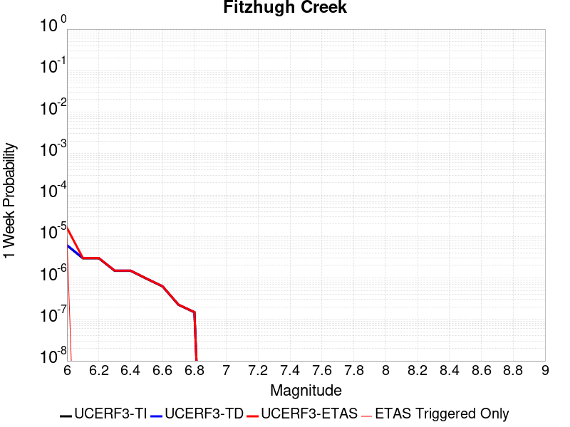 |  |  |  |

| Magnitude | 1 wk TI Prob | 1 wk TD Prob | 1 wk ETAS Prob | 1 wk ETAS/TD Gain | 1 wk ETAS Triggered Only | 1 mo TI Prob | 1 mo TD Prob | 1 mo ETAS Prob | 1 mo ETAS/TD Gain | 1 mo ETAS Triggered Only | 1 yr TI Prob | 1 yr TD Prob | 1 yr ETAS Prob | 1 yr ETAS/TD Gain | 1 yr ETAS Triggered Only | 10 yr TI Prob | 10 yr TD Prob | 10 yr ETAS Prob | 10 yr ETAS/TD Gain | 10 yr ETAS Triggered Only |
|-----|-----|-----|-----|-----|-----|-----|-----|-----|-----|-----|-----|-----|-----|-----|-----|-----|-----|-----|-----|-----|
| 6.0 | 6.1090436E-6 | 6.21017E-6 | 1.6210108E-5 | 2.610252 | 1.0E-5 | 2.6181353E-5 | 2.6614767E-5 | 3.66145E-5 | 1.3757212 | 1.0E-5 | 3.1871133E-4 | 3.2399112E-4 | 3.3398787E-4 | 1.0308551 | 1.0E-5 | 0.0031825465 | 0.0032356316 | 0.0032455993 | 1.0030806 | 1.0E-5 |
| 6.1 | 2.9741811E-6 | 3.0215874E-6 | 3.0215874E-6 | 1.0 | 0.0 | 1.2746428E-5 | 1.2949601E-5 | 1.2949601E-5 | 1.0 | 0.0 | 1.5517672E-4 | 1.5765094E-4 | 1.5765094E-4 | 1.0 | 0.0 | 0.001550684 | 0.0015754839 | 0.0015754839 | 1.0 | 0.0 |
| 6.2 | 2.9741811E-6 | 3.0215874E-6 | 3.0215874E-6 | 1.0 | 0.0 | 1.2746428E-5 | 1.2949601E-5 | 1.2949601E-5 | 1.0 | 0.0 | 1.5517672E-4 | 1.5765094E-4 | 1.5765094E-4 | 1.0 | 0.0 | 0.001550684 | 0.0015754839 | 0.0015754839 | 1.0 | 0.0 |
| 6.3 | 1.4781198E-6 | 1.501274E-6 | 1.501274E-6 | 1.0 | 0.0 | 6.3347834E-6 | 6.4340165E-6 | 6.4340165E-6 | 1.0 | 0.0 | 7.712326E-5 | 7.833154E-5 | 7.833154E-5 | 1.0 | 0.0 | 7.70965E-4 | 7.830592E-4 | 7.830592E-4 | 1.0 | 0.0 |
| 6.4 | 1.4781198E-6 | 1.501274E-6 | 1.501274E-6 | 1.0 | 0.0 | 6.3347834E-6 | 6.4340165E-6 | 6.4340165E-6 | 1.0 | 0.0 | 7.712326E-5 | 7.833154E-5 | 7.833154E-5 | 1.0 | 0.0 | 7.70965E-4 | 7.830592E-4 | 7.830592E-4 | 1.0 | 0.0 |
| 6.5 | 9.5176676E-7 | 9.66608E-7 | 9.66608E-7 | 1.0 | 0.0 | 4.078994E-6 | 4.1425997E-6 | 4.1425997E-6 | 1.0 | 0.0 | 4.9660623E-5 | 5.043509E-5 | 5.043509E-5 | 1.0 | 0.0 | 4.964952E-4 | 5.0424685E-4 | 5.0424685E-4 | 1.0 | 0.0 |
| 6.6 | 6.21145E-7 | 6.3085986E-7 | 6.3085986E-7 | 1.0 | 0.0 | 2.662047E-6 | 2.7036829E-6 | 2.7036829E-6 | 1.0 | 0.0 | 3.2409942E-5 | 3.291691E-5 | 3.291691E-5 | 1.0 | 0.0 | 3.2405215E-4 | 3.291269E-4 | 3.291269E-4 | 1.0 | 0.0 |
| 6.7 | 2.2377962E-7 | 2.2734685E-7 | 2.2734685E-7 | 1.0 | 0.0 | 9.590551E-7 | 9.743434E-7 | 9.743434E-7 | 1.0 | 0.0 | 1.1676434E-5 | 1.18625985E-5 | 1.18625985E-5 | 1.0 | 0.0 | 1.1675821E-4 | 1.1862279E-4 | 1.1862279E-4 | 1.0 | 0.0 |
| 6.8 | 1.4785022E-7 | 1.5021524E-7 | 1.5021524E-7 | 1.0 | 0.0 | 6.3364365E-7 | 6.4377963E-7 | 6.4377963E-7 | 1.0 | 0.0 | 7.714584E-6 | 7.838016E-6 | 7.838016E-6 | 1.0 | 0.0 | 7.714316E-5 | 7.8380166E-5 | 7.8380166E-5 | 1.0 | 0.0 |

## Northridge
*[(top)](#table-of-contents)*

| 1 Week | 1 Month | 1 Year | 10 Year |
|-----|-----|-----|-----|
| 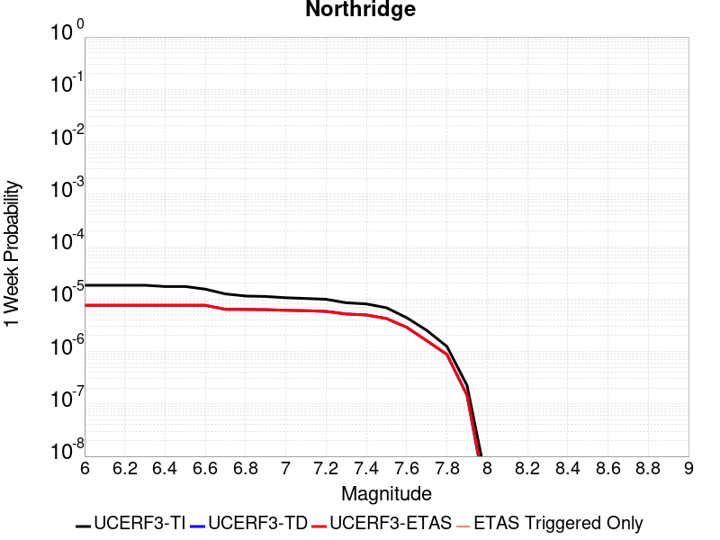 |  | 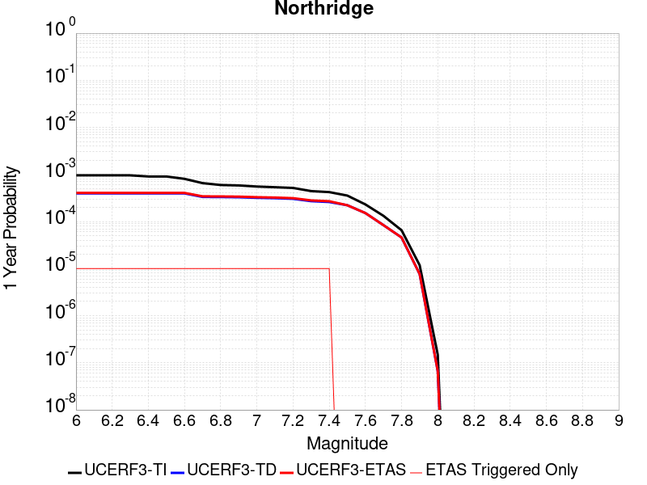 | 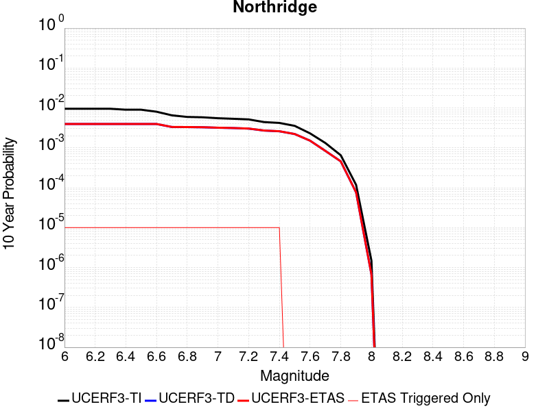 |

| Magnitude | 1 wk TI Prob | 1 wk TD Prob | 1 wk ETAS Prob | 1 wk ETAS/TD Gain | 1 wk ETAS Triggered Only | 1 mo TI Prob | 1 mo TD Prob | 1 mo ETAS Prob | 1 mo ETAS/TD Gain | 1 mo ETAS Triggered Only | 1 yr TI Prob | 1 yr TD Prob | 1 yr ETAS Prob | 1 yr ETAS/TD Gain | 1 yr ETAS Triggered Only | 10 yr TI Prob | 10 yr TD Prob | 10 yr ETAS Prob | 10 yr ETAS/TD Gain | 10 yr ETAS Triggered Only |
|-----|-----|-----|-----|-----|-----|-----|-----|-----|-----|-----|-----|-----|-----|-----|-----|-----|-----|-----|-----|-----|
| 6.0 | 1.8340852E-5 | 7.5881535E-6 | 7.5881535E-6 | 1.0 | 0.0 | 7.860128E-5 | 3.2520264E-5 | 3.2520264E-5 | 1.0 | 0.0 | 9.565505E-4 | 3.9586448E-4 | 4.0586054E-4 | 1.0252512 | 1.0E-5 | 0.009524435 | 0.003951816 | 0.0039617764 | 1.0025204 | 1.0E-5 |
| 6.1 | 1.8340852E-5 | 7.5881535E-6 | 7.5881535E-6 | 1.0 | 0.0 | 7.860128E-5 | 3.2520264E-5 | 3.2520264E-5 | 1.0 | 0.0 | 9.565505E-4 | 3.9586448E-4 | 4.0586054E-4 | 1.0252512 | 1.0E-5 | 0.009524435 | 0.003951816 | 0.0039617764 | 1.0025204 | 1.0E-5 |
| 6.2 | 1.8340852E-5 | 7.5881535E-6 | 7.5881535E-6 | 1.0 | 0.0 | 7.860128E-5 | 3.2520264E-5 | 3.2520264E-5 | 1.0 | 0.0 | 9.565505E-4 | 3.9586448E-4 | 4.0586054E-4 | 1.0252512 | 1.0E-5 | 0.009524435 | 0.003951816 | 0.0039617764 | 1.0025204 | 1.0E-5 |
| 6.3 | 1.8340852E-5 | 7.5881535E-6 | 7.5881535E-6 | 1.0 | 0.0 | 7.860128E-5 | 3.2520264E-5 | 3.2520264E-5 | 1.0 | 0.0 | 9.565505E-4 | 3.9586448E-4 | 4.0586054E-4 | 1.0252512 | 1.0E-5 | 0.009524435 | 0.003951816 | 0.0039617764 | 1.0025204 | 1.0E-5 |
| 6.4 | 1.7361892E-5 | 7.5881535E-6 | 7.5881535E-6 | 1.0 | 0.0 | 7.440598E-5 | 3.2520264E-5 | 3.2520264E-5 | 1.0 | 0.0 | 9.055163E-4 | 3.9586448E-4 | 4.0586054E-4 | 1.0252512 | 1.0E-5 | 0.009018354 | 0.003951816 | 0.0039617764 | 1.0025204 | 1.0E-5 |
| 6.5 | 1.7361892E-5 | 7.5881535E-6 | 7.5881535E-6 | 1.0 | 0.0 | 7.440598E-5 | 3.2520264E-5 | 3.2520264E-5 | 1.0 | 0.0 | 9.055163E-4 | 3.9586448E-4 | 4.0586054E-4 | 1.0252512 | 1.0E-5 | 0.009018354 | 0.003951816 | 0.0039617764 | 1.0025204 | 1.0E-5 |
| 6.6 | 1.5458201E-5 | 7.5881535E-6 | 7.5881535E-6 | 1.0 | 0.0 | 6.624775E-5 | 3.2520264E-5 | 3.2520264E-5 | 1.0 | 0.0 | 8.0626784E-4 | 3.9586448E-4 | 4.0586054E-4 | 1.0252512 | 1.0E-5 | 0.008033488 | 0.003951816 | 0.0039617764 | 1.0025204 | 1.0E-5 |
| 6.7 | 1.2538368E-5 | 6.381707E-6 | 6.381707E-6 | 1.0 | 0.0 | 5.3734755E-5 | 2.7349888E-5 | 2.7349888E-5 | 1.0 | 0.0 | 6.5402425E-4 | 3.3293446E-4 | 3.4293113E-4 | 1.030026 | 1.0E-5 | 0.0065210275 | 0.0033244046 | 0.0033343714 | 1.0029981 | 1.0E-5 |
| 6.8 | 1.1438097E-5 | 6.3503594E-6 | 6.3503594E-6 | 1.0 | 0.0 | 4.9019498E-5 | 2.7215545E-5 | 2.7215545E-5 | 1.0 | 0.0 | 5.9664896E-4 | 3.3129932E-4 | 3.41296E-4 | 1.0301741 | 1.0E-5 | 0.005950495 | 0.003308102 | 0.0033180688 | 1.0030129 | 1.0E-5 |
| 6.9 | 1.1204891E-5 | 6.2868094E-6 | 6.2868094E-6 | 1.0 | 0.0 | 4.8020076E-5 | 2.6943193E-5 | 2.6943193E-5 | 1.0 | 0.0 | 5.8448757E-4 | 3.2798442E-4 | 3.3798115E-4 | 1.0304793 | 1.0E-5 | 0.0058295266 | 0.0032750512 | 0.0032850185 | 1.0030434 | 1.0E-5 |
| 7.0 | 1.061046E-5 | 6.1154565E-6 | 6.1154565E-6 | 1.0 | 0.0 | 4.5472607E-5 | 2.6208838E-5 | 2.6208838E-5 | 1.0 | 0.0 | 5.534883E-4 | 3.1904632E-4 | 3.290431E-4 | 1.0313334 | 1.0E-5 | 0.0055211177 | 0.003185929 | 0.0031958972 | 1.0031288 | 1.0E-5 |
| 7.1 | 1.0266979E-5 | 6.0043685E-6 | 6.0043685E-6 | 1.0 | 0.0 | 4.40006E-5 | 2.5732756E-5 | 2.5732756E-5 | 1.0 | 0.0 | 5.355756E-4 | 3.132517E-4 | 3.2324856E-4 | 1.0319132 | 1.0E-5 | 0.0053428668 | 0.0031281472 | 0.0031381159 | 1.0031868 | 1.0E-5 |
| 7.2 | 9.91273E-6 | 5.820076E-6 | 5.820076E-6 | 1.0 | 0.0 | 4.248244E-5 | 2.4942945E-5 | 2.4942945E-5 | 1.0 | 0.0 | 5.171009E-4 | 3.0363846E-4 | 3.1363542E-4 | 1.0329239 | 1.0E-5 | 0.0051589934 | 0.003032281 | 0.0030422506 | 1.0032878 | 1.0E-5 |
| 7.3 | 8.4959265E-6 | 5.1931415E-6 | 5.1931415E-6 | 1.0 | 0.0 | 3.6410605E-5 | 2.2256132E-5 | 2.2256132E-5 | 1.0 | 0.0 | 4.4320893E-4 | 2.7093495E-4 | 2.8093223E-4 | 1.0368992 | 1.0E-5 | 0.00442326 | 0.0027060728 | 0.0027160458 | 1.0036854 | 1.0E-5 |
| 7.4 | 8.0847185E-6 | 4.9820114E-6 | 4.9820114E-6 | 1.0 | 0.0 | 3.4648332E-5 | 2.1351305E-5 | 2.1351305E-5 | 1.0 | 0.0 | 4.2176177E-4 | 2.5992136E-4 | 2.6991876E-4 | 1.0384631 | 1.0E-5 | 0.0042096223 | 0.0025961995 | 0.0026061735 | 1.0038418 | 1.0E-5 |
| 7.5 | 6.8220684E-6 | 4.2533693E-6 | 4.2533693E-6 | 1.0 | 0.0 | 2.9237108E-5 | 1.8228598E-5 | 1.8228598E-5 | 1.0 | 0.0 | 3.5590364E-4 | 2.2191078E-4 | 2.2191078E-4 | 1.0 | 0.0 | 0.0035533418 | 0.0022169128 | 0.0022169128 | 1.0 | 0.0 |
| 7.6 | 4.4224143E-6 | 2.8999916E-6 | 2.8999916E-6 | 1.0 | 0.0 | 1.8953066E-5 | 1.2428477E-5 | 1.2428477E-5 | 1.0 | 0.0 | 2.3072914E-4 | 1.5130632E-4 | 1.5130632E-4 | 1.0 | 0.0 | 0.0023048974 | 0.0015120446 | 0.0015120446 | 1.0 | 0.0 |
| 7.7 | 2.5297056E-6 | 1.6046072E-6 | 1.6046072E-6 | 1.0 | 0.0 | 1.0841551E-5 | 6.87687E-6 | 6.87687E-6 | 1.0 | 0.0 | 1.319879E-4 | 8.372273E-5 | 8.372273E-5 | 1.0 | 0.0 | 0.0013190953 | 8.3691656E-4 | 8.3691656E-4 | 1.0 | 0.0 |
| 7.8 | 1.2508156E-6 | 8.78015E-7 | 8.78015E-7 | 1.0 | 0.0 | 5.3606273E-6 | 3.7629159E-6 | 3.7629159E-6 | 1.0 | 0.0 | 6.526368E-5 | 4.581255E-5 | 4.581255E-5 | 1.0 | 0.0 | 6.524452E-4 | 4.5803236E-4 | 4.5803236E-4 | 1.0 | 0.0 |
| 7.9 | 2.262199E-7 | 1.4664893E-7 | 1.4664893E-7 | 1.0 | 0.0 | 9.695135E-7 | 6.2849523E-7 | 6.2849523E-7 | 1.0 | 0.0 | 1.1803763E-5 | 7.651904E-6 | 7.651904E-6 | 1.0 | 0.0 | 1.1803136E-4 | 7.651648E-5 | 7.651648E-5 | 1.0 | 0.0 |
| 8.0 | 2.865362E-9 | 1.2753953E-9 | 1.2753953E-9 | 1.0 | 0.0 | 1.2280123E-8 | 5.46598E-9 | 5.46598E-9 | 1.0 | 0.0 | 1.4951048E-7 | 6.654831E-8 | 6.654831E-8 | 1.0 | 0.0 | 1.4951038E-6 | 6.6548307E-7 | 6.6548307E-7 | 1.0 | 0.0 |

## Casmalia 2011 CFM
*[(top)](#table-of-contents)*

| 1 Week | 1 Month | 1 Year | 10 Year |
|-----|-----|-----|-----|
| 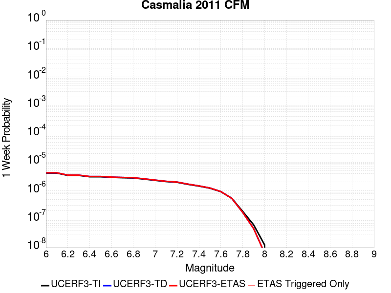 | 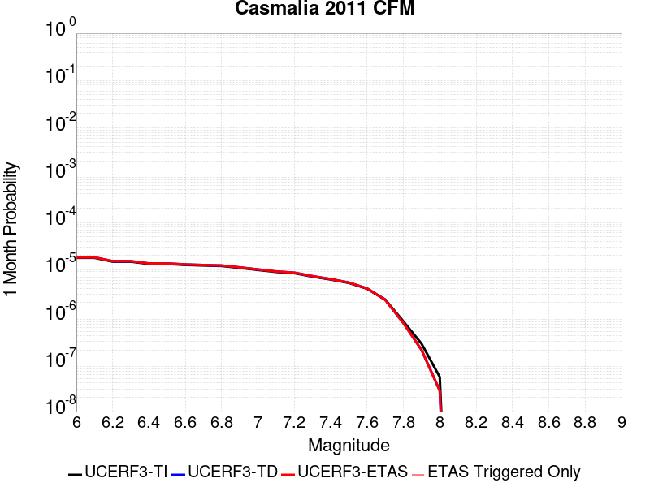 | 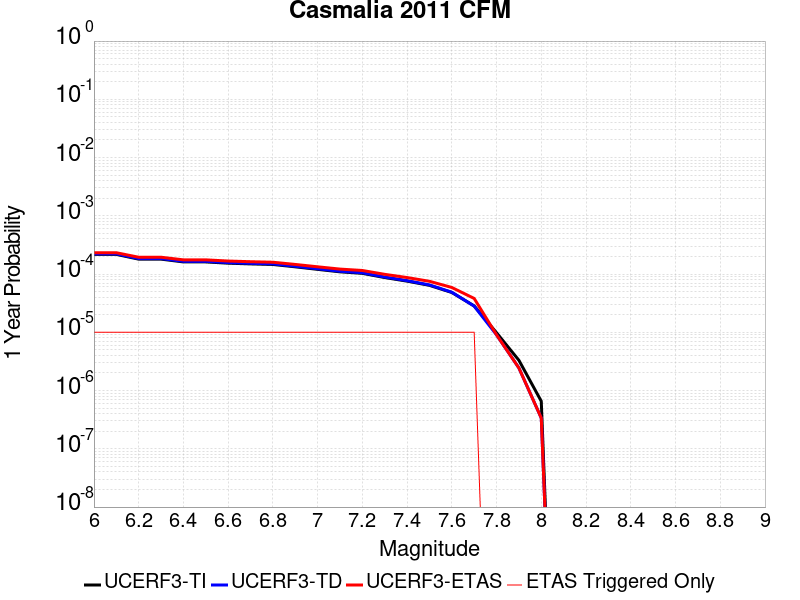 | 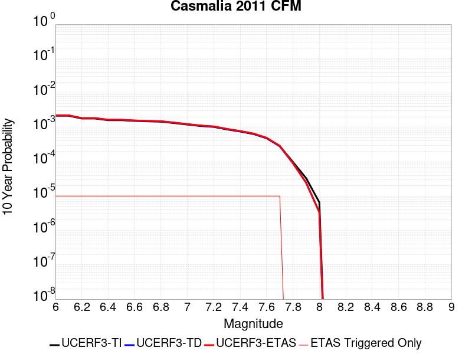 |

| Magnitude | 1 wk TI Prob | 1 wk TD Prob | 1 wk ETAS Prob | 1 wk ETAS/TD Gain | 1 wk ETAS Triggered Only | 1 mo TI Prob | 1 mo TD Prob | 1 mo ETAS Prob | 1 mo ETAS/TD Gain | 1 mo ETAS Triggered Only | 1 yr TI Prob | 1 yr TD Prob | 1 yr ETAS Prob | 1 yr ETAS/TD Gain | 1 yr ETAS Triggered Only | 10 yr TI Prob | 10 yr TD Prob | 10 yr ETAS Prob | 10 yr ETAS/TD Gain | 10 yr ETAS Triggered Only |
|-----|-----|-----|-----|-----|-----|-----|-----|-----|-----|-----|-----|-----|-----|-----|-----|-----|-----|-----|-----|-----|
| 6.0 | 4.1704893E-6 | 4.2625015E-6 | 4.2625015E-6 | 1.0 | 0.0 | 1.7873403E-5 | 1.8267738E-5 | 1.8267738E-5 | 1.0 | 0.0 | 2.1758694E-4 | 2.223872E-4 | 2.3238498E-4 | 1.0449566 | 1.0E-5 | 0.0021737402 | 0.0022216674 | 0.0022316454 | 1.0044911 | 1.0E-5 |
| 6.1 | 4.1704893E-6 | 4.2625015E-6 | 4.2625015E-6 | 1.0 | 0.0 | 1.7873403E-5 | 1.8267738E-5 | 1.8267738E-5 | 1.0 | 0.0 | 2.1758694E-4 | 2.223872E-4 | 2.3238498E-4 | 1.0449566 | 1.0E-5 | 0.0021737402 | 0.0022216674 | 0.0022316454 | 1.0044911 | 1.0E-5 |
| 6.2 | 3.457312E-6 | 3.5370388E-6 | 3.5370388E-6 | 1.0 | 0.0 | 1.4816967E-5 | 1.515865E-5 | 1.515865E-5 | 1.0 | 0.0 | 1.8038164E-4 | 1.8454103E-4 | 1.9453919E-4 | 1.0541785 | 1.0E-5 | 0.001802353 | 0.0018438873 | 0.0018538688 | 1.0054133 | 1.0E-5 |
| 6.3 | 3.457312E-6 | 3.5370388E-6 | 3.5370388E-6 | 1.0 | 0.0 | 1.4816967E-5 | 1.515865E-5 | 1.515865E-5 | 1.0 | 0.0 | 1.8038164E-4 | 1.8454103E-4 | 1.9453919E-4 | 1.0541785 | 1.0E-5 | 0.001802353 | 0.0018438873 | 0.0018538688 | 1.0054133 | 1.0E-5 |
| 6.4 | 3.0957337E-6 | 3.169242E-6 | 3.169242E-6 | 1.0 | 0.0 | 1.3267363E-5 | 1.3582395E-5 | 1.3582395E-5 | 1.0 | 0.0 | 1.6151817E-4 | 1.6535317E-4 | 1.7535151E-4 | 1.0604666 | 1.0E-5 | 0.0016140083 | 0.0016523075 | 0.001662291 | 1.0060421 | 1.0E-5 |
| 6.5 | 3.0957337E-6 | 3.169242E-6 | 3.169242E-6 | 1.0 | 0.0 | 1.3267363E-5 | 1.3582395E-5 | 1.3582395E-5 | 1.0 | 0.0 | 1.6151817E-4 | 1.6535317E-4 | 1.7535151E-4 | 1.0604666 | 1.0E-5 | 0.0016140083 | 0.0016523075 | 0.001662291 | 1.0060421 | 1.0E-5 |
| 6.6 | 2.9459152E-6 | 3.0165909E-6 | 3.0165909E-6 | 1.0 | 0.0 | 1.262529E-5 | 1.2928183E-5 | 1.2928183E-5 | 1.0 | 0.0 | 1.5370206E-4 | 1.5738931E-4 | 1.6738774E-4 | 1.0635267 | 1.0E-5 | 0.0015359579 | 0.001572784 | 0.0015827683 | 1.0063481 | 1.0E-5 |
| 6.7 | 2.8634809E-6 | 2.932488E-6 | 2.932488E-6 | 1.0 | 0.0 | 1.2272003E-5 | 1.2567746E-5 | 1.2567746E-5 | 1.0 | 0.0 | 1.4940138E-4 | 1.5300162E-4 | 1.6300009E-4 | 1.0653487 | 1.0E-5 | 0.0014930099 | 0.0015289682 | 0.0015389529 | 1.0065304 | 1.0E-5 |
| 6.8 | 2.7999822E-6 | 2.867612E-6 | 2.867612E-6 | 1.0 | 0.0 | 1.1999869E-5 | 1.2289708E-5 | 1.2289708E-5 | 1.0 | 0.0 | 1.460886E-4 | 1.4961697E-4 | 1.5961548E-4 | 1.0668273 | 1.0E-5 | 0.001459926 | 0.0014951678 | 0.0015051528 | 1.0066782 | 1.0E-5 |
| 6.9 | 2.551052E-6 | 2.6119794E-6 | 2.6119794E-6 | 1.0 | 0.0 | 1.0933034E-5 | 1.1194149E-5 | 1.1194149E-5 | 1.0 | 0.0 | 1.3310155E-4 | 1.3628029E-4 | 1.4627892E-4 | 1.0733682 | 1.0E-5 | 0.0013302186 | 0.0013619711 | 0.0013719575 | 1.0073323 | 1.0E-5 |
| 7.0 | 2.3081875E-6 | 2.3624225E-6 | 2.3624225E-6 | 1.0 | 0.0 | 9.892195E-6 | 1.0124629E-5 | 1.0124629E-5 | 1.0 | 0.0 | 1.20430814E-4 | 1.2326041E-4 | 1.3325918E-4 | 1.0811191 | 1.0E-5 | 0.0012036557 | 0.0012319232 | 0.001241911 | 1.0081074 | 1.0E-5 |
| 7.1 | 2.093245E-6 | 2.141737E-6 | 2.141737E-6 | 1.0 | 0.0 | 8.971019E-6 | 9.1788415E-6 | 9.1788415E-6 | 1.0 | 0.0 | 1.09216686E-4 | 1.1174668E-4 | 1.21745565E-4 | 1.0894781 | 1.0E-5 | 0.0010916302 | 0.0011169069 | 0.0011268958 | 1.0089433 | 1.0E-5 |
| 7.2 | 1.9714576E-6 | 2.0165214E-6 | 2.0165214E-6 | 1.0 | 0.0 | 8.449076E-6 | 8.642206E-6 | 8.642206E-6 | 1.0 | 0.0 | 1.0286264E-4 | 1.05213796E-4 | 1.15212744E-4 | 1.0950346 | 1.0E-5 | 0.0010281504 | 0.0010516418 | 0.0010616313 | 1.009499 | 1.0E-5 |
| 7.3 | 1.6689512E-6 | 1.7047241E-6 | 1.7047241E-6 | 1.0 | 0.0 | 7.1526288E-6 | 7.30594E-6 | 7.30594E-6 | 1.0 | 0.0 | 8.7079774E-5 | 8.8946195E-5 | 9.894531E-5 | 1.1124175 | 1.0E-5 | 8.7045657E-4 | 8.8910677E-4 | 8.990979E-4 | 1.0112373 | 1.0E-5 |
| 7.4 | 1.4490954E-6 | 1.4779009E-6 | 1.4779009E-6 | 1.0 | 0.0 | 6.210394E-6 | 6.3338457E-6 | 6.3338457E-6 | 1.0 | 0.0 | 7.560892E-5 | 7.711185E-5 | 8.7111075E-5 | 1.1296718 | 1.0E-5 | 7.55832E-4 | 7.7085156E-4 | 7.8084384E-4 | 1.0129627 | 1.0E-5 |
| 7.5 | 1.226873E-6 | 1.2481792E-6 | 1.2481792E-6 | 1.0 | 0.0 | 5.2580162E-6 | 5.3493286E-6 | 5.3493286E-6 | 1.0 | 0.0 | 6.401447E-5 | 6.5126136E-5 | 7.5125485E-5 | 1.1535382 | 1.0E-5 | 6.399603E-4 | 6.51071E-4 | 6.6106446E-4 | 1.0153493 | 1.0E-5 |
| 7.6 | 9.2561345E-7 | 9.3619997E-7 | 9.3619997E-7 | 1.0 | 0.0 | 3.966909E-6 | 4.012279E-6 | 4.012279E-6 | 1.0 | 0.0 | 4.8296046E-5 | 4.8848407E-5 | 5.884792E-5 | 1.204705 | 1.0E-5 | 4.828555E-4 | 4.883771E-4 | 4.9837225E-4 | 1.020466 | 1.0E-5 |
| 7.7 | 5.4367933E-7 | 5.392944E-7 | 5.392944E-7 | 1.0 | 0.0 | 2.3300522E-6 | 2.3112595E-6 | 2.3112595E-6 | 1.0 | 0.0 | 2.8368017E-5 | 2.8139224E-5 | 3.8138944E-5 | 1.3553659 | 1.0E-5 | 2.8364395E-4 | 2.8135674E-4 | 2.913539E-4 | 1.0355321 | 1.0E-5 |
| 7.8 | 1.8825742E-7 | 1.7342624E-7 | 1.7342624E-7 | 1.0 | 0.0 | 8.068173E-7 | 7.432551E-7 | 7.432551E-7 | 1.0 | 0.0 | 9.822956E-6 | 9.049094E-6 | 9.049094E-6 | 1.0 | 0.0 | 9.822522E-5 | 9.048728E-5 | 9.048728E-5 | 1.0 | 0.0 |
| 7.9 | 6.342771E-8 | 4.6793474E-8 | 4.6793474E-8 | 1.0 | 0.0 | 2.7183304E-7 | 2.0054344E-7 | 2.0054344E-7 | 1.0 | 0.0 | 3.3095623E-6 | 2.4416136E-6 | 2.4416136E-6 | 1.0 | 0.0 | 3.309513E-5 | 2.4415873E-5 | 2.4415873E-5 | 1.0 | 0.0 |
| 8.0 | 1.2574819E-8 | 6.4743E-9 | 6.4743E-9 | 1.0 | 0.0 | 5.3892084E-8 | 2.7747E-8 | 2.7747E-8 | 1.0 | 0.0 | 6.561359E-7 | 3.3781967E-7 | 3.3781967E-7 | 1.0 | 0.0 | 6.56134E-6 | 3.3781916E-6 | 3.3781916E-6 | 1.0 | 0.0 |

## Kern Canyon (South Kern) 2011
*[(top)](#table-of-contents)*

| 1 Week | 1 Month | 1 Year | 10 Year |
|-----|-----|-----|-----|
|  |  |  |  |

| Magnitude | 1 wk TI Prob | 1 wk TD Prob | 1 wk ETAS Prob | 1 wk ETAS/TD Gain | 1 wk ETAS Triggered Only | 1 mo TI Prob | 1 mo TD Prob | 1 mo ETAS Prob | 1 mo ETAS/TD Gain | 1 mo ETAS Triggered Only | 1 yr TI Prob | 1 yr TD Prob | 1 yr ETAS Prob | 1 yr ETAS/TD Gain | 1 yr ETAS Triggered Only | 10 yr TI Prob | 10 yr TD Prob | 10 yr ETAS Prob | 10 yr ETAS/TD Gain | 10 yr ETAS Triggered Only |
|-----|-----|-----|-----|-----|-----|-----|-----|-----|-----|-----|-----|-----|-----|-----|-----|-----|-----|-----|-----|-----|
| 6.0 | 4.105075E-6 | 4.113737E-6 | 4.113737E-6 | 1.0 | 0.0 | 1.7593058E-5 | 1.7630186E-5 | 1.7630186E-5 | 1.0 | 0.0 | 2.1417443E-4 | 2.14627E-4 | 2.2462485E-4 | 1.0465825 | 1.0E-5 | 0.0021396813 | 0.002144261 | 0.0021542397 | 1.0046536 | 1.0E-5 |
| 6.1 | 4.105075E-6 | 4.113737E-6 | 4.113737E-6 | 1.0 | 0.0 | 1.7593058E-5 | 1.7630186E-5 | 1.7630186E-5 | 1.0 | 0.0 | 2.1417443E-4 | 2.14627E-4 | 2.2462485E-4 | 1.0465825 | 1.0E-5 | 0.0021396813 | 0.002144261 | 0.0021542397 | 1.0046536 | 1.0E-5 |
| 6.2 | 4.105075E-6 | 4.113737E-6 | 4.113737E-6 | 1.0 | 0.0 | 1.7593058E-5 | 1.7630186E-5 | 1.7630186E-5 | 1.0 | 0.0 | 2.1417443E-4 | 2.14627E-4 | 2.2462485E-4 | 1.0465825 | 1.0E-5 | 0.0021396813 | 0.002144261 | 0.0021542397 | 1.0046536 | 1.0E-5 |
| 6.3 | 4.105075E-6 | 4.113737E-6 | 4.113737E-6 | 1.0 | 0.0 | 1.7593058E-5 | 1.7630186E-5 | 1.7630186E-5 | 1.0 | 0.0 | 2.1417443E-4 | 2.14627E-4 | 2.2462485E-4 | 1.0465825 | 1.0E-5 | 0.0021396813 | 0.002144261 | 0.0021542397 | 1.0046536 | 1.0E-5 |
| 6.4 | 4.105075E-6 | 4.113737E-6 | 4.113737E-6 | 1.0 | 0.0 | 1.7593058E-5 | 1.7630186E-5 | 1.7630186E-5 | 1.0 | 0.0 | 2.1417443E-4 | 2.14627E-4 | 2.2462485E-4 | 1.0465825 | 1.0E-5 | 0.0021396813 | 0.002144261 | 0.0021542397 | 1.0046536 | 1.0E-5 |
| 6.5 | 2.9849807E-6 | 2.9731623E-6 | 2.9731623E-6 | 1.0 | 0.0 | 1.2792712E-5 | 1.2742063E-5 | 1.2742063E-5 | 1.0 | 0.0 | 1.5574014E-4 | 1.5512372E-4 | 1.6512217E-4 | 1.0644547 | 1.0E-5 | 0.0015563103 | 0.0015501695 | 0.001560154 | 1.0064409 | 1.0E-5 |
| 6.6 | 2.9849807E-6 | 2.9731623E-6 | 2.9731623E-6 | 1.0 | 0.0 | 1.2792712E-5 | 1.2742063E-5 | 1.2742063E-5 | 1.0 | 0.0 | 1.5574014E-4 | 1.5512372E-4 | 1.6512217E-4 | 1.0644547 | 1.0E-5 | 0.0015563103 | 0.0015501695 | 0.001560154 | 1.0064409 | 1.0E-5 |
| 6.7 | 2.6756725E-6 | 2.6582275E-6 | 2.6582275E-6 | 1.0 | 0.0 | 1.1467117E-5 | 1.1392354E-5 | 1.1392354E-5 | 1.0 | 0.0 | 1.396032E-4 | 1.386932E-4 | 1.486918E-4 | 1.0720916 | 1.0E-5 | 0.0013951553 | 0.0013860773 | 0.0013960635 | 1.0072047 | 1.0E-5 |
| 6.8 | 2.3283721E-6 | 2.3047846E-6 | 2.3047846E-6 | 1.0 | 0.0 | 9.9787E-6 | 9.877612E-6 | 9.877612E-6 | 1.0 | 0.0 | 1.214839E-4 | 1.2025336E-4 | 1.2025336E-4 | 1.0 | 0.0 | 0.001214175 | 0.0012018904 | 0.0012018904 | 1.0 | 0.0 |
| 6.9 | 2.0972677E-6 | 2.0696464E-6 | 2.0696464E-6 | 1.0 | 0.0 | 8.988259E-6 | 8.8698835E-6 | 8.8698835E-6 | 1.0 | 0.0 | 1.0942656E-4 | 1.0798554E-4 | 1.0798554E-4 | 1.0 | 0.0 | 0.0010937268 | 0.0010793365 | 0.0010793365 | 1.0 | 0.0 |
| 7.0 | 1.7132242E-6 | 1.678708E-6 | 1.678708E-6 | 1.0 | 0.0 | 7.3423685E-6 | 7.1944432E-6 | 7.1944432E-6 | 1.0 | 0.0 | 8.938967E-5 | 8.7588865E-5 | 8.7588865E-5 | 1.0 | 0.0 | 8.935372E-4 | 8.7554724E-4 | 8.7554724E-4 | 1.0 | 0.0 |
| 7.1 | 1.4215541E-6 | 1.381579E-6 | 1.381579E-6 | 1.0 | 0.0 | 6.0923603E-6 | 5.9210392E-6 | 5.9210392E-6 | 1.0 | 0.0 | 7.417196E-5 | 7.2086295E-5 | 7.2086295E-5 | 1.0 | 0.0 | 7.414721E-4 | 7.206318E-4 | 7.206318E-4 | 1.0 | 0.0 |
| 7.2 | 9.097853E-7 | 8.6038E-7 | 8.6038E-7 | 1.0 | 0.0 | 3.899074E-6 | 3.6873375E-6 | 3.6873375E-6 | 1.0 | 0.0 | 4.7470192E-5 | 4.4892422E-5 | 4.4892422E-5 | 1.0 | 0.0 | 4.7460053E-4 | 4.4883462E-4 | 4.4883462E-4 | 1.0 | 0.0 |
| 7.3 | 6.144169E-7 | 5.628223E-7 | 5.628223E-7 | 1.0 | 0.0 | 2.6332125E-6 | 2.4120934E-6 | 2.4120934E-6 | 1.0 | 0.0 | 3.205889E-5 | 2.9366847E-5 | 2.9366847E-5 | 1.0 | 0.0 | 3.2054266E-4 | 2.9363018E-4 | 2.9363018E-4 | 1.0 | 0.0 |
| 7.4 | 4.049844E-7 | 3.5728428E-7 | 3.5728428E-7 | 1.0 | 0.0 | 1.7356463E-6 | 1.5312174E-6 | 1.5312174E-6 | 1.0 | 0.0 | 2.1131287E-5 | 1.8642415E-5 | 1.8642415E-5 | 1.0 | 0.0 | 2.1129279E-4 | 1.8640877E-4 | 1.8640877E-4 | 1.0 | 0.0 |
| 7.5 | 1.9871162E-7 | 1.58305E-7 | 1.58305E-7 | 1.0 | 0.0 | 8.5162094E-7 | 6.7844985E-7 | 6.7844985E-7 | 1.0 | 0.0 | 1.0368436E-5 | 8.260096E-6 | 8.260096E-6 | 1.0 | 0.0 | 1.0367952E-4 | 8.259798E-5 | 8.259798E-5 | 1.0 | 0.0 |
| 7.6 | 2.572245E-8 | 1.7352637E-8 | 1.7352637E-8 | 1.0 | 0.0 | 1.10239064E-7 | 7.4368444E-8 | 7.4368444E-8 | 1.0 | 0.0 | 1.3421597E-6 | 9.0543546E-7 | 9.0543546E-7 | 1.0 | 0.0 | 1.3421517E-5 | 9.0543235E-6 | 9.0543235E-6 | 1.0 | 0.0 |

## Elmore Ranch
*[(top)](#table-of-contents)*

| 1 Week | 1 Month | 1 Year | 10 Year |
|-----|-----|-----|-----|
| 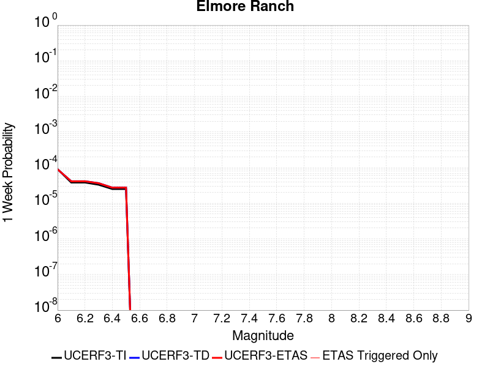 | 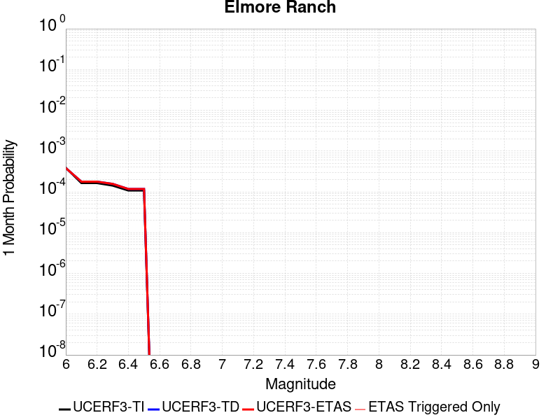 | 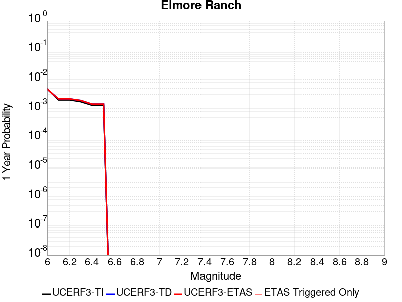 | 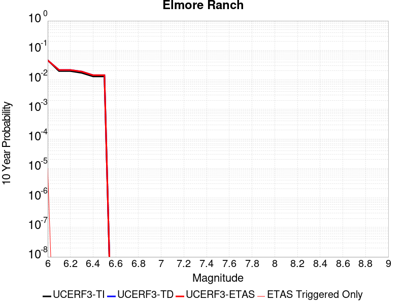 |

| Magnitude | 1 wk TI Prob | 1 wk TD Prob | 1 wk ETAS Prob | 1 wk ETAS/TD Gain | 1 wk ETAS Triggered Only | 1 mo TI Prob | 1 mo TD Prob | 1 mo ETAS Prob | 1 mo ETAS/TD Gain | 1 mo ETAS Triggered Only | 1 yr TI Prob | 1 yr TD Prob | 1 yr ETAS Prob | 1 yr ETAS/TD Gain | 1 yr ETAS Triggered Only | 10 yr TI Prob | 10 yr TD Prob | 10 yr ETAS Prob | 10 yr ETAS/TD Gain | 10 yr ETAS Triggered Only |
|-----|-----|-----|-----|-----|-----|-----|-----|-----|-----|-----|-----|-----|-----|-----|-----|-----|-----|-----|-----|-----|
| 6.0 | 9.102099E-5 | 8.9526366E-5 | 8.9526366E-5 | 1.0 | 0.0 | 3.9003167E-4 | 3.8364116E-4 | 3.8364116E-4 | 1.0 | 0.0 | 0.0047383 | 0.004662308 | 0.004662308 | 1.0 | 0.0 | 0.046385348 | 0.045873385 | 0.04588293 | 1.000208 | 1.0E-5 |
| 6.1 | 3.8306698E-5 | 4.1500927E-5 | 4.1500927E-5 | 1.0 | 0.0 | 1.6416123E-4 | 1.7785306E-4 | 1.7785306E-4 | 1.0 | 0.0 | 0.0019968306 | 0.0021632449 | 0.0021632449 | 1.0 | 0.0 | 0.019789828 | 0.02162934 | 0.02162934 | 1.0 | 0.0 |
| 6.2 | 3.8306698E-5 | 4.1500927E-5 | 4.1500927E-5 | 1.0 | 0.0 | 1.6416123E-4 | 1.7785306E-4 | 1.7785306E-4 | 1.0 | 0.0 | 0.0019968306 | 0.0021632449 | 0.0021632449 | 1.0 | 0.0 | 0.019789828 | 0.02162934 | 0.02162934 | 1.0 | 0.0 |
| 6.3 | 3.3197924E-5 | 3.6556212E-5 | 3.6556212E-5 | 1.0 | 0.0 | 1.4226905E-4 | 1.5666404E-4 | 1.5666404E-4 | 1.0 | 0.0 | 0.0017307495 | 0.0019060043 | 0.0019060043 | 1.0 | 0.0 | 0.017173318 | 0.019090874 | 0.019090874 | 1.0 | 0.0 |
| 6.4 | 2.5148964E-5 | 2.7421656E-5 | 2.7421656E-5 | 1.0 | 0.0 | 1.0777682E-4 | 1.1751975E-4 | 1.1751975E-4 | 1.0 | 0.0 | 0.0013113929 | 0.0014305117 | 0.0014305117 | 1.0 | 0.0 | 0.01303681 | 0.014387799 | 0.014387799 | 1.0 | 0.0 |
| 6.5 | 2.5148964E-5 | 2.7421656E-5 | 2.7421656E-5 | 1.0 | 0.0 | 1.0777682E-4 | 1.1751975E-4 | 1.1751975E-4 | 1.0 | 0.0 | 0.0013113929 | 0.0014305117 | 0.0014305117 | 1.0 | 0.0 | 0.01303681 | 0.014387799 | 0.014387799 | 1.0 | 0.0 |

## Hartley Springs 2011 CFM
*[(top)](#table-of-contents)*

| 1 Week | 1 Month | 1 Year | 10 Year |
|-----|-----|-----|-----|
| 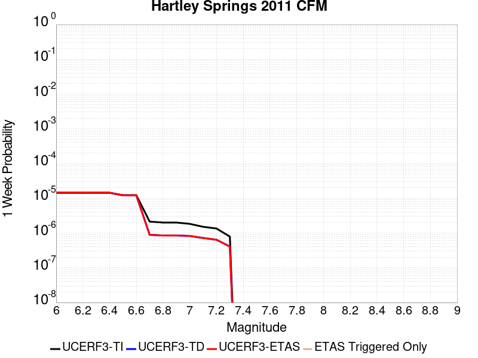 |  |  |  |

| Magnitude | 1 wk TI Prob | 1 wk TD Prob | 1 wk ETAS Prob | 1 wk ETAS/TD Gain | 1 wk ETAS Triggered Only | 1 mo TI Prob | 1 mo TD Prob | 1 mo ETAS Prob | 1 mo ETAS/TD Gain | 1 mo ETAS Triggered Only | 1 yr TI Prob | 1 yr TD Prob | 1 yr ETAS Prob | 1 yr ETAS/TD Gain | 1 yr ETAS Triggered Only | 10 yr TI Prob | 10 yr TD Prob | 10 yr ETAS Prob | 10 yr ETAS/TD Gain | 10 yr ETAS Triggered Only |
|-----|-----|-----|-----|-----|-----|-----|-----|-----|-----|-----|-----|-----|-----|-----|-----|-----|-----|-----|-----|-----|
| 6.0 | 1.4352418E-5 | 1.443441E-5 | 1.443441E-5 | 1.0 | 0.0 | 6.1508916E-5 | 6.186122E-5 | 6.186122E-5 | 1.0 | 0.0 | 7.486137E-4 | 7.5306447E-4 | 7.630569E-4 | 1.0132691 | 1.0E-5 | 0.007460968 | 0.007521247 | 0.007531172 | 1.0013195 | 1.0E-5 |
| 6.1 | 1.4352418E-5 | 1.443441E-5 | 1.443441E-5 | 1.0 | 0.0 | 6.1508916E-5 | 6.186122E-5 | 6.186122E-5 | 1.0 | 0.0 | 7.486137E-4 | 7.5306447E-4 | 7.630569E-4 | 1.0132691 | 1.0E-5 | 0.007460968 | 0.007521247 | 0.007531172 | 1.0013195 | 1.0E-5 |
| 6.2 | 1.4352418E-5 | 1.443441E-5 | 1.443441E-5 | 1.0 | 0.0 | 6.1508916E-5 | 6.186122E-5 | 6.186122E-5 | 1.0 | 0.0 | 7.486137E-4 | 7.5306447E-4 | 7.630569E-4 | 1.0132691 | 1.0E-5 | 0.007460968 | 0.007521247 | 0.007531172 | 1.0013195 | 1.0E-5 |
| 6.3 | 1.4352418E-5 | 1.443441E-5 | 1.443441E-5 | 1.0 | 0.0 | 6.1508916E-5 | 6.186122E-5 | 6.186122E-5 | 1.0 | 0.0 | 7.486137E-4 | 7.5306447E-4 | 7.630569E-4 | 1.0132691 | 1.0E-5 | 0.007460968 | 0.007521247 | 0.007531172 | 1.0013195 | 1.0E-5 |
| 6.4 | 1.4352418E-5 | 1.443441E-5 | 1.443441E-5 | 1.0 | 0.0 | 6.1508916E-5 | 6.186122E-5 | 6.186122E-5 | 1.0 | 0.0 | 7.486137E-4 | 7.5306447E-4 | 7.630569E-4 | 1.0132691 | 1.0E-5 | 0.007460968 | 0.007521247 | 0.007531172 | 1.0013195 | 1.0E-5 |
| 6.5 | 1.2279858E-5 | 1.21333005E-5 | 1.21333005E-5 | 1.0 | 0.0 | 5.26269E-5 | 5.1999716E-5 | 5.1999716E-5 | 1.0 | 0.0 | 6.4054417E-4 | 6.330708E-4 | 6.430645E-4 | 1.015786 | 1.0E-5 | 0.0063870098 | 0.006328186 | 0.0063381228 | 1.0015702 | 1.0E-5 |
| 6.6 | 1.2279858E-5 | 1.21333005E-5 | 1.21333005E-5 | 1.0 | 0.0 | 5.26269E-5 | 5.1999716E-5 | 5.1999716E-5 | 1.0 | 0.0 | 6.4054417E-4 | 6.330708E-4 | 6.430645E-4 | 1.015786 | 1.0E-5 | 0.0063870098 | 0.006328186 | 0.0063381228 | 1.0015702 | 1.0E-5 |
| 6.7 | 2.1282601E-6 | 8.8951737E-7 | 8.8951737E-7 | 1.0 | 0.0 | 9.121083E-6 | 3.8122132E-6 | 3.8122132E-6 | 1.0 | 0.0 | 1.11043526E-4 | 4.6412963E-5 | 4.6412963E-5 | 1.0 | 0.0 | 0.0011098806 | 4.6405804E-4 | 4.6405804E-4 | 1.0 | 0.0 |
| 6.8 | 2.00516E-6 | 8.517915E-7 | 8.517915E-7 | 1.0 | 0.0 | 8.593515E-6 | 3.6505314E-6 | 3.6505314E-6 | 1.0 | 0.0 | 1.04621024E-4 | 4.4444572E-5 | 4.4444572E-5 | 1.0 | 0.0 | 0.0010457177 | 4.4438196E-4 | 4.4438196E-4 | 1.0 | 0.0 |
| 6.9 | 2.00516E-6 | 8.517915E-7 | 8.517915E-7 | 1.0 | 0.0 | 8.593515E-6 | 3.6505314E-6 | 3.6505314E-6 | 1.0 | 0.0 | 1.04621024E-4 | 4.4444572E-5 | 4.4444572E-5 | 1.0 | 0.0 | 0.0010457177 | 4.4438196E-4 | 4.4438196E-4 | 1.0 | 0.0 |
| 7.0 | 1.8366732E-6 | 8.2375976E-7 | 8.2375976E-7 | 1.0 | 0.0 | 7.871433E-6 | 3.5303958E-6 | 3.5303958E-6 | 1.0 | 0.0 | 9.583048E-5 | 4.2981977E-5 | 4.2981977E-5 | 1.0 | 0.0 | 9.5789164E-4 | 4.2976168E-4 | 4.2976168E-4 | 1.0 | 0.0 |
| 7.1 | 1.5097997E-6 | 7.1904884E-7 | 7.1904884E-7 | 1.0 | 0.0 | 6.470554E-6 | 3.0816354E-6 | 3.0816354E-6 | 1.0 | 0.0 | 7.877615E-5 | 3.7518508E-5 | 3.7518508E-5 | 1.0 | 0.0 | 7.874823E-4 | 3.7514546E-4 | 3.7514546E-4 | 1.0 | 0.0 |
| 7.2 | 1.3490993E-6 | 6.405452E-7 | 6.405452E-7 | 1.0 | 0.0 | 5.7818415E-6 | 2.7451922E-6 | 2.7451922E-6 | 1.0 | 0.0 | 7.0391645E-5 | 3.3422435E-5 | 3.3422435E-5 | 1.0 | 0.0 | 7.0369354E-4 | 3.3419704E-4 | 3.3419704E-4 | 1.0 | 0.0 |
| 7.3 | 7.900015E-7 | 4.089063E-7 | 4.089063E-7 | 1.0 | 0.0 | 3.3857161E-6 | 1.7524555E-6 | 1.7524555E-6 | 1.0 | 0.0 | 4.1220315E-5 | 2.1336145E-5 | 2.1336145E-5 | 1.0 | 0.0 | 4.121267E-4 | 2.1336146E-4 | 2.1336146E-4 | 1.0 | 0.0 |

## Morales (West)
*[(top)](#table-of-contents)*

| 1 Week | 1 Month | 1 Year | 10 Year |
|-----|-----|-----|-----|
|  |  |  |  |

| Magnitude | 1 wk TI Prob | 1 wk TD Prob | 1 wk ETAS Prob | 1 wk ETAS/TD Gain | 1 wk ETAS Triggered Only | 1 mo TI Prob | 1 mo TD Prob | 1 mo ETAS Prob | 1 mo ETAS/TD Gain | 1 mo ETAS Triggered Only | 1 yr TI Prob | 1 yr TD Prob | 1 yr ETAS Prob | 1 yr ETAS/TD Gain | 1 yr ETAS Triggered Only | 10 yr TI Prob | 10 yr TD Prob | 10 yr ETAS Prob | 10 yr ETAS/TD Gain | 10 yr ETAS Triggered Only |
|-----|-----|-----|-----|-----|-----|-----|-----|-----|-----|-----|-----|-----|-----|-----|-----|-----|-----|-----|-----|-----|
| 6.0 | 1.4027072E-6 | 1.4792404E-6 | 1.4792404E-6 | 1.0 | 0.0 | 6.0115885E-6 | 6.33959E-6 | 6.33959E-6 | 1.0 | 0.0 | 7.318863E-5 | 7.718247E-5 | 7.718247E-5 | 1.0 | 0.0 | 7.316453E-4 | 7.716252E-4 | 7.8161753E-4 | 1.0129497 | 1.0E-5 |
| 6.1 | 1.4027072E-6 | 1.4792404E-6 | 1.4792404E-6 | 1.0 | 0.0 | 6.0115885E-6 | 6.33959E-6 | 6.33959E-6 | 1.0 | 0.0 | 7.318863E-5 | 7.718247E-5 | 7.718247E-5 | 1.0 | 0.0 | 7.316453E-4 | 7.716252E-4 | 7.8161753E-4 | 1.0129497 | 1.0E-5 |
| 6.2 | 1.4027072E-6 | 1.4792404E-6 | 1.4792404E-6 | 1.0 | 0.0 | 6.0115885E-6 | 6.33959E-6 | 6.33959E-6 | 1.0 | 0.0 | 7.318863E-5 | 7.718247E-5 | 7.718247E-5 | 1.0 | 0.0 | 7.316453E-4 | 7.716252E-4 | 7.8161753E-4 | 1.0129497 | 1.0E-5 |
| 6.3 | 1.4027072E-6 | 1.4792404E-6 | 1.4792404E-6 | 1.0 | 0.0 | 6.0115885E-6 | 6.33959E-6 | 6.33959E-6 | 1.0 | 0.0 | 7.318863E-5 | 7.718247E-5 | 7.718247E-5 | 1.0 | 0.0 | 7.316453E-4 | 7.716252E-4 | 7.8161753E-4 | 1.0129497 | 1.0E-5 |
| 6.4 | 6.504502E-7 | 7.2047004E-7 | 7.2047004E-7 | 1.0 | 0.0 | 2.7876408E-6 | 3.0877252E-6 | 3.0877252E-6 | 1.0 | 0.0 | 3.3939E-5 | 3.7592417E-5 | 3.7592417E-5 | 1.0 | 0.0 | 3.3933815E-4 | 3.7586177E-4 | 3.7586177E-4 | 1.0 | 0.0 |
| 6.5 | 6.504502E-7 | 7.2047004E-7 | 7.2047004E-7 | 1.0 | 0.0 | 2.7876408E-6 | 3.0877252E-6 | 3.0877252E-6 | 1.0 | 0.0 | 3.3939E-5 | 3.7592417E-5 | 3.7592417E-5 | 1.0 | 0.0 | 3.3933815E-4 | 3.7586177E-4 | 3.7586177E-4 | 1.0 | 0.0 |
| 6.6 | 5.8056526E-7 | 6.50096E-7 | 6.50096E-7 | 1.0 | 0.0 | 2.4881344E-6 | 2.7861226E-6 | 2.7861226E-6 | 1.0 | 0.0 | 3.0292615E-5 | 3.392052E-5 | 3.392052E-5 | 1.0 | 0.0 | 3.0288487E-4 | 3.3915407E-4 | 3.3915407E-4 | 1.0 | 0.0 |
| 6.7 | 5.741448E-7 | 6.436271E-7 | 6.436271E-7 | 1.0 | 0.0 | 2.4606184E-6 | 2.758399E-6 | 2.758399E-6 | 1.0 | 0.0 | 2.9957617E-5 | 3.3582997E-5 | 3.3582997E-5 | 1.0 | 0.0 | 2.9953578E-4 | 3.3577983E-4 | 3.3577983E-4 | 1.0 | 0.0 |
| 6.8 | 5.299428E-7 | 5.8916885E-7 | 5.8916885E-7 | 1.0 | 0.0 | 2.2711813E-6 | 2.525007E-6 | 2.525007E-6 | 1.0 | 0.0 | 2.7651282E-5 | 3.0741532E-5 | 3.0741532E-5 | 1.0 | 0.0 | 2.7647841E-4 | 3.0737327E-4 | 3.0737327E-4 | 1.0 | 0.0 |
| 6.9 | 4.82394E-7 | 5.3424463E-7 | 5.3424463E-7 | 1.0 | 0.0 | 2.0674013E-6 | 2.2896177E-6 | 2.2896177E-6 | 1.0 | 0.0 | 2.517032E-5 | 2.7875743E-5 | 2.7875743E-5 | 1.0 | 0.0 | 2.516747E-4 | 2.7872287E-4 | 2.7872287E-4 | 1.0 | 0.0 |
| 7.0 | 4.3264512E-7 | 4.760604E-7 | 4.760604E-7 | 1.0 | 0.0 | 1.8541921E-6 | 2.0402572E-6 | 2.0402572E-6 | 1.0 | 0.0 | 2.2574555E-5 | 2.4839852E-5 | 2.4839852E-5 | 1.0 | 0.0 | 2.2572262E-4 | 2.4837107E-4 | 2.4837107E-4 | 1.0 | 0.0 |
| 7.1 | 3.7388565E-7 | 4.0010724E-7 | 4.0010724E-7 | 1.0 | 0.0 | 1.6023661E-6 | 1.7147441E-6 | 1.7147441E-6 | 1.0 | 0.0 | 1.9508632E-5 | 2.0876812E-5 | 2.0876812E-5 | 1.0 | 0.0 | 1.950692E-4 | 2.0874874E-4 | 2.0874874E-4 | 1.0 | 0.0 |
| 7.2 | 3.1592543E-7 | 3.3205683E-7 | 3.3205683E-7 | 1.0 | 0.0 | 1.3539654E-6 | 1.4231E-6 | 1.4231E-6 | 1.0 | 0.0 | 1.6484404E-5 | 1.7326105E-5 | 1.7326105E-5 | 1.0 | 0.0 | 1.6483181E-4 | 1.7324772E-4 | 1.7324772E-4 | 1.0 | 0.0 |
| 7.3 | 2.2677783E-7 | 2.1799279E-7 | 2.1799279E-7 | 1.0 | 0.0 | 9.719047E-7 | 9.3425444E-7 | 9.3425444E-7 | 1.0 | 0.0 | 1.1832874E-5 | 1.1374489E-5 | 1.1374489E-5 | 1.0 | 0.0 | 1.18322445E-4 | 1.1373912E-4 | 1.1373912E-4 | 1.0 | 0.0 |
| 7.4 | 1.2295531E-7 | 8.35319E-8 | 8.35319E-8 | 1.0 | 0.0 | 5.269512E-7 | 3.5799383E-7 | 3.5799383E-7 | 1.0 | 0.0 | 6.4156125E-6 | 4.358566E-6 | 4.358566E-6 | 1.0 | 0.0 | 6.415427E-5 | 4.3584812E-5 | 4.3584812E-5 | 1.0 | 0.0 |
| 7.5 | 9.9632544E-8 | 5.444801E-8 | 5.444801E-8 | 1.0 | 0.0 | 4.2699656E-7 | 2.3334859E-7 | 2.3334859E-7 | 1.0 | 0.0 | 5.198671E-6 | 2.8410152E-6 | 2.8410152E-6 | 1.0 | 0.0 | 5.198549E-5 | 2.8409795E-5 | 2.8409795E-5 | 1.0 | 0.0 |
| 7.6 | 8.125894E-8 | 3.5962383E-8 | 3.5962383E-8 | 1.0 | 0.0 | 3.4825257E-7 | 1.5412449E-7 | 1.5412449E-7 | 1.0 | 0.0 | 4.2399665E-6 | 1.8764641E-6 | 1.8764641E-6 | 1.0 | 0.0 | 4.2398857E-5 | 1.8764487E-5 | 1.8764487E-5 | 1.0 | 0.0 |
| 7.7 | 5.1810765E-8 | 1.16496315E-8 | 1.16496315E-8 | 1.0 | 0.0 | 2.2204613E-7 | 4.9926992E-8 | 4.9926992E-8 | 1.0 | 0.0 | 2.7034082E-6 | 6.0786095E-7 | 6.0786095E-7 | 1.0 | 0.0 | 2.7033753E-5 | 6.078596E-6 | 6.078596E-6 | 1.0 | 0.0 |
| 7.8 | 2.6315043E-8 | 2.340597E-9 | 2.340597E-9 | 1.0 | 0.0 | 1.1277875E-7 | 1.0031131E-8 | 1.0031131E-8 | 1.0 | 0.0 | 1.3730804E-6 | 1.2212901E-7 | 1.2212901E-7 | 1.0 | 0.0 | 1.3730719E-5 | 1.2212922E-6 | 1.2212922E-6 | 1.0 | 0.0 |
| 7.9 | 1.24281545E-8 | 4.2132564E-10 | 4.2132564E-10 | 1.0 | 0.0 | 5.3263516E-8 | 1.8056812E-9 | 1.8056812E-9 | 1.0 | 0.0 | 6.4848314E-7 | 2.1984166E-8 | 2.1984166E-8 | 1.0 | 0.0 | 6.4848123E-6 | 2.1984445E-7 | 2.1984445E-7 | 1.0 | 0.0 |
| 8.0 | 5.954214E-9 | 1.8538215E-10 | 1.8538215E-10 | 1.0 | 0.0 | 2.551806E-8 | 7.9449325E-10 | 7.9449325E-10 | 1.0 | 0.0 | 3.1068234E-7 | 9.6729575E-9 | 9.6729575E-9 | 1.0 | 0.0 | 3.1068191E-6 | 9.673239E-8 | 9.673239E-8 | 1.0 | 0.0 |
| 8.1 | 1.2586262E-9 | 8.3580254E-11 | 8.3580254E-11 | 1.0 | 0.0 | 5.3941123E-9 | 3.5819936E-10 | 3.5819936E-10 | 1.0 | 0.0 | 6.567332E-8 | 4.3610777E-9 | 4.3610777E-9 | 1.0 | 0.0 | 6.56733E-7 | 4.3613593E-8 | 4.3613593E-8 | 1.0 | 0.0 |

## Greenville (No) 2011 CFM
*[(top)](#table-of-contents)*

| 1 Week | 1 Month | 1 Year | 10 Year |
|-----|-----|-----|-----|
|  |  |  |  |

| Magnitude | 1 wk TI Prob | 1 wk TD Prob | 1 wk ETAS Prob | 1 wk ETAS/TD Gain | 1 wk ETAS Triggered Only | 1 mo TI Prob | 1 mo TD Prob | 1 mo ETAS Prob | 1 mo ETAS/TD Gain | 1 mo ETAS Triggered Only | 1 yr TI Prob | 1 yr TD Prob | 1 yr ETAS Prob | 1 yr ETAS/TD Gain | 1 yr ETAS Triggered Only | 10 yr TI Prob | 10 yr TD Prob | 10 yr ETAS Prob | 10 yr ETAS/TD Gain | 10 yr ETAS Triggered Only |
|-----|-----|-----|-----|-----|-----|-----|-----|-----|-----|-----|-----|-----|-----|-----|-----|-----|-----|-----|-----|-----|
| 6.0 | 3.286654E-5 | 4.036741E-5 | 4.036741E-5 | 1.0 | 0.0 | 1.4084899E-4 | 1.7299193E-4 | 1.829902E-4 | 1.0577961 | 1.0E-5 | 0.0017134876 | 0.0021041804 | 0.0021141593 | 1.0047425 | 1.0E-5 | 0.017003356 | 0.020847455 | 0.020857247 | 1.0004697 | 1.0E-5 |
| 6.1 | 3.286654E-5 | 4.036741E-5 | 4.036741E-5 | 1.0 | 0.0 | 1.4084899E-4 | 1.7299193E-4 | 1.829902E-4 | 1.0577961 | 1.0E-5 | 0.0017134876 | 0.0021041804 | 0.0021141593 | 1.0047425 | 1.0E-5 | 0.017003356 | 0.020847455 | 0.020857247 | 1.0004697 | 1.0E-5 |
| 6.2 | 3.1697953E-5 | 3.893027E-5 | 3.893027E-5 | 1.0 | 0.0 | 1.358413E-4 | 1.6683355E-4 | 1.7683188E-4 | 1.05993 | 1.0E-5 | 0.0016526132 | 0.0020293442 | 0.0020393238 | 1.0049177 | 1.0E-5 | 0.01640377 | 0.020112827 | 0.020122627 | 1.0004872 | 1.0E-5 |
| 6.3 | 3.1363317E-5 | 3.8519134E-5 | 3.8519134E-5 | 1.0 | 0.0 | 1.344073E-4 | 1.6507176E-4 | 1.750701E-4 | 1.0605698 | 1.0E-5 | 0.0016351803 | 0.002007934 | 0.002017914 | 1.0049702 | 1.0E-5 | 0.016232004 | 0.019902589 | 0.01991239 | 1.0004925 | 1.0E-5 |
| 6.4 | 3.0228604E-5 | 3.7126225E-5 | 3.7126225E-5 | 1.0 | 0.0 | 1.2954473E-4 | 1.5910288E-4 | 1.691013E-4 | 1.0628424 | 1.0E-5 | 0.0015760659 | 0.0019353938 | 0.0019453744 | 1.0051569 | 1.0E-5 | 0.015649348 | 0.01918991 | 0.019199718 | 1.000511 | 1.0E-5 |
| 6.5 | 2.9537814E-5 | 3.6281657E-5 | 3.6281657E-5 | 1.0 | 0.0 | 1.2658449E-4 | 1.5548375E-4 | 1.654822E-4 | 1.0643054 | 1.0E-5 | 0.0015400766 | 0.0018914078 | 0.0019013889 | 1.005277 | 1.0E-5 | 0.01529447 | 0.018757557 | 0.01876737 | 1.0005231 | 1.0E-5 |
| 6.6 | 2.7345395E-5 | 3.3590906E-5 | 3.3590906E-5 | 1.0 | 0.0 | 1.1718928E-4 | 1.4395325E-4 | 1.5395181E-4 | 1.069457 | 1.0E-5 | 0.0014258457 | 0.0017512529 | 0.0017612354 | 1.0057002 | 1.0E-5 | 0.014167317 | 0.017378341 | 0.017388167 | 1.0005654 | 1.0E-5 |
| 6.7 | 2.5615784E-5 | 3.1567764E-5 | 3.1567764E-5 | 1.0 | 0.0 | 1.09777306E-4 | 1.3528357E-4 | 1.4528222E-4 | 1.0739088 | 1.0E-5 | 0.0013357193 | 0.0016458635 | 0.0016558471 | 1.0060658 | 1.0E-5 | 0.013277191 | 0.016340412 | 0.016350249 | 1.000602 | 1.0E-5 |
| 6.8 | 2.0059057E-5 | 2.4712537E-5 | 2.4712537E-5 | 1.0 | 0.0 | 8.596455E-5 | 1.0590666E-4 | 1.15905605E-4 | 1.0944128 | 1.0E-5 | 0.0010461159 | 0.0012886672 | 0.0012986544 | 1.0077499 | 1.0E-5 | 0.0104120495 | 0.012813962 | 0.012823834 | 1.0007704 | 1.0E-5 |
| 6.9 | 1.6321746E-5 | 2.0185005E-5 | 2.0185005E-5 | 1.0 | 0.0 | 6.9948466E-5 | 8.650436E-5 | 8.650436E-5 | 1.0 | 0.0 | 8.5128983E-4 | 0.0010526942 | 0.0010526942 | 1.0 | 0.0 | 0.008480361 | 0.010478605 | 0.010478605 | 1.0 | 0.0 |
| 7.0 | 1.22527645E-5 | 1.5135852E-5 | 1.5135852E-5 | 1.0 | 0.0 | 5.2510793E-5 | 6.486634E-5 | 6.486634E-5 | 1.0 | 0.0 | 6.3913135E-4 | 7.894658E-4 | 7.894658E-4 | 1.0 | 0.0 | 0.0063729626 | 0.00786725 | 0.00786725 | 1.0 | 0.0 |
| 7.1 | 8.996482E-6 | 1.1165086E-5 | 1.1165086E-5 | 1.0 | 0.0 | 3.8555783E-5 | 4.78495E-5 | 4.78495E-5 | 1.0 | 0.0 | 4.6931554E-4 | 5.8241317E-4 | 5.8241317E-4 | 1.0 | 0.0 | 0.004683256 | 0.005809159 | 0.005809159 | 1.0 | 0.0 |
| 7.2 | 6.0273087E-6 | 7.569554E-6 | 7.569554E-6 | 1.0 | 0.0 | 2.5831067E-5 | 3.2440545E-5 | 3.2440545E-5 | 1.0 | 0.0 | 3.1444785E-4 | 3.9489273E-4 | 3.9489273E-4 | 1.0 | 0.0 | 0.0031400328 | 0.0039421073 | 0.0039421073 | 1.0 | 0.0 |
| 7.3 | 3.1209995E-6 | 3.966412E-6 | 3.966412E-6 | 1.0 | 0.0 | 1.3375643E-5 | 1.6998798E-5 | 1.6998798E-5 | 1.0 | 0.0 | 1.6283628E-4 | 2.0694088E-4 | 2.0694088E-4 | 1.0 | 0.0 | 0.0016271701 | 0.002067572 | 0.002067572 | 1.0 | 0.0 |
| 7.4 | 2.0254208E-6 | 2.609629E-6 | 2.609629E-6 | 1.0 | 0.0 | 8.680347E-6 | 1.1184077E-5 | 1.1184077E-5 | 1.0 | 0.0 | 1.0567809E-4 | 1.3615769E-4 | 1.3615769E-4 | 1.0 | 0.0 | 0.0010562785 | 0.0013607995 | 0.0013607995 | 1.0 | 0.0 |
| 7.5 | 1.6763418E-6 | 2.1733601E-6 | 2.1733601E-6 | 1.0 | 0.0 | 7.184302E-6 | 9.314368E-6 | 9.314368E-6 | 1.0 | 0.0 | 8.746537E-5 | 1.1339658E-4 | 1.1339658E-4 | 1.0 | 0.0 | 8.743095E-4 | 0.0011334341 | 0.0011334341 | 1.0 | 0.0 |
| 7.6 | 1.1935462E-6 | 1.5458515E-6 | 1.5458515E-6 | 1.0 | 0.0 | 5.115188E-6 | 6.6250614E-6 | 6.6250614E-6 | 1.0 | 0.0 | 6.2275634E-5 | 8.065718E-5 | 8.065718E-5 | 1.0 | 0.0 | 6.2258187E-4 | 8.0630975E-4 | 8.0630975E-4 | 1.0 | 0.0 |
| 7.7 | 3.0464201E-7 | 3.984697E-7 | 3.984697E-7 | 1.0 | 0.0 | 1.3056081E-6 | 1.7077261E-6 | 1.7077261E-6 | 1.0 | 0.0 | 1.589566E-5 | 2.0791373E-5 | 2.0791373E-5 | 1.0 | 0.0 | 1.5894524E-4 | 2.0789898E-4 | 2.0789898E-4 | 1.0 | 0.0 |

## Malibu Coast (Extension) alt 1
*[(top)](#table-of-contents)*

| 1 Week | 1 Month | 1 Year | 10 Year |
|-----|-----|-----|-----|
|  |  |  |  |

| Magnitude | 1 wk TI Prob | 1 wk TD Prob | 1 wk ETAS Prob | 1 wk ETAS/TD Gain | 1 wk ETAS Triggered Only | 1 mo TI Prob | 1 mo TD Prob | 1 mo ETAS Prob | 1 mo ETAS/TD Gain | 1 mo ETAS Triggered Only | 1 yr TI Prob | 1 yr TD Prob | 1 yr ETAS Prob | 1 yr ETAS/TD Gain | 1 yr ETAS Triggered Only | 10 yr TI Prob | 10 yr TD Prob | 10 yr ETAS Prob | 10 yr ETAS/TD Gain | 10 yr ETAS Triggered Only |
|-----|-----|-----|-----|-----|-----|-----|-----|-----|-----|-----|-----|-----|-----|-----|-----|-----|-----|-----|-----|-----|
| 6.0 | 8.930738E-6 | 9.329346E-6 | 9.329346E-6 | 1.0 | 0.0 | 3.827403E-5 | 3.9982307E-5 | 4.9981907E-5 | 1.2501006 | 1.0E-5 | 4.6588664E-4 | 4.8667757E-4 | 4.966727E-4 | 1.0205375 | 1.0E-5 | 0.0046491115 | 0.0048563 | 0.0048662517 | 1.0020492 | 1.0E-5 |
| 6.1 | 7.199952E-6 | 7.530357E-6 | 7.530357E-6 | 1.0 | 0.0 | 3.0856572E-5 | 3.227256E-5 | 4.227224E-5 | 1.3098507 | 1.0E-5 | 3.75614E-4 | 3.928482E-4 | 4.0284428E-4 | 1.0254451 | 1.0E-5 | 0.0037497976 | 0.003921604 | 0.0039315643 | 1.00254 | 1.0E-5 |
| 6.2 | 6.3721413E-6 | 6.6668467E-6 | 6.6668467E-6 | 1.0 | 0.0 | 2.7308892E-5 | 2.857189E-5 | 3.8571605E-5 | 1.3499843 | 1.0E-5 | 3.3243504E-4 | 3.478076E-4 | 3.5780412E-4 | 1.0287415 | 1.0E-5 | 0.0033193815 | 0.0034726725 | 0.0034826377 | 1.0028696 | 1.0E-5 |
| 6.3 | 6.016345E-6 | 6.2952113E-6 | 6.2952113E-6 | 1.0 | 0.0 | 2.578408E-5 | 2.69792E-5 | 3.697893E-5 | 1.3706459 | 1.0E-5 | 3.1387596E-4 | 3.2842258E-4 | 3.3841928E-4 | 1.0304385 | 1.0E-5 | 0.00313433 | 0.0032794084 | 0.0032893755 | 1.0030394 | 1.0E-5 |
| 6.4 | 5.8104883E-6 | 6.0795965E-6 | 6.0795965E-6 | 1.0 | 0.0 | 2.4901856E-5 | 2.6055155E-5 | 3.6054895E-5 | 1.3837912 | 1.0E-5 | 3.031379E-4 | 3.1717564E-4 | 3.2717249E-4 | 1.0315182 | 1.0E-5 | 0.0030272473 | 0.0031672644 | 0.0031772326 | 1.0031472 | 1.0E-5 |
| 6.5 | 5.476925E-6 | 5.7275624E-6 | 5.7275624E-6 | 1.0 | 0.0 | 2.3472323E-5 | 2.4546467E-5 | 3.454622E-5 | 1.4073806 | 1.0E-5 | 2.8573806E-4 | 2.9881255E-4 | 3.0880954E-4 | 1.0334558 | 1.0E-5 | 0.0028537093 | 0.0029841396 | 0.0029941096 | 1.0033411 | 1.0E-5 |
| 6.6 | 5.222387E-6 | 5.4586267E-6 | 5.4586267E-6 | 1.0 | 0.0 | 2.2381464E-5 | 2.3393906E-5 | 3.3393673E-5 | 1.4274517 | 1.0E-5 | 2.7246025E-4 | 2.847839E-4 | 2.9478103E-4 | 1.0351044 | 1.0E-5 | 0.0027212645 | 0.00284422 | 0.0028541917 | 1.003506 | 1.0E-5 |
| 6.7 | 5.0337076E-6 | 5.2591486E-6 | 5.2591486E-6 | 1.0 | 0.0 | 2.1572854E-5 | 2.2539016E-5 | 3.2538792E-5 | 1.4436651 | 1.0E-5 | 2.6261783E-4 | 2.7437825E-4 | 2.843755E-4 | 1.0364361 | 1.0E-5 | 0.002623077 | 0.0027404248 | 0.0027503974 | 1.0036391 | 1.0E-5 |
| 6.8 | 4.5675624E-6 | 4.7587573E-6 | 4.7587573E-6 | 1.0 | 0.0 | 1.9575122E-5 | 2.0394515E-5 | 3.039431E-5 | 1.490318 | 1.0E-5 | 2.3830103E-4 | 2.4827512E-4 | 2.5827263E-4 | 1.040268 | 1.0E-5 | 0.0023804565 | 0.0024799972 | 0.0024899724 | 1.0040222 | 1.0E-5 |
| 6.9 | 4.2802412E-6 | 4.4520584E-6 | 4.4520584E-6 | 1.0 | 0.0 | 1.8343762E-5 | 1.9080113E-5 | 2.9079922E-5 | 1.5240959 | 1.0E-5 | 2.2331243E-4 | 2.3227576E-4 | 2.4227344E-4 | 1.0430423 | 1.0E-5 | 0.0022308815 | 0.0023203467 | 0.0023303234 | 1.0042998 | 1.0E-5 |
| 7.0 | 3.9794063E-6 | 4.130134E-6 | 4.130134E-6 | 1.0 | 0.0 | 1.7054486E-5 | 1.7700455E-5 | 1.7700455E-5 | 1.0 | 0.0 | 2.0761859E-4 | 2.1548186E-4 | 2.1548186E-4 | 1.0 | 0.0 | 0.0020742472 | 0.0021527428 | 0.0021527428 | 1.0 | 0.0 |
| 7.1 | 3.7730424E-6 | 3.91125E-6 | 3.91125E-6 | 1.0 | 0.0 | 1.6170083E-5 | 1.6762395E-5 | 1.6762395E-5 | 1.0 | 0.0 | 1.9685295E-4 | 2.0406317E-4 | 2.0406317E-4 | 1.0 | 0.0 | 0.0019667868 | 0.0020387706 | 0.0020387706 | 1.0 | 0.0 |
| 7.2 | 3.424985E-6 | 3.5413673E-6 | 3.5413673E-6 | 1.0 | 0.0 | 1.4678424E-5 | 1.51772E-5 | 1.51772E-5 | 1.0 | 0.0 | 1.7869516E-4 | 1.8476686E-4 | 1.8476686E-4 | 1.0 | 0.0 | 0.0017855153 | 0.0018461446 | 0.0018461446 | 1.0 | 0.0 |
| 7.3 | 2.6966375E-6 | 2.759676E-6 | 2.759676E-6 | 1.0 | 0.0 | 1.15569665E-5 | 1.1827129E-5 | 1.1827129E-5 | 1.0 | 0.0 | 1.4069698E-4 | 1.4398582E-4 | 1.4398582E-4 | 1.0 | 0.0 | 0.0014060794 | 0.0014389295 | 0.0014389295 | 1.0 | 0.0 |
| 7.4 | 2.215957E-6 | 2.2493962E-6 | 2.2493962E-6 | 1.0 | 0.0 | 9.496924E-6 | 9.640234E-6 | 9.640234E-6 | 1.0 | 0.0 | 1.1561892E-4 | 1.1736356E-4 | 1.1736356E-4 | 1.0 | 0.0 | 0.0011555878 | 0.0011730195 | 0.0011730195 | 1.0 | 0.0 |
| 7.5 | 1.2040218E-6 | 1.2219169E-6 | 1.2219169E-6 | 1.0 | 0.0 | 5.160083E-6 | 5.236777E-6 | 5.236777E-6 | 1.0 | 0.0 | 6.2822204E-5 | 6.3755906E-5 | 6.3755906E-5 | 1.0 | 0.0 | 6.280445E-4 | 6.37378E-4 | 6.37378E-4 | 1.0 | 0.0 |
| 7.6 | 6.6157446E-7 | 6.6790335E-7 | 6.6790335E-7 | 1.0 | 0.0 | 2.835316E-6 | 2.86244E-6 | 2.86244E-6 | 1.0 | 0.0 | 3.4519428E-5 | 3.4849665E-5 | 3.4849665E-5 | 1.0 | 0.0 | 3.4514067E-4 | 3.4844351E-4 | 3.4844351E-4 | 1.0 | 0.0 |
| 7.7 | 2.6012302E-7 | 2.4357794E-7 | 2.4357794E-7 | 1.0 | 0.0 | 1.1148124E-6 | 1.0439051E-6 | 1.0439051E-6 | 1.0 | 0.0 | 1.3572758E-5 | 1.2709481E-5 | 1.2709481E-5 | 1.0 | 0.0 | 1.3571928E-4 | 1.2708861E-4 | 1.2708861E-4 | 1.0 | 0.0 |
| 7.8 | 2.8323132E-8 | 2.026683E-8 | 2.026683E-8 | 1.0 | 0.0 | 1.2138484E-7 | 8.685784E-8 | 8.685784E-8 | 1.0 | 0.0 | 1.4778595E-6 | 1.0574938E-6 | 1.0574938E-6 | 1.0 | 0.0 | 1.4778497E-5 | 1.0574896E-5 | 1.0574896E-5 | 1.0 | 0.0 |

## Big Pine (West)
*[(top)](#table-of-contents)*

| 1 Week | 1 Month | 1 Year | 10 Year |
|-----|-----|-----|-----|
|  | 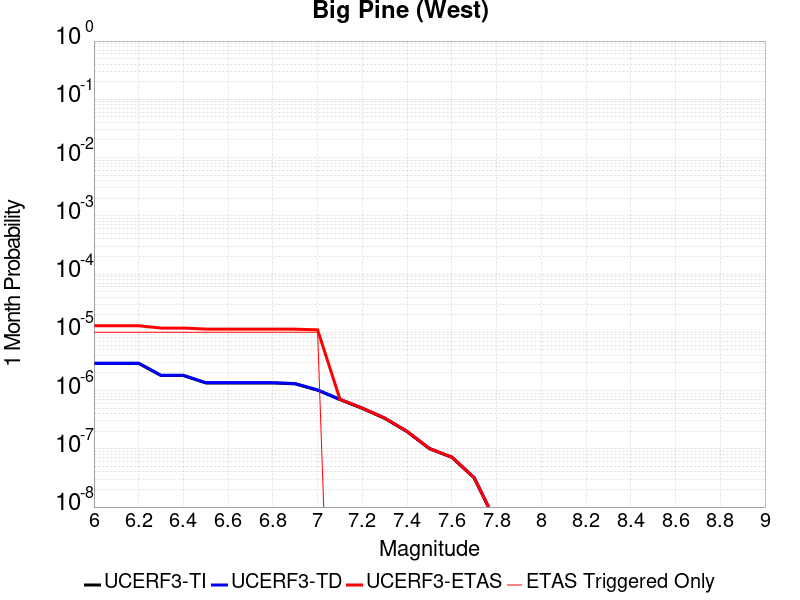 | 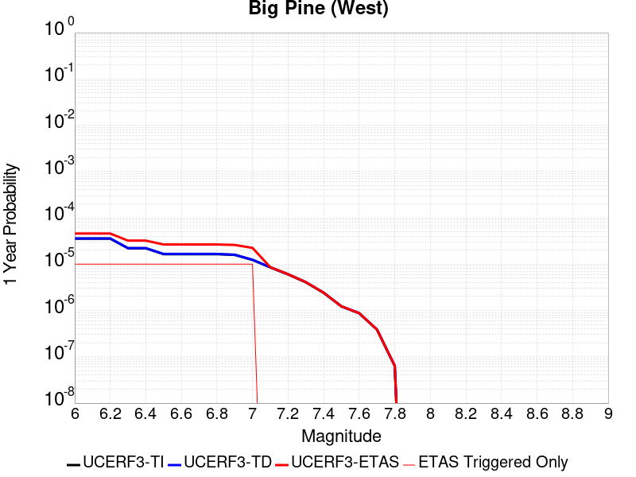 |  |

| Magnitude | 1 wk TI Prob | 1 wk TD Prob | 1 wk ETAS Prob | 1 wk ETAS/TD Gain | 1 wk ETAS Triggered Only | 1 mo TI Prob | 1 mo TD Prob | 1 mo ETAS Prob | 1 mo ETAS/TD Gain | 1 mo ETAS Triggered Only | 1 yr TI Prob | 1 yr TD Prob | 1 yr ETAS Prob | 1 yr ETAS/TD Gain | 1 yr ETAS Triggered Only | 10 yr TI Prob | 10 yr TD Prob | 10 yr ETAS Prob | 10 yr ETAS/TD Gain | 10 yr ETAS Triggered Only |
|-----|-----|-----|-----|-----|-----|-----|-----|-----|-----|-----|-----|-----|-----|-----|-----|-----|-----|-----|-----|-----|
| 6.0 | 6.8306974E-7 | 6.881837E-7 | 6.881837E-7 | 1.0 | 0.0 | 2.9274386E-6 | 2.949356E-6 | 1.2949326E-5 | 4.3905606 | 1.0E-5 | 3.564098E-5 | 3.5907913E-5 | 4.5907553E-5 | 1.2784802 | 1.0E-5 | 3.5635266E-4 | 3.590305E-4 | 3.690269E-4 | 1.0278428 | 1.0E-5 |
| 6.1 | 6.8306974E-7 | 6.881837E-7 | 6.881837E-7 | 1.0 | 0.0 | 2.9274386E-6 | 2.949356E-6 | 1.2949326E-5 | 4.3905606 | 1.0E-5 | 3.564098E-5 | 3.5907913E-5 | 4.5907553E-5 | 1.2784802 | 1.0E-5 | 3.5635266E-4 | 3.590305E-4 | 3.690269E-4 | 1.0278428 | 1.0E-5 |
| 6.2 | 6.8306974E-7 | 6.881837E-7 | 6.881837E-7 | 1.0 | 0.0 | 2.9274386E-6 | 2.949356E-6 | 1.2949326E-5 | 4.3905606 | 1.0E-5 | 3.564098E-5 | 3.5907913E-5 | 4.5907553E-5 | 1.2784802 | 1.0E-5 | 3.5635266E-4 | 3.590305E-4 | 3.690269E-4 | 1.0278428 | 1.0E-5 |
| 6.3 | 4.227652E-7 | 4.2665656E-7 | 4.2665656E-7 | 1.0 | 0.0 | 1.8118495E-6 | 1.8285269E-6 | 1.1828509E-5 | 6.468873 | 1.0E-5 | 2.2059045E-5 | 2.2262107E-5 | 3.2261883E-5 | 1.4491838 | 1.0E-5 | 2.2056856E-4 | 2.2260059E-4 | 2.3259837E-4 | 1.0449135 | 1.0E-5 |
| 6.4 | 4.227652E-7 | 4.2665656E-7 | 4.2665656E-7 | 1.0 | 0.0 | 1.8118495E-6 | 1.8285269E-6 | 1.1828509E-5 | 6.468873 | 1.0E-5 | 2.2059045E-5 | 2.2262107E-5 | 3.2261883E-5 | 1.4491838 | 1.0E-5 | 2.2056856E-4 | 2.2260059E-4 | 2.3259837E-4 | 1.0449135 | 1.0E-5 |
| 6.5 | 3.1538403E-7 | 3.1884574E-7 | 3.1884574E-7 | 1.0 | 0.0 | 1.3516451E-6 | 1.366481E-6 | 1.1366467E-5 | 8.318057 | 1.0E-5 | 1.6456155E-5 | 1.6636784E-5 | 2.6636617E-5 | 1.6010677 | 1.0E-5 | 1.6454936E-4 | 1.6635578E-4 | 1.7635412E-4 | 1.0601021 | 1.0E-5 |
| 6.6 | 3.1538403E-7 | 3.1884574E-7 | 3.1884574E-7 | 1.0 | 0.0 | 1.3516451E-6 | 1.366481E-6 | 1.1366467E-5 | 8.318057 | 1.0E-5 | 1.6456155E-5 | 1.6636784E-5 | 2.6636617E-5 | 1.6010677 | 1.0E-5 | 1.6454936E-4 | 1.6635578E-4 | 1.7635412E-4 | 1.0601021 | 1.0E-5 |
| 6.7 | 3.1538403E-7 | 3.1884574E-7 | 3.1884574E-7 | 1.0 | 0.0 | 1.3516451E-6 | 1.366481E-6 | 1.1366467E-5 | 8.318057 | 1.0E-5 | 1.6456155E-5 | 1.6636784E-5 | 2.6636617E-5 | 1.6010677 | 1.0E-5 | 1.6454936E-4 | 1.6635578E-4 | 1.7635412E-4 | 1.0601021 | 1.0E-5 |
| 6.8 | 3.1538403E-7 | 3.1884574E-7 | 3.1884574E-7 | 1.0 | 0.0 | 1.3516451E-6 | 1.366481E-6 | 1.1366467E-5 | 8.318057 | 1.0E-5 | 1.6456155E-5 | 1.6636784E-5 | 2.6636617E-5 | 1.6010677 | 1.0E-5 | 1.6454936E-4 | 1.6635578E-4 | 1.7635412E-4 | 1.0601021 | 1.0E-5 |
| 6.9 | 3.0402092E-7 | 3.0739844E-7 | 3.0739844E-7 | 1.0 | 0.0 | 1.3029462E-6 | 1.3174212E-6 | 1.1317408E-5 | 8.590577 | 1.0E-5 | 1.5863254E-5 | 1.6039488E-5 | 2.6039328E-5 | 1.6234512 | 1.0E-5 | 1.5862122E-4 | 1.603837E-4 | 1.703821E-4 | 1.0623405 | 1.0E-5 |
| 7.0 | 2.3673063E-7 | 2.394435E-7 | 2.394435E-7 | 1.0 | 0.0 | 1.0145594E-6 | 1.026186E-6 | 1.1026176E-5 | 10.744811 | 1.0E-5 | 1.235219E-5 | 1.2493747E-5 | 2.2493621E-5 | 1.8003904 | 1.0E-5 | 1.2351504E-4 | 1.2493072E-4 | 1.3492948E-4 | 1.0800344 | 1.0E-5 |
| 7.1 | 1.632138E-7 | 1.6514538E-7 | 1.6514538E-7 | 1.0 | 0.0 | 6.9948754E-7 | 7.077657E-7 | 7.077657E-7 | 1.0 | 0.0 | 8.516227E-6 | 8.617015E-6 | 8.617015E-6 | 1.0 | 0.0 | 8.5159016E-5 | 8.616698E-5 | 8.616698E-5 | 1.0 | 0.0 |
| 7.2 | 1.1523723E-7 | 1.16571826E-7 | 1.16571826E-7 | 1.0 | 0.0 | 4.9387376E-7 | 4.9959345E-7 | 4.9959345E-7 | 1.0 | 0.0 | 6.0128964E-6 | 6.0825346E-6 | 6.0825346E-6 | 1.0 | 0.0 | 6.0127335E-5 | 6.082379E-5 | 6.082379E-5 | 1.0 | 0.0 |
| 7.3 | 7.777805E-8 | 7.862457E-8 | 7.862457E-8 | 1.0 | 0.0 | 3.3333444E-7 | 3.3696242E-7 | 3.3696242E-7 | 1.0 | 0.0 | 4.0583395E-6 | 4.10251E-6 | 4.10251E-6 | 1.0 | 0.0 | 4.0582654E-5 | 4.1024403E-5 | 4.1024403E-5 | 1.0 | 0.0 |
| 7.4 | 4.609946E-8 | 4.652219E-8 | 4.652219E-8 | 1.0 | 0.0 | 1.975691E-7 | 1.9938079E-7 | 1.9938079E-7 | 1.0 | 0.0 | 2.4054011E-6 | 2.4274586E-6 | 2.4274586E-6 | 1.0 | 0.0 | 2.405375E-5 | 2.4274339E-5 | 2.4274339E-5 | 1.0 | 0.0 |
| 7.5 | 2.3439137E-8 | 2.3608306E-8 | 2.3608306E-8 | 1.0 | 0.0 | 1.00453434E-7 | 1.0117845E-7 | 1.0117845E-7 | 1.0 | 0.0 | 1.2230199E-6 | 1.231847E-6 | 1.231847E-6 | 1.0 | 0.0 | 1.2230132E-5 | 1.23184045E-5 | 1.23184045E-5 | 1.0 | 0.0 |
| 7.6 | 1.6699769E-8 | 1.6817088E-8 | 1.6817088E-8 | 1.0 | 0.0 | 7.157044E-8 | 7.2073234E-8 | 7.2073234E-8 | 1.0 | 0.0 | 8.713697E-7 | 8.774913E-7 | 8.774913E-7 | 1.0 | 0.0 | 8.713663E-6 | 8.7748795E-6 | 8.7748795E-6 | 1.0 | 0.0 |
| 7.7 | 7.4061512E-9 | 7.45417E-9 | 7.45417E-9 | 1.0 | 0.0 | 3.1740647E-8 | 3.1946442E-8 | 3.1946442E-8 | 1.0 | 0.0 | 3.864423E-7 | 3.8894788E-7 | 3.8894788E-7 | 1.0 | 0.0 | 3.8644166E-6 | 3.8894727E-6 | 3.8894727E-6 | 1.0 | 0.0 |
| 7.8 | 1.2189427E-9 | 1.2270773E-9 | 1.2270773E-9 | 1.0 | 0.0 | 5.2240403E-9 | 5.258903E-9 | 5.258903E-9 | 1.0 | 0.0 | 6.3602684E-8 | 6.402714E-8 | 6.402714E-8 | 1.0 | 0.0 | 6.360267E-7 | 6.402713E-7 | 6.402713E-7 | 1.0 | 0.0 |

## Round Valley
*[(top)](#table-of-contents)*

| 1 Week | 1 Month | 1 Year | 10 Year |
|-----|-----|-----|-----|
| 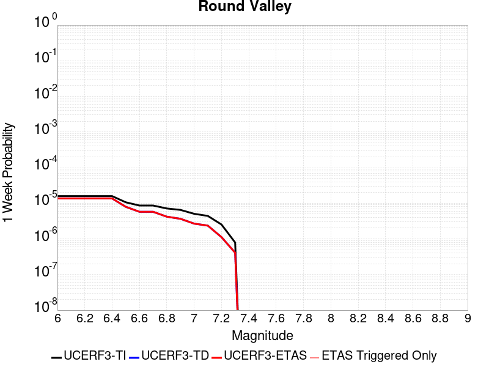 | 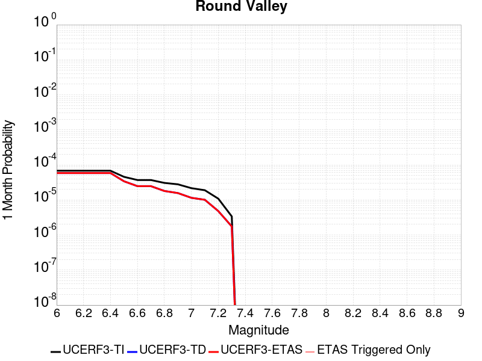 | 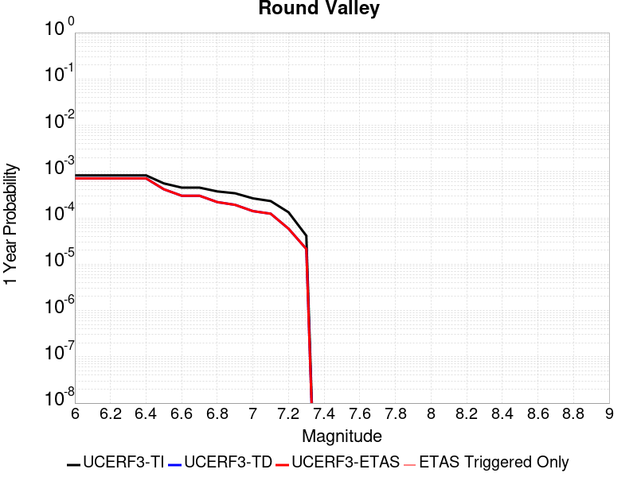 | 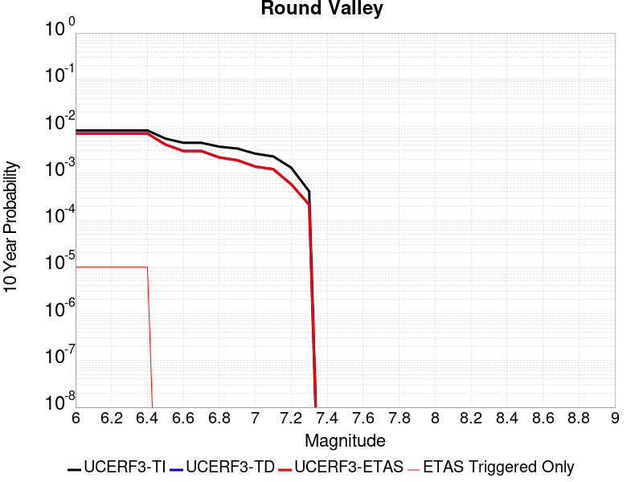 |

| Magnitude | 1 wk TI Prob | 1 wk TD Prob | 1 wk ETAS Prob | 1 wk ETAS/TD Gain | 1 wk ETAS Triggered Only | 1 mo TI Prob | 1 mo TD Prob | 1 mo ETAS Prob | 1 mo ETAS/TD Gain | 1 mo ETAS Triggered Only | 1 yr TI Prob | 1 yr TD Prob | 1 yr ETAS Prob | 1 yr ETAS/TD Gain | 1 yr ETAS Triggered Only | 10 yr TI Prob | 10 yr TD Prob | 10 yr ETAS Prob | 10 yr ETAS/TD Gain | 10 yr ETAS Triggered Only |
|-----|-----|-----|-----|-----|-----|-----|-----|-----|-----|-----|-----|-----|-----|-----|-----|-----|-----|-----|-----|-----|
| 6.0 | 1.588152E-5 | 1.367093E-5 | 1.367093E-5 | 1.0 | 0.0 | 6.806188E-5 | 5.8588605E-5 | 5.8588605E-5 | 1.0 | 0.0 | 8.283384E-4 | 7.131222E-4 | 7.131222E-4 | 1.0 | 0.0 | 0.008252576 | 0.007112226 | 0.007122155 | 1.0013961 | 1.0E-5 |
| 6.1 | 1.588152E-5 | 1.367093E-5 | 1.367093E-5 | 1.0 | 0.0 | 6.806188E-5 | 5.8588605E-5 | 5.8588605E-5 | 1.0 | 0.0 | 8.283384E-4 | 7.131222E-4 | 7.131222E-4 | 1.0 | 0.0 | 0.008252576 | 0.007112226 | 0.007122155 | 1.0013961 | 1.0E-5 |
| 6.2 | 1.588152E-5 | 1.367093E-5 | 1.367093E-5 | 1.0 | 0.0 | 6.806188E-5 | 5.8588605E-5 | 5.8588605E-5 | 1.0 | 0.0 | 8.283384E-4 | 7.131222E-4 | 7.131222E-4 | 1.0 | 0.0 | 0.008252576 | 0.007112226 | 0.007122155 | 1.0013961 | 1.0E-5 |
| 6.3 | 1.588152E-5 | 1.367093E-5 | 1.367093E-5 | 1.0 | 0.0 | 6.806188E-5 | 5.8588605E-5 | 5.8588605E-5 | 1.0 | 0.0 | 8.283384E-4 | 7.131222E-4 | 7.131222E-4 | 1.0 | 0.0 | 0.008252576 | 0.007112226 | 0.007122155 | 1.0013961 | 1.0E-5 |
| 6.4 | 1.588152E-5 | 1.367093E-5 | 1.367093E-5 | 1.0 | 0.0 | 6.806188E-5 | 5.8588605E-5 | 5.8588605E-5 | 1.0 | 0.0 | 8.283384E-4 | 7.131222E-4 | 7.131222E-4 | 1.0 | 0.0 | 0.008252576 | 0.007112226 | 0.007122155 | 1.0013961 | 1.0E-5 |
| 6.5 | 1.0646776E-5 | 7.953182E-6 | 7.953182E-6 | 1.0 | 0.0 | 4.5628243E-5 | 3.4084667E-5 | 3.4084667E-5 | 1.0 | 0.0 | 5.553823E-4 | 4.1491017E-4 | 4.1491017E-4 | 1.0 | 0.0 | 0.005539963 | 0.0041421843 | 0.0041421843 | 1.0 | 0.0 |
| 6.6 | 8.632956E-6 | 5.7688617E-6 | 5.7688617E-6 | 1.0 | 0.0 | 3.6997862E-5 | 2.472348E-5 | 2.472348E-5 | 1.0 | 0.0 | 4.5035584E-4 | 3.0097063E-4 | 3.0097063E-4 | 1.0 | 0.0 | 0.0044944426 | 0.0030060082 | 0.0030060082 | 1.0 | 0.0 |
| 6.7 | 8.632956E-6 | 5.7688617E-6 | 5.7688617E-6 | 1.0 | 0.0 | 3.6997862E-5 | 2.472348E-5 | 2.472348E-5 | 1.0 | 0.0 | 4.5035584E-4 | 3.0097063E-4 | 3.0097063E-4 | 1.0 | 0.0 | 0.0044944426 | 0.0030060082 | 0.0030060082 | 1.0 | 0.0 |
| 6.8 | 7.143895E-6 | 4.201937E-6 | 4.201937E-6 | 1.0 | 0.0 | 3.0616335E-5 | 1.8008186E-5 | 1.8008186E-5 | 1.0 | 0.0 | 3.726901E-4 | 2.1922929E-4 | 2.1922929E-4 | 1.0 | 0.0 | 0.0037206567 | 0.002190295 | 0.002190295 | 1.0 | 0.0 |
| 6.9 | 6.5120694E-6 | 3.664563E-6 | 3.664563E-6 | 1.0 | 0.0 | 2.790857E-5 | 1.5705184E-5 | 1.5705184E-5 | 1.0 | 0.0 | 3.3973387E-4 | 1.9119536E-4 | 1.9119536E-4 | 1.0 | 0.0 | 0.0033921495 | 0.0019104576 | 0.0019104576 | 1.0 | 0.0 |
| 7.0 | 5.0614435E-6 | 2.6837417E-6 | 2.6837417E-6 | 1.0 | 0.0 | 2.169172E-5 | 1.1501705E-5 | 1.1501705E-5 | 1.0 | 0.0 | 2.6406467E-4 | 1.400253E-4 | 1.400253E-4 | 1.0 | 0.0 | 0.0026375111 | 0.001399472 | 0.001399472 | 1.0 | 0.0 |
| 7.1 | 4.41728E-6 | 2.3575708E-6 | 2.3575708E-6 | 1.0 | 0.0 | 1.8931061E-5 | 1.0103841E-5 | 1.0103841E-5 | 1.0 | 0.0 | 2.304613E-4 | 1.2300831E-4 | 1.2300831E-4 | 1.0 | 0.0 | 0.0023022245 | 0.0012294988 | 0.0012294988 | 1.0 | 0.0 |
| 7.2 | 2.535495E-6 | 1.1208772E-6 | 1.1208772E-6 | 1.0 | 0.0 | 1.0866362E-5 | 4.803753E-6 | 4.803753E-6 | 1.0 | 0.0 | 1.3228992E-4 | 5.848465E-5 | 5.848465E-5 | 1.0 | 0.0 | 0.0013221119 | 5.847438E-4 | 5.847438E-4 | 1.0 | 0.0 |
| 7.3 | 7.900015E-7 | 4.089063E-7 | 4.089063E-7 | 1.0 | 0.0 | 3.3857161E-6 | 1.7524555E-6 | 1.7524555E-6 | 1.0 | 0.0 | 4.1220315E-5 | 2.1336145E-5 | 2.1336145E-5 | 1.0 | 0.0 | 4.121267E-4 | 2.1336146E-4 | 2.1336146E-4 | 1.0 | 0.0 |

## Elsinore (Coyote Mountains)
*[(top)](#table-of-contents)*

| 1 Week | 1 Month | 1 Year | 10 Year |
|-----|-----|-----|-----|
| 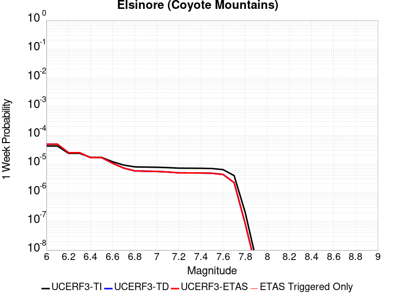 | 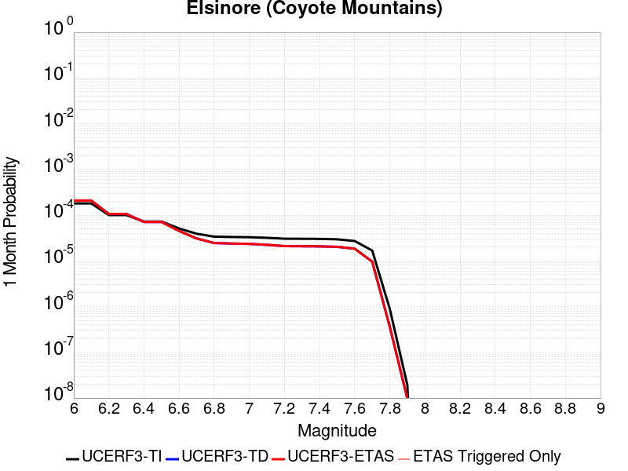 | 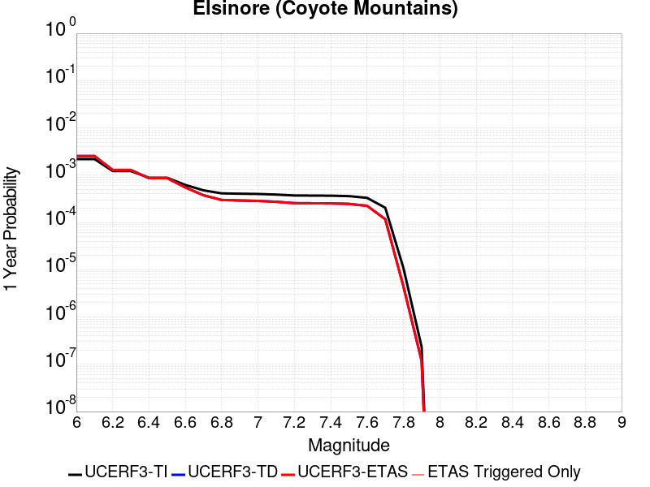 | 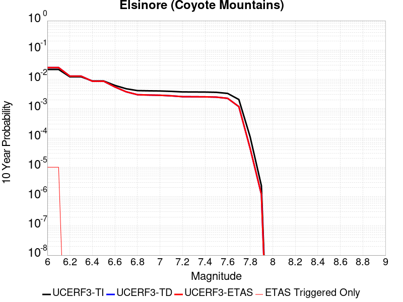 |

| Magnitude | 1 wk TI Prob | 1 wk TD Prob | 1 wk ETAS Prob | 1 wk ETAS/TD Gain | 1 wk ETAS Triggered Only | 1 mo TI Prob | 1 mo TD Prob | 1 mo ETAS Prob | 1 mo ETAS/TD Gain | 1 mo ETAS Triggered Only | 1 yr TI Prob | 1 yr TD Prob | 1 yr ETAS Prob | 1 yr ETAS/TD Gain | 1 yr ETAS Triggered Only | 10 yr TI Prob | 10 yr TD Prob | 10 yr ETAS Prob | 10 yr ETAS/TD Gain | 10 yr ETAS Triggered Only |
|-----|-----|-----|-----|-----|-----|-----|-----|-----|-----|-----|-----|-----|-----|-----|-----|-----|-----|-----|-----|-----|
| 6.0 | 4.20513E-5 | 4.8633563E-5 | 4.8633563E-5 | 1.0 | 0.0 | 1.8020741E-4 | 2.0841615E-4 | 2.0841615E-4 | 1.0 | 0.0 | 0.0021918174 | 0.0025350873 | 0.0025350873 | 1.0 | 0.0 | 0.021703249 | 0.025112117 | 0.025121866 | 1.0003883 | 1.0E-5 |
| 6.1 | 4.20513E-5 | 4.8633563E-5 | 4.8633563E-5 | 1.0 | 0.0 | 1.8020741E-4 | 2.0841615E-4 | 2.0841615E-4 | 1.0 | 0.0 | 0.0021918174 | 0.0025350873 | 0.0025350873 | 1.0 | 0.0 | 0.021703249 | 0.025112117 | 0.025121866 | 1.0003883 | 1.0E-5 |
| 6.2 | 2.3413893E-5 | 2.4696421E-5 | 2.4696421E-5 | 1.0 | 0.0 | 1.0034139E-4 | 1.0583805E-4 | 1.0583805E-4 | 1.0 | 0.0 | 0.0012209718 | 0.0012879103 | 0.0012879103 | 1.0 | 0.0 | 0.012142851 | 0.012813029 | 0.012813029 | 1.0 | 0.0 |
| 6.3 | 2.3413893E-5 | 2.4696421E-5 | 2.4696421E-5 | 1.0 | 0.0 | 1.0034139E-4 | 1.0583805E-4 | 1.0583805E-4 | 1.0 | 0.0 | 0.0012209718 | 0.0012879103 | 0.0012879103 | 1.0 | 0.0 | 0.012142851 | 0.012813029 | 0.012813029 | 1.0 | 0.0 |
| 6.4 | 1.6894814E-5 | 1.6568854E-5 | 1.6568854E-5 | 1.0 | 0.0 | 7.240433E-5 | 7.100766E-5 | 7.100766E-5 | 1.0 | 0.0 | 8.811662E-4 | 8.6421217E-4 | 8.6421217E-4 | 1.0 | 0.0 | 0.0087768035 | 0.008612194 | 0.008612194 | 1.0 | 0.0 |
| 6.5 | 1.6894814E-5 | 1.6568854E-5 | 1.6568854E-5 | 1.0 | 0.0 | 7.240433E-5 | 7.100766E-5 | 7.100766E-5 | 1.0 | 0.0 | 8.811662E-4 | 8.6421217E-4 | 8.6421217E-4 | 1.0 | 0.0 | 0.0087768035 | 0.008612194 | 0.008612194 | 1.0 | 0.0 |
| 6.6 | 1.1910969E-5 | 1.05310955E-5 | 1.05310955E-5 | 1.0 | 0.0 | 5.1046012E-5 | 4.513256E-5 | 4.513256E-5 | 1.0 | 0.0 | 6.21308E-4 | 5.4936187E-4 | 5.4936187E-4 | 1.0 | 0.0 | 0.0061957375 | 0.0054813414 | 0.0054813414 | 1.0 | 0.0 |
| 6.7 | 9.1486E-6 | 7.2030907E-6 | 7.2030907E-6 | 1.0 | 0.0 | 3.9207694E-5 | 3.0870044E-5 | 3.0870044E-5 | 1.0 | 0.0 | 4.7724912E-4 | 3.757818E-4 | 3.757818E-4 | 1.0 | 0.0 | 0.0047622547 | 0.0037518432 | 0.0037518432 | 1.0 | 0.0 |
| 6.8 | 7.90441E-6 | 5.7292227E-6 | 5.7292227E-6 | 1.0 | 0.0 | 3.3875604E-5 | 2.4553588E-5 | 2.4553588E-5 | 1.0 | 0.0 | 4.1235742E-4 | 2.989002E-4 | 2.989002E-4 | 1.0 | 0.0 | 0.0041159308 | 0.0029851105 | 0.0029851105 | 1.0 | 0.0 |
| 6.9 | 7.77015E-6 | 5.5831756E-6 | 5.5831756E-6 | 1.0 | 0.0 | 3.3300217E-5 | 2.3927683E-5 | 2.3927683E-5 | 1.0 | 0.0 | 4.0535472E-4 | 2.9128187E-4 | 2.9128187E-4 | 1.0 | 0.0 | 0.004046161 | 0.0029091279 | 0.0029091279 | 1.0 | 0.0 |
| 7.0 | 7.675798E-6 | 5.480033E-6 | 5.480033E-6 | 1.0 | 0.0 | 3.289586E-5 | 2.348565E-5 | 2.348565E-5 | 1.0 | 0.0 | 4.004335E-4 | 2.8590154E-4 | 2.8590154E-4 | 1.0 | 0.0 | 0.003997127 | 0.0028554637 | 0.0028554637 | 1.0 | 0.0 |
| 7.1 | 7.447814E-6 | 5.2389046E-6 | 5.2389046E-6 | 1.0 | 0.0 | 3.191881E-5 | 2.2452263E-5 | 2.2452263E-5 | 1.0 | 0.0 | 3.8854225E-4 | 2.7332324E-4 | 2.7332324E-4 | 1.0 | 0.0 | 0.003878636 | 0.0027299952 | 0.0027299952 | 1.0 | 0.0 |
| 7.2 | 7.128185E-6 | 4.9055616E-6 | 4.9055616E-6 | 1.0 | 0.0 | 3.0549007E-5 | 2.1023672E-5 | 2.1023672E-5 | 1.0 | 0.0 | 3.7187067E-4 | 2.5593434E-4 | 2.5593434E-4 | 1.0 | 0.0 | 0.00371249 | 0.0025565142 | 0.0025565142 | 1.0 | 0.0 |
| 7.3 | 7.0913875E-6 | 4.8742363E-6 | 4.8742363E-6 | 1.0 | 0.0 | 3.0391306E-5 | 2.0889423E-5 | 2.0889423E-5 | 1.0 | 0.0 | 3.6995133E-4 | 2.5430025E-4 | 2.5430025E-4 | 1.0 | 0.0 | 0.0036933604 | 0.0025402107 | 0.0025402107 | 1.0 | 0.0 |
| 7.4 | 7.051521E-6 | 4.8380875E-6 | 4.8380875E-6 | 1.0 | 0.0 | 3.0220453E-5 | 2.0734502E-5 | 2.0734502E-5 | 1.0 | 0.0 | 3.6787192E-4 | 2.524145E-4 | 2.524145E-4 | 1.0 | 0.0 | 0.0036726352 | 0.0025213964 | 0.0025213964 | 1.0 | 0.0 |
| 7.5 | 6.910666E-6 | 4.7336343E-6 | 4.7336343E-6 | 1.0 | 0.0 | 2.9616802E-5 | 2.0286852E-5 | 2.0286852E-5 | 1.0 | 0.0 | 3.605249E-4 | 2.4696562E-4 | 2.4696562E-4 | 1.0 | 0.0 | 0.0035994058 | 0.0024670297 | 0.0024670297 | 1.0 | 0.0 |
| 7.6 | 6.341753E-6 | 4.3067316E-6 | 4.3067316E-6 | 1.0 | 0.0 | 2.7178658E-5 | 1.8457298E-5 | 1.8457298E-5 | 1.0 | 0.0 | 3.3084993E-4 | 2.246956E-4 | 2.246956E-4 | 1.0 | 0.0 | 0.0033035777 | 0.0022447994 | 0.0022447994 | 1.0 | 0.0 |
| 7.7 | 3.9205916E-6 | 2.2440495E-6 | 2.2440495E-6 | 1.0 | 0.0 | 1.6802427E-5 | 9.6173235E-6 | 9.6173235E-6 | 1.0 | 0.0 | 2.0455034E-4 | 1.1708537E-4 | 1.1708537E-4 | 1.0 | 0.0 | 0.0020436216 | 0.0011703098 | 0.0011703098 | 1.0 | 0.0 |
| 7.8 | 2.0846227E-7 | 8.4868525E-8 | 8.4868525E-8 | 1.0 | 0.0 | 8.9340944E-7 | 3.6372222E-7 | 3.6372222E-7 | 1.0 | 0.0 | 1.0877206E-5 | 4.4283124E-6 | 4.4283124E-6 | 1.0 | 0.0 | 1.0876673E-4 | 4.4282566E-5 | 4.4282566E-5 | 1.0 | 0.0 |
| 7.9 | 4.4969806E-9 | 2.2692683E-9 | 2.2692683E-9 | 1.0 | 0.0 | 1.9272775E-8 | 9.725436E-9 | 9.725436E-9 | 1.0 | 0.0 | 2.3464601E-7 | 1.1840718E-7 | 1.1840718E-7 | 1.0 | 0.0 | 2.3464577E-6 | 1.1840713E-6 | 1.1840713E-6 | 1.0 | 0.0 |

