# Parent Section Magnitude-Probability Distributions

Only fault sections with at least one triggered aftershock are plotted. Sections are sorted by total supraseismogenic trigger rate (decreasing)

## Table Of Contents

* [Garlock (Central)](#garlock-central)
* [Tank Canyon](#tank-canyon)
* [Owl Lake](#owl-lake)
* [Little Lake](#little-lake)
* [Airport Lake](#airport-lake)
* [Panamint Valley](#panamint-valley)
* [Garlock (East)](#garlock-east)
* [Hunter Mountain-Saline Valley](#hunter-mountain-saline-valley)
* [Ash Hill](#ash-hill)
* [Blackwater](#blackwater)
* [Garlock (West)](#garlock-west)
* [McLean Lake](#mclean-lake)
* [Goldstone Lake](#goldstone-lake)
* [Gravel Hills-Harper Lk](#gravel-hills-harper-lk)
* [So Sierra Nevada](#so-sierra-nevada)
* [Death Valley (So)](#death-valley-so)
* [San Andreas (Mojave S)](#san-andreas-mojave-s)
* [Coyote Canyon](#coyote-canyon)
* [Nelson Lake](#nelson-lake)
* [San Andreas (Mojave N)](#san-andreas-mojave-n)
* [Towne Pass](#towne-pass)
* [Lenwood-Lockhart-Old Woman Springs](#lenwood-lockhart-old-woman-springs)
* [Bicycle Lake](#bicycle-lake)
* [Paradise](#paradise)
* [San Andreas (San Bernardino N)](#san-andreas-san-bernardino-n)
* [Garlic Springs](#garlic-springs)
* [Death Valley (Black Mtns Frontal)](#death-valley-black-mtns-frontal)
* [San Andreas (San Bernardino S)](#san-andreas-san-bernardino-s)
* [Coyote Lake](#coyote-lake)
* [Helendale-So Lockhart](#helendale-so-lockhart)
* [San Andreas (Big Bend)](#san-andreas-big-bend)
* [Sierra Nevada  (No Extension)](#sierra-nevada--no-extension)
* [Death Valley (No)](#death-valley-no)
* [Red Pass](#red-pass)
* [San Andreas (Parkfield)](#san-andreas-parkfield)
* [San Andreas (San Gorgonio Pass-Garnet HIll)](#san-andreas-san-gorgonio-pass-garnet-hill)
* [Death Valley (Fish Lake Valley)](#death-valley-fish-lake-valley)
* [Manix-Afton Hills](#manix-afton-hills)
* [Calico-Hidalgo](#calico-hidalgo)
* [San Andreas (Cholame) rev](#san-andreas-cholame-rev)
* [Lake Isabella (Seismicity)](#lake-isabella-seismicity)
* [San Andreas (Carrizo) rev](#san-andreas-carrizo-rev)
* [Cady](#cady)
* [Scodie Lineament](#scodie-lineament)
* [Baker](#baker)
* [Ludlow](#ludlow)
* [San Andreas (Coachella) rev](#san-andreas-coachella-rev)
* [Elsinore (Glen Ivy) rev](#elsinore-glen-ivy-rev)
* [San Andreas (North Branch Mill Creek)](#san-andreas-north-branch-mill-creek)
* [San Jacinto (San Bernardino)](#san-jacinto-san-bernardino)
* [Owens Valley](#owens-valley)
* [Independence rev 2011](#independence-rev-2011)
* [White Wolf (Extension)](#white-wolf-extension)
* [Santa Ynez (East)](#santa-ynez-east)
* [Santa Rosa Island](#santa-rosa-island)
* [Cleghorn Pass](#cleghorn-pass)
* [Cleghorn Lake](#cleghorn-lake)
* [Kern Canyon (North Kern) 2011](#kern-canyon-north-kern-2011)
* [White Mountains](#white-mountains)
* [Chino alt 1](#chino-alt-1)
* [San Jacinto (San Jacinto Valley) rev](#san-jacinto-san-jacinto-valley-rev)
* [Channel Islands Thrust](#channel-islands-thrust)
* [Mission Creek](#mission-creek)
* [Ventura-Pitas Point](#ventura-pitas-point)
* [San Andreas (Creeping Section) 2011 CFM](#san-andreas-creeping-section-2011-cfm)
* [Blue Cut](#blue-cut)
* [Pinto Mtn](#pinto-mtn)
* [Pisgah-Bullion Mtn-Mesquite Lk](#pisgah-bullion-mtn-mesquite-lk)
* [San Clemente](#san-clemente)
* [Mission Ridge-Arroyo Parida-Santa Ana](#mission-ridge-arroyo-parida-santa-ana)
* [San Jacinto (Anza) rev](#san-jacinto-anza-rev)
* [San Jacinto (Stepovers Combined)](#san-jacinto-stepovers-combined)
* [Big Pine (Central)](#big-pine-central)
* [Tin Mountain](#tin-mountain)
* [Santa Ynez (West)](#santa-ynez-west)
* [Brawley (Seismic Zone) alt 1](#brawley-seismic-zone-alt-1)
* [Dry Mountain](#dry-mountain)
* [Deep Springs](#deep-springs)
* [Kern Canyon (Lake Isabella) 2011](#kern-canyon-lake-isabella-2011)
* [Lost Hills](#lost-hills)
* [Camp Rock 2011](#camp-rock-2011)
* [Imperial](#imperial)
* [Whittier alt 1](#whittier-alt-1)
* [Cleghorn](#cleghorn)
* [Pleito](#pleito)
* [Red Mountain](#red-mountain)
* [San Jacinto (Lytle Creek connector)](#san-jacinto-lytle-creek-connector)
* [Bullion Mountains](#bullion-mountains)
* [Big Pine (East)](#big-pine-east)
* [Great Valley 09 (Laguna Seca)](#great-valley-09-laguna-seca)
* [Hosgri](#hosgri)
* [Green Valley 2011 CFM](#green-valley-2011-cfm)
* [San Jacinto (Coyote Creek)](#san-jacinto-coyote-creek)
* [Hosgri (Extension)](#hosgri-extension)
* [San Jacinto (Borrego)](#san-jacinto-borrego)
* [Santa Cruz Island](#santa-cruz-island)
* [San Jacinto (Clark) rev](#san-jacinto-clark-rev)
* [San Diego Trough north alt1](#san-diego-trough-north-alt1)
* [Elysian Park (Upper)](#elysian-park-upper)
* [Rose Canyon](#rose-canyon)
* [San Cayetano](#san-cayetano)
* [Mono Lake 2011 CFM](#mono-lake-2011-cfm)
* [Raymond](#raymond)
* [Pitas Point (Lower West)](#pitas-point-lower-west)
* [West Napa 2011 CFM](#west-napa-2011-cfm)
* [Greenville (So) 2011 CFM](#greenville-so-2011-cfm)
* [San Gorgonio Pass](#san-gorgonio-pass)
* [Honey Lake 2011 CFM](#honey-lake-2011-cfm)
* [Great Valley 11](#great-valley-11)
* [Quien Sabe 2011 CFM](#quien-sabe-2011-cfm)
* [Davis Creek](#davis-creek)
* [San Pedro Basin](#san-pedro-basin)
* [White Wolf](#white-wolf)
* [Mount Diablo Thrust South](#mount-diablo-thrust-south)
* [Calaveras (So) 2011 CFM](#calaveras-so-2011-cfm)
* [Greenville (No) 2011 CFM](#greenville-no-2011-cfm)
* [Great Valley 10 (Panoche)](#great-valley-10-panoche)
* [Kern Canyon (South Kern) 2011](#kern-canyon-south-kern-2011)
* [Pitas Point (Lower)-Montalvo](#pitas-point-lower-montalvo)
* [Oceanic - West Huasna](#oceanic---west-huasna)
* [Palos Verdes](#palos-verdes)
* [Santa Ynez River](#santa-ynez-river)
* [San Juan](#san-juan)
* [San Jacinto (Superstition Mtn)](#san-jacinto-superstition-mtn)
* [Malibu Coast alt 1](#malibu-coast-alt-1)
* [Likely 2011 CFM](#likely-2011-cfm)
* [San Gabriel](#san-gabriel)
* [San Diego Trough south](#san-diego-trough-south)
* [Los Alamos 2011 CFM](#los-alamos-2011-cfm)
* [Great Valley 07 (Orestimba)](#great-valley-07-orestimba)
* [Great Valley 03 Mysterious Ridge](#great-valley-03-mysterious-ridge)
* [Ortigalita (North)](#ortigalita-north)
* [San Luis Range - Oceano 2011 CFM](#san-luis-range---oceano-2011-cfm)
* [Monterey Bay-Tularcitos](#monterey-bay-tularcitos)
* [Emerson-Copper Mtn 2011](#emerson-copper-mtn-2011)
* [Cucamonga](#cucamonga)
* [North Salt Lake](#north-salt-lake)
* [North Frontal  (West)](#north-frontal--west)
* [Robinson Creek](#robinson-creek)
* [Mount Diablo Thrust North CFM](#mount-diablo-thrust-north-cfm)
* [Superstition Hills](#superstition-hills)
* [San Gregorio (North) 2011 CFM](#san-gregorio-north-2011-cfm)
* [Calaveras (No) 2011 CFM](#calaveras-no-2011-cfm)
* [Round Valley](#round-valley)
* [Sheephole](#sheephole)
* [La Panza 2011](#la-panza-2011)
* [San Luis Range 2011 CFM](#san-luis-range-2011-cfm)
* [Elsinore (Coyote Mountains)](#elsinore-coyote-mountains)
* [Great Valley 05 Pittsburg - Kirby Hills alt1](#great-valley-05-pittsburg---kirby-hills-alt1)
* [Los Alamos extension](#los-alamos-extension)
* [Channel Islands Western Deep Ramp](#channel-islands-western-deep-ramp)
* [Simi-Santa Rosa](#simi-santa-rosa)
* [Newport-Inglewood alt 1](#newport-inglewood-alt-1)
* [Puente Hills](#puente-hills)
* [Clamshell-Sawpit](#clamshell-sawpit)
* [Hollywood](#hollywood)
* [Cerro Prieto](#cerro-prieto)
* [Casmalia 2011 CFM](#casmalia-2011-cfm)
* [Elsinore (Temecula) rev](#elsinore-temecula-rev)
* [Concord 2011 CFM](#concord-2011-cfm)
* [Coronado Bank alt1](#coronado-bank-alt1)
* [Santa Cruz Catalina Ridge alt1](#santa-cruz-catalina-ridge-alt1)
* [Oak Ridge (Onshore)](#oak-ridge-onshore)
* [Rinconada 2011 CFM](#rinconada-2011-cfm)
* [Calaveras (So) - Paicines extension 2011 CFM](#calaveras-so---paicines-extension-2011-cfm)
* [Fontana (Seismicity)](#fontana-seismicity)
* [Newport-Inglewood (Offshore)](#newport-inglewood-offshore)
* [Breckenridge 2011](#breckenridge-2011)
* [San Gabriel (Extension)](#san-gabriel-extension)
* [North Frontal  (East)](#north-frontal--east)
* [Malibu Coast (Extension) alt 1](#malibu-coast-extension-alt-1)
* [Eaton Roughs 2011 CFM](#eaton-roughs-2011-cfm)
* [Northridge](#northridge)
* [Great Valley 08 (Quinto)](#great-valley-08-quinto)
* [Hector Mine](#hector-mine)
* [Shoreline](#shoreline)
* [San Gregorio (South) 2011 CFM](#san-gregorio-south-2011-cfm)
* [Owens Valley Keough Hot Springs](#owens-valley-keough-hot-springs)
* [Peralta Hills](#peralta-hills)
* [Clayton](#clayton)
* [Contra Costa Shear Zone (connector) 2011 CFM](#contra-costa-shear-zone-connector-2011-cfm)
* [Los Medanos - Roe Island](#los-medanos---roe-island)
* [San Jose](#san-jose)
* [Ortigalita (South)](#ortigalita-south)

## Garlock (Central)
*[(top)](#table-of-contents)*

| 1 Week | 1 Month | 1 Year | 10 Year |
|-----|-----|-----|-----|
|  |  | 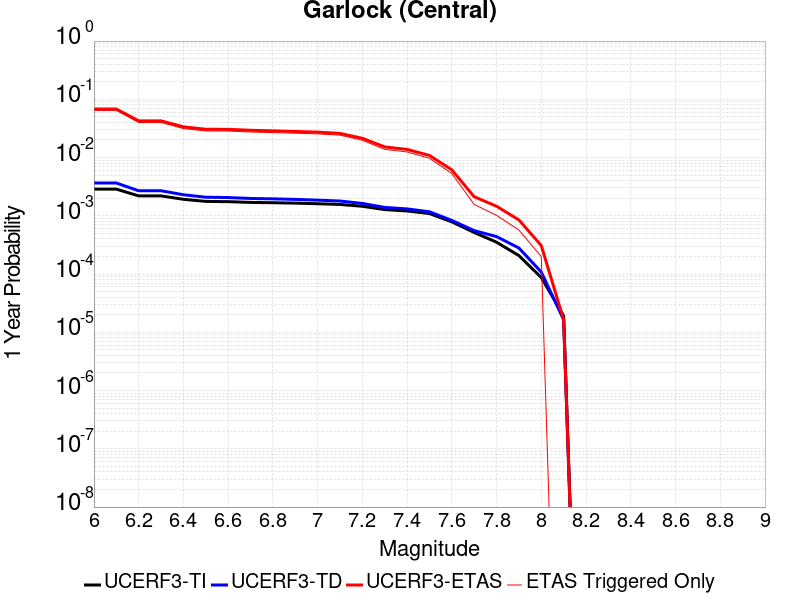 |  |

| Magnitude | 1 wk TI Prob | 1 wk TD Prob | 1 wk ETAS Prob | 1 wk ETAS/TD Gain | 1 wk ETAS Triggered Only | 1 mo TI Prob | 1 mo TD Prob | 1 mo ETAS Prob | 1 mo ETAS/TD Gain | 1 mo ETAS Triggered Only | 1 yr TI Prob | 1 yr TD Prob | 1 yr ETAS Prob | 1 yr ETAS/TD Gain | 1 yr ETAS Triggered Only | 10 yr TI Prob | 10 yr TD Prob | 10 yr ETAS Prob | 10 yr ETAS/TD Gain | 10 yr ETAS Triggered Only |
|-----|-----|-----|-----|-----|-----|-----|-----|-----|-----|-----|-----|-----|-----|-----|-----|-----|-----|-----|-----|-----|
| 6.0 | 5.5131142E-5 | 7.0252914E-5 | 0.01068044 | 152.02841 | 0.0106109325 | 2.3625491E-4 | 3.0104956E-4 | 0.026756106 | 88.87608 | 0.026463022 | 0.0028726095 | 0.0036591839 | 0.068373285 | 18.685392 | 0.06495177 | 0.028357591 | 0.03608289 | 0.13274321 | 3.678841 | 0.10027867 |
| 6.1 | 5.5131142E-5 | 7.0252914E-5 | 0.01068044 | 152.02841 | 0.0106109325 | 2.3625491E-4 | 3.0104956E-4 | 0.026756106 | 88.87608 | 0.026463022 | 0.0028726095 | 0.0036591839 | 0.068373285 | 18.685392 | 0.06495177 | 0.028357591 | 0.03608289 | 0.13274321 | 3.678841 | 0.10027867 |
| 6.2 | 4.216245E-5 | 5.166702E-5 | 0.006675119 | 129.19498 | 0.0066237943 | 1.806837E-4 | 2.2141146E-4 | 0.01640218 | 74.080086 | 0.016184352 | 0.0021976046 | 0.0026923837 | 0.042777095 | 15.888186 | 0.040192924 | 0.021759989 | 0.02669258 | 0.08743823 | 3.2757504 | 0.062411577 |
| 6.3 | 4.216245E-5 | 5.166702E-5 | 0.006675119 | 129.19498 | 0.0066237943 | 1.806837E-4 | 2.2141146E-4 | 0.01640218 | 74.080086 | 0.016184352 | 0.0021976046 | 0.0026923837 | 0.042777095 | 15.888186 | 0.040192924 | 0.021759989 | 0.02669258 | 0.08743823 | 3.2757504 | 0.062411577 |
| 6.4 | 3.6858168E-5 | 4.411584E-5 | 0.00533863 | 121.01391 | 0.005294748 | 1.5795401E-4 | 1.8905434E-4 | 0.012855469 | 67.99881 | 0.01266881 | 0.0019213937 | 0.0022993318 | 0.033812985 | 14.705569 | 0.031586282 | 0.019048655 | 0.02285164 | 0.070839785 | 3.0999868 | 0.049110398 |
| 6.5 | 3.39199E-5 | 4.0023286E-5 | 0.0049701585 | 124.18166 | 0.0049303323 | 1.453629E-4 | 1.7151721E-4 | 0.011798676 | 68.79004 | 0.011629153 | 0.0017683565 | 0.0020862438 | 0.030686688 | 14.709061 | 0.028660236 | 0.017543508 | 0.02076252 | 0.064361155 | 3.0998719 | 0.044523045 |
| 6.6 | 3.3571985E-5 | 3.947746E-5 | 0.0049588974 | 125.61338 | 0.004919614 | 1.4387199E-4 | 1.6917827E-4 | 0.011774931 | 69.60073 | 0.011607717 | 0.0017502342 | 0.0020578213 | 0.030594904 | 14.867619 | 0.028595926 | 0.017365133 | 0.02048383 | 0.06400038 | 3.1244347 | 0.044426583 |
| 6.7 | 3.2580007E-5 | 3.8093858E-5 | 0.0047431663 | 124.512634 | 0.0047052517 | 1.3962112E-4 | 1.632493E-4 | 0.0113297 | 69.40122 | 0.011168274 | 0.0016985617 | 0.0019857697 | 0.029498016 | 14.854701 | 0.027566988 | 0.016856372 | 0.019776449 | 0.06168547 | 3.119138 | 0.042754557 |
| 6.8 | 3.2185937E-5 | 3.7521055E-5 | 0.004613984 | 122.97053 | 0.0045766346 | 1.3793244E-4 | 1.6079473E-4 | 0.011080796 | 68.91268 | 0.010921758 | 0.0016780337 | 0.0019559395 | 0.028837876 | 14.743747 | 0.02693462 | 0.016654192 | 0.01948324 | 0.060522016 | 3.106363 | 0.041854233 |
| 6.9 | 3.165394E-5 | 3.672561E-5 | 0.004463144 | 121.52674 | 0.004426581 | 1.3565269E-4 | 1.5738611E-4 | 0.010777365 | 68.477234 | 0.01062165 | 0.0016503202 | 0.0019145131 | 0.02811292 | 14.68411 | 0.02624866 | 0.01638118 | 0.01907586 | 0.05904878 | 3.0954716 | 0.04075027 |
| 7.0 | 3.0903822E-5 | 3.5630834E-5 | 0.0042798524 | 120.11654 | 0.004244373 | 1.3243823E-4 | 1.5269476E-4 | 0.010429796 | 68.30487 | 0.010278671 | 0.0016112428 | 0.0018574947 | 0.027362015 | 14.730601 | 0.025551982 | 0.015996104 | 0.018515008 | 0.057448298 | 3.1027963 | 0.039667737 |
| 7.1 | 3.0069863E-5 | 3.4397097E-5 | 0.004032116 | 117.222565 | 0.0039978563 | 1.2886449E-4 | 1.4740792E-4 | 0.009845871 | 66.793365 | 0.009699893 | 0.0015677959 | 0.0017932352 | 0.02600483 | 14.501629 | 0.024255091 | 0.01556781 | 0.017882649 | 0.054830473 | 3.0661268 | 0.037620578 |
| 7.2 | 2.7957109E-5 | 3.1286367E-5 | 0.003332362 | 106.511635 | 0.003301179 | 1.1981068E-4 | 1.3407765E-4 | 0.008064418 | 60.147373 | 0.007931404 | 0.0014577188 | 0.0016311926 | 0.021395257 | 13.116327 | 0.019796357 | 0.014481937 | 0.016286217 | 0.046577852 | 2.8599555 | 0.03079314 |
| 7.3 | 2.4519275E-5 | 2.6719412E-5 | 0.0022881809 | 85.6374 | 0.002261522 | 1.0507837E-4 | 1.14506816E-4 | 0.00564442 | 49.29331 | 0.0055305464 | 0.0012785783 | 0.0013932437 | 0.015232456 | 10.933088 | 0.013858521 | 0.012712469 | 0.013930428 | 0.03540624 | 2.5416477 | 0.021779208 |
| 7.4 | 2.3225532E-5 | 2.5203923E-5 | 0.0020401585 | 80.94607 | 0.0020150053 | 9.95342E-5 | 1.0801242E-4 | 0.005102114 | 47.236362 | 0.004994641 | 0.0012111551 | 0.0013142723 | 0.0137523515 | 10.463853 | 0.012454448 | 0.012045753 | 0.013148054 | 0.032578353 | 2.4778082 | 0.019689174 |
| 7.5 | 2.097765E-5 | 2.2487986E-5 | 0.0015980153 | 71.060844 | 0.0015755628 | 8.9901114E-5 | 9.637359E-5 | 0.0039759567 | 41.25567 | 0.0038799571 | 0.0010939965 | 0.0011727286 | 0.010861246 | 9.261517 | 0.009699893 | 0.010886264 | 0.011742581 | 0.026762398 | 2.2790902 | 0.015198285 |
| 7.6 | 1.511254E-5 | 1.5995334E-5 | 8.3055894E-4 | 51.925076 | 8.1457663E-4 | 6.476642E-5 | 6.854967E-5 | 0.0021584386 | 31.487219 | 0.0020900322 | 7.882459E-4 | 8.342805E-4 | 0.006167448 | 7.392535 | 0.0053376206 | 0.007854558 | 0.008385628 | 0.016760677 | 1.9987384 | 0.008445874 |
| 7.7 | 9.934069E-6 | 1.0682508E-5 | 2.2504249E-4 | 21.066448 | 2.1436227E-4 | 4.2573887E-5 | 4.5781377E-5 | 6.995564E-4 | 15.280371 | 6.538049E-4 | 5.182138E-4 | 5.572461E-4 | 0.0021426429 | 3.845057 | 0.0015862808 | 0.00517007 | 0.0056296107 | 0.007963663 | 1.4146029 | 0.0023472668 |
| 7.8 | 6.7562896E-6 | 8.431477E-6 | 1.6920183E-4 | 20.067877 | 1.607717E-4 | 2.8955206E-5 | 3.61344E-5 | 4.5412572E-4 | 12.567684 | 4.1800644E-4 | 3.5247262E-4 | 4.3984767E-4 | 0.001468334 | 3.3382785 | 0.0010289389 | 0.0035191406 | 0.0044482257 | 0.0059314165 | 1.3334342 | 0.0014898177 |
| 7.9 | 3.975453E-6 | 5.3728795E-6 | 1.232715E-4 | 22.943283 | 1.17899246E-4 | 1.7037546E-5 | 2.3026425E-5 | 3.231267E-4 | 14.032865 | 3.0010717E-4 | 2.0741238E-4 | 2.8031075E-4 | 8.482115E-4 | 3.0259686 | 5.6806003E-4 | 0.002072189 | 0.0028345888 | 0.003625481 | 1.2790148 | 7.931404E-4 |
| 8.0 | 1.6729537E-6 | 2.078155E-6 | 4.495052E-5 | 21.630013 | 4.2872456E-5 | 7.169782E-6 | 8.906349E-6 | 1.2680455E-4 | 14.237546 | 1.17899246E-4 | 8.7288594E-5 | 1.08429434E-4 | 3.120515E-4 | 2.8779225 | 2.0364416E-4 | 8.7254314E-4 | 0.001097267 | 0.0013542195 | 1.234175 | 2.5723473E-4 |
| 8.1 | 3.6733252E-7 | 3.1499187E-7 | 3.1499187E-7 | 1.0 | 0.0 | 1.5742813E-6 | 1.3499646E-6 | 1.3499646E-6 | 1.0 | 0.0 | 1.9166706E-5 | 1.643571E-5 | 1.643571E-5 | 1.0 | 0.0 | 1.9165053E-4 | 1.6643589E-4 | 1.7715222E-4 | 1.0643871 | 1.0718114E-5 |

## Tank Canyon
*[(top)](#table-of-contents)*

| 1 Week | 1 Month | 1 Year | 10 Year |
|-----|-----|-----|-----|
|  |  |  |  |

| Magnitude | 1 wk TI Prob | 1 wk TD Prob | 1 wk ETAS Prob | 1 wk ETAS/TD Gain | 1 wk ETAS Triggered Only | 1 mo TI Prob | 1 mo TD Prob | 1 mo ETAS Prob | 1 mo ETAS/TD Gain | 1 mo ETAS Triggered Only | 1 yr TI Prob | 1 yr TD Prob | 1 yr ETAS Prob | 1 yr ETAS/TD Gain | 1 yr ETAS Triggered Only | 10 yr TI Prob | 10 yr TD Prob | 10 yr ETAS Prob | 10 yr ETAS/TD Gain | 10 yr ETAS Triggered Only |
|-----|-----|-----|-----|-----|-----|-----|-----|-----|-----|-----|-----|-----|-----|-----|-----|-----|-----|-----|-----|-----|
| 6.0 | 4.8284557E-5 | 5.796635E-5 | 0.0049987305 | 86.23504 | 0.0049410504 | 2.0691741E-4 | 2.484074E-4 | 0.01350342 | 54.359978 | 0.013258306 | 0.0025163088 | 0.0030208372 | 0.038732566 | 12.821798 | 0.035819937 | 0.02488006 | 0.029864404 | 0.09082802 | 3.041347 | 0.0628403 |
| 6.1 | 1.7796336E-5 | 2.0873764E-5 | 0.0016285572 | 78.01934 | 0.001607717 | 7.626778E-5 | 8.945614E-5 | 0.00448349 | 50.11942 | 0.0043944265 | 9.281647E-4 | 0.0010886216 | 0.013722227 | 12.605141 | 0.012647374 | 0.009242975 | 0.010836975 | 0.033599388 | 3.1004395 | 0.02301179 |
| 6.2 | 1.7796336E-5 | 2.0873764E-5 | 0.0016285572 | 78.01934 | 0.001607717 | 7.626778E-5 | 8.945614E-5 | 0.00448349 | 50.11942 | 0.0043944265 | 9.281647E-4 | 0.0010886216 | 0.013722227 | 12.605141 | 0.012647374 | 0.009242975 | 0.010836975 | 0.033599388 | 3.1004395 | 0.02301179 |
| 6.3 | 1.3515912E-5 | 1.575988E-5 | 0.0011411441 | 72.408165 | 0.0011254019 | 5.792405E-5 | 6.7540735E-5 | 0.003154149 | 46.69995 | 0.0030868168 | 7.049971E-4 | 8.220222E-4 | 0.0101176975 | 12.308301 | 0.009303323 | 0.007027647 | 0.008192427 | 0.024775706 | 3.0242202 | 0.016720258 |
| 6.4 | 1.0870146E-5 | 1.2618259E-5 | 7.5215875E-4 | 59.60876 | 7.395498E-4 | 4.658551E-5 | 5.407723E-5 | 0.0023047593 | 42.619774 | 0.0022508039 | 5.67031E-4 | 6.582093E-4 | 0.007502576 | 11.398465 | 0.0068488745 | 0.005655863 | 0.006564614 | 0.019065076 | 2.9042192 | 0.012583066 |
| 6.5 | 7.964826E-6 | 9.196251E-6 | 5.55815E-4 | 60.4393 | 5.466238E-4 | 3.4134522E-5 | 3.941197E-5 | 0.0015398888 | 39.071598 | 0.0015005359 | 4.1550855E-4 | 4.7974577E-4 | 0.0051720273 | 10.780767 | 0.0046945335 | 0.0041473247 | 0.0047884025 | 0.012927164 | 2.699682 | 0.00817792 |
| 6.6 | 6.6317E-6 | 7.6124184E-6 | 4.363337E-4 | 57.31867 | 4.2872454E-4 | 2.8421264E-5 | 3.2624295E-5 | 0.0011579895 | 35.4947 | 0.0011254019 | 3.4597394E-4 | 3.971375E-4 | 0.0040612766 | 10.226374 | 0.0036655948 | 0.0034543579 | 0.00396543 | 0.010296068 | 2.5964568 | 0.006355841 |
| 6.7 | 4.793663E-6 | 5.4308543E-6 | 2.1979197E-4 | 40.470974 | 2.1436227E-4 | 2.0544108E-5 | 2.3274906E-5 | 6.1275746E-4 | 26.326956 | 5.894962E-4 | 2.500958E-4 | 2.8333953E-4 | 0.0022013383 | 7.7692595 | 0.0019185423 | 0.0024981452 | 0.0028304753 | 0.0061864373 | 2.185653 | 0.0033654876 |
| 6.8 | 4.382823E-6 | 4.969316E-6 | 1.978944E-4 | 39.82327 | 1.9292605E-4 | 1.8783392E-5 | 2.1296917E-5 | 5.571912E-4 | 26.162996 | 5.3590565E-4 | 2.286638E-4 | 2.5926338E-4 | 0.001941571 | 7.488797 | 0.0016827438 | 0.0022842865 | 0.0025902835 | 0.0055728913 | 2.15146 | 0.0029903536 |
| 6.9 | 2.729601E-6 | 3.0735694E-6 | 8.881821E-5 | 28.897417 | 8.574491E-5 | 1.1698237E-5 | 1.317238E-5 | 2.7040372E-4 | 20.528084 | 2.5723473E-4 | 1.4241673E-4 | 1.6036315E-4 | 7.4976485E-4 | 4.6754184 | 5.894962E-4 | 0.001423255 | 0.0016026403 | 0.0026834349 | 1.6743838 | 0.0010825294 |
| 7.0 | 1.8987357E-6 | 2.126954E-6 | 5.571741E-5 | 26.19587 | 5.3590567E-5 | 8.137413E-6 | 9.115489E-6 | 1.2701367E-4 | 13.933828 | 1.17899246E-4 | 9.90685E-5 | 1.1097613E-4 | 4.0033308E-4 | 3.6073802 | 2.8938908E-4 | 9.902435E-4 | 0.0011092757 | 0.001644587 | 1.4825772 | 5.3590565E-4 |
| 7.1 | 1.4928986E-6 | 1.6641375E-6 | 1.2382233E-5 | 7.4406314 | 1.0718114E-5 | 6.398121E-6 | 7.1320014E-6 | 5.000415E-5 | 7.0112367 | 4.2872456E-5 | 7.789434E-5 | 8.682925E-5 | 2.1543544E-4 | 2.4811392 | 1.2861736E-4 | 7.786704E-4 | 8.680111E-4 | 0.001157149 | 1.3331039 | 2.8938908E-4 |
| 7.2 | 1.069082E-6 | 1.1828638E-6 | 1.1900965E-5 | 10.061146 | 1.0718114E-5 | 4.581772E-6 | 5.0694093E-6 | 2.6505528E-5 | 5.2285237 | 2.1436228E-5 | 5.5781646E-5 | 6.171884E-5 | 1.3674102E-4 | 2.215547 | 7.5026794E-5 | 5.576765E-4 | 6.170693E-4 | 8.098763E-4 | 1.312456 | 1.9292605E-4 |
| 7.3 | 8.776551E-7 | 9.770052E-7 | 1.1695109E-5 | 11.970364 | 1.0718114E-5 | 3.7613736E-6 | 4.1871617E-6 | 2.56233E-5 | 6.1194916 | 2.1436228E-5 | 4.579376E-5 | 5.097802E-5 | 1.0456586E-4 | 2.051195 | 5.3590567E-5 | 4.5784327E-4 | 5.0971424E-4 | 6.2755344E-4 | 1.2311867 | 1.17899246E-4 |
| 7.4 | 7.55721E-7 | 8.510284E-7 | 1.1569133E-5 | 13.594297 | 1.0718114E-5 | 3.2388E-6 | 3.6472622E-6 | 1.4365337E-5 | 3.938663 | 1.0718114E-5 | 3.9431678E-5 | 4.440503E-5 | 8.7275585E-5 | 1.9654435 | 4.2872456E-5 | 3.942468E-4 | 4.4401243E-4 | 5.297193E-4 | 1.193028 | 8.574491E-5 |
| 7.5 | 5.587665E-7 | 6.305647E-7 | 1.1348671E-5 | 17.997631 | 1.0718114E-5 | 2.3947114E-6 | 2.7024203E-6 | 1.3420505E-5 | 4.9661055 | 1.0718114E-5 | 2.915522E-5 | 3.2901968E-5 | 5.4337488E-5 | 1.6514966 | 2.1436228E-5 | 2.9151395E-4 | 3.2901968E-4 | 3.825926E-4 | 1.162826 | 5.3590567E-5 |

## Owl Lake
*[(top)](#table-of-contents)*

| 1 Week | 1 Month | 1 Year | 10 Year |
|-----|-----|-----|-----|
|  |  |  |  |

| Magnitude | 1 wk TI Prob | 1 wk TD Prob | 1 wk ETAS Prob | 1 wk ETAS/TD Gain | 1 wk ETAS Triggered Only | 1 mo TI Prob | 1 mo TD Prob | 1 mo ETAS Prob | 1 mo ETAS/TD Gain | 1 mo ETAS Triggered Only | 1 yr TI Prob | 1 yr TD Prob | 1 yr ETAS Prob | 1 yr ETAS/TD Gain | 1 yr ETAS Triggered Only | 10 yr TI Prob | 10 yr TD Prob | 10 yr ETAS Prob | 10 yr ETAS/TD Gain | 10 yr ETAS Triggered Only |
|-----|-----|-----|-----|-----|-----|-----|-----|-----|-----|-----|-----|-----|-----|-----|-----|-----|-----|-----|-----|-----|
| 6.0 | 5.0320643E-5 | 6.636149E-5 | 0.0027778642 | 41.85958 | 0.0027116828 | 2.1564208E-4 | 2.8438168E-4 | 0.00736704 | 25.905466 | 0.0070846733 | 0.0026222812 | 0.00345791 | 0.02194681 | 6.3468423 | 0.018553054 | 0.02591553 | 0.0341423 | 0.06326296 | 1.8529203 | 0.030150054 |
| 6.1 | 5.0320643E-5 | 6.636149E-5 | 0.0027778642 | 41.85958 | 0.0027116828 | 2.1564208E-4 | 2.8438168E-4 | 0.00736704 | 25.905466 | 0.0070846733 | 0.0026222812 | 0.00345791 | 0.02194681 | 6.3468423 | 0.018553054 | 0.02591553 | 0.0341423 | 0.06326296 | 1.8529203 | 0.030150054 |
| 6.2 | 2.4125871E-5 | 3.098269E-5 | 0.0022602812 | 72.95303 | 0.0022293676 | 1.0339249E-4 | 1.3277736E-4 | 0.0058447733 | 44.01935 | 0.0057127546 | 0.0012580766 | 0.0016155228 | 0.016029498 | 9.9221735 | 0.014437299 | 0.012509781 | 0.016071297 | 0.039282735 | 2.444279 | 0.023590568 |
| 6.3 | 1.7433485E-5 | 2.2356835E-5 | 0.0020909065 | 93.52426 | 0.002068596 | 7.471279E-5 | 9.5812386E-5 | 0.0052935993 | 55.249638 | 0.005198285 | 9.0924866E-4 | 0.0011660426 | 0.014044899 | 12.044927 | 0.012893891 | 0.009055373 | 0.01162957 | 0.032117333 | 2.7616959 | 0.020728832 |
| 6.4 | 1.7433485E-5 | 2.2356835E-5 | 0.0020909065 | 93.52426 | 0.002068596 | 7.471279E-5 | 9.5812386E-5 | 0.0052935993 | 55.249638 | 0.005198285 | 9.0924866E-4 | 0.0011660426 | 0.014044899 | 12.044927 | 0.012893891 | 0.009055373 | 0.01162957 | 0.032117333 | 2.7616959 | 0.020728832 |
| 6.5 | 1.5182742E-5 | 1.9430352E-5 | 0.001980807 | 101.943954 | 0.0019614147 | 6.506727E-5 | 8.327114E-5 | 0.0050989306 | 61.232872 | 0.0050160773 | 7.919061E-4 | 0.0010135059 | 0.013455331 | 13.276028 | 0.012454448 | 0.0078909 | 0.010119047 | 0.02975752 | 2.9407434 | 0.019839229 |
| 6.6 | 6.7271576E-6 | 8.548157E-6 | 0.0016805596 | 196.59906 | 0.0016720258 | 2.8830356E-5 | 3.6634476E-5 | 0.0042486987 | 115.975426 | 0.004212219 | 3.5095305E-4 | 4.4593913E-4 | 0.010452193 | 23.43861 | 0.010010718 | 0.0035039932 | 0.004468226 | 0.01953458 | 4.371887 | 0.015133976 |
| 6.7 | 6.682835E-6 | 8.4806015E-6 | 0.0016804922 | 198.15718 | 0.0016720258 | 2.8640408E-5 | 3.634496E-5 | 0.0042484105 | 116.89132 | 0.004212219 | 3.4864116E-4 | 4.424157E-4 | 0.0104487045 | 23.617392 | 0.010010718 | 0.003480947 | 0.004433152 | 0.019500038 | 4.398685 | 0.015133976 |
| 6.8 | 6.5774975E-6 | 8.327072E-6 | 0.0016803389 | 201.7923 | 0.0016720258 | 2.8188972E-5 | 3.5686993E-5 | 0.0042477553 | 119.028114 | 0.004212219 | 3.4314668E-4 | 4.3440814E-4 | 0.010397924 | 23.935839 | 0.009967846 | 0.0034261728 | 0.0043532955 | 0.01935736 | 4.446599 | 0.015069668 |
| 6.9 | 6.363419E-6 | 8.0002355E-6 | 0.0016800126 | 209.99539 | 0.0016720258 | 2.727151E-5 | 3.4286306E-5 | 0.0042463606 | 123.850044 | 0.004212219 | 3.3198006E-4 | 4.173614E-4 | 0.010338192 | 24.77036 | 0.009924973 | 0.0033148455 | 0.004183282 | 0.019136542 | 4.574528 | 0.015016077 |
| 7.0 | 6.1342453E-6 | 7.632424E-6 | 0.0016582094 | 217.25854 | 0.0016505895 | 2.6289357E-5 | 3.271001E-5 | 0.0042126374 | 128.78741 | 0.0041800644 | 3.2002592E-4 | 3.981771E-4 | 0.01021206 | 25.64703 | 0.009817792 | 0.0031956544 | 0.00399197 | 0.018777298 | 4.7037673 | 0.014844587 |
| 7.1 | 5.842926E-6 | 7.142961E-6 | 0.0015826944 | 221.574 | 0.0015755628 | 2.504087E-5 | 3.0612362E-5 | 0.003996193 | 130.54181 | 0.003965702 | 3.0482994E-4 | 3.7264716E-4 | 0.009726074 | 26.099953 | 0.009356913 | 0.0030441214 | 0.0037374226 | 0.017725676 | 4.7427535 | 0.014040729 |
| 7.2 | 4.77173E-6 | 5.3591634E-6 | 0.0010235745 | 190.99521 | 0.0010182208 | 2.045011E-5 | 2.2967664E-5 | 0.0025952558 | 112.99608 | 0.0025723472 | 2.4895166E-4 | 2.7959948E-4 | 0.006194344 | 22.154348 | 0.0059163985 | 0.0024867293 | 0.0028089995 | 0.011626605 | 4.1390557 | 0.008842444 |
| 7.3 | 3.0494948E-6 | 2.7109647E-6 | 2.1707265E-4 | 80.072105 | 2.1436227E-4 | 1.3069198E-5 | 1.1618369E-5 | 6.546977E-4 | 56.350224 | 6.430868E-4 | 1.5910587E-4 | 1.4144463E-4 | 0.001620335 | 11.455614 | 0.0014790996 | 0.0015899199 | 0.0014235033 | 0.0036496974 | 2.563884 | 0.0022293676 |
| 7.4 | 2.7263884E-6 | 2.3061473E-6 | 1.523594E-4 | 66.066635 | 1.5005359E-4 | 1.1684469E-5 | 9.883452E-6 | 4.3860375E-4 | 44.37759 | 4.2872454E-4 | 1.4224913E-4 | 1.2032448E-4 | 0.0011062723 | 9.194075 | 9.860664E-4 | 0.0014215811 | 0.0012114698 | 0.0026566621 | 2.192925 | 0.0014469454 |
| 7.5 | 2.6090431E-6 | 2.1660758E-6 | 1.4150125E-4 | 65.32609 | 1.3933548E-4 | 1.1181565E-5 | 9.283149E-6 | 3.6297762E-4 | 39.1007 | 3.5369775E-4 | 1.3612706E-4 | 1.1301658E-4 | 9.4893493E-4 | 8.396423 | 8.360129E-4 | 0.001360437 | 0.001138222 | 0.0023479904 | 2.0628579 | 0.0012111468 |
| 7.6 | 2.3008756E-6 | 1.8732376E-6 | 8.7617984E-5 | 46.773556 | 8.574491E-5 | 9.860858E-6 | 8.028137E-6 | 2.652608E-4 | 33.04139 | 2.5723473E-4 | 1.20049335E-4 | 9.7738266E-5 | 6.871769E-4 | 7.030787 | 5.894962E-4 | 0.001199845 | 9.852252E-4 | 0.0018739521 | 1.9020547 | 8.8960346E-4 |
| 7.7 | 1.7184348E-6 | 1.3423282E-6 | 5.4932825E-5 | 40.923542 | 5.3590567E-5 | 7.3646997E-6 | 5.7528227E-6 | 1.5580555E-4 | 27.083323 | 1.5005359E-4 | 8.966153E-5 | 7.0038404E-5 | 4.12994E-4 | 5.8966794 | 3.4297965E-4 | 8.962536E-4 | 7.080495E-4 | 0.0012007337 | 1.6958328 | 4.930332E-4 |
| 7.8 | 8.4612907E-7 | 8.4087924E-7 | 3.2995194E-5 | 39.23892 | 3.215434E-5 | 3.6262625E-6 | 3.6037634E-6 | 6.791222E-5 | 18.844803 | 6.430868E-5 | 4.4148852E-5 | 4.3874956E-5 | 2.2607489E-4 | 5.152709 | 1.8220794E-4 | 4.414008E-4 | 4.4413717E-4 | 7.0125767E-4 | 1.5789213 | 2.5723473E-4 |
| 7.9 | 2.716738E-7 | 3.7694025E-7 | 1.109505E-5 | 29.434505 | 1.0718114E-5 | 1.1643157E-6 | 1.6154573E-6 | 4.4487842E-5 | 27.538853 | 4.2872456E-5 | 1.4175452E-5 | 1.9668027E-5 | 6.2539635E-5 | 3.1797616 | 4.2872456E-5 | 1.4174548E-4 | 1.9843443E-4 | 2.6273035E-4 | 1.324016 | 6.430868E-5 |
| 8.0 | 2.1995428E-8 | 3.386013E-8 | 1.0751974E-5 | 317.54083 | 1.0718114E-5 | 9.426611E-8 | 1.4511484E-7 | 1.0863227E-5 | 74.85952 | 1.0718114E-5 | 1.1476893E-6 | 1.7667724E-6 | 1.2484867E-5 | 7.066483 | 1.0718114E-5 | 1.14768345E-5 | 1.7968985E-5 | 2.8686905E-5 | 1.5964679 | 1.0718114E-5 |

## Little Lake
*[(top)](#table-of-contents)*

| 1 Week | 1 Month | 1 Year | 10 Year |
|-----|-----|-----|-----|
|  |  | 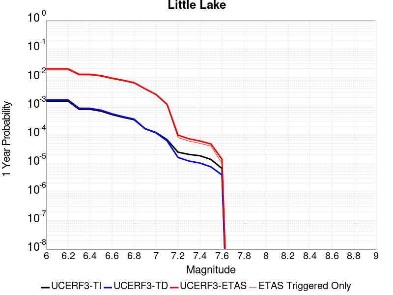 |  |

| Magnitude | 1 wk TI Prob | 1 wk TD Prob | 1 wk ETAS Prob | 1 wk ETAS/TD Gain | 1 wk ETAS Triggered Only | 1 mo TI Prob | 1 mo TD Prob | 1 mo ETAS Prob | 1 mo ETAS/TD Gain | 1 mo ETAS Triggered Only | 1 yr TI Prob | 1 yr TD Prob | 1 yr ETAS Prob | 1 yr ETAS/TD Gain | 1 yr ETAS Triggered Only | 10 yr TI Prob | 10 yr TD Prob | 10 yr ETAS Prob | 10 yr ETAS/TD Gain | 10 yr ETAS Triggered Only |
|-----|-----|-----|-----|-----|-----|-----|-----|-----|-----|-----|-----|-----|-----|-----|-----|-----|-----|-----|-----|-----|
| 6.0 | 2.8424427E-5 | 3.120616E-5 | 0.0032036689 | 102.66142 | 0.0031725615 | 1.2181328E-4 | 1.3373457E-4 | 0.0075496775 | 56.452694 | 0.0074169347 | 0.0014820677 | 0.0016271356 | 0.01996809 | 12.271928 | 0.018370846 | 0.014722223 | 0.016165627 | 0.04473162 | 2.7670825 | 0.029035369 |
| 6.1 | 2.8424427E-5 | 3.120616E-5 | 0.0032036689 | 102.66142 | 0.0031725615 | 1.2181328E-4 | 1.3373457E-4 | 0.0075496775 | 56.452694 | 0.0074169347 | 0.0014820677 | 0.0016271356 | 0.01996809 | 12.271928 | 0.018370846 | 0.014722223 | 0.016165627 | 0.04473162 | 2.7670825 | 0.029035369 |
| 6.2 | 2.8424427E-5 | 3.120616E-5 | 0.0032036689 | 102.66142 | 0.0031725615 | 1.2181328E-4 | 1.3373457E-4 | 0.0075496775 | 56.452694 | 0.0074169347 | 0.0014820677 | 0.0016271356 | 0.01996809 | 12.271928 | 0.018370846 | 0.014722223 | 0.016165627 | 0.04473162 | 2.7670825 | 0.029035369 |
| 6.3 | 1.48860645E-5 | 1.6081593E-5 | 0.0020203367 | 125.63038 | 0.0020042872 | 6.379586E-5 | 6.891945E-5 | 0.0046988255 | 68.178505 | 0.0046302252 | 7.7643775E-4 | 8.387995E-4 | 0.012811599 | 15.273732 | 0.011982851 | 0.007737305 | 0.008359154 | 0.027075976 | 3.2390811 | 0.018874599 |
| 6.4 | 1.48860645E-5 | 1.6081593E-5 | 0.0020203367 | 125.63038 | 0.0020042872 | 6.379586E-5 | 6.891945E-5 | 0.0046988255 | 68.178505 | 0.0046302252 | 7.7643775E-4 | 8.387995E-4 | 0.012811599 | 15.273732 | 0.011982851 | 0.007737305 | 0.008359154 | 0.027075976 | 3.2390811 | 0.018874599 |
| 6.5 | 1.2797581E-5 | 1.3765735E-5 | 0.0017393583 | 126.35419 | 0.0017256163 | 5.4845623E-5 | 5.899482E-5 | 0.0041852253 | 70.942245 | 0.004126474 | 6.675408E-4 | 7.180509E-4 | 0.011503441 | 16.02037 | 0.01079314 | 0.006655392 | 0.0071598585 | 0.024122208 | 3.36909 | 0.017084673 |
| 6.6 | 9.661896E-6 | 1.0289158E-5 | 0.0013500396 | 131.20992 | 0.0013397642 | 4.1407468E-5 | 4.4095737E-5 | 0.0034308704 | 77.80503 | 0.0033869238 | 5.040193E-4 | 5.367496E-4 | 0.009374447 | 17.465216 | 0.008842444 | 0.005028777 | 0.0053561367 | 0.019279018 | 3.599426 | 0.0139978565 |
| 6.7 | 7.767871E-6 | 8.199779E-6 | 0.0011764646 | 143.47517 | 0.0011682744 | 3.329045E-5 | 3.514151E-5 | 0.0029396482 | 83.65173 | 0.0029046088 | 4.0523586E-4 | 4.2777765E-4 | 0.007948675 | 18.581324 | 0.007524116 | 0.004044977 | 0.0042708935 | 0.016202567 | 3.793718 | 0.011982851 |
| 6.8 | 6.4235196E-6 | 6.735819E-6 | 9.820776E-4 | 145.79929 | 9.7534835E-4 | 2.752908E-5 | 2.886755E-5 | 0.0024618092 | 85.279465 | 0.0024330118 | 3.35115E-4 | 3.5141854E-4 | 0.006544311 | 18.622555 | 0.0061950698 | 0.003346101 | 0.0035098887 | 0.013165056 | 3.7508469 | 0.009689175 |
| 6.9 | 3.1283696E-6 | 3.1122067E-6 | 5.711705E-4 | 183.52588 | 5.6806003E-4 | 1.3407229E-5 | 1.3337969E-5 | 0.0015138539 | 113.49957 | 0.0015005359 | 1.6322079E-4 | 1.6237919E-4 | 0.0039881244 | 24.560564 | 0.0038263665 | 0.0016310095 | 0.0016227537 | 0.007476048 | 4.607013 | 0.0058628083 |
| 7.0 | 2.290603E-6 | 2.2287015E-6 | 3.7736184E-4 | 169.31915 | 3.7513397E-4 | 9.816834E-6 | 9.551549E-6 | 9.5273653E-4 | 99.74681 | 9.4319397E-4 | 1.19513395E-4 | 1.16284944E-4 | 0.0025382969 | 21.82825 | 0.0024222936 | 0.0011944914 | 0.0011623431 | 0.0048772055 | 4.196012 | 0.0037191855 |
| 7.1 | 1.293693E-6 | 1.1776951E-6 | 1.297949E-4 | 110.21095 | 1.2861736E-4 | 5.5443866E-6 | 5.047259E-6 | 3.6946128E-4 | 73.20038 | 3.6441587E-4 | 6.750081E-5 | 6.144935E-5 | 0.0011546297 | 18.789944 | 0.0010932476 | 6.7480316E-4 | 6.14392E-4 | 0.0023496596 | 3.8243656 | 0.0017363344 |
| 7.2 | 4.715842E-7 | 3.0918443E-7 | 3.0918443E-7 | 1.0 | 0.0 | 2.0210737E-6 | 1.3250755E-6 | 1.2043175E-5 | 9.088671 | 1.0718114E-5 | 2.4606294E-5 | 1.613268E-5 | 1.01876205E-4 | 6.3148966 | 8.574491E-5 | 2.460357E-4 | 1.6131563E-4 | 3.4349418E-4 | 2.1293297 | 1.8220794E-4 |
| 7.3 | 3.9430947E-7 | 2.3098025E-7 | 2.3098025E-7 | 1.0 | 0.0 | 1.6898966E-6 | 9.89915E-7 | 1.1708018E-5 | 11.827296 | 1.0718114E-5 | 2.0574296E-5 | 1.2052149E-5 | 7.6360055E-5 | 6.335804 | 6.430868E-5 | 2.0572392E-4 | 1.20515026E-4 | 2.4911689E-4 | 2.0671022 | 1.2861736E-4 |
| 7.4 | 3.547123E-7 | 1.9679635E-7 | 1.9679635E-7 | 1.0 | 0.0 | 1.5201948E-6 | 8.4341264E-7 | 1.1561518E-5 | 13.70802 | 1.0718114E-5 | 1.8508214E-5 | 1.0268501E-5 | 6.385852E-5 | 6.2188745 | 5.3590567E-5 | 1.8506673E-4 | 1.0268033E-4 | 2.0985046E-4 | 2.043726 | 1.07181135E-4 |
| 7.5 | 2.6354266E-7 | 1.4423487E-7 | 1.4423487E-7 | 1.0 | 0.0 | 1.129468E-6 | 6.1814933E-7 | 1.1336257E-5 | 18.339025 | 1.0718114E-5 | 1.3751187E-5 | 7.5259427E-6 | 5.0398074E-5 | 6.69658 | 4.2872456E-5 | 1.3750336E-4 | 7.525693E-5 | 1.7171269E-4 | 2.281686 | 9.646302E-5 |
| 7.6 | 1.269913E-7 | 7.5727044E-8 | 7.5727044E-8 | 1.0 | 0.0 | 5.4424834E-7 | 3.2454443E-7 | 1.10426545E-5 | 34.025093 | 1.0718114E-5 | 6.6262032E-6 | 3.9513216E-6 | 1.4669393E-5 | 3.7125282 | 1.0718114E-5 | 6.626006E-5 | 3.951255E-5 | 9.3101E-5 | 2.3562388 | 5.3590567E-5 |

## Airport Lake
*[(top)](#table-of-contents)*

| 1 Week | 1 Month | 1 Year | 10 Year |
|-----|-----|-----|-----|
|  | 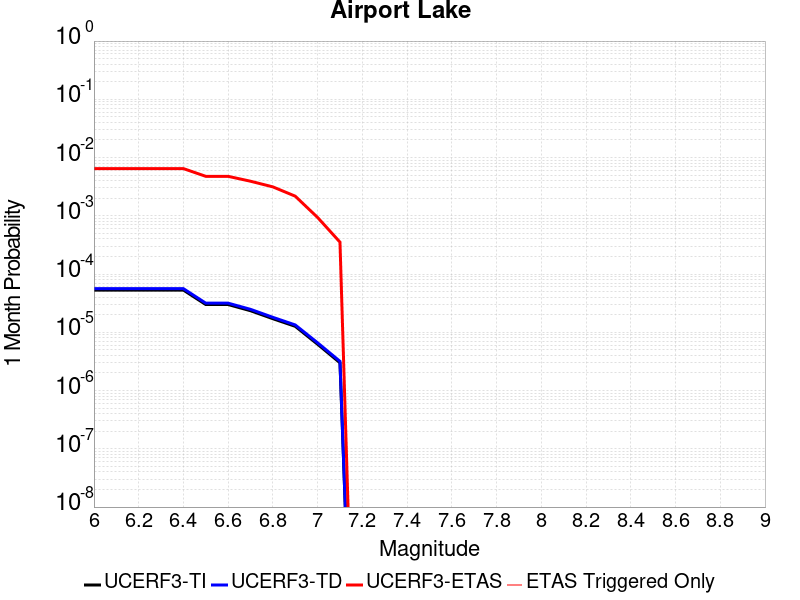 |  |  |

| Magnitude | 1 wk TI Prob | 1 wk TD Prob | 1 wk ETAS Prob | 1 wk ETAS/TD Gain | 1 wk ETAS Triggered Only | 1 mo TI Prob | 1 mo TD Prob | 1 mo ETAS Prob | 1 mo ETAS/TD Gain | 1 mo ETAS Triggered Only | 1 yr TI Prob | 1 yr TD Prob | 1 yr ETAS Prob | 1 yr ETAS/TD Gain | 1 yr ETAS Triggered Only | 10 yr TI Prob | 10 yr TD Prob | 10 yr ETAS Prob | 10 yr ETAS/TD Gain | 10 yr ETAS Triggered Only |
|-----|-----|-----|-----|-----|-----|-----|-----|-----|-----|-----|-----|-----|-----|-----|-----|-----|-----|-----|-----|-----|
| 6.0 | 1.2387061E-5 | 1.31032575E-5 | 0.0026175708 | 199.7649 | 0.0026045016 | 5.3086325E-5 | 5.6155768E-5 | 0.0064223576 | 114.36684 | 0.0063665593 | 6.461343E-4 | 6.835104E-4 | 0.015571505 | 22.781666 | 0.014898178 | 0.0064425888 | 0.0068168915 | 0.029756973 | 4.365182 | 0.023097536 |
| 6.1 | 1.2387061E-5 | 1.31032575E-5 | 0.0026175708 | 199.7649 | 0.0026045016 | 5.3086325E-5 | 5.6155768E-5 | 0.0064223576 | 114.36684 | 0.0063665593 | 6.461343E-4 | 6.835104E-4 | 0.015571505 | 22.781666 | 0.014898178 | 0.0064425888 | 0.0068168915 | 0.029756973 | 4.365182 | 0.023097536 |
| 6.2 | 1.2387061E-5 | 1.31032575E-5 | 0.0026175708 | 199.7649 | 0.0026045016 | 5.3086325E-5 | 5.6155768E-5 | 0.0064223576 | 114.36684 | 0.0063665593 | 6.461343E-4 | 6.835104E-4 | 0.015571505 | 22.781666 | 0.014898178 | 0.0064425888 | 0.0068168915 | 0.029756973 | 4.365182 | 0.023097536 |
| 6.3 | 1.2387061E-5 | 1.31032575E-5 | 0.0026175708 | 199.7649 | 0.0026045016 | 5.3086325E-5 | 5.6155768E-5 | 0.0064223576 | 114.36684 | 0.0063665593 | 6.461343E-4 | 6.835104E-4 | 0.015571505 | 22.781666 | 0.014898178 | 0.0064425888 | 0.0068168915 | 0.029756973 | 4.365182 | 0.023097536 |
| 6.4 | 1.2387061E-5 | 1.31032575E-5 | 0.0026175708 | 199.7649 | 0.0026045016 | 5.3086325E-5 | 5.6155768E-5 | 0.0064223576 | 114.36684 | 0.0063665593 | 6.461343E-4 | 6.835104E-4 | 0.015571505 | 22.781666 | 0.014898178 | 0.0064425888 | 0.0068168915 | 0.029756973 | 4.365182 | 0.023097536 |
| 6.5 | 6.9922594E-6 | 7.38498E-6 | 0.0019473492 | 263.69052 | 0.0019399786 | 2.996648E-5 | 3.164956E-5 | 0.0047474704 | 150.00114 | 0.00471597 | 3.6478083E-4 | 3.8527072E-4 | 0.01130282 | 29.337347 | 0.010921758 | 0.003641826 | 0.0038465653 | 0.020822814 | 5.4133525 | 0.0170418 |
| 6.6 | 6.9922594E-6 | 7.38498E-6 | 0.0019473492 | 263.69052 | 0.0019399786 | 2.996648E-5 | 3.164956E-5 | 0.0047474704 | 150.00114 | 0.00471597 | 3.6478083E-4 | 3.8527072E-4 | 0.01130282 | 29.337347 | 0.010921758 | 0.003641826 | 0.0038465653 | 0.020822814 | 5.4133525 | 0.0170418 |
| 6.7 | 5.477277E-6 | 5.7861116E-6 | 0.0016027758 | 277.00394 | 0.0015969989 | 2.3473833E-5 | 2.4797408E-5 | 0.0038725047 | 156.16571 | 0.0038478028 | 2.8575645E-4 | 3.0187052E-4 | 0.009430947 | 31.241697 | 0.009131833 | 0.0028538927 | 0.0030149885 | 0.017066814 | 5.6606565 | 0.014094319 |
| 6.8 | 3.9950432E-6 | 4.2191186E-6 | 0.0012582331 | 298.2218 | 0.0012540193 | 1.7121502E-5 | 1.8081826E-5 | 0.0031048427 | 171.71068 | 0.0030868168 | 2.0843433E-4 | 2.2012675E-4 | 0.0072603775 | 32.98271 | 0.007041801 | 0.0020823893 | 0.002199358 | 0.012958066 | 5.891749 | 0.0107824225 |
| 6.9 | 2.95695E-6 | 3.1230477E-6 | 8.284152E-4 | 265.2586 | 8.2529476E-4 | 1.2672582E-5 | 1.3384434E-5 | 0.0021462606 | 160.35497 | 0.0021329047 | 1.5427776E-4 | 1.6294557E-4 | 0.005199638 | 31.910278 | 0.0050375136 | 0.001541707 | 0.0016284833 | 0.009279455 | 5.6982193 | 0.007663451 |
| 7.0 | 1.456072E-6 | 1.5408239E-6 | 3.5523804E-4 | 230.5507 | 3.5369775E-4 | 6.2402937E-6 | 6.60352E-6 | 9.1763714E-4 | 138.96182 | 9.1103965E-4 | 7.597293E-5 | 8.03959E-5 | 0.002341736 | 29.127556 | 0.002261522 | 7.594696E-4 | 8.03767E-4 | 0.0041772593 | 5.197102 | 0.0033762057 |
| 7.1 | 6.995192E-7 | 7.4090326E-7 | 1.1864006E-4 | 160.12895 | 1.17899246E-4 | 2.997936E-6 | 3.1752998E-6 | 3.4615386E-4 | 109.01454 | 3.4297965E-4 | 3.649926E-5 | 3.8659273E-5 | 0.0010139699 | 26.228374 | 9.7534835E-4 | 3.6493264E-4 | 3.8659273E-4 | 0.0018544067 | 4.7967963 | 0.0014683816 |

## Panamint Valley
*[(top)](#table-of-contents)*

| 1 Week | 1 Month | 1 Year | 10 Year |
|-----|-----|-----|-----|
|  |  |  |  |

| Magnitude | 1 wk TI Prob | 1 wk TD Prob | 1 wk ETAS Prob | 1 wk ETAS/TD Gain | 1 wk ETAS Triggered Only | 1 mo TI Prob | 1 mo TD Prob | 1 mo ETAS Prob | 1 mo ETAS/TD Gain | 1 mo ETAS Triggered Only | 1 yr TI Prob | 1 yr TD Prob | 1 yr ETAS Prob | 1 yr ETAS/TD Gain | 1 yr ETAS Triggered Only | 10 yr TI Prob | 10 yr TD Prob | 10 yr ETAS Prob | 10 yr ETAS/TD Gain | 10 yr ETAS Triggered Only |
|-----|-----|-----|-----|-----|-----|-----|-----|-----|-----|-----|-----|-----|-----|-----|-----|-----|-----|-----|-----|-----|
| 6.0 | 3.0211835E-5 | 3.3985398E-5 | 0.0019524625 | 57.450043 | 0.0019185423 | 1.2947287E-4 | 1.4564373E-4 | 0.0048716436 | 33.449043 | 0.004726688 | 0.0015751923 | 0.0017717998 | 0.0148782255 | 8.397239 | 0.013129689 | 0.015640736 | 0.01758359 | 0.039232552 | 2.2312026 | 0.02203644 |
| 6.1 | 3.0211835E-5 | 3.3985398E-5 | 0.0019524625 | 57.450043 | 0.0019185423 | 1.2947287E-4 | 1.4564373E-4 | 0.0048716436 | 33.449043 | 0.004726688 | 0.0015751923 | 0.0017717998 | 0.0148782255 | 8.397239 | 0.013129689 | 0.015640736 | 0.01758359 | 0.039232552 | 2.2312026 | 0.02203644 |
| 6.2 | 3.0211835E-5 | 3.3985398E-5 | 0.0019524625 | 57.450043 | 0.0019185423 | 1.2947287E-4 | 1.4564373E-4 | 0.0048716436 | 33.449043 | 0.004726688 | 0.0015751923 | 0.0017717998 | 0.0148782255 | 8.397239 | 0.013129689 | 0.015640736 | 0.01758359 | 0.039232552 | 2.2312026 | 0.02203644 |
| 6.3 | 2.8573924E-5 | 3.2103522E-5 | 0.001821971 | 56.753 | 0.0017899249 | 1.2245393E-4 | 1.3757942E-4 | 0.0046278513 | 33.637672 | 0.0044908896 | 0.001489857 | 0.0016737703 | 0.014182273 | 8.473249 | 0.012529475 | 0.01479908 | 0.016618231 | 0.03710799 | 2.2329683 | 0.020836012 |
| 6.4 | 2.8573924E-5 | 3.2103522E-5 | 0.001821971 | 56.753 | 0.0017899249 | 1.2245393E-4 | 1.3757942E-4 | 0.0046278513 | 33.637672 | 0.0044908896 | 0.001489857 | 0.0016737703 | 0.014182273 | 8.473249 | 0.012529475 | 0.01479908 | 0.016618231 | 0.03710799 | 2.2329683 | 0.020836012 |
| 6.5 | 2.7468774E-5 | 3.0829244E-5 | 0.0017671101 | 57.319283 | 0.0017363344 | 1.1771801E-4 | 1.3211879E-4 | 0.004493815 | 34.01344 | 0.004362272 | 0.0014322745 | 0.0016073869 | 0.013817097 | 8.596 | 0.012229368 | 0.014230782 | 0.015964093 | 0.035919033 | 2.249989 | 0.020278672 |
| 6.6 | 2.6135967E-5 | 2.9253257E-5 | 0.0017119478 | 58.521614 | 0.0016827438 | 1.1200648E-4 | 1.2536523E-4 | 0.0043692063 | 34.851818 | 0.004244373 | 0.0013628257 | 0.0015252795 | 0.013393537 | 8.781038 | 0.011886388 | 0.013544982 | 0.015154443 | 0.034439683 | 2.27258 | 0.019581994 |
| 6.7 | 2.4498746E-5 | 2.7342086E-5 | 0.0016671687 | 60.974445 | 0.0016398714 | 1.04990395E-4 | 1.1717525E-4 | 0.004189581 | 35.75483 | 0.004072883 | 0.0012775084 | 0.0014257001 | 0.012802811 | 8.980017 | 0.011393355 | 0.012701893 | 0.014171662 | 0.032641415 | 2.3032877 | 0.018735263 |
| 6.8 | 2.2244329E-5 | 2.4936131E-5 | 0.0016111773 | 64.61216 | 0.0015862808 | 9.532935E-5 | 1.0686488E-4 | 0.0039864075 | 37.30325 | 0.0038799571 | 0.0011600169 | 0.0013003252 | 0.011854643 | 9.116676 | 0.01056806 | 0.011539802 | 0.012932883 | 0.03002935 | 2.3219378 | 0.01732047 |
| 6.9 | 1.9902658E-5 | 2.2290924E-5 | 0.0015120755 | 67.83369 | 0.0014898177 | 8.529431E-5 | 9.552913E-5 | 0.0036857543 | 38.582516 | 0.003590568 | 0.0010379635 | 0.0011624652 | 0.010529913 | 9.058261 | 0.009378349 | 0.010331288 | 0.011568946 | 0.026665563 | 2.3049257 | 0.015273312 |
| 7.0 | 1.8353881E-5 | 2.056681E-5 | 0.0014674824 | 71.351974 | 0.0014469454 | 7.865712E-5 | 8.814059E-5 | 0.0034854831 | 39.544586 | 0.003397642 | 9.5722964E-4 | 0.0010726011 | 0.009916267 | 9.245066 | 0.008853162 | 0.009531168 | 0.0106791705 | 0.024898669 | 2.3315172 | 0.0143729905 |
| 7.1 | 1.7667631E-5 | 1.9773222E-5 | 0.0013809467 | 69.83923 | 0.0013612005 | 7.571623E-5 | 8.473973E-5 | 0.003289184 | 38.815136 | 0.003204716 | 9.2145515E-4 | 0.0010312354 | 0.009479106 | 9.19199 | 0.0084565915 | 0.009176437 | 0.010269388 | 0.023921942 | 2.329442 | 0.013794213 |
| 7.2 | 1.6381597E-5 | 1.8158824E-5 | 0.0012507195 | 68.87668 | 0.0012325831 | 7.020495E-5 | 7.782131E-5 | 0.002907183 | 37.357162 | 0.002829582 | 8.544101E-4 | 9.4707985E-4 | 0.008421238 | 8.891793 | 0.0074812435 | 0.008511325 | 0.009435088 | 0.02148537 | 2.2771773 | 0.012165059 |
| 7.3 | 1.4520491E-5 | 1.5966963E-5 | 0.0010556073 | 66.11197 | 0.001039657 | 6.222919E-5 | 6.842814E-5 | 0.0025334256 | 37.023155 | 0.0024651662 | 7.57377E-4 | 8.3281036E-4 | 0.0071726493 | 8.612584 | 0.006345123 | 0.0075480095 | 0.008300003 | 0.018482732 | 2.2268343 | 0.010267952 |
| 7.4 | 1.2852287E-5 | 1.4145856E-5 | 0.0010216343 | 72.22145 | 0.0010075027 | 5.5080065E-5 | 6.0623777E-5 | 0.0024613356 | 40.60017 | 0.0024008574 | 6.7039346E-4 | 7.3786033E-4 | 0.006917649 | 9.375281 | 0.0061843516 | 0.0066837464 | 0.007357025 | 0.017304733 | 2.3521373 | 0.010021436 |
| 7.5 | 1.1637851E-5 | 1.2837149E-5 | 0.0010203269 | 79.48235 | 0.0010075027 | 4.987555E-5 | 5.5015284E-5 | 0.0024343056 | 44.247807 | 0.0023794211 | 6.070656E-4 | 6.6962093E-4 | 0.0068069873 | 10.165435 | 0.006141479 | 0.006054099 | 0.0066789286 | 0.016537614 | 2.4760878 | 0.009924973 |
| 7.6 | 3.0068115E-6 | 3.3331687E-6 | 4.4277436E-4 | 132.83887 | 4.3944267E-4 | 1.2886271E-5 | 1.4284972E-5 | 0.001075363 | 75.27933 | 0.0010610933 | 1.5687906E-4 | 1.7391294E-4 | 0.0029172727 | 16.77433 | 0.0027438372 | 0.0015676835 | 0.001739208 | 0.0061901887 | 3.5591998 | 0.004458735 |

## Garlock (East)
*[(top)](#table-of-contents)*

| 1 Week | 1 Month | 1 Year | 10 Year |
|-----|-----|-----|-----|
|  |  |  |  |

| Magnitude | 1 wk TI Prob | 1 wk TD Prob | 1 wk ETAS Prob | 1 wk ETAS/TD Gain | 1 wk ETAS Triggered Only | 1 mo TI Prob | 1 mo TD Prob | 1 mo ETAS Prob | 1 mo ETAS/TD Gain | 1 mo ETAS Triggered Only | 1 yr TI Prob | 1 yr TD Prob | 1 yr ETAS Prob | 1 yr ETAS/TD Gain | 1 yr ETAS Triggered Only | 10 yr TI Prob | 10 yr TD Prob | 10 yr ETAS Prob | 10 yr ETAS/TD Gain | 10 yr ETAS Triggered Only |
|-----|-----|-----|-----|-----|-----|-----|-----|-----|-----|-----|-----|-----|-----|-----|-----|-----|-----|-----|-----|-----|
| 6.0 | 4.5092507E-5 | 6.2906794E-5 | 0.0017669797 | 28.088852 | 0.00170418 | 1.9323928E-4 | 2.695752E-4 | 0.0045878105 | 17.018667 | 0.0043193996 | 0.0023501497 | 0.0032775842 | 0.014975452 | 4.5690517 | 0.011736334 | 0.023254504 | 0.03235364 | 0.05178954 | 1.6007329 | 0.020085745 |
| 6.1 | 4.5092507E-5 | 6.2906794E-5 | 0.0017669797 | 28.088852 | 0.00170418 | 1.9323928E-4 | 2.695752E-4 | 0.0045878105 | 17.018667 | 0.0043193996 | 0.0023501497 | 0.0032775842 | 0.014975452 | 4.5690517 | 0.011736334 | 0.023254504 | 0.03235364 | 0.05178954 | 1.6007329 | 0.020085745 |
| 6.2 | 2.6674514E-5 | 3.4512483E-5 | 0.0013527949 | 39.197266 | 0.001318328 | 1.1431433E-4 | 1.4790244E-4 | 0.0032878453 | 22.229824 | 0.0031404074 | 0.0013908884 | 0.001799258 | 0.010326224 | 5.739157 | 0.0085423365 | 0.01382215 | 0.017891733 | 0.03191283 | 1.7836634 | 0.014276527 |
| 6.3 | 2.6674514E-5 | 3.4512483E-5 | 0.0013527949 | 39.197266 | 0.001318328 | 1.1431433E-4 | 1.4790244E-4 | 0.0032878453 | 22.229824 | 0.0031404074 | 0.0013908884 | 0.001799258 | 0.010326224 | 5.739157 | 0.0085423365 | 0.01382215 | 0.017891733 | 0.03191283 | 1.7836634 | 0.014276527 |
| 6.4 | 2.5312667E-5 | 3.2341675E-5 | 0.0013077559 | 40.435627 | 0.0012754555 | 1.0847834E-4 | 1.3859998E-4 | 0.0032142722 | 23.191 | 0.0030760986 | 0.0013199237 | 0.001686178 | 0.01008571 | 5.981403 | 0.008413719 | 0.013121112 | 0.01677974 | 0.030605946 | 1.8239821 | 0.014062165 |
| 6.5 | 2.5312667E-5 | 3.2341675E-5 | 0.0013077559 | 40.435627 | 0.0012754555 | 1.0847834E-4 | 1.3859998E-4 | 0.0032142722 | 23.191 | 0.0030760986 | 0.0013199237 | 0.001686178 | 0.01008571 | 5.981403 | 0.008413719 | 0.013121112 | 0.01677974 | 0.030605946 | 1.8239821 | 0.014062165 |
| 6.6 | 2.246556E-5 | 2.813642E-5 | 0.0012714026 | 45.18708 | 0.0012433012 | 9.627742E-5 | 1.20579214E-4 | 0.0030891388 | 25.619165 | 0.0029689174 | 0.0011715472 | 0.0014670868 | 0.009418962 | 6.4201803 | 0.007963559 | 0.011653901 | 0.014620015 | 0.027726732 | 1.8964912 | 0.013301179 |
| 6.7 | 2.2241198E-5 | 2.7806154E-5 | 0.0012710728 | 45.71192 | 0.0012433012 | 9.531594E-5 | 1.1916392E-4 | 0.0030877276 | 25.911598 | 0.0029689174 | 0.0011598538 | 0.0014498787 | 0.00940189 | 6.4846053 | 0.007963559 | 0.011538187 | 0.0144502055 | 0.027548617 | 1.9064516 | 0.013290461 |
| 6.8 | 1.9528685E-5 | 2.3900653E-5 | 0.0012135828 | 50.77614 | 0.0011897106 | 8.369167E-5 | 1.0242746E-4 | 0.0029531536 | 28.831661 | 0.0028510182 | 0.0010184698 | 0.0012463606 | 0.00887885 | 7.123822 | 0.007642015 | 0.010138147 | 0.012437694 | 0.024811331 | 1.9948498 | 0.012529475 |
| 6.9 | 1.3318621E-5 | 1.5201007E-5 | 0.0011405859 | 75.03357 | 0.0011254019 | 5.7078556E-5 | 6.514558E-5 | 0.002680195 | 41.141624 | 0.0026152197 | 6.9470983E-4 | 7.928645E-4 | 0.0077326954 | 9.752859 | 0.0069453376 | 0.0069254204 | 0.007940986 | 0.018935509 | 2.3845289 | 0.011082529 |
| 7.0 | 1.1760853E-5 | 1.3109839E-5 | 0.0011063431 | 84.3903 | 0.0010932476 | 5.0402683E-5 | 5.618384E-5 | 0.0026069516 | 46.400383 | 0.002550911 | 6.134799E-4 | 6.838286E-4 | 0.0074316226 | 10.867669 | 0.0067524114 | 0.0061178906 | 0.006857582 | 0.017576708 | 2.5631058 | 0.01079314 |
| 7.1 | 1.0064758E-5 | 1.090491E-5 | 0.0010934225 | 100.26884 | 0.0010825294 | 4.3133965E-5 | 4.673451E-5 | 0.0025546558 | 54.66316 | 0.0025080387 | 5.2502943E-4 | 5.688476E-4 | 0.0070389058 | 12.373974 | 0.0064737406 | 0.005237907 | 0.005714025 | 0.015838051 | 2.7717855 | 0.010182208 |
| 7.2 | 9.768808E-6 | 1.0500772E-5 | 0.0010715829 | 102.048004 | 0.0010610933 | 4.186565E-5 | 4.500255E-5 | 0.0025207754 | 56.014053 | 0.0024758843 | 5.095951E-4 | 5.477718E-4 | 0.0068572825 | 12.518502 | 0.006312969 | 0.0050842804 | 0.005504284 | 0.015374628 | 2.793211 | 0.009924973 |
| 7.3 | 9.344516E-6 | 9.946395E-6 | 0.0010281571 | 103.36982 | 0.0010182208 | 4.004731E-5 | 4.2626732E-5 | 0.0023683582 | 55.5604 | 0.0023258307 | 4.8746695E-4 | 5.1886035E-4 | 0.006367914 | 12.272886 | 0.00585209 | 0.0048639905 | 0.005215945 | 0.014332133 | 2.7477539 | 0.009163987 |
| 7.4 | 9.023491E-6 | 9.49255E-6 | 8.669335E-4 | 91.327774 | 8.574491E-4 | 3.867153E-5 | 4.068174E-5 | 0.0021199111 | 52.109646 | 0.002079314 | 4.7072413E-4 | 4.95191E-4 | 0.005583774 | 11.276 | 0.005091104 | 0.004697283 | 0.004979378 | 0.013105913 | 2.632038 | 0.008167203 |
| 7.5 | 7.081253E-6 | 7.0893525E-6 | 4.3581086E-4 | 61.474003 | 4.2872454E-4 | 3.0347876E-5 | 3.038259E-5 | 0.0010807258 | 35.570564 | 0.0010503752 | 3.6942272E-4 | 3.6984598E-4 | 0.0028662428 | 7.7498283 | 0.0024973205 | 0.003688092 | 0.0037251879 | 0.0076334043 | 2.0491326 | 0.0039228294 |
| 7.6 | 6.116396E-6 | 5.9608415E-6 | 2.52476E-4 | 42.355762 | 2.465166E-4 | 2.6212863E-5 | 2.5546216E-5 | 6.364631E-4 | 24.914183 | 6.109325E-4 | 3.1909486E-4 | 3.1098103E-4 | 0.0018324798 | 5.892577 | 0.0015219721 | 0.0031863707 | 0.003136586 | 0.0055192285 | 1.7596292 | 0.0023901393 |
| 7.7 | 4.797145E-6 | 4.7587923E-6 | 1.3337555E-4 | 28.027184 | 1.2861736E-4 | 2.055903E-5 | 2.0394666E-5 | 3.740852E-4 | 18.342306 | 3.5369775E-4 | 2.5027743E-4 | 2.482769E-4 | 0.0010626513 | 4.2801056 | 8.1457663E-4 | 0.0024999576 | 0.002510134 | 0.0037503142 | 1.4940693 | 0.0012433012 |
| 7.8 | 3.4028885E-6 | 3.979809E-6 | 1.0044245E-4 | 25.238005 | 9.646302E-5 | 1.4583726E-5 | 1.7056214E-5 | 2.3141483E-4 | 13.567772 | 2.1436227E-4 | 1.775424E-4 | 2.076397E-4 | 6.8985467E-4 | 3.322364 | 4.823151E-4 | 0.0017740062 | 0.0021019245 | 0.0028185286 | 1.3409276 | 7.181136E-4 |
| 7.9 | 2.5928412E-6 | 3.373588E-6 | 9.983629E-5 | 29.593502 | 9.646302E-5 | 1.1112129E-5 | 1.44581545E-5 | 1.7522753E-4 | 12.119634 | 1.607717E-4 | 1.3528178E-4 | 1.7601387E-4 | 5.082169E-4 | 2.8873684 | 3.3226152E-4 | 0.0013519945 | 0.0017818334 | 0.002263289 | 1.2702024 | 4.823151E-4 |
| 8.0 | 1.3743648E-6 | 1.673991E-6 | 3.3828277E-5 | 20.208158 | 3.215434E-5 | 5.8901214E-6 | 7.174228E-6 | 8.220049E-5 | 11.4577465 | 7.5026794E-5 | 7.1709874E-5 | 8.7342756E-5 | 2.3738324E-4 | 2.7178354 | 1.5005359E-4 | 7.1686733E-4 | 8.839922E-4 | 0.0010874564 | 1.2301651 | 2.0364416E-4 |
| 8.1 | 3.6733252E-7 | 3.1499187E-7 | 3.1499187E-7 | 1.0 | 0.0 | 1.5742813E-6 | 1.3499646E-6 | 1.3499646E-6 | 1.0 | 0.0 | 1.9166706E-5 | 1.643571E-5 | 1.643571E-5 | 1.0 | 0.0 | 1.9165053E-4 | 1.6643589E-4 | 1.7715222E-4 | 1.0643871 | 1.0718114E-5 |

## Hunter Mountain-Saline Valley
*[(top)](#table-of-contents)*

| 1 Week | 1 Month | 1 Year | 10 Year |
|-----|-----|-----|-----|
|  |  |  |  |

| Magnitude | 1 wk TI Prob | 1 wk TD Prob | 1 wk ETAS Prob | 1 wk ETAS/TD Gain | 1 wk ETAS Triggered Only | 1 mo TI Prob | 1 mo TD Prob | 1 mo ETAS Prob | 1 mo ETAS/TD Gain | 1 mo ETAS Triggered Only | 1 yr TI Prob | 1 yr TD Prob | 1 yr ETAS Prob | 1 yr ETAS/TD Gain | 1 yr ETAS Triggered Only | 10 yr TI Prob | 10 yr TD Prob | 10 yr ETAS Prob | 10 yr ETAS/TD Gain | 10 yr ETAS Triggered Only |
|-----|-----|-----|-----|-----|-----|-----|-----|-----|-----|-----|-----|-----|-----|-----|-----|-----|-----|-----|-----|-----|
| 6.0 | 4.5103672E-5 | 5.4571992E-5 | 0.0010834547 | 19.853678 | 0.0010289389 | 1.9328714E-4 | 2.3385909E-4 | 0.0027413112 | 11.722064 | 0.0025080387 | 0.002350731 | 0.0028436056 | 0.009213436 | 3.2400541 | 0.0063879956 | 0.023260195 | 0.028092787 | 0.038218122 | 1.3604248 | 0.010418006 |
| 6.1 | 4.5103672E-5 | 5.4571992E-5 | 0.0010834547 | 19.853678 | 0.0010289389 | 1.9328714E-4 | 2.3385909E-4 | 0.0027413112 | 11.722064 | 0.0025080387 | 0.002350731 | 0.0028436056 | 0.009213436 | 3.2400541 | 0.0063879956 | 0.023260195 | 0.028092787 | 0.038218122 | 1.3604248 | 0.010418006 |
| 6.2 | 3.9363465E-5 | 4.7064877E-5 | 0.0010759553 | 22.86111 | 0.0010289389 | 1.6868966E-4 | 2.0169078E-4 | 0.0027092234 | 13.43256 | 0.0025080387 | 0.002051862 | 0.0024528939 | 0.008814529 | 3.5935223 | 0.0063772774 | 0.020330196 | 0.024274237 | 0.03436615 | 1.4157457 | 0.01034298 |
| 6.3 | 3.9363465E-5 | 4.7064877E-5 | 0.0010759553 | 22.86111 | 0.0010289389 | 1.6868966E-4 | 2.0169078E-4 | 0.0027092234 | 13.43256 | 0.0025080387 | 0.002051862 | 0.0024528939 | 0.008814529 | 3.5935223 | 0.0063772774 | 0.020330196 | 0.024274237 | 0.03436615 | 1.4157457 | 0.01034298 |
| 6.4 | 3.2311684E-5 | 3.795214E-5 | 0.001066852 | 28.110456 | 0.0010289389 | 1.384713E-4 | 1.626423E-4 | 0.0026488402 | 16.286293 | 0.0024866024 | 0.0016845843 | 0.0019784442 | 0.008300317 | 4.195376 | 0.006334405 | 0.016718714 | 0.019617062 | 0.029683586 | 1.5131515 | 0.010267952 |
| 6.5 | 3.2311684E-5 | 3.795214E-5 | 0.001066852 | 28.110456 | 0.0010289389 | 1.384713E-4 | 1.626423E-4 | 0.0026488402 | 16.286293 | 0.0024866024 | 0.0016845843 | 0.0019784442 | 0.008300317 | 4.195376 | 0.006334405 | 0.016718714 | 0.019617062 | 0.029683586 | 1.5131515 | 0.010267952 |
| 6.6 | 2.9305844E-5 | 3.4182853E-5 | 0.0010630866 | 31.099995 | 0.0010289389 | 1.2559042E-4 | 1.4649007E-4 | 0.0026220116 | 17.898903 | 0.0024758843 | 0.0015279909 | 0.0017821203 | 0.008083839 | 4.5360794 | 0.006312969 | 0.015175272 | 0.017686214 | 0.02775151 | 1.569104 | 0.010246516 |
| 6.7 | 2.7826512E-5 | 3.2345237E-5 | 0.0010612509 | 32.810112 | 0.0010289389 | 1.19251024E-4 | 1.3861542E-4 | 0.0026141566 | 18.859058 | 0.0024758843 | 0.0014509142 | 0.0016863967 | 0.007988719 | 4.7371535 | 0.006312969 | 0.014414776 | 0.01674368 | 0.026808094 | 1.6010873 | 0.010235799 |
| 6.8 | 2.3389874E-5 | 2.6867507E-5 | 0.0010557788 | 39.29575 | 0.0010289389 | 1.0023846E-4 | 1.1514164E-4 | 0.0025907408 | 22.500467 | 0.0024758843 | 0.00121972 | 0.0014009953 | 0.00767301 | 5.476828 | 0.0062808148 | 0.01213047 | 0.013927842 | 0.023947095 | 1.7193687 | 0.010160772 |
| 6.9 | 2.069209E-5 | 2.3570727E-5 | 0.0010524854 | 44.652225 | 0.0010289389 | 8.867737E-5 | 1.0101369E-4 | 0.0025659308 | 25.401812 | 0.0024651662 | 0.0010791123 | 0.001229184 | 0.0074808686 | 6.0860443 | 0.0062593785 | 0.010738871 | 0.012228882 | 0.02222305 | 1.8172594 | 0.0101179 |
| 7.0 | 1.7462342E-5 | 1.9634126E-5 | 0.0010378349 | 52.858727 | 0.0010182208 | 7.483646E-5 | 8.414367E-5 | 0.002527668 | 30.039906 | 0.00244373 | 9.1075303E-4 | 0.0010239903 | 0.0072234236 | 7.054191 | 0.006205788 | 0.009070295 | 0.010196352 | 0.020115606 | 1.9728237 | 0.010021436 |
| 7.1 | 1.4807709E-5 | 1.6442245E-5 | 0.0010346463 | 62.926098 | 0.0010182208 | 6.3460066E-5 | 7.046495E-5 | 0.002492588 | 35.373444 | 0.0024222936 | 7.723524E-4 | 8.575896E-4 | 0.0070366375 | 8.205133 | 0.0061843516 | 0.007696735 | 0.008545788 | 0.01846033 | 2.160167 | 0.01 |
| 7.2 | 1.4180048E-5 | 1.5698814E-5 | 0.0010339036 | 65.85871 | 0.0010182208 | 6.077022E-5 | 6.727898E-5 | 0.0024786922 | 36.842 | 0.0024115755 | 7.396263E-4 | 8.1883004E-4 | 0.0069874083 | 8.533405 | 0.0061736335 | 0.0073716943 | 0.00816108 | 0.018058209 | 2.2127228 | 0.0099785635 |
| 7.3 | 1.3730402E-5 | 1.5172541E-5 | 0.0010333778 | 68.10843 | 0.0010182208 | 5.8843252E-5 | 6.502365E-5 | 0.0024764424 | 38.08526 | 0.0024115755 | 7.161811E-4 | 7.913914E-4 | 0.006960139 | 8.794812 | 0.0061736335 | 0.007138774 | 0.007888664 | 0.017767243 | 2.25225 | 0.009957127 |
| 7.4 | 1.2810095E-5 | 1.410972E-5 | 0.0010215982 | 72.40386 | 0.0010075027 | 5.489925E-5 | 6.0468916E-5 | 0.0024504638 | 40.524353 | 0.0023901393 | 6.681934E-4 | 7.359762E-4 | 0.0068836454 | 9.353082 | 0.0061521973 | 0.006661878 | 0.0073382827 | 0.017201062 | 2.3440175 | 0.009935691 |
| 7.5 | 1.1595659E-5 | 1.2801013E-5 | 0.0010202908 | 79.70391 | 0.0010075027 | 4.9694736E-5 | 5.4860422E-5 | 0.0024234336 | 44.174534 | 0.002368703 | 6.0486543E-4 | 6.677366E-4 | 0.006772982 | 10.143194 | 0.0061093247 | 0.006032217 | 0.0066601736 | 0.01643387 | 2.4674838 | 0.009839228 |
| 7.6 | 2.997694E-6 | 3.3252948E-6 | 4.427665E-4 | 133.15105 | 4.3944267E-4 | 1.28471975E-5 | 1.4251226E-5 | 0.0010646114 | 74.70314 | 0.0010503752 | 1.564034E-4 | 1.7350215E-4 | 0.002906147 | 16.74992 | 0.002733119 | 0.0015629337 | 0.0017351025 | 0.006164702 | 3.5529327 | 0.004437299 |

## Ash Hill
*[(top)](#table-of-contents)*

| 1 Week | 1 Month | 1 Year | 10 Year |
|-----|-----|-----|-----|
|  | 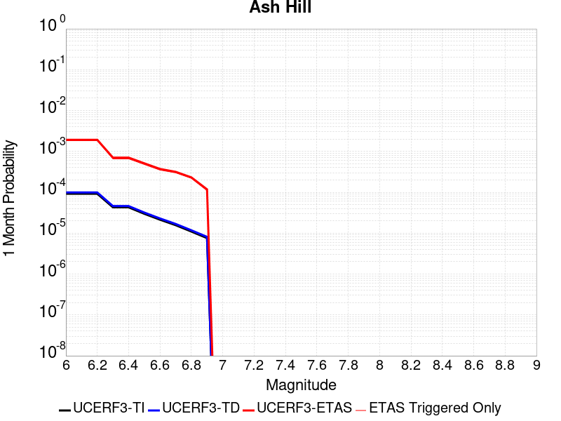 |  |  |

| Magnitude | 1 wk TI Prob | 1 wk TD Prob | 1 wk ETAS Prob | 1 wk ETAS/TD Gain | 1 wk ETAS Triggered Only | 1 mo TI Prob | 1 mo TD Prob | 1 mo ETAS Prob | 1 mo ETAS/TD Gain | 1 mo ETAS Triggered Only | 1 yr TI Prob | 1 yr TD Prob | 1 yr ETAS Prob | 1 yr ETAS/TD Gain | 1 yr ETAS Triggered Only | 10 yr TI Prob | 10 yr TD Prob | 10 yr ETAS Prob | 10 yr ETAS/TD Gain | 10 yr ETAS Triggered Only |
|-----|-----|-----|-----|-----|-----|-----|-----|-----|-----|-----|-----|-----|-----|-----|-----|-----|-----|-----|-----|-----|
| 6.0 | 2.1545662E-5 | 2.3194681E-5 | 8.484703E-4 | 36.58038 | 8.2529476E-4 | 9.2335285E-5 | 9.9402445E-5 | 0.0019320177 | 19.43632 | 0.0018327974 | 0.0011236023 | 0.0012096328 | 0.00604836 | 5.0001616 | 0.0048445873 | 0.011179381 | 0.01203847 | 0.020636806 | 1.7142383 | 0.008703108 |
| 6.1 | 2.1545662E-5 | 2.3194681E-5 | 8.484703E-4 | 36.58038 | 8.2529476E-4 | 9.2335285E-5 | 9.9402445E-5 | 0.0019320177 | 19.43632 | 0.0018327974 | 0.0011236023 | 0.0012096328 | 0.00604836 | 5.0001616 | 0.0048445873 | 0.011179381 | 0.01203847 | 0.020636806 | 1.7142383 | 0.008703108 |
| 6.2 | 2.1545662E-5 | 2.3194681E-5 | 8.484703E-4 | 36.58038 | 8.2529476E-4 | 9.2335285E-5 | 9.9402445E-5 | 0.0019320177 | 19.43632 | 0.0018327974 | 0.0011236023 | 0.0012096328 | 0.00604836 | 5.0001616 | 0.0048445873 | 0.011179381 | 0.01203847 | 0.020636806 | 1.7142383 | 0.008703108 |
| 6.3 | 1.0025529E-5 | 1.0747037E-5 | 2.89415E-4 | 26.929749 | 2.7867095E-4 | 4.2965847E-5 | 4.605799E-5 | 7.4270327E-4 | 16.125395 | 6.9667737E-4 | 5.229836E-4 | 5.60625E-4 | 0.002510228 | 4.477553 | 0.0019506967 | 0.005217545 | 0.0055934195 | 0.009302461 | 1.6631079 | 0.0037299036 |
| 6.4 | 1.0025529E-5 | 1.0747037E-5 | 2.89415E-4 | 26.929749 | 2.7867095E-4 | 4.2965847E-5 | 4.605799E-5 | 7.4270327E-4 | 16.125395 | 6.9667737E-4 | 5.229836E-4 | 5.60625E-4 | 0.002510228 | 4.477553 | 0.0019506967 | 0.005217545 | 0.0055934195 | 0.009302461 | 1.6631079 | 0.0037299036 |
| 6.5 | 6.9617327E-6 | 7.456704E-6 | 2.2181738E-4 | 29.747374 | 2.1436227E-4 | 2.9835655E-5 | 3.1956963E-5 | 5.356922E-4 | 16.762926 | 5.0375133E-4 | 3.6318856E-4 | 3.8901521E-4 | 0.0016854025 | 4.3324847 | 0.0012968917 | 0.0036259557 | 0.0038841967 | 0.006339788 | 1.6322005 | 0.0024651662 |
| 6.6 | 4.9919777E-6 | 5.346739E-6 | 1.6611758E-4 | 31.068954 | 1.607717E-4 | 2.1394015E-5 | 2.2914432E-5 | 3.8732195E-4 | 16.902971 | 3.6441587E-4 | 2.60441E-4 | 2.789542E-4 | 0.0011790246 | 4.2265887 | 9.003215E-4 | 0.0026013597 | 0.0027866988 | 0.0045075063 | 1.6175076 | 0.0017256163 |
| 6.7 | 3.6630722E-6 | 3.9246606E-6 | 1.4325959E-4 | 36.502415 | 1.3933548E-4 | 1.5698786E-5 | 1.6819899E-5 | 3.383579E-4 | 20.116524 | 3.215434E-4 | 1.9111596E-4 | 2.0476876E-4 | 9.4416714E-4 | 4.6108947 | 7.395498E-4 | 0.0019095168 | 0.002046364 | 0.0033726902 | 1.648138 | 0.0013290461 |
| 6.8 | 2.5599613E-6 | 2.7449514E-6 | 7.777154E-5 | 28.332575 | 7.5026794E-5 | 1.0971216E-5 | 1.1764052E-5 | 2.4755977E-4 | 21.04375 | 2.3579849E-4 | 1.3356637E-4 | 1.4322287E-4 | 6.790518E-4 | 4.741225 | 5.3590565E-4 | 0.0013348613 | 0.0014317906 | 0.0024057424 | 1.6802335 | 9.7534835E-4 |
| 6.9 | 1.7684905E-6 | 1.896889E-6 | 2.3333076E-5 | 12.300707 | 2.1436228E-5 | 7.579223E-6 | 8.129524E-6 | 1.2602782E-4 | 15.502483 | 1.17899246E-4 | 9.2273134E-5 | 9.8976954E-5 | 4.0977148E-4 | 4.1400695 | 3.108253E-4 | 9.223483E-4 | 9.897696E-4 | 0.0016000974 | 1.6166363 | 6.109325E-4 |

## Blackwater
*[(top)](#table-of-contents)*

| 1 Week | 1 Month | 1 Year | 10 Year |
|-----|-----|-----|-----|
| 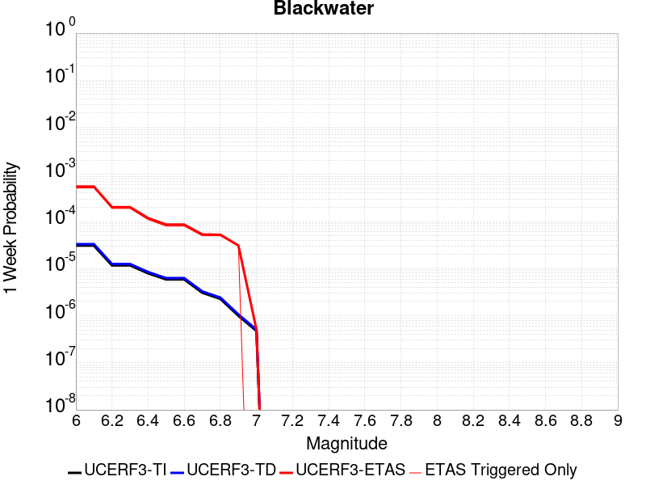 |  |  |  |

| Magnitude | 1 wk TI Prob | 1 wk TD Prob | 1 wk ETAS Prob | 1 wk ETAS/TD Gain | 1 wk ETAS Triggered Only | 1 mo TI Prob | 1 mo TD Prob | 1 mo ETAS Prob | 1 mo ETAS/TD Gain | 1 mo ETAS Triggered Only | 1 yr TI Prob | 1 yr TD Prob | 1 yr ETAS Prob | 1 yr ETAS/TD Gain | 1 yr ETAS Triggered Only | 10 yr TI Prob | 10 yr TD Prob | 10 yr ETAS Prob | 10 yr ETAS/TD Gain | 10 yr ETAS Triggered Only |
|-----|-----|-----|-----|-----|-----|-----|-----|-----|-----|-----|-----|-----|-----|-----|-----|-----|-----|-----|-----|-----|
| 6.0 | 3.0708583E-5 | 3.309619E-5 | 5.261131E-4 | 15.896485 | 4.930332E-4 | 1.3160157E-4 | 1.4183388E-4 | 0.001481408 | 10.444671 | 0.0013397642 | 0.0016010714 | 0.0017255963 | 0.0059519457 | 3.449211 | 0.004233655 | 0.015895851 | 0.017135808 | 0.024741681 | 1.4438584 | 0.007738478 |
| 6.1 | 3.0708583E-5 | 3.309619E-5 | 5.261131E-4 | 15.896485 | 4.930332E-4 | 1.3160157E-4 | 1.4183388E-4 | 0.001481408 | 10.444671 | 0.0013397642 | 0.0016010714 | 0.0017255963 | 0.0059519457 | 3.449211 | 0.004233655 | 0.015895851 | 0.017135808 | 0.024741681 | 1.4438584 | 0.007738478 |
| 6.2 | 1.1707779E-5 | 1.2545242E-5 | 2.0546887E-4 | 16.378231 | 1.9292605E-4 | 5.017523E-5 | 5.3764266E-5 | 4.931833E-4 | 9.173069 | 4.3944267E-4 | 6.107122E-4 | 6.5439293E-4 | 0.0023467466 | 3.586143 | 0.0016934619 | 0.006090366 | 0.006525631 | 0.009539064 | 1.461784 | 0.0030332261 |
| 6.3 | 1.1707779E-5 | 1.2545242E-5 | 2.0546887E-4 | 16.378231 | 1.9292605E-4 | 5.017523E-5 | 5.3764266E-5 | 4.931833E-4 | 9.173069 | 4.3944267E-4 | 6.107122E-4 | 6.5439293E-4 | 0.0023467466 | 3.586143 | 0.0016934619 | 0.006090366 | 0.006525631 | 0.009539064 | 1.461784 | 0.0030332261 |
| 6.4 | 7.929244E-6 | 8.480176E-6 | 1.2637842E-4 | 14.902806 | 1.17899246E-4 | 3.3982033E-5 | 3.6343128E-5 | 3.1500394E-4 | 8.667497 | 2.7867095E-4 | 4.136527E-4 | 4.4239179E-4 | 0.0015458692 | 3.494344 | 0.0011039657 | 0.0041288356 | 0.0044155167 | 0.0063682706 | 1.4422482 | 0.0019614147 |
| 6.5 | 5.8832115E-6 | 6.286048E-6 | 9.2030416E-5 | 14.640426 | 8.574491E-5 | 2.521352E-5 | 2.6939942E-5 | 2.1986078E-4 | 8.161146 | 1.9292605E-4 | 3.0693135E-4 | 3.2794697E-4 | 0.0010886835 | 3.3196936 | 7.6098606E-4 | 0.0030650778 | 0.0032748834 | 0.004631626 | 1.4142873 | 0.0013612005 |
| 6.6 | 5.8832115E-6 | 6.286048E-6 | 9.2030416E-5 | 14.640426 | 8.574491E-5 | 2.521352E-5 | 2.6939942E-5 | 2.1986078E-4 | 8.161146 | 1.9292605E-4 | 3.0693135E-4 | 3.2794697E-4 | 0.0010886835 | 3.3196936 | 7.6098606E-4 | 0.0030650778 | 0.0032748834 | 0.004631626 | 1.4142873 | 0.0013612005 |
| 6.7 | 3.0715053E-6 | 3.281496E-6 | 5.687189E-5 | 17.331085 | 5.3590567E-5 | 1.3163528E-5 | 1.4063485E-5 | 1.3196107E-4 | 9.383242 | 1.17899246E-4 | 1.6025416E-4 | 1.7121063E-4 | 6.212943E-4 | 3.6288302 | 4.5016076E-4 | 0.0016013865 | 0.0017109019 | 0.002470586 | 1.4440255 | 7.6098606E-4 |
| 6.8 | 2.2722281E-6 | 2.4287758E-6 | 5.6019213E-5 | 23.064795 | 5.3590567E-5 | 9.738084E-6 | 1.0409003E-5 | 1.1758902E-4 | 11.296858 | 1.07181135E-4 | 1.1855473E-4 | 1.2672316E-4 | 4.1607555E-4 | 3.2833426 | 2.8938908E-4 | 0.001184915 | 0.0012665992 | 0.0017590079 | 1.3887645 | 4.930332E-4 |
| 6.9 | 9.952399E-7 | 1.0653588E-6 | 3.3219665E-5 | 31.18167 | 3.215434E-5 | 4.265307E-6 | 4.5658185E-6 | 5.8156143E-5 | 12.7372875 | 5.3590567E-5 | 5.1928873E-5 | 5.5587938E-5 | 1.8419816E-4 | 3.3136353 | 1.2861736E-4 | 5.191674E-4 | 5.5579096E-4 | 7.700341E-4 | 1.3854743 | 2.1436227E-4 |
| 7.0 | 4.7385504E-7 | 5.0756074E-7 | 5.0756074E-7 | 1.0 | 0.0 | 2.0308057E-6 | 2.1752603E-6 | 2.1752603E-6 | 1.0 | 0.0 | 2.4724779E-5 | 2.6483794E-5 | 6.935511E-5 | 2.6187756 | 4.2872456E-5 | 2.4722028E-4 | 2.6483793E-4 | 3.5056015E-4 | 1.3236779 | 8.574491E-5 |

## Garlock (West)
*[(top)](#table-of-contents)*

| 1 Week | 1 Month | 1 Year | 10 Year |
|-----|-----|-----|-----|
|  |  |  |  |

| Magnitude | 1 wk TI Prob | 1 wk TD Prob | 1 wk ETAS Prob | 1 wk ETAS/TD Gain | 1 wk ETAS Triggered Only | 1 mo TI Prob | 1 mo TD Prob | 1 mo ETAS Prob | 1 mo ETAS/TD Gain | 1 mo ETAS Triggered Only | 1 yr TI Prob | 1 yr TD Prob | 1 yr ETAS Prob | 1 yr ETAS/TD Gain | 1 yr ETAS Triggered Only | 10 yr TI Prob | 10 yr TD Prob | 10 yr ETAS Prob | 10 yr ETAS/TD Gain | 10 yr ETAS Triggered Only |
|-----|-----|-----|-----|-----|-----|-----|-----|-----|-----|-----|-----|-----|-----|-----|-----|-----|-----|-----|-----|-----|
| 6.0 | 2.5181727E-5 | 2.5202135E-5 | 7.325798E-4 | 29.068165 | 7.073955E-4 | 1.0791722E-4 | 1.080047E-4 | 0.001962038 | 18.16623 | 0.0018542337 | 0.0013131002 | 0.0013141674 | 0.0058740834 | 4.469814 | 0.0045659165 | 0.013053683 | 0.013144457 | 0.020125428 | 1.5310962 | 0.007073955 |
| 6.1 | 2.5077732E-5 | 2.5103205E-5 | 7.3248096E-4 | 29.178782 | 7.073955E-4 | 1.0747157E-4 | 1.07580745E-4 | 0.001961615 | 18.233885 | 0.0018542337 | 0.001307681 | 0.0013090121 | 0.005868952 | 4.483497 | 0.0045659165 | 0.013000126 | 0.0130935125 | 0.020074844 | 1.5331901 | 0.007073955 |
| 6.2 | 2.494612E-5 | 2.498488E-5 | 7.323627E-4 | 29.312237 | 7.073955E-4 | 1.0690756E-4 | 1.07073676E-4 | 0.0019611088 | 18.315508 | 0.0018542337 | 0.0013008224 | 0.0013028459 | 0.0058628134 | 4.5000052 | 0.0045659165 | 0.012932341 | 0.013032575 | 0.020014338 | 1.5357163 | 0.007073955 |
| 6.3 | 2.4733758E-5 | 2.4804243E-5 | 7.321822E-4 | 29.518425 | 7.073955E-4 | 1.0599751E-4 | 1.0629959E-4 | 0.0019603362 | 18.441616 | 0.0018542337 | 0.0012897556 | 0.0012934325 | 0.0058534434 | 4.5255113 | 0.0045659165 | 0.012822957 | 0.012939542 | 0.019921962 | 1.5396188 | 0.007073955 |
| 6.4 | 2.3237335E-5 | 2.318352E-5 | 7.198448E-4 | 31.049849 | 6.9667737E-4 | 9.958477E-5 | 9.935417E-5 | 0.0019426865 | 19.553144 | 0.0018435156 | 0.0012117702 | 0.0012089686 | 0.0057372493 | 4.7455735 | 0.004533762 | 0.012051838 | 0.012104375 | 0.01905035 | 1.57384 | 0.0070310826 |
| 6.5 | 2.2732203E-5 | 2.2998063E-5 | 7.1965944E-4 | 31.292175 | 6.9667737E-4 | 9.742009E-5 | 9.8559416E-5 | 0.0019418932 | 19.702766 | 0.0018435156 | 0.0011854442 | 0.0011993032 | 0.005727628 | 4.7757964 | 0.004533762 | 0.011791403 | 0.012008769 | 0.018955417 | 1.5784646 | 0.0070310826 |
| 6.6 | 2.1319436E-5 | 2.1778224E-5 | 7.1844045E-4 | 32.988937 | 6.9667737E-4 | 9.136581E-5 | 9.333192E-5 | 0.0019366754 | 20.750408 | 0.0018435156 | 0.001111811 | 0.001135726 | 0.005664339 | 4.9874167 | 0.004533762 | 0.011062649 | 0.0113796545 | 0.018330725 | 1.6108333 | 0.0070310826 |
| 6.7 | 1.970802E-5 | 2.0398069E-5 | 7.170612E-4 | 35.15339 | 6.9667737E-4 | 8.446021E-5 | 8.741738E-5 | 0.0019307717 | 22.086819 | 0.0018435156 | 0.001027818 | 0.0010637887 | 0.0055927276 | 5.2573676 | 0.004533762 | 0.010230771 | 0.010667368 | 0.017623447 | 1.6520896 | 0.0070310826 |
| 6.8 | 1.8744462E-5 | 1.9905692E-5 | 7.165692E-4 | 35.998207 | 6.9667737E-4 | 8.033094E-5 | 8.530733E-5 | 0.0019286656 | 22.60844 | 0.0018435156 | 9.775903E-4 | 0.0010381235 | 0.005567179 | 5.362733 | 0.004533762 | 0.009733009 | 0.010413141 | 0.017371008 | 1.6681814 | 0.0070310826 |
| 6.9 | 1.7559682E-5 | 1.895803E-5 | 7.156222E-4 | 37.74771 | 6.9667737E-4 | 7.5253614E-5 | 8.124618E-5 | 0.001924612 | 23.688646 | 0.0018435156 | 9.158276E-4 | 9.887248E-4 | 0.0055180043 | 5.5809307 | 0.004533762 | 0.0091206245 | 0.009923607 | 0.016884916 | 1.7014898 | 0.0070310826 |
| 7.0 | 1.6794445E-5 | 1.8220819E-5 | 7.041676E-4 | 38.64632 | 6.859593E-4 | 7.197421E-5 | 7.8086894E-5 | 0.0019107412 | 24.469423 | 0.0018327974 | 8.759337E-4 | 9.5029466E-4 | 0.0054583326 | 5.7438316 | 0.004512326 | 0.008724891 | 0.0095425 | 0.016485257 | 1.7275617 | 0.0070096464 |
| 7.1 | 1.6337795E-5 | 1.7721602E-5 | 7.036687E-4 | 39.706837 | 6.859593E-4 | 7.0017246E-5 | 7.5947515E-5 | 0.0018978885 | 24.989473 | 0.0018220793 | 8.521265E-4 | 9.2427013E-4 | 0.005421717 | 5.8659444 | 0.0045016077 | 0.008488664 | 0.009284343 | 0.01621829 | 1.7468431 | 0.0069989283 |
| 7.2 | 1.5780008E-5 | 1.7170225E-5 | 7.031177E-4 | 40.949825 | 6.859593E-4 | 6.762685E-5 | 7.358461E-5 | 0.0018955298 | 25.759869 | 0.0018220793 | 8.2304585E-4 | 8.955257E-4 | 0.0053931023 | 6.022275 | 0.0045016077 | 0.008200042 | 0.008999176 | 0.015924498 | 1.7695507 | 0.00698821 |
| 7.3 | 1.5058865E-5 | 1.6623266E-5 | 7.025711E-4 | 42.264328 | 6.859593E-4 | 6.45364E-5 | 7.124063E-5 | 0.0018931901 | 26.574585 | 0.0018220793 | 7.854473E-4 | 8.6701073E-4 | 0.005332589 | 6.1505456 | 0.0044694534 | 0.00782677 | 0.00871586 | 0.015600663 | 1.7899168 | 0.0069453376 |
| 7.4 | 1.4887923E-5 | 1.6459222E-5 | 7.024072E-4 | 42.675602 | 6.859593E-4 | 6.380382E-5 | 7.053762E-5 | 0.001849619 | 26.221739 | 0.0017792069 | 7.7653467E-4 | 8.5845834E-4 | 0.0052705305 | 6.1395297 | 0.0044158627 | 0.0077382675 | 0.0086307125 | 0.015356723 | 1.7793111 | 0.0067845657 |
| 7.5 | 1.4509299E-5 | 1.6051208E-5 | 6.591277E-4 | 41.064056 | 6.430868E-4 | 6.218123E-5 | 6.8789086E-5 | 0.0017085477 | 24.837482 | 0.0016398714 | 7.567935E-4 | 8.3718647E-4 | 0.0048852414 | 5.835309 | 0.004051447 | 0.0075422134 | 0.008419003 | 0.014583172 | 1.7321733 | 0.006216506 |
| 7.6 | 1.2756717E-5 | 1.4055129E-5 | 3.999018E-4 | 28.452374 | 3.858521E-4 | 5.4670498E-5 | 6.023488E-5 | 0.0011105468 | 18.436937 | 0.0010503752 | 6.6541E-4 | 7.331136E-4 | 0.0033464162 | 4.5646625 | 0.0026152197 | 0.006634211 | 0.007383898 | 0.01140543 | 1.5446353 | 0.004051447 |
| 7.7 | 1.0328985E-5 | 1.1464573E-5 | 2.2582439E-4 | 19.697584 | 2.1436227E-4 | 4.4266326E-5 | 4.913296E-5 | 7.0290576E-4 | 14.306196 | 6.538049E-4 | 5.388092E-4 | 5.9803E-4 | 0.0021833621 | 3.6509242 | 0.0015862808 | 0.0053750467 | 0.0060405903 | 0.008373678 | 1.3862351 | 0.0023472668 |
| 7.8 | 7.0306583E-6 | 8.902813E-6 | 1.6967309E-4 | 19.058369 | 1.607717E-4 | 3.0131043E-5 | 3.8154354E-5 | 4.5614483E-4 | 11.95525 | 4.1800644E-4 | 3.667837E-4 | 4.644304E-4 | 0.0014928915 | 3.2144568 | 0.0010289389 | 0.003661789 | 0.0046969377 | 0.006179758 | 1.3156993 | 0.0014898177 |
| 7.9 | 4.060633E-6 | 5.4672782E-6 | 1.2336588E-4 | 22.564405 | 1.17899246E-4 | 1.7402595E-5 | 2.3430983E-5 | 3.2353113E-4 | 13.807835 | 3.0010717E-4 | 2.11856E-4 | 2.8523497E-4 | 8.53133E-4 | 2.990983 | 5.6806003E-4 | 0.0021165414 | 0.0028851798 | 0.003676032 | 1.2741084 | 7.931404E-4 |
| 8.0 | 1.6729537E-6 | 2.078155E-6 | 4.495052E-5 | 21.630013 | 4.2872456E-5 | 7.169782E-6 | 8.906349E-6 | 1.2680455E-4 | 14.237546 | 1.17899246E-4 | 8.7288594E-5 | 1.08429434E-4 | 3.120515E-4 | 2.8779225 | 2.0364416E-4 | 8.7254314E-4 | 0.001097267 | 0.0013542195 | 1.234175 | 2.5723473E-4 |
| 8.1 | 3.6733252E-7 | 3.1499187E-7 | 3.1499187E-7 | 1.0 | 0.0 | 1.5742813E-6 | 1.3499646E-6 | 1.3499646E-6 | 1.0 | 0.0 | 1.9166706E-5 | 1.643571E-5 | 1.643571E-5 | 1.0 | 0.0 | 1.9165053E-4 | 1.6643589E-4 | 1.7715222E-4 | 1.0643871 | 1.0718114E-5 |

## McLean Lake
*[(top)](#table-of-contents)*

| 1 Week | 1 Month | 1 Year | 10 Year |
|-----|-----|-----|-----|
|  | 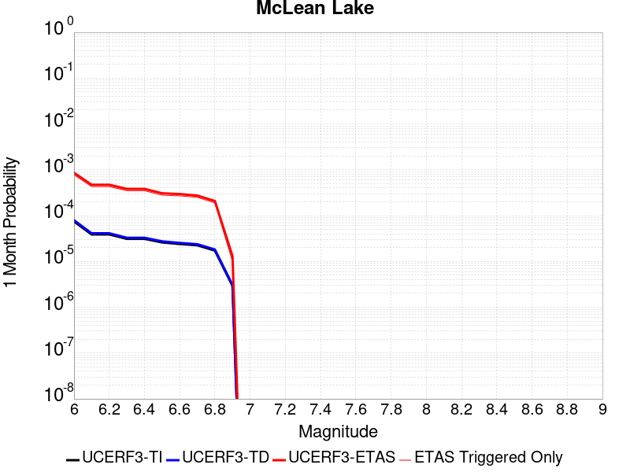 | 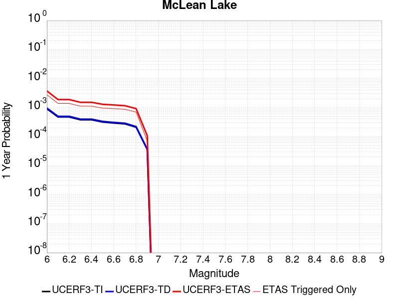 |  |

| Magnitude | 1 wk TI Prob | 1 wk TD Prob | 1 wk ETAS Prob | 1 wk ETAS/TD Gain | 1 wk ETAS Triggered Only | 1 mo TI Prob | 1 mo TD Prob | 1 mo ETAS Prob | 1 mo ETAS/TD Gain | 1 mo ETAS Triggered Only | 1 yr TI Prob | 1 yr TD Prob | 1 yr ETAS Prob | 1 yr ETAS/TD Gain | 1 yr ETAS Triggered Only | 10 yr TI Prob | 10 yr TD Prob | 10 yr ETAS Prob | 10 yr ETAS/TD Gain | 10 yr ETAS Triggered Only |
|-----|-----|-----|-----|-----|-----|-----|-----|-----|-----|-----|-----|-----|-----|-----|-----|-----|-----|-----|-----|-----|
| 6.0 | 1.7360222E-5 | 1.8501789E-5 | 2.6501383E-4 | 14.323688 | 2.465166E-4 | 7.439883E-5 | 7.929125E-5 | 8.40217E-4 | 10.596592 | 7.6098606E-4 | 9.0542925E-4 | 9.64992E-4 | 0.0037597201 | 3.8961153 | 0.0027974276 | 0.009017491 | 0.009612858 | 0.015313157 | 1.592987 | 0.005755627 |
| 6.1 | 9.062689E-6 | 9.592268E-6 | 1.382084E-4 | 14.408313 | 1.2861736E-4 | 3.8839516E-5 | 4.110912E-5 | 4.8053372E-4 | 11.689223 | 4.3944267E-4 | 4.727685E-4 | 5.003975E-4 | 0.0019251932 | 3.847328 | 0.0014255091 | 0.0047176396 | 0.0049935905 | 0.00801167 | 1.6043907 | 0.0030332261 |
| 6.2 | 9.062689E-6 | 9.592268E-6 | 1.382084E-4 | 14.408313 | 1.2861736E-4 | 3.8839516E-5 | 4.110912E-5 | 4.8053372E-4 | 11.689223 | 4.3944267E-4 | 4.727685E-4 | 5.003975E-4 | 0.0019251932 | 3.847328 | 0.0014255091 | 0.0047176396 | 0.0049935905 | 0.00801167 | 1.6043907 | 0.0030332261 |
| 6.3 | 7.2575485E-6 | 7.667767E-6 | 1.3628414E-4 | 17.773642 | 1.2861736E-4 | 3.110341E-5 | 3.2861484E-5 | 3.8654762E-4 | 11.7629385 | 3.5369775E-4 | 3.786182E-4 | 4.0002225E-4 | 0.0015464016 | 3.8657892 | 0.0011468382 | 0.0037797375 | 0.003993727 | 0.006438372 | 1.6121215 | 0.002454448 |
| 6.4 | 7.2575485E-6 | 7.667767E-6 | 1.3628414E-4 | 17.773642 | 1.2861736E-4 | 3.110341E-5 | 3.2861484E-5 | 3.8654762E-4 | 11.7629385 | 3.5369775E-4 | 3.786182E-4 | 4.0002225E-4 | 0.0015464016 | 3.8657892 | 0.0011468382 | 0.0037797375 | 0.003993727 | 0.006438372 | 1.6121215 | 0.002454448 |
| 6.5 | 6.06582E-6 | 6.4039245E-6 | 1.0286633E-4 | 16.063015 | 9.646302E-5 | 2.5996113E-5 | 2.7445138E-5 | 3.0610844E-4 | 11.153467 | 2.7867095E-4 | 3.164567E-4 | 3.340998E-4 | 0.0013091223 | 3.918357 | 9.7534835E-4 | 0.0031600643 | 0.0033366138 | 0.005344896 | 1.6018922 | 0.0020150053 |
| 6.6 | 5.598744E-6 | 5.910306E-6 | 9.165471E-5 | 15.507608 | 8.574491E-5 | 2.3994397E-5 | 2.5329673E-5 | 2.9327572E-4 | 11.578346 | 2.6795283E-4 | 2.9209262E-4 | 3.083515E-4 | 0.0012405398 | 4.023135 | 9.324759E-4 | 0.0029170897 | 0.0030798658 | 0.004971129 | 1.6140733 | 0.0018971061 |
| 6.7 | 5.246996E-6 | 5.539203E-6 | 9.128364E-5 | 16.47956 | 8.574491E-5 | 2.2486933E-5 | 2.3739261E-5 | 2.7025002E-4 | 11.384096 | 2.465166E-4 | 2.73744E-4 | 2.8899353E-4 | 0.0011676248 | 4.040315 | 8.7888533E-4 | 0.0027340704 | 0.002886801 | 0.0046715587 | 1.6182476 | 0.0017899249 |
| 6.8 | 4.02324E-6 | 4.246936E-6 | 7.927341E-5 | 18.666025 | 7.5026794E-5 | 1.7242342E-5 | 1.820106E-5 | 2.0040567E-4 | 11.010659 | 1.8220794E-4 | 2.099053E-4 | 2.2158133E-4 | 9.181043E-4 | 4.1434193 | 6.9667737E-4 | 0.0020970714 | 0.0022141882 | 0.0036151523 | 1.6327213 | 0.0014040729 |
| 6.9 | 6.835972E-7 | 7.1399705E-7 | 7.1399705E-7 | 1.0 | 0.0 | 2.9296991E-6 | 3.0599856E-6 | 1.3778066E-5 | 4.5026574 | 1.0718114E-5 | 3.56685E-5 | 3.7255006E-5 | 1.12279005E-4 | 3.0137966 | 7.5026794E-5 | 3.5662777E-4 | 3.7251884E-4 | 5.8680127E-4 | 1.5752257 | 2.1436227E-4 |

## Goldstone Lake
*[(top)](#table-of-contents)*

| 1 Week | 1 Month | 1 Year | 10 Year |
|-----|-----|-----|-----|
|  |  |  |  |

| Magnitude | 1 wk TI Prob | 1 wk TD Prob | 1 wk ETAS Prob | 1 wk ETAS/TD Gain | 1 wk ETAS Triggered Only | 1 mo TI Prob | 1 mo TD Prob | 1 mo ETAS Prob | 1 mo ETAS/TD Gain | 1 mo ETAS Triggered Only | 1 yr TI Prob | 1 yr TD Prob | 1 yr ETAS Prob | 1 yr ETAS/TD Gain | 1 yr ETAS Triggered Only | 10 yr TI Prob | 10 yr TD Prob | 10 yr ETAS Prob | 10 yr ETAS/TD Gain | 10 yr ETAS Triggered Only |
|-----|-----|-----|-----|-----|-----|-----|-----|-----|-----|-----|-----|-----|-----|-----|-----|-----|-----|-----|-----|-----|
| 6.0 | 2.671352E-5 | 3.0376628E-5 | 3.090391E-4 | 10.173582 | 2.7867095E-4 | 1.1448149E-4 | 1.3018015E-4 | 8.3748356E-4 | 6.4332657 | 7.073955E-4 | 0.001392921 | 0.0015839875 | 0.0037670194 | 2.3781874 | 0.002186495 | 0.013842222 | 0.015746472 | 0.020198295 | 1.2827187 | 0.004523044 |
| 6.1 | 2.671352E-5 | 3.0376628E-5 | 3.090391E-4 | 10.173582 | 2.7867095E-4 | 1.1448149E-4 | 1.3018015E-4 | 8.3748356E-4 | 6.4332657 | 7.073955E-4 | 0.001392921 | 0.0015839875 | 0.0037670194 | 2.3781874 | 0.002186495 | 0.013842222 | 0.015746472 | 0.020198295 | 1.2827187 | 0.004523044 |
| 6.2 | 1.4197047E-5 | 1.6096516E-5 | 1.8758357E-4 | 11.653676 | 1.7148982E-4 | 6.0843064E-5 | 6.89838E-5 | 4.440919E-4 | 6.437626 | 3.7513397E-4 | 7.4051257E-4 | 8.396528E-4 | 0.0021997103 | 2.6197855 | 0.0013612005 | 0.007380498 | 0.008374499 | 0.010925305 | 1.3045919 | 0.0025723472 |
| 6.3 | 1.4197047E-5 | 1.6096516E-5 | 1.8758357E-4 | 11.653676 | 1.7148982E-4 | 6.0843064E-5 | 6.89838E-5 | 4.440919E-4 | 6.437626 | 3.7513397E-4 | 7.4051257E-4 | 8.396528E-4 | 0.0021997103 | 2.6197855 | 0.0013612005 | 0.007380498 | 0.008374499 | 0.010925305 | 1.3045919 | 0.0025723472 |
| 6.4 | 1.3238931E-5 | 1.5008711E-5 | 1.8649595E-4 | 12.425847 | 1.7148982E-4 | 5.6737044E-5 | 6.432201E-5 | 4.2871444E-4 | 6.6651278 | 3.6441587E-4 | 6.9055456E-4 | 7.8293716E-4 | 0.002025265 | 2.586753 | 0.0012433012 | 0.006884126 | 0.007811414 | 0.010161614 | 1.3008674 | 0.002368703 |
| 6.5 | 1.3238931E-5 | 1.5008711E-5 | 1.8649595E-4 | 12.425847 | 1.7148982E-4 | 5.6737044E-5 | 6.432201E-5 | 4.2871444E-4 | 6.6651278 | 3.6441587E-4 | 6.9055456E-4 | 7.8293716E-4 | 0.002025265 | 2.586753 | 0.0012433012 | 0.006884126 | 0.007811414 | 0.010161614 | 1.3008674 | 0.002368703 |
| 6.6 | 1.1328278E-5 | 1.2855381E-5 | 1.5218907E-4 | 11.83855 | 1.3933548E-4 | 4.8548856E-5 | 5.5093864E-5 | 3.6590203E-4 | 6.64143 | 3.108253E-4 | 5.90922E-4 | 6.706571E-4 | 0.0017310387 | 2.5811086 | 0.0010610933 | 0.0058935313 | 0.0066957204 | 0.008718527 | 1.3021044 | 0.0020364416 |
| 6.7 | 8.651175E-6 | 9.8247265E-6 | 7.4132775E-5 | 7.545531 | 6.430868E-5 | 3.707594E-5 | 4.2105803E-5 | 2.2430606E-4 | 5.327201 | 1.8220794E-4 | 4.5130608E-4 | 5.126081E-4 | 0.0011875031 | 2.3165905 | 6.752412E-4 | 0.0045039062 | 0.0051231356 | 0.0066159843 | 1.2913935 | 0.0015005359 |
| 6.8 | 1.0215377E-6 | 1.1754793E-6 | 1.1754793E-6 | 1.0 | 0.0 | 4.378012E-6 | 5.037759E-6 | 3.7191938E-5 | 7.3826356 | 3.215434E-5 | 5.3300988E-5 | 6.133311E-5 | 1.2563785E-4 | 2.0484507 | 6.430868E-5 | 5.3288206E-4 | 6.13173E-4 | 7.095769E-4 | 1.1572213 | 9.646302E-5 |
| 6.9 | 7.9360774E-7 | 9.2834586E-7 | 9.2834586E-7 | 1.0 | 0.0 | 3.4011714E-6 | 3.9786196E-6 | 2.5414762E-5 | 6.387834 | 2.1436228E-5 | 4.1408475E-5 | 4.8438687E-5 | 8.059147E-5 | 1.6637831 | 3.215434E-5 | 4.140076E-4 | 4.842883E-4 | 5.2714E-4 | 1.0884838 | 4.2872456E-5 |
| 7.0 | 7.4382757E-7 | 8.7473853E-7 | 8.7473853E-7 | 1.0 | 0.0 | 3.1878285E-6 | 3.7488744E-6 | 2.5185022E-5 | 6.7180223 | 2.1436228E-5 | 3.8811122E-5 | 4.5641656E-5 | 7.779453E-5 | 1.7044634 | 3.215434E-5 | 3.8804344E-4 | 4.563295E-4 | 4.991824E-4 | 1.0939078 | 4.2872456E-5 |
| 7.1 | 6.4709513E-7 | 7.711347E-7 | 7.711347E-7 | 1.0 | 0.0 | 2.773262E-6 | 3.304859E-6 | 1.4022938E-5 | 4.243127 | 1.0718114E-5 | 3.376394E-5 | 4.0235976E-5 | 6.1671344E-5 | 1.5327412 | 2.1436228E-5 | 3.375881E-4 | 4.0229288E-4 | 4.2372048E-4 | 1.0532637 | 2.1436228E-5 |
| 7.2 | 6.356704E-7 | 7.5884054E-7 | 7.5884054E-7 | 1.0 | 0.0 | 2.7242988E-6 | 3.25217E-6 | 1.3970249E-5 | 4.29567 | 1.0718114E-5 | 3.3167835E-5 | 3.959451E-5 | 6.102989E-5 | 1.5413724 | 2.1436228E-5 | 3.3162883E-4 | 3.958805E-4 | 4.1730824E-4 | 1.0541267 | 2.1436228E-5 |
| 7.3 | 5.7695723E-7 | 6.8966074E-7 | 6.8966074E-7 | 1.0 | 0.0 | 2.4726714E-6 | 2.9556859E-6 | 1.3673768E-5 | 4.626259 | 1.0718114E-5 | 3.0104358E-5 | 3.598494E-5 | 5.7420395E-5 | 1.5956786 | 2.1436228E-5 | 3.0100282E-4 | 3.5979686E-4 | 3.8122537E-4 | 1.0595572 | 2.1436228E-5 |
| 7.4 | 5.209647E-7 | 6.193549E-7 | 6.193549E-7 | 1.0 | 0.0 | 2.232704E-6 | 2.654376E-6 | 1.3372461E-5 | 5.037893 | 1.0718114E-5 | 2.718283E-5 | 3.2316606E-5 | 5.3752137E-5 | 1.6632979 | 2.1436228E-5 | 2.7179506E-4 | 3.231246E-4 | 3.445539E-4 | 1.066319 | 2.1436228E-5 |
| 7.5 | 4.512955E-7 | 5.3489146E-7 | 5.3489146E-7 | 1.0 | 0.0 | 1.934122E-6 | 2.2923903E-6 | 2.2923903E-6 | 1.0 | 0.0 | 2.3547682E-5 | 2.7909547E-5 | 3.862736E-5 | 1.3840196 | 1.0718114E-5 | 2.3545188E-4 | 2.7906572E-4 | 2.8978084E-4 | 1.0383964 | 1.0718114E-5 |
| 7.6 | 2.21172E-7 | 2.6039737E-7 | 2.6039737E-7 | 1.0 | 0.0 | 9.478797E-7 | 1.1159884E-6 | 1.1159884E-6 | 1.0 | 0.0 | 1.1540374E-5 | 1.3587103E-5 | 1.3587103E-5 | 1.0 | 0.0 | 1.1539775E-4 | 1.3586554E-4 | 1.3586554E-4 | 1.0 | 0.0 |

## Gravel Hills-Harper Lk
*[(top)](#table-of-contents)*

| 1 Week | 1 Month | 1 Year | 10 Year |
|-----|-----|-----|-----|
|  |  |  |  |

| Magnitude | 1 wk TI Prob | 1 wk TD Prob | 1 wk ETAS Prob | 1 wk ETAS/TD Gain | 1 wk ETAS Triggered Only | 1 mo TI Prob | 1 mo TD Prob | 1 mo ETAS Prob | 1 mo ETAS/TD Gain | 1 mo ETAS Triggered Only | 1 yr TI Prob | 1 yr TD Prob | 1 yr ETAS Prob | 1 yr ETAS/TD Gain | 1 yr ETAS Triggered Only | 10 yr TI Prob | 10 yr TD Prob | 10 yr ETAS Prob | 10 yr ETAS/TD Gain | 10 yr ETAS Triggered Only |
|-----|-----|-----|-----|-----|-----|-----|-----|-----|-----|-----|-----|-----|-----|-----|-----|-----|-----|-----|-----|-----|
| 6.0 | 3.0679566E-5 | 3.1465184E-5 | 2.6725626E-4 | 8.493713 | 2.3579849E-4 | 1.3147724E-4 | 1.3484505E-4 | 8.2071184E-4 | 6.086333 | 6.859593E-4 | 0.0015995599 | 0.0016407187 | 0.0037487226 | 2.2848053 | 0.0021114685 | 0.015880952 | 0.016307615 | 0.02031408 | 1.2456806 | 0.004072883 |
| 6.1 | 3.0679566E-5 | 3.1465184E-5 | 2.6725626E-4 | 8.493713 | 2.3579849E-4 | 1.3147724E-4 | 1.3484505E-4 | 8.2071184E-4 | 6.086333 | 6.859593E-4 | 0.0015995599 | 0.0016407187 | 0.0037487226 | 2.2848053 | 0.0021114685 | 0.015880952 | 0.016307615 | 0.02031408 | 1.2456806 | 0.004072883 |
| 6.2 | 1.514536E-5 | 1.3635392E-5 | 4.5789293E-5 | 3.358121 | 3.215434E-5 | 6.490707E-5 | 5.843615E-5 | 2.1919847E-4 | 3.7510762 | 1.607717E-4 | 7.8995706E-4 | 7.112398E-4 | 0.0012253433 | 1.7228273 | 5.1446946E-4 | 0.007871548 | 0.0070908363 | 0.008240185 | 1.1620892 | 0.0011575563 |
| 6.3 | 1.514536E-5 | 1.3635392E-5 | 4.5789293E-5 | 3.358121 | 3.215434E-5 | 6.490707E-5 | 5.843615E-5 | 2.1919847E-4 | 3.7510762 | 1.607717E-4 | 7.8995706E-4 | 7.112398E-4 | 0.0012253433 | 1.7228273 | 5.1446946E-4 | 0.007871548 | 0.0070908363 | 0.008240185 | 1.1620892 | 0.0011575563 |
| 6.4 | 1.2532521E-5 | 1.0689826E-5 | 2.1407825E-5 | 2.0026355 | 1.0718114E-5 | 5.37097E-5 | 4.581277E-5 | 1.3155375E-4 | 2.871552 | 8.574491E-5 | 6.537194E-4 | 5.576335E-4 | 8.468612E-4 | 1.5186698 | 2.8938908E-4 | 0.0065179965 | 0.0055629327 | 0.0062557347 | 1.1245389 | 6.9667737E-4 |
| 6.5 | 1.1094058E-5 | 9.083774E-6 | 1.980179E-5 | 2.1799078 | 1.0718114E-5 | 4.7545094E-5 | 3.89299E-5 | 8.180069E-5 | 2.1012304 | 4.2872456E-5 | 5.787078E-4 | 4.738725E-4 | 6.881332E-4 | 1.4521484 | 2.1436227E-4 | 0.0057720304 | 0.004729028 | 0.005230397 | 1.1060195 | 5.0375133E-4 |
| 6.6 | 9.688328E-6 | 7.531784E-6 | 1.8249817E-5 | 2.4230404 | 1.0718114E-5 | 4.1520743E-5 | 3.2278687E-5 | 7.514976E-5 | 2.328154 | 4.2872456E-5 | 5.053978E-4 | 3.929247E-4 | 5.3220545E-4 | 1.3544718 | 1.3933548E-4 | 0.0050424994 | 0.0039225565 | 0.004264191 | 1.0870948 | 3.4297965E-4 |
| 6.7 | 8.974824E-6 | 6.7494916E-6 | 6.7494916E-6 | 1.0 | 0.0 | 3.8462964E-5 | 2.8926084E-5 | 6.1079496E-5 | 2.1115716 | 3.215434E-5 | 4.6818596E-4 | 3.5212038E-4 | 4.5926377E-4 | 1.3042806 | 1.07181135E-4 | 0.004672008 | 0.0035158454 | 0.0037828563 | 1.075945 | 2.6795283E-4 |
| 6.8 | 7.4780046E-6 | 5.116252E-6 | 5.116252E-6 | 1.0 | 0.0 | 3.20482E-5 | 2.1926619E-5 | 4.3362375E-5 | 1.9776134 | 2.1436228E-5 | 3.9011694E-4 | 2.6692526E-4 | 3.2050154E-4 | 1.2007164 | 5.3590567E-5 | 0.0038943281 | 0.002666185 | 0.0027944592 | 1.0481116 | 1.2861736E-4 |
| 6.9 | 6.3409307E-6 | 3.9075426E-6 | 3.9075426E-6 | 1.0 | 0.0 | 2.7175134E-5 | 1.674651E-5 | 2.7464444E-5 | 1.64001 | 1.0718114E-5 | 3.3080703E-4 | 2.0387067E-4 | 2.2530253E-4 | 1.1051247 | 2.1436228E-5 | 0.0033031502 | 0.0020369345 | 0.0021118086 | 1.0367582 | 7.5026794E-5 |
| 7.0 | 5.1239335E-6 | 2.6058885E-6 | 2.6058885E-6 | 1.0 | 0.0 | 2.195953E-5 | 1.11680465E-5 | 2.188604E-5 | 1.9597018 | 1.0718114E-5 | 2.6732447E-4 | 1.3596273E-4 | 1.466794E-4 | 1.0788206 | 1.0718114E-5 | 0.0026700313 | 0.0013588208 | 0.001401635 | 1.0315083 | 4.2872456E-5 |
| 7.1 | 4.438899E-6 | 2.0984994E-6 | 2.0984994E-6 | 1.0 | 0.0 | 1.9023713E-5 | 8.993539E-6 | 1.9711557E-5 | 2.1917462 | 1.0718114E-5 | 2.315891E-4 | 1.0949106E-4 | 1.20208E-4 | 1.0978796 | 1.0718114E-5 | 0.002313479 | 0.0010943931 | 0.0011372186 | 1.0391318 | 4.2872456E-5 |
| 7.2 | 3.50367E-6 | 1.2615911E-6 | 1.2615911E-6 | 1.0 | 0.0 | 1.5015643E-5 | 5.406808E-6 | 5.406808E-6 | 1.0 | 0.0 | 1.8280011E-4 | 6.582599E-5 | 6.582599E-5 | 1.0 | 0.0 | 0.0018264982 | 6.580731E-4 | 6.6878414E-4 | 1.0162764 | 1.0718114E-5 |
| 7.3 | 2.561638E-6 | 7.119307E-7 | 7.119307E-7 | 1.0 | 0.0 | 1.0978401E-5 | 3.051128E-6 | 3.051128E-6 | 1.0 | 0.0 | 1.3365384E-4 | 3.714687E-5 | 3.714687E-5 | 1.0 | 0.0 | 0.0013357349 | 3.7140862E-4 | 3.8212276E-4 | 1.0288473 | 1.0718114E-5 |
| 7.4 | 2.0368864E-6 | 5.304955E-7 | 5.304955E-7 | 1.0 | 0.0 | 8.729483E-6 | 2.2735503E-6 | 2.2735503E-6 | 1.0 | 0.0 | 1.06276275E-4 | 2.768013E-5 | 2.768013E-5 | 1.0 | 0.0 | 0.0010622547 | 2.7676736E-4 | 2.7676736E-4 | 1.0 | 0.0 |
| 7.5 | 1.1681728E-6 | 3.6031287E-7 | 3.6031287E-7 | 1.0 | 0.0 | 5.0064455E-6 | 1.5441972E-6 | 1.5441972E-6 | 1.0 | 0.0 | 6.0951766E-5 | 1.8800443E-5 | 1.8800443E-5 | 1.0 | 0.0 | 6.093505E-4 | 1.8798899E-4 | 1.8798899E-4 | 1.0 | 0.0 |
| 7.6 | 1.3154387E-7 | 7.1198265E-8 | 7.1198265E-8 | 1.0 | 0.0 | 5.6375933E-7 | 3.051354E-7 | 3.051354E-7 | 1.0 | 0.0 | 6.863748E-6 | 3.7150185E-6 | 3.7150185E-6 | 1.0 | 0.0 | 6.863536E-5 | 3.7149723E-5 | 3.7149723E-5 | 1.0 | 0.0 |

## So Sierra Nevada
*[(top)](#table-of-contents)*

| 1 Week | 1 Month | 1 Year | 10 Year |
|-----|-----|-----|-----|
|  |  |  |  |

| Magnitude | 1 wk TI Prob | 1 wk TD Prob | 1 wk ETAS Prob | 1 wk ETAS/TD Gain | 1 wk ETAS Triggered Only | 1 mo TI Prob | 1 mo TD Prob | 1 mo ETAS Prob | 1 mo ETAS/TD Gain | 1 mo ETAS Triggered Only | 1 yr TI Prob | 1 yr TD Prob | 1 yr ETAS Prob | 1 yr ETAS/TD Gain | 1 yr ETAS Triggered Only | 10 yr TI Prob | 10 yr TD Prob | 10 yr ETAS Prob | 10 yr ETAS/TD Gain | 10 yr ETAS Triggered Only |
|-----|-----|-----|-----|-----|-----|-----|-----|-----|-----|-----|-----|-----|-----|-----|-----|-----|-----|-----|-----|-----|
| 6.0 | 1.15488665E-5 | 1.1079722E-5 | 2.0400363E-4 | 18.412342 | 1.9292605E-4 | 4.9494203E-5 | 4.748373E-5 | 5.940816E-4 | 12.511267 | 5.466238E-4 | 6.024253E-4 | 5.779738E-4 | 0.0023025926 | 3.983905 | 0.0017256163 | 0.006007948 | 0.005765975 | 0.008941556 | 1.5507449 | 0.0031939978 |
| 6.1 | 1.15488665E-5 | 1.1079722E-5 | 2.0400363E-4 | 18.412342 | 1.9292605E-4 | 4.9494203E-5 | 4.748373E-5 | 5.940816E-4 | 12.511267 | 5.466238E-4 | 6.024253E-4 | 5.779738E-4 | 0.0023025926 | 3.983905 | 0.0017256163 | 0.006007948 | 0.005765975 | 0.008941556 | 1.5507449 | 0.0031939978 |
| 6.2 | 1.15488665E-5 | 1.1079722E-5 | 2.0400363E-4 | 18.412342 | 1.9292605E-4 | 4.9494203E-5 | 4.748373E-5 | 5.940816E-4 | 12.511267 | 5.466238E-4 | 6.024253E-4 | 5.779738E-4 | 0.0023025926 | 3.983905 | 0.0017256163 | 0.006007948 | 0.005765975 | 0.008941556 | 1.5507449 | 0.0031939978 |
| 6.3 | 1.15488665E-5 | 1.1079722E-5 | 2.0400363E-4 | 18.412342 | 1.9292605E-4 | 4.9494203E-5 | 4.748373E-5 | 5.940816E-4 | 12.511267 | 5.466238E-4 | 6.024253E-4 | 5.779738E-4 | 0.0023025926 | 3.983905 | 0.0017256163 | 0.006007948 | 0.005765975 | 0.008941556 | 1.5507449 | 0.0031939978 |
| 6.4 | 1.15488665E-5 | 1.1079722E-5 | 2.0400363E-4 | 18.412342 | 1.9292605E-4 | 4.9494203E-5 | 4.748373E-5 | 5.940816E-4 | 12.511267 | 5.466238E-4 | 6.024253E-4 | 5.779738E-4 | 0.0023025926 | 3.983905 | 0.0017256163 | 0.006007948 | 0.005765975 | 0.008941556 | 1.5507449 | 0.0031939978 |
| 6.5 | 1.15488665E-5 | 1.1079722E-5 | 2.0400363E-4 | 18.412342 | 1.9292605E-4 | 4.9494203E-5 | 4.748373E-5 | 5.940816E-4 | 12.511267 | 5.466238E-4 | 6.024253E-4 | 5.779738E-4 | 0.0023025926 | 3.983905 | 0.0017256163 | 0.006007948 | 0.005765975 | 0.008941556 | 1.5507449 | 0.0031939978 |
| 6.6 | 7.587044E-6 | 6.935689E-6 | 1.2483411E-4 | 17.998806 | 1.17899246E-4 | 3.2515498E-5 | 2.9724059E-5 | 3.512579E-4 | 11.817293 | 3.215434E-4 | 3.9580427E-4 | 3.6183326E-4 | 0.0013689714 | 3.7834318 | 0.0010075027 | 0.003951 | 0.0036127327 | 0.0054282295 | 1.5025272 | 0.0018220793 |
| 6.7 | 7.587044E-6 | 6.935689E-6 | 1.2483411E-4 | 17.998806 | 1.17899246E-4 | 3.2515498E-5 | 2.9724059E-5 | 3.512579E-4 | 11.817293 | 3.215434E-4 | 3.9580427E-4 | 3.6183326E-4 | 0.0013689714 | 3.7834318 | 0.0010075027 | 0.003951 | 0.0036127327 | 0.0054282295 | 1.5025272 | 0.0018220793 |
| 6.8 | 5.9026956E-6 | 5.1794364E-6 | 6.948778E-5 | 13.41609 | 6.430868E-5 | 2.5297022E-5 | 2.2197402E-5 | 2.3655492E-4 | 10.656874 | 2.1436227E-4 | 3.0794772E-4 | 2.7022103E-4 | 9.881406E-4 | 3.6567864 | 7.181136E-4 | 0.0030752132 | 0.0026990408 | 0.0039069187 | 1.4475212 | 0.0012111468 |
| 6.9 | 5.0118915E-6 | 4.2524644E-6 | 3.640667E-5 | 8.561311 | 3.215434E-5 | 2.1479358E-5 | 1.8224722E-5 | 1.5755766E-4 | 8.64527 | 1.3933548E-4 | 2.614798E-4 | 2.2186415E-4 | 8.219453E-4 | 3.7047236 | 6.0021435E-4 | 0.0026117235 | 0.002216499 | 0.0032431572 | 1.4631891 | 0.0010289389 |
| 7.0 | 4.4924795E-6 | 3.713954E-6 | 3.5868175E-5 | 9.65768 | 3.215434E-5 | 1.925334E-5 | 1.5916852E-5 | 1.3381422E-4 | 8.407079 | 1.17899246E-4 | 2.3438422E-4 | 1.9377106E-4 | 7.0814084E-4 | 3.6545231 | 5.1446946E-4 | 0.0023413717 | 0.001936084 | 0.0028453597 | 1.4696469 | 9.1103965E-4 |
| 7.1 | 3.9118436E-6 | 3.1120105E-6 | 2.4548171E-5 | 7.888203 | 2.1436228E-5 | 1.6764936E-5 | 1.3337123E-5 | 1.0979886E-4 | 8.232574 | 9.646302E-5 | 2.0409399E-4 | 1.6236794E-4 | 5.6959013E-4 | 3.5080209 | 4.0728832E-4 | 0.0020390663 | 0.0016225493 | 0.0023823006 | 1.4682455 | 7.6098606E-4 |
| 7.2 | 3.4200818E-6 | 2.6054847E-6 | 1.3323571E-5 | 5.1136627 | 1.0718114E-5 | 1.4657411E-5 | 1.11663185E-5 | 9.691027E-5 | 8.6788025 | 8.574491E-5 | 1.7843937E-4 | 1.3594194E-4 | 5.003083E-4 | 3.6803083 | 3.6441587E-4 | 0.0017829615 | 0.0013586376 | 0.0019794437 | 1.4569328 | 6.216506E-4 |
| 7.3 | 2.6593618E-6 | 1.8284468E-6 | 1.2546541E-5 | 6.861857 | 1.0718114E-5 | 1.13972155E-5 | 7.836179E-6 | 7.214436E-5 | 9.2065735 | 6.430868E-5 | 1.3875226E-4 | 9.540159E-5 | 3.526118E-4 | 3.6960785 | 2.5723473E-4 | 0.0013866565 | 9.536353E-4 | 0.0013605353 | 1.426683 | 4.0728832E-4 |
| 7.4 | 2.2577992E-6 | 1.4364622E-6 | 1.4364622E-6 | 1.0 | 0.0 | 9.676246E-6 | 6.1562537E-6 | 5.9746493E-5 | 9.7050085 | 5.3590567E-5 | 1.1780193E-4 | 7.495006E-5 | 2.7857895E-4 | 3.7168608 | 2.0364416E-4 | 0.001177395 | 7.4927293E-4 | 0.0010812855 | 1.443113 | 3.3226152E-4 |
| 7.5 | 1.489319E-6 | 7.3541264E-7 | 7.3541264E-7 | 1.0 | 0.0 | 6.3827797E-6 | 3.1517645E-6 | 4.6024084E-5 | 14.60264 | 4.2872456E-5 | 7.770758E-5 | 3.837206E-5 | 1.4554909E-4 | 3.7931004 | 1.07181135E-4 | 7.7680405E-4 | 3.836548E-4 | 5.872208E-4 | 1.5305969 | 2.0364416E-4 |
| 7.6 | 1.0680322E-6 | 4.659796E-7 | 4.659796E-7 | 1.0 | 0.0 | 4.577273E-6 | 1.997054E-6 | 2.3433238E-5 | 11.733904 | 2.1436228E-5 | 5.5726876E-5 | 2.4313864E-5 | 5.6467423E-5 | 2.3224373 | 3.215434E-5 | 5.5712904E-4 | 2.431123E-4 | 3.3955186E-4 | 1.3966874 | 9.646302E-5 |
| 7.7 | 5.509146E-7 | 1.5581199E-7 | 1.5581199E-7 | 1.0 | 0.0 | 2.3610605E-6 | 6.677655E-7 | 1.1385872E-5 | 17.050703 | 1.0718114E-5 | 2.8745531E-5 | 8.130016E-6 | 1.8848043E-5 | 2.318328 | 1.0718114E-5 | 2.8741814E-4 | 8.12973E-5 | 9.201455E-5 | 1.1318277 | 1.0718114E-5 |

## Death Valley (So)
*[(top)](#table-of-contents)*

| 1 Week | 1 Month | 1 Year | 10 Year |
|-----|-----|-----|-----|
|  |  | 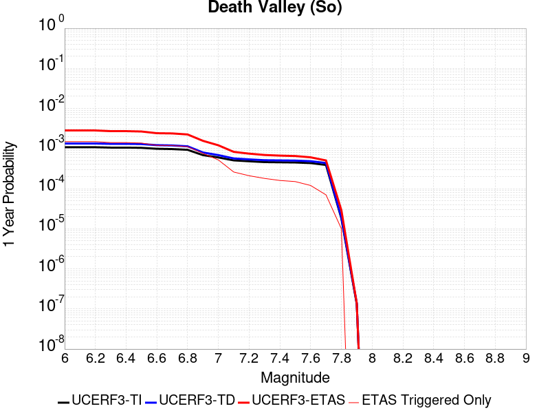 |  |

| Magnitude | 1 wk TI Prob | 1 wk TD Prob | 1 wk ETAS Prob | 1 wk ETAS/TD Gain | 1 wk ETAS Triggered Only | 1 mo TI Prob | 1 mo TD Prob | 1 mo ETAS Prob | 1 mo ETAS/TD Gain | 1 mo ETAS Triggered Only | 1 yr TI Prob | 1 yr TD Prob | 1 yr ETAS Prob | 1 yr ETAS/TD Gain | 1 yr ETAS Triggered Only | 10 yr TI Prob | 10 yr TD Prob | 10 yr ETAS Prob | 10 yr ETAS/TD Gain | 10 yr ETAS Triggered Only |
|-----|-----|-----|-----|-----|-----|-----|-----|-----|-----|-----|-----|-----|-----|-----|-----|-----|-----|-----|-----|-----|
| 6.0 | 2.0684236E-5 | 2.5618423E-5 | 1.8638601E-4 | 7.275468 | 1.607717E-4 | 8.864371E-5 | 1.09788714E-4 | 5.063154E-4 | 4.6117253 | 3.965702E-4 | 0.0010787029 | 0.0013358749 | 0.0028772214 | 2.1538105 | 0.0015434084 | 0.010734817 | 0.013281729 | 0.016285244 | 1.226139 | 0.0030439442 |
| 6.1 | 2.0684236E-5 | 2.5618423E-5 | 1.8638601E-4 | 7.275468 | 1.607717E-4 | 8.864371E-5 | 1.09788714E-4 | 5.063154E-4 | 4.6117253 | 3.965702E-4 | 0.0010787029 | 0.0013358749 | 0.0028772214 | 2.1538105 | 0.0015434084 | 0.010734817 | 0.013281729 | 0.016285244 | 1.226139 | 0.0030439442 |
| 6.2 | 2.0684236E-5 | 2.5618423E-5 | 1.8638601E-4 | 7.275468 | 1.607717E-4 | 8.864371E-5 | 1.09788714E-4 | 5.063154E-4 | 4.6117253 | 3.965702E-4 | 0.0010787029 | 0.0013358749 | 0.0028772214 | 2.1538105 | 0.0015434084 | 0.010734817 | 0.013281729 | 0.016285244 | 1.226139 | 0.0030439442 |
| 6.3 | 2.0240292E-5 | 2.5118497E-5 | 1.7516832E-4 | 6.973678 | 1.5005359E-4 | 8.6741224E-5 | 1.0764636E-4 | 4.8273997E-4 | 4.4844985 | 3.7513397E-4 | 0.0010555626 | 0.0013098232 | 0.0027655773 | 2.1114128 | 0.0014576635 | 0.010505628 | 0.013024284 | 0.015880484 | 1.219298 | 0.0028938907 |
| 6.4 | 2.0240292E-5 | 2.5118497E-5 | 1.7516832E-4 | 6.973678 | 1.5005359E-4 | 8.6741224E-5 | 1.0764636E-4 | 4.8273997E-4 | 4.4844985 | 3.7513397E-4 | 0.0010555626 | 0.0013098232 | 0.0027655773 | 2.1114128 | 0.0014576635 | 0.010505628 | 0.013024284 | 0.015880484 | 1.219298 | 0.0028938907 |
| 6.5 | 1.9962767E-5 | 2.4807747E-5 | 1.7485762E-4 | 7.0485086 | 1.5005359E-4 | 8.55519E-5 | 1.0631468E-4 | 4.5997484E-4 | 4.3265414 | 3.5369775E-4 | 0.0010410968 | 0.0012936293 | 0.00270659 | 2.0922456 | 0.001414791 | 0.010362327 | 0.012864228 | 0.01565741 | 1.2171278 | 0.002829582 |
| 6.6 | 1.8937297E-5 | 2.3311568E-5 | 1.5192594E-4 | 6.5171905 | 1.2861736E-4 | 8.115732E-5 | 9.990298E-5 | 3.6782905E-4 | 3.6818626 | 2.6795283E-4 | 9.876423E-4 | 0.0012156547 | 0.0024467392 | 2.0126927 | 0.0012325831 | 0.009832645 | 0.0120931 | 0.01462375 | 1.209264 | 0.002561629 |
| 6.7 | 1.8621096E-5 | 2.2912203E-5 | 1.5152662E-4 | 6.6133585 | 1.2861736E-4 | 7.980225E-5 | 9.8191544E-5 | 3.6611807E-4 | 3.728611 | 2.6795283E-4 | 9.711593E-4 | 0.0011948409 | 0.0024152459 | 2.0213954 | 0.001221865 | 0.009669261 | 0.011887211 | 0.0143548455 | 1.2075874 | 0.0024973205 |
| 6.8 | 1.7830353E-5 | 2.1806247E-5 | 1.3970293E-4 | 6.406555 | 1.17899246E-4 | 7.641356E-5 | 9.345208E-5 | 3.3994566E-4 | 3.6376467 | 2.465166E-4 | 9.29938E-4 | 0.0011371992 | 0.0022720273 | 1.9979149 | 0.0011361201 | 0.009260561 | 0.011316643 | 0.01362675 | 1.2041336 | 0.0023365489 |
| 6.9 | 1.3135183E-5 | 1.5304242E-5 | 1.1176579E-4 | 7.302929 | 9.646302E-5 | 5.6292425E-5 | 6.558799E-5 | 2.585014E-4 | 3.9412913 | 1.9292605E-4 | 6.8514474E-4 | 7.982477E-4 | 0.001590755 | 1.9928087 | 7.931404E-4 | 0.006830362 | 0.007954813 | 0.009496576 | 1.1938152 | 0.0015541265 |
| 7.0 | 1.1507512E-5 | 1.3154444E-5 | 6.674431E-5 | 5.073898 | 5.3590567E-5 | 4.9316975E-5 | 5.6375004E-5 | 1.7426761E-4 | 3.0912213 | 1.17899246E-4 | 6.002687E-4 | 6.861553E-4 | 0.0012431148 | 1.8117106 | 5.573419E-4 | 0.0059864987 | 0.006841068 | 0.008033285 | 1.1742735 | 0.0012004287 |
| 7.1 | 9.715903E-6 | 1.0865454E-5 | 5.3737444E-5 | 4.9457154 | 4.2872456E-5 | 4.1638916E-5 | 4.6565423E-5 | 1.21588724E-4 | 2.6111376 | 7.5026794E-5 | 5.068359E-4 | 5.667908E-4 | 8.453038E-4 | 1.4913859 | 2.7867095E-4 | 0.0050568148 | 0.0056539057 | 0.0062507265 | 1.105559 | 6.0021435E-4 |
| 7.2 | 9.233269E-6 | 1.0286473E-5 | 4.2440483E-5 | 4.1258535 | 3.215434E-5 | 3.9570554E-5 | 4.4084165E-5 | 1.0839001E-4 | 2.4587064 | 6.430868E-5 | 4.81665E-4 | 5.3659675E-4 | 7.615563E-4 | 1.419234 | 2.2508038E-4 | 0.0048062233 | 0.005353442 | 0.005811854 | 1.0856293 | 4.608789E-4 |
| 7.3 | 8.8041315E-6 | 9.808313E-6 | 4.196234E-5 | 4.278242 | 3.215434E-5 | 3.7731446E-5 | 4.2034975E-5 | 1.0634095E-4 | 2.529821 | 6.430868E-5 | 4.592835E-4 | 5.1165983E-4 | 7.0448715E-4 | 1.3768662 | 1.9292605E-4 | 0.0045833546 | 0.0051052445 | 0.005457137 | 1.0689275 | 3.5369775E-4 |
| 7.4 | 8.708749E-6 | 9.707323E-6 | 3.1143343E-5 | 3.2082317 | 2.1436228E-5 | 3.7322676E-5 | 4.1602176E-5 | 9.519051E-5 | 2.2881138 | 5.3590567E-5 | 4.5430884E-4 | 5.06393E-4 | 6.7779596E-4 | 1.3384782 | 1.7148982E-4 | 0.004533812 | 0.0050528166 | 0.005372735 | 1.0633149 | 3.215434E-4 |
| 7.5 | 8.612678E-6 | 9.604964E-6 | 2.0322976E-5 | 2.1158824 | 1.0718114E-5 | 3.6910955E-5 | 4.116351E-5 | 8.4034196E-5 | 2.0414732 | 4.2872456E-5 | 4.492982E-4 | 5.010547E-4 | 6.6174584E-4 | 1.3207058 | 1.607717E-4 | 0.004483909 | 0.0049996753 | 0.0053089466 | 1.0618583 | 3.108253E-4 |
| 7.6 | 8.319024E-6 | 9.28406E-6 | 2.0002073E-5 | 2.1544533 | 1.0718114E-5 | 3.5652476E-5 | 3.9788243E-5 | 8.265899E-5 | 2.0774727 | 4.2872456E-5 | 4.3398244E-4 | 4.8431839E-4 | 6.1287347E-4 | 1.265435 | 1.2861736E-4 | 0.0043313587 | 0.004833053 | 0.005078378 | 1.0507599 | 2.465166E-4 |
| 7.7 | 7.4718328E-6 | 8.3453E-6 | 8.3453E-6 | 1.0 | 0.0 | 3.2021748E-5 | 3.57651E-5 | 5.7200563E-5 | 1.5993401 | 2.1436228E-5 | 3.8979502E-4 | 4.3535716E-4 | 5.103513E-4 | 1.1722589 | 7.5026794E-5 | 0.00389112 | 0.004345448 | 0.0045268643 | 1.0417485 | 1.8220794E-4 |
| 7.8 | 3.4586725E-7 | 3.648288E-7 | 3.648288E-7 | 1.0 | 0.0 | 1.4822873E-6 | 1.5635511E-6 | 1.2281648E-5 | 7.8549705 | 1.0718114E-5 | 1.80467E-5 | 1.9036073E-5 | 2.9753983E-5 | 1.5630316 | 1.0718114E-5 | 1.8045233E-4 | 1.9034486E-4 | 2.0106093E-4 | 1.0562983 | 1.0718114E-5 |
| 7.9 | 2.5591178E-9 | 2.6696871E-9 | 2.6696871E-9 | 1.0 | 0.0 | 1.0967647E-8 | 1.1441516E-8 | 1.1441516E-8 | 1.0 | 0.0 | 1.335311E-7 | 1.3930045E-7 | 1.3930045E-7 | 1.0 | 0.0 | 1.3353102E-6 | 1.3930046E-6 | 1.3930046E-6 | 1.0 | 0.0 |

## San Andreas (Mojave S)
*[(top)](#table-of-contents)*

| 1 Week | 1 Month | 1 Year | 10 Year |
|-----|-----|-----|-----|
|  |  |  |  |

| Magnitude | 1 wk TI Prob | 1 wk TD Prob | 1 wk ETAS Prob | 1 wk ETAS/TD Gain | 1 wk ETAS Triggered Only | 1 mo TI Prob | 1 mo TD Prob | 1 mo ETAS Prob | 1 mo ETAS/TD Gain | 1 mo ETAS Triggered Only | 1 yr TI Prob | 1 yr TD Prob | 1 yr ETAS Prob | 1 yr ETAS/TD Gain | 1 yr ETAS Triggered Only | 10 yr TI Prob | 10 yr TD Prob | 10 yr ETAS Prob | 10 yr ETAS/TD Gain | 10 yr ETAS Triggered Only |
|-----|-----|-----|-----|-----|-----|-----|-----|-----|-----|-----|-----|-----|-----|-----|-----|-----|-----|-----|-----|-----|
| 6.0 | 3.1064058E-4 | 6.747043E-4 | 9.103437E-4 | 1.3492484 | 2.3579849E-4 | 0.0013306376 | 0.002888514 | 0.0035618045 | 1.2330924 | 6.752412E-4 | 0.016080605 | 0.03462661 | 0.03628213 | 1.0478106 | 0.0017148982 | 0.1496549 | 0.28663692 | 0.28861722 | 1.0069087 | 0.0027759913 |
| 6.1 | 3.1064058E-4 | 6.747043E-4 | 9.103437E-4 | 1.3492484 | 2.3579849E-4 | 0.0013306376 | 0.002888514 | 0.0035618045 | 1.2330924 | 6.752412E-4 | 0.016080605 | 0.03462661 | 0.03628213 | 1.0478106 | 0.0017148982 | 0.1496549 | 0.28663692 | 0.28861722 | 1.0069087 | 0.0027759913 |
| 6.2 | 3.1064058E-4 | 6.747043E-4 | 9.103437E-4 | 1.3492484 | 2.3579849E-4 | 0.0013306376 | 0.002888514 | 0.0035618045 | 1.2330924 | 6.752412E-4 | 0.016080605 | 0.03462661 | 0.03628213 | 1.0478106 | 0.0017148982 | 0.1496549 | 0.28663692 | 0.28861722 | 1.0069087 | 0.0027759913 |
| 6.3 | 3.1064058E-4 | 6.747043E-4 | 9.103437E-4 | 1.3492484 | 2.3579849E-4 | 0.0013306376 | 0.002888514 | 0.0035618045 | 1.2330924 | 6.752412E-4 | 0.016080605 | 0.03462661 | 0.03628213 | 1.0478106 | 0.0017148982 | 0.1496549 | 0.28663692 | 0.28861722 | 1.0069087 | 0.0027759913 |
| 6.4 | 1.9872203E-4 | 4.318848E-4 | 6.461545E-4 | 1.4961269 | 2.1436227E-4 | 8.5138786E-4 | 0.0018496502 | 0.0024701508 | 1.3354692 | 6.216506E-4 | 0.010316478 | 0.022293096 | 0.023875453 | 1.0709796 | 0.0016184351 | 0.098504856 | 0.19703239 | 0.19906348 | 1.0103084 | 0.002529475 |
| 6.5 | 1.291105E-4 | 2.8761322E-4 | 4.8048375E-4 | 1.67059 | 1.9292605E-4 | 5.5321335E-4 | 0.0012320485 | 0.0017994087 | 1.4605014 | 5.6806003E-4 | 0.006714592 | 0.0148978485 | 0.016354913 | 1.0978037 | 0.0014790996 | 0.065152965 | 0.13807017 | 0.13999173 | 1.0139172 | 0.0022293676 |
| 6.6 | 1.291105E-4 | 2.8761322E-4 | 4.8048375E-4 | 1.67059 | 1.9292605E-4 | 5.5321335E-4 | 0.0012320485 | 0.0017994087 | 1.4605014 | 5.6806003E-4 | 0.006714592 | 0.0148978485 | 0.016354913 | 1.0978037 | 0.0014790996 | 0.065152965 | 0.13807017 | 0.13999173 | 1.0139172 | 0.0022293676 |
| 6.7 | 1.08001186E-4 | 2.4342406E-4 | 4.3630315E-4 | 1.7923584 | 1.9292605E-4 | 4.6278012E-4 | 0.0010428295 | 0.001610297 | 1.5441616 | 5.6806003E-4 | 0.0056198016 | 0.012622835 | 0.014072682 | 1.114859 | 0.0014683816 | 0.054797906 | 0.11921291 | 0.121148184 | 1.0162338 | 0.0021972132 |
| 6.8 | 1.0624356E-4 | 2.3860046E-4 | 4.3148047E-4 | 1.8083807 | 1.9292605E-4 | 4.5525006E-4 | 0.0010221732 | 0.0015896526 | 1.5551695 | 5.6806003E-4 | 0.0055285925 | 0.01237422 | 0.013824432 | 1.1171962 | 0.0014683816 | 0.053930566 | 0.117162056 | 0.11910184 | 1.0165564 | 0.0021972132 |
| 6.9 | 1.0393785E-4 | 2.3230357E-4 | 4.2518481E-4 | 1.8302982 | 1.9292605E-4 | 4.4537184E-4 | 9.952073E-4 | 0.001562702 | 1.5702276 | 5.6806003E-4 | 0.0054089287 | 0.012049583 | 0.013500271 | 1.1203933 | 0.0014683816 | 0.05279156 | 0.11445948 | 0.116405204 | 1.0169992 | 0.0021972132 |
| 7.0 | 1.0155622E-4 | 2.2599897E-4 | 4.1888142E-4 | 1.853466 | 1.9292605E-4 | 4.3516833E-4 | 9.682079E-4 | 0.0015250102 | 1.5750855 | 5.573419E-4 | 0.005285311 | 0.011724443 | 0.013165017 | 1.1228693 | 0.0014576635 | 0.05161361 | 0.11171984 | 0.11365254 | 1.0172995 | 0.002175777 |
| 7.1 | 9.885595E-5 | 2.1888265E-4 | 4.1176646E-4 | 1.8812202 | 1.9292605E-4 | 4.2359953E-4 | 9.377316E-4 | 0.0014945508 | 1.5937939 | 5.573419E-4 | 0.0051451353 | 0.011357316 | 0.012787828 | 1.1259551 | 0.0014469454 | 0.05027629 | 0.10860426 | 0.11053418 | 1.0177703 | 0.0021650589 |
| 7.2 | 9.6411415E-5 | 2.125122E-4 | 4.0539724E-4 | 1.9076422 | 1.9292605E-4 | 4.1312634E-4 | 9.1044896E-4 | 0.0014672835 | 1.6116042 | 5.573419E-4 | 0.005018219 | 0.01102856 | 0.012459547 | 1.1297529 | 0.0014469454 | 0.049064007 | 0.10579402 | 0.10772044 | 1.0182092 | 0.0021543407 |
| 7.3 | 9.1180635E-5 | 1.9479371E-4 | 3.8768217E-4 | 1.9902191 | 1.9292605E-4 | 3.907156E-4 | 8.345632E-4 | 0.0013914399 | 1.6672673 | 5.573419E-4 | 0.004746591 | 0.010113581 | 0.011545893 | 1.1416225 | 0.0014469454 | 0.046464786 | 0.09798661 | 0.09992018 | 1.0197331 | 0.0021436226 |
| 7.4 | 8.887388E-5 | 1.8727897E-4 | 3.801689E-4 | 2.0299604 | 1.9292605E-4 | 3.8083247E-4 | 8.023774E-4 | 0.001359272 | 1.6940558 | 5.573419E-4 | 0.0046267817 | 0.009725285 | 0.011147545 | 1.1462435 | 0.0014362272 | 0.045316286 | 0.09462135 | 0.09655244 | 1.0204085 | 0.0021329047 |
| 7.5 | 8.6750515E-5 | 1.8059391E-4 | 3.7348512E-4 | 2.0680935 | 1.9292605E-4 | 3.7173493E-4 | 7.7374437E-4 | 0.0013306551 | 1.7197605 | 5.573419E-4 | 0.004516484 | 0.009379733 | 0.01080249 | 1.151684 | 0.0014362272 | 0.04425787 | 0.09158487 | 0.09352243 | 1.021156 | 0.0021329047 |
| 7.6 | 8.453092E-5 | 1.7446902E-4 | 3.673614E-4 | 2.1055968 | 1.9292605E-4 | 3.6222505E-4 | 7.475102E-4 | 0.0013044355 | 1.7450404 | 5.573419E-4 | 0.0044011753 | 0.009063034 | 0.010475624 | 1.1558628 | 0.0014255091 | 0.04315024 | 0.088743635 | 0.09067749 | 1.0217915 | 0.0021221866 |
| 7.7 | 8.259102E-5 | 1.6968958E-4 | 3.6258288E-4 | 2.136742 | 1.9292605E-4 | 3.539135E-4 | 7.270384E-4 | 0.0012839751 | 1.7660347 | 5.573419E-4 | 0.004300386 | 0.008815835 | 0.010228777 | 1.1602732 | 0.0014255091 | 0.042181134 | 0.08649418 | 0.088432804 | 1.0224134 | 0.0021221866 |
| 7.8 | 7.444844E-5 | 1.5290553E-4 | 3.2436915E-4 | 2.1213694 | 1.7148982E-4 | 3.1902574E-4 | 6.551449E-4 | 0.0011050107 | 1.6866661 | 4.5016076E-4 | 0.0038772223 | 0.007947266 | 0.009042459 | 1.1378074 | 0.0011039657 | 0.03810269 | 0.07832232 | 0.07982388 | 1.0191715 | 0.0016291533 |
| 7.9 | 5.2586525E-5 | 1.0011239E-4 | 2.2871688E-4 | 2.284601 | 1.2861736E-4 | 2.2535135E-4 | 4.2898257E-4 | 7.6110155E-4 | 1.7742016 | 3.3226152E-4 | 0.0027402006 | 0.005210366 | 0.00583944 | 1.120735 | 6.323687E-4 | 0.027066574 | 0.052222524 | 0.053055514 | 1.0159507 | 8.7888533E-4 |
| 8.0 | 3.379877E-5 | 5.4101976E-5 | 9.697211E-5 | 1.792395 | 4.2872456E-5 | 1.4484383E-4 | 2.3184501E-4 | 3.4971692E-4 | 1.5084082 | 1.17899246E-4 | 0.0017620471 | 0.002819061 | 0.0030328191 | 1.0758259 | 2.1436227E-4 | 0.017481409 | 0.028848516 | 0.029119149 | 1.0093812 | 2.7867095E-4 |
| 8.1 | 1.8668277E-5 | 1.9322531E-5 | 1.9322531E-5 | 1.0 | 0.0 | 8.000444E-5 | 8.280823E-5 | 8.280823E-5 | 1.0 | 0.0 | 9.736188E-4 | 0.0010077246 | 0.0010077246 | 1.0 | 0.0 | 0.009693642 | 0.010805754 | 0.010816356 | 1.0009812 | 1.0718114E-5 |
| 8.2 | 8.541571E-6 | 5.465789E-6 | 5.465789E-6 | 1.0 | 0.0 | 3.660622E-5 | 2.34246E-5 | 2.34246E-5 | 1.0 | 0.0 | 4.455896E-4 | 2.8515726E-4 | 2.8515726E-4 | 1.0 | 0.0 | 0.0044469717 | 0.0032435213 | 0.0032435213 | 1.0 | 0.0 |
| 8.3 | 1.983087E-6 | 7.668296E-7 | 7.668296E-7 | 1.0 | 0.0 | 8.498917E-6 | 3.2864084E-6 | 3.2864084E-6 | 1.0 | 0.0 | 1.034694E-4 | 4.0011306E-5 | 4.0011306E-5 | 1.0 | 0.0 | 0.0010342124 | 4.724499E-4 | 4.724499E-4 | 1.0 | 0.0 |

## Coyote Canyon
*[(top)](#table-of-contents)*

| 1 Week | 1 Month | 1 Year | 10 Year |
|-----|-----|-----|-----|
|  |  |  | 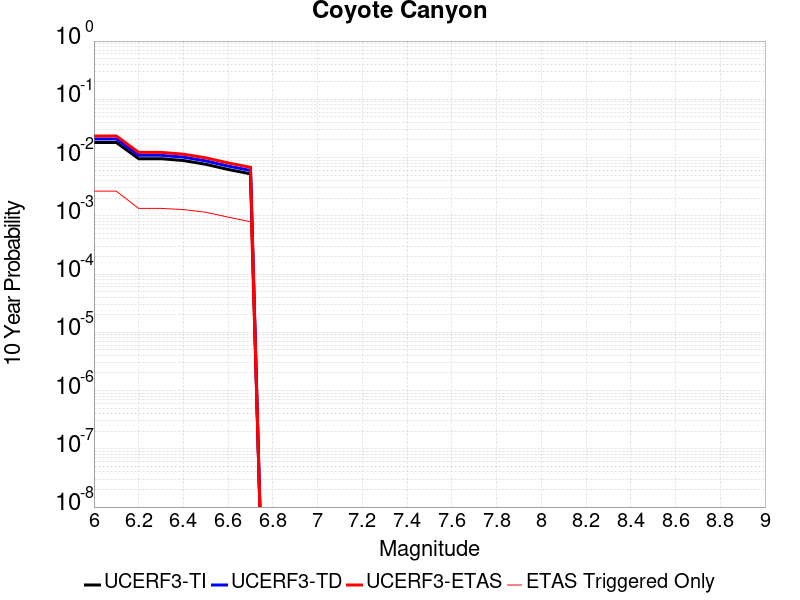 |

| Magnitude | 1 wk TI Prob | 1 wk TD Prob | 1 wk ETAS Prob | 1 wk ETAS/TD Gain | 1 wk ETAS Triggered Only | 1 mo TI Prob | 1 mo TD Prob | 1 mo ETAS Prob | 1 mo ETAS/TD Gain | 1 mo ETAS Triggered Only | 1 yr TI Prob | 1 yr TD Prob | 1 yr ETAS Prob | 1 yr ETAS/TD Gain | 1 yr ETAS Triggered Only | 10 yr TI Prob | 10 yr TD Prob | 10 yr ETAS Prob | 10 yr ETAS/TD Gain | 10 yr ETAS Triggered Only |
|-----|-----|-----|-----|-----|-----|-----|-----|-----|-----|-----|-----|-----|-----|-----|-----|-----|-----|-----|-----|-----|
| 6.0 | 3.5090034E-5 | 4.036513E-5 | 1.4754194E-4 | 3.655183 | 1.07181135E-4 | 1.503772E-4 | 1.7298339E-4 | 5.69485E-4 | 3.292137 | 3.965702E-4 | 0.0018293047 | 0.0021042947 | 0.0033663707 | 1.5997621 | 0.0012647375 | 0.018143194 | 0.020869615 | 0.023451244 | 1.1237028 | 0.002636656 |
| 6.1 | 3.5090034E-5 | 4.036513E-5 | 1.4754194E-4 | 3.655183 | 1.07181135E-4 | 1.503772E-4 | 1.7298339E-4 | 5.69485E-4 | 3.292137 | 3.965702E-4 | 0.0018293047 | 0.0021042947 | 0.0033663707 | 1.5997621 | 0.0012647375 | 0.018143194 | 0.020869615 | 0.023451244 | 1.1237028 | 0.002636656 |
| 6.2 | 1.841879E-5 | 2.1060194E-5 | 8.536752E-5 | 4.053501 | 6.430868E-5 | 7.8935285E-5 | 9.0255424E-5 | 3.0459836E-4 | 3.3748481 | 2.1436227E-4 | 9.606133E-4 | 0.0010984079 | 0.0016872566 | 1.536093 | 5.894962E-4 | 0.0095647145 | 0.010939874 | 0.012264982 | 1.1211264 | 0.0013397642 |
| 6.3 | 1.841879E-5 | 2.1060194E-5 | 8.536752E-5 | 4.053501 | 6.430868E-5 | 7.8935285E-5 | 9.0255424E-5 | 3.0459836E-4 | 3.3748481 | 2.1436227E-4 | 9.606133E-4 | 0.0010984079 | 0.0016872566 | 1.536093 | 5.894962E-4 | 0.0095647145 | 0.010939874 | 0.012264982 | 1.1211264 | 0.0013397642 |
| 6.4 | 1.712201E-5 | 1.9565581E-5 | 8.3873005E-5 | 4.2867627 | 6.430868E-5 | 7.337798E-5 | 8.385037E-5 | 2.9819467E-4 | 3.5562716 | 2.1436227E-4 | 8.930107E-4 | 0.0010205007 | 0.0015986881 | 1.5665724 | 5.7877816E-4 | 0.008894307 | 0.0101680625 | 0.011441158 | 1.1252054 | 0.0012861736 |
| 6.5 | 1.4744935E-5 | 1.6837288E-5 | 7.0426955E-5 | 4.1827965 | 5.3590567E-5 | 6.3191044E-5 | 7.215834E-5 | 2.6507047E-4 | 3.6734557 | 1.9292605E-4 | 7.6907943E-4 | 8.7826716E-4 | 0.0013922848 | 1.5852634 | 5.1446946E-4 | 0.007664232 | 0.008757159 | 0.009893954 | 1.1298132 | 0.0011468382 |
| 6.6 | 1.2017839E-5 | 1.3724348E-5 | 6.731418E-5 | 4.904727 | 5.3590567E-5 | 5.150401E-5 | 5.8817808E-5 | 2.3029753E-4 | 3.9154391 | 1.7148982E-4 | 6.268809E-4 | 7.159601E-4 | 0.0011657985 | 1.628301 | 4.5016076E-4 | 0.0062511545 | 0.007145228 | 0.008113607 | 1.1355281 | 9.7534835E-4 |
| 6.7 | 1.00956095E-5 | 1.1533734E-5 | 6.5123684E-5 | 5.6463656 | 5.3590567E-5 | 4.326618E-5 | 4.9429844E-5 | 2.101936E-4 | 4.2523623 | 1.607717E-4 | 5.266384E-4 | 6.0172915E-4 | 9.980607E-4 | 1.6586545 | 3.965702E-4 | 0.005253921 | 0.006009526 | 0.006819207 | 1.134733 | 8.1457663E-4 |

## Nelson Lake
*[(top)](#table-of-contents)*

| 1 Week | 1 Month | 1 Year | 10 Year |
|-----|-----|-----|-----|
|  |  |  |  |

| Magnitude | 1 wk TI Prob | 1 wk TD Prob | 1 wk ETAS Prob | 1 wk ETAS/TD Gain | 1 wk ETAS Triggered Only | 1 mo TI Prob | 1 mo TD Prob | 1 mo ETAS Prob | 1 mo ETAS/TD Gain | 1 mo ETAS Triggered Only | 1 yr TI Prob | 1 yr TD Prob | 1 yr ETAS Prob | 1 yr ETAS/TD Gain | 1 yr ETAS Triggered Only | 10 yr TI Prob | 10 yr TD Prob | 10 yr ETAS Prob | 10 yr ETAS/TD Gain | 10 yr ETAS Triggered Only |
|-----|-----|-----|-----|-----|-----|-----|-----|-----|-----|-----|-----|-----|-----|-----|-----|-----|-----|-----|-----|-----|
| 6.0 | 9.913453E-6 | 1.0192293E-5 | 9.593633E-5 | 9.412634 | 8.574491E-5 | 4.2485535E-5 | 4.3680586E-5 | 3.6520994E-4 | 8.360922 | 3.215434E-4 | 5.1713863E-4 | 5.316917E-4 | 0.0016457828 | 3.0953705 | 0.0011146838 | 0.0051593683 | 0.0053052236 | 0.0077999565 | 1.4702408 | 0.0025080387 |
| 6.1 | 9.913453E-6 | 1.0192293E-5 | 9.593633E-5 | 9.412634 | 8.574491E-5 | 4.2485535E-5 | 4.3680586E-5 | 3.6520994E-4 | 8.360922 | 3.215434E-4 | 5.1713863E-4 | 5.316917E-4 | 0.0016457828 | 3.0953705 | 0.0011146838 | 0.0051593683 | 0.0053052236 | 0.0077999565 | 1.4702408 | 0.0025080387 |
| 6.2 | 4.5596407E-6 | 4.696332E-6 | 2.6132459E-5 | 5.5644403 | 2.1436228E-5 | 1.954117E-5 | 2.0126989E-5 | 1.2730596E-4 | 6.3251376 | 1.07181135E-4 | 2.3788778E-4 | 2.450198E-4 | 7.272167E-4 | 2.9679918 | 4.823151E-4 | 0.0023763329 | 0.0024476226 | 0.0035381943 | 1.4455637 | 0.0010932476 |
| 6.3 | 4.5596407E-6 | 4.696332E-6 | 2.6132459E-5 | 5.5644403 | 2.1436228E-5 | 1.954117E-5 | 2.0126989E-5 | 1.2730596E-4 | 6.3251376 | 1.07181135E-4 | 2.3788778E-4 | 2.450198E-4 | 7.272167E-4 | 2.9679918 | 4.823151E-4 | 0.0023763329 | 0.0024476226 | 0.0035381943 | 1.4455637 | 0.0010932476 |
| 6.4 | 3.4025713E-6 | 3.509912E-6 | 2.4946065E-5 | 7.107319 | 2.1436228E-5 | 1.4582367E-5 | 1.50423975E-5 | 1.1150397E-4 | 7.412646 | 9.646302E-5 | 1.7752586E-4 | 1.8312664E-4 | 5.4747576E-4 | 2.989602 | 3.6441587E-4 | 0.001773841 | 0.0018298404 | 0.0027285144 | 1.4911216 | 9.003215E-4 |
| 6.5 | 2.8352947E-6 | 2.9278688E-6 | 2.4364033E-5 | 8.321423 | 2.1436228E-5 | 1.2151207E-5 | 1.2547953E-5 | 1.09009765E-4 | 8.687454 | 9.646302E-5 | 1.479309E-4 | 1.5276136E-4 | 4.956886E-4 | 3.2448559 | 3.4297965E-4 | 0.0014783246 | 0.0015266375 | 0.0023399706 | 1.5327611 | 8.1457663E-4 |
| 6.6 | 2.251518E-6 | 2.3290781E-6 | 2.3765255E-5 | 10.203717 | 2.1436228E-5 | 9.649328E-6 | 9.981729E-6 | 8.500778E-5 | 8.516337 | 7.5026794E-5 | 1.1747423E-4 | 1.2152141E-4 | 3.6800807E-4 | 3.0283394 | 2.465166E-4 | 0.0011741214 | 0.0012146112 | 0.0018462118 | 1.5200022 | 6.323687E-4 |
| 6.7 | 1.8911853E-6 | 1.9591491E-6 | 2.3395334E-5 | 11.94158 | 2.1436228E-5 | 8.105055E-6 | 8.39633E-6 | 7.270447E-5 | 8.659078 | 6.430868E-5 | 9.867457E-5 | 1.022211E-4 | 3.0584444E-4 | 2.9919894 | 2.0364416E-4 | 9.863076E-4 | 0.0010217984 | 0.0015250349 | 1.4925009 | 5.0375133E-4 |
| 6.8 | 1.4874814E-6 | 1.5438383E-6 | 2.2980032E-5 | 14.885 | 2.1436228E-5 | 6.374905E-6 | 6.6164357E-6 | 7.092469E-5 | 10.719471 | 6.430868E-5 | 7.76117E-5 | 8.055265E-5 | 2.3059416E-4 | 2.8626513 | 1.5005359E-4 | 7.75846E-4 | 8.052856E-4 | 0.0012122459 | 1.5053614 | 4.0728832E-4 |
| 6.9 | 6.835972E-7 | 7.1399705E-7 | 7.1399705E-7 | 1.0 | 0.0 | 2.9296991E-6 | 3.0599856E-6 | 1.3778066E-5 | 4.5026574 | 1.0718114E-5 | 3.56685E-5 | 3.7255006E-5 | 1.12279005E-4 | 3.0137966 | 7.5026794E-5 | 3.5662777E-4 | 3.7251884E-4 | 5.8680127E-4 | 1.5752257 | 2.1436227E-4 |

## San Andreas (Mojave N)
*[(top)](#table-of-contents)*

| 1 Week | 1 Month | 1 Year | 10 Year |
|-----|-----|-----|-----|
|  |  |  |  |

| Magnitude | 1 wk TI Prob | 1 wk TD Prob | 1 wk ETAS Prob | 1 wk ETAS/TD Gain | 1 wk ETAS Triggered Only | 1 mo TI Prob | 1 mo TD Prob | 1 mo ETAS Prob | 1 mo ETAS/TD Gain | 1 mo ETAS Triggered Only | 1 yr TI Prob | 1 yr TD Prob | 1 yr ETAS Prob | 1 yr ETAS/TD Gain | 1 yr ETAS Triggered Only | 10 yr TI Prob | 10 yr TD Prob | 10 yr ETAS Prob | 10 yr ETAS/TD Gain | 10 yr ETAS Triggered Only |
|-----|-----|-----|-----|-----|-----|-----|-----|-----|-----|-----|-----|-----|-----|-----|-----|-----|-----|-----|-----|-----|
| 6.0 | 9.877682E-5 | 1.9409315E-4 | 4.5127794E-4 | 2.3250587 | 2.5723473E-4 | 4.2326056E-4 | 8.315628E-4 | 0.0015704976 | 1.8886098 | 7.395498E-4 | 0.0051410277 | 0.010077406 | 0.011923564 | 1.1831977 | 0.0018649518 | 0.05023708 | 0.09835201 | 0.1008743 | 1.0256456 | 0.0027974276 |
| 6.1 | 9.877682E-5 | 1.9409315E-4 | 4.5127794E-4 | 2.3250587 | 2.5723473E-4 | 4.2326056E-4 | 8.315628E-4 | 0.0015704976 | 1.8886098 | 7.395498E-4 | 0.0051410277 | 0.010077406 | 0.011923564 | 1.1831977 | 0.0018649518 | 0.05023708 | 0.09835201 | 0.1008743 | 1.0256456 | 0.0027974276 |
| 6.2 | 9.877682E-5 | 1.9409315E-4 | 4.5127794E-4 | 2.3250587 | 2.5723473E-4 | 4.2326056E-4 | 8.315628E-4 | 0.0015704976 | 1.8886098 | 7.395498E-4 | 0.0051410277 | 0.010077406 | 0.011923564 | 1.1831977 | 0.0018649518 | 0.05023708 | 0.09835201 | 0.1008743 | 1.0256456 | 0.0027974276 |
| 6.3 | 9.877682E-5 | 1.9409315E-4 | 4.5127794E-4 | 2.3250587 | 2.5723473E-4 | 4.2326056E-4 | 8.315628E-4 | 0.0015704976 | 1.8886098 | 7.395498E-4 | 0.0051410277 | 0.010077406 | 0.011923564 | 1.1831977 | 0.0018649518 | 0.05023708 | 0.09835201 | 0.1008743 | 1.0256456 | 0.0027974276 |
| 6.4 | 9.877682E-5 | 1.9409315E-4 | 4.5127794E-4 | 2.3250587 | 2.5723473E-4 | 4.2326056E-4 | 8.315628E-4 | 0.0015704976 | 1.8886098 | 7.395498E-4 | 0.0051410277 | 0.010077406 | 0.011923564 | 1.1831977 | 0.0018649518 | 0.05023708 | 0.09835201 | 0.1008743 | 1.0256456 | 0.0027974276 |
| 6.5 | 9.861474E-5 | 1.9383078E-4 | 4.5101566E-4 | 2.3268526 | 2.5723473E-4 | 4.2256617E-4 | 8.304391E-4 | 0.0015693748 | 1.8898132 | 7.395498E-4 | 0.0051326132 | 0.010063851 | 0.011910034 | 1.183447 | 0.0018649518 | 0.050156746 | 0.098229796 | 0.10075243 | 1.025681 | 0.0027974276 |
| 6.6 | 9.861474E-5 | 1.9383078E-4 | 4.5101566E-4 | 2.3268526 | 2.5723473E-4 | 4.2256617E-4 | 8.304391E-4 | 0.0015693748 | 1.8898132 | 7.395498E-4 | 0.0051326132 | 0.010063851 | 0.011910034 | 1.183447 | 0.0018649518 | 0.050156746 | 0.098229796 | 0.10075243 | 1.025681 | 0.0027974276 |
| 6.7 | 9.8552715E-5 | 1.9373032E-4 | 4.509152E-4 | 2.3275409 | 2.5723473E-4 | 4.223004E-4 | 8.3000876E-4 | 0.0015689448 | 1.890275 | 7.395498E-4 | 0.0051293927 | 0.01005866 | 0.011904853 | 1.1835426 | 0.0018649518 | 0.050125998 | 0.098182976 | 0.10070574 | 1.0256946 | 0.0027974276 |
| 6.8 | 9.8464974E-5 | 1.9358192E-4 | 4.5076685E-4 | 2.3285587 | 2.5723473E-4 | 4.219245E-4 | 8.293732E-4 | 0.0015683096 | 1.8909577 | 7.395498E-4 | 0.0051248376 | 0.010050993 | 0.011897201 | 1.183684 | 0.0018649518 | 0.05008251 | 0.09811299 | 0.10063596 | 1.0257149 | 0.0027974276 |
| 6.9 | 9.825824E-5 | 1.9326196E-4 | 4.5044697E-4 | 2.3307586 | 2.5723473E-4 | 4.2103877E-4 | 8.280028E-4 | 0.0015669403 | 1.8924335 | 7.395498E-4 | 0.0051141046 | 0.010034463 | 0.011880701 | 1.1839898 | 0.0018649518 | 0.049980022 | 0.09796208 | 0.10048547 | 1.0257587 | 0.0027974276 |
| 7.0 | 9.781462E-5 | 1.9257552E-4 | 4.497607E-4 | 2.335503 | 2.5723473E-4 | 4.1913814E-4 | 8.250628E-4 | 0.0015640025 | 1.8956163 | 7.395498E-4 | 0.005091073 | 0.009998998 | 0.011845302 | 1.1846489 | 0.0018649518 | 0.04976007 | 0.097638436 | 0.10016273 | 1.0258535 | 0.0027974276 |
| 7.1 | 9.7121134E-5 | 1.9159251E-4 | 4.4877795E-4 | 2.3423564 | 2.5723473E-4 | 4.1616702E-4 | 8.208525E-4 | 0.0015597953 | 1.9002138 | 7.395498E-4 | 0.005055068 | 0.009948207 | 0.011794605 | 1.1856011 | 0.0018649518 | 0.04941613 | 0.097174905 | 0.099700496 | 1.0259901 | 0.0027974276 |
| 7.2 | 9.663819E-5 | 1.9090026E-4 | 4.480859E-4 | 2.3472252 | 2.5723473E-4 | 4.1409794E-4 | 8.178876E-4 | 0.0015568326 | 1.9034798 | 7.395498E-4 | 0.0050299936 | 0.009912439 | 0.011758904 | 1.1862776 | 0.0018649518 | 0.049176537 | 0.09684814 | 0.09937464 | 1.0260873 | 0.0027974276 |
| 7.3 | 9.6277574E-5 | 1.9042526E-4 | 4.47611E-4 | 2.3505862 | 2.5723473E-4 | 4.125529E-4 | 8.158532E-4 | 0.0015547997 | 1.9057345 | 7.395498E-4 | 0.0050112694 | 0.009887895 | 0.0117344055 | 1.1867447 | 0.0018649518 | 0.04899759 | 0.09662155 | 0.09914868 | 1.026155 | 0.0027974276 |
| 7.4 | 9.593308E-5 | 1.8982294E-4 | 4.4700885E-4 | 2.3548727 | 2.5723473E-4 | 4.1107697E-4 | 8.132734E-4 | 0.0015522218 | 1.90861 | 7.395498E-4 | 0.0049933824 | 0.00985677 | 0.011692727 | 1.1862636 | 0.0018542337 | 0.04882661 | 0.09633968 | 0.098857924 | 1.0261391 | 0.0027867095 |
| 7.5 | 9.561707E-5 | 1.8928363E-4 | 4.4646967E-4 | 2.3587337 | 2.5723473E-4 | 4.0972308E-4 | 8.109635E-4 | 0.0015499137 | 1.9112002 | 7.395498E-4 | 0.0049769743 | 0.009828901 | 0.01166491 | 1.1867969 | 0.0018542337 | 0.048669744 | 0.09608582 | 0.09860476 | 1.0262156 | 0.0027867095 |
| 7.6 | 9.418194E-5 | 1.8580563E-4 | 4.4299258E-4 | 2.3841717 | 2.5723473E-4 | 4.0357444E-4 | 7.96067E-4 | 0.0015350281 | 1.928265 | 7.395498E-4 | 0.004902454 | 0.009649157 | 0.011485498 | 1.1903111 | 0.0018542337 | 0.047957025 | 0.09446791 | 0.09699136 | 1.0267123 | 0.0027867095 |
| 7.7 | 8.202141E-5 | 1.6029038E-4 | 3.853347E-4 | 2.4039788 | 2.2508038E-4 | 3.51473E-4 | 6.86778E-4 | 0.0013722661 | 1.998122 | 6.859593E-4 | 0.00427079 | 0.008329522 | 0.00998762 | 1.1990628 | 0.0016720258 | 0.04189639 | 0.08226675 | 0.08455862 | 1.0278591 | 0.0024973205 |
| 7.8 | 7.2859846E-5 | 1.4523414E-4 | 3.1669904E-4 | 2.1806102 | 1.7148982E-4 | 3.1221908E-4 | 6.2228355E-4 | 0.0010721642 | 1.7229512 | 4.5016076E-4 | 0.003794643 | 0.007550025 | 0.008645656 | 1.1451162 | 0.0011039657 | 0.037304975 | 0.074755974 | 0.07626334 | 1.0201638 | 0.0016291533 |
| 7.9 | 5.3874453E-5 | 1.0050546E-4 | 2.291099E-4 | 2.2795765 | 1.2861736E-4 | 2.3087008E-4 | 4.3066658E-4 | 7.62785E-4 | 1.771173 | 3.3226152E-4 | 0.0028072202 | 0.005230771 | 0.005859832 | 1.1202615 | 6.323687E-4 | 0.02772022 | 0.052447177 | 0.05327997 | 1.0158787 | 8.7888533E-4 |
| 8.0 | 3.468538E-5 | 5.4288335E-5 | 9.715846E-5 | 1.7896748 | 4.2872456E-5 | 1.4864317E-4 | 2.3264355E-4 | 3.505154E-4 | 1.5066627 | 1.17899246E-4 | 0.0018082283 | 0.0028287582 | 0.003042514 | 1.0755652 | 2.1436227E-4 | 0.017935853 | 0.028961267 | 0.029231869 | 1.0093435 | 2.7867095E-4 |
| 8.1 | 1.9152367E-5 | 1.9415891E-5 | 1.9415891E-5 | 1.0 | 0.0 | 8.207899E-5 | 8.320831E-5 | 8.320831E-5 | 1.0 | 0.0 | 9.988535E-4 | 0.0010125911 | 0.0010125911 | 1.0 | 0.0 | 0.009943757 | 0.010863188 | 0.01087379 | 1.000976 | 1.0718114E-5 |
| 8.2 | 8.643924E-6 | 5.4798497E-6 | 5.4798497E-6 | 1.0 | 0.0 | 3.704486E-5 | 2.348486E-5 | 2.348486E-5 | 1.0 | 0.0 | 4.5092785E-4 | 2.858907E-4 | 2.858907E-4 | 1.0 | 0.0 | 0.0045001395 | 0.0032514327 | 0.0032514327 | 1.0 | 0.0 |
| 8.3 | 1.983087E-6 | 7.668296E-7 | 7.668296E-7 | 1.0 | 0.0 | 8.498917E-6 | 3.2864084E-6 | 3.2864084E-6 | 1.0 | 0.0 | 1.034694E-4 | 4.0011306E-5 | 4.0011306E-5 | 1.0 | 0.0 | 0.0010342124 | 4.724499E-4 | 4.724499E-4 | 1.0 | 0.0 |

## Towne Pass
*[(top)](#table-of-contents)*

| 1 Week | 1 Month | 1 Year | 10 Year |
|-----|-----|-----|-----|
|  |  |  | 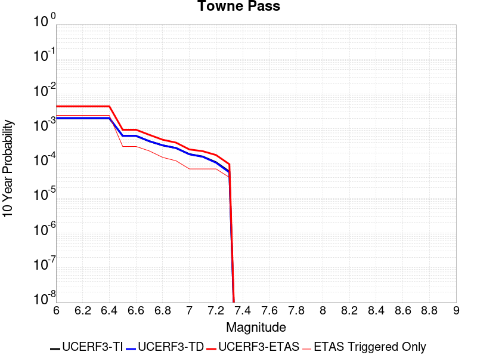 |

| Magnitude | 1 wk TI Prob | 1 wk TD Prob | 1 wk ETAS Prob | 1 wk ETAS/TD Gain | 1 wk ETAS Triggered Only | 1 mo TI Prob | 1 mo TD Prob | 1 mo ETAS Prob | 1 mo ETAS/TD Gain | 1 mo ETAS Triggered Only | 1 yr TI Prob | 1 yr TD Prob | 1 yr ETAS Prob | 1 yr ETAS/TD Gain | 1 yr ETAS Triggered Only | 10 yr TI Prob | 10 yr TD Prob | 10 yr ETAS Prob | 10 yr ETAS/TD Gain | 10 yr ETAS Triggered Only |
|-----|-----|-----|-----|-----|-----|-----|-----|-----|-----|-----|-----|-----|-----|-----|-----|-----|-----|-----|-----|-----|
| 6.0 | 3.849728E-6 | 3.8945495E-6 | 1.8610177E-4 | 47.785183 | 1.8220794E-4 | 1.649873E-5 | 1.6690845E-5 | 4.025365E-4 | 24.117203 | 3.858521E-4 | 2.0085352E-4 | 2.0319645E-4 | 0.0014783929 | 7.275682 | 0.0012754555 | 0.0020067208 | 0.0020305358 | 0.0043944293 | 2.1641722 | 0.002368703 |
| 6.1 | 3.849728E-6 | 3.8945495E-6 | 1.8610177E-4 | 47.785183 | 1.8220794E-4 | 1.649873E-5 | 1.6690845E-5 | 4.025365E-4 | 24.117203 | 3.858521E-4 | 2.0085352E-4 | 2.0319645E-4 | 0.0014783929 | 7.275682 | 0.0012754555 | 0.0020067208 | 0.0020305358 | 0.0043944293 | 2.1641722 | 0.002368703 |
| 6.2 | 3.849728E-6 | 3.8945495E-6 | 1.8610177E-4 | 47.785183 | 1.8220794E-4 | 1.649873E-5 | 1.6690845E-5 | 4.025365E-4 | 24.117203 | 3.858521E-4 | 2.0085352E-4 | 2.0319645E-4 | 0.0014783929 | 7.275682 | 0.0012754555 | 0.0020067208 | 0.0020305358 | 0.0043944293 | 2.1641722 | 0.002368703 |
| 6.3 | 3.849728E-6 | 3.8945495E-6 | 1.8610177E-4 | 47.785183 | 1.8220794E-4 | 1.649873E-5 | 1.6690845E-5 | 4.025365E-4 | 24.117203 | 3.858521E-4 | 2.0085352E-4 | 2.0319645E-4 | 0.0014783929 | 7.275682 | 0.0012754555 | 0.0020067208 | 0.0020305358 | 0.0043944293 | 2.1641722 | 0.002368703 |
| 6.4 | 3.849728E-6 | 3.8945495E-6 | 1.8610177E-4 | 47.785183 | 1.8220794E-4 | 1.649873E-5 | 1.6690845E-5 | 4.025365E-4 | 24.117203 | 3.858521E-4 | 2.0085352E-4 | 2.0319645E-4 | 0.0014783929 | 7.275682 | 0.0012754555 | 0.0020067208 | 0.0020305358 | 0.0043944293 | 2.1641722 | 0.002368703 |
| 6.5 | 1.1953545E-6 | 1.2030553E-6 | 4.407546E-5 | 36.63627 | 4.2872456E-5 | 5.1229376E-6 | 5.155942E-6 | 6.9464295E-5 | 13.472669 | 6.430868E-5 | 6.236998E-5 | 6.27719E-5 | 2.1281607E-4 | 3.390308 | 1.5005359E-4 | 6.235248E-4 | 6.2755344E-4 | 9.060495E-4 | 1.4437807 | 2.7867095E-4 |
| 6.6 | 1.1953545E-6 | 1.2030553E-6 | 4.407546E-5 | 36.63627 | 4.2872456E-5 | 5.1229376E-6 | 5.155942E-6 | 6.9464295E-5 | 13.472669 | 6.430868E-5 | 6.236998E-5 | 6.27719E-5 | 2.1281607E-4 | 3.390308 | 1.5005359E-4 | 6.235248E-4 | 6.2755344E-4 | 9.060495E-4 | 1.4437807 | 2.7867095E-4 |
| 6.7 | 8.375951E-7 | 8.410697E-7 | 3.2995384E-5 | 39.23026 | 3.215434E-5 | 3.5896885E-6 | 3.60458E-6 | 5.7194953E-5 | 15.867301 | 5.3590567E-5 | 4.370358E-5 | 4.3884935E-5 | 1.6177901E-4 | 3.6864362 | 1.17899246E-4 | 4.3694986E-4 | 4.387684E-4 | 6.423232E-4 | 1.4639231 | 2.0364416E-4 |
| 6.8 | 6.38041E-7 | 6.39218E-7 | 2.2075432E-5 | 34.535057 | 2.1436228E-5 | 2.7344586E-6 | 2.739503E-6 | 4.561184E-5 | 16.649675 | 4.2872456E-5 | 3.3291526E-5 | 3.335298E-5 | 1.2981279E-4 | 3.8920896 | 9.646302E-5 | 3.3286537E-4 | 3.3348353E-4 | 4.834871E-4 | 1.449808 | 1.5005359E-4 |
| 6.9 | 5.3460053E-7 | 5.345355E-7 | 2.197075E-5 | 41.10251 | 2.1436228E-5 | 2.2911431E-6 | 2.2908646E-6 | 4.5163222E-5 | 19.714487 | 4.2872456E-5 | 2.789431E-5 | 2.7890954E-5 | 1.02915656E-4 | 3.6899295 | 7.5026794E-5 | 2.789081E-4 | 2.7887785E-4 | 3.9674423E-4 | 1.4226451 | 1.17899246E-4 |
| 7.0 | 3.557783E-7 | 3.5324413E-7 | 3.5324413E-7 | 1.0 | 0.0 | 1.5247632E-6 | 1.5139026E-6 | 1.2232E-5 | 8.07978 | 1.0718114E-5 | 1.8563835E-5 | 1.8431618E-5 | 6.130328E-5 | 3.325985 | 4.2872456E-5 | 1.8562283E-4 | 1.8430172E-4 | 2.4859855E-4 | 1.3488672 | 6.430868E-5 |
| 7.1 | 3.037942E-7 | 3.0002388E-7 | 3.0002388E-7 | 1.0 | 0.0 | 1.3019744E-6 | 1.2858161E-6 | 1.2003916E-5 | 9.33564 | 1.0718114E-5 | 1.5851423E-5 | 1.5654707E-5 | 5.852649E-5 | 3.7385876 | 4.2872456E-5 | 1.5850292E-4 | 1.5653679E-4 | 2.208354E-4 | 1.4107572 | 6.430868E-5 |
| 7.2 | 2.0808248E-7 | 2.021783E-7 | 2.021783E-7 | 1.0 | 0.0 | 8.917818E-7 | 8.6647816E-7 | 1.1584582E-5 | 13.369734 | 1.0718114E-5 | 1.0857389E-5 | 1.0549325E-5 | 5.342133E-5 | 5.0639567 | 4.2872456E-5 | 1.0856859E-4 | 1.054887E-4 | 1.697906E-4 | 1.6095619 | 6.430868E-5 |
| 7.3 | 1.1162073E-7 | 1.06369825E-7 | 1.06369825E-7 | 1.0 | 0.0 | 4.7837443E-7 | 4.5587063E-7 | 1.1173979E-5 | 24.511295 | 1.0718114E-5 | 5.8241935E-6 | 5.550213E-6 | 1.6268266E-5 | 2.9311068 | 1.0718114E-5 | 5.8240406E-5 | 5.5500943E-5 | 8.76535E-5 | 1.5793155 | 3.215434E-5 |

## Lenwood-Lockhart-Old Woman Springs
*[(top)](#table-of-contents)*

| 1 Week | 1 Month | 1 Year | 10 Year |
|-----|-----|-----|-----|
|  |  | 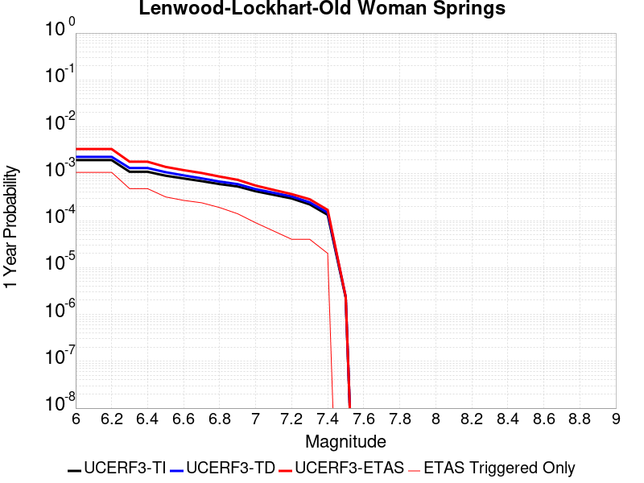 |  |

| Magnitude | 1 wk TI Prob | 1 wk TD Prob | 1 wk ETAS Prob | 1 wk ETAS/TD Gain | 1 wk ETAS Triggered Only | 1 mo TI Prob | 1 mo TD Prob | 1 mo ETAS Prob | 1 mo ETAS/TD Gain | 1 mo ETAS Triggered Only | 1 yr TI Prob | 1 yr TD Prob | 1 yr ETAS Prob | 1 yr ETAS/TD Gain | 1 yr ETAS Triggered Only | 10 yr TI Prob | 10 yr TD Prob | 10 yr ETAS Prob | 10 yr ETAS/TD Gain | 10 yr ETAS Triggered Only |
|-----|-----|-----|-----|-----|-----|-----|-----|-----|-----|-----|-----|-----|-----|-----|-----|-----|-----|-----|-----|-----|
| 6.0 | 3.744542E-5 | 4.3962966E-5 | 1.1898646E-4 | 2.7065158 | 7.5026794E-5 | 1.604705E-4 | 1.8840008E-4 | 5.9561164E-4 | 3.1614194 | 4.0728832E-4 | 0.0019519776 | 0.0022915301 | 0.0034036594 | 1.4853218 | 0.0011146838 | 0.019349206 | 0.022697017 | 0.024666287 | 1.0867634 | 0.0020150053 |
| 6.1 | 3.744542E-5 | 4.3962966E-5 | 1.1898646E-4 | 2.7065158 | 7.5026794E-5 | 1.604705E-4 | 1.8840008E-4 | 5.9561164E-4 | 3.1614194 | 4.0728832E-4 | 0.0019519776 | 0.0022915301 | 0.0034036594 | 1.4853218 | 0.0011146838 | 0.019349206 | 0.022697017 | 0.024666287 | 1.0867634 | 0.0020150053 |
| 6.2 | 3.744542E-5 | 4.3962966E-5 | 1.1898646E-4 | 2.7065158 | 7.5026794E-5 | 1.604705E-4 | 1.8840008E-4 | 5.9561164E-4 | 3.1614194 | 4.0728832E-4 | 0.0019519776 | 0.0022915301 | 0.0034036594 | 1.4853218 | 0.0011146838 | 0.019349206 | 0.022697017 | 0.024666287 | 1.0867634 | 0.0020150053 |
| 6.3 | 2.1079984E-5 | 2.5353596E-5 | 4.678928E-5 | 1.8454691 | 2.1436228E-5 | 9.0339665E-5 | 1.0865386E-4 | 3.2299283E-4 | 2.9726772 | 2.1436227E-4 | 0.0010993304 | 0.0013220779 | 0.0018037554 | 1.3643336 | 4.823151E-4 | 0.010939079 | 0.013144341 | 0.01399052 | 1.0643759 | 8.574491E-4 |
| 6.4 | 2.1079984E-5 | 2.5353596E-5 | 4.678928E-5 | 1.8454691 | 2.1436228E-5 | 9.0339665E-5 | 1.0865386E-4 | 3.2299283E-4 | 2.9726772 | 2.1436227E-4 | 0.0010993304 | 0.0013220779 | 0.0018037554 | 1.3643336 | 4.823151E-4 | 0.010939079 | 0.013144341 | 0.01399052 | 1.0643759 | 8.574491E-4 |
| 6.5 | 1.7397282E-5 | 2.0662535E-5 | 4.209832E-5 | 2.0374227 | 2.1436228E-5 | 7.455765E-5 | 8.855078E-5 | 2.4930824E-4 | 2.8154268 | 1.607717E-4 | 9.073613E-4 | 0.0010775843 | 0.0014094878 | 1.308007 | 3.3226152E-4 | 0.009036654 | 0.010724886 | 0.011350472 | 1.0583304 | 6.323687E-4 |
| 6.6 | 1.52050325E-5 | 1.76798E-5 | 2.8397724E-5 | 1.6062243 | 1.0718114E-5 | 6.51628E-5 | 7.576841E-5 | 1.9365874E-4 | 2.5559297 | 1.17899246E-4 | 7.9306826E-4 | 9.220979E-4 | 0.0012112202 | 1.3135483 | 2.8938908E-4 | 0.007902439 | 0.009183581 | 0.009757044 | 1.0624443 | 5.7877816E-4 |
| 6.7 | 1.332523E-5 | 1.5264091E-5 | 2.598204E-5 | 1.7021676 | 1.0718114E-5 | 5.7106878E-5 | 6.541593E-5 | 1.7259005E-4 | 2.638349 | 1.07181135E-4 | 6.950544E-4 | 7.9615373E-4 | 0.0010531837 | 1.3228396 | 2.5723473E-4 | 0.006928845 | 0.007933645 | 0.008444033 | 1.0643321 | 5.1446946E-4 |
| 6.8 | 1.1525329E-5 | 1.303105E-5 | 2.3749024E-5 | 1.8224951 | 1.0718114E-5 | 4.9393333E-5 | 5.5846183E-5 | 1.6302134E-4 | 2.9191132 | 1.07181135E-4 | 6.011979E-4 | 6.7971944E-4 | 8.832252E-4 | 1.2993966 | 2.0364416E-4 | 0.00599574 | 0.006776856 | 0.007181384 | 1.0596926 | 4.0728832E-4 |
| 6.9 | 1.0253909E-5 | 1.15144985E-5 | 1.15144985E-5 | 1.0 | 0.0 | 4.3944583E-5 | 4.9346934E-5 | 1.3508761E-4 | 2.7375076 | 8.574491E-5 | 5.3489394E-4 | 6.0063694E-4 | 7.506004E-4 | 1.2496741 | 1.5005359E-4 | 0.0053360825 | 0.005990515 | 0.0063101323 | 1.0533539 | 3.215434E-4 |
| 7.0 | 8.104563E-6 | 8.991321E-6 | 8.991321E-6 | 1.0 | 0.0 | 3.4733377E-5 | 3.8533675E-5 | 9.212218E-5 | 2.3906927 | 5.3590567E-5 | 4.2279682E-4 | 4.6904891E-4 | 5.654667E-4 | 1.2055602 | 9.646302E-5 | 0.0042199334 | 0.0046808375 | 0.004894196 | 1.0455813 | 2.1436227E-4 |
| 7.1 | 6.7986157E-6 | 7.515848E-6 | 7.515848E-6 | 1.0 | 0.0 | 2.91366E-5 | 3.221039E-5 | 7.5081465E-5 | 2.3309703 | 4.2872456E-5 | 3.5468035E-4 | 3.9209312E-4 | 4.5637658E-4 | 1.1639495 | 6.430868E-5 | 0.003541148 | 0.0039142296 | 0.0040530195 | 1.0354578 | 1.3933548E-4 |
| 7.2 | 5.6893327E-6 | 6.280039E-6 | 6.280039E-6 | 1.0 | 0.0 | 2.4382627E-5 | 2.6914187E-5 | 4.8349837E-5 | 1.7964443 | 2.1436228E-5 | 2.9681803E-4 | 3.2763294E-4 | 3.7049135E-4 | 1.1308123 | 4.2872456E-5 | 0.002964219 | 0.0032716978 | 0.0033892114 | 1.0359182 | 1.17899246E-4 |
| 7.3 | 4.253348E-6 | 4.706927E-6 | 4.706927E-6 | 1.0 | 0.0 | 1.8228506E-5 | 2.01724E-5 | 4.1608193E-5 | 2.06263 | 2.1436228E-5 | 2.2190946E-4 | 2.4557312E-4 | 2.8843503E-4 | 1.1745384 | 4.2872456E-5 | 0.00221688 | 0.0024531984 | 0.0025601166 | 1.0435832 | 1.07181135E-4 |
| 7.4 | 2.5448119E-6 | 2.8520535E-6 | 2.8520535E-6 | 1.0 | 0.0 | 1.0906291E-5 | 1.22230385E-5 | 3.3659002E-5 | 2.7537346 | 2.1436228E-5 | 1.3277601E-4 | 1.4880698E-4 | 1.7024002E-4 | 1.1440325 | 2.1436228E-5 | 0.001326967 | 0.0014872355 | 0.0015407464 | 1.0359801 | 5.3590567E-5 |
| 7.5 | 4.3706837E-8 | 4.5629356E-8 | 4.5629356E-8 | 1.0 | 0.0 | 1.8731501E-7 | 1.9555438E-7 | 1.9555438E-7 | 1.0 | 0.0 | 2.2805577E-6 | 2.3808725E-6 | 2.3808725E-6 | 1.0 | 0.0 | 2.2805343E-5 | 2.3808525E-5 | 2.3808525E-5 | 1.0 | 0.0 |

## Bicycle Lake
*[(top)](#table-of-contents)*

| 1 Week | 1 Month | 1 Year | 10 Year |
|-----|-----|-----|-----|
|  |  |  | 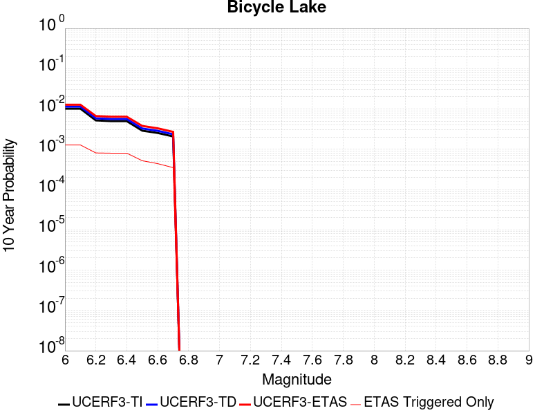 |

| Magnitude | 1 wk TI Prob | 1 wk TD Prob | 1 wk ETAS Prob | 1 wk ETAS/TD Gain | 1 wk ETAS Triggered Only | 1 mo TI Prob | 1 mo TD Prob | 1 mo ETAS Prob | 1 mo ETAS/TD Gain | 1 mo ETAS Triggered Only | 1 yr TI Prob | 1 yr TD Prob | 1 yr ETAS Prob | 1 yr ETAS/TD Gain | 1 yr ETAS Triggered Only | 10 yr TI Prob | 10 yr TD Prob | 10 yr ETAS Prob | 10 yr ETAS/TD Gain | 10 yr ETAS Triggered Only |
|-----|-----|-----|-----|-----|-----|-----|-----|-----|-----|-----|-----|-----|-----|-----|-----|-----|-----|-----|-----|-----|
| 6.0 | 1.9621975E-5 | 2.2097447E-5 | 8.640471E-5 | 3.910167 | 6.430868E-5 | 8.4091465E-5 | 9.470067E-5 | 2.8760845E-4 | 3.0370264 | 1.9292605E-4 | 0.0010233327 | 0.0011525059 | 0.0018483803 | 1.6037925 | 6.9667737E-4 | 0.01018633 | 0.011478599 | 0.012771199 | 1.1126096 | 0.0013076098 |
| 6.1 | 1.9621975E-5 | 2.2097447E-5 | 8.640471E-5 | 3.910167 | 6.430868E-5 | 8.4091465E-5 | 9.470067E-5 | 2.8760845E-4 | 3.0370264 | 1.9292605E-4 | 0.0010233327 | 0.0011525059 | 0.0018483803 | 1.6037925 | 6.9667737E-4 | 0.01018633 | 0.011478599 | 0.012771199 | 1.1126096 | 0.0013076098 |
| 6.2 | 9.9971285E-6 | 1.1255827E-5 | 6.484579E-5 | 5.761086 | 5.3590567E-5 | 4.2844134E-5 | 4.823866E-5 | 1.7684982E-4 | 3.6661427 | 1.2861736E-4 | 5.2150246E-4 | 5.8719947E-4 | 0.0010156722 | 1.7296886 | 4.2872454E-4 | 0.0052028033 | 0.005861584 | 0.0066713863 | 1.1381541 | 8.1457663E-4 |
| 6.3 | 9.589428E-6 | 1.0798527E-5 | 6.4388514E-5 | 5.9627132 | 5.3590567E-5 | 4.10969E-5 | 4.627887E-5 | 1.7489029E-4 | 3.7790525 | 1.2861736E-4 | 5.002399E-4 | 5.6335144E-4 | 9.811224E-4 | 1.7415813 | 4.1800644E-4 | 0.0049911533 | 0.0056243236 | 0.006423661 | 1.1421216 | 8.038585E-4 |
| 6.4 | 9.589428E-6 | 1.0798527E-5 | 6.4388514E-5 | 5.9627132 | 5.3590567E-5 | 4.10969E-5 | 4.627887E-5 | 1.7489029E-4 | 3.7790525 | 1.2861736E-4 | 5.002399E-4 | 5.6335144E-4 | 9.811224E-4 | 1.7415813 | 4.1800644E-4 | 0.0049911533 | 0.0056243236 | 0.006423661 | 1.1421216 | 8.038585E-4 |
| 6.5 | 5.557707E-6 | 6.2857107E-6 | 4.9157894E-5 | 7.820579 | 4.2872456E-5 | 2.3818526E-5 | 2.6938633E-5 | 1.2339906E-4 | 4.5807467 | 9.646302E-5 | 2.8995197E-4 | 3.2795538E-4 | 5.7439116E-4 | 1.7514307 | 2.465166E-4 | 0.0028957394 | 0.0032773502 | 0.0037901336 | 1.1564628 | 5.1446946E-4 |
| 6.6 | 4.8742945E-6 | 5.5133855E-6 | 4.8385602E-5 | 8.776024 | 4.2872456E-5 | 2.0889667E-5 | 2.3628729E-5 | 1.0937161E-4 | 4.6287556 | 8.574491E-5 | 2.54302E-4 | 2.87668E-4 | 5.1268365E-4 | 1.782206 | 2.2508038E-4 | 0.002540112 | 0.0028755253 | 0.0033350787 | 1.1598155 | 4.608789E-4 |
| 6.7 | 3.991108E-6 | 4.515989E-6 | 4.738825E-5 | 10.493438 | 4.2872456E-5 | 1.7104636E-5 | 1.9354238E-5 | 8.3661675E-5 | 4.322654 | 6.430868E-5 | 2.0822904E-4 | 2.3563785E-4 | 4.2851846E-4 | 1.8185467 | 1.9292605E-4 | 0.0020803404 | 0.0023563786 | 0.0027306287 | 1.1588242 | 3.7513397E-4 |

## Paradise
*[(top)](#table-of-contents)*

| 1 Week | 1 Month | 1 Year | 10 Year |
|-----|-----|-----|-----|
|  |  |  |  |

| Magnitude | 1 wk TI Prob | 1 wk TD Prob | 1 wk ETAS Prob | 1 wk ETAS/TD Gain | 1 wk ETAS Triggered Only | 1 mo TI Prob | 1 mo TD Prob | 1 mo ETAS Prob | 1 mo ETAS/TD Gain | 1 mo ETAS Triggered Only | 1 yr TI Prob | 1 yr TD Prob | 1 yr ETAS Prob | 1 yr ETAS/TD Gain | 1 yr ETAS Triggered Only | 10 yr TI Prob | 10 yr TD Prob | 10 yr ETAS Prob | 10 yr ETAS/TD Gain | 10 yr ETAS Triggered Only |
|-----|-----|-----|-----|-----|-----|-----|-----|-----|-----|-----|-----|-----|-----|-----|-----|-----|-----|-----|-----|-----|
| 6.0 | 1.4851273E-5 | 1.6694854E-5 | 8.1002465E-5 | 4.851942 | 6.430868E-5 | 6.364676E-5 | 7.154755E-5 | 2.3230775E-4 | 3.2469003 | 1.607717E-4 | 7.7462377E-4 | 8.707668E-4 | 0.0015240024 | 1.7501843 | 6.538049E-4 | 0.0077192914 | 0.008675928 | 0.009961569 | 1.1481848 | 0.0012968917 |
| 6.1 | 1.4851273E-5 | 1.6694854E-5 | 8.1002465E-5 | 4.851942 | 6.430868E-5 | 6.364676E-5 | 7.154755E-5 | 2.3230775E-4 | 3.2469003 | 1.607717E-4 | 7.7462377E-4 | 8.707668E-4 | 0.0015240024 | 1.7501843 | 6.538049E-4 | 0.0077192914 | 0.008675928 | 0.009961569 | 1.1481848 | 0.0012968917 |
| 6.2 | 1.4851273E-5 | 1.6694854E-5 | 8.1002465E-5 | 4.851942 | 6.430868E-5 | 6.364676E-5 | 7.154755E-5 | 2.3230775E-4 | 3.2469003 | 1.607717E-4 | 7.7462377E-4 | 8.707668E-4 | 0.0015240024 | 1.7501843 | 6.538049E-4 | 0.0077192914 | 0.008675928 | 0.009961569 | 1.1481848 | 0.0012968917 |
| 6.3 | 1.0426831E-5 | 1.1888727E-5 | 6.5478656E-5 | 5.5076256 | 5.3590567E-5 | 4.4685654E-5 | 5.0950726E-5 | 1.7956154E-4 | 3.5242193 | 1.2861736E-4 | 5.43912E-4 | 6.201545E-4 | 0.0010057673 | 1.6218011 | 3.858521E-4 | 0.0054258266 | 0.006184847 | 0.0068772156 | 1.111946 | 6.9667737E-4 |
| 6.4 | 1.0426831E-5 | 1.1888727E-5 | 6.5478656E-5 | 5.5076256 | 5.3590567E-5 | 4.4685654E-5 | 5.0950726E-5 | 1.7956154E-4 | 3.5242193 | 1.2861736E-4 | 5.43912E-4 | 6.201545E-4 | 0.0010057673 | 1.6218011 | 3.858521E-4 | 0.0054258266 | 0.006184847 | 0.0068772156 | 1.111946 | 6.9667737E-4 |
| 6.5 | 9.25027E-6 | 1.0620054E-5 | 4.2774052E-5 | 4.027668 | 3.215434E-5 | 3.964341E-5 | 4.551375E-5 | 1.3125475E-4 | 2.8838484 | 8.574491E-5 | 4.8255164E-4 | 5.539939E-4 | 8.6464704E-4 | 1.5607518 | 3.108253E-4 | 0.0048150513 | 0.0055266283 | 0.0060915486 | 1.1022179 | 5.6806003E-4 |
| 6.6 | 7.904275E-6 | 9.159603E-6 | 1.9877618E-5 | 2.1701398 | 1.0718114E-5 | 3.3875025E-5 | 3.925487E-5 | 1.03561026E-4 | 2.63817 | 6.430868E-5 | 4.1235037E-4 | 4.7782718E-4 | 7.028E-4 | 1.4708247 | 2.2508038E-4 | 0.0041158604 | 0.004768395 | 0.0050990717 | 1.0693477 | 3.3226152E-4 |
| 6.7 | 7.2061953E-6 | 8.407318E-6 | 1.9125342E-5 | 2.2748444 | 1.0718114E-5 | 3.088333E-5 | 3.6030888E-5 | 8.961953E-5 | 2.4872973 | 5.3590567E-5 | 3.7593965E-4 | 4.385914E-4 | 6.2071945E-4 | 1.4152567 | 1.8220794E-4 | 0.003753043 | 0.0043776273 | 0.004644407 | 1.0609417 | 2.6795283E-4 |
| 6.8 | 6.6948724E-6 | 7.84223E-6 | 1.856026E-5 | 2.3667068 | 1.0718114E-5 | 2.8691995E-5 | 3.3609143E-5 | 8.7197914E-5 | 2.5944698 | 5.3590567E-5 | 3.4926904E-4 | 4.0911807E-4 | 5.805377E-4 | 1.418998 | 1.7148982E-4 | 0.003487206 | 0.0040840064 | 0.0043295166 | 1.060115 | 2.465166E-4 |
| 6.9 | 6.0421025E-6 | 7.130678E-6 | 1.7848715E-5 | 2.503088 | 1.0718114E-5 | 2.5894467E-5 | 3.055971E-5 | 7.3430856E-5 | 2.402865 | 4.2872456E-5 | 3.1521954E-4 | 3.7200435E-4 | 4.898597E-4 | 1.3168118 | 1.17899246E-4 | 0.0031477278 | 0.0037141545 | 0.0038850075 | 1.0460005 | 1.7148982E-4 |
| 7.0 | 4.134091E-6 | 5.0803487E-6 | 1.5798409E-5 | 3.1097093 | 1.0718114E-5 | 1.7717413E-5 | 2.177275E-5 | 6.464427E-5 | 2.9690447 | 4.2872456E-5 | 2.1568815E-4 | 2.6505254E-4 | 3.4005946E-4 | 1.2829888 | 7.5026794E-5 | 0.0021547892 | 0.0026475172 | 0.0027437247 | 1.0363388 | 9.646302E-5 |
| 7.1 | 3.7674888E-6 | 4.6319055E-6 | 1.534997E-5 | 3.3139644 | 1.0718114E-5 | 1.6146281E-5 | 1.985088E-5 | 5.2004583E-5 | 2.619762 | 3.215434E-5 | 1.9656324E-4 | 2.4165919E-4 | 3.0595233E-4 | 1.2660488 | 6.430868E-5 | 0.0019638946 | 0.0024141145 | 0.0024889603 | 1.0310034 | 7.5026794E-5 |
| 7.2 | 3.4065345E-6 | 4.156755E-6 | 4.156755E-6 | 1.0 | 0.0 | 1.4599351E-5 | 1.7814553E-5 | 3.9250397E-5 | 2.2032773 | 2.1436228E-5 | 1.777326E-4 | 2.1687208E-4 | 2.7045104E-4 | 1.2470533 | 5.3590567E-5 | 0.0017759053 | 0.0021667527 | 0.002230922 | 1.0296154 | 6.430868E-5 |
| 7.3 | 2.9934936E-6 | 3.6293434E-6 | 3.6293434E-6 | 1.0 | 0.0 | 1.2829195E-5 | 1.5554244E-5 | 3.699014E-5 | 2.378138 | 2.1436228E-5 | 1.5618425E-4 | 1.8935793E-4 | 2.3222227E-4 | 1.2263668 | 4.2872456E-5 | 0.0015607453 | 0.0018921113 | 0.0019456004 | 1.0282695 | 5.3590567E-5 |
| 7.4 | 2.4049796E-6 | 2.8890036E-6 | 2.8890036E-6 | 1.0 | 0.0 | 1.0307015E-5 | 1.2381393E-5 | 3.3817356E-5 | 2.7313044 | 2.1436228E-5 | 1.2548068E-4 | 1.5073447E-4 | 1.9360047E-4 | 1.2843808 | 4.2872456E-5 | 0.0012540985 | 0.0015064639 | 0.0015492716 | 1.0284162 | 4.2872456E-5 |
| 7.5 | 1.2710091E-6 | 1.5134775E-6 | 1.5134775E-6 | 1.0 | 0.0 | 5.44717E-6 | 6.486323E-6 | 1.7204367E-5 | 2.6524067 | 1.0718114E-5 | 6.631728E-5 | 7.896937E-5 | 1.11121175E-4 | 1.4071426 | 3.215434E-5 | 6.6297496E-4 | 7.8953576E-4 | 8.216647E-4 | 1.0406935 | 3.215434E-5 |
| 7.6 | 2.21172E-7 | 2.6039737E-7 | 2.6039737E-7 | 1.0 | 0.0 | 9.478797E-7 | 1.1159884E-6 | 1.1159884E-6 | 1.0 | 0.0 | 1.1540374E-5 | 1.3587103E-5 | 1.3587103E-5 | 1.0 | 0.0 | 1.1539775E-4 | 1.3586554E-4 | 1.3586554E-4 | 1.0 | 0.0 |

## San Andreas (San Bernardino N)
*[(top)](#table-of-contents)*

| 1 Week | 1 Month | 1 Year | 10 Year |
|-----|-----|-----|-----|
|  |  |  |  |

| Magnitude | 1 wk TI Prob | 1 wk TD Prob | 1 wk ETAS Prob | 1 wk ETAS/TD Gain | 1 wk ETAS Triggered Only | 1 mo TI Prob | 1 mo TD Prob | 1 mo ETAS Prob | 1 mo ETAS/TD Gain | 1 mo ETAS Triggered Only | 1 yr TI Prob | 1 yr TD Prob | 1 yr ETAS Prob | 1 yr ETAS/TD Gain | 1 yr ETAS Triggered Only | 10 yr TI Prob | 10 yr TD Prob | 10 yr ETAS Prob | 10 yr ETAS/TD Gain | 10 yr ETAS Triggered Only |
|-----|-----|-----|-----|-----|-----|-----|-----|-----|-----|-----|-----|-----|-----|-----|-----|-----|-----|-----|-----|-----|
| 6.0 | 1.4273766E-4 | 3.161376E-4 | 4.5542902E-4 | 1.4406039 | 1.3933548E-4 | 6.115894E-4 | 0.0013541778 | 0.0017288037 | 1.2766446 | 3.7513397E-4 | 0.0074207084 | 0.016363978 | 0.017175768 | 1.0496083 | 8.2529476E-4 | 0.07177748 | 0.15029658 | 0.15136212 | 1.0070896 | 0.0012540193 |
| 6.1 | 1.4273766E-4 | 3.161376E-4 | 4.5542902E-4 | 1.4406039 | 1.3933548E-4 | 6.115894E-4 | 0.0013541778 | 0.0017288037 | 1.2766446 | 3.7513397E-4 | 0.0074207084 | 0.016363978 | 0.017175768 | 1.0496083 | 8.2529476E-4 | 0.07177748 | 0.15029658 | 0.15136212 | 1.0070896 | 0.0012540193 |
| 6.2 | 1.4273766E-4 | 3.161376E-4 | 4.5542902E-4 | 1.4406039 | 1.3933548E-4 | 6.115894E-4 | 0.0013541778 | 0.0017288037 | 1.2766446 | 3.7513397E-4 | 0.0074207084 | 0.016363978 | 0.017175768 | 1.0496083 | 8.2529476E-4 | 0.07177748 | 0.15029658 | 0.15136212 | 1.0070896 | 0.0012540193 |
| 6.3 | 1.3730655E-4 | 3.0518573E-4 | 4.444787E-4 | 1.4564203 | 1.3933548E-4 | 5.883239E-4 | 0.001307289 | 0.0016819326 | 1.2865806 | 3.7513397E-4 | 0.0071393442 | 0.01580149 | 0.016613744 | 1.0514036 | 8.2529476E-4 | 0.06914291 | 0.14559646 | 0.1466679 | 1.0073589 | 0.0012540193 |
| 6.4 | 1.3730655E-4 | 3.0518573E-4 | 4.444787E-4 | 1.4564203 | 1.3933548E-4 | 5.883239E-4 | 0.001307289 | 0.0016819326 | 1.2865806 | 3.7513397E-4 | 0.0071393442 | 0.01580149 | 0.016613744 | 1.0514036 | 8.2529476E-4 | 0.06914291 | 0.14559646 | 0.1466679 | 1.0073589 | 0.0012540193 |
| 6.5 | 1.2942807E-4 | 2.8932988E-4 | 4.2862506E-4 | 1.4814407 | 1.3933548E-4 | 5.545738E-4 | 0.0012394012 | 0.0016140701 | 1.3022984 | 3.7513397E-4 | 0.0067310524 | 0.014986552 | 0.01579948 | 1.0542437 | 8.2529476E-4 | 0.06530788 | 0.13873914 | 0.13980071 | 1.0076516 | 0.0012325831 |
| 6.6 | 1.1125901E-4 | 2.537176E-4 | 3.930177E-4 | 1.5490361 | 1.3933548E-4 | 4.767372E-4 | 0.0010869103 | 0.0014616365 | 1.3447628 | 3.7513397E-4 | 0.005788839 | 0.013153472 | 0.013957335 | 1.0611141 | 8.1457663E-4 | 0.056403454 | 0.12302898 | 0.12406292 | 1.008404 | 0.0011789924 |
| 6.7 | 1.02209575E-4 | 2.3506685E-4 | 3.7436959E-4 | 1.5926089 | 1.3933548E-4 | 4.3796748E-4 | 0.0010070418 | 0.001381798 | 1.3721358 | 3.7513397E-4 | 0.0053192247 | 0.01219223 | 0.012996875 | 1.0659965 | 8.1457663E-4 | 0.051936906 | 0.11482068 | 0.1158643 | 1.0090891 | 0.0011789924 |
| 6.8 | 9.610582E-5 | 2.2032406E-4 | 3.5962884E-4 | 1.6322722 | 1.3933548E-4 | 4.1181705E-4 | 9.439049E-4 | 0.0013186848 | 1.3970525 | 3.7513397E-4 | 0.0050023515 | 0.011431754 | 0.012237018 | 1.070441 | 8.1457663E-4 | 0.048912346 | 0.1082225 | 0.1092739 | 1.0097152 | 0.0011789924 |
| 6.9 | 9.3877505E-5 | 2.1487933E-4 | 3.5418486E-4 | 1.6482966 | 1.3933548E-4 | 4.0227012E-4 | 9.2058704E-4 | 0.0012953756 | 1.4071192 | 3.7513397E-4 | 0.0048866454 | 0.011150793 | 0.011956287 | 1.0722364 | 8.1457663E-4 | 0.04780577 | 0.10581279 | 0.10686703 | 1.0099633 | 0.0011789924 |
| 7.0 | 9.1019785E-5 | 2.0814833E-4 | 3.474548E-4 | 1.6692654 | 1.3933548E-4 | 3.900265E-4 | 8.917599E-4 | 0.0012558508 | 1.4082836 | 3.6441587E-4 | 0.0047382377 | 0.010803353 | 0.011587924 | 1.072623 | 7.931404E-4 | 0.046384744 | 0.10278319 | 0.10381215 | 1.010011 | 0.0011468382 |
| 7.1 | 8.771155E-5 | 1.9989353E-4 | 3.3920116E-4 | 1.6969091 | 1.3933548E-4 | 3.758525E-4 | 8.564058E-4 | 0.0012205096 | 1.4251533 | 3.6441587E-4 | 0.0045664064 | 0.01037709 | 0.011151393 | 1.0746166 | 7.824223E-4 | 0.044737056 | 0.09909467 | 0.100118205 | 1.0103289 | 0.0011361201 |
| 7.2 | 8.0830236E-5 | 1.8394848E-4 | 3.232583E-4 | 1.7573308 | 1.3933548E-4 | 3.4636928E-4 | 7.881126E-4 | 0.0011522413 | 1.4620262 | 3.6441587E-4 | 0.0042088944 | 0.009553162 | 0.010328109 | 1.0811195 | 7.824223E-4 | 0.041300658 | 0.09182531 | 0.09284736 | 1.0111305 | 0.0011254019 |
| 7.3 | 7.7668235E-5 | 1.7338296E-4 | 3.1269426E-4 | 1.8034891 | 1.3933548E-4 | 3.328214E-4 | 7.428583E-4 | 0.0011070034 | 1.4901947 | 3.6441587E-4 | 0.0040445733 | 0.009006873 | 0.009782248 | 1.0860871 | 7.824223E-4 | 0.03971748 | 0.087092124 | 0.08810973 | 1.0116842 | 0.0011146838 |
| 7.4 | 7.520177E-5 | 1.6558339E-4 | 3.048958E-4 | 1.8413428 | 1.3933548E-4 | 3.2225347E-4 | 7.0945016E-4 | 0.0010736075 | 1.5132952 | 3.6441587E-4 | 0.0039163795 | 0.0086034145 | 0.009379105 | 1.0901608 | 7.824223E-4 | 0.038480744 | 0.08354814 | 0.0845697 | 1.0122272 | 0.0011146838 |
| 7.5 | 7.274697E-5 | 1.5845922E-4 | 2.977726E-4 | 1.8791751 | 1.3933548E-4 | 3.1173544E-4 | 6.789343E-4 | 0.0010431027 | 1.5363824 | 3.6441587E-4 | 0.003788775 | 0.008234753 | 0.009010732 | 1.0942322 | 7.824223E-4 | 0.03724827 | 0.08026466 | 0.08128987 | 1.0127729 | 0.0011146838 |
| 7.6 | 7.1185845E-5 | 1.5415733E-4 | 2.9347133E-4 | 1.9037131 | 1.3933548E-4 | 3.0504653E-4 | 6.6050707E-4 | 0.0010246822 | 1.5513569 | 3.6441587E-4 | 0.0037076178 | 0.008012074 | 0.008777595 | 1.095546 | 7.717042E-4 | 0.036463667 | 0.078254156 | 0.079271734 | 1.0130035 | 0.0011039657 |
| 7.7 | 6.709961E-5 | 1.4324463E-4 | 2.8256016E-4 | 1.9725707 | 1.3933548E-4 | 2.8753807E-4 | 6.1376113E-4 | 9.779533E-4 | 1.5933777 | 3.6441587E-4 | 0.003495157 | 0.007446978 | 0.008212935 | 1.1028547 | 7.717042E-4 | 0.034406938 | 0.073082365 | 0.07410565 | 1.0140018 | 0.0011039657 |
| 7.8 | 6.300812E-5 | 1.3208245E-4 | 2.7139953E-4 | 2.0547736 | 1.3933548E-4 | 2.7000686E-4 | 5.659449E-4 | 9.301545E-4 | 1.6435425 | 3.6441587E-4 | 0.0032823787 | 0.0068686386 | 0.0076137534 | 1.1084807 | 7.5026794E-4 | 0.032343175 | 0.06773997 | 0.068739176 | 1.0147506 | 0.0010718113 |
| 7.9 | 4.983037E-5 | 9.728091E-5 | 2.2588576E-4 | 2.3219948 | 1.2861736E-4 | 2.1354125E-4 | 4.1685157E-4 | 7.4897456E-4 | 1.7967417 | 3.3226152E-4 | 0.0025967648 | 0.005063368 | 0.0056925346 | 1.1242585 | 6.323687E-4 | 0.025666296 | 0.0506703 | 0.05150465 | 1.0164663 | 8.7888533E-4 |
| 8.0 | 3.2211527E-5 | 5.333152E-5 | 9.620169E-5 | 1.8038429 | 4.2872456E-5 | 1.380421E-4 | 2.2854365E-4 | 3.4641597E-4 | 1.515754 | 1.17899246E-4 | 0.0016793669 | 0.0027789702 | 0.0029927369 | 1.0769229 | 2.1436227E-4 | 0.016667323 | 0.02837451 | 0.028645273 | 1.0095425 | 2.7867095E-4 |
| 8.1 | 1.743376E-5 | 1.8836954E-5 | 1.8836954E-5 | 1.0 | 0.0 | 7.471398E-5 | 8.07273E-5 | 8.07273E-5 | 1.0 | 0.0 | 9.0926304E-4 | 9.824124E-4 | 9.824124E-4 | 1.0 | 0.0 | 0.009055517 | 0.010490617 | 0.010501223 | 1.001011 | 1.0718114E-5 |
| 8.2 | 7.831616E-6 | 5.1597067E-6 | 5.1597067E-6 | 1.0 | 0.0 | 3.3563636E-5 | 2.2112841E-5 | 2.2112841E-5 | 1.0 | 0.0 | 4.0856065E-4 | 2.6919067E-4 | 2.6919067E-4 | 1.0 | 0.0 | 0.004078103 | 0.003044315 | 0.003044315 | 1.0 | 0.0 |
| 8.3 | 1.983087E-6 | 7.668296E-7 | 7.668296E-7 | 1.0 | 0.0 | 8.498917E-6 | 3.2864084E-6 | 3.2864084E-6 | 1.0 | 0.0 | 1.034694E-4 | 4.0011306E-5 | 4.0011306E-5 | 1.0 | 0.0 | 0.0010342124 | 4.724499E-4 | 4.724499E-4 | 1.0 | 0.0 |

## Garlic Springs
*[(top)](#table-of-contents)*

| 1 Week | 1 Month | 1 Year | 10 Year |
|-----|-----|-----|-----|
|  |  |  |  |

| Magnitude | 1 wk TI Prob | 1 wk TD Prob | 1 wk ETAS Prob | 1 wk ETAS/TD Gain | 1 wk ETAS Triggered Only | 1 mo TI Prob | 1 mo TD Prob | 1 mo ETAS Prob | 1 mo ETAS/TD Gain | 1 mo ETAS Triggered Only | 1 yr TI Prob | 1 yr TD Prob | 1 yr ETAS Prob | 1 yr ETAS/TD Gain | 1 yr ETAS Triggered Only | 10 yr TI Prob | 10 yr TD Prob | 10 yr ETAS Prob | 10 yr ETAS/TD Gain | 10 yr ETAS Triggered Only |
|-----|-----|-----|-----|-----|-----|-----|-----|-----|-----|-----|-----|-----|-----|-----|-----|-----|-----|-----|-----|-----|
| 6.0 | 1.6760017E-5 | 1.8777133E-5 | 4.0212955E-5 | 2.141592 | 2.1436228E-5 | 7.182667E-5 | 8.0471604E-5 | 1.4477511E-4 | 1.7990832 | 6.430868E-5 | 8.7413884E-4 | 9.794189E-4 | 0.0013756006 | 1.404507 | 3.965702E-4 | 0.008707083 | 0.009762568 | 0.0106328735 | 1.0891472 | 8.7888533E-4 |
| 6.1 | 9.852767E-6 | 1.0973752E-5 | 1.0973752E-5 | 1.0 | 0.0 | 4.222546E-5 | 4.702992E-5 | 7.918275E-5 | 1.6836675 | 3.215434E-5 | 5.139737E-4 | 5.7250983E-4 | 7.760374E-4 | 1.3555006 | 2.0364416E-4 | 0.005127866 | 0.0057173073 | 0.0061755516 | 1.0801502 | 4.608789E-4 |
| 6.2 | 9.852767E-6 | 1.0973752E-5 | 1.0973752E-5 | 1.0 | 0.0 | 4.222546E-5 | 4.702992E-5 | 7.918275E-5 | 1.6836675 | 3.215434E-5 | 5.139737E-4 | 5.7250983E-4 | 7.760374E-4 | 1.3555006 | 2.0364416E-4 | 0.005127866 | 0.0057173073 | 0.0061755516 | 1.0801502 | 4.608789E-4 |
| 6.3 | 4.3167724E-6 | 4.7780964E-6 | 4.7780964E-6 | 1.0 | 0.0 | 1.8500323E-5 | 2.0477524E-5 | 3.1195417E-5 | 1.5233979 | 1.0718114E-5 | 2.2521814E-4 | 2.4930836E-4 | 3.1360102E-4 | 1.257884 | 6.430868E-5 | 0.0022499003 | 0.0024925452 | 0.0026956818 | 1.0814977 | 2.0364416E-4 |
| 6.4 | 4.3167724E-6 | 4.7780964E-6 | 4.7780964E-6 | 1.0 | 0.0 | 1.8500323E-5 | 2.0477524E-5 | 3.1195417E-5 | 1.5233979 | 1.0718114E-5 | 2.2521814E-4 | 2.4930836E-4 | 3.1360102E-4 | 1.257884 | 6.430868E-5 | 0.0022499003 | 0.0024925452 | 0.0026956818 | 1.0814977 | 2.0364416E-4 |
| 6.5 | 4.3167724E-6 | 4.7780964E-6 | 4.7780964E-6 | 1.0 | 0.0 | 1.8500323E-5 | 2.0477524E-5 | 3.1195417E-5 | 1.5233979 | 1.0718114E-5 | 2.2521814E-4 | 2.4930836E-4 | 3.1360102E-4 | 1.257884 | 6.430868E-5 | 0.0022499003 | 0.0024925452 | 0.0026956818 | 1.0814977 | 2.0364416E-4 |
| 6.6 | 4.301311E-6 | 4.7609647E-6 | 4.7609647E-6 | 1.0 | 0.0 | 1.8434059E-5 | 2.0404104E-5 | 3.1122E-5 | 1.5252813 | 1.0718114E-5 | 2.2441156E-4 | 2.4841467E-4 | 3.127074E-4 | 1.2588121 | 6.430868E-5 | 0.0022418506 | 0.0024836282 | 0.0026867667 | 1.0817909 | 2.0364416E-4 |
| 6.7 | 3.8599724E-6 | 4.2711204E-6 | 4.2711204E-6 | 1.0 | 0.0 | 1.6542634E-5 | 1.8304801E-5 | 2.9022718E-5 | 1.5855249 | 1.0718114E-5 | 2.0138794E-4 | 2.2286095E-4 | 2.871553E-4 | 1.2884953 | 6.430868E-5 | 0.0020120554 | 0.0022286095 | 0.0024318 | 1.0911735 | 2.0364416E-4 |

## Death Valley (Black Mtns Frontal)
*[(top)](#table-of-contents)*

| 1 Week | 1 Month | 1 Year | 10 Year |
|-----|-----|-----|-----|
|  |  |  |  |

| Magnitude | 1 wk TI Prob | 1 wk TD Prob | 1 wk ETAS Prob | 1 wk ETAS/TD Gain | 1 wk ETAS Triggered Only | 1 mo TI Prob | 1 mo TD Prob | 1 mo ETAS Prob | 1 mo ETAS/TD Gain | 1 mo ETAS Triggered Only | 1 yr TI Prob | 1 yr TD Prob | 1 yr ETAS Prob | 1 yr ETAS/TD Gain | 1 yr ETAS Triggered Only | 10 yr TI Prob | 10 yr TD Prob | 10 yr ETAS Prob | 10 yr ETAS/TD Gain | 10 yr ETAS Triggered Only |
|-----|-----|-----|-----|-----|-----|-----|-----|-----|-----|-----|-----|-----|-----|-----|-----|-----|-----|-----|-----|-----|
| 6.0 | 1.6707214E-5 | 1.867056E-5 | 5.08243E-5 | 2.7221625 | 3.215434E-5 | 7.160038E-5 | 8.001427E-5 | 1.979041E-4 | 2.4733598 | 1.17899246E-4 | 8.71386E-4 | 9.7374606E-4 | 0.0014020532 | 1.439855 | 4.2872454E-4 | 0.00867977 | 0.009695647 | 0.010481098 | 1.0810106 | 7.931404E-4 |
| 6.1 | 1.6707214E-5 | 1.867056E-5 | 5.08243E-5 | 2.7221625 | 3.215434E-5 | 7.160038E-5 | 8.001427E-5 | 1.979041E-4 | 2.4733598 | 1.17899246E-4 | 8.71386E-4 | 9.7374606E-4 | 0.0014020532 | 1.439855 | 4.2872454E-4 | 0.00867977 | 0.009695647 | 0.010481098 | 1.0810106 | 7.931404E-4 |
| 6.2 | 1.6707214E-5 | 1.867056E-5 | 5.08243E-5 | 2.7221625 | 3.215434E-5 | 7.160038E-5 | 8.001427E-5 | 1.979041E-4 | 2.4733598 | 1.17899246E-4 | 8.71386E-4 | 9.7374606E-4 | 0.0014020532 | 1.439855 | 4.2872454E-4 | 0.00867977 | 0.009695647 | 0.010481098 | 1.0810106 | 7.931404E-4 |
| 6.3 | 1.6707214E-5 | 1.867056E-5 | 5.08243E-5 | 2.7221625 | 3.215434E-5 | 7.160038E-5 | 8.001427E-5 | 1.979041E-4 | 2.4733598 | 1.17899246E-4 | 8.71386E-4 | 9.7374606E-4 | 0.0014020532 | 1.439855 | 4.2872454E-4 | 0.00867977 | 0.009695647 | 0.010481098 | 1.0810106 | 7.931404E-4 |
| 6.4 | 1.5515609E-5 | 1.7338483E-5 | 4.9492268E-5 | 2.8544748 | 3.215434E-5 | 6.649377E-5 | 7.430571E-5 | 1.6004425E-4 | 2.153862 | 8.574491E-5 | 8.0926094E-4 | 9.0430264E-4 | 0.0012469721 | 1.3789324 | 3.4297965E-4 | 0.008063202 | 0.009006913 | 0.009676072 | 1.074294 | 6.752412E-4 |
| 6.5 | 1.5515609E-5 | 1.7338483E-5 | 4.9492268E-5 | 2.8544748 | 3.215434E-5 | 6.649377E-5 | 7.430571E-5 | 1.6004425E-4 | 2.153862 | 8.574491E-5 | 8.0926094E-4 | 9.0430264E-4 | 0.0012469721 | 1.3789324 | 3.4297965E-4 | 0.008063202 | 0.009006913 | 0.009676072 | 1.074294 | 6.752412E-4 |
| 6.6 | 1.5041828E-5 | 1.6809407E-5 | 4.8963208E-5 | 2.9128456 | 3.215434E-5 | 6.4463384E-5 | 7.203836E-5 | 1.5777709E-4 | 2.1901815 | 8.574491E-5 | 7.8455906E-4 | 8.7672E-4 | 0.0012193989 | 1.3908647 | 3.4297965E-4 | 0.00781795 | 0.008733268 | 0.009391988 | 1.0754265 | 6.6452305E-4 |
| 6.7 | 1.4634985E-5 | 1.6356273E-5 | 4.8510086E-5 | 2.96584 | 3.215434E-5 | 6.271985E-5 | 7.009646E-5 | 1.5583535E-4 | 2.223156 | 8.574491E-5 | 7.6334673E-4 | 8.53096E-4 | 0.0011850741 | 1.389145 | 3.3226152E-4 | 0.007607299 | 0.008498848 | 0.009136469 | 1.0750245 | 6.430868E-4 |
| 6.8 | 1.4209158E-5 | 1.5882297E-5 | 4.8036127E-5 | 3.0245075 | 3.215434E-5 | 6.089497E-5 | 6.806524E-5 | 1.5380431E-4 | 2.2596602 | 8.574491E-5 | 7.4114406E-4 | 8.2838483E-4 | 0.0011389527 | 1.3749076 | 3.108253E-4 | 0.007386771 | 0.008253585 | 0.008859475 | 1.0734093 | 6.109325E-4 |
| 6.9 | 1.3780098E-5 | 1.5404834E-5 | 4.755868E-5 | 3.0872567 | 3.215434E-5 | 5.9056227E-5 | 6.601908E-5 | 1.4104092E-4 | 2.1363661 | 7.5026794E-5 | 7.1877235E-4 | 8.0349133E-4 | 0.0010926479 | 1.3598751 | 2.8938908E-4 | 0.0071645193 | 0.008006458 | 0.00856997 | 1.0703821 | 5.6806003E-4 |
| 7.0 | 1.3585064E-5 | 1.5188394E-5 | 4.7342248E-5 | 3.1170015 | 3.215434E-5 | 5.8220405E-5 | 6.5091524E-5 | 1.2939602E-4 | 1.987909 | 6.430868E-5 | 7.086029E-4 | 7.922066E-4 | 0.0010706568 | 1.3514868 | 2.7867095E-4 | 0.007063476 | 0.007894417 | 0.008426093 | 1.0673482 | 5.3590565E-4 |
| 7.1 | 1.3398601E-5 | 1.4981575E-5 | 4.7135432E-5 | 3.146227 | 3.215434E-5 | 5.742131E-5 | 6.4205204E-5 | 1.2850975E-4 | 2.0015473 | 6.430868E-5 | 6.9888023E-4 | 7.814234E-4 | 0.0010491669 | 1.3426355 | 2.6795283E-4 | 0.0069668638 | 0.007787346 | 0.008297809 | 1.0655503 | 5.1446946E-4 |
| 7.2 | 1.3126312E-5 | 1.4679792E-5 | 4.6833662E-5 | 3.190349 | 3.215434E-5 | 5.6254412E-5 | 6.291191E-5 | 1.2721654E-4 | 2.0221376 | 6.430868E-5 | 6.846822E-4 | 7.656887E-4 | 0.0010120166 | 1.3217076 | 2.465166E-4 | 0.006825765 | 0.00763109 | 0.008056543 | 1.0557526 | 4.2872454E-4 |
| 7.3 | 1.2922429E-5 | 1.4454016E-5 | 4.6607893E-5 | 3.2245636 | 3.215434E-5 | 5.5380664E-5 | 6.1944345E-5 | 1.2624904E-4 | 2.0381045 | 6.430868E-5 | 6.74051E-4 | 7.5391686E-4 | 9.788275E-4 | 1.2983229 | 2.2508038E-4 | 0.006720101 | 0.0075141727 | 0.007886488 | 1.0495484 | 3.7513397E-4 |
| 7.4 | 1.2768878E-5 | 1.4283997E-5 | 4.643788E-5 | 3.2510424 | 3.215434E-5 | 5.4722615E-5 | 6.1215724E-5 | 1.2552047E-4 | 2.0504613 | 6.430868E-5 | 6.660441E-4 | 7.45052E-4 | 9.5925457E-4 | 1.2875001 | 2.1436227E-4 | 0.0066405144 | 0.0074261203 | 0.00778783 | 1.0487077 | 3.6441587E-4 |
| 7.5 | 1.2521929E-5 | 1.40122365E-5 | 2.47302E-5 | 1.7649002 | 1.0718114E-5 | 5.366431E-5 | 6.0051094E-5 | 1.02920974E-4 | 1.7138901 | 4.2872456E-5 | 6.531671E-4 | 7.308822E-4 | 9.236673E-4 | 1.2637703 | 1.9292605E-4 | 0.006512506 | 0.0072853607 | 0.0076258415 | 1.0467349 | 3.4297965E-4 |
| 7.6 | 1.1301089E-5 | 1.2648349E-5 | 2.3366327E-5 | 1.8473816 | 1.0718114E-5 | 4.8432343E-5 | 5.4206117E-5 | 9.707625E-5 | 1.7908726 | 4.2872456E-5 | 5.895042E-4 | 6.597649E-4 | 8.097195E-4 | 1.2272849 | 1.5005359E-4 | 0.0058794282 | 0.0065786145 | 0.006844804 | 1.040463 | 2.6795283E-4 |
| 7.7 | 9.189108E-6 | 1.0283521E-5 | 1.0283521E-5 | 1.0 | 0.0 | 3.93813E-5 | 4.407152E-5 | 6.55068E-5 | 1.486375 | 2.1436228E-5 | 4.7936183E-4 | 5.3644367E-4 | 6.221426E-4 | 1.1597538 | 8.574491E-5 | 0.004783291 | 0.0053519984 | 0.005543892 | 1.0358546 | 1.9292605E-4 |
| 7.8 | 3.4586725E-7 | 3.648288E-7 | 3.648288E-7 | 1.0 | 0.0 | 1.4822873E-6 | 1.5635511E-6 | 1.2281648E-5 | 7.8549705 | 1.0718114E-5 | 1.80467E-5 | 1.9036073E-5 | 2.9753983E-5 | 1.5630316 | 1.0718114E-5 | 1.8045233E-4 | 1.9034486E-4 | 2.0106093E-4 | 1.0562983 | 1.0718114E-5 |
| 7.9 | 2.5591178E-9 | 2.6696871E-9 | 2.6696871E-9 | 1.0 | 0.0 | 1.0967647E-8 | 1.1441516E-8 | 1.1441516E-8 | 1.0 | 0.0 | 1.335311E-7 | 1.3930045E-7 | 1.3930045E-7 | 1.0 | 0.0 | 1.3353102E-6 | 1.3930046E-6 | 1.3930046E-6 | 1.0 | 0.0 |

## San Andreas (San Bernardino S)
*[(top)](#table-of-contents)*

| 1 Week | 1 Month | 1 Year | 10 Year |
|-----|-----|-----|-----|
|  |  |  |  |

| Magnitude | 1 wk TI Prob | 1 wk TD Prob | 1 wk ETAS Prob | 1 wk ETAS/TD Gain | 1 wk ETAS Triggered Only | 1 mo TI Prob | 1 mo TD Prob | 1 mo ETAS Prob | 1 mo ETAS/TD Gain | 1 mo ETAS Triggered Only | 1 yr TI Prob | 1 yr TD Prob | 1 yr ETAS Prob | 1 yr ETAS/TD Gain | 1 yr ETAS Triggered Only | 10 yr TI Prob | 10 yr TD Prob | 10 yr ETAS Prob | 10 yr ETAS/TD Gain | 10 yr ETAS Triggered Only |
|-----|-----|-----|-----|-----|-----|-----|-----|-----|-----|-----|-----|-----|-----|-----|-----|-----|-----|-----|-----|-----|
| 6.0 | 1.2336002E-4 | 3.0008948E-4 | 3.8580864E-4 | 1.2856454 | 8.574491E-5 | 5.2857865E-4 | 0.0012854899 | 0.0015423939 | 1.1998491 | 2.5723473E-4 | 0.006416472 | 0.015543484 | 0.01607106 | 1.033942 | 5.3590565E-4 | 0.06234337 | 0.14285627 | 0.14349017 | 1.0044373 | 7.395498E-4 |
| 6.1 | 1.2336002E-4 | 3.0008948E-4 | 3.8580864E-4 | 1.2856454 | 8.574491E-5 | 5.2857865E-4 | 0.0012854899 | 0.0015423939 | 1.1998491 | 2.5723473E-4 | 0.006416472 | 0.015543484 | 0.01607106 | 1.033942 | 5.3590565E-4 | 0.06234337 | 0.14285627 | 0.14349017 | 1.0044373 | 7.395498E-4 |
| 6.2 | 1.2336002E-4 | 3.0008948E-4 | 3.8580864E-4 | 1.2856454 | 8.574491E-5 | 5.2857865E-4 | 0.0012854899 | 0.0015423939 | 1.1998491 | 2.5723473E-4 | 0.006416472 | 0.015543484 | 0.01607106 | 1.033942 | 5.3590565E-4 | 0.06234337 | 0.14285627 | 0.14349017 | 1.0044373 | 7.395498E-4 |
| 6.3 | 1.1712257E-4 | 2.8797207E-4 | 3.7369228E-4 | 1.2976685 | 8.574491E-5 | 5.018573E-4 | 0.001233608 | 0.0014905253 | 1.2082651 | 2.5723473E-4 | 0.006093008 | 0.01492059 | 0.015437941 | 1.0346737 | 5.251876E-4 | 0.059286322 | 0.13756467 | 0.13819323 | 1.0045693 | 7.2883174E-4 |
| 6.4 | 1.1712257E-4 | 2.8797207E-4 | 3.7369228E-4 | 1.2976685 | 8.574491E-5 | 5.018573E-4 | 0.001233608 | 0.0014905253 | 1.2082651 | 2.5723473E-4 | 0.006093008 | 0.01492059 | 0.015437941 | 1.0346737 | 5.251876E-4 | 0.059286322 | 0.13756467 | 0.13819323 | 1.0045693 | 7.2883174E-4 |
| 6.5 | 1.0689076E-4 | 2.6809986E-4 | 3.538218E-4 | 1.3197387 | 8.574491E-5 | 4.5802278E-4 | 0.0011485183 | 0.0014054575 | 1.2237138 | 2.5723473E-4 | 0.0055621783 | 0.013898174 | 0.014394924 | 1.0357422 | 5.0375133E-4 | 0.05425003 | 0.12881182 | 0.12942809 | 1.0047843 | 7.073955E-4 |
| 6.6 | 9.7648895E-5 | 2.5054725E-4 | 3.362707E-4 | 1.3421447 | 8.574491E-5 | 4.1842813E-4 | 0.0010733557 | 0.0013303143 | 1.2393974 | 2.5723473E-4 | 0.005082469 | 0.012994168 | 0.0134913735 | 1.0382638 | 5.0375133E-4 | 0.049677886 | 0.12097161 | 0.12158401 | 1.0050623 | 6.9667737E-4 |
| 6.7 | 8.757013E-5 | 2.3125445E-4 | 3.0626392E-4 | 1.3243589 | 7.5026794E-5 | 3.7524657E-4 | 9.907364E-4 | 0.0012370087 | 1.2485751 | 2.465166E-4 | 0.00455906 | 0.011999588 | 0.012476116 | 1.039712 | 4.823151E-4 | 0.04466656 | 0.11227982 | 0.112869725 | 1.0052539 | 6.6452305E-4 |
| 6.8 | 8.562978E-5 | 2.2685292E-4 | 3.018627E-4 | 1.3306538 | 7.5026794E-5 | 3.6693315E-4 | 9.7188674E-4 | 0.0012181638 | 1.2534009 | 2.465166E-4 | 0.004458263 | 0.01177259 | 0.012249227 | 1.040487 | 4.823151E-4 | 0.043698758 | 0.11029001 | 0.11088125 | 1.0053607 | 6.6452305E-4 |
| 6.9 | 6.124075E-5 | 1.7069813E-4 | 2.4571212E-4 | 1.4394541 | 7.5026794E-5 | 2.6243398E-4 | 7.313591E-4 | 9.5627486E-4 | 1.3075312 | 2.2508038E-4 | 0.0031904527 | 0.00886815 | 0.009324943 | 1.0515093 | 4.608789E-4 | 0.031450346 | 0.08419993 | 0.084779054 | 1.0068779 | 6.323687E-4 |
| 7.0 | 5.8598747E-5 | 1.6498787E-4 | 2.400023E-4 | 1.4546663 | 7.5026794E-5 | 2.5111332E-4 | 7.069001E-4 | 9.3182136E-4 | 1.3181797 | 2.2508038E-4 | 0.0030530186 | 0.008572741 | 0.009019042 | 1.0520606 | 4.5016076E-4 | 0.03011414 | 0.08151753 | 0.08208851 | 1.0070044 | 6.216506E-4 |
| 7.1 | 5.613814E-5 | 1.5917298E-4 | 2.3418784E-4 | 1.4712788 | 7.5026794E-5 | 2.4056983E-4 | 6.819924E-4 | 9.0691925E-4 | 1.3298085 | 2.2508038E-4 | 0.0029250039 | 0.008271826 | 0.008718263 | 1.0539708 | 4.5016076E-4 | 0.028868021 | 0.078816354 | 0.079389006 | 1.0072657 | 6.216506E-4 |
| 7.2 | 4.991222E-5 | 1.4523676E-4 | 2.2025265E-4 | 1.5165077 | 7.5026794E-5 | 2.1389198E-4 | 6.2229513E-4 | 8.4723544E-4 | 1.3614689 | 2.2508038E-4 | 0.002601025 | 0.0075502265 | 0.0079969885 | 1.059172 | 4.5016076E-4 | 0.025707912 | 0.072269924 | 0.072836705 | 1.0078425 | 6.109325E-4 |
| 7.3 | 4.7410045E-5 | 1.3717797E-4 | 2.1219447E-4 | 1.5468553 | 7.5026794E-5 | 2.0317009E-4 | 5.8777345E-4 | 8.1272156E-4 | 1.3827122 | 2.2508038E-4 | 0.0024707897 | 0.0071327467 | 0.007579697 | 1.0626616 | 4.5016076E-4 | 0.024434982 | 0.06855203 | 0.069121085 | 1.008301 | 6.109325E-4 |
| 7.4 | 4.5556746E-5 | 1.3125638E-4 | 2.0627334E-4 | 1.5715299 | 7.5026794E-5 | 1.952286E-4 | 5.6240644E-4 | 7.8736024E-4 | 1.3999844 | 2.2508038E-4 | 0.002374317 | 0.006825879 | 0.0072729676 | 1.065499 | 4.5016076E-4 | 0.023491086 | 0.065804236 | 0.066374965 | 1.0086732 | 6.109325E-4 |
| 7.5 | 4.3084514E-5 | 1.2360894E-4 | 1.9862647E-4 | 1.6068939 | 7.5026794E-5 | 1.8463485E-4 | 5.2964536E-4 | 7.5460656E-4 | 1.4247392 | 2.2508038E-4 | 0.0022456115 | 0.006429438 | 0.0068767043 | 1.0695654 | 4.5016076E-4 | 0.022230545 | 0.062204733 | 0.06277766 | 1.0092103 | 6.109325E-4 |
| 7.6 | 3.408608E-5 | 9.838868E-5 | 1.7340809E-4 | 1.7624801 | 7.5026794E-5 | 1.4607502E-4 | 4.215977E-4 | 6.465832E-4 | 1.5336497 | 2.2508038E-4 | 0.0017770125 | 0.005120897 | 0.0055580894 | 1.0853741 | 4.3944267E-4 | 0.017628696 | 0.050035115 | 0.050605297 | 1.0113957 | 6.0021435E-4 |
| 7.7 | 2.8315713E-5 | 8.251823E-5 | 1.5753883E-4 | 1.9091398 | 7.5026794E-5 | 1.2134742E-4 | 3.5360164E-4 | 5.786024E-4 | 1.6363115 | 2.2508038E-4 | 0.0014764034 | 0.004296611 | 0.0047341655 | 1.1018372 | 4.3944267E-4 | 0.01466633 | 0.04228543 | 0.042850003 | 1.0133514 | 5.894962E-4 |
| 7.8 | 2.6222975E-5 | 7.4660275E-5 | 1.4968147E-4 | 2.0048342 | 7.5026794E-5 | 1.1237934E-4 | 3.1993337E-4 | 5.4494175E-4 | 1.7032976 | 2.2508038E-4 | 0.0013673597 | 0.003888238 | 0.0043152957 | 1.1098332 | 4.2872454E-4 | 0.013589768 | 0.03844993 | 0.038996145 | 1.0142059 | 5.6806003E-4 |
| 7.9 | 2.1469694E-5 | 5.7903162E-5 | 1.3292562E-4 | 2.2956538 | 7.5026794E-5 | 9.200973E-5 | 2.4813283E-4 | 4.7315736E-4 | 1.9068713 | 2.2508038E-4 | 0.0011196428 | 0.003016835 | 0.0033908375 | 1.1239717 | 3.7513397E-4 | 0.011140184 | 0.030163256 | 0.030631024 | 1.0155078 | 4.823151E-4 |
| 8.0 | 1.2420249E-5 | 3.1332525E-5 | 6.348586E-5 | 2.0261967 | 3.215434E-5 | 5.322855E-5 | 1.3427534E-4 | 2.2000873E-4 | 1.6384895 | 8.574491E-5 | 6.478649E-4 | 0.0016335774 | 0.0017726852 | 1.0851554 | 1.3933548E-4 | 0.0064597935 | 0.016528832 | 0.01670803 | 1.0108415 | 1.8220794E-4 |
| 8.1 | 4.9197724E-6 | 7.827271E-6 | 7.827271E-6 | 1.0 | 0.0 | 2.1084568E-5 | 3.3545013E-5 | 3.3545013E-5 | 1.0 | 0.0 | 2.566744E-4 | 4.0833413E-4 | 4.0833413E-4 | 1.0 | 0.0 | 0.002563781 | 0.0043868436 | 0.0043868436 | 1.0 | 0.0 |
| 8.2 | 2.5634774E-6 | 2.9089954E-6 | 2.9089954E-6 | 1.0 | 0.0 | 1.0986286E-5 | 1.2467063E-5 | 1.2467063E-5 | 1.0 | 0.0 | 1.3374983E-4 | 1.5177597E-4 | 1.5177597E-4 | 1.0 | 0.0 | 0.0013366934 | 0.0017061684 | 0.0017061684 | 1.0 | 0.0 |
| 8.3 | 5.2850464E-7 | 3.211945E-7 | 3.211945E-7 | 1.0 | 0.0 | 2.2650179E-6 | 1.3765473E-6 | 1.3765473E-6 | 1.0 | 0.0 | 2.7576245E-5 | 1.6759346E-5 | 1.6759346E-5 | 1.0 | 0.0 | 2.7572823E-4 | 1.9887649E-4 | 1.9887649E-4 | 1.0 | 0.0 |

## Coyote Lake
*[(top)](#table-of-contents)*

| 1 Week | 1 Month | 1 Year | 10 Year |
|-----|-----|-----|-----|
| 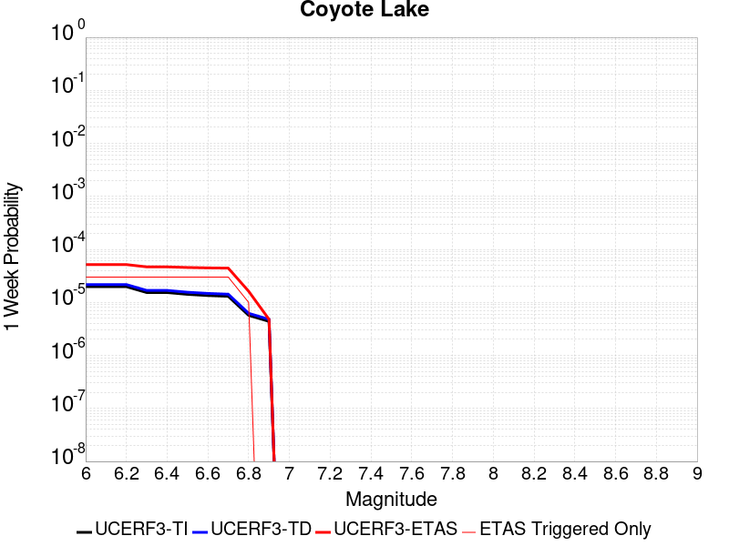 |  |  |  |

| Magnitude | 1 wk TI Prob | 1 wk TD Prob | 1 wk ETAS Prob | 1 wk ETAS/TD Gain | 1 wk ETAS Triggered Only | 1 mo TI Prob | 1 mo TD Prob | 1 mo ETAS Prob | 1 mo ETAS/TD Gain | 1 mo ETAS Triggered Only | 1 yr TI Prob | 1 yr TD Prob | 1 yr ETAS Prob | 1 yr ETAS/TD Gain | 1 yr ETAS Triggered Only | 10 yr TI Prob | 10 yr TD Prob | 10 yr ETAS Prob | 10 yr ETAS/TD Gain | 10 yr ETAS Triggered Only |
|-----|-----|-----|-----|-----|-----|-----|-----|-----|-----|-----|-----|-----|-----|-----|-----|-----|-----|-----|-----|-----|
| 6.0 | 1.980352E-5 | 2.1707021E-5 | 5.3860666E-5 | 2.4812553 | 3.215434E-5 | 8.486947E-5 | 9.302718E-5 | 1.5732988E-4 | 1.6912248 | 6.430868E-5 | 0.0010327959 | 0.0011320895 | 0.001389033 | 1.226964 | 2.5723473E-4 | 0.010280091 | 0.011270401 | 0.011885045 | 1.0545361 | 6.216506E-4 |
| 6.1 | 1.980352E-5 | 2.1707021E-5 | 5.3860666E-5 | 2.4812553 | 3.215434E-5 | 8.486947E-5 | 9.302718E-5 | 1.5732988E-4 | 1.6912248 | 6.430868E-5 | 0.0010327959 | 0.0011320895 | 0.001389033 | 1.226964 | 2.5723473E-4 | 0.010280091 | 0.011270401 | 0.011885045 | 1.0545361 | 6.216506E-4 |
| 6.2 | 1.980352E-5 | 2.1707021E-5 | 5.3860666E-5 | 2.4812553 | 3.215434E-5 | 8.486947E-5 | 9.302718E-5 | 1.5732988E-4 | 1.6912248 | 6.430868E-5 | 0.0010327959 | 0.0011320895 | 0.001389033 | 1.226964 | 2.5723473E-4 | 0.010280091 | 0.011270401 | 0.011885045 | 1.0545361 | 6.216506E-4 |
| 6.3 | 1.5344787E-5 | 1.6820884E-5 | 4.8974685E-5 | 2.9115405 | 3.215434E-5 | 6.576172E-5 | 7.208785E-5 | 1.2567456E-4 | 1.7433528 | 5.3590567E-5 | 8.003548E-4 | 8.7737746E-4 | 0.0010594255 | 1.2074912 | 1.8220794E-4 | 0.007974784 | 0.00874518 | 0.0091807805 | 1.0498103 | 4.3944267E-4 |
| 6.4 | 1.5344787E-5 | 1.6820884E-5 | 4.8974685E-5 | 2.9115405 | 3.215434E-5 | 6.576172E-5 | 7.208785E-5 | 1.2567456E-4 | 1.7433528 | 5.3590567E-5 | 8.003548E-4 | 8.7737746E-4 | 0.0010594255 | 1.2074912 | 1.8220794E-4 | 0.007974784 | 0.00874518 | 0.0091807805 | 1.0498103 | 4.3944267E-4 |
| 6.5 | 1.4189697E-5 | 1.5558186E-5 | 4.7712027E-5 | 3.066683 | 3.215434E-5 | 6.081157E-5 | 6.667658E-5 | 1.2026357E-4 | 1.8036854 | 5.3590567E-5 | 7.401293E-4 | 8.1154524E-4 | 9.82896E-4 | 1.2111412 | 1.7148982E-4 | 0.0073766913 | 0.008091759 | 0.008506383 | 1.0512403 | 4.1800644E-4 |
| 6.6 | 1.3469301E-5 | 1.47717665E-5 | 4.6925634E-5 | 3.1767108 | 3.215434E-5 | 5.7724297E-5 | 6.3306376E-5 | 1.06176114E-4 | 1.6771789 | 4.2872456E-5 | 7.025667E-4 | 7.7054254E-4 | 9.311903E-4 | 1.2084867 | 1.607717E-4 | 0.0070034964 | 0.0076846126 | 0.008088771 | 1.0525932 | 4.0728832E-4 |
| 6.7 | 1.3027966E-5 | 1.4281927E-5 | 4.643581E-5 | 3.2513685 | 3.215434E-5 | 5.5832945E-5 | 6.120716E-5 | 1.0407699E-4 | 1.7004055 | 4.2872456E-5 | 6.7955407E-4 | 7.450021E-4 | 9.0565404E-4 | 1.2156396 | 1.607717E-4 | 0.006774798 | 0.007430923 | 0.007835185 | 1.0544026 | 4.0728832E-4 |
| 6.8 | 5.695434E-6 | 6.2244944E-6 | 1.6942542E-5 | 2.7219145 | 1.0718114E-5 | 2.4408775E-5 | 2.6676302E-5 | 3.739413E-5 | 1.4017733 | 1.0718114E-5 | 2.971363E-4 | 3.2476554E-4 | 3.5690944E-4 | 1.0989757 | 3.215434E-5 | 0.0029673933 | 0.0032458503 | 0.0033740504 | 1.0394965 | 1.2861736E-4 |
| 6.9 | 4.385688E-6 | 4.7931144E-6 | 4.7931144E-6 | 1.0 | 0.0 | 1.879567E-5 | 2.0541918E-5 | 2.0541918E-5 | 1.0 | 0.0 | 2.2881327E-4 | 2.5009786E-4 | 2.608133E-4 | 1.042845 | 1.0718114E-5 | 0.002285778 | 0.0025009785 | 0.002586509 | 1.0341988 | 8.574491E-5 |

## Helendale-So Lockhart
*[(top)](#table-of-contents)*

| 1 Week | 1 Month | 1 Year | 10 Year |
|-----|-----|-----|-----|
|  |  |  |  |

| Magnitude | 1 wk TI Prob | 1 wk TD Prob | 1 wk ETAS Prob | 1 wk ETAS/TD Gain | 1 wk ETAS Triggered Only | 1 mo TI Prob | 1 mo TD Prob | 1 mo ETAS Prob | 1 mo ETAS/TD Gain | 1 mo ETAS Triggered Only | 1 yr TI Prob | 1 yr TD Prob | 1 yr ETAS Prob | 1 yr ETAS/TD Gain | 1 yr ETAS Triggered Only | 10 yr TI Prob | 10 yr TD Prob | 10 yr ETAS Prob | 10 yr ETAS/TD Gain | 10 yr ETAS Triggered Only |
|-----|-----|-----|-----|-----|-----|-----|-----|-----|-----|-----|-----|-----|-----|-----|-----|-----|-----|-----|-----|-----|
| 6.0 | 1.7296055E-5 | 1.8103841E-5 | 3.9539682E-5 | 2.1840491 | 2.1436228E-5 | 7.412385E-5 | 7.7585704E-5 | 1.7404124E-4 | 2.2432127 | 9.646302E-5 | 9.0208417E-4 | 9.442173E-4 | 0.0012012091 | 1.2721745 | 2.5723473E-4 | 0.008984311 | 0.009404174 | 0.009913806 | 1.0541921 | 5.1446946E-4 |
| 6.1 | 1.7296055E-5 | 1.8103841E-5 | 3.9539682E-5 | 2.1840491 | 2.1436228E-5 | 7.412385E-5 | 7.7585704E-5 | 1.7404124E-4 | 2.2432127 | 9.646302E-5 | 9.0208417E-4 | 9.442173E-4 | 0.0012012091 | 1.2721745 | 2.5723473E-4 | 0.008984311 | 0.009404174 | 0.009913806 | 1.0541921 | 5.1446946E-4 |
| 6.2 | 1.7296055E-5 | 1.8103841E-5 | 3.9539682E-5 | 2.1840491 | 2.1436228E-5 | 7.412385E-5 | 7.7585704E-5 | 1.7404124E-4 | 2.2432127 | 9.646302E-5 | 9.0208417E-4 | 9.442173E-4 | 0.0012012091 | 1.2721745 | 2.5723473E-4 | 0.008984311 | 0.009404174 | 0.009913806 | 1.0541921 | 5.1446946E-4 |
| 6.3 | 1.0669118E-5 | 1.1135489E-5 | 2.1853484E-5 | 1.9625077 | 1.0718114E-5 | 4.5723988E-5 | 4.7722668E-5 | 1.1202828E-4 | 2.3474858 | 6.430868E-5 | 5.5654737E-4 | 5.8087136E-4 | 7.5226155E-4 | 1.295057 | 1.7148982E-4 | 0.0055515557 | 0.005793827 | 0.0061774435 | 1.0662112 | 3.858521E-4 |
| 6.4 | 1.0669118E-5 | 1.1135489E-5 | 2.1853484E-5 | 1.9625077 | 1.0718114E-5 | 4.5723988E-5 | 4.7722668E-5 | 1.1202828E-4 | 2.3474858 | 6.430868E-5 | 5.5654737E-4 | 5.8087136E-4 | 7.5226155E-4 | 1.295057 | 1.7148982E-4 | 0.0055515557 | 0.005793827 | 0.0061774435 | 1.0662112 | 3.858521E-4 |
| 6.5 | 8.790038E-6 | 9.1702495E-6 | 1.9888264E-5 | 2.1687813 | 1.0718114E-5 | 3.767105E-5 | 3.9300485E-5 | 1.0360664E-4 | 2.6362686 | 6.430868E-5 | 4.585485E-4 | 4.7837992E-4 | 6.283617E-4 | 1.3135203 | 1.5005359E-4 | 0.0045760344 | 0.0047736657 | 0.0050830073 | 1.0648017 | 3.108253E-4 |
| 6.6 | 7.396949E-6 | 7.715581E-6 | 1.8433611E-5 | 2.389141 | 1.0718114E-5 | 3.1700827E-5 | 3.3066364E-5 | 8.6655156E-5 | 2.6206439 | 5.3590567E-5 | 3.858892E-4 | 4.025096E-4 | 5.41789E-4 | 1.3460275 | 1.3933548E-4 | 0.003852198 | 0.004017913 | 0.004306139 | 1.0717354 | 2.8938908E-4 |
| 6.7 | 6.4600285E-6 | 6.7380697E-6 | 1.745611E-5 | 2.5906694 | 1.0718114E-5 | 2.7685543E-5 | 2.8877126E-5 | 8.246615E-5 | 2.85576 | 5.3590567E-5 | 3.3701936E-4 | 3.5152308E-4 | 4.6938087E-4 | 1.3352776 | 1.17899246E-4 | 0.0033650869 | 0.003509752 | 0.0037554034 | 1.0699911 | 2.465166E-4 |
| 6.8 | 5.600104E-6 | 5.836042E-6 | 1.6554093E-5 | 2.8365273 | 1.0718114E-5 | 2.4000226E-5 | 2.5011372E-5 | 7.86006E-5 | 3.1425946 | 5.3590567E-5 | 2.9216358E-4 | 3.044715E-4 | 4.1162E-4 | 1.3519163 | 1.07181135E-4 | 0.0029177975 | 0.003040605 | 0.00324363 | 1.0667713 | 2.0364416E-4 |
| 6.9 | 4.839122E-6 | 5.039537E-6 | 5.039537E-6 | 1.0 | 0.0 | 2.0738931E-5 | 2.159784E-5 | 6.4469365E-5 | 2.9849916 | 4.2872456E-5 | 2.5246723E-4 | 2.6292243E-4 | 3.593601E-4 | 1.3667912 | 9.646302E-5 | 0.002521806 | 0.002626161 | 0.0027972006 | 1.065129 | 1.7148982E-4 |
| 7.0 | 3.6937633E-6 | 3.845229E-6 | 3.845229E-6 | 1.0 | 0.0 | 1.5830317E-5 | 1.6479451E-5 | 5.9351198E-5 | 3.6015277 | 4.2872456E-5 | 1.9271708E-4 | 2.0061915E-4 | 2.8634685E-4 | 1.4273157 | 8.574491E-5 | 0.0019255003 | 0.0020044118 | 0.002143468 | 1.069375 | 1.3933548E-4 |
| 7.1 | 2.7858857E-6 | 2.8978693E-6 | 2.8978693E-6 | 1.0 | 0.0 | 1.1939455E-5 | 1.2419382E-5 | 4.4573324E-5 | 3.589013 | 3.215434E-5 | 1.4535317E-4 | 1.511957E-4 | 2.1549466E-4 | 1.4252697 | 6.430868E-5 | 0.0014525814 | 0.0015109498 | 0.0015965651 | 1.0566633 | 8.574491E-5 |
| 7.2 | 2.1672065E-6 | 2.2540248E-6 | 2.2540248E-6 | 1.0 | 0.0 | 9.2879945E-6 | 9.660072E-6 | 3.1096093E-5 | 3.2190332 | 2.1436228E-5 | 1.1307546E-4 | 1.176052E-4 | 1.7118947E-4 | 1.4556284 | 5.3590567E-5 | 0.0011301794 | 0.0011754478 | 0.001239681 | 1.0546457 | 6.430868E-5 |
| 7.3 | 1.4823496E-6 | 1.5422185E-6 | 1.5422185E-6 | 1.0 | 0.0 | 6.3529114E-6 | 6.6094917E-6 | 1.7327535E-5 | 2.6216137 | 1.0718114E-5 | 7.734395E-5 | 8.046775E-5 | 1.126195E-4 | 1.3995608 | 3.215434E-5 | 7.731704E-4 | 8.044012E-4 | 8.3652965E-4 | 1.0399408 | 3.215434E-5 |
| 7.4 | 4.2321457E-7 | 4.4109012E-7 | 4.4109012E-7 | 1.0 | 0.0 | 1.8137755E-6 | 1.8903852E-6 | 1.2608479E-5 | 6.6697936 | 1.0718114E-5 | 2.2082493E-5 | 2.3015242E-5 | 3.3733108E-5 | 1.4656856 | 1.0718114E-5 | 2.2080299E-4 | 2.3013311E-4 | 2.4084876E-4 | 1.0465628 | 1.0718114E-5 |
| 7.5 | 5.6942316E-8 | 5.941599E-8 | 5.941599E-8 | 1.0 | 0.0 | 2.440385E-7 | 2.5463993E-7 | 2.5463993E-7 | 1.0 | 0.0 | 2.9711643E-6 | 3.1002376E-6 | 3.1002376E-6 | 1.0 | 0.0 | 2.9711247E-5 | 3.1002022E-5 | 3.1002022E-5 | 1.0 | 0.0 |

## San Andreas (Big Bend)
*[(top)](#table-of-contents)*

| 1 Week | 1 Month | 1 Year | 10 Year |
|-----|-----|-----|-----|
| 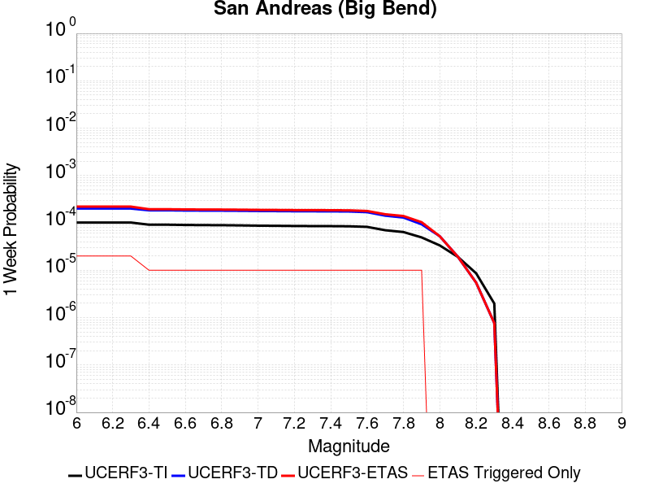 |  |  |  |

| Magnitude | 1 wk TI Prob | 1 wk TD Prob | 1 wk ETAS Prob | 1 wk ETAS/TD Gain | 1 wk ETAS Triggered Only | 1 mo TI Prob | 1 mo TD Prob | 1 mo ETAS Prob | 1 mo ETAS/TD Gain | 1 mo ETAS Triggered Only | 1 yr TI Prob | 1 yr TD Prob | 1 yr ETAS Prob | 1 yr ETAS/TD Gain | 1 yr ETAS Triggered Only | 10 yr TI Prob | 10 yr TD Prob | 10 yr ETAS Prob | 10 yr ETAS/TD Gain | 10 yr ETAS Triggered Only |
|-----|-----|-----|-----|-----|-----|-----|-----|-----|-----|-----|-----|-----|-----|-----|-----|-----|-----|-----|-----|-----|
| 6.0 | 1.0179969E-4 | 2.0080687E-4 | 2.2223878E-4 | 1.106729 | 2.1436228E-5 | 4.362114E-4 | 8.60318E-4 | 9.566981E-4 | 1.1120284 | 9.646302E-5 | 0.0052979486 | 0.010424351 | 0.010615266 | 1.0183144 | 1.9292605E-4 | 0.051734097 | 0.1014857 | 0.10188054 | 1.0038906 | 4.3944267E-4 |
| 6.1 | 1.0179969E-4 | 2.0080687E-4 | 2.2223878E-4 | 1.106729 | 2.1436228E-5 | 4.362114E-4 | 8.60318E-4 | 9.566981E-4 | 1.1120284 | 9.646302E-5 | 0.0052979486 | 0.010424351 | 0.010615266 | 1.0183144 | 1.9292605E-4 | 0.051734097 | 0.1014857 | 0.10188054 | 1.0038906 | 4.3944267E-4 |
| 6.2 | 1.0179969E-4 | 2.0080687E-4 | 2.2223878E-4 | 1.106729 | 2.1436228E-5 | 4.362114E-4 | 8.60318E-4 | 9.566981E-4 | 1.1120284 | 9.646302E-5 | 0.0052979486 | 0.010424351 | 0.010615266 | 1.0183144 | 1.9292605E-4 | 0.051734097 | 0.1014857 | 0.10188054 | 1.0038906 | 4.3944267E-4 |
| 6.3 | 1.0179969E-4 | 2.0080687E-4 | 2.2223878E-4 | 1.106729 | 2.1436228E-5 | 4.362114E-4 | 8.60318E-4 | 9.566981E-4 | 1.1120284 | 9.646302E-5 | 0.0052979486 | 0.010424351 | 0.010615266 | 1.0183144 | 1.9292605E-4 | 0.051734097 | 0.1014857 | 0.10188054 | 1.0038906 | 4.3944267E-4 |
| 6.4 | 9.1639464E-5 | 1.8437792E-4 | 1.9509405E-4 | 1.0581205 | 1.0718114E-5 | 3.9268145E-4 | 7.89952E-4 | 8.3279057E-4 | 1.0542294 | 4.2872456E-5 | 0.0047704205 | 0.009575372 | 0.009692142 | 1.0121949 | 1.17899246E-4 | 0.046693064 | 0.09381153 | 0.09402521 | 1.0022777 | 2.3579849E-4 |
| 6.5 | 9.1639464E-5 | 1.8437792E-4 | 1.9509405E-4 | 1.0581205 | 1.0718114E-5 | 3.9268145E-4 | 7.89952E-4 | 8.3279057E-4 | 1.0542294 | 4.2872456E-5 | 0.0047704205 | 0.009575372 | 0.009692142 | 1.0121949 | 1.17899246E-4 | 0.046693064 | 0.09381153 | 0.09402521 | 1.0022777 | 2.3579849E-4 |
| 6.6 | 9.042622E-5 | 1.8244829E-4 | 1.9316445E-4 | 1.0587354 | 1.0718114E-5 | 3.8748336E-4 | 7.8168715E-4 | 8.2452607E-4 | 1.0548031 | 4.2872456E-5 | 0.0047074095 | 0.009475624 | 0.009581789 | 1.0112041 | 1.07181135E-4 | 0.046089325 | 0.09290548 | 0.09310965 | 1.0021976 | 2.2508038E-4 |
| 6.7 | 8.9836685E-5 | 1.8159159E-4 | 1.9230775E-4 | 1.0590124 | 1.0718114E-5 | 3.8495753E-4 | 7.7801774E-4 | 8.2085683E-4 | 1.0550618 | 4.2872456E-5 | 0.00467679 | 0.009431336 | 0.009537506 | 1.0112572 | 1.07181135E-4 | 0.045795817 | 0.09249973 | 0.09269427 | 1.0021031 | 2.1436227E-4 |
| 6.8 | 8.9471854E-5 | 1.8105932E-4 | 1.917755E-4 | 1.059186 | 1.0718114E-5 | 3.8339442E-4 | 7.75738E-4 | 8.185772E-4 | 1.0552238 | 4.2872456E-5 | 0.004657841 | 0.00940382 | 0.009509994 | 1.0112904 | 1.07181135E-4 | 0.04561414 | 0.09224692 | 0.09244151 | 1.0021094 | 2.1436227E-4 |
| 6.9 | 8.858234E-5 | 1.7987892E-4 | 1.905951E-4 | 1.0595745 | 1.0718114E-5 | 3.7958333E-4 | 7.706821E-4 | 8.135215E-4 | 1.0555863 | 4.2872456E-5 | 0.004611638 | 0.009342793 | 0.009448973 | 1.0113649 | 1.07181135E-4 | 0.04517103 | 0.091686994 | 0.0918817 | 1.0021236 | 2.1436227E-4 |
| 7.0 | 8.7433385E-5 | 1.7826671E-4 | 1.8898291E-4 | 1.0601133 | 1.0718114E-5 | 3.746607E-4 | 7.6377665E-4 | 7.9590647E-4 | 1.0420669 | 3.215434E-5 | 0.004551957 | 0.009259437 | 0.009355008 | 1.0103214 | 9.646302E-5 | 0.044598386 | 0.09092137 | 0.09109676 | 1.0019289 | 1.9292605E-4 |
| 7.1 | 8.684964E-5 | 1.7738611E-4 | 1.8810232E-4 | 1.0604118 | 1.0718114E-5 | 3.7215967E-4 | 7.600049E-4 | 7.921348E-4 | 1.0422759 | 3.215434E-5 | 0.0045216335 | 0.009213906 | 0.00930948 | 1.0103729 | 9.646302E-5 | 0.04430731 | 0.09050287 | 0.09066859 | 1.001831 | 1.8220794E-4 |
| 7.2 | 8.606521E-5 | 1.7629213E-4 | 1.8700835E-4 | 1.0607867 | 1.0718114E-5 | 3.6879873E-4 | 7.5531914E-4 | 7.874492E-4 | 1.0425384 | 3.215434E-5 | 0.0044808835 | 0.009157337 | 0.009252917 | 1.0104375 | 9.646302E-5 | 0.043916024 | 0.08998334 | 0.09014915 | 1.0018427 | 1.8220794E-4 |
| 7.3 | 8.568266E-5 | 1.7571205E-4 | 1.8642827E-4 | 1.0609875 | 1.0718114E-5 | 3.6715972E-4 | 7.528345E-4 | 7.849646E-4 | 1.0426788 | 3.215434E-5 | 0.0044610105 | 0.00912734 | 0.009222923 | 1.010472 | 9.646302E-5 | 0.043725148 | 0.08970444 | 0.089870304 | 1.0018489 | 1.8220794E-4 |
| 7.4 | 8.5432206E-5 | 1.7533782E-4 | 1.8605405E-4 | 1.0611176 | 1.0718114E-5 | 3.6608664E-4 | 7.5123156E-4 | 7.833618E-4 | 1.04277 | 3.215434E-5 | 0.004447999 | 0.009107988 | 0.009203573 | 1.0104946 | 9.646302E-5 | 0.043600157 | 0.08952458 | 0.08969048 | 1.0018531 | 1.8220794E-4 |
| 7.5 | 8.4791965E-5 | 1.7403076E-4 | 1.8474701E-4 | 1.0615767 | 1.0718114E-5 | 3.633435E-4 | 7.4563315E-4 | 7.777635E-4 | 1.0430914 | 3.215434E-5 | 0.0044147377 | 0.009040395 | 0.009135986 | 1.0105737 | 9.646302E-5 | 0.043280575 | 0.0889021 | 0.08905834 | 1.0017575 | 1.7148982E-4 |
| 7.6 | 8.241105E-5 | 1.684837E-4 | 1.7920001E-4 | 1.0636045 | 1.0718114E-5 | 3.531424E-4 | 7.2187337E-4 | 7.5400446E-4 | 1.0445107 | 3.215434E-5 | 0.0042910352 | 0.008753479 | 0.008849098 | 1.0109235 | 9.646302E-5 | 0.042091176 | 0.08627858 | 0.08643527 | 1.0018162 | 1.7148982E-4 |
| 7.7 | 7.00432E-5 | 1.4211683E-4 | 1.5283343E-4 | 1.0754069 | 1.0718114E-5 | 3.001506E-4 | 6.0893E-4 | 6.410648E-4 | 1.0527725 | 3.215434E-5 | 0.0036482112 | 0.007388561 | 0.0074630333 | 1.0100794 | 7.5026794E-5 | 0.035888977 | 0.07354971 | 0.07366887 | 1.00162 | 1.2861736E-4 |
| 7.8 | 6.415362E-5 | 1.297541E-4 | 1.4047083E-4 | 1.0825926 | 1.0718114E-5 | 2.749151E-4 | 5.5597053E-4 | 5.8810704E-4 | 1.0578024 | 3.215434E-5 | 0.0033419547 | 0.006747963 | 0.0068118377 | 1.0094658 | 6.430868E-5 | 0.03292141 | 0.0672817 | 0.06739167 | 1.0016345 | 1.17899246E-4 |
| 7.9 | 4.939911E-5 | 9.345801E-5 | 1.04175124E-4 | 1.114673 | 1.0718114E-5 | 2.116933E-4 | 4.0047284E-4 | 4.3261432E-4 | 1.0802587 | 3.215434E-5 | 0.0025743195 | 0.0048648654 | 0.0049288613 | 1.0131547 | 6.430868E-5 | 0.025447013 | 0.048936196 | 0.049017742 | 1.0016664 | 8.574491E-5 |
| 8.0 | 3.344983E-5 | 5.225443E-5 | 5.225443E-5 | 1.0 | 0.0 | 1.4334853E-4 | 2.2392833E-4 | 2.2392833E-4 | 1.0 | 0.0 | 0.0017438711 | 0.0027229206 | 0.0027336096 | 1.0039256 | 1.0718114E-5 | 0.017302496 | 0.02793573 | 0.027956568 | 1.0007459 | 2.1436228E-5 |
| 8.1 | 1.9104898E-5 | 1.9186356E-5 | 1.9186356E-5 | 1.0 | 0.0 | 8.1875565E-5 | 8.222465E-5 | 8.222465E-5 | 1.0 | 0.0 | 9.963791E-4 | 0.001000626 | 0.001000626 | 1.0 | 0.0 | 0.009919235 | 0.010756767 | 0.010756767 | 1.0 | 0.0 |
| 8.2 | 8.643924E-6 | 5.4798497E-6 | 5.4798497E-6 | 1.0 | 0.0 | 3.704486E-5 | 2.348486E-5 | 2.348486E-5 | 1.0 | 0.0 | 4.5092785E-4 | 2.858907E-4 | 2.858907E-4 | 1.0 | 0.0 | 0.0045001395 | 0.0032514327 | 0.0032514327 | 1.0 | 0.0 |
| 8.3 | 1.983087E-6 | 7.668296E-7 | 7.668296E-7 | 1.0 | 0.0 | 8.498917E-6 | 3.2864084E-6 | 3.2864084E-6 | 1.0 | 0.0 | 1.034694E-4 | 4.0011306E-5 | 4.0011306E-5 | 1.0 | 0.0 | 0.0010342124 | 4.724499E-4 | 4.724499E-4 | 1.0 | 0.0 |

## Sierra Nevada  (No Extension)
*[(top)](#table-of-contents)*

| 1 Week | 1 Month | 1 Year | 10 Year |
|-----|-----|-----|-----|
|  |  |  |  |

| Magnitude | 1 wk TI Prob | 1 wk TD Prob | 1 wk ETAS Prob | 1 wk ETAS/TD Gain | 1 wk ETAS Triggered Only | 1 mo TI Prob | 1 mo TD Prob | 1 mo ETAS Prob | 1 mo ETAS/TD Gain | 1 mo ETAS Triggered Only | 1 yr TI Prob | 1 yr TD Prob | 1 yr ETAS Prob | 1 yr ETAS/TD Gain | 1 yr ETAS Triggered Only | 10 yr TI Prob | 10 yr TD Prob | 10 yr ETAS Prob | 10 yr ETAS/TD Gain | 10 yr ETAS Triggered Only |
|-----|-----|-----|-----|-----|-----|-----|-----|-----|-----|-----|-----|-----|-----|-----|-----|-----|-----|-----|-----|-----|
| 6.0 | 7.7690465E-6 | 6.9763832E-6 | 6.9763832E-6 | 1.0 | 0.0 | 3.329549E-5 | 2.9898645E-5 | 7.276982E-5 | 2.4338834 | 4.2872456E-5 | 4.0529718E-4 | 3.6399104E-4 | 5.889895E-4 | 1.6181428 | 2.2508038E-4 | 0.004045588 | 0.0036374647 | 0.004053951 | 1.114499 | 4.1800644E-4 |
| 6.1 | 7.7690465E-6 | 6.9763832E-6 | 6.9763832E-6 | 1.0 | 0.0 | 3.329549E-5 | 2.9898645E-5 | 7.276982E-5 | 2.4338834 | 4.2872456E-5 | 4.0529718E-4 | 3.6399104E-4 | 5.889895E-4 | 1.6181428 | 2.2508038E-4 | 0.004045588 | 0.0036374647 | 0.004053951 | 1.114499 | 4.1800644E-4 |
| 6.2 | 7.7690465E-6 | 6.9763832E-6 | 6.9763832E-6 | 1.0 | 0.0 | 3.329549E-5 | 2.9898645E-5 | 7.276982E-5 | 2.4338834 | 4.2872456E-5 | 4.0529718E-4 | 3.6399104E-4 | 5.889895E-4 | 1.6181428 | 2.2508038E-4 | 0.004045588 | 0.0036374647 | 0.004053951 | 1.114499 | 4.1800644E-4 |
| 6.3 | 7.7690465E-6 | 6.9763832E-6 | 6.9763832E-6 | 1.0 | 0.0 | 3.329549E-5 | 2.9898645E-5 | 7.276982E-5 | 2.4338834 | 4.2872456E-5 | 4.0529718E-4 | 3.6399104E-4 | 5.889895E-4 | 1.6181428 | 2.2508038E-4 | 0.004045588 | 0.0036374647 | 0.004053951 | 1.114499 | 4.1800644E-4 |
| 6.4 | 7.7690465E-6 | 6.9763832E-6 | 6.9763832E-6 | 1.0 | 0.0 | 3.329549E-5 | 2.9898645E-5 | 7.276982E-5 | 2.4338834 | 4.2872456E-5 | 4.0529718E-4 | 3.6399104E-4 | 5.889895E-4 | 1.6181428 | 2.2508038E-4 | 0.004045588 | 0.0036374647 | 0.004053951 | 1.114499 | 4.1800644E-4 |
| 6.5 | 7.7690465E-6 | 6.9763832E-6 | 6.9763832E-6 | 1.0 | 0.0 | 3.329549E-5 | 2.9898645E-5 | 7.276982E-5 | 2.4338834 | 4.2872456E-5 | 4.0529718E-4 | 3.6399104E-4 | 5.889895E-4 | 1.6181428 | 2.2508038E-4 | 0.004045588 | 0.0036374647 | 0.004053951 | 1.114499 | 4.1800644E-4 |
| 6.6 | 2.653E-6 | 1.6148814E-6 | 1.6148814E-6 | 1.0 | 0.0 | 1.136995E-5 | 6.920902E-6 | 4.979306E-5 | 7.194591 | 4.2872456E-5 | 1.3842035E-4 | 8.4258754E-5 | 2.342997E-4 | 2.7807164 | 1.5005359E-4 | 0.0013833415 | 8.4227155E-4 | 0.0011207077 | 1.3305777 | 2.7867095E-4 |
| 6.7 | 2.5902466E-6 | 1.5502146E-6 | 1.5502146E-6 | 1.0 | 0.0 | 1.11010095E-5 | 6.64376E-6 | 4.951593E-5 | 7.4529977 | 4.2872456E-5 | 1.351464E-4 | 8.0884805E-5 | 2.3092626E-4 | 2.8550017 | 1.5005359E-4 | 0.0013506424 | 8.085567E-4 | 0.0010870023 | 1.3443737 | 2.7867095E-4 |
| 6.8 | 2.5853892E-6 | 1.5470148E-6 | 1.5470148E-6 | 1.0 | 0.0 | 1.1080193E-5 | 6.6300463E-6 | 4.9502218E-5 | 7.4663453 | 4.2872456E-5 | 1.34893E-4 | 8.071786E-5 | 2.3075934E-4 | 2.8588388 | 1.5005359E-4 | 0.0013481114 | 8.0688833E-4 | 0.0010853345 | 1.3450862 | 2.7867095E-4 |
| 6.9 | 2.458257E-6 | 1.4220883E-6 | 1.4220883E-6 | 1.0 | 0.0 | 1.0535345E-5 | 6.0946504E-6 | 4.8966842E-5 | 8.034398 | 4.2872456E-5 | 1.2826028E-4 | 7.419986E-5 | 2.2424232E-4 | 3.0221393 | 1.5005359E-4 | 0.0012818627 | 7.417528E-4 | 0.0010202171 | 1.3754138 | 2.7867095E-4 |
| 7.0 | 2.4341468E-6 | 1.399052E-6 | 1.399052E-6 | 1.0 | 0.0 | 1.0432016E-5 | 5.995924E-6 | 4.886812E-5 | 8.150224 | 4.2872456E-5 | 1.270024E-4 | 7.2997944E-5 | 2.2304058E-4 | 3.0554364 | 1.5005359E-4 | 0.0012692984 | 7.297416E-4 | 0.0010082092 | 1.3815975 | 2.7867095E-4 |
| 7.1 | 2.3652476E-6 | 1.3340014E-6 | 1.3340014E-6 | 1.0 | 0.0 | 1.0136736E-5 | 5.717136E-6 | 4.8589347E-5 | 8.498896 | 4.2872456E-5 | 1.2340778E-4 | 6.960393E-5 | 2.1964707E-4 | 3.1556706 | 1.5005359E-4 | 0.0012333926 | 6.9582294E-4 | 9.7429997E-4 | 1.4002125 | 2.7867095E-4 |
| 7.2 | 2.272158E-6 | 1.2503074E-6 | 1.2503074E-6 | 1.0 | 0.0 | 9.737784E-6 | 5.3584495E-6 | 4.8230675E-5 | 9.000864 | 4.2872456E-5 | 1.1855107E-4 | 6.523718E-5 | 2.1528099E-4 | 3.2999737 | 1.5005359E-4 | 0.0011848784 | 6.5218186E-4 | 9.199599E-4 | 1.410588 | 2.6795283E-4 |
| 7.3 | 2.1382127E-6 | 1.1419947E-6 | 1.1419947E-6 | 1.0 | 0.0 | 9.163737E-6 | 4.8942543E-6 | 4.7766498E-5 | 9.759709 | 4.2872456E-5 | 1.1156279E-4 | 5.9585927E-5 | 2.0963057E-4 | 3.5181222 | 1.5005359E-4 | 0.001115068 | 5.957007E-4 | 8.5278216E-4 | 1.4315615 | 2.5723473E-4 |
| 7.4 | 1.9048055E-6 | 9.575474E-7 | 9.575474E-7 | 1.0 | 0.0 | 8.163426E-6 | 4.1037683E-6 | 4.6976045E-5 | 11.447052 | 4.2872456E-5 | 9.9385186E-5 | 4.996224E-5 | 1.8929076E-4 | 3.7886763 | 1.3933548E-4 | 9.934074E-4 | 4.995108E-4 | 7.3519145E-4 | 1.4718231 | 2.3579849E-4 |
| 7.5 | 1.5373403E-6 | 7.5602395E-7 | 7.5602395E-7 | 1.0 | 0.0 | 6.5885843E-6 | 3.2400987E-6 | 4.6112415E-5 | 14.231792 | 4.2872456E-5 | 8.021306E-5 | 3.9447492E-5 | 1.466244E-4 | 3.7169511 | 1.07181135E-4 | 8.0184115E-4 | 3.944054E-4 | 5.979692E-4 | 1.5161284 | 2.0364416E-4 |
| 7.6 | 1.0680322E-6 | 4.659796E-7 | 4.659796E-7 | 1.0 | 0.0 | 4.577273E-6 | 1.997054E-6 | 2.3433238E-5 | 11.733904 | 2.1436228E-5 | 5.5726876E-5 | 2.4313864E-5 | 5.6467423E-5 | 2.3224373 | 3.215434E-5 | 5.5712904E-4 | 2.431123E-4 | 3.3955186E-4 | 1.3966874 | 9.646302E-5 |
| 7.7 | 5.509146E-7 | 1.5581199E-7 | 1.5581199E-7 | 1.0 | 0.0 | 2.3610605E-6 | 6.677655E-7 | 1.1385872E-5 | 17.050703 | 1.0718114E-5 | 2.8745531E-5 | 8.130016E-6 | 1.8848043E-5 | 2.318328 | 1.0718114E-5 | 2.8741814E-4 | 8.12973E-5 | 9.201455E-5 | 1.1318277 | 1.0718114E-5 |

## Death Valley (No)
*[(top)](#table-of-contents)*

| 1 Week | 1 Month | 1 Year | 10 Year |
|-----|-----|-----|-----|
|  |  |  |  |

| Magnitude | 1 wk TI Prob | 1 wk TD Prob | 1 wk ETAS Prob | 1 wk ETAS/TD Gain | 1 wk ETAS Triggered Only | 1 mo TI Prob | 1 mo TD Prob | 1 mo ETAS Prob | 1 mo ETAS/TD Gain | 1 mo ETAS Triggered Only | 1 yr TI Prob | 1 yr TD Prob | 1 yr ETAS Prob | 1 yr ETAS/TD Gain | 1 yr ETAS Triggered Only | 10 yr TI Prob | 10 yr TD Prob | 10 yr ETAS Prob | 10 yr ETAS/TD Gain | 10 yr ETAS Triggered Only |
|-----|-----|-----|-----|-----|-----|-----|-----|-----|-----|-----|-----|-----|-----|-----|-----|-----|-----|-----|-----|-----|
| 6.0 | 2.0074807E-5 | 2.2500446E-5 | 5.465406E-5 | 2.4290214 | 3.215434E-5 | 8.603206E-5 | 9.642696E-5 | 1.7144652E-4 | 1.7779937 | 7.5026794E-5 | 0.001046937 | 0.0011733733 | 0.0013981896 | 1.1915983 | 2.2508038E-4 | 0.010420183 | 0.011672693 | 0.012064635 | 1.0335776 | 3.965702E-4 |
| 6.1 | 2.0074807E-5 | 2.2500446E-5 | 5.465406E-5 | 2.4290214 | 3.215434E-5 | 8.603206E-5 | 9.642696E-5 | 1.7144652E-4 | 1.7779937 | 7.5026794E-5 | 0.001046937 | 0.0011733733 | 0.0013981896 | 1.1915983 | 2.2508038E-4 | 0.010420183 | 0.011672693 | 0.012064635 | 1.0335776 | 3.965702E-4 |
| 6.2 | 2.0074807E-5 | 2.2500446E-5 | 5.465406E-5 | 2.4290214 | 3.215434E-5 | 8.603206E-5 | 9.642696E-5 | 1.7144652E-4 | 1.7779937 | 7.5026794E-5 | 0.001046937 | 0.0011733733 | 0.0013981896 | 1.1915983 | 2.2508038E-4 | 0.010420183 | 0.011672693 | 0.012064635 | 1.0335776 | 3.965702E-4 |
| 6.3 | 1.9050609E-5 | 2.1337288E-5 | 5.3490945E-5 | 2.5069232 | 3.215434E-5 | 8.164292E-5 | 9.144236E-5 | 1.6646228E-4 | 1.8204068 | 7.5026794E-5 | 9.935491E-4 | 0.0011127489 | 0.0013375788 | 1.2020491 | 2.2508038E-4 | 0.009891188 | 0.011072595 | 0.011464774 | 1.0354189 | 3.965702E-4 |
| 6.4 | 1.9050609E-5 | 2.1337288E-5 | 5.3490945E-5 | 2.5069232 | 3.215434E-5 | 8.164292E-5 | 9.144236E-5 | 1.6646228E-4 | 1.8204068 | 7.5026794E-5 | 9.935491E-4 | 0.0011127489 | 0.0013375788 | 1.2020491 | 2.2508038E-4 | 0.009891188 | 0.011072595 | 0.011464774 | 1.0354189 | 3.965702E-4 |
| 6.5 | 1.8367004E-5 | 2.0561336E-5 | 5.2715015E-5 | 2.5637934 | 3.215434E-5 | 7.8713354E-5 | 8.811707E-5 | 1.6313726E-4 | 1.8513695 | 7.5026794E-5 | 9.5791375E-4 | 0.0010723039 | 0.0012971429 | 1.2096784 | 2.2508038E-4 | 0.009537951 | 0.010672084 | 0.011064422 | 1.036763 | 3.965702E-4 |
| 6.6 | 1.779439E-5 | 1.9911244E-5 | 5.2064945E-5 | 2.6148515 | 3.215434E-5 | 7.625944E-5 | 8.533114E-5 | 1.6035154E-4 | 1.8791678 | 7.5026794E-5 | 9.280632E-4 | 0.0010384179 | 0.0012632646 | 1.216528 | 2.2508038E-4 | 0.009241969 | 0.010336416 | 0.0107182795 | 1.0369436 | 3.858521E-4 |
| 6.7 | 1.7025437E-5 | 1.9043726E-5 | 5.1197454E-5 | 2.6884158 | 3.215434E-5 | 7.296412E-5 | 8.161345E-5 | 1.5663412E-4 | 1.9192195 | 7.5026794E-5 | 8.87976E-4 | 9.93197E-4 | 0.0012180539 | 1.226397 | 2.2508038E-4 | 0.008844362 | 0.009888301 | 0.010270338 | 1.0386353 | 3.858521E-4 |
| 6.8 | 1.6545107E-5 | 1.851284E-5 | 5.0666586E-5 | 2.736835 | 3.215434E-5 | 7.090568E-5 | 7.933836E-5 | 1.5435921E-4 | 1.945581 | 7.5026794E-5 | 8.629347E-4 | 9.655226E-4 | 0.0011796779 | 1.2218025 | 2.1436227E-4 | 0.008595915 | 0.009613981 | 0.0099855075 | 1.0386446 | 3.7513397E-4 |
| 6.9 | 1.615478E-5 | 1.8087881E-5 | 5.024164E-5 | 2.7776408 | 3.215434E-5 | 6.9232934E-5 | 7.751722E-5 | 1.5253821E-4 | 1.9677975 | 7.5026794E-5 | 8.4258494E-4 | 9.433697E-4 | 0.0011575298 | 1.2270161 | 2.1436227E-4 | 0.008393973 | 0.009394345 | 0.009765955 | 1.0395567 | 3.7513397E-4 |
| 7.0 | 1.5894311E-5 | 1.7805834E-5 | 4.9959603E-5 | 2.8057995 | 3.215434E-5 | 6.81167E-5 | 7.6308526E-5 | 1.5132959E-4 | 1.9831283 | 7.5026794E-5 | 8.2900526E-4 | 9.286663E-4 | 0.0011428295 | 1.2306137 | 2.1436227E-4 | 0.008259195 | 0.009248544 | 0.009620209 | 1.0401863 | 3.7513397E-4 |
| 7.1 | 1.5602263E-5 | 1.7483784E-5 | 4.963756E-5 | 2.839063 | 3.215434E-5 | 6.6865134E-5 | 7.4928386E-5 | 1.4994956E-4 | 2.0012383 | 7.5026794E-5 | 8.137789E-4 | 9.118773E-4 | 0.0011260442 | 1.2348636 | 2.1436227E-4 | 0.008108052 | 0.009082039 | 0.009453766 | 1.0409299 | 3.7513397E-4 |
| 7.2 | 1.5323829E-5 | 1.7170905E-5 | 4.9324695E-5 | 2.8725739 | 3.215434E-5 | 6.56719E-5 | 7.358755E-5 | 1.4860883E-4 | 2.019483 | 7.5026794E-5 | 7.99262E-4 | 8.9556625E-4 | 0.0011097365 | 1.2391452 | 2.1436227E-4 | 0.007963934 | 0.008920249 | 0.009292036 | 1.041679 | 3.7513397E-4 |
| 7.3 | 1.4556212E-5 | 1.6302716E-5 | 4.845653E-5 | 2.9722981 | 3.215434E-5 | 6.238227E-5 | 6.986695E-5 | 1.448885E-4 | 2.0737774 | 7.5026794E-5 | 7.592395E-4 | 8.503039E-4 | 0.0010644839 | 1.2518864 | 2.1436227E-4 | 0.0075665074 | 0.008471149 | 0.008832478 | 1.042654 | 3.6441587E-4 |
| 7.4 | 1.411725E-5 | 1.5808211E-5 | 4.7962043E-5 | 3.0339956 | 3.215434E-5 | 6.0501097E-5 | 6.774775E-5 | 1.4276947E-4 | 2.1073682 | 7.5026794E-5 | 7.363519E-4 | 8.245226E-4 | 0.0010387081 | 1.2597692 | 2.1436227E-4 | 0.0073391674 | 0.008215268 | 0.008576691 | 1.043994 | 3.6441587E-4 |
| 7.5 | 1.3503312E-5 | 1.5126531E-5 | 2.5844482E-5 | 1.7085532 | 1.0718114E-5 | 5.7870053E-5 | 6.482641E-5 | 1.0769608E-4 | 1.6612995 | 4.2872456E-5 | 7.043401E-4 | 7.8898156E-4 | 9.7104575E-4 | 1.2307584 | 1.8220794E-4 | 0.007021119 | 0.007862429 | 0.008192078 | 1.0419271 | 3.3226152E-4 |
| 7.6 | 1.1279839E-5 | 1.2626528E-5 | 2.3344506E-5 | 1.8488461 | 1.0718114E-5 | 4.834127E-5 | 5.4112596E-5 | 9.698273E-5 | 1.7922394 | 4.2872456E-5 | 5.88396E-4 | 6.58627E-4 | 8.0858177E-4 | 1.2276778 | 1.5005359E-4 | 0.005868405 | 0.0065673026 | 0.0068334956 | 1.0405331 | 2.6795283E-4 |
| 7.7 | 9.189108E-6 | 1.0283521E-5 | 1.0283521E-5 | 1.0 | 0.0 | 3.93813E-5 | 4.407152E-5 | 6.55068E-5 | 1.486375 | 2.1436228E-5 | 4.7936183E-4 | 5.3644367E-4 | 6.221426E-4 | 1.1597538 | 8.574491E-5 | 0.004783291 | 0.0053519984 | 0.005543892 | 1.0358546 | 1.9292605E-4 |
| 7.8 | 3.4586725E-7 | 3.648288E-7 | 3.648288E-7 | 1.0 | 0.0 | 1.4822873E-6 | 1.5635511E-6 | 1.2281648E-5 | 7.8549705 | 1.0718114E-5 | 1.80467E-5 | 1.9036073E-5 | 2.9753983E-5 | 1.5630316 | 1.0718114E-5 | 1.8045233E-4 | 1.9034486E-4 | 2.0106093E-4 | 1.0562983 | 1.0718114E-5 |
| 7.9 | 2.5591178E-9 | 2.6696871E-9 | 2.6696871E-9 | 1.0 | 0.0 | 1.0967647E-8 | 1.1441516E-8 | 1.1441516E-8 | 1.0 | 0.0 | 1.335311E-7 | 1.3930045E-7 | 1.3930045E-7 | 1.0 | 0.0 | 1.3353102E-6 | 1.3930046E-6 | 1.3930046E-6 | 1.0 | 0.0 |

## Red Pass
*[(top)](#table-of-contents)*

| 1 Week | 1 Month | 1 Year | 10 Year |
|-----|-----|-----|-----|
|  |  |  |  |

| Magnitude | 1 wk TI Prob | 1 wk TD Prob | 1 wk ETAS Prob | 1 wk ETAS/TD Gain | 1 wk ETAS Triggered Only | 1 mo TI Prob | 1 mo TD Prob | 1 mo ETAS Prob | 1 mo ETAS/TD Gain | 1 mo ETAS Triggered Only | 1 yr TI Prob | 1 yr TD Prob | 1 yr ETAS Prob | 1 yr ETAS/TD Gain | 1 yr ETAS Triggered Only | 10 yr TI Prob | 10 yr TD Prob | 10 yr ETAS Prob | 10 yr ETAS/TD Gain | 10 yr ETAS Triggered Only |
|-----|-----|-----|-----|-----|-----|-----|-----|-----|-----|-----|-----|-----|-----|-----|-----|-----|-----|-----|-----|-----|
| 6.0 | 8.258278E-6 | 8.551305E-6 | 5.1423394E-5 | 6.013514 | 4.2872456E-5 | 3.539214E-5 | 3.6648038E-5 | 1.4382525E-4 | 3.9245007 | 1.07181135E-4 | 4.308141E-4 | 4.4611638E-4 | 6.818097E-4 | 1.5283225 | 2.3579849E-4 | 0.0042997985 | 0.004453966 | 0.0048060883 | 1.0790582 | 3.5369775E-4 |
| 6.1 | 3.649988E-6 | 3.7753332E-6 | 2.5211479E-5 | 6.677948 | 2.1436228E-5 | 1.5642712E-5 | 1.6179927E-5 | 6.976963E-5 | 4.3121104 | 5.3590567E-5 | 1.9043336E-4 | 1.9697756E-4 | 3.362856E-4 | 1.707228 | 1.3933548E-4 | 0.0019027026 | 0.001968497 | 0.0021503463 | 1.0923798 | 1.8220794E-4 |
| 6.2 | 3.649988E-6 | 3.7753332E-6 | 2.5211479E-5 | 6.677948 | 2.1436228E-5 | 1.5642712E-5 | 1.6179927E-5 | 6.976963E-5 | 4.3121104 | 5.3590567E-5 | 1.9043336E-4 | 1.9697756E-4 | 3.362856E-4 | 1.707228 | 1.3933548E-4 | 0.0019027026 | 0.001968497 | 0.0021503463 | 1.0923798 | 1.8220794E-4 |
| 6.3 | 1.3924937E-6 | 1.4411233E-6 | 1.2159221E-5 | 8.437322 | 1.0718114E-5 | 5.9678164E-6 | 6.176236E-6 | 2.761233E-5 | 4.4707375 | 2.1436228E-5 | 7.265574E-5 | 7.51945E-5 | 1.2878103E-4 | 1.7126391 | 5.3590567E-5 | 7.263199E-4 | 7.518293E-4 | 8.3750975E-4 | 1.1139627 | 8.574491E-5 |
| 6.4 | 1.3924937E-6 | 1.4411233E-6 | 1.2159221E-5 | 8.437322 | 1.0718114E-5 | 5.9678164E-6 | 6.176236E-6 | 2.761233E-5 | 4.4707375 | 2.1436228E-5 | 7.265574E-5 | 7.51945E-5 | 1.2878103E-4 | 1.7126391 | 5.3590567E-5 | 7.263199E-4 | 7.518293E-4 | 8.3750975E-4 | 1.1139627 | 8.574491E-5 |
| 6.5 | 9.876812E-7 | 1.022196E-6 | 1.1740299E-5 | 11.48537 | 1.0718114E-5 | 4.2329125E-6 | 4.38084E-6 | 1.5098906E-5 | 3.446578 | 1.0718114E-5 | 5.153449E-5 | 5.3336724E-5 | 7.477181E-5 | 1.4018823 | 2.1436228E-5 | 5.1522546E-4 | 5.333672E-4 | 5.7621684E-4 | 1.0803379 | 4.2872456E-5 |

## San Andreas (Parkfield)
*[(top)](#table-of-contents)*

| 1 Week | 1 Month | 1 Year | 10 Year |
|-----|-----|-----|-----|
| 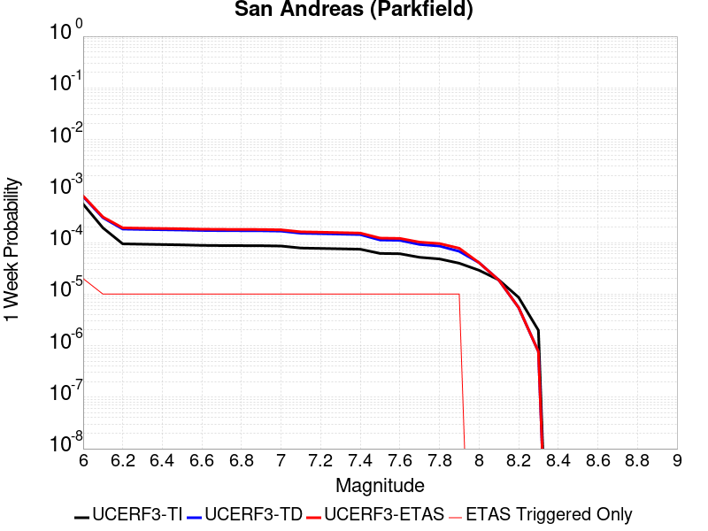 |  |  |  |

| Magnitude | 1 wk TI Prob | 1 wk TD Prob | 1 wk ETAS Prob | 1 wk ETAS/TD Gain | 1 wk ETAS Triggered Only | 1 mo TI Prob | 1 mo TD Prob | 1 mo ETAS Prob | 1 mo ETAS/TD Gain | 1 mo ETAS Triggered Only | 1 yr TI Prob | 1 yr TD Prob | 1 yr ETAS Prob | 1 yr ETAS/TD Gain | 1 yr ETAS Triggered Only | 10 yr TI Prob | 10 yr TD Prob | 10 yr ETAS Prob | 10 yr ETAS/TD Gain | 10 yr ETAS Triggered Only |
|-----|-----|-----|-----|-----|-----|-----|-----|-----|-----|-----|-----|-----|-----|-----|-----|-----|-----|-----|-----|-----|
| 6.0 | 5.556969E-4 | 7.788437E-4 | 8.002632E-4 | 1.0275017 | 2.1436228E-5 | 0.0023793848 | 0.0033341812 | 0.0033769107 | 1.0128156 | 4.2872456E-5 | 0.028586963 | 0.04023991 | 0.040363353 | 1.0030676 | 1.2861736E-4 | 0.25176284 | 0.33731642 | 0.3375011 | 1.0005475 | 2.7867095E-4 |
| 6.1 | 1.925858E-4 | 3.0304783E-4 | 3.137627E-4 | 1.035357 | 1.0718114E-5 | 8.2510663E-4 | 0.0012982241 | 0.0013196325 | 1.0164906 | 2.1436228E-5 | 0.0099994885 | 0.015792182 | 0.015855474 | 1.0040079 | 6.430868E-5 | 0.095613256 | 0.14979222 | 0.14989246 | 1.0006692 | 1.17899246E-4 |
| 6.2 | 9.4306815E-5 | 1.8250331E-4 | 1.9321946E-4 | 1.0587176 | 1.0718114E-5 | 4.0410945E-4 | 7.819238E-4 | 8.0334325E-4 | 1.0273933 | 2.1436228E-5 | 0.0049089384 | 0.009478576 | 0.009542274 | 1.0067203 | 6.430868E-5 | 0.048019063 | 0.09188674 | 0.09197433 | 1.0009533 | 9.646302E-5 |
| 6.3 | 9.283051E-5 | 1.7946832E-4 | 1.9018451E-4 | 1.0597107 | 1.0718114E-5 | 3.9778434E-4 | 7.689244E-4 | 7.9034414E-4 | 1.0278567 | 2.1436228E-5 | 0.0048322747 | 0.009321672 | 0.009385382 | 1.0068345 | 6.430868E-5 | 0.047285385 | 0.09053965 | 0.09062738 | 1.0009689 | 9.646302E-5 |
| 6.4 | 9.138826E-5 | 1.770899E-4 | 1.8780612E-4 | 1.0605129 | 1.0718114E-5 | 3.916052E-4 | 7.5873715E-4 | 7.801571E-4 | 1.028231 | 2.1436228E-5 | 0.0047573745 | 0.009198696 | 0.009262414 | 1.0069268 | 6.430868E-5 | 0.046568092 | 0.089441724 | 0.08952956 | 1.000982 | 9.646302E-5 |
| 6.5 | 9.000255E-5 | 1.746699E-4 | 1.8538615E-4 | 1.0613514 | 1.0718114E-5 | 3.8566816E-4 | 7.483717E-4 | 7.697919E-4 | 1.0286224 | 2.1436228E-5 | 0.0046854047 | 0.009073567 | 0.009137291 | 1.0070232 | 6.430868E-5 | 0.045878403 | 0.08832737 | 0.08841532 | 1.0009956 | 9.646302E-5 |
| 6.6 | 8.8109264E-5 | 1.7148067E-4 | 1.8219695E-4 | 1.0624926 | 1.0718114E-5 | 3.7755648E-4 | 7.3471136E-4 | 7.5613183E-4 | 1.029155 | 2.1436228E-5 | 0.0045870654 | 0.008908638 | 0.008972374 | 1.0071543 | 6.430868E-5 | 0.04493529 | 0.086858675 | 0.086946756 | 1.0010141 | 9.646302E-5 |
| 6.7 | 8.738073E-5 | 1.7015127E-4 | 1.8086756E-4 | 1.062981 | 1.0718114E-5 | 3.7443507E-4 | 7.290171E-4 | 7.5043767E-4 | 1.0293828 | 2.1436228E-5 | 0.0045492216 | 0.008839916 | 0.008903657 | 1.0072105 | 6.430868E-5 | 0.04457213 | 0.086258985 | 0.086347125 | 1.0010219 | 9.646302E-5 |
| 6.8 | 8.710195E-5 | 1.6960612E-4 | 1.8032241E-4 | 1.0631834 | 1.0718114E-5 | 3.7324068E-4 | 7.266821E-4 | 7.481027E-4 | 1.0294774 | 2.1436228E-5 | 0.0045347405 | 0.008811726 | 0.008875468 | 1.0072337 | 6.430868E-5 | 0.04443313 | 0.08600653 | 0.0860947 | 1.0010251 | 9.646302E-5 |
| 6.9 | 8.6801556E-5 | 1.6901553E-4 | 1.7973184E-4 | 1.0634042 | 1.0718114E-5 | 3.7195362E-4 | 7.2415237E-4 | 7.455731E-4 | 1.0295804 | 2.1436228E-5 | 0.0045191357 | 0.008781176 | 0.0088449195 | 1.0072591 | 6.430868E-5 | 0.044283327 | 0.08573254 | 0.085820735 | 1.0010287 | 9.646302E-5 |
| 7.0 | 8.5571606E-5 | 1.6654332E-4 | 1.7725966E-4 | 1.0643456 | 1.0718114E-5 | 3.6668387E-4 | 7.13563E-4 | 7.3498394E-4 | 1.0300196 | 2.1436228E-5 | 0.004455241 | 0.008653281 | 0.008717033 | 1.0073674 | 6.430868E-5 | 0.043669727 | 0.08458075 | 0.08466905 | 1.001044 | 9.646302E-5 |
| 7.1 | 7.82589E-5 | 1.5135074E-4 | 1.6206723E-4 | 1.0708057 | 1.0718114E-5 | 3.3535215E-4 | 6.484855E-4 | 6.6990784E-4 | 1.0330344 | 2.1436228E-5 | 0.0040752706 | 0.0078668995 | 0.007920069 | 1.0067586 | 5.3590567E-5 | 0.040013418 | 0.077491894 | 0.077571 | 1.0010208 | 8.574491E-5 |
| 7.2 | 7.690929E-5 | 1.4872287E-4 | 1.594394E-4 | 1.072057 | 1.0718114E-5 | 3.2956956E-4 | 6.372288E-4 | 6.5865135E-4 | 1.0336183 | 2.1436228E-5 | 0.004005129 | 0.007730829 | 0.0077840057 | 1.0068785 | 5.3590567E-5 | 0.0393371 | 0.07626493 | 0.07634414 | 1.0010386 | 8.574491E-5 |
| 7.3 | 7.5543794E-5 | 1.4568791E-4 | 1.5640447E-4 | 1.0735583 | 1.0718114E-5 | 3.2371894E-4 | 6.242281E-4 | 6.4565096E-4 | 1.0343189 | 2.1436228E-5 | 0.003934157 | 0.007573656 | 0.007626841 | 1.0070224 | 5.3590567E-5 | 0.038652334 | 0.07482772 | 0.07490705 | 1.0010601 | 8.574491E-5 |
| 7.4 | 7.4214564E-5 | 1.4269682E-4 | 1.534134E-4 | 1.0751004 | 1.0718114E-5 | 3.1802364E-4 | 6.114152E-4 | 6.3283835E-4 | 1.0350386 | 2.1436228E-5 | 0.003865065 | 0.007418731 | 0.007471924 | 1.0071701 | 5.3590567E-5 | 0.03798529 | 0.07340127 | 0.073480725 | 1.0010824 | 8.574491E-5 |
| 7.5 | 6.149578E-5 | 1.1196503E-4 | 1.2268194E-4 | 1.0957166 | 1.0718114E-5 | 2.6352672E-4 | 4.7976198E-4 | 4.90475E-4 | 1.0223298 | 1.0718114E-5 | 0.0032037178 | 0.00582549 | 0.0058681127 | 1.0073166 | 4.2872456E-5 | 0.03157923 | 0.058584154 | 0.058644693 | 1.0010334 | 6.430868E-5 |
| 7.6 | 6.0643448E-5 | 1.10251094E-4 | 1.2096803E-4 | 1.0972048 | 1.0718114E-5 | 2.598746E-4 | 4.7241923E-4 | 4.831323E-4 | 1.022677 | 1.0718114E-5 | 0.0031593828 | 0.0057365666 | 0.005779193 | 1.0074307 | 4.2872456E-5 | 0.031148417 | 0.057744972 | 0.057805568 | 1.0010494 | 6.430868E-5 |
| 7.7 | 5.1652263E-5 | 9.179838E-5 | 1.0251551E-4 | 1.1167464 | 1.0718114E-5 | 2.2134806E-4 | 3.9336234E-4 | 4.0407624E-4 | 1.0272367 | 1.0718114E-5 | 0.002691582 | 0.0047786795 | 0.00481068 | 1.0066966 | 3.215434E-5 | 0.026592141 | 0.048560265 | 0.048601054 | 1.00084 | 4.2872456E-5 |
| 7.8 | 4.8090482E-5 | 8.564368E-5 | 9.636088E-5 | 1.125137 | 1.0718114E-5 | 2.060858E-4 | 3.6699275E-4 | 3.7770692E-4 | 1.0291945 | 1.0718114E-5 | 0.0025062072 | 0.004458991 | 0.004491002 | 1.007179 | 3.215434E-5 | 0.024781305 | 0.045324653 | 0.045365583 | 1.000903 | 4.2872456E-5 |
| 7.9 | 3.970278E-5 | 6.754111E-5 | 7.82585E-5 | 1.1586795 | 1.0718114E-5 | 1.7014367E-4 | 2.894298E-4 | 3.001448E-4 | 1.0370212 | 1.0718114E-5 | 0.002069531 | 0.0035181176 | 0.0035501588 | 1.0091075 | 3.215434E-5 | 0.020503636 | 0.03589899 | 0.035940323 | 1.0011513 | 4.2872456E-5 |
| 8.0 | 2.8982335E-5 | 4.072124E-5 | 4.072124E-5 | 1.0 | 0.0 | 1.2420409E-4 | 1.7450792E-4 | 1.7450792E-4 | 1.0 | 0.0 | 0.0015111357 | 0.002122565 | 0.0021332602 | 1.0050389 | 1.0718114E-5 | 0.015009012 | 0.02202231 | 0.022043275 | 1.000952 | 2.1436228E-5 |
| 8.1 | 1.8836186E-5 | 1.8694205E-5 | 1.8694205E-5 | 1.0 | 0.0 | 8.0724014E-5 | 8.011556E-5 | 8.011556E-5 | 1.0 | 0.0 | 9.823717E-4 | 9.749711E-4 | 9.749711E-4 | 1.0 | 0.0 | 0.009780403 | 0.010494972 | 0.010494972 | 1.0 | 0.0 |
| 8.2 | 8.643924E-6 | 5.4798497E-6 | 5.4798497E-6 | 1.0 | 0.0 | 3.704486E-5 | 2.348486E-5 | 2.348486E-5 | 1.0 | 0.0 | 4.5092785E-4 | 2.858907E-4 | 2.858907E-4 | 1.0 | 0.0 | 0.0045001395 | 0.0032514327 | 0.0032514327 | 1.0 | 0.0 |
| 8.3 | 1.983087E-6 | 7.668296E-7 | 7.668296E-7 | 1.0 | 0.0 | 8.498917E-6 | 3.2864084E-6 | 3.2864084E-6 | 1.0 | 0.0 | 1.034694E-4 | 4.0011306E-5 | 4.0011306E-5 | 1.0 | 0.0 | 0.0010342124 | 4.724499E-4 | 4.724499E-4 | 1.0 | 0.0 |

## San Andreas (San Gorgonio Pass-Garnet HIll)
*[(top)](#table-of-contents)*

| 1 Week | 1 Month | 1 Year | 10 Year |
|-----|-----|-----|-----|
|  |  |  |  |

| Magnitude | 1 wk TI Prob | 1 wk TD Prob | 1 wk ETAS Prob | 1 wk ETAS/TD Gain | 1 wk ETAS Triggered Only | 1 mo TI Prob | 1 mo TD Prob | 1 mo ETAS Prob | 1 mo ETAS/TD Gain | 1 mo ETAS Triggered Only | 1 yr TI Prob | 1 yr TD Prob | 1 yr ETAS Prob | 1 yr ETAS/TD Gain | 1 yr ETAS Triggered Only | 10 yr TI Prob | 10 yr TD Prob | 10 yr ETAS Prob | 10 yr ETAS/TD Gain | 10 yr ETAS Triggered Only |
|-----|-----|-----|-----|-----|-----|-----|-----|-----|-----|-----|-----|-----|-----|-----|-----|-----|-----|-----|-----|-----|
| 6.0 | 8.31567E-5 | 2.3386451E-4 | 2.8744256E-4 | 1.2290986 | 5.3590567E-5 | 3.5633717E-4 | 0.0010018935 | 0.0011303821 | 1.1282457 | 1.2861736E-4 | 0.004329778 | 0.012129918 | 0.01234168 | 1.0174578 | 2.1436227E-4 | 0.042463828 | 0.11259502 | 0.112861335 | 1.0023652 | 3.0010717E-4 |
| 6.1 | 8.31567E-5 | 2.3386451E-4 | 2.8744256E-4 | 1.2290986 | 5.3590567E-5 | 3.5633717E-4 | 0.0010018935 | 0.0011303821 | 1.1282457 | 1.2861736E-4 | 0.004329778 | 0.012129918 | 0.01234168 | 1.0174578 | 2.1436227E-4 | 0.042463828 | 0.11259502 | 0.112861335 | 1.0023652 | 3.0010717E-4 |
| 6.2 | 8.31567E-5 | 2.3386451E-4 | 2.8744256E-4 | 1.2290986 | 5.3590567E-5 | 3.5633717E-4 | 0.0010018935 | 0.0011303821 | 1.1282457 | 1.2861736E-4 | 0.004329778 | 0.012129918 | 0.01234168 | 1.0174578 | 2.1436227E-4 | 0.042463828 | 0.11259502 | 0.112861335 | 1.0023652 | 3.0010717E-4 |
| 6.3 | 8.31567E-5 | 2.3386451E-4 | 2.8744256E-4 | 1.2290986 | 5.3590567E-5 | 3.5633717E-4 | 0.0010018935 | 0.0011303821 | 1.1282457 | 1.2861736E-4 | 0.004329778 | 0.012129918 | 0.01234168 | 1.0174578 | 2.1436227E-4 | 0.042463828 | 0.11259502 | 0.112861335 | 1.0023652 | 3.0010717E-4 |
| 6.4 | 8.059055E-5 | 2.2944735E-4 | 2.830256E-4 | 1.2335101 | 5.3590567E-5 | 3.4534236E-4 | 9.829777E-4 | 0.0011114686 | 1.130716 | 1.2861736E-4 | 0.0041964394 | 0.011902156 | 0.012113967 | 1.017796 | 2.1436227E-4 | 0.041180745 | 0.110576175 | 0.11083357 | 1.0023277 | 2.8938908E-4 |
| 6.5 | 8.059055E-5 | 2.2944735E-4 | 2.830256E-4 | 1.2335101 | 5.3590567E-5 | 3.4534236E-4 | 9.829777E-4 | 0.0011114686 | 1.130716 | 1.2861736E-4 | 0.0041964394 | 0.011902156 | 0.012113967 | 1.017796 | 2.1436227E-4 | 0.041180745 | 0.110576175 | 0.11083357 | 1.0023277 | 2.8938908E-4 |
| 6.6 | 7.619237E-5 | 2.2189032E-4 | 2.75469E-4 | 1.2414647 | 5.3590567E-5 | 3.2649786E-4 | 9.506143E-4 | 0.0010791094 | 1.1351706 | 1.2861736E-4 | 0.0039678677 | 0.0115128625 | 0.011724757 | 1.018405 | 2.1436227E-4 | 0.03897764 | 0.10711278 | 0.10737117 | 1.0024123 | 2.8938908E-4 |
| 6.7 | 7.440636E-5 | 2.1864849E-4 | 2.7222733E-4 | 1.2450455 | 5.3590567E-5 | 3.188454E-4 | 9.367307E-4 | 0.0010652277 | 1.1371759 | 1.2861736E-4 | 0.0038750346 | 0.011345596 | 0.011557527 | 1.0186795 | 2.1436227E-4 | 0.038081564 | 0.10562121 | 0.10588004 | 1.0024505 | 2.8938908E-4 |
| 6.8 | 7.3735864E-5 | 2.1712016E-4 | 2.706991E-4 | 1.2467709 | 5.3590567E-5 | 3.1597257E-4 | 9.3018543E-4 | 0.0010586831 | 1.1381421 | 1.2861736E-4 | 0.0038401815 | 0.011266734 | 0.0114680845 | 1.0178711 | 2.0364416E-4 | 0.03774495 | 0.10492276 | 0.10517219 | 1.0023773 | 2.7867095E-4 |
| 6.9 | 7.27575E-5 | 2.1480983E-4 | 2.683889E-4 | 1.2494255 | 5.3590567E-5 | 3.117806E-4 | 9.20291E-4 | 0.00104879 | 1.1396286 | 1.2861736E-4 | 0.003789323 | 0.011147508 | 0.011348883 | 1.0180645 | 2.0364416E-4 | 0.037253562 | 0.10387066 | 0.10412039 | 1.0024042 | 2.7867095E-4 |
| 7.0 | 7.102591E-5 | 2.1065009E-4 | 2.6422937E-4 | 1.2543521 | 5.3590567E-5 | 3.0436125E-4 | 9.0247596E-4 | 0.0010309772 | 1.1423875 | 1.2861736E-4 | 0.003699303 | 0.010932805 | 0.011134223 | 1.0184232 | 2.0364416E-4 | 0.03638325 | 0.101972826 | 0.10222308 | 1.0024542 | 2.7867095E-4 |
| 7.1 | 7.028513E-5 | 2.0900648E-4 | 2.6258585E-4 | 1.2563527 | 5.3590567E-5 | 3.0118722E-4 | 8.954368E-4 | 0.001023939 | 1.1435078 | 1.2861736E-4 | 0.0036607897 | 0.01084796 | 0.0110493945 | 1.0185689 | 2.0364416E-4 | 0.036010686 | 0.10121585 | 0.10146631 | 1.0024745 | 2.7867095E-4 |
| 7.2 | 6.8498244E-5 | 2.0508505E-4 | 2.5866463E-4 | 1.2612554 | 5.3590567E-5 | 2.9353087E-4 | 8.78642E-4 | 0.0010071464 | 1.1462533 | 1.2861736E-4 | 0.003567883 | 0.010645497 | 0.010846973 | 1.0189259 | 2.0364416E-4 | 0.035111405 | 0.09940783 | 0.0996588 | 1.0025246 | 2.7867095E-4 |
| 7.3 | 6.622592E-5 | 1.973576E-4 | 2.509376E-4 | 1.2714869 | 5.3590567E-5 | 2.8379448E-4 | 8.4554625E-4 | 9.7405486E-4 | 1.1519829 | 1.2861736E-4 | 0.0034497243 | 0.010246415 | 0.0104479715 | 1.0196711 | 2.0364416E-4 | 0.033966612 | 0.09590419 | 0.096156135 | 1.002627 | 2.7867095E-4 |
| 7.4 | 5.1050705E-5 | 1.4692261E-4 | 2.0050531E-4 | 1.3647001 | 5.3590567E-5 | 2.1877038E-4 | 6.295173E-4 | 7.580537E-4 | 1.2041825 | 1.2861736E-4 | 0.002660276 | 0.0076376316 | 0.007839721 | 1.0264596 | 2.0364416E-4 | 0.02628654 | 0.07287696 | 0.073135324 | 1.0035452 | 2.7867095E-4 |
| 7.5 | 3.9302922E-5 | 1.11326524E-4 | 1.6491112E-4 | 1.4813282 | 5.3590567E-5 | 1.6843023E-4 | 4.7702674E-4 | 6.055827E-4 | 1.2694943 | 1.2861736E-4 | 0.0020487092 | 0.005792404 | 0.005994869 | 1.0349535 | 2.0364416E-4 | 0.020299247 | 0.05602189 | 0.05628495 | 1.0046957 | 2.7867095E-4 |
| 7.6 | 2.9851626E-5 | 8.49747E-5 | 1.3856072E-4 | 1.6306114 | 5.3590567E-5 | 1.2792926E-4 | 3.6412658E-4 | 4.926971E-4 | 1.3530929 | 1.2861736E-4 | 0.0015564259 | 0.004424255 | 0.004626998 | 1.0458254 | 2.0364416E-4 | 0.0154556995 | 0.043204896 | 0.043471526 | 1.0061713 | 2.7867095E-4 |
| 7.7 | 2.1135214E-5 | 6.355116E-5 | 1.1713832E-4 | 1.843213 | 5.3590567E-5 | 9.0576345E-5 | 2.723337E-4 | 4.0091603E-4 | 1.47215 | 1.2861736E-4 | 0.0011022091 | 0.003310627 | 0.0035135972 | 1.0613086 | 2.0364416E-4 | 0.010967582 | 0.032592565 | 0.032851785 | 1.0079533 | 2.6795283E-4 |
| 7.8 | 1.883379E-5 | 5.5660596E-5 | 1.0924818E-4 | 1.9627563 | 5.3590567E-5 | 8.0713755E-5 | 2.3852361E-4 | 3.671103E-4 | 1.5390942 | 1.2861736E-4 | 9.822468E-4 | 0.0029001608 | 0.0030925274 | 1.0663296 | 1.9292605E-4 | 0.0097791655 | 0.028704397 | 0.028943839 | 1.0083416 | 2.465166E-4 |
| 7.9 | 1.5156185E-5 | 4.1675128E-5 | 9.5263465E-5 | 2.2858589 | 5.3590567E-5 | 6.495346E-5 | 1.7859548E-4 | 3.0718988E-4 | 1.7200316 | 1.2861736E-4 | 7.9052144E-4 | 0.0021722328 | 0.002354045 | 1.0836983 | 1.8220794E-4 | 0.007877152 | 0.02176709 | 0.02198727 | 1.0101153 | 2.2508038E-4 |
| 8.0 | 1.1405907E-5 | 2.9986788E-5 | 6.214016E-5 | 2.0722513 | 3.215434E-5 | 4.8881542E-5 | 1.2850849E-4 | 2.1424238E-4 | 1.6671457 | 8.574491E-5 | 5.9497025E-4 | 0.0015634688 | 0.0016811838 | 1.0752909 | 1.17899246E-4 | 0.005933798 | 0.015778678 | 0.015936913 | 1.0100284 | 1.607717E-4 |
| 8.1 | 4.3511436E-6 | 7.373693E-6 | 7.373693E-6 | 1.0 | 0.0 | 1.8647626E-5 | 3.160116E-5 | 3.160116E-5 | 1.0 | 0.0 | 2.2701119E-4 | 3.8467633E-4 | 3.8467633E-4 | 1.0 | 0.0 | 0.0022677942 | 0.004118566 | 0.004118566 | 1.0 | 0.0 |
| 8.2 | 2.3042528E-6 | 2.7350309E-6 | 2.7350309E-6 | 1.0 | 0.0 | 9.875332E-6 | 1.1721509E-5 | 1.1721509E-5 | 1.0 | 0.0 | 1.2022553E-4 | 1.4270007E-4 | 1.4270007E-4 | 1.0 | 0.0 | 0.0012016051 | 0.0015990696 | 0.0015990696 | 1.0 | 0.0 |
| 8.3 | 5.202968E-7 | 3.1628537E-7 | 3.1628537E-7 | 1.0 | 0.0 | 2.2298414E-6 | 1.3555081E-6 | 1.3555081E-6 | 1.0 | 0.0 | 2.714798E-5 | 1.6503198E-5 | 1.6503198E-5 | 1.0 | 0.0 | 2.7144665E-4 | 1.9580164E-4 | 1.9580164E-4 | 1.0 | 0.0 |

## Death Valley (Fish Lake Valley)
*[(top)](#table-of-contents)*

| 1 Week | 1 Month | 1 Year | 10 Year |
|-----|-----|-----|-----|
|  |  |  |  |

| Magnitude | 1 wk TI Prob | 1 wk TD Prob | 1 wk ETAS Prob | 1 wk ETAS/TD Gain | 1 wk ETAS Triggered Only | 1 mo TI Prob | 1 mo TD Prob | 1 mo ETAS Prob | 1 mo ETAS/TD Gain | 1 mo ETAS Triggered Only | 1 yr TI Prob | 1 yr TD Prob | 1 yr ETAS Prob | 1 yr ETAS/TD Gain | 1 yr ETAS Triggered Only | 10 yr TI Prob | 10 yr TD Prob | 10 yr ETAS Prob | 10 yr ETAS/TD Gain | 10 yr ETAS Triggered Only |
|-----|-----|-----|-----|-----|-----|-----|-----|-----|-----|-----|-----|-----|-----|-----|-----|-----|-----|-----|-----|-----|
| 6.0 | 3.872328E-5 | 4.7268895E-5 | 4.7268895E-5 | 1.0 | 0.0 | 1.6594635E-4 | 2.0256694E-4 | 2.3471477E-4 | 1.1587023 | 3.215434E-5 | 0.0020185246 | 0.0024636039 | 0.0025919043 | 1.0520784 | 1.2861736E-4 | 0.02000288 | 0.024388881 | 0.024629386 | 1.0098612 | 2.465166E-4 |
| 6.1 | 3.872328E-5 | 4.7268895E-5 | 4.7268895E-5 | 1.0 | 0.0 | 1.6594635E-4 | 2.0256694E-4 | 2.3471477E-4 | 1.1587023 | 3.215434E-5 | 0.0020185246 | 0.0024636039 | 0.0025919043 | 1.0520784 | 1.2861736E-4 | 0.02000288 | 0.024388881 | 0.024629386 | 1.0098612 | 2.465166E-4 |
| 6.2 | 3.872328E-5 | 4.7268895E-5 | 4.7268895E-5 | 1.0 | 0.0 | 1.6594635E-4 | 2.0256694E-4 | 2.3471477E-4 | 1.1587023 | 3.215434E-5 | 0.0020185246 | 0.0024636039 | 0.0025919043 | 1.0520784 | 1.2861736E-4 | 0.02000288 | 0.024388881 | 0.024629386 | 1.0098612 | 2.465166E-4 |
| 6.3 | 2.8356371E-5 | 3.3610693E-5 | 3.3610693E-5 | 1.0 | 0.0 | 1.2152165E-4 | 1.4403832E-4 | 1.7618803E-4 | 1.2232025 | 3.215434E-5 | 0.0014785219 | 0.001752335 | 0.001880727 | 1.0732691 | 1.2861736E-4 | 0.014687235 | 0.01739221 | 0.017634438 | 1.0139275 | 2.465166E-4 |
| 6.4 | 2.8356371E-5 | 3.3610693E-5 | 3.3610693E-5 | 1.0 | 0.0 | 1.2152165E-4 | 1.4403832E-4 | 1.7618803E-4 | 1.2232025 | 3.215434E-5 | 0.0014785219 | 0.001752335 | 0.001880727 | 1.0732691 | 1.2861736E-4 | 0.014687235 | 0.01739221 | 0.017634438 | 1.0139275 | 2.465166E-4 |
| 6.5 | 2.4448687E-5 | 2.8608209E-5 | 2.8608209E-5 | 1.0 | 0.0 | 1.0477588E-4 | 1.2260114E-4 | 1.5475153E-4 | 1.2622358 | 3.215434E-5 | 0.0012748998 | 0.0014916973 | 0.0016201228 | 1.0860935 | 1.2861736E-4 | 0.012676105 | 0.014821712 | 0.015064575 | 1.0163856 | 2.465166E-4 |
| 6.6 | 2.1298161E-5 | 2.4660607E-5 | 2.4660607E-5 | 1.0 | 0.0 | 9.127464E-5 | 1.0568422E-4 | 1.3783516E-4 | 1.3042171 | 3.215434E-5 | 0.0011107022 | 0.0012859798 | 0.0014144317 | 1.0998864 | 1.2861736E-4 | 0.011051672 | 0.012788794 | 0.013021577 | 1.0182021 | 2.3579849E-4 |
| 6.7 | 1.8959729E-5 | 2.178146E-5 | 2.178146E-5 | 1.0 | 0.0 | 8.125345E-5 | 9.3345916E-5 | 1.2549726E-4 | 1.3444322 | 3.215434E-5 | 9.888117E-4 | 0.0011359196 | 0.0012643909 | 1.1130989 | 1.2861736E-4 | 0.009844234 | 0.011303794 | 0.011536927 | 1.0206243 | 2.3579849E-4 |
| 6.8 | 1.6691629E-5 | 1.9018706E-5 | 1.9018706E-5 | 1.0 | 0.0 | 7.153359E-5 | 8.150629E-5 | 1.1365801E-4 | 1.3944691 | 3.215434E-5 | 8.7057345E-4 | 9.919042E-4 | 0.001120394 | 1.1295385 | 1.2861736E-4 | 0.008671708 | 0.009876527 | 0.010099384 | 1.0225643 | 2.2508038E-4 |
| 6.9 | 1.450505E-5 | 1.6389824E-5 | 1.6389824E-5 | 1.0 | 0.0 | 6.216302E-5 | 7.024026E-5 | 1.0239234E-4 | 1.4577444 | 3.215434E-5 | 7.5657194E-4 | 8.548484E-4 | 9.833558E-4 | 1.1503277 | 1.2861736E-4 | 0.007540013 | 0.008516532 | 0.008739696 | 1.0262035 | 2.2508038E-4 |
| 7.0 | 1.2940855E-5 | 1.453821E-5 | 1.453821E-5 | 1.0 | 0.0 | 5.545963E-5 | 6.230516E-5 | 9.44575E-5 | 1.5160462 | 3.215434E-5 | 6.750118E-4 | 7.583071E-4 | 8.8682695E-4 | 1.1694826 | 1.2861736E-4 | 0.006729651 | 0.0075578135 | 0.0077811927 | 1.029556 | 2.2508038E-4 |
| 7.1 | 1.2544658E-5 | 1.4078437E-5 | 1.4078437E-5 | 1.0 | 0.0 | 5.3761712E-5 | 6.033479E-5 | 9.248719E-5 | 1.5328999 | 3.215434E-5 | 6.5435225E-4 | 7.343341E-4 | 8.6285704E-4 | 1.1750196 | 1.2861736E-4 | 0.006524288 | 0.0073196692 | 0.0075431024 | 1.030525 | 2.2508038E-4 |
| 7.2 | 1.2489416E-5 | 1.4015902E-5 | 1.4015902E-5 | 1.0 | 0.0 | 5.3524967E-5 | 6.00668E-5 | 9.221921E-5 | 1.5352776 | 3.215434E-5 | 6.514716E-4 | 7.310735E-4 | 8.595968E-4 | 1.1758008 | 1.2861736E-4 | 0.006495651 | 0.007287278 | 0.007510718 | 1.0306617 | 2.2508038E-4 |
| 7.3 | 1.2368307E-5 | 1.3880038E-5 | 1.3880038E-5 | 1.0 | 0.0 | 5.3005948E-5 | 5.948455E-5 | 9.163698E-5 | 1.5405173 | 3.215434E-5 | 6.451563E-4 | 7.239894E-4 | 8.5251365E-4 | 1.1775223 | 1.2861736E-4 | 0.0064328653 | 0.0072168987 | 0.0074403547 | 1.030963 | 2.2508038E-4 |
| 7.4 | 1.2161707E-5 | 1.3648089E-5 | 1.3648089E-5 | 1.0 | 0.0 | 5.212056E-5 | 5.8490532E-5 | 9.064299E-5 | 1.5497037 | 3.215434E-5 | 6.3438306E-4 | 7.118952E-4 | 8.4042095E-4 | 1.1805403 | 1.2861736E-4 | 0.006325751 | 0.0070967353 | 0.0073202187 | 1.0314909 | 2.2508038E-4 |
| 7.5 | 1.1707948E-5 | 1.314573E-5 | 1.314573E-5 | 1.0 | 0.0 | 5.0175953E-5 | 5.6337656E-5 | 7.7772675E-5 | 1.3804741 | 2.1436228E-5 | 6.10721E-4 | 6.857007E-4 | 8.035191E-4 | 1.171822 | 1.17899246E-4 | 0.0060904534 | 0.0068364325 | 0.007049329 | 1.0311415 | 2.1436227E-4 |
| 7.6 | 1.0319538E-5 | 1.157981E-5 | 1.157981E-5 | 1.0 | 0.0 | 4.4225842E-5 | 4.9626844E-5 | 7.106201E-5 | 1.4319268 | 2.1436228E-5 | 5.383166E-4 | 6.040445E-4 | 7.218725E-4 | 1.1950651 | 1.17899246E-4 | 0.0053701443 | 0.0060245576 | 0.0062376284 | 1.035367 | 2.1436227E-4 |
| 7.7 | 8.937764E-6 | 1.0022941E-5 | 1.0022941E-5 | 1.0 | 0.0 | 3.830414E-5 | 4.295478E-5 | 5.3672436E-5 | 1.2495102 | 1.0718114E-5 | 4.6625308E-4 | 5.2285404E-4 | 5.978416E-4 | 1.1434197 | 7.5026794E-5 | 0.0046527605 | 0.005216748 | 0.0053873435 | 1.0327015 | 1.7148982E-4 |
| 7.8 | 3.108007E-7 | 3.2846788E-7 | 3.2846788E-7 | 1.0 | 0.0 | 1.3320023E-6 | 1.4077187E-6 | 1.2125817E-5 | 8.613807 | 1.0718114E-5 | 1.6217007E-5 | 1.7138846E-5 | 2.7856775E-5 | 1.6253589 | 1.0718114E-5 | 1.6215823E-4 | 1.713756E-4 | 1.8209188E-4 | 1.0625309 | 1.0718114E-5 |
| 7.9 | 2.5591178E-9 | 2.6696871E-9 | 2.6696871E-9 | 1.0 | 0.0 | 1.0967647E-8 | 1.1441516E-8 | 1.1441516E-8 | 1.0 | 0.0 | 1.335311E-7 | 1.3930045E-7 | 1.3930045E-7 | 1.0 | 0.0 | 1.3353102E-6 | 1.3930046E-6 | 1.3930046E-6 | 1.0 | 0.0 |

## Manix-Afton Hills
*[(top)](#table-of-contents)*

| 1 Week | 1 Month | 1 Year | 10 Year |
|-----|-----|-----|-----|
|  | 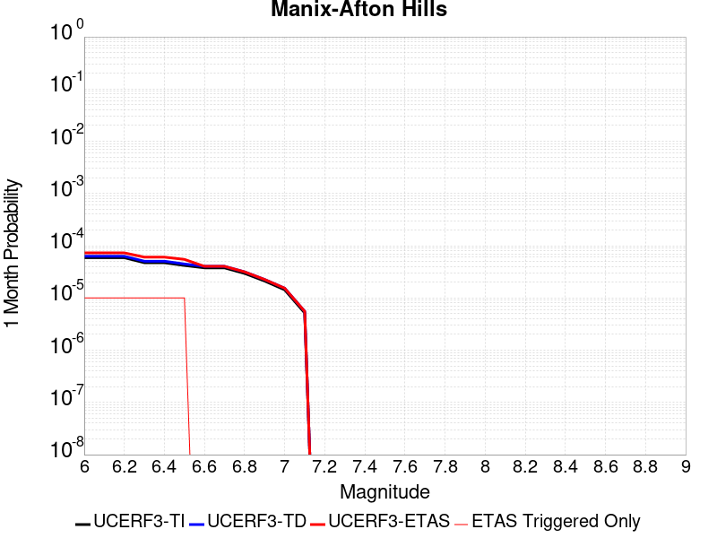 |  |  |

| Magnitude | 1 wk TI Prob | 1 wk TD Prob | 1 wk ETAS Prob | 1 wk ETAS/TD Gain | 1 wk ETAS Triggered Only | 1 mo TI Prob | 1 mo TD Prob | 1 mo ETAS Prob | 1 mo ETAS/TD Gain | 1 mo ETAS Triggered Only | 1 yr TI Prob | 1 yr TD Prob | 1 yr ETAS Prob | 1 yr ETAS/TD Gain | 1 yr ETAS Triggered Only | 10 yr TI Prob | 10 yr TD Prob | 10 yr ETAS Prob | 10 yr ETAS/TD Gain | 10 yr ETAS Triggered Only |
|-----|-----|-----|-----|-----|-----|-----|-----|-----|-----|-----|-----|-----|-----|-----|-----|-----|-----|-----|-----|-----|
| 6.0 | 1.3783202E-5 | 1.4711221E-5 | 2.5429177E-5 | 1.7285565 | 1.0718114E-5 | 5.906953E-5 | 6.304667E-5 | 7.37641E-5 | 1.1699921 | 1.0718114E-5 | 7.189342E-4 | 7.673403E-4 | 9.1727875E-4 | 1.1954002 | 1.5005359E-4 | 0.0071661277 | 0.007648664 | 0.007872023 | 1.0292023 | 2.2508038E-4 |
| 6.1 | 1.3783202E-5 | 1.4711221E-5 | 2.5429177E-5 | 1.7285565 | 1.0718114E-5 | 5.906953E-5 | 6.304667E-5 | 7.37641E-5 | 1.1699921 | 1.0718114E-5 | 7.189342E-4 | 7.673403E-4 | 9.1727875E-4 | 1.1954002 | 1.5005359E-4 | 0.0071661277 | 0.007648664 | 0.007872023 | 1.0292023 | 2.2508038E-4 |
| 6.2 | 1.3783202E-5 | 1.4711221E-5 | 2.5429177E-5 | 1.7285565 | 1.0718114E-5 | 5.906953E-5 | 6.304667E-5 | 7.37641E-5 | 1.1699921 | 1.0718114E-5 | 7.189342E-4 | 7.673403E-4 | 9.1727875E-4 | 1.1954002 | 1.5005359E-4 | 0.0071661277 | 0.007648664 | 0.007872023 | 1.0292023 | 2.2508038E-4 |
| 6.3 | 1.10494875E-5 | 1.1793241E-5 | 2.2511229E-5 | 1.9088246 | 1.0718114E-5 | 4.7354086E-5 | 5.054154E-5 | 6.125911E-5 | 1.2120547 | 1.0718114E-5 | 5.763835E-4 | 6.151799E-4 | 7.3300663E-4 | 1.1915321 | 1.17899246E-4 | 0.005748908 | 0.00613581 | 0.0062955953 | 1.0260414 | 1.607717E-4 |
| 6.4 | 1.10494875E-5 | 1.1793241E-5 | 2.2511229E-5 | 1.9088246 | 1.0718114E-5 | 4.7354086E-5 | 5.054154E-5 | 6.125911E-5 | 1.2120547 | 1.0718114E-5 | 5.763835E-4 | 6.151799E-4 | 7.3300663E-4 | 1.1915321 | 1.17899246E-4 | 0.005748908 | 0.00613581 | 0.0062955953 | 1.0260414 | 1.607717E-4 |
| 6.5 | 9.788949E-6 | 1.0454414E-5 | 2.1172416E-5 | 2.025213 | 1.0718114E-5 | 4.1951964E-5 | 4.4803914E-5 | 5.552155E-5 | 1.239212 | 1.0718114E-5 | 5.1064545E-4 | 5.4536044E-4 | 6.524831E-4 | 1.1964254 | 1.07181135E-4 | 0.0050947363 | 0.005441148 | 0.005590385 | 1.0274276 | 1.5005359E-4 |
| 6.6 | 8.810006E-6 | 9.413714E-6 | 9.413714E-6 | 1.0 | 0.0 | 3.775662E-5 | 4.0343915E-5 | 4.0343915E-5 | 1.0 | 0.0 | 4.5958988E-4 | 4.9108535E-4 | 5.6607526E-4 | 1.1527025 | 7.5026794E-5 | 0.0045864056 | 0.004900884 | 0.005018205 | 1.0239388 | 1.17899246E-4 |
| 6.7 | 8.80128E-6 | 9.404193E-6 | 9.404193E-6 | 1.0 | 0.0 | 3.7719226E-5 | 4.0303115E-5 | 4.0303115E-5 | 1.0 | 0.0 | 4.591348E-4 | 4.9058883E-4 | 5.655788E-4 | 1.1528571 | 7.5026794E-5 | 0.004581874 | 0.0048959404 | 0.0050132624 | 1.0239631 | 1.17899246E-4 |
| 6.8 | 6.8994877E-6 | 7.3801443E-6 | 7.3801443E-6 | 1.0 | 0.0 | 2.9568899E-5 | 3.1628853E-5 | 3.1628853E-5 | 1.0 | 0.0 | 3.5994186E-4 | 3.850214E-4 | 4.600193E-4 | 1.1947889 | 7.5026794E-5 | 0.003593594 | 0.0038443485 | 0.0039404407 | 1.0249957 | 9.646302E-5 |
| 6.9 | 4.9328037E-6 | 5.2710093E-6 | 5.2710093E-6 | 1.0 | 0.0 | 2.1140417E-5 | 2.258988E-5 | 2.258988E-5 | 1.0 | 0.0 | 2.5735417E-4 | 2.7500323E-4 | 3.2857907E-4 | 1.1948189 | 5.3590567E-5 | 0.0025705635 | 0.0027472344 | 0.0028220552 | 1.0272349 | 7.5026794E-5 |
| 7.0 | 3.347973E-6 | 3.5900646E-6 | 3.5900646E-6 | 1.0 | 0.0 | 1.4348378E-5 | 1.5385924E-5 | 1.5385924E-5 | 1.0 | 0.0 | 1.746775E-4 | 1.8731161E-4 | 2.0874383E-4 | 1.11442 | 2.1436228E-5 | 0.0017454025 | 0.00187194 | 0.001904034 | 1.0171449 | 3.215434E-5 |
| 7.1 | 1.2073567E-6 | 1.2934943E-6 | 1.2934943E-6 | 1.0 | 0.0 | 5.1743755E-6 | 5.5435444E-6 | 5.5435444E-6 | 1.0 | 0.0 | 6.29962E-5 | 6.74922E-5 | 7.820959E-5 | 1.1587945 | 1.0718114E-5 | 6.297835E-4 | 6.7487714E-4 | 6.85588E-4 | 1.0158708 | 1.0718114E-5 |

## Calico-Hidalgo
*[(top)](#table-of-contents)*

| 1 Week | 1 Month | 1 Year | 10 Year |
|-----|-----|-----|-----|
|  |  | 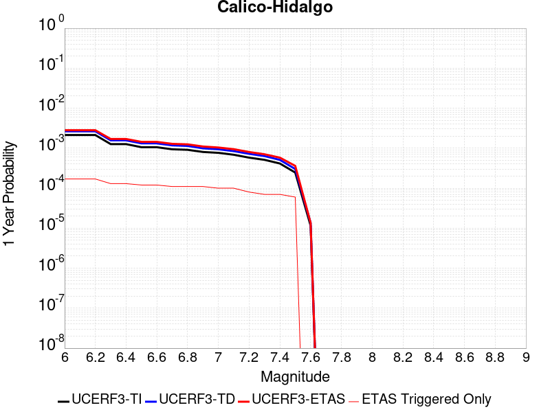 |  |

| Magnitude | 1 wk TI Prob | 1 wk TD Prob | 1 wk ETAS Prob | 1 wk ETAS/TD Gain | 1 wk ETAS Triggered Only | 1 mo TI Prob | 1 mo TD Prob | 1 mo ETAS Prob | 1 mo ETAS/TD Gain | 1 mo ETAS Triggered Only | 1 yr TI Prob | 1 yr TD Prob | 1 yr ETAS Prob | 1 yr ETAS/TD Gain | 1 yr ETAS Triggered Only | 10 yr TI Prob | 10 yr TD Prob | 10 yr ETAS Prob | 10 yr ETAS/TD Gain | 10 yr ETAS Triggered Only |
|-----|-----|-----|-----|-----|-----|-----|-----|-----|-----|-----|-----|-----|-----|-----|-----|-----|-----|-----|-----|-----|
| 6.0 | 4.0906612E-5 | 5.0704653E-5 | 7.2139796E-5 | 1.422745 | 2.1436228E-5 | 1.7530227E-4 | 2.1728984E-4 | 2.8158454E-4 | 1.2958938 | 6.430868E-5 | 0.0021322158 | 0.0026426981 | 0.0028244245 | 1.0687655 | 1.8220794E-4 | 0.02111873 | 0.026153097 | 0.026372291 | 1.0083811 | 2.2508038E-4 |
| 6.1 | 4.0906612E-5 | 5.0704653E-5 | 7.2139796E-5 | 1.422745 | 2.1436228E-5 | 1.7530227E-4 | 2.1728984E-4 | 2.8158454E-4 | 1.2958938 | 6.430868E-5 | 0.0021322158 | 0.0026426981 | 0.0028244245 | 1.0687655 | 1.8220794E-4 | 0.02111873 | 0.026153097 | 0.026372291 | 1.0083811 | 2.2508038E-4 |
| 6.2 | 4.0906612E-5 | 5.0704653E-5 | 7.2139796E-5 | 1.422745 | 2.1436228E-5 | 1.7530227E-4 | 2.1728984E-4 | 2.8158454E-4 | 1.2958938 | 6.430868E-5 | 0.0021322158 | 0.0026426981 | 0.0028244245 | 1.0687655 | 1.8220794E-4 | 0.02111873 | 0.026153097 | 0.026372291 | 1.0083811 | 2.2508038E-4 |
| 6.3 | 2.4242801E-5 | 3.009103E-5 | 5.1526615E-5 | 1.7123579 | 2.1436228E-5 | 1.0389358E-4 | 1.2895538E-4 | 1.9325576E-4 | 1.498625 | 6.430868E-5 | 0.0012641704 | 0.001568934 | 0.0017080508 | 1.0886697 | 1.3933548E-4 | 0.01257003 | 0.015582247 | 0.015740514 | 1.0101569 | 1.607717E-4 |
| 6.4 | 2.4242801E-5 | 3.009103E-5 | 5.1526615E-5 | 1.7123579 | 2.1436228E-5 | 1.0389358E-4 | 1.2895538E-4 | 1.9325576E-4 | 1.498625 | 6.430868E-5 | 0.0012641704 | 0.001568934 | 0.0017080508 | 1.0886697 | 1.3933548E-4 | 0.01257003 | 0.015582247 | 0.015740514 | 1.0101569 | 1.607717E-4 |
| 6.5 | 2.0286952E-5 | 2.5315985E-5 | 4.675167E-5 | 1.8467252 | 2.1436228E-5 | 8.694118E-5 | 1.0849266E-4 | 1.6207741E-4 | 1.4939021 | 5.3590567E-5 | 0.0010579949 | 0.0013201149 | 0.0014485625 | 1.0973003 | 1.2861736E-4 | 0.010529719 | 0.013124665 | 0.013272749 | 1.0112829 | 1.5005359E-4 |
| 6.6 | 2.0269223E-5 | 2.5296935E-5 | 4.673262E-5 | 1.847363 | 2.1436228E-5 | 8.6865206E-5 | 1.08411026E-4 | 1.6199578E-4 | 1.494274 | 5.3590567E-5 | 0.0010570707 | 0.0013191222 | 0.0014475699 | 1.0973736 | 1.2861736E-4 | 0.010520565 | 0.013114855 | 0.013262941 | 1.0112915 | 1.5005359E-4 |
| 6.7 | 1.799852E-5 | 2.25408E-5 | 4.3976543E-5 | 1.9509753 | 2.1436228E-5 | 7.713423E-5 | 9.6599935E-5 | 1.3946825E-4 | 1.4437716 | 4.2872456E-5 | 9.3870464E-4 | 0.0011754843 | 0.0012932449 | 1.1001805 | 1.17899246E-4 | 0.009347493 | 0.011694277 | 0.011831983 | 1.0117755 | 1.3933548E-4 |
| 6.8 | 1.7458793E-5 | 2.1842314E-5 | 4.3278073E-5 | 1.9813869 | 2.1436228E-5 | 7.4821255E-5 | 9.3606635E-5 | 1.3647508E-4 | 1.4579637 | 4.2872456E-5 | 9.10568E-4 | 0.0011390795 | 0.0012568444 | 1.103386 | 1.17899246E-4 | 0.009068459 | 0.011333993 | 0.011461153 | 1.0112193 | 1.2861736E-4 |
| 6.9 | 1.542884E-5 | 1.9026087E-5 | 4.0461906E-5 | 2.1266541 | 2.1436228E-5 | 6.612192E-5 | 8.1537895E-5 | 1.2440686E-4 | 1.525755 | 4.2872456E-5 | 8.04737E-4 | 9.92285E-4 | 0.0011100672 | 1.118698 | 1.17899246E-4 | 0.008018291 | 0.00987994 | 0.010007287 | 1.0128894 | 1.2861736E-4 |
| 7.0 | 1.468253E-5 | 1.8030747E-5 | 3.9466588E-5 | 2.1888492 | 2.1436228E-5 | 6.292361E-5 | 7.7272416E-5 | 1.2014156E-4 | 1.5547794 | 4.2872456E-5 | 7.658257E-4 | 9.403986E-4 | 0.0010474789 | 1.1138669 | 1.07181135E-4 | 0.0076319184 | 0.009365558 | 0.009482353 | 1.0124707 | 1.17899246E-4 |
| 7.1 | 1.3139281E-5 | 1.620107E-5 | 3.763695E-5 | 2.323115 | 2.1436228E-5 | 5.6309986E-5 | 6.943138E-5 | 1.12300855E-4 | 1.6174366 | 4.2872456E-5 | 6.853584E-4 | 8.4501173E-4 | 9.521023E-4 | 1.1267326 | 1.07181135E-4 | 0.0068324856 | 0.008419285 | 0.008536191 | 1.0138856 | 1.17899246E-4 |
| 7.2 | 1.1127404E-5 | 1.3866703E-5 | 2.4584668E-5 | 1.7729281 | 1.0718114E-5 | 4.7688E-5 | 5.9427435E-5 | 9.157987E-5 | 1.5410368 | 3.215434E-5 | 5.8044674E-4 | 7.2329975E-4 | 8.089826E-4 | 1.1184611 | 8.574491E-5 | 0.0057893298 | 0.0072105634 | 0.007306331 | 1.0132816 | 9.646302E-5 |
| 7.3 | 9.808154E-6 | 1.2176301E-5 | 2.2894284E-5 | 1.880233 | 1.0718114E-5 | 4.2034266E-5 | 5.2183164E-5 | 8.433583E-5 | 1.6161501 | 3.215434E-5 | 5.11647E-4 | 6.3515553E-4 | 7.101347E-4 | 1.1180484 | 7.5026794E-5 | 0.0051047057 | 0.0063344776 | 0.0064196796 | 1.0134505 | 8.574491E-5 |
| 7.4 | 7.942452E-6 | 9.7922075E-6 | 2.0510217E-5 | 2.0945446 | 1.0718114E-5 | 3.4038632E-5 | 4.196598E-5 | 7.411897E-5 | 1.766168 | 3.215434E-5 | 4.1434157E-4 | 5.1082554E-4 | 5.85814E-4 | 1.1467986 | 7.5026794E-5 | 0.0041356985 | 0.0050974544 | 0.005172099 | 1.0146434 | 7.5026794E-5 |
| 7.5 | 4.7121216E-6 | 5.772871E-6 | 1.6490923E-5 | 2.8566241 | 1.0718114E-5 | 2.019465E-5 | 2.4740684E-5 | 4.617638E-5 | 1.8664149 | 2.1436228E-5 | 2.4584212E-4 | 3.0118387E-4 | 3.6547318E-4 | 1.2134553 | 6.430868E-5 | 0.0024557032 | 0.0030085093 | 0.0030726243 | 1.0213113 | 6.430868E-5 |
| 7.6 | 2.21172E-7 | 2.6039737E-7 | 2.6039737E-7 | 1.0 | 0.0 | 9.478797E-7 | 1.1159884E-6 | 1.1159884E-6 | 1.0 | 0.0 | 1.1540374E-5 | 1.3587103E-5 | 1.3587103E-5 | 1.0 | 0.0 | 1.1539775E-4 | 1.3586554E-4 | 1.3586554E-4 | 1.0 | 0.0 |

## San Andreas (Cholame) rev
*[(top)](#table-of-contents)*

| 1 Week | 1 Month | 1 Year | 10 Year |
|-----|-----|-----|-----|
|  |  |  |  |

| Magnitude | 1 wk TI Prob | 1 wk TD Prob | 1 wk ETAS Prob | 1 wk ETAS/TD Gain | 1 wk ETAS Triggered Only | 1 mo TI Prob | 1 mo TD Prob | 1 mo ETAS Prob | 1 mo ETAS/TD Gain | 1 mo ETAS Triggered Only | 1 yr TI Prob | 1 yr TD Prob | 1 yr ETAS Prob | 1 yr ETAS/TD Gain | 1 yr ETAS Triggered Only | 10 yr TI Prob | 10 yr TD Prob | 10 yr ETAS Prob | 10 yr ETAS/TD Gain | 10 yr ETAS Triggered Only |
|-----|-----|-----|-----|-----|-----|-----|-----|-----|-----|-----|-----|-----|-----|-----|-----|-----|-----|-----|-----|-----|
| 6.0 | 1.2302514E-4 | 2.5213862E-4 | 2.62854E-4 | 1.0424981 | 1.0718114E-5 | 5.27144E-4 | 0.0010801482 | 0.0011229743 | 1.0396484 | 4.2872456E-5 | 0.0063991086 | 0.013072014 | 0.01319895 | 1.0097106 | 1.2861736E-4 | 0.06217949 | 0.12443058 | 0.12463704 | 1.0016593 | 2.3579849E-4 |
| 6.1 | 1.2302514E-4 | 2.5213862E-4 | 2.62854E-4 | 1.0424981 | 1.0718114E-5 | 5.27144E-4 | 0.0010801482 | 0.0011229743 | 1.0396484 | 4.2872456E-5 | 0.0063991086 | 0.013072014 | 0.01319895 | 1.0097106 | 1.2861736E-4 | 0.06217949 | 0.12443058 | 0.12463704 | 1.0016593 | 2.3579849E-4 |
| 6.2 | 1.2203569E-4 | 2.5030645E-4 | 2.610219E-4 | 1.0428092 | 1.0718114E-5 | 5.2290526E-4 | 0.0010723026 | 0.001115129 | 1.0399388 | 4.2872456E-5 | 0.006347804 | 0.0129776355 | 0.013104583 | 1.0097821 | 1.2861736E-4 | 0.061695136 | 0.12361675 | 0.123814 | 1.0015957 | 2.2508038E-4 |
| 6.3 | 1.2142645E-4 | 2.491661E-4 | 2.5988155E-4 | 1.0430052 | 1.0718114E-5 | 5.202953E-4 | 0.0010674193 | 0.001110246 | 1.0401217 | 4.2872456E-5 | 0.006316212 | 0.012918889 | 0.013035265 | 1.0090082 | 1.17899246E-4 | 0.06139677 | 0.12311087 | 0.12329884 | 1.0015268 | 2.1436227E-4 |
| 6.4 | 1.1865206E-4 | 2.4422092E-4 | 2.5493643E-4 | 1.0438763 | 1.0718114E-5 | 5.0840975E-4 | 0.0010462429 | 0.0010890705 | 1.0409347 | 4.2872456E-5 | 0.006172335 | 0.012664088 | 0.012780494 | 1.0091919 | 1.17899246E-4 | 0.060036868 | 0.12090351 | 0.121091954 | 1.0015587 | 2.1436227E-4 |
| 6.5 | 1.17443946E-4 | 2.421537E-4 | 2.5286924E-4 | 1.0442508 | 1.0718114E-5 | 5.032341E-4 | 0.0010373904 | 0.0010802184 | 1.0412843 | 4.2872456E-5 | 0.006109677 | 0.012557554 | 0.012673972 | 1.0092708 | 1.17899246E-4 | 0.059444077 | 0.11997763 | 0.12016628 | 1.0015724 | 2.1436227E-4 |
| 6.6 | 1.13579066E-4 | 2.3524289E-4 | 2.4595848E-4 | 1.0455512 | 1.0718114E-5 | 4.866766E-4 | 0.0010077958 | 0.001050625 | 1.042498 | 4.2872456E-5 | 0.0059092017 | 0.012201327 | 0.012317788 | 1.009545 | 1.17899246E-4 | 0.057545185 | 0.11689143 | 0.11708073 | 1.0016195 | 2.1436227E-4 |
| 6.7 | 1.1271412E-4 | 2.336858E-4 | 2.4440142E-4 | 1.0458548 | 1.0718114E-5 | 4.829711E-4 | 0.0010011276 | 0.0010439572 | 1.0427812 | 4.2872456E-5 | 0.005864331 | 0.01212105 | 0.01223752 | 1.0096089 | 1.17899246E-4 | 0.057119697 | 0.11619493 | 0.116384394 | 1.0016305 | 2.1436227E-4 |
| 6.8 | 1.1217975E-4 | 2.3256983E-4 | 2.4328545E-4 | 1.0460749 | 1.0718114E-5 | 4.8068175E-4 | 9.963487E-4 | 0.0010391783 | 1.0429868 | 4.2872456E-5 | 0.005836608 | 0.012063511 | 0.0121799875 | 1.0096554 | 1.17899246E-4 | 0.056856725 | 0.11569312 | 0.11588269 | 1.0016385 | 2.1436227E-4 |
| 6.9 | 1.1146753E-4 | 2.3105709E-4 | 2.4177272E-4 | 1.0463766 | 1.0718114E-5 | 4.7763053E-4 | 9.898704E-4 | 0.0010327004 | 1.0432683 | 4.2872456E-5 | 0.0057996577 | 0.011985509 | 0.012101995 | 1.0097189 | 1.17899246E-4 | 0.056506127 | 0.11501348 | 0.11520319 | 1.0016494 | 2.1436227E-4 |
| 7.0 | 1.0965793E-4 | 2.2728977E-4 | 2.3800545E-4 | 1.0471455 | 1.0718114E-5 | 4.698779E-4 | 9.7373687E-4 | 0.0010165676 | 1.043986 | 4.2872456E-5 | 0.005705768 | 0.0117912255 | 0.011907735 | 1.009881 | 1.17899246E-4 | 0.055614736 | 0.11331484 | 0.11350491 | 1.0016774 | 2.1436227E-4 |
| 7.1 | 9.927982E-5 | 2.0547757E-4 | 2.1619348E-4 | 1.0521512 | 1.0718114E-5 | 4.2541555E-4 | 8.80322E-4 | 9.2315674E-4 | 1.048658 | 4.2872456E-5 | 0.0051671406 | 0.010665542 | 0.010760977 | 1.0089478 | 9.646302E-5 | 0.05048634 | 0.10340853 | 0.10357189 | 1.0015798 | 1.8220794E-4 |
| 7.2 | 9.696786E-5 | 2.0051954E-4 | 2.1123551E-4 | 1.053441 | 1.0718114E-5 | 4.1551032E-4 | 8.5908745E-4 | 9.019231E-4 | 1.0498618 | 4.2872456E-5 | 0.00504711 | 0.010409511 | 0.010504969 | 1.0091703 | 9.646302E-5 | 0.04934009 | 0.10114636 | 0.10131014 | 1.0016192 | 1.8220794E-4 |
| 7.3 | 9.4727984E-5 | 1.9481099E-4 | 2.0552702E-4 | 1.0550073 | 1.0718114E-5 | 4.0591392E-4 | 8.346381E-4 | 8.774747E-4 | 1.0513237 | 4.2872456E-5 | 0.0049308087 | 0.010114641 | 0.0102101285 | 1.0094405 | 9.646302E-5 | 0.048228268 | 0.09851684 | 0.09867143 | 1.0015693 | 1.7148982E-4 |
| 7.4 | 9.220358E-5 | 1.885154E-4 | 1.992315E-4 | 1.0568447 | 1.0718114E-5 | 3.9509835E-4 | 8.076739E-4 | 8.505118E-4 | 1.0530385 | 4.2872456E-5 | 0.004799717 | 0.009789341 | 0.009884859 | 1.0097574 | 9.646302E-5 | 0.046973653 | 0.09559427 | 0.09573968 | 1.001521 | 1.607717E-4 |
| 7.5 | 7.71631E-5 | 1.5185357E-4 | 1.6257007E-4 | 1.0705712 | 1.0718114E-5 | 3.306571E-4 | 6.506389E-4 | 6.827723E-4 | 1.0493875 | 3.215434E-5 | 0.0040183207 | 0.007892828 | 0.007977896 | 1.010778 | 8.574491E-5 | 0.03946433 | 0.07831838 | 0.078446805 | 1.0016397 | 1.3933548E-4 |
| 7.6 | 7.5634416E-5 | 1.4844738E-4 | 1.591639E-4 | 1.0721908 | 1.0718114E-5 | 3.241072E-4 | 6.360481E-4 | 6.68182E-4 | 1.0505211 | 3.215434E-5 | 0.0039388672 | 0.007716457 | 0.0078015397 | 1.0110263 | 8.574491E-5 | 0.038697794 | 0.076681465 | 0.076810114 | 1.0016778 | 1.3933548E-4 |
| 7.7 | 6.3783E-5 | 1.2365259E-4 | 1.3436937E-4 | 1.0866685 | 1.0718114E-5 | 2.7332708E-4 | 5.2983203E-4 | 5.6196935E-4 | 1.0606556 | 3.215434E-5 | 0.0033226798 | 0.0064316522 | 0.0064955475 | 1.0099344 | 6.430868E-5 | 0.032734364 | 0.064570144 | 0.06466038 | 1.0013975 | 9.646302E-5 |
| 7.8 | 5.863422E-5 | 1.142205E-4 | 1.2493739E-4 | 1.0938263 | 1.0718114E-5 | 2.512653E-4 | 4.894246E-4 | 5.215632E-4 | 1.0656661 | 3.215434E-5 | 0.003054864 | 0.0059424853 | 0.006006412 | 1.0107576 | 6.430868E-5 | 0.030132094 | 0.059686445 | 0.05977715 | 1.0015197 | 9.646302E-5 |
| 7.9 | 4.595283E-5 | 8.4306725E-5 | 9.5023934E-5 | 1.1271217 | 1.0718114E-5 | 1.9692584E-4 | 3.612645E-4 | 3.9340722E-4 | 1.0889728 | 3.215434E-5 | 0.0023949358 | 0.0043895314 | 0.004453558 | 1.0145862 | 6.430868E-5 | 0.023692891 | 0.044382483 | 0.044464424 | 1.0018462 | 8.574491E-5 |
| 8.0 | 3.2950178E-5 | 5.08E-5 | 5.08E-5 | 1.0 | 0.0 | 1.412074E-4 | 2.1769613E-4 | 2.1769613E-4 | 1.0 | 0.0 | 0.0017178444 | 0.0026472306 | 0.0026579204 | 1.0040381 | 1.0718114E-5 | 0.017046256 | 0.027193451 | 0.027214305 | 1.0007669 | 2.1436228E-5 |
| 8.1 | 1.9177472E-5 | 1.9198456E-5 | 1.9198456E-5 | 1.0 | 0.0 | 8.218658E-5 | 8.227651E-5 | 8.227651E-5 | 1.0 | 0.0 | 0.0010001622 | 0.0010012568 | 0.0010012568 | 1.0 | 0.0 | 0.009956728 | 0.01076512 | 0.01076512 | 1.0 | 0.0 |
| 8.2 | 8.643924E-6 | 5.4798497E-6 | 5.4798497E-6 | 1.0 | 0.0 | 3.704486E-5 | 2.348486E-5 | 2.348486E-5 | 1.0 | 0.0 | 4.5092785E-4 | 2.858907E-4 | 2.858907E-4 | 1.0 | 0.0 | 0.0045001395 | 0.0032514327 | 0.0032514327 | 1.0 | 0.0 |
| 8.3 | 1.983087E-6 | 7.668296E-7 | 7.668296E-7 | 1.0 | 0.0 | 8.498917E-6 | 3.2864084E-6 | 3.2864084E-6 | 1.0 | 0.0 | 1.034694E-4 | 4.0011306E-5 | 4.0011306E-5 | 1.0 | 0.0 | 0.0010342124 | 4.724499E-4 | 4.724499E-4 | 1.0 | 0.0 |

## Lake Isabella (Seismicity)
*[(top)](#table-of-contents)*

| 1 Week | 1 Month | 1 Year | 10 Year |
|-----|-----|-----|-----|
|  |  | 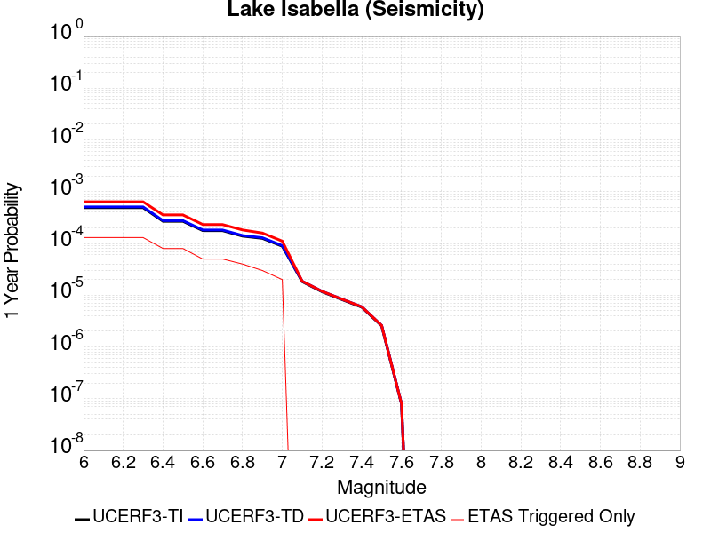 |  |

| Magnitude | 1 wk TI Prob | 1 wk TD Prob | 1 wk ETAS Prob | 1 wk ETAS/TD Gain | 1 wk ETAS Triggered Only | 1 mo TI Prob | 1 mo TD Prob | 1 mo ETAS Prob | 1 mo ETAS/TD Gain | 1 mo ETAS Triggered Only | 1 yr TI Prob | 1 yr TD Prob | 1 yr ETAS Prob | 1 yr ETAS/TD Gain | 1 yr ETAS Triggered Only | 10 yr TI Prob | 10 yr TD Prob | 10 yr ETAS Prob | 10 yr ETAS/TD Gain | 10 yr ETAS Triggered Only |
|-----|-----|-----|-----|-----|-----|-----|-----|-----|-----|-----|-----|-----|-----|-----|-----|-----|-----|-----|-----|-----|
| 6.0 | 9.431637E-6 | 9.741694E-6 | 3.117771E-5 | 3.2004404 | 2.1436228E-5 | 4.0420677E-5 | 4.1749525E-5 | 1.0605552E-4 | 2.540281 | 6.430868E-5 | 4.920106E-4 | 5.0819496E-4 | 6.4745964E-4 | 1.2740378 | 1.3933548E-4 | 0.004909227 | 0.005071621 | 0.005284896 | 1.0420526 | 2.1436227E-4 |
| 6.1 | 9.431637E-6 | 9.741694E-6 | 3.117771E-5 | 3.2004404 | 2.1436228E-5 | 4.0420677E-5 | 4.1749525E-5 | 1.0605552E-4 | 2.540281 | 6.430868E-5 | 4.920106E-4 | 5.0819496E-4 | 6.4745964E-4 | 1.2740378 | 1.3933548E-4 | 0.004909227 | 0.005071621 | 0.005284896 | 1.0420526 | 2.1436227E-4 |
| 6.2 | 9.431637E-6 | 9.741694E-6 | 3.117771E-5 | 3.2004404 | 2.1436228E-5 | 4.0420677E-5 | 4.1749525E-5 | 1.0605552E-4 | 2.540281 | 6.430868E-5 | 4.920106E-4 | 5.0819496E-4 | 6.4745964E-4 | 1.2740378 | 1.3933548E-4 | 0.004909227 | 0.005071621 | 0.005284896 | 1.0420526 | 2.1436227E-4 |
| 6.3 | 9.431637E-6 | 9.741694E-6 | 3.117771E-5 | 3.2004404 | 2.1436228E-5 | 4.0420677E-5 | 4.1749525E-5 | 1.0605552E-4 | 2.540281 | 6.430868E-5 | 4.920106E-4 | 5.0819496E-4 | 6.4745964E-4 | 1.2740378 | 1.3933548E-4 | 0.004909227 | 0.005071621 | 0.005284896 | 1.0420526 | 2.1436227E-4 |
| 6.4 | 5.144063E-6 | 5.3000977E-6 | 5.3000977E-6 | 1.0 | 0.0 | 2.2045799E-5 | 2.2714525E-5 | 5.4868135E-5 | 2.4155529 | 3.215434E-5 | 2.6837454E-4 | 2.765177E-4 | 3.622389E-4 | 1.3100026 | 8.574491E-5 | 0.0026805066 | 0.002762077 | 0.0028796503 | 1.0425671 | 1.17899246E-4 |
| 6.5 | 5.144063E-6 | 5.3000977E-6 | 5.3000977E-6 | 1.0 | 0.0 | 2.2045799E-5 | 2.2714525E-5 | 5.4868135E-5 | 2.4155529 | 3.215434E-5 | 2.6837454E-4 | 2.765177E-4 | 3.622389E-4 | 1.3100026 | 8.574491E-5 | 0.0026805066 | 0.002762077 | 0.0028796503 | 1.0425671 | 1.17899246E-4 |
| 6.6 | 3.4009804E-6 | 3.4987995E-6 | 3.4987995E-6 | 1.0 | 0.0 | 1.4575549E-5 | 1.4994778E-5 | 2.571273E-5 | 1.714779 | 1.0718114E-5 | 1.7744285E-4 | 1.8254772E-4 | 2.3612852E-4 | 1.2935166 | 5.3590567E-5 | 0.0017730123 | 0.0018241355 | 0.0019097241 | 1.0469201 | 8.574491E-5 |
| 6.7 | 3.3880428E-6 | 3.4856662E-6 | 3.4856662E-6 | 1.0 | 0.0 | 1.4520103E-5 | 1.4938492E-5 | 2.5656445E-5 | 1.7174722 | 1.0718114E-5 | 1.767679E-4 | 1.8186258E-4 | 2.354434E-4 | 1.2946225 | 5.3590567E-5 | 0.0017662736 | 0.0018172951 | 0.0019028842 | 1.047097 | 8.574491E-5 |
| 6.8 | 2.6582E-6 | 2.7337105E-6 | 2.7337105E-6 | 1.0 | 0.0 | 1.1392236E-5 | 1.1715857E-5 | 1.1715857E-5 | 1.0 | 0.0 | 1.3869164E-4 | 1.4263256E-4 | 1.8549891E-4 | 1.3005369 | 4.2872456E-5 | 0.0013860512 | 0.0014255423 | 0.0014897593 | 1.0450474 | 6.430868E-5 |
| 6.9 | 2.406011E-6 | 2.474338E-6 | 2.474338E-6 | 1.0 | 0.0 | 1.0311434E-5 | 1.0604271E-5 | 1.0604271E-5 | 1.0 | 0.0 | 1.2553448E-4 | 1.2910066E-4 | 1.6125086E-4 | 1.2490319 | 3.215434E-5 | 0.0012546359 | 0.0012903863 | 0.0013439077 | 1.0414771 | 5.3590567E-5 |
| 7.0 | 1.6953097E-6 | 1.7429437E-6 | 1.7429437E-6 | 1.0 | 0.0 | 7.265593E-6 | 7.469743E-6 | 7.469743E-6 | 1.0 | 0.0 | 8.8455E-5 | 9.094137E-5 | 1.1237565E-4 | 1.2356933 | 2.1436228E-5 | 8.84198E-4 | 9.0914435E-4 | 9.519778E-4 | 1.047114 | 4.2872456E-5 |
| 7.1 | 3.5013824E-7 | 3.571492E-7 | 3.571492E-7 | 1.0 | 0.0 | 1.5005916E-6 | 1.5306384E-6 | 1.5306384E-6 | 1.0 | 0.0 | 1.826955E-5 | 1.8635366E-5 | 1.8635366E-5 | 1.0 | 0.0 | 1.8268047E-4 | 1.863383E-4 | 1.9705441E-4 | 1.057509 | 1.0718114E-5 |
| 7.2 | 2.2321095E-7 | 2.2750632E-7 | 2.2750632E-7 | 1.0 | 0.0 | 9.56618E-7 | 9.750268E-7 | 9.750268E-7 | 1.0 | 0.0 | 1.1646762E-5 | 1.1870887E-5 | 1.1870887E-5 | 1.0 | 0.0 | 1.1646151E-4 | 1.1870263E-4 | 1.2941947E-4 | 1.0902832 | 1.0718114E-5 |
| 7.3 | 1.5760406E-7 | 1.6060963E-7 | 1.6060963E-7 | 1.0 | 0.0 | 6.7544585E-7 | 6.883268E-7 | 6.883268E-7 | 1.0 | 0.0 | 8.223522E-6 | 8.380347E-6 | 8.380347E-6 | 1.0 | 0.0 | 8.2232174E-5 | 8.3800376E-5 | 9.451759E-5 | 1.1278899 | 1.0718114E-5 |
| 7.4 | 1.1216497E-7 | 1.1431735E-7 | 1.1431735E-7 | 1.0 | 0.0 | 4.8070694E-7 | 4.8993144E-7 | 4.8993144E-7 | 1.0 | 0.0 | 5.852591E-6 | 5.964899E-6 | 5.964899E-6 | 1.0 | 0.0 | 5.8524372E-5 | 5.9647435E-5 | 5.9647435E-5 | 1.0 | 0.0 |
| 7.5 | 4.885185E-8 | 4.9787864E-8 | 4.9787864E-8 | 1.0 | 0.0 | 2.0936506E-7 | 2.1337654E-7 | 2.1337654E-7 | 1.0 | 0.0 | 2.5490165E-6 | 2.5978566E-6 | 2.5978566E-6 | 1.0 | 0.0 | 2.5489873E-5 | 2.597828E-5 | 2.597828E-5 | 1.0 | 0.0 |
| 7.6 | 1.504641E-9 | 1.5317939E-9 | 1.5317939E-9 | 1.0 | 0.0 | 6.4484613E-9 | 6.5648313E-9 | 6.5648313E-9 | 1.0 | 0.0 | 7.851001E-8 | 7.992682E-8 | 7.992682E-8 | 1.0 | 0.0 | 7.8509987E-7 | 7.992682E-7 | 7.992682E-7 | 1.0 | 0.0 |

## San Andreas (Carrizo) rev
*[(top)](#table-of-contents)*

| 1 Week | 1 Month | 1 Year | 10 Year |
|-----|-----|-----|-----|
|  |  |  |  |

| Magnitude | 1 wk TI Prob | 1 wk TD Prob | 1 wk ETAS Prob | 1 wk ETAS/TD Gain | 1 wk ETAS Triggered Only | 1 mo TI Prob | 1 mo TD Prob | 1 mo ETAS Prob | 1 mo ETAS/TD Gain | 1 mo ETAS Triggered Only | 1 yr TI Prob | 1 yr TD Prob | 1 yr ETAS Prob | 1 yr ETAS/TD Gain | 1 yr ETAS Triggered Only | 10 yr TI Prob | 10 yr TD Prob | 10 yr ETAS Prob | 10 yr ETAS/TD Gain | 10 yr ETAS Triggered Only |
|-----|-----|-----|-----|-----|-----|-----|-----|-----|-----|-----|-----|-----|-----|-----|-----|-----|-----|-----|-----|-----|
| 6.0 | 1.1674632E-4 | 2.4332498E-4 | 2.5404047E-4 | 1.0440378 | 1.0718114E-5 | 5.002454E-4 | 0.0010424062 | 0.001085234 | 1.0410855 | 4.2872456E-5 | 0.006073493 | 0.012617926 | 0.012734338 | 1.0092258 | 1.17899246E-4 | 0.0591016 | 0.12065402 | 0.12085194 | 1.0016404 | 2.2508038E-4 |
| 6.1 | 1.1674632E-4 | 2.4332498E-4 | 2.5404047E-4 | 1.0440378 | 1.0718114E-5 | 5.002454E-4 | 0.0010424062 | 0.001085234 | 1.0410855 | 4.2872456E-5 | 0.006073493 | 0.012617926 | 0.012734338 | 1.0092258 | 1.17899246E-4 | 0.0591016 | 0.12065402 | 0.12085194 | 1.0016404 | 2.2508038E-4 |
| 6.2 | 1.1674632E-4 | 2.4332498E-4 | 2.5404047E-4 | 1.0440378 | 1.0718114E-5 | 5.002454E-4 | 0.0010424062 | 0.001085234 | 1.0410855 | 4.2872456E-5 | 0.006073493 | 0.012617926 | 0.012734338 | 1.0092258 | 1.17899246E-4 | 0.0591016 | 0.12065402 | 0.12085194 | 1.0016404 | 2.2508038E-4 |
| 6.3 | 1.1674632E-4 | 2.4332498E-4 | 2.5404047E-4 | 1.0440378 | 1.0718114E-5 | 5.002454E-4 | 0.0010424062 | 0.001085234 | 1.0410855 | 4.2872456E-5 | 0.006073493 | 0.012617926 | 0.012734338 | 1.0092258 | 1.17899246E-4 | 0.0591016 | 0.12065402 | 0.12085194 | 1.0016404 | 2.2508038E-4 |
| 6.4 | 1.1674632E-4 | 2.4332498E-4 | 2.5404047E-4 | 1.0440378 | 1.0718114E-5 | 5.002454E-4 | 0.0010424062 | 0.001085234 | 1.0410855 | 4.2872456E-5 | 0.006073493 | 0.012617926 | 0.012734338 | 1.0092258 | 1.17899246E-4 | 0.0591016 | 0.12065402 | 0.12085194 | 1.0016404 | 2.2508038E-4 |
| 6.5 | 1.13136164E-4 | 2.3652466E-4 | 2.4724024E-4 | 1.0453043 | 1.0718114E-5 | 4.847792E-4 | 0.0010132849 | 0.0010561139 | 1.0422674 | 4.2872456E-5 | 0.0058862255 | 0.012267408 | 0.012383861 | 1.0094929 | 1.17899246E-4 | 0.057327334 | 0.11762535 | 0.11782396 | 1.0016885 | 2.2508038E-4 |
| 6.6 | 1.13136164E-4 | 2.3652466E-4 | 2.4724024E-4 | 1.0453043 | 1.0718114E-5 | 4.847792E-4 | 0.0010132849 | 0.0010561139 | 1.0422674 | 4.2872456E-5 | 0.0058862255 | 0.012267408 | 0.012383861 | 1.0094929 | 1.17899246E-4 | 0.057327334 | 0.11762535 | 0.11782396 | 1.0016885 | 2.2508038E-4 |
| 6.7 | 1.1149675E-4 | 2.3343669E-4 | 2.441523E-4 | 1.0459037 | 1.0718114E-5 | 4.777557E-4 | 0.0010000608 | 0.0010428905 | 1.042827 | 4.2872456E-5 | 0.0058011734 | 0.012108203 | 0.012224675 | 1.0096192 | 1.17899246E-4 | 0.05652051 | 0.11624688 | 0.116445795 | 1.0017111 | 2.2508038E-4 |
| 6.8 | 1.1103589E-4 | 2.3245816E-4 | 2.4317378E-4 | 1.046097 | 1.0718114E-5 | 4.7578133E-4 | 9.958703E-4 | 0.0010387001 | 1.0430074 | 4.2872456E-5 | 0.005777263 | 0.0120577505 | 0.012174227 | 1.00966 | 1.17899246E-4 | 0.056293584 | 0.11580715 | 0.116006166 | 1.0017185 | 2.2508038E-4 |
| 6.9 | 1.1053259E-4 | 2.3138185E-4 | 2.4209749E-4 | 1.0463115 | 1.0718114E-5 | 4.7362508E-4 | 9.912612E-4 | 0.0010340911 | 1.0432075 | 4.2872456E-5 | 0.0057511497 | 0.012002253 | 0.012118737 | 1.0097052 | 1.17899246E-4 | 0.05604569 | 0.11532332 | 0.115522444 | 1.0017266 | 2.2508038E-4 |
| 7.0 | 1.1005377E-4 | 2.3039016E-4 | 2.4110581E-4 | 1.0465108 | 1.0718114E-5 | 4.7157376E-4 | 9.870143E-4 | 0.0010298444 | 1.0433936 | 4.2872456E-5 | 0.0057263062 | 0.011951115 | 0.012067606 | 1.0097473 | 1.17899246E-4 | 0.055809796 | 0.11487561 | 0.11507483 | 1.0017343 | 2.2508038E-4 |
| 7.1 | 1.0308142E-4 | 2.1548544E-4 | 2.2620124E-4 | 1.0497286 | 1.0718114E-5 | 4.417027E-4 | 9.231832E-4 | 9.660161E-4 | 1.046397 | 4.2872456E-5 | 0.0053644776 | 0.011182146 | 0.011288129 | 1.0094779 | 1.07181135E-4 | 0.052368138 | 0.108131535 | 0.108322725 | 1.0017681 | 2.1436227E-4 |
| 7.2 | 1.0027479E-4 | 2.0956367E-4 | 2.2027954E-4 | 1.0511342 | 1.0718114E-5 | 4.296783E-4 | 8.978219E-4 | 9.406559E-4 | 1.0477087 | 4.2872456E-5 | 0.0052187922 | 0.0108764935 | 0.010982509 | 1.0097471 | 1.07181135E-4 | 0.050979212 | 0.10543535 | 0.105627105 | 1.0018188 | 2.1436227E-4 |
| 7.3 | 9.816942E-5 | 2.0431461E-4 | 2.1503054E-4 | 1.0524482 | 1.0718114E-5 | 4.2065824E-4 | 8.753412E-4 | 9.181761E-4 | 1.0489352 | 4.2872456E-5 | 0.005109493 | 0.010605487 | 0.010711532 | 1.009999 | 1.07181135E-4 | 0.049935985 | 0.103018686 | 0.10320135 | 1.0017731 | 2.0364416E-4 |
| 7.4 | 9.5634205E-5 | 1.9800827E-4 | 2.0872428E-4 | 1.0541189 | 1.0718114E-5 | 4.0979648E-4 | 8.4833184E-4 | 8.911679E-4 | 1.0504944 | 4.2872456E-5 | 0.0049778637 | 0.0102797905 | 0.01038587 | 1.0103192 | 1.07181135E-4 | 0.048678253 | 0.100104466 | 0.10027808 | 1.0017344 | 1.9292605E-4 |
| 7.5 | 8.052417E-5 | 1.6120363E-4 | 1.7192002E-4 | 1.0664773 | 1.0718114E-5 | 3.4505792E-4 | 6.9068995E-4 | 7.228221E-4 | 1.0465218 | 3.215434E-5 | 0.0041929903 | 0.008376808 | 0.008472463 | 1.011419 | 9.646302E-5 | 0.04114753 | 0.08284498 | 0.08300226 | 1.0018985 | 1.7148982E-4 |
| 7.6 | 7.897024E-5 | 1.5773512E-4 | 1.6845154E-4 | 1.0679394 | 1.0718114E-5 | 3.384E-4 | 6.758327E-4 | 7.079653E-4 | 1.0475452 | 3.215434E-5 | 0.0041122385 | 0.008197296 | 0.008292968 | 1.0116712 | 9.646302E-5 | 0.040369697 | 0.081185855 | 0.08134343 | 1.0019408 | 1.7148982E-4 |
| 7.7 | 6.707427E-5 | 1.3282998E-4 | 1.4354667E-4 | 1.0806798 | 1.0718114E-5 | 2.8742946E-4 | 5.691472E-4 | 6.012832E-4 | 1.0564635 | 3.215434E-5 | 0.003493839 | 0.0069073834 | 0.006981892 | 1.0107868 | 7.5026794E-5 | 0.034394164 | 0.06907934 | 0.06919907 | 1.0017333 | 1.2861736E-4 |
| 7.8 | 6.147705E-5 | 1.2203727E-4 | 1.3275408E-4 | 1.0878159 | 1.0718114E-5 | 2.6344648E-4 | 5.229121E-4 | 5.5504957E-4 | 1.0614587 | 3.215434E-5 | 0.0032027436 | 0.006347895 | 0.0064117955 | 1.0100664 | 6.430868E-5 | 0.031569764 | 0.063543044 | 0.06365345 | 1.0017375 | 1.17899246E-4 |
| 7.9 | 4.7636717E-5 | 8.88427E-5 | 9.955987E-5 | 1.1206307 | 1.0718114E-5 | 2.0414138E-4 | 3.806989E-4 | 4.12841E-4 | 1.0844291 | 3.215434E-5 | 0.0024825884 | 0.0046251663 | 0.0046891775 | 1.0138397 | 6.430868E-5 | 0.024550365 | 0.046649244 | 0.04673099 | 1.0017524 | 8.574491E-5 |
| 8.0 | 3.3554235E-5 | 5.2164494E-5 | 5.2164494E-5 | 1.0 | 0.0 | 1.4379594E-4 | 2.2354297E-4 | 2.2354297E-4 | 1.0 | 0.0 | 0.0017493097 | 0.0027182405 | 0.0027289295 | 1.0039324 | 1.0718114E-5 | 0.017356034 | 0.027894506 | 0.027915346 | 1.0007471 | 2.1436228E-5 |
| 8.1 | 1.9175432E-5 | 1.9198285E-5 | 1.9198285E-5 | 1.0 | 0.0 | 8.217783E-5 | 8.227578E-5 | 8.227578E-5 | 1.0 | 0.0 | 0.0010000558 | 0.0010012479 | 0.0010012479 | 1.0 | 0.0 | 0.009955673 | 0.010765004 | 0.010765004 | 1.0 | 0.0 |
| 8.2 | 8.643924E-6 | 5.4798497E-6 | 5.4798497E-6 | 1.0 | 0.0 | 3.704486E-5 | 2.348486E-5 | 2.348486E-5 | 1.0 | 0.0 | 4.5092785E-4 | 2.858907E-4 | 2.858907E-4 | 1.0 | 0.0 | 0.0045001395 | 0.0032514327 | 0.0032514327 | 1.0 | 0.0 |
| 8.3 | 1.983087E-6 | 7.668296E-7 | 7.668296E-7 | 1.0 | 0.0 | 8.498917E-6 | 3.2864084E-6 | 3.2864084E-6 | 1.0 | 0.0 | 1.034694E-4 | 4.0011306E-5 | 4.0011306E-5 | 1.0 | 0.0 | 0.0010342124 | 4.724499E-4 | 4.724499E-4 | 1.0 | 0.0 |

## Cady
*[(top)](#table-of-contents)*

| 1 Week | 1 Month | 1 Year | 10 Year |
|-----|-----|-----|-----|
|  |  |  |  |

| Magnitude | 1 wk TI Prob | 1 wk TD Prob | 1 wk ETAS Prob | 1 wk ETAS/TD Gain | 1 wk ETAS Triggered Only | 1 mo TI Prob | 1 mo TD Prob | 1 mo ETAS Prob | 1 mo ETAS/TD Gain | 1 mo ETAS Triggered Only | 1 yr TI Prob | 1 yr TD Prob | 1 yr ETAS Prob | 1 yr ETAS/TD Gain | 1 yr ETAS Triggered Only | 10 yr TI Prob | 10 yr TD Prob | 10 yr ETAS Prob | 10 yr ETAS/TD Gain | 10 yr ETAS Triggered Only |
|-----|-----|-----|-----|-----|-----|-----|-----|-----|-----|-----|-----|-----|-----|-----|-----|-----|-----|-----|-----|-----|
| 6.0 | 1.9892565E-5 | 2.1859016E-5 | 2.1859016E-5 | 1.0 | 0.0 | 8.525106E-5 | 9.3678645E-5 | 1.2582997E-4 | 1.3432087 | 3.215434E-5 | 0.0010374374 | 0.0011400316 | 0.0012792082 | 1.1220814 | 1.3933548E-4 | 0.010326075 | 0.011350849 | 0.011573374 | 1.0196043 | 2.2508038E-4 |
| 6.1 | 1.9892565E-5 | 2.1859016E-5 | 2.1859016E-5 | 1.0 | 0.0 | 8.525106E-5 | 9.3678645E-5 | 1.2582997E-4 | 1.3432087 | 3.215434E-5 | 0.0010374374 | 0.0011400316 | 0.0012792082 | 1.1220814 | 1.3933548E-4 | 0.010326075 | 0.011350849 | 0.011573374 | 1.0196043 | 2.2508038E-4 |
| 6.2 | 1.9892565E-5 | 2.1859016E-5 | 2.1859016E-5 | 1.0 | 0.0 | 8.525106E-5 | 9.3678645E-5 | 1.2582997E-4 | 1.3432087 | 3.215434E-5 | 0.0010374374 | 0.0011400316 | 0.0012792082 | 1.1220814 | 1.3933548E-4 | 0.010326075 | 0.011350849 | 0.011573374 | 1.0196043 | 2.2508038E-4 |
| 6.3 | 1.1117327E-5 | 1.2176738E-5 | 1.2176738E-5 | 1.0 | 0.0 | 4.764482E-5 | 5.218515E-5 | 7.3620264E-5 | 1.4107511 | 2.1436228E-5 | 5.7992124E-4 | 6.3520053E-4 | 7.3160225E-4 | 1.1517658 | 9.646302E-5 | 0.0057841022 | 0.0063369554 | 0.0065073585 | 1.0268904 | 1.7148982E-4 |
| 6.4 | 1.1117327E-5 | 1.2176738E-5 | 1.2176738E-5 | 1.0 | 0.0 | 4.764482E-5 | 5.218515E-5 | 7.3620264E-5 | 1.4107511 | 2.1436228E-5 | 5.7992124E-4 | 6.3520053E-4 | 7.3160225E-4 | 1.1517658 | 9.646302E-5 | 0.0057841022 | 0.0063369554 | 0.0065073585 | 1.0268904 | 1.7148982E-4 |
| 6.5 | 6.103093E-6 | 6.672103E-6 | 6.672103E-6 | 1.0 | 0.0 | 2.615585E-5 | 2.8594486E-5 | 5.00301E-5 | 1.7496415 | 2.1436228E-5 | 3.1840094E-4 | 3.4809482E-4 | 4.2309548E-4 | 1.2154605 | 7.5026794E-5 | 0.0031794512 | 0.0034767296 | 0.003583538 | 1.030721 | 1.07181135E-4 |
| 6.6 | 5.817237E-6 | 6.365738E-6 | 6.365738E-6 | 1.0 | 0.0 | 2.4930776E-5 | 2.728152E-5 | 4.8717164E-5 | 1.7857202 | 2.1436228E-5 | 3.034899E-4 | 3.3211432E-4 | 4.071162E-4 | 1.2258315 | 7.5026794E-5 | 0.0030307577 | 0.003317402 | 0.0034242277 | 1.0322015 | 1.07181135E-4 |
| 6.7 | 4.8846314E-6 | 5.3406343E-6 | 5.3406343E-6 | 1.0 | 0.0 | 2.0933967E-5 | 2.2888298E-5 | 4.4324035E-5 | 1.9365369 | 2.1436228E-5 | 2.5484123E-4 | 2.7864118E-4 | 3.4293195E-4 | 1.2307296 | 6.430868E-5 | 0.0025454918 | 0.0027840736 | 0.002880268 | 1.0345517 | 9.646302E-5 |
| 6.8 | 1.7788773E-6 | 1.9399313E-6 | 1.9399313E-6 | 1.0 | 0.0 | 7.6237375E-6 | 8.313974E-6 | 8.313974E-6 | 1.0 | 0.0 | 9.281505E-5 | 1.01219506E-4 | 1.3337059E-4 | 1.3176373 | 3.215434E-5 | 9.2776294E-4 | 0.0010118886 | 0.0010440104 | 1.0317444 | 3.215434E-5 |
| 6.9 | 7.5455404E-7 | 8.297202E-7 | 8.297202E-7 | 1.0 | 0.0 | 3.233799E-6 | 3.5559406E-6 | 3.5559406E-6 | 1.0 | 0.0 | 3.937079E-5 | 4.3293054E-5 | 4.3293054E-5 | 1.0 | 0.0 | 3.9363815E-4 | 4.3287914E-4 | 4.3287914E-4 | 1.0 | 0.0 |
| 7.0 | 6.8578805E-7 | 7.541916E-7 | 7.541916E-7 | 1.0 | 0.0 | 2.9390883E-6 | 3.2322475E-6 | 3.2322475E-6 | 1.0 | 0.0 | 3.578281E-5 | 3.9352235E-5 | 3.9352235E-5 | 1.0 | 0.0 | 3.577705E-4 | 3.9348513E-4 | 3.9348513E-4 | 1.0 | 0.0 |

## Scodie Lineament
*[(top)](#table-of-contents)*

| 1 Week | 1 Month | 1 Year | 10 Year |
|-----|-----|-----|-----|
|  |  |  |  |

| Magnitude | 1 wk TI Prob | 1 wk TD Prob | 1 wk ETAS Prob | 1 wk ETAS/TD Gain | 1 wk ETAS Triggered Only | 1 mo TI Prob | 1 mo TD Prob | 1 mo ETAS Prob | 1 mo ETAS/TD Gain | 1 mo ETAS Triggered Only | 1 yr TI Prob | 1 yr TD Prob | 1 yr ETAS Prob | 1 yr ETAS/TD Gain | 1 yr ETAS Triggered Only | 10 yr TI Prob | 10 yr TD Prob | 10 yr ETAS Prob | 10 yr ETAS/TD Gain | 10 yr ETAS Triggered Only |
|-----|-----|-----|-----|-----|-----|-----|-----|-----|-----|-----|-----|-----|-----|-----|-----|-----|-----|-----|-----|-----|
| 6.0 | 3.2919327E-6 | 3.0133565E-6 | 1.3731438E-5 | 4.556858 | 1.0718114E-5 | 1.4108206E-5 | 1.2914339E-5 | 4.5068264E-5 | 3.489785 | 3.215434E-5 | 1.7175387E-4 | 1.5722391E-4 | 2.9653747E-4 | 1.8860838 | 1.3933548E-4 | 0.0017162118 | 0.0015714383 | 0.0017854638 | 1.1361971 | 2.1436227E-4 |
| 6.1 | 1.8663811E-6 | 1.5490589E-6 | 1.5490589E-6 | 1.0 | 0.0 | 7.998751E-6 | 6.6388097E-6 | 6.6388097E-6 | 1.0 | 0.0 | 9.738045E-5 | 8.082501E-5 | 1.022595E-4 | 1.2651963 | 2.1436228E-5 | 9.7337784E-4 | 8.0800493E-4 | 8.5084274E-4 | 1.0530168 | 4.2872456E-5 |
| 6.2 | 1.8663811E-6 | 1.5490589E-6 | 1.5490589E-6 | 1.0 | 0.0 | 7.998751E-6 | 6.6388097E-6 | 6.6388097E-6 | 1.0 | 0.0 | 9.738045E-5 | 8.082501E-5 | 1.022595E-4 | 1.2651963 | 2.1436228E-5 | 9.7337784E-4 | 8.0800493E-4 | 8.5084274E-4 | 1.0530168 | 4.2872456E-5 |
| 6.3 | 1.8663811E-6 | 1.5490589E-6 | 1.5490589E-6 | 1.0 | 0.0 | 7.998751E-6 | 6.6388097E-6 | 6.6388097E-6 | 1.0 | 0.0 | 9.738045E-5 | 8.082501E-5 | 1.022595E-4 | 1.2651963 | 2.1436228E-5 | 9.7337784E-4 | 8.0800493E-4 | 8.5084274E-4 | 1.0530168 | 4.2872456E-5 |
| 6.4 | 1.8663811E-6 | 1.5490589E-6 | 1.5490589E-6 | 1.0 | 0.0 | 7.998751E-6 | 6.6388097E-6 | 6.6388097E-6 | 1.0 | 0.0 | 9.738045E-5 | 8.082501E-5 | 1.022595E-4 | 1.2651963 | 2.1436228E-5 | 9.7337784E-4 | 8.0800493E-4 | 8.5084274E-4 | 1.0530168 | 4.2872456E-5 |
| 6.5 | 1.8106311E-6 | 1.4909926E-6 | 1.4909926E-6 | 1.0 | 0.0 | 7.759824E-6 | 6.3899556E-6 | 6.3899556E-6 | 1.0 | 0.0 | 9.447177E-5 | 7.779543E-5 | 9.922998E-5 | 1.2755247 | 2.1436228E-5 | 9.4431615E-4 | 7.777306E-4 | 8.205697E-4 | 1.0550822 | 4.2872456E-5 |
| 6.6 | 1.2414679E-6 | 8.9976135E-7 | 8.9976135E-7 | 1.0 | 0.0 | 5.320566E-6 | 3.8561147E-6 | 3.8561147E-6 | 1.0 | 0.0 | 6.477596E-5 | 4.6947276E-5 | 6.83825E-5 | 1.4565808 | 2.1436228E-5 | 6.475708E-4 | 4.6938224E-4 | 5.015215E-4 | 1.0684714 | 3.215434E-5 |
| 6.7 | 1.1062215E-6 | 7.5943603E-7 | 7.5943603E-7 | 1.0 | 0.0 | 4.7409408E-6 | 3.254722E-6 | 3.254722E-6 | 1.0 | 0.0 | 5.7719422E-5 | 3.9625593E-5 | 6.106097E-5 | 1.5409478 | 2.1436228E-5 | 5.770443E-4 | 3.9619225E-4 | 4.2833385E-4 | 1.0811263 | 3.215434E-5 |
| 6.8 | 1.0006736E-6 | 6.5004406E-7 | 6.5004406E-7 | 1.0 | 0.0 | 4.288594E-6 | 2.7859005E-6 | 2.7859005E-6 | 1.0 | 0.0 | 5.221238E-5 | 3.3917873E-5 | 5.5353372E-5 | 1.6319824 | 2.1436228E-5 | 5.220012E-4 | 3.3913302E-4 | 3.7127646E-4 | 1.0947812 | 3.215434E-5 |
| 6.9 | 9.167364E-7 | 5.6316645E-7 | 5.6316645E-7 | 1.0 | 0.0 | 3.9288643E-6 | 2.4135686E-6 | 2.4135686E-6 | 1.0 | 0.0 | 4.7832873E-5 | 2.9384859E-5 | 5.0820458E-5 | 1.7294776 | 2.1436228E-5 | 4.782258E-4 | 2.9381542E-4 | 3.259603E-4 | 1.109405 | 3.215434E-5 |
| 7.0 | 7.6987664E-7 | 4.113416E-7 | 4.113416E-7 | 1.0 | 0.0 | 3.2994672E-6 | 1.7628915E-6 | 1.7628915E-6 | 1.0 | 0.0 | 4.0170275E-5 | 2.1463033E-5 | 3.2180917E-5 | 1.4993649 | 1.0718114E-5 | 4.0163012E-4 | 2.1461345E-4 | 2.2532926E-4 | 1.0499308 | 1.0718114E-5 |
| 7.1 | 7.1038727E-7 | 3.5211795E-7 | 3.5211795E-7 | 1.0 | 0.0 | 3.0445133E-6 | 1.5090762E-6 | 1.5090762E-6 | 1.0 | 0.0 | 3.706632E-5 | 1.8372884E-5 | 2.9090801E-5 | 1.5833552 | 1.0718114E-5 | 3.7060137E-4 | 1.8371714E-4 | 1.9443329E-4 | 1.0583296 | 1.0718114E-5 |
| 7.2 | 2.0799602E-7 | 3.1187685E-8 | 3.1187685E-8 | 1.0 | 0.0 | 8.914113E-7 | 1.336615E-7 | 1.336615E-7 | 1.0 | 0.0 | 1.0852878E-5 | 1.6273277E-6 | 1.6273277E-6 | 1.0 | 0.0 | 1.08523476E-4 | 1.6273165E-5 | 1.6273165E-5 | 1.0 | 0.0 |
| 7.3 | 1.5048182E-7 | 1.5946263E-8 | 1.5946263E-8 | 1.0 | 0.0 | 6.449219E-7 | 6.834112E-8 | 6.834112E-8 | 1.0 | 0.0 | 7.851896E-6 | 8.320529E-7 | 8.320529E-7 | 1.0 | 0.0 | 7.851618E-5 | 8.3205005E-6 | 8.3205005E-6 | 1.0 | 0.0 |
| 7.4 | 5.9334678E-8 | 4.8685624E-9 | 4.8685624E-9 | 1.0 | 0.0 | 2.5429145E-7 | 2.0865269E-8 | 2.0865269E-8 | 1.0 | 0.0 | 3.095994E-6 | 2.5403463E-7 | 2.5403463E-7 | 1.0 | 0.0 | 3.095951E-5 | 2.5403444E-6 | 2.5403444E-6 | 1.0 | 0.0 |

## Baker
*[(top)](#table-of-contents)*

| 1 Week | 1 Month | 1 Year | 10 Year |
|-----|-----|-----|-----|
|  |  |  | 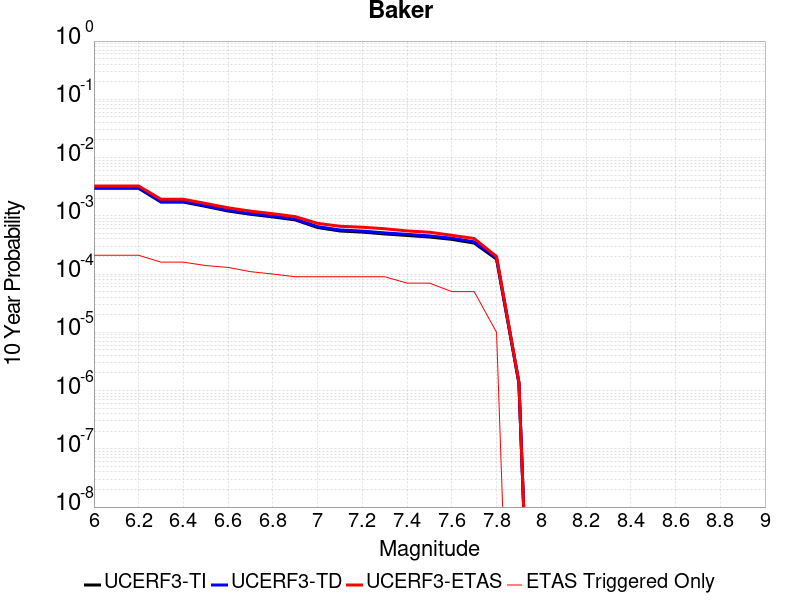 |

| Magnitude | 1 wk TI Prob | 1 wk TD Prob | 1 wk ETAS Prob | 1 wk ETAS/TD Gain | 1 wk ETAS Triggered Only | 1 mo TI Prob | 1 mo TD Prob | 1 mo ETAS Prob | 1 mo ETAS/TD Gain | 1 mo ETAS Triggered Only | 1 yr TI Prob | 1 yr TD Prob | 1 yr ETAS Prob | 1 yr ETAS/TD Gain | 1 yr ETAS Triggered Only | 10 yr TI Prob | 10 yr TD Prob | 10 yr ETAS Prob | 10 yr ETAS/TD Gain | 10 yr ETAS Triggered Only |
|-----|-----|-----|-----|-----|-----|-----|-----|-----|-----|-----|-----|-----|-----|-----|-----|-----|-----|-----|-----|-----|
| 6.0 | 5.695525E-6 | 5.834856E-6 | 2.7270959E-5 | 4.6738014 | 2.1436228E-5 | 2.4409164E-5 | 2.500631E-5 | 6.787769E-5 | 2.7144227 | 4.2872456E-5 | 2.9714106E-4 | 3.044133E-4 | 4.2227664E-4 | 1.387182 | 1.17899246E-4 | 0.0029674405 | 0.0030403587 | 0.0032540692 | 1.0702913 | 2.1436227E-4 |
| 6.1 | 5.695525E-6 | 5.834856E-6 | 2.7270959E-5 | 4.6738014 | 2.1436228E-5 | 2.4409164E-5 | 2.500631E-5 | 6.787769E-5 | 2.7144227 | 4.2872456E-5 | 2.9714106E-4 | 3.044133E-4 | 4.2227664E-4 | 1.387182 | 1.17899246E-4 | 0.0029674405 | 0.0030403587 | 0.0032540692 | 1.0702913 | 2.1436227E-4 |
| 6.2 | 5.695525E-6 | 5.834856E-6 | 2.7270959E-5 | 4.6738014 | 2.1436228E-5 | 2.4409164E-5 | 2.500631E-5 | 6.787769E-5 | 2.7144227 | 4.2872456E-5 | 2.9714106E-4 | 3.044133E-4 | 4.2227664E-4 | 1.387182 | 1.17899246E-4 | 0.0029674405 | 0.0030403587 | 0.0032540692 | 1.0702913 | 2.1436227E-4 |
| 6.3 | 3.2995713E-6 | 3.3836786E-6 | 2.4819834E-5 | 7.3351626 | 2.1436228E-5 | 1.4140943E-5 | 1.4501402E-5 | 5.7373236E-5 | 3.9563923 | 4.2872456E-5 | 1.7215237E-4 | 1.7654074E-4 | 2.8370295E-4 | 1.6070112 | 1.07181135E-4 | 0.0017201907 | 0.0017640521 | 0.0019245401 | 1.090977 | 1.607717E-4 |
| 6.4 | 3.2995713E-6 | 3.3836786E-6 | 2.4819834E-5 | 7.3351626 | 2.1436228E-5 | 1.4140943E-5 | 1.4501402E-5 | 5.7373236E-5 | 3.9563923 | 4.2872456E-5 | 1.7215237E-4 | 1.7654074E-4 | 2.8370295E-4 | 1.6070112 | 1.07181135E-4 | 0.0017201907 | 0.0017640521 | 0.0019245401 | 1.090977 | 1.607717E-4 |
| 6.5 | 2.782202E-6 | 2.8558507E-6 | 2.4292016E-5 | 8.506053 | 2.1436228E-5 | 1.1923668E-5 | 1.2239304E-5 | 5.5111235E-5 | 4.5028076 | 4.2872456E-5 | 1.4516099E-4 | 1.4900367E-4 | 2.347358E-4 | 1.5753692 | 8.574491E-5 | 0.001450662 | 0.0014890704 | 0.0016281983 | 1.0934328 | 1.3933548E-4 |
| 6.6 | 2.3163404E-6 | 2.380929E-6 | 1.30990165E-5 | 5.5016413 | 1.0718114E-5 | 9.927136E-6 | 1.0203942E-5 | 4.2357955E-5 | 4.1511364 | 3.215434E-5 | 1.20856166E-4 | 1.2422612E-4 | 1.9924359E-4 | 1.6038785 | 7.5026794E-5 | 0.0012079047 | 0.001241587 | 0.0013700447 | 1.1034625 | 1.2861736E-4 |
| 6.7 | 2.037056E-6 | 2.0965088E-6 | 1.2814599E-5 | 6.1123524 | 1.0718114E-5 | 8.7302105E-6 | 8.985007E-6 | 4.1139057E-5 | 4.578634 | 3.215434E-5 | 1.0628513E-4 | 1.0938713E-4 | 1.8440573E-4 | 1.6858082 | 7.5026794E-5 | 0.0010623431 | 0.0010933491 | 0.001200413 | 1.0979229 | 1.07181135E-4 |
| 6.8 | 1.8356744E-6 | 1.8915364E-6 | 1.260963E-5 | 6.6663427 | 1.0718114E-5 | 7.867153E-6 | 8.10656E-6 | 4.0260642E-5 | 4.9664273 | 3.215434E-5 | 9.577837E-5 | 9.869304E-5 | 1.6299538E-4 | 1.6515387 | 6.430868E-5 | 9.57371E-4 | 9.865061E-4 | 0.0010828739 | 1.097686 | 9.646302E-5 |
| 6.9 | 1.6310546E-6 | 1.6832144E-6 | 1.240131E-5 | 7.3676353 | 1.0718114E-5 | 6.9902153E-6 | 7.213757E-6 | 3.9367864E-5 | 5.457332 | 3.215434E-5 | 8.510255E-5 | 8.782406E-5 | 1.5212709E-4 | 1.7321801 | 6.430868E-5 | 8.5069967E-4 | 8.779048E-4 | 9.7428315E-4 | 1.1097822 | 9.646302E-5 |
| 7.0 | 1.2058036E-6 | 1.2508729E-6 | 1.1968973E-5 | 9.568498 | 1.0718114E-5 | 5.1677193E-6 | 5.3608724E-6 | 3.751504E-5 | 6.997936 | 3.215434E-5 | 6.291517E-5 | 6.526669E-5 | 1.2957117E-4 | 1.9852573 | 6.430868E-5 | 6.289736E-4 | 6.5247755E-4 | 7.4887765E-4 | 1.1477447 | 9.646302E-5 |
| 7.1 | 1.052382E-6 | 1.0951668E-6 | 1.1813268E-5 | 10.78673 | 1.0718114E-5 | 4.5102006E-6 | 4.693564E-6 | 3.6847752E-5 | 7.8506985 | 3.215434E-5 | 5.491031E-5 | 5.7142646E-5 | 1.2144766E-4 | 2.1253417 | 6.430868E-5 | 5.4896745E-4 | 5.712804E-4 | 6.676883E-4 | 1.1687576 | 9.646302E-5 |
| 7.2 | 1.0067454E-6 | 1.0487769E-6 | 1.176688E-5 | 11.219621 | 1.0718114E-5 | 4.3146156E-6 | 4.4947506E-6 | 3.6648948E-5 | 8.153722 | 3.215434E-5 | 5.252918E-5 | 5.4722223E-5 | 1.1902738E-4 | 2.1751196 | 6.430868E-5 | 5.251676E-4 | 5.4708833E-4 | 6.4349856E-4 | 1.1762242 | 9.646302E-5 |
| 7.3 | 9.3596316E-7 | 9.76778E-7 | 1.1694881E-5 | 11.972916 | 1.0718114E-5 | 4.0112645E-6 | 4.186185E-6 | 3.6340392E-5 | 8.681028 | 3.215434E-5 | 4.8836053E-5 | 5.0965617E-5 | 1.1527102E-4 | 2.261741 | 6.430868E-5 | 4.8825322E-4 | 5.095401E-4 | 6.059539E-4 | 1.1892174 | 9.646302E-5 |
| 7.4 | 8.8117395E-7 | 9.2077187E-7 | 9.2077187E-7 | 1.0 | 0.0 | 3.7764542E-6 | 3.9461593E-6 | 2.5382302E-5 | 6.4321537 | 2.1436228E-5 | 4.5977362E-5 | 4.8043436E-5 | 1.0163143E-4 | 2.1154072 | 5.3590567E-5 | 4.596785E-4 | 4.8033125E-4 | 5.5532204E-4 | 1.156123 | 7.5026794E-5 |
| 7.5 | 8.292386E-7 | 8.674649E-7 | 8.674649E-7 | 1.0 | 0.0 | 3.5538749E-6 | 3.7177015E-6 | 2.515385E-5 | 6.765968 | 2.1436228E-5 | 4.326757E-5 | 4.5262084E-5 | 9.885023E-5 | 2.183952 | 5.3590567E-5 | 4.3259145E-4 | 4.5252938E-4 | 5.2752224E-4 | 1.1657193 | 7.5026794E-5 |
| 7.6 | 7.553842E-7 | 7.9145207E-7 | 7.9145207E-7 | 1.0 | 0.0 | 3.2373566E-6 | 3.3919332E-6 | 2.4828088E-5 | 7.3197455 | 2.1436228E-5 | 3.9414106E-5 | 4.129601E-5 | 8.416669E-5 | 2.0381315 | 4.2872456E-5 | 3.9407116E-4 | 4.1288408E-4 | 4.664525E-4 | 1.1297421 | 5.3590567E-5 |
| 7.7 | 6.5285366E-7 | 6.852842E-7 | 6.852842E-7 | 1.0 | 0.0 | 2.797941E-6 | 2.9369291E-6 | 2.4373094E-5 | 8.298836 | 2.1436228E-5 | 3.40644E-5 | 3.5756533E-5 | 7.8627454E-5 | 2.1989675 | 4.2872456E-5 | 3.405918E-4 | 3.5750846E-4 | 4.1107985E-4 | 1.1498466 | 5.3590567E-5 |
| 7.8 | 3.4586725E-7 | 3.648288E-7 | 3.648288E-7 | 1.0 | 0.0 | 1.4822873E-6 | 1.5635511E-6 | 1.2281648E-5 | 7.8549705 | 1.0718114E-5 | 1.80467E-5 | 1.9036073E-5 | 2.9753983E-5 | 1.5630316 | 1.0718114E-5 | 1.8045233E-4 | 1.9034486E-4 | 2.0106093E-4 | 1.0562983 | 1.0718114E-5 |
| 7.9 | 2.5591178E-9 | 2.6696871E-9 | 2.6696871E-9 | 1.0 | 0.0 | 1.0967647E-8 | 1.1441516E-8 | 1.1441516E-8 | 1.0 | 0.0 | 1.335311E-7 | 1.3930045E-7 | 1.3930045E-7 | 1.0 | 0.0 | 1.3353102E-6 | 1.3930046E-6 | 1.3930046E-6 | 1.0 | 0.0 |

## Ludlow
*[(top)](#table-of-contents)*

| 1 Week | 1 Month | 1 Year | 10 Year |
|-----|-----|-----|-----|
|  |  |  |  |

| Magnitude | 1 wk TI Prob | 1 wk TD Prob | 1 wk ETAS Prob | 1 wk ETAS/TD Gain | 1 wk ETAS Triggered Only | 1 mo TI Prob | 1 mo TD Prob | 1 mo ETAS Prob | 1 mo ETAS/TD Gain | 1 mo ETAS Triggered Only | 1 yr TI Prob | 1 yr TD Prob | 1 yr ETAS Prob | 1 yr ETAS/TD Gain | 1 yr ETAS Triggered Only | 10 yr TI Prob | 10 yr TD Prob | 10 yr ETAS Prob | 10 yr ETAS/TD Gain | 10 yr ETAS Triggered Only |
|-----|-----|-----|-----|-----|-----|-----|-----|-----|-----|-----|-----|-----|-----|-----|-----|-----|-----|-----|-----|-----|
| 6.0 | 2.2407607E-5 | 2.3657429E-5 | 2.3657429E-5 | 1.0 | 0.0 | 9.602906E-5 | 1.0138529E-4 | 1.0138529E-4 | 1.0 | 0.0 | 0.0011685267 | 0.001233711 | 0.0013407599 | 1.0867698 | 1.07181135E-4 | 0.011624013 | 0.012273132 | 0.012453104 | 1.0146638 | 1.8220794E-4 |
| 6.1 | 2.2407607E-5 | 2.3657429E-5 | 2.3657429E-5 | 1.0 | 0.0 | 9.602906E-5 | 1.0138529E-4 | 1.0138529E-4 | 1.0 | 0.0 | 0.0011685267 | 0.001233711 | 0.0013407599 | 1.0867698 | 1.07181135E-4 | 0.011624013 | 0.012273132 | 0.012453104 | 1.0146638 | 1.8220794E-4 |
| 6.2 | 1.0781252E-5 | 1.1365745E-5 | 1.1365745E-5 | 1.0 | 0.0 | 4.620455E-5 | 4.870945E-5 | 4.870945E-5 | 1.0 | 0.0 | 5.623952E-4 | 5.9288024E-4 | 6.6786254E-4 | 1.1264713 | 7.5026794E-5 | 0.00560974 | 0.005913404 | 0.006019951 | 1.0180179 | 1.07181135E-4 |
| 6.3 | 1.0781252E-5 | 1.1365745E-5 | 1.1365745E-5 | 1.0 | 0.0 | 4.620455E-5 | 4.870945E-5 | 4.870945E-5 | 1.0 | 0.0 | 5.623952E-4 | 5.9288024E-4 | 6.6786254E-4 | 1.1264713 | 7.5026794E-5 | 0.00560974 | 0.005913404 | 0.006019951 | 1.0180179 | 1.07181135E-4 |
| 6.4 | 7.814439E-6 | 8.237788E-6 | 8.237788E-6 | 1.0 | 0.0 | 3.3490025E-5 | 3.5304336E-5 | 3.5304336E-5 | 1.0 | 0.0 | 4.0766477E-4 | 4.2974693E-4 | 4.7260095E-4 | 1.0997193 | 4.2872456E-5 | 0.0040691774 | 0.0042893053 | 0.0043640104 | 1.0174166 | 7.5026794E-5 |
| 6.5 | 6.4986366E-6 | 6.850969E-6 | 6.850969E-6 | 1.0 | 0.0 | 2.7851002E-5 | 2.936097E-5 | 2.936097E-5 | 1.0 | 0.0 | 3.390332E-4 | 3.574121E-4 | 3.8955495E-4 | 1.0899322 | 3.215434E-5 | 0.003385164 | 0.0035684688 | 0.0036218683 | 1.0149642 | 5.3590567E-5 |
| 6.6 | 5.582177E-6 | 5.8860483E-6 | 5.8860483E-6 | 1.0 | 0.0 | 2.3923398E-5 | 2.522568E-5 | 2.522568E-5 | 1.0 | 0.0 | 2.9122844E-4 | 3.070801E-4 | 3.2850975E-4 | 1.0697852 | 2.1436228E-5 | 0.0029084706 | 0.003066631 | 0.0030986867 | 1.0104531 | 3.215434E-5 |
| 6.7 | 4.6858763E-6 | 4.940463E-6 | 4.940463E-6 | 1.0 | 0.0 | 2.0082172E-5 | 2.1173244E-5 | 2.1173244E-5 | 1.0 | 0.0 | 2.4447302E-4 | 2.577543E-4 | 2.79185E-4 | 1.083144 | 2.1436228E-5 | 0.0024420423 | 0.0025746098 | 0.002595991 | 1.0083046 | 2.1436228E-5 |
| 6.8 | 3.5584908E-6 | 3.7520454E-6 | 3.7520454E-6 | 1.0 | 0.0 | 1.5250586E-5 | 1.6080097E-5 | 1.6080097E-5 | 1.0 | 0.0 | 1.8566006E-4 | 1.9575801E-4 | 2.0647403E-4 | 1.0547411 | 1.0718114E-5 | 0.0018550502 | 0.0019558968 | 0.001966594 | 1.0054692 | 1.0718114E-5 |
| 6.9 | 2.532834E-6 | 2.6710227E-6 | 2.6710227E-6 | 1.0 | 0.0 | 1.0854958E-5 | 1.1447192E-5 | 1.1447192E-5 | 1.0 | 0.0 | 1.3215111E-4 | 1.3936093E-4 | 1.3936093E-4 | 1.0 | 0.0 | 0.0013207254 | 0.0013927629 | 0.0013927629 | 1.0 | 0.0 |
| 7.0 | 1.7083285E-6 | 1.801957E-6 | 1.801957E-6 | 1.0 | 0.0 | 7.3213873E-6 | 7.7226505E-6 | 7.7226505E-6 | 1.0 | 0.0 | 8.913424E-5 | 9.4019386E-5 | 9.4019386E-5 | 1.0 | 0.0 | 8.9098496E-4 | 9.3981257E-4 | 9.3981257E-4 | 1.0 | 0.0 |
| 7.1 | 1.0905424E-6 | 1.1497702E-6 | 1.1497702E-6 | 1.0 | 0.0 | 4.6737446E-6 | 4.927578E-6 | 4.927578E-6 | 1.0 | 0.0 | 5.6901354E-5 | 5.999171E-5 | 5.999171E-5 | 1.0 | 0.0 | 5.6886784E-4 | 5.997649E-4 | 5.997649E-4 | 1.0 | 0.0 |
| 7.2 | 6.06668E-7 | 6.387322E-7 | 6.387322E-7 | 1.0 | 0.0 | 2.600003E-6 | 2.7374213E-6 | 2.7374213E-6 | 1.0 | 0.0 | 3.1654577E-5 | 3.3327666E-5 | 3.3327666E-5 | 1.0 | 0.0 | 3.1650066E-4 | 3.332335E-4 | 3.332335E-4 | 1.0 | 0.0 |

## San Andreas (Coachella) rev
*[(top)](#table-of-contents)*

| 1 Week | 1 Month | 1 Year | 10 Year |
|-----|-----|-----|-----|
|  |  | 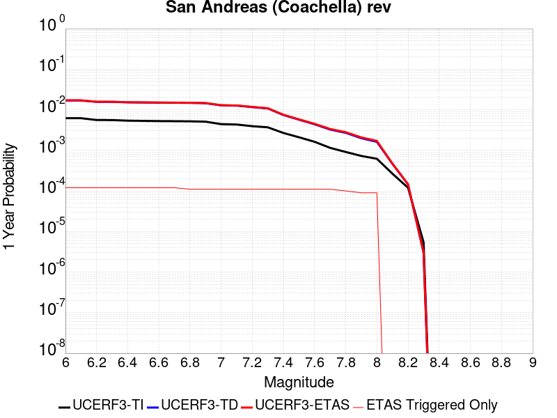 |  |

| Magnitude | 1 wk TI Prob | 1 wk TD Prob | 1 wk ETAS Prob | 1 wk ETAS/TD Gain | 1 wk ETAS Triggered Only | 1 mo TI Prob | 1 mo TD Prob | 1 mo ETAS Prob | 1 mo ETAS/TD Gain | 1 mo ETAS Triggered Only | 1 yr TI Prob | 1 yr TD Prob | 1 yr ETAS Prob | 1 yr ETAS/TD Gain | 1 yr ETAS Triggered Only | 10 yr TI Prob | 10 yr TD Prob | 10 yr ETAS Prob | 10 yr ETAS/TD Gain | 10 yr ETAS Triggered Only |
|-----|-----|-----|-----|-----|-----|-----|-----|-----|-----|-----|-----|-----|-----|-----|-----|-----|-----|-----|-----|-----|
| 6.0 | 1.1925945E-4 | 3.2733803E-4 | 3.2733803E-4 | 1.0 | 0.0 | 5.110118E-4 | 0.0014021277 | 0.0014556431 | 1.0381674 | 5.3590567E-5 | 0.0062038354 | 0.016938623 | 0.017054524 | 1.0068425 | 1.17899246E-4 | 0.060334753 | 0.15267034 | 0.15281564 | 1.0009518 | 1.7148982E-4 |
| 6.1 | 1.1925945E-4 | 3.2733803E-4 | 3.2733803E-4 | 1.0 | 0.0 | 5.110118E-4 | 0.0014021277 | 0.0014556431 | 1.0381674 | 5.3590567E-5 | 0.0062038354 | 0.016938623 | 0.017054524 | 1.0068425 | 1.17899246E-4 | 0.060334753 | 0.15267034 | 0.15281564 | 1.0009518 | 1.7148982E-4 |
| 6.2 | 1.07432395E-4 | 3.0234526E-4 | 3.0234526E-4 | 1.0 | 0.0 | 4.603433E-4 | 0.0012951259 | 0.001348647 | 1.0413251 | 5.3590567E-5 | 0.005590286 | 0.015655253 | 0.015771307 | 1.007413 | 1.17899246E-4 | 0.05451731 | 0.14184146 | 0.14198862 | 1.0010375 | 1.7148982E-4 |
| 6.3 | 1.0718766E-4 | 3.017983E-4 | 3.017983E-4 | 1.0 | 0.0 | 4.592948E-4 | 0.0012927842 | 0.0013463055 | 1.0414001 | 5.3590567E-5 | 0.005577586 | 0.015627153 | 0.015743209 | 1.0074266 | 1.17899246E-4 | 0.054396555 | 0.14160971 | 0.14175692 | 1.0010395 | 1.7148982E-4 |
| 6.4 | 1.0355944E-4 | 2.9387916E-4 | 2.9387916E-4 | 1.0 | 0.0 | 4.4375064E-4 | 0.0012588782 | 0.0013124013 | 1.0425165 | 5.3590567E-5 | 0.0053892885 | 0.015220184 | 0.015336289 | 1.0076283 | 1.17899246E-4 | 0.052604496 | 0.13816981 | 0.13831761 | 1.0010697 | 1.7148982E-4 |
| 6.5 | 1.0227914E-4 | 2.910735E-4 | 2.910735E-4 | 1.0 | 0.0 | 4.382655E-4 | 0.0012468654 | 0.0013003891 | 1.0429267 | 5.3590567E-5 | 0.0053228354 | 0.015075962 | 0.015192084 | 1.0077025 | 1.17899246E-4 | 0.051971316 | 0.136949 | 0.137097 | 1.0010808 | 1.7148982E-4 |
| 6.6 | 1.0116757E-4 | 2.8873098E-4 | 2.8873098E-4 | 1.0 | 0.0 | 4.3350324E-4 | 0.0012368355 | 0.0012903599 | 1.0432752 | 5.3590567E-5 | 0.0052651367 | 0.014955532 | 0.015071668 | 1.0077654 | 1.17899246E-4 | 0.051421247 | 0.13592719 | 0.13607536 | 1.0010902 | 1.7148982E-4 |
| 6.7 | 1.0050676E-4 | 2.873166E-4 | 2.873166E-4 | 1.0 | 0.0 | 4.3067214E-4 | 0.0012307797 | 0.0012843043 | 1.0434884 | 5.3590567E-5 | 0.005230834 | 0.01488281 | 0.014998956 | 1.0078039 | 1.17899246E-4 | 0.051094085 | 0.13531192 | 0.1354602 | 1.0010959 | 1.7148982E-4 |
| 6.8 | 9.976819E-5 | 2.853531E-4 | 2.853531E-4 | 1.0 | 0.0 | 4.2750788E-4 | 0.0012223726 | 0.0012758977 | 1.0437878 | 5.3590567E-5 | 0.0051924936 | 0.014781849 | 0.014887447 | 1.0071437 | 1.07181135E-4 | 0.050728295 | 0.13446361 | 0.13460276 | 1.0010349 | 1.607717E-4 |
| 6.9 | 9.77719E-5 | 2.8032195E-4 | 2.8032195E-4 | 1.0 | 0.0 | 4.1895514E-4 | 0.0012008306 | 0.0012543568 | 1.0445744 | 5.3590567E-5 | 0.0050888555 | 0.014523101 | 0.014628725 | 1.0072728 | 1.07181135E-4 | 0.049738888 | 0.13229203 | 0.13243154 | 1.0010545 | 1.607717E-4 |
| 7.0 | 8.500761E-5 | 2.4766565E-4 | 2.4766565E-4 | 1.0 | 0.0 | 3.6426744E-4 | 0.0010609957 | 0.0011145294 | 1.050456 | 5.3590567E-5 | 0.0044259406 | 0.012841888 | 0.012947693 | 1.008239 | 1.07181135E-4 | 0.04338823 | 0.11814933 | 0.11829111 | 1.0012 | 1.607717E-4 |
| 7.1 | 8.319876E-5 | 2.4369264E-4 | 2.4369264E-4 | 1.0 | 0.0 | 3.5651738E-4 | 0.0010439822 | 0.0010975169 | 1.0512792 | 5.3590567E-5 | 0.004331963 | 0.012637171 | 0.012742997 | 1.0083742 | 1.07181135E-4 | 0.042484846 | 0.116369456 | 0.11651152 | 1.0012208 | 1.607717E-4 |
| 7.2 | 7.563917E-5 | 2.2417592E-4 | 2.2417592E-4 | 1.0 | 0.0 | 3.2412758E-4 | 9.6040324E-4 | 0.0010139424 | 1.0557464 | 5.3590567E-5 | 0.0039391145 | 0.0116309095 | 0.011736844 | 1.0091081 | 1.07181135E-4 | 0.03870018 | 0.10777538 | 0.10791883 | 1.001331 | 1.607717E-4 |
| 7.3 | 7.082985E-5 | 2.073362E-4 | 2.073362E-4 | 1.0 | 0.0 | 3.0352117E-4 | 8.88284E-4 | 9.4182696E-4 | 1.0602769 | 5.3590567E-5 | 0.0036891096 | 0.010761855 | 0.0108678825 | 1.0098522 | 1.07181135E-4 | 0.03628465 | 0.10029767 | 0.10044231 | 1.0014422 | 1.607717E-4 |
| 7.4 | 5.146215E-5 | 1.4276853E-4 | 1.4276853E-4 | 1.0 | 0.0 | 2.2053342E-4 | 6.117225E-4 | 6.652803E-4 | 1.0875524 | 5.3590567E-5 | 0.0026816884 | 0.007422478 | 0.0075288634 | 1.0143329 | 1.07181135E-4 | 0.02649557 | 0.07086292 | 0.071012296 | 1.002108 | 1.607717E-4 |
| 7.5 | 4.0285166E-5 | 1.0944253E-4 | 1.0944253E-4 | 1.0 | 0.0 | 1.7263928E-4 | 4.689554E-4 | 5.2252086E-4 | 1.1142229 | 5.3590567E-5 | 0.002099857 | 0.005694655 | 0.0058012255 | 1.0187142 | 1.07181135E-4 | 0.020801254 | 0.055022955 | 0.055174883 | 1.0027611 | 1.607717E-4 |
| 7.6 | 3.1168736E-5 | 8.441267E-5 | 8.441267E-5 | 1.0 | 0.0 | 1.3357346E-4 | 3.6171856E-4 | 4.1528975E-4 | 1.1481018 | 5.3590567E-5 | 0.0016250437 | 0.004395057 | 0.0045017675 | 1.0242796 | 1.07181135E-4 | 0.016132116 | 0.042820677 | 0.042974565 | 1.0035938 | 1.607717E-4 |
| 7.7 | 2.2100989E-5 | 6.2408275E-5 | 6.2408275E-5 | 1.0 | 0.0 | 9.4715084E-5 | 2.6743664E-4 | 3.210129E-4 | 1.2003324 | 5.3590567E-5 | 0.001152546 | 0.003251186 | 0.0033580188 | 1.0328596 | 1.07181135E-4 | 0.011465867 | 0.03190961 | 0.032054875 | 1.0045524 | 1.5005359E-4 |
| 7.8 | 1.7484861E-5 | 5.1814186E-5 | 5.1814186E-5 | 1.0 | 0.0 | 7.493296E-5 | 2.2204191E-4 | 2.7562058E-4 | 1.2412997 | 5.3590567E-5 | 9.1192697E-4 | 0.002700012 | 0.0027962145 | 1.0356305 | 9.646302E-5 | 0.009081938 | 0.026648527 | 0.026773717 | 1.0046978 | 1.2861736E-4 |
| 7.9 | 1.3967285E-5 | 3.8237675E-5 | 3.8237675E-5 | 1.0 | 0.0 | 5.985842E-5 | 1.6386545E-4 | 2.1744725E-4 | 1.3269864 | 5.3590567E-5 | 7.2853256E-4 | 0.0019932375 | 0.0020788116 | 1.0429322 | 8.574491E-5 | 0.0072614877 | 0.019916428 | 0.020021476 | 1.0052744 | 1.07181135E-4 |
| 8.0 | 1.1887396E-5 | 3.107819E-5 | 3.107819E-5 | 1.0 | 0.0 | 5.094499E-5 | 1.3318544E-4 | 1.8676888E-4 | 1.4023219 | 5.3590567E-5 | 6.200787E-4 | 0.0016203277 | 0.0017059337 | 1.0528325 | 8.574491E-5 | 0.006183513 | 0.016285317 | 0.016390754 | 1.0064743 | 1.07181135E-4 |
| 8.1 | 5.100864E-6 | 8.978668E-6 | 8.978668E-6 | 1.0 | 0.0 | 2.1860664E-5 | 3.847944E-5 | 3.847944E-5 | 1.0 | 0.0 | 2.6612106E-4 | 4.6838663E-4 | 4.6838663E-4 | 1.0 | 0.0 | 0.002658026 | 0.004920349 | 0.004920349 | 1.0 | 0.0 |
| 8.2 | 2.3004484E-6 | 2.7885583E-6 | 2.7885583E-6 | 1.0 | 0.0 | 9.859027E-6 | 1.19509095E-5 | 1.19509095E-5 | 1.0 | 0.0 | 1.2002704E-4 | 1.4549264E-4 | 1.4549264E-4 | 1.0 | 0.0 | 0.0011996223 | 0.0015984807 | 0.0015984807 | 1.0 | 0.0 |
| 8.3 | 1.0424446E-7 | 5.8219563E-8 | 5.8219563E-8 | 1.0 | 0.0 | 4.4676187E-7 | 2.495124E-7 | 2.495124E-7 | 1.0 | 0.0 | 5.439312E-6 | 3.0378094E-6 | 3.0378094E-6 | 1.0 | 0.0 | 5.4391792E-5 | 3.193819E-5 | 3.193819E-5 | 1.0 | 0.0 |

## Elsinore (Glen Ivy) rev
*[(top)](#table-of-contents)*

| 1 Week | 1 Month | 1 Year | 10 Year |
|-----|-----|-----|-----|
|  |  |  |  |

| Magnitude | 1 wk TI Prob | 1 wk TD Prob | 1 wk ETAS Prob | 1 wk ETAS/TD Gain | 1 wk ETAS Triggered Only | 1 mo TI Prob | 1 mo TD Prob | 1 mo ETAS Prob | 1 mo ETAS/TD Gain | 1 mo ETAS Triggered Only | 1 yr TI Prob | 1 yr TD Prob | 1 yr ETAS Prob | 1 yr ETAS/TD Gain | 1 yr ETAS Triggered Only | 10 yr TI Prob | 10 yr TD Prob | 10 yr ETAS Prob | 10 yr ETAS/TD Gain | 10 yr ETAS Triggered Only |
|-----|-----|-----|-----|-----|-----|-----|-----|-----|-----|-----|-----|-----|-----|-----|-----|-----|-----|-----|-----|-----|
| 6.0 | 1.6204086E-4 | 2.9362022E-4 | 2.9362022E-4 | 1.0 | 0.0 | 6.94276E-4 | 0.0012579202 | 0.0012686248 | 1.0085098 | 1.0718114E-5 | 0.008420097 | 0.015235162 | 0.015309046 | 1.0048496 | 7.5026794E-5 | 0.081081145 | 0.13969512 | 0.1398611 | 1.0011882 | 1.9292605E-4 |
| 6.1 | 1.6204086E-4 | 2.9362022E-4 | 2.9362022E-4 | 1.0 | 0.0 | 6.94276E-4 | 0.0012579202 | 0.0012686248 | 1.0085098 | 1.0718114E-5 | 0.008420097 | 0.015235162 | 0.015309046 | 1.0048496 | 7.5026794E-5 | 0.081081145 | 0.13969512 | 0.1398611 | 1.0011882 | 1.9292605E-4 |
| 6.2 | 1.6204086E-4 | 2.9362022E-4 | 2.9362022E-4 | 1.0 | 0.0 | 6.94276E-4 | 0.0012579202 | 0.0012686248 | 1.0085098 | 1.0718114E-5 | 0.008420097 | 0.015235162 | 0.015309046 | 1.0048496 | 7.5026794E-5 | 0.081081145 | 0.13969512 | 0.1398611 | 1.0011882 | 1.9292605E-4 |
| 6.3 | 1.0111737E-4 | 1.7703768E-4 | 1.7703768E-4 | 1.0 | 0.0 | 4.332882E-4 | 7.58629E-4 | 7.58629E-4 | 1.0 | 0.0 | 0.005262531 | 0.0092178825 | 0.009228502 | 1.001152 | 1.0718114E-5 | 0.0513964 | 0.08702082 | 0.08707954 | 1.0006747 | 6.430868E-5 |
| 6.4 | 1.0111737E-4 | 1.7703768E-4 | 1.7703768E-4 | 1.0 | 0.0 | 4.332882E-4 | 7.58629E-4 | 7.58629E-4 | 1.0 | 0.0 | 0.005262531 | 0.0092178825 | 0.009228502 | 1.001152 | 1.0718114E-5 | 0.0513964 | 0.08702082 | 0.08707954 | 1.0006747 | 6.430868E-5 |
| 6.5 | 3.6624708E-5 | 4.639301E-5 | 4.639301E-5 | 1.0 | 0.0 | 1.569536E-4 | 1.9881407E-4 | 1.9881407E-4 | 1.0 | 0.0 | 0.001909235 | 0.0024182373 | 0.0024289296 | 1.0044215 | 1.0718114E-5 | 0.01892915 | 0.023740914 | 0.023772305 | 1.0013223 | 3.215434E-5 |
| 6.6 | 2.5051324E-5 | 2.614908E-5 | 2.614908E-5 | 1.0 | 0.0 | 1.073584E-4 | 1.1206293E-4 | 1.1206293E-4 | 1.0 | 0.0 | 0.0013063047 | 0.0013635567 | 0.0013635567 | 1.0 | 0.0 | 0.012986525 | 0.013565315 | 0.01358646 | 1.0015588 | 2.1436228E-5 |
| 6.7 | 2.2189772E-5 | 2.207403E-5 | 2.207403E-5 | 1.0 | 0.0 | 9.509556E-5 | 9.459976E-5 | 9.459976E-5 | 1.0 | 0.0 | 0.0011571734 | 0.0011511799 | 0.0011511799 | 1.0 | 0.0 | 0.011511663 | 0.011466023 | 0.011487213 | 1.0018481 | 2.1436228E-5 |
| 6.8 | 1.6654378E-5 | 1.4438445E-5 | 1.4438445E-5 | 1.0 | 0.0 | 7.137396E-5 | 6.187761E-5 | 6.187761E-5 | 1.0 | 0.0 | 8.686314E-4 | 7.531047E-4 | 7.531047E-4 | 1.0 | 0.0 | 0.008652439 | 0.0075108632 | 0.0075108632 | 1.0 | 0.0 |
| 6.9 | 1.5042909E-5 | 1.23326745E-5 | 1.23326745E-5 | 1.0 | 0.0 | 6.446802E-5 | 5.2853266E-5 | 5.2853266E-5 | 1.0 | 0.0 | 7.8461546E-4 | 6.433017E-4 | 6.433017E-4 | 1.0 | 0.0 | 0.007818509 | 0.006418618 | 0.006418618 | 1.0 | 0.0 |
| 7.0 | 1.4361385E-5 | 1.14519435E-5 | 1.14519435E-5 | 1.0 | 0.0 | 6.154734E-5 | 4.907885E-5 | 4.907885E-5 | 1.0 | 0.0 | 7.490812E-4 | 5.973741E-4 | 5.973741E-4 | 1.0 | 0.0 | 0.007465612 | 0.0059616743 | 0.0059616743 | 1.0 | 0.0 |
| 7.1 | 1.3265571E-5 | 1.0245398E-5 | 1.0245398E-5 | 1.0 | 0.0 | 5.6851208E-5 | 4.3908123E-5 | 4.3908123E-5 | 1.0 | 0.0 | 6.919436E-4 | 5.344528E-4 | 5.344528E-4 | 1.0 | 0.0 | 0.006897931 | 0.0053350315 | 0.0053350315 | 1.0 | 0.0 |
| 7.2 | 1.1596403E-5 | 8.50544E-6 | 8.50544E-6 | 1.0 | 0.0 | 4.9697923E-5 | 3.6451387E-5 | 3.6451387E-5 | 1.0 | 0.0 | 6.049042E-4 | 4.4370696E-4 | 4.4370696E-4 | 1.0 | 0.0 | 0.006032603 | 0.004429626 | 0.004429626 | 1.0 | 0.0 |
| 7.3 | 1.0150827E-5 | 7.23907E-6 | 7.23907E-6 | 1.0 | 0.0 | 4.3502816E-5 | 3.1024225E-5 | 3.1024225E-5 | 1.0 | 0.0 | 5.2951806E-4 | 3.776559E-4 | 3.776559E-4 | 1.0 | 0.0 | 0.005282581 | 0.0037705277 | 0.0037705277 | 1.0 | 0.0 |
| 7.4 | 9.080705E-6 | 6.352785E-6 | 6.352785E-6 | 1.0 | 0.0 | 3.8916725E-5 | 2.7225946E-5 | 2.7225946E-5 | 1.0 | 0.0 | 4.7370812E-4 | 3.3142683E-4 | 3.3142683E-4 | 1.0 | 0.0 | 0.004726996 | 0.0033094764 | 0.0033094764 | 1.0 | 0.0 |
| 7.5 | 7.671649E-6 | 5.2258497E-6 | 5.2258497E-6 | 1.0 | 0.0 | 3.287808E-5 | 2.2396314E-5 | 2.2396314E-5 | 1.0 | 0.0 | 4.0021708E-4 | 2.7264224E-4 | 2.7264224E-4 | 1.0 | 0.0 | 0.0039949706 | 0.0027232026 | 0.0027232026 | 1.0 | 0.0 |
| 7.6 | 6.990086E-6 | 4.687739E-6 | 4.687739E-6 | 1.0 | 0.0 | 2.9957167E-5 | 2.0090161E-5 | 2.0090161E-5 | 1.0 | 0.0 | 3.6466747E-4 | 2.4457145E-4 | 2.4457145E-4 | 1.0 | 0.0 | 0.0036406964 | 0.002443139 | 0.002443139 | 1.0 | 0.0 |
| 7.7 | 4.163505E-6 | 2.3296475E-6 | 2.3296475E-6 | 1.0 | 0.0 | 1.7843471E-5 | 9.984169E-6 | 9.984169E-6 | 1.0 | 0.0 | 2.172226E-4 | 1.21551224E-4 | 1.21551224E-4 | 1.0 | 0.0 | 0.0021701038 | 0.0012149204 | 0.0012149204 | 1.0 | 0.0 |
| 7.8 | 2.2692414E-7 | 9.385943E-8 | 9.385943E-8 | 1.0 | 0.0 | 9.725317E-7 | 4.0225464E-7 | 4.0225464E-7 | 1.0 | 0.0 | 1.1840509E-5 | 4.8974425E-6 | 4.8974425E-6 | 1.0 | 0.0 | 1.1839878E-4 | 4.8973674E-5 | 4.8973674E-5 | 1.0 | 0.0 |
| 7.9 | 6.676829E-9 | 3.4399772E-9 | 3.4399772E-9 | 1.0 | 0.0 | 2.861498E-8 | 1.4742759E-8 | 1.4742759E-8 | 1.0 | 0.0 | 3.4838732E-7 | 1.7949307E-7 | 1.7949307E-7 | 1.0 | 0.0 | 3.4838679E-6 | 1.7949295E-6 | 1.7949295E-6 | 1.0 | 0.0 |

## San Andreas (North Branch Mill Creek)
*[(top)](#table-of-contents)*

| 1 Week | 1 Month | 1 Year | 10 Year |
|-----|-----|-----|-----|
|  |  |  |  |

| Magnitude | 1 wk TI Prob | 1 wk TD Prob | 1 wk ETAS Prob | 1 wk ETAS/TD Gain | 1 wk ETAS Triggered Only | 1 mo TI Prob | 1 mo TD Prob | 1 mo ETAS Prob | 1 mo ETAS/TD Gain | 1 mo ETAS Triggered Only | 1 yr TI Prob | 1 yr TD Prob | 1 yr ETAS Prob | 1 yr ETAS/TD Gain | 1 yr ETAS Triggered Only | 10 yr TI Prob | 10 yr TD Prob | 10 yr ETAS Prob | 10 yr ETAS/TD Gain | 10 yr ETAS Triggered Only |
|-----|-----|-----|-----|-----|-----|-----|-----|-----|-----|-----|-----|-----|-----|-----|-----|-----|-----|-----|-----|-----|
| 6.0 | 1.3461156E-5 | 2.3506776E-5 | 4.49425E-5 | 1.9118955 | 2.1436228E-5 | 5.7689394E-5 | 1.0073945E-4 | 1.4360758E-4 | 1.4255347 | 4.2872456E-5 | 7.02142E-4 | 0.0012258161 | 0.0013542757 | 1.1047952 | 1.2861736E-4 | 0.0069992766 | 0.012233093 | 0.012391899 | 1.0129815 | 1.607717E-4 |
| 6.1 | 1.3461156E-5 | 2.3506776E-5 | 4.49425E-5 | 1.9118955 | 2.1436228E-5 | 5.7689394E-5 | 1.0073945E-4 | 1.4360758E-4 | 1.4255347 | 4.2872456E-5 | 7.02142E-4 | 0.0012258161 | 0.0013542757 | 1.1047952 | 1.2861736E-4 | 0.0069992766 | 0.012233093 | 0.012391899 | 1.0129815 | 1.607717E-4 |
| 6.2 | 1.3461156E-5 | 2.3506776E-5 | 4.49425E-5 | 1.9118955 | 2.1436228E-5 | 5.7689394E-5 | 1.0073945E-4 | 1.4360758E-4 | 1.4255347 | 4.2872456E-5 | 7.02142E-4 | 0.0012258161 | 0.0013542757 | 1.1047952 | 1.2861736E-4 | 0.0069992766 | 0.012233093 | 0.012391899 | 1.0129815 | 1.607717E-4 |
| 6.3 | 1.3461156E-5 | 2.3506776E-5 | 4.49425E-5 | 1.9118955 | 2.1436228E-5 | 5.7689394E-5 | 1.0073945E-4 | 1.4360758E-4 | 1.4255347 | 4.2872456E-5 | 7.02142E-4 | 0.0012258161 | 0.0013542757 | 1.1047952 | 1.2861736E-4 | 0.0069992766 | 0.012233093 | 0.012391899 | 1.0129815 | 1.607717E-4 |
| 6.4 | 1.3461156E-5 | 2.3506776E-5 | 4.49425E-5 | 1.9118955 | 2.1436228E-5 | 5.7689394E-5 | 1.0073945E-4 | 1.4360758E-4 | 1.4255347 | 4.2872456E-5 | 7.02142E-4 | 0.0012258161 | 0.0013542757 | 1.1047952 | 1.2861736E-4 | 0.0069992766 | 0.012233093 | 0.012391899 | 1.0129815 | 1.607717E-4 |
| 6.5 | 1.3450706E-5 | 2.3495735E-5 | 4.4931458E-5 | 1.912324 | 2.1436228E-5 | 5.764461E-5 | 1.0069214E-4 | 1.4356028E-4 | 1.4257346 | 4.2872456E-5 | 7.0159714E-4 | 0.0012252406 | 0.0013537004 | 1.1048446 | 1.2861736E-4 | 0.006993862 | 0.012227403 | 0.012386209 | 1.0129877 | 1.607717E-4 |
| 6.6 | 1.3074523E-5 | 2.3110017E-5 | 4.4545748E-5 | 1.9275516 | 2.1436228E-5 | 5.6032466E-5 | 9.9039185E-5 | 1.419074E-4 | 1.432841 | 4.2872456E-5 | 6.8198174E-4 | 0.0012051383 | 0.0013336006 | 1.1065955 | 1.2861736E-4 | 0.006798926 | 0.0120285675 | 0.0121874055 | 1.013205 | 1.607717E-4 |
| 6.7 | 1.3050216E-5 | 2.3085311E-5 | 4.4521043E-5 | 1.9285442 | 2.1436228E-5 | 5.59283E-5 | 9.893332E-5 | 1.4180153E-4 | 1.4333041 | 4.2872456E-5 | 6.8071426E-4 | 0.0012038508 | 0.0013323133 | 1.1067097 | 1.2861736E-4 | 0.0067863287 | 0.012015832 | 0.0121746715 | 1.0132192 | 1.607717E-4 |
| 6.8 | 1.29049395E-5 | 2.293372E-5 | 4.4369455E-5 | 1.934682 | 2.1436228E-5 | 5.530571E-5 | 9.828369E-5 | 1.4115192E-4 | 1.4361684 | 4.2872456E-5 | 6.73139E-4 | 0.0011959502 | 0.0013244138 | 1.1074154 | 1.2861736E-4 | 0.0067110364 | 0.011937677 | 0.012096529 | 1.0133069 | 1.607717E-4 |
| 6.9 | 1.2867369E-5 | 2.2893122E-5 | 3.361099E-5 | 1.4681698 | 1.0718114E-5 | 5.51447E-5 | 9.810971E-5 | 1.3026089E-4 | 1.3277065 | 3.215434E-5 | 6.711799E-4 | 0.0011938344 | 0.0013115929 | 1.0986389 | 1.17899246E-4 | 0.006691564 | 0.011916745 | 0.012065011 | 1.0124418 | 1.5005359E-4 |
| 7.0 | 1.2495996E-5 | 2.2293154E-5 | 3.301103E-5 | 1.4807698 | 1.0718114E-5 | 5.3553173E-5 | 9.5538606E-5 | 1.2768988E-4 | 1.3365264 | 3.215434E-5 | 6.518148E-4 | 0.0011625647 | 0.0012803269 | 1.1012951 | 1.17899246E-4 | 0.0064990623 | 0.011607327 | 0.011755639 | 1.0127774 | 1.5005359E-4 |
| 7.1 | 1.2452067E-5 | 2.2238226E-5 | 3.29561E-5 | 1.4819573 | 1.0718114E-5 | 5.3364907E-5 | 9.5303214E-5 | 1.2745449E-4 | 1.3373578 | 3.215434E-5 | 6.4952404E-4 | 0.0011597018 | 0.0012774644 | 1.1015456 | 1.17899246E-4 | 0.0064762887 | 0.011578998 | 0.0117273135 | 1.012809 | 1.5005359E-4 |
| 7.2 | 1.2002777E-5 | 2.1616754E-5 | 3.2334636E-5 | 1.4958136 | 1.0718114E-5 | 5.143946E-5 | 9.263996E-5 | 1.2479132E-4 | 1.3470572 | 3.215434E-5 | 6.2609545E-4 | 0.0011273106 | 0.0012450769 | 1.1044667 | 1.17899246E-4 | 0.006243344 | 0.011258403 | 0.011406766 | 1.0131781 | 1.5005359E-4 |
| 7.3 | 1.1923425E-5 | 2.1486576E-5 | 3.2204458E-5 | 1.4988177 | 1.0718114E-5 | 5.109939E-5 | 9.208209E-5 | 1.2423347E-4 | 1.34916 | 3.215434E-5 | 6.219575E-4 | 0.0011205255 | 0.0012382927 | 1.1050999 | 1.17899246E-4 | 0.0062021962 | 0.011191265 | 0.011339639 | 1.0132581 | 1.5005359E-4 |
| 7.4 | 1.16105175E-5 | 2.0860489E-5 | 3.157838E-5 | 1.513789 | 1.0718114E-5 | 4.975841E-5 | 8.9399044E-5 | 1.2155051E-4 | 1.3596399 | 3.215434E-5 | 6.0564023E-4 | 0.0010878925 | 0.0012056634 | 1.1082561 | 1.17899246E-4 | 0.006039923 | 0.01086884 | 0.011017263 | 1.0136558 | 1.5005359E-4 |
| 7.5 | 1.1037265E-5 | 1.956039E-5 | 3.0278294E-5 | 1.5479392 | 1.0718114E-5 | 4.7301706E-5 | 8.382756E-5 | 1.159792E-4 | 1.383545 | 3.215434E-5 | 5.757461E-4 | 0.0010201249 | 0.0011379038 | 1.1154555 | 1.17899246E-4 | 0.005742567 | 0.010198223 | 0.010346747 | 1.0145637 | 1.5005359E-4 |
| 7.6 | 1.0720915E-5 | 1.900222E-5 | 2.972013E-5 | 1.5640346 | 1.0718114E-5 | 4.5945973E-5 | 8.143555E-5 | 1.1358727E-4 | 1.3948119 | 3.215434E-5 | 5.592486E-4 | 9.910291E-4 | 0.0011088115 | 1.1188486 | 1.17899246E-4 | 0.005578433 | 0.009909907 | 0.010058474 | 1.0149918 | 1.5005359E-4 |
| 7.7 | 9.276279E-6 | 1.6447744E-5 | 2.716568E-5 | 1.6516356 | 1.0718114E-5 | 3.9754876E-5 | 7.048844E-5 | 1.0264051E-4 | 1.4561327 | 3.215434E-5 | 4.839081E-4 | 8.578605E-4 | 9.756586E-4 | 1.1373161 | 1.17899246E-4 | 0.0048285574 | 0.008589173 | 0.008737938 | 1.01732 | 1.5005359E-4 |
| 7.8 | 5.8346777E-6 | 1.1159965E-5 | 2.1877959E-5 | 1.9603968 | 1.0718114E-5 | 2.5005522E-5 | 4.7827543E-5 | 7.9980346E-5 | 1.6722654 | 3.215434E-5 | 3.043997E-4 | 5.821449E-4 | 6.9997547E-4 | 1.2024077 | 1.17899246E-4 | 0.0030398308 | 0.005849473 | 0.0059986487 | 1.0255024 | 1.5005359E-4 |
| 7.9 | 4.690204E-6 | 8.513225E-6 | 1.9231247E-5 | 2.258985 | 1.0718114E-5 | 2.0100719E-5 | 3.648474E-5 | 6.8637906E-5 | 1.8812771 | 3.215434E-5 | 2.4469878E-4 | 4.4411127E-4 | 5.512448E-4 | 1.2412313 | 1.07181135E-4 | 0.002444295 | 0.0044728746 | 0.0046009165 | 1.0286263 | 1.2861736E-4 |
| 8.0 | 2.9570454E-6 | 4.8494758E-6 | 4.8494758E-6 | 1.0 | 0.0 | 1.267299E-5 | 2.0783302E-5 | 2.0783302E-5 | 1.0 | 0.0 | 1.5428272E-4 | 2.5300734E-4 | 2.7443815E-4 | 1.0847043 | 2.1436228E-5 | 0.0015417566 | 0.0025509594 | 0.002572341 | 1.0083817 | 2.1436228E-5 |
| 8.1 | 1.6376824E-6 | 2.198225E-6 | 2.198225E-6 | 1.0 | 0.0 | 7.01862E-6 | 9.420931E-6 | 9.420931E-6 | 1.0 | 0.0 | 8.544835E-5 | 1.1469381E-4 | 1.1469381E-4 | 1.0 | 0.0 | 8.54155E-4 | 0.0011613552 | 0.0011613552 | 1.0 | 0.0 |
| 8.2 | 6.9631557E-7 | 4.5401492E-7 | 4.5401492E-7 | 1.0 | 0.0 | 2.984206E-6 | 1.9457768E-6 | 1.9457768E-6 | 1.0 | 0.0 | 3.63321E-5 | 2.3689576E-5 | 2.3689576E-5 | 1.0 | 0.0 | 3.6326164E-4 | 2.453756E-4 | 2.453756E-4 | 1.0 | 0.0 |
| 8.3 | 1.7876137E-7 | 8.368747E-8 | 8.368747E-8 | 1.0 | 0.0 | 7.661199E-7 | 3.5866054E-7 | 3.5866054E-7 | 1.0 | 0.0 | 9.32747E-6 | 4.3666837E-6 | 4.3666837E-6 | 1.0 | 0.0 | 9.3270784E-5 | 4.5861943E-5 | 4.5861943E-5 | 1.0 | 0.0 |

## San Jacinto (San Bernardino)
*[(top)](#table-of-contents)*

| 1 Week | 1 Month | 1 Year | 10 Year |
|-----|-----|-----|-----|
|  | 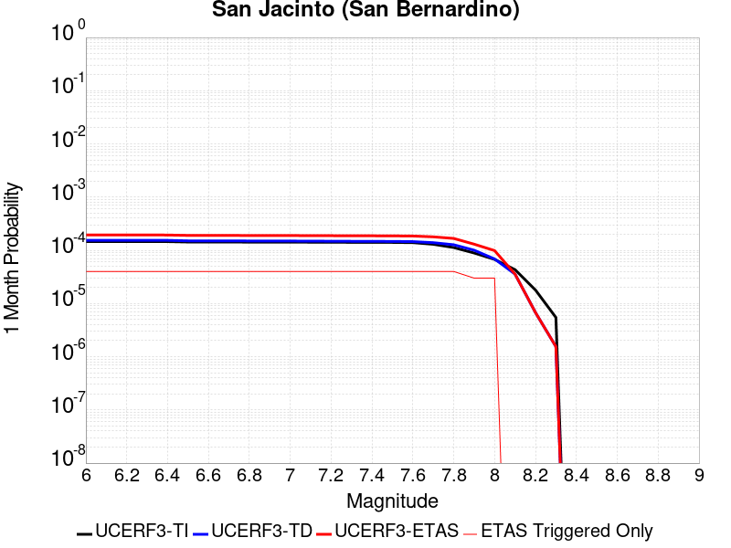 |  |  |

| Magnitude | 1 wk TI Prob | 1 wk TD Prob | 1 wk ETAS Prob | 1 wk ETAS/TD Gain | 1 wk ETAS Triggered Only | 1 mo TI Prob | 1 mo TD Prob | 1 mo ETAS Prob | 1 mo ETAS/TD Gain | 1 mo ETAS Triggered Only | 1 yr TI Prob | 1 yr TD Prob | 1 yr ETAS Prob | 1 yr ETAS/TD Gain | 1 yr ETAS Triggered Only | 10 yr TI Prob | 10 yr TD Prob | 10 yr ETAS Prob | 10 yr ETAS/TD Gain | 10 yr ETAS Triggered Only |
|-----|-----|-----|-----|-----|-----|-----|-----|-----|-----|-----|-----|-----|-----|-----|-----|-----|-----|-----|-----|-----|
| 6.0 | 3.409352E-5 | 3.600249E-5 | 4.672022E-5 | 1.2976941 | 1.0718114E-5 | 1.461069E-4 | 1.5428728E-4 | 1.9715312E-4 | 1.2778313 | 4.2872456E-5 | 0.0017774 | 0.001876831 | 0.001973113 | 1.0513003 | 9.646302E-5 | 0.01763251 | 0.019358097 | 0.019505246 | 1.0076014 | 1.5005359E-4 |
| 6.1 | 3.409352E-5 | 3.600249E-5 | 4.672022E-5 | 1.2976941 | 1.0718114E-5 | 1.461069E-4 | 1.5428728E-4 | 1.9715312E-4 | 1.2778313 | 4.2872456E-5 | 0.0017774 | 0.001876831 | 0.001973113 | 1.0513003 | 9.646302E-5 | 0.01763251 | 0.019358097 | 0.019505246 | 1.0076014 | 1.5005359E-4 |
| 6.2 | 3.409352E-5 | 3.600249E-5 | 4.672022E-5 | 1.2976941 | 1.0718114E-5 | 1.461069E-4 | 1.5428728E-4 | 1.9715312E-4 | 1.2778313 | 4.2872456E-5 | 0.0017774 | 0.001876831 | 0.001973113 | 1.0513003 | 9.646302E-5 | 0.01763251 | 0.019358097 | 0.019505246 | 1.0076014 | 1.5005359E-4 |
| 6.3 | 3.409352E-5 | 3.600249E-5 | 4.672022E-5 | 1.2976941 | 1.0718114E-5 | 1.461069E-4 | 1.5428728E-4 | 1.9715312E-4 | 1.2778313 | 4.2872456E-5 | 0.0017774 | 0.001876831 | 0.001973113 | 1.0513003 | 9.646302E-5 | 0.01763251 | 0.019358097 | 0.019505246 | 1.0076014 | 1.5005359E-4 |
| 6.4 | 3.400795E-5 | 3.589515E-5 | 4.661288E-5 | 1.2985843 | 1.0718114E-5 | 1.4574021E-4 | 1.5382729E-4 | 1.9669316E-4 | 1.2786622 | 4.2872456E-5 | 0.0017729428 | 0.0018712406 | 0.001967523 | 1.0514538 | 9.646302E-5 | 0.017588645 | 0.019303178 | 0.019450335 | 1.0076234 | 1.5005359E-4 |
| 6.5 | 3.341482E-5 | 3.5155765E-5 | 4.58735E-5 | 1.3048643 | 1.0718114E-5 | 1.4319851E-4 | 1.5065886E-4 | 1.9352486E-4 | 1.2845236 | 4.2872456E-5 | 0.0017420477 | 0.0018327299 | 0.0019290161 | 1.0525371 | 9.646302E-5 | 0.017284546 | 0.018924711 | 0.019071925 | 1.0077789 | 1.5005359E-4 |
| 6.6 | 3.3364955E-5 | 3.509298E-5 | 4.5810717E-5 | 1.3054097 | 1.0718114E-5 | 1.4298483E-4 | 1.5038982E-4 | 1.9325584E-4 | 1.2850326 | 4.2872456E-5 | 0.0017394501 | 0.0018294598 | 0.0019257464 | 1.0526311 | 9.646302E-5 | 0.017258976 | 0.018892575 | 0.019039793 | 1.0077924 | 1.5005359E-4 |
| 6.7 | 3.335922E-5 | 3.5082754E-5 | 4.580049E-5 | 1.3054987 | 1.0718114E-5 | 1.4296026E-4 | 1.5034601E-4 | 1.9321202E-4 | 1.2851157 | 4.2872456E-5 | 0.0017391514 | 0.0018289272 | 0.0019252138 | 1.0526465 | 9.646302E-5 | 0.017256035 | 0.018887365 | 0.019034585 | 1.0077946 | 1.5005359E-4 |
| 6.8 | 3.327683E-5 | 3.4976816E-5 | 4.5694556E-5 | 1.306424 | 1.0718114E-5 | 1.4260718E-4 | 1.4989203E-4 | 1.9275806E-4 | 1.2859794 | 4.2872456E-5 | 0.0017348597 | 0.0018234095 | 0.0019196966 | 1.0528061 | 9.646302E-5 | 0.017213784 | 0.018833136 | 0.018980363 | 1.0078175 | 1.5005359E-4 |
| 6.9 | 3.3235785E-5 | 3.4917768E-5 | 4.563551E-5 | 1.3069422 | 1.0718114E-5 | 1.4243131E-4 | 1.49639E-4 | 1.9250505E-4 | 1.286463 | 4.2872456E-5 | 0.0017327217 | 0.0018203339 | 0.0019166213 | 1.0528954 | 9.646302E-5 | 0.017192734 | 0.018803004 | 0.018950237 | 1.0078303 | 1.5005359E-4 |
| 7.0 | 3.3197095E-5 | 3.4857694E-5 | 4.5575434E-5 | 1.3074713 | 1.0718114E-5 | 1.422655E-4 | 1.4938158E-4 | 1.9224762E-4 | 1.2869568 | 4.2872456E-5 | 0.0017307063 | 0.001817205 | 0.0019134927 | 1.0529867 | 9.646302E-5 | 0.017172894 | 0.01877238 | 0.018919617 | 1.0078433 | 1.5005359E-4 |
| 7.1 | 3.3129716E-5 | 3.47379E-5 | 4.5455643E-5 | 1.3085316 | 1.0718114E-5 | 1.4197677E-4 | 1.4886823E-4 | 1.917343E-4 | 1.2879465 | 4.2872456E-5 | 0.0017271966 | 0.0018109654 | 0.0019072536 | 1.0531696 | 9.646302E-5 | 0.017138338 | 0.018711457 | 0.018858703 | 1.0078692 | 1.5005359E-4 |
| 7.2 | 3.3034008E-5 | 3.4605342E-5 | 4.5323086E-5 | 1.3097135 | 1.0718114E-5 | 1.4156665E-4 | 1.4830018E-4 | 1.9116628E-4 | 1.2890495 | 4.2872456E-5 | 0.0017222111 | 0.001804061 | 0.00190035 | 1.0533735 | 9.646302E-5 | 0.017089253 | 0.018643849 | 0.018791104 | 1.0078983 | 1.5005359E-4 |
| 7.3 | 3.2956614E-5 | 3.447309E-5 | 4.5190834E-5 | 1.3109018 | 1.0718114E-5 | 1.4123498E-4 | 1.4773346E-4 | 1.9059957E-4 | 1.2901585 | 4.2872456E-5 | 0.0017181796 | 0.0017971725 | 0.0018934621 | 1.0535784 | 9.646302E-5 | 0.017049557 | 0.018576592 | 0.018723859 | 1.0079275 | 1.5005359E-4 |
| 7.4 | 3.2915937E-5 | 3.439478E-5 | 4.5112523E-5 | 1.3116096 | 1.0718114E-5 | 1.4106068E-4 | 1.4739788E-4 | 1.90264E-4 | 1.2908192 | 4.2872456E-5 | 0.0017160608 | 0.0017930934 | 0.0018893834 | 1.0537006 | 9.646302E-5 | 0.017028693 | 0.018536855 | 0.018684126 | 1.0079448 | 1.5005359E-4 |
| 7.5 | 3.281791E-5 | 3.4259683E-5 | 4.4977427E-5 | 1.3128384 | 1.0718114E-5 | 1.406406E-4 | 1.4681896E-4 | 1.8968512E-4 | 1.2919661 | 4.2872456E-5 | 0.0017109542 | 0.0017860567 | 0.0018823474 | 1.0539125 | 9.646302E-5 | 0.016978411 | 0.018467735 | 0.018615019 | 1.0079751 | 1.5005359E-4 |
| 7.6 | 3.2521442E-5 | 3.39846E-5 | 4.4702352E-5 | 1.3153708 | 1.0718114E-5 | 1.3937015E-4 | 1.4564018E-4 | 1.8850638E-4 | 1.2943295 | 4.2872456E-5 | 0.0016955109 | 0.0017717284 | 0.0018680205 | 1.0543493 | 9.646302E-5 | 0.016826328 | 0.01832535 | 0.018472653 | 1.0080383 | 1.5005359E-4 |
| 7.7 | 3.0287873E-5 | 3.246845E-5 | 4.3186217E-5 | 1.3300978 | 1.0718114E-5 | 1.297987E-4 | 1.391431E-4 | 1.8200958E-4 | 1.3080748 | 4.2872456E-5 | 0.0015791537 | 0.001692752 | 0.0017890517 | 1.0568894 | 9.646302E-5 | 0.01567979 | 0.017536119 | 0.017683541 | 1.0084068 | 1.5005359E-4 |
| 7.8 | 2.6316151E-5 | 2.9678711E-5 | 4.0396506E-5 | 1.3611274 | 1.0718114E-5 | 1.1277862E-4 | 1.2718828E-4 | 1.7005528E-4 | 1.3370358 | 4.2872456E-5 | 0.0013722149 | 0.0015474184 | 0.0016437322 | 1.0622416 | 9.646302E-5 | 0.013637724 | 0.016077382 | 0.016225023 | 1.0091832 | 1.5005359E-4 |
| 7.9 | 2.0761147E-5 | 2.3431265E-5 | 3.414913E-5 | 1.4574171 | 1.0718114E-5 | 8.897331E-5 | 1.0041584E-4 | 1.3256696E-4 | 1.3201797 | 3.215434E-5 | 0.0010827117 | 0.0012218781 | 0.0012968131 | 1.0613278 | 7.5026794E-5 | 0.010774517 | 0.012799971 | 0.012916361 | 1.009093 | 1.17899246E-4 |
| 8.0 | 1.5738568E-5 | 1.6043394E-5 | 2.6761336E-5 | 1.6680595 | 1.0718114E-5 | 6.744926E-5 | 6.8755595E-5 | 1.00907724E-4 | 1.4676293 | 3.215434E-5 | 8.2088535E-4 | 8.3677855E-4 | 8.9032424E-4 | 1.0639904 | 5.3590567E-5 | 0.008178596 | 0.008871087 | 0.008945448 | 1.0083824 | 7.5026794E-5 |
| 8.1 | 1.0105832E-5 | 8.336244E-6 | 8.336244E-6 | 1.0 | 0.0 | 4.3309992E-5 | 3.5726272E-5 | 3.5726272E-5 | 1.0 | 0.0 | 5.2717153E-4 | 4.3488108E-4 | 4.3488108E-4 | 1.0 | 0.0 | 0.005259227 | 0.00468032 | 0.004690988 | 1.0022793 | 1.0718114E-5 |
| 8.2 | 4.189207E-6 | 1.5801045E-6 | 1.5801045E-6 | 1.0 | 0.0 | 1.7953622E-5 | 6.771859E-6 | 6.771859E-6 | 1.0 | 0.0 | 2.1856341E-4 | 8.244429E-5 | 8.244429E-5 | 1.0 | 0.0 | 0.0021834858 | 9.575395E-4 | 9.575395E-4 | 1.0 | 0.0 |
| 8.3 | 1.2758221E-6 | 3.6194777E-7 | 3.6194777E-7 | 1.0 | 0.0 | 5.4677976E-6 | 1.5512038E-6 | 1.5512038E-6 | 1.0 | 0.0 | 6.65684E-5 | 1.8885747E-5 | 1.8885747E-5 | 1.0 | 0.0 | 6.6548464E-4 | 2.2777634E-4 | 2.2777634E-4 | 1.0 | 0.0 |

## Owens Valley
*[(top)](#table-of-contents)*

| 1 Week | 1 Month | 1 Year | 10 Year |
|-----|-----|-----|-----|
|  |  | 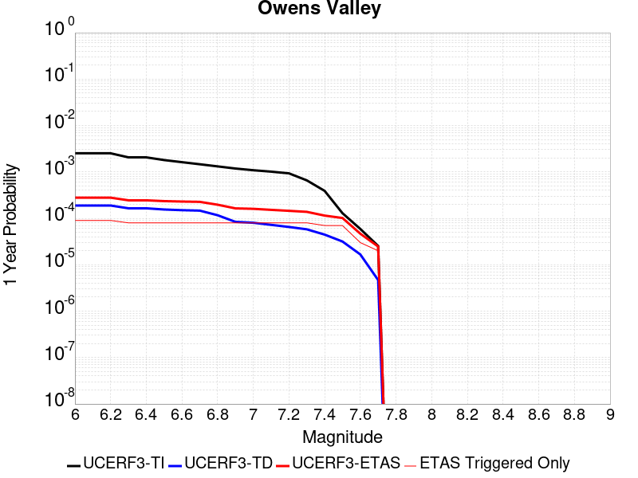 |  |

| Magnitude | 1 wk TI Prob | 1 wk TD Prob | 1 wk ETAS Prob | 1 wk ETAS/TD Gain | 1 wk ETAS Triggered Only | 1 mo TI Prob | 1 mo TD Prob | 1 mo ETAS Prob | 1 mo ETAS/TD Gain | 1 mo ETAS Triggered Only | 1 yr TI Prob | 1 yr TD Prob | 1 yr ETAS Prob | 1 yr ETAS/TD Gain | 1 yr ETAS Triggered Only | 10 yr TI Prob | 10 yr TD Prob | 10 yr ETAS Prob | 10 yr ETAS/TD Gain | 10 yr ETAS Triggered Only |
|-----|-----|-----|-----|-----|-----|-----|-----|-----|-----|-----|-----|-----|-----|-----|-----|-----|-----|-----|-----|-----|
| 6.0 | 4.83821E-5 | 3.627396E-6 | 3.627396E-6 | 1.0 | 0.0 | 2.0733538E-4 | 1.5545897E-5 | 4.7699737E-5 | 3.068317 | 3.215434E-5 | 0.002521386 | 1.8925584E-4 | 2.6426843E-4 | 1.3963555 | 7.5026794E-5 | 0.024929691 | 0.0019254381 | 0.0020752028 | 1.0777822 | 1.5005359E-4 |
| 6.1 | 4.83821E-5 | 3.627396E-6 | 3.627396E-6 | 1.0 | 0.0 | 2.0733538E-4 | 1.5545897E-5 | 4.7699737E-5 | 3.068317 | 3.215434E-5 | 0.002521386 | 1.8925584E-4 | 2.6426843E-4 | 1.3963555 | 7.5026794E-5 | 0.024929691 | 0.0019254381 | 0.0020752028 | 1.0777822 | 1.5005359E-4 |
| 6.2 | 4.83821E-5 | 3.627396E-6 | 3.627396E-6 | 1.0 | 0.0 | 2.0733538E-4 | 1.5545897E-5 | 4.7699737E-5 | 3.068317 | 3.215434E-5 | 0.002521386 | 1.8925584E-4 | 2.6426843E-4 | 1.3963555 | 7.5026794E-5 | 0.024929691 | 0.0019254381 | 0.0020752028 | 1.0777822 | 1.5005359E-4 |
| 6.3 | 3.953008E-5 | 3.1558448E-6 | 3.1558448E-6 | 1.0 | 0.0 | 1.6940363E-4 | 1.3524983E-5 | 4.5678888E-5 | 3.3773713 | 3.215434E-5 | 0.002060538 | 1.6465495E-4 | 2.396694E-4 | 1.4555857 | 7.5026794E-5 | 0.020415364 | 0.0016594394 | 0.001777143 | 1.0709298 | 1.17899246E-4 |
| 6.4 | 3.953008E-5 | 3.1558448E-6 | 3.1558448E-6 | 1.0 | 0.0 | 1.6940363E-4 | 1.3524983E-5 | 4.5678888E-5 | 3.3773713 | 3.215434E-5 | 0.002060538 | 1.6465495E-4 | 2.396694E-4 | 1.4555857 | 7.5026794E-5 | 0.020415364 | 0.0016594394 | 0.001777143 | 1.0709298 | 1.17899246E-4 |
| 6.5 | 3.457342E-5 | 2.9718876E-6 | 2.9718876E-6 | 1.0 | 0.0 | 1.4816338E-4 | 1.2736603E-5 | 4.4890534E-5 | 3.5245295 | 3.215434E-5 | 0.0018023965 | 1.5505782E-4 | 2.3007297E-4 | 1.4837884 | 7.5026794E-5 | 0.017878477 | 0.0015558768 | 0.0016735926 | 1.0756588 | 1.17899246E-4 |
| 6.6 | 3.1127765E-5 | 2.8746979E-6 | 2.8746979E-6 | 1.0 | 0.0 | 1.3339789E-4 | 1.232008E-5 | 4.4474025E-5 | 3.6098812 | 3.215434E-5 | 0.0016229092 | 1.4998733E-4 | 2.2500288E-4 | 1.5001459 | 7.5026794E-5 | 0.016111081 | 0.001501365 | 0.0016190872 | 1.0784101 | 1.17899246E-4 |
| 6.7 | 2.806885E-5 | 2.810566E-6 | 2.810566E-6 | 1.0 | 0.0 | 1.2028952E-4 | 1.2045231E-5 | 4.4199183E-5 | 3.6694343 | 3.215434E-5 | 0.001463541 | 1.4664151E-4 | 2.216573E-4 | 1.511559 | 7.5026794E-5 | 0.014539397 | 0.001465831 | 0.0015835573 | 1.0803138 | 1.17899246E-4 |
| 6.8 | 2.524524E-5 | 2.235501E-6 | 2.235501E-6 | 1.0 | 0.0 | 1.0818939E-4 | 9.5806845E-6 | 4.173472E-5 | 4.356131 | 3.215434E-5 | 0.0013164099 | 1.1663889E-4 | 1.9165693E-4 | 1.6431649 | 7.5026794E-5 | 0.01308639 | 0.0011660501 | 0.0012838119 | 1.1009921 | 1.17899246E-4 |
| 6.9 | 2.2704568E-5 | 1.6082656E-6 | 1.6082656E-6 | 1.0 | 0.0 | 9.730166E-5 | 6.8925488E-6 | 3.9046667E-5 | 5.665055 | 3.215434E-5 | 0.0011840039 | 8.391357E-5 | 1.5893407E-4 | 1.894021 | 7.5026794E-5 | 0.011777153 | 8.390308E-4 | 9.5683115E-4 | 1.1404005 | 1.17899246E-4 |
| 7.0 | 2.0871712E-5 | 1.5396373E-6 | 1.5396373E-6 | 1.0 | 0.0 | 8.944713E-5 | 6.598429E-6 | 3.8752558E-5 | 5.8729973 | 3.215434E-5 | 0.0010884746 | 8.033293E-5 | 1.553537E-4 | 1.9338732 | 7.5026794E-5 | 0.010831586 | 8.0321095E-4 | 9.210155E-4 | 1.146667 | 1.17899246E-4 |
| 7.1 | 1.944928E-5 | 1.3864965E-6 | 1.3864965E-6 | 1.0 | 0.0 | 8.335139E-5 | 5.942114E-6 | 3.8096263E-5 | 6.4112306 | 3.215434E-5 | 0.0010143308 | 7.2342846E-5 | 1.4736422E-4 | 2.0370255 | 7.5026794E-5 | 0.010097133 | 7.233511E-4 | 8.41165E-4 | 1.1628724 | 1.17899246E-4 |
| 7.2 | 1.7876306E-5 | 1.2489834E-6 | 1.2489834E-6 | 1.0 | 0.0 | 7.6610486E-5 | 5.3527747E-6 | 3.7506943E-5 | 7.0070095 | 3.215434E-5 | 9.3233347E-4 | 6.516809E-5 | 1.4019E-4 | 2.151206 | 7.5026794E-5 | 0.009284316 | 6.516274E-4 | 7.694498E-4 | 1.1808126 | 1.17899246E-4 |
| 7.3 | 1.2618672E-5 | 1.1115851E-6 | 1.1115851E-6 | 1.0 | 0.0 | 5.40789E-5 | 4.763928E-6 | 3.6918114E-5 | 7.749512 | 3.215434E-5 | 6.582117E-4 | 5.799928E-5 | 1.3302172E-4 | 2.2935064 | 7.5026794E-5 | 0.0065626553 | 5.799741E-4 | 6.8709307E-4 | 1.1846961 | 1.07181135E-4 |
| 7.4 | 7.4874442E-6 | 8.549184E-7 | 8.549184E-7 | 1.0 | 0.0 | 3.208865E-5 | 3.663931E-6 | 3.5818153E-5 | 9.775881 | 3.215434E-5 | 3.906093E-4 | 4.4607452E-5 | 1.08913264E-4 | 2.4415934 | 6.430868E-5 | 0.003899234 | 4.4607726E-4 | 5.4249726E-4 | 1.2161509 | 9.646302E-5 |
| 7.5 | 2.4734156E-6 | 6.068976E-7 | 6.068976E-7 | 1.0 | 0.0 | 1.060031E-5 | 2.6009868E-6 | 3.4755245E-5 | 13.3623295 | 3.215434E-5 | 1.2905113E-4 | 3.1666557E-5 | 9.5973206E-5 | 3.0307431 | 6.430868E-5 | 0.0012897621 | 3.1662078E-4 | 4.1305326E-4 | 1.3045677 | 9.646302E-5 |
| 7.6 | 1.1328841E-6 | 3.1967096E-7 | 3.1967096E-7 | 1.0 | 0.0 | 4.8552088E-6 | 1.3700177E-6 | 2.2806216E-5 | 16.646658 | 2.1436228E-5 | 5.9110564E-5 | 1.6679838E-5 | 3.8115708E-5 | 2.2851365 | 2.1436228E-5 | 5.9094845E-4 | 1.6678606E-4 | 2.0965136E-4 | 1.2570077 | 4.2872456E-5 |
| 7.7 | 4.8613185E-7 | 8.965384E-8 | 8.965384E-8 | 1.0 | 0.0 | 2.0834207E-6 | 3.842307E-7 | 1.110234E-5 | 28.894985 | 1.0718114E-5 | 2.536535E-5 | 4.677999E-6 | 1.5396063E-5 | 3.291164 | 1.0718114E-5 | 2.5362454E-4 | 4.6779078E-5 | 5.749669E-5 | 1.2291112 | 1.0718114E-5 |

## Independence rev 2011
*[(top)](#table-of-contents)*

| 1 Week | 1 Month | 1 Year | 10 Year |
|-----|-----|-----|-----|
|  | 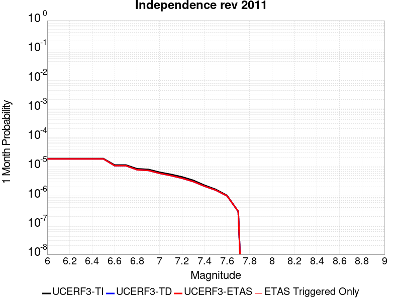 |  | 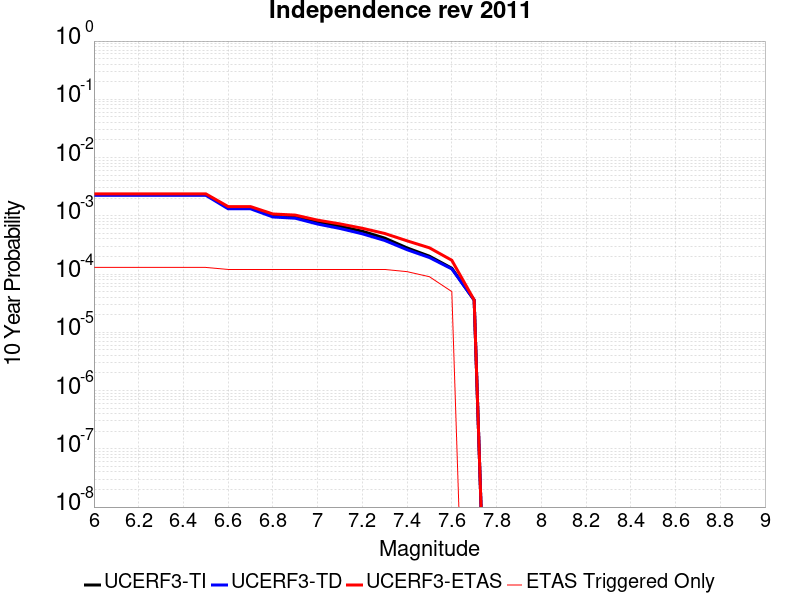 |

| Magnitude | 1 wk TI Prob | 1 wk TD Prob | 1 wk ETAS Prob | 1 wk ETAS/TD Gain | 1 wk ETAS Triggered Only | 1 mo TI Prob | 1 mo TD Prob | 1 mo ETAS Prob | 1 mo ETAS/TD Gain | 1 mo ETAS Triggered Only | 1 yr TI Prob | 1 yr TD Prob | 1 yr ETAS Prob | 1 yr ETAS/TD Gain | 1 yr ETAS Triggered Only | 10 yr TI Prob | 10 yr TD Prob | 10 yr ETAS Prob | 10 yr ETAS/TD Gain | 10 yr ETAS Triggered Only |
|-----|-----|-----|-----|-----|-----|-----|-----|-----|-----|-----|-----|-----|-----|-----|-----|-----|-----|-----|-----|-----|
| 6.0 | 4.422171E-6 | 4.3262453E-6 | 4.3262453E-6 | 1.0 | 0.0 | 1.8952025E-5 | 1.8540937E-5 | 1.8540937E-5 | 1.0 | 0.0 | 2.3071647E-4 | 2.257155E-4 | 2.9000966E-4 | 1.2848461 | 6.430868E-5 | 0.0023047708 | 0.0022551562 | 0.0023941773 | 1.061646 | 1.3933548E-4 |
| 6.1 | 4.422171E-6 | 4.3262453E-6 | 4.3262453E-6 | 1.0 | 0.0 | 1.8952025E-5 | 1.8540937E-5 | 1.8540937E-5 | 1.0 | 0.0 | 2.3071647E-4 | 2.257155E-4 | 2.9000966E-4 | 1.2848461 | 6.430868E-5 | 0.0023047708 | 0.0022551562 | 0.0023941773 | 1.061646 | 1.3933548E-4 |
| 6.2 | 4.422171E-6 | 4.3262453E-6 | 4.3262453E-6 | 1.0 | 0.0 | 1.8952025E-5 | 1.8540937E-5 | 1.8540937E-5 | 1.0 | 0.0 | 2.3071647E-4 | 2.257155E-4 | 2.9000966E-4 | 1.2848461 | 6.430868E-5 | 0.0023047708 | 0.0022551562 | 0.0023941773 | 1.061646 | 1.3933548E-4 |
| 6.3 | 4.422171E-6 | 4.3262453E-6 | 4.3262453E-6 | 1.0 | 0.0 | 1.8952025E-5 | 1.8540937E-5 | 1.8540937E-5 | 1.0 | 0.0 | 2.3071647E-4 | 2.257155E-4 | 2.9000966E-4 | 1.2848461 | 6.430868E-5 | 0.0023047708 | 0.0022551562 | 0.0023941773 | 1.061646 | 1.3933548E-4 |
| 6.4 | 4.422171E-6 | 4.3262453E-6 | 4.3262453E-6 | 1.0 | 0.0 | 1.8952025E-5 | 1.8540937E-5 | 1.8540937E-5 | 1.0 | 0.0 | 2.3071647E-4 | 2.257155E-4 | 2.9000966E-4 | 1.2848461 | 6.430868E-5 | 0.0023047708 | 0.0022551562 | 0.0023941773 | 1.061646 | 1.3933548E-4 |
| 6.5 | 4.422171E-6 | 4.3262453E-6 | 4.3262453E-6 | 1.0 | 0.0 | 1.8952025E-5 | 1.8540937E-5 | 1.8540937E-5 | 1.0 | 0.0 | 2.3071647E-4 | 2.257155E-4 | 2.9000966E-4 | 1.2848461 | 6.430868E-5 | 0.0023047708 | 0.0022551562 | 0.0023941773 | 1.061646 | 1.3933548E-4 |
| 6.6 | 2.663744E-6 | 2.5319996E-6 | 2.5319996E-6 | 1.0 | 0.0 | 1.1415996E-5 | 1.0851385E-5 | 1.0851385E-5 | 1.0 | 0.0 | 1.3898089E-4 | 1.3210809E-4 | 1.8569158E-4 | 1.4056034 | 5.3590567E-5 | 0.0013889399 | 0.0013203438 | 0.0014487914 | 1.0972834 | 1.2861736E-4 |
| 6.7 | 2.663744E-6 | 2.5319996E-6 | 2.5319996E-6 | 1.0 | 0.0 | 1.1415996E-5 | 1.0851385E-5 | 1.0851385E-5 | 1.0 | 0.0 | 1.3898089E-4 | 1.3210809E-4 | 1.8569158E-4 | 1.4056034 | 5.3590567E-5 | 0.0013889399 | 0.0013203438 | 0.0014487914 | 1.0972834 | 1.2861736E-4 |
| 6.8 | 1.9716529E-6 | 1.83227E-6 | 1.83227E-6 | 1.0 | 0.0 | 8.449913E-6 | 7.852563E-6 | 7.852563E-6 | 1.0 | 0.0 | 1.0287284E-4 | 9.560089E-5 | 1.4918634E-4 | 1.5605121 | 5.3590567E-5 | 0.0010282523 | 9.556105E-4 | 0.001084105 | 1.1344632 | 1.2861736E-4 |
| 6.9 | 1.8788617E-6 | 1.7430103E-6 | 1.7430103E-6 | 1.0 | 0.0 | 8.0522395E-6 | 7.470024E-6 | 7.470024E-6 | 1.0 | 0.0 | 9.80316E-5 | 9.094387E-5 | 1.4452956E-4 | 1.5892173 | 5.3590567E-5 | 9.798837E-4 | 9.090785E-4 | 0.0010375789 | 1.1413524 | 1.2861736E-4 |
| 7.0 | 1.5045488E-6 | 1.3849595E-6 | 1.3849595E-6 | 1.0 | 0.0 | 6.44805E-6 | 5.9355275E-6 | 5.9355275E-6 | 1.0 | 0.0 | 7.8502184E-5 | 7.226271E-5 | 1.258494E-4 | 1.741554 | 5.3590567E-5 | 7.8474457E-4 | 7.2239724E-4 | 8.509217E-4 | 1.1779138 | 1.2861736E-4 |
| 7.1 | 1.272341E-6 | 1.1625177E-6 | 1.1625177E-6 | 1.0 | 0.0 | 5.4528787E-6 | 4.9822092E-6 | 4.9822092E-6 | 1.0 | 0.0 | 6.6386776E-5 | 6.065674E-5 | 1.1424406E-4 | 1.8834519 | 5.3590567E-5 | 6.636695E-4 | 6.06405E-4 | 7.349444E-4 | 1.2119695 | 1.2861736E-4 |
| 7.2 | 1.0416892E-6 | 9.4099494E-7 | 9.4099494E-7 | 1.0 | 0.0 | 4.464375E-6 | 4.032829E-6 | 4.032829E-6 | 1.0 | 0.0 | 5.4352407E-5 | 4.909861E-5 | 1.0268654E-4 | 2.091435 | 5.3590567E-5 | 5.4339116E-4 | 4.9087947E-4 | 6.194337E-4 | 1.2618855 | 1.2861736E-4 |
| 7.3 | 7.9450155E-7 | 7.235053E-7 | 7.235053E-7 | 1.0 | 0.0 | 3.4050022E-6 | 3.1007335E-6 | 3.1007335E-6 | 1.0 | 0.0 | 4.1455114E-5 | 3.7750786E-5 | 9.133933E-5 | 2.4195344 | 5.3590567E-5 | 4.144738E-4 | 3.7744487E-4 | 5.060137E-4 | 1.3406295 | 1.2861736E-4 |
| 7.4 | 5.3893444E-7 | 5.0195445E-7 | 5.0195445E-7 | 1.0 | 0.0 | 2.309717E-6 | 2.1512315E-6 | 2.1512315E-6 | 1.0 | 0.0 | 2.8120441E-5 | 2.6190934E-5 | 7.97801E-5 | 3.046096 | 5.3590567E-5 | 2.8116882E-4 | 2.6187891E-4 | 3.797473E-4 | 1.4500873 | 1.17899246E-4 |
| 7.5 | 3.8852085E-7 | 3.6825747E-7 | 3.6825747E-7 | 1.0 | 0.0 | 1.6650882E-6 | 1.5782454E-6 | 1.5782454E-6 | 1.0 | 0.0 | 2.027226E-5 | 1.9214971E-5 | 5.1368694E-5 | 2.6733682 | 3.215434E-5 | 2.0270412E-4 | 1.921333E-4 | 2.885778E-4 | 1.5019665 | 9.646302E-5 |
| 7.6 | 2.414929E-7 | 2.3457659E-7 | 2.3457659E-7 | 1.0 | 0.0 | 1.0349692E-6 | 1.0053279E-6 | 1.0053279E-6 | 1.0 | 0.0 | 1.2600677E-5 | 1.22398E-5 | 2.2957782E-5 | 1.8756665 | 1.0718114E-5 | 1.2599962E-4 | 1.2239137E-4 | 1.7597538E-4 | 1.4378088 | 5.3590567E-5 |
| 7.7 | 6.8298014E-8 | 6.858993E-8 | 6.858993E-8 | 1.0 | 0.0 | 2.9270575E-7 | 2.939568E-7 | 2.939568E-7 | 1.0 | 0.0 | 3.5636867E-6 | 3.5789185E-6 | 3.5789185E-6 | 1.0 | 0.0 | 3.5636294E-5 | 3.5788657E-5 | 3.5788657E-5 | 1.0 | 0.0 |

## White Wolf (Extension)
*[(top)](#table-of-contents)*

| 1 Week | 1 Month | 1 Year | 10 Year |
|-----|-----|-----|-----|
|  |  |  | 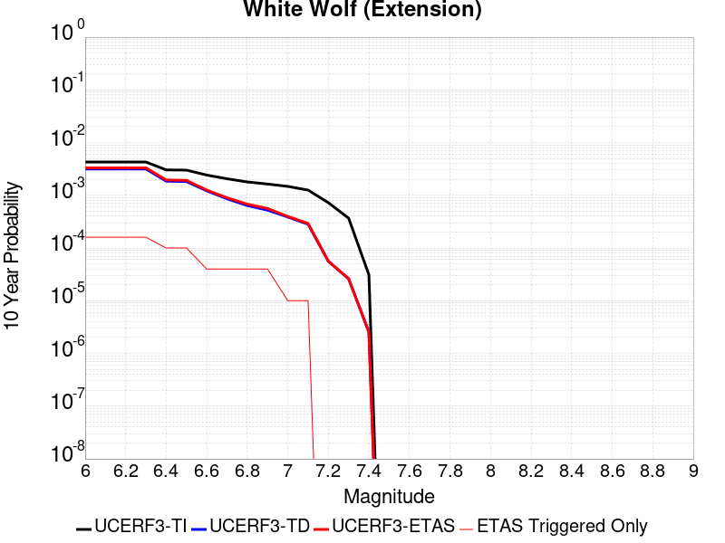 |

| Magnitude | 1 wk TI Prob | 1 wk TD Prob | 1 wk ETAS Prob | 1 wk ETAS/TD Gain | 1 wk ETAS Triggered Only | 1 mo TI Prob | 1 mo TD Prob | 1 mo ETAS Prob | 1 mo ETAS/TD Gain | 1 mo ETAS Triggered Only | 1 yr TI Prob | 1 yr TD Prob | 1 yr ETAS Prob | 1 yr ETAS/TD Gain | 1 yr ETAS Triggered Only | 10 yr TI Prob | 10 yr TD Prob | 10 yr ETAS Prob | 10 yr ETAS/TD Gain | 10 yr ETAS Triggered Only |
|-----|-----|-----|-----|-----|-----|-----|-----|-----|-----|-----|-----|-----|-----|-----|-----|-----|-----|-----|-----|-----|
| 6.0 | 8.222555E-6 | 6.0667057E-6 | 1.6784754E-5 | 2.7666998 | 1.0718114E-5 | 3.5239045E-5 | 2.5999947E-5 | 4.7435617E-5 | 1.8244505 | 2.1436228E-5 | 4.289509E-4 | 3.1650998E-4 | 3.9151305E-4 | 1.236969 | 7.5026794E-5 | 0.0042812387 | 0.0031612439 | 0.003300139 | 1.0439368 | 1.3933548E-4 |
| 6.1 | 8.222555E-6 | 6.0667057E-6 | 1.6784754E-5 | 2.7666998 | 1.0718114E-5 | 3.5239045E-5 | 2.5999947E-5 | 4.7435617E-5 | 1.8244505 | 2.1436228E-5 | 4.289509E-4 | 3.1650998E-4 | 3.9151305E-4 | 1.236969 | 7.5026794E-5 | 0.0042812387 | 0.0031612439 | 0.003300139 | 1.0439368 | 1.3933548E-4 |
| 6.2 | 8.222555E-6 | 6.0667057E-6 | 1.6784754E-5 | 2.7666998 | 1.0718114E-5 | 3.5239045E-5 | 2.5999947E-5 | 4.7435617E-5 | 1.8244505 | 2.1436228E-5 | 4.289509E-4 | 3.1650998E-4 | 3.9151305E-4 | 1.236969 | 7.5026794E-5 | 0.0042812387 | 0.0031612439 | 0.003300139 | 1.0439368 | 1.3933548E-4 |
| 6.3 | 8.222555E-6 | 6.0667057E-6 | 1.6784754E-5 | 2.7666998 | 1.0718114E-5 | 3.5239045E-5 | 2.5999947E-5 | 4.7435617E-5 | 1.8244505 | 2.1436228E-5 | 4.289509E-4 | 3.1650998E-4 | 3.9151305E-4 | 1.236969 | 7.5026794E-5 | 0.0042812387 | 0.0031612439 | 0.003300139 | 1.0439368 | 1.3933548E-4 |
| 6.4 | 5.821773E-6 | 3.5572016E-6 | 1.4275277E-5 | 4.013064 | 1.0718114E-5 | 2.4950215E-5 | 1.5245067E-5 | 3.668097E-5 | 2.4060876 | 2.1436228E-5 | 3.0372653E-4 | 1.8559398E-4 | 2.2845848E-4 | 1.2309585 | 4.2872456E-5 | 0.0030331176 | 0.0018544982 | 0.0019293858 | 1.0403817 | 7.5026794E-5 |
| 6.5 | 5.766023E-6 | 3.4991353E-6 | 1.4217211E-5 | 4.063064 | 1.0718114E-5 | 2.4711293E-5 | 1.4996214E-5 | 3.643212E-5 | 2.4294212 | 2.1436228E-5 | 3.0081844E-4 | 1.8256472E-4 | 2.2542934E-4 | 1.2347914 | 4.2872456E-5 | 0.0030041158 | 0.0018242556 | 0.0018991454 | 1.0410523 | 7.5026794E-5 |
| 6.6 | 4.643576E-6 | 2.332643E-6 | 2.332643E-6 | 1.0 | 0.0 | 1.9900888E-5 | 9.997005E-6 | 9.997005E-6 | 1.0 | 0.0 | 2.4226638E-4 | 1.2170716E-4 | 1.4314079E-4 | 1.1761081 | 2.1436228E-5 | 0.0024200242 | 0.0012164476 | 0.0012485627 | 1.0264008 | 3.215434E-5 |
| 6.7 | 3.9529173E-6 | 1.6483629E-6 | 1.6483629E-6 | 1.0 | 0.0 | 1.6940963E-5 | 7.064394E-6 | 7.064394E-6 | 1.0 | 0.0 | 2.0623671E-4 | 8.600579E-5 | 1.0744017E-4 | 1.2492203 | 2.1436228E-5 | 0.002060454 | 8.5974357E-4 | 8.9187024E-4 | 1.0373678 | 3.215434E-5 |
| 6.8 | 3.4377522E-6 | 1.2245362E-6 | 1.2245362E-6 | 1.0 | 0.0 | 1.473314E-5 | 5.2480023E-6 | 5.2480023E-6 | 1.0 | 0.0 | 1.7936122E-4 | 6.389264E-5 | 8.53275E-5 | 1.3354824 | 2.1436228E-5 | 0.0017921652 | 6.3875184E-4 | 6.7088567E-4 | 1.0503072 | 3.215434E-5 |
| 6.9 | 3.1367306E-6 | 1.0033893E-6 | 1.0033893E-6 | 1.0 | 0.0 | 1.3443062E-5 | 4.3002333E-6 | 4.3002333E-6 | 1.0 | 0.0 | 1.63657E-4 | 5.235416E-5 | 7.378926E-5 | 1.409425 | 2.1436228E-5 | 0.0016353652 | 5.234259E-4 | 5.555634E-4 | 1.0613984 | 3.215434E-5 |
| 7.0 | 2.8298145E-6 | 7.4287595E-7 | 7.4287595E-7 | 1.0 | 0.0 | 1.2127721E-5 | 3.1837506E-6 | 3.1837506E-6 | 1.0 | 0.0 | 1.47645E-4 | 3.8761526E-5 | 4.9479222E-5 | 1.2765036 | 1.0718114E-5 | 0.0014754693 | 3.8755263E-4 | 3.982666E-4 | 1.0276452 | 1.0718114E-5 |
| 7.1 | 2.4091064E-6 | 5.4228286E-7 | 5.4228286E-7 | 1.0 | 0.0 | 1.03247E-5 | 2.3240675E-6 | 2.3240675E-6 | 1.0 | 0.0 | 1.2569598E-4 | 2.8295197E-5 | 3.9013008E-5 | 1.3787855 | 1.0718114E-5 | 0.001256249 | 2.8291997E-4 | 2.9363506E-4 | 1.0378731 | 1.0718114E-5 |
| 7.2 | 1.3875518E-6 | 1.07434374E-7 | 1.07434374E-7 | 1.0 | 0.0 | 5.9466374E-6 | 4.6043297E-7 | 4.6043297E-7 | 1.0 | 0.0 | 7.23979E-5 | 5.6057584E-6 | 5.6057584E-6 | 1.0 | 0.0 | 7.2374323E-4 | 5.605628E-5 | 5.605628E-5 | 1.0 | 0.0 |
| 7.3 | 7.056077E-7 | 5.0022493E-8 | 5.0022493E-8 | 1.0 | 0.0 | 3.0240296E-6 | 2.143821E-7 | 2.143821E-7 | 1.0 | 0.0 | 3.681694E-5 | 2.6100993E-6 | 2.6100993E-6 | 1.0 | 0.0 | 3.681084E-4 | 2.6100734E-5 | 2.6100734E-5 | 1.0 | 0.0 |
| 7.4 | 5.9334678E-8 | 4.8685624E-9 | 4.8685624E-9 | 1.0 | 0.0 | 2.5429145E-7 | 2.0865269E-8 | 2.0865269E-8 | 1.0 | 0.0 | 3.095994E-6 | 2.5403463E-7 | 2.5403463E-7 | 1.0 | 0.0 | 3.095951E-5 | 2.5403444E-6 | 2.5403444E-6 | 1.0 | 0.0 |

## Santa Ynez (East)
*[(top)](#table-of-contents)*

| 1 Week | 1 Month | 1 Year | 10 Year |
|-----|-----|-----|-----|
|  |  |  |  |

| Magnitude | 1 wk TI Prob | 1 wk TD Prob | 1 wk ETAS Prob | 1 wk ETAS/TD Gain | 1 wk ETAS Triggered Only | 1 mo TI Prob | 1 mo TD Prob | 1 mo ETAS Prob | 1 mo ETAS/TD Gain | 1 mo ETAS Triggered Only | 1 yr TI Prob | 1 yr TD Prob | 1 yr ETAS Prob | 1 yr ETAS/TD Gain | 1 yr ETAS Triggered Only | 10 yr TI Prob | 10 yr TD Prob | 10 yr ETAS Prob | 10 yr ETAS/TD Gain | 10 yr ETAS Triggered Only |
|-----|-----|-----|-----|-----|-----|-----|-----|-----|-----|-----|-----|-----|-----|-----|-----|-----|-----|-----|-----|-----|
| 6.0 | 3.2269712E-5 | 3.6751346E-5 | 4.7469068E-5 | 1.2916279 | 1.0718114E-5 | 1.3829143E-4 | 1.5749958E-4 | 1.8964887E-4 | 1.2041229 | 3.215434E-5 | 0.0016823979 | 0.0019164606 | 0.0019699484 | 1.0279098 | 5.3590567E-5 | 0.016697178 | 0.019056875 | 0.019162014 | 1.0055171 | 1.07181135E-4 |
| 6.1 | 3.2269712E-5 | 3.6751346E-5 | 4.7469068E-5 | 1.2916279 | 1.0718114E-5 | 1.3829143E-4 | 1.5749958E-4 | 1.8964887E-4 | 1.2041229 | 3.215434E-5 | 0.0016823979 | 0.0019164606 | 0.0019699484 | 1.0279098 | 5.3590567E-5 | 0.016697178 | 0.019056875 | 0.019162014 | 1.0055171 | 1.07181135E-4 |
| 6.2 | 3.2269712E-5 | 3.6751346E-5 | 4.7469068E-5 | 1.2916279 | 1.0718114E-5 | 1.3829143E-4 | 1.5749958E-4 | 1.8964887E-4 | 1.2041229 | 3.215434E-5 | 0.0016823979 | 0.0019164606 | 0.0019699484 | 1.0279098 | 5.3590567E-5 | 0.016697178 | 0.019056875 | 0.019162014 | 1.0055171 | 1.07181135E-4 |
| 6.3 | 3.2269712E-5 | 3.6751346E-5 | 4.7469068E-5 | 1.2916279 | 1.0718114E-5 | 1.3829143E-4 | 1.5749958E-4 | 1.8964887E-4 | 1.2041229 | 3.215434E-5 | 0.0016823979 | 0.0019164606 | 0.0019699484 | 1.0279098 | 5.3590567E-5 | 0.016697178 | 0.019056875 | 0.019162014 | 1.0055171 | 1.07181135E-4 |
| 6.4 | 1.4404779E-5 | 1.4849569E-5 | 1.4849569E-5 | 1.0 | 0.0 | 6.1733306E-5 | 6.363949E-5 | 6.363949E-5 | 1.0 | 0.0 | 7.513438E-4 | 7.7454036E-4 | 7.8525016E-4 | 1.0138273 | 1.0718114E-5 | 0.0074880854 | 0.007718959 | 0.0077402294 | 1.0027556 | 2.1436228E-5 |
| 6.5 | 1.4404779E-5 | 1.4849569E-5 | 1.4849569E-5 | 1.0 | 0.0 | 6.1733306E-5 | 6.363949E-5 | 6.363949E-5 | 1.0 | 0.0 | 7.513438E-4 | 7.7454036E-4 | 7.8525016E-4 | 1.0138273 | 1.0718114E-5 | 0.0074880854 | 0.007718959 | 0.0077402294 | 1.0027556 | 2.1436228E-5 |
| 6.6 | 1.280208E-5 | 1.3012098E-5 | 1.3012098E-5 | 1.0 | 0.0 | 5.4864904E-5 | 5.5764955E-5 | 5.5764955E-5 | 1.0 | 0.0 | 6.6777546E-4 | 6.7872857E-4 | 6.894394E-4 | 1.0157807 | 1.0718114E-5 | 0.006657724 | 0.006766767 | 0.006788058 | 1.0031464 | 2.1436228E-5 |
| 6.7 | 1.2457027E-5 | 1.2628613E-5 | 1.2628613E-5 | 1.0 | 0.0 | 5.3386164E-5 | 5.4121516E-5 | 5.4121516E-5 | 1.0 | 0.0 | 6.497827E-4 | 6.587319E-4 | 6.6944293E-4 | 1.0162601 | 1.0718114E-5 | 0.00647886 | 0.0065679904 | 0.006589286 | 1.0032423 | 2.1436228E-5 |
| 6.8 | 1.2095134E-5 | 1.2231055E-5 | 1.2231055E-5 | 1.0 | 0.0 | 5.1835254E-5 | 5.2417763E-5 | 5.2417763E-5 | 1.0 | 0.0 | 6.309115E-4 | 6.38001E-4 | 6.487123E-4 | 1.0167888 | 1.0718114E-5 | 0.0062912325 | 0.0063618817 | 0.0063831815 | 1.003348 | 2.1436228E-5 |
| 6.9 | 1.1104036E-5 | 1.11574755E-5 | 1.11574755E-5 | 1.0 | 0.0 | 4.758786E-5 | 4.7816884E-5 | 4.7816884E-5 | 1.0 | 0.0 | 5.7922816E-4 | 5.820163E-4 | 5.9272815E-4 | 1.0184047 | 1.0718114E-5 | 0.005777207 | 0.005805066 | 0.0058263773 | 1.0036713 | 2.1436228E-5 |
| 7.0 | 1.0577444E-5 | 1.0581802E-5 | 1.0581802E-5 | 1.0 | 0.0 | 4.5331115E-5 | 4.5349796E-5 | 4.5349796E-5 | 1.0 | 0.0 | 5.5176654E-4 | 5.519951E-4 | 5.627073E-4 | 1.0194063 | 1.0718114E-5 | 0.0055039856 | 0.0055063786 | 0.0055276966 | 1.0038716 | 2.1436228E-5 |
| 7.1 | 1.0021775E-5 | 9.981102E-6 | 9.981102E-6 | 1.0 | 0.0 | 4.294976E-5 | 4.2775457E-5 | 4.2775457E-5 | 1.0 | 0.0 | 5.2278786E-4 | 5.2066793E-4 | 5.313805E-4 | 1.0205746 | 1.0718114E-5 | 0.0052155964 | 0.0051946132 | 0.0052159377 | 1.0041052 | 2.1436228E-5 |
| 7.2 | 8.874109E-6 | 8.748894E-6 | 8.748894E-6 | 1.0 | 0.0 | 3.8031343E-5 | 3.749473E-5 | 3.749473E-5 | 1.0 | 0.0 | 4.629332E-4 | 4.564038E-4 | 4.6711703E-4 | 1.0234731 | 1.0718114E-5 | 0.0046197 | 0.0045547825 | 0.0045761215 | 1.0046849 | 2.1436228E-5 |
| 7.3 | 7.5504267E-6 | 7.505199E-6 | 7.505199E-6 | 1.0 | 0.0 | 3.235857E-5 | 3.216475E-5 | 3.216475E-5 | 1.0 | 0.0 | 3.9389438E-4 | 3.9153645E-4 | 4.0225039E-4 | 1.0273638 | 1.0718114E-5 | 0.0039319694 | 0.003908573 | 0.0039192494 | 1.0027314 | 1.0718114E-5 |
| 7.4 | 6.309394E-6 | 6.1832216E-6 | 6.1832216E-6 | 1.0 | 0.0 | 2.703998E-5 | 2.6499258E-5 | 2.6499258E-5 | 1.0 | 0.0 | 3.2916202E-4 | 3.2258165E-4 | 3.332963E-4 | 1.0332153 | 1.0718114E-5 | 0.003286749 | 0.0032212313 | 0.003231915 | 1.0033166 | 1.0718114E-5 |
| 7.5 | 4.6103073E-6 | 4.440935E-6 | 4.440935E-6 | 1.0 | 0.0 | 1.975831E-5 | 1.9032443E-5 | 1.9032443E-5 | 1.0 | 0.0 | 2.4053088E-4 | 2.3169606E-4 | 2.4241168E-4 | 1.0462487 | 1.0718114E-5 | 0.002402707 | 0.0023146144 | 0.0023253076 | 1.00462 | 1.0718114E-5 |
| 7.6 | 1.2858658E-6 | 1.3008267E-6 | 1.3008267E-6 | 1.0 | 0.0 | 5.5108417E-6 | 5.5749606E-6 | 5.5749606E-6 | 1.0 | 0.0 | 6.7092435E-5 | 6.78731E-5 | 6.78731E-5 | 1.0 | 0.0 | 6.707218E-4 | 6.7853054E-4 | 6.7853054E-4 | 1.0 | 0.0 |
| 7.7 | 5.3302307E-7 | 5.612178E-7 | 5.612178E-7 | 1.0 | 0.0 | 2.2843826E-6 | 2.4052172E-6 | 2.4052172E-6 | 1.0 | 0.0 | 2.7812002E-5 | 2.9283161E-5 | 2.9283161E-5 | 1.0 | 0.0 | 2.7808524E-4 | 2.9279658E-4 | 2.9279658E-4 | 1.0 | 0.0 |
| 7.8 | 4.613933E-8 | 4.803036E-8 | 4.803036E-8 | 1.0 | 0.0 | 1.9773998E-7 | 2.0584437E-7 | 2.0584437E-7 | 1.0 | 0.0 | 2.4074816E-6 | 2.5061524E-6 | 2.5061524E-6 | 1.0 | 0.0 | 2.4074554E-5 | 2.5061252E-5 | 2.5061252E-5 | 1.0 | 0.0 |

## Santa Rosa Island
*[(top)](#table-of-contents)*

| 1 Week | 1 Month | 1 Year | 10 Year |
|-----|-----|-----|-----|
|  |  |  |  |

| Magnitude | 1 wk TI Prob | 1 wk TD Prob | 1 wk ETAS Prob | 1 wk ETAS/TD Gain | 1 wk ETAS Triggered Only | 1 mo TI Prob | 1 mo TD Prob | 1 mo ETAS Prob | 1 mo ETAS/TD Gain | 1 mo ETAS Triggered Only | 1 yr TI Prob | 1 yr TD Prob | 1 yr ETAS Prob | 1 yr ETAS/TD Gain | 1 yr ETAS Triggered Only | 10 yr TI Prob | 10 yr TD Prob | 10 yr ETAS Prob | 10 yr ETAS/TD Gain | 10 yr ETAS Triggered Only |
|-----|-----|-----|-----|-----|-----|-----|-----|-----|-----|-----|-----|-----|-----|-----|-----|-----|-----|-----|-----|-----|
| 6.0 | 4.1143165E-5 | 4.7092042E-5 | 4.7092042E-5 | 1.0 | 0.0 | 1.7631594E-4 | 2.0180854E-4 | 2.2324044E-4 | 1.1061991 | 2.1436228E-5 | 0.002144533 | 0.0024544473 | 0.0025079062 | 1.0217805 | 5.3590567E-5 | 0.021239553 | 0.024294013 | 0.024409048 | 1.0047351 | 1.17899246E-4 |
| 6.1 | 2.1061249E-5 | 2.3865383E-5 | 2.3865383E-5 | 1.0 | 0.0 | 9.0259375E-5 | 1.0227637E-4 | 1.1299339E-4 | 1.1047848 | 1.0718114E-5 | 0.0010983539 | 0.0012445324 | 0.001265942 | 1.0172029 | 2.1436228E-5 | 0.01092941 | 0.012378667 | 0.012431594 | 1.0042757 | 5.3590567E-5 |
| 6.2 | 2.1061249E-5 | 2.3865383E-5 | 2.3865383E-5 | 1.0 | 0.0 | 9.0259375E-5 | 1.0227637E-4 | 1.1299339E-4 | 1.1047848 | 1.0718114E-5 | 0.0010983539 | 0.0012445324 | 0.001265942 | 1.0172029 | 2.1436228E-5 | 0.01092941 | 0.012378667 | 0.012431594 | 1.0042757 | 5.3590567E-5 |
| 6.3 | 1.5158236E-5 | 1.7074708E-5 | 1.7074708E-5 | 1.0 | 0.0 | 6.496225E-5 | 7.317533E-5 | 8.3892664E-5 | 1.146461 | 1.0718114E-5 | 7.906284E-4 | 8.905574E-4 | 9.119746E-4 | 1.0240492 | 2.1436228E-5 | 0.007878214 | 0.008871138 | 0.008913631 | 1.00479 | 4.2872456E-5 |
| 6.4 | 1.2341918E-5 | 1.3853143E-5 | 1.3853143E-5 | 1.0 | 0.0 | 5.2892858E-5 | 5.9369308E-5 | 5.9369308E-5 | 1.0 | 0.0 | 6.437803E-4 | 7.225897E-4 | 7.333001E-4 | 1.0148222 | 1.0718114E-5 | 0.006419184 | 0.0072032386 | 0.0072351615 | 1.0044317 | 3.215434E-5 |
| 6.5 | 9.061158E-6 | 1.0117188E-5 | 1.0117188E-5 | 1.0 | 0.0 | 3.883296E-5 | 4.335869E-5 | 4.335869E-5 | 1.0 | 0.0 | 4.726887E-4 | 5.277695E-4 | 5.277695E-4 | 1.0 | 0.0 | 0.004716845 | 0.0052656992 | 0.0052870223 | 1.0040495 | 2.1436228E-5 |
| 6.6 | 7.5461685E-6 | 8.400861E-6 | 8.400861E-6 | 1.0 | 0.0 | 3.2340322E-5 | 3.6003217E-5 | 3.6003217E-5 | 1.0 | 0.0 | 3.936723E-4 | 4.382553E-4 | 4.382553E-4 | 1.0 | 0.0 | 0.003929756 | 0.0043743397 | 0.0043956824 | 1.004879 | 2.1436228E-5 |
| 6.7 | 5.5023775E-6 | 6.0874677E-6 | 6.0874677E-6 | 1.0 | 0.0 | 2.3581404E-5 | 2.6088905E-5 | 2.6088905E-5 | 1.0 | 0.0 | 2.8706578E-4 | 3.1758935E-4 | 3.1758935E-4 | 1.0 | 0.0 | 0.0028669522 | 0.0031716768 | 0.0031930448 | 1.0067372 | 2.1436228E-5 |
| 6.8 | 3.7351679E-6 | 4.0831915E-6 | 4.0831915E-6 | 1.0 | 0.0 | 1.6007763E-5 | 1.749929E-5 | 1.749929E-5 | 1.0 | 0.0 | 1.948771E-4 | 2.1303551E-4 | 2.1303551E-4 | 1.0 | 0.0 | 0.0019470629 | 0.002128558 | 0.0021392533 | 1.0050247 | 1.0718114E-5 |
| 6.9 | 2.456366E-6 | 2.6292953E-6 | 2.6292953E-6 | 1.0 | 0.0 | 1.0527241E-5 | 1.126836E-5 | 1.126836E-5 | 1.0 | 0.0 | 1.2816161E-4 | 1.3718367E-4 | 1.3718367E-4 | 1.0 | 0.0 | 0.0012808773 | 0.0013709929 | 0.0013709929 | 1.0 | 0.0 |
| 7.0 | 2.3245157E-6 | 2.482801E-6 | 2.482801E-6 | 1.0 | 0.0 | 9.962172E-6 | 1.0640532E-5 | 1.0640532E-5 | 1.0 | 0.0 | 1.2128269E-4 | 1.295408E-4 | 1.295408E-4 | 1.0 | 0.0 | 0.0012121652 | 0.0012946551 | 0.0012946551 | 1.0 | 0.0 |
| 7.1 | 2.2248344E-6 | 2.3732712E-6 | 2.3732712E-6 | 1.0 | 0.0 | 9.53497E-6 | 1.0171123E-5 | 1.0171123E-5 | 1.0 | 0.0 | 1.1608207E-4 | 1.238264E-4 | 1.238264E-4 | 1.0 | 0.0 | 0.0011602144 | 0.001237576 | 0.001237576 | 1.0 | 0.0 |
| 7.2 | 2.1350402E-6 | 2.2761742E-6 | 2.2761742E-6 | 1.0 | 0.0 | 9.150141E-6 | 9.7549955E-6 | 9.7549955E-6 | 1.0 | 0.0 | 1.1139726E-4 | 1.1876062E-4 | 1.1876062E-4 | 1.0 | 0.0 | 0.0011134144 | 0.0011869734 | 0.0011869734 | 1.0 | 0.0 |
| 7.3 | 1.9793572E-6 | 2.1087376E-6 | 2.1087376E-6 | 1.0 | 0.0 | 8.482932E-6 | 9.037415E-6 | 9.037415E-6 | 1.0 | 0.0 | 1.032748E-4 | 1.10024994E-4 | 1.10024994E-4 | 1.0 | 0.0 | 0.0010322682 | 0.001099707 | 0.001099707 | 1.0 | 0.0 |
| 7.4 | 1.6951194E-6 | 1.804589E-6 | 1.804589E-6 | 1.0 | 0.0 | 7.264777E-6 | 7.73393E-6 | 7.73393E-6 | 1.0 | 0.0 | 8.844508E-5 | 9.4156545E-5 | 9.4156545E-5 | 1.0 | 0.0 | 8.840988E-4 | 9.411682E-4 | 9.411682E-4 | 1.0 | 0.0 |
| 7.5 | 8.987207E-7 | 9.51229E-7 | 9.51229E-7 | 1.0 | 0.0 | 3.8516546E-6 | 4.0766895E-6 | 4.0766895E-6 | 1.0 | 0.0 | 4.6892885E-5 | 4.9632577E-5 | 4.9632577E-5 | 1.0 | 0.0 | 4.688299E-4 | 4.9621606E-4 | 4.9621606E-4 | 1.0 | 0.0 |
| 7.6 | 3.8783037E-7 | 4.052958E-7 | 4.052958E-7 | 1.0 | 0.0 | 1.6621291E-6 | 1.7369808E-6 | 1.7369808E-6 | 1.0 | 0.0 | 2.0236233E-5 | 2.1147544E-5 | 2.1147544E-5 | 1.0 | 0.0 | 2.023439E-4 | 2.1145596E-4 | 2.1145596E-4 | 1.0 | 0.0 |
| 7.7 | 6.181804E-8 | 6.3390665E-8 | 6.3390665E-8 | 1.0 | 0.0 | 2.6493444E-7 | 2.7167425E-7 | 2.7167425E-7 | 1.0 | 0.0 | 3.225572E-6 | 3.307629E-6 | 3.307629E-6 | 1.0 | 0.0 | 3.225525E-5 | 3.3075805E-5 | 3.3075805E-5 | 1.0 | 0.0 |
| 7.8 | 1.3704449E-9 | 1.3964188E-9 | 1.3964188E-9 | 1.0 | 0.0 | 5.873335E-9 | 5.984652E-9 | 5.984652E-9 | 1.0 | 0.0 | 7.1507856E-8 | 7.286314E-8 | 7.286314E-8 | 1.0 | 0.0 | 7.1507833E-7 | 7.286312E-7 | 7.286312E-7 | 1.0 | 0.0 |

## Cleghorn Pass
*[(top)](#table-of-contents)*

| 1 Week | 1 Month | 1 Year | 10 Year |
|-----|-----|-----|-----|
|  |  |  | 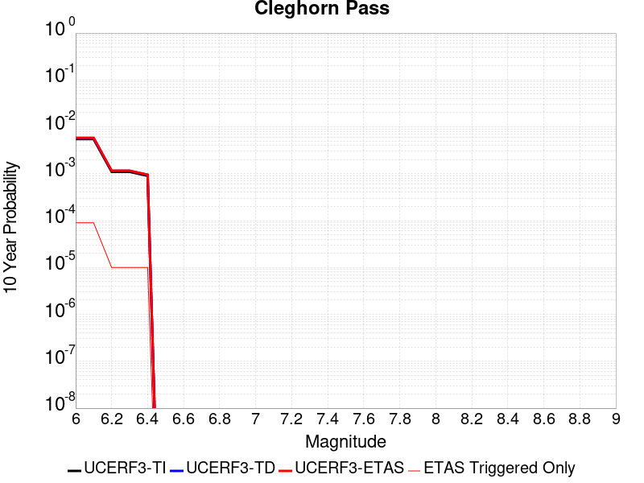 |

| Magnitude | 1 wk TI Prob | 1 wk TD Prob | 1 wk ETAS Prob | 1 wk ETAS/TD Gain | 1 wk ETAS Triggered Only | 1 mo TI Prob | 1 mo TD Prob | 1 mo ETAS Prob | 1 mo ETAS/TD Gain | 1 mo ETAS Triggered Only | 1 yr TI Prob | 1 yr TD Prob | 1 yr ETAS Prob | 1 yr ETAS/TD Gain | 1 yr ETAS Triggered Only | 10 yr TI Prob | 10 yr TD Prob | 10 yr ETAS Prob | 10 yr ETAS/TD Gain | 10 yr ETAS Triggered Only |
|-----|-----|-----|-----|-----|-----|-----|-----|-----|-----|-----|-----|-----|-----|-----|-----|-----|-----|-----|-----|-----|
| 6.0 | 1.0522846E-5 | 1.1040714E-5 | 1.1040714E-5 | 1.0 | 0.0 | 4.509713E-5 | 4.7316782E-5 | 5.803439E-5 | 1.2265075 | 1.0718114E-5 | 5.4891926E-4 | 5.759822E-4 | 6.2954193E-4 | 1.0929885 | 5.3590567E-5 | 0.0054756533 | 0.005750059 | 0.0058459677 | 1.0166795 | 9.646302E-5 |
| 6.1 | 1.0522846E-5 | 1.1040714E-5 | 1.1040714E-5 | 1.0 | 0.0 | 4.509713E-5 | 4.7316782E-5 | 5.803439E-5 | 1.2265075 | 1.0718114E-5 | 5.4891926E-4 | 5.759822E-4 | 6.2954193E-4 | 1.0929885 | 5.3590567E-5 | 0.0054756533 | 0.005750059 | 0.0058459677 | 1.0166795 | 9.646302E-5 |
| 6.2 | 2.1045846E-6 | 2.2082168E-6 | 2.2082168E-6 | 1.0 | 0.0 | 9.019617E-6 | 9.463776E-6 | 9.463776E-6 | 1.0 | 0.0 | 1.098083E-4 | 1.1521958E-4 | 1.2593645E-4 | 1.0930127 | 1.0718114E-5 | 0.0010975406 | 0.0011520098 | 0.0011627156 | 1.0092931 | 1.0718114E-5 |
| 6.3 | 2.1045846E-6 | 2.2082168E-6 | 2.2082168E-6 | 1.0 | 0.0 | 9.019617E-6 | 9.463776E-6 | 9.463776E-6 | 1.0 | 0.0 | 1.098083E-4 | 1.1521958E-4 | 1.2593645E-4 | 1.0930127 | 1.0718114E-5 | 0.0010975406 | 0.0011520098 | 0.0011627156 | 1.0092931 | 1.0718114E-5 |
| 6.4 | 1.7259927E-6 | 1.8108889E-6 | 1.8108889E-6 | 1.0 | 0.0 | 7.3970905E-6 | 7.760952E-6 | 7.760952E-6 | 1.0 | 0.0 | 9.005586E-5 | 9.4489595E-5 | 1.05206695E-4 | 1.113421 | 1.0718114E-5 | 9.001937E-4 | 9.4489596E-4 | 9.5560396E-4 | 1.0113324 | 1.0718114E-5 |

## Cleghorn Lake
*[(top)](#table-of-contents)*

| 1 Week | 1 Month | 1 Year | 10 Year |
|-----|-----|-----|-----|
|  |  |  |  |

| Magnitude | 1 wk TI Prob | 1 wk TD Prob | 1 wk ETAS Prob | 1 wk ETAS/TD Gain | 1 wk ETAS Triggered Only | 1 mo TI Prob | 1 mo TD Prob | 1 mo ETAS Prob | 1 mo ETAS/TD Gain | 1 mo ETAS Triggered Only | 1 yr TI Prob | 1 yr TD Prob | 1 yr ETAS Prob | 1 yr ETAS/TD Gain | 1 yr ETAS Triggered Only | 10 yr TI Prob | 10 yr TD Prob | 10 yr ETAS Prob | 10 yr ETAS/TD Gain | 10 yr ETAS Triggered Only |
|-----|-----|-----|-----|-----|-----|-----|-----|-----|-----|-----|-----|-----|-----|-----|-----|-----|-----|-----|-----|-----|
| 6.0 | 1.5467183E-5 | 1.6794396E-5 | 2.751233E-5 | 1.6381851 | 1.0718114E-5 | 6.6286244E-5 | 7.1974304E-5 | 8.2691644E-5 | 1.1489052 | 1.0718114E-5 | 8.067362E-4 | 8.7598973E-4 | 9.2953333E-4 | 1.0611236 | 5.3590567E-5 | 0.008038137 | 0.008730795 | 0.008847665 | 1.0133859 | 1.17899246E-4 |
| 6.1 | 1.5467183E-5 | 1.6794396E-5 | 2.751233E-5 | 1.6381851 | 1.0718114E-5 | 6.6286244E-5 | 7.1974304E-5 | 8.2691644E-5 | 1.1489052 | 1.0718114E-5 | 8.067362E-4 | 8.7598973E-4 | 9.2953333E-4 | 1.0611236 | 5.3590567E-5 | 0.008038137 | 0.008730795 | 0.008847665 | 1.0133859 | 1.17899246E-4 |
| 6.2 | 1.2624631E-5 | 1.3681697E-5 | 2.4399664E-5 | 1.7833799 | 1.0718114E-5 | 5.410444E-5 | 5.86348E-5 | 6.935229E-5 | 1.1827837 | 1.0718114E-5 | 6.585225E-4 | 7.1369356E-4 | 7.4582495E-4 | 1.0450213 | 3.215434E-5 | 0.0065657445 | 0.007118811 | 0.0072039454 | 1.0119591 | 8.574491E-5 |
| 6.3 | 1.2624631E-5 | 1.3681697E-5 | 2.4399664E-5 | 1.7833799 | 1.0718114E-5 | 5.410444E-5 | 5.86348E-5 | 6.935229E-5 | 1.1827837 | 1.0718114E-5 | 6.585225E-4 | 7.1369356E-4 | 7.4582495E-4 | 1.0450213 | 3.215434E-5 | 0.0065657445 | 0.007118811 | 0.0072039454 | 1.0119591 | 8.574491E-5 |
| 6.4 | 9.417684E-6 | 1.0170226E-5 | 1.0170226E-5 | 1.0 | 0.0 | 4.036088E-5 | 4.3586184E-5 | 4.3586184E-5 | 1.0 | 0.0 | 4.912829E-4 | 5.305737E-4 | 5.5199856E-4 | 1.0403806 | 2.1436228E-5 | 0.004901982 | 0.0052971053 | 0.005361073 | 1.012076 | 6.430868E-5 |
| 6.5 | 9.368219E-6 | 1.0117652E-5 | 1.0117652E-5 | 1.0 | 0.0 | 4.014889E-5 | 4.3360877E-5 | 4.3360877E-5 | 1.0 | 0.0 | 4.8870314E-4 | 5.278319E-4 | 5.492568E-4 | 1.0405904 | 2.1436228E-5 | 0.004876298 | 0.0052698175 | 0.0053337873 | 1.0121388 | 6.430868E-5 |
| 6.6 | 7.803798E-6 | 8.441923E-6 | 8.441923E-6 | 1.0 | 0.0 | 3.3444423E-5 | 3.6179394E-5 | 3.6179394E-5 | 1.0 | 0.0 | 4.0710976E-4 | 4.40435E-4 | 4.6186178E-4 | 1.0486492 | 2.1436228E-5 | 0.0040636472 | 0.004399538 | 0.004463564 | 1.0145528 | 6.430868E-5 |
| 6.7 | 2.3108669E-6 | 2.4438523E-6 | 2.4438523E-6 | 1.0 | 0.0 | 9.903678E-6 | 1.0473612E-5 | 1.0473612E-5 | 1.0 | 0.0 | 1.205706E-4 | 1.2750895E-4 | 1.382257E-4 | 1.084047 | 1.0718114E-5 | 0.001205052 | 0.0012743765 | 0.001285081 | 1.0083997 | 1.0718114E-5 |
| 6.8 | 2.0882828E-6 | 2.2062986E-6 | 2.2062986E-6 | 1.0 | 0.0 | 8.949753E-6 | 9.455533E-6 | 9.455533E-6 | 1.0 | 0.0 | 1.08957785E-4 | 1.15115196E-4 | 1.2583208E-4 | 1.093097 | 1.0718114E-5 | 0.0010890438 | 0.0011505726 | 0.0011612783 | 1.0093048 | 1.0718114E-5 |
| 6.9 | 1.876935E-6 | 1.9810657E-6 | 1.9810657E-6 | 1.0 | 0.0 | 8.043982E-6 | 8.490254E-6 | 8.490254E-6 | 1.0 | 0.0 | 9.7931086E-5 | 1.033641E-4 | 1.033641E-4 | 1.0 | 0.0 | 9.788794E-4 | 0.0010331762 | 0.0010331762 | 1.0 | 0.0 |
| 7.0 | 1.5357559E-6 | 1.6202926E-6 | 1.6202926E-6 | 1.0 | 0.0 | 6.5817944E-6 | 6.944093E-6 | 6.944093E-6 | 1.0 | 0.0 | 8.01304E-5 | 8.454118E-5 | 8.454118E-5 | 1.0 | 0.0 | 8.010151E-4 | 8.4510265E-4 | 8.4510265E-4 | 1.0 | 0.0 |
| 7.1 | 1.0905424E-6 | 1.1497702E-6 | 1.1497702E-6 | 1.0 | 0.0 | 4.6737446E-6 | 4.927578E-6 | 4.927578E-6 | 1.0 | 0.0 | 5.6901354E-5 | 5.999171E-5 | 5.999171E-5 | 1.0 | 0.0 | 5.6886784E-4 | 5.997649E-4 | 5.997649E-4 | 1.0 | 0.0 |
| 7.2 | 6.06668E-7 | 6.387322E-7 | 6.387322E-7 | 1.0 | 0.0 | 2.600003E-6 | 2.7374213E-6 | 2.7374213E-6 | 1.0 | 0.0 | 3.1654577E-5 | 3.3327666E-5 | 3.3327666E-5 | 1.0 | 0.0 | 3.1650066E-4 | 3.332335E-4 | 3.332335E-4 | 1.0 | 0.0 |

## Kern Canyon (North Kern) 2011
*[(top)](#table-of-contents)*

| 1 Week | 1 Month | 1 Year | 10 Year |
|-----|-----|-----|-----|
|  |  |  |  |

| Magnitude | 1 wk TI Prob | 1 wk TD Prob | 1 wk ETAS Prob | 1 wk ETAS/TD Gain | 1 wk ETAS Triggered Only | 1 mo TI Prob | 1 mo TD Prob | 1 mo ETAS Prob | 1 mo ETAS/TD Gain | 1 mo ETAS Triggered Only | 1 yr TI Prob | 1 yr TD Prob | 1 yr ETAS Prob | 1 yr ETAS/TD Gain | 1 yr ETAS Triggered Only | 10 yr TI Prob | 10 yr TD Prob | 10 yr ETAS Prob | 10 yr ETAS/TD Gain | 10 yr ETAS Triggered Only |
|-----|-----|-----|-----|-----|-----|-----|-----|-----|-----|-----|-----|-----|-----|-----|-----|-----|-----|-----|-----|-----|
| 6.0 | 6.6264497E-6 | 6.7573515E-6 | 1.7475393E-5 | 2.5861304 | 1.0718114E-5 | 2.8398761E-5 | 2.8959801E-5 | 3.9677605E-5 | 1.3700924 | 1.0718114E-5 | 3.4570007E-4 | 3.5253653E-4 | 4.1682256E-4 | 1.1823528 | 6.430868E-5 | 0.0034516277 | 0.0035205614 | 0.0036380456 | 1.0333709 | 1.17899246E-4 |
| 6.1 | 6.6264497E-6 | 6.7573515E-6 | 1.7475393E-5 | 2.5861304 | 1.0718114E-5 | 2.8398761E-5 | 2.8959801E-5 | 3.9677605E-5 | 1.3700924 | 1.0718114E-5 | 3.4570007E-4 | 3.5253653E-4 | 4.1682256E-4 | 1.1823528 | 6.430868E-5 | 0.0034516277 | 0.0035205614 | 0.0036380456 | 1.0333709 | 1.17899246E-4 |
| 6.2 | 6.6264497E-6 | 6.7573515E-6 | 1.7475393E-5 | 2.5861304 | 1.0718114E-5 | 2.8398761E-5 | 2.8959801E-5 | 3.9677605E-5 | 1.3700924 | 1.0718114E-5 | 3.4570007E-4 | 3.5253653E-4 | 4.1682256E-4 | 1.1823528 | 6.430868E-5 | 0.0034516277 | 0.0035205614 | 0.0036380456 | 1.0333709 | 1.17899246E-4 |
| 6.3 | 6.6264497E-6 | 6.7573515E-6 | 1.7475393E-5 | 2.5861304 | 1.0718114E-5 | 2.8398761E-5 | 2.8959801E-5 | 3.9677605E-5 | 1.3700924 | 1.0718114E-5 | 3.4570007E-4 | 3.5253653E-4 | 4.1682256E-4 | 1.1823528 | 6.430868E-5 | 0.0034516277 | 0.0035205614 | 0.0036380456 | 1.0333709 | 1.17899246E-4 |
| 6.4 | 6.6264497E-6 | 6.7573515E-6 | 1.7475393E-5 | 2.5861304 | 1.0718114E-5 | 2.8398761E-5 | 2.8959801E-5 | 3.9677605E-5 | 1.3700924 | 1.0718114E-5 | 3.4570007E-4 | 3.5253653E-4 | 4.1682256E-4 | 1.1823528 | 6.430868E-5 | 0.0034516277 | 0.0035205614 | 0.0036380456 | 1.0333709 | 1.17899246E-4 |
| 6.5 | 3.2162225E-6 | 3.2571006E-6 | 1.3975179E-5 | 4.290681 | 1.0718114E-5 | 1.3783738E-5 | 1.3958933E-5 | 2.4676896E-5 | 1.7678212 | 1.0718114E-5 | 1.6780409E-4 | 1.6993756E-4 | 1.9137014E-4 | 1.1261203 | 2.1436228E-5 | 0.0016767744 | 0.0016981558 | 0.0017409554 | 1.0252036 | 4.2872456E-5 |
| 6.6 | 3.2162225E-6 | 3.2571006E-6 | 1.3975179E-5 | 4.290681 | 1.0718114E-5 | 1.3783738E-5 | 1.3958933E-5 | 2.4676896E-5 | 1.7678212 | 1.0718114E-5 | 1.6780409E-4 | 1.6993756E-4 | 1.9137014E-4 | 1.1261203 | 2.1436228E-5 | 0.0016767744 | 0.0016981558 | 0.0017409554 | 1.0252036 | 4.2872456E-5 |
| 6.7 | 2.1908265E-6 | 2.2071279E-6 | 2.2071279E-6 | 1.0 | 0.0 | 9.389223E-6 | 9.459087E-6 | 9.459087E-6 | 1.0 | 0.0 | 1.1430779E-4 | 1.1515849E-4 | 1.1515849E-4 | 1.0 | 0.0 | 0.0011424901 | 0.0011510076 | 0.0011724192 | 1.0186025 | 2.1436228E-5 |
| 6.8 | 1.7303895E-6 | 1.7365574E-6 | 1.7365574E-6 | 1.0 | 0.0 | 7.415934E-6 | 7.442368E-6 | 7.442368E-6 | 1.0 | 0.0 | 9.028525E-5 | 9.060716E-5 | 9.060716E-5 | 1.0 | 0.0 | 9.024858E-4 | 9.057119E-4 | 9.271287E-4 | 1.0236464 | 2.1436228E-5 |
| 6.9 | 1.3700314E-6 | 1.3688657E-6 | 1.3688657E-6 | 1.0 | 0.0 | 5.87155E-6 | 5.866554E-6 | 5.866554E-6 | 1.0 | 0.0 | 7.148377E-5 | 7.1423005E-5 | 7.1423005E-5 | 1.0 | 0.0 | 7.146078E-4 | 7.1400503E-4 | 7.2471553E-4 | 1.0150006 | 1.0718114E-5 |
| 7.0 | 1.1467797E-6 | 1.1413833E-6 | 1.1413833E-6 | 1.0 | 0.0 | 4.9147607E-6 | 4.8916336E-6 | 4.8916336E-6 | 1.0 | 0.0 | 5.983557E-5 | 5.9554044E-5 | 5.9554044E-5 | 1.0 | 0.0 | 5.981946E-4 | 5.95384E-4 | 6.0609577E-4 | 1.0179913 | 1.0718114E-5 |
| 7.1 | 9.3952065E-7 | 9.302714E-7 | 9.302714E-7 | 1.0 | 0.0 | 4.026511E-6 | 3.9868714E-6 | 3.9868714E-6 | 1.0 | 0.0 | 4.9021666E-5 | 4.8539096E-5 | 4.8539096E-5 | 1.0 | 0.0 | 4.901085E-4 | 4.8528673E-4 | 4.9599964E-4 | 1.0220754 | 1.0718114E-5 |
| 7.2 | 6.858055E-7 | 6.719318E-7 | 6.719318E-7 | 1.0 | 0.0 | 2.939163E-6 | 2.8797044E-6 | 2.8797044E-6 | 1.0 | 0.0 | 3.5783723E-5 | 3.5059846E-5 | 3.5059846E-5 | 1.0 | 0.0 | 3.5777962E-4 | 3.5054405E-4 | 3.612584E-4 | 1.0305649 | 1.0718114E-5 |
| 7.3 | 5.1101983E-7 | 4.939313E-7 | 4.939313E-7 | 1.0 | 0.0 | 2.1900833E-6 | 2.1168466E-6 | 2.1168466E-6 | 1.0 | 0.0 | 2.6663936E-5 | 2.5772308E-5 | 2.5772308E-5 | 1.0 | 0.0 | 2.6660739E-4 | 2.5769367E-4 | 2.5769367E-4 | 1.0 | 0.0 |
| 7.4 | 3.4999414E-7 | 3.2995996E-7 | 3.2995996E-7 | 1.0 | 0.0 | 1.499974E-6 | 1.4141134E-6 | 1.4141134E-6 | 1.0 | 0.0 | 1.8262032E-5 | 1.7216697E-5 | 1.7216697E-5 | 1.0 | 0.0 | 1.826053E-4 | 1.7215387E-4 | 1.7215387E-4 | 1.0 | 0.0 |
| 7.5 | 1.7021522E-7 | 1.4750091E-7 | 1.4750091E-7 | 1.0 | 0.0 | 7.2949354E-7 | 6.3214657E-7 | 6.3214657E-7 | 1.0 | 0.0 | 8.881548E-6 | 7.696359E-6 | 7.696359E-6 | 1.0 | 0.0 | 8.8811925E-5 | 7.6961E-5 | 7.6961E-5 | 1.0 | 0.0 |
| 7.6 | 2.572245E-8 | 1.7352637E-8 | 1.7352637E-8 | 1.0 | 0.0 | 1.10239064E-7 | 7.4368444E-8 | 7.4368444E-8 | 1.0 | 0.0 | 1.3421597E-6 | 9.0543546E-7 | 9.0543546E-7 | 1.0 | 0.0 | 1.3421517E-5 | 9.0543235E-6 | 9.0543235E-6 | 1.0 | 0.0 |

## White Mountains
*[(top)](#table-of-contents)*

| 1 Week | 1 Month | 1 Year | 10 Year |
|-----|-----|-----|-----|
|  | 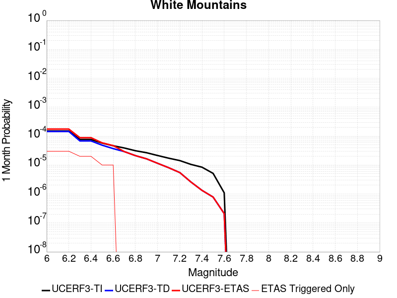 | 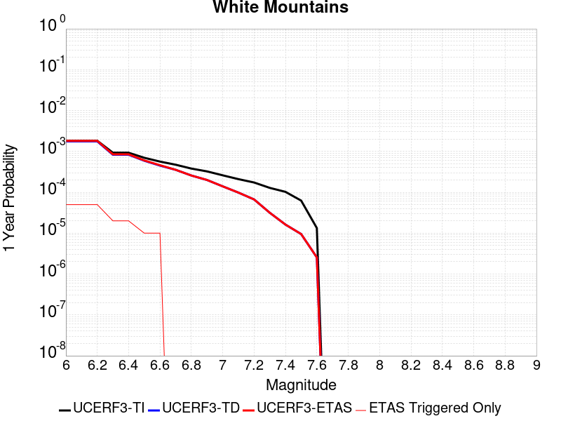 |  |

| Magnitude | 1 wk TI Prob | 1 wk TD Prob | 1 wk ETAS Prob | 1 wk ETAS/TD Gain | 1 wk ETAS Triggered Only | 1 mo TI Prob | 1 mo TD Prob | 1 mo ETAS Prob | 1 mo ETAS/TD Gain | 1 mo ETAS Triggered Only | 1 yr TI Prob | 1 yr TD Prob | 1 yr ETAS Prob | 1 yr ETAS/TD Gain | 1 yr ETAS Triggered Only | 10 yr TI Prob | 10 yr TD Prob | 10 yr ETAS Prob | 10 yr ETAS/TD Gain | 10 yr ETAS Triggered Only |
|-----|-----|-----|-----|-----|-----|-----|-----|-----|-----|-----|-----|-----|-----|-----|-----|-----|-----|-----|-----|-----|
| 6.0 | 3.503579E-5 | 3.3784425E-5 | 4.4502176E-5 | 1.3172394 | 1.0718114E-5 | 1.5014476E-4 | 1.4478304E-4 | 1.7693274E-4 | 1.2220542 | 3.215434E-5 | 0.0018264796 | 0.0017614291 | 0.0018149252 | 1.030371 | 5.3590567E-5 | 0.018115403 | 0.017487012 | 0.017581787 | 1.0054199 | 9.646302E-5 |
| 6.1 | 3.503579E-5 | 3.3784425E-5 | 4.4502176E-5 | 1.3172394 | 1.0718114E-5 | 1.5014476E-4 | 1.4478304E-4 | 1.7693274E-4 | 1.2220542 | 3.215434E-5 | 0.0018264796 | 0.0017614291 | 0.0018149252 | 1.030371 | 5.3590567E-5 | 0.018115403 | 0.017487012 | 0.017581787 | 1.0054199 | 9.646302E-5 |
| 6.2 | 3.503579E-5 | 3.3784425E-5 | 4.4502176E-5 | 1.3172394 | 1.0718114E-5 | 1.5014476E-4 | 1.4478304E-4 | 1.7693274E-4 | 1.2220542 | 3.215434E-5 | 0.0018264796 | 0.0017614291 | 0.0018149252 | 1.030371 | 5.3590567E-5 | 0.018115403 | 0.017487012 | 0.017581787 | 1.0054199 | 9.646302E-5 |
| 6.3 | 1.7818425E-5 | 1.5916237E-5 | 1.5916237E-5 | 1.0 | 0.0 | 7.636245E-5 | 6.821074E-5 | 8.964551E-5 | 1.3142432 | 2.1436228E-5 | 9.293162E-4 | 8.301636E-4 | 8.5158204E-4 | 1.0258002 | 2.1436228E-5 | 0.009254395 | 0.0082720835 | 0.008293342 | 1.0025699 | 2.1436228E-5 |
| 6.4 | 1.7818425E-5 | 1.5916237E-5 | 1.5916237E-5 | 1.0 | 0.0 | 7.636245E-5 | 6.821074E-5 | 8.964551E-5 | 1.3142432 | 2.1436228E-5 | 9.293162E-4 | 8.301636E-4 | 8.5158204E-4 | 1.0258002 | 2.1436228E-5 | 0.009254395 | 0.0082720835 | 0.008293342 | 1.0025699 | 2.1436228E-5 |
| 6.5 | 1.3397557E-5 | 1.1336382E-5 | 1.1336382E-5 | 1.0 | 0.0 | 5.741684E-5 | 4.8583628E-5 | 5.9301223E-5 | 1.220601 | 1.0718114E-5 | 6.988258E-4 | 5.913521E-4 | 6.020639E-4 | 1.0181141 | 1.0718114E-5 | 0.006966323 | 0.0058984905 | 0.005909146 | 1.0018064 | 1.0718114E-5 |
| 6.6 | 1.0818695E-5 | 8.625452E-6 | 8.625452E-6 | 1.0 | 0.0 | 4.6365014E-5 | 3.6965725E-5 | 4.7683443E-5 | 1.2899367 | 1.0718114E-5 | 5.6434784E-4 | 4.499691E-4 | 4.606824E-4 | 1.023809 | 1.0718114E-5 | 0.005629168 | 0.0044910167 | 0.004501687 | 1.0023758 | 1.0718114E-5 |
| 6.7 | 9.067908E-6 | 6.8025106E-6 | 6.8025106E-6 | 1.0 | 0.0 | 3.8861883E-5 | 2.915331E-5 | 2.915331E-5 | 1.0 | 0.0 | 4.7304068E-4 | 3.5488693E-4 | 3.5488693E-4 | 1.0 | 0.0 | 0.00472035 | 0.0035435192 | 0.0035435192 | 1.0 | 0.0 |
| 6.8 | 7.295947E-6 | 4.9364417E-6 | 4.9364417E-6 | 1.0 | 0.0 | 3.126797E-5 | 2.1156015E-5 | 2.1156015E-5 | 1.0 | 0.0 | 3.8062103E-4 | 2.5754515E-4 | 2.5754515E-4 | 1.0 | 0.0 | 0.0037996976 | 0.0025725798 | 0.0025725798 | 1.0 | 0.0 |
| 6.9 | 6.2243444E-6 | 3.832255E-6 | 3.832255E-6 | 1.0 | 0.0 | 2.6675489E-5 | 1.6423848E-5 | 1.6423848E-5 | 1.0 | 0.0 | 3.2472567E-4 | 1.9994254E-4 | 1.9994254E-4 | 1.0 | 0.0 | 0.0032425157 | 0.0019976792 | 0.0019976792 | 1.0 | 0.0 |
| 7.0 | 4.9878413E-6 | 2.6795697E-6 | 2.6795697E-6 | 1.0 | 0.0 | 2.1376287E-5 | 1.1483821E-5 | 1.1483821E-5 | 1.0 | 0.0 | 2.602252E-4 | 1.3980681E-4 | 1.3980681E-4 | 1.0 | 0.0 | 0.002599207 | 0.0013972148 | 0.0013972148 | 1.0 | 0.0 |
| 7.1 | 4.0252844E-6 | 1.88579E-6 | 1.88579E-6 | 1.0 | 0.0 | 1.7251105E-5 | 8.081933E-6 | 8.081933E-6 | 1.0 | 0.0 | 2.1001195E-4 | 9.839322E-5 | 9.839322E-5 | 1.0 | 0.0 | 0.0020981359 | 9.835094E-4 | 9.835094E-4 | 1.0 | 0.0 |
| 7.2 | 3.3284066E-6 | 1.2819944E-6 | 1.2819944E-6 | 1.0 | 0.0 | 1.4264522E-5 | 5.4942507E-6 | 5.4942507E-6 | 1.0 | 0.0 | 1.736567E-4 | 6.689055E-5 | 6.689055E-5 | 1.0 | 0.0 | 0.0017352107 | 6.6871423E-4 | 6.6871423E-4 | 1.0 | 0.0 |
| 7.3 | 2.458226E-6 | 6.057493E-7 | 6.057493E-7 | 1.0 | 0.0 | 1.0535211E-5 | 2.596066E-6 | 2.596066E-6 | 1.0 | 0.0 | 1.2825865E-4 | 3.1606683E-5 | 3.1606683E-5 | 1.0 | 0.0 | 0.0012818464 | 3.1602563E-4 | 3.1602563E-4 | 1.0 | 0.0 |
| 7.4 | 1.965953E-6 | 3.1091668E-7 | 3.1091668E-7 | 1.0 | 0.0 | 8.425486E-6 | 1.3324994E-6 | 1.3324994E-6 | 1.0 | 0.0 | 1.0257547E-4 | 1.622306E-5 | 1.622306E-5 | 1.0 | 0.0 | 0.0010252813 | 1.6221889E-4 | 1.6221889E-4 | 1.0 | 0.0 |
| 7.5 | 1.2014192E-6 | 1.824589E-7 | 1.824589E-7 | 1.0 | 0.0 | 5.148929E-6 | 7.819665E-7 | 7.819665E-7 | 1.0 | 0.0 | 6.2686406E-5 | 9.520401E-6 | 9.520401E-6 | 1.0 | 0.0 | 6.266873E-4 | 9.520002E-5 | 9.520002E-5 | 1.0 | 0.0 |
| 7.6 | 2.5612175E-7 | 4.8950795E-8 | 4.8950795E-8 | 1.0 | 0.0 | 1.0976642E-6 | 2.097891E-7 | 2.097891E-7 | 1.0 | 0.0 | 1.3363979E-5 | 2.5541797E-6 | 2.5541797E-6 | 1.0 | 0.0 | 1.3363175E-4 | 2.554154E-5 | 2.554154E-5 | 1.0 | 0.0 |

## Chino alt 1
*[(top)](#table-of-contents)*

| 1 Week | 1 Month | 1 Year | 10 Year |
|-----|-----|-----|-----|
|  |  |  |  |

| Magnitude | 1 wk TI Prob | 1 wk TD Prob | 1 wk ETAS Prob | 1 wk ETAS/TD Gain | 1 wk ETAS Triggered Only | 1 mo TI Prob | 1 mo TD Prob | 1 mo ETAS Prob | 1 mo ETAS/TD Gain | 1 mo ETAS Triggered Only | 1 yr TI Prob | 1 yr TD Prob | 1 yr ETAS Prob | 1 yr ETAS/TD Gain | 1 yr ETAS Triggered Only | 10 yr TI Prob | 10 yr TD Prob | 10 yr ETAS Prob | 10 yr ETAS/TD Gain | 10 yr ETAS Triggered Only |
|-----|-----|-----|-----|-----|-----|-----|-----|-----|-----|-----|-----|-----|-----|-----|-----|-----|-----|-----|-----|-----|
| 6.0 | 3.939946E-5 | 4.895037E-5 | 4.895037E-5 | 1.0 | 0.0 | 1.6884391E-4 | 2.0977337E-4 | 2.2048924E-4 | 1.0510831 | 1.0718114E-5 | 0.0020537362 | 0.0025514876 | 0.0025728692 | 1.00838 | 2.1436228E-5 | 0.020348595 | 0.025278764 | 0.025372788 | 1.0037194 | 9.646302E-5 |
| 6.1 | 2.1505624E-5 | 2.6880154E-5 | 2.6880154E-5 | 1.0 | 0.0 | 9.2163704E-5 | 1.151962E-4 | 1.2591308E-4 | 1.0930315 | 1.0718114E-5 | 0.0011215154 | 0.0014017228 | 0.0014124259 | 1.0076357 | 1.0718114E-5 | 0.011158722 | 0.013945717 | 0.013998561 | 1.0037892 | 5.3590567E-5 |
| 6.2 | 2.1505624E-5 | 2.6880154E-5 | 2.6880154E-5 | 1.0 | 0.0 | 9.2163704E-5 | 1.151962E-4 | 1.2591308E-4 | 1.0930315 | 1.0718114E-5 | 0.0011215154 | 0.0014017228 | 0.0014124259 | 1.0076357 | 1.0718114E-5 | 0.011158722 | 0.013945717 | 0.013998561 | 1.0037892 | 5.3590567E-5 |
| 6.3 | 1.4290785E-5 | 1.8166014E-5 | 1.8166014E-5 | 1.0 | 0.0 | 6.1244784E-5 | 7.785228E-5 | 7.785228E-5 | 1.0 | 0.0 | 7.454001E-4 | 9.4748475E-4 | 9.4748475E-4 | 1.0 | 0.0 | 0.007429048 | 0.009444912 | 0.009476762 | 1.0033723 | 3.215434E-5 |
| 6.4 | 1.4290785E-5 | 1.8166014E-5 | 1.8166014E-5 | 1.0 | 0.0 | 6.1244784E-5 | 7.785228E-5 | 7.785228E-5 | 1.0 | 0.0 | 7.454001E-4 | 9.4748475E-4 | 9.4748475E-4 | 1.0 | 0.0 | 0.007429048 | 0.009444912 | 0.009476762 | 1.0033723 | 3.215434E-5 |
| 6.5 | 1.3017944E-5 | 1.6652937E-5 | 1.6652937E-5 | 1.0 | 0.0 | 5.5789995E-5 | 7.136803E-5 | 7.136803E-5 | 1.0 | 0.0 | 6.790315E-4 | 8.686031E-4 | 8.686031E-4 | 1.0 | 0.0 | 0.0067696036 | 0.008662385 | 0.00869426 | 1.0036798 | 3.215434E-5 |
| 6.6 | 9.470016E-6 | 1.2040057E-5 | 1.2040057E-5 | 1.0 | 0.0 | 4.058515E-5 | 5.1599414E-5 | 5.1599414E-5 | 1.0 | 0.0 | 4.940122E-4 | 6.2807574E-4 | 6.2807574E-4 | 1.0 | 0.0 | 0.004929154 | 0.0062722242 | 0.006293526 | 1.0033962 | 2.1436228E-5 |
| 6.7 | 8.314155E-6 | 1.0408293E-5 | 1.0408293E-5 | 1.0 | 0.0 | 3.5631605E-5 | 4.460639E-5 | 4.460639E-5 | 1.0 | 0.0 | 4.3372845E-4 | 5.429797E-4 | 5.429797E-4 | 1.0 | 0.0 | 0.004328829 | 0.005426062 | 0.0054473816 | 1.0039291 | 2.1436228E-5 |
| 6.8 | 3.4856364E-6 | 3.8135372E-6 | 3.8135372E-6 | 1.0 | 0.0 | 1.4938357E-5 | 1.634364E-5 | 1.634364E-5 | 1.0 | 0.0 | 1.8185932E-4 | 1.9896773E-4 | 1.9896773E-4 | 1.0 | 0.0 | 0.0018171056 | 0.001989573 | 0.001989573 | 1.0 | 0.0 |
| 6.9 | 2.2645952E-6 | 2.152999E-6 | 2.152999E-6 | 1.0 | 0.0 | 9.705372E-6 | 9.227107E-6 | 9.227107E-6 | 1.0 | 0.0 | 1.18156495E-4 | 1.1233445E-4 | 1.1233445E-4 | 1.0 | 0.0 | 0.0011809369 | 0.0011233927 | 0.0011233927 | 1.0 | 0.0 |
| 7.0 | 1.7864003E-6 | 1.5431575E-6 | 1.5431575E-6 | 1.0 | 0.0 | 7.655979E-6 | 6.613516E-6 | 6.613516E-6 | 1.0 | 0.0 | 9.3207556E-5 | 8.0516635E-5 | 8.0516635E-5 | 1.0 | 0.0 | 9.316847E-4 | 8.0532173E-4 | 8.0532173E-4 | 1.0 | 0.0 |
| 7.1 | 1.7315456E-6 | 1.4734279E-6 | 1.4734279E-6 | 1.0 | 0.0 | 7.420889E-6 | 6.3146763E-6 | 6.3146763E-6 | 1.0 | 0.0 | 9.034557E-5 | 7.6878525E-5 | 7.6878525E-5 | 1.0 | 0.0 | 9.0308854E-4 | 7.6895714E-4 | 7.6895714E-4 | 1.0 | 0.0 |
| 7.2 | 1.6008337E-6 | 1.3574753E-6 | 1.3574753E-6 | 1.0 | 0.0 | 6.860698E-6 | 5.817739E-6 | 5.817739E-6 | 1.0 | 0.0 | 8.352579E-5 | 7.082872E-5 | 7.082872E-5 | 1.0 | 0.0 | 8.34944E-4 | 7.084856E-4 | 7.084856E-4 | 1.0 | 0.0 |
| 7.3 | 1.3320939E-6 | 1.1218251E-6 | 1.1218251E-6 | 1.0 | 0.0 | 5.7089615E-6 | 4.8078136E-6 | 4.8078136E-6 | 1.0 | 0.0 | 6.9504385E-5 | 5.8533606E-5 | 5.8533606E-5 | 1.0 | 0.0 | 6.9482654E-4 | 5.853264E-4 | 5.853264E-4 | 1.0 | 0.0 |
| 7.4 | 1.114294E-6 | 9.2374523E-7 | 9.2374523E-7 | 1.0 | 0.0 | 4.775537E-6 | 3.958902E-6 | 3.958902E-6 | 1.0 | 0.0 | 5.8140613E-5 | 4.8198606E-5 | 4.8198606E-5 | 1.0 | 0.0 | 5.81254E-4 | 4.8189834E-4 | 4.8189834E-4 | 1.0 | 0.0 |
| 7.5 | 9.354081E-7 | 7.623702E-7 | 7.623702E-7 | 1.0 | 0.0 | 4.0088858E-6 | 3.2672967E-6 | 3.2672967E-6 | 1.0 | 0.0 | 4.8807087E-5 | 3.9778646E-5 | 3.9778646E-5 | 1.0 | 0.0 | 4.879637E-4 | 3.9771866E-4 | 3.9771866E-4 | 1.0 | 0.0 |
| 7.6 | 8.521771E-7 | 6.8809493E-7 | 6.8809493E-7 | 1.0 | 0.0 | 3.6521824E-6 | 2.9489752E-6 | 2.9489752E-6 | 1.0 | 0.0 | 4.4464414E-5 | 3.5903213E-5 | 3.5903213E-5 | 1.0 | 0.0 | 4.4455516E-4 | 3.589773E-4 | 3.589773E-4 | 1.0 | 0.0 |
| 7.7 | 2.1803626E-7 | 1.4187151E-7 | 1.4187151E-7 | 1.0 | 0.0 | 9.344408E-7 | 6.080207E-7 | 6.080207E-7 | 1.0 | 0.0 | 1.1376757E-5 | 7.402636E-6 | 7.402636E-6 | 1.0 | 0.0 | 1.13761744E-4 | 7.402486E-5 | 7.402486E-5 | 1.0 | 0.0 |

## San Jacinto (San Jacinto Valley) rev
*[(top)](#table-of-contents)*

| 1 Week | 1 Month | 1 Year | 10 Year |
|-----|-----|-----|-----|
|  |  |  |  |

| Magnitude | 1 wk TI Prob | 1 wk TD Prob | 1 wk ETAS Prob | 1 wk ETAS/TD Gain | 1 wk ETAS Triggered Only | 1 mo TI Prob | 1 mo TD Prob | 1 mo ETAS Prob | 1 mo ETAS/TD Gain | 1 mo ETAS Triggered Only | 1 yr TI Prob | 1 yr TD Prob | 1 yr ETAS Prob | 1 yr ETAS/TD Gain | 1 yr ETAS Triggered Only | 10 yr TI Prob | 10 yr TD Prob | 10 yr ETAS Prob | 10 yr ETAS/TD Gain | 10 yr ETAS Triggered Only |
|-----|-----|-----|-----|-----|-----|-----|-----|-----|-----|-----|-----|-----|-----|-----|-----|-----|-----|-----|-----|-----|
| 6.0 | 3.652694E-5 | 3.4417048E-5 | 4.513479E-5 | 1.311408 | 1.0718114E-5 | 1.5653463E-4 | 1.4749331E-4 | 1.796429E-4 | 1.2179732 | 3.215434E-5 | 0.0019041431 | 0.0017942534 | 0.0018584466 | 1.0357772 | 6.430868E-5 | 0.018879099 | 0.018534157 | 0.018628832 | 1.0051081 | 9.646302E-5 |
| 6.1 | 3.652694E-5 | 3.4417048E-5 | 4.513479E-5 | 1.311408 | 1.0718114E-5 | 1.5653463E-4 | 1.4749331E-4 | 1.796429E-4 | 1.2179732 | 3.215434E-5 | 0.0019041431 | 0.0017942534 | 0.0018584466 | 1.0357772 | 6.430868E-5 | 0.018879099 | 0.018534157 | 0.018628832 | 1.0051081 | 9.646302E-5 |
| 6.2 | 3.652694E-5 | 3.4417048E-5 | 4.513479E-5 | 1.311408 | 1.0718114E-5 | 1.5653463E-4 | 1.4749331E-4 | 1.796429E-4 | 1.2179732 | 3.215434E-5 | 0.0019041431 | 0.0017942534 | 0.0018584466 | 1.0357772 | 6.430868E-5 | 0.018879099 | 0.018534157 | 0.018628832 | 1.0051081 | 9.646302E-5 |
| 6.3 | 3.652694E-5 | 3.4417048E-5 | 4.513479E-5 | 1.311408 | 1.0718114E-5 | 1.5653463E-4 | 1.4749331E-4 | 1.796429E-4 | 1.2179732 | 3.215434E-5 | 0.0019041431 | 0.0017942534 | 0.0018584466 | 1.0357772 | 6.430868E-5 | 0.018879099 | 0.018534157 | 0.018628832 | 1.0051081 | 9.646302E-5 |
| 6.4 | 3.646941E-5 | 3.433862E-5 | 4.5056368E-5 | 1.3121192 | 1.0718114E-5 | 1.5628811E-4 | 1.4715722E-4 | 1.7930684E-4 | 1.2184712 | 3.215434E-5 | 0.0019011468 | 0.0017901688 | 0.0018543624 | 1.035859 | 6.430868E-5 | 0.018849645 | 0.018494038 | 0.018588716 | 1.0051194 | 9.646302E-5 |
| 6.5 | 3.646941E-5 | 3.433862E-5 | 4.5056368E-5 | 1.3121192 | 1.0718114E-5 | 1.5628811E-4 | 1.4715722E-4 | 1.7930684E-4 | 1.2184712 | 3.215434E-5 | 0.0019011468 | 0.0017901688 | 0.0018543624 | 1.035859 | 6.430868E-5 | 0.018849645 | 0.018494038 | 0.018588716 | 1.0051194 | 9.646302E-5 |
| 6.6 | 3.6442503E-5 | 3.4302004E-5 | 4.501975E-5 | 1.3124524 | 1.0718114E-5 | 1.561728E-4 | 1.4700032E-4 | 1.7914992E-4 | 1.2187043 | 3.215434E-5 | 0.0018997455 | 0.0017882616 | 0.0018524553 | 1.0358973 | 6.430868E-5 | 0.018835869 | 0.018475305 | 0.018569987 | 1.0051247 | 9.646302E-5 |
| 6.7 | 3.6432113E-5 | 3.4287576E-5 | 4.5005323E-5 | 1.3125839 | 1.0718114E-5 | 1.5612828E-4 | 1.4693849E-4 | 1.790881E-4 | 1.2187965 | 3.215434E-5 | 0.0018992044 | 0.0017875104 | 0.0018517041 | 1.0359124 | 6.430868E-5 | 0.018830549 | 0.01846793 | 0.018562611 | 1.0051268 | 9.646302E-5 |
| 6.8 | 3.6409598E-5 | 3.425663E-5 | 4.497438E-5 | 1.3128663 | 1.0718114E-5 | 1.560318E-4 | 1.4680588E-4 | 1.789555E-4 | 1.2189941 | 3.215434E-5 | 0.0018980318 | 0.0017858985 | 0.0018500923 | 1.0359448 | 6.430868E-5 | 0.018819023 | 0.018452084 | 0.018546766 | 1.0051312 | 9.646302E-5 |
| 6.9 | 3.638078E-5 | 3.4217053E-5 | 4.49348E-5 | 1.3132282 | 1.0718114E-5 | 1.5590832E-4 | 1.4663627E-4 | 1.787859E-4 | 1.2192475 | 3.215434E-5 | 0.0018965311 | 0.001783837 | 0.001848031 | 1.0359864 | 6.430868E-5 | 0.018804269 | 0.018431816 | 0.018526502 | 1.0051371 | 9.646302E-5 |
| 7.0 | 3.6294874E-5 | 3.4099063E-5 | 4.481681E-5 | 1.3143121 | 1.0718114E-5 | 1.5554018E-4 | 1.4613067E-4 | 1.782803E-4 | 1.2200061 | 3.215434E-5 | 0.0018920569 | 0.0017776915 | 0.001841886 | 1.0361111 | 6.430868E-5 | 0.018760284 | 0.018371396 | 0.018466087 | 1.0051543 | 9.646302E-5 |
| 7.1 | 3.6260717E-5 | 3.405534E-5 | 4.477309E-5 | 1.3147156 | 1.0718114E-5 | 1.5539382E-4 | 1.4594331E-4 | 1.7809296E-4 | 1.2202886 | 3.215434E-5 | 0.001890278 | 0.0017754143 | 0.0018396089 | 1.0361575 | 6.430868E-5 | 0.018742796 | 0.018348996 | 0.018443689 | 1.0051607 | 9.646302E-5 |
| 7.2 | 3.6210204E-5 | 3.398956E-5 | 4.4707307E-5 | 1.3153248 | 1.0718114E-5 | 1.5517735E-4 | 1.4566141E-4 | 1.7781107E-4 | 1.2207149 | 3.215434E-5 | 0.001887647 | 0.0017719879 | 0.0018361825 | 1.0362275 | 6.430868E-5 | 0.01871693 | 0.018315274 | 0.01840997 | 1.0051703 | 9.646302E-5 |
| 7.3 | 3.6119454E-5 | 3.3877837E-5 | 4.459559E-5 | 1.3163646 | 1.0718114E-5 | 1.5478847E-4 | 1.4518267E-4 | 1.7733233E-4 | 1.2214429 | 3.215434E-5 | 0.0018829206 | 0.0017661685 | 0.0018303636 | 1.0363472 | 6.430868E-5 | 0.018670462 | 0.018257825 | 0.018352525 | 1.0051869 | 9.646302E-5 |
| 7.4 | 3.607848E-5 | 3.3825334E-5 | 4.4543085E-5 | 1.3168558 | 1.0718114E-5 | 1.5461289E-4 | 1.4495767E-4 | 1.7710736E-4 | 1.2217866 | 3.215434E-5 | 0.0018807866 | 0.0017634337 | 0.0018276289 | 1.0364035 | 6.430868E-5 | 0.018649481 | 0.018230818 | 0.018325523 | 1.0051948 | 9.646302E-5 |
| 7.5 | 3.5856774E-5 | 3.3635082E-5 | 4.4352837E-5 | 1.318648 | 1.0718114E-5 | 1.5366284E-4 | 1.4414241E-4 | 1.7629212E-4 | 1.2230413 | 3.215434E-5 | 0.0018692396 | 0.0017535238 | 0.0018177198 | 1.0366096 | 6.430868E-5 | 0.018535944 | 0.018131904 | 0.01822662 | 1.0052236 | 9.646302E-5 |
| 7.6 | 3.286655E-5 | 3.215777E-5 | 4.287554E-5 | 1.333287 | 1.0718114E-5 | 1.4084904E-4 | 1.3781176E-4 | 1.6996167E-4 | 1.2332886 | 3.215434E-5 | 0.001713488 | 0.0016765689 | 0.0017407697 | 1.038293 | 6.430868E-5 | 0.017003361 | 0.017351432 | 0.01744622 | 1.0054629 | 9.646302E-5 |
| 7.7 | 2.8882527E-5 | 2.9250317E-5 | 3.996812E-5 | 1.3664166 | 1.0718114E-5 | 1.237764E-4 | 1.2535248E-4 | 1.575028E-4 | 1.2564793 | 3.215434E-5 | 0.0015059357 | 0.0015250992 | 0.0015893098 | 1.0421026 | 6.430868E-5 | 0.014957713 | 0.015837716 | 0.015932651 | 1.0059942 | 9.646302E-5 |
| 7.8 | 2.4950225E-5 | 2.6540692E-5 | 3.725852E-5 | 1.4038262 | 1.0718114E-5 | 1.0692515E-4 | 1.1374087E-4 | 1.4589155E-4 | 1.2826661 | 3.215434E-5 | 0.0013010362 | 0.0013839162 | 0.0014481359 | 1.0464044 | 6.430868E-5 | 0.012934455 | 0.0144187445 | 0.014513817 | 1.0065937 | 9.646302E-5 |
| 7.9 | 1.9881603E-5 | 2.1519538E-5 | 3.223742E-5 | 1.4980536 | 1.0718114E-5 | 8.520408E-5 | 9.222333E-5 | 1.2437471E-4 | 1.3486252 | 3.215434E-5 | 0.001036866 | 0.0011222415 | 0.0011864781 | 1.0572394 | 6.430868E-5 | 0.010320415 | 0.011783319 | 0.011878645 | 1.0080899 | 9.646302E-5 |
| 8.0 | 1.563292E-5 | 1.5947082E-5 | 2.6665026E-5 | 1.6720942 | 1.0718114E-5 | 6.6996516E-5 | 6.834285E-5 | 1.00494995E-4 | 1.4704536 | 3.215434E-5 | 8.153773E-4 | 8.3175726E-4 | 8.8530325E-4 | 1.064377 | 5.3590567E-5 | 0.00812392 | 0.008815629 | 0.008889995 | 1.0084356 | 7.5026794E-5 |
| 8.1 | 1.0045313E-5 | 8.307514E-6 | 8.307514E-6 | 1.0 | 0.0 | 4.305063E-5 | 3.5603145E-5 | 3.5603145E-5 | 1.0 | 0.0 | 5.2401534E-4 | 4.333826E-4 | 4.333826E-4 | 1.0 | 0.0 | 0.0052278144 | 0.0046621817 | 0.00467285 | 1.0022882 | 1.0718114E-5 |
| 8.2 | 4.1554413E-6 | 1.5672123E-6 | 1.5672123E-6 | 1.0 | 0.0 | 1.7808914E-5 | 6.716607E-6 | 6.716607E-6 | 1.0 | 0.0 | 2.1680194E-4 | 8.177165E-5 | 8.177165E-5 | 1.0 | 0.0 | 0.0021659054 | 9.492334E-4 | 9.492334E-4 | 1.0 | 0.0 |
| 8.3 | 1.2758221E-6 | 3.6194777E-7 | 3.6194777E-7 | 1.0 | 0.0 | 5.4677976E-6 | 1.5512038E-6 | 1.5512038E-6 | 1.0 | 0.0 | 6.65684E-5 | 1.8885747E-5 | 1.8885747E-5 | 1.0 | 0.0 | 6.6548464E-4 | 2.2777634E-4 | 2.2777634E-4 | 1.0 | 0.0 |

## Channel Islands Thrust
*[(top)](#table-of-contents)*

| 1 Week | 1 Month | 1 Year | 10 Year |
|-----|-----|-----|-----|
|  |  |  |  |

| Magnitude | 1 wk TI Prob | 1 wk TD Prob | 1 wk ETAS Prob | 1 wk ETAS/TD Gain | 1 wk ETAS Triggered Only | 1 mo TI Prob | 1 mo TD Prob | 1 mo ETAS Prob | 1 mo ETAS/TD Gain | 1 mo ETAS Triggered Only | 1 yr TI Prob | 1 yr TD Prob | 1 yr ETAS Prob | 1 yr ETAS/TD Gain | 1 yr ETAS Triggered Only | 10 yr TI Prob | 10 yr TD Prob | 10 yr ETAS Prob | 10 yr ETAS/TD Gain | 10 yr ETAS Triggered Only |
|-----|-----|-----|-----|-----|-----|-----|-----|-----|-----|-----|-----|-----|-----|-----|-----|-----|-----|-----|-----|-----|
| 6.0 | 2.2156251E-5 | 2.4092304E-5 | 2.4092304E-5 | 1.0 | 0.0 | 9.495191E-5 | 1.03249244E-4 | 1.03249244E-4 | 1.0 | 0.0 | 0.0011554264 | 0.0012564411 | 0.0012885551 | 1.0255594 | 3.215434E-5 | 0.011494373 | 0.012503966 | 0.012599222 | 1.0076182 | 9.646302E-5 |
| 6.1 | 2.2156251E-5 | 2.4092304E-5 | 2.4092304E-5 | 1.0 | 0.0 | 9.495191E-5 | 1.03249244E-4 | 1.03249244E-4 | 1.0 | 0.0 | 0.0011554264 | 0.0012564411 | 0.0012885551 | 1.0255594 | 3.215434E-5 | 0.011494373 | 0.012503966 | 0.012599222 | 1.0076182 | 9.646302E-5 |
| 6.2 | 2.2156251E-5 | 2.4092304E-5 | 2.4092304E-5 | 1.0 | 0.0 | 9.495191E-5 | 1.03249244E-4 | 1.03249244E-4 | 1.0 | 0.0 | 0.0011554264 | 0.0012564411 | 0.0012885551 | 1.0255594 | 3.215434E-5 | 0.011494373 | 0.012503966 | 0.012599222 | 1.0076182 | 9.646302E-5 |
| 6.3 | 2.2156251E-5 | 2.4092304E-5 | 2.4092304E-5 | 1.0 | 0.0 | 9.495191E-5 | 1.03249244E-4 | 1.03249244E-4 | 1.0 | 0.0 | 0.0011554264 | 0.0012564411 | 0.0012885551 | 1.0255594 | 3.215434E-5 | 0.011494373 | 0.012503966 | 0.012599222 | 1.0076182 | 9.646302E-5 |
| 6.4 | 2.2156251E-5 | 2.4092304E-5 | 2.4092304E-5 | 1.0 | 0.0 | 9.495191E-5 | 1.03249244E-4 | 1.03249244E-4 | 1.0 | 0.0 | 0.0011554264 | 0.0012564411 | 0.0012885551 | 1.0255594 | 3.215434E-5 | 0.011494373 | 0.012503966 | 0.012599222 | 1.0076182 | 9.646302E-5 |
| 6.5 | 2.2156251E-5 | 2.4092304E-5 | 2.4092304E-5 | 1.0 | 0.0 | 9.495191E-5 | 1.03249244E-4 | 1.03249244E-4 | 1.0 | 0.0 | 0.0011554264 | 0.0012564411 | 0.0012885551 | 1.0255594 | 3.215434E-5 | 0.011494373 | 0.012503966 | 0.012599222 | 1.0076182 | 9.646302E-5 |
| 6.6 | 2.2156251E-5 | 2.4092304E-5 | 2.4092304E-5 | 1.0 | 0.0 | 9.495191E-5 | 1.03249244E-4 | 1.03249244E-4 | 1.0 | 0.0 | 0.0011554264 | 0.0012564411 | 0.0012885551 | 1.0255594 | 3.215434E-5 | 0.011494373 | 0.012503966 | 0.012599222 | 1.0076182 | 9.646302E-5 |
| 6.7 | 1.0601296E-5 | 1.1379656E-5 | 1.1379656E-5 | 1.0 | 0.0 | 4.5433335E-5 | 4.876907E-5 | 4.876907E-5 | 1.0 | 0.0 | 5.5301044E-4 | 5.9360656E-4 | 6.043183E-4 | 1.0180452 | 1.0718114E-5 | 0.005516363 | 0.0059207114 | 0.005942021 | 1.0035992 | 2.1436228E-5 |
| 6.8 | 1.0246747E-5 | 1.0996777E-5 | 1.0996777E-5 | 1.0 | 0.0 | 4.391389E-5 | 4.712822E-5 | 4.712822E-5 | 1.0 | 0.0 | 5.345204E-4 | 5.736398E-4 | 5.843518E-4 | 1.0186737 | 1.0718114E-5 | 0.0053323656 | 0.005722081 | 0.0057433946 | 1.0037248 | 2.1436228E-5 |
| 6.9 | 9.049551E-6 | 9.699738E-6 | 9.699738E-6 | 1.0 | 0.0 | 3.878322E-5 | 4.1569667E-5 | 4.1569667E-5 | 1.0 | 0.0 | 4.7208337E-4 | 5.059973E-4 | 5.1671E-4 | 1.0211715 | 1.0718114E-5 | 0.0047108172 | 0.005048869 | 0.005070197 | 1.0042243 | 2.1436228E-5 |
| 7.0 | 8.6542195E-6 | 9.274692E-6 | 9.274692E-6 | 1.0 | 0.0 | 3.7088983E-5 | 3.97481E-5 | 3.97481E-5 | 1.0 | 0.0 | 4.5146482E-4 | 4.8382973E-4 | 4.9454265E-4 | 1.0221419 | 1.0718114E-5 | 0.004505487 | 0.0048281755 | 0.0048495084 | 1.0044184 | 2.1436228E-5 |
| 7.1 | 8.391028E-6 | 8.993012E-6 | 8.993012E-6 | 1.0 | 0.0 | 3.5961057E-5 | 3.8540933E-5 | 3.8540933E-5 | 1.0 | 0.0 | 4.3773788E-4 | 4.691389E-4 | 4.79852E-4 | 1.0228356 | 1.0718114E-5 | 0.004368766 | 0.0046818955 | 0.004703231 | 1.0045571 | 2.1436228E-5 |
| 7.2 | 5.965188E-6 | 6.3717544E-6 | 6.3717544E-6 | 1.0 | 0.0 | 2.556484E-5 | 2.7307235E-5 | 2.7307235E-5 | 1.0 | 0.0 | 3.1120746E-4 | 3.3241542E-4 | 3.3241542E-4 | 1.0 | 0.0 | 0.00310772 | 0.00331924 | 0.00331924 | 1.0 | 0.0 |
| 7.3 | 4.877518E-6 | 5.2060545E-6 | 5.2060545E-6 | 1.0 | 0.0 | 2.0903482E-5 | 2.2311473E-5 | 2.2311473E-5 | 1.0 | 0.0 | 2.5447016E-4 | 2.7160876E-4 | 2.7160876E-4 | 1.0 | 0.0 | 0.0025417898 | 0.0027128144 | 0.0027128144 | 1.0 | 0.0 |
| 7.4 | 3.8829853E-6 | 4.1419007E-6 | 4.1419007E-6 | 1.0 | 0.0 | 1.664126E-5 | 1.7750885E-5 | 1.7750885E-5 | 1.0 | 0.0 | 2.0258849E-4 | 2.16096E-4 | 2.16096E-4 | 1.0 | 0.0 | 0.002024039 | 0.0021589005 | 0.0021589005 | 1.0 | 0.0 |
| 7.5 | 1.3489616E-6 | 1.4278027E-6 | 1.4278027E-6 | 1.0 | 0.0 | 5.7812517E-6 | 6.1191404E-6 | 6.1191404E-6 | 1.0 | 0.0 | 7.038446E-5 | 7.449803E-5 | 7.449803E-5 | 1.0 | 0.0 | 7.036218E-4 | 7.447345E-4 | 7.447345E-4 | 1.0 | 0.0 |
| 7.6 | 6.058192E-7 | 6.353832E-7 | 6.353832E-7 | 1.0 | 0.0 | 2.5963652E-6 | 2.723068E-6 | 2.723068E-6 | 1.0 | 0.0 | 3.161029E-5 | 3.3152864E-5 | 3.3152864E-5 | 1.0 | 0.0 | 3.1605794E-4 | 3.314808E-4 | 3.314808E-4 | 1.0 | 0.0 |
| 7.7 | 2.2170494E-7 | 2.260808E-7 | 2.260808E-7 | 1.0 | 0.0 | 9.5016367E-7 | 9.689174E-7 | 9.689174E-7 | 1.0 | 0.0 | 1.1568181E-5 | 1.1796516E-5 | 1.1796516E-5 | 1.0 | 0.0 | 1.1567579E-4 | 1.17960015E-4 | 1.17960015E-4 | 1.0 | 0.0 |
| 7.8 | 2.1613102E-8 | 1.5466789E-8 | 1.5466789E-8 | 1.0 | 0.0 | 9.262757E-8 | 6.628623E-8 | 6.628623E-8 | 1.0 | 0.0 | 1.1277401E-6 | 8.0703467E-7 | 8.0703467E-7 | 1.0 | 0.0 | 1.1277344E-5 | 8.070325E-6 | 8.070325E-6 | 1.0 | 0.0 |

## Mission Creek
*[(top)](#table-of-contents)*

| 1 Week | 1 Month | 1 Year | 10 Year |
|-----|-----|-----|-----|
|  |  |  |  |

| Magnitude | 1 wk TI Prob | 1 wk TD Prob | 1 wk ETAS Prob | 1 wk ETAS/TD Gain | 1 wk ETAS Triggered Only | 1 mo TI Prob | 1 mo TD Prob | 1 mo ETAS Prob | 1 mo ETAS/TD Gain | 1 mo ETAS Triggered Only | 1 yr TI Prob | 1 yr TD Prob | 1 yr ETAS Prob | 1 yr ETAS/TD Gain | 1 yr ETAS Triggered Only | 10 yr TI Prob | 10 yr TD Prob | 10 yr ETAS Prob | 10 yr ETAS/TD Gain | 10 yr ETAS Triggered Only |
|-----|-----|-----|-----|-----|-----|-----|-----|-----|-----|-----|-----|-----|-----|-----|-----|-----|-----|-----|-----|-----|
| 6.0 | 1.1549387E-5 | 1.6324713E-5 | 1.6324713E-5 | 1.0 | 0.0 | 4.9496433E-5 | 6.9961265E-5 | 1.1283072E-4 | 1.6127598 | 4.2872456E-5 | 6.0245243E-4 | 8.5146056E-4 | 9.3713246E-4 | 1.1006175 | 8.574491E-5 | 0.006008218 | 0.008511184 | 0.008606826 | 1.0112373 | 9.646302E-5 |
| 6.1 | 1.1549387E-5 | 1.6324713E-5 | 1.6324713E-5 | 1.0 | 0.0 | 4.9496433E-5 | 6.9961265E-5 | 1.1283072E-4 | 1.6127598 | 4.2872456E-5 | 6.0245243E-4 | 8.5146056E-4 | 9.3713246E-4 | 1.1006175 | 8.574491E-5 | 0.006008218 | 0.008511184 | 0.008606826 | 1.0112373 | 9.646302E-5 |
| 6.2 | 1.1549387E-5 | 1.6324713E-5 | 1.6324713E-5 | 1.0 | 0.0 | 4.9496433E-5 | 6.9961265E-5 | 1.1283072E-4 | 1.6127598 | 4.2872456E-5 | 6.0245243E-4 | 8.5146056E-4 | 9.3713246E-4 | 1.1006175 | 8.574491E-5 | 0.006008218 | 0.008511184 | 0.008606826 | 1.0112373 | 9.646302E-5 |
| 6.3 | 1.1549387E-5 | 1.6324713E-5 | 1.6324713E-5 | 1.0 | 0.0 | 4.9496433E-5 | 6.9961265E-5 | 1.1283072E-4 | 1.6127598 | 4.2872456E-5 | 6.0245243E-4 | 8.5146056E-4 | 9.3713246E-4 | 1.1006175 | 8.574491E-5 | 0.006008218 | 0.008511184 | 0.008606826 | 1.0112373 | 9.646302E-5 |
| 6.4 | 1.1549387E-5 | 1.6324713E-5 | 1.6324713E-5 | 1.0 | 0.0 | 4.9496433E-5 | 6.9961265E-5 | 1.1283072E-4 | 1.6127598 | 4.2872456E-5 | 6.0245243E-4 | 8.5146056E-4 | 9.3713246E-4 | 1.1006175 | 8.574491E-5 | 0.006008218 | 0.008511184 | 0.008606826 | 1.0112373 | 9.646302E-5 |
| 6.5 | 1.1549387E-5 | 1.6324713E-5 | 1.6324713E-5 | 1.0 | 0.0 | 4.9496433E-5 | 6.9961265E-5 | 1.1283072E-4 | 1.6127598 | 4.2872456E-5 | 6.0245243E-4 | 8.5146056E-4 | 9.3713246E-4 | 1.1006175 | 8.574491E-5 | 0.006008218 | 0.008511184 | 0.008606826 | 1.0112373 | 9.646302E-5 |
| 6.6 | 9.202681E-6 | 1.3847972E-5 | 1.3847972E-5 | 1.0 | 0.0 | 3.9439463E-5 | 5.9347152E-5 | 1.0221706E-4 | 1.7223583 | 4.2872456E-5 | 4.800697E-4 | 7.2232104E-4 | 8.0800406E-4 | 1.1186217 | 8.574491E-5 | 0.004790339 | 0.0072283596 | 0.0073241256 | 1.0132486 | 9.646302E-5 |
| 6.7 | 9.019164E-6 | 1.365364E-5 | 1.365364E-5 | 1.0 | 0.0 | 3.8652986E-5 | 5.8514335E-5 | 1.01384285E-4 | 1.73264 | 4.2872456E-5 | 4.7049852E-4 | 7.121882E-4 | 7.97872E-4 | 1.1203107 | 8.574491E-5 | 0.004695036 | 0.0071276836 | 0.007223459 | 1.0134372 | 9.646302E-5 |
| 6.8 | 8.673558E-6 | 1.3275746E-5 | 1.3275746E-5 | 1.0 | 0.0 | 3.717186E-5 | 5.6894864E-5 | 9.9764875E-5 | 1.7534953 | 4.2872456E-5 | 4.524734E-4 | 6.924836E-4 | 7.7816914E-4 | 1.1237365 | 8.574491E-5 | 0.0045155324 | 0.0069318693 | 0.0070276638 | 1.0138195 | 9.646302E-5 |
| 6.9 | 7.002255E-6 | 1.1479958E-5 | 1.1479958E-5 | 1.0 | 0.0 | 3.000932E-5 | 4.9198927E-5 | 9.206928E-5 | 1.8713675 | 4.2872456E-5 | 3.653022E-4 | 5.988392E-4 | 6.8453274E-4 | 1.1430994 | 8.574491E-5 | 0.0036470229 | 0.0060006846 | 0.0060965684 | 1.0159789 | 9.646302E-5 |
| 7.0 | 5.84644E-6 | 9.677164E-6 | 9.677164E-6 | 1.0 | 0.0 | 2.5055931E-5 | 4.1472922E-5 | 8.43436E-5 | 2.0337029 | 4.2872456E-5 | 3.0501327E-4 | 5.0482043E-4 | 5.90522E-4 | 1.1697665 | 8.574491E-5 | 0.0030459496 | 0.0050649596 | 0.005160934 | 1.0189487 | 9.646302E-5 |
| 7.1 | 5.54703E-6 | 9.331631E-6 | 9.331631E-6 | 1.0 | 0.0 | 2.377277E-5 | 3.999212E-5 | 8.2862854E-5 | 2.0719798 | 4.2872456E-5 | 2.8939504E-4 | 4.8679972E-4 | 5.725029E-4 | 1.1760542 | 8.574491E-5 | 0.0028901845 | 0.0048855497 | 0.0049815415 | 1.0196481 | 9.646302E-5 |
| 7.2 | 4.384709E-6 | 7.6836495E-6 | 7.6836495E-6 | 1.0 | 0.0 | 1.8791474E-5 | 3.292953E-5 | 7.580057E-5 | 2.3019028 | 4.2872456E-5 | 2.2876218E-4 | 4.0084694E-4 | 4.8655746E-4 | 1.2138236 | 8.574491E-5 | 0.0022852682 | 0.0040294197 | 0.004125494 | 1.0238432 | 9.646302E-5 |
| 7.3 | 3.7888456E-6 | 6.9174894E-6 | 6.9174894E-6 | 1.0 | 0.0 | 1.623781E-5 | 2.9646066E-5 | 7.251725E-5 | 2.4461002 | 4.2872456E-5 | 1.9767738E-4 | 3.608844E-4 | 4.465984E-4 | 1.2375108 | 8.574491E-5 | 0.0019750162 | 0.0036311483 | 0.003727261 | 1.026469 | 9.646302E-5 |
| 7.4 | 2.1982462E-6 | 5.0257536E-6 | 5.0257536E-6 | 1.0 | 0.0 | 9.421021E-6 | 2.1538768E-5 | 6.44103E-5 | 2.9904356 | 4.2872456E-5 | 1.1469489E-4 | 2.6220313E-4 | 3.4792555E-4 | 1.3269314 | 8.574491E-5 | 0.0011463572 | 0.0026468872 | 0.002743095 | 1.0363475 | 9.646302E-5 |
| 7.5 | 2.051923E-6 | 4.6169393E-6 | 4.6169393E-6 | 1.0 | 0.0 | 8.793926E-6 | 1.9786734E-5 | 6.265834E-5 | 3.1666844 | 4.2872456E-5 | 1.0706078E-4 | 2.40877E-4 | 3.2660126E-4 | 1.355884 | 8.574491E-5 | 0.0010700922 | 0.0024345173 | 0.0025307452 | 1.0395266 | 9.646302E-5 |
| 7.6 | 1.8733427E-6 | 4.1252324E-6 | 4.1252324E-6 | 1.0 | 0.0 | 8.028587E-6 | 1.767945E-5 | 6.0551145E-5 | 3.4249454 | 4.2872456E-5 | 9.774366E-5 | 2.1522611E-4 | 3.0095255E-4 | 1.3983088 | 8.574491E-5 | 9.770069E-4 | 0.0021790217 | 0.0022752744 | 1.0441725 | 9.646302E-5 |
| 7.7 | 1.8411953E-6 | 4.044895E-6 | 4.044895E-6 | 1.0 | 0.0 | 7.890813E-6 | 1.733515E-5 | 6.020686E-5 | 3.473109 | 4.2872456E-5 | 9.606641E-5 | 2.1103508E-4 | 2.967619E-4 | 1.4062207 | 8.574491E-5 | 9.6024893E-4 | 0.0021373003 | 0.0022335572 | 1.0450367 | 9.646302E-5 |
| 7.8 | 1.7194251E-6 | 3.7121463E-6 | 3.7121463E-6 | 1.0 | 0.0 | 7.368944E-6 | 1.5909101E-5 | 5.8780875E-5 | 3.6947954 | 4.2872456E-5 | 8.97132E-5 | 1.9367617E-4 | 2.7940448E-4 | 1.4426373 | 8.574491E-5 | 8.967699E-4 | 0.0019632233 | 0.002059497 | 1.0490385 | 9.646302E-5 |
| 7.9 | 1.4035052E-6 | 2.9514722E-6 | 2.9514722E-6 | 1.0 | 0.0 | 6.0150082E-6 | 1.2649106E-5 | 5.5521017E-5 | 4.3893237 | 4.2872456E-5 | 7.3230265E-5 | 1.5399205E-4 | 2.3972375E-4 | 1.5567281 | 8.574491E-5 | 7.3206134E-4 | 0.0015638224 | 0.0016494333 | 1.0547446 | 8.574491E-5 |
| 8.0 | 3.9318823E-7 | 5.5319464E-7 | 5.5319464E-7 | 1.0 | 0.0 | 1.6850913E-6 | 2.3708321E-6 | 2.3708321E-6 | 1.0 | 0.0 | 2.0515794E-5 | 2.8864504E-5 | 5.0300114E-5 | 1.7426287 | 2.1436228E-5 | 2.0513899E-4 | 2.9916913E-4 | 3.2059895E-4 | 1.0716311 | 2.1436228E-5 |
| 8.1 | 1.596793E-7 | 1.1391901E-7 | 1.1391901E-7 | 1.0 | 0.0 | 6.8433974E-7 | 4.8822426E-7 | 4.8822426E-7 | 1.0 | 0.0 | 8.331805E-6 | 5.944114E-6 | 5.944114E-6 | 1.0 | 0.0 | 8.331492E-5 | 6.5564316E-5 | 6.5564316E-5 | 1.0 | 0.0 |
| 8.2 | 4.9003038E-8 | 2.5475106E-8 | 2.5475106E-8 | 1.0 | 0.0 | 2.10013E-7 | 1.0917902E-7 | 1.0917902E-7 | 1.0 | 0.0 | 2.5569052E-6 | 1.3292538E-6 | 1.3292538E-6 | 1.0 | 0.0 | 2.556876E-5 | 1.4973085E-5 | 1.4973085E-5 | 1.0 | 0.0 |

## Ventura-Pitas Point
*[(top)](#table-of-contents)*

| 1 Week | 1 Month | 1 Year | 10 Year |
|-----|-----|-----|-----|
|  |  |  |  |

| Magnitude | 1 wk TI Prob | 1 wk TD Prob | 1 wk ETAS Prob | 1 wk ETAS/TD Gain | 1 wk ETAS Triggered Only | 1 mo TI Prob | 1 mo TD Prob | 1 mo ETAS Prob | 1 mo ETAS/TD Gain | 1 mo ETAS Triggered Only | 1 yr TI Prob | 1 yr TD Prob | 1 yr ETAS Prob | 1 yr ETAS/TD Gain | 1 yr ETAS Triggered Only | 10 yr TI Prob | 10 yr TD Prob | 10 yr ETAS Prob | 10 yr ETAS/TD Gain | 10 yr ETAS Triggered Only |
|-----|-----|-----|-----|-----|-----|-----|-----|-----|-----|-----|-----|-----|-----|-----|-----|-----|-----|-----|-----|-----|
| 6.0 | 3.3179622E-5 | 3.3735807E-5 | 3.3735807E-5 | 1.0 | 0.0 | 1.4219063E-4 | 1.4457546E-4 | 1.4457546E-4 | 1.0 | 0.0 | 0.0017297962 | 0.001759042 | 0.0017911398 | 1.0182474 | 3.215434E-5 | 0.017163932 | 0.01747672 | 0.017550437 | 1.004218 | 7.5026794E-5 |
| 6.1 | 3.3179622E-5 | 3.3735807E-5 | 3.3735807E-5 | 1.0 | 0.0 | 1.4219063E-4 | 1.4457546E-4 | 1.4457546E-4 | 1.0 | 0.0 | 0.0017297962 | 0.001759042 | 0.0017911398 | 1.0182474 | 3.215434E-5 | 0.017163932 | 0.01747672 | 0.017550437 | 1.004218 | 7.5026794E-5 |
| 6.2 | 3.3179622E-5 | 3.3735807E-5 | 3.3735807E-5 | 1.0 | 0.0 | 1.4219063E-4 | 1.4457546E-4 | 1.4457546E-4 | 1.0 | 0.0 | 0.0017297962 | 0.001759042 | 0.0017911398 | 1.0182474 | 3.215434E-5 | 0.017163932 | 0.01747672 | 0.017550437 | 1.004218 | 7.5026794E-5 |
| 6.3 | 3.3179622E-5 | 3.3735807E-5 | 3.3735807E-5 | 1.0 | 0.0 | 1.4219063E-4 | 1.4457546E-4 | 1.4457546E-4 | 1.0 | 0.0 | 0.0017297962 | 0.001759042 | 0.0017911398 | 1.0182474 | 3.215434E-5 | 0.017163932 | 0.01747672 | 0.017550437 | 1.004218 | 7.5026794E-5 |
| 6.4 | 1.8754668E-5 | 1.701988E-5 | 1.701988E-5 | 1.0 | 0.0 | 8.037467E-5 | 7.2940435E-5 | 7.2940435E-5 | 1.0 | 0.0 | 9.781223E-4 | 8.87711E-4 | 9.198368E-4 | 1.0361894 | 3.215434E-5 | 0.009738282 | 0.008843987 | 0.008875857 | 1.0036036 | 3.215434E-5 |
| 6.5 | 1.8754668E-5 | 1.701988E-5 | 1.701988E-5 | 1.0 | 0.0 | 8.037467E-5 | 7.2940435E-5 | 7.2940435E-5 | 1.0 | 0.0 | 9.781223E-4 | 8.87711E-4 | 9.198368E-4 | 1.0361894 | 3.215434E-5 | 0.009738282 | 0.008843987 | 0.008875857 | 1.0036036 | 3.215434E-5 |
| 6.6 | 1.4361558E-5 | 1.2122469E-5 | 1.2122469E-5 | 1.0 | 0.0 | 6.154808E-5 | 5.195242E-5 | 5.195242E-5 | 1.0 | 0.0 | 7.490902E-4 | 6.323394E-4 | 6.537621E-4 | 1.0338784 | 2.1436228E-5 | 0.0074657016 | 0.0063056583 | 0.0063269595 | 1.003378 | 2.1436228E-5 |
| 6.7 | 1.4361558E-5 | 1.2122469E-5 | 1.2122469E-5 | 1.0 | 0.0 | 6.154808E-5 | 5.195242E-5 | 5.195242E-5 | 1.0 | 0.0 | 7.490902E-4 | 6.323394E-4 | 6.537621E-4 | 1.0338784 | 2.1436228E-5 | 0.0074657016 | 0.0063056583 | 0.0063269595 | 1.003378 | 2.1436228E-5 |
| 6.8 | 1.3663846E-5 | 1.13446E-5 | 1.13446E-5 | 1.0 | 0.0 | 5.8558027E-5 | 4.8618822E-5 | 4.8618822E-5 | 1.0 | 0.0 | 7.127108E-4 | 5.917753E-4 | 6.1319885E-4 | 1.0362022 | 2.1436228E-5 | 0.007104293 | 0.0059022107 | 0.0059235203 | 1.0036105 | 2.1436228E-5 |
| 6.9 | 1.3644157E-5 | 1.1322701E-5 | 1.1322701E-5 | 1.0 | 0.0 | 5.8473648E-5 | 4.852497E-5 | 4.852497E-5 | 1.0 | 0.0 | 7.116841E-4 | 5.9063325E-4 | 6.120568E-4 | 1.0362722 | 2.1436228E-5 | 0.007094092 | 0.005890851 | 0.005912161 | 1.0036174 | 2.1436228E-5 |
| 7.0 | 1.3568845E-5 | 1.1242266E-5 | 1.1242266E-5 | 1.0 | 0.0 | 5.8150898E-5 | 4.818026E-5 | 4.818026E-5 | 1.0 | 0.0 | 7.077572E-4 | 5.8643875E-4 | 6.0786237E-4 | 1.0365318 | 2.1436228E-5 | 0.007055073 | 0.005849127 | 0.0058704377 | 1.0036434 | 2.1436228E-5 |
| 7.1 | 1.306572E-5 | 1.0720711E-5 | 1.0720711E-5 | 1.0 | 0.0 | 5.599474E-5 | 4.5945108E-5 | 4.5945108E-5 | 1.0 | 0.0 | 6.815227E-4 | 5.5923994E-4 | 5.806642E-4 | 1.0383096 | 2.1436228E-5 | 0.0067943637 | 0.0055785314 | 0.005599848 | 1.0038211 | 2.1436228E-5 |
| 7.2 | 1.232604E-5 | 9.995298E-6 | 9.995298E-6 | 1.0 | 0.0 | 5.2824813E-5 | 4.28363E-5 | 4.28363E-5 | 1.0 | 0.0 | 6.429523E-4 | 5.2140886E-4 | 5.4283394E-4 | 1.0410907 | 2.1436228E-5 | 0.0064109527 | 0.005202047 | 0.005223372 | 1.0040992 | 2.1436228E-5 |
| 7.3 | 1.0917261E-5 | 8.843967E-6 | 8.843967E-6 | 1.0 | 0.0 | 4.678742E-5 | 3.7902173E-5 | 3.7902173E-5 | 1.0 | 0.0 | 5.69488E-4 | 4.6136283E-4 | 4.8278915E-4 | 1.0464414 | 2.1436228E-5 | 0.0056803077 | 0.0046042157 | 0.0046255533 | 1.0046344 | 2.1436228E-5 |
| 7.4 | 1.039959E-5 | 8.423679E-6 | 8.423679E-6 | 1.0 | 0.0 | 4.456891E-5 | 3.610099E-5 | 3.610099E-5 | 1.0 | 0.0 | 5.424914E-4 | 4.3944246E-4 | 4.6086928E-4 | 1.0487591 | 2.1436228E-5 | 0.0054116896 | 0.004385897 | 0.004407239 | 1.0048661 | 2.1436228E-5 |
| 7.5 | 9.015877E-6 | 7.297639E-6 | 7.297639E-6 | 1.0 | 0.0 | 3.86389E-5 | 3.1275227E-5 | 3.1275227E-5 | 1.0 | 0.0 | 4.7032707E-4 | 3.807108E-4 | 4.0213886E-4 | 1.0562844 | 2.1436228E-5 | 0.004693329 | 0.003800731 | 0.0038220854 | 1.0056186 | 2.1436228E-5 |
| 7.6 | 4.900162E-6 | 3.8741514E-6 | 3.8741514E-6 | 1.0 | 0.0 | 2.1000526E-5 | 1.66034E-5 | 1.66034E-5 | 1.0 | 0.0 | 2.556514E-4 | 2.0212779E-4 | 2.2355969E-4 | 1.1060314 | 2.1436228E-5 | 0.0025535747 | 0.002019453 | 0.002040846 | 1.0105934 | 2.1436228E-5 |
| 7.7 | 3.8850626E-6 | 3.126758E-6 | 3.126758E-6 | 1.0 | 0.0 | 1.6650163E-5 | 1.3400323E-5 | 1.3400323E-5 | 1.0 | 0.0 | 2.0269687E-4 | 1.631368E-4 | 1.8456954E-4 | 1.1313789 | 2.1436228E-5 | 0.002025121 | 0.0016301798 | 0.0016515811 | 1.0131282 | 2.1436228E-5 |
| 7.8 | 2.4654719E-6 | 2.029892E-6 | 2.029892E-6 | 1.0 | 0.0 | 1.0566265E-5 | 8.699508E-6 | 8.699508E-6 | 1.0 | 0.0 | 1.2863669E-4 | 1.0591141E-4 | 1.16628384E-4 | 1.1011882 | 1.0718114E-5 | 0.0012856225 | 0.001058614 | 0.0010693207 | 1.010114 | 1.0718114E-5 |
| 7.9 | 4.095894E-7 | 3.2765047E-7 | 3.2765047E-7 | 1.0 | 0.0 | 1.7553821E-6 | 1.4042156E-6 | 1.4042156E-6 | 1.0 | 0.0 | 2.1371567E-5 | 1.7096194E-5 | 1.7096194E-5 | 1.0 | 0.0 | 2.1369511E-4 | 1.7094909E-4 | 1.7094909E-4 | 1.0 | 0.0 |
| 8.0 | 7.791402E-9 | 5.683553E-9 | 5.683553E-9 | 1.0 | 0.0 | 3.3391725E-8 | 2.4358085E-8 | 2.4358085E-8 | 1.0 | 0.0 | 4.0654416E-7 | 2.9655968E-7 | 2.9655968E-7 | 1.0 | 0.0 | 4.065434E-6 | 2.9655946E-6 | 2.9655946E-6 | 1.0 | 0.0 |

## San Andreas (Creeping Section) 2011 CFM
*[(top)](#table-of-contents)*

| 1 Week | 1 Month | 1 Year | 10 Year |
|-----|-----|-----|-----|
| 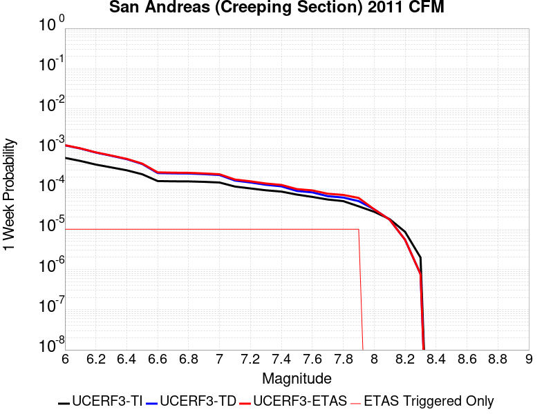 |  |  |  |

| Magnitude | 1 wk TI Prob | 1 wk TD Prob | 1 wk ETAS Prob | 1 wk ETAS/TD Gain | 1 wk ETAS Triggered Only | 1 mo TI Prob | 1 mo TD Prob | 1 mo ETAS Prob | 1 mo ETAS/TD Gain | 1 mo ETAS Triggered Only | 1 yr TI Prob | 1 yr TD Prob | 1 yr ETAS Prob | 1 yr ETAS/TD Gain | 1 yr ETAS Triggered Only | 10 yr TI Prob | 10 yr TD Prob | 10 yr ETAS Prob | 10 yr ETAS/TD Gain | 10 yr ETAS Triggered Only |
|-----|-----|-----|-----|-----|-----|-----|-----|-----|-----|-----|-----|-----|-----|-----|-----|-----|-----|-----|-----|-----|
| 6.0 | 5.986481E-4 | 0.0012278741 | 0.0012385789 | 1.0087183 | 1.0718114E-5 | 0.0025631124 | 0.0052457973 | 0.0052564596 | 1.0020325 | 1.0718114E-5 | 0.030762846 | 0.061208665 | 0.061248913 | 1.0006576 | 4.2872456E-5 | 0.26835477 | 0.4259623 | 0.42600536 | 1.0001011 | 7.5026794E-5 |
| 6.1 | 5.015945E-4 | 0.0010222398 | 0.001032947 | 1.0104742 | 1.0718114E-5 | 0.00214792 | 0.004368119 | 0.00437879 | 1.002443 | 1.0718114E-5 | 0.025839351 | 0.0512512 | 0.051281705 | 1.0005952 | 3.215434E-5 | 0.23032776 | 0.37288252 | 0.37291613 | 1.0000901 | 5.3590567E-5 |
| 6.2 | 4.073338E-4 | 8.109135E-4 | 8.2162296E-4 | 1.0132066 | 1.0718114E-5 | 0.0017445484 | 0.0034676173 | 0.0034782982 | 1.0030802 | 1.0718114E-5 | 0.021034058 | 0.040936444 | 0.040967282 | 1.0007533 | 3.215434E-5 | 0.19150782 | 0.3130621 | 0.3130989 | 1.0001175 | 5.3590567E-5 |
| 6.3 | 3.464099E-4 | 6.7394925E-4 | 6.8466016E-4 | 1.0158927 | 1.0718114E-5 | 0.0014837692 | 0.00288274 | 0.0028934272 | 1.0037073 | 1.0718114E-5 | 0.017915873 | 0.034192428 | 0.034223482 | 1.0009083 | 3.215434E-5 | 0.16538359 | 0.27134693 | 0.27138597 | 1.0001439 | 5.3590567E-5 |
| 6.4 | 2.935057E-4 | 5.545115E-4 | 5.652237E-4 | 1.0193182 | 1.0718114E-5 | 0.0012572751 | 0.0023718805 | 0.0023825732 | 1.0045081 | 1.0718114E-5 | 0.015200248 | 0.028267467 | 0.028298713 | 1.0011053 | 3.215434E-5 | 0.14201577 | 0.2330172 | 0.23305832 | 1.0001764 | 5.3590567E-5 |
| 6.5 | 2.3409708E-4 | 4.2095222E-4 | 4.316658E-4 | 1.0254508 | 1.0718114E-5 | 0.0010028875 | 0.0018015768 | 0.0018122756 | 1.0059385 | 1.0718114E-5 | 0.012141965 | 0.021591473 | 0.021622933 | 1.0014571 | 3.215434E-5 | 0.11499573 | 0.18685804 | 0.18690161 | 1.0002332 | 5.3590567E-5 |
| 6.6 | 1.5842178E-4 | 2.5079807E-4 | 2.615135E-4 | 1.0427253 | 1.0718114E-5 | 6.7877385E-4 | 0.0010744074 | 0.001085114 | 1.0099651 | 1.0718114E-5 | 0.0082328 | 0.013001034 | 0.01303277 | 1.002441 | 3.215434E-5 | 0.07934396 | 0.12318426 | 0.123231255 | 1.0003815 | 5.3590567E-5 |
| 6.7 | 1.5616413E-4 | 2.461632E-4 | 2.5687864E-4 | 1.04353 | 1.0718114E-5 | 6.691031E-4 | 0.0010545597 | 0.0010652666 | 1.0101528 | 1.0718114E-5 | 0.0081159435 | 0.012762894 | 0.012794638 | 1.0024872 | 3.215434E-5 | 0.0782586 | 0.12121142 | 0.12125851 | 1.0003885 | 5.3590567E-5 |
| 6.8 | 1.5538467E-4 | 2.4440174E-4 | 2.5511725E-4 | 1.0438437 | 1.0718114E-5 | 6.6576427E-4 | 0.0010470168 | 0.0010577238 | 1.0102261 | 1.0718114E-5 | 0.008075596 | 0.012672268 | 0.012704015 | 1.0025052 | 3.215434E-5 | 0.07788358 | 0.12044227 | 0.1204894 | 1.0003914 | 5.3590567E-5 |
| 6.9 | 1.5153569E-4 | 2.3549511E-4 | 2.462107E-4 | 1.0455024 | 1.0718114E-5 | 6.49277E-4 | 0.0010088764 | 0.0010195837 | 1.0106131 | 1.0718114E-5 | 0.007876333 | 0.012214421 | 0.012246183 | 1.0026003 | 3.215434E-5 | 0.07602952 | 0.11651233 | 0.11655968 | 1.0004064 | 5.3590567E-5 |
| 7.0 | 1.4588932E-4 | 2.2406683E-4 | 2.3478254E-4 | 1.0478238 | 1.0718114E-5 | 6.250901E-4 | 9.5993496E-4 | 9.706428E-4 | 1.0111548 | 1.0718114E-5 | 0.0075839474 | 0.011625077 | 0.011656857 | 1.0027338 | 3.215434E-5 | 0.073302895 | 0.111358546 | 0.11140617 | 1.0004276 | 5.3590567E-5 |
| 7.1 | 1.1565079E-4 | 1.6290719E-4 | 1.7362356E-4 | 1.0657821 | 1.0718114E-5 | 4.955521E-4 | 6.9798774E-4 | 7.0869835E-4 | 1.015345 | 1.0718114E-5 | 0.006016669 | 0.008465091 | 0.008496973 | 1.0037663 | 3.215434E-5 | 0.058563538 | 0.08370675 | 0.08375586 | 1.0005866 | 5.3590567E-5 |
| 7.2 | 1.0393792E-4 | 1.4624344E-4 | 1.5695998E-4 | 1.0732788 | 1.0718114E-5 | 4.4537216E-4 | 6.2660786E-4 | 6.3731923E-4 | 1.0170943 | 1.0718114E-5 | 0.005408933 | 0.007602434 | 0.007634344 | 1.0041974 | 3.215434E-5 | 0.052791595 | 0.07565546 | 0.075705 | 1.0006548 | 5.3590567E-5 |
| 7.3 | 9.332884E-5 | 1.2788197E-4 | 1.3859871E-4 | 1.0838019 | 1.0718114E-5 | 3.999194E-4 | 5.479511E-4 | 5.5866333E-4 | 1.0195496 | 1.0718114E-5 | 0.0048581534 | 0.0066510327 | 0.006682973 | 1.0048023 | 3.215434E-5 | 0.047533102 | 0.06651482 | 0.06656484 | 1.0007521 | 5.3590567E-5 |
| 7.4 | 8.670252E-5 | 1.17095995E-4 | 1.2781285E-4 | 1.091522 | 1.0718114E-5 | 3.715293E-4 | 5.0174404E-4 | 5.1245675E-4 | 1.021351 | 1.0718114E-5 | 0.004513991 | 0.006091744 | 0.006123703 | 1.0052462 | 3.215434E-5 | 0.044233937 | 0.061179653 | 0.061229967 | 1.0008223 | 5.3590567E-5 |
| 7.5 | 7.3036405E-5 | 9.011144E-5 | 1.0082858E-4 | 1.1189321 | 1.0718114E-5 | 3.129756E-4 | 3.861348E-4 | 3.9684877E-4 | 1.0277467 | 1.0718114E-5 | 0.0038038217 | 0.004691079 | 0.0047230823 | 1.0068222 | 3.215434E-5 | 0.03739367 | 0.047901772 | 0.047952794 | 1.0010651 | 5.3590567E-5 |
| 7.6 | 6.3935775E-5 | 8.284792E-5 | 9.356515E-5 | 1.1293602 | 1.0718114E-5 | 2.7398168E-4 | 3.550143E-4 | 3.6572857E-4 | 1.03018 | 1.0718114E-5 | 0.0033306254 | 0.004313751 | 0.0043457667 | 1.0074217 | 3.215434E-5 | 0.032811474 | 0.04401211 | 0.04406334 | 1.0011641 | 5.3590567E-5 |
| 7.7 | 5.5050095E-5 | 6.6657536E-5 | 7.7374934E-5 | 1.160783 | 1.0718114E-5 | 2.3590765E-4 | 2.8564388E-4 | 2.9635895E-4 | 1.037512 | 1.0718114E-5 | 0.0028683927 | 0.0034721727 | 0.0035042155 | 1.0092285 | 3.215434E-5 | 0.0283165 | 0.035814673 | 0.03585601 | 1.0011542 | 4.2872456E-5 |
| 7.8 | 5.027131E-5 | 6.166444E-5 | 7.238189E-5 | 1.1738029 | 1.0718114E-5 | 2.1543067E-4 | 2.6424942E-4 | 2.749647E-4 | 1.0405499 | 1.0718114E-5 | 0.0026197135 | 0.0032124936 | 0.0032445446 | 1.009977 | 3.215434E-5 | 0.025890453 | 0.033143617 | 0.03318507 | 1.0012506 | 4.2872456E-5 |
| 7.9 | 3.7271806E-5 | 5.0253755E-5 | 6.097133E-5 | 1.2132691 | 1.0718114E-5 | 1.5972654E-4 | 2.1535547E-4 | 2.2607128E-4 | 1.0497587 | 1.0718114E-5 | 0.0019429359 | 0.0026188022 | 0.0026508723 | 1.0122461 | 3.215434E-5 | 0.019260362 | 0.027081102 | 0.027122812 | 1.0015402 | 4.2872456E-5 |
| 8.0 | 2.7310243E-5 | 3.144777E-5 | 3.144777E-5 | 1.0 | 0.0 | 1.17038646E-4 | 1.3476919E-4 | 1.3476919E-4 | 1.0 | 0.0 | 0.0014240141 | 0.0016395808 | 0.0016502814 | 1.0065264 | 1.0718114E-5 | 0.014149235 | 0.0172237 | 0.01724477 | 1.0012231 | 2.1436228E-5 |
| 8.1 | 1.7940547E-5 | 1.7413187E-5 | 1.7413187E-5 | 1.0 | 0.0 | 7.688579E-5 | 7.4625816E-5 | 7.4625816E-5 | 1.0 | 0.0 | 9.3568244E-4 | 9.081911E-4 | 9.081911E-4 | 1.0 | 0.0 | 0.009317525 | 0.009805583 | 0.009805583 | 1.0 | 0.0 |
| 8.2 | 8.643924E-6 | 5.4798497E-6 | 5.4798497E-6 | 1.0 | 0.0 | 3.704486E-5 | 2.348486E-5 | 2.348486E-5 | 1.0 | 0.0 | 4.5092785E-4 | 2.858907E-4 | 2.858907E-4 | 1.0 | 0.0 | 0.0045001395 | 0.0032514327 | 0.0032514327 | 1.0 | 0.0 |
| 8.3 | 1.983087E-6 | 7.668296E-7 | 7.668296E-7 | 1.0 | 0.0 | 8.498917E-6 | 3.2864084E-6 | 3.2864084E-6 | 1.0 | 0.0 | 1.034694E-4 | 4.0011306E-5 | 4.0011306E-5 | 1.0 | 0.0 | 0.0010342124 | 4.724499E-4 | 4.724499E-4 | 1.0 | 0.0 |

## Blue Cut
*[(top)](#table-of-contents)*

| 1 Week | 1 Month | 1 Year | 10 Year |
|-----|-----|-----|-----|
|  |  |  | 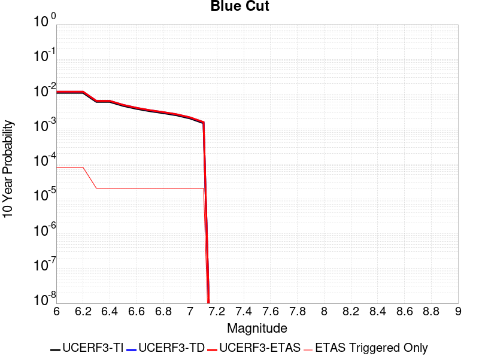 |

| Magnitude | 1 wk TI Prob | 1 wk TD Prob | 1 wk ETAS Prob | 1 wk ETAS/TD Gain | 1 wk ETAS Triggered Only | 1 mo TI Prob | 1 mo TD Prob | 1 mo ETAS Prob | 1 mo ETAS/TD Gain | 1 mo ETAS Triggered Only | 1 yr TI Prob | 1 yr TD Prob | 1 yr ETAS Prob | 1 yr ETAS/TD Gain | 1 yr ETAS Triggered Only | 10 yr TI Prob | 10 yr TD Prob | 10 yr ETAS Prob | 10 yr ETAS/TD Gain | 10 yr ETAS Triggered Only |
|-----|-----|-----|-----|-----|-----|-----|-----|-----|-----|-----|-----|-----|-----|-----|-----|-----|-----|-----|-----|-----|
| 6.0 | 2.1227985E-5 | 2.2719787E-5 | 4.4155528E-5 | 1.9434834 | 2.1436228E-5 | 9.097391E-5 | 9.736721E-5 | 1.1880135E-4 | 1.2201371 | 2.1436228E-5 | 0.0011070445 | 0.0011848592 | 0.0012276808 | 1.0361407 | 4.2872456E-5 | 0.011015458 | 0.011791261 | 0.011875995 | 1.0071862 | 8.574491E-5 |
| 6.1 | 2.1227985E-5 | 2.2719787E-5 | 4.4155528E-5 | 1.9434834 | 2.1436228E-5 | 9.097391E-5 | 9.736721E-5 | 1.1880135E-4 | 1.2201371 | 2.1436228E-5 | 0.0011070445 | 0.0011848592 | 0.0012276808 | 1.0361407 | 4.2872456E-5 | 0.011015458 | 0.011791261 | 0.011875995 | 1.0071862 | 8.574491E-5 |
| 6.2 | 2.1227985E-5 | 2.2719787E-5 | 4.4155528E-5 | 1.9434834 | 2.1436228E-5 | 9.097391E-5 | 9.736721E-5 | 1.1880135E-4 | 1.2201371 | 2.1436228E-5 | 0.0011070445 | 0.0011848592 | 0.0012276808 | 1.0361407 | 4.2872456E-5 | 0.011015458 | 0.011791261 | 0.011875995 | 1.0071862 | 8.574491E-5 |
| 6.3 | 1.1613981E-5 | 1.23536465E-5 | 2.3071627E-5 | 1.8675966 | 1.0718114E-5 | 4.9773254E-5 | 5.2943193E-5 | 6.3660744E-5 | 1.2024348 | 1.0718114E-5 | 6.0582085E-4 | 6.444052E-4 | 6.658276E-4 | 1.0332437 | 2.1436228E-5 | 0.0060417196 | 0.0064266133 | 0.0064479117 | 1.0033141 | 2.1436228E-5 |
| 6.4 | 1.1613981E-5 | 1.23536465E-5 | 2.3071627E-5 | 1.8675966 | 1.0718114E-5 | 4.9773254E-5 | 5.2943193E-5 | 6.3660744E-5 | 1.2024348 | 1.0718114E-5 | 6.0582085E-4 | 6.444052E-4 | 6.658276E-4 | 1.0332437 | 2.1436228E-5 | 0.0060417196 | 0.0064266133 | 0.0064479117 | 1.0033141 | 2.1436228E-5 |
| 6.5 | 8.931326E-6 | 9.481677E-6 | 2.019969E-5 | 2.130392 | 1.0718114E-5 | 3.8276554E-5 | 4.063518E-5 | 5.1352858E-5 | 1.2637537 | 1.0718114E-5 | 4.6591737E-4 | 4.9463013E-4 | 5.160558E-4 | 1.0433165 | 2.1436228E-5 | 0.0046494175 | 0.0049362015 | 0.0049575316 | 1.0043212 | 2.1436228E-5 |
| 6.6 | 7.345353E-6 | 7.790341E-6 | 1.8508372E-5 | 2.37581 | 1.0718114E-5 | 3.1479703E-5 | 3.3386797E-5 | 4.4104552E-5 | 1.3210177 | 1.0718114E-5 | 3.83198E-4 | 4.0641645E-4 | 4.2784397E-4 | 1.052723 | 2.1436228E-5 | 0.0038253788 | 0.0040575233 | 0.0040788725 | 1.0052617 | 2.1436228E-5 |
| 6.7 | 6.2775666E-6 | 6.655202E-6 | 1.7373244E-5 | 2.6104758 | 1.0718114E-5 | 2.690358E-5 | 2.8522025E-5 | 3.9239832E-5 | 1.3757731 | 1.0718114E-5 | 3.2750185E-4 | 3.4720785E-4 | 3.6863663E-4 | 1.0617175 | 2.1436228E-5 | 0.0032701963 | 0.0034673947 | 0.0034887567 | 1.0061607 | 2.1436228E-5 |
| 6.8 | 5.5234095E-6 | 5.8551577E-6 | 1.6573209E-5 | 2.8305316 | 1.0718114E-5 | 2.367154E-5 | 2.5093334E-5 | 3.581118E-5 | 1.4271193 | 1.0718114E-5 | 2.8816288E-4 | 3.0547578E-4 | 3.2690546E-4 | 1.0701518 | 2.1436228E-5 | 0.002877895 | 0.003051275 | 0.0030726457 | 1.0070039 | 2.1436228E-5 |
| 6.9 | 4.7780054E-6 | 5.0654608E-6 | 1.578352E-5 | 3.11591 | 1.0718114E-5 | 2.0477004E-5 | 2.1708976E-5 | 3.242686E-5 | 1.4937073 | 1.0718114E-5 | 2.4927902E-4 | 2.6428179E-4 | 2.8571236E-4 | 1.0810899 | 2.1436228E-5 | 0.0024899957 | 0.0026403673 | 0.0026617467 | 1.0080972 | 2.1436228E-5 |
| 7.0 | 3.883171E-6 | 4.1185203E-6 | 1.483659E-5 | 3.602408 | 1.0718114E-5 | 1.6642054E-5 | 1.765072E-5 | 2.8368644E-5 | 1.607223 | 1.0718114E-5 | 2.0259817E-4 | 2.1488321E-4 | 2.3631484E-4 | 1.0997361 | 2.1436228E-5 | 0.0020241356 | 0.00214743 | 0.0021688202 | 1.0099609 | 2.1436228E-5 |
| 7.1 | 2.8358215E-6 | 3.0097403E-6 | 1.3727822E-5 | 4.5611315 | 1.0718114E-5 | 1.2153464E-5 | 1.289886E-5 | 2.3616836E-5 | 1.8309242 | 1.0718114E-5 | 1.4795837E-4 | 1.5703888E-4 | 1.7847175E-4 | 1.1364813 | 2.1436228E-5 | 0.001478599 | 0.0015699244 | 0.0015913269 | 1.0136329 | 2.1436228E-5 |

## Pinto Mtn
*[(top)](#table-of-contents)*

| 1 Week | 1 Month | 1 Year | 10 Year |
|-----|-----|-----|-----|
|  | 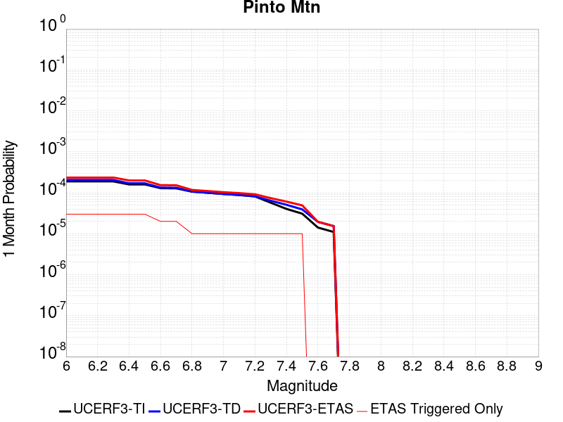 |  |  |

| Magnitude | 1 wk TI Prob | 1 wk TD Prob | 1 wk ETAS Prob | 1 wk ETAS/TD Gain | 1 wk ETAS Triggered Only | 1 mo TI Prob | 1 mo TD Prob | 1 mo ETAS Prob | 1 mo ETAS/TD Gain | 1 mo ETAS Triggered Only | 1 yr TI Prob | 1 yr TD Prob | 1 yr ETAS Prob | 1 yr ETAS/TD Gain | 1 yr ETAS Triggered Only | 10 yr TI Prob | 10 yr TD Prob | 10 yr ETAS Prob | 10 yr ETAS/TD Gain | 10 yr ETAS Triggered Only |
|-----|-----|-----|-----|-----|-----|-----|-----|-----|-----|-----|-----|-----|-----|-----|-----|-----|-----|-----|-----|-----|
| 6.0 | 4.4194956E-5 | 4.785523E-5 | 5.857283E-5 | 1.2239588 | 1.0718114E-5 | 1.893932E-4 | 2.0507864E-4 | 2.3722638E-4 | 1.1567582 | 3.215434E-5 | 0.0023034236 | 0.002494138 | 0.002579669 | 1.0342928 | 8.574491E-5 | 0.022796938 | 0.024678964 | 0.024762593 | 1.0033886 | 8.574491E-5 |
| 6.1 | 4.4194956E-5 | 4.785523E-5 | 5.857283E-5 | 1.2239588 | 1.0718114E-5 | 1.893932E-4 | 2.0507864E-4 | 2.3722638E-4 | 1.1567582 | 3.215434E-5 | 0.0023034236 | 0.002494138 | 0.002579669 | 1.0342928 | 8.574491E-5 | 0.022796938 | 0.024678964 | 0.024762593 | 1.0033886 | 8.574491E-5 |
| 6.2 | 4.4194956E-5 | 4.785523E-5 | 5.857283E-5 | 1.2239588 | 1.0718114E-5 | 1.893932E-4 | 2.0507864E-4 | 2.3722638E-4 | 1.1567582 | 3.215434E-5 | 0.0023034236 | 0.002494138 | 0.002579669 | 1.0342928 | 8.574491E-5 | 0.022796938 | 0.024678964 | 0.024762593 | 1.0033886 | 8.574491E-5 |
| 6.3 | 4.4194956E-5 | 4.785523E-5 | 5.857283E-5 | 1.2239588 | 1.0718114E-5 | 1.893932E-4 | 2.0507864E-4 | 2.3722638E-4 | 1.1567582 | 3.215434E-5 | 0.0023034236 | 0.002494138 | 0.002579669 | 1.0342928 | 8.574491E-5 | 0.022796938 | 0.024678964 | 0.024762593 | 1.0033886 | 8.574491E-5 |
| 6.4 | 3.729929E-5 | 3.960458E-5 | 5.032227E-5 | 1.2706174 | 1.0718114E-5 | 1.5984432E-4 | 1.697234E-4 | 2.0187229E-4 | 1.1894193 | 3.215434E-5 | 0.0019443673 | 0.0020645177 | 0.0021286935 | 1.0310851 | 6.430868E-5 | 0.019274427 | 0.020463403 | 0.020526396 | 1.0030783 | 6.430868E-5 |
| 6.5 | 3.729929E-5 | 3.960458E-5 | 5.032227E-5 | 1.2706174 | 1.0718114E-5 | 1.5984432E-4 | 1.697234E-4 | 2.0187229E-4 | 1.1894193 | 3.215434E-5 | 0.0019443673 | 0.0020645177 | 0.0021286935 | 1.0310851 | 6.430868E-5 | 0.019274427 | 0.020463403 | 0.020526396 | 1.0030783 | 6.430868E-5 |
| 6.6 | 3.0204548E-5 | 3.1206488E-5 | 4.1924268E-5 | 1.3434472 | 1.0718114E-5 | 1.2944164E-4 | 1.3373543E-4 | 1.5516879E-4 | 1.1602669 | 2.1436228E-5 | 0.0015748127 | 0.0016270474 | 0.0016698501 | 1.026307 | 4.2872456E-5 | 0.015636992 | 0.01615522 | 0.0161974 | 1.0026109 | 4.2872456E-5 |
| 6.7 | 2.9857754E-5 | 3.0815863E-5 | 4.1533647E-5 | 1.3478009 | 1.0718114E-5 | 1.2795553E-4 | 1.320615E-4 | 1.534949E-4 | 1.1622986 | 2.1436228E-5 | 0.0015567453 | 0.0016066976 | 0.0016495012 | 1.0266408 | 4.2872456E-5 | 0.015458848 | 0.015954657 | 0.015996845 | 1.0026443 | 4.2872456E-5 |
| 6.8 | 2.4819734E-5 | 2.5010428E-5 | 3.5728273E-5 | 1.4285351 | 1.0718114E-5 | 1.0636595E-4 | 1.0718327E-4 | 1.1790023E-4 | 1.0999873 | 1.0718114E-5 | 0.0012942362 | 0.0013041968 | 0.0013363091 | 1.0246223 | 3.215434E-5 | 0.012867244 | 0.012967796 | 0.012999533 | 1.0024474 | 3.215434E-5 |
| 6.9 | 2.331124E-5 | 2.3338684E-5 | 3.4056546E-5 | 1.4592317 | 1.0718114E-5 | 9.990149E-5 | 1.00019206E-4 | 1.1073625E-4 | 1.1071498 | 1.0718114E-5 | 0.001215622 | 0.001217074 | 0.0012491891 | 1.0263872 | 3.215434E-5 | 0.012089936 | 0.012106278 | 0.012138043 | 1.0026238 | 3.215434E-5 |
| 7.0 | 2.1818534E-5 | 2.1761793E-5 | 3.2479675E-5 | 1.492509 | 1.0718114E-5 | 9.3504656E-5 | 9.32616E-5 | 1.0397872E-4 | 1.1149145 | 1.0718114E-5 | 0.0011378246 | 0.0011348884 | 0.0011670062 | 1.0283004 | 3.215434E-5 | 0.011320163 | 0.01129303 | 0.011324822 | 1.0028151 | 3.215434E-5 |
| 7.1 | 2.066081E-5 | 2.054142E-5 | 3.125931E-5 | 1.5217699 | 1.0718114E-5 | 8.854332E-5 | 8.80318E-5 | 9.874896E-5 | 1.121742 | 1.0718114E-5 | 0.0010774818 | 0.0010712796 | 0.0011033996 | 1.0299827 | 3.215434E-5 | 0.010722724 | 0.010663206 | 0.010695017 | 1.0029833 | 3.215434E-5 |
| 7.2 | 1.8990233E-5 | 1.9054683E-5 | 2.9772593E-5 | 1.5624816 | 1.0718114E-5 | 8.138417E-5 | 8.166048E-5 | 9.237772E-5 | 1.1312414 | 1.0718114E-5 | 9.904018E-4 | 9.937823E-4 | 0.0010259047 | 1.0323234 | 3.215434E-5 | 0.009859995 | 0.0098953815 | 0.009927218 | 1.0032172 | 3.215434E-5 |
| 7.3 | 1.3335872E-5 | 1.4907276E-5 | 2.562523E-5 | 1.7189747 | 1.0718114E-5 | 5.7152483E-5 | 6.388683E-5 | 7.4604264E-5 | 1.1677564 | 1.0718114E-5 | 6.956093E-4 | 7.775574E-4 | 8.096867E-4 | 1.0413209 | 3.215434E-5 | 0.006934359 | 0.0077496674 | 0.0077815726 | 1.004117 | 3.215434E-5 |
| 7.4 | 9.414066E-6 | 1.186147E-5 | 2.2579456E-5 | 1.9035969 | 1.0718114E-5 | 4.0345374E-5 | 5.0833933E-5 | 6.15515E-5 | 1.210835 | 1.0718114E-5 | 4.910942E-4 | 6.187368E-4 | 6.5087125E-4 | 1.0519356 | 3.215434E-5 | 0.0049001034 | 0.0061710896 | 0.0062030456 | 1.0051783 | 3.215434E-5 |
| 7.5 | 7.2101157E-6 | 9.158733E-6 | 1.9876748E-5 | 2.170251 | 1.0718114E-5 | 3.090013E-5 | 3.9251165E-5 | 4.9968858E-5 | 1.2730541 | 1.0718114E-5 | 3.7614413E-4 | 4.7778594E-4 | 5.099249E-4 | 1.0672665 | 3.215434E-5 | 0.0037550807 | 0.0047683627 | 0.0048003634 | 1.0067111 | 3.215434E-5 |
| 7.6 | 3.296375E-6 | 4.546122E-6 | 4.546122E-6 | 1.0 | 0.0 | 1.4127245E-5 | 1.9483241E-5 | 1.9483241E-5 | 1.0 | 0.0 | 1.7198564E-4 | 2.3718402E-4 | 2.3718402E-4 | 1.0 | 0.0 | 0.0017185259 | 0.0023694462 | 0.0023694462 | 1.0 | 0.0 |
| 7.7 | 2.5741092E-6 | 3.5850085E-6 | 3.5850085E-6 | 1.0 | 0.0 | 1.103185E-5 | 1.536424E-5 | 1.536424E-5 | 1.0 | 0.0 | 1.3430449E-4 | 1.8704488E-4 | 1.8704488E-4 | 1.0 | 0.0 | 0.0013422335 | 0.0018690043 | 0.0018690043 | 1.0 | 0.0 |

## Pisgah-Bullion Mtn-Mesquite Lk
*[(top)](#table-of-contents)*

| 1 Week | 1 Month | 1 Year | 10 Year |
|-----|-----|-----|-----|
|  |  |  |  |

| Magnitude | 1 wk TI Prob | 1 wk TD Prob | 1 wk ETAS Prob | 1 wk ETAS/TD Gain | 1 wk ETAS Triggered Only | 1 mo TI Prob | 1 mo TD Prob | 1 mo ETAS Prob | 1 mo ETAS/TD Gain | 1 mo ETAS Triggered Only | 1 yr TI Prob | 1 yr TD Prob | 1 yr ETAS Prob | 1 yr ETAS/TD Gain | 1 yr ETAS Triggered Only | 10 yr TI Prob | 10 yr TD Prob | 10 yr ETAS Prob | 10 yr ETAS/TD Gain | 10 yr ETAS Triggered Only |
|-----|-----|-----|-----|-----|-----|-----|-----|-----|-----|-----|-----|-----|-----|-----|-----|-----|-----|-----|-----|-----|
| 6.0 | 3.0240792E-5 | 2.4091496E-5 | 2.4091496E-5 | 1.0 | 0.0 | 1.2959696E-4 | 1.0324575E-4 | 1.3539677E-4 | 1.3114028 | 3.215434E-5 | 0.0015767008 | 0.0012563926 | 0.0012992112 | 1.0340806 | 4.2872456E-5 | 0.015655609 | 0.012502918 | 0.012587591 | 1.0067723 | 8.574491E-5 |
| 6.1 | 3.0240792E-5 | 2.4091496E-5 | 2.4091496E-5 | 1.0 | 0.0 | 1.2959696E-4 | 1.0324575E-4 | 1.3539677E-4 | 1.3114028 | 3.215434E-5 | 0.0015767008 | 0.0012563926 | 0.0012992112 | 1.0340806 | 4.2872456E-5 | 0.015655609 | 0.012502918 | 0.012587591 | 1.0067723 | 8.574491E-5 |
| 6.2 | 3.0240792E-5 | 2.4091496E-5 | 2.4091496E-5 | 1.0 | 0.0 | 1.2959696E-4 | 1.0324575E-4 | 1.3539677E-4 | 1.3114028 | 3.215434E-5 | 0.0015767008 | 0.0012563926 | 0.0012992112 | 1.0340806 | 4.2872456E-5 | 0.015655609 | 0.012502918 | 0.012587591 | 1.0067723 | 8.574491E-5 |
| 6.3 | 2.0498217E-5 | 1.3638254E-5 | 1.3638254E-5 | 1.0 | 0.0 | 8.784654E-5 | 5.8448444E-5 | 6.916593E-5 | 1.1833665 | 1.0718114E-5 | 0.0010690069 | 7.1139366E-4 | 7.2210416E-4 | 1.0150557 | 1.0718114E-5 | 0.01063879 | 0.00709279 | 0.0071247164 | 1.0045012 | 3.215434E-5 |
| 6.4 | 2.0498217E-5 | 1.3638254E-5 | 1.3638254E-5 | 1.0 | 0.0 | 8.784654E-5 | 5.8448444E-5 | 6.916593E-5 | 1.1833665 | 1.0718114E-5 | 0.0010690069 | 7.1139366E-4 | 7.2210416E-4 | 1.0150557 | 1.0718114E-5 | 0.01063879 | 0.00709279 | 0.0071247164 | 1.0045012 | 3.215434E-5 |
| 6.5 | 1.7316182E-5 | 1.0477178E-5 | 1.0477178E-5 | 1.0 | 0.0 | 7.42101E-5 | 4.4901473E-5 | 4.4901473E-5 | 1.0 | 0.0 | 9.0313336E-4 | 5.465483E-4 | 5.465483E-4 | 1.0 | 0.0 | 0.008994718 | 0.005453037 | 0.0054636966 | 1.0019548 | 1.0718114E-5 |
| 6.6 | 1.5251077E-5 | 8.414378E-6 | 8.414378E-6 | 1.0 | 0.0 | 6.536012E-5 | 3.606116E-5 | 3.606116E-5 | 1.0 | 0.0 | 7.9546886E-4 | 4.389634E-4 | 4.389634E-4 | 1.0 | 0.0 | 0.007926274 | 0.004381681 | 0.004392352 | 1.0024354 | 1.0718114E-5 |
| 6.7 | 1.2997425E-5 | 6.411573E-6 | 6.411573E-6 | 1.0 | 0.0 | 5.570206E-5 | 2.7477907E-5 | 2.7477907E-5 | 1.0 | 0.0 | 6.7796157E-4 | 3.344968E-4 | 3.344968E-4 | 1.0 | 0.0 | 0.0067589693 | 0.0033403935 | 0.003351076 | 1.0031979 | 1.0718114E-5 |
| 6.8 | 1.035386E-5 | 4.333283E-6 | 4.333283E-6 | 1.0 | 0.0 | 4.437293E-5 | 1.8571085E-5 | 1.8571085E-5 | 1.0 | 0.0 | 5.401065E-4 | 2.2608037E-4 | 2.2608037E-4 | 1.0 | 0.0 | 0.0053879567 | 0.0022585907 | 0.0022585907 | 1.0 | 0.0 |
| 6.9 | 8.816252E-6 | 3.580692E-6 | 3.580692E-6 | 1.0 | 0.0 | 3.778339E-5 | 1.5345737E-5 | 1.5345737E-5 | 1.0 | 0.0 | 4.5991567E-4 | 1.8681891E-4 | 1.8681891E-4 | 1.0 | 0.0 | 0.00458965 | 0.0018666771 | 0.0018666771 | 1.0 | 0.0 |
| 7.0 | 6.8232207E-6 | 2.5676256E-6 | 2.5676256E-6 | 1.0 | 0.0 | 2.9242048E-5 | 1.10040655E-5 | 1.10040655E-5 | 1.0 | 0.0 | 3.5596377E-4 | 1.3396658E-4 | 1.3396658E-4 | 1.0 | 0.0 | 0.0035539411 | 0.0013388892 | 0.0013388892 | 1.0 | 0.0 |
| 7.1 | 5.837013E-6 | 2.2274157E-6 | 2.2274157E-6 | 1.0 | 0.0 | 2.501553E-5 | 9.546034E-6 | 9.546034E-6 | 1.0 | 0.0 | 3.045215E-4 | 1.1621706E-4 | 1.1621706E-4 | 1.0 | 0.0 | 0.0030410455 | 0.0011615918 | 0.0011615918 | 1.0 | 0.0 |
| 7.2 | 4.278052E-6 | 1.6275965E-6 | 1.6275965E-6 | 1.0 | 0.0 | 1.833438E-5 | 6.9753964E-6 | 6.9753964E-6 | 1.0 | 0.0 | 2.231982E-4 | 8.492238E-5 | 8.492238E-5 | 1.0 | 0.0 | 0.0022297418 | 8.489225E-4 | 8.489225E-4 | 1.0 | 0.0 |
| 7.3 | 1.8803692E-6 | 8.3450385E-7 | 8.3450385E-7 | 1.0 | 0.0 | 8.0587E-6 | 3.576441E-6 | 3.576441E-6 | 1.0 | 0.0 | 9.811026E-5 | 4.3542448E-5 | 4.3542448E-5 | 1.0 | 0.0 | 9.806695E-4 | 4.353536E-4 | 4.353536E-4 | 1.0 | 0.0 |

## San Clemente
*[(top)](#table-of-contents)*

| 1 Week | 1 Month | 1 Year | 10 Year |
|-----|-----|-----|-----|
| 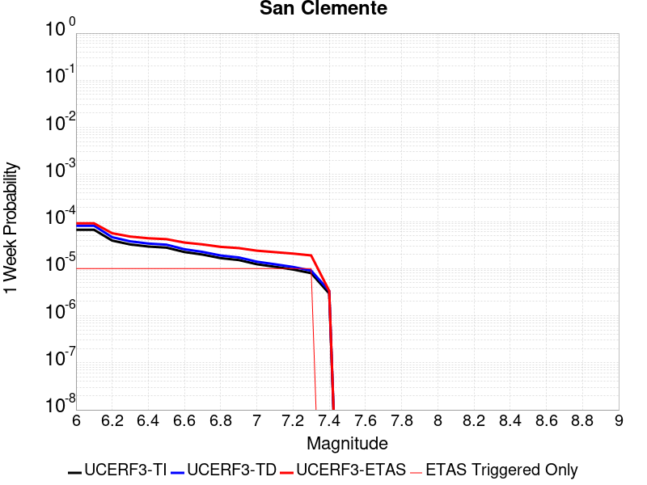 | 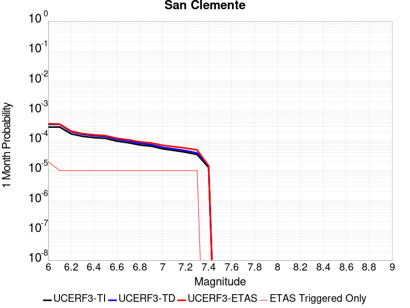 |  | 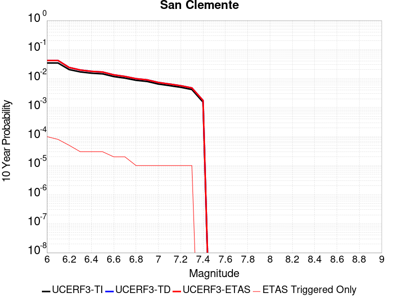 |

| Magnitude | 1 wk TI Prob | 1 wk TD Prob | 1 wk ETAS Prob | 1 wk ETAS/TD Gain | 1 wk ETAS Triggered Only | 1 mo TI Prob | 1 mo TD Prob | 1 mo ETAS Prob | 1 mo ETAS/TD Gain | 1 mo ETAS Triggered Only | 1 yr TI Prob | 1 yr TD Prob | 1 yr ETAS Prob | 1 yr ETAS/TD Gain | 1 yr ETAS Triggered Only | 10 yr TI Prob | 10 yr TD Prob | 10 yr ETAS Prob | 10 yr ETAS/TD Gain | 10 yr ETAS Triggered Only |
|-----|-----|-----|-----|-----|-----|-----|-----|-----|-----|-----|-----|-----|-----|-----|-----|-----|-----|-----|-----|-----|
| 6.0 | 6.681379E-5 | 8.163669E-5 | 8.163669E-5 | 1.0 | 0.0 | 2.8631336E-4 | 3.4982787E-4 | 3.6054224E-4 | 1.0306275 | 1.0718114E-5 | 0.003480294 | 0.004251416 | 0.004294106 | 1.0100414 | 4.2872456E-5 | 0.03426291 | 0.041756913 | 0.041828807 | 1.0017217 | 7.5026794E-5 |
| 6.1 | 6.681379E-5 | 8.163669E-5 | 8.163669E-5 | 1.0 | 0.0 | 2.8631336E-4 | 3.4982787E-4 | 3.4982787E-4 | 1.0 | 0.0 | 0.003480294 | 0.004251416 | 0.0042834333 | 1.007531 | 3.215434E-5 | 0.03426291 | 0.041756913 | 0.041818537 | 1.0014758 | 6.430868E-5 |
| 6.2 | 3.9400576E-5 | 4.6453104E-5 | 4.6453104E-5 | 1.0 | 0.0 | 1.6884868E-4 | 1.9906988E-4 | 1.9906988E-4 | 1.0 | 0.0 | 0.0020537945 | 0.0024210429 | 0.0024424272 | 1.0088327 | 2.1436228E-5 | 0.020349167 | 0.023953425 | 0.023995271 | 1.001747 | 4.2872456E-5 |
| 6.3 | 3.2590255E-5 | 3.792992E-5 | 3.792992E-5 | 1.0 | 0.0 | 1.3966505E-4 | 1.6254683E-4 | 1.6254683E-4 | 1.0 | 0.0 | 0.0016990956 | 0.0019772416 | 0.0019986355 | 1.01082 | 2.1436228E-5 | 0.01686163 | 0.019600289 | 0.019621305 | 1.0010723 | 2.1436228E-5 |
| 6.4 | 2.9454652E-5 | 3.4098495E-5 | 3.4098495E-5 | 1.0 | 0.0 | 1.2622811E-4 | 1.4612835E-4 | 1.4612835E-4 | 1.0 | 0.0 | 0.0015357438 | 0.0017776854 | 0.0017990835 | 1.012037 | 2.1436228E-5 | 0.015251739 | 0.017637825 | 0.017658882 | 1.0011939 | 2.1436228E-5 |
| 6.5 | 2.790836E-5 | 3.2248132E-5 | 3.2248132E-5 | 1.0 | 0.0 | 1.1960178E-4 | 1.3819907E-4 | 1.3819907E-4 | 1.0 | 0.0 | 0.001455179 | 0.0016812999 | 0.0017027 | 1.0127283 | 2.1436228E-5 | 0.014456868 | 0.016688818 | 0.016709896 | 1.001263 | 2.1436228E-5 |
| 6.6 | 2.2492153E-5 | 2.5763205E-5 | 2.5763205E-5 | 1.0 | 0.0 | 9.639138E-5 | 1.1040914E-4 | 1.1040914E-4 | 1.0 | 0.0 | 0.0011729331 | 0.0013434167 | 0.0013541206 | 1.0079675 | 1.0718114E-5 | 0.011667615 | 0.013354672 | 0.013365247 | 1.0007919 | 1.0718114E-5 |
| 6.7 | 1.9862755E-5 | 2.2666847E-5 | 2.2666847E-5 | 1.0 | 0.0 | 8.512331E-5 | 9.714008E-5 | 9.714008E-5 | 1.0 | 0.0 | 0.0010358836 | 0.0011820501 | 0.0011927555 | 1.0090567 | 1.0718114E-5 | 0.010310682 | 0.01175892 | 0.011769512 | 1.0009007 | 1.0718114E-5 |
| 6.8 | 1.6697575E-5 | 1.8978053E-5 | 1.8978053E-5 | 1.0 | 0.0 | 7.155907E-5 | 8.133203E-5 | 8.133203E-5 | 1.0 | 0.0 | 8.7088346E-4 | 9.89777E-4 | 9.89777E-4 | 1.0 | 0.0 | 0.008674784 | 0.009854714 | 0.009854714 | 1.0 | 0.0 |
| 6.9 | 1.5218415E-5 | 1.726971E-5 | 1.726971E-5 | 1.0 | 0.0 | 6.522015E-5 | 7.401099E-5 | 7.401099E-5 | 1.0 | 0.0 | 7.93766E-4 | 9.0072013E-4 | 9.0072013E-4 | 1.0 | 0.0 | 0.007909367 | 0.00897164 | 0.00897164 | 1.0 | 0.0 |
| 7.0 | 1.2392958E-5 | 1.4033262E-5 | 1.4033262E-5 | 1.0 | 0.0 | 5.3111595E-5 | 6.0141207E-5 | 6.0141207E-5 | 1.0 | 0.0 | 6.4644177E-4 | 7.319808E-4 | 7.319808E-4 | 1.0 | 0.0 | 0.0064456454 | 0.0072964844 | 0.0072964844 | 1.0 | 0.0 |
| 7.1 | 1.0934128E-5 | 1.2375354E-5 | 1.2375354E-5 | 1.0 | 0.0 | 4.6859706E-5 | 5.3036194E-5 | 5.3036194E-5 | 1.0 | 0.0 | 5.7036756E-4 | 6.455317E-4 | 6.455317E-4 | 1.0 | 0.0 | 0.0056890585 | 0.006437312 | 0.006437312 | 1.0 | 0.0 |
| 7.2 | 9.5798805E-6 | 1.0845125E-5 | 1.0845125E-5 | 1.0 | 0.0 | 4.1055984E-5 | 4.647832E-5 | 4.647832E-5 | 1.0 | 0.0 | 4.9974193E-4 | 5.657338E-4 | 5.657338E-4 | 1.0 | 0.0 | 0.0049861963 | 0.00564366 | 0.00564366 | 1.0 | 0.0 |
| 7.3 | 8.0167365E-6 | 9.084078E-6 | 9.084078E-6 | 1.0 | 0.0 | 3.4356988E-5 | 3.8931223E-5 | 3.8931223E-5 | 1.0 | 0.0 | 4.1821605E-4 | 4.738916E-4 | 4.738916E-4 | 1.0 | 0.0 | 0.0041742986 | 0.004729513 | 0.004729513 | 1.0 | 0.0 |
| 7.4 | 2.9581017E-6 | 3.36244E-6 | 3.36244E-6 | 1.0 | 0.0 | 1.2677518E-5 | 1.4410407E-5 | 1.4410407E-5 | 1.0 | 0.0 | 1.5433785E-4 | 1.7543763E-4 | 1.7543763E-4 | 1.0 | 0.0 | 0.001542307 | 0.0017534863 | 0.0017534863 | 1.0 | 0.0 |

## Mission Ridge-Arroyo Parida-Santa Ana
*[(top)](#table-of-contents)*

| 1 Week | 1 Month | 1 Year | 10 Year |
|-----|-----|-----|-----|
|  |  |  |  |

| Magnitude | 1 wk TI Prob | 1 wk TD Prob | 1 wk ETAS Prob | 1 wk ETAS/TD Gain | 1 wk ETAS Triggered Only | 1 mo TI Prob | 1 mo TD Prob | 1 mo ETAS Prob | 1 mo ETAS/TD Gain | 1 mo ETAS Triggered Only | 1 yr TI Prob | 1 yr TD Prob | 1 yr ETAS Prob | 1 yr ETAS/TD Gain | 1 yr ETAS Triggered Only | 10 yr TI Prob | 10 yr TD Prob | 10 yr ETAS Prob | 10 yr ETAS/TD Gain | 10 yr ETAS Triggered Only |
|-----|-----|-----|-----|-----|-----|-----|-----|-----|-----|-----|-----|-----|-----|-----|-----|-----|-----|-----|-----|-----|
| 6.0 | 4.169034E-5 | 4.7139558E-5 | 4.7139558E-5 | 1.0 | 0.0 | 1.7866064E-4 | 2.0201589E-4 | 2.1273184E-4 | 1.053045 | 1.0718114E-5 | 0.0021730233 | 0.0024575135 | 0.0025002805 | 1.0174025 | 4.2872456E-5 | 0.021518968 | 0.024385266 | 0.024448007 | 1.0025729 | 6.430868E-5 |
| 6.1 | 1.73813E-5 | 1.6854512E-5 | 1.6854512E-5 | 1.0 | 0.0 | 7.4489166E-5 | 7.223168E-5 | 8.294902E-5 | 1.1483744 | 1.0718114E-5 | 9.065282E-4 | 8.790767E-4 | 9.004941E-4 | 1.0243635 | 2.1436228E-5 | 0.009028391 | 0.008757136 | 0.0087890085 | 1.0036396 | 3.215434E-5 |
| 6.2 | 1.4622182E-5 | 1.367351E-5 | 1.367351E-5 | 1.0 | 0.0 | 6.2664985E-5 | 5.8599464E-5 | 6.931695E-5 | 1.1828939 | 1.0718114E-5 | 7.6267915E-4 | 7.1321876E-4 | 7.346397E-4 | 1.0300342 | 2.1436228E-5 | 0.007600669 | 0.007109741 | 0.007141667 | 1.0044904 | 3.215434E-5 |
| 6.3 | 1.3552434E-5 | 1.2482403E-5 | 1.2482403E-5 | 1.0 | 0.0 | 5.8080568E-5 | 5.3494932E-5 | 6.421247E-5 | 1.2003468 | 1.0718114E-5 | 7.069015E-4 | 6.511093E-4 | 6.725316E-4 | 1.0329012 | 2.1436228E-5 | 0.00704657 | 0.0064923796 | 0.0065243253 | 1.0049205 | 3.215434E-5 |
| 6.4 | 1.30977305E-5 | 1.1979351E-5 | 1.1979351E-5 | 1.0 | 0.0 | 5.613192E-5 | 5.133908E-5 | 6.205664E-5 | 1.2087604 | 1.0718114E-5 | 6.831918E-4 | 6.2487705E-4 | 6.355885E-4 | 1.0171416 | 1.0718114E-5 | 0.006810953 | 0.0062315455 | 0.006252848 | 1.0034186 | 2.1436228E-5 |
| 6.5 | 1.225205E-5 | 1.10489855E-5 | 1.10489855E-5 | 1.0 | 0.0 | 5.2507727E-5 | 4.735195E-5 | 5.8069556E-5 | 1.2263392 | 1.0718114E-5 | 6.3909404E-4 | 5.763602E-4 | 5.8707217E-4 | 1.0185854 | 1.0718114E-5 | 0.006372592 | 0.005748964 | 0.0057702768 | 1.0037073 | 2.1436228E-5 |
| 6.6 | 1.1352241E-5 | 1.0063705E-5 | 1.0063705E-5 | 1.0 | 0.0 | 4.8651553E-5 | 4.3129465E-5 | 5.3847114E-5 | 1.2484995 | 1.0718114E-5 | 5.921717E-4 | 5.249768E-4 | 5.356893E-4 | 1.0204057 | 1.0718114E-5 | 0.0059059616 | 0.005237613 | 0.0052589364 | 1.0040714 | 2.1436228E-5 |
| 6.7 | 1.0864116E-5 | 9.517188E-6 | 9.517188E-6 | 1.0 | 0.0 | 4.6559664E-5 | 4.0787323E-5 | 5.1505E-5 | 1.2627698 | 1.0718114E-5 | 5.667165E-4 | 4.964745E-4 | 5.0718733E-4 | 1.0215777 | 1.0718114E-5 | 0.005652734 | 0.004953888 | 0.004975218 | 1.0043057 | 2.1436228E-5 |
| 6.8 | 1.0666365E-5 | 9.299937E-6 | 9.299937E-6 | 1.0 | 0.0 | 4.571219E-5 | 3.9856277E-5 | 5.0573963E-5 | 1.2689084 | 1.0718114E-5 | 5.564038E-4 | 4.8514412E-4 | 4.9585704E-4 | 1.022082 | 1.0718114E-5 | 0.005550127 | 0.0048410823 | 0.0048624147 | 1.0044066 | 2.1436228E-5 |
| 6.9 | 1.0038665E-5 | 8.592192E-6 | 8.592192E-6 | 1.0 | 0.0 | 4.302214E-5 | 3.682317E-5 | 4.754089E-5 | 1.2910591 | 1.0718114E-5 | 5.236687E-4 | 4.4823167E-4 | 4.58945E-4 | 1.0239012 | 1.0718114E-5 | 0.005224364 | 0.004473487 | 0.0044948272 | 1.0047704 | 2.1436228E-5 |
| 7.0 | 9.5379955E-6 | 8.025209E-6 | 8.025209E-6 | 1.0 | 0.0 | 4.0876483E-5 | 3.439331E-5 | 4.5111054E-5 | 1.311623 | 1.0718114E-5 | 4.975576E-4 | 4.186598E-4 | 4.2937344E-4 | 1.0255903 | 1.0718114E-5 | 0.00496445 | 0.0041789105 | 0.004200257 | 1.0051082 | 2.1436228E-5 |
| 7.1 | 9.207389E-6 | 7.652504E-6 | 7.652504E-6 | 1.0 | 0.0 | 3.945964E-5 | 3.2796044E-5 | 4.3513806E-5 | 1.3268005 | 1.0718114E-5 | 4.803152E-4 | 3.9922036E-4 | 4.099342E-4 | 1.0268369 | 1.0718114E-5 | 0.004792784 | 0.003985228 | 0.004006579 | 1.0053575 | 2.1436228E-5 |
| 7.2 | 7.638091E-6 | 5.93121E-6 | 5.93121E-6 | 1.0 | 0.0 | 3.2734264E-5 | 2.5419227E-5 | 3.613707E-5 | 1.4216431 | 1.0718114E-5 | 3.984668E-4 | 3.0943545E-4 | 3.2015023E-4 | 1.034627 | 1.0718114E-5 | 0.0039775306 | 0.0030901027 | 0.0031007875 | 1.0034578 | 1.0718114E-5 |
| 7.3 | 7.2500147E-6 | 5.596238E-6 | 5.596238E-6 | 1.0 | 0.0 | 3.1071122E-5 | 2.3983659E-5 | 3.4701516E-5 | 1.4468817 | 1.0718114E-5 | 3.7822526E-4 | 2.919622E-4 | 3.026772E-4 | 1.0366999 | 1.0718114E-5 | 0.0037758215 | 0.002915842 | 0.0029265287 | 1.0036651 | 1.0718114E-5 |
| 7.4 | 6.3899715E-6 | 4.918567E-6 | 4.918567E-6 | 1.0 | 0.0 | 2.7385306E-5 | 2.1079404E-5 | 2.1079404E-5 | 1.0 | 0.0 | 3.3336508E-4 | 2.566117E-4 | 2.566117E-4 | 1.0 | 0.0 | 0.0033286542 | 0.0025631986 | 0.0025631986 | 1.0 | 0.0 |
| 7.5 | 5.379025E-6 | 4.083909E-6 | 4.083909E-6 | 1.0 | 0.0 | 2.305276E-5 | 1.750235E-5 | 1.750235E-5 | 1.0 | 0.0 | 2.806312E-4 | 2.1307038E-4 | 2.1307038E-4 | 1.0 | 0.0 | 0.0028027708 | 0.0021286723 | 0.0021286723 | 1.0 | 0.0 |
| 7.6 | 4.1270696E-6 | 3.0883848E-6 | 3.0883848E-6 | 1.0 | 0.0 | 1.768732E-5 | 1.3235868E-5 | 1.3235868E-5 | 1.0 | 0.0 | 2.1532185E-4 | 1.6113486E-4 | 1.6113486E-4 | 1.0 | 0.0 | 0.0021511333 | 0.0016101883 | 0.0016101883 | 1.0 | 0.0 |
| 7.7 | 2.5406805E-6 | 1.8282261E-6 | 1.8282261E-6 | 1.0 | 0.0 | 1.0888585E-5 | 7.835231E-6 | 7.835231E-6 | 1.0 | 0.0 | 1.3256045E-4 | 9.538983E-5 | 9.538983E-5 | 1.0 | 0.0 | 0.0013248142 | 9.53495E-4 | 9.53495E-4 | 1.0 | 0.0 |
| 7.8 | 4.8608285E-7 | 3.5099296E-7 | 3.5099296E-7 | 1.0 | 0.0 | 2.0832106E-6 | 1.5042547E-6 | 1.5042547E-6 | 1.0 | 0.0 | 2.5362791E-5 | 1.8314147E-5 | 1.8314147E-5 | 1.0 | 0.0 | 2.5359896E-4 | 1.8312651E-4 | 1.8312651E-4 | 1.0 | 0.0 |
| 7.9 | 2.0472514E-8 | 1.2689093E-8 | 1.2689093E-8 | 1.0 | 0.0 | 8.7739345E-8 | 5.438183E-8 | 5.438183E-8 | 1.0 | 0.0 | 1.068226E-6 | 6.6209856E-7 | 6.6209856E-7 | 1.0 | 0.0 | 1.0682209E-5 | 6.620967E-6 | 6.620967E-6 | 1.0 | 0.0 |
| 8.0 | 4.443582E-9 | 2.0322608E-9 | 2.0322608E-9 | 1.0 | 0.0 | 1.9043922E-8 | 8.709689E-9 | 8.709689E-9 | 1.0 | 0.0 | 2.3185973E-7 | 1.0604046E-7 | 1.0604046E-7 | 1.0 | 0.0 | 2.3185949E-6 | 1.0604042E-6 | 1.0604042E-6 | 1.0 | 0.0 |

## San Jacinto (Anza) rev
*[(top)](#table-of-contents)*

| 1 Week | 1 Month | 1 Year | 10 Year |
|-----|-----|-----|-----|
|  |  |  |  |

| Magnitude | 1 wk TI Prob | 1 wk TD Prob | 1 wk ETAS Prob | 1 wk ETAS/TD Gain | 1 wk ETAS Triggered Only | 1 mo TI Prob | 1 mo TD Prob | 1 mo ETAS Prob | 1 mo ETAS/TD Gain | 1 mo ETAS Triggered Only | 1 yr TI Prob | 1 yr TD Prob | 1 yr ETAS Prob | 1 yr ETAS/TD Gain | 1 yr ETAS Triggered Only | 10 yr TI Prob | 10 yr TD Prob | 10 yr ETAS Prob | 10 yr ETAS/TD Gain | 10 yr ETAS Triggered Only |
|-----|-----|-----|-----|-----|-----|-----|-----|-----|-----|-----|-----|-----|-----|-----|-----|-----|-----|-----|-----|-----|
| 6.0 | 6.3015636E-5 | 4.3319626E-5 | 5.4037275E-5 | 1.2474086 | 1.0718114E-5 | 2.7003905E-4 | 1.8564239E-4 | 2.1779077E-4 | 1.1731737 | 3.215434E-5 | 0.0032827691 | 0.0022578652 | 0.0023113347 | 1.0236815 | 5.3590567E-5 | 0.032346968 | 0.02330496 | 0.023378238 | 1.0031443 | 7.5026794E-5 |
| 6.1 | 6.3015636E-5 | 4.3319626E-5 | 5.4037275E-5 | 1.2474086 | 1.0718114E-5 | 2.7003905E-4 | 1.8564239E-4 | 2.1779077E-4 | 1.1731737 | 3.215434E-5 | 0.0032827691 | 0.0022578652 | 0.0023113347 | 1.0236815 | 5.3590567E-5 | 0.032346968 | 0.02330496 | 0.023378238 | 1.0031443 | 7.5026794E-5 |
| 6.2 | 6.3015636E-5 | 4.3319626E-5 | 5.4037275E-5 | 1.2474086 | 1.0718114E-5 | 2.7003905E-4 | 1.8564239E-4 | 2.1779077E-4 | 1.1731737 | 3.215434E-5 | 0.0032827691 | 0.0022578652 | 0.0023113347 | 1.0236815 | 5.3590567E-5 | 0.032346968 | 0.02330496 | 0.023378238 | 1.0031443 | 7.5026794E-5 |
| 6.3 | 6.3015636E-5 | 4.3319626E-5 | 5.4037275E-5 | 1.2474086 | 1.0718114E-5 | 2.7003905E-4 | 1.8564239E-4 | 2.1779077E-4 | 1.1731737 | 3.215434E-5 | 0.0032827691 | 0.0022578652 | 0.0023113347 | 1.0236815 | 5.3590567E-5 | 0.032346968 | 0.02330496 | 0.023378238 | 1.0031443 | 7.5026794E-5 |
| 6.4 | 6.3015636E-5 | 4.3319626E-5 | 5.4037275E-5 | 1.2474086 | 1.0718114E-5 | 2.7003905E-4 | 1.8564239E-4 | 2.1779077E-4 | 1.1731737 | 3.215434E-5 | 0.0032827691 | 0.0022578652 | 0.0023113347 | 1.0236815 | 5.3590567E-5 | 0.032346968 | 0.02330496 | 0.023378238 | 1.0031443 | 7.5026794E-5 |
| 6.5 | 5.811017E-5 | 4.0098632E-5 | 5.0816318E-5 | 1.267283 | 1.0718114E-5 | 2.4901982E-4 | 1.7184E-4 | 2.0398882E-4 | 1.1870857 | 3.215434E-5 | 0.0030276014 | 0.00209015 | 0.0021436287 | 1.025586 | 5.3590567E-5 | 0.02986684 | 0.021602087 | 0.021675492 | 1.0033981 | 7.5026794E-5 |
| 6.6 | 5.811017E-5 | 4.0098632E-5 | 5.0816318E-5 | 1.267283 | 1.0718114E-5 | 2.4901982E-4 | 1.7184E-4 | 2.0398882E-4 | 1.1870857 | 3.215434E-5 | 0.0030276014 | 0.00209015 | 0.0021436287 | 1.025586 | 5.3590567E-5 | 0.02986684 | 0.021602087 | 0.021675492 | 1.0033981 | 7.5026794E-5 |
| 6.7 | 5.712442E-5 | 3.952116E-5 | 5.023885E-5 | 1.2711886 | 1.0718114E-5 | 2.4479596E-4 | 1.6936543E-4 | 2.0151433E-4 | 1.1898197 | 3.215434E-5 | 0.0029763177 | 0.0020600795 | 0.0021135597 | 1.0259602 | 5.3590567E-5 | 0.029367693 | 0.021293823 | 0.021367252 | 1.0034484 | 7.5026794E-5 |
| 6.8 | 5.6967532E-5 | 3.9377548E-5 | 5.009524E-5 | 1.2721777 | 1.0718114E-5 | 2.4412372E-4 | 1.6875003E-4 | 2.0089895E-4 | 1.1905121 | 3.215434E-5 | 0.0029681553 | 0.0020526012 | 0.0021060817 | 1.026055 | 5.3590567E-5 | 0.029288229 | 0.021218529 | 0.021291964 | 1.0034609 | 7.5026794E-5 |
| 6.9 | 5.6211324E-5 | 3.9082228E-5 | 4.9799924E-5 | 1.2742345 | 1.0718114E-5 | 2.4088343E-4 | 1.6748454E-4 | 1.9963349E-4 | 1.1919518 | 3.215434E-5 | 0.0029288116 | 0.0020372227 | 0.0020907042 | 1.0262522 | 5.3590567E-5 | 0.028905109 | 0.021057902 | 0.02113135 | 1.0034878 | 7.5026794E-5 |
| 7.0 | 5.4383527E-5 | 3.7942387E-5 | 4.8660095E-5 | 1.2824732 | 1.0718114E-5 | 2.3305144E-4 | 1.6260012E-4 | 1.9474923E-4 | 1.1977189 | 3.215434E-5 | 0.0028337094 | 0.001977864 | 0.0020313484 | 1.0270416 | 5.3590567E-5 | 0.027978465 | 0.020448677 | 0.02052217 | 1.003594 | 7.5026794E-5 |
| 7.1 | 5.1393665E-5 | 3.640475E-5 | 4.712247E-5 | 1.2944045 | 1.0718114E-5 | 2.2023996E-4 | 1.5601104E-4 | 1.8816035E-4 | 1.2060708 | 3.215434E-5 | 0.0026781242 | 0.0018977838 | 0.0019512726 | 1.0281849 | 5.3590567E-5 | 0.026460782 | 0.019622007 | 0.019695561 | 1.0037485 | 7.5026794E-5 |
| 7.2 | 4.785222E-5 | 3.475601E-5 | 4.547375E-5 | 1.3083708 | 1.0718114E-5 | 2.0506482E-4 | 1.4894584E-4 | 1.810954E-4 | 1.2158473 | 3.215434E-5 | 0.0024938055 | 0.0018119109 | 0.0018654043 | 1.0295233 | 5.3590567E-5 | 0.024660049 | 0.018736389 | 0.01881001 | 1.0039293 | 7.5026794E-5 |
| 7.3 | 4.2143256E-5 | 3.3850083E-5 | 4.4567834E-5 | 1.316624 | 1.0718114E-5 | 1.8060145E-4 | 1.4506375E-4 | 1.7721343E-4 | 1.2216245 | 3.215434E-5 | 0.002196605 | 0.0017647238 | 0.0018182198 | 1.0303141 | 5.3590567E-5 | 0.02175019 | 0.018244414 | 0.018318072 | 1.0040373 | 7.5026794E-5 |
| 7.4 | 4.0264713E-5 | 3.3488133E-5 | 4.4205888E-5 | 1.3200463 | 1.0718114E-5 | 1.7255165E-4 | 1.435127E-4 | 1.7566243E-4 | 1.2240201 | 3.215434E-5 | 0.002098792 | 0.0017458702 | 0.0017993673 | 1.030642 | 5.3590567E-5 | 0.020790804 | 0.018048922 | 0.018122595 | 1.0040818 | 7.5026794E-5 |
| 7.5 | 3.694492E-5 | 3.2201835E-5 | 4.2919604E-5 | 1.332831 | 1.0718114E-5 | 1.5832575E-4 | 1.3800059E-4 | 1.701505E-4 | 1.2329693 | 3.215434E-5 | 0.0019259118 | 0.0016788654 | 0.0017323659 | 1.0318671 | 5.3590567E-5 | 0.01909306 | 0.017365217 | 0.01743894 | 1.0042455 | 7.5026794E-5 |
| 7.6 | 3.200565E-5 | 2.9517045E-5 | 4.023484E-5 | 1.3631054 | 1.0718114E-5 | 1.3715986E-4 | 1.2649549E-4 | 1.5864577E-4 | 1.2541614 | 3.215434E-5 | 0.001668642 | 0.0015389969 | 0.001592505 | 1.0347681 | 5.3590567E-5 | 0.01656168 | 0.015953032 | 0.016026862 | 1.004628 | 7.5026794E-5 |
| 7.7 | 2.731642E-5 | 2.610537E-5 | 3.6823203E-5 | 1.4105605 | 1.0718114E-5 | 1.1706512E-4 | 1.11875364E-4 | 1.4402611E-4 | 1.28738 | 3.215434E-5 | 0.001424336 | 0.0013612325 | 0.0014147501 | 1.0393156 | 5.3590567E-5 | 0.014152412 | 0.0141735645 | 0.014247528 | 1.0052184 | 7.5026794E-5 |
| 7.8 | 2.3466424E-5 | 2.3516895E-5 | 3.4234756E-5 | 1.4557515 | 1.0718114E-5 | 1.0056651E-4 | 1.007828E-4 | 1.329339E-4 | 1.3190137 | 3.215434E-5 | 0.0012237094 | 0.0012263408 | 0.0012798656 | 1.043646 | 5.3590567E-5 | 0.012169928 | 0.012815201 | 0.012889266 | 1.0057795 | 7.5026794E-5 |
| 7.9 | 1.8611925E-5 | 1.8918972E-5 | 2.9636882E-5 | 1.5665165 | 1.0718114E-5 | 7.9762955E-5 | 8.107879E-5 | 1.13230526E-4 | 1.3965492 | 3.215434E-5 | 9.7068126E-4 | 9.86688E-4 | 0.0010402256 | 1.05426 | 5.3590567E-5 | 0.0096645225 | 0.010399517 | 0.010473763 | 1.0071394 | 7.5026794E-5 |
| 8.0 | 1.5460775E-5 | 1.5750582E-5 | 2.6468528E-5 | 1.6804793 | 1.0718114E-5 | 6.6258784E-5 | 6.7500754E-5 | 9.965293E-5 | 1.4763231 | 3.215434E-5 | 8.0640207E-4 | 8.215125E-4 | 8.7505905E-4 | 1.0651804 | 5.3590567E-5 | 0.008034821 | 0.008707945 | 0.008782319 | 1.0085409 | 7.5026794E-5 |
| 8.1 | 9.983884E-6 | 8.275629E-6 | 8.275629E-6 | 1.0 | 0.0 | 4.2787375E-5 | 3.54665E-5 | 3.54665E-5 | 1.0 | 0.0 | 5.2081177E-4 | 4.3171959E-4 | 4.3171959E-4 | 1.0 | 0.0 | 0.0051959283 | 0.004643071 | 0.0046537393 | 1.0022976 | 1.0718114E-5 |
| 8.2 | 4.1226E-6 | 1.5546157E-6 | 1.5546157E-6 | 1.0 | 0.0 | 1.7668166E-5 | 6.6626217E-6 | 6.6626217E-6 | 1.0 | 0.0 | 2.1508869E-4 | 8.111443E-5 | 8.111443E-5 | 1.0 | 0.0 | 0.0021488064 | 9.4143586E-4 | 9.4143586E-4 | 1.0 | 0.0 |
| 8.3 | 1.2750878E-6 | 3.6166134E-7 | 3.6166134E-7 | 1.0 | 0.0 | 5.4646503E-6 | 1.5499762E-6 | 1.5499762E-6 | 1.0 | 0.0 | 6.653009E-5 | 1.8870802E-5 | 1.8870802E-5 | 1.0 | 0.0 | 6.6510175E-4 | 2.2760578E-4 | 2.2760578E-4 | 1.0 | 0.0 |

## San Jacinto (Stepovers Combined)
*[(top)](#table-of-contents)*

| 1 Week | 1 Month | 1 Year | 10 Year |
|-----|-----|-----|-----|
| 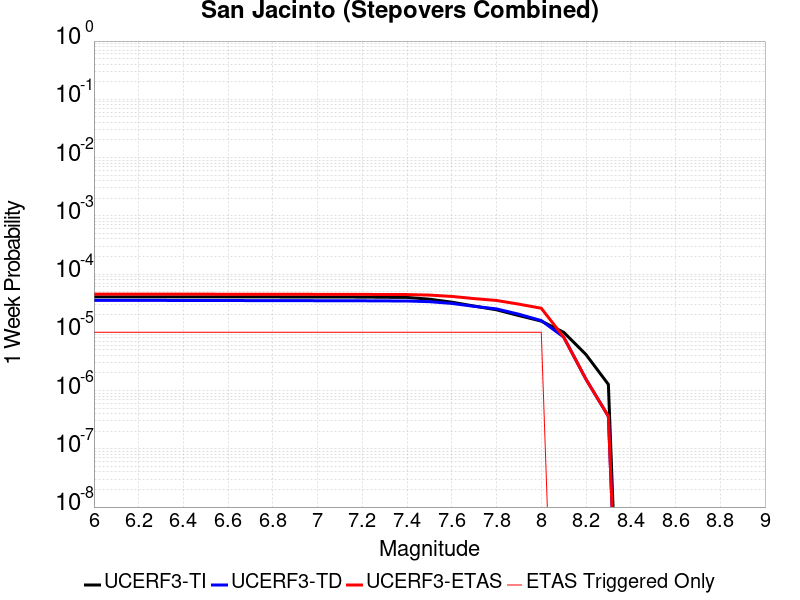 |  |  |  |

| Magnitude | 1 wk TI Prob | 1 wk TD Prob | 1 wk ETAS Prob | 1 wk ETAS/TD Gain | 1 wk ETAS Triggered Only | 1 mo TI Prob | 1 mo TD Prob | 1 mo ETAS Prob | 1 mo ETAS/TD Gain | 1 mo ETAS Triggered Only | 1 yr TI Prob | 1 yr TD Prob | 1 yr ETAS Prob | 1 yr ETAS/TD Gain | 1 yr ETAS Triggered Only | 10 yr TI Prob | 10 yr TD Prob | 10 yr ETAS Prob | 10 yr ETAS/TD Gain | 10 yr ETAS Triggered Only |
|-----|-----|-----|-----|-----|-----|-----|-----|-----|-----|-----|-----|-----|-----|-----|-----|-----|-----|-----|-----|-----|
| 6.0 | 4.0667746E-5 | 3.5287198E-5 | 4.6004934E-5 | 1.3037287 | 1.0718114E-5 | 1.742787E-4 | 1.5122209E-4 | 1.8337157E-4 | 1.2125977 | 3.215434E-5 | 0.0021197782 | 0.0018395748 | 0.0018930667 | 1.0290785 | 5.3590567E-5 | 0.020996714 | 0.018994363 | 0.019067965 | 1.0038749 | 7.5026794E-5 |
| 6.1 | 4.0667746E-5 | 3.5287198E-5 | 4.6004934E-5 | 1.3037287 | 1.0718114E-5 | 1.742787E-4 | 1.5122209E-4 | 1.8337157E-4 | 1.2125977 | 3.215434E-5 | 0.0021197782 | 0.0018395748 | 0.0018930667 | 1.0290785 | 5.3590567E-5 | 0.020996714 | 0.018994363 | 0.019067965 | 1.0038749 | 7.5026794E-5 |
| 6.2 | 4.0667746E-5 | 3.5287198E-5 | 4.6004934E-5 | 1.3037287 | 1.0718114E-5 | 1.742787E-4 | 1.5122209E-4 | 1.8337157E-4 | 1.2125977 | 3.215434E-5 | 0.0021197782 | 0.0018395748 | 0.0018930667 | 1.0290785 | 5.3590567E-5 | 0.020996714 | 0.018994363 | 0.019067965 | 1.0038749 | 7.5026794E-5 |
| 6.3 | 4.0667746E-5 | 3.5287198E-5 | 4.6004934E-5 | 1.3037287 | 1.0718114E-5 | 1.742787E-4 | 1.5122209E-4 | 1.8337157E-4 | 1.2125977 | 3.215434E-5 | 0.0021197782 | 0.0018395748 | 0.0018930667 | 1.0290785 | 5.3590567E-5 | 0.020996714 | 0.018994363 | 0.019067965 | 1.0038749 | 7.5026794E-5 |
| 6.4 | 4.0577226E-5 | 3.515909E-5 | 4.5876826E-5 | 1.3048354 | 1.0718114E-5 | 1.738908E-4 | 1.5067312E-4 | 1.8282261E-4 | 1.2133725 | 3.215434E-5 | 0.0021150648 | 0.0018329041 | 0.0018863964 | 1.0291845 | 5.3590567E-5 | 0.020950472 | 0.018928928 | 0.019002536 | 1.0038886 | 7.5026794E-5 |
| 6.5 | 4.0577226E-5 | 3.515909E-5 | 4.5876826E-5 | 1.3048354 | 1.0718114E-5 | 1.738908E-4 | 1.5067312E-4 | 1.8282261E-4 | 1.2133725 | 3.215434E-5 | 0.0021150648 | 0.0018329041 | 0.0018863964 | 1.0291845 | 5.3590567E-5 | 0.020950472 | 0.018928928 | 0.019002536 | 1.0038886 | 7.5026794E-5 |
| 6.6 | 4.053861E-5 | 3.5104433E-5 | 4.582217E-5 | 1.3053101 | 1.0718114E-5 | 1.7372532E-4 | 1.5043891E-4 | 1.8258841E-4 | 1.2137047 | 3.215434E-5 | 0.0021130538 | 0.0018300572 | 0.0018835497 | 1.02923 | 5.3590567E-5 | 0.020930743 | 0.018901005 | 0.018974615 | 1.0038944 | 7.5026794E-5 |
| 6.7 | 4.0516545E-5 | 3.50735E-5 | 4.5791236E-5 | 1.3055794 | 1.0718114E-5 | 1.7363077E-4 | 1.5030634E-4 | 1.8245584E-4 | 1.2138932 | 3.215434E-5 | 0.002111905 | 0.0018284466 | 0.0018819391 | 1.0292557 | 5.3590567E-5 | 0.020919468 | 0.018885203 | 0.018958813 | 1.0038978 | 7.5026794E-5 |
| 6.8 | 4.049434E-5 | 3.504506E-5 | 4.5762798E-5 | 1.3058274 | 1.0718114E-5 | 1.7353562E-4 | 1.5018447E-4 | 1.8233398E-4 | 1.2140669 | 3.215434E-5 | 0.0021107488 | 0.0018269654 | 0.001880458 | 1.0292795 | 5.3590567E-5 | 0.020908125 | 0.018870614 | 0.018944226 | 1.0039009 | 7.5026794E-5 |
| 6.9 | 4.046386E-5 | 3.500762E-5 | 4.5725355E-5 | 1.3061545 | 1.0718114E-5 | 1.73405E-4 | 1.5002403E-4 | 1.8217355E-4 | 1.2142957 | 3.215434E-5 | 0.0021091616 | 0.0018250152 | 0.001878508 | 1.0293108 | 5.3590567E-5 | 0.020892553 | 0.018851386 | 0.018924998 | 1.0039049 | 7.5026794E-5 |
| 7.0 | 4.036382E-5 | 3.4888177E-5 | 4.5605917E-5 | 1.3072026 | 1.0718114E-5 | 1.7297632E-4 | 1.4951221E-4 | 1.8166174E-4 | 1.2150295 | 3.215434E-5 | 0.0021039525 | 0.0018187946 | 0.0018722877 | 1.0294113 | 5.3590567E-5 | 0.02084144 | 0.018789997 | 0.018863615 | 1.0039179 | 7.5026794E-5 |
| 7.1 | 4.0343282E-5 | 3.486664E-5 | 4.558438E-5 | 1.3073924 | 1.0718114E-5 | 1.7288832E-4 | 1.4941991E-4 | 1.8156944E-4 | 1.2151623 | 3.215434E-5 | 0.002102883 | 0.0018176727 | 0.0018711659 | 1.0294294 | 5.3590567E-5 | 0.020830948 | 0.018778874 | 0.018852493 | 1.0039202 | 7.5026794E-5 |
| 7.2 | 4.0257353E-5 | 3.4771132E-5 | 4.5488876E-5 | 1.3082367 | 1.0718114E-5 | 1.725201E-4 | 1.4901065E-4 | 1.811602E-4 | 1.2157533 | 3.215434E-5 | 0.0020984085 | 0.0018126983 | 0.0018661917 | 1.0295104 | 5.3590567E-5 | 0.020787042 | 0.01872961 | 0.018803231 | 1.0039308 | 7.5026794E-5 |
| 7.3 | 3.9940667E-5 | 3.4598754E-5 | 4.5316498E-5 | 1.3097725 | 1.0718114E-5 | 1.7116306E-4 | 1.4827197E-4 | 1.8042154E-4 | 1.2168283 | 3.215434E-5 | 0.0020819185 | 0.0018037198 | 0.0018572137 | 1.0296576 | 5.3590567E-5 | 0.020625217 | 0.018638225 | 0.018711854 | 1.0039504 | 7.5026794E-5 |
| 7.4 | 3.9721202E-5 | 3.4484117E-5 | 4.520186E-5 | 1.3108023 | 1.0718114E-5 | 1.7022261E-4 | 1.4778072E-4 | 1.7993031E-4 | 1.2175493 | 3.215434E-5 | 0.0020704903 | 0.0017977487 | 0.001851243 | 1.0297562 | 5.3590567E-5 | 0.020513052 | 0.018577335 | 0.018650968 | 1.0039636 | 7.5026794E-5 |
| 7.5 | 3.7036873E-5 | 3.355129E-5 | 4.4269043E-5 | 1.319444 | 1.0718114E-5 | 1.5871979E-4 | 1.4378333E-4 | 1.7593305E-4 | 1.2235984 | 3.215434E-5 | 0.0019307006 | 0.0017491594 | 0.0018026562 | 1.0305843 | 5.3590567E-5 | 0.019140124 | 0.018078765 | 0.018152434 | 1.0040749 | 7.5026794E-5 |
| 7.6 | 3.2940967E-5 | 3.133173E-5 | 4.2049505E-5 | 1.3420743 | 1.0718114E-5 | 1.4116794E-4 | 1.3427193E-4 | 1.6642196E-4 | 1.2394396 | 3.215434E-5 | 0.0017173645 | 0.0016335372 | 0.0016870403 | 1.0327529 | 5.3590567E-5 | 0.01704153 | 0.016911475 | 0.016985234 | 1.0043614 | 7.5026794E-5 |
| 7.7 | 2.8236149E-5 | 2.7897275E-5 | 3.861509E-5 | 1.3841885 | 1.0718114E-5 | 1.2100645E-4 | 1.1955428E-4 | 1.5170478E-4 | 1.2689197 | 3.215434E-5 | 0.0014722579 | 0.0014546025 | 0.0015081151 | 1.0367885 | 5.3590567E-5 | 0.014625421 | 0.015122045 | 0.015195938 | 1.0048864 | 7.5026794E-5 |
| 7.8 | 2.4329287E-5 | 2.5220394E-5 | 3.5938236E-5 | 1.4249673 | 1.0718114E-5 | 1.042642E-4 | 1.0808293E-4 | 1.402338E-4 | 1.2974647 | 3.215434E-5 | 0.0012686774 | 0.0013151162 | 0.0013686363 | 1.0406961 | 5.3590567E-5 | 0.012614589 | 0.013719083 | 0.01379308 | 1.0053937 | 7.5026794E-5 |
| 7.9 | 1.9370926E-5 | 2.0433014E-5 | 3.1150907E-5 | 1.5245382 | 1.0718114E-5 | 8.301561E-5 | 8.7567125E-5 | 1.1971865E-4 | 1.3671644 | 3.215434E-5 | 0.0010102465 | 0.001065609 | 0.0011191425 | 1.0502374 | 5.3590567E-5 | 0.0100566605 | 0.011205519 | 0.011279705 | 1.0066205 | 7.5026794E-5 |
| 8.0 | 1.5583017E-5 | 1.5896165E-5 | 2.6614109E-5 | 1.6742471 | 1.0718114E-5 | 6.6782646E-5 | 6.8124646E-5 | 1.002768E-4 | 1.4719607 | 3.215434E-5 | 8.127754E-4 | 8.2910265E-4 | 8.826488E-4 | 1.0645832 | 5.3590567E-5 | 0.008098091 | 0.008786912 | 0.008861279 | 1.0084635 | 7.5026794E-5 |
| 8.1 | 1.0024873E-5 | 8.298104E-6 | 8.298104E-6 | 1.0 | 0.0 | 4.2963035E-5 | 3.556282E-5 | 3.556282E-5 | 1.0 | 0.0 | 5.229494E-4 | 4.3289183E-4 | 4.3289183E-4 | 1.0 | 0.0 | 0.0052172043 | 0.0046564727 | 0.0046671405 | 1.0022911 | 1.0718114E-5 |
| 8.2 | 4.142796E-6 | 1.5626505E-6 | 1.5626505E-6 | 1.0 | 0.0 | 1.775472E-5 | 6.697056E-6 | 6.697056E-6 | 1.0 | 0.0 | 2.1614227E-4 | 8.153364E-5 | 8.153364E-5 | 1.0 | 0.0 | 0.0021593217 | 9.464045E-4 | 9.464045E-4 | 1.0 | 0.0 |
| 8.3 | 1.2750878E-6 | 3.6166134E-7 | 3.6166134E-7 | 1.0 | 0.0 | 5.4646503E-6 | 1.5499762E-6 | 1.5499762E-6 | 1.0 | 0.0 | 6.653009E-5 | 1.8870802E-5 | 1.8870802E-5 | 1.0 | 0.0 | 6.6510175E-4 | 2.2760578E-4 | 2.2760578E-4 | 1.0 | 0.0 |

## Big Pine (Central)
*[(top)](#table-of-contents)*

| 1 Week | 1 Month | 1 Year | 10 Year |
|-----|-----|-----|-----|
|  |  |  |  |

| Magnitude | 1 wk TI Prob | 1 wk TD Prob | 1 wk ETAS Prob | 1 wk ETAS/TD Gain | 1 wk ETAS Triggered Only | 1 mo TI Prob | 1 mo TD Prob | 1 mo ETAS Prob | 1 mo ETAS/TD Gain | 1 mo ETAS Triggered Only | 1 yr TI Prob | 1 yr TD Prob | 1 yr ETAS Prob | 1 yr ETAS/TD Gain | 1 yr ETAS Triggered Only | 10 yr TI Prob | 10 yr TD Prob | 10 yr ETAS Prob | 10 yr ETAS/TD Gain | 10 yr ETAS Triggered Only |
|-----|-----|-----|-----|-----|-----|-----|-----|-----|-----|-----|-----|-----|-----|-----|-----|-----|-----|-----|-----|-----|
| 6.0 | 1.2706755E-5 | 1.4251012E-5 | 1.4251012E-5 | 1.0 | 0.0 | 5.4456385E-5 | 6.107454E-5 | 6.107454E-5 | 1.0 | 0.0 | 6.628048E-4 | 7.4336544E-4 | 7.754959E-4 | 1.0432229 | 3.215434E-5 | 0.006608314 | 0.0074138143 | 0.007488285 | 1.0100448 | 7.5026794E-5 |
| 6.1 | 8.342579E-6 | 9.511191E-6 | 9.511191E-6 | 1.0 | 0.0 | 3.5753423E-5 | 4.0761734E-5 | 4.0761734E-5 | 1.0 | 0.0 | 4.3521097E-4 | 4.961828E-4 | 5.0689565E-4 | 1.0215905 | 1.0718114E-5 | 0.0043435963 | 0.0049543027 | 0.0049969624 | 1.0086107 | 4.2872456E-5 |
| 6.2 | 6.923899E-6 | 7.967559E-6 | 7.967559E-6 | 1.0 | 0.0 | 2.9673516E-5 | 3.4146342E-5 | 3.4146342E-5 | 1.0 | 0.0 | 3.6121515E-4 | 4.1567165E-4 | 4.2638532E-4 | 1.0257744 | 1.0718114E-5 | 0.003606286 | 0.0041522477 | 0.0041949423 | 1.0102823 | 4.2872456E-5 |
| 6.3 | 2.728396E-6 | 3.4246525E-6 | 3.4246525E-6 | 1.0 | 0.0 | 1.1693074E-5 | 1.4677004E-5 | 1.4677004E-5 | 1.0 | 0.0 | 1.4235388E-4 | 1.7867875E-4 | 1.7867875E-4 | 1.0 | 0.0 | 0.0014226272 | 0.0017868559 | 0.0017975548 | 1.0059876 | 1.0718114E-5 |
| 6.4 | 2.7136944E-6 | 3.4089458E-6 | 3.4089458E-6 | 1.0 | 0.0 | 1.1630066E-5 | 1.4609691E-5 | 1.4609691E-5 | 1.0 | 0.0 | 1.4158686E-4 | 1.7785933E-4 | 1.7785933E-4 | 1.0 | 0.0 | 0.0014149669 | 0.0017786748 | 0.0017893738 | 1.0060152 | 1.0718114E-5 |
| 6.5 | 2.6971882E-6 | 3.3912906E-6 | 3.3912906E-6 | 1.0 | 0.0 | 1.1559327E-5 | 1.4534027E-5 | 1.4534027E-5 | 1.0 | 0.0 | 1.4072572E-4 | 1.7693828E-4 | 1.7693828E-4 | 1.0 | 0.0 | 0.0014063664 | 0.0017694789 | 0.001780178 | 1.0060465 | 1.0718114E-5 |
| 6.6 | 2.669092E-6 | 3.361311E-6 | 3.361311E-6 | 1.0 | 0.0 | 1.1438916E-5 | 1.4405543E-5 | 1.4405543E-5 | 1.0 | 0.0 | 1.3925991E-4 | 1.7537424E-4 | 1.7537424E-4 | 1.0 | 0.0 | 0.0013917267 | 0.0017538633 | 0.0017645627 | 1.0061004 | 1.0718114E-5 |
| 6.7 | 2.6408059E-6 | 3.3313363E-6 | 3.3313363E-6 | 1.0 | 0.0 | 1.1317691E-5 | 1.4277082E-5 | 1.4277082E-5 | 1.0 | 0.0 | 1.3778417E-4 | 1.7381048E-4 | 1.7381048E-4 | 1.0 | 0.0 | 0.0013769877 | 0.0017382503 | 0.0017489498 | 1.0061554 | 1.0718114E-5 |
| 6.8 | 2.1786943E-6 | 2.8547915E-6 | 2.8547915E-6 | 1.0 | 0.0 | 9.337228E-6 | 1.2234768E-5 | 1.2234768E-5 | 1.0 | 0.0 | 1.1367482E-4 | 1.4894885E-4 | 1.4894885E-4 | 1.0 | 0.0 | 0.0011361669 | 0.0014899815 | 0.0015006836 | 1.0071827 | 1.0718114E-5 |
| 6.9 | 1.4411696E-6 | 2.0688422E-6 | 2.0688422E-6 | 1.0 | 0.0 | 6.1764263E-6 | 8.866437E-6 | 8.866437E-6 | 1.0 | 0.0 | 7.51954E-5 | 1.079438E-4 | 1.079438E-4 | 1.0 | 0.0 | 7.5169955E-4 | 0.0010803605 | 0.001091067 | 1.0099101 | 1.0718114E-5 |
| 7.0 | 1.0073411E-6 | 1.5545673E-6 | 1.5545673E-6 | 1.0 | 0.0 | 4.317169E-6 | 6.662415E-6 | 6.662415E-6 | 1.0 | 0.0 | 5.2560266E-5 | 8.111204E-5 | 8.111204E-5 | 1.0 | 0.0 | 5.2547833E-4 | 8.1225985E-4 | 8.1225985E-4 | 1.0 | 0.0 |
| 7.1 | 8.947104E-7 | 1.4305514E-6 | 1.4305514E-6 | 1.0 | 0.0 | 3.834468E-6 | 6.130921E-6 | 6.130921E-6 | 1.0 | 0.0 | 4.6683643E-5 | 7.464155E-5 | 7.464155E-5 | 1.0 | 0.0 | 4.6673836E-4 | 7.476001E-4 | 7.476001E-4 | 1.0 | 0.0 |
| 7.2 | 5.215166E-7 | 1.0114496E-6 | 1.0114496E-6 | 1.0 | 0.0 | 2.2350691E-6 | 4.3347773E-6 | 4.3347773E-6 | 1.0 | 0.0 | 2.7211627E-5 | 5.2774678E-5 | 5.2774678E-5 | 1.0 | 0.0 | 2.7208295E-4 | 5.290466E-4 | 5.290466E-4 | 1.0 | 0.0 |
| 7.3 | 4.4024807E-7 | 9.2223235E-7 | 9.2223235E-7 | 1.0 | 0.0 | 1.8867761E-6 | 3.9524184E-6 | 3.9524184E-6 | 1.0 | 0.0 | 2.2971257E-5 | 4.8119677E-5 | 4.8119677E-5 | 1.0 | 0.0 | 2.2968883E-4 | 4.8251753E-4 | 4.8251753E-4 | 1.0 | 0.0 |
| 7.4 | 3.6130905E-7 | 8.3611724E-7 | 8.3611724E-7 | 1.0 | 0.0 | 1.5484665E-6 | 3.583355E-6 | 3.583355E-6 | 1.0 | 0.0 | 1.8852415E-5 | 4.362651E-5 | 4.362651E-5 | 1.0 | 0.0 | 1.8850817E-4 | 4.3759486E-4 | 4.3759486E-4 | 1.0 | 0.0 |
| 7.5 | 3.408184E-7 | 8.110739E-7 | 8.110739E-7 | 1.0 | 0.0 | 1.4606494E-6 | 3.4760267E-6 | 3.4760267E-6 | 1.0 | 0.0 | 1.7783263E-5 | 4.231984E-5 | 4.231984E-5 | 1.0 | 0.0 | 1.778184E-4 | 4.2451176E-4 | 4.2451176E-4 | 1.0 | 0.0 |
| 7.6 | 3.1428627E-7 | 7.7341E-7 | 7.7341E-7 | 1.0 | 0.0 | 1.3469405E-6 | 3.3146102E-6 | 3.3146102E-6 | 1.0 | 0.0 | 1.6398877E-5 | 4.0354673E-5 | 4.0354673E-5 | 1.0 | 0.0 | 1.6397667E-4 | 4.0483844E-4 | 4.0483844E-4 | 1.0 | 0.0 |
| 7.7 | 1.7972785E-7 | 5.0796626E-7 | 5.0796626E-7 | 1.0 | 0.0 | 7.70262E-7 | 2.1769965E-6 | 2.1769965E-6 | 1.0 | 0.0 | 9.377899E-6 | 2.6504622E-5 | 2.6504622E-5 | 1.0 | 0.0 | 9.377503E-5 | 2.663867E-4 | 2.663867E-4 | 1.0 | 0.0 |
| 7.8 | 4.9230927E-8 | 1.1985297E-7 | 1.1985297E-7 | 1.0 | 0.0 | 2.1098968E-7 | 5.136555E-7 | 5.136555E-7 | 1.0 | 0.0 | 2.5687964E-6 | 6.2537392E-6 | 6.2537392E-6 | 1.0 | 0.0 | 2.5687666E-5 | 6.2977226E-5 | 6.2977226E-5 | 1.0 | 0.0 |
| 7.9 | 3.6805972E-9 | 4.1070685E-9 | 4.1070685E-9 | 1.0 | 0.0 | 1.5773987E-8 | 1.7601723E-8 | 1.7601723E-8 | 1.0 | 0.0 | 1.9204828E-7 | 2.1430095E-7 | 2.1430095E-7 | 1.0 | 0.0 | 1.920481E-6 | 2.190991E-6 | 2.190991E-6 | 1.0 | 0.0 |

## Tin Mountain
*[(top)](#table-of-contents)*

| 1 Week | 1 Month | 1 Year | 10 Year |
|-----|-----|-----|-----|
|  |  |  |  |

| Magnitude | 1 wk TI Prob | 1 wk TD Prob | 1 wk ETAS Prob | 1 wk ETAS/TD Gain | 1 wk ETAS Triggered Only | 1 mo TI Prob | 1 mo TD Prob | 1 mo ETAS Prob | 1 mo ETAS/TD Gain | 1 mo ETAS Triggered Only | 1 yr TI Prob | 1 yr TD Prob | 1 yr ETAS Prob | 1 yr ETAS/TD Gain | 1 yr ETAS Triggered Only | 10 yr TI Prob | 10 yr TD Prob | 10 yr ETAS Prob | 10 yr ETAS/TD Gain | 10 yr ETAS Triggered Only |
|-----|-----|-----|-----|-----|-----|-----|-----|-----|-----|-----|-----|-----|-----|-----|-----|-----|-----|-----|-----|-----|
| 6.0 | 4.083776E-6 | 4.18155E-6 | 4.18155E-6 | 1.0 | 0.0 | 1.750178E-5 | 1.7920827E-5 | 3.935667E-5 | 2.1961415 | 2.1436228E-5 | 2.1306332E-4 | 2.1816794E-4 | 2.395995E-4 | 1.0982342 | 2.1436228E-5 | 0.0021285915 | 0.0021799032 | 0.0022440718 | 1.0294363 | 6.430868E-5 |
| 6.1 | 4.083776E-6 | 4.18155E-6 | 4.18155E-6 | 1.0 | 0.0 | 1.750178E-5 | 1.7920827E-5 | 3.935667E-5 | 2.1961415 | 2.1436228E-5 | 2.1306332E-4 | 2.1816794E-4 | 2.395995E-4 | 1.0982342 | 2.1436228E-5 | 0.0021285915 | 0.0021799032 | 0.0022440718 | 1.0294363 | 6.430868E-5 |
| 6.2 | 4.083776E-6 | 4.18155E-6 | 4.18155E-6 | 1.0 | 0.0 | 1.750178E-5 | 1.7920827E-5 | 3.935667E-5 | 2.1961415 | 2.1436228E-5 | 2.1306332E-4 | 2.1816794E-4 | 2.395995E-4 | 1.0982342 | 2.1436228E-5 | 0.0021285915 | 0.0021799032 | 0.0022440718 | 1.0294363 | 6.430868E-5 |
| 6.3 | 4.083776E-6 | 4.18155E-6 | 4.18155E-6 | 1.0 | 0.0 | 1.750178E-5 | 1.7920827E-5 | 3.935667E-5 | 2.1961415 | 2.1436228E-5 | 2.1306332E-4 | 2.1816794E-4 | 2.395995E-4 | 1.0982342 | 2.1436228E-5 | 0.0021285915 | 0.0021799032 | 0.0022440718 | 1.0294363 | 6.430868E-5 |
| 6.4 | 4.083776E-6 | 4.18155E-6 | 4.18155E-6 | 1.0 | 0.0 | 1.750178E-5 | 1.7920827E-5 | 3.935667E-5 | 2.1961415 | 2.1436228E-5 | 2.1306332E-4 | 2.1816794E-4 | 2.395995E-4 | 1.0982342 | 2.1436228E-5 | 0.0021285915 | 0.0021799032 | 0.0022440718 | 1.0294363 | 6.430868E-5 |
| 6.5 | 2.3143427E-6 | 2.3731652E-6 | 2.3731652E-6 | 1.0 | 0.0 | 9.9185745E-6 | 1.0170673E-5 | 2.0888678E-5 | 2.0538146 | 1.0718114E-5 | 1.2075195E-4 | 1.2382168E-4 | 1.3453847E-4 | 1.0865501 | 1.0718114E-5 | 0.0012068636 | 0.0012376028 | 0.0012483076 | 1.0086497 | 1.0718114E-5 |
| 6.6 | 2.3143427E-6 | 2.3731652E-6 | 2.3731652E-6 | 1.0 | 0.0 | 9.9185745E-6 | 1.0170673E-5 | 2.0888678E-5 | 2.0538146 | 1.0718114E-5 | 1.2075195E-4 | 1.2382168E-4 | 1.3453847E-4 | 1.0865501 | 1.0718114E-5 | 0.0012068636 | 0.0012376028 | 0.0012483076 | 1.0086497 | 1.0718114E-5 |
| 6.7 | 1.7029532E-6 | 1.7497979E-6 | 1.7497979E-6 | 1.0 | 0.0 | 7.2983503E-6 | 7.4991153E-6 | 7.4991153E-6 | 1.0 | 0.0 | 8.885379E-5 | 9.129844E-5 | 9.129844E-5 | 1.0 | 0.0 | 8.881827E-4 | 9.1266196E-4 | 9.1266196E-4 | 1.0 | 0.0 |
| 6.8 | 1.2914646E-6 | 1.3299432E-6 | 1.3299432E-6 | 1.0 | 0.0 | 5.534837E-6 | 5.6997465E-6 | 5.6997465E-6 | 1.0 | 0.0 | 6.738455E-5 | 6.939264E-5 | 6.939264E-5 | 1.0 | 0.0 | 6.736412E-4 | 6.937531E-4 | 6.937531E-4 | 1.0 | 0.0 |
| 6.9 | 5.8708974E-7 | 6.117028E-7 | 6.117028E-7 | 1.0 | 0.0 | 2.5160964E-6 | 2.621581E-6 | 2.621581E-6 | 1.0 | 0.0 | 3.0633044E-5 | 3.1917323E-5 | 3.1917323E-5 | 1.0 | 0.0 | 3.0628822E-4 | 3.191315E-4 | 3.191315E-4 | 1.0 | 0.0 |
| 7.0 | 4.6248786E-7 | 4.832044E-7 | 4.832044E-7 | 1.0 | 0.0 | 1.9820893E-6 | 2.0708746E-6 | 2.0708746E-6 | 1.0 | 0.0 | 2.413167E-5 | 2.5212645E-5 | 2.5212645E-5 | 1.0 | 0.0 | 2.412905E-4 | 2.5210154E-4 | 2.5210154E-4 | 1.0 | 0.0 |
| 7.1 | 3.804606E-7 | 3.9871725E-7 | 3.9871725E-7 | 1.0 | 0.0 | 1.6305444E-6 | 1.7087873E-6 | 1.7087873E-6 | 1.0 | 0.0 | 1.9851697E-5 | 2.080432E-5 | 2.080432E-5 | 1.0 | 0.0 | 1.9849923E-4 | 2.080271E-4 | 2.080271E-4 | 1.0 | 0.0 |
| 7.2 | 3.5864858E-7 | 3.7617107E-7 | 3.7617107E-7 | 1.0 | 0.0 | 1.5370645E-6 | 1.6121609E-6 | 1.6121609E-6 | 1.0 | 0.0 | 1.87136E-5 | 1.9627916E-5 | 1.9627916E-5 | 1.0 | 0.0 | 1.8712023E-4 | 1.9626514E-4 | 1.9626514E-4 | 1.0 | 0.0 |
| 7.3 | 3.342063E-7 | 3.50637E-7 | 3.50637E-7 | 1.0 | 0.0 | 1.4323119E-6 | 1.5027293E-6 | 1.5027293E-6 | 1.0 | 0.0 | 1.7438259E-5 | 1.829561E-5 | 1.829561E-5 | 1.0 | 0.0 | 1.743689E-4 | 1.8294434E-4 | 1.8294434E-4 | 1.0 | 0.0 |
| 7.4 | 2.971242E-7 | 3.116602E-7 | 3.116602E-7 | 1.0 | 0.0 | 1.2733886E-6 | 1.3356861E-6 | 1.3356861E-6 | 1.0 | 0.0 | 1.5503398E-5 | 1.626189E-5 | 1.626189E-5 | 1.0 | 0.0 | 1.5502315E-4 | 1.6261027E-4 | 1.6261027E-4 | 1.0 | 0.0 |
| 7.5 | 1.4326713E-7 | 1.501262E-7 | 1.501262E-7 | 1.0 | 0.0 | 6.140018E-7 | 6.43398E-7 | 6.43398E-7 | 1.0 | 0.0 | 7.4754466E-6 | 7.833371E-6 | 7.833371E-6 | 1.0 | 0.0 | 7.475195E-5 | 7.83337E-5 | 7.83337E-5 | 1.0 | 0.0 |

## Santa Ynez (West)
*[(top)](#table-of-contents)*

| 1 Week | 1 Month | 1 Year | 10 Year |
|-----|-----|-----|-----|
|  |  |  |  |

| Magnitude | 1 wk TI Prob | 1 wk TD Prob | 1 wk ETAS Prob | 1 wk ETAS/TD Gain | 1 wk ETAS Triggered Only | 1 mo TI Prob | 1 mo TD Prob | 1 mo ETAS Prob | 1 mo ETAS/TD Gain | 1 mo ETAS Triggered Only | 1 yr TI Prob | 1 yr TD Prob | 1 yr ETAS Prob | 1 yr ETAS/TD Gain | 1 yr ETAS Triggered Only | 10 yr TI Prob | 10 yr TD Prob | 10 yr ETAS Prob | 10 yr ETAS/TD Gain | 10 yr ETAS Triggered Only |
|-----|-----|-----|-----|-----|-----|-----|-----|-----|-----|-----|-----|-----|-----|-----|-----|-----|-----|-----|-----|-----|
| 6.0 | 4.7352758E-5 | 5.497349E-5 | 5.497349E-5 | 1.0 | 0.0 | 2.0292461E-4 | 2.3558107E-4 | 2.3558107E-4 | 1.0 | 0.0 | 0.0024678076 | 0.0028645964 | 0.0029180334 | 1.0186543 | 5.3590567E-5 | 0.024405818 | 0.028305095 | 0.028367585 | 1.0022076 | 6.430868E-5 |
| 6.1 | 4.7352758E-5 | 5.497349E-5 | 5.497349E-5 | 1.0 | 0.0 | 2.0292461E-4 | 2.3558107E-4 | 2.3558107E-4 | 1.0 | 0.0 | 0.0024678076 | 0.0028645964 | 0.002907346 | 1.0149235 | 4.2872456E-5 | 0.024405818 | 0.028305095 | 0.028346755 | 1.0014718 | 4.2872456E-5 |
| 6.2 | 3.0415853E-5 | 3.3925786E-5 | 3.3925786E-5 | 1.0 | 0.0 | 1.3034715E-4 | 1.4538833E-4 | 1.4538833E-4 | 1.0 | 0.0 | 0.0015858212 | 0.0017687011 | 0.0018007986 | 1.0181475 | 3.215434E-5 | 0.015745522 | 0.01755015 | 0.01758174 | 1.0018 | 3.215434E-5 |
| 6.3 | 3.0415853E-5 | 3.3925786E-5 | 3.3925786E-5 | 1.0 | 0.0 | 1.3034715E-4 | 1.4538833E-4 | 1.4538833E-4 | 1.0 | 0.0 | 0.0015858212 | 0.0017687011 | 0.0018007986 | 1.0181475 | 3.215434E-5 | 0.015745522 | 0.01755015 | 0.01758174 | 1.0018 | 3.215434E-5 |
| 6.4 | 2.5452082E-5 | 2.7912925E-5 | 2.7912925E-5 | 1.0 | 0.0 | 1.09075794E-4 | 1.1962145E-4 | 1.1962145E-4 | 1.0 | 0.0 | 0.0013271887 | 0.001455435 | 0.00147684 | 1.014707 | 2.1436228E-5 | 0.013192902 | 0.014461209 | 0.014482335 | 1.0014609 | 2.1436228E-5 |
| 6.5 | 2.3143784E-5 | 2.5128682E-5 | 2.5128682E-5 | 1.0 | 0.0 | 9.9183875E-5 | 1.0768999E-4 | 1.0768999E-4 | 1.0 | 0.0 | 0.0012068948 | 0.0013103489 | 0.0013317569 | 1.0163378 | 2.1436228E-5 | 0.012003611 | 0.013027899 | 0.013049056 | 1.001624 | 2.1436228E-5 |
| 6.6 | 1.9118515E-5 | 2.0354646E-5 | 2.0354646E-5 | 1.0 | 0.0 | 8.193392E-5 | 8.723133E-5 | 8.723133E-5 | 1.0 | 0.0 | 9.97089E-4 | 0.001061532 | 0.0010722387 | 1.010086 | 1.0718114E-5 | 0.00992627 | 0.010565523 | 0.010576128 | 1.0010037 | 1.0718114E-5 |
| 6.7 | 1.722807E-5 | 1.8146604E-5 | 1.8146604E-5 | 1.0 | 0.0 | 7.3832496E-5 | 7.776888E-5 | 7.776888E-5 | 1.0 | 0.0 | 8.985399E-4 | 9.464303E-4 | 9.571383E-4 | 1.011314 | 1.0718114E-5 | 0.008949154 | 0.009424643 | 0.00943526 | 1.0011265 | 1.0718114E-5 |
| 6.8 | 1.5317364E-5 | 1.5926695E-5 | 1.5926695E-5 | 1.0 | 0.0 | 6.56442E-5 | 6.82555E-5 | 6.82555E-5 | 1.0 | 0.0 | 7.98925E-4 | 8.306982E-4 | 8.414074E-4 | 1.0128918 | 1.0718114E-5 | 0.007960589 | 0.008276418 | 0.008287047 | 1.0012842 | 1.0718114E-5 |
| 6.9 | 1.3071226E-5 | 1.3329779E-5 | 1.3329779E-5 | 1.0 | 0.0 | 5.6018336E-5 | 5.7126388E-5 | 5.7126388E-5 | 1.0 | 0.0 | 6.8180985E-4 | 6.9529406E-4 | 7.0600474E-4 | 1.0154045 | 1.0718114E-5 | 0.0067972173 | 0.0069314474 | 0.0069420915 | 1.0015355 | 1.0718114E-5 |
| 7.0 | 1.1836986E-5 | 1.19329125E-5 | 1.19329125E-5 | 1.0 | 0.0 | 5.0728955E-5 | 5.1140058E-5 | 5.1140058E-5 | 1.0 | 0.0 | 6.1745E-4 | 6.2245404E-4 | 6.331655E-4 | 1.0172085 | 1.0718114E-5 | 0.006157372 | 0.006207299 | 0.0062179505 | 1.001716 | 1.0718114E-5 |
| 7.1 | 1.0597169E-5 | 1.0542309E-5 | 1.0542309E-5 | 1.0 | 0.0 | 4.541565E-5 | 4.5180546E-5 | 4.5180546E-5 | 1.0 | 0.0 | 5.5279525E-4 | 5.4993544E-4 | 5.606477E-4 | 1.019479 | 1.0718114E-5 | 0.0055142213 | 0.005485877 | 0.0054965364 | 1.001943 | 1.0718114E-5 |
| 7.2 | 9.59113E-6 | 9.459241E-6 | 9.459241E-6 | 1.0 | 0.0 | 4.11042E-5 | 4.053898E-5 | 4.053898E-5 | 1.0 | 0.0 | 5.0032866E-4 | 4.9345137E-4 | 5.041642E-4 | 1.02171 | 1.0718114E-5 | 0.004992037 | 0.0049236757 | 0.0049343407 | 1.0021662 | 1.0718114E-5 |
| 7.3 | 8.586084E-6 | 8.379669E-6 | 8.379669E-6 | 1.0 | 0.0 | 3.679698E-5 | 3.591238E-5 | 3.591238E-5 | 1.0 | 0.0 | 4.4791115E-4 | 4.3714655E-4 | 4.4785996E-4 | 1.0245076 | 1.0718114E-5 | 0.004470094 | 0.0043629776 | 0.004373649 | 1.0024459 | 1.0718114E-5 |
| 7.4 | 7.2622997E-6 | 6.951613E-6 | 6.951613E-6 | 1.0 | 0.0 | 3.112377E-5 | 2.9792294E-5 | 2.9792294E-5 | 1.0 | 0.0 | 3.78866E-4 | 3.6266178E-4 | 3.73376E-4 | 1.0295433 | 1.0718114E-5 | 0.0037822074 | 0.0036207996 | 0.0036314789 | 1.0029495 | 1.0718114E-5 |
| 7.5 | 5.627296E-6 | 5.251639E-6 | 5.251639E-6 | 1.0 | 0.0 | 2.411676E-5 | 2.2506834E-5 | 2.2506834E-5 | 1.0 | 0.0 | 2.9358198E-4 | 2.7398695E-4 | 2.8470214E-4 | 1.0391084 | 1.0718114E-5 | 0.0029319443 | 0.0027365636 | 0.0027472524 | 1.0039059 | 1.0718114E-5 |
| 7.6 | 2.265244E-6 | 2.0608784E-6 | 2.0608784E-6 | 1.0 | 0.0 | 9.708152E-6 | 8.832307E-6 | 8.832307E-6 | 1.0 | 0.0 | 1.18190335E-4 | 1.0752812E-4 | 1.0752812E-4 | 1.0 | 0.0 | 0.001181275 | 0.0010747695 | 0.0010747695 | 1.0 | 0.0 |
| 7.7 | 1.3099874E-6 | 1.1016341E-6 | 1.1016341E-6 | 1.0 | 0.0 | 5.61422E-6 | 4.7212807E-6 | 4.7212807E-6 | 1.0 | 0.0 | 6.8350986E-5 | 5.74801E-5 | 5.74801E-5 | 1.0 | 0.0 | 6.832996E-4 | 5.746547E-4 | 5.746547E-4 | 1.0 | 0.0 |
| 7.8 | 7.903951E-7 | 6.071191E-7 | 6.071191E-7 | 1.0 | 0.0 | 3.3874032E-6 | 2.6019363E-6 | 2.6019363E-6 | 1.0 | 0.0 | 4.1240855E-5 | 3.1678126E-5 | 3.1678126E-5 | 1.0 | 0.0 | 4.12332E-4 | 3.1673745E-4 | 3.1673745E-4 | 1.0 | 0.0 |
| 7.9 | 7.0753297E-9 | 5.089978E-9 | 5.089978E-9 | 1.0 | 0.0 | 3.032284E-8 | 2.1814193E-8 | 2.1814193E-8 | 1.0 | 0.0 | 3.6918053E-7 | 2.6558777E-7 | 2.6558777E-7 | 1.0 | 0.0 | 3.691799E-6 | 2.6558755E-6 | 2.6558755E-6 | 1.0 | 0.0 |

## Brawley (Seismic Zone) alt 1
*[(top)](#table-of-contents)*

| 1 Week | 1 Month | 1 Year | 10 Year |
|-----|-----|-----|-----|
|  |  |  |  |

| Magnitude | 1 wk TI Prob | 1 wk TD Prob | 1 wk ETAS Prob | 1 wk ETAS/TD Gain | 1 wk ETAS Triggered Only | 1 mo TI Prob | 1 mo TD Prob | 1 mo ETAS Prob | 1 mo ETAS/TD Gain | 1 mo ETAS Triggered Only | 1 yr TI Prob | 1 yr TD Prob | 1 yr ETAS Prob | 1 yr ETAS/TD Gain | 1 yr ETAS Triggered Only | 10 yr TI Prob | 10 yr TD Prob | 10 yr ETAS Prob | 10 yr ETAS/TD Gain | 10 yr ETAS Triggered Only |
|-----|-----|-----|-----|-----|-----|-----|-----|-----|-----|-----|-----|-----|-----|-----|-----|-----|-----|-----|-----|-----|
| 6.0 | 2.2521618E-4 | 4.7641253E-4 | 4.7641253E-4 | 1.0 | 0.0 | 9.6485513E-4 | 0.0020402074 | 0.0020402074 | 1.0 | 0.0 | 0.011683988 | 0.02455069 | 0.024582054 | 1.0012776 | 3.215434E-5 | 0.11088423 | 0.21353015 | 0.21358073 | 1.0002369 | 6.430868E-5 |
| 6.1 | 2.2521618E-4 | 4.7641253E-4 | 4.7641253E-4 | 1.0 | 0.0 | 9.6485513E-4 | 0.0020402074 | 0.0020402074 | 1.0 | 0.0 | 0.011683988 | 0.02455069 | 0.024582054 | 1.0012776 | 3.215434E-5 | 0.11088423 | 0.21353015 | 0.21358073 | 1.0002369 | 6.430868E-5 |
| 6.2 | 2.198148E-4 | 4.6725658E-4 | 4.6725658E-4 | 1.0 | 0.0 | 9.417233E-4 | 0.002001028 | 0.002001028 | 1.0 | 0.0 | 0.011405343 | 0.024084855 | 0.024116235 | 1.0013028 | 3.215434E-5 | 0.10837428 | 0.20996629 | 0.21001709 | 1.000242 | 6.430868E-5 |
| 6.3 | 2.1704129E-4 | 4.6161312E-4 | 4.6161312E-4 | 1.0 | 0.0 | 9.298453E-4 | 0.0019768786 | 0.0019768786 | 1.0 | 0.0 | 0.011262234 | 0.023797998 | 0.023829388 | 1.0013189 | 3.215434E-5 | 0.107082725 | 0.20785725 | 0.20790818 | 1.0002451 | 6.430868E-5 |
| 6.4 | 1.876142E-4 | 4.0053183E-4 | 4.0053183E-4 | 1.0 | 0.0 | 8.038131E-4 | 0.0017154501 | 0.0017154501 | 1.0 | 0.0 | 0.00974259 | 0.02068463 | 0.020705624 | 1.001015 | 2.1436228E-5 | 0.093263686 | 0.184608 | 0.1846517 | 1.0002367 | 5.3590567E-5 |
| 6.5 | 1.7390939E-4 | 3.7485067E-4 | 3.7485067E-4 | 1.0 | 0.0 | 7.45113E-4 | 0.0016055258 | 0.0016055258 | 1.0 | 0.0 | 0.009034078 | 0.019372813 | 0.019393833 | 1.001085 | 2.1436228E-5 | 0.086755216 | 0.17442966 | 0.1744739 | 1.0002537 | 5.3590567E-5 |
| 6.6 | 1.591791E-4 | 3.489955E-4 | 3.489955E-4 | 1.0 | 0.0 | 6.8201777E-4 | 0.0014948477 | 0.0014948477 | 1.0 | 0.0 | 0.008271996 | 0.018049458 | 0.018070508 | 1.0011662 | 2.1436228E-5 | 0.07970774 | 0.16383699 | 0.1638818 | 1.0002735 | 5.3590567E-5 |
| 6.7 | 1.4268003E-4 | 3.206533E-4 | 3.206533E-4 | 1.0 | 0.0 | 6.1134255E-4 | 0.0013735129 | 0.0013735129 | 1.0 | 0.0 | 0.007417723 | 0.016596261 | 0.016617341 | 1.0012702 | 2.1436228E-5 | 0.07174956 | 0.15196045 | 0.1520059 | 1.0002991 | 5.3590567E-5 |
| 6.8 | 1.239713E-4 | 2.9059697E-4 | 2.9059697E-4 | 1.0 | 0.0 | 5.3119735E-4 | 0.0012448273 | 0.0012448273 | 1.0 | 0.0 | 0.0064481674 | 0.015051884 | 0.015072997 | 1.0014027 | 2.1436228E-5 | 0.06264243 | 0.13840161 | 0.13844778 | 1.0003337 | 5.3590567E-5 |
| 6.9 | 1.0180238E-4 | 2.625907E-4 | 2.625907E-4 | 1.0 | 0.0 | 4.3622297E-4 | 0.0011249076 | 0.0011249076 | 1.0 | 0.0 | 0.005298089 | 0.013610746 | 0.0136318905 | 1.0015535 | 2.1436228E-5 | 0.05173543 | 0.12498065 | 0.12502754 | 1.0003752 | 5.3590567E-5 |
| 7.0 | 7.6619996E-5 | 2.2402873E-4 | 2.2402873E-4 | 1.0 | 0.0 | 3.283301E-4 | 9.59773E-4 | 9.59773E-4 | 1.0 | 0.0 | 0.0039900932 | 0.011623339 | 0.011644525 | 1.0018228 | 2.1436228E-5 | 0.039192066 | 0.10728151 | 0.10732936 | 1.000446 | 5.3590567E-5 |
| 7.1 | 7.5127435E-5 | 2.208599E-4 | 2.208599E-4 | 1.0 | 0.0 | 3.2193496E-4 | 9.4620226E-4 | 9.4620226E-4 | 1.0 | 0.0 | 0.0039125155 | 0.011459865 | 0.011481055 | 1.001849 | 2.1436228E-5 | 0.038443442 | 0.10584534 | 0.10589326 | 1.0004528 | 5.3590567E-5 |
| 7.2 | 6.788582E-5 | 2.0213598E-4 | 2.0213598E-4 | 1.0 | 0.0 | 2.9090676E-4 | 8.660125E-4 | 8.660125E-4 | 1.0 | 0.0 | 0.0035360386 | 0.010493369 | 0.01051458 | 1.0020214 | 2.1436228E-5 | 0.034803 | 0.09751546 | 0.09756382 | 1.0004959 | 5.3590567E-5 |
| 7.3 | 6.399602E-5 | 1.88444E-4 | 1.88444E-4 | 1.0 | 0.0 | 2.7423984E-4 | 8.0737006E-4 | 8.0737006E-4 | 1.0 | 0.0 | 0.0033337586 | 0.009786017 | 0.009807244 | 1.002169 | 2.1436228E-5 | 0.03284188 | 0.091409855 | 0.091458544 | 1.0005326 | 5.3590567E-5 |
| 7.4 | 4.506759E-5 | 1.2531783E-4 | 1.2531783E-4 | 1.0 | 0.0 | 1.9313251E-4 | 5.369668E-4 | 5.369668E-4 | 1.0 | 0.0 | 0.0023488526 | 0.0065181484 | 0.006539445 | 1.0032673 | 2.1436228E-5 | 0.023241805 | 0.062375 | 0.062425252 | 1.0008056 | 5.3590567E-5 |
| 7.5 | 3.43289E-5 | 9.337587E-5 | 9.337587E-5 | 1.0 | 0.0 | 1.4711556E-4 | 4.0012124E-4 | 4.0012124E-4 | 1.0 | 0.0 | 0.0017896603 | 0.004860657 | 0.004881989 | 1.0043887 | 2.1436228E-5 | 0.01775316 | 0.04706493 | 0.047116 | 1.001085 | 5.3590567E-5 |
| 7.6 | 2.5980507E-5 | 7.054998E-5 | 7.054998E-5 | 1.0 | 0.0 | 1.1134028E-4 | 3.0232212E-4 | 3.0232212E-4 | 1.0 | 0.0 | 0.001354725 | 0.0036745837 | 0.0036959413 | 1.0058122 | 2.1436228E-5 | 0.013464959 | 0.035849415 | 0.035901085 | 1.0014412 | 5.3590567E-5 |
| 7.7 | 1.7292105E-5 | 4.9423474E-5 | 4.9423474E-5 | 1.0 | 0.0 | 7.4106916E-5 | 2.1179771E-4 | 2.1179771E-4 | 1.0 | 0.0 | 9.018782E-4 | 0.0025755935 | 0.0025969746 | 1.0083014 | 2.1436228E-5 | 0.008982267 | 0.025297757 | 0.025339546 | 1.0016519 | 4.2872456E-5 |
| 7.8 | 1.2927471E-5 | 3.970735E-5 | 3.970735E-5 | 1.0 | 0.0 | 5.5402274E-5 | 1.7016326E-4 | 1.7016326E-4 | 1.0 | 0.0 | 6.743139E-4 | 0.0020697718 | 0.0020911635 | 1.0103353 | 2.1436228E-5 | 0.0067227143 | 0.02043814 | 0.020469638 | 1.0015411 | 3.215434E-5 |
| 7.9 | 1.0200774E-5 | 2.8757075E-5 | 2.8757075E-5 | 1.0 | 0.0 | 4.371687E-5 | 1.2323879E-4 | 1.2323879E-4 | 1.0 | 0.0 | 5.321229E-4 | 0.0014994006 | 0.0015101027 | 1.0071375 | 1.0718114E-5 | 0.005308505 | 0.0149969105 | 0.0150180245 | 1.001408 | 2.1436228E-5 |
| 8.0 | 8.650396E-6 | 2.3287128E-5 | 2.3287128E-5 | 1.0 | 0.0 | 3.70726E-5 | 9.979816E-5 | 9.979816E-5 | 1.0 | 0.0 | 4.5126543E-4 | 0.0012143662 | 0.0012250713 | 1.0088154 | 1.0718114E-5 | 0.0045035016 | 0.012215644 | 0.012236819 | 1.0017334 | 2.1436228E-5 |
| 8.1 | 3.9368224E-6 | 7.3321658E-6 | 7.3321658E-6 | 1.0 | 0.0 | 1.6871985E-5 | 3.1423187E-5 | 3.1423187E-5 | 1.0 | 0.0 | 2.0539707E-4 | 3.825103E-4 | 3.825103E-4 | 1.0 | 0.0 | 0.0020520731 | 0.00400326 | 0.00400326 | 1.0 | 0.0 |
| 8.2 | 1.7101195E-6 | 2.2195122E-6 | 2.2195122E-6 | 1.0 | 0.0 | 7.329063E-6 | 9.51216E-6 | 9.51216E-6 | 1.0 | 0.0 | 8.922769E-5 | 1.15804425E-4 | 1.15804425E-4 | 1.0 | 0.0 | 8.9191867E-4 | 0.0012675166 | 0.0012675166 | 1.0 | 0.0 |
| 8.3 | 3.0346666E-8 | 1.7233086E-8 | 1.7233086E-8 | 1.0 | 0.0 | 1.3005713E-7 | 7.385608E-8 | 7.385608E-8 | 1.0 | 0.0 | 1.5834444E-6 | 8.991977E-7 | 8.991977E-7 | 1.0 | 0.0 | 1.5834332E-5 | 9.37692E-6 | 9.37692E-6 | 1.0 | 0.0 |

## Dry Mountain
*[(top)](#table-of-contents)*

| 1 Week | 1 Month | 1 Year | 10 Year |
|-----|-----|-----|-----|
|  |  |  |  |

| Magnitude | 1 wk TI Prob | 1 wk TD Prob | 1 wk ETAS Prob | 1 wk ETAS/TD Gain | 1 wk ETAS Triggered Only | 1 mo TI Prob | 1 mo TD Prob | 1 mo ETAS Prob | 1 mo ETAS/TD Gain | 1 mo ETAS Triggered Only | 1 yr TI Prob | 1 yr TD Prob | 1 yr ETAS Prob | 1 yr ETAS/TD Gain | 1 yr ETAS Triggered Only | 10 yr TI Prob | 10 yr TD Prob | 10 yr ETAS Prob | 10 yr ETAS/TD Gain | 10 yr ETAS Triggered Only |
|-----|-----|-----|-----|-----|-----|-----|-----|-----|-----|-----|-----|-----|-----|-----|-----|-----|-----|-----|-----|-----|
| 6.0 | 6.222801E-6 | 6.439411E-6 | 6.439411E-6 | 1.0 | 0.0 | 2.6668875E-5 | 2.7597274E-5 | 3.831509E-5 | 1.3883651 | 1.0718114E-5 | 3.2464517E-4 | 3.359609E-4 | 3.6810446E-4 | 1.0956764 | 3.215434E-5 | 0.0032417132 | 0.0033560924 | 0.003420185 | 1.0190974 | 6.430868E-5 |
| 6.1 | 6.222801E-6 | 6.439411E-6 | 6.439411E-6 | 1.0 | 0.0 | 2.6668875E-5 | 2.7597274E-5 | 3.831509E-5 | 1.3883651 | 1.0718114E-5 | 3.2464517E-4 | 3.359609E-4 | 3.6810446E-4 | 1.0956764 | 3.215434E-5 | 0.0032417132 | 0.0033560924 | 0.003420185 | 1.0190974 | 6.430868E-5 |
| 6.2 | 6.222801E-6 | 6.439411E-6 | 6.439411E-6 | 1.0 | 0.0 | 2.6668875E-5 | 2.7597274E-5 | 3.831509E-5 | 1.3883651 | 1.0718114E-5 | 3.2464517E-4 | 3.359609E-4 | 3.6810446E-4 | 1.0956764 | 3.215434E-5 | 0.0032417132 | 0.0033560924 | 0.003420185 | 1.0190974 | 6.430868E-5 |
| 6.3 | 6.222801E-6 | 6.439411E-6 | 6.439411E-6 | 1.0 | 0.0 | 2.6668875E-5 | 2.7597274E-5 | 3.831509E-5 | 1.3883651 | 1.0718114E-5 | 3.2464517E-4 | 3.359609E-4 | 3.6810446E-4 | 1.0956764 | 3.215434E-5 | 0.0032417132 | 0.0033560924 | 0.003420185 | 1.0190974 | 6.430868E-5 |
| 6.4 | 6.222801E-6 | 6.439411E-6 | 6.439411E-6 | 1.0 | 0.0 | 2.6668875E-5 | 2.7597274E-5 | 3.831509E-5 | 1.3883651 | 1.0718114E-5 | 3.2464517E-4 | 3.359609E-4 | 3.6810446E-4 | 1.0956764 | 3.215434E-5 | 0.0032417132 | 0.0033560924 | 0.003420185 | 1.0190974 | 6.430868E-5 |
| 6.5 | 2.8528623E-6 | 2.952182E-6 | 2.952182E-6 | 1.0 | 0.0 | 1.22264955E-5 | 1.2652196E-5 | 2.3370174E-5 | 1.8471239 | 1.0718114E-5 | 1.4884741E-4 | 1.5403831E-4 | 1.6475476E-4 | 1.0695701 | 1.0718114E-5 | 0.0014874774 | 0.0015401688 | 0.0015722736 | 1.020845 | 3.215434E-5 |
| 6.6 | 2.8528623E-6 | 2.952182E-6 | 2.952182E-6 | 1.0 | 0.0 | 1.22264955E-5 | 1.2652196E-5 | 2.3370174E-5 | 1.8471239 | 1.0718114E-5 | 1.4884741E-4 | 1.5403831E-4 | 1.6475476E-4 | 1.0695701 | 1.0718114E-5 | 0.0014874774 | 0.0015401688 | 0.0015722736 | 1.020845 | 3.215434E-5 |
| 6.7 | 2.541E-6 | 2.62937E-6 | 2.62937E-6 | 1.0 | 0.0 | 1.0889954E-5 | 1.12687285E-5 | 2.1986722E-5 | 1.951127 | 1.0718114E-5 | 1.3257713E-4 | 1.3719677E-4 | 1.4791341E-4 | 1.0781115 | 1.0718114E-5 | 0.0013249806 | 0.0013719677 | 0.001404078 | 1.0234045 | 3.215434E-5 |

## Deep Springs
*[(top)](#table-of-contents)*

| 1 Week | 1 Month | 1 Year | 10 Year |
|-----|-----|-----|-----|
|  |  |  | 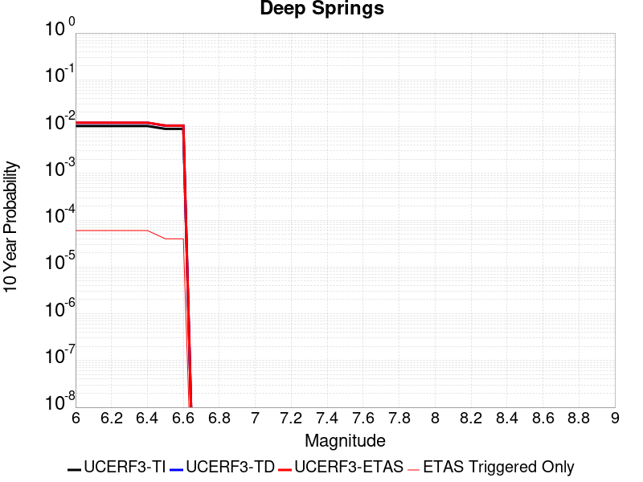 |

| Magnitude | 1 wk TI Prob | 1 wk TD Prob | 1 wk ETAS Prob | 1 wk ETAS/TD Gain | 1 wk ETAS Triggered Only | 1 mo TI Prob | 1 mo TD Prob | 1 mo ETAS Prob | 1 mo ETAS/TD Gain | 1 mo ETAS Triggered Only | 1 yr TI Prob | 1 yr TD Prob | 1 yr ETAS Prob | 1 yr ETAS/TD Gain | 1 yr ETAS Triggered Only | 10 yr TI Prob | 10 yr TD Prob | 10 yr ETAS Prob | 10 yr ETAS/TD Gain | 10 yr ETAS Triggered Only |
|-----|-----|-----|-----|-----|-----|-----|-----|-----|-----|-----|-----|-----|-----|-----|-----|-----|-----|-----|-----|-----|
| 6.0 | 1.9810619E-5 | 2.311303E-5 | 3.3830896E-5 | 1.4637153 | 1.0718114E-5 | 8.489989E-5 | 9.905495E-5 | 1.09772E-4 | 1.108193 | 1.0718114E-5 | 0.001033166 | 0.0012058346 | 0.001227245 | 1.0177556 | 2.1436228E-5 | 0.010283757 | 0.01204269 | 0.012106225 | 1.0052757 | 6.430868E-5 |
| 6.1 | 1.9810619E-5 | 2.311303E-5 | 3.3830896E-5 | 1.4637153 | 1.0718114E-5 | 8.489989E-5 | 9.905495E-5 | 1.09772E-4 | 1.108193 | 1.0718114E-5 | 0.001033166 | 0.0012058346 | 0.001227245 | 1.0177556 | 2.1436228E-5 | 0.010283757 | 0.01204269 | 0.012106225 | 1.0052757 | 6.430868E-5 |
| 6.2 | 1.9810619E-5 | 2.311303E-5 | 3.3830896E-5 | 1.4637153 | 1.0718114E-5 | 8.489989E-5 | 9.905495E-5 | 1.09772E-4 | 1.108193 | 1.0718114E-5 | 0.001033166 | 0.0012058346 | 0.001227245 | 1.0177556 | 2.1436228E-5 | 0.010283757 | 0.01204269 | 0.012106225 | 1.0052757 | 6.430868E-5 |
| 6.3 | 1.9810619E-5 | 2.311303E-5 | 3.3830896E-5 | 1.4637153 | 1.0718114E-5 | 8.489989E-5 | 9.905495E-5 | 1.09772E-4 | 1.108193 | 1.0718114E-5 | 0.001033166 | 0.0012058346 | 0.001227245 | 1.0177556 | 2.1436228E-5 | 0.010283757 | 0.01204269 | 0.012106225 | 1.0052757 | 6.430868E-5 |
| 6.4 | 1.9810619E-5 | 2.311303E-5 | 3.3830896E-5 | 1.4637153 | 1.0718114E-5 | 8.489989E-5 | 9.905495E-5 | 1.09772E-4 | 1.108193 | 1.0718114E-5 | 0.001033166 | 0.0012058346 | 0.001227245 | 1.0177556 | 2.1436228E-5 | 0.010283757 | 0.01204269 | 0.012106225 | 1.0052757 | 6.430868E-5 |
| 6.5 | 1.7190405E-5 | 2.0050999E-5 | 2.0050999E-5 | 1.0 | 0.0 | 7.367108E-5 | 8.593285E-5 | 8.593285E-5 | 1.0 | 0.0 | 8.9657627E-4 | 0.0010462324 | 0.0010569394 | 1.0102338 | 1.0718114E-5 | 0.008929676 | 0.010462287 | 0.0105047105 | 1.0040549 | 4.2872456E-5 |
| 6.6 | 1.7190405E-5 | 2.0050999E-5 | 2.0050999E-5 | 1.0 | 0.0 | 7.367108E-5 | 8.593285E-5 | 8.593285E-5 | 1.0 | 0.0 | 8.9657627E-4 | 0.0010462324 | 0.0010569394 | 1.0102338 | 1.0718114E-5 | 0.008929676 | 0.010462287 | 0.0105047105 | 1.0040549 | 4.2872456E-5 |

## Kern Canyon (Lake Isabella) 2011
*[(top)](#table-of-contents)*

| 1 Week | 1 Month | 1 Year | 10 Year |
|-----|-----|-----|-----|
|  |  |  | 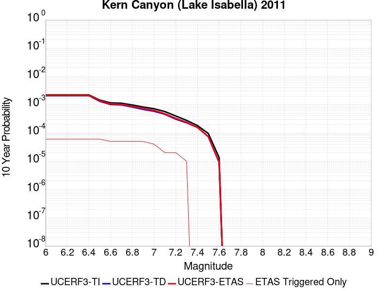 |

| Magnitude | 1 wk TI Prob | 1 wk TD Prob | 1 wk ETAS Prob | 1 wk ETAS/TD Gain | 1 wk ETAS Triggered Only | 1 mo TI Prob | 1 mo TD Prob | 1 mo ETAS Prob | 1 mo ETAS/TD Gain | 1 mo ETAS Triggered Only | 1 yr TI Prob | 1 yr TD Prob | 1 yr ETAS Prob | 1 yr ETAS/TD Gain | 1 yr ETAS Triggered Only | 10 yr TI Prob | 10 yr TD Prob | 10 yr ETAS Prob | 10 yr ETAS/TD Gain | 10 yr ETAS Triggered Only |
|-----|-----|-----|-----|-----|-----|-----|-----|-----|-----|-----|-----|-----|-----|-----|-----|-----|-----|-----|-----|-----|
| 6.0 | 4.2387383E-6 | 4.0016507E-6 | 4.0016507E-6 | 1.0 | 0.0 | 1.8165894E-5 | 1.7149829E-5 | 1.7149829E-5 | 1.0 | 0.0 | 2.2114732E-4 | 2.0878103E-4 | 2.3021278E-4 | 1.1026518 | 2.1436228E-5 | 0.0022092736 | 0.0020860326 | 0.0021502073 | 1.0307639 | 6.430868E-5 |
| 6.1 | 4.2387383E-6 | 4.0016507E-6 | 4.0016507E-6 | 1.0 | 0.0 | 1.8165894E-5 | 1.7149829E-5 | 1.7149829E-5 | 1.0 | 0.0 | 2.2114732E-4 | 2.0878103E-4 | 2.3021278E-4 | 1.1026518 | 2.1436228E-5 | 0.0022092736 | 0.0020860326 | 0.0021502073 | 1.0307639 | 6.430868E-5 |
| 6.2 | 4.2387383E-6 | 4.0016507E-6 | 4.0016507E-6 | 1.0 | 0.0 | 1.8165894E-5 | 1.7149829E-5 | 1.7149829E-5 | 1.0 | 0.0 | 2.2114732E-4 | 2.0878103E-4 | 2.3021278E-4 | 1.1026518 | 2.1436228E-5 | 0.0022092736 | 0.0020860326 | 0.0021502073 | 1.0307639 | 6.430868E-5 |
| 6.3 | 4.2387383E-6 | 4.0016507E-6 | 4.0016507E-6 | 1.0 | 0.0 | 1.8165894E-5 | 1.7149829E-5 | 1.7149829E-5 | 1.0 | 0.0 | 2.2114732E-4 | 2.0878103E-4 | 2.3021278E-4 | 1.1026518 | 2.1436228E-5 | 0.0022092736 | 0.0020860326 | 0.0021502073 | 1.0307639 | 6.430868E-5 |
| 6.4 | 4.2387383E-6 | 4.0016507E-6 | 4.0016507E-6 | 1.0 | 0.0 | 1.8165894E-5 | 1.7149829E-5 | 1.7149829E-5 | 1.0 | 0.0 | 2.2114732E-4 | 2.0878103E-4 | 2.3021278E-4 | 1.1026518 | 2.1436228E-5 | 0.0022092736 | 0.0020860326 | 0.0021502073 | 1.0307639 | 6.430868E-5 |
| 6.5 | 2.7857532E-6 | 2.5178747E-6 | 2.5178747E-6 | 1.0 | 0.0 | 1.1938888E-5 | 1.0790849E-5 | 1.0790849E-5 | 1.0 | 0.0 | 1.4534626E-4 | 1.31371E-4 | 1.5280441E-4 | 1.1631517 | 2.1436228E-5 | 0.0014525123 | 0.0013129661 | 0.0013771903 | 1.0489154 | 6.430868E-5 |
| 6.6 | 2.2233348E-6 | 1.94413E-6 | 1.94413E-6 | 1.0 | 0.0 | 9.528543E-6 | 8.331959E-6 | 8.331959E-6 | 1.0 | 0.0 | 1.1600384E-4 | 1.0143697E-4 | 1.2287102E-4 | 1.2113042 | 2.1436228E-5 | 0.001159433 | 0.0010139153 | 0.0010674516 | 1.0528015 | 5.3590567E-5 |
| 6.7 | 2.1635126E-6 | 1.8835098E-6 | 1.8835098E-6 | 1.0 | 0.0 | 9.272164E-6 | 8.07216E-6 | 8.07216E-6 | 1.0 | 0.0 | 1.1288274E-4 | 9.82742E-5 | 1.1970832E-4 | 1.2181053 | 2.1436228E-5 | 0.0011282542 | 9.823156E-4 | 0.0010358535 | 1.0545018 | 5.3590567E-5 |
| 6.8 | 1.8685711E-6 | 1.583148E-6 | 1.583148E-6 | 1.0 | 0.0 | 8.008137E-6 | 6.784903E-6 | 6.784903E-6 | 1.0 | 0.0 | 9.74947E-5 | 8.260311E-5 | 1.04037565E-4 | 1.2594873 | 2.1436228E-5 | 9.745194E-4 | 8.25729E-4 | 8.7927526E-4 | 1.0648474 | 5.3590567E-5 |
| 6.9 | 1.5815071E-6 | 1.3064976E-6 | 1.3064976E-6 | 1.0 | 0.0 | 6.77787E-6 | 5.599263E-6 | 5.599263E-6 | 1.0 | 0.0 | 8.251744E-5 | 6.816892E-5 | 8.960369E-5 | 1.3144361 | 2.1436228E-5 | 8.248681E-4 | 6.814828E-4 | 7.3503685E-4 | 1.0785846 | 5.3590567E-5 |
| 7.0 | 1.3772564E-6 | 1.1210758E-6 | 1.1210758E-6 | 1.0 | 0.0 | 5.9025137E-6 | 4.804602E-6 | 4.804602E-6 | 1.0 | 0.0 | 7.186073E-5 | 5.849448E-5 | 6.9211965E-5 | 1.1832222 | 1.0718114E-5 | 7.18375E-4 | 5.8479287E-4 | 6.276403E-4 | 1.0732694 | 4.2872456E-5 |
| 7.1 | 1.0916998E-6 | 8.763808E-7 | 8.763808E-7 | 1.0 | 0.0 | 4.678705E-6 | 3.7559125E-6 | 3.7559125E-6 | 1.0 | 0.0 | 5.6961744E-5 | 4.5727287E-5 | 4.5727287E-5 | 1.0 | 0.0 | 5.6947145E-4 | 4.5718014E-4 | 4.7860655E-4 | 1.0468665 | 2.1436228E-5 |
| 7.2 | 7.6277024E-7 | 5.901475E-7 | 5.901475E-7 | 1.0 | 0.0 | 3.2690114E-6 | 2.5292013E-6 | 2.5292013E-6 | 1.0 | 0.0 | 3.9799485E-5 | 3.0792595E-5 | 3.0792595E-5 | 1.0 | 0.0 | 3.9792358E-4 | 3.078839E-4 | 3.2931354E-4 | 1.069603 | 2.1436228E-5 |
| 7.3 | 5.3265916E-7 | 4.3824562E-7 | 4.3824562E-7 | 1.0 | 0.0 | 2.282823E-6 | 1.8781942E-6 | 1.8781942E-6 | 1.0 | 0.0 | 2.7793016E-5 | 2.286678E-5 | 2.286678E-5 | 1.0 | 0.0 | 2.778954E-4 | 2.2864464E-4 | 2.393603E-4 | 1.046866 | 1.0718114E-5 |
| 7.4 | 3.4946007E-7 | 3.006581E-7 | 3.006581E-7 | 1.0 | 0.0 | 1.497685E-6 | 1.288534E-6 | 1.288534E-6 | 1.0 | 0.0 | 1.8234163E-5 | 1.568779E-5 | 1.568779E-5 | 1.0 | 0.0 | 1.8232666E-4 | 1.5686706E-4 | 1.5686706E-4 | 1.0 | 0.0 |
| 7.5 | 1.8317026E-7 | 1.4244868E-7 | 1.4244868E-7 | 1.0 | 0.0 | 7.850152E-7 | 6.104942E-7 | 6.104942E-7 | 1.0 | 0.0 | 9.557518E-6 | 7.4327427E-6 | 7.4327427E-6 | 1.0 | 0.0 | 9.5571064E-5 | 7.432502E-5 | 7.432502E-5 | 1.0 | 0.0 |
| 7.6 | 2.572245E-8 | 1.7352637E-8 | 1.7352637E-8 | 1.0 | 0.0 | 1.10239064E-7 | 7.4368444E-8 | 7.4368444E-8 | 1.0 | 0.0 | 1.3421597E-6 | 9.0543546E-7 | 9.0543546E-7 | 1.0 | 0.0 | 1.3421517E-5 | 9.0543235E-6 | 9.0543235E-6 | 1.0 | 0.0 |

## Lost Hills
*[(top)](#table-of-contents)*

| 1 Week | 1 Month | 1 Year | 10 Year |
|-----|-----|-----|-----|
|  |  |  | 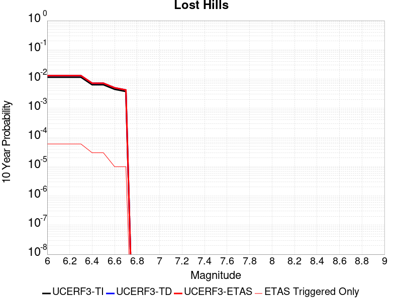 |

| Magnitude | 1 wk TI Prob | 1 wk TD Prob | 1 wk ETAS Prob | 1 wk ETAS/TD Gain | 1 wk ETAS Triggered Only | 1 mo TI Prob | 1 mo TD Prob | 1 mo ETAS Prob | 1 mo ETAS/TD Gain | 1 mo ETAS Triggered Only | 1 yr TI Prob | 1 yr TD Prob | 1 yr ETAS Prob | 1 yr ETAS/TD Gain | 1 yr ETAS Triggered Only | 10 yr TI Prob | 10 yr TD Prob | 10 yr ETAS Prob | 10 yr ETAS/TD Gain | 10 yr ETAS Triggered Only |
|-----|-----|-----|-----|-----|-----|-----|-----|-----|-----|-----|-----|-----|-----|-----|-----|-----|-----|-----|-----|-----|
| 6.0 | 2.233523E-5 | 2.5106996E-5 | 3.582484E-5 | 1.4268868 | 1.0718114E-5 | 9.571891E-5 | 1.0759792E-4 | 1.1831488E-4 | 1.099602 | 1.0718114E-5 | 0.0011647546 | 0.0013093855 | 0.001362906 | 1.0408745 | 5.3590567E-5 | 0.011586686 | 0.013033304 | 0.013086196 | 1.0040582 | 5.3590567E-5 |
| 6.1 | 2.233523E-5 | 2.5106996E-5 | 3.582484E-5 | 1.4268868 | 1.0718114E-5 | 9.571891E-5 | 1.0759792E-4 | 1.1831488E-4 | 1.099602 | 1.0718114E-5 | 0.0011647546 | 0.0013093855 | 0.001362906 | 1.0408745 | 5.3590567E-5 | 0.011586686 | 0.013033304 | 0.013086196 | 1.0040582 | 5.3590567E-5 |
| 6.2 | 2.233523E-5 | 2.5106996E-5 | 3.582484E-5 | 1.4268868 | 1.0718114E-5 | 9.571891E-5 | 1.0759792E-4 | 1.1831488E-4 | 1.099602 | 1.0718114E-5 | 0.0011647546 | 0.0013093855 | 0.001362906 | 1.0408745 | 5.3590567E-5 | 0.011586686 | 0.013033304 | 0.013086196 | 1.0040582 | 5.3590567E-5 |
| 6.3 | 2.233523E-5 | 2.5106996E-5 | 3.582484E-5 | 1.4268868 | 1.0718114E-5 | 9.571891E-5 | 1.0759792E-4 | 1.1831488E-4 | 1.099602 | 1.0718114E-5 | 0.0011647546 | 0.0013093855 | 0.001362906 | 1.0408745 | 5.3590567E-5 | 0.011586686 | 0.013033304 | 0.013086196 | 1.0040582 | 5.3590567E-5 |
| 6.4 | 1.2288092E-5 | 1.37813295E-5 | 1.37813295E-5 | 1.0 | 0.0 | 5.2662188E-5 | 5.9062033E-5 | 5.9062033E-5 | 1.0 | 0.0 | 6.409735E-4 | 7.189368E-4 | 7.51068E-4 | 1.0446928 | 3.215434E-5 | 0.006391279 | 0.007175316 | 0.0072072395 | 1.0044491 | 3.215434E-5 |
| 6.5 | 1.2288092E-5 | 1.37813295E-5 | 1.37813295E-5 | 1.0 | 0.0 | 5.2662188E-5 | 5.9062033E-5 | 5.9062033E-5 | 1.0 | 0.0 | 6.409735E-4 | 7.189368E-4 | 7.51068E-4 | 1.0446928 | 3.215434E-5 | 0.006391279 | 0.007175316 | 0.0072072395 | 1.0044491 | 3.215434E-5 |
| 6.6 | 8.58281E-6 | 9.633926E-6 | 9.633926E-6 | 1.0 | 0.0 | 3.6782953E-5 | 4.1288073E-5 | 4.1288073E-5 | 1.0 | 0.0 | 4.4774043E-4 | 5.026495E-4 | 5.133623E-4 | 1.0213125 | 1.0718114E-5 | 0.0044683935 | 0.0050232867 | 0.005033951 | 1.002123 | 1.0718114E-5 |
| 6.7 | 7.205685E-6 | 8.088433E-6 | 8.088433E-6 | 1.0 | 0.0 | 3.088114E-5 | 3.4664714E-5 | 3.4664714E-5 | 1.0 | 0.0 | 3.7591302E-4 | 4.2204288E-4 | 4.3275647E-4 | 1.025385 | 1.0718114E-5 | 0.0037527776 | 0.004220429 | 0.004231102 | 1.0025289 | 1.0718114E-5 |

## Camp Rock 2011
*[(top)](#table-of-contents)*

| 1 Week | 1 Month | 1 Year | 10 Year |
|-----|-----|-----|-----|
|  |  |  |  |

| Magnitude | 1 wk TI Prob | 1 wk TD Prob | 1 wk ETAS Prob | 1 wk ETAS/TD Gain | 1 wk ETAS Triggered Only | 1 mo TI Prob | 1 mo TD Prob | 1 mo ETAS Prob | 1 mo ETAS/TD Gain | 1 mo ETAS Triggered Only | 1 yr TI Prob | 1 yr TD Prob | 1 yr ETAS Prob | 1 yr ETAS/TD Gain | 1 yr ETAS Triggered Only | 10 yr TI Prob | 10 yr TD Prob | 10 yr ETAS Prob | 10 yr ETAS/TD Gain | 10 yr ETAS Triggered Only |
|-----|-----|-----|-----|-----|-----|-----|-----|-----|-----|-----|-----|-----|-----|-----|-----|-----|-----|-----|-----|-----|
| 6.0 | 1.6710783E-5 | 4.2503107E-6 | 4.2503107E-6 | 1.0 | 0.0 | 7.161568E-5 | 1.8215493E-5 | 2.8933411E-5 | 1.5883957 | 1.0718114E-5 | 8.7157206E-4 | 2.2175159E-4 | 2.4318305E-4 | 1.0966463 | 2.1436228E-5 | 0.008681616 | 0.0022153559 | 0.0022688278 | 1.0241369 | 5.3590567E-5 |
| 6.1 | 1.6710783E-5 | 4.2503107E-6 | 4.2503107E-6 | 1.0 | 0.0 | 7.161568E-5 | 1.8215493E-5 | 2.8933411E-5 | 1.5883957 | 1.0718114E-5 | 8.7157206E-4 | 2.2175159E-4 | 2.4318305E-4 | 1.0966463 | 2.1436228E-5 | 0.008681616 | 0.0022153559 | 0.0022688278 | 1.0241369 | 5.3590567E-5 |
| 6.2 | 1.6710783E-5 | 4.2503107E-6 | 4.2503107E-6 | 1.0 | 0.0 | 7.161568E-5 | 1.8215493E-5 | 2.8933411E-5 | 1.5883957 | 1.0718114E-5 | 8.7157206E-4 | 2.2175159E-4 | 2.4318305E-4 | 1.0966463 | 2.1436228E-5 | 0.008681616 | 0.0022153559 | 0.0022688278 | 1.0241369 | 5.3590567E-5 |
| 6.3 | 1.6710783E-5 | 4.2503107E-6 | 4.2503107E-6 | 1.0 | 0.0 | 7.161568E-5 | 1.8215493E-5 | 2.8933411E-5 | 1.5883957 | 1.0718114E-5 | 8.7157206E-4 | 2.2175159E-4 | 2.4318305E-4 | 1.0966463 | 2.1436228E-5 | 0.008681616 | 0.0022153559 | 0.0022688278 | 1.0241369 | 5.3590567E-5 |
| 6.4 | 7.982846E-6 | 3.6821327E-6 | 3.6821327E-6 | 1.0 | 0.0 | 3.421175E-5 | 1.5780475E-5 | 2.6498421E-5 | 1.6791902 | 1.0718114E-5 | 4.1644843E-4 | 1.921107E-4 | 2.0282675E-4 | 1.0557806 | 1.0718114E-5 | 0.0041566887 | 0.0019194811 | 0.0019622713 | 1.0222926 | 4.2872456E-5 |
| 6.5 | 7.982846E-6 | 3.6821327E-6 | 3.6821327E-6 | 1.0 | 0.0 | 3.421175E-5 | 1.5780475E-5 | 2.6498421E-5 | 1.6791902 | 1.0718114E-5 | 4.1644843E-4 | 1.921107E-4 | 2.0282675E-4 | 1.0557806 | 1.0718114E-5 | 0.0041566887 | 0.0019194811 | 0.0019622713 | 1.0222926 | 4.2872456E-5 |
| 6.6 | 7.048869E-6 | 3.4243997E-6 | 3.4243997E-6 | 1.0 | 0.0 | 3.0209088E-5 | 1.4675918E-5 | 2.5393874E-5 | 1.7303091 | 1.0718114E-5 | 3.677336E-4 | 1.7866497E-4 | 1.8938116E-4 | 1.0599793 | 1.0718114E-5 | 0.0036712566 | 0.0017852448 | 0.0018280408 | 1.023972 | 4.2872456E-5 |
| 6.7 | 6.987307E-6 | 3.3623767E-6 | 3.3623767E-6 | 1.0 | 0.0 | 2.9945259E-5 | 1.4410108E-5 | 2.5128067E-5 | 1.7437806 | 1.0718114E-5 | 3.6452254E-4 | 1.7542925E-4 | 1.8614548E-4 | 1.0610858 | 1.0718114E-5 | 0.0036392517 | 0.0017529388 | 0.0017957361 | 1.0244147 | 4.2872456E-5 |
| 6.8 | 6.3737602E-6 | 3.117947E-6 | 3.117947E-6 | 1.0 | 0.0 | 2.731583E-5 | 1.3362564E-5 | 2.4080535E-5 | 1.8020893 | 1.0718114E-5 | 3.3251947E-4 | 1.6267736E-4 | 1.7339372E-4 | 1.065875 | 1.0718114E-5 | 0.0033202237 | 0.0016256113 | 0.0016684141 | 1.0263302 | 4.2872456E-5 |
| 6.9 | 6.112211E-6 | 2.9331534E-6 | 2.9331534E-6 | 1.0 | 0.0 | 2.6194928E-5 | 1.2570598E-5 | 2.3288578E-5 | 1.8526227 | 1.0718114E-5 | 3.1887658E-4 | 1.5303657E-4 | 1.6375304E-4 | 1.0700256 | 1.0718114E-5 | 0.003184194 | 0.0015293396 | 0.0015721464 | 1.0279905 | 4.2872456E-5 |
| 7.0 | 5.5140117E-6 | 2.6419564E-6 | 2.6419564E-6 | 1.0 | 0.0 | 2.3631264E-5 | 1.1322622E-5 | 2.2040615E-5 | 1.9465998 | 1.0718114E-5 | 2.8767265E-4 | 1.3784446E-4 | 1.485611E-4 | 1.0777444 | 1.0718114E-5 | 0.0028730053 | 0.0013776148 | 0.0014204282 | 1.0310779 | 4.2872456E-5 |
| 7.1 | 4.8151105E-6 | 2.1342985E-6 | 2.1342985E-6 | 1.0 | 0.0 | 2.0636026E-5 | 9.146962E-6 | 1.9864978E-5 | 2.1717567 | 1.0718114E-5 | 2.5121463E-4 | 1.1135879E-4 | 1.2207571E-4 | 1.0962378 | 1.0718114E-5 | 0.0025093083 | 0.0011130519 | 0.0011558766 | 1.038475 | 4.2872456E-5 |
| 7.2 | 3.818335E-6 | 1.293763E-6 | 1.293763E-6 | 1.0 | 0.0 | 1.6364189E-5 | 5.5446876E-6 | 5.5446876E-6 | 1.0 | 0.0 | 1.9921579E-4 | 6.750456E-5 | 6.750456E-5 | 1.0 | 0.0 | 0.0019903728 | 6.748488E-4 | 6.855597E-4 | 1.0158715 | 1.0718114E-5 |
| 7.3 | 2.7166698E-6 | 7.383734E-7 | 7.383734E-7 | 1.0 | 0.0 | 1.1642818E-5 | 3.1644536E-6 | 3.1644536E-6 | 1.0 | 0.0 | 1.4174209E-4 | 3.8526563E-5 | 3.8526563E-5 | 1.0 | 0.0 | 0.0014165172 | 3.8520084E-4 | 3.9591483E-4 | 1.027814 | 1.0718114E-5 |
| 7.4 | 2.0893426E-6 | 5.461961E-7 | 5.461961E-7 | 1.0 | 0.0 | 8.954295E-6 | 2.3408381E-6 | 2.3408381E-6 | 1.0 | 0.0 | 1.0901308E-4 | 2.8499337E-5 | 2.8499337E-5 | 1.0 | 0.0 | 0.0010895962 | 2.8495738E-4 | 2.8495738E-4 | 1.0 | 0.0 |
| 7.5 | 1.1681728E-6 | 3.6031287E-7 | 3.6031287E-7 | 1.0 | 0.0 | 5.0064455E-6 | 1.5441972E-6 | 1.5441972E-6 | 1.0 | 0.0 | 6.0951766E-5 | 1.8800443E-5 | 1.8800443E-5 | 1.0 | 0.0 | 6.093505E-4 | 1.8798899E-4 | 1.8798899E-4 | 1.0 | 0.0 |
| 7.6 | 1.3154387E-7 | 7.1198265E-8 | 7.1198265E-8 | 1.0 | 0.0 | 5.6375933E-7 | 3.051354E-7 | 3.051354E-7 | 1.0 | 0.0 | 6.863748E-6 | 3.7150185E-6 | 3.7150185E-6 | 1.0 | 0.0 | 6.863536E-5 | 3.7149723E-5 | 3.7149723E-5 | 1.0 | 0.0 |

## Imperial
*[(top)](#table-of-contents)*

| 1 Week | 1 Month | 1 Year | 10 Year |
|-----|-----|-----|-----|
| 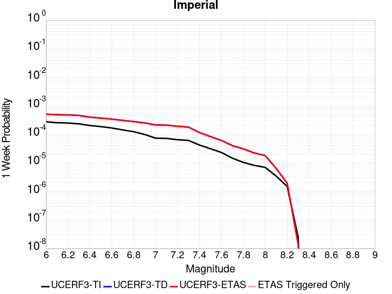 |  | 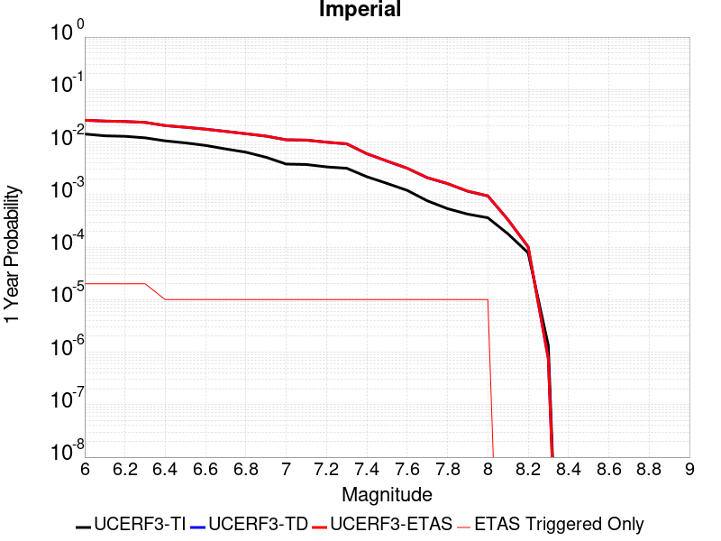 |  |

| Magnitude | 1 wk TI Prob | 1 wk TD Prob | 1 wk ETAS Prob | 1 wk ETAS/TD Gain | 1 wk ETAS Triggered Only | 1 mo TI Prob | 1 mo TD Prob | 1 mo ETAS Prob | 1 mo ETAS/TD Gain | 1 mo ETAS Triggered Only | 1 yr TI Prob | 1 yr TD Prob | 1 yr ETAS Prob | 1 yr ETAS/TD Gain | 1 yr ETAS Triggered Only | 10 yr TI Prob | 10 yr TD Prob | 10 yr ETAS Prob | 10 yr ETAS/TD Gain | 10 yr ETAS Triggered Only |
|-----|-----|-----|-----|-----|-----|-----|-----|-----|-----|-----|-----|-----|-----|-----|-----|-----|-----|-----|-----|-----|
| 6.0 | 2.7496446E-4 | 5.0565513E-4 | 5.0565513E-4 | 1.0 | 0.0 | 0.0011778869 | 0.002165333 | 0.002165333 | 1.0 | 0.0 | 0.0142467655 | 0.026045265 | 0.026066143 | 1.0008016 | 2.1436228E-5 | 0.13367249 | 0.22808637 | 0.22812773 | 1.0001813 | 5.3590567E-5 |
| 6.1 | 2.5356023E-4 | 4.8667885E-4 | 4.8667885E-4 | 1.0 | 0.0 | 0.001086234 | 0.0020841376 | 0.0020841376 | 1.0 | 0.0 | 0.013144928 | 0.02507692 | 0.025097819 | 1.0008334 | 2.1436228E-5 | 0.123940155 | 0.21951756 | 0.21955939 | 1.0001905 | 5.3590567E-5 |
| 6.2 | 2.4820742E-4 | 4.7763108E-4 | 4.7763108E-4 | 1.0 | 0.0 | 0.0010633124 | 0.0020454223 | 0.0020454223 | 1.0 | 0.0 | 0.01286919 | 0.024616843 | 0.024637751 | 1.0008494 | 2.1436228E-5 | 0.12148927 | 0.2160229 | 0.2160649 | 1.0001944 | 5.3590567E-5 |
| 6.3 | 2.3205351E-4 | 4.590021E-4 | 4.590021E-4 | 1.0 | 0.0 | 9.94136E-4 | 0.0019657058 | 0.0019657058 | 1.0 | 0.0 | 0.012036599 | 0.023666281 | 0.02368721 | 1.0008843 | 2.1436228E-5 | 0.11405133 | 0.20796864 | 0.20801108 | 1.0002041 | 5.3590567E-5 |
| 6.4 | 2.0304754E-4 | 3.9885996E-4 | 3.9885996E-4 | 1.0 | 0.0 | 8.6991355E-4 | 0.0017082945 | 0.0017082945 | 1.0 | 0.0 | 0.010539869 | 0.020600514 | 0.02061101 | 1.0005096 | 1.0718114E-5 | 0.100537635 | 0.18510117 | 0.18513611 | 1.0001887 | 4.2872456E-5 |
| 6.5 | 1.854992E-4 | 3.6997703E-4 | 3.6997703E-4 | 1.0 | 0.0 | 7.9475436E-4 | 0.0015846646 | 0.0015846646 | 1.0 | 0.0 | 0.009633281 | 0.019123985 | 0.019134497 | 1.0005498 | 1.0718114E-5 | 0.0922623 | 0.17333072 | 0.17336616 | 1.0002044 | 4.2872456E-5 |
| 6.6 | 1.6586106E-4 | 3.4043082E-4 | 3.4043082E-4 | 1.0 | 0.0 | 7.106394E-4 | 0.0014581835 | 0.0014581835 | 1.0 | 0.0 | 0.008617763 | 0.017610526 | 0.017621055 | 1.000598 | 1.0718114E-5 | 0.08291132 | 0.16080588 | 0.16084185 | 1.0002238 | 4.2872456E-5 |
| 6.7 | 1.4224656E-4 | 3.077392E-4 | 3.077392E-4 | 1.0 | 0.0 | 6.094856E-4 | 0.0013182238 | 0.0013182238 | 1.0 | 0.0 | 0.0073952693 | 0.015933173 | 0.01594372 | 1.000662 | 1.0718114E-5 | 0.07153955 | 0.1465114 | 0.146548 | 1.0002497 | 4.2872456E-5 |
| 6.8 | 1.2317259E-4 | 2.779711E-4 | 2.779711E-4 | 1.0 | 0.0 | 5.2777573E-4 | 0.0011907669 | 0.0011907669 | 1.0 | 0.0 | 0.0064067547 | 0.0144026 | 0.014413164 | 1.0007335 | 1.0718114E-5 | 0.06225166 | 0.13296051 | 0.13299768 | 1.0002795 | 4.2872456E-5 |
| 6.9 | 9.859898E-5 | 2.5018715E-4 | 2.5018715E-4 | 1.0 | 0.0 | 4.2249862E-4 | 0.0010717943 | 0.0010717943 | 1.0 | 0.0 | 0.0051317946 | 0.012971984 | 0.012982563 | 1.0008155 | 1.0718114E-5 | 0.05014893 | 0.11942433 | 0.11946208 | 1.0003161 | 4.2872456E-5 |
| 7.0 | 7.3191884E-5 | 2.1270063E-4 | 2.1270063E-4 | 1.0 | 0.0 | 3.136418E-4 | 9.1125886E-4 | 9.1125886E-4 | 1.0 | 0.0 | 0.003811904 | 0.011038825 | 0.011049424 | 1.0009602 | 1.0718114E-5 | 0.037471764 | 0.10207849 | 0.10211698 | 1.0003772 | 4.2872456E-5 |
| 7.1 | 7.1760296E-5 | 2.0971385E-4 | 2.0971385E-4 | 1.0 | 0.0 | 3.0750787E-4 | 8.984672E-4 | 8.984672E-4 | 1.0 | 0.0 | 0.003737482 | 0.010884652 | 0.010895253 | 1.0009739 | 1.0718114E-5 | 0.03675245 | 0.100714855 | 0.100753404 | 1.0003828 | 4.2872456E-5 |
| 7.2 | 6.46614E-5 | 1.9139807E-4 | 1.9139807E-4 | 1.0 | 0.0 | 2.7709085E-4 | 8.2002254E-4 | 8.2002254E-4 | 1.0 | 0.0 | 0.0033683628 | 0.009938694 | 0.009949305 | 1.0010678 | 1.0718114E-5 | 0.033177625 | 0.09252202 | 0.092560925 | 1.0004205 | 4.2872456E-5 |
| 7.3 | 6.088115E-5 | 1.781138E-4 | 1.781138E-4 | 1.0 | 0.0 | 2.6089314E-4 | 7.631244E-4 | 7.631244E-4 | 1.0 | 0.0 | 0.0031717476 | 0.009252035 | 0.009262654 | 1.0011477 | 1.0718114E-5 | 0.031268585 | 0.08657247 | 0.08661163 | 1.0004524 | 4.2872456E-5 |
| 7.4 | 4.199346E-5 | 1.15126604E-4 | 1.15126604E-4 | 1.0 | 0.0 | 1.7995955E-4 | 4.933073E-4 | 4.933073E-4 | 1.0 | 0.0 | 0.0021888057 | 0.005989646 | 0.0060003 | 1.0017787 | 1.0718114E-5 | 0.02167372 | 0.057449933 | 0.05749034 | 1.0007033 | 4.2872456E-5 |
| 7.5 | 3.130448E-5 | 8.335176E-5 | 8.335176E-5 | 1.0 | 0.0 | 1.3415517E-4 | 3.5717324E-4 | 3.5717324E-4 | 1.0 | 0.0 | 0.0016321153 | 0.0043399734 | 0.004350645 | 1.0024589 | 1.0718114E-5 | 0.016201803 | 0.042140562 | 0.04218163 | 1.0009745 | 4.2872456E-5 |
| 7.6 | 2.3074248E-5 | 6.0860824E-5 | 6.0860824E-5 | 1.0 | 0.0 | 9.888588E-5 | 2.6080615E-4 | 2.6080615E-4 | 1.0 | 0.0 | 0.0012032706 | 0.0031707147 | 0.0031813988 | 1.0033696 | 1.0718114E-5 | 0.011967761 | 0.031033779 | 0.03107532 | 1.0013386 | 4.2872456E-5 |
| 7.7 | 1.45864815E-5 | 4.0138115E-5 | 4.0138115E-5 | 1.0 | 0.0 | 6.2511994E-5 | 1.7200918E-4 | 1.7200918E-4 | 1.0 | 0.0 | 7.608177E-4 | 0.0020922057 | 0.0021029015 | 1.0051122 | 1.0718114E-5 | 0.007582182 | 0.020633917 | 0.020665407 | 1.0015261 | 3.215434E-5 |
| 7.8 | 1.0352979E-5 | 3.097231E-5 | 3.097231E-5 | 1.0 | 0.0 | 4.4369157E-5 | 1.3273173E-4 | 1.3273173E-4 | 1.0 | 0.0 | 5.400606E-4 | 0.0016148133 | 0.0016255141 | 1.0066266 | 1.0718114E-5 | 0.0053875 | 0.016022068 | 0.01604316 | 1.0013164 | 2.1436228E-5 |
| 7.9 | 8.137906E-6 | 2.2158269E-5 | 2.2158269E-5 | 1.0 | 0.0 | 3.4876273E-5 | 9.496055E-5 | 9.496055E-5 | 1.0 | 0.0 | 4.2453592E-4 | 0.0011555325 | 0.0011662382 | 1.0092647 | 1.0718114E-5 | 0.004237258 | 0.011622174 | 0.011643361 | 1.001823 | 2.1436228E-5 |
| 8.0 | 6.93792E-6 | 1.801665E-5 | 1.801665E-5 | 1.0 | 0.0 | 2.9733603E-5 | 7.721193E-5 | 7.721193E-5 | 1.0 | 0.0 | 3.6194647E-4 | 9.396506E-4 | 9.5035863E-4 | 1.0113958 | 1.0718114E-5 | 0.0036135751 | 0.00950525 | 0.009526482 | 1.0022337 | 2.1436228E-5 |
| 8.1 | 3.4286315E-6 | 6.3835337E-6 | 6.3835337E-6 | 1.0 | 0.0 | 1.4694053E-5 | 2.7357715E-5 | 2.7357715E-5 | 1.0 | 0.0 | 1.7888541E-4 | 3.330294E-4 | 3.330294E-4 | 1.0 | 0.0 | 0.0017874148 | 0.0034878491 | 0.0034878491 | 1.0 | 0.0 |
| 8.2 | 1.4906886E-6 | 1.9381007E-6 | 1.9381007E-6 | 1.0 | 0.0 | 6.3886496E-6 | 8.3061195E-6 | 8.3061195E-6 | 1.0 | 0.0 | 7.7779034E-5 | 1.0112235E-4 | 1.0112235E-4 | 1.0 | 0.0 | 7.775182E-4 | 0.0011082698 | 0.0011082698 | 1.0 | 0.0 |
| 8.3 | 2.5758007E-8 | 1.4514695E-8 | 1.4514695E-8 | 1.0 | 0.0 | 1.10391454E-7 | 6.2205835E-8 | 6.2205835E-8 | 1.0 | 0.0 | 1.3440151E-6 | 7.57356E-7 | 7.57356E-7 | 1.0 | 0.0 | 1.344007E-5 | 7.895551E-6 | 7.895551E-6 | 1.0 | 0.0 |

## Whittier alt 1
*[(top)](#table-of-contents)*

| 1 Week | 1 Month | 1 Year | 10 Year |
|-----|-----|-----|-----|
|  |  |  | 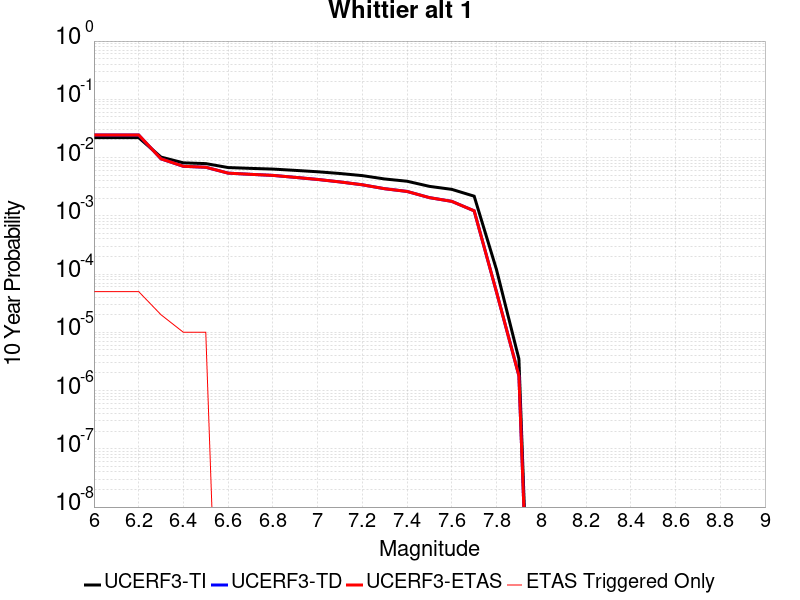 |

| Magnitude | 1 wk TI Prob | 1 wk TD Prob | 1 wk ETAS Prob | 1 wk ETAS/TD Gain | 1 wk ETAS Triggered Only | 1 mo TI Prob | 1 mo TD Prob | 1 mo ETAS Prob | 1 mo ETAS/TD Gain | 1 mo ETAS Triggered Only | 1 yr TI Prob | 1 yr TD Prob | 1 yr ETAS Prob | 1 yr ETAS/TD Gain | 1 yr ETAS Triggered Only | 10 yr TI Prob | 10 yr TD Prob | 10 yr ETAS Prob | 10 yr ETAS/TD Gain | 10 yr ETAS Triggered Only |
|-----|-----|-----|-----|-----|-----|-----|-----|-----|-----|-----|-----|-----|-----|-----|-----|-----|-----|-----|-----|-----|
| 6.0 | 4.2554693E-5 | 4.7253463E-5 | 4.7253463E-5 | 1.0 | 0.0 | 1.8236451E-4 | 2.0250095E-4 | 2.0250095E-4 | 1.0 | 0.0 | 0.002218027 | 0.0024629822 | 0.0024736738 | 1.004341 | 1.0718114E-5 | 0.02196019 | 0.02439089 | 0.024443172 | 1.0021436 | 5.3590567E-5 |
| 6.1 | 4.2554693E-5 | 4.7253463E-5 | 4.7253463E-5 | 1.0 | 0.0 | 1.8236451E-4 | 2.0250095E-4 | 2.0250095E-4 | 1.0 | 0.0 | 0.002218027 | 0.0024629822 | 0.0024736738 | 1.004341 | 1.0718114E-5 | 0.02196019 | 0.02439089 | 0.024443172 | 1.0021436 | 5.3590567E-5 |
| 6.2 | 4.2554693E-5 | 4.7253463E-5 | 4.7253463E-5 | 1.0 | 0.0 | 1.8236451E-4 | 2.0250095E-4 | 2.0250095E-4 | 1.0 | 0.0 | 0.002218027 | 0.0024629822 | 0.0024736738 | 1.004341 | 1.0718114E-5 | 0.02196019 | 0.02439089 | 0.024443172 | 1.0021436 | 5.3590567E-5 |
| 6.3 | 1.9617712E-5 | 1.8269313E-5 | 1.8269313E-5 | 1.0 | 0.0 | 8.40732E-5 | 7.829482E-5 | 7.829482E-5 | 1.0 | 0.0 | 0.0010231105 | 9.528416E-4 | 9.528416E-4 | 1.0 | 0.0 | 0.01018413 | 0.009490847 | 0.00951208 | 1.0022372 | 2.1436228E-5 |
| 6.4 | 1.5611336E-5 | 1.3604893E-5 | 1.3604893E-5 | 1.0 | 0.0 | 6.690401E-5 | 5.8305417E-5 | 5.8305417E-5 | 1.0 | 0.0 | 8.142519E-4 | 7.0964324E-4 | 7.0964324E-4 | 1.0 | 0.0 | 0.008112748 | 0.0070757363 | 0.007086379 | 1.0015041 | 1.0718114E-5 |
| 6.5 | 1.5150166E-5 | 1.3101541E-5 | 1.3101541E-5 | 1.0 | 0.0 | 6.492767E-5 | 5.614829E-5 | 5.614829E-5 | 1.0 | 0.0 | 7.9020765E-4 | 6.833969E-4 | 6.833969E-4 | 1.0 | 0.0 | 0.007874036 | 0.0068149036 | 0.0068255486 | 1.001562 | 1.0718114E-5 |
| 6.6 | 1.295588E-5 | 1.0381249E-5 | 1.0381249E-5 | 1.0 | 0.0 | 5.552402E-5 | 4.449032E-5 | 4.449032E-5 | 1.0 | 0.0 | 6.7579525E-4 | 5.4153695E-4 | 5.4153695E-4 | 1.0 | 0.0 | 0.006737438 | 0.005403607 | 0.005403607 | 1.0 | 0.0 |
| 6.7 | 1.2542085E-5 | 9.899882E-6 | 9.899882E-6 | 1.0 | 0.0 | 5.3750682E-5 | 4.2427386E-5 | 4.2427386E-5 | 1.0 | 0.0 | 6.542181E-4 | 5.1643286E-4 | 5.1643286E-4 | 1.0 | 0.0 | 0.006522954 | 0.0051537454 | 0.0051537454 | 1.0 | 0.0 |
| 6.8 | 1.2195878E-5 | 9.495912E-6 | 9.495912E-6 | 1.0 | 0.0 | 5.2267E-5 | 4.0696144E-5 | 4.0696144E-5 | 1.0 | 0.0 | 6.36165E-4 | 4.953648E-4 | 4.953648E-4 | 1.0 | 0.0 | 0.0063434686 | 0.0049439464 | 0.0049439464 | 1.0 | 0.0 |
| 6.9 | 1.1580298E-5 | 8.773408E-6 | 8.773408E-6 | 1.0 | 0.0 | 4.9628903E-5 | 3.7599788E-5 | 3.7599788E-5 | 1.0 | 0.0 | 6.040644E-4 | 4.576829E-4 | 4.576829E-4 | 1.0 | 0.0 | 0.00602425 | 0.0045686625 | 0.0045686625 | 1.0 | 0.0 |
| 7.0 | 1.0964795E-5 | 8.084448E-6 | 8.084448E-6 | 1.0 | 0.0 | 4.6991136E-5 | 3.4647182E-5 | 3.4647182E-5 | 1.0 | 0.0 | 5.7196687E-4 | 4.2174934E-4 | 4.2174934E-4 | 1.0 | 0.0 | 0.0057049696 | 0.004210698 | 0.004210698 | 1.0 | 0.0 |
| 7.1 | 1.0230601E-5 | 7.3269985E-6 | 7.3269985E-6 | 1.0 | 0.0 | 4.3844695E-5 | 3.140105E-5 | 3.140105E-5 | 1.0 | 0.0 | 5.336784E-4 | 3.8224205E-4 | 3.8224205E-4 | 1.0 | 0.0 | 0.005323986 | 0.0038170093 | 0.0038170093 | 1.0 | 0.0 |
| 7.2 | 9.40865E-6 | 6.5435725E-6 | 6.5435725E-6 | 1.0 | 0.0 | 4.032216E-5 | 2.8043587E-5 | 2.8043587E-5 | 1.0 | 0.0 | 4.908117E-4 | 3.413784E-4 | 3.413784E-4 | 1.0 | 0.0 | 0.0048972913 | 0.0034096325 | 0.0034096325 | 1.0 | 0.0 |
| 7.3 | 8.237384E-6 | 5.5979945E-6 | 5.5979945E-6 | 1.0 | 0.0 | 3.5302593E-5 | 2.399119E-5 | 2.399119E-5 | 1.0 | 0.0 | 4.2972428E-4 | 2.9205464E-4 | 2.9205464E-4 | 1.0 | 0.0 | 0.0042889426 | 0.002917029 | 0.002917029 | 1.0 | 0.0 |
| 7.4 | 7.5316966E-6 | 5.0280382E-6 | 5.0280382E-6 | 1.0 | 0.0 | 3.2278298E-5 | 2.1548563E-5 | 2.1548563E-5 | 1.0 | 0.0 | 3.9291743E-4 | 2.6232318E-4 | 2.6232318E-4 | 1.0 | 0.0 | 0.0039222343 | 0.0026202472 | 0.0026202472 | 1.0 | 0.0 |
| 7.5 | 6.149649E-6 | 3.934013E-6 | 3.934013E-6 | 1.0 | 0.0 | 2.6355372E-5 | 1.685995E-5 | 1.685995E-5 | 1.0 | 0.0 | 3.208294E-4 | 2.0525148E-4 | 2.0525148E-4 | 1.0 | 0.0 | 0.003203666 | 0.0020507083 | 0.0020507083 | 1.0 | 0.0 |
| 7.6 | 5.457711E-6 | 3.395529E-6 | 3.395529E-6 | 1.0 | 0.0 | 2.338998E-5 | 1.4552191E-5 | 1.4552191E-5 | 1.0 | 0.0 | 2.8473578E-4 | 1.7715934E-4 | 1.7715934E-4 | 1.0 | 0.0 | 0.0028437122 | 0.0017702618 | 0.0017702618 | 1.0 | 0.0 |
| 7.7 | 4.1676276E-6 | 2.3333084E-6 | 2.3333084E-6 | 1.0 | 0.0 | 1.7861139E-5 | 9.99986E-6 | 9.99986E-6 | 1.0 | 0.0 | 2.1743766E-4 | 1.2174223E-4 | 1.2174223E-4 | 1.0 | 0.0 | 0.0021722503 | 0.0012168285 | 0.0012168285 | 1.0 | 0.0 |
| 7.8 | 2.2692414E-7 | 9.385943E-8 | 9.385943E-8 | 1.0 | 0.0 | 9.725317E-7 | 4.0225464E-7 | 4.0225464E-7 | 1.0 | 0.0 | 1.1840509E-5 | 4.8974425E-6 | 4.8974425E-6 | 1.0 | 0.0 | 1.1839878E-4 | 4.8973674E-5 | 4.8973674E-5 | 1.0 | 0.0 |
| 7.9 | 6.676829E-9 | 3.4399772E-9 | 3.4399772E-9 | 1.0 | 0.0 | 2.861498E-8 | 1.4742759E-8 | 1.4742759E-8 | 1.0 | 0.0 | 3.4838732E-7 | 1.7949307E-7 | 1.7949307E-7 | 1.0 | 0.0 | 3.4838679E-6 | 1.7949295E-6 | 1.7949295E-6 | 1.0 | 0.0 |

## Cleghorn
*[(top)](#table-of-contents)*

| 1 Week | 1 Month | 1 Year | 10 Year |
|-----|-----|-----|-----|
|  | 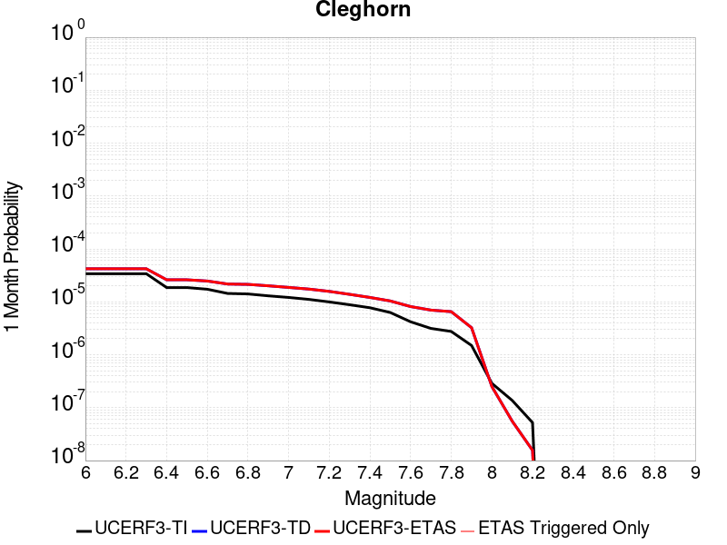 |  | 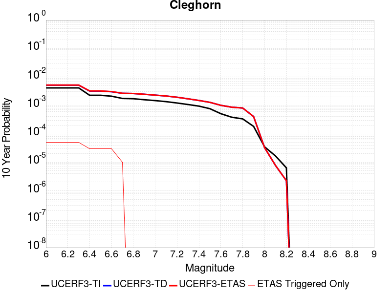 |

| Magnitude | 1 wk TI Prob | 1 wk TD Prob | 1 wk ETAS Prob | 1 wk ETAS/TD Gain | 1 wk ETAS Triggered Only | 1 mo TI Prob | 1 mo TD Prob | 1 mo ETAS Prob | 1 mo ETAS/TD Gain | 1 mo ETAS Triggered Only | 1 yr TI Prob | 1 yr TD Prob | 1 yr ETAS Prob | 1 yr ETAS/TD Gain | 1 yr ETAS Triggered Only | 10 yr TI Prob | 10 yr TD Prob | 10 yr ETAS Prob | 10 yr ETAS/TD Gain | 10 yr ETAS Triggered Only |
|-----|-----|-----|-----|-----|-----|-----|-----|-----|-----|-----|-----|-----|-----|-----|-----|-----|-----|-----|-----|-----|
| 6.0 | 7.9267165E-6 | 9.832575E-6 | 9.832575E-6 | 1.0 | 0.0 | 3.39712E-5 | 4.213899E-5 | 4.213899E-5 | 1.0 | 0.0 | 4.1352084E-4 | 5.12932E-4 | 5.236447E-4 | 1.0208851 | 1.0718114E-5 | 0.004127522 | 0.005132577 | 0.0051858923 | 1.0103877 | 5.3590567E-5 |
| 6.1 | 7.9267165E-6 | 9.832575E-6 | 9.832575E-6 | 1.0 | 0.0 | 3.39712E-5 | 4.213899E-5 | 4.213899E-5 | 1.0 | 0.0 | 4.1352084E-4 | 5.12932E-4 | 5.236447E-4 | 1.0208851 | 1.0718114E-5 | 0.004127522 | 0.005132577 | 0.0051858923 | 1.0103877 | 5.3590567E-5 |
| 6.2 | 7.9267165E-6 | 9.832575E-6 | 9.832575E-6 | 1.0 | 0.0 | 3.39712E-5 | 4.213899E-5 | 4.213899E-5 | 1.0 | 0.0 | 4.1352084E-4 | 5.12932E-4 | 5.236447E-4 | 1.0208851 | 1.0718114E-5 | 0.004127522 | 0.005132577 | 0.0051858923 | 1.0103877 | 5.3590567E-5 |
| 6.3 | 7.9267165E-6 | 9.832575E-6 | 9.832575E-6 | 1.0 | 0.0 | 3.39712E-5 | 4.213899E-5 | 4.213899E-5 | 1.0 | 0.0 | 4.1352084E-4 | 5.12932E-4 | 5.236447E-4 | 1.0208851 | 1.0718114E-5 | 0.004127522 | 0.005132577 | 0.0051858923 | 1.0103877 | 5.3590567E-5 |
| 6.4 | 4.3445207E-6 | 6.0924144E-6 | 6.0924144E-6 | 1.0 | 0.0 | 1.8619241E-5 | 2.6110092E-5 | 2.6110092E-5 | 1.0 | 0.0 | 2.2666567E-4 | 3.1784503E-4 | 3.2855972E-4 | 1.0337105 | 1.0718114E-5 | 0.0022643462 | 0.0031880767 | 0.0032201284 | 1.0100536 | 3.215434E-5 |
| 6.5 | 4.3445207E-6 | 6.0924144E-6 | 6.0924144E-6 | 1.0 | 0.0 | 1.8619241E-5 | 2.6110092E-5 | 2.6110092E-5 | 1.0 | 0.0 | 2.2666567E-4 | 3.1784503E-4 | 3.2855972E-4 | 1.0337105 | 1.0718114E-5 | 0.0022643462 | 0.0031880767 | 0.0032201284 | 1.0100536 | 3.215434E-5 |
| 6.6 | 4.040109E-6 | 5.7748202E-6 | 5.7748202E-6 | 1.0 | 0.0 | 1.7314638E-5 | 2.4749E-5 | 2.4749E-5 | 1.0 | 0.0 | 2.1078532E-4 | 3.0127834E-4 | 3.1199324E-4 | 1.0355648 | 1.0718114E-5 | 0.002105855 | 0.0030228654 | 0.0030549227 | 1.0106049 | 3.215434E-5 |
| 6.7 | 3.3632055E-6 | 5.0683134E-6 | 5.0683134E-6 | 1.0 | 0.0 | 1.4413658E-5 | 2.1721164E-5 | 2.1721164E-5 | 1.0 | 0.0 | 1.7547216E-4 | 2.6442338E-4 | 2.6442338E-4 | 1.0 | 0.0 | 0.0017533366 | 0.0026551976 | 0.0026658874 | 1.0040259 | 1.0718114E-5 |
| 6.8 | 3.2902772E-6 | 4.99022E-6 | 4.99022E-6 | 1.0 | 0.0 | 1.4101111E-5 | 2.1386484E-5 | 2.1386484E-5 | 1.0 | 0.0 | 1.716675E-4 | 2.6034965E-4 | 2.6034965E-4 | 1.0 | 0.0 | 0.0017153495 | 0.0026145563 | 0.0026145563 | 1.0 | 0.0 |
| 6.9 | 3.031547E-6 | 4.6919777E-6 | 4.6919777E-6 | 1.0 | 0.0 | 1.299228E-5 | 2.0108322E-5 | 2.0108322E-5 | 1.0 | 0.0 | 1.5816953E-4 | 2.447916E-4 | 2.447916E-4 | 1.0 | 0.0 | 0.00158057 | 0.0024593272 | 0.0024593272 | 1.0 | 0.0 |
| 7.0 | 2.8259715E-6 | 4.371534E-6 | 4.371534E-6 | 1.0 | 0.0 | 1.211125E-5 | 1.8735012E-5 | 1.8735012E-5 | 1.0 | 0.0 | 1.4744449E-4 | 2.2807514E-4 | 2.2807514E-4 | 1.0 | 0.0 | 0.001473467 | 0.002292517 | 0.002292517 | 1.0 | 0.0 |
| 7.1 | 2.5962665E-6 | 4.066747E-6 | 4.066747E-6 | 1.0 | 0.0 | 1.1126809E-5 | 1.74288E-5 | 1.74288E-5 | 1.0 | 0.0 | 1.3546048E-4 | 2.1217519E-4 | 2.1217519E-4 | 1.0 | 0.0 | 0.0013537793 | 0.0021338374 | 0.0021338374 | 1.0 | 0.0 |
| 7.2 | 2.3247253E-6 | 3.6772897E-6 | 3.6772897E-6 | 1.0 | 0.0 | 9.96307E-6 | 1.5759719E-5 | 1.5759719E-5 | 1.0 | 0.0 | 1.21293626E-4 | 1.9185786E-4 | 1.9185786E-4 | 1.0 | 0.0 | 0.0012122744 | 0.0019310551 | 0.0019310551 | 1.0 | 0.0 |
| 7.3 | 2.056928E-6 | 3.2359856E-6 | 3.2359856E-6 | 1.0 | 0.0 | 8.815376E-6 | 1.3868437E-5 | 1.3868437E-5 | 1.0 | 0.0 | 1.0732192E-4 | 1.688353E-4 | 1.688353E-4 | 1.0 | 0.0 | 0.001072701 | 0.0017012694 | 0.0017012694 | 1.0 | 0.0 |
| 7.4 | 1.8055999E-6 | 2.8263637E-6 | 2.8263637E-6 | 1.0 | 0.0 | 7.738263E-6 | 1.21129315E-5 | 1.21129315E-5 | 1.0 | 0.0 | 9.4209274E-5 | 1.474651E-4 | 1.474651E-4 | 1.0 | 0.0 | 9.4169343E-4 | 0.001488009 | 0.001488009 | 1.0 | 0.0 |
| 7.5 | 1.4683443E-6 | 2.425593E-6 | 2.425593E-6 | 1.0 | 0.0 | 6.292889E-6 | 1.0395358E-5 | 1.0395358E-5 | 1.0 | 0.0 | 7.661323E-5 | 1.2655623E-4 | 1.2655623E-4 | 1.0 | 0.0 | 7.658682E-4 | 0.0012792206 | 0.0012792206 | 1.0 | 0.0 |
| 7.6 | 9.804088E-7 | 1.901101E-6 | 1.901101E-6 | 1.0 | 0.0 | 4.201745E-6 | 8.147551E-6 | 8.147551E-6 | 1.0 | 0.0 | 5.1155046E-5 | 9.919196E-5 | 9.919196E-5 | 1.0 | 0.0 | 5.114327E-4 | 0.0010058905 | 0.0010058905 | 1.0 | 0.0 |
| 7.7 | 7.3434086E-7 | 1.6292396E-6 | 1.6292396E-6 | 1.0 | 0.0 | 3.1471714E-6 | 6.982437E-6 | 6.982437E-6 | 1.0 | 0.0 | 3.831614E-5 | 8.500788E-5 | 8.500788E-5 | 1.0 | 0.0 | 3.8309532E-4 | 8.642013E-4 | 8.642013E-4 | 1.0 | 0.0 |
| 7.8 | 6.434184E-7 | 1.522801E-6 | 1.522801E-6 | 1.0 | 0.0 | 2.7575045E-6 | 6.5262734E-6 | 6.5262734E-6 | 1.0 | 0.0 | 3.35721E-5 | 7.9454505E-5 | 7.9454505E-5 | 1.0 | 0.0 | 3.3567028E-4 | 8.083677E-4 | 8.083677E-4 | 1.0 | 0.0 |
| 7.9 | 3.4943926E-7 | 7.5788125E-7 | 7.5788125E-7 | 1.0 | 0.0 | 1.497596E-6 | 3.2480586E-6 | 3.2480586E-6 | 1.0 | 0.0 | 1.8233079E-5 | 3.9544404E-5 | 3.9544404E-5 | 1.0 | 0.0 | 1.8231584E-4 | 4.0423044E-4 | 4.0423044E-4 | 1.0 | 0.0 |
| 8.0 | 6.717524E-8 | 5.8440865E-8 | 5.8440865E-8 | 1.0 | 0.0 | 2.8789387E-7 | 2.5046083E-7 | 2.5046083E-7 | 1.0 | 0.0 | 3.505102E-6 | 3.0493563E-6 | 3.0493563E-6 | 1.0 | 0.0 | 3.5050467E-5 | 3.276327E-5 | 3.276327E-5 | 1.0 | 0.0 |
| 8.1 | 3.1984914E-8 | 1.2973213E-8 | 1.2973213E-8 | 1.0 | 0.0 | 1.370782E-7 | 5.5599482E-8 | 5.5599482E-8 | 1.0 | 0.0 | 1.6689258E-6 | 6.769235E-7 | 6.769235E-7 | 1.0 | 0.0 | 1.6689133E-5 | 7.754204E-6 | 7.754204E-6 | 1.0 | 0.0 |
| 8.2 | 1.21887656E-8 | 3.654808E-9 | 3.654808E-9 | 1.0 | 0.0 | 5.2237567E-8 | 1.5663463E-8 | 1.5663463E-8 | 1.0 | 0.0 | 6.359922E-7 | 1.9070265E-7 | 1.9070265E-7 | 1.0 | 0.0 | 6.3599036E-6 | 2.2501451E-6 | 2.2501451E-6 | 1.0 | 0.0 |

## Pleito
*[(top)](#table-of-contents)*

| 1 Week | 1 Month | 1 Year | 10 Year |
|-----|-----|-----|-----|
|  | 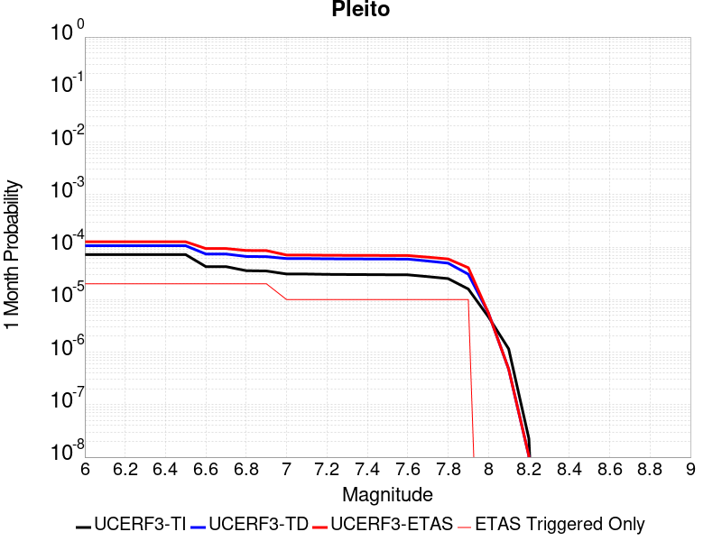 |  |  |

| Magnitude | 1 wk TI Prob | 1 wk TD Prob | 1 wk ETAS Prob | 1 wk ETAS/TD Gain | 1 wk ETAS Triggered Only | 1 mo TI Prob | 1 mo TD Prob | 1 mo ETAS Prob | 1 mo ETAS/TD Gain | 1 mo ETAS Triggered Only | 1 yr TI Prob | 1 yr TD Prob | 1 yr ETAS Prob | 1 yr ETAS/TD Gain | 1 yr ETAS Triggered Only | 10 yr TI Prob | 10 yr TD Prob | 10 yr ETAS Prob | 10 yr ETAS/TD Gain | 10 yr ETAS Triggered Only |
|-----|-----|-----|-----|-----|-----|-----|-----|-----|-----|-----|-----|-----|-----|-----|-----|-----|-----|-----|-----|-----|
| 6.0 | 1.6763008E-5 | 2.47705E-5 | 2.47705E-5 | 1.0 | 0.0 | 7.183948E-5 | 1.0615537E-4 | 1.2758932E-4 | 1.2019111 | 2.1436228E-5 | 8.742947E-4 | 0.0012917474 | 0.0013238603 | 1.02486 | 3.215434E-5 | 0.00870863 | 0.012957253 | 0.013010149 | 1.0040823 | 5.3590567E-5 |
| 6.1 | 1.6763008E-5 | 2.47705E-5 | 2.47705E-5 | 1.0 | 0.0 | 7.183948E-5 | 1.0615537E-4 | 1.2758932E-4 | 1.2019111 | 2.1436228E-5 | 8.742947E-4 | 0.0012917474 | 0.0013238603 | 1.02486 | 3.215434E-5 | 0.00870863 | 0.012957253 | 0.013010149 | 1.0040823 | 5.3590567E-5 |
| 6.2 | 1.6763008E-5 | 2.47705E-5 | 2.47705E-5 | 1.0 | 0.0 | 7.183948E-5 | 1.0615537E-4 | 1.2758932E-4 | 1.2019111 | 2.1436228E-5 | 8.742947E-4 | 0.0012917474 | 0.0013238603 | 1.02486 | 3.215434E-5 | 0.00870863 | 0.012957253 | 0.013010149 | 1.0040823 | 5.3590567E-5 |
| 6.3 | 1.6763008E-5 | 2.47705E-5 | 2.47705E-5 | 1.0 | 0.0 | 7.183948E-5 | 1.0615537E-4 | 1.2758932E-4 | 1.2019111 | 2.1436228E-5 | 8.742947E-4 | 0.0012917474 | 0.0013238603 | 1.02486 | 3.215434E-5 | 0.00870863 | 0.012957253 | 0.013010149 | 1.0040823 | 5.3590567E-5 |
| 6.4 | 1.6763008E-5 | 2.47705E-5 | 2.47705E-5 | 1.0 | 0.0 | 7.183948E-5 | 1.0615537E-4 | 1.2758932E-4 | 1.2019111 | 2.1436228E-5 | 8.742947E-4 | 0.0012917474 | 0.0013238603 | 1.02486 | 3.215434E-5 | 0.00870863 | 0.012957253 | 0.013010149 | 1.0040823 | 5.3590567E-5 |
| 6.5 | 1.6763008E-5 | 2.47705E-5 | 2.47705E-5 | 1.0 | 0.0 | 7.183948E-5 | 1.0615537E-4 | 1.2758932E-4 | 1.2019111 | 2.1436228E-5 | 8.742947E-4 | 0.0012917474 | 0.0013238603 | 1.02486 | 3.215434E-5 | 0.00870863 | 0.012957253 | 0.013010149 | 1.0040823 | 5.3590567E-5 |
| 6.6 | 9.910213E-6 | 1.7221182E-5 | 1.7221182E-5 | 1.0 | 0.0 | 4.247165E-5 | 7.3803E-5 | 9.523764E-5 | 1.2904305 | 2.1436228E-5 | 5.169696E-4 | 8.9818484E-4 | 9.303103E-4 | 1.0357671 | 3.215434E-5 | 0.0051576863 | 0.009054025 | 0.009085888 | 1.0035192 | 3.215434E-5 |
| 6.7 | 9.910213E-6 | 1.7221182E-5 | 1.7221182E-5 | 1.0 | 0.0 | 4.247165E-5 | 7.3803E-5 | 9.523764E-5 | 1.2904305 | 2.1436228E-5 | 5.169696E-4 | 8.9818484E-4 | 9.303103E-4 | 1.0357671 | 3.215434E-5 | 0.0051576863 | 0.009054025 | 0.009085888 | 1.0035192 | 3.215434E-5 |
| 6.8 | 8.300162E-6 | 1.5480773E-5 | 1.5480773E-5 | 1.0 | 0.0 | 3.557164E-5 | 6.634449E-5 | 8.777929E-5 | 1.3230834 | 2.1436228E-5 | 4.3299864E-4 | 8.0744625E-4 | 8.2886516E-4 | 1.0265267 | 2.1436228E-5 | 0.004321559 | 0.008153455 | 0.0081747165 | 1.0026077 | 2.1436228E-5 |
| 6.9 | 8.183114E-6 | 1.5351985E-5 | 1.5351985E-5 | 1.0 | 0.0 | 3.5070017E-5 | 6.579257E-5 | 8.722739E-5 | 1.3257939 | 2.1436228E-5 | 4.2689382E-4 | 8.007316E-4 | 8.221506E-4 | 1.0267494 | 2.1436228E-5 | 0.0042607468 | 0.008086799 | 0.008108062 | 1.0026293 | 2.1436228E-5 |
| 7.0 | 7.1748823E-6 | 1.4138895E-5 | 1.4138895E-5 | 1.0 | 0.0 | 3.0749135E-5 | 6.059386E-5 | 7.131132E-5 | 1.1768738 | 1.0718114E-5 | 3.743064E-4 | 7.3748105E-4 | 7.4819126E-4 | 1.0145227 | 1.0718114E-5 | 0.0037367654 | 0.0074582137 | 0.0074688517 | 1.0014263 | 1.0718114E-5 |
| 7.1 | 7.1671807E-6 | 1.4129264E-5 | 1.4129264E-5 | 1.0 | 0.0 | 3.0716128E-5 | 6.0552586E-5 | 7.127005E-5 | 1.1769943 | 1.0718114E-5 | 3.7390468E-4 | 7.369789E-4 | 7.476891E-4 | 1.0145326 | 1.0718114E-5 | 0.0037327618 | 0.007453226 | 0.0074638645 | 1.0014273 | 1.0718114E-5 |
| 7.2 | 7.0649667E-6 | 1.3976534E-5 | 1.3976534E-5 | 1.0 | 0.0 | 3.0278077E-5 | 5.989806E-5 | 7.061553E-5 | 1.1789285 | 1.0718114E-5 | 3.6857324E-4 | 7.290154E-4 | 7.3972566E-4 | 1.0146915 | 1.0718114E-5 | 0.0036796255 | 0.007373973 | 0.0073846118 | 1.0014428 | 1.0718114E-5 |
| 7.3 | 7.02082E-6 | 1.39199765E-5 | 1.39199765E-5 | 1.0 | 0.0 | 3.008888E-5 | 5.9655682E-5 | 7.037316E-5 | 1.1796556 | 1.0718114E-5 | 3.6627054E-4 | 7.260664E-4 | 7.3677674E-4 | 1.0147512 | 1.0718114E-5 | 0.0036566744 | 0.0073444657 | 0.007355105 | 1.0014486 | 1.0718114E-5 |
| 7.4 | 6.987146E-6 | 1.3879531E-5 | 1.3879531E-5 | 1.0 | 0.0 | 2.9944567E-5 | 5.948235E-5 | 7.019983E-5 | 1.1801791 | 1.0718114E-5 | 3.6451413E-4 | 7.239575E-4 | 7.346679E-4 | 1.0147942 | 1.0718114E-5 | 0.0036391679 | 0.007323398 | 0.007334037 | 1.0014528 | 1.0718114E-5 |
| 7.5 | 6.9494554E-6 | 1.3836431E-5 | 1.3836431E-5 | 1.0 | 0.0 | 2.9783041E-5 | 5.9297647E-5 | 7.001513E-5 | 1.1807404 | 1.0718114E-5 | 3.625482E-4 | 7.217102E-4 | 7.324206E-4 | 1.0148402 | 1.0718114E-5 | 0.0036195726 | 0.007301023 | 0.007311663 | 1.0014573 | 1.0718114E-5 |
| 7.6 | 6.92694E-6 | 1.3795536E-5 | 1.3795536E-5 | 1.0 | 0.0 | 2.9686547E-5 | 5.9122387E-5 | 6.9839865E-5 | 1.1812762 | 1.0718114E-5 | 3.6137376E-4 | 7.1957783E-4 | 7.302883E-4 | 1.0148842 | 1.0718114E-5 | 0.0036078666 | 0.0072797714 | 0.0072904117 | 1.0014616 | 1.0718114E-5 |
| 7.7 | 6.395867E-6 | 1.2674343E-5 | 1.2674343E-5 | 1.0 | 0.0 | 2.741057E-5 | 5.4317487E-5 | 6.503502E-5 | 1.1973127 | 1.0718114E-5 | 3.336726E-4 | 6.6111505E-4 | 6.7182607E-4 | 1.0162015 | 1.0718114E-5 | 0.0033317201 | 0.006698295 | 0.006708941 | 1.0015894 | 1.0718114E-5 |
| 7.8 | 5.8664327E-6 | 1.1541453E-5 | 1.1541453E-5 | 1.0 | 0.0 | 2.5141611E-5 | 4.9462433E-5 | 6.0180017E-5 | 1.2166812 | 1.0718114E-5 | 3.060561E-4 | 6.020389E-4 | 6.127506E-4 | 1.0177923 | 1.0718114E-5 | 0.0030563495 | 0.006103509 | 0.0061141616 | 1.0017453 | 1.0718114E-5 |
| 7.9 | 3.7167474E-6 | 7.1174723E-6 | 7.1174723E-6 | 1.0 | 0.0 | 1.592882E-5 | 3.0503097E-5 | 4.1220883E-5 | 1.3513671 | 1.0718114E-5 | 1.9391612E-4 | 3.7131205E-4 | 3.820262E-4 | 1.0288548 | 1.0718114E-5 | 0.0019374699 | 0.0037692138 | 0.0037798914 | 1.0028329 | 1.0718114E-5 |
| 8.0 | 1.0903841E-6 | 1.2886832E-6 | 1.2886832E-6 | 1.0 | 0.0 | 4.6730665E-6 | 5.522916E-6 | 5.522916E-6 | 1.0 | 0.0 | 5.68931E-5 | 6.723944E-5 | 6.723944E-5 | 1.0 | 0.0 | 5.6878536E-4 | 6.9458556E-4 | 6.9458556E-4 | 1.0 | 0.0 |
| 8.1 | 2.6894583E-7 | 1.1072907E-7 | 1.1072907E-7 | 1.0 | 0.0 | 1.1526245E-6 | 4.7455305E-7 | 4.7455305E-7 | 1.0 | 0.0 | 1.4033113E-5 | 5.7776683E-6 | 5.7776683E-6 | 1.0 | 0.0 | 1.4032227E-4 | 6.4639265E-5 | 6.4639265E-5 | 1.0 | 0.0 |
| 8.2 | 5.2967013E-9 | 2.4608289E-9 | 2.4608289E-9 | 1.0 | 0.0 | 2.2700148E-8 | 1.054641E-8 | 1.054641E-8 | 1.0 | 0.0 | 2.7637427E-7 | 1.2840253E-7 | 1.2840253E-7 | 1.0 | 0.0 | 2.7637393E-6 | 1.46096E-6 | 1.46096E-6 | 1.0 | 0.0 |

## Red Mountain
*[(top)](#table-of-contents)*

| 1 Week | 1 Month | 1 Year | 10 Year |
|-----|-----|-----|-----|
|  |  |  |  |

| Magnitude | 1 wk TI Prob | 1 wk TD Prob | 1 wk ETAS Prob | 1 wk ETAS/TD Gain | 1 wk ETAS Triggered Only | 1 mo TI Prob | 1 mo TD Prob | 1 mo ETAS Prob | 1 mo ETAS/TD Gain | 1 mo ETAS Triggered Only | 1 yr TI Prob | 1 yr TD Prob | 1 yr ETAS Prob | 1 yr ETAS/TD Gain | 1 yr ETAS Triggered Only | 10 yr TI Prob | 10 yr TD Prob | 10 yr ETAS Prob | 10 yr ETAS/TD Gain | 10 yr ETAS Triggered Only |
|-----|-----|-----|-----|-----|-----|-----|-----|-----|-----|-----|-----|-----|-----|-----|-----|-----|-----|-----|-----|-----|
| 6.0 | 4.1810763E-5 | 4.7591006E-5 | 4.7591006E-5 | 1.0 | 0.0 | 1.7917668E-4 | 2.0394645E-4 | 2.1466236E-4 | 1.0525428 | 1.0718114E-5 | 0.0021792934 | 0.0024803858 | 0.0025124603 | 1.0129313 | 3.215434E-5 | 0.021580452 | 0.02454463 | 0.02458645 | 1.0017039 | 4.2872456E-5 |
| 6.1 | 4.1810763E-5 | 4.7591006E-5 | 4.7591006E-5 | 1.0 | 0.0 | 1.7917668E-4 | 2.0394645E-4 | 2.1466236E-4 | 1.0525428 | 1.0718114E-5 | 0.0021792934 | 0.0024803858 | 0.0025124603 | 1.0129313 | 3.215434E-5 | 0.021580452 | 0.02454463 | 0.02458645 | 1.0017039 | 4.2872456E-5 |
| 6.2 | 4.1810763E-5 | 4.7591006E-5 | 4.7591006E-5 | 1.0 | 0.0 | 1.7917668E-4 | 2.0394645E-4 | 2.1466236E-4 | 1.0525428 | 1.0718114E-5 | 0.0021792934 | 0.0024803858 | 0.0025124603 | 1.0129313 | 3.215434E-5 | 0.021580452 | 0.02454463 | 0.02458645 | 1.0017039 | 4.2872456E-5 |
| 6.3 | 4.1810763E-5 | 4.7591006E-5 | 4.7591006E-5 | 1.0 | 0.0 | 1.7917668E-4 | 2.0394645E-4 | 2.1466236E-4 | 1.0525428 | 1.0718114E-5 | 0.0021792934 | 0.0024803858 | 0.0025124603 | 1.0129313 | 3.215434E-5 | 0.021580452 | 0.02454463 | 0.02458645 | 1.0017039 | 4.2872456E-5 |
| 6.4 | 4.1810763E-5 | 4.7591006E-5 | 4.7591006E-5 | 1.0 | 0.0 | 1.7917668E-4 | 2.0394645E-4 | 2.1466236E-4 | 1.0525428 | 1.0718114E-5 | 0.0021792934 | 0.0024803858 | 0.0025124603 | 1.0129313 | 3.215434E-5 | 0.021580452 | 0.02454463 | 0.02458645 | 1.0017039 | 4.2872456E-5 |
| 6.5 | 3.154503E-5 | 3.5360477E-5 | 3.5360477E-5 | 1.0 | 0.0 | 1.3518598E-4 | 1.5153662E-4 | 1.622531E-4 | 1.0707188 | 1.0718114E-5 | 0.0016446467 | 0.0018434891 | 0.0018755841 | 1.0174099 | 3.215434E-5 | 0.01632528 | 0.018291617 | 0.018333705 | 1.002301 | 4.2872456E-5 |
| 6.6 | 3.1535834E-5 | 3.5349858E-5 | 3.5349858E-5 | 1.0 | 0.0 | 1.3514658E-4 | 1.5149111E-4 | 1.6220761E-4 | 1.0707401 | 1.0718114E-5 | 0.0016441676 | 0.001842936 | 0.0018750312 | 1.0174152 | 3.215434E-5 | 0.01632056 | 0.018286178 | 0.018328266 | 1.0023017 | 4.2872456E-5 |
| 6.7 | 2.8267326E-5 | 3.146999E-5 | 3.146999E-5 | 1.0 | 0.0 | 1.2114006E-4 | 1.348649E-4 | 1.4558157E-4 | 1.0794623 | 1.0718114E-5 | 0.0014738824 | 0.0016408286 | 0.0016729301 | 1.0195643 | 3.215434E-5 | 0.014641452 | 0.016295899 | 0.016338073 | 1.002588 | 4.2872456E-5 |
| 6.8 | 2.8212884E-5 | 3.1407875E-5 | 3.1407875E-5 | 1.0 | 0.0 | 1.20906756E-4 | 1.3459871E-4 | 1.4531538E-4 | 1.0796194 | 1.0718114E-5 | 0.0014710457 | 0.0016375926 | 0.0016696943 | 1.019603 | 3.215434E-5 | 0.014613459 | 0.016264014 | 0.01630619 | 1.0025932 | 4.2872456E-5 |
| 6.9 | 2.4227871E-5 | 2.6707517E-5 | 2.6707517E-5 | 1.0 | 0.0 | 1.03829596E-4 | 1.1445619E-4 | 1.2517309E-4 | 1.093633 | 1.0718114E-5 | 0.0012633923 | 0.0013926893 | 0.0014247989 | 1.0230558 | 3.215434E-5 | 0.012562336 | 0.013847304 | 0.013889582 | 1.0030532 | 4.2872456E-5 |
| 7.0 | 2.348524E-5 | 2.5836282E-5 | 2.5836282E-5 | 1.0 | 0.0 | 1.0064714E-4 | 1.1072265E-4 | 1.21439574E-4 | 1.0967908 | 1.0718114E-5 | 0.0012246901 | 0.0013472902 | 0.0013794013 | 1.0238338 | 3.215434E-5 | 0.012179627 | 0.013398857 | 0.013441155 | 1.0031568 | 4.2872456E-5 |
| 7.1 | 2.2311642E-5 | 2.4463316E-5 | 2.4463316E-5 | 1.0 | 0.0 | 9.561782E-5 | 1.04839E-4 | 1.1555598E-4 | 1.1022233 | 1.0718114E-5 | 0.0011635252 | 0.0012757422 | 0.0013078555 | 1.0251722 | 3.215434E-5 | 0.01157452 | 0.012691703 | 0.012734031 | 1.0033351 | 4.2872456E-5 |
| 7.2 | 1.6533986E-5 | 1.7670676E-5 | 1.7670676E-5 | 1.0 | 0.0 | 7.085802E-5 | 7.572963E-5 | 8.644693E-5 | 1.1415206 | 1.0718114E-5 | 8.623549E-4 | 9.2168164E-4 | 9.4309816E-4 | 1.0232363 | 2.1436228E-5 | 0.008590161 | 0.009184869 | 0.009206109 | 1.0023124 | 2.1436228E-5 |
| 7.3 | 1.4703092E-5 | 1.5559806E-5 | 1.5559806E-5 | 1.0 | 0.0 | 6.301173E-5 | 6.6683526E-5 | 7.740093E-5 | 1.1607203 | 1.0718114E-5 | 7.668978E-4 | 8.1163115E-4 | 8.3305E-4 | 1.0263898 | 2.1436228E-5 | 0.0076425658 | 0.008092744 | 0.008114007 | 1.0026274 | 2.1436228E-5 |
| 7.4 | 6.1331984E-6 | 5.52893E-6 | 5.52893E-6 | 1.0 | 0.0 | 2.6284872E-5 | 2.3695204E-5 | 2.3695204E-5 | 1.0 | 0.0 | 3.199713E-4 | 2.8845144E-4 | 2.8845144E-4 | 1.0 | 0.0 | 0.0031951098 | 0.0028808247 | 0.0028808247 | 1.0 | 0.0 |
| 7.5 | 5.954766E-6 | 5.338558E-6 | 5.338558E-6 | 1.0 | 0.0 | 2.5520176E-5 | 2.2879336E-5 | 2.2879336E-5 | 1.0 | 0.0 | 3.1066386E-4 | 2.7852083E-4 | 2.7852083E-4 | 1.0 | 0.0 | 0.003102299 | 0.0027817716 | 0.0027817716 | 1.0 | 0.0 |
| 7.6 | 4.9726646E-6 | 4.315341E-6 | 4.315341E-6 | 1.0 | 0.0 | 2.1311245E-5 | 1.8494187E-5 | 1.8494187E-5 | 1.0 | 0.0 | 2.5943352E-4 | 2.2514381E-4 | 2.2514381E-4 | 1.0 | 0.0 | 0.0025913084 | 0.0022491917 | 0.0022491917 | 1.0 | 0.0 |
| 7.7 | 3.3613894E-6 | 2.8526943E-6 | 2.8526943E-6 | 1.0 | 0.0 | 1.4405875E-5 | 1.2225777E-5 | 1.2225777E-5 | 1.0 | 0.0 | 1.7537741E-4 | 1.4883894E-4 | 1.4883894E-4 | 1.0 | 0.0 | 0.0017523908 | 0.0014874188 | 0.0014874188 | 1.0 | 0.0 |
| 7.8 | 1.1828961E-6 | 1.0122844E-6 | 1.0122844E-6 | 1.0 | 0.0 | 5.069545E-6 | 4.338355E-6 | 4.338355E-6 | 1.0 | 0.0 | 6.171996E-5 | 5.281822E-5 | 5.281822E-5 | 1.0 | 0.0 | 6.170282E-4 | 5.280596E-4 | 5.280596E-4 | 1.0 | 0.0 |
| 7.9 | 2.2967266E-7 | 1.8619119E-7 | 1.8619119E-7 | 1.0 | 0.0 | 9.843111E-7 | 7.9796195E-7 | 7.9796195E-7 | 1.0 | 0.0 | 1.19839215E-5 | 9.715147E-6 | 9.715147E-6 | 1.0 | 0.0 | 1.1983275E-4 | 9.714751E-5 | 9.714751E-5 | 1.0 | 0.0 |

## San Jacinto (Lytle Creek connector)
*[(top)](#table-of-contents)*

| 1 Week | 1 Month | 1 Year | 10 Year |
|-----|-----|-----|-----|
|  |  | 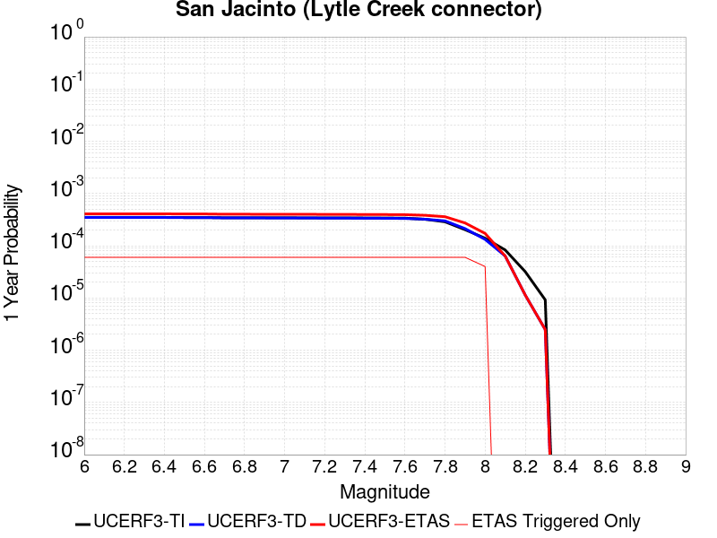 |  |

| Magnitude | 1 wk TI Prob | 1 wk TD Prob | 1 wk ETAS Prob | 1 wk ETAS/TD Gain | 1 wk ETAS Triggered Only | 1 mo TI Prob | 1 mo TD Prob | 1 mo ETAS Prob | 1 mo ETAS/TD Gain | 1 mo ETAS Triggered Only | 1 yr TI Prob | 1 yr TD Prob | 1 yr ETAS Prob | 1 yr ETAS/TD Gain | 1 yr ETAS Triggered Only | 10 yr TI Prob | 10 yr TD Prob | 10 yr ETAS Prob | 10 yr ETAS/TD Gain | 10 yr ETAS Triggered Only |
|-----|-----|-----|-----|-----|-----|-----|-----|-----|-----|-----|-----|-----|-----|-----|-----|-----|-----|-----|-----|-----|
| 6.0 | 6.693995E-6 | 6.662972E-6 | 2.8099057E-5 | 4.2171955 | 2.1436228E-5 | 2.8688235E-5 | 2.8555281E-5 | 6.0708702E-5 | 2.1260061 | 3.215434E-5 | 3.492233E-4 | 3.4760518E-4 | 4.0117712E-4 | 1.1541172 | 5.3590567E-5 | 0.00348675 | 0.0035508168 | 0.0036042172 | 1.0150388 | 5.3590567E-5 |
| 6.1 | 6.693995E-6 | 6.662972E-6 | 2.8099057E-5 | 4.2171955 | 2.1436228E-5 | 2.8688235E-5 | 2.8555281E-5 | 6.0708702E-5 | 2.1260061 | 3.215434E-5 | 3.492233E-4 | 3.4760518E-4 | 4.0117712E-4 | 1.1541172 | 5.3590567E-5 | 0.00348675 | 0.0035508168 | 0.0036042172 | 1.0150388 | 5.3590567E-5 |
| 6.2 | 6.693995E-6 | 6.662972E-6 | 2.8099057E-5 | 4.2171955 | 2.1436228E-5 | 2.8688235E-5 | 2.8555281E-5 | 6.0708702E-5 | 2.1260061 | 3.215434E-5 | 3.492233E-4 | 3.4760518E-4 | 4.0117712E-4 | 1.1541172 | 5.3590567E-5 | 0.00348675 | 0.0035508168 | 0.0036042172 | 1.0150388 | 5.3590567E-5 |
| 6.3 | 6.693995E-6 | 6.662972E-6 | 2.8099057E-5 | 4.2171955 | 2.1436228E-5 | 2.8688235E-5 | 2.8555281E-5 | 6.0708702E-5 | 2.1260061 | 3.215434E-5 | 3.492233E-4 | 3.4760518E-4 | 4.0117712E-4 | 1.1541172 | 5.3590567E-5 | 0.00348675 | 0.0035508168 | 0.0036042172 | 1.0150388 | 5.3590567E-5 |
| 6.4 | 6.693995E-6 | 6.662972E-6 | 2.8099057E-5 | 4.2171955 | 2.1436228E-5 | 2.8688235E-5 | 2.8555281E-5 | 6.0708702E-5 | 2.1260061 | 3.215434E-5 | 3.492233E-4 | 3.4760518E-4 | 4.0117712E-4 | 1.1541172 | 5.3590567E-5 | 0.00348675 | 0.0035508168 | 0.0036042172 | 1.0150388 | 5.3590567E-5 |
| 6.5 | 6.6561875E-6 | 6.6231896E-6 | 2.8059274E-5 | 4.23652 | 2.1436228E-5 | 2.8526205E-5 | 2.838479E-5 | 6.053822E-5 | 2.1327696 | 3.215434E-5 | 3.472512E-4 | 3.455301E-4 | 3.9910214E-4 | 1.1550431 | 5.3590567E-5 | 0.0034670907 | 0.0035301324 | 0.0035835337 | 1.0151273 | 5.3590567E-5 |
| 6.6 | 6.6561875E-6 | 6.6231896E-6 | 2.8059274E-5 | 4.23652 | 2.1436228E-5 | 2.8526205E-5 | 2.838479E-5 | 6.053822E-5 | 2.1327696 | 3.215434E-5 | 3.472512E-4 | 3.455301E-4 | 3.9910214E-4 | 1.1550431 | 5.3590567E-5 | 0.0034670907 | 0.0035301324 | 0.0035835337 | 1.0151273 | 5.3590567E-5 |
| 6.7 | 6.5802237E-6 | 6.5423656E-6 | 2.7978453E-5 | 4.276504 | 2.1436228E-5 | 2.8200653E-5 | 2.803841E-5 | 6.0191847E-5 | 2.146764 | 3.215434E-5 | 3.4328885E-4 | 3.4131424E-4 | 3.948865E-4 | 1.1569588 | 5.3590567E-5 | 0.0034275902 | 0.0034881064 | 0.00354151 | 1.0153102 | 5.3590567E-5 |
| 6.8 | 6.575632E-6 | 6.5368554E-6 | 2.7972943E-5 | 4.279266 | 2.1436228E-5 | 2.8180975E-5 | 2.8014794E-5 | 6.0168233E-5 | 2.1477308 | 3.215434E-5 | 3.4304935E-4 | 3.410268E-4 | 3.945991E-4 | 1.1570911 | 5.3590567E-5 | 0.0034252026 | 0.0034852412 | 0.0035386449 | 1.0153228 | 5.3590567E-5 |
| 6.9 | 6.570433E-6 | 6.528249E-6 | 2.7964335E-5 | 4.283589 | 2.1436228E-5 | 2.8158694E-5 | 2.797791E-5 | 6.013135E-5 | 2.1492438 | 3.215434E-5 | 3.4277816E-4 | 3.4057788E-4 | 3.941502E-4 | 1.1572983 | 5.3590567E-5 | 0.0034224992 | 0.003480766 | 0.00353417 | 1.0153426 | 5.3590567E-5 |
| 7.0 | 6.5643826E-6 | 6.5183694E-6 | 2.7954457E-5 | 4.2885656 | 2.1436228E-5 | 2.8132765E-5 | 2.7935572E-5 | 6.0089013E-5 | 2.1509857 | 3.215434E-5 | 3.424626E-4 | 3.4006257E-4 | 3.9363492E-4 | 1.1575367 | 5.3590567E-5 | 0.0034193532 | 0.003475629 | 0.0035290334 | 1.0153654 | 5.3590567E-5 |
| 7.1 | 6.557402E-6 | 6.5070813E-6 | 2.7943168E-5 | 4.294271 | 2.1436228E-5 | 2.8102848E-5 | 2.7887192E-5 | 6.0040635E-5 | 2.1529825 | 3.215434E-5 | 3.4209844E-4 | 3.3947374E-4 | 3.9304612E-4 | 1.1578101 | 5.3590567E-5 | 0.0034157229 | 0.0034697603 | 0.003523165 | 1.0153915 | 5.3590567E-5 |
| 7.2 | 6.546394E-6 | 6.489047E-6 | 2.7925134E-5 | 4.3034263 | 2.1436228E-5 | 2.8055672E-5 | 2.7809905E-5 | 5.996335E-5 | 2.1561868 | 3.215434E-5 | 3.4152428E-4 | 3.3853305E-4 | 3.921055E-4 | 1.1582488 | 5.3590567E-5 | 0.0034099987 | 0.003460387 | 0.003513792 | 1.0154333 | 5.3590567E-5 |
| 7.3 | 6.5364216E-6 | 6.469831E-6 | 2.790592E-5 | 4.3132377 | 2.1436228E-5 | 2.8012933E-5 | 2.7727552E-5 | 5.9881E-5 | 2.159621 | 3.215434E-5 | 3.4100408E-4 | 3.3753074E-4 | 3.911032E-4 | 1.1587188 | 5.3590567E-5 | 0.003404813 | 0.0034504079 | 0.0035038134 | 1.015478 | 5.3590567E-5 |
| 7.4 | 6.5269523E-6 | 6.4509163E-6 | 2.7887005E-5 | 4.3229527 | 2.1436228E-5 | 2.7972354E-5 | 2.764649E-5 | 5.9799942E-5 | 2.163021 | 3.215434E-5 | 3.4051016E-4 | 3.3654412E-4 | 3.9011665E-4 | 1.1591843 | 5.3590567E-5 | 0.0033998888 | 0.003440589 | 0.0034939952 | 1.0155224 | 5.3590567E-5 |
| 7.5 | 6.5111835E-6 | 6.4271885E-6 | 2.7863278E-5 | 4.3352203 | 2.1436228E-5 | 2.7904773E-5 | 2.7544802E-5 | 5.9698257E-5 | 2.1673148 | 3.215434E-5 | 3.3968766E-4 | 3.3530645E-4 | 3.8887904E-4 | 1.159772 | 5.3590567E-5 | 0.0033916887 | 0.003428261 | 0.003481668 | 1.0155784 | 5.3590567E-5 |
| 7.6 | 6.4768806E-6 | 6.3862944E-6 | 2.7822385E-5 | 4.3565774 | 2.1436228E-5 | 2.7757764E-5 | 2.7369546E-5 | 5.952301E-5 | 2.1747897 | 3.215434E-5 | 3.3789838E-4 | 3.3317335E-4 | 3.8674605E-4 | 1.1607953 | 5.3590567E-5 | 0.0033738504 | 0.0034069915 | 0.0034603996 | 1.015676 | 5.3590567E-5 |
| 7.7 | 6.1655364E-6 | 6.1787587E-6 | 2.7614853E-5 | 4.469321 | 2.1436228E-5 | 2.642346E-5 | 2.6480126E-5 | 5.8633614E-5 | 2.2142498 | 3.215434E-5 | 3.2165812E-4 | 3.2234789E-4 | 3.759212E-4 | 1.1661972 | 5.3590567E-5 | 0.0032119295 | 0.003298596 | 0.0033520097 | 1.0161929 | 5.3590567E-5 |
| 7.8 | 5.5043524E-6 | 5.7397438E-6 | 2.7175847E-5 | 4.7346797 | 2.1436228E-5 | 2.3589868E-5 | 2.459867E-5 | 5.6752222E-5 | 2.3071256 | 3.215434E-5 | 2.871688E-4 | 2.994477E-4 | 3.5302225E-4 | 1.1789111 | 5.3590567E-5 | 0.0028679797 | 0.0030686588 | 0.003122085 | 1.0174103 | 5.3590567E-5 |
| 7.9 | 3.889249E-6 | 4.0789296E-6 | 2.551507E-5 | 6.255335 | 2.1436228E-5 | 1.6668104E-5 | 1.748101E-5 | 4.963479E-5 | 2.8393548 | 3.215434E-5 | 2.0291525E-4 | 2.1281054E-4 | 2.6638972E-4 | 1.2517693 | 5.3590567E-5 | 0.0020273007 | 0.0021954647 | 0.0022489377 | 1.0243561 | 5.3590567E-5 |
| 8.0 | 2.668535E-6 | 2.5329996E-6 | 1.3251086E-5 | 5.231381 | 1.0718114E-5 | 1.1436528E-5 | 1.0855668E-5 | 3.2291664E-5 | 2.974636 | 2.1436228E-5 | 1.3923083E-4 | 1.3215977E-4 | 1.7502655E-4 | 1.3243558 | 4.2872456E-5 | 0.0013914363 | 0.0013765821 | 0.0014193956 | 1.0311012 | 4.2872456E-5 |
| 8.1 | 1.5911459E-6 | 1.2194711E-6 | 1.2194711E-6 | 1.0 | 0.0 | 6.8191785E-6 | 5.226294E-6 | 5.226294E-6 | 1.0 | 0.0 | 8.3020335E-5 | 6.362829E-5 | 6.362829E-5 | 1.0 | 0.0 | 8.298933E-4 | 6.6975754E-4 | 6.6975754E-4 | 1.0 | 0.0 |
| 8.2 | 6.1294963E-7 | 2.1835329E-7 | 2.1835329E-7 | 1.0 | 0.0 | 2.6269242E-6 | 9.357995E-7 | 9.357995E-7 | 1.0 | 0.0 | 3.1982334E-5 | 1.1393299E-5 | 1.1393299E-5 | 1.0 | 0.0 | 3.1977732E-4 | 1.2797497E-4 | 1.2797497E-4 | 1.0 | 0.0 |
| 8.3 | 1.762871E-7 | 4.7604622E-8 | 4.7604622E-8 | 1.0 | 0.0 | 7.5551594E-7 | 2.0401978E-7 | 2.0401978E-7 | 1.0 | 0.0 | 9.1983675E-6 | 2.4839383E-6 | 2.4839383E-6 | 1.0 | 0.0 | 9.197987E-5 | 2.8720697E-5 | 2.8720697E-5 | 1.0 | 0.0 |

## Bullion Mountains
*[(top)](#table-of-contents)*

| 1 Week | 1 Month | 1 Year | 10 Year |
|-----|-----|-----|-----|
|  |  |  |  |

| Magnitude | 1 wk TI Prob | 1 wk TD Prob | 1 wk ETAS Prob | 1 wk ETAS/TD Gain | 1 wk ETAS Triggered Only | 1 mo TI Prob | 1 mo TD Prob | 1 mo ETAS Prob | 1 mo ETAS/TD Gain | 1 mo ETAS Triggered Only | 1 yr TI Prob | 1 yr TD Prob | 1 yr ETAS Prob | 1 yr ETAS/TD Gain | 1 yr ETAS Triggered Only | 10 yr TI Prob | 10 yr TD Prob | 10 yr ETAS Prob | 10 yr ETAS/TD Gain | 10 yr ETAS Triggered Only |
|-----|-----|-----|-----|-----|-----|-----|-----|-----|-----|-----|-----|-----|-----|-----|-----|-----|-----|-----|-----|-----|
| 6.0 | 1.6420427E-5 | 1.4692306E-5 | 1.4692306E-5 | 1.0 | 0.0 | 7.037136E-5 | 6.296572E-5 | 6.296572E-5 | 1.0 | 0.0 | 8.5643446E-4 | 7.663764E-4 | 7.985061E-4 | 1.0419241 | 3.215434E-5 | 0.008531413 | 0.0076411283 | 0.007683673 | 1.0055679 | 4.2872456E-5 |
| 6.1 | 1.6420427E-5 | 1.4692306E-5 | 1.4692306E-5 | 1.0 | 0.0 | 7.037136E-5 | 6.296572E-5 | 6.296572E-5 | 1.0 | 0.0 | 8.5643446E-4 | 7.663764E-4 | 7.985061E-4 | 1.0419241 | 3.215434E-5 | 0.008531413 | 0.0076411283 | 0.007683673 | 1.0055679 | 4.2872456E-5 |
| 6.2 | 1.6420427E-5 | 1.4692306E-5 | 1.4692306E-5 | 1.0 | 0.0 | 7.037136E-5 | 6.296572E-5 | 6.296572E-5 | 1.0 | 0.0 | 8.5643446E-4 | 7.663764E-4 | 7.985061E-4 | 1.0419241 | 3.215434E-5 | 0.008531413 | 0.0076411283 | 0.007683673 | 1.0055679 | 4.2872456E-5 |
| 6.3 | 1.2046778E-5 | 9.862485E-6 | 9.862485E-6 | 1.0 | 0.0 | 5.1628023E-5 | 4.226724E-5 | 4.226724E-5 | 1.0 | 0.0 | 6.283899E-4 | 5.145053E-4 | 5.466431E-4 | 1.0624635 | 3.215434E-5 | 0.0062661595 | 0.0051354226 | 0.005178075 | 1.0083055 | 4.2872456E-5 |
| 6.4 | 1.2046778E-5 | 9.862485E-6 | 9.862485E-6 | 1.0 | 0.0 | 5.1628023E-5 | 4.226724E-5 | 4.226724E-5 | 1.0 | 0.0 | 6.283899E-4 | 5.145053E-4 | 5.466431E-4 | 1.0624635 | 3.215434E-5 | 0.0062661595 | 0.0051354226 | 0.005178075 | 1.0083055 | 4.2872456E-5 |
| 6.5 | 1.0244343E-5 | 7.879582E-6 | 7.879582E-6 | 1.0 | 0.0 | 4.390359E-5 | 3.3769316E-5 | 3.3769316E-5 | 1.0 | 0.0 | 5.343951E-4 | 4.1108453E-4 | 4.3251194E-4 | 1.0521241 | 2.1436228E-5 | 0.005331118 | 0.0041052722 | 0.0041372944 | 1.0078003 | 3.215434E-5 |
| 6.6 | 9.605408E-6 | 7.1776108E-6 | 7.1776108E-6 | 1.0 | 0.0 | 4.1165385E-5 | 3.076094E-5 | 3.076094E-5 | 1.0 | 0.0 | 5.010733E-4 | 3.7447043E-4 | 3.9589865E-4 | 1.0572227 | 2.1436228E-5 | 0.00499945 | 0.0037403915 | 0.0037724255 | 1.0085644 | 3.215434E-5 |
| 6.7 | 8.60418E-6 | 6.1241044E-6 | 6.1241044E-6 | 1.0 | 0.0 | 3.687454E-5 | 2.6246007E-5 | 2.6246007E-5 | 1.0 | 0.0 | 4.48855E-4 | 3.1951777E-4 | 3.3023246E-4 | 1.0335339 | 1.0718114E-5 | 0.004479495 | 0.0031924958 | 0.0032138636 | 1.0066931 | 2.1436228E-5 |
| 6.8 | 5.187994E-6 | 2.5632194E-6 | 2.5632194E-6 | 1.0 | 0.0 | 2.223407E-5 | 1.0985203E-5 | 1.0985203E-5 | 1.0 | 0.0 | 2.7066618E-4 | 1.3374063E-4 | 1.444573E-4 | 1.0801303 | 1.0718114E-5 | 0.0027033675 | 0.001336993 | 0.0013476968 | 1.0080059 | 1.0718114E-5 |
| 6.9 | 4.5302368E-6 | 2.3443622E-6 | 2.3443622E-6 | 1.0 | 0.0 | 1.9415156E-5 | 1.0047251E-5 | 1.0047251E-5 | 1.0 | 0.0 | 2.3635388E-4 | 1.2232238E-4 | 1.3303918E-4 | 1.0876111 | 1.0718114E-5 | 0.0023610266 | 0.0012229396 | 0.0012336446 | 1.0087535 | 1.0718114E-5 |
| 7.0 | 3.431668E-6 | 1.6882757E-6 | 1.6882757E-6 | 1.0 | 0.0 | 1.4707065E-5 | 7.2354674E-6 | 7.2354674E-6 | 1.0 | 0.0 | 1.7904381E-4 | 8.8091816E-5 | 9.880898E-5 | 1.121659 | 1.0718114E-5 | 0.0017889962 | 8.809181E-4 | 8.916268E-4 | 1.0121562 | 1.0718114E-5 |

## Big Pine (East)
*[(top)](#table-of-contents)*

| 1 Week | 1 Month | 1 Year | 10 Year |
|-----|-----|-----|-----|
|  |  |  |  |

| Magnitude | 1 wk TI Prob | 1 wk TD Prob | 1 wk ETAS Prob | 1 wk ETAS/TD Gain | 1 wk ETAS Triggered Only | 1 mo TI Prob | 1 mo TD Prob | 1 mo ETAS Prob | 1 mo ETAS/TD Gain | 1 mo ETAS Triggered Only | 1 yr TI Prob | 1 yr TD Prob | 1 yr ETAS Prob | 1 yr ETAS/TD Gain | 1 yr ETAS Triggered Only | 10 yr TI Prob | 10 yr TD Prob | 10 yr ETAS Prob | 10 yr ETAS/TD Gain | 10 yr ETAS Triggered Only |
|-----|-----|-----|-----|-----|-----|-----|-----|-----|-----|-----|-----|-----|-----|-----|-----|-----|-----|-----|-----|-----|
| 6.0 | 9.916913E-6 | 1.2818231E-5 | 1.2818231E-5 | 1.0 | 0.0 | 4.250036E-5 | 5.4934244E-5 | 5.4934244E-5 | 1.0 | 0.0 | 5.173191E-4 | 6.686413E-4 | 6.686413E-4 | 1.0 | 0.0 | 0.0051611643 | 0.0066710766 | 0.006713663 | 1.0063838 | 4.2872456E-5 |
| 6.1 | 9.916913E-6 | 1.2818231E-5 | 1.2818231E-5 | 1.0 | 0.0 | 4.250036E-5 | 5.4934244E-5 | 5.4934244E-5 | 1.0 | 0.0 | 5.173191E-4 | 6.686413E-4 | 6.686413E-4 | 1.0 | 0.0 | 0.0051611643 | 0.0066710766 | 0.006713663 | 1.0063838 | 4.2872456E-5 |
| 6.2 | 9.916913E-6 | 1.2818231E-5 | 1.2818231E-5 | 1.0 | 0.0 | 4.250036E-5 | 5.4934244E-5 | 5.4934244E-5 | 1.0 | 0.0 | 5.173191E-4 | 6.686413E-4 | 6.686413E-4 | 1.0 | 0.0 | 0.0051611643 | 0.0066710766 | 0.006713663 | 1.0063838 | 4.2872456E-5 |
| 6.3 | 5.479711E-6 | 8.114161E-6 | 8.114161E-6 | 1.0 | 0.0 | 2.3484265E-5 | 3.4774526E-5 | 3.4774526E-5 | 1.0 | 0.0 | 2.858834E-4 | 4.233008E-4 | 4.233008E-4 | 1.0 | 0.0 | 0.0028551589 | 0.0042278613 | 0.004270552 | 1.0100976 | 4.2872456E-5 |
| 6.4 | 5.465009E-6 | 8.098454E-6 | 8.098454E-6 | 1.0 | 0.0 | 2.3421257E-5 | 3.4707216E-5 | 3.4707216E-5 | 1.0 | 0.0 | 2.851165E-4 | 4.224816E-4 | 4.224816E-4 | 1.0 | 0.0 | 0.0028475097 | 0.0042197 | 0.004262392 | 1.0101172 | 4.2872456E-5 |
| 6.5 | 4.826767E-6 | 7.423505E-6 | 7.423505E-6 | 1.0 | 0.0 | 2.068598E-5 | 3.181465E-5 | 3.181465E-5 | 1.0 | 0.0 | 2.518227E-4 | 3.8727728E-4 | 3.8727728E-4 | 1.0 | 0.0 | 0.0025153751 | 0.003868898 | 0.003900928 | 1.0082788 | 3.215434E-5 |
| 6.6 | 4.3146847E-6 | 6.883437E-6 | 6.883437E-6 | 1.0 | 0.0 | 1.8491375E-5 | 2.9500125E-5 | 2.9500125E-5 | 1.0 | 0.0 | 2.2510924E-4 | 3.5910727E-4 | 3.5910727E-4 | 1.0 | 0.0 | 0.0022488134 | 0.0035881116 | 0.0036201507 | 1.0089293 | 3.215434E-5 |
| 6.7 | 3.6968106E-6 | 5.9966014E-6 | 5.9966014E-6 | 1.0 | 0.0 | 1.5843378E-5 | 2.5699477E-5 | 2.5699477E-5 | 1.0 | 0.0 | 1.9287605E-4 | 3.1284773E-4 | 3.1284773E-4 | 1.0 | 0.0 | 0.0019270873 | 0.003126825 | 0.0031481942 | 1.0068341 | 2.1436228E-5 |
| 6.8 | 3.4671132E-6 | 5.7032753E-6 | 5.7032753E-6 | 1.0 | 0.0 | 1.4858972E-5 | 2.4442388E-5 | 2.4442388E-5 | 1.0 | 0.0 | 1.8089297E-4 | 2.9754688E-4 | 2.9754688E-4 | 1.0 | 0.0 | 0.0018074579 | 0.002974228 | 0.0029956005 | 1.0071859 | 2.1436228E-5 |
| 6.9 | 2.7686972E-6 | 4.8262373E-6 | 4.8262373E-6 | 1.0 | 0.0 | 1.1865792E-5 | 2.0683714E-5 | 2.0683714E-5 | 1.0 | 0.0 | 1.4445644E-4 | 2.5179586E-4 | 2.5179586E-4 | 1.0 | 0.0 | 0.0014436257 | 0.002517781 | 0.0025391632 | 1.0084925 | 2.1436228E-5 |
| 7.0 | 2.1472624E-6 | 3.985962E-6 | 3.985962E-6 | 1.0 | 0.0 | 9.20252E-6 | 1.7082584E-5 | 1.7082584E-5 | 1.0 | 0.0 | 1.12034926E-4 | 2.0796116E-4 | 2.0796116E-4 | 1.0 | 0.0 | 0.0011197845 | 0.0020803085 | 0.0020910043 | 1.0051415 | 1.0718114E-5 |
| 7.1 | 1.7018335E-6 | 3.3457143E-6 | 3.3457143E-6 | 1.0 | 0.0 | 7.293552E-6 | 1.4338699E-5 | 1.4338699E-5 | 1.0 | 0.0 | 8.879537E-5 | 1.7456003E-4 | 1.7456003E-4 | 1.0 | 0.0 | 8.87599E-4 | 0.0017468405 | 0.0017468405 | 1.0 | 0.0 |
| 7.2 | 1.25603E-6 | 2.795276E-6 | 2.795276E-6 | 1.0 | 0.0 | 5.3829745E-6 | 1.19797005E-5 | 1.19797005E-5 | 1.0 | 0.0 | 6.553574E-5 | 1.4584333E-4 | 1.4584333E-4 | 1.0 | 0.0 | 6.551642E-4 | 0.001460063 | 0.001460063 | 1.0 | 0.0 |
| 7.3 | 1.112297E-6 | 2.6110797E-6 | 2.6110797E-6 | 1.0 | 0.0 | 4.7669787E-6 | 1.11902955E-5 | 1.11902955E-5 | 1.0 | 0.0 | 5.803642E-5 | 1.3623355E-4 | 1.3623355E-4 | 1.0 | 0.0 | 5.802127E-4 | 0.0013639197 | 0.0013639197 | 1.0 | 0.0 |
| 7.4 | 1.0137181E-6 | 2.4842075E-6 | 2.4842075E-6 | 1.0 | 0.0 | 4.3444993E-6 | 1.0646561E-5 | 1.0646561E-5 | 1.0 | 0.0 | 5.2892992E-5 | 1.2961439E-4 | 1.2961439E-4 | 1.0 | 0.0 | 5.288041E-4 | 0.0012975911 | 0.0012975911 | 1.0 | 0.0 |
| 7.5 | 9.598608E-7 | 2.4078427E-6 | 2.4078427E-6 | 1.0 | 0.0 | 4.1136827E-6 | 1.0319286E-5 | 1.0319286E-5 | 1.0 | 0.0 | 5.0082934E-5 | 1.2563028E-4 | 1.2563028E-4 | 1.0 | 0.0 | 5.007165E-4 | 0.0012576039 | 0.0012576039 | 1.0 | 0.0 |
| 7.6 | 7.929459E-7 | 2.0454722E-6 | 2.0454722E-6 | 1.0 | 0.0 | 3.3983351E-6 | 8.766281E-6 | 8.766281E-6 | 1.0 | 0.0 | 4.1373947E-5 | 1.06724416E-4 | 1.06724416E-4 | 1.0 | 0.0 | 4.1366243E-4 | 0.0010688324 | 0.0010688324 | 1.0 | 0.0 |
| 7.7 | 4.155788E-7 | 1.1609936E-6 | 1.1609936E-6 | 1.0 | 0.0 | 1.7810507E-6 | 4.975678E-6 | 4.975678E-6 | 1.0 | 0.0 | 2.1684076E-5 | 6.0577237E-5 | 6.0577237E-5 | 1.0 | 0.0 | 2.1681961E-4 | 6.087925E-4 | 6.087925E-4 | 1.0 | 0.0 |
| 7.8 | 1.14666925E-7 | 2.5929913E-7 | 2.5929913E-7 | 1.0 | 0.0 | 4.914296E-7 | 1.1112816E-6 | 1.1112816E-6 | 1.0 | 0.0 | 5.9831386E-6 | 1.3529773E-5 | 1.3529773E-5 | 1.0 | 0.0 | 5.9829777E-5 | 1.3639126E-4 | 1.3639126E-4 | 1.0 | 0.0 |
| 7.9 | 2.9231824E-8 | 4.148024E-8 | 4.148024E-8 | 1.0 | 0.0 | 1.2527924E-7 | 1.7777246E-7 | 1.7777246E-7 | 1.0 | 0.0 | 1.5252737E-6 | 2.1643777E-6 | 2.1643777E-6 | 1.0 | 0.0 | 1.5252632E-5 | 2.1976275E-5 | 2.1976275E-5 | 1.0 | 0.0 |

## Great Valley 09 (Laguna Seca)
*[(top)](#table-of-contents)*

| 1 Week | 1 Month | 1 Year | 10 Year |
|-----|-----|-----|-----|
|  |  |  |  |

| Magnitude | 1 wk TI Prob | 1 wk TD Prob | 1 wk ETAS Prob | 1 wk ETAS/TD Gain | 1 wk ETAS Triggered Only | 1 mo TI Prob | 1 mo TD Prob | 1 mo ETAS Prob | 1 mo ETAS/TD Gain | 1 mo ETAS Triggered Only | 1 yr TI Prob | 1 yr TD Prob | 1 yr ETAS Prob | 1 yr ETAS/TD Gain | 1 yr ETAS Triggered Only | 10 yr TI Prob | 10 yr TD Prob | 10 yr ETAS Prob | 10 yr ETAS/TD Gain | 10 yr ETAS Triggered Only |
|-----|-----|-----|-----|-----|-----|-----|-----|-----|-----|-----|-----|-----|-----|-----|-----|-----|-----|-----|-----|-----|
| 6.0 | 5.4353277E-5 | 7.050538E-5 | 7.050538E-5 | 1.0 | 0.0 | 2.3292181E-4 | 3.0212724E-4 | 3.0212724E-4 | 1.0 | 0.0 | 0.0028321352 | 0.003672335 | 0.0037150502 | 1.0116316 | 4.2872456E-5 | 0.02796312 | 0.036116913 | 0.036158234 | 1.0011442 | 4.2872456E-5 |
| 6.1 | 4.5578287E-5 | 5.822371E-5 | 5.822371E-5 | 1.0 | 0.0 | 1.953209E-4 | 2.49502E-4 | 2.49502E-4 | 1.0 | 0.0 | 0.0023754383 | 0.0030335493 | 0.003065606 | 1.0105674 | 3.215434E-5 | 0.023502063 | 0.029920705 | 0.029951897 | 1.0010425 | 3.215434E-5 |
| 6.2 | 2.8536782E-5 | 3.47386E-5 | 3.47386E-5 | 1.0 | 0.0 | 1.2229476E-4 | 1.488658E-4 | 1.488658E-4 | 1.0 | 0.0 | 0.0014879217 | 0.0018108767 | 0.001832274 | 1.011816 | 2.1436228E-5 | 0.014779986 | 0.017958745 | 0.017979797 | 1.0011722 | 2.1436228E-5 |
| 6.3 | 2.3698774E-5 | 2.8214314E-5 | 2.8214314E-5 | 1.0 | 0.0 | 1.01562226E-4 | 1.2090732E-4 | 1.2090732E-4 | 1.0 | 0.0 | 0.0012358186 | 0.0014710726 | 0.0014924771 | 1.0145504 | 2.1436228E-5 | 0.012289686 | 0.014611831 | 0.014632953 | 1.0014457 | 2.1436228E-5 |
| 6.4 | 1.9191197E-5 | 2.2123912E-5 | 2.2123912E-5 | 1.0 | 0.0 | 8.2245395E-5 | 9.480767E-5 | 9.480767E-5 | 1.0 | 0.0 | 0.0010008777 | 0.0011536786 | 0.0011750901 | 1.0185593 | 2.1436228E-5 | 0.009963818 | 0.011477305 | 0.011498495 | 1.0018463 | 2.1436228E-5 |
| 6.5 | 1.5203241E-5 | 1.680269E-5 | 1.680269E-5 | 1.0 | 0.0 | 6.5155116E-5 | 7.200383E-5 | 7.200383E-5 | 1.0 | 0.0 | 7.9297484E-4 | 8.7628904E-4 | 8.977065E-4 | 1.0244411 | 2.1436228E-5 | 0.007901512 | 0.008729759 | 0.008751009 | 1.0024341 | 2.1436228E-5 |
| 6.6 | 1.0984925E-5 | 1.1242844E-5 | 1.1242844E-5 | 1.0 | 0.0 | 4.70774E-5 | 4.818275E-5 | 4.818275E-5 | 1.0 | 0.0 | 5.730166E-4 | 5.864695E-4 | 6.0789316E-4 | 1.0365299 | 2.1436228E-5 | 0.005715413 | 0.0058496143 | 0.0058709253 | 1.0036432 | 2.1436228E-5 |
| 6.7 | 9.134616E-6 | 9.020084E-6 | 9.020084E-6 | 1.0 | 0.0 | 3.9147766E-5 | 3.865694E-5 | 3.865694E-5 | 1.0 | 0.0 | 4.7651984E-4 | 4.7054898E-4 | 4.919751E-4 | 1.0455344 | 2.1436228E-5 | 0.004754993 | 0.0046957717 | 0.0047171074 | 1.0045435 | 2.1436228E-5 |
| 6.8 | 7.785589E-6 | 7.4521E-6 | 7.4521E-6 | 1.0 | 0.0 | 3.3366385E-5 | 3.193719E-5 | 3.193719E-5 | 1.0 | 0.0 | 4.0616E-4 | 3.8876795E-4 | 4.1019585E-4 | 1.0551175 | 2.1436228E-5 | 0.0040541845 | 0.0038810824 | 0.0039024353 | 1.0055019 | 2.1436228E-5 |
| 6.9 | 5.579095E-6 | 4.8985944E-6 | 4.8985944E-6 | 1.0 | 0.0 | 2.3910188E-5 | 2.0993815E-5 | 2.0993815E-5 | 1.0 | 0.0 | 2.9106764E-4 | 2.555711E-4 | 2.555711E-4 | 1.0 | 0.0 | 0.002906867 | 0.0025529093 | 0.0025529093 | 1.0 | 0.0 |
| 7.0 | 2.6816688E-6 | 1.5216407E-6 | 1.5216407E-6 | 1.0 | 0.0 | 1.1492816E-5 | 6.5213017E-6 | 6.5213017E-6 | 1.0 | 0.0 | 1.3991605E-4 | 7.939404E-5 | 7.939404E-5 | 1.0 | 0.0 | 0.0013982799 | 7.936655E-4 | 7.936655E-4 | 1.0 | 0.0 |
| 7.1 | 1.9951021E-6 | 7.4539724E-7 | 7.4539724E-7 | 1.0 | 0.0 | 8.55041E-6 | 3.194556E-6 | 3.194556E-6 | 1.0 | 0.0 | 1.0409627E-4 | 3.8893068E-5 | 3.8893068E-5 | 1.0 | 0.0 | 0.0010404752 | 3.8886676E-4 | 3.8886676E-4 | 1.0 | 0.0 |
| 7.2 | 1.9951021E-6 | 7.4539724E-7 | 7.4539724E-7 | 1.0 | 0.0 | 8.55041E-6 | 3.194556E-6 | 3.194556E-6 | 1.0 | 0.0 | 1.0409627E-4 | 3.8893068E-5 | 3.8893068E-5 | 1.0 | 0.0 | 0.0010404752 | 3.8886676E-4 | 3.8886676E-4 | 1.0 | 0.0 |
| 7.3 | 1.7087556E-6 | 6.579003E-7 | 6.579003E-7 | 1.0 | 0.0 | 7.3232177E-6 | 2.81957E-6 | 2.81957E-6 | 1.0 | 0.0 | 8.915652E-5 | 3.4327764E-5 | 3.4327764E-5 | 1.0 | 0.0 | 8.9120766E-4 | 3.4322866E-4 | 3.4322866E-4 | 1.0 | 0.0 |
| 7.4 | 1.3804846E-6 | 6.0739524E-7 | 6.0739524E-7 | 1.0 | 0.0 | 5.916349E-6 | 2.60312E-6 | 2.60312E-6 | 1.0 | 0.0 | 7.2029165E-5 | 3.1692565E-5 | 3.1692565E-5 | 1.0 | 0.0 | 7.200583E-4 | 3.1688449E-4 | 3.1688449E-4 | 1.0 | 0.0 |
| 7.5 | 1.3804846E-6 | 6.0739524E-7 | 6.0739524E-7 | 1.0 | 0.0 | 5.916349E-6 | 2.60312E-6 | 2.60312E-6 | 1.0 | 0.0 | 7.2029165E-5 | 3.1692565E-5 | 3.1692565E-5 | 1.0 | 0.0 | 7.200583E-4 | 3.1688449E-4 | 3.1688449E-4 | 1.0 | 0.0 |

## Hosgri
*[(top)](#table-of-contents)*

| 1 Week | 1 Month | 1 Year | 10 Year |
|-----|-----|-----|-----|
|  |  |  | 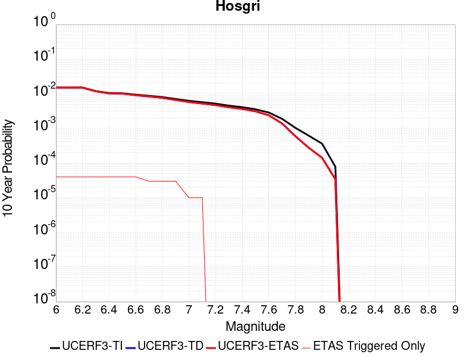 |

| Magnitude | 1 wk TI Prob | 1 wk TD Prob | 1 wk ETAS Prob | 1 wk ETAS/TD Gain | 1 wk ETAS Triggered Only | 1 mo TI Prob | 1 mo TD Prob | 1 mo ETAS Prob | 1 mo ETAS/TD Gain | 1 mo ETAS Triggered Only | 1 yr TI Prob | 1 yr TD Prob | 1 yr ETAS Prob | 1 yr ETAS/TD Gain | 1 yr ETAS Triggered Only | 10 yr TI Prob | 10 yr TD Prob | 10 yr ETAS Prob | 10 yr ETAS/TD Gain | 10 yr ETAS Triggered Only |
|-----|-----|-----|-----|-----|-----|-----|-----|-----|-----|-----|-----|-----|-----|-----|-----|-----|-----|-----|-----|-----|
| 6.0 | 2.883978E-5 | 2.9128829E-5 | 2.9128829E-5 | 1.0 | 0.0 | 1.235932E-4 | 1.2483202E-4 | 1.2483202E-4 | 1.0 | 0.0 | 0.0015037085 | 0.0015187975 | 0.001550903 | 1.0211388 | 3.215434E-5 | 0.01493574 | 0.015087952 | 0.015130177 | 1.0027987 | 4.2872456E-5 |
| 6.1 | 2.883978E-5 | 2.9128829E-5 | 2.9128829E-5 | 1.0 | 0.0 | 1.235932E-4 | 1.2483202E-4 | 1.2483202E-4 | 1.0 | 0.0 | 0.0015037085 | 0.0015187975 | 0.001550903 | 1.0211388 | 3.215434E-5 | 0.01493574 | 0.015087952 | 0.015130177 | 1.0027987 | 4.2872456E-5 |
| 6.2 | 2.883978E-5 | 2.9128829E-5 | 2.9128829E-5 | 1.0 | 0.0 | 1.235932E-4 | 1.2483202E-4 | 1.2483202E-4 | 1.0 | 0.0 | 0.0015037085 | 0.0015187975 | 0.001550903 | 1.0211388 | 3.215434E-5 | 0.01493574 | 0.015087952 | 0.015130177 | 1.0027987 | 4.2872456E-5 |
| 6.3 | 2.2914428E-5 | 2.26423E-5 | 2.26423E-5 | 1.0 | 0.0 | 9.8200995E-5 | 9.703485E-5 | 9.703485E-5 | 1.0 | 0.0 | 0.0011949413 | 0.0011807639 | 0.0012128802 | 1.0271996 | 3.215434E-5 | 0.011885363 | 0.011746303 | 0.011788672 | 1.003607 | 4.2872456E-5 |
| 6.4 | 2.0195741E-5 | 1.9696858E-5 | 1.9696858E-5 | 1.0 | 0.0 | 8.65503E-5 | 8.4412386E-5 | 8.4412386E-5 | 1.0 | 0.0 | 0.0010532405 | 0.0010272382 | 0.0010593595 | 1.0312696 | 3.215434E-5 | 0.010482626 | 0.010225947 | 0.010268381 | 1.0041497 | 4.2872456E-5 |
| 6.5 | 1.9924333E-5 | 1.9409275E-5 | 1.9409275E-5 | 1.0 | 0.0 | 8.53872E-5 | 8.317997E-5 | 8.317997E-5 | 1.0 | 0.0 | 0.0010390934 | 0.0010122475 | 0.0010443694 | 1.0317332 | 3.215434E-5 | 0.010342481 | 0.010077406 | 0.010119846 | 1.0042114 | 4.2872456E-5 |
| 6.6 | 1.809694E-5 | 1.7458577E-5 | 1.7458577E-5 | 1.0 | 0.0 | 7.7556004E-5 | 7.482033E-5 | 7.482033E-5 | 1.0 | 0.0 | 9.438353E-4 | 9.1055816E-4 | 9.4268325E-4 | 1.0352806 | 3.215434E-5 | 0.009398366 | 0.009069216 | 0.0091117 | 1.0046843 | 4.2872456E-5 |
| 6.7 | 1.675989E-5 | 1.6043028E-5 | 1.6043028E-5 | 1.0 | 0.0 | 7.182612E-5 | 6.875403E-5 | 6.875403E-5 | 1.0 | 0.0 | 8.7413215E-4 | 8.3676E-4 | 8.581783E-4 | 1.0255967 | 2.1436228E-5 | 0.008707017 | 0.008337 | 0.008368886 | 1.0038247 | 3.215434E-5 |
| 6.8 | 1.5401129E-5 | 1.4614334E-5 | 1.4614334E-5 | 1.0 | 0.0 | 6.6003166E-5 | 6.263136E-5 | 6.263136E-5 | 1.0 | 0.0 | 8.032922E-4 | 7.622709E-4 | 7.836908E-4 | 1.0281001 | 2.1436228E-5 | 0.008003947 | 0.0075974264 | 0.007629337 | 1.0042001 | 3.215434E-5 |
| 6.9 | 1.356559E-5 | 1.2690202E-5 | 1.2690202E-5 | 1.0 | 0.0 | 5.8136946E-5 | 5.4385448E-5 | 5.4385448E-5 | 1.0 | 0.0 | 7.0758746E-4 | 6.619421E-4 | 6.8336417E-4 | 1.0323625 | 2.1436228E-5 | 0.007053386 | 0.00660051 | 0.006632452 | 1.0048393 | 3.215434E-5 |
| 7.0 | 1.2030819E-5 | 1.1096183E-5 | 1.1096183E-5 | 1.0 | 0.0 | 5.155963E-5 | 4.75542E-5 | 4.75542E-5 | 1.0 | 0.0 | 6.275577E-4 | 5.788187E-4 | 5.895306E-4 | 1.0185065 | 1.0718114E-5 | 0.006257884 | 0.005773872 | 0.0057845283 | 1.0018456 | 1.0718114E-5 |
| 7.1 | 1.0972698E-5 | 1.0022392E-5 | 1.0022392E-5 | 1.0 | 0.0 | 4.7025E-5 | 4.29524E-5 | 4.29524E-5 | 1.0 | 0.0 | 5.72379E-4 | 5.228201E-4 | 5.335326E-4 | 1.0204898 | 1.0718114E-5 | 0.0057090693 | 0.005216653 | 0.0052273152 | 1.0020438 | 1.0718114E-5 |
| 7.2 | 9.961926E-6 | 9.034952E-6 | 9.034952E-6 | 1.0 | 0.0 | 4.2693267E-5 | 3.872065E-5 | 3.872065E-5 | 1.0 | 0.0 | 5.1966653E-4 | 4.7132198E-4 | 4.7132198E-4 | 1.0 | 0.0 | 0.00518453 | 0.00470397 | 0.00470397 | 1.0 | 0.0 |
| 7.3 | 8.700929E-6 | 7.828299E-6 | 7.828299E-6 | 1.0 | 0.0 | 3.7289166E-5 | 3.3549422E-5 | 3.3549422E-5 | 1.0 | 0.0 | 4.53901E-4 | 4.0838768E-4 | 4.0838768E-4 | 1.0 | 0.0 | 0.00452975 | 0.0040771114 | 0.0040771114 | 1.0 | 0.0 |
| 7.4 | 7.866285E-6 | 6.998933E-6 | 6.998933E-6 | 1.0 | 0.0 | 3.3712215E-5 | 2.999508E-5 | 2.999508E-5 | 1.0 | 0.0 | 4.103689E-4 | 3.6512894E-4 | 3.6512894E-4 | 1.0 | 0.0 | 0.004096119 | 0.0036460275 | 0.0036460275 | 1.0 | 0.0 |
| 7.5 | 6.8381305E-6 | 5.959883E-6 | 5.959883E-6 | 1.0 | 0.0 | 2.9305946E-5 | 2.5542106E-5 | 2.5542106E-5 | 1.0 | 0.0 | 3.5674145E-4 | 3.1093077E-4 | 3.1093077E-4 | 1.0 | 0.0 | 0.0035616932 | 0.0031056926 | 0.0031056926 | 1.0 | 0.0 |
| 7.6 | 5.503376E-6 | 4.5954234E-6 | 4.5954234E-6 | 1.0 | 0.0 | 2.3585684E-5 | 1.9694522E-5 | 1.9694522E-5 | 1.0 | 0.0 | 2.8711787E-4 | 2.3975444E-4 | 2.3975444E-4 | 1.0 | 0.0 | 0.002867472 | 0.002395691 | 0.002395691 | 1.0 | 0.0 |
| 7.7 | 3.6144982E-6 | 2.6523774E-6 | 2.6523774E-6 | 1.0 | 0.0 | 1.5490614E-5 | 1.1367281E-5 | 1.1367281E-5 | 1.0 | 0.0 | 1.8858191E-4 | 1.3838787E-4 | 1.3838787E-4 | 1.0 | 0.0 | 0.0018842196 | 0.0013837481 | 0.0013837481 | 1.0 | 0.0 |
| 7.8 | 1.9853494E-6 | 1.1362536E-6 | 1.1362536E-6 | 1.0 | 0.0 | 8.508612E-6 | 4.8696493E-6 | 4.8696493E-6 | 1.0 | 0.0 | 1.0358743E-4 | 5.9286365E-5 | 5.9286365E-5 | 1.0 | 0.0 | 0.0010353916 | 5.934354E-4 | 5.934354E-4 | 1.0 | 0.0 |
| 7.9 | 1.1818757E-6 | 5.2963003E-7 | 5.2963003E-7 | 1.0 | 0.0 | 5.0651715E-6 | 2.269841E-6 | 2.269841E-6 | 1.0 | 0.0 | 6.1666724E-5 | 2.7634964E-5 | 2.7634964E-5 | 1.0 | 0.0 | 6.1649614E-4 | 2.7700354E-4 | 2.7700354E-4 | 1.0 | 0.0 |
| 8.0 | 6.962958E-7 | 2.7147578E-7 | 2.7147578E-7 | 1.0 | 0.0 | 2.9841215E-6 | 1.163467E-6 | 1.163467E-6 | 1.0 | 0.0 | 3.6331072E-5 | 1.4165119E-5 | 1.4165119E-5 | 1.0 | 0.0 | 3.6325134E-4 | 1.4221264E-4 | 1.4221264E-4 | 1.0 | 0.0 |
| 8.1 | 1.5033264E-7 | 6.529188E-8 | 6.529188E-8 | 1.0 | 0.0 | 6.442826E-7 | 2.798223E-7 | 2.798223E-7 | 1.0 | 0.0 | 7.844113E-6 | 3.4068314E-6 | 3.4068314E-6 | 1.0 | 0.0 | 7.843835E-5 | 3.4085097E-5 | 3.4085097E-5 | 1.0 | 0.0 |

## Green Valley 2011 CFM
*[(top)](#table-of-contents)*

| 1 Week | 1 Month | 1 Year | 10 Year |
|-----|-----|-----|-----|
|  |  | 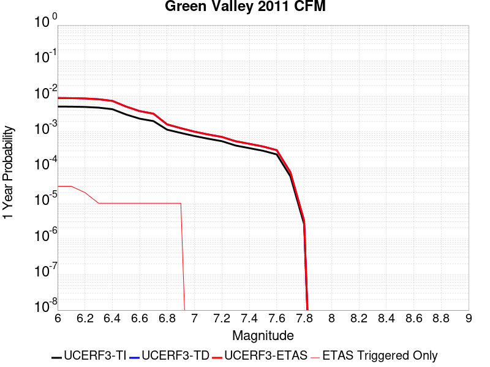 |  |

| Magnitude | 1 wk TI Prob | 1 wk TD Prob | 1 wk ETAS Prob | 1 wk ETAS/TD Gain | 1 wk ETAS Triggered Only | 1 mo TI Prob | 1 mo TD Prob | 1 mo ETAS Prob | 1 mo ETAS/TD Gain | 1 mo ETAS Triggered Only | 1 yr TI Prob | 1 yr TD Prob | 1 yr ETAS Prob | 1 yr ETAS/TD Gain | 1 yr ETAS Triggered Only | 10 yr TI Prob | 10 yr TD Prob | 10 yr ETAS Prob | 10 yr ETAS/TD Gain | 10 yr ETAS Triggered Only |
|-----|-----|-----|-----|-----|-----|-----|-----|-----|-----|-----|-----|-----|-----|-----|-----|-----|-----|-----|-----|-----|
| 6.0 | 9.9629346E-5 | 1.7306181E-4 | 1.8377806E-4 | 1.0619216 | 1.0718114E-5 | 4.2691303E-4 | 7.414477E-4 | 7.521578E-4 | 1.014445 | 1.0718114E-5 | 0.0051852856 | 0.00898687 | 0.009018735 | 1.0035458 | 3.215434E-5 | 0.050659515 | 0.085523866 | 0.085553266 | 1.0003438 | 3.215434E-5 |
| 6.1 | 9.88615E-5 | 1.7153492E-4 | 1.822512E-4 | 1.0624728 | 1.0718114E-5 | 4.2362334E-4 | 7.349076E-4 | 7.4561784E-4 | 1.0145736 | 1.0718114E-5 | 0.0051454236 | 0.008907897 | 0.008939765 | 1.0035775 | 3.215434E-5 | 0.050279044 | 0.08481148 | 0.08484091 | 1.000347 | 3.215434E-5 |
| 6.2 | 9.696895E-5 | 1.679252E-4 | 1.7864151E-4 | 1.063816 | 1.0718114E-5 | 4.15515E-4 | 7.1944593E-4 | 7.301564E-4 | 1.014887 | 1.0718114E-5 | 0.0050471667 | 0.008721275 | 0.008742524 | 1.0024365 | 2.1436228E-5 | 0.04934063 | 0.08312038 | 0.08314004 | 1.0002365 | 2.1436228E-5 |
| 6.3 | 9.275224E-5 | 1.5971852E-4 | 1.7043493E-4 | 1.0670955 | 1.0718114E-5 | 3.9744904E-4 | 6.842931E-4 | 6.950039E-4 | 1.0156523 | 1.0718114E-5 | 0.0048282105 | 0.008296597 | 0.008307226 | 1.0012811 | 1.0718114E-5 | 0.047246475 | 0.07925882 | 0.079268694 | 1.0001245 | 1.0718114E-5 |
| 6.4 | 8.391499E-5 | 1.4368363E-4 | 1.544002E-4 | 1.0745845 | 1.0718114E-5 | 3.595861E-4 | 6.156491E-4 | 6.263606E-4 | 1.0173987 | 1.0718114E-5 | 0.004369175 | 0.007467232 | 0.00747787 | 1.0014247 | 1.0718114E-5 | 0.04284265 | 0.07163251 | 0.07164246 | 1.0001389 | 1.0718114E-5 |
| 6.5 | 5.9519385E-5 | 9.9345336E-5 | 1.10062385E-4 | 1.1078767 | 1.0718114E-5 | 2.5505814E-4 | 4.257004E-4 | 4.3641395E-4 | 1.0251669 | 1.0718114E-5 | 0.0031009112 | 0.0051684165 | 0.0051790792 | 1.002063 | 1.0718114E-5 | 0.030579966 | 0.050147217 | 0.050157398 | 1.000203 | 1.0718114E-5 |
| 6.6 | 4.5361558E-5 | 7.4029726E-5 | 8.4747044E-5 | 1.1447705 | 1.0718114E-5 | 1.9439218E-4 | 3.1723455E-4 | 3.2794924E-4 | 1.0337753 | 1.0718114E-5 | 0.0023641558 | 0.003854048 | 0.003864725 | 1.0027703 | 1.0718114E-5 | 0.023391623 | 0.03766713 | 0.037677445 | 1.0002738 | 1.0718114E-5 |
| 6.7 | 3.8808106E-5 | 6.265495E-5 | 7.3372394E-5 | 1.171055 | 1.0718114E-5 | 1.6630985E-4 | 2.684962E-4 | 2.7921144E-4 | 1.0399083 | 1.0718114E-5 | 0.0020229418 | 0.003262755 | 0.0032734382 | 1.0032743 | 1.0718114E-5 | 0.020046256 | 0.03200691 | 0.032017283 | 1.0003241 | 1.0718114E-5 |
| 6.8 | 2.2284667E-5 | 3.1285566E-5 | 4.2003343E-5 | 1.342579 | 1.0718114E-5 | 9.550222E-5 | 1.340742E-4 | 1.4479087E-4 | 1.0799309 | 1.0718114E-5 | 0.0011621192 | 0.001631124 | 0.0016418245 | 1.0065603 | 1.0718114E-5 | 0.011560607 | 0.016166156 | 0.016176702 | 1.0006523 | 1.0718114E-5 |
| 6.9 | 1.8050168E-5 | 2.4448267E-5 | 3.516612E-5 | 1.4383891 | 1.0718114E-5 | 7.735557E-5 | 1.0477412E-4 | 1.1549111E-4 | 1.1022866 | 1.0718114E-5 | 9.4139716E-4 | 0.001274882 | 0.0012855864 | 1.0083964 | 1.0718114E-5 | 0.009374191 | 0.01266794 | 0.012678523 | 1.0008354 | 1.0718114E-5 |
| 7.0 | 1.4763166E-5 | 1.958302E-5 | 1.958302E-5 | 1.0 | 0.0 | 6.326917E-5 | 8.392455E-5 | 8.392455E-5 | 1.0 | 0.0 | 7.7002996E-4 | 0.0010213053 | 0.0010213053 | 1.0 | 0.0 | 0.007673672 | 0.010165428 | 0.010165428 | 1.0 | 0.0 |
| 7.1 | 1.2399713E-5 | 1.630385E-5 | 1.630385E-5 | 1.0 | 0.0 | 5.3140546E-5 | 6.987178E-5 | 6.987178E-5 | 1.0 | 0.0 | 6.467941E-4 | 8.5035886E-4 | 8.5035886E-4 | 1.0 | 0.0 | 0.006449148 | 0.008471329 | 0.008471329 | 1.0 | 0.0 |
| 7.2 | 1.0584195E-5 | 1.3921863E-5 | 1.3921863E-5 | 1.0 | 0.0 | 4.5360044E-5 | 5.9663773E-5 | 5.9663773E-5 | 1.0 | 0.0 | 5.521186E-4 | 7.2616595E-4 | 7.2616595E-4 | 1.0 | 0.0 | 0.0055074887 | 0.0072383475 | 0.0072383475 | 1.0 | 0.0 |
| 7.3 | 7.998173E-6 | 1.054412E-5 | 1.054412E-5 | 1.0 | 0.0 | 3.4277433E-5 | 4.5188313E-5 | 4.5188313E-5 | 1.0 | 0.0 | 4.1724785E-4 | 5.500299E-4 | 5.500299E-4 | 1.0 | 0.0 | 0.004164653 | 0.0054869517 | 0.0054869517 | 1.0 | 0.0 |
| 7.4 | 6.7571127E-6 | 8.932785E-6 | 8.932785E-6 | 1.0 | 0.0 | 2.8958733E-5 | 3.8282808E-5 | 3.8282808E-5 | 1.0 | 0.0 | 3.5251552E-4 | 4.6599447E-4 | 4.6599447E-4 | 1.0 | 0.0 | 0.0035195686 | 0.0046503763 | 0.0046503763 | 1.0 | 0.0 |
| 7.5 | 5.69878E-6 | 7.5163775E-6 | 7.5163775E-6 | 1.0 | 0.0 | 2.4423114E-5 | 3.2212654E-5 | 3.2212654E-5 | 1.0 | 0.0 | 2.9731085E-4 | 3.9211934E-4 | 3.9211934E-4 | 1.0 | 0.0 | 0.002969134 | 0.0039144265 | 0.0039144265 | 1.0 | 0.0 |
| 7.6 | 4.503664E-6 | 5.9357344E-6 | 5.9357344E-6 | 1.0 | 0.0 | 1.9301275E-5 | 2.5438618E-5 | 2.5438618E-5 | 1.0 | 0.0 | 2.3496768E-4 | 3.09672E-4 | 3.09672E-4 | 1.0 | 0.0 | 0.002347194 | 0.0030925297 | 0.0030925297 | 1.0 | 0.0 |
| 7.7 | 1.0873546E-6 | 1.4107108E-6 | 1.4107108E-6 | 1.0 | 0.0 | 4.6600826E-6 | 6.0458897E-6 | 6.0458897E-6 | 1.0 | 0.0 | 5.6735033E-5 | 7.360625E-5 | 7.360625E-5 | 1.0 | 0.0 | 5.672055E-4 | 7.3582074E-4 | 7.3582074E-4 | 1.0 | 0.0 |
| 7.8 | 4.9373917E-8 | 6.177787E-8 | 6.177787E-8 | 1.0 | 0.0 | 2.1160248E-7 | 2.6476226E-7 | 2.6476226E-7 | 1.0 | 0.0 | 2.5762572E-6 | 3.223477E-6 | 3.223477E-6 | 1.0 | 0.0 | 2.5762274E-5 | 3.223268E-5 | 3.223268E-5 | 1.0 | 0.0 |

## San Jacinto (Coyote Creek)
*[(top)](#table-of-contents)*

| 1 Week | 1 Month | 1 Year | 10 Year |
|-----|-----|-----|-----|
|  | 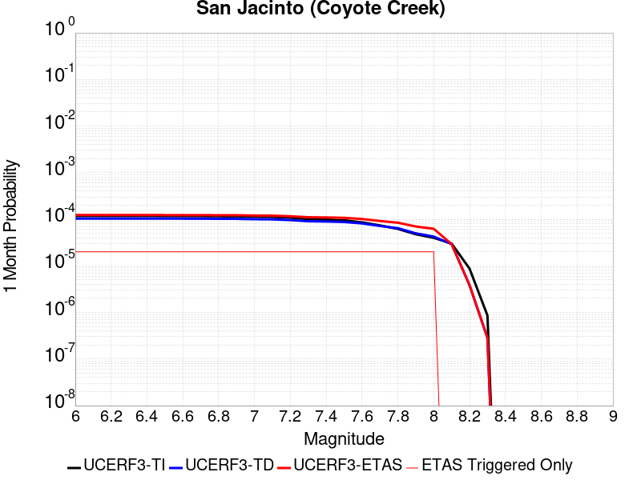 |  |  |

| Magnitude | 1 wk TI Prob | 1 wk TD Prob | 1 wk ETAS Prob | 1 wk ETAS/TD Gain | 1 wk ETAS Triggered Only | 1 mo TI Prob | 1 mo TD Prob | 1 mo ETAS Prob | 1 mo ETAS/TD Gain | 1 mo ETAS Triggered Only | 1 yr TI Prob | 1 yr TD Prob | 1 yr ETAS Prob | 1 yr ETAS/TD Gain | 1 yr ETAS Triggered Only | 10 yr TI Prob | 10 yr TD Prob | 10 yr ETAS Prob | 10 yr ETAS/TD Gain | 10 yr ETAS Triggered Only |
|-----|-----|-----|-----|-----|-----|-----|-----|-----|-----|-----|-----|-----|-----|-----|-----|-----|-----|-----|-----|-----|
| 6.0 | 2.7374346E-5 | 2.415327E-5 | 2.415327E-5 | 1.0 | 0.0 | 1.1731335E-4 | 1.0350993E-4 | 1.2494394E-4 | 1.207072 | 2.1436228E-5 | 0.0014273542 | 0.0012595074 | 0.0012809166 | 1.016998 | 2.1436228E-5 | 0.01418221 | 0.01293251 | 0.012974828 | 1.0032722 | 4.2872456E-5 |
| 6.1 | 2.7374346E-5 | 2.415327E-5 | 2.415327E-5 | 1.0 | 0.0 | 1.1731335E-4 | 1.0350993E-4 | 1.2494394E-4 | 1.207072 | 2.1436228E-5 | 0.0014273542 | 0.0012595074 | 0.0012809166 | 1.016998 | 2.1436228E-5 | 0.01418221 | 0.01293251 | 0.012974828 | 1.0032722 | 4.2872456E-5 |
| 6.2 | 2.7374346E-5 | 2.415327E-5 | 2.415327E-5 | 1.0 | 0.0 | 1.1731335E-4 | 1.0350993E-4 | 1.2494394E-4 | 1.207072 | 2.1436228E-5 | 0.0014273542 | 0.0012595074 | 0.0012809166 | 1.016998 | 2.1436228E-5 | 0.01418221 | 0.01293251 | 0.012974828 | 1.0032722 | 4.2872456E-5 |
| 6.3 | 2.7374346E-5 | 2.415327E-5 | 2.415327E-5 | 1.0 | 0.0 | 1.1731335E-4 | 1.0350993E-4 | 1.2494394E-4 | 1.207072 | 2.1436228E-5 | 0.0014273542 | 0.0012595074 | 0.0012809166 | 1.016998 | 2.1436228E-5 | 0.01418221 | 0.01293251 | 0.012974828 | 1.0032722 | 4.2872456E-5 |
| 6.4 | 2.7374346E-5 | 2.415327E-5 | 2.415327E-5 | 1.0 | 0.0 | 1.1731335E-4 | 1.0350993E-4 | 1.2494394E-4 | 1.207072 | 2.1436228E-5 | 0.0014273542 | 0.0012595074 | 0.0012809166 | 1.016998 | 2.1436228E-5 | 0.01418221 | 0.01293251 | 0.012974828 | 1.0032722 | 4.2872456E-5 |
| 6.5 | 2.7282445E-5 | 2.4039346E-5 | 2.4039346E-5 | 1.0 | 0.0 | 1.16919524E-4 | 1.0302171E-4 | 1.2445574E-4 | 1.2080535 | 2.1436228E-5 | 0.0014225657 | 0.0012535703 | 0.0012749797 | 1.0170788 | 2.1436228E-5 | 0.014134934 | 0.012873836 | 0.012916156 | 1.0032873 | 4.2872456E-5 |
| 6.6 | 2.7282445E-5 | 2.4039346E-5 | 2.4039346E-5 | 1.0 | 0.0 | 1.16919524E-4 | 1.0302171E-4 | 1.2445574E-4 | 1.2080535 | 2.1436228E-5 | 0.0014225657 | 0.0012535703 | 0.0012749797 | 1.0170788 | 2.1436228E-5 | 0.014134934 | 0.012873836 | 0.012916156 | 1.0032873 | 4.2872456E-5 |
| 6.7 | 2.7216198E-5 | 2.3964463E-5 | 2.3964463E-5 | 1.0 | 0.0 | 1.1663563E-4 | 1.0270082E-4 | 1.2413484E-4 | 1.2087035 | 2.1436228E-5 | 0.0014191137 | 0.0012496678 | 0.0012710773 | 1.017132 | 2.1436228E-5 | 0.014100855 | 0.0128352465 | 0.012877569 | 1.0032973 | 4.2872456E-5 |
| 6.8 | 2.7078617E-5 | 2.3881676E-5 | 2.3881676E-5 | 1.0 | 0.0 | 1.1604605E-4 | 1.0234604E-4 | 1.2378008E-4 | 1.2094271 | 2.1436228E-5 | 0.001411945 | 0.0012453535 | 0.001266763 | 1.0171915 | 2.1436228E-5 | 0.014030075 | 0.012792386 | 0.01283471 | 1.0033085 | 4.2872456E-5 |
| 6.9 | 2.6982952E-5 | 2.3801183E-5 | 2.3801183E-5 | 1.0 | 0.0 | 1.15636096E-4 | 1.020011E-4 | 1.2343514E-4 | 1.2101353 | 2.1436228E-5 | 0.0014069602 | 0.0012411585 | 0.0012625682 | 1.0172497 | 2.1436228E-5 | 0.013980856 | 0.012750699 | 0.012793025 | 1.0033195 | 4.2872456E-5 |
| 7.0 | 2.6449972E-5 | 2.3378187E-5 | 2.3378187E-5 | 1.0 | 0.0 | 1.1335209E-4 | 1.001884E-4 | 1.2162248E-4 | 1.2139378 | 2.1436228E-5 | 0.001379188 | 0.0012191138 | 0.0012405239 | 1.017562 | 2.1436228E-5 | 0.0137065975 | 0.0125320535 | 0.012574389 | 1.0033782 | 4.2872456E-5 |
| 7.1 | 2.6257849E-5 | 2.3204217E-5 | 2.3204217E-5 | 1.0 | 0.0 | 1.1252879E-4 | 9.944286E-5 | 1.2087696E-4 | 1.2155418 | 2.1436228E-5 | 0.0013691769 | 0.001210047 | 0.0012314573 | 1.0176938 | 2.1436228E-5 | 0.013607717 | 0.012441914 | 0.012484252 | 1.003403 | 4.2872456E-5 |
| 7.2 | 2.5270041E-5 | 2.2398921E-5 | 2.2398921E-5 | 1.0 | 0.0 | 1.0829568E-4 | 9.5991854E-5 | 1.17426025E-4 | 1.2232915 | 2.1436228E-5 | 0.0013177024 | 0.0011680766 | 0.0011894879 | 1.0183303 | 2.1436228E-5 | 0.013099162 | 0.012022921 | 0.012065277 | 1.003523 | 4.2872456E-5 |
| 7.3 | 2.339701E-5 | 2.1130656E-5 | 2.1130656E-5 | 1.0 | 0.0 | 1.0026905E-4 | 9.055682E-5 | 1.1199111E-4 | 1.2366943 | 2.1436228E-5 | 0.001220092 | 0.0011019738 | 0.0011233864 | 1.0194311 | 2.1436228E-5 | 0.012134149 | 0.011361783 | 0.011404169 | 1.0037305 | 4.2872456E-5 |
| 7.4 | 2.296333E-5 | 2.0860984E-5 | 2.0860984E-5 | 1.0 | 0.0 | 9.841056E-5 | 8.940117E-5 | 1.1083548E-4 | 1.2397543 | 2.1436228E-5 | 0.0011974899 | 0.0010879177 | 0.0011093307 | 1.0196825 | 2.1436228E-5 | 0.011910575 | 0.011220883 | 0.011263275 | 1.0037779 | 4.2872456E-5 |
| 7.5 | 2.2188895E-5 | 2.0383844E-5 | 2.0383844E-5 | 1.0 | 0.0 | 9.50918E-5 | 8.735642E-5 | 1.0879077E-4 | 1.2453667 | 2.1436228E-5 | 0.0011571277 | 0.0010630476 | 0.001084461 | 1.0201434 | 2.1436228E-5 | 0.011511209 | 0.010970469 | 0.011012871 | 1.0038651 | 4.2872456E-5 |
| 7.6 | 2.0013189E-5 | 1.8969942E-5 | 1.8969942E-5 | 1.0 | 0.0 | 8.5767984E-5 | 8.1297236E-5 | 1.0273172E-4 | 1.2636558 | 2.1436228E-5 | 0.001043725 | 9.893461E-4 | 0.0010107611 | 1.0216457 | 2.1436228E-5 | 0.010388365 | 0.010228388 | 0.010270822 | 1.0041486 | 4.2872456E-5 |
| 7.7 | 1.7230794E-5 | 1.6751088E-5 | 1.6751088E-5 | 1.0 | 0.0 | 7.384417E-5 | 7.17884E-5 | 9.322309E-5 | 1.2985815 | 2.1436228E-5 | 8.986819E-4 | 8.736742E-4 | 8.950917E-4 | 1.0245143 | 2.1436228E-5 | 0.008950562 | 0.009066812 | 0.009109295 | 1.0046856 | 4.2872456E-5 |
| 7.8 | 1.4478809E-5 | 1.49981E-5 | 1.49981E-5 | 1.0 | 0.0 | 6.205057E-5 | 6.427599E-5 | 8.571084E-5 | 1.3334814 | 2.1436228E-5 | 7.552038E-4 | 7.822799E-4 | 8.036993E-4 | 1.0273808 | 2.1436228E-5 | 0.0075264242 | 0.008145113 | 0.008187636 | 1.0052207 | 4.2872456E-5 |
| 7.9 | 1.1114467E-5 | 1.1651392E-5 | 1.1651392E-5 | 1.0 | 0.0 | 4.7632562E-5 | 4.9933584E-5 | 7.136874E-5 | 1.4292734 | 2.1436228E-5 | 5.797721E-4 | 6.077724E-4 | 6.291956E-4 | 1.0352488 | 2.1436228E-5 | 0.0057826187 | 0.0063836263 | 0.006426225 | 1.0066731 | 4.2872456E-5 |
| 8.0 | 9.327402E-6 | 9.904865E-6 | 9.904865E-6 | 1.0 | 0.0 | 3.9973966E-5 | 4.2448733E-5 | 6.388405E-5 | 1.5049696 | 2.1436228E-5 | 4.8657437E-4 | 5.166913E-4 | 5.3811644E-4 | 1.0414661 | 2.1436228E-5 | 0.0048551033 | 0.0054529547 | 0.005495593 | 1.0078194 | 4.2872456E-5 |
| 8.1 | 7.0235833E-6 | 6.83171E-6 | 6.83171E-6 | 1.0 | 0.0 | 3.0100724E-5 | 2.9278432E-5 | 2.9278432E-5 | 1.0 | 0.0 | 3.664147E-4 | 3.5640708E-4 | 3.5640708E-4 | 1.0 | 0.0 | 0.003658111 | 0.0037898365 | 0.003800514 | 1.0028174 | 1.0718114E-5 |
| 8.2 | 2.0358202E-6 | 9.0030267E-7 | 9.0030267E-7 | 1.0 | 0.0 | 8.724915E-6 | 3.8584344E-6 | 3.8584344E-6 | 1.0 | 0.0 | 1.06220665E-4 | 4.697545E-5 | 4.697545E-5 | 1.0 | 0.0 | 0.001061699 | 5.3301745E-4 | 5.3301745E-4 | 1.0 | 0.0 |
| 8.3 | 2.0051264E-7 | 6.6244816E-8 | 6.6244816E-8 | 1.0 | 0.0 | 8.5933965E-7 | 2.8390633E-7 | 2.8390633E-7 | 1.0 | 0.0 | 1.046241E-5 | 3.4565546E-6 | 3.4565546E-6 | 1.0 | 0.0 | 1.0461917E-4 | 4.018022E-5 | 4.018022E-5 | 1.0 | 0.0 |

## Hosgri (Extension)
*[(top)](#table-of-contents)*

| 1 Week | 1 Month | 1 Year | 10 Year |
|-----|-----|-----|-----|
|  |  |  |  |

| Magnitude | 1 wk TI Prob | 1 wk TD Prob | 1 wk ETAS Prob | 1 wk ETAS/TD Gain | 1 wk ETAS Triggered Only | 1 mo TI Prob | 1 mo TD Prob | 1 mo ETAS Prob | 1 mo ETAS/TD Gain | 1 mo ETAS Triggered Only | 1 yr TI Prob | 1 yr TD Prob | 1 yr ETAS Prob | 1 yr ETAS/TD Gain | 1 yr ETAS Triggered Only | 10 yr TI Prob | 10 yr TD Prob | 10 yr ETAS Prob | 10 yr ETAS/TD Gain | 10 yr ETAS Triggered Only |
|-----|-----|-----|-----|-----|-----|-----|-----|-----|-----|-----|-----|-----|-----|-----|-----|-----|-----|-----|-----|-----|
| 6.0 | 1.1369135E-5 | 1.2083198E-5 | 1.2083198E-5 | 1.0 | 0.0 | 4.8723956E-5 | 5.1784238E-5 | 5.1784238E-5 | 1.0 | 0.0 | 5.9305265E-4 | 6.303134E-4 | 6.410248E-4 | 1.0169936 | 1.0718114E-5 | 0.005914725 | 0.0062875054 | 0.0063301083 | 1.0067759 | 4.2872456E-5 |
| 6.1 | 6.934979E-6 | 7.3246356E-6 | 7.3246356E-6 | 1.0 | 0.0 | 2.9721E-5 | 3.139094E-5 | 3.139094E-5 | 1.0 | 0.0 | 3.617931E-4 | 3.8212183E-4 | 3.8212183E-4 | 1.0 | 0.0 | 0.0036120464 | 0.0038150605 | 0.0038257376 | 1.0027987 | 1.0718114E-5 |
| 6.2 | 6.934979E-6 | 7.3246356E-6 | 7.3246356E-6 | 1.0 | 0.0 | 2.9721E-5 | 3.139094E-5 | 3.139094E-5 | 1.0 | 0.0 | 3.617931E-4 | 3.8212183E-4 | 3.8212183E-4 | 1.0 | 0.0 | 0.0036120464 | 0.0038150605 | 0.0038257376 | 1.0027987 | 1.0718114E-5 |
| 6.3 | 4.5484676E-6 | 4.769387E-6 | 4.769387E-6 | 1.0 | 0.0 | 1.9493287E-5 | 2.0440071E-5 | 2.0440071E-5 | 1.0 | 0.0 | 2.3730492E-4 | 2.4882986E-4 | 2.4882986E-4 | 1.0 | 0.0 | 0.0023705168 | 0.0024855551 | 0.0024962467 | 1.0043014 | 1.0718114E-5 |
| 6.4 | 4.218095E-6 | 4.416915E-6 | 4.416915E-6 | 1.0 | 0.0 | 1.8077424E-5 | 1.89295E-5 | 1.89295E-5 | 1.0 | 0.0 | 2.2007042E-4 | 2.3044262E-4 | 2.3044262E-4 | 1.0 | 0.0 | 0.002198526 | 0.0023020701 | 0.0023127636 | 1.0046451 | 1.0718114E-5 |
| 6.5 | 3.717374E-6 | 3.8839266E-6 | 3.8839266E-6 | 1.0 | 0.0 | 1.5931506E-5 | 1.6645294E-5 | 1.6645294E-5 | 1.0 | 0.0 | 1.9394881E-4 | 2.0263779E-4 | 2.0263779E-4 | 1.0 | 0.0 | 0.0019377962 | 0.002024549 | 0.0020352455 | 1.0052834 | 1.0718114E-5 |
| 6.6 | 3.4605036E-6 | 3.6083522E-6 | 3.6083522E-6 | 1.0 | 0.0 | 1.4830645E-5 | 1.5464277E-5 | 1.5464277E-5 | 1.0 | 0.0 | 1.8054814E-4 | 1.8826143E-4 | 1.8826143E-4 | 1.0 | 0.0 | 0.0018040152 | 0.0018810342 | 0.0018917322 | 1.0056872 | 1.0718114E-5 |
| 6.7 | 3.123439E-6 | 3.2466114E-6 | 3.2466114E-6 | 1.0 | 0.0 | 1.33860985E-5 | 1.3913976E-5 | 1.3913976E-5 | 1.0 | 0.0 | 1.6296357E-4 | 1.6938959E-4 | 1.6938959E-4 | 1.0 | 0.0 | 0.001628441 | 0.0016926157 | 0.0017033156 | 1.0063215 | 1.0718114E-5 |
| 6.8 | 2.8290783E-6 | 2.93058E-6 | 2.93058E-6 | 1.0 | 0.0 | 1.2124565E-5 | 1.2559569E-5 | 1.2559569E-5 | 1.0 | 0.0 | 1.4760658E-4 | 1.529021E-4 | 1.529021E-4 | 1.0 | 0.0 | 0.0014750857 | 0.0015279776 | 0.0015386795 | 1.0070039 | 1.0718114E-5 |
| 6.9 | 2.454112E-6 | 2.5283553E-6 | 2.5283553E-6 | 1.0 | 0.0 | 1.0517581E-5 | 1.08357635E-5 | 1.08357635E-5 | 1.0 | 0.0 | 1.2804402E-4 | 1.3191749E-4 | 1.3191749E-4 | 1.0 | 0.0 | 0.0012797028 | 0.001318398 | 0.001329102 | 1.008119 | 1.0718114E-5 |
| 7.0 | 2.1008145E-6 | 2.1499025E-6 | 2.1499025E-6 | 1.0 | 0.0 | 9.003459E-6 | 9.213836E-6 | 9.213836E-6 | 1.0 | 0.0 | 1.096116E-4 | 1.1217271E-4 | 1.1217271E-4 | 1.0 | 0.0 | 0.0010955755 | 0.0011211646 | 0.0011211646 | 1.0 | 0.0 |
| 7.1 | 1.744384E-6 | 1.7686639E-6 | 1.7686639E-6 | 1.0 | 0.0 | 7.47591E-6 | 7.579966E-6 | 7.579966E-6 | 1.0 | 0.0 | 9.1015405E-5 | 9.22822E-5 | 9.22822E-5 | 1.0 | 0.0 | 9.097813E-4 | 9.224405E-4 | 9.224405E-4 | 1.0 | 0.0 |
| 7.2 | 1.5456587E-6 | 1.556315E-6 | 1.556315E-6 | 1.0 | 0.0 | 6.6242346E-6 | 6.6699045E-6 | 6.6699045E-6 | 1.0 | 0.0 | 8.064707E-5 | 8.120307E-5 | 8.120307E-5 | 1.0 | 0.0 | 8.0617814E-4 | 8.117353E-4 | 8.117353E-4 | 1.0 | 0.0 |
| 7.3 | 1.3775123E-6 | 1.3766333E-6 | 1.3766333E-6 | 1.0 | 0.0 | 5.9036106E-6 | 5.899844E-6 | 5.899844E-6 | 1.0 | 0.0 | 7.187409E-5 | 7.182824E-5 | 7.182824E-5 | 1.0 | 0.0 | 7.185085E-4 | 7.180513E-4 | 7.180513E-4 | 1.0 | 0.0 |
| 7.4 | 1.214491E-6 | 1.2023696E-6 | 1.2023696E-6 | 1.0 | 0.0 | 5.2049513E-6 | 5.1530023E-6 | 5.1530023E-6 | 1.0 | 0.0 | 6.336844E-5 | 6.2736006E-5 | 6.2736006E-5 | 1.0 | 0.0 | 6.335037E-4 | 6.2718376E-4 | 6.2718376E-4 | 1.0 | 0.0 |
| 7.5 | 1.0101123E-6 | 9.842462E-7 | 9.842462E-7 | 1.0 | 0.0 | 4.3290456E-6 | 4.218191E-6 | 4.218191E-6 | 1.0 | 0.0 | 5.2704854E-5 | 5.135527E-5 | 5.135527E-5 | 1.0 | 0.0 | 5.2692357E-4 | 5.1343464E-4 | 5.1343464E-4 | 1.0 | 0.0 |
| 7.6 | 8.1558215E-7 | 7.7661633E-7 | 7.7661633E-7 | 1.0 | 0.0 | 3.4953473E-6 | 3.3283516E-6 | 3.3283516E-6 | 1.0 | 0.0 | 4.255502E-5 | 4.0521933E-5 | 4.0521933E-5 | 1.0 | 0.0 | 4.2546875E-4 | 4.0514587E-4 | 4.0514587E-4 | 1.0 | 0.0 |
| 7.7 | 4.757816E-7 | 4.1310525E-7 | 4.1310525E-7 | 1.0 | 0.0 | 2.0390623E-6 | 1.7704498E-6 | 1.7704498E-6 | 1.0 | 0.0 | 2.4825302E-5 | 2.1555015E-5 | 2.1555015E-5 | 1.0 | 0.0 | 2.482253E-4 | 2.1552936E-4 | 2.1552936E-4 | 1.0 | 0.0 |
| 7.8 | 2.782787E-7 | 2.0049143E-7 | 2.0049143E-7 | 1.0 | 0.0 | 1.1926223E-6 | 8.5924864E-7 | 8.5924864E-7 | 1.0 | 0.0 | 1.452008E-5 | 1.0461303E-5 | 1.0461303E-5 | 1.0 | 0.0 | 1.4519131E-4 | 1.0460813E-4 | 1.0460813E-4 | 1.0 | 0.0 |
| 7.9 | 1.6948086E-7 | 9.2455664E-8 | 9.2455664E-8 | 1.0 | 0.0 | 7.2634634E-7 | 3.9623848E-7 | 3.9623848E-7 | 1.0 | 0.0 | 8.843231E-6 | 4.824193E-6 | 4.824193E-6 | 1.0 | 0.0 | 8.842879E-5 | 4.824089E-5 | 4.824089E-5 | 1.0 | 0.0 |
| 8.0 | 1.0225492E-7 | 4.4748486E-8 | 4.4748486E-8 | 1.0 | 0.0 | 4.382353E-7 | 1.9177921E-7 | 1.9177921E-7 | 1.0 | 0.0 | 5.335502E-6 | 2.3349094E-6 | 2.3349094E-6 | 1.0 | 0.0 | 5.335374E-5 | 2.3348852E-5 | 2.3348852E-5 | 1.0 | 0.0 |
| 8.1 | 1.43711345E-8 | 5.789212E-9 | 5.789212E-9 | 1.0 | 0.0 | 6.1590576E-8 | 2.4810909E-8 | 2.4810909E-8 | 1.0 | 0.0 | 7.4986497E-7 | 3.0207278E-7 | 3.0207278E-7 | 1.0 | 0.0 | 7.4986247E-6 | 3.0207243E-6 | 3.0207243E-6 | 1.0 | 0.0 |

## San Jacinto (Borrego)
*[(top)](#table-of-contents)*

| 1 Week | 1 Month | 1 Year | 10 Year |
|-----|-----|-----|-----|
|  |  |  | 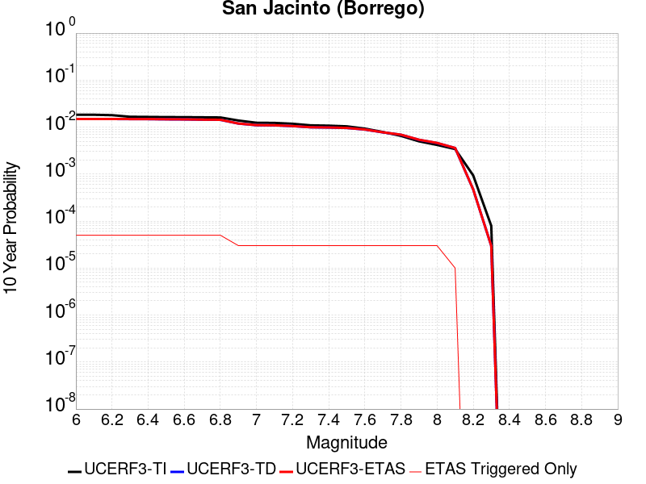 |

| Magnitude | 1 wk TI Prob | 1 wk TD Prob | 1 wk ETAS Prob | 1 wk ETAS/TD Gain | 1 wk ETAS Triggered Only | 1 mo TI Prob | 1 mo TD Prob | 1 mo ETAS Prob | 1 mo ETAS/TD Gain | 1 mo ETAS Triggered Only | 1 yr TI Prob | 1 yr TD Prob | 1 yr ETAS Prob | 1 yr ETAS/TD Gain | 1 yr ETAS Triggered Only | 10 yr TI Prob | 10 yr TD Prob | 10 yr ETAS Prob | 10 yr ETAS/TD Gain | 10 yr ETAS Triggered Only |
|-----|-----|-----|-----|-----|-----|-----|-----|-----|-----|-----|-----|-----|-----|-----|-----|-----|-----|-----|-----|-----|
| 6.0 | 3.543992E-5 | 2.7934115E-5 | 2.7934115E-5 | 1.0 | 0.0 | 1.5187653E-4 | 1.1971221E-4 | 1.3042905E-4 | 1.0895216 | 1.0718114E-5 | 0.0018475284 | 0.001456534 | 0.0014672364 | 1.007348 | 1.0718114E-5 | 0.018322436 | 0.014873597 | 0.014915831 | 1.0028396 | 4.2872456E-5 |
| 6.1 | 3.542281E-5 | 2.7934115E-5 | 2.7934115E-5 | 1.0 | 0.0 | 1.5180321E-4 | 1.1971221E-4 | 1.3042905E-4 | 1.0895216 | 1.0718114E-5 | 0.0018466372 | 0.001456534 | 0.0014672364 | 1.007348 | 1.0718114E-5 | 0.018313672 | 0.014873597 | 0.014915831 | 1.0028396 | 4.2872456E-5 |
| 6.2 | 3.4688688E-5 | 2.7934115E-5 | 2.7934115E-5 | 1.0 | 0.0 | 1.4865733E-4 | 1.1971221E-4 | 1.3042903E-4 | 1.0895216 | 1.0718114E-5 | 0.0018084005 | 0.0014565339 | 0.0014672364 | 1.007348 | 1.0718114E-5 | 0.017937548 | 0.014873596 | 0.014915831 | 1.0028396 | 4.2872456E-5 |
| 6.3 | 3.2087122E-5 | 2.7779462E-5 | 2.7779462E-5 | 1.0 | 0.0 | 1.3750899E-4 | 1.1904947E-4 | 1.2976631E-4 | 1.0900201 | 1.0718114E-5 | 0.0016728862 | 0.0014484759 | 0.0014591785 | 1.0073888 | 1.0718114E-5 | 0.016603488 | 0.01479463 | 0.014836868 | 1.002855 | 4.2872456E-5 |
| 6.4 | 3.1828724E-5 | 2.7746448E-5 | 2.7746448E-5 | 1.0 | 0.0 | 1.364017E-4 | 1.18908E-4 | 1.2962484E-4 | 1.0901271 | 1.0718114E-5 | 0.0016594254 | 0.0014467557 | 0.0014574582 | 1.0073977 | 1.0718114E-5 | 0.016470885 | 0.014777708 | 0.014819947 | 1.0028583 | 4.2872456E-5 |
| 6.5 | 3.1563577E-5 | 2.7486154E-5 | 2.7486154E-5 | 1.0 | 0.0 | 1.3526545E-4 | 1.1779256E-4 | 1.285094E-4 | 1.0909808 | 1.0718114E-5 | 0.0016456128 | 0.0014331931 | 0.0014438959 | 1.0074677 | 1.0718114E-5 | 0.0163348 | 0.014644288 | 0.014686533 | 1.0028847 | 4.2872456E-5 |
| 6.6 | 3.1467625E-5 | 2.7330374E-5 | 2.7330374E-5 | 1.0 | 0.0 | 1.3485427E-4 | 1.1712498E-4 | 1.2784185E-4 | 1.0914993 | 1.0718114E-5 | 0.0016406142 | 0.001425076 | 0.0014357789 | 1.0075103 | 1.0718114E-5 | 0.016285548 | 0.014564533 | 0.01460678 | 1.0029007 | 4.2872456E-5 |
| 6.7 | 3.1223695E-5 | 2.6948383E-5 | 2.6948383E-5 | 1.0 | 0.0 | 1.3380898E-4 | 1.1548802E-4 | 1.262049E-4 | 1.0927964 | 1.0718114E-5 | 0.0016279068 | 0.0014051719 | 0.0014158749 | 1.0076169 | 1.0718114E-5 | 0.01616033 | 0.014368899 | 0.014411156 | 1.0029408 | 4.2872456E-5 |
| 6.8 | 3.1015585E-5 | 2.6769376E-5 | 2.6769376E-5 | 1.0 | 0.0 | 1.3291716E-4 | 1.14720926E-4 | 1.254378E-4 | 1.093417 | 1.0718114E-5 | 0.001617065 | 0.0013958444 | 0.0014065476 | 1.0076679 | 1.0718114E-5 | 0.016053487 | 0.014276173 | 0.014318434 | 1.0029602 | 4.2872456E-5 |
| 6.9 | 2.6641965E-5 | 2.2191349E-5 | 2.2191349E-5 | 1.0 | 0.0 | 1.1417485E-4 | 9.510233E-5 | 1.0581943E-4 | 1.1126901 | 1.0718114E-5 | 0.0013891924 | 0.0011572598 | 0.0011679656 | 1.0092509 | 1.0718114E-5 | 0.0138054015 | 0.011886145 | 0.011917917 | 1.002673 | 3.215434E-5 |
| 7.0 | 2.3854353E-5 | 2.048587E-5 | 2.048587E-5 | 1.0 | 0.0 | 1.02228936E-4 | 8.779365E-5 | 9.851082E-5 | 1.1220723 | 1.0718114E-5 | 0.0012439266 | 0.0010683661 | 0.0010790727 | 1.0100216 | 1.0718114E-5 | 0.012369866 | 0.010986375 | 0.011018176 | 1.0028946 | 3.215434E-5 |
| 7.1 | 2.3672901E-5 | 2.032235E-5 | 2.032235E-5 | 1.0 | 0.0 | 1.0145135E-4 | 8.709289E-5 | 9.781007E-5 | 1.1230546 | 1.0718114E-5 | 0.0012344702 | 0.0010598428 | 0.0010705495 | 1.0101022 | 1.0718114E-5 | 0.0122763505 | 0.010901547 | 0.010933351 | 1.0029174 | 3.215434E-5 |
| 7.2 | 2.2717244E-5 | 1.9549674E-5 | 1.9549674E-5 | 1.0 | 0.0 | 9.735599E-5 | 8.378164E-5 | 9.449886E-5 | 1.1279185 | 1.0718114E-5 | 0.0011846646 | 0.0010195666 | 0.0010302737 | 1.0105017 | 1.0718114E-5 | 0.01178369 | 0.010498884 | 0.010530701 | 1.0030305 | 3.215434E-5 |
| 7.3 | 2.1016205E-5 | 1.8391213E-5 | 1.8391213E-5 | 1.0 | 0.0 | 9.006634E-5 | 7.881711E-5 | 8.9534384E-5 | 1.1359764 | 1.0718114E-5 | 0.001096006 | 9.5917797E-4 | 9.698858E-4 | 1.0111636 | 1.0718114E-5 | 0.010906163 | 0.009894462 | 0.009926299 | 1.0032176 | 3.215434E-5 |
| 7.4 | 2.0683625E-5 | 1.8193714E-5 | 1.8193714E-5 | 1.0 | 0.0 | 8.86411E-5 | 7.797074E-5 | 8.868802E-5 | 1.1374526 | 1.0718114E-5 | 0.001078671 | 9.488824E-4 | 9.5959037E-4 | 1.0112848 | 1.0718114E-5 | 0.010734501 | 0.009791178 | 0.009823017 | 1.0032519 | 3.215434E-5 |
| 7.5 | 1.9993966E-5 | 1.7788683E-5 | 1.7788683E-5 | 1.0 | 0.0 | 8.568561E-5 | 7.6234996E-5 | 8.695229E-5 | 1.1405823 | 1.0718114E-5 | 0.001042723 | 9.2776783E-4 | 9.38476E-4 | 1.0115418 | 1.0718114E-5 | 0.010378438 | 0.00957807 | 0.009609916 | 1.0033249 | 3.215434E-5 |
| 7.6 | 1.788966E-5 | 1.6441732E-5 | 1.6441732E-5 | 1.0 | 0.0 | 7.666772E-5 | 7.046267E-5 | 8.118003E-5 | 1.1520998 | 1.0718114E-5 | 9.3302975E-4 | 8.575471E-4 | 8.6825603E-4 | 1.0124879 | 1.0718114E-5 | 0.00929122 | 0.0088698575 | 0.008901726 | 1.003593 | 3.215434E-5 |
| 7.7 | 1.5125781E-5 | 1.4243621E-5 | 1.4243621E-5 | 1.0 | 0.0 | 6.4823165E-5 | 6.1042665E-5 | 7.176012E-5 | 1.1755732 | 1.0718114E-5 | 7.889362E-4 | 7.4294186E-4 | 7.53652E-4 | 1.0144159 | 1.0718114E-5 | 0.007861412 | 0.0077174758 | 0.007749382 | 1.0041343 | 3.215434E-5 |
| 7.8 | 1.250089E-5 | 1.2636515E-5 | 1.2636515E-5 | 1.0 | 0.0 | 5.3574146E-5 | 5.415537E-5 | 6.4872904E-5 | 1.1979034 | 1.0718114E-5 | 6.5207E-4 | 6.591428E-4 | 6.698538E-4 | 1.01625 | 1.0718114E-5 | 0.006501599 | 0.00687092 | 0.006902853 | 1.0046476 | 3.215434E-5 |
| 7.9 | 9.561E-6 | 9.759914E-6 | 9.759914E-6 | 1.0 | 0.0 | 4.0975072E-5 | 4.1827538E-5 | 5.25452E-5 | 1.2562346 | 1.0718114E-5 | 4.987573E-4 | 5.091318E-4 | 5.1984447E-4 | 1.021041 | 1.0718114E-5 | 0.0049763937 | 0.0053551346 | 0.0053871167 | 1.0059723 | 3.215434E-5 |
| 8.0 | 8.01699E-6 | 8.2982915E-6 | 8.2982915E-6 | 1.0 | 0.0 | 3.4358076E-5 | 3.5563622E-5 | 4.6281355E-5 | 1.3013679 | 1.0718114E-5 | 4.1822926E-4 | 4.329016E-4 | 4.436151E-4 | 1.0247481 | 1.0718114E-5 | 0.0041744304 | 0.0045759073 | 0.0046079145 | 1.0069947 | 3.215434E-5 |
| 8.1 | 6.541947E-6 | 6.466171E-6 | 6.466171E-6 | 1.0 | 0.0 | 2.8036617E-5 | 2.7711869E-5 | 2.7711869E-5 | 1.0 | 0.0 | 3.4129233E-4 | 3.3734026E-4 | 3.3734026E-4 | 1.0 | 0.0 | 0.0034076865 | 0.0035827826 | 0.0035934623 | 1.0029808 | 1.0718114E-5 |
| 8.2 | 1.7968189E-6 | 7.978815E-7 | 7.978815E-7 | 1.0 | 0.0 | 7.70063E-6 | 3.419488E-6 | 3.419488E-6 | 1.0 | 0.0 | 9.3751136E-5 | 4.163149E-5 | 4.163149E-5 | 1.0 | 0.0 | 9.371159E-4 | 4.7162327E-4 | 4.7162327E-4 | 1.0 | 0.0 |
| 8.3 | 1.5167889E-7 | 4.9030522E-8 | 4.9030522E-8 | 1.0 | 0.0 | 6.500522E-7 | 2.1013079E-7 | 2.1013079E-7 | 1.0 | 0.0 | 7.9143565E-6 | 2.55834E-6 | 2.55834E-6 | 1.0 | 0.0 | 7.914075E-5 | 2.9725656E-5 | 2.9725656E-5 | 1.0 | 0.0 |

## Santa Cruz Island
*[(top)](#table-of-contents)*

| 1 Week | 1 Month | 1 Year | 10 Year |
|-----|-----|-----|-----|
|  |  |  | 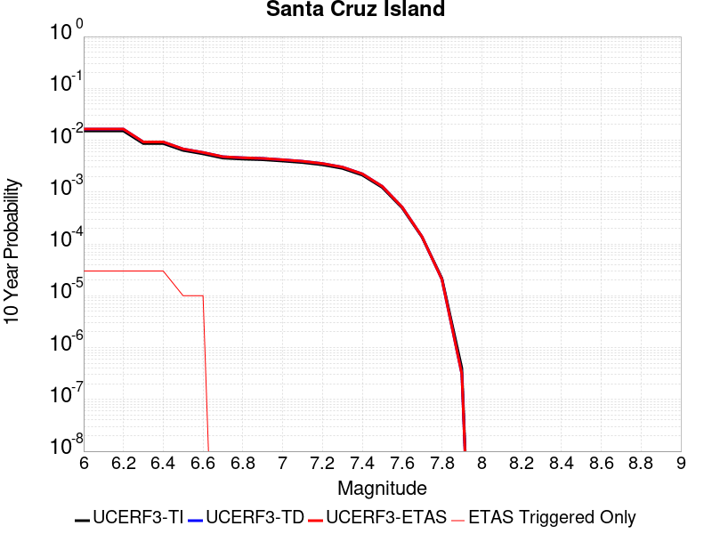 |

| Magnitude | 1 wk TI Prob | 1 wk TD Prob | 1 wk ETAS Prob | 1 wk ETAS/TD Gain | 1 wk ETAS Triggered Only | 1 mo TI Prob | 1 mo TD Prob | 1 mo ETAS Prob | 1 mo ETAS/TD Gain | 1 mo ETAS Triggered Only | 1 yr TI Prob | 1 yr TD Prob | 1 yr ETAS Prob | 1 yr ETAS/TD Gain | 1 yr ETAS Triggered Only | 10 yr TI Prob | 10 yr TD Prob | 10 yr ETAS Prob | 10 yr ETAS/TD Gain | 10 yr ETAS Triggered Only |
|-----|-----|-----|-----|-----|-----|-----|-----|-----|-----|-----|-----|-----|-----|-----|-----|-----|-----|-----|-----|-----|
| 6.0 | 2.9164563E-5 | 3.1600095E-5 | 3.1600095E-5 | 1.0 | 0.0 | 1.2498499E-4 | 1.3542273E-4 | 1.3542273E-4 | 1.0 | 0.0 | 0.0015206301 | 0.0016476609 | 0.0016476609 | 1.0 | 0.0 | 0.015102667 | 0.01636818 | 0.016399808 | 1.0019323 | 3.215434E-5 |
| 6.1 | 2.9164563E-5 | 3.1600095E-5 | 3.1600095E-5 | 1.0 | 0.0 | 1.2498499E-4 | 1.3542273E-4 | 1.3542273E-4 | 1.0 | 0.0 | 0.0015206301 | 0.0016476609 | 0.0016476609 | 1.0 | 0.0 | 0.015102667 | 0.01636818 | 0.016399808 | 1.0019323 | 3.215434E-5 |
| 6.2 | 2.9164563E-5 | 3.1600095E-5 | 3.1600095E-5 | 1.0 | 0.0 | 1.2498499E-4 | 1.3542273E-4 | 1.3542273E-4 | 1.0 | 0.0 | 0.0015206301 | 0.0016476609 | 0.0016476609 | 1.0 | 0.0 | 0.015102667 | 0.01636818 | 0.016399808 | 1.0019323 | 3.215434E-5 |
| 6.3 | 1.6635553E-5 | 1.7804527E-5 | 1.7804527E-5 | 1.0 | 0.0 | 7.1293274E-5 | 7.630298E-5 | 7.630298E-5 | 1.0 | 0.0 | 8.6765E-4 | 9.286111E-4 | 9.286111E-4 | 1.0 | 0.0 | 0.008642701 | 0.009249181 | 0.009281037 | 1.0034443 | 3.215434E-5 |
| 6.4 | 1.6635553E-5 | 1.7804527E-5 | 1.7804527E-5 | 1.0 | 0.0 | 7.1293274E-5 | 7.630298E-5 | 7.630298E-5 | 1.0 | 0.0 | 8.6765E-4 | 9.286111E-4 | 9.286111E-4 | 1.0 | 0.0 | 0.008642701 | 0.009249181 | 0.009281037 | 1.0034443 | 3.215434E-5 |
| 6.5 | 1.2238748E-5 | 1.3043111E-5 | 1.3043111E-5 | 1.0 | 0.0 | 5.2450723E-5 | 5.5897868E-5 | 5.5897868E-5 | 1.0 | 0.0 | 6.3840044E-4 | 6.8034773E-4 | 6.8034773E-4 | 1.0 | 0.0 | 0.0063656955 | 0.006783047 | 0.0067936927 | 1.0015694 | 1.0718114E-5 |
| 6.6 | 1.0489767E-5 | 1.11567315E-5 | 1.11567315E-5 | 1.0 | 0.0 | 4.495537E-5 | 4.7813697E-5 | 4.7813697E-5 | 1.0 | 0.0 | 5.4719415E-4 | 5.8197853E-4 | 5.8197853E-4 | 1.0 | 0.0 | 0.005458487 | 0.005804785 | 0.0058154413 | 1.0018357 | 1.0718114E-5 |
| 6.7 | 8.699222E-6 | 9.236859E-6 | 9.236859E-6 | 1.0 | 0.0 | 3.7281847E-5 | 3.958594E-5 | 3.958594E-5 | 1.0 | 0.0 | 4.5381195E-4 | 4.818528E-4 | 4.818528E-4 | 1.0 | 0.0 | 0.0045288634 | 0.004808148 | 0.004808148 | 1.0 | 0.0 |
| 6.8 | 8.307732E-6 | 8.816977E-6 | 8.816977E-6 | 1.0 | 0.0 | 3.560408E-5 | 3.77865E-5 | 3.77865E-5 | 1.0 | 0.0 | 4.3339343E-4 | 4.5995394E-4 | 4.5995394E-4 | 1.0 | 0.0 | 0.004325492 | 0.004590073 | 0.004590073 | 1.0 | 0.0 |
| 6.9 | 8.073121E-6 | 8.565009E-6 | 8.565009E-6 | 1.0 | 0.0 | 3.459863E-5 | 3.6706668E-5 | 3.6706668E-5 | 1.0 | 0.0 | 4.2115687E-4 | 4.4681245E-4 | 4.4681245E-4 | 1.0 | 0.0 | 0.004203596 | 0.0044591925 | 0.0044591925 | 1.0 | 0.0 |
| 7.0 | 7.617019E-6 | 8.0747295E-6 | 8.0747295E-6 | 1.0 | 0.0 | 3.264396E-5 | 3.4605528E-5 | 3.4605528E-5 | 1.0 | 0.0 | 3.9736772E-4 | 4.2124125E-4 | 4.2124125E-4 | 1.0 | 0.0 | 0.003966579 | 0.0042044753 | 0.0042044753 | 1.0 | 0.0 |
| 7.1 | 7.1224836E-6 | 7.5458483E-6 | 7.5458483E-6 | 1.0 | 0.0 | 3.052457E-5 | 3.233895E-5 | 3.233895E-5 | 1.0 | 0.0 | 3.715733E-4 | 3.9365597E-4 | 3.9365597E-4 | 1.0 | 0.0 | 0.003709526 | 0.0039296295 | 0.0039296295 | 1.0 | 0.0 |
| 7.2 | 6.441115E-6 | 6.8274385E-6 | 6.8274385E-6 | 1.0 | 0.0 | 2.7604487E-5 | 2.9260125E-5 | 2.9260125E-5 | 1.0 | 0.0 | 3.360328E-4 | 3.5618403E-4 | 3.5618403E-4 | 1.0 | 0.0 | 0.0033552512 | 0.0035561598 | 0.0035561598 | 1.0 | 0.0 |
| 7.3 | 5.494274E-6 | 5.820041E-6 | 5.820041E-6 | 1.0 | 0.0 | 2.3546674E-5 | 2.4942796E-5 | 2.4942796E-5 | 1.0 | 0.0 | 2.8664304E-4 | 3.0363642E-4 | 3.0363642E-4 | 1.0 | 0.0 | 0.002862736 | 0.0030322387 | 0.0030322387 | 1.0 | 0.0 |
| 7.4 | 4.0802624E-6 | 4.3122895E-6 | 4.3122895E-6 | 1.0 | 0.0 | 1.7486722E-5 | 1.848111E-5 | 1.848111E-5 | 1.0 | 0.0 | 2.1288003E-4 | 2.2498437E-4 | 2.2498437E-4 | 1.0 | 0.0 | 0.0021267622 | 0.002247575 | 0.002247575 | 1.0 | 0.0 |
| 7.5 | 2.3584746E-6 | 2.4753267E-6 | 2.4753267E-6 | 1.0 | 0.0 | 1.0107709E-5 | 1.06085E-5 | 1.06085E-5 | 1.0 | 0.0 | 1.2305441E-4 | 1.2915088E-4 | 1.2915088E-4 | 1.0 | 0.0 | 0.0012298629 | 0.0012907633 | 0.0012907633 | 1.0 | 0.0 |
| 7.6 | 9.4981914E-7 | 9.860988E-7 | 9.860988E-7 | 1.0 | 0.0 | 4.0706473E-6 | 4.226131E-6 | 4.226131E-6 | 1.0 | 0.0 | 4.9559E-5 | 5.145194E-5 | 5.145194E-5 | 1.0 | 0.0 | 4.954795E-4 | 5.144016E-4 | 5.144016E-4 | 1.0 | 0.0 |
| 7.7 | 2.6013532E-7 | 2.641672E-7 | 2.641672E-7 | 1.0 | 0.0 | 1.1148652E-6 | 1.1321447E-6 | 1.1321447E-6 | 1.0 | 0.0 | 1.3573399E-5 | 1.3783775E-5 | 1.3783775E-5 | 1.0 | 0.0 | 1.357257E-4 | 1.3782927E-4 | 1.3782927E-4 | 1.0 | 0.0 |
| 7.8 | 4.1522263E-8 | 3.9656918E-8 | 3.9656918E-8 | 1.0 | 0.0 | 1.7795254E-7 | 1.6995821E-7 | 1.6995821E-7 | 1.0 | 0.0 | 2.16657E-6 | 2.0692394E-6 | 2.0692394E-6 | 1.0 | 0.0 | 2.1665488E-5 | 2.0692223E-5 | 2.0692223E-5 | 1.0 | 0.0 |
| 7.9 | 7.7242046E-10 | 5.946851E-10 | 5.946851E-10 | 1.0 | 0.0 | 3.3103735E-9 | 2.54865E-9 | 2.54865E-9 | 1.0 | 0.0 | 4.0303796E-8 | 3.1029813E-8 | 3.1029813E-8 | 1.0 | 0.0 | 4.030379E-7 | 3.102981E-7 | 3.102981E-7 | 1.0 | 0.0 |

## San Jacinto (Clark) rev
*[(top)](#table-of-contents)*

| 1 Week | 1 Month | 1 Year | 10 Year |
|-----|-----|-----|-----|
| 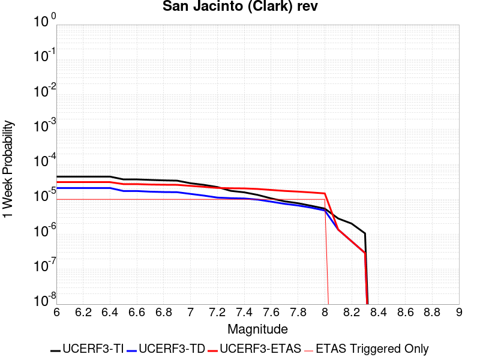 | 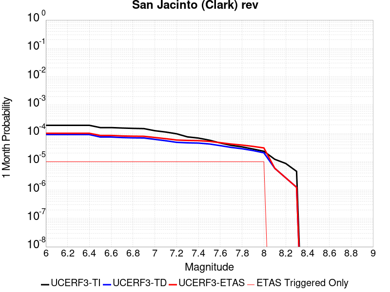 |  |  |

| Magnitude | 1 wk TI Prob | 1 wk TD Prob | 1 wk ETAS Prob | 1 wk ETAS/TD Gain | 1 wk ETAS Triggered Only | 1 mo TI Prob | 1 mo TD Prob | 1 mo ETAS Prob | 1 mo ETAS/TD Gain | 1 mo ETAS Triggered Only | 1 yr TI Prob | 1 yr TD Prob | 1 yr ETAS Prob | 1 yr ETAS/TD Gain | 1 yr ETAS Triggered Only | 10 yr TI Prob | 10 yr TD Prob | 10 yr ETAS Prob | 10 yr ETAS/TD Gain | 10 yr ETAS Triggered Only |
|-----|-----|-----|-----|-----|-----|-----|-----|-----|-----|-----|-----|-----|-----|-----|-----|-----|-----|-----|-----|-----|
| 6.0 | 4.482615E-5 | 2.1162805E-5 | 3.1880692E-5 | 1.5064492 | 1.0718114E-5 | 1.9209793E-4 | 9.069463E-5 | 1.0141177E-4 | 1.1181673 | 1.0718114E-5 | 0.0023362834 | 0.0011036571 | 0.0011357759 | 1.0291022 | 3.215434E-5 | 0.02311874 | 0.011508432 | 0.011540216 | 1.0027618 | 3.215434E-5 |
| 6.1 | 4.482615E-5 | 2.1162805E-5 | 3.1880692E-5 | 1.5064492 | 1.0718114E-5 | 1.9209793E-4 | 9.069463E-5 | 1.0141177E-4 | 1.1181673 | 1.0718114E-5 | 0.0023362834 | 0.0011036571 | 0.0011357759 | 1.0291022 | 3.215434E-5 | 0.02311874 | 0.011508432 | 0.011540216 | 1.0027618 | 3.215434E-5 |
| 6.2 | 4.482615E-5 | 2.1162805E-5 | 3.1880692E-5 | 1.5064492 | 1.0718114E-5 | 1.9209793E-4 | 9.069463E-5 | 1.0141177E-4 | 1.1181673 | 1.0718114E-5 | 0.0023362834 | 0.0011036571 | 0.0011357759 | 1.0291022 | 3.215434E-5 | 0.02311874 | 0.011508432 | 0.011540216 | 1.0027618 | 3.215434E-5 |
| 6.3 | 4.482615E-5 | 2.1162805E-5 | 3.1880692E-5 | 1.5064492 | 1.0718114E-5 | 1.9209793E-4 | 9.069463E-5 | 1.0141177E-4 | 1.1181673 | 1.0718114E-5 | 0.0023362834 | 0.0011036571 | 0.0011357759 | 1.0291022 | 3.215434E-5 | 0.02311874 | 0.011508432 | 0.011540216 | 1.0027618 | 3.215434E-5 |
| 6.4 | 4.482615E-5 | 2.1162805E-5 | 3.1880692E-5 | 1.5064492 | 1.0718114E-5 | 1.9209793E-4 | 9.069463E-5 | 1.0141177E-4 | 1.1181673 | 1.0718114E-5 | 0.0023362834 | 0.0011036571 | 0.0011357759 | 1.0291022 | 3.215434E-5 | 0.02311874 | 0.011508432 | 0.011540216 | 1.0027618 | 3.215434E-5 |
| 6.5 | 3.7294863E-5 | 1.7363767E-5 | 2.8081695E-5 | 1.6172582 | 1.0718114E-5 | 1.5982533E-4 | 7.441404E-5 | 8.513136E-5 | 1.1440227 | 1.0718114E-5 | 0.0019441366 | 9.056189E-4 | 9.3774416E-4 | 1.0354732 | 3.215434E-5 | 0.01927216 | 0.009498186 | 0.009530035 | 1.0033531 | 3.215434E-5 |
| 6.6 | 3.7294863E-5 | 1.7363767E-5 | 2.8081695E-5 | 1.6172582 | 1.0718114E-5 | 1.5982533E-4 | 7.441404E-5 | 8.513136E-5 | 1.1440227 | 1.0718114E-5 | 0.0019441366 | 9.056189E-4 | 9.3774416E-4 | 1.0354732 | 3.215434E-5 | 0.01927216 | 0.009498186 | 0.009530035 | 1.0033531 | 3.215434E-5 |
| 6.7 | 3.6039248E-5 | 1.661182E-5 | 2.7329756E-5 | 1.6451993 | 1.0718114E-5 | 1.5444479E-4 | 7.11916E-5 | 8.190895E-5 | 1.1505424 | 1.0718114E-5 | 0.0018787434 | 8.6641713E-4 | 8.985436E-4 | 1.0370797 | 3.215434E-5 | 0.01862939 | 0.009100041 | 0.009131903 | 1.0035013 | 3.215434E-5 |
| 6.8 | 3.5031844E-5 | 1.6240316E-5 | 2.6958256E-5 | 1.6599588 | 1.0718114E-5 | 1.5012783E-4 | 6.959952E-5 | 8.031689E-5 | 1.1539862 | 1.0718114E-5 | 0.0018262739 | 8.470488E-4 | 8.791759E-4 | 1.0379282 | 3.215434E-5 | 0.01811338 | 0.008899899 | 0.008931768 | 1.0035807 | 3.215434E-5 |
| 6.9 | 3.435112E-5 | 1.6070499E-5 | 2.678844E-5 | 1.6669327 | 1.0718114E-5 | 1.4721078E-4 | 6.887177E-5 | 7.958915E-5 | 1.1556134 | 1.0718114E-5 | 0.0017908178 | 8.381953E-4 | 8.703227E-4 | 1.0383292 | 3.215434E-5 | 0.017764548 | 0.008808068 | 0.00883994 | 1.0036184 | 3.215434E-5 |
| 7.0 | 2.8959772E-5 | 1.4343366E-5 | 2.5061327E-5 | 1.7472416 | 1.0718114E-5 | 1.241074E-4 | 6.1470135E-5 | 7.218759E-5 | 1.1743522 | 1.0718114E-5 | 0.0015099603 | 7.481447E-4 | 7.8027503E-4 | 1.0429466 | 3.215434E-5 | 0.014997416 | 0.0078715505 | 0.007903452 | 1.0040528 | 3.215434E-5 |
| 7.1 | 2.6002877E-5 | 1.2835043E-5 | 2.3553019E-5 | 1.8350557 | 1.0718114E-5 | 1.11436144E-4 | 5.500618E-5 | 6.57237E-5 | 1.1948422 | 1.0718114E-5 | 0.0013558907 | 6.694966E-4 | 7.016294E-4 | 1.0479954 | 3.215434E-5 | 0.013476475 | 0.007049743 | 0.0070816707 | 1.0045289 | 3.215434E-5 |
| 7.2 | 2.2544838E-5 | 1.1267972E-5 | 2.1985965E-5 | 1.951191 | 1.0718114E-5 | 9.661716E-5 | 4.829042E-5 | 5.900802E-5 | 1.2219404 | 1.0718114E-5 | 0.001175679 | 5.8777875E-4 | 6.1991415E-4 | 1.0546727 | 3.215434E-5 | 0.011694785 | 0.0061956523 | 0.0062276074 | 1.0051577 | 3.215434E-5 |
| 7.3 | 1.75334E-5 | 1.081679E-5 | 2.1534788E-5 | 1.9908668 | 1.0718114E-5 | 7.514098E-5 | 4.6356854E-5 | 5.7074474E-5 | 1.2311981 | 1.0718114E-5 | 9.144575E-4 | 5.6424993E-4 | 5.9638615E-4 | 1.0569538 | 3.215434E-5 | 0.009107036 | 0.005936473 | 0.0059684366 | 1.0053842 | 3.215434E-5 |
| 7.4 | 1.5924552E-5 | 1.0616479E-5 | 2.133448E-5 | 2.0095625 | 1.0718114E-5 | 6.82463E-5 | 4.5498407E-5 | 5.6216035E-5 | 1.2355604 | 1.0718114E-5 | 8.305819E-4 | 5.538037E-4 | 5.8594026E-4 | 1.0580287 | 3.215434E-5 | 0.008274844 | 0.005823671 | 0.005855638 | 1.0054891 | 3.215434E-5 |
| 7.5 | 1.3428931E-5 | 9.856627E-6 | 2.0574635E-5 | 2.0873911 | 1.0718114E-5 | 5.7551293E-5 | 4.224201E-5 | 5.295967E-5 | 1.2537204 | 1.0718114E-5 | 7.004617E-4 | 5.1417615E-4 | 5.46314E-4 | 1.0625035 | 3.215434E-5 | 0.006982579 | 0.005409115 | 0.005441095 | 1.0059123 | 3.215434E-5 |
| 7.6 | 1.0688787E-5 | 8.61931E-6 | 1.9337333E-5 | 2.2434893 | 1.0718114E-5 | 4.5808283E-5 | 3.6939382E-5 | 4.76571E-5 | 1.2901434 | 1.0718114E-5 | 5.5757316E-4 | 4.4964463E-4 | 4.8178452E-4 | 1.0714784 | 3.215434E-5 | 0.005561762 | 0.004744031 | 0.0047760326 | 1.0067457 | 3.215434E-5 |
| 7.7 | 8.81236E-6 | 7.4723484E-6 | 1.8190382E-5 | 2.4343596 | 1.0718114E-5 | 3.776671E-5 | 3.202396E-5 | 4.274173E-5 | 1.3346797 | 1.0718114E-5 | 4.597127E-4 | 3.8982215E-4 | 4.2196395E-4 | 1.0824525 | 3.215434E-5 | 0.0045876284 | 0.004136955 | 0.004168976 | 1.0077403 | 3.215434E-5 |
| 7.8 | 7.780431E-6 | 6.7006613E-6 | 1.7418703E-5 | 2.5995498 | 1.0718114E-5 | 3.3344273E-5 | 2.8716804E-5 | 3.943461E-5 | 1.3732241 | 1.0718114E-5 | 4.0589093E-4 | 3.4957117E-4 | 3.817143E-4 | 1.09195 | 3.215434E-5 | 0.0040515037 | 0.0037249678 | 0.0037570023 | 1.0086 | 3.215434E-5 |
| 7.9 | 6.5437994E-6 | 5.784193E-6 | 1.6502245E-5 | 2.85299 | 1.0718114E-5 | 2.8044553E-5 | 2.4789164E-5 | 3.550701E-5 | 1.4323602 | 1.0718114E-5 | 3.4138895E-4 | 3.0176644E-4 | 3.339111E-4 | 1.1065216 | 3.215434E-5 | 0.0034086495 | 0.003236521 | 0.0032685713 | 1.0099027 | 3.215434E-5 |
| 8.0 | 5.4488164E-6 | 4.8167294E-6 | 1.5534792E-5 | 3.2251742 | 1.0718114E-5 | 2.3351862E-5 | 2.0642963E-5 | 3.1360854E-5 | 1.5192032 | 1.0718114E-5 | 2.8427184E-4 | 2.5129924E-4 | 2.834455E-4 | 1.1279203 | 3.215434E-5 | 0.0028390845 | 0.0027126544 | 0.0027447217 | 1.0118213 | 3.215434E-5 |
| 8.1 | 2.8397242E-6 | 1.3684335E-6 | 1.3684335E-6 | 1.0 | 0.0 | 1.217019E-5 | 5.864702E-6 | 5.864702E-6 | 1.0 | 0.0 | 1.4816198E-4 | 7.140042E-5 | 7.140042E-5 | 1.0 | 0.0 | 0.0014806325 | 8.12321E-4 | 8.12321E-4 | 1.0 | 0.0 |
| 8.2 | 2.030244E-6 | 6.326596E-7 | 6.326596E-7 | 1.0 | 0.0 | 8.701017E-6 | 2.7113954E-6 | 2.7113954E-6 | 1.0 | 0.0 | 1.05929736E-4 | 3.3010747E-5 | 3.3010747E-5 | 1.0 | 0.0 | 0.0010587925 | 3.9531066E-4 | 3.9531066E-4 | 1.0 | 0.0 |
| 8.3 | 1.0659804E-6 | 2.9287372E-7 | 2.9287372E-7 | 1.0 | 0.0 | 4.568479E-6 | 1.2551725E-6 | 1.2551725E-6 | 1.0 | 0.0 | 5.5619817E-5 | 1.5281621E-5 | 1.5281621E-5 | 1.0 | 0.0 | 5.5605895E-4 | 1.8588232E-4 | 1.8588232E-4 | 1.0 | 0.0 |

## San Diego Trough north alt1
*[(top)](#table-of-contents)*

| 1 Week | 1 Month | 1 Year | 10 Year |
|-----|-----|-----|-----|
|  |  |  |  |

| Magnitude | 1 wk TI Prob | 1 wk TD Prob | 1 wk ETAS Prob | 1 wk ETAS/TD Gain | 1 wk ETAS Triggered Only | 1 mo TI Prob | 1 mo TD Prob | 1 mo ETAS Prob | 1 mo ETAS/TD Gain | 1 mo ETAS Triggered Only | 1 yr TI Prob | 1 yr TD Prob | 1 yr ETAS Prob | 1 yr ETAS/TD Gain | 1 yr ETAS Triggered Only | 10 yr TI Prob | 10 yr TD Prob | 10 yr ETAS Prob | 10 yr ETAS/TD Gain | 10 yr ETAS Triggered Only |
|-----|-----|-----|-----|-----|-----|-----|-----|-----|-----|-----|-----|-----|-----|-----|-----|-----|-----|-----|-----|-----|
| 6.0 | 7.329252E-5 | 8.821339E-5 | 8.821339E-5 | 1.0 | 0.0 | 3.14073E-4 | 3.7800625E-4 | 3.7800625E-4 | 1.0 | 0.0 | 0.0038171355 | 0.0045931544 | 0.004614492 | 1.0046456 | 2.1436228E-5 | 0.03752231 | 0.045046188 | 0.04507689 | 1.0006816 | 3.215434E-5 |
| 6.1 | 3.7940346E-5 | 4.488612E-5 | 4.488612E-5 | 1.0 | 0.0 | 1.6259136E-4 | 1.9235547E-4 | 1.9235547E-4 | 1.0 | 0.0 | 0.0019777524 | 0.002339501 | 0.002339501 | 1.0 | 0.0 | 0.019602431 | 0.023157248 | 0.023167718 | 1.0004522 | 1.0718114E-5 |
| 6.2 | 2.8645263E-5 | 3.329751E-5 | 3.329751E-5 | 1.0 | 0.0 | 1.2275964E-4 | 1.4269596E-4 | 1.4269596E-4 | 1.0 | 0.0 | 0.0014935739 | 0.0017359565 | 0.0017359565 | 1.0 | 0.0 | 0.0148357535 | 0.01722662 | 0.01722662 | 1.0 | 0.0 |
| 6.3 | 2.8645263E-5 | 3.329751E-5 | 3.329751E-5 | 1.0 | 0.0 | 1.2275964E-4 | 1.4269596E-4 | 1.4269596E-4 | 1.0 | 0.0 | 0.0014935739 | 0.0017359565 | 0.0017359565 | 1.0 | 0.0 | 0.0148357535 | 0.01722662 | 0.01722662 | 1.0 | 0.0 |
| 6.4 | 2.2204576E-5 | 2.5448817E-5 | 2.5448817E-5 | 1.0 | 0.0 | 9.5159E-5 | 1.0906186E-4 | 1.0906186E-4 | 1.0 | 0.0 | 0.001157945 | 0.0013270293 | 0.0013270293 | 1.0 | 0.0 | 0.011519298 | 0.013192211 | 0.013192211 | 1.0 | 0.0 |
| 6.5 | 2.1004838E-5 | 2.4025157E-5 | 2.4025157E-5 | 1.0 | 0.0 | 9.0017624E-5 | 1.0296095E-4 | 1.0296095E-4 | 1.0 | 0.0 | 0.0010954136 | 0.001252838 | 0.001252838 | 1.0 | 0.0 | 0.010900296 | 0.012458827 | 0.012458827 | 1.0 | 0.0 |
| 6.6 | 1.820557E-5 | 2.0705167E-5 | 2.0705167E-5 | 1.0 | 0.0 | 7.802154E-5 | 8.873344E-5 | 8.873344E-5 | 1.0 | 0.0 | 9.4949827E-4 | 0.0010797997 | 0.0010797997 | 1.0 | 0.0 | 0.009454516 | 0.010746201 | 0.010746201 | 1.0 | 0.0 |
| 6.7 | 1.5884485E-5 | 1.7983964E-5 | 1.7983964E-5 | 1.0 | 0.0 | 6.807459E-5 | 7.707187E-5 | 7.707187E-5 | 1.0 | 0.0 | 8.284929E-4 | 9.379488E-4 | 9.379488E-4 | 1.0 | 0.0 | 0.008254109 | 0.009340268 | 0.009340268 | 1.0 | 0.0 |
| 6.8 | 1.4331171E-5 | 1.6201348E-5 | 1.6201348E-5 | 1.0 | 0.0 | 6.141786E-5 | 6.9432506E-5 | 6.9432506E-5 | 1.0 | 0.0 | 7.4750587E-4 | 8.4501493E-4 | 8.4501493E-4 | 1.0 | 0.0 | 0.0074499645 | 0.008418285 | 0.008418285 | 1.0 | 0.0 |
| 6.9 | 1.2574203E-5 | 1.4206081E-5 | 1.4206081E-5 | 1.0 | 0.0 | 5.3888325E-5 | 6.088179E-5 | 6.088179E-5 | 1.0 | 0.0 | 6.558929E-4 | 7.4098515E-4 | 7.4098515E-4 | 1.0 | 0.0 | 0.0065396037 | 0.0073853307 | 0.0073853307 | 1.0 | 0.0 |
| 7.0 | 1.0883844E-5 | 1.22894735E-5 | 1.22894735E-5 | 1.0 | 0.0 | 4.664421E-5 | 5.2668114E-5 | 5.2668114E-5 | 1.0 | 0.0 | 5.677453E-4 | 6.410466E-4 | 6.410466E-4 | 1.0 | 0.0 | 0.00566297 | 0.0063921027 | 0.0063921027 | 1.0 | 0.0 |
| 7.1 | 9.393088E-6 | 1.0607203E-5 | 1.0607203E-5 | 1.0 | 0.0 | 4.025547E-5 | 4.5458655E-5 | 4.5458655E-5 | 1.0 | 0.0 | 4.900001E-4 | 5.5331935E-4 | 5.5331935E-4 | 1.0 | 0.0 | 0.0048892107 | 0.005519513 | 0.005519513 | 1.0 | 0.0 |
| 7.2 | 8.190791E-6 | 9.258787E-6 | 9.258787E-6 | 1.0 | 0.0 | 3.510292E-5 | 3.9679915E-5 | 3.9679915E-5 | 1.0 | 0.0 | 4.2729423E-4 | 4.8299658E-4 | 4.8299658E-4 | 1.0 | 0.0 | 0.0042647356 | 0.004819548 | 0.004819548 | 1.0 | 0.0 |
| 7.3 | 6.268162E-6 | 7.08984E-6 | 7.08984E-6 | 1.0 | 0.0 | 2.6863276E-5 | 3.0384675E-5 | 3.0384675E-5 | 1.0 | 0.0 | 3.2701128E-4 | 3.6987104E-4 | 3.6987104E-4 | 1.0 | 0.0 | 0.003265305 | 0.0036926004 | 0.0036926004 | 1.0 | 0.0 |
| 7.4 | 4.985186E-6 | 5.6427807E-6 | 5.6427807E-6 | 1.0 | 0.0 | 2.1364907E-5 | 2.4183124E-5 | 2.4183124E-5 | 1.0 | 0.0 | 2.600867E-4 | 2.9439016E-4 | 2.9439016E-4 | 1.0 | 0.0 | 0.002597825 | 0.002940043 | 0.002940043 | 1.0 | 0.0 |
| 7.5 | 1.7489613E-6 | 1.9697113E-6 | 1.9697113E-6 | 1.0 | 0.0 | 7.495527E-6 | 8.441594E-6 | 8.441594E-6 | 1.0 | 0.0 | 9.125422E-5 | 1.0277178E-4 | 1.0277178E-4 | 1.0 | 0.0 | 9.1216754E-4 | 0.0010272645 | 0.0010272645 | 1.0 | 0.0 |
| 7.6 | 1.6988751E-7 | 1.7533898E-7 | 1.7533898E-7 | 1.0 | 0.0 | 7.2808916E-7 | 7.5145255E-7 | 7.5145255E-7 | 1.0 | 0.0 | 8.864449E-6 | 9.148898E-6 | 9.148898E-6 | 1.0 | 0.0 | 8.8640954E-5 | 9.148542E-5 | 9.148542E-5 | 1.0 | 0.0 |

## Elysian Park (Upper)
*[(top)](#table-of-contents)*

| 1 Week | 1 Month | 1 Year | 10 Year |
|-----|-----|-----|-----|
|  |  | 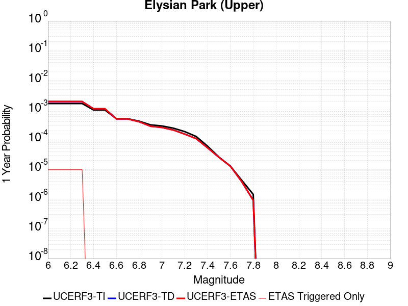 |  |

| Magnitude | 1 wk TI Prob | 1 wk TD Prob | 1 wk ETAS Prob | 1 wk ETAS/TD Gain | 1 wk ETAS Triggered Only | 1 mo TI Prob | 1 mo TD Prob | 1 mo ETAS Prob | 1 mo ETAS/TD Gain | 1 mo ETAS Triggered Only | 1 yr TI Prob | 1 yr TD Prob | 1 yr ETAS Prob | 1 yr ETAS/TD Gain | 1 yr ETAS Triggered Only | 10 yr TI Prob | 10 yr TD Prob | 10 yr ETAS Prob | 10 yr ETAS/TD Gain | 10 yr ETAS Triggered Only |
|-----|-----|-----|-----|-----|-----|-----|-----|-----|-----|-----|-----|-----|-----|-----|-----|-----|-----|-----|-----|-----|
| 6.0 | 3.1876025E-5 | 3.703652E-5 | 3.703652E-5 | 1.0 | 0.0 | 1.3660437E-4 | 1.5872101E-4 | 1.5872101E-4 | 1.0 | 0.0 | 0.0016618895 | 0.0019311584 | 0.0019418558 | 1.0055394 | 1.0718114E-5 | 0.016495159 | 0.019190295 | 0.019221831 | 1.0016434 | 3.215434E-5 |
| 6.1 | 3.1876025E-5 | 3.703652E-5 | 3.703652E-5 | 1.0 | 0.0 | 1.3660437E-4 | 1.5872101E-4 | 1.5872101E-4 | 1.0 | 0.0 | 0.0016618895 | 0.0019311584 | 0.0019418558 | 1.0055394 | 1.0718114E-5 | 0.016495159 | 0.019190295 | 0.019221831 | 1.0016434 | 3.215434E-5 |
| 6.2 | 3.1876025E-5 | 3.703652E-5 | 3.703652E-5 | 1.0 | 0.0 | 1.3660437E-4 | 1.5872101E-4 | 1.5872101E-4 | 1.0 | 0.0 | 0.0016618895 | 0.0019311584 | 0.0019418558 | 1.0055394 | 1.0718114E-5 | 0.016495159 | 0.019190295 | 0.019221831 | 1.0016434 | 3.215434E-5 |
| 6.3 | 3.1876025E-5 | 3.703652E-5 | 3.703652E-5 | 1.0 | 0.0 | 1.3660437E-4 | 1.5872101E-4 | 1.5872101E-4 | 1.0 | 0.0 | 0.0016618895 | 0.0019311584 | 0.0019418558 | 1.0055394 | 1.0718114E-5 | 0.016495159 | 0.019190295 | 0.019221831 | 1.0016434 | 3.215434E-5 |
| 6.4 | 1.9273462E-5 | 2.120273E-5 | 2.120273E-5 | 1.0 | 0.0 | 8.259794E-5 | 9.0866655E-5 | 9.0866655E-5 | 1.0 | 0.0 | 0.001005166 | 0.0011059135 | 0.0011059135 | 1.0 | 0.0 | 0.010006315 | 0.011020964 | 0.011020964 | 1.0 | 0.0 |
| 6.5 | 1.9273462E-5 | 2.120273E-5 | 2.120273E-5 | 1.0 | 0.0 | 8.259794E-5 | 9.0866655E-5 | 9.0866655E-5 | 1.0 | 0.0 | 0.001005166 | 0.0011059135 | 0.0011059135 | 1.0 | 0.0 | 0.010006315 | 0.011020964 | 0.011020964 | 1.0 | 0.0 |
| 6.6 | 9.813258E-6 | 9.665728E-6 | 9.665728E-6 | 1.0 | 0.0 | 4.205614E-5 | 4.142393E-5 | 4.142393E-5 | 1.0 | 0.0 | 5.119132E-4 | 5.042269E-4 | 5.042269E-4 | 1.0 | 0.0 | 0.005107356 | 0.005031552 | 0.005031552 | 1.0 | 0.0 |
| 6.7 | 9.801478E-6 | 9.653297E-6 | 9.653297E-6 | 1.0 | 0.0 | 4.2005657E-5 | 4.137066E-5 | 4.137066E-5 | 1.0 | 0.0 | 5.112989E-4 | 5.0357863E-4 | 5.0357863E-4 | 1.0 | 0.0 | 0.0051012407 | 0.0050250986 | 0.0050250986 | 1.0 | 0.0 |
| 6.8 | 8.102489E-6 | 7.7731065E-6 | 7.7731065E-6 | 1.0 | 0.0 | 3.4724493E-5 | 3.3312917E-5 | 3.3312917E-5 | 1.0 | 0.0 | 4.2268867E-4 | 4.0551423E-4 | 4.0551423E-4 | 1.0 | 0.0 | 0.004218856 | 0.0040482366 | 0.0040482366 | 1.0 | 0.0 |
| 6.9 | 6.08275E-6 | 5.4815127E-6 | 5.4815127E-6 | 1.0 | 0.0 | 2.6068668E-5 | 2.349199E-5 | 2.349199E-5 | 1.0 | 0.0 | 3.173398E-4 | 2.8597823E-4 | 2.8597823E-4 | 1.0 | 0.0 | 0.0031688702 | 0.0028561796 | 0.0028561796 | 1.0 | 0.0 |
| 7.0 | 5.5995934E-6 | 4.982836E-6 | 4.982836E-6 | 1.0 | 0.0 | 2.3998036E-5 | 2.135484E-5 | 2.135484E-5 | 1.0 | 0.0 | 2.9213692E-4 | 2.599648E-4 | 2.599648E-4 | 1.0 | 0.0 | 0.0029175316 | 0.0025966743 | 0.0025966743 | 1.0 | 0.0 |
| 7.1 | 4.709881E-6 | 4.0874465E-6 | 4.0874465E-6 | 1.0 | 0.0 | 2.0185047E-5 | 1.7517514E-5 | 1.7517514E-5 | 1.0 | 0.0 | 2.4572524E-4 | 2.1325526E-4 | 2.1325526E-4 | 1.0 | 0.0 | 0.002454537 | 0.0021305475 | 0.0021305475 | 1.0 | 0.0 |
| 7.2 | 3.6063436E-6 | 2.9779865E-6 | 2.9779865E-6 | 1.0 | 0.0 | 1.5455667E-5 | 1.2762738E-5 | 1.2762738E-5 | 1.0 | 0.0 | 1.881565E-4 | 1.5537537E-4 | 1.5537537E-4 | 1.0 | 0.0 | 0.0018799726 | 0.0015526785 | 0.0015526785 | 1.0 | 0.0 |
| 7.3 | 2.471135E-6 | 2.0954842E-6 | 2.0954842E-6 | 1.0 | 0.0 | 1.0590536E-5 | 8.980616E-6 | 8.980616E-6 | 1.0 | 0.0 | 1.2893214E-4 | 1.0933358E-4 | 1.0933358E-4 | 1.0 | 0.0 | 0.0012885736 | 0.0010928052 | 0.0010928052 | 1.0 | 0.0 |
| 7.4 | 1.163943E-6 | 1.0275212E-6 | 1.0275212E-6 | 1.0 | 0.0 | 4.988318E-6 | 4.403655E-6 | 4.403655E-6 | 1.0 | 0.0 | 6.0731076E-5 | 5.3613214E-5 | 5.3613214E-5 | 1.0 | 0.0 | 6.071448E-4 | 5.3600577E-4 | 5.3600577E-4 | 1.0 | 0.0 |
| 7.5 | 4.99459E-7 | 4.9176606E-7 | 4.9176606E-7 | 1.0 | 0.0 | 2.140537E-6 | 2.107567E-6 | 2.107567E-6 | 1.0 | 0.0 | 2.6060725E-5 | 2.5659343E-5 | 2.5659343E-5 | 1.0 | 0.0 | 2.605767E-4 | 2.5656537E-4 | 2.5656537E-4 | 1.0 | 0.0 |
| 7.6 | 2.4667852E-7 | 2.4778674E-7 | 2.4778674E-7 | 1.0 | 0.0 | 1.0571932E-6 | 1.0619428E-6 | 1.0619428E-6 | 1.0 | 0.0 | 1.2871251E-5 | 1.2929081E-5 | 1.2929081E-5 | 1.0 | 0.0 | 1.2870505E-4 | 1.2928365E-4 | 1.2928365E-4 | 1.0 | 0.0 |
| 7.7 | 8.2312795E-8 | 7.386629E-8 | 7.386629E-8 | 1.0 | 0.0 | 3.527691E-7 | 3.1656978E-7 | 3.1656978E-7 | 1.0 | 0.0 | 4.294955E-6 | 3.8542316E-6 | 3.8542316E-6 | 1.0 | 0.0 | 4.2948723E-5 | 3.8541762E-5 | 3.8541762E-5 | 1.0 | 0.0 |
| 7.8 | 2.7819295E-8 | 1.7567322E-8 | 1.7567322E-8 | 1.0 | 0.0 | 1.1922555E-7 | 7.528852E-8 | 7.528852E-8 | 1.0 | 0.0 | 1.45157E-6 | 9.166375E-7 | 9.166375E-7 | 1.0 | 0.0 | 1.45156055E-5 | 9.166352E-6 | 9.166352E-6 | 1.0 | 0.0 |

## Rose Canyon
*[(top)](#table-of-contents)*

| 1 Week | 1 Month | 1 Year | 10 Year |
|-----|-----|-----|-----|
|  |  |  | 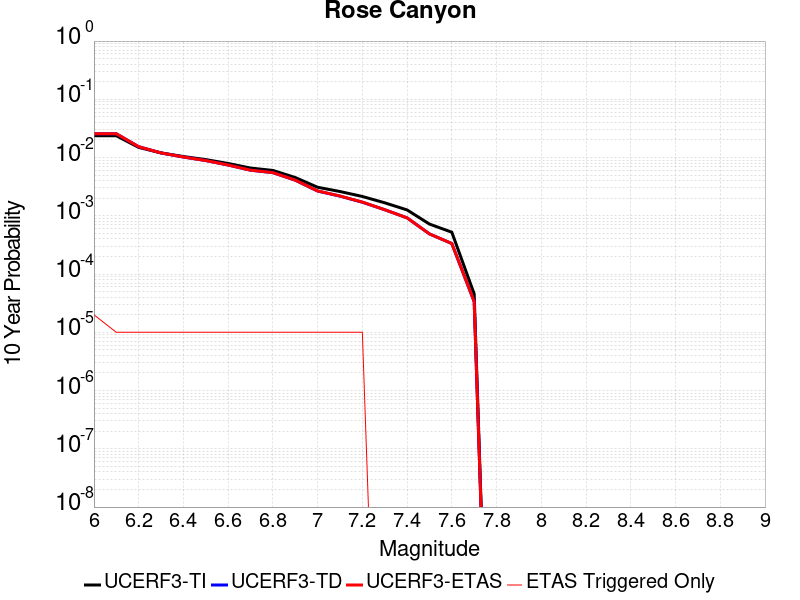 |

| Magnitude | 1 wk TI Prob | 1 wk TD Prob | 1 wk ETAS Prob | 1 wk ETAS/TD Gain | 1 wk ETAS Triggered Only | 1 mo TI Prob | 1 mo TD Prob | 1 mo ETAS Prob | 1 mo ETAS/TD Gain | 1 mo ETAS Triggered Only | 1 yr TI Prob | 1 yr TD Prob | 1 yr ETAS Prob | 1 yr ETAS/TD Gain | 1 yr ETAS Triggered Only | 10 yr TI Prob | 10 yr TD Prob | 10 yr ETAS Prob | 10 yr ETAS/TD Gain | 10 yr ETAS Triggered Only |
|-----|-----|-----|-----|-----|-----|-----|-----|-----|-----|-----|-----|-----|-----|-----|-----|-----|-----|-----|-----|-----|
| 6.0 | 4.5923203E-5 | 4.9715825E-5 | 6.0433405E-5 | 1.2155769 | 1.0718114E-5 | 1.9679888E-4 | 2.1305127E-4 | 2.2376711E-4 | 1.0502969 | 1.0718114E-5 | 0.0023933933 | 0.0025910123 | 0.0026123931 | 1.0082519 | 2.1436228E-5 | 0.023677798 | 0.025640773 | 0.02566166 | 1.0008146 | 2.1436228E-5 |
| 6.1 | 4.5923203E-5 | 4.9715825E-5 | 6.0433405E-5 | 1.2155769 | 1.0718114E-5 | 1.9679888E-4 | 2.1305127E-4 | 2.2376711E-4 | 1.0502969 | 1.0718114E-5 | 0.0023933933 | 0.0025910123 | 0.0026017027 | 1.004126 | 1.0718114E-5 | 0.023677798 | 0.025640773 | 0.025651217 | 1.0004073 | 1.0718114E-5 |
| 6.2 | 2.8844734E-5 | 2.9669445E-5 | 4.038724E-5 | 1.3612401 | 1.0718114E-5 | 1.2361443E-4 | 1.2714828E-4 | 1.3786503E-4 | 1.0842855 | 1.0718114E-5 | 0.0015039665 | 0.0015469306 | 0.0015576322 | 1.006918 | 1.0718114E-5 | 0.0149382865 | 0.01537464 | 0.015385194 | 1.0006864 | 1.0718114E-5 |
| 6.3 | 2.3171577E-5 | 2.3161689E-5 | 3.3879554E-5 | 1.4627411 | 1.0718114E-5 | 9.9302975E-5 | 9.926068E-5 | 1.0997773E-4 | 1.1079687 | 1.0718114E-5 | 0.0012083431 | 0.0012078421 | 0.0012185473 | 1.0088631 | 1.0718114E-5 | 0.012017938 | 0.0120226685 | 0.012033258 | 1.0008807 | 1.0718114E-5 |
| 6.4 | 2.0066604E-5 | 1.9667403E-5 | 3.0385305E-5 | 1.5449578 | 1.0718114E-5 | 8.599689E-5 | 8.42862E-5 | 9.500341E-5 | 1.1271526 | 1.0718114E-5 | 0.0010465092 | 0.0010257114 | 0.0010364185 | 1.0104387 | 1.0718114E-5 | 0.010415946 | 0.010217753 | 0.010228362 | 1.0010382 | 1.0718114E-5 |
| 6.5 | 1.776989E-5 | 1.7114124E-5 | 2.7832053E-5 | 1.6262623 | 1.0718114E-5 | 7.615444E-5 | 7.334422E-5 | 8.406155E-5 | 1.1461236 | 1.0718114E-5 | 9.267859E-4 | 8.92607E-4 | 9.0331555E-4 | 1.011997 | 1.0718114E-5 | 0.009229303 | 0.008896374 | 0.008906998 | 1.001194 | 1.0718114E-5 |
| 6.6 | 1.5227364E-5 | 1.43395055E-5 | 2.5057465E-5 | 1.7474428 | 1.0718114E-5 | 6.52585E-5 | 6.1453604E-5 | 7.217106E-5 | 1.1743991 | 1.0718114E-5 | 7.942326E-4 | 7.47946E-4 | 7.5865607E-4 | 1.0143193 | 1.0718114E-5 | 0.007914 | 0.007458486 | 0.0074691246 | 1.0014263 | 1.0718114E-5 |
| 6.7 | 1.2703898E-5 | 1.167345E-5 | 2.239144E-5 | 1.9181509 | 1.0718114E-5 | 5.4444143E-5 | 5.002814E-5 | 6.0745715E-5 | 1.214231 | 1.0718114E-5 | 6.626558E-4 | 6.089266E-4 | 6.196382E-4 | 1.0175909 | 1.0718114E-5 | 0.006606833 | 0.006075177 | 0.00608583 | 1.0017536 | 1.0718114E-5 |
| 6.8 | 1.1554917E-5 | 1.0609485E-5 | 2.1327485E-5 | 2.0102282 | 1.0718114E-5 | 4.9520135E-5 | 4.5468452E-5 | 5.618608E-5 | 1.2357156 | 1.0718114E-5 | 6.0274085E-4 | 5.534419E-4 | 5.64154E-4 | 1.0193555 | 1.0718114E-5 | 0.0060110865 | 0.005522644 | 0.005533303 | 1.00193 | 1.0718114E-5 |
| 6.9 | 8.732078E-6 | 7.881448E-6 | 1.8599478E-5 | 2.359906 | 1.0718114E-5 | 3.7422655E-5 | 3.3777214E-5 | 4.4494966E-5 | 1.3173071 | 1.0718114E-5 | 4.5552556E-4 | 4.111629E-4 | 4.2187664E-4 | 1.0260571 | 1.0718114E-5 | 0.0045459294 | 0.0041048555 | 0.0041155294 | 1.0026003 | 1.0718114E-5 |
| 7.0 | 5.9337494E-6 | 5.107531E-6 | 1.582559E-5 | 3.0984814 | 1.0718114E-5 | 2.5430107E-5 | 2.1889235E-5 | 3.2607113E-5 | 1.4896415 | 1.0718114E-5 | 3.0956755E-4 | 2.66469E-4 | 2.7718424E-4 | 1.040212 | 1.0718114E-5 | 0.0030913667 | 0.0026615104 | 0.0026721999 | 1.0040164 | 1.0718114E-5 |
| 7.1 | 5.013409E-6 | 4.177419E-6 | 1.4895488E-5 | 3.5657153 | 1.0718114E-5 | 2.1485863E-5 | 1.7903103E-5 | 2.8621025E-5 | 1.5986627 | 1.0718114E-5 | 2.6155898E-4 | 2.1794859E-4 | 2.2866437E-4 | 1.0491666 | 1.0718114E-5 | 0.0026125133 | 0.00217736 | 0.0021880548 | 1.0049118 | 1.0718114E-5 |
| 7.2 | 4.120763E-6 | 3.2821677E-6 | 1.4000246E-5 | 4.2655487 | 1.0718114E-5 | 1.7660293E-5 | 1.4066358E-5 | 2.478432E-5 | 1.7619573 | 1.0718114E-5 | 2.1499286E-4 | 1.7124454E-4 | 1.8196082E-4 | 1.0625788 | 1.0718114E-5 | 0.0021478499 | 0.0017111353 | 0.0017218351 | 1.006253 | 1.0718114E-5 |
| 7.3 | 3.2081239E-6 | 2.4405597E-6 | 2.4405597E-6 | 1.0 | 0.0 | 1.374903E-5 | 1.04595E-5 | 1.04595E-5 | 1.0 | 0.0 | 1.6738157E-4 | 1.2733703E-4 | 1.2733703E-4 | 1.0 | 0.0 | 0.0016725556 | 0.0012726476 | 0.0012726476 | 1.0 | 0.0 |
| 7.4 | 2.4194755E-6 | 1.7680803E-6 | 1.7680803E-6 | 1.0 | 0.0 | 1.0369139E-5 | 7.5774656E-6 | 7.5774656E-6 | 1.0 | 0.0 | 1.2623696E-4 | 9.2251794E-5 | 9.2251794E-5 | 1.0 | 0.0 | 0.0012616527 | 9.221403E-4 | 9.221403E-4 | 1.0 | 0.0 |
| 7.5 | 1.3842889E-6 | 9.378737E-7 | 9.378737E-7 | 1.0 | 0.0 | 5.9326535E-6 | 4.0194527E-6 | 4.0194527E-6 | 1.0 | 0.0 | 7.222766E-5 | 4.8935777E-5 | 4.8935777E-5 | 1.0 | 0.0 | 7.220419E-4 | 4.8925355E-4 | 4.8925355E-4 | 1.0 | 0.0 |
| 7.6 | 1.0021575E-6 | 6.411548E-7 | 6.411548E-7 | 1.0 | 0.0 | 4.2949537E-6 | 2.7478038E-6 | 2.7478038E-6 | 1.0 | 0.0 | 5.2289808E-5 | 3.345402E-5 | 3.345402E-5 | 1.0 | 0.0 | 5.2277505E-4 | 3.3449198E-4 | 3.3449198E-4 | 1.0 | 0.0 |
| 7.7 | 8.7620116E-8 | 6.449284E-8 | 6.449284E-8 | 1.0 | 0.0 | 3.7551473E-7 | 2.7639786E-7 | 2.7639786E-7 | 1.0 | 0.0 | 4.5718825E-6 | 3.365139E-6 | 3.365139E-6 | 1.0 | 0.0 | 4.5717883E-5 | 3.365091E-5 | 3.365091E-5 | 1.0 | 0.0 |

## San Cayetano
*[(top)](#table-of-contents)*

| 1 Week | 1 Month | 1 Year | 10 Year |
|-----|-----|-----|-----|
|  |  |  |  |

| Magnitude | 1 wk TI Prob | 1 wk TD Prob | 1 wk ETAS Prob | 1 wk ETAS/TD Gain | 1 wk ETAS Triggered Only | 1 mo TI Prob | 1 mo TD Prob | 1 mo ETAS Prob | 1 mo ETAS/TD Gain | 1 mo ETAS Triggered Only | 1 yr TI Prob | 1 yr TD Prob | 1 yr ETAS Prob | 1 yr ETAS/TD Gain | 1 yr ETAS Triggered Only | 10 yr TI Prob | 10 yr TD Prob | 10 yr ETAS Prob | 10 yr ETAS/TD Gain | 10 yr ETAS Triggered Only |
|-----|-----|-----|-----|-----|-----|-----|-----|-----|-----|-----|-----|-----|-----|-----|-----|-----|-----|-----|-----|-----|
| 6.0 | 2.3476267E-5 | 1.816963E-5 | 1.816963E-5 | 1.0 | 0.0 | 1.0060869E-4 | 7.786754E-5 | 7.786754E-5 | 1.0 | 0.0 | 0.0012242225 | 9.4762864E-4 | 9.690445E-4 | 1.0225995 | 2.1436228E-5 | 0.012175002 | 0.009436766 | 0.009468617 | 1.0033752 | 3.215434E-5 |
| 6.1 | 2.3476267E-5 | 1.816963E-5 | 1.816963E-5 | 1.0 | 0.0 | 1.0060869E-4 | 7.786754E-5 | 7.786754E-5 | 1.0 | 0.0 | 0.0012242225 | 9.4762864E-4 | 9.690445E-4 | 1.0225995 | 2.1436228E-5 | 0.012175002 | 0.009436766 | 0.009468617 | 1.0033752 | 3.215434E-5 |
| 6.2 | 2.3476267E-5 | 1.816963E-5 | 1.816963E-5 | 1.0 | 0.0 | 1.0060869E-4 | 7.786754E-5 | 7.786754E-5 | 1.0 | 0.0 | 0.0012242225 | 9.4762864E-4 | 9.690445E-4 | 1.0225995 | 2.1436228E-5 | 0.012175002 | 0.009436766 | 0.009468617 | 1.0033752 | 3.215434E-5 |
| 6.3 | 2.3476267E-5 | 1.816963E-5 | 1.816963E-5 | 1.0 | 0.0 | 1.0060869E-4 | 7.786754E-5 | 7.786754E-5 | 1.0 | 0.0 | 0.0012242225 | 9.4762864E-4 | 9.690445E-4 | 1.0225995 | 2.1436228E-5 | 0.012175002 | 0.009436766 | 0.009468617 | 1.0033752 | 3.215434E-5 |
| 6.4 | 2.3476267E-5 | 1.816963E-5 | 1.816963E-5 | 1.0 | 0.0 | 1.0060869E-4 | 7.786754E-5 | 7.786754E-5 | 1.0 | 0.0 | 0.0012242225 | 9.4762864E-4 | 9.690445E-4 | 1.0225995 | 2.1436228E-5 | 0.012175002 | 0.009436766 | 0.009468617 | 1.0033752 | 3.215434E-5 |
| 6.5 | 2.3476267E-5 | 1.816963E-5 | 1.816963E-5 | 1.0 | 0.0 | 1.0060869E-4 | 7.786754E-5 | 7.786754E-5 | 1.0 | 0.0 | 0.0012242225 | 9.4762864E-4 | 9.690445E-4 | 1.0225995 | 2.1436228E-5 | 0.012175002 | 0.009436766 | 0.009468617 | 1.0033752 | 3.215434E-5 |
| 6.6 | 2.3476267E-5 | 1.816963E-5 | 1.816963E-5 | 1.0 | 0.0 | 1.0060869E-4 | 7.786754E-5 | 7.786754E-5 | 1.0 | 0.0 | 0.0012242225 | 9.4762864E-4 | 9.690445E-4 | 1.0225995 | 2.1436228E-5 | 0.012175002 | 0.009436766 | 0.009468617 | 1.0033752 | 3.215434E-5 |
| 6.7 | 2.3476267E-5 | 1.816963E-5 | 1.816963E-5 | 1.0 | 0.0 | 1.0060869E-4 | 7.786754E-5 | 7.786754E-5 | 1.0 | 0.0 | 0.0012242225 | 9.4762864E-4 | 9.690445E-4 | 1.0225995 | 2.1436228E-5 | 0.012175002 | 0.009436766 | 0.009468617 | 1.0033752 | 3.215434E-5 |
| 6.8 | 2.3241924E-5 | 1.7937333E-5 | 1.7937333E-5 | 1.0 | 0.0 | 9.960445E-5 | 7.6872035E-5 | 7.6872035E-5 | 1.0 | 0.0 | 0.0012120095 | 9.3551876E-4 | 9.5693493E-4 | 1.0228922 | 2.1436228E-5 | 0.012054204 | 0.00931666 | 0.009348515 | 1.0034192 | 3.215434E-5 |
| 6.9 | 2.2761007E-5 | 1.7432758E-5 | 1.7432758E-5 | 1.0 | 0.0 | 9.7543525E-5 | 7.47097E-5 | 7.47097E-5 | 1.0 | 0.0 | 0.0011869454 | 9.092145E-4 | 9.306312E-4 | 1.0235552 | 2.1436228E-5 | 0.011806256 | 0.009055776 | 0.009087639 | 1.0035186 | 3.215434E-5 |
| 7.0 | 2.240283E-5 | 1.7066497E-5 | 1.7066497E-5 | 1.0 | 0.0 | 9.600859E-5 | 7.3140094E-5 | 7.3140094E-5 | 1.0 | 0.0 | 0.0011682777 | 8.901203E-4 | 9.1153744E-4 | 1.024061 | 2.1436228E-5 | 0.011621549 | 0.008866365 | 0.008898234 | 1.0035944 | 3.215434E-5 |
| 7.1 | 2.1871154E-5 | 1.6586335E-5 | 1.6586335E-5 | 1.0 | 0.0 | 9.373015E-5 | 7.108237E-5 | 7.108237E-5 | 1.0 | 0.0 | 0.0011405671 | 8.650876E-4 | 8.865053E-4 | 1.0247579 | 2.1436228E-5 | 0.011347309 | 0.008618002 | 0.008649879 | 1.003699 | 3.215434E-5 |
| 7.2 | 2.0714133E-5 | 1.5564854E-5 | 1.5564854E-5 | 1.0 | 0.0 | 8.8771834E-5 | 6.670483E-5 | 6.670483E-5 | 1.0 | 0.0 | 0.0010802611 | 8.1183197E-4 | 8.332508E-4 | 1.0263833 | 2.1436228E-5 | 0.010750249 | 0.008089437 | 0.008121331 | 1.0039427 | 3.215434E-5 |
| 7.3 | 1.8408395E-5 | 1.3997111E-5 | 1.3997111E-5 | 1.0 | 0.0 | 7.8890735E-5 | 5.9986254E-5 | 5.9986254E-5 | 1.0 | 0.0 | 9.600714E-4 | 7.3009095E-4 | 7.515115E-4 | 1.0293396 | 2.1436228E-5 | 0.009559342 | 0.007277643 | 0.007298923 | 1.0029241 | 2.1436228E-5 |
| 7.4 | 1.6856795E-5 | 1.28503E-5 | 1.28503E-5 | 1.0 | 0.0 | 7.2241404E-5 | 5.5071567E-5 | 5.5071567E-5 | 1.0 | 0.0 | 8.7918417E-4 | 6.702929E-4 | 6.9171475E-4 | 1.0319589 | 2.1436228E-5 | 0.00875714 | 0.0066833915 | 0.006704685 | 1.003186 | 2.1436228E-5 |
| 7.5 | 1.2822778E-5 | 9.577698E-6 | 9.577698E-6 | 1.0 | 0.0 | 5.495361E-5 | 4.104664E-5 | 4.104664E-5 | 1.0 | 0.0 | 6.688548E-4 | 4.996298E-4 | 5.2105536E-4 | 1.0428828 | 2.1436228E-5 | 0.006668452 | 0.0049852366 | 0.0050065657 | 1.0042785 | 2.1436228E-5 |
| 7.6 | 5.6272684E-6 | 3.8549683E-6 | 3.8549683E-6 | 1.0 | 0.0 | 2.4116642E-5 | 1.6521188E-5 | 1.6521188E-5 | 1.0 | 0.0 | 2.9358055E-4 | 2.01127E-4 | 2.1184295E-4 | 1.0532795 | 1.0718114E-5 | 0.0029319301 | 0.0020094607 | 0.0020201572 | 1.005323 | 1.0718114E-5 |
| 7.7 | 3.5261346E-6 | 2.340742E-6 | 2.340742E-6 | 1.0 | 0.0 | 1.5111918E-5 | 1.0031713E-5 | 1.0031713E-5 | 1.0 | 0.0 | 1.8397206E-4 | 1.2212934E-4 | 1.3284614E-4 | 1.0877496 | 1.0718114E-5 | 0.0018381984 | 0.0012206296 | 0.0012313345 | 1.0087701 | 1.0718114E-5 |
| 7.8 | 1.4826929E-6 | 1.0564453E-6 | 1.0564453E-6 | 1.0 | 0.0 | 6.354383E-6 | 4.5276147E-6 | 4.5276147E-6 | 1.0 | 0.0 | 7.736187E-5 | 5.512234E-5 | 5.512234E-5 | 1.0 | 0.0 | 7.733494E-4 | 5.5108865E-4 | 5.5108865E-4 | 1.0 | 0.0 |
| 7.9 | 2.7568166E-7 | 1.6978672E-7 | 1.6978672E-7 | 1.0 | 0.0 | 1.1814923E-6 | 7.2765715E-7 | 7.2765715E-7 | 1.0 | 0.0 | 1.4384574E-5 | 8.85919E-6 | 8.85919E-6 | 1.0 | 0.0 | 1.4383643E-4 | 8.85884E-5 | 8.85884E-5 | 1.0 | 0.0 |
| 8.0 | 5.407832E-8 | 2.6889136E-8 | 2.6889136E-8 | 1.0 | 0.0 | 2.3176422E-7 | 1.15239146E-7 | 1.15239146E-7 | 1.0 | 0.0 | 2.8217257E-6 | 1.4030358E-6 | 1.4030358E-6 | 1.0 | 0.0 | 2.8216898E-5 | 1.4030274E-5 | 1.4030274E-5 | 1.0 | 0.0 |

## Mono Lake 2011 CFM
*[(top)](#table-of-contents)*

| 1 Week | 1 Month | 1 Year | 10 Year |
|-----|-----|-----|-----|
|  |  |  |  |

| Magnitude | 1 wk TI Prob | 1 wk TD Prob | 1 wk ETAS Prob | 1 wk ETAS/TD Gain | 1 wk ETAS Triggered Only | 1 mo TI Prob | 1 mo TD Prob | 1 mo ETAS Prob | 1 mo ETAS/TD Gain | 1 mo ETAS Triggered Only | 1 yr TI Prob | 1 yr TD Prob | 1 yr ETAS Prob | 1 yr ETAS/TD Gain | 1 yr ETAS Triggered Only | 10 yr TI Prob | 10 yr TD Prob | 10 yr ETAS Prob | 10 yr ETAS/TD Gain | 10 yr ETAS Triggered Only |
|-----|-----|-----|-----|-----|-----|-----|-----|-----|-----|-----|-----|-----|-----|-----|-----|-----|-----|-----|-----|-----|
| 6.0 | 2.0341662E-5 | 2.3828708E-5 | 2.3828708E-5 | 1.0 | 0.0 | 8.717564E-5 | 1.0212203E-4 | 1.1283905E-4 | 1.1049433 | 1.0718114E-5 | 0.0010608466 | 0.0012431581 | 0.0012752725 | 1.0258329 | 3.215434E-5 | 0.010557966 | 0.012414116 | 0.012445872 | 1.002558 | 3.215434E-5 |
| 6.1 | 2.0341662E-5 | 2.3828708E-5 | 2.3828708E-5 | 1.0 | 0.0 | 8.717564E-5 | 1.0212203E-4 | 1.1283905E-4 | 1.1049433 | 1.0718114E-5 | 0.0010608466 | 0.0012431581 | 0.0012752725 | 1.0258329 | 3.215434E-5 | 0.010557966 | 0.012414116 | 0.012445872 | 1.002558 | 3.215434E-5 |
| 6.2 | 2.0341662E-5 | 2.3828708E-5 | 2.3828708E-5 | 1.0 | 0.0 | 8.717564E-5 | 1.0212203E-4 | 1.1283905E-4 | 1.1049433 | 1.0718114E-5 | 0.0010608466 | 0.0012431581 | 0.0012752725 | 1.0258329 | 3.215434E-5 | 0.010557966 | 0.012414116 | 0.012445872 | 1.002558 | 3.215434E-5 |
| 6.3 | 2.0341662E-5 | 2.3828708E-5 | 2.3828708E-5 | 1.0 | 0.0 | 8.717564E-5 | 1.0212203E-4 | 1.1283905E-4 | 1.1049433 | 1.0718114E-5 | 0.0010608466 | 0.0012431581 | 0.0012752725 | 1.0258329 | 3.215434E-5 | 0.010557966 | 0.012414116 | 0.012445872 | 1.002558 | 3.215434E-5 |
| 6.4 | 1.749821E-5 | 2.049145E-5 | 2.049145E-5 | 1.0 | 0.0 | 7.499018E-5 | 8.78205E-5 | 9.8537676E-5 | 1.122035 | 1.0718114E-5 | 9.1262296E-4 | 0.0010692145 | 0.0010906279 | 1.0200272 | 2.1436228E-5 | 0.009088841 | 0.0106921075 | 0.010713315 | 1.0019834 | 2.1436228E-5 |
| 6.5 | 1.749821E-5 | 2.049145E-5 | 2.049145E-5 | 1.0 | 0.0 | 7.499018E-5 | 8.78205E-5 | 9.8537676E-5 | 1.122035 | 1.0718114E-5 | 9.1262296E-4 | 0.0010692145 | 0.0010906279 | 1.0200272 | 2.1436228E-5 | 0.009088841 | 0.0106921075 | 0.010713315 | 1.0019834 | 2.1436228E-5 |

## Raymond
*[(top)](#table-of-contents)*

| 1 Week | 1 Month | 1 Year | 10 Year |
|-----|-----|-----|-----|
|  |  | 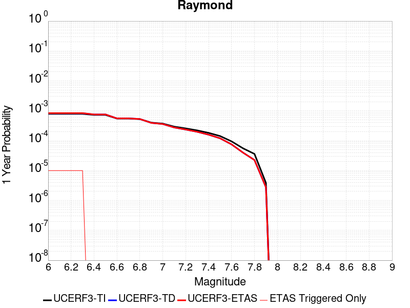 |  |

| Magnitude | 1 wk TI Prob | 1 wk TD Prob | 1 wk ETAS Prob | 1 wk ETAS/TD Gain | 1 wk ETAS Triggered Only | 1 mo TI Prob | 1 mo TD Prob | 1 mo ETAS Prob | 1 mo ETAS/TD Gain | 1 mo ETAS Triggered Only | 1 yr TI Prob | 1 yr TD Prob | 1 yr ETAS Prob | 1 yr ETAS/TD Gain | 1 yr ETAS Triggered Only | 10 yr TI Prob | 10 yr TD Prob | 10 yr ETAS Prob | 10 yr ETAS/TD Gain | 10 yr ETAS Triggered Only |
|-----|-----|-----|-----|-----|-----|-----|-----|-----|-----|-----|-----|-----|-----|-----|-----|-----|-----|-----|-----|-----|
| 6.0 | 1.5157413E-5 | 1.5810376E-5 | 1.5810376E-5 | 1.0 | 0.0 | 6.4958724E-5 | 6.775714E-5 | 6.775714E-5 | 1.0 | 0.0 | 7.905855E-4 | 8.24656E-4 | 8.3536527E-4 | 1.0129863 | 1.0718114E-5 | 0.007877788 | 0.008218477 | 0.008250367 | 1.0038803 | 3.215434E-5 |
| 6.1 | 1.5157413E-5 | 1.5810376E-5 | 1.5810376E-5 | 1.0 | 0.0 | 6.4958724E-5 | 6.775714E-5 | 6.775714E-5 | 1.0 | 0.0 | 7.905855E-4 | 8.24656E-4 | 8.3536527E-4 | 1.0129863 | 1.0718114E-5 | 0.007877788 | 0.008218477 | 0.008250367 | 1.0038803 | 3.215434E-5 |
| 6.2 | 1.5157413E-5 | 1.5810376E-5 | 1.5810376E-5 | 1.0 | 0.0 | 6.4958724E-5 | 6.775714E-5 | 6.775714E-5 | 1.0 | 0.0 | 7.905855E-4 | 8.24656E-4 | 8.3536527E-4 | 1.0129863 | 1.0718114E-5 | 0.007877788 | 0.008218477 | 0.008250367 | 1.0038803 | 3.215434E-5 |
| 6.3 | 1.5157413E-5 | 1.5810376E-5 | 1.5810376E-5 | 1.0 | 0.0 | 6.4958724E-5 | 6.775714E-5 | 6.775714E-5 | 1.0 | 0.0 | 7.905855E-4 | 8.24656E-4 | 8.3536527E-4 | 1.0129863 | 1.0718114E-5 | 0.007877788 | 0.008218477 | 0.008250367 | 1.0038803 | 3.215434E-5 |
| 6.4 | 1.3941944E-5 | 1.4454918E-5 | 1.4454918E-5 | 1.0 | 0.0 | 5.9749822E-5 | 6.194831E-5 | 6.194831E-5 | 1.0 | 0.0 | 7.2721124E-4 | 7.53983E-4 | 7.53983E-4 | 1.0 | 0.0 | 0.007248361 | 0.0075165825 | 0.0075378576 | 1.0028304 | 2.1436228E-5 |
| 6.5 | 1.3941944E-5 | 1.4454918E-5 | 1.4454918E-5 | 1.0 | 0.0 | 5.9749822E-5 | 6.194831E-5 | 6.194831E-5 | 1.0 | 0.0 | 7.2721124E-4 | 7.53983E-4 | 7.53983E-4 | 1.0 | 0.0 | 0.007248361 | 0.0075165825 | 0.0075378576 | 1.0028304 | 2.1436228E-5 |
| 6.6 | 1.0542609E-5 | 1.0671283E-5 | 1.0671283E-5 | 1.0 | 0.0 | 4.5181827E-5 | 4.57333E-5 | 4.57333E-5 | 1.0 | 0.0 | 5.499499E-4 | 5.566662E-4 | 5.566662E-4 | 1.0 | 0.0 | 0.005485909 | 0.0055532786 | 0.0055532786 | 1.0 | 0.0 |
| 6.7 | 1.0542609E-5 | 1.0671283E-5 | 1.0671283E-5 | 1.0 | 0.0 | 4.5181827E-5 | 4.57333E-5 | 4.57333E-5 | 1.0 | 0.0 | 5.499499E-4 | 5.566662E-4 | 5.566662E-4 | 1.0 | 0.0 | 0.005485909 | 0.0055532786 | 0.0055532786 | 1.0 | 0.0 |
| 6.8 | 1.0079132E-5 | 1.0176812E-5 | 1.0176812E-5 | 1.0 | 0.0 | 4.3195567E-5 | 4.361421E-5 | 4.361421E-5 | 1.0 | 0.0 | 5.257791E-4 | 5.30879E-4 | 5.30879E-4 | 1.0 | 0.0 | 0.0052453685 | 0.0052966573 | 0.0052966573 | 1.0 | 0.0 |
| 6.9 | 7.721598E-6 | 7.5490307E-6 | 7.5490307E-6 | 1.0 | 0.0 | 3.3092143E-5 | 3.2352593E-5 | 3.2352593E-5 | 1.0 | 0.0 | 4.0282236E-4 | 3.9382285E-4 | 3.9382285E-4 | 1.0 | 0.0 | 0.0040209293 | 0.003931383 | 0.003931383 | 1.0 | 0.0 |
| 7.0 | 7.137566E-6 | 6.9114235E-6 | 6.9114235E-6 | 1.0 | 0.0 | 3.058921E-5 | 2.9620056E-5 | 2.9620056E-5 | 1.0 | 0.0 | 3.7236E-4 | 3.6056558E-4 | 3.6056558E-4 | 1.0 | 0.0 | 0.0037173668 | 0.003599924 | 0.003599924 | 1.0 | 0.0 |
| 7.1 | 5.654976E-6 | 5.2996397E-6 | 5.2996397E-6 | 1.0 | 0.0 | 2.4235387E-5 | 2.2712544E-5 | 2.2712544E-5 | 1.0 | 0.0 | 2.9502588E-4 | 2.7649035E-4 | 2.7649035E-4 | 1.0 | 0.0 | 0.0029463451 | 0.0027614946 | 0.0027614946 | 1.0 | 0.0 |
| 7.2 | 4.9358455E-6 | 4.5267484E-6 | 4.5267484E-6 | 1.0 | 0.0 | 2.1153453E-5 | 1.9400206E-5 | 1.9400206E-5 | 1.0 | 0.0 | 2.5751285E-4 | 2.3617204E-4 | 2.3617204E-4 | 1.0 | 0.0 | 0.0025721465 | 0.0023592326 | 0.0023592326 | 1.0 | 0.0 |
| 7.3 | 4.2368597E-6 | 3.8056999E-6 | 3.8056999E-6 | 1.0 | 0.0 | 1.8157843E-5 | 1.6310041E-5 | 1.6310041E-5 | 1.0 | 0.0 | 2.2104931E-4 | 1.9855677E-4 | 1.9855677E-4 | 1.0 | 0.0 | 0.0022082955 | 0.0019838123 | 0.0019838123 | 1.0 | 0.0 |
| 7.4 | 3.4999923E-6 | 3.0438184E-6 | 3.0438184E-6 | 1.0 | 0.0 | 1.49998805E-5 | 1.3044872E-5 | 1.3044872E-5 | 1.0 | 0.0 | 1.8260824E-4 | 1.5880981E-4 | 1.5880981E-4 | 1.0 | 0.0 | 0.0018245826 | 0.001586979 | 0.001586979 | 1.0 | 0.0 |
| 7.5 | 2.738017E-6 | 2.3021105E-6 | 2.3021105E-6 | 1.0 | 0.0 | 1.1734306E-5 | 9.86615E-6 | 9.86615E-6 | 1.0 | 0.0 | 1.428558E-4 | 1.2011383E-4 | 1.2011383E-4 | 1.0 | 0.0 | 0.0014276401 | 0.0012005034 | 0.0012005034 | 1.0 | 0.0 |
| 7.6 | 1.8186392E-6 | 1.4423566E-6 | 1.4423566E-6 | 1.0 | 0.0 | 7.794145E-6 | 6.181514E-6 | 6.181514E-6 | 1.0 | 0.0 | 9.488958E-5 | 7.5257376E-5 | 7.5257376E-5 | 1.0 | 0.0 | 9.4849075E-4 | 7.523304E-4 | 7.523304E-4 | 1.0 | 0.0 |
| 7.7 | 1.0660348E-6 | 7.644165E-7 | 7.644165E-7 | 1.0 | 0.0 | 4.5687125E-6 | 3.2760668E-6 | 3.2760668E-6 | 1.0 | 0.0 | 5.5622655E-5 | 3.98854E-5 | 3.98854E-5 | 1.0 | 0.0 | 5.5608735E-4 | 3.9879154E-4 | 3.9879154E-4 | 1.0 | 0.0 |
| 7.8 | 6.913602E-7 | 4.320714E-7 | 4.320714E-7 | 1.0 | 0.0 | 2.962969E-6 | 1.8517333E-6 | 1.8517333E-6 | 1.0 | 0.0 | 3.607355E-5 | 2.2544626E-5 | 2.2544626E-5 | 1.0 | 0.0 | 3.6067693E-4 | 2.2543124E-4 | 2.2543124E-4 | 1.0 | 0.0 |
| 7.9 | 7.425201E-8 | 5.322516E-8 | 5.322516E-8 | 1.0 | 0.0 | 3.1822285E-7 | 2.2810782E-7 | 2.2810782E-7 | 1.0 | 0.0 | 3.874356E-6 | 2.7772105E-6 | 2.7772105E-6 | 1.0 | 0.0 | 3.8742884E-5 | 2.7771888E-5 | 2.7771888E-5 | 1.0 | 0.0 |

## Pitas Point (Lower West)
*[(top)](#table-of-contents)*

| 1 Week | 1 Month | 1 Year | 10 Year |
|-----|-----|-----|-----|
|  |  |  |  |

| Magnitude | 1 wk TI Prob | 1 wk TD Prob | 1 wk ETAS Prob | 1 wk ETAS/TD Gain | 1 wk ETAS Triggered Only | 1 mo TI Prob | 1 mo TD Prob | 1 mo ETAS Prob | 1 mo ETAS/TD Gain | 1 mo ETAS Triggered Only | 1 yr TI Prob | 1 yr TD Prob | 1 yr ETAS Prob | 1 yr ETAS/TD Gain | 1 yr ETAS Triggered Only | 10 yr TI Prob | 10 yr TD Prob | 10 yr ETAS Prob | 10 yr ETAS/TD Gain | 10 yr ETAS Triggered Only |
|-----|-----|-----|-----|-----|-----|-----|-----|-----|-----|-----|-----|-----|-----|-----|-----|-----|-----|-----|-----|-----|
| 6.0 | 8.151497E-6 | 7.855829E-6 | 7.855829E-6 | 1.0 | 0.0 | 3.493452E-5 | 3.3667406E-5 | 4.4385157E-5 | 1.3183421 | 1.0718114E-5 | 4.252448E-4 | 4.098243E-4 | 4.4196547E-4 | 1.0784267 | 3.215434E-5 | 0.0042443196 | 0.004090766 | 0.004122789 | 1.0078281 | 3.215434E-5 |
| 6.1 | 8.151497E-6 | 7.855829E-6 | 7.855829E-6 | 1.0 | 0.0 | 3.493452E-5 | 3.3667406E-5 | 4.4385157E-5 | 1.3183421 | 1.0718114E-5 | 4.252448E-4 | 4.098243E-4 | 4.4196547E-4 | 1.0784267 | 3.215434E-5 | 0.0042443196 | 0.004090766 | 0.004122789 | 1.0078281 | 3.215434E-5 |
| 6.2 | 8.151497E-6 | 7.855829E-6 | 7.855829E-6 | 1.0 | 0.0 | 3.493452E-5 | 3.3667406E-5 | 4.4385157E-5 | 1.3183421 | 1.0718114E-5 | 4.252448E-4 | 4.098243E-4 | 4.4196547E-4 | 1.0784267 | 3.215434E-5 | 0.0042443196 | 0.004090766 | 0.004122789 | 1.0078281 | 3.215434E-5 |
| 6.3 | 8.151497E-6 | 7.855829E-6 | 7.855829E-6 | 1.0 | 0.0 | 3.493452E-5 | 3.3667406E-5 | 4.4385157E-5 | 1.3183421 | 1.0718114E-5 | 4.252448E-4 | 4.098243E-4 | 4.4196547E-4 | 1.0784267 | 3.215434E-5 | 0.0042443196 | 0.004090766 | 0.004122789 | 1.0078281 | 3.215434E-5 |
| 6.4 | 8.151497E-6 | 7.855829E-6 | 7.855829E-6 | 1.0 | 0.0 | 3.493452E-5 | 3.3667406E-5 | 4.4385157E-5 | 1.3183421 | 1.0718114E-5 | 4.252448E-4 | 4.098243E-4 | 4.4196547E-4 | 1.0784267 | 3.215434E-5 | 0.0042443196 | 0.004090766 | 0.004122789 | 1.0078281 | 3.215434E-5 |
| 6.5 | 8.151497E-6 | 7.855829E-6 | 7.855829E-6 | 1.0 | 0.0 | 3.493452E-5 | 3.3667406E-5 | 4.4385157E-5 | 1.3183421 | 1.0718114E-5 | 4.252448E-4 | 4.098243E-4 | 4.4196547E-4 | 1.0784267 | 3.215434E-5 | 0.0042443196 | 0.004090766 | 0.004122789 | 1.0078281 | 3.215434E-5 |
| 6.6 | 8.151497E-6 | 7.855829E-6 | 7.855829E-6 | 1.0 | 0.0 | 3.493452E-5 | 3.3667406E-5 | 4.4385157E-5 | 1.3183421 | 1.0718114E-5 | 4.252448E-4 | 4.098243E-4 | 4.4196547E-4 | 1.0784267 | 3.215434E-5 | 0.0042443196 | 0.004090766 | 0.004122789 | 1.0078281 | 3.215434E-5 |
| 6.7 | 8.151497E-6 | 7.855829E-6 | 7.855829E-6 | 1.0 | 0.0 | 3.493452E-5 | 3.3667406E-5 | 4.4385157E-5 | 1.3183421 | 1.0718114E-5 | 4.252448E-4 | 4.098243E-4 | 4.4196547E-4 | 1.0784267 | 3.215434E-5 | 0.0042443196 | 0.004090766 | 0.004122789 | 1.0078281 | 3.215434E-5 |
| 6.8 | 8.151497E-6 | 7.855829E-6 | 7.855829E-6 | 1.0 | 0.0 | 3.493452E-5 | 3.3667406E-5 | 4.4385157E-5 | 1.3183421 | 1.0718114E-5 | 4.252448E-4 | 4.098243E-4 | 4.4196547E-4 | 1.0784267 | 3.215434E-5 | 0.0042443196 | 0.004090766 | 0.004122789 | 1.0078281 | 3.215434E-5 |
| 6.9 | 8.151497E-6 | 7.855829E-6 | 7.855829E-6 | 1.0 | 0.0 | 3.493452E-5 | 3.3667406E-5 | 4.4385157E-5 | 1.3183421 | 1.0718114E-5 | 4.252448E-4 | 4.098243E-4 | 4.4196547E-4 | 1.0784267 | 3.215434E-5 | 0.0042443196 | 0.004090766 | 0.004122789 | 1.0078281 | 3.215434E-5 |
| 7.0 | 8.103535E-6 | 7.805258E-6 | 7.805258E-6 | 1.0 | 0.0 | 3.4728975E-5 | 3.345068E-5 | 4.4168435E-5 | 1.3204046 | 1.0718114E-5 | 4.2274324E-4 | 4.0718666E-4 | 4.393279E-4 | 1.0789349 | 3.215434E-5 | 0.0042193993 | 0.0040644864 | 0.00409651 | 1.0078789 | 3.215434E-5 |
| 7.1 | 7.853298E-6 | 7.540947E-6 | 7.540947E-6 | 1.0 | 0.0 | 3.3656554E-5 | 3.231795E-5 | 4.3035714E-5 | 1.3316351 | 1.0718114E-5 | 4.096915E-4 | 3.9340067E-4 | 4.2554236E-4 | 1.0817022 | 3.215434E-5 | 0.00408937 | 0.0039271186 | 0.003959147 | 1.0081556 | 3.215434E-5 |
| 7.2 | 7.771102E-6 | 7.453228E-6 | 7.453228E-6 | 1.0 | 0.0 | 3.33043E-5 | 3.1942018E-5 | 4.265979E-5 | 1.3355383 | 1.0718114E-5 | 4.0540437E-4 | 3.8882537E-4 | 4.209672E-4 | 1.0826639 | 3.215434E-5 | 0.0040466557 | 0.0038815264 | 0.0039135558 | 1.0082518 | 3.215434E-5 |
| 7.3 | 7.3945344E-6 | 7.049329E-6 | 7.049329E-6 | 1.0 | 0.0 | 3.1690477E-5 | 3.0211062E-5 | 4.092885E-5 | 1.3547637 | 1.0718114E-5 | 3.8576324E-4 | 3.6775824E-4 | 3.9990075E-4 | 1.0874013 | 3.215434E-5 | 0.0038509427 | 0.0036715642 | 0.0037036005 | 1.0087255 | 3.215434E-5 |
| 7.4 | 6.964645E-6 | 6.5901736E-6 | 6.5901736E-6 | 1.0 | 0.0 | 2.9848137E-5 | 2.8243297E-5 | 2.8243297E-5 | 1.0 | 0.0 | 3.6334046E-4 | 3.4380838E-4 | 3.6523724E-4 | 1.0623279 | 2.1436228E-5 | 0.0036274698 | 0.0034328182 | 0.003454181 | 1.0062231 | 2.1436228E-5 |
| 7.5 | 6.6525035E-6 | 6.2592094E-6 | 6.2592094E-6 | 1.0 | 0.0 | 2.851042E-5 | 2.682491E-5 | 2.682491E-5 | 1.0 | 0.0 | 3.4705905E-4 | 3.2654483E-4 | 3.4797404E-4 | 1.0656241 | 2.1436228E-5 | 0.0034651754 | 0.0032607014 | 0.0032820678 | 1.0065527 | 2.1436228E-5 |
| 7.6 | 5.613338E-6 | 5.1514285E-6 | 5.1514285E-6 | 1.0 | 0.0 | 2.405694E-5 | 2.2077365E-5 | 2.2077365E-5 | 1.0 | 0.0 | 2.928539E-4 | 2.6875906E-4 | 2.9018952E-4 | 1.0797386 | 2.1436228E-5 | 0.0029246826 | 0.002684372 | 0.0027057505 | 1.0079641 | 2.1436228E-5 |
| 7.7 | 4.494704E-6 | 3.996944E-6 | 3.996944E-6 | 1.0 | 0.0 | 1.9262876E-5 | 1.712965E-5 | 1.712965E-5 | 1.0 | 0.0 | 2.3450027E-4 | 2.0853376E-4 | 2.2996552E-4 | 1.1027735 | 2.1436228E-5 | 0.0023425296 | 0.002083405 | 0.0021047965 | 1.0102676 | 2.1436228E-5 |
| 7.8 | 2.6075882E-6 | 2.1836554E-6 | 2.1836554E-6 | 1.0 | 0.0 | 1.117533E-5 | 9.35849E-6 | 9.35849E-6 | 1.0 | 0.0 | 1.3605114E-4 | 1.1393371E-4 | 1.246506E-4 | 1.0940626 | 1.0718114E-5 | 0.0013596788 | 0.0011387577 | 0.0011494636 | 1.0094014 | 1.0718114E-5 |
| 7.9 | 4.045984E-7 | 3.242403E-7 | 3.242403E-7 | 1.0 | 0.0 | 1.733992E-6 | 1.3896005E-6 | 1.3896005E-6 | 1.0 | 0.0 | 2.1111147E-5 | 1.6918259E-5 | 1.6918259E-5 | 1.0 | 0.0 | 2.1109142E-4 | 1.6917E-4 | 1.6917E-4 | 1.0 | 0.0 |
| 8.0 | 7.791402E-9 | 5.683553E-9 | 5.683553E-9 | 1.0 | 0.0 | 3.3391725E-8 | 2.4358085E-8 | 2.4358085E-8 | 1.0 | 0.0 | 4.0654416E-7 | 2.9655968E-7 | 2.9655968E-7 | 1.0 | 0.0 | 4.065434E-6 | 2.9655946E-6 | 2.9655946E-6 | 1.0 | 0.0 |

## West Napa 2011 CFM
*[(top)](#table-of-contents)*

| 1 Week | 1 Month | 1 Year | 10 Year |
|-----|-----|-----|-----|
|  |  |  |  |

| Magnitude | 1 wk TI Prob | 1 wk TD Prob | 1 wk ETAS Prob | 1 wk ETAS/TD Gain | 1 wk ETAS Triggered Only | 1 mo TI Prob | 1 mo TD Prob | 1 mo ETAS Prob | 1 mo ETAS/TD Gain | 1 mo ETAS Triggered Only | 1 yr TI Prob | 1 yr TD Prob | 1 yr ETAS Prob | 1 yr ETAS/TD Gain | 1 yr ETAS Triggered Only | 10 yr TI Prob | 10 yr TD Prob | 10 yr ETAS Prob | 10 yr ETAS/TD Gain | 10 yr ETAS Triggered Only |
|-----|-----|-----|-----|-----|-----|-----|-----|-----|-----|-----|-----|-----|-----|-----|-----|-----|-----|-----|-----|-----|
| 6.0 | 3.773104E-5 | 4.4529617E-5 | 4.4529617E-5 | 1.0 | 0.0 | 1.6169442E-4 | 1.9082906E-4 | 1.9082906E-4 | 1.0 | 0.0 | 0.001966852 | 0.0023211853 | 0.0023318785 | 1.0046068 | 1.0718114E-5 | 0.019495348 | 0.02300284 | 0.023013312 | 1.0004553 | 1.0718114E-5 |
| 6.1 | 3.773104E-5 | 4.4529617E-5 | 4.4529617E-5 | 1.0 | 0.0 | 1.6169442E-4 | 1.9082906E-4 | 1.9082906E-4 | 1.0 | 0.0 | 0.001966852 | 0.0023211853 | 0.0023318785 | 1.0046068 | 1.0718114E-5 | 0.019495348 | 0.02300284 | 0.023013312 | 1.0004553 | 1.0718114E-5 |
| 6.2 | 3.773104E-5 | 4.4529617E-5 | 4.4529617E-5 | 1.0 | 0.0 | 1.6169442E-4 | 1.9082906E-4 | 1.9082906E-4 | 1.0 | 0.0 | 0.001966852 | 0.0023211853 | 0.0023318785 | 1.0046068 | 1.0718114E-5 | 0.019495348 | 0.02300284 | 0.023013312 | 1.0004553 | 1.0718114E-5 |
| 6.3 | 2.147964E-5 | 2.4987681E-5 | 2.4987681E-5 | 1.0 | 0.0 | 9.2052345E-5 | 1.0708619E-4 | 1.0708619E-4 | 1.0 | 0.0 | 0.001120161 | 0.0013030862 | 0.0013137903 | 1.0082145 | 1.0718114E-5 | 0.011145315 | 0.01296507 | 0.012975649 | 1.000816 | 1.0718114E-5 |
| 6.4 | 2.147964E-5 | 2.4987681E-5 | 2.4987681E-5 | 1.0 | 0.0 | 9.2052345E-5 | 1.0708619E-4 | 1.0708619E-4 | 1.0 | 0.0 | 0.001120161 | 0.0013030862 | 0.0013137903 | 1.0082145 | 1.0718114E-5 | 0.011145315 | 0.01296507 | 0.012975649 | 1.000816 | 1.0718114E-5 |
| 6.5 | 1.688201E-5 | 1.9547857E-5 | 1.9547857E-5 | 1.0 | 0.0 | 7.234947E-5 | 8.377425E-5 | 8.377425E-5 | 1.0 | 0.0 | 8.804988E-4 | 0.0010195468 | 0.001030254 | 1.0105019 | 1.0718114E-5 | 0.008770182 | 0.010157362 | 0.010167971 | 1.0010445 | 1.0718114E-5 |
| 6.6 | 1.6846381E-5 | 1.9507548E-5 | 1.9507548E-5 | 1.0 | 0.0 | 7.219678E-5 | 8.360151E-5 | 8.360151E-5 | 1.0 | 0.0 | 8.7864127E-4 | 0.0010174456 | 0.0010281529 | 1.0105237 | 1.0718114E-5 | 0.008751754 | 0.010136543 | 0.0101471525 | 1.0010467 | 1.0718114E-5 |
| 6.7 | 1.3396501E-5 | 1.5468073E-5 | 1.5468073E-5 | 1.0 | 0.0 | 5.7412315E-5 | 6.629041E-5 | 6.629041E-5 | 1.0 | 0.0 | 6.9877075E-4 | 8.068505E-4 | 8.1755995E-4 | 1.0132731 | 1.0718114E-5 | 0.0069657755 | 0.008046935 | 0.008057567 | 1.0013212 | 1.0718114E-5 |
| 6.8 | 1.0139058E-5 | 1.1672485E-5 | 1.1672485E-5 | 1.0 | 0.0 | 4.3452383E-5 | 5.002429E-5 | 5.002429E-5 | 1.0 | 0.0 | 5.289043E-4 | 6.08931E-4 | 6.08931E-4 | 1.0 | 0.0 | 0.005276473 | 0.006079547 | 0.006079547 | 1.0 | 0.0 |
| 6.9 | 7.761281E-6 | 8.890966E-6 | 8.890966E-6 | 1.0 | 0.0 | 3.326221E-5 | 3.8103874E-5 | 3.8103874E-5 | 1.0 | 0.0 | 4.0489217E-4 | 4.6386727E-4 | 4.6386727E-4 | 1.0 | 0.0 | 0.0040415525 | 0.0046355044 | 0.0046355044 | 1.0 | 0.0 |
| 7.0 | 2.2109202E-6 | 2.3667233E-6 | 2.3667233E-6 | 1.0 | 0.0 | 9.475338E-6 | 1.01430605E-5 | 1.01430605E-5 | 1.0 | 0.0 | 1.1535613E-4 | 1.2348485E-4 | 1.2348485E-4 | 1.0 | 0.0 | 0.0011529627 | 0.001235648 | 0.001235648 | 1.0 | 0.0 |
| 7.1 | 1.9008926E-6 | 2.0134055E-6 | 2.0134055E-6 | 1.0 | 0.0 | 8.146657E-6 | 8.628853E-6 | 8.628853E-6 | 1.0 | 0.0 | 9.918104E-5 | 1.05051244E-4 | 1.05051244E-4 | 1.0 | 0.0 | 9.913679E-4 | 0.0010514965 | 0.0010514965 | 1.0 | 0.0 |
| 7.2 | 1.8495944E-6 | 1.9562115E-6 | 1.9562115E-6 | 1.0 | 0.0 | 7.926808E-6 | 8.383737E-6 | 8.383737E-6 | 1.0 | 0.0 | 9.650462E-5 | 1.02067235E-4 | 1.02067235E-4 | 1.0 | 0.0 | 9.6462725E-4 | 0.0010216843 | 0.0010216843 | 1.0 | 0.0 |
| 7.3 | 1.7883189E-6 | 1.8881731E-6 | 1.8881731E-6 | 1.0 | 0.0 | 7.664201E-6 | 8.092145E-6 | 8.092145E-6 | 1.0 | 0.0 | 9.330765E-5 | 9.851744E-5 | 9.851744E-5 | 1.0 | 0.0 | 9.3268487E-4 | 9.862181E-4 | 9.862181E-4 | 1.0 | 0.0 |
| 7.4 | 1.6520572E-6 | 1.7415938E-6 | 1.7415938E-6 | 1.0 | 0.0 | 7.0802257E-6 | 7.463952E-6 | 7.463952E-6 | 1.0 | 0.0 | 8.6198335E-5 | 9.086986E-5 | 9.086986E-5 | 1.0 | 0.0 | 8.616491E-4 | 9.098032E-4 | 9.098032E-4 | 1.0 | 0.0 |
| 7.5 | 1.4040345E-6 | 1.480112E-6 | 1.480112E-6 | 1.0 | 0.0 | 6.0172765E-6 | 6.3433217E-6 | 6.3433217E-6 | 1.0 | 0.0 | 7.325788E-5 | 7.722723E-5 | 7.722723E-5 | 1.0 | 0.0 | 7.3233736E-4 | 7.7344844E-4 | 7.7344844E-4 | 1.0 | 0.0 |
| 7.6 | 1.3013842E-7 | 1.4420175E-7 | 1.4420175E-7 | 1.0 | 0.0 | 5.57736E-7 | 6.1800733E-7 | 6.1800733E-7 | 1.0 | 0.0 | 6.790414E-6 | 7.524213E-6 | 7.524213E-6 | 1.0 | 0.0 | 6.790207E-5 | 7.617076E-5 | 7.617076E-5 | 1.0 | 0.0 |
| 7.7 | 8.541512E-8 | 9.720196E-8 | 9.720196E-8 | 1.0 | 0.0 | 3.6606474E-7 | 4.1657975E-7 | 4.1657975E-7 | 1.0 | 0.0 | 4.456829E-6 | 5.0718468E-6 | 5.0718468E-6 | 1.0 | 0.0 | 4.4567398E-5 | 5.1623178E-5 | 5.1623178E-5 | 1.0 | 0.0 |
| 7.8 | 5.6074793E-8 | 6.898559E-8 | 6.898559E-8 | 1.0 | 0.0 | 2.403205E-7 | 2.956525E-7 | 2.956525E-7 | 1.0 | 0.0 | 2.9258983E-6 | 3.5995633E-6 | 3.5995633E-6 | 1.0 | 0.0 | 2.9258597E-5 | 3.6831098E-5 | 3.6831098E-5 | 1.0 | 0.0 |
| 7.9 | 2.9475839E-8 | 3.858516E-8 | 3.858516E-8 | 1.0 | 0.0 | 1.2632502E-7 | 1.6536497E-7 | 1.6536497E-7 | 1.0 | 0.0 | 1.538006E-6 | 2.0133166E-6 | 2.0133166E-6 | 1.0 | 0.0 | 1.5379954E-5 | 2.0675805E-5 | 2.0675805E-5 | 1.0 | 0.0 |
| 8.0 | 1.3337122E-8 | 2.1642386E-8 | 2.1642386E-8 | 1.0 | 0.0 | 5.7159088E-8 | 9.2753076E-8 | 9.2753076E-8 | 1.0 | 0.0 | 6.959117E-7 | 1.1292681E-6 | 1.1292681E-6 | 1.0 | 0.0 | 6.959095E-6 | 1.16513675E-5 | 1.16513675E-5 | 1.0 | 0.0 |
| 8.1 | 2.6589986E-10 | 4.8638915E-10 | 4.8638915E-10 | 1.0 | 0.0 | 1.1395708E-9 | 2.084525E-9 | 2.084525E-9 | 1.0 | 0.0 | 1.3874274E-8 | 2.537909E-8 | 2.537909E-8 | 1.0 | 0.0 | 1.3874273E-7 | 2.6047906E-7 | 2.6047906E-7 | 1.0 | 0.0 |

## Greenville (So) 2011 CFM
*[(top)](#table-of-contents)*

| 1 Week | 1 Month | 1 Year | 10 Year |
|-----|-----|-----|-----|
|  |  | 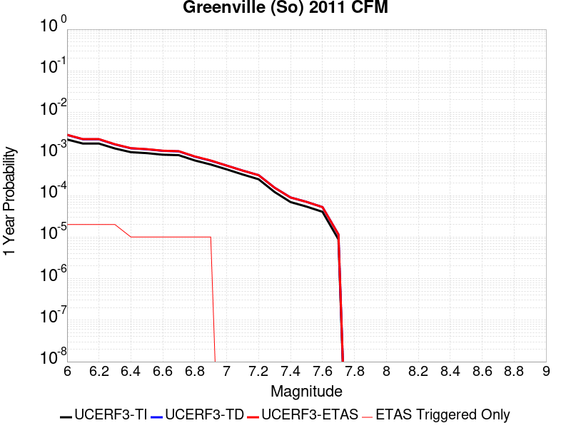 |  |

| Magnitude | 1 wk TI Prob | 1 wk TD Prob | 1 wk ETAS Prob | 1 wk ETAS/TD Gain | 1 wk ETAS Triggered Only | 1 mo TI Prob | 1 mo TD Prob | 1 mo ETAS Prob | 1 mo ETAS/TD Gain | 1 mo ETAS Triggered Only | 1 yr TI Prob | 1 yr TD Prob | 1 yr ETAS Prob | 1 yr ETAS/TD Gain | 1 yr ETAS Triggered Only | 10 yr TI Prob | 10 yr TD Prob | 10 yr ETAS Prob | 10 yr ETAS/TD Gain | 10 yr ETAS Triggered Only |
|-----|-----|-----|-----|-----|-----|-----|-----|-----|-----|-----|-----|-----|-----|-----|-----|-----|-----|-----|-----|-----|
| 6.0 | 4.279693E-5 | 5.5042052E-5 | 5.5042052E-5 | 1.0 | 0.0 | 1.8340252E-4 | 2.3587522E-4 | 2.3587522E-4 | 1.0 | 0.0 | 0.0022306389 | 0.0028683394 | 0.0028897142 | 1.007452 | 2.1436228E-5 | 0.022083808 | 0.028339082 | 0.028359912 | 1.0007349 | 2.1436228E-5 |
| 6.1 | 3.4037297E-5 | 4.319379E-5 | 4.319379E-5 | 1.0 | 0.0 | 1.4586597E-4 | 1.851043E-4 | 1.851043E-4 | 1.0 | 0.0 | 0.0017744715 | 0.0022515068 | 0.0022728946 | 1.0094994 | 2.1436228E-5 | 0.01760369 | 0.022303257 | 0.022324216 | 1.0009397 | 2.1436228E-5 |
| 6.2 | 3.4037297E-5 | 4.319379E-5 | 4.319379E-5 | 1.0 | 0.0 | 1.4586597E-4 | 1.851043E-4 | 1.851043E-4 | 1.0 | 0.0 | 0.0017744715 | 0.0022515068 | 0.0022728946 | 1.0094994 | 2.1436228E-5 | 0.01760369 | 0.022303257 | 0.022324216 | 1.0009397 | 2.1436228E-5 |
| 6.3 | 2.5956324E-5 | 3.242983E-5 | 3.242983E-5 | 1.0 | 0.0 | 1.11236644E-4 | 1.3897801E-4 | 1.3897801E-4 | 1.0 | 0.0 | 0.0013534647 | 0.0016908189 | 0.0017122189 | 1.0126566 | 2.1436228E-5 | 0.013452509 | 0.016786352 | 0.016807428 | 1.0012555 | 2.1436228E-5 |
| 6.4 | 2.1145053E-5 | 2.6198357E-5 | 2.6198357E-5 | 1.0 | 0.0 | 9.061851E-5 | 1.1227402E-4 | 1.1227402E-4 | 1.0 | 0.0 | 0.0011027219 | 0.0013661105 | 0.001376814 | 1.007835 | 1.0718114E-5 | 0.01097266 | 0.013580529 | 0.013591101 | 1.0007786 | 1.0718114E-5 |
| 6.5 | 2.0030959E-5 | 2.4796413E-5 | 2.4796413E-5 | 1.0 | 0.0 | 8.584414E-5 | 1.0626618E-4 | 1.0626618E-4 | 1.0 | 0.0 | 0.0010446513 | 0.001293055 | 0.0013037593 | 1.0082783 | 1.0718114E-5 | 0.010397541 | 0.012858664 | 0.0128692435 | 1.0008228 | 1.0718114E-5 |
| 6.6 | 1.8395405E-5 | 2.2755032E-5 | 2.2755032E-5 | 1.0 | 0.0 | 7.8835066E-5 | 9.751807E-5 | 9.751807E-5 | 1.0 | 0.0 | 9.5939427E-4 | 0.0011866642 | 0.0011973697 | 1.0090214 | 1.0718114E-5 | 0.009552629 | 0.0118063325 | 0.011816924 | 1.000897 | 1.0718114E-5 |
| 6.7 | 1.7883482E-5 | 2.2126056E-5 | 2.2126056E-5 | 1.0 | 0.0 | 7.664124E-5 | 9.4822666E-5 | 9.4822666E-5 | 1.0 | 0.0 | 9.3270757E-4 | 0.001153883 | 0.0011645887 | 1.009278 | 1.0718114E-5 | 0.009288026 | 0.01148197 | 0.011492565 | 1.0009228 | 1.0718114E-5 |
| 6.8 | 1.3373564E-5 | 1.6506328E-5 | 1.6506328E-5 | 1.0 | 0.0 | 5.7314013E-5 | 7.0739574E-5 | 7.0739574E-5 | 1.0 | 0.0 | 6.975747E-4 | 8.6092873E-4 | 8.7163766E-4 | 1.0124388 | 1.0718114E-5 | 0.0069538904 | 0.008577544 | 0.008588171 | 1.0012388 | 1.0718114E-5 |
| 6.9 | 1.06692905E-5 | 1.3152838E-5 | 1.3152838E-5 | 1.0 | 0.0 | 4.5724726E-5 | 5.636815E-5 | 5.636815E-5 | 1.0 | 0.0 | 5.5655633E-4 | 6.8607734E-4 | 6.9678813E-4 | 1.0156116 | 1.0718114E-5 | 0.005551645 | 0.006840826 | 0.0068514706 | 1.001556 | 1.0718114E-5 |
| 7.0 | 8.157512E-6 | 1.0062801E-5 | 1.0062801E-5 | 1.0 | 0.0 | 3.4960296E-5 | 4.3125594E-5 | 4.3125594E-5 | 1.0 | 0.0 | 4.2555845E-4 | 5.249313E-4 | 5.249313E-4 | 1.0 | 0.0 | 0.004247444 | 0.005237391 | 0.005237391 | 1.0 | 0.0 |
| 7.1 | 6.1467113E-6 | 7.6275246E-6 | 7.6275246E-6 | 1.0 | 0.0 | 2.6342783E-5 | 3.2688986E-5 | 3.2688986E-5 | 1.0 | 0.0 | 3.206762E-4 | 3.979166E-4 | 3.979166E-4 | 1.0 | 0.0 | 0.0032021382 | 0.003972229 | 0.003972229 | 1.0 | 0.0 |
| 7.2 | 4.713467E-6 | 5.9142176E-6 | 5.9142176E-6 | 1.0 | 0.0 | 2.0200418E-5 | 2.5346404E-5 | 2.5346404E-5 | 1.0 | 0.0 | 2.4591232E-4 | 3.0854935E-4 | 3.0854935E-4 | 1.0 | 0.0 | 0.0024564038 | 0.003081363 | 0.003081363 | 1.0 | 0.0 |
| 7.3 | 2.3266216E-6 | 2.954034E-6 | 2.954034E-6 | 1.0 | 0.0 | 9.971197E-6 | 1.2660085E-5 | 1.2660085E-5 | 1.0 | 0.0 | 1.2139256E-4 | 1.541258E-4 | 1.541258E-4 | 1.0 | 0.0 | 0.0012132627 | 0.0015402584 | 0.0015402584 | 1.0 | 0.0 |
| 7.4 | 1.3314E-6 | 1.7179633E-6 | 1.7179633E-6 | 1.0 | 0.0 | 5.7059874E-6 | 7.3626793E-6 | 7.3626793E-6 | 1.0 | 0.0 | 6.946818E-5 | 8.963698E-5 | 8.963698E-5 | 1.0 | 0.0 | 6.9446466E-4 | 8.9604704E-4 | 8.9604704E-4 | 1.0 | 0.0 |
| 7.5 | 1.0362941E-6 | 1.3468865E-6 | 1.3468865E-6 | 1.0 | 0.0 | 4.4412527E-6 | 5.7723582E-6 | 5.7723582E-6 | 1.0 | 0.0 | 5.407091E-5 | 7.027624E-5 | 7.027624E-5 | 1.0 | 0.0 | 5.405776E-4 | 7.0257037E-4 | 7.0257037E-4 | 1.0 | 0.0 |
| 7.6 | 7.764784E-7 | 1.0088623E-6 | 1.0088623E-6 | 1.0 | 0.0 | 3.3277602E-6 | 4.323689E-6 | 4.323689E-6 | 1.0 | 0.0 | 4.0514726E-5 | 5.263968E-5 | 5.263968E-5 | 1.0 | 0.0 | 4.050734E-4 | 5.2629353E-4 | 5.2629353E-4 | 1.0 | 0.0 |
| 7.7 | 1.6927763E-7 | 2.2139328E-7 | 2.2139328E-7 | 1.0 | 0.0 | 7.2547533E-7 | 9.48828E-7 | 9.48828E-7 | 1.0 | 0.0 | 8.832627E-6 | 1.1551923E-5 | 1.1551923E-5 | 1.0 | 0.0 | 8.8322755E-5 | 1.1551595E-4 | 1.1551595E-4 | 1.0 | 0.0 |

## San Gorgonio Pass
*[(top)](#table-of-contents)*

| 1 Week | 1 Month | 1 Year | 10 Year |
|-----|-----|-----|-----|
|  |  |  |  |

| Magnitude | 1 wk TI Prob | 1 wk TD Prob | 1 wk ETAS Prob | 1 wk ETAS/TD Gain | 1 wk ETAS Triggered Only | 1 mo TI Prob | 1 mo TD Prob | 1 mo ETAS Prob | 1 mo ETAS/TD Gain | 1 mo ETAS Triggered Only | 1 yr TI Prob | 1 yr TD Prob | 1 yr ETAS Prob | 1 yr ETAS/TD Gain | 1 yr ETAS Triggered Only | 10 yr TI Prob | 10 yr TD Prob | 10 yr ETAS Prob | 10 yr ETAS/TD Gain | 10 yr ETAS Triggered Only |
|-----|-----|-----|-----|-----|-----|-----|-----|-----|-----|-----|-----|-----|-----|-----|-----|-----|-----|-----|-----|-----|
| 6.0 | 7.644328E-6 | 1.33162985E-5 | 1.33162985E-5 | 1.0 | 0.0 | 3.2760996E-5 | 5.706865E-5 | 6.778615E-5 | 1.1878002 | 1.0718114E-5 | 3.987921E-4 | 6.945979E-4 | 7.053085E-4 | 1.01542 | 1.0718114E-5 | 0.003980772 | 0.006931046 | 0.0069523337 | 1.0030713 | 2.1436228E-5 |
| 6.1 | 7.644328E-6 | 1.33162985E-5 | 1.33162985E-5 | 1.0 | 0.0 | 3.2760996E-5 | 5.706865E-5 | 6.778615E-5 | 1.1878002 | 1.0718114E-5 | 3.987921E-4 | 6.945979E-4 | 7.053085E-4 | 1.01542 | 1.0718114E-5 | 0.003980772 | 0.006931046 | 0.0069523337 | 1.0030713 | 2.1436228E-5 |
| 6.2 | 7.644328E-6 | 1.33162985E-5 | 1.33162985E-5 | 1.0 | 0.0 | 3.2760996E-5 | 5.706865E-5 | 6.778615E-5 | 1.1878002 | 1.0718114E-5 | 3.987921E-4 | 6.945979E-4 | 7.053085E-4 | 1.01542 | 1.0718114E-5 | 0.003980772 | 0.006931046 | 0.0069523337 | 1.0030713 | 2.1436228E-5 |
| 6.3 | 7.644328E-6 | 1.33162985E-5 | 1.33162985E-5 | 1.0 | 0.0 | 3.2760996E-5 | 5.706865E-5 | 6.778615E-5 | 1.1878002 | 1.0718114E-5 | 3.987921E-4 | 6.945979E-4 | 7.053085E-4 | 1.01542 | 1.0718114E-5 | 0.003980772 | 0.006931046 | 0.0069523337 | 1.0030713 | 2.1436228E-5 |
| 6.4 | 7.644328E-6 | 1.33162985E-5 | 1.33162985E-5 | 1.0 | 0.0 | 3.2760996E-5 | 5.706865E-5 | 6.778615E-5 | 1.1878002 | 1.0718114E-5 | 3.987921E-4 | 6.945979E-4 | 7.053085E-4 | 1.01542 | 1.0718114E-5 | 0.003980772 | 0.006931046 | 0.0069523337 | 1.0030713 | 2.1436228E-5 |
| 6.5 | 7.644328E-6 | 1.33162985E-5 | 1.33162985E-5 | 1.0 | 0.0 | 3.2760996E-5 | 5.706865E-5 | 6.778615E-5 | 1.1878002 | 1.0718114E-5 | 3.987921E-4 | 6.945979E-4 | 7.053085E-4 | 1.01542 | 1.0718114E-5 | 0.003980772 | 0.006931046 | 0.0069523337 | 1.0030713 | 2.1436228E-5 |
| 6.6 | 7.644328E-6 | 1.33162985E-5 | 1.33162985E-5 | 1.0 | 0.0 | 3.2760996E-5 | 5.706865E-5 | 6.778615E-5 | 1.1878002 | 1.0718114E-5 | 3.987921E-4 | 6.945979E-4 | 7.053085E-4 | 1.01542 | 1.0718114E-5 | 0.003980772 | 0.006931046 | 0.0069523337 | 1.0030713 | 2.1436228E-5 |
| 6.7 | 6.987586E-6 | 1.2620567E-5 | 1.2620567E-5 | 1.0 | 0.0 | 2.9946454E-5 | 5.4087068E-5 | 6.4804604E-5 | 1.1981534 | 1.0718114E-5 | 3.645371E-4 | 6.583192E-4 | 6.6903024E-4 | 1.0162703 | 1.0718114E-5 | 0.0036393967 | 0.0065704198 | 0.006591715 | 1.0032411 | 2.1436228E-5 |
| 6.8 | 6.987586E-6 | 1.2620567E-5 | 1.2620567E-5 | 1.0 | 0.0 | 2.9946454E-5 | 5.4087068E-5 | 6.4804604E-5 | 1.1981534 | 1.0718114E-5 | 3.645371E-4 | 6.583192E-4 | 6.6903024E-4 | 1.0162703 | 1.0718114E-5 | 0.0036393967 | 0.0065704198 | 0.006591715 | 1.0032411 | 2.1436228E-5 |
| 6.9 | 5.504702E-6 | 1.1051418E-5 | 1.1051418E-5 | 1.0 | 0.0 | 2.3591367E-5 | 4.7362388E-5 | 5.8079993E-5 | 1.2262894 | 1.0718114E-5 | 2.8718702E-4 | 5.7648955E-4 | 5.872015E-4 | 1.0185813 | 1.0718114E-5 | 0.0028681618 | 0.0057563665 | 0.0057776794 | 1.0037025 | 2.1436228E-5 |
| 7.0 | 5.4825764E-6 | 1.1027759E-5 | 1.1027759E-5 | 1.0 | 0.0 | 2.3496545E-5 | 4.7260994E-5 | 5.7978603E-5 | 1.2267749 | 1.0718114E-5 | 2.8603288E-4 | 5.752558E-4 | 5.8596773E-4 | 1.0186212 | 1.0718114E-5 | 0.00285665 | 0.005744092 | 0.0057654055 | 1.0037104 | 2.1436228E-5 |
| 7.1 | 5.4692787E-6 | 1.1013469E-5 | 1.1013469E-5 | 1.0 | 0.0 | 2.3439556E-5 | 4.7199755E-5 | 5.791736E-5 | 1.2270691 | 1.0718114E-5 | 2.8533922E-4 | 5.7451054E-4 | 5.852225E-4 | 1.0186454 | 1.0718114E-5 | 0.0028497311 | 0.0057366784 | 0.0057579917 | 1.0037153 | 2.1436228E-5 |
| 7.2 | 5.453661E-6 | 1.0996495E-5 | 1.0996495E-5 | 1.0 | 0.0 | 2.3372622E-5 | 4.712701E-5 | 5.784462E-5 | 1.2274196 | 1.0718114E-5 | 2.8452452E-4 | 5.736254E-4 | 5.8433734E-4 | 1.0186741 | 1.0718114E-5 | 0.002841605 | 0.0057278727 | 0.005749186 | 1.003721 | 2.1436228E-5 |
| 7.3 | 5.4422303E-6 | 1.0983417E-5 | 1.0983417E-5 | 1.0 | 0.0 | 2.3323635E-5 | 4.7070967E-5 | 5.7788577E-5 | 1.2276905 | 1.0718114E-5 | 2.8392827E-4 | 5.729434E-4 | 5.836554E-4 | 1.0186964 | 1.0718114E-5 | 0.0028356577 | 0.005721088 | 0.005742402 | 1.0037254 | 2.1436228E-5 |
| 7.4 | 5.398595E-6 | 1.0930781E-5 | 1.0930781E-5 | 1.0 | 0.0 | 2.313663E-5 | 4.6845395E-5 | 5.7563004E-5 | 1.2287868 | 1.0718114E-5 | 2.8165206E-4 | 5.7019846E-4 | 5.809105E-4 | 1.0187864 | 1.0718114E-5 | 0.0028129534 | 0.00569378 | 0.005715094 | 1.0037434 | 2.1436228E-5 |
| 7.5 | 5.3578788E-6 | 1.0857324E-5 | 1.0857324E-5 | 1.0 | 0.0 | 2.2962136E-5 | 4.653059E-5 | 5.7248202E-5 | 1.2303349 | 1.0718114E-5 | 2.7952815E-4 | 5.663677E-4 | 5.770798E-4 | 1.0189136 | 1.0718114E-5 | 0.002791768 | 0.005655692 | 0.005677007 | 1.0037688 | 2.1436228E-5 |
| 7.6 | 4.8091474E-6 | 9.605609E-6 | 9.605609E-6 | 1.0 | 0.0 | 2.0610469E-5 | 4.1166273E-5 | 5.1883948E-5 | 1.2603508 | 1.0718114E-5 | 2.5090357E-4 | 5.01089E-4 | 5.118017E-4 | 1.0213789 | 1.0718114E-5 | 0.0025062046 | 0.0050062994 | 0.0050276285 | 1.0042604 | 2.1436228E-5 |
| 7.7 | 1.5991155E-6 | 3.3539093E-6 | 3.3539093E-6 | 1.0 | 0.0 | 6.853334E-6 | 1.4373819E-5 | 2.5091778E-5 | 1.7456584 | 1.0718114E-5 | 8.343615E-5 | 1.7498745E-4 | 1.8570368E-4 | 1.0612401 | 1.0718114E-5 | 8.340483E-4 | 0.0017539478 | 0.0017753465 | 1.0122002 | 2.1436228E-5 |
| 7.8 | 9.258398E-7 | 2.0587727E-6 | 2.0587727E-6 | 1.0 | 0.0 | 3.967879E-6 | 8.823282E-6 | 1.9541301E-5 | 2.214743 | 1.0718114E-5 | 4.8307855E-5 | 1.07418186E-4 | 1.1813515E-4 | 1.0997686 | 1.0718114E-5 | 4.8297356E-4 | 0.0010790897 | 0.0011005028 | 1.0198437 | 2.1436228E-5 |
| 7.9 | 5.975575E-7 | 1.2297422E-6 | 1.2297422E-6 | 1.0 | 0.0 | 2.5609581E-6 | 5.2703135E-6 | 1.5988371E-5 | 3.033666 | 1.0718114E-5 | 3.117922E-5 | 6.416419E-5 | 7.488161E-5 | 1.1670313 | 1.0718114E-5 | 3.1174847E-4 | 6.466005E-4 | 6.5731164E-4 | 1.0165653 | 1.0718114E-5 |
| 8.0 | 3.4413725E-7 | 6.718214E-7 | 6.718214E-7 | 1.0 | 0.0 | 1.4748731E-6 | 2.8792315E-6 | 2.8792315E-6 | 1.0 | 0.0 | 1.7956432E-5 | 3.5054083E-5 | 3.5054083E-5 | 1.0 | 0.0 | 1.7954981E-4 | 3.5391308E-4 | 3.5391308E-4 | 1.0 | 0.0 |
| 8.1 | 1.1787731E-8 | 9.643016E-9 | 9.643016E-9 | 1.0 | 0.0 | 5.0518846E-8 | 4.1327212E-8 | 4.1327212E-8 | 1.0 | 0.0 | 6.1506677E-7 | 5.031587E-7 | 5.031587E-7 | 1.0 | 0.0 | 6.1506507E-6 | 5.247088E-6 | 5.247088E-6 | 1.0 | 0.0 |

## Honey Lake 2011 CFM
*[(top)](#table-of-contents)*

| 1 Week | 1 Month | 1 Year | 10 Year |
|-----|-----|-----|-----|
|  |  |  |  |

| Magnitude | 1 wk TI Prob | 1 wk TD Prob | 1 wk ETAS Prob | 1 wk ETAS/TD Gain | 1 wk ETAS Triggered Only | 1 mo TI Prob | 1 mo TD Prob | 1 mo ETAS Prob | 1 mo ETAS/TD Gain | 1 mo ETAS Triggered Only | 1 yr TI Prob | 1 yr TD Prob | 1 yr ETAS Prob | 1 yr ETAS/TD Gain | 1 yr ETAS Triggered Only | 10 yr TI Prob | 10 yr TD Prob | 10 yr ETAS Prob | 10 yr ETAS/TD Gain | 10 yr ETAS Triggered Only |
|-----|-----|-----|-----|-----|-----|-----|-----|-----|-----|-----|-----|-----|-----|-----|-----|-----|-----|-----|-----|-----|
| 6.0 | 6.155506E-5 | 7.9549776E-5 | 7.9549776E-5 | 1.0 | 0.0 | 2.6378073E-4 | 3.4088633E-4 | 3.4088633E-4 | 1.0 | 0.0 | 0.0032068014 | 0.004142954 | 0.004164302 | 1.0051527 | 2.1436228E-5 | 0.03160919 | 0.040704414 | 0.040724978 | 1.0005052 | 2.1436228E-5 |
| 6.1 | 6.155506E-5 | 7.9549776E-5 | 7.9549776E-5 | 1.0 | 0.0 | 2.6378073E-4 | 3.4088633E-4 | 3.4088633E-4 | 1.0 | 0.0 | 0.0032068014 | 0.004142954 | 0.004164302 | 1.0051527 | 2.1436228E-5 | 0.03160919 | 0.040704414 | 0.040724978 | 1.0005052 | 2.1436228E-5 |
| 6.2 | 4.1335024E-5 | 5.2578198E-5 | 5.2578198E-5 | 1.0 | 0.0 | 1.7713808E-4 | 2.2531676E-4 | 2.2531676E-4 | 1.0 | 0.0 | 0.0021545228 | 0.0027399566 | 0.0027613342 | 1.0078021 | 2.1436228E-5 | 0.021337535 | 0.027077656 | 0.027098512 | 1.0007702 | 2.1436228E-5 |
| 6.3 | 4.1335024E-5 | 5.2578198E-5 | 5.2578198E-5 | 1.0 | 0.0 | 1.7713808E-4 | 2.2531676E-4 | 2.2531676E-4 | 1.0 | 0.0 | 0.0021545228 | 0.0027399566 | 0.0027613342 | 1.0078021 | 2.1436228E-5 | 0.021337535 | 0.027077656 | 0.027098512 | 1.0007702 | 2.1436228E-5 |
| 6.4 | 3.2393702E-5 | 4.088887E-5 | 4.088887E-5 | 1.0 | 0.0 | 1.3882275E-4 | 1.7522695E-4 | 1.7522695E-4 | 1.0 | 0.0 | 0.0016888566 | 0.0021314071 | 0.0021527978 | 1.0100359 | 2.1436228E-5 | 0.016760793 | 0.02112054 | 0.021141523 | 1.0009935 | 2.1436228E-5 |
| 6.5 | 2.7205504E-5 | 3.4212855E-5 | 3.4212855E-5 | 1.0 | 0.0 | 1.1658981E-4 | 1.4661887E-4 | 1.4661887E-4 | 1.0 | 0.0 | 0.0014185566 | 0.0017837189 | 0.001805117 | 1.0119963 | 2.1436228E-5 | 0.014095354 | 0.017703528 | 0.017724583 | 1.0011894 | 2.1436228E-5 |
| 6.6 | 2.069265E-5 | 2.5956184E-5 | 2.5956184E-5 | 1.0 | 0.0 | 8.867977E-5 | 1.1123653E-4 | 1.1123653E-4 | 1.0 | 0.0 | 0.0010791414 | 0.0013535494 | 0.0013749566 | 1.0158156 | 2.1436228E-5 | 0.010739161 | 0.013461453 | 0.0134826 | 1.0015709 | 2.1436228E-5 |
| 6.7 | 1.8060919E-5 | 2.2657592E-5 | 2.2657592E-5 | 1.0 | 0.0 | 7.7401644E-5 | 9.710081E-5 | 9.710081E-5 | 1.0 | 0.0 | 9.419576E-4 | 0.0011816425 | 0.0012030534 | 1.0181196 | 2.1436228E-5 | 0.009379748 | 0.011761633 | 0.011782817 | 1.0018011 | 2.1436228E-5 |
| 6.8 | 1.4474663E-5 | 1.8181889E-5 | 1.8181889E-5 | 1.0 | 0.0 | 6.203279E-5 | 7.7920486E-5 | 7.7920486E-5 | 1.0 | 0.0 | 7.5498753E-4 | 9.483458E-4 | 9.697617E-4 | 1.0225824 | 2.1436228E-5 | 0.007524277 | 0.009450511 | 0.009471745 | 1.0022469 | 2.1436228E-5 |
| 6.9 | 8.564552E-6 | 1.0802682E-5 | 1.0802682E-5 | 1.0 | 0.0 | 3.6704707E-5 | 4.6296762E-5 | 4.6296762E-5 | 1.0 | 0.0 | 4.4678818E-4 | 5.63584E-4 | 5.7429605E-4 | 1.0190071 | 1.0718114E-5 | 0.0044589094 | 0.0056280424 | 0.0056387004 | 1.0018936 | 1.0718114E-5 |

## Great Valley 11
*[(top)](#table-of-contents)*

| 1 Week | 1 Month | 1 Year | 10 Year |
|-----|-----|-----|-----|
| 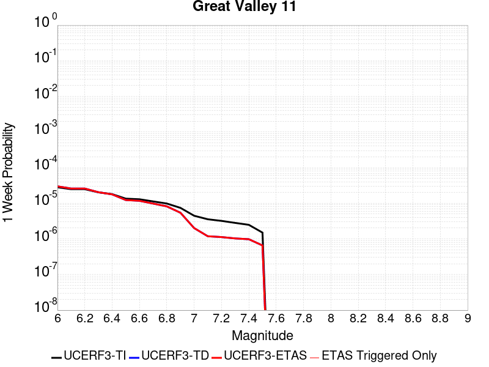 |  |  |  |

| Magnitude | 1 wk TI Prob | 1 wk TD Prob | 1 wk ETAS Prob | 1 wk ETAS/TD Gain | 1 wk ETAS Triggered Only | 1 mo TI Prob | 1 mo TD Prob | 1 mo ETAS Prob | 1 mo ETAS/TD Gain | 1 mo ETAS Triggered Only | 1 yr TI Prob | 1 yr TD Prob | 1 yr ETAS Prob | 1 yr ETAS/TD Gain | 1 yr ETAS Triggered Only | 10 yr TI Prob | 10 yr TD Prob | 10 yr ETAS Prob | 10 yr ETAS/TD Gain | 10 yr ETAS Triggered Only |
|-----|-----|-----|-----|-----|-----|-----|-----|-----|-----|-----|-----|-----|-----|-----|-----|-----|-----|-----|-----|-----|
| 6.0 | 2.8099583E-5 | 2.9832845E-5 | 2.9832845E-5 | 1.0 | 0.0 | 1.20421224E-4 | 1.2784921E-4 | 1.2784921E-4 | 1.0 | 0.0 | 0.0014651422 | 0.0015555277 | 0.0015769305 | 1.0137593 | 2.1436228E-5 | 0.0145552 | 0.015453923 | 0.015475027 | 1.0013657 | 2.1436228E-5 |
| 6.1 | 2.483194E-5 | 2.5907739E-5 | 2.5907739E-5 | 1.0 | 0.0 | 1.0641825E-4 | 1.1102881E-4 | 1.1102881E-4 | 1.0 | 0.0 | 0.0012948721 | 0.0013510018 | 0.001372409 | 1.0158454 | 2.1436228E-5 | 0.012873529 | 0.013434302 | 0.013455451 | 1.0015742 | 2.1436228E-5 |
| 6.2 | 2.483194E-5 | 2.5907739E-5 | 2.5907739E-5 | 1.0 | 0.0 | 1.0641825E-4 | 1.1102881E-4 | 1.1102881E-4 | 1.0 | 0.0 | 0.0012948721 | 0.0013510018 | 0.001372409 | 1.0158454 | 2.1436228E-5 | 0.012873529 | 0.013434302 | 0.013455451 | 1.0015742 | 2.1436228E-5 |
| 6.3 | 2.0257901E-5 | 2.0399362E-5 | 2.0399362E-5 | 1.0 | 0.0 | 8.681669E-5 | 8.742315E-5 | 8.742315E-5 | 1.0 | 0.0 | 0.0010564806 | 0.001063899 | 0.0010853125 | 1.0201273 | 2.1436228E-5 | 0.01051472 | 0.010592245 | 0.010613454 | 1.0020024 | 2.1436228E-5 |
| 6.4 | 1.8054898E-5 | 1.7781249E-5 | 1.7781249E-5 | 1.0 | 0.0 | 7.737584E-5 | 7.6203345E-5 | 7.6203345E-5 | 1.0 | 0.0 | 9.416436E-4 | 9.274187E-4 | 9.4883505E-4 | 1.0230924 | 2.1436228E-5 | 0.009376635 | 0.009239235 | 0.009260473 | 1.0022987 | 2.1436228E-5 |
| 6.5 | 1.34804895E-5 | 1.2321299E-5 | 1.2321299E-5 | 1.0 | 0.0 | 5.777225E-5 | 5.2804524E-5 | 5.2804524E-5 | 1.0 | 0.0 | 7.031501E-4 | 6.427096E-4 | 6.6413207E-4 | 1.0333315 | 2.1436228E-5 | 0.007009294 | 0.0064089457 | 0.0064302445 | 1.0033233 | 2.1436228E-5 |
| 6.6 | 1.294883E-5 | 1.1732548E-5 | 1.1732548E-5 | 1.0 | 0.0 | 5.5493805E-5 | 5.0281404E-5 | 5.0281404E-5 | 1.0 | 0.0 | 6.754276E-4 | 6.120082E-4 | 6.334313E-4 | 1.0350046 | 2.1436228E-5 | 0.006733784 | 0.0061036535 | 0.006124959 | 1.0034906 | 2.1436228E-5 |
| 6.7 | 1.1272237E-5 | 9.812085E-6 | 9.812085E-6 | 1.0 | 0.0 | 4.8308695E-5 | 4.205113E-5 | 4.205113E-5 | 1.0 | 0.0 | 5.879996E-4 | 5.11855E-4 | 5.3328025E-4 | 1.0418581 | 2.1436228E-5 | 0.005864462 | 0.0051070447 | 0.0051283715 | 1.0041759 | 2.1436228E-5 |
| 6.8 | 9.8337505E-6 | 8.193942E-6 | 8.193942E-6 | 1.0 | 0.0 | 4.2143965E-5 | 3.5116434E-5 | 3.5116434E-5 | 1.0 | 0.0 | 5.1298196E-4 | 4.274608E-4 | 4.4888785E-4 | 1.0501264 | 2.1436228E-5 | 0.005117994 | 0.0042665955 | 0.0042879405 | 1.0050027 | 2.1436228E-5 |
| 6.9 | 7.4224813E-6 | 5.413251E-6 | 5.413251E-6 | 1.0 | 0.0 | 3.1810247E-5 | 2.3199449E-5 | 2.3199449E-5 | 1.0 | 0.0 | 3.872209E-4 | 2.824181E-4 | 2.824181E-4 | 1.0 | 0.0 | 0.0038654688 | 0.0028207325 | 0.0028207325 | 1.0 | 0.0 |
| 7.0 | 4.4628923E-6 | 2.0111208E-6 | 2.0111208E-6 | 1.0 | 0.0 | 1.912654E-5 | 8.619061E-6 | 8.619061E-6 | 1.0 | 0.0 | 2.3284076E-4 | 1.0493213E-4 | 1.0493213E-4 | 1.0 | 0.0 | 0.0023259693 | 0.0010488374 | 0.0010488374 | 1.0 | 0.0 |
| 7.1 | 3.5546527E-6 | 1.1856094E-6 | 1.1856094E-6 | 1.0 | 0.0 | 1.5234136E-5 | 5.0811736E-6 | 5.0811736E-6 | 1.0 | 0.0 | 1.8545982E-4 | 6.18616E-5 | 6.18616E-5 | 1.0 | 0.0 | 0.0018530512 | 6.1845063E-4 | 6.1845063E-4 | 1.0 | 0.0 |
| 7.2 | 3.2039936E-6 | 1.125436E-6 | 1.125436E-6 | 1.0 | 0.0 | 1.3731329E-5 | 4.823289E-6 | 4.823289E-6 | 1.0 | 0.0 | 1.671661E-4 | 5.8722027E-5 | 5.8722027E-5 | 1.0 | 0.0 | 0.0016704041 | 5.870718E-4 | 5.870718E-4 | 1.0 | 0.0 |
| 7.3 | 2.8120473E-6 | 1.0305815E-6 | 1.0305815E-6 | 1.0 | 0.0 | 1.2051575E-5 | 4.416771E-6 | 4.416771E-6 | 1.0 | 0.0 | 1.4671806E-4 | 5.377293E-5 | 5.377293E-5 | 1.0 | 0.0 | 0.0014662122 | 5.376058E-4 | 5.376058E-4 | 1.0 | 0.0 |
| 7.4 | 2.4837766E-6 | 9.800765E-7 | 9.800765E-7 | 1.0 | 0.0 | 1.0644713E-5 | 4.2003217E-6 | 4.2003217E-6 | 1.0 | 0.0 | 1.2959167E-4 | 5.113778E-5 | 5.113778E-5 | 1.0 | 0.0 | 0.0012951613 | 5.112667E-4 | 5.112667E-4 | 1.0 | 0.0 |
| 7.5 | 1.5002679E-6 | 6.5462535E-7 | 6.5462535E-7 | 1.0 | 0.0 | 6.4297037E-6 | 2.8055345E-6 | 2.8055345E-6 | 1.0 | 0.0 | 7.827883E-5 | 3.415689E-5 | 3.415689E-5 | 1.0 | 0.0 | 7.825126E-4 | 3.4152053E-4 | 3.4152053E-4 | 1.0 | 0.0 |

## Quien Sabe 2011 CFM
*[(top)](#table-of-contents)*

| 1 Week | 1 Month | 1 Year | 10 Year |
|-----|-----|-----|-----|
|  |  |  |  |

| Magnitude | 1 wk TI Prob | 1 wk TD Prob | 1 wk ETAS Prob | 1 wk ETAS/TD Gain | 1 wk ETAS Triggered Only | 1 mo TI Prob | 1 mo TD Prob | 1 mo ETAS Prob | 1 mo ETAS/TD Gain | 1 mo ETAS Triggered Only | 1 yr TI Prob | 1 yr TD Prob | 1 yr ETAS Prob | 1 yr ETAS/TD Gain | 1 yr ETAS Triggered Only | 10 yr TI Prob | 10 yr TD Prob | 10 yr ETAS Prob | 10 yr ETAS/TD Gain | 10 yr ETAS Triggered Only |
|-----|-----|-----|-----|-----|-----|-----|-----|-----|-----|-----|-----|-----|-----|-----|-----|-----|-----|-----|-----|-----|
| 6.0 | 3.729899E-5 | 7.088948E-5 | 8.1606835E-5 | 1.151184 | 1.0718114E-5 | 1.5984301E-4 | 3.0378034E-4 | 3.144952E-4 | 1.0352718 | 1.0718114E-5 | 0.0019443515 | 0.0036853587 | 0.0036960372 | 1.0028976 | 1.0718114E-5 | 0.019274272 | 0.0353513 | 0.035371978 | 1.000585 | 2.1436228E-5 |
| 6.1 | 1.7825725E-5 | 3.315054E-5 | 3.315054E-5 | 1.0 | 0.0 | 7.639373E-5 | 1.4206769E-4 | 1.4206769E-4 | 1.0 | 0.0 | 9.296967E-4 | 0.0017267886 | 0.0017267886 | 1.0 | 0.0 | 0.009258169 | 0.01669935 | 0.01669935 | 1.0 | 0.0 |
| 6.2 | 4.8865336E-6 | 7.805606E-6 | 7.805606E-6 | 1.0 | 0.0 | 2.0942118E-5 | 3.3452223E-5 | 3.3452223E-5 | 1.0 | 0.0 | 2.5494045E-4 | 4.069332E-4 | 4.069332E-4 | 1.0 | 0.0 | 0.0025464818 | 0.004013725 | 0.004013725 | 1.0 | 0.0 |
| 6.3 | 3.858491E-6 | 5.7898515E-6 | 5.7898515E-6 | 1.0 | 0.0 | 1.6536285E-5 | 2.481344E-5 | 2.481344E-5 | 1.0 | 0.0 | 2.0131067E-4 | 3.0206644E-4 | 3.0206644E-4 | 1.0 | 0.0 | 0.002011284 | 0.0030021158 | 0.0030021158 | 1.0 | 0.0 |
| 6.4 | 3.0771805E-6 | 4.3850664E-6 | 4.3850664E-6 | 1.0 | 0.0 | 1.318785E-5 | 1.879302E-5 | 1.879302E-5 | 1.0 | 0.0 | 1.6055023E-4 | 2.2878342E-4 | 2.2878342E-4 | 1.0 | 0.0 | 0.001604343 | 0.002286603 | 0.002286603 | 1.0 | 0.0 |
| 6.5 | 2.5081235E-6 | 3.4637387E-6 | 3.4637387E-6 | 1.0 | 0.0 | 1.0749056E-5 | 1.4844519E-5 | 1.4844519E-5 | 1.0 | 0.0 | 1.308619E-4 | 1.8071849E-4 | 1.8071849E-4 | 1.0 | 0.0 | 0.0013078486 | 0.0018124225 | 0.0018124225 | 1.0 | 0.0 |
| 6.6 | 1.7505364E-6 | 2.4024678E-6 | 2.4024678E-6 | 1.0 | 0.0 | 7.502277E-6 | 1.0296253E-5 | 1.0296253E-5 | 1.0 | 0.0 | 9.13364E-5 | 1.2535039E-4 | 1.2535039E-4 | 1.0 | 0.0 | 9.129886E-4 | 0.001258366 | 0.001258366 | 1.0 | 0.0 |
| 6.7 | 1.505737E-6 | 2.0638643E-6 | 2.0638643E-6 | 1.0 | 0.0 | 6.4531428E-6 | 8.845105E-6 | 8.845105E-6 | 1.0 | 0.0 | 7.8564175E-5 | 1.07684435E-4 | 1.07684435E-4 | 1.0 | 0.0 | 7.853641E-4 | 0.0010818782 | 0.0010818782 | 1.0 | 0.0 |
| 6.8 | 1.2924105E-6 | 1.7485087E-6 | 1.7485087E-6 | 1.0 | 0.0 | 5.5388905E-6 | 7.49359E-6 | 7.49359E-6 | 1.0 | 0.0 | 6.74339E-5 | 9.123119E-5 | 9.123119E-5 | 1.0 | 0.0 | 6.741344E-4 | 9.1614906E-4 | 9.1614906E-4 | 1.0 | 0.0 |
| 6.9 | 8.9075286E-7 | 1.1250673E-6 | 1.1250673E-6 | 1.0 | 0.0 | 3.8175067E-6 | 4.82171E-6 | 4.82171E-6 | 1.0 | 0.0 | 4.6477155E-5 | 5.8702957E-5 | 5.8702957E-5 | 1.0 | 0.0 | 4.6467435E-4 | 5.9043115E-4 | 5.9043115E-4 | 1.0 | 0.0 |
| 7.0 | 6.6891175E-7 | 8.5171826E-7 | 8.5171826E-7 | 1.0 | 0.0 | 2.8667614E-6 | 3.650217E-6 | 3.650217E-6 | 1.0 | 0.0 | 3.4902263E-5 | 4.4440683E-5 | 4.4440683E-5 | 1.0 | 0.0 | 3.4896782E-4 | 4.4681414E-4 | 4.4681414E-4 | 1.0 | 0.0 |
| 7.1 | 4.4205015E-7 | 5.3922207E-7 | 5.3922207E-7 | 1.0 | 0.0 | 1.8944993E-6 | 2.3109505E-6 | 2.3109505E-6 | 1.0 | 0.0 | 2.3065284E-5 | 2.813563E-5 | 2.813563E-5 | 1.0 | 0.0 | 2.3062891E-4 | 2.8270538E-4 | 2.8270538E-4 | 1.0 | 0.0 |
| 7.2 | 1.6620965E-7 | 1.5988428E-7 | 1.5988428E-7 | 1.0 | 0.0 | 7.123269E-7 | 6.8521814E-7 | 6.8521814E-7 | 1.0 | 0.0 | 8.672545E-6 | 8.342503E-6 | 8.342503E-6 | 1.0 | 0.0 | 8.6722066E-5 | 8.357743E-5 | 8.357743E-5 | 1.0 | 0.0 |
| 7.3 | 1.2142488E-7 | 1.17270666E-7 | 1.17270666E-7 | 1.0 | 0.0 | 5.2039223E-7 | 5.025885E-7 | 5.025885E-7 | 1.0 | 0.0 | 6.335757E-6 | 6.1190012E-6 | 6.1190012E-6 | 1.0 | 0.0 | 6.3355765E-5 | 6.1251456E-5 | 6.1251456E-5 | 1.0 | 0.0 |
| 7.4 | 2.4192937E-8 | 2.4544427E-8 | 2.4544427E-8 | 1.0 | 0.0 | 1.0368401E-7 | 1.05190395E-7 | 1.05190395E-7 | 1.0 | 0.0 | 1.2623522E-6 | 1.2806925E-6 | 1.2806925E-6 | 1.0 | 0.0 | 1.2623449E-5 | 1.2813195E-5 | 1.2813195E-5 | 1.0 | 0.0 |
| 7.5 | 1.4432802E-8 | 1.4506849E-8 | 1.4506849E-8 | 1.0 | 0.0 | 6.185486E-8 | 6.217221E-8 | 6.217221E-8 | 1.0 | 0.0 | 7.530827E-7 | 7.5694646E-7 | 7.5694646E-7 | 1.0 | 0.0 | 7.530801E-6 | 7.5737153E-6 | 7.5737153E-6 | 1.0 | 0.0 |

## Davis Creek
*[(top)](#table-of-contents)*

| 1 Week | 1 Month | 1 Year | 10 Year |
|-----|-----|-----|-----|
|  |  |  |  |

| Magnitude | 1 wk TI Prob | 1 wk TD Prob | 1 wk ETAS Prob | 1 wk ETAS/TD Gain | 1 wk ETAS Triggered Only | 1 mo TI Prob | 1 mo TD Prob | 1 mo ETAS Prob | 1 mo ETAS/TD Gain | 1 mo ETAS Triggered Only | 1 yr TI Prob | 1 yr TD Prob | 1 yr ETAS Prob | 1 yr ETAS/TD Gain | 1 yr ETAS Triggered Only | 10 yr TI Prob | 10 yr TD Prob | 10 yr ETAS Prob | 10 yr ETAS/TD Gain | 10 yr ETAS Triggered Only |
|-----|-----|-----|-----|-----|-----|-----|-----|-----|-----|-----|-----|-----|-----|-----|-----|-----|-----|-----|-----|-----|
| 6.0 | 2.331472E-5 | 2.5417517E-5 | 2.5417517E-5 | 1.0 | 0.0 | 9.99164E-5 | 1.0892834E-4 | 1.1964529E-4 | 1.0983853 | 1.0718114E-5 | 0.0012158032 | 0.0013255142 | 0.0013362181 | 1.0080752 | 1.0718114E-5 | 0.01209173 | 0.013187861 | 0.013198438 | 1.000802 | 1.0718114E-5 |
| 6.1 | 1.0407654E-5 | 1.1317118E-5 | 1.1317118E-5 | 1.0 | 0.0 | 4.4603472E-5 | 4.8501184E-5 | 4.8501184E-5 | 1.0 | 0.0 | 5.4291193E-4 | 5.9036905E-4 | 6.010808E-4 | 1.0181442 | 1.0718114E-5 | 0.0054158745 | 0.005890679 | 0.0059013343 | 1.0018088 | 1.0718114E-5 |
| 6.2 | 1.0407654E-5 | 1.1317118E-5 | 1.1317118E-5 | 1.0 | 0.0 | 4.4603472E-5 | 4.8501184E-5 | 4.8501184E-5 | 1.0 | 0.0 | 5.4291193E-4 | 5.9036905E-4 | 6.010808E-4 | 1.0181442 | 1.0718114E-5 | 0.0054158745 | 0.005890679 | 0.0059013343 | 1.0018088 | 1.0718114E-5 |
| 6.3 | 5.1323277E-6 | 5.5686187E-6 | 5.5686187E-6 | 1.0 | 0.0 | 2.1995505E-5 | 2.386534E-5 | 2.386534E-5 | 1.0 | 0.0 | 2.6776237E-4 | 2.9053038E-4 | 2.9053038E-4 | 1.0 | 0.0 | 0.0026743996 | 0.0029023518 | 0.0029023518 | 1.0 | 0.0 |
| 6.4 | 2.4985154E-6 | 2.7045678E-6 | 2.7045678E-6 | 1.0 | 0.0 | 1.07078795E-5 | 1.1590974E-5 | 1.1590974E-5 | 1.0 | 0.0 | 1.3036063E-4 | 1.411146E-4 | 1.411146E-4 | 1.0 | 0.0 | 0.0013028418 | 0.0014106046 | 0.0014106046 | 1.0 | 0.0 |
| 6.5 | 2.4846438E-6 | 2.690502E-6 | 2.690502E-6 | 1.0 | 0.0 | 1.064843E-5 | 1.1530692E-5 | 1.1530692E-5 | 1.0 | 0.0 | 1.2963692E-4 | 1.4038075E-4 | 1.4038075E-4 | 1.0 | 0.0 | 0.0012956132 | 0.0014032754 | 0.0014032754 | 1.0 | 0.0 |
| 6.6 | 2.072566E-7 | 2.1018127E-7 | 2.1018127E-7 | 1.0 | 0.0 | 8.882423E-7 | 9.0077657E-7 | 9.0077657E-7 | 1.0 | 0.0 | 1.0814296E-5 | 1.0966901E-5 | 1.0966901E-5 | 1.0 | 0.0 | 1.081377E-4 | 1.09663786E-4 | 1.09663786E-4 | 1.0 | 0.0 |
| 6.7 | 1.7544528E-7 | 1.7790859E-7 | 1.7790859E-7 | 1.0 | 0.0 | 7.5190815E-7 | 7.6246516E-7 | 7.6246516E-7 | 1.0 | 0.0 | 9.154443E-6 | 9.282975E-6 | 9.282975E-6 | 1.0 | 0.0 | 9.1540656E-5 | 9.2826034E-5 | 9.2826034E-5 | 1.0 | 0.0 |
| 6.8 | 1.2320395E-7 | 1.2481159E-7 | 1.2481159E-7 | 1.0 | 0.0 | 5.280168E-7 | 5.3490675E-7 | 5.3490675E-7 | 1.0 | 0.0 | 6.428586E-6 | 6.512471E-6 | 6.512471E-6 | 1.0 | 0.0 | 6.4284E-5 | 6.512291E-5 | 6.512291E-5 | 1.0 | 0.0 |
| 6.9 | 6.399997E-8 | 6.486069E-8 | 6.486069E-8 | 1.0 | 0.0 | 2.7428555E-7 | 2.7797438E-7 | 2.7797438E-7 | 1.0 | 0.0 | 3.3394215E-6 | 3.3843335E-6 | 3.3843335E-6 | 1.0 | 0.0 | 3.3393713E-5 | 3.3842884E-5 | 3.3842884E-5 | 1.0 | 0.0 |
| 7.0 | 6.4455685E-9 | 6.5352763E-9 | 6.5352763E-9 | 1.0 | 0.0 | 2.7623864E-8 | 2.8008326E-8 | 2.8008326E-8 | 1.0 | 0.0 | 3.3632048E-7 | 3.4100137E-7 | 3.4100137E-7 | 1.0 | 0.0 | 3.3631998E-6 | 3.4100137E-6 | 3.4100137E-6 | 1.0 | 0.0 |

## San Pedro Basin
*[(top)](#table-of-contents)*

| 1 Week | 1 Month | 1 Year | 10 Year |
|-----|-----|-----|-----|
| 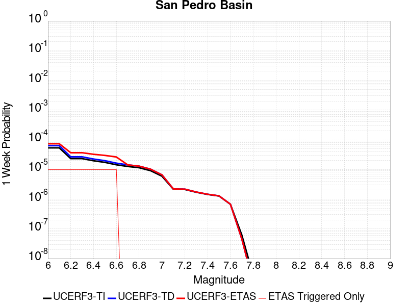 | 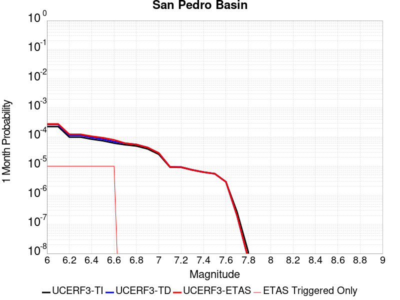 | 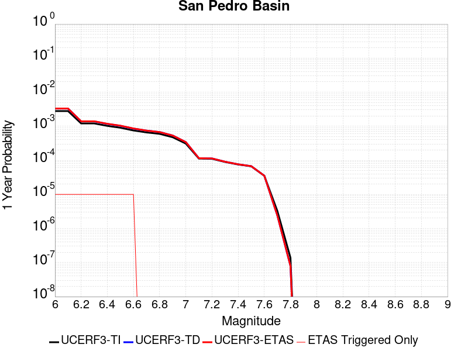 |  |

| Magnitude | 1 wk TI Prob | 1 wk TD Prob | 1 wk ETAS Prob | 1 wk ETAS/TD Gain | 1 wk ETAS Triggered Only | 1 mo TI Prob | 1 mo TD Prob | 1 mo ETAS Prob | 1 mo ETAS/TD Gain | 1 mo ETAS Triggered Only | 1 yr TI Prob | 1 yr TD Prob | 1 yr ETAS Prob | 1 yr ETAS/TD Gain | 1 yr ETAS Triggered Only | 10 yr TI Prob | 10 yr TD Prob | 10 yr ETAS Prob | 10 yr ETAS/TD Gain | 10 yr ETAS Triggered Only |
|-----|-----|-----|-----|-----|-----|-----|-----|-----|-----|-----|-----|-----|-----|-----|-----|-----|-----|-----|-----|-----|
| 6.0 | 5.3449043E-5 | 6.3371124E-5 | 6.3371124E-5 | 1.0 | 0.0 | 2.2904722E-4 | 2.7156572E-4 | 2.7156572E-4 | 1.0 | 0.0 | 0.0027850836 | 0.0033019078 | 0.0033019078 | 1.0 | 0.0 | 0.027504366 | 0.032590248 | 0.032610986 | 1.0006363 | 2.1436228E-5 |
| 6.1 | 5.3449043E-5 | 6.3371124E-5 | 6.3371124E-5 | 1.0 | 0.0 | 2.2904722E-4 | 2.7156572E-4 | 2.7156572E-4 | 1.0 | 0.0 | 0.0027850836 | 0.0033019078 | 0.0033019078 | 1.0 | 0.0 | 0.027504366 | 0.032590248 | 0.032610986 | 1.0006363 | 2.1436228E-5 |
| 6.2 | 2.3189454E-5 | 2.6643334E-5 | 2.6643334E-5 | 1.0 | 0.0 | 9.9379584E-5 | 1.14180984E-4 | 1.14180984E-4 | 1.0 | 0.0 | 0.0012092749 | 0.0013893144 | 0.0013893144 | 1.0 | 0.0 | 0.012027155 | 0.013811161 | 0.01382173 | 1.0007653 | 1.0718114E-5 |
| 6.3 | 2.3189454E-5 | 2.6643334E-5 | 2.6643334E-5 | 1.0 | 0.0 | 9.9379584E-5 | 1.14180984E-4 | 1.14180984E-4 | 1.0 | 0.0 | 0.0012092749 | 0.0013893144 | 0.0013893144 | 1.0 | 0.0 | 0.012027155 | 0.013811161 | 0.01382173 | 1.0007653 | 1.0718114E-5 |
| 6.4 | 1.966056E-5 | 2.2463848E-5 | 2.2463848E-5 | 1.0 | 0.0 | 8.425682E-5 | 9.627031E-5 | 9.627031E-5 | 1.0 | 0.0 | 0.001025344 | 0.001171501 | 0.001171501 | 1.0 | 0.0 | 0.010206259 | 0.011657341 | 0.011667934 | 1.0009087 | 1.0718114E-5 |
| 6.5 | 1.7342953E-5 | 1.9745521E-5 | 1.9745521E-5 | 1.0 | 0.0 | 7.4324824E-5 | 8.4621126E-5 | 8.4621126E-5 | 1.0 | 0.0 | 9.04529E-4 | 0.0010298121 | 0.0010298121 | 1.0 | 0.0 | 0.009008561 | 0.010254124 | 0.010264732 | 1.0010345 | 1.0718114E-5 |
| 6.6 | 1.439804E-5 | 1.6323014E-5 | 1.6323014E-5 | 1.0 | 0.0 | 6.170443E-5 | 6.995408E-5 | 6.995408E-5 | 1.0 | 0.0 | 7.509924E-4 | 8.513903E-4 | 8.513903E-4 | 1.0 | 0.0 | 0.0074845953 | 0.008484487 | 0.008484487 | 1.0 | 0.0 |
| 6.7 | 1.2634884E-5 | 1.4285554E-5 | 1.4285554E-5 | 1.0 | 0.0 | 5.414838E-5 | 6.1222534E-5 | 6.1222534E-5 | 1.0 | 0.0 | 6.590571E-4 | 7.451599E-4 | 7.451599E-4 | 1.0 | 0.0 | 0.006571059 | 0.007429634 | 0.007429634 | 1.0 | 0.0 |
| 6.8 | 1.146091E-5 | 1.2933421E-5 | 1.2933421E-5 | 1.0 | 0.0 | 4.911726E-5 | 5.542794E-5 | 5.542794E-5 | 1.0 | 0.0 | 5.9783855E-4 | 6.7465595E-4 | 6.7465595E-4 | 1.0 | 0.0 | 0.0059623276 | 0.0067290184 | 0.0067290184 | 1.0 | 0.0 |
| 6.9 | 9.109035E-6 | 1.0235189E-5 | 1.0235189E-5 | 1.0 | 0.0 | 3.9038136E-5 | 4.3864515E-5 | 4.3864515E-5 | 1.0 | 0.0 | 4.7518566E-4 | 5.339476E-4 | 5.339476E-4 | 1.0 | 0.0 | 0.0047417083 | 0.0053294008 | 0.0053294008 | 1.0 | 0.0 |
| 7.0 | 5.9351028E-6 | 6.584068E-6 | 6.584068E-6 | 1.0 | 0.0 | 2.5435906E-5 | 2.8217262E-5 | 2.8217262E-5 | 1.0 | 0.0 | 3.0963816E-4 | 3.4351464E-4 | 3.4351464E-4 | 1.0 | 0.0 | 0.0030920706 | 0.0034321535 | 0.0034321535 | 1.0 | 0.0 |
| 7.1 | 2.1557585E-6 | 2.2096608E-6 | 2.2096608E-6 | 1.0 | 0.0 | 9.238933E-6 | 9.469942E-6 | 9.469942E-6 | 1.0 | 0.0 | 1.1247819E-4 | 1.1529059E-4 | 1.1529059E-4 | 1.0 | 0.0 | 0.0011242128 | 0.0011523232 | 0.0011523232 | 1.0 | 0.0 |
| 7.2 | 2.1251979E-6 | 2.178007E-6 | 2.178007E-6 | 1.0 | 0.0 | 9.107958E-6 | 9.334282E-6 | 9.334282E-6 | 1.0 | 0.0 | 1.1088375E-4 | 1.1363912E-4 | 1.1363912E-4 | 1.0 | 0.0 | 0.0011082845 | 0.0011358254 | 0.0011358254 | 1.0 | 0.0 |
| 7.3 | 1.7145798E-6 | 1.7442967E-6 | 1.7442967E-6 | 1.0 | 0.0 | 7.3481783E-6 | 7.475536E-6 | 7.475536E-6 | 1.0 | 0.0 | 8.94604E-5 | 9.1010945E-5 | 9.1010945E-5 | 1.0 | 0.0 | 8.9424395E-4 | 9.0974587E-4 | 9.0974587E-4 | 1.0 | 0.0 |
| 7.4 | 1.4467993E-6 | 1.4641943E-6 | 1.4641943E-6 | 1.0 | 0.0 | 6.200554E-6 | 6.2751037E-6 | 6.2751037E-6 | 1.0 | 0.0 | 7.548913E-5 | 7.6396784E-5 | 7.6396784E-5 | 1.0 | 0.0 | 7.546349E-4 | 7.637125E-4 | 7.637125E-4 | 1.0 | 0.0 |
| 7.5 | 1.2803735E-6 | 1.2931564E-6 | 1.2931564E-6 | 1.0 | 0.0 | 5.487303E-6 | 5.5420874E-6 | 5.5420874E-6 | 1.0 | 0.0 | 6.680587E-5 | 6.7472894E-5 | 6.7472894E-5 | 1.0 | 0.0 | 6.678579E-4 | 6.7453115E-4 | 6.7453115E-4 | 1.0 | 0.0 |
| 7.6 | 6.755009E-7 | 6.769501E-7 | 6.769501E-7 | 1.0 | 0.0 | 2.8950008E-6 | 2.9012117E-6 | 2.9012117E-6 | 1.0 | 0.0 | 3.5246063E-5 | 3.5321737E-5 | 3.5321737E-5 | 1.0 | 0.0 | 3.5240475E-4 | 3.5316695E-4 | 3.5316695E-4 | 1.0 | 0.0 |
| 7.7 | 6.211885E-8 | 4.5699863E-8 | 4.5699863E-8 | 1.0 | 0.0 | 2.6622362E-7 | 1.9585654E-7 | 1.9585654E-7 | 1.0 | 0.0 | 3.2412677E-6 | 2.384551E-6 | 2.384551E-6 | 1.0 | 0.0 | 3.2412205E-5 | 2.3845274E-5 | 2.3845274E-5 | 1.0 | 0.0 |
| 7.8 | 2.6580573E-9 | 1.5138681E-9 | 1.5138681E-9 | 1.0 | 0.0 | 1.1391674E-8 | 6.488006E-9 | 6.488006E-9 | 1.0 | 0.0 | 1.3869362E-7 | 7.899148E-8 | 7.899148E-8 | 1.0 | 0.0 | 1.3869354E-6 | 7.8991474E-7 | 7.8991474E-7 | 1.0 | 0.0 |

## White Wolf
*[(top)](#table-of-contents)*

| 1 Week | 1 Month | 1 Year | 10 Year |
|-----|-----|-----|-----|
|  |  |  |  |

| Magnitude | 1 wk TI Prob | 1 wk TD Prob | 1 wk ETAS Prob | 1 wk ETAS/TD Gain | 1 wk ETAS Triggered Only | 1 mo TI Prob | 1 mo TD Prob | 1 mo ETAS Prob | 1 mo ETAS/TD Gain | 1 mo ETAS Triggered Only | 1 yr TI Prob | 1 yr TD Prob | 1 yr ETAS Prob | 1 yr ETAS/TD Gain | 1 yr ETAS Triggered Only | 10 yr TI Prob | 10 yr TD Prob | 10 yr ETAS Prob | 10 yr ETAS/TD Gain | 10 yr ETAS Triggered Only |
|-----|-----|-----|-----|-----|-----|-----|-----|-----|-----|-----|-----|-----|-----|-----|-----|-----|-----|-----|-----|-----|
| 6.0 | 2.0037822E-5 | 1.0469304E-6 | 1.0469304E-6 | 1.0 | 0.0 | 8.587355E-5 | 4.486837E-6 | 4.486837E-6 | 1.0 | 0.0 | 0.001045009 | 5.462592E-5 | 6.534345E-5 | 1.1961986 | 1.0718114E-5 | 0.010401085 | 5.4613E-4 | 5.6755455E-4 | 1.0392298 | 2.1436228E-5 |
| 6.1 | 2.0037822E-5 | 1.0469304E-6 | 1.0469304E-6 | 1.0 | 0.0 | 8.587355E-5 | 4.486837E-6 | 4.486837E-6 | 1.0 | 0.0 | 0.001045009 | 5.462592E-5 | 6.534345E-5 | 1.1961986 | 1.0718114E-5 | 0.010401085 | 5.4613E-4 | 5.6755455E-4 | 1.0392298 | 2.1436228E-5 |
| 6.2 | 2.0037822E-5 | 1.0469304E-6 | 1.0469304E-6 | 1.0 | 0.0 | 8.587355E-5 | 4.486837E-6 | 4.486837E-6 | 1.0 | 0.0 | 0.001045009 | 5.462592E-5 | 6.534345E-5 | 1.1961986 | 1.0718114E-5 | 0.010401085 | 5.4613E-4 | 5.6755455E-4 | 1.0392298 | 2.1436228E-5 |
| 6.3 | 2.0037822E-5 | 1.0469304E-6 | 1.0469304E-6 | 1.0 | 0.0 | 8.587355E-5 | 4.486837E-6 | 4.486837E-6 | 1.0 | 0.0 | 0.001045009 | 5.462592E-5 | 6.534345E-5 | 1.1961986 | 1.0718114E-5 | 0.010401085 | 5.4613E-4 | 5.6755455E-4 | 1.0392298 | 2.1436228E-5 |
| 6.4 | 1.132487E-5 | 1.0469304E-6 | 1.0469304E-6 | 1.0 | 0.0 | 4.8534253E-5 | 4.486837E-6 | 4.486837E-6 | 1.0 | 0.0 | 5.907443E-4 | 5.462592E-5 | 6.534345E-5 | 1.1961986 | 1.0718114E-5 | 0.005891764 | 5.4613E-4 | 5.6755455E-4 | 1.0392298 | 2.1436228E-5 |
| 6.5 | 1.132487E-5 | 1.0469304E-6 | 1.0469304E-6 | 1.0 | 0.0 | 4.8534253E-5 | 4.486837E-6 | 4.486837E-6 | 1.0 | 0.0 | 5.907443E-4 | 5.462592E-5 | 6.534345E-5 | 1.1961986 | 1.0718114E-5 | 0.005891764 | 5.4613E-4 | 5.6755455E-4 | 1.0392298 | 2.1436228E-5 |
| 6.6 | 9.347473E-6 | 1.0469304E-6 | 1.0469304E-6 | 1.0 | 0.0 | 4.0059982E-5 | 4.486837E-6 | 4.486837E-6 | 1.0 | 0.0 | 4.8762115E-4 | 5.462592E-5 | 6.534345E-5 | 1.1961986 | 1.0718114E-5 | 0.0048655253 | 5.4613E-4 | 5.6755455E-4 | 1.0392298 | 2.1436228E-5 |
| 6.7 | 7.842647E-6 | 1.0048476E-6 | 1.0048476E-6 | 1.0 | 0.0 | 3.361091E-5 | 4.306483E-6 | 4.306483E-6 | 1.0 | 0.0 | 4.0913603E-4 | 5.243022E-5 | 6.3147774E-5 | 1.2044156 | 1.0718114E-5 | 0.004083836 | 5.2418344E-4 | 5.4560846E-4 | 1.040873 | 2.1436228E-5 |
| 6.8 | 6.26597E-6 | 9.734948E-7 | 9.734948E-7 | 1.0 | 0.0 | 2.685388E-5 | 4.172114E-6 | 4.172114E-6 | 1.0 | 0.0 | 3.2689696E-4 | 5.079436E-5 | 6.151193E-5 | 1.2109993 | 1.0718114E-5 | 0.003264165 | 5.078324E-4 | 5.292577E-4 | 1.0421898 | 2.1436228E-5 |
| 6.9 | 5.258436E-6 | 9.183371E-7 | 9.183371E-7 | 1.0 | 0.0 | 2.2535958E-5 | 3.9357246E-6 | 3.9357246E-6 | 1.0 | 0.0 | 2.7434074E-4 | 4.7916445E-5 | 5.8634043E-5 | 1.2236727 | 1.0718114E-5 | 0.0027400232 | 4.7906593E-4 | 5.004919E-4 | 1.0447245 | 2.1436228E-5 |
| 7.0 | 4.675028E-6 | 8.66129E-7 | 8.66129E-7 | 1.0 | 0.0 | 2.003568E-5 | 3.7119764E-6 | 3.7119764E-6 | 1.0 | 0.0 | 2.4390711E-4 | 4.5192424E-5 | 5.591005E-5 | 1.2371554 | 1.0718114E-5 | 0.0024363957 | 4.5183706E-4 | 4.732636E-4 | 1.047421 | 2.1436228E-5 |
| 7.1 | 2.8270078E-6 | 6.8742594E-7 | 6.8742594E-7 | 1.0 | 0.0 | 1.2115692E-5 | 2.9461082E-6 | 2.9461082E-6 | 1.0 | 0.0 | 1.4749856E-4 | 3.5868317E-5 | 4.6586047E-5 | 1.2988077 | 1.0718114E-5 | 0.001474007 | 3.586294E-4 | 3.6934364E-4 | 1.0298756 | 1.0718114E-5 |
| 7.2 | 1.6881406E-6 | 2.2706854E-7 | 2.2706854E-7 | 1.0 | 0.0 | 7.2348685E-6 | 9.731506E-7 | 9.731506E-7 | 1.0 | 0.0 | 8.808096E-5 | 1.1848045E-5 | 1.1848045E-5 | 1.0 | 0.0 | 8.8046055E-4 | 1.1847429E-4 | 1.1847429E-4 | 1.0 | 0.0 |
| 7.3 | 9.086107E-7 | 1.5266669E-7 | 1.5266669E-7 | 1.0 | 0.0 | 3.8940398E-6 | 6.5428566E-7 | 6.5428566E-7 | 1.0 | 0.0 | 4.7408903E-5 | 7.965899E-6 | 7.965899E-6 | 1.0 | 0.0 | 4.739879E-4 | 7.965622E-5 | 7.965622E-5 | 1.0 | 0.0 |
| 7.4 | 1.9717383E-7 | 9.003981E-8 | 9.003981E-8 | 1.0 | 0.0 | 8.450304E-7 | 3.8588485E-7 | 3.8588485E-7 | 1.0 | 0.0 | 1.0288197E-5 | 4.698138E-6 | 4.698138E-6 | 1.0 | 0.0 | 1.028772E-4 | 4.6980418E-5 | 4.6980418E-5 | 1.0 | 0.0 |
| 7.5 | 1.086975E-7 | 6.659757E-8 | 6.659757E-8 | 1.0 | 0.0 | 4.6584634E-7 | 2.8541814E-7 | 2.8541814E-7 | 1.0 | 0.0 | 5.6716644E-6 | 3.4749605E-6 | 3.4749605E-6 | 1.0 | 0.0 | 5.6715195E-5 | 3.4749086E-5 | 3.4749086E-5 | 1.0 | 0.0 |
| 7.6 | 2.4217808E-8 | 1.5820843E-8 | 1.5820843E-8 | 1.0 | 0.0 | 1.03790605E-7 | 6.780361E-8 | 6.780361E-8 | 1.0 | 0.0 | 1.2636499E-6 | 8.255087E-7 | 8.255087E-7 | 1.0 | 0.0 | 1.2636427E-5 | 8.255061E-6 | 8.255061E-6 | 1.0 | 0.0 |

## Mount Diablo Thrust South
*[(top)](#table-of-contents)*

| 1 Week | 1 Month | 1 Year | 10 Year |
|-----|-----|-----|-----|
| 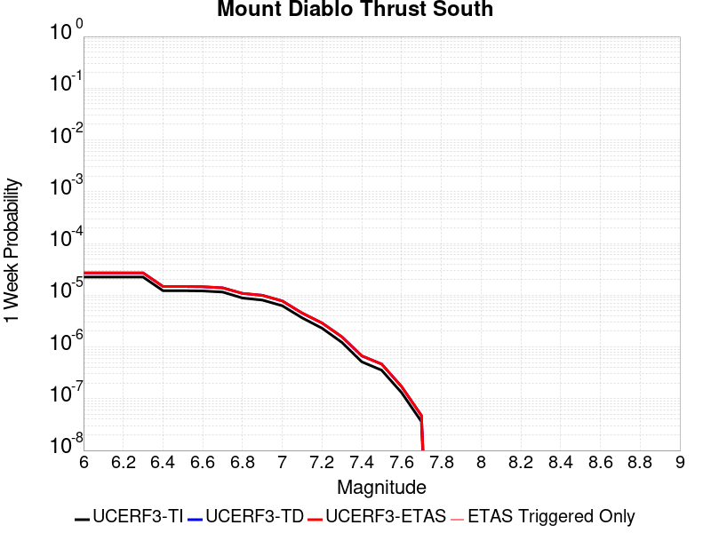 | 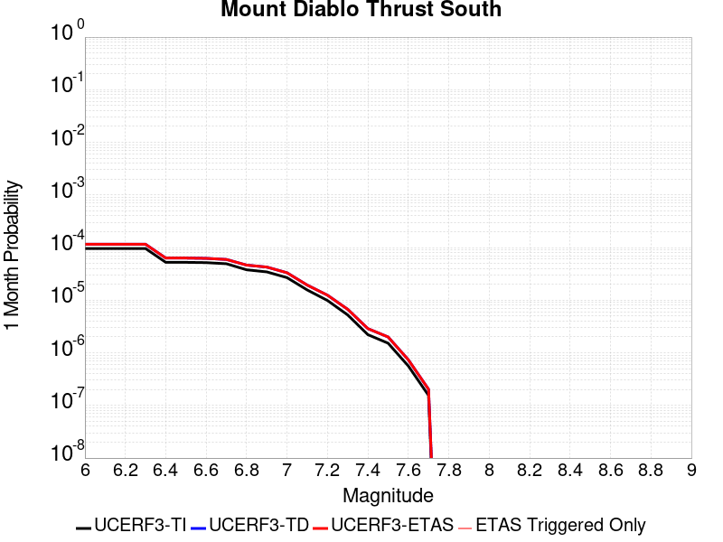 |  |  |

| Magnitude | 1 wk TI Prob | 1 wk TD Prob | 1 wk ETAS Prob | 1 wk ETAS/TD Gain | 1 wk ETAS Triggered Only | 1 mo TI Prob | 1 mo TD Prob | 1 mo ETAS Prob | 1 mo ETAS/TD Gain | 1 mo ETAS Triggered Only | 1 yr TI Prob | 1 yr TD Prob | 1 yr ETAS Prob | 1 yr ETAS/TD Gain | 1 yr ETAS Triggered Only | 10 yr TI Prob | 10 yr TD Prob | 10 yr ETAS Prob | 10 yr ETAS/TD Gain | 10 yr ETAS Triggered Only |
|-----|-----|-----|-----|-----|-----|-----|-----|-----|-----|-----|-----|-----|-----|-----|-----|-----|-----|-----|-----|-----|
| 6.0 | 2.2377444E-5 | 2.6956828E-5 | 2.6956828E-5 | 1.0 | 0.0 | 9.5899806E-5 | 1.1552526E-4 | 1.1552526E-4 | 1.0 | 0.0 | 0.0011669548 | 0.0014058114 | 0.0014165145 | 1.0076134 | 1.0718114E-5 | 0.011608457 | 0.013988755 | 0.014009891 | 1.001511 | 2.1436228E-5 |
| 6.1 | 2.2377444E-5 | 2.6956828E-5 | 2.6956828E-5 | 1.0 | 0.0 | 9.5899806E-5 | 1.1552526E-4 | 1.1552526E-4 | 1.0 | 0.0 | 0.0011669548 | 0.0014058114 | 0.0014165145 | 1.0076134 | 1.0718114E-5 | 0.011608457 | 0.013988755 | 0.014009891 | 1.001511 | 2.1436228E-5 |
| 6.2 | 2.2377444E-5 | 2.6956828E-5 | 2.6956828E-5 | 1.0 | 0.0 | 9.5899806E-5 | 1.1552526E-4 | 1.1552526E-4 | 1.0 | 0.0 | 0.0011669548 | 0.0014058114 | 0.0014165145 | 1.0076134 | 1.0718114E-5 | 0.011608457 | 0.013988755 | 0.014009891 | 1.001511 | 2.1436228E-5 |
| 6.3 | 2.2377444E-5 | 2.6956828E-5 | 2.6956828E-5 | 1.0 | 0.0 | 9.5899806E-5 | 1.1552526E-4 | 1.1552526E-4 | 1.0 | 0.0 | 0.0011669548 | 0.0014058114 | 0.0014165145 | 1.0076134 | 1.0718114E-5 | 0.011608457 | 0.013988755 | 0.014009891 | 1.001511 | 2.1436228E-5 |
| 6.4 | 1.2228463E-5 | 1.4747924E-5 | 1.4747924E-5 | 1.0 | 0.0 | 5.2406645E-5 | 6.320393E-5 | 6.320393E-5 | 1.0 | 0.0 | 6.378641E-4 | 7.6924893E-4 | 7.7995885E-4 | 1.0139225 | 1.0718114E-5 | 0.0063603627 | 0.007667247 | 0.0076778834 | 1.0013872 | 1.0718114E-5 |
| 6.5 | 1.2228463E-5 | 1.4747924E-5 | 1.4747924E-5 | 1.0 | 0.0 | 5.2406645E-5 | 6.320393E-5 | 6.320393E-5 | 1.0 | 0.0 | 6.378641E-4 | 7.6924893E-4 | 7.7995885E-4 | 1.0139225 | 1.0718114E-5 | 0.0063603627 | 0.007667247 | 0.0076778834 | 1.0013872 | 1.0718114E-5 |
| 6.6 | 1.2068118E-5 | 1.4552716E-5 | 1.4552716E-5 | 1.0 | 0.0 | 5.1719482E-5 | 6.236736E-5 | 6.236736E-5 | 1.0 | 0.0 | 6.2950276E-4 | 7.5907086E-4 | 7.6978083E-4 | 1.0141094 | 1.0718114E-5 | 0.006277225 | 0.0075661647 | 0.007576802 | 1.0014058 | 1.0718114E-5 |
| 6.7 | 1.1499428E-5 | 1.3875362E-5 | 1.3875362E-5 | 1.0 | 0.0 | 4.9282335E-5 | 5.946455E-5 | 5.946455E-5 | 1.0 | 0.0 | 5.9984723E-4 | 7.237531E-4 | 7.3446345E-4 | 1.0147984 | 1.0718114E-5 | 0.0059823063 | 0.0072153294 | 0.0072259703 | 1.0014747 | 1.0718114E-5 |
| 6.8 | 8.82118E-6 | 1.0830598E-5 | 1.0830598E-5 | 1.0 | 0.0 | 3.780451E-5 | 4.641605E-5 | 4.641605E-5 | 1.0 | 0.0 | 4.601727E-4 | 5.6497444E-4 | 5.756865E-4 | 1.0189602 | 1.0718114E-5 | 0.0045922096 | 0.005636032 | 0.00564669 | 1.001891 | 1.0718114E-5 |
| 6.9 | 8.047112E-6 | 9.939548E-6 | 9.939548E-6 | 1.0 | 0.0 | 3.4487166E-5 | 4.2597396E-5 | 4.2597396E-5 | 1.0 | 0.0 | 4.1980037E-4 | 5.185051E-4 | 5.2921765E-4 | 1.0206605 | 1.0718114E-5 | 0.004190082 | 0.0051735677 | 0.0051842304 | 1.002061 | 1.0718114E-5 |
| 7.0 | 6.2574763E-6 | 7.748589E-6 | 7.748589E-6 | 1.0 | 0.0 | 2.681748E-5 | 3.3207834E-5 | 3.3207834E-5 | 1.0 | 0.0 | 3.264539E-4 | 4.0423404E-4 | 4.0423404E-4 | 1.0 | 0.0 | 0.0032597475 | 0.0040354296 | 0.0040354296 | 1.0 | 0.0 |
| 7.1 | 3.6485903E-6 | 4.512948E-6 | 4.512948E-6 | 1.0 | 0.0 | 1.5636722E-5 | 1.9341065E-5 | 1.9341065E-5 | 1.0 | 0.0 | 1.9036046E-4 | 2.3545245E-4 | 2.3545245E-4 | 1.0 | 0.0 | 0.0019019748 | 0.0023521285 | 0.0023521285 | 1.0 | 0.0 |
| 7.2 | 2.3034274E-6 | 2.9055234E-6 | 2.9055234E-6 | 1.0 | 0.0 | 9.871795E-6 | 1.2452185E-5 | 1.2452185E-5 | 1.0 | 0.0 | 1.2018247E-4 | 1.5159504E-4 | 1.5159504E-4 | 1.0 | 0.0 | 0.0012011749 | 0.0015149895 | 0.0015149895 | 1.0 | 0.0 |
| 7.3 | 1.224035E-6 | 1.5679735E-6 | 1.5679735E-6 | 1.0 | 0.0 | 5.245854E-6 | 6.71987E-6 | 6.71987E-6 | 1.0 | 0.0 | 6.38664E-5 | 8.181146E-5 | 8.181146E-5 | 1.0 | 0.0 | 6.384805E-4 | 8.1785646E-4 | 8.1785646E-4 | 1.0 | 0.0 |
| 7.4 | 5.1601154E-7 | 6.7233526E-7 | 6.7233526E-7 | 1.0 | 0.0 | 2.2114762E-6 | 2.8814338E-6 | 2.8814338E-6 | 1.0 | 0.0 | 2.6924388E-5 | 3.5080906E-5 | 3.5080906E-5 | 1.0 | 0.0 | 2.6921128E-4 | 3.5077106E-4 | 3.5077106E-4 | 1.0 | 0.0 |
| 7.5 | 3.552894E-7 | 4.6652488E-7 | 4.6652488E-7 | 1.0 | 0.0 | 1.5226678E-6 | 1.9993909E-6 | 1.9993909E-6 | 1.0 | 0.0 | 1.8538323E-5 | 2.4342327E-5 | 2.4342327E-5 | 1.0 | 0.0 | 1.8536777E-4 | 2.434088E-4 | 2.434088E-4 | 1.0 | 0.0 |
| 7.6 | 1.3124082E-7 | 1.7191593E-7 | 1.7191593E-7 | 1.0 | 0.0 | 5.6246057E-7 | 7.3678234E-7 | 7.3678234E-7 | 1.0 | 0.0 | 6.8479358E-6 | 8.970297E-6 | 8.970297E-6 | 1.0 | 0.0 | 6.8477246E-5 | 8.970351E-5 | 8.970351E-5 | 1.0 | 0.0 |
| 7.7 | 3.6193022E-8 | 4.73329E-8 | 4.73329E-8 | 1.0 | 0.0 | 1.5511293E-7 | 2.0285528E-7 | 2.0285528E-7 | 1.0 | 0.0 | 1.8884983E-6 | 2.4697613E-6 | 2.4697613E-6 | 1.0 | 0.0 | 1.8884823E-5 | 2.4697927E-5 | 2.4697927E-5 | 1.0 | 0.0 |

## Calaveras (So) 2011 CFM
*[(top)](#table-of-contents)*

| 1 Week | 1 Month | 1 Year | 10 Year |
|-----|-----|-----|-----|
|  | 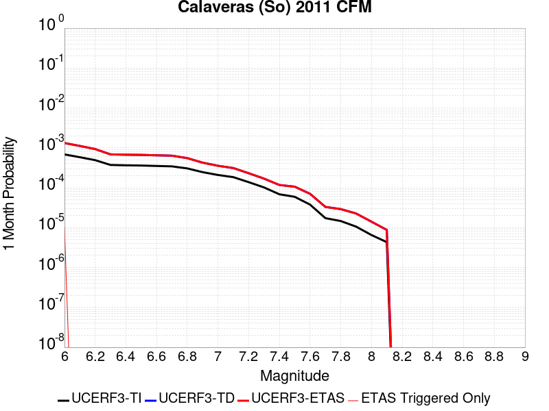 |  | 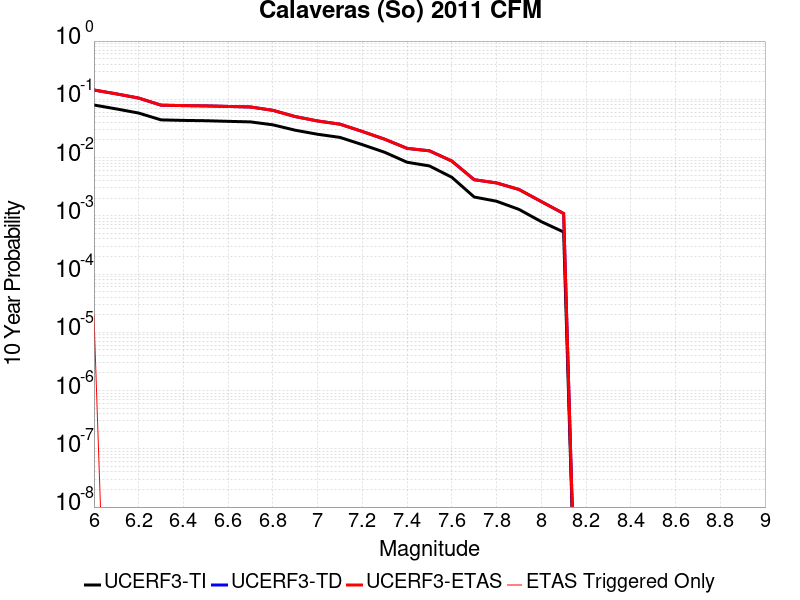 |

| Magnitude | 1 wk TI Prob | 1 wk TD Prob | 1 wk ETAS Prob | 1 wk ETAS/TD Gain | 1 wk ETAS Triggered Only | 1 mo TI Prob | 1 mo TD Prob | 1 mo ETAS Prob | 1 mo ETAS/TD Gain | 1 mo ETAS Triggered Only | 1 yr TI Prob | 1 yr TD Prob | 1 yr ETAS Prob | 1 yr ETAS/TD Gain | 1 yr ETAS Triggered Only | 10 yr TI Prob | 10 yr TD Prob | 10 yr ETAS Prob | 10 yr ETAS/TD Gain | 10 yr ETAS Triggered Only |
|-----|-----|-----|-----|-----|-----|-----|-----|-----|-----|-----|-----|-----|-----|-----|-----|-----|-----|-----|-----|-----|
| 6.0 | 1.5950744E-4 | 3.0719102E-4 | 3.1790585E-4 | 1.03488 | 1.0718114E-5 | 6.834242E-4 | 0.0013158836 | 0.0013265876 | 1.0081345 | 1.0718114E-5 | 0.00828899 | 0.015860915 | 0.015871463 | 1.0006651 | 1.0718114E-5 | 0.079865426 | 0.14441721 | 0.14443555 | 1.000127 | 2.1436228E-5 |
| 6.1 | 1.3584697E-4 | 2.604323E-4 | 2.604323E-4 | 1.0 | 0.0 | 5.8207137E-4 | 0.0011156795 | 0.0011156795 | 1.0 | 0.0 | 0.007063716 | 0.013463869 | 0.013463869 | 1.0 | 0.0 | 0.06843361 | 0.124044694 | 0.124044694 | 1.0 | 0.0 |
| 6.2 | 1.14676266E-4 | 2.1731424E-4 | 2.1731424E-4 | 1.0 | 0.0 | 4.9137714E-4 | 9.310301E-4 | 9.310301E-4 | 1.0 | 0.0 | 0.0059661185 | 0.01124721 | 0.01124721 | 1.0 | 0.0 | 0.058084648 | 0.10503508 | 0.10503508 | 1.0 | 0.0 |
| 6.3 | 8.691518E-5 | 1.5990793E-4 | 1.5990793E-4 | 1.0 | 0.0 | 3.7244044E-4 | 6.851358E-4 | 6.851358E-4 | 1.0 | 0.0 | 0.004525038 | 0.008302716 | 0.008302716 | 1.0 | 0.0 | 0.044339992 | 0.079350494 | 0.079350494 | 1.0 | 0.0 |
| 6.4 | 8.50982E-5 | 1.5697183E-4 | 1.5697183E-4 | 1.0 | 0.0 | 3.646556E-4 | 6.725591E-4 | 6.725591E-4 | 1.0 | 0.0 | 0.0044306475 | 0.008150746 | 0.008150746 | 1.0 | 0.0 | 0.04343345 | 0.0779566 | 0.0779566 | 1.0 | 0.0 |
| 6.5 | 8.4062965E-5 | 1.5521735E-4 | 1.5521735E-4 | 1.0 | 0.0 | 3.602201E-4 | 6.650437E-4 | 6.650437E-4 | 1.0 | 0.0 | 0.004376863 | 0.008059946 | 0.008059946 | 1.0 | 0.0 | 0.042916555 | 0.07712786 | 0.07712786 | 1.0 | 0.0 |
| 6.6 | 8.194716E-5 | 1.5157646E-4 | 1.5157646E-4 | 1.0 | 0.0 | 3.5115483E-4 | 6.494477E-4 | 6.494477E-4 | 1.0 | 0.0 | 0.0042669317 | 0.007871782 | 0.007871782 | 1.0 | 0.0 | 0.04185927 | 0.075413086 | 0.075413086 | 1.0 | 0.0 |
| 6.7 | 8.012326E-5 | 1.4825336E-4 | 1.4825336E-4 | 1.0 | 0.0 | 3.433402E-4 | 6.3521386E-4 | 6.3521386E-4 | 1.0 | 0.0 | 0.004172157 | 0.0077002714 | 0.0077002714 | 1.0 | 0.0 | 0.040946912 | 0.073855184 | 0.073855184 | 1.0 | 0.0 |
| 6.8 | 7.119773E-5 | 1.2883788E-4 | 1.2883788E-4 | 1.0 | 0.0 | 3.0509746E-4 | 5.5204553E-4 | 5.5204553E-4 | 1.0 | 0.0 | 0.0037082357 | 0.0066975304 | 0.0066975304 | 1.0 | 0.0 | 0.036469642 | 0.064698465 | 0.064698465 | 1.0 | 0.0 |
| 6.9 | 5.7343088E-5 | 9.921204E-5 | 9.921204E-5 | 1.0 | 0.0 | 2.4573295E-4 | 4.2512562E-4 | 4.2512562E-4 | 1.0 | 0.0 | 0.0029876942 | 0.005163703 | 0.005163703 | 1.0 | 0.0 | 0.02947844 | 0.050519872 | 0.050519872 | 1.0 | 0.0 |
| 7.0 | 4.8746577E-5 | 8.286983E-5 | 8.286983E-5 | 1.0 | 0.0 | 2.0889717E-4 | 3.5510844E-4 | 3.5510844E-4 | 1.0 | 0.0 | 0.0025403565 | 0.004314941 | 0.004314941 | 1.0 | 0.0 | 0.025115121 | 0.042495564 | 0.042495564 | 1.0 | 0.0 |
| 7.1 | 4.2998014E-5 | 7.266396E-5 | 7.266396E-5 | 1.0 | 0.0 | 1.8426418E-4 | 3.1138014E-4 | 3.1138014E-4 | 1.0 | 0.0 | 0.002241108 | 0.0037845233 | 0.0037845233 | 1.0 | 0.0 | 0.022186412 | 0.03743038 | 0.03743038 | 1.0 | 0.0 |
| 7.2 | 3.221292E-5 | 5.3919634E-5 | 5.3919634E-5 | 1.0 | 0.0 | 1.3804805E-4 | 2.3106382E-4 | 2.3106382E-4 | 1.0 | 0.0 | 0.0016794393 | 0.002809601 | 0.002809601 | 1.0 | 0.0 | 0.016668037 | 0.0280428 | 0.0280428 | 1.0 | 0.0 |
| 7.3 | 2.3756531E-5 | 3.9484363E-5 | 3.9484363E-5 | 1.0 | 0.0 | 1.0180973E-4 | 1.6920782E-4 | 1.6920782E-4 | 1.0 | 0.0 | 0.0012388286 | 0.0020581756 | 0.0020581756 | 1.0 | 0.0 | 0.012319452 | 0.020649675 | 0.020649675 | 1.0 | 0.0 |
| 7.4 | 1.5997684E-5 | 2.7347376E-5 | 2.7347376E-5 | 1.0 | 0.0 | 6.8559704E-5 | 1.17197786E-4 | 1.17197786E-4 | 1.0 | 0.0 | 8.343947E-4 | 0.0014259516 | 0.0014259516 | 1.0 | 0.0 | 0.008312687 | 0.014379721 | 0.014379721 | 1.0 | 0.0 |
| 7.5 | 1.3814293E-5 | 2.4788933E-5 | 2.4788933E-5 | 1.0 | 0.0 | 5.9202768E-5 | 1.0623397E-4 | 1.0623397E-4 | 1.0 | 0.0 | 7.205553E-4 | 0.0012926336 | 0.0012926336 | 1.0 | 0.0 | 0.007182234 | 0.013058846 | 0.013058846 | 1.0 | 0.0 |
| 7.6 | 8.817309E-6 | 1.643521E-5 | 1.643521E-5 | 1.0 | 0.0 | 3.7787922E-5 | 7.043472E-5 | 7.043472E-5 | 1.0 | 0.0 | 4.5997082E-4 | 8.572067E-4 | 8.572067E-4 | 1.0 | 0.0 | 0.004590199 | 0.008722494 | 0.008722494 | 1.0 | 0.0 |
| 7.7 | 4.0352206E-6 | 7.711002E-6 | 7.711002E-6 | 1.0 | 0.0 | 1.7293689E-5 | 3.304673E-5 | 3.304673E-5 | 1.0 | 0.0 | 2.1053031E-4 | 4.0226974E-4 | 4.0226974E-4 | 1.0 | 0.0 | 0.0021033096 | 0.00416701 | 0.00416701 | 1.0 | 0.0 |
| 7.8 | 3.413169E-6 | 6.7905053E-6 | 6.7905053E-6 | 1.0 | 0.0 | 1.4627784E-5 | 2.910184E-5 | 2.910184E-5 | 1.0 | 0.0 | 1.7807873E-4 | 3.5425735E-4 | 3.5425735E-4 | 1.0 | 0.0 | 0.0017793609 | 0.0036680899 | 0.0036680899 | 1.0 | 0.0 |
| 7.9 | 2.4740732E-6 | 5.2815635E-6 | 5.2815635E-6 | 1.0 | 0.0 | 1.06031275E-5 | 2.2635075E-5 | 2.2635075E-5 | 1.0 | 0.0 | 1.2908543E-4 | 2.7554724E-4 | 2.7554724E-4 | 1.0 | 0.0 | 0.0012901047 | 0.0028359778 | 0.0028359778 | 1.0 | 0.0 |
| 8.0 | 1.5231818E-6 | 3.2903374E-6 | 3.2903374E-6 | 1.0 | 0.0 | 6.527906E-6 | 1.410137E-5 | 1.410137E-5 | 1.0 | 0.0 | 7.9474354E-5 | 1.7167069E-4 | 1.7167069E-4 | 1.0 | 0.0 | 7.944594E-4 | 0.0017571712 | 0.0017571712 | 1.0 | 0.0 |
| 8.1 | 1.0104524E-6 | 2.0467116E-6 | 2.0467116E-6 | 1.0 | 0.0 | 4.330503E-6 | 8.771593E-6 | 8.771593E-6 | 1.0 | 0.0 | 5.2722597E-5 | 1.0678893E-4 | 1.0678893E-4 | 1.0 | 0.0 | 5.271009E-4 | 0.0010934469 | 0.0010934469 | 1.0 | 0.0 |

## Greenville (No) 2011 CFM
*[(top)](#table-of-contents)*

| 1 Week | 1 Month | 1 Year | 10 Year |
|-----|-----|-----|-----|
|  |  |  |  |

| Magnitude | 1 wk TI Prob | 1 wk TD Prob | 1 wk ETAS Prob | 1 wk ETAS/TD Gain | 1 wk ETAS Triggered Only | 1 mo TI Prob | 1 mo TD Prob | 1 mo ETAS Prob | 1 mo ETAS/TD Gain | 1 mo ETAS Triggered Only | 1 yr TI Prob | 1 yr TD Prob | 1 yr ETAS Prob | 1 yr ETAS/TD Gain | 1 yr ETAS Triggered Only | 10 yr TI Prob | 10 yr TD Prob | 10 yr ETAS Prob | 10 yr ETAS/TD Gain | 10 yr ETAS Triggered Only |
|-----|-----|-----|-----|-----|-----|-----|-----|-----|-----|-----|-----|-----|-----|-----|-----|-----|-----|-----|-----|-----|
| 6.0 | 3.286654E-5 | 4.036741E-5 | 5.108509E-5 | 1.2655033 | 1.0718114E-5 | 1.4084899E-4 | 1.7299193E-4 | 1.8370818E-4 | 1.0619466 | 1.0718114E-5 | 0.0017134876 | 0.0021041804 | 0.0021255715 | 1.010166 | 2.1436228E-5 | 0.017003356 | 0.020847455 | 0.020868445 | 1.0010068 | 2.1436228E-5 |
| 6.1 | 3.286654E-5 | 4.036741E-5 | 5.108509E-5 | 1.2655033 | 1.0718114E-5 | 1.4084899E-4 | 1.7299193E-4 | 1.8370818E-4 | 1.0619466 | 1.0718114E-5 | 0.0017134876 | 0.0021041804 | 0.0021255715 | 1.010166 | 2.1436228E-5 | 0.017003356 | 0.020847455 | 0.020868445 | 1.0010068 | 2.1436228E-5 |
| 6.2 | 3.1697953E-5 | 3.893027E-5 | 4.9647966E-5 | 1.2753049 | 1.0718114E-5 | 1.358413E-4 | 1.6683355E-4 | 1.7754987E-4 | 1.0642337 | 1.0718114E-5 | 0.0016526132 | 0.0020293442 | 0.002050737 | 1.0105417 | 2.1436228E-5 | 0.01640377 | 0.020112827 | 0.020133832 | 1.0010444 | 2.1436228E-5 |
| 6.3 | 3.1363317E-5 | 3.8519134E-5 | 4.9236834E-5 | 1.2782435 | 1.0718114E-5 | 1.344073E-4 | 1.6507176E-4 | 1.757881E-4 | 1.0649194 | 1.0718114E-5 | 0.0016351803 | 0.002007934 | 0.0020293272 | 1.0106543 | 2.1436228E-5 | 0.016232004 | 0.019902589 | 0.0199236 | 1.0010556 | 2.1436228E-5 |
| 6.4 | 3.0228604E-5 | 3.7126225E-5 | 4.784394E-5 | 1.2886832 | 1.0718114E-5 | 1.2954473E-4 | 1.5910288E-4 | 1.698193E-4 | 1.0673552 | 1.0718114E-5 | 0.0015760659 | 0.0019353938 | 0.0019567884 | 1.0110545 | 2.1436228E-5 | 0.015649348 | 0.01918991 | 0.019210933 | 1.0010957 | 2.1436228E-5 |
| 6.5 | 2.9537814E-5 | 3.6281657E-5 | 4.699938E-5 | 1.2954034 | 1.0718114E-5 | 1.2658449E-4 | 1.5548375E-4 | 1.6620019E-4 | 1.0689232 | 1.0718114E-5 | 0.0015400766 | 0.0018914078 | 0.0019128034 | 1.011312 | 2.1436228E-5 | 0.01529447 | 0.018757557 | 0.018778592 | 1.0011214 | 2.1436228E-5 |
| 6.6 | 2.7345395E-5 | 3.3590906E-5 | 4.430866E-5 | 1.3190671 | 1.0718114E-5 | 1.1718928E-4 | 1.4395325E-4 | 1.5466982E-4 | 1.0744448 | 1.0718114E-5 | 0.0014258457 | 0.0017512529 | 0.0017726516 | 1.0122191 | 2.1436228E-5 | 0.014167317 | 0.017378341 | 0.017399404 | 1.0012121 | 2.1436228E-5 |
| 6.7 | 2.5615784E-5 | 3.1567764E-5 | 4.228554E-5 | 1.3395164 | 1.0718114E-5 | 1.09777306E-4 | 1.3528357E-4 | 1.4600024E-4 | 1.0792162 | 1.0718114E-5 | 0.0013357193 | 0.0016458635 | 0.0016672645 | 1.0130029 | 2.1436228E-5 | 0.013277191 | 0.016340412 | 0.016361497 | 1.0012904 | 2.1436228E-5 |
| 6.8 | 2.0059057E-5 | 2.4712537E-5 | 3.5430385E-5 | 1.4337009 | 1.0718114E-5 | 8.596455E-5 | 1.0590666E-4 | 1.1662364E-4 | 1.1011927 | 1.0718114E-5 | 0.0010461159 | 0.0012886672 | 0.0013100757 | 1.016613 | 2.1436228E-5 | 0.0104120495 | 0.012813962 | 0.012835124 | 1.0016514 | 2.1436228E-5 |
| 6.9 | 1.6321746E-5 | 2.0185005E-5 | 3.0902902E-5 | 1.5309831 | 1.0718114E-5 | 6.9948466E-5 | 8.650436E-5 | 9.722155E-5 | 1.1238918 | 1.0718114E-5 | 8.5128983E-4 | 0.0010526942 | 0.0010741078 | 1.0203418 | 2.1436228E-5 | 0.008480361 | 0.010478605 | 0.010499816 | 1.0020243 | 2.1436228E-5 |
| 7.0 | 1.22527645E-5 | 1.5135852E-5 | 1.5135852E-5 | 1.0 | 0.0 | 5.2510793E-5 | 6.486634E-5 | 6.486634E-5 | 1.0 | 0.0 | 6.3913135E-4 | 7.894658E-4 | 7.894658E-4 | 1.0 | 0.0 | 0.0063729626 | 0.00786725 | 0.00786725 | 1.0 | 0.0 |
| 7.1 | 8.996482E-6 | 1.1165086E-5 | 1.1165086E-5 | 1.0 | 0.0 | 3.8555783E-5 | 4.78495E-5 | 4.78495E-5 | 1.0 | 0.0 | 4.6931554E-4 | 5.8241317E-4 | 5.8241317E-4 | 1.0 | 0.0 | 0.004683256 | 0.005809159 | 0.005809159 | 1.0 | 0.0 |
| 7.2 | 6.0273087E-6 | 7.569554E-6 | 7.569554E-6 | 1.0 | 0.0 | 2.5831067E-5 | 3.2440545E-5 | 3.2440545E-5 | 1.0 | 0.0 | 3.1444785E-4 | 3.9489273E-4 | 3.9489273E-4 | 1.0 | 0.0 | 0.0031400328 | 0.0039421073 | 0.0039421073 | 1.0 | 0.0 |
| 7.3 | 3.1209995E-6 | 3.966412E-6 | 3.966412E-6 | 1.0 | 0.0 | 1.3375643E-5 | 1.6998798E-5 | 1.6998798E-5 | 1.0 | 0.0 | 1.6283628E-4 | 2.0694088E-4 | 2.0694088E-4 | 1.0 | 0.0 | 0.0016271701 | 0.002067572 | 0.002067572 | 1.0 | 0.0 |
| 7.4 | 2.0254208E-6 | 2.609629E-6 | 2.609629E-6 | 1.0 | 0.0 | 8.680347E-6 | 1.1184077E-5 | 1.1184077E-5 | 1.0 | 0.0 | 1.0567809E-4 | 1.3615769E-4 | 1.3615769E-4 | 1.0 | 0.0 | 0.0010562785 | 0.0013607995 | 0.0013607995 | 1.0 | 0.0 |
| 7.5 | 1.6763418E-6 | 2.1733601E-6 | 2.1733601E-6 | 1.0 | 0.0 | 7.184302E-6 | 9.314368E-6 | 9.314368E-6 | 1.0 | 0.0 | 8.746537E-5 | 1.1339658E-4 | 1.1339658E-4 | 1.0 | 0.0 | 8.743095E-4 | 0.0011334341 | 0.0011334341 | 1.0 | 0.0 |
| 7.6 | 1.1935462E-6 | 1.5458515E-6 | 1.5458515E-6 | 1.0 | 0.0 | 5.115188E-6 | 6.6250614E-6 | 6.6250614E-6 | 1.0 | 0.0 | 6.2275634E-5 | 8.065718E-5 | 8.065718E-5 | 1.0 | 0.0 | 6.2258187E-4 | 8.0630975E-4 | 8.0630975E-4 | 1.0 | 0.0 |
| 7.7 | 3.0464201E-7 | 3.984697E-7 | 3.984697E-7 | 1.0 | 0.0 | 1.3056081E-6 | 1.7077261E-6 | 1.7077261E-6 | 1.0 | 0.0 | 1.589566E-5 | 2.0791373E-5 | 2.0791373E-5 | 1.0 | 0.0 | 1.5894524E-4 | 2.0789898E-4 | 2.0789898E-4 | 1.0 | 0.0 |

## Great Valley 10 (Panoche)
*[(top)](#table-of-contents)*

| 1 Week | 1 Month | 1 Year | 10 Year |
|-----|-----|-----|-----|
|  | 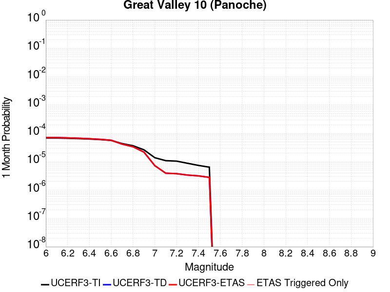 | 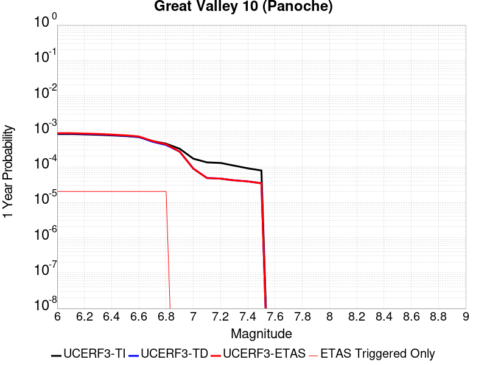 |  |

| Magnitude | 1 wk TI Prob | 1 wk TD Prob | 1 wk ETAS Prob | 1 wk ETAS/TD Gain | 1 wk ETAS Triggered Only | 1 mo TI Prob | 1 mo TD Prob | 1 mo ETAS Prob | 1 mo ETAS/TD Gain | 1 mo ETAS Triggered Only | 1 yr TI Prob | 1 yr TD Prob | 1 yr ETAS Prob | 1 yr ETAS/TD Gain | 1 yr ETAS Triggered Only | 10 yr TI Prob | 10 yr TD Prob | 10 yr ETAS Prob | 10 yr ETAS/TD Gain | 10 yr ETAS Triggered Only |
|-----|-----|-----|-----|-----|-----|-----|-----|-----|-----|-----|-----|-----|-----|-----|-----|-----|-----|-----|-----|-----|
| 6.0 | 1.6014626E-5 | 1.6575756E-5 | 1.6575756E-5 | 1.0 | 0.0 | 6.863231E-5 | 7.103705E-5 | 7.103705E-5 | 1.0 | 0.0 | 8.35278E-4 | 8.645371E-4 | 8.8595477E-4 | 1.0247736 | 2.1436228E-5 | 0.008321454 | 0.008612356 | 0.008633608 | 1.0024675 | 2.1436228E-5 |
| 6.1 | 1.6014626E-5 | 1.6575756E-5 | 1.6575756E-5 | 1.0 | 0.0 | 6.863231E-5 | 7.103705E-5 | 7.103705E-5 | 1.0 | 0.0 | 8.35278E-4 | 8.645371E-4 | 8.8595477E-4 | 1.0247736 | 2.1436228E-5 | 0.008321454 | 0.008612356 | 0.008633608 | 1.0024675 | 2.1436228E-5 |
| 6.2 | 1.56782E-5 | 1.6198797E-5 | 1.6198797E-5 | 1.0 | 0.0 | 6.719056E-5 | 6.94216E-5 | 6.94216E-5 | 1.0 | 0.0 | 8.17738E-4 | 8.448843E-4 | 8.663024E-4 | 1.0253503 | 2.1436228E-5 | 0.008147354 | 0.008417329 | 0.008438584 | 1.0025252 | 2.1436228E-5 |
| 6.3 | 1.5263338E-5 | 1.5723856E-5 | 1.5723856E-5 | 1.0 | 0.0 | 6.541267E-5 | 6.7386245E-5 | 6.7386245E-5 | 1.0 | 0.0 | 7.961082E-4 | 8.201227E-4 | 8.4154133E-4 | 1.0261164 | 2.1436228E-5 | 0.007932622 | 0.008171554 | 0.008192815 | 1.0026019 | 2.1436228E-5 |
| 6.4 | 1.4720723E-5 | 1.5099705E-5 | 1.5099705E-5 | 1.0 | 0.0 | 6.308728E-5 | 6.471144E-5 | 6.471144E-5 | 1.0 | 0.0 | 7.67817E-4 | 7.8758097E-4 | 8.090003E-4 | 1.0271964 | 2.1436228E-5 | 0.007651695 | 0.007848473 | 0.007869741 | 1.0027099 | 2.1436228E-5 |
| 6.5 | 1.408264E-5 | 1.4356282E-5 | 1.4356282E-5 | 1.0 | 0.0 | 6.0352773E-5 | 6.1525505E-5 | 6.1525505E-5 | 1.0 | 0.0 | 7.3454727E-4 | 7.488194E-4 | 7.7023957E-4 | 1.0286052 | 2.1436228E-5 | 0.0073212404 | 0.0074635176 | 0.007484794 | 1.0028507 | 2.1436228E-5 |
| 6.6 | 1.3197086E-5 | 1.3322179E-5 | 1.3322179E-5 | 1.0 | 0.0 | 5.6557717E-5 | 5.7093832E-5 | 5.7093832E-5 | 1.0 | 0.0 | 6.8837265E-4 | 6.948994E-4 | 7.1632076E-4 | 1.0308266 | 2.1436228E-5 | 0.006862442 | 0.0069278036 | 0.0069490913 | 1.0030727 | 2.1436228E-5 |
| 6.7 | 1.017583E-5 | 9.745584E-6 | 9.745584E-6 | 1.0 | 0.0 | 4.360997E-5 | 4.1766136E-5 | 4.1766136E-5 | 1.0 | 0.0 | 5.30822E-4 | 5.0838647E-4 | 5.2981183E-4 | 1.0421438 | 2.1436228E-5 | 0.0052955584 | 0.005072487 | 0.0050938143 | 1.0042045 | 2.1436228E-5 |
| 6.8 | 8.557912E-6 | 7.872871E-6 | 7.872871E-6 | 1.0 | 0.0 | 3.667625E-5 | 3.374045E-5 | 3.374045E-5 | 1.0 | 0.0 | 4.4644187E-4 | 4.1071457E-4 | 4.32142E-4 | 1.0521711 | 2.1436228E-5 | 0.0044554602 | 0.004099762 | 0.0041211103 | 1.0052072 | 2.1436228E-5 |
| 6.9 | 6.14664E-6 | 5.092178E-6 | 5.092178E-6 | 1.0 | 0.0 | 2.6342475E-5 | 2.1823445E-5 | 2.1823445E-5 | 1.0 | 0.0 | 3.2067244E-4 | 2.6566943E-4 | 2.6566943E-4 | 1.0 | 0.0 | 0.003202101 | 0.0026536568 | 0.0026536568 | 1.0 | 0.0 |
| 7.0 | 3.2310581E-6 | 1.695154E-6 | 1.695154E-6 | 1.0 | 0.0 | 1.3847319E-5 | 7.264926E-6 | 7.264926E-6 | 1.0 | 0.0 | 1.6857806E-4 | 8.844698E-5 | 8.844698E-5 | 1.0 | 0.0 | 0.0016845023 | 8.841271E-4 | 8.841271E-4 | 1.0 | 0.0 |
| 7.1 | 2.544492E-6 | 9.1891064E-7 | 9.1891064E-7 | 1.0 | 0.0 | 1.090492E-5 | 3.9381825E-6 | 3.9381825E-6 | 1.0 | 0.0 | 1.327593E-4 | 4.7946367E-5 | 4.7946367E-5 | 1.0 | 0.0 | 0.0013268003 | 4.79365E-4 | 4.79365E-4 | 1.0 | 0.0 |
| 7.2 | 2.4479045E-6 | 8.84148E-7 | 8.84148E-7 | 1.0 | 0.0 | 1.0490977E-5 | 3.7892005E-6 | 3.7892005E-6 | 1.0 | 0.0 | 1.2772017E-4 | 4.6132587E-5 | 4.6132587E-5 | 1.0 | 0.0 | 0.0012764678 | 4.6123486E-4 | 4.6123486E-4 | 1.0 | 0.0 |
| 7.3 | 2.0559578E-6 | 7.8929344E-7 | 7.8929344E-7 | 1.0 | 0.0 | 8.811218E-6 | 3.382682E-6 | 3.382682E-6 | 1.0 | 0.0 | 1.072713E-4 | 4.1183423E-5 | 4.1183423E-5 | 1.0 | 0.0 | 0.0010721954 | 4.1176256E-4 | 4.1176256E-4 | 1.0 | 0.0 |
| 7.4 | 1.727687E-6 | 7.387884E-7 | 7.387884E-7 | 1.0 | 0.0 | 7.404352E-6 | 3.1662323E-6 | 3.1662323E-6 | 1.0 | 0.0 | 9.0144255E-5 | 3.8548245E-5 | 3.8548245E-5 | 1.0 | 0.0 | 9.0107694E-4 | 3.854202E-4 | 3.854202E-4 | 1.0 | 0.0 |
| 7.5 | 1.5002679E-6 | 6.5462535E-7 | 6.5462535E-7 | 1.0 | 0.0 | 6.4297037E-6 | 2.8055345E-6 | 2.8055345E-6 | 1.0 | 0.0 | 7.827883E-5 | 3.415689E-5 | 3.415689E-5 | 1.0 | 0.0 | 7.825126E-4 | 3.4152053E-4 | 3.4152053E-4 | 1.0 | 0.0 |

## Kern Canyon (South Kern) 2011
*[(top)](#table-of-contents)*

| 1 Week | 1 Month | 1 Year | 10 Year |
|-----|-----|-----|-----|
|  |  |  |  |

| Magnitude | 1 wk TI Prob | 1 wk TD Prob | 1 wk ETAS Prob | 1 wk ETAS/TD Gain | 1 wk ETAS Triggered Only | 1 mo TI Prob | 1 mo TD Prob | 1 mo ETAS Prob | 1 mo ETAS/TD Gain | 1 mo ETAS Triggered Only | 1 yr TI Prob | 1 yr TD Prob | 1 yr ETAS Prob | 1 yr ETAS/TD Gain | 1 yr ETAS Triggered Only | 10 yr TI Prob | 10 yr TD Prob | 10 yr ETAS Prob | 10 yr ETAS/TD Gain | 10 yr ETAS Triggered Only |
|-----|-----|-----|-----|-----|-----|-----|-----|-----|-----|-----|-----|-----|-----|-----|-----|-----|-----|-----|-----|-----|
| 6.0 | 4.105075E-6 | 4.113737E-6 | 4.113737E-6 | 1.0 | 0.0 | 1.7593058E-5 | 1.7630186E-5 | 1.7630186E-5 | 1.0 | 0.0 | 2.1417443E-4 | 2.14627E-4 | 2.14627E-4 | 1.0 | 0.0 | 0.0021396813 | 0.002144261 | 0.0021656512 | 1.0099756 | 2.1436228E-5 |
| 6.1 | 4.105075E-6 | 4.113737E-6 | 4.113737E-6 | 1.0 | 0.0 | 1.7593058E-5 | 1.7630186E-5 | 1.7630186E-5 | 1.0 | 0.0 | 2.1417443E-4 | 2.14627E-4 | 2.14627E-4 | 1.0 | 0.0 | 0.0021396813 | 0.002144261 | 0.0021656512 | 1.0099756 | 2.1436228E-5 |
| 6.2 | 4.105075E-6 | 4.113737E-6 | 4.113737E-6 | 1.0 | 0.0 | 1.7593058E-5 | 1.7630186E-5 | 1.7630186E-5 | 1.0 | 0.0 | 2.1417443E-4 | 2.14627E-4 | 2.14627E-4 | 1.0 | 0.0 | 0.0021396813 | 0.002144261 | 0.0021656512 | 1.0099756 | 2.1436228E-5 |
| 6.3 | 4.105075E-6 | 4.113737E-6 | 4.113737E-6 | 1.0 | 0.0 | 1.7593058E-5 | 1.7630186E-5 | 1.7630186E-5 | 1.0 | 0.0 | 2.1417443E-4 | 2.14627E-4 | 2.14627E-4 | 1.0 | 0.0 | 0.0021396813 | 0.002144261 | 0.0021656512 | 1.0099756 | 2.1436228E-5 |
| 6.4 | 4.105075E-6 | 4.113737E-6 | 4.113737E-6 | 1.0 | 0.0 | 1.7593058E-5 | 1.7630186E-5 | 1.7630186E-5 | 1.0 | 0.0 | 2.1417443E-4 | 2.14627E-4 | 2.14627E-4 | 1.0 | 0.0 | 0.0021396813 | 0.002144261 | 0.0021656512 | 1.0099756 | 2.1436228E-5 |
| 6.5 | 2.9849807E-6 | 2.9731623E-6 | 2.9731623E-6 | 1.0 | 0.0 | 1.2792712E-5 | 1.2742063E-5 | 1.2742063E-5 | 1.0 | 0.0 | 1.5574014E-4 | 1.5512372E-4 | 1.5512372E-4 | 1.0 | 0.0 | 0.0015563103 | 0.0015501695 | 0.0015715725 | 1.0138068 | 2.1436228E-5 |
| 6.6 | 2.9849807E-6 | 2.9731623E-6 | 2.9731623E-6 | 1.0 | 0.0 | 1.2792712E-5 | 1.2742063E-5 | 1.2742063E-5 | 1.0 | 0.0 | 1.5574014E-4 | 1.5512372E-4 | 1.5512372E-4 | 1.0 | 0.0 | 0.0015563103 | 0.0015501695 | 0.0015715725 | 1.0138068 | 2.1436228E-5 |
| 6.7 | 2.6756725E-6 | 2.6582275E-6 | 2.6582275E-6 | 1.0 | 0.0 | 1.1467117E-5 | 1.1392354E-5 | 1.1392354E-5 | 1.0 | 0.0 | 1.396032E-4 | 1.386932E-4 | 1.386932E-4 | 1.0 | 0.0 | 0.0013951553 | 0.0013860773 | 0.0014074838 | 1.0154439 | 2.1436228E-5 |
| 6.8 | 2.3283721E-6 | 2.3047846E-6 | 2.3047846E-6 | 1.0 | 0.0 | 9.9787E-6 | 9.877612E-6 | 9.877612E-6 | 1.0 | 0.0 | 1.214839E-4 | 1.2025336E-4 | 1.2025336E-4 | 1.0 | 0.0 | 0.001214175 | 0.0012018904 | 0.0012233008 | 1.017814 | 2.1436228E-5 |
| 6.9 | 2.0972677E-6 | 2.0696464E-6 | 2.0696464E-6 | 1.0 | 0.0 | 8.988259E-6 | 8.8698835E-6 | 8.8698835E-6 | 1.0 | 0.0 | 1.0942656E-4 | 1.0798554E-4 | 1.0798554E-4 | 1.0 | 0.0 | 0.0010937268 | 0.0010793365 | 0.0011007496 | 1.0198392 | 2.1436228E-5 |
| 7.0 | 1.7132242E-6 | 1.678708E-6 | 1.678708E-6 | 1.0 | 0.0 | 7.3423685E-6 | 7.1944432E-6 | 7.1944432E-6 | 1.0 | 0.0 | 8.938967E-5 | 8.7588865E-5 | 8.7588865E-5 | 1.0 | 0.0 | 8.935372E-4 | 8.7554724E-4 | 8.9696475E-4 | 1.0244617 | 2.1436228E-5 |
| 7.1 | 1.4215541E-6 | 1.381579E-6 | 1.381579E-6 | 1.0 | 0.0 | 6.0923603E-6 | 5.9210392E-6 | 5.9210392E-6 | 1.0 | 0.0 | 7.417196E-5 | 7.2086295E-5 | 7.2086295E-5 | 1.0 | 0.0 | 7.414721E-4 | 7.206318E-4 | 7.4205257E-4 | 1.029725 | 2.1436228E-5 |
| 7.2 | 9.097853E-7 | 8.6038E-7 | 8.6038E-7 | 1.0 | 0.0 | 3.899074E-6 | 3.6873375E-6 | 3.6873375E-6 | 1.0 | 0.0 | 4.7470192E-5 | 4.4892422E-5 | 4.4892422E-5 | 1.0 | 0.0 | 4.7460053E-4 | 4.4883462E-4 | 4.702612E-4 | 1.0477383 | 2.1436228E-5 |
| 7.3 | 6.144169E-7 | 5.628223E-7 | 5.628223E-7 | 1.0 | 0.0 | 2.6332125E-6 | 2.4120934E-6 | 2.4120934E-6 | 1.0 | 0.0 | 3.205889E-5 | 2.9366847E-5 | 2.9366847E-5 | 1.0 | 0.0 | 3.2054266E-4 | 2.9363018E-4 | 3.0434513E-4 | 1.0364914 | 1.0718114E-5 |
| 7.4 | 4.049844E-7 | 3.5728428E-7 | 3.5728428E-7 | 1.0 | 0.0 | 1.7356463E-6 | 1.5312174E-6 | 1.5312174E-6 | 1.0 | 0.0 | 2.1131287E-5 | 1.8642415E-5 | 1.8642415E-5 | 1.0 | 0.0 | 2.1129279E-4 | 1.8640877E-4 | 1.8640877E-4 | 1.0 | 0.0 |
| 7.5 | 1.9871162E-7 | 1.58305E-7 | 1.58305E-7 | 1.0 | 0.0 | 8.5162094E-7 | 6.7844985E-7 | 6.7844985E-7 | 1.0 | 0.0 | 1.0368436E-5 | 8.260096E-6 | 8.260096E-6 | 1.0 | 0.0 | 1.0367952E-4 | 8.259798E-5 | 8.259798E-5 | 1.0 | 0.0 |
| 7.6 | 2.572245E-8 | 1.7352637E-8 | 1.7352637E-8 | 1.0 | 0.0 | 1.10239064E-7 | 7.4368444E-8 | 7.4368444E-8 | 1.0 | 0.0 | 1.3421597E-6 | 9.0543546E-7 | 9.0543546E-7 | 1.0 | 0.0 | 1.3421517E-5 | 9.0543235E-6 | 9.0543235E-6 | 1.0 | 0.0 |

## Pitas Point (Lower)-Montalvo
*[(top)](#table-of-contents)*

| 1 Week | 1 Month | 1 Year | 10 Year |
|-----|-----|-----|-----|
|  |  |  |  |

| Magnitude | 1 wk TI Prob | 1 wk TD Prob | 1 wk ETAS Prob | 1 wk ETAS/TD Gain | 1 wk ETAS Triggered Only | 1 mo TI Prob | 1 mo TD Prob | 1 mo ETAS Prob | 1 mo ETAS/TD Gain | 1 mo ETAS Triggered Only | 1 yr TI Prob | 1 yr TD Prob | 1 yr ETAS Prob | 1 yr ETAS/TD Gain | 1 yr ETAS Triggered Only | 10 yr TI Prob | 10 yr TD Prob | 10 yr ETAS Prob | 10 yr ETAS/TD Gain | 10 yr ETAS Triggered Only |
|-----|-----|-----|-----|-----|-----|-----|-----|-----|-----|-----|-----|-----|-----|-----|-----|-----|-----|-----|-----|-----|
| 6.0 | 5.2543637E-6 | 4.8379093E-6 | 4.8379093E-6 | 1.0 | 0.0 | 2.2518509E-5 | 2.0733734E-5 | 2.0733734E-5 | 1.0 | 0.0 | 2.7412834E-4 | 2.5240428E-4 | 2.738351E-4 | 1.0849067 | 2.1436228E-5 | 0.0027379042 | 0.0025212085 | 0.0025425907 | 1.0084809 | 2.1436228E-5 |
| 6.1 | 5.2543637E-6 | 4.8379093E-6 | 4.8379093E-6 | 1.0 | 0.0 | 2.2518509E-5 | 2.0733734E-5 | 2.0733734E-5 | 1.0 | 0.0 | 2.7412834E-4 | 2.5240428E-4 | 2.738351E-4 | 1.0849067 | 2.1436228E-5 | 0.0027379042 | 0.0025212085 | 0.0025425907 | 1.0084809 | 2.1436228E-5 |
| 6.2 | 5.2543637E-6 | 4.8379093E-6 | 4.8379093E-6 | 1.0 | 0.0 | 2.2518509E-5 | 2.0733734E-5 | 2.0733734E-5 | 1.0 | 0.0 | 2.7412834E-4 | 2.5240428E-4 | 2.738351E-4 | 1.0849067 | 2.1436228E-5 | 0.0027379042 | 0.0025212085 | 0.0025425907 | 1.0084809 | 2.1436228E-5 |
| 6.3 | 5.2543637E-6 | 4.8379093E-6 | 4.8379093E-6 | 1.0 | 0.0 | 2.2518509E-5 | 2.0733734E-5 | 2.0733734E-5 | 1.0 | 0.0 | 2.7412834E-4 | 2.5240428E-4 | 2.738351E-4 | 1.0849067 | 2.1436228E-5 | 0.0027379042 | 0.0025212085 | 0.0025425907 | 1.0084809 | 2.1436228E-5 |
| 6.4 | 5.2543637E-6 | 4.8379093E-6 | 4.8379093E-6 | 1.0 | 0.0 | 2.2518509E-5 | 2.0733734E-5 | 2.0733734E-5 | 1.0 | 0.0 | 2.7412834E-4 | 2.5240428E-4 | 2.738351E-4 | 1.0849067 | 2.1436228E-5 | 0.0027379042 | 0.0025212085 | 0.0025425907 | 1.0084809 | 2.1436228E-5 |
| 6.5 | 5.2543637E-6 | 4.8379093E-6 | 4.8379093E-6 | 1.0 | 0.0 | 2.2518509E-5 | 2.0733734E-5 | 2.0733734E-5 | 1.0 | 0.0 | 2.7412834E-4 | 2.5240428E-4 | 2.738351E-4 | 1.0849067 | 2.1436228E-5 | 0.0027379042 | 0.0025212085 | 0.0025425907 | 1.0084809 | 2.1436228E-5 |
| 6.6 | 5.2543637E-6 | 4.8379093E-6 | 4.8379093E-6 | 1.0 | 0.0 | 2.2518509E-5 | 2.0733734E-5 | 2.0733734E-5 | 1.0 | 0.0 | 2.7412834E-4 | 2.5240428E-4 | 2.738351E-4 | 1.0849067 | 2.1436228E-5 | 0.0027379042 | 0.0025212085 | 0.0025425907 | 1.0084809 | 2.1436228E-5 |
| 6.7 | 5.2543637E-6 | 4.8379093E-6 | 4.8379093E-6 | 1.0 | 0.0 | 2.2518509E-5 | 2.0733734E-5 | 2.0733734E-5 | 1.0 | 0.0 | 2.7412834E-4 | 2.5240428E-4 | 2.738351E-4 | 1.0849067 | 2.1436228E-5 | 0.0027379042 | 0.0025212085 | 0.0025425907 | 1.0084809 | 2.1436228E-5 |
| 6.8 | 5.2543637E-6 | 4.8379093E-6 | 4.8379093E-6 | 1.0 | 0.0 | 2.2518509E-5 | 2.0733734E-5 | 2.0733734E-5 | 1.0 | 0.0 | 2.7412834E-4 | 2.5240428E-4 | 2.738351E-4 | 1.0849067 | 2.1436228E-5 | 0.0027379042 | 0.0025212085 | 0.0025425907 | 1.0084809 | 2.1436228E-5 |
| 6.9 | 5.2543637E-6 | 4.8379093E-6 | 4.8379093E-6 | 1.0 | 0.0 | 2.2518509E-5 | 2.0733734E-5 | 2.0733734E-5 | 1.0 | 0.0 | 2.7412834E-4 | 2.5240428E-4 | 2.738351E-4 | 1.0849067 | 2.1436228E-5 | 0.0027379042 | 0.0025212085 | 0.0025425907 | 1.0084809 | 2.1436228E-5 |
| 7.0 | 5.2543637E-6 | 4.8379093E-6 | 4.8379093E-6 | 1.0 | 0.0 | 2.2518509E-5 | 2.0733734E-5 | 2.0733734E-5 | 1.0 | 0.0 | 2.7412834E-4 | 2.5240428E-4 | 2.738351E-4 | 1.0849067 | 2.1436228E-5 | 0.0027379042 | 0.0025212085 | 0.0025425907 | 1.0084809 | 2.1436228E-5 |
| 7.1 | 5.2543637E-6 | 4.8379093E-6 | 4.8379093E-6 | 1.0 | 0.0 | 2.2518509E-5 | 2.0733734E-5 | 2.0733734E-5 | 1.0 | 0.0 | 2.7412834E-4 | 2.5240428E-4 | 2.738351E-4 | 1.0849067 | 2.1436228E-5 | 0.0027379042 | 0.0025212085 | 0.0025425907 | 1.0084809 | 2.1436228E-5 |
| 7.2 | 5.2458695E-6 | 4.829063E-6 | 4.829063E-6 | 1.0 | 0.0 | 2.2482105E-5 | 2.0695821E-5 | 2.0695821E-5 | 1.0 | 0.0 | 2.7368523E-4 | 2.519428E-4 | 2.7337365E-4 | 1.0850623 | 2.1436228E-5 | 0.0027334841 | 0.0025166043 | 0.0025379865 | 1.0084965 | 2.1436228E-5 |
| 7.3 | 5.22665E-6 | 4.80898E-6 | 4.80898E-6 | 1.0 | 0.0 | 2.2399736E-5 | 2.0609754E-5 | 2.0609754E-5 | 1.0 | 0.0 | 2.7268266E-4 | 2.508952E-4 | 2.7232603E-4 | 1.0854175 | 2.1436228E-5 | 0.002723483 | 0.0025061516 | 0.0025275343 | 1.008532 | 2.1436228E-5 |
| 7.4 | 5.210642E-6 | 4.7921926E-6 | 4.7921926E-6 | 1.0 | 0.0 | 2.233113E-5 | 2.0537807E-5 | 2.0537807E-5 | 1.0 | 0.0 | 2.718476E-4 | 2.5001942E-4 | 2.714503E-4 | 1.0857168 | 2.1436228E-5 | 0.002715153 | 0.002497414 | 0.0025187966 | 1.008562 | 2.1436228E-5 |
| 7.5 | 5.1226016E-6 | 4.7000785E-6 | 4.7000785E-6 | 1.0 | 0.0 | 2.1953823E-5 | 2.014304E-5 | 2.014304E-5 | 1.0 | 0.0 | 2.67255E-4 | 2.452142E-4 | 2.666452E-4 | 1.087397 | 2.1436228E-5 | 0.0026693381 | 0.002449468 | 0.0024708519 | 1.0087299 | 2.1436228E-5 |
| 7.6 | 4.8796987E-6 | 4.4449766E-6 | 4.4449766E-6 | 1.0 | 0.0 | 2.0912828E-5 | 1.9049763E-5 | 1.9049763E-5 | 1.0 | 0.0 | 2.5458392E-4 | 2.3190647E-4 | 2.5333773E-4 | 1.0924133 | 2.1436228E-5 | 0.0025429246 | 0.0023166754 | 0.0023380618 | 1.0092316 | 2.1436228E-5 |
| 7.7 | 4.0834398E-6 | 3.6091424E-6 | 3.6091424E-6 | 1.0 | 0.0 | 1.7500339E-5 | 1.5467662E-5 | 1.5467662E-5 | 1.0 | 0.0 | 2.1304579E-4 | 1.8830276E-4 | 2.0973494E-4 | 1.1138177 | 2.1436228E-5 | 0.0021284167 | 0.0018814557 | 0.0019028516 | 1.011372 | 2.1436228E-5 |
| 7.8 | 2.5445438E-6 | 2.1212452E-6 | 2.1212452E-6 | 1.0 | 0.0 | 1.0905142E-5 | 9.09102E-6 | 9.09102E-6 | 1.0 | 0.0 | 1.3276201E-4 | 1.1067759E-4 | 1.21394514E-4 | 1.0968301 | 1.0718114E-5 | 0.0013268272 | 0.0011062294 | 0.0011169356 | 1.0096781 | 1.0718114E-5 |
| 7.9 | 4.1677114E-7 | 3.3293983E-7 | 3.3293983E-7 | 1.0 | 0.0 | 1.7861609E-6 | 1.4268842E-6 | 1.4268842E-6 | 1.0 | 0.0 | 2.1746291E-5 | 1.737218E-5 | 1.737218E-5 | 1.0 | 0.0 | 2.1744163E-4 | 1.7370853E-4 | 1.7370853E-4 | 1.0 | 0.0 |
| 8.0 | 7.791402E-9 | 5.683553E-9 | 5.683553E-9 | 1.0 | 0.0 | 3.3391725E-8 | 2.4358085E-8 | 2.4358085E-8 | 1.0 | 0.0 | 4.0654416E-7 | 2.9655968E-7 | 2.9655968E-7 | 1.0 | 0.0 | 4.065434E-6 | 2.9655946E-6 | 2.9655946E-6 | 1.0 | 0.0 |

## Oceanic - West Huasna
*[(top)](#table-of-contents)*

| 1 Week | 1 Month | 1 Year | 10 Year |
|-----|-----|-----|-----|
|  |  | 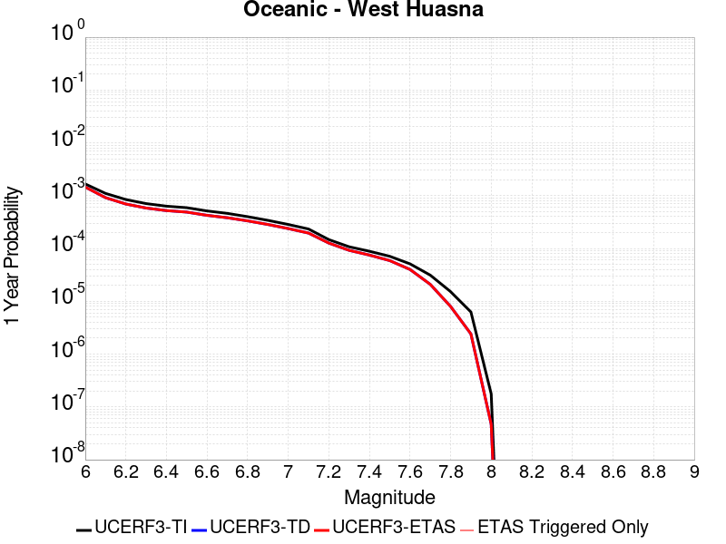 | 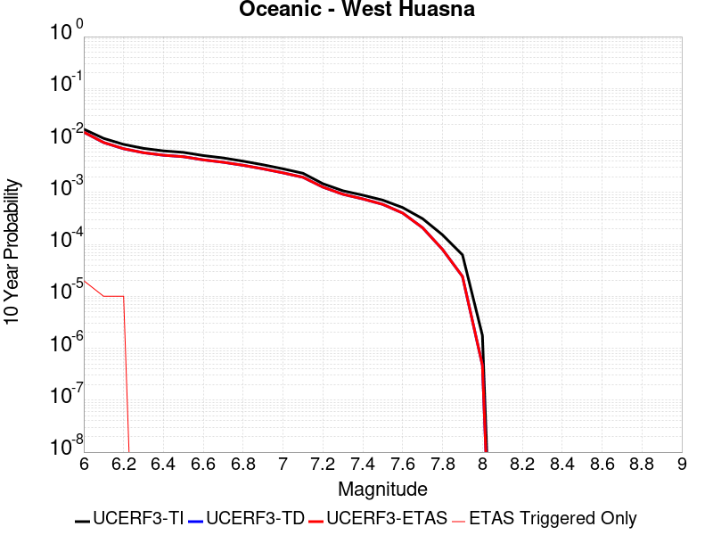 |

| Magnitude | 1 wk TI Prob | 1 wk TD Prob | 1 wk ETAS Prob | 1 wk ETAS/TD Gain | 1 wk ETAS Triggered Only | 1 mo TI Prob | 1 mo TD Prob | 1 mo ETAS Prob | 1 mo ETAS/TD Gain | 1 mo ETAS Triggered Only | 1 yr TI Prob | 1 yr TD Prob | 1 yr ETAS Prob | 1 yr ETAS/TD Gain | 1 yr ETAS Triggered Only | 10 yr TI Prob | 10 yr TD Prob | 10 yr ETAS Prob | 10 yr ETAS/TD Gain | 10 yr ETAS Triggered Only |
|-----|-----|-----|-----|-----|-----|-----|-----|-----|-----|-----|-----|-----|-----|-----|-----|-----|-----|-----|-----|-----|
| 6.0 | 3.195567E-5 | 2.7927153E-5 | 2.7927153E-5 | 1.0 | 0.0 | 1.3694567E-4 | 1.19682554E-4 | 1.19682554E-4 | 1.0 | 0.0 | 0.0016660384 | 0.0014562042 | 0.0014562042 | 1.0 | 0.0 | 0.016536033 | 0.014471174 | 0.0144923 | 1.0014598 | 2.1436228E-5 |
| 6.1 | 2.1156782E-5 | 1.7573653E-5 | 1.7573653E-5 | 1.0 | 0.0 | 9.066878E-5 | 7.531353E-5 | 7.531353E-5 | 1.0 | 0.0 | 0.0011033333 | 9.1656594E-4 | 9.1656594E-4 | 1.0 | 0.0 | 0.010978713 | 0.009128864 | 0.009139485 | 1.0011634 | 1.0718114E-5 |
| 6.2 | 1.6195117E-5 | 1.3327269E-5 | 1.3327269E-5 | 1.0 | 0.0 | 6.9405796E-5 | 5.711563E-5 | 5.711563E-5 | 1.0 | 0.0 | 8.44688E-4 | 6.951635E-4 | 6.951635E-4 | 1.0 | 0.0 | 0.008414844 | 0.006930183 | 0.0069408272 | 1.0015359 | 1.0718114E-5 |
| 6.3 | 1.3559345E-5 | 1.1179233E-5 | 1.1179233E-5 | 1.0 | 0.0 | 5.811018E-5 | 4.7910125E-5 | 4.7910125E-5 | 1.0 | 0.0 | 7.072618E-4 | 5.831506E-4 | 5.831506E-4 | 1.0 | 0.0 | 0.0070501505 | 0.0058163223 | 0.0058163223 | 1.0 | 0.0 |
| 6.4 | 1.2120619E-5 | 1.0001056E-5 | 1.0001056E-5 | 1.0 | 0.0 | 5.1944477E-5 | 4.2860964E-5 | 4.2860964E-5 | 1.0 | 0.0 | 6.322405E-4 | 5.217078E-4 | 5.217078E-4 | 1.0 | 0.0 | 0.006304447 | 0.005204898 | 0.005204898 | 1.0 | 0.0 |
| 6.5 | 1.13511915E-5 | 9.367545E-6 | 9.367545E-6 | 1.0 | 0.0 | 4.8647056E-5 | 4.014601E-5 | 4.014601E-5 | 1.0 | 0.0 | 5.9211696E-4 | 4.8866845E-4 | 4.8866845E-4 | 1.0 | 0.0 | 0.0059054173 | 0.004875998 | 0.004875998 | 1.0 | 0.0 |
| 6.6 | 9.850605E-6 | 8.135479E-6 | 8.135479E-6 | 1.0 | 0.0 | 4.2216197E-5 | 3.4865876E-5 | 3.4865876E-5 | 1.0 | 0.0 | 5.1386096E-4 | 4.2440955E-4 | 4.2440955E-4 | 1.0 | 0.0 | 0.0051267436 | 0.0042360225 | 0.0042360225 | 1.0 | 0.0 |
| 6.7 | 8.8558645E-6 | 7.318487E-6 | 7.318487E-6 | 1.0 | 0.0 | 3.7953152E-5 | 3.136457E-5 | 3.136457E-5 | 1.0 | 0.0 | 4.6198163E-4 | 3.8179688E-4 | 3.8179688E-4 | 1.0 | 0.0 | 0.004610224 | 0.003811435 | 0.003811435 | 1.0 | 0.0 |
| 6.8 | 7.67136E-6 | 6.3918033E-6 | 6.3918033E-6 | 1.0 | 0.0 | 3.2876844E-5 | 2.7393156E-5 | 2.7393156E-5 | 1.0 | 0.0 | 4.0020206E-4 | 3.334608E-4 | 3.334608E-4 | 1.0 | 0.0 | 0.003994821 | 0.0033296254 | 0.0033296254 | 1.0 | 0.0 |
| 6.9 | 6.534529E-6 | 5.45837E-6 | 5.45837E-6 | 1.0 | 0.0 | 2.8004823E-5 | 2.3392806E-5 | 2.3392806E-5 | 1.0 | 0.0 | 3.4090536E-4 | 2.8477033E-4 | 2.8477033E-4 | 1.0 | 0.0 | 0.0034038287 | 0.002844071 | 0.002844071 | 1.0 | 0.0 |
| 7.0 | 5.460525E-6 | 4.5699867E-6 | 4.5699867E-6 | 1.0 | 0.0 | 2.3402039E-5 | 1.9585512E-5 | 1.9585512E-5 | 1.0 | 0.0 | 2.8488258E-4 | 2.3842762E-4 | 2.3842762E-4 | 1.0 | 0.0 | 0.0028451765 | 0.002381732 | 0.002381732 | 1.0 | 0.0 |
| 7.1 | 4.4825083E-6 | 3.7524742E-6 | 3.7524742E-6 | 1.0 | 0.0 | 1.9210609E-5 | 1.6081935E-5 | 1.6081935E-5 | 1.0 | 0.0 | 2.3386406E-4 | 1.9578006E-4 | 1.9578006E-4 | 1.0 | 0.0 | 0.002336181 | 0.0019560878 | 0.0019560878 | 1.0 | 0.0 |
| 7.2 | 2.821708E-6 | 2.4249584E-6 | 2.4249584E-6 | 1.0 | 0.0 | 1.2092979E-5 | 1.0392638E-5 | 1.0392638E-5 | 1.0 | 0.0 | 1.4722206E-4 | 1.2652302E-4 | 1.2652302E-4 | 1.0 | 0.0 | 0.0014712457 | 0.0012645123 | 0.0012645123 | 1.0 | 0.0 |
| 7.3 | 2.0644757E-6 | 1.7687632E-6 | 1.7687632E-6 | 1.0 | 0.0 | 8.847723E-6 | 7.580392E-6 | 7.580392E-6 | 1.0 | 0.0 | 1.0771569E-4 | 9.2287366E-5 | 9.2287366E-5 | 1.0 | 0.0 | 0.001076635 | 9.224921E-4 | 9.224921E-4 | 1.0 | 0.0 |
| 7.4 | 1.6980367E-6 | 1.43801E-6 | 1.43801E-6 | 1.0 | 0.0 | 7.27728E-6 | 6.1628857E-6 | 6.1628857E-6 | 1.0 | 0.0 | 8.8597284E-5 | 7.503055E-5 | 7.503055E-5 | 1.0 | 0.0 | 8.8561967E-4 | 7.500538E-4 | 7.500538E-4 | 1.0 | 0.0 |
| 7.5 | 1.3637683E-6 | 1.1302833E-6 | 1.1302833E-6 | 1.0 | 0.0 | 5.844708E-6 | 4.8440625E-6 | 4.8440625E-6 | 1.0 | 0.0 | 7.1156996E-5 | 5.8974863E-5 | 5.8974863E-5 | 1.0 | 0.0 | 7.1134215E-4 | 5.8959366E-4 | 5.8959366E-4 | 1.0 | 0.0 |
| 7.6 | 9.802994E-7 | 7.677435E-7 | 7.677435E-7 | 1.0 | 0.0 | 4.2012766E-6 | 3.290325E-6 | 3.290325E-6 | 1.0 | 0.0 | 5.1149345E-5 | 4.005897E-5 | 4.005897E-5 | 1.0 | 0.0 | 5.113757E-4 | 4.005189E-4 | 4.005189E-4 | 1.0 | 0.0 |
| 7.7 | 5.986191E-7 | 4.0052313E-7 | 4.0052313E-7 | 1.0 | 0.0 | 2.5655079E-6 | 1.7165265E-6 | 1.7165265E-6 | 1.0 | 0.0 | 3.1234613E-5 | 2.0898511E-5 | 2.0898511E-5 | 1.0 | 0.0 | 3.123022E-4 | 2.0896681E-4 | 2.0896681E-4 | 1.0 | 0.0 |
| 7.8 | 2.9189815E-7 | 1.5287357E-7 | 1.5287357E-7 | 1.0 | 0.0 | 1.2509914E-6 | 6.5517224E-7 | 6.5517224E-7 | 1.0 | 0.0 | 1.5230714E-5 | 7.976692E-6 | 7.976692E-6 | 1.0 | 0.0 | 1.522967E-4 | 7.976538E-5 | 7.976538E-5 | 1.0 | 0.0 |
| 7.9 | 1.2057845E-7 | 4.6221164E-8 | 4.6221164E-8 | 1.0 | 0.0 | 5.1676466E-7 | 1.9809069E-7 | 1.9809069E-7 | 1.0 | 0.0 | 6.2915915E-6 | 2.4117514E-6 | 2.4117514E-6 | 1.0 | 0.0 | 6.2914136E-5 | 2.4118557E-5 | 2.4118557E-5 | 1.0 | 0.0 |
| 8.0 | 3.3806387E-9 | 9.0147434E-10 | 9.0147434E-10 | 1.0 | 0.0 | 1.4488451E-8 | 3.8634624E-9 | 3.8634624E-9 | 1.0 | 0.0 | 1.7639688E-7 | 4.703766E-8 | 4.703766E-8 | 1.0 | 0.0 | 1.7639674E-6 | 4.714705E-7 | 4.714705E-7 | 1.0 | 0.0 |

## Palos Verdes
*[(top)](#table-of-contents)*

| 1 Week | 1 Month | 1 Year | 10 Year |
|-----|-----|-----|-----|
|  |  | 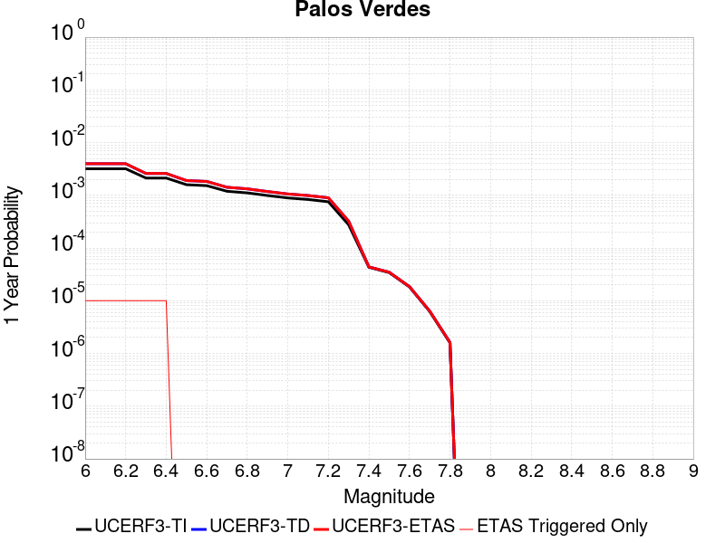 |  |

| Magnitude | 1 wk TI Prob | 1 wk TD Prob | 1 wk ETAS Prob | 1 wk ETAS/TD Gain | 1 wk ETAS Triggered Only | 1 mo TI Prob | 1 mo TD Prob | 1 mo ETAS Prob | 1 mo ETAS/TD Gain | 1 mo ETAS Triggered Only | 1 yr TI Prob | 1 yr TD Prob | 1 yr ETAS Prob | 1 yr ETAS/TD Gain | 1 yr ETAS Triggered Only | 10 yr TI Prob | 10 yr TD Prob | 10 yr ETAS Prob | 10 yr ETAS/TD Gain | 10 yr ETAS Triggered Only |
|-----|-----|-----|-----|-----|-----|-----|-----|-----|-----|-----|-----|-----|-----|-----|-----|-----|-----|-----|-----|-----|
| 6.0 | 6.126063E-5 | 7.622862E-5 | 7.622862E-5 | 1.0 | 0.0 | 2.6251914E-4 | 3.2665656E-4 | 3.3737117E-4 | 1.0328008 | 1.0718114E-5 | 0.0031914865 | 0.0039702994 | 0.003980975 | 1.0026889 | 1.0718114E-5 | 0.031460393 | 0.039050125 | 0.03907072 | 1.0005275 | 2.1436228E-5 |
| 6.1 | 6.126063E-5 | 7.622862E-5 | 7.622862E-5 | 1.0 | 0.0 | 2.6251914E-4 | 3.2665656E-4 | 3.3737117E-4 | 1.0328008 | 1.0718114E-5 | 0.0031914865 | 0.0039702994 | 0.003980975 | 1.0026889 | 1.0718114E-5 | 0.031460393 | 0.039050125 | 0.03907072 | 1.0005275 | 2.1436228E-5 |
| 6.2 | 6.126063E-5 | 7.622862E-5 | 7.622862E-5 | 1.0 | 0.0 | 2.6251914E-4 | 3.2665656E-4 | 3.3737117E-4 | 1.0328008 | 1.0718114E-5 | 0.0031914865 | 0.0039702994 | 0.003980975 | 1.0026889 | 1.0718114E-5 | 0.031460393 | 0.039050125 | 0.03907072 | 1.0005275 | 2.1436228E-5 |
| 6.3 | 4.0838047E-5 | 4.975089E-5 | 4.975089E-5 | 1.0 | 0.0 | 1.7500846E-4 | 2.1320196E-4 | 2.2391778E-4 | 1.0502614 | 1.0718114E-5 | 0.0021286458 | 0.0025928554 | 0.0026035458 | 1.004123 | 1.0718114E-5 | 0.021083709 | 0.025647415 | 0.0256683 | 1.0008143 | 2.1436228E-5 |
| 6.4 | 4.0838047E-5 | 4.975089E-5 | 4.975089E-5 | 1.0 | 0.0 | 1.7500846E-4 | 2.1320196E-4 | 2.2391778E-4 | 1.0502614 | 1.0718114E-5 | 0.0021286458 | 0.0025928554 | 0.0026035458 | 1.004123 | 1.0718114E-5 | 0.021083709 | 0.025647415 | 0.0256683 | 1.0008143 | 2.1436228E-5 |
| 6.5 | 3.0512005E-5 | 3.6562593E-5 | 3.6562593E-5 | 1.0 | 0.0 | 1.3075917E-4 | 1.566881E-4 | 1.566881E-4 | 1.0 | 0.0 | 0.0015908304 | 0.001906127 | 0.001906127 | 1.0 | 0.0 | 0.015794903 | 0.01890965 | 0.01890965 | 1.0 | 0.0 |
| 6.6 | 2.9255087E-5 | 3.5155368E-5 | 3.5155368E-5 | 1.0 | 0.0 | 1.2537291E-4 | 1.5065783E-4 | 1.5065783E-4 | 1.0 | 0.0 | 0.0015253464 | 0.0018328319 | 0.0018328319 | 1.0 | 0.0 | 0.015149189 | 0.01818871 | 0.01818871 | 1.0 | 0.0 |
| 6.7 | 2.287198E-5 | 2.7248976E-5 | 2.7248976E-5 | 1.0 | 0.0 | 9.801909E-5 | 1.1677662E-4 | 1.1677662E-4 | 1.0 | 0.0 | 0.001192729 | 0.0014209197 | 0.0014209197 | 1.0 | 0.0 | 0.011863477 | 0.014127577 | 0.014127577 | 1.0 | 0.0 |
| 6.8 | 2.1325764E-5 | 2.5432531E-5 | 2.5432531E-5 | 1.0 | 0.0 | 9.139293E-5 | 1.0899252E-4 | 1.0899252E-4 | 1.0 | 0.0 | 0.001112141 | 0.0013262664 | 0.0013262664 | 1.0 | 0.0 | 0.011065915 | 0.013192548 | 0.013192548 | 1.0 | 0.0 |
| 6.9 | 1.9009392E-5 | 2.2614122E-5 | 2.2614122E-5 | 1.0 | 0.0 | 8.1466285E-5 | 9.6914555E-5 | 9.6914555E-5 | 1.0 | 0.0 | 9.914007E-4 | 0.0011793834 | 0.0011793834 | 1.0 | 0.0 | 0.009869894 | 0.011739929 | 0.011739929 | 1.0 | 0.0 |
| 7.0 | 1.7098473E-5 | 2.0319867E-5 | 2.0319867E-5 | 1.0 | 0.0 | 7.3277115E-5 | 8.708272E-5 | 8.708272E-5 | 1.0 | 0.0 | 8.917837E-4 | 0.0010598017 | 0.0010598017 | 1.0 | 0.0 | 0.008882134 | 0.010555912 | 0.010555912 | 1.0 | 0.0 |
| 7.1 | 1.5982785E-5 | 1.8995239E-5 | 1.8995239E-5 | 1.0 | 0.0 | 6.849585E-5 | 8.1406106E-5 | 8.1406106E-5 | 1.0 | 0.0 | 8.336179E-4 | 9.907534E-4 | 9.907534E-4 | 1.0 | 0.0 | 0.008304977 | 0.009871728 | 0.009871728 | 1.0 | 0.0 |
| 7.2 | 1.4468002E-5 | 1.719767E-5 | 1.719767E-5 | 1.0 | 0.0 | 6.200425E-5 | 7.370269E-5 | 7.370269E-5 | 1.0 | 0.0 | 7.546402E-4 | 8.970449E-4 | 8.970449E-4 | 1.0 | 0.0 | 0.007520827 | 0.008942509 | 0.008942509 | 1.0 | 0.0 |
| 7.3 | 5.288233E-6 | 6.2038207E-6 | 6.2038207E-6 | 1.0 | 0.0 | 2.2663658E-5 | 2.658773E-5 | 2.658773E-5 | 1.0 | 0.0 | 2.7589512E-4 | 3.2369242E-4 | 3.2369242E-4 | 1.0 | 0.0 | 0.0027555283 | 0.0032356323 | 0.0032356323 | 1.0 | 0.0 |
| 7.4 | 8.279556E-7 | 8.408364E-7 | 8.408364E-7 | 1.0 | 0.0 | 3.5483763E-6 | 3.60358E-6 | 3.60358E-6 | 1.0 | 0.0 | 4.3200624E-5 | 4.3872777E-5 | 4.3872777E-5 | 1.0 | 0.0 | 4.3192226E-4 | 4.3864836E-4 | 4.3864836E-4 | 1.0 | 0.0 |
| 7.5 | 6.559831E-7 | 6.667243E-7 | 6.667243E-7 | 1.0 | 0.0 | 2.8113532E-6 | 2.8573872E-6 | 2.8573872E-6 | 1.0 | 0.0 | 3.4227687E-5 | 3.47882E-5 | 3.47882E-5 | 1.0 | 0.0 | 3.4222414E-4 | 3.478342E-4 | 3.478342E-4 | 1.0 | 0.0 |
| 7.6 | 3.5018968E-7 | 3.562011E-7 | 3.562011E-7 | 1.0 | 0.0 | 1.500812E-6 | 1.5265755E-6 | 1.5265755E-6 | 1.0 | 0.0 | 1.8272232E-5 | 1.8585944E-5 | 1.8585944E-5 | 1.0 | 0.0 | 1.8270731E-4 | 1.858485E-4 | 1.858485E-4 | 1.0 | 0.0 |
| 7.7 | 1.1986104E-7 | 1.2198406E-7 | 1.2198406E-7 | 1.0 | 0.0 | 5.1369005E-7 | 5.227887E-7 | 5.227887E-7 | 1.0 | 0.0 | 6.2541585E-6 | 6.364934E-6 | 6.364934E-6 | 1.0 | 0.0 | 6.2539824E-5 | 6.364756E-5 | 6.364756E-5 | 1.0 | 0.0 |
| 7.8 | 3.0445005E-8 | 3.1027664E-8 | 3.1027664E-8 | 1.0 | 0.0 | 1.3047858E-7 | 1.3297569E-7 | 1.3297569E-7 | 1.0 | 0.0 | 1.5885756E-6 | 1.6189781E-6 | 1.6189781E-6 | 1.0 | 0.0 | 1.5885644E-5 | 1.6189684E-5 | 1.6189684E-5 | 1.0 | 0.0 |

## Santa Ynez River
*[(top)](#table-of-contents)*

| 1 Week | 1 Month | 1 Year | 10 Year |
|-----|-----|-----|-----|
|  |  | 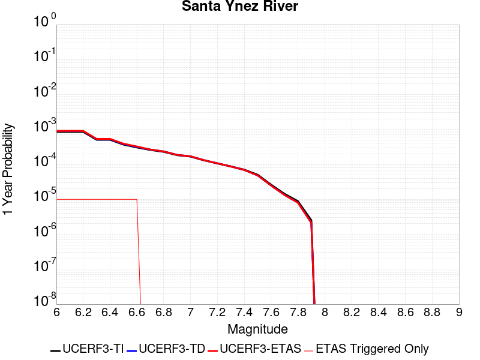 | 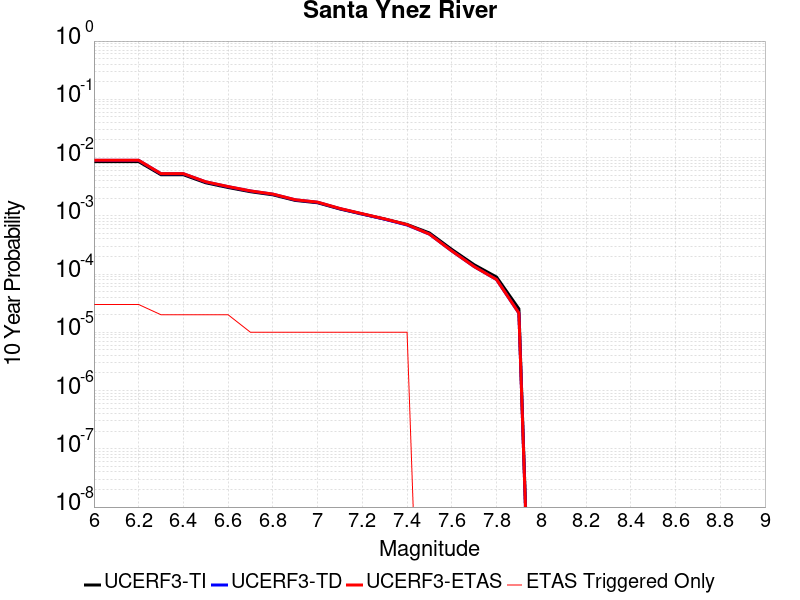 |

| Magnitude | 1 wk TI Prob | 1 wk TD Prob | 1 wk ETAS Prob | 1 wk ETAS/TD Gain | 1 wk ETAS Triggered Only | 1 mo TI Prob | 1 mo TD Prob | 1 mo ETAS Prob | 1 mo ETAS/TD Gain | 1 mo ETAS Triggered Only | 1 yr TI Prob | 1 yr TD Prob | 1 yr ETAS Prob | 1 yr ETAS/TD Gain | 1 yr ETAS Triggered Only | 10 yr TI Prob | 10 yr TD Prob | 10 yr ETAS Prob | 10 yr ETAS/TD Gain | 10 yr ETAS Triggered Only |
|-----|-----|-----|-----|-----|-----|-----|-----|-----|-----|-----|-----|-----|-----|-----|-----|-----|-----|-----|-----|-----|
| 6.0 | 1.6396456E-5 | 1.7209564E-5 | 1.7209564E-5 | 1.0 | 0.0 | 7.026863E-5 | 7.375339E-5 | 7.375339E-5 | 1.0 | 0.0 | 8.551848E-4 | 8.976132E-4 | 9.0832164E-4 | 1.01193 | 1.0718114E-5 | 0.0085190125 | 0.008943425 | 0.00896467 | 1.0023755 | 2.1436228E-5 |
| 6.1 | 1.6396456E-5 | 1.7209564E-5 | 1.7209564E-5 | 1.0 | 0.0 | 7.026863E-5 | 7.375339E-5 | 7.375339E-5 | 1.0 | 0.0 | 8.551848E-4 | 8.976132E-4 | 9.0832164E-4 | 1.01193 | 1.0718114E-5 | 0.0085190125 | 0.008943425 | 0.00896467 | 1.0023755 | 2.1436228E-5 |
| 6.2 | 1.6396456E-5 | 1.7209564E-5 | 1.7209564E-5 | 1.0 | 0.0 | 7.026863E-5 | 7.375339E-5 | 7.375339E-5 | 1.0 | 0.0 | 8.551848E-4 | 8.976132E-4 | 9.0832164E-4 | 1.01193 | 1.0718114E-5 | 0.0085190125 | 0.008943425 | 0.00896467 | 1.0023755 | 2.1436228E-5 |
| 6.3 | 9.736976E-6 | 1.0122399E-5 | 1.0122399E-5 | 1.0 | 0.0 | 4.172923E-5 | 4.3381016E-5 | 4.3381016E-5 | 1.0 | 0.0 | 5.0793495E-4 | 5.2804087E-4 | 5.3875335E-4 | 1.0202872 | 1.0718114E-5 | 0.005067755 | 0.0052683675 | 0.0052790293 | 1.0020237 | 1.0718114E-5 |
| 6.4 | 9.736976E-6 | 1.0122399E-5 | 1.0122399E-5 | 1.0 | 0.0 | 4.172923E-5 | 4.3381016E-5 | 4.3381016E-5 | 1.0 | 0.0 | 5.0793495E-4 | 5.2804087E-4 | 5.3875335E-4 | 1.0202872 | 1.0718114E-5 | 0.005067755 | 0.0052683675 | 0.0052790293 | 1.0020237 | 1.0718114E-5 |
| 6.5 | 7.081964E-6 | 7.3299457E-6 | 7.3299457E-6 | 1.0 | 0.0 | 3.035092E-5 | 3.1413685E-5 | 3.1413685E-5 | 1.0 | 0.0 | 3.694598E-4 | 3.8239607E-4 | 3.9311007E-4 | 1.0280181 | 1.0718114E-5 | 0.0036884616 | 0.0038175425 | 0.0038282196 | 1.0027969 | 1.0718114E-5 |
| 6.6 | 5.873247E-6 | 6.0597836E-6 | 6.0597836E-6 | 1.0 | 0.0 | 2.5170815E-5 | 2.5970248E-5 | 2.5970248E-5 | 1.0 | 0.0 | 3.064116E-4 | 3.1614274E-4 | 3.2685747E-4 | 1.033892 | 1.0718114E-5 | 0.0030598943 | 0.0031570175 | 0.003167702 | 1.0033844 | 1.0718114E-5 |
| 6.7 | 4.973277E-6 | 5.115936E-6 | 5.115936E-6 | 1.0 | 0.0 | 2.1313872E-5 | 2.1925258E-5 | 2.1925258E-5 | 1.0 | 0.0 | 2.5946548E-4 | 2.669078E-4 | 2.669078E-4 | 1.0 | 0.0 | 0.0025916274 | 0.002665921 | 0.002665921 | 1.0 | 0.0 |
| 6.8 | 4.396492E-6 | 4.5110087E-6 | 4.5110087E-6 | 1.0 | 0.0 | 1.884197E-5 | 1.9332752E-5 | 1.9332752E-5 | 1.0 | 0.0 | 2.2937685E-4 | 2.3535118E-4 | 2.3535118E-4 | 1.0 | 0.0 | 0.0022914023 | 0.0023510547 | 0.0023510547 | 1.0 | 0.0 |
| 6.9 | 3.5255632E-6 | 3.6013587E-6 | 3.6013587E-6 | 1.0 | 0.0 | 1.5109469E-5 | 1.5434303E-5 | 1.5434303E-5 | 1.0 | 0.0 | 1.8394225E-4 | 1.878966E-4 | 1.878966E-4 | 1.0 | 0.0 | 0.0018379007 | 0.0018773936 | 0.0018773936 | 1.0 | 0.0 |
| 7.0 | 3.211603E-6 | 3.2736775E-6 | 3.2736775E-6 | 1.0 | 0.0 | 1.376394E-5 | 1.4029972E-5 | 1.4029972E-5 | 1.0 | 0.0 | 1.6756308E-4 | 1.7080165E-4 | 1.7080165E-4 | 1.0 | 0.0 | 0.0016743679 | 0.001706718 | 0.001706718 | 1.0 | 0.0 |
| 7.1 | 2.5094619E-6 | 2.5409397E-6 | 2.5409397E-6 | 1.0 | 0.0 | 1.0754793E-5 | 1.0889697E-5 | 1.0889697E-5 | 1.0 | 0.0 | 1.3093173E-4 | 1.3257404E-4 | 1.3257404E-4 | 1.0 | 0.0 | 0.0013085462 | 0.0013249556 | 0.0013249556 | 1.0 | 0.0 |
| 7.2 | 2.0515774E-6 | 2.0619539E-6 | 2.0619539E-6 | 1.0 | 0.0 | 8.792445E-6 | 8.836915E-6 | 8.836915E-6 | 1.0 | 0.0 | 1.0704277E-4 | 1.0758417E-4 | 1.0758417E-4 | 1.0 | 0.0 | 0.0010699122 | 0.0010753252 | 0.0010753252 | 1.0 | 0.0 |
| 7.3 | 1.6845745E-6 | 1.6774045E-6 | 1.6774045E-6 | 1.0 | 0.0 | 7.219585E-6 | 7.1888567E-6 | 7.1888567E-6 | 1.0 | 0.0 | 8.78949E-5 | 8.752084E-5 | 8.752084E-5 | 1.0 | 0.0 | 8.7860145E-4 | 8.748666E-4 | 8.748666E-4 | 1.0 | 0.0 |
| 7.4 | 1.3600285E-6 | 1.3333469E-6 | 1.3333469E-6 | 1.0 | 0.0 | 5.82868E-6 | 5.714331E-6 | 5.714331E-6 | 1.0 | 0.0 | 7.096187E-5 | 6.956978E-5 | 6.956978E-5 | 1.0 | 0.0 | 7.0939213E-4 | 6.9548225E-4 | 6.9548225E-4 | 1.0 | 0.0 |
| 7.5 | 9.735342E-7 | 9.290183E-7 | 9.290183E-7 | 1.0 | 0.0 | 4.172283E-6 | 3.981501E-6 | 3.981501E-6 | 1.0 | 0.0 | 5.079636E-5 | 4.8473714E-5 | 4.8473714E-5 | 1.0 | 0.0 | 5.0784746E-4 | 4.846331E-4 | 4.846331E-4 | 1.0 | 0.0 |
| 7.6 | 5.067187E-7 | 4.778607E-7 | 4.778607E-7 | 1.0 | 0.0 | 2.1716498E-6 | 2.0479727E-6 | 2.0479727E-6 | 1.0 | 0.0 | 2.6439517E-5 | 2.493379E-5 | 2.493379E-5 | 1.0 | 0.0 | 2.643637E-4 | 2.4931066E-4 | 2.4931066E-4 | 1.0 | 0.0 |
| 7.7 | 2.769089E-7 | 2.5759311E-7 | 2.5759311E-7 | 1.0 | 0.0 | 1.1867519E-6 | 1.1039699E-6 | 1.1039699E-6 | 1.0 | 0.0 | 1.4448608E-5 | 1.3440752E-5 | 1.3440752E-5 | 1.0 | 0.0 | 1.444767E-4 | 1.3439942E-4 | 1.3439942E-4 | 1.0 | 0.0 |
| 7.8 | 1.7044663E-7 | 1.5449127E-7 | 1.5449127E-7 | 1.0 | 0.0 | 7.3048534E-7 | 6.6210526E-7 | 6.6210526E-7 | 1.0 | 0.0 | 8.893623E-6 | 8.061102E-6 | 8.061102E-6 | 1.0 | 0.0 | 8.893267E-5 | 8.0608115E-5 | 8.0608115E-5 | 1.0 | 0.0 |
| 7.9 | 4.8344287E-8 | 4.0911235E-8 | 4.0911235E-8 | 1.0 | 0.0 | 2.0718979E-7 | 1.7533385E-7 | 1.7533385E-7 | 1.0 | 0.0 | 2.5225327E-6 | 2.1346877E-6 | 2.1346877E-6 | 1.0 | 0.0 | 2.5225041E-5 | 2.1346676E-5 | 2.1346676E-5 | 1.0 | 0.0 |

## San Juan
*[(top)](#table-of-contents)*

| 1 Week | 1 Month | 1 Year | 10 Year |
|-----|-----|-----|-----|
|  |  | 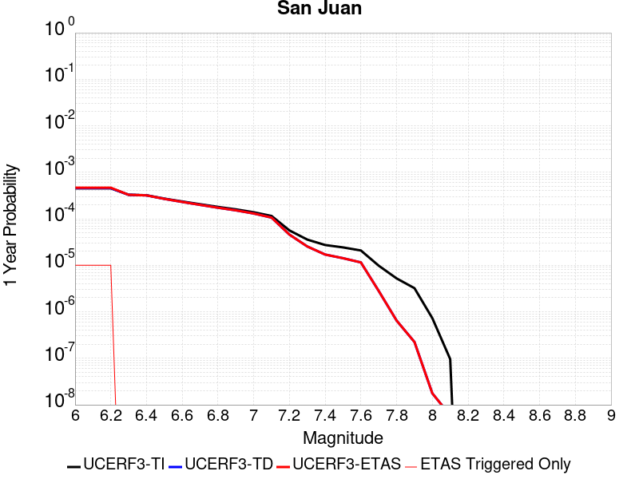 |  |

| Magnitude | 1 wk TI Prob | 1 wk TD Prob | 1 wk ETAS Prob | 1 wk ETAS/TD Gain | 1 wk ETAS Triggered Only | 1 mo TI Prob | 1 mo TD Prob | 1 mo ETAS Prob | 1 mo ETAS/TD Gain | 1 mo ETAS Triggered Only | 1 yr TI Prob | 1 yr TD Prob | 1 yr ETAS Prob | 1 yr ETAS/TD Gain | 1 yr ETAS Triggered Only | 10 yr TI Prob | 10 yr TD Prob | 10 yr ETAS Prob | 10 yr ETAS/TD Gain | 10 yr ETAS Triggered Only |
|-----|-----|-----|-----|-----|-----|-----|-----|-----|-----|-----|-----|-----|-----|-----|-----|-----|-----|-----|-----|-----|
| 6.0 | 8.682808E-6 | 8.749559E-6 | 8.749559E-6 | 1.0 | 0.0 | 3.72115E-5 | 3.7497597E-5 | 3.7497597E-5 | 1.0 | 0.0 | 4.5295584E-4 | 4.5644245E-4 | 4.6715565E-4 | 1.0234711 | 1.0718114E-5 | 0.004520337 | 0.0045555905 | 0.004576929 | 1.0046841 | 2.1436228E-5 |
| 6.1 | 8.682808E-6 | 8.749559E-6 | 8.749559E-6 | 1.0 | 0.0 | 3.72115E-5 | 3.7497597E-5 | 3.7497597E-5 | 1.0 | 0.0 | 4.5295584E-4 | 4.5644245E-4 | 4.6715565E-4 | 1.0234711 | 1.0718114E-5 | 0.004520337 | 0.0045555905 | 0.004576929 | 1.0046841 | 2.1436228E-5 |
| 6.2 | 8.682808E-6 | 8.749559E-6 | 8.749559E-6 | 1.0 | 0.0 | 3.72115E-5 | 3.7497597E-5 | 3.7497597E-5 | 1.0 | 0.0 | 4.5295584E-4 | 4.5644245E-4 | 4.6715565E-4 | 1.0234711 | 1.0718114E-5 | 0.004520337 | 0.0045555905 | 0.004576929 | 1.0046841 | 2.1436228E-5 |
| 6.3 | 6.3054235E-6 | 6.282968E-6 | 6.282968E-6 | 1.0 | 0.0 | 2.7022963E-5 | 2.6926737E-5 | 2.6926737E-5 | 1.0 | 0.0 | 3.2895492E-4 | 3.277851E-4 | 3.277851E-4 | 1.0 | 0.0 | 0.003284684 | 0.0032732163 | 0.0032732163 | 1.0 | 0.0 |
| 6.4 | 6.1490473E-6 | 6.114796E-6 | 6.114796E-6 | 1.0 | 0.0 | 2.6352795E-5 | 2.6206013E-5 | 2.6206013E-5 | 1.0 | 0.0 | 3.2079802E-4 | 3.1901288E-4 | 3.1901288E-4 | 1.0 | 0.0 | 0.0032033534 | 0.0031857456 | 0.0031857456 | 1.0 | 0.0 |
| 6.5 | 5.204848E-6 | 5.137553E-6 | 5.137553E-6 | 1.0 | 0.0 | 2.23063E-5 | 2.2017904E-5 | 2.2017904E-5 | 1.0 | 0.0 | 2.7154534E-4 | 2.6803595E-4 | 2.6803595E-4 | 1.0 | 0.0 | 0.0027121378 | 0.002677281 | 0.002677281 | 1.0 | 0.0 |
| 6.6 | 4.5179986E-6 | 4.415269E-6 | 4.415269E-6 | 1.0 | 0.0 | 1.9362706E-5 | 1.8922448E-5 | 1.8922448E-5 | 1.0 | 0.0 | 2.3571544E-4 | 2.3035725E-4 | 2.3035725E-4 | 1.0 | 0.0 | 0.0023546559 | 0.0023013218 | 0.0023013218 | 1.0 | 0.0 |
| 6.7 | 3.9442616E-6 | 3.8200415E-6 | 3.8200415E-6 | 1.0 | 0.0 | 1.6903869E-5 | 1.6371509E-5 | 1.6371509E-5 | 1.0 | 0.0 | 2.0578515E-4 | 1.9930555E-4 | 1.9930555E-4 | 1.0 | 0.0 | 0.002055947 | 0.001991393 | 0.001991393 | 1.0 | 0.0 |
| 6.8 | 3.4536245E-6 | 3.31654E-6 | 3.31654E-6 | 1.0 | 0.0 | 1.4801163E-5 | 1.4213669E-5 | 1.4213669E-5 | 1.0 | 0.0 | 1.8018926E-4 | 1.730383E-4 | 1.730383E-4 | 1.0 | 0.0 | 0.0018004322 | 0.0017291544 | 0.0017291544 | 1.0 | 0.0 |
| 6.9 | 3.059865E-6 | 2.912227E-6 | 2.912227E-6 | 1.0 | 0.0 | 1.3113641E-5 | 1.2480916E-5 | 1.2480916E-5 | 1.0 | 0.0 | 1.596469E-4 | 1.5194513E-4 | 1.5194513E-4 | 1.0 | 0.0 | 0.0015953224 | 0.001518527 | 0.001518527 | 1.0 | 0.0 |
| 7.0 | 2.6504351E-6 | 2.4921849E-6 | 2.4921849E-6 | 1.0 | 0.0 | 1.1358958E-5 | 1.0680751E-5 | 1.0680751E-5 | 1.0 | 0.0 | 1.3828653E-4 | 1.3003094E-4 | 1.3003094E-4 | 1.0 | 0.0 | 0.0013820052 | 0.0012996603 | 0.0012996603 | 1.0 | 0.0 |
| 7.1 | 2.2039317E-6 | 2.0339805E-6 | 2.0339805E-6 | 1.0 | 0.0 | 9.445387E-6 | 8.717033E-6 | 8.717033E-6 | 1.0 | 0.0 | 1.1499152E-4 | 1.0612523E-4 | 1.0612523E-4 | 1.0 | 0.0 | 0.0011493203 | 0.0010608556 | 0.0010608556 | 1.0 | 0.0 |
| 7.2 | 1.0786707E-6 | 8.7714847E-7 | 8.7714847E-7 | 1.0 | 0.0 | 4.622866E-6 | 3.7592022E-6 | 3.7592022E-6 | 1.0 | 0.0 | 5.628194E-5 | 4.5767338E-5 | 4.5767338E-5 | 1.0 | 0.0 | 5.6267687E-4 | 4.5763818E-4 | 4.5763818E-4 | 1.0 | 0.0 |
| 7.3 | 6.846433E-7 | 4.869622E-7 | 4.869622E-7 | 1.0 | 0.0 | 2.9341822E-6 | 2.0869793E-6 | 2.0869793E-6 | 1.0 | 0.0 | 3.5723086E-5 | 2.5408679E-5 | 2.5408679E-5 | 1.0 | 0.0 | 3.571734E-4 | 2.5409125E-4 | 2.5409125E-4 | 1.0 | 0.0 |
| 7.4 | 5.23043E-7 | 3.2634222E-7 | 3.2634222E-7 | 1.0 | 0.0 | 2.2416111E-6 | 1.3986087E-6 | 1.3986087E-6 | 1.0 | 0.0 | 2.7291273E-5 | 1.7027929E-5 | 1.7027929E-5 | 1.0 | 0.0 | 2.7287923E-4 | 1.7029818E-4 | 1.7029818E-4 | 1.0 | 0.0 |
| 7.5 | 4.648444E-7 | 2.724016E-7 | 2.724016E-7 | 1.0 | 0.0 | 1.9921886E-6 | 1.1674349E-6 | 1.1674349E-6 | 1.0 | 0.0 | 2.4254627E-5 | 1.4213428E-5 | 1.4213428E-5 | 1.0 | 0.0 | 2.425198E-4 | 1.4215481E-4 | 1.4215481E-4 | 1.0 | 0.0 |
| 7.6 | 3.9906567E-7 | 2.2087482E-7 | 2.2087482E-7 | 1.0 | 0.0 | 1.7102802E-6 | 9.4660606E-7 | 9.4660606E-7 | 1.0 | 0.0 | 2.0822463E-5 | 1.1524869E-5 | 1.1524869E-5 | 1.0 | 0.0 | 2.0820512E-4 | 1.1526732E-4 | 1.1526732E-4 | 1.0 | 0.0 |
| 7.7 | 1.8784601E-7 | 5.3682427E-8 | 5.3682427E-8 | 1.0 | 0.0 | 8.0505407E-7 | 2.3006753E-7 | 2.3006753E-7 | 1.0 | 0.0 | 9.80149E-6 | 2.8010686E-6 | 2.8010686E-6 | 1.0 | 0.0 | 9.801057E-5 | 2.801939E-5 | 2.801939E-5 | 1.0 | 0.0 |
| 7.8 | 1.00154914E-7 | 1.24208075E-8 | 1.24208075E-8 | 1.0 | 0.0 | 4.2923529E-7 | 5.323204E-8 | 5.323204E-8 | 1.0 | 0.0 | 5.225927E-6 | 6.4809996E-7 | 6.4809996E-7 | 1.0 | 0.0 | 5.225804E-5 | 6.4868796E-6 | 6.4868796E-6 | 1.0 | 0.0 |
| 7.9 | 6.171429E-8 | 4.2991957E-9 | 4.2991957E-9 | 1.0 | 0.0 | 2.6448978E-7 | 1.8425133E-8 | 1.8425133E-8 | 1.0 | 0.0 | 3.2201583E-6 | 2.2432597E-7 | 2.2432597E-7 | 1.0 | 0.0 | 3.2201115E-5 | 2.248556E-6 | 2.248556E-6 | 1.0 | 0.0 |
| 8.0 | 1.3974572E-8 | 3.3835368E-10 | 3.3835368E-10 | 1.0 | 0.0 | 5.989102E-8 | 1.450087E-9 | 1.450087E-9 | 1.0 | 0.0 | 7.2917294E-7 | 1.7654811E-8 | 1.7654811E-8 | 1.0 | 0.0 | 7.2917055E-6 | 1.8085565E-7 | 1.8085565E-7 | 1.0 | 0.0 |
| 8.1 | 1.8403477E-9 | 1.13145604E-10 | 1.13145604E-10 | 1.0 | 0.0 | 7.887204E-9 | 4.8490567E-10 | 4.8490567E-10 | 1.0 | 0.0 | 9.602671E-8 | 5.903737E-9 | 5.903737E-9 | 1.0 | 0.0 | 9.602667E-7 | 6.028191E-8 | 6.028191E-8 | 1.0 | 0.0 |

## San Jacinto (Superstition Mtn)
*[(top)](#table-of-contents)*

| 1 Week | 1 Month | 1 Year | 10 Year |
|-----|-----|-----|-----|
|  |  |  |  |

| Magnitude | 1 wk TI Prob | 1 wk TD Prob | 1 wk ETAS Prob | 1 wk ETAS/TD Gain | 1 wk ETAS Triggered Only | 1 mo TI Prob | 1 mo TD Prob | 1 mo ETAS Prob | 1 mo ETAS/TD Gain | 1 mo ETAS Triggered Only | 1 yr TI Prob | 1 yr TD Prob | 1 yr ETAS Prob | 1 yr ETAS/TD Gain | 1 yr ETAS Triggered Only | 10 yr TI Prob | 10 yr TD Prob | 10 yr ETAS Prob | 10 yr ETAS/TD Gain | 10 yr ETAS Triggered Only |
|-----|-----|-----|-----|-----|-----|-----|-----|-----|-----|-----|-----|-----|-----|-----|-----|-----|-----|-----|-----|-----|
| 6.0 | 6.4193904E-5 | 9.600102E-5 | 9.600102E-5 | 1.0 | 0.0 | 2.7508775E-4 | 4.1137784E-4 | 4.1137784E-4 | 1.0 | 0.0 | 0.0033440501 | 0.004998455 | 0.004998455 | 1.0 | 0.0 | 0.03294174 | 0.048827495 | 0.048847884 | 1.0004176 | 2.1436228E-5 |
| 6.1 | 6.4193904E-5 | 9.600102E-5 | 9.600102E-5 | 1.0 | 0.0 | 2.7508775E-4 | 4.1137784E-4 | 4.1137784E-4 | 1.0 | 0.0 | 0.0033440501 | 0.004998455 | 0.004998455 | 1.0 | 0.0 | 0.03294174 | 0.048827495 | 0.048847884 | 1.0004176 | 2.1436228E-5 |
| 6.2 | 5.7023593E-5 | 8.3151084E-5 | 8.3151084E-5 | 1.0 | 0.0 | 2.4436394E-4 | 3.5632253E-4 | 3.5632253E-4 | 1.0 | 0.0 | 0.002971072 | 0.004331238 | 0.004331238 | 1.0 | 0.0 | 0.029316625 | 0.04250735 | 0.042527873 | 1.0004829 | 2.1436228E-5 |
| 6.3 | 5.6940098E-5 | 8.299644E-5 | 8.299644E-5 | 1.0 | 0.0 | 2.4400617E-4 | 3.5565995E-4 | 3.5565995E-4 | 1.0 | 0.0 | 0.002966728 | 0.004323203 | 0.004323203 | 1.0 | 0.0 | 0.029274331 | 0.0424306 | 0.04245113 | 1.0004838 | 2.1436228E-5 |
| 6.4 | 5.4171585E-5 | 7.7490105E-5 | 7.7490105E-5 | 1.0 | 0.0 | 2.3214328E-4 | 3.320675E-4 | 3.320675E-4 | 1.0 | 0.0 | 0.0028226813 | 0.004037075 | 0.004037075 | 1.0 | 0.0 | 0.02787096 | 0.03971982 | 0.039740406 | 1.0005182 | 2.1436228E-5 |
| 6.5 | 4.375144E-5 | 5.6427685E-5 | 5.6427685E-5 | 1.0 | 0.0 | 1.874927E-4 | 2.4181715E-4 | 2.4181715E-4 | 1.0 | 0.0 | 0.0022803338 | 0.0029413246 | 0.0029413246 | 1.0 | 0.0 | 0.022570757 | 0.029240036 | 0.029250441 | 1.0003558 | 1.0718114E-5 |
| 6.6 | 2.772192E-5 | 2.5494404E-5 | 2.5494404E-5 | 1.0 | 0.0 | 1.1880282E-4 | 1.0925727E-4 | 1.0925727E-4 | 1.0 | 0.0 | 0.0014454646 | 0.0013294149 | 0.0013294149 | 1.0 | 0.0 | 0.014360986 | 0.013543627 | 0.0135542 | 1.0007807 | 1.0718114E-5 |
| 6.7 | 2.7124124E-5 | 2.4705407E-5 | 2.4705407E-5 | 1.0 | 0.0 | 1.1624106E-4 | 1.05876126E-4 | 1.05876126E-4 | 1.0 | 0.0 | 0.0014143161 | 0.0012882988 | 0.0012882988 | 1.0 | 0.0 | 0.014053487 | 0.013137068 | 0.013147645 | 1.0008051 | 1.0718114E-5 |
| 6.8 | 2.5475807E-5 | 2.2170334E-5 | 2.2170334E-5 | 1.0 | 0.0 | 1.0917746E-4 | 9.501232E-5 | 9.501232E-5 | 1.0 | 0.0 | 0.001328425 | 0.0011561731 | 0.0011561731 | 1.0 | 0.0 | 0.0132051185 | 0.0118252365 | 0.011835828 | 1.0008956 | 1.0718114E-5 |
| 6.9 | 2.1162023E-5 | 1.7631666E-5 | 1.7631666E-5 | 1.0 | 0.0 | 9.069123E-5 | 7.5562115E-5 | 7.5562115E-5 | 1.0 | 0.0 | 0.0011036064 | 9.195843E-4 | 9.195843E-4 | 1.0 | 0.0 | 0.010981417 | 0.009449712 | 0.009449712 | 1.0 | 0.0 |
| 7.0 | 1.8754288E-5 | 1.6166736E-5 | 1.6166736E-5 | 1.0 | 0.0 | 8.037304E-5 | 6.9284186E-5 | 6.9284186E-5 | 1.0 | 0.0 | 9.781026E-4 | 8.4321096E-4 | 8.4321096E-4 | 1.0 | 0.0 | 0.009738087 | 0.008672746 | 0.008672746 | 1.0 | 0.0 |
| 7.1 | 1.8678527E-5 | 1.6091873E-5 | 1.6091873E-5 | 1.0 | 0.0 | 8.0048376E-5 | 6.896337E-5 | 6.896337E-5 | 1.0 | 0.0 | 9.7415317E-4 | 8.3930796E-4 | 8.3930796E-4 | 1.0 | 0.0 | 0.009698939 | 0.008633699 | 0.008633699 | 1.0 | 0.0 |
| 7.2 | 1.7804578E-5 | 1.5386398E-5 | 1.5386398E-5 | 1.0 | 0.0 | 7.6303106E-5 | 6.5940054E-5 | 6.5940054E-5 | 1.0 | 0.0 | 9.285943E-4 | 8.0252666E-4 | 8.0252666E-4 | 1.0 | 0.0 | 0.009247236 | 0.008264985 | 0.008264985 | 1.0 | 0.0 |
| 7.3 | 1.6583685E-5 | 1.4535444E-5 | 1.4535444E-5 | 1.0 | 0.0 | 7.1070994E-5 | 6.2293286E-5 | 6.2293286E-5 | 1.0 | 0.0 | 8.649459E-4 | 7.5815886E-4 | 7.5815886E-4 | 1.0 | 0.0 | 0.00861587 | 0.007820267 | 0.007820267 | 1.0 | 0.0 |
| 7.4 | 1.6387552E-5 | 1.4400321E-5 | 1.4400321E-5 | 1.0 | 0.0 | 7.023047E-5 | 6.171421E-5 | 6.171421E-5 | 1.0 | 0.0 | 8.5472054E-4 | 7.5111346E-4 | 7.5111346E-4 | 1.0 | 0.0 | 0.008514405 | 0.007749644 | 0.007749644 | 1.0 | 0.0 |
| 7.5 | 1.5790754E-5 | 1.4040957E-5 | 1.4040957E-5 | 1.0 | 0.0 | 6.767291E-5 | 6.017415E-5 | 6.017415E-5 | 1.0 | 0.0 | 8.236062E-4 | 7.32376E-4 | 7.32376E-4 | 1.0 | 0.0 | 0.008205604 | 0.007560181 | 0.007560181 | 1.0 | 0.0 |
| 7.6 | 1.4248672E-5 | 1.30597955E-5 | 1.30597955E-5 | 1.0 | 0.0 | 6.106431E-5 | 5.596936E-5 | 5.596936E-5 | 1.0 | 0.0 | 7.432043E-4 | 6.8121566E-4 | 6.8121566E-4 | 1.0 | 0.0 | 0.007407237 | 0.007042702 | 0.007042702 | 1.0 | 0.0 |
| 7.7 | 1.15449975E-5 | 1.09083485E-5 | 1.09083485E-5 | 1.0 | 0.0 | 4.947762E-5 | 4.6749232E-5 | 4.6749232E-5 | 1.0 | 0.0 | 6.022235E-4 | 5.69024E-4 | 5.69024E-4 | 1.0 | 0.0 | 0.006005941 | 0.005912628 | 0.005912628 | 1.0 | 0.0 |
| 7.8 | 9.1391985E-6 | 9.518787E-6 | 9.518787E-6 | 1.0 | 0.0 | 3.9167408E-5 | 4.0794166E-5 | 4.0794166E-5 | 1.0 | 0.0 | 4.767588E-4 | 4.9655634E-4 | 4.9655634E-4 | 1.0 | 0.0 | 0.0047573727 | 0.0051790397 | 0.0051790397 | 1.0 | 0.0 |
| 7.9 | 6.973017E-6 | 7.3861297E-6 | 7.3861297E-6 | 1.0 | 0.0 | 2.9884017E-5 | 3.165446E-5 | 3.165446E-5 | 1.0 | 0.0 | 3.6377716E-4 | 3.8532543E-4 | 3.8532543E-4 | 1.0 | 0.0 | 0.0036318225 | 0.004053871 | 0.004053871 | 1.0 | 0.0 |
| 8.0 | 5.7638235E-6 | 6.263572E-6 | 6.263572E-6 | 1.0 | 0.0 | 2.4701867E-5 | 2.6843605E-5 | 2.6843605E-5 | 1.0 | 0.0 | 3.0070372E-4 | 3.267724E-4 | 3.267724E-4 | 1.0 | 0.0 | 0.0030029714 | 0.0034553434 | 0.0034553434 | 1.0 | 0.0 |
| 8.1 | 5.1124434E-6 | 5.498948E-6 | 5.498948E-6 | 1.0 | 0.0 | 2.1910288E-5 | 2.3566712E-5 | 2.3566712E-5 | 1.0 | 0.0 | 2.6672508E-4 | 2.8688743E-4 | 2.8688743E-4 | 1.0 | 0.0 | 0.0026640517 | 0.0030420625 | 0.0030420625 | 1.0 | 0.0 |
| 8.2 | 1.1075938E-6 | 5.341373E-7 | 5.341373E-7 | 1.0 | 0.0 | 4.7468216E-6 | 2.289158E-6 | 2.289158E-6 | 1.0 | 0.0 | 5.779102E-5 | 2.7870163E-5 | 2.7870163E-5 | 1.0 | 0.0 | 5.777599E-4 | 3.1373248E-4 | 3.1373248E-4 | 1.0 | 0.0 |
| 8.3 | 1.3584393E-8 | 4.478424E-9 | 4.478424E-9 | 1.0 | 0.0 | 5.8218827E-8 | 1.9193244E-8 | 1.9193244E-8 | 1.0 | 0.0 | 7.0881396E-7 | 2.3367775E-7 | 2.3367775E-7 | 1.0 | 0.0 | 7.0881174E-6 | 2.6188773E-6 | 2.6188773E-6 | 1.0 | 0.0 |

## Malibu Coast alt 1
*[(top)](#table-of-contents)*

| 1 Week | 1 Month | 1 Year | 10 Year |
|-----|-----|-----|-----|
|  |  |  | 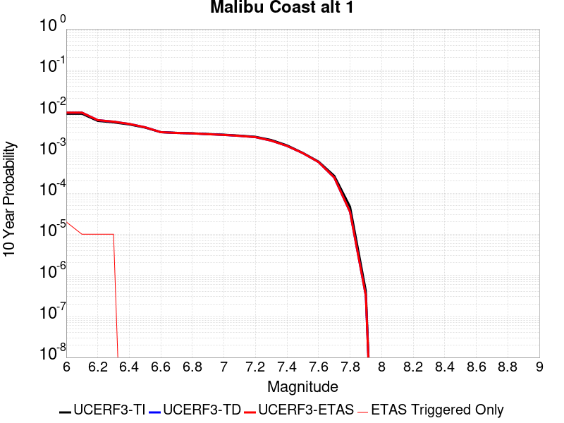 |

| Magnitude | 1 wk TI Prob | 1 wk TD Prob | 1 wk ETAS Prob | 1 wk ETAS/TD Gain | 1 wk ETAS Triggered Only | 1 mo TI Prob | 1 mo TD Prob | 1 mo ETAS Prob | 1 mo ETAS/TD Gain | 1 mo ETAS Triggered Only | 1 yr TI Prob | 1 yr TD Prob | 1 yr ETAS Prob | 1 yr ETAS/TD Gain | 1 yr ETAS Triggered Only | 10 yr TI Prob | 10 yr TD Prob | 10 yr ETAS Prob | 10 yr ETAS/TD Gain | 10 yr ETAS Triggered Only |
|-----|-----|-----|-----|-----|-----|-----|-----|-----|-----|-----|-----|-----|-----|-----|-----|-----|-----|-----|-----|-----|
| 6.0 | 1.6572556E-5 | 1.7598268E-5 | 1.7598268E-5 | 1.0 | 0.0 | 7.102331E-5 | 7.541908E-5 | 7.541908E-5 | 1.0 | 0.0 | 8.6436566E-4 | 9.178593E-4 | 9.392759E-4 | 1.0233332 | 2.1436228E-5 | 0.0086101135 | 0.009142617 | 0.009163857 | 1.0023233 | 2.1436228E-5 |
| 6.1 | 1.6572556E-5 | 1.7598268E-5 | 1.7598268E-5 | 1.0 | 0.0 | 7.102331E-5 | 7.541908E-5 | 7.541908E-5 | 1.0 | 0.0 | 8.6436566E-4 | 9.178593E-4 | 9.285676E-4 | 1.0116665 | 1.0718114E-5 | 0.0086101135 | 0.009142617 | 0.009153238 | 1.0011616 | 1.0718114E-5 |
| 6.2 | 1.1085717E-5 | 1.1557268E-5 | 1.1557268E-5 | 1.0 | 0.0 | 4.750935E-5 | 4.953023E-5 | 4.953023E-5 | 1.0 | 0.0 | 5.782728E-4 | 6.028672E-4 | 6.135789E-4 | 1.0177678 | 1.0718114E-5 | 0.0057677035 | 0.0060126884 | 0.0060233423 | 1.0017718 | 1.0718114E-5 |
| 6.3 | 1.0208568E-5 | 1.05923455E-5 | 1.05923455E-5 | 1.0 | 0.0 | 4.375027E-5 | 4.5394994E-5 | 4.5394994E-5 | 1.0 | 0.0 | 5.325294E-4 | 5.525468E-4 | 5.63259E-4 | 1.0193869 | 1.0718114E-5 | 0.0053125503 | 0.005512038 | 0.0055226968 | 1.0019338 | 1.0718114E-5 |
| 6.4 | 9.0682315E-6 | 9.34273E-6 | 9.34273E-6 | 1.0 | 0.0 | 3.8863272E-5 | 4.0039668E-5 | 4.0039668E-5 | 1.0 | 0.0 | 4.730576E-4 | 4.8737595E-4 | 4.8737595E-4 | 1.0 | 0.0 | 0.0047205184 | 0.004863284 | 0.004863284 | 1.0 | 0.0 |
| 6.5 | 7.605796E-6 | 7.74866E-6 | 7.74866E-6 | 1.0 | 0.0 | 3.259586E-5 | 3.320813E-5 | 3.320813E-5 | 1.0 | 0.0 | 3.9678233E-4 | 4.042353E-4 | 4.042353E-4 | 1.0 | 0.0 | 0.0039607463 | 0.004035138 | 0.004035138 | 1.0 | 0.0 |
| 6.6 | 5.889873E-6 | 5.8795895E-6 | 5.8795895E-6 | 1.0 | 0.0 | 2.5242069E-5 | 2.5197998E-5 | 2.5197998E-5 | 1.0 | 0.0 | 3.0727885E-4 | 3.0674253E-4 | 3.0674253E-4 | 1.0 | 0.0 | 0.003068543 | 0.0030632042 | 0.0030632042 | 1.0 | 0.0 |
| 6.7 | 5.66586E-6 | 5.64169E-6 | 5.64169E-6 | 1.0 | 0.0 | 2.428203E-5 | 2.417845E-5 | 2.417845E-5 | 1.0 | 0.0 | 2.955936E-4 | 2.9433295E-4 | 2.9433295E-4 | 1.0 | 0.0 | 0.0029520073 | 0.002939443 | 0.002939443 | 1.0 | 0.0 |
| 6.8 | 5.521556E-6 | 5.489475E-6 | 5.489475E-6 | 1.0 | 0.0 | 2.3663597E-5 | 2.3526109E-5 | 2.3526109E-5 | 1.0 | 0.0 | 2.880662E-4 | 2.8639284E-4 | 2.8639284E-4 | 1.0 | 0.0 | 0.0028769306 | 0.002860249 | 0.002860249 | 1.0 | 0.0 |
| 6.9 | 5.29752E-6 | 5.249977E-6 | 5.249977E-6 | 1.0 | 0.0 | 2.270346E-5 | 2.249971E-5 | 2.249971E-5 | 1.0 | 0.0 | 2.7637955E-4 | 2.738996E-4 | 2.738996E-4 | 1.0 | 0.0 | 0.0027603607 | 0.0027356306 | 0.0027356306 | 1.0 | 0.0 |
| 7.0 | 5.106743E-6 | 5.047723E-6 | 5.047723E-6 | 1.0 | 0.0 | 2.1885859E-5 | 2.1632919E-5 | 2.1632919E-5 | 1.0 | 0.0 | 2.6642776E-4 | 2.6334904E-4 | 2.6334904E-4 | 1.0 | 0.0 | 0.0026610855 | 0.002630379 | 0.002630379 | 1.0 | 0.0 |
| 7.1 | 4.8469647E-6 | 4.7704148E-6 | 4.7704148E-6 | 1.0 | 0.0 | 2.0772539E-5 | 2.0444475E-5 | 2.0444475E-5 | 1.0 | 0.0 | 2.528763E-4 | 2.488831E-4 | 2.488831E-4 | 1.0 | 0.0 | 0.0025258875 | 0.0024860518 | 0.0024860518 | 1.0 | 0.0 |
| 7.2 | 4.545514E-6 | 4.448232E-6 | 4.448232E-6 | 1.0 | 0.0 | 1.9480629E-5 | 1.9063713E-5 | 1.9063713E-5 | 1.0 | 0.0 | 2.3715083E-4 | 2.3207605E-4 | 2.3207605E-4 | 1.0 | 0.0 | 0.0023689792 | 0.0023183445 | 0.0023183445 | 1.0 | 0.0 |
| 7.3 | 3.794097E-6 | 3.6519655E-6 | 3.6519655E-6 | 1.0 | 0.0 | 1.6260314E-5 | 1.5651187E-5 | 1.5651187E-5 | 1.0 | 0.0 | 1.9795135E-4 | 1.9053658E-4 | 1.9053658E-4 | 1.0 | 0.0 | 0.001977751 | 0.0019037367 | 0.0019037367 | 1.0 | 0.0 |
| 7.4 | 2.808217E-6 | 2.7191E-6 | 2.7191E-6 | 1.0 | 0.0 | 1.203516E-5 | 1.1653234E-5 | 1.1653234E-5 | 1.0 | 0.0 | 1.4651821E-4 | 1.418689E-4 | 1.418689E-4 | 1.0 | 0.0 | 0.0014642165 | 0.0014177861 | 0.0014177861 | 1.0 | 0.0 |
| 7.5 | 1.83809E-6 | 1.8190852E-6 | 1.8190852E-6 | 1.0 | 0.0 | 7.877505E-6 | 7.796056E-6 | 7.796056E-6 | 1.0 | 0.0 | 9.59044E-5 | 9.4912866E-5 | 9.4912866E-5 | 1.0 | 0.0 | 9.5863023E-4 | 9.487253E-4 | 9.487253E-4 | 1.0 | 0.0 |
| 7.6 | 1.1292672E-6 | 1.100155E-6 | 1.100155E-6 | 1.0 | 0.0 | 4.839708E-6 | 4.7149415E-6 | 4.7149415E-6 | 1.0 | 0.0 | 5.8921847E-5 | 5.7402918E-5 | 5.7402918E-5 | 1.0 | 0.0 | 5.890623E-4 | 5.7388254E-4 | 5.7388254E-4 | 1.0 | 0.0 |
| 7.7 | 5.065272E-7 | 4.609203E-7 | 4.609203E-7 | 1.0 | 0.0 | 2.170829E-6 | 1.9753713E-6 | 1.9753713E-6 | 1.0 | 0.0 | 2.6429525E-5 | 2.404989E-5 | 2.404989E-5 | 1.0 | 0.0 | 2.642638E-4 | 2.4047401E-4 | 2.4047401E-4 | 1.0 | 0.0 |
| 7.8 | 8.952991E-8 | 6.708074E-8 | 6.708074E-8 | 1.0 | 0.0 | 3.8369956E-7 | 2.8748886E-7 | 2.8748886E-7 | 1.0 | 0.0 | 4.671532E-6 | 3.5001713E-6 | 3.5001713E-6 | 1.0 | 0.0 | 4.671434E-5 | 3.5001183E-5 | 3.5001183E-5 | 1.0 | 0.0 |
| 7.9 | 8.007447E-10 | 6.160915E-10 | 6.160915E-10 | 1.0 | 0.0 | 3.4317629E-9 | 2.6403923E-9 | 2.6403923E-9 | 1.0 | 0.0 | 4.1781714E-8 | 3.2146776E-8 | 3.2146776E-8 | 1.0 | 0.0 | 4.1781706E-7 | 3.2146772E-7 | 3.2146772E-7 | 1.0 | 0.0 |

## Likely 2011 CFM
*[(top)](#table-of-contents)*

| 1 Week | 1 Month | 1 Year | 10 Year |
|-----|-----|-----|-----|
|  |  |  |  |

| Magnitude | 1 wk TI Prob | 1 wk TD Prob | 1 wk ETAS Prob | 1 wk ETAS/TD Gain | 1 wk ETAS Triggered Only | 1 mo TI Prob | 1 mo TD Prob | 1 mo ETAS Prob | 1 mo ETAS/TD Gain | 1 mo ETAS Triggered Only | 1 yr TI Prob | 1 yr TD Prob | 1 yr ETAS Prob | 1 yr ETAS/TD Gain | 1 yr ETAS Triggered Only | 10 yr TI Prob | 10 yr TD Prob | 10 yr ETAS Prob | 10 yr ETAS/TD Gain | 10 yr ETAS Triggered Only |
|-----|-----|-----|-----|-----|-----|-----|-----|-----|-----|-----|-----|-----|-----|-----|-----|-----|-----|-----|-----|-----|
| 6.0 | 2.5315949E-5 | 2.7105003E-5 | 2.7105003E-5 | 1.0 | 0.0 | 1.0849241E-4 | 1.16159375E-4 | 1.16159375E-4 | 1.0 | 0.0 | 0.0013200947 | 0.0014133675 | 0.0014240704 | 1.0075727 | 1.0718114E-5 | 0.013122803 | 0.014048441 | 0.014069577 | 1.0015044 | 2.1436228E-5 |
| 6.1 | 2.5315949E-5 | 2.7105003E-5 | 2.7105003E-5 | 1.0 | 0.0 | 1.0849241E-4 | 1.16159375E-4 | 1.16159375E-4 | 1.0 | 0.0 | 0.0013200947 | 0.0014133675 | 0.0014240704 | 1.0075727 | 1.0718114E-5 | 0.013122803 | 0.014048441 | 0.014059009 | 1.0007522 | 1.0718114E-5 |
| 6.2 | 1.6375941E-5 | 1.7465996E-5 | 1.7465996E-5 | 1.0 | 0.0 | 7.0180715E-5 | 7.485219E-5 | 7.485219E-5 | 1.0 | 0.0 | 8.5411523E-4 | 9.109567E-4 | 9.109567E-4 | 1.0 | 0.0 | 0.008508399 | 0.009073513 | 0.009073513 | 1.0 | 0.0 |
| 6.3 | 1.1945543E-5 | 1.2712695E-5 | 1.2712695E-5 | 1.0 | 0.0 | 5.119418E-5 | 5.4481872E-5 | 5.4481872E-5 | 1.0 | 0.0 | 6.2311086E-4 | 6.6312024E-4 | 6.6312024E-4 | 1.0 | 0.0 | 0.0062136655 | 0.0066119707 | 0.0066119707 | 1.0 | 0.0 |
| 6.4 | 9.192729E-6 | 9.768569E-6 | 9.768569E-6 | 1.0 | 0.0 | 3.939681E-5 | 4.1864638E-5 | 4.1864638E-5 | 1.0 | 0.0 | 4.7955062E-4 | 5.095855E-4 | 5.095855E-4 | 1.0 | 0.0 | 0.004785171 | 0.0050844513 | 0.0050844513 | 1.0 | 0.0 |
| 6.5 | 7.67906E-6 | 8.152689E-6 | 8.152689E-6 | 1.0 | 0.0 | 3.2909844E-5 | 3.493964E-5 | 3.493964E-5 | 1.0 | 0.0 | 4.006037E-4 | 4.2530894E-4 | 4.2530894E-4 | 1.0 | 0.0 | 0.0039988225 | 0.004245143 | 0.004245143 | 1.0 | 0.0 |
| 6.6 | 6.4884057E-6 | 6.884806E-6 | 6.884806E-6 | 1.0 | 0.0 | 2.7807157E-5 | 2.9505987E-5 | 2.9505987E-5 | 1.0 | 0.0 | 3.3849955E-4 | 3.5917762E-4 | 3.5917762E-4 | 1.0 | 0.0 | 0.003379844 | 0.0035861158 | 0.0035861158 | 1.0 | 0.0 |
| 6.7 | 4.6060636E-6 | 4.88408E-6 | 4.88408E-6 | 1.0 | 0.0 | 1.9740122E-5 | 2.093161E-5 | 2.093161E-5 | 1.0 | 0.0 | 2.403095E-4 | 2.5481338E-4 | 2.5481338E-4 | 1.0 | 0.0 | 0.002400498 | 0.002545295 | 0.002545295 | 1.0 | 0.0 |
| 6.8 | 3.2795615E-6 | 3.477401E-6 | 3.477401E-6 | 1.0 | 0.0 | 1.4055187E-5 | 1.4903065E-5 | 1.4903065E-5 | 1.0 | 0.0 | 1.7110848E-4 | 1.8143027E-4 | 1.8143027E-4 | 1.0 | 0.0 | 0.0017097679 | 0.0018128767 | 0.0018128767 | 1.0 | 0.0 |
| 6.9 | 2.3289967E-6 | 2.4705769E-6 | 2.4705769E-6 | 1.0 | 0.0 | 9.981376E-6 | 1.0588145E-5 | 1.0588145E-5 | 1.0 | 0.0 | 1.2151648E-4 | 1.2890348E-4 | 1.2890348E-4 | 1.0 | 0.0 | 0.0012145005 | 0.0012883301 | 0.0012883301 | 1.0 | 0.0 |
| 7.0 | 1.211292E-6 | 1.2864064E-6 | 1.2864064E-6 | 1.0 | 0.0 | 5.1912407E-6 | 5.51316E-6 | 5.51316E-6 | 1.0 | 0.0 | 6.320152E-5 | 6.7120964E-5 | 6.7120964E-5 | 1.0 | 0.0 | 6.3183554E-4 | 6.710367E-4 | 6.710367E-4 | 1.0 | 0.0 |

## San Gabriel
*[(top)](#table-of-contents)*

| 1 Week | 1 Month | 1 Year | 10 Year |
|-----|-----|-----|-----|
|  |  | 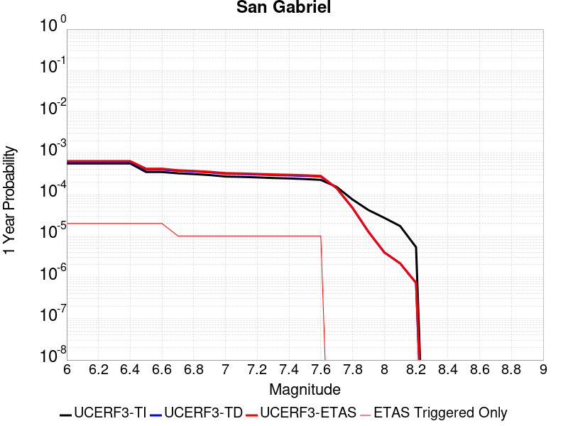 |  |

| Magnitude | 1 wk TI Prob | 1 wk TD Prob | 1 wk ETAS Prob | 1 wk ETAS/TD Gain | 1 wk ETAS Triggered Only | 1 mo TI Prob | 1 mo TD Prob | 1 mo ETAS Prob | 1 mo ETAS/TD Gain | 1 mo ETAS Triggered Only | 1 yr TI Prob | 1 yr TD Prob | 1 yr ETAS Prob | 1 yr ETAS/TD Gain | 1 yr ETAS Triggered Only | 10 yr TI Prob | 10 yr TD Prob | 10 yr ETAS Prob | 10 yr ETAS/TD Gain | 10 yr ETAS Triggered Only |
|-----|-----|-----|-----|-----|-----|-----|-----|-----|-----|-----|-----|-----|-----|-----|-----|-----|-----|-----|-----|-----|
| 6.0 | 1.083775E-5 | 1.1987322E-5 | 2.2705308E-5 | 1.89411 | 1.0718114E-5 | 4.6446676E-5 | 5.1373292E-5 | 6.2090854E-5 | 1.2086213 | 1.0718114E-5 | 5.653415E-4 | 6.253016E-4 | 6.467245E-4 | 1.03426 | 2.1436228E-5 | 0.0056390543 | 0.006247514 | 0.006268816 | 1.0034097 | 2.1436228E-5 |
| 6.1 | 1.083775E-5 | 1.1987322E-5 | 2.2705308E-5 | 1.89411 | 1.0718114E-5 | 4.6446676E-5 | 5.1373292E-5 | 6.2090854E-5 | 1.2086213 | 1.0718114E-5 | 5.653415E-4 | 6.253016E-4 | 6.467245E-4 | 1.03426 | 2.1436228E-5 | 0.0056390543 | 0.006247514 | 0.006268816 | 1.0034097 | 2.1436228E-5 |
| 6.2 | 1.083775E-5 | 1.1987322E-5 | 2.2705308E-5 | 1.89411 | 1.0718114E-5 | 4.6446676E-5 | 5.1373292E-5 | 6.2090854E-5 | 1.2086213 | 1.0718114E-5 | 5.653415E-4 | 6.253016E-4 | 6.467245E-4 | 1.03426 | 2.1436228E-5 | 0.0056390543 | 0.006247514 | 0.006268816 | 1.0034097 | 2.1436228E-5 |
| 6.3 | 1.083775E-5 | 1.1987322E-5 | 2.2705308E-5 | 1.89411 | 1.0718114E-5 | 4.6446676E-5 | 5.1373292E-5 | 6.2090854E-5 | 1.2086213 | 1.0718114E-5 | 5.653415E-4 | 6.253016E-4 | 6.467245E-4 | 1.03426 | 2.1436228E-5 | 0.0056390543 | 0.006247514 | 0.006268816 | 1.0034097 | 2.1436228E-5 |
| 6.4 | 1.083775E-5 | 1.1987322E-5 | 2.2705308E-5 | 1.89411 | 1.0718114E-5 | 4.6446676E-5 | 5.1373292E-5 | 6.2090854E-5 | 1.2086213 | 1.0718114E-5 | 5.653415E-4 | 6.253016E-4 | 6.467245E-4 | 1.03426 | 2.1436228E-5 | 0.0056390543 | 0.006247514 | 0.006268816 | 1.0034097 | 2.1436228E-5 |
| 6.5 | 6.7317824E-6 | 7.719057E-6 | 1.8437087E-5 | 2.3885155 | 1.0718114E-5 | 2.8850178E-5 | 3.308126E-5 | 4.379902E-5 | 1.3239828 | 1.0718114E-5 | 3.511943E-4 | 4.0269096E-4 | 4.2411857E-4 | 1.053211 | 2.1436228E-5 | 0.003506398 | 0.0040307054 | 0.004052055 | 1.0052968 | 2.1436228E-5 |
| 6.6 | 6.7317824E-6 | 7.719057E-6 | 1.8437087E-5 | 2.3885155 | 1.0718114E-5 | 2.8850178E-5 | 3.308126E-5 | 4.379902E-5 | 1.3239828 | 1.0718114E-5 | 3.511943E-4 | 4.0269096E-4 | 4.2411857E-4 | 1.053211 | 2.1436228E-5 | 0.003506398 | 0.0040307054 | 0.004052055 | 1.0052968 | 2.1436228E-5 |
| 6.7 | 6.274881E-6 | 7.247975E-6 | 7.247975E-6 | 1.0 | 0.0 | 2.6892068E-5 | 3.1062387E-5 | 3.1062387E-5 | 1.0 | 0.0 | 3.2736175E-4 | 3.781199E-4 | 3.8883396E-4 | 1.0283351 | 1.0718114E-5 | 0.0032687993 | 0.0037858514 | 0.0037965288 | 1.0028204 | 1.0718114E-5 |
| 6.8 | 5.996209E-6 | 6.9606945E-6 | 6.9606945E-6 | 1.0 | 0.0 | 2.5697784E-5 | 2.9831212E-5 | 2.9831212E-5 | 1.0 | 0.0 | 3.128256E-4 | 3.6313542E-4 | 3.7384962E-4 | 1.0295048 | 1.0718114E-5 | 0.003123856 | 0.0036365038 | 0.0036471828 | 1.0029366 | 1.0718114E-5 |
| 6.9 | 5.686331E-6 | 6.6257326E-6 | 6.6257326E-6 | 1.0 | 0.0 | 2.4369761E-5 | 2.8395692E-5 | 2.8395692E-5 | 1.0 | 0.0 | 2.9666146E-4 | 3.4566363E-4 | 3.5637803E-4 | 1.0309967 | 1.0718114E-5 | 0.0029626573 | 0.0034623418 | 0.0034730227 | 1.0030849 | 1.0718114E-5 |
| 7.0 | 5.2329838E-6 | 6.14961E-6 | 6.14961E-6 | 1.0 | 0.0 | 2.242688E-5 | 2.6355208E-5 | 2.6355208E-5 | 1.0 | 0.0 | 2.7301308E-4 | 3.2082817E-4 | 3.3154286E-4 | 1.033397 | 1.0718114E-5 | 0.002726779 | 0.00321472 | 0.0032254036 | 1.0033233 | 1.0718114E-5 |
| 7.1 | 5.135671E-6 | 6.03973E-6 | 6.03973E-6 | 1.0 | 0.0 | 2.2009834E-5 | 2.5884305E-5 | 2.5884305E-5 | 1.0 | 0.0 | 2.6793676E-4 | 3.150966E-4 | 3.2581136E-4 | 1.0340046 | 1.0718114E-5 | 0.0026761394 | 0.0031575684 | 0.0031682525 | 1.0033838 | 1.0718114E-5 |
| 7.2 | 4.989062E-6 | 5.873101E-6 | 5.873101E-6 | 1.0 | 0.0 | 2.1381518E-5 | 2.5170193E-5 | 2.5170193E-5 | 1.0 | 0.0 | 2.6028889E-4 | 3.0640478E-4 | 3.1711961E-4 | 1.0349696 | 1.0718114E-5 | 0.0025998424 | 0.003070893 | 0.0030815783 | 1.0034795 | 1.0718114E-5 |
| 7.3 | 4.8219395E-6 | 5.7046464E-6 | 5.7046464E-6 | 1.0 | 0.0 | 2.0665291E-5 | 2.444826E-5 | 2.444826E-5 | 1.0 | 0.0 | 2.5157086E-4 | 2.9761766E-4 | 3.083326E-4 | 1.0360023 | 1.0718114E-5 | 0.0025128627 | 0.0029832611 | 0.0029939474 | 1.003582 | 1.0718114E-5 |
| 7.4 | 4.7118383E-6 | 5.593198E-6 | 5.593198E-6 | 1.0 | 0.0 | 2.0193436E-5 | 2.3970631E-5 | 2.3970631E-5 | 1.0 | 0.0 | 2.4582737E-4 | 2.918041E-4 | 3.025191E-4 | 1.0367198 | 1.0718114E-5 | 0.002455556 | 0.0029252786 | 0.0029359655 | 1.0036533 | 1.0718114E-5 |
| 7.5 | 4.5506545E-6 | 5.4385555E-6 | 5.4385555E-6 | 1.0 | 0.0 | 1.9502659E-5 | 2.330789E-5 | 2.330789E-5 | 1.0 | 0.0 | 2.37419E-4 | 2.8373738E-4 | 2.9445245E-4 | 1.0377641 | 1.0718114E-5 | 0.002371655 | 0.0028448196 | 0.0028555072 | 1.0037569 | 1.0718114E-5 |
| 7.6 | 4.343636E-6 | 5.2314185E-6 | 5.2314185E-6 | 1.0 | 0.0 | 1.861545E-5 | 2.2420176E-5 | 2.2420176E-5 | 1.0 | 0.0 | 2.2661954E-4 | 2.729322E-4 | 2.836474E-4 | 1.0392596 | 1.0718114E-5 | 0.0022638857 | 0.00273703 | 0.0027477187 | 1.0039053 | 1.0718114E-5 |
| 7.7 | 2.936235E-6 | 2.7454162E-6 | 2.7454162E-6 | 1.0 | 0.0 | 1.2583803E-5 | 1.17660165E-5 | 1.17660165E-5 | 1.0 | 0.0 | 1.5319703E-4 | 1.4324186E-4 | 1.4324186E-4 | 1.0 | 0.0 | 0.0015309147 | 0.0014387933 | 0.0014387933 | 1.0 | 0.0 |
| 7.8 | 1.4541639E-6 | 9.129234E-7 | 9.129234E-7 | 1.0 | 0.0 | 6.232116E-6 | 3.912523E-6 | 3.912523E-6 | 1.0 | 0.0 | 7.587337E-5 | 4.7633926E-5 | 4.7633926E-5 | 1.0 | 0.0 | 7.584747E-4 | 4.8114438E-4 | 4.8114438E-4 | 1.0 | 0.0 |
| 7.9 | 8.098958E-7 | 2.419679E-7 | 2.419679E-7 | 1.0 | 0.0 | 3.4709774E-6 | 1.0370048E-6 | 1.0370048E-6 | 1.0 | 0.0 | 4.225833E-5 | 1.2625461E-5 | 1.2625461E-5 | 1.0 | 0.0 | 4.2250296E-4 | 1.2933378E-4 | 1.2933378E-4 | 1.0 | 0.0 |
| 8.0 | 5.2473234E-7 | 7.6891794E-8 | 7.6891794E-8 | 1.0 | 0.0 | 2.248851E-6 | 3.2953622E-7 | 3.2953622E-7 | 1.0 | 0.0 | 2.7379416E-5 | 4.012096E-6 | 4.012096E-6 | 1.0 | 0.0 | 2.7376044E-4 | 4.224638E-5 | 4.224638E-5 | 1.0 | 0.0 |
| 8.1 | 3.3162388E-7 | 4.155149E-8 | 4.155149E-8 | 1.0 | 0.0 | 1.4212444E-6 | 1.7807781E-7 | 1.7807781E-7 | 1.0 | 0.0 | 1.7303513E-5 | 2.168095E-6 | 2.168095E-6 | 1.0 | 0.0 | 1.7302166E-4 | 2.2995899E-5 | 2.2995899E-5 | 1.0 | 0.0 |
| 8.2 | 1.0235345E-7 | 1.4060946E-8 | 1.4060946E-8 | 1.0 | 0.0 | 4.3865757E-7 | 6.02612E-8 | 6.02612E-8 | 1.0 | 0.0 | 5.340643E-6 | 7.336798E-7 | 7.336798E-7 | 1.0 | 0.0 | 5.3405143E-5 | 7.937039E-6 | 7.937039E-6 | 1.0 | 0.0 |

## San Diego Trough south
*[(top)](#table-of-contents)*

| 1 Week | 1 Month | 1 Year | 10 Year |
|-----|-----|-----|-----|
|  |  |  |  |

| Magnitude | 1 wk TI Prob | 1 wk TD Prob | 1 wk ETAS Prob | 1 wk ETAS/TD Gain | 1 wk ETAS Triggered Only | 1 mo TI Prob | 1 mo TD Prob | 1 mo ETAS Prob | 1 mo ETAS/TD Gain | 1 mo ETAS Triggered Only | 1 yr TI Prob | 1 yr TD Prob | 1 yr ETAS Prob | 1 yr ETAS/TD Gain | 1 yr ETAS Triggered Only | 10 yr TI Prob | 10 yr TD Prob | 10 yr ETAS Prob | 10 yr ETAS/TD Gain | 10 yr ETAS Triggered Only |
|-----|-----|-----|-----|-----|-----|-----|-----|-----|-----|-----|-----|-----|-----|-----|-----|-----|-----|-----|-----|-----|
| 6.0 | 8.279495E-5 | 1.0424506E-4 | 1.0424506E-4 | 1.0 | 0.0 | 3.5478722E-4 | 4.4669298E-4 | 4.4669298E-4 | 1.0 | 0.0 | 0.004310982 | 0.005425812 | 0.005436472 | 1.0019647 | 1.0718114E-5 | 0.042283054 | 0.052993916 | 0.05301422 | 1.000383 | 2.1436228E-5 |
| 6.1 | 4.6961468E-5 | 5.7731268E-5 | 5.7731268E-5 | 1.0 | 0.0 | 2.0124791E-4 | 2.4739723E-4 | 2.4739723E-4 | 1.0 | 0.0 | 0.00244744 | 0.0030080716 | 0.0030080716 | 1.0 | 0.0 | 0.024206603 | 0.029680338 | 0.029680338 | 1.0 | 0.0 |
| 6.2 | 3.5079658E-5 | 4.2142692E-5 | 4.2142692E-5 | 1.0 | 0.0 | 1.5033272E-4 | 1.805993E-4 | 1.805993E-4 | 1.0 | 0.0 | 0.0018287642 | 0.002196623 | 0.002196623 | 1.0 | 0.0 | 0.018137876 | 0.021751693 | 0.021751693 | 1.0 | 0.0 |
| 6.3 | 3.5079658E-5 | 4.2142692E-5 | 4.2142692E-5 | 1.0 | 0.0 | 1.5033272E-4 | 1.805993E-4 | 1.805993E-4 | 1.0 | 0.0 | 0.0018287642 | 0.002196623 | 0.002196623 | 1.0 | 0.0 | 0.018137876 | 0.021751693 | 0.021751693 | 1.0 | 0.0 |
| 6.4 | 2.7196904E-5 | 3.2087937E-5 | 3.2087937E-5 | 1.0 | 0.0 | 1.16552954E-4 | 1.3751259E-4 | 1.3751259E-4 | 1.0 | 0.0 | 0.0014181085 | 0.0016729443 | 0.0016729443 | 1.0 | 0.0 | 0.014090929 | 0.016605038 | 0.016605038 | 1.0 | 0.0 |
| 6.5 | 2.5584688E-5 | 3.0102354E-5 | 3.0102354E-5 | 1.0 | 0.0 | 1.0964406E-4 | 1.2900379E-4 | 1.2900379E-4 | 1.0 | 0.0 | 0.0013340989 | 0.0015695024 | 0.0015695024 | 1.0 | 0.0 | 0.013261181 | 0.015585679 | 0.015585679 | 1.0 | 0.0 |
| 6.6 | 2.2034688E-5 | 2.5743318E-5 | 2.5743318E-5 | 1.0 | 0.0 | 9.443096E-5 | 1.1032389E-4 | 1.1032389E-4 | 1.0 | 0.0 | 0.0011490905 | 0.0013423724 | 0.0013423724 | 1.0 | 0.0 | 0.011431668 | 0.013343615 | 0.013343615 | 1.0 | 0.0 |
| 6.7 | 1.9394853E-5 | 2.2542248E-5 | 2.2542248E-5 | 1.0 | 0.0 | 8.311815E-5 | 9.660609E-5 | 9.660609E-5 | 1.0 | 0.0 | 0.0010114936 | 0.0011755497 | 0.0011755497 | 1.0 | 0.0 | 0.01006902 | 0.011694018 | 0.011694018 | 1.0 | 0.0 |
| 6.8 | 1.7615313E-5 | 2.0403613E-5 | 2.0403613E-5 | 1.0 | 0.0 | 7.549201E-5 | 8.744115E-5 | 8.744115E-5 | 1.0 | 0.0 | 9.1872766E-4 | 0.0010640804 | 0.0010640804 | 1.0 | 0.0 | 0.009149387 | 0.01059042 | 0.01059042 | 1.0 | 0.0 |
| 6.9 | 1.5621423E-5 | 1.8026485E-5 | 1.8026485E-5 | 1.0 | 0.0 | 6.6947236E-5 | 7.7254095E-5 | 7.7254095E-5 | 1.0 | 0.0 | 8.147778E-4 | 9.4016624E-4 | 9.4016624E-4 | 1.0 | 0.0 | 0.008117969 | 0.0093623325 | 0.0093623325 | 1.0 | 0.0 |
| 7.0 | 1.3444376E-5 | 1.5448395E-5 | 1.5448395E-5 | 1.0 | 0.0 | 5.7617483E-5 | 6.620574E-5 | 6.620574E-5 | 1.0 | 0.0 | 7.0126704E-4 | 8.057596E-4 | 8.057596E-4 | 1.0 | 0.0 | 0.006990582 | 0.008028714 | 0.008028714 | 1.0 | 0.0 |
| 7.1 | 1.2268361E-5 | 1.40733055E-5 | 1.40733055E-5 | 1.0 | 0.0 | 5.2577634E-5 | 6.031279E-5 | 6.031279E-5 | 1.0 | 0.0 | 6.399447E-4 | 7.3406345E-4 | 7.3406345E-4 | 1.0 | 0.0 | 0.0063810493 | 0.007316692 | 0.007316692 | 1.0 | 0.0 |
| 7.2 | 1.0922655E-5 | 1.2513806E-5 | 1.2513806E-5 | 1.0 | 0.0 | 4.681054E-5 | 5.362951E-5 | 5.362951E-5 | 1.0 | 0.0 | 5.697693E-4 | 6.527462E-4 | 6.527462E-4 | 1.0 | 0.0 | 0.0056831064 | 0.0065085697 | 0.0065085697 | 1.0 | 0.0 |
| 7.3 | 6.1106753E-6 | 6.9290486E-6 | 6.9290486E-6 | 1.0 | 0.0 | 2.6188345E-5 | 2.9695586E-5 | 2.9695586E-5 | 1.0 | 0.0 | 3.1879646E-4 | 3.6148418E-4 | 3.6148418E-4 | 1.0 | 0.0 | 0.0031833951 | 0.0036090072 | 0.0036090072 | 1.0 | 0.0 |
| 7.4 | 4.933187E-6 | 5.5896517E-6 | 5.5896517E-6 | 1.0 | 0.0 | 2.114206E-5 | 2.3955432E-5 | 2.3955432E-5 | 1.0 | 0.0 | 2.5737417E-4 | 2.9161875E-4 | 2.9161875E-4 | 1.0 | 0.0 | 0.002570763 | 0.002912402 | 0.002912402 | 1.0 | 0.0 |
| 7.5 | 1.7489613E-6 | 1.9697113E-6 | 1.9697113E-6 | 1.0 | 0.0 | 7.495527E-6 | 8.441594E-6 | 8.441594E-6 | 1.0 | 0.0 | 9.125422E-5 | 1.0277178E-4 | 1.0277178E-4 | 1.0 | 0.0 | 9.1216754E-4 | 0.0010272645 | 0.0010272645 | 1.0 | 0.0 |
| 7.6 | 1.6988751E-7 | 1.7533898E-7 | 1.7533898E-7 | 1.0 | 0.0 | 7.2808916E-7 | 7.5145255E-7 | 7.5145255E-7 | 1.0 | 0.0 | 8.864449E-6 | 9.148898E-6 | 9.148898E-6 | 1.0 | 0.0 | 8.8640954E-5 | 9.148542E-5 | 9.148542E-5 | 1.0 | 0.0 |

## Los Alamos 2011 CFM
*[(top)](#table-of-contents)*

| 1 Week | 1 Month | 1 Year | 10 Year |
|-----|-----|-----|-----|
|  |  |  |  |

| Magnitude | 1 wk TI Prob | 1 wk TD Prob | 1 wk ETAS Prob | 1 wk ETAS/TD Gain | 1 wk ETAS Triggered Only | 1 mo TI Prob | 1 mo TD Prob | 1 mo ETAS Prob | 1 mo ETAS/TD Gain | 1 mo ETAS Triggered Only | 1 yr TI Prob | 1 yr TD Prob | 1 yr ETAS Prob | 1 yr ETAS/TD Gain | 1 yr ETAS Triggered Only | 10 yr TI Prob | 10 yr TD Prob | 10 yr ETAS Prob | 10 yr ETAS/TD Gain | 10 yr ETAS Triggered Only |
|-----|-----|-----|-----|-----|-----|-----|-----|-----|-----|-----|-----|-----|-----|-----|-----|-----|-----|-----|-----|-----|
| 6.0 | 4.6284417E-6 | 4.751753E-6 | 4.751753E-6 | 1.0 | 0.0 | 1.9836029E-5 | 2.0364507E-5 | 2.0364507E-5 | 1.0 | 0.0 | 2.4147688E-4 | 2.4791143E-4 | 2.6934233E-4 | 1.0864458 | 2.1436228E-5 | 0.0024121467 | 0.0024765227 | 0.0024979059 | 1.0086343 | 2.1436228E-5 |
| 6.1 | 4.6284417E-6 | 4.751753E-6 | 4.751753E-6 | 1.0 | 0.0 | 1.9836029E-5 | 2.0364507E-5 | 2.0364507E-5 | 1.0 | 0.0 | 2.4147688E-4 | 2.4791143E-4 | 2.6934233E-4 | 1.0864458 | 2.1436228E-5 | 0.0024121467 | 0.0024765227 | 0.0024979059 | 1.0086343 | 2.1436228E-5 |
| 6.2 | 4.6284417E-6 | 4.751753E-6 | 4.751753E-6 | 1.0 | 0.0 | 1.9836029E-5 | 2.0364507E-5 | 2.0364507E-5 | 1.0 | 0.0 | 2.4147688E-4 | 2.4791143E-4 | 2.6934233E-4 | 1.0864458 | 2.1436228E-5 | 0.0024121467 | 0.0024765227 | 0.0024979059 | 1.0086343 | 2.1436228E-5 |
| 6.3 | 4.6284417E-6 | 4.751753E-6 | 4.751753E-6 | 1.0 | 0.0 | 1.9836029E-5 | 2.0364507E-5 | 2.0364507E-5 | 1.0 | 0.0 | 2.4147688E-4 | 2.4791143E-4 | 2.6934233E-4 | 1.0864458 | 2.1436228E-5 | 0.0024121467 | 0.0024765227 | 0.0024979059 | 1.0086343 | 2.1436228E-5 |
| 6.4 | 4.6284417E-6 | 4.751753E-6 | 4.751753E-6 | 1.0 | 0.0 | 1.9836029E-5 | 2.0364507E-5 | 2.0364507E-5 | 1.0 | 0.0 | 2.4147688E-4 | 2.4791143E-4 | 2.6934233E-4 | 1.0864458 | 2.1436228E-5 | 0.0024121467 | 0.0024765227 | 0.0024979059 | 1.0086343 | 2.1436228E-5 |
| 6.5 | 4.6284417E-6 | 4.751753E-6 | 4.751753E-6 | 1.0 | 0.0 | 1.9836029E-5 | 2.0364507E-5 | 2.0364507E-5 | 1.0 | 0.0 | 2.4147688E-4 | 2.4791143E-4 | 2.6934233E-4 | 1.0864458 | 2.1436228E-5 | 0.0024121467 | 0.0024765227 | 0.0024979059 | 1.0086343 | 2.1436228E-5 |
| 6.6 | 4.6284417E-6 | 4.751753E-6 | 4.751753E-6 | 1.0 | 0.0 | 1.9836029E-5 | 2.0364507E-5 | 2.0364507E-5 | 1.0 | 0.0 | 2.4147688E-4 | 2.4791143E-4 | 2.6934233E-4 | 1.0864458 | 2.1436228E-5 | 0.0024121467 | 0.0024765227 | 0.0024979059 | 1.0086343 | 2.1436228E-5 |
| 6.7 | 4.062321E-6 | 4.166368E-6 | 4.166368E-6 | 1.0 | 0.0 | 1.7409831E-5 | 1.785575E-5 | 1.785575E-5 | 1.0 | 0.0 | 2.1194408E-4 | 2.1737357E-4 | 2.3880514E-4 | 1.0985932 | 2.1436228E-5 | 0.0021174205 | 0.0021717593 | 0.002193149 | 1.009849 | 2.1436228E-5 |
| 6.8 | 4.062321E-6 | 4.166368E-6 | 4.166368E-6 | 1.0 | 0.0 | 1.7409831E-5 | 1.785575E-5 | 1.785575E-5 | 1.0 | 0.0 | 2.1194408E-4 | 2.1737357E-4 | 2.3880514E-4 | 1.0985932 | 2.1436228E-5 | 0.0021174205 | 0.0021717593 | 0.002193149 | 1.009849 | 2.1436228E-5 |
| 6.9 | 3.2936077E-6 | 3.3729737E-6 | 3.3729737E-6 | 1.0 | 0.0 | 1.4115385E-5 | 1.4455527E-5 | 1.4455527E-5 | 1.0 | 0.0 | 1.7184127E-4 | 1.7598276E-4 | 1.8669899E-4 | 1.0608937 | 1.0718114E-5 | 0.0017170844 | 0.0017585267 | 0.0017692259 | 1.0060842 | 1.0718114E-5 |
| 7.0 | 3.1687898E-6 | 3.2448309E-6 | 3.2448309E-6 | 1.0 | 0.0 | 1.3580457E-5 | 1.39063495E-5 | 1.39063495E-5 | 1.0 | 0.0 | 1.6532952E-4 | 1.6929758E-4 | 1.8001387E-4 | 1.0632986 | 1.0718114E-5 | 0.0016520657 | 0.0016917776 | 0.0017024776 | 1.0063246 | 1.0718114E-5 |
| 7.1 | 2.9379228E-6 | 3.0073402E-6 | 3.0073402E-6 | 1.0 | 0.0 | 1.25910365E-5 | 1.2888542E-5 | 1.2888542E-5 | 1.0 | 0.0 | 1.5328509E-4 | 1.5690761E-4 | 1.6762405E-4 | 1.0682977 | 1.0718114E-5 | 0.001531794 | 0.0015680575 | 0.0015787587 | 1.0068246 | 1.0718114E-5 |
| 7.2 | 2.0020686E-6 | 2.04164E-6 | 2.04164E-6 | 1.0 | 0.0 | 8.580266E-6 | 8.749857E-6 | 8.749857E-6 | 1.0 | 0.0 | 1.0445973E-4 | 1.0652435E-4 | 1.0652435E-4 | 1.0 | 0.0 | 0.0010441064 | 0.0010647373 | 0.0010647373 | 1.0 | 0.0 |
| 7.3 | 1.7364243E-6 | 1.7678894E-6 | 1.7678894E-6 | 1.0 | 0.0 | 7.441797E-6 | 7.5766475E-6 | 7.5766475E-6 | 1.0 | 0.0 | 9.0600115E-5 | 9.224181E-5 | 9.224181E-5 | 1.0 | 0.0 | 9.0563187E-4 | 9.220384E-4 | 9.220384E-4 | 1.0 | 0.0 |
| 7.4 | 1.5718434E-6 | 1.5983262E-6 | 1.5983262E-6 | 1.0 | 0.0 | 6.7364545E-6 | 6.8499517E-6 | 6.8499517E-6 | 1.0 | 0.0 | 8.201325E-5 | 8.3395E-5 | 8.3395E-5 | 1.0 | 0.0 | 8.198299E-4 | 8.3364005E-4 | 8.3364005E-4 | 1.0 | 0.0 |
| 7.5 | 1.3841119E-6 | 1.404287E-6 | 1.404287E-6 | 1.0 | 0.0 | 5.9318945E-6 | 6.018359E-6 | 6.018359E-6 | 1.0 | 0.0 | 7.221842E-5 | 7.327108E-5 | 7.327108E-5 | 1.0 | 0.0 | 7.2194956E-4 | 7.324721E-4 | 7.324721E-4 | 1.0 | 0.0 |
| 7.6 | 1.0843726E-6 | 1.0934483E-6 | 1.0934483E-6 | 1.0 | 0.0 | 4.647303E-6 | 4.6861987E-6 | 4.6861987E-6 | 1.0 | 0.0 | 5.6579443E-5 | 5.7053E-5 | 5.7053E-5 | 1.0 | 0.0 | 5.656504E-4 | 5.703861E-4 | 5.703861E-4 | 1.0 | 0.0 |
| 7.7 | 5.544814E-7 | 5.501903E-7 | 5.501903E-7 | 1.0 | 0.0 | 2.3763469E-6 | 2.3579564E-6 | 2.3579564E-6 | 1.0 | 0.0 | 2.8931638E-5 | 2.8707742E-5 | 2.8707742E-5 | 1.0 | 0.0 | 2.8927872E-4 | 2.870405E-4 | 2.870405E-4 | 1.0 | 0.0 |
| 7.8 | 2.0707465E-7 | 1.9778587E-7 | 1.9778587E-7 | 1.0 | 0.0 | 8.874625E-7 | 8.4765344E-7 | 8.4765344E-7 | 1.0 | 0.0 | 1.08048025E-5 | 1.0320132E-5 | 1.0320132E-5 | 1.0 | 0.0 | 1.0804277E-4 | 1.0319657E-4 | 1.0319657E-4 | 1.0 | 0.0 |
| 7.9 | 3.9821284E-8 | 3.4331322E-8 | 3.4331322E-8 | 1.0 | 0.0 | 1.7066264E-7 | 1.4713423E-7 | 1.4713423E-7 | 1.0 | 0.0 | 2.0778157E-6 | 1.7913579E-6 | 1.7913579E-6 | 1.0 | 0.0 | 2.0777963E-5 | 1.791344E-5 | 1.791344E-5 | 1.0 | 0.0 |
| 8.0 | 7.880441E-11 | 8.235368E-11 | 8.235368E-11 | 1.0 | 0.0 | 3.3773329E-10 | 3.5294412E-10 | 3.5294412E-10 | 1.0 | 0.0 | 4.1119033E-9 | 4.297095E-9 | 4.297095E-9 | 1.0 | 0.0 | 4.1119034E-8 | 4.2970953E-8 | 4.2970953E-8 | 1.0 | 0.0 |

## Great Valley 07 (Orestimba)
*[(top)](#table-of-contents)*

| 1 Week | 1 Month | 1 Year | 10 Year |
|-----|-----|-----|-----|
|  |  |  |  |

| Magnitude | 1 wk TI Prob | 1 wk TD Prob | 1 wk ETAS Prob | 1 wk ETAS/TD Gain | 1 wk ETAS Triggered Only | 1 mo TI Prob | 1 mo TD Prob | 1 mo ETAS Prob | 1 mo ETAS/TD Gain | 1 mo ETAS Triggered Only | 1 yr TI Prob | 1 yr TD Prob | 1 yr ETAS Prob | 1 yr ETAS/TD Gain | 1 yr ETAS Triggered Only | 10 yr TI Prob | 10 yr TD Prob | 10 yr ETAS Prob | 10 yr ETAS/TD Gain | 10 yr ETAS Triggered Only |
|-----|-----|-----|-----|-----|-----|-----|-----|-----|-----|-----|-----|-----|-----|-----|-----|-----|-----|-----|-----|-----|
| 6.0 | 2.9687902E-5 | 3.2757947E-5 | 3.2757947E-5 | 1.0 | 0.0 | 1.2722766E-4 | 1.4038406E-4 | 1.4038406E-4 | 1.0 | 0.0 | 0.0015478961 | 0.0017079079 | 0.0017079079 | 1.0 | 0.0 | 0.015371585 | 0.016955366 | 0.016965903 | 1.0006214 | 1.0718114E-5 |
| 6.1 | 2.9687902E-5 | 3.2757947E-5 | 3.2757947E-5 | 1.0 | 0.0 | 1.2722766E-4 | 1.4038406E-4 | 1.4038406E-4 | 1.0 | 0.0 | 0.0015478961 | 0.0017079079 | 0.0017079079 | 1.0 | 0.0 | 0.015371585 | 0.016955366 | 0.016955366 | 1.0 | 0.0 |
| 6.2 | 1.9231524E-5 | 2.1159447E-5 | 2.1159447E-5 | 1.0 | 0.0 | 8.2418206E-5 | 9.0680325E-5 | 9.0680325E-5 | 1.0 | 0.0 | 0.0010029797 | 0.0011034969 | 0.0011034969 | 1.0 | 0.0 | 0.00998465 | 0.010982586 | 0.010982586 | 1.0 | 0.0 |
| 6.3 | 1.324766E-5 | 1.4548723E-5 | 1.4548723E-5 | 1.0 | 0.0 | 5.6774446E-5 | 6.235023E-5 | 6.235023E-5 | 1.0 | 0.0 | 6.910097E-4 | 7.5885886E-4 | 7.5885886E-4 | 1.0 | 0.0 | 0.006888649 | 0.0075636217 | 0.0075636217 | 1.0 | 0.0 |
| 6.4 | 7.818645E-6 | 8.57295E-6 | 8.57295E-6 | 1.0 | 0.0 | 3.3508048E-5 | 3.6740716E-5 | 3.6740716E-5 | 1.0 | 0.0 | 4.078841E-4 | 4.4722974E-4 | 4.4722974E-4 | 1.0 | 0.0 | 0.004071363 | 0.0044636377 | 0.0044636377 | 1.0 | 0.0 |
| 6.5 | 5.3076565E-6 | 5.817875E-6 | 5.817875E-6 | 1.0 | 0.0 | 2.27469E-5 | 2.4933523E-5 | 2.4933523E-5 | 1.0 | 0.0 | 2.7690834E-4 | 3.0352548E-4 | 3.0352548E-4 | 1.0 | 0.0 | 0.0027656353 | 0.0030313185 | 0.0030313185 | 1.0 | 0.0 |
| 6.6 | 3.6003578E-6 | 3.9485462E-6 | 3.9485462E-6 | 1.0 | 0.0 | 1.5430012E-5 | 1.6922239E-5 | 1.6922239E-5 | 1.0 | 0.0 | 1.8784421E-4 | 2.0601034E-4 | 2.0601034E-4 | 1.0 | 0.0 | 0.0018768552 | 0.0020583477 | 0.0020583477 | 1.0 | 0.0 |
| 6.7 | 2.5361826E-6 | 2.783504E-6 | 2.783504E-6 | 1.0 | 0.0 | 1.0869308E-5 | 1.1929255E-5 | 1.1929255E-5 | 1.0 | 0.0 | 1.3232579E-4 | 1.4523033E-4 | 1.4523033E-4 | 1.0 | 0.0 | 0.0013224703 | 0.001451484 | 0.001451484 | 1.0 | 0.0 |
| 6.8 | 1.2115831E-6 | 1.3313972E-6 | 1.3313972E-6 | 1.0 | 0.0 | 5.1924885E-6 | 5.705981E-6 | 5.705981E-6 | 1.0 | 0.0 | 6.3216714E-5 | 6.9469075E-5 | 6.9469075E-5 | 1.0 | 0.0 | 6.3198735E-4 | 6.9456873E-4 | 6.9456873E-4 | 1.0 | 0.0 |

## Great Valley 03 Mysterious Ridge
*[(top)](#table-of-contents)*

| 1 Week | 1 Month | 1 Year | 10 Year |
|-----|-----|-----|-----|
|  |  |  |  |

| Magnitude | 1 wk TI Prob | 1 wk TD Prob | 1 wk ETAS Prob | 1 wk ETAS/TD Gain | 1 wk ETAS Triggered Only | 1 mo TI Prob | 1 mo TD Prob | 1 mo ETAS Prob | 1 mo ETAS/TD Gain | 1 mo ETAS Triggered Only | 1 yr TI Prob | 1 yr TD Prob | 1 yr ETAS Prob | 1 yr ETAS/TD Gain | 1 yr ETAS Triggered Only | 10 yr TI Prob | 10 yr TD Prob | 10 yr ETAS Prob | 10 yr ETAS/TD Gain | 10 yr ETAS Triggered Only |
|-----|-----|-----|-----|-----|-----|-----|-----|-----|-----|-----|-----|-----|-----|-----|-----|-----|-----|-----|-----|-----|
| 6.0 | 3.1182444E-5 | 3.603498E-5 | 3.603498E-5 | 1.0 | 0.0 | 1.336322E-4 | 1.5442717E-4 | 1.6514362E-4 | 1.069395 | 1.0718114E-5 | 0.0016257578 | 0.0018787086 | 0.0018894065 | 1.0056943 | 1.0718114E-5 | 0.016139153 | 0.018647036 | 0.018657554 | 1.0005641 | 1.0718114E-5 |
| 6.1 | 3.1182444E-5 | 3.603498E-5 | 3.603498E-5 | 1.0 | 0.0 | 1.336322E-4 | 1.5442717E-4 | 1.6514362E-4 | 1.069395 | 1.0718114E-5 | 0.0016257578 | 0.0018787086 | 0.0018894065 | 1.0056943 | 1.0718114E-5 | 0.016139153 | 0.018647036 | 0.018657554 | 1.0005641 | 1.0718114E-5 |
| 6.2 | 3.1182444E-5 | 3.603498E-5 | 3.603498E-5 | 1.0 | 0.0 | 1.336322E-4 | 1.5442717E-4 | 1.6514362E-4 | 1.069395 | 1.0718114E-5 | 0.0016257578 | 0.0018787086 | 0.0018894065 | 1.0056943 | 1.0718114E-5 | 0.016139153 | 0.018647036 | 0.018657554 | 1.0005641 | 1.0718114E-5 |
| 6.3 | 2.106934E-5 | 2.3850727E-5 | 2.3850727E-5 | 1.0 | 0.0 | 9.0294045E-5 | 1.0221358E-4 | 1.0221358E-4 | 1.0 | 0.0 | 0.0010987755 | 0.0012437708 | 0.0012437708 | 1.0 | 0.0 | 0.010933585 | 0.012371344 | 0.012371344 | 1.0 | 0.0 |
| 6.4 | 2.106934E-5 | 2.3850727E-5 | 2.3850727E-5 | 1.0 | 0.0 | 9.0294045E-5 | 1.0221358E-4 | 1.0221358E-4 | 1.0 | 0.0 | 0.0010987755 | 0.0012437708 | 0.0012437708 | 1.0 | 0.0 | 0.010933585 | 0.012371344 | 0.012371344 | 1.0 | 0.0 |
| 6.5 | 1.9389783E-5 | 2.188536E-5 | 2.188536E-5 | 1.0 | 0.0 | 8.309642E-5 | 9.379118E-5 | 9.379118E-5 | 1.0 | 0.0 | 0.0010112294 | 0.001141337 | 0.001141337 | 1.0 | 0.0 | 0.010066401 | 0.011357628 | 0.011357628 | 1.0 | 0.0 |
| 6.6 | 1.9370193E-5 | 2.186528E-5 | 2.186528E-5 | 1.0 | 0.0 | 8.301247E-5 | 9.370514E-5 | 9.370514E-5 | 1.0 | 0.0 | 0.0010102082 | 0.0011402905 | 0.0011402905 | 1.0 | 0.0 | 0.010056281 | 0.01134727 | 0.01134727 | 1.0 | 0.0 |
| 6.7 | 1.6723505E-5 | 1.8799592E-5 | 1.8799592E-5 | 1.0 | 0.0 | 7.16702E-5 | 8.0567304E-5 | 8.0567304E-5 | 1.0 | 0.0 | 8.722353E-4 | 9.80485E-4 | 9.80485E-4 | 1.0 | 0.0 | 0.008688197 | 0.0097636 | 0.0097636 | 1.0 | 0.0 |
| 6.8 | 1.426937E-5 | 1.5997468E-5 | 1.5997468E-5 | 1.0 | 0.0 | 6.115301E-5 | 6.855885E-5 | 6.855885E-5 | 1.0 | 0.0 | 7.4428355E-4 | 8.3439884E-4 | 8.3439884E-4 | 1.0 | 0.0 | 0.007417957 | 0.008314138 | 0.008314138 | 1.0 | 0.0 |
| 6.9 | 1.2469891E-5 | 1.395715E-5 | 1.395715E-5 | 1.0 | 0.0 | 5.3441294E-5 | 5.9815055E-5 | 5.9815055E-5 | 1.0 | 0.0 | 6.504535E-4 | 7.28017E-4 | 7.28017E-4 | 1.0 | 0.0 | 0.006485529 | 0.007257545 | 0.007257545 | 1.0 | 0.0 |
| 7.0 | 8.7746275E-6 | 9.791885E-6 | 9.791885E-6 | 1.0 | 0.0 | 3.7605005E-5 | 4.1964588E-5 | 4.1964588E-5 | 1.0 | 0.0 | 4.5774475E-4 | 5.108064E-4 | 5.108064E-4 | 1.0 | 0.0 | 0.00456803 | 0.005097056 | 0.005097056 | 1.0 | 0.0 |
| 7.1 | 6.1067153E-6 | 6.81383E-6 | 6.81383E-6 | 1.0 | 0.0 | 2.6171374E-5 | 2.9201834E-5 | 2.9201834E-5 | 1.0 | 0.0 | 3.1858988E-4 | 3.5547992E-4 | 3.5547992E-4 | 1.0 | 0.0 | 0.0031813353 | 0.0035496636 | 0.0035496636 | 1.0 | 0.0 |
| 7.2 | 2.939283E-6 | 3.2741555E-6 | 3.2741555E-6 | 1.0 | 0.0 | 1.2596866E-5 | 1.4032029E-5 | 1.4032029E-5 | 1.0 | 0.0 | 1.5335606E-4 | 1.7082831E-4 | 1.7082831E-4 | 1.0 | 0.0 | 0.0015325027 | 0.001707142 | 0.001707142 | 1.0 | 0.0 |
| 7.3 | 7.2387763E-7 | 8.008619E-7 | 8.008619E-7 | 1.0 | 0.0 | 3.102329E-6 | 3.4322634E-6 | 3.4322634E-6 | 1.0 | 0.0 | 3.77702E-5 | 4.1787465E-5 | 4.1787465E-5 | 1.0 | 0.0 | 3.7763783E-4 | 4.1784105E-4 | 4.1784105E-4 | 1.0 | 0.0 |
| 7.4 | 3.112171E-8 | 3.2068495E-8 | 3.2068495E-8 | 1.0 | 0.0 | 1.3337875E-7 | 1.374364E-7 | 1.374364E-7 | 1.0 | 0.0 | 1.6238852E-6 | 1.673287E-6 | 1.673287E-6 | 1.0 | 0.0 | 1.6238733E-5 | 1.6732753E-5 | 1.6732753E-5 | 1.0 | 0.0 |

## Ortigalita (North)
*[(top)](#table-of-contents)*

| 1 Week | 1 Month | 1 Year | 10 Year |
|-----|-----|-----|-----|
|  |  |  |  |

| Magnitude | 1 wk TI Prob | 1 wk TD Prob | 1 wk ETAS Prob | 1 wk ETAS/TD Gain | 1 wk ETAS Triggered Only | 1 mo TI Prob | 1 mo TD Prob | 1 mo ETAS Prob | 1 mo ETAS/TD Gain | 1 mo ETAS Triggered Only | 1 yr TI Prob | 1 yr TD Prob | 1 yr ETAS Prob | 1 yr ETAS/TD Gain | 1 yr ETAS Triggered Only | 10 yr TI Prob | 10 yr TD Prob | 10 yr ETAS Prob | 10 yr ETAS/TD Gain | 10 yr ETAS Triggered Only |
|-----|-----|-----|-----|-----|-----|-----|-----|-----|-----|-----|-----|-----|-----|-----|-----|-----|-----|-----|-----|-----|
| 6.0 | 7.711876E-5 | 1.0507023E-4 | 1.0507023E-4 | 1.0 | 0.0 | 3.3046713E-4 | 4.5023413E-4 | 4.5023413E-4 | 1.0 | 0.0 | 0.004016016 | 0.005468329 | 0.0054789884 | 1.0019493 | 1.0718114E-5 | 0.039442103 | 0.053457033 | 0.053467177 | 1.0001898 | 1.0718114E-5 |
| 6.1 | 4.607858E-5 | 6.024174E-5 | 6.024174E-5 | 1.0 | 0.0 | 1.9746469E-4 | 2.5815613E-4 | 2.5815613E-4 | 1.0 | 0.0 | 0.0024014818 | 0.0031388826 | 0.0031495672 | 1.0034039 | 1.0718114E-5 | 0.023756953 | 0.030976266 | 0.030986652 | 1.0003353 | 1.0718114E-5 |
| 6.2 | 4.607858E-5 | 6.024174E-5 | 6.024174E-5 | 1.0 | 0.0 | 1.9746469E-4 | 2.5815613E-4 | 2.5815613E-4 | 1.0 | 0.0 | 0.0024014818 | 0.0031388826 | 0.0031495672 | 1.0034039 | 1.0718114E-5 | 0.023756953 | 0.030976266 | 0.030986652 | 1.0003353 | 1.0718114E-5 |
| 6.3 | 3.327423E-5 | 4.247674E-5 | 4.247674E-5 | 1.0 | 0.0 | 1.4259605E-4 | 1.820322E-4 | 1.820322E-4 | 1.0 | 0.0 | 0.0017347244 | 0.0022142797 | 0.002224974 | 1.0048298 | 1.0718114E-5 | 0.017212452 | 0.021946438 | 0.02195692 | 1.0004777 | 1.0718114E-5 |
| 6.4 | 2.7732503E-5 | 3.4999855E-5 | 3.4999855E-5 | 1.0 | 0.0 | 1.1884817E-4 | 1.4999225E-4 | 1.4999225E-4 | 1.0 | 0.0 | 0.001446016 | 0.001824874 | 0.0018355725 | 1.0058626 | 1.0718114E-5 | 0.014366428 | 0.018121855 | 0.01813238 | 1.0005808 | 1.0718114E-5 |
| 6.5 | 2.7689714E-5 | 3.4949666E-5 | 3.4949666E-5 | 1.0 | 0.0 | 1.186648E-4 | 1.4977719E-4 | 1.4977719E-4 | 1.0 | 0.0 | 0.0014437864 | 0.00182226 | 0.0018329585 | 1.005871 | 1.0718114E-5 | 0.014344421 | 0.018096142 | 0.018106665 | 1.0005816 | 1.0718114E-5 |
| 6.6 | 2.2976905E-5 | 2.8719256E-5 | 2.8719256E-5 | 1.0 | 0.0 | 9.846873E-5 | 1.2307815E-4 | 1.2307815E-4 | 1.0 | 0.0 | 0.0011981975 | 0.001497687 | 0.001508389 | 1.0071458 | 1.0718114E-5 | 0.011917574 | 0.014899201 | 0.014909759 | 1.0007087 | 1.0718114E-5 |
| 6.7 | 1.9871539E-5 | 2.490528E-5 | 2.490528E-5 | 1.0 | 0.0 | 8.516096E-5 | 1.0673395E-4 | 1.0673395E-4 | 1.0 | 0.0 | 0.0010363415 | 0.0012989598 | 0.001309664 | 1.0082406 | 1.0718114E-5 | 0.010315218 | 0.012937365 | 0.012947945 | 1.0008178 | 1.0718114E-5 |
| 6.8 | 6.5640475E-6 | 7.6056526E-6 | 7.6056526E-6 | 1.0 | 0.0 | 2.813133E-5 | 3.2595264E-5 | 3.2595264E-5 | 1.0 | 0.0 | 3.424451E-4 | 3.9677793E-4 | 3.9677793E-4 | 1.0 | 0.0 | 0.0034191788 | 0.0039609824 | 0.0039609824 | 1.0 | 0.0 |
| 6.9 | 5.6219683E-6 | 6.5019726E-6 | 6.5019726E-6 | 1.0 | 0.0 | 2.4093928E-5 | 2.7865315E-5 | 2.7865315E-5 | 1.0 | 0.0 | 2.933041E-4 | 3.3920998E-4 | 3.3920998E-4 | 1.0 | 0.0 | 0.0029291727 | 0.0033871792 | 0.0033871792 | 1.0 | 0.0 |
| 7.0 | 3.875591E-6 | 4.4848484E-6 | 4.4848484E-6 | 1.0 | 0.0 | 1.6609569E-5 | 1.922065E-5 | 1.922065E-5 | 1.0 | 0.0 | 2.0220275E-4 | 2.339884E-4 | 2.339884E-4 | 1.0 | 0.0 | 0.0020201886 | 0.0023376285 | 0.0023376285 | 1.0 | 0.0 |
| 7.1 | 1.6017933E-6 | 1.8570811E-6 | 1.8570811E-6 | 1.0 | 0.0 | 6.8648105E-6 | 7.958901E-6 | 7.958901E-6 | 1.0 | 0.0 | 8.357586E-5 | 9.689637E-5 | 9.689637E-5 | 1.0 | 0.0 | 8.3544437E-4 | 9.686459E-4 | 9.686459E-4 | 1.0 | 0.0 |

## San Luis Range - Oceano 2011 CFM
*[(top)](#table-of-contents)*

| 1 Week | 1 Month | 1 Year | 10 Year |
|-----|-----|-----|-----|
|  |  |  | 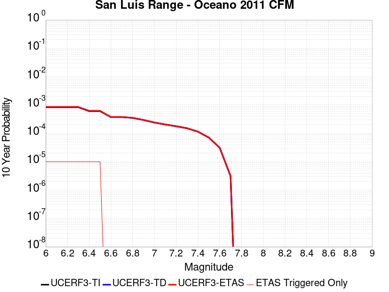 |

| Magnitude | 1 wk TI Prob | 1 wk TD Prob | 1 wk ETAS Prob | 1 wk ETAS/TD Gain | 1 wk ETAS Triggered Only | 1 mo TI Prob | 1 mo TD Prob | 1 mo ETAS Prob | 1 mo ETAS/TD Gain | 1 mo ETAS Triggered Only | 1 yr TI Prob | 1 yr TD Prob | 1 yr ETAS Prob | 1 yr ETAS/TD Gain | 1 yr ETAS Triggered Only | 10 yr TI Prob | 10 yr TD Prob | 10 yr ETAS Prob | 10 yr ETAS/TD Gain | 10 yr ETAS Triggered Only |
|-----|-----|-----|-----|-----|-----|-----|-----|-----|-----|-----|-----|-----|-----|-----|-----|-----|-----|-----|-----|-----|
| 6.0 | 1.6025788E-6 | 1.6201213E-6 | 1.6201213E-6 | 1.0 | 0.0 | 6.8681766E-6 | 6.943361E-6 | 6.943361E-6 | 1.0 | 0.0 | 8.361684E-5 | 8.4532556E-5 | 8.4532556E-5 | 1.0 | 0.0 | 8.3585386E-4 | 8.450448E-4 | 8.5575384E-4 | 1.0126728 | 1.0718114E-5 |
| 6.1 | 1.6025788E-6 | 1.6201213E-6 | 1.6201213E-6 | 1.0 | 0.0 | 6.8681766E-6 | 6.943361E-6 | 6.943361E-6 | 1.0 | 0.0 | 8.361684E-5 | 8.4532556E-5 | 8.4532556E-5 | 1.0 | 0.0 | 8.3585386E-4 | 8.450448E-4 | 8.5575384E-4 | 1.0126728 | 1.0718114E-5 |
| 6.2 | 1.6025788E-6 | 1.6201213E-6 | 1.6201213E-6 | 1.0 | 0.0 | 6.8681766E-6 | 6.943361E-6 | 6.943361E-6 | 1.0 | 0.0 | 8.361684E-5 | 8.4532556E-5 | 8.4532556E-5 | 1.0 | 0.0 | 8.3585386E-4 | 8.450448E-4 | 8.5575384E-4 | 1.0126728 | 1.0718114E-5 |
| 6.3 | 1.6025788E-6 | 1.6201213E-6 | 1.6201213E-6 | 1.0 | 0.0 | 6.8681766E-6 | 6.943361E-6 | 6.943361E-6 | 1.0 | 0.0 | 8.361684E-5 | 8.4532556E-5 | 8.4532556E-5 | 1.0 | 0.0 | 8.3585386E-4 | 8.450448E-4 | 8.5575384E-4 | 1.0126728 | 1.0718114E-5 |
| 6.4 | 1.1621186E-6 | 1.1749911E-6 | 1.1749911E-6 | 1.0 | 0.0 | 4.980499E-6 | 5.035668E-6 | 5.035668E-6 | 1.0 | 0.0 | 6.0635884E-5 | 6.130781E-5 | 6.130781E-5 | 1.0 | 0.0 | 6.0619344E-4 | 6.129355E-4 | 6.2364707E-4 | 1.0174758 | 1.0718114E-5 |
| 6.5 | 1.1621186E-6 | 1.1749911E-6 | 1.1749911E-6 | 1.0 | 0.0 | 4.980499E-6 | 5.035668E-6 | 5.035668E-6 | 1.0 | 0.0 | 6.0635884E-5 | 6.130781E-5 | 6.130781E-5 | 1.0 | 0.0 | 6.0619344E-4 | 6.129355E-4 | 6.2364707E-4 | 1.0174758 | 1.0718114E-5 |
| 6.6 | 7.164729E-7 | 7.248589E-7 | 7.248589E-7 | 1.0 | 0.0 | 3.0705946E-6 | 3.1065347E-6 | 3.1065347E-6 | 1.0 | 0.0 | 3.738385E-5 | 3.782142E-5 | 3.782142E-5 | 1.0 | 0.0 | 3.737756E-4 | 3.7815163E-4 | 3.7815163E-4 | 1.0 | 0.0 |
| 6.7 | 7.164729E-7 | 7.248589E-7 | 7.248589E-7 | 1.0 | 0.0 | 3.0705946E-6 | 3.1065347E-6 | 3.1065347E-6 | 1.0 | 0.0 | 3.738385E-5 | 3.782142E-5 | 3.782142E-5 | 1.0 | 0.0 | 3.737756E-4 | 3.7815163E-4 | 3.7815163E-4 | 1.0 | 0.0 |
| 6.8 | 6.700177E-7 | 6.77745E-7 | 6.77745E-7 | 1.0 | 0.0 | 2.8715012E-6 | 2.9046184E-6 | 2.9046184E-6 | 1.0 | 0.0 | 3.495997E-5 | 3.536317E-5 | 3.536317E-5 | 1.0 | 0.0 | 3.495447E-4 | 3.5357708E-4 | 3.5357708E-4 | 1.0 | 0.0 |
| 6.9 | 5.657865E-7 | 5.721795E-7 | 5.721795E-7 | 1.0 | 0.0 | 2.424797E-6 | 2.4521955E-6 | 2.4521955E-6 | 1.0 | 0.0 | 2.9521503E-5 | 2.9855084E-5 | 2.9855084E-5 | 1.0 | 0.0 | 2.9517582E-4 | 2.985118E-4 | 2.985118E-4 | 1.0 | 0.0 |
| 7.0 | 4.608413E-7 | 4.6601758E-7 | 4.6601758E-7 | 1.0 | 0.0 | 1.9750328E-6 | 1.9972167E-6 | 1.9972167E-6 | 1.0 | 0.0 | 2.4045758E-5 | 2.4315847E-5 | 2.4315847E-5 | 1.0 | 0.0 | 2.4043156E-4 | 2.4313215E-4 | 2.4313215E-4 | 1.0 | 0.0 |
| 7.1 | 3.9177846E-7 | 3.9621662E-7 | 3.9621662E-7 | 1.0 | 0.0 | 1.6790494E-6 | 1.6980702E-6 | 1.6980702E-6 | 1.0 | 0.0 | 2.0442236E-5 | 2.067381E-5 | 2.067381E-5 | 1.0 | 0.0 | 2.0440355E-4 | 2.06719E-4 | 2.06719E-4 | 1.0 | 0.0 |
| 7.2 | 3.3974752E-7 | 3.4366582E-7 | 3.4366582E-7 | 1.0 | 0.0 | 1.45606E-6 | 1.4728527E-6 | 1.4728527E-6 | 1.0 | 0.0 | 1.7727387E-5 | 1.7931836E-5 | 1.7931836E-5 | 1.0 | 0.0 | 1.7725973E-4 | 1.79304E-4 | 1.79304E-4 | 1.0 | 0.0 |
| 7.3 | 2.8900928E-7 | 2.9234062E-7 | 2.9234062E-7 | 1.0 | 0.0 | 1.2386106E-6 | 1.2528878E-6 | 1.2528878E-6 | 1.0 | 0.0 | 1.5079979E-5 | 1.5253803E-5 | 1.5253803E-5 | 1.0 | 0.0 | 1.5078956E-4 | 1.5252765E-4 | 1.5252765E-4 | 1.0 | 0.0 |
| 7.4 | 2.1881527E-7 | 2.2139628E-7 | 2.2139628E-7 | 1.0 | 0.0 | 9.3777936E-7 | 9.4884086E-7 | 9.4884086E-7 | 1.0 | 0.0 | 1.14174045E-5 | 1.1552077E-5 | 1.1552077E-5 | 1.0 | 0.0 | 1.1416818E-4 | 1.1551482E-4 | 1.1551482E-4 | 1.0 | 0.0 |
| 7.5 | 1.356398E-7 | 1.371866E-7 | 1.371866E-7 | 1.0 | 0.0 | 5.813133E-7 | 5.8794245E-7 | 5.8794245E-7 | 1.0 | 0.0 | 7.0774663E-6 | 7.158176E-6 | 7.158176E-6 | 1.0 | 0.0 | 7.077241E-5 | 7.157948E-5 | 7.157948E-5 | 1.0 | 0.0 |
| 7.6 | 5.9269272E-8 | 6.001375E-8 | 6.001375E-8 | 1.0 | 0.0 | 2.5401116E-7 | 2.5720172E-7 | 2.5720172E-7 | 1.0 | 0.0 | 3.0925814E-6 | 3.1314266E-6 | 3.1314266E-6 | 1.0 | 0.0 | 3.0925385E-5 | 3.1313837E-5 | 3.1313837E-5 | 1.0 | 0.0 |
| 7.7 | 5.946232E-9 | 6.0369403E-9 | 6.0369403E-9 | 1.0 | 0.0 | 2.5483851E-8 | 2.58726E-8 | 2.58726E-8 | 1.0 | 0.0 | 3.1026585E-7 | 3.1499889E-7 | 3.1499889E-7 | 1.0 | 0.0 | 3.102654E-6 | 3.149985E-6 | 3.149985E-6 | 1.0 | 0.0 |

## Monterey Bay-Tularcitos
*[(top)](#table-of-contents)*

| 1 Week | 1 Month | 1 Year | 10 Year |
|-----|-----|-----|-----|
|  | 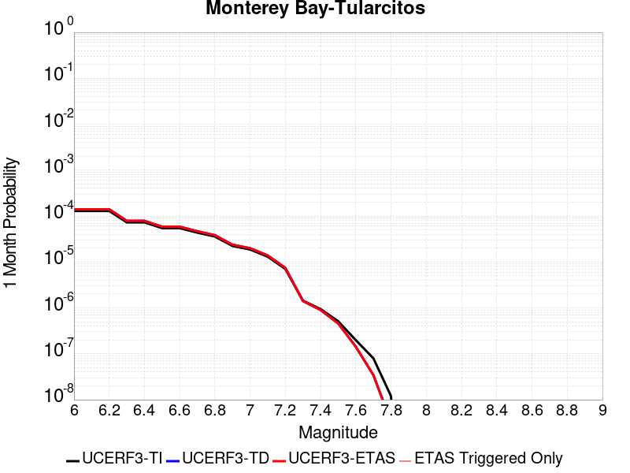 |  |  |

| Magnitude | 1 wk TI Prob | 1 wk TD Prob | 1 wk ETAS Prob | 1 wk ETAS/TD Gain | 1 wk ETAS Triggered Only | 1 mo TI Prob | 1 mo TD Prob | 1 mo ETAS Prob | 1 mo ETAS/TD Gain | 1 mo ETAS Triggered Only | 1 yr TI Prob | 1 yr TD Prob | 1 yr ETAS Prob | 1 yr ETAS/TD Gain | 1 yr ETAS Triggered Only | 10 yr TI Prob | 10 yr TD Prob | 10 yr ETAS Prob | 10 yr ETAS/TD Gain | 10 yr ETAS Triggered Only |
|-----|-----|-----|-----|-----|-----|-----|-----|-----|-----|-----|-----|-----|-----|-----|-----|-----|-----|-----|-----|-----|
| 6.0 | 3.0131365E-5 | 3.2799162E-5 | 3.2799162E-5 | 1.0 | 0.0 | 1.2912804E-4 | 1.4056086E-4 | 1.4056086E-4 | 1.0 | 0.0 | 0.001571 | 0.0017100906 | 0.0017100906 | 1.0 | 0.0 | 0.015599402 | 0.016980117 | 0.016990654 | 1.0006205 | 1.0718114E-5 |
| 6.1 | 3.0131365E-5 | 3.2799162E-5 | 3.2799162E-5 | 1.0 | 0.0 | 1.2912804E-4 | 1.4056086E-4 | 1.4056086E-4 | 1.0 | 0.0 | 0.001571 | 0.0017100906 | 0.0017100906 | 1.0 | 0.0 | 0.015599402 | 0.016980117 | 0.016990654 | 1.0006205 | 1.0718114E-5 |
| 6.2 | 3.0131365E-5 | 3.2799162E-5 | 3.2799162E-5 | 1.0 | 0.0 | 1.2912804E-4 | 1.4056086E-4 | 1.4056086E-4 | 1.0 | 0.0 | 0.001571 | 0.0017100906 | 0.0017100906 | 1.0 | 0.0 | 0.015599402 | 0.016980117 | 0.016990654 | 1.0006205 | 1.0718114E-5 |
| 6.3 | 1.6998249E-5 | 1.8330993E-5 | 1.8330993E-5 | 1.0 | 0.0 | 7.28476E-5 | 7.855914E-5 | 7.855914E-5 | 1.0 | 0.0 | 8.865586E-4 | 9.560565E-4 | 9.560565E-4 | 1.0 | 0.0 | 0.0088303005 | 0.00952136 | 0.009531975 | 1.001115 | 1.0718114E-5 |
| 6.4 | 1.6998249E-5 | 1.8330993E-5 | 1.8330993E-5 | 1.0 | 0.0 | 7.28476E-5 | 7.855914E-5 | 7.855914E-5 | 1.0 | 0.0 | 8.865586E-4 | 9.560565E-4 | 9.560565E-4 | 1.0 | 0.0 | 0.0088303005 | 0.00952136 | 0.009531975 | 1.001115 | 1.0718114E-5 |
| 6.5 | 1.27470785E-5 | 1.3693452E-5 | 1.3693452E-5 | 1.0 | 0.0 | 5.4629192E-5 | 5.868496E-5 | 5.868496E-5 | 1.0 | 0.0 | 6.649074E-4 | 7.142655E-4 | 7.142655E-4 | 1.0 | 0.0 | 0.0066292146 | 0.007120751 | 0.0071313926 | 1.0014945 | 1.0718114E-5 |
| 6.6 | 1.2739422E-5 | 1.3685539E-5 | 1.3685539E-5 | 1.0 | 0.0 | 5.4596385E-5 | 5.865105E-5 | 5.865105E-5 | 1.0 | 0.0 | 6.645082E-4 | 7.1385293E-4 | 7.1385293E-4 | 1.0 | 0.0 | 0.0066252467 | 0.007116651 | 0.007127293 | 1.0014954 | 1.0718114E-5 |
| 6.7 | 1.0160109E-5 | 1.0885862E-5 | 1.0885862E-5 | 1.0 | 0.0 | 4.35426E-5 | 4.66529E-5 | 4.66529E-5 | 1.0 | 0.0 | 5.300022E-4 | 5.678581E-4 | 5.678581E-4 | 1.0 | 0.0 | 0.005287399 | 0.005664782 | 0.0056754393 | 1.0018814 | 1.0718114E-5 |
| 6.8 | 8.349859E-6 | 8.932674E-6 | 8.932674E-6 | 1.0 | 0.0 | 3.578462E-5 | 3.828236E-5 | 3.828236E-5 | 1.0 | 0.0 | 4.3559066E-4 | 4.659937E-4 | 4.659937E-4 | 1.0 | 0.0 | 0.004347378 | 0.0046507306 | 0.004661399 | 1.002294 | 1.0718114E-5 |
| 6.9 | 5.193639E-6 | 5.536483E-6 | 5.536483E-6 | 1.0 | 0.0 | 2.2258262E-5 | 2.3727587E-5 | 2.3727587E-5 | 1.0 | 0.0 | 2.7096065E-4 | 2.8884833E-4 | 2.8884833E-4 | 1.0 | 0.0 | 0.0027063051 | 0.00288505 | 0.002895737 | 1.0037043 | 1.0718114E-5 |
| 7.0 | 4.359381E-6 | 4.6434106E-6 | 4.6434106E-6 | 1.0 | 0.0 | 1.8682927E-5 | 1.9900195E-5 | 1.9900195E-5 | 1.0 | 0.0 | 2.274409E-4 | 2.4226093E-4 | 2.4226093E-4 | 1.0 | 0.0 | 0.0022720827 | 0.0024202613 | 0.0024309533 | 1.0044178 | 1.0718114E-5 |
| 7.1 | 3.0398533E-6 | 3.231074E-6 | 3.231074E-6 | 1.0 | 0.0 | 1.3027877E-5 | 1.38474015E-5 | 1.38474015E-5 | 1.0 | 0.0 | 1.5860285E-4 | 1.685817E-4 | 1.685817E-4 | 1.0 | 0.0 | 0.001584897 | 0.0016847957 | 0.0016847957 | 1.0 | 0.0 |
| 7.2 | 1.642335E-6 | 1.7333325E-6 | 1.7333325E-6 | 1.0 | 0.0 | 7.0385595E-6 | 7.4285585E-6 | 7.4285585E-6 | 1.0 | 0.0 | 8.569109E-5 | 9.044101E-5 | 9.044101E-5 | 1.0 | 0.0 | 8.5658056E-4 | 9.042448E-4 | 9.042448E-4 | 1.0 | 0.0 |
| 7.3 | 3.356842E-7 | 3.295272E-7 | 3.295272E-7 | 1.0 | 0.0 | 1.4386458E-6 | 1.4122586E-6 | 1.4122586E-6 | 1.0 | 0.0 | 1.7515373E-5 | 1.7194114E-5 | 1.7194114E-5 | 1.0 | 0.0 | 1.7513991E-4 | 1.7192794E-4 | 1.7192794E-4 | 1.0 | 0.0 |
| 7.4 | 2.1973483E-7 | 2.1006697E-7 | 2.1006697E-7 | 1.0 | 0.0 | 9.417204E-7 | 9.002867E-7 | 9.002867E-7 | 1.0 | 0.0 | 1.1465385E-5 | 1.09609355E-5 | 1.09609355E-5 | 1.0 | 0.0 | 1.1464794E-4 | 1.09603985E-4 | 1.09603985E-4 | 1.0 | 0.0 |
| 7.5 | 1.1944135E-7 | 1.0696283E-7 | 1.0696283E-7 | 1.0 | 0.0 | 5.118914E-7 | 4.5841205E-7 | 4.5841205E-7 | 1.0 | 0.0 | 6.23226E-6 | 5.5811524E-6 | 5.5811524E-6 | 1.0 | 0.0 | 6.2320854E-5 | 5.5810135E-5 | 5.5810135E-5 | 1.0 | 0.0 |
| 7.6 | 4.636058E-8 | 3.3366945E-8 | 3.3366945E-8 | 1.0 | 0.0 | 1.9868818E-7 | 1.4300119E-7 | 1.4300119E-7 | 1.0 | 0.0 | 2.419026E-6 | 1.7410381E-6 | 1.7410381E-6 | 1.0 | 0.0 | 2.4189996E-5 | 1.7410246E-5 | 1.7410246E-5 | 1.0 | 0.0 |
| 7.7 | 1.8588572E-8 | 8.005146E-9 | 8.005146E-9 | 1.0 | 0.0 | 7.9665305E-8 | 3.4307767E-8 | 3.4307767E-8 | 1.0 | 0.0 | 9.699246E-7 | 4.1769698E-7 | 4.1769698E-7 | 1.0 | 0.0 | 9.699204E-6 | 4.176962E-6 | 4.176962E-6 | 1.0 | 0.0 |
| 7.8 | 2.7960154E-9 | 7.612305E-10 | 7.612305E-10 | 1.0 | 0.0 | 1.1982923E-8 | 3.2624166E-9 | 3.2624166E-9 | 1.0 | 0.0 | 1.4589209E-7 | 3.971992E-8 | 3.971992E-8 | 1.0 | 0.0 | 1.4589199E-6 | 3.9719916E-7 | 3.9719916E-7 | 1.0 | 0.0 |

## Emerson-Copper Mtn 2011
*[(top)](#table-of-contents)*

| 1 Week | 1 Month | 1 Year | 10 Year |
|-----|-----|-----|-----|
|  |  |  |  |

| Magnitude | 1 wk TI Prob | 1 wk TD Prob | 1 wk ETAS Prob | 1 wk ETAS/TD Gain | 1 wk ETAS Triggered Only | 1 mo TI Prob | 1 mo TD Prob | 1 mo ETAS Prob | 1 mo ETAS/TD Gain | 1 mo ETAS Triggered Only | 1 yr TI Prob | 1 yr TD Prob | 1 yr ETAS Prob | 1 yr ETAS/TD Gain | 1 yr ETAS Triggered Only | 10 yr TI Prob | 10 yr TD Prob | 10 yr ETAS Prob | 10 yr ETAS/TD Gain | 10 yr ETAS Triggered Only |
|-----|-----|-----|-----|-----|-----|-----|-----|-----|-----|-----|-----|-----|-----|-----|-----|-----|-----|-----|-----|-----|
| 6.0 | 2.1364202E-5 | 9.968277E-6 | 9.968277E-6 | 1.0 | 0.0 | 9.1557646E-5 | 4.2720538E-5 | 4.2720538E-5 | 1.0 | 0.0 | 0.0011141442 | 5.200071E-4 | 5.200071E-4 | 1.0 | 0.0 | 0.011085749 | 0.005188773 | 0.0051994356 | 1.0020549 | 1.0718114E-5 |
| 6.1 | 2.1364202E-5 | 9.968277E-6 | 9.968277E-6 | 1.0 | 0.0 | 9.1557646E-5 | 4.2720538E-5 | 4.2720538E-5 | 1.0 | 0.0 | 0.0011141442 | 5.200071E-4 | 5.200071E-4 | 1.0 | 0.0 | 0.011085749 | 0.005188773 | 0.0051994356 | 1.0020549 | 1.0718114E-5 |
| 6.2 | 2.1364202E-5 | 9.968277E-6 | 9.968277E-6 | 1.0 | 0.0 | 9.1557646E-5 | 4.2720538E-5 | 4.2720538E-5 | 1.0 | 0.0 | 0.0011141442 | 5.200071E-4 | 5.200071E-4 | 1.0 | 0.0 | 0.011085749 | 0.005188773 | 0.0051994356 | 1.0020549 | 1.0718114E-5 |
| 6.3 | 1.7751237E-5 | 8.089365E-6 | 8.089365E-6 | 1.0 | 0.0 | 7.607452E-5 | 3.4668283E-5 | 3.4668283E-5 | 1.0 | 0.0 | 9.258136E-4 | 4.2201087E-4 | 4.2201087E-4 | 1.0 | 0.0 | 0.00921966 | 0.0042127175 | 0.0042233905 | 1.0025336 | 1.0718114E-5 |
| 6.4 | 1.7751237E-5 | 8.089365E-6 | 8.089365E-6 | 1.0 | 0.0 | 7.607452E-5 | 3.4668283E-5 | 3.4668283E-5 | 1.0 | 0.0 | 9.258136E-4 | 4.2201087E-4 | 4.2201087E-4 | 1.0 | 0.0 | 0.00921966 | 0.0042127175 | 0.0042233905 | 1.0025336 | 1.0718114E-5 |
| 6.5 | 1.5886664E-5 | 6.6039356E-6 | 6.6039356E-6 | 1.0 | 0.0 | 6.808392E-5 | 2.83023E-5 | 2.83023E-5 | 1.0 | 0.0 | 8.286065E-4 | 3.445307E-4 | 3.445307E-4 | 1.0 | 0.0 | 0.008255237 | 0.00344043 | 0.0034511113 | 1.0031046 | 1.0718114E-5 |
| 6.6 | 1.5886664E-5 | 6.6039356E-6 | 6.6039356E-6 | 1.0 | 0.0 | 6.808392E-5 | 2.83023E-5 | 2.83023E-5 | 1.0 | 0.0 | 8.286065E-4 | 3.445307E-4 | 3.445307E-4 | 1.0 | 0.0 | 0.008255237 | 0.00344043 | 0.0034511113 | 1.0031046 | 1.0718114E-5 |
| 6.7 | 1.428471E-5 | 5.470503E-6 | 5.470503E-6 | 1.0 | 0.0 | 6.121875E-5 | 2.3444823E-5 | 2.3444823E-5 | 1.0 | 0.0 | 7.450834E-4 | 2.8540727E-4 | 2.8540727E-4 | 1.0 | 0.0 | 0.007425902 | 0.0028507954 | 0.002861483 | 1.003749 | 1.0718114E-5 |
| 6.8 | 1.3490684E-5 | 5.073793E-6 | 5.073793E-6 | 1.0 | 0.0 | 5.7815934E-5 | 2.1744667E-5 | 2.1744667E-5 | 1.0 | 0.0 | 7.0368167E-4 | 2.6471302E-4 | 2.6471302E-4 | 1.0 | 0.0 | 0.007014576 | 0.002644358 | 0.0026550477 | 1.0040425 | 1.0718114E-5 |
| 6.9 | 1.2235421E-5 | 4.2897627E-6 | 4.2897627E-6 | 1.0 | 0.0 | 5.2436466E-5 | 1.8384588E-5 | 1.8384588E-5 | 1.0 | 0.0 | 6.38227E-4 | 2.2381297E-4 | 2.2381297E-4 | 1.0 | 0.0 | 0.0063639707 | 0.00223623 | 0.0022469242 | 1.0047822 | 1.0718114E-5 |
| 7.0 | 1.1009851E-5 | 3.7190669E-6 | 3.7190669E-6 | 1.0 | 0.0 | 4.7184225E-5 | 1.593878E-5 | 1.593878E-5 | 1.0 | 0.0 | 5.743165E-4 | 1.9404081E-4 | 1.9404081E-4 | 1.0 | 0.0 | 0.005728345 | 0.0019390517 | 0.001949749 | 1.0055168 | 1.0718114E-5 |
| 7.1 | 9.726373E-6 | 3.2118642E-6 | 3.2118642E-6 | 1.0 | 0.0 | 4.168379E-5 | 1.3765079E-5 | 1.3765079E-5 | 1.0 | 0.0 | 5.07382E-4 | 1.6758032E-4 | 1.6758032E-4 | 1.0 | 0.0 | 0.0050622504 | 0.0016748707 | 0.0016855709 | 1.0063887 | 1.0718114E-5 |
| 7.2 | 3.9335127E-6 | 1.1525033E-6 | 1.1525033E-6 | 1.0 | 0.0 | 1.6857803E-5 | 4.9392906E-6 | 4.9392906E-6 | 1.0 | 0.0 | 2.0522442E-4 | 6.0134265E-5 | 6.0134265E-5 | 1.0 | 0.0 | 0.00205035 | 6.011859E-4 | 6.1189756E-4 | 1.0178176 | 1.0718114E-5 |
| 7.3 | 2.661632E-6 | 6.9116606E-7 | 6.9116606E-7 | 1.0 | 0.0 | 1.14069435E-5 | 2.962137E-6 | 2.962137E-6 | 1.0 | 0.0 | 1.3887069E-4 | 3.6063433E-5 | 3.6063433E-5 | 1.0 | 0.0 | 0.0013878393 | 3.6057684E-4 | 3.7129107E-4 | 1.0297142 | 1.0718114E-5 |
| 7.4 | 2.0893426E-6 | 5.461961E-7 | 5.461961E-7 | 1.0 | 0.0 | 8.954295E-6 | 2.3408381E-6 | 2.3408381E-6 | 1.0 | 0.0 | 1.0901308E-4 | 2.8499337E-5 | 2.8499337E-5 | 1.0 | 0.0 | 0.0010895962 | 2.8495738E-4 | 2.8495738E-4 | 1.0 | 0.0 |
| 7.5 | 1.1681728E-6 | 3.6031287E-7 | 3.6031287E-7 | 1.0 | 0.0 | 5.0064455E-6 | 1.5441972E-6 | 1.5441972E-6 | 1.0 | 0.0 | 6.0951766E-5 | 1.8800443E-5 | 1.8800443E-5 | 1.0 | 0.0 | 6.093505E-4 | 1.8798899E-4 | 1.8798899E-4 | 1.0 | 0.0 |
| 7.6 | 1.3154387E-7 | 7.1198265E-8 | 7.1198265E-8 | 1.0 | 0.0 | 5.6375933E-7 | 3.051354E-7 | 3.051354E-7 | 1.0 | 0.0 | 6.863748E-6 | 3.7150185E-6 | 3.7150185E-6 | 1.0 | 0.0 | 6.863536E-5 | 3.7149723E-5 | 3.7149723E-5 | 1.0 | 0.0 |

## Cucamonga
*[(top)](#table-of-contents)*

| 1 Week | 1 Month | 1 Year | 10 Year |
|-----|-----|-----|-----|
|  | 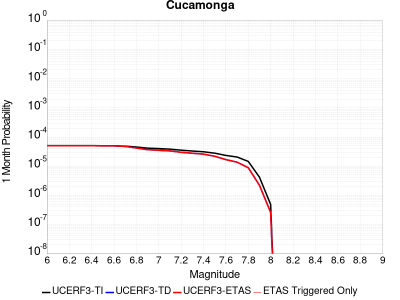 |  |  |

| Magnitude | 1 wk TI Prob | 1 wk TD Prob | 1 wk ETAS Prob | 1 wk ETAS/TD Gain | 1 wk ETAS Triggered Only | 1 mo TI Prob | 1 mo TD Prob | 1 mo ETAS Prob | 1 mo ETAS/TD Gain | 1 mo ETAS Triggered Only | 1 yr TI Prob | 1 yr TD Prob | 1 yr ETAS Prob | 1 yr ETAS/TD Gain | 1 yr ETAS Triggered Only | 10 yr TI Prob | 10 yr TD Prob | 10 yr ETAS Prob | 10 yr ETAS/TD Gain | 10 yr ETAS Triggered Only |
|-----|-----|-----|-----|-----|-----|-----|-----|-----|-----|-----|-----|-----|-----|-----|-----|-----|-----|-----|-----|-----|
| 6.0 | 1.1848348E-5 | 1.1737756E-5 | 1.1737756E-5 | 1.0 | 0.0 | 5.0777642E-5 | 5.0303715E-5 | 5.0303715E-5 | 1.0 | 0.0 | 6.180424E-4 | 6.122783E-4 | 6.122783E-4 | 1.0 | 0.0 | 0.0061632637 | 0.0061070886 | 0.006117741 | 1.0017443 | 1.0718114E-5 |
| 6.1 | 1.1848348E-5 | 1.1737756E-5 | 1.1737756E-5 | 1.0 | 0.0 | 5.0777642E-5 | 5.0303715E-5 | 5.0303715E-5 | 1.0 | 0.0 | 6.180424E-4 | 6.122783E-4 | 6.122783E-4 | 1.0 | 0.0 | 0.0061632637 | 0.0061070886 | 0.006117741 | 1.0017443 | 1.0718114E-5 |
| 6.2 | 1.1848348E-5 | 1.1737756E-5 | 1.1737756E-5 | 1.0 | 0.0 | 5.0777642E-5 | 5.0303715E-5 | 5.0303715E-5 | 1.0 | 0.0 | 6.180424E-4 | 6.122783E-4 | 6.122783E-4 | 1.0 | 0.0 | 0.0061632637 | 0.0061070886 | 0.006117741 | 1.0017443 | 1.0718114E-5 |
| 6.3 | 1.1848348E-5 | 1.1737756E-5 | 1.1737756E-5 | 1.0 | 0.0 | 5.0777642E-5 | 5.0303715E-5 | 5.0303715E-5 | 1.0 | 0.0 | 6.180424E-4 | 6.122783E-4 | 6.122783E-4 | 1.0 | 0.0 | 0.0061632637 | 0.0061070886 | 0.006117741 | 1.0017443 | 1.0718114E-5 |
| 6.4 | 1.1848348E-5 | 1.1737756E-5 | 1.1737756E-5 | 1.0 | 0.0 | 5.0777642E-5 | 5.0303715E-5 | 5.0303715E-5 | 1.0 | 0.0 | 6.180424E-4 | 6.122783E-4 | 6.122783E-4 | 1.0 | 0.0 | 0.0061632637 | 0.0061070886 | 0.006117741 | 1.0017443 | 1.0718114E-5 |
| 6.5 | 1.16988695E-5 | 1.1576785E-5 | 1.1576785E-5 | 1.0 | 0.0 | 5.013705E-5 | 4.9613864E-5 | 4.9613864E-5 | 1.0 | 0.0 | 6.102476E-4 | 6.0388405E-4 | 6.0388405E-4 | 1.0 | 0.0 | 0.006085745 | 0.006023602 | 0.0060342555 | 1.0017686 | 1.0718114E-5 |
| 6.6 | 1.16988695E-5 | 1.1576785E-5 | 1.1576785E-5 | 1.0 | 0.0 | 5.013705E-5 | 4.9613864E-5 | 4.9613864E-5 | 1.0 | 0.0 | 6.102476E-4 | 6.0388405E-4 | 6.0388405E-4 | 1.0 | 0.0 | 0.006085745 | 0.006023602 | 0.0060342555 | 1.0017686 | 1.0718114E-5 |
| 6.7 | 1.1397107E-5 | 1.1115677E-5 | 1.1115677E-5 | 1.0 | 0.0 | 4.884383E-5 | 4.7637757E-5 | 4.7637757E-5 | 1.0 | 0.0 | 5.9451134E-4 | 5.798378E-4 | 5.798378E-4 | 1.0 | 0.0 | 0.005929234 | 0.0057844 | 0.005795056 | 1.0018423 | 1.0718114E-5 |
| 6.8 | 1.058387E-5 | 9.785641E-6 | 9.785641E-6 | 1.0 | 0.0 | 4.5358654E-5 | 4.1937794E-5 | 4.1937794E-5 | 1.0 | 0.0 | 5.521017E-4 | 5.1047414E-4 | 5.1047414E-4 | 1.0 | 0.0 | 0.00550732 | 0.0050940234 | 0.0050940234 | 1.0 | 0.0 |
| 6.9 | 9.690046E-6 | 8.5800775E-6 | 8.5800775E-6 | 1.0 | 0.0 | 4.1528107E-5 | 3.6771246E-5 | 3.6771246E-5 | 1.0 | 0.0 | 5.054874E-4 | 4.4759834E-4 | 4.4759834E-4 | 1.0 | 0.0 | 0.005043391 | 0.004467903 | 0.004467903 | 1.0 | 0.0 |
| 7.0 | 9.381461E-6 | 8.187685E-6 | 8.187685E-6 | 1.0 | 0.0 | 4.020564E-5 | 3.5089608E-5 | 3.5089608E-5 | 1.0 | 0.0 | 4.893937E-4 | 4.271326E-4 | 4.271326E-4 | 1.0 | 0.0 | 0.0048831734 | 0.0042640497 | 0.0042640497 | 1.0 | 0.0 |
| 7.1 | 8.946492E-6 | 7.78246E-6 | 7.78246E-6 | 1.0 | 0.0 | 3.8341543E-5 | 3.335297E-5 | 3.335297E-5 | 1.0 | 0.0 | 4.667083E-4 | 4.059971E-4 | 4.059971E-4 | 1.0 | 0.0 | 0.0046572937 | 0.0040534893 | 0.0040534893 | 1.0 | 0.0 |
| 7.2 | 8.251016E-6 | 6.9758194E-6 | 6.9758194E-6 | 1.0 | 0.0 | 3.5361016E-5 | 2.9896028E-5 | 2.9896028E-5 | 1.0 | 0.0 | 4.3043532E-4 | 3.6392358E-4 | 3.6392358E-4 | 1.0 | 0.0 | 0.0042960253 | 0.0036342086 | 0.0036342086 | 1.0 | 0.0 |
| 7.3 | 7.717881E-6 | 6.486875E-6 | 6.486875E-6 | 1.0 | 0.0 | 3.3076216E-5 | 2.7800597E-5 | 2.7800597E-5 | 1.0 | 0.0 | 4.026285E-4 | 3.3841992E-4 | 3.3841992E-4 | 1.0 | 0.0 | 0.004018998 | 0.0033799817 | 0.0033799817 | 1.0 | 0.0 |
| 7.4 | 7.275623E-6 | 6.0325037E-6 | 6.0325037E-6 | 1.0 | 0.0 | 3.118087E-5 | 2.5853333E-5 | 2.5853333E-5 | 1.0 | 0.0 | 3.7956095E-4 | 3.1471907E-4 | 3.1471907E-4 | 1.0 | 0.0 | 0.0037891332 | 0.0031436686 | 0.0031436686 | 1.0 | 0.0 |
| 7.5 | 6.5109502E-6 | 5.101059E-6 | 5.101059E-6 | 1.0 | 0.0 | 2.7903774E-5 | 2.1861499E-5 | 2.1861499E-5 | 1.0 | 0.0 | 3.3967546E-4 | 2.661314E-4 | 2.661314E-4 | 1.0 | 0.0 | 0.0033915674 | 0.00265905 | 0.00265905 | 1.0 | 0.0 |
| 7.6 | 5.4495326E-6 | 3.9089846E-6 | 3.9089846E-6 | 1.0 | 0.0 | 2.335493E-5 | 1.6752683E-5 | 1.6752683E-5 | 1.0 | 0.0 | 2.8430918E-4 | 2.0394489E-4 | 2.0394489E-4 | 1.0 | 0.0 | 0.0028394572 | 0.0020384968 | 0.0020384968 | 1.0 | 0.0 |
| 7.7 | 4.7997164E-6 | 3.2006355E-6 | 3.2006355E-6 | 1.0 | 0.0 | 2.057005E-5 | 1.3716938E-5 | 1.3716938E-5 | 1.0 | 0.0 | 2.504116E-4 | 1.6699095E-4 | 1.6699095E-4 | 1.0 | 0.0 | 0.002501296 | 0.001669585 | 0.001669585 | 1.0 | 0.0 |
| 7.8 | 3.3941733E-6 | 2.0644336E-6 | 2.0644336E-6 | 1.0 | 0.0 | 1.4546376E-5 | 8.847543E-6 | 8.847543E-6 | 1.0 | 0.0 | 1.7708774E-4 | 1.07713524E-4 | 1.07713524E-4 | 1.0 | 0.0 | 0.0017694668 | 0.0010768501 | 0.0010768501 | 1.0 | 0.0 |
| 7.9 | 9.750552E-7 | 5.1567173E-7 | 5.1567173E-7 | 1.0 | 0.0 | 4.178801E-6 | 2.2100198E-6 | 2.2100198E-6 | 1.0 | 0.0 | 5.0875715E-5 | 2.6906664E-5 | 2.6906664E-5 | 1.0 | 0.0 | 5.086407E-4 | 2.6903447E-4 | 2.6903447E-4 | 1.0 | 0.0 |
| 8.0 | 1.133857E-7 | 6.0540515E-8 | 6.0540515E-8 | 1.0 | 0.0 | 4.8593864E-7 | 2.5945934E-7 | 2.5945934E-7 | 1.0 | 0.0 | 5.9162867E-6 | 3.158913E-6 | 3.158913E-6 | 1.0 | 0.0 | 5.916129E-5 | 3.1588697E-5 | 3.1588697E-5 | 1.0 | 0.0 |

## North Salt Lake
*[(top)](#table-of-contents)*

| 1 Week | 1 Month | 1 Year | 10 Year |
|-----|-----|-----|-----|
|  |  |  |  |

| Magnitude | 1 wk TI Prob | 1 wk TD Prob | 1 wk ETAS Prob | 1 wk ETAS/TD Gain | 1 wk ETAS Triggered Only | 1 mo TI Prob | 1 mo TD Prob | 1 mo ETAS Prob | 1 mo ETAS/TD Gain | 1 mo ETAS Triggered Only | 1 yr TI Prob | 1 yr TD Prob | 1 yr ETAS Prob | 1 yr ETAS/TD Gain | 1 yr ETAS Triggered Only | 10 yr TI Prob | 10 yr TD Prob | 10 yr ETAS Prob | 10 yr ETAS/TD Gain | 10 yr ETAS Triggered Only |
|-----|-----|-----|-----|-----|-----|-----|-----|-----|-----|-----|-----|-----|-----|-----|-----|-----|-----|-----|-----|-----|
| 6.0 | 1.849599E-6 | 1.9555857E-6 | 1.9555857E-6 | 1.0 | 0.0 | 7.926829E-6 | 8.381066E-6 | 8.381066E-6 | 1.0 | 0.0 | 9.650487E-5 | 1.0203672E-4 | 1.1275374E-4 | 1.105031 | 1.0718114E-5 | 9.646297E-4 | 0.0010200966 | 0.0010308038 | 1.0104963 | 1.0718114E-5 |
| 6.1 | 1.849599E-6 | 1.9555857E-6 | 1.9555857E-6 | 1.0 | 0.0 | 7.926829E-6 | 8.381066E-6 | 8.381066E-6 | 1.0 | 0.0 | 9.650487E-5 | 1.0203672E-4 | 1.1275374E-4 | 1.105031 | 1.0718114E-5 | 9.646297E-4 | 0.0010200966 | 0.0010308038 | 1.0104963 | 1.0718114E-5 |
| 6.2 | 1.849599E-6 | 1.9555857E-6 | 1.9555857E-6 | 1.0 | 0.0 | 7.926829E-6 | 8.381066E-6 | 8.381066E-6 | 1.0 | 0.0 | 9.650487E-5 | 1.0203672E-4 | 1.1275374E-4 | 1.105031 | 1.0718114E-5 | 9.646297E-4 | 0.0010200966 | 0.0010308038 | 1.0104963 | 1.0718114E-5 |
| 6.3 | 1.849599E-6 | 1.9555857E-6 | 1.9555857E-6 | 1.0 | 0.0 | 7.926829E-6 | 8.381066E-6 | 8.381066E-6 | 1.0 | 0.0 | 9.650487E-5 | 1.0203672E-4 | 1.1275374E-4 | 1.105031 | 1.0718114E-5 | 9.646297E-4 | 0.0010200966 | 0.0010308038 | 1.0104963 | 1.0718114E-5 |
| 6.4 | 1.7803909E-6 | 1.8860856E-6 | 1.8860856E-6 | 1.0 | 0.0 | 7.630225E-6 | 8.083211E-6 | 8.083211E-6 | 1.0 | 0.0 | 9.289402E-5 | 9.841065E-5 | 1.0912771E-4 | 1.1089014 | 1.0718114E-5 | 9.28552E-4 | 9.838679E-4 | 9.945756E-4 | 1.0108831 | 1.0718114E-5 |
| 6.5 | 5.9157696E-7 | 6.300238E-7 | 6.300238E-7 | 1.0 | 0.0 | 2.5353274E-6 | 2.7000995E-6 | 2.7000995E-6 | 1.0 | 0.0 | 3.0867173E-5 | 3.2873257E-5 | 3.2873257E-5 | 1.0 | 0.0 | 3.0862886E-4 | 3.2868786E-4 | 3.2868786E-4 | 1.0 | 0.0 |
| 6.6 | 5.9157696E-7 | 6.300238E-7 | 6.300238E-7 | 1.0 | 0.0 | 2.5353274E-6 | 2.7000995E-6 | 2.7000995E-6 | 1.0 | 0.0 | 3.0867173E-5 | 3.2873257E-5 | 3.2873257E-5 | 1.0 | 0.0 | 3.0862886E-4 | 3.2868786E-4 | 3.2868786E-4 | 1.0 | 0.0 |
| 6.7 | 5.9157696E-7 | 6.300238E-7 | 6.300238E-7 | 1.0 | 0.0 | 2.5353274E-6 | 2.7000995E-6 | 2.7000995E-6 | 1.0 | 0.0 | 3.0867173E-5 | 3.2873257E-5 | 3.2873257E-5 | 1.0 | 0.0 | 3.0862886E-4 | 3.2868786E-4 | 3.2868786E-4 | 1.0 | 0.0 |
| 6.8 | 4.7536267E-7 | 5.0660634E-7 | 5.0660634E-7 | 1.0 | 0.0 | 2.037267E-6 | 2.1711683E-6 | 2.1711683E-6 | 1.0 | 0.0 | 2.4803443E-5 | 2.643368E-5 | 2.643368E-5 | 1.0 | 0.0 | 2.4800675E-4 | 2.643078E-4 | 2.643078E-4 | 1.0 | 0.0 |
| 6.9 | 3.6345344E-7 | 3.8750392E-7 | 3.8750392E-7 | 1.0 | 0.0 | 1.5576567E-6 | 1.66073E-6 | 1.66073E-6 | 1.0 | 0.0 | 1.8964305E-5 | 2.0219219E-5 | 2.0219219E-5 | 1.0 | 0.0 | 1.8962687E-4 | 2.0217548E-4 | 2.0217548E-4 | 1.0 | 0.0 |
| 7.0 | 2.4087325E-7 | 2.5709565E-7 | 2.5709565E-7 | 1.0 | 0.0 | 1.0323135E-6 | 1.1018382E-6 | 1.1018382E-6 | 1.0 | 0.0 | 1.25683455E-5 | 1.34148095E-5 | 1.34148095E-5 | 1.0 | 0.0 | 1.2567634E-4 | 1.3414126E-4 | 1.3414126E-4 | 1.0 | 0.0 |
| 7.1 | 8.551555E-8 | 9.044547E-8 | 9.044547E-8 | 1.0 | 0.0 | 3.6649516E-7 | 3.8762337E-7 | 3.8762337E-7 | 1.0 | 0.0 | 4.4620692E-6 | 4.7193057E-6 | 4.7193057E-6 | 1.0 | 0.0 | 4.46198E-5 | 4.719217E-5 | 4.719217E-5 | 1.0 | 0.0 |
| 7.2 | 2.475279E-8 | 2.5893332E-8 | 2.5893332E-8 | 1.0 | 0.0 | 1.0608338E-7 | 1.1097142E-7 | 1.1097142E-7 | 1.0 | 0.0 | 1.2915643E-6 | 1.3510762E-6 | 1.3510762E-6 | 1.0 | 0.0 | 1.2915569E-5 | 1.3510687E-5 | 1.3510687E-5 | 1.0 | 0.0 |
| 7.3 | 1.5212393E-8 | 1.5847577E-8 | 1.5847577E-8 | 1.0 | 0.0 | 6.519597E-8 | 6.791819E-8 | 6.791819E-8 | 1.0 | 0.0 | 7.9376065E-7 | 8.2690366E-7 | 8.2690366E-7 | 1.0 | 0.0 | 7.937579E-6 | 8.2690085E-6 | 8.2690085E-6 | 1.0 | 0.0 |
| 7.4 | 8.182E-9 | 8.447331E-9 | 8.447331E-9 | 1.0 | 0.0 | 3.5065714E-8 | 3.6202845E-8 | 3.6202845E-8 | 1.0 | 0.0 | 4.26925E-7 | 4.4076955E-7 | 4.4076955E-7 | 1.0 | 0.0 | 4.269242E-6 | 4.4076874E-6 | 4.4076874E-6 | 1.0 | 0.0 |
| 7.5 | 5.479913E-9 | 5.668069E-9 | 5.668069E-9 | 1.0 | 0.0 | 2.3485342E-8 | 2.4291726E-8 | 2.4291726E-8 | 1.0 | 0.0 | 2.85934E-7 | 2.957517E-7 | 2.957517E-7 | 1.0 | 0.0 | 2.8593363E-6 | 2.9575137E-6 | 2.9575137E-6 | 1.0 | 0.0 |
| 7.6 | 2.6813562E-10 | 2.7732083E-10 | 2.7732083E-10 | 1.0 | 0.0 | 1.1491527E-9 | 1.1885176E-9 | 1.1885176E-9 | 1.0 | 0.0 | 1.3990933E-8 | 1.4470201E-8 | 1.4470201E-8 | 1.0 | 0.0 | 1.3990932E-7 | 1.44702E-7 | 1.44702E-7 | 1.0 | 0.0 |

## North Frontal  (West)
*[(top)](#table-of-contents)*

| 1 Week | 1 Month | 1 Year | 10 Year |
|-----|-----|-----|-----|
|  |  |  |  |

| Magnitude | 1 wk TI Prob | 1 wk TD Prob | 1 wk ETAS Prob | 1 wk ETAS/TD Gain | 1 wk ETAS Triggered Only | 1 mo TI Prob | 1 mo TD Prob | 1 mo ETAS Prob | 1 mo ETAS/TD Gain | 1 mo ETAS Triggered Only | 1 yr TI Prob | 1 yr TD Prob | 1 yr ETAS Prob | 1 yr ETAS/TD Gain | 1 yr ETAS Triggered Only | 10 yr TI Prob | 10 yr TD Prob | 10 yr ETAS Prob | 10 yr ETAS/TD Gain | 10 yr ETAS Triggered Only |
|-----|-----|-----|-----|-----|-----|-----|-----|-----|-----|-----|-----|-----|-----|-----|-----|-----|-----|-----|-----|-----|
| 6.0 | 4.7316266E-6 | 4.8526913E-6 | 4.8526913E-6 | 1.0 | 0.0 | 2.0278241E-5 | 2.0797092E-5 | 2.0797092E-5 | 1.0 | 0.0 | 2.4685962E-4 | 2.5317664E-4 | 2.5317664E-4 | 1.0 | 0.0 | 0.0024658558 | 0.002529028 | 0.0025397192 | 1.0042273 | 1.0718114E-5 |
| 6.1 | 4.7316266E-6 | 4.8526913E-6 | 4.8526913E-6 | 1.0 | 0.0 | 2.0278241E-5 | 2.0797092E-5 | 2.0797092E-5 | 1.0 | 0.0 | 2.4685962E-4 | 2.5317664E-4 | 2.5317664E-4 | 1.0 | 0.0 | 0.0024658558 | 0.002529028 | 0.0025397192 | 1.0042273 | 1.0718114E-5 |
| 6.2 | 4.7316266E-6 | 4.8526913E-6 | 4.8526913E-6 | 1.0 | 0.0 | 2.0278241E-5 | 2.0797092E-5 | 2.0797092E-5 | 1.0 | 0.0 | 2.4685962E-4 | 2.5317664E-4 | 2.5317664E-4 | 1.0 | 0.0 | 0.0024658558 | 0.002529028 | 0.0025397192 | 1.0042273 | 1.0718114E-5 |
| 6.3 | 4.7316266E-6 | 4.8526913E-6 | 4.8526913E-6 | 1.0 | 0.0 | 2.0278241E-5 | 2.0797092E-5 | 2.0797092E-5 | 1.0 | 0.0 | 2.4685962E-4 | 2.5317664E-4 | 2.5317664E-4 | 1.0 | 0.0 | 0.0024658558 | 0.002529028 | 0.0025397192 | 1.0042273 | 1.0718114E-5 |
| 6.4 | 4.7316266E-6 | 4.8526913E-6 | 4.8526913E-6 | 1.0 | 0.0 | 2.0278241E-5 | 2.0797092E-5 | 2.0797092E-5 | 1.0 | 0.0 | 2.4685962E-4 | 2.5317664E-4 | 2.5317664E-4 | 1.0 | 0.0 | 0.0024658558 | 0.002529028 | 0.0025397192 | 1.0042273 | 1.0718114E-5 |
| 6.5 | 4.7316266E-6 | 4.8526913E-6 | 4.8526913E-6 | 1.0 | 0.0 | 2.0278241E-5 | 2.0797092E-5 | 2.0797092E-5 | 1.0 | 0.0 | 2.4685962E-4 | 2.5317664E-4 | 2.5317664E-4 | 1.0 | 0.0 | 0.0024658558 | 0.002529028 | 0.0025397192 | 1.0042273 | 1.0718114E-5 |
| 6.6 | 4.7316266E-6 | 4.8526913E-6 | 4.8526913E-6 | 1.0 | 0.0 | 2.0278241E-5 | 2.0797092E-5 | 2.0797092E-5 | 1.0 | 0.0 | 2.4685962E-4 | 2.5317664E-4 | 2.5317664E-4 | 1.0 | 0.0 | 0.0024658558 | 0.002529028 | 0.0025397192 | 1.0042273 | 1.0718114E-5 |
| 6.7 | 3.5382777E-6 | 3.630901E-6 | 3.630901E-6 | 1.0 | 0.0 | 1.516396E-5 | 1.5560916E-5 | 1.5560916E-5 | 1.0 | 0.0 | 1.8460557E-4 | 1.8943845E-4 | 1.8943845E-4 | 1.0 | 0.0 | 0.0018445229 | 0.0018928467 | 0.0019035444 | 1.0056517 | 1.0718114E-5 |
| 6.8 | 3.5382777E-6 | 3.630901E-6 | 3.630901E-6 | 1.0 | 0.0 | 1.516396E-5 | 1.5560916E-5 | 1.5560916E-5 | 1.0 | 0.0 | 1.8460557E-4 | 1.8943845E-4 | 1.8943845E-4 | 1.0 | 0.0 | 0.0018445229 | 0.0018928467 | 0.0019035444 | 1.0056517 | 1.0718114E-5 |
| 6.9 | 3.0428037E-6 | 3.1227737E-6 | 3.1227737E-6 | 1.0 | 0.0 | 1.30405215E-5 | 1.3383251E-5 | 1.3383251E-5 | 1.0 | 0.0 | 1.5875678E-4 | 1.6292959E-4 | 1.6292959E-4 | 1.0 | 0.0 | 0.0015864341 | 0.0016281684 | 0.001638869 | 1.0065722 | 1.0718114E-5 |
| 7.0 | 2.538778E-6 | 2.6061018E-6 | 2.6061018E-6 | 1.0 | 0.0 | 1.0880432E-5 | 1.1168962E-5 | 1.1168962E-5 | 1.0 | 0.0 | 1.324612E-4 | 1.3597411E-4 | 1.3597411E-4 | 1.0 | 0.0 | 0.0013238228 | 0.0013589559 | 0.0013696594 | 1.0078763 | 1.0718114E-5 |
| 7.1 | 2.2418935E-6 | 2.3012176E-6 | 2.3012176E-6 | 1.0 | 0.0 | 9.60808E-6 | 9.862327E-6 | 9.862327E-6 | 1.0 | 0.0 | 1.1697209E-4 | 1.20067656E-4 | 1.20067656E-4 | 1.0 | 0.0 | 0.0011691054 | 0.0012000718 | 0.0012000718 | 1.0 | 0.0 |
| 7.2 | 1.6526745E-6 | 1.6924928E-6 | 1.6924928E-6 | 1.0 | 0.0 | 7.082872E-6 | 7.2535217E-6 | 7.2535217E-6 | 1.0 | 0.0 | 8.623055E-5 | 8.8308305E-5 | 8.8308305E-5 | 1.0 | 0.0 | 8.61971E-4 | 8.827572E-4 | 8.827572E-4 | 1.0 | 0.0 |
| 7.3 | 1.0246019E-6 | 1.044231E-6 | 1.044231E-6 | 1.0 | 0.0 | 4.391144E-6 | 4.4752687E-6 | 4.4752687E-6 | 1.0 | 0.0 | 5.3460866E-5 | 5.448515E-5 | 5.448515E-5 | 1.0 | 0.0 | 5.344801E-4 | 5.447294E-4 | 5.447294E-4 | 1.0 | 0.0 |
| 7.4 | 8.9045164E-7 | 9.0566016E-7 | 9.0566016E-7 | 1.0 | 0.0 | 3.8162157E-6 | 3.8813955E-6 | 3.8813955E-6 | 1.0 | 0.0 | 4.646144E-5 | 4.725508E-5 | 4.725508E-5 | 1.0 | 0.0 | 4.6451724E-4 | 4.7246116E-4 | 4.7246116E-4 | 1.0 | 0.0 |
| 7.5 | 6.3357E-7 | 6.402732E-7 | 6.402732E-7 | 1.0 | 0.0 | 2.7152971E-6 | 2.7440256E-6 | 2.7440256E-6 | 1.0 | 0.0 | 3.305824E-5 | 3.3408065E-5 | 3.3408065E-5 | 1.0 | 0.0 | 3.3053322E-4 | 3.34037E-4 | 3.34037E-4 | 1.0 | 0.0 |
| 7.6 | 2.5087024E-7 | 2.4361222E-7 | 2.4361222E-7 | 1.0 | 0.0 | 1.0751578E-6 | 1.044052E-6 | 1.044052E-6 | 1.0 | 0.0 | 1.3089967E-5 | 1.2711281E-5 | 1.2711281E-5 | 1.0 | 0.0 | 1.3089196E-4 | 1.2710759E-4 | 1.2710759E-4 | 1.0 | 0.0 |
| 7.7 | 3.282987E-8 | 2.2874342E-8 | 2.2874342E-8 | 1.0 | 0.0 | 1.4069944E-7 | 9.803289E-8 | 9.803289E-8 | 1.0 | 0.0 | 1.7130144E-6 | 1.1935499E-6 | 1.1935499E-6 | 1.0 | 0.0 | 1.7130013E-5 | 1.1935444E-5 | 1.1935444E-5 | 1.0 | 0.0 |
| 7.8 | 8.77499E-9 | 5.681659E-9 | 5.681659E-9 | 1.0 | 0.0 | 3.7607098E-8 | 2.4349967E-8 | 2.4349967E-8 | 1.0 | 0.0 | 4.578663E-7 | 2.9646083E-7 | 2.9646083E-7 | 1.0 | 0.0 | 4.5786537E-6 | 2.9646058E-6 | 2.9646058E-6 | 1.0 | 0.0 |

## Robinson Creek
*[(top)](#table-of-contents)*

| 1 Week | 1 Month | 1 Year | 10 Year |
|-----|-----|-----|-----|
|  |  |  |  |

| Magnitude | 1 wk TI Prob | 1 wk TD Prob | 1 wk ETAS Prob | 1 wk ETAS/TD Gain | 1 wk ETAS Triggered Only | 1 mo TI Prob | 1 mo TD Prob | 1 mo ETAS Prob | 1 mo ETAS/TD Gain | 1 mo ETAS Triggered Only | 1 yr TI Prob | 1 yr TD Prob | 1 yr ETAS Prob | 1 yr ETAS/TD Gain | 1 yr ETAS Triggered Only | 10 yr TI Prob | 10 yr TD Prob | 10 yr ETAS Prob | 10 yr ETAS/TD Gain | 10 yr ETAS Triggered Only |
|-----|-----|-----|-----|-----|-----|-----|-----|-----|-----|-----|-----|-----|-----|-----|-----|-----|-----|-----|-----|-----|
| 6.0 | 1.3705327E-5 | 1.5285246E-5 | 1.5285246E-5 | 1.0 | 0.0 | 5.8735794E-5 | 6.5508204E-5 | 6.5508204E-5 | 1.0 | 0.0 | 7.1487366E-4 | 7.9756236E-4 | 7.9756236E-4 | 1.0 | 0.0 | 0.0071257832 | 0.007975623 | 0.007986256 | 1.0013331 | 1.0718114E-5 |
| 6.1 | 1.3705327E-5 | 1.5285246E-5 | 1.5285246E-5 | 1.0 | 0.0 | 5.8735794E-5 | 6.5508204E-5 | 6.5508204E-5 | 1.0 | 0.0 | 7.1487366E-4 | 7.9756236E-4 | 7.9756236E-4 | 1.0 | 0.0 | 0.0071257832 | 0.007975623 | 0.007986256 | 1.0013331 | 1.0718114E-5 |
| 6.2 | 1.3705327E-5 | 1.5285246E-5 | 1.5285246E-5 | 1.0 | 0.0 | 5.8735794E-5 | 6.5508204E-5 | 6.5508204E-5 | 1.0 | 0.0 | 7.1487366E-4 | 7.9756236E-4 | 7.9756236E-4 | 1.0 | 0.0 | 0.0071257832 | 0.007975623 | 0.007986256 | 1.0013331 | 1.0718114E-5 |
| 6.3 | 1.3705327E-5 | 1.5285246E-5 | 1.5285246E-5 | 1.0 | 0.0 | 5.8735794E-5 | 6.5508204E-5 | 6.5508204E-5 | 1.0 | 0.0 | 7.1487366E-4 | 7.9756236E-4 | 7.9756236E-4 | 1.0 | 0.0 | 0.0071257832 | 0.007975623 | 0.007986256 | 1.0013331 | 1.0718114E-5 |
| 6.4 | 1.3705327E-5 | 1.5285246E-5 | 1.5285246E-5 | 1.0 | 0.0 | 5.8735794E-5 | 6.5508204E-5 | 6.5508204E-5 | 1.0 | 0.0 | 7.1487366E-4 | 7.9756236E-4 | 7.9756236E-4 | 1.0 | 0.0 | 0.0071257832 | 0.007975623 | 0.007986256 | 1.0013331 | 1.0718114E-5 |

## Mount Diablo Thrust North CFM
*[(top)](#table-of-contents)*

| 1 Week | 1 Month | 1 Year | 10 Year |
|-----|-----|-----|-----|
|  |  | 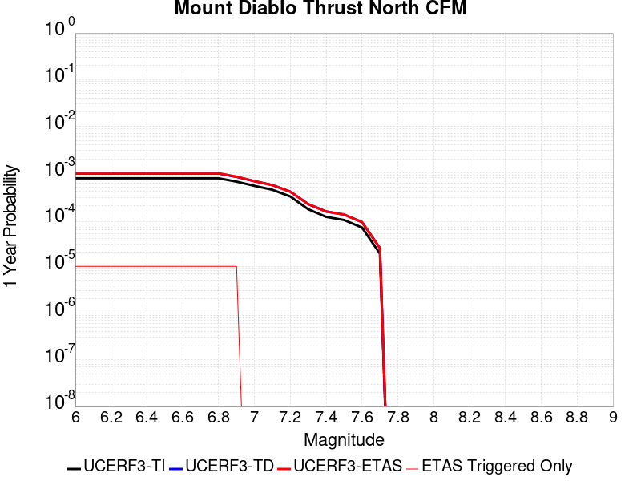 | 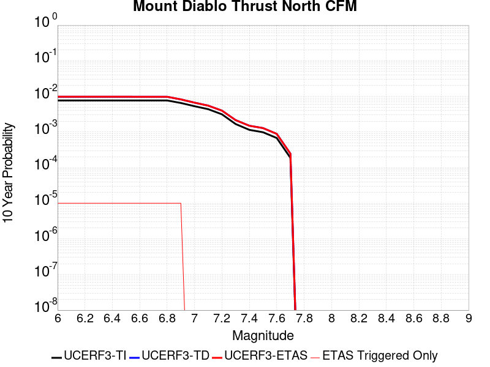 |

| Magnitude | 1 wk TI Prob | 1 wk TD Prob | 1 wk ETAS Prob | 1 wk ETAS/TD Gain | 1 wk ETAS Triggered Only | 1 mo TI Prob | 1 mo TD Prob | 1 mo ETAS Prob | 1 mo ETAS/TD Gain | 1 mo ETAS Triggered Only | 1 yr TI Prob | 1 yr TD Prob | 1 yr ETAS Prob | 1 yr ETAS/TD Gain | 1 yr ETAS Triggered Only | 10 yr TI Prob | 10 yr TD Prob | 10 yr ETAS Prob | 10 yr ETAS/TD Gain | 10 yr ETAS Triggered Only |
|-----|-----|-----|-----|-----|-----|-----|-----|-----|-----|-----|-----|-----|-----|-----|-----|-----|-----|-----|-----|-----|
| 6.0 | 1.479628E-5 | 1.8769935E-5 | 2.9487848E-5 | 1.5710149 | 1.0718114E-5 | 6.341109E-5 | 8.044016E-5 | 9.11574E-5 | 1.1332326 | 1.0718114E-5 | 7.717565E-4 | 9.789284E-4 | 9.89636E-4 | 1.010938 | 1.0718114E-5 | 0.007690818 | 0.009747461 | 0.009758075 | 1.0010889 | 1.0718114E-5 |
| 6.1 | 1.479628E-5 | 1.8769935E-5 | 2.9487848E-5 | 1.5710149 | 1.0718114E-5 | 6.341109E-5 | 8.044016E-5 | 9.11574E-5 | 1.1332326 | 1.0718114E-5 | 7.717565E-4 | 9.789284E-4 | 9.89636E-4 | 1.010938 | 1.0718114E-5 | 0.007690818 | 0.009747461 | 0.009758075 | 1.0010889 | 1.0718114E-5 |
| 6.2 | 1.479628E-5 | 1.8769935E-5 | 2.9487848E-5 | 1.5710149 | 1.0718114E-5 | 6.341109E-5 | 8.044016E-5 | 9.11574E-5 | 1.1332326 | 1.0718114E-5 | 7.717565E-4 | 9.789284E-4 | 9.89636E-4 | 1.010938 | 1.0718114E-5 | 0.007690818 | 0.009747461 | 0.009758075 | 1.0010889 | 1.0718114E-5 |
| 6.3 | 1.479628E-5 | 1.8769935E-5 | 2.9487848E-5 | 1.5710149 | 1.0718114E-5 | 6.341109E-5 | 8.044016E-5 | 9.11574E-5 | 1.1332326 | 1.0718114E-5 | 7.717565E-4 | 9.789284E-4 | 9.89636E-4 | 1.010938 | 1.0718114E-5 | 0.007690818 | 0.009747461 | 0.009758075 | 1.0010889 | 1.0718114E-5 |
| 6.4 | 1.479628E-5 | 1.8769935E-5 | 2.9487848E-5 | 1.5710149 | 1.0718114E-5 | 6.341109E-5 | 8.044016E-5 | 9.11574E-5 | 1.1332326 | 1.0718114E-5 | 7.717565E-4 | 9.789284E-4 | 9.89636E-4 | 1.010938 | 1.0718114E-5 | 0.007690818 | 0.009747461 | 0.009758075 | 1.0010889 | 1.0718114E-5 |
| 6.5 | 1.479628E-5 | 1.8769935E-5 | 2.9487848E-5 | 1.5710149 | 1.0718114E-5 | 6.341109E-5 | 8.044016E-5 | 9.11574E-5 | 1.1332326 | 1.0718114E-5 | 7.717565E-4 | 9.789284E-4 | 9.89636E-4 | 1.010938 | 1.0718114E-5 | 0.007690818 | 0.009747461 | 0.009758075 | 1.0010889 | 1.0718114E-5 |
| 6.6 | 1.479016E-5 | 1.8763047E-5 | 2.948096E-5 | 1.5712246 | 1.0718114E-5 | 6.338486E-5 | 8.041063E-5 | 9.1127884E-5 | 1.1332815 | 1.0718114E-5 | 7.714374E-4 | 9.785693E-4 | 9.892769E-4 | 1.0109421 | 1.0718114E-5 | 0.007687649 | 0.009743902 | 0.009754515 | 1.0010892 | 1.0718114E-5 |
| 6.7 | 1.479016E-5 | 1.8763047E-5 | 2.948096E-5 | 1.5712246 | 1.0718114E-5 | 6.338486E-5 | 8.041063E-5 | 9.1127884E-5 | 1.1332815 | 1.0718114E-5 | 7.714374E-4 | 9.785693E-4 | 9.892769E-4 | 1.0109421 | 1.0718114E-5 | 0.007687649 | 0.009743902 | 0.009754515 | 1.0010892 | 1.0718114E-5 |
| 6.8 | 1.4771667E-5 | 1.8741817E-5 | 2.945973E-5 | 1.5718716 | 1.0718114E-5 | 6.330561E-5 | 8.031965E-5 | 9.1036905E-5 | 1.1334325 | 1.0718114E-5 | 7.704732E-4 | 9.774626E-4 | 9.881703E-4 | 1.0109545 | 1.0718114E-5 | 0.007678074 | 0.009732932 | 0.009743546 | 1.0010905 | 1.0718114E-5 |
| 6.9 | 1.2548234E-5 | 1.5822196E-5 | 2.654014E-5 | 1.6773993 | 1.0718114E-5 | 5.3777036E-5 | 6.780767E-5 | 7.852506E-5 | 1.1580557 | 1.0718114E-5 | 6.545387E-4 | 8.2524924E-4 | 8.359585E-4 | 1.012977 | 1.0718114E-5 | 0.006526142 | 0.008222484 | 0.008233114 | 1.0012928 | 1.0718114E-5 |
| 7.0 | 1.01754185E-5 | 1.2809126E-5 | 1.2809126E-5 | 1.0 | 0.0 | 4.360821E-5 | 5.4895107E-5 | 5.4895107E-5 | 1.0 | 0.0 | 5.308006E-4 | 6.681446E-4 | 6.681446E-4 | 1.0 | 0.0 | 0.005295345 | 0.006661745 | 0.006661745 | 1.0 | 0.0 |
| 7.1 | 8.398341E-6 | 1.055483E-5 | 1.055483E-5 | 1.0 | 0.0 | 3.5992394E-5 | 4.5234206E-5 | 4.5234206E-5 | 1.0 | 0.0 | 4.3811928E-4 | 5.5058836E-4 | 5.5058836E-4 | 1.0 | 0.0 | 0.0043725655 | 0.005492528 | 0.005492528 | 1.0 | 0.0 |
| 7.2 | 6.024759E-6 | 7.648465E-6 | 7.648465E-6 | 1.0 | 0.0 | 2.582014E-5 | 3.2778727E-5 | 3.2778727E-5 | 1.0 | 0.0 | 3.1431485E-4 | 3.9900863E-4 | 3.9900863E-4 | 1.0 | 0.0 | 0.0031387066 | 0.0039831307 | 0.0039831307 | 1.0 | 0.0 |
| 7.3 | 3.2099704E-6 | 4.1356275E-6 | 4.1356275E-6 | 1.0 | 0.0 | 1.3756943E-5 | 1.7723998E-5 | 1.7723998E-5 | 1.0 | 0.0 | 1.674779E-4 | 2.1576848E-4 | 2.1576848E-4 | 1.0 | 0.0 | 0.0016735174 | 0.0021556902 | 0.0021556902 | 1.0 | 0.0 |
| 7.4 | 2.2041513E-6 | 2.873453E-6 | 2.873453E-6 | 1.0 | 0.0 | 9.4463285E-6 | 1.2314741E-5 | 1.2314741E-5 | 1.0 | 0.0 | 1.1500298E-4 | 1.4992173E-4 | 1.4992173E-4 | 1.0 | 0.0 | 0.0011494348 | 0.0014982726 | 0.0014982726 | 1.0 | 0.0 |
| 7.5 | 1.8869501E-6 | 2.4696647E-6 | 2.4696647E-6 | 1.0 | 0.0 | 8.086904E-6 | 1.0584234E-5 | 1.0584234E-5 | 1.0 | 0.0 | 9.845361E-5 | 1.288555E-4 | 1.288555E-4 | 1.0 | 0.0 | 9.841E-4 | 0.0012878645 | 0.0012878645 | 1.0 | 0.0 |
| 7.6 | 1.3012458E-6 | 1.7005086E-6 | 1.7005086E-6 | 1.0 | 0.0 | 5.576756E-6 | 7.287874E-6 | 7.287874E-6 | 1.0 | 0.0 | 6.7894885E-5 | 8.87263E-5 | 8.87263E-5 | 1.0 | 0.0 | 6.787415E-4 | 8.8694424E-4 | 8.8694424E-4 | 1.0 | 0.0 |
| 7.7 | 3.603383E-7 | 4.7164855E-7 | 4.7164855E-7 | 1.0 | 0.0 | 1.5443061E-6 | 2.0213495E-6 | 2.0213495E-6 | 1.0 | 0.0 | 1.8801764E-5 | 2.4609657E-5 | 2.4609657E-5 | 1.0 | 0.0 | 1.8800174E-4 | 2.460749E-4 | 2.460749E-4 | 1.0 | 0.0 |

## Superstition Hills
*[(top)](#table-of-contents)*

| 1 Week | 1 Month | 1 Year | 10 Year |
|-----|-----|-----|-----|
|  |  |  |  |

| Magnitude | 1 wk TI Prob | 1 wk TD Prob | 1 wk ETAS Prob | 1 wk ETAS/TD Gain | 1 wk ETAS Triggered Only | 1 mo TI Prob | 1 mo TD Prob | 1 mo ETAS Prob | 1 mo ETAS/TD Gain | 1 mo ETAS Triggered Only | 1 yr TI Prob | 1 yr TD Prob | 1 yr ETAS Prob | 1 yr ETAS/TD Gain | 1 yr ETAS Triggered Only | 10 yr TI Prob | 10 yr TD Prob | 10 yr ETAS Prob | 10 yr ETAS/TD Gain | 10 yr ETAS Triggered Only |
|-----|-----|-----|-----|-----|-----|-----|-----|-----|-----|-----|-----|-----|-----|-----|-----|-----|-----|-----|-----|-----|
| 6.0 | 6.6865185E-5 | 1.4140716E-5 | 1.4140716E-5 | 1.0 | 0.0 | 2.8653358E-4 | 6.0601753E-5 | 6.0601753E-5 | 1.0 | 0.0 | 0.0034829667 | 7.3759275E-4 | 7.3759275E-4 | 1.0 | 0.0 | 0.03428881 | 0.0075219767 | 0.0075326143 | 1.0014142 | 1.0718114E-5 |
| 6.1 | 6.544851E-5 | 1.4140715E-5 | 1.4140715E-5 | 1.0 | 0.0 | 2.8046346E-4 | 6.0601753E-5 | 6.0601753E-5 | 1.0 | 0.0 | 0.0034092965 | 7.3759275E-4 | 7.3759275E-4 | 1.0 | 0.0 | 0.033574644 | 0.007521976 | 0.0075326134 | 1.0014142 | 1.0718114E-5 |
| 6.2 | 6.544851E-5 | 1.4140715E-5 | 1.4140715E-5 | 1.0 | 0.0 | 2.8046346E-4 | 6.0601753E-5 | 6.0601753E-5 | 1.0 | 0.0 | 0.0034092965 | 7.3759275E-4 | 7.3759275E-4 | 1.0 | 0.0 | 0.033574644 | 0.007521976 | 0.0075326134 | 1.0014142 | 1.0718114E-5 |
| 6.3 | 5.2402065E-5 | 1.41407145E-5 | 1.41407145E-5 | 1.0 | 0.0 | 2.2456095E-4 | 6.0601746E-5 | 6.0601746E-5 | 1.0 | 0.0 | 0.0027306017 | 7.375927E-4 | 7.375927E-4 | 1.0 | 0.0 | 0.02697292 | 0.0075219707 | 0.007532608 | 1.0014142 | 1.0718114E-5 |
| 6.4 | 4.542238E-5 | 1.4140714E-5 | 1.4140714E-5 | 1.0 | 0.0 | 1.9465282E-4 | 6.0601742E-5 | 6.0601742E-5 | 1.0 | 0.0 | 0.0023673223 | 7.3759264E-4 | 7.3759264E-4 | 1.0 | 0.0 | 0.023422617 | 0.007521968 | 0.007532605 | 1.0014142 | 1.0718114E-5 |
| 6.5 | 2.9672969E-5 | 1.4140713E-5 | 1.4140713E-5 | 1.0 | 0.0 | 1.2716366E-4 | 6.060174E-5 | 6.060174E-5 | 1.0 | 0.0 | 0.0015471181 | 7.375926E-4 | 7.375926E-4 | 1.0 | 0.0 | 0.015363912 | 0.0075219613 | 0.007532599 | 1.0014142 | 1.0718114E-5 |
| 6.6 | 2.6056105E-5 | 1.3806452E-5 | 1.3806452E-5 | 1.0 | 0.0 | 1.1166424E-4 | 5.916926E-5 | 5.916926E-5 | 1.0 | 0.0 | 0.0013586642 | 7.201637E-4 | 7.201637E-4 | 1.0 | 0.0 | 0.013503874 | 0.007346386 | 0.0073570255 | 1.0014483 | 1.0718114E-5 |
| 6.7 | 1.4611248E-5 | 1.3386336E-5 | 1.3386336E-5 | 1.0 | 0.0 | 6.261813E-5 | 5.736884E-5 | 5.736884E-5 | 1.0 | 0.0 | 7.6210906E-4 | 6.9825776E-4 | 6.9825776E-4 | 1.0 | 0.0 | 0.0075950073 | 0.007127569 | 0.007138211 | 1.001493 | 1.0718114E-5 |
| 6.8 | 1.30607E-5 | 1.0981634E-5 | 1.0981634E-5 | 1.0 | 0.0 | 5.597323E-5 | 4.7063342E-5 | 4.7063342E-5 | 1.0 | 0.0 | 6.8126095E-4 | 5.728543E-4 | 5.728543E-4 | 1.0 | 0.0 | 0.006791762 | 0.005875862 | 0.0058865175 | 1.0018134 | 1.0718114E-5 |
| 6.9 | 1.0443096E-5 | 8.197917E-6 | 8.197917E-6 | 1.0 | 0.0 | 4.4755358E-5 | 3.513347E-5 | 3.513347E-5 | 1.0 | 0.0 | 5.447602E-4 | 4.2766842E-4 | 4.2766842E-4 | 1.0 | 0.0 | 0.005434267 | 0.004410797 | 0.004410797 | 1.0 | 0.0 |
| 7.0 | 8.045912E-6 | 6.742015E-6 | 6.742015E-6 | 1.0 | 0.0 | 3.4482026E-5 | 2.8894035E-5 | 2.8894035E-5 | 1.0 | 0.0 | 4.197378E-4 | 3.5172913E-4 | 3.5172913E-4 | 1.0 | 0.0 | 0.0041894587 | 0.003634624 | 0.003634624 | 1.0 | 0.0 |
| 7.1 | 8.045912E-6 | 6.742015E-6 | 6.742015E-6 | 1.0 | 0.0 | 3.4482026E-5 | 2.8894035E-5 | 2.8894035E-5 | 1.0 | 0.0 | 4.197378E-4 | 3.5172913E-4 | 3.5172913E-4 | 1.0 | 0.0 | 0.0041894587 | 0.003634624 | 0.003634624 | 1.0 | 0.0 |
| 7.2 | 7.375506E-6 | 6.2489075E-6 | 6.2489075E-6 | 1.0 | 0.0 | 3.1608928E-5 | 2.6780763E-5 | 2.6780763E-5 | 1.0 | 0.0 | 3.8477074E-4 | 3.2600787E-4 | 3.2600787E-4 | 1.0 | 0.0 | 0.003841052 | 0.0033750783 | 0.0033750783 | 1.0 | 0.0 |
| 7.3 | 6.6063913E-6 | 5.8012956E-6 | 5.8012956E-6 | 1.0 | 0.0 | 2.8312797E-5 | 2.4862462E-5 | 2.4862462E-5 | 1.0 | 0.0 | 3.446538E-4 | 3.0265914E-4 | 3.0265914E-4 | 1.0 | 0.0 | 0.0034411973 | 0.0031393243 | 0.0031393243 | 1.0 | 0.0 |
| 7.4 | 6.4313126E-6 | 5.6827116E-6 | 5.6827116E-6 | 1.0 | 0.0 | 2.7562477E-5 | 2.4354254E-5 | 2.4354254E-5 | 1.0 | 0.0 | 3.355215E-4 | 2.964734E-4 | 2.964734E-4 | 1.0 | 0.0 | 0.0033501536 | 0.003077082 | 0.003077082 | 1.0 | 0.0 |
| 7.5 | 6.0742927E-6 | 5.478511E-6 | 5.478511E-6 | 1.0 | 0.0 | 2.6032423E-5 | 2.3479126E-5 | 2.3479126E-5 | 1.0 | 0.0 | 3.1689866E-4 | 2.8582153E-4 | 2.8582153E-4 | 1.0 | 0.0 | 0.0031644711 | 0.0029689074 | 0.0029689074 | 1.0 | 0.0 |
| 7.6 | 5.6987187E-6 | 5.2966907E-6 | 5.2966907E-6 | 1.0 | 0.0 | 2.4422852E-5 | 2.269991E-5 | 2.269991E-5 | 1.0 | 0.0 | 2.9730765E-4 | 2.76337E-4 | 2.76337E-4 | 1.0 | 0.0 | 0.002969102 | 0.0028721471 | 0.0028721471 | 1.0 | 0.0 |
| 7.7 | 5.1658035E-6 | 4.9276673E-6 | 4.9276673E-6 | 1.0 | 0.0 | 2.2138971E-5 | 2.1118407E-5 | 2.1118407E-5 | 1.0 | 0.0 | 2.6950863E-4 | 2.5708685E-4 | 2.5708685E-4 | 1.0 | 0.0 | 0.00269182 | 0.002677178 | 0.002677178 | 1.0 | 0.0 |
| 7.8 | 3.6864697E-6 | 4.198542E-6 | 4.198542E-6 | 1.0 | 0.0 | 1.579906E-5 | 1.7993629E-5 | 1.7993629E-5 | 1.0 | 0.0 | 1.9233658E-4 | 2.1905087E-4 | 2.1905087E-4 | 1.0 | 0.0 | 0.0019217018 | 0.0022903313 | 0.0022903313 | 1.0 | 0.0 |
| 7.9 | 3.0265903E-6 | 3.565613E-6 | 3.565613E-6 | 1.0 | 0.0 | 1.2971037E-5 | 1.5281112E-5 | 1.5281112E-5 | 1.0 | 0.0 | 1.5791094E-4 | 1.8603209E-4 | 1.8603209E-4 | 1.0 | 0.0 | 0.0015779877 | 0.0019544594 | 0.0019544594 | 1.0 | 0.0 |
| 8.0 | 2.5271493E-6 | 3.0884585E-6 | 3.0884585E-6 | 1.0 | 0.0 | 1.0830595E-5 | 1.3236186E-5 | 1.3236186E-5 | 1.0 | 0.0 | 1.3185451E-4 | 1.6113906E-4 | 1.6113906E-4 | 1.0 | 0.0 | 0.0013177631 | 0.0016982564 | 0.0016982564 | 1.0 | 0.0 |
| 8.1 | 2.3749135E-6 | 2.919021E-6 | 2.919021E-6 | 1.0 | 0.0 | 1.0178161E-5 | 1.2510032E-5 | 1.2510032E-5 | 1.0 | 0.0 | 1.2391206E-4 | 1.5229941E-4 | 1.5229941E-4 | 1.0 | 0.0 | 0.0012384299 | 0.0016058089 | 0.0016058089 | 1.0 | 0.0 |
| 8.2 | 1.7186406E-9 | 1.1449343E-9 | 1.1449343E-9 | 1.0 | 0.0 | 7.3656024E-9 | 4.906861E-9 | 4.906861E-9 | 1.0 | 0.0 | 8.9676206E-8 | 5.974103E-8 | 5.974103E-8 | 1.0 | 0.0 | 8.9676166E-7 | 6.393774E-7 | 6.393774E-7 | 1.0 | 0.0 |

## San Gregorio (North) 2011 CFM
*[(top)](#table-of-contents)*

| 1 Week | 1 Month | 1 Year | 10 Year |
|-----|-----|-----|-----|
|  |  |  |  |

| Magnitude | 1 wk TI Prob | 1 wk TD Prob | 1 wk ETAS Prob | 1 wk ETAS/TD Gain | 1 wk ETAS Triggered Only | 1 mo TI Prob | 1 mo TD Prob | 1 mo ETAS Prob | 1 mo ETAS/TD Gain | 1 mo ETAS Triggered Only | 1 yr TI Prob | 1 yr TD Prob | 1 yr ETAS Prob | 1 yr ETAS/TD Gain | 1 yr ETAS Triggered Only | 10 yr TI Prob | 10 yr TD Prob | 10 yr ETAS Prob | 10 yr ETAS/TD Gain | 10 yr ETAS Triggered Only |
|-----|-----|-----|-----|-----|-----|-----|-----|-----|-----|-----|-----|-----|-----|-----|-----|-----|-----|-----|-----|-----|
| 6.0 | 5.0283932E-5 | 4.3060794E-5 | 4.3060794E-5 | 1.0 | 0.0 | 2.1548476E-4 | 1.8453323E-4 | 1.9524936E-4 | 1.0580716 | 1.0718114E-5 | 0.0026203706 | 0.002244392 | 0.002255086 | 1.0047648 | 1.0718114E-5 | 0.02589687 | 0.022294713 | 0.022305192 | 1.00047 | 1.0718114E-5 |
| 6.1 | 5.0283932E-5 | 4.3060794E-5 | 4.3060794E-5 | 1.0 | 0.0 | 2.1548476E-4 | 1.8453323E-4 | 1.9524936E-4 | 1.0580716 | 1.0718114E-5 | 0.0026203706 | 0.002244392 | 0.002255086 | 1.0047648 | 1.0718114E-5 | 0.02589687 | 0.022294713 | 0.022305192 | 1.00047 | 1.0718114E-5 |
| 6.2 | 4.2998647E-5 | 3.4444227E-5 | 3.4444227E-5 | 1.0 | 0.0 | 1.842669E-4 | 1.4760974E-4 | 1.4760974E-4 | 1.0 | 0.0 | 0.0022411412 | 0.0017956786 | 0.0017956786 | 1.0 | 0.0 | 0.022186736 | 0.017887903 | 0.017887903 | 1.0 | 0.0 |
| 6.3 | 4.2998647E-5 | 3.4444227E-5 | 3.4444227E-5 | 1.0 | 0.0 | 1.842669E-4 | 1.4760974E-4 | 1.4760974E-4 | 1.0 | 0.0 | 0.0022411412 | 0.0017956786 | 0.0017956786 | 1.0 | 0.0 | 0.022186736 | 0.017887903 | 0.017887903 | 1.0 | 0.0 |
| 6.4 | 4.1101295E-5 | 3.232945E-5 | 3.232945E-5 | 1.0 | 0.0 | 1.7613651E-4 | 1.385474E-4 | 1.385474E-4 | 1.0 | 0.0 | 0.0021423528 | 0.0016855211 | 0.0016855211 | 1.0 | 0.0 | 0.02121817 | 0.01680324 | 0.01680324 | 1.0 | 0.0 |
| 6.5 | 4.1032585E-5 | 3.2247484E-5 | 3.2247484E-5 | 1.0 | 0.0 | 1.7584208E-4 | 1.3819615E-4 | 1.3819615E-4 | 1.0 | 0.0 | 0.0021387753 | 0.0016812512 | 0.0016812512 | 1.0 | 0.0 | 0.021183075 | 0.016761193 | 0.016761193 | 1.0 | 0.0 |
| 6.6 | 4.011629E-5 | 3.1269094E-5 | 3.1269094E-5 | 1.0 | 0.0 | 1.7191563E-4 | 1.340035E-4 | 1.340035E-4 | 1.0 | 0.0 | 0.0020910634 | 0.0016302838 | 0.0016302838 | 1.0 | 0.0 | 0.020714961 | 0.016258746 | 0.016258746 | 1.0 | 0.0 |
| 6.7 | 3.8583938E-5 | 2.9456065E-5 | 2.9456065E-5 | 1.0 | 0.0 | 1.6534925E-4 | 1.2623426E-4 | 1.2623426E-4 | 1.0 | 0.0 | 0.0020112682 | 0.0015358328 | 0.0015358328 | 1.0 | 0.0 | 0.019931622 | 0.015327258 | 0.015327258 | 1.0 | 0.0 |
| 6.8 | 3.44341E-5 | 2.4453162E-5 | 2.4453162E-5 | 1.0 | 0.0 | 1.4756636E-4 | 1.04795115E-4 | 1.04795115E-4 | 1.0 | 0.0 | 0.0017951399 | 0.001275144 | 0.001275144 | 1.0 | 0.0 | 0.017807078 | 0.012752353 | 0.012752353 | 1.0 | 0.0 |
| 6.9 | 3.221199E-5 | 2.1780248E-5 | 2.1780248E-5 | 1.0 | 0.0 | 1.3804408E-4 | 9.3340626E-5 | 9.3340626E-5 | 1.0 | 0.0 | 0.0016793909 | 0.001135838 | 0.001135838 | 1.0 | 0.0 | 0.01666756 | 0.01137376 | 0.01137376 | 1.0 | 0.0 |
| 7.0 | 2.9186718E-5 | 1.8148972E-5 | 1.8148972E-5 | 1.0 | 0.0 | 1.2507994E-4 | 7.777901E-5 | 7.777901E-5 | 1.0 | 0.0 | 0.0015217843 | 9.4655243E-4 | 9.4655243E-4 | 1.0 | 0.0 | 0.015114053 | 0.009497915 | 0.009497915 | 1.0 | 0.0 |
| 7.1 | 2.6840138E-5 | 1.528651E-5 | 1.528651E-5 | 1.0 | 0.0 | 1.1502409E-4 | 6.551198E-5 | 6.551198E-5 | 1.0 | 0.0 | 0.0013995186 | 7.973184E-4 | 7.973184E-4 | 1.0 | 0.0 | 0.013907375 | 0.008016792 | 0.008016792 | 1.0 | 0.0 |
| 7.2 | 2.453002E-5 | 1.260862E-5 | 1.260862E-5 | 1.0 | 0.0 | 1.05124425E-4 | 5.4035827E-5 | 5.4035827E-5 | 1.0 | 0.0 | 0.0012791384 | 6.576882E-4 | 6.576882E-4 | 1.0 | 0.0 | 0.012718005 | 0.0066286726 | 0.0066286726 | 1.0 | 0.0 |
| 7.3 | 2.3330727E-5 | 1.1490594E-5 | 1.1490594E-5 | 1.0 | 0.0 | 9.9985E-5 | 4.9244478E-5 | 4.9244478E-5 | 1.0 | 0.0 | 0.0012166376 | 5.9938704E-4 | 5.9938704E-4 | 1.0 | 0.0 | 0.012099981 | 0.0060475916 | 0.0060475916 | 1.0 | 0.0 |
| 7.4 | 2.2136466E-5 | 1.03708635E-5 | 1.03708635E-5 | 1.0 | 0.0 | 9.486712E-5 | 4.4445802E-5 | 4.4445802E-5 | 1.0 | 0.0 | 0.0011543952 | 5.409935E-4 | 5.409935E-4 | 1.0 | 0.0 | 0.011484168 | 0.005465259 | 0.005465259 | 1.0 | 0.0 |
| 7.5 | 2.0994974E-5 | 9.429039E-6 | 9.429039E-6 | 1.0 | 0.0 | 8.997535E-5 | 4.0409544E-5 | 4.0409544E-5 | 1.0 | 0.0 | 0.0010948994 | 4.9187534E-4 | 4.9187534E-4 | 1.0 | 0.0 | 0.010895205 | 0.0049743364 | 0.0049743364 | 1.0 | 0.0 |
| 7.6 | 1.7091823E-5 | 6.895248E-6 | 6.895248E-6 | 1.0 | 0.0 | 7.3248615E-5 | 2.9550729E-5 | 2.9550729E-5 | 1.0 | 0.0 | 8.9143694E-4 | 3.5972084E-4 | 3.5972084E-4 | 1.0 | 0.0 | 0.008878695 | 0.0036490853 | 0.0036490853 | 1.0 | 0.0 |
| 7.7 | 1.2772179E-5 | 4.0219356E-6 | 4.0219356E-6 | 1.0 | 0.0 | 5.473676E-5 | 1.7236755E-5 | 1.7236755E-5 | 1.0 | 0.0 | 6.6621625E-4 | 2.098373E-4 | 2.098373E-4 | 1.0 | 0.0 | 0.006642225 | 0.002137503 | 0.002137503 | 1.0 | 0.0 |
| 7.8 | 7.041923E-6 | 1.9413242E-6 | 1.9413242E-6 | 1.0 | 0.0 | 3.017932E-5 | 8.319934E-6 | 8.319934E-6 | 1.0 | 0.0 | 3.6737128E-4 | 1.0129049E-4 | 1.0129049E-4 | 1.0 | 0.0 | 0.0036676454 | 0.0010382815 | 0.0010382815 | 1.0 | 0.0 |
| 7.9 | 2.946768E-6 | 1.0037718E-6 | 1.0037718E-6 | 1.0 | 0.0 | 1.2628945E-5 | 4.3018717E-6 | 4.3018717E-6 | 1.0 | 0.0 | 1.5374656E-4 | 5.237403E-5 | 5.237403E-5 | 1.0 | 0.0 | 0.0015364023 | 5.3422514E-4 | 5.3422514E-4 | 1.0 | 0.0 |
| 8.0 | 1.1433375E-6 | 5.1838697E-7 | 5.1838697E-7 | 1.0 | 0.0 | 4.9000087E-6 | 2.2216566E-6 | 2.2216566E-6 | 1.0 | 0.0 | 5.965597E-5 | 2.7048332E-5 | 2.7048332E-5 | 1.0 | 0.0 | 5.963996E-4 | 2.741109E-4 | 2.741109E-4 | 1.0 | 0.0 |
| 8.1 | 2.6675295E-7 | 1.6298877E-7 | 1.6298877E-7 | 1.0 | 0.0 | 1.1432264E-6 | 6.9852314E-7 | 6.9852314E-7 | 1.0 | 0.0 | 1.3918692E-5 | 8.504486E-6 | 8.504486E-6 | 1.0 | 0.0 | 1.391782E-4 | 8.6426866E-5 | 8.6426866E-5 | 1.0 | 0.0 |
| 8.2 | 1.2704569E-8 | 9.439506E-9 | 9.439506E-9 | 1.0 | 0.0 | 5.444815E-8 | 4.0455028E-8 | 4.0455028E-8 | 1.0 | 0.0 | 6.629061E-7 | 4.9253987E-7 | 4.9253987E-7 | 1.0 | 0.0 | 6.629041E-6 | 5.11646E-6 | 5.11646E-6 | 1.0 | 0.0 |

## Calaveras (No) 2011 CFM
*[(top)](#table-of-contents)*

| 1 Week | 1 Month | 1 Year | 10 Year |
|-----|-----|-----|-----|
|  | 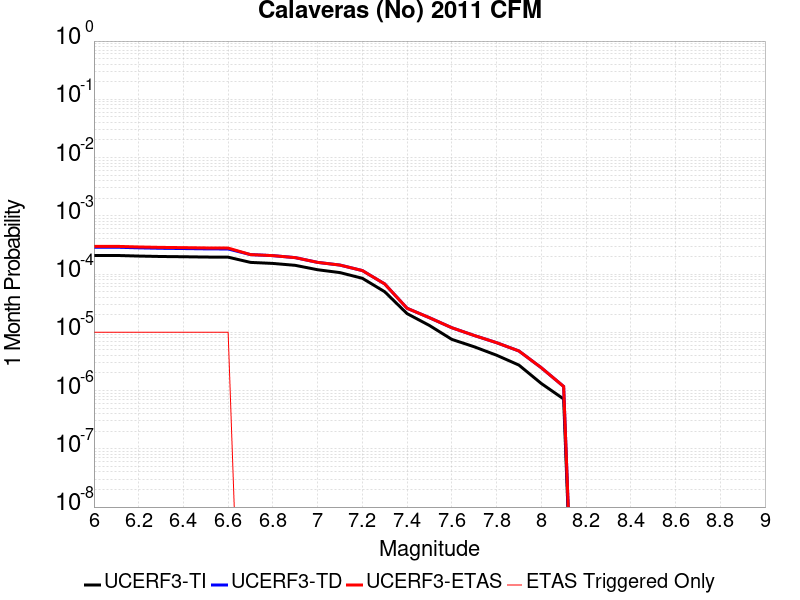 |  |  |

| Magnitude | 1 wk TI Prob | 1 wk TD Prob | 1 wk ETAS Prob | 1 wk ETAS/TD Gain | 1 wk ETAS Triggered Only | 1 mo TI Prob | 1 mo TD Prob | 1 mo ETAS Prob | 1 mo ETAS/TD Gain | 1 mo ETAS Triggered Only | 1 yr TI Prob | 1 yr TD Prob | 1 yr ETAS Prob | 1 yr ETAS/TD Gain | 1 yr ETAS Triggered Only | 10 yr TI Prob | 10 yr TD Prob | 10 yr ETAS Prob | 10 yr ETAS/TD Gain | 10 yr ETAS Triggered Only |
|-----|-----|-----|-----|-----|-----|-----|-----|-----|-----|-----|-----|-----|-----|-----|-----|-----|-----|-----|-----|-----|
| 6.0 | 4.8694856E-5 | 6.7480454E-5 | 6.7480454E-5 | 1.0 | 0.0 | 2.0867554E-4 | 2.8917097E-4 | 2.9988599E-4 | 1.0370543 | 1.0718114E-5 | 0.0025376645 | 0.0035151043 | 0.0035257847 | 1.0030384 | 1.0718114E-5 | 0.02508881 | 0.03477574 | 0.034786087 | 1.0002975 | 1.0718114E-5 |
| 6.1 | 4.8694856E-5 | 6.7480454E-5 | 6.7480454E-5 | 1.0 | 0.0 | 2.0867554E-4 | 2.8917097E-4 | 2.9988599E-4 | 1.0370543 | 1.0718114E-5 | 0.0025376645 | 0.0035151043 | 0.0035257847 | 1.0030384 | 1.0718114E-5 | 0.02508881 | 0.03477574 | 0.034786087 | 1.0002975 | 1.0718114E-5 |
| 6.2 | 4.7541962E-5 | 6.581133E-5 | 6.581133E-5 | 1.0 | 0.0 | 2.0373536E-4 | 2.8201914E-4 | 2.927342E-4 | 1.0379941 | 1.0718114E-5 | 0.0024776561 | 0.003428333 | 0.0034390143 | 1.0031157 | 1.0718114E-5 | 0.024502134 | 0.033937134 | 0.03394749 | 1.000305 | 1.0718114E-5 |
| 6.3 | 4.6717287E-5 | 6.464464E-5 | 6.464464E-5 | 1.0 | 0.0 | 2.0020158E-4 | 2.770201E-4 | 2.8773525E-4 | 1.0386801 | 1.0718114E-5 | 0.0024347296 | 0.003367682 | 0.003378364 | 1.0031719 | 1.0718114E-5 | 0.024082264 | 0.03334963 | 0.03335999 | 1.0003107 | 1.0718114E-5 |
| 6.4 | 4.6276386E-5 | 6.400647E-5 | 6.400647E-5 | 1.0 | 0.0 | 1.983123E-4 | 2.7428564E-4 | 2.850008E-4 | 1.0390657 | 1.0718114E-5 | 0.0024117786 | 0.0033344922 | 0.0033451745 | 1.0032036 | 1.0718114E-5 | 0.02385771 | 0.033028495 | 0.03303886 | 1.0003138 | 1.0718114E-5 |
| 6.5 | 4.5720994E-5 | 6.3207815E-5 | 6.3207815E-5 | 1.0 | 0.0 | 1.9593239E-4 | 2.7086356E-4 | 2.8157877E-4 | 1.0395595 | 1.0718114E-5 | 0.002382867 | 0.0032929648 | 0.0033036475 | 1.0032442 | 1.0718114E-5 | 0.023574775 | 0.03262644 | 0.032636806 | 1.0003178 | 1.0718114E-5 |
| 6.6 | 4.549134E-5 | 6.286089E-5 | 6.286089E-5 | 1.0 | 0.0 | 1.949483E-4 | 2.6937705E-4 | 2.8009227E-4 | 1.0397778 | 1.0718114E-5 | 0.0023709119 | 0.0032749209 | 0.003285604 | 1.003262 | 1.0718114E-5 | 0.023457756 | 0.03245179 | 0.032462157 | 1.0003196 | 1.0718114E-5 |
| 6.7 | 3.701047E-5 | 5.0367704E-5 | 5.0367704E-5 | 1.0 | 0.0 | 1.5860666E-4 | 2.1584396E-4 | 2.1584396E-4 | 1.0 | 0.0 | 0.0019293258 | 0.0026247767 | 0.0026247767 | 1.0 | 0.0 | 0.019126613 | 0.02612945 | 0.02612945 | 1.0 | 0.0 |
| 6.8 | 3.5523568E-5 | 4.8349237E-5 | 4.8349237E-5 | 1.0 | 0.0 | 1.5223498E-4 | 2.071948E-4 | 2.071948E-4 | 1.0 | 0.0 | 0.0018518851 | 0.0025197214 | 0.0025197214 | 1.0 | 0.0 | 0.018365284 | 0.025101654 | 0.025101654 | 1.0 | 0.0 |
| 6.9 | 3.2946147E-5 | 4.4670804E-5 | 4.4670804E-5 | 1.0 | 0.0 | 1.4119013E-4 | 1.914325E-4 | 1.914325E-4 | 1.0 | 0.0 | 0.0017176344 | 0.0023282415 | 0.0023282415 | 1.0 | 0.0 | 0.017044188 | 0.023223657 | 0.023223657 | 1.0 | 0.0 |
| 7.0 | 2.7682381E-5 | 3.703018E-5 | 3.703018E-5 | 1.0 | 0.0 | 1.1863338E-4 | 1.5869128E-4 | 1.5869128E-4 | 1.0 | 0.0 | 0.0014434044 | 0.0019303843 | 0.0019303843 | 1.0 | 0.0 | 0.01434065 | 0.019314911 | 0.019314911 | 1.0 | 0.0 |
| 7.1 | 2.471967E-5 | 3.3294466E-5 | 3.3294466E-5 | 1.0 | 0.0 | 1.05937135E-4 | 1.4268293E-4 | 1.4268293E-4 | 1.0 | 0.0 | 0.0012890215 | 0.0017358093 | 0.0017358093 | 1.0 | 0.0 | 0.0128157 | 0.017389864 | 0.017389864 | 1.0 | 0.0 |
| 7.2 | 1.9748062E-5 | 2.6782258E-5 | 2.6782258E-5 | 1.0 | 0.0 | 8.463181E-5 | 1.1477619E-4 | 1.1477619E-4 | 1.0 | 0.0 | 0.0010299052 | 0.0013965277 | 0.0013965277 | 1.0 | 0.0 | 0.01025145 | 0.014034565 | 0.014034565 | 1.0 | 0.0 |
| 7.3 | 1.1603734E-5 | 1.5790934E-5 | 1.5790934E-5 | 1.0 | 0.0 | 4.9729337E-5 | 6.7673755E-5 | 6.7673755E-5 | 1.0 | 0.0 | 6.052865E-4 | 8.236307E-4 | 8.236307E-4 | 1.0 | 0.0 | 0.0060364045 | 0.008312269 | 0.008312269 | 1.0 | 0.0 |
| 7.4 | 4.885381E-6 | 6.036388E-6 | 6.036388E-6 | 1.0 | 0.0 | 2.0937177E-5 | 2.5869978E-5 | 2.5869978E-5 | 1.0 | 0.0 | 2.5488032E-4 | 3.1492164E-4 | 3.1492164E-4 | 1.0 | 0.0 | 0.0025458818 | 0.0032017664 | 0.0032017664 | 1.0 | 0.0 |
| 7.5 | 3.0571264E-6 | 4.1566404E-6 | 4.1566404E-6 | 1.0 | 0.0 | 1.3101904E-5 | 1.7814053E-5 | 1.7814053E-5 | 1.0 | 0.0 | 1.5950401E-4 | 2.168646E-4 | 2.168646E-4 | 1.0 | 0.0 | 0.0015938957 | 0.0022217967 | 0.0022217967 | 1.0 | 0.0 |
| 7.6 | 1.764948E-6 | 2.7968233E-6 | 2.7968233E-6 | 1.0 | 0.0 | 7.564041E-6 | 1.1986331E-5 | 1.1986331E-5 | 1.0 | 0.0 | 9.208831E-5 | 1.4592388E-4 | 1.4592388E-4 | 1.0 | 0.0 | 9.205016E-4 | 0.0015129918 | 0.0015129918 | 1.0 | 0.0 |
| 7.7 | 1.3173734E-6 | 2.0595896E-6 | 2.0595896E-6 | 1.0 | 0.0 | 5.645874E-6 | 8.8267825E-6 | 8.8267825E-6 | 1.0 | 0.0 | 6.873634E-5 | 1.074608E-4 | 1.074608E-4 | 1.0 | 0.0 | 6.8715087E-4 | 0.0011267065 | 0.0011267065 | 1.0 | 0.0 |
| 7.8 | 9.4429885E-7 | 1.54983E-6 | 1.54983E-6 | 1.0 | 0.0 | 4.0469886E-6 | 6.6421117E-6 | 6.6421117E-6 | 1.0 | 0.0 | 4.9270973E-5 | 8.0864724E-5 | 8.0864724E-5 | 1.0 | 0.0 | 4.926005E-4 | 8.5058226E-4 | 8.5058226E-4 | 1.0 | 0.0 |
| 7.9 | 6.388233E-7 | 1.1154912E-6 | 1.1154912E-6 | 1.0 | 0.0 | 2.7378112E-6 | 4.7806675E-6 | 4.7806675E-6 | 1.0 | 0.0 | 3.3332344E-5 | 5.8203084E-5 | 5.8203084E-5 | 1.0 | 0.0 | 3.3327343E-4 | 6.099401E-4 | 6.099401E-4 | 1.0 | 0.0 |
| 8.0 | 3.087986E-7 | 5.757499E-7 | 5.757499E-7 | 1.0 | 0.0 | 1.323422E-6 | 2.467497E-6 | 2.467497E-6 | 1.0 | 0.0 | 1.6112543E-5 | 3.0041367E-5 | 3.0041367E-5 | 1.0 | 0.0 | 1.6111376E-4 | 3.1118788E-4 | 3.1118788E-4 | 1.0 | 0.0 |
| 8.1 | 1.6725647E-7 | 2.7426543E-7 | 2.7426543E-7 | 1.0 | 0.0 | 7.168133E-7 | 1.1754228E-6 | 1.1754228E-6 | 1.0 | 0.0 | 8.7271665E-6 | 1.431068E-5 | 1.431068E-5 | 1.0 | 0.0 | 8.726824E-5 | 1.485708E-4 | 1.485708E-4 | 1.0 | 0.0 |

## Round Valley
*[(top)](#table-of-contents)*

| 1 Week | 1 Month | 1 Year | 10 Year |
|-----|-----|-----|-----|
|  |  |  |  |

| Magnitude | 1 wk TI Prob | 1 wk TD Prob | 1 wk ETAS Prob | 1 wk ETAS/TD Gain | 1 wk ETAS Triggered Only | 1 mo TI Prob | 1 mo TD Prob | 1 mo ETAS Prob | 1 mo ETAS/TD Gain | 1 mo ETAS Triggered Only | 1 yr TI Prob | 1 yr TD Prob | 1 yr ETAS Prob | 1 yr ETAS/TD Gain | 1 yr ETAS Triggered Only | 10 yr TI Prob | 10 yr TD Prob | 10 yr ETAS Prob | 10 yr ETAS/TD Gain | 10 yr ETAS Triggered Only |
|-----|-----|-----|-----|-----|-----|-----|-----|-----|-----|-----|-----|-----|-----|-----|-----|-----|-----|-----|-----|-----|
| 6.0 | 1.588152E-5 | 1.367093E-5 | 1.367093E-5 | 1.0 | 0.0 | 6.806188E-5 | 5.8588605E-5 | 5.8588605E-5 | 1.0 | 0.0 | 8.283384E-4 | 7.131222E-4 | 7.131222E-4 | 1.0 | 0.0 | 0.008252576 | 0.007112226 | 0.0071228677 | 1.0014963 | 1.0718114E-5 |
| 6.1 | 1.588152E-5 | 1.367093E-5 | 1.367093E-5 | 1.0 | 0.0 | 6.806188E-5 | 5.8588605E-5 | 5.8588605E-5 | 1.0 | 0.0 | 8.283384E-4 | 7.131222E-4 | 7.131222E-4 | 1.0 | 0.0 | 0.008252576 | 0.007112226 | 0.0071228677 | 1.0014963 | 1.0718114E-5 |
| 6.2 | 1.588152E-5 | 1.367093E-5 | 1.367093E-5 | 1.0 | 0.0 | 6.806188E-5 | 5.8588605E-5 | 5.8588605E-5 | 1.0 | 0.0 | 8.283384E-4 | 7.131222E-4 | 7.131222E-4 | 1.0 | 0.0 | 0.008252576 | 0.007112226 | 0.0071228677 | 1.0014963 | 1.0718114E-5 |
| 6.3 | 1.588152E-5 | 1.367093E-5 | 1.367093E-5 | 1.0 | 0.0 | 6.806188E-5 | 5.8588605E-5 | 5.8588605E-5 | 1.0 | 0.0 | 8.283384E-4 | 7.131222E-4 | 7.131222E-4 | 1.0 | 0.0 | 0.008252576 | 0.007112226 | 0.0071228677 | 1.0014963 | 1.0718114E-5 |
| 6.4 | 1.588152E-5 | 1.367093E-5 | 1.367093E-5 | 1.0 | 0.0 | 6.806188E-5 | 5.8588605E-5 | 5.8588605E-5 | 1.0 | 0.0 | 8.283384E-4 | 7.131222E-4 | 7.131222E-4 | 1.0 | 0.0 | 0.008252576 | 0.007112226 | 0.0071228677 | 1.0014963 | 1.0718114E-5 |
| 6.5 | 1.0646776E-5 | 7.953182E-6 | 7.953182E-6 | 1.0 | 0.0 | 4.5628243E-5 | 3.4084667E-5 | 3.4084667E-5 | 1.0 | 0.0 | 5.553823E-4 | 4.1491017E-4 | 4.1491017E-4 | 1.0 | 0.0 | 0.005539963 | 0.0041421843 | 0.0041421843 | 1.0 | 0.0 |
| 6.6 | 8.632956E-6 | 5.7688617E-6 | 5.7688617E-6 | 1.0 | 0.0 | 3.6997862E-5 | 2.472348E-5 | 2.472348E-5 | 1.0 | 0.0 | 4.5035584E-4 | 3.0097063E-4 | 3.0097063E-4 | 1.0 | 0.0 | 0.0044944426 | 0.0030060082 | 0.0030060082 | 1.0 | 0.0 |
| 6.7 | 8.632956E-6 | 5.7688617E-6 | 5.7688617E-6 | 1.0 | 0.0 | 3.6997862E-5 | 2.472348E-5 | 2.472348E-5 | 1.0 | 0.0 | 4.5035584E-4 | 3.0097063E-4 | 3.0097063E-4 | 1.0 | 0.0 | 0.0044944426 | 0.0030060082 | 0.0030060082 | 1.0 | 0.0 |
| 6.8 | 7.143895E-6 | 4.201937E-6 | 4.201937E-6 | 1.0 | 0.0 | 3.0616335E-5 | 1.8008186E-5 | 1.8008186E-5 | 1.0 | 0.0 | 3.726901E-4 | 2.1922929E-4 | 2.1922929E-4 | 1.0 | 0.0 | 0.0037206567 | 0.002190295 | 0.002190295 | 1.0 | 0.0 |
| 6.9 | 6.5120694E-6 | 3.664563E-6 | 3.664563E-6 | 1.0 | 0.0 | 2.790857E-5 | 1.5705184E-5 | 1.5705184E-5 | 1.0 | 0.0 | 3.3973387E-4 | 1.9119536E-4 | 1.9119536E-4 | 1.0 | 0.0 | 0.0033921495 | 0.0019104576 | 0.0019104576 | 1.0 | 0.0 |
| 7.0 | 5.0614435E-6 | 2.6837417E-6 | 2.6837417E-6 | 1.0 | 0.0 | 2.169172E-5 | 1.1501705E-5 | 1.1501705E-5 | 1.0 | 0.0 | 2.6406467E-4 | 1.400253E-4 | 1.400253E-4 | 1.0 | 0.0 | 0.0026375111 | 0.001399472 | 0.001399472 | 1.0 | 0.0 |
| 7.1 | 4.41728E-6 | 2.3575708E-6 | 2.3575708E-6 | 1.0 | 0.0 | 1.8931061E-5 | 1.0103841E-5 | 1.0103841E-5 | 1.0 | 0.0 | 2.304613E-4 | 1.2300831E-4 | 1.2300831E-4 | 1.0 | 0.0 | 0.0023022245 | 0.0012294988 | 0.0012294988 | 1.0 | 0.0 |
| 7.2 | 2.535495E-6 | 1.1208772E-6 | 1.1208772E-6 | 1.0 | 0.0 | 1.0866362E-5 | 4.803753E-6 | 4.803753E-6 | 1.0 | 0.0 | 1.3228992E-4 | 5.848465E-5 | 5.848465E-5 | 1.0 | 0.0 | 0.0013221119 | 5.847438E-4 | 5.847438E-4 | 1.0 | 0.0 |
| 7.3 | 7.900015E-7 | 4.089063E-7 | 4.089063E-7 | 1.0 | 0.0 | 3.3857161E-6 | 1.7524555E-6 | 1.7524555E-6 | 1.0 | 0.0 | 4.1220315E-5 | 2.1336145E-5 | 2.1336145E-5 | 1.0 | 0.0 | 4.121267E-4 | 2.1336146E-4 | 2.1336146E-4 | 1.0 | 0.0 |

## Sheephole
*[(top)](#table-of-contents)*

| 1 Week | 1 Month | 1 Year | 10 Year |
|-----|-----|-----|-----|
|  |  |  |  |

| Magnitude | 1 wk TI Prob | 1 wk TD Prob | 1 wk ETAS Prob | 1 wk ETAS/TD Gain | 1 wk ETAS Triggered Only | 1 mo TI Prob | 1 mo TD Prob | 1 mo ETAS Prob | 1 mo ETAS/TD Gain | 1 mo ETAS Triggered Only | 1 yr TI Prob | 1 yr TD Prob | 1 yr ETAS Prob | 1 yr ETAS/TD Gain | 1 yr ETAS Triggered Only | 10 yr TI Prob | 10 yr TD Prob | 10 yr ETAS Prob | 10 yr ETAS/TD Gain | 10 yr ETAS Triggered Only |
|-----|-----|-----|-----|-----|-----|-----|-----|-----|-----|-----|-----|-----|-----|-----|-----|-----|-----|-----|-----|-----|
| 6.0 | 4.5579695E-6 | 4.7412877E-6 | 4.7412877E-6 | 1.0 | 0.0 | 1.9534009E-5 | 2.0319678E-5 | 2.0319678E-5 | 1.0 | 0.0 | 2.3780059E-4 | 2.4736955E-4 | 2.4736955E-4 | 1.0 | 0.0 | 0.0023754628 | 0.0024714863 | 0.002482178 | 1.004326 | 1.0718114E-5 |
| 6.1 | 4.5579695E-6 | 4.7412877E-6 | 4.7412877E-6 | 1.0 | 0.0 | 1.9534009E-5 | 2.0319678E-5 | 2.0319678E-5 | 1.0 | 0.0 | 2.3780059E-4 | 2.4736955E-4 | 2.4736955E-4 | 1.0 | 0.0 | 0.0023754628 | 0.0024714863 | 0.002482178 | 1.004326 | 1.0718114E-5 |
| 6.2 | 2.6677674E-6 | 2.7874107E-6 | 2.7874107E-6 | 1.0 | 0.0 | 1.1433239E-5 | 1.1945997E-5 | 1.1945997E-5 | 1.0 | 0.0 | 1.3919079E-4 | 1.4543389E-4 | 1.4543389E-4 | 1.0 | 0.0 | 0.0013910364 | 0.001453493 | 0.001453493 | 1.0 | 0.0 |
| 6.3 | 2.6677674E-6 | 2.7874107E-6 | 2.7874107E-6 | 1.0 | 0.0 | 1.1433239E-5 | 1.1945997E-5 | 1.1945997E-5 | 1.0 | 0.0 | 1.3919079E-4 | 1.4543389E-4 | 1.4543389E-4 | 1.0 | 0.0 | 0.0013910364 | 0.001453493 | 0.001453493 | 1.0 | 0.0 |
| 6.4 | 2.2159759E-6 | 2.3228936E-6 | 2.3228936E-6 | 1.0 | 0.0 | 9.497005E-6 | 9.955224E-6 | 9.955224E-6 | 1.0 | 0.0 | 1.156199E-4 | 1.2119893E-4 | 1.2119893E-4 | 1.0 | 0.0 | 0.0011555976 | 0.0012114076 | 0.0012114076 | 1.0 | 0.0 |
| 6.5 | 2.1986082E-6 | 2.3047737E-6 | 2.3047737E-6 | 1.0 | 0.0 | 9.4225725E-6 | 9.877569E-6 | 9.877569E-6 | 1.0 | 0.0 | 1.1471378E-4 | 1.2025358E-4 | 1.2025358E-4 | 1.0 | 0.0 | 0.0011465458 | 0.0012019643 | 0.0012019643 | 1.0 | 0.0 |
| 6.6 | 1.5232331E-6 | 1.6019028E-6 | 1.6019028E-6 | 1.0 | 0.0 | 6.5281256E-6 | 6.8652807E-6 | 6.8652807E-6 | 1.0 | 0.0 | 7.947703E-5 | 8.358178E-5 | 8.358178E-5 | 1.0 | 0.0 | 7.9448614E-4 | 8.3552214E-4 | 8.3552214E-4 | 1.0 | 0.0 |
| 6.7 | 1.3137362E-6 | 1.3828287E-6 | 1.3828287E-6 | 1.0 | 0.0 | 5.6302856E-6 | 5.926396E-6 | 5.926396E-6 | 1.0 | 0.0 | 6.854657E-5 | 7.2151626E-5 | 7.2151626E-5 | 1.0 | 0.0 | 6.8525434E-4 | 7.212959E-4 | 7.212959E-4 | 1.0 | 0.0 |
| 6.8 | 1.2275751E-6 | 1.2922936E-6 | 1.2922936E-6 | 1.0 | 0.0 | 5.2610258E-6 | 5.5383903E-6 | 5.5383903E-6 | 1.0 | 0.0 | 6.4051106E-5 | 6.742795E-5 | 6.742795E-5 | 1.0 | 0.0 | 6.4032647E-4 | 6.740883E-4 | 6.740883E-4 | 1.0 | 0.0 |
| 6.9 | 1.1837088E-6 | 1.2461107E-6 | 1.2461107E-6 | 1.0 | 0.0 | 5.0730278E-6 | 5.340464E-6 | 5.340464E-6 | 1.0 | 0.0 | 6.176237E-5 | 6.501835E-5 | 6.501835E-5 | 1.0 | 0.0 | 6.17452E-4 | 6.500064E-4 | 6.500064E-4 | 1.0 | 0.0 |
| 7.0 | 9.849371E-7 | 1.036636E-6 | 1.036636E-6 | 1.0 | 0.0 | 4.2211523E-6 | 4.442719E-6 | 4.442719E-6 | 1.0 | 0.0 | 5.1391315E-5 | 5.408886E-5 | 5.408886E-5 | 1.0 | 0.0 | 5.137943E-4 | 5.4076704E-4 | 5.4076704E-4 | 1.0 | 0.0 |
| 7.1 | 8.1643645E-7 | 8.5917287E-7 | 8.5917287E-7 | 1.0 | 0.0 | 3.4990085E-6 | 3.6821648E-6 | 3.6821648E-6 | 1.0 | 0.0 | 4.2599597E-5 | 4.482952E-5 | 4.482952E-5 | 1.0 | 0.0 | 4.259143E-4 | 4.482134E-4 | 4.482134E-4 | 1.0 | 0.0 |
| 7.2 | 5.7295756E-7 | 6.029544E-7 | 6.029544E-7 | 1.0 | 0.0 | 2.45553E-6 | 2.584088E-6 | 2.584088E-6 | 1.0 | 0.0 | 2.9895667E-5 | 3.1460884E-5 | 3.1460884E-5 | 1.0 | 0.0 | 2.9891645E-4 | 3.14571E-4 | 3.14571E-4 | 1.0 | 0.0 |

## La Panza 2011
*[(top)](#table-of-contents)*

| 1 Week | 1 Month | 1 Year | 10 Year |
|-----|-----|-----|-----|
|  |  |  |  |

| Magnitude | 1 wk TI Prob | 1 wk TD Prob | 1 wk ETAS Prob | 1 wk ETAS/TD Gain | 1 wk ETAS Triggered Only | 1 mo TI Prob | 1 mo TD Prob | 1 mo ETAS Prob | 1 mo ETAS/TD Gain | 1 mo ETAS Triggered Only | 1 yr TI Prob | 1 yr TD Prob | 1 yr ETAS Prob | 1 yr ETAS/TD Gain | 1 yr ETAS Triggered Only | 10 yr TI Prob | 10 yr TD Prob | 10 yr ETAS Prob | 10 yr ETAS/TD Gain | 10 yr ETAS Triggered Only |
|-----|-----|-----|-----|-----|-----|-----|-----|-----|-----|-----|-----|-----|-----|-----|-----|-----|-----|-----|-----|-----|
| 6.0 | 4.6754544E-6 | 4.717608E-6 | 4.717608E-6 | 1.0 | 0.0 | 2.0037509E-5 | 2.0218175E-5 | 2.0218175E-5 | 1.0 | 0.0 | 2.4392935E-4 | 2.4613045E-4 | 2.4613045E-4 | 1.0 | 0.0 | 0.0024366176 | 0.0024587729 | 0.0024694647 | 1.0043484 | 1.0718114E-5 |
| 6.1 | 4.6754544E-6 | 4.717608E-6 | 4.717608E-6 | 1.0 | 0.0 | 2.0037509E-5 | 2.0218175E-5 | 2.0218175E-5 | 1.0 | 0.0 | 2.4392935E-4 | 2.4613045E-4 | 2.4613045E-4 | 1.0 | 0.0 | 0.0024366176 | 0.0024587729 | 0.0024694647 | 1.0043484 | 1.0718114E-5 |
| 6.2 | 4.6754544E-6 | 4.717608E-6 | 4.717608E-6 | 1.0 | 0.0 | 2.0037509E-5 | 2.0218175E-5 | 2.0218175E-5 | 1.0 | 0.0 | 2.4392935E-4 | 2.4613045E-4 | 2.4613045E-4 | 1.0 | 0.0 | 0.0024366176 | 0.0024587729 | 0.0024694647 | 1.0043484 | 1.0718114E-5 |
| 6.3 | 4.6754544E-6 | 4.717608E-6 | 4.717608E-6 | 1.0 | 0.0 | 2.0037509E-5 | 2.0218175E-5 | 2.0218175E-5 | 1.0 | 0.0 | 2.4392935E-4 | 2.4613045E-4 | 2.4613045E-4 | 1.0 | 0.0 | 0.0024366176 | 0.0024587729 | 0.0024694647 | 1.0043484 | 1.0718114E-5 |
| 6.4 | 4.6754544E-6 | 4.717608E-6 | 4.717608E-6 | 1.0 | 0.0 | 2.0037509E-5 | 2.0218175E-5 | 2.0218175E-5 | 1.0 | 0.0 | 2.4392935E-4 | 2.4613045E-4 | 2.4613045E-4 | 1.0 | 0.0 | 0.0024366176 | 0.0024587729 | 0.0024694647 | 1.0043484 | 1.0718114E-5 |
| 6.5 | 2.485343E-6 | 2.5006163E-6 | 2.5006163E-6 | 1.0 | 0.0 | 1.0651426E-5 | 1.0716885E-5 | 1.0716885E-5 | 1.0 | 0.0 | 1.296734E-4 | 1.3047065E-4 | 1.3047065E-4 | 1.0 | 0.0 | 0.0012959775 | 0.001303979 | 0.001303979 | 1.0 | 0.0 |
| 6.6 | 2.485343E-6 | 2.5006163E-6 | 2.5006163E-6 | 1.0 | 0.0 | 1.0651426E-5 | 1.0716885E-5 | 1.0716885E-5 | 1.0 | 0.0 | 1.296734E-4 | 1.3047065E-4 | 1.3047065E-4 | 1.0 | 0.0 | 0.0012959775 | 0.001303979 | 0.001303979 | 1.0 | 0.0 |
| 6.7 | 1.5108508E-6 | 1.5146534E-6 | 1.5146534E-6 | 1.0 | 0.0 | 6.4750584E-6 | 6.491356E-6 | 6.491356E-6 | 1.0 | 0.0 | 7.8830984E-5 | 7.90295E-5 | 7.90295E-5 | 1.0 | 0.0 | 7.880303E-4 | 7.900248E-4 | 7.900248E-4 | 1.0 | 0.0 |
| 6.8 | 1.3865837E-6 | 1.3885259E-6 | 1.3885259E-6 | 1.0 | 0.0 | 5.942488E-6 | 5.950812E-6 | 5.950812E-6 | 1.0 | 0.0 | 7.234739E-5 | 7.244883E-5 | 7.244883E-5 | 1.0 | 0.0 | 7.232384E-4 | 7.242619E-4 | 7.242619E-4 | 1.0 | 0.0 |
| 6.9 | 9.826583E-7 | 9.796437E-7 | 9.796437E-7 | 1.0 | 0.0 | 4.2113857E-6 | 4.1984663E-6 | 4.1984663E-6 | 1.0 | 0.0 | 5.1272415E-5 | 5.1115185E-5 | 5.1115185E-5 | 1.0 | 0.0 | 5.126059E-4 | 5.1103963E-4 | 5.1103963E-4 | 1.0 | 0.0 |
| 7.0 | 6.7797646E-7 | 6.71036E-7 | 6.71036E-7 | 1.0 | 0.0 | 2.9056102E-6 | 2.8758654E-6 | 2.8758654E-6 | 1.0 | 0.0 | 3.537523E-5 | 3.501313E-5 | 3.501313E-5 | 1.0 | 0.0 | 3.5369597E-4 | 3.5007924E-4 | 3.5007924E-4 | 1.0 | 0.0 |
| 7.1 | 3.4979826E-7 | 3.3875276E-7 | 3.3875276E-7 | 1.0 | 0.0 | 1.4991346E-6 | 1.4517968E-6 | 1.4517968E-6 | 1.0 | 0.0 | 1.825181E-5 | 1.7675495E-5 | 1.7675495E-5 | 1.0 | 0.0 | 1.825031E-4 | 1.7674206E-4 | 1.7674206E-4 | 1.0 | 0.0 |
| 7.2 | 2.5088332E-7 | 2.3833275E-7 | 2.3833275E-7 | 1.0 | 0.0 | 1.0752137E-6 | 1.0214256E-6 | 1.0214256E-6 | 1.0 | 0.0 | 1.3090649E-5 | 1.2435796E-5 | 1.2435796E-5 | 1.0 | 0.0 | 1.3089878E-4 | 1.2435185E-4 | 1.2435185E-4 | 1.0 | 0.0 |
| 7.3 | 1.0159086E-7 | 8.645961E-8 | 8.645961E-8 | 1.0 | 0.0 | 4.3538932E-7 | 3.7054113E-7 | 3.7054113E-7 | 1.0 | 0.0 | 5.300852E-6 | 4.5113293E-6 | 4.5113293E-6 | 1.0 | 0.0 | 5.3007258E-5 | 4.5112418E-5 | 4.5112418E-5 | 1.0 | 0.0 |
| 7.4 | 3.5006252E-8 | 1.940863E-8 | 1.940863E-8 | 1.0 | 0.0 | 1.5002678E-7 | 8.3179835E-8 | 8.3179835E-8 | 1.0 | 0.0 | 1.8265745E-6 | 1.012714E-6 | 1.012714E-6 | 1.0 | 0.0 | 1.8265595E-5 | 1.0127096E-5 | 1.0127096E-5 | 1.0 | 0.0 |
| 7.5 | 2.592274E-8 | 1.0242307E-8 | 1.0242307E-8 | 1.0 | 0.0 | 1.1109746E-7 | 4.3895596E-8 | 4.3895596E-8 | 1.0 | 0.0 | 1.3526106E-6 | 5.3442875E-7 | 5.3442875E-7 | 1.0 | 0.0 | 1.3526024E-5 | 5.3442755E-6 | 5.3442755E-6 | 1.0 | 0.0 |
| 7.6 | 1.9016717E-8 | 5.2468647E-9 | 5.2468647E-9 | 1.0 | 0.0 | 8.150022E-8 | 2.2486562E-8 | 2.2486562E-8 | 1.0 | 0.0 | 9.922647E-7 | 2.7377385E-7 | 2.7377385E-7 | 1.0 | 0.0 | 9.922603E-6 | 2.7377353E-6 | 2.7377353E-6 | 1.0 | 0.0 |
| 7.7 | 1.17738495E-8 | 1.2407027E-9 | 1.2407027E-9 | 1.0 | 0.0 | 5.0459356E-8 | 5.317297E-9 | 5.317297E-9 | 1.0 | 0.0 | 6.1434247E-7 | 6.473808E-8 | 6.473808E-8 | 1.0 | 0.0 | 6.143408E-6 | 6.4738066E-7 | 6.4738066E-7 | 1.0 | 0.0 |
| 7.8 | 5.489079E-9 | 2.0135205E-10 | 2.0135205E-10 | 1.0 | 0.0 | 2.3524624E-8 | 8.6293683E-10 | 8.6293683E-10 | 1.0 | 0.0 | 2.8641225E-7 | 1.0506253E-8 | 1.0506253E-8 | 1.0 | 0.0 | 2.8641189E-6 | 1.0506252E-7 | 1.0506252E-7 | 1.0 | 0.0 |
| 7.9 | 2.5081048E-9 | 6.6927686E-11 | 6.6927686E-11 | 1.0 | 0.0 | 1.0749021E-8 | 2.868329E-10 | 2.868329E-10 | 1.0 | 0.0 | 1.3086932E-7 | 3.492187E-9 | 3.492187E-9 | 1.0 | 0.0 | 1.3086925E-6 | 3.4921865E-8 | 3.4921865E-8 | 1.0 | 0.0 |

## San Luis Range 2011 CFM
*[(top)](#table-of-contents)*

| 1 Week | 1 Month | 1 Year | 10 Year |
|-----|-----|-----|-----|
|  |  |  |  |

| Magnitude | 1 wk TI Prob | 1 wk TD Prob | 1 wk ETAS Prob | 1 wk ETAS/TD Gain | 1 wk ETAS Triggered Only | 1 mo TI Prob | 1 mo TD Prob | 1 mo ETAS Prob | 1 mo ETAS/TD Gain | 1 mo ETAS Triggered Only | 1 yr TI Prob | 1 yr TD Prob | 1 yr ETAS Prob | 1 yr ETAS/TD Gain | 1 yr ETAS Triggered Only | 10 yr TI Prob | 10 yr TD Prob | 10 yr ETAS Prob | 10 yr ETAS/TD Gain | 10 yr ETAS Triggered Only |
|-----|-----|-----|-----|-----|-----|-----|-----|-----|-----|-----|-----|-----|-----|-----|-----|-----|-----|-----|-----|-----|
| 6.0 | 8.8368415E-6 | 8.965477E-6 | 8.965477E-6 | 1.0 | 0.0 | 3.787163E-5 | 3.8422953E-5 | 4.9140654E-5 | 1.2789401 | 1.0718114E-5 | 4.609895E-4 | 4.677069E-4 | 4.7842003E-4 | 1.0229056 | 1.0718114E-5 | 0.0046003438 | 0.0046680085 | 0.0046786764 | 1.0022854 | 1.0718114E-5 |
| 6.1 | 8.8368415E-6 | 8.965477E-6 | 8.965477E-6 | 1.0 | 0.0 | 3.787163E-5 | 3.8422953E-5 | 4.9140654E-5 | 1.2789401 | 1.0718114E-5 | 4.609895E-4 | 4.677069E-4 | 4.7842003E-4 | 1.0229056 | 1.0718114E-5 | 0.0046003438 | 0.0046680085 | 0.0046786764 | 1.0022854 | 1.0718114E-5 |
| 6.2 | 8.8368415E-6 | 8.965477E-6 | 8.965477E-6 | 1.0 | 0.0 | 3.787163E-5 | 3.8422953E-5 | 4.9140654E-5 | 1.2789401 | 1.0718114E-5 | 4.609895E-4 | 4.677069E-4 | 4.7842003E-4 | 1.0229056 | 1.0718114E-5 | 0.0046003438 | 0.0046680085 | 0.0046786764 | 1.0022854 | 1.0718114E-5 |
| 6.3 | 8.8368415E-6 | 8.965477E-6 | 8.965477E-6 | 1.0 | 0.0 | 3.787163E-5 | 3.8422953E-5 | 4.9140654E-5 | 1.2789401 | 1.0718114E-5 | 4.609895E-4 | 4.677069E-4 | 4.7842003E-4 | 1.0229056 | 1.0718114E-5 | 0.0046003438 | 0.0046680085 | 0.0046786764 | 1.0022854 | 1.0718114E-5 |
| 6.4 | 3.9094193E-6 | 3.941213E-6 | 3.941213E-6 | 1.0 | 0.0 | 1.6754546E-5 | 1.6890806E-5 | 2.7608738E-5 | 1.6345425 | 1.0718114E-5 | 2.039675E-4 | 2.0562643E-4 | 2.1634235E-4 | 1.0521135 | 1.0718114E-5 | 0.0020378039 | 0.0020543905 | 0.0020650865 | 1.0052065 | 1.0718114E-5 |
| 6.5 | 3.9094193E-6 | 3.941213E-6 | 3.941213E-6 | 1.0 | 0.0 | 1.6754546E-5 | 1.6890806E-5 | 2.7608738E-5 | 1.6345425 | 1.0718114E-5 | 2.039675E-4 | 2.0562643E-4 | 2.1634235E-4 | 1.0521135 | 1.0718114E-5 | 0.0020378039 | 0.0020543905 | 0.0020650865 | 1.0052065 | 1.0718114E-5 |
| 6.6 | 3.0587726E-6 | 3.0753965E-6 | 3.0753965E-6 | 1.0 | 0.0 | 1.3108959E-5 | 1.3180205E-5 | 1.3180205E-5 | 1.0 | 0.0 | 1.595899E-4 | 1.604573E-4 | 1.604573E-4 | 1.0 | 0.0 | 0.0015947534 | 0.0016034264 | 0.0016034264 | 1.0 | 0.0 |
| 6.7 | 2.6160574E-6 | 2.6251346E-6 | 2.6251346E-6 | 1.0 | 0.0 | 1.1211626E-5 | 1.1250529E-5 | 1.1250529E-5 | 1.0 | 0.0 | 1.3649299E-4 | 1.3696664E-4 | 1.3696664E-4 | 1.0 | 0.0 | 0.0013640919 | 0.0013688284 | 0.0013688284 | 1.0 | 0.0 |
| 6.8 | 2.5110312E-6 | 2.5181473E-6 | 2.5181473E-6 | 1.0 | 0.0 | 1.0761518E-5 | 1.0792015E-5 | 1.0792015E-5 | 1.0 | 0.0 | 1.310136E-4 | 1.3138492E-4 | 1.3138492E-4 | 1.0 | 0.0 | 0.0013093639 | 0.0013130783 | 0.0013130783 | 1.0 | 0.0 |
| 6.9 | 1.8564405E-6 | 1.8524926E-6 | 1.8524926E-6 | 1.0 | 0.0 | 7.95615E-6 | 7.93923E-6 | 7.93923E-6 | 1.0 | 0.0 | 9.686181E-5 | 9.665586E-5 | 9.665586E-5 | 1.0 | 0.0 | 9.68196E-4 | 9.661402E-4 | 9.661402E-4 | 1.0 | 0.0 |
| 7.0 | 1.546127E-6 | 1.5369586E-6 | 1.5369586E-6 | 1.0 | 0.0 | 6.626242E-6 | 6.586949E-6 | 6.586949E-6 | 1.0 | 0.0 | 8.06715E-5 | 8.019316E-5 | 8.019316E-5 | 1.0 | 0.0 | 8.0642226E-4 | 8.016429E-4 | 8.016429E-4 | 1.0 | 0.0 |
| 7.1 | 1.3368208E-6 | 1.3235369E-6 | 1.3235369E-6 | 1.0 | 0.0 | 5.7292195E-6 | 5.672289E-6 | 5.672289E-6 | 1.0 | 0.0 | 6.975101E-5 | 6.905793E-5 | 6.905793E-5 | 1.0 | 0.0 | 6.972912E-4 | 6.903652E-4 | 6.903652E-4 | 1.0 | 0.0 |
| 7.2 | 1.0623363E-6 | 1.0454403E-6 | 1.0454403E-6 | 1.0 | 0.0 | 4.5528623E-6 | 4.480451E-6 | 4.480451E-6 | 1.0 | 0.0 | 5.5429686E-5 | 5.4548127E-5 | 5.4548127E-5 | 1.0 | 0.0 | 5.5415864E-4 | 5.4534763E-4 | 5.4534763E-4 | 1.0 | 0.0 |
| 7.3 | 7.831679E-7 | 7.7274194E-7 | 7.7274194E-7 | 1.0 | 0.0 | 3.3564295E-6 | 3.311747E-6 | 3.311747E-6 | 1.0 | 0.0 | 4.086376E-5 | 4.0319774E-5 | 4.0319774E-5 | 1.0 | 0.0 | 4.0856248E-4 | 4.0312472E-4 | 4.0312472E-4 | 1.0 | 0.0 |
| 7.4 | 5.9558846E-7 | 5.91066E-7 | 5.91066E-7 | 1.0 | 0.0 | 2.5525194E-6 | 2.5331376E-6 | 2.5331376E-6 | 1.0 | 0.0 | 3.107648E-5 | 3.0840514E-5 | 3.0840514E-5 | 1.0 | 0.0 | 3.1072134E-4 | 3.0836245E-4 | 3.0836245E-4 | 1.0 | 0.0 |
| 7.5 | 4.1616502E-7 | 4.1196506E-7 | 4.1196506E-7 | 1.0 | 0.0 | 1.7835631E-6 | 1.7655633E-6 | 1.7655633E-6 | 1.0 | 0.0 | 2.1714664E-5 | 2.1495522E-5 | 2.1495522E-5 | 1.0 | 0.0 | 2.1712543E-4 | 2.1493447E-4 | 2.1493447E-4 | 1.0 | 0.0 |
| 7.6 | 2.3816014E-7 | 2.3376697E-7 | 2.3376697E-7 | 1.0 | 0.0 | 1.0206859E-6 | 1.001858E-6 | 1.001858E-6 | 1.0 | 0.0 | 1.242678E-5 | 1.2197554E-5 | 1.2197554E-5 | 1.0 | 0.0 | 1.2426086E-4 | 1.2196886E-4 | 1.2196886E-4 | 1.0 | 0.0 |
| 7.7 | 9.918777E-8 | 9.386869E-8 | 9.386869E-8 | 1.0 | 0.0 | 4.2509038E-7 | 4.0229432E-7 | 4.0229432E-7 | 1.0 | 0.0 | 5.1754632E-6 | 4.8979223E-6 | 4.8979223E-6 | 1.0 | 0.0 | 5.1753424E-5 | 4.897815E-5 | 4.897815E-5 | 1.0 | 0.0 |
| 7.8 | 3.4982556E-8 | 2.9687454E-8 | 2.9687454E-8 | 1.0 | 0.0 | 1.4992524E-7 | 1.2723194E-7 | 1.2723194E-7 | 1.0 | 0.0 | 1.8253382E-6 | 1.5490477E-6 | 1.5490477E-6 | 1.0 | 0.0 | 1.8253233E-5 | 1.549037E-5 | 1.549037E-5 | 1.0 | 0.0 |
| 7.9 | 1.6624908E-8 | 1.1477859E-8 | 1.1477859E-8 | 1.0 | 0.0 | 7.12496E-8 | 4.919082E-8 | 4.919082E-8 | 1.0 | 0.0 | 8.6746354E-7 | 5.9889805E-7 | 5.9889805E-7 | 1.0 | 0.0 | 8.674601E-6 | 5.988965E-6 | 5.988965E-6 | 1.0 | 0.0 |
| 8.0 | 6.3352315E-9 | 3.0893488E-9 | 3.0893488E-9 | 1.0 | 0.0 | 2.715099E-8 | 1.3240064E-8 | 1.3240064E-8 | 1.0 | 0.0 | 3.3056327E-7 | 1.6119778E-7 | 1.6119778E-7 | 1.0 | 0.0 | 3.3056278E-6 | 1.6119766E-6 | 1.6119766E-6 | 1.0 | 0.0 |

## Elsinore (Coyote Mountains)
*[(top)](#table-of-contents)*

| 1 Week | 1 Month | 1 Year | 10 Year |
|-----|-----|-----|-----|
|  |  |  |  |

| Magnitude | 1 wk TI Prob | 1 wk TD Prob | 1 wk ETAS Prob | 1 wk ETAS/TD Gain | 1 wk ETAS Triggered Only | 1 mo TI Prob | 1 mo TD Prob | 1 mo ETAS Prob | 1 mo ETAS/TD Gain | 1 mo ETAS Triggered Only | 1 yr TI Prob | 1 yr TD Prob | 1 yr ETAS Prob | 1 yr ETAS/TD Gain | 1 yr ETAS Triggered Only | 10 yr TI Prob | 10 yr TD Prob | 10 yr ETAS Prob | 10 yr ETAS/TD Gain | 10 yr ETAS Triggered Only |
|-----|-----|-----|-----|-----|-----|-----|-----|-----|-----|-----|-----|-----|-----|-----|-----|-----|-----|-----|-----|-----|
| 6.0 | 4.20513E-5 | 4.8633563E-5 | 5.9351154E-5 | 1.2203745 | 1.0718114E-5 | 1.8020741E-4 | 2.0841615E-4 | 2.1913202E-4 | 1.0514158 | 1.0718114E-5 | 0.0021918174 | 0.0025350873 | 0.0025457784 | 1.0042171 | 1.0718114E-5 | 0.021703249 | 0.025112117 | 0.025122566 | 1.000416 | 1.0718114E-5 |
| 6.1 | 4.20513E-5 | 4.8633563E-5 | 5.9351154E-5 | 1.2203745 | 1.0718114E-5 | 1.8020741E-4 | 2.0841615E-4 | 2.1913202E-4 | 1.0514158 | 1.0718114E-5 | 0.0021918174 | 0.0025350873 | 0.0025457784 | 1.0042171 | 1.0718114E-5 | 0.021703249 | 0.025112117 | 0.025122566 | 1.000416 | 1.0718114E-5 |
| 6.2 | 2.3413893E-5 | 2.4696421E-5 | 3.5414272E-5 | 1.4339839 | 1.0718114E-5 | 1.0034139E-4 | 1.0583805E-4 | 1.16555035E-4 | 1.1012583 | 1.0718114E-5 | 0.0012209718 | 0.0012879103 | 0.0012986145 | 1.0083114 | 1.0718114E-5 | 0.012142851 | 0.012813029 | 0.01282361 | 1.0008258 | 1.0718114E-5 |
| 6.3 | 2.3413893E-5 | 2.4696421E-5 | 3.5414272E-5 | 1.4339839 | 1.0718114E-5 | 1.0034139E-4 | 1.0583805E-4 | 1.16555035E-4 | 1.1012583 | 1.0718114E-5 | 0.0012209718 | 0.0012879103 | 0.0012986145 | 1.0083114 | 1.0718114E-5 | 0.012142851 | 0.012813029 | 0.01282361 | 1.0008258 | 1.0718114E-5 |
| 6.4 | 1.6894814E-5 | 1.6568854E-5 | 2.728679E-5 | 1.6468725 | 1.0718114E-5 | 7.240433E-5 | 7.100766E-5 | 8.172501E-5 | 1.1509323 | 1.0718114E-5 | 8.811662E-4 | 8.6421217E-4 | 8.74921E-4 | 1.0123914 | 1.0718114E-5 | 0.0087768035 | 0.008612194 | 0.0086228205 | 1.0012338 | 1.0718114E-5 |
| 6.5 | 1.6894814E-5 | 1.6568854E-5 | 2.728679E-5 | 1.6468725 | 1.0718114E-5 | 7.240433E-5 | 7.100766E-5 | 8.172501E-5 | 1.1509323 | 1.0718114E-5 | 8.811662E-4 | 8.6421217E-4 | 8.74921E-4 | 1.0123914 | 1.0718114E-5 | 0.0087768035 | 0.008612194 | 0.0086228205 | 1.0012338 | 1.0718114E-5 |
| 6.6 | 1.1910969E-5 | 1.05310955E-5 | 1.05310955E-5 | 1.0 | 0.0 | 5.1046012E-5 | 4.513256E-5 | 4.513256E-5 | 1.0 | 0.0 | 6.21308E-4 | 5.4936187E-4 | 5.4936187E-4 | 1.0 | 0.0 | 0.0061957375 | 0.0054813414 | 0.0054813414 | 1.0 | 0.0 |
| 6.7 | 9.1486E-6 | 7.2030907E-6 | 7.2030907E-6 | 1.0 | 0.0 | 3.9207694E-5 | 3.0870044E-5 | 3.0870044E-5 | 1.0 | 0.0 | 4.7724912E-4 | 3.757818E-4 | 3.757818E-4 | 1.0 | 0.0 | 0.0047622547 | 0.0037518432 | 0.0037518432 | 1.0 | 0.0 |
| 6.8 | 7.90441E-6 | 5.7292227E-6 | 5.7292227E-6 | 1.0 | 0.0 | 3.3875604E-5 | 2.4553588E-5 | 2.4553588E-5 | 1.0 | 0.0 | 4.1235742E-4 | 2.989002E-4 | 2.989002E-4 | 1.0 | 0.0 | 0.0041159308 | 0.0029851105 | 0.0029851105 | 1.0 | 0.0 |
| 6.9 | 7.77015E-6 | 5.5831756E-6 | 5.5831756E-6 | 1.0 | 0.0 | 3.3300217E-5 | 2.3927683E-5 | 2.3927683E-5 | 1.0 | 0.0 | 4.0535472E-4 | 2.9128187E-4 | 2.9128187E-4 | 1.0 | 0.0 | 0.004046161 | 0.0029091279 | 0.0029091279 | 1.0 | 0.0 |
| 7.0 | 7.675798E-6 | 5.480033E-6 | 5.480033E-6 | 1.0 | 0.0 | 3.289586E-5 | 2.348565E-5 | 2.348565E-5 | 1.0 | 0.0 | 4.004335E-4 | 2.8590154E-4 | 2.8590154E-4 | 1.0 | 0.0 | 0.003997127 | 0.0028554637 | 0.0028554637 | 1.0 | 0.0 |
| 7.1 | 7.447814E-6 | 5.2389046E-6 | 5.2389046E-6 | 1.0 | 0.0 | 3.191881E-5 | 2.2452263E-5 | 2.2452263E-5 | 1.0 | 0.0 | 3.8854225E-4 | 2.7332324E-4 | 2.7332324E-4 | 1.0 | 0.0 | 0.003878636 | 0.0027299952 | 0.0027299952 | 1.0 | 0.0 |
| 7.2 | 7.128185E-6 | 4.9055616E-6 | 4.9055616E-6 | 1.0 | 0.0 | 3.0549007E-5 | 2.1023672E-5 | 2.1023672E-5 | 1.0 | 0.0 | 3.7187067E-4 | 2.5593434E-4 | 2.5593434E-4 | 1.0 | 0.0 | 0.00371249 | 0.0025565142 | 0.0025565142 | 1.0 | 0.0 |
| 7.3 | 7.0913875E-6 | 4.8742363E-6 | 4.8742363E-6 | 1.0 | 0.0 | 3.0391306E-5 | 2.0889423E-5 | 2.0889423E-5 | 1.0 | 0.0 | 3.6995133E-4 | 2.5430025E-4 | 2.5430025E-4 | 1.0 | 0.0 | 0.0036933604 | 0.0025402107 | 0.0025402107 | 1.0 | 0.0 |
| 7.4 | 7.051521E-6 | 4.8380875E-6 | 4.8380875E-6 | 1.0 | 0.0 | 3.0220453E-5 | 2.0734502E-5 | 2.0734502E-5 | 1.0 | 0.0 | 3.6787192E-4 | 2.524145E-4 | 2.524145E-4 | 1.0 | 0.0 | 0.0036726352 | 0.0025213964 | 0.0025213964 | 1.0 | 0.0 |
| 7.5 | 6.910666E-6 | 4.7336343E-6 | 4.7336343E-6 | 1.0 | 0.0 | 2.9616802E-5 | 2.0286852E-5 | 2.0286852E-5 | 1.0 | 0.0 | 3.605249E-4 | 2.4696562E-4 | 2.4696562E-4 | 1.0 | 0.0 | 0.0035994058 | 0.0024670297 | 0.0024670297 | 1.0 | 0.0 |
| 7.6 | 6.341753E-6 | 4.3067316E-6 | 4.3067316E-6 | 1.0 | 0.0 | 2.7178658E-5 | 1.8457298E-5 | 1.8457298E-5 | 1.0 | 0.0 | 3.3084993E-4 | 2.246956E-4 | 2.246956E-4 | 1.0 | 0.0 | 0.0033035777 | 0.0022447994 | 0.0022447994 | 1.0 | 0.0 |
| 7.7 | 3.9205916E-6 | 2.2440495E-6 | 2.2440495E-6 | 1.0 | 0.0 | 1.6802427E-5 | 9.6173235E-6 | 9.6173235E-6 | 1.0 | 0.0 | 2.0455034E-4 | 1.1708537E-4 | 1.1708537E-4 | 1.0 | 0.0 | 0.0020436216 | 0.0011703098 | 0.0011703098 | 1.0 | 0.0 |
| 7.8 | 2.0846227E-7 | 8.4868525E-8 | 8.4868525E-8 | 1.0 | 0.0 | 8.9340944E-7 | 3.6372222E-7 | 3.6372222E-7 | 1.0 | 0.0 | 1.0877206E-5 | 4.4283124E-6 | 4.4283124E-6 | 1.0 | 0.0 | 1.0876673E-4 | 4.4282566E-5 | 4.4282566E-5 | 1.0 | 0.0 |
| 7.9 | 4.4969806E-9 | 2.2692683E-9 | 2.2692683E-9 | 1.0 | 0.0 | 1.9272775E-8 | 9.725436E-9 | 9.725436E-9 | 1.0 | 0.0 | 2.3464601E-7 | 1.1840718E-7 | 1.1840718E-7 | 1.0 | 0.0 | 2.3464577E-6 | 1.1840713E-6 | 1.1840713E-6 | 1.0 | 0.0 |

## Great Valley 05 Pittsburg - Kirby Hills alt1
*[(top)](#table-of-contents)*

| 1 Week | 1 Month | 1 Year | 10 Year |
|-----|-----|-----|-----|
|  |  |  |  |

| Magnitude | 1 wk TI Prob | 1 wk TD Prob | 1 wk ETAS Prob | 1 wk ETAS/TD Gain | 1 wk ETAS Triggered Only | 1 mo TI Prob | 1 mo TD Prob | 1 mo ETAS Prob | 1 mo ETAS/TD Gain | 1 mo ETAS Triggered Only | 1 yr TI Prob | 1 yr TD Prob | 1 yr ETAS Prob | 1 yr ETAS/TD Gain | 1 yr ETAS Triggered Only | 10 yr TI Prob | 10 yr TD Prob | 10 yr ETAS Prob | 10 yr ETAS/TD Gain | 10 yr ETAS Triggered Only |
|-----|-----|-----|-----|-----|-----|-----|-----|-----|-----|-----|-----|-----|-----|-----|-----|-----|-----|-----|-----|-----|
| 6.0 | 4.187212E-5 | 5.3444037E-5 | 6.416158E-5 | 1.2005377 | 1.0718114E-5 | 1.794396E-4 | 2.2903152E-4 | 2.3974717E-4 | 1.0467868 | 1.0718114E-5 | 0.002182488 | 0.0027858876 | 0.002796576 | 1.0038365 | 1.0718114E-5 | 0.021611776 | 0.027604017 | 0.02761444 | 1.0003775 | 1.0718114E-5 |
| 6.1 | 4.187212E-5 | 5.3444037E-5 | 6.416158E-5 | 1.2005377 | 1.0718114E-5 | 1.794396E-4 | 2.2903152E-4 | 2.3974717E-4 | 1.0467868 | 1.0718114E-5 | 0.002182488 | 0.0027858876 | 0.002796576 | 1.0038365 | 1.0718114E-5 | 0.021611776 | 0.027604017 | 0.02761444 | 1.0003775 | 1.0718114E-5 |
| 6.2 | 1.7353306E-5 | 2.2155189E-5 | 2.2155189E-5 | 1.0 | 0.0 | 7.436919E-5 | 9.4949675E-5 | 9.4949675E-5 | 1.0 | 0.0 | 9.050688E-4 | 0.0011557965 | 0.0011557965 | 1.0 | 0.0 | 0.009013915 | 0.011535524 | 0.011535524 | 1.0 | 0.0 |
| 6.3 | 1.7353306E-5 | 2.2155189E-5 | 2.2155189E-5 | 1.0 | 0.0 | 7.436919E-5 | 9.4949675E-5 | 9.4949675E-5 | 1.0 | 0.0 | 9.050688E-4 | 0.0011557965 | 0.0011557965 | 1.0 | 0.0 | 0.009013915 | 0.011535524 | 0.011535524 | 1.0 | 0.0 |
| 6.4 | 1.4028824E-5 | 1.7901253E-5 | 1.7901253E-5 | 1.0 | 0.0 | 6.0122147E-5 | 7.6719654E-5 | 7.6719654E-5 | 1.0 | 0.0 | 7.3174125E-4 | 9.3406177E-4 | 9.3406177E-4 | 1.0 | 0.0 | 0.0072933645 | 0.00933847 | 0.00933847 | 1.0 | 0.0 |

## Los Alamos extension
*[(top)](#table-of-contents)*

| 1 Week | 1 Month | 1 Year | 10 Year |
|-----|-----|-----|-----|
|  |  |  |  |

| Magnitude | 1 wk TI Prob | 1 wk TD Prob | 1 wk ETAS Prob | 1 wk ETAS/TD Gain | 1 wk ETAS Triggered Only | 1 mo TI Prob | 1 mo TD Prob | 1 mo ETAS Prob | 1 mo ETAS/TD Gain | 1 mo ETAS Triggered Only | 1 yr TI Prob | 1 yr TD Prob | 1 yr ETAS Prob | 1 yr ETAS/TD Gain | 1 yr ETAS Triggered Only | 10 yr TI Prob | 10 yr TD Prob | 10 yr ETAS Prob | 10 yr ETAS/TD Gain | 10 yr ETAS Triggered Only |
|-----|-----|-----|-----|-----|-----|-----|-----|-----|-----|-----|-----|-----|-----|-----|-----|-----|-----|-----|-----|-----|
| 6.0 | 4.0146506E-6 | 4.0861805E-6 | 4.0861805E-6 | 1.0 | 0.0 | 1.7205533E-5 | 1.751209E-5 | 1.751209E-5 | 1.0 | 0.0 | 2.0945723E-4 | 2.1318994E-4 | 2.2390576E-4 | 1.0502642 | 1.0718114E-5 | 0.0020925992 | 0.0021299634 | 0.0021406587 | 1.0050213 | 1.0718114E-5 |
| 6.1 | 4.0146506E-6 | 4.0861805E-6 | 4.0861805E-6 | 1.0 | 0.0 | 1.7205533E-5 | 1.751209E-5 | 1.751209E-5 | 1.0 | 0.0 | 2.0945723E-4 | 2.1318994E-4 | 2.2390576E-4 | 1.0502642 | 1.0718114E-5 | 0.0020925992 | 0.0021299634 | 0.0021406587 | 1.0050213 | 1.0718114E-5 |
| 6.2 | 4.0146506E-6 | 4.0861805E-6 | 4.0861805E-6 | 1.0 | 0.0 | 1.7205533E-5 | 1.751209E-5 | 1.751209E-5 | 1.0 | 0.0 | 2.0945723E-4 | 2.1318994E-4 | 2.2390576E-4 | 1.0502642 | 1.0718114E-5 | 0.0020925992 | 0.0021299634 | 0.0021406587 | 1.0050213 | 1.0718114E-5 |
| 6.3 | 4.0146506E-6 | 4.0861805E-6 | 4.0861805E-6 | 1.0 | 0.0 | 1.7205533E-5 | 1.751209E-5 | 1.751209E-5 | 1.0 | 0.0 | 2.0945723E-4 | 2.1318994E-4 | 2.2390576E-4 | 1.0502642 | 1.0718114E-5 | 0.0020925992 | 0.0021299634 | 0.0021406587 | 1.0050213 | 1.0718114E-5 |
| 6.4 | 4.0146506E-6 | 4.0861805E-6 | 4.0861805E-6 | 1.0 | 0.0 | 1.7205533E-5 | 1.751209E-5 | 1.751209E-5 | 1.0 | 0.0 | 2.0945723E-4 | 2.1318994E-4 | 2.2390576E-4 | 1.0502642 | 1.0718114E-5 | 0.0020925992 | 0.0021299634 | 0.0021406587 | 1.0050213 | 1.0718114E-5 |
| 6.5 | 4.0146506E-6 | 4.0861805E-6 | 4.0861805E-6 | 1.0 | 0.0 | 1.7205533E-5 | 1.751209E-5 | 1.751209E-5 | 1.0 | 0.0 | 2.0945723E-4 | 2.1318994E-4 | 2.2390576E-4 | 1.0502642 | 1.0718114E-5 | 0.0020925992 | 0.0021299634 | 0.0021406587 | 1.0050213 | 1.0718114E-5 |
| 6.6 | 4.0146506E-6 | 4.0861805E-6 | 4.0861805E-6 | 1.0 | 0.0 | 1.7205533E-5 | 1.751209E-5 | 1.751209E-5 | 1.0 | 0.0 | 2.0945723E-4 | 2.1318994E-4 | 2.2390576E-4 | 1.0502642 | 1.0718114E-5 | 0.0020925992 | 0.0021299634 | 0.0021406587 | 1.0050213 | 1.0718114E-5 |
| 6.7 | 4.0146506E-6 | 4.0861805E-6 | 4.0861805E-6 | 1.0 | 0.0 | 1.7205533E-5 | 1.751209E-5 | 1.751209E-5 | 1.0 | 0.0 | 2.0945723E-4 | 2.1318994E-4 | 2.2390576E-4 | 1.0502642 | 1.0718114E-5 | 0.0020925992 | 0.0021299634 | 0.0021406587 | 1.0050213 | 1.0718114E-5 |
| 6.8 | 3.6584688E-6 | 3.7188781E-6 | 3.7188781E-6 | 1.0 | 0.0 | 1.5679057E-5 | 1.5937956E-5 | 1.5937956E-5 | 1.0 | 0.0 | 1.9087581E-4 | 1.9402828E-4 | 2.0474431E-4 | 1.0552292 | 1.0718114E-5 | 0.0019071194 | 0.0019386812 | 0.0019493785 | 1.0055178 | 1.0718114E-5 |
| 6.9 | 3.644631E-6 | 3.704588E-6 | 3.704588E-6 | 1.0 | 0.0 | 1.5619753E-5 | 1.5876714E-5 | 1.5876714E-5 | 1.0 | 0.0 | 1.901539E-4 | 1.9328279E-4 | 2.0399883E-4 | 1.0554423 | 1.0718114E-5 | 0.0018999127 | 0.0019312392 | 0.0019419366 | 1.0055392 | 1.0718114E-5 |
| 7.0 | 3.6318522E-6 | 3.6913484E-6 | 3.6913484E-6 | 1.0 | 0.0 | 1.5564989E-5 | 1.5819975E-5 | 1.5819975E-5 | 1.0 | 0.0 | 1.8948725E-4 | 1.925921E-4 | 2.0330814E-4 | 1.0556412 | 1.0718114E-5 | 0.0018932576 | 0.0019243443 | 0.0019350417 | 1.0055591 | 1.0718114E-5 |
| 7.1 | 3.5001724E-6 | 3.5554185E-6 | 3.5554185E-6 | 1.0 | 0.0 | 1.5000653E-5 | 1.5237424E-5 | 1.5237424E-5 | 1.0 | 0.0 | 1.8261763E-4 | 1.8550076E-4 | 1.9621689E-4 | 1.0577686 | 1.0718114E-5 | 0.0018246764 | 0.0018535499 | 0.0018642481 | 1.0057718 | 1.0718114E-5 |
| 7.2 | 2.5204702E-6 | 2.5437084E-6 | 2.5437084E-6 | 1.0 | 0.0 | 1.080197E-5 | 1.0901562E-5 | 1.0901562E-5 | 1.0 | 0.0 | 1.3150605E-4 | 1.3271849E-4 | 1.3271849E-4 | 1.0 | 0.0 | 0.0013142825 | 0.0013263979 | 0.0013263979 | 1.0 | 0.0 |
| 7.3 | 2.1399692E-6 | 2.150144E-6 | 2.150144E-6 | 1.0 | 0.0 | 9.1712645E-6 | 9.21487E-6 | 9.21487E-6 | 1.0 | 0.0 | 1.1165442E-4 | 1.121853E-4 | 1.121853E-4 | 1.0 | 0.0 | 0.0011159834 | 0.0011212899 | 0.0011212899 | 1.0 | 0.0 |
| 7.4 | 1.9660122E-6 | 1.970248E-6 | 1.970248E-6 | 1.0 | 0.0 | 8.42574E-6 | 8.4438925E-6 | 8.4438925E-6 | 1.0 | 0.0 | 1.0257855E-4 | 1.0279957E-4 | 1.0279957E-4 | 1.0 | 0.0 | 0.0010253121 | 0.0010275233 | 0.0010275233 | 1.0 | 0.0 |
| 7.5 | 1.7204633E-6 | 1.7151085E-6 | 1.7151085E-6 | 1.0 | 0.0 | 7.373393E-6 | 7.3504443E-6 | 7.3504443E-6 | 1.0 | 0.0 | 8.976737E-5 | 8.9488014E-5 | 8.9488014E-5 | 1.0 | 0.0 | 8.9731114E-4 | 8.9452276E-4 | 8.9452276E-4 | 1.0 | 0.0 |
| 7.6 | 1.3717638E-6 | 1.3535908E-6 | 1.3535908E-6 | 1.0 | 0.0 | 5.878974E-6 | 5.8010905E-6 | 5.8010905E-6 | 1.0 | 0.0 | 7.157416E-5 | 7.062602E-5 | 7.062602E-5 | 1.0 | 0.0 | 7.1551115E-4 | 7.060383E-4 | 7.060383E-4 | 1.0 | 0.0 |
| 7.7 | 8.272564E-7 | 7.957687E-7 | 7.957687E-7 | 1.0 | 0.0 | 3.5453797E-6 | 3.410433E-6 | 3.410433E-6 | 1.0 | 0.0 | 4.3164142E-5 | 4.152123E-5 | 4.152123E-5 | 1.0 | 0.0 | 4.315576E-4 | 4.151349E-4 | 4.151349E-4 | 1.0 | 0.0 |
| 7.8 | 3.9708277E-7 | 3.671928E-7 | 3.671928E-7 | 1.0 | 0.0 | 1.7017821E-6 | 1.5736824E-6 | 1.5736824E-6 | 1.0 | 0.0 | 2.0719E-5 | 1.9159415E-5 | 1.9159415E-5 | 1.0 | 0.0 | 2.071707E-4 | 1.9157771E-4 | 1.9157771E-4 | 1.0 | 0.0 |
| 7.9 | 9.292528E-8 | 7.8891446E-8 | 7.8891446E-8 | 1.0 | 0.0 | 3.9825116E-7 | 3.3810616E-7 | 3.3810616E-7 | 1.0 | 0.0 | 4.848697E-6 | 4.116435E-6 | 4.116435E-6 | 1.0 | 0.0 | 4.8485912E-5 | 4.1163596E-5 | 4.1163596E-5 | 1.0 | 0.0 |
| 8.0 | 7.880441E-11 | 8.235368E-11 | 8.235368E-11 | 1.0 | 0.0 | 3.3773329E-10 | 3.5294412E-10 | 3.5294412E-10 | 1.0 | 0.0 | 4.1119033E-9 | 4.297095E-9 | 4.297095E-9 | 1.0 | 0.0 | 4.1119034E-8 | 4.2970953E-8 | 4.2970953E-8 | 1.0 | 0.0 |

## Channel Islands Western Deep Ramp
*[(top)](#table-of-contents)*

| 1 Week | 1 Month | 1 Year | 10 Year |
|-----|-----|-----|-----|
|  |  |  |  |

| Magnitude | 1 wk TI Prob | 1 wk TD Prob | 1 wk ETAS Prob | 1 wk ETAS/TD Gain | 1 wk ETAS Triggered Only | 1 mo TI Prob | 1 mo TD Prob | 1 mo ETAS Prob | 1 mo ETAS/TD Gain | 1 mo ETAS Triggered Only | 1 yr TI Prob | 1 yr TD Prob | 1 yr ETAS Prob | 1 yr ETAS/TD Gain | 1 yr ETAS Triggered Only | 10 yr TI Prob | 10 yr TD Prob | 10 yr ETAS Prob | 10 yr ETAS/TD Gain | 10 yr ETAS Triggered Only |
|-----|-----|-----|-----|-----|-----|-----|-----|-----|-----|-----|-----|-----|-----|-----|-----|-----|-----|-----|-----|-----|
| 6.0 | 6.0213506E-6 | 6.2549007E-6 | 6.2549007E-6 | 1.0 | 0.0 | 2.5805533E-5 | 2.6806467E-5 | 2.6806467E-5 | 1.0 | 0.0 | 3.1413708E-4 | 3.263243E-4 | 3.3703895E-4 | 1.0328343 | 1.0718114E-5 | 0.0031369338 | 0.003258893 | 0.0032695762 | 1.0032781 | 1.0718114E-5 |
| 6.1 | 6.0213506E-6 | 6.2549007E-6 | 6.2549007E-6 | 1.0 | 0.0 | 2.5805533E-5 | 2.6806467E-5 | 2.6806467E-5 | 1.0 | 0.0 | 3.1413708E-4 | 3.263243E-4 | 3.3703895E-4 | 1.0328343 | 1.0718114E-5 | 0.0031369338 | 0.003258893 | 0.0032695762 | 1.0032781 | 1.0718114E-5 |
| 6.2 | 6.0213506E-6 | 6.2549007E-6 | 6.2549007E-6 | 1.0 | 0.0 | 2.5805533E-5 | 2.6806467E-5 | 2.6806467E-5 | 1.0 | 0.0 | 3.1413708E-4 | 3.263243E-4 | 3.3703895E-4 | 1.0328343 | 1.0718114E-5 | 0.0031369338 | 0.003258893 | 0.0032695762 | 1.0032781 | 1.0718114E-5 |
| 6.3 | 6.0213506E-6 | 6.2549007E-6 | 6.2549007E-6 | 1.0 | 0.0 | 2.5805533E-5 | 2.6806467E-5 | 2.6806467E-5 | 1.0 | 0.0 | 3.1413708E-4 | 3.263243E-4 | 3.3703895E-4 | 1.0328343 | 1.0718114E-5 | 0.0031369338 | 0.003258893 | 0.0032695762 | 1.0032781 | 1.0718114E-5 |
| 6.4 | 6.0213506E-6 | 6.2549007E-6 | 6.2549007E-6 | 1.0 | 0.0 | 2.5805533E-5 | 2.6806467E-5 | 2.6806467E-5 | 1.0 | 0.0 | 3.1413708E-4 | 3.263243E-4 | 3.3703895E-4 | 1.0328343 | 1.0718114E-5 | 0.0031369338 | 0.003258893 | 0.0032695762 | 1.0032781 | 1.0718114E-5 |
| 6.5 | 6.0213506E-6 | 6.2549007E-6 | 6.2549007E-6 | 1.0 | 0.0 | 2.5805533E-5 | 2.6806467E-5 | 2.6806467E-5 | 1.0 | 0.0 | 3.1413708E-4 | 3.263243E-4 | 3.3703895E-4 | 1.0328343 | 1.0718114E-5 | 0.0031369338 | 0.003258893 | 0.0032695762 | 1.0032781 | 1.0718114E-5 |
| 6.6 | 6.0213506E-6 | 6.2549007E-6 | 6.2549007E-6 | 1.0 | 0.0 | 2.5805533E-5 | 2.6806467E-5 | 2.6806467E-5 | 1.0 | 0.0 | 3.1413708E-4 | 3.263243E-4 | 3.3703895E-4 | 1.0328343 | 1.0718114E-5 | 0.0031369338 | 0.003258893 | 0.0032695762 | 1.0032781 | 1.0718114E-5 |
| 6.7 | 5.313309E-6 | 5.52527E-6 | 5.52527E-6 | 1.0 | 0.0 | 2.2771126E-5 | 2.3679535E-5 | 2.3679535E-5 | 1.0 | 0.0 | 2.772032E-4 | 2.882643E-4 | 2.989793E-4 | 1.0371709 | 1.0718114E-5 | 0.0027685766 | 0.002879307 | 0.002889994 | 1.0037117 | 1.0718114E-5 |
| 6.8 | 5.313309E-6 | 5.52527E-6 | 5.52527E-6 | 1.0 | 0.0 | 2.2771126E-5 | 2.3679535E-5 | 2.3679535E-5 | 1.0 | 0.0 | 2.772032E-4 | 2.882643E-4 | 2.989793E-4 | 1.0371709 | 1.0718114E-5 | 0.0027685766 | 0.002879307 | 0.002889994 | 1.0037117 | 1.0718114E-5 |
| 6.9 | 4.744377E-6 | 4.9394575E-6 | 4.9394575E-6 | 1.0 | 0.0 | 2.0332885E-5 | 2.1168953E-5 | 2.1168953E-5 | 1.0 | 0.0 | 2.4752476E-4 | 2.5770525E-4 | 2.684206E-4 | 1.0415798 | 1.0718114E-5 | 0.0024724922 | 0.0025744315 | 0.002585122 | 1.0041525 | 1.0718114E-5 |
| 7.0 | 4.722209E-6 | 4.9165E-6 | 4.9165E-6 | 1.0 | 0.0 | 2.0237881E-5 | 2.1070566E-5 | 2.1070566E-5 | 1.0 | 0.0 | 2.4636835E-4 | 2.5650766E-4 | 2.6722302E-4 | 1.041774 | 1.0718114E-5 | 0.002460954 | 0.0025624833 | 0.002573174 | 1.004172 | 1.0718114E-5 |
| 7.1 | 4.611174E-6 | 4.8014354E-6 | 4.8014354E-6 | 1.0 | 0.0 | 1.9762025E-5 | 2.057744E-5 | 2.057744E-5 | 1.0 | 0.0 | 2.4057609E-4 | 2.5050525E-4 | 2.6122067E-4 | 1.0427753 | 1.0718114E-5 | 0.002403158 | 0.0025025955 | 0.002513287 | 1.0042721 | 1.0718114E-5 |
| 7.2 | 4.043994E-6 | 4.21205E-6 | 4.21205E-6 | 1.0 | 0.0 | 1.7331287E-5 | 1.8051538E-5 | 1.8051538E-5 | 1.0 | 0.0 | 2.10988E-4 | 2.1975888E-4 | 2.3047463E-4 | 1.0487615 | 1.0718114E-5 | 0.002107878 | 0.0021957664 | 0.0022064608 | 1.0048705 | 1.0718114E-5 |
| 7.3 | 2.1233036E-6 | 2.2298022E-6 | 2.2298022E-6 | 1.0 | 0.0 | 9.099841E-6 | 9.556261E-6 | 9.556261E-6 | 1.0 | 0.0 | 1.1078493E-4 | 1.1634132E-4 | 1.1634132E-4 | 1.0 | 0.0 | 0.0011072971 | 0.0011628097 | 0.0011628097 | 1.0 | 0.0 |
| 7.4 | 1.9051884E-6 | 2.0015107E-6 | 2.0015107E-6 | 1.0 | 0.0 | 8.165067E-6 | 8.577875E-6 | 8.577875E-6 | 1.0 | 0.0 | 9.940516E-5 | 1.0443068E-4 | 1.0443068E-4 | 1.0 | 0.0 | 9.93607E-4 | 0.0010438213 | 0.0010438213 | 1.0 | 0.0 |
| 7.5 | 1.2408497E-6 | 1.3038928E-6 | 1.3038928E-6 | 1.0 | 0.0 | 5.317916E-6 | 5.5880996E-6 | 5.5880996E-6 | 1.0 | 0.0 | 6.4743705E-5 | 6.803301E-5 | 6.803301E-5 | 1.0 | 0.0 | 6.4724847E-4 | 6.8012404E-4 | 6.8012404E-4 | 1.0 | 0.0 |
| 7.6 | 6.5440025E-7 | 6.886766E-7 | 6.886766E-7 | 1.0 | 0.0 | 2.8045695E-6 | 2.9514679E-6 | 2.9514679E-6 | 1.0 | 0.0 | 3.4145098E-5 | 3.5933543E-5 | 3.5933543E-5 | 1.0 | 0.0 | 3.4139853E-4 | 3.5927873E-4 | 3.5927873E-4 | 1.0 | 0.0 |
| 7.7 | 3.985963E-7 | 4.1931077E-7 | 4.1931077E-7 | 1.0 | 0.0 | 1.7082689E-6 | 1.797045E-6 | 1.797045E-6 | 1.0 | 0.0 | 2.0797976E-5 | 2.1878815E-5 | 2.1878815E-5 | 1.0 | 0.0 | 2.0796029E-4 | 2.1876777E-4 | 2.1876777E-4 | 1.0 | 0.0 |
| 7.8 | 3.706329E-8 | 3.8592006E-8 | 3.8592006E-8 | 1.0 | 0.0 | 1.5884267E-7 | 1.653943E-7 | 1.653943E-7 | 1.0 | 0.0 | 1.9339077E-6 | 2.0136738E-6 | 2.0136738E-6 | 1.0 | 0.0 | 1.933891E-5 | 2.0136567E-5 | 2.0136567E-5 | 1.0 | 0.0 |

## Simi-Santa Rosa
*[(top)](#table-of-contents)*

| 1 Week | 1 Month | 1 Year | 10 Year |
|-----|-----|-----|-----|
|  |  |  |  |

| Magnitude | 1 wk TI Prob | 1 wk TD Prob | 1 wk ETAS Prob | 1 wk ETAS/TD Gain | 1 wk ETAS Triggered Only | 1 mo TI Prob | 1 mo TD Prob | 1 mo ETAS Prob | 1 mo ETAS/TD Gain | 1 mo ETAS Triggered Only | 1 yr TI Prob | 1 yr TD Prob | 1 yr ETAS Prob | 1 yr ETAS/TD Gain | 1 yr ETAS Triggered Only | 10 yr TI Prob | 10 yr TD Prob | 10 yr ETAS Prob | 10 yr ETAS/TD Gain | 10 yr ETAS Triggered Only |
|-----|-----|-----|-----|-----|-----|-----|-----|-----|-----|-----|-----|-----|-----|-----|-----|-----|-----|-----|-----|-----|
| 6.0 | 2.198912E-5 | 2.2275886E-5 | 2.2275886E-5 | 1.0 | 0.0 | 9.4235686E-5 | 9.5464835E-5 | 9.5464835E-5 | 1.0 | 0.0 | 0.0011467156 | 0.0011617085 | 0.0011724142 | 1.0092155 | 1.0718114E-5 | 0.011408163 | 0.011560804 | 0.011571398 | 1.0009164 | 1.0718114E-5 |
| 6.1 | 2.198912E-5 | 2.2275886E-5 | 2.2275886E-5 | 1.0 | 0.0 | 9.4235686E-5 | 9.5464835E-5 | 9.5464835E-5 | 1.0 | 0.0 | 0.0011467156 | 0.0011617085 | 0.0011724142 | 1.0092155 | 1.0718114E-5 | 0.011408163 | 0.011560804 | 0.011571398 | 1.0009164 | 1.0718114E-5 |
| 6.2 | 1.69983E-5 | 1.6668911E-5 | 1.6668911E-5 | 1.0 | 0.0 | 7.284782E-5 | 7.14364E-5 | 7.14364E-5 | 1.0 | 0.0 | 8.865613E-4 | 8.694203E-4 | 8.8012905E-4 | 1.0123172 | 1.0718114E-5 | 0.008830327 | 0.0086631095 | 0.008673735 | 1.0012265 | 1.0718114E-5 |
| 6.3 | 1.69983E-5 | 1.6668911E-5 | 1.6668911E-5 | 1.0 | 0.0 | 7.284782E-5 | 7.14364E-5 | 7.14364E-5 | 1.0 | 0.0 | 8.865613E-4 | 8.694203E-4 | 8.8012905E-4 | 1.0123172 | 1.0718114E-5 | 0.008830327 | 0.0086631095 | 0.008673735 | 1.0012265 | 1.0718114E-5 |
| 6.4 | 1.4666188E-5 | 1.4052852E-5 | 1.4052852E-5 | 1.0 | 0.0 | 6.285358E-5 | 6.022526E-5 | 6.022526E-5 | 1.0 | 0.0 | 7.6497364E-4 | 7.330208E-4 | 7.4373104E-4 | 1.0146111 | 1.0718114E-5 | 0.0076234564 | 0.0073085045 | 0.0073191444 | 1.0014558 | 1.0718114E-5 |
| 6.5 | 1.4666188E-5 | 1.4052852E-5 | 1.4052852E-5 | 1.0 | 0.0 | 6.285358E-5 | 6.022526E-5 | 6.022526E-5 | 1.0 | 0.0 | 7.6497364E-4 | 7.330208E-4 | 7.4373104E-4 | 1.0146111 | 1.0718114E-5 | 0.0076234564 | 0.0073085045 | 0.0073191444 | 1.0014558 | 1.0718114E-5 |
| 6.6 | 1.4377586E-5 | 1.3729887E-5 | 1.3729887E-5 | 1.0 | 0.0 | 6.1616774E-5 | 5.8841186E-5 | 5.8841186E-5 | 1.0 | 0.0 | 7.4992597E-4 | 7.1618083E-4 | 7.268913E-4 | 1.0149549 | 1.0718114E-5 | 0.007474003 | 0.007141196 | 0.007151838 | 1.0014901 | 1.0718114E-5 |
| 6.7 | 1.3881404E-5 | 1.3207847E-5 | 1.3207847E-5 | 1.0 | 0.0 | 5.9490372E-5 | 5.6603967E-5 | 5.6603967E-5 | 1.0 | 0.0 | 7.240546E-4 | 6.889601E-4 | 6.996708E-4 | 1.0155462 | 1.0718114E-5 | 0.007217 | 0.0068706917 | 0.006881336 | 1.0015492 | 1.0718114E-5 |
| 6.8 | 1.0176516E-5 | 9.154378E-6 | 9.154378E-6 | 1.0 | 0.0 | 4.3612912E-5 | 3.9232553E-5 | 3.9232553E-5 | 1.0 | 0.0 | 5.308578E-4 | 4.7756822E-4 | 4.7756822E-4 | 1.0 | 0.0 | 0.0052959146 | 0.004767053 | 0.004767053 | 1.0 | 0.0 |
| 6.9 | 9.699797E-6 | 8.7749395E-6 | 8.7749395E-6 | 1.0 | 0.0 | 4.15699E-5 | 3.7606434E-5 | 3.7606434E-5 | 1.0 | 0.0 | 5.05996E-4 | 4.5777857E-4 | 4.5777857E-4 | 1.0 | 0.0 | 0.005048454 | 0.004569974 | 0.004569974 | 1.0 | 0.0 |
| 7.0 | 7.4049476E-6 | 6.559509E-6 | 6.559509E-6 | 1.0 | 0.0 | 3.1735104E-5 | 2.811195E-5 | 2.811195E-5 | 1.0 | 0.0 | 3.8630638E-4 | 3.422219E-4 | 3.422219E-4 | 1.0 | 0.0 | 0.0038563553 | 0.0034181913 | 0.0034181913 | 1.0 | 0.0 |
| 7.1 | 3.873439E-6 | 2.759614E-6 | 2.759614E-6 | 1.0 | 0.0 | 1.6600346E-5 | 1.1826865E-5 | 1.1826865E-5 | 1.0 | 0.0 | 2.0209046E-4 | 1.439828E-4 | 1.439828E-4 | 1.0 | 0.0 | 0.0020190678 | 0.0014389188 | 0.0014389188 | 1.0 | 0.0 |
| 7.2 | 3.417706E-6 | 2.3677471E-6 | 2.3677471E-6 | 1.0 | 0.0 | 1.4647229E-5 | 1.014745E-5 | 1.014745E-5 | 1.0 | 0.0 | 1.7831543E-4 | 1.2353843E-4 | 1.2353843E-4 | 1.0 | 0.0 | 0.0017817242 | 0.0012347198 | 0.0012347198 | 1.0 | 0.0 |
| 7.3 | 1.90225E-6 | 1.4074596E-6 | 1.4074596E-6 | 1.0 | 0.0 | 8.152474E-6 | 6.0319558E-6 | 6.0319558E-6 | 1.0 | 0.0 | 9.9251854E-5 | 7.343661E-5 | 7.343661E-5 | 1.0 | 0.0 | 9.920754E-4 | 7.341257E-4 | 7.341257E-4 | 1.0 | 0.0 |
| 7.4 | 1.5170556E-6 | 1.1025584E-6 | 1.1025584E-6 | 1.0 | 0.0 | 6.5016507E-6 | 4.7252415E-6 | 4.7252415E-6 | 1.0 | 0.0 | 7.915472E-5 | 5.752831E-5 | 5.752831E-5 | 1.0 | 0.0 | 7.9126534E-4 | 5.751353E-4 | 5.751353E-4 | 1.0 | 0.0 |
| 7.5 | 1.178732E-6 | 8.5358926E-7 | 8.5358926E-7 | 1.0 | 0.0 | 5.0516987E-6 | 3.6582346E-6 | 3.6582346E-6 | 1.0 | 0.0 | 6.1502695E-5 | 4.4538105E-5 | 4.4538105E-5 | 1.0 | 0.0 | 6.148568E-4 | 4.4529274E-4 | 4.4529274E-4 | 1.0 | 0.0 |
| 7.6 | 6.8722386E-7 | 4.793958E-7 | 4.793958E-7 | 1.0 | 0.0 | 2.9452417E-6 | 2.0545517E-6 | 2.0545517E-6 | 1.0 | 0.0 | 3.5857727E-5 | 2.5013882E-5 | 2.5013882E-5 | 1.0 | 0.0 | 3.5851944E-4 | 2.5011078E-4 | 2.5011078E-4 | 1.0 | 0.0 |
| 7.7 | 5.5126515E-7 | 3.673869E-7 | 3.673869E-7 | 1.0 | 0.0 | 2.3625628E-6 | 1.5745143E-6 | 1.5745143E-6 | 1.0 | 0.0 | 2.8763823E-5 | 1.9169544E-5 | 1.9169544E-5 | 1.0 | 0.0 | 2.87601E-4 | 1.91679E-4 | 1.91679E-4 | 1.0 | 0.0 |
| 7.8 | 3.3860243E-7 | 2.0081488E-7 | 2.0081488E-7 | 1.0 | 0.0 | 1.4511525E-6 | 8.6063494E-7 | 8.6063494E-7 | 1.0 | 0.0 | 1.7667637E-5 | 1.047818E-5 | 1.047818E-5 | 1.0 | 0.0 | 1.7666233E-4 | 1.0477692E-4 | 1.0477692E-4 | 1.0 | 0.0 |
| 7.9 | 2.7955386E-7 | 1.4654502E-7 | 1.4654502E-7 | 1.0 | 0.0 | 1.1980875E-6 | 6.280499E-7 | 6.280499E-7 | 1.0 | 0.0 | 1.4586617E-5 | 7.646482E-6 | 7.646482E-6 | 1.0 | 0.0 | 1.458566E-4 | 7.646223E-5 | 7.646223E-5 | 1.0 | 0.0 |
| 8.0 | 5.6259015E-8 | 3.3357086E-8 | 3.3357086E-8 | 1.0 | 0.0 | 2.4111003E-7 | 1.4295894E-7 | 1.4295894E-7 | 1.0 | 0.0 | 2.9355108E-6 | 1.7405239E-6 | 1.7405239E-6 | 1.0 | 0.0 | 2.935472E-5 | 1.7405117E-5 | 1.7405117E-5 | 1.0 | 0.0 |

## Newport-Inglewood alt 1
*[(top)](#table-of-contents)*

| 1 Week | 1 Month | 1 Year | 10 Year |
|-----|-----|-----|-----|
|  |  |  |  |

| Magnitude | 1 wk TI Prob | 1 wk TD Prob | 1 wk ETAS Prob | 1 wk ETAS/TD Gain | 1 wk ETAS Triggered Only | 1 mo TI Prob | 1 mo TD Prob | 1 mo ETAS Prob | 1 mo ETAS/TD Gain | 1 mo ETAS Triggered Only | 1 yr TI Prob | 1 yr TD Prob | 1 yr ETAS Prob | 1 yr ETAS/TD Gain | 1 yr ETAS Triggered Only | 10 yr TI Prob | 10 yr TD Prob | 10 yr ETAS Prob | 10 yr ETAS/TD Gain | 10 yr ETAS Triggered Only |
|-----|-----|-----|-----|-----|-----|-----|-----|-----|-----|-----|-----|-----|-----|-----|-----|-----|-----|-----|-----|-----|
| 6.0 | 2.9668912E-5 | 3.0405516E-5 | 3.0405516E-5 | 1.0 | 0.0 | 1.2714628E-4 | 1.3030559E-4 | 1.410223E-4 | 1.082243 | 1.0718114E-5 | 0.0015469068 | 0.0015857986 | 0.0015964997 | 1.0067481 | 1.0718114E-5 | 0.015361829 | 0.015792403 | 0.015802952 | 1.0006679 | 1.0718114E-5 |
| 6.1 | 2.9668912E-5 | 3.0405516E-5 | 3.0405516E-5 | 1.0 | 0.0 | 1.2714628E-4 | 1.3030559E-4 | 1.410223E-4 | 1.082243 | 1.0718114E-5 | 0.0015469068 | 0.0015857986 | 0.0015964997 | 1.0067481 | 1.0718114E-5 | 0.015361829 | 0.015792403 | 0.015802952 | 1.0006679 | 1.0718114E-5 |
| 6.2 | 2.9668912E-5 | 3.0405516E-5 | 3.0405516E-5 | 1.0 | 0.0 | 1.2714628E-4 | 1.3030559E-4 | 1.410223E-4 | 1.082243 | 1.0718114E-5 | 0.0015469068 | 0.0015857986 | 0.0015964997 | 1.0067481 | 1.0718114E-5 | 0.015361829 | 0.015792403 | 0.015802952 | 1.0006679 | 1.0718114E-5 |
| 6.3 | 2.9668912E-5 | 3.0405516E-5 | 3.0405516E-5 | 1.0 | 0.0 | 1.2714628E-4 | 1.3030559E-4 | 1.410223E-4 | 1.082243 | 1.0718114E-5 | 0.0015469068 | 0.0015857986 | 0.0015964997 | 1.0067481 | 1.0718114E-5 | 0.015361829 | 0.015792403 | 0.015802952 | 1.0006679 | 1.0718114E-5 |
| 6.4 | 1.275942E-5 | 1.0272664E-5 | 1.0272664E-5 | 1.0 | 0.0 | 5.4682085E-5 | 4.4024986E-5 | 4.4024986E-5 | 1.0 | 0.0 | 6.65551E-4 | 5.3587655E-4 | 5.3587655E-4 | 1.0 | 0.0 | 0.0066356123 | 0.0053462684 | 0.0053462684 | 1.0 | 0.0 |
| 6.5 | 1.275942E-5 | 1.0272664E-5 | 1.0272664E-5 | 1.0 | 0.0 | 5.4682085E-5 | 4.4024986E-5 | 4.4024986E-5 | 1.0 | 0.0 | 6.65551E-4 | 5.3587655E-4 | 5.3587655E-4 | 1.0 | 0.0 | 0.0066356123 | 0.0053462684 | 0.0053462684 | 1.0 | 0.0 |
| 6.6 | 1.1255358E-5 | 8.662018E-6 | 8.662018E-6 | 1.0 | 0.0 | 4.8236358E-5 | 3.7122416E-5 | 3.7122416E-5 | 1.0 | 0.0 | 5.871194E-4 | 4.5187338E-4 | 4.5187338E-4 | 1.0 | 0.0 | 0.005855706 | 0.004509723 | 0.004509723 | 1.0 | 0.0 |
| 6.7 | 1.0504745E-5 | 7.899919E-6 | 7.899919E-6 | 1.0 | 0.0 | 4.5019555E-5 | 3.3856366E-5 | 3.3856366E-5 | 1.0 | 0.0 | 5.4797524E-4 | 4.1212453E-4 | 4.1212453E-4 | 1.0 | 0.0 | 0.0054662596 | 0.0041137324 | 0.0041137324 | 1.0 | 0.0 |
| 6.8 | 1.0476007E-5 | 7.881301E-6 | 7.881301E-6 | 1.0 | 0.0 | 4.4896402E-5 | 3.377657E-5 | 3.377657E-5 | 1.0 | 0.0 | 5.464766E-4 | 4.1115342E-4 | 4.1115342E-4 | 1.0 | 0.0 | 0.005451347 | 0.0041040573 | 0.0041040573 | 1.0 | 0.0 |
| 6.9 | 9.076797E-6 | 6.489738E-6 | 6.489738E-6 | 1.0 | 0.0 | 3.889998E-5 | 2.7812868E-5 | 2.7812868E-5 | 1.0 | 0.0 | 4.7350433E-4 | 3.385694E-4 | 3.385694E-4 | 1.0 | 0.0 | 0.004724967 | 0.0033805731 | 0.0033805731 | 1.0 | 0.0 |
| 7.0 | 8.73795E-6 | 6.212118E-6 | 6.212118E-6 | 1.0 | 0.0 | 3.7447822E-5 | 2.6623095E-5 | 2.6623095E-5 | 1.0 | 0.0 | 4.5583185E-4 | 3.2408824E-4 | 3.2408824E-4 | 1.0 | 0.0 | 0.0045489795 | 0.0032361876 | 0.0032361876 | 1.0 | 0.0 |
| 7.1 | 8.391299E-6 | 5.955894E-6 | 5.955894E-6 | 1.0 | 0.0 | 3.5962214E-5 | 2.552501E-5 | 2.552501E-5 | 1.0 | 0.0 | 4.37752E-4 | 3.1072294E-4 | 3.1072294E-4 | 1.0 | 0.0 | 0.004368907 | 0.0031029144 | 0.0031029144 | 1.0 | 0.0 |
| 7.2 | 7.796882E-6 | 5.496635E-6 | 5.496635E-6 | 1.0 | 0.0 | 3.341478E-5 | 2.3556795E-5 | 2.3556795E-5 | 1.0 | 0.0 | 4.06749E-4 | 2.8676644E-4 | 2.8676644E-4 | 1.0 | 0.0 | 0.0040600533 | 0.002863988 | 0.002863988 | 1.0 | 0.0 |
| 7.3 | 6.4738833E-6 | 4.647859E-6 | 4.647859E-6 | 1.0 | 0.0 | 2.774492E-5 | 1.9919245E-5 | 1.9919245E-5 | 1.0 | 0.0 | 3.3774204E-4 | 2.4248997E-4 | 2.4248997E-4 | 1.0 | 0.0 | 0.0033722918 | 0.0024222704 | 0.0024222704 | 1.0 | 0.0 |
| 7.4 | 5.382145E-6 | 3.8857956E-6 | 3.8857956E-6 | 1.0 | 0.0 | 2.3066134E-5 | 1.6653305E-5 | 1.6653305E-5 | 1.0 | 0.0 | 2.8079396E-4 | 2.0273525E-4 | 2.0273525E-4 | 1.0 | 0.0 | 0.0028043943 | 0.0020255174 | 0.0020255174 | 1.0 | 0.0 |
| 7.5 | 3.648244E-6 | 2.573805E-6 | 2.573805E-6 | 1.0 | 0.0 | 1.5635238E-5 | 1.1030546E-5 | 1.1030546E-5 | 1.0 | 0.0 | 1.9034238E-4 | 1.3428873E-4 | 1.3428873E-4 | 1.0 | 0.0 | 0.0019017943 | 0.0013420862 | 0.0013420862 | 1.0 | 0.0 |
| 7.6 | 2.2906888E-6 | 1.5479983E-6 | 1.5479983E-6 | 1.0 | 0.0 | 9.817201E-6 | 6.6342623E-6 | 6.6342623E-6 | 1.0 | 0.0 | 1.1951787E-4 | 8.076921E-5 | 8.076921E-5 | 1.0 | 0.0 | 0.0011945361 | 8.0740533E-4 | 8.0740533E-4 | 1.0 | 0.0 |
| 7.7 | 6.0479874E-7 | 3.3975476E-7 | 3.3975476E-7 | 1.0 | 0.0 | 2.5919921E-6 | 1.456091E-6 | 1.456091E-6 | 1.0 | 0.0 | 3.1557047E-5 | 1.7727778E-5 | 1.7727778E-5 | 1.0 | 0.0 | 3.1552566E-4 | 1.7726503E-4 | 1.7726503E-4 | 1.0 | 0.0 |
| 7.8 | 1.16056995E-8 | 9.782392E-9 | 9.782392E-9 | 1.0 | 0.0 | 4.9738713E-8 | 4.1924537E-8 | 4.1924537E-8 | 1.0 | 0.0 | 6.0556863E-7 | 5.104312E-7 | 5.104312E-7 | 1.0 | 0.0 | 6.05567E-6 | 5.104312E-6 | 5.104312E-6 | 1.0 | 0.0 |

## Puente Hills
*[(top)](#table-of-contents)*

| 1 Week | 1 Month | 1 Year | 10 Year |
|-----|-----|-----|-----|
|  |  |  |  |

| Magnitude | 1 wk TI Prob | 1 wk TD Prob | 1 wk ETAS Prob | 1 wk ETAS/TD Gain | 1 wk ETAS Triggered Only | 1 mo TI Prob | 1 mo TD Prob | 1 mo ETAS Prob | 1 mo ETAS/TD Gain | 1 mo ETAS Triggered Only | 1 yr TI Prob | 1 yr TD Prob | 1 yr ETAS Prob | 1 yr ETAS/TD Gain | 1 yr ETAS Triggered Only | 10 yr TI Prob | 10 yr TD Prob | 10 yr ETAS Prob | 10 yr ETAS/TD Gain | 10 yr ETAS Triggered Only |
|-----|-----|-----|-----|-----|-----|-----|-----|-----|-----|-----|-----|-----|-----|-----|-----|-----|-----|-----|-----|-----|
| 6.0 | 1.2101656E-5 | 8.098785E-6 | 8.098785E-6 | 1.0 | 0.0 | 5.1863204E-5 | 3.4708646E-5 | 3.4708646E-5 | 1.0 | 0.0 | 6.312516E-4 | 4.2250147E-4 | 4.2250147E-4 | 1.0 | 0.0 | 0.0062946146 | 0.0042175422 | 0.004228215 | 1.0025306 | 1.0718114E-5 |
| 6.1 | 1.2101656E-5 | 8.098785E-6 | 8.098785E-6 | 1.0 | 0.0 | 5.1863204E-5 | 3.4708646E-5 | 3.4708646E-5 | 1.0 | 0.0 | 6.312516E-4 | 4.2250147E-4 | 4.2250147E-4 | 1.0 | 0.0 | 0.0062946146 | 0.0042175422 | 0.004228215 | 1.0025306 | 1.0718114E-5 |
| 6.2 | 1.2101656E-5 | 8.098785E-6 | 8.098785E-6 | 1.0 | 0.0 | 5.1863204E-5 | 3.4708646E-5 | 3.4708646E-5 | 1.0 | 0.0 | 6.312516E-4 | 4.2250147E-4 | 4.2250147E-4 | 1.0 | 0.0 | 0.0062946146 | 0.0042175422 | 0.004228215 | 1.0025306 | 1.0718114E-5 |
| 6.3 | 1.2101656E-5 | 8.098785E-6 | 8.098785E-6 | 1.0 | 0.0 | 5.1863204E-5 | 3.4708646E-5 | 3.4708646E-5 | 1.0 | 0.0 | 6.312516E-4 | 4.2250147E-4 | 4.2250147E-4 | 1.0 | 0.0 | 0.0062946146 | 0.0042175422 | 0.004228215 | 1.0025306 | 1.0718114E-5 |
| 6.4 | 1.2101656E-5 | 8.098785E-6 | 8.098785E-6 | 1.0 | 0.0 | 5.1863204E-5 | 3.4708646E-5 | 3.4708646E-5 | 1.0 | 0.0 | 6.312516E-4 | 4.2250147E-4 | 4.2250147E-4 | 1.0 | 0.0 | 0.0062946146 | 0.0042175422 | 0.004228215 | 1.0025306 | 1.0718114E-5 |
| 6.5 | 1.2101656E-5 | 8.098785E-6 | 8.098785E-6 | 1.0 | 0.0 | 5.1863204E-5 | 3.4708646E-5 | 3.4708646E-5 | 1.0 | 0.0 | 6.312516E-4 | 4.2250147E-4 | 4.2250147E-4 | 1.0 | 0.0 | 0.0062946146 | 0.0042175422 | 0.004228215 | 1.0025306 | 1.0718114E-5 |
| 6.6 | 1.0222488E-5 | 6.3993284E-6 | 6.3993284E-6 | 1.0 | 0.0 | 4.3809923E-5 | 2.742542E-5 | 2.742542E-5 | 1.0 | 0.0 | 5.332553E-4 | 3.3385577E-4 | 3.3385577E-4 | 1.0 | 0.0 | 0.0053197746 | 0.0033337874 | 0.00334447 | 1.0032042 | 1.0718114E-5 |
| 6.7 | 1.0222488E-5 | 6.3993284E-6 | 6.3993284E-6 | 1.0 | 0.0 | 4.3809923E-5 | 2.742542E-5 | 2.742542E-5 | 1.0 | 0.0 | 5.332553E-4 | 3.3385577E-4 | 3.3385577E-4 | 1.0 | 0.0 | 0.0053197746 | 0.0033337874 | 0.00334447 | 1.0032042 | 1.0718114E-5 |
| 6.8 | 8.6367845E-6 | 5.02838E-6 | 5.02838E-6 | 1.0 | 0.0 | 3.7014266E-5 | 2.1550026E-5 | 2.1550026E-5 | 1.0 | 0.0 | 4.505555E-4 | 2.6234053E-4 | 2.6234053E-4 | 1.0 | 0.0 | 0.004496431 | 0.0026203648 | 0.0026310547 | 1.0040796 | 1.0718114E-5 |
| 6.9 | 8.066481E-6 | 4.8362404E-6 | 4.8362404E-6 | 1.0 | 0.0 | 3.4570177E-5 | 2.0726584E-5 | 2.0726584E-5 | 1.0 | 0.0 | 4.2081063E-4 | 2.5231746E-4 | 2.5231746E-4 | 1.0 | 0.0 | 0.0042001465 | 0.0025203635 | 0.0025203635 | 1.0 | 0.0 |
| 7.0 | 7.393828E-6 | 4.417414E-6 | 4.417414E-6 | 1.0 | 0.0 | 3.168745E-5 | 1.893164E-5 | 1.893164E-5 | 1.0 | 0.0 | 3.857264E-4 | 2.3046878E-4 | 2.3046878E-4 | 1.0 | 0.0 | 0.0038505755 | 0.0023023433 | 0.0023023433 | 1.0 | 0.0 |
| 7.1 | 6.4660953E-6 | 3.8045498E-6 | 3.8045498E-6 | 1.0 | 0.0 | 2.7711543E-5 | 1.6305114E-5 | 1.6305114E-5 | 1.0 | 0.0 | 3.373358E-4 | 1.9849703E-4 | 1.9849703E-4 | 1.0 | 0.0 | 0.0033682417 | 0.0019832333 | 0.0019832333 | 1.0 | 0.0 |
| 7.2 | 5.143232E-6 | 2.7866233E-6 | 2.7866233E-6 | 1.0 | 0.0 | 2.2042237E-5 | 1.1942618E-5 | 1.1942618E-5 | 1.0 | 0.0 | 2.6833118E-4 | 1.4539176E-4 | 1.4539176E-4 | 1.0 | 0.0 | 0.002680074 | 0.0014529761 | 0.0014529761 | 1.0 | 0.0 |
| 7.3 | 3.928255E-6 | 2.0914442E-6 | 2.0914442E-6 | 1.0 | 0.0 | 1.683527E-5 | 8.963302E-6 | 8.963302E-6 | 1.0 | 0.0 | 2.0495013E-4 | 1.091228E-4 | 1.091228E-4 | 1.0 | 0.0 | 0.002047612 | 0.0010906989 | 0.0010906989 | 1.0 | 0.0 |
| 7.4 | 2.7894434E-6 | 1.3547324E-6 | 1.3547324E-6 | 1.0 | 0.0 | 1.1954703E-5 | 5.805983E-6 | 5.805983E-6 | 1.0 | 0.0 | 1.4553878E-4 | 7.068559E-5 | 7.068559E-5 | 1.0 | 0.0 | 0.001454435 | 7.0663553E-4 | 7.0663553E-4 | 1.0 | 0.0 |
| 7.5 | 2.041735E-6 | 8.787759E-7 | 8.787759E-7 | 1.0 | 0.0 | 8.750263E-6 | 3.766177E-6 | 3.766177E-6 | 1.0 | 0.0 | 1.06529245E-4 | 4.5852277E-5 | 4.5852277E-5 | 1.0 | 0.0 | 0.0010647819 | 4.5843152E-4 | 4.5843152E-4 | 1.0 | 0.0 |
| 7.6 | 1.6959062E-6 | 6.699006E-7 | 6.699006E-7 | 1.0 | 0.0 | 7.268149E-6 | 2.8709997E-6 | 2.8709997E-6 | 1.0 | 0.0 | 8.848612E-5 | 3.495389E-5 | 3.495389E-5 | 1.0 | 0.0 | 8.84509E-4 | 3.494868E-4 | 3.494868E-4 | 1.0 | 0.0 |
| 7.7 | 1.4767965E-6 | 5.40793E-7 | 5.40793E-7 | 1.0 | 0.0 | 6.3291122E-6 | 2.3176822E-6 | 2.3176822E-6 | 1.0 | 0.0 | 7.705422E-5 | 2.8217442E-5 | 2.8217442E-5 | 1.0 | 0.0 | 7.702751E-4 | 2.8214118E-4 | 2.8214118E-4 | 1.0 | 0.0 |
| 7.8 | 1.8432911E-7 | 7.282394E-8 | 7.282394E-8 | 1.0 | 0.0 | 7.8998164E-7 | 3.1210257E-7 | 3.1210257E-7 | 1.0 | 0.0 | 9.617985E-6 | 3.7998457E-6 | 3.7998457E-6 | 1.0 | 0.0 | 9.617568E-5 | 3.7998132E-5 | 3.7998132E-5 | 1.0 | 0.0 |

## Clamshell-Sawpit
*[(top)](#table-of-contents)*

| 1 Week | 1 Month | 1 Year | 10 Year |
|-----|-----|-----|-----|
|  | 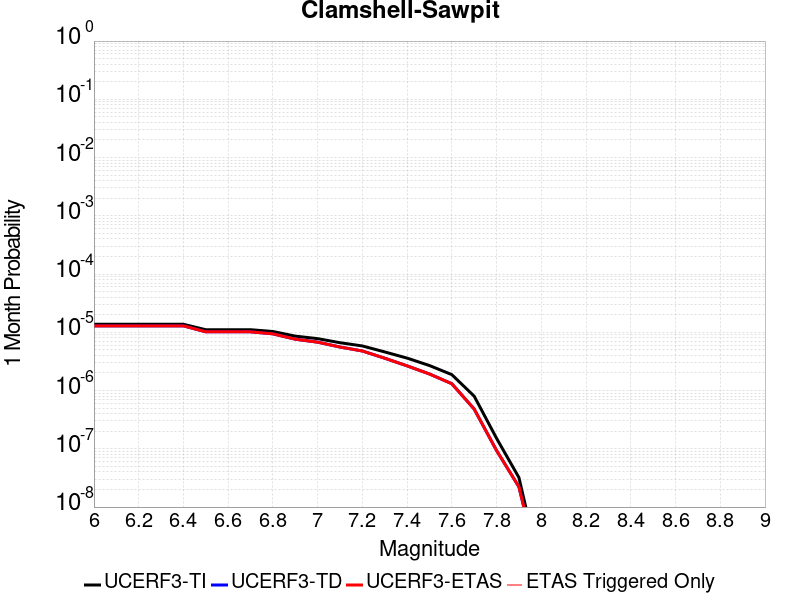 |  | 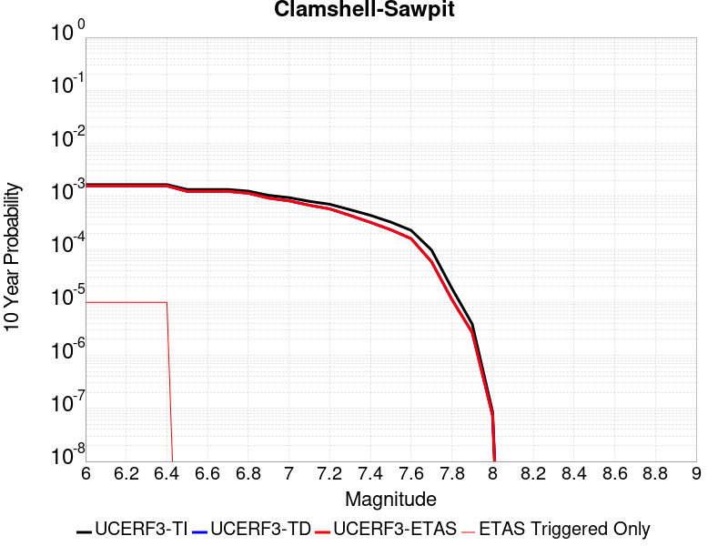 |

| Magnitude | 1 wk TI Prob | 1 wk TD Prob | 1 wk ETAS Prob | 1 wk ETAS/TD Gain | 1 wk ETAS Triggered Only | 1 mo TI Prob | 1 mo TD Prob | 1 mo ETAS Prob | 1 mo ETAS/TD Gain | 1 mo ETAS Triggered Only | 1 yr TI Prob | 1 yr TD Prob | 1 yr ETAS Prob | 1 yr ETAS/TD Gain | 1 yr ETAS Triggered Only | 10 yr TI Prob | 10 yr TD Prob | 10 yr ETAS Prob | 10 yr ETAS/TD Gain | 10 yr ETAS Triggered Only |
|-----|-----|-----|-----|-----|-----|-----|-----|-----|-----|-----|-----|-----|-----|-----|-----|-----|-----|-----|-----|-----|
| 6.0 | 3.202998E-6 | 3.0127826E-6 | 3.0127826E-6 | 1.0 | 0.0 | 1.3727062E-5 | 1.2911866E-5 | 1.2911866E-5 | 1.0 | 0.0 | 1.6711417E-4 | 1.5719143E-4 | 1.6790786E-4 | 1.0681744 | 1.0718114E-5 | 0.0016698855 | 0.0015708818 | 0.001581583 | 1.0068122 | 1.0718114E-5 |
| 6.1 | 3.202998E-6 | 3.0127826E-6 | 3.0127826E-6 | 1.0 | 0.0 | 1.3727062E-5 | 1.2911866E-5 | 1.2911866E-5 | 1.0 | 0.0 | 1.6711417E-4 | 1.5719143E-4 | 1.6790786E-4 | 1.0681744 | 1.0718114E-5 | 0.0016698855 | 0.0015708818 | 0.001581583 | 1.0068122 | 1.0718114E-5 |
| 6.2 | 3.202998E-6 | 3.0127826E-6 | 3.0127826E-6 | 1.0 | 0.0 | 1.3727062E-5 | 1.2911866E-5 | 1.2911866E-5 | 1.0 | 0.0 | 1.6711417E-4 | 1.5719143E-4 | 1.6790786E-4 | 1.0681744 | 1.0718114E-5 | 0.0016698855 | 0.0015708818 | 0.001581583 | 1.0068122 | 1.0718114E-5 |
| 6.3 | 3.202998E-6 | 3.0127826E-6 | 3.0127826E-6 | 1.0 | 0.0 | 1.3727062E-5 | 1.2911866E-5 | 1.2911866E-5 | 1.0 | 0.0 | 1.6711417E-4 | 1.5719143E-4 | 1.6790786E-4 | 1.0681744 | 1.0718114E-5 | 0.0016698855 | 0.0015708818 | 0.001581583 | 1.0068122 | 1.0718114E-5 |
| 6.4 | 3.202998E-6 | 3.0127826E-6 | 3.0127826E-6 | 1.0 | 0.0 | 1.3727062E-5 | 1.2911866E-5 | 1.2911866E-5 | 1.0 | 0.0 | 1.6711417E-4 | 1.5719143E-4 | 1.6790786E-4 | 1.0681744 | 1.0718114E-5 | 0.0016698855 | 0.0015708818 | 0.001581583 | 1.0068122 | 1.0718114E-5 |
| 6.5 | 2.5862723E-6 | 2.380791E-6 | 2.380791E-6 | 1.0 | 0.0 | 1.1083977E-5 | 1.0203352E-5 | 1.0203352E-5 | 1.0 | 0.0 | 1.3493907E-4 | 1.2421903E-4 | 1.2421903E-4 | 1.0 | 0.0 | 0.0013485716 | 0.0012415263 | 0.0012415263 | 1.0 | 0.0 |
| 6.6 | 2.5862723E-6 | 2.380791E-6 | 2.380791E-6 | 1.0 | 0.0 | 1.1083977E-5 | 1.0203352E-5 | 1.0203352E-5 | 1.0 | 0.0 | 1.3493907E-4 | 1.2421903E-4 | 1.2421903E-4 | 1.0 | 0.0 | 0.0013485716 | 0.0012415263 | 0.0012415263 | 1.0 | 0.0 |
| 6.7 | 2.5862723E-6 | 2.380791E-6 | 2.380791E-6 | 1.0 | 0.0 | 1.1083977E-5 | 1.0203352E-5 | 1.0203352E-5 | 1.0 | 0.0 | 1.3493907E-4 | 1.2421903E-4 | 1.2421903E-4 | 1.0 | 0.0 | 0.0013485716 | 0.0012415263 | 0.0012415263 | 1.0 | 0.0 |
| 6.8 | 2.4098806E-6 | 2.197746E-6 | 2.197746E-6 | 1.0 | 0.0 | 1.0328019E-5 | 9.418879E-6 | 9.418879E-6 | 1.0 | 0.0 | 1.2573638E-4 | 1.14669085E-4 | 1.14669085E-4 | 1.0 | 0.0 | 0.0012566525 | 0.0011461257 | 0.0011461257 | 1.0 | 0.0 |
| 6.9 | 2.0073985E-6 | 1.7784376E-6 | 1.7784376E-6 | 1.0 | 0.0 | 8.603109E-6 | 7.621854E-6 | 7.621854E-6 | 1.0 | 0.0 | 1.0473781E-4 | 9.2792245E-5 | 9.2792245E-5 | 1.0 | 0.0 | 0.0010468846 | 9.275468E-4 | 9.275468E-4 | 1.0 | 0.0 |
| 7.0 | 1.8166766E-6 | 1.5807215E-6 | 1.5807215E-6 | 1.0 | 0.0 | 7.785734E-6 | 6.7745036E-6 | 6.7745036E-6 | 1.0 | 0.0 | 9.478718E-5 | 8.247656E-5 | 8.247656E-5 | 1.0 | 0.0 | 9.4746763E-4 | 8.2446955E-4 | 8.2446955E-4 | 1.0 | 0.0 |
| 7.1 | 1.5471421E-6 | 1.3053062E-6 | 1.3053062E-6 | 1.0 | 0.0 | 6.6305925E-6 | 5.5941578E-6 | 5.5941578E-6 | 1.0 | 0.0 | 8.072447E-5 | 6.81068E-5 | 6.81068E-5 | 1.0 | 0.0 | 8.0695155E-4 | 6.8086473E-4 | 6.8086473E-4 | 1.0 | 0.0 |
| 7.2 | 1.3608037E-6 | 1.1153531E-6 | 1.1153531E-6 | 1.0 | 0.0 | 5.8320024E-6 | 4.7800763E-6 | 4.7800763E-6 | 1.0 | 0.0 | 7.1002316E-5 | 5.8195925E-5 | 5.8195925E-5 | 1.0 | 0.0 | 7.097964E-4 | 5.818115E-4 | 5.818115E-4 | 1.0 | 0.0 |
| 7.3 | 1.0749634E-6 | 8.3843213E-7 | 8.3843213E-7 | 1.0 | 0.0 | 4.6069777E-6 | 3.5932758E-6 | 3.5932758E-6 | 1.0 | 0.0 | 5.608851E-5 | 4.374728E-5 | 4.374728E-5 | 1.0 | 0.0 | 5.6074356E-4 | 4.3738954E-4 | 4.3738954E-4 | 1.0 | 0.0 |
| 7.4 | 8.416856E-7 | 6.2000976E-7 | 6.2000976E-7 | 1.0 | 0.0 | 3.607219E-6 | 2.657182E-6 | 2.657182E-6 | 1.0 | 0.0 | 4.3917007E-5 | 3.235073E-5 | 3.235073E-5 | 1.0 | 0.0 | 4.390833E-4 | 3.2346218E-4 | 3.2346218E-4 | 1.0 | 0.0 |
| 7.5 | 6.2779594E-7 | 4.4969224E-7 | 4.4969224E-7 | 1.0 | 0.0 | 2.6905511E-6 | 1.927251E-6 | 1.927251E-6 | 1.0 | 0.0 | 3.275697E-5 | 2.3464048E-5 | 2.3464048E-5 | 1.0 | 0.0 | 3.275214E-4 | 2.3461759E-4 | 2.3461759E-4 | 1.0 | 0.0 |
| 7.6 | 4.3822078E-7 | 3.0595675E-7 | 3.0595675E-7 | 1.0 | 0.0 | 1.8780877E-6 | 1.3112426E-6 | 1.3112426E-6 | 1.0 | 0.0 | 2.2865479E-5 | 1.5964277E-5 | 1.5964277E-5 | 1.0 | 0.0 | 2.2863125E-4 | 1.5963285E-4 | 1.5963285E-4 | 1.0 | 0.0 |
| 7.7 | 1.8704569E-7 | 1.1238066E-7 | 1.1238066E-7 | 1.0 | 0.0 | 8.0162414E-7 | 4.8163133E-7 | 4.8163133E-7 | 1.0 | 0.0 | 9.75973E-6 | 5.863846E-6 | 5.863846E-6 | 1.0 | 0.0 | 9.7593016E-5 | 5.863698E-5 | 5.863698E-5 | 1.0 | 0.0 |
| 7.8 | 3.5378733E-8 | 2.1838439E-8 | 2.1838439E-8 | 1.0 | 0.0 | 1.5162313E-7 | 9.359331E-8 | 9.359331E-8 | 1.0 | 0.0 | 1.84601E-6 | 1.139498E-6 | 1.139498E-6 | 1.0 | 0.0 | 1.8459947E-5 | 1.1394924E-5 | 1.1394924E-5 | 1.0 | 0.0 |
| 7.9 | 7.504945E-9 | 5.1920908E-9 | 5.1920908E-9 | 1.0 | 0.0 | 3.2164053E-8 | 2.2251818E-8 | 2.2251818E-8 | 1.0 | 0.0 | 3.9159727E-7 | 2.7091585E-7 | 2.7091585E-7 | 1.0 | 0.0 | 3.915966E-6 | 2.709156E-6 | 2.709156E-6 | 1.0 | 0.0 |
| 8.0 | 1.6554036E-10 | 1.4180812E-10 | 1.4180812E-10 | 1.0 | 0.0 | 7.0945894E-10 | 6.077491E-10 | 6.077491E-10 | 1.0 | 0.0 | 8.637662E-9 | 7.3993442E-9 | 7.3993442E-9 | 1.0 | 0.0 | 8.6376616E-8 | 7.399344E-8 | 7.399344E-8 | 1.0 | 0.0 |

## Hollywood
*[(top)](#table-of-contents)*

| 1 Week | 1 Month | 1 Year | 10 Year |
|-----|-----|-----|-----|
| 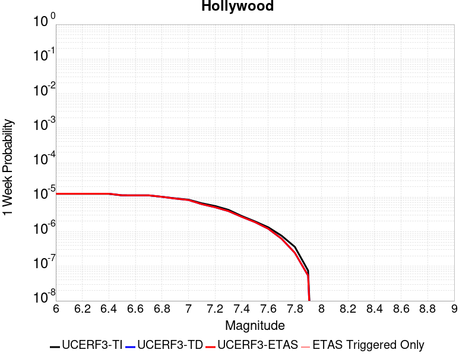 |  |  | 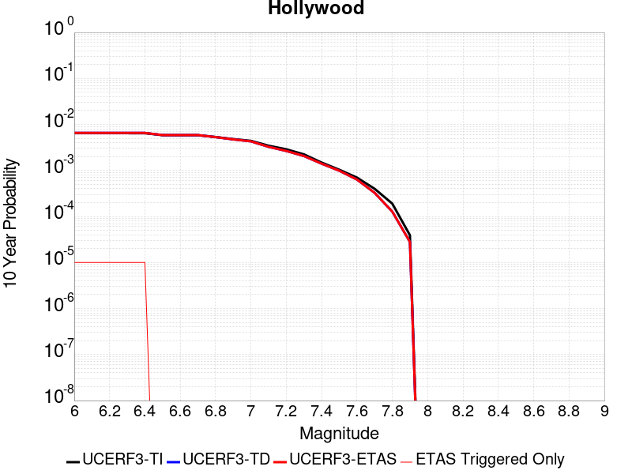 |

| Magnitude | 1 wk TI Prob | 1 wk TD Prob | 1 wk ETAS Prob | 1 wk ETAS/TD Gain | 1 wk ETAS Triggered Only | 1 mo TI Prob | 1 mo TD Prob | 1 mo ETAS Prob | 1 mo ETAS/TD Gain | 1 mo ETAS Triggered Only | 1 yr TI Prob | 1 yr TD Prob | 1 yr ETAS Prob | 1 yr ETAS/TD Gain | 1 yr ETAS Triggered Only | 10 yr TI Prob | 10 yr TD Prob | 10 yr ETAS Prob | 10 yr ETAS/TD Gain | 10 yr ETAS Triggered Only |
|-----|-----|-----|-----|-----|-----|-----|-----|-----|-----|-----|-----|-----|-----|-----|-----|-----|-----|-----|-----|-----|
| 6.0 | 1.24487615E-5 | 1.2593381E-5 | 1.2593381E-5 | 1.0 | 0.0 | 5.3350745E-5 | 5.3970543E-5 | 5.3970543E-5 | 1.0 | 0.0 | 6.4935174E-4 | 6.568979E-4 | 6.67609E-4 | 1.0163056 | 1.0718114E-5 | 0.0064745755 | 0.0065500494 | 0.0065606977 | 1.0016257 | 1.0718114E-5 |
| 6.1 | 1.24487615E-5 | 1.2593381E-5 | 1.2593381E-5 | 1.0 | 0.0 | 5.3350745E-5 | 5.3970543E-5 | 5.3970543E-5 | 1.0 | 0.0 | 6.4935174E-4 | 6.568979E-4 | 6.67609E-4 | 1.0163056 | 1.0718114E-5 | 0.0064745755 | 0.0065500494 | 0.0065606977 | 1.0016257 | 1.0718114E-5 |
| 6.2 | 1.24487615E-5 | 1.2593381E-5 | 1.2593381E-5 | 1.0 | 0.0 | 5.3350745E-5 | 5.3970543E-5 | 5.3970543E-5 | 1.0 | 0.0 | 6.4935174E-4 | 6.568979E-4 | 6.67609E-4 | 1.0163056 | 1.0718114E-5 | 0.0064745755 | 0.0065500494 | 0.0065606977 | 1.0016257 | 1.0718114E-5 |
| 6.3 | 1.24487615E-5 | 1.2593381E-5 | 1.2593381E-5 | 1.0 | 0.0 | 5.3350745E-5 | 5.3970543E-5 | 5.3970543E-5 | 1.0 | 0.0 | 6.4935174E-4 | 6.568979E-4 | 6.67609E-4 | 1.0163056 | 1.0718114E-5 | 0.0064745755 | 0.0065500494 | 0.0065606977 | 1.0016257 | 1.0718114E-5 |
| 6.4 | 1.2431024E-5 | 1.2573994E-5 | 1.2573994E-5 | 1.0 | 0.0 | 5.327473E-5 | 5.3887463E-5 | 5.3887463E-5 | 1.0 | 0.0 | 6.4842677E-4 | 6.55887E-4 | 6.665981E-4 | 1.0163307 | 1.0718114E-5 | 0.0064653796 | 0.00654 | 0.006550648 | 1.0016282 | 1.0718114E-5 |
| 6.5 | 1.1242222E-5 | 1.1317946E-5 | 1.1317946E-5 | 1.0 | 0.0 | 4.8180063E-5 | 4.8504597E-5 | 4.8504597E-5 | 1.0 | 0.0 | 5.864344E-4 | 5.9038616E-4 | 5.9038616E-4 | 1.0 | 0.0 | 0.0058488925 | 0.0058884635 | 0.0058884635 | 1.0 | 0.0 |
| 6.6 | 1.1234066E-5 | 1.130906E-5 | 1.130906E-5 | 1.0 | 0.0 | 4.8145106E-5 | 4.8466514E-5 | 4.8466514E-5 | 1.0 | 0.0 | 5.86009E-4 | 5.899227E-4 | 5.899227E-4 | 1.0 | 0.0 | 0.005844661 | 0.0058838543 | 0.0058838543 | 1.0 | 0.0 |
| 6.7 | 1.12294E-5 | 1.1303803E-5 | 1.1303803E-5 | 1.0 | 0.0 | 4.812511E-5 | 4.8443988E-5 | 4.8443988E-5 | 1.0 | 0.0 | 5.857657E-4 | 5.896486E-4 | 5.896486E-4 | 1.0 | 0.0 | 0.0058422405 | 0.0058811274 | 0.0058811274 | 1.0 | 0.0 |
| 6.8 | 1.0252819E-5 | 1.0218574E-5 | 1.0218574E-5 | 1.0 | 0.0 | 4.3939912E-5 | 4.3793167E-5 | 4.3793167E-5 | 1.0 | 0.0 | 5.3483713E-4 | 5.330535E-4 | 5.330535E-4 | 1.0 | 0.0 | 0.005335517 | 0.005317975 | 0.005317975 | 1.0 | 0.0 |
| 6.9 | 9.252289E-6 | 9.110419E-6 | 9.110419E-6 | 1.0 | 0.0 | 3.9652066E-5 | 3.904408E-5 | 3.904408E-5 | 1.0 | 0.0 | 4.8265693E-4 | 4.7525964E-4 | 4.7525964E-4 | 1.0 | 0.0 | 0.0048161 | 0.004742606 | 0.004742606 | 1.0 | 0.0 |
| 7.0 | 8.474604E-6 | 8.25836E-6 | 8.25836E-6 | 1.0 | 0.0 | 3.6319227E-5 | 3.53925E-5 | 3.53925E-5 | 1.0 | 0.0 | 4.4209688E-4 | 4.308199E-4 | 4.308199E-4 | 1.0 | 0.0 | 0.004412184 | 0.0042999974 | 0.0042999974 | 1.0 | 0.0 |
| 7.1 | 6.643643E-6 | 6.2684458E-6 | 6.2684458E-6 | 1.0 | 0.0 | 2.8472443E-5 | 2.6864493E-5 | 2.6864493E-5 | 1.0 | 0.0 | 3.4659685E-4 | 3.2702653E-4 | 3.2702653E-4 | 1.0 | 0.0 | 0.0034605677 | 0.003265499 | 0.003265499 | 1.0 | 0.0 |
| 7.2 | 5.549002E-6 | 5.108774E-6 | 5.108774E-6 | 1.0 | 0.0 | 2.378122E-5 | 2.1894564E-5 | 2.1894564E-5 | 1.0 | 0.0 | 2.8949787E-4 | 2.6653384E-4 | 2.6653384E-4 | 1.0 | 0.0 | 0.0028912104 | 0.0026621583 | 0.0026621583 | 1.0 | 0.0 |
| 7.3 | 4.3059727E-6 | 3.959942E-6 | 3.959942E-6 | 1.0 | 0.0 | 1.8454039E-5 | 1.6971071E-5 | 1.6971071E-5 | 1.0 | 0.0 | 2.2465475E-4 | 2.0660329E-4 | 2.0660329E-4 | 1.0 | 0.0 | 0.0022442779 | 0.0020641224 | 0.0020641224 | 1.0 | 0.0 |
| 7.4 | 2.8550733E-6 | 2.7013389E-6 | 2.7013389E-6 | 1.0 | 0.0 | 1.2235971E-5 | 1.1577115E-5 | 1.1577115E-5 | 1.0 | 0.0 | 1.4896276E-4 | 1.4094231E-4 | 1.4094231E-4 | 1.0 | 0.0 | 0.0014886294 | 0.0014085344 | 0.0014085344 | 1.0 | 0.0 |
| 7.5 | 1.9927045E-6 | 1.8976702E-6 | 1.8976702E-6 | 1.0 | 0.0 | 8.540134E-6 | 8.132847E-6 | 8.132847E-6 | 1.0 | 0.0 | 1.0397117E-4 | 9.9012956E-5 | 9.9012956E-5 | 1.0 | 0.0 | 0.0010392254 | 9.896919E-4 | 9.896919E-4 | 1.0 | 0.0 |
| 7.6 | 1.345084E-6 | 1.221624E-6 | 1.221624E-6 | 1.0 | 0.0 | 5.764633E-6 | 5.235521E-6 | 5.235521E-6 | 1.0 | 0.0 | 7.018215E-5 | 6.374063E-5 | 6.374063E-5 | 1.0 | 0.0 | 7.0159987E-4 | 6.372254E-4 | 6.372254E-4 | 1.0 | 0.0 |
| 7.7 | 7.6835164E-7 | 6.2778713E-7 | 6.2778713E-7 | 1.0 | 0.0 | 3.2929315E-6 | 2.6905136E-6 | 2.6905136E-6 | 1.0 | 0.0 | 4.00907E-5 | 3.2756525E-5 | 3.2756525E-5 | 1.0 | 0.0 | 4.0083472E-4 | 3.2751844E-4 | 3.2751844E-4 | 1.0 | 0.0 |
| 7.8 | 3.6562128E-7 | 2.453623E-7 | 2.453623E-7 | 1.0 | 0.0 | 1.5669474E-6 | 1.0515523E-6 | 1.0515523E-6 | 1.0 | 0.0 | 1.9077417E-5 | 1.2802578E-5 | 1.2802578E-5 | 1.0 | 0.0 | 1.907578E-4 | 1.2801877E-4 | 1.2801877E-4 | 1.0 | 0.0 |
| 7.9 | 7.5024424E-8 | 5.3819846E-8 | 5.3819846E-8 | 1.0 | 0.0 | 3.215332E-7 | 2.3065647E-7 | 2.3065647E-7 | 1.0 | 0.0 | 3.91466E-6 | 2.8082402E-6 | 2.8082402E-6 | 1.0 | 0.0 | 3.9145907E-5 | 2.8082177E-5 | 2.8082177E-5 | 1.0 | 0.0 |

## Cerro Prieto
*[(top)](#table-of-contents)*

| 1 Week | 1 Month | 1 Year | 10 Year |
|-----|-----|-----|-----|
|  |  | 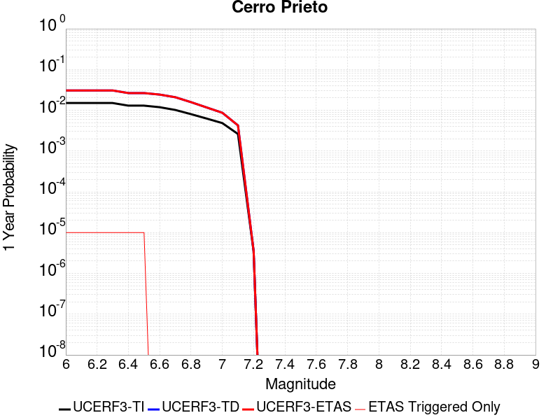 |  |

| Magnitude | 1 wk TI Prob | 1 wk TD Prob | 1 wk ETAS Prob | 1 wk ETAS/TD Gain | 1 wk ETAS Triggered Only | 1 mo TI Prob | 1 mo TD Prob | 1 mo ETAS Prob | 1 mo ETAS/TD Gain | 1 mo ETAS Triggered Only | 1 yr TI Prob | 1 yr TD Prob | 1 yr ETAS Prob | 1 yr ETAS/TD Gain | 1 yr ETAS Triggered Only | 10 yr TI Prob | 10 yr TD Prob | 10 yr ETAS Prob | 10 yr ETAS/TD Gain | 10 yr ETAS Triggered Only |
|-----|-----|-----|-----|-----|-----|-----|-----|-----|-----|-----|-----|-----|-----|-----|-----|-----|-----|-----|-----|-----|
| 6.0 | 2.9101528E-4 | 5.965907E-4 | 6.073024E-4 | 1.017955 | 1.0718114E-5 | 0.0012466122 | 0.002554554 | 0.0025652447 | 1.004185 | 1.0718114E-5 | 0.015072231 | 0.030653033 | 0.030663421 | 1.0003389 | 1.0718114E-5 | 0.14089979 | 0.25401175 | 0.25401974 | 1.0000315 | 1.0718114E-5 |
| 6.1 | 2.9101528E-4 | 5.965907E-4 | 6.073024E-4 | 1.017955 | 1.0718114E-5 | 0.0012466122 | 0.002554554 | 0.0025652447 | 1.004185 | 1.0718114E-5 | 0.015072231 | 0.030653033 | 0.030663421 | 1.0003389 | 1.0718114E-5 | 0.14089979 | 0.25401175 | 0.25401974 | 1.0000315 | 1.0718114E-5 |
| 6.2 | 2.9101528E-4 | 5.965907E-4 | 6.073024E-4 | 1.017955 | 1.0718114E-5 | 0.0012466122 | 0.002554554 | 0.0025652447 | 1.004185 | 1.0718114E-5 | 0.015072231 | 0.030653033 | 0.030663421 | 1.0003389 | 1.0718114E-5 | 0.14089979 | 0.25401175 | 0.25401974 | 1.0000315 | 1.0718114E-5 |
| 6.3 | 2.9101528E-4 | 5.965907E-4 | 6.073024E-4 | 1.017955 | 1.0718114E-5 | 0.0012466122 | 0.002554554 | 0.0025652447 | 1.004185 | 1.0718114E-5 | 0.015072231 | 0.030653033 | 0.030663421 | 1.0003389 | 1.0718114E-5 | 0.14089979 | 0.25401175 | 0.25401974 | 1.0000315 | 1.0718114E-5 |
| 6.4 | 2.508648E-4 | 5.140792E-4 | 5.247918E-4 | 1.0208384 | 1.0718114E-5 | 0.0010746918 | 0.0022015348 | 0.0022122294 | 1.0048578 | 1.0718114E-5 | 0.013006088 | 0.026476625 | 0.02648706 | 1.0003941 | 1.0718114E-5 | 0.12270685 | 0.22443727 | 0.22444558 | 1.0000371 | 1.0718114E-5 |
| 6.5 | 2.508648E-4 | 5.140792E-4 | 5.247918E-4 | 1.0208384 | 1.0718114E-5 | 0.0010746918 | 0.0022015348 | 0.0022122294 | 1.0048578 | 1.0718114E-5 | 0.013006088 | 0.026476625 | 0.02648706 | 1.0003941 | 1.0718114E-5 | 0.12270685 | 0.22443727 | 0.22444558 | 1.0000371 | 1.0718114E-5 |
| 6.6 | 2.294914E-4 | 4.7126948E-4 | 4.7126948E-4 | 1.0 | 0.0 | 9.831638E-4 | 0.0020183506 | 0.0020183506 | 1.0 | 0.0 | 0.011904482 | 0.024303433 | 0.024303433 | 1.0 | 0.0 | 0.11286586 | 0.20861839 | 0.20861839 | 1.0 | 0.0 |
| 6.7 | 1.9621674E-4 | 4.042872E-4 | 4.042872E-4 | 1.0 | 0.0 | 8.4065786E-4 | 0.0017316672 | 0.0017316672 | 1.0 | 0.0 | 0.010187071 | 0.020889567 | 0.020889567 | 1.0 | 0.0 | 0.09732539 | 0.18293467 | 0.18293467 | 1.0 | 0.0 |
| 6.8 | 1.5476145E-4 | 3.0573073E-4 | 3.0573073E-4 | 1.0 | 0.0 | 6.6309475E-4 | 0.0013097188 | 0.0013097188 | 1.0 | 0.0 | 0.008043335 | 0.015840806 | 0.015840806 | 1.0 | 0.0 | 0.07758363 | 0.14339209 | 0.14339209 | 1.0 | 0.0 |
| 6.9 | 1.20509176E-4 | 2.2588969E-4 | 2.2588969E-4 | 1.0 | 0.0 | 5.1636563E-4 | 9.678028E-4 | 9.678028E-4 | 1.0 | 0.0 | 0.006268645 | 0.011729713 | 0.011729713 | 1.0 | 0.0 | 0.060947374 | 0.10947595 | 0.10947595 | 1.0 | 0.0 |
| 7.0 | 9.3269155E-5 | 1.672182E-4 | 1.672182E-4 | 1.0 | 0.0 | 3.9966372E-4 | 7.164957E-4 | 7.164957E-4 | 1.0 | 0.0 | 0.0048550544 | 0.008696101 | 0.008696101 | 1.0 | 0.0 | 0.04750344 | 0.08317999 | 0.08317999 | 1.0 | 0.0 |
| 7.1 | 5.029709E-5 | 8.1748294E-5 | 8.1748294E-5 | 1.0 | 0.0 | 2.1554115E-4 | 3.5032208E-4 | 3.5032208E-4 | 1.0 | 0.0 | 0.0026210553 | 0.0042602476 | 0.0042602476 | 1.0 | 0.0 | 0.025903556 | 0.04237809 | 0.04237809 | 1.0 | 0.0 |
| 7.2 | 6.5445185E-8 | 6.820826E-8 | 6.820826E-8 | 1.0 | 0.0 | 2.8047933E-7 | 2.923211E-7 | 2.923211E-7 | 1.0 | 0.0 | 3.4148304E-6 | 3.5590094E-6 | 3.5590094E-6 | 1.0 | 0.0 | 3.414778E-5 | 3.5590092E-5 | 3.5590092E-5 | 1.0 | 0.0 |

## Casmalia 2011 CFM
*[(top)](#table-of-contents)*

| 1 Week | 1 Month | 1 Year | 10 Year |
|-----|-----|-----|-----|
|  |  |  | 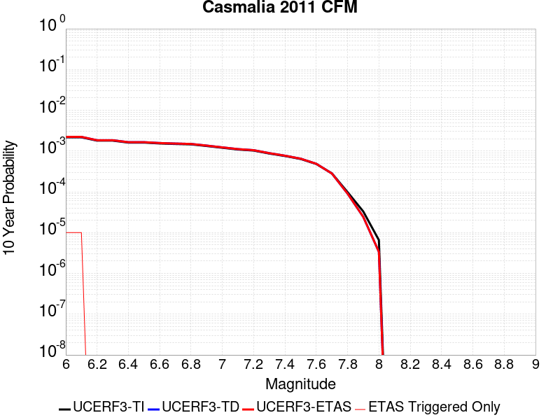 |

| Magnitude | 1 wk TI Prob | 1 wk TD Prob | 1 wk ETAS Prob | 1 wk ETAS/TD Gain | 1 wk ETAS Triggered Only | 1 mo TI Prob | 1 mo TD Prob | 1 mo ETAS Prob | 1 mo ETAS/TD Gain | 1 mo ETAS Triggered Only | 1 yr TI Prob | 1 yr TD Prob | 1 yr ETAS Prob | 1 yr ETAS/TD Gain | 1 yr ETAS Triggered Only | 10 yr TI Prob | 10 yr TD Prob | 10 yr ETAS Prob | 10 yr ETAS/TD Gain | 10 yr ETAS Triggered Only |
|-----|-----|-----|-----|-----|-----|-----|-----|-----|-----|-----|-----|-----|-----|-----|-----|-----|-----|-----|-----|-----|
| 6.0 | 4.1704893E-6 | 4.2625015E-6 | 4.2625015E-6 | 1.0 | 0.0 | 1.7873403E-5 | 1.8267738E-5 | 1.8267738E-5 | 1.0 | 0.0 | 2.1758694E-4 | 2.223872E-4 | 2.223872E-4 | 1.0 | 0.0 | 0.0021737402 | 0.0022216674 | 0.0022323618 | 1.0048137 | 1.0718114E-5 |
| 6.1 | 4.1704893E-6 | 4.2625015E-6 | 4.2625015E-6 | 1.0 | 0.0 | 1.7873403E-5 | 1.8267738E-5 | 1.8267738E-5 | 1.0 | 0.0 | 2.1758694E-4 | 2.223872E-4 | 2.223872E-4 | 1.0 | 0.0 | 0.0021737402 | 0.0022216674 | 0.0022323618 | 1.0048137 | 1.0718114E-5 |
| 6.2 | 3.457312E-6 | 3.5370388E-6 | 3.5370388E-6 | 1.0 | 0.0 | 1.4816967E-5 | 1.515865E-5 | 1.515865E-5 | 1.0 | 0.0 | 1.8038164E-4 | 1.8454103E-4 | 1.8454103E-4 | 1.0 | 0.0 | 0.001802353 | 0.0018438873 | 0.0018438873 | 1.0 | 0.0 |
| 6.3 | 3.457312E-6 | 3.5370388E-6 | 3.5370388E-6 | 1.0 | 0.0 | 1.4816967E-5 | 1.515865E-5 | 1.515865E-5 | 1.0 | 0.0 | 1.8038164E-4 | 1.8454103E-4 | 1.8454103E-4 | 1.0 | 0.0 | 0.001802353 | 0.0018438873 | 0.0018438873 | 1.0 | 0.0 |
| 6.4 | 3.0957337E-6 | 3.169242E-6 | 3.169242E-6 | 1.0 | 0.0 | 1.3267363E-5 | 1.3582395E-5 | 1.3582395E-5 | 1.0 | 0.0 | 1.6151817E-4 | 1.6535317E-4 | 1.6535317E-4 | 1.0 | 0.0 | 0.0016140083 | 0.0016523075 | 0.0016523075 | 1.0 | 0.0 |
| 6.5 | 3.0957337E-6 | 3.169242E-6 | 3.169242E-6 | 1.0 | 0.0 | 1.3267363E-5 | 1.3582395E-5 | 1.3582395E-5 | 1.0 | 0.0 | 1.6151817E-4 | 1.6535317E-4 | 1.6535317E-4 | 1.0 | 0.0 | 0.0016140083 | 0.0016523075 | 0.0016523075 | 1.0 | 0.0 |
| 6.6 | 2.9459152E-6 | 3.0165909E-6 | 3.0165909E-6 | 1.0 | 0.0 | 1.262529E-5 | 1.2928183E-5 | 1.2928183E-5 | 1.0 | 0.0 | 1.5370206E-4 | 1.5738931E-4 | 1.5738931E-4 | 1.0 | 0.0 | 0.0015359579 | 0.001572784 | 0.001572784 | 1.0 | 0.0 |
| 6.7 | 2.8634809E-6 | 2.932488E-6 | 2.932488E-6 | 1.0 | 0.0 | 1.2272003E-5 | 1.2567746E-5 | 1.2567746E-5 | 1.0 | 0.0 | 1.4940138E-4 | 1.5300162E-4 | 1.5300162E-4 | 1.0 | 0.0 | 0.0014930099 | 0.0015289682 | 0.0015289682 | 1.0 | 0.0 |
| 6.8 | 2.7999822E-6 | 2.867612E-6 | 2.867612E-6 | 1.0 | 0.0 | 1.1999869E-5 | 1.2289708E-5 | 1.2289708E-5 | 1.0 | 0.0 | 1.460886E-4 | 1.4961697E-4 | 1.4961697E-4 | 1.0 | 0.0 | 0.001459926 | 0.0014951678 | 0.0014951678 | 1.0 | 0.0 |
| 6.9 | 2.551052E-6 | 2.6119794E-6 | 2.6119794E-6 | 1.0 | 0.0 | 1.0933034E-5 | 1.1194149E-5 | 1.1194149E-5 | 1.0 | 0.0 | 1.3310155E-4 | 1.3628029E-4 | 1.3628029E-4 | 1.0 | 0.0 | 0.0013302186 | 0.0013619711 | 0.0013619711 | 1.0 | 0.0 |
| 7.0 | 2.3081875E-6 | 2.3624225E-6 | 2.3624225E-6 | 1.0 | 0.0 | 9.892195E-6 | 1.0124629E-5 | 1.0124629E-5 | 1.0 | 0.0 | 1.20430814E-4 | 1.2326041E-4 | 1.2326041E-4 | 1.0 | 0.0 | 0.0012036557 | 0.0012319232 | 0.0012319232 | 1.0 | 0.0 |
| 7.1 | 2.093245E-6 | 2.141737E-6 | 2.141737E-6 | 1.0 | 0.0 | 8.971019E-6 | 9.1788415E-6 | 9.1788415E-6 | 1.0 | 0.0 | 1.09216686E-4 | 1.1174668E-4 | 1.1174668E-4 | 1.0 | 0.0 | 0.0010916302 | 0.0011169069 | 0.0011169069 | 1.0 | 0.0 |
| 7.2 | 1.9714576E-6 | 2.0165214E-6 | 2.0165214E-6 | 1.0 | 0.0 | 8.449076E-6 | 8.642206E-6 | 8.642206E-6 | 1.0 | 0.0 | 1.0286264E-4 | 1.05213796E-4 | 1.05213796E-4 | 1.0 | 0.0 | 0.0010281504 | 0.0010516418 | 0.0010516418 | 1.0 | 0.0 |
| 7.3 | 1.6689512E-6 | 1.7047241E-6 | 1.7047241E-6 | 1.0 | 0.0 | 7.1526288E-6 | 7.30594E-6 | 7.30594E-6 | 1.0 | 0.0 | 8.7079774E-5 | 8.8946195E-5 | 8.8946195E-5 | 1.0 | 0.0 | 8.7045657E-4 | 8.8910677E-4 | 8.8910677E-4 | 1.0 | 0.0 |
| 7.4 | 1.4490954E-6 | 1.4779009E-6 | 1.4779009E-6 | 1.0 | 0.0 | 6.210394E-6 | 6.3338457E-6 | 6.3338457E-6 | 1.0 | 0.0 | 7.560892E-5 | 7.711185E-5 | 7.711185E-5 | 1.0 | 0.0 | 7.55832E-4 | 7.7085156E-4 | 7.7085156E-4 | 1.0 | 0.0 |
| 7.5 | 1.226873E-6 | 1.2481792E-6 | 1.2481792E-6 | 1.0 | 0.0 | 5.2580162E-6 | 5.3493286E-6 | 5.3493286E-6 | 1.0 | 0.0 | 6.401447E-5 | 6.5126136E-5 | 6.5126136E-5 | 1.0 | 0.0 | 6.399603E-4 | 6.51071E-4 | 6.51071E-4 | 1.0 | 0.0 |
| 7.6 | 9.2561345E-7 | 9.3619997E-7 | 9.3619997E-7 | 1.0 | 0.0 | 3.966909E-6 | 4.012279E-6 | 4.012279E-6 | 1.0 | 0.0 | 4.8296046E-5 | 4.8848407E-5 | 4.8848407E-5 | 1.0 | 0.0 | 4.828555E-4 | 4.883771E-4 | 4.883771E-4 | 1.0 | 0.0 |
| 7.7 | 5.4367933E-7 | 5.392944E-7 | 5.392944E-7 | 1.0 | 0.0 | 2.3300522E-6 | 2.3112595E-6 | 2.3112595E-6 | 1.0 | 0.0 | 2.8368017E-5 | 2.8139224E-5 | 2.8139224E-5 | 1.0 | 0.0 | 2.8364395E-4 | 2.8135674E-4 | 2.8135674E-4 | 1.0 | 0.0 |
| 7.8 | 1.8825742E-7 | 1.7342624E-7 | 1.7342624E-7 | 1.0 | 0.0 | 8.068173E-7 | 7.432551E-7 | 7.432551E-7 | 1.0 | 0.0 | 9.822956E-6 | 9.049094E-6 | 9.049094E-6 | 1.0 | 0.0 | 9.822522E-5 | 9.048728E-5 | 9.048728E-5 | 1.0 | 0.0 |
| 7.9 | 6.342771E-8 | 4.6793474E-8 | 4.6793474E-8 | 1.0 | 0.0 | 2.7183304E-7 | 2.0054344E-7 | 2.0054344E-7 | 1.0 | 0.0 | 3.3095623E-6 | 2.4416136E-6 | 2.4416136E-6 | 1.0 | 0.0 | 3.309513E-5 | 2.4415873E-5 | 2.4415873E-5 | 1.0 | 0.0 |
| 8.0 | 1.2574819E-8 | 6.4743E-9 | 6.4743E-9 | 1.0 | 0.0 | 5.3892084E-8 | 2.7747E-8 | 2.7747E-8 | 1.0 | 0.0 | 6.561359E-7 | 3.3781967E-7 | 3.3781967E-7 | 1.0 | 0.0 | 6.56134E-6 | 3.3781916E-6 | 3.3781916E-6 | 1.0 | 0.0 |

## Elsinore (Temecula) rev
*[(top)](#table-of-contents)*

| 1 Week | 1 Month | 1 Year | 10 Year |
|-----|-----|-----|-----|
|  |  |  |  |

| Magnitude | 1 wk TI Prob | 1 wk TD Prob | 1 wk ETAS Prob | 1 wk ETAS/TD Gain | 1 wk ETAS Triggered Only | 1 mo TI Prob | 1 mo TD Prob | 1 mo ETAS Prob | 1 mo ETAS/TD Gain | 1 mo ETAS Triggered Only | 1 yr TI Prob | 1 yr TD Prob | 1 yr ETAS Prob | 1 yr ETAS/TD Gain | 1 yr ETAS Triggered Only | 10 yr TI Prob | 10 yr TD Prob | 10 yr ETAS Prob | 10 yr ETAS/TD Gain | 10 yr ETAS Triggered Only |
|-----|-----|-----|-----|-----|-----|-----|-----|-----|-----|-----|-----|-----|-----|-----|-----|-----|-----|-----|-----|-----|
| 6.0 | 2.9514995E-5 | 2.2518343E-5 | 2.2518343E-5 | 1.0 | 0.0 | 1.264867E-4 | 9.650374E-5 | 9.650374E-5 | 1.0 | 0.0 | 0.0015388876 | 0.001174322 | 0.001174322 | 1.0 | 0.0 | 0.015282745 | 0.011697536 | 0.011708129 | 1.0009055 | 1.0718114E-5 |
| 6.1 | 2.9514995E-5 | 2.2518343E-5 | 2.2518343E-5 | 1.0 | 0.0 | 1.264867E-4 | 9.650374E-5 | 9.650374E-5 | 1.0 | 0.0 | 0.0015388876 | 0.001174322 | 0.001174322 | 1.0 | 0.0 | 0.015282745 | 0.011697536 | 0.011708129 | 1.0009055 | 1.0718114E-5 |
| 6.2 | 2.9514995E-5 | 2.2518343E-5 | 2.2518343E-5 | 1.0 | 0.0 | 1.264867E-4 | 9.650374E-5 | 9.650374E-5 | 1.0 | 0.0 | 0.0015388876 | 0.001174322 | 0.001174322 | 1.0 | 0.0 | 0.015282745 | 0.011697536 | 0.011708129 | 1.0009055 | 1.0718114E-5 |
| 6.3 | 2.3223649E-5 | 1.8407327E-5 | 1.8407327E-5 | 1.0 | 0.0 | 9.952613E-5 | 7.888625E-5 | 7.888625E-5 | 1.0 | 0.0 | 0.001211057 | 9.6003426E-4 | 9.6003426E-4 | 1.0 | 0.0 | 0.012044783 | 0.009570387 | 0.009581002 | 1.0011092 | 1.0718114E-5 |
| 6.4 | 2.3223649E-5 | 1.8407327E-5 | 1.8407327E-5 | 1.0 | 0.0 | 9.952613E-5 | 7.888625E-5 | 7.888625E-5 | 1.0 | 0.0 | 0.001211057 | 9.6003426E-4 | 9.6003426E-4 | 1.0 | 0.0 | 0.012044783 | 0.009570387 | 0.009581002 | 1.0011092 | 1.0718114E-5 |
| 6.5 | 1.8338875E-5 | 1.4750731E-5 | 1.4750731E-5 | 1.0 | 0.0 | 7.8592806E-5 | 6.3215935E-5 | 6.3215935E-5 | 1.0 | 0.0 | 9.5644733E-4 | 7.6939096E-4 | 7.6939096E-4 | 1.0 | 0.0 | 0.009523412 | 0.007674229 | 0.007674229 | 1.0 | 0.0 |
| 6.6 | 1.8223333E-5 | 1.46132825E-5 | 1.46132825E-5 | 1.0 | 0.0 | 7.809766E-5 | 6.26269E-5 | 6.26269E-5 | 1.0 | 0.0 | 9.504242E-4 | 7.6222455E-4 | 7.6222455E-4 | 1.0 | 0.0 | 0.009463696 | 0.0076030563 | 0.0076030563 | 1.0 | 0.0 |
| 6.7 | 1.7512752E-5 | 1.4027789E-5 | 1.4027789E-5 | 1.0 | 0.0 | 7.505249E-5 | 6.011776E-5 | 6.011776E-5 | 1.0 | 0.0 | 9.13381E-4 | 7.316965E-4 | 7.316965E-4 | 1.0 | 0.0 | 0.00909636 | 0.0072992197 | 0.0072992197 | 1.0 | 0.0 |
| 6.8 | 1.7417142E-5 | 1.3951771E-5 | 1.3951771E-5 | 1.0 | 0.0 | 7.4642754E-5 | 5.979198E-5 | 5.979198E-5 | 1.0 | 0.0 | 9.083966E-4 | 7.277328E-4 | 7.277328E-4 | 1.0 | 0.0 | 0.009046922 | 0.0072597866 | 0.0072597866 | 1.0 | 0.0 |
| 6.9 | 1.6402591E-5 | 1.2989167E-5 | 1.2989167E-5 | 1.0 | 0.0 | 7.0294926E-5 | 5.5666715E-5 | 5.5666715E-5 | 1.0 | 0.0 | 8.5550465E-4 | 6.7753915E-4 | 6.7753915E-4 | 1.0 | 0.0 | 0.008522186 | 0.006760456 | 0.006760456 | 1.0 | 0.0 |
| 7.0 | 1.3912486E-5 | 1.0878723E-5 | 1.0878723E-5 | 1.0 | 0.0 | 5.9623577E-5 | 4.6622277E-5 | 4.6622277E-5 | 1.0 | 0.0 | 7.2567526E-4 | 5.674811E-4 | 5.674811E-4 | 1.0 | 0.0 | 0.0072331014 | 0.005664239 | 0.005664239 | 1.0 | 0.0 |
| 7.1 | 1.3405147E-5 | 1.0327884E-5 | 1.0327884E-5 | 1.0 | 0.0 | 5.7449364E-5 | 4.4261626E-5 | 4.4261626E-5 | 1.0 | 0.0 | 6.9922156E-4 | 5.387546E-4 | 5.387546E-4 | 1.0 | 0.0 | 0.0069702556 | 0.0053778174 | 0.0053778174 | 1.0 | 0.0 |
| 7.2 | 1.21402E-5 | 8.99712E-6 | 8.99712E-6 | 1.0 | 0.0 | 5.202839E-5 | 3.8558526E-5 | 3.8558526E-5 | 1.0 | 0.0 | 6.332616E-4 | 4.693507E-4 | 4.693507E-4 | 1.0 | 0.0 | 0.0063146 | 0.0046850196 | 0.0046850196 | 1.0 | 0.0 |
| 7.3 | 1.05047775E-5 | 7.572085E-6 | 7.572085E-6 | 1.0 | 0.0 | 4.5019697E-5 | 3.2451397E-5 | 3.2451397E-5 | 1.0 | 0.0 | 5.4797693E-4 | 3.950256E-4 | 3.950256E-4 | 1.0 | 0.0 | 0.005466277 | 0.0039436235 | 0.0039436235 | 1.0 | 0.0 |
| 7.4 | 9.624483E-6 | 6.7871442E-6 | 6.7871442E-6 | 1.0 | 0.0 | 4.124713E-5 | 2.9087445E-5 | 2.9087445E-5 | 1.0 | 0.0 | 5.0206814E-4 | 3.540835E-4 | 3.540835E-4 | 1.0 | 0.0 | 0.005009353 | 0.003535347 | 0.003535347 | 1.0 | 0.0 |
| 7.5 | 8.215151E-6 | 5.635765E-6 | 5.635765E-6 | 1.0 | 0.0 | 3.5207315E-5 | 2.4153062E-5 | 2.4153062E-5 | 1.0 | 0.0 | 4.2856473E-4 | 2.940251E-4 | 2.940251E-4 | 1.0 | 0.0 | 0.004277392 | 0.002936489 | 0.002936489 | 1.0 | 0.0 |
| 7.6 | 6.975058E-6 | 4.6762393E-6 | 4.6762393E-6 | 1.0 | 0.0 | 2.9892764E-5 | 2.0040878E-5 | 2.0040878E-5 | 1.0 | 0.0 | 3.6388362E-4 | 2.4397153E-4 | 2.4397153E-4 | 1.0 | 0.0 | 0.0036328835 | 0.0024371531 | 0.0024371531 | 1.0 | 0.0 |
| 7.7 | 4.159604E-6 | 2.3271057E-6 | 2.3271057E-6 | 1.0 | 0.0 | 1.7826753E-5 | 9.973276E-6 | 9.973276E-6 | 1.0 | 0.0 | 2.1701909E-4 | 1.2141861E-4 | 1.2141861E-4 | 1.0 | 0.0 | 0.0021680726 | 0.0012135957 | 0.0012135957 | 1.0 | 0.0 |
| 7.8 | 2.2692414E-7 | 9.385943E-8 | 9.385943E-8 | 1.0 | 0.0 | 9.725317E-7 | 4.0225464E-7 | 4.0225464E-7 | 1.0 | 0.0 | 1.1840509E-5 | 4.8974425E-6 | 4.8974425E-6 | 1.0 | 0.0 | 1.1839878E-4 | 4.8973674E-5 | 4.8973674E-5 | 1.0 | 0.0 |
| 7.9 | 6.676829E-9 | 3.4399772E-9 | 3.4399772E-9 | 1.0 | 0.0 | 2.861498E-8 | 1.4742759E-8 | 1.4742759E-8 | 1.0 | 0.0 | 3.4838732E-7 | 1.7949307E-7 | 1.7949307E-7 | 1.0 | 0.0 | 3.4838679E-6 | 1.7949295E-6 | 1.7949295E-6 | 1.0 | 0.0 |

## Concord 2011 CFM
*[(top)](#table-of-contents)*

| 1 Week | 1 Month | 1 Year | 10 Year |
|-----|-----|-----|-----|
|  |  |  |  |

| Magnitude | 1 wk TI Prob | 1 wk TD Prob | 1 wk ETAS Prob | 1 wk ETAS/TD Gain | 1 wk ETAS Triggered Only | 1 mo TI Prob | 1 mo TD Prob | 1 mo ETAS Prob | 1 mo ETAS/TD Gain | 1 mo ETAS Triggered Only | 1 yr TI Prob | 1 yr TD Prob | 1 yr ETAS Prob | 1 yr ETAS/TD Gain | 1 yr ETAS Triggered Only | 10 yr TI Prob | 10 yr TD Prob | 10 yr ETAS Prob | 10 yr ETAS/TD Gain | 10 yr ETAS Triggered Only |
|-----|-----|-----|-----|-----|-----|-----|-----|-----|-----|-----|-----|-----|-----|-----|-----|-----|-----|-----|-----|-----|
| 6.0 | 5.7865112E-5 | 9.7592994E-5 | 1.0831006E-4 | 1.1098139 | 1.0718114E-5 | 2.4796976E-4 | 4.181934E-4 | 4.2890702E-4 | 1.0256188 | 1.0718114E-5 | 0.0030148525 | 0.005079523 | 0.005090187 | 1.0020994 | 1.0718114E-5 | 0.029742775 | 0.04924955 | 0.049259737 | 1.000207 | 1.0718114E-5 |
| 6.1 | 5.7865112E-5 | 9.7592994E-5 | 1.0831006E-4 | 1.1098139 | 1.0718114E-5 | 2.4796976E-4 | 4.181934E-4 | 4.2890702E-4 | 1.0256188 | 1.0718114E-5 | 0.0030148525 | 0.005079523 | 0.005090187 | 1.0020994 | 1.0718114E-5 | 0.029742775 | 0.04924955 | 0.049259737 | 1.000207 | 1.0718114E-5 |
| 6.2 | 5.6789337E-5 | 9.579644E-5 | 1.0651352E-4 | 1.1118735 | 1.0718114E-5 | 2.4336016E-4 | 4.1049632E-4 | 4.2121002E-4 | 1.0260994 | 1.0718114E-5 | 0.0029588845 | 0.0049862415 | 0.004996906 | 1.0021389 | 1.0718114E-5 | 0.029197963 | 0.04836609 | 0.04837629 | 1.0002109 | 1.0718114E-5 |
| 6.3 | 5.203322E-5 | 8.8031295E-5 | 9.874846E-5 | 1.1217427 | 1.0718114E-5 | 2.2298045E-4 | 3.7722682E-4 | 3.879409E-4 | 1.0284022 | 1.0718114E-5 | 0.0027114071 | 0.0045838486 | 0.0045945174 | 1.0023276 | 1.0718114E-5 | 0.026785625 | 0.04453707 | 0.044547312 | 1.00023 | 1.0718114E-5 |
| 6.4 | 4.7120942E-5 | 7.897469E-5 | 8.969196E-5 | 1.1357051 | 1.0718114E-5 | 2.0193127E-4 | 3.3842324E-4 | 3.4913773E-4 | 1.03166 | 1.0718114E-5 | 0.0024557412 | 0.0041132635 | 0.004123938 | 1.0025951 | 1.0718114E-5 | 0.024287801 | 0.04006584 | 0.04007613 | 1.0002568 | 1.0718114E-5 |
| 6.5 | 2.9598437E-5 | 4.667524E-5 | 5.7392852E-5 | 1.2296209 | 1.0718114E-5 | 1.2684427E-4 | 2.000226E-4 | 2.1073857E-4 | 1.0535738 | 1.0718114E-5 | 0.001543235 | 0.0024327657 | 0.0024434577 | 1.004395 | 1.0718114E-5 | 0.015325619 | 0.023910161 | 0.023920622 | 1.0004375 | 1.0718114E-5 |
| 6.6 | 2.0443718E-5 | 2.9984598E-5 | 4.070239E-5 | 1.3574432 | 1.0718114E-5 | 8.7613E-5 | 1.2849929E-4 | 1.3921603E-4 | 1.0833992 | 1.0718114E-5 | 0.0010661662 | 0.0015633923 | 0.0015740937 | 1.006845 | 1.0718114E-5 | 0.010610655 | 0.015467131 | 0.015477682 | 1.0006822 | 1.0718114E-5 |
| 6.7 | 1.798539E-5 | 2.5557623E-5 | 3.627546E-5 | 1.4193598 | 1.0718114E-5 | 7.7077966E-5 | 1.0952819E-4 | 1.2024513E-4 | 1.0978464 | 1.0718114E-5 | 9.380202E-4 | 0.0013327115 | 0.0013434154 | 1.0080316 | 1.0718114E-5 | 0.009340706 | 0.013217555 | 0.013228132 | 1.0008001 | 1.0718114E-5 |
| 6.8 | 1.613555E-5 | 2.1959419E-5 | 3.2677297E-5 | 1.4880766 | 1.0718114E-5 | 6.915052E-5 | 9.410847E-5 | 1.0482558E-4 | 1.1138804 | 1.0718114E-5 | 8.4158237E-4 | 0.0011451824 | 0.0011558882 | 1.0093486 | 1.0718114E-5 | 0.008384023 | 0.01137831 | 0.011388906 | 1.0009313 | 1.0718114E-5 |
| 6.9 | 1.2916435E-5 | 1.7081215E-5 | 2.7799144E-5 | 1.627469 | 1.0718114E-5 | 5.5354973E-5 | 7.3203184E-5 | 8.392051E-5 | 1.1464052 | 1.0718114E-5 | 6.7373837E-4 | 8.9089014E-4 | 9.015987E-4 | 1.0120201 | 1.0718114E-5 | 0.006716994 | 0.008867221 | 0.008877845 | 1.001198 | 1.0718114E-5 |
| 7.0 | 9.81129E-6 | 1.263095E-5 | 1.263095E-5 | 1.0 | 0.0 | 4.2047708E-5 | 5.4131524E-5 | 5.4131524E-5 | 1.0 | 0.0 | 5.118106E-4 | 6.588537E-4 | 6.588537E-4 | 1.0 | 0.0 | 0.005106334 | 0.006569215 | 0.006569215 | 1.0 | 0.0 |
| 7.1 | 8.0889195E-6 | 1.0418359E-5 | 1.0418359E-5 | 1.0 | 0.0 | 3.4666336E-5 | 4.464935E-5 | 4.464935E-5 | 1.0 | 0.0 | 4.219809E-4 | 5.434713E-4 | 5.434713E-4 | 1.0 | 0.0 | 0.004211805 | 0.0054216487 | 0.0054216487 | 1.0 | 0.0 |
| 7.2 | 6.267438E-6 | 8.115771E-6 | 8.115771E-6 | 1.0 | 0.0 | 2.6860173E-5 | 3.4781417E-5 | 3.4781417E-5 | 1.0 | 0.0 | 3.2697353E-4 | 4.233822E-4 | 4.233822E-4 | 1.0 | 0.0 | 0.0032649285 | 0.0042260066 | 0.0042260066 | 1.0 | 0.0 |
| 7.3 | 3.6761196E-6 | 4.8402017E-6 | 4.8402017E-6 | 1.0 | 0.0 | 1.5754704E-5 | 2.0743557E-5 | 2.0743557E-5 | 1.0 | 0.0 | 1.9179663E-4 | 2.5252375E-4 | 2.5252375E-4 | 1.0 | 0.0 | 0.0019163118 | 0.0025225056 | 0.0025225056 | 1.0 | 0.0 |
| 7.4 | 2.8044356E-6 | 3.7096308E-6 | 3.7096308E-6 | 1.0 | 0.0 | 1.2018954E-5 | 1.5898322E-5 | 1.5898322E-5 | 1.0 | 0.0 | 1.4632095E-4 | 1.93545E-4 | 1.93545E-4 | 1.0 | 0.0 | 0.0014622464 | 0.0019338625 | 0.0019338625 | 1.0 | 0.0 |
| 7.5 | 2.4578699E-6 | 3.244755E-6 | 3.244755E-6 | 1.0 | 0.0 | 1.0533685E-5 | 1.39060185E-5 | 1.39060185E-5 | 1.0 | 0.0 | 1.2824008E-4 | 1.6929273E-4 | 1.6929273E-4 | 1.0 | 0.0 | 0.0012816609 | 0.0016917185 | 0.0016917185 | 1.0 | 0.0 |
| 7.6 | 1.7713267E-6 | 2.3351265E-6 | 2.3351265E-6 | 1.0 | 0.0 | 7.591378E-6 | 1.0007647E-5 | 1.0007647E-5 | 1.0 | 0.0 | 9.2421105E-5 | 1.2183638E-4 | 1.2183638E-4 | 1.0 | 0.0 | 9.2382677E-4 | 0.0012177492 | 0.0012177492 | 1.0 | 0.0 |
| 7.7 | 5.1912366E-7 | 6.8290393E-7 | 6.8290393E-7 | 1.0 | 0.0 | 2.2248137E-6 | 2.926728E-6 | 2.926728E-6 | 1.0 | 0.0 | 2.708677E-5 | 3.5632343E-5 | 3.5632343E-5 | 1.0 | 0.0 | 2.708347E-4 | 3.5627425E-4 | 3.5627425E-4 | 1.0 | 0.0 |

## Coronado Bank alt1
*[(top)](#table-of-contents)*

| 1 Week | 1 Month | 1 Year | 10 Year |
|-----|-----|-----|-----|
|  |  | 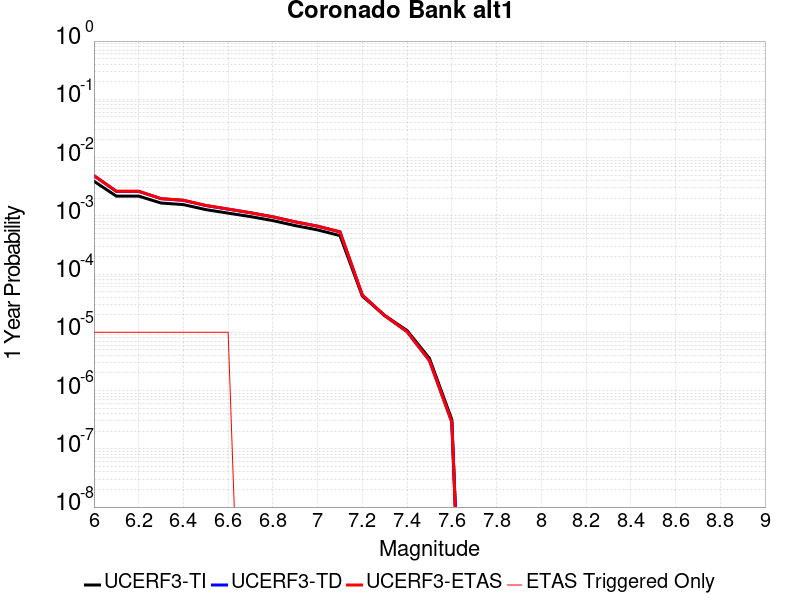 |  |

| Magnitude | 1 wk TI Prob | 1 wk TD Prob | 1 wk ETAS Prob | 1 wk ETAS/TD Gain | 1 wk ETAS Triggered Only | 1 mo TI Prob | 1 mo TD Prob | 1 mo ETAS Prob | 1 mo ETAS/TD Gain | 1 mo ETAS Triggered Only | 1 yr TI Prob | 1 yr TD Prob | 1 yr ETAS Prob | 1 yr ETAS/TD Gain | 1 yr ETAS Triggered Only | 10 yr TI Prob | 10 yr TD Prob | 10 yr ETAS Prob | 10 yr ETAS/TD Gain | 10 yr ETAS Triggered Only |
|-----|-----|-----|-----|-----|-----|-----|-----|-----|-----|-----|-----|-----|-----|-----|-----|-----|-----|-----|-----|-----|
| 6.0 | 7.533492E-5 | 9.3952294E-5 | 9.3952294E-5 | 1.0 | 0.0 | 3.22824E-4 | 4.0259483E-4 | 4.0259483E-4 | 1.0 | 0.0 | 0.0039233007 | 0.004891124 | 0.004891124 | 1.0 | 0.0 | 0.03854755 | 0.047905073 | 0.04791528 | 1.000213 | 1.0718114E-5 |
| 6.1 | 4.1807285E-5 | 5.049425E-5 | 5.049425E-5 | 1.0 | 0.0 | 1.7916178E-4 | 2.1638657E-4 | 2.1638657E-4 | 1.0 | 0.0 | 0.0021791123 | 0.002631421 | 0.002631421 | 1.0 | 0.0 | 0.021578677 | 0.026011758 | 0.026022196 | 1.0004014 | 1.0718114E-5 |
| 6.2 | 4.1807285E-5 | 5.049425E-5 | 5.049425E-5 | 1.0 | 0.0 | 1.7916178E-4 | 2.1638657E-4 | 2.1638657E-4 | 1.0 | 0.0 | 0.0021791123 | 0.002631421 | 0.002631421 | 1.0 | 0.0 | 0.021578677 | 0.026011758 | 0.026022196 | 1.0004014 | 1.0718114E-5 |
| 6.3 | 3.1793104E-5 | 3.771206E-5 | 3.771206E-5 | 1.0 | 0.0 | 1.3624904E-4 | 1.6161331E-4 | 1.6161331E-4 | 1.0 | 0.0 | 0.0016575698 | 0.001965897 | 0.001965897 | 1.0 | 0.0 | 0.016452603 | 0.019488946 | 0.019488946 | 1.0 | 0.0 |
| 6.4 | 2.9878007E-5 | 3.5336663E-5 | 3.5336663E-5 | 1.0 | 0.0 | 1.2804232E-4 | 1.5143424E-4 | 1.5143424E-4 | 1.0 | 0.0 | 0.0015578003 | 0.0018421836 | 0.0018421836 | 1.0 | 0.0 | 0.015469253 | 0.018272884 | 0.018272884 | 1.0 | 0.0 |
| 6.5 | 2.4512565E-5 | 2.8764713E-5 | 2.8764713E-5 | 1.0 | 0.0 | 1.0504962E-4 | 1.2327167E-4 | 1.2327167E-4 | 1.0 | 0.0 | 0.0012782287 | 0.001499827 | 0.001499827 | 1.0 | 0.0 | 0.012709012 | 0.014900027 | 0.014900027 | 1.0 | 0.0 |
| 6.6 | 2.1317413E-5 | 2.4907233E-5 | 2.4907233E-5 | 1.0 | 0.0 | 9.135714E-5 | 1.0674105E-4 | 1.0674105E-4 | 1.0 | 0.0 | 0.0011117056 | 0.0012988199 | 0.0012988199 | 1.0 | 0.0 | 0.011061605 | 0.012914695 | 0.012914695 | 1.0 | 0.0 |
| 6.7 | 1.8585655E-5 | 2.1635356E-5 | 2.1635356E-5 | 1.0 | 0.0 | 7.9650374E-5 | 9.2719776E-5 | 9.2719776E-5 | 1.0 | 0.0 | 9.6931186E-4 | 0.0011282992 | 0.0011282992 | 1.0 | 0.0 | 0.0096509475 | 0.0112278685 | 0.0112278685 | 1.0 | 0.0 |
| 6.8 | 1.5862879E-5 | 1.8419874E-5 | 1.8419874E-5 | 1.0 | 0.0 | 6.798199E-5 | 7.894004E-5 | 7.894004E-5 | 1.0 | 0.0 | 8.273665E-4 | 9.606905E-4 | 9.606905E-4 | 1.0 | 0.0 | 0.008242928 | 0.009567357 | 0.009567357 | 1.0 | 0.0 |
| 6.9 | 1.3021509E-5 | 1.5095589E-5 | 1.5095589E-5 | 1.0 | 0.0 | 5.5805274E-5 | 6.469388E-5 | 6.469388E-5 | 1.0 | 0.0 | 6.792174E-4 | 7.8738143E-4 | 7.8738143E-4 | 1.0 | 0.0 | 0.006771452 | 0.00784774 | 0.00784774 | 1.0 | 0.0 |
| 7.0 | 1.0974371E-5 | 1.27203775E-5 | 1.27203775E-5 | 1.0 | 0.0 | 4.7032172E-5 | 5.4514865E-5 | 5.4514865E-5 | 1.0 | 0.0 | 5.7246623E-4 | 6.635339E-4 | 6.635339E-4 | 1.0 | 0.0 | 0.0057099373 | 0.006617277 | 0.006617277 | 1.0 | 0.0 |
| 7.1 | 8.766221E-6 | 1.0164053E-5 | 1.0164053E-5 | 1.0 | 0.0 | 3.7568978E-5 | 4.3559594E-5 | 4.3559594E-5 | 1.0 | 0.0 | 4.573063E-4 | 5.302262E-4 | 5.302262E-4 | 1.0 | 0.0 | 0.0045636636 | 0.005291311 | 0.005291311 | 1.0 | 0.0 |
| 7.2 | 8.026024E-7 | 8.331837E-7 | 8.331837E-7 | 1.0 | 0.0 | 3.43972E-6 | 3.5707824E-6 | 3.5707824E-6 | 1.0 | 0.0 | 4.1877785E-5 | 4.347342E-5 | 4.347342E-5 | 1.0 | 0.0 | 4.1869894E-4 | 4.3465025E-4 | 4.3465025E-4 | 1.0 | 0.0 |
| 7.3 | 3.7293114E-7 | 3.7001186E-7 | 3.7001186E-7 | 1.0 | 0.0 | 1.5982754E-6 | 1.5857643E-6 | 1.5857643E-6 | 1.0 | 0.0 | 1.9458828E-5 | 1.930651E-5 | 1.930651E-5 | 1.0 | 0.0 | 1.9457124E-4 | 1.9304838E-4 | 1.9304838E-4 | 1.0 | 0.0 |
| 7.4 | 2.0557036E-7 | 1.9674462E-7 | 1.9674462E-7 | 1.0 | 0.0 | 8.810155E-7 | 8.43191E-7 | 8.43191E-7 | 1.0 | 0.0 | 1.0726311E-5 | 1.0265802E-5 | 1.0265802E-5 | 1.0 | 0.0 | 1.0725793E-4 | 1.02653314E-4 | 1.02653314E-4 | 1.0 | 0.0 |
| 7.5 | 6.845446E-8 | 6.279388E-8 | 6.279388E-8 | 1.0 | 0.0 | 2.9337625E-7 | 2.6911658E-7 | 2.6911658E-7 | 1.0 | 0.0 | 3.5718497E-6 | 3.2764897E-6 | 3.2764897E-6 | 1.0 | 0.0 | 3.5717923E-5 | 3.2764423E-5 | 3.2764423E-5 | 1.0 | 0.0 |
| 7.6 | 6.0975145E-9 | 5.531861E-9 | 5.531861E-9 | 1.0 | 0.0 | 2.6132206E-8 | 2.3707976E-8 | 2.3707976E-8 | 1.0 | 0.0 | 3.1815955E-7 | 2.8864457E-7 | 2.8864457E-7 | 1.0 | 0.0 | 3.181591E-6 | 2.886443E-6 | 2.886443E-6 | 1.0 | 0.0 |

## Santa Cruz Catalina Ridge alt1
*[(top)](#table-of-contents)*

| 1 Week | 1 Month | 1 Year | 10 Year |
|-----|-----|-----|-----|
|  |  |  |  |

| Magnitude | 1 wk TI Prob | 1 wk TD Prob | 1 wk ETAS Prob | 1 wk ETAS/TD Gain | 1 wk ETAS Triggered Only | 1 mo TI Prob | 1 mo TD Prob | 1 mo ETAS Prob | 1 mo ETAS/TD Gain | 1 mo ETAS Triggered Only | 1 yr TI Prob | 1 yr TD Prob | 1 yr ETAS Prob | 1 yr ETAS/TD Gain | 1 yr ETAS Triggered Only | 10 yr TI Prob | 10 yr TD Prob | 10 yr ETAS Prob | 10 yr ETAS/TD Gain | 10 yr ETAS Triggered Only |
|-----|-----|-----|-----|-----|-----|-----|-----|-----|-----|-----|-----|-----|-----|-----|-----|-----|-----|-----|-----|-----|
| 6.0 | 3.2833184E-5 | 3.655896E-5 | 3.655896E-5 | 1.0 | 0.0 | 1.4070606E-4 | 1.5667277E-4 | 1.5667277E-4 | 1.0 | 0.0 | 0.00171175 | 0.0019059887 | 0.0019059887 | 1.0 | 0.0 | 0.016986247 | 0.018913316 | 0.018923832 | 1.000556 | 1.0718114E-5 |
| 6.1 | 1.9835548E-5 | 2.1659771E-5 | 2.1659771E-5 | 1.0 | 0.0 | 8.500672E-5 | 9.2824404E-5 | 9.2824404E-5 | 1.0 | 0.0 | 0.0010344655 | 0.0011295713 | 0.0011295713 | 1.0 | 0.0 | 0.010296632 | 0.011240433 | 0.011240433 | 1.0 | 0.0 |
| 6.2 | 1.9835548E-5 | 2.1659771E-5 | 2.1659771E-5 | 1.0 | 0.0 | 8.500672E-5 | 9.2824404E-5 | 9.2824404E-5 | 1.0 | 0.0 | 0.0010344655 | 0.0011295713 | 0.0011295713 | 1.0 | 0.0 | 0.010296632 | 0.011240433 | 0.011240433 | 1.0 | 0.0 |
| 6.3 | 1.5728183E-5 | 1.7034137E-5 | 1.7034137E-5 | 1.0 | 0.0 | 6.7404755E-5 | 7.3001436E-5 | 7.3001436E-5 | 1.0 | 0.0 | 8.2034385E-4 | 8.884362E-4 | 8.884362E-4 | 1.0 | 0.0 | 0.008173222 | 0.008849524 | 0.008849524 | 1.0 | 0.0 |
| 6.4 | 1.5728183E-5 | 1.7034137E-5 | 1.7034137E-5 | 1.0 | 0.0 | 6.7404755E-5 | 7.3001436E-5 | 7.3001436E-5 | 1.0 | 0.0 | 8.2034385E-4 | 8.884362E-4 | 8.884362E-4 | 1.0 | 0.0 | 0.008173222 | 0.008849524 | 0.008849524 | 1.0 | 0.0 |
| 6.5 | 1.3707734E-5 | 1.4794678E-5 | 1.4794678E-5 | 1.0 | 0.0 | 5.8746107E-5 | 6.3404244E-5 | 6.3404244E-5 | 1.0 | 0.0 | 7.1499916E-4 | 7.716768E-4 | 7.716768E-4 | 1.0 | 0.0 | 0.0071270303 | 0.0076903705 | 0.0076903705 | 1.0 | 0.0 |
| 6.6 | 1.2539813E-5 | 1.3510358E-5 | 1.3510358E-5 | 1.0 | 0.0 | 5.3740947E-5 | 5.7900266E-5 | 5.7900266E-5 | 1.0 | 0.0 | 6.540996E-4 | 7.0471043E-4 | 7.0471043E-4 | 1.0 | 0.0 | 0.0065217763 | 0.0070250607 | 0.0070250607 | 1.0 | 0.0 |
| 6.7 | 1.1504083E-5 | 1.23775E-5 | 1.23775E-5 | 1.0 | 0.0 | 4.930228E-5 | 5.304536E-5 | 5.304536E-5 | 1.0 | 0.0 | 6.0008996E-4 | 6.456379E-4 | 6.456379E-4 | 1.0 | 0.0 | 0.005984721 | 0.0064378507 | 0.0064378507 | 1.0 | 0.0 |
| 6.8 | 1.012739E-5 | 1.0877178E-5 | 1.0877178E-5 | 1.0 | 0.0 | 4.340238E-5 | 4.6615653E-5 | 4.6615653E-5 | 1.0 | 0.0 | 5.282958E-4 | 5.673993E-4 | 5.673993E-4 | 1.0 | 0.0 | 0.0052704164 | 0.005659675 | 0.005659675 | 1.0 | 0.0 |
| 6.9 | 8.9607865E-6 | 9.60921E-6 | 9.60921E-6 | 1.0 | 0.0 | 3.8402806E-5 | 4.1181684E-5 | 4.1181684E-5 | 1.0 | 0.0 | 4.6745385E-4 | 5.0127273E-4 | 5.0127273E-4 | 1.0 | 0.0 | 0.0046647177 | 0.00500154 | 0.00500154 | 1.0 | 0.0 |
| 7.0 | 8.046829E-6 | 8.619827E-6 | 8.619827E-6 | 1.0 | 0.0 | 3.4485955E-5 | 3.6941598E-5 | 3.6941598E-5 | 1.0 | 0.0 | 4.1978562E-4 | 4.4967196E-4 | 4.4967196E-4 | 1.0 | 0.0 | 0.004189935 | 0.004487711 | 0.004487711 | 1.0 | 0.0 |
| 7.1 | 7.136131E-6 | 7.637727E-6 | 7.637727E-6 | 1.0 | 0.0 | 3.0583058E-5 | 3.273271E-5 | 3.273271E-5 | 1.0 | 0.0 | 3.7228514E-4 | 3.9844858E-4 | 3.9844858E-4 | 1.0 | 0.0 | 0.0037166206 | 0.0039774184 | 0.0039774184 | 1.0 | 0.0 |
| 7.2 | 6.362014E-6 | 6.8050217E-6 | 6.8050217E-6 | 1.0 | 0.0 | 2.726549E-5 | 2.9164055E-5 | 2.9164055E-5 | 1.0 | 0.0 | 3.3190678E-4 | 3.5501516E-4 | 3.5501516E-4 | 1.0 | 0.0 | 0.0033141149 | 0.0035445488 | 0.0035445488 | 1.0 | 0.0 |
| 7.3 | 5.004101E-6 | 5.3517642E-6 | 5.3517642E-6 | 1.0 | 0.0 | 2.1445969E-5 | 2.2935934E-5 | 2.2935934E-5 | 1.0 | 0.0 | 2.6107338E-4 | 2.7920975E-4 | 2.7920975E-4 | 1.0 | 0.0 | 0.002607669 | 0.0027886443 | 0.0027886443 | 1.0 | 0.0 |
| 7.4 | 3.4901443E-6 | 3.732087E-6 | 3.732087E-6 | 1.0 | 0.0 | 1.4957676E-5 | 1.5994563E-5 | 1.5994563E-5 | 1.0 | 0.0 | 1.8209449E-4 | 1.9471678E-4 | 1.9471678E-4 | 1.0 | 0.0 | 0.0018194534 | 0.0019455003 | 0.0019455003 | 1.0 | 0.0 |
| 7.5 | 1.1215045E-6 | 1.1893966E-6 | 1.1893966E-6 | 1.0 | 0.0 | 4.806439E-6 | 5.0974045E-6 | 5.0974045E-6 | 1.0 | 0.0 | 5.851682E-5 | 6.205916E-5 | 6.205916E-5 | 1.0 | 0.0 | 5.850142E-4 | 6.204214E-4 | 6.204214E-4 | 1.0 | 0.0 |
| 7.6 | 2.8599047E-7 | 2.9952182E-7 | 2.9952182E-7 | 1.0 | 0.0 | 1.2256729E-6 | 1.2836642E-6 | 1.2836642E-6 | 1.0 | 0.0 | 1.4922465E-5 | 1.5628502E-5 | 1.5628502E-5 | 1.0 | 0.0 | 1.4921463E-4 | 1.5627417E-4 | 1.5627417E-4 | 1.0 | 0.0 |
| 7.7 | 2.0781519E-7 | 2.1744457E-7 | 2.1744457E-7 | 1.0 | 0.0 | 8.906362E-7 | 9.3190494E-7 | 9.3190494E-7 | 1.0 | 0.0 | 1.08434415E-5 | 1.1345885E-5 | 1.1345885E-5 | 1.0 | 0.0 | 1.0842913E-4 | 1.1345315E-4 | 1.1345315E-4 | 1.0 | 0.0 |
| 7.8 | 3.614776E-8 | 3.7641225E-8 | 3.7641225E-8 | 1.0 | 0.0 | 1.5491896E-7 | 1.6131952E-7 | 1.6131952E-7 | 1.0 | 0.0 | 1.8861368E-6 | 1.9640636E-6 | 1.9640636E-6 | 1.0 | 0.0 | 1.8861208E-5 | 1.9640474E-5 | 1.9640474E-5 | 1.0 | 0.0 |

## Oak Ridge (Onshore)
*[(top)](#table-of-contents)*

| 1 Week | 1 Month | 1 Year | 10 Year |
|-----|-----|-----|-----|
|  |  |  |  |

| Magnitude | 1 wk TI Prob | 1 wk TD Prob | 1 wk ETAS Prob | 1 wk ETAS/TD Gain | 1 wk ETAS Triggered Only | 1 mo TI Prob | 1 mo TD Prob | 1 mo ETAS Prob | 1 mo ETAS/TD Gain | 1 mo ETAS Triggered Only | 1 yr TI Prob | 1 yr TD Prob | 1 yr ETAS Prob | 1 yr ETAS/TD Gain | 1 yr ETAS Triggered Only | 10 yr TI Prob | 10 yr TD Prob | 10 yr ETAS Prob | 10 yr ETAS/TD Gain | 10 yr ETAS Triggered Only |
|-----|-----|-----|-----|-----|-----|-----|-----|-----|-----|-----|-----|-----|-----|-----|-----|-----|-----|-----|-----|-----|
| 6.0 | 3.155064E-5 | 2.952645E-5 | 2.952645E-5 | 1.0 | 0.0 | 1.3521002E-4 | 1.26536E-4 | 1.26536E-4 | 1.0 | 0.0 | 0.001644939 | 0.0015395252 | 0.0015502268 | 1.0069512 | 1.0718114E-5 | 0.01632816 | 0.015293104 | 0.015303658 | 1.0006901 | 1.0718114E-5 |
| 6.1 | 3.155064E-5 | 2.952645E-5 | 2.952645E-5 | 1.0 | 0.0 | 1.3521002E-4 | 1.26536E-4 | 1.26536E-4 | 1.0 | 0.0 | 0.001644939 | 0.0015395252 | 0.0015502268 | 1.0069512 | 1.0718114E-5 | 0.01632816 | 0.015293104 | 0.015303658 | 1.0006901 | 1.0718114E-5 |
| 6.2 | 3.155064E-5 | 2.952645E-5 | 2.952645E-5 | 1.0 | 0.0 | 1.3521002E-4 | 1.26536E-4 | 1.26536E-4 | 1.0 | 0.0 | 0.001644939 | 0.0015395252 | 0.0015502268 | 1.0069512 | 1.0718114E-5 | 0.01632816 | 0.015293104 | 0.015303658 | 1.0006901 | 1.0718114E-5 |
| 6.3 | 3.155064E-5 | 2.952645E-5 | 2.952645E-5 | 1.0 | 0.0 | 1.3521002E-4 | 1.26536E-4 | 1.26536E-4 | 1.0 | 0.0 | 0.001644939 | 0.0015395252 | 0.0015502268 | 1.0069512 | 1.0718114E-5 | 0.01632816 | 0.015293104 | 0.015303658 | 1.0006901 | 1.0718114E-5 |
| 6.4 | 3.155064E-5 | 2.952645E-5 | 2.952645E-5 | 1.0 | 0.0 | 1.3521002E-4 | 1.26536E-4 | 1.26536E-4 | 1.0 | 0.0 | 0.001644939 | 0.0015395252 | 0.0015502268 | 1.0069512 | 1.0718114E-5 | 0.01632816 | 0.015293104 | 0.015303658 | 1.0006901 | 1.0718114E-5 |
| 6.5 | 3.155064E-5 | 2.952645E-5 | 2.952645E-5 | 1.0 | 0.0 | 1.3521002E-4 | 1.26536E-4 | 1.26536E-4 | 1.0 | 0.0 | 0.001644939 | 0.0015395252 | 0.0015502268 | 1.0069512 | 1.0718114E-5 | 0.01632816 | 0.015293104 | 0.015303658 | 1.0006901 | 1.0718114E-5 |
| 6.6 | 3.155064E-5 | 2.952645E-5 | 2.952645E-5 | 1.0 | 0.0 | 1.3521002E-4 | 1.26536E-4 | 1.26536E-4 | 1.0 | 0.0 | 0.001644939 | 0.0015395252 | 0.0015502268 | 1.0069512 | 1.0718114E-5 | 0.01632816 | 0.015293104 | 0.015303658 | 1.0006901 | 1.0718114E-5 |
| 6.7 | 3.098897E-5 | 2.8864635E-5 | 2.8864635E-5 | 1.0 | 0.0 | 1.328031E-4 | 1.2369992E-4 | 1.2369992E-4 | 1.0 | 0.0 | 0.0016156785 | 0.0015050438 | 0.0015157459 | 1.0071107 | 1.0718114E-5 | 0.016039822 | 0.014952951 | 0.014963509 | 1.0007061 | 1.0718114E-5 |
| 6.8 | 3.0449872E-5 | 2.823982E-5 | 2.823982E-5 | 1.0 | 0.0 | 1.3049292E-4 | 1.2102239E-4 | 1.2102239E-4 | 1.0 | 0.0 | 0.0015875935 | 0.001472489 | 0.0014831913 | 1.0072682 | 1.0718114E-5 | 0.015762992 | 0.014631692 | 0.0146422535 | 1.0007218 | 1.0718114E-5 |
| 6.9 | 2.697928E-5 | 2.4220137E-5 | 2.4220137E-5 | 1.0 | 0.0 | 1.15620365E-4 | 1.0379658E-4 | 1.0379658E-4 | 1.0 | 0.0 | 0.0014067689 | 0.0012630123 | 0.0012737168 | 1.0084754 | 1.0718114E-5 | 0.0139789665 | 0.012561057 | 0.01257164 | 1.0008426 | 1.0718114E-5 |
| 7.0 | 2.4893961E-5 | 2.1862359E-5 | 2.1862359E-5 | 1.0 | 0.0 | 1.0668404E-4 | 9.369256E-5 | 9.369256E-5 | 1.0 | 0.0 | 0.0012981043 | 0.0011401277 | 0.0011508336 | 1.0093901 | 1.0718114E-5 | 0.012905477 | 0.011345069 | 0.0113556655 | 1.000934 | 1.0718114E-5 |
| 7.1 | 2.0945363E-5 | 1.7354718E-5 | 1.7354718E-5 | 1.0 | 0.0 | 8.976275E-5 | 7.437527E-5 | 7.437527E-5 | 1.0 | 0.0 | 0.0010923136 | 9.051474E-4 | 9.158558E-4 | 1.0118306 | 1.0718114E-5 | 0.0108696 | 0.009015542 | 0.009026163 | 1.0011781 | 1.0718114E-5 |
| 7.2 | 2.0439404E-5 | 1.6809645E-5 | 1.6809645E-5 | 1.0 | 0.0 | 8.7594504E-5 | 7.2039365E-5 | 7.2039365E-5 | 1.0 | 0.0 | 0.0010659413 | 8.7673106E-4 | 8.8743976E-4 | 1.0122144 | 1.0718114E-5 | 0.010608427 | 0.00873364 | 0.008744265 | 1.0012165 | 1.0718114E-5 |
| 7.3 | 1.8463334E-5 | 1.5382002E-5 | 1.5382002E-5 | 1.0 | 0.0 | 7.912617E-5 | 6.5921224E-5 | 6.5921224E-5 | 1.0 | 0.0 | 9.6293533E-4 | 8.0229976E-4 | 8.130093E-4 | 1.0133486 | 1.0718114E-5 | 0.009587734 | 0.007994897 | 0.008005529 | 1.0013299 | 1.0718114E-5 |
| 7.4 | 1.763139E-5 | 1.4517013E-5 | 1.4517013E-5 | 1.0 | 0.0 | 7.556091E-5 | 6.221431E-5 | 6.221431E-5 | 1.0 | 0.0 | 9.1956573E-4 | 7.5719994E-4 | 7.679099E-4 | 1.0141442 | 1.0718114E-5 | 0.009157699 | 0.007547003 | 0.007557641 | 1.0014094 | 1.0718114E-5 |
| 7.5 | 1.3594944E-5 | 1.1163477E-5 | 1.1163477E-5 | 1.0 | 0.0 | 5.8262744E-5 | 4.7842612E-5 | 4.7842612E-5 | 1.0 | 0.0 | 7.0911803E-4 | 5.823306E-4 | 5.930425E-4 | 1.0183948 | 1.0718114E-5 | 0.007068595 | 0.0058083185 | 0.005818974 | 1.0018346 | 1.0718114E-5 |
| 7.6 | 6.9889534E-6 | 5.6367617E-6 | 5.6367617E-6 | 1.0 | 0.0 | 2.9952313E-5 | 2.4157329E-5 | 2.4157329E-5 | 1.0 | 0.0 | 3.646084E-4 | 2.940762E-4 | 3.0479117E-4 | 1.036436 | 1.0718114E-5 | 0.0036401073 | 0.0029369146 | 0.0029476013 | 1.0036387 | 1.0718114E-5 |
| 7.7 | 4.0824193E-6 | 3.2832884E-6 | 3.2832884E-6 | 1.0 | 0.0 | 1.7495966E-5 | 1.4071161E-5 | 1.4071161E-5 | 1.0 | 0.0 | 2.1299256E-4 | 1.7130304E-4 | 1.8201931E-4 | 1.0625575 | 1.0718114E-5 | 0.0021278851 | 0.0017117234 | 0.0017224231 | 1.0062509 | 1.0718114E-5 |
| 7.8 | 1.7023609E-6 | 1.4370602E-6 | 1.4370602E-6 | 1.0 | 0.0 | 7.295812E-6 | 6.158815E-6 | 6.158815E-6 | 1.0 | 0.0 | 8.882289E-5 | 7.498102E-5 | 8.569833E-5 | 1.1429336 | 1.0718114E-5 | 8.8787393E-4 | 7.4956E-4 | 7.602701E-4 | 1.0142885 | 1.0718114E-5 |
| 7.9 | 2.721225E-7 | 2.2616715E-7 | 2.2616715E-7 | 1.0 | 0.0 | 1.1662388E-6 | 9.692874E-7 | 9.692874E-7 | 1.0 | 0.0 | 1.4198865E-5 | 1.1801013E-5 | 1.1801013E-5 | 1.0 | 0.0 | 1.4197957E-4 | 1.1800414E-4 | 1.1800414E-4 | 1.0 | 0.0 |
| 8.0 | 9.364255E-9 | 5.1209232E-9 | 5.1209232E-9 | 1.0 | 0.0 | 4.0132523E-8 | 2.1946814E-8 | 2.1946814E-8 | 1.0 | 0.0 | 4.8861335E-7 | 2.6720244E-7 | 2.6720244E-7 | 1.0 | 0.0 | 4.8861225E-6 | 2.6720215E-6 | 2.6720215E-6 | 1.0 | 0.0 |

## Rinconada 2011 CFM
*[(top)](#table-of-contents)*

| 1 Week | 1 Month | 1 Year | 10 Year |
|-----|-----|-----|-----|
|  |  | 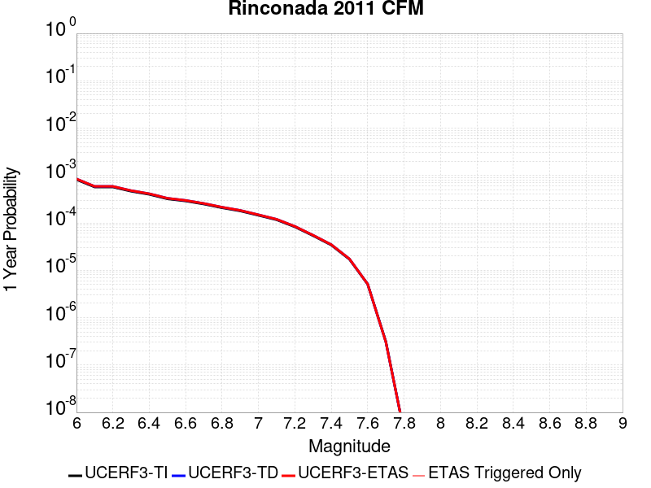 |  |

| Magnitude | 1 wk TI Prob | 1 wk TD Prob | 1 wk ETAS Prob | 1 wk ETAS/TD Gain | 1 wk ETAS Triggered Only | 1 mo TI Prob | 1 mo TD Prob | 1 mo ETAS Prob | 1 mo ETAS/TD Gain | 1 mo ETAS Triggered Only | 1 yr TI Prob | 1 yr TD Prob | 1 yr ETAS Prob | 1 yr ETAS/TD Gain | 1 yr ETAS Triggered Only | 10 yr TI Prob | 10 yr TD Prob | 10 yr ETAS Prob | 10 yr ETAS/TD Gain | 10 yr ETAS Triggered Only |
|-----|-----|-----|-----|-----|-----|-----|-----|-----|-----|-----|-----|-----|-----|-----|-----|-----|-----|-----|-----|-----|
| 6.0 | 1.5752368E-5 | 1.6274787E-5 | 1.6274787E-5 | 1.0 | 0.0 | 6.75084E-5 | 6.974724E-5 | 6.974724E-5 | 1.0 | 0.0 | 8.2160486E-4 | 8.48845E-4 | 8.48845E-4 | 1.0 | 0.0 | 0.008185739 | 0.008456407 | 0.008467034 | 1.0012567 | 1.0718114E-5 |
| 6.1 | 1.0966133E-5 | 1.1323078E-5 | 1.1323078E-5 | 1.0 | 0.0 | 4.6996865E-5 | 4.8526577E-5 | 4.8526577E-5 | 1.0 | 0.0 | 5.720366E-4 | 5.9065165E-4 | 5.9065165E-4 | 1.0 | 0.0 | 0.0057056635 | 0.0058909142 | 0.0058909142 | 1.0 | 0.0 |
| 6.2 | 1.0966133E-5 | 1.1323078E-5 | 1.1323078E-5 | 1.0 | 0.0 | 4.6996865E-5 | 4.8526577E-5 | 4.8526577E-5 | 1.0 | 0.0 | 5.720366E-4 | 5.9065165E-4 | 5.9065165E-4 | 1.0 | 0.0 | 0.0057056635 | 0.0058909142 | 0.0058909142 | 1.0 | 0.0 |
| 6.3 | 8.926149E-6 | 9.212811E-6 | 9.212811E-6 | 1.0 | 0.0 | 3.8254362E-5 | 3.9482882E-5 | 3.9482882E-5 | 1.0 | 0.0 | 4.6564735E-4 | 4.8059836E-4 | 4.8059836E-4 | 1.0 | 0.0 | 0.0046467283 | 0.004795635 | 0.004795635 | 1.0 | 0.0 |
| 6.4 | 7.676955E-6 | 7.920225E-6 | 7.920225E-6 | 1.0 | 0.0 | 3.290082E-5 | 3.394338E-5 | 3.394338E-5 | 1.0 | 0.0 | 4.0049385E-4 | 4.1318245E-4 | 4.1318245E-4 | 1.0 | 0.0 | 0.0039977287 | 0.004124169 | 0.004124169 | 1.0 | 0.0 |
| 6.5 | 6.1671026E-6 | 6.3589814E-6 | 6.3589814E-6 | 1.0 | 0.0 | 2.6430173E-5 | 2.7252492E-5 | 2.7252492E-5 | 1.0 | 0.0 | 3.2173982E-4 | 3.3174866E-4 | 3.3174866E-4 | 1.0 | 0.0 | 0.003212744 | 0.0033125463 | 0.0033125463 | 1.0 | 0.0 |
| 6.6 | 5.553456E-6 | 5.7248362E-6 | 5.7248362E-6 | 1.0 | 0.0 | 2.3800309E-5 | 2.4534782E-5 | 2.4534782E-5 | 1.0 | 0.0 | 2.897302E-4 | 2.986701E-4 | 2.986701E-4 | 1.0 | 0.0 | 0.0028935277 | 0.0029826954 | 0.0029826954 | 1.0 | 0.0 |
| 6.7 | 4.787857E-6 | 4.93333E-6 | 4.93333E-6 | 1.0 | 0.0 | 2.0519226E-5 | 2.114267E-5 | 2.114267E-5 | 1.0 | 0.0 | 2.4979294E-4 | 2.5738165E-4 | 2.5738165E-4 | 1.0 | 0.0 | 0.0024951235 | 0.0025708412 | 0.0025708412 | 1.0 | 0.0 |
| 6.8 | 3.9955166E-6 | 4.1134927E-6 | 4.1134927E-6 | 1.0 | 0.0 | 1.7123532E-5 | 1.7629134E-5 | 1.7629134E-5 | 1.0 | 0.0 | 2.0845905E-4 | 2.146136E-4 | 2.146136E-4 | 1.0 | 0.0 | 0.002082636 | 0.002144067 | 0.002144067 | 1.0 | 0.0 |
| 6.9 | 3.4250072E-6 | 3.5224598E-6 | 3.5224598E-6 | 1.0 | 0.0 | 1.46785205E-5 | 1.509617E-5 | 1.509617E-5 | 1.0 | 0.0 | 1.7869633E-4 | 1.8378037E-4 | 1.8378037E-4 | 1.0 | 0.0 | 0.001785527 | 0.0018362864 | 0.0018362864 | 1.0 | 0.0 |
| 7.0 | 2.7712713E-6 | 2.8467105E-6 | 2.8467105E-6 | 1.0 | 0.0 | 1.1876823E-5 | 1.2200131E-5 | 1.2200131E-5 | 1.0 | 0.0 | 1.4459073E-4 | 1.4852648E-4 | 1.4852648E-4 | 1.0 | 0.0 | 0.0014449668 | 0.0014842737 | 0.0014842737 | 1.0 | 0.0 |
| 7.1 | 2.227358E-6 | 2.2857066E-6 | 2.2857066E-6 | 1.0 | 0.0 | 9.545785E-6 | 9.795849E-6 | 9.795849E-6 | 1.0 | 0.0 | 1.16213734E-4 | 1.19257944E-4 | 1.19257944E-4 | 1.0 | 0.0 | 0.0011615298 | 0.0011919405 | 0.0011919405 | 1.0 | 0.0 |
| 7.2 | 1.581796E-6 | 1.6209067E-6 | 1.6209067E-6 | 1.0 | 0.0 | 6.779108E-6 | 6.9467246E-6 | 6.9467246E-6 | 1.0 | 0.0 | 8.253252E-5 | 8.457309E-5 | 8.457309E-5 | 1.0 | 0.0 | 8.250187E-4 | 8.4540964E-4 | 8.4540964E-4 | 1.0 | 0.0 |
| 7.3 | 1.0306567E-6 | 1.0546512E-6 | 1.0546512E-6 | 1.0 | 0.0 | 4.4170924E-6 | 4.519926E-6 | 4.519926E-6 | 1.0 | 0.0 | 5.3776774E-5 | 5.5028708E-5 | 5.5028708E-5 | 1.0 | 0.0 | 5.376376E-4 | 5.5015105E-4 | 5.5015105E-4 | 1.0 | 0.0 |
| 7.4 | 6.535541E-7 | 6.682764E-7 | 6.682764E-7 | 1.0 | 0.0 | 2.800943E-6 | 2.8640386E-6 | 2.8640386E-6 | 1.0 | 0.0 | 3.4100947E-5 | 3.4869114E-5 | 3.4869114E-5 | 1.0 | 0.0 | 3.4095717E-4 | 3.4863656E-4 | 3.4863656E-4 | 1.0 | 0.0 |
| 7.5 | 3.2656962E-7 | 3.33168E-7 | 3.33168E-7 | 1.0 | 0.0 | 1.3995833E-6 | 1.427862E-6 | 1.427862E-6 | 1.0 | 0.0 | 1.7039794E-5 | 1.7384082E-5 | 1.7384082E-5 | 1.0 | 0.0 | 1.7038487E-4 | 1.7382725E-4 | 1.7382725E-4 | 1.0 | 0.0 |
| 7.6 | 9.754343E-8 | 9.821022E-8 | 9.821022E-8 | 1.0 | 0.0 | 4.180432E-7 | 4.2090088E-7 | 4.2090088E-7 | 1.0 | 0.0 | 5.089664E-6 | 5.1244565E-6 | 5.1244565E-6 | 1.0 | 0.0 | 5.0895473E-5 | 5.124339E-5 | 5.124339E-5 | 1.0 | 0.0 |
| 7.7 | 6.0001453E-9 | 5.8490692E-9 | 5.8490692E-9 | 1.0 | 0.0 | 2.5714908E-8 | 2.506744E-8 | 2.506744E-8 | 1.0 | 0.0 | 3.1307894E-7 | 3.0519604E-7 | 3.0519604E-7 | 1.0 | 0.0 | 3.1307852E-6 | 3.0519564E-6 | 3.0519564E-6 | 1.0 | 0.0 |
| 7.8 | 7.400003E-11 | 7.4654505E-11 | 7.4654505E-11 | 1.0 | 0.0 | 3.171432E-10 | 3.1994807E-10 | 3.1994807E-10 | 1.0 | 0.0 | 3.861218E-9 | 3.8953676E-9 | 3.8953676E-9 | 1.0 | 0.0 | 3.861218E-8 | 3.8953676E-8 | 3.8953676E-8 | 1.0 | 0.0 |

## Calaveras (So) - Paicines extension 2011 CFM
*[(top)](#table-of-contents)*

| 1 Week | 1 Month | 1 Year | 10 Year |
|-----|-----|-----|-----|
|  |  |  |  |

| Magnitude | 1 wk TI Prob | 1 wk TD Prob | 1 wk ETAS Prob | 1 wk ETAS/TD Gain | 1 wk ETAS Triggered Only | 1 mo TI Prob | 1 mo TD Prob | 1 mo ETAS Prob | 1 mo ETAS/TD Gain | 1 mo ETAS Triggered Only | 1 yr TI Prob | 1 yr TD Prob | 1 yr ETAS Prob | 1 yr ETAS/TD Gain | 1 yr ETAS Triggered Only | 10 yr TI Prob | 10 yr TD Prob | 10 yr ETAS Prob | 10 yr ETAS/TD Gain | 10 yr ETAS Triggered Only |
|-----|-----|-----|-----|-----|-----|-----|-----|-----|-----|-----|-----|-----|-----|-----|-----|-----|-----|-----|-----|-----|
| 6.0 | 1.5183659E-4 | 3.0539723E-4 | 3.0539723E-4 | 1.0 | 0.0 | 6.5056595E-4 | 0.0013070651 | 0.0013070651 | 1.0 | 0.0 | 0.007891912 | 0.015697578 | 0.015697578 | 1.0 | 0.0 | 0.076174594 | 0.13850221 | 0.13851145 | 1.0000666 | 1.0718114E-5 |
| 6.1 | 1.5024997E-4 | 3.0233792E-4 | 3.0233792E-4 | 1.0 | 0.0 | 6.437695E-4 | 0.0012939668 | 0.0012939668 | 1.0 | 0.0 | 0.0078097614 | 0.015540968 | 0.015540968 | 1.0 | 0.0 | 0.075409345 | 0.13717179 | 0.13718104 | 1.0000675 | 1.0718114E-5 |
| 6.2 | 1.2743923E-4 | 2.5316013E-4 | 2.5316013E-4 | 1.0 | 0.0 | 5.460538E-4 | 0.0010844896 | 0.0010844896 | 1.0 | 0.0 | 0.0066279583 | 0.013048578 | 0.013048578 | 1.0 | 0.0 | 0.064337276 | 0.11726981 | 0.11727927 | 1.0000807 | 1.0718114E-5 |
| 6.3 | 1.1525114E-4 | 2.260286E-4 | 2.260286E-4 | 1.0 | 0.0 | 4.9383997E-4 | 9.683249E-4 | 9.683249E-4 | 1.0 | 0.0 | 0.0059959386 | 0.011669789 | 0.011669789 | 1.0 | 0.0 | 0.058367174 | 0.106385924 | 0.1063955 | 1.00009 | 1.0718114E-5 |
| 6.4 | 1.07200925E-4 | 2.0842902E-4 | 2.0842902E-4 | 1.0 | 0.0 | 4.5935164E-4 | 8.9295075E-4 | 8.9295075E-4 | 1.0 | 0.0 | 0.0055782744 | 0.010774614 | 0.010774614 | 1.0 | 0.0 | 0.0544031 | 0.099208504 | 0.09921816 | 1.0000973 | 1.0718114E-5 |
| 6.5 | 9.69631E-5 | 1.8734904E-4 | 1.8734904E-4 | 1.0 | 0.0 | 4.1548995E-4 | 8.026659E-4 | 8.026659E-4 | 1.0 | 0.0 | 0.0050468626 | 0.009696479 | 0.009696479 | 1.0 | 0.0 | 0.04933773 | 0.090100124 | 0.09010988 | 1.0001082 | 1.0718114E-5 |
| 6.6 | 8.0552316E-5 | 1.5074172E-4 | 1.5074172E-4 | 1.0 | 0.0 | 3.4517853E-4 | 6.458615E-4 | 6.458615E-4 | 1.0 | 0.0 | 0.0041944524 | 0.007828098 | 0.007828098 | 1.0 | 0.0 | 0.04116161 | 0.07487006 | 0.074879974 | 1.0001324 | 1.0718114E-5 |
| 6.7 | 7.815757E-5 | 1.4614181E-4 | 1.4614181E-4 | 1.0 | 0.0 | 3.34918E-4 | 6.2616885E-4 | 6.2616885E-4 | 1.0 | 0.0 | 0.004070005 | 0.007590925 | 0.007590925 | 1.0 | 0.0 | 0.039962657 | 0.072719574 | 0.07272951 | 1.0001366 | 1.0718114E-5 |
| 6.8 | 6.965264E-5 | 1.2724761E-4 | 1.2724761E-4 | 1.0 | 0.0 | 2.9847719E-4 | 5.4523296E-4 | 5.4523296E-4 | 1.0 | 0.0 | 0.0036279052 | 0.006615107 | 0.006615107 | 1.0 | 0.0 | 0.03569247 | 0.06381377 | 0.0638238 | 1.0001572 | 1.0718114E-5 |
| 6.9 | 5.8000453E-5 | 1.0145923E-4 | 1.0145923E-4 | 1.0 | 0.0 | 2.4854968E-4 | 4.347534E-4 | 4.347534E-4 | 1.0 | 0.0 | 0.0030218933 | 0.0052803815 | 0.0052803815 | 1.0 | 0.0 | 0.029811295 | 0.051512837 | 0.051523004 | 1.0001973 | 1.0718114E-5 |
| 7.0 | 4.9865852E-5 | 8.570066E-5 | 8.570066E-5 | 1.0 | 0.0 | 2.1369329E-4 | 3.672373E-4 | 3.672373E-4 | 1.0 | 0.0 | 0.0025986114 | 0.0044620372 | 0.0044620372 | 1.0 | 0.0 | 0.025684336 | 0.04379284 | 0.043803092 | 1.000234 | 1.0718114E-5 |
| 7.1 | 4.283875E-5 | 7.113806E-5 | 7.113806E-5 | 1.0 | 0.0 | 1.8358172E-4 | 3.048421E-4 | 3.048421E-4 | 1.0 | 0.0 | 0.0022328163 | 0.0037051928 | 0.0037051928 | 1.0 | 0.0 | 0.022105146 | 0.036743753 | 0.03675408 | 1.000281 | 1.0718114E-5 |
| 7.2 | 3.450115E-5 | 5.579191E-5 | 5.579191E-5 | 1.0 | 0.0 | 1.478537E-4 | 2.3908642E-4 | 2.3908642E-4 | 1.0 | 0.0 | 0.0017986323 | 0.0029070205 | 0.0029070205 | 1.0 | 0.0 | 0.017841442 | 0.02908689 | 0.029097296 | 1.0003577 | 1.0718114E-5 |
| 7.3 | 2.5709045E-5 | 4.060244E-5 | 4.060244E-5 | 1.0 | 0.0 | 1.1017697E-4 | 1.7399895E-4 | 1.7399895E-4 | 1.0 | 0.0 | 0.0013405791 | 0.0021163959 | 0.0021163959 | 1.0 | 0.0 | 0.013325208 | 0.02130426 | 0.02131475 | 1.0004923 | 1.0718114E-5 |
| 7.4 | 1.8003093E-5 | 2.8518018E-5 | 2.8518018E-5 | 1.0 | 0.0 | 7.715383E-5 | 1.2221436E-4 | 1.2221436E-4 | 1.0 | 0.0 | 9.3894306E-4 | 0.0014869466 | 0.0014869466 | 1.0 | 0.0 | 0.009349857 | 0.0150561305 | 0.015066688 | 1.0007012 | 1.0718114E-5 |
| 7.5 | 1.5595824E-5 | 2.5830264E-5 | 2.5830264E-5 | 1.0 | 0.0 | 6.683753E-5 | 1.1069645E-4 | 1.1069645E-4 | 1.0 | 0.0 | 8.134431E-4 | 0.0013468983 | 0.0013468983 | 1.0 | 0.0 | 0.008104719 | 0.013655912 | 0.0136664845 | 1.0007741 | 1.0718114E-5 |
| 7.6 | 1.1110309E-5 | 1.9228919E-5 | 1.9228919E-5 | 1.0 | 0.0 | 4.761474E-5 | 8.240705E-5 | 8.240705E-5 | 1.0 | 0.0 | 5.795553E-4 | 0.0010028455 | 0.0010028455 | 1.0 | 0.0 | 0.0057804612 | 0.010207267 | 0.010217875 | 1.0010394 | 1.0718114E-5 |
| 7.7 | 6.2140443E-6 | 1.04426E-5 | 1.04426E-5 | 1.0 | 0.0 | 2.6631347E-5 | 4.4753233E-5 | 4.4753233E-5 | 1.0 | 0.0 | 3.241884E-4 | 5.447345E-4 | 5.447345E-4 | 1.0 | 0.0 | 0.0032371588 | 0.0056225345 | 0.0056331926 | 1.0018955 | 1.0718114E-5 |
| 7.8 | 5.305533E-6 | 9.438008E-6 | 9.438008E-6 | 1.0 | 0.0 | 2.27378E-5 | 4.0447983E-5 | 4.0447983E-5 | 1.0 | 0.0 | 2.7679754E-4 | 4.92343E-4 | 4.92343E-4 | 1.0 | 0.0 | 0.0027645302 | 0.005076744 | 0.005087408 | 1.0021005 | 1.0718114E-5 |
| 7.9 | 3.363505E-6 | 7.3886436E-6 | 7.3886436E-6 | 1.0 | 0.0 | 1.4414942E-5 | 3.1665233E-5 | 3.1665233E-5 | 1.0 | 0.0 | 1.7548777E-4 | 3.8545608E-4 | 3.8545608E-4 | 1.0 | 0.0 | 0.0017534926 | 0.00395034 | 0.003961016 | 1.0027025 | 1.0718114E-5 |
| 8.0 | 2.0271132E-6 | 4.4152353E-6 | 4.4152353E-6 | 1.0 | 0.0 | 8.687599E-6 | 1.8922301E-5 | 1.8922301E-5 | 1.0 | 0.0 | 1.05766376E-4 | 2.3035471E-4 | 2.3035471E-4 | 1.0 | 0.0 | 0.0010571606 | 0.0023521425 | 0.0023628355 | 1.004546 | 1.0718114E-5 |
| 8.1 | 1.2206116E-6 | 2.3763587E-6 | 2.3763587E-6 | 1.0 | 0.0 | 5.2311816E-6 | 1.0184355E-5 | 1.0184355E-5 | 1.0 | 0.0 | 6.3687774E-5 | 1.239875E-4 | 1.239875E-4 | 1.0 | 0.0 | 6.366953E-4 | 0.0012711601 | 0.0012711601 | 1.0 | 0.0 |

## Fontana (Seismicity)
*[(top)](#table-of-contents)*

| 1 Week | 1 Month | 1 Year | 10 Year |
|-----|-----|-----|-----|
|  |  |  |  |

| Magnitude | 1 wk TI Prob | 1 wk TD Prob | 1 wk ETAS Prob | 1 wk ETAS/TD Gain | 1 wk ETAS Triggered Only | 1 mo TI Prob | 1 mo TD Prob | 1 mo ETAS Prob | 1 mo ETAS/TD Gain | 1 mo ETAS Triggered Only | 1 yr TI Prob | 1 yr TD Prob | 1 yr ETAS Prob | 1 yr ETAS/TD Gain | 1 yr ETAS Triggered Only | 10 yr TI Prob | 10 yr TD Prob | 10 yr ETAS Prob | 10 yr ETAS/TD Gain | 10 yr ETAS Triggered Only |
|-----|-----|-----|-----|-----|-----|-----|-----|-----|-----|-----|-----|-----|-----|-----|-----|-----|-----|-----|-----|-----|
| 6.0 | 7.1789214E-6 | 7.552053E-6 | 7.552053E-6 | 1.0 | 0.0 | 3.076644E-5 | 3.236577E-5 | 3.236577E-5 | 1.0 | 0.0 | 3.7451705E-4 | 3.9402276E-4 | 4.0473667E-4 | 1.027191 | 1.0718114E-5 | 0.003738865 | 0.003937241 | 0.003947917 | 1.0027115 | 1.0718114E-5 |
| 6.1 | 7.1789214E-6 | 7.552053E-6 | 7.552053E-6 | 1.0 | 0.0 | 3.076644E-5 | 3.236577E-5 | 3.236577E-5 | 1.0 | 0.0 | 3.7451705E-4 | 3.9402276E-4 | 4.0473667E-4 | 1.027191 | 1.0718114E-5 | 0.003738865 | 0.003937241 | 0.003947917 | 1.0027115 | 1.0718114E-5 |
| 6.2 | 7.1789214E-6 | 7.552053E-6 | 7.552053E-6 | 1.0 | 0.0 | 3.076644E-5 | 3.236577E-5 | 3.236577E-5 | 1.0 | 0.0 | 3.7451705E-4 | 3.9402276E-4 | 4.0473667E-4 | 1.027191 | 1.0718114E-5 | 0.003738865 | 0.003937241 | 0.003947917 | 1.0027115 | 1.0718114E-5 |
| 6.3 | 7.1789214E-6 | 7.552053E-6 | 7.552053E-6 | 1.0 | 0.0 | 3.076644E-5 | 3.236577E-5 | 3.236577E-5 | 1.0 | 0.0 | 3.7451705E-4 | 3.9402276E-4 | 4.0473667E-4 | 1.027191 | 1.0718114E-5 | 0.003738865 | 0.003937241 | 0.003947917 | 1.0027115 | 1.0718114E-5 |
| 6.4 | 7.1789214E-6 | 7.552053E-6 | 7.552053E-6 | 1.0 | 0.0 | 3.076644E-5 | 3.236577E-5 | 3.236577E-5 | 1.0 | 0.0 | 3.7451705E-4 | 3.9402276E-4 | 4.0473667E-4 | 1.027191 | 1.0718114E-5 | 0.003738865 | 0.003937241 | 0.003947917 | 1.0027115 | 1.0718114E-5 |
| 6.5 | 5.2611317E-6 | 5.5327637E-6 | 5.5327637E-6 | 1.0 | 0.0 | 2.2547512E-5 | 2.3711844E-5 | 2.3711844E-5 | 1.0 | 0.0 | 2.744814E-4 | 2.886917E-4 | 2.9940673E-4 | 1.0371158 | 1.0718114E-5 | 0.002741426 | 0.002886917 | 0.0028976041 | 1.0037019 | 1.0718114E-5 |
| 6.6 | 5.2611317E-6 | 5.5327637E-6 | 5.5327637E-6 | 1.0 | 0.0 | 2.2547512E-5 | 2.3711844E-5 | 2.3711844E-5 | 1.0 | 0.0 | 2.744814E-4 | 2.886917E-4 | 2.9940673E-4 | 1.0371158 | 1.0718114E-5 | 0.002741426 | 0.002886917 | 0.0028976041 | 1.0037019 | 1.0718114E-5 |

## Newport-Inglewood (Offshore)
*[(top)](#table-of-contents)*

| 1 Week | 1 Month | 1 Year | 10 Year |
|-----|-----|-----|-----|
|  |  |  |  |

| Magnitude | 1 wk TI Prob | 1 wk TD Prob | 1 wk ETAS Prob | 1 wk ETAS/TD Gain | 1 wk ETAS Triggered Only | 1 mo TI Prob | 1 mo TD Prob | 1 mo ETAS Prob | 1 mo ETAS/TD Gain | 1 mo ETAS Triggered Only | 1 yr TI Prob | 1 yr TD Prob | 1 yr ETAS Prob | 1 yr ETAS/TD Gain | 1 yr ETAS Triggered Only | 10 yr TI Prob | 10 yr TD Prob | 10 yr ETAS Prob | 10 yr ETAS/TD Gain | 10 yr ETAS Triggered Only |
|-----|-----|-----|-----|-----|-----|-----|-----|-----|-----|-----|-----|-----|-----|-----|-----|-----|-----|-----|-----|-----|
| 6.0 | 1.9626508E-5 | 1.896559E-5 | 2.96835E-5 | 1.565124 | 1.0718114E-5 | 8.411089E-5 | 8.127864E-5 | 9.199588E-5 | 1.131858 | 1.0718114E-5 | 0.001023569 | 9.891307E-4 | 9.998382E-4 | 1.0108252 | 1.0718114E-5 | 0.010188672 | 0.0098486245 | 0.009859237 | 1.0010775 | 1.0718114E-5 |
| 6.1 | 1.331886E-5 | 1.2218263E-5 | 2.2936245E-5 | 1.87721 | 1.0718114E-5 | 5.707958E-5 | 5.2362942E-5 | 6.308049E-5 | 1.2046782 | 1.0718114E-5 | 6.947222E-4 | 6.3733384E-4 | 6.480451E-4 | 1.0168064 | 1.0718114E-5 | 0.006925544 | 0.0063552377 | 0.006365888 | 1.0016757 | 1.0718114E-5 |
| 6.2 | 1.2250852E-5 | 1.1076189E-5 | 2.1794185E-5 | 1.9676608 | 1.0718114E-5 | 5.2502597E-5 | 4.7468526E-5 | 5.818613E-5 | 1.2257833 | 1.0718114E-5 | 6.3903164E-4 | 5.7777704E-4 | 5.88489E-4 | 1.0185399 | 1.0718114E-5 | 0.006371971 | 0.00576287 | 0.005773526 | 1.0018492 | 1.0718114E-5 |
| 6.3 | 1.2106258E-5 | 1.091905E-5 | 2.1637046E-5 | 1.9815869 | 1.0718114E-5 | 5.1882926E-5 | 4.6795092E-5 | 5.7512705E-5 | 1.2290329 | 1.0718114E-5 | 6.3149154E-4 | 5.695823E-4 | 5.802943E-4 | 1.0188068 | 1.0718114E-5 | 0.0062970007 | 0.0056813415 | 0.0056919986 | 1.0018759 | 1.0718114E-5 |
| 6.4 | 1.1348758E-5 | 1.0109513E-5 | 2.0827518E-5 | 2.06019 | 1.0718114E-5 | 4.8636626E-5 | 4.332577E-5 | 5.404342E-5 | 1.2473736 | 1.0718114E-5 | 5.919901E-4 | 5.273644E-4 | 5.3807686E-4 | 1.0203133 | 1.0718114E-5 | 0.005904155 | 0.005261225 | 0.0052718865 | 1.0020264 | 1.0718114E-5 |
| 6.5 | 1.100837E-5 | 9.743537E-6 | 2.0461546E-5 | 2.1000123 | 1.0718114E-5 | 4.7177873E-5 | 4.175735E-5 | 5.2475018E-5 | 1.2566653 | 1.0718114E-5 | 5.7423924E-4 | 5.082779E-4 | 5.1899056E-4 | 1.0210764 | 1.0718114E-5 | 0.005727576 | 0.0050712456 | 0.0050819092 | 1.0021027 | 1.0718114E-5 |
| 6.6 | 1.0634696E-5 | 9.345687E-6 | 2.00637E-5 | 2.1468406 | 1.0718114E-5 | 4.557647E-5 | 4.0052335E-5 | 5.0770017E-5 | 1.267592 | 1.0718114E-5 | 5.5475225E-4 | 4.875288E-4 | 4.982417E-4 | 1.0219738 | 1.0718114E-5 | 0.0055336943 | 0.004864679 | 0.004875345 | 1.0021925 | 1.0718114E-5 |
| 6.7 | 9.9780855E-6 | 8.668048E-6 | 1.9386069E-5 | 2.2364976 | 1.0718114E-5 | 4.276252E-5 | 3.7148253E-5 | 4.7865968E-5 | 1.288512 | 1.0718114E-5 | 5.205093E-4 | 4.521868E-4 | 4.6290006E-4 | 1.0236921 | 1.0718114E-5 | 0.0051929182 | 0.0045127464 | 0.004523416 | 1.0023644 | 1.0718114E-5 |
| 6.8 | 9.59546E-6 | 8.273084E-6 | 1.899111E-5 | 2.2955296 | 1.0718114E-5 | 4.1122752E-5 | 3.5455596E-5 | 4.6173333E-5 | 1.302286 | 1.0718114E-5 | 5.0055445E-4 | 4.3158708E-4 | 4.4230057E-4 | 1.0248234 | 1.0718114E-5 | 0.004994285 | 0.004307565 | 0.004318237 | 1.0024775 | 1.0718114E-5 |
| 6.9 | 9.000614E-6 | 7.706967E-6 | 1.8424998E-5 | 2.3906937 | 1.0718114E-5 | 3.857349E-5 | 3.3029446E-5 | 4.3747204E-5 | 1.324491 | 1.0718114E-5 | 4.6953102E-4 | 4.0205996E-4 | 4.1277375E-4 | 1.0266473 | 1.0718114E-5 | 0.004685402 | 0.004013397 | 0.004024072 | 1.0026599 | 1.0718114E-5 |
| 7.0 | 7.4070194E-6 | 6.1490105E-6 | 1.6867058E-5 | 2.7430525 | 1.0718114E-5 | 3.1743984E-5 | 2.6352638E-5 | 3.707047E-5 | 1.4067081 | 1.0718114E-5 | 3.8641447E-4 | 3.2079627E-4 | 3.3151096E-4 | 1.0334003 | 1.0718114E-5 | 0.0038574322 | 0.0032033517 | 0.0032140356 | 1.0033352 | 1.0718114E-5 |
| 7.1 | 6.299615E-6 | 5.056689E-6 | 1.5774749E-5 | 3.1195805 | 1.0718114E-5 | 2.699807E-5 | 2.1671345E-5 | 3.2389227E-5 | 1.4945647 | 1.0718114E-5 | 3.2865192E-4 | 2.6381682E-4 | 2.745321E-4 | 1.0406164 | 1.0718114E-5 | 0.003281663 | 0.002635051 | 0.002645741 | 1.0040568 | 1.0718114E-5 |
| 7.2 | 5.096653E-6 | 3.8928574E-6 | 1.4610929E-5 | 3.753266 | 1.0718114E-5 | 2.1842614E-5 | 1.6683567E-5 | 2.7401502E-5 | 1.6424246 | 1.0718114E-5 | 2.6590136E-4 | 2.0310361E-4 | 2.1381954E-4 | 1.052761 | 1.0718114E-5 | 0.0026558342 | 0.002029191 | 0.0020398875 | 1.0052712 | 1.0718114E-5 |
| 7.3 | 3.9753018E-6 | 2.9099435E-6 | 2.9099435E-6 | 1.0 | 0.0 | 1.7036897E-5 | 1.2471127E-5 | 1.2471127E-5 | 1.0 | 0.0 | 2.0740448E-4 | 1.5182547E-4 | 1.5182547E-4 | 1.0 | 0.0 | 0.00207211 | 0.0015172255 | 0.0015172255 | 1.0 | 0.0 |
| 7.4 | 3.0568392E-6 | 2.145023E-6 | 2.145023E-6 | 1.0 | 0.0 | 1.3100675E-5 | 9.192923E-6 | 9.192923E-6 | 1.0 | 0.0 | 1.5948903E-4 | 1.11918154E-4 | 1.11918154E-4 | 1.0 | 0.0 | 0.0015937461 | 0.0011186242 | 0.0011186242 | 1.0 | 0.0 |
| 7.5 | 1.7279019E-6 | 1.1470016E-6 | 1.1470016E-6 | 1.0 | 0.0 | 7.405273E-6 | 4.9157125E-6 | 4.9157125E-6 | 1.0 | 0.0 | 9.015547E-5 | 5.9847192E-5 | 5.9847192E-5 | 1.0 | 0.0 | 9.01189E-4 | 5.983146E-4 | 5.983146E-4 | 1.0 | 0.0 |
| 7.6 | 1.1156416E-6 | 7.2231035E-7 | 7.2231035E-7 | 1.0 | 0.0 | 4.7813123E-6 | 3.0956123E-6 | 3.0956123E-6 | 1.0 | 0.0 | 5.821092E-5 | 3.7688453E-5 | 3.7688453E-5 | 1.0 | 0.0 | 5.8195676E-4 | 3.7682295E-4 | 3.7682295E-4 | 1.0 | 0.0 |
| 7.7 | 9.117973E-8 | 6.7341894E-8 | 6.7341894E-8 | 1.0 | 0.0 | 3.907702E-7 | 2.8860808E-7 | 2.8860808E-7 | 1.0 | 0.0 | 4.757617E-6 | 3.513798E-6 | 3.513798E-6 | 1.0 | 0.0 | 4.7575148E-5 | 3.5137455E-5 | 3.5137455E-5 | 1.0 | 0.0 |

## Breckenridge 2011
*[(top)](#table-of-contents)*

| 1 Week | 1 Month | 1 Year | 10 Year |
|-----|-----|-----|-----|
|  |  |  |  |

| Magnitude | 1 wk TI Prob | 1 wk TD Prob | 1 wk ETAS Prob | 1 wk ETAS/TD Gain | 1 wk ETAS Triggered Only | 1 mo TI Prob | 1 mo TD Prob | 1 mo ETAS Prob | 1 mo ETAS/TD Gain | 1 mo ETAS Triggered Only | 1 yr TI Prob | 1 yr TD Prob | 1 yr ETAS Prob | 1 yr ETAS/TD Gain | 1 yr ETAS Triggered Only | 10 yr TI Prob | 10 yr TD Prob | 10 yr ETAS Prob | 10 yr ETAS/TD Gain | 10 yr ETAS Triggered Only |
|-----|-----|-----|-----|-----|-----|-----|-----|-----|-----|-----|-----|-----|-----|-----|-----|-----|-----|-----|-----|-----|
| 6.0 | 1.1490393E-6 | 6.7381137E-7 | 6.7381137E-7 | 1.0 | 0.0 | 4.924445E-6 | 2.8877598E-6 | 2.8877598E-6 | 1.0 | 0.0 | 5.995347E-5 | 3.515793E-5 | 3.515793E-5 | 1.0 | 0.0 | 5.9937296E-4 | 3.5152573E-4 | 3.6224007E-4 | 1.0304796 | 1.0718114E-5 |
| 6.1 | 1.1490393E-6 | 6.7381137E-7 | 6.7381137E-7 | 1.0 | 0.0 | 4.924445E-6 | 2.8877598E-6 | 2.8877598E-6 | 1.0 | 0.0 | 5.995347E-5 | 3.515793E-5 | 3.515793E-5 | 1.0 | 0.0 | 5.9937296E-4 | 3.5152573E-4 | 3.6224007E-4 | 1.0304796 | 1.0718114E-5 |
| 6.2 | 1.1490393E-6 | 6.7381137E-7 | 6.7381137E-7 | 1.0 | 0.0 | 4.924445E-6 | 2.8877598E-6 | 2.8877598E-6 | 1.0 | 0.0 | 5.995347E-5 | 3.515793E-5 | 3.515793E-5 | 1.0 | 0.0 | 5.9937296E-4 | 3.5152573E-4 | 3.6224007E-4 | 1.0304796 | 1.0718114E-5 |
| 6.3 | 1.064617E-6 | 5.88651E-7 | 5.88651E-7 | 1.0 | 0.0 | 4.5626366E-6 | 2.5227878E-6 | 2.5227878E-6 | 1.0 | 0.0 | 5.5548684E-5 | 3.071452E-5 | 3.071452E-5 | 1.0 | 0.0 | 5.55348E-4 | 3.071039E-4 | 3.1781875E-4 | 1.0348899 | 1.0718114E-5 |
| 6.4 | 1.064617E-6 | 5.88651E-7 | 5.88651E-7 | 1.0 | 0.0 | 4.5626366E-6 | 2.5227878E-6 | 2.5227878E-6 | 1.0 | 0.0 | 5.5548684E-5 | 3.071452E-5 | 3.071452E-5 | 1.0 | 0.0 | 5.55348E-4 | 3.071039E-4 | 3.1781875E-4 | 1.0348899 | 1.0718114E-5 |
| 6.5 | 1.064617E-6 | 5.88651E-7 | 5.88651E-7 | 1.0 | 0.0 | 4.5626366E-6 | 2.5227878E-6 | 2.5227878E-6 | 1.0 | 0.0 | 5.5548684E-5 | 3.071452E-5 | 3.071452E-5 | 1.0 | 0.0 | 5.55348E-4 | 3.071039E-4 | 3.1781875E-4 | 1.0348899 | 1.0718114E-5 |
| 6.6 | 1.064617E-6 | 5.88651E-7 | 5.88651E-7 | 1.0 | 0.0 | 4.5626366E-6 | 2.5227878E-6 | 2.5227878E-6 | 1.0 | 0.0 | 5.5548684E-5 | 3.071452E-5 | 3.071452E-5 | 1.0 | 0.0 | 5.55348E-4 | 3.071039E-4 | 3.1781875E-4 | 1.0348899 | 1.0718114E-5 |
| 6.7 | 9.4219524E-7 | 4.954108E-7 | 4.954108E-7 | 1.0 | 0.0 | 4.037973E-6 | 2.1231876E-6 | 2.1231876E-6 | 1.0 | 0.0 | 4.916122E-5 | 2.5849507E-5 | 2.5849507E-5 | 1.0 | 0.0 | 4.9150345E-4 | 2.5846568E-4 | 2.69181E-4 | 1.0414575 | 1.0718114E-5 |
| 6.8 | 8.556422E-7 | 4.3120028E-7 | 4.3120028E-7 | 1.0 | 0.0 | 3.667033E-6 | 1.8479999E-6 | 1.8479999E-6 | 1.0 | 0.0 | 4.464521E-5 | 2.249917E-5 | 2.249917E-5 | 1.0 | 0.0 | 4.4636242E-4 | 2.2496932E-4 | 2.3568503E-4 | 1.0476319 | 1.0718114E-5 |
| 6.9 | 7.7357794E-7 | 3.8420595E-7 | 3.8420595E-7 | 1.0 | 0.0 | 3.3153299E-6 | 1.6465958E-6 | 1.6465958E-6 | 1.0 | 0.0 | 4.0363393E-5 | 2.0047124E-5 | 2.0047124E-5 | 1.0 | 0.0 | 4.035606E-4 | 2.0045345E-4 | 2.1116942E-4 | 1.0534586 | 1.0718114E-5 |
| 7.0 | 6.8172454E-7 | 3.3471633E-7 | 3.3471633E-7 | 1.0 | 0.0 | 2.9216735E-6 | 1.4344978E-6 | 1.4344978E-6 | 1.0 | 0.0 | 3.5570793E-5 | 1.7464874E-5 | 1.7464874E-5 | 1.0 | 0.0 | 3.55651E-4 | 1.7463524E-4 | 1.8535147E-4 | 1.0613636 | 1.0718114E-5 |
| 7.1 | 5.5936397E-7 | 2.890983E-7 | 2.890983E-7 | 1.0 | 0.0 | 2.397272E-6 | 1.2389921E-6 | 1.2389921E-6 | 1.0 | 0.0 | 2.9186394E-5 | 1.5084626E-5 | 1.5084626E-5 | 1.0 | 0.0 | 2.9182562E-4 | 1.508362E-4 | 1.508362E-4 | 1.0 | 0.0 |
| 7.2 | 3.8420822E-7 | 2.0468455E-7 | 2.0468455E-7 | 1.0 | 0.0 | 1.6466057E-6 | 8.7721924E-7 | 8.7721924E-7 | 1.0 | 0.0 | 2.004724E-5 | 1.0680093E-5 | 1.0680093E-5 | 1.0 | 0.0 | 2.004543E-4 | 1.0679587E-4 | 1.0679587E-4 | 1.0 | 0.0 |
| 7.3 | 2.6405158E-7 | 1.6473311E-7 | 1.6473311E-7 | 1.0 | 0.0 | 1.1316491E-6 | 7.0599884E-7 | 7.0599884E-7 | 1.0 | 0.0 | 1.37777415E-5 | 8.595503E-6 | 8.595503E-6 | 1.0 | 0.0 | 1.3776887E-4 | 8.595177E-5 | 8.595177E-5 | 1.0 | 0.0 |
| 7.4 | 1.792114E-7 | 1.2725371E-7 | 1.2725371E-7 | 1.0 | 0.0 | 7.6804866E-7 | 5.45373E-7 | 5.45373E-7 | 1.0 | 0.0 | 9.3509525E-6 | 6.639896E-6 | 6.639896E-6 | 1.0 | 0.0 | 9.350559E-5 | 6.639703E-5 | 6.639703E-5 | 1.0 | 0.0 |
| 7.5 | 1.3548703E-7 | 9.385447E-8 | 9.385447E-8 | 1.0 | 0.0 | 5.8065854E-7 | 4.0223338E-7 | 4.0223338E-7 | 1.0 | 0.0 | 7.0694946E-6 | 4.8971806E-6 | 4.8971806E-6 | 1.0 | 0.0 | 7.0692695E-5 | 4.8970764E-5 | 4.8970764E-5 | 1.0 | 0.0 |
| 7.6 | 2.572245E-8 | 1.7352637E-8 | 1.7352637E-8 | 1.0 | 0.0 | 1.10239064E-7 | 7.4368444E-8 | 7.4368444E-8 | 1.0 | 0.0 | 1.3421597E-6 | 9.0543546E-7 | 9.0543546E-7 | 1.0 | 0.0 | 1.3421517E-5 | 9.0543235E-6 | 9.0543235E-6 | 1.0 | 0.0 |

## San Gabriel (Extension)
*[(top)](#table-of-contents)*

| 1 Week | 1 Month | 1 Year | 10 Year |
|-----|-----|-----|-----|
|  |  |  |  |

| Magnitude | 1 wk TI Prob | 1 wk TD Prob | 1 wk ETAS Prob | 1 wk ETAS/TD Gain | 1 wk ETAS Triggered Only | 1 mo TI Prob | 1 mo TD Prob | 1 mo ETAS Prob | 1 mo ETAS/TD Gain | 1 mo ETAS Triggered Only | 1 yr TI Prob | 1 yr TD Prob | 1 yr ETAS Prob | 1 yr ETAS/TD Gain | 1 yr ETAS Triggered Only | 10 yr TI Prob | 10 yr TD Prob | 10 yr ETAS Prob | 10 yr ETAS/TD Gain | 10 yr ETAS Triggered Only |
|-----|-----|-----|-----|-----|-----|-----|-----|-----|-----|-----|-----|-----|-----|-----|-----|-----|-----|-----|-----|-----|
| 6.0 | 5.6486106E-6 | 5.7171446E-6 | 5.7171446E-6 | 1.0 | 0.0 | 2.4208108E-5 | 2.4501825E-5 | 2.4501825E-5 | 1.0 | 0.0 | 2.9469383E-4 | 2.9827014E-4 | 2.9827014E-4 | 1.0 | 0.0 | 0.0029430336 | 0.0029788287 | 0.0029895147 | 1.0035874 | 1.0718114E-5 |
| 6.1 | 5.6486106E-6 | 5.7171446E-6 | 5.7171446E-6 | 1.0 | 0.0 | 2.4208108E-5 | 2.4501825E-5 | 2.4501825E-5 | 1.0 | 0.0 | 2.9469383E-4 | 2.9827014E-4 | 2.9827014E-4 | 1.0 | 0.0 | 0.0029430336 | 0.0029788287 | 0.0029895147 | 1.0035874 | 1.0718114E-5 |
| 6.2 | 5.6486106E-6 | 5.7171446E-6 | 5.7171446E-6 | 1.0 | 0.0 | 2.4208108E-5 | 2.4501825E-5 | 2.4501825E-5 | 1.0 | 0.0 | 2.9469383E-4 | 2.9827014E-4 | 2.9827014E-4 | 1.0 | 0.0 | 0.0029430336 | 0.0029788287 | 0.0029895147 | 1.0035874 | 1.0718114E-5 |
| 6.3 | 5.6486106E-6 | 5.7171446E-6 | 5.7171446E-6 | 1.0 | 0.0 | 2.4208108E-5 | 2.4501825E-5 | 2.4501825E-5 | 1.0 | 0.0 | 2.9469383E-4 | 2.9827014E-4 | 2.9827014E-4 | 1.0 | 0.0 | 0.0029430336 | 0.0029788287 | 0.0029895147 | 1.0035874 | 1.0718114E-5 |
| 6.4 | 5.6486106E-6 | 5.7171446E-6 | 5.7171446E-6 | 1.0 | 0.0 | 2.4208108E-5 | 2.4501825E-5 | 2.4501825E-5 | 1.0 | 0.0 | 2.9469383E-4 | 2.9827014E-4 | 2.9827014E-4 | 1.0 | 0.0 | 0.0029430336 | 0.0029788287 | 0.0029895147 | 1.0035874 | 1.0718114E-5 |
| 6.5 | 4.7134554E-6 | 4.754565E-6 | 4.754565E-6 | 1.0 | 0.0 | 2.0200367E-5 | 2.0376552E-5 | 2.0376552E-5 | 1.0 | 0.0 | 2.459117E-4 | 2.4805713E-4 | 2.4805713E-4 | 1.0 | 0.0 | 0.0024563975 | 0.0024778906 | 0.0024778906 | 1.0 | 0.0 |
| 6.6 | 4.7134554E-6 | 4.754565E-6 | 4.754565E-6 | 1.0 | 0.0 | 2.0200367E-5 | 2.0376552E-5 | 2.0376552E-5 | 1.0 | 0.0 | 2.459117E-4 | 2.4805713E-4 | 2.4805713E-4 | 1.0 | 0.0 | 0.0024563975 | 0.0024778906 | 0.0024778906 | 1.0 | 0.0 |
| 6.7 | 4.2468837E-6 | 4.2743804E-6 | 4.2743804E-6 | 1.0 | 0.0 | 1.8200803E-5 | 1.8318648E-5 | 1.8318648E-5 | 1.0 | 0.0 | 2.2157225E-4 | 2.2300745E-4 | 2.2300745E-4 | 1.0 | 0.0 | 0.0022135144 | 0.0022279124 | 0.0022279124 | 1.0 | 0.0 |
| 6.8 | 4.1180615E-6 | 4.1417693E-6 | 4.1417693E-6 | 1.0 | 0.0 | 1.7648716E-5 | 1.7750324E-5 | 1.7750324E-5 | 1.0 | 0.0 | 2.1485193E-4 | 2.1608948E-4 | 2.1608948E-4 | 1.0 | 0.0 | 0.0021464431 | 0.0021588686 | 0.0021588686 | 1.0 | 0.0 |
| 6.9 | 3.863861E-6 | 3.8800836E-6 | 3.8800836E-6 | 1.0 | 0.0 | 1.65593E-5 | 1.6628828E-5 | 1.6628828E-5 | 1.0 | 0.0 | 2.0159081E-4 | 2.0243786E-4 | 2.0243786E-4 | 1.0 | 0.0 | 0.0020140803 | 0.0020226059 | 0.0020226059 | 1.0 | 0.0 |
| 7.0 | 3.6947372E-6 | 3.7059822E-6 | 3.7059822E-6 | 1.0 | 0.0 | 1.5834492E-5 | 1.5882688E-5 | 1.5882688E-5 | 1.0 | 0.0 | 1.9276788E-4 | 1.9335524E-4 | 1.9335524E-4 | 1.0 | 0.0 | 0.0019260074 | 0.0019319403 | 0.0019319403 | 1.0 | 0.0 |
| 7.1 | 3.5686835E-6 | 3.5732016E-6 | 3.5732016E-6 | 1.0 | 0.0 | 1.5294268E-5 | 1.5313635E-5 | 1.5313635E-5 | 1.0 | 0.0 | 1.861918E-4 | 1.8642822E-4 | 1.8642822E-4 | 1.0 | 0.0 | 0.0018603588 | 0.0018627879 | 0.0018627879 | 1.0 | 0.0 |
| 7.2 | 2.8023446E-6 | 2.7770893E-6 | 2.7770893E-6 | 1.0 | 0.0 | 1.2009994E-5 | 1.1901758E-5 | 1.1901758E-5 | 1.0 | 0.0 | 1.4621185E-4 | 1.4489438E-4 | 1.4489438E-4 | 1.0 | 0.0 | 0.001461157 | 0.0014480136 | 0.0014480136 | 1.0 | 0.0 |
| 7.3 | 2.5843012E-6 | 2.546262E-6 | 2.546262E-6 | 1.0 | 0.0 | 1.1075529E-5 | 1.0912507E-5 | 1.0912507E-5 | 1.0 | 0.0 | 1.3483623E-4 | 1.3285177E-4 | 1.3285177E-4 | 1.0 | 0.0 | 0.0013475444 | 0.001327737 | 0.001327737 | 1.0 | 0.0 |
| 7.4 | 2.4464468E-6 | 2.3969585E-6 | 2.3969585E-6 | 1.0 | 0.0 | 1.04847295E-5 | 1.027264E-5 | 1.027264E-5 | 1.0 | 0.0 | 1.276441E-4 | 1.250623E-4 | 1.250623E-4 | 1.0 | 0.0 | 0.0012757082 | 0.0012499326 | 0.0012499326 | 1.0 | 0.0 |
| 7.5 | 2.0420266E-6 | 1.8913017E-6 | 1.8913017E-6 | 1.0 | 0.0 | 8.751514E-6 | 8.105554E-6 | 8.105554E-6 | 1.0 | 0.0 | 1.0654447E-4 | 9.8680684E-5 | 9.8680684E-5 | 1.0 | 0.0 | 0.001064934 | 9.863758E-4 | 9.863758E-4 | 1.0 | 0.0 |
| 7.6 | 1.8326596E-6 | 1.640076E-6 | 1.640076E-6 | 1.0 | 0.0 | 7.854232E-6 | 7.0288784E-6 | 7.0288784E-6 | 1.0 | 0.0 | 9.562107E-5 | 8.557326E-5 | 8.557326E-5 | 1.0 | 0.0 | 9.5579936E-4 | 8.5540896E-4 | 8.5540896E-4 | 1.0 | 0.0 |
| 7.7 | 1.4786998E-6 | 1.2526061E-6 | 1.2526061E-6 | 1.0 | 0.0 | 6.3372695E-6 | 5.368301E-6 | 5.368301E-6 | 1.0 | 0.0 | 7.715353E-5 | 6.535712E-5 | 6.535712E-5 | 1.0 | 0.0 | 7.7126746E-4 | 6.533867E-4 | 6.533867E-4 | 1.0 | 0.0 |
| 7.8 | 7.6975533E-7 | 6.071264E-7 | 6.071264E-7 | 1.0 | 0.0 | 3.2989474E-6 | 2.601968E-6 | 2.601968E-6 | 1.0 | 0.0 | 4.0163945E-5 | 3.16785E-5 | 3.16785E-5 | 1.0 | 0.0 | 4.0156685E-4 | 3.1674592E-4 | 3.1674592E-4 | 1.0 | 0.0 |
| 7.9 | 1.7645915E-7 | 9.218553E-8 | 9.218553E-8 | 1.0 | 0.0 | 7.562533E-7 | 3.9508078E-7 | 3.9508078E-7 | 1.0 | 0.0 | 9.207345E-6 | 4.810098E-6 | 4.810098E-6 | 1.0 | 0.0 | 9.206964E-5 | 4.810463E-5 | 4.810463E-5 | 1.0 | 0.0 |
| 8.0 | 1.0463461E-7 | 2.4971815E-8 | 2.4971815E-8 | 1.0 | 0.0 | 4.4843398E-7 | 1.0702206E-7 | 1.0702206E-7 | 1.0 | 0.0 | 5.45967E-6 | 1.3029928E-6 | 1.3029928E-6 | 1.0 | 0.0 | 5.459536E-5 | 1.3034539E-5 | 1.3034539E-5 | 1.0 | 0.0 |
| 8.1 | 7.875717E-8 | 1.38816025E-8 | 1.38816025E-8 | 1.0 | 0.0 | 3.3753068E-7 | 5.949258E-8 | 5.949258E-8 | 1.0 | 0.0 | 4.109428E-6 | 7.243219E-7 | 7.243219E-7 | 1.0 | 0.0 | 4.109352E-5 | 7.247882E-6 | 7.247882E-6 | 1.0 | 0.0 |
| 8.2 | 1.33163E-8 | 1.7755355E-9 | 1.7755355E-9 | 1.0 | 0.0 | 5.7069855E-8 | 7.609438E-9 | 7.609438E-9 | 1.0 | 0.0 | 6.9482525E-7 | 9.26449E-8 | 9.26449E-8 | 1.0 | 0.0 | 6.9482307E-6 | 9.284174E-7 | 9.284174E-7 | 1.0 | 0.0 |

## North Frontal  (East)
*[(top)](#table-of-contents)*

| 1 Week | 1 Month | 1 Year | 10 Year |
|-----|-----|-----|-----|
|  |  |  |  |

| Magnitude | 1 wk TI Prob | 1 wk TD Prob | 1 wk ETAS Prob | 1 wk ETAS/TD Gain | 1 wk ETAS Triggered Only | 1 mo TI Prob | 1 mo TD Prob | 1 mo ETAS Prob | 1 mo ETAS/TD Gain | 1 mo ETAS Triggered Only | 1 yr TI Prob | 1 yr TD Prob | 1 yr ETAS Prob | 1 yr ETAS/TD Gain | 1 yr ETAS Triggered Only | 10 yr TI Prob | 10 yr TD Prob | 10 yr ETAS Prob | 10 yr ETAS/TD Gain | 10 yr ETAS Triggered Only |
|-----|-----|-----|-----|-----|-----|-----|-----|-----|-----|-----|-----|-----|-----|-----|-----|-----|-----|-----|-----|-----|
| 6.0 | 7.135738E-6 | 7.4772242E-6 | 7.4772242E-6 | 1.0 | 0.0 | 3.0581377E-5 | 3.2044965E-5 | 3.2044965E-5 | 1.0 | 0.0 | 3.7226462E-4 | 3.9009753E-4 | 4.0081146E-4 | 1.0274647 | 1.0718114E-5 | 0.0037164164 | 0.0038960855 | 0.0039067618 | 1.0027403 | 1.0718114E-5 |
| 6.1 | 7.135738E-6 | 7.4772242E-6 | 7.4772242E-6 | 1.0 | 0.0 | 3.0581377E-5 | 3.2044965E-5 | 3.2044965E-5 | 1.0 | 0.0 | 3.7226462E-4 | 3.9009753E-4 | 4.0081146E-4 | 1.0274647 | 1.0718114E-5 | 0.0037164164 | 0.0038960855 | 0.0039067618 | 1.0027403 | 1.0718114E-5 |
| 6.2 | 7.135738E-6 | 7.4772242E-6 | 7.4772242E-6 | 1.0 | 0.0 | 3.0581377E-5 | 3.2044965E-5 | 3.2044965E-5 | 1.0 | 0.0 | 3.7226462E-4 | 3.9009753E-4 | 4.0081146E-4 | 1.0274647 | 1.0718114E-5 | 0.0037164164 | 0.0038960855 | 0.0039067618 | 1.0027403 | 1.0718114E-5 |
| 6.3 | 7.135738E-6 | 7.4772242E-6 | 7.4772242E-6 | 1.0 | 0.0 | 3.0581377E-5 | 3.2044965E-5 | 3.2044965E-5 | 1.0 | 0.0 | 3.7226462E-4 | 3.9009753E-4 | 4.0081146E-4 | 1.0274647 | 1.0718114E-5 | 0.0037164164 | 0.0038960855 | 0.0039067618 | 1.0027403 | 1.0718114E-5 |
| 6.4 | 7.135738E-6 | 7.4772242E-6 | 7.4772242E-6 | 1.0 | 0.0 | 3.0581377E-5 | 3.2044965E-5 | 3.2044965E-5 | 1.0 | 0.0 | 3.7226462E-4 | 3.9009753E-4 | 4.0081146E-4 | 1.0274647 | 1.0718114E-5 | 0.0037164164 | 0.0038960855 | 0.0039067618 | 1.0027403 | 1.0718114E-5 |
| 6.5 | 7.135738E-6 | 7.4772242E-6 | 7.4772242E-6 | 1.0 | 0.0 | 3.0581377E-5 | 3.2044965E-5 | 3.2044965E-5 | 1.0 | 0.0 | 3.7226462E-4 | 3.9009753E-4 | 4.0081146E-4 | 1.0274647 | 1.0718114E-5 | 0.0037164164 | 0.0038960855 | 0.0039067618 | 1.0027403 | 1.0718114E-5 |
| 6.6 | 7.135738E-6 | 7.4772242E-6 | 7.4772242E-6 | 1.0 | 0.0 | 3.0581377E-5 | 3.2044965E-5 | 3.2044965E-5 | 1.0 | 0.0 | 3.7226462E-4 | 3.9009753E-4 | 4.0081146E-4 | 1.0274647 | 1.0718114E-5 | 0.0037164164 | 0.0038960855 | 0.0039067618 | 1.0027403 | 1.0718114E-5 |
| 6.7 | 7.135738E-6 | 7.4772242E-6 | 7.4772242E-6 | 1.0 | 0.0 | 3.0581377E-5 | 3.2044965E-5 | 3.2044965E-5 | 1.0 | 0.0 | 3.7226462E-4 | 3.9009753E-4 | 4.0081146E-4 | 1.0274647 | 1.0718114E-5 | 0.0037164164 | 0.0038960855 | 0.0039067618 | 1.0027403 | 1.0718114E-5 |
| 6.8 | 5.959142E-6 | 6.236721E-6 | 6.236721E-6 | 1.0 | 0.0 | 2.553893E-5 | 2.6728634E-5 | 2.6728634E-5 | 1.0 | 0.0 | 3.108921E-4 | 3.253906E-4 | 3.3610524E-4 | 1.0329285 | 1.0718114E-5 | 0.0031045752 | 0.0032509149 | 0.003261598 | 1.0032862 | 1.0718114E-5 |
| 6.9 | 2.2946929E-6 | 2.3824725E-6 | 2.3824725E-6 | 1.0 | 0.0 | 9.834361E-6 | 1.021056E-5 | 1.021056E-5 | 1.0 | 0.0 | 1.1972676E-4 | 1.2430694E-4 | 1.2430694E-4 | 1.0 | 0.0 | 0.0011966228 | 0.0012424206 | 0.0012424206 | 1.0 | 0.0 |
| 7.0 | 2.2468673E-6 | 2.3321654E-6 | 2.3321654E-6 | 1.0 | 0.0 | 9.629396E-6 | 9.994959E-6 | 9.994959E-6 | 1.0 | 0.0 | 1.1723159E-4 | 1.2168231E-4 | 1.2168231E-4 | 1.0 | 0.0 | 0.0011716976 | 0.0012162031 | 0.0012162031 | 1.0 | 0.0 |
| 7.1 | 1.9921076E-6 | 2.0646132E-6 | 2.0646132E-6 | 1.0 | 0.0 | 8.537577E-6 | 8.848315E-6 | 8.848315E-6 | 1.0 | 0.0 | 1.0394004E-4 | 1.0772334E-4 | 1.0772334E-4 | 1.0 | 0.0 | 0.0010389143 | 0.001076754 | 0.001076754 | 1.0 | 0.0 |
| 7.2 | 1.4524545E-6 | 1.504522E-6 | 1.504522E-6 | 1.0 | 0.0 | 6.2247905E-6 | 6.447937E-6 | 6.447937E-6 | 1.0 | 0.0 | 7.5784184E-5 | 7.850105E-5 | 7.850105E-5 | 1.0 | 0.0 | 7.575835E-4 | 7.8475766E-4 | 7.8475766E-4 | 1.0 | 0.0 |
| 7.3 | 8.9802575E-7 | 9.308773E-7 | 9.308773E-7 | 1.0 | 0.0 | 3.848676E-6 | 3.989469E-6 | 3.989469E-6 | 1.0 | 0.0 | 4.685662E-5 | 4.8570815E-5 | 4.8570815E-5 | 1.0 | 0.0 | 4.6846745E-4 | 4.856133E-4 | 4.856133E-4 | 1.0 | 0.0 |
| 7.4 | 7.776139E-7 | 8.060514E-7 | 8.060514E-7 | 1.0 | 0.0 | 3.3326266E-6 | 3.454502E-6 | 3.454502E-6 | 1.0 | 0.0 | 4.0573974E-5 | 4.2057858E-5 | 4.2057858E-5 | 1.0 | 0.0 | 4.0566566E-4 | 4.2050975E-4 | 4.2050975E-4 | 1.0 | 0.0 |
| 7.5 | 5.244417E-7 | 5.4412465E-7 | 5.4412465E-7 | 1.0 | 0.0 | 2.2476054E-6 | 2.331961E-6 | 2.331961E-6 | 1.0 | 0.0 | 2.7364253E-5 | 2.8391321E-5 | 2.8391321E-5 | 1.0 | 0.0 | 2.7360884E-4 | 2.8388345E-4 | 2.8388345E-4 | 1.0 | 0.0 |
| 7.6 | 1.5489647E-7 | 1.6089587E-7 | 1.6089587E-7 | 1.0 | 0.0 | 6.6384183E-7 | 6.8955364E-7 | 6.8955364E-7 | 1.0 | 0.0 | 8.082245E-6 | 8.395304E-6 | 8.395304E-6 | 1.0 | 0.0 | 8.08195E-5 | 8.395186E-5 | 8.395186E-5 | 1.0 | 0.0 |

## Malibu Coast (Extension) alt 1
*[(top)](#table-of-contents)*

| 1 Week | 1 Month | 1 Year | 10 Year |
|-----|-----|-----|-----|
|  | 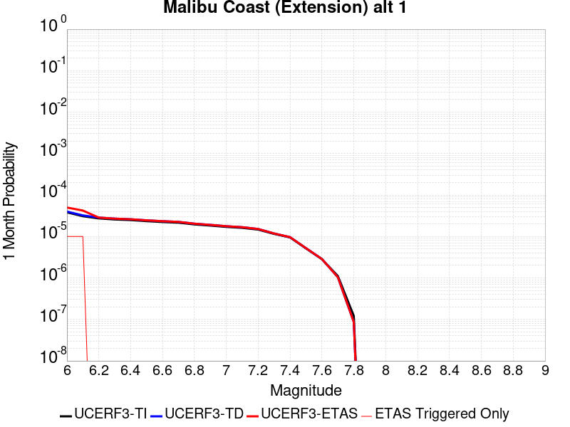 |  |  |

| Magnitude | 1 wk TI Prob | 1 wk TD Prob | 1 wk ETAS Prob | 1 wk ETAS/TD Gain | 1 wk ETAS Triggered Only | 1 mo TI Prob | 1 mo TD Prob | 1 mo ETAS Prob | 1 mo ETAS/TD Gain | 1 mo ETAS Triggered Only | 1 yr TI Prob | 1 yr TD Prob | 1 yr ETAS Prob | 1 yr ETAS/TD Gain | 1 yr ETAS Triggered Only | 10 yr TI Prob | 10 yr TD Prob | 10 yr ETAS Prob | 10 yr ETAS/TD Gain | 10 yr ETAS Triggered Only |
|-----|-----|-----|-----|-----|-----|-----|-----|-----|-----|-----|-----|-----|-----|-----|-----|-----|-----|-----|-----|-----|
| 6.0 | 8.930738E-6 | 9.329346E-6 | 2.0047359E-5 | 2.1488495 | 1.0718114E-5 | 3.827403E-5 | 3.9982307E-5 | 5.069999E-5 | 1.2680607 | 1.0718114E-5 | 4.6588664E-4 | 4.8667757E-4 | 4.9739046E-4 | 1.0220124 | 1.0718114E-5 | 0.0046491115 | 0.0048563 | 0.004866966 | 1.0021963 | 1.0718114E-5 |
| 6.1 | 7.199952E-6 | 7.530357E-6 | 1.824839E-5 | 2.42331 | 1.0718114E-5 | 3.0856572E-5 | 3.227256E-5 | 4.299033E-5 | 1.3321016 | 1.0718114E-5 | 3.75614E-4 | 3.928482E-4 | 4.035621E-4 | 1.0272723 | 1.0718114E-5 | 0.0037497976 | 0.003921604 | 0.0039322795 | 1.0027224 | 1.0718114E-5 |
| 6.2 | 6.3721413E-6 | 6.6668467E-6 | 6.6668467E-6 | 1.0 | 0.0 | 2.7308892E-5 | 2.857189E-5 | 2.857189E-5 | 1.0 | 0.0 | 3.3243504E-4 | 3.478076E-4 | 3.478076E-4 | 1.0 | 0.0 | 0.0033193815 | 0.0034726725 | 0.0034726725 | 1.0 | 0.0 |
| 6.3 | 6.016345E-6 | 6.2952113E-6 | 6.2952113E-6 | 1.0 | 0.0 | 2.578408E-5 | 2.69792E-5 | 2.69792E-5 | 1.0 | 0.0 | 3.1387596E-4 | 3.2842258E-4 | 3.2842258E-4 | 1.0 | 0.0 | 0.00313433 | 0.0032794084 | 0.0032794084 | 1.0 | 0.0 |
| 6.4 | 5.8104883E-6 | 6.0795965E-6 | 6.0795965E-6 | 1.0 | 0.0 | 2.4901856E-5 | 2.6055155E-5 | 2.6055155E-5 | 1.0 | 0.0 | 3.031379E-4 | 3.1717564E-4 | 3.1717564E-4 | 1.0 | 0.0 | 0.0030272473 | 0.0031672644 | 0.0031672644 | 1.0 | 0.0 |
| 6.5 | 5.476925E-6 | 5.7275624E-6 | 5.7275624E-6 | 1.0 | 0.0 | 2.3472323E-5 | 2.4546467E-5 | 2.4546467E-5 | 1.0 | 0.0 | 2.8573806E-4 | 2.9881255E-4 | 2.9881255E-4 | 1.0 | 0.0 | 0.0028537093 | 0.0029841396 | 0.0029841396 | 1.0 | 0.0 |
| 6.6 | 5.222387E-6 | 5.4586267E-6 | 5.4586267E-6 | 1.0 | 0.0 | 2.2381464E-5 | 2.3393906E-5 | 2.3393906E-5 | 1.0 | 0.0 | 2.7246025E-4 | 2.847839E-4 | 2.847839E-4 | 1.0 | 0.0 | 0.0027212645 | 0.00284422 | 0.00284422 | 1.0 | 0.0 |
| 6.7 | 5.0337076E-6 | 5.2591486E-6 | 5.2591486E-6 | 1.0 | 0.0 | 2.1572854E-5 | 2.2539016E-5 | 2.2539016E-5 | 1.0 | 0.0 | 2.6261783E-4 | 2.7437825E-4 | 2.7437825E-4 | 1.0 | 0.0 | 0.002623077 | 0.0027404248 | 0.0027404248 | 1.0 | 0.0 |
| 6.8 | 4.5675624E-6 | 4.7587573E-6 | 4.7587573E-6 | 1.0 | 0.0 | 1.9575122E-5 | 2.0394515E-5 | 2.0394515E-5 | 1.0 | 0.0 | 2.3830103E-4 | 2.4827512E-4 | 2.4827512E-4 | 1.0 | 0.0 | 0.0023804565 | 0.0024799972 | 0.0024799972 | 1.0 | 0.0 |
| 6.9 | 4.2802412E-6 | 4.4520584E-6 | 4.4520584E-6 | 1.0 | 0.0 | 1.8343762E-5 | 1.9080113E-5 | 1.9080113E-5 | 1.0 | 0.0 | 2.2331243E-4 | 2.3227576E-4 | 2.3227576E-4 | 1.0 | 0.0 | 0.0022308815 | 0.0023203467 | 0.0023203467 | 1.0 | 0.0 |
| 7.0 | 3.9794063E-6 | 4.130134E-6 | 4.130134E-6 | 1.0 | 0.0 | 1.7054486E-5 | 1.7700455E-5 | 1.7700455E-5 | 1.0 | 0.0 | 2.0761859E-4 | 2.1548186E-4 | 2.1548186E-4 | 1.0 | 0.0 | 0.0020742472 | 0.0021527428 | 0.0021527428 | 1.0 | 0.0 |
| 7.1 | 3.7730424E-6 | 3.91125E-6 | 3.91125E-6 | 1.0 | 0.0 | 1.6170083E-5 | 1.6762395E-5 | 1.6762395E-5 | 1.0 | 0.0 | 1.9685295E-4 | 2.0406317E-4 | 2.0406317E-4 | 1.0 | 0.0 | 0.0019667868 | 0.0020387706 | 0.0020387706 | 1.0 | 0.0 |
| 7.2 | 3.424985E-6 | 3.5413673E-6 | 3.5413673E-6 | 1.0 | 0.0 | 1.4678424E-5 | 1.51772E-5 | 1.51772E-5 | 1.0 | 0.0 | 1.7869516E-4 | 1.8476686E-4 | 1.8476686E-4 | 1.0 | 0.0 | 0.0017855153 | 0.0018461446 | 0.0018461446 | 1.0 | 0.0 |
| 7.3 | 2.6966375E-6 | 2.759676E-6 | 2.759676E-6 | 1.0 | 0.0 | 1.15569665E-5 | 1.1827129E-5 | 1.1827129E-5 | 1.0 | 0.0 | 1.4069698E-4 | 1.4398582E-4 | 1.4398582E-4 | 1.0 | 0.0 | 0.0014060794 | 0.0014389295 | 0.0014389295 | 1.0 | 0.0 |
| 7.4 | 2.215957E-6 | 2.2493962E-6 | 2.2493962E-6 | 1.0 | 0.0 | 9.496924E-6 | 9.640234E-6 | 9.640234E-6 | 1.0 | 0.0 | 1.1561892E-4 | 1.1736356E-4 | 1.1736356E-4 | 1.0 | 0.0 | 0.0011555878 | 0.0011730195 | 0.0011730195 | 1.0 | 0.0 |
| 7.5 | 1.2040218E-6 | 1.2219169E-6 | 1.2219169E-6 | 1.0 | 0.0 | 5.160083E-6 | 5.236777E-6 | 5.236777E-6 | 1.0 | 0.0 | 6.2822204E-5 | 6.3755906E-5 | 6.3755906E-5 | 1.0 | 0.0 | 6.280445E-4 | 6.37378E-4 | 6.37378E-4 | 1.0 | 0.0 |
| 7.6 | 6.6157446E-7 | 6.6790335E-7 | 6.6790335E-7 | 1.0 | 0.0 | 2.835316E-6 | 2.86244E-6 | 2.86244E-6 | 1.0 | 0.0 | 3.4519428E-5 | 3.4849665E-5 | 3.4849665E-5 | 1.0 | 0.0 | 3.4514067E-4 | 3.4844351E-4 | 3.4844351E-4 | 1.0 | 0.0 |
| 7.7 | 2.6012302E-7 | 2.4357794E-7 | 2.4357794E-7 | 1.0 | 0.0 | 1.1148124E-6 | 1.0439051E-6 | 1.0439051E-6 | 1.0 | 0.0 | 1.3572758E-5 | 1.2709481E-5 | 1.2709481E-5 | 1.0 | 0.0 | 1.3571928E-4 | 1.2708861E-4 | 1.2708861E-4 | 1.0 | 0.0 |
| 7.8 | 2.8323132E-8 | 2.026683E-8 | 2.026683E-8 | 1.0 | 0.0 | 1.2138484E-7 | 8.685784E-8 | 8.685784E-8 | 1.0 | 0.0 | 1.4778595E-6 | 1.0574938E-6 | 1.0574938E-6 | 1.0 | 0.0 | 1.4778497E-5 | 1.0574896E-5 | 1.0574896E-5 | 1.0 | 0.0 |

## Eaton Roughs 2011 CFM
*[(top)](#table-of-contents)*

| 1 Week | 1 Month | 1 Year | 10 Year |
|-----|-----|-----|-----|
|  |  |  |  |

| Magnitude | 1 wk TI Prob | 1 wk TD Prob | 1 wk ETAS Prob | 1 wk ETAS/TD Gain | 1 wk ETAS Triggered Only | 1 mo TI Prob | 1 mo TD Prob | 1 mo ETAS Prob | 1 mo ETAS/TD Gain | 1 mo ETAS Triggered Only | 1 yr TI Prob | 1 yr TD Prob | 1 yr ETAS Prob | 1 yr ETAS/TD Gain | 1 yr ETAS Triggered Only | 10 yr TI Prob | 10 yr TD Prob | 10 yr ETAS Prob | 10 yr ETAS/TD Gain | 10 yr ETAS Triggered Only |
|-----|-----|-----|-----|-----|-----|-----|-----|-----|-----|-----|-----|-----|-----|-----|-----|-----|-----|-----|-----|-----|
| 6.0 | 6.8044945E-5 | 8.844017E-5 | 8.844017E-5 | 1.0 | 0.0 | 2.9158857E-4 | 3.7898083E-4 | 3.7898083E-4 | 1.0 | 0.0 | 0.0035443127 | 0.0046052514 | 0.0046052514 | 1.0 | 0.0 | 0.03488314 | 0.045164995 | 0.04517523 | 1.0002266 | 1.0718114E-5 |
| 6.1 | 6.8044945E-5 | 8.844017E-5 | 8.844017E-5 | 1.0 | 0.0 | 2.9158857E-4 | 3.7898083E-4 | 3.7898083E-4 | 1.0 | 0.0 | 0.0035443127 | 0.0046052514 | 0.0046052514 | 1.0 | 0.0 | 0.03488314 | 0.045164995 | 0.04517523 | 1.0002266 | 1.0718114E-5 |
| 6.2 | 6.8044945E-5 | 8.844017E-5 | 8.844017E-5 | 1.0 | 0.0 | 2.9158857E-4 | 3.7898083E-4 | 3.7898083E-4 | 1.0 | 0.0 | 0.0035443127 | 0.0046052514 | 0.0046052514 | 1.0 | 0.0 | 0.03488314 | 0.045164995 | 0.04517523 | 1.0002266 | 1.0718114E-5 |
| 6.3 | 6.8044945E-5 | 8.844017E-5 | 8.844017E-5 | 1.0 | 0.0 | 2.9158857E-4 | 3.7898083E-4 | 3.7898083E-4 | 1.0 | 0.0 | 0.0035443127 | 0.0046052514 | 0.0046052514 | 1.0 | 0.0 | 0.03488314 | 0.045164995 | 0.04517523 | 1.0002266 | 1.0718114E-5 |
| 6.4 | 4.5830013E-5 | 5.7156227E-5 | 5.7156227E-5 | 1.0 | 0.0 | 1.9639956E-4 | 2.449353E-4 | 2.449353E-4 | 1.0 | 0.0 | 0.0023885423 | 0.0029785489 | 0.0029785489 | 1.0 | 0.0 | 0.023630321 | 0.029422507 | 0.029422507 | 1.0 | 0.0 |
| 6.5 | 4.5830013E-5 | 5.7156227E-5 | 5.7156227E-5 | 1.0 | 0.0 | 1.9639956E-4 | 2.449353E-4 | 2.449353E-4 | 1.0 | 0.0 | 0.0023885423 | 0.0029785489 | 0.0029785489 | 1.0 | 0.0 | 0.023630321 | 0.029422507 | 0.029422507 | 1.0 | 0.0 |
| 6.6 | 3.222194E-5 | 3.8262464E-5 | 3.8262464E-5 | 1.0 | 0.0 | 1.3808672E-4 | 1.6397233E-4 | 1.6397233E-4 | 1.0 | 0.0 | 0.0016799092 | 0.001994649 | 0.001994649 | 1.0 | 0.0 | 0.016672665 | 0.019777084 | 0.019777084 | 1.0 | 0.0 |
| 6.7 | 2.4155654E-5 | 2.7786778E-5 | 2.7786778E-5 | 1.0 | 0.0 | 1.0352012E-4 | 1.190808E-4 | 1.190808E-4 | 1.0 | 0.0 | 0.0012596287 | 0.0014488528 | 0.0014488528 | 1.0 | 0.0 | 0.012525126 | 0.014395221 | 0.014395221 | 1.0 | 0.0 |
| 6.8 | 2.1814667E-5 | 2.4941326E-5 | 2.4941326E-5 | 1.0 | 0.0 | 9.348808E-5 | 1.0688704E-4 | 1.0688704E-4 | 1.0 | 0.0 | 0.001137623 | 0.0013005766 | 0.0013005766 | 1.0 | 0.0 | 0.011318169 | 0.012930275 | 0.012930275 | 1.0 | 0.0 |
| 6.9 | 2.0700467E-5 | 2.3629362E-5 | 2.3629362E-5 | 1.0 | 0.0 | 8.871327E-5 | 1.0126478E-4 | 1.0126478E-4 | 1.0 | 0.0 | 0.0010795488 | 0.0012322046 | 0.0012322046 | 1.0 | 0.0 | 0.010743194 | 0.012254256 | 0.012254256 | 1.0 | 0.0 |
| 7.0 | 2.0104066E-5 | 2.2936913E-5 | 2.2936913E-5 | 1.0 | 0.0 | 8.615744E-5 | 9.8297365E-5 | 9.8297365E-5 | 1.0 | 0.0 | 0.0010484619 | 0.0011961164 | 0.0011961164 | 1.0 | 0.0 | 0.010435291 | 0.0118972855 | 0.0118972855 | 1.0 | 0.0 |
| 7.1 | 1.8225232E-5 | 2.0773416E-5 | 2.0773416E-5 | 1.0 | 0.0 | 7.81058E-5 | 8.9025896E-5 | 8.9025896E-5 | 1.0 | 0.0 | 9.5052324E-4 | 0.0010833528 | 0.0010833528 | 1.0 | 0.0 | 0.009464677 | 0.010781016 | 0.010781016 | 1.0 | 0.0 |
| 7.2 | 1.7526572E-5 | 1.9993846E-5 | 1.9993846E-5 | 1.0 | 0.0 | 7.511172E-5 | 8.5685104E-5 | 8.5685104E-5 | 1.0 | 0.0 | 9.141015E-4 | 0.0010427183 | 0.0010427183 | 1.0 | 0.0 | 0.009103506 | 0.010378536 | 0.010378536 | 1.0 | 0.0 |
| 7.3 | 1.5727232E-5 | 1.8021838E-5 | 1.8021838E-5 | 1.0 | 0.0 | 6.740067E-5 | 7.723417E-5 | 7.723417E-5 | 1.0 | 0.0 | 8.2029426E-4 | 9.399216E-4 | 9.399216E-4 | 1.0 | 0.0 | 0.008172729 | 0.009359682 | 0.009359682 | 1.0 | 0.0 |
| 7.4 | 1.4457361E-5 | 1.6598666E-5 | 1.6598666E-5 | 1.0 | 0.0 | 6.195865E-5 | 7.1135204E-5 | 7.1135204E-5 | 1.0 | 0.0 | 7.540854E-4 | 8.657279E-4 | 8.657279E-4 | 1.0 | 0.0 | 0.007515317 | 0.008623715 | 0.008623715 | 1.0 | 0.0 |
| 7.5 | 1.33280955E-5 | 1.5345724E-5 | 1.5345724E-5 | 1.0 | 0.0 | 5.711916E-5 | 6.576574E-5 | 6.576574E-5 | 1.0 | 0.0 | 6.9520384E-4 | 8.004045E-4 | 8.004045E-4 | 1.0 | 0.0 | 0.00693033 | 0.0079753585 | 0.0079753585 | 1.0 | 0.0 |
| 7.6 | 1.0699478E-5 | 1.2388054E-5 | 1.2388054E-5 | 1.0 | 0.0 | 4.5854096E-5 | 5.3090578E-5 | 5.3090578E-5 | 1.0 | 0.0 | 5.581306E-4 | 6.4618664E-4 | 6.4618664E-4 | 1.0 | 0.0 | 0.005567309 | 0.0064431587 | 0.0064431587 | 1.0 | 0.0 |
| 7.7 | 5.9390236E-6 | 6.8530726E-6 | 6.8530726E-6 | 1.0 | 0.0 | 2.545271E-5 | 2.9369981E-5 | 2.9369981E-5 | 1.0 | 0.0 | 3.0984267E-4 | 3.575211E-4 | 3.575211E-4 | 1.0 | 0.0 | 0.0030941102 | 0.0035694835 | 0.0035694835 | 1.0 | 0.0 |
| 7.8 | 2.1622036E-6 | 2.3297227E-6 | 2.3297227E-6 | 1.0 | 0.0 | 9.266554E-6 | 9.984488E-6 | 9.984488E-6 | 1.0 | 0.0 | 1.1281446E-4 | 1.2155443E-4 | 1.2155443E-4 | 1.0 | 0.0 | 0.001127572 | 0.0012148852 | 0.0012148852 | 1.0 | 0.0 |
| 7.9 | 4.9586197E-7 | 5.2189574E-7 | 5.2189574E-7 | 1.0 | 0.0 | 2.125121E-6 | 2.2366944E-6 | 2.2366944E-6 | 1.0 | 0.0 | 2.5873042E-5 | 2.7231436E-5 | 2.7231436E-5 | 1.0 | 0.0 | 2.5870028E-4 | 2.7228307E-4 | 2.7228307E-4 | 1.0 | 0.0 |

## Northridge
*[(top)](#table-of-contents)*

| 1 Week | 1 Month | 1 Year | 10 Year |
|-----|-----|-----|-----|
|  |  |  |  |

| Magnitude | 1 wk TI Prob | 1 wk TD Prob | 1 wk ETAS Prob | 1 wk ETAS/TD Gain | 1 wk ETAS Triggered Only | 1 mo TI Prob | 1 mo TD Prob | 1 mo ETAS Prob | 1 mo ETAS/TD Gain | 1 mo ETAS Triggered Only | 1 yr TI Prob | 1 yr TD Prob | 1 yr ETAS Prob | 1 yr ETAS/TD Gain | 1 yr ETAS Triggered Only | 10 yr TI Prob | 10 yr TD Prob | 10 yr ETAS Prob | 10 yr ETAS/TD Gain | 10 yr ETAS Triggered Only |
|-----|-----|-----|-----|-----|-----|-----|-----|-----|-----|-----|-----|-----|-----|-----|-----|-----|-----|-----|-----|-----|
| 6.0 | 1.8340852E-5 | 7.5881535E-6 | 7.5881535E-6 | 1.0 | 0.0 | 7.860128E-5 | 3.2520264E-5 | 3.2520264E-5 | 1.0 | 0.0 | 9.565505E-4 | 3.9586448E-4 | 4.0657836E-4 | 1.0270644 | 1.0718114E-5 | 0.009524435 | 0.003951816 | 0.0039624916 | 1.0027015 | 1.0718114E-5 |
| 6.1 | 1.8340852E-5 | 7.5881535E-6 | 7.5881535E-6 | 1.0 | 0.0 | 7.860128E-5 | 3.2520264E-5 | 3.2520264E-5 | 1.0 | 0.0 | 9.565505E-4 | 3.9586448E-4 | 4.0657836E-4 | 1.0270644 | 1.0718114E-5 | 0.009524435 | 0.003951816 | 0.0039624916 | 1.0027015 | 1.0718114E-5 |
| 6.2 | 1.8340852E-5 | 7.5881535E-6 | 7.5881535E-6 | 1.0 | 0.0 | 7.860128E-5 | 3.2520264E-5 | 3.2520264E-5 | 1.0 | 0.0 | 9.565505E-4 | 3.9586448E-4 | 4.0657836E-4 | 1.0270644 | 1.0718114E-5 | 0.009524435 | 0.003951816 | 0.0039624916 | 1.0027015 | 1.0718114E-5 |
| 6.3 | 1.8340852E-5 | 7.5881535E-6 | 7.5881535E-6 | 1.0 | 0.0 | 7.860128E-5 | 3.2520264E-5 | 3.2520264E-5 | 1.0 | 0.0 | 9.565505E-4 | 3.9586448E-4 | 4.0657836E-4 | 1.0270644 | 1.0718114E-5 | 0.009524435 | 0.003951816 | 0.0039624916 | 1.0027015 | 1.0718114E-5 |
| 6.4 | 1.7361892E-5 | 7.5881535E-6 | 7.5881535E-6 | 1.0 | 0.0 | 7.440598E-5 | 3.2520264E-5 | 3.2520264E-5 | 1.0 | 0.0 | 9.055163E-4 | 3.9586448E-4 | 4.0657836E-4 | 1.0270644 | 1.0718114E-5 | 0.009018354 | 0.003951816 | 0.0039624916 | 1.0027015 | 1.0718114E-5 |
| 6.5 | 1.7361892E-5 | 7.5881535E-6 | 7.5881535E-6 | 1.0 | 0.0 | 7.440598E-5 | 3.2520264E-5 | 3.2520264E-5 | 1.0 | 0.0 | 9.055163E-4 | 3.9586448E-4 | 4.0657836E-4 | 1.0270644 | 1.0718114E-5 | 0.009018354 | 0.003951816 | 0.0039624916 | 1.0027015 | 1.0718114E-5 |
| 6.6 | 1.5458201E-5 | 7.5881535E-6 | 7.5881535E-6 | 1.0 | 0.0 | 6.624775E-5 | 3.2520264E-5 | 3.2520264E-5 | 1.0 | 0.0 | 8.0626784E-4 | 3.9586448E-4 | 4.0657836E-4 | 1.0270644 | 1.0718114E-5 | 0.008033488 | 0.003951816 | 0.0039624916 | 1.0027015 | 1.0718114E-5 |
| 6.7 | 1.2538368E-5 | 6.381707E-6 | 6.381707E-6 | 1.0 | 0.0 | 5.3734755E-5 | 2.7349888E-5 | 2.7349888E-5 | 1.0 | 0.0 | 6.5402425E-4 | 3.3293446E-4 | 3.43649E-4 | 1.0321821 | 1.0718114E-5 | 0.0065210275 | 0.0033244046 | 0.003335087 | 1.0032134 | 1.0718114E-5 |
| 6.8 | 1.1438097E-5 | 6.3503594E-6 | 6.3503594E-6 | 1.0 | 0.0 | 4.9019498E-5 | 2.7215545E-5 | 2.7215545E-5 | 1.0 | 0.0 | 5.9664896E-4 | 3.3129932E-4 | 3.4201387E-4 | 1.032341 | 1.0718114E-5 | 0.005950495 | 0.003308102 | 0.0033187845 | 1.0032293 | 1.0718114E-5 |
| 6.9 | 1.1204891E-5 | 6.2868094E-6 | 6.2868094E-6 | 1.0 | 0.0 | 4.8020076E-5 | 2.6943193E-5 | 2.6943193E-5 | 1.0 | 0.0 | 5.8448757E-4 | 3.2798442E-4 | 3.3869903E-4 | 1.032668 | 1.0718114E-5 | 0.0058295266 | 0.0032750512 | 0.0032857342 | 1.0032619 | 1.0718114E-5 |
| 7.0 | 1.061046E-5 | 6.1154565E-6 | 6.1154565E-6 | 1.0 | 0.0 | 4.5472607E-5 | 2.6208838E-5 | 2.6208838E-5 | 1.0 | 0.0 | 5.534883E-4 | 3.1904632E-4 | 3.29761E-4 | 1.0335835 | 1.0718114E-5 | 0.0055211177 | 0.003185929 | 0.0031966132 | 1.0033535 | 1.0718114E-5 |
| 7.1 | 1.0266979E-5 | 6.0043685E-6 | 6.0043685E-6 | 1.0 | 0.0 | 4.40006E-5 | 2.5732756E-5 | 2.5732756E-5 | 1.0 | 0.0 | 5.355756E-4 | 3.132517E-4 | 3.2396644E-4 | 1.034205 | 1.0718114E-5 | 0.0053428668 | 0.0031281472 | 0.0031388318 | 1.0034156 | 1.0718114E-5 |
| 7.2 | 9.91273E-6 | 5.820076E-6 | 5.820076E-6 | 1.0 | 0.0 | 4.248244E-5 | 2.4942945E-5 | 2.4942945E-5 | 1.0 | 0.0 | 5.171009E-4 | 3.0363846E-4 | 3.1435332E-4 | 1.0352882 | 1.0718114E-5 | 0.0051589934 | 0.003032281 | 0.0030429666 | 1.003524 | 1.0718114E-5 |
| 7.3 | 8.4959265E-6 | 5.1931415E-6 | 5.1931415E-6 | 1.0 | 0.0 | 3.6410605E-5 | 2.2256132E-5 | 2.2256132E-5 | 1.0 | 0.0 | 4.4320893E-4 | 2.7093495E-4 | 2.8165017E-4 | 1.039549 | 1.0718114E-5 | 0.00442326 | 0.0027060728 | 0.002716762 | 1.00395 | 1.0718114E-5 |
| 7.4 | 8.0847185E-6 | 4.9820114E-6 | 4.9820114E-6 | 1.0 | 0.0 | 3.4648332E-5 | 2.1351305E-5 | 2.1351305E-5 | 1.0 | 0.0 | 4.2176177E-4 | 2.5992136E-4 | 2.706367E-4 | 1.0412253 | 1.0718114E-5 | 0.0042096223 | 0.0025961995 | 0.0026068897 | 1.0041177 | 1.0718114E-5 |
| 7.5 | 6.8220684E-6 | 4.2533693E-6 | 4.2533693E-6 | 1.0 | 0.0 | 2.9237108E-5 | 1.8228598E-5 | 1.8228598E-5 | 1.0 | 0.0 | 3.5590364E-4 | 2.2191078E-4 | 2.3262652E-4 | 1.0482885 | 1.0718114E-5 | 0.0035533418 | 0.0022169128 | 0.0022276072 | 1.004824 | 1.0718114E-5 |
| 7.6 | 4.4224143E-6 | 2.8999916E-6 | 2.8999916E-6 | 1.0 | 0.0 | 1.8953066E-5 | 1.2428477E-5 | 1.2428477E-5 | 1.0 | 0.0 | 2.3072914E-4 | 1.5130632E-4 | 1.6202281E-4 | 1.0708264 | 1.0718114E-5 | 0.0023048974 | 0.0015120446 | 0.0015227465 | 1.0070778 | 1.0718114E-5 |
| 7.7 | 2.5297056E-6 | 1.6046072E-6 | 1.6046072E-6 | 1.0 | 0.0 | 1.0841551E-5 | 6.87687E-6 | 6.87687E-6 | 1.0 | 0.0 | 1.319879E-4 | 8.372273E-5 | 9.443994E-5 | 1.1280085 | 1.0718114E-5 | 0.0013190953 | 8.3691656E-4 | 8.4762566E-4 | 1.0127959 | 1.0718114E-5 |
| 7.8 | 1.2508156E-6 | 8.78015E-7 | 8.78015E-7 | 1.0 | 0.0 | 5.3606273E-6 | 3.7629159E-6 | 3.7629159E-6 | 1.0 | 0.0 | 6.526368E-5 | 4.581255E-5 | 5.6530174E-5 | 1.2339451 | 1.0718114E-5 | 6.524452E-4 | 4.5803236E-4 | 4.6874557E-4 | 1.0233896 | 1.0718114E-5 |
| 7.9 | 2.262199E-7 | 1.4664893E-7 | 1.4664893E-7 | 1.0 | 0.0 | 9.695135E-7 | 6.2849523E-7 | 6.2849523E-7 | 1.0 | 0.0 | 1.1803763E-5 | 7.651904E-6 | 7.651904E-6 | 1.0 | 0.0 | 1.1803136E-4 | 7.651648E-5 | 7.651648E-5 | 1.0 | 0.0 |
| 8.0 | 2.865362E-9 | 1.2753953E-9 | 1.2753953E-9 | 1.0 | 0.0 | 1.2280123E-8 | 5.46598E-9 | 5.46598E-9 | 1.0 | 0.0 | 1.4951048E-7 | 6.654831E-8 | 6.654831E-8 | 1.0 | 0.0 | 1.4951038E-6 | 6.6548307E-7 | 6.6548307E-7 | 1.0 | 0.0 |

## Great Valley 08 (Quinto)
*[(top)](#table-of-contents)*

| 1 Week | 1 Month | 1 Year | 10 Year |
|-----|-----|-----|-----|
|  |  |  |  |

| Magnitude | 1 wk TI Prob | 1 wk TD Prob | 1 wk ETAS Prob | 1 wk ETAS/TD Gain | 1 wk ETAS Triggered Only | 1 mo TI Prob | 1 mo TD Prob | 1 mo ETAS Prob | 1 mo ETAS/TD Gain | 1 mo ETAS Triggered Only | 1 yr TI Prob | 1 yr TD Prob | 1 yr ETAS Prob | 1 yr ETAS/TD Gain | 1 yr ETAS Triggered Only | 10 yr TI Prob | 10 yr TD Prob | 10 yr ETAS Prob | 10 yr ETAS/TD Gain | 10 yr ETAS Triggered Only |
|-----|-----|-----|-----|-----|-----|-----|-----|-----|-----|-----|-----|-----|-----|-----|-----|-----|-----|-----|-----|-----|
| 6.0 | 7.737697E-6 | 8.253111E-6 | 8.253111E-6 | 1.0 | 0.0 | 3.3161137E-5 | 3.5370103E-5 | 3.5370103E-5 | 1.0 | 0.0 | 4.0366207E-4 | 4.3056477E-4 | 4.4127827E-4 | 1.0248824 | 1.0718114E-5 | 0.004029296 | 0.0042991587 | 0.0043098307 | 1.0024823 | 1.0718114E-5 |
| 6.1 | 7.737697E-6 | 8.253111E-6 | 8.253111E-6 | 1.0 | 0.0 | 3.3161137E-5 | 3.5370103E-5 | 3.5370103E-5 | 1.0 | 0.0 | 4.0366207E-4 | 4.3056477E-4 | 4.4127827E-4 | 1.0248824 | 1.0718114E-5 | 0.004029296 | 0.0042991587 | 0.0043098307 | 1.0024823 | 1.0718114E-5 |
| 6.2 | 7.737697E-6 | 8.253111E-6 | 8.253111E-6 | 1.0 | 0.0 | 3.3161137E-5 | 3.5370103E-5 | 3.5370103E-5 | 1.0 | 0.0 | 4.0366207E-4 | 4.3056477E-4 | 4.4127827E-4 | 1.0248824 | 1.0718114E-5 | 0.004029296 | 0.0042991587 | 0.0043098307 | 1.0024823 | 1.0718114E-5 |
| 6.3 | 5.374012E-6 | 5.750627E-6 | 5.750627E-6 | 1.0 | 0.0 | 2.3031276E-5 | 2.4645375E-5 | 2.4645375E-5 | 1.0 | 0.0 | 2.803697E-4 | 3.0002726E-4 | 3.0002726E-4 | 1.0 | 0.0 | 0.0028001624 | 0.0029973155 | 0.0029973155 | 1.0 | 0.0 |
| 6.4 | 5.374012E-6 | 5.750627E-6 | 5.750627E-6 | 1.0 | 0.0 | 2.3031276E-5 | 2.4645375E-5 | 2.4645375E-5 | 1.0 | 0.0 | 2.803697E-4 | 3.0002726E-4 | 3.0002726E-4 | 1.0 | 0.0 | 0.0028001624 | 0.0029973155 | 0.0029973155 | 1.0 | 0.0 |
| 6.5 | 3.65427E-6 | 3.941365E-6 | 3.941365E-6 | 1.0 | 0.0 | 1.5661062E-5 | 1.6891494E-5 | 1.6891494E-5 | 1.0 | 0.0 | 1.9065675E-4 | 2.056416E-4 | 2.056416E-4 | 1.0 | 0.0 | 0.0019049325 | 0.0020552047 | 0.0020552047 | 1.0 | 0.0 |
| 6.6 | 3.6143538E-6 | 3.8985513E-6 | 3.8985513E-6 | 1.0 | 0.0 | 1.5489995E-5 | 1.6708009E-5 | 1.6708009E-5 | 1.0 | 0.0 | 1.8857437E-4 | 2.0340808E-4 | 2.0340808E-4 | 1.0 | 0.0 | 0.0018841444 | 0.0020329105 | 0.0020329105 | 1.0 | 0.0 |
| 6.7 | 2.4821015E-6 | 2.685736E-6 | 2.685736E-6 | 1.0 | 0.0 | 1.0637535E-5 | 1.15102785E-5 | 1.15102785E-5 | 1.0 | 0.0 | 1.2950429E-4 | 1.4013429E-4 | 1.4013429E-4 | 1.0 | 0.0 | 0.0012942884 | 0.0014010142 | 0.0014010142 | 1.0 | 0.0 |
| 6.8 | 4.7110538E-7 | 5.1930914E-7 | 5.1930914E-7 | 1.0 | 0.0 | 2.0190216E-6 | 2.2256088E-6 | 2.2256088E-6 | 1.0 | 0.0 | 2.458131E-5 | 2.7096468E-5 | 2.7096468E-5 | 1.0 | 0.0 | 2.457859E-4 | 2.7093347E-4 | 2.7093347E-4 | 1.0 | 0.0 |
| 6.9 | 3.958685E-7 | 4.3704054E-7 | 4.3704054E-7 | 1.0 | 0.0 | 1.6965782E-6 | 1.8730296E-6 | 1.8730296E-6 | 1.0 | 0.0 | 2.0655643E-5 | 2.2803915E-5 | 2.2803915E-5 | 1.0 | 0.0 | 2.0653724E-4 | 2.2801736E-4 | 2.2801736E-4 | 1.0 | 0.0 |
| 7.0 | 2.70294E-7 | 2.9920432E-7 | 2.9920432E-7 | 1.0 | 0.0 | 1.1584025E-6 | 1.2823037E-6 | 1.2823037E-6 | 1.0 | 0.0 | 1.4103458E-5 | 1.561195E-5 | 1.561195E-5 | 1.0 | 0.0 | 1.4102564E-4 | 1.561098E-4 | 1.561098E-4 | 1.0 | 0.0 |
| 7.1 | 1.4828602E-7 | 1.6469349E-7 | 1.6469349E-7 | 1.0 | 0.0 | 6.3551136E-7 | 7.058291E-7 | 7.058291E-7 | 1.0 | 0.0 | 7.737323E-6 | 8.593443E-6 | 8.593443E-6 | 1.0 | 0.0 | 7.737054E-5 | 8.593191E-5 | 8.593191E-5 | 1.0 | 0.0 |

## Hector Mine
*[(top)](#table-of-contents)*

| 1 Week | 1 Month | 1 Year | 10 Year |
|-----|-----|-----|-----|
|  |  | 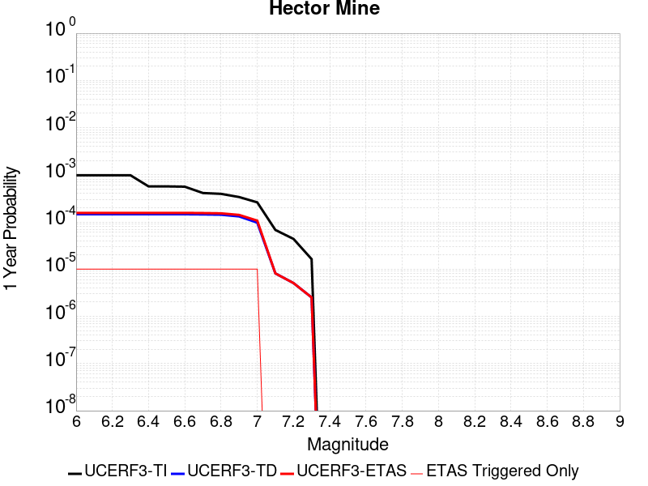 | 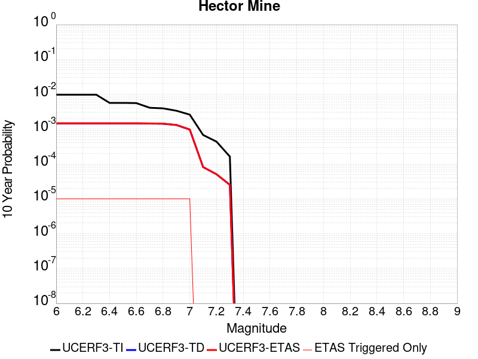 |

| Magnitude | 1 wk TI Prob | 1 wk TD Prob | 1 wk ETAS Prob | 1 wk ETAS/TD Gain | 1 wk ETAS Triggered Only | 1 mo TI Prob | 1 mo TD Prob | 1 mo ETAS Prob | 1 mo ETAS/TD Gain | 1 mo ETAS Triggered Only | 1 yr TI Prob | 1 yr TD Prob | 1 yr ETAS Prob | 1 yr ETAS/TD Gain | 1 yr ETAS Triggered Only | 10 yr TI Prob | 10 yr TD Prob | 10 yr ETAS Prob | 10 yr ETAS/TD Gain | 10 yr ETAS Triggered Only |
|-----|-----|-----|-----|-----|-----|-----|-----|-----|-----|-----|-----|-----|-----|-----|-----|-----|-----|-----|-----|-----|
| 6.0 | 1.8760093E-5 | 2.796445E-6 | 2.796445E-6 | 1.0 | 0.0 | 8.039792E-5 | 1.1984732E-5 | 1.1984732E-5 | 1.0 | 0.0 | 9.78405E-4 | 1.4590833E-4 | 1.5662488E-4 | 1.0734471 | 1.0718114E-5 | 0.009741086 | 0.0014585176 | 0.00146922 | 1.0073379 | 1.0718114E-5 |
| 6.1 | 1.8760093E-5 | 2.796445E-6 | 2.796445E-6 | 1.0 | 0.0 | 8.039792E-5 | 1.1984732E-5 | 1.1984732E-5 | 1.0 | 0.0 | 9.78405E-4 | 1.4590833E-4 | 1.5662488E-4 | 1.0734471 | 1.0718114E-5 | 0.009741086 | 0.0014585176 | 0.00146922 | 1.0073379 | 1.0718114E-5 |
| 6.2 | 1.8760093E-5 | 2.796445E-6 | 2.796445E-6 | 1.0 | 0.0 | 8.039792E-5 | 1.1984732E-5 | 1.1984732E-5 | 1.0 | 0.0 | 9.78405E-4 | 1.4590833E-4 | 1.5662488E-4 | 1.0734471 | 1.0718114E-5 | 0.009741086 | 0.0014585176 | 0.00146922 | 1.0073379 | 1.0718114E-5 |
| 6.3 | 1.8760093E-5 | 2.796445E-6 | 2.796445E-6 | 1.0 | 0.0 | 8.039792E-5 | 1.1984732E-5 | 1.1984732E-5 | 1.0 | 0.0 | 9.78405E-4 | 1.4590833E-4 | 1.5662488E-4 | 1.0734471 | 1.0718114E-5 | 0.009741086 | 0.0014585176 | 0.00146922 | 1.0073379 | 1.0718114E-5 |
| 6.4 | 1.0888055E-5 | 2.796445E-6 | 2.796445E-6 | 1.0 | 0.0 | 4.666226E-5 | 1.1984732E-5 | 1.1984732E-5 | 1.0 | 0.0 | 5.679649E-4 | 1.4590833E-4 | 1.5662488E-4 | 1.0734471 | 1.0718114E-5 | 0.0056651547 | 0.0014585176 | 0.00146922 | 1.0073379 | 1.0718114E-5 |
| 6.5 | 1.0888055E-5 | 2.796445E-6 | 2.796445E-6 | 1.0 | 0.0 | 4.666226E-5 | 1.1984732E-5 | 1.1984732E-5 | 1.0 | 0.0 | 5.679649E-4 | 1.4590833E-4 | 1.5662488E-4 | 1.0734471 | 1.0718114E-5 | 0.0056651547 | 0.0014585176 | 0.00146922 | 1.0073379 | 1.0718114E-5 |
| 6.6 | 1.0730738E-5 | 2.796445E-6 | 2.796445E-6 | 1.0 | 0.0 | 4.5988065E-5 | 1.1984732E-5 | 1.1984732E-5 | 1.0 | 0.0 | 5.5976084E-4 | 1.4590833E-4 | 1.5662488E-4 | 1.0734471 | 1.0718114E-5 | 0.0055835294 | 0.0014585176 | 0.00146922 | 1.0073379 | 1.0718114E-5 |
| 6.7 | 7.881326E-6 | 2.7711246E-6 | 2.7711246E-6 | 1.0 | 0.0 | 3.3776672E-5 | 1.1876217E-5 | 1.1876217E-5 | 1.0 | 0.0 | 4.111534E-4 | 1.4458735E-4 | 1.5530392E-4 | 1.0741183 | 1.0718114E-5 | 0.0041039353 | 0.0014453249 | 0.0014560275 | 1.007405 | 1.0718114E-5 |
| 6.8 | 7.5683483E-6 | 2.7328742E-6 | 2.7328742E-6 | 1.0 | 0.0 | 3.2435375E-5 | 1.1712288E-5 | 1.1712288E-5 | 1.0 | 0.0 | 3.9482914E-4 | 1.4259177E-4 | 1.5330836E-4 | 1.0751557 | 1.0718114E-5 | 0.0039412836 | 0.0014253948 | 0.0014360977 | 1.0075086 | 1.0718114E-5 |
| 6.9 | 6.473048E-6 | 2.513948E-6 | 2.513948E-6 | 1.0 | 0.0 | 2.7741338E-5 | 1.0774041E-5 | 1.0774041E-5 | 1.0 | 0.0 | 3.3769844E-4 | 1.3117002E-4 | 1.4188673E-4 | 1.0817009 | 1.0718114E-5 | 0.0033718573 | 0.0013113155 | 0.0013220196 | 1.0081629 | 1.0718114E-5 |
| 7.0 | 4.9959954E-6 | 1.8565554E-6 | 1.8565554E-6 | 1.0 | 0.0 | 2.1411232E-5 | 7.956662E-6 | 7.956662E-6 | 1.0 | 0.0 | 2.6065056E-4 | 9.687162E-5 | 1.0758869E-4 | 1.1106317 | 1.0718114E-5 | 0.0026034506 | 9.686435E-4 | 9.793512E-4 | 1.0110544 | 1.0718114E-5 |
| 7.1 | 1.2997541E-6 | 1.5602835E-7 | 1.5602835E-7 | 1.0 | 0.0 | 5.5703626E-6 | 6.686928E-7 | 6.686928E-7 | 1.0 | 0.0 | 6.7817055E-5 | 8.141308E-6 | 8.141308E-6 | 1.0 | 0.0 | 6.779636E-4 | 8.141049E-5 | 8.141049E-5 | 1.0 | 0.0 |
| 7.2 | 8.392699E-7 | 9.728028E-8 | 9.728028E-8 | 1.0 | 0.0 | 3.596866E-6 | 4.1691544E-7 | 4.1691544E-7 | 1.0 | 0.0 | 4.3790962E-5 | 5.0759354E-6 | 5.0759354E-6 | 1.0 | 0.0 | 4.3782333E-4 | 5.075839E-5 | 5.075839E-5 | 1.0 | 0.0 |
| 7.3 | 3.13015E-7 | 4.8294503E-8 | 4.8294503E-8 | 1.0 | 0.0 | 1.3414921E-6 | 2.0697642E-7 | 2.0697642E-7 | 1.0 | 0.0 | 1.6332544E-5 | 2.5199358E-6 | 2.5199358E-6 | 1.0 | 0.0 | 1.6331344E-4 | 2.5199157E-5 | 2.5199157E-5 | 1.0 | 0.0 |

## Shoreline
*[(top)](#table-of-contents)*

| 1 Week | 1 Month | 1 Year | 10 Year |
|-----|-----|-----|-----|
|  |  |  |  |

| Magnitude | 1 wk TI Prob | 1 wk TD Prob | 1 wk ETAS Prob | 1 wk ETAS/TD Gain | 1 wk ETAS Triggered Only | 1 mo TI Prob | 1 mo TD Prob | 1 mo ETAS Prob | 1 mo ETAS/TD Gain | 1 mo ETAS Triggered Only | 1 yr TI Prob | 1 yr TD Prob | 1 yr ETAS Prob | 1 yr ETAS/TD Gain | 1 yr ETAS Triggered Only | 10 yr TI Prob | 10 yr TD Prob | 10 yr ETAS Prob | 10 yr ETAS/TD Gain | 10 yr ETAS Triggered Only |
|-----|-----|-----|-----|-----|-----|-----|-----|-----|-----|-----|-----|-----|-----|-----|-----|-----|-----|-----|-----|-----|
| 6.0 | 3.9888673E-6 | 4.047945E-6 | 4.047945E-6 | 1.0 | 0.0 | 1.7095033E-5 | 1.7348251E-5 | 1.7348251E-5 | 1.0 | 0.0 | 2.0811215E-4 | 2.1120008E-4 | 2.2191594E-4 | 1.0507379 | 1.0718114E-5 | 0.0020791737 | 0.0021105423 | 0.0021212378 | 1.0050677 | 1.0718114E-5 |
| 6.1 | 3.9888673E-6 | 4.047945E-6 | 4.047945E-6 | 1.0 | 0.0 | 1.7095033E-5 | 1.7348251E-5 | 1.7348251E-5 | 1.0 | 0.0 | 2.0811215E-4 | 2.1120008E-4 | 2.2191594E-4 | 1.0507379 | 1.0718114E-5 | 0.0020791737 | 0.0021105423 | 0.0021212378 | 1.0050677 | 1.0718114E-5 |
| 6.2 | 1.4039653E-6 | 1.4100978E-6 | 1.4100978E-6 | 1.0 | 0.0 | 6.0169805E-6 | 6.0432626E-6 | 6.0432626E-6 | 1.0 | 0.0 | 7.325427E-5 | 7.3574294E-5 | 8.429162E-5 | 1.1456667 | 1.0718114E-5 | 7.3230127E-4 | 7.3550537E-4 | 7.4621564E-4 | 1.0145618 | 1.0718114E-5 |
| 6.3 | 1.4039653E-6 | 1.4100978E-6 | 1.4100978E-6 | 1.0 | 0.0 | 6.0169805E-6 | 6.0432626E-6 | 6.0432626E-6 | 1.0 | 0.0 | 7.325427E-5 | 7.3574294E-5 | 8.429162E-5 | 1.1456667 | 1.0718114E-5 | 7.3230127E-4 | 7.3550537E-4 | 7.4621564E-4 | 1.0145618 | 1.0718114E-5 |
| 6.4 | 1.3314152E-6 | 1.336169E-6 | 1.336169E-6 | 1.0 | 0.0 | 5.7060524E-6 | 5.726426E-6 | 5.726426E-6 | 1.0 | 0.0 | 6.946897E-5 | 6.971706E-5 | 8.043443E-5 | 1.1537266 | 1.0718114E-5 | 6.9447263E-4 | 6.969573E-4 | 7.0766796E-4 | 1.0153677 | 1.0718114E-5 |
| 6.5 | 1.1187026E-6 | 1.1203721E-6 | 1.1203721E-6 | 1.0 | 0.0 | 4.794431E-6 | 4.801586E-6 | 4.801586E-6 | 1.0 | 0.0 | 5.8370628E-5 | 5.8457765E-5 | 6.917525E-5 | 1.1833373 | 1.0718114E-5 | 5.83553E-4 | 5.844264E-4 | 5.9513823E-4 | 1.0183288 | 1.0718114E-5 |
| 6.6 | 9.793089E-7 | 9.784997E-7 | 9.784997E-7 | 1.0 | 0.0 | 4.1970316E-6 | 4.193563E-6 | 4.193563E-6 | 1.0 | 0.0 | 5.1097657E-5 | 5.105545E-5 | 6.177302E-5 | 1.2099202 | 1.0718114E-5 | 5.108591E-4 | 5.104385E-4 | 5.211511E-4 | 1.0209872 | 1.0718114E-5 |
| 6.7 | 8.995986E-7 | 8.972875E-7 | 8.972875E-7 | 1.0 | 0.0 | 3.8554167E-6 | 3.8455123E-6 | 3.8455123E-6 | 1.0 | 0.0 | 4.693869E-5 | 4.6818117E-5 | 5.7535726E-5 | 1.2289202 | 1.0718114E-5 | 4.6928777E-4 | 4.6808348E-4 | 4.7879657E-4 | 1.0228871 | 1.0718114E-5 |
| 6.8 | 7.931612E-7 | 7.8804743E-7 | 7.8804743E-7 | 1.0 | 0.0 | 3.3992578E-6 | 3.3773417E-6 | 3.3773417E-6 | 1.0 | 0.0 | 4.1385178E-5 | 4.1118365E-5 | 5.1836036E-5 | 1.2606542 | 1.0718114E-5 | 4.1377472E-4 | 4.111081E-4 | 4.218218E-4 | 1.0260606 | 1.0718114E-5 |
| 6.9 | 7.1465956E-7 | 7.078075E-7 | 7.078075E-7 | 1.0 | 0.0 | 3.062823E-6 | 3.0334572E-6 | 3.0334572E-6 | 1.0 | 0.0 | 3.7289232E-5 | 3.6931717E-5 | 4.7649435E-5 | 1.2902036 | 1.0718114E-5 | 3.7282976E-4 | 3.692562E-4 | 3.7997033E-4 | 1.0290155 | 1.0718114E-5 |
| 7.0 | 6.389046E-7 | 6.299524E-7 | 6.299524E-7 | 1.0 | 0.0 | 2.7381598E-6 | 2.6997934E-6 | 2.6997934E-6 | 1.0 | 0.0 | 3.3336586E-5 | 3.286949E-5 | 4.3587253E-5 | 1.3260702 | 1.0718114E-5 | 3.3331584E-4 | 3.2864654E-4 | 3.393611E-4 | 1.0326022 | 1.0718114E-5 |
| 7.1 | 5.4300875E-7 | 5.311193E-7 | 5.311193E-7 | 1.0 | 0.0 | 2.3271782E-6 | 2.2762235E-6 | 2.2762235E-6 | 1.0 | 0.0 | 2.8333026E-5 | 2.7712671E-5 | 3.8430488E-5 | 1.3867478 | 1.0718114E-5 | 2.8329415E-4 | 2.7709227E-4 | 2.878074E-4 | 1.03867 | 1.0718114E-5 |
| 7.2 | 4.6768855E-7 | 4.5349543E-7 | 4.5349543E-7 | 1.0 | 0.0 | 2.0043778E-6 | 1.9435504E-6 | 1.9435504E-6 | 1.0 | 0.0 | 2.4403027E-5 | 2.366247E-5 | 2.366247E-5 | 1.0 | 0.0 | 2.4400349E-4 | 2.3659955E-4 | 2.3659955E-4 | 1.0 | 0.0 |
| 7.3 | 4.0966103E-7 | 3.938623E-7 | 3.938623E-7 | 1.0 | 0.0 | 1.7556889E-6 | 1.6879802E-6 | 1.6879802E-6 | 1.0 | 0.0 | 2.1375303E-5 | 2.0550966E-5 | 2.0550966E-5 | 1.0 | 0.0 | 2.1373246E-4 | 2.0549068E-4 | 2.0549068E-4 | 1.0 | 0.0 |
| 7.4 | 3.5105785E-7 | 3.336452E-7 | 3.336452E-7 | 1.0 | 0.0 | 1.5045327E-6 | 1.4299071E-6 | 1.4299071E-6 | 1.0 | 0.0 | 1.8317533E-5 | 1.740898E-5 | 1.740898E-5 | 1.0 | 0.0 | 1.8316023E-4 | 1.740762E-4 | 1.740762E-4 | 1.0 | 0.0 |
| 7.5 | 2.8737534E-7 | 2.682056E-7 | 2.682056E-7 | 1.0 | 0.0 | 1.2316079E-6 | 1.149452E-6 | 1.149452E-6 | 1.0 | 0.0 | 1.4994724E-5 | 1.3994489E-5 | 1.3994489E-5 | 1.0 | 0.0 | 1.4993713E-4 | 1.3993609E-4 | 1.3993609E-4 | 1.0 | 0.0 |
| 7.6 | 2.0924051E-7 | 1.8779478E-7 | 1.8779478E-7 | 1.0 | 0.0 | 8.967448E-7 | 8.048345E-7 | 8.048345E-7 | 1.0 | 0.0 | 1.0917813E-5 | 9.798816E-6 | 9.798816E-6 | 1.0 | 0.0 | 1.0917276E-4 | 9.798385E-5 | 9.798385E-5 | 1.0 | 0.0 |
| 7.7 | 1.392265E-7 | 1.1543848E-7 | 1.1543848E-7 | 1.0 | 0.0 | 5.9668486E-7 | 4.9473624E-7 | 4.9473624E-7 | 1.0 | 0.0 | 7.2646135E-6 | 6.023397E-6 | 6.023397E-6 | 1.0 | 0.0 | 7.2643765E-5 | 6.023234E-5 | 6.023234E-5 | 1.0 | 0.0 |
| 7.8 | 8.1080074E-8 | 5.58715E-8 | 5.58715E-8 | 1.0 | 0.0 | 3.4748598E-7 | 2.3944926E-7 | 2.3944926E-7 | 1.0 | 0.0 | 4.2306337E-6 | 2.915291E-6 | 2.915291E-6 | 1.0 | 0.0 | 4.230553E-5 | 2.9152527E-5 | 2.9152527E-5 | 1.0 | 0.0 |
| 7.9 | 5.0859036E-8 | 2.7248419E-8 | 2.7248419E-8 | 1.0 | 0.0 | 2.1796728E-7 | 1.16778935E-7 | 1.16778935E-7 | 1.0 | 0.0 | 2.6537484E-6 | 1.4217826E-6 | 1.4217826E-6 | 1.0 | 0.0 | 2.6537167E-5 | 1.4217735E-5 | 1.4217735E-5 | 1.0 | 0.0 |
| 8.0 | 3.1760536E-8 | 1.3580286E-8 | 1.3580286E-8 | 1.0 | 0.0 | 1.3611657E-7 | 5.8201223E-8 | 5.8201223E-8 | 1.0 | 0.0 | 1.6572179E-6 | 7.0859966E-7 | 7.0859966E-7 | 1.0 | 0.0 | 1.6572056E-5 | 7.085974E-6 | 7.085974E-6 | 1.0 | 0.0 |
| 8.1 | 1.2947896E-8 | 5.6641998E-9 | 5.6641998E-9 | 1.0 | 0.0 | 5.5490982E-8 | 2.4275142E-8 | 2.4275142E-8 | 1.0 | 0.0 | 6.756025E-7 | 2.955498E-7 | 2.955498E-7 | 1.0 | 0.0 | 6.7560045E-6 | 2.9554942E-6 | 2.9554942E-6 | 1.0 | 0.0 |

## San Gregorio (South) 2011 CFM
*[(top)](#table-of-contents)*

| 1 Week | 1 Month | 1 Year | 10 Year |
|-----|-----|-----|-----|
|  |  | 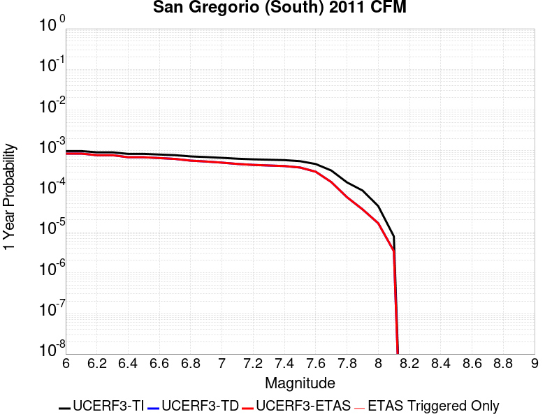 |  |

| Magnitude | 1 wk TI Prob | 1 wk TD Prob | 1 wk ETAS Prob | 1 wk ETAS/TD Gain | 1 wk ETAS Triggered Only | 1 mo TI Prob | 1 mo TD Prob | 1 mo ETAS Prob | 1 mo ETAS/TD Gain | 1 mo ETAS Triggered Only | 1 yr TI Prob | 1 yr TD Prob | 1 yr ETAS Prob | 1 yr ETAS/TD Gain | 1 yr ETAS Triggered Only | 10 yr TI Prob | 10 yr TD Prob | 10 yr ETAS Prob | 10 yr ETAS/TD Gain | 10 yr ETAS Triggered Only |
|-----|-----|-----|-----|-----|-----|-----|-----|-----|-----|-----|-----|-----|-----|-----|-----|-----|-----|-----|-----|-----|
| 6.0 | 1.8770423E-5 | 1.6280406E-5 | 1.6280406E-5 | 1.0 | 0.0 | 8.044219E-5 | 6.977132E-5 | 6.977132E-5 | 1.0 | 0.0 | 9.789435E-4 | 8.491386E-4 | 8.491386E-4 | 1.0 | 0.0 | 0.009746423 | 0.008471654 | 0.008482281 | 1.0012544 | 1.0718114E-5 |
| 6.1 | 1.8770423E-5 | 1.6280406E-5 | 1.6280406E-5 | 1.0 | 0.0 | 8.044219E-5 | 6.977132E-5 | 6.977132E-5 | 1.0 | 0.0 | 9.789435E-4 | 8.491386E-4 | 8.491386E-4 | 1.0 | 0.0 | 0.009746423 | 0.008471654 | 0.008482281 | 1.0012544 | 1.0718114E-5 |
| 6.2 | 1.7508692E-5 | 1.4899894E-5 | 1.4899894E-5 | 1.0 | 0.0 | 7.5035096E-5 | 6.385514E-5 | 6.385514E-5 | 1.0 | 0.0 | 9.1316935E-4 | 7.771621E-4 | 7.771621E-4 | 1.0 | 0.0 | 0.00909426 | 0.0077570733 | 0.007767708 | 1.001371 | 1.0718114E-5 |
| 6.3 | 1.7508692E-5 | 1.4899894E-5 | 1.4899894E-5 | 1.0 | 0.0 | 7.5035096E-5 | 6.385514E-5 | 6.385514E-5 | 1.0 | 0.0 | 9.1316935E-4 | 7.771621E-4 | 7.771621E-4 | 1.0 | 0.0 | 0.00909426 | 0.0077570733 | 0.007767708 | 1.001371 | 1.0718114E-5 |
| 6.4 | 1.6004591E-5 | 1.324971E-5 | 1.324971E-5 | 1.0 | 0.0 | 6.85893E-5 | 5.678324E-5 | 5.678324E-5 | 1.0 | 0.0 | 8.347548E-4 | 6.911177E-4 | 6.911177E-4 | 1.0 | 0.0 | 0.008316261 | 0.0069021136 | 0.0069021136 | 1.0 | 0.0 |
| 6.5 | 1.6004591E-5 | 1.324971E-5 | 1.324971E-5 | 1.0 | 0.0 | 6.85893E-5 | 5.678324E-5 | 5.678324E-5 | 1.0 | 0.0 | 8.347548E-4 | 6.911177E-4 | 6.911177E-4 | 1.0 | 0.0 | 0.008316261 | 0.0069021136 | 0.0069021136 | 1.0 | 0.0 |
| 6.6 | 1.5442201E-5 | 1.2634333E-5 | 1.2634333E-5 | 1.0 | 0.0 | 6.617918E-5 | 5.4146025E-5 | 5.4146025E-5 | 1.0 | 0.0 | 8.0543366E-4 | 6.590293E-4 | 6.590293E-4 | 1.0 | 0.0 | 0.008025207 | 0.006583161 | 0.006583161 | 1.0 | 0.0 |
| 6.7 | 1.489921E-5 | 1.2042835E-5 | 1.2042835E-5 | 1.0 | 0.0 | 6.3852196E-5 | 5.1611136E-5 | 5.1611136E-5 | 1.0 | 0.0 | 7.7712315E-4 | 6.281851E-4 | 6.281851E-4 | 1.0 | 0.0 | 0.0077441116 | 0.0062764906 | 0.0062764906 | 1.0 | 0.0 |
| 6.8 | 1.3876024E-5 | 1.0921772E-5 | 1.0921772E-5 | 1.0 | 0.0 | 5.9467322E-5 | 4.6806756E-5 | 4.6806756E-5 | 1.0 | 0.0 | 7.237741E-4 | 5.697236E-4 | 5.697236E-4 | 1.0 | 0.0 | 0.0072142133 | 0.0056949924 | 0.0056949924 | 1.0 | 0.0 |
| 6.9 | 1.33922495E-5 | 1.0393267E-5 | 1.0393267E-5 | 1.0 | 0.0 | 5.7394092E-5 | 4.4541815E-5 | 4.4541815E-5 | 1.0 | 0.0 | 6.9854903E-4 | 5.421619E-4 | 5.421619E-4 | 1.0 | 0.0 | 0.0069635725 | 0.0054207467 | 0.0054207467 | 1.0 | 0.0 |
| 7.0 | 1.2807324E-5 | 9.753221E-6 | 9.753221E-6 | 1.0 | 0.0 | 5.4887376E-5 | 4.179885E-5 | 4.179885E-5 | 1.0 | 0.0 | 6.680489E-4 | 5.0878234E-4 | 5.0878234E-4 | 1.0 | 0.0 | 0.006660442 | 0.005088521 | 0.005088521 | 1.0 | 0.0 |
| 7.1 | 1.2191438E-5 | 9.062097E-6 | 9.062097E-6 | 1.0 | 0.0 | 5.224797E-5 | 3.883698E-5 | 3.883698E-5 | 1.0 | 0.0 | 6.3593336E-4 | 4.7273774E-4 | 4.7273774E-4 | 1.0 | 0.0 | 0.0063411663 | 0.0047296593 | 0.0047296593 | 1.0 | 0.0 |
| 7.2 | 1.1769438E-5 | 8.582283E-6 | 8.582283E-6 | 1.0 | 0.0 | 5.0439474E-5 | 3.6780693E-5 | 3.6780693E-5 | 1.0 | 0.0 | 6.1392755E-4 | 4.47713E-4 | 4.47713E-4 | 1.0 | 0.0 | 0.0061223423 | 0.004480447 | 0.004480447 | 1.0 | 0.0 |
| 7.3 | 1.150374E-5 | 8.297709E-6 | 8.297709E-6 | 1.0 | 0.0 | 4.9300812E-5 | 3.5561126E-5 | 3.5561126E-5 | 1.0 | 0.0 | 6.0007203E-4 | 4.3287076E-4 | 4.3287076E-4 | 1.0 | 0.0 | 0.0059845424 | 0.004332595 | 0.004332595 | 1.0 | 0.0 |
| 7.4 | 1.12514E-5 | 8.043448E-6 | 8.043448E-6 | 1.0 | 0.0 | 4.8219394E-5 | 3.4471464E-5 | 3.4471464E-5 | 1.0 | 0.0 | 5.8691297E-4 | 4.1960934E-4 | 4.1960934E-4 | 1.0 | 0.0 | 0.005853653 | 0.0042004758 | 0.0042004758 | 1.0 | 0.0 |
| 7.5 | 1.059696E-5 | 7.393731E-6 | 7.393731E-6 | 1.0 | 0.0 | 4.5414752E-5 | 3.1687036E-5 | 3.1687036E-5 | 1.0 | 0.0 | 5.5278436E-4 | 3.857214E-4 | 3.857214E-4 | 1.0 | 0.0 | 0.0055141128 | 0.00386276 | 0.00386276 | 1.0 | 0.0 |
| 7.6 | 9.018592E-6 | 5.837476E-6 | 5.837476E-6 | 1.0 | 0.0 | 3.8650534E-5 | 2.5017514E-5 | 2.5017514E-5 | 1.0 | 0.0 | 4.7046866E-4 | 3.045457E-4 | 3.045457E-4 | 1.0 | 0.0 | 0.004694739 | 0.003053146 | 0.003053146 | 1.0 | 0.0 |
| 7.7 | 6.243489E-6 | 3.239967E-6 | 3.239967E-6 | 1.0 | 0.0 | 2.6757538E-5 | 1.3885499E-5 | 1.3885499E-5 | 1.0 | 0.0 | 3.257243E-4 | 1.6904285E-4 | 1.6904285E-4 | 1.0 | 0.0 | 0.003252473 | 0.001699331 | 0.001699331 | 1.0 | 0.0 |
| 7.8 | 3.1941963E-6 | 1.3812611E-6 | 1.3812611E-6 | 1.0 | 0.0 | 1.368934E-5 | 5.919677E-6 | 5.919677E-6 | 1.0 | 0.0 | 1.6665498E-4 | 7.2069684E-5 | 7.2069684E-5 | 1.0 | 0.0 | 0.0016653005 | 7.2645675E-4 | 7.2645675E-4 | 1.0 | 0.0 |
| 7.9 | 2.0098398E-6 | 6.9180976E-7 | 6.9180976E-7 | 1.0 | 0.0 | 8.6135715E-6 | 2.9648954E-6 | 2.9648954E-6 | 1.0 | 0.0 | 1.0486518E-4 | 3.6097004E-5 | 3.6097004E-5 | 1.0 | 0.0 | 0.0010481571 | 3.6582787E-4 | 3.6582787E-4 | 1.0 | 0.0 |
| 8.0 | 8.353119E-7 | 3.163282E-7 | 3.163282E-7 | 1.0 | 0.0 | 3.579903E-6 | 1.3556916E-6 | 1.3556916E-6 | 1.0 | 0.0 | 4.358445E-5 | 1.650542E-5 | 1.650542E-5 | 1.0 | 0.0 | 4.3575902E-4 | 1.6624204E-4 | 1.6624204E-4 | 1.0 | 0.0 |
| 8.1 | 1.5033264E-7 | 6.529188E-8 | 6.529188E-8 | 1.0 | 0.0 | 6.442826E-7 | 2.798223E-7 | 2.798223E-7 | 1.0 | 0.0 | 7.844113E-6 | 3.4068314E-6 | 3.4068314E-6 | 1.0 | 0.0 | 7.843835E-5 | 3.4085097E-5 | 3.4085097E-5 | 1.0 | 0.0 |

## Owens Valley Keough Hot Springs
*[(top)](#table-of-contents)*

| 1 Week | 1 Month | 1 Year | 10 Year |
|-----|-----|-----|-----|
|  |  |  | 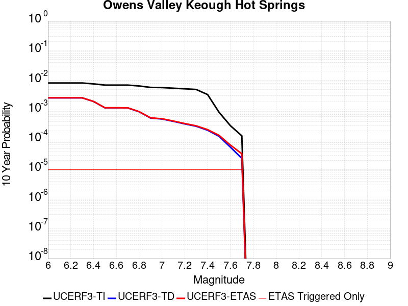 |

| Magnitude | 1 wk TI Prob | 1 wk TD Prob | 1 wk ETAS Prob | 1 wk ETAS/TD Gain | 1 wk ETAS Triggered Only | 1 mo TI Prob | 1 mo TD Prob | 1 mo ETAS Prob | 1 mo ETAS/TD Gain | 1 mo ETAS Triggered Only | 1 yr TI Prob | 1 yr TD Prob | 1 yr ETAS Prob | 1 yr ETAS/TD Gain | 1 yr ETAS Triggered Only | 10 yr TI Prob | 10 yr TD Prob | 10 yr ETAS Prob | 10 yr ETAS/TD Gain | 10 yr ETAS Triggered Only |
|-----|-----|-----|-----|-----|-----|-----|-----|-----|-----|-----|-----|-----|-----|-----|-----|-----|-----|-----|-----|-----|
| 6.0 | 1.5708529E-5 | 4.9508244E-6 | 4.9508244E-6 | 1.0 | 0.0 | 6.7320536E-5 | 2.1217675E-5 | 3.193556E-5 | 1.5051395 | 1.0718114E-5 | 8.193192E-4 | 2.582997E-4 | 2.6901506E-4 | 1.0414841 | 1.0718114E-5 | 0.008163051 | 0.0025806532 | 0.0025913436 | 1.0041425 | 1.0718114E-5 |
| 6.1 | 1.5708529E-5 | 4.9508244E-6 | 4.9508244E-6 | 1.0 | 0.0 | 6.7320536E-5 | 2.1217675E-5 | 3.193556E-5 | 1.5051395 | 1.0718114E-5 | 8.193192E-4 | 2.582997E-4 | 2.6901506E-4 | 1.0414841 | 1.0718114E-5 | 0.008163051 | 0.0025806532 | 0.0025913436 | 1.0041425 | 1.0718114E-5 |
| 6.2 | 1.5708529E-5 | 4.9508244E-6 | 4.9508244E-6 | 1.0 | 0.0 | 6.7320536E-5 | 2.1217675E-5 | 3.193556E-5 | 1.5051395 | 1.0718114E-5 | 8.193192E-4 | 2.582997E-4 | 2.6901506E-4 | 1.0414841 | 1.0718114E-5 | 0.008163051 | 0.0025806532 | 0.0025913436 | 1.0041425 | 1.0718114E-5 |
| 6.3 | 1.5708529E-5 | 4.9508244E-6 | 4.9508244E-6 | 1.0 | 0.0 | 6.7320536E-5 | 2.1217675E-5 | 3.193556E-5 | 1.5051395 | 1.0718114E-5 | 8.193192E-4 | 2.582997E-4 | 2.6901506E-4 | 1.0414841 | 1.0718114E-5 | 0.008163051 | 0.0025806532 | 0.0025913436 | 1.0041425 | 1.0718114E-5 |
| 6.4 | 1.4622509E-5 | 3.7266684E-6 | 3.7266684E-6 | 1.0 | 0.0 | 6.266639E-5 | 1.5971356E-5 | 2.6689298E-5 | 1.6710727 | 1.0718114E-5 | 7.626962E-4 | 1.9443722E-4 | 2.0515325E-4 | 1.0551131 | 1.0718114E-5 | 0.007600839 | 0.0019431504 | 0.0019538477 | 1.0055051 | 1.0718114E-5 |
| 6.5 | 1.3335527E-5 | 2.2778408E-6 | 2.2778408E-6 | 1.0 | 0.0 | 5.7151006E-5 | 9.762142E-6 | 2.048015E-5 | 2.0979156 | 1.0718114E-5 | 6.955913E-4 | 1.18848286E-4 | 1.2956512E-4 | 1.0901724 | 1.0718114E-5 | 0.0069341804 | 0.0011880693 | 0.0011987748 | 1.0090108 | 1.0718114E-5 |
| 6.6 | 1.3332855E-5 | 2.27499E-6 | 2.27499E-6 | 1.0 | 0.0 | 5.7139558E-5 | 9.749924E-6 | 2.0467935E-5 | 2.0992916 | 1.0718114E-5 | 6.9545204E-4 | 1.1869955E-4 | 1.294164E-4 | 1.0902854 | 1.0718114E-5 | 0.0069327964 | 0.0011865837 | 0.001197289 | 1.009022 | 1.0718114E-5 |
| 6.7 | 1.3318214E-5 | 2.26422E-6 | 2.26422E-6 | 1.0 | 0.0 | 5.707681E-5 | 9.703767E-6 | 2.0421778E-5 | 2.1045203 | 1.0718114E-5 | 6.946886E-4 | 1.1813765E-4 | 1.2885449E-4 | 1.0907149 | 1.0718114E-5 | 0.0069252094 | 0.0011809706 | 0.001191676 | 1.0090649 | 1.0718114E-5 |
| 6.8 | 1.2441338E-5 | 1.6778914E-6 | 1.6778914E-6 | 1.0 | 0.0 | 5.331893E-5 | 7.190945E-6 | 1.7908982E-5 | 2.4904907 | 1.0718114E-5 | 6.489646E-4 | 8.7546534E-5 | 9.8263714E-5 | 1.1224169 | 1.0718114E-5 | 0.0064707273 | 8.75305E-4 | 8.860137E-4 | 1.0122343 | 1.0718114E-5 |
| 6.9 | 1.1130476E-5 | 1.0304584E-6 | 1.0304584E-6 | 1.0 | 0.0 | 4.7701167E-5 | 4.416243E-6 | 1.5134309E-5 | 3.4269648 | 1.0718114E-5 | 5.806069E-4 | 5.3766445E-5 | 6.448398E-5 | 1.1993351 | 1.0718114E-5 | 0.0057909233 | 5.376886E-4 | 5.48401E-4 | 1.019923 | 1.0718114E-5 |
| 7.0 | 1.0986073E-5 | 9.580101E-7 | 9.580101E-7 | 1.0 | 0.0 | 4.7082318E-5 | 4.105751E-6 | 1.48238205E-5 | 3.6105015 | 1.0718114E-5 | 5.730765E-4 | 4.9986385E-5 | 6.0703962E-5 | 1.21441 | 1.0718114E-5 | 0.0057160086 | 4.999046E-4 | 5.106174E-4 | 1.0214297 | 1.0718114E-5 |
| 7.1 | 1.0451338E-5 | 8.000831E-7 | 8.000831E-7 | 1.0 | 0.0 | 4.4790682E-5 | 3.428923E-6 | 1.4147E-5 | 4.1257854 | 1.0718114E-5 | 5.451901E-4 | 4.1746345E-5 | 5.246401E-5 | 1.2567331 | 1.0718114E-5 | 0.005438545 | 4.1753432E-4 | 4.2824796E-4 | 1.0256593 | 1.0718114E-5 |
| 7.2 | 9.989061E-6 | 6.545439E-7 | 6.545439E-7 | 1.0 | 0.0 | 4.280956E-5 | 2.805185E-6 | 1.35232685E-5 | 4.8208117 | 1.0718114E-5 | 5.2108173E-4 | 3.4152596E-5 | 4.4870343E-5 | 1.3138194 | 1.0718114E-5 | 0.0051986156 | 3.4161055E-4 | 3.52325E-4 | 1.0313646 | 1.0718114E-5 |
| 7.3 | 9.465365E-6 | 5.4604976E-7 | 5.4604976E-7 | 1.0 | 0.0 | 4.056522E-5 | 2.340211E-6 | 1.3058299E-5 | 5.5799665 | 1.0718114E-5 | 4.937696E-4 | 2.84917E-5 | 3.920951E-5 | 1.376173 | 1.0718114E-5 | 0.0049267393 | 2.8501268E-4 | 2.9572775E-4 | 1.037595 | 1.0718114E-5 |
| 7.4 | 6.3824805E-6 | 4.016707E-7 | 4.016707E-7 | 1.0 | 0.0 | 2.73532E-5 | 1.7214446E-6 | 1.243954E-5 | 7.226221 | 1.0718114E-5 | 3.3297433E-4 | 2.0958389E-5 | 3.1676278E-5 | 1.511389 | 1.0718114E-5 | 0.0033247585 | 2.0965615E-4 | 2.2037202E-4 | 1.0511116 | 1.0718114E-5 |
| 7.5 | 1.6192645E-6 | 2.5163493E-7 | 2.5163493E-7 | 1.0 | 0.0 | 6.9396865E-6 | 1.0784349E-6 | 1.1796537E-5 | 10.938571 | 1.0718114E-5 | 8.448741E-5 | 1.31298675E-5 | 2.384784E-5 | 1.8163047 | 1.0718114E-5 | 8.4455294E-4 | 1.3129105E-4 | 1.4200776E-4 | 1.0816256 | 1.0718114E-5 |
| 7.6 | 5.7062545E-7 | 1.079331E-7 | 1.079331E-7 | 1.0 | 0.0 | 2.4455355E-6 | 4.6257034E-7 | 1.1180679E-5 | 24.170765 | 1.0718114E-5 | 2.9773988E-5 | 5.63178E-6 | 1.6349833E-5 | 2.9031377 | 1.0718114E-5 | 2.977E-4 | 5.6316454E-5 | 6.7033965E-5 | 1.1903087 | 1.0718114E-5 |
| 7.7 | 2.5988817E-7 | 4.5461668E-8 | 4.5461668E-8 | 1.0 | 0.0 | 1.113806E-6 | 1.948357E-7 | 1.0912947E-5 | 56.011024 | 1.0718114E-5 | 1.3560503E-5 | 2.3721225E-6 | 1.3090211E-5 | 5.5183535 | 1.0718114E-5 | 1.3559677E-4 | 2.3721017E-5 | 3.4438875E-5 | 1.4518297 | 1.0718114E-5 |

## Peralta Hills
*[(top)](#table-of-contents)*

| 1 Week | 1 Month | 1 Year | 10 Year |
|-----|-----|-----|-----|
|  |  |  |  |

| Magnitude | 1 wk TI Prob | 1 wk TD Prob | 1 wk ETAS Prob | 1 wk ETAS/TD Gain | 1 wk ETAS Triggered Only | 1 mo TI Prob | 1 mo TD Prob | 1 mo ETAS Prob | 1 mo ETAS/TD Gain | 1 mo ETAS Triggered Only | 1 yr TI Prob | 1 yr TD Prob | 1 yr ETAS Prob | 1 yr ETAS/TD Gain | 1 yr ETAS Triggered Only | 10 yr TI Prob | 10 yr TD Prob | 10 yr ETAS Prob | 10 yr ETAS/TD Gain | 10 yr ETAS Triggered Only |
|-----|-----|-----|-----|-----|-----|-----|-----|-----|-----|-----|-----|-----|-----|-----|-----|-----|-----|-----|-----|-----|
| 6.0 | 3.8850067E-6 | 3.839573E-6 | 3.839573E-6 | 1.0 | 0.0 | 1.6649923E-5 | 1.645525E-5 | 1.645525E-5 | 1.0 | 0.0 | 2.0269395E-4 | 2.0033166E-4 | 2.0033166E-4 | 1.0 | 0.0 | 0.0020250916 | 0.0020022383 | 0.002012935 | 1.0053424 | 1.0718114E-5 |
| 6.1 | 3.8850067E-6 | 3.839573E-6 | 3.839573E-6 | 1.0 | 0.0 | 1.6649923E-5 | 1.645525E-5 | 1.645525E-5 | 1.0 | 0.0 | 2.0269395E-4 | 2.0033166E-4 | 2.0033166E-4 | 1.0 | 0.0 | 0.0020250916 | 0.0020022383 | 0.002012935 | 1.0053424 | 1.0718114E-5 |
| 6.2 | 3.8850067E-6 | 3.839573E-6 | 3.839573E-6 | 1.0 | 0.0 | 1.6649923E-5 | 1.645525E-5 | 1.645525E-5 | 1.0 | 0.0 | 2.0269395E-4 | 2.0033166E-4 | 2.0033166E-4 | 1.0 | 0.0 | 0.0020250916 | 0.0020022383 | 0.002012935 | 1.0053424 | 1.0718114E-5 |
| 6.3 | 3.8850067E-6 | 3.839573E-6 | 3.839573E-6 | 1.0 | 0.0 | 1.6649923E-5 | 1.645525E-5 | 1.645525E-5 | 1.0 | 0.0 | 2.0269395E-4 | 2.0033166E-4 | 2.0033166E-4 | 1.0 | 0.0 | 0.0020250916 | 0.0020022383 | 0.002012935 | 1.0053424 | 1.0718114E-5 |
| 6.4 | 3.8850067E-6 | 3.839573E-6 | 3.839573E-6 | 1.0 | 0.0 | 1.6649923E-5 | 1.645525E-5 | 1.645525E-5 | 1.0 | 0.0 | 2.0269395E-4 | 2.0033166E-4 | 2.0033166E-4 | 1.0 | 0.0 | 0.0020250916 | 0.0020022383 | 0.002012935 | 1.0053424 | 1.0718114E-5 |
| 6.5 | 1.5587785E-6 | 1.4431308E-6 | 1.4431308E-6 | 1.0 | 0.0 | 6.6804623E-6 | 6.184833E-6 | 6.184833E-6 | 1.0 | 0.0 | 8.133159E-5 | 7.529798E-5 | 7.529798E-5 | 1.0 | 0.0 | 8.1301836E-4 | 7.527487E-4 | 7.527487E-4 | 1.0 | 0.0 |
| 6.6 | 1.5587785E-6 | 1.4431308E-6 | 1.4431308E-6 | 1.0 | 0.0 | 6.6804623E-6 | 6.184833E-6 | 6.184833E-6 | 1.0 | 0.0 | 8.133159E-5 | 7.529798E-5 | 7.529798E-5 | 1.0 | 0.0 | 8.1301836E-4 | 7.527487E-4 | 7.527487E-4 | 1.0 | 0.0 |
| 6.7 | 1.5018579E-6 | 1.3837531E-6 | 1.3837531E-6 | 1.0 | 0.0 | 6.436518E-6 | 5.9303584E-6 | 5.9303584E-6 | 1.0 | 0.0 | 7.836179E-5 | 7.219996E-5 | 7.219996E-5 | 1.0 | 0.0 | 7.833416E-4 | 7.2178856E-4 | 7.2178856E-4 | 1.0 | 0.0 |
| 6.8 | 1.4584314E-6 | 1.3381849E-6 | 1.3381849E-6 | 1.0 | 0.0 | 6.250405E-6 | 5.7350667E-6 | 5.7350667E-6 | 1.0 | 0.0 | 7.6096025E-5 | 6.982244E-5 | 6.982244E-5 | 1.0 | 0.0 | 7.6069974E-4 | 6.980284E-4 | 6.980284E-4 | 1.0 | 0.0 |
| 6.9 | 1.1382393E-6 | 9.862651E-7 | 9.862651E-7 | 1.0 | 0.0 | 4.8781594E-6 | 4.2268443E-6 | 4.2268443E-6 | 1.0 | 0.0 | 5.9389975E-5 | 5.1460698E-5 | 5.1460698E-5 | 1.0 | 0.0 | 5.93741E-4 | 5.1449606E-4 | 5.1449606E-4 | 1.0 | 0.0 |
| 7.0 | 9.970413E-7 | 8.309953E-7 | 8.309953E-7 | 1.0 | 0.0 | 4.273027E-6 | 3.561404E-6 | 3.561404E-6 | 1.0 | 0.0 | 5.2022864E-5 | 4.33593E-5 | 4.33593E-5 | 1.0 | 0.0 | 5.2010687E-4 | 4.335152E-4 | 4.335152E-4 | 1.0 | 0.0 |
| 7.1 | 9.684443E-7 | 7.994381E-7 | 7.994381E-7 | 1.0 | 0.0 | 4.150469E-6 | 3.426159E-6 | 3.426159E-6 | 1.0 | 0.0 | 5.053079E-5 | 4.171276E-5 | 4.171276E-5 | 1.0 | 0.0 | 5.05193E-4 | 4.17056E-4 | 4.17056E-4 | 1.0 | 0.0 |
| 7.2 | 9.240811E-7 | 7.5034313E-7 | 7.5034313E-7 | 1.0 | 0.0 | 3.960342E-6 | 3.2157527E-6 | 3.2157527E-6 | 1.0 | 0.0 | 4.8216094E-5 | 3.9151153E-5 | 3.9151153E-5 | 1.0 | 0.0 | 4.8205635E-4 | 3.914491E-4 | 3.914491E-4 | 1.0 | 0.0 |
| 7.3 | 8.158643E-7 | 6.3502733E-7 | 6.3502733E-7 | 1.0 | 0.0 | 3.4965567E-6 | 2.7215433E-6 | 2.7215433E-6 | 1.0 | 0.0 | 4.2569747E-5 | 3.3134347E-5 | 3.3134347E-5 | 1.0 | 0.0 | 4.2561593E-4 | 3.3130022E-4 | 3.3130022E-4 | 1.0 | 0.0 |
| 7.4 | 6.3822824E-7 | 4.7959236E-7 | 4.7959236E-7 | 1.0 | 0.0 | 2.7352612E-6 | 2.0553946E-6 | 2.0553946E-6 | 1.0 | 0.0 | 3.3301294E-5 | 2.5024194E-5 | 2.5024194E-5 | 1.0 | 0.0 | 3.3296304E-4 | 2.502189E-4 | 2.502189E-4 | 1.0 | 0.0 |
| 7.5 | 4.0292628E-7 | 2.784719E-7 | 2.784719E-7 | 1.0 | 0.0 | 1.7268258E-6 | 1.1934507E-6 | 1.1934507E-6 | 1.0 | 0.0 | 2.1023901E-5 | 1.4530193E-5 | 1.4530193E-5 | 1.0 | 0.0 | 2.1021912E-4 | 1.4529523E-4 | 1.4529523E-4 | 1.0 | 0.0 |
| 7.6 | 3.672993E-7 | 2.4855962E-7 | 2.4855962E-7 | 1.0 | 0.0 | 1.5741389E-6 | 1.0652552E-6 | 1.0652552E-6 | 1.0 | 0.0 | 1.9164972E-5 | 1.2969433E-5 | 1.2969433E-5 | 1.0 | 0.0 | 1.916332E-4 | 1.2968948E-4 | 1.2968948E-4 | 1.0 | 0.0 |
| 7.7 | 2.8466823E-7 | 1.7860675E-7 | 1.7860675E-7 | 1.0 | 0.0 | 1.2200061E-6 | 7.6545746E-7 | 7.6545746E-7 | 1.0 | 0.0 | 1.4853474E-5 | 9.319431E-6 | 9.319431E-6 | 1.0 | 0.0 | 1.485248E-4 | 9.3193E-5 | 9.3193E-5 | 1.0 | 0.0 |

## Clayton
*[(top)](#table-of-contents)*

| 1 Week | 1 Month | 1 Year | 10 Year |
|-----|-----|-----|-----|
|  |  |  |  |

| Magnitude | 1 wk TI Prob | 1 wk TD Prob | 1 wk ETAS Prob | 1 wk ETAS/TD Gain | 1 wk ETAS Triggered Only | 1 mo TI Prob | 1 mo TD Prob | 1 mo ETAS Prob | 1 mo ETAS/TD Gain | 1 mo ETAS Triggered Only | 1 yr TI Prob | 1 yr TD Prob | 1 yr ETAS Prob | 1 yr ETAS/TD Gain | 1 yr ETAS Triggered Only | 10 yr TI Prob | 10 yr TD Prob | 10 yr ETAS Prob | 10 yr ETAS/TD Gain | 10 yr ETAS Triggered Only |
|-----|-----|-----|-----|-----|-----|-----|-----|-----|-----|-----|-----|-----|-----|-----|-----|-----|-----|-----|-----|-----|
| 6.0 | 1.1413061E-5 | 1.2667241E-5 | 2.3385219E-5 | 1.8461177 | 1.0718114E-5 | 4.89122E-5 | 5.428717E-5 | 6.50047E-5 | 1.1974229 | 1.0718114E-5 | 5.953433E-4 | 6.607681E-4 | 6.7147915E-4 | 1.01621 | 1.0718114E-5 | 0.005937509 | 0.006590237 | 0.0066008843 | 1.0016156 | 1.0718114E-5 |
| 6.1 | 1.1413061E-5 | 1.2667241E-5 | 2.3385219E-5 | 1.8461177 | 1.0718114E-5 | 4.89122E-5 | 5.428717E-5 | 6.50047E-5 | 1.1974229 | 1.0718114E-5 | 5.953433E-4 | 6.607681E-4 | 6.7147915E-4 | 1.01621 | 1.0718114E-5 | 0.005937509 | 0.006590237 | 0.0066008843 | 1.0016156 | 1.0718114E-5 |
| 6.2 | 1.1413061E-5 | 1.2667241E-5 | 2.3385219E-5 | 1.8461177 | 1.0718114E-5 | 4.89122E-5 | 5.428717E-5 | 6.50047E-5 | 1.1974229 | 1.0718114E-5 | 5.953433E-4 | 6.607681E-4 | 6.7147915E-4 | 1.01621 | 1.0718114E-5 | 0.005937509 | 0.006590237 | 0.0066008843 | 1.0016156 | 1.0718114E-5 |
| 6.3 | 8.538689E-6 | 9.532898E-6 | 2.0250909E-5 | 2.1243184 | 1.0718114E-5 | 3.659387E-5 | 4.0854695E-5 | 5.1572373E-5 | 1.2623365 | 1.0718114E-5 | 4.4543925E-4 | 4.9730315E-4 | 5.080159E-4 | 1.0215417 | 1.0718114E-5 | 0.0044454746 | 0.0049629686 | 0.0049736337 | 1.0021489 | 1.0718114E-5 |
| 6.4 | 8.538689E-6 | 9.532898E-6 | 2.0250909E-5 | 2.1243184 | 1.0718114E-5 | 3.659387E-5 | 4.0854695E-5 | 5.1572373E-5 | 1.2623365 | 1.0718114E-5 | 4.4543925E-4 | 4.9730315E-4 | 5.080159E-4 | 1.0215417 | 1.0718114E-5 | 0.0044454746 | 0.0049629686 | 0.0049736337 | 1.0021489 | 1.0718114E-5 |
| 6.5 | 7.197462E-6 | 8.0810805E-6 | 1.8799108E-5 | 2.326311 | 1.0718114E-5 | 3.08459E-5 | 3.4632787E-5 | 4.535053E-5 | 1.309468 | 1.0718114E-5 | 3.7548412E-4 | 4.2158083E-4 | 4.3229444E-4 | 1.0254129 | 1.0718114E-5 | 0.003748503 | 0.0042086225 | 0.004219296 | 1.0025359 | 1.0718114E-5 |
| 6.6 | 7.1760483E-6 | 8.057096E-6 | 1.8775123E-5 | 2.3302593 | 1.0718114E-5 | 3.075413E-5 | 3.4530003E-5 | 4.5247743E-5 | 1.3103893 | 1.0718114E-5 | 3.743672E-4 | 4.203299E-4 | 4.310435E-4 | 1.0254886 | 1.0718114E-5 | 0.0037373714 | 0.0041961605 | 0.0042068334 | 1.0025436 | 1.0718114E-5 |
| 6.7 | 6.202582E-6 | 6.976806E-6 | 1.7694845E-5 | 2.5362387 | 1.0718114E-5 | 2.6582224E-5 | 2.9900297E-5 | 4.061809E-5 | 1.358451 | 1.0718114E-5 | 3.235905E-4 | 3.6398298E-4 | 3.746972E-4 | 1.029436 | 1.0718114E-5 | 0.0032311971 | 0.0036346242 | 0.0036453032 | 1.0029382 | 1.0718114E-5 |
| 6.8 | 3.6417277E-6 | 4.1213643E-6 | 1.4839434E-5 | 3.600612 | 1.0718114E-5 | 1.5607311E-5 | 1.7662875E-5 | 2.83808E-5 | 1.6068052 | 1.0718114E-5 | 1.9000245E-4 | 2.1502505E-4 | 2.2574086E-4 | 1.0498352 | 1.0718114E-5 | 0.0018984007 | 0.0021482464 | 0.0021589415 | 1.0049785 | 1.0718114E-5 |
| 6.9 | 2.6498485E-6 | 2.9995695E-6 | 1.3717651E-5 | 4.5732064 | 1.0718114E-5 | 1.1356444E-5 | 1.28552365E-5 | 2.3573213E-5 | 1.8337439 | 1.0718114E-5 | 1.3825593E-4 | 1.5650167E-4 | 1.672181E-4 | 1.0684749 | 1.0718114E-5 | 0.0013816995 | 0.001563954 | 0.0015746554 | 1.0068425 | 1.0718114E-5 |
| 7.0 | 2.070442E-6 | 2.3407613E-6 | 2.3407613E-6 | 1.0 | 0.0 | 8.873292E-6 | 1.00317975E-5 | 1.00317975E-5 | 1.0 | 0.0 | 1.0802698E-4 | 1.2213059E-4 | 1.2213059E-4 | 1.0 | 0.0 | 0.0010797448 | 0.0012206645 | 0.0012206645 | 1.0 | 0.0 |
| 7.1 | 1.2111691E-6 | 1.3588924E-6 | 1.3588924E-6 | 1.0 | 0.0 | 5.190714E-6 | 5.8238124E-6 | 5.8238124E-6 | 1.0 | 0.0 | 6.319511E-5 | 7.090277E-5 | 7.090277E-5 | 1.0 | 0.0 | 6.3177146E-4 | 7.088179E-4 | 7.088179E-4 | 1.0 | 0.0 |
| 7.2 | 3.9541607E-7 | 4.2227902E-7 | 4.2227902E-7 | 1.0 | 0.0 | 1.6946392E-6 | 1.809766E-6 | 1.809766E-6 | 1.0 | 0.0 | 2.0632036E-5 | 2.203368E-5 | 2.203368E-5 | 1.0 | 0.0 | 2.063012E-4 | 2.2031511E-4 | 2.2031511E-4 | 1.0 | 0.0 |
| 7.3 | 2.5685637E-7 | 2.7456912E-7 | 2.7456912E-7 | 1.0 | 0.0 | 1.1008126E-6 | 1.1767243E-6 | 1.1767243E-6 | 1.0 | 0.0 | 1.3402311E-5 | 1.4326525E-5 | 1.4326525E-5 | 1.0 | 0.0 | 1.3401502E-4 | 1.4325608E-4 | 1.4325608E-4 | 1.0 | 0.0 |
| 7.4 | 1.482299E-7 | 1.5808023E-7 | 1.5808023E-7 | 1.0 | 0.0 | 6.3527085E-7 | 6.7748647E-7 | 6.7748647E-7 | 1.0 | 0.0 | 7.734395E-6 | 8.2483675E-6 | 8.2483675E-6 | 1.0 | 0.0 | 7.734126E-5 | 8.2480634E-5 | 8.2480634E-5 | 1.0 | 0.0 |
| 7.5 | 9.7969505E-8 | 1.0438244E-7 | 1.0438244E-7 | 1.0 | 0.0 | 4.1986925E-7 | 4.4735322E-7 | 4.4735322E-7 | 1.0 | 0.0 | 5.111896E-6 | 5.446512E-6 | 5.446512E-6 | 1.0 | 0.0 | 5.1117782E-5 | 5.4463802E-5 | 5.4463802E-5 | 1.0 | 0.0 |
| 7.6 | 6.125415E-8 | 6.5231525E-8 | 6.5231525E-8 | 1.0 | 0.0 | 2.6251774E-7 | 2.7956366E-7 | 2.7956366E-7 | 1.0 | 0.0 | 3.196149E-6 | 3.4036823E-6 | 3.4036823E-6 | 1.0 | 0.0 | 3.196103E-5 | 3.403631E-5 | 3.403631E-5 | 1.0 | 0.0 |

## Contra Costa Shear Zone (connector) 2011 CFM
*[(top)](#table-of-contents)*

| 1 Week | 1 Month | 1 Year | 10 Year |
|-----|-----|-----|-----|
|  |  |  |  |

| Magnitude | 1 wk TI Prob | 1 wk TD Prob | 1 wk ETAS Prob | 1 wk ETAS/TD Gain | 1 wk ETAS Triggered Only | 1 mo TI Prob | 1 mo TD Prob | 1 mo ETAS Prob | 1 mo ETAS/TD Gain | 1 mo ETAS Triggered Only | 1 yr TI Prob | 1 yr TD Prob | 1 yr ETAS Prob | 1 yr ETAS/TD Gain | 1 yr ETAS Triggered Only | 10 yr TI Prob | 10 yr TD Prob | 10 yr ETAS Prob | 10 yr ETAS/TD Gain | 10 yr ETAS Triggered Only |
|-----|-----|-----|-----|-----|-----|-----|-----|-----|-----|-----|-----|-----|-----|-----|-----|-----|-----|-----|-----|-----|
| 6.0 | 1.3187427E-5 | 1.4042238E-5 | 1.4042238E-5 | 1.0 | 0.0 | 5.6516317E-5 | 6.017976E-5 | 6.017976E-5 | 1.0 | 0.0 | 6.878689E-4 | 7.3246507E-4 | 7.3246507E-4 | 1.0 | 0.0 | 0.006857436 | 0.0073069604 | 0.0073176003 | 1.0014561 | 1.0718114E-5 |
| 6.1 | 1.3187427E-5 | 1.4042238E-5 | 1.4042238E-5 | 1.0 | 0.0 | 5.6516317E-5 | 6.017976E-5 | 6.017976E-5 | 1.0 | 0.0 | 6.878689E-4 | 7.3246507E-4 | 7.3246507E-4 | 1.0 | 0.0 | 0.006857436 | 0.0073069604 | 0.0073176003 | 1.0014561 | 1.0718114E-5 |
| 6.2 | 1.3187427E-5 | 1.4042238E-5 | 1.4042238E-5 | 1.0 | 0.0 | 5.6516317E-5 | 6.017976E-5 | 6.017976E-5 | 1.0 | 0.0 | 6.878689E-4 | 7.3246507E-4 | 7.3246507E-4 | 1.0 | 0.0 | 0.006857436 | 0.0073069604 | 0.0073176003 | 1.0014561 | 1.0718114E-5 |
| 6.3 | 9.315374E-6 | 9.825118E-6 | 9.825118E-6 | 1.0 | 0.0 | 3.992242E-5 | 4.210699E-5 | 4.210699E-5 | 1.0 | 0.0 | 4.8594706E-4 | 5.1253615E-4 | 5.1253615E-4 | 1.0 | 0.0 | 0.004848858 | 0.0051181475 | 0.0051288106 | 1.0020834 | 1.0718114E-5 |
| 6.4 | 9.315374E-6 | 9.825118E-6 | 9.825118E-6 | 1.0 | 0.0 | 3.992242E-5 | 4.210699E-5 | 4.210699E-5 | 1.0 | 0.0 | 4.8594706E-4 | 5.1253615E-4 | 5.1253615E-4 | 1.0 | 0.0 | 0.004848858 | 0.0051181475 | 0.0051288106 | 1.0020834 | 1.0718114E-5 |
| 6.5 | 8.492638E-6 | 8.93879E-6 | 8.93879E-6 | 1.0 | 0.0 | 3.639651E-5 | 3.8308557E-5 | 3.8308557E-5 | 1.0 | 0.0 | 4.430374E-4 | 4.6631024E-4 | 4.6631024E-4 | 1.0 | 0.0 | 0.0044215517 | 0.0046578487 | 0.0046578487 | 1.0 | 0.0 |
| 6.6 | 8.402072E-6 | 8.839589E-6 | 8.839589E-6 | 1.0 | 0.0 | 3.6008387E-5 | 3.788342E-5 | 3.788342E-5 | 1.0 | 0.0 | 4.383139E-4 | 4.611364E-4 | 4.611364E-4 | 1.0 | 0.0 | 0.0043745036 | 0.004606326 | 0.004606326 | 1.0 | 0.0 |
| 6.7 | 7.383587E-6 | 7.747175E-6 | 7.747175E-6 | 1.0 | 0.0 | 3.164356E-5 | 3.3201766E-5 | 3.3201766E-5 | 1.0 | 0.0 | 3.8519225E-4 | 4.0415864E-4 | 4.0415864E-4 | 1.0 | 0.0 | 0.0038452526 | 0.0040386417 | 0.0040386417 | 1.0 | 0.0 |
| 6.8 | 6.004921E-6 | 6.264839E-6 | 6.264839E-6 | 1.0 | 0.0 | 2.5735122E-5 | 2.6849038E-5 | 2.6849038E-5 | 1.0 | 0.0 | 3.1328006E-4 | 3.2683852E-4 | 3.2683852E-4 | 1.0 | 0.0 | 0.0031283877 | 0.0032678302 | 0.0032678302 | 1.0 | 0.0 |
| 6.9 | 5.505255E-6 | 5.717242E-6 | 5.717242E-6 | 1.0 | 0.0 | 2.3593739E-5 | 2.4502237E-5 | 2.4502237E-5 | 1.0 | 0.0 | 2.872159E-4 | 2.9827433E-4 | 2.9827433E-4 | 1.0 | 0.0 | 0.0028684495 | 0.0029829827 | 0.0029829827 | 1.0 | 0.0 |
| 7.0 | 4.891922E-6 | 5.047909E-6 | 5.047909E-6 | 1.0 | 0.0 | 2.096521E-5 | 2.1633718E-5 | 2.1633718E-5 | 1.0 | 0.0 | 2.5522153E-4 | 2.6335905E-4 | 2.6335905E-4 | 1.0 | 0.0 | 0.0025492862 | 0.0026347043 | 0.0026347043 | 1.0 | 0.0 |
| 7.1 | 4.3599E-6 | 4.4519184E-6 | 4.4519184E-6 | 1.0 | 0.0 | 1.868515E-5 | 1.9079513E-5 | 1.9079513E-5 | 1.0 | 0.0 | 2.2746796E-4 | 2.3226859E-4 | 2.3226859E-4 | 1.0 | 0.0 | 0.0022723526 | 0.0023244866 | 0.0023244866 | 1.0 | 0.0 |
| 7.2 | 3.7647926E-6 | 3.8029355E-6 | 3.8029355E-6 | 1.0 | 0.0 | 1.6134725E-5 | 1.6298194E-5 | 1.6298194E-5 | 1.0 | 0.0 | 1.9642258E-4 | 1.984127E-4 | 1.984127E-4 | 1.0 | 0.0 | 0.0019624906 | 0.0019865723 | 0.0019865723 | 1.0 | 0.0 |
| 7.3 | 2.3179882E-6 | 2.3912519E-6 | 2.3912519E-6 | 1.0 | 0.0 | 9.934198E-6 | 1.0248183E-5 | 1.0248183E-5 | 1.0 | 0.0 | 1.20942146E-4 | 1.2476453E-4 | 1.2476453E-4 | 1.0 | 0.0 | 0.0012087635 | 0.0012511397 | 0.0012511397 | 1.0 | 0.0 |
| 7.4 | 1.8378355E-6 | 1.918428E-6 | 1.918428E-6 | 1.0 | 0.0 | 7.876414E-6 | 8.221809E-6 | 8.221809E-6 | 1.0 | 0.0 | 9.5891126E-5 | 1.00095975E-4 | 1.00095975E-4 | 1.0 | 0.0 | 9.584976E-4 | 0.001004616 | 0.001004616 | 1.0 | 0.0 |
| 7.5 | 9.840493E-7 | 1.062587E-6 | 1.062587E-6 | 1.0 | 0.0 | 4.2173474E-6 | 4.5539364E-6 | 4.5539364E-6 | 1.0 | 0.0 | 5.1344992E-5 | 5.544278E-5 | 5.544278E-5 | 1.0 | 0.0 | 5.133313E-4 | 5.580351E-4 | 5.580351E-4 | 1.0 | 0.0 |
| 7.6 | 3.1602997E-7 | 3.7053934E-7 | 3.7053934E-7 | 1.0 | 0.0 | 1.3544135E-6 | 1.5880248E-6 | 1.5880248E-6 | 1.0 | 0.0 | 1.648986E-5 | 1.9334031E-5 | 1.9334031E-5 | 1.0 | 0.0 | 1.6488635E-4 | 1.968733E-4 | 1.968733E-4 | 1.0 | 0.0 |
| 7.7 | 2.2125788E-7 | 2.759856E-7 | 2.759856E-7 | 1.0 | 0.0 | 9.482477E-7 | 1.1827948E-6 | 1.1827948E-6 | 1.0 | 0.0 | 1.1544855E-5 | 1.44004325E-5 | 1.44004325E-5 | 1.0 | 0.0 | 1.1544255E-4 | 1.4750735E-4 | 1.4750735E-4 | 1.0 | 0.0 |
| 7.8 | 1.0509553E-7 | 1.4383582E-7 | 1.4383582E-7 | 1.0 | 0.0 | 4.5040935E-7 | 6.164391E-7 | 6.164391E-7 | 1.0 | 0.0 | 5.48372E-6 | 7.50512E-6 | 7.50512E-6 | 1.0 | 0.0 | 5.4835844E-5 | 7.7351564E-5 | 7.7351564E-5 | 1.0 | 0.0 |
| 7.9 | 6.029319E-8 | 9.243821E-8 | 9.243821E-8 | 1.0 | 0.0 | 2.5839938E-7 | 3.961637E-7 | 3.961637E-7 | 1.0 | 0.0 | 3.1460077E-6 | 4.8232823E-6 | 4.8232823E-6 | 1.0 | 0.0 | 3.1459633E-5 | 4.9814233E-5 | 4.9814233E-5 | 1.0 | 0.0 |
| 8.0 | 3.531068E-8 | 6.51158E-8 | 6.51158E-8 | 1.0 | 0.0 | 1.5133148E-7 | 2.7906768E-7 | 2.7906768E-7 | 1.0 | 0.0 | 1.8424593E-6 | 3.3976437E-6 | 3.3976437E-6 | 1.0 | 0.0 | 1.842444E-5 | 3.511759E-5 | 3.511759E-5 | 1.0 | 0.0 |
| 8.1 | 3.5238246E-10 | 6.2589744E-10 | 6.2589744E-10 | 1.0 | 0.0 | 1.5102107E-9 | 2.682417E-9 | 2.682417E-9 | 1.0 | 0.0 | 1.8386816E-8 | 3.265843E-8 | 3.265843E-8 | 1.0 | 0.0 | 1.8386814E-7 | 3.3455805E-7 | 3.3455805E-7 | 1.0 | 0.0 |

## Los Medanos - Roe Island
*[(top)](#table-of-contents)*

| 1 Week | 1 Month | 1 Year | 10 Year |
|-----|-----|-----|-----|
|  | 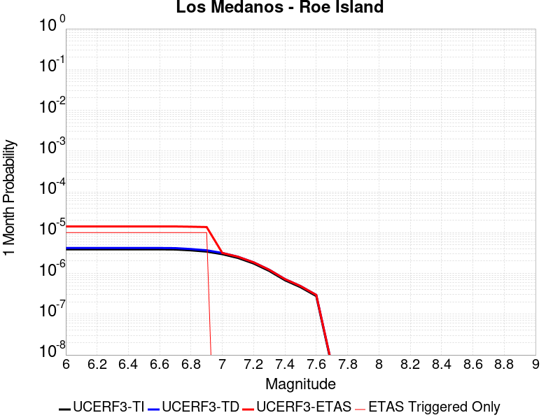 |  |  |

| Magnitude | 1 wk TI Prob | 1 wk TD Prob | 1 wk ETAS Prob | 1 wk ETAS/TD Gain | 1 wk ETAS Triggered Only | 1 mo TI Prob | 1 mo TD Prob | 1 mo ETAS Prob | 1 mo ETAS/TD Gain | 1 mo ETAS Triggered Only | 1 yr TI Prob | 1 yr TD Prob | 1 yr ETAS Prob | 1 yr ETAS/TD Gain | 1 yr ETAS Triggered Only | 10 yr TI Prob | 10 yr TD Prob | 10 yr ETAS Prob | 10 yr ETAS/TD Gain | 10 yr ETAS Triggered Only |
|-----|-----|-----|-----|-----|-----|-----|-----|-----|-----|-----|-----|-----|-----|-----|-----|-----|-----|-----|-----|-----|
| 6.0 | 9.06745E-7 | 9.796379E-7 | 1.1697741E-5 | 11.940882 | 1.0718114E-5 | 3.8860444E-6 | 4.1984417E-6 | 1.491651E-5 | 3.5528684 | 1.0718114E-5 | 4.731156E-5 | 5.1114836E-5 | 6.1832405E-5 | 1.2096763 | 1.0718114E-5 | 4.730149E-4 | 5.1103166E-4 | 5.217443E-4 | 1.0209627 | 1.0718114E-5 |
| 6.1 | 9.06745E-7 | 9.796379E-7 | 1.1697741E-5 | 11.940882 | 1.0718114E-5 | 3.8860444E-6 | 4.1984417E-6 | 1.491651E-5 | 3.5528684 | 1.0718114E-5 | 4.731156E-5 | 5.1114836E-5 | 6.1832405E-5 | 1.2096763 | 1.0718114E-5 | 4.730149E-4 | 5.1103166E-4 | 5.217443E-4 | 1.0209627 | 1.0718114E-5 |
| 6.2 | 9.06745E-7 | 9.796379E-7 | 1.1697741E-5 | 11.940882 | 1.0718114E-5 | 3.8860444E-6 | 4.1984417E-6 | 1.491651E-5 | 3.5528684 | 1.0718114E-5 | 4.731156E-5 | 5.1114836E-5 | 6.1832405E-5 | 1.2096763 | 1.0718114E-5 | 4.730149E-4 | 5.1103166E-4 | 5.217443E-4 | 1.0209627 | 1.0718114E-5 |
| 6.3 | 9.06745E-7 | 9.796379E-7 | 1.1697741E-5 | 11.940882 | 1.0718114E-5 | 3.8860444E-6 | 4.1984417E-6 | 1.491651E-5 | 3.5528684 | 1.0718114E-5 | 4.731156E-5 | 5.1114836E-5 | 6.1832405E-5 | 1.2096763 | 1.0718114E-5 | 4.730149E-4 | 5.1103166E-4 | 5.217443E-4 | 1.0209627 | 1.0718114E-5 |
| 6.4 | 9.06745E-7 | 9.796379E-7 | 1.1697741E-5 | 11.940882 | 1.0718114E-5 | 3.8860444E-6 | 4.1984417E-6 | 1.491651E-5 | 3.5528684 | 1.0718114E-5 | 4.731156E-5 | 5.1114836E-5 | 6.1832405E-5 | 1.2096763 | 1.0718114E-5 | 4.730149E-4 | 5.1103166E-4 | 5.217443E-4 | 1.0209627 | 1.0718114E-5 |
| 6.5 | 9.06745E-7 | 9.796379E-7 | 1.1697741E-5 | 11.940882 | 1.0718114E-5 | 3.8860444E-6 | 4.1984417E-6 | 1.491651E-5 | 3.5528684 | 1.0718114E-5 | 4.731156E-5 | 5.1114836E-5 | 6.1832405E-5 | 1.2096763 | 1.0718114E-5 | 4.730149E-4 | 5.1103166E-4 | 5.217443E-4 | 1.0209627 | 1.0718114E-5 |
| 6.6 | 9.06745E-7 | 9.796379E-7 | 1.1697741E-5 | 11.940882 | 1.0718114E-5 | 3.8860444E-6 | 4.1984417E-6 | 1.491651E-5 | 3.5528684 | 1.0718114E-5 | 4.731156E-5 | 5.1114836E-5 | 6.1832405E-5 | 1.2096763 | 1.0718114E-5 | 4.730149E-4 | 5.1103166E-4 | 5.217443E-4 | 1.0209627 | 1.0718114E-5 |
| 6.7 | 8.984686E-7 | 9.713045E-7 | 1.1689408E-5 | 12.03475 | 1.0718114E-5 | 3.850574E-6 | 4.1627272E-6 | 1.4880797E-5 | 3.574771 | 1.0718114E-5 | 4.687973E-5 | 5.0680035E-5 | 6.139761E-5 | 1.2114753 | 1.0718114E-5 | 4.6869842E-4 | 5.0668564E-4 | 5.1739835E-4 | 1.0211426 | 1.0718114E-5 |
| 6.8 | 8.5634423E-7 | 9.227546E-7 | 1.1640858E-5 | 12.6153345 | 1.0718114E-5 | 3.6700415E-6 | 3.9546567E-6 | 1.4672728E-5 | 3.7102406 | 1.0718114E-5 | 4.4681838E-5 | 4.814689E-5 | 5.8864487E-5 | 1.2226021 | 1.0718114E-5 | 4.4672855E-4 | 4.813653E-4 | 4.9207825E-4 | 1.0222553 | 1.0718114E-5 |
| 6.9 | 7.9857483E-7 | 8.59453E-7 | 1.1577557E-5 | 13.470844 | 1.0718114E-5 | 3.422459E-6 | 3.6833649E-6 | 1.4401439E-5 | 3.9098594 | 1.0718114E-5 | 4.166764E-5 | 4.484405E-5 | 5.5561683E-5 | 1.2389979 | 1.0718114E-5 | 4.165983E-4 | 4.4835065E-4 | 4.5906394E-4 | 1.0238949 | 1.0718114E-5 |
| 7.0 | 6.898334E-7 | 7.39724E-7 | 7.39724E-7 | 1.0 | 0.0 | 2.9564258E-6 | 3.1702418E-6 | 3.1702418E-6 | 1.0 | 0.0 | 3.599389E-5 | 3.8597016E-5 | 3.8597016E-5 | 1.0 | 0.0 | 3.598806E-4 | 3.8590352E-4 | 3.8590352E-4 | 1.0 | 0.0 |
| 7.1 | 5.5734876E-7 | 5.968393E-7 | 5.968393E-7 | 1.0 | 0.0 | 2.3886353E-6 | 2.5578802E-6 | 2.5578802E-6 | 1.0 | 0.0 | 2.9081246E-5 | 3.114175E-5 | 3.114175E-5 | 1.0 | 0.0 | 2.9077442E-4 | 3.113741E-4 | 3.113741E-4 | 1.0 | 0.0 |
| 7.2 | 4.0792582E-7 | 4.3569815E-7 | 4.3569815E-7 | 1.0 | 0.0 | 1.7482523E-6 | 1.8672764E-6 | 1.8672764E-6 | 1.0 | 0.0 | 2.1284764E-5 | 2.2733855E-5 | 2.2733855E-5 | 1.0 | 0.0 | 2.1282726E-4 | 2.2731545E-4 | 2.2731545E-4 | 1.0 | 0.0 |
| 7.3 | 2.6733358E-7 | 2.8579413E-7 | 2.8579413E-7 | 1.0 | 0.0 | 1.1457148E-6 | 1.2248314E-6 | 1.2248314E-6 | 1.0 | 0.0 | 1.3948988E-5 | 1.4912222E-5 | 1.4912222E-5 | 1.0 | 0.0 | 1.3948113E-4 | 1.4911228E-4 | 1.4911228E-4 | 1.0 | 0.0 |
| 7.4 | 1.5851728E-7 | 1.691008E-7 | 1.691008E-7 | 1.0 | 0.0 | 6.7935963E-7 | 7.247175E-7 | 7.247175E-7 | 1.0 | 0.0 | 8.271172E-6 | 8.8234E-6 | 8.8234E-6 | 1.0 | 0.0 | 8.270864E-5 | 8.8230525E-5 | 8.8230525E-5 | 1.0 | 0.0 |
| 7.5 | 1.06756E-7 | 1.1379502E-7 | 1.1379502E-7 | 1.0 | 0.0 | 4.575256E-7 | 4.8769283E-7 | 4.8769283E-7 | 1.0 | 0.0 | 5.57036E-6 | 5.9376443E-6 | 5.9376443E-6 | 1.0 | 0.0 | 5.5702203E-5 | 5.9374877E-5 | 5.9374877E-5 | 1.0 | 0.0 |
| 7.6 | 6.48122E-8 | 6.90474E-8 | 6.90474E-8 | 1.0 | 0.0 | 2.7776653E-7 | 2.959174E-7 | 2.959174E-7 | 1.0 | 0.0 | 3.3818023E-6 | 3.6027886E-6 | 3.6027886E-6 | 1.0 | 0.0 | 3.381751E-5 | 3.6027315E-5 | 3.6027315E-5 | 1.0 | 0.0 |
| 7.7 | 1.198296E-9 | 1.2904097E-9 | 1.2904097E-9 | 1.0 | 0.0 | 5.135554E-9 | 5.5303273E-9 | 5.5303273E-9 | 1.0 | 0.0 | 6.252537E-8 | 6.733173E-8 | 6.733173E-8 | 1.0 | 0.0 | 6.2525356E-7 | 6.733172E-7 | 6.733172E-7 | 1.0 | 0.0 |

## San Jose
*[(top)](#table-of-contents)*

| 1 Week | 1 Month | 1 Year | 10 Year |
|-----|-----|-----|-----|
|  | 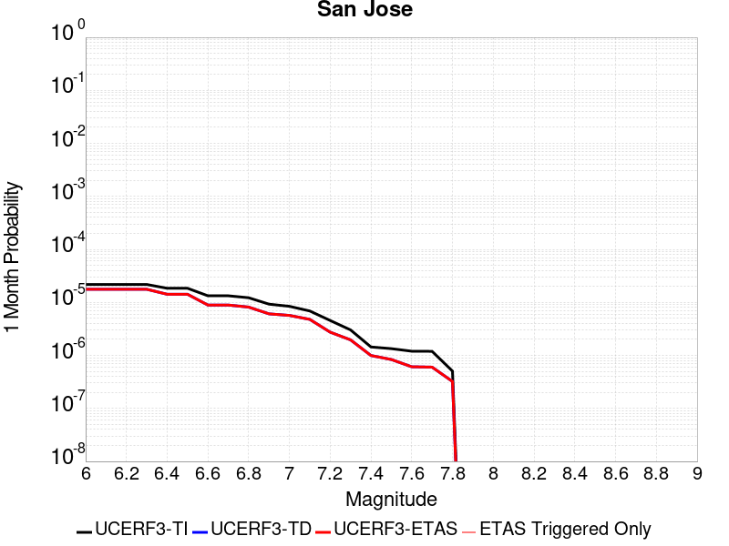 |  |  |

| Magnitude | 1 wk TI Prob | 1 wk TD Prob | 1 wk ETAS Prob | 1 wk ETAS/TD Gain | 1 wk ETAS Triggered Only | 1 mo TI Prob | 1 mo TD Prob | 1 mo ETAS Prob | 1 mo ETAS/TD Gain | 1 mo ETAS Triggered Only | 1 yr TI Prob | 1 yr TD Prob | 1 yr ETAS Prob | 1 yr ETAS/TD Gain | 1 yr ETAS Triggered Only | 10 yr TI Prob | 10 yr TD Prob | 10 yr ETAS Prob | 10 yr ETAS/TD Gain | 10 yr ETAS Triggered Only |
|-----|-----|-----|-----|-----|-----|-----|-----|-----|-----|-----|-----|-----|-----|-----|-----|-----|-----|-----|-----|-----|
| 6.0 | 5.0851277E-6 | 4.125751E-6 | 4.125751E-6 | 1.0 | 0.0 | 2.1793223E-5 | 1.7681685E-5 | 1.7681685E-5 | 1.0 | 0.0 | 2.653002E-4 | 2.1525587E-4 | 2.1525587E-4 | 1.0 | 0.0 | 0.0026498367 | 0.002150765 | 0.00216146 | 1.0049727 | 1.0718114E-5 |
| 6.1 | 5.0851277E-6 | 4.125751E-6 | 4.125751E-6 | 1.0 | 0.0 | 2.1793223E-5 | 1.7681685E-5 | 1.7681685E-5 | 1.0 | 0.0 | 2.653002E-4 | 2.1525587E-4 | 2.1525587E-4 | 1.0 | 0.0 | 0.0026498367 | 0.002150765 | 0.00216146 | 1.0049727 | 1.0718114E-5 |
| 6.2 | 5.0851277E-6 | 4.125751E-6 | 4.125751E-6 | 1.0 | 0.0 | 2.1793223E-5 | 1.7681685E-5 | 1.7681685E-5 | 1.0 | 0.0 | 2.653002E-4 | 2.1525587E-4 | 2.1525587E-4 | 1.0 | 0.0 | 0.0026498367 | 0.002150765 | 0.00216146 | 1.0049727 | 1.0718114E-5 |
| 6.3 | 5.0851277E-6 | 4.125751E-6 | 4.125751E-6 | 1.0 | 0.0 | 2.1793223E-5 | 1.7681685E-5 | 1.7681685E-5 | 1.0 | 0.0 | 2.653002E-4 | 2.1525587E-4 | 2.1525587E-4 | 1.0 | 0.0 | 0.0026498367 | 0.002150765 | 0.00216146 | 1.0049727 | 1.0718114E-5 |
| 6.4 | 4.3115124E-6 | 3.3238575E-6 | 3.3238575E-6 | 1.0 | 0.0 | 1.8477778E-5 | 1.4245038E-5 | 1.4245038E-5 | 1.0 | 0.0 | 2.2494372E-4 | 1.7342175E-4 | 1.7342175E-4 | 1.0 | 0.0 | 0.0022471617 | 0.0017331139 | 0.0017438134 | 1.0061736 | 1.0718114E-5 |
| 6.5 | 4.3115124E-6 | 3.3238575E-6 | 3.3238575E-6 | 1.0 | 0.0 | 1.8477778E-5 | 1.4245038E-5 | 1.4245038E-5 | 1.0 | 0.0 | 2.2494372E-4 | 1.7342175E-4 | 1.7342175E-4 | 1.0 | 0.0 | 0.0022471617 | 0.0017331139 | 0.0017438134 | 1.0061736 | 1.0718114E-5 |
| 6.6 | 3.110396E-6 | 2.080055E-6 | 2.080055E-6 | 1.0 | 0.0 | 1.33302E-5 | 8.914493E-6 | 8.914493E-6 | 1.0 | 0.0 | 1.622831E-4 | 1.0852883E-4 | 1.0852883E-4 | 1.0 | 0.0 | 0.0016216465 | 0.0010848183 | 0.0010955248 | 1.0098693 | 1.0718114E-5 |
| 6.7 | 3.110396E-6 | 2.080055E-6 | 2.080055E-6 | 1.0 | 0.0 | 1.33302E-5 | 8.914493E-6 | 8.914493E-6 | 1.0 | 0.0 | 1.622831E-4 | 1.0852883E-4 | 1.0852883E-4 | 1.0 | 0.0 | 0.0016216465 | 0.0010848183 | 0.0010955248 | 1.0098693 | 1.0718114E-5 |
| 6.8 | 2.856651E-6 | 1.9025018E-6 | 1.9025018E-6 | 1.0 | 0.0 | 1.2242733E-5 | 8.153555E-6 | 8.153555E-6 | 1.0 | 0.0 | 1.4904508E-4 | 9.926526E-5 | 9.926526E-5 | 1.0 | 0.0 | 0.0014894515 | 9.922662E-4 | 0.0010029736 | 1.010791 | 1.0718114E-5 |
| 6.9 | 2.1618725E-6 | 1.4187265E-6 | 1.4187265E-6 | 1.0 | 0.0 | 9.265135E-6 | 6.080242E-6 | 6.080242E-6 | 1.0 | 0.0 | 1.12797185E-4 | 7.402452E-5 | 7.402452E-5 | 1.0 | 0.0 | 0.0011273995 | 7.4003986E-4 | 7.4003986E-4 | 1.0 | 0.0 |
| 7.0 | 1.9684312E-6 | 1.3256941E-6 | 1.3256941E-6 | 1.0 | 0.0 | 8.436106E-6 | 5.6815347E-6 | 5.6815347E-6 | 1.0 | 0.0 | 1.02704755E-4 | 6.917057E-5 | 6.917057E-5 | 1.0 | 0.0 | 0.001026573 | 6.9153105E-4 | 6.9153105E-4 | 1.0 | 0.0 |
| 7.1 | 1.6070337E-6 | 1.1155666E-6 | 1.1155666E-6 | 1.0 | 0.0 | 6.887269E-6 | 4.7809913E-6 | 4.7809913E-6 | 1.0 | 0.0 | 8.384928E-5 | 5.820708E-5 | 5.820708E-5 | 1.0 | 0.0 | 8.3817646E-4 | 5.81957E-4 | 5.81957E-4 | 1.0 | 0.0 |
| 7.2 | 1.0631658E-6 | 6.4041933E-7 | 6.4041933E-7 | 1.0 | 0.0 | 4.556417E-6 | 2.7446513E-6 | 2.7446513E-6 | 1.0 | 0.0 | 5.5472963E-5 | 3.3415632E-5 | 3.3415632E-5 | 1.0 | 0.0 | 5.545912E-4 | 3.3413994E-4 | 3.3413994E-4 | 1.0 | 0.0 |
| 7.3 | 7.060711E-7 | 4.582818E-7 | 4.582818E-7 | 1.0 | 0.0 | 3.0260155E-6 | 1.9640634E-6 | 1.9640634E-6 | 1.0 | 0.0 | 3.6841117E-5 | 2.3912218E-5 | 2.3912218E-5 | 1.0 | 0.0 | 3.6835007E-4 | 2.3912982E-4 | 2.3912982E-4 | 1.0 | 0.0 |
| 7.4 | 3.3677085E-7 | 2.3235627E-7 | 2.3235627E-7 | 1.0 | 0.0 | 1.4433028E-6 | 9.958122E-7 | 9.958122E-7 | 1.0 | 0.0 | 1.757207E-5 | 1.2123949E-5 | 1.2123949E-5 | 1.0 | 0.0 | 1.7570681E-4 | 1.2126564E-4 | 1.2126564E-4 | 1.0 | 0.0 |
| 7.5 | 3.129161E-7 | 1.9532963E-7 | 1.9532963E-7 | 1.0 | 0.0 | 1.3410682E-6 | 8.371268E-7 | 8.371268E-7 | 1.0 | 0.0 | 1.6327383E-5 | 1.0191973E-5 | 1.0191973E-5 | 1.0 | 0.0 | 1.6326184E-4 | 1.0194778E-4 | 1.0194778E-4 | 1.0 | 0.0 |
| 7.6 | 2.8008668E-7 | 1.4243734E-7 | 1.4243734E-7 | 1.0 | 0.0 | 1.2003709E-6 | 6.104456E-7 | 6.104456E-7 | 1.0 | 0.0 | 1.46144175E-5 | 7.4321515E-6 | 7.4321515E-6 | 1.0 | 0.0 | 1.4613457E-4 | 7.4351636E-5 | 7.4351636E-5 | 1.0 | 0.0 |
| 7.7 | 2.7852005E-7 | 1.4018305E-7 | 1.4018305E-7 | 1.0 | 0.0 | 1.1936568E-6 | 6.007844E-7 | 6.007844E-7 | 1.0 | 0.0 | 1.4532674E-5 | 7.314527E-6 | 7.314527E-6 | 1.0 | 0.0 | 1.4531724E-4 | 7.317547E-5 | 7.317547E-5 | 1.0 | 0.0 |
| 7.8 | 1.1810797E-7 | 7.5195864E-8 | 7.5195864E-8 | 1.0 | 0.0 | 5.0617695E-7 | 3.2226794E-7 | 3.2226794E-7 | 1.0 | 0.0 | 6.1626865E-6 | 3.9236056E-6 | 3.9236056E-6 | 1.0 | 0.0 | 6.162516E-5 | 3.9253733E-5 | 3.9253733E-5 | 1.0 | 0.0 |

## Ortigalita (South)
*[(top)](#table-of-contents)*

| 1 Week | 1 Month | 1 Year | 10 Year |
|-----|-----|-----|-----|
|  |  |  |  |

| Magnitude | 1 wk TI Prob | 1 wk TD Prob | 1 wk ETAS Prob | 1 wk ETAS/TD Gain | 1 wk ETAS Triggered Only | 1 mo TI Prob | 1 mo TD Prob | 1 mo ETAS Prob | 1 mo ETAS/TD Gain | 1 mo ETAS Triggered Only | 1 yr TI Prob | 1 yr TD Prob | 1 yr ETAS Prob | 1 yr ETAS/TD Gain | 1 yr ETAS Triggered Only | 10 yr TI Prob | 10 yr TD Prob | 10 yr ETAS Prob | 10 yr ETAS/TD Gain | 10 yr ETAS Triggered Only |
|-----|-----|-----|-----|-----|-----|-----|-----|-----|-----|-----|-----|-----|-----|-----|-----|-----|-----|-----|-----|-----|
| 6.0 | 3.72394E-5 | 4.325655E-5 | 4.325655E-5 | 1.0 | 0.0 | 1.5958765E-4 | 1.8537292E-4 | 1.9608905E-4 | 1.0578085 | 1.0718114E-5 | 0.0019412481 | 0.002254736 | 0.0022654298 | 1.0047429 | 1.0718114E-5 | 0.019243775 | 0.022334972 | 0.022345452 | 1.0004692 | 1.0718114E-5 |
| 6.1 | 2.7299884E-5 | 3.1492684E-5 | 3.1492684E-5 | 1.0 | 0.0 | 1.16994255E-4 | 1.3496199E-4 | 1.4567866E-4 | 1.0794051 | 1.0718114E-5 | 0.0014234743 | 0.0016419792 | 0.0016526798 | 1.0065168 | 1.0718114E-5 | 0.014143906 | 0.016304402 | 0.016314944 | 1.0006467 | 1.0718114E-5 |
| 6.2 | 2.7299884E-5 | 3.1492684E-5 | 3.1492684E-5 | 1.0 | 0.0 | 1.16994255E-4 | 1.3496199E-4 | 1.4567866E-4 | 1.0794051 | 1.0718114E-5 | 0.0014234743 | 0.0016419792 | 0.0016526798 | 1.0065168 | 1.0718114E-5 | 0.014143906 | 0.016304402 | 0.016314944 | 1.0006467 | 1.0718114E-5 |
| 6.3 | 2.0546433E-5 | 2.3631923E-5 | 2.3631923E-5 | 1.0 | 0.0 | 8.805317E-5 | 1.01275844E-4 | 1.1199287E-4 | 1.1058202 | 1.0718114E-5 | 0.00107152 | 0.0012323549 | 0.0012430598 | 1.0086865 | 1.0718114E-5 | 0.010663681 | 0.012257273 | 0.012267861 | 1.0008637 | 1.0718114E-5 |
| 6.4 | 2.0546433E-5 | 2.3631923E-5 | 2.3631923E-5 | 1.0 | 0.0 | 8.805317E-5 | 1.01275844E-4 | 1.1199287E-4 | 1.1058202 | 1.0718114E-5 | 0.00107152 | 0.0012323549 | 0.0012430598 | 1.0086865 | 1.0718114E-5 | 0.010663681 | 0.012257273 | 0.012267861 | 1.0008637 | 1.0718114E-5 |
| 6.5 | 1.7779594E-5 | 2.0447382E-5 | 2.0447382E-5 | 1.0 | 0.0 | 7.619603E-5 | 8.7628774E-5 | 9.834595E-5 | 1.122302 | 1.0718114E-5 | 9.272918E-4 | 0.0010663717 | 0.0010770784 | 1.0100403 | 1.0718114E-5 | 0.009234319 | 0.010614014 | 0.010624618 | 1.0009991 | 1.0718114E-5 |
| 6.6 | 1.6272212E-5 | 1.8715342E-5 | 1.8715342E-5 | 1.0 | 0.0 | 6.973618E-5 | 8.0206206E-5 | 9.092346E-5 | 1.1336212 | 1.0718114E-5 | 8.487073E-4 | 9.760853E-4 | 9.86793E-4 | 1.01097 | 1.0718114E-5 | 0.008454733 | 0.009719283 | 0.009729898 | 1.0010921 | 1.0718114E-5 |
| 6.7 | 1.3051484E-5 | 1.5039062E-5 | 1.5039062E-5 | 1.0 | 0.0 | 5.593373E-5 | 6.445159E-5 | 6.445159E-5 | 1.0 | 0.0 | 6.807804E-4 | 7.8442506E-4 | 7.8442506E-4 | 1.0 | 0.0 | 0.006786986 | 0.007817546 | 0.007817546 | 1.0 | 0.0 |
| 6.8 | 1.04277415E-5 | 1.1987473E-5 | 1.1987473E-5 | 1.0 | 0.0 | 4.4689557E-5 | 5.1373918E-5 | 5.1373918E-5 | 1.0 | 0.0 | 5.439595E-4 | 6.2530534E-4 | 6.2530534E-4 | 1.0 | 0.0 | 0.0054262993 | 0.0062362133 | 0.0062362133 | 1.0 | 0.0 |
| 6.9 | 7.639968E-6 | 8.79168E-6 | 8.79168E-6 | 1.0 | 0.0 | 3.274231E-5 | 3.7678114E-5 | 3.7678114E-5 | 1.0 | 0.0 | 3.9856473E-4 | 4.5864037E-4 | 4.5864037E-4 | 1.0 | 0.0 | 0.003978506 | 0.0045775245 | 0.0045775245 | 1.0 | 0.0 |
| 7.0 | 3.919831E-6 | 4.5334955E-6 | 4.5334955E-6 | 1.0 | 0.0 | 1.679917E-5 | 1.9429133E-5 | 1.9429133E-5 | 1.0 | 0.0 | 2.045107E-4 | 2.3652615E-4 | 2.3652615E-4 | 1.0 | 0.0 | 0.0020432258 | 0.0023629526 | 0.0023629526 | 1.0 | 0.0 |
| 7.1 | 1.6017933E-6 | 1.8570811E-6 | 1.8570811E-6 | 1.0 | 0.0 | 6.8648105E-6 | 7.958901E-6 | 7.958901E-6 | 1.0 | 0.0 | 8.357586E-5 | 9.689637E-5 | 9.689637E-5 | 1.0 | 0.0 | 8.3544437E-4 | 9.686459E-4 | 9.686459E-4 | 1.0 | 0.0 |

