# Parent Section Magnitude-Probability Distributions

Only fault sections with at least one triggered aftershock are plotted. Sections are sorted by total supraseismogenic trigger rate (decreasing)

## Table Of Contents

* [Garlock (Central)](#garlock-central)
* [Tank Canyon](#tank-canyon)
* [Owl Lake](#owl-lake)
* [Little Lake](#little-lake)
* [Airport Lake](#airport-lake)
* [Garlock (East)](#garlock-east)
* [Panamint Valley](#panamint-valley)
* [Hunter Mountain-Saline Valley](#hunter-mountain-saline-valley)
* [Ash Hill](#ash-hill)
* [Blackwater](#blackwater)
* [Garlock (West)](#garlock-west)
* [McLean Lake](#mclean-lake)
* [Goldstone Lake](#goldstone-lake)
* [Gravel Hills-Harper Lk](#gravel-hills-harper-lk)
* [Coyote Canyon](#coyote-canyon)
* [Nelson Lake](#nelson-lake)
* [So Sierra Nevada](#so-sierra-nevada)
* [Death Valley (So)](#death-valley-so)
* [San Andreas (Mojave S)](#san-andreas-mojave-s)
* [Towne Pass](#towne-pass)
* [San Andreas (Mojave N)](#san-andreas-mojave-n)
* [Lenwood-Lockhart-Old Woman Springs](#lenwood-lockhart-old-woman-springs)
* [Paradise](#paradise)
* [Bicycle Lake](#bicycle-lake)
* [San Andreas (San Bernardino N)](#san-andreas-san-bernardino-n)
* [Garlic Springs](#garlic-springs)
* [Death Valley (Black Mtns Frontal)](#death-valley-black-mtns-frontal)
* [Coyote Lake](#coyote-lake)
* [Helendale-So Lockhart](#helendale-so-lockhart)
* [San Andreas (San Bernardino S)](#san-andreas-san-bernardino-s)
* [San Andreas (Big Bend)](#san-andreas-big-bend)
* [Sierra Nevada  (No Extension)](#sierra-nevada--no-extension)
* [Red Pass](#red-pass)
* [Scodie Lineament](#scodie-lineament)
* [San Andreas (Parkfield)](#san-andreas-parkfield)
* [Lake Isabella (Seismicity)](#lake-isabella-seismicity)
* [Calico-Hidalgo](#calico-hidalgo)
* [San Andreas (San Gorgonio Pass-Garnet HIll)](#san-andreas-san-gorgonio-pass-garnet-hill)
* [Death Valley (No)](#death-valley-no)
* [Ludlow](#ludlow)
* [San Andreas (Cholame) rev](#san-andreas-cholame-rev)
* [Cleghorn Pass](#cleghorn-pass)
* [San Andreas (Carrizo) rev](#san-andreas-carrizo-rev)
* [Cady](#cady)
* [White Wolf (Extension)](#white-wolf-extension)
* [Independence rev 2011](#independence-rev-2011)
* [Owens Valley](#owens-valley)
* [San Andreas (Coachella) rev](#san-andreas-coachella-rev)
* [San Andreas (North Branch Mill Creek)](#san-andreas-north-branch-mill-creek)
* [Elsinore (Glen Ivy) rev](#elsinore-glen-ivy-rev)
* [Death Valley (Fish Lake Valley)](#death-valley-fish-lake-valley)
* [Kern Canyon (North Kern) 2011](#kern-canyon-north-kern-2011)
* [Baker](#baker)
* [Cleghorn Lake](#cleghorn-lake)
* [Channel Islands Thrust](#channel-islands-thrust)
* [Blue Cut](#blue-cut)
* [Great Valley 09 (Laguna Seca)](#great-valley-09-laguna-seca)
* [San Jacinto (San Bernardino)](#san-jacinto-san-bernardino)
* [Manix-Afton Hills](#manix-afton-hills)
* [Big Pine (Central)](#big-pine-central)
* [White Mountains](#white-mountains)
* [San Jacinto (Stepovers Combined)](#san-jacinto-stepovers-combined)
* [San Jacinto (Anza) rev](#san-jacinto-anza-rev)
* [Santa Ynez (West)](#santa-ynez-west)
* [Santa Rosa Island](#santa-rosa-island)
* [Deep Springs](#deep-springs)
* [Big Pine (East)](#big-pine-east)
* [San Clemente](#san-clemente)
* [Mission Creek](#mission-creek)
* [San Jacinto (San Jacinto Valley) rev](#san-jacinto-san-jacinto-valley-rev)
* [Dry Mountain](#dry-mountain)
* [Hosgri](#hosgri)
* [Pinto Mtn](#pinto-mtn)
* [White Wolf](#white-wolf)
* [San Jacinto (Coyote Creek)](#san-jacinto-coyote-creek)
* [San Jacinto (Lytle Creek connector)](#san-jacinto-lytle-creek-connector)
* [Quien Sabe 2011 CFM](#quien-sabe-2011-cfm)
* [Lost Hills](#lost-hills)
* [Calaveras (So) 2011 CFM](#calaveras-so-2011-cfm)
* [San Andreas (Creeping Section) 2011 CFM](#san-andreas-creeping-section-2011-cfm)
* [Pisgah-Bullion Mtn-Mesquite Lk](#pisgah-bullion-mtn-mesquite-lk)
* [Chino alt 1](#chino-alt-1)
* [Great Valley 10 (Panoche)](#great-valley-10-panoche)
* [Tin Mountain](#tin-mountain)
* [San Jacinto (Borrego)](#san-jacinto-borrego)
* [Kern Canyon (Lake Isabella) 2011](#kern-canyon-lake-isabella-2011)
* [Great Valley 11](#great-valley-11)
* [Mission Ridge-Arroyo Parida-Santa Ana](#mission-ridge-arroyo-parida-santa-ana)
* [Whittier alt 1](#whittier-alt-1)
* [Palos Verdes](#palos-verdes)
* [San Gorgonio Pass](#san-gorgonio-pass)
* [Mono Lake 2011 CFM](#mono-lake-2011-cfm)
* [Santa Ynez (East)](#santa-ynez-east)
* [Malibu Coast alt 1](#malibu-coast-alt-1)
* [West Napa 2011 CFM](#west-napa-2011-cfm)
* [Brawley (Seismic Zone) alt 1](#brawley-seismic-zone-alt-1)
* [San Diego Trough north alt1](#san-diego-trough-north-alt1)
* [Shoreline](#shoreline)
* [San Jose](#san-jose)
* [Honey Lake 2011 CFM](#honey-lake-2011-cfm)
* [Elsinore (Coyote Mountains)](#elsinore-coyote-mountains)
* [Imperial](#imperial)
* [Newport-Inglewood alt 1](#newport-inglewood-alt-1)
* [Malibu Coast (Extension) alt 1](#malibu-coast-extension-alt-1)
* [Bullion Mountains](#bullion-mountains)
* [North Frontal  (West)](#north-frontal--west)
* [Casmalia 2011 CFM](#casmalia-2011-cfm)
* [Puente Hills](#puente-hills)
* [San Gregorio (North) 2011 CFM](#san-gregorio-north-2011-cfm)
* [Oceanic - West Huasna](#oceanic---west-huasna)
* [Sheephole](#sheephole)
* [San Juan](#san-juan)
* [Breckenridge 2011](#breckenridge-2011)
* [Hosgri (Extension)](#hosgri-extension)
* [North Frontal  (East)](#north-frontal--east)
* [Pitas Point (Lower West)](#pitas-point-lower-west)
* [Pleito](#pleito)
* [San Jacinto (Clark) rev](#san-jacinto-clark-rev)
* [Raymond](#raymond)
* [Monterey Bay-Tularcitos](#monterey-bay-tularcitos)
* [Robinson Creek](#robinson-creek)
* [San Jacinto (Superstition Mtn)](#san-jacinto-superstition-mtn)
* [Rinconada 2011 CFM](#rinconada-2011-cfm)
* [Hector Mine](#hector-mine)
* [Red Mountain](#red-mountain)
* [La Panza 2011](#la-panza-2011)
* [Likely 2011 CFM](#likely-2011-cfm)
* [Coronado Bank alt1](#coronado-bank-alt1)
* [Contra Costa Shear Zone (connector) 2011 CFM](#contra-costa-shear-zone-connector-2011-cfm)
* [San Gabriel (Extension)](#san-gabriel-extension)
* [Green Valley 2011 CFM](#green-valley-2011-cfm)
* [Camp Rock 2011](#camp-rock-2011)
* [San Gregorio (South) 2011 CFM](#san-gregorio-south-2011-cfm)
* [Ventura-Pitas Point](#ventura-pitas-point)

## Garlock (Central)
*[(top)](#table-of-contents)*

| 1 Week | 1 Month | 1 Year | 10 Year |
|-----|-----|-----|-----|
| 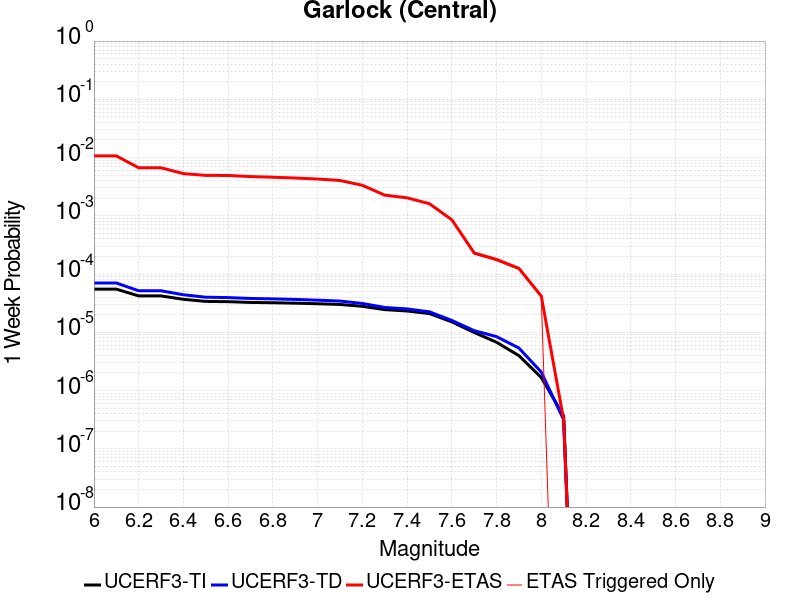 |  |  |  |

| Magnitude | 1 wk TI Prob | 1 wk TD Prob | 1 wk ETAS Prob | 1 wk ETAS/TD Gain | 1 wk ETAS Triggered Only | 1 mo TI Prob | 1 mo TD Prob | 1 mo ETAS Prob | 1 mo ETAS/TD Gain | 1 mo ETAS Triggered Only | 1 yr TI Prob | 1 yr TD Prob | 1 yr ETAS Prob | 1 yr ETAS/TD Gain | 1 yr ETAS Triggered Only | 10 yr TI Prob | 10 yr TD Prob | 10 yr ETAS Prob | 10 yr ETAS/TD Gain | 10 yr ETAS Triggered Only |
|-----|-----|-----|-----|-----|-----|-----|-----|-----|-----|-----|-----|-----|-----|-----|-----|-----|-----|-----|-----|-----|
| 6.0 | 5.5131142E-5 | 7.0252914E-5 | 0.010869495 | 154.71947 | 0.0108 | 2.3625491E-4 | 3.0104956E-4 | 0.026426515 | 87.78128 | 0.026133334 | 0.0028726095 | 0.0036591839 | 0.0685409 | 18.7312 | 0.06512 | 0.028357591 | 0.03608289 | 0.13311721 | 3.689206 | 0.100666665 |
| 6.1 | 5.5131142E-5 | 7.0252914E-5 | 0.010869495 | 154.71947 | 0.0108 | 2.3625491E-4 | 3.0104956E-4 | 0.026426515 | 87.78128 | 0.026133334 | 0.0028726095 | 0.0036591839 | 0.0685409 | 18.7312 | 0.06512 | 0.028357591 | 0.03608289 | 0.13311721 | 3.689206 | 0.100666665 |
| 6.2 | 4.216245E-5 | 5.166702E-5 | 0.00677132 | 131.05692 | 0.00672 | 1.806837E-4 | 2.2141146E-4 | 0.016031243 | 72.40476 | 0.015813334 | 0.0021976046 | 0.0026923837 | 0.042558093 | 15.806845 | 0.039973333 | 0.021759989 | 0.02669258 | 0.08721933 | 3.2675493 | 0.062186666 |
| 6.3 | 4.216245E-5 | 5.166702E-5 | 0.00677132 | 131.05692 | 0.00672 | 1.806837E-4 | 2.2141146E-4 | 0.016031243 | 72.40476 | 0.015813334 | 0.0021976046 | 0.0026923837 | 0.042558093 | 15.806845 | 0.039973333 | 0.021759989 | 0.02669258 | 0.08721933 | 3.2675493 | 0.062186666 |
| 6.4 | 3.6858168E-5 | 4.411584E-5 | 0.0052972175 | 120.07517 | 0.005253333 | 1.5795401E-4 | 1.8905434E-4 | 0.012506725 | 66.15413 | 0.01232 | 0.0019213937 | 0.0022993318 | 0.03308172 | 14.387537 | 0.030853333 | 0.019048655 | 0.02285164 | 0.07035408 | 3.0787323 | 0.048613332 |
| 6.5 | 3.39199E-5 | 4.0023286E-5 | 0.0049464935 | 123.59039 | 0.0049066665 | 1.453629E-4 | 1.7151721E-4 | 0.01142292 | 66.599266 | 0.011253334 | 0.0017683565 | 0.0020862438 | 0.029868163 | 14.316717 | 0.02784 | 0.017543508 | 0.02076252 | 0.06361395 | 3.063884 | 0.04376 |
| 6.6 | 3.3571985E-5 | 3.947746E-5 | 0.0049459506 | 125.28542 | 0.0049066665 | 1.4387199E-4 | 1.6917827E-4 | 0.011420608 | 67.506355 | 0.011253334 | 0.0017502342 | 0.0020578213 | 0.02981392 | 14.488099 | 0.027813334 | 0.017365133 | 0.02048383 | 0.06332134 | 3.0912843 | 0.043733332 |
| 6.7 | 3.2580007E-5 | 3.8093858E-5 | 0.004757914 | 124.89977 | 0.00472 | 1.3962112E-4 | 1.632493E-4 | 0.010934824 | 66.98237 | 0.010773334 | 0.0016985617 | 0.0019857697 | 0.028759165 | 14.482629 | 0.026826667 | 0.016856372 | 0.019776449 | 0.0609197 | 3.0804164 | 0.041973334 |
| 6.8 | 3.2185937E-5 | 3.7521055E-5 | 0.004677347 | 124.65926 | 0.00464 | 1.3793244E-4 | 1.6079473E-4 | 0.010772422 | 66.994865 | 0.010613333 | 0.0016780337 | 0.0019559395 | 0.02817123 | 14.402915 | 0.026266666 | 0.016654192 | 0.01948324 | 0.05972365 | 3.0653858 | 0.04104 |
| 6.9 | 3.165394E-5 | 3.672561E-5 | 0.0045432267 | 123.70731 | 0.0045066667 | 1.3565269E-4 | 1.5738611E-4 | 0.010502424 | 66.730316 | 0.010346667 | 0.0016503202 | 0.0019145131 | 0.027359039 | 14.290338 | 0.025493333 | 0.01638118 | 0.01907586 | 0.05823435 | 3.0527773 | 0.03992 |
| 7.0 | 3.0903822E-5 | 3.5630834E-5 | 0.004382143 | 122.987366 | 0.004346667 | 1.3243823E-4 | 1.5269476E-4 | 0.010151167 | 66.48013 | 0.01 | 0.0016112428 | 0.0018574947 | 0.026584812 | 14.312187 | 0.024773333 | 0.015996104 | 0.018515008 | 0.056518108 | 3.0525565 | 0.03872 |
| 7.1 | 3.0069863E-5 | 3.4397097E-5 | 0.0041142567 | 119.61058 | 0.00408 | 1.2886449E-4 | 1.4740792E-4 | 0.009479365 | 64.30703 | 0.009333333 | 0.0015677959 | 0.0017932352 | 0.02497825 | 13.929155 | 0.023226667 | 0.01556781 | 0.017882649 | 0.053474583 | 2.9903054 | 0.03624 |
| 7.2 | 2.7957109E-5 | 3.1286367E-5 | 0.0034445128 | 110.09629 | 0.0034133333 | 1.1981068E-4 | 1.3407765E-4 | 0.008079679 | 60.261192 | 0.007946666 | 0.0014577188 | 0.0016311926 | 0.020826496 | 12.767651 | 0.019226667 | 0.014481937 | 0.016286217 | 0.045614004 | 2.8007736 | 0.029813332 |
| 7.3 | 2.4519275E-5 | 2.6719412E-5 | 0.0023999894 | 89.82194 | 0.0023733333 | 1.0507837E-4 | 1.14506816E-4 | 0.005687202 | 49.666927 | 0.0055733332 | 0.0012785783 | 0.0013932437 | 0.014415076 | 10.346414 | 0.01304 | 0.012712469 | 0.013930428 | 0.034545857 | 2.4798846 | 0.020906666 |
| 7.4 | 2.3225532E-5 | 2.5203923E-5 | 0.0021318174 | 84.58276 | 0.0021066666 | 9.95342E-5 | 1.0801242E-4 | 0.005040813 | 46.668827 | 0.0049333335 | 0.0012111551 | 0.0013142723 | 0.012899027 | 9.814577 | 0.0116 | 0.012045753 | 0.013148054 | 0.03170087 | 2.4110694 | 0.0188 |
| 7.5 | 2.097765E-5 | 2.2487986E-5 | 0.001622452 | 72.14751 | 0.0016 | 8.9901114E-5 | 9.637359E-5 | 0.003909339 | 40.564426 | 0.0038133333 | 0.0010939965 | 0.0011727286 | 0.010148857 | 8.654054 | 0.008986667 | 0.010886264 | 0.011742581 | 0.026026195 | 2.216395 | 0.014453333 |
| 7.6 | 1.511254E-5 | 1.5995334E-5 | 7.3598383E-4 | 46.01241 | 7.2E-4 | 6.476642E-5 | 6.854967E-5 | 0.0020150829 | 29.395952 | 0.0019466666 | 7.882459E-4 | 8.342805E-4 | 0.0056036315 | 6.7167234 | 0.004773333 | 0.007854558 | 0.008385628 | 0.01621277 | 1.9333997 | 0.007893333 |
| 7.7 | 9.934069E-6 | 1.0682508E-5 | 1.706808E-4 | 15.977596 | 1.6E-4 | 4.2573887E-5 | 4.5781377E-5 | 5.7909027E-4 | 12.649036 | 5.3333334E-4 | 5.182138E-4 | 5.572461E-4 | 0.0018365328 | 3.2957304 | 0.00128 | 0.00517007 | 0.0056296107 | 0.007644868 | 1.3579745 | 0.0020266667 |
| 7.8 | 6.7562896E-6 | 8.431477E-6 | 1.15097246E-4 | 13.6509 | 1.0666667E-4 | 2.8955206E-5 | 3.61344E-5 | 3.2945714E-4 | 9.117548 | 2.9333335E-4 | 3.5247262E-4 | 4.3984767E-4 | 0.0012661507 | 2.8786118 | 8.2666666E-4 | 0.0035191406 | 0.0044482257 | 0.0056428877 | 1.2685705 | 0.0012 |
| 7.9 | 3.975453E-6 | 5.3728795E-6 | 8.537245E-5 | 15.889515 | 8.0E-5 | 1.7037546E-5 | 2.3026425E-5 | 2.3635484E-4 | 10.264504 | 2.1333333E-4 | 2.0741238E-4 | 2.8031075E-4 | 8.134946E-4 | 2.902117 | 5.3333334E-4 | 0.002072189 | 0.0028345888 | 0.003579139 | 1.262666 | 7.466667E-4 |
| 8.0 | 1.6729537E-6 | 2.078155E-6 | 2.8744766E-5 | 13.831868 | 2.6666667E-5 | 7.169782E-6 | 8.906349E-6 | 8.890564E-5 | 9.982277 | 8.0E-5 | 8.7288594E-5 | 1.08429434E-4 | 2.9507585E-4 | 2.721363 | 1.8666667E-4 | 8.7254314E-4 | 0.001097267 | 0.0013370037 | 1.2184852 | 2.4E-4 |
| 8.1 | 3.6733252E-7 | 3.1499187E-7 | 3.1499187E-7 | 1.0 | 0.0 | 1.5742813E-6 | 1.3499646E-6 | 1.3499646E-6 | 1.0 | 0.0 | 1.9166706E-5 | 1.643571E-5 | 1.643571E-5 | 1.0 | 0.0 | 1.9165053E-4 | 1.6643589E-4 | 1.6643589E-4 | 1.0 | 0.0 |

## Tank Canyon
*[(top)](#table-of-contents)*

| 1 Week | 1 Month | 1 Year | 10 Year |
|-----|-----|-----|-----|
|  |  |  |  |

| Magnitude | 1 wk TI Prob | 1 wk TD Prob | 1 wk ETAS Prob | 1 wk ETAS/TD Gain | 1 wk ETAS Triggered Only | 1 mo TI Prob | 1 mo TD Prob | 1 mo ETAS Prob | 1 mo ETAS/TD Gain | 1 mo ETAS Triggered Only | 1 yr TI Prob | 1 yr TD Prob | 1 yr ETAS Prob | 1 yr ETAS/TD Gain | 1 yr ETAS Triggered Only | 10 yr TI Prob | 10 yr TD Prob | 10 yr ETAS Prob | 10 yr ETAS/TD Gain | 10 yr ETAS Triggered Only |
|-----|-----|-----|-----|-----|-----|-----|-----|-----|-----|-----|-----|-----|-----|-----|-----|-----|-----|-----|-----|-----|
| 6.0 | 4.8284557E-5 | 5.796635E-5 | 0.0049643484 | 85.64191 | 0.0049066665 | 2.0691741E-4 | 2.484074E-4 | 0.013205188 | 53.1594 | 0.01296 | 0.0025163088 | 0.0030208372 | 0.03840695 | 12.714008 | 0.035493333 | 0.02488006 | 0.029864404 | 0.09104762 | 3.0487006 | 0.06306667 |
| 6.1 | 1.7796336E-5 | 2.0873764E-5 | 0.0015941743 | 76.372154 | 0.0015733333 | 7.626778E-5 | 8.945614E-5 | 0.004729041 | 52.864353 | 0.00464 | 9.281647E-4 | 0.0010886216 | 0.014034513 | 12.892004 | 0.01296 | 0.009242975 | 0.010836975 | 0.03399658 | 3.1370912 | 0.023413334 |
| 6.2 | 1.7796336E-5 | 2.0873764E-5 | 0.0015941743 | 76.372154 | 0.0015733333 | 7.626778E-5 | 8.945614E-5 | 0.004729041 | 52.864353 | 0.00464 | 9.281647E-4 | 0.0010886216 | 0.014034513 | 12.892004 | 0.01296 | 0.009242975 | 0.010836975 | 0.03399658 | 3.1370912 | 0.023413334 |
| 6.3 | 1.3515912E-5 | 1.575988E-5 | 0.0010557435 | 66.9893 | 0.00104 | 5.792405E-5 | 6.7540735E-5 | 0.00318733 | 47.191227 | 0.00312 | 7.049971E-4 | 8.220222E-4 | 0.010254262 | 12.474435 | 0.00944 | 0.007027647 | 0.008192427 | 0.024987036 | 3.050016 | 0.016933333 |
| 6.4 | 1.0870146E-5 | 1.2618259E-5 | 8.1260817E-4 | 64.39939 | 8.0E-4 | 4.658551E-5 | 5.407723E-5 | 0.0024006169 | 44.39238 | 0.0023466668 | 5.67031E-4 | 6.582093E-4 | 0.007746874 | 11.769621 | 0.007093333 | 0.005655863 | 0.006564614 | 0.019466028 | 2.9652967 | 0.0129866665 |
| 6.5 | 7.964826E-6 | 9.196251E-6 | 5.958575E-4 | 64.793526 | 5.866667E-4 | 3.4134522E-5 | 3.941197E-5 | 0.0016660145 | 42.27179 | 0.0016266666 | 4.1550855E-4 | 4.7974577E-4 | 0.0053307507 | 11.111616 | 0.0048533333 | 0.0041473247 | 0.0047884025 | 0.013201258 | 2.7569232 | 0.008453334 |
| 6.6 | 6.6317E-6 | 7.6124184E-6 | 4.3427583E-4 | 57.04834 | 4.2666667E-4 | 2.8421264E-5 | 3.2624295E-5 | 0.0010725904 | 32.877045 | 0.00104 | 3.4597394E-4 | 3.971375E-4 | 0.0038624275 | 9.725668 | 0.0034666667 | 0.0034543579 | 0.00396543 | 0.010260369 | 2.587454 | 0.00632 |
| 6.7 | 4.793663E-6 | 5.4308543E-6 | 1.6542998E-4 | 30.461134 | 1.6E-4 | 2.0544108E-5 | 2.3274906E-5 | 5.2992976E-4 | 22.768288 | 5.0666666E-4 | 2.500958E-4 | 2.8333953E-4 | 0.002042841 | 7.209869 | 0.00176 | 0.0024981452 | 0.0028304753 | 0.0060214177 | 2.1273522 | 0.0032 |
| 6.8 | 4.382823E-6 | 4.969316E-6 | 1.6496851E-4 | 33.19743 | 1.6E-4 | 1.8783392E-5 | 2.1296917E-5 | 5.012867E-4 | 23.537992 | 4.8E-4 | 2.286638E-4 | 2.5926338E-4 | 0.0018321888 | 7.066901 | 0.0015733333 | 0.0022842865 | 0.0025902835 | 0.005436226 | 2.098699 | 0.0028533333 |
| 6.9 | 2.729601E-6 | 3.0735694E-6 | 8.3073326E-5 | 27.02829 | 8.0E-5 | 1.1698237E-5 | 1.317238E-5 | 2.265029E-4 | 17.19529 | 2.1333333E-4 | 1.4241673E-4 | 1.6036315E-4 | 6.6694856E-4 | 4.158989 | 5.0666666E-4 | 0.001423255 | 0.0016026403 | 0.0026942212 | 1.6811143 | 0.0010933334 |
| 7.0 | 1.8987357E-6 | 2.126954E-6 | 8.212678E-5 | 38.612392 | 8.0E-5 | 8.137413E-6 | 9.115489E-6 | 1.15781186E-4 | 12.701588 | 1.0666667E-4 | 9.90685E-5 | 1.1097613E-4 | 3.242858E-4 | 2.922122 | 2.1333333E-4 | 9.902435E-4 | 0.0011092757 | 0.0015887433 | 1.4322348 | 4.8E-4 |
| 7.1 | 1.4928986E-6 | 1.6641375E-6 | 2.833076E-5 | 17.02429 | 2.6666667E-5 | 6.398121E-6 | 7.1320014E-6 | 3.379848E-5 | 4.7389894 | 2.6666667E-5 | 7.789434E-5 | 8.682925E-5 | 1.134936E-4 | 1.3070894 | 2.6666667E-5 | 7.786704E-4 | 8.680111E-4 | 0.0010012287 | 1.1534746 | 1.3333333E-4 |
| 7.2 | 1.069082E-6 | 1.1828638E-6 | 2.7849499E-5 | 23.54413 | 2.6666667E-5 | 4.581772E-6 | 5.0694093E-6 | 3.173594E-5 | 6.2602835 | 2.6666667E-5 | 5.5781646E-5 | 6.171884E-5 | 8.8383866E-5 | 1.4320402 | 2.6666667E-5 | 5.576765E-4 | 6.170693E-4 | 6.970199E-4 | 1.1295651 | 8.0E-5 |
| 7.3 | 8.776551E-7 | 9.770052E-7 | 2.7643646E-5 | 28.294266 | 2.6666667E-5 | 3.7613736E-6 | 4.1871617E-6 | 3.0853716E-5 | 7.3686476 | 2.6666667E-5 | 4.579376E-5 | 5.097802E-5 | 7.764332E-5 | 1.5230746 | 2.6666667E-5 | 4.5784327E-4 | 5.0971424E-4 | 5.630204E-4 | 1.1045804 | 5.3333333E-5 |
| 7.4 | 7.55721E-7 | 8.510284E-7 | 2.7517672E-5 | 32.33461 | 2.6666667E-5 | 3.2388E-6 | 3.6472622E-6 | 3.0313831E-5 | 8.311394 | 2.6666667E-5 | 3.9431678E-5 | 4.440503E-5 | 7.107051E-5 | 1.6005058 | 2.6666667E-5 | 3.942468E-4 | 4.4401243E-4 | 4.7066726E-4 | 1.0600317 | 2.6666667E-5 |
| 7.5 | 5.587665E-7 | 6.305647E-7 | 2.7297214E-5 | 43.290104 | 2.6666667E-5 | 2.3947114E-6 | 2.7024203E-6 | 2.9369015E-5 | 10.867671 | 2.6666667E-5 | 2.915522E-5 | 3.2901968E-5 | 5.9567756E-5 | 1.8104619 | 2.6666667E-5 | 2.9151395E-4 | 3.2901968E-4 | 3.5567756E-4 | 1.0810221 | 2.6666667E-5 |

## Owl Lake
*[(top)](#table-of-contents)*

| 1 Week | 1 Month | 1 Year | 10 Year |
|-----|-----|-----|-----|
|  |  |  |  |

| Magnitude | 1 wk TI Prob | 1 wk TD Prob | 1 wk ETAS Prob | 1 wk ETAS/TD Gain | 1 wk ETAS Triggered Only | 1 mo TI Prob | 1 mo TD Prob | 1 mo ETAS Prob | 1 mo ETAS/TD Gain | 1 mo ETAS Triggered Only | 1 yr TI Prob | 1 yr TD Prob | 1 yr ETAS Prob | 1 yr ETAS/TD Gain | 1 yr ETAS Triggered Only | 10 yr TI Prob | 10 yr TD Prob | 10 yr ETAS Prob | 10 yr ETAS/TD Gain | 10 yr ETAS Triggered Only |
|-----|-----|-----|-----|-----|-----|-----|-----|-----|-----|-----|-----|-----|-----|-----|-----|-----|-----|-----|-----|-----|
| 6.0 | 5.0320643E-5 | 6.636149E-5 | 0.0028128459 | 42.38672 | 0.0027466668 | 2.1564208E-4 | 2.8438168E-4 | 0.0072424025 | 25.46719 | 0.00696 | 0.0026222812 | 0.00345791 | 0.021501966 | 6.218197 | 0.018106667 | 0.02591553 | 0.0341423 | 0.06306652 | 1.8471667 | 0.029946666 |
| 6.1 | 5.0320643E-5 | 6.636149E-5 | 0.0028128459 | 42.38672 | 0.0027466668 | 2.1564208E-4 | 2.8438168E-4 | 0.0072424025 | 25.46719 | 0.00696 | 0.0026222812 | 0.00345791 | 0.021501966 | 6.218197 | 0.018106667 | 0.02591553 | 0.0341423 | 0.06306652 | 1.8471667 | 0.029946666 |
| 6.2 | 2.4125871E-5 | 3.098269E-5 | 0.0023775767 | 76.73887 | 0.0023466668 | 1.0339249E-4 | 1.3277736E-4 | 0.0056787077 | 42.76864 | 0.0055466667 | 0.0012580766 | 0.0016155228 | 0.01577927 | 9.767284 | 0.014186666 | 0.012509781 | 0.016071297 | 0.039055873 | 2.430163 | 0.02336 |
| 6.3 | 1.7433485E-5 | 2.2356835E-5 | 0.0022089747 | 98.805336 | 0.0021866667 | 7.471279E-5 | 9.5812386E-5 | 0.0051619937 | 53.876057 | 0.0050666668 | 9.0924866E-4 | 0.0011660426 | 0.013897846 | 11.918815 | 0.012746667 | 0.009055373 | 0.01162957 | 0.031897753 | 2.7428145 | 0.020506667 |
| 6.4 | 1.7433485E-5 | 2.2356835E-5 | 0.0022089747 | 98.805336 | 0.0021866667 | 7.471279E-5 | 9.5812386E-5 | 0.0051619937 | 53.876057 | 0.0050666668 | 9.0924866E-4 | 0.0011660426 | 0.013897846 | 11.918815 | 0.012746667 | 0.009055373 | 0.01162957 | 0.031897753 | 2.7428145 | 0.020506667 |
| 6.5 | 1.5182742E-5 | 1.9430352E-5 | 0.0020460577 | 105.30214 | 0.0020266667 | 6.506727E-5 | 8.327114E-5 | 0.0049362 | 59.27865 | 0.0048533333 | 7.919061E-4 | 0.0010135059 | 0.013400938 | 13.22236 | 0.0124 | 0.0078909 | 0.010119047 | 0.029599903 | 2.9251673 | 0.01968 |
| 6.6 | 6.7271576E-6 | 8.548157E-6 | 0.0016618674 | 194.41235 | 0.0016533333 | 2.8830356E-5 | 3.6634476E-5 | 0.0040631536 | 110.91065 | 0.0040266667 | 3.5095305E-4 | 4.4593913E-4 | 0.01038817 | 23.295042 | 0.009946667 | 0.0035039932 | 0.004468226 | 0.019202096 | 4.297477 | 0.0148 |
| 6.7 | 6.682835E-6 | 8.4806015E-6 | 0.0016618 | 195.95306 | 0.0016533333 | 2.8640408E-5 | 3.634496E-5 | 0.0040628654 | 111.7862 | 0.0040266667 | 3.4864116E-4 | 4.424157E-4 | 0.010384682 | 23.47268 | 0.009946667 | 0.003480947 | 0.004433152 | 0.01916754 | 4.323683 | 0.0148 |
| 6.8 | 6.5774975E-6 | 8.327072E-6 | 0.0016616466 | 199.54755 | 0.0016533333 | 2.8188972E-5 | 3.5686993E-5 | 0.0040622097 | 113.828865 | 0.0040266667 | 3.4314668E-4 | 4.3440814E-4 | 0.010296789 | 23.703028 | 0.009866667 | 0.0034261728 | 0.0043532955 | 0.018982664 | 4.3605275 | 0.014693334 |
| 6.9 | 6.363419E-6 | 8.0002355E-6 | 0.0016613203 | 207.65892 | 0.0016533333 | 2.727151E-5 | 3.4286306E-5 | 0.004060815 | 118.43839 | 0.0040266667 | 3.3198006E-4 | 4.173614E-4 | 0.010253254 | 24.566849 | 0.00984 | 0.0033148455 | 0.004183282 | 0.018788595 | 4.491352 | 0.014666666 |
| 7.0 | 6.1342453E-6 | 7.632424E-6 | 0.0016342867 | 214.1242 | 0.0016266666 | 2.6289357E-5 | 3.271001E-5 | 0.004005913 | 122.46751 | 0.003973333 | 3.2002592E-4 | 3.981771E-4 | 0.010127635 | 25.435001 | 0.009733333 | 0.0031956544 | 0.00399197 | 0.018414166 | 4.6128016 | 0.01448 |
| 7.1 | 5.842926E-6 | 7.142961E-6 | 0.001580465 | 221.2619 | 0.0015733333 | 2.504087E-5 | 3.0612362E-5 | 0.0037904973 | 123.82244 | 0.00376 | 3.0482994E-4 | 3.7264716E-4 | 0.009595876 | 25.750566 | 0.009226667 | 0.0030441214 | 0.0037374226 | 0.017206892 | 4.603946 | 0.01352 |
| 7.2 | 4.77173E-6 | 5.3591634E-6 | 9.920206E-4 | 185.10736 | 9.866667E-4 | 2.045011E-5 | 2.2967664E-5 | 0.0025295767 | 110.136444 | 0.0025066666 | 2.4895166E-4 | 2.7959948E-4 | 0.0061979443 | 22.167225 | 0.00592 | 0.0024867293 | 0.0028089995 | 0.011265179 | 4.0103884 | 0.00848 |
| 7.3 | 3.0494948E-6 | 2.7109647E-6 | 2.4271032E-4 | 89.52913 | 2.4E-4 | 1.3069198E-5 | 1.1618369E-5 | 7.0494367E-4 | 60.674923 | 6.9333334E-4 | 1.5910587E-4 | 1.4144463E-4 | 0.0015545781 | 10.990718 | 0.0014133333 | 0.0015899199 | 0.0014235033 | 0.0035005424 | 2.4591038 | 0.00208 |
| 7.4 | 2.7263884E-6 | 2.3061473E-6 | 1.6230578E-4 | 70.37962 | 1.6E-4 | 1.1684469E-5 | 9.883452E-6 | 4.6321232E-4 | 46.867462 | 4.5333334E-4 | 1.4224913E-4 | 1.2032448E-4 | 0.0011068725 | 9.199062 | 9.866667E-4 | 0.0014215811 | 0.0012114698 | 0.002623091 | 2.1652136 | 0.0014133333 |
| 7.5 | 2.6090431E-6 | 2.1660758E-6 | 1.6216573E-4 | 74.86614 | 1.6E-4 | 1.1181565E-5 | 9.283149E-6 | 4.6261228E-4 | 49.83355 | 4.5333334E-4 | 1.3612706E-4 | 1.1301658E-4 | 0.0010462444 | 9.257442 | 9.3333336E-4 | 0.001360437 | 0.001138222 | 0.002416765 | 2.1232808 | 0.00128 |
| 7.6 | 2.3008756E-6 | 1.8732376E-6 | 1.085397E-4 | 57.942307 | 1.0666667E-4 | 9.860858E-6 | 8.028137E-6 | 3.2802558E-4 | 40.85949 | 3.2E-4 | 1.20049335E-4 | 9.7738266E-5 | 7.376757E-4 | 7.5474606 | 6.4E-4 | 0.001199845 | 9.852252E-4 | 0.0018377177 | 1.8652769 | 8.5333333E-4 |
| 7.7 | 1.7184348E-6 | 1.3423282E-6 | 5.467559E-5 | 40.731907 | 5.3333333E-5 | 7.3646997E-6 | 5.7528227E-6 | 1.657519E-4 | 28.812273 | 1.6E-4 | 8.966153E-5 | 7.0038404E-5 | 3.90016E-4 | 5.5686016 | 3.2E-4 | 8.962536E-4 | 7.080495E-4 | 0.0011610619 | 1.6398032 | 4.5333334E-4 |
| 7.8 | 8.4612907E-7 | 8.4087924E-7 | 2.7507524E-5 | 32.71281 | 2.6666667E-5 | 3.6262625E-6 | 3.6037634E-6 | 5.6936904E-5 | 15.799291 | 5.3333333E-5 | 4.4148852E-5 | 4.3874956E-5 | 1.7720244E-4 | 4.038806 | 1.3333333E-4 | 4.414008E-4 | 4.4413717E-4 | 6.040661E-4 | 1.3600891 | 1.6E-4 |
| 7.9 | 2.716738E-7 | 3.7694025E-7 | 3.7694025E-7 | 1.0 | 0.0 | 1.1643157E-6 | 1.6154573E-6 | 2.828208E-5 | 17.507168 | 2.6666667E-5 | 1.4175452E-5 | 1.9668027E-5 | 4.6334168E-5 | 2.3558118 | 2.6666667E-5 | 1.4174548E-4 | 1.9843443E-4 | 2.5175718E-4 | 1.2687173 | 5.3333333E-5 |
| 8.0 | 2.1995428E-8 | 3.386013E-8 | 3.386013E-8 | 1.0 | 0.0 | 9.426611E-8 | 1.4511484E-7 | 1.4511484E-7 | 1.0 | 0.0 | 1.1476893E-6 | 1.7667724E-6 | 1.7667724E-6 | 1.0 | 0.0 | 1.14768345E-5 | 1.7968985E-5 | 1.7968985E-5 | 1.0 | 0.0 |

## Little Lake
*[(top)](#table-of-contents)*

| 1 Week | 1 Month | 1 Year | 10 Year |
|-----|-----|-----|-----|
|  |  |  |  |

| Magnitude | 1 wk TI Prob | 1 wk TD Prob | 1 wk ETAS Prob | 1 wk ETAS/TD Gain | 1 wk ETAS Triggered Only | 1 mo TI Prob | 1 mo TD Prob | 1 mo ETAS Prob | 1 mo ETAS/TD Gain | 1 mo ETAS Triggered Only | 1 yr TI Prob | 1 yr TD Prob | 1 yr ETAS Prob | 1 yr ETAS/TD Gain | 1 yr ETAS Triggered Only | 10 yr TI Prob | 10 yr TD Prob | 10 yr ETAS Prob | 10 yr ETAS/TD Gain | 10 yr ETAS Triggered Only |
|-----|-----|-----|-----|-----|-----|-----|-----|-----|-----|-----|-----|-----|-----|-----|-----|-----|-----|-----|-----|-----|
| 6.0 | 2.8424427E-5 | 3.120616E-5 | 0.0032311063 | 103.54066 | 0.0032 | 1.2181328E-4 | 1.3373457E-4 | 0.007412761 | 55.4289 | 0.00728 | 0.0014820677 | 0.0016271356 | 0.019438108 | 11.946213 | 0.01784 | 0.014722223 | 0.016165627 | 0.04376546 | 2.707316 | 0.028053334 |
| 6.1 | 2.8424427E-5 | 3.120616E-5 | 0.0032311063 | 103.54066 | 0.0032 | 1.2181328E-4 | 1.3373457E-4 | 0.007412761 | 55.4289 | 0.00728 | 0.0014820677 | 0.0016271356 | 0.019438108 | 11.946213 | 0.01784 | 0.014722223 | 0.016165627 | 0.04376546 | 2.707316 | 0.028053334 |
| 6.2 | 2.8424427E-5 | 3.120616E-5 | 0.0032311063 | 103.54066 | 0.0032 | 1.2181328E-4 | 1.3373457E-4 | 0.007412761 | 55.4289 | 0.00728 | 0.0014820677 | 0.0016271356 | 0.019438108 | 11.946213 | 0.01784 | 0.014722223 | 0.016165627 | 0.04376546 | 2.707316 | 0.028053334 |
| 6.3 | 1.48860645E-5 | 1.6081593E-5 | 0.0020427157 | 127.02197 | 0.0020266667 | 6.379586E-5 | 6.891945E-5 | 0.0045486107 | 65.99894 | 0.00448 | 7.7643775E-4 | 8.387995E-4 | 0.012535647 | 14.944747 | 0.011706667 | 0.007737305 | 0.008359154 | 0.026737563 | 3.198597 | 0.018533334 |
| 6.4 | 1.48860645E-5 | 1.6081593E-5 | 0.0020427157 | 127.02197 | 0.0020266667 | 6.379586E-5 | 6.891945E-5 | 0.0045486107 | 65.99894 | 0.00448 | 7.7643775E-4 | 8.387995E-4 | 0.012535647 | 14.944747 | 0.011706667 | 0.007737305 | 0.008359154 | 0.026737563 | 3.198597 | 0.018533334 |
| 6.5 | 1.2797581E-5 | 1.3765735E-5 | 0.0018004078 | 130.78908 | 0.0017866667 | 5.4845623E-5 | 5.899482E-5 | 0.004085424 | 69.25056 | 0.0040266667 | 6.675408E-4 | 7.180509E-4 | 0.011377058 | 15.844361 | 0.010666667 | 0.006655392 | 0.0071598585 | 0.023945475 | 3.3444064 | 0.016906668 |
| 6.6 | 9.661896E-6 | 1.0289158E-5 | 0.0013436087 | 130.58492 | 0.0013333333 | 4.1407468E-5 | 4.4095737E-5 | 0.0034039477 | 77.19448 | 0.00336 | 5.040193E-4 | 5.367496E-4 | 0.009172112 | 17.088251 | 0.00864 | 0.005028777 | 0.0053561367 | 0.018909818 | 3.5304954 | 0.013626667 |
| 6.7 | 7.767871E-6 | 8.199779E-6 | 0.001154857 | 140.84003 | 0.0011466667 | 3.329045E-5 | 3.514151E-5 | 0.0029683718 | 84.4691 | 0.0029333334 | 4.0523586E-4 | 4.2777765E-4 | 0.007864595 | 18.384773 | 0.00744 | 0.004044977 | 0.0042708935 | 0.016033774 | 3.7541964 | 0.011813333 |
| 6.8 | 6.4235196E-6 | 6.735819E-6 | 9.4006286E-4 | 139.56178 | 9.3333336E-4 | 2.752908E-5 | 2.886755E-5 | 0.0023754665 | 82.288475 | 0.0023466668 | 3.35115E-4 | 3.5141854E-4 | 0.006242681 | 17.764233 | 0.0058933333 | 0.003346101 | 0.0035098887 | 0.012863609 | 3.664962 | 0.009386667 |
| 6.9 | 3.1283696E-6 | 3.1122067E-6 | 5.364439E-4 | 172.36769 | 5.3333334E-4 | 1.3407229E-5 | 1.3337969E-5 | 0.0014533187 | 108.96102 | 0.00144 | 1.6322079E-4 | 1.6237919E-4 | 0.003788457 | 23.330927 | 0.0036266667 | 0.0016310095 | 0.0016227537 | 0.0070273024 | 4.33048 | 0.0054133334 |
| 7.0 | 2.290603E-6 | 2.2287015E-6 | 4.2889442E-4 | 192.44139 | 4.2666667E-4 | 9.816834E-6 | 9.551549E-6 | 9.42876E-4 | 98.71446 | 9.3333336E-4 | 1.19513395E-4 | 1.16284944E-4 | 0.002436015 | 20.948673 | 0.00232 | 0.0011944914 | 0.0011623431 | 0.004571709 | 3.9331837 | 0.0034133333 |
| 7.1 | 1.293693E-6 | 1.1776951E-6 | 1.6117751E-4 | 136.85843 | 1.6E-4 | 5.5443866E-6 | 5.047259E-6 | 4.0504523E-4 | 80.250534 | 4.0E-4 | 6.750081E-5 | 6.144935E-5 | 0.0010480554 | 17.0556 | 9.866667E-4 | 6.7480316E-4 | 6.14392E-4 | 0.0021867587 | 3.559224 | 0.0015733333 |
| 7.2 | 4.715842E-7 | 3.0918443E-7 | 3.0918443E-7 | 1.0 | 0.0 | 2.0210737E-6 | 1.3250755E-6 | 2.7991708E-5 | 21.124613 | 2.6666667E-5 | 2.4606294E-5 | 1.613268E-5 | 1.4946386E-4 | 9.264665 | 1.3333333E-4 | 2.460357E-4 | 1.6131563E-4 | 4.0127692E-4 | 2.4875267 | 2.4E-4 |
| 7.3 | 3.9430947E-7 | 2.3098025E-7 | 2.3098025E-7 | 1.0 | 0.0 | 1.6898966E-6 | 9.89915E-7 | 2.7656555E-5 | 27.938313 | 2.6666667E-5 | 2.0574296E-5 | 1.2052149E-5 | 1.1871753E-4 | 9.850321 | 1.0666667E-4 | 2.0572392E-4 | 1.20515026E-4 | 3.071592E-4 | 2.548721 | 1.8666667E-4 |
| 7.4 | 3.547123E-7 | 1.9679635E-7 | 1.9679635E-7 | 1.0 | 0.0 | 1.5201948E-6 | 8.4341264E-7 | 2.7510057E-5 | 32.617554 | 2.6666667E-5 | 1.8508214E-5 | 1.0268501E-5 | 1.16934076E-4 | 11.387648 | 1.0666667E-4 | 1.8506673E-4 | 1.0268033E-4 | 2.8932784E-4 | 2.817753 | 1.8666667E-4 |
| 7.5 | 2.6354266E-7 | 1.4423487E-7 | 1.4423487E-7 | 1.0 | 0.0 | 1.129468E-6 | 6.1814933E-7 | 2.72848E-5 | 44.139496 | 2.6666667E-5 | 1.3751187E-5 | 7.5259427E-6 | 8.752534E-5 | 11.629818 | 8.0E-5 | 1.3750336E-4 | 7.525693E-5 | 2.352449E-4 | 3.12589 | 1.6E-4 |
| 7.6 | 1.269913E-7 | 7.5727044E-8 | 7.5727044E-8 | 1.0 | 0.0 | 5.4424834E-7 | 3.2454443E-7 | 2.6991202E-5 | 83.16643 | 2.6666667E-5 | 6.6262032E-6 | 3.9513216E-6 | 3.0617884E-5 | 7.74877 | 2.6666667E-5 | 6.626006E-5 | 3.951255E-5 | 1.46175E-4 | 3.6994576 | 1.0666667E-4 |

## Airport Lake
*[(top)](#table-of-contents)*

| 1 Week | 1 Month | 1 Year | 10 Year |
|-----|-----|-----|-----|
|  |  | 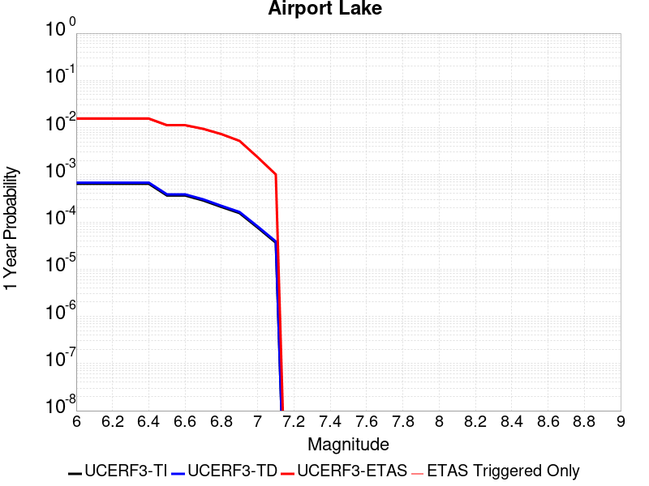 |  |

| Magnitude | 1 wk TI Prob | 1 wk TD Prob | 1 wk ETAS Prob | 1 wk ETAS/TD Gain | 1 wk ETAS Triggered Only | 1 mo TI Prob | 1 mo TD Prob | 1 mo ETAS Prob | 1 mo ETAS/TD Gain | 1 mo ETAS Triggered Only | 1 yr TI Prob | 1 yr TD Prob | 1 yr ETAS Prob | 1 yr ETAS/TD Gain | 1 yr ETAS Triggered Only | 10 yr TI Prob | 10 yr TD Prob | 10 yr ETAS Prob | 10 yr ETAS/TD Gain | 10 yr ETAS Triggered Only |
|-----|-----|-----|-----|-----|-----|-----|-----|-----|-----|-----|-----|-----|-----|-----|-----|-----|-----|-----|-----|-----|
| 6.0 | 1.2387061E-5 | 1.31032575E-5 | 0.0023864056 | 182.12308 | 0.0023733333 | 5.3086325E-5 | 5.6155768E-5 | 0.0061891447 | 110.213875 | 0.0061333333 | 6.461343E-4 | 6.835104E-4 | 0.015073668 | 22.05331 | 0.0144 | 0.0064425888 | 0.0068168915 | 0.028799344 | 4.2247033 | 0.022133334 |
| 6.1 | 1.2387061E-5 | 1.31032575E-5 | 0.0023864056 | 182.12308 | 0.0023733333 | 5.3086325E-5 | 5.6155768E-5 | 0.0061891447 | 110.213875 | 0.0061333333 | 6.461343E-4 | 6.835104E-4 | 0.015073668 | 22.05331 | 0.0144 | 0.0064425888 | 0.0068168915 | 0.028799344 | 4.2247033 | 0.022133334 |
| 6.2 | 1.2387061E-5 | 1.31032575E-5 | 0.0023864056 | 182.12308 | 0.0023733333 | 5.3086325E-5 | 5.6155768E-5 | 0.0061891447 | 110.213875 | 0.0061333333 | 6.461343E-4 | 6.835104E-4 | 0.015073668 | 22.05331 | 0.0144 | 0.0064425888 | 0.0068168915 | 0.028799344 | 4.2247033 | 0.022133334 |
| 6.3 | 1.2387061E-5 | 1.31032575E-5 | 0.0023864056 | 182.12308 | 0.0023733333 | 5.3086325E-5 | 5.6155768E-5 | 0.0061891447 | 110.213875 | 0.0061333333 | 6.461343E-4 | 6.835104E-4 | 0.015073668 | 22.05331 | 0.0144 | 0.0064425888 | 0.0068168915 | 0.028799344 | 4.2247033 | 0.022133334 |
| 6.4 | 1.2387061E-5 | 1.31032575E-5 | 0.0023864056 | 182.12308 | 0.0023733333 | 5.3086325E-5 | 5.6155768E-5 | 0.0061891447 | 110.213875 | 0.0061333333 | 6.461343E-4 | 6.835104E-4 | 0.015073668 | 22.05331 | 0.0144 | 0.0064425888 | 0.0068168915 | 0.028799344 | 4.2247033 | 0.022133334 |
| 6.5 | 6.9922594E-6 | 7.38498E-6 | 0.0019540372 | 264.59613 | 0.0019466666 | 2.996648E-5 | 3.164956E-5 | 0.0047248346 | 149.28593 | 0.0046933335 | 3.6478083E-4 | 3.8527072E-4 | 0.010861233 | 28.191174 | 0.01048 | 0.003641826 | 0.0038465653 | 0.020077225 | 5.21952 | 0.016293334 |
| 6.6 | 6.9922594E-6 | 7.38498E-6 | 0.0019540372 | 264.59613 | 0.0019466666 | 2.996648E-5 | 3.164956E-5 | 0.0047248346 | 149.28593 | 0.0046933335 | 3.6478083E-4 | 3.8527072E-4 | 0.010861233 | 28.191174 | 0.01048 | 0.003641826 | 0.0038465653 | 0.020077225 | 5.21952 | 0.016293334 |
| 6.7 | 5.477277E-6 | 5.7861116E-6 | 0.0015791104 | 272.9139 | 0.0015733333 | 2.3473833E-5 | 2.4797408E-5 | 0.0037580382 | 151.54964 | 0.0037333334 | 2.8575645E-4 | 3.0187052E-4 | 0.0089392625 | 29.612904 | 0.00864 | 0.0028538927 | 0.0030149885 | 0.016414467 | 5.4442887 | 0.01344 |
| 6.8 | 3.9950432E-6 | 4.2191186E-6 | 0.0012042141 | 285.4184 | 0.0012 | 1.7121502E-5 | 1.8081826E-5 | 0.0029780283 | 164.69731 | 0.00296 | 2.0843433E-4 | 2.2012675E-4 | 0.006858665 | 31.157799 | 0.00664 | 0.0020823893 | 0.002199358 | 0.012443445 | 5.657762 | 0.010266666 |
| 6.9 | 2.95695E-6 | 3.1230477E-6 | 8.564537E-4 | 274.2365 | 8.5333333E-4 | 1.2672582E-5 | 1.3384434E-5 | 0.002040024 | 152.41765 | 0.0020266667 | 1.5427776E-4 | 1.6294557E-4 | 0.004988826 | 30.616518 | 0.004826667 | 0.001541707 | 0.0016284833 | 0.008683642 | 5.33235 | 0.0070666666 |
| 7.0 | 1.456072E-6 | 1.5408239E-6 | 4.015402E-4 | 260.60098 | 4.0E-4 | 6.2402937E-6 | 6.60352E-6 | 8.865977E-4 | 134.26138 | 8.8E-4 | 7.597293E-5 | 8.03959E-5 | 0.0021868933 | 27.201551 | 0.0021066666 | 7.594696E-4 | 8.03767E-4 | 0.003867969 | 4.812301 | 0.0030666667 |
| 7.1 | 6.995192E-7 | 7.4090326E-7 | 1.3407414E-4 | 180.96039 | 1.3333333E-4 | 2.997936E-6 | 3.1752998E-6 | 3.4984088E-4 | 110.1757 | 3.4666667E-4 | 3.649926E-5 | 3.8659273E-5 | 8.6529396E-4 | 22.382572 | 8.2666666E-4 | 3.6493264E-4 | 3.8659273E-4 | 0.0016660979 | 4.309698 | 0.00128 |

## Garlock (East)
*[(top)](#table-of-contents)*

| 1 Week | 1 Month | 1 Year | 10 Year |
|-----|-----|-----|-----|
|  |  |  |  |

| Magnitude | 1 wk TI Prob | 1 wk TD Prob | 1 wk ETAS Prob | 1 wk ETAS/TD Gain | 1 wk ETAS Triggered Only | 1 mo TI Prob | 1 mo TD Prob | 1 mo ETAS Prob | 1 mo ETAS/TD Gain | 1 mo ETAS Triggered Only | 1 yr TI Prob | 1 yr TD Prob | 1 yr ETAS Prob | 1 yr ETAS/TD Gain | 1 yr ETAS Triggered Only | 10 yr TI Prob | 10 yr TD Prob | 10 yr ETAS Prob | 10 yr ETAS/TD Gain | 10 yr ETAS Triggered Only |
|-----|-----|-----|-----|-----|-----|-----|-----|-----|-----|-----|-----|-----|-----|-----|-----|-----|-----|-----|-----|-----|
| 6.0 | 4.5092507E-5 | 6.2906794E-5 | 0.002036116 | 32.367188 | 0.0019733333 | 1.9323928E-4 | 2.695752E-4 | 0.005014962 | 18.603203 | 0.0047466666 | 0.0023501497 | 0.0032775842 | 0.0146269305 | 4.4627166 | 0.011386666 | 0.023254504 | 0.03235364 | 0.0512421 | 1.5838124 | 0.01952 |
| 6.1 | 4.5092507E-5 | 6.2906794E-5 | 0.002036116 | 32.367188 | 0.0019733333 | 1.9323928E-4 | 2.695752E-4 | 0.005014962 | 18.603203 | 0.0047466666 | 0.0023501497 | 0.0032775842 | 0.0146269305 | 4.4627166 | 0.011386666 | 0.023254504 | 0.03235364 | 0.0512421 | 1.5838124 | 0.01952 |
| 6.2 | 2.6674514E-5 | 3.4512483E-5 | 0.0015811258 | 45.813156 | 0.0015466667 | 1.1431433E-4 | 1.4790244E-4 | 0.0036140564 | 24.435408 | 0.0034666667 | 0.0013908884 | 0.001799258 | 0.010051051 | 5.58622 | 0.008266667 | 0.01382215 | 0.017891733 | 0.03158887 | 1.7655567 | 0.013946666 |
| 6.3 | 2.6674514E-5 | 3.4512483E-5 | 0.0015811258 | 45.813156 | 0.0015466667 | 1.1431433E-4 | 1.4790244E-4 | 0.0036140564 | 24.435408 | 0.0034666667 | 0.0013908884 | 0.001799258 | 0.010051051 | 5.58622 | 0.008266667 | 0.01382215 | 0.017891733 | 0.03158887 | 1.7655567 | 0.013946666 |
| 6.4 | 2.5312667E-5 | 3.2341675E-5 | 0.0015256268 | 47.17216 | 0.0014933334 | 1.0847834E-4 | 1.3859998E-4 | 0.0035247973 | 25.43144 | 0.0033866668 | 0.0013199237 | 0.001686178 | 0.009805797 | 5.815398 | 0.008133333 | 0.013121112 | 0.01677974 | 0.03030885 | 1.8062766 | 0.01376 |
| 6.5 | 2.5312667E-5 | 3.2341675E-5 | 0.0015256268 | 47.17216 | 0.0014933334 | 1.0847834E-4 | 1.3859998E-4 | 0.0035247973 | 25.43144 | 0.0033866668 | 0.0013199237 | 0.001686178 | 0.009805797 | 5.815398 | 0.008133333 | 0.013121112 | 0.01677974 | 0.03030885 | 1.8062766 | 0.01376 |
| 6.6 | 2.246556E-5 | 2.813642E-5 | 0.0014947618 | 53.12552 | 0.0014666667 | 9.627742E-5 | 1.20579214E-4 | 0.003426847 | 28.419884 | 0.0033066666 | 0.0011715472 | 0.0014670868 | 0.009055937 | 6.1727343 | 0.0076 | 0.011653901 | 0.014620015 | 0.027364263 | 1.8716986 | 0.012933333 |
| 6.7 | 2.2241198E-5 | 2.7806154E-5 | 0.001494432 | 53.74465 | 0.0014666667 | 9.531594E-5 | 1.1916392E-4 | 0.0034254366 | 28.745584 | 0.0033066666 | 0.0011598538 | 0.0014498787 | 0.00903886 | 6.234218 | 0.0076 | 0.011538187 | 0.0144502055 | 0.02719665 | 1.8820944 | 0.012933333 |
| 6.8 | 1.9528685E-5 | 2.3900653E-5 | 0.0014372002 | 60.13226 | 0.0014133333 | 8.369167E-5 | 1.0242746E-4 | 0.003248772 | 31.717783 | 0.0031466666 | 0.0010184698 | 0.0012463606 | 0.008570554 | 6.8764644 | 0.007333333 | 0.010138147 | 0.012437694 | 0.024578126 | 1.9761 | 0.012293333 |
| 6.9 | 1.3318621E-5 | 1.5201007E-5 | 0.0013485141 | 88.71216 | 0.0013333333 | 5.7078556E-5 | 6.514558E-5 | 0.0029982878 | 46.024426 | 0.0029333334 | 6.9470983E-4 | 7.928645E-4 | 0.007534182 | 9.502483 | 0.0067466665 | 0.0069254204 | 0.007940986 | 0.018840408 | 2.3725526 | 0.010986667 |
| 7.0 | 1.1760853E-5 | 1.3109839E-5 | 0.0012930931 | 98.635315 | 0.00128 | 5.0402683E-5 | 5.618384E-5 | 0.002909357 | 51.782806 | 0.0028533333 | 6.134799E-4 | 6.838286E-4 | 0.007265991 | 10.625457 | 0.0065866667 | 0.0061178906 | 0.006857582 | 0.017530553 | 2.5563753 | 0.010746666 |
| 7.1 | 1.0064758E-5 | 1.090491E-5 | 0.0012642245 | 115.93169 | 0.0012533333 | 4.3133965E-5 | 4.673451E-5 | 0.0028199381 | 60.339527 | 0.0027733333 | 5.2502943E-4 | 5.688476E-4 | 0.006858601 | 12.05701 | 0.006293333 | 0.005237907 | 0.005714025 | 0.015709914 | 2.7493603 | 0.010053333 |
| 7.2 | 9.768808E-6 | 1.0500772E-5 | 0.0012638209 | 120.35505 | 0.0012533333 | 4.186565E-5 | 4.500255E-5 | 0.002818211 | 62.62336 | 0.0027733333 | 5.095951E-4 | 5.477718E-4 | 0.0067310496 | 12.2880535 | 0.006186667 | 0.0050842804 | 0.005504284 | 0.015210562 | 2.7634044 | 0.00976 |
| 7.3 | 9.344516E-6 | 9.946395E-6 | 0.0012099345 | 121.64552 | 0.0012 | 4.004731E-5 | 4.2626732E-5 | 0.0026025176 | 61.05365 | 0.00256 | 4.8746695E-4 | 5.1886035E-4 | 0.0061426074 | 11.838654 | 0.005626667 | 0.0048639905 | 0.005215945 | 0.0141026825 | 2.7037637 | 0.008933334 |
| 7.4 | 9.023491E-6 | 9.49255E-6 | 0.0010228163 | 107.74937 | 0.0010133333 | 3.867153E-5 | 4.068174E-5 | 0.002253925 | 55.403847 | 0.0022133333 | 4.7072413E-4 | 4.95191E-4 | 0.0052661607 | 10.634604 | 0.004773333 | 0.004697283 | 0.004979378 | 0.012806874 | 2.5719826 | 0.007866667 |
| 7.5 | 7.081253E-6 | 7.0893525E-6 | 5.137524E-4 | 72.46818 | 5.0666666E-4 | 3.0347876E-5 | 3.038259E-5 | 0.0011236827 | 36.98443 | 0.0010933334 | 3.6942272E-4 | 3.6984598E-4 | 0.0025823608 | 6.9822598 | 0.0022133333 | 0.003688092 | 0.0037251879 | 0.007364912 | 1.9770578 | 0.0036533333 |
| 7.6 | 6.116396E-6 | 5.9608415E-6 | 1.659599E-4 | 27.841686 | 1.6E-4 | 2.6212863E-5 | 2.5546216E-5 | 5.8553193E-4 | 22.920496 | 5.6E-4 | 3.1909486E-4 | 3.1098103E-4 | 0.001590583 | 5.1147265 | 0.00128 | 0.0031863707 | 0.003136586 | 0.005263228 | 1.6780117 | 0.0021333334 |
| 7.7 | 4.797145E-6 | 4.7587923E-6 | 8.475841E-5 | 17.81091 | 8.0E-5 | 2.055903E-5 | 2.0394666E-5 | 2.8705588E-4 | 14.075048 | 2.6666667E-4 | 2.5027743E-4 | 2.482769E-4 | 8.081378E-4 | 3.2549863 | 5.6E-4 | 0.0024999576 | 0.002510134 | 0.0035741231 | 1.4238775 | 0.0010666667 |
| 7.8 | 3.4028885E-6 | 3.979809E-6 | 5.731293E-5 | 14.400924 | 5.3333333E-5 | 1.4583726E-5 | 1.7056214E-5 | 1.7705349E-4 | 10.380585 | 1.6E-4 | 1.775424E-4 | 2.076397E-4 | 5.808955E-4 | 2.797613 | 3.7333334E-4 | 0.0017740062 | 0.0021019245 | 0.0027405792 | 1.3038429 | 6.4E-4 |
| 7.9 | 2.5928412E-6 | 3.373588E-6 | 5.670674E-5 | 16.80903 | 5.3333333E-5 | 1.1112129E-5 | 1.44581545E-5 | 1.2112328E-4 | 8.377506 | 1.0666667E-4 | 1.3528178E-4 | 1.7601387E-4 | 4.6929557E-4 | 2.666242 | 2.9333335E-4 | 0.0013519945 | 0.0017818334 | 0.0022343588 | 1.2539662 | 4.5333334E-4 |
| 8.0 | 1.3743648E-6 | 1.673991E-6 | 2.8340613E-5 | 16.929966 | 2.6666667E-5 | 5.8901214E-6 | 7.174228E-6 | 8.7173656E-5 | 12.150946 | 8.0E-5 | 7.1709874E-5 | 8.7342756E-5 | 2.4732878E-4 | 2.8317034 | 1.6E-4 | 7.1686733E-4 | 8.839922E-4 | 0.0010971369 | 1.241116 | 2.1333333E-4 |
| 8.1 | 3.6733252E-7 | 3.1499187E-7 | 3.1499187E-7 | 1.0 | 0.0 | 1.5742813E-6 | 1.3499646E-6 | 1.3499646E-6 | 1.0 | 0.0 | 1.9166706E-5 | 1.643571E-5 | 1.643571E-5 | 1.0 | 0.0 | 1.9165053E-4 | 1.6643589E-4 | 1.6643589E-4 | 1.0 | 0.0 |

## Panamint Valley
*[(top)](#table-of-contents)*

| 1 Week | 1 Month | 1 Year | 10 Year |
|-----|-----|-----|-----|
|  |  | 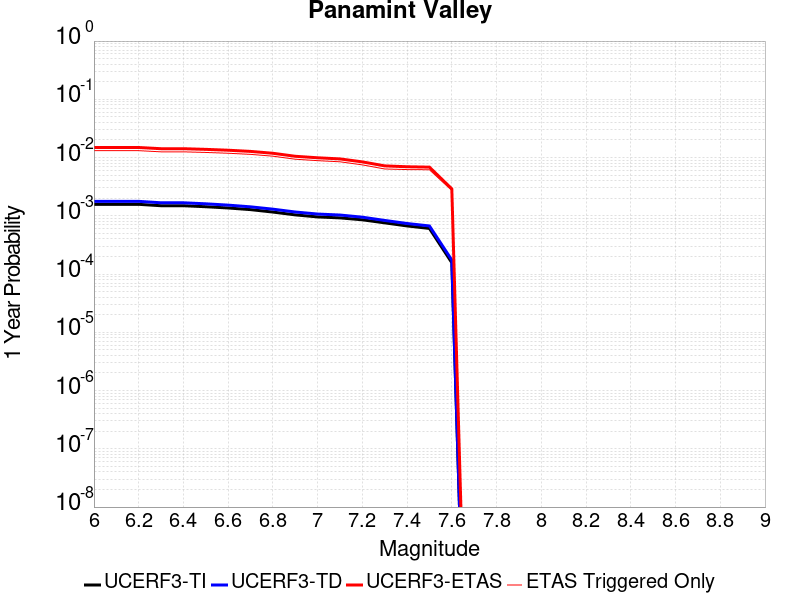 |  |

| Magnitude | 1 wk TI Prob | 1 wk TD Prob | 1 wk ETAS Prob | 1 wk ETAS/TD Gain | 1 wk ETAS Triggered Only | 1 mo TI Prob | 1 mo TD Prob | 1 mo ETAS Prob | 1 mo ETAS/TD Gain | 1 mo ETAS Triggered Only | 1 yr TI Prob | 1 yr TD Prob | 1 yr ETAS Prob | 1 yr ETAS/TD Gain | 1 yr ETAS Triggered Only | 10 yr TI Prob | 10 yr TD Prob | 10 yr ETAS Prob | 10 yr ETAS/TD Gain | 10 yr ETAS Triggered Only |
|-----|-----|-----|-----|-----|-----|-----|-----|-----|-----|-----|-----|-----|-----|-----|-----|-----|-----|-----|-----|-----|
| 6.0 | 3.0211835E-5 | 3.3985398E-5 | 0.0017672598 | 52.000565 | 0.0017333333 | 1.2947287E-4 | 1.4564373E-4 | 0.0042250496 | 29.009483 | 0.00408 | 0.0015751923 | 0.0017717998 | 0.013777157 | 7.7757983 | 0.012026667 | 0.015640736 | 0.01758359 | 0.03804405 | 2.163611 | 0.020826668 |
| 6.1 | 3.0211835E-5 | 3.3985398E-5 | 0.0017672598 | 52.000565 | 0.0017333333 | 1.2947287E-4 | 1.4564373E-4 | 0.0042250496 | 29.009483 | 0.00408 | 0.0015751923 | 0.0017717998 | 0.013777157 | 7.7757983 | 0.012026667 | 0.015640736 | 0.01758359 | 0.03804405 | 2.163611 | 0.020826668 |
| 6.2 | 3.0211835E-5 | 3.3985398E-5 | 0.0017672598 | 52.000565 | 0.0017333333 | 1.2947287E-4 | 1.4564373E-4 | 0.0042250496 | 29.009483 | 0.00408 | 0.0015751923 | 0.0017717998 | 0.013777157 | 7.7757983 | 0.012026667 | 0.015640736 | 0.01758359 | 0.03804405 | 2.163611 | 0.020826668 |
| 6.3 | 2.8573924E-5 | 3.2103522E-5 | 0.001658718 | 51.66779 | 0.0016266666 | 1.2245393E-4 | 1.3757942E-4 | 0.0040037143 | 29.101112 | 0.0038666667 | 0.001489857 | 0.0016737703 | 0.013094623 | 7.8234286 | 0.01144 | 0.01479908 | 0.016618231 | 0.036102302 | 2.1724515 | 0.019813333 |
| 6.4 | 2.8573924E-5 | 3.2103522E-5 | 0.001658718 | 51.66779 | 0.0016266666 | 1.2245393E-4 | 1.3757942E-4 | 0.0040037143 | 29.101112 | 0.0038666667 | 0.001489857 | 0.0016737703 | 0.013094623 | 7.8234286 | 0.01144 | 0.01479908 | 0.016618231 | 0.036102302 | 2.1724515 | 0.019813333 |
| 6.5 | 2.7468774E-5 | 3.0829244E-5 | 0.0016574458 | 53.762127 | 0.0016266666 | 1.1771801E-4 | 1.3211879E-4 | 0.0039449483 | 29.8591 | 0.0038133333 | 0.0014322745 | 0.0016073869 | 0.012842632 | 7.989758 | 0.011253334 | 0.014230782 | 0.015964093 | 0.034962546 | 2.1900742 | 0.019306667 |
| 6.6 | 2.6135967E-5 | 2.9253257E-5 | 0.0015492088 | 52.958508 | 0.00152 | 1.1200648E-4 | 1.2536523E-4 | 0.0038315672 | 30.563238 | 0.0037066666 | 0.0013628257 | 0.0015252795 | 0.012388685 | 8.122239 | 0.01088 | 0.013544982 | 0.015154443 | 0.033406913 | 2.2044303 | 0.018533334 |
| 6.7 | 2.4498746E-5 | 2.7342086E-5 | 0.0014939687 | 54.639893 | 0.0014666667 | 1.04990395E-4 | 1.1717525E-4 | 0.0036634263 | 31.264505 | 0.0035466666 | 0.0012775084 | 0.0014257001 | 0.011890759 | 8.340294 | 0.01048 | 0.012701893 | 0.014171662 | 0.031601105 | 2.22988 | 0.01768 |
| 6.8 | 2.2244329E-5 | 2.4936131E-5 | 0.0014649002 | 58.74609 | 0.00144 | 9.532935E-5 | 1.0686488E-4 | 0.003573161 | 33.436253 | 0.0034666667 | 0.0011600169 | 0.0013003252 | 0.011207426 | 8.618941 | 0.00992 | 0.011539802 | 0.012932883 | 0.02935768 | 2.2700028 | 0.01664 |
| 6.9 | 1.9902658E-5 | 2.2290924E-5 | 0.0013822606 | 62.01002 | 0.00136 | 8.529431E-5 | 9.552913E-5 | 0.0032685592 | 34.215313 | 0.0031733334 | 0.0010379635 | 0.0011624652 | 0.0098723285 | 8.49258 | 0.00872 | 0.010331288 | 0.011568946 | 0.026118651 | 2.2576518 | 0.01472 |
| 7.0 | 1.8353881E-5 | 2.056681E-5 | 0.0013805388 | 67.1246 | 0.00136 | 7.865712E-5 | 8.814059E-5 | 0.003074544 | 34.882275 | 0.0029866667 | 9.5722964E-4 | 0.0010726011 | 0.009223849 | 8.599515 | 0.00816 | 0.009531168 | 0.0106791705 | 0.024292225 | 2.2747297 | 0.01376 |
| 7.1 | 1.7667631E-5 | 1.9773222E-5 | 0.0012730818 | 64.38413 | 0.0012533333 | 7.571623E-5 | 8.473973E-5 | 0.0029111668 | 34.354214 | 0.0028266667 | 9.2145515E-4 | 0.0010312354 | 0.008783233 | 8.517195 | 0.00776 | 0.009176437 | 0.010269388 | 0.023201868 | 2.2593234 | 0.013066667 |
| 7.2 | 1.6381597E-5 | 1.8158824E-5 | 0.0011914709 | 65.61388 | 0.0011733334 | 7.020495E-5 | 7.782131E-5 | 0.0027442805 | 35.26387 | 0.0026666666 | 8.544101E-4 | 9.4707985E-4 | 0.007980413 | 8.426335 | 0.00704 | 0.008511325 | 0.009435088 | 0.021110548 | 2.2374508 | 0.011786667 |
| 7.3 | 1.4520491E-5 | 1.5966963E-5 | 9.759516E-4 | 61.123184 | 9.6E-4 | 6.222919E-5 | 6.842814E-5 | 0.0023349398 | 34.12251 | 0.0022666666 | 7.57377E-4 | 8.3281036E-4 | 0.0065880134 | 7.91058 | 0.00576 | 0.0075480095 | 0.008300003 | 0.018111221 | 2.182074 | 0.009893334 |
| 7.4 | 1.2852287E-5 | 1.4145856E-5 | 9.741323E-4 | 68.863434 | 9.6E-4 | 5.5080065E-5 | 6.0623777E-5 | 0.002327153 | 38.386803 | 0.0022666666 | 6.7039346E-4 | 7.3786033E-4 | 0.0063603753 | 8.620026 | 0.005626667 | 0.0066837464 | 0.007357025 | 0.016912868 | 2.2988732 | 0.009626667 |
| 7.5 | 1.1637851E-5 | 1.2837149E-5 | 9.728248E-4 | 75.782 | 9.6E-4 | 4.987555E-5 | 5.5015284E-5 | 0.0023215571 | 42.198406 | 0.0022666666 | 6.070656E-4 | 6.6962093E-4 | 0.0062925196 | 9.397138 | 0.005626667 | 0.006054099 | 0.0066789286 | 0.016161835 | 2.4198244 | 0.009546666 |
| 7.6 | 3.0068115E-6 | 3.3331687E-6 | 4.299984E-4 | 129.00589 | 4.2666667E-4 | 1.2886271E-5 | 1.4284972E-5 | 9.742713E-4 | 68.20253 | 9.6E-4 | 1.5687906E-4 | 1.7391294E-4 | 0.0026001576 | 14.950915 | 0.0024266667 | 0.0015676835 | 0.001739208 | 0.006078315 | 3.4948752 | 0.004346667 |

## Hunter Mountain-Saline Valley
*[(top)](#table-of-contents)*

| 1 Week | 1 Month | 1 Year | 10 Year |
|-----|-----|-----|-----|
| 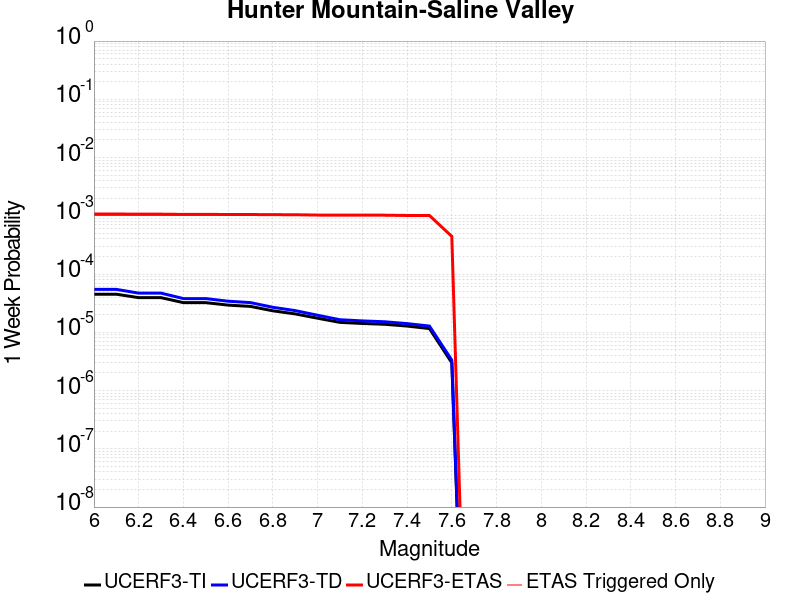 | 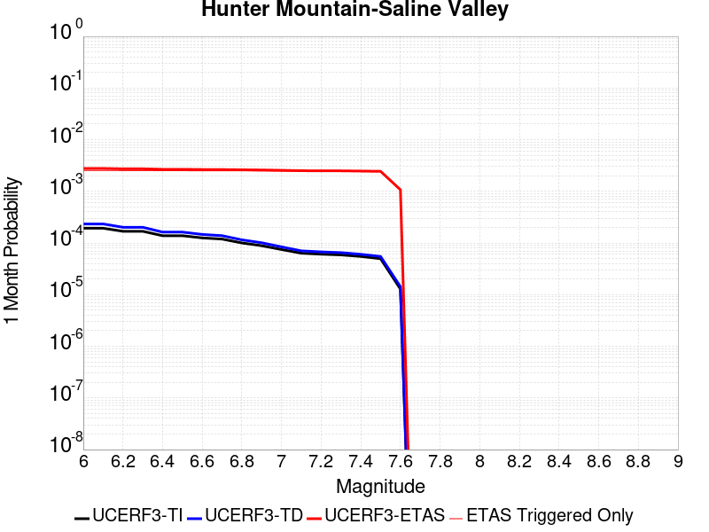 |  |  |

| Magnitude | 1 wk TI Prob | 1 wk TD Prob | 1 wk ETAS Prob | 1 wk ETAS/TD Gain | 1 wk ETAS Triggered Only | 1 mo TI Prob | 1 mo TD Prob | 1 mo ETAS Prob | 1 mo ETAS/TD Gain | 1 mo ETAS Triggered Only | 1 yr TI Prob | 1 yr TD Prob | 1 yr ETAS Prob | 1 yr ETAS/TD Gain | 1 yr ETAS Triggered Only | 10 yr TI Prob | 10 yr TD Prob | 10 yr ETAS Prob | 10 yr ETAS/TD Gain | 10 yr ETAS Triggered Only |
|-----|-----|-----|-----|-----|-----|-----|-----|-----|-----|-----|-----|-----|-----|-----|-----|-----|-----|-----|-----|-----|
| 6.0 | 4.5103672E-5 | 5.4571992E-5 | 0.0010145196 | 18.59048 | 9.6E-4 | 1.9328714E-4 | 2.3385909E-4 | 0.0026066373 | 11.146188 | 0.0023733333 | 0.002350731 | 0.0028436056 | 0.008613817 | 3.0291884 | 0.0057866666 | 0.023260195 | 0.028092787 | 0.03770819 | 1.342273 | 0.009893334 |
| 6.1 | 4.5103672E-5 | 5.4571992E-5 | 0.0010145196 | 18.59048 | 9.6E-4 | 1.9328714E-4 | 2.3385909E-4 | 0.0026066373 | 11.146188 | 0.0023733333 | 0.002350731 | 0.0028436056 | 0.008613817 | 3.0291884 | 0.0057866666 | 0.023260195 | 0.028092787 | 0.03770819 | 1.342273 | 0.009893334 |
| 6.2 | 3.9363465E-5 | 4.7064877E-5 | 0.0010070197 | 21.396416 | 9.6E-4 | 1.6868966E-4 | 2.0169078E-4 | 0.0025745453 | 12.764815 | 0.0023733333 | 0.002051862 | 0.0024528939 | 0.0082253665 | 3.3533316 | 0.0057866666 | 0.020330196 | 0.024274237 | 0.033901397 | 1.3965999 | 0.009866667 |
| 6.3 | 3.9363465E-5 | 4.7064877E-5 | 0.0010070197 | 21.396416 | 9.6E-4 | 1.6868966E-4 | 2.0169078E-4 | 0.0025745453 | 12.764815 | 0.0023733333 | 0.002051862 | 0.0024528939 | 0.0082253665 | 3.3533316 | 0.0057866666 | 0.020330196 | 0.024274237 | 0.033901397 | 1.3965999 | 0.009866667 |
| 6.4 | 3.2311684E-5 | 3.795214E-5 | 9.979157E-4 | 26.294056 | 9.6E-4 | 1.384713E-4 | 1.626423E-4 | 0.002482265 | 15.262112 | 0.00232 | 0.0016845843 | 0.0019784442 | 0.0077004344 | 3.8921666 | 0.0057333335 | 0.016718714 | 0.019617062 | 0.029211743 | 1.4890988 | 0.009786666 |
| 6.5 | 3.2311684E-5 | 3.795214E-5 | 9.979157E-4 | 26.294056 | 9.6E-4 | 1.384713E-4 | 1.626423E-4 | 0.002482265 | 15.262112 | 0.00232 | 0.0016845843 | 0.0019784442 | 0.0077004344 | 3.8921666 | 0.0057333335 | 0.016718714 | 0.019617062 | 0.029211743 | 1.4890988 | 0.009786666 |
| 6.6 | 2.9305844E-5 | 3.4182853E-5 | 9.941501E-4 | 29.083296 | 9.6E-4 | 1.2559042E-4 | 1.4649007E-4 | 0.0024394875 | 16.65292 | 0.0022933334 | 0.0015279909 | 0.0017821203 | 0.0074519976 | 4.181535 | 0.00568 | 0.015175272 | 0.017686214 | 0.027247403 | 1.5406011 | 0.009733333 |
| 6.7 | 2.7826512E-5 | 3.2345237E-5 | 9.923142E-4 | 30.678833 | 9.6E-4 | 1.19251024E-4 | 1.3861542E-4 | 0.0024316309 | 17.542282 | 0.0022933334 | 0.0014509142 | 0.0016863967 | 0.007356818 | 4.362448 | 0.00568 | 0.014414776 | 0.01674368 | 0.026287822 | 1.5700145 | 0.009706667 |
| 6.8 | 2.3389874E-5 | 2.6867507E-5 | 9.868417E-4 | 36.729935 | 9.6E-4 | 1.0023846E-4 | 1.1514164E-4 | 0.002408211 | 20.915203 | 0.0022933334 | 0.00121972 | 0.0014009953 | 0.0070464085 | 5.0295734 | 0.0056533334 | 0.01213047 | 0.013927842 | 0.02342043 | 1.6815548 | 0.009626667 |
| 6.9 | 2.069209E-5 | 2.3570727E-5 | 9.835481E-4 | 41.727524 | 9.6E-4 | 8.867737E-5 | 1.0101369E-4 | 0.0023674513 | 23.436935 | 0.0022666666 | 0.0010791123 | 0.001229184 | 0.0068489346 | 5.5719357 | 0.005626667 | 0.010738871 | 0.012228882 | 0.021711485 | 1.7754267 | 0.0096 |
| 7.0 | 1.7462342E-5 | 1.9634126E-5 | 9.796153E-4 | 49.893497 | 9.6E-4 | 7.483646E-5 | 8.414367E-5 | 0.0023506195 | 27.935785 | 0.0022666666 | 9.1075303E-4 | 0.0010239903 | 0.006618256 | 6.4632015 | 0.0056 | 0.009070295 | 0.010196352 | 0.019672073 | 1.9293245 | 0.009573333 |
| 7.1 | 1.4807709E-5 | 1.6442245E-5 | 9.7642647E-4 | 59.385227 | 9.6E-4 | 6.3460066E-5 | 7.046495E-5 | 0.002310307 | 32.786613 | 0.00224 | 7.723524E-4 | 8.575896E-4 | 0.0064261435 | 7.4932613 | 0.0055733332 | 0.007696735 | 0.008545788 | 0.018010871 | 2.1075728 | 0.009546666 |
| 7.2 | 1.4180048E-5 | 1.5698814E-5 | 9.7568374E-4 | 62.150158 | 9.6E-4 | 6.077022E-5 | 6.727898E-5 | 0.0023071284 | 34.29196 | 0.00224 | 7.396263E-4 | 8.1883004E-4 | 0.0063875997 | 7.800886 | 0.0055733332 | 0.0073716943 | 0.00816108 | 0.017629836 | 2.160233 | 0.009546666 |
| 7.3 | 1.3730402E-5 | 1.5172541E-5 | 9.7515795E-4 | 64.27124 | 9.6E-4 | 5.8843252E-5 | 6.502365E-5 | 0.002304878 | 35.446766 | 0.00224 | 7.161811E-4 | 7.913914E-4 | 0.006360314 | 8.036876 | 0.0055733332 | 0.007138774 | 0.007888664 | 0.01736002 | 2.2006288 | 0.009546666 |
| 7.4 | 1.2810095E-5 | 1.410972E-5 | 9.740962E-4 | 69.03725 | 9.6E-4 | 5.489925E-5 | 6.0468916E-5 | 0.0023003335 | 38.041584 | 0.00224 | 6.681934E-4 | 7.359762E-4 | 0.0063052075 | 8.567136 | 0.0055733332 | 0.006661878 | 0.0073382827 | 0.016814893 | 2.2913935 | 0.009546666 |
| 7.5 | 1.1595659E-5 | 1.2801013E-5 | 9.727887E-4 | 75.9931 | 9.6E-4 | 4.9694736E-5 | 5.4860422E-5 | 0.0022947376 | 41.828655 | 0.00224 | 6.0486543E-4 | 6.677366E-4 | 0.0062373485 | 9.341031 | 0.0055733332 | 0.006032217 | 0.0066601736 | 0.01606379 | 2.4119177 | 0.009466667 |
| 7.6 | 2.997694E-6 | 3.3252948E-6 | 4.2999056E-4 | 129.309 | 4.2666667E-4 | 1.28471975E-5 | 1.4251226E-5 | 9.4757124E-4 | 66.49051 | 9.3333336E-4 | 1.564034E-4 | 1.7350215E-4 | 0.0025730857 | 14.830282 | 0.0024 | 0.0015629337 | 0.0017351025 | 0.0060209865 | 3.4701042 | 0.0042933333 |

## Ash Hill
*[(top)](#table-of-contents)*

| 1 Week | 1 Month | 1 Year | 10 Year |
|-----|-----|-----|-----|
| 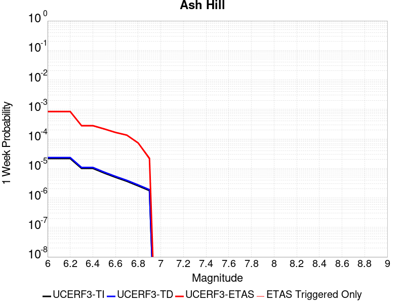 |  |  |  |

| Magnitude | 1 wk TI Prob | 1 wk TD Prob | 1 wk ETAS Prob | 1 wk ETAS/TD Gain | 1 wk ETAS Triggered Only | 1 mo TI Prob | 1 mo TD Prob | 1 mo ETAS Prob | 1 mo ETAS/TD Gain | 1 mo ETAS Triggered Only | 1 yr TI Prob | 1 yr TD Prob | 1 yr ETAS Prob | 1 yr ETAS/TD Gain | 1 yr ETAS Triggered Only | 10 yr TI Prob | 10 yr TD Prob | 10 yr ETAS Prob | 10 yr ETAS/TD Gain | 10 yr ETAS Triggered Only |
|-----|-----|-----|-----|-----|-----|-----|-----|-----|-----|-----|-----|-----|-----|-----|-----|-----|-----|-----|-----|-----|
| 6.0 | 2.1545662E-5 | 2.3194681E-5 | 8.7650825E-4 | 37.78919 | 8.5333333E-4 | 9.2335285E-5 | 9.9402445E-5 | 0.0016725794 | 16.82634 | 0.0015733333 | 0.0011236023 | 0.0012096328 | 0.00517816 | 4.28077 | 0.003973333 | 0.011179381 | 0.01203847 | 0.01978409 | 1.6434056 | 0.00784 |
| 6.1 | 2.1545662E-5 | 2.3194681E-5 | 8.7650825E-4 | 37.78919 | 8.5333333E-4 | 9.2335285E-5 | 9.9402445E-5 | 0.0016725794 | 16.82634 | 0.0015733333 | 0.0011236023 | 0.0012096328 | 0.00517816 | 4.28077 | 0.003973333 | 0.011179381 | 0.01203847 | 0.01978409 | 1.6434056 | 0.00784 |
| 6.2 | 2.1545662E-5 | 2.3194681E-5 | 8.7650825E-4 | 37.78919 | 8.5333333E-4 | 9.2335285E-5 | 9.9402445E-5 | 0.0016725794 | 16.82634 | 0.0015733333 | 0.0011236023 | 0.0012096328 | 0.00517816 | 4.28077 | 0.003973333 | 0.011179381 | 0.01203847 | 0.01978409 | 1.6434056 | 0.00784 |
| 6.3 | 1.0025529E-5 | 1.0747037E-5 | 3.3074358E-4 | 30.77533 | 3.2E-4 | 4.2965847E-5 | 4.605799E-5 | 6.3269766E-4 | 13.736979 | 5.866667E-4 | 5.229836E-4 | 5.60625E-4 | 0.002159728 | 3.8523576 | 0.0016 | 0.005217545 | 0.0055934195 | 0.0089876605 | 1.6068275 | 0.0034133333 |
| 6.4 | 1.0025529E-5 | 1.0747037E-5 | 3.3074358E-4 | 30.77533 | 3.2E-4 | 4.2965847E-5 | 4.605799E-5 | 6.3269766E-4 | 13.736979 | 5.866667E-4 | 5.229836E-4 | 5.60625E-4 | 0.002159728 | 3.8523576 | 0.0016 | 0.005217545 | 0.0055934195 | 0.0089876605 | 1.6068275 | 0.0034133333 |
| 6.5 | 6.9617327E-6 | 7.456704E-6 | 2.7412138E-4 | 36.761734 | 2.6666667E-4 | 2.9835655E-5 | 3.1956963E-5 | 4.852758E-4 | 15.185292 | 4.5333334E-4 | 3.6318856E-4 | 3.8901521E-4 | 0.0015885484 | 4.0835123 | 0.0012 | 0.0036259557 | 0.0038841967 | 0.0062483116 | 1.6086496 | 0.0023733333 |
| 6.6 | 4.9919777E-6 | 5.346739E-6 | 2.4534547E-4 | 45.886936 | 2.4E-4 | 2.1394015E-5 | 2.2914432E-5 | 3.6957316E-4 | 16.128403 | 3.4666667E-4 | 2.60441E-4 | 2.789542E-4 | 0.0010254126 | 3.6759176 | 7.466667E-4 | 0.0026013597 | 0.0027866988 | 0.00438224 | 1.572556 | 0.0016 |
| 6.7 | 3.6630722E-6 | 3.9246606E-6 | 1.905906E-4 | 48.56231 | 1.8666667E-4 | 1.5698786E-5 | 1.6819899E-5 | 3.101483E-4 | 18.439367 | 2.9333335E-4 | 1.9111596E-4 | 2.0476876E-4 | 7.646541E-4 | 3.7342322 | 5.6E-4 | 0.0019095168 | 0.002046364 | 0.0032172962 | 1.5722014 | 0.0011733334 |
| 6.8 | 2.5599613E-6 | 2.7449514E-6 | 8.274473E-5 | 30.144335 | 8.0E-5 | 1.0971216E-5 | 1.1764052E-5 | 1.7176216E-4 | 14.600595 | 1.6E-4 | 1.3356637E-4 | 1.4322287E-4 | 5.165027E-4 | 3.6062868 | 3.7333334E-4 | 0.0013348613 | 0.0014317906 | 0.0023371591 | 1.632333 | 9.066667E-4 |
| 6.9 | 1.7684905E-6 | 1.896889E-6 | 2.8563505E-5 | 15.05808 | 2.6666667E-5 | 7.579223E-6 | 8.129524E-6 | 6.146242E-5 | 7.560396 | 5.3333333E-5 | 9.2273134E-5 | 9.8976954E-5 | 2.589611E-4 | 2.6163778 | 1.6E-4 | 9.223483E-4 | 9.897696E-4 | 0.0014959348 | 1.511397 | 5.0666666E-4 |

## Blackwater
*[(top)](#table-of-contents)*

| 1 Week | 1 Month | 1 Year | 10 Year |
|-----|-----|-----|-----|
|  | 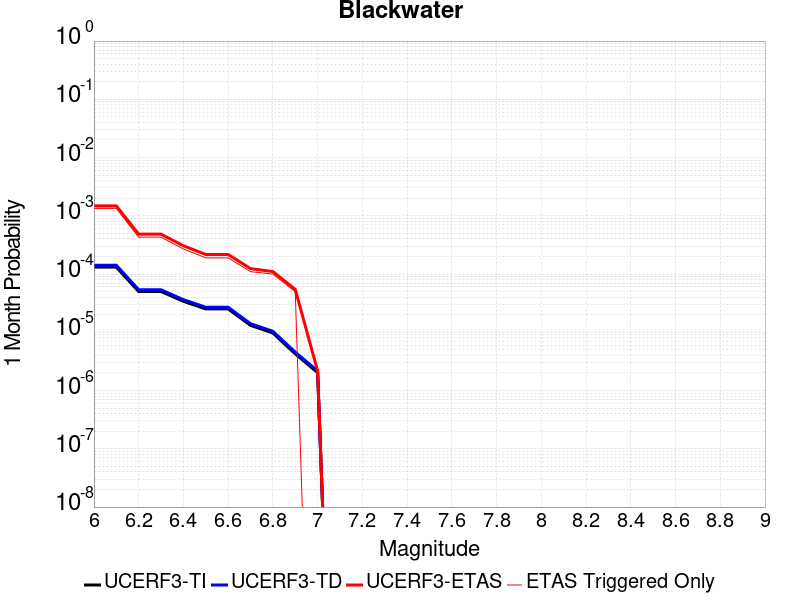 | 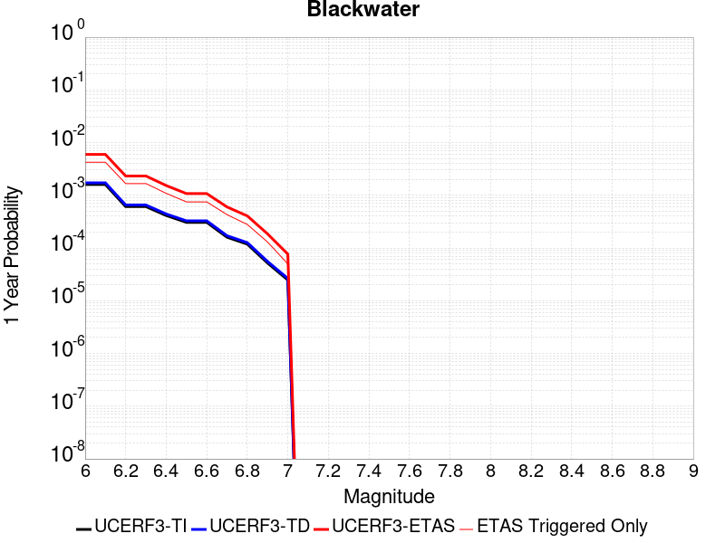 |  |

| Magnitude | 1 wk TI Prob | 1 wk TD Prob | 1 wk ETAS Prob | 1 wk ETAS/TD Gain | 1 wk ETAS Triggered Only | 1 mo TI Prob | 1 mo TD Prob | 1 mo ETAS Prob | 1 mo ETAS/TD Gain | 1 mo ETAS Triggered Only | 1 yr TI Prob | 1 yr TD Prob | 1 yr ETAS Prob | 1 yr ETAS/TD Gain | 1 yr ETAS Triggered Only | 10 yr TI Prob | 10 yr TD Prob | 10 yr ETAS Prob | 10 yr ETAS/TD Gain | 10 yr ETAS Triggered Only |
|-----|-----|-----|-----|-----|-----|-----|-----|-----|-----|-----|-----|-----|-----|-----|-----|-----|-----|-----|-----|-----|
| 6.0 | 3.0708583E-5 | 3.309619E-5 | 5.130803E-4 | 15.5027 | 4.8E-4 | 1.3160157E-4 | 1.4183388E-4 | 0.0013949894 | 9.835376 | 0.0012533333 | 0.0016010714 | 0.0017255963 | 0.0056122113 | 3.2523315 | 0.0038933333 | 0.015895851 | 0.017135808 | 0.024631787 | 1.4374452 | 0.0076266667 |
| 6.1 | 3.0708583E-5 | 3.309619E-5 | 5.130803E-4 | 15.5027 | 4.8E-4 | 1.3160157E-4 | 1.4183388E-4 | 0.0013949894 | 9.835376 | 0.0012533333 | 0.0016010714 | 0.0017255963 | 0.0056122113 | 3.2523315 | 0.0038933333 | 0.015895851 | 0.017135808 | 0.024631787 | 1.4374452 | 0.0076266667 |
| 6.2 | 1.1707779E-5 | 1.2545242E-5 | 1.7254324E-4 | 13.75368 | 1.6E-4 | 5.017523E-5 | 5.3764266E-5 | 4.5374277E-4 | 8.439486 | 4.0E-4 | 6.107122E-4 | 6.5439293E-4 | 0.002146749 | 3.2805197 | 0.0014933334 | 0.006090366 | 0.006525631 | 0.009598779 | 1.4709349 | 0.0030933334 |
| 6.3 | 1.1707779E-5 | 1.2545242E-5 | 1.7254324E-4 | 13.75368 | 1.6E-4 | 5.017523E-5 | 5.3764266E-5 | 4.5374277E-4 | 8.439486 | 4.0E-4 | 6.107122E-4 | 6.5439293E-4 | 0.002146749 | 3.2805197 | 0.0014933334 | 0.006090366 | 0.006525631 | 0.009598779 | 1.4709349 | 0.0030933334 |
| 6.4 | 7.929244E-6 | 8.480176E-6 | 8.84795E-5 | 10.433686 | 8.0E-5 | 3.3982033E-5 | 3.6343128E-5 | 2.4966872E-4 | 6.869764 | 2.1333333E-4 | 4.136527E-4 | 4.4239179E-4 | 0.0013220025 | 2.988307 | 8.8E-4 | 0.0041288356 | 0.0044155167 | 0.00630049 | 1.4268975 | 0.0018933333 |
| 6.5 | 5.8832115E-6 | 6.286048E-6 | 5.9619048E-5 | 9.4843445 | 5.3333333E-5 | 2.521352E-5 | 2.6939942E-5 | 1.6026969E-4 | 5.949147 | 1.3333333E-4 | 3.0693135E-4 | 3.2794697E-4 | 9.4107917E-4 | 2.8696077 | 6.133333E-4 | 0.0030650778 | 0.0032748834 | 0.0046304297 | 1.413922 | 0.00136 |
| 6.6 | 5.8832115E-6 | 6.286048E-6 | 5.9619048E-5 | 9.4843445 | 5.3333333E-5 | 2.521352E-5 | 2.6939942E-5 | 1.6026969E-4 | 5.949147 | 1.3333333E-4 | 3.0693135E-4 | 3.2794697E-4 | 9.4107917E-4 | 2.8696077 | 6.133333E-4 | 0.0030650778 | 0.0032748834 | 0.0046304297 | 1.413922 | 0.00136 |
| 6.7 | 3.0715053E-6 | 3.281496E-6 | 5.6614655E-5 | 17.252697 | 5.3333333E-5 | 1.3163528E-5 | 1.4063485E-5 | 1.2072865E-4 | 8.584547 | 1.0666667E-4 | 1.6025416E-4 | 1.7121063E-4 | 4.6449376E-4 | 2.7129958 | 2.9333335E-4 | 0.0016013865 | 0.0017109019 | 0.00242967 | 1.4201107 | 7.2E-4 |
| 6.8 | 2.2722281E-6 | 2.4287758E-6 | 5.576198E-5 | 22.958883 | 5.3333333E-5 | 9.738084E-6 | 1.0409003E-5 | 1.1707456E-4 | 11.247433 | 1.0666667E-4 | 1.1855473E-4 | 1.2672316E-4 | 3.9335602E-4 | 3.104058 | 2.6666667E-4 | 0.001184915 | 0.0012665992 | 0.0017726241 | 1.3995147 | 5.0666666E-4 |
| 6.9 | 9.952399E-7 | 1.0653588E-6 | 2.7731998E-5 | 26.030664 | 2.6666667E-5 | 4.265307E-6 | 4.5658185E-6 | 8.456545E-5 | 18.521423 | 8.0E-5 | 5.1928873E-5 | 5.5587938E-5 | 2.4224423E-4 | 4.357856 | 1.8666667E-4 | 5.191674E-4 | 5.5579096E-4 | 9.289168E-4 | 1.671342 | 3.7333334E-4 |
| 7.0 | 4.7385504E-7 | 5.0756074E-7 | 5.0756074E-7 | 1.0 | 0.0 | 2.0308057E-6 | 2.1752603E-6 | 2.1752603E-6 | 1.0 | 0.0 | 2.4724779E-5 | 2.6483794E-5 | 1.06481675E-4 | 4.020635 | 8.0E-5 | 2.4722028E-4 | 2.6483793E-4 | 4.2479558E-4 | 1.603983 | 1.6E-4 |

## Garlock (West)
*[(top)](#table-of-contents)*

| 1 Week | 1 Month | 1 Year | 10 Year |
|-----|-----|-----|-----|
| 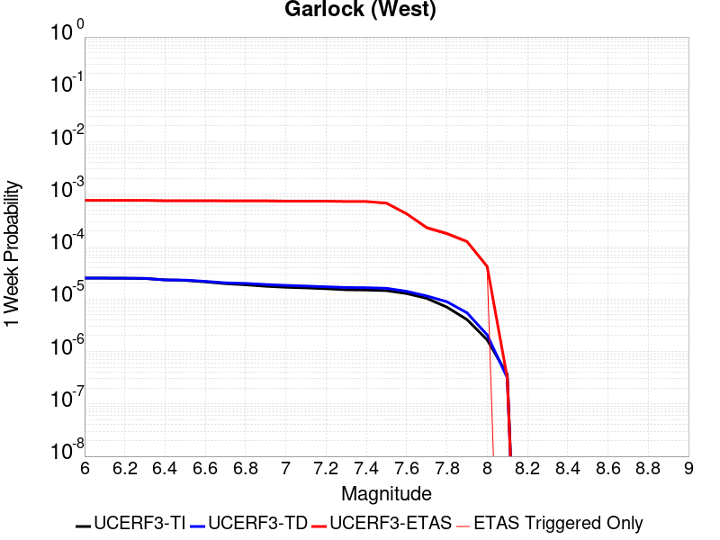 | 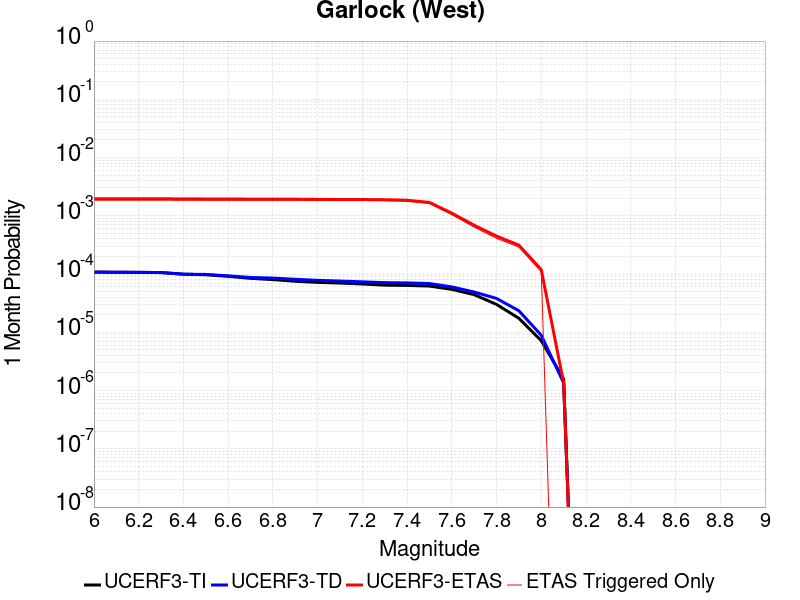 |  |  |

| Magnitude | 1 wk TI Prob | 1 wk TD Prob | 1 wk ETAS Prob | 1 wk ETAS/TD Gain | 1 wk ETAS Triggered Only | 1 mo TI Prob | 1 mo TD Prob | 1 mo ETAS Prob | 1 mo ETAS/TD Gain | 1 mo ETAS Triggered Only | 1 yr TI Prob | 1 yr TD Prob | 1 yr ETAS Prob | 1 yr ETAS/TD Gain | 1 yr ETAS Triggered Only | 10 yr TI Prob | 10 yr TD Prob | 10 yr ETAS Prob | 10 yr ETAS/TD Gain | 10 yr ETAS Triggered Only |
|-----|-----|-----|-----|-----|-----|-----|-----|-----|-----|-----|-----|-----|-----|-----|-----|-----|-----|-----|-----|-----|
| 6.0 | 2.5181727E-5 | 2.5202135E-5 | 7.98516E-4 | 31.684458 | 7.7333336E-4 | 1.0791722E-4 | 1.080047E-4 | 0.002054461 | 19.021961 | 0.0019466666 | 0.0013131002 | 0.0013141674 | 0.0055485955 | 4.2221375 | 0.00424 | 0.013053683 | 0.013144457 | 0.01961823 | 1.4925097 | 0.00656 |
| 6.1 | 2.5077732E-5 | 2.5103205E-5 | 7.9841714E-4 | 31.805386 | 7.7333336E-4 | 1.0747157E-4 | 1.07580745E-4 | 0.002054038 | 19.092989 | 0.0019466666 | 0.001307681 | 0.0013090121 | 0.005543462 | 4.234844 | 0.00424 | 0.013000126 | 0.0130935125 | 0.019567618 | 1.4944515 | 0.00656 |
| 6.2 | 2.494612E-5 | 2.498488E-5 | 7.982989E-4 | 31.95128 | 7.7333336E-4 | 1.0690756E-4 | 1.07073676E-4 | 0.0020535318 | 19.17868 | 0.0019466666 | 0.0013008224 | 0.0013028459 | 0.005537322 | 4.250174 | 0.00424 | 0.012932341 | 0.013032575 | 0.019507082 | 1.4967941 | 0.00656 |
| 6.3 | 2.4733758E-5 | 2.4804243E-5 | 7.981184E-4 | 32.17669 | 7.7333336E-4 | 1.0599751E-4 | 1.0629959E-4 | 0.0020527593 | 19.311075 | 0.0019466666 | 0.0012897556 | 0.0012934325 | 0.0055279485 | 4.273859 | 0.00424 | 0.012822957 | 0.012939542 | 0.019414658 | 1.5004132 | 0.00656 |
| 6.4 | 2.3237335E-5 | 2.318352E-5 | 7.964989E-4 | 34.356255 | 7.7333336E-4 | 9.958477E-5 | 9.935417E-5 | 0.0020458275 | 20.591259 | 0.0019466666 | 0.0012117702 | 0.0012089686 | 0.0054438426 | 4.5028815 | 0.00424 | 0.012051838 | 0.012104375 | 0.01858497 | 1.5353928 | 0.00656 |
| 6.5 | 2.2732203E-5 | 2.2998063E-5 | 7.9631363E-4 | 34.625248 | 7.7333336E-4 | 9.742009E-5 | 9.8559416E-5 | 0.0020450342 | 20.749252 | 0.0019466666 | 0.0011854442 | 0.0011993032 | 0.0054342183 | 4.5311465 | 0.00424 | 0.011791403 | 0.012008769 | 0.018489992 | 1.5397074 | 0.00656 |
| 6.6 | 2.1319436E-5 | 2.1778224E-5 | 7.950947E-4 | 36.508705 | 7.7333336E-4 | 9.136581E-5 | 9.333192E-5 | 0.002039817 | 21.855513 | 0.0019466666 | 0.001111811 | 0.001135726 | 0.0053709107 | 4.729055 | 0.00424 | 0.011062649 | 0.0113796545 | 0.017865004 | 1.5699074 | 0.00656 |
| 6.7 | 1.970802E-5 | 2.0398069E-5 | 7.9371565E-4 | 38.911312 | 7.7333336E-4 | 8.446021E-5 | 8.741738E-5 | 0.002033914 | 23.266699 | 0.0019466666 | 0.001027818 | 0.0010637887 | 0.005299278 | 4.981514 | 0.00424 | 0.010230771 | 0.010667368 | 0.01715739 | 1.6083995 | 0.00656 |
| 6.8 | 1.8744462E-5 | 1.9905692E-5 | 7.932236E-4 | 39.849087 | 7.7333336E-4 | 8.033094E-5 | 8.530733E-5 | 0.002031808 | 23.817509 | 0.0019466666 | 9.775903E-4 | 0.0010381235 | 0.0052737216 | 5.0800524 | 0.00424 | 0.009733009 | 0.010413141 | 0.016904831 | 1.6234132 | 0.00656 |
| 6.9 | 1.7559682E-5 | 1.895803E-5 | 7.922767E-4 | 41.79109 | 7.7333336E-4 | 7.5253614E-5 | 8.124618E-5 | 0.0020277547 | 24.958155 | 0.0019466666 | 9.158276E-4 | 9.887248E-4 | 0.0052245324 | 5.284112 | 0.00424 | 0.0091206245 | 0.009923607 | 0.016418507 | 1.65449 | 0.00656 |
| 7.0 | 1.6794445E-5 | 1.8220819E-5 | 7.915401E-4 | 43.44152 | 7.7333336E-4 | 7.197421E-5 | 7.8086894E-5 | 0.0020246014 | 25.927546 | 0.0019466666 | 8.759337E-4 | 9.5029466E-4 | 0.005159624 | 5.429499 | 0.004213333 | 0.008724891 | 0.0095425 | 0.016013488 | 1.6781231 | 0.0065333336 |
| 7.1 | 1.6337795E-5 | 1.7721602E-5 | 7.9104124E-4 | 44.63712 | 7.7333336E-4 | 7.0017246E-5 | 7.5947515E-5 | 0.0019958017 | 26.278696 | 0.00192 | 8.521265E-4 | 9.2427013E-4 | 0.005107067 | 5.5255136 | 0.0041866666 | 0.008488664 | 0.009284343 | 0.015730599 | 1.6943148 | 0.0065066665 |
| 7.2 | 1.5780008E-5 | 1.7170225E-5 | 7.904903E-4 | 46.038437 | 7.7333336E-4 | 6.762685E-5 | 7.358461E-5 | 0.0019934434 | 27.090492 | 0.00192 | 8.2304585E-4 | 8.955257E-4 | 0.005078443 | 5.670907 | 0.0041866666 | 0.008200042 | 0.008999176 | 0.015447289 | 1.7165225 | 0.0065066665 |
| 7.3 | 1.5058865E-5 | 1.6623266E-5 | 7.8994373E-4 | 47.52037 | 7.7333336E-4 | 6.45364E-5 | 7.124063E-5 | 0.0019911039 | 27.948994 | 0.00192 | 7.854473E-4 | 8.6701073E-4 | 0.005023404 | 5.7939353 | 0.00416 | 0.00782677 | 0.00871586 | 0.0151393805 | 1.7369922 | 0.00648 |
| 7.4 | 1.4887923E-5 | 1.6459222E-5 | 7.897798E-4 | 47.984035 | 7.7333336E-4 | 6.380382E-5 | 7.053762E-5 | 0.0019370726 | 27.461554 | 0.0018666667 | 7.7653467E-4 | 8.5845834E-4 | 0.0049615996 | 5.7796626 | 0.004106667 | 0.0077382675 | 0.0086307125 | 0.0148961665 | 1.7259486 | 0.00632 |
| 7.5 | 1.4509299E-5 | 1.6051208E-5 | 7.3603966E-4 | 45.855717 | 7.2E-4 | 6.218123E-5 | 6.8789086E-5 | 0.001828668 | 26.583694 | 0.00176 | 7.567935E-4 | 8.3718647E-4 | 0.004620683 | 5.5192995 | 0.0037866666 | 0.0075422134 | 0.008419003 | 0.014183394 | 1.6846881 | 0.005813333 |
| 7.6 | 1.2756717E-5 | 1.4055129E-5 | 3.0738433E-4 | 21.869905 | 2.9333335E-4 | 5.4670498E-5 | 6.023488E-5 | 0.0010735071 | 17.822018 | 0.0010133333 | 6.6541E-4 | 7.331136E-4 | 0.003104707 | 4.2349606 | 0.0023733333 | 0.006634211 | 0.007383898 | 0.011010256 | 1.491117 | 0.0036533333 |
| 7.7 | 1.0328985E-5 | 1.1464573E-5 | 1.7146274E-4 | 14.955877 | 1.6E-4 | 4.4266326E-5 | 4.913296E-5 | 5.824401E-4 | 11.854366 | 5.3333334E-4 | 5.388092E-4 | 5.9803E-4 | 0.0018772645 | 3.139081 | 0.00128 | 0.0053750467 | 0.0060405903 | 0.008055015 | 1.3334814 | 0.0020266667 |
| 7.8 | 7.0306583E-6 | 8.902813E-6 | 1.1556853E-4 | 12.981126 | 1.0666667E-4 | 3.0131043E-5 | 3.8154354E-5 | 3.314765E-4 | 8.687777 | 2.9333335E-4 | 3.667837E-4 | 4.644304E-4 | 0.0012907131 | 2.7791314 | 8.2666666E-4 | 0.003661789 | 0.0046969377 | 0.0058913017 | 1.2542856 | 0.0012 |
| 7.9 | 4.060633E-6 | 5.4672782E-6 | 8.546684E-5 | 15.632429 | 8.0E-5 | 1.7402595E-5 | 2.3430983E-5 | 2.3675931E-4 | 10.104541 | 2.1333333E-4 | 2.11856E-4 | 2.8523497E-4 | 8.184162E-4 | 2.86927 | 5.3333334E-4 | 0.0021165414 | 0.0028851798 | 0.0036296921 | 1.2580471 | 7.466667E-4 |
| 8.0 | 1.6729537E-6 | 2.078155E-6 | 2.8744766E-5 | 13.831868 | 2.6666667E-5 | 7.169782E-6 | 8.906349E-6 | 8.890564E-5 | 9.982277 | 8.0E-5 | 8.7288594E-5 | 1.08429434E-4 | 2.9507585E-4 | 2.721363 | 1.8666667E-4 | 8.7254314E-4 | 0.001097267 | 0.0013370037 | 1.2184852 | 2.4E-4 |
| 8.1 | 3.6733252E-7 | 3.1499187E-7 | 3.1499187E-7 | 1.0 | 0.0 | 1.5742813E-6 | 1.3499646E-6 | 1.3499646E-6 | 1.0 | 0.0 | 1.9166706E-5 | 1.643571E-5 | 1.643571E-5 | 1.0 | 0.0 | 1.9165053E-4 | 1.6643589E-4 | 1.6643589E-4 | 1.0 | 0.0 |

## McLean Lake
*[(top)](#table-of-contents)*

| 1 Week | 1 Month | 1 Year | 10 Year |
|-----|-----|-----|-----|
|  |  |  |  |

| Magnitude | 1 wk TI Prob | 1 wk TD Prob | 1 wk ETAS Prob | 1 wk ETAS/TD Gain | 1 wk ETAS Triggered Only | 1 mo TI Prob | 1 mo TD Prob | 1 mo ETAS Prob | 1 mo ETAS/TD Gain | 1 mo ETAS Triggered Only | 1 yr TI Prob | 1 yr TD Prob | 1 yr ETAS Prob | 1 yr ETAS/TD Gain | 1 yr ETAS Triggered Only | 10 yr TI Prob | 10 yr TD Prob | 10 yr ETAS Prob | 10 yr ETAS/TD Gain | 10 yr ETAS Triggered Only |
|-----|-----|-----|-----|-----|-----|-----|-----|-----|-----|-----|-----|-----|-----|-----|-----|-----|-----|-----|-----|-----|
| 6.0 | 1.7360222E-5 | 1.8501789E-5 | 2.5849734E-4 | 13.971478 | 2.4E-4 | 7.439883E-5 | 7.929125E-5 | 6.9257594E-4 | 8.734583 | 6.133333E-4 | 9.0542925E-4 | 9.64992E-4 | 0.0035758035 | 3.7055266 | 0.0026133333 | 0.009017491 | 0.009612858 | 0.015106206 | 1.5714582 | 0.0055466667 |
| 6.1 | 9.062689E-6 | 9.592268E-6 | 1.6959073E-4 | 17.679941 | 1.6E-4 | 3.8839516E-5 | 4.110912E-5 | 4.6775825E-4 | 11.378454 | 4.2666667E-4 | 4.727685E-4 | 5.003975E-4 | 0.0019929835 | 3.9828007 | 0.0014933334 | 0.0047176396 | 0.0049935905 | 0.00793881 | 1.5897999 | 0.00296 |
| 6.2 | 9.062689E-6 | 9.592268E-6 | 1.6959073E-4 | 17.679941 | 1.6E-4 | 3.8839516E-5 | 4.110912E-5 | 4.6775825E-4 | 11.378454 | 4.2666667E-4 | 4.727685E-4 | 5.003975E-4 | 0.0019929835 | 3.9828007 | 0.0014933334 | 0.0047176396 | 0.0049935905 | 0.00793881 | 1.5897999 | 0.00296 |
| 6.3 | 7.2575485E-6 | 7.667767E-6 | 1.6766654E-4 | 21.866411 | 1.6E-4 | 3.110341E-5 | 3.2861484E-5 | 3.5285097E-4 | 10.737524 | 3.2E-4 | 3.786182E-4 | 4.0002225E-4 | 0.0015195742 | 3.7987242 | 0.00112 | 0.0037797375 | 0.003993727 | 0.006304461 | 1.5785911 | 0.00232 |
| 6.4 | 7.2575485E-6 | 7.667767E-6 | 1.6766654E-4 | 21.866411 | 1.6E-4 | 3.110341E-5 | 3.2861484E-5 | 3.5285097E-4 | 10.737524 | 3.2E-4 | 3.786182E-4 | 4.0002225E-4 | 0.0015195742 | 3.7987242 | 0.00112 | 0.0037797375 | 0.003993727 | 0.006304461 | 1.5785911 | 0.00232 |
| 6.5 | 6.06582E-6 | 6.4039245E-6 | 1.664029E-4 | 25.98452 | 1.6E-4 | 2.5996113E-5 | 2.7445138E-5 | 3.4743635E-4 | 12.659305 | 3.2E-4 | 3.164567E-4 | 3.340998E-4 | 0.0012937791 | 3.872433 | 9.6E-4 | 0.0031600643 | 0.0033366138 | 0.0052502076 | 1.5735136 | 0.00192 |
| 6.6 | 5.598744E-6 | 5.910306E-6 | 1.3924285E-4 | 23.55933 | 1.3333333E-4 | 2.3994397E-5 | 2.5329673E-5 | 3.1865557E-4 | 12.580328 | 2.9333335E-4 | 2.9209262E-4 | 3.083515E-4 | 0.0012147386 | 3.9394605 | 9.066667E-4 | 0.0029170897 | 0.0030798658 | 0.00486103 | 1.5783252 | 0.0017866667 |
| 6.7 | 5.246996E-6 | 5.539203E-6 | 1.388718E-4 | 25.070719 | 1.3333333E-4 | 2.2486933E-5 | 2.3739261E-5 | 2.903996E-4 | 12.2328825 | 2.6666667E-4 | 2.73744E-4 | 2.8899353E-4 | 0.0011420803 | 3.9519234 | 8.5333333E-4 | 0.0027340704 | 0.002886801 | 0.004535361 | 1.5710683 | 0.0016533333 |
| 6.8 | 4.02324E-6 | 4.246936E-6 | 1.1091315E-4 | 26.116041 | 1.0666667E-4 | 1.7242342E-5 | 1.820106E-5 | 2.3153052E-4 | 12.7207155 | 2.1333333E-4 | 2.099053E-4 | 2.2158133E-4 | 9.414218E-4 | 4.2486515 | 7.2E-4 | 0.0020970714 | 0.0022141882 | 0.003571177 | 1.6128606 | 0.00136 |
| 6.9 | 6.835972E-7 | 7.1399705E-7 | 7.1399705E-7 | 1.0 | 0.0 | 2.9296991E-6 | 3.0599856E-6 | 3.0599856E-6 | 1.0 | 0.0 | 3.56685E-5 | 3.7255006E-5 | 1.1725203E-4 | 3.1472824 | 8.0E-5 | 3.5662777E-4 | 3.7251884E-4 | 5.8577274E-4 | 1.5724646 | 2.1333333E-4 |

## Goldstone Lake
*[(top)](#table-of-contents)*

| 1 Week | 1 Month | 1 Year | 10 Year |
|-----|-----|-----|-----|
|  | 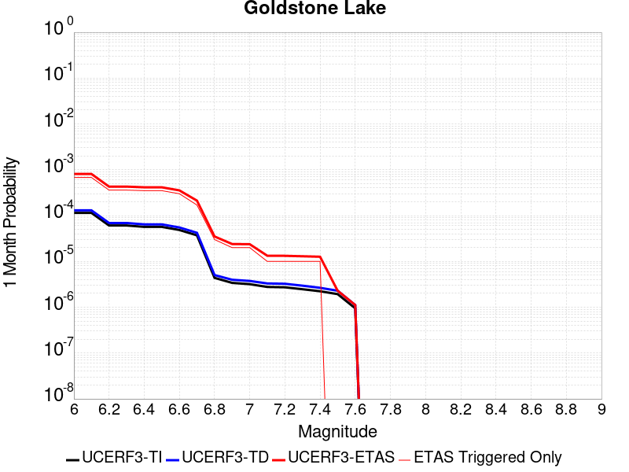 |  |  |

| Magnitude | 1 wk TI Prob | 1 wk TD Prob | 1 wk ETAS Prob | 1 wk ETAS/TD Gain | 1 wk ETAS Triggered Only | 1 mo TI Prob | 1 mo TD Prob | 1 mo ETAS Prob | 1 mo ETAS/TD Gain | 1 mo ETAS Triggered Only | 1 yr TI Prob | 1 yr TD Prob | 1 yr ETAS Prob | 1 yr ETAS/TD Gain | 1 yr ETAS Triggered Only | 10 yr TI Prob | 10 yr TD Prob | 10 yr ETAS Prob | 10 yr ETAS/TD Gain | 10 yr ETAS Triggered Only |
|-----|-----|-----|-----|-----|-----|-----|-----|-----|-----|-----|-----|-----|-----|-----|-----|-----|-----|-----|-----|-----|
| 6.0 | 2.671352E-5 | 3.0376628E-5 | 2.1703762E-4 | 7.144889 | 1.8666667E-4 | 1.1448149E-4 | 1.3018015E-4 | 7.4343366E-4 | 5.710806 | 6.133333E-4 | 0.001392921 | 0.0015839875 | 0.0035808196 | 2.2606363 | 0.002 | 0.013842222 | 0.015746472 | 0.02031341 | 1.2900292 | 0.00464 |
| 6.1 | 2.671352E-5 | 3.0376628E-5 | 2.1703762E-4 | 7.144889 | 1.8666667E-4 | 1.1448149E-4 | 1.3018015E-4 | 7.4343366E-4 | 5.710806 | 6.133333E-4 | 0.001392921 | 0.0015839875 | 0.0035808196 | 2.2606363 | 0.002 | 0.013842222 | 0.015746472 | 0.02031341 | 1.2900292 | 0.00464 |
| 6.2 | 1.4197047E-5 | 1.6096516E-5 | 1.2276147E-4 | 7.6265864 | 1.0666667E-4 | 6.0843064E-5 | 6.89838E-5 | 3.622969E-4 | 5.2519126 | 2.9333335E-4 | 7.4051257E-4 | 8.396528E-4 | 0.0020919337 | 2.4914272 | 0.0012533333 | 0.007380498 | 0.008374499 | 0.011018834 | 1.3157604 | 0.0026666666 |
| 6.3 | 1.4197047E-5 | 1.6096516E-5 | 1.2276147E-4 | 7.6265864 | 1.0666667E-4 | 6.0843064E-5 | 6.89838E-5 | 3.622969E-4 | 5.2519126 | 2.9333335E-4 | 7.4051257E-4 | 8.396528E-4 | 0.0020919337 | 2.4914272 | 0.0012533333 | 0.007380498 | 0.008374499 | 0.011018834 | 1.3157604 | 0.0026666666 |
| 6.4 | 1.3238931E-5 | 1.5008711E-5 | 1.2167378E-4 | 8.106877 | 1.0666667E-4 | 5.6737044E-5 | 6.432201E-5 | 3.3097152E-4 | 5.1455407 | 2.6666667E-4 | 6.9055456E-4 | 7.8293716E-4 | 0.0018754145 | 2.3953576 | 0.0010933334 | 0.006884126 | 0.007811414 | 0.010166208 | 1.3014556 | 0.0023733333 |
| 6.5 | 1.3238931E-5 | 1.5008711E-5 | 1.2167378E-4 | 8.106877 | 1.0666667E-4 | 5.6737044E-5 | 6.432201E-5 | 3.3097152E-4 | 5.1455407 | 2.6666667E-4 | 6.9055456E-4 | 7.8293716E-4 | 0.0018754145 | 2.3953576 | 0.0010933334 | 0.006884126 | 0.007811414 | 0.010166208 | 1.3014556 | 0.0023733333 |
| 6.6 | 1.1328278E-5 | 1.2855381E-5 | 9.285435E-5 | 7.2229953 | 8.0E-5 | 4.8548856E-5 | 5.5093864E-5 | 2.9508065E-4 | 5.355962 | 2.4E-4 | 5.90922E-4 | 6.706571E-4 | 0.0016300132 | 2.430472 | 9.6E-4 | 0.0058935313 | 0.0066957204 | 0.008735306 | 1.3046103 | 0.0020533334 |
| 6.7 | 8.651175E-6 | 9.8247265E-6 | 9.8247265E-6 | 1.0 | 0.0 | 3.707594E-5 | 4.2105803E-5 | 1.7543352E-4 | 4.166493 | 1.3333333E-4 | 4.5130608E-4 | 5.126081E-4 | 0.00115228 | 2.2478771 | 6.4E-4 | 0.0045039062 | 0.0051231356 | 0.0066884086 | 1.3055303 | 0.0015733333 |
| 6.8 | 1.0215377E-6 | 1.1754793E-6 | 1.1754793E-6 | 1.0 | 0.0 | 4.378012E-6 | 5.037759E-6 | 5.8370824E-5 | 11.586664 | 5.3333333E-5 | 5.3300988E-5 | 6.133311E-5 | 1.413282E-4 | 2.3042727 | 8.0E-5 | 5.3288206E-4 | 6.13173E-4 | 7.197743E-4 | 1.1738518 | 1.0666667E-4 |
| 6.9 | 7.9360774E-7 | 9.2834586E-7 | 9.2834586E-7 | 1.0 | 0.0 | 3.4011714E-6 | 3.9786196E-6 | 5.731174E-5 | 14.404931 | 5.3333333E-5 | 4.1408475E-5 | 4.8438687E-5 | 1.0176944E-4 | 2.100995 | 5.3333333E-5 | 4.140076E-4 | 4.842883E-4 | 5.642495E-4 | 1.1651108 | 8.0E-5 |
| 7.0 | 7.4382757E-7 | 8.7473853E-7 | 8.7473853E-7 | 1.0 | 0.0 | 3.1878285E-6 | 3.7488744E-6 | 5.708201E-5 | 15.226439 | 5.3333333E-5 | 3.8811122E-5 | 4.5641656E-5 | 9.897256E-5 | 2.16847 | 5.3333333E-5 | 3.8804344E-4 | 4.563295E-4 | 5.3629297E-4 | 1.1752319 | 8.0E-5 |
| 7.1 | 6.4709513E-7 | 7.711347E-7 | 7.711347E-7 | 1.0 | 0.0 | 2.773262E-6 | 3.304859E-6 | 2.9971437E-5 | 9.0689 | 2.6666667E-5 | 3.376394E-5 | 4.0235976E-5 | 6.690157E-5 | 1.6627301 | 2.6666667E-5 | 3.375881E-4 | 4.0229288E-4 | 4.289488E-4 | 1.06626 | 2.6666667E-5 |
| 7.2 | 6.356704E-7 | 7.5884054E-7 | 7.5884054E-7 | 1.0 | 0.0 | 2.7242988E-6 | 3.25217E-6 | 2.991875E-5 | 9.199627 | 2.6666667E-5 | 3.3167835E-5 | 3.959451E-5 | 6.626012E-5 | 1.6734674 | 2.6666667E-5 | 3.3162883E-4 | 3.958805E-4 | 4.225366E-4 | 1.0673337 | 2.6666667E-5 |
| 7.3 | 5.7695723E-7 | 6.8966074E-7 | 6.8966074E-7 | 1.0 | 0.0 | 2.4726714E-6 | 2.9556859E-6 | 2.9622273E-5 | 10.022132 | 2.6666667E-5 | 3.0104358E-5 | 3.598494E-5 | 6.2650644E-5 | 1.741024 | 2.6666667E-5 | 3.0100282E-4 | 3.5979686E-4 | 3.8645393E-4 | 1.0740893 | 2.6666667E-5 |
| 7.4 | 5.209647E-7 | 6.193549E-7 | 6.193549E-7 | 1.0 | 0.0 | 2.232704E-6 | 2.654376E-6 | 2.9320972E-5 | 11.046277 | 2.6666667E-5 | 2.718283E-5 | 3.2316606E-5 | 5.898241E-5 | 1.8251425 | 2.6666667E-5 | 2.7179506E-4 | 3.231246E-4 | 3.4978267E-4 | 1.0825008 | 2.6666667E-5 |
| 7.5 | 4.512955E-7 | 5.3489146E-7 | 5.3489146E-7 | 1.0 | 0.0 | 1.934122E-6 | 2.2923903E-6 | 2.2923903E-6 | 1.0 | 0.0 | 2.3547682E-5 | 2.7909547E-5 | 2.7909547E-5 | 1.0 | 0.0 | 2.3545188E-4 | 2.7906572E-4 | 2.7906572E-4 | 1.0 | 0.0 |
| 7.6 | 2.21172E-7 | 2.6039737E-7 | 2.6039737E-7 | 1.0 | 0.0 | 9.478797E-7 | 1.1159884E-6 | 1.1159884E-6 | 1.0 | 0.0 | 1.1540374E-5 | 1.3587103E-5 | 1.3587103E-5 | 1.0 | 0.0 | 1.1539775E-4 | 1.3586554E-4 | 1.3586554E-4 | 1.0 | 0.0 |

## Gravel Hills-Harper Lk
*[(top)](#table-of-contents)*

| 1 Week | 1 Month | 1 Year | 10 Year |
|-----|-----|-----|-----|
|  |  |  |  |

| Magnitude | 1 wk TI Prob | 1 wk TD Prob | 1 wk ETAS Prob | 1 wk ETAS/TD Gain | 1 wk ETAS Triggered Only | 1 mo TI Prob | 1 mo TD Prob | 1 mo ETAS Prob | 1 mo ETAS/TD Gain | 1 mo ETAS Triggered Only | 1 yr TI Prob | 1 yr TD Prob | 1 yr ETAS Prob | 1 yr ETAS/TD Gain | 1 yr ETAS Triggered Only | 10 yr TI Prob | 10 yr TD Prob | 10 yr ETAS Prob | 10 yr ETAS/TD Gain | 10 yr ETAS Triggered Only |
|-----|-----|-----|-----|-----|-----|-----|-----|-----|-----|-----|-----|-----|-----|-----|-----|-----|-----|-----|-----|-----|
| 6.0 | 3.0679566E-5 | 3.1465184E-5 | 2.1812598E-4 | 6.9322963 | 1.8666667E-4 | 1.3147724E-4 | 1.3484505E-4 | 8.280849E-4 | 6.1410108 | 6.9333334E-4 | 0.0015995599 | 0.0016407187 | 0.0037705519 | 2.29811 | 0.0021333334 | 0.015880952 | 0.016307615 | 0.020084994 | 1.2316328 | 0.00384 |
| 6.1 | 3.0679566E-5 | 3.1465184E-5 | 2.1812598E-4 | 6.9322963 | 1.8666667E-4 | 1.3147724E-4 | 1.3484505E-4 | 8.280849E-4 | 6.1410108 | 6.9333334E-4 | 0.0015995599 | 0.0016407187 | 0.0037705519 | 2.29811 | 0.0021333334 | 0.015880952 | 0.016307615 | 0.020084994 | 1.2316328 | 0.00384 |
| 6.2 | 1.514536E-5 | 1.3635392E-5 | 6.6968E-5 | 4.9113364 | 5.3333333E-5 | 6.490707E-5 | 5.843615E-5 | 2.1842681E-4 | 3.7378712 | 1.6E-4 | 7.8995706E-4 | 7.112398E-4 | 0.001137603 | 1.5994648 | 4.2666667E-4 | 0.007871548 | 0.0070908363 | 0.00804403 | 1.134426 | 9.6E-4 |
| 6.3 | 1.514536E-5 | 1.3635392E-5 | 6.6968E-5 | 4.9113364 | 5.3333333E-5 | 6.490707E-5 | 5.843615E-5 | 2.1842681E-4 | 3.7378712 | 1.6E-4 | 7.8995706E-4 | 7.112398E-4 | 0.001137603 | 1.5994648 | 4.2666667E-4 | 0.007871548 | 0.0070908363 | 0.00804403 | 1.134426 | 9.6E-4 |
| 6.4 | 1.2532521E-5 | 1.0689826E-5 | 3.7356207E-5 | 3.4945571 | 2.6666667E-5 | 5.37097E-5 | 4.581277E-5 | 9.914366E-5 | 2.1641054 | 5.3333333E-5 | 6.537194E-4 | 5.576335E-4 | 7.974997E-4 | 1.4301502 | 2.4E-4 | 0.0065179965 | 0.0055629327 | 0.006066781 | 1.0905724 | 5.0666666E-4 |
| 6.5 | 1.1094058E-5 | 9.083774E-6 | 3.57502E-5 | 3.9356108 | 2.6666667E-5 | 4.7545094E-5 | 3.89299E-5 | 9.226116E-5 | 2.3699305 | 5.3333333E-5 | 5.787078E-4 | 4.738725E-4 | 6.871047E-4 | 1.4499781 | 2.1333333E-4 | 0.0057720304 | 0.004729028 | 0.005127136 | 1.0841839 | 4.0E-4 |
| 6.6 | 9.688328E-6 | 7.531784E-6 | 3.419825E-5 | 4.5405245 | 2.6666667E-5 | 4.1520743E-5 | 3.2278687E-5 | 8.56103E-5 | 2.6522236 | 5.3333333E-5 | 5.053978E-4 | 3.929247E-4 | 4.995495E-4 | 1.2713618 | 1.0666667E-4 | 0.0050424994 | 0.0039225565 | 0.004188177 | 1.0677162 | 2.6666667E-4 |
| 6.7 | 8.974824E-6 | 6.7494916E-6 | 6.7494916E-6 | 1.0 | 0.0 | 3.8462964E-5 | 2.8926084E-5 | 5.559198E-5 | 1.9218633 | 2.6666667E-5 | 4.6818596E-4 | 3.5212038E-4 | 4.0543493E-4 | 1.15141 | 5.3333333E-5 | 0.004672008 | 0.0035158454 | 0.003701856 | 1.0529063 | 1.8666667E-4 |
| 6.8 | 7.4780046E-6 | 5.116252E-6 | 5.116252E-6 | 1.0 | 0.0 | 3.20482E-5 | 2.1926619E-5 | 4.85927E-5 | 2.2161512 | 2.6666667E-5 | 3.9011694E-4 | 2.6692526E-4 | 3.2024438E-4 | 1.1997529 | 5.3333333E-5 | 0.0038943281 | 0.002666185 | 0.0027459715 | 1.0299255 | 8.0E-5 |
| 6.9 | 6.3409307E-6 | 3.9075426E-6 | 3.9075426E-6 | 1.0 | 0.0 | 2.7175134E-5 | 1.674651E-5 | 4.341273E-5 | 2.592345 | 2.6666667E-5 | 3.3080703E-4 | 2.0387067E-4 | 2.3053189E-4 | 1.1307752 | 2.6666667E-5 | 0.0033031502 | 0.0020369345 | 0.0020635468 | 1.0130649 | 2.6666667E-5 |
| 7.0 | 5.1239335E-6 | 2.6058885E-6 | 2.6058885E-6 | 1.0 | 0.0 | 2.195953E-5 | 1.11680465E-5 | 3.7834416E-5 | 3.387738 | 2.6666667E-5 | 2.6732447E-4 | 1.3596273E-4 | 1.6262579E-4 | 1.1961055 | 2.6666667E-5 | 0.0026700313 | 0.0013588208 | 0.0013854513 | 1.0195982 | 2.6666667E-5 |
| 7.1 | 4.438899E-6 | 2.0984994E-6 | 2.0984994E-6 | 1.0 | 0.0 | 1.9023713E-5 | 8.993539E-6 | 3.5659967E-5 | 3.9650648 | 2.6666667E-5 | 2.315891E-4 | 1.0949106E-4 | 1.361548E-4 | 1.2435244 | 2.6666667E-5 | 0.002313479 | 0.0010943931 | 0.0011210305 | 1.0243399 | 2.6666667E-5 |
| 7.2 | 3.50367E-6 | 1.2615911E-6 | 1.2615911E-6 | 1.0 | 0.0 | 1.5015643E-5 | 5.406808E-6 | 5.406808E-6 | 1.0 | 0.0 | 1.8280011E-4 | 6.582599E-5 | 6.582599E-5 | 1.0 | 0.0 | 0.0018264982 | 6.580731E-4 | 6.580731E-4 | 1.0 | 0.0 |
| 7.3 | 2.561638E-6 | 7.119307E-7 | 7.119307E-7 | 1.0 | 0.0 | 1.0978401E-5 | 3.051128E-6 | 3.051128E-6 | 1.0 | 0.0 | 1.3365384E-4 | 3.714687E-5 | 3.714687E-5 | 1.0 | 0.0 | 0.0013357349 | 3.7140862E-4 | 3.7140862E-4 | 1.0 | 0.0 |
| 7.4 | 2.0368864E-6 | 5.304955E-7 | 5.304955E-7 | 1.0 | 0.0 | 8.729483E-6 | 2.2735503E-6 | 2.2735503E-6 | 1.0 | 0.0 | 1.06276275E-4 | 2.768013E-5 | 2.768013E-5 | 1.0 | 0.0 | 0.0010622547 | 2.7676736E-4 | 2.7676736E-4 | 1.0 | 0.0 |
| 7.5 | 1.1681728E-6 | 3.6031287E-7 | 3.6031287E-7 | 1.0 | 0.0 | 5.0064455E-6 | 1.5441972E-6 | 1.5441972E-6 | 1.0 | 0.0 | 6.0951766E-5 | 1.8800443E-5 | 1.8800443E-5 | 1.0 | 0.0 | 6.093505E-4 | 1.8798899E-4 | 1.8798899E-4 | 1.0 | 0.0 |
| 7.6 | 1.3154387E-7 | 7.1198265E-8 | 7.1198265E-8 | 1.0 | 0.0 | 5.6375933E-7 | 3.051354E-7 | 3.051354E-7 | 1.0 | 0.0 | 6.863748E-6 | 3.7150185E-6 | 3.7150185E-6 | 1.0 | 0.0 | 6.863536E-5 | 3.7149723E-5 | 3.7149723E-5 | 1.0 | 0.0 |

## Coyote Canyon
*[(top)](#table-of-contents)*

| 1 Week | 1 Month | 1 Year | 10 Year |
|-----|-----|-----|-----|
|  |  |  |  |

| Magnitude | 1 wk TI Prob | 1 wk TD Prob | 1 wk ETAS Prob | 1 wk ETAS/TD Gain | 1 wk ETAS Triggered Only | 1 mo TI Prob | 1 mo TD Prob | 1 mo ETAS Prob | 1 mo ETAS/TD Gain | 1 mo ETAS Triggered Only | 1 yr TI Prob | 1 yr TD Prob | 1 yr ETAS Prob | 1 yr ETAS/TD Gain | 1 yr ETAS Triggered Only | 10 yr TI Prob | 10 yr TD Prob | 10 yr ETAS Prob | 10 yr ETAS/TD Gain | 10 yr ETAS Triggered Only |
|-----|-----|-----|-----|-----|-----|-----|-----|-----|-----|-----|-----|-----|-----|-----|-----|-----|-----|-----|-----|-----|
| 6.0 | 3.5090034E-5 | 4.036513E-5 | 1.4702749E-4 | 3.6424382 | 1.0666667E-4 | 1.503772E-4 | 1.7298339E-4 | 4.92928E-4 | 2.8495686 | 3.2E-4 | 0.0018293047 | 0.0021042947 | 0.0034614329 | 1.6449373 | 0.00136 | 0.018143194 | 0.020869615 | 0.02376784 | 1.138873 | 0.00296 |
| 6.1 | 3.5090034E-5 | 4.036513E-5 | 1.4702749E-4 | 3.6424382 | 1.0666667E-4 | 1.503772E-4 | 1.7298339E-4 | 4.92928E-4 | 2.8495686 | 3.2E-4 | 0.0018293047 | 0.0021042947 | 0.0034614329 | 1.6449373 | 0.00136 | 0.018143194 | 0.020869615 | 0.02376784 | 1.138873 | 0.00296 |
| 6.2 | 1.841879E-5 | 2.1060194E-5 | 7.43924E-5 | 3.5323703 | 5.3333333E-5 | 7.8935285E-5 | 9.0255424E-5 | 2.7690525E-4 | 3.0680177 | 1.8666667E-4 | 9.606133E-4 | 0.0010984079 | 0.0017643422 | 1.6062725 | 6.6666666E-4 | 0.0095647145 | 0.010939874 | 0.012443245 | 1.1374213 | 0.00152 |
| 6.3 | 1.841879E-5 | 2.1060194E-5 | 7.43924E-5 | 3.5323703 | 5.3333333E-5 | 7.8935285E-5 | 9.0255424E-5 | 2.7690525E-4 | 3.0680177 | 1.8666667E-4 | 9.606133E-4 | 0.0010984079 | 0.0017643422 | 1.6062725 | 6.6666666E-4 | 0.0095647145 | 0.010939874 | 0.012443245 | 1.1374213 | 0.00152 |
| 6.4 | 1.712201E-5 | 1.9565581E-5 | 7.289787E-5 | 3.7258217 | 5.3333333E-5 | 7.337798E-5 | 8.385037E-5 | 2.705014E-4 | 3.2260013 | 1.8666667E-4 | 8.930107E-4 | 0.0010205007 | 0.001686487 | 1.6526074 | 6.6666666E-4 | 0.008894307 | 0.0101680625 | 0.01159342 | 1.1401799 | 0.00144 |
| 6.5 | 1.4744935E-5 | 1.6837288E-5 | 7.016972E-5 | 4.167519 | 5.3333333E-5 | 6.3191044E-5 | 7.215834E-5 | 2.5881155E-4 | 3.586717 | 1.8666667E-4 | 7.6907943E-4 | 8.7826716E-4 | 0.001517705 | 1.7280676 | 6.4E-4 | 0.007664232 | 0.008757159 | 0.010078816 | 1.150923 | 0.0013333333 |
| 6.6 | 1.2017839E-5 | 1.3724348E-5 | 6.705695E-5 | 4.8859844 | 5.3333333E-5 | 5.150401E-5 | 5.8817808E-5 | 1.921433E-4 | 3.266754 | 1.3333333E-4 | 6.268809E-4 | 7.159601E-4 | 0.0012489116 | 1.7443871 | 5.3333334E-4 | 0.0062511545 | 0.007145228 | 0.008177797 | 1.1445117 | 0.00104 |
| 6.7 | 1.00956095E-5 | 1.1533734E-5 | 6.486645E-5 | 5.6240635 | 5.3333333E-5 | 4.326618E-5 | 4.9429844E-5 | 1.8275659E-4 | 3.6972923 | 1.3333333E-4 | 5.266384E-4 | 6.0172915E-4 | 0.0010281391 | 1.7086409 | 4.2666667E-4 | 0.005253921 | 0.006009526 | 0.006857731 | 1.1411434 | 8.5333333E-4 |

## Nelson Lake
*[(top)](#table-of-contents)*

| 1 Week | 1 Month | 1 Year | 10 Year |
|-----|-----|-----|-----|
|  | 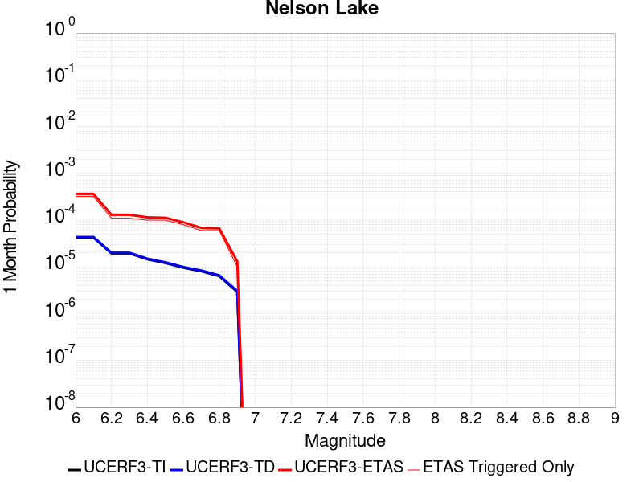 |  |  |

| Magnitude | 1 wk TI Prob | 1 wk TD Prob | 1 wk ETAS Prob | 1 wk ETAS/TD Gain | 1 wk ETAS Triggered Only | 1 mo TI Prob | 1 mo TD Prob | 1 mo ETAS Prob | 1 mo ETAS/TD Gain | 1 mo ETAS Triggered Only | 1 yr TI Prob | 1 yr TD Prob | 1 yr ETAS Prob | 1 yr ETAS/TD Gain | 1 yr ETAS Triggered Only | 10 yr TI Prob | 10 yr TD Prob | 10 yr ETAS Prob | 10 yr ETAS/TD Gain | 10 yr ETAS Triggered Only |
|-----|-----|-----|-----|-----|-----|-----|-----|-----|-----|-----|-----|-----|-----|-----|-----|-----|-----|-----|-----|-----|
| 6.0 | 9.913453E-6 | 1.0192293E-5 | 1.7019066E-4 | 16.697975 | 1.6E-4 | 4.2485535E-5 | 4.3680586E-5 | 3.370011E-4 | 7.7151237 | 2.9333335E-4 | 5.1713863E-4 | 5.316917E-4 | 0.0017310537 | 3.255747 | 0.0012 | 0.0051593683 | 0.0053052236 | 0.008090369 | 1.5249817 | 0.0028 |
| 6.1 | 9.913453E-6 | 1.0192293E-5 | 1.7019066E-4 | 16.697975 | 1.6E-4 | 4.2485535E-5 | 4.3680586E-5 | 3.370011E-4 | 7.7151237 | 2.9333335E-4 | 5.1713863E-4 | 5.316917E-4 | 0.0017310537 | 3.255747 | 0.0012 | 0.0051593683 | 0.0053052236 | 0.008090369 | 1.5249817 | 0.0028 |
| 6.2 | 4.5596407E-6 | 4.696332E-6 | 5.8029415E-5 | 12.356328 | 5.3333333E-5 | 1.954117E-5 | 2.0126989E-5 | 1.0012538E-4 | 4.974683 | 8.0E-5 | 2.3788778E-4 | 2.450198E-4 | 7.515623E-4 | 3.0673535 | 5.0666666E-4 | 0.0023763329 | 0.0024476226 | 0.0035116784 | 1.4347304 | 0.0010666667 |
| 6.3 | 4.5596407E-6 | 4.696332E-6 | 5.8029415E-5 | 12.356328 | 5.3333333E-5 | 1.954117E-5 | 2.0126989E-5 | 1.0012538E-4 | 4.974683 | 8.0E-5 | 2.3788778E-4 | 2.450198E-4 | 7.515623E-4 | 3.0673535 | 5.0666666E-4 | 0.0023763329 | 0.0024476226 | 0.0035116784 | 1.4347304 | 0.0010666667 |
| 6.4 | 3.4025713E-6 | 3.509912E-6 | 5.684306E-5 | 16.19501 | 5.3333333E-5 | 1.4582367E-5 | 1.50423975E-5 | 9.504119E-5 | 6.318221 | 8.0E-5 | 1.7752586E-4 | 1.8312664E-4 | 6.097152E-4 | 3.3294728 | 4.2666667E-4 | 0.001773841 | 0.0018298404 | 0.0027880836 | 1.5236759 | 9.6E-4 |
| 6.5 | 2.8352947E-6 | 2.9278688E-6 | 5.6261048E-5 | 19.215698 | 5.3333333E-5 | 1.2151207E-5 | 1.2547953E-5 | 9.254695E-5 | 7.375462 | 8.0E-5 | 1.479309E-4 | 1.5276136E-4 | 5.2603765E-4 | 3.4435256 | 3.7333334E-4 | 0.0014783246 | 0.0015266375 | 0.002405294 | 1.5755502 | 8.8E-4 |
| 6.6 | 2.251518E-6 | 2.3290781E-6 | 5.5662287E-5 | 23.898848 | 5.3333333E-5 | 9.649328E-6 | 9.981729E-6 | 8.998093E-5 | 9.014564 | 8.0E-5 | 1.1747423E-4 | 1.2152141E-4 | 4.4148252E-4 | 3.632961 | 3.2E-4 | 0.0011741214 | 0.0012146112 | 0.0019071024 | 1.570134 | 6.9333334E-4 |
| 6.7 | 1.8911853E-6 | 1.9591491E-6 | 5.5292378E-5 | 28.22265 | 5.3333333E-5 | 8.105055E-6 | 8.39633E-6 | 8.839566E-5 | 10.527893 | 8.0E-5 | 9.867457E-5 | 1.022211E-4 | 3.6886052E-4 | 3.6084576 | 2.6666667E-4 | 9.863076E-4 | 0.0010217984 | 0.0016345049 | 1.5996356 | 6.133333E-4 |
| 6.8 | 1.4874814E-6 | 1.5438383E-6 | 5.4877088E-5 | 35.54588 | 5.3333333E-5 | 6.374905E-6 | 6.6164357E-6 | 8.661591E-5 | 13.091022 | 8.0E-5 | 7.76117E-5 | 8.055265E-5 | 2.938688E-4 | 3.648158 | 2.1333333E-4 | 7.75846E-4 | 8.052856E-4 | 0.0013381895 | 1.6617576 | 5.3333334E-4 |
| 6.9 | 6.835972E-7 | 7.1399705E-7 | 7.1399705E-7 | 1.0 | 0.0 | 2.9296991E-6 | 3.0599856E-6 | 3.0599856E-6 | 1.0 | 0.0 | 3.56685E-5 | 3.7255006E-5 | 1.1725203E-4 | 3.1472824 | 8.0E-5 | 3.5662777E-4 | 3.7251884E-4 | 5.8577274E-4 | 1.5724646 | 2.1333333E-4 |

## So Sierra Nevada
*[(top)](#table-of-contents)*

| 1 Week | 1 Month | 1 Year | 10 Year |
|-----|-----|-----|-----|
|  |  |  |  |

| Magnitude | 1 wk TI Prob | 1 wk TD Prob | 1 wk ETAS Prob | 1 wk ETAS/TD Gain | 1 wk ETAS Triggered Only | 1 mo TI Prob | 1 mo TD Prob | 1 mo ETAS Prob | 1 mo ETAS/TD Gain | 1 mo ETAS Triggered Only | 1 yr TI Prob | 1 yr TD Prob | 1 yr ETAS Prob | 1 yr ETAS/TD Gain | 1 yr ETAS Triggered Only | 10 yr TI Prob | 10 yr TD Prob | 10 yr ETAS Prob | 10 yr ETAS/TD Gain | 10 yr ETAS Triggered Only |
|-----|-----|-----|-----|-----|-----|-----|-----|-----|-----|-----|-----|-----|-----|-----|-----|-----|-----|-----|-----|-----|
| 6.0 | 1.15488665E-5 | 1.1079722E-5 | 2.7774344E-4 | 25.067728 | 2.6666667E-4 | 4.9494203E-5 | 4.748373E-5 | 7.6744956E-4 | 16.162369 | 7.2E-4 | 6.024253E-4 | 5.779738E-4 | 0.0023636078 | 4.0894723 | 0.0017866667 | 0.006007948 | 0.005765975 | 0.008761934 | 1.5195926 | 0.0030133333 |
| 6.1 | 1.15488665E-5 | 1.1079722E-5 | 2.7774344E-4 | 25.067728 | 2.6666667E-4 | 4.9494203E-5 | 4.748373E-5 | 7.6744956E-4 | 16.162369 | 7.2E-4 | 6.024253E-4 | 5.779738E-4 | 0.0023636078 | 4.0894723 | 0.0017866667 | 0.006007948 | 0.005765975 | 0.008761934 | 1.5195926 | 0.0030133333 |
| 6.2 | 1.15488665E-5 | 1.1079722E-5 | 2.7774344E-4 | 25.067728 | 2.6666667E-4 | 4.9494203E-5 | 4.748373E-5 | 7.6744956E-4 | 16.162369 | 7.2E-4 | 6.024253E-4 | 5.779738E-4 | 0.0023636078 | 4.0894723 | 0.0017866667 | 0.006007948 | 0.005765975 | 0.008761934 | 1.5195926 | 0.0030133333 |
| 6.3 | 1.15488665E-5 | 1.1079722E-5 | 2.7774344E-4 | 25.067728 | 2.6666667E-4 | 4.9494203E-5 | 4.748373E-5 | 7.6744956E-4 | 16.162369 | 7.2E-4 | 6.024253E-4 | 5.779738E-4 | 0.0023636078 | 4.0894723 | 0.0017866667 | 0.006007948 | 0.005765975 | 0.008761934 | 1.5195926 | 0.0030133333 |
| 6.4 | 1.15488665E-5 | 1.1079722E-5 | 2.7774344E-4 | 25.067728 | 2.6666667E-4 | 4.9494203E-5 | 4.748373E-5 | 7.6744956E-4 | 16.162369 | 7.2E-4 | 6.024253E-4 | 5.779738E-4 | 0.0023636078 | 4.0894723 | 0.0017866667 | 0.006007948 | 0.005765975 | 0.008761934 | 1.5195926 | 0.0030133333 |
| 6.5 | 1.15488665E-5 | 1.1079722E-5 | 2.7774344E-4 | 25.067728 | 2.6666667E-4 | 4.9494203E-5 | 4.748373E-5 | 7.6744956E-4 | 16.162369 | 7.2E-4 | 6.024253E-4 | 5.779738E-4 | 0.0023636078 | 4.0894723 | 0.0017866667 | 0.006007948 | 0.005765975 | 0.008761934 | 1.5195926 | 0.0030133333 |
| 6.6 | 7.587044E-6 | 6.935689E-6 | 1.9360107E-4 | 27.913746 | 1.8666667E-4 | 3.2515498E-5 | 2.9724059E-5 | 4.5637804E-4 | 15.3538265 | 4.2666667E-4 | 3.9580427E-4 | 3.6183326E-4 | 0.0014014569 | 3.873212 | 0.00104 | 0.003951 | 0.0036127327 | 0.0052866633 | 1.463342 | 0.00168 |
| 6.7 | 7.587044E-6 | 6.935689E-6 | 1.9360107E-4 | 27.913746 | 1.8666667E-4 | 3.2515498E-5 | 2.9724059E-5 | 4.5637804E-4 | 15.3538265 | 4.2666667E-4 | 3.9580427E-4 | 3.6183326E-4 | 0.0014014569 | 3.873212 | 0.00104 | 0.003951 | 0.0036127327 | 0.0052866633 | 1.463342 | 0.00168 |
| 6.8 | 5.9026956E-6 | 5.1794364E-6 | 8.5179025E-5 | 16.445616 | 8.0E-5 | 2.5297022E-5 | 2.2197402E-5 | 2.6219207E-4 | 11.811835 | 2.4E-4 | 3.0794772E-4 | 2.7022103E-4 | 9.3670754E-4 | 3.4664495 | 6.6666666E-4 | 0.0030752132 | 0.0026990408 | 0.003709639 | 1.3744287 | 0.0010133333 |
| 6.9 | 5.0118915E-6 | 4.2524644E-6 | 3.0919018E-5 | 7.2708473 | 2.6666667E-5 | 2.1479358E-5 | 1.8224722E-5 | 1.5155562E-4 | 8.315936 | 1.3333333E-4 | 2.614798E-4 | 2.2186415E-4 | 7.284184E-4 | 3.283173 | 5.0666666E-4 | 0.0026117235 | 0.002216499 | 0.0030147259 | 1.3601296 | 8.0E-4 |
| 7.0 | 4.4924795E-6 | 3.713954E-6 | 3.0380521E-5 | 8.180102 | 2.6666667E-5 | 1.925334E-5 | 1.5916852E-5 | 1.2258183E-4 | 7.7013865 | 1.0666667E-4 | 2.3438422E-4 | 1.9377106E-4 | 6.4701657E-4 | 3.3390772 | 4.5333334E-4 | 0.0023413717 | 0.001936084 | 0.00265469 | 1.3711647 | 7.2E-4 |
| 7.1 | 3.9118436E-6 | 3.1120105E-6 | 2.9778594E-5 | 9.568925 | 2.6666667E-5 | 1.6764936E-5 | 1.3337123E-5 | 9.333606E-5 | 6.998215 | 8.0E-5 | 2.0409399E-4 | 1.6236794E-4 | 4.8231598E-4 | 2.9705124 | 3.2E-4 | 0.0020390663 | 0.0016225493 | 0.002208264 | 1.3609843 | 5.866667E-4 |
| 7.2 | 3.4200818E-6 | 2.6054847E-6 | 2.6054847E-6 | 1.0 | 0.0 | 1.4657411E-5 | 1.11663185E-5 | 6.449906E-5 | 5.776215 | 5.3333333E-5 | 1.7843937E-4 | 1.3594194E-4 | 4.0257236E-4 | 2.961355 | 2.6666667E-4 | 0.0017829615 | 0.0013586376 | 0.001864616 | 1.3724159 | 5.0666666E-4 |
| 7.3 | 2.6593618E-6 | 1.8284468E-6 | 1.8284468E-6 | 1.0 | 0.0 | 1.13972155E-5 | 7.836179E-6 | 6.116909E-5 | 7.805985 | 5.3333333E-5 | 1.3875226E-4 | 9.540159E-5 | 3.0871457E-4 | 3.2359478 | 2.1333333E-4 | 0.0013866565 | 9.536353E-4 | 0.0012999714 | 1.3631746 | 3.4666667E-4 |
| 7.4 | 2.2577992E-6 | 1.4364622E-6 | 1.4364622E-6 | 1.0 | 0.0 | 9.676246E-6 | 6.1562537E-6 | 5.948926E-5 | 9.663224 | 5.3333333E-5 | 1.1780193E-4 | 7.495006E-5 | 2.6160275E-4 | 3.4903605 | 1.8666667E-4 | 0.001177395 | 7.4927293E-4 | 0.0010690332 | 1.4267607 | 3.2E-4 |
| 7.5 | 1.489319E-6 | 7.3541264E-7 | 7.3541264E-7 | 1.0 | 0.0 | 6.3827797E-6 | 3.1517645E-6 | 5.648493E-5 | 17.921684 | 5.3333333E-5 | 7.770758E-5 | 3.837206E-5 | 1.4503463E-4 | 3.7796936 | 1.0666667E-4 | 7.7680405E-4 | 3.836548E-4 | 6.235627E-4 | 1.6253223 | 2.4E-4 |
| 7.6 | 1.0680322E-6 | 4.659796E-7 | 4.659796E-7 | 1.0 | 0.0 | 4.577273E-6 | 1.997054E-6 | 2.8663668E-5 | 14.352976 | 2.6666667E-5 | 5.5726876E-5 | 2.4313864E-5 | 5.097988E-5 | 2.0967414 | 2.6666667E-5 | 5.5712904E-4 | 2.431123E-4 | 3.764132E-4 | 1.54831 | 1.3333333E-4 |
| 7.7 | 5.509146E-7 | 1.5581199E-7 | 1.5581199E-7 | 1.0 | 0.0 | 2.3610605E-6 | 6.677655E-7 | 6.677655E-7 | 1.0 | 0.0 | 2.8745531E-5 | 8.130016E-6 | 8.130016E-6 | 1.0 | 0.0 | 2.8741814E-4 | 8.12973E-5 | 8.12973E-5 | 1.0 | 0.0 |

## Death Valley (So)
*[(top)](#table-of-contents)*

| 1 Week | 1 Month | 1 Year | 10 Year |
|-----|-----|-----|-----|
|  |  |  | 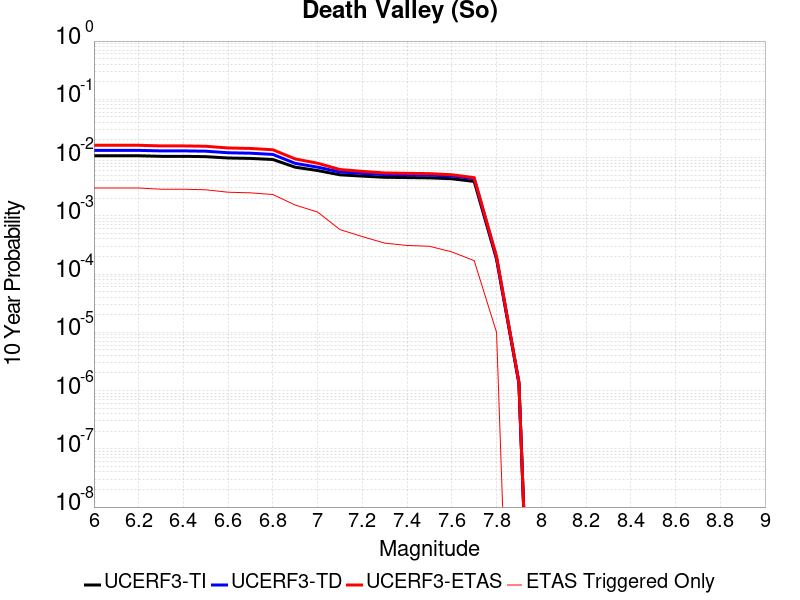 |

| Magnitude | 1 wk TI Prob | 1 wk TD Prob | 1 wk ETAS Prob | 1 wk ETAS/TD Gain | 1 wk ETAS Triggered Only | 1 mo TI Prob | 1 mo TD Prob | 1 mo ETAS Prob | 1 mo ETAS/TD Gain | 1 mo ETAS Triggered Only | 1 yr TI Prob | 1 yr TD Prob | 1 yr ETAS Prob | 1 yr ETAS/TD Gain | 1 yr ETAS Triggered Only | 10 yr TI Prob | 10 yr TD Prob | 10 yr ETAS Prob | 10 yr ETAS/TD Gain | 10 yr ETAS Triggered Only |
|-----|-----|-----|-----|-----|-----|-----|-----|-----|-----|-----|-----|-----|-----|-----|-----|-----|-----|-----|-----|-----|
| 6.0 | 2.0684236E-5 | 2.5618423E-5 | 1.5894834E-4 | 6.204455 | 1.3333333E-4 | 8.864371E-5 | 1.09788714E-4 | 5.364085E-4 | 4.885826 | 4.2666667E-4 | 0.0010787029 | 0.0013358749 | 0.002640796 | 1.9768288 | 0.0013066666 | 0.010734817 | 0.013281729 | 0.016123477 | 1.2139592 | 0.00288 |
| 6.1 | 2.0684236E-5 | 2.5618423E-5 | 1.5894834E-4 | 6.204455 | 1.3333333E-4 | 8.864371E-5 | 1.09788714E-4 | 5.364085E-4 | 4.885826 | 4.2666667E-4 | 0.0010787029 | 0.0013358749 | 0.002640796 | 1.9768288 | 0.0013066666 | 0.010734817 | 0.013281729 | 0.016123477 | 1.2139592 | 0.00288 |
| 6.2 | 2.0684236E-5 | 2.5618423E-5 | 1.5894834E-4 | 6.204455 | 1.3333333E-4 | 8.864371E-5 | 1.09788714E-4 | 5.364085E-4 | 4.885826 | 4.2666667E-4 | 0.0010787029 | 0.0013358749 | 0.002640796 | 1.9768288 | 0.0013066666 | 0.010734817 | 0.013281729 | 0.016123477 | 1.2139592 | 0.00288 |
| 6.3 | 2.0240292E-5 | 2.5118497E-5 | 1.5844849E-4 | 6.3080397 | 1.3333333E-4 | 8.6741224E-5 | 1.0764636E-4 | 5.342671E-4 | 4.963169 | 4.2666667E-4 | 0.0010555626 | 0.0013098232 | 0.002561515 | 1.9556187 | 0.0012533333 | 0.010505628 | 0.013024284 | 0.015787816 | 1.212183 | 0.0028 |
| 6.4 | 2.0240292E-5 | 2.5118497E-5 | 1.5844849E-4 | 6.3080397 | 1.3333333E-4 | 8.6741224E-5 | 1.0764636E-4 | 5.342671E-4 | 4.963169 | 4.2666667E-4 | 0.0010555626 | 0.0013098232 | 0.002561515 | 1.9556187 | 0.0012533333 | 0.010505628 | 0.013024284 | 0.015787816 | 1.212183 | 0.0028 |
| 6.5 | 1.9962767E-5 | 2.4807747E-5 | 1.5813777E-4 | 6.3745317 | 1.3333333E-4 | 8.55519E-5 | 1.0631468E-4 | 5.0627213E-4 | 4.762016 | 4.0E-4 | 0.0010410968 | 0.0012936293 | 0.002518709 | 1.9470099 | 0.0012266666 | 0.010362327 | 0.012864228 | 0.015549237 | 1.208719 | 0.00272 |
| 6.6 | 1.8937297E-5 | 2.3311568E-5 | 1.2997574E-4 | 5.57559 | 1.0666667E-4 | 8.115732E-5 | 9.990298E-5 | 3.66543E-4 | 3.6689897 | 2.6666667E-4 | 9.876423E-4 | 0.0012156547 | 0.0023076588 | 1.8982849 | 0.0010933334 | 0.009832645 | 0.0120931 | 0.014543109 | 1.2025956 | 0.00248 |
| 6.7 | 1.8621096E-5 | 2.2912203E-5 | 1.2957642E-4 | 5.6553454 | 1.0666667E-4 | 7.980225E-5 | 9.8191544E-5 | 3.6483203E-4 | 3.7155137 | 2.6666667E-4 | 9.711593E-4 | 0.0011948409 | 0.002286868 | 1.9139518 | 0.0010933334 | 0.009669261 | 0.011887211 | 0.014311382 | 1.203931 | 0.0024533332 |
| 6.8 | 1.7830353E-5 | 2.1806247E-5 | 1.284706E-4 | 5.891458 | 1.0666667E-4 | 7.641356E-5 | 9.345208E-5 | 3.3342966E-4 | 3.5679212 | 2.4E-4 | 9.29938E-4 | 0.0011371992 | 0.0021760166 | 1.9134876 | 0.00104 | 0.009260561 | 0.011316643 | 0.013610388 | 1.2026877 | 0.00232 |
| 6.9 | 1.3135183E-5 | 1.5304242E-5 | 1.2196928E-4 | 7.969639 | 1.0666667E-4 | 5.6292425E-5 | 6.558799E-5 | 2.522424E-4 | 3.8458626 | 1.8666667E-4 | 6.8514474E-4 | 7.982477E-4 | 0.0014910277 | 1.8678758 | 6.9333334E-4 | 0.006830362 | 0.007954813 | 0.009409812 | 1.182908 | 0.0014666667 |
| 7.0 | 1.1507512E-5 | 1.3154444E-5 | 6.6487075E-5 | 5.054343 | 5.3333333E-5 | 4.9316975E-5 | 5.6375004E-5 | 1.8970082E-4 | 3.3649812 | 1.3333333E-4 | 6.002687E-4 | 6.861553E-4 | 0.0011924743 | 1.7379073 | 5.0666666E-4 | 0.0059864987 | 0.006841068 | 0.008032859 | 1.1742111 | 0.0012 |
| 7.1 | 9.715903E-6 | 1.0865454E-5 | 3.753183E-5 | 3.454235 | 2.6666667E-5 | 4.1638916E-5 | 4.6565423E-5 | 9.989627E-5 | 2.1452887 | 5.3333333E-5 | 5.068359E-4 | 5.667908E-4 | 7.8000326E-4 | 1.3761748 | 2.1333333E-4 | 0.0050568148 | 0.0056539057 | 0.0062107397 | 1.0984865 | 5.6E-4 |
| 7.2 | 9.233269E-6 | 1.0286473E-5 | 3.6952864E-5 | 3.5923748 | 2.6666667E-5 | 3.9570554E-5 | 4.4084165E-5 | 9.741515E-5 | 2.2097538 | 5.3333333E-5 | 4.81665E-4 | 5.3659675E-4 | 6.965109E-4 | 1.2980155 | 1.6E-4 | 0.0048062233 | 0.005353442 | 0.0057778247 | 1.0792729 | 4.2666667E-4 |
| 7.3 | 8.8041315E-6 | 9.808313E-6 | 3.6474717E-5 | 3.7187555 | 2.6666667E-5 | 3.7731446E-5 | 4.2034975E-5 | 9.5366064E-5 | 2.2687314 | 5.3333333E-5 | 4.592835E-4 | 5.1165983E-4 | 6.1827194E-4 | 1.2083652 | 1.0666667E-4 | 0.0045833546 | 0.0051052445 | 0.0053174887 | 1.0415738 | 2.1333333E-4 |
| 7.4 | 8.708749E-6 | 9.707323E-6 | 3.637373E-5 | 3.7470403 | 2.6666667E-5 | 3.7322676E-5 | 4.1602176E-5 | 9.493329E-5 | 2.281931 | 5.3333333E-5 | 4.5430884E-4 | 5.06393E-4 | 6.130056E-4 | 1.2105334 | 1.0666667E-4 | 0.004533812 | 0.0050528166 | 0.005265072 | 1.0420073 | 2.1333333E-4 |
| 7.5 | 8.612678E-6 | 9.604964E-6 | 3.6271376E-5 | 3.7763155 | 2.6666667E-5 | 3.6910955E-5 | 4.116351E-5 | 9.4494644E-5 | 2.2955925 | 5.3333333E-5 | 4.492982E-4 | 5.010547E-4 | 6.076679E-4 | 1.2127776 | 1.0666667E-4 | 0.004483909 | 0.0049996753 | 0.005211942 | 1.0424562 | 2.1333333E-4 |
| 7.6 | 8.319024E-6 | 9.28406E-6 | 3.5950477E-5 | 3.87228 | 2.6666667E-5 | 3.5652476E-5 | 3.9788243E-5 | 9.311946E-5 | 2.3403761 | 5.3333333E-5 | 4.3398244E-4 | 4.8431839E-4 | 5.642797E-4 | 1.1651006 | 8.0E-5 | 0.0043313587 | 0.004833053 | 0.0050188173 | 1.0384363 | 1.8666667E-4 |
| 7.7 | 7.4718328E-6 | 8.3453E-6 | 8.3453E-6 | 1.0 | 0.0 | 3.2021748E-5 | 3.57651E-5 | 3.57651E-5 | 1.0 | 0.0 | 3.8979502E-4 | 4.3535716E-4 | 4.3535716E-4 | 1.0 | 0.0 | 0.00389112 | 0.004345448 | 0.004451651 | 1.02444 | 1.0666667E-4 |
| 7.8 | 3.4586725E-7 | 3.648288E-7 | 3.648288E-7 | 1.0 | 0.0 | 1.4822873E-6 | 1.5635511E-6 | 1.5635511E-6 | 1.0 | 0.0 | 1.80467E-5 | 1.9036073E-5 | 1.9036073E-5 | 1.0 | 0.0 | 1.8045233E-4 | 1.9034486E-4 | 1.9034486E-4 | 1.0 | 0.0 |
| 7.9 | 2.5591178E-9 | 2.6696871E-9 | 2.6696871E-9 | 1.0 | 0.0 | 1.0967647E-8 | 1.1441516E-8 | 1.1441516E-8 | 1.0 | 0.0 | 1.335311E-7 | 1.3930045E-7 | 1.3930045E-7 | 1.0 | 0.0 | 1.3353102E-6 | 1.3930046E-6 | 1.3930046E-6 | 1.0 | 0.0 |

## San Andreas (Mojave S)
*[(top)](#table-of-contents)*

| 1 Week | 1 Month | 1 Year | 10 Year |
|-----|-----|-----|-----|
|  |  |  |  |

| Magnitude | 1 wk TI Prob | 1 wk TD Prob | 1 wk ETAS Prob | 1 wk ETAS/TD Gain | 1 wk ETAS Triggered Only | 1 mo TI Prob | 1 mo TD Prob | 1 mo ETAS Prob | 1 mo ETAS/TD Gain | 1 mo ETAS Triggered Only | 1 yr TI Prob | 1 yr TD Prob | 1 yr ETAS Prob | 1 yr ETAS/TD Gain | 1 yr ETAS Triggered Only | 10 yr TI Prob | 10 yr TD Prob | 10 yr ETAS Prob | 10 yr ETAS/TD Gain | 10 yr ETAS Triggered Only |
|-----|-----|-----|-----|-----|-----|-----|-----|-----|-----|-----|-----|-----|-----|-----|-----|-----|-----|-----|-----|-----|
| 6.0 | 3.1064058E-4 | 6.747043E-4 | 8.079477E-4 | 1.1974841 | 1.3333333E-4 | 0.0013306376 | 0.002888514 | 0.0034203066 | 1.184106 | 5.3333334E-4 | 0.016080605 | 0.03462661 | 0.03606824 | 1.0416334 | 0.0014933334 | 0.1496549 | 0.28663692 | 0.28850117 | 1.0065039 | 0.0026133333 |
| 6.1 | 3.1064058E-4 | 6.747043E-4 | 8.079477E-4 | 1.1974841 | 1.3333333E-4 | 0.0013306376 | 0.002888514 | 0.0034203066 | 1.184106 | 5.3333334E-4 | 0.016080605 | 0.03462661 | 0.03606824 | 1.0416334 | 0.0014933334 | 0.1496549 | 0.28663692 | 0.28850117 | 1.0065039 | 0.0026133333 |
| 6.2 | 3.1064058E-4 | 6.747043E-4 | 8.079477E-4 | 1.1974841 | 1.3333333E-4 | 0.0013306376 | 0.002888514 | 0.0034203066 | 1.184106 | 5.3333334E-4 | 0.016080605 | 0.03462661 | 0.03606824 | 1.0416334 | 0.0014933334 | 0.1496549 | 0.28663692 | 0.28850117 | 1.0065039 | 0.0026133333 |
| 6.3 | 3.1064058E-4 | 6.747043E-4 | 8.079477E-4 | 1.1974841 | 1.3333333E-4 | 0.0013306376 | 0.002888514 | 0.0034203066 | 1.184106 | 5.3333334E-4 | 0.016080605 | 0.03462661 | 0.03606824 | 1.0416334 | 0.0014933334 | 0.1496549 | 0.28663692 | 0.28850117 | 1.0065039 | 0.0026133333 |
| 6.4 | 1.9872203E-4 | 4.318848E-4 | 5.651606E-4 | 1.308591 | 1.3333333E-4 | 8.5138786E-4 | 0.0018496502 | 0.0023553798 | 1.273419 | 5.0666666E-4 | 0.010316478 | 0.022293096 | 0.023700995 | 1.063154 | 0.00144 | 0.098504856 | 0.19703239 | 0.19889528 | 1.0094547 | 0.00232 |
| 6.5 | 1.291105E-4 | 2.8761322E-4 | 4.2090818E-4 | 1.4634522 | 1.3333333E-4 | 5.5321335E-4 | 0.0012320485 | 0.0016848233 | 1.3674976 | 4.5333334E-4 | 0.006714592 | 0.0148978485 | 0.01613251 | 1.0828751 | 0.0012533333 | 0.065152965 | 0.13807017 | 0.13974805 | 1.0121524 | 0.0019466666 |
| 6.6 | 1.291105E-4 | 2.8761322E-4 | 4.2090818E-4 | 1.4634522 | 1.3333333E-4 | 5.5321335E-4 | 0.0012320485 | 0.0016848233 | 1.3674976 | 4.5333334E-4 | 0.006714592 | 0.0148978485 | 0.01613251 | 1.0828751 | 0.0012533333 | 0.065152965 | 0.13807017 | 0.13974805 | 1.0121524 | 0.0019466666 |
| 6.7 | 1.08001186E-4 | 2.4342406E-4 | 3.7672493E-4 | 1.5476077 | 1.3333333E-4 | 4.6278012E-4 | 0.0010428295 | 0.00149569 | 1.4342614 | 4.5333334E-4 | 0.0056198016 | 0.012622835 | 0.013860348 | 1.0980376 | 0.0012533333 | 0.054797906 | 0.11921291 | 0.120927505 | 1.0143827 | 0.0019466666 |
| 6.8 | 1.0624356E-4 | 2.3860046E-4 | 3.71902E-4 | 1.5586809 | 1.3333333E-4 | 4.5525006E-4 | 0.0010221732 | 0.0014750431 | 1.4430462 | 4.5333334E-4 | 0.0055285925 | 0.01237422 | 0.013612045 | 1.1000324 | 0.0012533333 | 0.053930566 | 0.117162056 | 0.118880644 | 1.0146685 | 0.0019466666 |
| 6.9 | 1.0393785E-4 | 2.3230357E-4 | 3.6560593E-4 | 1.5738282 | 1.3333333E-4 | 4.4537184E-4 | 9.952073E-4 | 0.0014480895 | 1.4550631 | 4.5333334E-4 | 0.0054089287 | 0.012049583 | 0.013287814 | 1.1027614 | 0.0012533333 | 0.05279156 | 0.11445948 | 0.11618333 | 1.0150608 | 0.0019466666 |
| 7.0 | 1.0155622E-4 | 2.2599897E-4 | 3.5930218E-4 | 1.5898398 | 1.3333333E-4 | 4.3516833E-4 | 9.682079E-4 | 0.0014211023 | 1.4677657 | 4.5333334E-4 | 0.005285311 | 0.011724443 | 0.012963082 | 1.1056459 | 0.0012533333 | 0.05161361 | 0.11171984 | 0.11344903 | 1.0154779 | 0.0019466666 |
| 7.1 | 9.885595E-5 | 2.1888265E-4 | 3.521868E-4 | 1.6090211 | 1.3333333E-4 | 4.2359953E-4 | 9.377316E-4 | 0.0013906398 | 1.4829828 | 4.5333334E-4 | 0.0051451353 | 0.011357316 | 0.0125700515 | 1.10678 | 0.0012266666 | 0.05027629 | 0.10860426 | 0.11031574 | 1.0157589 | 0.00192 |
| 7.2 | 9.6411415E-5 | 2.125122E-4 | 3.4581719E-4 | 1.6272817 | 1.3333333E-4 | 4.1312634E-4 | 9.1044896E-4 | 0.0013633695 | 1.4974695 | 4.5333334E-4 | 0.005018219 | 0.01102856 | 0.012241698 | 1.1099997 | 0.0012266666 | 0.049064007 | 0.10579402 | 0.10748705 | 1.0160031 | 0.0018933333 |
| 7.3 | 9.1180635E-5 | 1.9479371E-4 | 3.2810107E-4 | 1.6843514 | 1.3333333E-4 | 3.907156E-4 | 8.345632E-4 | 0.0012875182 | 1.542745 | 4.5333334E-4 | 0.004746591 | 0.010113581 | 0.011327842 | 1.1200624 | 0.0012266666 | 0.046464786 | 0.09798661 | 0.099694416 | 1.017429 | 0.0018933333 |
| 7.4 | 8.887388E-5 | 1.8727897E-4 | 3.2058734E-4 | 1.711817 | 1.3333333E-4 | 3.8083247E-4 | 8.023774E-4 | 0.0012553469 | 1.5645343 | 4.5333334E-4 | 0.0046267817 | 0.009725285 | 0.010940022 | 1.124905 | 0.0012266666 | 0.045316286 | 0.09462135 | 0.09633554 | 1.0181162 | 0.0018933333 |
| 7.5 | 8.6750515E-5 | 1.8059391E-4 | 3.1390318E-4 | 1.7381713 | 1.3333333E-4 | 3.7173493E-4 | 7.7374437E-4 | 0.0012267269 | 1.5854422 | 4.5333334E-4 | 0.004516484 | 0.009379733 | 0.010594894 | 1.1295518 | 0.0012266666 | 0.04425787 | 0.09158487 | 0.093304805 | 1.0187796 | 0.0018933333 |
| 7.6 | 8.453092E-5 | 1.7446902E-4 | 3.077791E-4 | 1.7640902 | 1.3333333E-4 | 3.6222505E-4 | 7.475102E-4 | 0.0012005047 | 1.6060044 | 4.5333334E-4 | 0.0044011753 | 0.009063034 | 0.010252158 | 1.131206 | 0.0012 | 0.04315024 | 0.088743635 | 0.09044465 | 1.0191677 | 0.0018666667 |
| 7.7 | 8.259102E-5 | 1.6968958E-4 | 3.030003E-4 | 1.7856152 | 1.3333333E-4 | 3.539135E-4 | 7.270384E-4 | 0.0011800422 | 1.6230808 | 4.5333334E-4 | 0.004300386 | 0.008815835 | 0.010005256 | 1.1349187 | 0.0012 | 0.042181134 | 0.08649418 | 0.088199385 | 1.0197147 | 0.0018666667 |
| 7.8 | 7.444844E-5 | 1.5290553E-4 | 2.595559E-4 | 1.6974918 | 1.0666667E-4 | 3.1902574E-4 | 6.551449E-4 | 9.7493525E-4 | 1.4881215 | 3.2E-4 | 0.0038772223 | 0.007947266 | 0.008820273 | 1.1098499 | 8.8E-4 | 0.03810269 | 0.07832232 | 0.07955123 | 1.0156903 | 0.0013333333 |
| 7.9 | 5.2586525E-5 | 1.0011239E-4 | 1.8010438E-4 | 1.7990218 | 8.0E-5 | 2.2535135E-4 | 4.2898257E-4 | 6.688796E-4 | 1.5592233 | 2.4E-4 | 0.0027402006 | 0.005210366 | 0.0057674483 | 1.1069181 | 5.6E-4 | 0.027066574 | 0.052222524 | 0.052980747 | 1.0145191 | 8.0E-4 |
| 8.0 | 3.379877E-5 | 5.4101976E-5 | 8.07672E-5 | 1.4928697 | 2.6666667E-5 | 1.4484383E-4 | 2.3184501E-4 | 3.1182647E-4 | 1.3449781 | 8.0E-5 | 0.0017620471 | 0.002819061 | 0.0030052015 | 1.0660292 | 1.8666667E-4 | 0.017481409 | 0.028848516 | 0.029081592 | 1.0080793 | 2.4E-4 |
| 8.1 | 1.8668277E-5 | 1.9322531E-5 | 1.9322531E-5 | 1.0 | 0.0 | 8.000444E-5 | 8.280823E-5 | 8.280823E-5 | 1.0 | 0.0 | 9.736188E-4 | 0.0010077246 | 0.0010077246 | 1.0 | 0.0 | 0.009693642 | 0.010805754 | 0.010805754 | 1.0 | 0.0 |
| 8.2 | 8.541571E-6 | 5.465789E-6 | 5.465789E-6 | 1.0 | 0.0 | 3.660622E-5 | 2.34246E-5 | 2.34246E-5 | 1.0 | 0.0 | 4.455896E-4 | 2.8515726E-4 | 2.8515726E-4 | 1.0 | 0.0 | 0.0044469717 | 0.0032435213 | 0.0032435213 | 1.0 | 0.0 |
| 8.3 | 1.983087E-6 | 7.668296E-7 | 7.668296E-7 | 1.0 | 0.0 | 8.498917E-6 | 3.2864084E-6 | 3.2864084E-6 | 1.0 | 0.0 | 1.034694E-4 | 4.0011306E-5 | 4.0011306E-5 | 1.0 | 0.0 | 0.0010342124 | 4.724499E-4 | 4.724499E-4 | 1.0 | 0.0 |

## Towne Pass
*[(top)](#table-of-contents)*

| 1 Week | 1 Month | 1 Year | 10 Year |
|-----|-----|-----|-----|
|  |  |  |  |

| Magnitude | 1 wk TI Prob | 1 wk TD Prob | 1 wk ETAS Prob | 1 wk ETAS/TD Gain | 1 wk ETAS Triggered Only | 1 mo TI Prob | 1 mo TD Prob | 1 mo ETAS Prob | 1 mo ETAS/TD Gain | 1 mo ETAS Triggered Only | 1 yr TI Prob | 1 yr TD Prob | 1 yr ETAS Prob | 1 yr ETAS/TD Gain | 1 yr ETAS Triggered Only | 10 yr TI Prob | 10 yr TD Prob | 10 yr ETAS Prob | 10 yr ETAS/TD Gain | 10 yr ETAS Triggered Only |
|-----|-----|-----|-----|-----|-----|-----|-----|-----|-----|-----|-----|-----|-----|-----|-----|-----|-----|-----|-----|-----|
| 6.0 | 3.849728E-6 | 3.8945495E-6 | 2.1722705E-4 | 55.777195 | 2.1333333E-4 | 1.649873E-5 | 1.6690845E-5 | 4.966828E-4 | 29.757801 | 4.8E-4 | 2.0085352E-4 | 2.0319645E-4 | 0.0016162426 | 7.9540887 | 0.0014133333 | 0.0020067208 | 0.0020305358 | 0.0046385624 | 2.2844033 | 0.0026133333 |
| 6.1 | 3.849728E-6 | 3.8945495E-6 | 2.1722705E-4 | 55.777195 | 2.1333333E-4 | 1.649873E-5 | 1.6690845E-5 | 4.966828E-4 | 29.757801 | 4.8E-4 | 2.0085352E-4 | 2.0319645E-4 | 0.0016162426 | 7.9540887 | 0.0014133333 | 0.0020067208 | 0.0020305358 | 0.0046385624 | 2.2844033 | 0.0026133333 |
| 6.2 | 3.849728E-6 | 3.8945495E-6 | 2.1722705E-4 | 55.777195 | 2.1333333E-4 | 1.649873E-5 | 1.6690845E-5 | 4.966828E-4 | 29.757801 | 4.8E-4 | 2.0085352E-4 | 2.0319645E-4 | 0.0016162426 | 7.9540887 | 0.0014133333 | 0.0020067208 | 0.0020305358 | 0.0046385624 | 2.2844033 | 0.0026133333 |
| 6.3 | 3.849728E-6 | 3.8945495E-6 | 2.1722705E-4 | 55.777195 | 2.1333333E-4 | 1.649873E-5 | 1.6690845E-5 | 4.966828E-4 | 29.757801 | 4.8E-4 | 2.0085352E-4 | 2.0319645E-4 | 0.0016162426 | 7.9540887 | 0.0014133333 | 0.0020067208 | 0.0020305358 | 0.0046385624 | 2.2844033 | 0.0026133333 |
| 6.4 | 3.849728E-6 | 3.8945495E-6 | 2.1722705E-4 | 55.777195 | 2.1333333E-4 | 1.649873E-5 | 1.6690845E-5 | 4.966828E-4 | 29.757801 | 4.8E-4 | 2.0085352E-4 | 2.0319645E-4 | 0.0016162426 | 7.9540887 | 0.0014133333 | 0.0020067208 | 0.0020305358 | 0.0046385624 | 2.2844033 | 0.0026133333 |
| 6.5 | 1.1953545E-6 | 1.2030553E-6 | 2.786969E-5 | 23.16576 | 2.6666667E-5 | 5.1229376E-6 | 5.155942E-6 | 5.8489E-5 | 11.344 | 5.3333333E-5 | 6.236998E-5 | 6.27719E-5 | 3.0275685E-4 | 4.823127 | 2.4E-4 | 6.235248E-4 | 6.2755344E-4 | 0.0010539524 | 1.6794623 | 4.2666667E-4 |
| 6.6 | 1.1953545E-6 | 1.2030553E-6 | 2.786969E-5 | 23.16576 | 2.6666667E-5 | 5.1229376E-6 | 5.155942E-6 | 5.8489E-5 | 11.344 | 5.3333333E-5 | 6.236998E-5 | 6.27719E-5 | 3.0275685E-4 | 4.823127 | 2.4E-4 | 6.235248E-4 | 6.2755344E-4 | 0.0010539524 | 1.6794623 | 4.2666667E-4 |
| 6.7 | 8.375951E-7 | 8.410697E-7 | 2.7507715E-5 | 32.705627 | 2.6666667E-5 | 3.5896885E-6 | 3.60458E-6 | 5.6937723E-5 | 15.7959385 | 5.3333333E-5 | 4.370358E-5 | 4.3884935E-5 | 2.305434E-4 | 5.253361 | 1.8666667E-4 | 4.3694986E-4 | 4.387684E-4 | 7.58628E-4 | 1.7289941 | 3.2E-4 |
| 6.8 | 6.38041E-7 | 6.39218E-7 | 2.7305867E-5 | 42.717613 | 2.6666667E-5 | 2.7344586E-6 | 2.739503E-6 | 5.607269E-5 | 20.468197 | 5.3333333E-5 | 3.3291526E-5 | 3.335298E-5 | 1.9334765E-4 | 5.797013 | 1.6E-4 | 3.3286537E-4 | 3.3348353E-4 | 6.0006126E-4 | 1.799373 | 2.6666667E-4 |
| 6.9 | 5.3460053E-7 | 5.345355E-7 | 2.7201188E-5 | 50.887524 | 2.6666667E-5 | 2.2911431E-6 | 2.2908646E-6 | 5.5624078E-5 | 24.28082 | 5.3333333E-5 | 2.789431E-5 | 2.7890954E-5 | 1.3455465E-4 | 4.8243113 | 1.0666667E-4 | 2.789081E-4 | 2.7887785E-4 | 4.6549246E-4 | 1.6691625 | 1.8666667E-4 |
| 7.0 | 3.557783E-7 | 3.5324413E-7 | 3.5324413E-7 | 1.0 | 0.0 | 1.5247632E-6 | 1.5139026E-6 | 1.5139026E-6 | 1.0 | 0.0 | 1.8563835E-5 | 1.8431618E-5 | 7.176397E-5 | 3.8935254 | 5.3333333E-5 | 1.8562283E-4 | 1.8430172E-4 | 2.64287E-4 | 1.4339908 | 8.0E-5 |
| 7.1 | 3.037942E-7 | 3.0002388E-7 | 3.0002388E-7 | 1.0 | 0.0 | 1.3019744E-6 | 1.2858161E-6 | 1.2858161E-6 | 1.0 | 0.0 | 1.5851423E-5 | 1.5654707E-5 | 6.89872E-5 | 4.406803 | 5.3333333E-5 | 1.5850292E-4 | 1.5653679E-4 | 2.3652425E-4 | 1.510982 | 8.0E-5 |
| 7.2 | 2.0808248E-7 | 2.021783E-7 | 2.021783E-7 | 1.0 | 0.0 | 8.917818E-7 | 8.6647816E-7 | 8.6647816E-7 | 1.0 | 0.0 | 1.0857389E-5 | 1.0549325E-5 | 6.388209E-5 | 6.0555625 | 5.3333333E-5 | 1.0856859E-4 | 1.054887E-4 | 1.8548027E-4 | 1.758295 | 8.0E-5 |
| 7.3 | 1.1162073E-7 | 1.06369825E-7 | 1.06369825E-7 | 1.0 | 0.0 | 4.7837443E-7 | 4.5587063E-7 | 4.5587063E-7 | 1.0 | 0.0 | 5.8241935E-6 | 5.550213E-6 | 5.550213E-6 | 1.0 | 0.0 | 5.8240406E-5 | 5.5500943E-5 | 8.216613E-5 | 1.4804456 | 2.6666667E-5 |

## San Andreas (Mojave N)
*[(top)](#table-of-contents)*

| 1 Week | 1 Month | 1 Year | 10 Year |
|-----|-----|-----|-----|
|  |  | 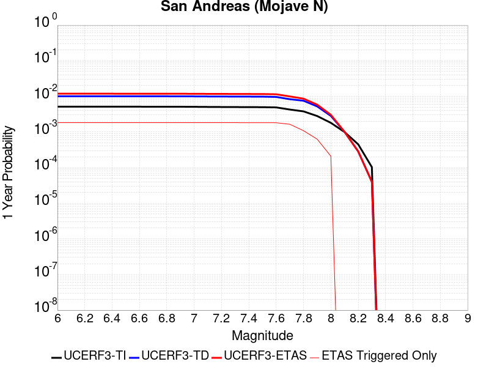 |  |

| Magnitude | 1 wk TI Prob | 1 wk TD Prob | 1 wk ETAS Prob | 1 wk ETAS/TD Gain | 1 wk ETAS Triggered Only | 1 mo TI Prob | 1 mo TD Prob | 1 mo ETAS Prob | 1 mo ETAS/TD Gain | 1 mo ETAS Triggered Only | 1 yr TI Prob | 1 yr TD Prob | 1 yr ETAS Prob | 1 yr ETAS/TD Gain | 1 yr ETAS Triggered Only | 10 yr TI Prob | 10 yr TD Prob | 10 yr ETAS Prob | 10 yr ETAS/TD Gain | 10 yr ETAS Triggered Only |
|-----|-----|-----|-----|-----|-----|-----|-----|-----|-----|-----|-----|-----|-----|-----|-----|-----|-----|-----|-----|-----|
| 6.0 | 9.877682E-5 | 1.9409315E-4 | 3.807236E-4 | 1.9615508 | 1.8666667E-4 | 4.2326056E-4 | 8.315628E-4 | 0.0014710306 | 1.7689952 | 6.4E-4 | 0.0051410277 | 0.010077406 | 0.011634884 | 1.1545515 | 0.0015733333 | 0.05023708 | 0.09835201 | 0.100612134 | 1.02298 | 0.0025066666 |
| 6.1 | 9.877682E-5 | 1.9409315E-4 | 3.807236E-4 | 1.9615508 | 1.8666667E-4 | 4.2326056E-4 | 8.315628E-4 | 0.0014710306 | 1.7689952 | 6.4E-4 | 0.0051410277 | 0.010077406 | 0.011634884 | 1.1545515 | 0.0015733333 | 0.05023708 | 0.09835201 | 0.100612134 | 1.02298 | 0.0025066666 |
| 6.2 | 9.877682E-5 | 1.9409315E-4 | 3.807236E-4 | 1.9615508 | 1.8666667E-4 | 4.2326056E-4 | 8.315628E-4 | 0.0014710306 | 1.7689952 | 6.4E-4 | 0.0051410277 | 0.010077406 | 0.011634884 | 1.1545515 | 0.0015733333 | 0.05023708 | 0.09835201 | 0.100612134 | 1.02298 | 0.0025066666 |
| 6.3 | 9.877682E-5 | 1.9409315E-4 | 3.807236E-4 | 1.9615508 | 1.8666667E-4 | 4.2326056E-4 | 8.315628E-4 | 0.0014710306 | 1.7689952 | 6.4E-4 | 0.0051410277 | 0.010077406 | 0.011634884 | 1.1545515 | 0.0015733333 | 0.05023708 | 0.09835201 | 0.100612134 | 1.02298 | 0.0025066666 |
| 6.4 | 9.877682E-5 | 1.9409315E-4 | 3.807236E-4 | 1.9615508 | 1.8666667E-4 | 4.2326056E-4 | 8.315628E-4 | 0.0014710306 | 1.7689952 | 6.4E-4 | 0.0051410277 | 0.010077406 | 0.011634884 | 1.1545515 | 0.0015733333 | 0.05023708 | 0.09835201 | 0.100612134 | 1.02298 | 0.0025066666 |
| 6.5 | 9.861474E-5 | 1.9383078E-4 | 3.8046128E-4 | 1.9628526 | 1.8666667E-4 | 4.2256617E-4 | 8.304391E-4 | 0.0014699076 | 1.7700366 | 6.4E-4 | 0.0051326132 | 0.010063851 | 0.011621351 | 1.1547618 | 0.0015733333 | 0.050156746 | 0.098229796 | 0.10049023 | 1.0230117 | 0.0025066666 |
| 6.6 | 9.861474E-5 | 1.9383078E-4 | 3.8046128E-4 | 1.9628526 | 1.8666667E-4 | 4.2256617E-4 | 8.304391E-4 | 0.0014699076 | 1.7700366 | 6.4E-4 | 0.0051326132 | 0.010063851 | 0.011621351 | 1.1547618 | 0.0015733333 | 0.050156746 | 0.098229796 | 0.10049023 | 1.0230117 | 0.0025066666 |
| 6.7 | 9.8552715E-5 | 1.9373032E-4 | 3.803608E-4 | 1.9633521 | 1.8666667E-4 | 4.223004E-4 | 8.3000876E-4 | 0.0014694775 | 1.7704362 | 6.4E-4 | 0.0051293927 | 0.01005866 | 0.011616168 | 1.1548425 | 0.0015733333 | 0.050125998 | 0.098182976 | 0.100443535 | 1.0230238 | 0.0025066666 |
| 6.8 | 9.8464974E-5 | 1.9358192E-4 | 3.8021244E-4 | 1.9640907 | 1.8666667E-4 | 4.219245E-4 | 8.293732E-4 | 0.0014688424 | 1.7710271 | 6.4E-4 | 0.0051248376 | 0.010050993 | 0.011608513 | 1.1549618 | 0.0015733333 | 0.05008251 | 0.09811299 | 0.10037372 | 1.0230421 | 0.0025066666 |
| 6.9 | 9.825824E-5 | 1.9326196E-4 | 3.7989256E-4 | 1.9656872 | 1.8666667E-4 | 4.2103877E-4 | 8.280028E-4 | 0.0014674729 | 1.7723042 | 6.4E-4 | 0.0051141046 | 0.010034463 | 0.011592009 | 1.1552197 | 0.0015733333 | 0.049980022 | 0.09796208 | 0.10022318 | 1.0230814 | 0.0025066666 |
| 7.0 | 9.781462E-5 | 1.9257552E-4 | 3.7920623E-4 | 1.96913 | 1.8666667E-4 | 4.1913814E-4 | 8.250628E-4 | 0.0014645348 | 1.7750585 | 6.4E-4 | 0.005091073 | 0.009998998 | 0.011556599 | 1.1557758 | 0.0015733333 | 0.04976007 | 0.097638436 | 0.09990036 | 1.0231663 | 0.0025066666 |
| 7.1 | 9.7121134E-5 | 1.9159251E-4 | 3.782234E-4 | 1.9741033 | 1.8666667E-4 | 4.1616702E-4 | 8.208525E-4 | 0.0014603272 | 1.7790372 | 6.4E-4 | 0.005055068 | 0.009948207 | 0.011505889 | 1.1565791 | 0.0015733333 | 0.04941613 | 0.097174905 | 0.09943799 | 1.0232887 | 0.0025066666 |
| 7.2 | 9.663819E-5 | 1.9090026E-4 | 3.7753128E-4 | 1.9776363 | 1.8666667E-4 | 4.1409794E-4 | 8.178876E-4 | 0.0014573642 | 1.7818636 | 6.4E-4 | 0.0050299936 | 0.009912439 | 0.011470176 | 1.1571498 | 0.0015733333 | 0.049176537 | 0.09684814 | 0.09911204 | 1.0233757 | 0.0025066666 |
| 7.3 | 9.6277574E-5 | 1.9042526E-4 | 3.770564E-4 | 1.9800755 | 1.8666667E-4 | 4.125529E-4 | 8.158532E-4 | 0.0014553311 | 1.7838148 | 6.4E-4 | 0.0050112694 | 0.009887895 | 0.01144567 | 1.1575438 | 0.0015733333 | 0.04899759 | 0.09662155 | 0.09888602 | 1.0234364 | 0.0025066666 |
| 7.4 | 9.593308E-5 | 1.8982294E-4 | 3.7645418E-4 | 1.9831859 | 1.8666667E-4 | 4.1107697E-4 | 8.132734E-4 | 0.001452753 | 1.7863032 | 6.4E-4 | 0.0049933824 | 0.00985677 | 0.011414596 | 1.1580462 | 0.0015733333 | 0.04882661 | 0.09633968 | 0.09860486 | 1.0235124 | 0.0025066666 |
| 7.5 | 9.561707E-5 | 1.8928363E-4 | 3.7591497E-4 | 1.9859878 | 1.8666667E-4 | 4.0972308E-4 | 8.109635E-4 | 0.0014504445 | 1.7885447 | 6.4E-4 | 0.0049769743 | 0.009828901 | 0.011386771 | 1.1584988 | 0.0015733333 | 0.048669744 | 0.09608582 | 0.09835163 | 1.0235811 | 0.0025066666 |
| 7.6 | 9.418194E-5 | 1.8580563E-4 | 3.7243761E-4 | 2.0044475 | 1.8666667E-4 | 4.0357444E-4 | 7.96067E-4 | 0.0014355575 | 1.8033124 | 6.4E-4 | 0.004902454 | 0.009649157 | 0.011207309 | 1.1614807 | 0.0015733333 | 0.047957025 | 0.09446791 | 0.09673777 | 1.024028 | 0.0025066666 |
| 7.7 | 8.202141E-5 | 1.6029038E-4 | 3.2026475E-4 | 1.9980284 | 1.6E-4 | 3.51473E-4 | 6.86778E-4 | 0.0012463934 | 1.8148419 | 5.6E-4 | 0.00427079 | 0.008329522 | 0.009678193 | 1.1619147 | 0.00136 | 0.04189639 | 0.08226675 | 0.084273525 | 1.0243936 | 0.0021866667 |
| 7.8 | 7.2859846E-5 | 1.4523414E-4 | 2.518853E-4 | 1.7343396 | 1.0666667E-4 | 3.1221908E-4 | 6.2228355E-4 | 9.420844E-4 | 1.5139151 | 3.2E-4 | 0.003794643 | 0.007550025 | 0.008423381 | 1.1156759 | 8.8E-4 | 0.037304975 | 0.074755974 | 0.075989634 | 1.0165025 | 0.0013333333 |
| 7.9 | 5.3874453E-5 | 1.0050546E-4 | 1.8049742E-4 | 1.7958966 | 8.0E-5 | 2.3087008E-4 | 4.3066658E-4 | 6.705632E-4 | 1.5570357 | 2.4E-4 | 0.0028072202 | 0.005230771 | 0.0057878415 | 1.1064988 | 5.6E-4 | 0.02772022 | 0.052447177 | 0.053205222 | 1.0144534 | 8.0E-4 |
| 8.0 | 3.468538E-5 | 5.4288335E-5 | 8.0953556E-5 | 1.4911777 | 2.6666667E-5 | 1.4864317E-4 | 2.3264355E-4 | 3.1262494E-4 | 1.3437937 | 8.0E-5 | 0.0018082283 | 0.0028287582 | 0.0030148968 | 1.0658022 | 1.8666667E-4 | 0.017935853 | 0.028961267 | 0.029194318 | 1.008047 | 2.4E-4 |
| 8.1 | 1.9152367E-5 | 1.9415891E-5 | 1.9415891E-5 | 1.0 | 0.0 | 8.207899E-5 | 8.320831E-5 | 8.320831E-5 | 1.0 | 0.0 | 9.988535E-4 | 0.0010125911 | 0.0010125911 | 1.0 | 0.0 | 0.009943757 | 0.010863188 | 0.010863188 | 1.0 | 0.0 |
| 8.2 | 8.643924E-6 | 5.4798497E-6 | 5.4798497E-6 | 1.0 | 0.0 | 3.704486E-5 | 2.348486E-5 | 2.348486E-5 | 1.0 | 0.0 | 4.5092785E-4 | 2.858907E-4 | 2.858907E-4 | 1.0 | 0.0 | 0.0045001395 | 0.0032514327 | 0.0032514327 | 1.0 | 0.0 |
| 8.3 | 1.983087E-6 | 7.668296E-7 | 7.668296E-7 | 1.0 | 0.0 | 8.498917E-6 | 3.2864084E-6 | 3.2864084E-6 | 1.0 | 0.0 | 1.034694E-4 | 4.0011306E-5 | 4.0011306E-5 | 1.0 | 0.0 | 0.0010342124 | 4.724499E-4 | 4.724499E-4 | 1.0 | 0.0 |

## Lenwood-Lockhart-Old Woman Springs
*[(top)](#table-of-contents)*

| 1 Week | 1 Month | 1 Year | 10 Year |
|-----|-----|-----|-----|
|  |  |  |  |

| Magnitude | 1 wk TI Prob | 1 wk TD Prob | 1 wk ETAS Prob | 1 wk ETAS/TD Gain | 1 wk ETAS Triggered Only | 1 mo TI Prob | 1 mo TD Prob | 1 mo ETAS Prob | 1 mo ETAS/TD Gain | 1 mo ETAS Triggered Only | 1 yr TI Prob | 1 yr TD Prob | 1 yr ETAS Prob | 1 yr ETAS/TD Gain | 1 yr ETAS Triggered Only | 10 yr TI Prob | 10 yr TD Prob | 10 yr ETAS Prob | 10 yr ETAS/TD Gain | 10 yr ETAS Triggered Only |
|-----|-----|-----|-----|-----|-----|-----|-----|-----|-----|-----|-----|-----|-----|-----|-----|-----|-----|-----|-----|-----|
| 6.0 | 3.744542E-5 | 4.3962966E-5 | 1.2395944E-4 | 2.8196335 | 8.0E-5 | 1.604705E-4 | 1.8840008E-4 | 7.482946E-4 | 3.971838 | 5.6E-4 | 0.0019519776 | 0.0022915301 | 0.0035952025 | 1.5689092 | 0.0013066666 | 0.019349206 | 0.022697017 | 0.02478193 | 1.0918585 | 0.0021333334 |
| 6.1 | 3.744542E-5 | 4.3962966E-5 | 1.2395944E-4 | 2.8196335 | 8.0E-5 | 1.604705E-4 | 1.8840008E-4 | 7.482946E-4 | 3.971838 | 5.6E-4 | 0.0019519776 | 0.0022915301 | 0.0035952025 | 1.5689092 | 0.0013066666 | 0.019349206 | 0.022697017 | 0.02478193 | 1.0918585 | 0.0021333334 |
| 6.2 | 3.744542E-5 | 4.3962966E-5 | 1.2395944E-4 | 2.8196335 | 8.0E-5 | 1.604705E-4 | 1.8840008E-4 | 7.482946E-4 | 3.971838 | 5.6E-4 | 0.0019519776 | 0.0022915301 | 0.0035952025 | 1.5689092 | 0.0013066666 | 0.019349206 | 0.022697017 | 0.02478193 | 1.0918585 | 0.0021333334 |
| 6.3 | 2.1079984E-5 | 2.5353596E-5 | 5.2019586E-5 | 2.0517635 | 2.6666667E-5 | 9.0339665E-5 | 1.0865386E-4 | 4.5528286E-4 | 4.1902137 | 3.4666667E-4 | 0.0010993304 | 0.0013220779 | 0.0019346004 | 1.4633029 | 6.133333E-4 | 0.010939079 | 0.013144341 | 0.014144355 | 1.0760794 | 0.0010133333 |
| 6.4 | 2.1079984E-5 | 2.5353596E-5 | 5.2019586E-5 | 2.0517635 | 2.6666667E-5 | 9.0339665E-5 | 1.0865386E-4 | 4.5528286E-4 | 4.1902137 | 3.4666667E-4 | 0.0010993304 | 0.0013220779 | 0.0019346004 | 1.4633029 | 6.133333E-4 | 0.010939079 | 0.013144341 | 0.014144355 | 1.0760794 | 0.0010133333 |
| 6.5 | 1.7397282E-5 | 2.0662535E-5 | 4.7328653E-5 | 2.2905538 | 2.6666667E-5 | 7.455765E-5 | 8.855078E-5 | 3.8185815E-4 | 4.312307 | 2.9333335E-4 | 9.073613E-4 | 0.0010775843 | 0.0015837051 | 1.4696808 | 5.0666666E-4 | 0.009036654 | 0.010724886 | 0.011542687 | 1.0762526 | 8.2666666E-4 |
| 6.6 | 1.52050325E-5 | 1.76798E-5 | 4.4345994E-5 | 2.508286 | 2.6666667E-5 | 6.51628E-5 | 7.576841E-5 | 3.424149E-4 | 4.51923 | 2.6666667E-4 | 7.9306826E-4 | 9.220979E-4 | 0.0014016553 | 1.5200721 | 4.8E-4 | 0.007902439 | 0.009183581 | 0.009949813 | 1.0834349 | 7.7333336E-4 |
| 6.7 | 1.332523E-5 | 1.5264091E-5 | 4.193035E-5 | 2.7469928 | 2.6666667E-5 | 5.7106878E-5 | 6.541593E-5 | 3.0540023E-4 | 4.6685915 | 2.4E-4 | 6.950544E-4 | 7.9615373E-4 | 0.0012224807 | 1.5354832 | 4.2666667E-4 | 0.006928845 | 0.007933645 | 0.008647933 | 1.0900327 | 7.2E-4 |
| 6.8 | 1.1525329E-5 | 1.303105E-5 | 3.969737E-5 | 3.0463676 | 2.6666667E-5 | 4.9393333E-5 | 5.5846183E-5 | 2.9583278E-4 | 5.2972784 | 2.4E-4 | 6.011979E-4 | 6.7971944E-4 | 9.995019E-4 | 1.4704624 | 3.2E-4 | 0.00599574 | 0.006776856 | 0.007306575 | 1.0781659 | 5.3333334E-4 |
| 6.9 | 1.0253909E-5 | 1.15144985E-5 | 1.15144985E-5 | 1.0 | 0.0 | 4.3944583E-5 | 4.9346934E-5 | 2.6266975E-4 | 5.322919 | 2.1333333E-4 | 5.3489394E-4 | 6.0063694E-4 | 8.6714345E-4 | 1.4437065 | 2.6666667E-4 | 0.0053360825 | 0.005990515 | 0.0064676395 | 1.0796467 | 4.8E-4 |
| 7.0 | 8.104563E-6 | 8.991321E-6 | 8.991321E-6 | 1.0 | 0.0 | 3.4733377E-5 | 3.8533675E-5 | 1.7186187E-4 | 4.4600434 | 1.3333333E-4 | 4.2279682E-4 | 4.6904891E-4 | 6.289739E-4 | 1.3409559 | 1.6E-4 | 0.0042199334 | 0.0046808375 | 0.0049993396 | 1.0680438 | 3.2E-4 |
| 7.1 | 6.7986157E-6 | 7.515848E-6 | 7.515848E-6 | 1.0 | 0.0 | 2.91366E-5 | 3.221039E-5 | 1.3887363E-4 | 4.311454 | 1.0666667E-4 | 3.5468035E-4 | 3.9209312E-4 | 5.2537414E-4 | 1.339922 | 1.3333333E-4 | 0.003541148 | 0.0039142296 | 0.0041532903 | 1.0610747 | 2.4E-4 |
| 7.2 | 5.6893327E-6 | 6.280039E-6 | 6.280039E-6 | 1.0 | 0.0 | 2.4382627E-5 | 2.6914187E-5 | 8.0246085E-5 | 2.9815533 | 5.3333333E-5 | 2.9681803E-4 | 3.2763294E-4 | 4.0760674E-4 | 1.2440957 | 8.0E-5 | 0.002964219 | 0.0032716978 | 0.0034577537 | 1.0568683 | 1.8666667E-4 |
| 7.3 | 4.253348E-6 | 4.706927E-6 | 4.706927E-6 | 1.0 | 0.0 | 1.8228506E-5 | 2.01724E-5 | 7.3504656E-5 | 3.6438231 | 5.3333333E-5 | 2.2190946E-4 | 2.4557312E-4 | 3.2555347E-4 | 1.3256886 | 8.0E-5 | 0.00221688 | 0.0024531984 | 0.002639407 | 1.0759045 | 1.8666667E-4 |
| 7.4 | 2.5448119E-6 | 2.8520535E-6 | 2.8520535E-6 | 1.0 | 0.0 | 1.0906291E-5 | 1.22230385E-5 | 6.5555716E-5 | 5.3632917 | 5.3333333E-5 | 1.3277601E-4 | 1.4880698E-4 | 2.0213237E-4 | 1.3583528 | 5.3333333E-5 | 0.001326967 | 0.0014872355 | 0.0015937436 | 1.0716147 | 1.0666667E-4 |
| 7.5 | 4.3706837E-8 | 4.5629356E-8 | 4.5629356E-8 | 1.0 | 0.0 | 1.8731501E-7 | 1.9555438E-7 | 1.9555438E-7 | 1.0 | 0.0 | 2.2805577E-6 | 2.3808725E-6 | 2.3808725E-6 | 1.0 | 0.0 | 2.2805343E-5 | 2.3808525E-5 | 2.3808525E-5 | 1.0 | 0.0 |

## Paradise
*[(top)](#table-of-contents)*

| 1 Week | 1 Month | 1 Year | 10 Year |
|-----|-----|-----|-----|
|  |  | 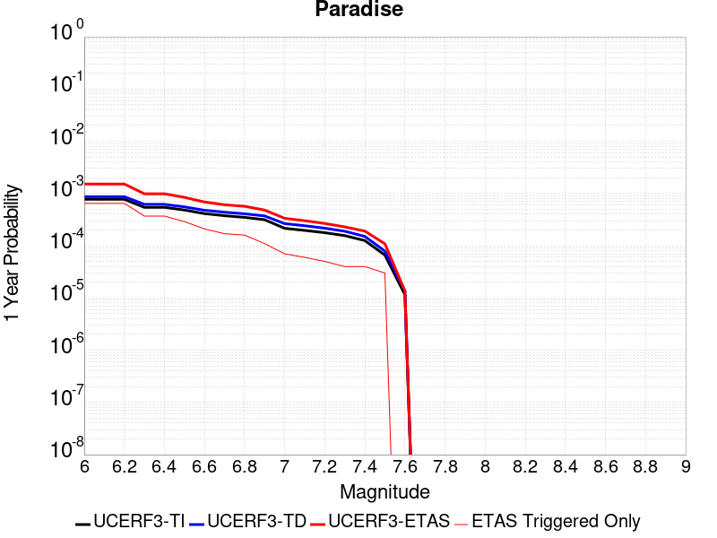 |  |

| Magnitude | 1 wk TI Prob | 1 wk TD Prob | 1 wk ETAS Prob | 1 wk ETAS/TD Gain | 1 wk ETAS Triggered Only | 1 mo TI Prob | 1 mo TD Prob | 1 mo ETAS Prob | 1 mo ETAS/TD Gain | 1 mo ETAS Triggered Only | 1 yr TI Prob | 1 yr TD Prob | 1 yr ETAS Prob | 1 yr ETAS/TD Gain | 1 yr ETAS Triggered Only | 10 yr TI Prob | 10 yr TD Prob | 10 yr ETAS Prob | 10 yr ETAS/TD Gain | 10 yr ETAS Triggered Only |
|-----|-----|-----|-----|-----|-----|-----|-----|-----|-----|-----|-----|-----|-----|-----|-----|-----|-----|-----|-----|-----|
| 6.0 | 1.4851273E-5 | 1.6694854E-5 | 7.0027294E-5 | 4.194544 | 5.3333333E-5 | 6.364676E-5 | 7.154755E-5 | 2.5820086E-4 | 3.6088011 | 1.8666667E-4 | 7.7462377E-4 | 8.707668E-4 | 0.0014835661 | 1.7037467 | 6.133333E-4 | 0.0077192914 | 0.008675928 | 0.010182741 | 1.1736774 | 0.00152 |
| 6.1 | 1.4851273E-5 | 1.6694854E-5 | 7.0027294E-5 | 4.194544 | 5.3333333E-5 | 6.364676E-5 | 7.154755E-5 | 2.5820086E-4 | 3.6088011 | 1.8666667E-4 | 7.7462377E-4 | 8.707668E-4 | 0.0014835661 | 1.7037467 | 6.133333E-4 | 0.0077192914 | 0.008675928 | 0.010182741 | 1.1736774 | 0.00152 |
| 6.2 | 1.4851273E-5 | 1.6694854E-5 | 7.0027294E-5 | 4.194544 | 5.3333333E-5 | 6.364676E-5 | 7.154755E-5 | 2.5820086E-4 | 3.6088011 | 1.8666667E-4 | 7.7462377E-4 | 8.707668E-4 | 0.0014835661 | 1.7037467 | 6.133333E-4 | 0.0077192914 | 0.008675928 | 0.010182741 | 1.1736774 | 0.00152 |
| 6.3 | 1.0426831E-5 | 1.1888727E-5 | 3.8555077E-5 | 3.2429943 | 2.6666667E-5 | 4.4685654E-5 | 5.0950726E-5 | 1.8427726E-4 | 3.616774 | 1.3333333E-4 | 5.43912E-4 | 6.201545E-4 | 0.0010199065 | 1.6446005 | 4.0E-4 | 0.0054258266 | 0.006184847 | 0.0069003943 | 1.1156936 | 7.2E-4 |
| 6.4 | 1.0426831E-5 | 1.1888727E-5 | 3.8555077E-5 | 3.2429943 | 2.6666667E-5 | 4.4685654E-5 | 5.0950726E-5 | 1.8427726E-4 | 3.616774 | 1.3333333E-4 | 5.43912E-4 | 6.201545E-4 | 0.0010199065 | 1.6446005 | 4.0E-4 | 0.0054258266 | 0.006184847 | 0.0069003943 | 1.1156936 | 7.2E-4 |
| 6.5 | 9.25027E-6 | 1.0620054E-5 | 1.0620054E-5 | 1.0 | 0.0 | 3.964341E-5 | 4.551375E-5 | 9.8844655E-5 | 2.1717536 | 5.3333333E-5 | 4.8255164E-4 | 5.539939E-4 | 8.471648E-4 | 1.5291951 | 2.9333335E-4 | 0.0048150513 | 0.0055266283 | 0.0060570138 | 1.0959692 | 5.3333334E-4 |
| 6.6 | 7.904275E-6 | 9.159603E-6 | 9.159603E-6 | 1.0 | 0.0 | 3.3875025E-5 | 3.925487E-5 | 9.258611E-5 | 2.3585892 | 5.3333333E-5 | 4.1235037E-4 | 4.7782718E-4 | 6.910586E-4 | 1.4462521 | 2.1333333E-4 | 0.0041158604 | 0.004768395 | 0.005086869 | 1.0667886 | 3.2E-4 |
| 6.7 | 7.2061953E-6 | 8.407318E-6 | 8.407318E-6 | 1.0 | 0.0 | 3.088333E-5 | 3.6030888E-5 | 8.93623E-5 | 2.480158 | 5.3333333E-5 | 3.7593965E-4 | 4.385914E-4 | 6.518312E-4 | 1.4861923 | 2.1333333E-4 | 0.003753043 | 0.0043776273 | 0.0046696765 | 1.066714 | 2.9333335E-4 |
| 6.8 | 6.6948724E-6 | 7.84223E-6 | 7.84223E-6 | 1.0 | 0.0 | 2.8691995E-5 | 3.3609143E-5 | 8.694069E-5 | 2.5868163 | 5.3333333E-5 | 3.4926904E-4 | 4.0911807E-4 | 5.957084E-4 | 1.4560794 | 1.8666667E-4 | 0.003487206 | 0.0040840064 | 0.004349584 | 1.0650287 | 2.6666667E-4 |
| 6.9 | 6.0421025E-6 | 7.130678E-6 | 7.130678E-6 | 1.0 | 0.0 | 2.5894467E-5 | 3.055971E-5 | 8.389141E-5 | 2.745164 | 5.3333333E-5 | 3.1521954E-4 | 3.7200435E-4 | 5.052881E-4 | 1.3582854 | 1.3333333E-4 | 0.0031477278 | 0.0037141545 | 0.0039266953 | 1.0572246 | 2.1333333E-4 |
| 7.0 | 4.134091E-6 | 5.0803487E-6 | 5.0803487E-6 | 1.0 | 0.0 | 1.7717413E-5 | 2.177275E-5 | 7.510492E-5 | 3.4494917 | 5.3333333E-5 | 2.1568815E-4 | 2.6505254E-4 | 3.4503132E-4 | 1.301747 | 8.0E-5 | 0.0021547892 | 0.0026475172 | 0.0027804975 | 1.0502284 | 1.3333333E-4 |
| 7.1 | 3.7674888E-6 | 4.6319055E-6 | 4.6319055E-6 | 1.0 | 0.0 | 1.6146281E-5 | 1.985088E-5 | 4.651702E-5 | 2.3433228 | 2.6666667E-5 | 1.9656324E-4 | 2.4165919E-4 | 2.9497963E-4 | 1.2206432 | 5.3333333E-5 | 0.0019638946 | 0.0024141145 | 0.0024939214 | 1.0330584 | 8.0E-5 |
| 7.2 | 3.4065345E-6 | 4.156755E-6 | 4.156755E-6 | 1.0 | 0.0 | 1.4599351E-5 | 1.7814553E-5 | 4.4480745E-5 | 2.496877 | 2.6666667E-5 | 1.777326E-4 | 2.1687208E-4 | 2.7019385E-4 | 1.2458674 | 5.3333333E-5 | 0.0017759053 | 0.0021667527 | 0.0022465794 | 1.0368416 | 8.0E-5 |
| 7.3 | 2.9934936E-6 | 3.6293434E-6 | 3.6293434E-6 | 1.0 | 0.0 | 1.2829195E-5 | 1.5554244E-5 | 4.2220498E-5 | 2.7144036 | 2.6666667E-5 | 1.5618425E-4 | 1.8935793E-4 | 2.1601956E-4 | 1.1408001 | 2.6666667E-5 | 0.0015607453 | 0.0018921113 | 0.0019453437 | 1.0281339 | 5.3333333E-5 |
| 7.4 | 2.4049796E-6 | 2.8890036E-6 | 2.8890036E-6 | 1.0 | 0.0 | 1.0307015E-5 | 1.2381393E-5 | 3.904773E-5 | 3.1537428 | 2.6666667E-5 | 1.2548068E-4 | 1.5073447E-4 | 1.7739713E-4 | 1.1768849 | 2.6666667E-5 | 0.0012540985 | 0.0015064639 | 0.0015330903 | 1.0176748 | 2.6666667E-5 |
| 7.5 | 1.2710091E-6 | 1.5134775E-6 | 1.5134775E-6 | 1.0 | 0.0 | 5.44717E-6 | 6.486323E-6 | 6.486323E-6 | 1.0 | 0.0 | 6.631728E-5 | 7.896937E-5 | 7.896937E-5 | 1.0 | 0.0 | 6.6297496E-4 | 7.8953576E-4 | 7.8953576E-4 | 1.0 | 0.0 |
| 7.6 | 2.21172E-7 | 2.6039737E-7 | 2.6039737E-7 | 1.0 | 0.0 | 9.478797E-7 | 1.1159884E-6 | 1.1159884E-6 | 1.0 | 0.0 | 1.1540374E-5 | 1.3587103E-5 | 1.3587103E-5 | 1.0 | 0.0 | 1.1539775E-4 | 1.3586554E-4 | 1.3586554E-4 | 1.0 | 0.0 |

## Bicycle Lake
*[(top)](#table-of-contents)*

| 1 Week | 1 Month | 1 Year | 10 Year |
|-----|-----|-----|-----|
|  |  |  |  |

| Magnitude | 1 wk TI Prob | 1 wk TD Prob | 1 wk ETAS Prob | 1 wk ETAS/TD Gain | 1 wk ETAS Triggered Only | 1 mo TI Prob | 1 mo TD Prob | 1 mo ETAS Prob | 1 mo ETAS/TD Gain | 1 mo ETAS Triggered Only | 1 yr TI Prob | 1 yr TD Prob | 1 yr ETAS Prob | 1 yr ETAS/TD Gain | 1 yr ETAS Triggered Only | 10 yr TI Prob | 10 yr TD Prob | 10 yr ETAS Prob | 10 yr ETAS/TD Gain | 10 yr ETAS Triggered Only |
|-----|-----|-----|-----|-----|-----|-----|-----|-----|-----|-----|-----|-----|-----|-----|-----|-----|-----|-----|-----|-----|
| 6.0 | 1.9621975E-5 | 2.2097447E-5 | 7.5429605E-5 | 3.4134984 | 5.3333333E-5 | 8.4091465E-5 | 9.470067E-5 | 2.2802138E-4 | 2.4078116 | 1.3333333E-4 | 0.0010233327 | 0.0011525059 | 0.0018184042 | 1.5777831 | 6.6666666E-4 | 0.01018633 | 0.011478599 | 0.012796627 | 1.1148249 | 0.0013333333 |
| 6.1 | 1.9621975E-5 | 2.2097447E-5 | 7.5429605E-5 | 3.4134984 | 5.3333333E-5 | 8.4091465E-5 | 9.470067E-5 | 2.2802138E-4 | 2.4078116 | 1.3333333E-4 | 0.0010233327 | 0.0011525059 | 0.0018184042 | 1.5777831 | 6.6666666E-4 | 0.01018633 | 0.011478599 | 0.012796627 | 1.1148249 | 0.0013333333 |
| 6.2 | 9.9971285E-6 | 1.1255827E-5 | 6.458856E-5 | 5.738233 | 5.3333333E-5 | 4.2844134E-5 | 4.823866E-5 | 1.5490019E-4 | 3.211121 | 1.0666667E-4 | 5.2150246E-4 | 5.8719947E-4 | 9.869646E-4 | 1.6807995 | 4.0E-4 | 0.0052028033 | 0.005861584 | 0.006656895 | 1.1356819 | 8.0E-4 |
| 6.3 | 9.589428E-6 | 1.0798527E-5 | 6.413129E-5 | 5.938892 | 5.3333333E-5 | 4.10969E-5 | 4.627887E-5 | 1.529406E-4 | 3.304761 | 1.0666667E-4 | 5.002399E-4 | 5.6335144E-4 | 9.6312613E-4 | 1.7096363 | 4.0E-4 | 0.0049911533 | 0.0056243236 | 0.006419824 | 1.1414393 | 8.0E-4 |
| 6.4 | 9.589428E-6 | 1.0798527E-5 | 6.413129E-5 | 5.938892 | 5.3333333E-5 | 4.10969E-5 | 4.627887E-5 | 1.529406E-4 | 3.304761 | 1.0666667E-4 | 5.002399E-4 | 5.6335144E-4 | 9.6312613E-4 | 1.7096363 | 4.0E-4 | 0.0049911533 | 0.0056243236 | 0.006419824 | 1.1414393 | 8.0E-4 |
| 6.5 | 5.557707E-6 | 6.2857107E-6 | 5.961871E-5 | 9.4848 | 5.3333333E-5 | 2.3818526E-5 | 2.6938633E-5 | 1.3360243E-4 | 4.9595103 | 1.0666667E-4 | 2.8995197E-4 | 3.2795538E-4 | 6.211925E-4 | 1.8941373 | 2.9333335E-4 | 0.0028957394 | 0.0032773502 | 0.003835515 | 1.1703098 | 5.6E-4 |
| 6.6 | 4.8742945E-6 | 5.5133855E-6 | 5.8846425E-5 | 10.673373 | 5.3333333E-5 | 2.0889667E-5 | 2.3628729E-5 | 1.0362684E-4 | 4.385629 | 8.0E-5 | 2.54302E-4 | 2.87668E-4 | 5.5425795E-4 | 1.9267279 | 2.6666667E-4 | 0.002540112 | 0.0028755253 | 0.003327555 | 1.157199 | 4.5333334E-4 |
| 6.7 | 3.991108E-6 | 4.515989E-6 | 5.784908E-5 | 12.809836 | 5.3333333E-5 | 1.7104636E-5 | 1.9354238E-5 | 7.268654E-5 | 3.7555876 | 5.3333333E-5 | 2.0822904E-4 | 2.3563785E-4 | 4.489209E-4 | 1.9051307 | 2.1333333E-4 | 0.0020803404 | 0.0023563786 | 0.0027288322 | 1.1580619 | 3.7333334E-4 |

## San Andreas (San Bernardino N)
*[(top)](#table-of-contents)*

| 1 Week | 1 Month | 1 Year | 10 Year |
|-----|-----|-----|-----|
|  | 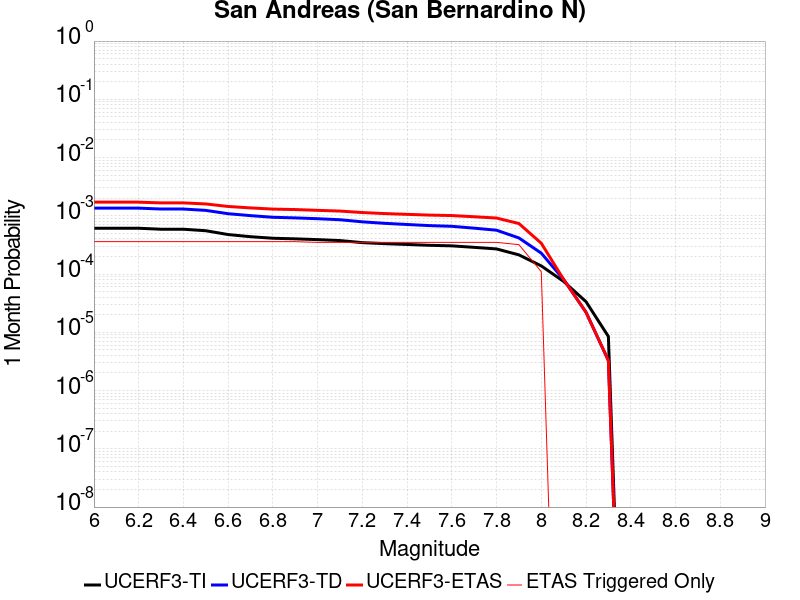 |  |  |

| Magnitude | 1 wk TI Prob | 1 wk TD Prob | 1 wk ETAS Prob | 1 wk ETAS/TD Gain | 1 wk ETAS Triggered Only | 1 mo TI Prob | 1 mo TD Prob | 1 mo ETAS Prob | 1 mo ETAS/TD Gain | 1 mo ETAS Triggered Only | 1 yr TI Prob | 1 yr TD Prob | 1 yr ETAS Prob | 1 yr ETAS/TD Gain | 1 yr ETAS Triggered Only | 10 yr TI Prob | 10 yr TD Prob | 10 yr ETAS Prob | 10 yr ETAS/TD Gain | 10 yr ETAS Triggered Only |
|-----|-----|-----|-----|-----|-----|-----|-----|-----|-----|-----|-----|-----|-----|-----|-----|-----|-----|-----|-----|-----|
| 6.0 | 1.4273766E-4 | 3.161376E-4 | 3.961123E-4 | 1.2529744 | 8.0E-5 | 6.115894E-4 | 0.0013541778 | 0.0015938528 | 1.1769893 | 2.4E-4 | 0.0074207084 | 0.016363978 | 0.017072195 | 1.043279 | 7.2E-4 | 0.07177748 | 0.15029658 | 0.15122558 | 1.0061811 | 0.0010933334 |
| 6.1 | 1.4273766E-4 | 3.161376E-4 | 3.961123E-4 | 1.2529744 | 8.0E-5 | 6.115894E-4 | 0.0013541778 | 0.0015938528 | 1.1769893 | 2.4E-4 | 0.0074207084 | 0.016363978 | 0.017072195 | 1.043279 | 7.2E-4 | 0.07177748 | 0.15029658 | 0.15122558 | 1.0061811 | 0.0010933334 |
| 6.2 | 1.4273766E-4 | 3.161376E-4 | 3.961123E-4 | 1.2529744 | 8.0E-5 | 6.115894E-4 | 0.0013541778 | 0.0015938528 | 1.1769893 | 2.4E-4 | 0.0074207084 | 0.016363978 | 0.017072195 | 1.043279 | 7.2E-4 | 0.07177748 | 0.15029658 | 0.15122558 | 1.0061811 | 0.0010933334 |
| 6.3 | 1.3730655E-4 | 3.0518573E-4 | 3.8516134E-4 | 1.2620554 | 8.0E-5 | 5.883239E-4 | 0.001307289 | 0.0015469752 | 1.183346 | 2.4E-4 | 0.0071393442 | 0.01580149 | 0.016510112 | 1.0448453 | 7.2E-4 | 0.06914291 | 0.14559646 | 0.14653061 | 1.006416 | 0.0010933334 |
| 6.4 | 1.3730655E-4 | 3.0518573E-4 | 3.8516134E-4 | 1.2620554 | 8.0E-5 | 5.883239E-4 | 0.001307289 | 0.0015469752 | 1.183346 | 2.4E-4 | 0.0071393442 | 0.01580149 | 0.016510112 | 1.0448453 | 7.2E-4 | 0.06914291 | 0.14559646 | 0.14653061 | 1.006416 | 0.0010933334 |
| 6.5 | 1.2942807E-4 | 2.8932988E-4 | 3.6930674E-4 | 1.276421 | 8.0E-5 | 5.545738E-4 | 0.0012394012 | 0.0014791037 | 1.1934019 | 2.4E-4 | 0.0067310524 | 0.014986552 | 0.015695762 | 1.0473231 | 7.2E-4 | 0.06530788 | 0.13873914 | 0.13968079 | 1.0067872 | 0.0010933334 |
| 6.6 | 1.1125901E-4 | 2.537176E-4 | 3.3369727E-4 | 1.3152312 | 8.0E-5 | 4.767372E-4 | 0.0010869103 | 0.0013266493 | 1.2205694 | 2.4E-4 | 0.005788839 | 0.013153472 | 0.013864001 | 1.0540184 | 7.2E-4 | 0.056403454 | 0.12302898 | 0.12394103 | 1.0074133 | 0.00104 |
| 6.7 | 1.02209575E-4 | 2.3506685E-4 | 3.1504803E-4 | 1.3402487 | 8.0E-5 | 4.3796748E-4 | 0.0010070418 | 0.0012468001 | 1.2380818 | 2.4E-4 | 0.0053192247 | 0.01219223 | 0.012903452 | 1.058334 | 7.2E-4 | 0.051936906 | 0.11482068 | 0.11574127 | 1.0080177 | 0.00104 |
| 6.8 | 9.610582E-5 | 2.2032406E-4 | 3.0030642E-4 | 1.3630215 | 8.0E-5 | 4.1181705E-4 | 9.439049E-4 | 0.0011836784 | 1.2540228 | 2.4E-4 | 0.0050023515 | 0.011431754 | 0.0121435225 | 1.0622624 | 7.2E-4 | 0.048912346 | 0.1082225 | 0.10914995 | 1.0085698 | 0.00104 |
| 6.9 | 9.3877505E-5 | 2.1487933E-4 | 2.9486214E-4 | 1.372222 | 8.0E-5 | 4.0227012E-4 | 9.2058704E-4 | 0.0011603661 | 1.2604632 | 2.4E-4 | 0.0048866454 | 0.011150793 | 0.011862764 | 1.0638494 | 7.2E-4 | 0.04780577 | 0.10581279 | 0.10674275 | 1.0087887 | 0.00104 |
| 7.0 | 9.1019785E-5 | 2.0814833E-4 | 2.8813168E-4 | 1.3842613 | 8.0E-5 | 3.900265E-4 | 8.917599E-4 | 0.0011315459 | 1.2688907 | 2.4E-4 | 0.0047382377 | 0.010803353 | 0.0115155745 | 1.065926 | 7.2E-4 | 0.046384744 | 0.10278319 | 0.10371629 | 1.0090784 | 0.00104 |
| 7.1 | 8.771155E-5 | 1.9989353E-4 | 2.7987754E-4 | 1.400133 | 8.0E-5 | 3.758525E-4 | 8.564058E-4 | 0.0010962003 | 1.2800009 | 2.4E-4 | 0.0045664064 | 0.01037709 | 0.011063228 | 1.0661205 | 6.9333334E-4 | 0.044737056 | 0.09909467 | 0.100007586 | 1.0092126 | 0.0010133333 |
| 7.2 | 8.0830236E-5 | 1.8394848E-4 | 2.6393376E-4 | 1.4348243 | 8.0E-5 | 3.4636928E-4 | 7.881126E-4 | 0.0010279234 | 1.304285 | 2.4E-4 | 0.0042088944 | 0.009553162 | 0.010239872 | 1.071883 | 6.9333334E-4 | 0.041300658 | 0.09182531 | 0.09272137 | 1.0097584 | 9.866667E-4 |
| 7.3 | 7.7668235E-5 | 1.7338296E-4 | 2.5336907E-4 | 1.4613264 | 8.0E-5 | 3.328214E-4 | 7.428583E-4 | 9.8268E-4 | 1.3228364 | 2.4E-4 | 0.0040445733 | 0.009006873 | 0.009693962 | 1.0762849 | 6.9333334E-4 | 0.03971748 | 0.087092124 | 0.08799286 | 1.0103424 | 9.866667E-4 |
| 7.4 | 7.520177E-5 | 1.6558339E-4 | 2.4557015E-4 | 1.4830602 | 8.0E-5 | 3.2225347E-4 | 7.0945016E-4 | 9.492799E-4 | 1.3380501 | 2.4E-4 | 0.0039163795 | 0.0086034145 | 0.009290783 | 1.0798948 | 6.9333334E-4 | 0.038480744 | 0.08354814 | 0.084452376 | 1.0108229 | 9.866667E-4 |
| 7.5 | 7.274697E-5 | 1.5845922E-4 | 2.3844655E-4 | 1.5047817 | 8.0E-5 | 3.1173544E-4 | 6.789343E-4 | 9.187713E-4 | 1.3532552 | 2.4E-4 | 0.003788775 | 0.008234753 | 0.008922377 | 1.0835027 | 6.9333334E-4 | 0.03724827 | 0.08026466 | 0.08117213 | 1.011306 | 9.866667E-4 |
| 7.6 | 7.1185845E-5 | 1.5415733E-4 | 2.34145E-4 | 1.5188704 | 8.0E-5 | 3.0504653E-4 | 6.6050707E-4 | 9.0034853E-4 | 1.3631172 | 2.4E-4 | 0.0037076178 | 0.008012074 | 0.0086734 | 1.0825411 | 6.6666666E-4 | 0.036463667 | 0.078254156 | 0.07913903 | 1.0113077 | 9.6E-4 |
| 7.7 | 6.709961E-5 | 1.4324463E-4 | 2.2323318E-4 | 1.5584052 | 8.0E-5 | 2.8753807E-4 | 6.1376113E-4 | 8.5361383E-4 | 1.3907917 | 2.4E-4 | 0.003495157 | 0.007446978 | 0.00810868 | 1.0888551 | 6.6666666E-4 | 0.034406938 | 0.073082365 | 0.0739722 | 1.0121759 | 9.6E-4 |
| 7.8 | 6.300812E-5 | 1.3208245E-4 | 2.1207189E-4 | 1.6056023 | 8.0E-5 | 2.7000686E-4 | 5.659449E-4 | 8.0580905E-4 | 1.4238296 | 2.4E-4 | 0.0032823787 | 0.0068686386 | 0.007504243 | 1.0925372 | 6.4E-4 | 0.032343175 | 0.06773997 | 0.06861008 | 1.0128448 | 9.3333336E-4 |
| 7.9 | 4.983037E-5 | 9.728091E-5 | 1.7727312E-4 | 1.8222808 | 8.0E-5 | 2.1354125E-4 | 4.1685157E-4 | 6.567515E-4 | 1.5755045 | 2.4E-4 | 0.0025967648 | 0.005063368 | 0.005620532 | 1.1100383 | 5.6E-4 | 0.025666296 | 0.0506703 | 0.051429763 | 1.0149883 | 8.0E-4 |
| 8.0 | 3.2211527E-5 | 5.333152E-5 | 7.999677E-5 | 1.4999903 | 2.6666667E-5 | 1.380421E-4 | 2.2854365E-4 | 3.0852537E-4 | 1.3499626 | 8.0E-5 | 0.0016793669 | 0.0027789702 | 0.0029651183 | 1.0669845 | 1.8666667E-4 | 0.016667323 | 0.02837451 | 0.0286077 | 1.0082183 | 2.4E-4 |
| 8.1 | 1.743376E-5 | 1.8836954E-5 | 1.8836954E-5 | 1.0 | 0.0 | 7.471398E-5 | 8.07273E-5 | 8.07273E-5 | 1.0 | 0.0 | 9.0926304E-4 | 9.824124E-4 | 9.824124E-4 | 1.0 | 0.0 | 0.009055517 | 0.010490617 | 0.010490617 | 1.0 | 0.0 |
| 8.2 | 7.831616E-6 | 5.1597067E-6 | 5.1597067E-6 | 1.0 | 0.0 | 3.3563636E-5 | 2.2112841E-5 | 2.2112841E-5 | 1.0 | 0.0 | 4.0856065E-4 | 2.6919067E-4 | 2.6919067E-4 | 1.0 | 0.0 | 0.004078103 | 0.003044315 | 0.003044315 | 1.0 | 0.0 |
| 8.3 | 1.983087E-6 | 7.668296E-7 | 7.668296E-7 | 1.0 | 0.0 | 8.498917E-6 | 3.2864084E-6 | 3.2864084E-6 | 1.0 | 0.0 | 1.034694E-4 | 4.0011306E-5 | 4.0011306E-5 | 1.0 | 0.0 | 0.0010342124 | 4.724499E-4 | 4.724499E-4 | 1.0 | 0.0 |

## Garlic Springs
*[(top)](#table-of-contents)*

| 1 Week | 1 Month | 1 Year | 10 Year |
|-----|-----|-----|-----|
|  | 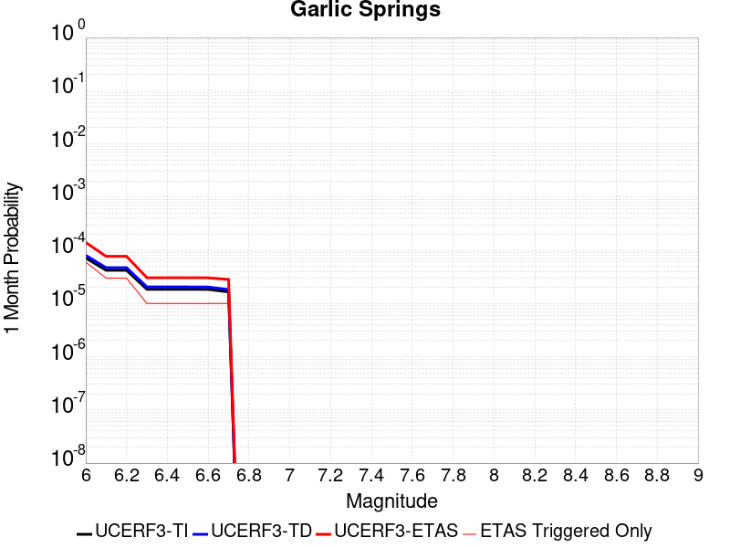 |  | 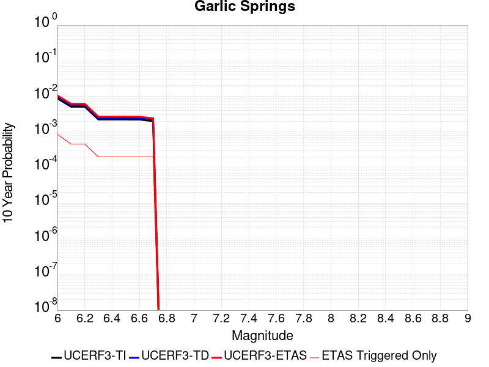 |

| Magnitude | 1 wk TI Prob | 1 wk TD Prob | 1 wk ETAS Prob | 1 wk ETAS/TD Gain | 1 wk ETAS Triggered Only | 1 mo TI Prob | 1 mo TD Prob | 1 mo ETAS Prob | 1 mo ETAS/TD Gain | 1 mo ETAS Triggered Only | 1 yr TI Prob | 1 yr TD Prob | 1 yr ETAS Prob | 1 yr ETAS/TD Gain | 1 yr ETAS Triggered Only | 10 yr TI Prob | 10 yr TD Prob | 10 yr ETAS Prob | 10 yr ETAS/TD Gain | 10 yr ETAS Triggered Only |
|-----|-----|-----|-----|-----|-----|-----|-----|-----|-----|-----|-----|-----|-----|-----|-----|-----|-----|-----|-----|-----|
| 6.0 | 1.6760017E-5 | 1.8777133E-5 | 1.8777133E-5 | 1.0 | 0.0 | 7.182667E-5 | 8.0471604E-5 | 1.3380064E-4 | 1.6627064 | 5.3333333E-5 | 8.7413884E-4 | 9.794189E-4 | 0.001379027 | 1.4080055 | 4.0E-4 | 0.008707083 | 0.009762568 | 0.01068679 | 1.0946699 | 9.3333336E-4 |
| 6.1 | 9.852767E-6 | 1.0973752E-5 | 1.0973752E-5 | 1.0 | 0.0 | 4.222546E-5 | 4.702992E-5 | 7.369533E-5 | 1.5669882 | 2.6666667E-5 | 5.139737E-4 | 5.7250983E-4 | 7.5906963E-4 | 1.325863 | 1.8666667E-4 | 0.005127866 | 0.0057173073 | 0.006141535 | 1.0742005 | 4.2666667E-4 |
| 6.2 | 9.852767E-6 | 1.0973752E-5 | 1.0973752E-5 | 1.0 | 0.0 | 4.222546E-5 | 4.702992E-5 | 7.369533E-5 | 1.5669882 | 2.6666667E-5 | 5.139737E-4 | 5.7250983E-4 | 7.5906963E-4 | 1.325863 | 1.8666667E-4 | 0.005127866 | 0.0057173073 | 0.006141535 | 1.0742005 | 4.2666667E-4 |
| 6.3 | 4.3167724E-6 | 4.7780964E-6 | 4.7780964E-6 | 1.0 | 0.0 | 1.8500323E-5 | 2.0477524E-5 | 4.7143647E-5 | 2.3022141 | 2.6666667E-5 | 2.2521814E-4 | 2.4930836E-4 | 3.5594843E-4 | 1.4277437 | 1.0666667E-4 | 0.0022499003 | 0.0024925452 | 0.002731947 | 1.0960472 | 2.4E-4 |
| 6.4 | 4.3167724E-6 | 4.7780964E-6 | 4.7780964E-6 | 1.0 | 0.0 | 1.8500323E-5 | 2.0477524E-5 | 4.7143647E-5 | 2.3022141 | 2.6666667E-5 | 2.2521814E-4 | 2.4930836E-4 | 3.5594843E-4 | 1.4277437 | 1.0666667E-4 | 0.0022499003 | 0.0024925452 | 0.002731947 | 1.0960472 | 2.4E-4 |
| 6.5 | 4.3167724E-6 | 4.7780964E-6 | 4.7780964E-6 | 1.0 | 0.0 | 1.8500323E-5 | 2.0477524E-5 | 4.7143647E-5 | 2.3022141 | 2.6666667E-5 | 2.2521814E-4 | 2.4930836E-4 | 3.5594843E-4 | 1.4277437 | 1.0666667E-4 | 0.0022499003 | 0.0024925452 | 0.002731947 | 1.0960472 | 2.4E-4 |
| 6.6 | 4.301311E-6 | 4.7609647E-6 | 4.7609647E-6 | 1.0 | 0.0 | 1.8434059E-5 | 2.0404104E-5 | 4.7070225E-5 | 2.3069 | 2.6666667E-5 | 2.2441156E-4 | 2.4841467E-4 | 3.5505486E-4 | 1.4292829 | 1.0666667E-4 | 0.0022418506 | 0.0024836282 | 0.0027230321 | 1.0963929 | 2.4E-4 |
| 6.7 | 3.8599724E-6 | 4.2711204E-6 | 4.2711204E-6 | 1.0 | 0.0 | 1.6542634E-5 | 1.8304801E-5 | 4.497098E-5 | 2.4567862 | 2.6666667E-5 | 2.0138794E-4 | 2.2286095E-4 | 3.2950385E-4 | 1.4785177 | 1.0666667E-4 | 0.0020120554 | 0.0022286095 | 0.0024680747 | 1.1074505 | 2.4E-4 |

## Death Valley (Black Mtns Frontal)
*[(top)](#table-of-contents)*

| 1 Week | 1 Month | 1 Year | 10 Year |
|-----|-----|-----|-----|
|  |  |  |  |

| Magnitude | 1 wk TI Prob | 1 wk TD Prob | 1 wk ETAS Prob | 1 wk ETAS/TD Gain | 1 wk ETAS Triggered Only | 1 mo TI Prob | 1 mo TD Prob | 1 mo ETAS Prob | 1 mo ETAS/TD Gain | 1 mo ETAS Triggered Only | 1 yr TI Prob | 1 yr TD Prob | 1 yr ETAS Prob | 1 yr ETAS/TD Gain | 1 yr ETAS Triggered Only | 10 yr TI Prob | 10 yr TD Prob | 10 yr ETAS Prob | 10 yr ETAS/TD Gain | 10 yr ETAS Triggered Only |
|-----|-----|-----|-----|-----|-----|-----|-----|-----|-----|-----|-----|-----|-----|-----|-----|-----|-----|-----|-----|-----|
| 6.0 | 1.6707214E-5 | 1.867056E-5 | 7.20029E-5 | 3.8564937 | 5.3333333E-5 | 7.160038E-5 | 8.001427E-5 | 2.4000148E-4 | 2.999483 | 1.6E-4 | 8.71386E-4 | 9.7374606E-4 | 0.0013467158 | 1.3830258 | 3.7333334E-4 | 0.00867977 | 0.009695647 | 0.010461483 | 1.0789876 | 7.7333336E-4 |
| 6.1 | 1.6707214E-5 | 1.867056E-5 | 7.20029E-5 | 3.8564937 | 5.3333333E-5 | 7.160038E-5 | 8.001427E-5 | 2.4000148E-4 | 2.999483 | 1.6E-4 | 8.71386E-4 | 9.7374606E-4 | 0.0013467158 | 1.3830258 | 3.7333334E-4 | 0.00867977 | 0.009695647 | 0.010461483 | 1.0789876 | 7.7333336E-4 |
| 6.2 | 1.6707214E-5 | 1.867056E-5 | 7.20029E-5 | 3.8564937 | 5.3333333E-5 | 7.160038E-5 | 8.001427E-5 | 2.4000148E-4 | 2.999483 | 1.6E-4 | 8.71386E-4 | 9.7374606E-4 | 0.0013467158 | 1.3830258 | 3.7333334E-4 | 0.00867977 | 0.009695647 | 0.010461483 | 1.0789876 | 7.7333336E-4 |
| 6.3 | 1.6707214E-5 | 1.867056E-5 | 7.20029E-5 | 3.8564937 | 5.3333333E-5 | 7.160038E-5 | 8.001427E-5 | 2.4000148E-4 | 2.999483 | 1.6E-4 | 8.71386E-4 | 9.7374606E-4 | 0.0013467158 | 1.3830258 | 3.7333334E-4 | 0.00867977 | 0.009695647 | 0.010461483 | 1.0789876 | 7.7333336E-4 |
| 6.4 | 1.5515609E-5 | 1.7338483E-5 | 7.0670896E-5 | 4.075956 | 5.3333333E-5 | 6.649377E-5 | 7.430571E-5 | 2.0762913E-4 | 2.7942555 | 1.3333333E-4 | 8.0926094E-4 | 9.0430264E-4 | 0.0012240133 | 1.3535439 | 3.2E-4 | 0.008063202 | 0.009006913 | 0.009694002 | 1.0762845 | 6.9333334E-4 |
| 6.5 | 1.5515609E-5 | 1.7338483E-5 | 7.0670896E-5 | 4.075956 | 5.3333333E-5 | 6.649377E-5 | 7.430571E-5 | 2.0762913E-4 | 2.7942555 | 1.3333333E-4 | 8.0926094E-4 | 9.0430264E-4 | 0.0012240133 | 1.3535439 | 3.2E-4 | 0.008063202 | 0.009006913 | 0.009694002 | 1.0762845 | 6.9333334E-4 |
| 6.6 | 1.5041828E-5 | 1.6809407E-5 | 7.014185E-5 | 4.1727734 | 5.3333333E-5 | 6.4463384E-5 | 7.203836E-5 | 2.0536208E-4 | 2.8507323 | 1.3333333E-4 | 7.8455906E-4 | 8.7672E-4 | 0.0011964395 | 1.3646768 | 3.2E-4 | 0.00781795 | 0.008733268 | 0.009420547 | 1.0786966 | 6.9333334E-4 |
| 6.7 | 1.4634985E-5 | 1.6356273E-5 | 6.968874E-5 | 4.2606735 | 5.3333333E-5 | 6.271985E-5 | 7.009646E-5 | 2.0342045E-4 | 2.9020076 | 1.3333333E-4 | 7.6334673E-4 | 8.53096E-4 | 0.001146179 | 1.3435524 | 2.9333335E-4 | 0.007607299 | 0.008498848 | 0.009159849 | 1.0777754 | 6.6666666E-4 |
| 6.8 | 1.4209158E-5 | 1.5882297E-5 | 6.921478E-5 | 4.357983 | 5.3333333E-5 | 6.089497E-5 | 6.806524E-5 | 2.013895E-4 | 2.9587715 | 1.3333333E-4 | 7.4114406E-4 | 8.2838483E-4 | 0.0011214751 | 1.3538094 | 2.9333335E-4 | 0.007386771 | 0.008253585 | 0.008888302 | 1.076902 | 6.4E-4 |
| 6.9 | 1.3780098E-5 | 1.5404834E-5 | 6.873735E-5 | 4.4620633 | 5.3333333E-5 | 5.9056227E-5 | 6.601908E-5 | 1.726787E-4 | 2.615588 | 1.0666667E-4 | 7.1877235E-4 | 8.0349133E-4 | 0.0010699438 | 1.3316183 | 2.6666667E-4 | 0.0071645193 | 0.008006458 | 0.008561974 | 1.0693835 | 5.6E-4 |
| 7.0 | 1.3585064E-5 | 1.5188394E-5 | 6.8520916E-5 | 4.5113997 | 5.3333333E-5 | 5.8220405E-5 | 6.5091524E-5 | 1.4508632E-4 | 2.2289586 | 8.0E-5 | 7.086029E-4 | 7.922066E-4 | 0.0010320165 | 1.3027112 | 2.4E-4 | 0.007063476 | 0.007894417 | 0.008397084 | 1.0636737 | 5.0666666E-4 |
| 7.1 | 1.3398601E-5 | 1.4981575E-5 | 6.831411E-5 | 4.559875 | 5.3333333E-5 | 5.742131E-5 | 6.4205204E-5 | 1.4420006E-4 | 2.245925 | 8.0E-5 | 6.9888023E-4 | 7.814234E-4 | 0.0010212358 | 1.3068918 | 2.4E-4 | 0.0069668638 | 0.007787346 | 0.008290067 | 1.0645561 | 5.0666666E-4 |
| 7.2 | 1.3126312E-5 | 1.4679792E-5 | 6.801234E-5 | 4.633059 | 5.3333333E-5 | 5.6254412E-5 | 6.291191E-5 | 1.4290688E-4 | 2.2715394 | 8.0E-5 | 6.846822E-4 | 7.656887E-4 | 9.788587E-4 | 1.2784029 | 2.1333333E-4 | 0.006825765 | 0.00763109 | 0.008028037 | 1.0520172 | 4.0E-4 |
| 7.3 | 1.2922429E-5 | 1.4454016E-5 | 6.7786576E-5 | 4.6898093 | 5.3333333E-5 | 5.5380664E-5 | 6.1944345E-5 | 1.4193938E-4 | 2.2914019 | 8.0E-5 | 6.74051E-4 | 7.5391686E-4 | 9.137962E-4 | 1.212065 | 1.6E-4 | 0.006720101 | 0.0075141727 | 0.0077788355 | 1.0352218 | 2.6666667E-4 |
| 7.4 | 1.2768878E-5 | 1.4283997E-5 | 6.7616566E-5 | 4.733729 | 5.3333333E-5 | 5.4722615E-5 | 6.1215724E-5 | 1.4121082E-4 | 2.306774 | 8.0E-5 | 6.660441E-4 | 7.45052E-4 | 9.049328E-4 | 1.2145901 | 1.6E-4 | 0.0066405144 | 0.0074261203 | 0.007690807 | 1.0356426 | 2.6666667E-4 |
| 7.5 | 1.2521929E-5 | 1.40122365E-5 | 4.067853E-5 | 2.9030719 | 2.6666667E-5 | 5.366431E-5 | 6.0051094E-5 | 1.13381226E-4 | 1.8880793 | 5.3333333E-5 | 6.531671E-4 | 7.308822E-4 | 8.641181E-4 | 1.1822946 | 1.3333333E-4 | 0.006512506 | 0.0072853607 | 0.007523612 | 1.0327028 | 2.4E-4 |
| 7.6 | 1.1301089E-5 | 1.2648349E-5 | 3.931468E-5 | 3.1082854 | 2.6666667E-5 | 4.8432343E-5 | 5.4206117E-5 | 1.0753656E-4 | 1.9838455 | 5.3333333E-5 | 5.895042E-4 | 6.597649E-4 | 7.663612E-4 | 1.1615671 | 1.0666667E-4 | 0.0058794282 | 0.0065786145 | 0.0067905444 | 1.032215 | 2.1333333E-4 |
| 7.7 | 9.189108E-6 | 1.0283521E-5 | 1.0283521E-5 | 1.0 | 0.0 | 3.93813E-5 | 4.407152E-5 | 4.407152E-5 | 1.0 | 0.0 | 4.7936183E-4 | 5.3644367E-4 | 5.3644367E-4 | 1.0 | 0.0 | 0.004783291 | 0.0053519984 | 0.005458094 | 1.0198236 | 1.0666667E-4 |
| 7.8 | 3.4586725E-7 | 3.648288E-7 | 3.648288E-7 | 1.0 | 0.0 | 1.4822873E-6 | 1.5635511E-6 | 1.5635511E-6 | 1.0 | 0.0 | 1.80467E-5 | 1.9036073E-5 | 1.9036073E-5 | 1.0 | 0.0 | 1.8045233E-4 | 1.9034486E-4 | 1.9034486E-4 | 1.0 | 0.0 |
| 7.9 | 2.5591178E-9 | 2.6696871E-9 | 2.6696871E-9 | 1.0 | 0.0 | 1.0967647E-8 | 1.1441516E-8 | 1.1441516E-8 | 1.0 | 0.0 | 1.335311E-7 | 1.3930045E-7 | 1.3930045E-7 | 1.0 | 0.0 | 1.3353102E-6 | 1.3930046E-6 | 1.3930046E-6 | 1.0 | 0.0 |

## Coyote Lake
*[(top)](#table-of-contents)*

| 1 Week | 1 Month | 1 Year | 10 Year |
|-----|-----|-----|-----|
|  |  |  |  |

| Magnitude | 1 wk TI Prob | 1 wk TD Prob | 1 wk ETAS Prob | 1 wk ETAS/TD Gain | 1 wk ETAS Triggered Only | 1 mo TI Prob | 1 mo TD Prob | 1 mo ETAS Prob | 1 mo ETAS/TD Gain | 1 mo ETAS Triggered Only | 1 yr TI Prob | 1 yr TD Prob | 1 yr ETAS Prob | 1 yr ETAS/TD Gain | 1 yr ETAS Triggered Only | 10 yr TI Prob | 10 yr TD Prob | 10 yr ETAS Prob | 10 yr ETAS/TD Gain | 10 yr ETAS Triggered Only |
|-----|-----|-----|-----|-----|-----|-----|-----|-----|-----|-----|-----|-----|-----|-----|-----|-----|-----|-----|-----|-----|
| 6.0 | 1.980352E-5 | 2.1707021E-5 | 7.50392E-5 | 3.456909 | 5.3333333E-5 | 8.486947E-5 | 9.302718E-5 | 1.7301974E-4 | 1.8598837 | 8.0E-5 | 0.0010327959 | 0.0011320895 | 0.0014250907 | 1.2588146 | 2.9333335E-4 | 0.010280091 | 0.011270401 | 0.011929554 | 1.0584853 | 6.6666666E-4 |
| 6.1 | 1.980352E-5 | 2.1707021E-5 | 7.50392E-5 | 3.456909 | 5.3333333E-5 | 8.486947E-5 | 9.302718E-5 | 1.7301974E-4 | 1.8598837 | 8.0E-5 | 0.0010327959 | 0.0011320895 | 0.0014250907 | 1.2588146 | 2.9333335E-4 | 0.010280091 | 0.011270401 | 0.011929554 | 1.0584853 | 6.6666666E-4 |
| 6.2 | 1.980352E-5 | 2.1707021E-5 | 7.50392E-5 | 3.456909 | 5.3333333E-5 | 8.486947E-5 | 9.302718E-5 | 1.7301974E-4 | 1.8598837 | 8.0E-5 | 0.0010327959 | 0.0011320895 | 0.0014250907 | 1.2588146 | 2.9333335E-4 | 0.010280091 | 0.011270401 | 0.011929554 | 1.0584853 | 6.6666666E-4 |
| 6.3 | 1.5344787E-5 | 1.6820884E-5 | 7.015332E-5 | 4.1706085 | 5.3333333E-5 | 6.576172E-5 | 7.208785E-5 | 1.520821E-4 | 2.109677 | 8.0E-5 | 8.003548E-4 | 8.7737746E-4 | 0.0010638803 | 1.2125686 | 1.8666667E-4 | 0.007974784 | 0.00874518 | 0.009194549 | 1.0513847 | 4.5333334E-4 |
| 6.4 | 1.5344787E-5 | 1.6820884E-5 | 7.015332E-5 | 4.1706085 | 5.3333333E-5 | 6.576172E-5 | 7.208785E-5 | 1.520821E-4 | 2.109677 | 8.0E-5 | 8.003548E-4 | 8.7737746E-4 | 0.0010638803 | 1.2125686 | 1.8666667E-4 | 0.007974784 | 0.00874518 | 0.009194549 | 1.0513847 | 4.5333334E-4 |
| 6.5 | 1.4189697E-5 | 1.5558186E-5 | 6.889069E-5 | 4.4279385 | 5.3333333E-5 | 6.081157E-5 | 6.667658E-5 | 1.4667124E-4 | 2.1997416 | 8.0E-5 | 7.401293E-4 | 8.1154524E-4 | 9.980605E-4 | 1.2298272 | 1.8666667E-4 | 0.0073766913 | 0.008091759 | 0.008541424 | 1.0555707 | 4.5333334E-4 |
| 6.6 | 1.3469301E-5 | 1.47717665E-5 | 6.810431E-5 | 4.610438 | 5.3333333E-5 | 5.7724297E-5 | 6.3306376E-5 | 1.4330131E-4 | 2.2636158 | 8.0E-5 | 7.025667E-4 | 7.7054254E-4 | 9.570654E-4 | 1.2420669 | 1.8666667E-4 | 0.0070034964 | 0.0076846126 | 0.008134462 | 1.058539 | 4.5333334E-4 |
| 6.7 | 1.3027966E-5 | 1.4281927E-5 | 6.76145E-5 | 4.73427 | 5.3333333E-5 | 5.5832945E-5 | 6.120716E-5 | 1.4120227E-4 | 2.3069565 | 8.0E-5 | 6.7955407E-4 | 7.450021E-4 | 9.3152974E-4 | 1.2503719 | 1.8666667E-4 | 0.006774798 | 0.007430923 | 0.007880888 | 1.060553 | 4.5333334E-4 |
| 6.8 | 5.695434E-6 | 6.2244944E-6 | 3.2890995E-5 | 5.284123 | 2.6666667E-5 | 2.4408775E-5 | 2.6676302E-5 | 5.3342257E-5 | 1.9996122 | 2.6666667E-5 | 2.971363E-4 | 3.2476554E-4 | 3.5142357E-4 | 1.0820838 | 2.6666667E-5 | 0.0029673933 | 0.0032458503 | 0.003378751 | 1.0409448 | 1.3333333E-4 |
| 6.9 | 4.385688E-6 | 4.7931144E-6 | 4.7931144E-6 | 1.0 | 0.0 | 1.879567E-5 | 2.0541918E-5 | 2.0541918E-5 | 1.0 | 0.0 | 2.2881327E-4 | 2.5009786E-4 | 2.5009786E-4 | 1.0 | 0.0 | 0.002285778 | 0.0025009785 | 0.0026073786 | 1.0425433 | 1.0666667E-4 |

## Helendale-So Lockhart
*[(top)](#table-of-contents)*

| 1 Week | 1 Month | 1 Year | 10 Year |
|-----|-----|-----|-----|
|  |  |  |  |

| Magnitude | 1 wk TI Prob | 1 wk TD Prob | 1 wk ETAS Prob | 1 wk ETAS/TD Gain | 1 wk ETAS Triggered Only | 1 mo TI Prob | 1 mo TD Prob | 1 mo ETAS Prob | 1 mo ETAS/TD Gain | 1 mo ETAS Triggered Only | 1 yr TI Prob | 1 yr TD Prob | 1 yr ETAS Prob | 1 yr ETAS/TD Gain | 1 yr ETAS Triggered Only | 10 yr TI Prob | 10 yr TD Prob | 10 yr ETAS Prob | 10 yr ETAS/TD Gain | 10 yr ETAS Triggered Only |
|-----|-----|-----|-----|-----|-----|-----|-----|-----|-----|-----|-----|-----|-----|-----|-----|-----|-----|-----|-----|-----|
| 6.0 | 1.7296055E-5 | 1.8103841E-5 | 7.143621E-5 | 3.9459143 | 5.3333333E-5 | 7.412385E-5 | 7.7585704E-5 | 2.642379E-4 | 3.4057548 | 1.8666667E-4 | 9.0208417E-4 | 9.442173E-4 | 0.0013171982 | 1.3950158 | 3.7333334E-4 | 0.008984311 | 0.009404174 | 0.010064572 | 1.0702238 | 6.6666666E-4 |
| 6.1 | 1.7296055E-5 | 1.8103841E-5 | 7.143621E-5 | 3.9459143 | 5.3333333E-5 | 7.412385E-5 | 7.7585704E-5 | 2.642379E-4 | 3.4057548 | 1.8666667E-4 | 9.0208417E-4 | 9.442173E-4 | 0.0013171982 | 1.3950158 | 3.7333334E-4 | 0.008984311 | 0.009404174 | 0.010064572 | 1.0702238 | 6.6666666E-4 |
| 6.2 | 1.7296055E-5 | 1.8103841E-5 | 7.143621E-5 | 3.9459143 | 5.3333333E-5 | 7.412385E-5 | 7.7585704E-5 | 2.642379E-4 | 3.4057548 | 1.8666667E-4 | 9.0208417E-4 | 9.442173E-4 | 0.0013171982 | 1.3950158 | 3.7333334E-4 | 0.008984311 | 0.009404174 | 0.010064572 | 1.0702238 | 6.6666666E-4 |
| 6.3 | 1.0669118E-5 | 1.1135489E-5 | 3.780186E-5 | 3.3947191 | 2.6666667E-5 | 4.5723988E-5 | 4.7722668E-5 | 1.8104963E-4 | 3.793787 | 1.3333333E-4 | 5.5654737E-4 | 5.8087136E-4 | 9.006855E-4 | 1.5505764 | 3.2E-4 | 0.0055515557 | 0.005793827 | 0.006377095 | 1.1006706 | 5.866667E-4 |
| 6.4 | 1.0669118E-5 | 1.1135489E-5 | 3.780186E-5 | 3.3947191 | 2.6666667E-5 | 4.5723988E-5 | 4.7722668E-5 | 1.8104963E-4 | 3.793787 | 1.3333333E-4 | 5.5654737E-4 | 5.8087136E-4 | 9.006855E-4 | 1.5505764 | 3.2E-4 | 0.0055515557 | 0.005793827 | 0.006377095 | 1.1006706 | 5.866667E-4 |
| 6.5 | 8.790038E-6 | 9.1702495E-6 | 3.583667E-5 | 3.9079278 | 2.6666667E-5 | 3.767105E-5 | 3.9300485E-5 | 1.7262858E-4 | 4.3925304 | 1.3333333E-4 | 4.585485E-4 | 4.7837992E-4 | 7.7157293E-4 | 1.6128874 | 2.9333335E-4 | 0.0045760344 | 0.0047736657 | 0.0052779135 | 1.1056312 | 5.0666666E-4 |
| 6.6 | 7.396949E-6 | 7.715581E-6 | 3.4382043E-5 | 4.456183 | 2.6666667E-5 | 3.1700827E-5 | 3.3066364E-5 | 1.6639529E-4 | 5.0321617 | 1.3333333E-4 | 3.858892E-4 | 4.025096E-4 | 6.9572486E-4 | 1.7284677 | 2.9333335E-4 | 0.003852198 | 0.004017913 | 0.004522544 | 1.1255953 | 5.0666666E-4 |
| 6.7 | 6.4600285E-6 | 6.7380697E-6 | 3.3404558E-5 | 4.957586 | 2.6666667E-5 | 2.7685543E-5 | 2.8877126E-5 | 1.622066E-4 | 5.617131 | 1.3333333E-4 | 3.3701936E-4 | 3.5152308E-4 | 5.9143873E-4 | 1.6825032 | 2.4E-4 | 0.0033650869 | 0.003509752 | 0.003934921 | 1.1211394 | 4.2666667E-4 |
| 6.8 | 5.600104E-6 | 5.836042E-6 | 3.2502554E-5 | 5.56928 | 2.6666667E-5 | 2.4000226E-5 | 2.5011372E-5 | 1.5834137E-4 | 6.330775 | 1.3333333E-4 | 2.9216358E-4 | 3.044715E-4 | 5.1773986E-4 | 1.7004544 | 2.1333333E-4 | 0.0029177975 | 0.003040605 | 0.0033862176 | 1.1136657 | 3.4666667E-4 |
| 6.9 | 4.839122E-6 | 5.039537E-6 | 5.039537E-6 | 1.0 | 0.0 | 2.0738931E-5 | 2.159784E-5 | 1.282622E-4 | 5.938659 | 1.0666667E-4 | 2.5246723E-4 | 2.6292243E-4 | 4.4954E-4 | 1.7097819 | 1.8666667E-4 | 0.002521806 | 0.002626161 | 0.002945321 | 1.1215309 | 3.2E-4 |
| 7.0 | 3.6937633E-6 | 3.845229E-6 | 3.845229E-6 | 1.0 | 0.0 | 1.5830317E-5 | 1.6479451E-5 | 1.2314436E-4 | 7.4726014 | 1.0666667E-4 | 1.9271708E-4 | 2.0061915E-4 | 3.6058706E-4 | 1.797371 | 1.6E-4 | 0.0019255003 | 0.0020044118 | 0.002270544 | 1.1327732 | 2.6666667E-4 |
| 7.1 | 2.7858857E-6 | 2.8978693E-6 | 2.8978693E-6 | 1.0 | 0.0 | 1.1939455E-5 | 1.2419382E-5 | 9.241839E-5 | 7.4414644 | 8.0E-5 | 1.4535317E-4 | 1.511957E-4 | 2.8450886E-4 | 1.881726 | 1.3333333E-4 | 0.0014525814 | 0.0015109498 | 0.0016973345 | 1.123356 | 1.8666667E-4 |
| 7.2 | 2.1672065E-6 | 2.2540248E-6 | 2.2540248E-6 | 1.0 | 0.0 | 9.2879945E-6 | 9.660072E-6 | 6.299289E-5 | 6.520955 | 5.3333333E-5 | 1.1307546E-4 | 1.176052E-4 | 2.2425933E-4 | 1.9068826 | 1.0666667E-4 | 0.0011301794 | 0.0011754478 | 0.0013086245 | 1.1132987 | 1.3333333E-4 |
| 7.3 | 1.4823496E-6 | 1.5422185E-6 | 1.5422185E-6 | 1.0 | 0.0 | 6.3529114E-6 | 6.6094917E-6 | 3.327598E-5 | 5.034575 | 2.6666667E-5 | 7.734395E-5 | 8.046775E-5 | 1.3379678E-4 | 1.6627381 | 5.3333333E-5 | 7.731704E-4 | 8.044012E-4 | 8.5769163E-4 | 1.0662485 | 5.3333333E-5 |
| 7.4 | 4.2321457E-7 | 4.4109012E-7 | 4.4109012E-7 | 1.0 | 0.0 | 1.8137755E-6 | 1.8903852E-6 | 2.8557002E-5 | 15.106446 | 2.6666667E-5 | 2.2082493E-5 | 2.3015242E-5 | 4.9681294E-5 | 2.1586258 | 2.6666667E-5 | 2.2080299E-4 | 2.3013311E-4 | 2.5679363E-4 | 1.1158483 | 2.6666667E-5 |
| 7.5 | 5.6942316E-8 | 5.941599E-8 | 5.941599E-8 | 1.0 | 0.0 | 2.440385E-7 | 2.5463993E-7 | 2.5463993E-7 | 1.0 | 0.0 | 2.9711643E-6 | 3.1002376E-6 | 3.1002376E-6 | 1.0 | 0.0 | 2.9711247E-5 | 3.1002022E-5 | 3.1002022E-5 | 1.0 | 0.0 |

## San Andreas (San Bernardino S)
*[(top)](#table-of-contents)*

| 1 Week | 1 Month | 1 Year | 10 Year |
|-----|-----|-----|-----|
|  | 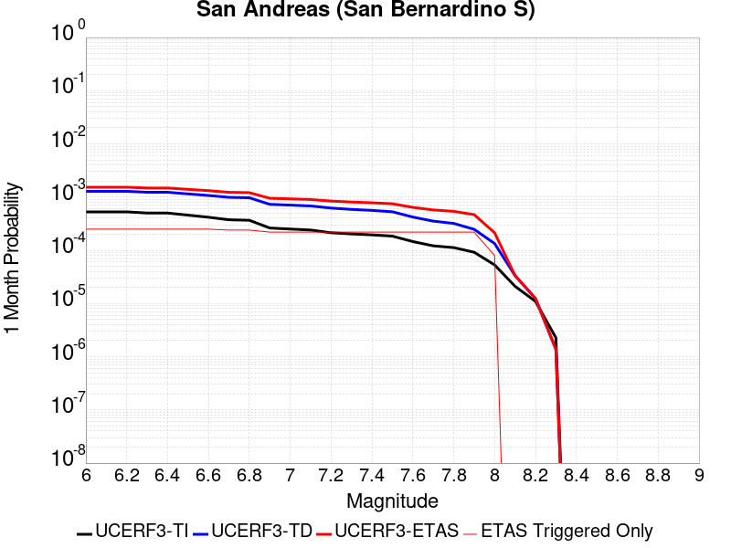 |  |  |

| Magnitude | 1 wk TI Prob | 1 wk TD Prob | 1 wk ETAS Prob | 1 wk ETAS/TD Gain | 1 wk ETAS Triggered Only | 1 mo TI Prob | 1 mo TD Prob | 1 mo ETAS Prob | 1 mo ETAS/TD Gain | 1 mo ETAS Triggered Only | 1 yr TI Prob | 1 yr TD Prob | 1 yr ETAS Prob | 1 yr ETAS/TD Gain | 1 yr ETAS Triggered Only | 10 yr TI Prob | 10 yr TD Prob | 10 yr ETAS Prob | 10 yr ETAS/TD Gain | 10 yr ETAS Triggered Only |
|-----|-----|-----|-----|-----|-----|-----|-----|-----|-----|-----|-----|-----|-----|-----|-----|-----|-----|-----|-----|-----|
| 6.0 | 1.2336002E-4 | 3.0008948E-4 | 3.8006547E-4 | 1.2665071 | 8.0E-5 | 5.2857865E-4 | 0.0012854899 | 0.001498549 | 1.1657416 | 2.1333333E-4 | 0.006416472 | 0.015543484 | 0.015963519 | 1.0270232 | 4.2666667E-4 | 0.06234337 | 0.14285627 | 0.14340484 | 1.00384 | 6.4E-4 |
| 6.1 | 1.2336002E-4 | 3.0008948E-4 | 3.8006547E-4 | 1.2665071 | 8.0E-5 | 5.2857865E-4 | 0.0012854899 | 0.001498549 | 1.1657416 | 2.1333333E-4 | 0.006416472 | 0.015543484 | 0.015963519 | 1.0270232 | 4.2666667E-4 | 0.06234337 | 0.14285627 | 0.14340484 | 1.00384 | 6.4E-4 |
| 6.2 | 1.2336002E-4 | 3.0008948E-4 | 3.8006547E-4 | 1.2665071 | 8.0E-5 | 5.2857865E-4 | 0.0012854899 | 0.001498549 | 1.1657416 | 2.1333333E-4 | 0.006416472 | 0.015543484 | 0.015963519 | 1.0270232 | 4.2666667E-4 | 0.06234337 | 0.14285627 | 0.14340484 | 1.00384 | 6.4E-4 |
| 6.3 | 1.1712257E-4 | 2.8797207E-4 | 3.6794902E-4 | 1.2777247 | 8.0E-5 | 5.018573E-4 | 0.001233608 | 0.0014466781 | 1.1727211 | 2.1333333E-4 | 0.006093008 | 0.01492059 | 0.015340891 | 1.0281692 | 4.2666667E-4 | 0.059286322 | 0.13756467 | 0.13811663 | 1.0040123 | 6.4E-4 |
| 6.4 | 1.1712257E-4 | 2.8797207E-4 | 3.6794902E-4 | 1.2777247 | 8.0E-5 | 5.018573E-4 | 0.001233608 | 0.0014466781 | 1.1727211 | 2.1333333E-4 | 0.006093008 | 0.01492059 | 0.015340891 | 1.0281692 | 4.2666667E-4 | 0.059286322 | 0.13756467 | 0.13811663 | 1.0040123 | 6.4E-4 |
| 6.5 | 1.0689076E-4 | 2.6809986E-4 | 3.480784E-4 | 1.2983162 | 8.0E-5 | 4.5802278E-4 | 0.0011485183 | 0.0013616065 | 1.1855333 | 2.1333333E-4 | 0.0055621783 | 0.013898174 | 0.01431891 | 1.0302728 | 4.2666667E-4 | 0.05425003 | 0.12881182 | 0.12936938 | 1.0043285 | 6.4E-4 |
| 6.6 | 9.7648895E-5 | 2.5054725E-4 | 3.3052723E-4 | 1.319221 | 8.0E-5 | 4.1842813E-4 | 0.0010733557 | 0.0012864601 | 1.1985403 | 2.1333333E-4 | 0.005082469 | 0.012994168 | 0.013415291 | 1.0324086 | 4.2666667E-4 | 0.049677886 | 0.12097161 | 0.12151075 | 1.0044568 | 6.133333E-4 |
| 6.7 | 8.757013E-5 | 2.3125445E-4 | 2.8457545E-4 | 1.2305728 | 5.3333333E-5 | 3.7524657E-4 | 9.907364E-4 | 0.0011772182 | 1.1882254 | 1.8666667E-4 | 0.00455906 | 0.011999588 | 0.012394789 | 1.0329344 | 4.0E-4 | 0.04466656 | 0.11227982 | 0.112776935 | 1.0044276 | 5.6E-4 |
| 6.8 | 8.562978E-5 | 2.2685292E-4 | 2.8017416E-4 | 1.2350476 | 5.3333333E-5 | 3.6693315E-4 | 9.7188674E-4 | 0.001158372 | 1.1918796 | 1.8666667E-4 | 0.004458263 | 0.01177259 | 0.012167881 | 1.0335772 | 4.0E-4 | 0.043698758 | 0.11029001 | 0.110788256 | 1.0045176 | 5.6E-4 |
| 6.9 | 6.124075E-5 | 1.7069813E-4 | 2.2402235E-4 | 1.3123891 | 5.3333333E-5 | 2.6243398E-4 | 7.313591E-4 | 8.912421E-4 | 1.2186108 | 1.6E-4 | 0.0031904527 | 0.00886815 | 0.009238173 | 1.0417249 | 3.7333334E-4 | 0.031450346 | 0.08419993 | 0.084663935 | 1.0055108 | 5.0666666E-4 |
| 7.0 | 5.8598747E-5 | 1.6498787E-4 | 2.1831242E-4 | 1.3232027 | 5.3333333E-5 | 2.5111332E-4 | 7.069001E-4 | 8.66787E-4 | 1.2261803 | 1.6E-4 | 0.0030530186 | 0.008572741 | 0.008942874 | 1.0431756 | 3.7333334E-4 | 0.03011414 | 0.08151753 | 0.081982896 | 1.0057088 | 5.0666666E-4 |
| 7.1 | 5.613814E-5 | 1.5917298E-4 | 2.1249783E-4 | 1.3350118 | 5.3333333E-5 | 2.4056983E-4 | 6.819924E-4 | 8.4188324E-4 | 1.2344468 | 1.6E-4 | 0.0029250039 | 0.008271826 | 0.008642072 | 1.0447598 | 3.7333334E-4 | 0.028868021 | 0.078816354 | 0.07928309 | 1.0059217 | 5.0666666E-4 |
| 7.2 | 4.991222E-5 | 1.4523676E-4 | 1.9856234E-4 | 1.3671632 | 5.3333333E-5 | 2.1389198E-4 | 6.2229513E-4 | 7.8219554E-4 | 1.2569528 | 1.6E-4 | 0.002601025 | 0.0075502265 | 0.007920741 | 1.0490733 | 3.7333334E-4 | 0.025707912 | 0.072269924 | 0.07271523 | 1.0061618 | 4.8E-4 |
| 7.3 | 4.7410045E-5 | 1.3717797E-4 | 1.9050398E-4 | 1.388736 | 5.3333333E-5 | 2.0317009E-4 | 5.8777345E-4 | 7.476794E-4 | 1.2720537 | 1.6E-4 | 0.0024707897 | 0.0071327467 | 0.0075034173 | 1.0519674 | 3.7333334E-4 | 0.024434982 | 0.06855203 | 0.06899913 | 1.0065219 | 4.8E-4 |
| 7.4 | 4.5556746E-5 | 1.3125638E-4 | 1.8458272E-4 | 1.4062761 | 5.3333333E-5 | 1.952286E-4 | 5.6240644E-4 | 7.2231644E-4 | 1.2843318 | 1.6E-4 | 0.002374317 | 0.006825879 | 0.0071966643 | 1.0543205 | 3.7333334E-4 | 0.023491086 | 0.065804236 | 0.06625265 | 1.0068144 | 4.8E-4 |
| 7.5 | 4.3084514E-5 | 1.2360894E-4 | 1.7693569E-4 | 1.4314148 | 5.3333333E-5 | 1.8463485E-4 | 5.2964536E-4 | 6.895606E-4 | 1.3019289 | 1.6E-4 | 0.0022456115 | 0.006429438 | 0.0068003708 | 1.0576929 | 3.7333334E-4 | 0.022230545 | 0.062204733 | 0.062654875 | 1.0072365 | 4.8E-4 |
| 7.6 | 3.408608E-5 | 9.838868E-5 | 1.5171677E-4 | 1.5420145 | 5.3333333E-5 | 1.4607502E-4 | 4.215977E-4 | 5.815303E-4 | 1.3793488 | 1.6E-4 | 0.0017770125 | 0.005120897 | 0.0054657888 | 1.0673498 | 3.4666667E-4 | 0.017628696 | 0.050035115 | 0.050465766 | 1.008607 | 4.5333334E-4 |
| 7.7 | 2.8315713E-5 | 8.251823E-5 | 1.3584716E-4 | 1.6462685 | 5.3333333E-5 | 1.2134742E-4 | 3.5360164E-4 | 5.1354506E-4 | 1.4523265 | 1.6E-4 | 0.0014764034 | 0.004296611 | 0.004641788 | 1.080337 | 3.4666667E-4 | 0.01466633 | 0.04228543 | 0.042719595 | 1.0102675 | 4.5333334E-4 |
| 7.8 | 2.6222975E-5 | 7.4660275E-5 | 1.2798962E-4 | 1.7142936 | 5.3333333E-5 | 1.1237934E-4 | 3.1993337E-4 | 4.798822E-4 | 1.4999441 | 1.6E-4 | 0.0013673597 | 0.003888238 | 0.004233557 | 1.0888112 | 3.4666667E-4 | 0.013589768 | 0.03844993 | 0.038885828 | 1.0113369 | 4.5333334E-4 |
| 7.9 | 2.1469694E-5 | 5.7903162E-5 | 1.1123341E-4 | 1.9210248 | 5.3333333E-5 | 9.200973E-5 | 2.4813283E-4 | 4.0809312E-4 | 1.644656 | 1.6E-4 | 0.0011196428 | 0.003016835 | 0.0033358696 | 1.1057514 | 3.2E-4 | 0.011140184 | 0.030163256 | 0.030577054 | 1.0137186 | 4.2666667E-4 |
| 8.0 | 1.2420249E-5 | 3.1332525E-5 | 5.7998353E-5 | 1.8510592 | 2.6666667E-5 | 5.322855E-5 | 1.3427534E-4 | 1.8760152E-4 | 1.3971405 | 5.3333333E-5 | 6.478649E-4 | 0.0016335774 | 0.0017666928 | 1.0814872 | 1.3333333E-4 | 0.0064597935 | 0.016528832 | 0.016686188 | 1.00952 | 1.6E-4 |
| 8.1 | 4.9197724E-6 | 7.827271E-6 | 7.827271E-6 | 1.0 | 0.0 | 2.1084568E-5 | 3.3545013E-5 | 3.3545013E-5 | 1.0 | 0.0 | 2.566744E-4 | 4.0833413E-4 | 4.0833413E-4 | 1.0 | 0.0 | 0.002563781 | 0.0043868436 | 0.0043868436 | 1.0 | 0.0 |
| 8.2 | 2.5634774E-6 | 2.9089954E-6 | 2.9089954E-6 | 1.0 | 0.0 | 1.0986286E-5 | 1.2467063E-5 | 1.2467063E-5 | 1.0 | 0.0 | 1.3374983E-4 | 1.5177597E-4 | 1.5177597E-4 | 1.0 | 0.0 | 0.0013366934 | 0.0017061684 | 0.0017061684 | 1.0 | 0.0 |
| 8.3 | 5.2850464E-7 | 3.211945E-7 | 3.211945E-7 | 1.0 | 0.0 | 2.2650179E-6 | 1.3765473E-6 | 1.3765473E-6 | 1.0 | 0.0 | 2.7576245E-5 | 1.6759346E-5 | 1.6759346E-5 | 1.0 | 0.0 | 2.7572823E-4 | 1.9887649E-4 | 1.9887649E-4 | 1.0 | 0.0 |

## San Andreas (Big Bend)
*[(top)](#table-of-contents)*

| 1 Week | 1 Month | 1 Year | 10 Year |
|-----|-----|-----|-----|
|  |  |  |  |

| Magnitude | 1 wk TI Prob | 1 wk TD Prob | 1 wk ETAS Prob | 1 wk ETAS/TD Gain | 1 wk ETAS Triggered Only | 1 mo TI Prob | 1 mo TD Prob | 1 mo ETAS Prob | 1 mo ETAS/TD Gain | 1 mo ETAS Triggered Only | 1 yr TI Prob | 1 yr TD Prob | 1 yr ETAS Prob | 1 yr ETAS/TD Gain | 1 yr ETAS Triggered Only | 10 yr TI Prob | 10 yr TD Prob | 10 yr ETAS Prob | 10 yr ETAS/TD Gain | 10 yr ETAS Triggered Only |
|-----|-----|-----|-----|-----|-----|-----|-----|-----|-----|-----|-----|-----|-----|-----|-----|-----|-----|-----|-----|-----|
| 6.0 | 1.0179969E-4 | 2.0080687E-4 | 2.0080687E-4 | 1.0 | 0.0 | 4.362114E-4 | 8.60318E-4 | 9.402492E-4 | 1.0929089 | 8.0E-5 | 0.0052979486 | 0.010424351 | 0.010609072 | 1.0177201 | 1.8666667E-4 | 0.051734097 | 0.1014857 | 0.101964906 | 1.0047219 | 5.3333334E-4 |
| 6.1 | 1.0179969E-4 | 2.0080687E-4 | 2.0080687E-4 | 1.0 | 0.0 | 4.362114E-4 | 8.60318E-4 | 9.402492E-4 | 1.0929089 | 8.0E-5 | 0.0052979486 | 0.010424351 | 0.010609072 | 1.0177201 | 1.8666667E-4 | 0.051734097 | 0.1014857 | 0.101964906 | 1.0047219 | 5.3333334E-4 |
| 6.2 | 1.0179969E-4 | 2.0080687E-4 | 2.0080687E-4 | 1.0 | 0.0 | 4.362114E-4 | 8.60318E-4 | 9.402492E-4 | 1.0929089 | 8.0E-5 | 0.0052979486 | 0.010424351 | 0.010609072 | 1.0177201 | 1.8666667E-4 | 0.051734097 | 0.1014857 | 0.101964906 | 1.0047219 | 5.3333334E-4 |
| 6.3 | 1.0179969E-4 | 2.0080687E-4 | 2.0080687E-4 | 1.0 | 0.0 | 4.362114E-4 | 8.60318E-4 | 9.402492E-4 | 1.0929089 | 8.0E-5 | 0.0052979486 | 0.010424351 | 0.010609072 | 1.0177201 | 1.8666667E-4 | 0.051734097 | 0.1014857 | 0.101964906 | 1.0047219 | 5.3333334E-4 |
| 6.4 | 9.1639464E-5 | 1.8437792E-4 | 1.8437792E-4 | 1.0 | 0.0 | 3.9268145E-4 | 7.89952E-4 | 8.432432E-4 | 1.0674614 | 5.3333333E-5 | 0.0047704205 | 0.009575372 | 0.009681017 | 1.011033 | 1.0666667E-4 | 0.046693064 | 0.09381153 | 0.09407734 | 1.0028335 | 2.9333335E-4 |
| 6.5 | 9.1639464E-5 | 1.8437792E-4 | 1.8437792E-4 | 1.0 | 0.0 | 3.9268145E-4 | 7.89952E-4 | 8.432432E-4 | 1.0674614 | 5.3333333E-5 | 0.0047704205 | 0.009575372 | 0.009681017 | 1.011033 | 1.0666667E-4 | 0.046693064 | 0.09381153 | 0.09407734 | 1.0028335 | 2.9333335E-4 |
| 6.6 | 9.042622E-5 | 1.8244829E-4 | 1.8244829E-4 | 1.0 | 0.0 | 3.8748336E-4 | 7.8168715E-4 | 8.349788E-4 | 1.0681752 | 5.3333333E-5 | 0.0047074095 | 0.009475624 | 0.00958128 | 1.0111502 | 1.0666667E-4 | 0.046089325 | 0.09290548 | 0.09317156 | 1.002864 | 2.9333335E-4 |
| 6.7 | 8.9836685E-5 | 1.8159159E-4 | 1.8159159E-4 | 1.0 | 0.0 | 3.8495753E-4 | 7.7801774E-4 | 8.313096E-4 | 1.068497 | 5.3333333E-5 | 0.00467679 | 0.009431336 | 0.0095369965 | 1.0112032 | 1.0666667E-4 | 0.045795817 | 0.09249973 | 0.092741735 | 1.0026162 | 2.6666667E-4 |
| 6.8 | 8.9471854E-5 | 1.8105932E-4 | 1.8105932E-4 | 1.0 | 0.0 | 3.8339442E-4 | 7.75738E-4 | 8.2902994E-4 | 1.0686984 | 5.3333333E-5 | 0.004657841 | 0.00940382 | 0.009509483 | 1.0112362 | 1.0666667E-4 | 0.04561414 | 0.09224692 | 0.09248899 | 1.0026242 | 2.6666667E-4 |
| 6.9 | 8.858234E-5 | 1.7987892E-4 | 1.7987892E-4 | 1.0 | 0.0 | 3.7958333E-4 | 7.706821E-4 | 8.239743E-4 | 1.0691494 | 5.3333333E-5 | 0.004611638 | 0.009342793 | 0.009448464 | 1.0113103 | 1.0666667E-4 | 0.04517103 | 0.091686994 | 0.09192921 | 1.0026418 | 2.6666667E-4 |
| 7.0 | 8.7433385E-5 | 1.7826671E-4 | 1.7826671E-4 | 1.0 | 0.0 | 3.746607E-4 | 7.6377665E-4 | 7.9042296E-4 | 1.0348876 | 2.6666667E-5 | 0.004551957 | 0.009259437 | 0.0093386965 | 1.0085598 | 8.0E-5 | 0.044598386 | 0.09092137 | 0.0911153 | 1.002133 | 2.1333333E-4 |
| 7.1 | 8.684964E-5 | 1.7738611E-4 | 1.7738611E-4 | 1.0 | 0.0 | 3.7215967E-4 | 7.600049E-4 | 7.866513E-4 | 1.0350609 | 2.6666667E-5 | 0.0045216335 | 0.009213906 | 0.009293169 | 1.0086025 | 8.0E-5 | 0.04430731 | 0.09050287 | 0.09067264 | 1.0018759 | 1.8666667E-4 |
| 7.2 | 8.606521E-5 | 1.7629213E-4 | 1.7629213E-4 | 1.0 | 0.0 | 3.6879873E-4 | 7.5531914E-4 | 7.819657E-4 | 1.0352784 | 2.6666667E-5 | 0.0044808835 | 0.009157337 | 0.009236605 | 1.0086561 | 8.0E-5 | 0.043916024 | 0.08998334 | 0.09015321 | 1.0018878 | 1.8666667E-4 |
| 7.3 | 8.568266E-5 | 1.7571205E-4 | 1.7571205E-4 | 1.0 | 0.0 | 3.6715972E-4 | 7.528345E-4 | 7.794811E-4 | 1.035395 | 2.6666667E-5 | 0.0044610105 | 0.00912734 | 0.00920661 | 1.0086849 | 8.0E-5 | 0.043725148 | 0.08970444 | 0.08987436 | 1.0018942 | 1.8666667E-4 |
| 7.4 | 8.5432206E-5 | 1.7533782E-4 | 1.7533782E-4 | 1.0 | 0.0 | 3.6608664E-4 | 7.5123156E-4 | 7.778782E-4 | 1.0354706 | 2.6666667E-5 | 0.004447999 | 0.009107988 | 0.00918726 | 1.0087035 | 8.0E-5 | 0.043600157 | 0.08952458 | 0.08969454 | 1.0018984 | 1.8666667E-4 |
| 7.5 | 8.4791965E-5 | 1.7403076E-4 | 1.7403076E-4 | 1.0 | 0.0 | 3.633435E-4 | 7.4563315E-4 | 7.722799E-4 | 1.0357372 | 2.6666667E-5 | 0.0044147377 | 0.009040395 | 0.009119672 | 1.0087692 | 8.0E-5 | 0.043280575 | 0.0889021 | 0.08904787 | 1.0016397 | 1.6E-4 |
| 7.6 | 8.241105E-5 | 1.684837E-4 | 1.684837E-4 | 1.0 | 0.0 | 3.531424E-4 | 7.2187337E-4 | 7.485208E-4 | 1.0369142 | 2.6666667E-5 | 0.0042910352 | 0.008753479 | 0.00883278 | 1.0090592 | 8.0E-5 | 0.042091176 | 0.08627858 | 0.086424775 | 1.0016944 | 1.6E-4 |
| 7.7 | 7.00432E-5 | 1.4211683E-4 | 1.4211683E-4 | 1.0 | 0.0 | 3.001506E-4 | 6.0893E-4 | 6.3558045E-4 | 1.043766 | 2.6666667E-5 | 0.0036482112 | 0.007388561 | 0.0074415 | 1.0071651 | 5.3333333E-5 | 0.035888977 | 0.07354971 | 0.073648535 | 1.0013436 | 1.0666667E-4 |
| 7.8 | 6.415362E-5 | 1.297541E-4 | 1.297541E-4 | 1.0 | 0.0 | 2.749151E-4 | 5.5597053E-4 | 5.826224E-4 | 1.0479375 | 2.6666667E-5 | 0.0033419547 | 0.006747963 | 0.0067744493 | 1.0039251 | 2.6666667E-5 | 0.03292141 | 0.0672817 | 0.06735632 | 1.001109 | 8.0E-5 |
| 7.9 | 4.939911E-5 | 9.345801E-5 | 9.345801E-5 | 1.0 | 0.0 | 2.116933E-4 | 4.0047284E-4 | 4.2712883E-4 | 1.0665613 | 2.6666667E-5 | 0.0025743195 | 0.0048648654 | 0.0048914026 | 1.0054548 | 2.6666667E-5 | 0.025447013 | 0.048936196 | 0.04898692 | 1.0010365 | 5.3333333E-5 |
| 8.0 | 3.344983E-5 | 5.225443E-5 | 5.225443E-5 | 1.0 | 0.0 | 1.4334853E-4 | 2.2392833E-4 | 2.2392833E-4 | 1.0 | 0.0 | 0.0017438711 | 0.0027229206 | 0.0027229206 | 1.0 | 0.0 | 0.017302496 | 0.02793573 | 0.02793573 | 1.0 | 0.0 |
| 8.1 | 1.9104898E-5 | 1.9186356E-5 | 1.9186356E-5 | 1.0 | 0.0 | 8.1875565E-5 | 8.222465E-5 | 8.222465E-5 | 1.0 | 0.0 | 9.963791E-4 | 0.001000626 | 0.001000626 | 1.0 | 0.0 | 0.009919235 | 0.010756767 | 0.010756767 | 1.0 | 0.0 |
| 8.2 | 8.643924E-6 | 5.4798497E-6 | 5.4798497E-6 | 1.0 | 0.0 | 3.704486E-5 | 2.348486E-5 | 2.348486E-5 | 1.0 | 0.0 | 4.5092785E-4 | 2.858907E-4 | 2.858907E-4 | 1.0 | 0.0 | 0.0045001395 | 0.0032514327 | 0.0032514327 | 1.0 | 0.0 |
| 8.3 | 1.983087E-6 | 7.668296E-7 | 7.668296E-7 | 1.0 | 0.0 | 8.498917E-6 | 3.2864084E-6 | 3.2864084E-6 | 1.0 | 0.0 | 1.034694E-4 | 4.0011306E-5 | 4.0011306E-5 | 1.0 | 0.0 | 0.0010342124 | 4.724499E-4 | 4.724499E-4 | 1.0 | 0.0 |

## Sierra Nevada  (No Extension)
*[(top)](#table-of-contents)*

| 1 Week | 1 Month | 1 Year | 10 Year |
|-----|-----|-----|-----|
|  |  |  |  |

| Magnitude | 1 wk TI Prob | 1 wk TD Prob | 1 wk ETAS Prob | 1 wk ETAS/TD Gain | 1 wk ETAS Triggered Only | 1 mo TI Prob | 1 mo TD Prob | 1 mo ETAS Prob | 1 mo ETAS/TD Gain | 1 mo ETAS Triggered Only | 1 yr TI Prob | 1 yr TD Prob | 1 yr ETAS Prob | 1 yr ETAS/TD Gain | 1 yr ETAS Triggered Only | 10 yr TI Prob | 10 yr TD Prob | 10 yr ETAS Prob | 10 yr ETAS/TD Gain | 10 yr ETAS Triggered Only |
|-----|-----|-----|-----|-----|-----|-----|-----|-----|-----|-----|-----|-----|-----|-----|-----|-----|-----|-----|-----|-----|
| 6.0 | 7.7690465E-6 | 6.9763832E-6 | 6.9763832E-6 | 1.0 | 0.0 | 3.329549E-5 | 2.9898645E-5 | 8.3230385E-5 | 2.783751 | 5.3333333E-5 | 4.0529718E-4 | 3.6399104E-4 | 5.5058976E-4 | 1.5126464 | 1.8666667E-4 | 0.004045588 | 0.0036374647 | 0.00403601 | 1.1095667 | 4.0E-4 |
| 6.1 | 7.7690465E-6 | 6.9763832E-6 | 6.9763832E-6 | 1.0 | 0.0 | 3.329549E-5 | 2.9898645E-5 | 8.3230385E-5 | 2.783751 | 5.3333333E-5 | 4.0529718E-4 | 3.6399104E-4 | 5.5058976E-4 | 1.5126464 | 1.8666667E-4 | 0.004045588 | 0.0036374647 | 0.00403601 | 1.1095667 | 4.0E-4 |
| 6.2 | 7.7690465E-6 | 6.9763832E-6 | 6.9763832E-6 | 1.0 | 0.0 | 3.329549E-5 | 2.9898645E-5 | 8.3230385E-5 | 2.783751 | 5.3333333E-5 | 4.0529718E-4 | 3.6399104E-4 | 5.5058976E-4 | 1.5126464 | 1.8666667E-4 | 0.004045588 | 0.0036374647 | 0.00403601 | 1.1095667 | 4.0E-4 |
| 6.3 | 7.7690465E-6 | 6.9763832E-6 | 6.9763832E-6 | 1.0 | 0.0 | 3.329549E-5 | 2.9898645E-5 | 8.3230385E-5 | 2.783751 | 5.3333333E-5 | 4.0529718E-4 | 3.6399104E-4 | 5.5058976E-4 | 1.5126464 | 1.8666667E-4 | 0.004045588 | 0.0036374647 | 0.00403601 | 1.1095667 | 4.0E-4 |
| 6.4 | 7.7690465E-6 | 6.9763832E-6 | 6.9763832E-6 | 1.0 | 0.0 | 3.329549E-5 | 2.9898645E-5 | 8.3230385E-5 | 2.783751 | 5.3333333E-5 | 4.0529718E-4 | 3.6399104E-4 | 5.5058976E-4 | 1.5126464 | 1.8666667E-4 | 0.004045588 | 0.0036374647 | 0.00403601 | 1.1095667 | 4.0E-4 |
| 6.5 | 7.7690465E-6 | 6.9763832E-6 | 6.9763832E-6 | 1.0 | 0.0 | 3.329549E-5 | 2.9898645E-5 | 8.3230385E-5 | 2.783751 | 5.3333333E-5 | 4.0529718E-4 | 3.6399104E-4 | 5.5058976E-4 | 1.5126464 | 1.8666667E-4 | 0.004045588 | 0.0036374647 | 0.00403601 | 1.1095667 | 4.0E-4 |
| 6.6 | 2.653E-6 | 1.6148814E-6 | 1.6148814E-6 | 1.0 | 0.0 | 1.136995E-5 | 6.920902E-6 | 6.0253868E-5 | 8.706072 | 5.3333333E-5 | 1.3842035E-4 | 8.4258754E-5 | 2.4424528E-4 | 2.8987525 | 1.6E-4 | 0.0013833415 | 8.4227155E-4 | 0.0011353578 | 1.3479712 | 2.9333335E-4 |
| 6.7 | 2.5902466E-6 | 1.5502146E-6 | 1.5502146E-6 | 1.0 | 0.0 | 1.11010095E-5 | 6.64376E-6 | 5.997674E-5 | 9.027529 | 5.3333333E-5 | 1.351464E-4 | 8.0884805E-5 | 2.4087187E-4 | 2.9779618 | 1.6E-4 | 0.0013506424 | 8.085567E-4 | 0.0011016529 | 1.362493 | 2.9333335E-4 |
| 6.8 | 2.5853892E-6 | 1.5470148E-6 | 1.5470148E-6 | 1.0 | 0.0 | 1.1080193E-5 | 6.6300463E-6 | 5.9963026E-5 | 9.044133 | 5.3333333E-5 | 1.34893E-4 | 8.071786E-5 | 2.4070495E-4 | 2.9820533 | 1.6E-4 | 0.0013481114 | 8.0688833E-4 | 0.001099985 | 1.3632431 | 2.9333335E-4 |
| 6.9 | 2.458257E-6 | 1.4220883E-6 | 1.4220883E-6 | 1.0 | 0.0 | 1.0535345E-5 | 6.0946504E-6 | 5.9427657E-5 | 9.750791 | 5.3333333E-5 | 1.2826028E-4 | 7.419986E-5 | 2.3418799E-4 | 3.1561782 | 1.6E-4 | 0.0012818627 | 7.417528E-4 | 0.0010348685 | 1.3951664 | 2.9333335E-4 |
| 7.0 | 2.4341468E-6 | 1.399052E-6 | 1.399052E-6 | 1.0 | 0.0 | 1.0432016E-5 | 5.995924E-6 | 5.9328937E-5 | 9.894878 | 5.3333333E-5 | 1.270024E-4 | 7.2997944E-5 | 2.3298626E-4 | 3.1916826 | 1.6E-4 | 0.0012692984 | 7.297416E-4 | 0.0010228609 | 1.4016755 | 2.9333335E-4 |
| 7.1 | 2.3652476E-6 | 1.3340014E-6 | 1.3340014E-6 | 1.0 | 0.0 | 1.0136736E-5 | 5.717136E-6 | 5.9050166E-5 | 10.328627 | 5.3333333E-5 | 1.2340778E-4 | 6.960393E-5 | 2.2959278E-4 | 3.2985609 | 1.6E-4 | 0.0012333926 | 6.9582294E-4 | 9.889521E-4 | 1.4212699 | 2.9333335E-4 |
| 7.2 | 2.272158E-6 | 1.2503074E-6 | 1.2503074E-6 | 1.0 | 0.0 | 9.737784E-6 | 5.3584495E-6 | 5.8691498E-5 | 10.953074 | 5.3333333E-5 | 1.1855107E-4 | 6.523718E-5 | 2.2522674E-4 | 3.452429 | 1.6E-4 | 0.0011848784 | 6.5218186E-4 | 9.4532385E-4 | 1.449479 | 2.9333335E-4 |
| 7.3 | 2.1382127E-6 | 1.1419947E-6 | 1.1419947E-6 | 1.0 | 0.0 | 9.163737E-6 | 4.8942543E-6 | 5.8227328E-5 | 11.8970785 | 5.3333333E-5 | 1.1156279E-4 | 5.9585927E-5 | 2.195764E-4 | 3.6850379 | 1.6E-4 | 0.001115068 | 5.957007E-4 | 8.888593E-4 | 1.492124 | 2.9333335E-4 |
| 7.4 | 1.9048055E-6 | 9.575474E-7 | 9.575474E-7 | 1.0 | 0.0 | 8.163426E-6 | 4.1037683E-6 | 5.7436882E-5 | 13.996132 | 5.3333333E-5 | 9.9385186E-5 | 4.996224E-5 | 2.0995425E-4 | 4.2022586 | 1.6E-4 | 9.934074E-4 | 4.995108E-4 | 7.926976E-4 | 1.5869479 | 2.9333335E-4 |
| 7.5 | 1.5373403E-6 | 7.5602395E-7 | 7.5602395E-7 | 1.0 | 0.0 | 6.5885843E-6 | 3.2400987E-6 | 5.657326E-5 | 17.46035 | 5.3333333E-5 | 8.021306E-5 | 3.9447492E-5 | 1.4610995E-4 | 3.7039096 | 1.0666667E-4 | 8.0184115E-4 | 3.944054E-4 | 6.343107E-4 | 1.608271 | 2.4E-4 |
| 7.6 | 1.0680322E-6 | 4.659796E-7 | 4.659796E-7 | 1.0 | 0.0 | 4.577273E-6 | 1.997054E-6 | 2.8663668E-5 | 14.352976 | 2.6666667E-5 | 5.5726876E-5 | 2.4313864E-5 | 5.097988E-5 | 2.0967414 | 2.6666667E-5 | 5.5712904E-4 | 2.431123E-4 | 3.764132E-4 | 1.54831 | 1.3333333E-4 |
| 7.7 | 5.509146E-7 | 1.5581199E-7 | 1.5581199E-7 | 1.0 | 0.0 | 2.3610605E-6 | 6.677655E-7 | 6.677655E-7 | 1.0 | 0.0 | 2.8745531E-5 | 8.130016E-6 | 8.130016E-6 | 1.0 | 0.0 | 2.8741814E-4 | 8.12973E-5 | 8.12973E-5 | 1.0 | 0.0 |

## Red Pass
*[(top)](#table-of-contents)*

| 1 Week | 1 Month | 1 Year | 10 Year |
|-----|-----|-----|-----|
|  |  | 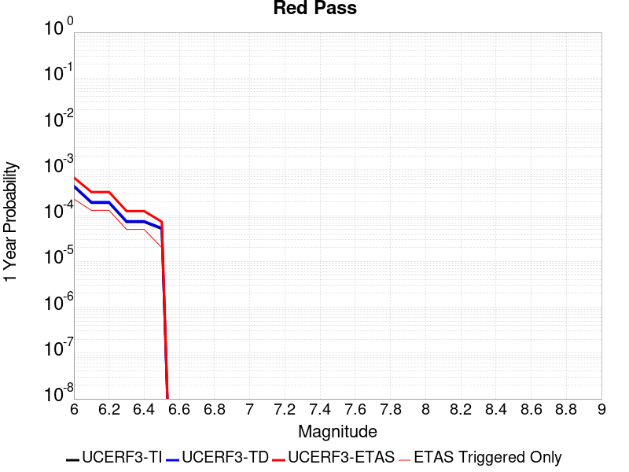 | 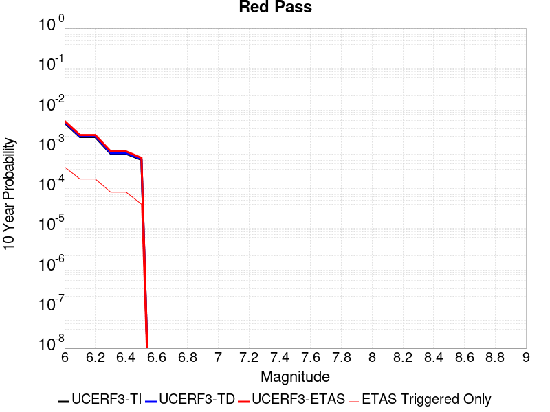 |

| Magnitude | 1 wk TI Prob | 1 wk TD Prob | 1 wk ETAS Prob | 1 wk ETAS/TD Gain | 1 wk ETAS Triggered Only | 1 mo TI Prob | 1 mo TD Prob | 1 mo ETAS Prob | 1 mo ETAS/TD Gain | 1 mo ETAS Triggered Only | 1 yr TI Prob | 1 yr TD Prob | 1 yr ETAS Prob | 1 yr ETAS/TD Gain | 1 yr ETAS Triggered Only | 10 yr TI Prob | 10 yr TD Prob | 10 yr ETAS Prob | 10 yr ETAS/TD Gain | 10 yr ETAS Triggered Only |
|-----|-----|-----|-----|-----|-----|-----|-----|-----|-----|-----|-----|-----|-----|-----|-----|-----|-----|-----|-----|-----|
| 6.0 | 8.258278E-6 | 8.551305E-6 | 3.5217745E-5 | 4.118406 | 2.6666667E-5 | 3.539214E-5 | 3.6648038E-5 | 8.997942E-5 | 2.4552314 | 5.3333333E-5 | 4.308141E-4 | 4.4611638E-4 | 6.860093E-4 | 1.5377362 | 2.4E-4 | 0.0042997985 | 0.004453966 | 0.0047990885 | 1.0774866 | 3.4666667E-4 |
| 6.1 | 3.649988E-6 | 3.7753332E-6 | 3.0441899E-5 | 8.063368 | 2.6666667E-5 | 1.5642712E-5 | 1.6179927E-5 | 6.9512396E-5 | 4.296212 | 5.3333333E-5 | 1.9043336E-4 | 1.9697756E-4 | 3.5694605E-4 | 1.8121153 | 1.6E-4 | 0.0019027026 | 0.001968497 | 0.0021547962 | 1.0946404 | 1.8666667E-4 |
| 6.2 | 3.649988E-6 | 3.7753332E-6 | 3.0441899E-5 | 8.063368 | 2.6666667E-5 | 1.5642712E-5 | 1.6179927E-5 | 6.9512396E-5 | 4.296212 | 5.3333333E-5 | 1.9043336E-4 | 1.9697756E-4 | 3.5694605E-4 | 1.8121153 | 1.6E-4 | 0.0019027026 | 0.001968497 | 0.0021547962 | 1.0946404 | 1.8666667E-4 |
| 6.3 | 1.3924937E-6 | 1.4411233E-6 | 2.8107752E-5 | 19.504057 | 2.6666667E-5 | 5.9678164E-6 | 6.176236E-6 | 5.950924E-5 | 9.635195 | 5.3333333E-5 | 7.265574E-5 | 7.51945E-5 | 1.8185315E-4 | 2.418437 | 1.0666667E-4 | 7.263199E-4 | 7.518293E-4 | 8.850624E-4 | 1.1772119 | 1.3333333E-4 |
| 6.4 | 1.3924937E-6 | 1.4411233E-6 | 2.8107752E-5 | 19.504057 | 2.6666667E-5 | 5.9678164E-6 | 6.176236E-6 | 5.950924E-5 | 9.635195 | 5.3333333E-5 | 7.265574E-5 | 7.51945E-5 | 1.8185315E-4 | 2.418437 | 1.0666667E-4 | 7.263199E-4 | 7.518293E-4 | 8.850624E-4 | 1.1772119 | 1.3333333E-4 |
| 6.5 | 9.876812E-7 | 1.022196E-6 | 2.7688835E-5 | 27.0876 | 2.6666667E-5 | 4.2329125E-6 | 4.38084E-6 | 3.1047388E-5 | 7.087086 | 2.6666667E-5 | 5.153449E-5 | 5.3336724E-5 | 8.000197E-5 | 1.4999416 | 2.6666667E-5 | 5.1522546E-4 | 5.333672E-4 | 5.600197E-4 | 1.0499701 | 2.6666667E-5 |

## Scodie Lineament
*[(top)](#table-of-contents)*

| 1 Week | 1 Month | 1 Year | 10 Year |
|-----|-----|-----|-----|
|  |  |  |  |

| Magnitude | 1 wk TI Prob | 1 wk TD Prob | 1 wk ETAS Prob | 1 wk ETAS/TD Gain | 1 wk ETAS Triggered Only | 1 mo TI Prob | 1 mo TD Prob | 1 mo ETAS Prob | 1 mo ETAS/TD Gain | 1 mo ETAS Triggered Only | 1 yr TI Prob | 1 yr TD Prob | 1 yr ETAS Prob | 1 yr ETAS/TD Gain | 1 yr ETAS Triggered Only | 10 yr TI Prob | 10 yr TD Prob | 10 yr ETAS Prob | 10 yr ETAS/TD Gain | 10 yr ETAS Triggered Only |
|-----|-----|-----|-----|-----|-----|-----|-----|-----|-----|-----|-----|-----|-----|-----|-----|-----|-----|-----|-----|-----|
| 6.0 | 3.2919327E-6 | 3.0133565E-6 | 3.0133565E-6 | 1.0 | 0.0 | 1.4108206E-5 | 1.2914339E-5 | 1.2914339E-5 | 1.0 | 0.0 | 1.7175387E-4 | 1.5722391E-4 | 3.4386123E-4 | 2.1870797 | 1.8666667E-4 | 0.0017162118 | 0.0015714383 | 0.0019175602 | 1.220258 | 3.4666667E-4 |
| 6.1 | 1.8663811E-6 | 1.5490589E-6 | 1.5490589E-6 | 1.0 | 0.0 | 7.998751E-6 | 6.6388097E-6 | 6.6388097E-6 | 1.0 | 0.0 | 9.738045E-5 | 8.082501E-5 | 1.3415403E-4 | 1.6598084 | 5.3333333E-5 | 9.7337784E-4 | 8.0800493E-4 | 9.145854E-4 | 1.1319057 | 1.0666667E-4 |
| 6.2 | 1.8663811E-6 | 1.5490589E-6 | 1.5490589E-6 | 1.0 | 0.0 | 7.998751E-6 | 6.6388097E-6 | 6.6388097E-6 | 1.0 | 0.0 | 9.738045E-5 | 8.082501E-5 | 1.3415403E-4 | 1.6598084 | 5.3333333E-5 | 9.7337784E-4 | 8.0800493E-4 | 9.145854E-4 | 1.1319057 | 1.0666667E-4 |
| 6.3 | 1.8663811E-6 | 1.5490589E-6 | 1.5490589E-6 | 1.0 | 0.0 | 7.998751E-6 | 6.6388097E-6 | 6.6388097E-6 | 1.0 | 0.0 | 9.738045E-5 | 8.082501E-5 | 1.3415403E-4 | 1.6598084 | 5.3333333E-5 | 9.7337784E-4 | 8.0800493E-4 | 9.145854E-4 | 1.1319057 | 1.0666667E-4 |
| 6.4 | 1.8663811E-6 | 1.5490589E-6 | 1.5490589E-6 | 1.0 | 0.0 | 7.998751E-6 | 6.6388097E-6 | 6.6388097E-6 | 1.0 | 0.0 | 9.738045E-5 | 8.082501E-5 | 1.3415403E-4 | 1.6598084 | 5.3333333E-5 | 9.7337784E-4 | 8.0800493E-4 | 9.145854E-4 | 1.1319057 | 1.0666667E-4 |
| 6.5 | 1.8106311E-6 | 1.4909926E-6 | 1.4909926E-6 | 1.0 | 0.0 | 7.759824E-6 | 6.3899556E-6 | 6.3899556E-6 | 1.0 | 0.0 | 9.447177E-5 | 7.779543E-5 | 1.3112462E-4 | 1.6855054 | 5.3333333E-5 | 9.4431615E-4 | 7.777306E-4 | 8.843143E-4 | 1.1370445 | 1.0666667E-4 |
| 6.6 | 1.2414679E-6 | 8.9976135E-7 | 8.9976135E-7 | 1.0 | 0.0 | 5.320566E-6 | 3.8561147E-6 | 3.8561147E-6 | 1.0 | 0.0 | 6.477596E-5 | 4.6947276E-5 | 1.0027811E-4 | 2.1359727 | 5.3333333E-5 | 6.475708E-4 | 4.6938224E-4 | 5.493447E-4 | 1.1703568 | 8.0E-5 |
| 6.7 | 1.1062215E-6 | 7.5943603E-7 | 7.5943603E-7 | 1.0 | 0.0 | 4.7409408E-6 | 3.254722E-6 | 3.254722E-6 | 1.0 | 0.0 | 5.7719422E-5 | 3.9625593E-5 | 9.295681E-5 | 2.3458781 | 5.3333333E-5 | 5.770443E-4 | 3.9619225E-4 | 4.7616055E-4 | 1.2018422 | 8.0E-5 |
| 6.8 | 1.0006736E-6 | 6.5004406E-7 | 6.5004406E-7 | 1.0 | 0.0 | 4.288594E-6 | 2.7859005E-6 | 2.7859005E-6 | 1.0 | 0.0 | 5.221238E-5 | 3.3917873E-5 | 8.72494E-5 | 2.5723724 | 5.3333333E-5 | 5.220012E-4 | 3.3913302E-4 | 4.191059E-4 | 1.2358156 | 8.0E-5 |
| 6.9 | 9.167364E-7 | 5.6316645E-7 | 5.6316645E-7 | 1.0 | 0.0 | 3.9288643E-6 | 2.4135686E-6 | 2.4135686E-6 | 1.0 | 0.0 | 4.7832873E-5 | 2.9384859E-5 | 8.271662E-5 | 2.8149405 | 5.3333333E-5 | 4.782258E-4 | 2.9381542E-4 | 3.737919E-4 | 1.2721997 | 8.0E-5 |
| 7.0 | 7.6987664E-7 | 4.113416E-7 | 4.113416E-7 | 1.0 | 0.0 | 3.2994672E-6 | 1.7628915E-6 | 1.7628915E-6 | 1.0 | 0.0 | 4.0170275E-5 | 2.1463033E-5 | 4.8129128E-5 | 2.2424197 | 2.6666667E-5 | 4.0163012E-4 | 2.1461345E-4 | 2.4127439E-4 | 1.1242278 | 2.6666667E-5 |
| 7.1 | 7.1038727E-7 | 3.5211795E-7 | 3.5211795E-7 | 1.0 | 0.0 | 3.0445133E-6 | 1.5090762E-6 | 1.5090762E-6 | 1.0 | 0.0 | 3.706632E-5 | 1.8372884E-5 | 4.503906E-5 | 2.4513876 | 2.6666667E-5 | 3.7060137E-4 | 1.8371714E-4 | 2.1037892E-4 | 1.145124 | 2.6666667E-5 |
| 7.2 | 2.0799602E-7 | 3.1187685E-8 | 3.1187685E-8 | 1.0 | 0.0 | 8.914113E-7 | 1.336615E-7 | 1.336615E-7 | 1.0 | 0.0 | 1.0852878E-5 | 1.6273277E-6 | 1.6273277E-6 | 1.0 | 0.0 | 1.08523476E-4 | 1.6273165E-5 | 1.6273165E-5 | 1.0 | 0.0 |
| 7.3 | 1.5048182E-7 | 1.5946263E-8 | 1.5946263E-8 | 1.0 | 0.0 | 6.449219E-7 | 6.834112E-8 | 6.834112E-8 | 1.0 | 0.0 | 7.851896E-6 | 8.320529E-7 | 8.320529E-7 | 1.0 | 0.0 | 7.851618E-5 | 8.3205005E-6 | 8.3205005E-6 | 1.0 | 0.0 |
| 7.4 | 5.9334678E-8 | 4.8685624E-9 | 4.8685624E-9 | 1.0 | 0.0 | 2.5429145E-7 | 2.0865269E-8 | 2.0865269E-8 | 1.0 | 0.0 | 3.095994E-6 | 2.5403463E-7 | 2.5403463E-7 | 1.0 | 0.0 | 3.095951E-5 | 2.5403444E-6 | 2.5403444E-6 | 1.0 | 0.0 |

## San Andreas (Parkfield)
*[(top)](#table-of-contents)*

| 1 Week | 1 Month | 1 Year | 10 Year |
|-----|-----|-----|-----|
|  |  | 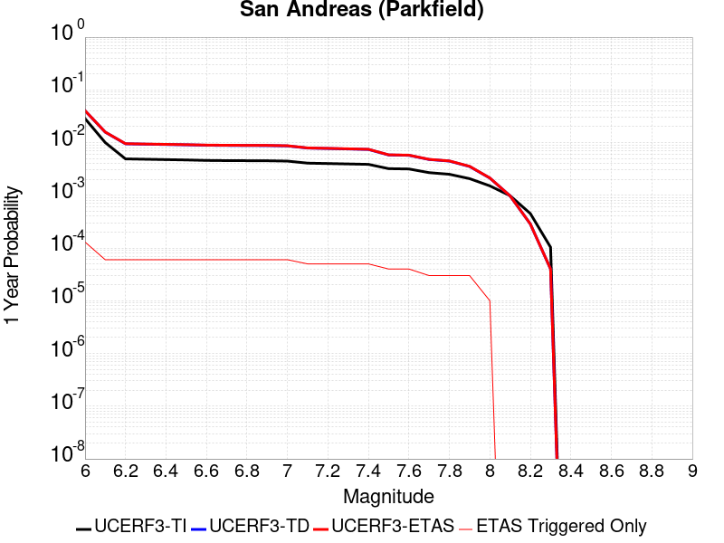 |  |

| Magnitude | 1 wk TI Prob | 1 wk TD Prob | 1 wk ETAS Prob | 1 wk ETAS/TD Gain | 1 wk ETAS Triggered Only | 1 mo TI Prob | 1 mo TD Prob | 1 mo ETAS Prob | 1 mo ETAS/TD Gain | 1 mo ETAS Triggered Only | 1 yr TI Prob | 1 yr TD Prob | 1 yr ETAS Prob | 1 yr ETAS/TD Gain | 1 yr ETAS Triggered Only | 10 yr TI Prob | 10 yr TD Prob | 10 yr ETAS Prob | 10 yr ETAS/TD Gain | 10 yr ETAS Triggered Only |
|-----|-----|-----|-----|-----|-----|-----|-----|-----|-----|-----|-----|-----|-----|-----|-----|-----|-----|-----|-----|-----|
| 6.0 | 5.556969E-4 | 7.788437E-4 | 8.054896E-4 | 1.0342121 | 2.6666667E-5 | 0.0023793848 | 0.0033341812 | 0.0033873366 | 1.0159426 | 5.3333333E-5 | 0.028586963 | 0.04023991 | 0.040316693 | 1.0019081 | 8.0E-5 | 0.25176284 | 0.33731642 | 0.33751082 | 1.0005763 | 2.9333335E-4 |
| 6.1 | 1.925858E-4 | 3.0304783E-4 | 3.0304783E-4 | 1.0 | 0.0 | 8.2510663E-4 | 0.0012982241 | 0.0013248561 | 1.0205142 | 2.6666667E-5 | 0.0099994885 | 0.015792182 | 0.015818426 | 1.0016619 | 2.6666667E-5 | 0.095613256 | 0.14979222 | 0.14990558 | 1.0007567 | 1.3333333E-4 |
| 6.2 | 9.4306815E-5 | 1.8250331E-4 | 1.8250331E-4 | 1.0 | 0.0 | 4.0410945E-4 | 7.819238E-4 | 8.085696E-4 | 1.0340773 | 2.6666667E-5 | 0.0049089384 | 0.009478576 | 0.009504989 | 1.0027866 | 2.6666667E-5 | 0.048019063 | 0.09188674 | 0.09195938 | 1.0007906 | 8.0E-5 |
| 6.3 | 9.283051E-5 | 1.7946832E-4 | 1.7946832E-4 | 1.0 | 0.0 | 3.9778434E-4 | 7.689244E-4 | 7.955706E-4 | 1.0346538 | 2.6666667E-5 | 0.0048322747 | 0.009321672 | 0.009348091 | 1.0028341 | 2.6666667E-5 | 0.047285385 | 0.09053965 | 0.090612404 | 1.0008036 | 8.0E-5 |
| 6.4 | 9.138826E-5 | 1.770899E-4 | 1.770899E-4 | 1.0 | 0.0 | 3.916052E-4 | 7.5873715E-4 | 7.8538357E-4 | 1.0351194 | 2.6666667E-5 | 0.0047573745 | 0.009198696 | 0.009225118 | 1.0028723 | 2.6666667E-5 | 0.046568092 | 0.089441724 | 0.08951457 | 1.0008144 | 8.0E-5 |
| 6.5 | 9.000255E-5 | 1.746699E-4 | 1.746699E-4 | 1.0 | 0.0 | 3.8566816E-4 | 7.483717E-4 | 7.750184E-4 | 1.0356063 | 2.6666667E-5 | 0.0046854047 | 0.009073567 | 0.009099991 | 1.0029123 | 2.6666667E-5 | 0.045878403 | 0.08832737 | 0.088400304 | 1.0008258 | 8.0E-5 |
| 6.6 | 8.8109264E-5 | 1.7148067E-4 | 1.7148067E-4 | 1.0 | 0.0 | 3.7755648E-4 | 7.3471136E-4 | 7.613584E-4 | 1.0362687 | 2.6666667E-5 | 0.0045870654 | 0.008908638 | 0.008935067 | 1.0029666 | 2.6666667E-5 | 0.04493529 | 0.086858675 | 0.08693173 | 1.000841 | 8.0E-5 |
| 6.7 | 8.738073E-5 | 1.7015127E-4 | 1.7015127E-4 | 1.0 | 0.0 | 3.7443507E-4 | 7.290171E-4 | 7.556643E-4 | 1.0365523 | 2.6666667E-5 | 0.0045492216 | 0.008839916 | 0.008866347 | 1.00299 | 2.6666667E-5 | 0.04457213 | 0.086258985 | 0.08633208 | 1.0008475 | 8.0E-5 |
| 6.8 | 8.710195E-5 | 1.6960612E-4 | 1.6960612E-4 | 1.0 | 0.0 | 3.7324068E-4 | 7.266821E-4 | 7.5332937E-4 | 1.0366699 | 2.6666667E-5 | 0.0045347405 | 0.008811726 | 0.008838157 | 1.0029997 | 2.6666667E-5 | 0.04443313 | 0.08600653 | 0.08607965 | 1.0008502 | 8.0E-5 |
| 6.9 | 8.6801556E-5 | 1.6901553E-4 | 1.6901553E-4 | 1.0 | 0.0 | 3.7195362E-4 | 7.2415237E-4 | 7.507997E-4 | 1.036798 | 2.6666667E-5 | 0.0045191357 | 0.008781176 | 0.008807608 | 1.0030102 | 2.6666667E-5 | 0.044283327 | 0.08573254 | 0.085805684 | 1.0008532 | 8.0E-5 |
| 7.0 | 8.5571606E-5 | 1.6654332E-4 | 1.6654332E-4 | 1.0 | 0.0 | 3.6668387E-4 | 7.13563E-4 | 7.4021064E-4 | 1.0373445 | 2.6666667E-5 | 0.004455241 | 0.008653281 | 0.008679717 | 1.003055 | 2.6666667E-5 | 0.043669727 | 0.08458075 | 0.08465399 | 1.0008658 | 8.0E-5 |
| 7.1 | 7.82589E-5 | 1.5135074E-4 | 1.5135074E-4 | 1.0 | 0.0 | 3.3535215E-4 | 6.484855E-4 | 6.751349E-4 | 1.0410948 | 2.6666667E-5 | 0.0040752706 | 0.0078668995 | 0.0078933565 | 1.003363 | 2.6666667E-5 | 0.040013418 | 0.077491894 | 0.0775657 | 1.0009524 | 8.0E-5 |
| 7.2 | 7.690929E-5 | 1.4872287E-4 | 1.4872287E-4 | 1.0 | 0.0 | 3.2956956E-4 | 6.372288E-4 | 6.6387845E-4 | 1.0418212 | 2.6666667E-5 | 0.004005129 | 0.007730829 | 0.00775729 | 1.0034227 | 2.6666667E-5 | 0.0393371 | 0.07626493 | 0.076338835 | 1.0009689 | 8.0E-5 |
| 7.3 | 7.5543794E-5 | 1.4568791E-4 | 1.4568791E-4 | 1.0 | 0.0 | 3.2371894E-4 | 6.242281E-4 | 6.508781E-4 | 1.0426928 | 2.6666667E-5 | 0.003934157 | 0.007573656 | 0.0076001207 | 1.0034943 | 2.6666667E-5 | 0.038652334 | 0.07482772 | 0.07490174 | 1.0009891 | 8.0E-5 |
| 7.4 | 7.4214564E-5 | 1.4269682E-4 | 1.4269682E-4 | 1.0 | 0.0 | 3.1802364E-4 | 6.114152E-4 | 6.3806557E-4 | 1.043588 | 2.6666667E-5 | 0.003865065 | 0.007418731 | 0.0074452003 | 1.0035678 | 2.6666667E-5 | 0.03798529 | 0.07340127 | 0.0734754 | 1.00101 | 8.0E-5 |
| 7.5 | 6.149578E-5 | 1.1196503E-4 | 1.1196503E-4 | 1.0 | 0.0 | 2.6352672E-4 | 4.7976198E-4 | 4.7976198E-4 | 1.0 | 0.0 | 0.0032037178 | 0.00582549 | 0.00582549 | 1.0 | 0.0 | 0.03157923 | 0.058584154 | 0.05860926 | 1.0004286 | 2.6666667E-5 |
| 7.6 | 6.0643448E-5 | 1.10251094E-4 | 1.10251094E-4 | 1.0 | 0.0 | 2.598746E-4 | 4.7241923E-4 | 4.7241923E-4 | 1.0 | 0.0 | 0.0031593828 | 0.0057365666 | 0.0057365666 | 1.0 | 0.0 | 0.031148417 | 0.057744972 | 0.0577701 | 1.0004351 | 2.6666667E-5 |
| 7.7 | 5.1652263E-5 | 9.179838E-5 | 9.179838E-5 | 1.0 | 0.0 | 2.2134806E-4 | 3.9336234E-4 | 3.9336234E-4 | 1.0 | 0.0 | 0.002691582 | 0.0047786795 | 0.0047786795 | 1.0 | 0.0 | 0.026592141 | 0.048560265 | 0.048560265 | 1.0 | 0.0 |
| 7.8 | 4.8090482E-5 | 8.564368E-5 | 8.564368E-5 | 1.0 | 0.0 | 2.060858E-4 | 3.6699275E-4 | 3.6699275E-4 | 1.0 | 0.0 | 0.0025062072 | 0.004458991 | 0.004458991 | 1.0 | 0.0 | 0.024781305 | 0.045324653 | 0.045324653 | 1.0 | 0.0 |
| 7.9 | 3.970278E-5 | 6.754111E-5 | 6.754111E-5 | 1.0 | 0.0 | 1.7014367E-4 | 2.894298E-4 | 2.894298E-4 | 1.0 | 0.0 | 0.002069531 | 0.0035181176 | 0.0035181176 | 1.0 | 0.0 | 0.020503636 | 0.03589899 | 0.03589899 | 1.0 | 0.0 |
| 8.0 | 2.8982335E-5 | 4.072124E-5 | 4.072124E-5 | 1.0 | 0.0 | 1.2420409E-4 | 1.7450792E-4 | 1.7450792E-4 | 1.0 | 0.0 | 0.0015111357 | 0.002122565 | 0.002122565 | 1.0 | 0.0 | 0.015009012 | 0.02202231 | 0.02202231 | 1.0 | 0.0 |
| 8.1 | 1.8836186E-5 | 1.8694205E-5 | 1.8694205E-5 | 1.0 | 0.0 | 8.0724014E-5 | 8.011556E-5 | 8.011556E-5 | 1.0 | 0.0 | 9.823717E-4 | 9.749711E-4 | 9.749711E-4 | 1.0 | 0.0 | 0.009780403 | 0.010494972 | 0.010494972 | 1.0 | 0.0 |
| 8.2 | 8.643924E-6 | 5.4798497E-6 | 5.4798497E-6 | 1.0 | 0.0 | 3.704486E-5 | 2.348486E-5 | 2.348486E-5 | 1.0 | 0.0 | 4.5092785E-4 | 2.858907E-4 | 2.858907E-4 | 1.0 | 0.0 | 0.0045001395 | 0.0032514327 | 0.0032514327 | 1.0 | 0.0 |
| 8.3 | 1.983087E-6 | 7.668296E-7 | 7.668296E-7 | 1.0 | 0.0 | 8.498917E-6 | 3.2864084E-6 | 3.2864084E-6 | 1.0 | 0.0 | 1.034694E-4 | 4.0011306E-5 | 4.0011306E-5 | 1.0 | 0.0 | 0.0010342124 | 4.724499E-4 | 4.724499E-4 | 1.0 | 0.0 |

## Lake Isabella (Seismicity)
*[(top)](#table-of-contents)*

| 1 Week | 1 Month | 1 Year | 10 Year |
|-----|-----|-----|-----|
|  |  |  |  |

| Magnitude | 1 wk TI Prob | 1 wk TD Prob | 1 wk ETAS Prob | 1 wk ETAS/TD Gain | 1 wk ETAS Triggered Only | 1 mo TI Prob | 1 mo TD Prob | 1 mo ETAS Prob | 1 mo ETAS/TD Gain | 1 mo ETAS Triggered Only | 1 yr TI Prob | 1 yr TD Prob | 1 yr ETAS Prob | 1 yr ETAS/TD Gain | 1 yr ETAS Triggered Only | 10 yr TI Prob | 10 yr TD Prob | 10 yr ETAS Prob | 10 yr ETAS/TD Gain | 10 yr ETAS Triggered Only |
|-----|-----|-----|-----|-----|-----|-----|-----|-----|-----|-----|-----|-----|-----|-----|-----|-----|-----|-----|-----|-----|
| 6.0 | 9.431637E-6 | 9.741694E-6 | 6.3074505E-5 | 6.474696 | 5.3333333E-5 | 4.0420677E-5 | 4.1749525E-5 | 1.4841174E-4 | 3.5548127 | 1.0666667E-4 | 4.920106E-4 | 5.0819496E-4 | 6.6811364E-4 | 1.3146797 | 1.6E-4 | 0.004909227 | 0.005071621 | 0.005336935 | 1.0523134 | 2.6666667E-4 |
| 6.1 | 9.431637E-6 | 9.741694E-6 | 6.3074505E-5 | 6.474696 | 5.3333333E-5 | 4.0420677E-5 | 4.1749525E-5 | 1.4841174E-4 | 3.5548127 | 1.0666667E-4 | 4.920106E-4 | 5.0819496E-4 | 6.6811364E-4 | 1.3146797 | 1.6E-4 | 0.004909227 | 0.005071621 | 0.005336935 | 1.0523134 | 2.6666667E-4 |
| 6.2 | 9.431637E-6 | 9.741694E-6 | 6.3074505E-5 | 6.474696 | 5.3333333E-5 | 4.0420677E-5 | 4.1749525E-5 | 1.4841174E-4 | 3.5548127 | 1.0666667E-4 | 4.920106E-4 | 5.0819496E-4 | 6.6811364E-4 | 1.3146797 | 1.6E-4 | 0.004909227 | 0.005071621 | 0.005336935 | 1.0523134 | 2.6666667E-4 |
| 6.3 | 9.431637E-6 | 9.741694E-6 | 6.3074505E-5 | 6.474696 | 5.3333333E-5 | 4.0420677E-5 | 4.1749525E-5 | 1.4841174E-4 | 3.5548127 | 1.0666667E-4 | 4.920106E-4 | 5.0819496E-4 | 6.6811364E-4 | 1.3146797 | 1.6E-4 | 0.004909227 | 0.005071621 | 0.005336935 | 1.0523134 | 2.6666667E-4 |
| 6.4 | 5.144063E-6 | 5.3000977E-6 | 5.3000977E-6 | 1.0 | 0.0 | 2.2045799E-5 | 2.2714525E-5 | 7.604665E-5 | 3.3479302 | 5.3333333E-5 | 2.6837454E-4 | 2.765177E-4 | 3.8315487E-4 | 1.3856432 | 1.0666667E-4 | 0.0026805066 | 0.002762077 | 0.0029216348 | 1.0577674 | 1.6E-4 |
| 6.5 | 5.144063E-6 | 5.3000977E-6 | 5.3000977E-6 | 1.0 | 0.0 | 2.2045799E-5 | 2.2714525E-5 | 7.604665E-5 | 3.3479302 | 5.3333333E-5 | 2.6837454E-4 | 2.765177E-4 | 3.8315487E-4 | 1.3856432 | 1.0666667E-4 | 0.0026805066 | 0.002762077 | 0.0029216348 | 1.0577674 | 1.6E-4 |
| 6.6 | 3.4009804E-6 | 3.4987995E-6 | 3.4987995E-6 | 1.0 | 0.0 | 1.4575549E-5 | 1.4994778E-5 | 4.1661046E-5 | 2.7783701 | 2.6666667E-5 | 1.7744285E-4 | 1.8254772E-4 | 2.6253314E-4 | 1.4381615 | 8.0E-5 | 0.0017730123 | 0.0018241355 | 0.0019572256 | 1.0729606 | 1.3333333E-4 |
| 6.7 | 3.3880428E-6 | 3.4856662E-6 | 3.4856662E-6 | 1.0 | 0.0 | 1.4520103E-5 | 1.4938492E-5 | 4.1604762E-5 | 2.785071 | 2.6666667E-5 | 1.767679E-4 | 1.8186258E-4 | 2.61848E-4 | 1.4398127 | 8.0E-5 | 0.0017662736 | 0.0018172951 | 0.0019503862 | 1.0732358 | 1.3333333E-4 |
| 6.8 | 2.6582E-6 | 2.7337105E-6 | 2.7337105E-6 | 1.0 | 0.0 | 1.1392236E-5 | 1.1715857E-5 | 1.1715857E-5 | 1.0 | 0.0 | 1.3869164E-4 | 1.4263256E-4 | 1.9595829E-4 | 1.3738679 | 5.3333333E-5 | 0.0013860512 | 0.0014255423 | 0.0015054282 | 1.056039 | 8.0E-5 |
| 6.9 | 2.406011E-6 | 2.474338E-6 | 2.474338E-6 | 1.0 | 0.0 | 1.0311434E-5 | 1.0604271E-5 | 1.0604271E-5 | 1.0 | 0.0 | 1.2553448E-4 | 1.2910066E-4 | 1.8242712E-4 | 1.413061 | 5.3333333E-5 | 0.0012546359 | 0.0012903863 | 0.0013702831 | 1.061917 | 8.0E-5 |
| 7.0 | 1.6953097E-6 | 1.7429437E-6 | 1.7429437E-6 | 1.0 | 0.0 | 7.265593E-6 | 7.469743E-6 | 7.469743E-6 | 1.0 | 0.0 | 8.8455E-5 | 9.094137E-5 | 1.4426986E-4 | 1.586405 | 5.3333333E-5 | 8.84198E-4 | 9.0914435E-4 | 9.890716E-4 | 1.0879148 | 8.0E-5 |
| 7.1 | 3.5013824E-7 | 3.571492E-7 | 3.571492E-7 | 1.0 | 0.0 | 1.5005916E-6 | 1.5306384E-6 | 1.5306384E-6 | 1.0 | 0.0 | 1.826955E-5 | 1.8635366E-5 | 1.8635366E-5 | 1.0 | 0.0 | 1.8268047E-4 | 1.863383E-4 | 1.863383E-4 | 1.0 | 0.0 |
| 7.2 | 2.2321095E-7 | 2.2750632E-7 | 2.2750632E-7 | 1.0 | 0.0 | 9.56618E-7 | 9.750268E-7 | 9.750268E-7 | 1.0 | 0.0 | 1.1646762E-5 | 1.1870887E-5 | 1.1870887E-5 | 1.0 | 0.0 | 1.1646151E-4 | 1.1870263E-4 | 1.1870263E-4 | 1.0 | 0.0 |
| 7.3 | 1.5760406E-7 | 1.6060963E-7 | 1.6060963E-7 | 1.0 | 0.0 | 6.7544585E-7 | 6.883268E-7 | 6.883268E-7 | 1.0 | 0.0 | 8.223522E-6 | 8.380347E-6 | 8.380347E-6 | 1.0 | 0.0 | 8.2232174E-5 | 8.3800376E-5 | 8.3800376E-5 | 1.0 | 0.0 |
| 7.4 | 1.1216497E-7 | 1.1431735E-7 | 1.1431735E-7 | 1.0 | 0.0 | 4.8070694E-7 | 4.8993144E-7 | 4.8993144E-7 | 1.0 | 0.0 | 5.852591E-6 | 5.964899E-6 | 5.964899E-6 | 1.0 | 0.0 | 5.8524372E-5 | 5.9647435E-5 | 5.9647435E-5 | 1.0 | 0.0 |
| 7.5 | 4.885185E-8 | 4.9787864E-8 | 4.9787864E-8 | 1.0 | 0.0 | 2.0936506E-7 | 2.1337654E-7 | 2.1337654E-7 | 1.0 | 0.0 | 2.5490165E-6 | 2.5978566E-6 | 2.5978566E-6 | 1.0 | 0.0 | 2.5489873E-5 | 2.597828E-5 | 2.597828E-5 | 1.0 | 0.0 |
| 7.6 | 1.504641E-9 | 1.5317939E-9 | 1.5317939E-9 | 1.0 | 0.0 | 6.4484613E-9 | 6.5648313E-9 | 6.5648313E-9 | 1.0 | 0.0 | 7.851001E-8 | 7.992682E-8 | 7.992682E-8 | 1.0 | 0.0 | 7.8509987E-7 | 7.992682E-7 | 7.992682E-7 | 1.0 | 0.0 |

## Calico-Hidalgo
*[(top)](#table-of-contents)*

| 1 Week | 1 Month | 1 Year | 10 Year |
|-----|-----|-----|-----|
|  |  |  |  |

| Magnitude | 1 wk TI Prob | 1 wk TD Prob | 1 wk ETAS Prob | 1 wk ETAS/TD Gain | 1 wk ETAS Triggered Only | 1 mo TI Prob | 1 mo TD Prob | 1 mo ETAS Prob | 1 mo ETAS/TD Gain | 1 mo ETAS Triggered Only | 1 yr TI Prob | 1 yr TD Prob | 1 yr ETAS Prob | 1 yr ETAS/TD Gain | 1 yr ETAS Triggered Only | 10 yr TI Prob | 10 yr TD Prob | 10 yr ETAS Prob | 10 yr ETAS/TD Gain | 10 yr ETAS Triggered Only |
|-----|-----|-----|-----|-----|-----|-----|-----|-----|-----|-----|-----|-----|-----|-----|-----|-----|-----|-----|-----|-----|
| 6.0 | 4.0906612E-5 | 5.0704653E-5 | 5.0704653E-5 | 1.0 | 0.0 | 1.7530227E-4 | 2.1728984E-4 | 2.4395071E-4 | 1.1226972 | 2.6666667E-5 | 0.0021322158 | 0.0026426981 | 0.0028288716 | 1.0704482 | 1.8666667E-4 | 0.02111873 | 0.026153097 | 0.026412789 | 1.0099297 | 2.6666667E-4 |
| 6.1 | 4.0906612E-5 | 5.0704653E-5 | 5.0704653E-5 | 1.0 | 0.0 | 1.7530227E-4 | 2.1728984E-4 | 2.4395071E-4 | 1.1226972 | 2.6666667E-5 | 0.0021322158 | 0.0026426981 | 0.0028288716 | 1.0704482 | 1.8666667E-4 | 0.02111873 | 0.026153097 | 0.026412789 | 1.0099297 | 2.6666667E-4 |
| 6.2 | 4.0906612E-5 | 5.0704653E-5 | 5.0704653E-5 | 1.0 | 0.0 | 1.7530227E-4 | 2.1728984E-4 | 2.4395071E-4 | 1.1226972 | 2.6666667E-5 | 0.0021322158 | 0.0026426981 | 0.0028288716 | 1.0704482 | 1.8666667E-4 | 0.02111873 | 0.026153097 | 0.026412789 | 1.0099297 | 2.6666667E-4 |
| 6.3 | 2.4242801E-5 | 3.009103E-5 | 3.009103E-5 | 1.0 | 0.0 | 1.0389358E-4 | 1.2895538E-4 | 1.556186E-4 | 1.2067631 | 2.6666667E-5 | 0.0012641704 | 0.001568934 | 0.0016754332 | 1.06788 | 1.0666667E-4 | 0.01257003 | 0.015582247 | 0.015739754 | 1.0101081 | 1.6E-4 |
| 6.4 | 2.4242801E-5 | 3.009103E-5 | 3.009103E-5 | 1.0 | 0.0 | 1.0389358E-4 | 1.2895538E-4 | 1.556186E-4 | 1.2067631 | 2.6666667E-5 | 0.0012641704 | 0.001568934 | 0.0016754332 | 1.06788 | 1.0666667E-4 | 0.01257003 | 0.015582247 | 0.015739754 | 1.0101081 | 1.6E-4 |
| 6.5 | 2.0286952E-5 | 2.5315985E-5 | 2.5315985E-5 | 1.0 | 0.0 | 8.694118E-5 | 1.0849266E-4 | 1.3515644E-4 | 1.2457657 | 2.6666667E-5 | 0.0010579949 | 0.0013201149 | 0.0014266408 | 1.0806944 | 1.0666667E-4 | 0.010529719 | 0.013124665 | 0.013282565 | 1.0120308 | 1.6E-4 |
| 6.6 | 2.0269223E-5 | 2.5296935E-5 | 2.5296935E-5 | 1.0 | 0.0 | 8.6865206E-5 | 1.08411026E-4 | 1.350748E-4 | 1.2459508 | 2.6666667E-5 | 0.0010570707 | 0.0013191222 | 0.0014256481 | 1.0807552 | 1.0666667E-4 | 0.010520565 | 0.013114855 | 0.013272757 | 1.0120399 | 1.6E-4 |
| 6.7 | 1.799852E-5 | 2.25408E-5 | 2.25408E-5 | 1.0 | 0.0 | 7.713423E-5 | 9.6599935E-5 | 1.2326402E-4 | 1.276026 | 2.6666667E-5 | 9.3870464E-4 | 0.0011754843 | 0.0012820255 | 1.0906361 | 1.0666667E-4 | 0.009347493 | 0.011694277 | 0.011852406 | 1.0135219 | 1.6E-4 |
| 6.8 | 1.7458793E-5 | 2.1842314E-5 | 2.1842314E-5 | 1.0 | 0.0 | 7.4821255E-5 | 9.3606635E-5 | 1.2027081E-4 | 1.2848535 | 2.6666667E-5 | 9.10568E-4 | 0.0011390795 | 0.0012456246 | 1.0935363 | 1.0666667E-4 | 0.009068459 | 0.011333993 | 0.011465815 | 1.0116307 | 1.3333333E-4 |
| 6.9 | 1.542884E-5 | 1.9026087E-5 | 1.9026087E-5 | 1.0 | 0.0 | 6.612192E-5 | 8.1537895E-5 | 1.0820239E-4 | 1.3270196 | 2.6666667E-5 | 8.04737E-4 | 9.92285E-4 | 0.0010988457 | 1.1073893 | 1.0666667E-4 | 0.008018291 | 0.00987994 | 0.010011956 | 1.013362 | 1.3333333E-4 |
| 7.0 | 1.468253E-5 | 1.8030747E-5 | 1.8030747E-5 | 1.0 | 0.0 | 6.292361E-5 | 7.7272416E-5 | 1.0393702E-4 | 1.3450727 | 2.6666667E-5 | 7.658257E-4 | 9.403986E-4 | 0.0010203234 | 1.0849903 | 8.0E-5 | 0.0076319184 | 0.009365558 | 0.009471226 | 1.0112826 | 1.0666667E-4 |
| 7.1 | 1.3139281E-5 | 1.620107E-5 | 1.620107E-5 | 1.0 | 0.0 | 5.6309986E-5 | 6.943138E-5 | 9.609619E-5 | 1.3840456 | 2.6666667E-5 | 6.853584E-4 | 8.4501173E-4 | 9.249442E-4 | 1.0945933 | 8.0E-5 | 0.0068324856 | 0.008419285 | 0.008525053 | 1.0125626 | 1.0666667E-4 |
| 7.2 | 1.1127404E-5 | 1.3866703E-5 | 1.3866703E-5 | 1.0 | 0.0 | 4.7688E-5 | 5.9427435E-5 | 8.6092514E-5 | 1.4486998 | 2.6666667E-5 | 5.8044674E-4 | 7.2329975E-4 | 8.0324186E-4 | 1.1105242 | 8.0E-5 | 0.0057893298 | 0.0072105634 | 0.007316461 | 1.0146865 | 1.0666667E-4 |
| 7.3 | 9.808154E-6 | 1.2176301E-5 | 1.2176301E-5 | 1.0 | 0.0 | 4.2034266E-5 | 5.2183164E-5 | 7.884844E-5 | 1.5109938 | 2.6666667E-5 | 5.11647E-4 | 6.3515553E-4 | 6.88455E-4 | 1.0839156 | 5.3333333E-5 | 0.0051047057 | 0.0063344776 | 0.006413971 | 1.0125493 | 8.0E-5 |
| 7.4 | 7.942452E-6 | 9.7922075E-6 | 9.7922075E-6 | 1.0 | 0.0 | 3.4038632E-5 | 4.196598E-5 | 6.863153E-5 | 1.6354086 | 2.6666667E-5 | 4.1434157E-4 | 5.1082554E-4 | 5.641316E-4 | 1.1043528 | 5.3333333E-5 | 0.0041356985 | 0.0050974544 | 0.005150516 | 1.0104094 | 5.3333333E-5 |
| 7.5 | 4.7121216E-6 | 5.772871E-6 | 5.772871E-6 | 1.0 | 0.0 | 2.019465E-5 | 2.4740684E-5 | 2.4740684E-5 | 1.0 | 0.0 | 2.4584212E-4 | 3.0118387E-4 | 3.2784248E-4 | 1.0885128 | 2.6666667E-5 | 0.0024557032 | 0.0030085093 | 0.0030350958 | 1.0088371 | 2.6666667E-5 |
| 7.6 | 2.21172E-7 | 2.6039737E-7 | 2.6039737E-7 | 1.0 | 0.0 | 9.478797E-7 | 1.1159884E-6 | 1.1159884E-6 | 1.0 | 0.0 | 1.1540374E-5 | 1.3587103E-5 | 1.3587103E-5 | 1.0 | 0.0 | 1.1539775E-4 | 1.3586554E-4 | 1.3586554E-4 | 1.0 | 0.0 |

## San Andreas (San Gorgonio Pass-Garnet HIll)
*[(top)](#table-of-contents)*

| 1 Week | 1 Month | 1 Year | 10 Year |
|-----|-----|-----|-----|
| 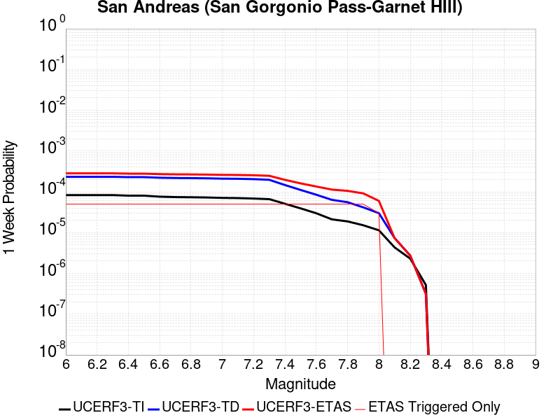 |  |  | 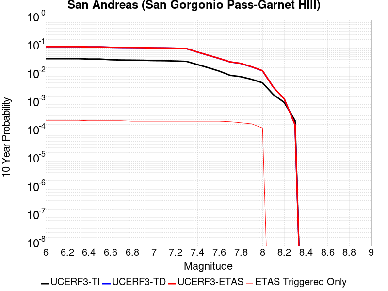 |

| Magnitude | 1 wk TI Prob | 1 wk TD Prob | 1 wk ETAS Prob | 1 wk ETAS/TD Gain | 1 wk ETAS Triggered Only | 1 mo TI Prob | 1 mo TD Prob | 1 mo ETAS Prob | 1 mo ETAS/TD Gain | 1 mo ETAS Triggered Only | 1 yr TI Prob | 1 yr TD Prob | 1 yr ETAS Prob | 1 yr ETAS/TD Gain | 1 yr ETAS Triggered Only | 10 yr TI Prob | 10 yr TD Prob | 10 yr ETAS Prob | 10 yr ETAS/TD Gain | 10 yr ETAS Triggered Only |
|-----|-----|-----|-----|-----|-----|-----|-----|-----|-----|-----|-----|-----|-----|-----|-----|-----|-----|-----|-----|-----|
| 6.0 | 8.31567E-5 | 2.3386451E-4 | 2.6052495E-4 | 1.1139995 | 2.6666667E-5 | 3.5633717E-4 | 0.0010018935 | 0.0010818134 | 1.0797688 | 8.0E-5 | 0.004329778 | 0.012129918 | 0.012340664 | 1.017374 | 2.1333333E-4 | 0.042463828 | 0.11259502 | 0.11283166 | 1.0021017 | 2.6666667E-4 |
| 6.1 | 8.31567E-5 | 2.3386451E-4 | 2.6052495E-4 | 1.1139995 | 2.6666667E-5 | 3.5633717E-4 | 0.0010018935 | 0.0010818134 | 1.0797688 | 8.0E-5 | 0.004329778 | 0.012129918 | 0.012340664 | 1.017374 | 2.1333333E-4 | 0.042463828 | 0.11259502 | 0.11283166 | 1.0021017 | 2.6666667E-4 |
| 6.2 | 8.31567E-5 | 2.3386451E-4 | 2.6052495E-4 | 1.1139995 | 2.6666667E-5 | 3.5633717E-4 | 0.0010018935 | 0.0010818134 | 1.0797688 | 8.0E-5 | 0.004329778 | 0.012129918 | 0.012340664 | 1.017374 | 2.1333333E-4 | 0.042463828 | 0.11259502 | 0.11283166 | 1.0021017 | 2.6666667E-4 |
| 6.3 | 8.31567E-5 | 2.3386451E-4 | 2.6052495E-4 | 1.1139995 | 2.6666667E-5 | 3.5633717E-4 | 0.0010018935 | 0.0010818134 | 1.0797688 | 8.0E-5 | 0.004329778 | 0.012129918 | 0.012340664 | 1.017374 | 2.1333333E-4 | 0.042463828 | 0.11259502 | 0.11283166 | 1.0021017 | 2.6666667E-4 |
| 6.4 | 8.059055E-5 | 2.2944735E-4 | 2.561079E-4 | 1.1161946 | 2.6666667E-5 | 3.4534236E-4 | 9.829777E-4 | 0.001062899 | 1.0813054 | 8.0E-5 | 0.0041964394 | 0.011902156 | 0.012112951 | 1.0177106 | 2.1333333E-4 | 0.041180745 | 0.110576175 | 0.11081336 | 1.0021449 | 2.6666667E-4 |
| 6.5 | 8.059055E-5 | 2.2944735E-4 | 2.561079E-4 | 1.1161946 | 2.6666667E-5 | 3.4534236E-4 | 9.829777E-4 | 0.001062899 | 1.0813054 | 8.0E-5 | 0.0041964394 | 0.011902156 | 0.012112951 | 1.0177106 | 2.1333333E-4 | 0.041180745 | 0.110576175 | 0.11081336 | 1.0021449 | 2.6666667E-4 |
| 6.6 | 7.619237E-5 | 2.2189032E-4 | 2.4855108E-4 | 1.1201528 | 2.6666667E-5 | 3.2649786E-4 | 9.506143E-4 | 0.0010305382 | 1.0840762 | 8.0E-5 | 0.0039678677 | 0.0115128625 | 0.01172374 | 1.0183166 | 2.1333333E-4 | 0.03897764 | 0.10711278 | 0.10735088 | 1.0022229 | 2.6666667E-4 |
| 6.7 | 7.440636E-5 | 2.1864849E-4 | 2.4530932E-4 | 1.1219347 | 2.6666667E-5 | 3.188454E-4 | 9.367307E-4 | 0.0010166558 | 1.0853235 | 8.0E-5 | 0.0038750346 | 0.011345596 | 0.011556509 | 1.0185899 | 2.1333333E-4 | 0.038081564 | 0.10562121 | 0.10585971 | 1.0022581 | 2.6666667E-4 |
| 6.8 | 7.3735864E-5 | 2.1712016E-4 | 2.4378103E-4 | 1.1227932 | 2.6666667E-5 | 3.1597257E-4 | 9.3018543E-4 | 0.001010111 | 1.0859244 | 8.0E-5 | 0.0038401815 | 0.011266734 | 0.011451297 | 1.0163813 | 1.8666667E-4 | 0.03774495 | 0.10492276 | 0.10513757 | 1.0020474 | 2.4E-4 |
| 6.9 | 7.27575E-5 | 2.1480983E-4 | 2.4147077E-4 | 1.1241142 | 2.6666667E-5 | 3.117806E-4 | 9.20291E-4 | 0.0010002174 | 1.086849 | 8.0E-5 | 0.003789323 | 0.011147508 | 0.011332095 | 1.0165585 | 1.8666667E-4 | 0.037253562 | 0.10387066 | 0.10408573 | 1.0020705 | 2.4E-4 |
| 7.0 | 7.102591E-5 | 2.1065009E-4 | 2.3731113E-4 | 1.1265656 | 2.6666667E-5 | 3.0436125E-4 | 9.0247596E-4 | 9.824038E-4 | 1.088565 | 8.0E-5 | 0.003699303 | 0.010932805 | 0.011117431 | 1.0168873 | 1.8666667E-4 | 0.03638325 | 0.101972826 | 0.102188356 | 1.0021136 | 2.4E-4 |
| 7.1 | 7.028513E-5 | 2.0900648E-4 | 2.3566757E-4 | 1.1275611 | 2.6666667E-5 | 3.0118722E-4 | 8.954368E-4 | 9.7536517E-4 | 1.0892619 | 8.0E-5 | 0.0036607897 | 0.01084796 | 0.011032602 | 1.0170208 | 1.8666667E-4 | 0.036010686 | 0.10121585 | 0.101431556 | 1.0021312 | 2.4E-4 |
| 7.2 | 6.8498244E-5 | 2.0508505E-4 | 2.3174623E-4 | 1.1300007 | 2.6666667E-5 | 2.9353087E-4 | 8.78642E-4 | 9.5857173E-4 | 1.0909696 | 8.0E-5 | 0.003567883 | 0.010645497 | 0.010830177 | 1.0173482 | 1.8666667E-4 | 0.035111405 | 0.09940783 | 0.09962397 | 1.0021743 | 2.4E-4 |
| 7.3 | 6.622592E-5 | 1.973576E-4 | 2.24019E-4 | 1.1350919 | 2.6666667E-5 | 2.8379448E-4 | 8.4554625E-4 | 9.2547864E-4 | 1.0945334 | 8.0E-5 | 0.0034497243 | 0.010246415 | 0.010431169 | 1.0180311 | 1.8666667E-4 | 0.033966612 | 0.09590419 | 0.09612117 | 1.0022625 | 2.4E-4 |
| 7.4 | 5.1050705E-5 | 1.4692261E-4 | 1.7358536E-4 | 1.1814748 | 2.6666667E-5 | 2.1877038E-4 | 6.295173E-4 | 7.094669E-4 | 1.1270015 | 8.0E-5 | 0.002660276 | 0.0076376316 | 0.007822872 | 1.0242537 | 1.8666667E-4 | 0.02628654 | 0.07287696 | 0.07309947 | 1.0030532 | 2.4E-4 |
| 7.5 | 3.9302922E-5 | 1.11326524E-4 | 1.3799022E-4 | 1.239509 | 2.6666667E-5 | 1.6843023E-4 | 4.7702674E-4 | 5.569886E-4 | 1.1676254 | 8.0E-5 | 0.0020487092 | 0.005792404 | 0.0059779896 | 1.0320394 | 1.8666667E-4 | 0.020299247 | 0.05602189 | 0.056248445 | 1.004044 | 2.4E-4 |
| 7.6 | 2.9851626E-5 | 8.49747E-5 | 1.116391E-4 | 1.3137922 | 2.6666667E-5 | 1.2792926E-4 | 3.6412658E-4 | 4.4409744E-4 | 1.2196238 | 8.0E-5 | 0.0015564259 | 0.004424255 | 0.004610096 | 1.042005 | 1.8666667E-4 | 0.0154556995 | 0.043204896 | 0.043434527 | 1.005315 | 2.4E-4 |
| 7.7 | 2.1135214E-5 | 6.355116E-5 | 9.021613E-5 | 1.4195828 | 2.6666667E-5 | 9.0576345E-5 | 2.723337E-4 | 3.523119E-4 | 1.2936772 | 8.0E-5 | 0.0011022091 | 0.003310627 | 0.0034966758 | 1.0561974 | 1.8666667E-4 | 0.010967582 | 0.032592565 | 0.032824744 | 1.0071236 | 2.4E-4 |
| 7.8 | 1.883379E-5 | 5.5660596E-5 | 8.232578E-5 | 1.4790676 | 2.6666667E-5 | 8.0713755E-5 | 2.3852361E-4 | 3.1850452E-4 | 1.3353165 | 8.0E-5 | 9.822468E-4 | 0.0029001608 | 0.0030862861 | 1.0641776 | 1.8666667E-4 | 0.0097791655 | 0.028704397 | 0.028937507 | 1.0081211 | 2.4E-4 |
| 7.9 | 1.5156185E-5 | 4.1675128E-5 | 6.834068E-5 | 1.6398433 | 2.6666667E-5 | 6.495346E-5 | 1.7859548E-4 | 2.585812E-4 | 1.4478596 | 8.0E-5 | 7.9052144E-4 | 0.0021722328 | 0.0023318853 | 1.0734969 | 1.6E-4 | 0.007877152 | 0.02176709 | 0.021949692 | 1.008389 | 1.8666667E-4 |
| 8.0 | 1.1405907E-5 | 2.9986788E-5 | 5.6652654E-5 | 1.8892539 | 2.6666667E-5 | 4.8881542E-5 | 1.2850849E-4 | 1.8183496E-4 | 1.4149647 | 5.3333333E-5 | 5.9497025E-4 | 0.0015634688 | 0.0016699688 | 1.0681177 | 1.0666667E-4 | 0.005933798 | 0.015778678 | 0.015909906 | 1.0083169 | 1.3333333E-4 |
| 8.1 | 4.3511436E-6 | 7.373693E-6 | 7.373693E-6 | 1.0 | 0.0 | 1.8647626E-5 | 3.160116E-5 | 3.160116E-5 | 1.0 | 0.0 | 2.2701119E-4 | 3.8467633E-4 | 3.8467633E-4 | 1.0 | 0.0 | 0.0022677942 | 0.004118566 | 0.004118566 | 1.0 | 0.0 |
| 8.2 | 2.3042528E-6 | 2.7350309E-6 | 2.7350309E-6 | 1.0 | 0.0 | 9.875332E-6 | 1.1721509E-5 | 1.1721509E-5 | 1.0 | 0.0 | 1.2022553E-4 | 1.4270007E-4 | 1.4270007E-4 | 1.0 | 0.0 | 0.0012016051 | 0.0015990696 | 0.0015990696 | 1.0 | 0.0 |
| 8.3 | 5.202968E-7 | 3.1628537E-7 | 3.1628537E-7 | 1.0 | 0.0 | 2.2298414E-6 | 1.3555081E-6 | 1.3555081E-6 | 1.0 | 0.0 | 2.714798E-5 | 1.6503198E-5 | 1.6503198E-5 | 1.0 | 0.0 | 2.7144665E-4 | 1.9580164E-4 | 1.9580164E-4 | 1.0 | 0.0 |

## Death Valley (No)
*[(top)](#table-of-contents)*

| 1 Week | 1 Month | 1 Year | 10 Year |
|-----|-----|-----|-----|
|  |  |  |  |

| Magnitude | 1 wk TI Prob | 1 wk TD Prob | 1 wk ETAS Prob | 1 wk ETAS/TD Gain | 1 wk ETAS Triggered Only | 1 mo TI Prob | 1 mo TD Prob | 1 mo ETAS Prob | 1 mo ETAS/TD Gain | 1 mo ETAS Triggered Only | 1 yr TI Prob | 1 yr TD Prob | 1 yr ETAS Prob | 1 yr ETAS/TD Gain | 1 yr ETAS Triggered Only | 10 yr TI Prob | 10 yr TD Prob | 10 yr ETAS Prob | 10 yr ETAS/TD Gain | 10 yr ETAS Triggered Only |
|-----|-----|-----|-----|-----|-----|-----|-----|-----|-----|-----|-----|-----|-----|-----|-----|-----|-----|-----|-----|-----|
| 6.0 | 2.0074807E-5 | 2.2500446E-5 | 7.583258E-5 | 3.37027 | 5.3333333E-5 | 8.603206E-5 | 9.642696E-5 | 1.7641924E-4 | 1.8295635 | 8.0E-5 | 0.001046937 | 0.0011733733 | 0.0013331856 | 1.136199 | 1.6E-4 | 0.010420183 | 0.011672693 | 0.011936247 | 1.0225787 | 2.6666667E-4 |
| 6.1 | 2.0074807E-5 | 2.2500446E-5 | 7.583258E-5 | 3.37027 | 5.3333333E-5 | 8.603206E-5 | 9.642696E-5 | 1.7641924E-4 | 1.8295635 | 8.0E-5 | 0.001046937 | 0.0011733733 | 0.0013331856 | 1.136199 | 1.6E-4 | 0.010420183 | 0.011672693 | 0.011936247 | 1.0225787 | 2.6666667E-4 |
| 6.2 | 2.0074807E-5 | 2.2500446E-5 | 7.583258E-5 | 3.37027 | 5.3333333E-5 | 8.603206E-5 | 9.642696E-5 | 1.7641924E-4 | 1.8295635 | 8.0E-5 | 0.001046937 | 0.0011733733 | 0.0013331856 | 1.136199 | 1.6E-4 | 0.010420183 | 0.011672693 | 0.011936247 | 1.0225787 | 2.6666667E-4 |
| 6.3 | 1.9050609E-5 | 2.1337288E-5 | 7.4669486E-5 | 3.4994833 | 5.3333333E-5 | 8.164292E-5 | 9.144236E-5 | 1.7143504E-4 | 1.874788 | 8.0E-5 | 9.935491E-4 | 0.0011127489 | 0.0012725708 | 1.1436281 | 1.6E-4 | 0.009891188 | 0.011072595 | 0.011336309 | 1.0238168 | 2.6666667E-4 |
| 6.4 | 1.9050609E-5 | 2.1337288E-5 | 7.4669486E-5 | 3.4994833 | 5.3333333E-5 | 8.164292E-5 | 9.144236E-5 | 1.7143504E-4 | 1.874788 | 8.0E-5 | 9.935491E-4 | 0.0011127489 | 0.0012725708 | 1.1436281 | 1.6E-4 | 0.009891188 | 0.011072595 | 0.011336309 | 1.0238168 | 2.6666667E-4 |
| 6.5 | 1.8367004E-5 | 2.0561336E-5 | 7.389357E-5 | 3.593812 | 5.3333333E-5 | 7.8713354E-5 | 8.811707E-5 | 1.6811003E-4 | 1.907803 | 8.0E-5 | 9.5791375E-4 | 0.0010723039 | 0.0012321323 | 1.1490514 | 1.6E-4 | 0.009537951 | 0.010672084 | 0.010935905 | 1.0247207 | 2.6666667E-4 |
| 6.6 | 1.779439E-5 | 1.9911244E-5 | 7.3243515E-5 | 3.6785002 | 5.3333333E-5 | 7.625944E-5 | 8.533114E-5 | 1.6532432E-4 | 1.937444 | 8.0E-5 | 9.280632E-4 | 0.0010384179 | 0.0011982518 | 1.1539205 | 1.6E-4 | 0.009241969 | 0.010336416 | 0.010600326 | 1.0255321 | 2.6666667E-4 |
| 6.7 | 1.7025437E-5 | 1.9043726E-5 | 7.2376046E-5 | 3.800519 | 5.3333333E-5 | 7.296412E-5 | 8.161345E-5 | 1.6160692E-4 | 1.9801506 | 8.0E-5 | 8.87976E-4 | 9.93197E-4 | 0.0011530381 | 1.1609359 | 1.6E-4 | 0.008844362 | 0.009888301 | 0.010152331 | 1.0267012 | 2.6666667E-4 |
| 6.8 | 1.6545107E-5 | 1.851284E-5 | 7.1845185E-5 | 3.8808303 | 5.3333333E-5 | 7.090568E-5 | 7.933836E-5 | 1.59332E-4 | 2.0082595 | 8.0E-5 | 8.629347E-4 | 9.655226E-4 | 0.001125368 | 1.1655533 | 1.6E-4 | 0.008595915 | 0.009613981 | 0.009878083 | 1.0274707 | 2.6666667E-4 |
| 6.9 | 1.615478E-5 | 1.8087881E-5 | 7.1420254E-5 | 3.9485137 | 5.3333333E-5 | 6.9232934E-5 | 7.751722E-5 | 1.5751102E-4 | 2.0319486 | 8.0E-5 | 8.4258494E-4 | 9.433697E-4 | 0.0011032188 | 1.1694448 | 1.6E-4 | 0.008393973 | 0.009394345 | 0.009658506 | 1.0281192 | 2.6666667E-4 |
| 7.0 | 1.5894311E-5 | 1.7805834E-5 | 7.1138216E-5 | 3.9952195 | 5.3333333E-5 | 6.81167E-5 | 7.6308526E-5 | 1.5630241E-4 | 2.0482957 | 8.0E-5 | 8.2900526E-4 | 9.286663E-4 | 0.0010885177 | 1.1721301 | 1.6E-4 | 0.008259195 | 0.009248544 | 0.009512745 | 1.0285667 | 2.6666667E-4 |
| 7.1 | 1.5602263E-5 | 1.7483784E-5 | 7.081618E-5 | 4.050392 | 5.3333333E-5 | 6.6865134E-5 | 7.4928386E-5 | 1.549224E-4 | 2.0676062 | 8.0E-5 | 8.137789E-4 | 9.118773E-4 | 0.0010717314 | 1.1753021 | 1.6E-4 | 0.008108052 | 0.009082039 | 0.009346284 | 1.0290953 | 2.6666667E-4 |
| 7.2 | 1.5323829E-5 | 1.7170905E-5 | 7.050332E-5 | 4.1059756 | 5.3333333E-5 | 6.56719E-5 | 7.358755E-5 | 1.5358167E-4 | 2.0870605 | 8.0E-5 | 7.99262E-4 | 8.9556625E-4 | 0.0010554229 | 1.1784979 | 1.6E-4 | 0.007963934 | 0.008920249 | 0.0091845365 | 1.0296279 | 2.6666667E-4 |
| 7.3 | 1.4556212E-5 | 1.6302716E-5 | 6.963518E-5 | 4.271385 | 5.3333333E-5 | 6.238227E-5 | 6.986695E-5 | 1.4986136E-4 | 2.1449537 | 8.0E-5 | 7.592395E-4 | 8.503039E-4 | 0.0010101679 | 1.1880081 | 1.6E-4 | 0.0075665074 | 0.008471149 | 0.008735557 | 1.0312127 | 2.6666667E-4 |
| 7.4 | 1.411725E-5 | 1.5808211E-5 | 6.9140704E-5 | 4.3737206 | 5.3333333E-5 | 6.0501097E-5 | 6.774775E-5 | 1.4774234E-4 | 2.1807709 | 8.0E-5 | 7.363519E-4 | 8.245226E-4 | 9.843906E-4 | 1.1938916 | 1.6E-4 | 0.0073391674 | 0.008215268 | 0.008479744 | 1.0321932 | 2.6666667E-4 |
| 7.5 | 1.3503312E-5 | 1.5126531E-5 | 4.1792795E-5 | 2.7628803 | 2.6666667E-5 | 5.7870053E-5 | 6.482641E-5 | 1.1815629E-4 | 1.8226566 | 5.3333333E-5 | 7.043401E-4 | 7.8898156E-4 | 9.222097E-4 | 1.1688609 | 1.3333333E-4 | 0.007021119 | 0.007862429 | 0.008100542 | 1.0302849 | 2.4E-4 |
| 7.6 | 1.1279839E-5 | 1.2626528E-5 | 3.9292856E-5 | 3.1119292 | 2.6666667E-5 | 4.834127E-5 | 5.4112596E-5 | 1.0744304E-4 | 1.9855459 | 5.3333333E-5 | 5.88396E-4 | 6.58627E-4 | 7.652234E-4 | 1.1618464 | 1.0666667E-4 | 0.005868405 | 0.0065673026 | 0.006779235 | 1.0322708 | 2.1333333E-4 |
| 7.7 | 9.189108E-6 | 1.0283521E-5 | 1.0283521E-5 | 1.0 | 0.0 | 3.93813E-5 | 4.407152E-5 | 4.407152E-5 | 1.0 | 0.0 | 4.7936183E-4 | 5.3644367E-4 | 5.3644367E-4 | 1.0 | 0.0 | 0.004783291 | 0.0053519984 | 0.005458094 | 1.0198236 | 1.0666667E-4 |
| 7.8 | 3.4586725E-7 | 3.648288E-7 | 3.648288E-7 | 1.0 | 0.0 | 1.4822873E-6 | 1.5635511E-6 | 1.5635511E-6 | 1.0 | 0.0 | 1.80467E-5 | 1.9036073E-5 | 1.9036073E-5 | 1.0 | 0.0 | 1.8045233E-4 | 1.9034486E-4 | 1.9034486E-4 | 1.0 | 0.0 |
| 7.9 | 2.5591178E-9 | 2.6696871E-9 | 2.6696871E-9 | 1.0 | 0.0 | 1.0967647E-8 | 1.1441516E-8 | 1.1441516E-8 | 1.0 | 0.0 | 1.335311E-7 | 1.3930045E-7 | 1.3930045E-7 | 1.0 | 0.0 | 1.3353102E-6 | 1.3930046E-6 | 1.3930046E-6 | 1.0 | 0.0 |

## Ludlow
*[(top)](#table-of-contents)*

| 1 Week | 1 Month | 1 Year | 10 Year |
|-----|-----|-----|-----|
|  | 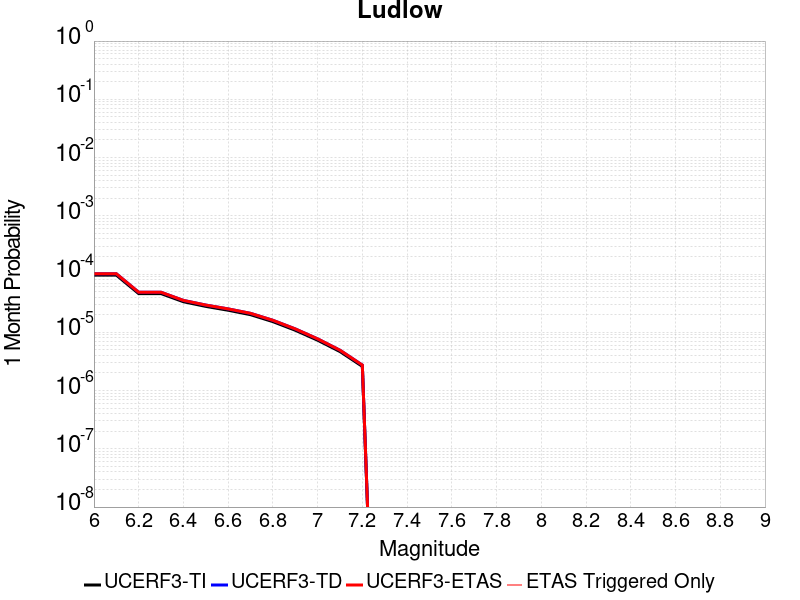 |  |  |

| Magnitude | 1 wk TI Prob | 1 wk TD Prob | 1 wk ETAS Prob | 1 wk ETAS/TD Gain | 1 wk ETAS Triggered Only | 1 mo TI Prob | 1 mo TD Prob | 1 mo ETAS Prob | 1 mo ETAS/TD Gain | 1 mo ETAS Triggered Only | 1 yr TI Prob | 1 yr TD Prob | 1 yr ETAS Prob | 1 yr ETAS/TD Gain | 1 yr ETAS Triggered Only | 10 yr TI Prob | 10 yr TD Prob | 10 yr ETAS Prob | 10 yr ETAS/TD Gain | 10 yr ETAS Triggered Only |
|-----|-----|-----|-----|-----|-----|-----|-----|-----|-----|-----|-----|-----|-----|-----|-----|-----|-----|-----|-----|-----|
| 6.0 | 2.2407607E-5 | 2.3657429E-5 | 2.3657429E-5 | 1.0 | 0.0 | 9.602906E-5 | 1.0138529E-4 | 1.0138529E-4 | 1.0 | 0.0 | 0.0011685267 | 0.001233711 | 0.0013402462 | 1.0863533 | 1.0666667E-4 | 0.011624013 | 0.012273132 | 0.012510187 | 1.0193149 | 2.4E-4 |
| 6.1 | 2.2407607E-5 | 2.3657429E-5 | 2.3657429E-5 | 1.0 | 0.0 | 9.602906E-5 | 1.0138529E-4 | 1.0138529E-4 | 1.0 | 0.0 | 0.0011685267 | 0.001233711 | 0.0013402462 | 1.0863533 | 1.0666667E-4 | 0.011624013 | 0.012273132 | 0.012510187 | 1.0193149 | 2.4E-4 |
| 6.2 | 1.0781252E-5 | 1.1365745E-5 | 1.1365745E-5 | 1.0 | 0.0 | 4.620455E-5 | 4.870945E-5 | 4.870945E-5 | 1.0 | 0.0 | 5.623952E-4 | 5.9288024E-4 | 6.728328E-4 | 1.1348546 | 8.0E-5 | 0.00560974 | 0.005913404 | 0.0060459487 | 1.0224143 | 1.3333333E-4 |
| 6.3 | 1.0781252E-5 | 1.1365745E-5 | 1.1365745E-5 | 1.0 | 0.0 | 4.620455E-5 | 4.870945E-5 | 4.870945E-5 | 1.0 | 0.0 | 5.623952E-4 | 5.9288024E-4 | 6.728328E-4 | 1.1348546 | 8.0E-5 | 0.00560974 | 0.005913404 | 0.0060459487 | 1.0224143 | 1.3333333E-4 |
| 6.4 | 7.814439E-6 | 8.237788E-6 | 8.237788E-6 | 1.0 | 0.0 | 3.3490025E-5 | 3.5304336E-5 | 3.5304336E-5 | 1.0 | 0.0 | 4.0766477E-4 | 4.2974693E-4 | 4.5640214E-4 | 1.0620253 | 2.6666667E-5 | 0.0040691774 | 0.0042893053 | 0.0043689623 | 1.018571 | 8.0E-5 |
| 6.5 | 6.4986366E-6 | 6.850969E-6 | 6.850969E-6 | 1.0 | 0.0 | 2.7851002E-5 | 2.936097E-5 | 2.936097E-5 | 1.0 | 0.0 | 3.390332E-4 | 3.574121E-4 | 3.8406925E-4 | 1.0745838 | 2.6666667E-5 | 0.003385164 | 0.0035684688 | 0.003621612 | 1.0148923 | 5.3333333E-5 |
| 6.6 | 5.582177E-6 | 5.8860483E-6 | 5.8860483E-6 | 1.0 | 0.0 | 2.3923398E-5 | 2.522568E-5 | 2.522568E-5 | 1.0 | 0.0 | 2.9122844E-4 | 3.070801E-4 | 3.070801E-4 | 1.0 | 0.0 | 0.0029084706 | 0.003066631 | 0.003066631 | 1.0 | 0.0 |
| 6.7 | 4.6858763E-6 | 4.940463E-6 | 4.940463E-6 | 1.0 | 0.0 | 2.0082172E-5 | 2.1173244E-5 | 2.1173244E-5 | 1.0 | 0.0 | 2.4447302E-4 | 2.577543E-4 | 2.577543E-4 | 1.0 | 0.0 | 0.0024420423 | 0.0025746098 | 0.0025746098 | 1.0 | 0.0 |
| 6.8 | 3.5584908E-6 | 3.7520454E-6 | 3.7520454E-6 | 1.0 | 0.0 | 1.5250586E-5 | 1.6080097E-5 | 1.6080097E-5 | 1.0 | 0.0 | 1.8566006E-4 | 1.9575801E-4 | 1.9575801E-4 | 1.0 | 0.0 | 0.0018550502 | 0.0019558968 | 0.0019558968 | 1.0 | 0.0 |
| 6.9 | 2.532834E-6 | 2.6710227E-6 | 2.6710227E-6 | 1.0 | 0.0 | 1.0854958E-5 | 1.1447192E-5 | 1.1447192E-5 | 1.0 | 0.0 | 1.3215111E-4 | 1.3936093E-4 | 1.3936093E-4 | 1.0 | 0.0 | 0.0013207254 | 0.0013927629 | 0.0013927629 | 1.0 | 0.0 |
| 7.0 | 1.7083285E-6 | 1.801957E-6 | 1.801957E-6 | 1.0 | 0.0 | 7.3213873E-6 | 7.7226505E-6 | 7.7226505E-6 | 1.0 | 0.0 | 8.913424E-5 | 9.4019386E-5 | 9.4019386E-5 | 1.0 | 0.0 | 8.9098496E-4 | 9.3981257E-4 | 9.3981257E-4 | 1.0 | 0.0 |
| 7.1 | 1.0905424E-6 | 1.1497702E-6 | 1.1497702E-6 | 1.0 | 0.0 | 4.6737446E-6 | 4.927578E-6 | 4.927578E-6 | 1.0 | 0.0 | 5.6901354E-5 | 5.999171E-5 | 5.999171E-5 | 1.0 | 0.0 | 5.6886784E-4 | 5.997649E-4 | 5.997649E-4 | 1.0 | 0.0 |
| 7.2 | 6.06668E-7 | 6.387322E-7 | 6.387322E-7 | 1.0 | 0.0 | 2.600003E-6 | 2.7374213E-6 | 2.7374213E-6 | 1.0 | 0.0 | 3.1654577E-5 | 3.3327666E-5 | 3.3327666E-5 | 1.0 | 0.0 | 3.1650066E-4 | 3.332335E-4 | 3.332335E-4 | 1.0 | 0.0 |

## San Andreas (Cholame) rev
*[(top)](#table-of-contents)*

| 1 Week | 1 Month | 1 Year | 10 Year |
|-----|-----|-----|-----|
|  |  |  |  |

| Magnitude | 1 wk TI Prob | 1 wk TD Prob | 1 wk ETAS Prob | 1 wk ETAS/TD Gain | 1 wk ETAS Triggered Only | 1 mo TI Prob | 1 mo TD Prob | 1 mo ETAS Prob | 1 mo ETAS/TD Gain | 1 mo ETAS Triggered Only | 1 yr TI Prob | 1 yr TD Prob | 1 yr ETAS Prob | 1 yr ETAS/TD Gain | 1 yr ETAS Triggered Only | 10 yr TI Prob | 10 yr TD Prob | 10 yr ETAS Prob | 10 yr ETAS/TD Gain | 10 yr ETAS Triggered Only |
|-----|-----|-----|-----|-----|-----|-----|-----|-----|-----|-----|-----|-----|-----|-----|-----|-----|-----|-----|-----|-----|
| 6.0 | 1.2302514E-4 | 2.5213862E-4 | 2.5213862E-4 | 1.0 | 0.0 | 5.27144E-4 | 0.0010801482 | 0.0011334239 | 1.0493226 | 5.3333333E-5 | 0.0063991086 | 0.013072014 | 0.013177287 | 1.0080533 | 1.0666667E-4 | 0.06217949 | 0.12443058 | 0.12461737 | 1.0015012 | 2.1333333E-4 |
| 6.1 | 1.2302514E-4 | 2.5213862E-4 | 2.5213862E-4 | 1.0 | 0.0 | 5.27144E-4 | 0.0010801482 | 0.0011334239 | 1.0493226 | 5.3333333E-5 | 0.0063991086 | 0.013072014 | 0.013177287 | 1.0080533 | 1.0666667E-4 | 0.06217949 | 0.12443058 | 0.12461737 | 1.0015012 | 2.1333333E-4 |
| 6.2 | 1.2203569E-4 | 2.5030645E-4 | 2.5030645E-4 | 1.0 | 0.0 | 5.2290526E-4 | 0.0010723026 | 0.0011255787 | 1.0496839 | 5.3333333E-5 | 0.006347804 | 0.0129776355 | 0.013082918 | 1.0081125 | 1.0666667E-4 | 0.061695136 | 0.12361675 | 0.123803705 | 1.0015124 | 2.1333333E-4 |
| 6.3 | 1.2142645E-4 | 2.491661E-4 | 2.491661E-4 | 1.0 | 0.0 | 5.202953E-4 | 0.0010674193 | 0.0011206957 | 1.0499114 | 5.3333333E-5 | 0.006316212 | 0.012918889 | 0.012997855 | 1.0061125 | 8.0E-5 | 0.06139677 | 0.12311087 | 0.12327455 | 1.0013295 | 1.8666667E-4 |
| 6.4 | 1.1865206E-4 | 2.4422092E-4 | 2.4422092E-4 | 1.0 | 0.0 | 5.0840975E-4 | 0.0010462429 | 0.0010995205 | 1.0509228 | 5.3333333E-5 | 0.006172335 | 0.012664088 | 0.012743075 | 1.006237 | 8.0E-5 | 0.060036868 | 0.12090351 | 0.121067606 | 1.0013573 | 1.8666667E-4 |
| 6.5 | 1.17443946E-4 | 2.421537E-4 | 2.421537E-4 | 1.0 | 0.0 | 5.032341E-4 | 0.0010373904 | 0.0010906684 | 1.0513577 | 5.3333333E-5 | 0.006109677 | 0.012557554 | 0.012636549 | 1.0062907 | 8.0E-5 | 0.059444077 | 0.11997763 | 0.12014191 | 1.0013692 | 1.8666667E-4 |
| 6.6 | 1.13579066E-4 | 2.3524289E-4 | 2.3524289E-4 | 1.0 | 0.0 | 4.866766E-4 | 0.0010077958 | 0.0010610754 | 1.0528674 | 5.3333333E-5 | 0.0059092017 | 0.012201327 | 0.012280351 | 1.0064766 | 8.0E-5 | 0.057545185 | 0.11689143 | 0.11705627 | 1.0014102 | 1.8666667E-4 |
| 6.7 | 1.1271412E-4 | 2.336858E-4 | 2.336858E-4 | 1.0 | 0.0 | 4.829711E-4 | 0.0010011276 | 0.0010544077 | 1.0532199 | 5.3333333E-5 | 0.005864331 | 0.01212105 | 0.01220008 | 1.00652 | 8.0E-5 | 0.057119697 | 0.11619493 | 0.11635991 | 1.0014198 | 1.8666667E-4 |
| 6.8 | 1.1217975E-4 | 2.3256983E-4 | 2.3256983E-4 | 1.0 | 0.0 | 4.8068175E-4 | 9.963487E-4 | 0.0010496288 | 1.0534755 | 5.3333333E-5 | 0.005836608 | 0.012063511 | 0.012142546 | 1.0065516 | 8.0E-5 | 0.056856725 | 0.11569312 | 0.1158582 | 1.0014268 | 1.8666667E-4 |
| 6.9 | 1.1146753E-4 | 2.3105709E-4 | 2.3105709E-4 | 1.0 | 0.0 | 4.7763053E-4 | 9.898704E-4 | 0.0010431509 | 1.0538257 | 5.3333333E-5 | 0.0057996577 | 0.011985509 | 0.012064549 | 1.0065948 | 8.0E-5 | 0.056506127 | 0.11501348 | 0.11517868 | 1.0014364 | 1.8666667E-4 |
| 7.0 | 1.0965793E-4 | 2.2728977E-4 | 2.2728977E-4 | 1.0 | 0.0 | 4.698779E-4 | 9.7373687E-4 | 0.0010270183 | 1.0547185 | 5.3333333E-5 | 0.005705768 | 0.0117912255 | 0.011870283 | 1.0067047 | 8.0E-5 | 0.055614736 | 0.11331484 | 0.11348035 | 1.0014607 | 1.8666667E-4 |
| 7.1 | 9.927982E-5 | 2.0547757E-4 | 2.0547757E-4 | 1.0 | 0.0 | 4.2541555E-4 | 8.80322E-4 | 9.336084E-4 | 1.0605305 | 5.3333333E-5 | 0.0051671406 | 0.010665542 | 0.010744689 | 1.0074208 | 8.0E-5 | 0.05048634 | 0.10340853 | 0.10357589 | 1.0016185 | 1.8666667E-4 |
| 7.2 | 9.696786E-5 | 2.0051954E-4 | 2.0051954E-4 | 1.0 | 0.0 | 4.1551032E-4 | 8.5908745E-4 | 9.12375E-4 | 1.062028 | 5.3333333E-5 | 0.00504711 | 0.010409511 | 0.010488678 | 1.0076053 | 8.0E-5 | 0.04934009 | 0.10114636 | 0.10131415 | 1.0016588 | 1.8666667E-4 |
| 7.3 | 9.4727984E-5 | 1.9481099E-4 | 1.9481099E-4 | 1.0 | 0.0 | 4.0591392E-4 | 8.346381E-4 | 8.879269E-4 | 1.0638466 | 5.3333333E-5 | 0.0049308087 | 0.010114641 | 0.010193832 | 1.0078293 | 8.0E-5 | 0.048228268 | 0.09851684 | 0.09868511 | 1.0017081 | 1.8666667E-4 |
| 7.4 | 9.220358E-5 | 1.885154E-4 | 1.885154E-4 | 1.0 | 0.0 | 3.9509835E-4 | 8.076739E-4 | 8.609642E-4 | 1.06598 | 5.3333333E-5 | 0.004799717 | 0.009789341 | 0.009868558 | 1.0080922 | 8.0E-5 | 0.046973653 | 0.09559427 | 0.095763095 | 1.0017661 | 1.8666667E-4 |
| 7.5 | 7.71631E-5 | 1.5185357E-4 | 1.5185357E-4 | 1.0 | 0.0 | 3.306571E-4 | 6.506389E-4 | 6.772882E-4 | 1.0409586 | 2.6666667E-5 | 0.0040183207 | 0.007892828 | 0.007945741 | 1.0067039 | 5.3333333E-5 | 0.03946433 | 0.07831838 | 0.07844128 | 1.0015692 | 1.3333333E-4 |
| 7.6 | 7.5634416E-5 | 1.4844738E-4 | 1.4844738E-4 | 1.0 | 0.0 | 3.241072E-4 | 6.360481E-4 | 6.6269777E-4 | 1.0418988 | 2.6666667E-5 | 0.0039388672 | 0.007716457 | 0.0077693784 | 1.0068583 | 5.3333333E-5 | 0.038697794 | 0.076681465 | 0.07680457 | 1.0016055 | 1.3333333E-4 |
| 7.7 | 6.3783E-5 | 1.2365259E-4 | 1.2365259E-4 | 1.0 | 0.0 | 2.7332708E-4 | 5.2983203E-4 | 5.5648456E-4 | 1.0503037 | 2.6666667E-5 | 0.0033226798 | 0.0064316522 | 0.0064581474 | 1.0041195 | 2.6666667E-5 | 0.032734364 | 0.064570144 | 0.06464498 | 1.001159 | 8.0E-5 |
| 7.8 | 5.863422E-5 | 1.142205E-4 | 1.142205E-4 | 1.0 | 0.0 | 2.512653E-4 | 4.894246E-4 | 5.1607826E-4 | 1.0544591 | 2.6666667E-5 | 0.003054864 | 0.0059424853 | 0.0059689935 | 1.0044608 | 2.6666667E-5 | 0.030132094 | 0.059686445 | 0.05976167 | 1.0012603 | 8.0E-5 |
| 7.9 | 4.595283E-5 | 8.4306725E-5 | 8.4306725E-5 | 1.0 | 0.0 | 1.9692584E-4 | 3.612645E-4 | 3.8792152E-4 | 1.0737882 | 2.6666667E-5 | 0.0023949358 | 0.0043895314 | 0.004416081 | 1.0060484 | 2.6666667E-5 | 0.023692891 | 0.044382483 | 0.04443345 | 1.0011483 | 5.3333333E-5 |
| 8.0 | 3.2950178E-5 | 5.08E-5 | 5.08E-5 | 1.0 | 0.0 | 1.412074E-4 | 2.1769613E-4 | 2.1769613E-4 | 1.0 | 0.0 | 0.0017178444 | 0.0026472306 | 0.0026472306 | 1.0 | 0.0 | 0.017046256 | 0.027193451 | 0.027193451 | 1.0 | 0.0 |
| 8.1 | 1.9177472E-5 | 1.9198456E-5 | 1.9198456E-5 | 1.0 | 0.0 | 8.218658E-5 | 8.227651E-5 | 8.227651E-5 | 1.0 | 0.0 | 0.0010001622 | 0.0010012568 | 0.0010012568 | 1.0 | 0.0 | 0.009956728 | 0.01076512 | 0.01076512 | 1.0 | 0.0 |
| 8.2 | 8.643924E-6 | 5.4798497E-6 | 5.4798497E-6 | 1.0 | 0.0 | 3.704486E-5 | 2.348486E-5 | 2.348486E-5 | 1.0 | 0.0 | 4.5092785E-4 | 2.858907E-4 | 2.858907E-4 | 1.0 | 0.0 | 0.0045001395 | 0.0032514327 | 0.0032514327 | 1.0 | 0.0 |
| 8.3 | 1.983087E-6 | 7.668296E-7 | 7.668296E-7 | 1.0 | 0.0 | 8.498917E-6 | 3.2864084E-6 | 3.2864084E-6 | 1.0 | 0.0 | 1.034694E-4 | 4.0011306E-5 | 4.0011306E-5 | 1.0 | 0.0 | 0.0010342124 | 4.724499E-4 | 4.724499E-4 | 1.0 | 0.0 |

## Cleghorn Pass
*[(top)](#table-of-contents)*

| 1 Week | 1 Month | 1 Year | 10 Year |
|-----|-----|-----|-----|
|  |  |  |  |

| Magnitude | 1 wk TI Prob | 1 wk TD Prob | 1 wk ETAS Prob | 1 wk ETAS/TD Gain | 1 wk ETAS Triggered Only | 1 mo TI Prob | 1 mo TD Prob | 1 mo ETAS Prob | 1 mo ETAS/TD Gain | 1 mo ETAS Triggered Only | 1 yr TI Prob | 1 yr TD Prob | 1 yr ETAS Prob | 1 yr ETAS/TD Gain | 1 yr ETAS Triggered Only | 10 yr TI Prob | 10 yr TD Prob | 10 yr ETAS Prob | 10 yr ETAS/TD Gain | 10 yr ETAS Triggered Only |
|-----|-----|-----|-----|-----|-----|-----|-----|-----|-----|-----|-----|-----|-----|-----|-----|-----|-----|-----|-----|-----|
| 6.0 | 1.0522846E-5 | 1.1040714E-5 | 1.1040714E-5 | 1.0 | 0.0 | 4.509713E-5 | 4.7316782E-5 | 7.398219E-5 | 1.5635507 | 2.6666667E-5 | 5.4891926E-4 | 5.759822E-4 | 6.8258744E-4 | 1.1850842 | 1.0666667E-4 | 0.0054756533 | 0.005750059 | 0.0059356526 | 1.0322767 | 1.8666667E-4 |
| 6.1 | 1.0522846E-5 | 1.1040714E-5 | 1.1040714E-5 | 1.0 | 0.0 | 4.509713E-5 | 4.7316782E-5 | 7.398219E-5 | 1.5635507 | 2.6666667E-5 | 5.4891926E-4 | 5.759822E-4 | 6.8258744E-4 | 1.1850842 | 1.0666667E-4 | 0.0054756533 | 0.005750059 | 0.0059356526 | 1.0322767 | 1.8666667E-4 |
| 6.2 | 2.1045846E-6 | 2.2082168E-6 | 2.2082168E-6 | 1.0 | 0.0 | 9.019617E-6 | 9.463776E-6 | 9.463776E-6 | 1.0 | 0.0 | 1.098083E-4 | 1.1521958E-4 | 1.4188317E-4 | 1.2314155 | 2.6666667E-5 | 0.0010975406 | 0.0011520098 | 0.0011786458 | 1.0231212 | 2.6666667E-5 |
| 6.3 | 2.1045846E-6 | 2.2082168E-6 | 2.2082168E-6 | 1.0 | 0.0 | 9.019617E-6 | 9.463776E-6 | 9.463776E-6 | 1.0 | 0.0 | 1.098083E-4 | 1.1521958E-4 | 1.4188317E-4 | 1.2314155 | 2.6666667E-5 | 0.0010975406 | 0.0011520098 | 0.0011786458 | 1.0231212 | 2.6666667E-5 |
| 6.4 | 1.7259927E-6 | 1.8108889E-6 | 1.8108889E-6 | 1.0 | 0.0 | 7.3970905E-6 | 7.760952E-6 | 7.760952E-6 | 1.0 | 0.0 | 9.005586E-5 | 9.4489595E-5 | 1.21153746E-4 | 1.2821914 | 2.6666667E-5 | 9.001937E-4 | 9.4489596E-4 | 9.7153743E-4 | 1.0281951 | 2.6666667E-5 |

## San Andreas (Carrizo) rev
*[(top)](#table-of-contents)*

| 1 Week | 1 Month | 1 Year | 10 Year |
|-----|-----|-----|-----|
|  | 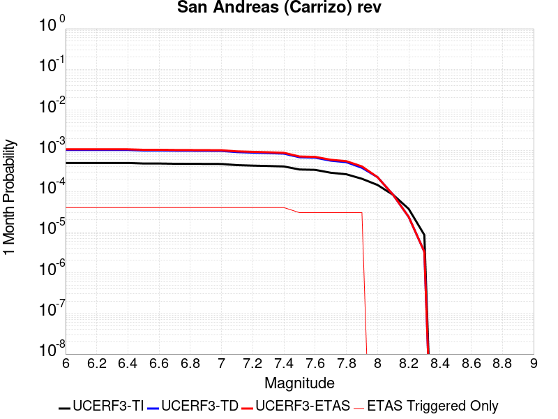 |  | 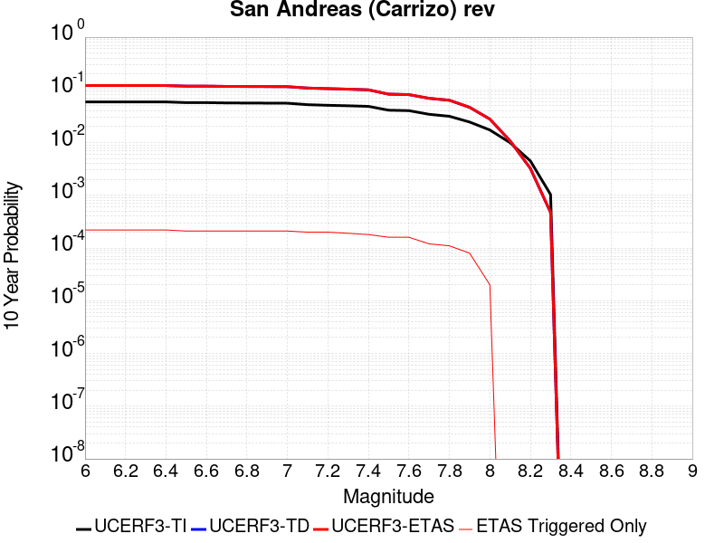 |

| Magnitude | 1 wk TI Prob | 1 wk TD Prob | 1 wk ETAS Prob | 1 wk ETAS/TD Gain | 1 wk ETAS Triggered Only | 1 mo TI Prob | 1 mo TD Prob | 1 mo ETAS Prob | 1 mo ETAS/TD Gain | 1 mo ETAS Triggered Only | 1 yr TI Prob | 1 yr TD Prob | 1 yr ETAS Prob | 1 yr ETAS/TD Gain | 1 yr ETAS Triggered Only | 10 yr TI Prob | 10 yr TD Prob | 10 yr ETAS Prob | 10 yr ETAS/TD Gain | 10 yr ETAS Triggered Only |
|-----|-----|-----|-----|-----|-----|-----|-----|-----|-----|-----|-----|-----|-----|-----|-----|-----|-----|-----|-----|-----|
| 6.0 | 1.1674632E-4 | 2.4332498E-4 | 2.4332498E-4 | 1.0 | 0.0 | 5.002454E-4 | 0.0010424062 | 0.0010956839 | 1.0511104 | 5.3333333E-5 | 0.006073493 | 0.012617926 | 0.0127232475 | 1.0083469 | 1.0666667E-4 | 0.0591016 | 0.12065402 | 0.120841615 | 1.0015548 | 2.1333333E-4 |
| 6.1 | 1.1674632E-4 | 2.4332498E-4 | 2.4332498E-4 | 1.0 | 0.0 | 5.002454E-4 | 0.0010424062 | 0.0010956839 | 1.0511104 | 5.3333333E-5 | 0.006073493 | 0.012617926 | 0.0127232475 | 1.0083469 | 1.0666667E-4 | 0.0591016 | 0.12065402 | 0.120841615 | 1.0015548 | 2.1333333E-4 |
| 6.2 | 1.1674632E-4 | 2.4332498E-4 | 2.4332498E-4 | 1.0 | 0.0 | 5.002454E-4 | 0.0010424062 | 0.0010956839 | 1.0511104 | 5.3333333E-5 | 0.006073493 | 0.012617926 | 0.0127232475 | 1.0083469 | 1.0666667E-4 | 0.0591016 | 0.12065402 | 0.120841615 | 1.0015548 | 2.1333333E-4 |
| 6.3 | 1.1674632E-4 | 2.4332498E-4 | 2.4332498E-4 | 1.0 | 0.0 | 5.002454E-4 | 0.0010424062 | 0.0010956839 | 1.0511104 | 5.3333333E-5 | 0.006073493 | 0.012617926 | 0.0127232475 | 1.0083469 | 1.0666667E-4 | 0.0591016 | 0.12065402 | 0.120841615 | 1.0015548 | 2.1333333E-4 |
| 6.4 | 1.1674632E-4 | 2.4332498E-4 | 2.4332498E-4 | 1.0 | 0.0 | 5.002454E-4 | 0.0010424062 | 0.0010956839 | 1.0511104 | 5.3333333E-5 | 0.006073493 | 0.012617926 | 0.0127232475 | 1.0083469 | 1.0666667E-4 | 0.0591016 | 0.12065402 | 0.120841615 | 1.0015548 | 2.1333333E-4 |
| 6.5 | 1.13136164E-4 | 2.3652466E-4 | 2.3652466E-4 | 1.0 | 0.0 | 4.847792E-4 | 0.0010132849 | 0.0010665641 | 1.0525807 | 5.3333333E-5 | 0.0058862255 | 0.012267408 | 0.012372766 | 1.0085884 | 1.0666667E-4 | 0.057327334 | 0.11762535 | 0.11781359 | 1.0016004 | 2.1333333E-4 |
| 6.6 | 1.13136164E-4 | 2.3652466E-4 | 2.3652466E-4 | 1.0 | 0.0 | 4.847792E-4 | 0.0010132849 | 0.0010665641 | 1.0525807 | 5.3333333E-5 | 0.0058862255 | 0.012267408 | 0.012372766 | 1.0085884 | 1.0666667E-4 | 0.057327334 | 0.11762535 | 0.11781359 | 1.0016004 | 2.1333333E-4 |
| 6.7 | 1.1149675E-4 | 2.3343669E-4 | 2.3343669E-4 | 1.0 | 0.0 | 4.777557E-4 | 0.0010000608 | 0.0010533408 | 1.0532768 | 5.3333333E-5 | 0.0058011734 | 0.012108203 | 0.012213578 | 1.0087028 | 1.0666667E-4 | 0.05652051 | 0.11624688 | 0.11643541 | 1.0016218 | 2.1333333E-4 |
| 6.8 | 1.1103589E-4 | 2.3245816E-4 | 2.3245816E-4 | 1.0 | 0.0 | 4.7578133E-4 | 9.958703E-4 | 0.0010491506 | 1.0535011 | 5.3333333E-5 | 0.005777263 | 0.0120577505 | 0.012163131 | 1.0087396 | 1.0666667E-4 | 0.056293584 | 0.11580715 | 0.11599578 | 1.0016288 | 2.1333333E-4 |
| 6.9 | 1.1053259E-4 | 2.3138185E-4 | 2.3138185E-4 | 1.0 | 0.0 | 4.7362508E-4 | 9.912612E-4 | 0.0010445416 | 1.0537502 | 5.3333333E-5 | 0.0057511497 | 0.012002253 | 0.012107639 | 1.0087806 | 1.0666667E-4 | 0.05604569 | 0.11532332 | 0.11551205 | 1.0016365 | 2.1333333E-4 |
| 7.0 | 1.1005377E-4 | 2.3039016E-4 | 2.3039016E-4 | 1.0 | 0.0 | 4.7157376E-4 | 9.870143E-4 | 0.001040295 | 1.0539817 | 5.3333333E-5 | 0.0057263062 | 0.011951115 | 0.012056507 | 1.0088186 | 1.0666667E-4 | 0.055809796 | 0.11487561 | 0.115064435 | 1.0016438 | 2.1333333E-4 |
| 7.1 | 1.0308142E-4 | 2.1548544E-4 | 2.1548544E-4 | 1.0 | 0.0 | 4.417027E-4 | 9.231832E-4 | 9.7646733E-4 | 1.0577178 | 5.3333333E-5 | 0.0053644776 | 0.011182146 | 0.011287619 | 1.0094323 | 1.0666667E-4 | 0.052368138 | 0.108131535 | 0.1083218 | 1.0017595 | 2.1333333E-4 |
| 7.2 | 1.0027479E-4 | 2.0956367E-4 | 2.0956367E-4 | 1.0 | 0.0 | 4.296783E-4 | 8.978219E-4 | 9.5110736E-4 | 1.0593497 | 5.3333333E-5 | 0.0052187922 | 0.0108764935 | 0.010982 | 1.0097004 | 1.0666667E-4 | 0.050979212 | 0.10543535 | 0.10562619 | 1.0018101 | 2.1333333E-4 |
| 7.3 | 9.816942E-5 | 2.0431461E-4 | 2.0431461E-4 | 1.0 | 0.0 | 4.2065824E-4 | 8.753412E-4 | 9.2862785E-4 | 1.0608753 | 5.3333333E-5 | 0.005109493 | 0.010605487 | 0.010711023 | 1.009951 | 1.0666667E-4 | 0.049935985 | 0.103018686 | 0.10321004 | 1.0018575 | 2.1333333E-4 |
| 7.4 | 9.5634205E-5 | 1.9800827E-4 | 1.9800827E-4 | 1.0 | 0.0 | 4.0979648E-4 | 8.4833184E-4 | 9.016199E-4 | 1.0628152 | 5.3333333E-5 | 0.0049778637 | 0.0102797905 | 0.010385361 | 1.0102696 | 1.0666667E-4 | 0.048678253 | 0.100104466 | 0.100296445 | 1.0019177 | 2.1333333E-4 |
| 7.5 | 8.052417E-5 | 1.6120363E-4 | 1.6120363E-4 | 1.0 | 0.0 | 3.4505792E-4 | 6.9068995E-4 | 7.1733823E-4 | 1.0385821 | 2.6666667E-5 | 0.0041929903 | 0.008376808 | 0.008456138 | 1.0094702 | 8.0E-5 | 0.04114753 | 0.08284498 | 0.08299172 | 1.0017713 | 1.6E-4 |
| 7.6 | 7.897024E-5 | 1.5773512E-4 | 1.5773512E-4 | 1.0 | 0.0 | 3.384E-4 | 6.758327E-4 | 7.024813E-4 | 1.0394309 | 2.6666667E-5 | 0.0041122385 | 0.008197296 | 0.00827664 | 1.0096793 | 8.0E-5 | 0.040369697 | 0.081185855 | 0.08133287 | 1.0018108 | 1.6E-4 |
| 7.7 | 6.707427E-5 | 1.3282998E-4 | 1.3282998E-4 | 1.0 | 0.0 | 2.8742946E-4 | 5.691472E-4 | 5.957987E-4 | 1.0468271 | 2.6666667E-5 | 0.003493839 | 0.0069073834 | 0.0069603487 | 1.0076679 | 5.3333333E-5 | 0.034394164 | 0.06907934 | 0.06917864 | 1.0014374 | 1.0666667E-4 |
| 7.8 | 6.147705E-5 | 1.2203727E-4 | 1.2203727E-4 | 1.0 | 0.0 | 2.6344648E-4 | 5.229121E-4 | 5.495648E-4 | 1.0509698 | 2.6666667E-5 | 0.0032027436 | 0.006347895 | 0.0063743927 | 1.0041742 | 2.6666667E-5 | 0.031569764 | 0.063543044 | 0.06361796 | 1.001179 | 8.0E-5 |
| 7.9 | 4.7636717E-5 | 8.88427E-5 | 8.88427E-5 | 1.0 | 0.0 | 2.0414138E-4 | 3.806989E-4 | 4.073554E-4 | 1.07002 | 2.6666667E-5 | 0.0024825884 | 0.0046251663 | 0.0046517095 | 1.0057389 | 2.6666667E-5 | 0.024550365 | 0.046649244 | 0.04670009 | 1.0010899 | 5.3333333E-5 |
| 8.0 | 3.3554235E-5 | 5.2164494E-5 | 5.2164494E-5 | 1.0 | 0.0 | 1.4379594E-4 | 2.2354297E-4 | 2.2354297E-4 | 1.0 | 0.0 | 0.0017493097 | 0.0027182405 | 0.0027182405 | 1.0 | 0.0 | 0.017356034 | 0.027894506 | 0.027894506 | 1.0 | 0.0 |
| 8.1 | 1.9175432E-5 | 1.9198285E-5 | 1.9198285E-5 | 1.0 | 0.0 | 8.217783E-5 | 8.227578E-5 | 8.227578E-5 | 1.0 | 0.0 | 0.0010000558 | 0.0010012479 | 0.0010012479 | 1.0 | 0.0 | 0.009955673 | 0.010765004 | 0.010765004 | 1.0 | 0.0 |
| 8.2 | 8.643924E-6 | 5.4798497E-6 | 5.4798497E-6 | 1.0 | 0.0 | 3.704486E-5 | 2.348486E-5 | 2.348486E-5 | 1.0 | 0.0 | 4.5092785E-4 | 2.858907E-4 | 2.858907E-4 | 1.0 | 0.0 | 0.0045001395 | 0.0032514327 | 0.0032514327 | 1.0 | 0.0 |
| 8.3 | 1.983087E-6 | 7.668296E-7 | 7.668296E-7 | 1.0 | 0.0 | 8.498917E-6 | 3.2864084E-6 | 3.2864084E-6 | 1.0 | 0.0 | 1.034694E-4 | 4.0011306E-5 | 4.0011306E-5 | 1.0 | 0.0 | 0.0010342124 | 4.724499E-4 | 4.724499E-4 | 1.0 | 0.0 |

## Cady
*[(top)](#table-of-contents)*

| 1 Week | 1 Month | 1 Year | 10 Year |
|-----|-----|-----|-----|
|  |  | 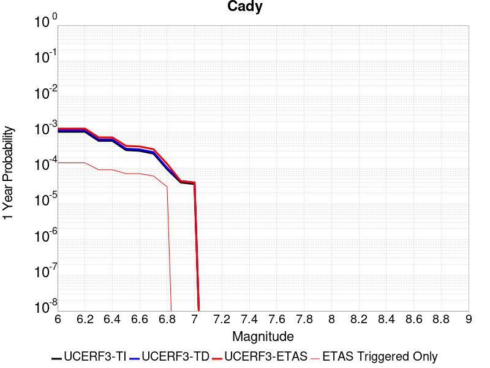 |  |

| Magnitude | 1 wk TI Prob | 1 wk TD Prob | 1 wk ETAS Prob | 1 wk ETAS/TD Gain | 1 wk ETAS Triggered Only | 1 mo TI Prob | 1 mo TD Prob | 1 mo ETAS Prob | 1 mo ETAS/TD Gain | 1 mo ETAS Triggered Only | 1 yr TI Prob | 1 yr TD Prob | 1 yr ETAS Prob | 1 yr ETAS/TD Gain | 1 yr ETAS Triggered Only | 10 yr TI Prob | 10 yr TD Prob | 10 yr ETAS Prob | 10 yr ETAS/TD Gain | 10 yr ETAS Triggered Only |
|-----|-----|-----|-----|-----|-----|-----|-----|-----|-----|-----|-----|-----|-----|-----|-----|-----|-----|-----|-----|-----|
| 6.0 | 1.9892565E-5 | 2.1859016E-5 | 2.1859016E-5 | 1.0 | 0.0 | 8.525106E-5 | 9.3678645E-5 | 1.2034281E-4 | 1.2846345 | 2.6666667E-5 | 0.0010374374 | 0.0011400316 | 0.0012199405 | 1.0700935 | 8.0E-5 | 0.010326075 | 0.011350849 | 0.011535397 | 1.0162585 | 1.8666667E-4 |
| 6.1 | 1.9892565E-5 | 2.1859016E-5 | 2.1859016E-5 | 1.0 | 0.0 | 8.525106E-5 | 9.3678645E-5 | 1.2034281E-4 | 1.2846345 | 2.6666667E-5 | 0.0010374374 | 0.0011400316 | 0.0012199405 | 1.0700935 | 8.0E-5 | 0.010326075 | 0.011350849 | 0.011535397 | 1.0162585 | 1.8666667E-4 |
| 6.2 | 1.9892565E-5 | 2.1859016E-5 | 2.1859016E-5 | 1.0 | 0.0 | 8.525106E-5 | 9.3678645E-5 | 1.2034281E-4 | 1.2846345 | 2.6666667E-5 | 0.0010374374 | 0.0011400316 | 0.0012199405 | 1.0700935 | 8.0E-5 | 0.010326075 | 0.011350849 | 0.011535397 | 1.0162585 | 1.8666667E-4 |
| 6.3 | 1.1117327E-5 | 1.2176738E-5 | 1.2176738E-5 | 1.0 | 0.0 | 4.764482E-5 | 5.218515E-5 | 7.8850426E-5 | 1.5109744 | 2.6666667E-5 | 5.7992124E-4 | 6.3520053E-4 | 6.8849995E-4 | 1.0839096 | 5.3333333E-5 | 0.0057841022 | 0.0063369554 | 0.0064959414 | 1.0250887 | 1.6E-4 |
| 6.4 | 1.1117327E-5 | 1.2176738E-5 | 1.2176738E-5 | 1.0 | 0.0 | 4.764482E-5 | 5.218515E-5 | 7.8850426E-5 | 1.5109744 | 2.6666667E-5 | 5.7992124E-4 | 6.3520053E-4 | 6.8849995E-4 | 1.0839096 | 5.3333333E-5 | 0.0057841022 | 0.0063369554 | 0.0064959414 | 1.0250887 | 1.6E-4 |
| 6.5 | 6.103093E-6 | 6.672103E-6 | 6.672103E-6 | 1.0 | 0.0 | 2.615585E-5 | 2.8594486E-5 | 5.526039E-5 | 1.9325541 | 2.6666667E-5 | 3.1840094E-4 | 3.4809482E-4 | 4.0140958E-4 | 1.1531616 | 5.3333333E-5 | 0.0031794512 | 0.0034767296 | 0.0035830254 | 1.0305735 | 1.0666667E-4 |
| 6.6 | 5.817237E-6 | 6.365738E-6 | 6.365738E-6 | 1.0 | 0.0 | 2.4930776E-5 | 2.728152E-5 | 5.394746E-5 | 1.977436 | 2.6666667E-5 | 3.034899E-4 | 3.3211432E-4 | 3.8542994E-4 | 1.1605339 | 5.3333333E-5 | 0.0030307577 | 0.003317402 | 0.0034237148 | 1.032047 | 1.0666667E-4 |
| 6.7 | 4.8846314E-6 | 5.3406343E-6 | 5.3406343E-6 | 1.0 | 0.0 | 2.0933967E-5 | 2.2888298E-5 | 4.9554354E-5 | 2.165052 | 2.6666667E-5 | 2.5484123E-4 | 2.7864118E-4 | 3.053004E-4 | 1.0956758 | 2.6666667E-5 | 0.0025454918 | 0.0027840736 | 0.002863851 | 1.0286548 | 8.0E-5 |
| 6.8 | 1.7788773E-6 | 1.9399313E-6 | 1.9399313E-6 | 1.0 | 0.0 | 7.6237375E-6 | 8.313974E-6 | 8.313974E-6 | 1.0 | 0.0 | 9.281505E-5 | 1.01219506E-4 | 1.01219506E-4 | 1.0 | 0.0 | 9.2776294E-4 | 0.0010118886 | 0.0010118886 | 1.0 | 0.0 |
| 6.9 | 7.5455404E-7 | 8.297202E-7 | 8.297202E-7 | 1.0 | 0.0 | 3.233799E-6 | 3.5559406E-6 | 3.5559406E-6 | 1.0 | 0.0 | 3.937079E-5 | 4.3293054E-5 | 4.3293054E-5 | 1.0 | 0.0 | 3.9363815E-4 | 4.3287914E-4 | 4.3287914E-4 | 1.0 | 0.0 |
| 7.0 | 6.8578805E-7 | 7.541916E-7 | 7.541916E-7 | 1.0 | 0.0 | 2.9390883E-6 | 3.2322475E-6 | 3.2322475E-6 | 1.0 | 0.0 | 3.578281E-5 | 3.9352235E-5 | 3.9352235E-5 | 1.0 | 0.0 | 3.577705E-4 | 3.9348513E-4 | 3.9348513E-4 | 1.0 | 0.0 |

## White Wolf (Extension)
*[(top)](#table-of-contents)*

| 1 Week | 1 Month | 1 Year | 10 Year |
|-----|-----|-----|-----|
| 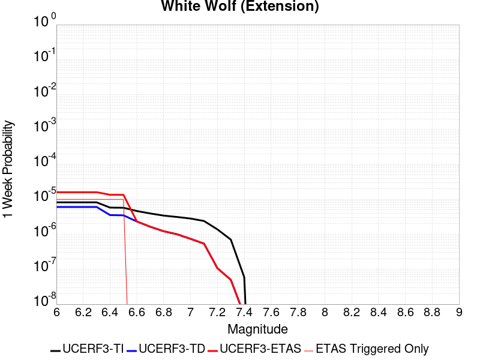 |  | 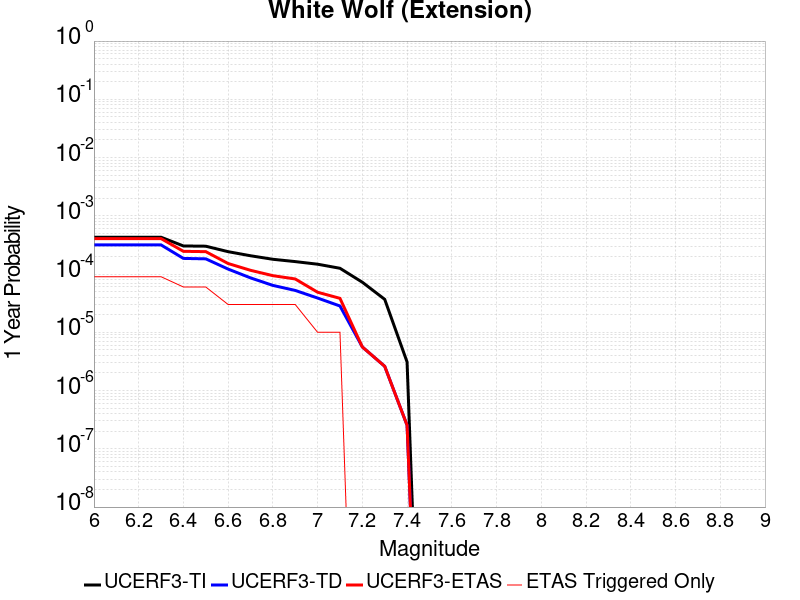 |  |

| Magnitude | 1 wk TI Prob | 1 wk TD Prob | 1 wk ETAS Prob | 1 wk ETAS/TD Gain | 1 wk ETAS Triggered Only | 1 mo TI Prob | 1 mo TD Prob | 1 mo ETAS Prob | 1 mo ETAS/TD Gain | 1 mo ETAS Triggered Only | 1 yr TI Prob | 1 yr TD Prob | 1 yr ETAS Prob | 1 yr ETAS/TD Gain | 1 yr ETAS Triggered Only | 10 yr TI Prob | 10 yr TD Prob | 10 yr ETAS Prob | 10 yr ETAS/TD Gain | 10 yr ETAS Triggered Only |
|-----|-----|-----|-----|-----|-----|-----|-----|-----|-----|-----|-----|-----|-----|-----|-----|-----|-----|-----|-----|-----|
| 6.0 | 8.222555E-6 | 6.0667057E-6 | 6.0667057E-6 | 1.0 | 0.0 | 3.5239045E-5 | 2.5999947E-5 | 2.5999947E-5 | 1.0 | 0.0 | 4.289509E-4 | 3.1650998E-4 | 3.6982645E-4 | 1.1684511 | 5.3333333E-5 | 0.0042812387 | 0.0031612439 | 0.0033473205 | 1.0588619 | 1.8666667E-4 |
| 6.1 | 8.222555E-6 | 6.0667057E-6 | 6.0667057E-6 | 1.0 | 0.0 | 3.5239045E-5 | 2.5999947E-5 | 2.5999947E-5 | 1.0 | 0.0 | 4.289509E-4 | 3.1650998E-4 | 3.6982645E-4 | 1.1684511 | 5.3333333E-5 | 0.0042812387 | 0.0031612439 | 0.0033473205 | 1.0588619 | 1.8666667E-4 |
| 6.2 | 8.222555E-6 | 6.0667057E-6 | 6.0667057E-6 | 1.0 | 0.0 | 3.5239045E-5 | 2.5999947E-5 | 2.5999947E-5 | 1.0 | 0.0 | 4.289509E-4 | 3.1650998E-4 | 3.6982645E-4 | 1.1684511 | 5.3333333E-5 | 0.0042812387 | 0.0031612439 | 0.0033473205 | 1.0588619 | 1.8666667E-4 |
| 6.3 | 8.222555E-6 | 6.0667057E-6 | 6.0667057E-6 | 1.0 | 0.0 | 3.5239045E-5 | 2.5999947E-5 | 2.5999947E-5 | 1.0 | 0.0 | 4.289509E-4 | 3.1650998E-4 | 3.6982645E-4 | 1.1684511 | 5.3333333E-5 | 0.0042812387 | 0.0031612439 | 0.0033473205 | 1.0588619 | 1.8666667E-4 |
| 6.4 | 5.821773E-6 | 3.5572016E-6 | 3.5572016E-6 | 1.0 | 0.0 | 2.4950215E-5 | 1.5245067E-5 | 1.5245067E-5 | 1.0 | 0.0 | 3.0372653E-4 | 1.8559398E-4 | 2.3891742E-4 | 1.2873123 | 5.3333333E-5 | 0.0030331176 | 0.0018544982 | 0.001960967 | 1.0574112 | 1.0666667E-4 |
| 6.5 | 5.766023E-6 | 3.4991353E-6 | 3.4991353E-6 | 1.0 | 0.0 | 2.4711293E-5 | 1.4996214E-5 | 1.4996214E-5 | 1.0 | 0.0 | 3.0081844E-4 | 1.8256472E-4 | 2.358883E-4 | 1.2920805 | 5.3333333E-5 | 0.0030041158 | 0.0018242556 | 0.0019307276 | 1.0583646 | 1.0666667E-4 |
| 6.6 | 4.643576E-6 | 2.332643E-6 | 2.332643E-6 | 1.0 | 0.0 | 1.9900888E-5 | 9.997005E-6 | 9.997005E-6 | 1.0 | 0.0 | 2.4226638E-4 | 1.2170716E-4 | 1.75034E-4 | 1.438157 | 5.3333333E-5 | 0.0024200242 | 0.0012164476 | 0.0012963503 | 1.0656853 | 8.0E-5 |
| 6.7 | 3.9529173E-6 | 1.6483629E-6 | 1.6483629E-6 | 1.0 | 0.0 | 1.6940963E-5 | 7.064394E-6 | 7.064394E-6 | 1.0 | 0.0 | 2.0623671E-4 | 8.600579E-5 | 1.3933454E-4 | 1.62006 | 5.3333333E-5 | 0.002060454 | 8.5974357E-4 | 9.396748E-4 | 1.092971 | 8.0E-5 |
| 6.8 | 3.4377522E-6 | 1.2245362E-6 | 1.2245362E-6 | 1.0 | 0.0 | 1.473314E-5 | 5.2480023E-6 | 5.2480023E-6 | 1.0 | 0.0 | 1.7936122E-4 | 6.389264E-5 | 1.1722257E-4 | 1.8346802 | 5.3333333E-5 | 0.0017921652 | 6.3875184E-4 | 7.1870076E-4 | 1.1251643 | 8.0E-5 |
| 6.9 | 3.1367306E-6 | 1.0033893E-6 | 1.0033893E-6 | 1.0 | 0.0 | 1.3443062E-5 | 4.3002333E-6 | 4.3002333E-6 | 1.0 | 0.0 | 1.63657E-4 | 5.235416E-5 | 1.056847E-4 | 2.0186496 | 5.3333333E-5 | 0.0016353652 | 5.234259E-4 | 6.03384E-4 | 1.1527592 | 8.0E-5 |
| 7.0 | 2.8298145E-6 | 7.4287595E-7 | 7.4287595E-7 | 1.0 | 0.0 | 1.2127721E-5 | 3.1837506E-6 | 3.1837506E-6 | 1.0 | 0.0 | 1.47645E-4 | 3.8761526E-5 | 6.542716E-5 | 1.6879407 | 2.6666667E-5 | 0.0014754693 | 3.8755263E-4 | 4.1420897E-4 | 1.0687811 | 2.6666667E-5 |
| 7.1 | 2.4091064E-6 | 5.4228286E-7 | 5.4228286E-7 | 1.0 | 0.0 | 1.03247E-5 | 2.3240675E-6 | 2.3240675E-6 | 1.0 | 0.0 | 1.2569598E-4 | 2.8295197E-5 | 5.496111E-5 | 1.9424183 | 2.6666667E-5 | 0.001256249 | 2.8291997E-4 | 3.095791E-4 | 1.0942285 | 2.6666667E-5 |
| 7.2 | 1.3875518E-6 | 1.07434374E-7 | 1.07434374E-7 | 1.0 | 0.0 | 5.9466374E-6 | 4.6043297E-7 | 4.6043297E-7 | 1.0 | 0.0 | 7.23979E-5 | 5.6057584E-6 | 5.6057584E-6 | 1.0 | 0.0 | 7.2374323E-4 | 5.605628E-5 | 5.605628E-5 | 1.0 | 0.0 |
| 7.3 | 7.056077E-7 | 5.0022493E-8 | 5.0022493E-8 | 1.0 | 0.0 | 3.0240296E-6 | 2.143821E-7 | 2.143821E-7 | 1.0 | 0.0 | 3.681694E-5 | 2.6100993E-6 | 2.6100993E-6 | 1.0 | 0.0 | 3.681084E-4 | 2.6100734E-5 | 2.6100734E-5 | 1.0 | 0.0 |
| 7.4 | 5.9334678E-8 | 4.8685624E-9 | 4.8685624E-9 | 1.0 | 0.0 | 2.5429145E-7 | 2.0865269E-8 | 2.0865269E-8 | 1.0 | 0.0 | 3.095994E-6 | 2.5403463E-7 | 2.5403463E-7 | 1.0 | 0.0 | 3.095951E-5 | 2.5403444E-6 | 2.5403444E-6 | 1.0 | 0.0 |

## Independence rev 2011
*[(top)](#table-of-contents)*

| 1 Week | 1 Month | 1 Year | 10 Year |
|-----|-----|-----|-----|
|  |  |  |  |

| Magnitude | 1 wk TI Prob | 1 wk TD Prob | 1 wk ETAS Prob | 1 wk ETAS/TD Gain | 1 wk ETAS Triggered Only | 1 mo TI Prob | 1 mo TD Prob | 1 mo ETAS Prob | 1 mo ETAS/TD Gain | 1 mo ETAS Triggered Only | 1 yr TI Prob | 1 yr TD Prob | 1 yr ETAS Prob | 1 yr ETAS/TD Gain | 1 yr ETAS Triggered Only | 10 yr TI Prob | 10 yr TD Prob | 10 yr ETAS Prob | 10 yr ETAS/TD Gain | 10 yr ETAS Triggered Only |
|-----|-----|-----|-----|-----|-----|-----|-----|-----|-----|-----|-----|-----|-----|-----|-----|-----|-----|-----|-----|-----|
| 6.0 | 4.422171E-6 | 4.3262453E-6 | 4.3262453E-6 | 1.0 | 0.0 | 1.8952025E-5 | 1.8540937E-5 | 1.8540937E-5 | 1.0 | 0.0 | 2.3071647E-4 | 2.257155E-4 | 3.0569744E-4 | 1.3543484 | 8.0E-5 | 0.0023047708 | 0.0022551562 | 0.0024414018 | 1.0825866 | 1.8666667E-4 |
| 6.1 | 4.422171E-6 | 4.3262453E-6 | 4.3262453E-6 | 1.0 | 0.0 | 1.8952025E-5 | 1.8540937E-5 | 1.8540937E-5 | 1.0 | 0.0 | 2.3071647E-4 | 2.257155E-4 | 3.0569744E-4 | 1.3543484 | 8.0E-5 | 0.0023047708 | 0.0022551562 | 0.0024414018 | 1.0825866 | 1.8666667E-4 |
| 6.2 | 4.422171E-6 | 4.3262453E-6 | 4.3262453E-6 | 1.0 | 0.0 | 1.8952025E-5 | 1.8540937E-5 | 1.8540937E-5 | 1.0 | 0.0 | 2.3071647E-4 | 2.257155E-4 | 3.0569744E-4 | 1.3543484 | 8.0E-5 | 0.0023047708 | 0.0022551562 | 0.0024414018 | 1.0825866 | 1.8666667E-4 |
| 6.3 | 4.422171E-6 | 4.3262453E-6 | 4.3262453E-6 | 1.0 | 0.0 | 1.8952025E-5 | 1.8540937E-5 | 1.8540937E-5 | 1.0 | 0.0 | 2.3071647E-4 | 2.257155E-4 | 3.0569744E-4 | 1.3543484 | 8.0E-5 | 0.0023047708 | 0.0022551562 | 0.0024414018 | 1.0825866 | 1.8666667E-4 |
| 6.4 | 4.422171E-6 | 4.3262453E-6 | 4.3262453E-6 | 1.0 | 0.0 | 1.8952025E-5 | 1.8540937E-5 | 1.8540937E-5 | 1.0 | 0.0 | 2.3071647E-4 | 2.257155E-4 | 3.0569744E-4 | 1.3543484 | 8.0E-5 | 0.0023047708 | 0.0022551562 | 0.0024414018 | 1.0825866 | 1.8666667E-4 |
| 6.5 | 4.422171E-6 | 4.3262453E-6 | 4.3262453E-6 | 1.0 | 0.0 | 1.8952025E-5 | 1.8540937E-5 | 1.8540937E-5 | 1.0 | 0.0 | 2.3071647E-4 | 2.257155E-4 | 3.0569744E-4 | 1.3543484 | 8.0E-5 | 0.0023047708 | 0.0022551562 | 0.0024414018 | 1.0825866 | 1.8666667E-4 |
| 6.6 | 2.663744E-6 | 2.5319996E-6 | 2.5319996E-6 | 1.0 | 0.0 | 1.1415996E-5 | 1.0851385E-5 | 1.0851385E-5 | 1.0 | 0.0 | 1.3898089E-4 | 1.3210809E-4 | 1.8543437E-4 | 1.4036565 | 5.3333333E-5 | 0.0013889399 | 0.0013203438 | 0.0014801326 | 1.1210206 | 1.6E-4 |
| 6.7 | 2.663744E-6 | 2.5319996E-6 | 2.5319996E-6 | 1.0 | 0.0 | 1.1415996E-5 | 1.0851385E-5 | 1.0851385E-5 | 1.0 | 0.0 | 1.3898089E-4 | 1.3210809E-4 | 1.8543437E-4 | 1.4036565 | 5.3333333E-5 | 0.0013889399 | 0.0013203438 | 0.0014801326 | 1.1210206 | 1.6E-4 |
| 6.8 | 1.9716529E-6 | 1.83227E-6 | 1.83227E-6 | 1.0 | 0.0 | 8.449913E-6 | 7.852563E-6 | 7.852563E-6 | 1.0 | 0.0 | 1.0287284E-4 | 9.560089E-5 | 1.4892912E-4 | 1.5578215 | 5.3333333E-5 | 0.0010282523 | 9.556105E-4 | 0.0011154576 | 1.1672722 | 1.6E-4 |
| 6.9 | 1.8788617E-6 | 1.7430103E-6 | 1.7430103E-6 | 1.0 | 0.0 | 8.0522395E-6 | 7.470024E-6 | 7.470024E-6 | 1.0 | 0.0 | 9.80316E-5 | 9.094387E-5 | 1.4427234E-4 | 1.5863891 | 5.3333333E-5 | 9.798837E-4 | 9.090785E-4 | 0.001068933 | 1.1758424 | 1.6E-4 |
| 7.0 | 1.5045488E-6 | 1.3849595E-6 | 1.3849595E-6 | 1.0 | 0.0 | 6.44805E-6 | 5.9355275E-6 | 5.9355275E-6 | 1.0 | 0.0 | 7.8502184E-5 | 7.226271E-5 | 1.2559218E-4 | 1.7379946 | 5.3333333E-5 | 7.8474457E-4 | 7.2239724E-4 | 8.8228163E-4 | 1.2213248 | 1.6E-4 |
| 7.1 | 1.272341E-6 | 1.1625177E-6 | 1.1625177E-6 | 1.0 | 0.0 | 5.4528787E-6 | 4.9822092E-6 | 4.9822092E-6 | 1.0 | 0.0 | 6.6386776E-5 | 6.065674E-5 | 1.1398684E-4 | 1.8792114 | 5.3333333E-5 | 6.636695E-4 | 6.06405E-4 | 7.6630805E-4 | 1.26369 | 1.6E-4 |
| 7.2 | 1.0416892E-6 | 9.4099494E-7 | 9.4099494E-7 | 1.0 | 0.0 | 4.464375E-6 | 4.032829E-6 | 4.032829E-6 | 1.0 | 0.0 | 5.4352407E-5 | 4.909861E-5 | 1.0242932E-4 | 2.086196 | 5.3333333E-5 | 5.4339116E-4 | 4.9087947E-4 | 6.5080094E-4 | 1.3257856 | 1.6E-4 |
| 7.3 | 7.9450155E-7 | 7.235053E-7 | 7.235053E-7 | 1.0 | 0.0 | 3.4050022E-6 | 3.1007335E-6 | 3.1007335E-6 | 1.0 | 0.0 | 4.1455114E-5 | 3.7750786E-5 | 9.10821E-5 | 2.4127207 | 5.3333333E-5 | 4.144738E-4 | 3.7744487E-4 | 5.373845E-4 | 1.423743 | 1.6E-4 |
| 7.4 | 5.3893444E-7 | 5.0195445E-7 | 5.0195445E-7 | 1.0 | 0.0 | 2.309717E-6 | 2.1512315E-6 | 2.1512315E-6 | 1.0 | 0.0 | 2.8120441E-5 | 2.6190934E-5 | 7.952287E-5 | 3.0362747 | 5.3333333E-5 | 2.8116882E-4 | 2.6187891E-4 | 4.2183703E-4 | 1.6108093 | 1.6E-4 |
| 7.5 | 3.8852085E-7 | 3.6825747E-7 | 3.6825747E-7 | 1.0 | 0.0 | 1.6650882E-6 | 1.5782454E-6 | 1.5782454E-6 | 1.0 | 0.0 | 2.027226E-5 | 1.9214971E-5 | 1.9214971E-5 | 1.0 | 0.0 | 2.0270412E-4 | 1.921333E-4 | 2.987795E-4 | 1.5550635 | 1.0666667E-4 |
| 7.6 | 2.414929E-7 | 2.3457659E-7 | 2.3457659E-7 | 1.0 | 0.0 | 1.0349692E-6 | 1.0053279E-6 | 1.0053279E-6 | 1.0 | 0.0 | 1.2600677E-5 | 1.22398E-5 | 1.22398E-5 | 1.0 | 0.0 | 1.2599962E-4 | 1.2239137E-4 | 2.0238159E-4 | 1.6535609 | 8.0E-5 |
| 7.7 | 6.8298014E-8 | 6.858993E-8 | 6.858993E-8 | 1.0 | 0.0 | 2.9270575E-7 | 2.939568E-7 | 2.939568E-7 | 1.0 | 0.0 | 3.5636867E-6 | 3.5789185E-6 | 3.5789185E-6 | 1.0 | 0.0 | 3.5636294E-5 | 3.5788657E-5 | 3.5788657E-5 | 1.0 | 0.0 |

## Owens Valley
*[(top)](#table-of-contents)*

| 1 Week | 1 Month | 1 Year | 10 Year |
|-----|-----|-----|-----|
|  |  |  |  |

| Magnitude | 1 wk TI Prob | 1 wk TD Prob | 1 wk ETAS Prob | 1 wk ETAS/TD Gain | 1 wk ETAS Triggered Only | 1 mo TI Prob | 1 mo TD Prob | 1 mo ETAS Prob | 1 mo ETAS/TD Gain | 1 mo ETAS Triggered Only | 1 yr TI Prob | 1 yr TD Prob | 1 yr ETAS Prob | 1 yr ETAS/TD Gain | 1 yr ETAS Triggered Only | 10 yr TI Prob | 10 yr TD Prob | 10 yr ETAS Prob | 10 yr ETAS/TD Gain | 10 yr ETAS Triggered Only |
|-----|-----|-----|-----|-----|-----|-----|-----|-----|-----|-----|-----|-----|-----|-----|-----|-----|-----|-----|-----|-----|
| 6.0 | 4.83821E-5 | 3.627396E-6 | 3.627396E-6 | 1.0 | 0.0 | 2.0733538E-4 | 1.5545897E-5 | 4.221215E-5 | 2.7153242 | 2.6666667E-5 | 0.002521386 | 1.8925584E-4 | 2.692407E-4 | 1.4226283 | 8.0E-5 | 0.024929691 | 0.0019254381 | 0.00208513 | 1.082938 | 1.6E-4 |
| 6.1 | 4.83821E-5 | 3.627396E-6 | 3.627396E-6 | 1.0 | 0.0 | 2.0733538E-4 | 1.5545897E-5 | 4.221215E-5 | 2.7153242 | 2.6666667E-5 | 0.002521386 | 1.8925584E-4 | 2.692407E-4 | 1.4226283 | 8.0E-5 | 0.024929691 | 0.0019254381 | 0.00208513 | 1.082938 | 1.6E-4 |
| 6.2 | 4.83821E-5 | 3.627396E-6 | 3.627396E-6 | 1.0 | 0.0 | 2.0733538E-4 | 1.5545897E-5 | 4.221215E-5 | 2.7153242 | 2.6666667E-5 | 0.002521386 | 1.8925584E-4 | 2.692407E-4 | 1.4226283 | 8.0E-5 | 0.024929691 | 0.0019254381 | 0.00208513 | 1.082938 | 1.6E-4 |
| 6.3 | 3.953008E-5 | 3.1558448E-6 | 3.1558448E-6 | 1.0 | 0.0 | 1.6940363E-4 | 1.3524983E-5 | 4.0191288E-5 | 2.9716332 | 2.6666667E-5 | 0.002060538 | 1.6465495E-4 | 2.446418E-4 | 1.4857845 | 8.0E-5 | 0.020415364 | 0.0016594394 | 0.001765929 | 1.064172 | 1.0666667E-4 |
| 6.4 | 3.953008E-5 | 3.1558448E-6 | 3.1558448E-6 | 1.0 | 0.0 | 1.6940363E-4 | 1.3524983E-5 | 4.0191288E-5 | 2.9716332 | 2.6666667E-5 | 0.002060538 | 1.6465495E-4 | 2.446418E-4 | 1.4857845 | 8.0E-5 | 0.020415364 | 0.0016594394 | 0.001765929 | 1.064172 | 1.0666667E-4 |
| 6.5 | 3.457342E-5 | 2.9718876E-6 | 2.9718876E-6 | 1.0 | 0.0 | 1.4816338E-4 | 1.2736603E-5 | 3.940293E-5 | 3.0936766 | 2.6666667E-5 | 0.0018023965 | 1.5505782E-4 | 2.350454E-4 | 1.5158566 | 8.0E-5 | 0.017878477 | 0.0015558768 | 0.0016623775 | 1.0684506 | 1.0666667E-4 |
| 6.6 | 3.1127765E-5 | 2.8746979E-6 | 2.8746979E-6 | 1.0 | 0.0 | 1.3339789E-4 | 1.232008E-5 | 3.8986418E-5 | 3.1644616 | 2.6666667E-5 | 0.0016229092 | 1.4998733E-4 | 2.2997534E-4 | 1.5332984 | 8.0E-5 | 0.016111081 | 0.001501365 | 0.0016078715 | 1.0709398 | 1.0666667E-4 |
| 6.7 | 2.806885E-5 | 2.810566E-6 | 2.810566E-6 | 1.0 | 0.0 | 1.2028952E-4 | 1.2045231E-5 | 3.8711576E-5 | 3.2138507 | 2.6666667E-5 | 0.001463541 | 1.4664151E-4 | 2.2662978E-4 | 1.5454681 | 8.0E-5 | 0.014539397 | 0.001465831 | 0.0015723413 | 1.0726621 | 1.0666667E-4 |
| 6.8 | 2.524524E-5 | 2.235501E-6 | 2.235501E-6 | 1.0 | 0.0 | 1.0818939E-4 | 9.5806845E-6 | 3.6247096E-5 | 3.7833514 | 2.6666667E-5 | 0.0013164099 | 1.1663889E-4 | 1.9662957E-4 | 1.6857976 | 8.0E-5 | 0.01308639 | 0.0011660501 | 0.0012725923 | 1.0913702 | 1.0666667E-4 |
| 6.9 | 2.2704568E-5 | 1.6082656E-6 | 1.6082656E-6 | 1.0 | 0.0 | 9.730166E-5 | 6.8925488E-6 | 3.355903E-5 | 4.8688855 | 2.6666667E-5 | 0.0011840039 | 8.391357E-5 | 1.6390685E-4 | 1.9532819 | 8.0E-5 | 0.011777153 | 8.390308E-4 | 9.4560796E-4 | 1.1270242 | 1.0666667E-4 |
| 7.0 | 2.0871712E-5 | 1.5396373E-6 | 1.5396373E-6 | 1.0 | 0.0 | 8.944713E-5 | 6.598429E-6 | 3.326492E-5 | 5.0413394 | 2.6666667E-5 | 0.0010884746 | 8.033293E-5 | 1.603265E-4 | 1.9957756 | 8.0E-5 | 0.010831586 | 8.0321095E-4 | 9.097919E-4 | 1.1326936 | 1.0666667E-4 |
| 7.1 | 1.944928E-5 | 1.3864965E-6 | 1.3864965E-6 | 1.0 | 0.0 | 8.335139E-5 | 5.942114E-6 | 3.2608623E-5 | 5.487714 | 2.6666667E-5 | 0.0010143308 | 7.2342846E-5 | 1.5233706E-4 | 2.1057653 | 8.0E-5 | 0.010097133 | 7.233511E-4 | 8.299406E-4 | 1.1473552 | 1.0666667E-4 |
| 7.2 | 1.7876306E-5 | 1.2489834E-6 | 1.2489834E-6 | 1.0 | 0.0 | 7.6610486E-5 | 5.3527747E-6 | 3.20193E-5 | 5.981813 | 2.6666667E-5 | 9.3233347E-4 | 6.516809E-5 | 1.4516288E-4 | 2.2275147 | 8.0E-5 | 0.009284316 | 6.516274E-4 | 7.582245E-4 | 1.163586 | 1.0666667E-4 |
| 7.3 | 1.2618672E-5 | 1.1115851E-6 | 1.1115851E-6 | 1.0 | 0.0 | 5.40789E-5 | 4.763928E-6 | 3.1430467E-5 | 6.597595 | 2.6666667E-5 | 6.582117E-4 | 5.799928E-5 | 1.3799465E-4 | 2.3792474 | 8.0E-5 | 0.0065626553 | 5.799741E-4 | 6.865789E-4 | 1.1838096 | 1.0666667E-4 |
| 7.4 | 7.4874442E-6 | 8.549184E-7 | 8.549184E-7 | 1.0 | 0.0 | 3.208865E-5 | 3.663931E-6 | 3.03305E-5 | 8.278131 | 2.6666667E-5 | 3.906093E-4 | 4.4607452E-5 | 1.2460389E-4 | 2.7933424 | 8.0E-5 | 0.003899234 | 4.4607726E-4 | 5.5269635E-4 | 1.2390149 | 1.0666667E-4 |
| 7.5 | 2.4734156E-6 | 6.068976E-7 | 6.068976E-7 | 1.0 | 0.0 | 1.060031E-5 | 2.6009868E-6 | 2.9267585E-5 | 11.252492 | 2.6666667E-5 | 1.2905113E-4 | 3.1666557E-5 | 1.1166403E-4 | 3.5262444 | 8.0E-5 | 0.0012897621 | 3.1662078E-4 | 4.232537E-4 | 1.3367842 | 1.0666667E-4 |
| 7.6 | 1.1328841E-6 | 3.1967096E-7 | 3.1967096E-7 | 1.0 | 0.0 | 4.8552088E-6 | 1.3700177E-6 | 2.8036648E-5 | 20.464443 | 2.6666667E-5 | 5.9110564E-5 | 1.6679838E-5 | 4.334606E-5 | 2.5987098 | 2.6666667E-5 | 5.9094845E-4 | 1.6678606E-4 | 2.201105E-4 | 1.3197176 | 5.3333333E-5 |
| 7.7 | 4.8613185E-7 | 8.965384E-8 | 8.965384E-8 | 1.0 | 0.0 | 2.0834207E-6 | 3.842307E-7 | 3.842307E-7 | 1.0 | 0.0 | 2.536535E-5 | 4.677999E-6 | 4.677999E-6 | 1.0 | 0.0 | 2.5362454E-4 | 4.6779078E-5 | 4.6779078E-5 | 1.0 | 0.0 |

## San Andreas (Coachella) rev
*[(top)](#table-of-contents)*

| 1 Week | 1 Month | 1 Year | 10 Year |
|-----|-----|-----|-----|
|  |  |  | 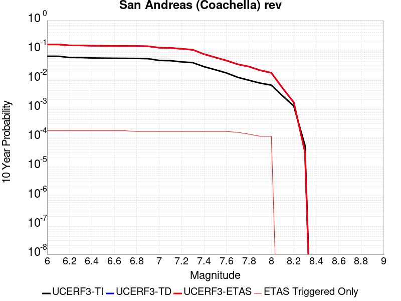 |

| Magnitude | 1 wk TI Prob | 1 wk TD Prob | 1 wk ETAS Prob | 1 wk ETAS/TD Gain | 1 wk ETAS Triggered Only | 1 mo TI Prob | 1 mo TD Prob | 1 mo ETAS Prob | 1 mo ETAS/TD Gain | 1 mo ETAS Triggered Only | 1 yr TI Prob | 1 yr TD Prob | 1 yr ETAS Prob | 1 yr ETAS/TD Gain | 1 yr ETAS Triggered Only | 10 yr TI Prob | 10 yr TD Prob | 10 yr ETAS Prob | 10 yr ETAS/TD Gain | 10 yr ETAS Triggered Only |
|-----|-----|-----|-----|-----|-----|-----|-----|-----|-----|-----|-----|-----|-----|-----|-----|-----|-----|-----|-----|-----|
| 6.0 | 1.1925945E-4 | 3.2733803E-4 | 3.2733803E-4 | 1.0 | 0.0 | 5.110118E-4 | 0.0014021277 | 0.001428757 | 1.0189921 | 2.6666667E-5 | 0.0062038354 | 0.016938623 | 0.017043483 | 1.0061905 | 1.0666667E-4 | 0.060334753 | 0.15267034 | 0.15278332 | 1.00074 | 1.3333333E-4 |
| 6.1 | 1.1925945E-4 | 3.2733803E-4 | 3.2733803E-4 | 1.0 | 0.0 | 5.110118E-4 | 0.0014021277 | 0.001428757 | 1.0189921 | 2.6666667E-5 | 0.0062038354 | 0.016938623 | 0.017043483 | 1.0061905 | 1.0666667E-4 | 0.060334753 | 0.15267034 | 0.15278332 | 1.00074 | 1.3333333E-4 |
| 6.2 | 1.07432395E-4 | 3.0234526E-4 | 3.0234526E-4 | 1.0 | 0.0 | 4.603433E-4 | 0.0012951259 | 0.001321758 | 1.0205634 | 2.6666667E-5 | 0.005590286 | 0.015655253 | 0.01576025 | 1.0067068 | 1.0666667E-4 | 0.05451731 | 0.14184146 | 0.14195588 | 1.0008067 | 1.3333333E-4 |
| 6.3 | 1.0718766E-4 | 3.017983E-4 | 3.017983E-4 | 1.0 | 0.0 | 4.592948E-4 | 0.0012927842 | 0.0013194164 | 1.0206007 | 2.6666667E-5 | 0.005577586 | 0.015627153 | 0.015732152 | 1.0067191 | 1.0666667E-4 | 0.054396555 | 0.14160971 | 0.14172417 | 1.0008082 | 1.3333333E-4 |
| 6.4 | 1.0355944E-4 | 2.9387916E-4 | 2.9387916E-4 | 1.0 | 0.0 | 4.4375064E-4 | 0.0012588782 | 0.0012855112 | 1.0211562 | 2.6666667E-5 | 0.0053892885 | 0.015220184 | 0.015325228 | 1.0069016 | 1.0666667E-4 | 0.052604496 | 0.13816981 | 0.13828473 | 1.0008316 | 1.3333333E-4 |
| 6.5 | 1.0227914E-4 | 2.910735E-4 | 2.910735E-4 | 1.0 | 0.0 | 4.382655E-4 | 0.0012468654 | 0.0012734988 | 1.0213603 | 2.6666667E-5 | 0.0053228354 | 0.015075962 | 0.015181021 | 1.0069686 | 1.0666667E-4 | 0.051971316 | 0.136949 | 0.13706407 | 1.0008403 | 1.3333333E-4 |
| 6.6 | 1.0116757E-4 | 2.8873098E-4 | 2.8873098E-4 | 1.0 | 0.0 | 4.3350324E-4 | 0.0012368355 | 0.0012634692 | 1.0215337 | 2.6666667E-5 | 0.0052651367 | 0.014955532 | 0.015060603 | 1.0070256 | 1.0666667E-4 | 0.051421247 | 0.13592719 | 0.1360424 | 1.0008476 | 1.3333333E-4 |
| 6.7 | 1.0050676E-4 | 2.873166E-4 | 2.873166E-4 | 1.0 | 0.0 | 4.3067214E-4 | 0.0012307797 | 0.0012574135 | 1.0216398 | 2.6666667E-5 | 0.005230834 | 0.01488281 | 0.01498789 | 1.0070604 | 1.0666667E-4 | 0.051094085 | 0.13531192 | 0.1354272 | 1.000852 | 1.3333333E-4 |
| 6.8 | 9.976819E-5 | 2.853531E-4 | 2.853531E-4 | 1.0 | 0.0 | 4.2750788E-4 | 0.0012223726 | 0.0012490067 | 1.0217888 | 2.6666667E-5 | 0.0051924936 | 0.014781849 | 0.014860667 | 1.005332 | 8.0E-5 | 0.050728295 | 0.13446361 | 0.13455594 | 1.0006866 | 1.0666667E-4 |
| 6.9 | 9.77719E-5 | 2.8032195E-4 | 2.8032195E-4 | 1.0 | 0.0 | 4.1895514E-4 | 0.0012008306 | 0.0012274652 | 1.0221802 | 2.6666667E-5 | 0.0050888555 | 0.014523101 | 0.014601938 | 1.0054284 | 8.0E-5 | 0.049738888 | 0.13229203 | 0.1323846 | 1.0006996 | 1.0666667E-4 |
| 7.0 | 8.500761E-5 | 2.4766565E-4 | 2.4766565E-4 | 1.0 | 0.0 | 3.6426744E-4 | 0.0010609957 | 0.0010876341 | 1.0251069 | 2.6666667E-5 | 0.0044259406 | 0.012841888 | 0.01292086 | 1.0061496 | 8.0E-5 | 0.04338823 | 0.11814933 | 0.1182434 | 1.0007962 | 1.0666667E-4 |
| 7.1 | 8.319876E-5 | 2.4369264E-4 | 2.4369264E-4 | 1.0 | 0.0 | 3.5651738E-4 | 0.0010439822 | 0.0010706211 | 1.0255165 | 2.6666667E-5 | 0.004331963 | 0.012637171 | 0.01271616 | 1.0062505 | 8.0E-5 | 0.042484846 | 0.116369456 | 0.11646371 | 1.0008099 | 1.0666667E-4 |
| 7.2 | 7.563917E-5 | 2.2417592E-4 | 2.2417592E-4 | 1.0 | 0.0 | 3.2412758E-4 | 9.6040324E-4 | 9.870443E-4 | 1.0277394 | 2.6666667E-5 | 0.0039391145 | 0.0116309095 | 0.011709979 | 1.0067983 | 8.0E-5 | 0.03870018 | 0.10777538 | 0.10787056 | 1.0008831 | 1.0666667E-4 |
| 7.3 | 7.082985E-5 | 2.073362E-4 | 2.073362E-4 | 1.0 | 0.0 | 3.0352117E-4 | 8.88284E-4 | 9.14927E-4 | 1.0299938 | 2.6666667E-5 | 0.0036891096 | 0.010761855 | 0.010840994 | 1.0073537 | 8.0E-5 | 0.03628465 | 0.10029767 | 0.10039363 | 1.0009569 | 1.0666667E-4 |
| 7.4 | 5.146215E-5 | 1.4276853E-4 | 1.4276853E-4 | 1.0 | 0.0 | 2.2053342E-4 | 6.117225E-4 | 6.383729E-4 | 1.0435661 | 2.6666667E-5 | 0.0026816884 | 0.007422478 | 0.007501884 | 1.0106981 | 8.0E-5 | 0.02649557 | 0.07086292 | 0.07096203 | 1.0013986 | 1.0666667E-4 |
| 7.5 | 4.0285166E-5 | 1.0944253E-4 | 1.0944253E-4 | 1.0 | 0.0 | 1.7263928E-4 | 4.689554E-4 | 4.956096E-4 | 1.0568373 | 2.6666667E-5 | 0.002099857 | 0.005694655 | 0.005774199 | 1.0139682 | 8.0E-5 | 0.020801254 | 0.055022955 | 0.055123754 | 1.0018319 | 1.0666667E-4 |
| 7.6 | 3.1168736E-5 | 8.441267E-5 | 8.441267E-5 | 1.0 | 0.0 | 1.3357346E-4 | 3.6171856E-4 | 3.8837557E-4 | 1.0736954 | 2.6666667E-5 | 0.0016250437 | 0.004395057 | 0.0044747056 | 1.0181223 | 8.0E-5 | 0.016132116 | 0.042820677 | 0.042922776 | 1.0023843 | 1.0666667E-4 |
| 7.7 | 2.2100989E-5 | 6.2408275E-5 | 6.2408275E-5 | 1.0 | 0.0 | 9.4715084E-5 | 2.6743664E-4 | 2.940962E-4 | 1.0996854 | 2.6666667E-5 | 0.001152546 | 0.003251186 | 0.0033309262 | 1.0245264 | 8.0E-5 | 0.011465867 | 0.03190961 | 0.032012872 | 1.003236 | 1.0666667E-4 |
| 7.8 | 1.7484861E-5 | 5.1814186E-5 | 5.1814186E-5 | 1.0 | 0.0 | 7.493296E-5 | 2.2204191E-4 | 2.4870265E-4 | 1.1200708 | 2.6666667E-5 | 9.1192697E-4 | 0.002700012 | 0.0027797958 | 1.0295495 | 8.0E-5 | 0.009081938 | 0.026648527 | 0.02675235 | 1.003896 | 1.0666667E-4 |
| 7.9 | 1.3967285E-5 | 3.8237675E-5 | 3.8237675E-5 | 1.0 | 0.0 | 5.985842E-5 | 1.6386545E-4 | 1.9052776E-4 | 1.1627085 | 2.6666667E-5 | 7.2853256E-4 | 0.0019932375 | 0.0020464647 | 1.0267038 | 5.3333333E-5 | 0.0072614877 | 0.019916428 | 0.0199687 | 1.0026245 | 5.3333333E-5 |
| 8.0 | 1.1887396E-5 | 3.107819E-5 | 3.107819E-5 | 1.0 | 0.0 | 5.094499E-5 | 1.3318544E-4 | 1.5984857E-4 | 1.2001954 | 2.6666667E-5 | 6.200787E-4 | 0.0016203277 | 0.0016735747 | 1.0328618 | 5.3333333E-5 | 0.006183513 | 0.016285317 | 0.016337782 | 1.0032216 | 5.3333333E-5 |
| 8.1 | 5.100864E-6 | 8.978668E-6 | 8.978668E-6 | 1.0 | 0.0 | 2.1860664E-5 | 3.847944E-5 | 3.847944E-5 | 1.0 | 0.0 | 2.6612106E-4 | 4.6838663E-4 | 4.6838663E-4 | 1.0 | 0.0 | 0.002658026 | 0.004920349 | 0.004920349 | 1.0 | 0.0 |
| 8.2 | 2.3004484E-6 | 2.7885583E-6 | 2.7885583E-6 | 1.0 | 0.0 | 9.859027E-6 | 1.19509095E-5 | 1.19509095E-5 | 1.0 | 0.0 | 1.2002704E-4 | 1.4549264E-4 | 1.4549264E-4 | 1.0 | 0.0 | 0.0011996223 | 0.0015984807 | 0.0015984807 | 1.0 | 0.0 |
| 8.3 | 1.0424446E-7 | 5.8219563E-8 | 5.8219563E-8 | 1.0 | 0.0 | 4.4676187E-7 | 2.495124E-7 | 2.495124E-7 | 1.0 | 0.0 | 5.439312E-6 | 3.0378094E-6 | 3.0378094E-6 | 1.0 | 0.0 | 5.4391792E-5 | 3.193819E-5 | 3.193819E-5 | 1.0 | 0.0 |

## San Andreas (North Branch Mill Creek)
*[(top)](#table-of-contents)*

| 1 Week | 1 Month | 1 Year | 10 Year |
|-----|-----|-----|-----|
|  |  |  | 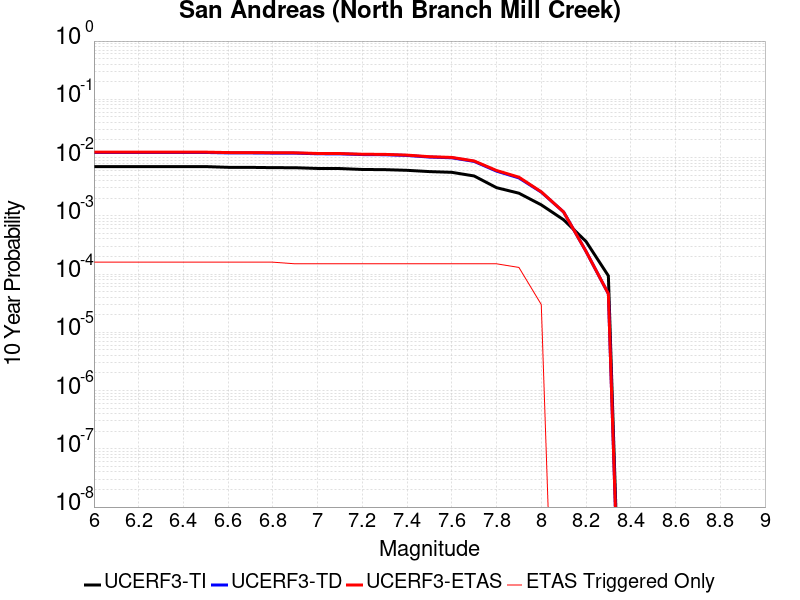 |

| Magnitude | 1 wk TI Prob | 1 wk TD Prob | 1 wk ETAS Prob | 1 wk ETAS/TD Gain | 1 wk ETAS Triggered Only | 1 mo TI Prob | 1 mo TD Prob | 1 mo ETAS Prob | 1 mo ETAS/TD Gain | 1 mo ETAS Triggered Only | 1 yr TI Prob | 1 yr TD Prob | 1 yr ETAS Prob | 1 yr ETAS/TD Gain | 1 yr ETAS Triggered Only | 10 yr TI Prob | 10 yr TD Prob | 10 yr ETAS Prob | 10 yr ETAS/TD Gain | 10 yr ETAS Triggered Only |
|-----|-----|-----|-----|-----|-----|-----|-----|-----|-----|-----|-----|-----|-----|-----|-----|-----|-----|-----|-----|-----|
| 6.0 | 1.3461156E-5 | 2.3506776E-5 | 2.3506776E-5 | 1.0 | 0.0 | 5.7689394E-5 | 1.0073945E-4 | 1.2740343E-4 | 1.2646827 | 2.6666667E-5 | 7.02142E-4 | 0.0012258161 | 0.0013323519 | 1.0869102 | 1.0666667E-4 | 0.0069992766 | 0.012233093 | 0.012391136 | 1.0129193 | 1.6E-4 |
| 6.1 | 1.3461156E-5 | 2.3506776E-5 | 2.3506776E-5 | 1.0 | 0.0 | 5.7689394E-5 | 1.0073945E-4 | 1.2740343E-4 | 1.2646827 | 2.6666667E-5 | 7.02142E-4 | 0.0012258161 | 0.0013323519 | 1.0869102 | 1.0666667E-4 | 0.0069992766 | 0.012233093 | 0.012391136 | 1.0129193 | 1.6E-4 |
| 6.2 | 1.3461156E-5 | 2.3506776E-5 | 2.3506776E-5 | 1.0 | 0.0 | 5.7689394E-5 | 1.0073945E-4 | 1.2740343E-4 | 1.2646827 | 2.6666667E-5 | 7.02142E-4 | 0.0012258161 | 0.0013323519 | 1.0869102 | 1.0666667E-4 | 0.0069992766 | 0.012233093 | 0.012391136 | 1.0129193 | 1.6E-4 |
| 6.3 | 1.3461156E-5 | 2.3506776E-5 | 2.3506776E-5 | 1.0 | 0.0 | 5.7689394E-5 | 1.0073945E-4 | 1.2740343E-4 | 1.2646827 | 2.6666667E-5 | 7.02142E-4 | 0.0012258161 | 0.0013323519 | 1.0869102 | 1.0666667E-4 | 0.0069992766 | 0.012233093 | 0.012391136 | 1.0129193 | 1.6E-4 |
| 6.4 | 1.3461156E-5 | 2.3506776E-5 | 2.3506776E-5 | 1.0 | 0.0 | 5.7689394E-5 | 1.0073945E-4 | 1.2740343E-4 | 1.2646827 | 2.6666667E-5 | 7.02142E-4 | 0.0012258161 | 0.0013323519 | 1.0869102 | 1.0666667E-4 | 0.0069992766 | 0.012233093 | 0.012391136 | 1.0129193 | 1.6E-4 |
| 6.5 | 1.3450706E-5 | 2.3495735E-5 | 2.3495735E-5 | 1.0 | 0.0 | 5.764461E-5 | 1.0069214E-4 | 1.2735612E-4 | 1.264807 | 2.6666667E-5 | 7.0159714E-4 | 0.0012252406 | 0.0013317766 | 1.086951 | 1.0666667E-4 | 0.006993862 | 0.012227403 | 0.012385447 | 1.0129254 | 1.6E-4 |
| 6.6 | 1.3074523E-5 | 2.3110017E-5 | 2.3110017E-5 | 1.0 | 0.0 | 5.6032466E-5 | 9.9039185E-5 | 1.2570321E-4 | 1.269227 | 2.6666667E-5 | 6.8198174E-4 | 0.0012051383 | 0.0013116765 | 1.0884032 | 1.0666667E-4 | 0.006798926 | 0.0120285675 | 0.012186643 | 1.0131416 | 1.6E-4 |
| 6.7 | 1.3050216E-5 | 2.3085311E-5 | 2.3085311E-5 | 1.0 | 0.0 | 5.59283E-5 | 9.893332E-5 | 1.2559735E-4 | 1.2695152 | 2.6666667E-5 | 6.8071426E-4 | 0.0012038508 | 0.001310389 | 1.0884979 | 1.0666667E-4 | 0.0067863287 | 0.012015832 | 0.01217391 | 1.0131558 | 1.6E-4 |
| 6.8 | 1.29049395E-5 | 2.293372E-5 | 2.293372E-5 | 1.0 | 0.0 | 5.530571E-5 | 9.828369E-5 | 1.2494774E-4 | 1.2712967 | 2.6666667E-5 | 6.73139E-4 | 0.0011959502 | 0.0013024893 | 1.0890832 | 1.0666667E-4 | 0.0067110364 | 0.011937677 | 0.012095766 | 1.013243 | 1.6E-4 |
| 6.9 | 1.2867369E-5 | 2.2893122E-5 | 2.2893122E-5 | 1.0 | 0.0 | 5.51447E-5 | 9.810971E-5 | 1.2477375E-4 | 1.2717779 | 2.6666667E-5 | 6.711799E-4 | 0.0011938344 | 0.0013003737 | 1.0892413 | 1.0666667E-4 | 0.006691564 | 0.011916745 | 0.012074838 | 1.0132664 | 1.6E-4 |
| 7.0 | 1.2495996E-5 | 2.2293154E-5 | 2.2293154E-5 | 1.0 | 0.0 | 5.3553173E-5 | 9.5538606E-5 | 1.2220273E-4 | 1.2790926 | 2.6666667E-5 | 6.518148E-4 | 0.0011625647 | 0.0012691073 | 1.0916445 | 1.0666667E-4 | 0.0064990623 | 0.011607327 | 0.01176547 | 1.0136244 | 1.6E-4 |
| 7.1 | 1.2452067E-5 | 2.2238226E-5 | 2.2238226E-5 | 1.0 | 0.0 | 5.3364907E-5 | 9.5303214E-5 | 1.2196734E-4 | 1.279782 | 2.6666667E-5 | 6.4952404E-4 | 0.0011597018 | 0.0012662448 | 1.091871 | 1.0666667E-4 | 0.0064762887 | 0.011578998 | 0.011737145 | 1.0136582 | 1.6E-4 |
| 7.2 | 1.2002777E-5 | 2.1616754E-5 | 2.1616754E-5 | 1.0 | 0.0 | 5.143946E-5 | 9.263996E-5 | 1.1930415E-4 | 1.2878261 | 2.6666667E-5 | 6.2609545E-4 | 0.0011273106 | 0.001233857 | 1.0945138 | 1.0666667E-4 | 0.006243344 | 0.011258403 | 0.011416601 | 1.0140516 | 1.6E-4 |
| 7.3 | 1.1923425E-5 | 2.1486576E-5 | 2.1486576E-5 | 1.0 | 0.0 | 5.109939E-5 | 9.208209E-5 | 1.187463E-4 | 1.28957 | 2.6666667E-5 | 6.219575E-4 | 0.0011205255 | 0.0012270727 | 1.0950868 | 1.0666667E-4 | 0.0062021962 | 0.011191265 | 0.011349474 | 1.0141369 | 1.6E-4 |
| 7.4 | 1.16105175E-5 | 2.0860489E-5 | 2.0860489E-5 | 1.0 | 0.0 | 4.975841E-5 | 8.9399044E-5 | 1.16063326E-4 | 1.2982614 | 2.6666667E-5 | 6.0564023E-4 | 0.0010878925 | 0.0011944431 | 1.0979422 | 1.0666667E-4 | 0.006039923 | 0.01086884 | 0.0110271005 | 1.0145609 | 1.6E-4 |
| 7.5 | 1.1037265E-5 | 1.956039E-5 | 1.956039E-5 | 1.0 | 0.0 | 4.7301706E-5 | 8.382756E-5 | 1.1049199E-4 | 1.3180867 | 2.6666667E-5 | 5.757461E-4 | 0.0010201249 | 0.0011266827 | 1.1044557 | 1.0666667E-4 | 0.005742567 | 0.010198223 | 0.010356592 | 1.015529 | 1.6E-4 |
| 7.6 | 1.0720915E-5 | 1.900222E-5 | 1.900222E-5 | 1.0 | 0.0 | 4.5945973E-5 | 8.143555E-5 | 1.0810005E-4 | 1.3274306 | 2.6666667E-5 | 5.592486E-4 | 9.910291E-4 | 0.0010975901 | 1.1075256 | 1.0666667E-4 | 0.005578433 | 0.009909907 | 0.010068322 | 1.0159855 | 1.6E-4 |
| 7.7 | 9.276279E-6 | 1.6447744E-5 | 1.6447744E-5 | 1.0 | 0.0 | 3.9754876E-5 | 7.048844E-5 | 9.715322E-5 | 1.378286 | 2.6666667E-5 | 4.839081E-4 | 8.578605E-4 | 9.6443563E-4 | 1.1242337 | 1.0666667E-4 | 0.0048285574 | 0.008589173 | 0.008747798 | 1.0184681 | 1.6E-4 |
| 7.8 | 5.8346777E-6 | 1.1159965E-5 | 1.1159965E-5 | 1.0 | 0.0 | 2.5005522E-5 | 4.7827543E-5 | 7.4492935E-5 | 1.5575321 | 2.6666667E-5 | 3.043997E-4 | 5.821449E-4 | 6.887494E-4 | 1.1831238 | 1.0666667E-4 | 0.0030398308 | 0.005849473 | 0.006008537 | 1.027193 | 1.6E-4 |
| 7.9 | 4.690204E-6 | 8.513225E-6 | 8.513225E-6 | 1.0 | 0.0 | 2.0100719E-5 | 3.648474E-5 | 6.315044E-5 | 1.7308725 | 2.6666667E-5 | 2.4469878E-4 | 4.4411127E-4 | 5.2407576E-4 | 1.180055 | 8.0E-5 | 0.002444295 | 0.0044728746 | 0.004579064 | 1.0237408 | 1.0666667E-4 |
| 8.0 | 2.9570454E-6 | 4.8494758E-6 | 4.8494758E-6 | 1.0 | 0.0 | 1.267299E-5 | 2.0783302E-5 | 2.0783302E-5 | 1.0 | 0.0 | 1.5428272E-4 | 2.5300734E-4 | 2.5300734E-4 | 1.0 | 0.0 | 0.0015417566 | 0.0025509594 | 0.0025509594 | 1.0 | 0.0 |
| 8.1 | 1.6376824E-6 | 2.198225E-6 | 2.198225E-6 | 1.0 | 0.0 | 7.01862E-6 | 9.420931E-6 | 9.420931E-6 | 1.0 | 0.0 | 8.544835E-5 | 1.1469381E-4 | 1.1469381E-4 | 1.0 | 0.0 | 8.54155E-4 | 0.0011613552 | 0.0011613552 | 1.0 | 0.0 |
| 8.2 | 6.9631557E-7 | 4.5401492E-7 | 4.5401492E-7 | 1.0 | 0.0 | 2.984206E-6 | 1.9457768E-6 | 1.9457768E-6 | 1.0 | 0.0 | 3.63321E-5 | 2.3689576E-5 | 2.3689576E-5 | 1.0 | 0.0 | 3.6326164E-4 | 2.453756E-4 | 2.453756E-4 | 1.0 | 0.0 |
| 8.3 | 1.7876137E-7 | 8.368747E-8 | 8.368747E-8 | 1.0 | 0.0 | 7.661199E-7 | 3.5866054E-7 | 3.5866054E-7 | 1.0 | 0.0 | 9.32747E-6 | 4.3666837E-6 | 4.3666837E-6 | 1.0 | 0.0 | 9.3270784E-5 | 4.5861943E-5 | 4.5861943E-5 | 1.0 | 0.0 |

## Elsinore (Glen Ivy) rev
*[(top)](#table-of-contents)*

| 1 Week | 1 Month | 1 Year | 10 Year |
|-----|-----|-----|-----|
|  |  |  |  |

| Magnitude | 1 wk TI Prob | 1 wk TD Prob | 1 wk ETAS Prob | 1 wk ETAS/TD Gain | 1 wk ETAS Triggered Only | 1 mo TI Prob | 1 mo TD Prob | 1 mo ETAS Prob | 1 mo ETAS/TD Gain | 1 mo ETAS Triggered Only | 1 yr TI Prob | 1 yr TD Prob | 1 yr ETAS Prob | 1 yr ETAS/TD Gain | 1 yr ETAS Triggered Only | 10 yr TI Prob | 10 yr TD Prob | 10 yr ETAS Prob | 10 yr ETAS/TD Gain | 10 yr ETAS Triggered Only |
|-----|-----|-----|-----|-----|-----|-----|-----|-----|-----|-----|-----|-----|-----|-----|-----|-----|-----|-----|-----|-----|
| 6.0 | 1.6204086E-4 | 2.9362022E-4 | 2.9362022E-4 | 1.0 | 0.0 | 6.94276E-4 | 0.0012579202 | 0.0012579202 | 1.0 | 0.0 | 0.008420097 | 0.015235162 | 0.015340204 | 1.0068947 | 1.0666667E-4 | 0.081081145 | 0.13969512 | 0.13983278 | 1.0009854 | 1.6E-4 |
| 6.1 | 1.6204086E-4 | 2.9362022E-4 | 2.9362022E-4 | 1.0 | 0.0 | 6.94276E-4 | 0.0012579202 | 0.0012579202 | 1.0 | 0.0 | 0.008420097 | 0.015235162 | 0.015340204 | 1.0068947 | 1.0666667E-4 | 0.081081145 | 0.13969512 | 0.13983278 | 1.0009854 | 1.6E-4 |
| 6.2 | 1.6204086E-4 | 2.9362022E-4 | 2.9362022E-4 | 1.0 | 0.0 | 6.94276E-4 | 0.0012579202 | 0.0012579202 | 1.0 | 0.0 | 0.008420097 | 0.015235162 | 0.015340204 | 1.0068947 | 1.0666667E-4 | 0.081081145 | 0.13969512 | 0.13983278 | 1.0009854 | 1.6E-4 |
| 6.3 | 1.0111737E-4 | 1.7703768E-4 | 1.7703768E-4 | 1.0 | 0.0 | 4.332882E-4 | 7.58629E-4 | 7.58629E-4 | 1.0 | 0.0 | 0.005262531 | 0.0092178825 | 0.0092178825 | 1.0 | 0.0 | 0.0513964 | 0.08702082 | 0.08704517 | 1.0002798 | 2.6666667E-5 |
| 6.4 | 1.0111737E-4 | 1.7703768E-4 | 1.7703768E-4 | 1.0 | 0.0 | 4.332882E-4 | 7.58629E-4 | 7.58629E-4 | 1.0 | 0.0 | 0.005262531 | 0.0092178825 | 0.0092178825 | 1.0 | 0.0 | 0.0513964 | 0.08702082 | 0.08704517 | 1.0002798 | 2.6666667E-5 |
| 6.5 | 3.6624708E-5 | 4.639301E-5 | 4.639301E-5 | 1.0 | 0.0 | 1.569536E-4 | 1.9881407E-4 | 1.9881407E-4 | 1.0 | 0.0 | 0.001909235 | 0.0024182373 | 0.0024182373 | 1.0 | 0.0 | 0.01892915 | 0.023740914 | 0.023740914 | 1.0 | 0.0 |
| 6.6 | 2.5051324E-5 | 2.614908E-5 | 2.614908E-5 | 1.0 | 0.0 | 1.073584E-4 | 1.1206293E-4 | 1.1206293E-4 | 1.0 | 0.0 | 0.0013063047 | 0.0013635567 | 0.0013635567 | 1.0 | 0.0 | 0.012986525 | 0.013565315 | 0.013565315 | 1.0 | 0.0 |
| 6.7 | 2.2189772E-5 | 2.207403E-5 | 2.207403E-5 | 1.0 | 0.0 | 9.509556E-5 | 9.459976E-5 | 9.459976E-5 | 1.0 | 0.0 | 0.0011571734 | 0.0011511799 | 0.0011511799 | 1.0 | 0.0 | 0.011511663 | 0.011466023 | 0.011466023 | 1.0 | 0.0 |
| 6.8 | 1.6654378E-5 | 1.4438445E-5 | 1.4438445E-5 | 1.0 | 0.0 | 7.137396E-5 | 6.187761E-5 | 6.187761E-5 | 1.0 | 0.0 | 8.686314E-4 | 7.531047E-4 | 7.531047E-4 | 1.0 | 0.0 | 0.008652439 | 0.0075108632 | 0.0075108632 | 1.0 | 0.0 |
| 6.9 | 1.5042909E-5 | 1.23326745E-5 | 1.23326745E-5 | 1.0 | 0.0 | 6.446802E-5 | 5.2853266E-5 | 5.2853266E-5 | 1.0 | 0.0 | 7.8461546E-4 | 6.433017E-4 | 6.433017E-4 | 1.0 | 0.0 | 0.007818509 | 0.006418618 | 0.006418618 | 1.0 | 0.0 |
| 7.0 | 1.4361385E-5 | 1.14519435E-5 | 1.14519435E-5 | 1.0 | 0.0 | 6.154734E-5 | 4.907885E-5 | 4.907885E-5 | 1.0 | 0.0 | 7.490812E-4 | 5.973741E-4 | 5.973741E-4 | 1.0 | 0.0 | 0.007465612 | 0.0059616743 | 0.0059616743 | 1.0 | 0.0 |
| 7.1 | 1.3265571E-5 | 1.0245398E-5 | 1.0245398E-5 | 1.0 | 0.0 | 5.6851208E-5 | 4.3908123E-5 | 4.3908123E-5 | 1.0 | 0.0 | 6.919436E-4 | 5.344528E-4 | 5.344528E-4 | 1.0 | 0.0 | 0.006897931 | 0.0053350315 | 0.0053350315 | 1.0 | 0.0 |
| 7.2 | 1.1596403E-5 | 8.50544E-6 | 8.50544E-6 | 1.0 | 0.0 | 4.9697923E-5 | 3.6451387E-5 | 3.6451387E-5 | 1.0 | 0.0 | 6.049042E-4 | 4.4370696E-4 | 4.4370696E-4 | 1.0 | 0.0 | 0.006032603 | 0.004429626 | 0.004429626 | 1.0 | 0.0 |
| 7.3 | 1.0150827E-5 | 7.23907E-6 | 7.23907E-6 | 1.0 | 0.0 | 4.3502816E-5 | 3.1024225E-5 | 3.1024225E-5 | 1.0 | 0.0 | 5.2951806E-4 | 3.776559E-4 | 3.776559E-4 | 1.0 | 0.0 | 0.005282581 | 0.0037705277 | 0.0037705277 | 1.0 | 0.0 |
| 7.4 | 9.080705E-6 | 6.352785E-6 | 6.352785E-6 | 1.0 | 0.0 | 3.8916725E-5 | 2.7225946E-5 | 2.7225946E-5 | 1.0 | 0.0 | 4.7370812E-4 | 3.3142683E-4 | 3.3142683E-4 | 1.0 | 0.0 | 0.004726996 | 0.0033094764 | 0.0033094764 | 1.0 | 0.0 |
| 7.5 | 7.671649E-6 | 5.2258497E-6 | 5.2258497E-6 | 1.0 | 0.0 | 3.287808E-5 | 2.2396314E-5 | 2.2396314E-5 | 1.0 | 0.0 | 4.0021708E-4 | 2.7264224E-4 | 2.7264224E-4 | 1.0 | 0.0 | 0.0039949706 | 0.0027232026 | 0.0027232026 | 1.0 | 0.0 |
| 7.6 | 6.990086E-6 | 4.687739E-6 | 4.687739E-6 | 1.0 | 0.0 | 2.9957167E-5 | 2.0090161E-5 | 2.0090161E-5 | 1.0 | 0.0 | 3.6466747E-4 | 2.4457145E-4 | 2.4457145E-4 | 1.0 | 0.0 | 0.0036406964 | 0.002443139 | 0.002443139 | 1.0 | 0.0 |
| 7.7 | 4.163505E-6 | 2.3296475E-6 | 2.3296475E-6 | 1.0 | 0.0 | 1.7843471E-5 | 9.984169E-6 | 9.984169E-6 | 1.0 | 0.0 | 2.172226E-4 | 1.21551224E-4 | 1.21551224E-4 | 1.0 | 0.0 | 0.0021701038 | 0.0012149204 | 0.0012149204 | 1.0 | 0.0 |
| 7.8 | 2.2692414E-7 | 9.385943E-8 | 9.385943E-8 | 1.0 | 0.0 | 9.725317E-7 | 4.0225464E-7 | 4.0225464E-7 | 1.0 | 0.0 | 1.1840509E-5 | 4.8974425E-6 | 4.8974425E-6 | 1.0 | 0.0 | 1.1839878E-4 | 4.8973674E-5 | 4.8973674E-5 | 1.0 | 0.0 |
| 7.9 | 6.676829E-9 | 3.4399772E-9 | 3.4399772E-9 | 1.0 | 0.0 | 2.861498E-8 | 1.4742759E-8 | 1.4742759E-8 | 1.0 | 0.0 | 3.4838732E-7 | 1.7949307E-7 | 1.7949307E-7 | 1.0 | 0.0 | 3.4838679E-6 | 1.7949295E-6 | 1.7949295E-6 | 1.0 | 0.0 |

## Death Valley (Fish Lake Valley)
*[(top)](#table-of-contents)*

| 1 Week | 1 Month | 1 Year | 10 Year |
|-----|-----|-----|-----|
|  | 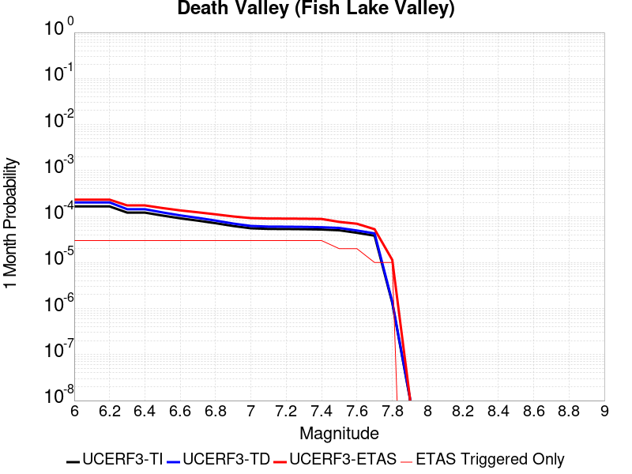 |  |  |

| Magnitude | 1 wk TI Prob | 1 wk TD Prob | 1 wk ETAS Prob | 1 wk ETAS/TD Gain | 1 wk ETAS Triggered Only | 1 mo TI Prob | 1 mo TD Prob | 1 mo ETAS Prob | 1 mo ETAS/TD Gain | 1 mo ETAS Triggered Only | 1 yr TI Prob | 1 yr TD Prob | 1 yr ETAS Prob | 1 yr ETAS/TD Gain | 1 yr ETAS Triggered Only | 10 yr TI Prob | 10 yr TD Prob | 10 yr ETAS Prob | 10 yr ETAS/TD Gain | 10 yr ETAS Triggered Only |
|-----|-----|-----|-----|-----|-----|-----|-----|-----|-----|-----|-----|-----|-----|-----|-----|-----|-----|-----|-----|-----|
| 6.0 | 3.872328E-5 | 4.7268895E-5 | 4.7268895E-5 | 1.0 | 0.0 | 1.6594635E-4 | 2.0256694E-4 | 2.292282E-4 | 1.1316171 | 2.6666667E-5 | 0.0020185246 | 0.0024636039 | 0.0025168057 | 1.0215951 | 5.3333333E-5 | 0.02000288 | 0.024388881 | 0.02454498 | 1.0064003 | 1.6E-4 |
| 6.1 | 3.872328E-5 | 4.7268895E-5 | 4.7268895E-5 | 1.0 | 0.0 | 1.6594635E-4 | 2.0256694E-4 | 2.292282E-4 | 1.1316171 | 2.6666667E-5 | 0.0020185246 | 0.0024636039 | 0.0025168057 | 1.0215951 | 5.3333333E-5 | 0.02000288 | 0.024388881 | 0.02454498 | 1.0064003 | 1.6E-4 |
| 6.2 | 3.872328E-5 | 4.7268895E-5 | 4.7268895E-5 | 1.0 | 0.0 | 1.6594635E-4 | 2.0256694E-4 | 2.292282E-4 | 1.1316171 | 2.6666667E-5 | 0.0020185246 | 0.0024636039 | 0.0025168057 | 1.0215951 | 5.3333333E-5 | 0.02000288 | 0.024388881 | 0.02454498 | 1.0064003 | 1.6E-4 |
| 6.3 | 2.8356371E-5 | 3.3610693E-5 | 3.3610693E-5 | 1.0 | 0.0 | 1.2152165E-4 | 1.4403832E-4 | 1.7070115E-4 | 1.1851093 | 2.6666667E-5 | 0.0014785219 | 0.001752335 | 0.0018055749 | 1.0303823 | 5.3333333E-5 | 0.014687235 | 0.01739221 | 0.017549427 | 1.0090395 | 1.6E-4 |
| 6.4 | 2.8356371E-5 | 3.3610693E-5 | 3.3610693E-5 | 1.0 | 0.0 | 1.2152165E-4 | 1.4403832E-4 | 1.7070115E-4 | 1.1851093 | 2.6666667E-5 | 0.0014785219 | 0.001752335 | 0.0018055749 | 1.0303823 | 5.3333333E-5 | 0.014687235 | 0.01739221 | 0.017549427 | 1.0090395 | 1.6E-4 |
| 6.5 | 2.4448687E-5 | 2.8608209E-5 | 2.8608209E-5 | 1.0 | 0.0 | 1.0477588E-4 | 1.2260114E-4 | 1.4926452E-4 | 1.2174809 | 2.6666667E-5 | 0.0012748998 | 0.0014916973 | 0.0015449511 | 1.0357001 | 5.3333333E-5 | 0.012676105 | 0.014821712 | 0.01497934 | 1.010635 | 1.6E-4 |
| 6.6 | 2.1298161E-5 | 2.4660607E-5 | 2.4660607E-5 | 1.0 | 0.0 | 9.127464E-5 | 1.0568422E-4 | 1.3234807E-4 | 1.2522973 | 2.6666667E-5 | 0.0011107022 | 0.0012859798 | 0.0013392445 | 1.0414196 | 5.3333333E-5 | 0.011051672 | 0.012788794 | 0.012946748 | 1.0123509 | 1.6E-4 |
| 6.7 | 1.8959729E-5 | 2.178146E-5 | 2.178146E-5 | 1.0 | 0.0 | 8.125345E-5 | 9.3345916E-5 | 1.20010096E-4 | 1.2856491 | 2.6666667E-5 | 9.888117E-4 | 0.0011359196 | 0.0011891923 | 1.0468984 | 5.3333333E-5 | 0.009844234 | 0.011303794 | 0.011461985 | 1.0139946 | 1.6E-4 |
| 6.8 | 1.6691629E-5 | 1.9018706E-5 | 1.9018706E-5 | 1.0 | 0.0 | 7.153359E-5 | 8.150629E-5 | 1.0817078E-4 | 1.3271464 | 2.6666667E-5 | 8.7057345E-4 | 9.919042E-4 | 0.0010451846 | 1.0537153 | 5.3333333E-5 | 0.008671708 | 0.009876527 | 0.010034947 | 1.01604 | 1.6E-4 |
| 6.9 | 1.450505E-5 | 1.6389824E-5 | 1.6389824E-5 | 1.0 | 0.0 | 6.216302E-5 | 7.024026E-5 | 9.690505E-5 | 1.3796227 | 2.6666667E-5 | 7.5657194E-4 | 8.548484E-4 | 9.0813613E-4 | 1.0623358 | 5.3333333E-5 | 0.007540013 | 0.008516532 | 0.00867517 | 1.018627 | 1.6E-4 |
| 7.0 | 1.2940855E-5 | 1.453821E-5 | 1.453821E-5 | 1.0 | 0.0 | 5.545963E-5 | 6.230516E-5 | 8.897016E-5 | 1.4279742 | 2.6666667E-5 | 6.750118E-4 | 7.583071E-4 | 8.116E-4 | 1.0702788 | 5.3333333E-5 | 0.006729651 | 0.0075578135 | 0.007716604 | 1.0210102 | 1.6E-4 |
| 7.1 | 1.2544658E-5 | 1.4078437E-5 | 1.4078437E-5 | 1.0 | 0.0 | 5.3761712E-5 | 6.033479E-5 | 8.699985E-5 | 1.4419516 | 2.6666667E-5 | 6.5435225E-4 | 7.343341E-4 | 7.876283E-4 | 1.0725749 | 5.3333333E-5 | 0.006524288 | 0.0073196692 | 0.0074784984 | 1.021699 | 1.6E-4 |
| 7.2 | 1.2489416E-5 | 1.4015902E-5 | 1.4015902E-5 | 1.0 | 0.0 | 5.3524967E-5 | 6.00668E-5 | 8.673187E-5 | 1.4439235 | 2.6666667E-5 | 6.514716E-4 | 7.310735E-4 | 7.8436785E-4 | 1.0728987 | 5.3333333E-5 | 0.006495651 | 0.007287278 | 0.0074461116 | 1.0217961 | 1.6E-4 |
| 7.3 | 1.2368307E-5 | 1.3880038E-5 | 1.3880038E-5 | 1.0 | 0.0 | 5.3005948E-5 | 5.948455E-5 | 8.614963E-5 | 1.448269 | 2.6666667E-5 | 6.451563E-4 | 7.239894E-4 | 7.772841E-4 | 1.0736126 | 5.3333333E-5 | 0.0064328653 | 0.0072168987 | 0.007375744 | 1.0220102 | 1.6E-4 |
| 7.4 | 1.2161707E-5 | 1.3648089E-5 | 1.3648089E-5 | 1.0 | 0.0 | 5.212056E-5 | 5.8490532E-5 | 8.515564E-5 | 1.4558876 | 2.6666667E-5 | 6.3438306E-4 | 7.118952E-4 | 7.651905E-4 | 1.074864 | 5.3333333E-5 | 0.006325751 | 0.0070967353 | 0.0072556 | 1.0223856 | 1.6E-4 |
| 7.5 | 1.1707948E-5 | 1.314573E-5 | 1.314573E-5 | 1.0 | 0.0 | 5.0175953E-5 | 5.6337656E-5 | 8.300282E-5 | 1.4733098 | 2.6666667E-5 | 6.10721E-4 | 6.857007E-4 | 7.389974E-4 | 1.077726 | 5.3333333E-5 | 0.0060904534 | 0.0068364325 | 0.0069953385 | 1.023244 | 1.6E-4 |
| 7.6 | 1.0319538E-5 | 1.157981E-5 | 1.157981E-5 | 1.0 | 0.0 | 4.4225842E-5 | 4.9626844E-5 | 7.6292185E-5 | 1.5373169 | 2.6666667E-5 | 5.383166E-4 | 6.040445E-4 | 6.573456E-4 | 1.0882404 | 5.3333333E-5 | 0.0053701443 | 0.0060245576 | 0.006183594 | 1.026398 | 1.6E-4 |
| 7.7 | 8.937764E-6 | 1.0022941E-5 | 1.0022941E-5 | 1.0 | 0.0 | 3.830414E-5 | 4.295478E-5 | 4.295478E-5 | 1.0 | 0.0 | 4.6625308E-4 | 5.2285404E-4 | 5.2285404E-4 | 1.0 | 0.0 | 0.0046527605 | 0.005216748 | 0.005322858 | 1.0203403 | 1.0666667E-4 |
| 7.8 | 3.108007E-7 | 3.2846788E-7 | 3.2846788E-7 | 1.0 | 0.0 | 1.3320023E-6 | 1.4077187E-6 | 1.4077187E-6 | 1.0 | 0.0 | 1.6217007E-5 | 1.7138846E-5 | 1.7138846E-5 | 1.0 | 0.0 | 1.6215823E-4 | 1.713756E-4 | 1.713756E-4 | 1.0 | 0.0 |
| 7.9 | 2.5591178E-9 | 2.6696871E-9 | 2.6696871E-9 | 1.0 | 0.0 | 1.0967647E-8 | 1.1441516E-8 | 1.1441516E-8 | 1.0 | 0.0 | 1.335311E-7 | 1.3930045E-7 | 1.3930045E-7 | 1.0 | 0.0 | 1.3353102E-6 | 1.3930046E-6 | 1.3930046E-6 | 1.0 | 0.0 |

## Kern Canyon (North Kern) 2011
*[(top)](#table-of-contents)*

| 1 Week | 1 Month | 1 Year | 10 Year |
|-----|-----|-----|-----|
|  |  |  |  |

| Magnitude | 1 wk TI Prob | 1 wk TD Prob | 1 wk ETAS Prob | 1 wk ETAS/TD Gain | 1 wk ETAS Triggered Only | 1 mo TI Prob | 1 mo TD Prob | 1 mo ETAS Prob | 1 mo ETAS/TD Gain | 1 mo ETAS Triggered Only | 1 yr TI Prob | 1 yr TD Prob | 1 yr ETAS Prob | 1 yr ETAS/TD Gain | 1 yr ETAS Triggered Only | 10 yr TI Prob | 10 yr TD Prob | 10 yr ETAS Prob | 10 yr ETAS/TD Gain | 10 yr ETAS Triggered Only |
|-----|-----|-----|-----|-----|-----|-----|-----|-----|-----|-----|-----|-----|-----|-----|-----|-----|-----|-----|-----|-----|
| 6.0 | 6.6264497E-6 | 6.7573515E-6 | 6.7573515E-6 | 1.0 | 0.0 | 2.8398761E-5 | 2.8959801E-5 | 2.8959801E-5 | 1.0 | 0.0 | 3.4570007E-4 | 3.5253653E-4 | 3.791938E-4 | 1.0756156 | 2.6666667E-5 | 0.0034516277 | 0.0035205614 | 0.0036534253 | 1.0377394 | 1.3333333E-4 |
| 6.1 | 6.6264497E-6 | 6.7573515E-6 | 6.7573515E-6 | 1.0 | 0.0 | 2.8398761E-5 | 2.8959801E-5 | 2.8959801E-5 | 1.0 | 0.0 | 3.4570007E-4 | 3.5253653E-4 | 3.791938E-4 | 1.0756156 | 2.6666667E-5 | 0.0034516277 | 0.0035205614 | 0.0036534253 | 1.0377394 | 1.3333333E-4 |
| 6.2 | 6.6264497E-6 | 6.7573515E-6 | 6.7573515E-6 | 1.0 | 0.0 | 2.8398761E-5 | 2.8959801E-5 | 2.8959801E-5 | 1.0 | 0.0 | 3.4570007E-4 | 3.5253653E-4 | 3.791938E-4 | 1.0756156 | 2.6666667E-5 | 0.0034516277 | 0.0035205614 | 0.0036534253 | 1.0377394 | 1.3333333E-4 |
| 6.3 | 6.6264497E-6 | 6.7573515E-6 | 6.7573515E-6 | 1.0 | 0.0 | 2.8398761E-5 | 2.8959801E-5 | 2.8959801E-5 | 1.0 | 0.0 | 3.4570007E-4 | 3.5253653E-4 | 3.791938E-4 | 1.0756156 | 2.6666667E-5 | 0.0034516277 | 0.0035205614 | 0.0036534253 | 1.0377394 | 1.3333333E-4 |
| 6.4 | 6.6264497E-6 | 6.7573515E-6 | 6.7573515E-6 | 1.0 | 0.0 | 2.8398761E-5 | 2.8959801E-5 | 2.8959801E-5 | 1.0 | 0.0 | 3.4570007E-4 | 3.5253653E-4 | 3.791938E-4 | 1.0756156 | 2.6666667E-5 | 0.0034516277 | 0.0035205614 | 0.0036534253 | 1.0377394 | 1.3333333E-4 |
| 6.5 | 3.2162225E-6 | 3.2571006E-6 | 3.2571006E-6 | 1.0 | 0.0 | 1.3783738E-5 | 1.3958933E-5 | 1.3958933E-5 | 1.0 | 0.0 | 1.6780409E-4 | 1.6993756E-4 | 1.9659969E-4 | 1.1568937 | 2.6666667E-5 | 0.0016767744 | 0.0016981558 | 0.0017513986 | 1.0313532 | 5.3333333E-5 |
| 6.6 | 3.2162225E-6 | 3.2571006E-6 | 3.2571006E-6 | 1.0 | 0.0 | 1.3783738E-5 | 1.3958933E-5 | 1.3958933E-5 | 1.0 | 0.0 | 1.6780409E-4 | 1.6993756E-4 | 1.9659969E-4 | 1.1568937 | 2.6666667E-5 | 0.0016767744 | 0.0016981558 | 0.0017513986 | 1.0313532 | 5.3333333E-5 |
| 6.7 | 2.1908265E-6 | 2.2071279E-6 | 2.2071279E-6 | 1.0 | 0.0 | 9.389223E-6 | 9.459087E-6 | 9.459087E-6 | 1.0 | 0.0 | 1.1430779E-4 | 1.1515849E-4 | 1.1515849E-4 | 1.0 | 0.0 | 0.0011424901 | 0.0011510076 | 0.0011776435 | 1.0231414 | 2.6666667E-5 |
| 6.8 | 1.7303895E-6 | 1.7365574E-6 | 1.7365574E-6 | 1.0 | 0.0 | 7.415934E-6 | 7.442368E-6 | 7.442368E-6 | 1.0 | 0.0 | 9.028525E-5 | 9.060716E-5 | 9.060716E-5 | 1.0 | 0.0 | 9.024858E-4 | 9.057119E-4 | 9.323544E-4 | 1.0294161 | 2.6666667E-5 |
| 6.9 | 1.3700314E-6 | 1.3688657E-6 | 1.3688657E-6 | 1.0 | 0.0 | 5.87155E-6 | 5.866554E-6 | 5.866554E-6 | 1.0 | 0.0 | 7.148377E-5 | 7.1423005E-5 | 7.1423005E-5 | 1.0 | 0.0 | 7.146078E-4 | 7.1400503E-4 | 7.1400503E-4 | 1.0 | 0.0 |
| 7.0 | 1.1467797E-6 | 1.1413833E-6 | 1.1413833E-6 | 1.0 | 0.0 | 4.9147607E-6 | 4.8916336E-6 | 4.8916336E-6 | 1.0 | 0.0 | 5.983557E-5 | 5.9554044E-5 | 5.9554044E-5 | 1.0 | 0.0 | 5.981946E-4 | 5.95384E-4 | 5.95384E-4 | 1.0 | 0.0 |
| 7.1 | 9.3952065E-7 | 9.302714E-7 | 9.302714E-7 | 1.0 | 0.0 | 4.026511E-6 | 3.9868714E-6 | 3.9868714E-6 | 1.0 | 0.0 | 4.9021666E-5 | 4.8539096E-5 | 4.8539096E-5 | 1.0 | 0.0 | 4.901085E-4 | 4.8528673E-4 | 4.8528673E-4 | 1.0 | 0.0 |
| 7.2 | 6.858055E-7 | 6.719318E-7 | 6.719318E-7 | 1.0 | 0.0 | 2.939163E-6 | 2.8797044E-6 | 2.8797044E-6 | 1.0 | 0.0 | 3.5783723E-5 | 3.5059846E-5 | 3.5059846E-5 | 1.0 | 0.0 | 3.5777962E-4 | 3.5054405E-4 | 3.5054405E-4 | 1.0 | 0.0 |
| 7.3 | 5.1101983E-7 | 4.939313E-7 | 4.939313E-7 | 1.0 | 0.0 | 2.1900833E-6 | 2.1168466E-6 | 2.1168466E-6 | 1.0 | 0.0 | 2.6663936E-5 | 2.5772308E-5 | 2.5772308E-5 | 1.0 | 0.0 | 2.6660739E-4 | 2.5769367E-4 | 2.5769367E-4 | 1.0 | 0.0 |
| 7.4 | 3.4999414E-7 | 3.2995996E-7 | 3.2995996E-7 | 1.0 | 0.0 | 1.499974E-6 | 1.4141134E-6 | 1.4141134E-6 | 1.0 | 0.0 | 1.8262032E-5 | 1.7216697E-5 | 1.7216697E-5 | 1.0 | 0.0 | 1.826053E-4 | 1.7215387E-4 | 1.7215387E-4 | 1.0 | 0.0 |
| 7.5 | 1.7021522E-7 | 1.4750091E-7 | 1.4750091E-7 | 1.0 | 0.0 | 7.2949354E-7 | 6.3214657E-7 | 6.3214657E-7 | 1.0 | 0.0 | 8.881548E-6 | 7.696359E-6 | 7.696359E-6 | 1.0 | 0.0 | 8.8811925E-5 | 7.6961E-5 | 7.6961E-5 | 1.0 | 0.0 |
| 7.6 | 2.572245E-8 | 1.7352637E-8 | 1.7352637E-8 | 1.0 | 0.0 | 1.10239064E-7 | 7.4368444E-8 | 7.4368444E-8 | 1.0 | 0.0 | 1.3421597E-6 | 9.0543546E-7 | 9.0543546E-7 | 1.0 | 0.0 | 1.3421517E-5 | 9.0543235E-6 | 9.0543235E-6 | 1.0 | 0.0 |

## Baker
*[(top)](#table-of-contents)*

| 1 Week | 1 Month | 1 Year | 10 Year |
|-----|-----|-----|-----|
| 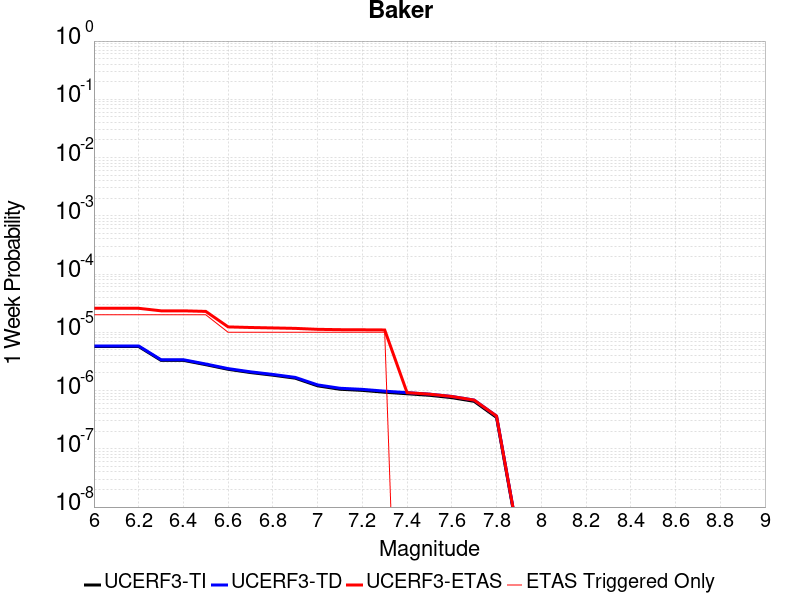 |  |  |  |

| Magnitude | 1 wk TI Prob | 1 wk TD Prob | 1 wk ETAS Prob | 1 wk ETAS/TD Gain | 1 wk ETAS Triggered Only | 1 mo TI Prob | 1 mo TD Prob | 1 mo ETAS Prob | 1 mo ETAS/TD Gain | 1 mo ETAS Triggered Only | 1 yr TI Prob | 1 yr TD Prob | 1 yr ETAS Prob | 1 yr ETAS/TD Gain | 1 yr ETAS Triggered Only | 10 yr TI Prob | 10 yr TD Prob | 10 yr ETAS Prob | 10 yr ETAS/TD Gain | 10 yr ETAS Triggered Only |
|-----|-----|-----|-----|-----|-----|-----|-----|-----|-----|-----|-----|-----|-----|-----|-----|-----|-----|-----|-----|-----|
| 6.0 | 5.695525E-6 | 5.834856E-6 | 5.834856E-6 | 1.0 | 0.0 | 2.4409164E-5 | 2.500631E-5 | 2.500631E-5 | 1.0 | 0.0 | 2.9714106E-4 | 3.044133E-4 | 3.3107185E-4 | 1.0875735 | 2.6666667E-5 | 0.0029674405 | 0.0030403587 | 0.0031732866 | 1.0437212 | 1.3333333E-4 |
| 6.1 | 5.695525E-6 | 5.834856E-6 | 5.834856E-6 | 1.0 | 0.0 | 2.4409164E-5 | 2.500631E-5 | 2.500631E-5 | 1.0 | 0.0 | 2.9714106E-4 | 3.044133E-4 | 3.3107185E-4 | 1.0875735 | 2.6666667E-5 | 0.0029674405 | 0.0030403587 | 0.0031732866 | 1.0437212 | 1.3333333E-4 |
| 6.2 | 5.695525E-6 | 5.834856E-6 | 5.834856E-6 | 1.0 | 0.0 | 2.4409164E-5 | 2.500631E-5 | 2.500631E-5 | 1.0 | 0.0 | 2.9714106E-4 | 3.044133E-4 | 3.3107185E-4 | 1.0875735 | 2.6666667E-5 | 0.0029674405 | 0.0030403587 | 0.0031732866 | 1.0437212 | 1.3333333E-4 |
| 6.3 | 3.2995713E-6 | 3.3836786E-6 | 3.3836786E-6 | 1.0 | 0.0 | 1.4140943E-5 | 1.4501402E-5 | 1.4501402E-5 | 1.0 | 0.0 | 1.7215237E-4 | 1.7654074E-4 | 2.032027E-4 | 1.1510243 | 2.6666667E-5 | 0.0017201907 | 0.0017640521 | 0.0018172913 | 1.0301801 | 5.3333333E-5 |
| 6.4 | 3.2995713E-6 | 3.3836786E-6 | 3.3836786E-6 | 1.0 | 0.0 | 1.4140943E-5 | 1.4501402E-5 | 1.4501402E-5 | 1.0 | 0.0 | 1.7215237E-4 | 1.7654074E-4 | 2.032027E-4 | 1.1510243 | 2.6666667E-5 | 0.0017201907 | 0.0017640521 | 0.0018172913 | 1.0301801 | 5.3333333E-5 |
| 6.5 | 2.782202E-6 | 2.8558507E-6 | 2.8558507E-6 | 1.0 | 0.0 | 1.1923668E-5 | 1.2239304E-5 | 1.2239304E-5 | 1.0 | 0.0 | 1.4516099E-4 | 1.4900367E-4 | 1.4900367E-4 | 1.0 | 0.0 | 0.001450662 | 0.0014890704 | 0.0015156973 | 1.0178816 | 2.6666667E-5 |
| 6.6 | 2.3163404E-6 | 2.380929E-6 | 2.380929E-6 | 1.0 | 0.0 | 9.927136E-6 | 1.0203942E-5 | 1.0203942E-5 | 1.0 | 0.0 | 1.20856166E-4 | 1.2422612E-4 | 1.2422612E-4 | 1.0 | 0.0 | 0.0012079047 | 0.001241587 | 0.0012682205 | 1.0214512 | 2.6666667E-5 |
| 6.7 | 2.037056E-6 | 2.0965088E-6 | 2.0965088E-6 | 1.0 | 0.0 | 8.7302105E-6 | 8.985007E-6 | 8.985007E-6 | 1.0 | 0.0 | 1.0628513E-4 | 1.0938713E-4 | 1.0938713E-4 | 1.0 | 0.0 | 0.0010623431 | 0.0010933491 | 0.0010933491 | 1.0 | 0.0 |
| 6.8 | 1.8356744E-6 | 1.8915364E-6 | 1.8915364E-6 | 1.0 | 0.0 | 7.867153E-6 | 8.10656E-6 | 8.10656E-6 | 1.0 | 0.0 | 9.577837E-5 | 9.869304E-5 | 9.869304E-5 | 1.0 | 0.0 | 9.57371E-4 | 9.865061E-4 | 9.865061E-4 | 1.0 | 0.0 |
| 6.9 | 1.6310546E-6 | 1.6832144E-6 | 1.6832144E-6 | 1.0 | 0.0 | 6.9902153E-6 | 7.213757E-6 | 7.213757E-6 | 1.0 | 0.0 | 8.510255E-5 | 8.782406E-5 | 8.782406E-5 | 1.0 | 0.0 | 8.5069967E-4 | 8.779048E-4 | 8.779048E-4 | 1.0 | 0.0 |
| 7.0 | 1.2058036E-6 | 1.2508729E-6 | 1.2508729E-6 | 1.0 | 0.0 | 5.1677193E-6 | 5.3608724E-6 | 5.3608724E-6 | 1.0 | 0.0 | 6.291517E-5 | 6.526669E-5 | 6.526669E-5 | 1.0 | 0.0 | 6.289736E-4 | 6.5247755E-4 | 6.5247755E-4 | 1.0 | 0.0 |
| 7.1 | 1.052382E-6 | 1.0951668E-6 | 1.0951668E-6 | 1.0 | 0.0 | 4.5102006E-6 | 4.693564E-6 | 4.693564E-6 | 1.0 | 0.0 | 5.491031E-5 | 5.7142646E-5 | 5.7142646E-5 | 1.0 | 0.0 | 5.4896745E-4 | 5.712804E-4 | 5.712804E-4 | 1.0 | 0.0 |
| 7.2 | 1.0067454E-6 | 1.0487769E-6 | 1.0487769E-6 | 1.0 | 0.0 | 4.3146156E-6 | 4.4947506E-6 | 4.4947506E-6 | 1.0 | 0.0 | 5.252918E-5 | 5.4722223E-5 | 5.4722223E-5 | 1.0 | 0.0 | 5.251676E-4 | 5.4708833E-4 | 5.4708833E-4 | 1.0 | 0.0 |
| 7.3 | 9.3596316E-7 | 9.76778E-7 | 9.76778E-7 | 1.0 | 0.0 | 4.0112645E-6 | 4.186185E-6 | 4.186185E-6 | 1.0 | 0.0 | 4.8836053E-5 | 5.0965617E-5 | 5.0965617E-5 | 1.0 | 0.0 | 4.8825322E-4 | 5.095401E-4 | 5.095401E-4 | 1.0 | 0.0 |
| 7.4 | 8.8117395E-7 | 9.2077187E-7 | 9.2077187E-7 | 1.0 | 0.0 | 3.7764542E-6 | 3.9461593E-6 | 3.9461593E-6 | 1.0 | 0.0 | 4.5977362E-5 | 4.8043436E-5 | 4.8043436E-5 | 1.0 | 0.0 | 4.596785E-4 | 4.8033125E-4 | 4.8033125E-4 | 1.0 | 0.0 |
| 7.5 | 8.292386E-7 | 8.674649E-7 | 8.674649E-7 | 1.0 | 0.0 | 3.5538749E-6 | 3.7177015E-6 | 3.7177015E-6 | 1.0 | 0.0 | 4.326757E-5 | 4.5262084E-5 | 4.5262084E-5 | 1.0 | 0.0 | 4.3259145E-4 | 4.5252938E-4 | 4.5252938E-4 | 1.0 | 0.0 |
| 7.6 | 7.553842E-7 | 7.9145207E-7 | 7.9145207E-7 | 1.0 | 0.0 | 3.2373566E-6 | 3.3919332E-6 | 3.3919332E-6 | 1.0 | 0.0 | 3.9414106E-5 | 4.129601E-5 | 4.129601E-5 | 1.0 | 0.0 | 3.9407116E-4 | 4.1288408E-4 | 4.1288408E-4 | 1.0 | 0.0 |
| 7.7 | 6.5285366E-7 | 6.852842E-7 | 6.852842E-7 | 1.0 | 0.0 | 2.797941E-6 | 2.9369291E-6 | 2.9369291E-6 | 1.0 | 0.0 | 3.40644E-5 | 3.5756533E-5 | 3.5756533E-5 | 1.0 | 0.0 | 3.405918E-4 | 3.5750846E-4 | 3.5750846E-4 | 1.0 | 0.0 |
| 7.8 | 3.4586725E-7 | 3.648288E-7 | 3.648288E-7 | 1.0 | 0.0 | 1.4822873E-6 | 1.5635511E-6 | 1.5635511E-6 | 1.0 | 0.0 | 1.80467E-5 | 1.9036073E-5 | 1.9036073E-5 | 1.0 | 0.0 | 1.8045233E-4 | 1.9034486E-4 | 1.9034486E-4 | 1.0 | 0.0 |
| 7.9 | 2.5591178E-9 | 2.6696871E-9 | 2.6696871E-9 | 1.0 | 0.0 | 1.0967647E-8 | 1.1441516E-8 | 1.1441516E-8 | 1.0 | 0.0 | 1.335311E-7 | 1.3930045E-7 | 1.3930045E-7 | 1.0 | 0.0 | 1.3353102E-6 | 1.3930046E-6 | 1.3930046E-6 | 1.0 | 0.0 |

## Cleghorn Lake
*[(top)](#table-of-contents)*

| 1 Week | 1 Month | 1 Year | 10 Year |
|-----|-----|-----|-----|
|  |  |  |  |

| Magnitude | 1 wk TI Prob | 1 wk TD Prob | 1 wk ETAS Prob | 1 wk ETAS/TD Gain | 1 wk ETAS Triggered Only | 1 mo TI Prob | 1 mo TD Prob | 1 mo ETAS Prob | 1 mo ETAS/TD Gain | 1 mo ETAS Triggered Only | 1 yr TI Prob | 1 yr TD Prob | 1 yr ETAS Prob | 1 yr ETAS/TD Gain | 1 yr ETAS Triggered Only | 10 yr TI Prob | 10 yr TD Prob | 10 yr ETAS Prob | 10 yr ETAS/TD Gain | 10 yr ETAS Triggered Only |
|-----|-----|-----|-----|-----|-----|-----|-----|-----|-----|-----|-----|-----|-----|-----|-----|-----|-----|-----|-----|-----|
| 6.0 | 1.5467183E-5 | 1.6794396E-5 | 1.6794396E-5 | 1.0 | 0.0 | 6.6286244E-5 | 7.1974304E-5 | 7.1974304E-5 | 1.0 | 0.0 | 8.067362E-4 | 8.7598973E-4 | 9.2927634E-4 | 1.0608302 | 5.3333333E-5 | 0.008038137 | 0.008730795 | 0.008862964 | 1.0151383 | 1.3333333E-4 |
| 6.1 | 1.5467183E-5 | 1.6794396E-5 | 1.6794396E-5 | 1.0 | 0.0 | 6.6286244E-5 | 7.1974304E-5 | 7.1974304E-5 | 1.0 | 0.0 | 8.067362E-4 | 8.7598973E-4 | 9.2927634E-4 | 1.0608302 | 5.3333333E-5 | 0.008038137 | 0.008730795 | 0.008862964 | 1.0151383 | 1.3333333E-4 |
| 6.2 | 1.2624631E-5 | 1.3681697E-5 | 1.3681697E-5 | 1.0 | 0.0 | 5.410444E-5 | 5.86348E-5 | 5.86348E-5 | 1.0 | 0.0 | 6.585225E-4 | 7.1369356E-4 | 7.403412E-4 | 1.0373377 | 2.6666667E-5 | 0.0065657445 | 0.007118811 | 0.007224718 | 1.0148771 | 1.0666667E-4 |
| 6.3 | 1.2624631E-5 | 1.3681697E-5 | 1.3681697E-5 | 1.0 | 0.0 | 5.410444E-5 | 5.86348E-5 | 5.86348E-5 | 1.0 | 0.0 | 6.585225E-4 | 7.1369356E-4 | 7.403412E-4 | 1.0373377 | 2.6666667E-5 | 0.0065657445 | 0.007118811 | 0.007224718 | 1.0148771 | 1.0666667E-4 |
| 6.4 | 9.417684E-6 | 1.0170226E-5 | 1.0170226E-5 | 1.0 | 0.0 | 4.036088E-5 | 4.3586184E-5 | 4.3586184E-5 | 1.0 | 0.0 | 4.912829E-4 | 5.305737E-4 | 5.572262E-4 | 1.0502334 | 2.6666667E-5 | 0.004901982 | 0.0052971053 | 0.0053766817 | 1.0150226 | 8.0E-5 |
| 6.5 | 9.368219E-6 | 1.0117652E-5 | 1.0117652E-5 | 1.0 | 0.0 | 4.014889E-5 | 4.3360877E-5 | 4.3360877E-5 | 1.0 | 0.0 | 4.8870314E-4 | 5.278319E-4 | 5.544845E-4 | 1.0504944 | 2.6666667E-5 | 0.004876298 | 0.0052698175 | 0.005349396 | 1.0151008 | 8.0E-5 |
| 6.6 | 7.803798E-6 | 8.441923E-6 | 8.441923E-6 | 1.0 | 0.0 | 3.3444423E-5 | 3.6179394E-5 | 3.6179394E-5 | 1.0 | 0.0 | 4.0710976E-4 | 4.40435E-4 | 4.6708994E-4 | 1.0605196 | 2.6666667E-5 | 0.0040636472 | 0.004399538 | 0.004479186 | 1.0181037 | 8.0E-5 |
| 6.7 | 2.3108669E-6 | 2.4438523E-6 | 2.4438523E-6 | 1.0 | 0.0 | 9.903678E-6 | 1.0473612E-5 | 1.0473612E-5 | 1.0 | 0.0 | 1.205706E-4 | 1.2750895E-4 | 1.2750895E-4 | 1.0 | 0.0 | 0.001205052 | 0.0012743765 | 0.0012743765 | 1.0 | 0.0 |
| 6.8 | 2.0882828E-6 | 2.2062986E-6 | 2.2062986E-6 | 1.0 | 0.0 | 8.949753E-6 | 9.455533E-6 | 9.455533E-6 | 1.0 | 0.0 | 1.08957785E-4 | 1.15115196E-4 | 1.15115196E-4 | 1.0 | 0.0 | 0.0010890438 | 0.0011505726 | 0.0011505726 | 1.0 | 0.0 |
| 6.9 | 1.876935E-6 | 1.9810657E-6 | 1.9810657E-6 | 1.0 | 0.0 | 8.043982E-6 | 8.490254E-6 | 8.490254E-6 | 1.0 | 0.0 | 9.7931086E-5 | 1.033641E-4 | 1.033641E-4 | 1.0 | 0.0 | 9.788794E-4 | 0.0010331762 | 0.0010331762 | 1.0 | 0.0 |
| 7.0 | 1.5357559E-6 | 1.6202926E-6 | 1.6202926E-6 | 1.0 | 0.0 | 6.5817944E-6 | 6.944093E-6 | 6.944093E-6 | 1.0 | 0.0 | 8.01304E-5 | 8.454118E-5 | 8.454118E-5 | 1.0 | 0.0 | 8.010151E-4 | 8.4510265E-4 | 8.4510265E-4 | 1.0 | 0.0 |
| 7.1 | 1.0905424E-6 | 1.1497702E-6 | 1.1497702E-6 | 1.0 | 0.0 | 4.6737446E-6 | 4.927578E-6 | 4.927578E-6 | 1.0 | 0.0 | 5.6901354E-5 | 5.999171E-5 | 5.999171E-5 | 1.0 | 0.0 | 5.6886784E-4 | 5.997649E-4 | 5.997649E-4 | 1.0 | 0.0 |
| 7.2 | 6.06668E-7 | 6.387322E-7 | 6.387322E-7 | 1.0 | 0.0 | 2.600003E-6 | 2.7374213E-6 | 2.7374213E-6 | 1.0 | 0.0 | 3.1654577E-5 | 3.3327666E-5 | 3.3327666E-5 | 1.0 | 0.0 | 3.1650066E-4 | 3.332335E-4 | 3.332335E-4 | 1.0 | 0.0 |

## Channel Islands Thrust
*[(top)](#table-of-contents)*

| 1 Week | 1 Month | 1 Year | 10 Year |
|-----|-----|-----|-----|
|  |  |  |  |

| Magnitude | 1 wk TI Prob | 1 wk TD Prob | 1 wk ETAS Prob | 1 wk ETAS/TD Gain | 1 wk ETAS Triggered Only | 1 mo TI Prob | 1 mo TD Prob | 1 mo ETAS Prob | 1 mo ETAS/TD Gain | 1 mo ETAS Triggered Only | 1 yr TI Prob | 1 yr TD Prob | 1 yr ETAS Prob | 1 yr ETAS/TD Gain | 1 yr ETAS Triggered Only | 10 yr TI Prob | 10 yr TD Prob | 10 yr ETAS Prob | 10 yr ETAS/TD Gain | 10 yr ETAS Triggered Only |
|-----|-----|-----|-----|-----|-----|-----|-----|-----|-----|-----|-----|-----|-----|-----|-----|-----|-----|-----|-----|-----|
| 6.0 | 2.2156251E-5 | 2.4092304E-5 | 2.4092304E-5 | 1.0 | 0.0 | 9.495191E-5 | 1.03249244E-4 | 1.03249244E-4 | 1.0 | 0.0 | 0.0011554264 | 0.0012564411 | 0.0012830743 | 1.0211973 | 2.6666667E-5 | 0.011494373 | 0.012503966 | 0.012609298 | 1.0084239 | 1.0666667E-4 |
| 6.1 | 2.2156251E-5 | 2.4092304E-5 | 2.4092304E-5 | 1.0 | 0.0 | 9.495191E-5 | 1.03249244E-4 | 1.03249244E-4 | 1.0 | 0.0 | 0.0011554264 | 0.0012564411 | 0.0012830743 | 1.0211973 | 2.6666667E-5 | 0.011494373 | 0.012503966 | 0.012609298 | 1.0084239 | 1.0666667E-4 |
| 6.2 | 2.2156251E-5 | 2.4092304E-5 | 2.4092304E-5 | 1.0 | 0.0 | 9.495191E-5 | 1.03249244E-4 | 1.03249244E-4 | 1.0 | 0.0 | 0.0011554264 | 0.0012564411 | 0.0012830743 | 1.0211973 | 2.6666667E-5 | 0.011494373 | 0.012503966 | 0.012609298 | 1.0084239 | 1.0666667E-4 |
| 6.3 | 2.2156251E-5 | 2.4092304E-5 | 2.4092304E-5 | 1.0 | 0.0 | 9.495191E-5 | 1.03249244E-4 | 1.03249244E-4 | 1.0 | 0.0 | 0.0011554264 | 0.0012564411 | 0.0012830743 | 1.0211973 | 2.6666667E-5 | 0.011494373 | 0.012503966 | 0.012609298 | 1.0084239 | 1.0666667E-4 |
| 6.4 | 2.2156251E-5 | 2.4092304E-5 | 2.4092304E-5 | 1.0 | 0.0 | 9.495191E-5 | 1.03249244E-4 | 1.03249244E-4 | 1.0 | 0.0 | 0.0011554264 | 0.0012564411 | 0.0012830743 | 1.0211973 | 2.6666667E-5 | 0.011494373 | 0.012503966 | 0.012609298 | 1.0084239 | 1.0666667E-4 |
| 6.5 | 2.2156251E-5 | 2.4092304E-5 | 2.4092304E-5 | 1.0 | 0.0 | 9.495191E-5 | 1.03249244E-4 | 1.03249244E-4 | 1.0 | 0.0 | 0.0011554264 | 0.0012564411 | 0.0012830743 | 1.0211973 | 2.6666667E-5 | 0.011494373 | 0.012503966 | 0.012609298 | 1.0084239 | 1.0666667E-4 |
| 6.6 | 2.2156251E-5 | 2.4092304E-5 | 2.4092304E-5 | 1.0 | 0.0 | 9.495191E-5 | 1.03249244E-4 | 1.03249244E-4 | 1.0 | 0.0 | 0.0011554264 | 0.0012564411 | 0.0012830743 | 1.0211973 | 2.6666667E-5 | 0.011494373 | 0.012503966 | 0.012609298 | 1.0084239 | 1.0666667E-4 |
| 6.7 | 1.0601296E-5 | 1.1379656E-5 | 1.1379656E-5 | 1.0 | 0.0 | 4.5433335E-5 | 4.876907E-5 | 4.876907E-5 | 1.0 | 0.0 | 5.5301044E-4 | 5.9360656E-4 | 5.9360656E-4 | 1.0 | 0.0 | 0.005516363 | 0.0059207114 | 0.00594722 | 1.0044773 | 2.6666667E-5 |
| 6.8 | 1.0246747E-5 | 1.0996777E-5 | 1.0996777E-5 | 1.0 | 0.0 | 4.391389E-5 | 4.712822E-5 | 4.712822E-5 | 1.0 | 0.0 | 5.345204E-4 | 5.736398E-4 | 5.736398E-4 | 1.0 | 0.0 | 0.0053323656 | 0.005722081 | 0.005748595 | 1.0046337 | 2.6666667E-5 |
| 6.9 | 9.049551E-6 | 9.699738E-6 | 9.699738E-6 | 1.0 | 0.0 | 3.878322E-5 | 4.1569667E-5 | 4.1569667E-5 | 1.0 | 0.0 | 4.7208337E-4 | 5.059973E-4 | 5.059973E-4 | 1.0 | 0.0 | 0.0047108172 | 0.005048869 | 0.005075401 | 1.0052551 | 2.6666667E-5 |
| 7.0 | 8.6542195E-6 | 9.274692E-6 | 9.274692E-6 | 1.0 | 0.0 | 3.7088983E-5 | 3.97481E-5 | 3.97481E-5 | 1.0 | 0.0 | 4.5146482E-4 | 4.8382973E-4 | 4.8382973E-4 | 1.0 | 0.0 | 0.004505487 | 0.0048281755 | 0.0048547136 | 1.0054965 | 2.6666667E-5 |
| 7.1 | 8.391028E-6 | 8.993012E-6 | 8.993012E-6 | 1.0 | 0.0 | 3.5961057E-5 | 3.8540933E-5 | 3.8540933E-5 | 1.0 | 0.0 | 4.3773788E-4 | 4.691389E-4 | 4.691389E-4 | 1.0 | 0.0 | 0.004368766 | 0.0046818955 | 0.0047084372 | 1.005669 | 2.6666667E-5 |
| 7.2 | 5.965188E-6 | 6.3717544E-6 | 6.3717544E-6 | 1.0 | 0.0 | 2.556484E-5 | 2.7307235E-5 | 2.7307235E-5 | 1.0 | 0.0 | 3.1120746E-4 | 3.3241542E-4 | 3.3241542E-4 | 1.0 | 0.0 | 0.00310772 | 0.00331924 | 0.00331924 | 1.0 | 0.0 |
| 7.3 | 4.877518E-6 | 5.2060545E-6 | 5.2060545E-6 | 1.0 | 0.0 | 2.0903482E-5 | 2.2311473E-5 | 2.2311473E-5 | 1.0 | 0.0 | 2.5447016E-4 | 2.7160876E-4 | 2.7160876E-4 | 1.0 | 0.0 | 0.0025417898 | 0.0027128144 | 0.0027128144 | 1.0 | 0.0 |
| 7.4 | 3.8829853E-6 | 4.1419007E-6 | 4.1419007E-6 | 1.0 | 0.0 | 1.664126E-5 | 1.7750885E-5 | 1.7750885E-5 | 1.0 | 0.0 | 2.0258849E-4 | 2.16096E-4 | 2.16096E-4 | 1.0 | 0.0 | 0.002024039 | 0.0021589005 | 0.0021589005 | 1.0 | 0.0 |
| 7.5 | 1.3489616E-6 | 1.4278027E-6 | 1.4278027E-6 | 1.0 | 0.0 | 5.7812517E-6 | 6.1191404E-6 | 6.1191404E-6 | 1.0 | 0.0 | 7.038446E-5 | 7.449803E-5 | 7.449803E-5 | 1.0 | 0.0 | 7.036218E-4 | 7.447345E-4 | 7.447345E-4 | 1.0 | 0.0 |
| 7.6 | 6.058192E-7 | 6.353832E-7 | 6.353832E-7 | 1.0 | 0.0 | 2.5963652E-6 | 2.723068E-6 | 2.723068E-6 | 1.0 | 0.0 | 3.161029E-5 | 3.3152864E-5 | 3.3152864E-5 | 1.0 | 0.0 | 3.1605794E-4 | 3.314808E-4 | 3.314808E-4 | 1.0 | 0.0 |
| 7.7 | 2.2170494E-7 | 2.260808E-7 | 2.260808E-7 | 1.0 | 0.0 | 9.5016367E-7 | 9.689174E-7 | 9.689174E-7 | 1.0 | 0.0 | 1.1568181E-5 | 1.1796516E-5 | 1.1796516E-5 | 1.0 | 0.0 | 1.1567579E-4 | 1.17960015E-4 | 1.17960015E-4 | 1.0 | 0.0 |
| 7.8 | 2.1613102E-8 | 1.5466789E-8 | 1.5466789E-8 | 1.0 | 0.0 | 9.262757E-8 | 6.628623E-8 | 6.628623E-8 | 1.0 | 0.0 | 1.1277401E-6 | 8.0703467E-7 | 8.0703467E-7 | 1.0 | 0.0 | 1.1277344E-5 | 8.070325E-6 | 8.070325E-6 | 1.0 | 0.0 |

## Blue Cut
*[(top)](#table-of-contents)*

| 1 Week | 1 Month | 1 Year | 10 Year |
|-----|-----|-----|-----|
| 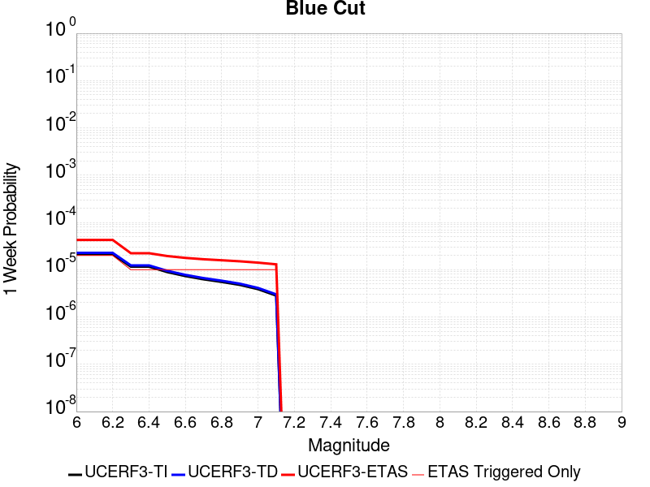 |  |  |  |

| Magnitude | 1 wk TI Prob | 1 wk TD Prob | 1 wk ETAS Prob | 1 wk ETAS/TD Gain | 1 wk ETAS Triggered Only | 1 mo TI Prob | 1 mo TD Prob | 1 mo ETAS Prob | 1 mo ETAS/TD Gain | 1 mo ETAS Triggered Only | 1 yr TI Prob | 1 yr TD Prob | 1 yr ETAS Prob | 1 yr ETAS/TD Gain | 1 yr ETAS Triggered Only | 10 yr TI Prob | 10 yr TD Prob | 10 yr ETAS Prob | 10 yr ETAS/TD Gain | 10 yr ETAS Triggered Only |
|-----|-----|-----|-----|-----|-----|-----|-----|-----|-----|-----|-----|-----|-----|-----|-----|-----|-----|-----|-----|-----|
| 6.0 | 2.1227985E-5 | 2.2719787E-5 | 7.605191E-5 | 3.3473866 | 5.3333333E-5 | 9.097391E-5 | 9.736721E-5 | 1.5069534E-4 | 1.5477012 | 5.3333333E-5 | 0.0011070445 | 0.0011848592 | 0.0012381293 | 1.0449591 | 5.3333333E-5 | 0.011015458 | 0.011791261 | 0.01189667 | 1.0089396 | 1.0666667E-4 |
| 6.1 | 2.1227985E-5 | 2.2719787E-5 | 7.605191E-5 | 3.3473866 | 5.3333333E-5 | 9.097391E-5 | 9.736721E-5 | 1.5069534E-4 | 1.5477012 | 5.3333333E-5 | 0.0011070445 | 0.0011848592 | 0.0012381293 | 1.0449591 | 5.3333333E-5 | 0.011015458 | 0.011791261 | 0.01189667 | 1.0089396 | 1.0666667E-4 |
| 6.2 | 2.1227985E-5 | 2.2719787E-5 | 7.605191E-5 | 3.3473866 | 5.3333333E-5 | 9.097391E-5 | 9.736721E-5 | 1.5069534E-4 | 1.5477012 | 5.3333333E-5 | 0.0011070445 | 0.0011848592 | 0.0012381293 | 1.0449591 | 5.3333333E-5 | 0.011015458 | 0.011791261 | 0.01189667 | 1.0089396 | 1.0666667E-4 |
| 6.3 | 1.1613981E-5 | 1.23536465E-5 | 3.9019982E-5 | 3.1585803 | 2.6666667E-5 | 4.9773254E-5 | 5.2943193E-5 | 7.960845E-5 | 1.5036578 | 2.6666667E-5 | 6.0582085E-4 | 6.444052E-4 | 6.710547E-4 | 1.0413551 | 2.6666667E-5 | 0.0060417196 | 0.0064266133 | 0.0064531085 | 1.0041227 | 2.6666667E-5 |
| 6.4 | 1.1613981E-5 | 1.23536465E-5 | 3.9019982E-5 | 3.1585803 | 2.6666667E-5 | 4.9773254E-5 | 5.2943193E-5 | 7.960845E-5 | 1.5036578 | 2.6666667E-5 | 6.0582085E-4 | 6.444052E-4 | 6.710547E-4 | 1.0413551 | 2.6666667E-5 | 0.0060417196 | 0.0064266133 | 0.0064531085 | 1.0041227 | 2.6666667E-5 |
| 6.5 | 8.931326E-6 | 9.481677E-6 | 3.6148092E-5 | 3.8124154 | 2.6666667E-5 | 3.8276554E-5 | 4.063518E-5 | 6.730076E-5 | 1.6562191 | 2.6666667E-5 | 4.6591737E-4 | 4.9463013E-4 | 5.212836E-4 | 1.0538857 | 2.6666667E-5 | 0.0046494175 | 0.0049362015 | 0.0049627363 | 1.0053756 | 2.6666667E-5 |
| 6.6 | 7.345353E-6 | 7.790341E-6 | 3.44568E-5 | 4.423015 | 2.6666667E-5 | 3.1479703E-5 | 3.3386797E-5 | 6.0052575E-5 | 1.7986922 | 2.6666667E-5 | 3.83198E-4 | 4.0641645E-4 | 4.3307227E-4 | 1.0655875 | 2.6666667E-5 | 0.0038253788 | 0.0040575233 | 0.004084082 | 1.0065455 | 2.6666667E-5 |
| 6.7 | 6.2775666E-6 | 6.655202E-6 | 3.3321692E-5 | 5.006864 | 2.6666667E-5 | 2.690358E-5 | 2.8522025E-5 | 5.518793E-5 | 1.9349233 | 2.6666667E-5 | 3.2750185E-4 | 3.4720785E-4 | 3.7386524E-4 | 1.0767765 | 2.6666667E-5 | 0.0032701963 | 0.0034673947 | 0.0034939689 | 1.0076641 | 2.6666667E-5 |
| 6.8 | 5.5234095E-6 | 5.8551577E-6 | 3.2521668E-5 | 5.5543623 | 2.6666667E-5 | 2.367154E-5 | 2.5093334E-5 | 5.1759333E-5 | 2.0626726 | 2.6666667E-5 | 2.8816288E-4 | 3.0547578E-4 | 3.321343E-4 | 1.0872688 | 2.6666667E-5 | 0.002877895 | 0.003051275 | 0.0030778602 | 1.0087129 | 2.6666667E-5 |
| 6.9 | 4.7780054E-6 | 5.0654608E-6 | 3.1731994E-5 | 6.2643843 | 2.6666667E-5 | 2.0477004E-5 | 2.1708976E-5 | 4.8375066E-5 | 2.2283437 | 2.6666667E-5 | 2.4927902E-4 | 2.6428179E-4 | 2.9094142E-4 | 1.1008757 | 2.6666667E-5 | 0.0024899957 | 0.0026403673 | 0.0026669635 | 1.010073 | 2.6666667E-5 |
| 7.0 | 3.883171E-6 | 4.1185203E-6 | 3.078508E-5 | 7.474791 | 2.6666667E-5 | 1.6642054E-5 | 1.765072E-5 | 4.4316916E-5 | 2.510771 | 2.6666667E-5 | 2.0259817E-4 | 2.1488321E-4 | 2.4154416E-4 | 1.1240717 | 2.6666667E-5 | 0.0020241356 | 0.00214743 | 0.0021740394 | 1.0123913 | 2.6666667E-5 |
| 7.1 | 2.8358215E-6 | 3.0097403E-6 | 2.9676326E-5 | 9.860095 | 2.6666667E-5 | 1.2153464E-5 | 1.289886E-5 | 3.9565184E-5 | 3.0673394 | 2.6666667E-5 | 1.4795837E-4 | 1.5703888E-4 | 1.8370137E-4 | 1.1697826 | 2.6666667E-5 | 0.001478599 | 0.0015699244 | 0.0015965492 | 1.0169593 | 2.6666667E-5 |

## Great Valley 09 (Laguna Seca)
*[(top)](#table-of-contents)*

| 1 Week | 1 Month | 1 Year | 10 Year |
|-----|-----|-----|-----|
|  |  |  | 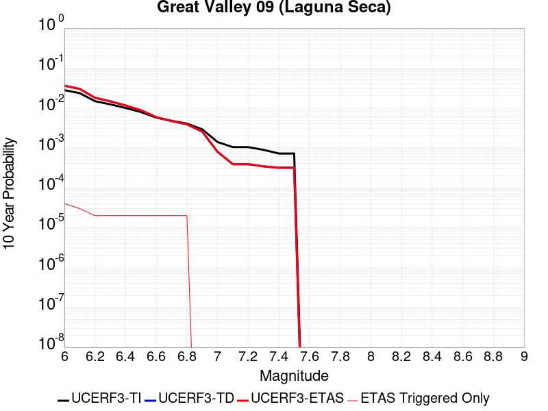 |

| Magnitude | 1 wk TI Prob | 1 wk TD Prob | 1 wk ETAS Prob | 1 wk ETAS/TD Gain | 1 wk ETAS Triggered Only | 1 mo TI Prob | 1 mo TD Prob | 1 mo ETAS Prob | 1 mo ETAS/TD Gain | 1 mo ETAS Triggered Only | 1 yr TI Prob | 1 yr TD Prob | 1 yr ETAS Prob | 1 yr ETAS/TD Gain | 1 yr ETAS Triggered Only | 10 yr TI Prob | 10 yr TD Prob | 10 yr ETAS Prob | 10 yr ETAS/TD Gain | 10 yr ETAS Triggered Only |
|-----|-----|-----|-----|-----|-----|-----|-----|-----|-----|-----|-----|-----|-----|-----|-----|-----|-----|-----|-----|-----|
| 6.0 | 5.4353277E-5 | 7.050538E-5 | 7.050538E-5 | 1.0 | 0.0 | 2.3292181E-4 | 3.0212724E-4 | 3.0212724E-4 | 1.0 | 0.0 | 0.0028321352 | 0.003672335 | 0.0037786101 | 1.0289394 | 1.0666667E-4 | 0.02796312 | 0.036116913 | 0.036219727 | 1.0028467 | 1.0666667E-4 |
| 6.1 | 4.5578287E-5 | 5.822371E-5 | 5.822371E-5 | 1.0 | 0.0 | 1.953209E-4 | 2.49502E-4 | 2.49502E-4 | 1.0 | 0.0 | 0.0023754383 | 0.0030335493 | 0.0031133066 | 1.0262917 | 8.0E-5 | 0.023502063 | 0.029920705 | 0.029998312 | 1.0025938 | 8.0E-5 |
| 6.2 | 2.8536782E-5 | 3.47386E-5 | 3.47386E-5 | 1.0 | 0.0 | 1.2229476E-4 | 1.488658E-4 | 1.488658E-4 | 1.0 | 0.0 | 0.0014879217 | 0.0018108767 | 0.0018641134 | 1.0293983 | 5.3333333E-5 | 0.014779986 | 0.017958745 | 0.018011121 | 1.0029165 | 5.3333333E-5 |
| 6.3 | 2.3698774E-5 | 2.8214314E-5 | 2.8214314E-5 | 1.0 | 0.0 | 1.01562226E-4 | 1.2090732E-4 | 1.2090732E-4 | 1.0 | 0.0 | 0.0012358186 | 0.0014710726 | 0.0015243273 | 1.0362014 | 5.3333333E-5 | 0.012289686 | 0.014611831 | 0.014664385 | 1.0035967 | 5.3333333E-5 |
| 6.4 | 1.9191197E-5 | 2.2123912E-5 | 2.2123912E-5 | 1.0 | 0.0 | 8.2245395E-5 | 9.480767E-5 | 9.480767E-5 | 1.0 | 0.0 | 0.0010008777 | 0.0011536786 | 0.0012069504 | 1.0461756 | 5.3333333E-5 | 0.009963818 | 0.011477305 | 0.011530026 | 1.0045935 | 5.3333333E-5 |
| 6.5 | 1.5203241E-5 | 1.680269E-5 | 1.680269E-5 | 1.0 | 0.0 | 6.5155116E-5 | 7.200383E-5 | 7.200383E-5 | 1.0 | 0.0 | 7.9297484E-4 | 8.7628904E-4 | 9.2957565E-4 | 1.0608094 | 5.3333333E-5 | 0.007901512 | 0.008729759 | 0.008782627 | 1.0060561 | 5.3333333E-5 |
| 6.6 | 1.0984925E-5 | 1.1242844E-5 | 1.1242844E-5 | 1.0 | 0.0 | 4.70774E-5 | 4.818275E-5 | 4.818275E-5 | 1.0 | 0.0 | 5.730166E-4 | 5.864695E-4 | 6.397715E-4 | 1.0908864 | 5.3333333E-5 | 0.005715413 | 0.0058496143 | 0.005902636 | 1.0090641 | 5.3333333E-5 |
| 6.7 | 9.134616E-6 | 9.020084E-6 | 9.020084E-6 | 1.0 | 0.0 | 3.9147766E-5 | 3.865694E-5 | 3.865694E-5 | 1.0 | 0.0 | 4.7651984E-4 | 4.7054898E-4 | 5.2385725E-4 | 1.1132895 | 5.3333333E-5 | 0.004754993 | 0.0046957717 | 0.0047488543 | 1.0113044 | 5.3333333E-5 |
| 6.8 | 7.785589E-6 | 7.4521E-6 | 7.4521E-6 | 1.0 | 0.0 | 3.3366385E-5 | 3.193719E-5 | 3.193719E-5 | 1.0 | 0.0 | 4.0616E-4 | 3.8876795E-4 | 4.4208055E-4 | 1.1371322 | 5.3333333E-5 | 0.0040541845 | 0.0038810824 | 0.003934209 | 1.0136886 | 5.3333333E-5 |
| 6.9 | 5.579095E-6 | 4.8985944E-6 | 4.8985944E-6 | 1.0 | 0.0 | 2.3910188E-5 | 2.0993815E-5 | 2.0993815E-5 | 1.0 | 0.0 | 2.9106764E-4 | 2.555711E-4 | 2.555711E-4 | 1.0 | 0.0 | 0.002906867 | 0.0025529093 | 0.0025529093 | 1.0 | 0.0 |
| 7.0 | 2.6816688E-6 | 1.5216407E-6 | 1.5216407E-6 | 1.0 | 0.0 | 1.1492816E-5 | 6.5213017E-6 | 6.5213017E-6 | 1.0 | 0.0 | 1.3991605E-4 | 7.939404E-5 | 7.939404E-5 | 1.0 | 0.0 | 0.0013982799 | 7.936655E-4 | 7.936655E-4 | 1.0 | 0.0 |
| 7.1 | 1.9951021E-6 | 7.4539724E-7 | 7.4539724E-7 | 1.0 | 0.0 | 8.55041E-6 | 3.194556E-6 | 3.194556E-6 | 1.0 | 0.0 | 1.0409627E-4 | 3.8893068E-5 | 3.8893068E-5 | 1.0 | 0.0 | 0.0010404752 | 3.8886676E-4 | 3.8886676E-4 | 1.0 | 0.0 |
| 7.2 | 1.9951021E-6 | 7.4539724E-7 | 7.4539724E-7 | 1.0 | 0.0 | 8.55041E-6 | 3.194556E-6 | 3.194556E-6 | 1.0 | 0.0 | 1.0409627E-4 | 3.8893068E-5 | 3.8893068E-5 | 1.0 | 0.0 | 0.0010404752 | 3.8886676E-4 | 3.8886676E-4 | 1.0 | 0.0 |
| 7.3 | 1.7087556E-6 | 6.579003E-7 | 6.579003E-7 | 1.0 | 0.0 | 7.3232177E-6 | 2.81957E-6 | 2.81957E-6 | 1.0 | 0.0 | 8.915652E-5 | 3.4327764E-5 | 3.4327764E-5 | 1.0 | 0.0 | 8.9120766E-4 | 3.4322866E-4 | 3.4322866E-4 | 1.0 | 0.0 |
| 7.4 | 1.3804846E-6 | 6.0739524E-7 | 6.0739524E-7 | 1.0 | 0.0 | 5.916349E-6 | 2.60312E-6 | 2.60312E-6 | 1.0 | 0.0 | 7.2029165E-5 | 3.1692565E-5 | 3.1692565E-5 | 1.0 | 0.0 | 7.200583E-4 | 3.1688449E-4 | 3.1688449E-4 | 1.0 | 0.0 |
| 7.5 | 1.3804846E-6 | 6.0739524E-7 | 6.0739524E-7 | 1.0 | 0.0 | 5.916349E-6 | 2.60312E-6 | 2.60312E-6 | 1.0 | 0.0 | 7.2029165E-5 | 3.1692565E-5 | 3.1692565E-5 | 1.0 | 0.0 | 7.200583E-4 | 3.1688449E-4 | 3.1688449E-4 | 1.0 | 0.0 |

## San Jacinto (San Bernardino)
*[(top)](#table-of-contents)*

| 1 Week | 1 Month | 1 Year | 10 Year |
|-----|-----|-----|-----|
|  |  |  |  |

| Magnitude | 1 wk TI Prob | 1 wk TD Prob | 1 wk ETAS Prob | 1 wk ETAS/TD Gain | 1 wk ETAS Triggered Only | 1 mo TI Prob | 1 mo TD Prob | 1 mo ETAS Prob | 1 mo ETAS/TD Gain | 1 mo ETAS Triggered Only | 1 yr TI Prob | 1 yr TD Prob | 1 yr ETAS Prob | 1 yr ETAS/TD Gain | 1 yr ETAS Triggered Only | 10 yr TI Prob | 10 yr TD Prob | 10 yr ETAS Prob | 10 yr ETAS/TD Gain | 10 yr ETAS Triggered Only |
|-----|-----|-----|-----|-----|-----|-----|-----|-----|-----|-----|-----|-----|-----|-----|-----|-----|-----|-----|-----|-----|
| 6.0 | 3.409352E-5 | 3.600249E-5 | 3.600249E-5 | 1.0 | 0.0 | 1.461069E-4 | 1.5428728E-4 | 1.8094982E-4 | 1.1728112 | 2.6666667E-5 | 0.0017774 | 0.001876831 | 0.0019300643 | 1.0283633 | 5.3333333E-5 | 0.01763251 | 0.019358097 | 0.0194627 | 1.0054035 | 1.0666667E-4 |
| 6.1 | 3.409352E-5 | 3.600249E-5 | 3.600249E-5 | 1.0 | 0.0 | 1.461069E-4 | 1.5428728E-4 | 1.8094982E-4 | 1.1728112 | 2.6666667E-5 | 0.0017774 | 0.001876831 | 0.0019300643 | 1.0283633 | 5.3333333E-5 | 0.01763251 | 0.019358097 | 0.0194627 | 1.0054035 | 1.0666667E-4 |
| 6.2 | 3.409352E-5 | 3.600249E-5 | 3.600249E-5 | 1.0 | 0.0 | 1.461069E-4 | 1.5428728E-4 | 1.8094982E-4 | 1.1728112 | 2.6666667E-5 | 0.0017774 | 0.001876831 | 0.0019300643 | 1.0283633 | 5.3333333E-5 | 0.01763251 | 0.019358097 | 0.0194627 | 1.0054035 | 1.0666667E-4 |
| 6.3 | 3.409352E-5 | 3.600249E-5 | 3.600249E-5 | 1.0 | 0.0 | 1.461069E-4 | 1.5428728E-4 | 1.8094982E-4 | 1.1728112 | 2.6666667E-5 | 0.0017774 | 0.001876831 | 0.0019300643 | 1.0283633 | 5.3333333E-5 | 0.01763251 | 0.019358097 | 0.0194627 | 1.0054035 | 1.0666667E-4 |
| 6.4 | 3.400795E-5 | 3.589515E-5 | 3.589515E-5 | 1.0 | 0.0 | 1.4574021E-4 | 1.5382729E-4 | 1.8048986E-4 | 1.1733279 | 2.6666667E-5 | 0.0017729428 | 0.0018712406 | 0.0019244741 | 1.0284482 | 5.3333333E-5 | 0.017588645 | 0.019303178 | 0.019407786 | 1.0054191 | 1.0666667E-4 |
| 6.5 | 3.341482E-5 | 3.5155765E-5 | 3.5155765E-5 | 1.0 | 0.0 | 1.4319851E-4 | 1.5065886E-4 | 1.7732152E-4 | 1.1769737 | 2.6666667E-5 | 0.0017420477 | 0.0018327299 | 0.0018859655 | 1.0290471 | 5.3333333E-5 | 0.017284546 | 0.018924711 | 0.019029358 | 1.0055298 | 1.0666667E-4 |
| 6.6 | 3.3364955E-5 | 3.509298E-5 | 3.509298E-5 | 1.0 | 0.0 | 1.4298483E-4 | 1.5038982E-4 | 1.7705248E-4 | 1.1772903 | 2.6666667E-5 | 0.0017394501 | 0.0018294598 | 0.0018826956 | 1.0290992 | 5.3333333E-5 | 0.017258976 | 0.018892575 | 0.018997226 | 1.0055393 | 1.0666667E-4 |
| 6.7 | 3.335922E-5 | 3.5082754E-5 | 3.5082754E-5 | 1.0 | 0.0 | 1.4296026E-4 | 1.5034601E-4 | 1.7700867E-4 | 1.1773419 | 2.6666667E-5 | 0.0017391514 | 0.0018289272 | 0.001882163 | 1.0291077 | 5.3333333E-5 | 0.017256035 | 0.018887365 | 0.018992018 | 1.0055408 | 1.0666667E-4 |
| 6.8 | 3.327683E-5 | 3.4976816E-5 | 3.4976816E-5 | 1.0 | 0.0 | 1.4260718E-4 | 1.4989203E-4 | 1.765547E-4 | 1.1778792 | 2.6666667E-5 | 0.0017348597 | 0.0018234095 | 0.0018766455 | 1.0291959 | 5.3333333E-5 | 0.017213784 | 0.018833136 | 0.018937794 | 1.0055571 | 1.0666667E-4 |
| 6.9 | 3.3235785E-5 | 3.4917768E-5 | 3.4917768E-5 | 1.0 | 0.0 | 1.4243131E-4 | 1.49639E-4 | 1.7630168E-4 | 1.17818 | 2.6666667E-5 | 0.0017327217 | 0.0018203339 | 0.0018735701 | 1.0292454 | 5.3333333E-5 | 0.017192734 | 0.018803004 | 0.018907664 | 1.0055662 | 1.0666667E-4 |
| 7.0 | 3.3197095E-5 | 3.4857694E-5 | 3.4857694E-5 | 1.0 | 0.0 | 1.422655E-4 | 1.4938158E-4 | 1.7604427E-4 | 1.1784871 | 2.6666667E-5 | 0.0017307063 | 0.001817205 | 0.0018704414 | 1.0292958 | 5.3333333E-5 | 0.017172894 | 0.01877238 | 0.018877044 | 1.0055754 | 1.0666667E-4 |
| 7.1 | 3.3129716E-5 | 3.47379E-5 | 3.47379E-5 | 1.0 | 0.0 | 1.4197677E-4 | 1.4886823E-4 | 1.7553092E-4 | 1.1791027 | 2.6666667E-5 | 0.0017271966 | 0.0018109654 | 0.0018642021 | 1.0293969 | 5.3333333E-5 | 0.017138338 | 0.018711457 | 0.018816128 | 1.0055939 | 1.0666667E-4 |
| 7.2 | 3.3034008E-5 | 3.4605342E-5 | 3.4605342E-5 | 1.0 | 0.0 | 1.4156665E-4 | 1.4830018E-4 | 1.749629E-4 | 1.1797888 | 2.6666667E-5 | 0.0017222111 | 0.001804061 | 0.0018572981 | 1.0295095 | 5.3333333E-5 | 0.017089253 | 0.018643849 | 0.018748526 | 1.0056146 | 1.0666667E-4 |
| 7.3 | 3.2956614E-5 | 3.447309E-5 | 3.447309E-5 | 1.0 | 0.0 | 1.4123498E-4 | 1.4773346E-4 | 1.7439619E-4 | 1.1804786 | 2.6666667E-5 | 0.0017181796 | 0.0017971725 | 0.0018504099 | 1.0296229 | 5.3333333E-5 | 0.017049557 | 0.018576592 | 0.018681277 | 1.0056354 | 1.0666667E-4 |
| 7.4 | 3.2915937E-5 | 3.439478E-5 | 3.439478E-5 | 1.0 | 0.0 | 1.4106068E-4 | 1.4739788E-4 | 1.7406061E-4 | 1.1808896 | 2.6666667E-5 | 0.0017160608 | 0.0017930934 | 0.001846331 | 1.0296904 | 5.3333333E-5 | 0.017028693 | 0.018536855 | 0.018641545 | 1.0056477 | 1.0666667E-4 |
| 7.5 | 3.281791E-5 | 3.4259683E-5 | 3.4259683E-5 | 1.0 | 0.0 | 1.406406E-4 | 1.4681896E-4 | 1.734817E-4 | 1.181603 | 2.6666667E-5 | 0.0017109542 | 0.0017860567 | 0.0018392947 | 1.0298076 | 5.3333333E-5 | 0.016978411 | 0.018467735 | 0.018572433 | 1.0056691 | 1.0666667E-4 |
| 7.6 | 3.2521442E-5 | 3.39846E-5 | 3.39846E-5 | 1.0 | 0.0 | 1.3937015E-4 | 1.4564018E-4 | 1.7230296E-4 | 1.183073 | 2.6666667E-5 | 0.0016955109 | 0.0017717284 | 0.0018249672 | 1.0300491 | 5.3333333E-5 | 0.016826328 | 0.01832535 | 0.018430062 | 1.005714 | 1.0666667E-4 |
| 7.7 | 3.0287873E-5 | 3.246845E-5 | 3.246845E-5 | 1.0 | 0.0 | 1.297987E-4 | 1.391431E-4 | 1.6580605E-4 | 1.1916226 | 2.6666667E-5 | 0.0015791537 | 0.001692752 | 0.001745995 | 1.0314535 | 5.3333333E-5 | 0.01567979 | 0.017536119 | 0.017640915 | 1.005976 | 1.0666667E-4 |
| 7.8 | 2.6316151E-5 | 2.9678711E-5 | 2.9678711E-5 | 1.0 | 0.0 | 1.1277862E-4 | 1.2718828E-4 | 1.5385156E-4 | 1.2096362 | 2.6666667E-5 | 0.0013722149 | 0.0015474184 | 0.0016006692 | 1.0344126 | 5.3333333E-5 | 0.013637724 | 0.016077382 | 0.016182335 | 1.0065279 | 1.0666667E-4 |
| 7.9 | 2.0761147E-5 | 2.3431265E-5 | 2.3431265E-5 | 1.0 | 0.0 | 8.897331E-5 | 1.0041584E-4 | 1.2707984E-4 | 1.2655357 | 2.6666667E-5 | 0.0010827117 | 0.0012218781 | 0.0012751463 | 1.0435953 | 5.3333333E-5 | 0.010774517 | 0.012799971 | 0.012878947 | 1.00617 | 8.0E-5 |
| 8.0 | 1.5738568E-5 | 1.6043394E-5 | 1.6043394E-5 | 1.0 | 0.0 | 6.744926E-5 | 6.8755595E-5 | 9.542043E-5 | 1.3878206 | 2.6666667E-5 | 8.2088535E-4 | 8.3677855E-4 | 8.9006725E-4 | 1.0636832 | 5.3333333E-5 | 0.008178596 | 0.008871087 | 0.008950378 | 1.0089381 | 8.0E-5 |
| 8.1 | 1.0105832E-5 | 8.336244E-6 | 8.336244E-6 | 1.0 | 0.0 | 4.3309992E-5 | 3.5726272E-5 | 3.5726272E-5 | 1.0 | 0.0 | 5.2717153E-4 | 4.3488108E-4 | 4.3488108E-4 | 1.0 | 0.0 | 0.005259227 | 0.00468032 | 0.00468032 | 1.0 | 0.0 |
| 8.2 | 4.189207E-6 | 1.5801045E-6 | 1.5801045E-6 | 1.0 | 0.0 | 1.7953622E-5 | 6.771859E-6 | 6.771859E-6 | 1.0 | 0.0 | 2.1856341E-4 | 8.244429E-5 | 8.244429E-5 | 1.0 | 0.0 | 0.0021834858 | 9.575395E-4 | 9.575395E-4 | 1.0 | 0.0 |
| 8.3 | 1.2758221E-6 | 3.6194777E-7 | 3.6194777E-7 | 1.0 | 0.0 | 5.4677976E-6 | 1.5512038E-6 | 1.5512038E-6 | 1.0 | 0.0 | 6.65684E-5 | 1.8885747E-5 | 1.8885747E-5 | 1.0 | 0.0 | 6.6548464E-4 | 2.2777634E-4 | 2.2777634E-4 | 1.0 | 0.0 |

## Manix-Afton Hills
*[(top)](#table-of-contents)*

| 1 Week | 1 Month | 1 Year | 10 Year |
|-----|-----|-----|-----|
|  |  |  |  |

| Magnitude | 1 wk TI Prob | 1 wk TD Prob | 1 wk ETAS Prob | 1 wk ETAS/TD Gain | 1 wk ETAS Triggered Only | 1 mo TI Prob | 1 mo TD Prob | 1 mo ETAS Prob | 1 mo ETAS/TD Gain | 1 mo ETAS Triggered Only | 1 yr TI Prob | 1 yr TD Prob | 1 yr ETAS Prob | 1 yr ETAS/TD Gain | 1 yr ETAS Triggered Only | 10 yr TI Prob | 10 yr TD Prob | 10 yr ETAS Prob | 10 yr ETAS/TD Gain | 10 yr ETAS Triggered Only |
|-----|-----|-----|-----|-----|-----|-----|-----|-----|-----|-----|-----|-----|-----|-----|-----|-----|-----|-----|-----|-----|
| 6.0 | 1.3783202E-5 | 1.4711221E-5 | 1.4711221E-5 | 1.0 | 0.0 | 5.906953E-5 | 6.304667E-5 | 6.304667E-5 | 1.0 | 0.0 | 7.189342E-4 | 7.673403E-4 | 8.2063273E-4 | 1.0694509 | 5.3333333E-5 | 0.0071661277 | 0.007648664 | 0.007754515 | 1.0138391 | 1.0666667E-4 |
| 6.1 | 1.3783202E-5 | 1.4711221E-5 | 1.4711221E-5 | 1.0 | 0.0 | 5.906953E-5 | 6.304667E-5 | 6.304667E-5 | 1.0 | 0.0 | 7.189342E-4 | 7.673403E-4 | 8.2063273E-4 | 1.0694509 | 5.3333333E-5 | 0.0071661277 | 0.007648664 | 0.007754515 | 1.0138391 | 1.0666667E-4 |
| 6.2 | 1.3783202E-5 | 1.4711221E-5 | 1.4711221E-5 | 1.0 | 0.0 | 5.906953E-5 | 6.304667E-5 | 6.304667E-5 | 1.0 | 0.0 | 7.189342E-4 | 7.673403E-4 | 8.2063273E-4 | 1.0694509 | 5.3333333E-5 | 0.0071661277 | 0.007648664 | 0.007754515 | 1.0138391 | 1.0666667E-4 |
| 6.3 | 1.10494875E-5 | 1.1793241E-5 | 1.1793241E-5 | 1.0 | 0.0 | 4.7354086E-5 | 5.054154E-5 | 5.054154E-5 | 1.0 | 0.0 | 5.763835E-4 | 6.151799E-4 | 6.684804E-4 | 1.0866421 | 5.3333333E-5 | 0.005748908 | 0.00613581 | 0.0062153195 | 1.0129582 | 8.0E-5 |
| 6.4 | 1.10494875E-5 | 1.1793241E-5 | 1.1793241E-5 | 1.0 | 0.0 | 4.7354086E-5 | 5.054154E-5 | 5.054154E-5 | 1.0 | 0.0 | 5.763835E-4 | 6.151799E-4 | 6.684804E-4 | 1.0866421 | 5.3333333E-5 | 0.005748908 | 0.00613581 | 0.0062153195 | 1.0129582 | 8.0E-5 |
| 6.5 | 9.788949E-6 | 1.0454414E-5 | 1.0454414E-5 | 1.0 | 0.0 | 4.1951964E-5 | 4.4803914E-5 | 4.4803914E-5 | 1.0 | 0.0 | 5.1064545E-4 | 5.4536044E-4 | 5.986647E-4 | 1.0977414 | 5.3333333E-5 | 0.0050947363 | 0.005441148 | 0.005520712 | 1.0146228 | 8.0E-5 |
| 6.6 | 8.810006E-6 | 9.413714E-6 | 9.413714E-6 | 1.0 | 0.0 | 3.775662E-5 | 4.0343915E-5 | 4.0343915E-5 | 1.0 | 0.0 | 4.5958988E-4 | 4.9108535E-4 | 5.177389E-4 | 1.0542748 | 2.6666667E-5 | 0.0045864056 | 0.004900884 | 0.0049539558 | 1.0108291 | 5.3333333E-5 |
| 6.7 | 8.80128E-6 | 9.404193E-6 | 9.404193E-6 | 1.0 | 0.0 | 3.7719226E-5 | 4.0303115E-5 | 4.0303115E-5 | 1.0 | 0.0 | 4.591348E-4 | 4.9058883E-4 | 5.172424E-4 | 1.0543298 | 2.6666667E-5 | 0.004581874 | 0.0048959404 | 0.004949013 | 1.01084 | 5.3333333E-5 |
| 6.8 | 6.8994877E-6 | 7.3801443E-6 | 7.3801443E-6 | 1.0 | 0.0 | 2.9568899E-5 | 3.1628853E-5 | 3.1628853E-5 | 1.0 | 0.0 | 3.5994186E-4 | 3.850214E-4 | 4.1167781E-4 | 1.0692335 | 2.6666667E-5 | 0.003593594 | 0.0038443485 | 0.0038974767 | 1.0138198 | 5.3333333E-5 |
| 6.9 | 4.9328037E-6 | 5.2710093E-6 | 5.2710093E-6 | 1.0 | 0.0 | 2.1140417E-5 | 2.258988E-5 | 2.258988E-5 | 1.0 | 0.0 | 2.5735417E-4 | 2.7500323E-4 | 3.0166257E-4 | 1.096942 | 2.6666667E-5 | 0.0025705635 | 0.0027472344 | 0.0028004213 | 1.0193602 | 5.3333333E-5 |
| 7.0 | 3.347973E-6 | 3.5900646E-6 | 3.5900646E-6 | 1.0 | 0.0 | 1.4348378E-5 | 1.5385924E-5 | 1.5385924E-5 | 1.0 | 0.0 | 1.746775E-4 | 1.8731161E-4 | 1.8731161E-4 | 1.0 | 0.0 | 0.0017454025 | 0.00187194 | 0.0018985567 | 1.0142188 | 2.6666667E-5 |
| 7.1 | 1.2073567E-6 | 1.2934943E-6 | 1.2934943E-6 | 1.0 | 0.0 | 5.1743755E-6 | 5.5435444E-6 | 5.5435444E-6 | 1.0 | 0.0 | 6.29962E-5 | 6.74922E-5 | 6.74922E-5 | 1.0 | 0.0 | 6.297835E-4 | 6.7487714E-4 | 6.7487714E-4 | 1.0 | 0.0 |

## Big Pine (Central)
*[(top)](#table-of-contents)*

| 1 Week | 1 Month | 1 Year | 10 Year |
|-----|-----|-----|-----|
|  |  |  |  |

| Magnitude | 1 wk TI Prob | 1 wk TD Prob | 1 wk ETAS Prob | 1 wk ETAS/TD Gain | 1 wk ETAS Triggered Only | 1 mo TI Prob | 1 mo TD Prob | 1 mo ETAS Prob | 1 mo ETAS/TD Gain | 1 mo ETAS Triggered Only | 1 yr TI Prob | 1 yr TD Prob | 1 yr ETAS Prob | 1 yr ETAS/TD Gain | 1 yr ETAS Triggered Only | 10 yr TI Prob | 10 yr TD Prob | 10 yr ETAS Prob | 10 yr ETAS/TD Gain | 10 yr ETAS Triggered Only |
|-----|-----|-----|-----|-----|-----|-----|-----|-----|-----|-----|-----|-----|-----|-----|-----|-----|-----|-----|-----|-----|
| 6.0 | 1.2706755E-5 | 1.4251012E-5 | 1.4251012E-5 | 1.0 | 0.0 | 5.4456385E-5 | 6.107454E-5 | 6.107454E-5 | 1.0 | 0.0 | 6.628048E-4 | 7.4336544E-4 | 7.966591E-4 | 1.0716925 | 5.3333333E-5 | 0.006608314 | 0.0074138143 | 0.0075196903 | 1.0142809 | 1.0666667E-4 |
| 6.1 | 8.342579E-6 | 9.511191E-6 | 9.511191E-6 | 1.0 | 0.0 | 3.5753423E-5 | 4.0761734E-5 | 4.0761734E-5 | 1.0 | 0.0 | 4.3521097E-4 | 4.961828E-4 | 4.961828E-4 | 1.0 | 0.0 | 0.0043435963 | 0.0049543027 | 0.004980837 | 1.0053558 | 2.6666667E-5 |
| 6.2 | 6.923899E-6 | 7.967559E-6 | 7.967559E-6 | 1.0 | 0.0 | 2.9673516E-5 | 3.4146342E-5 | 3.4146342E-5 | 1.0 | 0.0 | 3.6121515E-4 | 4.1567165E-4 | 4.1567165E-4 | 1.0 | 0.0 | 0.003606286 | 0.0041522477 | 0.0041788034 | 1.0063956 | 2.6666667E-5 |
| 6.3 | 2.728396E-6 | 3.4246525E-6 | 3.4246525E-6 | 1.0 | 0.0 | 1.1693074E-5 | 1.4677004E-5 | 1.4677004E-5 | 1.0 | 0.0 | 1.4235388E-4 | 1.7867875E-4 | 1.7867875E-4 | 1.0 | 0.0 | 0.0014226272 | 0.0017868559 | 0.0018134748 | 1.0148971 | 2.6666667E-5 |
| 6.4 | 2.7136944E-6 | 3.4089458E-6 | 3.4089458E-6 | 1.0 | 0.0 | 1.1630066E-5 | 1.4609691E-5 | 1.4609691E-5 | 1.0 | 0.0 | 1.4158686E-4 | 1.7785933E-4 | 1.7785933E-4 | 1.0 | 0.0 | 0.0014149669 | 0.0017786748 | 0.0018052941 | 1.0149658 | 2.6666667E-5 |
| 6.5 | 2.6971882E-6 | 3.3912906E-6 | 3.3912906E-6 | 1.0 | 0.0 | 1.1559327E-5 | 1.4534027E-5 | 1.4534027E-5 | 1.0 | 0.0 | 1.4072572E-4 | 1.7693828E-4 | 1.7693828E-4 | 1.0 | 0.0 | 0.0014063664 | 0.0017694789 | 0.0017960984 | 1.0150437 | 2.6666667E-5 |
| 6.6 | 2.669092E-6 | 3.361311E-6 | 3.361311E-6 | 1.0 | 0.0 | 1.1438916E-5 | 1.4405543E-5 | 1.4405543E-5 | 1.0 | 0.0 | 1.3925991E-4 | 1.7537424E-4 | 1.7537424E-4 | 1.0 | 0.0 | 0.0013917267 | 0.0017538633 | 0.0017804833 | 1.0151778 | 2.6666667E-5 |
| 6.7 | 2.6408059E-6 | 3.3313363E-6 | 3.3313363E-6 | 1.0 | 0.0 | 1.1317691E-5 | 1.4277082E-5 | 1.4277082E-5 | 1.0 | 0.0 | 1.3778417E-4 | 1.7381048E-4 | 1.7381048E-4 | 1.0 | 0.0 | 0.0013769877 | 0.0017382503 | 0.0017648706 | 1.0153145 | 2.6666667E-5 |
| 6.8 | 2.1786943E-6 | 2.8547915E-6 | 2.8547915E-6 | 1.0 | 0.0 | 9.337228E-6 | 1.2234768E-5 | 1.2234768E-5 | 1.0 | 0.0 | 1.1367482E-4 | 1.4894885E-4 | 1.4894885E-4 | 1.0 | 0.0 | 0.0011361669 | 0.0014899815 | 0.0015166084 | 1.0178707 | 2.6666667E-5 |
| 6.9 | 1.4411696E-6 | 2.0688422E-6 | 2.0688422E-6 | 1.0 | 0.0 | 6.1764263E-6 | 8.866437E-6 | 8.866437E-6 | 1.0 | 0.0 | 7.51954E-5 | 1.079438E-4 | 1.079438E-4 | 1.0 | 0.0 | 7.5169955E-4 | 0.0010803605 | 0.0011069983 | 1.0246564 | 2.6666667E-5 |
| 7.0 | 1.0073411E-6 | 1.5545673E-6 | 1.5545673E-6 | 1.0 | 0.0 | 4.317169E-6 | 6.662415E-6 | 6.662415E-6 | 1.0 | 0.0 | 5.2560266E-5 | 8.111204E-5 | 8.111204E-5 | 1.0 | 0.0 | 5.2547833E-4 | 8.1225985E-4 | 8.1225985E-4 | 1.0 | 0.0 |
| 7.1 | 8.947104E-7 | 1.4305514E-6 | 1.4305514E-6 | 1.0 | 0.0 | 3.834468E-6 | 6.130921E-6 | 6.130921E-6 | 1.0 | 0.0 | 4.6683643E-5 | 7.464155E-5 | 7.464155E-5 | 1.0 | 0.0 | 4.6673836E-4 | 7.476001E-4 | 7.476001E-4 | 1.0 | 0.0 |
| 7.2 | 5.215166E-7 | 1.0114496E-6 | 1.0114496E-6 | 1.0 | 0.0 | 2.2350691E-6 | 4.3347773E-6 | 4.3347773E-6 | 1.0 | 0.0 | 2.7211627E-5 | 5.2774678E-5 | 5.2774678E-5 | 1.0 | 0.0 | 2.7208295E-4 | 5.290466E-4 | 5.290466E-4 | 1.0 | 0.0 |
| 7.3 | 4.4024807E-7 | 9.2223235E-7 | 9.2223235E-7 | 1.0 | 0.0 | 1.8867761E-6 | 3.9524184E-6 | 3.9524184E-6 | 1.0 | 0.0 | 2.2971257E-5 | 4.8119677E-5 | 4.8119677E-5 | 1.0 | 0.0 | 2.2968883E-4 | 4.8251753E-4 | 4.8251753E-4 | 1.0 | 0.0 |
| 7.4 | 3.6130905E-7 | 8.3611724E-7 | 8.3611724E-7 | 1.0 | 0.0 | 1.5484665E-6 | 3.583355E-6 | 3.583355E-6 | 1.0 | 0.0 | 1.8852415E-5 | 4.362651E-5 | 4.362651E-5 | 1.0 | 0.0 | 1.8850817E-4 | 4.3759486E-4 | 4.3759486E-4 | 1.0 | 0.0 |
| 7.5 | 3.408184E-7 | 8.110739E-7 | 8.110739E-7 | 1.0 | 0.0 | 1.4606494E-6 | 3.4760267E-6 | 3.4760267E-6 | 1.0 | 0.0 | 1.7783263E-5 | 4.231984E-5 | 4.231984E-5 | 1.0 | 0.0 | 1.778184E-4 | 4.2451176E-4 | 4.2451176E-4 | 1.0 | 0.0 |
| 7.6 | 3.1428627E-7 | 7.7341E-7 | 7.7341E-7 | 1.0 | 0.0 | 1.3469405E-6 | 3.3146102E-6 | 3.3146102E-6 | 1.0 | 0.0 | 1.6398877E-5 | 4.0354673E-5 | 4.0354673E-5 | 1.0 | 0.0 | 1.6397667E-4 | 4.0483844E-4 | 4.0483844E-4 | 1.0 | 0.0 |
| 7.7 | 1.7972785E-7 | 5.0796626E-7 | 5.0796626E-7 | 1.0 | 0.0 | 7.70262E-7 | 2.1769965E-6 | 2.1769965E-6 | 1.0 | 0.0 | 9.377899E-6 | 2.6504622E-5 | 2.6504622E-5 | 1.0 | 0.0 | 9.377503E-5 | 2.663867E-4 | 2.663867E-4 | 1.0 | 0.0 |
| 7.8 | 4.9230927E-8 | 1.1985297E-7 | 1.1985297E-7 | 1.0 | 0.0 | 2.1098968E-7 | 5.136555E-7 | 5.136555E-7 | 1.0 | 0.0 | 2.5687964E-6 | 6.2537392E-6 | 6.2537392E-6 | 1.0 | 0.0 | 2.5687666E-5 | 6.2977226E-5 | 6.2977226E-5 | 1.0 | 0.0 |
| 7.9 | 3.6805972E-9 | 4.1070685E-9 | 4.1070685E-9 | 1.0 | 0.0 | 1.5773987E-8 | 1.7601723E-8 | 1.7601723E-8 | 1.0 | 0.0 | 1.9204828E-7 | 2.1430095E-7 | 2.1430095E-7 | 1.0 | 0.0 | 1.920481E-6 | 2.190991E-6 | 2.190991E-6 | 1.0 | 0.0 |

## White Mountains
*[(top)](#table-of-contents)*

| 1 Week | 1 Month | 1 Year | 10 Year |
|-----|-----|-----|-----|
|  |  |  |  |

| Magnitude | 1 wk TI Prob | 1 wk TD Prob | 1 wk ETAS Prob | 1 wk ETAS/TD Gain | 1 wk ETAS Triggered Only | 1 mo TI Prob | 1 mo TD Prob | 1 mo ETAS Prob | 1 mo ETAS/TD Gain | 1 mo ETAS Triggered Only | 1 yr TI Prob | 1 yr TD Prob | 1 yr ETAS Prob | 1 yr ETAS/TD Gain | 1 yr ETAS Triggered Only | 10 yr TI Prob | 10 yr TD Prob | 10 yr ETAS Prob | 10 yr ETAS/TD Gain | 10 yr ETAS Triggered Only |
|-----|-----|-----|-----|-----|-----|-----|-----|-----|-----|-----|-----|-----|-----|-----|-----|-----|-----|-----|-----|-----|
| 6.0 | 3.503579E-5 | 3.3784425E-5 | 3.3784425E-5 | 1.0 | 0.0 | 1.5014476E-4 | 1.4478304E-4 | 1.7144585E-4 | 1.184157 | 2.6666667E-5 | 0.0018264796 | 0.0017614291 | 0.0018146685 | 1.0302252 | 5.3333333E-5 | 0.018115403 | 0.017487012 | 0.017565612 | 1.0044948 | 8.0E-5 |
| 6.1 | 3.503579E-5 | 3.3784425E-5 | 3.3784425E-5 | 1.0 | 0.0 | 1.5014476E-4 | 1.4478304E-4 | 1.7144585E-4 | 1.184157 | 2.6666667E-5 | 0.0018264796 | 0.0017614291 | 0.0018146685 | 1.0302252 | 5.3333333E-5 | 0.018115403 | 0.017487012 | 0.017565612 | 1.0044948 | 8.0E-5 |
| 6.2 | 3.503579E-5 | 3.3784425E-5 | 3.3784425E-5 | 1.0 | 0.0 | 1.5014476E-4 | 1.4478304E-4 | 1.7144585E-4 | 1.184157 | 2.6666667E-5 | 0.0018264796 | 0.0017614291 | 0.0018146685 | 1.0302252 | 5.3333333E-5 | 0.018115403 | 0.017487012 | 0.017565612 | 1.0044948 | 8.0E-5 |
| 6.3 | 1.7818425E-5 | 1.5916237E-5 | 1.5916237E-5 | 1.0 | 0.0 | 7.636245E-5 | 6.821074E-5 | 9.487559E-5 | 1.3909186 | 2.6666667E-5 | 9.293162E-4 | 8.301636E-4 | 8.5680815E-4 | 1.0320956 | 2.6666667E-5 | 0.009254395 | 0.0082720835 | 0.008298529 | 1.0031971 | 2.6666667E-5 |
| 6.4 | 1.7818425E-5 | 1.5916237E-5 | 1.5916237E-5 | 1.0 | 0.0 | 7.636245E-5 | 6.821074E-5 | 9.487559E-5 | 1.3909186 | 2.6666667E-5 | 9.293162E-4 | 8.301636E-4 | 8.5680815E-4 | 1.0320956 | 2.6666667E-5 | 0.009254395 | 0.0082720835 | 0.008298529 | 1.0031971 | 2.6666667E-5 |
| 6.5 | 1.3397557E-5 | 1.1336382E-5 | 1.1336382E-5 | 1.0 | 0.0 | 5.741684E-5 | 4.8583628E-5 | 7.5249E-5 | 1.5488551 | 2.6666667E-5 | 6.988258E-4 | 5.913521E-4 | 6.18003E-4 | 1.0450678 | 2.6666667E-5 | 0.006966323 | 0.0058984905 | 0.005925 | 1.0044943 | 2.6666667E-5 |
| 6.6 | 1.0818695E-5 | 8.625452E-6 | 8.625452E-6 | 1.0 | 0.0 | 4.6365014E-5 | 3.6965725E-5 | 6.363141E-5 | 1.7213624 | 2.6666667E-5 | 5.6434784E-4 | 4.499691E-4 | 4.7662377E-4 | 1.0592366 | 2.6666667E-5 | 0.005629168 | 0.0044910167 | 0.0045175636 | 1.0059111 | 2.6666667E-5 |
| 6.7 | 9.067908E-6 | 6.8025106E-6 | 6.8025106E-6 | 1.0 | 0.0 | 3.8861883E-5 | 2.915331E-5 | 2.915331E-5 | 1.0 | 0.0 | 4.7304068E-4 | 3.5488693E-4 | 3.5488693E-4 | 1.0 | 0.0 | 0.00472035 | 0.0035435192 | 0.0035435192 | 1.0 | 0.0 |
| 6.8 | 7.295947E-6 | 4.9364417E-6 | 4.9364417E-6 | 1.0 | 0.0 | 3.126797E-5 | 2.1156015E-5 | 2.1156015E-5 | 1.0 | 0.0 | 3.8062103E-4 | 2.5754515E-4 | 2.5754515E-4 | 1.0 | 0.0 | 0.0037996976 | 0.0025725798 | 0.0025725798 | 1.0 | 0.0 |
| 6.9 | 6.2243444E-6 | 3.832255E-6 | 3.832255E-6 | 1.0 | 0.0 | 2.6675489E-5 | 1.6423848E-5 | 1.6423848E-5 | 1.0 | 0.0 | 3.2472567E-4 | 1.9994254E-4 | 1.9994254E-4 | 1.0 | 0.0 | 0.0032425157 | 0.0019976792 | 0.0019976792 | 1.0 | 0.0 |
| 7.0 | 4.9878413E-6 | 2.6795697E-6 | 2.6795697E-6 | 1.0 | 0.0 | 2.1376287E-5 | 1.1483821E-5 | 1.1483821E-5 | 1.0 | 0.0 | 2.602252E-4 | 1.3980681E-4 | 1.3980681E-4 | 1.0 | 0.0 | 0.002599207 | 0.0013972148 | 0.0013972148 | 1.0 | 0.0 |
| 7.1 | 4.0252844E-6 | 1.88579E-6 | 1.88579E-6 | 1.0 | 0.0 | 1.7251105E-5 | 8.081933E-6 | 8.081933E-6 | 1.0 | 0.0 | 2.1001195E-4 | 9.839322E-5 | 9.839322E-5 | 1.0 | 0.0 | 0.0020981359 | 9.835094E-4 | 9.835094E-4 | 1.0 | 0.0 |
| 7.2 | 3.3284066E-6 | 1.2819944E-6 | 1.2819944E-6 | 1.0 | 0.0 | 1.4264522E-5 | 5.4942507E-6 | 5.4942507E-6 | 1.0 | 0.0 | 1.736567E-4 | 6.689055E-5 | 6.689055E-5 | 1.0 | 0.0 | 0.0017352107 | 6.6871423E-4 | 6.6871423E-4 | 1.0 | 0.0 |
| 7.3 | 2.458226E-6 | 6.057493E-7 | 6.057493E-7 | 1.0 | 0.0 | 1.0535211E-5 | 2.596066E-6 | 2.596066E-6 | 1.0 | 0.0 | 1.2825865E-4 | 3.1606683E-5 | 3.1606683E-5 | 1.0 | 0.0 | 0.0012818464 | 3.1602563E-4 | 3.1602563E-4 | 1.0 | 0.0 |
| 7.4 | 1.965953E-6 | 3.1091668E-7 | 3.1091668E-7 | 1.0 | 0.0 | 8.425486E-6 | 1.3324994E-6 | 1.3324994E-6 | 1.0 | 0.0 | 1.0257547E-4 | 1.622306E-5 | 1.622306E-5 | 1.0 | 0.0 | 0.0010252813 | 1.6221889E-4 | 1.6221889E-4 | 1.0 | 0.0 |
| 7.5 | 1.2014192E-6 | 1.824589E-7 | 1.824589E-7 | 1.0 | 0.0 | 5.148929E-6 | 7.819665E-7 | 7.819665E-7 | 1.0 | 0.0 | 6.2686406E-5 | 9.520401E-6 | 9.520401E-6 | 1.0 | 0.0 | 6.266873E-4 | 9.520002E-5 | 9.520002E-5 | 1.0 | 0.0 |
| 7.6 | 2.5612175E-7 | 4.8950795E-8 | 4.8950795E-8 | 1.0 | 0.0 | 1.0976642E-6 | 2.097891E-7 | 2.097891E-7 | 1.0 | 0.0 | 1.3363979E-5 | 2.5541797E-6 | 2.5541797E-6 | 1.0 | 0.0 | 1.3363175E-4 | 2.554154E-5 | 2.554154E-5 | 1.0 | 0.0 |

## San Jacinto (Stepovers Combined)
*[(top)](#table-of-contents)*

| 1 Week | 1 Month | 1 Year | 10 Year |
|-----|-----|-----|-----|
|  |  |  |  |

| Magnitude | 1 wk TI Prob | 1 wk TD Prob | 1 wk ETAS Prob | 1 wk ETAS/TD Gain | 1 wk ETAS Triggered Only | 1 mo TI Prob | 1 mo TD Prob | 1 mo ETAS Prob | 1 mo ETAS/TD Gain | 1 mo ETAS Triggered Only | 1 yr TI Prob | 1 yr TD Prob | 1 yr ETAS Prob | 1 yr ETAS/TD Gain | 1 yr ETAS Triggered Only | 10 yr TI Prob | 10 yr TD Prob | 10 yr ETAS Prob | 10 yr ETAS/TD Gain | 10 yr ETAS Triggered Only |
|-----|-----|-----|-----|-----|-----|-----|-----|-----|-----|-----|-----|-----|-----|-----|-----|-----|-----|-----|-----|-----|
| 6.0 | 4.0667746E-5 | 3.5287198E-5 | 3.5287198E-5 | 1.0 | 0.0 | 1.742787E-4 | 1.5122209E-4 | 1.7788472E-4 | 1.1763145 | 2.6666667E-5 | 0.0021197782 | 0.0018395748 | 0.00189281 | 1.0289389 | 5.3333333E-5 | 0.020996714 | 0.018994363 | 0.019072844 | 1.0041318 | 8.0E-5 |
| 6.1 | 4.0667746E-5 | 3.5287198E-5 | 3.5287198E-5 | 1.0 | 0.0 | 1.742787E-4 | 1.5122209E-4 | 1.7788472E-4 | 1.1763145 | 2.6666667E-5 | 0.0021197782 | 0.0018395748 | 0.00189281 | 1.0289389 | 5.3333333E-5 | 0.020996714 | 0.018994363 | 0.019072844 | 1.0041318 | 8.0E-5 |
| 6.2 | 4.0667746E-5 | 3.5287198E-5 | 3.5287198E-5 | 1.0 | 0.0 | 1.742787E-4 | 1.5122209E-4 | 1.7788472E-4 | 1.1763145 | 2.6666667E-5 | 0.0021197782 | 0.0018395748 | 0.00189281 | 1.0289389 | 5.3333333E-5 | 0.020996714 | 0.018994363 | 0.019072844 | 1.0041318 | 8.0E-5 |
| 6.3 | 4.0667746E-5 | 3.5287198E-5 | 3.5287198E-5 | 1.0 | 0.0 | 1.742787E-4 | 1.5122209E-4 | 1.7788472E-4 | 1.1763145 | 2.6666667E-5 | 0.0021197782 | 0.0018395748 | 0.00189281 | 1.0289389 | 5.3333333E-5 | 0.020996714 | 0.018994363 | 0.019072844 | 1.0041318 | 8.0E-5 |
| 6.4 | 4.0577226E-5 | 3.515909E-5 | 3.515909E-5 | 1.0 | 0.0 | 1.738908E-4 | 1.5067312E-4 | 1.7733577E-4 | 1.1769569 | 2.6666667E-5 | 0.0021150648 | 0.0018329041 | 0.0018861396 | 1.0290444 | 5.3333333E-5 | 0.020950472 | 0.018928928 | 0.019007415 | 1.0041463 | 8.0E-5 |
| 6.5 | 4.0577226E-5 | 3.515909E-5 | 3.515909E-5 | 1.0 | 0.0 | 1.738908E-4 | 1.5067312E-4 | 1.7733577E-4 | 1.1769569 | 2.6666667E-5 | 0.0021150648 | 0.0018329041 | 0.0018861396 | 1.0290444 | 5.3333333E-5 | 0.020950472 | 0.018928928 | 0.019007415 | 1.0041463 | 8.0E-5 |
| 6.6 | 4.053861E-5 | 3.5104433E-5 | 3.5104433E-5 | 1.0 | 0.0 | 1.7372532E-4 | 1.5043891E-4 | 1.7710155E-4 | 1.1772325 | 2.6666667E-5 | 0.0021130538 | 0.0018300572 | 0.001883293 | 1.0290897 | 5.3333333E-5 | 0.020930743 | 0.018901005 | 0.018979494 | 1.0041525 | 8.0E-5 |
| 6.7 | 4.0516545E-5 | 3.50735E-5 | 3.50735E-5 | 1.0 | 0.0 | 1.7363077E-4 | 1.5030634E-4 | 1.76969E-4 | 1.1773888 | 2.6666667E-5 | 0.002111905 | 0.0018284466 | 0.0018816824 | 1.0291153 | 5.3333333E-5 | 0.020919468 | 0.018885203 | 0.01896369 | 1.0041561 | 8.0E-5 |
| 6.8 | 4.049434E-5 | 3.504506E-5 | 3.504506E-5 | 1.0 | 0.0 | 1.7353562E-4 | 1.5018447E-4 | 1.7684714E-4 | 1.1775328 | 2.6666667E-5 | 0.0021107488 | 0.0018269654 | 0.0018802013 | 1.0291389 | 5.3333333E-5 | 0.020908125 | 0.018870614 | 0.018949104 | 1.0041595 | 8.0E-5 |
| 6.9 | 4.046386E-5 | 3.500762E-5 | 3.500762E-5 | 1.0 | 0.0 | 1.73405E-4 | 1.5002403E-4 | 1.7668669E-4 | 1.1777227 | 2.6666667E-5 | 0.0021091616 | 0.0018250152 | 0.0018782512 | 1.0291702 | 5.3333333E-5 | 0.020892553 | 0.018851386 | 0.018929878 | 1.0041637 | 8.0E-5 |
| 7.0 | 4.036382E-5 | 3.4888177E-5 | 3.4888177E-5 | 1.0 | 0.0 | 1.7297632E-4 | 1.4951221E-4 | 1.7617489E-4 | 1.1783311 | 2.6666667E-5 | 0.0021039525 | 0.0018187946 | 0.0018720309 | 1.0292702 | 5.3333333E-5 | 0.02084144 | 0.018789997 | 0.018868495 | 1.0041776 | 8.0E-5 |
| 7.1 | 4.0343282E-5 | 3.486664E-5 | 3.486664E-5 | 1.0 | 0.0 | 1.7288832E-4 | 1.4941991E-4 | 1.760826E-4 | 1.1784413 | 2.6666667E-5 | 0.002102883 | 0.0018176727 | 0.0018709091 | 1.0292882 | 5.3333333E-5 | 0.020830948 | 0.018778874 | 0.018857373 | 1.0041801 | 8.0E-5 |
| 7.2 | 4.0257353E-5 | 3.4771132E-5 | 3.4771132E-5 | 1.0 | 0.0 | 1.725201E-4 | 1.4901065E-4 | 1.7567334E-4 | 1.1789315 | 2.6666667E-5 | 0.0020984085 | 0.0018126983 | 0.0018659349 | 1.0293688 | 5.3333333E-5 | 0.020787042 | 0.01872961 | 0.018808112 | 1.0041913 | 8.0E-5 |
| 7.3 | 3.9940667E-5 | 3.4598754E-5 | 3.4598754E-5 | 1.0 | 0.0 | 1.7116306E-4 | 1.4827197E-4 | 1.7493468E-4 | 1.179823 | 2.6666667E-5 | 0.0020819185 | 0.0018037198 | 0.0018569569 | 1.0295151 | 5.3333333E-5 | 0.020625217 | 0.018638225 | 0.018716734 | 1.0042123 | 8.0E-5 |
| 7.4 | 3.9721202E-5 | 3.4484117E-5 | 3.4484117E-5 | 1.0 | 0.0 | 1.7022261E-4 | 1.4778072E-4 | 1.7444346E-4 | 1.1804209 | 2.6666667E-5 | 0.0020704903 | 0.0017977487 | 0.0018509863 | 1.0296134 | 5.3333333E-5 | 0.020513052 | 0.018577335 | 0.018655848 | 1.0042263 | 8.0E-5 |
| 7.5 | 3.7036873E-5 | 3.355129E-5 | 3.355129E-5 | 1.0 | 0.0 | 1.5871979E-4 | 1.4378333E-4 | 1.7044616E-4 | 1.1854376 | 2.6666667E-5 | 0.0019307006 | 0.0017491594 | 0.0018023994 | 1.0304375 | 5.3333333E-5 | 0.019140124 | 0.018078765 | 0.018157318 | 1.004345 | 8.0E-5 |
| 7.6 | 3.2940967E-5 | 3.133173E-5 | 3.133173E-5 | 1.0 | 0.0 | 1.4116794E-4 | 1.3427193E-4 | 1.6093503E-4 | 1.1985753 | 2.6666667E-5 | 0.0017173645 | 0.0016335372 | 0.0016867835 | 1.0325956 | 5.3333333E-5 | 0.01704153 | 0.016911475 | 0.016990123 | 1.0046505 | 8.0E-5 |
| 7.7 | 2.8236149E-5 | 2.7897275E-5 | 2.7897275E-5 | 1.0 | 0.0 | 1.2100645E-4 | 1.1955428E-4 | 1.4621776E-4 | 1.223024 | 2.6666667E-5 | 0.0014722579 | 0.0014546025 | 0.0015078583 | 1.0366119 | 5.3333333E-5 | 0.014625421 | 0.015122045 | 0.015200836 | 1.0052103 | 8.0E-5 |
| 7.8 | 2.4329287E-5 | 2.5220394E-5 | 2.5220394E-5 | 1.0 | 0.0 | 1.042642E-4 | 1.0808293E-4 | 1.3474672E-4 | 1.2466974 | 2.6666667E-5 | 0.0012686774 | 0.0013151162 | 0.0013683793 | 1.0405008 | 5.3333333E-5 | 0.012614589 | 0.013719083 | 0.013797985 | 1.0057513 | 8.0E-5 |
| 7.9 | 1.9370926E-5 | 2.0433014E-5 | 2.0433014E-5 | 1.0 | 0.0 | 8.301561E-5 | 8.7567125E-5 | 1.1423145E-4 | 1.3045017 | 2.6666667E-5 | 0.0010102465 | 0.001065609 | 0.0011188856 | 1.0499963 | 5.3333333E-5 | 0.0100566605 | 0.011205519 | 0.011284622 | 1.0070593 | 8.0E-5 |
| 8.0 | 1.5583017E-5 | 1.5896165E-5 | 1.5896165E-5 | 1.0 | 0.0 | 6.6782646E-5 | 6.8124646E-5 | 9.4789495E-5 | 1.3914126 | 2.6666667E-5 | 8.127754E-4 | 8.2910265E-4 | 8.8239176E-4 | 1.0642732 | 5.3333333E-5 | 0.008098091 | 0.008786912 | 0.008866209 | 1.0090245 | 8.0E-5 |
| 8.1 | 1.0024873E-5 | 8.298104E-6 | 8.298104E-6 | 1.0 | 0.0 | 4.2963035E-5 | 3.556282E-5 | 3.556282E-5 | 1.0 | 0.0 | 5.229494E-4 | 4.3289183E-4 | 4.3289183E-4 | 1.0 | 0.0 | 0.0052172043 | 0.0046564727 | 0.0046564727 | 1.0 | 0.0 |
| 8.2 | 4.142796E-6 | 1.5626505E-6 | 1.5626505E-6 | 1.0 | 0.0 | 1.775472E-5 | 6.697056E-6 | 6.697056E-6 | 1.0 | 0.0 | 2.1614227E-4 | 8.153364E-5 | 8.153364E-5 | 1.0 | 0.0 | 0.0021593217 | 9.464045E-4 | 9.464045E-4 | 1.0 | 0.0 |
| 8.3 | 1.2750878E-6 | 3.6166134E-7 | 3.6166134E-7 | 1.0 | 0.0 | 5.4646503E-6 | 1.5499762E-6 | 1.5499762E-6 | 1.0 | 0.0 | 6.653009E-5 | 1.8870802E-5 | 1.8870802E-5 | 1.0 | 0.0 | 6.6510175E-4 | 2.2760578E-4 | 2.2760578E-4 | 1.0 | 0.0 |

## San Jacinto (Anza) rev
*[(top)](#table-of-contents)*

| 1 Week | 1 Month | 1 Year | 10 Year |
|-----|-----|-----|-----|
|  |  |  |  |

| Magnitude | 1 wk TI Prob | 1 wk TD Prob | 1 wk ETAS Prob | 1 wk ETAS/TD Gain | 1 wk ETAS Triggered Only | 1 mo TI Prob | 1 mo TD Prob | 1 mo ETAS Prob | 1 mo ETAS/TD Gain | 1 mo ETAS Triggered Only | 1 yr TI Prob | 1 yr TD Prob | 1 yr ETAS Prob | 1 yr ETAS/TD Gain | 1 yr ETAS Triggered Only | 10 yr TI Prob | 10 yr TD Prob | 10 yr ETAS Prob | 10 yr ETAS/TD Gain | 10 yr ETAS Triggered Only |
|-----|-----|-----|-----|-----|-----|-----|-----|-----|-----|-----|-----|-----|-----|-----|-----|-----|-----|-----|-----|-----|
| 6.0 | 6.3015636E-5 | 4.3319626E-5 | 4.3319626E-5 | 1.0 | 0.0 | 2.7003905E-4 | 1.8564239E-4 | 2.123041E-4 | 1.1436187 | 2.6666667E-5 | 0.0032827691 | 0.0022578652 | 0.0023110781 | 1.0235678 | 5.3333333E-5 | 0.032346968 | 0.02330496 | 0.023383096 | 1.0033528 | 8.0E-5 |
| 6.1 | 6.3015636E-5 | 4.3319626E-5 | 4.3319626E-5 | 1.0 | 0.0 | 2.7003905E-4 | 1.8564239E-4 | 2.123041E-4 | 1.1436187 | 2.6666667E-5 | 0.0032827691 | 0.0022578652 | 0.0023110781 | 1.0235678 | 5.3333333E-5 | 0.032346968 | 0.02330496 | 0.023383096 | 1.0033528 | 8.0E-5 |
| 6.2 | 6.3015636E-5 | 4.3319626E-5 | 4.3319626E-5 | 1.0 | 0.0 | 2.7003905E-4 | 1.8564239E-4 | 2.123041E-4 | 1.1436187 | 2.6666667E-5 | 0.0032827691 | 0.0022578652 | 0.0023110781 | 1.0235678 | 5.3333333E-5 | 0.032346968 | 0.02330496 | 0.023383096 | 1.0033528 | 8.0E-5 |
| 6.3 | 6.3015636E-5 | 4.3319626E-5 | 4.3319626E-5 | 1.0 | 0.0 | 2.7003905E-4 | 1.8564239E-4 | 2.123041E-4 | 1.1436187 | 2.6666667E-5 | 0.0032827691 | 0.0022578652 | 0.0023110781 | 1.0235678 | 5.3333333E-5 | 0.032346968 | 0.02330496 | 0.023383096 | 1.0033528 | 8.0E-5 |
| 6.4 | 6.3015636E-5 | 4.3319626E-5 | 4.3319626E-5 | 1.0 | 0.0 | 2.7003905E-4 | 1.8564239E-4 | 2.123041E-4 | 1.1436187 | 2.6666667E-5 | 0.0032827691 | 0.0022578652 | 0.0023110781 | 1.0235678 | 5.3333333E-5 | 0.032346968 | 0.02330496 | 0.023383096 | 1.0033528 | 8.0E-5 |
| 6.5 | 5.811017E-5 | 4.0098632E-5 | 4.0098632E-5 | 1.0 | 0.0 | 2.4901982E-4 | 1.7184E-4 | 1.9850208E-4 | 1.1551565 | 2.6666667E-5 | 0.0030276014 | 0.00209015 | 0.002143372 | 1.0254632 | 5.3333333E-5 | 0.02986684 | 0.021602087 | 0.021680359 | 1.0036234 | 8.0E-5 |
| 6.6 | 5.811017E-5 | 4.0098632E-5 | 4.0098632E-5 | 1.0 | 0.0 | 2.4901982E-4 | 1.7184E-4 | 1.9850208E-4 | 1.1551565 | 2.6666667E-5 | 0.0030276014 | 0.00209015 | 0.002143372 | 1.0254632 | 5.3333333E-5 | 0.02986684 | 0.021602087 | 0.021680359 | 1.0036234 | 8.0E-5 |
| 6.7 | 5.712442E-5 | 3.952116E-5 | 3.952116E-5 | 1.0 | 0.0 | 2.4479596E-4 | 1.6936543E-4 | 1.9602758E-4 | 1.1574239 | 2.6666667E-5 | 0.0029763177 | 0.0020600795 | 0.002113303 | 1.0258356 | 5.3333333E-5 | 0.029367693 | 0.021293823 | 0.021372119 | 1.003677 | 8.0E-5 |
| 6.8 | 5.6967532E-5 | 3.9377548E-5 | 3.9377548E-5 | 1.0 | 0.0 | 2.4412372E-4 | 1.6875003E-4 | 1.954122E-4 | 1.157998 | 2.6666667E-5 | 0.0029681553 | 0.0020526012 | 0.002105825 | 1.0259299 | 5.3333333E-5 | 0.029288229 | 0.021218529 | 0.02129683 | 1.0036902 | 8.0E-5 |
| 6.9 | 5.6211324E-5 | 3.9082228E-5 | 3.9082228E-5 | 1.0 | 0.0 | 2.4088343E-4 | 1.6748454E-4 | 1.9414675E-4 | 1.159192 | 2.6666667E-5 | 0.0029288116 | 0.0020372227 | 0.0020904473 | 1.0261261 | 5.3333333E-5 | 0.028905109 | 0.021057902 | 0.021136217 | 1.0037191 | 8.0E-5 |
| 7.0 | 5.4383527E-5 | 3.7942387E-5 | 3.7942387E-5 | 1.0 | 0.0 | 2.3305144E-4 | 1.6260012E-4 | 1.8926244E-4 | 1.1639749 | 2.6666667E-5 | 0.0028337094 | 0.001977864 | 0.0020310916 | 1.0269117 | 5.3333333E-5 | 0.027978465 | 0.020448677 | 0.02052704 | 1.0038322 | 8.0E-5 |
| 7.1 | 5.1393665E-5 | 3.640475E-5 | 3.640475E-5 | 1.0 | 0.0 | 2.2023996E-4 | 1.5601104E-4 | 1.8267354E-4 | 1.1709014 | 2.6666667E-5 | 0.0026781242 | 0.0018977838 | 0.0019510159 | 1.0280496 | 5.3333333E-5 | 0.026460782 | 0.019622007 | 0.019700438 | 1.0039971 | 8.0E-5 |
| 7.2 | 4.785222E-5 | 3.475601E-5 | 3.475601E-5 | 1.0 | 0.0 | 2.0506482E-4 | 1.4894584E-4 | 1.7560854E-4 | 1.1790093 | 2.6666667E-5 | 0.0024938055 | 0.0018119109 | 0.0018651475 | 1.0293815 | 5.3333333E-5 | 0.024660049 | 0.018736389 | 0.01881489 | 1.0041897 | 8.0E-5 |
| 7.3 | 4.2143256E-5 | 3.3850083E-5 | 3.3850083E-5 | 1.0 | 0.0 | 1.8060145E-4 | 1.4506375E-4 | 1.7172654E-4 | 1.1838006 | 2.6666667E-5 | 0.002196605 | 0.0017647238 | 0.001817963 | 1.0301685 | 5.3333333E-5 | 0.02175019 | 0.018244414 | 0.018322954 | 1.0043049 | 8.0E-5 |
| 7.4 | 4.0264713E-5 | 3.3488133E-5 | 3.3488133E-5 | 1.0 | 0.0 | 1.7255165E-4 | 1.435127E-4 | 1.7017554E-4 | 1.1857873 | 2.6666667E-5 | 0.002098792 | 0.0017458702 | 0.0017991104 | 1.0304949 | 5.3333333E-5 | 0.020790804 | 0.018048922 | 0.018127479 | 1.0043525 | 8.0E-5 |
| 7.5 | 3.694492E-5 | 3.2201835E-5 | 3.2201835E-5 | 1.0 | 0.0 | 1.5832575E-4 | 1.3800059E-4 | 1.6466358E-4 | 1.1932092 | 2.6666667E-5 | 0.0019259118 | 0.0016788654 | 0.0017321092 | 1.0317142 | 5.3333333E-5 | 0.01909306 | 0.017365217 | 0.017443828 | 1.0045269 | 8.0E-5 |
| 7.6 | 3.200565E-5 | 2.9517045E-5 | 2.9517045E-5 | 1.0 | 0.0 | 1.3715986E-4 | 1.2649549E-4 | 1.5315879E-4 | 1.2107846 | 2.6666667E-5 | 0.001668642 | 0.0015389969 | 0.0015922482 | 1.0346013 | 5.3333333E-5 | 0.01656168 | 0.015953032 | 0.016031757 | 1.0049347 | 8.0E-5 |
| 7.7 | 2.731642E-5 | 2.610537E-5 | 2.610537E-5 | 1.0 | 0.0 | 1.1706512E-4 | 1.11875364E-4 | 1.3853905E-4 | 1.2383338 | 2.6666667E-5 | 0.001424336 | 0.0013612325 | 0.0014144932 | 1.0391269 | 5.3333333E-5 | 0.014152412 | 0.0141735645 | 0.014252431 | 1.0055643 | 8.0E-5 |
| 7.8 | 2.3466424E-5 | 2.3516895E-5 | 2.3516895E-5 | 1.0 | 0.0 | 1.0056651E-4 | 1.007828E-4 | 1.2744678E-4 | 1.2645687 | 2.6666667E-5 | 0.0012237094 | 0.0012263408 | 0.0012796087 | 1.0434365 | 5.3333333E-5 | 0.012169928 | 0.012815201 | 0.012894175 | 1.0061626 | 8.0E-5 |
| 7.9 | 1.8611925E-5 | 1.8918972E-5 | 1.8918972E-5 | 1.0 | 0.0 | 7.9762955E-5 | 8.107879E-5 | 1.077433E-4 | 1.3288715 | 2.6666667E-5 | 9.7068126E-4 | 9.86688E-4 | 0.0010399687 | 1.0539995 | 5.3333333E-5 | 0.0096645225 | 0.010399517 | 0.010478685 | 1.0076127 | 8.0E-5 |
| 8.0 | 1.5460775E-5 | 1.5750582E-5 | 1.5750582E-5 | 1.0 | 0.0 | 6.6258784E-5 | 6.7500754E-5 | 9.416562E-5 | 1.3950306 | 2.6666667E-5 | 8.0640207E-4 | 8.215125E-4 | 8.74802E-4 | 1.0648676 | 5.3333333E-5 | 0.008034821 | 0.008707945 | 0.008787248 | 1.009107 | 8.0E-5 |
| 8.1 | 9.983884E-6 | 8.275629E-6 | 8.275629E-6 | 1.0 | 0.0 | 4.2787375E-5 | 3.54665E-5 | 3.54665E-5 | 1.0 | 0.0 | 5.2081177E-4 | 4.3171959E-4 | 4.3171959E-4 | 1.0 | 0.0 | 0.0051959283 | 0.004643071 | 0.004643071 | 1.0 | 0.0 |
| 8.2 | 4.1226E-6 | 1.5546157E-6 | 1.5546157E-6 | 1.0 | 0.0 | 1.7668166E-5 | 6.6626217E-6 | 6.6626217E-6 | 1.0 | 0.0 | 2.1508869E-4 | 8.111443E-5 | 8.111443E-5 | 1.0 | 0.0 | 0.0021488064 | 9.4143586E-4 | 9.4143586E-4 | 1.0 | 0.0 |
| 8.3 | 1.2750878E-6 | 3.6166134E-7 | 3.6166134E-7 | 1.0 | 0.0 | 5.4646503E-6 | 1.5499762E-6 | 1.5499762E-6 | 1.0 | 0.0 | 6.653009E-5 | 1.8870802E-5 | 1.8870802E-5 | 1.0 | 0.0 | 6.6510175E-4 | 2.2760578E-4 | 2.2760578E-4 | 1.0 | 0.0 |

## Santa Ynez (West)
*[(top)](#table-of-contents)*

| 1 Week | 1 Month | 1 Year | 10 Year |
|-----|-----|-----|-----|
|  |  |  |  |

| Magnitude | 1 wk TI Prob | 1 wk TD Prob | 1 wk ETAS Prob | 1 wk ETAS/TD Gain | 1 wk ETAS Triggered Only | 1 mo TI Prob | 1 mo TD Prob | 1 mo ETAS Prob | 1 mo ETAS/TD Gain | 1 mo ETAS Triggered Only | 1 yr TI Prob | 1 yr TD Prob | 1 yr ETAS Prob | 1 yr ETAS/TD Gain | 1 yr ETAS Triggered Only | 10 yr TI Prob | 10 yr TD Prob | 10 yr ETAS Prob | 10 yr ETAS/TD Gain | 10 yr ETAS Triggered Only |
|-----|-----|-----|-----|-----|-----|-----|-----|-----|-----|-----|-----|-----|-----|-----|-----|-----|-----|-----|-----|-----|
| 6.0 | 4.7352758E-5 | 5.497349E-5 | 5.497349E-5 | 1.0 | 0.0 | 2.0292461E-4 | 2.3558107E-4 | 2.3558107E-4 | 1.0 | 0.0 | 0.0024678076 | 0.0028645964 | 0.002917777 | 1.0185648 | 5.3333333E-5 | 0.024405818 | 0.028305095 | 0.02838283 | 1.0027463 | 8.0E-5 |
| 6.1 | 4.7352758E-5 | 5.497349E-5 | 5.497349E-5 | 1.0 | 0.0 | 2.0292461E-4 | 2.3558107E-4 | 2.3558107E-4 | 1.0 | 0.0 | 0.0024678076 | 0.0028645964 | 0.0028911866 | 1.0092824 | 2.6666667E-5 | 0.024405818 | 0.028305095 | 0.028331008 | 1.0009154 | 2.6666667E-5 |
| 6.2 | 3.0415853E-5 | 3.3925786E-5 | 3.3925786E-5 | 1.0 | 0.0 | 1.3034715E-4 | 1.4538833E-4 | 1.4538833E-4 | 1.0 | 0.0 | 0.0015858212 | 0.0017687011 | 0.0017953205 | 1.0150503 | 2.6666667E-5 | 0.015745522 | 0.01755015 | 0.01757635 | 1.0014927 | 2.6666667E-5 |
| 6.3 | 3.0415853E-5 | 3.3925786E-5 | 3.3925786E-5 | 1.0 | 0.0 | 1.3034715E-4 | 1.4538833E-4 | 1.4538833E-4 | 1.0 | 0.0 | 0.0015858212 | 0.0017687011 | 0.0017953205 | 1.0150503 | 2.6666667E-5 | 0.015745522 | 0.01755015 | 0.01757635 | 1.0014927 | 2.6666667E-5 |
| 6.4 | 2.5452082E-5 | 2.7912925E-5 | 2.7912925E-5 | 1.0 | 0.0 | 1.09075794E-4 | 1.1962145E-4 | 1.1962145E-4 | 1.0 | 0.0 | 0.0013271887 | 0.001455435 | 0.0014820627 | 1.0182954 | 2.6666667E-5 | 0.013192902 | 0.014461209 | 0.01448749 | 1.0018173 | 2.6666667E-5 |
| 6.5 | 2.3143784E-5 | 2.5128682E-5 | 2.5128682E-5 | 1.0 | 0.0 | 9.9183875E-5 | 1.0768999E-4 | 1.0768999E-4 | 1.0 | 0.0 | 0.0012068948 | 0.0013103489 | 0.0013369806 | 1.0203241 | 2.6666667E-5 | 0.012003611 | 0.013027899 | 0.013054218 | 1.0020202 | 2.6666667E-5 |
| 6.6 | 1.9118515E-5 | 2.0354646E-5 | 2.0354646E-5 | 1.0 | 0.0 | 8.193392E-5 | 8.723133E-5 | 8.723133E-5 | 1.0 | 0.0 | 9.97089E-4 | 0.001061532 | 0.001061532 | 1.0 | 0.0 | 0.00992627 | 0.010565523 | 0.010565523 | 1.0 | 0.0 |
| 6.7 | 1.722807E-5 | 1.8146604E-5 | 1.8146604E-5 | 1.0 | 0.0 | 7.3832496E-5 | 7.776888E-5 | 7.776888E-5 | 1.0 | 0.0 | 8.985399E-4 | 9.464303E-4 | 9.464303E-4 | 1.0 | 0.0 | 0.008949154 | 0.009424643 | 0.009424643 | 1.0 | 0.0 |
| 6.8 | 1.5317364E-5 | 1.5926695E-5 | 1.5926695E-5 | 1.0 | 0.0 | 6.56442E-5 | 6.82555E-5 | 6.82555E-5 | 1.0 | 0.0 | 7.98925E-4 | 8.306982E-4 | 8.306982E-4 | 1.0 | 0.0 | 0.007960589 | 0.008276418 | 0.008276418 | 1.0 | 0.0 |
| 6.9 | 1.3071226E-5 | 1.3329779E-5 | 1.3329779E-5 | 1.0 | 0.0 | 5.6018336E-5 | 5.7126388E-5 | 5.7126388E-5 | 1.0 | 0.0 | 6.8180985E-4 | 6.9529406E-4 | 6.9529406E-4 | 1.0 | 0.0 | 0.0067972173 | 0.0069314474 | 0.0069314474 | 1.0 | 0.0 |
| 7.0 | 1.1836986E-5 | 1.19329125E-5 | 1.19329125E-5 | 1.0 | 0.0 | 5.0728955E-5 | 5.1140058E-5 | 5.1140058E-5 | 1.0 | 0.0 | 6.1745E-4 | 6.2245404E-4 | 6.2245404E-4 | 1.0 | 0.0 | 0.006157372 | 0.006207299 | 0.006207299 | 1.0 | 0.0 |
| 7.1 | 1.0597169E-5 | 1.0542309E-5 | 1.0542309E-5 | 1.0 | 0.0 | 4.541565E-5 | 4.5180546E-5 | 4.5180546E-5 | 1.0 | 0.0 | 5.5279525E-4 | 5.4993544E-4 | 5.4993544E-4 | 1.0 | 0.0 | 0.0055142213 | 0.005485877 | 0.005485877 | 1.0 | 0.0 |
| 7.2 | 9.59113E-6 | 9.459241E-6 | 9.459241E-6 | 1.0 | 0.0 | 4.11042E-5 | 4.053898E-5 | 4.053898E-5 | 1.0 | 0.0 | 5.0032866E-4 | 4.9345137E-4 | 4.9345137E-4 | 1.0 | 0.0 | 0.004992037 | 0.0049236757 | 0.0049236757 | 1.0 | 0.0 |
| 7.3 | 8.586084E-6 | 8.379669E-6 | 8.379669E-6 | 1.0 | 0.0 | 3.679698E-5 | 3.591238E-5 | 3.591238E-5 | 1.0 | 0.0 | 4.4791115E-4 | 4.3714655E-4 | 4.3714655E-4 | 1.0 | 0.0 | 0.004470094 | 0.0043629776 | 0.0043629776 | 1.0 | 0.0 |
| 7.4 | 7.2622997E-6 | 6.951613E-6 | 6.951613E-6 | 1.0 | 0.0 | 3.112377E-5 | 2.9792294E-5 | 2.9792294E-5 | 1.0 | 0.0 | 3.78866E-4 | 3.6266178E-4 | 3.6266178E-4 | 1.0 | 0.0 | 0.0037822074 | 0.0036207996 | 0.0036207996 | 1.0 | 0.0 |
| 7.5 | 5.627296E-6 | 5.251639E-6 | 5.251639E-6 | 1.0 | 0.0 | 2.411676E-5 | 2.2506834E-5 | 2.2506834E-5 | 1.0 | 0.0 | 2.9358198E-4 | 2.7398695E-4 | 2.7398695E-4 | 1.0 | 0.0 | 0.0029319443 | 0.0027365636 | 0.0027365636 | 1.0 | 0.0 |
| 7.6 | 2.265244E-6 | 2.0608784E-6 | 2.0608784E-6 | 1.0 | 0.0 | 9.708152E-6 | 8.832307E-6 | 8.832307E-6 | 1.0 | 0.0 | 1.18190335E-4 | 1.0752812E-4 | 1.0752812E-4 | 1.0 | 0.0 | 0.001181275 | 0.0010747695 | 0.0010747695 | 1.0 | 0.0 |
| 7.7 | 1.3099874E-6 | 1.1016341E-6 | 1.1016341E-6 | 1.0 | 0.0 | 5.61422E-6 | 4.7212807E-6 | 4.7212807E-6 | 1.0 | 0.0 | 6.8350986E-5 | 5.74801E-5 | 5.74801E-5 | 1.0 | 0.0 | 6.832996E-4 | 5.746547E-4 | 5.746547E-4 | 1.0 | 0.0 |
| 7.8 | 7.903951E-7 | 6.071191E-7 | 6.071191E-7 | 1.0 | 0.0 | 3.3874032E-6 | 2.6019363E-6 | 2.6019363E-6 | 1.0 | 0.0 | 4.1240855E-5 | 3.1678126E-5 | 3.1678126E-5 | 1.0 | 0.0 | 4.12332E-4 | 3.1673745E-4 | 3.1673745E-4 | 1.0 | 0.0 |
| 7.9 | 7.0753297E-9 | 5.089978E-9 | 5.089978E-9 | 1.0 | 0.0 | 3.032284E-8 | 2.1814193E-8 | 2.1814193E-8 | 1.0 | 0.0 | 3.6918053E-7 | 2.6558777E-7 | 2.6558777E-7 | 1.0 | 0.0 | 3.691799E-6 | 2.6558755E-6 | 2.6558755E-6 | 1.0 | 0.0 |

## Santa Rosa Island
*[(top)](#table-of-contents)*

| 1 Week | 1 Month | 1 Year | 10 Year |
|-----|-----|-----|-----|
|  |  |  |  |

| Magnitude | 1 wk TI Prob | 1 wk TD Prob | 1 wk ETAS Prob | 1 wk ETAS/TD Gain | 1 wk ETAS Triggered Only | 1 mo TI Prob | 1 mo TD Prob | 1 mo ETAS Prob | 1 mo ETAS/TD Gain | 1 mo ETAS Triggered Only | 1 yr TI Prob | 1 yr TD Prob | 1 yr ETAS Prob | 1 yr ETAS/TD Gain | 1 yr ETAS Triggered Only | 10 yr TI Prob | 10 yr TD Prob | 10 yr ETAS Prob | 10 yr ETAS/TD Gain | 10 yr ETAS Triggered Only |
|-----|-----|-----|-----|-----|-----|-----|-----|-----|-----|-----|-----|-----|-----|-----|-----|-----|-----|-----|-----|-----|
| 6.0 | 4.1143165E-5 | 4.7092042E-5 | 4.7092042E-5 | 1.0 | 0.0 | 1.7631594E-4 | 2.0180854E-4 | 2.2846983E-4 | 1.1321118 | 2.6666667E-5 | 0.002144533 | 0.0024544473 | 0.0024810485 | 1.0108379 | 2.6666667E-5 | 0.021239553 | 0.024294013 | 0.024372071 | 1.003213 | 8.0E-5 |
| 6.1 | 2.1061249E-5 | 2.3865383E-5 | 2.3865383E-5 | 1.0 | 0.0 | 9.0259375E-5 | 1.0227637E-4 | 1.289403E-4 | 1.2607048 | 2.6666667E-5 | 0.0010983539 | 0.0012445324 | 0.0012711659 | 1.0214003 | 2.6666667E-5 | 0.01092941 | 0.012378667 | 0.012457676 | 1.0063827 | 8.0E-5 |
| 6.2 | 2.1061249E-5 | 2.3865383E-5 | 2.3865383E-5 | 1.0 | 0.0 | 9.0259375E-5 | 1.0227637E-4 | 1.289403E-4 | 1.2607048 | 2.6666667E-5 | 0.0010983539 | 0.0012445324 | 0.0012711659 | 1.0214003 | 2.6666667E-5 | 0.01092941 | 0.012378667 | 0.012457676 | 1.0063827 | 8.0E-5 |
| 6.3 | 1.5158236E-5 | 1.7074708E-5 | 1.7074708E-5 | 1.0 | 0.0 | 6.496225E-5 | 7.317533E-5 | 9.984005E-5 | 1.3643949 | 2.6666667E-5 | 7.906284E-4 | 8.905574E-4 | 9.1720035E-4 | 1.0299171 | 2.6666667E-5 | 0.007878214 | 0.008871138 | 0.008950429 | 1.008938 | 8.0E-5 |
| 6.4 | 1.2341918E-5 | 1.3853143E-5 | 1.3853143E-5 | 1.0 | 0.0 | 5.2892858E-5 | 5.9369308E-5 | 5.9369308E-5 | 1.0 | 0.0 | 6.437803E-4 | 7.225897E-4 | 7.225897E-4 | 1.0 | 0.0 | 0.006419184 | 0.0072032386 | 0.007256188 | 1.0073508 | 5.3333333E-5 |
| 6.5 | 9.061158E-6 | 1.0117188E-5 | 1.0117188E-5 | 1.0 | 0.0 | 3.883296E-5 | 4.335869E-5 | 4.335869E-5 | 1.0 | 0.0 | 4.726887E-4 | 5.277695E-4 | 5.277695E-4 | 1.0 | 0.0 | 0.004716845 | 0.0052656992 | 0.0053187516 | 1.0100751 | 5.3333333E-5 |
| 6.6 | 7.5461685E-6 | 8.400861E-6 | 8.400861E-6 | 1.0 | 0.0 | 3.2340322E-5 | 3.6003217E-5 | 3.6003217E-5 | 1.0 | 0.0 | 3.936723E-4 | 4.382553E-4 | 4.382553E-4 | 1.0 | 0.0 | 0.003929756 | 0.0043743397 | 0.00442744 | 1.012139 | 5.3333333E-5 |
| 6.7 | 5.5023775E-6 | 6.0874677E-6 | 6.0874677E-6 | 1.0 | 0.0 | 2.3581404E-5 | 2.6088905E-5 | 2.6088905E-5 | 1.0 | 0.0 | 2.8706578E-4 | 3.1758935E-4 | 3.1758935E-4 | 1.0 | 0.0 | 0.0028669522 | 0.0031716768 | 0.0032248409 | 1.0167621 | 5.3333333E-5 |
| 6.8 | 3.7351679E-6 | 4.0831915E-6 | 4.0831915E-6 | 1.0 | 0.0 | 1.6007763E-5 | 1.749929E-5 | 1.749929E-5 | 1.0 | 0.0 | 1.948771E-4 | 2.1303551E-4 | 2.1303551E-4 | 1.0 | 0.0 | 0.0019470629 | 0.002128558 | 0.002155168 | 1.0125014 | 2.6666667E-5 |
| 6.9 | 2.456366E-6 | 2.6292953E-6 | 2.6292953E-6 | 1.0 | 0.0 | 1.0527241E-5 | 1.126836E-5 | 1.126836E-5 | 1.0 | 0.0 | 1.2816161E-4 | 1.3718367E-4 | 1.3718367E-4 | 1.0 | 0.0 | 0.0012808773 | 0.0013709929 | 0.0013709929 | 1.0 | 0.0 |
| 7.0 | 2.3245157E-6 | 2.482801E-6 | 2.482801E-6 | 1.0 | 0.0 | 9.962172E-6 | 1.0640532E-5 | 1.0640532E-5 | 1.0 | 0.0 | 1.2128269E-4 | 1.295408E-4 | 1.295408E-4 | 1.0 | 0.0 | 0.0012121652 | 0.0012946551 | 0.0012946551 | 1.0 | 0.0 |
| 7.1 | 2.2248344E-6 | 2.3732712E-6 | 2.3732712E-6 | 1.0 | 0.0 | 9.53497E-6 | 1.0171123E-5 | 1.0171123E-5 | 1.0 | 0.0 | 1.1608207E-4 | 1.238264E-4 | 1.238264E-4 | 1.0 | 0.0 | 0.0011602144 | 0.001237576 | 0.001237576 | 1.0 | 0.0 |
| 7.2 | 2.1350402E-6 | 2.2761742E-6 | 2.2761742E-6 | 1.0 | 0.0 | 9.150141E-6 | 9.7549955E-6 | 9.7549955E-6 | 1.0 | 0.0 | 1.1139726E-4 | 1.1876062E-4 | 1.1876062E-4 | 1.0 | 0.0 | 0.0011134144 | 0.0011869734 | 0.0011869734 | 1.0 | 0.0 |
| 7.3 | 1.9793572E-6 | 2.1087376E-6 | 2.1087376E-6 | 1.0 | 0.0 | 8.482932E-6 | 9.037415E-6 | 9.037415E-6 | 1.0 | 0.0 | 1.032748E-4 | 1.10024994E-4 | 1.10024994E-4 | 1.0 | 0.0 | 0.0010322682 | 0.001099707 | 0.001099707 | 1.0 | 0.0 |
| 7.4 | 1.6951194E-6 | 1.804589E-6 | 1.804589E-6 | 1.0 | 0.0 | 7.264777E-6 | 7.73393E-6 | 7.73393E-6 | 1.0 | 0.0 | 8.844508E-5 | 9.4156545E-5 | 9.4156545E-5 | 1.0 | 0.0 | 8.840988E-4 | 9.411682E-4 | 9.411682E-4 | 1.0 | 0.0 |
| 7.5 | 8.987207E-7 | 9.51229E-7 | 9.51229E-7 | 1.0 | 0.0 | 3.8516546E-6 | 4.0766895E-6 | 4.0766895E-6 | 1.0 | 0.0 | 4.6892885E-5 | 4.9632577E-5 | 4.9632577E-5 | 1.0 | 0.0 | 4.688299E-4 | 4.9621606E-4 | 4.9621606E-4 | 1.0 | 0.0 |
| 7.6 | 3.8783037E-7 | 4.052958E-7 | 4.052958E-7 | 1.0 | 0.0 | 1.6621291E-6 | 1.7369808E-6 | 1.7369808E-6 | 1.0 | 0.0 | 2.0236233E-5 | 2.1147544E-5 | 2.1147544E-5 | 1.0 | 0.0 | 2.023439E-4 | 2.1145596E-4 | 2.1145596E-4 | 1.0 | 0.0 |
| 7.7 | 6.181804E-8 | 6.3390665E-8 | 6.3390665E-8 | 1.0 | 0.0 | 2.6493444E-7 | 2.7167425E-7 | 2.7167425E-7 | 1.0 | 0.0 | 3.225572E-6 | 3.307629E-6 | 3.307629E-6 | 1.0 | 0.0 | 3.225525E-5 | 3.3075805E-5 | 3.3075805E-5 | 1.0 | 0.0 |
| 7.8 | 1.3704449E-9 | 1.3964188E-9 | 1.3964188E-9 | 1.0 | 0.0 | 5.873335E-9 | 5.984652E-9 | 5.984652E-9 | 1.0 | 0.0 | 7.1507856E-8 | 7.286314E-8 | 7.286314E-8 | 1.0 | 0.0 | 7.1507833E-7 | 7.286312E-7 | 7.286312E-7 | 1.0 | 0.0 |

## Deep Springs
*[(top)](#table-of-contents)*

| 1 Week | 1 Month | 1 Year | 10 Year |
|-----|-----|-----|-----|
|  | 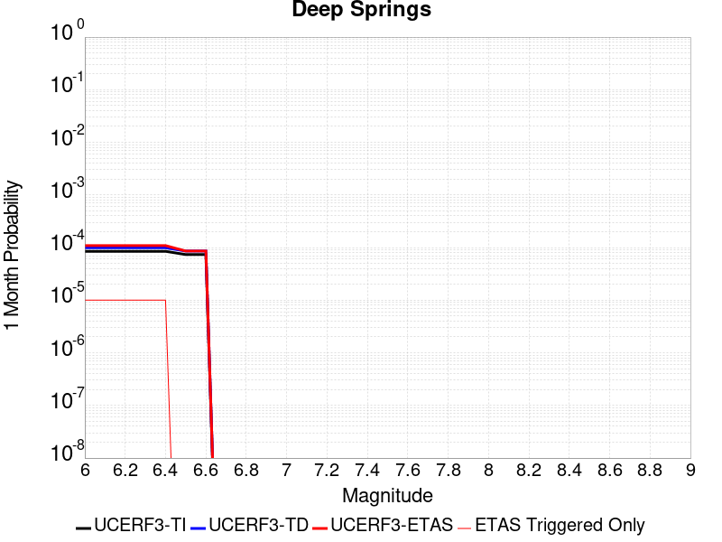 |  |  |

| Magnitude | 1 wk TI Prob | 1 wk TD Prob | 1 wk ETAS Prob | 1 wk ETAS/TD Gain | 1 wk ETAS Triggered Only | 1 mo TI Prob | 1 mo TD Prob | 1 mo ETAS Prob | 1 mo ETAS/TD Gain | 1 mo ETAS Triggered Only | 1 yr TI Prob | 1 yr TD Prob | 1 yr ETAS Prob | 1 yr ETAS/TD Gain | 1 yr ETAS Triggered Only | 10 yr TI Prob | 10 yr TD Prob | 10 yr ETAS Prob | 10 yr ETAS/TD Gain | 10 yr ETAS Triggered Only |
|-----|-----|-----|-----|-----|-----|-----|-----|-----|-----|-----|-----|-----|-----|-----|-----|-----|-----|-----|-----|-----|
| 6.0 | 1.9810619E-5 | 2.311303E-5 | 4.9779082E-5 | 2.1537237 | 2.6666667E-5 | 8.489989E-5 | 9.905495E-5 | 1.2571897E-4 | 1.2691842 | 2.6666667E-5 | 0.001033166 | 0.0012058346 | 0.0012591037 | 1.0441761 | 5.3333333E-5 | 0.010283757 | 0.01204269 | 0.012121727 | 1.0065631 | 8.0E-5 |
| 6.1 | 1.9810619E-5 | 2.311303E-5 | 4.9779082E-5 | 2.1537237 | 2.6666667E-5 | 8.489989E-5 | 9.905495E-5 | 1.2571897E-4 | 1.2691842 | 2.6666667E-5 | 0.001033166 | 0.0012058346 | 0.0012591037 | 1.0441761 | 5.3333333E-5 | 0.010283757 | 0.01204269 | 0.012121727 | 1.0065631 | 8.0E-5 |
| 6.2 | 1.9810619E-5 | 2.311303E-5 | 4.9779082E-5 | 2.1537237 | 2.6666667E-5 | 8.489989E-5 | 9.905495E-5 | 1.2571897E-4 | 1.2691842 | 2.6666667E-5 | 0.001033166 | 0.0012058346 | 0.0012591037 | 1.0441761 | 5.3333333E-5 | 0.010283757 | 0.01204269 | 0.012121727 | 1.0065631 | 8.0E-5 |
| 6.3 | 1.9810619E-5 | 2.311303E-5 | 4.9779082E-5 | 2.1537237 | 2.6666667E-5 | 8.489989E-5 | 9.905495E-5 | 1.2571897E-4 | 1.2691842 | 2.6666667E-5 | 0.001033166 | 0.0012058346 | 0.0012591037 | 1.0441761 | 5.3333333E-5 | 0.010283757 | 0.01204269 | 0.012121727 | 1.0065631 | 8.0E-5 |
| 6.4 | 1.9810619E-5 | 2.311303E-5 | 4.9779082E-5 | 2.1537237 | 2.6666667E-5 | 8.489989E-5 | 9.905495E-5 | 1.2571897E-4 | 1.2691842 | 2.6666667E-5 | 0.001033166 | 0.0012058346 | 0.0012591037 | 1.0441761 | 5.3333333E-5 | 0.010283757 | 0.01204269 | 0.012121727 | 1.0065631 | 8.0E-5 |
| 6.5 | 1.7190405E-5 | 2.0050999E-5 | 2.0050999E-5 | 1.0 | 0.0 | 7.367108E-5 | 8.593285E-5 | 8.593285E-5 | 1.0 | 0.0 | 8.9657627E-4 | 0.0010462324 | 0.0010728711 | 1.0254617 | 2.6666667E-5 | 0.008929676 | 0.010462287 | 0.010515062 | 1.0050443 | 5.3333333E-5 |
| 6.6 | 1.7190405E-5 | 2.0050999E-5 | 2.0050999E-5 | 1.0 | 0.0 | 7.367108E-5 | 8.593285E-5 | 8.593285E-5 | 1.0 | 0.0 | 8.9657627E-4 | 0.0010462324 | 0.0010728711 | 1.0254617 | 2.6666667E-5 | 0.008929676 | 0.010462287 | 0.010515062 | 1.0050443 | 5.3333333E-5 |

## Big Pine (East)
*[(top)](#table-of-contents)*

| 1 Week | 1 Month | 1 Year | 10 Year |
|-----|-----|-----|-----|
|  |  |  |  |

| Magnitude | 1 wk TI Prob | 1 wk TD Prob | 1 wk ETAS Prob | 1 wk ETAS/TD Gain | 1 wk ETAS Triggered Only | 1 mo TI Prob | 1 mo TD Prob | 1 mo ETAS Prob | 1 mo ETAS/TD Gain | 1 mo ETAS Triggered Only | 1 yr TI Prob | 1 yr TD Prob | 1 yr ETAS Prob | 1 yr ETAS/TD Gain | 1 yr ETAS Triggered Only | 10 yr TI Prob | 10 yr TD Prob | 10 yr ETAS Prob | 10 yr ETAS/TD Gain | 10 yr ETAS Triggered Only |
|-----|-----|-----|-----|-----|-----|-----|-----|-----|-----|-----|-----|-----|-----|-----|-----|-----|-----|-----|-----|-----|
| 6.0 | 9.916913E-6 | 1.2818231E-5 | 1.2818231E-5 | 1.0 | 0.0 | 4.250036E-5 | 5.4934244E-5 | 5.4934244E-5 | 1.0 | 0.0 | 5.173191E-4 | 6.686413E-4 | 6.686413E-4 | 1.0 | 0.0 | 0.0051611643 | 0.0066710766 | 0.006750543 | 1.0119121 | 8.0E-5 |
| 6.1 | 9.916913E-6 | 1.2818231E-5 | 1.2818231E-5 | 1.0 | 0.0 | 4.250036E-5 | 5.4934244E-5 | 5.4934244E-5 | 1.0 | 0.0 | 5.173191E-4 | 6.686413E-4 | 6.686413E-4 | 1.0 | 0.0 | 0.0051611643 | 0.0066710766 | 0.006750543 | 1.0119121 | 8.0E-5 |
| 6.2 | 9.916913E-6 | 1.2818231E-5 | 1.2818231E-5 | 1.0 | 0.0 | 4.250036E-5 | 5.4934244E-5 | 5.4934244E-5 | 1.0 | 0.0 | 5.173191E-4 | 6.686413E-4 | 6.686413E-4 | 1.0 | 0.0 | 0.0051611643 | 0.0066710766 | 0.006750543 | 1.0119121 | 8.0E-5 |
| 6.3 | 5.479711E-6 | 8.114161E-6 | 8.114161E-6 | 1.0 | 0.0 | 2.3484265E-5 | 3.4774526E-5 | 3.4774526E-5 | 1.0 | 0.0 | 2.858834E-4 | 4.233008E-4 | 4.233008E-4 | 1.0 | 0.0 | 0.0028551589 | 0.0042278613 | 0.004307523 | 1.0188421 | 8.0E-5 |
| 6.4 | 5.465009E-6 | 8.098454E-6 | 8.098454E-6 | 1.0 | 0.0 | 2.3421257E-5 | 3.4707216E-5 | 3.4707216E-5 | 1.0 | 0.0 | 2.851165E-4 | 4.224816E-4 | 4.224816E-4 | 1.0 | 0.0 | 0.0028475097 | 0.0042197 | 0.0042993627 | 1.0188787 | 8.0E-5 |
| 6.5 | 4.826767E-6 | 7.423505E-6 | 7.423505E-6 | 1.0 | 0.0 | 2.068598E-5 | 3.181465E-5 | 3.181465E-5 | 1.0 | 0.0 | 2.518227E-4 | 3.8727728E-4 | 3.8727728E-4 | 1.0 | 0.0 | 0.0025153751 | 0.003868898 | 0.0039485884 | 1.0205977 | 8.0E-5 |
| 6.6 | 4.3146847E-6 | 6.883437E-6 | 6.883437E-6 | 1.0 | 0.0 | 1.8491375E-5 | 2.9500125E-5 | 2.9500125E-5 | 1.0 | 0.0 | 2.2510924E-4 | 3.5910727E-4 | 3.5910727E-4 | 1.0 | 0.0 | 0.0022488134 | 0.0035881116 | 0.0036678247 | 1.0222158 | 8.0E-5 |
| 6.7 | 3.6968106E-6 | 5.9966014E-6 | 5.9966014E-6 | 1.0 | 0.0 | 1.5843378E-5 | 2.5699477E-5 | 2.5699477E-5 | 1.0 | 0.0 | 1.9287605E-4 | 3.1284773E-4 | 3.1284773E-4 | 1.0 | 0.0 | 0.0019270873 | 0.003126825 | 0.0031799914 | 1.0170034 | 5.3333333E-5 |
| 6.8 | 3.4671132E-6 | 5.7032753E-6 | 5.7032753E-6 | 1.0 | 0.0 | 1.4858972E-5 | 2.4442388E-5 | 2.4442388E-5 | 1.0 | 0.0 | 1.8089297E-4 | 2.9754688E-4 | 2.9754688E-4 | 1.0 | 0.0 | 0.0018074579 | 0.002974228 | 0.0030274028 | 1.0178785 | 5.3333333E-5 |
| 6.9 | 2.7686972E-6 | 4.8262373E-6 | 4.8262373E-6 | 1.0 | 0.0 | 1.1865792E-5 | 2.0683714E-5 | 2.0683714E-5 | 1.0 | 0.0 | 1.4445644E-4 | 2.5179586E-4 | 2.5179586E-4 | 1.0 | 0.0 | 0.0014436257 | 0.002517781 | 0.00257098 | 1.0211294 | 5.3333333E-5 |
| 7.0 | 2.1472624E-6 | 3.985962E-6 | 3.985962E-6 | 1.0 | 0.0 | 9.20252E-6 | 1.7082584E-5 | 1.7082584E-5 | 1.0 | 0.0 | 1.12034926E-4 | 2.0796116E-4 | 2.0796116E-4 | 1.0 | 0.0 | 0.0011197845 | 0.0020803085 | 0.0021069197 | 1.012792 | 2.6666667E-5 |
| 7.1 | 1.7018335E-6 | 3.3457143E-6 | 3.3457143E-6 | 1.0 | 0.0 | 7.293552E-6 | 1.4338699E-5 | 1.4338699E-5 | 1.0 | 0.0 | 8.879537E-5 | 1.7456003E-4 | 1.7456003E-4 | 1.0 | 0.0 | 8.87599E-4 | 0.0017468405 | 0.0017468405 | 1.0 | 0.0 |
| 7.2 | 1.25603E-6 | 2.795276E-6 | 2.795276E-6 | 1.0 | 0.0 | 5.3829745E-6 | 1.19797005E-5 | 1.19797005E-5 | 1.0 | 0.0 | 6.553574E-5 | 1.4584333E-4 | 1.4584333E-4 | 1.0 | 0.0 | 6.551642E-4 | 0.001460063 | 0.001460063 | 1.0 | 0.0 |
| 7.3 | 1.112297E-6 | 2.6110797E-6 | 2.6110797E-6 | 1.0 | 0.0 | 4.7669787E-6 | 1.11902955E-5 | 1.11902955E-5 | 1.0 | 0.0 | 5.803642E-5 | 1.3623355E-4 | 1.3623355E-4 | 1.0 | 0.0 | 5.802127E-4 | 0.0013639197 | 0.0013639197 | 1.0 | 0.0 |
| 7.4 | 1.0137181E-6 | 2.4842075E-6 | 2.4842075E-6 | 1.0 | 0.0 | 4.3444993E-6 | 1.0646561E-5 | 1.0646561E-5 | 1.0 | 0.0 | 5.2892992E-5 | 1.2961439E-4 | 1.2961439E-4 | 1.0 | 0.0 | 5.288041E-4 | 0.0012975911 | 0.0012975911 | 1.0 | 0.0 |
| 7.5 | 9.598608E-7 | 2.4078427E-6 | 2.4078427E-6 | 1.0 | 0.0 | 4.1136827E-6 | 1.0319286E-5 | 1.0319286E-5 | 1.0 | 0.0 | 5.0082934E-5 | 1.2563028E-4 | 1.2563028E-4 | 1.0 | 0.0 | 5.007165E-4 | 0.0012576039 | 0.0012576039 | 1.0 | 0.0 |
| 7.6 | 7.929459E-7 | 2.0454722E-6 | 2.0454722E-6 | 1.0 | 0.0 | 3.3983351E-6 | 8.766281E-6 | 8.766281E-6 | 1.0 | 0.0 | 4.1373947E-5 | 1.06724416E-4 | 1.06724416E-4 | 1.0 | 0.0 | 4.1366243E-4 | 0.0010688324 | 0.0010688324 | 1.0 | 0.0 |
| 7.7 | 4.155788E-7 | 1.1609936E-6 | 1.1609936E-6 | 1.0 | 0.0 | 1.7810507E-6 | 4.975678E-6 | 4.975678E-6 | 1.0 | 0.0 | 2.1684076E-5 | 6.0577237E-5 | 6.0577237E-5 | 1.0 | 0.0 | 2.1681961E-4 | 6.087925E-4 | 6.087925E-4 | 1.0 | 0.0 |
| 7.8 | 1.14666925E-7 | 2.5929913E-7 | 2.5929913E-7 | 1.0 | 0.0 | 4.914296E-7 | 1.1112816E-6 | 1.1112816E-6 | 1.0 | 0.0 | 5.9831386E-6 | 1.3529773E-5 | 1.3529773E-5 | 1.0 | 0.0 | 5.9829777E-5 | 1.3639126E-4 | 1.3639126E-4 | 1.0 | 0.0 |
| 7.9 | 2.9231824E-8 | 4.148024E-8 | 4.148024E-8 | 1.0 | 0.0 | 1.2527924E-7 | 1.7777246E-7 | 1.7777246E-7 | 1.0 | 0.0 | 1.5252737E-6 | 2.1643777E-6 | 2.1643777E-6 | 1.0 | 0.0 | 1.5252632E-5 | 2.1976275E-5 | 2.1976275E-5 | 1.0 | 0.0 |

## San Clemente
*[(top)](#table-of-contents)*

| 1 Week | 1 Month | 1 Year | 10 Year |
|-----|-----|-----|-----|
|  |  | 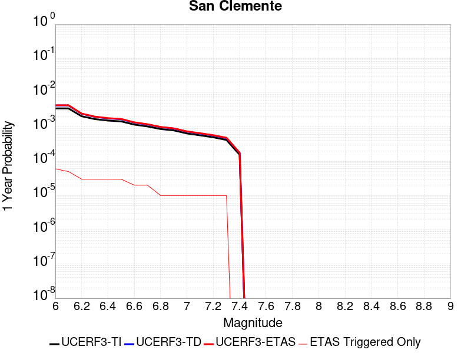 |  |

| Magnitude | 1 wk TI Prob | 1 wk TD Prob | 1 wk ETAS Prob | 1 wk ETAS/TD Gain | 1 wk ETAS Triggered Only | 1 mo TI Prob | 1 mo TD Prob | 1 mo ETAS Prob | 1 mo ETAS/TD Gain | 1 mo ETAS Triggered Only | 1 yr TI Prob | 1 yr TD Prob | 1 yr ETAS Prob | 1 yr ETAS/TD Gain | 1 yr ETAS Triggered Only | 10 yr TI Prob | 10 yr TD Prob | 10 yr ETAS Prob | 10 yr ETAS/TD Gain | 10 yr ETAS Triggered Only |
|-----|-----|-----|-----|-----|-----|-----|-----|-----|-----|-----|-----|-----|-----|-----|-----|-----|-----|-----|-----|-----|
| 6.0 | 6.681379E-5 | 8.163669E-5 | 8.163669E-5 | 1.0 | 0.0 | 2.8631336E-4 | 3.4982787E-4 | 3.764852E-4 | 1.0762013 | 2.6666667E-5 | 0.003480294 | 0.004251416 | 0.004304522 | 1.0124915 | 5.3333333E-5 | 0.03426291 | 0.041756913 | 0.041833576 | 1.0018358 | 8.0E-5 |
| 6.1 | 6.681379E-5 | 8.163669E-5 | 8.163669E-5 | 1.0 | 0.0 | 2.8631336E-4 | 3.4982787E-4 | 3.4982787E-4 | 1.0 | 0.0 | 0.003480294 | 0.004251416 | 0.004277969 | 1.0062457 | 2.6666667E-5 | 0.03426291 | 0.041756913 | 0.04180802 | 1.0012239 | 5.3333333E-5 |
| 6.2 | 3.9400576E-5 | 4.6453104E-5 | 4.6453104E-5 | 1.0 | 0.0 | 1.6884868E-4 | 1.9906988E-4 | 1.9906988E-4 | 1.0 | 0.0 | 0.0020537945 | 0.0024210429 | 0.0024210429 | 1.0 | 0.0 | 0.020349167 | 0.023953425 | 0.023979453 | 1.0010866 | 2.6666667E-5 |
| 6.3 | 3.2590255E-5 | 3.792992E-5 | 3.792992E-5 | 1.0 | 0.0 | 1.3966505E-4 | 1.6254683E-4 | 1.6254683E-4 | 1.0 | 0.0 | 0.0016990956 | 0.0019772416 | 0.0019772416 | 1.0 | 0.0 | 0.01686163 | 0.019600289 | 0.019600289 | 1.0 | 0.0 |
| 6.4 | 2.9454652E-5 | 3.4098495E-5 | 3.4098495E-5 | 1.0 | 0.0 | 1.2622811E-4 | 1.4612835E-4 | 1.4612835E-4 | 1.0 | 0.0 | 0.0015357438 | 0.0017776854 | 0.0017776854 | 1.0 | 0.0 | 0.015251739 | 0.017637825 | 0.017637825 | 1.0 | 0.0 |
| 6.5 | 2.790836E-5 | 3.2248132E-5 | 3.2248132E-5 | 1.0 | 0.0 | 1.1960178E-4 | 1.3819907E-4 | 1.3819907E-4 | 1.0 | 0.0 | 0.001455179 | 0.0016812999 | 0.0016812999 | 1.0 | 0.0 | 0.014456868 | 0.016688818 | 0.016688818 | 1.0 | 0.0 |
| 6.6 | 2.2492153E-5 | 2.5763205E-5 | 2.5763205E-5 | 1.0 | 0.0 | 9.639138E-5 | 1.1040914E-4 | 1.1040914E-4 | 1.0 | 0.0 | 0.0011729331 | 0.0013434167 | 0.0013434167 | 1.0 | 0.0 | 0.011667615 | 0.013354672 | 0.013354672 | 1.0 | 0.0 |
| 6.7 | 1.9862755E-5 | 2.2666847E-5 | 2.2666847E-5 | 1.0 | 0.0 | 8.512331E-5 | 9.714008E-5 | 9.714008E-5 | 1.0 | 0.0 | 0.0010358836 | 0.0011820501 | 0.0011820501 | 1.0 | 0.0 | 0.010310682 | 0.01175892 | 0.01175892 | 1.0 | 0.0 |
| 6.8 | 1.6697575E-5 | 1.8978053E-5 | 1.8978053E-5 | 1.0 | 0.0 | 7.155907E-5 | 8.133203E-5 | 8.133203E-5 | 1.0 | 0.0 | 8.7088346E-4 | 9.89777E-4 | 9.89777E-4 | 1.0 | 0.0 | 0.008674784 | 0.009854714 | 0.009854714 | 1.0 | 0.0 |
| 6.9 | 1.5218415E-5 | 1.726971E-5 | 1.726971E-5 | 1.0 | 0.0 | 6.522015E-5 | 7.401099E-5 | 7.401099E-5 | 1.0 | 0.0 | 7.93766E-4 | 9.0072013E-4 | 9.0072013E-4 | 1.0 | 0.0 | 0.007909367 | 0.00897164 | 0.00897164 | 1.0 | 0.0 |
| 7.0 | 1.2392958E-5 | 1.4033262E-5 | 1.4033262E-5 | 1.0 | 0.0 | 5.3111595E-5 | 6.0141207E-5 | 6.0141207E-5 | 1.0 | 0.0 | 6.4644177E-4 | 7.319808E-4 | 7.319808E-4 | 1.0 | 0.0 | 0.0064456454 | 0.0072964844 | 0.0072964844 | 1.0 | 0.0 |
| 7.1 | 1.0934128E-5 | 1.2375354E-5 | 1.2375354E-5 | 1.0 | 0.0 | 4.6859706E-5 | 5.3036194E-5 | 5.3036194E-5 | 1.0 | 0.0 | 5.7036756E-4 | 6.455317E-4 | 6.455317E-4 | 1.0 | 0.0 | 0.0056890585 | 0.006437312 | 0.006437312 | 1.0 | 0.0 |
| 7.2 | 9.5798805E-6 | 1.0845125E-5 | 1.0845125E-5 | 1.0 | 0.0 | 4.1055984E-5 | 4.647832E-5 | 4.647832E-5 | 1.0 | 0.0 | 4.9974193E-4 | 5.657338E-4 | 5.657338E-4 | 1.0 | 0.0 | 0.0049861963 | 0.00564366 | 0.00564366 | 1.0 | 0.0 |
| 7.3 | 8.0167365E-6 | 9.084078E-6 | 9.084078E-6 | 1.0 | 0.0 | 3.4356988E-5 | 3.8931223E-5 | 3.8931223E-5 | 1.0 | 0.0 | 4.1821605E-4 | 4.738916E-4 | 4.738916E-4 | 1.0 | 0.0 | 0.0041742986 | 0.004729513 | 0.004729513 | 1.0 | 0.0 |
| 7.4 | 2.9581017E-6 | 3.36244E-6 | 3.36244E-6 | 1.0 | 0.0 | 1.2677518E-5 | 1.4410407E-5 | 1.4410407E-5 | 1.0 | 0.0 | 1.5433785E-4 | 1.7543763E-4 | 1.7543763E-4 | 1.0 | 0.0 | 0.001542307 | 0.0017534863 | 0.0017534863 | 1.0 | 0.0 |

## Mission Creek
*[(top)](#table-of-contents)*

| 1 Week | 1 Month | 1 Year | 10 Year |
|-----|-----|-----|-----|
|  |  |  |  |

| Magnitude | 1 wk TI Prob | 1 wk TD Prob | 1 wk ETAS Prob | 1 wk ETAS/TD Gain | 1 wk ETAS Triggered Only | 1 mo TI Prob | 1 mo TD Prob | 1 mo ETAS Prob | 1 mo ETAS/TD Gain | 1 mo ETAS Triggered Only | 1 yr TI Prob | 1 yr TD Prob | 1 yr ETAS Prob | 1 yr ETAS/TD Gain | 1 yr ETAS Triggered Only | 10 yr TI Prob | 10 yr TD Prob | 10 yr ETAS Prob | 10 yr ETAS/TD Gain | 10 yr ETAS Triggered Only |
|-----|-----|-----|-----|-----|-----|-----|-----|-----|-----|-----|-----|-----|-----|-----|-----|-----|-----|-----|-----|-----|
| 6.0 | 1.1549387E-5 | 1.6324713E-5 | 1.6324713E-5 | 1.0 | 0.0 | 4.9496433E-5 | 6.9961265E-5 | 9.662606E-5 | 1.3811367 | 2.6666667E-5 | 6.0245243E-4 | 8.5146056E-4 | 9.313924E-4 | 1.0938762 | 8.0E-5 | 0.006008218 | 0.008511184 | 0.008590504 | 1.0093194 | 8.0E-5 |
| 6.1 | 1.1549387E-5 | 1.6324713E-5 | 1.6324713E-5 | 1.0 | 0.0 | 4.9496433E-5 | 6.9961265E-5 | 9.662606E-5 | 1.3811367 | 2.6666667E-5 | 6.0245243E-4 | 8.5146056E-4 | 9.313924E-4 | 1.0938762 | 8.0E-5 | 0.006008218 | 0.008511184 | 0.008590504 | 1.0093194 | 8.0E-5 |
| 6.2 | 1.1549387E-5 | 1.6324713E-5 | 1.6324713E-5 | 1.0 | 0.0 | 4.9496433E-5 | 6.9961265E-5 | 9.662606E-5 | 1.3811367 | 2.6666667E-5 | 6.0245243E-4 | 8.5146056E-4 | 9.313924E-4 | 1.0938762 | 8.0E-5 | 0.006008218 | 0.008511184 | 0.008590504 | 1.0093194 | 8.0E-5 |
| 6.3 | 1.1549387E-5 | 1.6324713E-5 | 1.6324713E-5 | 1.0 | 0.0 | 4.9496433E-5 | 6.9961265E-5 | 9.662606E-5 | 1.3811367 | 2.6666667E-5 | 6.0245243E-4 | 8.5146056E-4 | 9.313924E-4 | 1.0938762 | 8.0E-5 | 0.006008218 | 0.008511184 | 0.008590504 | 1.0093194 | 8.0E-5 |
| 6.4 | 1.1549387E-5 | 1.6324713E-5 | 1.6324713E-5 | 1.0 | 0.0 | 4.9496433E-5 | 6.9961265E-5 | 9.662606E-5 | 1.3811367 | 2.6666667E-5 | 6.0245243E-4 | 8.5146056E-4 | 9.313924E-4 | 1.0938762 | 8.0E-5 | 0.006008218 | 0.008511184 | 0.008590504 | 1.0093194 | 8.0E-5 |
| 6.5 | 1.1549387E-5 | 1.6324713E-5 | 1.6324713E-5 | 1.0 | 0.0 | 4.9496433E-5 | 6.9961265E-5 | 9.662606E-5 | 1.3811367 | 2.6666667E-5 | 6.0245243E-4 | 8.5146056E-4 | 9.313924E-4 | 1.0938762 | 8.0E-5 | 0.006008218 | 0.008511184 | 0.008590504 | 1.0093194 | 8.0E-5 |
| 6.6 | 9.202681E-6 | 1.3847972E-5 | 1.3847972E-5 | 1.0 | 0.0 | 3.9439463E-5 | 5.9347152E-5 | 8.601224E-5 | 1.4493068 | 2.6666667E-5 | 4.800697E-4 | 7.2232104E-4 | 8.0226327E-4 | 1.110674 | 8.0E-5 | 0.004790339 | 0.0072283596 | 0.0073077814 | 1.0109875 | 8.0E-5 |
| 6.7 | 9.019164E-6 | 1.365364E-5 | 1.365364E-5 | 1.0 | 0.0 | 3.8652986E-5 | 5.8514335E-5 | 8.517944E-5 | 1.4557021 | 2.6666667E-5 | 4.7049852E-4 | 7.121882E-4 | 7.9213124E-4 | 1.1122499 | 8.0E-5 | 0.004695036 | 0.0071276836 | 0.0072071133 | 1.0111438 | 8.0E-5 |
| 6.8 | 8.673558E-6 | 1.3275746E-5 | 1.3275746E-5 | 1.0 | 0.0 | 3.717186E-5 | 5.6894864E-5 | 8.3560015E-5 | 1.4686741 | 2.6666667E-5 | 4.524734E-4 | 6.924836E-4 | 7.7242823E-4 | 1.1154462 | 8.0E-5 | 0.0045155324 | 0.0069318693 | 0.007011315 | 1.0114609 | 8.0E-5 |
| 6.9 | 7.002255E-6 | 1.1479958E-5 | 1.1479958E-5 | 1.0 | 0.0 | 3.000932E-5 | 4.9198927E-5 | 7.5864285E-5 | 1.5419905 | 2.6666667E-5 | 3.653022E-4 | 5.988392E-4 | 6.7879126E-4 | 1.1335118 | 8.0E-5 | 0.0036470229 | 0.0060006846 | 0.006080204 | 1.0132518 | 8.0E-5 |
| 7.0 | 5.84644E-6 | 9.677164E-6 | 9.677164E-6 | 1.0 | 0.0 | 2.5055931E-5 | 4.1472922E-5 | 6.8138484E-5 | 1.6429632 | 2.6666667E-5 | 3.0501327E-4 | 5.0482043E-4 | 5.8478E-4 | 1.1583922 | 8.0E-5 | 0.0030459496 | 0.0050649596 | 0.005144554 | 1.0157148 | 8.0E-5 |
| 7.1 | 5.54703E-6 | 9.331631E-6 | 9.331631E-6 | 1.0 | 0.0 | 2.377277E-5 | 3.999212E-5 | 6.665772E-5 | 1.6667714 | 2.6666667E-5 | 2.8939504E-4 | 4.8679972E-4 | 5.667608E-4 | 1.1642586 | 8.0E-5 | 0.0028901845 | 0.0048855497 | 0.0049651586 | 1.0162948 | 8.0E-5 |
| 7.2 | 4.384709E-6 | 7.6836495E-6 | 7.6836495E-6 | 1.0 | 0.0 | 1.8791474E-5 | 3.292953E-5 | 5.9595317E-5 | 1.8097835 | 2.6666667E-5 | 2.2876218E-4 | 4.0084694E-4 | 4.8081487E-4 | 1.1994975 | 8.0E-5 | 0.0022852682 | 0.0040294197 | 0.004109097 | 1.019774 | 8.0E-5 |
| 7.3 | 3.7888456E-6 | 6.9174894E-6 | 6.9174894E-6 | 1.0 | 0.0 | 1.623781E-5 | 2.9646066E-5 | 5.6311943E-5 | 1.8994744 | 2.6666667E-5 | 1.9767738E-4 | 3.608844E-4 | 4.4085554E-4 | 1.2215977 | 8.0E-5 | 0.0019750162 | 0.0036311483 | 0.0037108576 | 1.0219516 | 8.0E-5 |
| 7.4 | 2.1982462E-6 | 5.0257536E-6 | 5.0257536E-6 | 1.0 | 0.0 | 9.421021E-6 | 2.1538768E-5 | 4.820486E-5 | 2.238051 | 2.6666667E-5 | 1.1469489E-4 | 2.6220313E-4 | 3.4218215E-4 | 1.305027 | 8.0E-5 | 0.0011463572 | 0.0026468872 | 0.0027266755 | 1.0301442 | 8.0E-5 |
| 7.5 | 2.051923E-6 | 4.6169393E-6 | 4.6169393E-6 | 1.0 | 0.0 | 8.793926E-6 | 1.9786734E-5 | 4.6452875E-5 | 2.3476777 | 2.6666667E-5 | 1.0706078E-4 | 2.40877E-4 | 3.2085774E-4 | 1.3320397 | 8.0E-5 | 0.0010700922 | 0.0024345173 | 0.0025143223 | 1.0327808 | 8.0E-5 |
| 7.6 | 1.8733427E-6 | 4.1252324E-6 | 4.1252324E-6 | 1.0 | 0.0 | 8.028587E-6 | 1.767945E-5 | 4.4345645E-5 | 2.508316 | 2.6666667E-5 | 9.774366E-5 | 2.1522611E-4 | 2.9520888E-4 | 1.3716221 | 8.0E-5 | 9.770069E-4 | 0.0021790217 | 0.0022588472 | 1.0366337 | 8.0E-5 |
| 7.7 | 1.8411953E-6 | 4.044895E-6 | 4.044895E-6 | 1.0 | 0.0 | 7.890813E-6 | 1.733515E-5 | 4.4001354E-5 | 2.5382738 | 2.6666667E-5 | 9.606641E-5 | 2.1103508E-4 | 2.910182E-4 | 1.3790039 | 8.0E-5 | 9.6024893E-4 | 0.0021373003 | 0.0022171293 | 1.0373504 | 8.0E-5 |
| 7.8 | 1.7194251E-6 | 3.7121463E-6 | 3.7121463E-6 | 1.0 | 0.0 | 7.368944E-6 | 1.5909101E-5 | 4.2575342E-5 | 2.6761627 | 2.6666667E-5 | 8.97132E-5 | 1.9367617E-4 | 2.7366067E-4 | 1.4129807 | 8.0E-5 | 8.967699E-4 | 0.0019632233 | 0.002043066 | 1.0406693 | 8.0E-5 |
| 7.9 | 1.4035052E-6 | 2.9514722E-6 | 2.9514722E-6 | 1.0 | 0.0 | 6.0150082E-6 | 1.2649106E-5 | 3.9315437E-5 | 3.1081593 | 2.6666667E-5 | 7.3230265E-5 | 1.5399205E-4 | 2.3397972E-4 | 1.5194274 | 8.0E-5 | 7.3206134E-4 | 0.0015638224 | 0.0016436973 | 1.0510767 | 8.0E-5 |
| 8.0 | 3.9318823E-7 | 5.5319464E-7 | 5.5319464E-7 | 1.0 | 0.0 | 1.6850913E-6 | 2.3708321E-6 | 2.3708321E-6 | 1.0 | 0.0 | 2.0515794E-5 | 2.8864504E-5 | 5.55304E-5 | 1.92383 | 2.6666667E-5 | 2.0513899E-4 | 2.9916913E-4 | 3.2582783E-4 | 1.0891091 | 2.6666667E-5 |
| 8.1 | 1.596793E-7 | 1.1391901E-7 | 1.1391901E-7 | 1.0 | 0.0 | 6.8433974E-7 | 4.8822426E-7 | 4.8822426E-7 | 1.0 | 0.0 | 8.331805E-6 | 5.944114E-6 | 5.944114E-6 | 1.0 | 0.0 | 8.331492E-5 | 6.5564316E-5 | 6.5564316E-5 | 1.0 | 0.0 |
| 8.2 | 4.9003038E-8 | 2.5475106E-8 | 2.5475106E-8 | 1.0 | 0.0 | 2.10013E-7 | 1.0917902E-7 | 1.0917902E-7 | 1.0 | 0.0 | 2.5569052E-6 | 1.3292538E-6 | 1.3292538E-6 | 1.0 | 0.0 | 2.556876E-5 | 1.4973085E-5 | 1.4973085E-5 | 1.0 | 0.0 |

## San Jacinto (San Jacinto Valley) rev
*[(top)](#table-of-contents)*

| 1 Week | 1 Month | 1 Year | 10 Year |
|-----|-----|-----|-----|
|  |  |  |  |

| Magnitude | 1 wk TI Prob | 1 wk TD Prob | 1 wk ETAS Prob | 1 wk ETAS/TD Gain | 1 wk ETAS Triggered Only | 1 mo TI Prob | 1 mo TD Prob | 1 mo ETAS Prob | 1 mo ETAS/TD Gain | 1 mo ETAS Triggered Only | 1 yr TI Prob | 1 yr TD Prob | 1 yr ETAS Prob | 1 yr ETAS/TD Gain | 1 yr ETAS Triggered Only | 10 yr TI Prob | 10 yr TD Prob | 10 yr ETAS Prob | 10 yr ETAS/TD Gain | 10 yr ETAS Triggered Only |
|-----|-----|-----|-----|-----|-----|-----|-----|-----|-----|-----|-----|-----|-----|-----|-----|-----|-----|-----|-----|-----|
| 6.0 | 3.652694E-5 | 3.4417048E-5 | 3.4417048E-5 | 1.0 | 0.0 | 1.5653463E-4 | 1.4749331E-4 | 1.7415604E-4 | 1.1807725 | 2.6666667E-5 | 0.0019041431 | 0.0017942534 | 0.001847491 | 1.0296712 | 5.3333333E-5 | 0.018879099 | 0.018534157 | 0.018612675 | 1.0042363 | 8.0E-5 |
| 6.1 | 3.652694E-5 | 3.4417048E-5 | 3.4417048E-5 | 1.0 | 0.0 | 1.5653463E-4 | 1.4749331E-4 | 1.7415604E-4 | 1.1807725 | 2.6666667E-5 | 0.0019041431 | 0.0017942534 | 0.001847491 | 1.0296712 | 5.3333333E-5 | 0.018879099 | 0.018534157 | 0.018612675 | 1.0042363 | 8.0E-5 |
| 6.2 | 3.652694E-5 | 3.4417048E-5 | 3.4417048E-5 | 1.0 | 0.0 | 1.5653463E-4 | 1.4749331E-4 | 1.7415604E-4 | 1.1807725 | 2.6666667E-5 | 0.0019041431 | 0.0017942534 | 0.001847491 | 1.0296712 | 5.3333333E-5 | 0.018879099 | 0.018534157 | 0.018612675 | 1.0042363 | 8.0E-5 |
| 6.3 | 3.652694E-5 | 3.4417048E-5 | 3.4417048E-5 | 1.0 | 0.0 | 1.5653463E-4 | 1.4749331E-4 | 1.7415604E-4 | 1.1807725 | 2.6666667E-5 | 0.0019041431 | 0.0017942534 | 0.001847491 | 1.0296712 | 5.3333333E-5 | 0.018879099 | 0.018534157 | 0.018612675 | 1.0042363 | 8.0E-5 |
| 6.4 | 3.646941E-5 | 3.433862E-5 | 3.433862E-5 | 1.0 | 0.0 | 1.5628811E-4 | 1.4715722E-4 | 1.7381996E-4 | 1.1811854 | 2.6666667E-5 | 0.0019011468 | 0.0017901688 | 0.0018434067 | 1.029739 | 5.3333333E-5 | 0.018849645 | 0.018494038 | 0.018572558 | 1.0042458 | 8.0E-5 |
| 6.5 | 3.646941E-5 | 3.433862E-5 | 3.433862E-5 | 1.0 | 0.0 | 1.5628811E-4 | 1.4715722E-4 | 1.7381996E-4 | 1.1811854 | 2.6666667E-5 | 0.0019011468 | 0.0017901688 | 0.0018434067 | 1.029739 | 5.3333333E-5 | 0.018849645 | 0.018494038 | 0.018572558 | 1.0042458 | 8.0E-5 |
| 6.6 | 3.6442503E-5 | 3.4302004E-5 | 3.4302004E-5 | 1.0 | 0.0 | 1.561728E-4 | 1.4700032E-4 | 1.7366307E-4 | 1.1813788 | 2.6666667E-5 | 0.0018997455 | 0.0017882616 | 0.0018414996 | 1.0297707 | 5.3333333E-5 | 0.018835869 | 0.018475305 | 0.018553827 | 1.00425 | 8.0E-5 |
| 6.7 | 3.6432113E-5 | 3.4287576E-5 | 3.4287576E-5 | 1.0 | 0.0 | 1.5612828E-4 | 1.4693849E-4 | 1.7360123E-4 | 1.1814551 | 2.6666667E-5 | 0.0018992044 | 0.0017875104 | 0.0018407484 | 1.0297834 | 5.3333333E-5 | 0.018830549 | 0.01846793 | 0.01854645 | 1.0042518 | 8.0E-5 |
| 6.8 | 3.6409598E-5 | 3.425663E-5 | 3.425663E-5 | 1.0 | 0.0 | 1.560318E-4 | 1.4680588E-4 | 1.7346862E-4 | 1.1816192 | 2.6666667E-5 | 0.0018980318 | 0.0017858985 | 0.0018391366 | 1.0298103 | 5.3333333E-5 | 0.018819023 | 0.018452084 | 0.018530607 | 1.0042555 | 8.0E-5 |
| 6.9 | 3.638078E-5 | 3.4217053E-5 | 3.4217053E-5 | 1.0 | 0.0 | 1.5590832E-4 | 1.4663627E-4 | 1.7329903E-4 | 1.1818292 | 2.6666667E-5 | 0.0018965311 | 0.001783837 | 0.0018370751 | 1.0298448 | 5.3333333E-5 | 0.018804269 | 0.018431816 | 0.018510342 | 1.0042603 | 8.0E-5 |
| 7.0 | 3.6294874E-5 | 3.4099063E-5 | 3.4099063E-5 | 1.0 | 0.0 | 1.5554018E-4 | 1.4613067E-4 | 1.7279343E-4 | 1.1824584 | 2.6666667E-5 | 0.0018920569 | 0.0017776915 | 0.0018309301 | 1.0299481 | 5.3333333E-5 | 0.018760284 | 0.018371396 | 0.018449927 | 1.0042746 | 8.0E-5 |
| 7.1 | 3.6260717E-5 | 3.405534E-5 | 3.405534E-5 | 1.0 | 0.0 | 1.5539382E-4 | 1.4594331E-4 | 1.7260609E-4 | 1.1826926 | 2.6666667E-5 | 0.001890278 | 0.0017754143 | 0.001828653 | 1.0299866 | 5.3333333E-5 | 0.018742796 | 0.018348996 | 0.018427527 | 1.00428 | 8.0E-5 |
| 7.2 | 3.6210204E-5 | 3.398956E-5 | 3.398956E-5 | 1.0 | 0.0 | 1.5517735E-4 | 1.4566141E-4 | 1.723242E-4 | 1.1830463 | 2.6666667E-5 | 0.001887647 | 0.0017719879 | 0.0018252267 | 1.0300447 | 5.3333333E-5 | 0.01871693 | 0.018315274 | 0.018393809 | 1.004288 | 8.0E-5 |
| 7.3 | 3.6119454E-5 | 3.3877837E-5 | 3.3877837E-5 | 1.0 | 0.0 | 1.5478847E-4 | 1.4518267E-4 | 1.7184546E-4 | 1.18365 | 2.6666667E-5 | 0.0018829206 | 0.0017661685 | 0.0018194077 | 1.0301439 | 5.3333333E-5 | 0.018670462 | 0.018257825 | 0.018336363 | 1.0043017 | 8.0E-5 |
| 7.4 | 3.607848E-5 | 3.3825334E-5 | 3.3825334E-5 | 1.0 | 0.0 | 1.5461289E-4 | 1.4495767E-4 | 1.7162047E-4 | 1.183935 | 2.6666667E-5 | 0.0018807866 | 0.0017634337 | 0.001816673 | 1.0301907 | 5.3333333E-5 | 0.018649481 | 0.018230818 | 0.018309359 | 1.0043082 | 8.0E-5 |
| 7.5 | 3.5856774E-5 | 3.3635082E-5 | 3.3635082E-5 | 1.0 | 0.0 | 1.5366284E-4 | 1.4414241E-4 | 1.7080523E-4 | 1.1849755 | 2.6666667E-5 | 0.0018692396 | 0.0017535238 | 0.0018067637 | 1.0303617 | 5.3333333E-5 | 0.018535944 | 0.018131904 | 0.018210454 | 1.0043321 | 8.0E-5 |
| 7.6 | 3.286655E-5 | 3.215777E-5 | 3.215777E-5 | 1.0 | 0.0 | 1.4084904E-4 | 1.3781176E-4 | 1.6447475E-4 | 1.193474 | 2.6666667E-5 | 0.001713488 | 0.0016765689 | 0.0017298128 | 1.0317577 | 5.3333333E-5 | 0.017003361 | 0.017351432 | 0.017430043 | 1.0045305 | 8.0E-5 |
| 7.7 | 2.8882527E-5 | 2.9250317E-5 | 2.9250317E-5 | 1.0 | 0.0 | 1.237764E-4 | 1.2535248E-4 | 1.5201581E-4 | 1.2127068 | 2.6666667E-5 | 0.0015059357 | 0.0015250992 | 0.0015783512 | 1.0349171 | 5.3333333E-5 | 0.014957713 | 0.015837716 | 0.01591645 | 1.0049713 | 8.0E-5 |
| 7.8 | 2.4950225E-5 | 2.6540692E-5 | 2.6540692E-5 | 1.0 | 0.0 | 1.0692515E-4 | 1.1374087E-4 | 1.404045E-4 | 1.2344244 | 2.6666667E-5 | 0.0013010362 | 0.0013839162 | 0.0014371758 | 1.0384847 | 5.3333333E-5 | 0.012934455 | 0.0144187445 | 0.01449759 | 1.0054684 | 8.0E-5 |
| 7.9 | 1.9881603E-5 | 2.1519538E-5 | 2.1519538E-5 | 1.0 | 0.0 | 8.520408E-5 | 9.222333E-5 | 1.1888754E-4 | 1.2891265 | 2.6666667E-5 | 0.001036866 | 0.0011222415 | 0.001175515 | 1.0474706 | 5.3333333E-5 | 0.010320415 | 0.011783319 | 0.011862376 | 1.0067092 | 8.0E-5 |
| 8.0 | 1.563292E-5 | 1.5947082E-5 | 1.5947082E-5 | 1.0 | 0.0 | 6.6996516E-5 | 6.834285E-5 | 9.5007694E-5 | 1.3901628 | 2.6666667E-5 | 8.153773E-4 | 8.3175726E-4 | 8.8504626E-4 | 1.064068 | 5.3333333E-5 | 0.00812392 | 0.008815629 | 0.008894924 | 1.0089948 | 8.0E-5 |
| 8.1 | 1.0045313E-5 | 8.307514E-6 | 8.307514E-6 | 1.0 | 0.0 | 4.305063E-5 | 3.5603145E-5 | 3.5603145E-5 | 1.0 | 0.0 | 5.2401534E-4 | 4.333826E-4 | 4.333826E-4 | 1.0 | 0.0 | 0.0052278144 | 0.0046621817 | 0.0046621817 | 1.0 | 0.0 |
| 8.2 | 4.1554413E-6 | 1.5672123E-6 | 1.5672123E-6 | 1.0 | 0.0 | 1.7808914E-5 | 6.716607E-6 | 6.716607E-6 | 1.0 | 0.0 | 2.1680194E-4 | 8.177165E-5 | 8.177165E-5 | 1.0 | 0.0 | 0.0021659054 | 9.492334E-4 | 9.492334E-4 | 1.0 | 0.0 |
| 8.3 | 1.2758221E-6 | 3.6194777E-7 | 3.6194777E-7 | 1.0 | 0.0 | 5.4677976E-6 | 1.5512038E-6 | 1.5512038E-6 | 1.0 | 0.0 | 6.65684E-5 | 1.8885747E-5 | 1.8885747E-5 | 1.0 | 0.0 | 6.6548464E-4 | 2.2777634E-4 | 2.2777634E-4 | 1.0 | 0.0 |

## Dry Mountain
*[(top)](#table-of-contents)*

| 1 Week | 1 Month | 1 Year | 10 Year |
|-----|-----|-----|-----|
|  |  |  |  |

| Magnitude | 1 wk TI Prob | 1 wk TD Prob | 1 wk ETAS Prob | 1 wk ETAS/TD Gain | 1 wk ETAS Triggered Only | 1 mo TI Prob | 1 mo TD Prob | 1 mo ETAS Prob | 1 mo ETAS/TD Gain | 1 mo ETAS Triggered Only | 1 yr TI Prob | 1 yr TD Prob | 1 yr ETAS Prob | 1 yr ETAS/TD Gain | 1 yr ETAS Triggered Only | 10 yr TI Prob | 10 yr TD Prob | 10 yr ETAS Prob | 10 yr ETAS/TD Gain | 10 yr ETAS Triggered Only |
|-----|-----|-----|-----|-----|-----|-----|-----|-----|-----|-----|-----|-----|-----|-----|-----|-----|-----|-----|-----|-----|
| 6.0 | 6.222801E-6 | 6.439411E-6 | 6.439411E-6 | 1.0 | 0.0 | 2.6668875E-5 | 2.7597274E-5 | 5.4263204E-5 | 1.9662523 | 2.6666667E-5 | 3.2464517E-4 | 3.359609E-4 | 3.8927633E-4 | 1.1586953 | 5.3333333E-5 | 0.0032417132 | 0.0033560924 | 0.0034358238 | 1.0237572 | 8.0E-5 |
| 6.1 | 6.222801E-6 | 6.439411E-6 | 6.439411E-6 | 1.0 | 0.0 | 2.6668875E-5 | 2.7597274E-5 | 5.4263204E-5 | 1.9662523 | 2.6666667E-5 | 3.2464517E-4 | 3.359609E-4 | 3.8927633E-4 | 1.1586953 | 5.3333333E-5 | 0.0032417132 | 0.0033560924 | 0.0034358238 | 1.0237572 | 8.0E-5 |
| 6.2 | 6.222801E-6 | 6.439411E-6 | 6.439411E-6 | 1.0 | 0.0 | 2.6668875E-5 | 2.7597274E-5 | 5.4263204E-5 | 1.9662523 | 2.6666667E-5 | 3.2464517E-4 | 3.359609E-4 | 3.8927633E-4 | 1.1586953 | 5.3333333E-5 | 0.0032417132 | 0.0033560924 | 0.0034358238 | 1.0237572 | 8.0E-5 |
| 6.3 | 6.222801E-6 | 6.439411E-6 | 6.439411E-6 | 1.0 | 0.0 | 2.6668875E-5 | 2.7597274E-5 | 5.4263204E-5 | 1.9662523 | 2.6666667E-5 | 3.2464517E-4 | 3.359609E-4 | 3.8927633E-4 | 1.1586953 | 5.3333333E-5 | 0.0032417132 | 0.0033560924 | 0.0034358238 | 1.0237572 | 8.0E-5 |
| 6.4 | 6.222801E-6 | 6.439411E-6 | 6.439411E-6 | 1.0 | 0.0 | 2.6668875E-5 | 2.7597274E-5 | 5.4263204E-5 | 1.9662523 | 2.6666667E-5 | 3.2464517E-4 | 3.359609E-4 | 3.8927633E-4 | 1.1586953 | 5.3333333E-5 | 0.0032417132 | 0.0033560924 | 0.0034358238 | 1.0237572 | 8.0E-5 |
| 6.5 | 2.8528623E-6 | 2.952182E-6 | 2.952182E-6 | 1.0 | 0.0 | 1.22264955E-5 | 1.2652196E-5 | 3.9318526E-5 | 3.1076443 | 2.6666667E-5 | 1.4884741E-4 | 1.5403831E-4 | 1.8070087E-4 | 1.1730905 | 2.6666667E-5 | 0.0014874774 | 0.0015401688 | 0.0015667944 | 1.0172875 | 2.6666667E-5 |
| 6.6 | 2.8528623E-6 | 2.952182E-6 | 2.952182E-6 | 1.0 | 0.0 | 1.22264955E-5 | 1.2652196E-5 | 3.9318526E-5 | 3.1076443 | 2.6666667E-5 | 1.4884741E-4 | 1.5403831E-4 | 1.8070087E-4 | 1.1730905 | 2.6666667E-5 | 0.0014874774 | 0.0015401688 | 0.0015667944 | 1.0172875 | 2.6666667E-5 |
| 6.7 | 2.541E-6 | 2.62937E-6 | 2.62937E-6 | 1.0 | 0.0 | 1.0889954E-5 | 1.12687285E-5 | 3.7935093E-5 | 3.366404 | 2.6666667E-5 | 1.3257713E-4 | 1.3719677E-4 | 1.6385978E-4 | 1.1943414 | 2.6666667E-5 | 0.0013249806 | 0.0013719677 | 0.0013985977 | 1.0194101 | 2.6666667E-5 |

## Hosgri
*[(top)](#table-of-contents)*

| 1 Week | 1 Month | 1 Year | 10 Year |
|-----|-----|-----|-----|
|  |  |  |  |

| Magnitude | 1 wk TI Prob | 1 wk TD Prob | 1 wk ETAS Prob | 1 wk ETAS/TD Gain | 1 wk ETAS Triggered Only | 1 mo TI Prob | 1 mo TD Prob | 1 mo ETAS Prob | 1 mo ETAS/TD Gain | 1 mo ETAS Triggered Only | 1 yr TI Prob | 1 yr TD Prob | 1 yr ETAS Prob | 1 yr ETAS/TD Gain | 1 yr ETAS Triggered Only | 10 yr TI Prob | 10 yr TD Prob | 10 yr ETAS Prob | 10 yr ETAS/TD Gain | 10 yr ETAS Triggered Only |
|-----|-----|-----|-----|-----|-----|-----|-----|-----|-----|-----|-----|-----|-----|-----|-----|-----|-----|-----|-----|-----|
| 6.0 | 2.883978E-5 | 2.9128829E-5 | 2.9128829E-5 | 1.0 | 0.0 | 1.235932E-4 | 1.2483202E-4 | 1.2483202E-4 | 1.0 | 0.0 | 0.0015037085 | 0.0015187975 | 0.001598676 | 1.0525932 | 8.0E-5 | 0.01493574 | 0.015087952 | 0.015166745 | 1.0052222 | 8.0E-5 |
| 6.1 | 2.883978E-5 | 2.9128829E-5 | 2.9128829E-5 | 1.0 | 0.0 | 1.235932E-4 | 1.2483202E-4 | 1.2483202E-4 | 1.0 | 0.0 | 0.0015037085 | 0.0015187975 | 0.001598676 | 1.0525932 | 8.0E-5 | 0.01493574 | 0.015087952 | 0.015166745 | 1.0052222 | 8.0E-5 |
| 6.2 | 2.883978E-5 | 2.9128829E-5 | 2.9128829E-5 | 1.0 | 0.0 | 1.235932E-4 | 1.2483202E-4 | 1.2483202E-4 | 1.0 | 0.0 | 0.0015037085 | 0.0015187975 | 0.001598676 | 1.0525932 | 8.0E-5 | 0.01493574 | 0.015087952 | 0.015166745 | 1.0052222 | 8.0E-5 |
| 6.3 | 2.2914428E-5 | 2.26423E-5 | 2.26423E-5 | 1.0 | 0.0 | 9.8200995E-5 | 9.703485E-5 | 9.703485E-5 | 1.0 | 0.0 | 0.0011949413 | 0.0011807639 | 0.0012606694 | 1.0676727 | 8.0E-5 | 0.011885363 | 0.011746303 | 0.011825364 | 1.0067307 | 8.0E-5 |
| 6.4 | 2.0195741E-5 | 1.9696858E-5 | 1.9696858E-5 | 1.0 | 0.0 | 8.65503E-5 | 8.4412386E-5 | 8.4412386E-5 | 1.0 | 0.0 | 0.0010532405 | 0.0010272382 | 0.001107156 | 1.0777987 | 8.0E-5 | 0.010482626 | 0.010225947 | 0.010305129 | 1.0077432 | 8.0E-5 |
| 6.5 | 1.9924333E-5 | 1.9409275E-5 | 1.9409275E-5 | 1.0 | 0.0 | 8.53872E-5 | 8.317997E-5 | 8.317997E-5 | 1.0 | 0.0 | 0.0010390934 | 0.0010122475 | 0.0010921666 | 1.0789521 | 8.0E-5 | 0.010342481 | 0.010077406 | 0.0101566 | 1.0078585 | 8.0E-5 |
| 6.6 | 1.809694E-5 | 1.7458577E-5 | 1.7458577E-5 | 1.0 | 0.0 | 7.7556004E-5 | 7.482033E-5 | 7.482033E-5 | 1.0 | 0.0 | 9.438353E-4 | 9.1055816E-4 | 9.904853E-4 | 1.0877782 | 8.0E-5 | 0.009398366 | 0.009069216 | 0.009148491 | 1.008741 | 8.0E-5 |
| 6.7 | 1.675989E-5 | 1.6043028E-5 | 1.6043028E-5 | 1.0 | 0.0 | 7.182612E-5 | 6.875403E-5 | 6.875403E-5 | 1.0 | 0.0 | 8.7413215E-4 | 8.3676E-4 | 8.900487E-4 | 1.0636846 | 5.3333333E-5 | 0.008707017 | 0.008337 | 0.008389888 | 1.0063438 | 5.3333333E-5 |
| 6.8 | 1.5401129E-5 | 1.4614334E-5 | 1.4614334E-5 | 1.0 | 0.0 | 6.6003166E-5 | 6.263136E-5 | 6.263136E-5 | 1.0 | 0.0 | 8.032922E-4 | 7.622709E-4 | 8.155636E-4 | 1.069913 | 5.3333333E-5 | 0.008003947 | 0.0075974264 | 0.007650355 | 1.0069666 | 5.3333333E-5 |
| 6.9 | 1.356559E-5 | 1.2690202E-5 | 1.2690202E-5 | 1.0 | 0.0 | 5.8136946E-5 | 5.4385448E-5 | 5.4385448E-5 | 1.0 | 0.0 | 7.0758746E-4 | 6.619421E-4 | 7.1524014E-4 | 1.0805176 | 5.3333333E-5 | 0.007053386 | 0.00660051 | 0.006653491 | 1.0080268 | 5.3333333E-5 |
| 7.0 | 1.2030819E-5 | 1.1096183E-5 | 1.1096183E-5 | 1.0 | 0.0 | 5.155963E-5 | 4.75542E-5 | 4.75542E-5 | 1.0 | 0.0 | 6.275577E-4 | 5.788187E-4 | 6.054699E-4 | 1.0460442 | 2.6666667E-5 | 0.006257884 | 0.005773872 | 0.0058003846 | 1.0045918 | 2.6666667E-5 |
| 7.1 | 1.0972698E-5 | 1.0022392E-5 | 1.0022392E-5 | 1.0 | 0.0 | 4.7025E-5 | 4.29524E-5 | 4.29524E-5 | 1.0 | 0.0 | 5.72379E-4 | 5.228201E-4 | 5.494728E-4 | 1.0509788 | 2.6666667E-5 | 0.0057090693 | 0.005216653 | 0.005243181 | 1.0050851 | 2.6666667E-5 |
| 7.2 | 9.961926E-6 | 9.034952E-6 | 9.034952E-6 | 1.0 | 0.0 | 4.2693267E-5 | 3.872065E-5 | 3.872065E-5 | 1.0 | 0.0 | 5.1966653E-4 | 4.7132198E-4 | 4.7132198E-4 | 1.0 | 0.0 | 0.00518453 | 0.00470397 | 0.00470397 | 1.0 | 0.0 |
| 7.3 | 8.700929E-6 | 7.828299E-6 | 7.828299E-6 | 1.0 | 0.0 | 3.7289166E-5 | 3.3549422E-5 | 3.3549422E-5 | 1.0 | 0.0 | 4.53901E-4 | 4.0838768E-4 | 4.0838768E-4 | 1.0 | 0.0 | 0.00452975 | 0.0040771114 | 0.0040771114 | 1.0 | 0.0 |
| 7.4 | 7.866285E-6 | 6.998933E-6 | 6.998933E-6 | 1.0 | 0.0 | 3.3712215E-5 | 2.999508E-5 | 2.999508E-5 | 1.0 | 0.0 | 4.103689E-4 | 3.6512894E-4 | 3.6512894E-4 | 1.0 | 0.0 | 0.004096119 | 0.0036460275 | 0.0036460275 | 1.0 | 0.0 |
| 7.5 | 6.8381305E-6 | 5.959883E-6 | 5.959883E-6 | 1.0 | 0.0 | 2.9305946E-5 | 2.5542106E-5 | 2.5542106E-5 | 1.0 | 0.0 | 3.5674145E-4 | 3.1093077E-4 | 3.1093077E-4 | 1.0 | 0.0 | 0.0035616932 | 0.0031056926 | 0.0031056926 | 1.0 | 0.0 |
| 7.6 | 5.503376E-6 | 4.5954234E-6 | 4.5954234E-6 | 1.0 | 0.0 | 2.3585684E-5 | 1.9694522E-5 | 1.9694522E-5 | 1.0 | 0.0 | 2.8711787E-4 | 2.3975444E-4 | 2.3975444E-4 | 1.0 | 0.0 | 0.002867472 | 0.002395691 | 0.002395691 | 1.0 | 0.0 |
| 7.7 | 3.6144982E-6 | 2.6523774E-6 | 2.6523774E-6 | 1.0 | 0.0 | 1.5490614E-5 | 1.1367281E-5 | 1.1367281E-5 | 1.0 | 0.0 | 1.8858191E-4 | 1.3838787E-4 | 1.3838787E-4 | 1.0 | 0.0 | 0.0018842196 | 0.0013837481 | 0.0013837481 | 1.0 | 0.0 |
| 7.8 | 1.9853494E-6 | 1.1362536E-6 | 1.1362536E-6 | 1.0 | 0.0 | 8.508612E-6 | 4.8696493E-6 | 4.8696493E-6 | 1.0 | 0.0 | 1.0358743E-4 | 5.9286365E-5 | 5.9286365E-5 | 1.0 | 0.0 | 0.0010353916 | 5.934354E-4 | 5.934354E-4 | 1.0 | 0.0 |
| 7.9 | 1.1818757E-6 | 5.2963003E-7 | 5.2963003E-7 | 1.0 | 0.0 | 5.0651715E-6 | 2.269841E-6 | 2.269841E-6 | 1.0 | 0.0 | 6.1666724E-5 | 2.7634964E-5 | 2.7634964E-5 | 1.0 | 0.0 | 6.1649614E-4 | 2.7700354E-4 | 2.7700354E-4 | 1.0 | 0.0 |
| 8.0 | 6.962958E-7 | 2.7147578E-7 | 2.7147578E-7 | 1.0 | 0.0 | 2.9841215E-6 | 1.163467E-6 | 1.163467E-6 | 1.0 | 0.0 | 3.6331072E-5 | 1.4165119E-5 | 1.4165119E-5 | 1.0 | 0.0 | 3.6325134E-4 | 1.4221264E-4 | 1.4221264E-4 | 1.0 | 0.0 |
| 8.1 | 1.5033264E-7 | 6.529188E-8 | 6.529188E-8 | 1.0 | 0.0 | 6.442826E-7 | 2.798223E-7 | 2.798223E-7 | 1.0 | 0.0 | 7.844113E-6 | 3.4068314E-6 | 3.4068314E-6 | 1.0 | 0.0 | 7.843835E-5 | 3.4085097E-5 | 3.4085097E-5 | 1.0 | 0.0 |

## Pinto Mtn
*[(top)](#table-of-contents)*

| 1 Week | 1 Month | 1 Year | 10 Year |
|-----|-----|-----|-----|
|  |  |  |  |

| Magnitude | 1 wk TI Prob | 1 wk TD Prob | 1 wk ETAS Prob | 1 wk ETAS/TD Gain | 1 wk ETAS Triggered Only | 1 mo TI Prob | 1 mo TD Prob | 1 mo ETAS Prob | 1 mo ETAS/TD Gain | 1 mo ETAS Triggered Only | 1 yr TI Prob | 1 yr TD Prob | 1 yr ETAS Prob | 1 yr ETAS/TD Gain | 1 yr ETAS Triggered Only | 10 yr TI Prob | 10 yr TD Prob | 10 yr ETAS Prob | 10 yr ETAS/TD Gain | 10 yr ETAS Triggered Only |
|-----|-----|-----|-----|-----|-----|-----|-----|-----|-----|-----|-----|-----|-----|-----|-----|-----|-----|-----|-----|-----|
| 6.0 | 4.4194956E-5 | 4.785523E-5 | 4.785523E-5 | 1.0 | 0.0 | 1.893932E-4 | 2.0507864E-4 | 2.3173985E-4 | 1.1300048 | 2.6666667E-5 | 0.0023034236 | 0.002494138 | 0.0025739383 | 1.0319952 | 8.0E-5 | 0.022796938 | 0.024678964 | 0.02475699 | 1.0031617 | 8.0E-5 |
| 6.1 | 4.4194956E-5 | 4.785523E-5 | 4.785523E-5 | 1.0 | 0.0 | 1.893932E-4 | 2.0507864E-4 | 2.3173985E-4 | 1.1300048 | 2.6666667E-5 | 0.0023034236 | 0.002494138 | 0.0025739383 | 1.0319952 | 8.0E-5 | 0.022796938 | 0.024678964 | 0.02475699 | 1.0031617 | 8.0E-5 |
| 6.2 | 4.4194956E-5 | 4.785523E-5 | 4.785523E-5 | 1.0 | 0.0 | 1.893932E-4 | 2.0507864E-4 | 2.3173985E-4 | 1.1300048 | 2.6666667E-5 | 0.0023034236 | 0.002494138 | 0.0025739383 | 1.0319952 | 8.0E-5 | 0.022796938 | 0.024678964 | 0.02475699 | 1.0031617 | 8.0E-5 |
| 6.3 | 4.4194956E-5 | 4.785523E-5 | 4.785523E-5 | 1.0 | 0.0 | 1.893932E-4 | 2.0507864E-4 | 2.3173985E-4 | 1.1300048 | 2.6666667E-5 | 0.0023034236 | 0.002494138 | 0.0025739383 | 1.0319952 | 8.0E-5 | 0.022796938 | 0.024678964 | 0.02475699 | 1.0031617 | 8.0E-5 |
| 6.4 | 3.729929E-5 | 3.960458E-5 | 3.960458E-5 | 1.0 | 0.0 | 1.5984432E-4 | 1.697234E-4 | 1.9638555E-4 | 1.1570917 | 2.6666667E-5 | 0.0019443673 | 0.0020645177 | 0.0021443525 | 1.03867 | 8.0E-5 | 0.019274427 | 0.020463403 | 0.020541767 | 1.0038294 | 8.0E-5 |
| 6.5 | 3.729929E-5 | 3.960458E-5 | 3.960458E-5 | 1.0 | 0.0 | 1.5984432E-4 | 1.697234E-4 | 1.9638555E-4 | 1.1570917 | 2.6666667E-5 | 0.0019443673 | 0.0020645177 | 0.0021443525 | 1.03867 | 8.0E-5 | 0.019274427 | 0.020463403 | 0.020541767 | 1.0038294 | 8.0E-5 |
| 6.6 | 3.0204548E-5 | 3.1206488E-5 | 3.1206488E-5 | 1.0 | 0.0 | 1.2944164E-4 | 1.3373543E-4 | 1.6039853E-4 | 1.199372 | 2.6666667E-5 | 0.0015748127 | 0.0016270474 | 0.0016802939 | 1.0327259 | 5.3333333E-5 | 0.015636992 | 0.01615522 | 0.016207691 | 1.003248 | 5.3333333E-5 |
| 6.7 | 2.9857754E-5 | 3.0815863E-5 | 3.0815863E-5 | 1.0 | 0.0 | 1.2795553E-4 | 1.320615E-4 | 1.5872465E-4 | 1.2018994 | 2.6666667E-5 | 0.0015567453 | 0.0016066976 | 0.0016599452 | 1.033141 | 5.3333333E-5 | 0.015458848 | 0.015954657 | 0.016007138 | 1.0032895 | 5.3333333E-5 |
| 6.8 | 2.4819734E-5 | 2.5010428E-5 | 2.5010428E-5 | 1.0 | 0.0 | 1.0636595E-4 | 1.0718327E-4 | 1.0718327E-4 | 1.0 | 0.0 | 0.0012942362 | 0.0013041968 | 0.0013308286 | 1.0204202 | 2.6666667E-5 | 0.012867244 | 0.012967796 | 0.012994116 | 1.0020297 | 2.6666667E-5 |
| 6.9 | 2.331124E-5 | 2.3338684E-5 | 2.3338684E-5 | 1.0 | 0.0 | 9.990149E-5 | 1.00019206E-4 | 1.00019206E-4 | 1.0 | 0.0 | 0.001215622 | 0.001217074 | 0.0012437082 | 1.0218838 | 2.6666667E-5 | 0.012089936 | 0.012106278 | 0.012132621 | 1.002176 | 2.6666667E-5 |
| 7.0 | 2.1818534E-5 | 2.1761793E-5 | 2.1761793E-5 | 1.0 | 0.0 | 9.3504656E-5 | 9.32616E-5 | 9.32616E-5 | 1.0 | 0.0 | 0.0011378246 | 0.0011348884 | 0.0011615248 | 1.0234705 | 2.6666667E-5 | 0.011320163 | 0.01129303 | 0.011319396 | 1.0023347 | 2.6666667E-5 |
| 7.1 | 2.066081E-5 | 2.054142E-5 | 2.054142E-5 | 1.0 | 0.0 | 8.854332E-5 | 8.80318E-5 | 8.80318E-5 | 1.0 | 0.0 | 0.0010774818 | 0.0010712796 | 0.0010979178 | 1.0248656 | 2.6666667E-5 | 0.010722724 | 0.010663206 | 0.010689588 | 1.0024742 | 2.6666667E-5 |
| 7.2 | 1.8990233E-5 | 1.9054683E-5 | 1.9054683E-5 | 1.0 | 0.0 | 8.138417E-5 | 8.166048E-5 | 8.166048E-5 | 1.0 | 0.0 | 9.904018E-4 | 9.937823E-4 | 0.0010204224 | 1.0268068 | 2.6666667E-5 | 0.009859995 | 0.0098953815 | 0.0099217845 | 1.0026681 | 2.6666667E-5 |
| 7.3 | 1.3335872E-5 | 1.4907276E-5 | 1.4907276E-5 | 1.0 | 0.0 | 5.7152483E-5 | 6.388683E-5 | 6.388683E-5 | 1.0 | 0.0 | 6.956093E-4 | 7.775574E-4 | 8.042033E-4 | 1.0342687 | 2.6666667E-5 | 0.006934359 | 0.0077496674 | 0.007776127 | 1.0034144 | 2.6666667E-5 |
| 7.4 | 9.414066E-6 | 1.186147E-5 | 1.186147E-5 | 1.0 | 0.0 | 4.0345374E-5 | 5.0833933E-5 | 5.0833933E-5 | 1.0 | 0.0 | 4.910942E-4 | 6.187368E-4 | 6.45387E-4 | 1.0430719 | 2.6666667E-5 | 0.0049001034 | 0.0061710896 | 0.006197592 | 1.0042945 | 2.6666667E-5 |
| 7.5 | 7.2101157E-6 | 9.158733E-6 | 9.158733E-6 | 1.0 | 0.0 | 3.090013E-5 | 3.9251165E-5 | 3.9251165E-5 | 1.0 | 0.0 | 3.7614413E-4 | 4.7778594E-4 | 5.044399E-4 | 1.0557864 | 2.6666667E-5 | 0.0037550807 | 0.0047683627 | 0.004794902 | 1.0055658 | 2.6666667E-5 |
| 7.6 | 3.296375E-6 | 4.546122E-6 | 4.546122E-6 | 1.0 | 0.0 | 1.4127245E-5 | 1.9483241E-5 | 1.9483241E-5 | 1.0 | 0.0 | 1.7198564E-4 | 2.3718402E-4 | 2.3718402E-4 | 1.0 | 0.0 | 0.0017185259 | 0.0023694462 | 0.0023694462 | 1.0 | 0.0 |
| 7.7 | 2.5741092E-6 | 3.5850085E-6 | 3.5850085E-6 | 1.0 | 0.0 | 1.103185E-5 | 1.536424E-5 | 1.536424E-5 | 1.0 | 0.0 | 1.3430449E-4 | 1.8704488E-4 | 1.8704488E-4 | 1.0 | 0.0 | 0.0013422335 | 0.0018690043 | 0.0018690043 | 1.0 | 0.0 |

## White Wolf
*[(top)](#table-of-contents)*

| 1 Week | 1 Month | 1 Year | 10 Year |
|-----|-----|-----|-----|
|  |  |  |  |

| Magnitude | 1 wk TI Prob | 1 wk TD Prob | 1 wk ETAS Prob | 1 wk ETAS/TD Gain | 1 wk ETAS Triggered Only | 1 mo TI Prob | 1 mo TD Prob | 1 mo ETAS Prob | 1 mo ETAS/TD Gain | 1 mo ETAS Triggered Only | 1 yr TI Prob | 1 yr TD Prob | 1 yr ETAS Prob | 1 yr ETAS/TD Gain | 1 yr ETAS Triggered Only | 10 yr TI Prob | 10 yr TD Prob | 10 yr ETAS Prob | 10 yr ETAS/TD Gain | 10 yr ETAS Triggered Only |
|-----|-----|-----|-----|-----|-----|-----|-----|-----|-----|-----|-----|-----|-----|-----|-----|-----|-----|-----|-----|-----|
| 6.0 | 2.0037822E-5 | 1.0469304E-6 | 1.0469304E-6 | 1.0 | 0.0 | 8.587355E-5 | 4.486837E-6 | 4.486837E-6 | 1.0 | 0.0 | 0.001045009 | 5.462592E-5 | 8.129113E-5 | 1.488142 | 2.6666667E-5 | 0.010401085 | 5.4613E-4 | 5.994342E-4 | 1.0976036 | 5.3333333E-5 |
| 6.1 | 2.0037822E-5 | 1.0469304E-6 | 1.0469304E-6 | 1.0 | 0.0 | 8.587355E-5 | 4.486837E-6 | 4.486837E-6 | 1.0 | 0.0 | 0.001045009 | 5.462592E-5 | 8.129113E-5 | 1.488142 | 2.6666667E-5 | 0.010401085 | 5.4613E-4 | 5.994342E-4 | 1.0976036 | 5.3333333E-5 |
| 6.2 | 2.0037822E-5 | 1.0469304E-6 | 1.0469304E-6 | 1.0 | 0.0 | 8.587355E-5 | 4.486837E-6 | 4.486837E-6 | 1.0 | 0.0 | 0.001045009 | 5.462592E-5 | 8.129113E-5 | 1.488142 | 2.6666667E-5 | 0.010401085 | 5.4613E-4 | 5.994342E-4 | 1.0976036 | 5.3333333E-5 |
| 6.3 | 2.0037822E-5 | 1.0469304E-6 | 1.0469304E-6 | 1.0 | 0.0 | 8.587355E-5 | 4.486837E-6 | 4.486837E-6 | 1.0 | 0.0 | 0.001045009 | 5.462592E-5 | 8.129113E-5 | 1.488142 | 2.6666667E-5 | 0.010401085 | 5.4613E-4 | 5.994342E-4 | 1.0976036 | 5.3333333E-5 |
| 6.4 | 1.132487E-5 | 1.0469304E-6 | 1.0469304E-6 | 1.0 | 0.0 | 4.8534253E-5 | 4.486837E-6 | 4.486837E-6 | 1.0 | 0.0 | 5.907443E-4 | 5.462592E-5 | 8.129113E-5 | 1.488142 | 2.6666667E-5 | 0.005891764 | 5.4613E-4 | 5.994342E-4 | 1.0976036 | 5.3333333E-5 |
| 6.5 | 1.132487E-5 | 1.0469304E-6 | 1.0469304E-6 | 1.0 | 0.0 | 4.8534253E-5 | 4.486837E-6 | 4.486837E-6 | 1.0 | 0.0 | 5.907443E-4 | 5.462592E-5 | 8.129113E-5 | 1.488142 | 2.6666667E-5 | 0.005891764 | 5.4613E-4 | 5.994342E-4 | 1.0976036 | 5.3333333E-5 |
| 6.6 | 9.347473E-6 | 1.0469304E-6 | 1.0469304E-6 | 1.0 | 0.0 | 4.0059982E-5 | 4.486837E-6 | 4.486837E-6 | 1.0 | 0.0 | 4.8762115E-4 | 5.462592E-5 | 8.129113E-5 | 1.488142 | 2.6666667E-5 | 0.0048655253 | 5.4613E-4 | 5.994342E-4 | 1.0976036 | 5.3333333E-5 |
| 6.7 | 7.842647E-6 | 1.0048476E-6 | 1.0048476E-6 | 1.0 | 0.0 | 3.361091E-5 | 4.306483E-6 | 4.306483E-6 | 1.0 | 0.0 | 4.0913603E-4 | 5.243022E-5 | 7.909549E-5 | 1.5085858 | 2.6666667E-5 | 0.004083836 | 5.2418344E-4 | 5.7748886E-4 | 1.1016922 | 5.3333333E-5 |
| 6.8 | 6.26597E-6 | 9.734948E-7 | 9.734948E-7 | 1.0 | 0.0 | 2.685388E-5 | 4.172114E-6 | 4.172114E-6 | 1.0 | 0.0 | 3.2689696E-4 | 5.079436E-5 | 7.745967E-5 | 1.524966 | 2.6666667E-5 | 0.003264165 | 5.078324E-4 | 5.611386E-4 | 1.1049682 | 5.3333333E-5 |
| 6.9 | 5.258436E-6 | 9.183371E-7 | 9.183371E-7 | 1.0 | 0.0 | 2.2535958E-5 | 3.9357246E-6 | 3.9357246E-6 | 1.0 | 0.0 | 2.7434074E-4 | 4.7916445E-5 | 7.458183E-5 | 1.5564977 | 2.6666667E-5 | 0.0027400232 | 4.7906593E-4 | 5.323737E-4 | 1.1112744 | 5.3333333E-5 |
| 7.0 | 4.675028E-6 | 8.66129E-7 | 8.66129E-7 | 1.0 | 0.0 | 2.003568E-5 | 3.7119764E-6 | 3.7119764E-6 | 1.0 | 0.0 | 2.4390711E-4 | 4.5192424E-5 | 7.185789E-5 | 1.5900427 | 2.6666667E-5 | 0.0024363957 | 4.5183706E-4 | 5.051463E-4 | 1.1179833 | 5.3333333E-5 |
| 7.1 | 2.8270078E-6 | 6.8742594E-7 | 6.8742594E-7 | 1.0 | 0.0 | 1.2115692E-5 | 2.9461082E-6 | 2.9461082E-6 | 1.0 | 0.0 | 1.4749856E-4 | 3.5868317E-5 | 6.2534025E-5 | 1.7434335 | 2.6666667E-5 | 0.001474007 | 3.586294E-4 | 3.852865E-4 | 1.0743304 | 2.6666667E-5 |
| 7.2 | 1.6881406E-6 | 2.2706854E-7 | 2.2706854E-7 | 1.0 | 0.0 | 7.2348685E-6 | 9.731506E-7 | 9.731506E-7 | 1.0 | 0.0 | 8.808096E-5 | 1.1848045E-5 | 1.1848045E-5 | 1.0 | 0.0 | 8.8046055E-4 | 1.1847429E-4 | 1.1847429E-4 | 1.0 | 0.0 |
| 7.3 | 9.086107E-7 | 1.5266669E-7 | 1.5266669E-7 | 1.0 | 0.0 | 3.8940398E-6 | 6.5428566E-7 | 6.5428566E-7 | 1.0 | 0.0 | 4.7408903E-5 | 7.965899E-6 | 7.965899E-6 | 1.0 | 0.0 | 4.739879E-4 | 7.965622E-5 | 7.965622E-5 | 1.0 | 0.0 |
| 7.4 | 1.9717383E-7 | 9.003981E-8 | 9.003981E-8 | 1.0 | 0.0 | 8.450304E-7 | 3.8588485E-7 | 3.8588485E-7 | 1.0 | 0.0 | 1.0288197E-5 | 4.698138E-6 | 4.698138E-6 | 1.0 | 0.0 | 1.028772E-4 | 4.6980418E-5 | 4.6980418E-5 | 1.0 | 0.0 |
| 7.5 | 1.086975E-7 | 6.659757E-8 | 6.659757E-8 | 1.0 | 0.0 | 4.6584634E-7 | 2.8541814E-7 | 2.8541814E-7 | 1.0 | 0.0 | 5.6716644E-6 | 3.4749605E-6 | 3.4749605E-6 | 1.0 | 0.0 | 5.6715195E-5 | 3.4749086E-5 | 3.4749086E-5 | 1.0 | 0.0 |
| 7.6 | 2.4217808E-8 | 1.5820843E-8 | 1.5820843E-8 | 1.0 | 0.0 | 1.03790605E-7 | 6.780361E-8 | 6.780361E-8 | 1.0 | 0.0 | 1.2636499E-6 | 8.255087E-7 | 8.255087E-7 | 1.0 | 0.0 | 1.2636427E-5 | 8.255061E-6 | 8.255061E-6 | 1.0 | 0.0 |

## San Jacinto (Coyote Creek)
*[(top)](#table-of-contents)*

| 1 Week | 1 Month | 1 Year | 10 Year |
|-----|-----|-----|-----|
|  |  |  |  |

| Magnitude | 1 wk TI Prob | 1 wk TD Prob | 1 wk ETAS Prob | 1 wk ETAS/TD Gain | 1 wk ETAS Triggered Only | 1 mo TI Prob | 1 mo TD Prob | 1 mo ETAS Prob | 1 mo ETAS/TD Gain | 1 mo ETAS Triggered Only | 1 yr TI Prob | 1 yr TD Prob | 1 yr ETAS Prob | 1 yr ETAS/TD Gain | 1 yr ETAS Triggered Only | 10 yr TI Prob | 10 yr TD Prob | 10 yr ETAS Prob | 10 yr ETAS/TD Gain | 10 yr ETAS Triggered Only |
|-----|-----|-----|-----|-----|-----|-----|-----|-----|-----|-----|-----|-----|-----|-----|-----|-----|-----|-----|-----|-----|
| 6.0 | 2.7374346E-5 | 2.415327E-5 | 2.415327E-5 | 1.0 | 0.0 | 1.1731335E-4 | 1.0350993E-4 | 1.3017384E-4 | 1.2575976 | 2.6666667E-5 | 0.0014273542 | 0.0012595074 | 0.0012861404 | 1.0211456 | 2.6666667E-5 | 0.01418221 | 0.01293251 | 0.012985153 | 1.0040706 | 5.3333333E-5 |
| 6.1 | 2.7374346E-5 | 2.415327E-5 | 2.415327E-5 | 1.0 | 0.0 | 1.1731335E-4 | 1.0350993E-4 | 1.3017384E-4 | 1.2575976 | 2.6666667E-5 | 0.0014273542 | 0.0012595074 | 0.0012861404 | 1.0211456 | 2.6666667E-5 | 0.01418221 | 0.01293251 | 0.012985153 | 1.0040706 | 5.3333333E-5 |
| 6.2 | 2.7374346E-5 | 2.415327E-5 | 2.415327E-5 | 1.0 | 0.0 | 1.1731335E-4 | 1.0350993E-4 | 1.3017384E-4 | 1.2575976 | 2.6666667E-5 | 0.0014273542 | 0.0012595074 | 0.0012861404 | 1.0211456 | 2.6666667E-5 | 0.01418221 | 0.01293251 | 0.012985153 | 1.0040706 | 5.3333333E-5 |
| 6.3 | 2.7374346E-5 | 2.415327E-5 | 2.415327E-5 | 1.0 | 0.0 | 1.1731335E-4 | 1.0350993E-4 | 1.3017384E-4 | 1.2575976 | 2.6666667E-5 | 0.0014273542 | 0.0012595074 | 0.0012861404 | 1.0211456 | 2.6666667E-5 | 0.01418221 | 0.01293251 | 0.012985153 | 1.0040706 | 5.3333333E-5 |
| 6.4 | 2.7374346E-5 | 2.415327E-5 | 2.415327E-5 | 1.0 | 0.0 | 1.1731335E-4 | 1.0350993E-4 | 1.3017384E-4 | 1.2575976 | 2.6666667E-5 | 0.0014273542 | 0.0012595074 | 0.0012861404 | 1.0211456 | 2.6666667E-5 | 0.01418221 | 0.01293251 | 0.012985153 | 1.0040706 | 5.3333333E-5 |
| 6.5 | 2.7282445E-5 | 2.4039346E-5 | 2.4039346E-5 | 1.0 | 0.0 | 1.16919524E-4 | 1.0302171E-4 | 1.2968564E-4 | 1.2588184 | 2.6666667E-5 | 0.0014225657 | 0.0012535703 | 0.0012802035 | 1.021246 | 2.6666667E-5 | 0.014134934 | 0.012873836 | 0.012926483 | 1.0040895 | 5.3333333E-5 |
| 6.6 | 2.7282445E-5 | 2.4039346E-5 | 2.4039346E-5 | 1.0 | 0.0 | 1.16919524E-4 | 1.0302171E-4 | 1.2968564E-4 | 1.2588184 | 2.6666667E-5 | 0.0014225657 | 0.0012535703 | 0.0012802035 | 1.021246 | 2.6666667E-5 | 0.014134934 | 0.012873836 | 0.012926483 | 1.0040895 | 5.3333333E-5 |
| 6.7 | 2.7216198E-5 | 2.3964463E-5 | 2.3964463E-5 | 1.0 | 0.0 | 1.1663563E-4 | 1.0270082E-4 | 1.2936475E-4 | 1.2596272 | 2.6666667E-5 | 0.0014191137 | 0.0012496678 | 0.0012763012 | 1.0213124 | 2.6666667E-5 | 0.014100855 | 0.0128352465 | 0.012887895 | 1.0041019 | 5.3333333E-5 |
| 6.8 | 2.7078617E-5 | 2.3881676E-5 | 2.3881676E-5 | 1.0 | 0.0 | 1.1604605E-4 | 1.0234604E-4 | 1.2900998E-4 | 1.2605273 | 2.6666667E-5 | 0.001411945 | 0.0012453535 | 0.0012719869 | 1.0213863 | 2.6666667E-5 | 0.014030075 | 0.012792386 | 0.012845037 | 1.0041158 | 5.3333333E-5 |
| 6.9 | 2.6982952E-5 | 2.3801183E-5 | 2.3801183E-5 | 1.0 | 0.0 | 1.15636096E-4 | 1.020011E-4 | 1.2866504E-4 | 1.2614084 | 2.6666667E-5 | 0.0014069602 | 0.0012411585 | 0.0012677921 | 1.0214586 | 2.6666667E-5 | 0.013980856 | 0.012750699 | 0.012803352 | 1.0041294 | 5.3333333E-5 |
| 7.0 | 2.6449972E-5 | 2.3378187E-5 | 2.3378187E-5 | 1.0 | 0.0 | 1.1335209E-4 | 1.001884E-4 | 1.2685239E-4 | 1.2661386 | 2.6666667E-5 | 0.001379188 | 0.0012191138 | 0.0012457479 | 1.0218471 | 2.6666667E-5 | 0.0137065975 | 0.0125320535 | 0.012584718 | 1.0042024 | 5.3333333E-5 |
| 7.1 | 2.6257849E-5 | 2.3204217E-5 | 2.3204217E-5 | 1.0 | 0.0 | 1.1252879E-4 | 9.944286E-5 | 1.2610688E-4 | 1.268134 | 2.6666667E-5 | 0.0013691769 | 0.001210047 | 0.0012366815 | 1.022011 | 2.6666667E-5 | 0.013607717 | 0.012441914 | 0.012494584 | 1.0042332 | 5.3333333E-5 |
| 7.2 | 2.5270041E-5 | 2.2398921E-5 | 2.2398921E-5 | 1.0 | 0.0 | 1.0829568E-4 | 9.5991854E-5 | 1.2265597E-4 | 1.2777747 | 2.6666667E-5 | 0.0013177024 | 0.0011680766 | 0.0011947121 | 1.0228028 | 2.6666667E-5 | 0.013099162 | 0.012022921 | 0.012075612 | 1.0043826 | 5.3333333E-5 |
| 7.3 | 2.339701E-5 | 2.1130656E-5 | 2.1130656E-5 | 1.0 | 0.0 | 1.0026905E-4 | 9.055682E-5 | 1.17221076E-4 | 1.2944478 | 2.6666667E-5 | 0.001220092 | 0.0011019738 | 0.001128611 | 1.0241723 | 2.6666667E-5 | 0.012134149 | 0.011361783 | 0.011414511 | 1.0046408 | 5.3333333E-5 |
| 7.4 | 2.296333E-5 | 2.0860984E-5 | 2.0860984E-5 | 1.0 | 0.0 | 9.841056E-5 | 8.940117E-5 | 1.1606545E-4 | 1.2982543 | 2.6666667E-5 | 0.0011974899 | 0.0010879177 | 0.0011145554 | 1.024485 | 2.6666667E-5 | 0.011910575 | 0.011220883 | 0.011273618 | 1.0046997 | 5.3333333E-5 |
| 7.5 | 2.2188895E-5 | 2.0383844E-5 | 2.0383844E-5 | 1.0 | 0.0 | 9.50918E-5 | 8.735642E-5 | 1.1402076E-4 | 1.3052361 | 2.6666667E-5 | 0.0011571277 | 0.0010630476 | 0.0010896858 | 1.0250584 | 2.6666667E-5 | 0.011511209 | 0.010970469 | 0.011023217 | 1.0048082 | 5.3333333E-5 |
| 7.6 | 2.0013189E-5 | 1.8969942E-5 | 1.8969942E-5 | 1.0 | 0.0 | 8.5767984E-5 | 8.1297236E-5 | 1.0796173E-4 | 1.3279878 | 2.6666667E-5 | 0.001043725 | 9.893461E-4 | 0.0010159864 | 1.0269271 | 2.6666667E-5 | 0.010388365 | 0.010228388 | 0.010281175 | 1.0051609 | 5.3333333E-5 |
| 7.7 | 1.7230794E-5 | 1.6751088E-5 | 1.6751088E-5 | 1.0 | 0.0 | 7.384417E-5 | 7.17884E-5 | 9.845316E-5 | 1.3714354 | 2.6666667E-5 | 8.986819E-4 | 8.736742E-4 | 9.0031757E-4 | 1.0304958 | 2.6666667E-5 | 0.008950562 | 0.009066812 | 0.0091196615 | 1.005829 | 5.3333333E-5 |
| 7.8 | 1.4478809E-5 | 1.49981E-5 | 1.49981E-5 | 1.0 | 0.0 | 6.205057E-5 | 6.427599E-5 | 9.094094E-5 | 1.414851 | 2.6666667E-5 | 7.552038E-4 | 7.822799E-4 | 8.0892566E-4 | 1.0340618 | 2.6666667E-5 | 0.0075264242 | 0.008145113 | 0.008198012 | 1.0064945 | 5.3333333E-5 |
| 7.9 | 1.1114467E-5 | 1.1651392E-5 | 1.1651392E-5 | 1.0 | 0.0 | 4.7632562E-5 | 4.9933584E-5 | 7.659892E-5 | 1.534016 | 2.6666667E-5 | 5.797721E-4 | 6.077724E-4 | 6.344229E-4 | 1.0438493 | 2.6666667E-5 | 0.0057826187 | 0.0063836263 | 0.0064366194 | 1.0083014 | 5.3333333E-5 |
| 8.0 | 9.327402E-6 | 9.904865E-6 | 9.904865E-6 | 1.0 | 0.0 | 3.9973966E-5 | 4.2448733E-5 | 6.911426E-5 | 1.6281822 | 2.6666667E-5 | 4.8657437E-4 | 5.166913E-4 | 5.433442E-4 | 1.0515838 | 2.6666667E-5 | 0.0048551033 | 0.0054529547 | 0.0055059968 | 1.0097272 | 5.3333333E-5 |
| 8.1 | 7.0235833E-6 | 6.83171E-6 | 6.83171E-6 | 1.0 | 0.0 | 3.0100724E-5 | 2.9278432E-5 | 2.9278432E-5 | 1.0 | 0.0 | 3.664147E-4 | 3.5640708E-4 | 3.5640708E-4 | 1.0 | 0.0 | 0.003658111 | 0.0037898365 | 0.0037898365 | 1.0 | 0.0 |
| 8.2 | 2.0358202E-6 | 9.0030267E-7 | 9.0030267E-7 | 1.0 | 0.0 | 8.724915E-6 | 3.8584344E-6 | 3.8584344E-6 | 1.0 | 0.0 | 1.06220665E-4 | 4.697545E-5 | 4.697545E-5 | 1.0 | 0.0 | 0.001061699 | 5.3301745E-4 | 5.3301745E-4 | 1.0 | 0.0 |
| 8.3 | 2.0051264E-7 | 6.6244816E-8 | 6.6244816E-8 | 1.0 | 0.0 | 8.5933965E-7 | 2.8390633E-7 | 2.8390633E-7 | 1.0 | 0.0 | 1.046241E-5 | 3.4565546E-6 | 3.4565546E-6 | 1.0 | 0.0 | 1.0461917E-4 | 4.018022E-5 | 4.018022E-5 | 1.0 | 0.0 |

## San Jacinto (Lytle Creek connector)
*[(top)](#table-of-contents)*

| 1 Week | 1 Month | 1 Year | 10 Year |
|-----|-----|-----|-----|
|  |  |  |  |

| Magnitude | 1 wk TI Prob | 1 wk TD Prob | 1 wk ETAS Prob | 1 wk ETAS/TD Gain | 1 wk ETAS Triggered Only | 1 mo TI Prob | 1 mo TD Prob | 1 mo ETAS Prob | 1 mo ETAS/TD Gain | 1 mo ETAS Triggered Only | 1 yr TI Prob | 1 yr TD Prob | 1 yr ETAS Prob | 1 yr ETAS/TD Gain | 1 yr ETAS Triggered Only | 10 yr TI Prob | 10 yr TD Prob | 10 yr ETAS Prob | 10 yr ETAS/TD Gain | 10 yr ETAS Triggered Only |
|-----|-----|-----|-----|-----|-----|-----|-----|-----|-----|-----|-----|-----|-----|-----|-----|-----|-----|-----|-----|-----|
| 6.0 | 6.693995E-6 | 6.662972E-6 | 6.662972E-6 | 1.0 | 0.0 | 2.8688235E-5 | 2.8555281E-5 | 5.5221186E-5 | 1.9338344 | 2.6666667E-5 | 3.492233E-4 | 3.4760518E-4 | 4.0091996E-4 | 1.1533774 | 5.3333333E-5 | 0.00348675 | 0.0035508168 | 0.0036039609 | 1.0149667 | 5.3333333E-5 |
| 6.1 | 6.693995E-6 | 6.662972E-6 | 6.662972E-6 | 1.0 | 0.0 | 2.8688235E-5 | 2.8555281E-5 | 5.5221186E-5 | 1.9338344 | 2.6666667E-5 | 3.492233E-4 | 3.4760518E-4 | 4.0091996E-4 | 1.1533774 | 5.3333333E-5 | 0.00348675 | 0.0035508168 | 0.0036039609 | 1.0149667 | 5.3333333E-5 |
| 6.2 | 6.693995E-6 | 6.662972E-6 | 6.662972E-6 | 1.0 | 0.0 | 2.8688235E-5 | 2.8555281E-5 | 5.5221186E-5 | 1.9338344 | 2.6666667E-5 | 3.492233E-4 | 3.4760518E-4 | 4.0091996E-4 | 1.1533774 | 5.3333333E-5 | 0.00348675 | 0.0035508168 | 0.0036039609 | 1.0149667 | 5.3333333E-5 |
| 6.3 | 6.693995E-6 | 6.662972E-6 | 6.662972E-6 | 1.0 | 0.0 | 2.8688235E-5 | 2.8555281E-5 | 5.5221186E-5 | 1.9338344 | 2.6666667E-5 | 3.492233E-4 | 3.4760518E-4 | 4.0091996E-4 | 1.1533774 | 5.3333333E-5 | 0.00348675 | 0.0035508168 | 0.0036039609 | 1.0149667 | 5.3333333E-5 |
| 6.4 | 6.693995E-6 | 6.662972E-6 | 6.662972E-6 | 1.0 | 0.0 | 2.8688235E-5 | 2.8555281E-5 | 5.5221186E-5 | 1.9338344 | 2.6666667E-5 | 3.492233E-4 | 3.4760518E-4 | 4.0091996E-4 | 1.1533774 | 5.3333333E-5 | 0.00348675 | 0.0035508168 | 0.0036039609 | 1.0149667 | 5.3333333E-5 |
| 6.5 | 6.6561875E-6 | 6.6231896E-6 | 6.6231896E-6 | 1.0 | 0.0 | 2.8526205E-5 | 2.838479E-5 | 5.50507E-5 | 1.9394436 | 2.6666667E-5 | 3.472512E-4 | 3.455301E-4 | 3.98845E-4 | 1.1542989 | 5.3333333E-5 | 0.0034670907 | 0.0035301324 | 0.0035832773 | 1.0150547 | 5.3333333E-5 |
| 6.6 | 6.6561875E-6 | 6.6231896E-6 | 6.6231896E-6 | 1.0 | 0.0 | 2.8526205E-5 | 2.838479E-5 | 5.50507E-5 | 1.9394436 | 2.6666667E-5 | 3.472512E-4 | 3.455301E-4 | 3.98845E-4 | 1.1542989 | 5.3333333E-5 | 0.0034670907 | 0.0035301324 | 0.0035832773 | 1.0150547 | 5.3333333E-5 |
| 6.7 | 6.5802237E-6 | 6.5423656E-6 | 6.5423656E-6 | 1.0 | 0.0 | 2.8200653E-5 | 2.803841E-5 | 5.4704327E-5 | 1.9510497 | 2.6666667E-5 | 3.4328885E-4 | 3.4131424E-4 | 3.9462937E-4 | 1.1562054 | 5.3333333E-5 | 0.0034275902 | 0.0034881064 | 0.0035412537 | 1.0152367 | 5.3333333E-5 |
| 6.8 | 6.575632E-6 | 6.5368554E-6 | 6.5368554E-6 | 1.0 | 0.0 | 2.8180975E-5 | 2.8014794E-5 | 5.4680713E-5 | 1.9518514 | 2.6666667E-5 | 3.4304935E-4 | 3.410268E-4 | 3.9434194E-4 | 1.1563371 | 5.3333333E-5 | 0.0034252026 | 0.0034852412 | 0.0035383885 | 1.0152493 | 5.3333333E-5 |
| 6.9 | 6.570433E-6 | 6.528249E-6 | 6.528249E-6 | 1.0 | 0.0 | 2.8158694E-5 | 2.797791E-5 | 5.464383E-5 | 1.9531063 | 2.6666667E-5 | 3.4277816E-4 | 3.4057788E-4 | 3.9389305E-4 | 1.1565433 | 5.3333333E-5 | 0.0034224992 | 0.003480766 | 0.0035339138 | 1.0152689 | 5.3333333E-5 |
| 7.0 | 6.5643826E-6 | 6.5183694E-6 | 6.5183694E-6 | 1.0 | 0.0 | 2.8132765E-5 | 2.7935572E-5 | 5.4601493E-5 | 1.9545509 | 2.6666667E-5 | 3.424626E-4 | 3.4006257E-4 | 3.9337776E-4 | 1.1567806 | 5.3333333E-5 | 0.0034193532 | 0.003475629 | 0.003528777 | 1.0152916 | 5.3333333E-5 |
| 7.1 | 6.557402E-6 | 6.5070813E-6 | 6.5070813E-6 | 1.0 | 0.0 | 2.8102848E-5 | 2.7887192E-5 | 5.4553115E-5 | 1.9562068 | 2.6666667E-5 | 3.4209844E-4 | 3.3947374E-4 | 3.9278896E-4 | 1.1570526 | 5.3333333E-5 | 0.0034157229 | 0.0034697603 | 0.0035229085 | 1.0153176 | 5.3333333E-5 |
| 7.2 | 6.546394E-6 | 6.489047E-6 | 6.489047E-6 | 1.0 | 0.0 | 2.8055672E-5 | 2.7809905E-5 | 5.447583E-5 | 1.9588643 | 2.6666667E-5 | 3.4152428E-4 | 3.3853305E-4 | 3.9184833E-4 | 1.1574892 | 5.3333333E-5 | 0.0034099987 | 0.003460387 | 0.0035135357 | 1.0153592 | 5.3333333E-5 |
| 7.3 | 6.5364216E-6 | 6.469831E-6 | 6.469831E-6 | 1.0 | 0.0 | 2.8012933E-5 | 2.7727552E-5 | 5.439348E-5 | 1.9617122 | 2.6666667E-5 | 3.4100408E-4 | 3.3753074E-4 | 3.9084608E-4 | 1.157957 | 5.3333333E-5 | 0.003404813 | 0.0034504079 | 0.003503557 | 1.0154037 | 5.3333333E-5 |
| 7.4 | 6.5269523E-6 | 6.4509163E-6 | 6.4509163E-6 | 1.0 | 0.0 | 2.7972354E-5 | 2.764649E-5 | 5.431242E-5 | 1.9645321 | 2.6666667E-5 | 3.4051016E-4 | 3.3654412E-4 | 3.898595E-4 | 1.1584202 | 5.3333333E-5 | 0.0033998888 | 0.003440589 | 0.0034937388 | 1.0154479 | 5.3333333E-5 |
| 7.5 | 6.5111835E-6 | 6.4271885E-6 | 6.4271885E-6 | 1.0 | 0.0 | 2.7904773E-5 | 2.7544802E-5 | 5.4210734E-5 | 1.968093 | 2.6666667E-5 | 3.3968766E-4 | 3.3530645E-4 | 3.8862188E-4 | 1.1590052 | 5.3333333E-5 | 0.0033916887 | 0.003428261 | 0.0034814116 | 1.0155036 | 5.3333333E-5 |
| 7.6 | 6.4768806E-6 | 6.3862944E-6 | 6.3862944E-6 | 1.0 | 0.0 | 2.7757764E-5 | 2.7369546E-5 | 5.403548E-5 | 1.9742923 | 2.6666667E-5 | 3.3789838E-4 | 3.3317335E-4 | 3.8648891E-4 | 1.1600235 | 5.3333333E-5 | 0.0033738504 | 0.0034069915 | 0.0034601432 | 1.0156008 | 5.3333333E-5 |
| 7.7 | 6.1655364E-6 | 6.1787587E-6 | 6.1787587E-6 | 1.0 | 0.0 | 2.642346E-5 | 2.6480126E-5 | 5.3146086E-5 | 2.0070179 | 2.6666667E-5 | 3.2165812E-4 | 3.2234789E-4 | 3.7566404E-4 | 1.1653994 | 5.3333333E-5 | 0.0032119295 | 0.003298596 | 0.0033517533 | 1.0161152 | 5.3333333E-5 |
| 7.8 | 5.5043524E-6 | 5.7397438E-6 | 5.7397438E-6 | 1.0 | 0.0 | 2.3589868E-5 | 2.459867E-5 | 5.126468E-5 | 2.0840428 | 2.6666667E-5 | 2.871688E-4 | 2.994477E-4 | 3.5276508E-4 | 1.1780523 | 5.3333333E-5 | 0.0028679797 | 0.0030686588 | 0.0031218284 | 1.0173267 | 5.3333333E-5 |
| 7.9 | 3.889249E-6 | 4.0789296E-6 | 4.0789296E-6 | 1.0 | 0.0 | 1.6668104E-5 | 1.748101E-5 | 4.414721E-5 | 2.5254383 | 2.6666667E-5 | 2.0291525E-4 | 2.1281054E-4 | 2.6613253E-4 | 1.2505608 | 5.3333333E-5 | 0.0020273007 | 0.0021954647 | 0.002248681 | 1.0242392 | 5.3333333E-5 |
| 8.0 | 2.668535E-6 | 2.5329996E-6 | 2.5329996E-6 | 1.0 | 0.0 | 1.1436528E-5 | 1.0855668E-5 | 3.7522044E-5 | 3.4564474 | 2.6666667E-5 | 1.3923083E-4 | 1.3215977E-4 | 1.8548605E-4 | 1.4034986 | 5.3333333E-5 | 0.0013914363 | 0.0013765821 | 0.0014298421 | 1.03869 | 5.3333333E-5 |
| 8.1 | 1.5911459E-6 | 1.2194711E-6 | 1.2194711E-6 | 1.0 | 0.0 | 6.8191785E-6 | 5.226294E-6 | 5.226294E-6 | 1.0 | 0.0 | 8.3020335E-5 | 6.362829E-5 | 6.362829E-5 | 1.0 | 0.0 | 8.298933E-4 | 6.6975754E-4 | 6.6975754E-4 | 1.0 | 0.0 |
| 8.2 | 6.1294963E-7 | 2.1835329E-7 | 2.1835329E-7 | 1.0 | 0.0 | 2.6269242E-6 | 9.357995E-7 | 9.357995E-7 | 1.0 | 0.0 | 3.1982334E-5 | 1.1393299E-5 | 1.1393299E-5 | 1.0 | 0.0 | 3.1977732E-4 | 1.2797497E-4 | 1.2797497E-4 | 1.0 | 0.0 |
| 8.3 | 1.762871E-7 | 4.7604622E-8 | 4.7604622E-8 | 1.0 | 0.0 | 7.5551594E-7 | 2.0401978E-7 | 2.0401978E-7 | 1.0 | 0.0 | 9.1983675E-6 | 2.4839383E-6 | 2.4839383E-6 | 1.0 | 0.0 | 9.197987E-5 | 2.8720697E-5 | 2.8720697E-5 | 1.0 | 0.0 |

## Quien Sabe 2011 CFM
*[(top)](#table-of-contents)*

| 1 Week | 1 Month | 1 Year | 10 Year |
|-----|-----|-----|-----|
|  |  |  |  |

| Magnitude | 1 wk TI Prob | 1 wk TD Prob | 1 wk ETAS Prob | 1 wk ETAS/TD Gain | 1 wk ETAS Triggered Only | 1 mo TI Prob | 1 mo TD Prob | 1 mo ETAS Prob | 1 mo ETAS/TD Gain | 1 mo ETAS Triggered Only | 1 yr TI Prob | 1 yr TD Prob | 1 yr ETAS Prob | 1 yr ETAS/TD Gain | 1 yr ETAS Triggered Only | 10 yr TI Prob | 10 yr TD Prob | 10 yr ETAS Prob | 10 yr ETAS/TD Gain | 10 yr ETAS Triggered Only |
|-----|-----|-----|-----|-----|-----|-----|-----|-----|-----|-----|-----|-----|-----|-----|-----|-----|-----|-----|-----|-----|
| 6.0 | 3.729899E-5 | 7.088948E-5 | 9.755426E-5 | 1.3761457 | 2.6666667E-5 | 1.5984301E-4 | 3.0378034E-4 | 3.304389E-4 | 1.087756 | 2.6666667E-5 | 0.0019443515 | 0.0036853587 | 0.003711927 | 1.0072092 | 2.6666667E-5 | 0.019274272 | 0.0353513 | 0.035402745 | 1.0014553 | 5.3333333E-5 |
| 6.1 | 1.7825725E-5 | 3.315054E-5 | 3.315054E-5 | 1.0 | 0.0 | 7.639373E-5 | 1.4206769E-4 | 1.4206769E-4 | 1.0 | 0.0 | 9.296967E-4 | 0.0017267886 | 0.0017267886 | 1.0 | 0.0 | 0.009258169 | 0.01669935 | 0.01669935 | 1.0 | 0.0 |
| 6.2 | 4.8865336E-6 | 7.805606E-6 | 7.805606E-6 | 1.0 | 0.0 | 2.0942118E-5 | 3.3452223E-5 | 3.3452223E-5 | 1.0 | 0.0 | 2.5494045E-4 | 4.069332E-4 | 4.069332E-4 | 1.0 | 0.0 | 0.0025464818 | 0.004013725 | 0.004013725 | 1.0 | 0.0 |
| 6.3 | 3.858491E-6 | 5.7898515E-6 | 5.7898515E-6 | 1.0 | 0.0 | 1.6536285E-5 | 2.481344E-5 | 2.481344E-5 | 1.0 | 0.0 | 2.0131067E-4 | 3.0206644E-4 | 3.0206644E-4 | 1.0 | 0.0 | 0.002011284 | 0.0030021158 | 0.0030021158 | 1.0 | 0.0 |
| 6.4 | 3.0771805E-6 | 4.3850664E-6 | 4.3850664E-6 | 1.0 | 0.0 | 1.318785E-5 | 1.879302E-5 | 1.879302E-5 | 1.0 | 0.0 | 1.6055023E-4 | 2.2878342E-4 | 2.2878342E-4 | 1.0 | 0.0 | 0.001604343 | 0.002286603 | 0.002286603 | 1.0 | 0.0 |
| 6.5 | 2.5081235E-6 | 3.4637387E-6 | 3.4637387E-6 | 1.0 | 0.0 | 1.0749056E-5 | 1.4844519E-5 | 1.4844519E-5 | 1.0 | 0.0 | 1.308619E-4 | 1.8071849E-4 | 1.8071849E-4 | 1.0 | 0.0 | 0.0013078486 | 0.0018124225 | 0.0018124225 | 1.0 | 0.0 |
| 6.6 | 1.7505364E-6 | 2.4024678E-6 | 2.4024678E-6 | 1.0 | 0.0 | 7.502277E-6 | 1.0296253E-5 | 1.0296253E-5 | 1.0 | 0.0 | 9.13364E-5 | 1.2535039E-4 | 1.2535039E-4 | 1.0 | 0.0 | 9.129886E-4 | 0.001258366 | 0.001258366 | 1.0 | 0.0 |
| 6.7 | 1.505737E-6 | 2.0638643E-6 | 2.0638643E-6 | 1.0 | 0.0 | 6.4531428E-6 | 8.845105E-6 | 8.845105E-6 | 1.0 | 0.0 | 7.8564175E-5 | 1.07684435E-4 | 1.07684435E-4 | 1.0 | 0.0 | 7.853641E-4 | 0.0010818782 | 0.0010818782 | 1.0 | 0.0 |
| 6.8 | 1.2924105E-6 | 1.7485087E-6 | 1.7485087E-6 | 1.0 | 0.0 | 5.5388905E-6 | 7.49359E-6 | 7.49359E-6 | 1.0 | 0.0 | 6.74339E-5 | 9.123119E-5 | 9.123119E-5 | 1.0 | 0.0 | 6.741344E-4 | 9.1614906E-4 | 9.1614906E-4 | 1.0 | 0.0 |
| 6.9 | 8.9075286E-7 | 1.1250673E-6 | 1.1250673E-6 | 1.0 | 0.0 | 3.8175067E-6 | 4.82171E-6 | 4.82171E-6 | 1.0 | 0.0 | 4.6477155E-5 | 5.8702957E-5 | 5.8702957E-5 | 1.0 | 0.0 | 4.6467435E-4 | 5.9043115E-4 | 5.9043115E-4 | 1.0 | 0.0 |
| 7.0 | 6.6891175E-7 | 8.5171826E-7 | 8.5171826E-7 | 1.0 | 0.0 | 2.8667614E-6 | 3.650217E-6 | 3.650217E-6 | 1.0 | 0.0 | 3.4902263E-5 | 4.4440683E-5 | 4.4440683E-5 | 1.0 | 0.0 | 3.4896782E-4 | 4.4681414E-4 | 4.4681414E-4 | 1.0 | 0.0 |
| 7.1 | 4.4205015E-7 | 5.3922207E-7 | 5.3922207E-7 | 1.0 | 0.0 | 1.8944993E-6 | 2.3109505E-6 | 2.3109505E-6 | 1.0 | 0.0 | 2.3065284E-5 | 2.813563E-5 | 2.813563E-5 | 1.0 | 0.0 | 2.3062891E-4 | 2.8270538E-4 | 2.8270538E-4 | 1.0 | 0.0 |
| 7.2 | 1.6620965E-7 | 1.5988428E-7 | 1.5988428E-7 | 1.0 | 0.0 | 7.123269E-7 | 6.8521814E-7 | 6.8521814E-7 | 1.0 | 0.0 | 8.672545E-6 | 8.342503E-6 | 8.342503E-6 | 1.0 | 0.0 | 8.6722066E-5 | 8.357743E-5 | 8.357743E-5 | 1.0 | 0.0 |
| 7.3 | 1.2142488E-7 | 1.17270666E-7 | 1.17270666E-7 | 1.0 | 0.0 | 5.2039223E-7 | 5.025885E-7 | 5.025885E-7 | 1.0 | 0.0 | 6.335757E-6 | 6.1190012E-6 | 6.1190012E-6 | 1.0 | 0.0 | 6.3355765E-5 | 6.1251456E-5 | 6.1251456E-5 | 1.0 | 0.0 |
| 7.4 | 2.4192937E-8 | 2.4544427E-8 | 2.4544427E-8 | 1.0 | 0.0 | 1.0368401E-7 | 1.05190395E-7 | 1.05190395E-7 | 1.0 | 0.0 | 1.2623522E-6 | 1.2806925E-6 | 1.2806925E-6 | 1.0 | 0.0 | 1.2623449E-5 | 1.2813195E-5 | 1.2813195E-5 | 1.0 | 0.0 |
| 7.5 | 1.4432802E-8 | 1.4506849E-8 | 1.4506849E-8 | 1.0 | 0.0 | 6.185486E-8 | 6.217221E-8 | 6.217221E-8 | 1.0 | 0.0 | 7.530827E-7 | 7.5694646E-7 | 7.5694646E-7 | 1.0 | 0.0 | 7.530801E-6 | 7.5737153E-6 | 7.5737153E-6 | 1.0 | 0.0 |

## Lost Hills
*[(top)](#table-of-contents)*

| 1 Week | 1 Month | 1 Year | 10 Year |
|-----|-----|-----|-----|
| 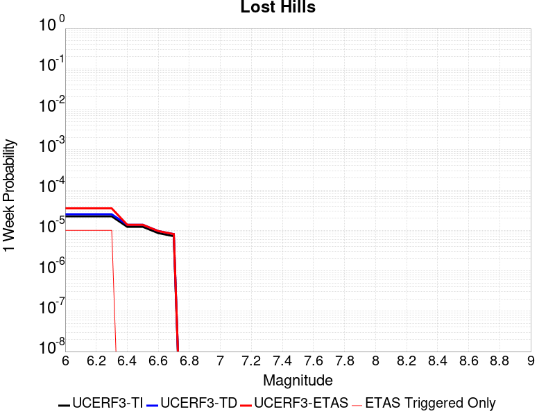 |  |  |  |

| Magnitude | 1 wk TI Prob | 1 wk TD Prob | 1 wk ETAS Prob | 1 wk ETAS/TD Gain | 1 wk ETAS Triggered Only | 1 mo TI Prob | 1 mo TD Prob | 1 mo ETAS Prob | 1 mo ETAS/TD Gain | 1 mo ETAS Triggered Only | 1 yr TI Prob | 1 yr TD Prob | 1 yr ETAS Prob | 1 yr ETAS/TD Gain | 1 yr ETAS Triggered Only | 10 yr TI Prob | 10 yr TD Prob | 10 yr ETAS Prob | 10 yr ETAS/TD Gain | 10 yr ETAS Triggered Only |
|-----|-----|-----|-----|-----|-----|-----|-----|-----|-----|-----|-----|-----|-----|-----|-----|-----|-----|-----|-----|-----|
| 6.0 | 2.233523E-5 | 2.5106996E-5 | 2.5106996E-5 | 1.0 | 0.0 | 9.571891E-5 | 1.0759792E-4 | 1.0759792E-4 | 1.0 | 0.0 | 0.0011647546 | 0.0013093855 | 0.001362649 | 1.0406783 | 5.3333333E-5 | 0.011586686 | 0.013033304 | 0.013085943 | 1.0040387 | 5.3333333E-5 |
| 6.1 | 2.233523E-5 | 2.5106996E-5 | 2.5106996E-5 | 1.0 | 0.0 | 9.571891E-5 | 1.0759792E-4 | 1.0759792E-4 | 1.0 | 0.0 | 0.0011647546 | 0.0013093855 | 0.001362649 | 1.0406783 | 5.3333333E-5 | 0.011586686 | 0.013033304 | 0.013085943 | 1.0040387 | 5.3333333E-5 |
| 6.2 | 2.233523E-5 | 2.5106996E-5 | 2.5106996E-5 | 1.0 | 0.0 | 9.571891E-5 | 1.0759792E-4 | 1.0759792E-4 | 1.0 | 0.0 | 0.0011647546 | 0.0013093855 | 0.001362649 | 1.0406783 | 5.3333333E-5 | 0.011586686 | 0.013033304 | 0.013085943 | 1.0040387 | 5.3333333E-5 |
| 6.3 | 2.233523E-5 | 2.5106996E-5 | 2.5106996E-5 | 1.0 | 0.0 | 9.571891E-5 | 1.0759792E-4 | 1.0759792E-4 | 1.0 | 0.0 | 0.0011647546 | 0.0013093855 | 0.001362649 | 1.0406783 | 5.3333333E-5 | 0.011586686 | 0.013033304 | 0.013085943 | 1.0040387 | 5.3333333E-5 |
| 6.4 | 1.2288092E-5 | 1.37813295E-5 | 1.37813295E-5 | 1.0 | 0.0 | 5.2662188E-5 | 5.9062033E-5 | 5.9062033E-5 | 1.0 | 0.0 | 6.409735E-4 | 7.189368E-4 | 7.455843E-4 | 1.0370651 | 2.6666667E-5 | 0.006391279 | 0.007175316 | 0.0072017913 | 1.0036898 | 2.6666667E-5 |
| 6.5 | 1.2288092E-5 | 1.37813295E-5 | 1.37813295E-5 | 1.0 | 0.0 | 5.2662188E-5 | 5.9062033E-5 | 5.9062033E-5 | 1.0 | 0.0 | 6.409735E-4 | 7.189368E-4 | 7.455843E-4 | 1.0370651 | 2.6666667E-5 | 0.006391279 | 0.007175316 | 0.0072017913 | 1.0036898 | 2.6666667E-5 |
| 6.6 | 8.58281E-6 | 9.633926E-6 | 9.633926E-6 | 1.0 | 0.0 | 3.6782953E-5 | 4.1288073E-5 | 4.1288073E-5 | 1.0 | 0.0 | 4.4774043E-4 | 5.026495E-4 | 5.293028E-4 | 1.0530255 | 2.6666667E-5 | 0.0044683935 | 0.0050232867 | 0.005049819 | 1.0052819 | 2.6666667E-5 |
| 6.7 | 7.205685E-6 | 8.088433E-6 | 8.088433E-6 | 1.0 | 0.0 | 3.088114E-5 | 3.4664714E-5 | 3.4664714E-5 | 1.0 | 0.0 | 3.7591302E-4 | 4.2204288E-4 | 4.486983E-4 | 1.063158 | 2.6666667E-5 | 0.0037527776 | 0.004220429 | 0.0042469827 | 1.0062917 | 2.6666667E-5 |

## Calaveras (So) 2011 CFM
*[(top)](#table-of-contents)*

| 1 Week | 1 Month | 1 Year | 10 Year |
|-----|-----|-----|-----|
|  |  |  |  |

| Magnitude | 1 wk TI Prob | 1 wk TD Prob | 1 wk ETAS Prob | 1 wk ETAS/TD Gain | 1 wk ETAS Triggered Only | 1 mo TI Prob | 1 mo TD Prob | 1 mo ETAS Prob | 1 mo ETAS/TD Gain | 1 mo ETAS Triggered Only | 1 yr TI Prob | 1 yr TD Prob | 1 yr ETAS Prob | 1 yr ETAS/TD Gain | 1 yr ETAS Triggered Only | 10 yr TI Prob | 10 yr TD Prob | 10 yr ETAS Prob | 10 yr ETAS/TD Gain | 10 yr ETAS Triggered Only |
|-----|-----|-----|-----|-----|-----|-----|-----|-----|-----|-----|-----|-----|-----|-----|-----|-----|-----|-----|-----|-----|
| 6.0 | 1.5950744E-4 | 3.0719102E-4 | 3.3384952E-4 | 1.0867814 | 2.6666667E-5 | 6.834242E-4 | 0.0013158836 | 0.0013425151 | 1.0202385 | 2.6666667E-5 | 0.00828899 | 0.015860915 | 0.015887158 | 1.0016546 | 2.6666667E-5 | 0.079865426 | 0.14441721 | 0.14446285 | 1.000316 | 5.3333333E-5 |
| 6.1 | 1.3584697E-4 | 2.604323E-4 | 2.604323E-4 | 1.0 | 0.0 | 5.8207137E-4 | 0.0011156795 | 0.0011156795 | 1.0 | 0.0 | 0.007063716 | 0.013463869 | 0.013463869 | 1.0 | 0.0 | 0.06843361 | 0.124044694 | 0.124044694 | 1.0 | 0.0 |
| 6.2 | 1.14676266E-4 | 2.1731424E-4 | 2.1731424E-4 | 1.0 | 0.0 | 4.9137714E-4 | 9.310301E-4 | 9.310301E-4 | 1.0 | 0.0 | 0.0059661185 | 0.01124721 | 0.01124721 | 1.0 | 0.0 | 0.058084648 | 0.10503508 | 0.10503508 | 1.0 | 0.0 |
| 6.3 | 8.691518E-5 | 1.5990793E-4 | 1.5990793E-4 | 1.0 | 0.0 | 3.7244044E-4 | 6.851358E-4 | 6.851358E-4 | 1.0 | 0.0 | 0.004525038 | 0.008302716 | 0.008302716 | 1.0 | 0.0 | 0.044339992 | 0.079350494 | 0.079350494 | 1.0 | 0.0 |
| 6.4 | 8.50982E-5 | 1.5697183E-4 | 1.5697183E-4 | 1.0 | 0.0 | 3.646556E-4 | 6.725591E-4 | 6.725591E-4 | 1.0 | 0.0 | 0.0044306475 | 0.008150746 | 0.008150746 | 1.0 | 0.0 | 0.04343345 | 0.0779566 | 0.0779566 | 1.0 | 0.0 |
| 6.5 | 8.4062965E-5 | 1.5521735E-4 | 1.5521735E-4 | 1.0 | 0.0 | 3.602201E-4 | 6.650437E-4 | 6.650437E-4 | 1.0 | 0.0 | 0.004376863 | 0.008059946 | 0.008059946 | 1.0 | 0.0 | 0.042916555 | 0.07712786 | 0.07712786 | 1.0 | 0.0 |
| 6.6 | 8.194716E-5 | 1.5157646E-4 | 1.5157646E-4 | 1.0 | 0.0 | 3.5115483E-4 | 6.494477E-4 | 6.494477E-4 | 1.0 | 0.0 | 0.0042669317 | 0.007871782 | 0.007871782 | 1.0 | 0.0 | 0.04185927 | 0.075413086 | 0.075413086 | 1.0 | 0.0 |
| 6.7 | 8.012326E-5 | 1.4825336E-4 | 1.4825336E-4 | 1.0 | 0.0 | 3.433402E-4 | 6.3521386E-4 | 6.3521386E-4 | 1.0 | 0.0 | 0.004172157 | 0.0077002714 | 0.0077002714 | 1.0 | 0.0 | 0.040946912 | 0.073855184 | 0.073855184 | 1.0 | 0.0 |
| 6.8 | 7.119773E-5 | 1.2883788E-4 | 1.2883788E-4 | 1.0 | 0.0 | 3.0509746E-4 | 5.5204553E-4 | 5.5204553E-4 | 1.0 | 0.0 | 0.0037082357 | 0.0066975304 | 0.0066975304 | 1.0 | 0.0 | 0.036469642 | 0.064698465 | 0.064698465 | 1.0 | 0.0 |
| 6.9 | 5.7343088E-5 | 9.921204E-5 | 9.921204E-5 | 1.0 | 0.0 | 2.4573295E-4 | 4.2512562E-4 | 4.2512562E-4 | 1.0 | 0.0 | 0.0029876942 | 0.005163703 | 0.005163703 | 1.0 | 0.0 | 0.02947844 | 0.050519872 | 0.050519872 | 1.0 | 0.0 |
| 7.0 | 4.8746577E-5 | 8.286983E-5 | 8.286983E-5 | 1.0 | 0.0 | 2.0889717E-4 | 3.5510844E-4 | 3.5510844E-4 | 1.0 | 0.0 | 0.0025403565 | 0.004314941 | 0.004314941 | 1.0 | 0.0 | 0.025115121 | 0.042495564 | 0.042495564 | 1.0 | 0.0 |
| 7.1 | 4.2998014E-5 | 7.266396E-5 | 7.266396E-5 | 1.0 | 0.0 | 1.8426418E-4 | 3.1138014E-4 | 3.1138014E-4 | 1.0 | 0.0 | 0.002241108 | 0.0037845233 | 0.0037845233 | 1.0 | 0.0 | 0.022186412 | 0.03743038 | 0.03743038 | 1.0 | 0.0 |
| 7.2 | 3.221292E-5 | 5.3919634E-5 | 5.3919634E-5 | 1.0 | 0.0 | 1.3804805E-4 | 2.3106382E-4 | 2.3106382E-4 | 1.0 | 0.0 | 0.0016794393 | 0.002809601 | 0.002809601 | 1.0 | 0.0 | 0.016668037 | 0.0280428 | 0.0280428 | 1.0 | 0.0 |
| 7.3 | 2.3756531E-5 | 3.9484363E-5 | 3.9484363E-5 | 1.0 | 0.0 | 1.0180973E-4 | 1.6920782E-4 | 1.6920782E-4 | 1.0 | 0.0 | 0.0012388286 | 0.0020581756 | 0.0020581756 | 1.0 | 0.0 | 0.012319452 | 0.020649675 | 0.020649675 | 1.0 | 0.0 |
| 7.4 | 1.5997684E-5 | 2.7347376E-5 | 2.7347376E-5 | 1.0 | 0.0 | 6.8559704E-5 | 1.17197786E-4 | 1.17197786E-4 | 1.0 | 0.0 | 8.343947E-4 | 0.0014259516 | 0.0014259516 | 1.0 | 0.0 | 0.008312687 | 0.014379721 | 0.014379721 | 1.0 | 0.0 |
| 7.5 | 1.3814293E-5 | 2.4788933E-5 | 2.4788933E-5 | 1.0 | 0.0 | 5.9202768E-5 | 1.0623397E-4 | 1.0623397E-4 | 1.0 | 0.0 | 7.205553E-4 | 0.0012926336 | 0.0012926336 | 1.0 | 0.0 | 0.007182234 | 0.013058846 | 0.013058846 | 1.0 | 0.0 |
| 7.6 | 8.817309E-6 | 1.643521E-5 | 1.643521E-5 | 1.0 | 0.0 | 3.7787922E-5 | 7.043472E-5 | 7.043472E-5 | 1.0 | 0.0 | 4.5997082E-4 | 8.572067E-4 | 8.572067E-4 | 1.0 | 0.0 | 0.004590199 | 0.008722494 | 0.008722494 | 1.0 | 0.0 |
| 7.7 | 4.0352206E-6 | 7.711002E-6 | 7.711002E-6 | 1.0 | 0.0 | 1.7293689E-5 | 3.304673E-5 | 3.304673E-5 | 1.0 | 0.0 | 2.1053031E-4 | 4.0226974E-4 | 4.0226974E-4 | 1.0 | 0.0 | 0.0021033096 | 0.00416701 | 0.00416701 | 1.0 | 0.0 |
| 7.8 | 3.413169E-6 | 6.7905053E-6 | 6.7905053E-6 | 1.0 | 0.0 | 1.4627784E-5 | 2.910184E-5 | 2.910184E-5 | 1.0 | 0.0 | 1.7807873E-4 | 3.5425735E-4 | 3.5425735E-4 | 1.0 | 0.0 | 0.0017793609 | 0.0036680899 | 0.0036680899 | 1.0 | 0.0 |
| 7.9 | 2.4740732E-6 | 5.2815635E-6 | 5.2815635E-6 | 1.0 | 0.0 | 1.06031275E-5 | 2.2635075E-5 | 2.2635075E-5 | 1.0 | 0.0 | 1.2908543E-4 | 2.7554724E-4 | 2.7554724E-4 | 1.0 | 0.0 | 0.0012901047 | 0.0028359778 | 0.0028359778 | 1.0 | 0.0 |
| 8.0 | 1.5231818E-6 | 3.2903374E-6 | 3.2903374E-6 | 1.0 | 0.0 | 6.527906E-6 | 1.410137E-5 | 1.410137E-5 | 1.0 | 0.0 | 7.9474354E-5 | 1.7167069E-4 | 1.7167069E-4 | 1.0 | 0.0 | 7.944594E-4 | 0.0017571712 | 0.0017571712 | 1.0 | 0.0 |
| 8.1 | 1.0104524E-6 | 2.0467116E-6 | 2.0467116E-6 | 1.0 | 0.0 | 4.330503E-6 | 8.771593E-6 | 8.771593E-6 | 1.0 | 0.0 | 5.2722597E-5 | 1.0678893E-4 | 1.0678893E-4 | 1.0 | 0.0 | 5.271009E-4 | 0.0010934469 | 0.0010934469 | 1.0 | 0.0 |

## San Andreas (Creeping Section) 2011 CFM
*[(top)](#table-of-contents)*

| 1 Week | 1 Month | 1 Year | 10 Year |
|-----|-----|-----|-----|
|  |  | 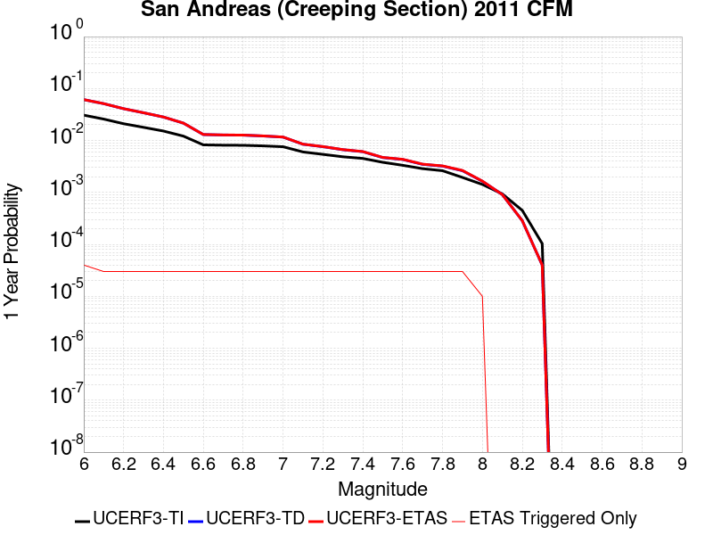 | 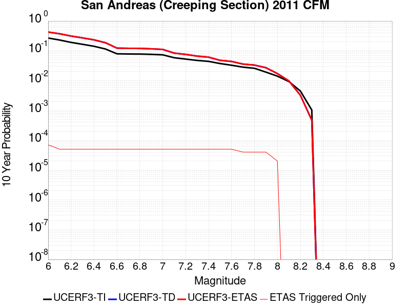 |

| Magnitude | 1 wk TI Prob | 1 wk TD Prob | 1 wk ETAS Prob | 1 wk ETAS/TD Gain | 1 wk ETAS Triggered Only | 1 mo TI Prob | 1 mo TD Prob | 1 mo ETAS Prob | 1 mo ETAS/TD Gain | 1 mo ETAS Triggered Only | 1 yr TI Prob | 1 yr TD Prob | 1 yr ETAS Prob | 1 yr ETAS/TD Gain | 1 yr ETAS Triggered Only | 10 yr TI Prob | 10 yr TD Prob | 10 yr ETAS Prob | 10 yr ETAS/TD Gain | 10 yr ETAS Triggered Only |
|-----|-----|-----|-----|-----|-----|-----|-----|-----|-----|-----|-----|-----|-----|-----|-----|-----|-----|-----|-----|-----|
| 6.0 | 5.986481E-4 | 0.0012278741 | 0.0012278741 | 1.0 | 0.0 | 0.0025631124 | 0.0052457973 | 0.0052457973 | 1.0 | 0.0 | 0.030762846 | 0.061208665 | 0.061208665 | 1.0 | 0.0 | 0.26835477 | 0.4259623 | 0.4259929 | 1.0000719 | 5.3333333E-5 |
| 6.1 | 5.015945E-4 | 0.0010222398 | 0.0010222398 | 1.0 | 0.0 | 0.00214792 | 0.004368119 | 0.004368119 | 1.0 | 0.0 | 0.025839351 | 0.0512512 | 0.0512512 | 1.0 | 0.0 | 0.23032776 | 0.37288252 | 0.37289923 | 1.0000448 | 2.6666667E-5 |
| 6.2 | 4.073338E-4 | 8.109135E-4 | 8.109135E-4 | 1.0 | 0.0 | 0.0017445484 | 0.0034676173 | 0.0034676173 | 1.0 | 0.0 | 0.021034058 | 0.040936444 | 0.040936444 | 1.0 | 0.0 | 0.19150782 | 0.3130621 | 0.3130804 | 1.0000585 | 2.6666667E-5 |
| 6.3 | 3.464099E-4 | 6.7394925E-4 | 6.7394925E-4 | 1.0 | 0.0 | 0.0014837692 | 0.00288274 | 0.00288274 | 1.0 | 0.0 | 0.017915873 | 0.034192428 | 0.034192428 | 1.0 | 0.0 | 0.16538359 | 0.27134693 | 0.27136636 | 1.0000716 | 2.6666667E-5 |
| 6.4 | 2.935057E-4 | 5.545115E-4 | 5.545115E-4 | 1.0 | 0.0 | 0.0012572751 | 0.0023718805 | 0.0023718805 | 1.0 | 0.0 | 0.015200248 | 0.028267467 | 0.028267467 | 1.0 | 0.0 | 0.14201577 | 0.2330172 | 0.23303767 | 1.0000877 | 2.6666667E-5 |
| 6.5 | 2.3409708E-4 | 4.2095222E-4 | 4.2095222E-4 | 1.0 | 0.0 | 0.0010028875 | 0.0018015768 | 0.0018015768 | 1.0 | 0.0 | 0.012141965 | 0.021591473 | 0.021591473 | 1.0 | 0.0 | 0.11499573 | 0.18685804 | 0.18687972 | 1.000116 | 2.6666667E-5 |
| 6.6 | 1.5842178E-4 | 2.5079807E-4 | 2.5079807E-4 | 1.0 | 0.0 | 6.7877385E-4 | 0.0010744074 | 0.0010744074 | 1.0 | 0.0 | 0.0082328 | 0.013001034 | 0.013001034 | 1.0 | 0.0 | 0.07934396 | 0.12318426 | 0.12320764 | 1.0001898 | 2.6666667E-5 |
| 6.7 | 1.5616413E-4 | 2.461632E-4 | 2.461632E-4 | 1.0 | 0.0 | 6.691031E-4 | 0.0010545597 | 0.0010545597 | 1.0 | 0.0 | 0.0081159435 | 0.012762894 | 0.012762894 | 1.0 | 0.0 | 0.0782586 | 0.12121142 | 0.12123485 | 1.0001934 | 2.6666667E-5 |
| 6.8 | 1.5538467E-4 | 2.4440174E-4 | 2.4440174E-4 | 1.0 | 0.0 | 6.6576427E-4 | 0.0010470168 | 0.0010470168 | 1.0 | 0.0 | 0.008075596 | 0.012672268 | 0.012672268 | 1.0 | 0.0 | 0.07788358 | 0.12044227 | 0.120465726 | 1.0001948 | 2.6666667E-5 |
| 6.9 | 1.5153569E-4 | 2.3549511E-4 | 2.3549511E-4 | 1.0 | 0.0 | 6.49277E-4 | 0.0010088764 | 0.0010088764 | 1.0 | 0.0 | 0.007876333 | 0.012214421 | 0.012214421 | 1.0 | 0.0 | 0.07602952 | 0.11651233 | 0.11653589 | 1.0002022 | 2.6666667E-5 |
| 7.0 | 1.4588932E-4 | 2.2406683E-4 | 2.2406683E-4 | 1.0 | 0.0 | 6.250901E-4 | 9.5993496E-4 | 9.5993496E-4 | 1.0 | 0.0 | 0.0075839474 | 0.011625077 | 0.011625077 | 1.0 | 0.0 | 0.073302895 | 0.111358546 | 0.111382246 | 1.0002128 | 2.6666667E-5 |
| 7.1 | 1.1565079E-4 | 1.6290719E-4 | 1.6290719E-4 | 1.0 | 0.0 | 4.955521E-4 | 6.9798774E-4 | 6.9798774E-4 | 1.0 | 0.0 | 0.006016669 | 0.008465091 | 0.008465091 | 1.0 | 0.0 | 0.058563538 | 0.08370675 | 0.08373119 | 1.000292 | 2.6666667E-5 |
| 7.2 | 1.0393792E-4 | 1.4624344E-4 | 1.4624344E-4 | 1.0 | 0.0 | 4.4537216E-4 | 6.2660786E-4 | 6.2660786E-4 | 1.0 | 0.0 | 0.005408933 | 0.007602434 | 0.007602434 | 1.0 | 0.0 | 0.052791595 | 0.07565546 | 0.07568011 | 1.0003258 | 2.6666667E-5 |
| 7.3 | 9.332884E-5 | 1.2788197E-4 | 1.2788197E-4 | 1.0 | 0.0 | 3.999194E-4 | 5.479511E-4 | 5.479511E-4 | 1.0 | 0.0 | 0.0048581534 | 0.0066510327 | 0.0066510327 | 1.0 | 0.0 | 0.047533102 | 0.06651482 | 0.06653971 | 1.0003742 | 2.6666667E-5 |
| 7.4 | 8.670252E-5 | 1.17095995E-4 | 1.17095995E-4 | 1.0 | 0.0 | 3.715293E-4 | 5.0174404E-4 | 5.0174404E-4 | 1.0 | 0.0 | 0.004513991 | 0.006091744 | 0.006091744 | 1.0 | 0.0 | 0.044233937 | 0.061179653 | 0.061204687 | 1.0004092 | 2.6666667E-5 |
| 7.5 | 7.3036405E-5 | 9.011144E-5 | 9.011144E-5 | 1.0 | 0.0 | 3.129756E-4 | 3.861348E-4 | 3.861348E-4 | 1.0 | 0.0 | 0.0038038217 | 0.004691079 | 0.004691079 | 1.0 | 0.0 | 0.03739367 | 0.047901772 | 0.04792716 | 1.00053 | 2.6666667E-5 |
| 7.6 | 6.3935775E-5 | 8.284792E-5 | 8.284792E-5 | 1.0 | 0.0 | 2.7398168E-4 | 3.550143E-4 | 3.550143E-4 | 1.0 | 0.0 | 0.0033306254 | 0.004313751 | 0.004313751 | 1.0 | 0.0 | 0.032811474 | 0.04401211 | 0.044037603 | 1.0005792 | 2.6666667E-5 |
| 7.7 | 5.5050095E-5 | 6.6657536E-5 | 6.6657536E-5 | 1.0 | 0.0 | 2.3590765E-4 | 2.8564388E-4 | 2.8564388E-4 | 1.0 | 0.0 | 0.0028683927 | 0.0034721727 | 0.0034721727 | 1.0 | 0.0 | 0.0283165 | 0.035814673 | 0.035814673 | 1.0 | 0.0 |
| 7.8 | 5.027131E-5 | 6.166444E-5 | 6.166444E-5 | 1.0 | 0.0 | 2.1543067E-4 | 2.6424942E-4 | 2.6424942E-4 | 1.0 | 0.0 | 0.0026197135 | 0.0032124936 | 0.0032124936 | 1.0 | 0.0 | 0.025890453 | 0.033143617 | 0.033143617 | 1.0 | 0.0 |
| 7.9 | 3.7271806E-5 | 5.0253755E-5 | 5.0253755E-5 | 1.0 | 0.0 | 1.5972654E-4 | 2.1535547E-4 | 2.1535547E-4 | 1.0 | 0.0 | 0.0019429359 | 0.0026188022 | 0.0026188022 | 1.0 | 0.0 | 0.019260362 | 0.027081102 | 0.027081102 | 1.0 | 0.0 |
| 8.0 | 2.7310243E-5 | 3.144777E-5 | 3.144777E-5 | 1.0 | 0.0 | 1.17038646E-4 | 1.3476919E-4 | 1.3476919E-4 | 1.0 | 0.0 | 0.0014240141 | 0.0016395808 | 0.0016395808 | 1.0 | 0.0 | 0.014149235 | 0.0172237 | 0.0172237 | 1.0 | 0.0 |
| 8.1 | 1.7940547E-5 | 1.7413187E-5 | 1.7413187E-5 | 1.0 | 0.0 | 7.688579E-5 | 7.4625816E-5 | 7.4625816E-5 | 1.0 | 0.0 | 9.3568244E-4 | 9.081911E-4 | 9.081911E-4 | 1.0 | 0.0 | 0.009317525 | 0.009805583 | 0.009805583 | 1.0 | 0.0 |
| 8.2 | 8.643924E-6 | 5.4798497E-6 | 5.4798497E-6 | 1.0 | 0.0 | 3.704486E-5 | 2.348486E-5 | 2.348486E-5 | 1.0 | 0.0 | 4.5092785E-4 | 2.858907E-4 | 2.858907E-4 | 1.0 | 0.0 | 0.0045001395 | 0.0032514327 | 0.0032514327 | 1.0 | 0.0 |
| 8.3 | 1.983087E-6 | 7.668296E-7 | 7.668296E-7 | 1.0 | 0.0 | 8.498917E-6 | 3.2864084E-6 | 3.2864084E-6 | 1.0 | 0.0 | 1.034694E-4 | 4.0011306E-5 | 4.0011306E-5 | 1.0 | 0.0 | 0.0010342124 | 4.724499E-4 | 4.724499E-4 | 1.0 | 0.0 |

## Pisgah-Bullion Mtn-Mesquite Lk
*[(top)](#table-of-contents)*

| 1 Week | 1 Month | 1 Year | 10 Year |
|-----|-----|-----|-----|
|  |  | 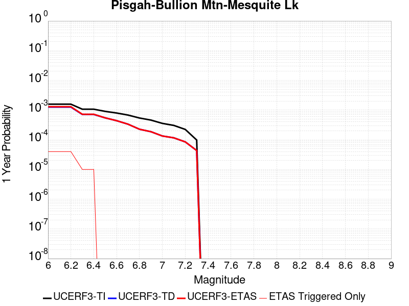 |  |

| Magnitude | 1 wk TI Prob | 1 wk TD Prob | 1 wk ETAS Prob | 1 wk ETAS/TD Gain | 1 wk ETAS Triggered Only | 1 mo TI Prob | 1 mo TD Prob | 1 mo ETAS Prob | 1 mo ETAS/TD Gain | 1 mo ETAS Triggered Only | 1 yr TI Prob | 1 yr TD Prob | 1 yr ETAS Prob | 1 yr ETAS/TD Gain | 1 yr ETAS Triggered Only | 10 yr TI Prob | 10 yr TD Prob | 10 yr ETAS Prob | 10 yr ETAS/TD Gain | 10 yr ETAS Triggered Only |
|-----|-----|-----|-----|-----|-----|-----|-----|-----|-----|-----|-----|-----|-----|-----|-----|-----|-----|-----|-----|-----|
| 6.0 | 3.0240792E-5 | 2.4091496E-5 | 2.4091496E-5 | 1.0 | 0.0 | 1.2959696E-4 | 1.0324575E-4 | 1.2990966E-4 | 1.2582568 | 2.6666667E-5 | 0.0015767008 | 0.0012563926 | 0.0012830258 | 1.0211982 | 2.6666667E-5 | 0.015655609 | 0.012502918 | 0.012555584 | 1.0042124 | 5.3333333E-5 |
| 6.1 | 3.0240792E-5 | 2.4091496E-5 | 2.4091496E-5 | 1.0 | 0.0 | 1.2959696E-4 | 1.0324575E-4 | 1.2990966E-4 | 1.2582568 | 2.6666667E-5 | 0.0015767008 | 0.0012563926 | 0.0012830258 | 1.0211982 | 2.6666667E-5 | 0.015655609 | 0.012502918 | 0.012555584 | 1.0042124 | 5.3333333E-5 |
| 6.2 | 3.0240792E-5 | 2.4091496E-5 | 2.4091496E-5 | 1.0 | 0.0 | 1.2959696E-4 | 1.0324575E-4 | 1.2990966E-4 | 1.2582568 | 2.6666667E-5 | 0.0015767008 | 0.0012563926 | 0.0012830258 | 1.0211982 | 2.6666667E-5 | 0.015655609 | 0.012502918 | 0.012555584 | 1.0042124 | 5.3333333E-5 |
| 6.3 | 2.0498217E-5 | 1.3638254E-5 | 1.3638254E-5 | 1.0 | 0.0 | 8.784654E-5 | 5.8448444E-5 | 5.8448444E-5 | 1.0 | 0.0 | 0.0010690069 | 7.1139366E-4 | 7.1139366E-4 | 1.0 | 0.0 | 0.01063879 | 0.00709279 | 0.0071192677 | 1.003733 | 2.6666667E-5 |
| 6.4 | 2.0498217E-5 | 1.3638254E-5 | 1.3638254E-5 | 1.0 | 0.0 | 8.784654E-5 | 5.8448444E-5 | 5.8448444E-5 | 1.0 | 0.0 | 0.0010690069 | 7.1139366E-4 | 7.1139366E-4 | 1.0 | 0.0 | 0.01063879 | 0.00709279 | 0.0071192677 | 1.003733 | 2.6666667E-5 |
| 6.5 | 1.7316182E-5 | 1.0477178E-5 | 1.0477178E-5 | 1.0 | 0.0 | 7.42101E-5 | 4.4901473E-5 | 4.4901473E-5 | 1.0 | 0.0 | 9.0313336E-4 | 5.465483E-4 | 5.465483E-4 | 1.0 | 0.0 | 0.008994718 | 0.005453037 | 0.005453037 | 1.0 | 0.0 |
| 6.6 | 1.5251077E-5 | 8.414378E-6 | 8.414378E-6 | 1.0 | 0.0 | 6.536012E-5 | 3.606116E-5 | 3.606116E-5 | 1.0 | 0.0 | 7.9546886E-4 | 4.389634E-4 | 4.389634E-4 | 1.0 | 0.0 | 0.007926274 | 0.004381681 | 0.004381681 | 1.0 | 0.0 |
| 6.7 | 1.2997425E-5 | 6.411573E-6 | 6.411573E-6 | 1.0 | 0.0 | 5.570206E-5 | 2.7477907E-5 | 2.7477907E-5 | 1.0 | 0.0 | 6.7796157E-4 | 3.344968E-4 | 3.344968E-4 | 1.0 | 0.0 | 0.0067589693 | 0.0033403935 | 0.0033403935 | 1.0 | 0.0 |
| 6.8 | 1.035386E-5 | 4.333283E-6 | 4.333283E-6 | 1.0 | 0.0 | 4.437293E-5 | 1.8571085E-5 | 1.8571085E-5 | 1.0 | 0.0 | 5.401065E-4 | 2.2608037E-4 | 2.2608037E-4 | 1.0 | 0.0 | 0.0053879567 | 0.0022585907 | 0.0022585907 | 1.0 | 0.0 |
| 6.9 | 8.816252E-6 | 3.580692E-6 | 3.580692E-6 | 1.0 | 0.0 | 3.778339E-5 | 1.5345737E-5 | 1.5345737E-5 | 1.0 | 0.0 | 4.5991567E-4 | 1.8681891E-4 | 1.8681891E-4 | 1.0 | 0.0 | 0.00458965 | 0.0018666771 | 0.0018666771 | 1.0 | 0.0 |
| 7.0 | 6.8232207E-6 | 2.5676256E-6 | 2.5676256E-6 | 1.0 | 0.0 | 2.9242048E-5 | 1.10040655E-5 | 1.10040655E-5 | 1.0 | 0.0 | 3.5596377E-4 | 1.3396658E-4 | 1.3396658E-4 | 1.0 | 0.0 | 0.0035539411 | 0.0013388892 | 0.0013388892 | 1.0 | 0.0 |
| 7.1 | 5.837013E-6 | 2.2274157E-6 | 2.2274157E-6 | 1.0 | 0.0 | 2.501553E-5 | 9.546034E-6 | 9.546034E-6 | 1.0 | 0.0 | 3.045215E-4 | 1.1621706E-4 | 1.1621706E-4 | 1.0 | 0.0 | 0.0030410455 | 0.0011615918 | 0.0011615918 | 1.0 | 0.0 |
| 7.2 | 4.278052E-6 | 1.6275965E-6 | 1.6275965E-6 | 1.0 | 0.0 | 1.833438E-5 | 6.9753964E-6 | 6.9753964E-6 | 1.0 | 0.0 | 2.231982E-4 | 8.492238E-5 | 8.492238E-5 | 1.0 | 0.0 | 0.0022297418 | 8.489225E-4 | 8.489225E-4 | 1.0 | 0.0 |
| 7.3 | 1.8803692E-6 | 8.3450385E-7 | 8.3450385E-7 | 1.0 | 0.0 | 8.0587E-6 | 3.576441E-6 | 3.576441E-6 | 1.0 | 0.0 | 9.811026E-5 | 4.3542448E-5 | 4.3542448E-5 | 1.0 | 0.0 | 9.806695E-4 | 4.353536E-4 | 4.353536E-4 | 1.0 | 0.0 |

## Chino alt 1
*[(top)](#table-of-contents)*

| 1 Week | 1 Month | 1 Year | 10 Year |
|-----|-----|-----|-----|
|  |  |  |  |

| Magnitude | 1 wk TI Prob | 1 wk TD Prob | 1 wk ETAS Prob | 1 wk ETAS/TD Gain | 1 wk ETAS Triggered Only | 1 mo TI Prob | 1 mo TD Prob | 1 mo ETAS Prob | 1 mo ETAS/TD Gain | 1 mo ETAS Triggered Only | 1 yr TI Prob | 1 yr TD Prob | 1 yr ETAS Prob | 1 yr ETAS/TD Gain | 1 yr ETAS Triggered Only | 10 yr TI Prob | 10 yr TD Prob | 10 yr ETAS Prob | 10 yr ETAS/TD Gain | 10 yr ETAS Triggered Only |
|-----|-----|-----|-----|-----|-----|-----|-----|-----|-----|-----|-----|-----|-----|-----|-----|-----|-----|-----|-----|-----|
| 6.0 | 3.939946E-5 | 4.895037E-5 | 4.895037E-5 | 1.0 | 0.0 | 1.6884391E-4 | 2.0977337E-4 | 2.0977337E-4 | 1.0 | 0.0 | 0.0020537362 | 0.0025514876 | 0.0025514876 | 1.0 | 0.0 | 0.020348595 | 0.025278764 | 0.025330748 | 1.0020565 | 5.3333333E-5 |
| 6.1 | 2.1505624E-5 | 2.6880154E-5 | 2.6880154E-5 | 1.0 | 0.0 | 9.2163704E-5 | 1.151962E-4 | 1.151962E-4 | 1.0 | 0.0 | 0.0011215154 | 0.0014017228 | 0.0014017228 | 1.0 | 0.0 | 0.011158722 | 0.013945717 | 0.013945717 | 1.0 | 0.0 |
| 6.2 | 2.1505624E-5 | 2.6880154E-5 | 2.6880154E-5 | 1.0 | 0.0 | 9.2163704E-5 | 1.151962E-4 | 1.151962E-4 | 1.0 | 0.0 | 0.0011215154 | 0.0014017228 | 0.0014017228 | 1.0 | 0.0 | 0.011158722 | 0.013945717 | 0.013945717 | 1.0 | 0.0 |
| 6.3 | 1.4290785E-5 | 1.8166014E-5 | 1.8166014E-5 | 1.0 | 0.0 | 6.1244784E-5 | 7.785228E-5 | 7.785228E-5 | 1.0 | 0.0 | 7.454001E-4 | 9.4748475E-4 | 9.4748475E-4 | 1.0 | 0.0 | 0.007429048 | 0.009444912 | 0.009444912 | 1.0 | 0.0 |
| 6.4 | 1.4290785E-5 | 1.8166014E-5 | 1.8166014E-5 | 1.0 | 0.0 | 6.1244784E-5 | 7.785228E-5 | 7.785228E-5 | 1.0 | 0.0 | 7.454001E-4 | 9.4748475E-4 | 9.4748475E-4 | 1.0 | 0.0 | 0.007429048 | 0.009444912 | 0.009444912 | 1.0 | 0.0 |
| 6.5 | 1.3017944E-5 | 1.6652937E-5 | 1.6652937E-5 | 1.0 | 0.0 | 5.5789995E-5 | 7.136803E-5 | 7.136803E-5 | 1.0 | 0.0 | 6.790315E-4 | 8.686031E-4 | 8.686031E-4 | 1.0 | 0.0 | 0.0067696036 | 0.008662385 | 0.008662385 | 1.0 | 0.0 |
| 6.6 | 9.470016E-6 | 1.2040057E-5 | 1.2040057E-5 | 1.0 | 0.0 | 4.058515E-5 | 5.1599414E-5 | 5.1599414E-5 | 1.0 | 0.0 | 4.940122E-4 | 6.2807574E-4 | 6.2807574E-4 | 1.0 | 0.0 | 0.004929154 | 0.0062722242 | 0.0062722242 | 1.0 | 0.0 |
| 6.7 | 8.314155E-6 | 1.0408293E-5 | 1.0408293E-5 | 1.0 | 0.0 | 3.5631605E-5 | 4.460639E-5 | 4.460639E-5 | 1.0 | 0.0 | 4.3372845E-4 | 5.429797E-4 | 5.429797E-4 | 1.0 | 0.0 | 0.004328829 | 0.005426062 | 0.005426062 | 1.0 | 0.0 |
| 6.8 | 3.4856364E-6 | 3.8135372E-6 | 3.8135372E-6 | 1.0 | 0.0 | 1.4938357E-5 | 1.634364E-5 | 1.634364E-5 | 1.0 | 0.0 | 1.8185932E-4 | 1.9896773E-4 | 1.9896773E-4 | 1.0 | 0.0 | 0.0018171056 | 0.001989573 | 0.001989573 | 1.0 | 0.0 |
| 6.9 | 2.2645952E-6 | 2.152999E-6 | 2.152999E-6 | 1.0 | 0.0 | 9.705372E-6 | 9.227107E-6 | 9.227107E-6 | 1.0 | 0.0 | 1.18156495E-4 | 1.1233445E-4 | 1.1233445E-4 | 1.0 | 0.0 | 0.0011809369 | 0.0011233927 | 0.0011233927 | 1.0 | 0.0 |
| 7.0 | 1.7864003E-6 | 1.5431575E-6 | 1.5431575E-6 | 1.0 | 0.0 | 7.655979E-6 | 6.613516E-6 | 6.613516E-6 | 1.0 | 0.0 | 9.3207556E-5 | 8.0516635E-5 | 8.0516635E-5 | 1.0 | 0.0 | 9.316847E-4 | 8.0532173E-4 | 8.0532173E-4 | 1.0 | 0.0 |
| 7.1 | 1.7315456E-6 | 1.4734279E-6 | 1.4734279E-6 | 1.0 | 0.0 | 7.420889E-6 | 6.3146763E-6 | 6.3146763E-6 | 1.0 | 0.0 | 9.034557E-5 | 7.6878525E-5 | 7.6878525E-5 | 1.0 | 0.0 | 9.0308854E-4 | 7.6895714E-4 | 7.6895714E-4 | 1.0 | 0.0 |
| 7.2 | 1.6008337E-6 | 1.3574753E-6 | 1.3574753E-6 | 1.0 | 0.0 | 6.860698E-6 | 5.817739E-6 | 5.817739E-6 | 1.0 | 0.0 | 8.352579E-5 | 7.082872E-5 | 7.082872E-5 | 1.0 | 0.0 | 8.34944E-4 | 7.084856E-4 | 7.084856E-4 | 1.0 | 0.0 |
| 7.3 | 1.3320939E-6 | 1.1218251E-6 | 1.1218251E-6 | 1.0 | 0.0 | 5.7089615E-6 | 4.8078136E-6 | 4.8078136E-6 | 1.0 | 0.0 | 6.9504385E-5 | 5.8533606E-5 | 5.8533606E-5 | 1.0 | 0.0 | 6.9482654E-4 | 5.853264E-4 | 5.853264E-4 | 1.0 | 0.0 |
| 7.4 | 1.114294E-6 | 9.2374523E-7 | 9.2374523E-7 | 1.0 | 0.0 | 4.775537E-6 | 3.958902E-6 | 3.958902E-6 | 1.0 | 0.0 | 5.8140613E-5 | 4.8198606E-5 | 4.8198606E-5 | 1.0 | 0.0 | 5.81254E-4 | 4.8189834E-4 | 4.8189834E-4 | 1.0 | 0.0 |
| 7.5 | 9.354081E-7 | 7.623702E-7 | 7.623702E-7 | 1.0 | 0.0 | 4.0088858E-6 | 3.2672967E-6 | 3.2672967E-6 | 1.0 | 0.0 | 4.8807087E-5 | 3.9778646E-5 | 3.9778646E-5 | 1.0 | 0.0 | 4.879637E-4 | 3.9771866E-4 | 3.9771866E-4 | 1.0 | 0.0 |
| 7.6 | 8.521771E-7 | 6.8809493E-7 | 6.8809493E-7 | 1.0 | 0.0 | 3.6521824E-6 | 2.9489752E-6 | 2.9489752E-6 | 1.0 | 0.0 | 4.4464414E-5 | 3.5903213E-5 | 3.5903213E-5 | 1.0 | 0.0 | 4.4455516E-4 | 3.589773E-4 | 3.589773E-4 | 1.0 | 0.0 |
| 7.7 | 2.1803626E-7 | 1.4187151E-7 | 1.4187151E-7 | 1.0 | 0.0 | 9.344408E-7 | 6.080207E-7 | 6.080207E-7 | 1.0 | 0.0 | 1.1376757E-5 | 7.402636E-6 | 7.402636E-6 | 1.0 | 0.0 | 1.13761744E-4 | 7.402486E-5 | 7.402486E-5 | 1.0 | 0.0 |

## Great Valley 10 (Panoche)
*[(top)](#table-of-contents)*

| 1 Week | 1 Month | 1 Year | 10 Year |
|-----|-----|-----|-----|
|  |  |  |  |

| Magnitude | 1 wk TI Prob | 1 wk TD Prob | 1 wk ETAS Prob | 1 wk ETAS/TD Gain | 1 wk ETAS Triggered Only | 1 mo TI Prob | 1 mo TD Prob | 1 mo ETAS Prob | 1 mo ETAS/TD Gain | 1 mo ETAS Triggered Only | 1 yr TI Prob | 1 yr TD Prob | 1 yr ETAS Prob | 1 yr ETAS/TD Gain | 1 yr ETAS Triggered Only | 10 yr TI Prob | 10 yr TD Prob | 10 yr ETAS Prob | 10 yr ETAS/TD Gain | 10 yr ETAS Triggered Only |
|-----|-----|-----|-----|-----|-----|-----|-----|-----|-----|-----|-----|-----|-----|-----|-----|-----|-----|-----|-----|-----|
| 6.0 | 1.6014626E-5 | 1.6575756E-5 | 1.6575756E-5 | 1.0 | 0.0 | 6.863231E-5 | 7.103705E-5 | 7.103705E-5 | 1.0 | 0.0 | 8.35278E-4 | 8.645371E-4 | 9.178243E-4 | 1.0616367 | 5.3333333E-5 | 0.008321454 | 0.008612356 | 0.00866523 | 1.0061393 | 5.3333333E-5 |
| 6.1 | 1.6014626E-5 | 1.6575756E-5 | 1.6575756E-5 | 1.0 | 0.0 | 6.863231E-5 | 7.103705E-5 | 7.103705E-5 | 1.0 | 0.0 | 8.35278E-4 | 8.645371E-4 | 9.178243E-4 | 1.0616367 | 5.3333333E-5 | 0.008321454 | 0.008612356 | 0.00866523 | 1.0061393 | 5.3333333E-5 |
| 6.2 | 1.56782E-5 | 1.6198797E-5 | 1.6198797E-5 | 1.0 | 0.0 | 6.719056E-5 | 6.94216E-5 | 6.94216E-5 | 1.0 | 0.0 | 8.17738E-4 | 8.448843E-4 | 8.9817256E-4 | 1.0630717 | 5.3333333E-5 | 0.008147354 | 0.008417329 | 0.008470213 | 1.0062828 | 5.3333333E-5 |
| 6.3 | 1.5263338E-5 | 1.5723856E-5 | 1.5723856E-5 | 1.0 | 0.0 | 6.541267E-5 | 6.7386245E-5 | 6.7386245E-5 | 1.0 | 0.0 | 7.961082E-4 | 8.201227E-4 | 8.734123E-4 | 1.0649775 | 5.3333333E-5 | 0.007932622 | 0.008171554 | 0.008224451 | 1.0064734 | 5.3333333E-5 |
| 6.4 | 1.4720723E-5 | 1.5099705E-5 | 1.5099705E-5 | 1.0 | 0.0 | 6.308728E-5 | 6.471144E-5 | 6.471144E-5 | 1.0 | 0.0 | 7.67817E-4 | 7.8758097E-4 | 8.408723E-4 | 1.0676646 | 5.3333333E-5 | 0.007651695 | 0.007848473 | 0.007901388 | 1.006742 | 5.3333333E-5 |
| 6.5 | 1.408264E-5 | 1.4356282E-5 | 1.4356282E-5 | 1.0 | 0.0 | 6.0352773E-5 | 6.1525505E-5 | 6.1525505E-5 | 1.0 | 0.0 | 7.3454727E-4 | 7.488194E-4 | 8.021128E-4 | 1.0711699 | 5.3333333E-5 | 0.0073212404 | 0.0074635176 | 0.007516453 | 1.0070926 | 5.3333333E-5 |
| 6.6 | 1.3197086E-5 | 1.3322179E-5 | 1.3322179E-5 | 1.0 | 0.0 | 5.6557717E-5 | 5.7093832E-5 | 5.7093832E-5 | 1.0 | 0.0 | 6.8837265E-4 | 6.948994E-4 | 7.481957E-4 | 1.0766964 | 5.3333333E-5 | 0.006862442 | 0.0069278036 | 0.0069807675 | 1.0076451 | 5.3333333E-5 |
| 6.7 | 1.017583E-5 | 9.745584E-6 | 9.745584E-6 | 1.0 | 0.0 | 4.360997E-5 | 4.1766136E-5 | 4.1766136E-5 | 1.0 | 0.0 | 5.30822E-4 | 5.0838647E-4 | 5.616927E-4 | 1.1048537 | 5.3333333E-5 | 0.0052955584 | 0.005072487 | 0.0051255496 | 1.0104609 | 5.3333333E-5 |
| 6.8 | 8.557912E-6 | 7.872871E-6 | 7.872871E-6 | 1.0 | 0.0 | 3.667625E-5 | 3.374045E-5 | 3.374045E-5 | 1.0 | 0.0 | 4.4644187E-4 | 4.1071457E-4 | 4.64026E-4 | 1.1298016 | 5.3333333E-5 | 0.0044554602 | 0.004099762 | 0.0041528763 | 1.0129555 | 5.3333333E-5 |
| 6.9 | 6.14664E-6 | 5.092178E-6 | 5.092178E-6 | 1.0 | 0.0 | 2.6342475E-5 | 2.1823445E-5 | 2.1823445E-5 | 1.0 | 0.0 | 3.2067244E-4 | 2.6566943E-4 | 2.6566943E-4 | 1.0 | 0.0 | 0.003202101 | 0.0026536568 | 0.0026536568 | 1.0 | 0.0 |
| 7.0 | 3.2310581E-6 | 1.695154E-6 | 1.695154E-6 | 1.0 | 0.0 | 1.3847319E-5 | 7.264926E-6 | 7.264926E-6 | 1.0 | 0.0 | 1.6857806E-4 | 8.844698E-5 | 8.844698E-5 | 1.0 | 0.0 | 0.0016845023 | 8.841271E-4 | 8.841271E-4 | 1.0 | 0.0 |
| 7.1 | 2.544492E-6 | 9.1891064E-7 | 9.1891064E-7 | 1.0 | 0.0 | 1.090492E-5 | 3.9381825E-6 | 3.9381825E-6 | 1.0 | 0.0 | 1.327593E-4 | 4.7946367E-5 | 4.7946367E-5 | 1.0 | 0.0 | 0.0013268003 | 4.79365E-4 | 4.79365E-4 | 1.0 | 0.0 |
| 7.2 | 2.4479045E-6 | 8.84148E-7 | 8.84148E-7 | 1.0 | 0.0 | 1.0490977E-5 | 3.7892005E-6 | 3.7892005E-6 | 1.0 | 0.0 | 1.2772017E-4 | 4.6132587E-5 | 4.6132587E-5 | 1.0 | 0.0 | 0.0012764678 | 4.6123486E-4 | 4.6123486E-4 | 1.0 | 0.0 |
| 7.3 | 2.0559578E-6 | 7.8929344E-7 | 7.8929344E-7 | 1.0 | 0.0 | 8.811218E-6 | 3.382682E-6 | 3.382682E-6 | 1.0 | 0.0 | 1.072713E-4 | 4.1183423E-5 | 4.1183423E-5 | 1.0 | 0.0 | 0.0010721954 | 4.1176256E-4 | 4.1176256E-4 | 1.0 | 0.0 |
| 7.4 | 1.727687E-6 | 7.387884E-7 | 7.387884E-7 | 1.0 | 0.0 | 7.404352E-6 | 3.1662323E-6 | 3.1662323E-6 | 1.0 | 0.0 | 9.0144255E-5 | 3.8548245E-5 | 3.8548245E-5 | 1.0 | 0.0 | 9.0107694E-4 | 3.854202E-4 | 3.854202E-4 | 1.0 | 0.0 |
| 7.5 | 1.5002679E-6 | 6.5462535E-7 | 6.5462535E-7 | 1.0 | 0.0 | 6.4297037E-6 | 2.8055345E-6 | 2.8055345E-6 | 1.0 | 0.0 | 7.827883E-5 | 3.415689E-5 | 3.415689E-5 | 1.0 | 0.0 | 7.825126E-4 | 3.4152053E-4 | 3.4152053E-4 | 1.0 | 0.0 |

## Tin Mountain
*[(top)](#table-of-contents)*

| 1 Week | 1 Month | 1 Year | 10 Year |
|-----|-----|-----|-----|
|  |  |  |  |

| Magnitude | 1 wk TI Prob | 1 wk TD Prob | 1 wk ETAS Prob | 1 wk ETAS/TD Gain | 1 wk ETAS Triggered Only | 1 mo TI Prob | 1 mo TD Prob | 1 mo ETAS Prob | 1 mo ETAS/TD Gain | 1 mo ETAS Triggered Only | 1 yr TI Prob | 1 yr TD Prob | 1 yr ETAS Prob | 1 yr ETAS/TD Gain | 1 yr ETAS Triggered Only | 10 yr TI Prob | 10 yr TD Prob | 10 yr ETAS Prob | 10 yr ETAS/TD Gain | 10 yr ETAS Triggered Only |
|-----|-----|-----|-----|-----|-----|-----|-----|-----|-----|-----|-----|-----|-----|-----|-----|-----|-----|-----|-----|-----|
| 6.0 | 4.083776E-6 | 4.18155E-6 | 4.18155E-6 | 1.0 | 0.0 | 1.750178E-5 | 1.7920827E-5 | 1.7920827E-5 | 1.0 | 0.0 | 2.1306332E-4 | 2.1816794E-4 | 2.1816794E-4 | 1.0 | 0.0 | 0.0021285915 | 0.0021799032 | 0.0022331204 | 1.0244126 | 5.3333333E-5 |
| 6.1 | 4.083776E-6 | 4.18155E-6 | 4.18155E-6 | 1.0 | 0.0 | 1.750178E-5 | 1.7920827E-5 | 1.7920827E-5 | 1.0 | 0.0 | 2.1306332E-4 | 2.1816794E-4 | 2.1816794E-4 | 1.0 | 0.0 | 0.0021285915 | 0.0021799032 | 0.0022331204 | 1.0244126 | 5.3333333E-5 |
| 6.2 | 4.083776E-6 | 4.18155E-6 | 4.18155E-6 | 1.0 | 0.0 | 1.750178E-5 | 1.7920827E-5 | 1.7920827E-5 | 1.0 | 0.0 | 2.1306332E-4 | 2.1816794E-4 | 2.1816794E-4 | 1.0 | 0.0 | 0.0021285915 | 0.0021799032 | 0.0022331204 | 1.0244126 | 5.3333333E-5 |
| 6.3 | 4.083776E-6 | 4.18155E-6 | 4.18155E-6 | 1.0 | 0.0 | 1.750178E-5 | 1.7920827E-5 | 1.7920827E-5 | 1.0 | 0.0 | 2.1306332E-4 | 2.1816794E-4 | 2.1816794E-4 | 1.0 | 0.0 | 0.0021285915 | 0.0021799032 | 0.0022331204 | 1.0244126 | 5.3333333E-5 |
| 6.4 | 4.083776E-6 | 4.18155E-6 | 4.18155E-6 | 1.0 | 0.0 | 1.750178E-5 | 1.7920827E-5 | 1.7920827E-5 | 1.0 | 0.0 | 2.1306332E-4 | 2.1816794E-4 | 2.1816794E-4 | 1.0 | 0.0 | 0.0021285915 | 0.0021799032 | 0.0022331204 | 1.0244126 | 5.3333333E-5 |
| 6.5 | 2.3143427E-6 | 2.3731652E-6 | 2.3731652E-6 | 1.0 | 0.0 | 9.9185745E-6 | 1.0170673E-5 | 1.0170673E-5 | 1.0 | 0.0 | 1.2075195E-4 | 1.2382168E-4 | 1.2382168E-4 | 1.0 | 0.0 | 0.0012068636 | 0.0012376028 | 0.0012376028 | 1.0 | 0.0 |
| 6.6 | 2.3143427E-6 | 2.3731652E-6 | 2.3731652E-6 | 1.0 | 0.0 | 9.9185745E-6 | 1.0170673E-5 | 1.0170673E-5 | 1.0 | 0.0 | 1.2075195E-4 | 1.2382168E-4 | 1.2382168E-4 | 1.0 | 0.0 | 0.0012068636 | 0.0012376028 | 0.0012376028 | 1.0 | 0.0 |
| 6.7 | 1.7029532E-6 | 1.7497979E-6 | 1.7497979E-6 | 1.0 | 0.0 | 7.2983503E-6 | 7.4991153E-6 | 7.4991153E-6 | 1.0 | 0.0 | 8.885379E-5 | 9.129844E-5 | 9.129844E-5 | 1.0 | 0.0 | 8.881827E-4 | 9.1266196E-4 | 9.1266196E-4 | 1.0 | 0.0 |
| 6.8 | 1.2914646E-6 | 1.3299432E-6 | 1.3299432E-6 | 1.0 | 0.0 | 5.534837E-6 | 5.6997465E-6 | 5.6997465E-6 | 1.0 | 0.0 | 6.738455E-5 | 6.939264E-5 | 6.939264E-5 | 1.0 | 0.0 | 6.736412E-4 | 6.937531E-4 | 6.937531E-4 | 1.0 | 0.0 |
| 6.9 | 5.8708974E-7 | 6.117028E-7 | 6.117028E-7 | 1.0 | 0.0 | 2.5160964E-6 | 2.621581E-6 | 2.621581E-6 | 1.0 | 0.0 | 3.0633044E-5 | 3.1917323E-5 | 3.1917323E-5 | 1.0 | 0.0 | 3.0628822E-4 | 3.191315E-4 | 3.191315E-4 | 1.0 | 0.0 |
| 7.0 | 4.6248786E-7 | 4.832044E-7 | 4.832044E-7 | 1.0 | 0.0 | 1.9820893E-6 | 2.0708746E-6 | 2.0708746E-6 | 1.0 | 0.0 | 2.413167E-5 | 2.5212645E-5 | 2.5212645E-5 | 1.0 | 0.0 | 2.412905E-4 | 2.5210154E-4 | 2.5210154E-4 | 1.0 | 0.0 |
| 7.1 | 3.804606E-7 | 3.9871725E-7 | 3.9871725E-7 | 1.0 | 0.0 | 1.6305444E-6 | 1.7087873E-6 | 1.7087873E-6 | 1.0 | 0.0 | 1.9851697E-5 | 2.080432E-5 | 2.080432E-5 | 1.0 | 0.0 | 1.9849923E-4 | 2.080271E-4 | 2.080271E-4 | 1.0 | 0.0 |
| 7.2 | 3.5864858E-7 | 3.7617107E-7 | 3.7617107E-7 | 1.0 | 0.0 | 1.5370645E-6 | 1.6121609E-6 | 1.6121609E-6 | 1.0 | 0.0 | 1.87136E-5 | 1.9627916E-5 | 1.9627916E-5 | 1.0 | 0.0 | 1.8712023E-4 | 1.9626514E-4 | 1.9626514E-4 | 1.0 | 0.0 |
| 7.3 | 3.342063E-7 | 3.50637E-7 | 3.50637E-7 | 1.0 | 0.0 | 1.4323119E-6 | 1.5027293E-6 | 1.5027293E-6 | 1.0 | 0.0 | 1.7438259E-5 | 1.829561E-5 | 1.829561E-5 | 1.0 | 0.0 | 1.743689E-4 | 1.8294434E-4 | 1.8294434E-4 | 1.0 | 0.0 |
| 7.4 | 2.971242E-7 | 3.116602E-7 | 3.116602E-7 | 1.0 | 0.0 | 1.2733886E-6 | 1.3356861E-6 | 1.3356861E-6 | 1.0 | 0.0 | 1.5503398E-5 | 1.626189E-5 | 1.626189E-5 | 1.0 | 0.0 | 1.5502315E-4 | 1.6261027E-4 | 1.6261027E-4 | 1.0 | 0.0 |
| 7.5 | 1.4326713E-7 | 1.501262E-7 | 1.501262E-7 | 1.0 | 0.0 | 6.140018E-7 | 6.43398E-7 | 6.43398E-7 | 1.0 | 0.0 | 7.4754466E-6 | 7.833371E-6 | 7.833371E-6 | 1.0 | 0.0 | 7.475195E-5 | 7.83337E-5 | 7.83337E-5 | 1.0 | 0.0 |

## San Jacinto (Borrego)
*[(top)](#table-of-contents)*

| 1 Week | 1 Month | 1 Year | 10 Year |
|-----|-----|-----|-----|
|  |  |  |  |

| Magnitude | 1 wk TI Prob | 1 wk TD Prob | 1 wk ETAS Prob | 1 wk ETAS/TD Gain | 1 wk ETAS Triggered Only | 1 mo TI Prob | 1 mo TD Prob | 1 mo ETAS Prob | 1 mo ETAS/TD Gain | 1 mo ETAS Triggered Only | 1 yr TI Prob | 1 yr TD Prob | 1 yr ETAS Prob | 1 yr ETAS/TD Gain | 1 yr ETAS Triggered Only | 10 yr TI Prob | 10 yr TD Prob | 10 yr ETAS Prob | 10 yr ETAS/TD Gain | 10 yr ETAS Triggered Only |
|-----|-----|-----|-----|-----|-----|-----|-----|-----|-----|-----|-----|-----|-----|-----|-----|-----|-----|-----|-----|-----|
| 6.0 | 3.543992E-5 | 2.7934115E-5 | 2.7934115E-5 | 1.0 | 0.0 | 1.5187653E-4 | 1.1971221E-4 | 1.4637569E-4 | 1.2227298 | 2.6666667E-5 | 0.0018475284 | 0.001456534 | 0.0014831618 | 1.0182816 | 2.6666667E-5 | 0.018322436 | 0.014873597 | 0.0149261365 | 1.0035324 | 5.3333333E-5 |
| 6.1 | 3.542281E-5 | 2.7934115E-5 | 2.7934115E-5 | 1.0 | 0.0 | 1.5180321E-4 | 1.1971221E-4 | 1.4637569E-4 | 1.2227298 | 2.6666667E-5 | 0.0018466372 | 0.001456534 | 0.0014831618 | 1.0182816 | 2.6666667E-5 | 0.018313672 | 0.014873597 | 0.0149261365 | 1.0035324 | 5.3333333E-5 |
| 6.2 | 3.4688688E-5 | 2.7934115E-5 | 2.7934115E-5 | 1.0 | 0.0 | 1.4865733E-4 | 1.1971221E-4 | 1.4637568E-4 | 1.2227298 | 2.6666667E-5 | 0.0018084005 | 0.0014565339 | 0.0014831618 | 1.0182816 | 2.6666667E-5 | 0.017937548 | 0.014873596 | 0.0149261365 | 1.0035324 | 5.3333333E-5 |
| 6.3 | 3.2087122E-5 | 2.7779462E-5 | 2.7779462E-5 | 1.0 | 0.0 | 1.3750899E-4 | 1.1904947E-4 | 1.4571297E-4 | 1.2239698 | 2.6666667E-5 | 0.0016728862 | 0.0014484759 | 0.0014751039 | 1.0183835 | 2.6666667E-5 | 0.016603488 | 0.01479463 | 0.014847174 | 1.0035516 | 5.3333333E-5 |
| 6.4 | 3.1828724E-5 | 2.7746448E-5 | 2.7746448E-5 | 1.0 | 0.0 | 1.364017E-4 | 1.18908E-4 | 1.455715E-4 | 1.2242364 | 2.6666667E-5 | 0.0016594254 | 0.0014467557 | 0.0014733837 | 1.0184054 | 2.6666667E-5 | 0.016470885 | 0.014777708 | 0.014830253 | 1.0035557 | 5.3333333E-5 |
| 6.5 | 3.1563577E-5 | 2.7486154E-5 | 2.7486154E-5 | 1.0 | 0.0 | 1.3526545E-4 | 1.1779256E-4 | 1.4445608E-4 | 1.22636 | 2.6666667E-5 | 0.0016456128 | 0.0014331931 | 0.0014598216 | 1.0185798 | 2.6666667E-5 | 0.0163348 | 0.014644288 | 0.014696841 | 1.0035886 | 5.3333333E-5 |
| 6.6 | 3.1467625E-5 | 2.7330374E-5 | 2.7330374E-5 | 1.0 | 0.0 | 1.3485427E-4 | 1.1712498E-4 | 1.4378852E-4 | 1.2276504 | 2.6666667E-5 | 0.0016406142 | 0.001425076 | 0.0014517048 | 1.0186858 | 2.6666667E-5 | 0.016285548 | 0.014564533 | 0.014617089 | 1.0036086 | 5.3333333E-5 |
| 6.7 | 3.1223695E-5 | 2.6948383E-5 | 2.6948383E-5 | 1.0 | 0.0 | 1.3380898E-4 | 1.1548802E-4 | 1.421516E-4 | 1.2308775 | 2.6666667E-5 | 0.0016279068 | 0.0014051719 | 0.0014318011 | 1.0189508 | 2.6666667E-5 | 0.01616033 | 0.014368899 | 0.014421467 | 1.0036584 | 5.3333333E-5 |
| 6.8 | 3.1015585E-5 | 2.6769376E-5 | 2.6769376E-5 | 1.0 | 0.0 | 1.3291716E-4 | 1.14720926E-4 | 1.4138453E-4 | 1.2324215 | 2.6666667E-5 | 0.001617065 | 0.0013958444 | 0.0014224739 | 1.0190777 | 2.6666667E-5 | 0.016053487 | 0.014276173 | 0.014328745 | 1.0036825 | 5.3333333E-5 |
| 6.9 | 2.6641965E-5 | 2.2191349E-5 | 2.2191349E-5 | 1.0 | 0.0 | 1.1417485E-4 | 9.510233E-5 | 1.2176647E-4 | 1.2803731 | 2.6666667E-5 | 0.0013891924 | 0.0011572598 | 0.0011838956 | 1.0230162 | 2.6666667E-5 | 0.0138054015 | 0.011886145 | 0.011938844 | 1.0044336 | 5.3333333E-5 |
| 7.0 | 2.3854353E-5 | 2.048587E-5 | 2.048587E-5 | 1.0 | 0.0 | 1.02228936E-4 | 8.779365E-5 | 1.1445797E-4 | 1.303716 | 2.6666667E-5 | 0.0012439266 | 0.0010683661 | 0.0010950043 | 1.0249336 | 2.6666667E-5 | 0.012369866 | 0.010986375 | 0.011039122 | 1.0048012 | 5.3333333E-5 |
| 7.1 | 2.3672901E-5 | 2.032235E-5 | 2.032235E-5 | 1.0 | 0.0 | 1.0145135E-4 | 8.709289E-5 | 1.1375724E-4 | 1.3061599 | 2.6666667E-5 | 0.0012344702 | 0.0010598428 | 0.0010864811 | 1.0251343 | 2.6666667E-5 | 0.0122763505 | 0.010901547 | 0.010954299 | 1.004839 | 5.3333333E-5 |
| 7.2 | 2.2717244E-5 | 1.9549674E-5 | 1.9549674E-5 | 1.0 | 0.0 | 9.735599E-5 | 8.378164E-5 | 1.10446075E-4 | 1.318261 | 2.6666667E-5 | 0.0011846646 | 0.0010195666 | 0.001046206 | 1.0261283 | 2.6666667E-5 | 0.01178369 | 0.010498884 | 0.0105516575 | 1.0050266 | 5.3333333E-5 |
| 7.3 | 2.1016205E-5 | 1.8391213E-5 | 1.8391213E-5 | 1.0 | 0.0 | 9.006634E-5 | 7.881711E-5 | 1.05481675E-4 | 1.3383093 | 2.6666667E-5 | 0.001096006 | 9.5917797E-4 | 9.85819E-4 | 1.0277749 | 2.6666667E-5 | 0.010906163 | 0.009894462 | 0.009947267 | 1.0053369 | 5.3333333E-5 |
| 7.4 | 2.0683625E-5 | 1.8193714E-5 | 1.8193714E-5 | 1.0 | 0.0 | 8.86411E-5 | 7.797074E-5 | 1.0463533E-4 | 1.341982 | 2.6666667E-5 | 0.001078671 | 9.488824E-4 | 9.755238E-4 | 1.0280765 | 2.6666667E-5 | 0.010734501 | 0.009791178 | 0.009843988 | 1.0053937 | 5.3333333E-5 |
| 7.5 | 1.9993966E-5 | 1.7788683E-5 | 1.7788683E-5 | 1.0 | 0.0 | 8.568561E-5 | 7.6234996E-5 | 1.0289963E-4 | 1.349769 | 2.6666667E-5 | 0.001042723 | 9.2776783E-4 | 9.5440977E-4 | 1.0287162 | 2.6666667E-5 | 0.010378438 | 0.00957807 | 0.009630892 | 1.005515 | 5.3333333E-5 |
| 7.6 | 1.788966E-5 | 1.6441732E-5 | 1.6441732E-5 | 1.0 | 0.0 | 7.666772E-5 | 7.046267E-5 | 9.712746E-5 | 1.3784243 | 2.6666667E-5 | 9.3302975E-4 | 8.575471E-4 | 8.841909E-4 | 1.0310698 | 2.6666667E-5 | 0.00929122 | 0.0088698575 | 0.0089227175 | 1.0059595 | 5.3333333E-5 |
| 7.7 | 1.5125781E-5 | 1.4243621E-5 | 1.4243621E-5 | 1.0 | 0.0 | 6.4823165E-5 | 6.1042665E-5 | 8.7707704E-5 | 1.4368262 | 2.6666667E-5 | 7.889362E-4 | 7.4294186E-4 | 7.695887E-4 | 1.0358666 | 2.6666667E-5 | 0.007861412 | 0.0077174758 | 0.0077703977 | 1.0068574 | 5.3333333E-5 |
| 7.8 | 1.250089E-5 | 1.2636515E-5 | 1.2636515E-5 | 1.0 | 0.0 | 5.3574146E-5 | 5.415537E-5 | 8.0820595E-5 | 1.4923837 | 2.6666667E-5 | 6.5207E-4 | 6.591428E-4 | 6.857919E-4 | 1.04043 | 2.6666667E-5 | 0.006501599 | 0.00687092 | 0.0069238865 | 1.0077089 | 5.3333333E-5 |
| 7.9 | 9.561E-6 | 9.759914E-6 | 9.759914E-6 | 1.0 | 0.0 | 4.0975072E-5 | 4.1827538E-5 | 6.8493086E-5 | 1.6375118 | 2.6666667E-5 | 4.987573E-4 | 5.091318E-4 | 5.3578493E-4 | 1.05235 | 2.6666667E-5 | 0.0049763937 | 0.0053551346 | 0.0054081823 | 1.0099059 | 5.3333333E-5 |
| 8.0 | 8.01699E-6 | 8.2982915E-6 | 8.2982915E-6 | 1.0 | 0.0 | 3.4358076E-5 | 3.5563622E-5 | 6.2229345E-5 | 1.7498032 | 2.6666667E-5 | 4.1822926E-4 | 4.329016E-4 | 4.5955673E-4 | 1.0615731 | 2.6666667E-5 | 0.0041744304 | 0.0045759073 | 0.0046289964 | 1.0116019 | 5.3333333E-5 |
| 8.1 | 6.541947E-6 | 6.466171E-6 | 6.466171E-6 | 1.0 | 0.0 | 2.8036617E-5 | 2.7711869E-5 | 2.7711869E-5 | 1.0 | 0.0 | 3.4129233E-4 | 3.3734026E-4 | 3.3734026E-4 | 1.0 | 0.0 | 0.0034076865 | 0.0035827826 | 0.0035827826 | 1.0 | 0.0 |
| 8.2 | 1.7968189E-6 | 7.978815E-7 | 7.978815E-7 | 1.0 | 0.0 | 7.70063E-6 | 3.419488E-6 | 3.419488E-6 | 1.0 | 0.0 | 9.3751136E-5 | 4.163149E-5 | 4.163149E-5 | 1.0 | 0.0 | 9.371159E-4 | 4.7162327E-4 | 4.7162327E-4 | 1.0 | 0.0 |
| 8.3 | 1.5167889E-7 | 4.9030522E-8 | 4.9030522E-8 | 1.0 | 0.0 | 6.500522E-7 | 2.1013079E-7 | 2.1013079E-7 | 1.0 | 0.0 | 7.9143565E-6 | 2.55834E-6 | 2.55834E-6 | 1.0 | 0.0 | 7.914075E-5 | 2.9725656E-5 | 2.9725656E-5 | 1.0 | 0.0 |

## Kern Canyon (Lake Isabella) 2011
*[(top)](#table-of-contents)*

| 1 Week | 1 Month | 1 Year | 10 Year |
|-----|-----|-----|-----|
|  |  |  |  |

| Magnitude | 1 wk TI Prob | 1 wk TD Prob | 1 wk ETAS Prob | 1 wk ETAS/TD Gain | 1 wk ETAS Triggered Only | 1 mo TI Prob | 1 mo TD Prob | 1 mo ETAS Prob | 1 mo ETAS/TD Gain | 1 mo ETAS Triggered Only | 1 yr TI Prob | 1 yr TD Prob | 1 yr ETAS Prob | 1 yr ETAS/TD Gain | 1 yr ETAS Triggered Only | 10 yr TI Prob | 10 yr TD Prob | 10 yr ETAS Prob | 10 yr ETAS/TD Gain | 10 yr ETAS Triggered Only |
|-----|-----|-----|-----|-----|-----|-----|-----|-----|-----|-----|-----|-----|-----|-----|-----|-----|-----|-----|-----|-----|
| 6.0 | 4.2387383E-6 | 4.0016507E-6 | 4.0016507E-6 | 1.0 | 0.0 | 1.8165894E-5 | 1.7149829E-5 | 1.7149829E-5 | 1.0 | 0.0 | 2.2114732E-4 | 2.0878103E-4 | 2.3544213E-4 | 1.1276989 | 2.6666667E-5 | 0.0022092736 | 0.0020860326 | 0.002139255 | 1.0255135 | 5.3333333E-5 |
| 6.1 | 4.2387383E-6 | 4.0016507E-6 | 4.0016507E-6 | 1.0 | 0.0 | 1.8165894E-5 | 1.7149829E-5 | 1.7149829E-5 | 1.0 | 0.0 | 2.2114732E-4 | 2.0878103E-4 | 2.3544213E-4 | 1.1276989 | 2.6666667E-5 | 0.0022092736 | 0.0020860326 | 0.002139255 | 1.0255135 | 5.3333333E-5 |
| 6.2 | 4.2387383E-6 | 4.0016507E-6 | 4.0016507E-6 | 1.0 | 0.0 | 1.8165894E-5 | 1.7149829E-5 | 1.7149829E-5 | 1.0 | 0.0 | 2.2114732E-4 | 2.0878103E-4 | 2.3544213E-4 | 1.1276989 | 2.6666667E-5 | 0.0022092736 | 0.0020860326 | 0.002139255 | 1.0255135 | 5.3333333E-5 |
| 6.3 | 4.2387383E-6 | 4.0016507E-6 | 4.0016507E-6 | 1.0 | 0.0 | 1.8165894E-5 | 1.7149829E-5 | 1.7149829E-5 | 1.0 | 0.0 | 2.2114732E-4 | 2.0878103E-4 | 2.3544213E-4 | 1.1276989 | 2.6666667E-5 | 0.0022092736 | 0.0020860326 | 0.002139255 | 1.0255135 | 5.3333333E-5 |
| 6.4 | 4.2387383E-6 | 4.0016507E-6 | 4.0016507E-6 | 1.0 | 0.0 | 1.8165894E-5 | 1.7149829E-5 | 1.7149829E-5 | 1.0 | 0.0 | 2.2114732E-4 | 2.0878103E-4 | 2.3544213E-4 | 1.1276989 | 2.6666667E-5 | 0.0022092736 | 0.0020860326 | 0.002139255 | 1.0255135 | 5.3333333E-5 |
| 6.5 | 2.7857532E-6 | 2.5178747E-6 | 2.5178747E-6 | 1.0 | 0.0 | 1.1938888E-5 | 1.0790849E-5 | 1.0790849E-5 | 1.0 | 0.0 | 1.4534626E-4 | 1.31371E-4 | 1.5803416E-4 | 1.2029608 | 2.6666667E-5 | 0.0014525123 | 0.0013129661 | 0.0013662294 | 1.0405672 | 5.3333333E-5 |
| 6.6 | 2.2233348E-6 | 1.94413E-6 | 1.94413E-6 | 1.0 | 0.0 | 9.528543E-6 | 8.331959E-6 | 8.331959E-6 | 1.0 | 0.0 | 1.1600384E-4 | 1.0143697E-4 | 1.2810093E-4 | 1.2628623 | 2.6666667E-5 | 0.001159433 | 0.0010139153 | 0.0010671945 | 1.052548 | 5.3333333E-5 |
| 6.7 | 2.1635126E-6 | 1.8835098E-6 | 1.8835098E-6 | 1.0 | 0.0 | 9.272164E-6 | 8.07216E-6 | 8.07216E-6 | 1.0 | 0.0 | 1.1288274E-4 | 9.82742E-5 | 1.2493825E-4 | 1.271323 | 2.6666667E-5 | 0.0011282542 | 9.823156E-4 | 0.0010355965 | 1.0542401 | 5.3333333E-5 |
| 6.8 | 1.8685711E-6 | 1.583148E-6 | 1.583148E-6 | 1.0 | 0.0 | 8.008137E-6 | 6.784903E-6 | 6.784903E-6 | 1.0 | 0.0 | 9.74947E-5 | 8.260311E-5 | 1.09267574E-4 | 1.3228022 | 2.6666667E-5 | 9.745194E-4 | 8.25729E-4 | 8.790183E-4 | 1.0645361 | 5.3333333E-5 |
| 6.9 | 1.5815071E-6 | 1.3064976E-6 | 1.3064976E-6 | 1.0 | 0.0 | 6.77787E-6 | 5.599263E-6 | 5.599263E-6 | 1.0 | 0.0 | 8.251744E-5 | 6.816892E-5 | 9.483377E-5 | 1.3911585 | 2.6666667E-5 | 8.248681E-4 | 6.814828E-4 | 7.347798E-4 | 1.0782074 | 5.3333333E-5 |
| 7.0 | 1.3772564E-6 | 1.1210758E-6 | 1.1210758E-6 | 1.0 | 0.0 | 5.9025137E-6 | 4.804602E-6 | 4.804602E-6 | 1.0 | 0.0 | 7.186073E-5 | 5.849448E-5 | 8.515959E-5 | 1.4558568 | 2.6666667E-5 | 7.18375E-4 | 5.8479287E-4 | 6.38095E-4 | 1.0911471 | 5.3333333E-5 |
| 7.1 | 1.0916998E-6 | 8.763808E-7 | 8.763808E-7 | 1.0 | 0.0 | 4.678705E-6 | 3.7559125E-6 | 3.7559125E-6 | 1.0 | 0.0 | 5.6961744E-5 | 4.5727287E-5 | 4.5727287E-5 | 1.0 | 0.0 | 5.6947145E-4 | 4.5718014E-4 | 4.5718014E-4 | 1.0 | 0.0 |
| 7.2 | 7.6277024E-7 | 5.901475E-7 | 5.901475E-7 | 1.0 | 0.0 | 3.2690114E-6 | 2.5292013E-6 | 2.5292013E-6 | 1.0 | 0.0 | 3.9799485E-5 | 3.0792595E-5 | 3.0792595E-5 | 1.0 | 0.0 | 3.9792358E-4 | 3.078839E-4 | 3.078839E-4 | 1.0 | 0.0 |
| 7.3 | 5.3265916E-7 | 4.3824562E-7 | 4.3824562E-7 | 1.0 | 0.0 | 2.282823E-6 | 1.8781942E-6 | 1.8781942E-6 | 1.0 | 0.0 | 2.7793016E-5 | 2.286678E-5 | 2.286678E-5 | 1.0 | 0.0 | 2.778954E-4 | 2.2864464E-4 | 2.2864464E-4 | 1.0 | 0.0 |
| 7.4 | 3.4946007E-7 | 3.006581E-7 | 3.006581E-7 | 1.0 | 0.0 | 1.497685E-6 | 1.288534E-6 | 1.288534E-6 | 1.0 | 0.0 | 1.8234163E-5 | 1.568779E-5 | 1.568779E-5 | 1.0 | 0.0 | 1.8232666E-4 | 1.5686706E-4 | 1.5686706E-4 | 1.0 | 0.0 |
| 7.5 | 1.8317026E-7 | 1.4244868E-7 | 1.4244868E-7 | 1.0 | 0.0 | 7.850152E-7 | 6.104942E-7 | 6.104942E-7 | 1.0 | 0.0 | 9.557518E-6 | 7.4327427E-6 | 7.4327427E-6 | 1.0 | 0.0 | 9.5571064E-5 | 7.432502E-5 | 7.432502E-5 | 1.0 | 0.0 |
| 7.6 | 2.572245E-8 | 1.7352637E-8 | 1.7352637E-8 | 1.0 | 0.0 | 1.10239064E-7 | 7.4368444E-8 | 7.4368444E-8 | 1.0 | 0.0 | 1.3421597E-6 | 9.0543546E-7 | 9.0543546E-7 | 1.0 | 0.0 | 1.3421517E-5 | 9.0543235E-6 | 9.0543235E-6 | 1.0 | 0.0 |

## Great Valley 11
*[(top)](#table-of-contents)*

| 1 Week | 1 Month | 1 Year | 10 Year |
|-----|-----|-----|-----|
|  |  | 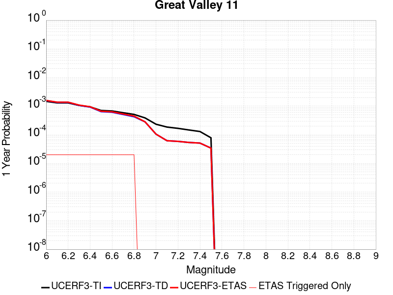 |  |

| Magnitude | 1 wk TI Prob | 1 wk TD Prob | 1 wk ETAS Prob | 1 wk ETAS/TD Gain | 1 wk ETAS Triggered Only | 1 mo TI Prob | 1 mo TD Prob | 1 mo ETAS Prob | 1 mo ETAS/TD Gain | 1 mo ETAS Triggered Only | 1 yr TI Prob | 1 yr TD Prob | 1 yr ETAS Prob | 1 yr ETAS/TD Gain | 1 yr ETAS Triggered Only | 10 yr TI Prob | 10 yr TD Prob | 10 yr ETAS Prob | 10 yr ETAS/TD Gain | 10 yr ETAS Triggered Only |
|-----|-----|-----|-----|-----|-----|-----|-----|-----|-----|-----|-----|-----|-----|-----|-----|-----|-----|-----|-----|-----|
| 6.0 | 2.8099583E-5 | 2.9832845E-5 | 2.9832845E-5 | 1.0 | 0.0 | 1.20421224E-4 | 1.2784921E-4 | 1.2784921E-4 | 1.0 | 0.0 | 0.0014651422 | 0.0015555277 | 0.001608778 | 1.034233 | 5.3333333E-5 | 0.0145552 | 0.015453923 | 0.015506431 | 1.0033978 | 5.3333333E-5 |
| 6.1 | 2.483194E-5 | 2.5907739E-5 | 2.5907739E-5 | 1.0 | 0.0 | 1.0641825E-4 | 1.1102881E-4 | 1.1102881E-4 | 1.0 | 0.0 | 0.0012948721 | 0.0013510018 | 0.0014042631 | 1.0394236 | 5.3333333E-5 | 0.012873529 | 0.013434302 | 0.013486919 | 1.0039166 | 5.3333333E-5 |
| 6.2 | 2.483194E-5 | 2.5907739E-5 | 2.5907739E-5 | 1.0 | 0.0 | 1.0641825E-4 | 1.1102881E-4 | 1.1102881E-4 | 1.0 | 0.0 | 0.0012948721 | 0.0013510018 | 0.0014042631 | 1.0394236 | 5.3333333E-5 | 0.012873529 | 0.013434302 | 0.013486919 | 1.0039166 | 5.3333333E-5 |
| 6.3 | 2.0257901E-5 | 2.0399362E-5 | 2.0399362E-5 | 1.0 | 0.0 | 8.681669E-5 | 8.742315E-5 | 8.742315E-5 | 1.0 | 0.0 | 0.0010564806 | 0.001063899 | 0.0011171757 | 1.0500767 | 5.3333333E-5 | 0.01051472 | 0.010592245 | 0.010645012 | 1.0049818 | 5.3333333E-5 |
| 6.4 | 1.8054898E-5 | 1.7781249E-5 | 1.7781249E-5 | 1.0 | 0.0 | 7.737584E-5 | 7.6203345E-5 | 7.6203345E-5 | 1.0 | 0.0 | 9.416436E-4 | 9.274187E-4 | 9.807026E-4 | 1.057454 | 5.3333333E-5 | 0.009376635 | 0.009239235 | 0.009292075 | 1.0057192 | 5.3333333E-5 |
| 6.5 | 1.34804895E-5 | 1.2321299E-5 | 1.2321299E-5 | 1.0 | 0.0 | 5.777225E-5 | 5.2804524E-5 | 5.2804524E-5 | 1.0 | 0.0 | 7.031501E-4 | 6.427096E-4 | 6.960087E-4 | 1.0829287 | 5.3333333E-5 | 0.007009294 | 0.0064089457 | 0.006461937 | 1.0082684 | 5.3333333E-5 |
| 6.6 | 1.294883E-5 | 1.1732548E-5 | 1.1732548E-5 | 1.0 | 0.0 | 5.5493805E-5 | 5.0281404E-5 | 5.0281404E-5 | 1.0 | 0.0 | 6.754276E-4 | 6.120082E-4 | 6.653089E-4 | 1.0870914 | 5.3333333E-5 | 0.006733784 | 0.0061036535 | 0.006156661 | 1.0086846 | 5.3333333E-5 |
| 6.7 | 1.1272237E-5 | 9.812085E-6 | 9.812085E-6 | 1.0 | 0.0 | 4.8308695E-5 | 4.205113E-5 | 4.205113E-5 | 1.0 | 0.0 | 5.879996E-4 | 5.11855E-4 | 5.6516106E-4 | 1.1041428 | 5.3333333E-5 | 0.005864462 | 0.0051070447 | 0.005160106 | 1.0103898 | 5.3333333E-5 |
| 6.8 | 9.8337505E-6 | 8.193942E-6 | 8.193942E-6 | 1.0 | 0.0 | 4.2143965E-5 | 3.5116434E-5 | 3.5116434E-5 | 1.0 | 0.0 | 5.1298196E-4 | 4.274608E-4 | 4.8077133E-4 | 1.1247145 | 5.3333333E-5 | 0.005117994 | 0.0042665955 | 0.0043197013 | 1.0124469 | 5.3333333E-5 |
| 6.9 | 7.4224813E-6 | 5.413251E-6 | 5.413251E-6 | 1.0 | 0.0 | 3.1810247E-5 | 2.3199449E-5 | 2.3199449E-5 | 1.0 | 0.0 | 3.872209E-4 | 2.824181E-4 | 2.824181E-4 | 1.0 | 0.0 | 0.0038654688 | 0.0028207325 | 0.0028207325 | 1.0 | 0.0 |
| 7.0 | 4.4628923E-6 | 2.0111208E-6 | 2.0111208E-6 | 1.0 | 0.0 | 1.912654E-5 | 8.619061E-6 | 8.619061E-6 | 1.0 | 0.0 | 2.3284076E-4 | 1.0493213E-4 | 1.0493213E-4 | 1.0 | 0.0 | 0.0023259693 | 0.0010488374 | 0.0010488374 | 1.0 | 0.0 |
| 7.1 | 3.5546527E-6 | 1.1856094E-6 | 1.1856094E-6 | 1.0 | 0.0 | 1.5234136E-5 | 5.0811736E-6 | 5.0811736E-6 | 1.0 | 0.0 | 1.8545982E-4 | 6.18616E-5 | 6.18616E-5 | 1.0 | 0.0 | 0.0018530512 | 6.1845063E-4 | 6.1845063E-4 | 1.0 | 0.0 |
| 7.2 | 3.2039936E-6 | 1.125436E-6 | 1.125436E-6 | 1.0 | 0.0 | 1.3731329E-5 | 4.823289E-6 | 4.823289E-6 | 1.0 | 0.0 | 1.671661E-4 | 5.8722027E-5 | 5.8722027E-5 | 1.0 | 0.0 | 0.0016704041 | 5.870718E-4 | 5.870718E-4 | 1.0 | 0.0 |
| 7.3 | 2.8120473E-6 | 1.0305815E-6 | 1.0305815E-6 | 1.0 | 0.0 | 1.2051575E-5 | 4.416771E-6 | 4.416771E-6 | 1.0 | 0.0 | 1.4671806E-4 | 5.377293E-5 | 5.377293E-5 | 1.0 | 0.0 | 0.0014662122 | 5.376058E-4 | 5.376058E-4 | 1.0 | 0.0 |
| 7.4 | 2.4837766E-6 | 9.800765E-7 | 9.800765E-7 | 1.0 | 0.0 | 1.0644713E-5 | 4.2003217E-6 | 4.2003217E-6 | 1.0 | 0.0 | 1.2959167E-4 | 5.113778E-5 | 5.113778E-5 | 1.0 | 0.0 | 0.0012951613 | 5.112667E-4 | 5.112667E-4 | 1.0 | 0.0 |
| 7.5 | 1.5002679E-6 | 6.5462535E-7 | 6.5462535E-7 | 1.0 | 0.0 | 6.4297037E-6 | 2.8055345E-6 | 2.8055345E-6 | 1.0 | 0.0 | 7.827883E-5 | 3.415689E-5 | 3.415689E-5 | 1.0 | 0.0 | 7.825126E-4 | 3.4152053E-4 | 3.4152053E-4 | 1.0 | 0.0 |

## Mission Ridge-Arroyo Parida-Santa Ana
*[(top)](#table-of-contents)*

| 1 Week | 1 Month | 1 Year | 10 Year |
|-----|-----|-----|-----|
|  |  |  |  |

| Magnitude | 1 wk TI Prob | 1 wk TD Prob | 1 wk ETAS Prob | 1 wk ETAS/TD Gain | 1 wk ETAS Triggered Only | 1 mo TI Prob | 1 mo TD Prob | 1 mo ETAS Prob | 1 mo ETAS/TD Gain | 1 mo ETAS Triggered Only | 1 yr TI Prob | 1 yr TD Prob | 1 yr ETAS Prob | 1 yr ETAS/TD Gain | 1 yr ETAS Triggered Only | 10 yr TI Prob | 10 yr TD Prob | 10 yr ETAS Prob | 10 yr ETAS/TD Gain | 10 yr ETAS Triggered Only |
|-----|-----|-----|-----|-----|-----|-----|-----|-----|-----|-----|-----|-----|-----|-----|-----|-----|-----|-----|-----|-----|
| 6.0 | 4.169034E-5 | 4.7139558E-5 | 4.7139558E-5 | 1.0 | 0.0 | 1.7866064E-4 | 2.0201589E-4 | 2.2867716E-4 | 1.1319761 | 2.6666667E-5 | 0.0021730233 | 0.0024575135 | 0.0024841146 | 1.0108244 | 2.6666667E-5 | 0.021518968 | 0.024385266 | 0.024411283 | 1.0010669 | 2.6666667E-5 |
| 6.1 | 1.73813E-5 | 1.6854512E-5 | 1.6854512E-5 | 1.0 | 0.0 | 7.4489166E-5 | 7.223168E-5 | 9.8896424E-5 | 1.3691558 | 2.6666667E-5 | 9.065282E-4 | 8.790767E-4 | 9.0571993E-4 | 1.0303082 | 2.6666667E-5 | 0.009028391 | 0.008757136 | 0.008783569 | 1.0030185 | 2.6666667E-5 |
| 6.2 | 1.4622182E-5 | 1.367351E-5 | 1.367351E-5 | 1.0 | 0.0 | 6.2664985E-5 | 5.8599464E-5 | 8.526457E-5 | 1.4550401 | 2.6666667E-5 | 7.6267915E-4 | 7.1321876E-4 | 7.3986646E-4 | 1.0373625 | 2.6666667E-5 | 0.007600669 | 0.007109741 | 0.0071362187 | 1.0037241 | 2.6666667E-5 |
| 6.3 | 1.3552434E-5 | 1.2482403E-5 | 1.2482403E-5 | 1.0 | 0.0 | 5.8080568E-5 | 5.3494932E-5 | 8.016017E-5 | 1.4984629 | 2.6666667E-5 | 7.069015E-4 | 6.511093E-4 | 6.7775865E-4 | 1.0409291 | 2.6666667E-5 | 0.00704657 | 0.0064923796 | 0.0065188734 | 1.0040807 | 2.6666667E-5 |
| 6.4 | 1.30977305E-5 | 1.1979351E-5 | 1.1979351E-5 | 1.0 | 0.0 | 5.613192E-5 | 5.133908E-5 | 7.800438E-5 | 1.5193957 | 2.6666667E-5 | 6.831918E-4 | 6.2487705E-4 | 6.515271E-4 | 1.0426484 | 2.6666667E-5 | 0.006810953 | 0.0062315455 | 0.006258046 | 1.0042527 | 2.6666667E-5 |
| 6.5 | 1.225205E-5 | 1.10489855E-5 | 1.10489855E-5 | 1.0 | 0.0 | 5.2507727E-5 | 4.735195E-5 | 7.401736E-5 | 1.563132 | 2.6666667E-5 | 6.3909404E-4 | 5.763602E-4 | 6.030115E-4 | 1.0462407 | 2.6666667E-5 | 0.006372592 | 0.005748964 | 0.0057754773 | 1.0046118 | 2.6666667E-5 |
| 6.6 | 1.1352241E-5 | 1.0063705E-5 | 1.0063705E-5 | 1.0 | 0.0 | 4.8651553E-5 | 4.3129465E-5 | 6.979498E-5 | 1.6182668 | 2.6666667E-5 | 5.921717E-4 | 5.249768E-4 | 5.5162946E-4 | 1.0507692 | 2.6666667E-5 | 0.0059059616 | 0.005237613 | 0.0052641397 | 1.0050647 | 2.6666667E-5 |
| 6.7 | 1.0864116E-5 | 9.517188E-6 | 9.517188E-6 | 1.0 | 0.0 | 4.6559664E-5 | 4.0787323E-5 | 6.74529E-5 | 1.6537713 | 2.6666667E-5 | 5.667165E-4 | 4.964745E-4 | 5.2312796E-4 | 1.0536854 | 2.6666667E-5 | 0.005652734 | 0.004953888 | 0.004980422 | 1.0053563 | 2.6666667E-5 |
| 6.8 | 1.0666365E-5 | 9.299937E-6 | 9.299937E-6 | 1.0 | 0.0 | 4.571219E-5 | 3.9856277E-5 | 6.652188E-5 | 1.669044 | 2.6666667E-5 | 5.564038E-4 | 4.8514412E-4 | 5.1179784E-4 | 1.0549399 | 2.6666667E-5 | 0.005550127 | 0.0048410823 | 0.00486762 | 1.0054817 | 2.6666667E-5 |
| 6.9 | 1.0038665E-5 | 8.592192E-6 | 8.592192E-6 | 1.0 | 0.0 | 4.302214E-5 | 3.682317E-5 | 6.348886E-5 | 1.7241551 | 2.6666667E-5 | 5.236687E-4 | 4.4823167E-4 | 4.748864E-4 | 1.0594664 | 2.6666667E-5 | 0.005224364 | 0.004473487 | 0.0045000343 | 1.0059344 | 2.6666667E-5 |
| 7.0 | 9.5379955E-6 | 8.025209E-6 | 8.025209E-6 | 1.0 | 0.0 | 4.0876483E-5 | 3.439331E-5 | 6.105906E-5 | 1.7753179 | 2.6666667E-5 | 4.975576E-4 | 4.186598E-4 | 4.4531532E-4 | 1.0636686 | 2.6666667E-5 | 0.00496445 | 0.0041789105 | 0.004205466 | 1.0063546 | 2.6666667E-5 |
| 7.1 | 9.207389E-6 | 7.652504E-6 | 7.652504E-6 | 1.0 | 0.0 | 3.945964E-5 | 3.2796044E-5 | 5.9461836E-5 | 1.8130796 | 2.6666667E-5 | 4.803152E-4 | 3.9922036E-4 | 4.2587638E-4 | 1.0667702 | 2.6666667E-5 | 0.004792784 | 0.003985228 | 0.0040117884 | 1.0066648 | 2.6666667E-5 |
| 7.2 | 7.638091E-6 | 5.93121E-6 | 5.93121E-6 | 1.0 | 0.0 | 3.2734264E-5 | 2.5419227E-5 | 5.2085215E-5 | 2.049048 | 2.6666667E-5 | 3.984668E-4 | 3.0943545E-4 | 3.3609386E-4 | 1.0861518 | 2.6666667E-5 | 0.0039775306 | 0.0030901027 | 0.0031166868 | 1.008603 | 2.6666667E-5 |
| 7.3 | 7.2500147E-6 | 5.596238E-6 | 5.596238E-6 | 1.0 | 0.0 | 3.1071122E-5 | 2.3983659E-5 | 5.0649687E-5 | 2.1118414 | 2.6666667E-5 | 3.7822526E-4 | 2.919622E-4 | 3.186211E-4 | 1.0913093 | 2.6666667E-5 | 0.0037758215 | 0.002915842 | 0.0029424308 | 1.0091188 | 2.6666667E-5 |
| 7.4 | 6.3899715E-6 | 4.918567E-6 | 4.918567E-6 | 1.0 | 0.0 | 2.7385306E-5 | 2.1079404E-5 | 2.1079404E-5 | 1.0 | 0.0 | 3.3336508E-4 | 2.566117E-4 | 2.566117E-4 | 1.0 | 0.0 | 0.0033286542 | 0.0025631986 | 0.0025631986 | 1.0 | 0.0 |
| 7.5 | 5.379025E-6 | 4.083909E-6 | 4.083909E-6 | 1.0 | 0.0 | 2.305276E-5 | 1.750235E-5 | 1.750235E-5 | 1.0 | 0.0 | 2.806312E-4 | 2.1307038E-4 | 2.1307038E-4 | 1.0 | 0.0 | 0.0028027708 | 0.0021286723 | 0.0021286723 | 1.0 | 0.0 |
| 7.6 | 4.1270696E-6 | 3.0883848E-6 | 3.0883848E-6 | 1.0 | 0.0 | 1.768732E-5 | 1.3235868E-5 | 1.3235868E-5 | 1.0 | 0.0 | 2.1532185E-4 | 1.6113486E-4 | 1.6113486E-4 | 1.0 | 0.0 | 0.0021511333 | 0.0016101883 | 0.0016101883 | 1.0 | 0.0 |
| 7.7 | 2.5406805E-6 | 1.8282261E-6 | 1.8282261E-6 | 1.0 | 0.0 | 1.0888585E-5 | 7.835231E-6 | 7.835231E-6 | 1.0 | 0.0 | 1.3256045E-4 | 9.538983E-5 | 9.538983E-5 | 1.0 | 0.0 | 0.0013248142 | 9.53495E-4 | 9.53495E-4 | 1.0 | 0.0 |
| 7.8 | 4.8608285E-7 | 3.5099296E-7 | 3.5099296E-7 | 1.0 | 0.0 | 2.0832106E-6 | 1.5042547E-6 | 1.5042547E-6 | 1.0 | 0.0 | 2.5362791E-5 | 1.8314147E-5 | 1.8314147E-5 | 1.0 | 0.0 | 2.5359896E-4 | 1.8312651E-4 | 1.8312651E-4 | 1.0 | 0.0 |
| 7.9 | 2.0472514E-8 | 1.2689093E-8 | 1.2689093E-8 | 1.0 | 0.0 | 8.7739345E-8 | 5.438183E-8 | 5.438183E-8 | 1.0 | 0.0 | 1.068226E-6 | 6.6209856E-7 | 6.6209856E-7 | 1.0 | 0.0 | 1.0682209E-5 | 6.620967E-6 | 6.620967E-6 | 1.0 | 0.0 |
| 8.0 | 4.443582E-9 | 2.0322608E-9 | 2.0322608E-9 | 1.0 | 0.0 | 1.9043922E-8 | 8.709689E-9 | 8.709689E-9 | 1.0 | 0.0 | 2.3185973E-7 | 1.0604046E-7 | 1.0604046E-7 | 1.0 | 0.0 | 2.3185949E-6 | 1.0604042E-6 | 1.0604042E-6 | 1.0 | 0.0 |

## Whittier alt 1
*[(top)](#table-of-contents)*

| 1 Week | 1 Month | 1 Year | 10 Year |
|-----|-----|-----|-----|
|  |  |  |  |

| Magnitude | 1 wk TI Prob | 1 wk TD Prob | 1 wk ETAS Prob | 1 wk ETAS/TD Gain | 1 wk ETAS Triggered Only | 1 mo TI Prob | 1 mo TD Prob | 1 mo ETAS Prob | 1 mo ETAS/TD Gain | 1 mo ETAS Triggered Only | 1 yr TI Prob | 1 yr TD Prob | 1 yr ETAS Prob | 1 yr ETAS/TD Gain | 1 yr ETAS Triggered Only | 10 yr TI Prob | 10 yr TD Prob | 10 yr ETAS Prob | 10 yr ETAS/TD Gain | 10 yr ETAS Triggered Only |
|-----|-----|-----|-----|-----|-----|-----|-----|-----|-----|-----|-----|-----|-----|-----|-----|-----|-----|-----|-----|-----|
| 6.0 | 4.2554693E-5 | 4.7253463E-5 | 4.7253463E-5 | 1.0 | 0.0 | 1.8236451E-4 | 2.0250095E-4 | 2.0250095E-4 | 1.0 | 0.0 | 0.002218027 | 0.0024629822 | 0.0024629822 | 1.0 | 0.0 | 0.02196019 | 0.02439089 | 0.02444292 | 1.0021333 | 5.3333333E-5 |
| 6.1 | 4.2554693E-5 | 4.7253463E-5 | 4.7253463E-5 | 1.0 | 0.0 | 1.8236451E-4 | 2.0250095E-4 | 2.0250095E-4 | 1.0 | 0.0 | 0.002218027 | 0.0024629822 | 0.0024629822 | 1.0 | 0.0 | 0.02196019 | 0.02439089 | 0.02444292 | 1.0021333 | 5.3333333E-5 |
| 6.2 | 4.2554693E-5 | 4.7253463E-5 | 4.7253463E-5 | 1.0 | 0.0 | 1.8236451E-4 | 2.0250095E-4 | 2.0250095E-4 | 1.0 | 0.0 | 0.002218027 | 0.0024629822 | 0.0024629822 | 1.0 | 0.0 | 0.02196019 | 0.02439089 | 0.02444292 | 1.0021333 | 5.3333333E-5 |
| 6.3 | 1.9617712E-5 | 1.8269313E-5 | 1.8269313E-5 | 1.0 | 0.0 | 8.40732E-5 | 7.829482E-5 | 7.829482E-5 | 1.0 | 0.0 | 0.0010231105 | 9.528416E-4 | 9.528416E-4 | 1.0 | 0.0 | 0.01018413 | 0.009490847 | 0.009543674 | 1.0055661 | 5.3333333E-5 |
| 6.4 | 1.5611336E-5 | 1.3604893E-5 | 1.3604893E-5 | 1.0 | 0.0 | 6.690401E-5 | 5.8305417E-5 | 5.8305417E-5 | 1.0 | 0.0 | 8.142519E-4 | 7.0964324E-4 | 7.0964324E-4 | 1.0 | 0.0 | 0.008112748 | 0.0070757363 | 0.0071022143 | 1.0037421 | 2.6666667E-5 |
| 6.5 | 1.5150166E-5 | 1.3101541E-5 | 1.3101541E-5 | 1.0 | 0.0 | 6.492767E-5 | 5.614829E-5 | 5.614829E-5 | 1.0 | 0.0 | 7.9020765E-4 | 6.833969E-4 | 6.833969E-4 | 1.0 | 0.0 | 0.007874036 | 0.0068149036 | 0.0068413885 | 1.0038863 | 2.6666667E-5 |
| 6.6 | 1.295588E-5 | 1.0381249E-5 | 1.0381249E-5 | 1.0 | 0.0 | 5.552402E-5 | 4.449032E-5 | 4.449032E-5 | 1.0 | 0.0 | 6.7579525E-4 | 5.4153695E-4 | 5.4153695E-4 | 1.0 | 0.0 | 0.006737438 | 0.005403607 | 0.005403607 | 1.0 | 0.0 |
| 6.7 | 1.2542085E-5 | 9.899882E-6 | 9.899882E-6 | 1.0 | 0.0 | 5.3750682E-5 | 4.2427386E-5 | 4.2427386E-5 | 1.0 | 0.0 | 6.542181E-4 | 5.1643286E-4 | 5.1643286E-4 | 1.0 | 0.0 | 0.006522954 | 0.0051537454 | 0.0051537454 | 1.0 | 0.0 |
| 6.8 | 1.2195878E-5 | 9.495912E-6 | 9.495912E-6 | 1.0 | 0.0 | 5.2267E-5 | 4.0696144E-5 | 4.0696144E-5 | 1.0 | 0.0 | 6.36165E-4 | 4.953648E-4 | 4.953648E-4 | 1.0 | 0.0 | 0.0063434686 | 0.0049439464 | 0.0049439464 | 1.0 | 0.0 |
| 6.9 | 1.1580298E-5 | 8.773408E-6 | 8.773408E-6 | 1.0 | 0.0 | 4.9628903E-5 | 3.7599788E-5 | 3.7599788E-5 | 1.0 | 0.0 | 6.040644E-4 | 4.576829E-4 | 4.576829E-4 | 1.0 | 0.0 | 0.00602425 | 0.0045686625 | 0.0045686625 | 1.0 | 0.0 |
| 7.0 | 1.0964795E-5 | 8.084448E-6 | 8.084448E-6 | 1.0 | 0.0 | 4.6991136E-5 | 3.4647182E-5 | 3.4647182E-5 | 1.0 | 0.0 | 5.7196687E-4 | 4.2174934E-4 | 4.2174934E-4 | 1.0 | 0.0 | 0.0057049696 | 0.004210698 | 0.004210698 | 1.0 | 0.0 |
| 7.1 | 1.0230601E-5 | 7.3269985E-6 | 7.3269985E-6 | 1.0 | 0.0 | 4.3844695E-5 | 3.140105E-5 | 3.140105E-5 | 1.0 | 0.0 | 5.336784E-4 | 3.8224205E-4 | 3.8224205E-4 | 1.0 | 0.0 | 0.005323986 | 0.0038170093 | 0.0038170093 | 1.0 | 0.0 |
| 7.2 | 9.40865E-6 | 6.5435725E-6 | 6.5435725E-6 | 1.0 | 0.0 | 4.032216E-5 | 2.8043587E-5 | 2.8043587E-5 | 1.0 | 0.0 | 4.908117E-4 | 3.413784E-4 | 3.413784E-4 | 1.0 | 0.0 | 0.0048972913 | 0.0034096325 | 0.0034096325 | 1.0 | 0.0 |
| 7.3 | 8.237384E-6 | 5.5979945E-6 | 5.5979945E-6 | 1.0 | 0.0 | 3.5302593E-5 | 2.399119E-5 | 2.399119E-5 | 1.0 | 0.0 | 4.2972428E-4 | 2.9205464E-4 | 2.9205464E-4 | 1.0 | 0.0 | 0.0042889426 | 0.002917029 | 0.002917029 | 1.0 | 0.0 |
| 7.4 | 7.5316966E-6 | 5.0280382E-6 | 5.0280382E-6 | 1.0 | 0.0 | 3.2278298E-5 | 2.1548563E-5 | 2.1548563E-5 | 1.0 | 0.0 | 3.9291743E-4 | 2.6232318E-4 | 2.6232318E-4 | 1.0 | 0.0 | 0.0039222343 | 0.0026202472 | 0.0026202472 | 1.0 | 0.0 |
| 7.5 | 6.149649E-6 | 3.934013E-6 | 3.934013E-6 | 1.0 | 0.0 | 2.6355372E-5 | 1.685995E-5 | 1.685995E-5 | 1.0 | 0.0 | 3.208294E-4 | 2.0525148E-4 | 2.0525148E-4 | 1.0 | 0.0 | 0.003203666 | 0.0020507083 | 0.0020507083 | 1.0 | 0.0 |
| 7.6 | 5.457711E-6 | 3.395529E-6 | 3.395529E-6 | 1.0 | 0.0 | 2.338998E-5 | 1.4552191E-5 | 1.4552191E-5 | 1.0 | 0.0 | 2.8473578E-4 | 1.7715934E-4 | 1.7715934E-4 | 1.0 | 0.0 | 0.0028437122 | 0.0017702618 | 0.0017702618 | 1.0 | 0.0 |
| 7.7 | 4.1676276E-6 | 2.3333084E-6 | 2.3333084E-6 | 1.0 | 0.0 | 1.7861139E-5 | 9.99986E-6 | 9.99986E-6 | 1.0 | 0.0 | 2.1743766E-4 | 1.2174223E-4 | 1.2174223E-4 | 1.0 | 0.0 | 0.0021722503 | 0.0012168285 | 0.0012168285 | 1.0 | 0.0 |
| 7.8 | 2.2692414E-7 | 9.385943E-8 | 9.385943E-8 | 1.0 | 0.0 | 9.725317E-7 | 4.0225464E-7 | 4.0225464E-7 | 1.0 | 0.0 | 1.1840509E-5 | 4.8974425E-6 | 4.8974425E-6 | 1.0 | 0.0 | 1.1839878E-4 | 4.8973674E-5 | 4.8973674E-5 | 1.0 | 0.0 |
| 7.9 | 6.676829E-9 | 3.4399772E-9 | 3.4399772E-9 | 1.0 | 0.0 | 2.861498E-8 | 1.4742759E-8 | 1.4742759E-8 | 1.0 | 0.0 | 3.4838732E-7 | 1.7949307E-7 | 1.7949307E-7 | 1.0 | 0.0 | 3.4838679E-6 | 1.7949295E-6 | 1.7949295E-6 | 1.0 | 0.0 |

## Palos Verdes
*[(top)](#table-of-contents)*

| 1 Week | 1 Month | 1 Year | 10 Year |
|-----|-----|-----|-----|
|  |  |  | 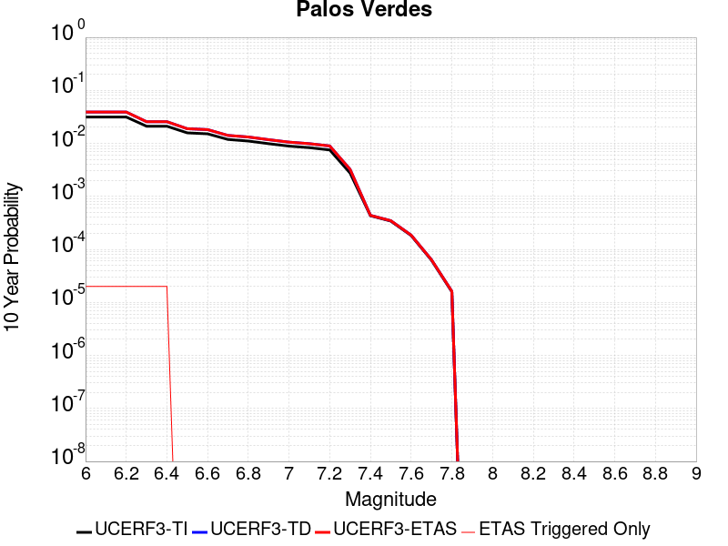 |

| Magnitude | 1 wk TI Prob | 1 wk TD Prob | 1 wk ETAS Prob | 1 wk ETAS/TD Gain | 1 wk ETAS Triggered Only | 1 mo TI Prob | 1 mo TD Prob | 1 mo ETAS Prob | 1 mo ETAS/TD Gain | 1 mo ETAS Triggered Only | 1 yr TI Prob | 1 yr TD Prob | 1 yr ETAS Prob | 1 yr ETAS/TD Gain | 1 yr ETAS Triggered Only | 10 yr TI Prob | 10 yr TD Prob | 10 yr ETAS Prob | 10 yr ETAS/TD Gain | 10 yr ETAS Triggered Only |
|-----|-----|-----|-----|-----|-----|-----|-----|-----|-----|-----|-----|-----|-----|-----|-----|-----|-----|-----|-----|-----|
| 6.0 | 6.126063E-5 | 7.622862E-5 | 7.622862E-5 | 1.0 | 0.0 | 2.6251914E-4 | 3.2665656E-4 | 3.533145E-4 | 1.0816085 | 2.6666667E-5 | 0.0031914865 | 0.0039702994 | 0.0039968602 | 1.0066899 | 2.6666667E-5 | 0.031460393 | 0.039050125 | 0.039101373 | 1.0013124 | 5.3333333E-5 |
| 6.1 | 6.126063E-5 | 7.622862E-5 | 7.622862E-5 | 1.0 | 0.0 | 2.6251914E-4 | 3.2665656E-4 | 3.533145E-4 | 1.0816085 | 2.6666667E-5 | 0.0031914865 | 0.0039702994 | 0.0039968602 | 1.0066899 | 2.6666667E-5 | 0.031460393 | 0.039050125 | 0.039101373 | 1.0013124 | 5.3333333E-5 |
| 6.2 | 6.126063E-5 | 7.622862E-5 | 7.622862E-5 | 1.0 | 0.0 | 2.6251914E-4 | 3.2665656E-4 | 3.533145E-4 | 1.0816085 | 2.6666667E-5 | 0.0031914865 | 0.0039702994 | 0.0039968602 | 1.0066899 | 2.6666667E-5 | 0.031460393 | 0.039050125 | 0.039101373 | 1.0013124 | 5.3333333E-5 |
| 6.3 | 4.0838047E-5 | 4.975089E-5 | 4.975089E-5 | 1.0 | 0.0 | 1.7500846E-4 | 2.1320196E-4 | 2.3986293E-4 | 1.1250503 | 2.6666667E-5 | 0.0021286458 | 0.0025928554 | 0.002619453 | 1.010258 | 2.6666667E-5 | 0.021083709 | 0.025647415 | 0.025699379 | 1.0020262 | 5.3333333E-5 |
| 6.4 | 4.0838047E-5 | 4.975089E-5 | 4.975089E-5 | 1.0 | 0.0 | 1.7500846E-4 | 2.1320196E-4 | 2.3986293E-4 | 1.1250503 | 2.6666667E-5 | 0.0021286458 | 0.0025928554 | 0.002619453 | 1.010258 | 2.6666667E-5 | 0.021083709 | 0.025647415 | 0.025699379 | 1.0020262 | 5.3333333E-5 |
| 6.5 | 3.0512005E-5 | 3.6562593E-5 | 3.6562593E-5 | 1.0 | 0.0 | 1.3075917E-4 | 1.566881E-4 | 1.566881E-4 | 1.0 | 0.0 | 0.0015908304 | 0.001906127 | 0.001906127 | 1.0 | 0.0 | 0.015794903 | 0.01890965 | 0.01890965 | 1.0 | 0.0 |
| 6.6 | 2.9255087E-5 | 3.5155368E-5 | 3.5155368E-5 | 1.0 | 0.0 | 1.2537291E-4 | 1.5065783E-4 | 1.5065783E-4 | 1.0 | 0.0 | 0.0015253464 | 0.0018328319 | 0.0018328319 | 1.0 | 0.0 | 0.015149189 | 0.01818871 | 0.01818871 | 1.0 | 0.0 |
| 6.7 | 2.287198E-5 | 2.7248976E-5 | 2.7248976E-5 | 1.0 | 0.0 | 9.801909E-5 | 1.1677662E-4 | 1.1677662E-4 | 1.0 | 0.0 | 0.001192729 | 0.0014209197 | 0.0014209197 | 1.0 | 0.0 | 0.011863477 | 0.014127577 | 0.014127577 | 1.0 | 0.0 |
| 6.8 | 2.1325764E-5 | 2.5432531E-5 | 2.5432531E-5 | 1.0 | 0.0 | 9.139293E-5 | 1.0899252E-4 | 1.0899252E-4 | 1.0 | 0.0 | 0.001112141 | 0.0013262664 | 0.0013262664 | 1.0 | 0.0 | 0.011065915 | 0.013192548 | 0.013192548 | 1.0 | 0.0 |
| 6.9 | 1.9009392E-5 | 2.2614122E-5 | 2.2614122E-5 | 1.0 | 0.0 | 8.1466285E-5 | 9.6914555E-5 | 9.6914555E-5 | 1.0 | 0.0 | 9.914007E-4 | 0.0011793834 | 0.0011793834 | 1.0 | 0.0 | 0.009869894 | 0.011739929 | 0.011739929 | 1.0 | 0.0 |
| 7.0 | 1.7098473E-5 | 2.0319867E-5 | 2.0319867E-5 | 1.0 | 0.0 | 7.3277115E-5 | 8.708272E-5 | 8.708272E-5 | 1.0 | 0.0 | 8.917837E-4 | 0.0010598017 | 0.0010598017 | 1.0 | 0.0 | 0.008882134 | 0.010555912 | 0.010555912 | 1.0 | 0.0 |
| 7.1 | 1.5982785E-5 | 1.8995239E-5 | 1.8995239E-5 | 1.0 | 0.0 | 6.849585E-5 | 8.1406106E-5 | 8.1406106E-5 | 1.0 | 0.0 | 8.336179E-4 | 9.907534E-4 | 9.907534E-4 | 1.0 | 0.0 | 0.008304977 | 0.009871728 | 0.009871728 | 1.0 | 0.0 |
| 7.2 | 1.4468002E-5 | 1.719767E-5 | 1.719767E-5 | 1.0 | 0.0 | 6.200425E-5 | 7.370269E-5 | 7.370269E-5 | 1.0 | 0.0 | 7.546402E-4 | 8.970449E-4 | 8.970449E-4 | 1.0 | 0.0 | 0.007520827 | 0.008942509 | 0.008942509 | 1.0 | 0.0 |
| 7.3 | 5.288233E-6 | 6.2038207E-6 | 6.2038207E-6 | 1.0 | 0.0 | 2.2663658E-5 | 2.658773E-5 | 2.658773E-5 | 1.0 | 0.0 | 2.7589512E-4 | 3.2369242E-4 | 3.2369242E-4 | 1.0 | 0.0 | 0.0027555283 | 0.0032356323 | 0.0032356323 | 1.0 | 0.0 |
| 7.4 | 8.279556E-7 | 8.408364E-7 | 8.408364E-7 | 1.0 | 0.0 | 3.5483763E-6 | 3.60358E-6 | 3.60358E-6 | 1.0 | 0.0 | 4.3200624E-5 | 4.3872777E-5 | 4.3872777E-5 | 1.0 | 0.0 | 4.3192226E-4 | 4.3864836E-4 | 4.3864836E-4 | 1.0 | 0.0 |
| 7.5 | 6.559831E-7 | 6.667243E-7 | 6.667243E-7 | 1.0 | 0.0 | 2.8113532E-6 | 2.8573872E-6 | 2.8573872E-6 | 1.0 | 0.0 | 3.4227687E-5 | 3.47882E-5 | 3.47882E-5 | 1.0 | 0.0 | 3.4222414E-4 | 3.478342E-4 | 3.478342E-4 | 1.0 | 0.0 |
| 7.6 | 3.5018968E-7 | 3.562011E-7 | 3.562011E-7 | 1.0 | 0.0 | 1.500812E-6 | 1.5265755E-6 | 1.5265755E-6 | 1.0 | 0.0 | 1.8272232E-5 | 1.8585944E-5 | 1.8585944E-5 | 1.0 | 0.0 | 1.8270731E-4 | 1.858485E-4 | 1.858485E-4 | 1.0 | 0.0 |
| 7.7 | 1.1986104E-7 | 1.2198406E-7 | 1.2198406E-7 | 1.0 | 0.0 | 5.1369005E-7 | 5.227887E-7 | 5.227887E-7 | 1.0 | 0.0 | 6.2541585E-6 | 6.364934E-6 | 6.364934E-6 | 1.0 | 0.0 | 6.2539824E-5 | 6.364756E-5 | 6.364756E-5 | 1.0 | 0.0 |
| 7.8 | 3.0445005E-8 | 3.1027664E-8 | 3.1027664E-8 | 1.0 | 0.0 | 1.3047858E-7 | 1.3297569E-7 | 1.3297569E-7 | 1.0 | 0.0 | 1.5885756E-6 | 1.6189781E-6 | 1.6189781E-6 | 1.0 | 0.0 | 1.5885644E-5 | 1.6189684E-5 | 1.6189684E-5 | 1.0 | 0.0 |

## San Gorgonio Pass
*[(top)](#table-of-contents)*

| 1 Week | 1 Month | 1 Year | 10 Year |
|-----|-----|-----|-----|
|  |  |  |  |

| Magnitude | 1 wk TI Prob | 1 wk TD Prob | 1 wk ETAS Prob | 1 wk ETAS/TD Gain | 1 wk ETAS Triggered Only | 1 mo TI Prob | 1 mo TD Prob | 1 mo ETAS Prob | 1 mo ETAS/TD Gain | 1 mo ETAS Triggered Only | 1 yr TI Prob | 1 yr TD Prob | 1 yr ETAS Prob | 1 yr ETAS/TD Gain | 1 yr ETAS Triggered Only | 10 yr TI Prob | 10 yr TD Prob | 10 yr ETAS Prob | 10 yr ETAS/TD Gain | 10 yr ETAS Triggered Only |
|-----|-----|-----|-----|-----|-----|-----|-----|-----|-----|-----|-----|-----|-----|-----|-----|-----|-----|-----|-----|-----|
| 6.0 | 7.644328E-6 | 1.33162985E-5 | 1.33162985E-5 | 1.0 | 0.0 | 3.2760996E-5 | 5.706865E-5 | 8.3733794E-5 | 1.4672468 | 2.6666667E-5 | 3.987921E-4 | 6.945979E-4 | 7.21246E-4 | 1.0383649 | 2.6666667E-5 | 0.003980772 | 0.006931046 | 0.0069840094 | 1.0076416 | 5.3333333E-5 |
| 6.1 | 7.644328E-6 | 1.33162985E-5 | 1.33162985E-5 | 1.0 | 0.0 | 3.2760996E-5 | 5.706865E-5 | 8.3733794E-5 | 1.4672468 | 2.6666667E-5 | 3.987921E-4 | 6.945979E-4 | 7.21246E-4 | 1.0383649 | 2.6666667E-5 | 0.003980772 | 0.006931046 | 0.0069840094 | 1.0076416 | 5.3333333E-5 |
| 6.2 | 7.644328E-6 | 1.33162985E-5 | 1.33162985E-5 | 1.0 | 0.0 | 3.2760996E-5 | 5.706865E-5 | 8.3733794E-5 | 1.4672468 | 2.6666667E-5 | 3.987921E-4 | 6.945979E-4 | 7.21246E-4 | 1.0383649 | 2.6666667E-5 | 0.003980772 | 0.006931046 | 0.0069840094 | 1.0076416 | 5.3333333E-5 |
| 6.3 | 7.644328E-6 | 1.33162985E-5 | 1.33162985E-5 | 1.0 | 0.0 | 3.2760996E-5 | 5.706865E-5 | 8.3733794E-5 | 1.4672468 | 2.6666667E-5 | 3.987921E-4 | 6.945979E-4 | 7.21246E-4 | 1.0383649 | 2.6666667E-5 | 0.003980772 | 0.006931046 | 0.0069840094 | 1.0076416 | 5.3333333E-5 |
| 6.4 | 7.644328E-6 | 1.33162985E-5 | 1.33162985E-5 | 1.0 | 0.0 | 3.2760996E-5 | 5.706865E-5 | 8.3733794E-5 | 1.4672468 | 2.6666667E-5 | 3.987921E-4 | 6.945979E-4 | 7.21246E-4 | 1.0383649 | 2.6666667E-5 | 0.003980772 | 0.006931046 | 0.0069840094 | 1.0076416 | 5.3333333E-5 |
| 6.5 | 7.644328E-6 | 1.33162985E-5 | 1.33162985E-5 | 1.0 | 0.0 | 3.2760996E-5 | 5.706865E-5 | 8.3733794E-5 | 1.4672468 | 2.6666667E-5 | 3.987921E-4 | 6.945979E-4 | 7.21246E-4 | 1.0383649 | 2.6666667E-5 | 0.003980772 | 0.006931046 | 0.0069840094 | 1.0076416 | 5.3333333E-5 |
| 6.6 | 7.644328E-6 | 1.33162985E-5 | 1.33162985E-5 | 1.0 | 0.0 | 3.2760996E-5 | 5.706865E-5 | 8.3733794E-5 | 1.4672468 | 2.6666667E-5 | 3.987921E-4 | 6.945979E-4 | 7.21246E-4 | 1.0383649 | 2.6666667E-5 | 0.003980772 | 0.006931046 | 0.0069840094 | 1.0076416 | 5.3333333E-5 |
| 6.7 | 6.987586E-6 | 1.2620567E-5 | 1.2620567E-5 | 1.0 | 0.0 | 2.9946454E-5 | 5.4087068E-5 | 8.075229E-5 | 1.4930055 | 2.6666667E-5 | 3.645371E-4 | 6.583192E-4 | 6.849683E-4 | 1.0404805 | 2.6666667E-5 | 0.0036393967 | 0.0065704198 | 0.0066234022 | 1.0080639 | 5.3333333E-5 |
| 6.8 | 6.987586E-6 | 1.2620567E-5 | 1.2620567E-5 | 1.0 | 0.0 | 2.9946454E-5 | 5.4087068E-5 | 8.075229E-5 | 1.4930055 | 2.6666667E-5 | 3.645371E-4 | 6.583192E-4 | 6.849683E-4 | 1.0404805 | 2.6666667E-5 | 0.0036393967 | 0.0065704198 | 0.0066234022 | 1.0080639 | 5.3333333E-5 |
| 6.9 | 5.504702E-6 | 1.1051418E-5 | 1.1051418E-5 | 1.0 | 0.0 | 2.3591367E-5 | 4.7362388E-5 | 7.402779E-5 | 1.563008 | 2.6666667E-5 | 2.8718702E-4 | 5.7648955E-4 | 6.0314086E-4 | 1.0462303 | 2.6666667E-5 | 0.0028681618 | 0.0057563665 | 0.005809393 | 1.0092118 | 5.3333333E-5 |
| 7.0 | 5.4825764E-6 | 1.1027759E-5 | 1.1027759E-5 | 1.0 | 0.0 | 2.3496545E-5 | 4.7260994E-5 | 7.39264E-5 | 1.5642159 | 2.6666667E-5 | 2.8603288E-4 | 5.752558E-4 | 6.019071E-4 | 1.0463295 | 2.6666667E-5 | 0.00285665 | 0.005744092 | 0.0057971193 | 1.0092316 | 5.3333333E-5 |
| 7.1 | 5.4692787E-6 | 1.1013469E-5 | 1.1013469E-5 | 1.0 | 0.0 | 2.3439556E-5 | 4.7199755E-5 | 7.3865165E-5 | 1.5649481 | 2.6666667E-5 | 2.8533922E-4 | 5.7451054E-4 | 6.011619E-4 | 1.0463897 | 2.6666667E-5 | 0.0028497311 | 0.0057366784 | 0.005789706 | 1.0092436 | 5.3333333E-5 |
| 7.2 | 5.453661E-6 | 1.0996495E-5 | 1.0996495E-5 | 1.0 | 0.0 | 2.3372622E-5 | 4.712701E-5 | 7.379242E-5 | 1.5658201 | 2.6666667E-5 | 2.8452452E-4 | 5.736254E-4 | 6.0027675E-4 | 1.0464612 | 2.6666667E-5 | 0.002841605 | 0.0057278727 | 0.0057809004 | 1.0092579 | 5.3333333E-5 |
| 7.3 | 5.4422303E-6 | 1.0983417E-5 | 1.0983417E-5 | 1.0 | 0.0 | 2.3323635E-5 | 4.7070967E-5 | 7.373638E-5 | 1.5664937 | 2.6666667E-5 | 2.8392827E-4 | 5.729434E-4 | 5.995948E-4 | 1.0465167 | 2.6666667E-5 | 0.0028356577 | 0.005721088 | 0.005774116 | 1.0092689 | 5.3333333E-5 |
| 7.4 | 5.398595E-6 | 1.0930781E-5 | 1.0930781E-5 | 1.0 | 0.0 | 2.313663E-5 | 4.6845395E-5 | 7.351081E-5 | 1.5692217 | 2.6666667E-5 | 2.8165206E-4 | 5.7019846E-4 | 5.9684995E-4 | 1.0467407 | 2.6666667E-5 | 0.0028129534 | 0.00569378 | 0.0057468093 | 1.0093136 | 5.3333333E-5 |
| 7.5 | 5.3578788E-6 | 1.0857324E-5 | 1.0857324E-5 | 1.0 | 0.0 | 2.2962136E-5 | 4.653059E-5 | 7.319602E-5 | 1.573073 | 2.6666667E-5 | 2.7952815E-4 | 5.663677E-4 | 5.930193E-4 | 1.047057 | 2.6666667E-5 | 0.002791768 | 0.005655692 | 0.005708724 | 1.0093766 | 5.3333333E-5 |
| 7.6 | 4.8091474E-6 | 9.605609E-6 | 9.605609E-6 | 1.0 | 0.0 | 2.0610469E-5 | 4.1166273E-5 | 6.783185E-5 | 1.6477528 | 2.6666667E-5 | 2.5090357E-4 | 5.01089E-4 | 5.2774226E-4 | 1.0531907 | 2.6666667E-5 | 0.0025062046 | 0.0050062994 | 0.0050593656 | 1.0106 | 5.3333333E-5 |
| 7.7 | 1.5991155E-6 | 3.3539093E-6 | 3.3539093E-6 | 1.0 | 0.0 | 6.853334E-6 | 1.4373819E-5 | 4.10401E-5 | 2.8551981 | 2.6666667E-5 | 8.343615E-5 | 1.7498745E-4 | 2.0164945E-4 | 1.1523652 | 2.6666667E-5 | 8.340483E-4 | 0.0017539478 | 0.0018071876 | 1.0303543 | 5.3333333E-5 |
| 7.8 | 9.258398E-7 | 2.0587727E-6 | 2.0587727E-6 | 1.0 | 0.0 | 3.967879E-6 | 8.823282E-6 | 3.5489713E-5 | 4.02228 | 2.6666667E-5 | 4.8307855E-5 | 1.07418186E-4 | 1.3408199E-4 | 1.2482243 | 2.6666667E-5 | 4.8297356E-4 | 0.0010790897 | 0.0011323654 | 1.049371 | 5.3333333E-5 |
| 7.9 | 5.975575E-7 | 1.2297422E-6 | 1.2297422E-6 | 1.0 | 0.0 | 2.5609581E-6 | 5.2703135E-6 | 3.193684E-5 | 6.059761 | 2.6666667E-5 | 3.117922E-5 | 6.416419E-5 | 9.082914E-5 | 1.4155738 | 2.6666667E-5 | 3.1174847E-4 | 6.466005E-4 | 6.732499E-4 | 1.0412147 | 2.6666667E-5 |
| 8.0 | 3.4413725E-7 | 6.718214E-7 | 6.718214E-7 | 1.0 | 0.0 | 1.4748731E-6 | 2.8792315E-6 | 2.8792315E-6 | 1.0 | 0.0 | 1.7956432E-5 | 3.5054083E-5 | 3.5054083E-5 | 1.0 | 0.0 | 1.7954981E-4 | 3.5391308E-4 | 3.5391308E-4 | 1.0 | 0.0 |
| 8.1 | 1.1787731E-8 | 9.643016E-9 | 9.643016E-9 | 1.0 | 0.0 | 5.0518846E-8 | 4.1327212E-8 | 4.1327212E-8 | 1.0 | 0.0 | 6.1506677E-7 | 5.031587E-7 | 5.031587E-7 | 1.0 | 0.0 | 6.1506507E-6 | 5.247088E-6 | 5.247088E-6 | 1.0 | 0.0 |

## Mono Lake 2011 CFM
*[(top)](#table-of-contents)*

| 1 Week | 1 Month | 1 Year | 10 Year |
|-----|-----|-----|-----|
|  |  |  |  |

| Magnitude | 1 wk TI Prob | 1 wk TD Prob | 1 wk ETAS Prob | 1 wk ETAS/TD Gain | 1 wk ETAS Triggered Only | 1 mo TI Prob | 1 mo TD Prob | 1 mo ETAS Prob | 1 mo ETAS/TD Gain | 1 mo ETAS Triggered Only | 1 yr TI Prob | 1 yr TD Prob | 1 yr ETAS Prob | 1 yr ETAS/TD Gain | 1 yr ETAS Triggered Only | 10 yr TI Prob | 10 yr TD Prob | 10 yr ETAS Prob | 10 yr ETAS/TD Gain | 10 yr ETAS Triggered Only |
|-----|-----|-----|-----|-----|-----|-----|-----|-----|-----|-----|-----|-----|-----|-----|-----|-----|-----|-----|-----|-----|
| 6.0 | 2.0341662E-5 | 2.3828708E-5 | 2.3828708E-5 | 1.0 | 0.0 | 8.717564E-5 | 1.0212203E-4 | 1.2878598E-4 | 1.2610989 | 2.6666667E-5 | 0.0010608466 | 0.0012431581 | 0.0012964251 | 1.0428481 | 5.3333333E-5 | 0.010557966 | 0.012414116 | 0.012466788 | 1.0042429 | 5.3333333E-5 |
| 6.1 | 2.0341662E-5 | 2.3828708E-5 | 2.3828708E-5 | 1.0 | 0.0 | 8.717564E-5 | 1.0212203E-4 | 1.2878598E-4 | 1.2610989 | 2.6666667E-5 | 0.0010608466 | 0.0012431581 | 0.0012964251 | 1.0428481 | 5.3333333E-5 | 0.010557966 | 0.012414116 | 0.012466788 | 1.0042429 | 5.3333333E-5 |
| 6.2 | 2.0341662E-5 | 2.3828708E-5 | 2.3828708E-5 | 1.0 | 0.0 | 8.717564E-5 | 1.0212203E-4 | 1.2878598E-4 | 1.2610989 | 2.6666667E-5 | 0.0010608466 | 0.0012431581 | 0.0012964251 | 1.0428481 | 5.3333333E-5 | 0.010557966 | 0.012414116 | 0.012466788 | 1.0042429 | 5.3333333E-5 |
| 6.3 | 2.0341662E-5 | 2.3828708E-5 | 2.3828708E-5 | 1.0 | 0.0 | 8.717564E-5 | 1.0212203E-4 | 1.2878598E-4 | 1.2610989 | 2.6666667E-5 | 0.0010608466 | 0.0012431581 | 0.0012964251 | 1.0428481 | 5.3333333E-5 | 0.010557966 | 0.012414116 | 0.012466788 | 1.0042429 | 5.3333333E-5 |
| 6.4 | 1.749821E-5 | 2.049145E-5 | 2.049145E-5 | 1.0 | 0.0 | 7.499018E-5 | 8.78205E-5 | 1.1448483E-4 | 1.303623 | 2.6666667E-5 | 9.1262296E-4 | 0.0010692145 | 0.0011224909 | 1.0498276 | 5.3333333E-5 | 0.009088841 | 0.0106921075 | 0.010744871 | 1.0049348 | 5.3333333E-5 |
| 6.5 | 1.749821E-5 | 2.049145E-5 | 2.049145E-5 | 1.0 | 0.0 | 7.499018E-5 | 8.78205E-5 | 1.1448483E-4 | 1.303623 | 2.6666667E-5 | 9.1262296E-4 | 0.0010692145 | 0.0011224909 | 1.0498276 | 5.3333333E-5 | 0.009088841 | 0.0106921075 | 0.010744871 | 1.0049348 | 5.3333333E-5 |

## Santa Ynez (East)
*[(top)](#table-of-contents)*

| 1 Week | 1 Month | 1 Year | 10 Year |
|-----|-----|-----|-----|
|  |  |  | 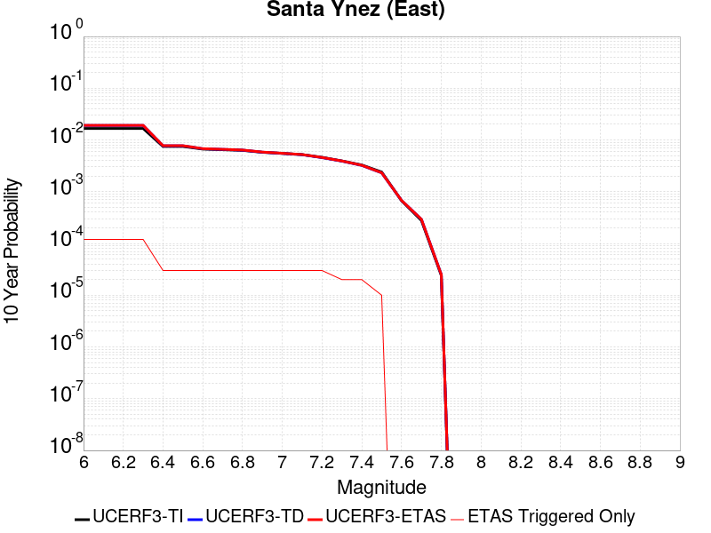 |

| Magnitude | 1 wk TI Prob | 1 wk TD Prob | 1 wk ETAS Prob | 1 wk ETAS/TD Gain | 1 wk ETAS Triggered Only | 1 mo TI Prob | 1 mo TD Prob | 1 mo ETAS Prob | 1 mo ETAS/TD Gain | 1 mo ETAS Triggered Only | 1 yr TI Prob | 1 yr TD Prob | 1 yr ETAS Prob | 1 yr ETAS/TD Gain | 1 yr ETAS Triggered Only | 10 yr TI Prob | 10 yr TD Prob | 10 yr ETAS Prob | 10 yr ETAS/TD Gain | 10 yr ETAS Triggered Only |
|-----|-----|-----|-----|-----|-----|-----|-----|-----|-----|-----|-----|-----|-----|-----|-----|-----|-----|-----|-----|-----|
| 6.0 | 3.2269712E-5 | 3.6751346E-5 | 6.3417036E-5 | 1.7255703 | 2.6666667E-5 | 1.3829143E-4 | 1.5749958E-4 | 1.8416205E-4 | 1.1692859 | 2.6666667E-5 | 0.0016823979 | 0.0019164606 | 0.0019430761 | 1.0138879 | 2.6666667E-5 | 0.016697178 | 0.019056875 | 0.019109191 | 1.0027453 | 5.3333333E-5 |
| 6.1 | 3.2269712E-5 | 3.6751346E-5 | 6.3417036E-5 | 1.7255703 | 2.6666667E-5 | 1.3829143E-4 | 1.5749958E-4 | 1.8416205E-4 | 1.1692859 | 2.6666667E-5 | 0.0016823979 | 0.0019164606 | 0.0019430761 | 1.0138879 | 2.6666667E-5 | 0.016697178 | 0.019056875 | 0.019109191 | 1.0027453 | 5.3333333E-5 |
| 6.2 | 3.2269712E-5 | 3.6751346E-5 | 6.3417036E-5 | 1.7255703 | 2.6666667E-5 | 1.3829143E-4 | 1.5749958E-4 | 1.8416205E-4 | 1.1692859 | 2.6666667E-5 | 0.0016823979 | 0.0019164606 | 0.0019430761 | 1.0138879 | 2.6666667E-5 | 0.016697178 | 0.019056875 | 0.019109191 | 1.0027453 | 5.3333333E-5 |
| 6.3 | 3.2269712E-5 | 3.6751346E-5 | 6.3417036E-5 | 1.7255703 | 2.6666667E-5 | 1.3829143E-4 | 1.5749958E-4 | 1.8416205E-4 | 1.1692859 | 2.6666667E-5 | 0.0016823979 | 0.0019164606 | 0.0019430761 | 1.0138879 | 2.6666667E-5 | 0.016697178 | 0.019056875 | 0.019109191 | 1.0027453 | 5.3333333E-5 |
| 6.4 | 1.4404779E-5 | 1.4849569E-5 | 1.4849569E-5 | 1.0 | 0.0 | 6.1733306E-5 | 6.363949E-5 | 6.363949E-5 | 1.0 | 0.0 | 7.513438E-4 | 7.7454036E-4 | 7.7454036E-4 | 1.0 | 0.0 | 0.0074880854 | 0.007718959 | 0.007718959 | 1.0 | 0.0 |
| 6.5 | 1.4404779E-5 | 1.4849569E-5 | 1.4849569E-5 | 1.0 | 0.0 | 6.1733306E-5 | 6.363949E-5 | 6.363949E-5 | 1.0 | 0.0 | 7.513438E-4 | 7.7454036E-4 | 7.7454036E-4 | 1.0 | 0.0 | 0.0074880854 | 0.007718959 | 0.007718959 | 1.0 | 0.0 |
| 6.6 | 1.280208E-5 | 1.3012098E-5 | 1.3012098E-5 | 1.0 | 0.0 | 5.4864904E-5 | 5.5764955E-5 | 5.5764955E-5 | 1.0 | 0.0 | 6.6777546E-4 | 6.7872857E-4 | 6.7872857E-4 | 1.0 | 0.0 | 0.006657724 | 0.006766767 | 0.006766767 | 1.0 | 0.0 |
| 6.7 | 1.2457027E-5 | 1.2628613E-5 | 1.2628613E-5 | 1.0 | 0.0 | 5.3386164E-5 | 5.4121516E-5 | 5.4121516E-5 | 1.0 | 0.0 | 6.497827E-4 | 6.587319E-4 | 6.587319E-4 | 1.0 | 0.0 | 0.00647886 | 0.0065679904 | 0.0065679904 | 1.0 | 0.0 |
| 6.8 | 1.2095134E-5 | 1.2231055E-5 | 1.2231055E-5 | 1.0 | 0.0 | 5.1835254E-5 | 5.2417763E-5 | 5.2417763E-5 | 1.0 | 0.0 | 6.309115E-4 | 6.38001E-4 | 6.38001E-4 | 1.0 | 0.0 | 0.0062912325 | 0.0063618817 | 0.0063618817 | 1.0 | 0.0 |
| 6.9 | 1.1104036E-5 | 1.11574755E-5 | 1.11574755E-5 | 1.0 | 0.0 | 4.758786E-5 | 4.7816884E-5 | 4.7816884E-5 | 1.0 | 0.0 | 5.7922816E-4 | 5.820163E-4 | 5.820163E-4 | 1.0 | 0.0 | 0.005777207 | 0.005805066 | 0.005805066 | 1.0 | 0.0 |
| 7.0 | 1.0577444E-5 | 1.0581802E-5 | 1.0581802E-5 | 1.0 | 0.0 | 4.5331115E-5 | 4.5349796E-5 | 4.5349796E-5 | 1.0 | 0.0 | 5.5176654E-4 | 5.519951E-4 | 5.519951E-4 | 1.0 | 0.0 | 0.0055039856 | 0.0055063786 | 0.0055063786 | 1.0 | 0.0 |
| 7.1 | 1.0021775E-5 | 9.981102E-6 | 9.981102E-6 | 1.0 | 0.0 | 4.294976E-5 | 4.2775457E-5 | 4.2775457E-5 | 1.0 | 0.0 | 5.2278786E-4 | 5.2066793E-4 | 5.2066793E-4 | 1.0 | 0.0 | 0.0052155964 | 0.0051946132 | 0.0051946132 | 1.0 | 0.0 |
| 7.2 | 8.874109E-6 | 8.748894E-6 | 8.748894E-6 | 1.0 | 0.0 | 3.8031343E-5 | 3.749473E-5 | 3.749473E-5 | 1.0 | 0.0 | 4.629332E-4 | 4.564038E-4 | 4.564038E-4 | 1.0 | 0.0 | 0.0046197 | 0.0045547825 | 0.0045547825 | 1.0 | 0.0 |
| 7.3 | 7.5504267E-6 | 7.505199E-6 | 7.505199E-6 | 1.0 | 0.0 | 3.235857E-5 | 3.216475E-5 | 3.216475E-5 | 1.0 | 0.0 | 3.9389438E-4 | 3.9153645E-4 | 3.9153645E-4 | 1.0 | 0.0 | 0.0039319694 | 0.003908573 | 0.003908573 | 1.0 | 0.0 |
| 7.4 | 6.309394E-6 | 6.1832216E-6 | 6.1832216E-6 | 1.0 | 0.0 | 2.703998E-5 | 2.6499258E-5 | 2.6499258E-5 | 1.0 | 0.0 | 3.2916202E-4 | 3.2258165E-4 | 3.2258165E-4 | 1.0 | 0.0 | 0.003286749 | 0.0032212313 | 0.0032212313 | 1.0 | 0.0 |
| 7.5 | 4.6103073E-6 | 4.440935E-6 | 4.440935E-6 | 1.0 | 0.0 | 1.975831E-5 | 1.9032443E-5 | 1.9032443E-5 | 1.0 | 0.0 | 2.4053088E-4 | 2.3169606E-4 | 2.3169606E-4 | 1.0 | 0.0 | 0.002402707 | 0.0023146144 | 0.0023146144 | 1.0 | 0.0 |
| 7.6 | 1.2858658E-6 | 1.3008267E-6 | 1.3008267E-6 | 1.0 | 0.0 | 5.5108417E-6 | 5.5749606E-6 | 5.5749606E-6 | 1.0 | 0.0 | 6.7092435E-5 | 6.78731E-5 | 6.78731E-5 | 1.0 | 0.0 | 6.707218E-4 | 6.7853054E-4 | 6.7853054E-4 | 1.0 | 0.0 |
| 7.7 | 5.3302307E-7 | 5.612178E-7 | 5.612178E-7 | 1.0 | 0.0 | 2.2843826E-6 | 2.4052172E-6 | 2.4052172E-6 | 1.0 | 0.0 | 2.7812002E-5 | 2.9283161E-5 | 2.9283161E-5 | 1.0 | 0.0 | 2.7808524E-4 | 2.9279658E-4 | 2.9279658E-4 | 1.0 | 0.0 |
| 7.8 | 4.613933E-8 | 4.803036E-8 | 4.803036E-8 | 1.0 | 0.0 | 1.9773998E-7 | 2.0584437E-7 | 2.0584437E-7 | 1.0 | 0.0 | 2.4074816E-6 | 2.5061524E-6 | 2.5061524E-6 | 1.0 | 0.0 | 2.4074554E-5 | 2.5061252E-5 | 2.5061252E-5 | 1.0 | 0.0 |

## Malibu Coast alt 1
*[(top)](#table-of-contents)*

| 1 Week | 1 Month | 1 Year | 10 Year |
|-----|-----|-----|-----|
|  |  | 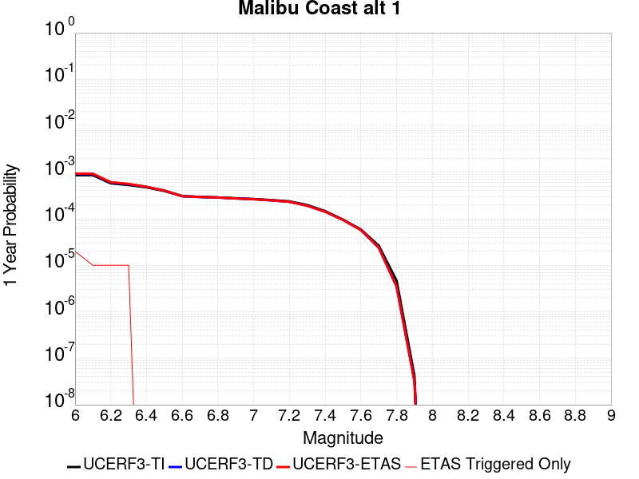 |  |

| Magnitude | 1 wk TI Prob | 1 wk TD Prob | 1 wk ETAS Prob | 1 wk ETAS/TD Gain | 1 wk ETAS Triggered Only | 1 mo TI Prob | 1 mo TD Prob | 1 mo ETAS Prob | 1 mo ETAS/TD Gain | 1 mo ETAS Triggered Only | 1 yr TI Prob | 1 yr TD Prob | 1 yr ETAS Prob | 1 yr ETAS/TD Gain | 1 yr ETAS Triggered Only | 10 yr TI Prob | 10 yr TD Prob | 10 yr ETAS Prob | 10 yr ETAS/TD Gain | 10 yr ETAS Triggered Only |
|-----|-----|-----|-----|-----|-----|-----|-----|-----|-----|-----|-----|-----|-----|-----|-----|-----|-----|-----|-----|-----|
| 6.0 | 1.6572556E-5 | 1.7598268E-5 | 1.7598268E-5 | 1.0 | 0.0 | 7.102331E-5 | 7.541908E-5 | 7.541908E-5 | 1.0 | 0.0 | 8.6436566E-4 | 9.178593E-4 | 9.711437E-4 | 1.0580529 | 5.3333333E-5 | 0.0086101135 | 0.009142617 | 0.009195463 | 1.0057801 | 5.3333333E-5 |
| 6.1 | 1.6572556E-5 | 1.7598268E-5 | 1.7598268E-5 | 1.0 | 0.0 | 7.102331E-5 | 7.541908E-5 | 7.541908E-5 | 1.0 | 0.0 | 8.6436566E-4 | 9.178593E-4 | 9.4450155E-4 | 1.0290264 | 2.6666667E-5 | 0.0086101135 | 0.009142617 | 0.00916904 | 1.0028901 | 2.6666667E-5 |
| 6.2 | 1.1085717E-5 | 1.1557268E-5 | 1.1557268E-5 | 1.0 | 0.0 | 4.750935E-5 | 4.953023E-5 | 4.953023E-5 | 1.0 | 0.0 | 5.782728E-4 | 6.028672E-4 | 6.2951783E-4 | 1.0442064 | 2.6666667E-5 | 0.0057677035 | 0.0060126884 | 0.0060391948 | 1.0044084 | 2.6666667E-5 |
| 6.3 | 1.0208568E-5 | 1.05923455E-5 | 1.05923455E-5 | 1.0 | 0.0 | 4.375027E-5 | 4.5394994E-5 | 4.5394994E-5 | 1.0 | 0.0 | 5.325294E-4 | 5.525468E-4 | 5.7919876E-4 | 1.0482347 | 2.6666667E-5 | 0.0053125503 | 0.005512038 | 0.0055385577 | 1.0048113 | 2.6666667E-5 |
| 6.4 | 9.0682315E-6 | 9.34273E-6 | 9.34273E-6 | 1.0 | 0.0 | 3.8863272E-5 | 4.0039668E-5 | 4.0039668E-5 | 1.0 | 0.0 | 4.730576E-4 | 4.8737595E-4 | 4.8737595E-4 | 1.0 | 0.0 | 0.0047205184 | 0.004863284 | 0.004863284 | 1.0 | 0.0 |
| 6.5 | 7.605796E-6 | 7.74866E-6 | 7.74866E-6 | 1.0 | 0.0 | 3.259586E-5 | 3.320813E-5 | 3.320813E-5 | 1.0 | 0.0 | 3.9678233E-4 | 4.042353E-4 | 4.042353E-4 | 1.0 | 0.0 | 0.0039607463 | 0.004035138 | 0.004035138 | 1.0 | 0.0 |
| 6.6 | 5.889873E-6 | 5.8795895E-6 | 5.8795895E-6 | 1.0 | 0.0 | 2.5242069E-5 | 2.5197998E-5 | 2.5197998E-5 | 1.0 | 0.0 | 3.0727885E-4 | 3.0674253E-4 | 3.0674253E-4 | 1.0 | 0.0 | 0.003068543 | 0.0030632042 | 0.0030632042 | 1.0 | 0.0 |
| 6.7 | 5.66586E-6 | 5.64169E-6 | 5.64169E-6 | 1.0 | 0.0 | 2.428203E-5 | 2.417845E-5 | 2.417845E-5 | 1.0 | 0.0 | 2.955936E-4 | 2.9433295E-4 | 2.9433295E-4 | 1.0 | 0.0 | 0.0029520073 | 0.002939443 | 0.002939443 | 1.0 | 0.0 |
| 6.8 | 5.521556E-6 | 5.489475E-6 | 5.489475E-6 | 1.0 | 0.0 | 2.3663597E-5 | 2.3526109E-5 | 2.3526109E-5 | 1.0 | 0.0 | 2.880662E-4 | 2.8639284E-4 | 2.8639284E-4 | 1.0 | 0.0 | 0.0028769306 | 0.002860249 | 0.002860249 | 1.0 | 0.0 |
| 6.9 | 5.29752E-6 | 5.249977E-6 | 5.249977E-6 | 1.0 | 0.0 | 2.270346E-5 | 2.249971E-5 | 2.249971E-5 | 1.0 | 0.0 | 2.7637955E-4 | 2.738996E-4 | 2.738996E-4 | 1.0 | 0.0 | 0.0027603607 | 0.0027356306 | 0.0027356306 | 1.0 | 0.0 |
| 7.0 | 5.106743E-6 | 5.047723E-6 | 5.047723E-6 | 1.0 | 0.0 | 2.1885859E-5 | 2.1632919E-5 | 2.1632919E-5 | 1.0 | 0.0 | 2.6642776E-4 | 2.6334904E-4 | 2.6334904E-4 | 1.0 | 0.0 | 0.0026610855 | 0.002630379 | 0.002630379 | 1.0 | 0.0 |
| 7.1 | 4.8469647E-6 | 4.7704148E-6 | 4.7704148E-6 | 1.0 | 0.0 | 2.0772539E-5 | 2.0444475E-5 | 2.0444475E-5 | 1.0 | 0.0 | 2.528763E-4 | 2.488831E-4 | 2.488831E-4 | 1.0 | 0.0 | 0.0025258875 | 0.0024860518 | 0.0024860518 | 1.0 | 0.0 |
| 7.2 | 4.545514E-6 | 4.448232E-6 | 4.448232E-6 | 1.0 | 0.0 | 1.9480629E-5 | 1.9063713E-5 | 1.9063713E-5 | 1.0 | 0.0 | 2.3715083E-4 | 2.3207605E-4 | 2.3207605E-4 | 1.0 | 0.0 | 0.0023689792 | 0.0023183445 | 0.0023183445 | 1.0 | 0.0 |
| 7.3 | 3.794097E-6 | 3.6519655E-6 | 3.6519655E-6 | 1.0 | 0.0 | 1.6260314E-5 | 1.5651187E-5 | 1.5651187E-5 | 1.0 | 0.0 | 1.9795135E-4 | 1.9053658E-4 | 1.9053658E-4 | 1.0 | 0.0 | 0.001977751 | 0.0019037367 | 0.0019037367 | 1.0 | 0.0 |
| 7.4 | 2.808217E-6 | 2.7191E-6 | 2.7191E-6 | 1.0 | 0.0 | 1.203516E-5 | 1.1653234E-5 | 1.1653234E-5 | 1.0 | 0.0 | 1.4651821E-4 | 1.418689E-4 | 1.418689E-4 | 1.0 | 0.0 | 0.0014642165 | 0.0014177861 | 0.0014177861 | 1.0 | 0.0 |
| 7.5 | 1.83809E-6 | 1.8190852E-6 | 1.8190852E-6 | 1.0 | 0.0 | 7.877505E-6 | 7.796056E-6 | 7.796056E-6 | 1.0 | 0.0 | 9.59044E-5 | 9.4912866E-5 | 9.4912866E-5 | 1.0 | 0.0 | 9.5863023E-4 | 9.487253E-4 | 9.487253E-4 | 1.0 | 0.0 |
| 7.6 | 1.1292672E-6 | 1.100155E-6 | 1.100155E-6 | 1.0 | 0.0 | 4.839708E-6 | 4.7149415E-6 | 4.7149415E-6 | 1.0 | 0.0 | 5.8921847E-5 | 5.7402918E-5 | 5.7402918E-5 | 1.0 | 0.0 | 5.890623E-4 | 5.7388254E-4 | 5.7388254E-4 | 1.0 | 0.0 |
| 7.7 | 5.065272E-7 | 4.609203E-7 | 4.609203E-7 | 1.0 | 0.0 | 2.170829E-6 | 1.9753713E-6 | 1.9753713E-6 | 1.0 | 0.0 | 2.6429525E-5 | 2.404989E-5 | 2.404989E-5 | 1.0 | 0.0 | 2.642638E-4 | 2.4047401E-4 | 2.4047401E-4 | 1.0 | 0.0 |
| 7.8 | 8.952991E-8 | 6.708074E-8 | 6.708074E-8 | 1.0 | 0.0 | 3.8369956E-7 | 2.8748886E-7 | 2.8748886E-7 | 1.0 | 0.0 | 4.671532E-6 | 3.5001713E-6 | 3.5001713E-6 | 1.0 | 0.0 | 4.671434E-5 | 3.5001183E-5 | 3.5001183E-5 | 1.0 | 0.0 |
| 7.9 | 8.007447E-10 | 6.160915E-10 | 6.160915E-10 | 1.0 | 0.0 | 3.4317629E-9 | 2.6403923E-9 | 2.6403923E-9 | 1.0 | 0.0 | 4.1781714E-8 | 3.2146776E-8 | 3.2146776E-8 | 1.0 | 0.0 | 4.1781706E-7 | 3.2146772E-7 | 3.2146772E-7 | 1.0 | 0.0 |

## West Napa 2011 CFM
*[(top)](#table-of-contents)*

| 1 Week | 1 Month | 1 Year | 10 Year |
|-----|-----|-----|-----|
|  |  | 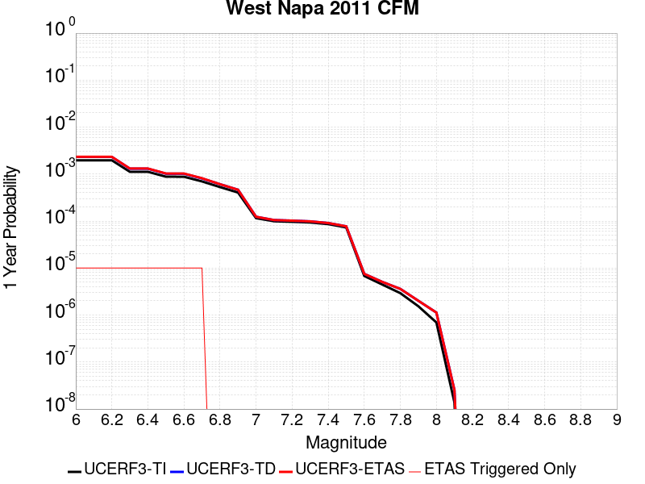 |  |

| Magnitude | 1 wk TI Prob | 1 wk TD Prob | 1 wk ETAS Prob | 1 wk ETAS/TD Gain | 1 wk ETAS Triggered Only | 1 mo TI Prob | 1 mo TD Prob | 1 mo ETAS Prob | 1 mo ETAS/TD Gain | 1 mo ETAS Triggered Only | 1 yr TI Prob | 1 yr TD Prob | 1 yr ETAS Prob | 1 yr ETAS/TD Gain | 1 yr ETAS Triggered Only | 10 yr TI Prob | 10 yr TD Prob | 10 yr ETAS Prob | 10 yr ETAS/TD Gain | 10 yr ETAS Triggered Only |
|-----|-----|-----|-----|-----|-----|-----|-----|-----|-----|-----|-----|-----|-----|-----|-----|-----|-----|-----|-----|-----|
| 6.0 | 3.773104E-5 | 4.4529617E-5 | 4.4529617E-5 | 1.0 | 0.0 | 1.6169442E-4 | 1.9082906E-4 | 1.9082906E-4 | 1.0 | 0.0 | 0.001966852 | 0.0023211853 | 0.0023477902 | 1.0114617 | 2.6666667E-5 | 0.019495348 | 0.02300284 | 0.023028893 | 1.0011326 | 2.6666667E-5 |
| 6.1 | 3.773104E-5 | 4.4529617E-5 | 4.4529617E-5 | 1.0 | 0.0 | 1.6169442E-4 | 1.9082906E-4 | 1.9082906E-4 | 1.0 | 0.0 | 0.001966852 | 0.0023211853 | 0.0023477902 | 1.0114617 | 2.6666667E-5 | 0.019495348 | 0.02300284 | 0.023028893 | 1.0011326 | 2.6666667E-5 |
| 6.2 | 3.773104E-5 | 4.4529617E-5 | 4.4529617E-5 | 1.0 | 0.0 | 1.6169442E-4 | 1.9082906E-4 | 1.9082906E-4 | 1.0 | 0.0 | 0.001966852 | 0.0023211853 | 0.0023477902 | 1.0114617 | 2.6666667E-5 | 0.019495348 | 0.02300284 | 0.023028893 | 1.0011326 | 2.6666667E-5 |
| 6.3 | 2.147964E-5 | 2.4987681E-5 | 2.4987681E-5 | 1.0 | 0.0 | 9.2052345E-5 | 1.0708619E-4 | 1.0708619E-4 | 1.0 | 0.0 | 0.001120161 | 0.0013030862 | 0.0013297182 | 1.0204376 | 2.6666667E-5 | 0.011145315 | 0.01296507 | 0.01299139 | 1.0020301 | 2.6666667E-5 |
| 6.4 | 2.147964E-5 | 2.4987681E-5 | 2.4987681E-5 | 1.0 | 0.0 | 9.2052345E-5 | 1.0708619E-4 | 1.0708619E-4 | 1.0 | 0.0 | 0.001120161 | 0.0013030862 | 0.0013297182 | 1.0204376 | 2.6666667E-5 | 0.011145315 | 0.01296507 | 0.01299139 | 1.0020301 | 2.6666667E-5 |
| 6.5 | 1.688201E-5 | 1.9547857E-5 | 1.9547857E-5 | 1.0 | 0.0 | 7.234947E-5 | 8.377425E-5 | 8.377425E-5 | 1.0 | 0.0 | 8.804988E-4 | 0.0010195468 | 0.0010461862 | 1.0261288 | 2.6666667E-5 | 0.008770182 | 0.010157362 | 0.010183758 | 1.0025986 | 2.6666667E-5 |
| 6.6 | 1.6846381E-5 | 1.9507548E-5 | 1.9507548E-5 | 1.0 | 0.0 | 7.219678E-5 | 8.360151E-5 | 8.360151E-5 | 1.0 | 0.0 | 8.7864127E-4 | 0.0010174456 | 0.0010440851 | 1.0261828 | 2.6666667E-5 | 0.008751754 | 0.010136543 | 0.010162939 | 1.0026041 | 2.6666667E-5 |
| 6.7 | 1.3396501E-5 | 1.5468073E-5 | 1.5468073E-5 | 1.0 | 0.0 | 5.7412315E-5 | 6.629041E-5 | 6.629041E-5 | 1.0 | 0.0 | 6.9877075E-4 | 8.068505E-4 | 8.3349564E-4 | 1.0330236 | 2.6666667E-5 | 0.0069657755 | 0.008046935 | 0.008073388 | 1.0032872 | 2.6666667E-5 |
| 6.8 | 1.0139058E-5 | 1.1672485E-5 | 1.1672485E-5 | 1.0 | 0.0 | 4.3452383E-5 | 5.002429E-5 | 5.002429E-5 | 1.0 | 0.0 | 5.289043E-4 | 6.08931E-4 | 6.08931E-4 | 1.0 | 0.0 | 0.005276473 | 0.006079547 | 0.006079547 | 1.0 | 0.0 |
| 6.9 | 7.761281E-6 | 8.890966E-6 | 8.890966E-6 | 1.0 | 0.0 | 3.326221E-5 | 3.8103874E-5 | 3.8103874E-5 | 1.0 | 0.0 | 4.0489217E-4 | 4.6386727E-4 | 4.6386727E-4 | 1.0 | 0.0 | 0.0040415525 | 0.0046355044 | 0.0046355044 | 1.0 | 0.0 |
| 7.0 | 2.2109202E-6 | 2.3667233E-6 | 2.3667233E-6 | 1.0 | 0.0 | 9.475338E-6 | 1.01430605E-5 | 1.01430605E-5 | 1.0 | 0.0 | 1.1535613E-4 | 1.2348485E-4 | 1.2348485E-4 | 1.0 | 0.0 | 0.0011529627 | 0.001235648 | 0.001235648 | 1.0 | 0.0 |
| 7.1 | 1.9008926E-6 | 2.0134055E-6 | 2.0134055E-6 | 1.0 | 0.0 | 8.146657E-6 | 8.628853E-6 | 8.628853E-6 | 1.0 | 0.0 | 9.918104E-5 | 1.05051244E-4 | 1.05051244E-4 | 1.0 | 0.0 | 9.913679E-4 | 0.0010514965 | 0.0010514965 | 1.0 | 0.0 |
| 7.2 | 1.8495944E-6 | 1.9562115E-6 | 1.9562115E-6 | 1.0 | 0.0 | 7.926808E-6 | 8.383737E-6 | 8.383737E-6 | 1.0 | 0.0 | 9.650462E-5 | 1.02067235E-4 | 1.02067235E-4 | 1.0 | 0.0 | 9.6462725E-4 | 0.0010216843 | 0.0010216843 | 1.0 | 0.0 |
| 7.3 | 1.7883189E-6 | 1.8881731E-6 | 1.8881731E-6 | 1.0 | 0.0 | 7.664201E-6 | 8.092145E-6 | 8.092145E-6 | 1.0 | 0.0 | 9.330765E-5 | 9.851744E-5 | 9.851744E-5 | 1.0 | 0.0 | 9.3268487E-4 | 9.862181E-4 | 9.862181E-4 | 1.0 | 0.0 |
| 7.4 | 1.6520572E-6 | 1.7415938E-6 | 1.7415938E-6 | 1.0 | 0.0 | 7.0802257E-6 | 7.463952E-6 | 7.463952E-6 | 1.0 | 0.0 | 8.6198335E-5 | 9.086986E-5 | 9.086986E-5 | 1.0 | 0.0 | 8.616491E-4 | 9.098032E-4 | 9.098032E-4 | 1.0 | 0.0 |
| 7.5 | 1.4040345E-6 | 1.480112E-6 | 1.480112E-6 | 1.0 | 0.0 | 6.0172765E-6 | 6.3433217E-6 | 6.3433217E-6 | 1.0 | 0.0 | 7.325788E-5 | 7.722723E-5 | 7.722723E-5 | 1.0 | 0.0 | 7.3233736E-4 | 7.7344844E-4 | 7.7344844E-4 | 1.0 | 0.0 |
| 7.6 | 1.3013842E-7 | 1.4420175E-7 | 1.4420175E-7 | 1.0 | 0.0 | 5.57736E-7 | 6.1800733E-7 | 6.1800733E-7 | 1.0 | 0.0 | 6.790414E-6 | 7.524213E-6 | 7.524213E-6 | 1.0 | 0.0 | 6.790207E-5 | 7.617076E-5 | 7.617076E-5 | 1.0 | 0.0 |
| 7.7 | 8.541512E-8 | 9.720196E-8 | 9.720196E-8 | 1.0 | 0.0 | 3.6606474E-7 | 4.1657975E-7 | 4.1657975E-7 | 1.0 | 0.0 | 4.456829E-6 | 5.0718468E-6 | 5.0718468E-6 | 1.0 | 0.0 | 4.4567398E-5 | 5.1623178E-5 | 5.1623178E-5 | 1.0 | 0.0 |
| 7.8 | 5.6074793E-8 | 6.898559E-8 | 6.898559E-8 | 1.0 | 0.0 | 2.403205E-7 | 2.956525E-7 | 2.956525E-7 | 1.0 | 0.0 | 2.9258983E-6 | 3.5995633E-6 | 3.5995633E-6 | 1.0 | 0.0 | 2.9258597E-5 | 3.6831098E-5 | 3.6831098E-5 | 1.0 | 0.0 |
| 7.9 | 2.9475839E-8 | 3.858516E-8 | 3.858516E-8 | 1.0 | 0.0 | 1.2632502E-7 | 1.6536497E-7 | 1.6536497E-7 | 1.0 | 0.0 | 1.538006E-6 | 2.0133166E-6 | 2.0133166E-6 | 1.0 | 0.0 | 1.5379954E-5 | 2.0675805E-5 | 2.0675805E-5 | 1.0 | 0.0 |
| 8.0 | 1.3337122E-8 | 2.1642386E-8 | 2.1642386E-8 | 1.0 | 0.0 | 5.7159088E-8 | 9.2753076E-8 | 9.2753076E-8 | 1.0 | 0.0 | 6.959117E-7 | 1.1292681E-6 | 1.1292681E-6 | 1.0 | 0.0 | 6.959095E-6 | 1.16513675E-5 | 1.16513675E-5 | 1.0 | 0.0 |
| 8.1 | 2.6589986E-10 | 4.8638915E-10 | 4.8638915E-10 | 1.0 | 0.0 | 1.1395708E-9 | 2.084525E-9 | 2.084525E-9 | 1.0 | 0.0 | 1.3874274E-8 | 2.537909E-8 | 2.537909E-8 | 1.0 | 0.0 | 1.3874273E-7 | 2.6047906E-7 | 2.6047906E-7 | 1.0 | 0.0 |

## Brawley (Seismic Zone) alt 1
*[(top)](#table-of-contents)*

| 1 Week | 1 Month | 1 Year | 10 Year |
|-----|-----|-----|-----|
|  |  |  | 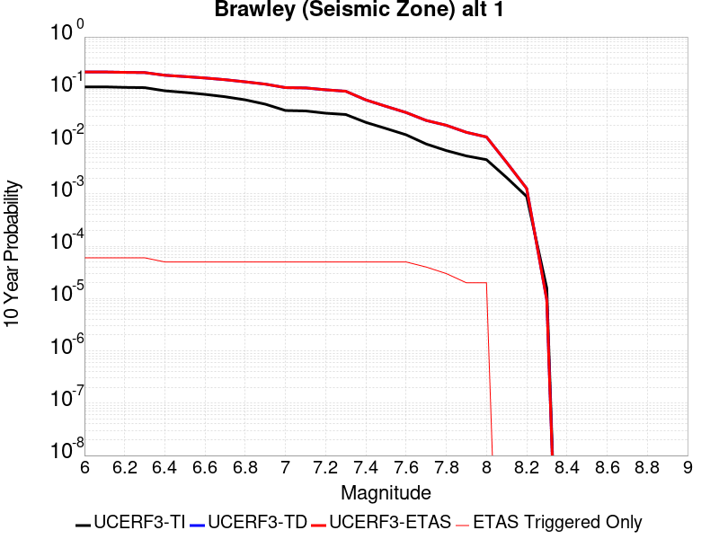 |

| Magnitude | 1 wk TI Prob | 1 wk TD Prob | 1 wk ETAS Prob | 1 wk ETAS/TD Gain | 1 wk ETAS Triggered Only | 1 mo TI Prob | 1 mo TD Prob | 1 mo ETAS Prob | 1 mo ETAS/TD Gain | 1 mo ETAS Triggered Only | 1 yr TI Prob | 1 yr TD Prob | 1 yr ETAS Prob | 1 yr ETAS/TD Gain | 1 yr ETAS Triggered Only | 10 yr TI Prob | 10 yr TD Prob | 10 yr ETAS Prob | 10 yr ETAS/TD Gain | 10 yr ETAS Triggered Only |
|-----|-----|-----|-----|-----|-----|-----|-----|-----|-----|-----|-----|-----|-----|-----|-----|-----|-----|-----|-----|-----|
| 6.0 | 2.2521618E-4 | 4.7641253E-4 | 4.7641253E-4 | 1.0 | 0.0 | 9.6485513E-4 | 0.0020402074 | 0.0020402074 | 1.0 | 0.0 | 0.011683988 | 0.02455069 | 0.024602713 | 1.0021191 | 5.3333333E-5 | 0.11088423 | 0.21353015 | 0.2135721 | 1.0001965 | 5.3333333E-5 |
| 6.1 | 2.2521618E-4 | 4.7641253E-4 | 4.7641253E-4 | 1.0 | 0.0 | 9.6485513E-4 | 0.0020402074 | 0.0020402074 | 1.0 | 0.0 | 0.011683988 | 0.02455069 | 0.024602713 | 1.0021191 | 5.3333333E-5 | 0.11088423 | 0.21353015 | 0.2135721 | 1.0001965 | 5.3333333E-5 |
| 6.2 | 2.198148E-4 | 4.6725658E-4 | 4.6725658E-4 | 1.0 | 0.0 | 9.417233E-4 | 0.002001028 | 0.002001028 | 1.0 | 0.0 | 0.011405343 | 0.024084855 | 0.024136905 | 1.002161 | 5.3333333E-5 | 0.10837428 | 0.20996629 | 0.21000841 | 1.0002006 | 5.3333333E-5 |
| 6.3 | 2.1704129E-4 | 4.6161312E-4 | 4.6161312E-4 | 1.0 | 0.0 | 9.298453E-4 | 0.0019768786 | 0.0019768786 | 1.0 | 0.0 | 0.011262234 | 0.023797998 | 0.023850063 | 1.0021877 | 5.3333333E-5 | 0.107082725 | 0.20785725 | 0.2078995 | 1.0002033 | 5.3333333E-5 |
| 6.4 | 1.876142E-4 | 4.0053183E-4 | 4.0053183E-4 | 1.0 | 0.0 | 8.038131E-4 | 0.0017154501 | 0.0017154501 | 1.0 | 0.0 | 0.00974259 | 0.02068463 | 0.020710746 | 1.0012625 | 2.6666667E-5 | 0.093263686 | 0.184608 | 0.18462975 | 1.0001178 | 2.6666667E-5 |
| 6.5 | 1.7390939E-4 | 3.7485067E-4 | 3.7485067E-4 | 1.0 | 0.0 | 7.45113E-4 | 0.0016055258 | 0.0016055258 | 1.0 | 0.0 | 0.009034078 | 0.019372813 | 0.019398963 | 1.0013498 | 2.6666667E-5 | 0.086755216 | 0.17442966 | 0.17445168 | 1.0001262 | 2.6666667E-5 |
| 6.6 | 1.591791E-4 | 3.489955E-4 | 3.489955E-4 | 1.0 | 0.0 | 6.8201777E-4 | 0.0014948477 | 0.0014948477 | 1.0 | 0.0 | 0.008271996 | 0.018049458 | 0.018075645 | 1.0014508 | 2.6666667E-5 | 0.07970774 | 0.16383699 | 0.16385928 | 1.0001361 | 2.6666667E-5 |
| 6.7 | 1.4268003E-4 | 3.206533E-4 | 3.206533E-4 | 1.0 | 0.0 | 6.1134255E-4 | 0.0013735129 | 0.0013735129 | 1.0 | 0.0 | 0.007417723 | 0.016596261 | 0.016622486 | 1.0015801 | 2.6666667E-5 | 0.07174956 | 0.15196045 | 0.15198307 | 1.0001488 | 2.6666667E-5 |
| 6.8 | 1.239713E-4 | 2.9059697E-4 | 2.9059697E-4 | 1.0 | 0.0 | 5.3119735E-4 | 0.0012448273 | 0.0012448273 | 1.0 | 0.0 | 0.0064481674 | 0.015051884 | 0.015078149 | 1.001745 | 2.6666667E-5 | 0.06264243 | 0.13840161 | 0.13842459 | 1.000166 | 2.6666667E-5 |
| 6.9 | 1.0180238E-4 | 2.625907E-4 | 2.625907E-4 | 1.0 | 0.0 | 4.3622297E-4 | 0.0011249076 | 0.0011249076 | 1.0 | 0.0 | 0.005298089 | 0.013610746 | 0.01363705 | 1.0019326 | 2.6666667E-5 | 0.05173543 | 0.12498065 | 0.12500398 | 1.0001867 | 2.6666667E-5 |
| 7.0 | 7.6619996E-5 | 2.2402873E-4 | 2.2402873E-4 | 1.0 | 0.0 | 3.283301E-4 | 9.59773E-4 | 9.59773E-4 | 1.0 | 0.0 | 0.0039900932 | 0.011623339 | 0.011649695 | 1.0022676 | 2.6666667E-5 | 0.039192066 | 0.10728151 | 0.107305326 | 1.0002218 | 2.6666667E-5 |
| 7.1 | 7.5127435E-5 | 2.208599E-4 | 2.208599E-4 | 1.0 | 0.0 | 3.2193496E-4 | 9.4620226E-4 | 9.4620226E-4 | 1.0 | 0.0 | 0.0039125155 | 0.011459865 | 0.011486226 | 1.0023003 | 2.6666667E-5 | 0.038443442 | 0.10584534 | 0.10586918 | 1.0002253 | 2.6666667E-5 |
| 7.2 | 6.788582E-5 | 2.0213598E-4 | 2.0213598E-4 | 1.0 | 0.0 | 2.9090676E-4 | 8.660125E-4 | 8.660125E-4 | 1.0 | 0.0 | 0.0035360386 | 0.010493369 | 0.010519755 | 1.0025146 | 2.6666667E-5 | 0.034803 | 0.09751546 | 0.09753952 | 1.0002468 | 2.6666667E-5 |
| 7.3 | 6.399602E-5 | 1.88444E-4 | 1.88444E-4 | 1.0 | 0.0 | 2.7423984E-4 | 8.0737006E-4 | 8.0737006E-4 | 1.0 | 0.0 | 0.0033337586 | 0.009786017 | 0.009812423 | 1.0026983 | 2.6666667E-5 | 0.03284188 | 0.091409855 | 0.091434084 | 1.000265 | 2.6666667E-5 |
| 7.4 | 4.506759E-5 | 1.2531783E-4 | 1.2531783E-4 | 1.0 | 0.0 | 1.9313251E-4 | 5.369668E-4 | 5.369668E-4 | 1.0 | 0.0 | 0.0023488526 | 0.0065181484 | 0.006544641 | 1.0040644 | 2.6666667E-5 | 0.023241805 | 0.062375 | 0.062400006 | 1.0004009 | 2.6666667E-5 |
| 7.5 | 3.43289E-5 | 9.337587E-5 | 9.337587E-5 | 1.0 | 0.0 | 1.4711556E-4 | 4.0012124E-4 | 4.0012124E-4 | 1.0 | 0.0 | 0.0017896603 | 0.004860657 | 0.004887194 | 1.0054595 | 2.6666667E-5 | 0.01775316 | 0.04706493 | 0.047090344 | 1.0005399 | 2.6666667E-5 |
| 7.6 | 2.5980507E-5 | 7.054998E-5 | 7.054998E-5 | 1.0 | 0.0 | 1.1134028E-4 | 3.0232212E-4 | 3.0232212E-4 | 1.0 | 0.0 | 0.001354725 | 0.0036745837 | 0.0037011525 | 1.0072304 | 2.6666667E-5 | 0.013464959 | 0.035849415 | 0.035875127 | 1.0007172 | 2.6666667E-5 |
| 7.7 | 1.7292105E-5 | 4.9423474E-5 | 4.9423474E-5 | 1.0 | 0.0 | 7.4106916E-5 | 2.1179771E-4 | 2.1179771E-4 | 1.0 | 0.0 | 9.018782E-4 | 0.0025755935 | 0.0026021916 | 1.010327 | 2.6666667E-5 | 0.008982267 | 0.025297757 | 0.025323749 | 1.0010275 | 2.6666667E-5 |
| 7.8 | 1.2927471E-5 | 3.970735E-5 | 3.970735E-5 | 1.0 | 0.0 | 5.5402274E-5 | 1.7016326E-4 | 1.7016326E-4 | 1.0 | 0.0 | 6.743139E-4 | 0.0020697718 | 0.0020963831 | 1.0128572 | 2.6666667E-5 | 0.0067227143 | 0.02043814 | 0.020464262 | 1.001278 | 2.6666667E-5 |
| 7.9 | 1.0200774E-5 | 2.8757075E-5 | 2.8757075E-5 | 1.0 | 0.0 | 4.371687E-5 | 1.2323879E-4 | 1.2323879E-4 | 1.0 | 0.0 | 5.321229E-4 | 0.0014994006 | 0.0014994006 | 1.0 | 0.0 | 0.005308505 | 0.0149969105 | 0.0149969105 | 1.0 | 0.0 |
| 8.0 | 8.650396E-6 | 2.3287128E-5 | 2.3287128E-5 | 1.0 | 0.0 | 3.70726E-5 | 9.979816E-5 | 9.979816E-5 | 1.0 | 0.0 | 4.5126543E-4 | 0.0012143662 | 0.0012143662 | 1.0 | 0.0 | 0.0045035016 | 0.012215644 | 0.012215644 | 1.0 | 0.0 |
| 8.1 | 3.9368224E-6 | 7.3321658E-6 | 7.3321658E-6 | 1.0 | 0.0 | 1.6871985E-5 | 3.1423187E-5 | 3.1423187E-5 | 1.0 | 0.0 | 2.0539707E-4 | 3.825103E-4 | 3.825103E-4 | 1.0 | 0.0 | 0.0020520731 | 0.00400326 | 0.00400326 | 1.0 | 0.0 |
| 8.2 | 1.7101195E-6 | 2.2195122E-6 | 2.2195122E-6 | 1.0 | 0.0 | 7.329063E-6 | 9.51216E-6 | 9.51216E-6 | 1.0 | 0.0 | 8.922769E-5 | 1.15804425E-4 | 1.15804425E-4 | 1.0 | 0.0 | 8.9191867E-4 | 0.0012675166 | 0.0012675166 | 1.0 | 0.0 |
| 8.3 | 3.0346666E-8 | 1.7233086E-8 | 1.7233086E-8 | 1.0 | 0.0 | 1.3005713E-7 | 7.385608E-8 | 7.385608E-8 | 1.0 | 0.0 | 1.5834444E-6 | 8.991977E-7 | 8.991977E-7 | 1.0 | 0.0 | 1.5834332E-5 | 9.37692E-6 | 9.37692E-6 | 1.0 | 0.0 |

## San Diego Trough north alt1
*[(top)](#table-of-contents)*

| 1 Week | 1 Month | 1 Year | 10 Year |
|-----|-----|-----|-----|
|  |  |  |  |

| Magnitude | 1 wk TI Prob | 1 wk TD Prob | 1 wk ETAS Prob | 1 wk ETAS/TD Gain | 1 wk ETAS Triggered Only | 1 mo TI Prob | 1 mo TD Prob | 1 mo ETAS Prob | 1 mo ETAS/TD Gain | 1 mo ETAS Triggered Only | 1 yr TI Prob | 1 yr TD Prob | 1 yr ETAS Prob | 1 yr ETAS/TD Gain | 1 yr ETAS Triggered Only | 10 yr TI Prob | 10 yr TD Prob | 10 yr ETAS Prob | 10 yr ETAS/TD Gain | 10 yr ETAS Triggered Only |
|-----|-----|-----|-----|-----|-----|-----|-----|-----|-----|-----|-----|-----|-----|-----|-----|-----|-----|-----|-----|-----|
| 6.0 | 7.329252E-5 | 8.821339E-5 | 8.821339E-5 | 1.0 | 0.0 | 3.14073E-4 | 3.7800625E-4 | 3.7800625E-4 | 1.0 | 0.0 | 0.0038171355 | 0.0045931544 | 0.0046196985 | 1.005779 | 2.6666667E-5 | 0.03752231 | 0.045046188 | 0.04509712 | 1.0011306 | 5.3333333E-5 |
| 6.1 | 3.7940346E-5 | 4.488612E-5 | 4.488612E-5 | 1.0 | 0.0 | 1.6259136E-4 | 1.9235547E-4 | 1.9235547E-4 | 1.0 | 0.0 | 0.0019777524 | 0.002339501 | 0.002339501 | 1.0 | 0.0 | 0.019602431 | 0.023157248 | 0.023183297 | 1.0011249 | 2.6666667E-5 |
| 6.2 | 2.8645263E-5 | 3.329751E-5 | 3.329751E-5 | 1.0 | 0.0 | 1.2275964E-4 | 1.4269596E-4 | 1.4269596E-4 | 1.0 | 0.0 | 0.0014935739 | 0.0017359565 | 0.0017359565 | 1.0 | 0.0 | 0.0148357535 | 0.01722662 | 0.01722662 | 1.0 | 0.0 |
| 6.3 | 2.8645263E-5 | 3.329751E-5 | 3.329751E-5 | 1.0 | 0.0 | 1.2275964E-4 | 1.4269596E-4 | 1.4269596E-4 | 1.0 | 0.0 | 0.0014935739 | 0.0017359565 | 0.0017359565 | 1.0 | 0.0 | 0.0148357535 | 0.01722662 | 0.01722662 | 1.0 | 0.0 |
| 6.4 | 2.2204576E-5 | 2.5448817E-5 | 2.5448817E-5 | 1.0 | 0.0 | 9.5159E-5 | 1.0906186E-4 | 1.0906186E-4 | 1.0 | 0.0 | 0.001157945 | 0.0013270293 | 0.0013270293 | 1.0 | 0.0 | 0.011519298 | 0.013192211 | 0.013192211 | 1.0 | 0.0 |
| 6.5 | 2.1004838E-5 | 2.4025157E-5 | 2.4025157E-5 | 1.0 | 0.0 | 9.0017624E-5 | 1.0296095E-4 | 1.0296095E-4 | 1.0 | 0.0 | 0.0010954136 | 0.001252838 | 0.001252838 | 1.0 | 0.0 | 0.010900296 | 0.012458827 | 0.012458827 | 1.0 | 0.0 |
| 6.6 | 1.820557E-5 | 2.0705167E-5 | 2.0705167E-5 | 1.0 | 0.0 | 7.802154E-5 | 8.873344E-5 | 8.873344E-5 | 1.0 | 0.0 | 9.4949827E-4 | 0.0010797997 | 0.0010797997 | 1.0 | 0.0 | 0.009454516 | 0.010746201 | 0.010746201 | 1.0 | 0.0 |
| 6.7 | 1.5884485E-5 | 1.7983964E-5 | 1.7983964E-5 | 1.0 | 0.0 | 6.807459E-5 | 7.707187E-5 | 7.707187E-5 | 1.0 | 0.0 | 8.284929E-4 | 9.379488E-4 | 9.379488E-4 | 1.0 | 0.0 | 0.008254109 | 0.009340268 | 0.009340268 | 1.0 | 0.0 |
| 6.8 | 1.4331171E-5 | 1.6201348E-5 | 1.6201348E-5 | 1.0 | 0.0 | 6.141786E-5 | 6.9432506E-5 | 6.9432506E-5 | 1.0 | 0.0 | 7.4750587E-4 | 8.4501493E-4 | 8.4501493E-4 | 1.0 | 0.0 | 0.0074499645 | 0.008418285 | 0.008418285 | 1.0 | 0.0 |
| 6.9 | 1.2574203E-5 | 1.4206081E-5 | 1.4206081E-5 | 1.0 | 0.0 | 5.3888325E-5 | 6.088179E-5 | 6.088179E-5 | 1.0 | 0.0 | 6.558929E-4 | 7.4098515E-4 | 7.4098515E-4 | 1.0 | 0.0 | 0.0065396037 | 0.0073853307 | 0.0073853307 | 1.0 | 0.0 |
| 7.0 | 1.0883844E-5 | 1.22894735E-5 | 1.22894735E-5 | 1.0 | 0.0 | 4.664421E-5 | 5.2668114E-5 | 5.2668114E-5 | 1.0 | 0.0 | 5.677453E-4 | 6.410466E-4 | 6.410466E-4 | 1.0 | 0.0 | 0.00566297 | 0.0063921027 | 0.0063921027 | 1.0 | 0.0 |
| 7.1 | 9.393088E-6 | 1.0607203E-5 | 1.0607203E-5 | 1.0 | 0.0 | 4.025547E-5 | 4.5458655E-5 | 4.5458655E-5 | 1.0 | 0.0 | 4.900001E-4 | 5.5331935E-4 | 5.5331935E-4 | 1.0 | 0.0 | 0.0048892107 | 0.005519513 | 0.005519513 | 1.0 | 0.0 |
| 7.2 | 8.190791E-6 | 9.258787E-6 | 9.258787E-6 | 1.0 | 0.0 | 3.510292E-5 | 3.9679915E-5 | 3.9679915E-5 | 1.0 | 0.0 | 4.2729423E-4 | 4.8299658E-4 | 4.8299658E-4 | 1.0 | 0.0 | 0.0042647356 | 0.004819548 | 0.004819548 | 1.0 | 0.0 |
| 7.3 | 6.268162E-6 | 7.08984E-6 | 7.08984E-6 | 1.0 | 0.0 | 2.6863276E-5 | 3.0384675E-5 | 3.0384675E-5 | 1.0 | 0.0 | 3.2701128E-4 | 3.6987104E-4 | 3.6987104E-4 | 1.0 | 0.0 | 0.003265305 | 0.0036926004 | 0.0036926004 | 1.0 | 0.0 |
| 7.4 | 4.985186E-6 | 5.6427807E-6 | 5.6427807E-6 | 1.0 | 0.0 | 2.1364907E-5 | 2.4183124E-5 | 2.4183124E-5 | 1.0 | 0.0 | 2.600867E-4 | 2.9439016E-4 | 2.9439016E-4 | 1.0 | 0.0 | 0.002597825 | 0.002940043 | 0.002940043 | 1.0 | 0.0 |
| 7.5 | 1.7489613E-6 | 1.9697113E-6 | 1.9697113E-6 | 1.0 | 0.0 | 7.495527E-6 | 8.441594E-6 | 8.441594E-6 | 1.0 | 0.0 | 9.125422E-5 | 1.0277178E-4 | 1.0277178E-4 | 1.0 | 0.0 | 9.1216754E-4 | 0.0010272645 | 0.0010272645 | 1.0 | 0.0 |
| 7.6 | 1.6988751E-7 | 1.7533898E-7 | 1.7533898E-7 | 1.0 | 0.0 | 7.2808916E-7 | 7.5145255E-7 | 7.5145255E-7 | 1.0 | 0.0 | 8.864449E-6 | 9.148898E-6 | 9.148898E-6 | 1.0 | 0.0 | 8.8640954E-5 | 9.148542E-5 | 9.148542E-5 | 1.0 | 0.0 |

## Shoreline
*[(top)](#table-of-contents)*

| 1 Week | 1 Month | 1 Year | 10 Year |
|-----|-----|-----|-----|
|  |  | 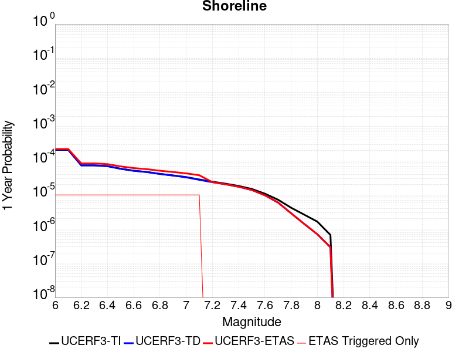 |  |

| Magnitude | 1 wk TI Prob | 1 wk TD Prob | 1 wk ETAS Prob | 1 wk ETAS/TD Gain | 1 wk ETAS Triggered Only | 1 mo TI Prob | 1 mo TD Prob | 1 mo ETAS Prob | 1 mo ETAS/TD Gain | 1 mo ETAS Triggered Only | 1 yr TI Prob | 1 yr TD Prob | 1 yr ETAS Prob | 1 yr ETAS/TD Gain | 1 yr ETAS Triggered Only | 10 yr TI Prob | 10 yr TD Prob | 10 yr ETAS Prob | 10 yr ETAS/TD Gain | 10 yr ETAS Triggered Only |
|-----|-----|-----|-----|-----|-----|-----|-----|-----|-----|-----|-----|-----|-----|-----|-----|-----|-----|-----|-----|-----|
| 6.0 | 3.9888673E-6 | 4.047945E-6 | 4.047945E-6 | 1.0 | 0.0 | 1.7095033E-5 | 1.7348251E-5 | 1.7348251E-5 | 1.0 | 0.0 | 2.0811215E-4 | 2.1120008E-4 | 2.3786111E-4 | 1.126236 | 2.6666667E-5 | 0.0020791737 | 0.0021105423 | 0.0021371527 | 1.0126083 | 2.6666667E-5 |
| 6.1 | 3.9888673E-6 | 4.047945E-6 | 4.047945E-6 | 1.0 | 0.0 | 1.7095033E-5 | 1.7348251E-5 | 1.7348251E-5 | 1.0 | 0.0 | 2.0811215E-4 | 2.1120008E-4 | 2.3786111E-4 | 1.126236 | 2.6666667E-5 | 0.0020791737 | 0.0021105423 | 0.0021371527 | 1.0126083 | 2.6666667E-5 |
| 6.2 | 1.4039653E-6 | 1.4100978E-6 | 1.4100978E-6 | 1.0 | 0.0 | 6.0169805E-6 | 6.0432626E-6 | 6.0432626E-6 | 1.0 | 0.0 | 7.325427E-5 | 7.3574294E-5 | 1.00239E-4 | 1.3624188 | 2.6666667E-5 | 7.3230127E-4 | 7.3550537E-4 | 7.621524E-4 | 1.0362296 | 2.6666667E-5 |
| 6.3 | 1.4039653E-6 | 1.4100978E-6 | 1.4100978E-6 | 1.0 | 0.0 | 6.0169805E-6 | 6.0432626E-6 | 6.0432626E-6 | 1.0 | 0.0 | 7.325427E-5 | 7.3574294E-5 | 1.00239E-4 | 1.3624188 | 2.6666667E-5 | 7.3230127E-4 | 7.3550537E-4 | 7.621524E-4 | 1.0362296 | 2.6666667E-5 |
| 6.4 | 1.3314152E-6 | 1.336169E-6 | 1.336169E-6 | 1.0 | 0.0 | 5.7060524E-6 | 5.726426E-6 | 5.726426E-6 | 1.0 | 0.0 | 6.946897E-5 | 6.971706E-5 | 9.638187E-5 | 1.3824718 | 2.6666667E-5 | 6.9447263E-4 | 6.969573E-4 | 7.236054E-4 | 1.0382348 | 2.6666667E-5 |
| 6.5 | 1.1187026E-6 | 1.1203721E-6 | 1.1203721E-6 | 1.0 | 0.0 | 4.794431E-6 | 4.801586E-6 | 4.801586E-6 | 1.0 | 0.0 | 5.8370628E-5 | 5.8457765E-5 | 8.512287E-5 | 1.4561431 | 2.6666667E-5 | 5.83553E-4 | 5.844264E-4 | 6.1107747E-4 | 1.0456021 | 2.6666667E-5 |
| 6.6 | 9.793089E-7 | 9.784997E-7 | 9.784997E-7 | 1.0 | 0.0 | 4.1970316E-6 | 4.193563E-6 | 4.193563E-6 | 1.0 | 0.0 | 5.1097657E-5 | 5.105545E-5 | 7.772075E-5 | 1.5222813 | 2.6666667E-5 | 5.108591E-4 | 5.104385E-4 | 5.370916E-4 | 1.052216 | 2.6666667E-5 |
| 6.7 | 8.995986E-7 | 8.972875E-7 | 8.972875E-7 | 1.0 | 0.0 | 3.8554167E-6 | 3.8455123E-6 | 3.8455123E-6 | 1.0 | 0.0 | 4.693869E-5 | 4.6818117E-5 | 7.3483534E-5 | 1.5695534 | 2.6666667E-5 | 4.6928777E-4 | 4.6808348E-4 | 4.9473764E-4 | 1.0569432 | 2.6666667E-5 |
| 6.8 | 7.931612E-7 | 7.8804743E-7 | 7.8804743E-7 | 1.0 | 0.0 | 3.3992578E-6 | 3.3773417E-6 | 3.3773417E-6 | 1.0 | 0.0 | 4.1385178E-5 | 4.1118365E-5 | 6.7783934E-5 | 1.6485076 | 2.6666667E-5 | 4.1377472E-4 | 4.111081E-4 | 4.377638E-4 | 1.0648386 | 2.6666667E-5 |
| 6.9 | 7.1465956E-7 | 7.078075E-7 | 7.078075E-7 | 1.0 | 0.0 | 3.062823E-6 | 3.0334572E-6 | 3.0334572E-6 | 1.0 | 0.0 | 3.7289232E-5 | 3.6931717E-5 | 6.35974E-5 | 1.7220266 | 2.6666667E-5 | 3.7282976E-4 | 3.692562E-4 | 3.95913E-4 | 1.0721906 | 2.6666667E-5 |
| 7.0 | 6.389046E-7 | 6.299524E-7 | 6.299524E-7 | 1.0 | 0.0 | 2.7381598E-6 | 2.6997934E-6 | 2.6997934E-6 | 1.0 | 0.0 | 3.3336586E-5 | 3.286949E-5 | 5.953528E-5 | 1.8112626 | 2.6666667E-5 | 3.3331584E-4 | 3.2864654E-4 | 3.5530442E-4 | 1.0811142 | 2.6666667E-5 |
| 7.1 | 5.4300875E-7 | 5.311193E-7 | 5.311193E-7 | 1.0 | 0.0 | 2.3271782E-6 | 2.2762235E-6 | 2.2762235E-6 | 1.0 | 0.0 | 2.8333026E-5 | 2.7712671E-5 | 5.4378597E-5 | 1.9622287 | 2.6666667E-5 | 2.8329415E-4 | 2.7709227E-4 | 3.0375153E-4 | 1.0962108 | 2.6666667E-5 |
| 7.2 | 4.6768855E-7 | 4.5349543E-7 | 4.5349543E-7 | 1.0 | 0.0 | 2.0043778E-6 | 1.9435504E-6 | 1.9435504E-6 | 1.0 | 0.0 | 2.4403027E-5 | 2.366247E-5 | 2.366247E-5 | 1.0 | 0.0 | 2.4400349E-4 | 2.3659955E-4 | 2.3659955E-4 | 1.0 | 0.0 |
| 7.3 | 4.0966103E-7 | 3.938623E-7 | 3.938623E-7 | 1.0 | 0.0 | 1.7556889E-6 | 1.6879802E-6 | 1.6879802E-6 | 1.0 | 0.0 | 2.1375303E-5 | 2.0550966E-5 | 2.0550966E-5 | 1.0 | 0.0 | 2.1373246E-4 | 2.0549068E-4 | 2.0549068E-4 | 1.0 | 0.0 |
| 7.4 | 3.5105785E-7 | 3.336452E-7 | 3.336452E-7 | 1.0 | 0.0 | 1.5045327E-6 | 1.4299071E-6 | 1.4299071E-6 | 1.0 | 0.0 | 1.8317533E-5 | 1.740898E-5 | 1.740898E-5 | 1.0 | 0.0 | 1.8316023E-4 | 1.740762E-4 | 1.740762E-4 | 1.0 | 0.0 |
| 7.5 | 2.8737534E-7 | 2.682056E-7 | 2.682056E-7 | 1.0 | 0.0 | 1.2316079E-6 | 1.149452E-6 | 1.149452E-6 | 1.0 | 0.0 | 1.4994724E-5 | 1.3994489E-5 | 1.3994489E-5 | 1.0 | 0.0 | 1.4993713E-4 | 1.3993609E-4 | 1.3993609E-4 | 1.0 | 0.0 |
| 7.6 | 2.0924051E-7 | 1.8779478E-7 | 1.8779478E-7 | 1.0 | 0.0 | 8.967448E-7 | 8.048345E-7 | 8.048345E-7 | 1.0 | 0.0 | 1.0917813E-5 | 9.798816E-6 | 9.798816E-6 | 1.0 | 0.0 | 1.0917276E-4 | 9.798385E-5 | 9.798385E-5 | 1.0 | 0.0 |
| 7.7 | 1.392265E-7 | 1.1543848E-7 | 1.1543848E-7 | 1.0 | 0.0 | 5.9668486E-7 | 4.9473624E-7 | 4.9473624E-7 | 1.0 | 0.0 | 7.2646135E-6 | 6.023397E-6 | 6.023397E-6 | 1.0 | 0.0 | 7.2643765E-5 | 6.023234E-5 | 6.023234E-5 | 1.0 | 0.0 |
| 7.8 | 8.1080074E-8 | 5.58715E-8 | 5.58715E-8 | 1.0 | 0.0 | 3.4748598E-7 | 2.3944926E-7 | 2.3944926E-7 | 1.0 | 0.0 | 4.2306337E-6 | 2.915291E-6 | 2.915291E-6 | 1.0 | 0.0 | 4.230553E-5 | 2.9152527E-5 | 2.9152527E-5 | 1.0 | 0.0 |
| 7.9 | 5.0859036E-8 | 2.7248419E-8 | 2.7248419E-8 | 1.0 | 0.0 | 2.1796728E-7 | 1.16778935E-7 | 1.16778935E-7 | 1.0 | 0.0 | 2.6537484E-6 | 1.4217826E-6 | 1.4217826E-6 | 1.0 | 0.0 | 2.6537167E-5 | 1.4217735E-5 | 1.4217735E-5 | 1.0 | 0.0 |
| 8.0 | 3.1760536E-8 | 1.3580286E-8 | 1.3580286E-8 | 1.0 | 0.0 | 1.3611657E-7 | 5.8201223E-8 | 5.8201223E-8 | 1.0 | 0.0 | 1.6572179E-6 | 7.0859966E-7 | 7.0859966E-7 | 1.0 | 0.0 | 1.6572056E-5 | 7.085974E-6 | 7.085974E-6 | 1.0 | 0.0 |
| 8.1 | 1.2947896E-8 | 5.6641998E-9 | 5.6641998E-9 | 1.0 | 0.0 | 5.5490982E-8 | 2.4275142E-8 | 2.4275142E-8 | 1.0 | 0.0 | 6.756025E-7 | 2.955498E-7 | 2.955498E-7 | 1.0 | 0.0 | 6.7560045E-6 | 2.9554942E-6 | 2.9554942E-6 | 1.0 | 0.0 |

## San Jose
*[(top)](#table-of-contents)*

| 1 Week | 1 Month | 1 Year | 10 Year |
|-----|-----|-----|-----|
|  |  |  |  |

| Magnitude | 1 wk TI Prob | 1 wk TD Prob | 1 wk ETAS Prob | 1 wk ETAS/TD Gain | 1 wk ETAS Triggered Only | 1 mo TI Prob | 1 mo TD Prob | 1 mo ETAS Prob | 1 mo ETAS/TD Gain | 1 mo ETAS Triggered Only | 1 yr TI Prob | 1 yr TD Prob | 1 yr ETAS Prob | 1 yr ETAS/TD Gain | 1 yr ETAS Triggered Only | 10 yr TI Prob | 10 yr TD Prob | 10 yr ETAS Prob | 10 yr ETAS/TD Gain | 10 yr ETAS Triggered Only |
|-----|-----|-----|-----|-----|-----|-----|-----|-----|-----|-----|-----|-----|-----|-----|-----|-----|-----|-----|-----|-----|
| 6.0 | 5.0851277E-6 | 4.125751E-6 | 4.125751E-6 | 1.0 | 0.0 | 2.1793223E-5 | 1.7681685E-5 | 1.7681685E-5 | 1.0 | 0.0 | 2.653002E-4 | 2.1525587E-4 | 2.1525587E-4 | 1.0 | 0.0 | 0.0026498367 | 0.002150765 | 0.0021773742 | 1.012372 | 2.6666667E-5 |
| 6.1 | 5.0851277E-6 | 4.125751E-6 | 4.125751E-6 | 1.0 | 0.0 | 2.1793223E-5 | 1.7681685E-5 | 1.7681685E-5 | 1.0 | 0.0 | 2.653002E-4 | 2.1525587E-4 | 2.1525587E-4 | 1.0 | 0.0 | 0.0026498367 | 0.002150765 | 0.0021773742 | 1.012372 | 2.6666667E-5 |
| 6.2 | 5.0851277E-6 | 4.125751E-6 | 4.125751E-6 | 1.0 | 0.0 | 2.1793223E-5 | 1.7681685E-5 | 1.7681685E-5 | 1.0 | 0.0 | 2.653002E-4 | 2.1525587E-4 | 2.1525587E-4 | 1.0 | 0.0 | 0.0026498367 | 0.002150765 | 0.0021773742 | 1.012372 | 2.6666667E-5 |
| 6.3 | 5.0851277E-6 | 4.125751E-6 | 4.125751E-6 | 1.0 | 0.0 | 2.1793223E-5 | 1.7681685E-5 | 1.7681685E-5 | 1.0 | 0.0 | 2.653002E-4 | 2.1525587E-4 | 2.1525587E-4 | 1.0 | 0.0 | 0.0026498367 | 0.002150765 | 0.0021773742 | 1.012372 | 2.6666667E-5 |
| 6.4 | 4.3115124E-6 | 3.3238575E-6 | 3.3238575E-6 | 1.0 | 0.0 | 1.8477778E-5 | 1.4245038E-5 | 1.4245038E-5 | 1.0 | 0.0 | 2.2494372E-4 | 1.7342175E-4 | 1.7342175E-4 | 1.0 | 0.0 | 0.0022471617 | 0.0017331139 | 0.0017597344 | 1.0153599 | 2.6666667E-5 |
| 6.5 | 4.3115124E-6 | 3.3238575E-6 | 3.3238575E-6 | 1.0 | 0.0 | 1.8477778E-5 | 1.4245038E-5 | 1.4245038E-5 | 1.0 | 0.0 | 2.2494372E-4 | 1.7342175E-4 | 1.7342175E-4 | 1.0 | 0.0 | 0.0022471617 | 0.0017331139 | 0.0017597344 | 1.0153599 | 2.6666667E-5 |
| 6.6 | 3.110396E-6 | 2.080055E-6 | 2.080055E-6 | 1.0 | 0.0 | 1.33302E-5 | 8.914493E-6 | 8.914493E-6 | 1.0 | 0.0 | 1.622831E-4 | 1.0852883E-4 | 1.0852883E-4 | 1.0 | 0.0 | 0.0016216465 | 0.0010848183 | 0.001111456 | 1.024555 | 2.6666667E-5 |
| 6.7 | 3.110396E-6 | 2.080055E-6 | 2.080055E-6 | 1.0 | 0.0 | 1.33302E-5 | 8.914493E-6 | 8.914493E-6 | 1.0 | 0.0 | 1.622831E-4 | 1.0852883E-4 | 1.0852883E-4 | 1.0 | 0.0 | 0.0016216465 | 0.0010848183 | 0.001111456 | 1.024555 | 2.6666667E-5 |
| 6.8 | 2.856651E-6 | 1.9025018E-6 | 1.9025018E-6 | 1.0 | 0.0 | 1.2242733E-5 | 8.153555E-6 | 8.153555E-6 | 1.0 | 0.0 | 1.4904508E-4 | 9.926526E-5 | 9.926526E-5 | 1.0 | 0.0 | 0.0014894515 | 9.922662E-4 | 0.0010189064 | 1.0268478 | 2.6666667E-5 |
| 6.9 | 2.1618725E-6 | 1.4187265E-6 | 1.4187265E-6 | 1.0 | 0.0 | 9.265135E-6 | 6.080242E-6 | 6.080242E-6 | 1.0 | 0.0 | 1.12797185E-4 | 7.402452E-5 | 7.402452E-5 | 1.0 | 0.0 | 0.0011273995 | 7.4003986E-4 | 7.4003986E-4 | 1.0 | 0.0 |
| 7.0 | 1.9684312E-6 | 1.3256941E-6 | 1.3256941E-6 | 1.0 | 0.0 | 8.436106E-6 | 5.6815347E-6 | 5.6815347E-6 | 1.0 | 0.0 | 1.02704755E-4 | 6.917057E-5 | 6.917057E-5 | 1.0 | 0.0 | 0.001026573 | 6.9153105E-4 | 6.9153105E-4 | 1.0 | 0.0 |
| 7.1 | 1.6070337E-6 | 1.1155666E-6 | 1.1155666E-6 | 1.0 | 0.0 | 6.887269E-6 | 4.7809913E-6 | 4.7809913E-6 | 1.0 | 0.0 | 8.384928E-5 | 5.820708E-5 | 5.820708E-5 | 1.0 | 0.0 | 8.3817646E-4 | 5.81957E-4 | 5.81957E-4 | 1.0 | 0.0 |
| 7.2 | 1.0631658E-6 | 6.4041933E-7 | 6.4041933E-7 | 1.0 | 0.0 | 4.556417E-6 | 2.7446513E-6 | 2.7446513E-6 | 1.0 | 0.0 | 5.5472963E-5 | 3.3415632E-5 | 3.3415632E-5 | 1.0 | 0.0 | 5.545912E-4 | 3.3413994E-4 | 3.3413994E-4 | 1.0 | 0.0 |
| 7.3 | 7.060711E-7 | 4.582818E-7 | 4.582818E-7 | 1.0 | 0.0 | 3.0260155E-6 | 1.9640634E-6 | 1.9640634E-6 | 1.0 | 0.0 | 3.6841117E-5 | 2.3912218E-5 | 2.3912218E-5 | 1.0 | 0.0 | 3.6835007E-4 | 2.3912982E-4 | 2.3912982E-4 | 1.0 | 0.0 |
| 7.4 | 3.3677085E-7 | 2.3235627E-7 | 2.3235627E-7 | 1.0 | 0.0 | 1.4433028E-6 | 9.958122E-7 | 9.958122E-7 | 1.0 | 0.0 | 1.757207E-5 | 1.2123949E-5 | 1.2123949E-5 | 1.0 | 0.0 | 1.7570681E-4 | 1.2126564E-4 | 1.2126564E-4 | 1.0 | 0.0 |
| 7.5 | 3.129161E-7 | 1.9532963E-7 | 1.9532963E-7 | 1.0 | 0.0 | 1.3410682E-6 | 8.371268E-7 | 8.371268E-7 | 1.0 | 0.0 | 1.6327383E-5 | 1.0191973E-5 | 1.0191973E-5 | 1.0 | 0.0 | 1.6326184E-4 | 1.0194778E-4 | 1.0194778E-4 | 1.0 | 0.0 |
| 7.6 | 2.8008668E-7 | 1.4243734E-7 | 1.4243734E-7 | 1.0 | 0.0 | 1.2003709E-6 | 6.104456E-7 | 6.104456E-7 | 1.0 | 0.0 | 1.46144175E-5 | 7.4321515E-6 | 7.4321515E-6 | 1.0 | 0.0 | 1.4613457E-4 | 7.4351636E-5 | 7.4351636E-5 | 1.0 | 0.0 |
| 7.7 | 2.7852005E-7 | 1.4018305E-7 | 1.4018305E-7 | 1.0 | 0.0 | 1.1936568E-6 | 6.007844E-7 | 6.007844E-7 | 1.0 | 0.0 | 1.4532674E-5 | 7.314527E-6 | 7.314527E-6 | 1.0 | 0.0 | 1.4531724E-4 | 7.317547E-5 | 7.317547E-5 | 1.0 | 0.0 |
| 7.8 | 1.1810797E-7 | 7.5195864E-8 | 7.5195864E-8 | 1.0 | 0.0 | 5.0617695E-7 | 3.2226794E-7 | 3.2226794E-7 | 1.0 | 0.0 | 6.1626865E-6 | 3.9236056E-6 | 3.9236056E-6 | 1.0 | 0.0 | 6.162516E-5 | 3.9253733E-5 | 3.9253733E-5 | 1.0 | 0.0 |

## Honey Lake 2011 CFM
*[(top)](#table-of-contents)*

| 1 Week | 1 Month | 1 Year | 10 Year |
|-----|-----|-----|-----|
|  |  |  | 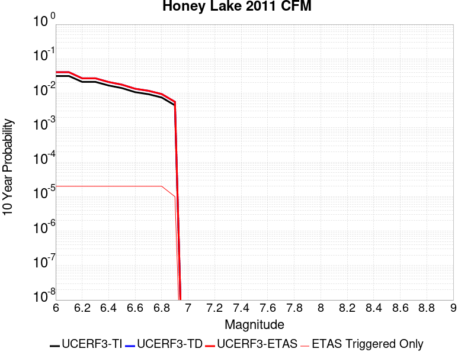 |

| Magnitude | 1 wk TI Prob | 1 wk TD Prob | 1 wk ETAS Prob | 1 wk ETAS/TD Gain | 1 wk ETAS Triggered Only | 1 mo TI Prob | 1 mo TD Prob | 1 mo ETAS Prob | 1 mo ETAS/TD Gain | 1 mo ETAS Triggered Only | 1 yr TI Prob | 1 yr TD Prob | 1 yr ETAS Prob | 1 yr ETAS/TD Gain | 1 yr ETAS Triggered Only | 10 yr TI Prob | 10 yr TD Prob | 10 yr ETAS Prob | 10 yr ETAS/TD Gain | 10 yr ETAS Triggered Only |
|-----|-----|-----|-----|-----|-----|-----|-----|-----|-----|-----|-----|-----|-----|-----|-----|-----|-----|-----|-----|-----|
| 6.0 | 6.155506E-5 | 7.9549776E-5 | 7.9549776E-5 | 1.0 | 0.0 | 2.6378073E-4 | 3.4088633E-4 | 3.4088633E-4 | 1.0 | 0.0 | 0.0032068014 | 0.004142954 | 0.00416951 | 1.00641 | 2.6666667E-5 | 0.03160919 | 0.040704414 | 0.040729996 | 1.0006285 | 2.6666667E-5 |
| 6.1 | 6.155506E-5 | 7.9549776E-5 | 7.9549776E-5 | 1.0 | 0.0 | 2.6378073E-4 | 3.4088633E-4 | 3.4088633E-4 | 1.0 | 0.0 | 0.0032068014 | 0.004142954 | 0.00416951 | 1.00641 | 2.6666667E-5 | 0.03160919 | 0.040704414 | 0.040729996 | 1.0006285 | 2.6666667E-5 |
| 6.2 | 4.1335024E-5 | 5.2578198E-5 | 5.2578198E-5 | 1.0 | 0.0 | 1.7713808E-4 | 2.2531676E-4 | 2.2531676E-4 | 1.0 | 0.0 | 0.0021545228 | 0.0027399566 | 0.0027665503 | 1.0097059 | 2.6666667E-5 | 0.021337535 | 0.027077656 | 0.027103601 | 1.0009582 | 2.6666667E-5 |
| 6.3 | 4.1335024E-5 | 5.2578198E-5 | 5.2578198E-5 | 1.0 | 0.0 | 1.7713808E-4 | 2.2531676E-4 | 2.2531676E-4 | 1.0 | 0.0 | 0.0021545228 | 0.0027399566 | 0.0027665503 | 1.0097059 | 2.6666667E-5 | 0.021337535 | 0.027077656 | 0.027103601 | 1.0009582 | 2.6666667E-5 |
| 6.4 | 3.2393702E-5 | 4.088887E-5 | 4.088887E-5 | 1.0 | 0.0 | 1.3882275E-4 | 1.7522695E-4 | 1.7522695E-4 | 1.0 | 0.0 | 0.0016888566 | 0.0021314071 | 0.0021580171 | 1.0124847 | 2.6666667E-5 | 0.016760793 | 0.02112054 | 0.021146644 | 1.001236 | 2.6666667E-5 |
| 6.5 | 2.7205504E-5 | 3.4212855E-5 | 3.4212855E-5 | 1.0 | 0.0 | 1.1658981E-4 | 1.4661887E-4 | 1.4661887E-4 | 1.0 | 0.0 | 0.0014185566 | 0.0017837189 | 0.0018103381 | 1.0149233 | 2.6666667E-5 | 0.014095354 | 0.017703528 | 0.017729722 | 1.0014796 | 2.6666667E-5 |
| 6.6 | 2.069265E-5 | 2.5956184E-5 | 2.5956184E-5 | 1.0 | 0.0 | 8.867977E-5 | 1.1123653E-4 | 1.1123653E-4 | 1.0 | 0.0 | 0.0010791414 | 0.0013535494 | 0.00138018 | 1.0196747 | 2.6666667E-5 | 0.010739161 | 0.013461453 | 0.013487761 | 1.0019543 | 2.6666667E-5 |
| 6.7 | 1.8060919E-5 | 2.2657592E-5 | 2.2657592E-5 | 1.0 | 0.0 | 7.7401644E-5 | 9.710081E-5 | 9.710081E-5 | 1.0 | 0.0 | 9.419576E-4 | 0.0011816425 | 0.0012082777 | 1.0225408 | 2.6666667E-5 | 0.009379748 | 0.011761633 | 0.011787985 | 1.0022405 | 2.6666667E-5 |
| 6.8 | 1.4474663E-5 | 1.8181889E-5 | 1.8181889E-5 | 1.0 | 0.0 | 6.203279E-5 | 7.7920486E-5 | 7.7920486E-5 | 1.0 | 0.0 | 7.5498753E-4 | 9.483458E-4 | 9.7498717E-4 | 1.0280925 | 2.6666667E-5 | 0.007524277 | 0.009450511 | 0.009476926 | 1.0027951 | 2.6666667E-5 |
| 6.9 | 8.564552E-6 | 1.0802682E-5 | 1.0802682E-5 | 1.0 | 0.0 | 3.6704707E-5 | 4.6296762E-5 | 4.6296762E-5 | 1.0 | 0.0 | 4.4678818E-4 | 5.63584E-4 | 5.63584E-4 | 1.0 | 0.0 | 0.0044589094 | 0.0056280424 | 0.0056280424 | 1.0 | 0.0 |

## Elsinore (Coyote Mountains)
*[(top)](#table-of-contents)*

| 1 Week | 1 Month | 1 Year | 10 Year |
|-----|-----|-----|-----|
|  |  |  |  |

| Magnitude | 1 wk TI Prob | 1 wk TD Prob | 1 wk ETAS Prob | 1 wk ETAS/TD Gain | 1 wk ETAS Triggered Only | 1 mo TI Prob | 1 mo TD Prob | 1 mo ETAS Prob | 1 mo ETAS/TD Gain | 1 mo ETAS Triggered Only | 1 yr TI Prob | 1 yr TD Prob | 1 yr ETAS Prob | 1 yr ETAS/TD Gain | 1 yr ETAS Triggered Only | 10 yr TI Prob | 10 yr TD Prob | 10 yr ETAS Prob | 10 yr ETAS/TD Gain | 10 yr ETAS Triggered Only |
|-----|-----|-----|-----|-----|-----|-----|-----|-----|-----|-----|-----|-----|-----|-----|-----|-----|-----|-----|-----|-----|
| 6.0 | 4.20513E-5 | 4.8633563E-5 | 7.529893E-5 | 1.5482916 | 2.6666667E-5 | 1.8020741E-4 | 2.0841615E-4 | 2.3507726E-4 | 1.1279224 | 2.6666667E-5 | 0.0021918174 | 0.0025350873 | 0.0025616866 | 1.0104923 | 2.6666667E-5 | 0.021703249 | 0.025112117 | 0.025138114 | 1.0010352 | 2.6666667E-5 |
| 6.1 | 4.20513E-5 | 4.8633563E-5 | 7.529893E-5 | 1.5482916 | 2.6666667E-5 | 1.8020741E-4 | 2.0841615E-4 | 2.3507726E-4 | 1.1279224 | 2.6666667E-5 | 0.0021918174 | 0.0025350873 | 0.0025616866 | 1.0104923 | 2.6666667E-5 | 0.021703249 | 0.025112117 | 0.025138114 | 1.0010352 | 2.6666667E-5 |
| 6.2 | 2.3413893E-5 | 2.4696421E-5 | 5.136243E-5 | 2.079752 | 2.6666667E-5 | 1.0034139E-4 | 1.0583805E-4 | 1.325019E-4 | 1.2519306 | 2.6666667E-5 | 0.0012209718 | 0.0012879103 | 0.0013145426 | 1.0206788 | 2.6666667E-5 | 0.012142851 | 0.012813029 | 0.012839354 | 1.0020546 | 2.6666667E-5 |
| 6.3 | 2.3413893E-5 | 2.4696421E-5 | 5.136243E-5 | 2.079752 | 2.6666667E-5 | 1.0034139E-4 | 1.0583805E-4 | 1.325019E-4 | 1.2519306 | 2.6666667E-5 | 0.0012209718 | 0.0012879103 | 0.0013145426 | 1.0206788 | 2.6666667E-5 | 0.012142851 | 0.012813029 | 0.012839354 | 1.0020546 | 2.6666667E-5 |
| 6.4 | 1.6894814E-5 | 1.6568854E-5 | 4.323508E-5 | 2.6094189 | 2.6666667E-5 | 7.240433E-5 | 7.100766E-5 | 9.767243E-5 | 1.3755196 | 2.6666667E-5 | 8.811662E-4 | 8.6421217E-4 | 8.908558E-4 | 1.0308299 | 2.6666667E-5 | 0.0087768035 | 0.008612194 | 0.008638632 | 1.0030698 | 2.6666667E-5 |
| 6.5 | 1.6894814E-5 | 1.6568854E-5 | 4.323508E-5 | 2.6094189 | 2.6666667E-5 | 7.240433E-5 | 7.100766E-5 | 9.767243E-5 | 1.3755196 | 2.6666667E-5 | 8.811662E-4 | 8.6421217E-4 | 8.908558E-4 | 1.0308299 | 2.6666667E-5 | 0.0087768035 | 0.008612194 | 0.008638632 | 1.0030698 | 2.6666667E-5 |
| 6.6 | 1.1910969E-5 | 1.05310955E-5 | 1.05310955E-5 | 1.0 | 0.0 | 5.1046012E-5 | 4.513256E-5 | 4.513256E-5 | 1.0 | 0.0 | 6.21308E-4 | 5.4936187E-4 | 5.4936187E-4 | 1.0 | 0.0 | 0.0061957375 | 0.0054813414 | 0.0054813414 | 1.0 | 0.0 |
| 6.7 | 9.1486E-6 | 7.2030907E-6 | 7.2030907E-6 | 1.0 | 0.0 | 3.9207694E-5 | 3.0870044E-5 | 3.0870044E-5 | 1.0 | 0.0 | 4.7724912E-4 | 3.757818E-4 | 3.757818E-4 | 1.0 | 0.0 | 0.0047622547 | 0.0037518432 | 0.0037518432 | 1.0 | 0.0 |
| 6.8 | 7.90441E-6 | 5.7292227E-6 | 5.7292227E-6 | 1.0 | 0.0 | 3.3875604E-5 | 2.4553588E-5 | 2.4553588E-5 | 1.0 | 0.0 | 4.1235742E-4 | 2.989002E-4 | 2.989002E-4 | 1.0 | 0.0 | 0.0041159308 | 0.0029851105 | 0.0029851105 | 1.0 | 0.0 |
| 6.9 | 7.77015E-6 | 5.5831756E-6 | 5.5831756E-6 | 1.0 | 0.0 | 3.3300217E-5 | 2.3927683E-5 | 2.3927683E-5 | 1.0 | 0.0 | 4.0535472E-4 | 2.9128187E-4 | 2.9128187E-4 | 1.0 | 0.0 | 0.004046161 | 0.0029091279 | 0.0029091279 | 1.0 | 0.0 |
| 7.0 | 7.675798E-6 | 5.480033E-6 | 5.480033E-6 | 1.0 | 0.0 | 3.289586E-5 | 2.348565E-5 | 2.348565E-5 | 1.0 | 0.0 | 4.004335E-4 | 2.8590154E-4 | 2.8590154E-4 | 1.0 | 0.0 | 0.003997127 | 0.0028554637 | 0.0028554637 | 1.0 | 0.0 |
| 7.1 | 7.447814E-6 | 5.2389046E-6 | 5.2389046E-6 | 1.0 | 0.0 | 3.191881E-5 | 2.2452263E-5 | 2.2452263E-5 | 1.0 | 0.0 | 3.8854225E-4 | 2.7332324E-4 | 2.7332324E-4 | 1.0 | 0.0 | 0.003878636 | 0.0027299952 | 0.0027299952 | 1.0 | 0.0 |
| 7.2 | 7.128185E-6 | 4.9055616E-6 | 4.9055616E-6 | 1.0 | 0.0 | 3.0549007E-5 | 2.1023672E-5 | 2.1023672E-5 | 1.0 | 0.0 | 3.7187067E-4 | 2.5593434E-4 | 2.5593434E-4 | 1.0 | 0.0 | 0.00371249 | 0.0025565142 | 0.0025565142 | 1.0 | 0.0 |
| 7.3 | 7.0913875E-6 | 4.8742363E-6 | 4.8742363E-6 | 1.0 | 0.0 | 3.0391306E-5 | 2.0889423E-5 | 2.0889423E-5 | 1.0 | 0.0 | 3.6995133E-4 | 2.5430025E-4 | 2.5430025E-4 | 1.0 | 0.0 | 0.0036933604 | 0.0025402107 | 0.0025402107 | 1.0 | 0.0 |
| 7.4 | 7.051521E-6 | 4.8380875E-6 | 4.8380875E-6 | 1.0 | 0.0 | 3.0220453E-5 | 2.0734502E-5 | 2.0734502E-5 | 1.0 | 0.0 | 3.6787192E-4 | 2.524145E-4 | 2.524145E-4 | 1.0 | 0.0 | 0.0036726352 | 0.0025213964 | 0.0025213964 | 1.0 | 0.0 |
| 7.5 | 6.910666E-6 | 4.7336343E-6 | 4.7336343E-6 | 1.0 | 0.0 | 2.9616802E-5 | 2.0286852E-5 | 2.0286852E-5 | 1.0 | 0.0 | 3.605249E-4 | 2.4696562E-4 | 2.4696562E-4 | 1.0 | 0.0 | 0.0035994058 | 0.0024670297 | 0.0024670297 | 1.0 | 0.0 |
| 7.6 | 6.341753E-6 | 4.3067316E-6 | 4.3067316E-6 | 1.0 | 0.0 | 2.7178658E-5 | 1.8457298E-5 | 1.8457298E-5 | 1.0 | 0.0 | 3.3084993E-4 | 2.246956E-4 | 2.246956E-4 | 1.0 | 0.0 | 0.0033035777 | 0.0022447994 | 0.0022447994 | 1.0 | 0.0 |
| 7.7 | 3.9205916E-6 | 2.2440495E-6 | 2.2440495E-6 | 1.0 | 0.0 | 1.6802427E-5 | 9.6173235E-6 | 9.6173235E-6 | 1.0 | 0.0 | 2.0455034E-4 | 1.1708537E-4 | 1.1708537E-4 | 1.0 | 0.0 | 0.0020436216 | 0.0011703098 | 0.0011703098 | 1.0 | 0.0 |
| 7.8 | 2.0846227E-7 | 8.4868525E-8 | 8.4868525E-8 | 1.0 | 0.0 | 8.9340944E-7 | 3.6372222E-7 | 3.6372222E-7 | 1.0 | 0.0 | 1.0877206E-5 | 4.4283124E-6 | 4.4283124E-6 | 1.0 | 0.0 | 1.0876673E-4 | 4.4282566E-5 | 4.4282566E-5 | 1.0 | 0.0 |
| 7.9 | 4.4969806E-9 | 2.2692683E-9 | 2.2692683E-9 | 1.0 | 0.0 | 1.9272775E-8 | 9.725436E-9 | 9.725436E-9 | 1.0 | 0.0 | 2.3464601E-7 | 1.1840718E-7 | 1.1840718E-7 | 1.0 | 0.0 | 2.3464577E-6 | 1.1840713E-6 | 1.1840713E-6 | 1.0 | 0.0 |

## Imperial
*[(top)](#table-of-contents)*

| 1 Week | 1 Month | 1 Year | 10 Year |
|-----|-----|-----|-----|
|  |  |  |  |

| Magnitude | 1 wk TI Prob | 1 wk TD Prob | 1 wk ETAS Prob | 1 wk ETAS/TD Gain | 1 wk ETAS Triggered Only | 1 mo TI Prob | 1 mo TD Prob | 1 mo ETAS Prob | 1 mo ETAS/TD Gain | 1 mo ETAS Triggered Only | 1 yr TI Prob | 1 yr TD Prob | 1 yr ETAS Prob | 1 yr ETAS/TD Gain | 1 yr ETAS Triggered Only | 10 yr TI Prob | 10 yr TD Prob | 10 yr ETAS Prob | 10 yr ETAS/TD Gain | 10 yr ETAS Triggered Only |
|-----|-----|-----|-----|-----|-----|-----|-----|-----|-----|-----|-----|-----|-----|-----|-----|-----|-----|-----|-----|-----|
| 6.0 | 2.7496446E-4 | 5.0565513E-4 | 5.0565513E-4 | 1.0 | 0.0 | 0.0011778869 | 0.002165333 | 0.002165333 | 1.0 | 0.0 | 0.0142467655 | 0.026045265 | 0.026071237 | 1.0009972 | 2.6666667E-5 | 0.13367249 | 0.22808637 | 0.22810695 | 1.0000902 | 2.6666667E-5 |
| 6.1 | 2.5356023E-4 | 4.8667885E-4 | 4.8667885E-4 | 1.0 | 0.0 | 0.001086234 | 0.0020841376 | 0.0020841376 | 1.0 | 0.0 | 0.013144928 | 0.02507692 | 0.025102919 | 1.0010368 | 2.6666667E-5 | 0.123940155 | 0.21951756 | 0.21953838 | 1.0000948 | 2.6666667E-5 |
| 6.2 | 2.4820742E-4 | 4.7763108E-4 | 4.7763108E-4 | 1.0 | 0.0 | 0.0010633124 | 0.0020454223 | 0.0020454223 | 1.0 | 0.0 | 0.01286919 | 0.024616843 | 0.024642853 | 1.0010566 | 2.6666667E-5 | 0.12148927 | 0.2160229 | 0.2160438 | 1.0000968 | 2.6666667E-5 |
| 6.3 | 2.3205351E-4 | 4.590021E-4 | 4.590021E-4 | 1.0 | 0.0 | 9.94136E-4 | 0.0019657058 | 0.0019657058 | 1.0 | 0.0 | 0.012036599 | 0.023666281 | 0.023692315 | 1.0011001 | 2.6666667E-5 | 0.11405133 | 0.20796864 | 0.20798975 | 1.0001016 | 2.6666667E-5 |
| 6.4 | 2.0304754E-4 | 3.9885996E-4 | 3.9885996E-4 | 1.0 | 0.0 | 8.6991355E-4 | 0.0017082945 | 0.0017082945 | 1.0 | 0.0 | 0.010539869 | 0.020600514 | 0.020600514 | 1.0 | 0.0 | 0.100537635 | 0.18510117 | 0.18510117 | 1.0 | 0.0 |
| 6.5 | 1.854992E-4 | 3.6997703E-4 | 3.6997703E-4 | 1.0 | 0.0 | 7.9475436E-4 | 0.0015846646 | 0.0015846646 | 1.0 | 0.0 | 0.009633281 | 0.019123985 | 0.019123985 | 1.0 | 0.0 | 0.0922623 | 0.17333072 | 0.17333072 | 1.0 | 0.0 |
| 6.6 | 1.6586106E-4 | 3.4043082E-4 | 3.4043082E-4 | 1.0 | 0.0 | 7.106394E-4 | 0.0014581835 | 0.0014581835 | 1.0 | 0.0 | 0.008617763 | 0.017610526 | 0.017610526 | 1.0 | 0.0 | 0.08291132 | 0.16080588 | 0.16080588 | 1.0 | 0.0 |
| 6.7 | 1.4224656E-4 | 3.077392E-4 | 3.077392E-4 | 1.0 | 0.0 | 6.094856E-4 | 0.0013182238 | 0.0013182238 | 1.0 | 0.0 | 0.0073952693 | 0.015933173 | 0.015933173 | 1.0 | 0.0 | 0.07153955 | 0.1465114 | 0.1465114 | 1.0 | 0.0 |
| 6.8 | 1.2317259E-4 | 2.779711E-4 | 2.779711E-4 | 1.0 | 0.0 | 5.2777573E-4 | 0.0011907669 | 0.0011907669 | 1.0 | 0.0 | 0.0064067547 | 0.0144026 | 0.0144026 | 1.0 | 0.0 | 0.06225166 | 0.13296051 | 0.13296051 | 1.0 | 0.0 |
| 6.9 | 9.859898E-5 | 2.5018715E-4 | 2.5018715E-4 | 1.0 | 0.0 | 4.2249862E-4 | 0.0010717943 | 0.0010717943 | 1.0 | 0.0 | 0.0051317946 | 0.012971984 | 0.012971984 | 1.0 | 0.0 | 0.05014893 | 0.11942433 | 0.11942433 | 1.0 | 0.0 |
| 7.0 | 7.3191884E-5 | 2.1270063E-4 | 2.1270063E-4 | 1.0 | 0.0 | 3.136418E-4 | 9.1125886E-4 | 9.1125886E-4 | 1.0 | 0.0 | 0.003811904 | 0.011038825 | 0.011038825 | 1.0 | 0.0 | 0.037471764 | 0.10207849 | 0.10207849 | 1.0 | 0.0 |
| 7.1 | 7.1760296E-5 | 2.0971385E-4 | 2.0971385E-4 | 1.0 | 0.0 | 3.0750787E-4 | 8.984672E-4 | 8.984672E-4 | 1.0 | 0.0 | 0.003737482 | 0.010884652 | 0.010884652 | 1.0 | 0.0 | 0.03675245 | 0.100714855 | 0.100714855 | 1.0 | 0.0 |
| 7.2 | 6.46614E-5 | 1.9139807E-4 | 1.9139807E-4 | 1.0 | 0.0 | 2.7709085E-4 | 8.2002254E-4 | 8.2002254E-4 | 1.0 | 0.0 | 0.0033683628 | 0.009938694 | 0.009938694 | 1.0 | 0.0 | 0.033177625 | 0.09252202 | 0.09252202 | 1.0 | 0.0 |
| 7.3 | 6.088115E-5 | 1.781138E-4 | 1.781138E-4 | 1.0 | 0.0 | 2.6089314E-4 | 7.631244E-4 | 7.631244E-4 | 1.0 | 0.0 | 0.0031717476 | 0.009252035 | 0.009252035 | 1.0 | 0.0 | 0.031268585 | 0.08657247 | 0.08657247 | 1.0 | 0.0 |
| 7.4 | 4.199346E-5 | 1.15126604E-4 | 1.15126604E-4 | 1.0 | 0.0 | 1.7995955E-4 | 4.933073E-4 | 4.933073E-4 | 1.0 | 0.0 | 0.0021888057 | 0.005989646 | 0.005989646 | 1.0 | 0.0 | 0.02167372 | 0.057449933 | 0.057449933 | 1.0 | 0.0 |
| 7.5 | 3.130448E-5 | 8.335176E-5 | 8.335176E-5 | 1.0 | 0.0 | 1.3415517E-4 | 3.5717324E-4 | 3.5717324E-4 | 1.0 | 0.0 | 0.0016321153 | 0.0043399734 | 0.0043399734 | 1.0 | 0.0 | 0.016201803 | 0.042140562 | 0.042140562 | 1.0 | 0.0 |
| 7.6 | 2.3074248E-5 | 6.0860824E-5 | 6.0860824E-5 | 1.0 | 0.0 | 9.888588E-5 | 2.6080615E-4 | 2.6080615E-4 | 1.0 | 0.0 | 0.0012032706 | 0.0031707147 | 0.0031707147 | 1.0 | 0.0 | 0.011967761 | 0.031033779 | 0.031033779 | 1.0 | 0.0 |
| 7.7 | 1.45864815E-5 | 4.0138115E-5 | 4.0138115E-5 | 1.0 | 0.0 | 6.2511994E-5 | 1.7200918E-4 | 1.7200918E-4 | 1.0 | 0.0 | 7.608177E-4 | 0.0020922057 | 0.0020922057 | 1.0 | 0.0 | 0.007582182 | 0.020633917 | 0.020633917 | 1.0 | 0.0 |
| 7.8 | 1.0352979E-5 | 3.097231E-5 | 3.097231E-5 | 1.0 | 0.0 | 4.4369157E-5 | 1.3273173E-4 | 1.3273173E-4 | 1.0 | 0.0 | 5.400606E-4 | 0.0016148133 | 0.0016148133 | 1.0 | 0.0 | 0.0053875 | 0.016022068 | 0.016022068 | 1.0 | 0.0 |
| 7.9 | 8.137906E-6 | 2.2158269E-5 | 2.2158269E-5 | 1.0 | 0.0 | 3.4876273E-5 | 9.496055E-5 | 9.496055E-5 | 1.0 | 0.0 | 4.2453592E-4 | 0.0011555325 | 0.0011555325 | 1.0 | 0.0 | 0.004237258 | 0.011622174 | 0.011622174 | 1.0 | 0.0 |
| 8.0 | 6.93792E-6 | 1.801665E-5 | 1.801665E-5 | 1.0 | 0.0 | 2.9733603E-5 | 7.721193E-5 | 7.721193E-5 | 1.0 | 0.0 | 3.6194647E-4 | 9.396506E-4 | 9.396506E-4 | 1.0 | 0.0 | 0.0036135751 | 0.00950525 | 0.00950525 | 1.0 | 0.0 |
| 8.1 | 3.4286315E-6 | 6.3835337E-6 | 6.3835337E-6 | 1.0 | 0.0 | 1.4694053E-5 | 2.7357715E-5 | 2.7357715E-5 | 1.0 | 0.0 | 1.7888541E-4 | 3.330294E-4 | 3.330294E-4 | 1.0 | 0.0 | 0.0017874148 | 0.0034878491 | 0.0034878491 | 1.0 | 0.0 |
| 8.2 | 1.4906886E-6 | 1.9381007E-6 | 1.9381007E-6 | 1.0 | 0.0 | 6.3886496E-6 | 8.3061195E-6 | 8.3061195E-6 | 1.0 | 0.0 | 7.7779034E-5 | 1.0112235E-4 | 1.0112235E-4 | 1.0 | 0.0 | 7.775182E-4 | 0.0011082698 | 0.0011082698 | 1.0 | 0.0 |
| 8.3 | 2.5758007E-8 | 1.4514695E-8 | 1.4514695E-8 | 1.0 | 0.0 | 1.10391454E-7 | 6.2205835E-8 | 6.2205835E-8 | 1.0 | 0.0 | 1.3440151E-6 | 7.57356E-7 | 7.57356E-7 | 1.0 | 0.0 | 1.344007E-5 | 7.895551E-6 | 7.895551E-6 | 1.0 | 0.0 |

## Newport-Inglewood alt 1
*[(top)](#table-of-contents)*

| 1 Week | 1 Month | 1 Year | 10 Year |
|-----|-----|-----|-----|
|  |  |  | 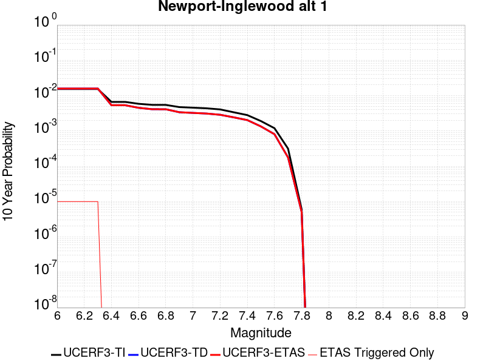 |

| Magnitude | 1 wk TI Prob | 1 wk TD Prob | 1 wk ETAS Prob | 1 wk ETAS/TD Gain | 1 wk ETAS Triggered Only | 1 mo TI Prob | 1 mo TD Prob | 1 mo ETAS Prob | 1 mo ETAS/TD Gain | 1 mo ETAS Triggered Only | 1 yr TI Prob | 1 yr TD Prob | 1 yr ETAS Prob | 1 yr ETAS/TD Gain | 1 yr ETAS Triggered Only | 10 yr TI Prob | 10 yr TD Prob | 10 yr ETAS Prob | 10 yr ETAS/TD Gain | 10 yr ETAS Triggered Only |
|-----|-----|-----|-----|-----|-----|-----|-----|-----|-----|-----|-----|-----|-----|-----|-----|-----|-----|-----|-----|-----|
| 6.0 | 2.9668912E-5 | 3.0405516E-5 | 3.0405516E-5 | 1.0 | 0.0 | 1.2714628E-4 | 1.3030559E-4 | 1.5696877E-4 | 1.2046205 | 2.6666667E-5 | 0.0015469068 | 0.0015857986 | 0.001612423 | 1.0167892 | 2.6666667E-5 | 0.015361829 | 0.015792403 | 0.015818648 | 1.0016619 | 2.6666667E-5 |
| 6.1 | 2.9668912E-5 | 3.0405516E-5 | 3.0405516E-5 | 1.0 | 0.0 | 1.2714628E-4 | 1.3030559E-4 | 1.5696877E-4 | 1.2046205 | 2.6666667E-5 | 0.0015469068 | 0.0015857986 | 0.001612423 | 1.0167892 | 2.6666667E-5 | 0.015361829 | 0.015792403 | 0.015818648 | 1.0016619 | 2.6666667E-5 |
| 6.2 | 2.9668912E-5 | 3.0405516E-5 | 3.0405516E-5 | 1.0 | 0.0 | 1.2714628E-4 | 1.3030559E-4 | 1.5696877E-4 | 1.2046205 | 2.6666667E-5 | 0.0015469068 | 0.0015857986 | 0.001612423 | 1.0167892 | 2.6666667E-5 | 0.015361829 | 0.015792403 | 0.015818648 | 1.0016619 | 2.6666667E-5 |
| 6.3 | 2.9668912E-5 | 3.0405516E-5 | 3.0405516E-5 | 1.0 | 0.0 | 1.2714628E-4 | 1.3030559E-4 | 1.5696877E-4 | 1.2046205 | 2.6666667E-5 | 0.0015469068 | 0.0015857986 | 0.001612423 | 1.0167892 | 2.6666667E-5 | 0.015361829 | 0.015792403 | 0.015818648 | 1.0016619 | 2.6666667E-5 |
| 6.4 | 1.275942E-5 | 1.0272664E-5 | 1.0272664E-5 | 1.0 | 0.0 | 5.4682085E-5 | 4.4024986E-5 | 4.4024986E-5 | 1.0 | 0.0 | 6.65551E-4 | 5.3587655E-4 | 5.3587655E-4 | 1.0 | 0.0 | 0.0066356123 | 0.0053462684 | 0.0053462684 | 1.0 | 0.0 |
| 6.5 | 1.275942E-5 | 1.0272664E-5 | 1.0272664E-5 | 1.0 | 0.0 | 5.4682085E-5 | 4.4024986E-5 | 4.4024986E-5 | 1.0 | 0.0 | 6.65551E-4 | 5.3587655E-4 | 5.3587655E-4 | 1.0 | 0.0 | 0.0066356123 | 0.0053462684 | 0.0053462684 | 1.0 | 0.0 |
| 6.6 | 1.1255358E-5 | 8.662018E-6 | 8.662018E-6 | 1.0 | 0.0 | 4.8236358E-5 | 3.7122416E-5 | 3.7122416E-5 | 1.0 | 0.0 | 5.871194E-4 | 4.5187338E-4 | 4.5187338E-4 | 1.0 | 0.0 | 0.005855706 | 0.004509723 | 0.004509723 | 1.0 | 0.0 |
| 6.7 | 1.0504745E-5 | 7.899919E-6 | 7.899919E-6 | 1.0 | 0.0 | 4.5019555E-5 | 3.3856366E-5 | 3.3856366E-5 | 1.0 | 0.0 | 5.4797524E-4 | 4.1212453E-4 | 4.1212453E-4 | 1.0 | 0.0 | 0.0054662596 | 0.0041137324 | 0.0041137324 | 1.0 | 0.0 |
| 6.8 | 1.0476007E-5 | 7.881301E-6 | 7.881301E-6 | 1.0 | 0.0 | 4.4896402E-5 | 3.377657E-5 | 3.377657E-5 | 1.0 | 0.0 | 5.464766E-4 | 4.1115342E-4 | 4.1115342E-4 | 1.0 | 0.0 | 0.005451347 | 0.0041040573 | 0.0041040573 | 1.0 | 0.0 |
| 6.9 | 9.076797E-6 | 6.489738E-6 | 6.489738E-6 | 1.0 | 0.0 | 3.889998E-5 | 2.7812868E-5 | 2.7812868E-5 | 1.0 | 0.0 | 4.7350433E-4 | 3.385694E-4 | 3.385694E-4 | 1.0 | 0.0 | 0.004724967 | 0.0033805731 | 0.0033805731 | 1.0 | 0.0 |
| 7.0 | 8.73795E-6 | 6.212118E-6 | 6.212118E-6 | 1.0 | 0.0 | 3.7447822E-5 | 2.6623095E-5 | 2.6623095E-5 | 1.0 | 0.0 | 4.5583185E-4 | 3.2408824E-4 | 3.2408824E-4 | 1.0 | 0.0 | 0.0045489795 | 0.0032361876 | 0.0032361876 | 1.0 | 0.0 |
| 7.1 | 8.391299E-6 | 5.955894E-6 | 5.955894E-6 | 1.0 | 0.0 | 3.5962214E-5 | 2.552501E-5 | 2.552501E-5 | 1.0 | 0.0 | 4.37752E-4 | 3.1072294E-4 | 3.1072294E-4 | 1.0 | 0.0 | 0.004368907 | 0.0031029144 | 0.0031029144 | 1.0 | 0.0 |
| 7.2 | 7.796882E-6 | 5.496635E-6 | 5.496635E-6 | 1.0 | 0.0 | 3.341478E-5 | 2.3556795E-5 | 2.3556795E-5 | 1.0 | 0.0 | 4.06749E-4 | 2.8676644E-4 | 2.8676644E-4 | 1.0 | 0.0 | 0.0040600533 | 0.002863988 | 0.002863988 | 1.0 | 0.0 |
| 7.3 | 6.4738833E-6 | 4.647859E-6 | 4.647859E-6 | 1.0 | 0.0 | 2.774492E-5 | 1.9919245E-5 | 1.9919245E-5 | 1.0 | 0.0 | 3.3774204E-4 | 2.4248997E-4 | 2.4248997E-4 | 1.0 | 0.0 | 0.0033722918 | 0.0024222704 | 0.0024222704 | 1.0 | 0.0 |
| 7.4 | 5.382145E-6 | 3.8857956E-6 | 3.8857956E-6 | 1.0 | 0.0 | 2.3066134E-5 | 1.6653305E-5 | 1.6653305E-5 | 1.0 | 0.0 | 2.8079396E-4 | 2.0273525E-4 | 2.0273525E-4 | 1.0 | 0.0 | 0.0028043943 | 0.0020255174 | 0.0020255174 | 1.0 | 0.0 |
| 7.5 | 3.648244E-6 | 2.573805E-6 | 2.573805E-6 | 1.0 | 0.0 | 1.5635238E-5 | 1.1030546E-5 | 1.1030546E-5 | 1.0 | 0.0 | 1.9034238E-4 | 1.3428873E-4 | 1.3428873E-4 | 1.0 | 0.0 | 0.0019017943 | 0.0013420862 | 0.0013420862 | 1.0 | 0.0 |
| 7.6 | 2.2906888E-6 | 1.5479983E-6 | 1.5479983E-6 | 1.0 | 0.0 | 9.817201E-6 | 6.6342623E-6 | 6.6342623E-6 | 1.0 | 0.0 | 1.1951787E-4 | 8.076921E-5 | 8.076921E-5 | 1.0 | 0.0 | 0.0011945361 | 8.0740533E-4 | 8.0740533E-4 | 1.0 | 0.0 |
| 7.7 | 6.0479874E-7 | 3.3975476E-7 | 3.3975476E-7 | 1.0 | 0.0 | 2.5919921E-6 | 1.456091E-6 | 1.456091E-6 | 1.0 | 0.0 | 3.1557047E-5 | 1.7727778E-5 | 1.7727778E-5 | 1.0 | 0.0 | 3.1552566E-4 | 1.7726503E-4 | 1.7726503E-4 | 1.0 | 0.0 |
| 7.8 | 1.16056995E-8 | 9.782392E-9 | 9.782392E-9 | 1.0 | 0.0 | 4.9738713E-8 | 4.1924537E-8 | 4.1924537E-8 | 1.0 | 0.0 | 6.0556863E-7 | 5.104312E-7 | 5.104312E-7 | 1.0 | 0.0 | 6.05567E-6 | 5.104312E-6 | 5.104312E-6 | 1.0 | 0.0 |

## Malibu Coast (Extension) alt 1
*[(top)](#table-of-contents)*

| 1 Week | 1 Month | 1 Year | 10 Year |
|-----|-----|-----|-----|
|  |  |  | 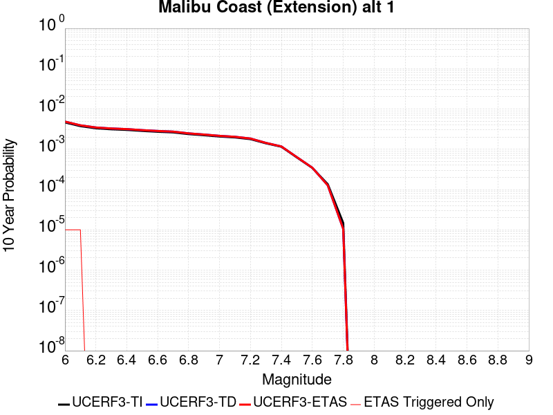 |

| Magnitude | 1 wk TI Prob | 1 wk TD Prob | 1 wk ETAS Prob | 1 wk ETAS/TD Gain | 1 wk ETAS Triggered Only | 1 mo TI Prob | 1 mo TD Prob | 1 mo ETAS Prob | 1 mo ETAS/TD Gain | 1 mo ETAS Triggered Only | 1 yr TI Prob | 1 yr TD Prob | 1 yr ETAS Prob | 1 yr ETAS/TD Gain | 1 yr ETAS Triggered Only | 10 yr TI Prob | 10 yr TD Prob | 10 yr ETAS Prob | 10 yr ETAS/TD Gain | 10 yr ETAS Triggered Only |
|-----|-----|-----|-----|-----|-----|-----|-----|-----|-----|-----|-----|-----|-----|-----|-----|-----|-----|-----|-----|-----|
| 6.0 | 8.930738E-6 | 9.329346E-6 | 3.5995763E-5 | 3.8583374 | 2.6666667E-5 | 3.827403E-5 | 3.9982307E-5 | 6.664791E-5 | 1.6669351 | 2.6666667E-5 | 4.6588664E-4 | 4.8667757E-4 | 5.1333127E-4 | 1.0547667 | 2.6666667E-5 | 0.0046491115 | 0.0048563 | 0.004882837 | 1.0054644 | 2.6666667E-5 |
| 6.1 | 7.199952E-6 | 7.530357E-6 | 3.4196823E-5 | 4.5411954 | 2.6666667E-5 | 3.0856572E-5 | 3.227256E-5 | 5.8938367E-5 | 1.8262687 | 2.6666667E-5 | 3.75614E-4 | 3.928482E-4 | 4.195044E-4 | 1.0678537 | 2.6666667E-5 | 0.0037497976 | 0.003921604 | 0.0039481656 | 1.0067732 | 2.6666667E-5 |
| 6.2 | 6.3721413E-6 | 6.6668467E-6 | 6.6668467E-6 | 1.0 | 0.0 | 2.7308892E-5 | 2.857189E-5 | 2.857189E-5 | 1.0 | 0.0 | 3.3243504E-4 | 3.478076E-4 | 3.478076E-4 | 1.0 | 0.0 | 0.0033193815 | 0.0034726725 | 0.0034726725 | 1.0 | 0.0 |
| 6.3 | 6.016345E-6 | 6.2952113E-6 | 6.2952113E-6 | 1.0 | 0.0 | 2.578408E-5 | 2.69792E-5 | 2.69792E-5 | 1.0 | 0.0 | 3.1387596E-4 | 3.2842258E-4 | 3.2842258E-4 | 1.0 | 0.0 | 0.00313433 | 0.0032794084 | 0.0032794084 | 1.0 | 0.0 |
| 6.4 | 5.8104883E-6 | 6.0795965E-6 | 6.0795965E-6 | 1.0 | 0.0 | 2.4901856E-5 | 2.6055155E-5 | 2.6055155E-5 | 1.0 | 0.0 | 3.031379E-4 | 3.1717564E-4 | 3.1717564E-4 | 1.0 | 0.0 | 0.0030272473 | 0.0031672644 | 0.0031672644 | 1.0 | 0.0 |
| 6.5 | 5.476925E-6 | 5.7275624E-6 | 5.7275624E-6 | 1.0 | 0.0 | 2.3472323E-5 | 2.4546467E-5 | 2.4546467E-5 | 1.0 | 0.0 | 2.8573806E-4 | 2.9881255E-4 | 2.9881255E-4 | 1.0 | 0.0 | 0.0028537093 | 0.0029841396 | 0.0029841396 | 1.0 | 0.0 |
| 6.6 | 5.222387E-6 | 5.4586267E-6 | 5.4586267E-6 | 1.0 | 0.0 | 2.2381464E-5 | 2.3393906E-5 | 2.3393906E-5 | 1.0 | 0.0 | 2.7246025E-4 | 2.847839E-4 | 2.847839E-4 | 1.0 | 0.0 | 0.0027212645 | 0.00284422 | 0.00284422 | 1.0 | 0.0 |
| 6.7 | 5.0337076E-6 | 5.2591486E-6 | 5.2591486E-6 | 1.0 | 0.0 | 2.1572854E-5 | 2.2539016E-5 | 2.2539016E-5 | 1.0 | 0.0 | 2.6261783E-4 | 2.7437825E-4 | 2.7437825E-4 | 1.0 | 0.0 | 0.002623077 | 0.0027404248 | 0.0027404248 | 1.0 | 0.0 |
| 6.8 | 4.5675624E-6 | 4.7587573E-6 | 4.7587573E-6 | 1.0 | 0.0 | 1.9575122E-5 | 2.0394515E-5 | 2.0394515E-5 | 1.0 | 0.0 | 2.3830103E-4 | 2.4827512E-4 | 2.4827512E-4 | 1.0 | 0.0 | 0.0023804565 | 0.0024799972 | 0.0024799972 | 1.0 | 0.0 |
| 6.9 | 4.2802412E-6 | 4.4520584E-6 | 4.4520584E-6 | 1.0 | 0.0 | 1.8343762E-5 | 1.9080113E-5 | 1.9080113E-5 | 1.0 | 0.0 | 2.2331243E-4 | 2.3227576E-4 | 2.3227576E-4 | 1.0 | 0.0 | 0.0022308815 | 0.0023203467 | 0.0023203467 | 1.0 | 0.0 |
| 7.0 | 3.9794063E-6 | 4.130134E-6 | 4.130134E-6 | 1.0 | 0.0 | 1.7054486E-5 | 1.7700455E-5 | 1.7700455E-5 | 1.0 | 0.0 | 2.0761859E-4 | 2.1548186E-4 | 2.1548186E-4 | 1.0 | 0.0 | 0.0020742472 | 0.0021527428 | 0.0021527428 | 1.0 | 0.0 |
| 7.1 | 3.7730424E-6 | 3.91125E-6 | 3.91125E-6 | 1.0 | 0.0 | 1.6170083E-5 | 1.6762395E-5 | 1.6762395E-5 | 1.0 | 0.0 | 1.9685295E-4 | 2.0406317E-4 | 2.0406317E-4 | 1.0 | 0.0 | 0.0019667868 | 0.0020387706 | 0.0020387706 | 1.0 | 0.0 |
| 7.2 | 3.424985E-6 | 3.5413673E-6 | 3.5413673E-6 | 1.0 | 0.0 | 1.4678424E-5 | 1.51772E-5 | 1.51772E-5 | 1.0 | 0.0 | 1.7869516E-4 | 1.8476686E-4 | 1.8476686E-4 | 1.0 | 0.0 | 0.0017855153 | 0.0018461446 | 0.0018461446 | 1.0 | 0.0 |
| 7.3 | 2.6966375E-6 | 2.759676E-6 | 2.759676E-6 | 1.0 | 0.0 | 1.15569665E-5 | 1.1827129E-5 | 1.1827129E-5 | 1.0 | 0.0 | 1.4069698E-4 | 1.4398582E-4 | 1.4398582E-4 | 1.0 | 0.0 | 0.0014060794 | 0.0014389295 | 0.0014389295 | 1.0 | 0.0 |
| 7.4 | 2.215957E-6 | 2.2493962E-6 | 2.2493962E-6 | 1.0 | 0.0 | 9.496924E-6 | 9.640234E-6 | 9.640234E-6 | 1.0 | 0.0 | 1.1561892E-4 | 1.1736356E-4 | 1.1736356E-4 | 1.0 | 0.0 | 0.0011555878 | 0.0011730195 | 0.0011730195 | 1.0 | 0.0 |
| 7.5 | 1.2040218E-6 | 1.2219169E-6 | 1.2219169E-6 | 1.0 | 0.0 | 5.160083E-6 | 5.236777E-6 | 5.236777E-6 | 1.0 | 0.0 | 6.2822204E-5 | 6.3755906E-5 | 6.3755906E-5 | 1.0 | 0.0 | 6.280445E-4 | 6.37378E-4 | 6.37378E-4 | 1.0 | 0.0 |
| 7.6 | 6.6157446E-7 | 6.6790335E-7 | 6.6790335E-7 | 1.0 | 0.0 | 2.835316E-6 | 2.86244E-6 | 2.86244E-6 | 1.0 | 0.0 | 3.4519428E-5 | 3.4849665E-5 | 3.4849665E-5 | 1.0 | 0.0 | 3.4514067E-4 | 3.4844351E-4 | 3.4844351E-4 | 1.0 | 0.0 |
| 7.7 | 2.6012302E-7 | 2.4357794E-7 | 2.4357794E-7 | 1.0 | 0.0 | 1.1148124E-6 | 1.0439051E-6 | 1.0439051E-6 | 1.0 | 0.0 | 1.3572758E-5 | 1.2709481E-5 | 1.2709481E-5 | 1.0 | 0.0 | 1.3571928E-4 | 1.2708861E-4 | 1.2708861E-4 | 1.0 | 0.0 |
| 7.8 | 2.8323132E-8 | 2.026683E-8 | 2.026683E-8 | 1.0 | 0.0 | 1.2138484E-7 | 8.685784E-8 | 8.685784E-8 | 1.0 | 0.0 | 1.4778595E-6 | 1.0574938E-6 | 1.0574938E-6 | 1.0 | 0.0 | 1.4778497E-5 | 1.0574896E-5 | 1.0574896E-5 | 1.0 | 0.0 |

## Bullion Mountains
*[(top)](#table-of-contents)*

| 1 Week | 1 Month | 1 Year | 10 Year |
|-----|-----|-----|-----|
|  |  |  |  |

| Magnitude | 1 wk TI Prob | 1 wk TD Prob | 1 wk ETAS Prob | 1 wk ETAS/TD Gain | 1 wk ETAS Triggered Only | 1 mo TI Prob | 1 mo TD Prob | 1 mo ETAS Prob | 1 mo ETAS/TD Gain | 1 mo ETAS Triggered Only | 1 yr TI Prob | 1 yr TD Prob | 1 yr ETAS Prob | 1 yr ETAS/TD Gain | 1 yr ETAS Triggered Only | 10 yr TI Prob | 10 yr TD Prob | 10 yr ETAS Prob | 10 yr ETAS/TD Gain | 10 yr ETAS Triggered Only |
|-----|-----|-----|-----|-----|-----|-----|-----|-----|-----|-----|-----|-----|-----|-----|-----|-----|-----|-----|-----|-----|
| 6.0 | 1.6420427E-5 | 1.4692306E-5 | 1.4692306E-5 | 1.0 | 0.0 | 7.037136E-5 | 6.296572E-5 | 6.296572E-5 | 1.0 | 0.0 | 8.5643446E-4 | 7.663764E-4 | 7.930226E-4 | 1.034769 | 2.6666667E-5 | 0.008531413 | 0.0076411283 | 0.0076675913 | 1.0034633 | 2.6666667E-5 |
| 6.1 | 1.6420427E-5 | 1.4692306E-5 | 1.4692306E-5 | 1.0 | 0.0 | 7.037136E-5 | 6.296572E-5 | 6.296572E-5 | 1.0 | 0.0 | 8.5643446E-4 | 7.663764E-4 | 7.930226E-4 | 1.034769 | 2.6666667E-5 | 0.008531413 | 0.0076411283 | 0.0076675913 | 1.0034633 | 2.6666667E-5 |
| 6.2 | 1.6420427E-5 | 1.4692306E-5 | 1.4692306E-5 | 1.0 | 0.0 | 7.037136E-5 | 6.296572E-5 | 6.296572E-5 | 1.0 | 0.0 | 8.5643446E-4 | 7.663764E-4 | 7.930226E-4 | 1.034769 | 2.6666667E-5 | 0.008531413 | 0.0076411283 | 0.0076675913 | 1.0034633 | 2.6666667E-5 |
| 6.3 | 1.2046778E-5 | 9.862485E-6 | 9.862485E-6 | 1.0 | 0.0 | 5.1628023E-5 | 4.226724E-5 | 4.226724E-5 | 1.0 | 0.0 | 6.283899E-4 | 5.145053E-4 | 5.4115825E-4 | 1.0518031 | 2.6666667E-5 | 0.0062661595 | 0.0051354226 | 0.005161952 | 1.005166 | 2.6666667E-5 |
| 6.4 | 1.2046778E-5 | 9.862485E-6 | 9.862485E-6 | 1.0 | 0.0 | 5.1628023E-5 | 4.226724E-5 | 4.226724E-5 | 1.0 | 0.0 | 6.283899E-4 | 5.145053E-4 | 5.4115825E-4 | 1.0518031 | 2.6666667E-5 | 0.0062661595 | 0.0051354226 | 0.005161952 | 1.005166 | 2.6666667E-5 |
| 6.5 | 1.0244343E-5 | 7.879582E-6 | 7.879582E-6 | 1.0 | 0.0 | 4.390359E-5 | 3.3769316E-5 | 3.3769316E-5 | 1.0 | 0.0 | 5.343951E-4 | 4.1108453E-4 | 4.3774024E-4 | 1.0648423 | 2.6666667E-5 | 0.005331118 | 0.0041052722 | 0.0041318294 | 1.006469 | 2.6666667E-5 |
| 6.6 | 9.605408E-6 | 7.1776108E-6 | 7.1776108E-6 | 1.0 | 0.0 | 4.1165385E-5 | 3.076094E-5 | 3.076094E-5 | 1.0 | 0.0 | 5.010733E-4 | 3.7447043E-4 | 4.0112712E-4 | 1.071185 | 2.6666667E-5 | 0.00499945 | 0.0037403915 | 0.0037669584 | 1.0071027 | 2.6666667E-5 |
| 6.7 | 8.60418E-6 | 6.1241044E-6 | 6.1241044E-6 | 1.0 | 0.0 | 3.687454E-5 | 2.6246007E-5 | 2.6246007E-5 | 1.0 | 0.0 | 4.48855E-4 | 3.1951777E-4 | 3.4617592E-4 | 1.0834324 | 2.6666667E-5 | 0.004479495 | 0.0031924958 | 0.0032190774 | 1.0083263 | 2.6666667E-5 |
| 6.8 | 5.187994E-6 | 2.5632194E-6 | 2.5632194E-6 | 1.0 | 0.0 | 2.223407E-5 | 1.0985203E-5 | 1.0985203E-5 | 1.0 | 0.0 | 2.7066618E-4 | 1.3374063E-4 | 1.6040372E-4 | 1.1993643 | 2.6666667E-5 | 0.0027033675 | 0.001336993 | 0.001363624 | 1.0199186 | 2.6666667E-5 |
| 6.9 | 4.5302368E-6 | 2.3443622E-6 | 2.3443622E-6 | 1.0 | 0.0 | 1.9415156E-5 | 1.0047251E-5 | 1.0047251E-5 | 1.0 | 0.0 | 2.3635388E-4 | 1.2232238E-4 | 1.4898578E-4 | 1.2179766 | 2.6666667E-5 | 0.0023610266 | 0.0012229396 | 0.0012495737 | 1.0217787 | 2.6666667E-5 |
| 7.0 | 3.431668E-6 | 1.6882757E-6 | 1.6882757E-6 | 1.0 | 0.0 | 1.4707065E-5 | 7.2354674E-6 | 7.2354674E-6 | 1.0 | 0.0 | 1.7904381E-4 | 8.8091816E-5 | 1.1475613E-4 | 1.3026878 | 2.6666667E-5 | 0.0017889962 | 8.809181E-4 | 9.075613E-4 | 1.0302448 | 2.6666667E-5 |

## North Frontal  (West)
*[(top)](#table-of-contents)*

| 1 Week | 1 Month | 1 Year | 10 Year |
|-----|-----|-----|-----|
|  |  |  |  |

| Magnitude | 1 wk TI Prob | 1 wk TD Prob | 1 wk ETAS Prob | 1 wk ETAS/TD Gain | 1 wk ETAS Triggered Only | 1 mo TI Prob | 1 mo TD Prob | 1 mo ETAS Prob | 1 mo ETAS/TD Gain | 1 mo ETAS Triggered Only | 1 yr TI Prob | 1 yr TD Prob | 1 yr ETAS Prob | 1 yr ETAS/TD Gain | 1 yr ETAS Triggered Only | 10 yr TI Prob | 10 yr TD Prob | 10 yr ETAS Prob | 10 yr ETAS/TD Gain | 10 yr ETAS Triggered Only |
|-----|-----|-----|-----|-----|-----|-----|-----|-----|-----|-----|-----|-----|-----|-----|-----|-----|-----|-----|-----|-----|
| 6.0 | 4.7316266E-6 | 4.8526913E-6 | 4.8526913E-6 | 1.0 | 0.0 | 2.0278241E-5 | 2.0797092E-5 | 2.0797092E-5 | 1.0 | 0.0 | 2.4685962E-4 | 2.5317664E-4 | 2.5317664E-4 | 1.0 | 0.0 | 0.0024658558 | 0.002529028 | 0.0025556274 | 1.0105176 | 2.6666667E-5 |
| 6.1 | 4.7316266E-6 | 4.8526913E-6 | 4.8526913E-6 | 1.0 | 0.0 | 2.0278241E-5 | 2.0797092E-5 | 2.0797092E-5 | 1.0 | 0.0 | 2.4685962E-4 | 2.5317664E-4 | 2.5317664E-4 | 1.0 | 0.0 | 0.0024658558 | 0.002529028 | 0.0025556274 | 1.0105176 | 2.6666667E-5 |
| 6.2 | 4.7316266E-6 | 4.8526913E-6 | 4.8526913E-6 | 1.0 | 0.0 | 2.0278241E-5 | 2.0797092E-5 | 2.0797092E-5 | 1.0 | 0.0 | 2.4685962E-4 | 2.5317664E-4 | 2.5317664E-4 | 1.0 | 0.0 | 0.0024658558 | 0.002529028 | 0.0025556274 | 1.0105176 | 2.6666667E-5 |
| 6.3 | 4.7316266E-6 | 4.8526913E-6 | 4.8526913E-6 | 1.0 | 0.0 | 2.0278241E-5 | 2.0797092E-5 | 2.0797092E-5 | 1.0 | 0.0 | 2.4685962E-4 | 2.5317664E-4 | 2.5317664E-4 | 1.0 | 0.0 | 0.0024658558 | 0.002529028 | 0.0025556274 | 1.0105176 | 2.6666667E-5 |
| 6.4 | 4.7316266E-6 | 4.8526913E-6 | 4.8526913E-6 | 1.0 | 0.0 | 2.0278241E-5 | 2.0797092E-5 | 2.0797092E-5 | 1.0 | 0.0 | 2.4685962E-4 | 2.5317664E-4 | 2.5317664E-4 | 1.0 | 0.0 | 0.0024658558 | 0.002529028 | 0.0025556274 | 1.0105176 | 2.6666667E-5 |
| 6.5 | 4.7316266E-6 | 4.8526913E-6 | 4.8526913E-6 | 1.0 | 0.0 | 2.0278241E-5 | 2.0797092E-5 | 2.0797092E-5 | 1.0 | 0.0 | 2.4685962E-4 | 2.5317664E-4 | 2.5317664E-4 | 1.0 | 0.0 | 0.0024658558 | 0.002529028 | 0.0025556274 | 1.0105176 | 2.6666667E-5 |
| 6.6 | 4.7316266E-6 | 4.8526913E-6 | 4.8526913E-6 | 1.0 | 0.0 | 2.0278241E-5 | 2.0797092E-5 | 2.0797092E-5 | 1.0 | 0.0 | 2.4685962E-4 | 2.5317664E-4 | 2.5317664E-4 | 1.0 | 0.0 | 0.0024658558 | 0.002529028 | 0.0025556274 | 1.0105176 | 2.6666667E-5 |
| 6.7 | 3.5382777E-6 | 3.630901E-6 | 3.630901E-6 | 1.0 | 0.0 | 1.516396E-5 | 1.5560916E-5 | 1.5560916E-5 | 1.0 | 0.0 | 1.8460557E-4 | 1.8943845E-4 | 1.8943845E-4 | 1.0 | 0.0 | 0.0018445229 | 0.0018928467 | 0.0019194628 | 1.0140615 | 2.6666667E-5 |
| 6.8 | 3.5382777E-6 | 3.630901E-6 | 3.630901E-6 | 1.0 | 0.0 | 1.516396E-5 | 1.5560916E-5 | 1.5560916E-5 | 1.0 | 0.0 | 1.8460557E-4 | 1.8943845E-4 | 1.8943845E-4 | 1.0 | 0.0 | 0.0018445229 | 0.0018928467 | 0.0019194628 | 1.0140615 | 2.6666667E-5 |
| 6.9 | 3.0428037E-6 | 3.1227737E-6 | 3.1227737E-6 | 1.0 | 0.0 | 1.30405215E-5 | 1.3383251E-5 | 1.3383251E-5 | 1.0 | 0.0 | 1.5875678E-4 | 1.6292959E-4 | 1.6292959E-4 | 1.0 | 0.0 | 0.0015864341 | 0.0016281684 | 0.0016547916 | 1.0163517 | 2.6666667E-5 |
| 7.0 | 2.538778E-6 | 2.6061018E-6 | 2.6061018E-6 | 1.0 | 0.0 | 1.0880432E-5 | 1.1168962E-5 | 1.1168962E-5 | 1.0 | 0.0 | 1.324612E-4 | 1.3597411E-4 | 1.3597411E-4 | 1.0 | 0.0 | 0.0013238228 | 0.0013589559 | 0.0013855863 | 1.0195962 | 2.6666667E-5 |
| 7.1 | 2.2418935E-6 | 2.3012176E-6 | 2.3012176E-6 | 1.0 | 0.0 | 9.60808E-6 | 9.862327E-6 | 9.862327E-6 | 1.0 | 0.0 | 1.1697209E-4 | 1.20067656E-4 | 1.20067656E-4 | 1.0 | 0.0 | 0.0011691054 | 0.0012000718 | 0.0012000718 | 1.0 | 0.0 |
| 7.2 | 1.6526745E-6 | 1.6924928E-6 | 1.6924928E-6 | 1.0 | 0.0 | 7.082872E-6 | 7.2535217E-6 | 7.2535217E-6 | 1.0 | 0.0 | 8.623055E-5 | 8.8308305E-5 | 8.8308305E-5 | 1.0 | 0.0 | 8.61971E-4 | 8.827572E-4 | 8.827572E-4 | 1.0 | 0.0 |
| 7.3 | 1.0246019E-6 | 1.044231E-6 | 1.044231E-6 | 1.0 | 0.0 | 4.391144E-6 | 4.4752687E-6 | 4.4752687E-6 | 1.0 | 0.0 | 5.3460866E-5 | 5.448515E-5 | 5.448515E-5 | 1.0 | 0.0 | 5.344801E-4 | 5.447294E-4 | 5.447294E-4 | 1.0 | 0.0 |
| 7.4 | 8.9045164E-7 | 9.0566016E-7 | 9.0566016E-7 | 1.0 | 0.0 | 3.8162157E-6 | 3.8813955E-6 | 3.8813955E-6 | 1.0 | 0.0 | 4.646144E-5 | 4.725508E-5 | 4.725508E-5 | 1.0 | 0.0 | 4.6451724E-4 | 4.7246116E-4 | 4.7246116E-4 | 1.0 | 0.0 |
| 7.5 | 6.3357E-7 | 6.402732E-7 | 6.402732E-7 | 1.0 | 0.0 | 2.7152971E-6 | 2.7440256E-6 | 2.7440256E-6 | 1.0 | 0.0 | 3.305824E-5 | 3.3408065E-5 | 3.3408065E-5 | 1.0 | 0.0 | 3.3053322E-4 | 3.34037E-4 | 3.34037E-4 | 1.0 | 0.0 |
| 7.6 | 2.5087024E-7 | 2.4361222E-7 | 2.4361222E-7 | 1.0 | 0.0 | 1.0751578E-6 | 1.044052E-6 | 1.044052E-6 | 1.0 | 0.0 | 1.3089967E-5 | 1.2711281E-5 | 1.2711281E-5 | 1.0 | 0.0 | 1.3089196E-4 | 1.2710759E-4 | 1.2710759E-4 | 1.0 | 0.0 |
| 7.7 | 3.282987E-8 | 2.2874342E-8 | 2.2874342E-8 | 1.0 | 0.0 | 1.4069944E-7 | 9.803289E-8 | 9.803289E-8 | 1.0 | 0.0 | 1.7130144E-6 | 1.1935499E-6 | 1.1935499E-6 | 1.0 | 0.0 | 1.7130013E-5 | 1.1935444E-5 | 1.1935444E-5 | 1.0 | 0.0 |
| 7.8 | 8.77499E-9 | 5.681659E-9 | 5.681659E-9 | 1.0 | 0.0 | 3.7607098E-8 | 2.4349967E-8 | 2.4349967E-8 | 1.0 | 0.0 | 4.578663E-7 | 2.9646083E-7 | 2.9646083E-7 | 1.0 | 0.0 | 4.5786537E-6 | 2.9646058E-6 | 2.9646058E-6 | 1.0 | 0.0 |

## Casmalia 2011 CFM
*[(top)](#table-of-contents)*

| 1 Week | 1 Month | 1 Year | 10 Year |
|-----|-----|-----|-----|
|  | 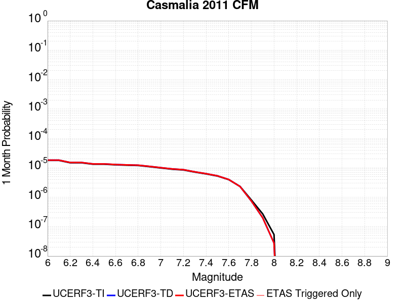 |  |  |

| Magnitude | 1 wk TI Prob | 1 wk TD Prob | 1 wk ETAS Prob | 1 wk ETAS/TD Gain | 1 wk ETAS Triggered Only | 1 mo TI Prob | 1 mo TD Prob | 1 mo ETAS Prob | 1 mo ETAS/TD Gain | 1 mo ETAS Triggered Only | 1 yr TI Prob | 1 yr TD Prob | 1 yr ETAS Prob | 1 yr ETAS/TD Gain | 1 yr ETAS Triggered Only | 10 yr TI Prob | 10 yr TD Prob | 10 yr ETAS Prob | 10 yr ETAS/TD Gain | 10 yr ETAS Triggered Only |
|-----|-----|-----|-----|-----|-----|-----|-----|-----|-----|-----|-----|-----|-----|-----|-----|-----|-----|-----|-----|-----|
| 6.0 | 4.1704893E-6 | 4.2625015E-6 | 4.2625015E-6 | 1.0 | 0.0 | 1.7873403E-5 | 1.8267738E-5 | 1.8267738E-5 | 1.0 | 0.0 | 2.1758694E-4 | 2.223872E-4 | 2.223872E-4 | 1.0 | 0.0 | 0.0021737402 | 0.0022216674 | 0.0022482749 | 1.0119764 | 2.6666667E-5 |
| 6.1 | 4.1704893E-6 | 4.2625015E-6 | 4.2625015E-6 | 1.0 | 0.0 | 1.7873403E-5 | 1.8267738E-5 | 1.8267738E-5 | 1.0 | 0.0 | 2.1758694E-4 | 2.223872E-4 | 2.223872E-4 | 1.0 | 0.0 | 0.0021737402 | 0.0022216674 | 0.0022482749 | 1.0119764 | 2.6666667E-5 |
| 6.2 | 3.457312E-6 | 3.5370388E-6 | 3.5370388E-6 | 1.0 | 0.0 | 1.4816967E-5 | 1.515865E-5 | 1.515865E-5 | 1.0 | 0.0 | 1.8038164E-4 | 1.8454103E-4 | 1.8454103E-4 | 1.0 | 0.0 | 0.001802353 | 0.0018438873 | 0.0018438873 | 1.0 | 0.0 |
| 6.3 | 3.457312E-6 | 3.5370388E-6 | 3.5370388E-6 | 1.0 | 0.0 | 1.4816967E-5 | 1.515865E-5 | 1.515865E-5 | 1.0 | 0.0 | 1.8038164E-4 | 1.8454103E-4 | 1.8454103E-4 | 1.0 | 0.0 | 0.001802353 | 0.0018438873 | 0.0018438873 | 1.0 | 0.0 |
| 6.4 | 3.0957337E-6 | 3.169242E-6 | 3.169242E-6 | 1.0 | 0.0 | 1.3267363E-5 | 1.3582395E-5 | 1.3582395E-5 | 1.0 | 0.0 | 1.6151817E-4 | 1.6535317E-4 | 1.6535317E-4 | 1.0 | 0.0 | 0.0016140083 | 0.0016523075 | 0.0016523075 | 1.0 | 0.0 |
| 6.5 | 3.0957337E-6 | 3.169242E-6 | 3.169242E-6 | 1.0 | 0.0 | 1.3267363E-5 | 1.3582395E-5 | 1.3582395E-5 | 1.0 | 0.0 | 1.6151817E-4 | 1.6535317E-4 | 1.6535317E-4 | 1.0 | 0.0 | 0.0016140083 | 0.0016523075 | 0.0016523075 | 1.0 | 0.0 |
| 6.6 | 2.9459152E-6 | 3.0165909E-6 | 3.0165909E-6 | 1.0 | 0.0 | 1.262529E-5 | 1.2928183E-5 | 1.2928183E-5 | 1.0 | 0.0 | 1.5370206E-4 | 1.5738931E-4 | 1.5738931E-4 | 1.0 | 0.0 | 0.0015359579 | 0.001572784 | 0.001572784 | 1.0 | 0.0 |
| 6.7 | 2.8634809E-6 | 2.932488E-6 | 2.932488E-6 | 1.0 | 0.0 | 1.2272003E-5 | 1.2567746E-5 | 1.2567746E-5 | 1.0 | 0.0 | 1.4940138E-4 | 1.5300162E-4 | 1.5300162E-4 | 1.0 | 0.0 | 0.0014930099 | 0.0015289682 | 0.0015289682 | 1.0 | 0.0 |
| 6.8 | 2.7999822E-6 | 2.867612E-6 | 2.867612E-6 | 1.0 | 0.0 | 1.1999869E-5 | 1.2289708E-5 | 1.2289708E-5 | 1.0 | 0.0 | 1.460886E-4 | 1.4961697E-4 | 1.4961697E-4 | 1.0 | 0.0 | 0.001459926 | 0.0014951678 | 0.0014951678 | 1.0 | 0.0 |
| 6.9 | 2.551052E-6 | 2.6119794E-6 | 2.6119794E-6 | 1.0 | 0.0 | 1.0933034E-5 | 1.1194149E-5 | 1.1194149E-5 | 1.0 | 0.0 | 1.3310155E-4 | 1.3628029E-4 | 1.3628029E-4 | 1.0 | 0.0 | 0.0013302186 | 0.0013619711 | 0.0013619711 | 1.0 | 0.0 |
| 7.0 | 2.3081875E-6 | 2.3624225E-6 | 2.3624225E-6 | 1.0 | 0.0 | 9.892195E-6 | 1.0124629E-5 | 1.0124629E-5 | 1.0 | 0.0 | 1.20430814E-4 | 1.2326041E-4 | 1.2326041E-4 | 1.0 | 0.0 | 0.0012036557 | 0.0012319232 | 0.0012319232 | 1.0 | 0.0 |
| 7.1 | 2.093245E-6 | 2.141737E-6 | 2.141737E-6 | 1.0 | 0.0 | 8.971019E-6 | 9.1788415E-6 | 9.1788415E-6 | 1.0 | 0.0 | 1.09216686E-4 | 1.1174668E-4 | 1.1174668E-4 | 1.0 | 0.0 | 0.0010916302 | 0.0011169069 | 0.0011169069 | 1.0 | 0.0 |
| 7.2 | 1.9714576E-6 | 2.0165214E-6 | 2.0165214E-6 | 1.0 | 0.0 | 8.449076E-6 | 8.642206E-6 | 8.642206E-6 | 1.0 | 0.0 | 1.0286264E-4 | 1.05213796E-4 | 1.05213796E-4 | 1.0 | 0.0 | 0.0010281504 | 0.0010516418 | 0.0010516418 | 1.0 | 0.0 |
| 7.3 | 1.6689512E-6 | 1.7047241E-6 | 1.7047241E-6 | 1.0 | 0.0 | 7.1526288E-6 | 7.30594E-6 | 7.30594E-6 | 1.0 | 0.0 | 8.7079774E-5 | 8.8946195E-5 | 8.8946195E-5 | 1.0 | 0.0 | 8.7045657E-4 | 8.8910677E-4 | 8.8910677E-4 | 1.0 | 0.0 |
| 7.4 | 1.4490954E-6 | 1.4779009E-6 | 1.4779009E-6 | 1.0 | 0.0 | 6.210394E-6 | 6.3338457E-6 | 6.3338457E-6 | 1.0 | 0.0 | 7.560892E-5 | 7.711185E-5 | 7.711185E-5 | 1.0 | 0.0 | 7.55832E-4 | 7.7085156E-4 | 7.7085156E-4 | 1.0 | 0.0 |
| 7.5 | 1.226873E-6 | 1.2481792E-6 | 1.2481792E-6 | 1.0 | 0.0 | 5.2580162E-6 | 5.3493286E-6 | 5.3493286E-6 | 1.0 | 0.0 | 6.401447E-5 | 6.5126136E-5 | 6.5126136E-5 | 1.0 | 0.0 | 6.399603E-4 | 6.51071E-4 | 6.51071E-4 | 1.0 | 0.0 |
| 7.6 | 9.2561345E-7 | 9.3619997E-7 | 9.3619997E-7 | 1.0 | 0.0 | 3.966909E-6 | 4.012279E-6 | 4.012279E-6 | 1.0 | 0.0 | 4.8296046E-5 | 4.8848407E-5 | 4.8848407E-5 | 1.0 | 0.0 | 4.828555E-4 | 4.883771E-4 | 4.883771E-4 | 1.0 | 0.0 |
| 7.7 | 5.4367933E-7 | 5.392944E-7 | 5.392944E-7 | 1.0 | 0.0 | 2.3300522E-6 | 2.3112595E-6 | 2.3112595E-6 | 1.0 | 0.0 | 2.8368017E-5 | 2.8139224E-5 | 2.8139224E-5 | 1.0 | 0.0 | 2.8364395E-4 | 2.8135674E-4 | 2.8135674E-4 | 1.0 | 0.0 |
| 7.8 | 1.8825742E-7 | 1.7342624E-7 | 1.7342624E-7 | 1.0 | 0.0 | 8.068173E-7 | 7.432551E-7 | 7.432551E-7 | 1.0 | 0.0 | 9.822956E-6 | 9.049094E-6 | 9.049094E-6 | 1.0 | 0.0 | 9.822522E-5 | 9.048728E-5 | 9.048728E-5 | 1.0 | 0.0 |
| 7.9 | 6.342771E-8 | 4.6793474E-8 | 4.6793474E-8 | 1.0 | 0.0 | 2.7183304E-7 | 2.0054344E-7 | 2.0054344E-7 | 1.0 | 0.0 | 3.3095623E-6 | 2.4416136E-6 | 2.4416136E-6 | 1.0 | 0.0 | 3.309513E-5 | 2.4415873E-5 | 2.4415873E-5 | 1.0 | 0.0 |
| 8.0 | 1.2574819E-8 | 6.4743E-9 | 6.4743E-9 | 1.0 | 0.0 | 5.3892084E-8 | 2.7747E-8 | 2.7747E-8 | 1.0 | 0.0 | 6.561359E-7 | 3.3781967E-7 | 3.3781967E-7 | 1.0 | 0.0 | 6.56134E-6 | 3.3781916E-6 | 3.3781916E-6 | 1.0 | 0.0 |

## Puente Hills
*[(top)](#table-of-contents)*

| 1 Week | 1 Month | 1 Year | 10 Year |
|-----|-----|-----|-----|
|  | 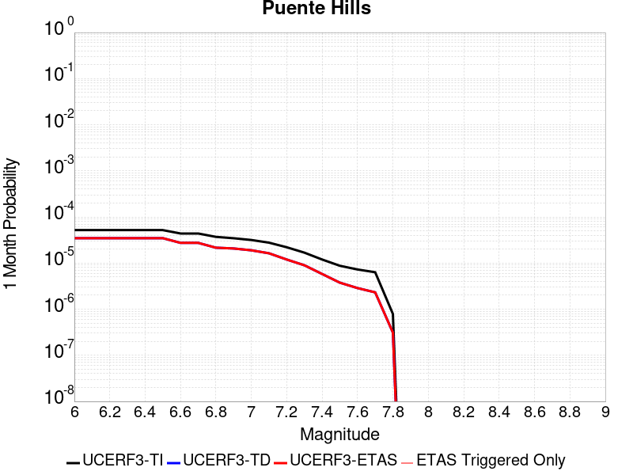 |  |  |

| Magnitude | 1 wk TI Prob | 1 wk TD Prob | 1 wk ETAS Prob | 1 wk ETAS/TD Gain | 1 wk ETAS Triggered Only | 1 mo TI Prob | 1 mo TD Prob | 1 mo ETAS Prob | 1 mo ETAS/TD Gain | 1 mo ETAS Triggered Only | 1 yr TI Prob | 1 yr TD Prob | 1 yr ETAS Prob | 1 yr ETAS/TD Gain | 1 yr ETAS Triggered Only | 10 yr TI Prob | 10 yr TD Prob | 10 yr ETAS Prob | 10 yr ETAS/TD Gain | 10 yr ETAS Triggered Only |
|-----|-----|-----|-----|-----|-----|-----|-----|-----|-----|-----|-----|-----|-----|-----|-----|-----|-----|-----|-----|-----|
| 6.0 | 1.2101656E-5 | 8.098785E-6 | 8.098785E-6 | 1.0 | 0.0 | 5.1863204E-5 | 3.4708646E-5 | 3.4708646E-5 | 1.0 | 0.0 | 6.312516E-4 | 4.2250147E-4 | 4.2250147E-4 | 1.0 | 0.0 | 0.0062946146 | 0.0042175422 | 0.0042440966 | 1.0062962 | 2.6666667E-5 |
| 6.1 | 1.2101656E-5 | 8.098785E-6 | 8.098785E-6 | 1.0 | 0.0 | 5.1863204E-5 | 3.4708646E-5 | 3.4708646E-5 | 1.0 | 0.0 | 6.312516E-4 | 4.2250147E-4 | 4.2250147E-4 | 1.0 | 0.0 | 0.0062946146 | 0.0042175422 | 0.0042440966 | 1.0062962 | 2.6666667E-5 |
| 6.2 | 1.2101656E-5 | 8.098785E-6 | 8.098785E-6 | 1.0 | 0.0 | 5.1863204E-5 | 3.4708646E-5 | 3.4708646E-5 | 1.0 | 0.0 | 6.312516E-4 | 4.2250147E-4 | 4.2250147E-4 | 1.0 | 0.0 | 0.0062946146 | 0.0042175422 | 0.0042440966 | 1.0062962 | 2.6666667E-5 |
| 6.3 | 1.2101656E-5 | 8.098785E-6 | 8.098785E-6 | 1.0 | 0.0 | 5.1863204E-5 | 3.4708646E-5 | 3.4708646E-5 | 1.0 | 0.0 | 6.312516E-4 | 4.2250147E-4 | 4.2250147E-4 | 1.0 | 0.0 | 0.0062946146 | 0.0042175422 | 0.0042440966 | 1.0062962 | 2.6666667E-5 |
| 6.4 | 1.2101656E-5 | 8.098785E-6 | 8.098785E-6 | 1.0 | 0.0 | 5.1863204E-5 | 3.4708646E-5 | 3.4708646E-5 | 1.0 | 0.0 | 6.312516E-4 | 4.2250147E-4 | 4.2250147E-4 | 1.0 | 0.0 | 0.0062946146 | 0.0042175422 | 0.0042440966 | 1.0062962 | 2.6666667E-5 |
| 6.5 | 1.2101656E-5 | 8.098785E-6 | 8.098785E-6 | 1.0 | 0.0 | 5.1863204E-5 | 3.4708646E-5 | 3.4708646E-5 | 1.0 | 0.0 | 6.312516E-4 | 4.2250147E-4 | 4.2250147E-4 | 1.0 | 0.0 | 0.0062946146 | 0.0042175422 | 0.0042440966 | 1.0062962 | 2.6666667E-5 |
| 6.6 | 1.0222488E-5 | 6.3993284E-6 | 6.3993284E-6 | 1.0 | 0.0 | 4.3809923E-5 | 2.742542E-5 | 2.742542E-5 | 1.0 | 0.0 | 5.332553E-4 | 3.3385577E-4 | 3.3385577E-4 | 1.0 | 0.0 | 0.0053197746 | 0.0033337874 | 0.0033603653 | 1.0079722 | 2.6666667E-5 |
| 6.7 | 1.0222488E-5 | 6.3993284E-6 | 6.3993284E-6 | 1.0 | 0.0 | 4.3809923E-5 | 2.742542E-5 | 2.742542E-5 | 1.0 | 0.0 | 5.332553E-4 | 3.3385577E-4 | 3.3385577E-4 | 1.0 | 0.0 | 0.0053197746 | 0.0033337874 | 0.0033603653 | 1.0079722 | 2.6666667E-5 |
| 6.8 | 8.6367845E-6 | 5.02838E-6 | 5.02838E-6 | 1.0 | 0.0 | 3.7014266E-5 | 2.1550026E-5 | 2.1550026E-5 | 1.0 | 0.0 | 4.505555E-4 | 2.6234053E-4 | 2.6234053E-4 | 1.0 | 0.0 | 0.004496431 | 0.0026203648 | 0.0026469615 | 1.0101501 | 2.6666667E-5 |
| 6.9 | 8.066481E-6 | 4.8362404E-6 | 4.8362404E-6 | 1.0 | 0.0 | 3.4570177E-5 | 2.0726584E-5 | 2.0726584E-5 | 1.0 | 0.0 | 4.2081063E-4 | 2.5231746E-4 | 2.5231746E-4 | 1.0 | 0.0 | 0.0042001465 | 0.0025203635 | 0.0025203635 | 1.0 | 0.0 |
| 7.0 | 7.393828E-6 | 4.417414E-6 | 4.417414E-6 | 1.0 | 0.0 | 3.168745E-5 | 1.893164E-5 | 1.893164E-5 | 1.0 | 0.0 | 3.857264E-4 | 2.3046878E-4 | 2.3046878E-4 | 1.0 | 0.0 | 0.0038505755 | 0.0023023433 | 0.0023023433 | 1.0 | 0.0 |
| 7.1 | 6.4660953E-6 | 3.8045498E-6 | 3.8045498E-6 | 1.0 | 0.0 | 2.7711543E-5 | 1.6305114E-5 | 1.6305114E-5 | 1.0 | 0.0 | 3.373358E-4 | 1.9849703E-4 | 1.9849703E-4 | 1.0 | 0.0 | 0.0033682417 | 0.0019832333 | 0.0019832333 | 1.0 | 0.0 |
| 7.2 | 5.143232E-6 | 2.7866233E-6 | 2.7866233E-6 | 1.0 | 0.0 | 2.2042237E-5 | 1.1942618E-5 | 1.1942618E-5 | 1.0 | 0.0 | 2.6833118E-4 | 1.4539176E-4 | 1.4539176E-4 | 1.0 | 0.0 | 0.002680074 | 0.0014529761 | 0.0014529761 | 1.0 | 0.0 |
| 7.3 | 3.928255E-6 | 2.0914442E-6 | 2.0914442E-6 | 1.0 | 0.0 | 1.683527E-5 | 8.963302E-6 | 8.963302E-6 | 1.0 | 0.0 | 2.0495013E-4 | 1.091228E-4 | 1.091228E-4 | 1.0 | 0.0 | 0.002047612 | 0.0010906989 | 0.0010906989 | 1.0 | 0.0 |
| 7.4 | 2.7894434E-6 | 1.3547324E-6 | 1.3547324E-6 | 1.0 | 0.0 | 1.1954703E-5 | 5.805983E-6 | 5.805983E-6 | 1.0 | 0.0 | 1.4553878E-4 | 7.068559E-5 | 7.068559E-5 | 1.0 | 0.0 | 0.001454435 | 7.0663553E-4 | 7.0663553E-4 | 1.0 | 0.0 |
| 7.5 | 2.041735E-6 | 8.787759E-7 | 8.787759E-7 | 1.0 | 0.0 | 8.750263E-6 | 3.766177E-6 | 3.766177E-6 | 1.0 | 0.0 | 1.06529245E-4 | 4.5852277E-5 | 4.5852277E-5 | 1.0 | 0.0 | 0.0010647819 | 4.5843152E-4 | 4.5843152E-4 | 1.0 | 0.0 |
| 7.6 | 1.6959062E-6 | 6.699006E-7 | 6.699006E-7 | 1.0 | 0.0 | 7.268149E-6 | 2.8709997E-6 | 2.8709997E-6 | 1.0 | 0.0 | 8.848612E-5 | 3.495389E-5 | 3.495389E-5 | 1.0 | 0.0 | 8.84509E-4 | 3.494868E-4 | 3.494868E-4 | 1.0 | 0.0 |
| 7.7 | 1.4767965E-6 | 5.40793E-7 | 5.40793E-7 | 1.0 | 0.0 | 6.3291122E-6 | 2.3176822E-6 | 2.3176822E-6 | 1.0 | 0.0 | 7.705422E-5 | 2.8217442E-5 | 2.8217442E-5 | 1.0 | 0.0 | 7.702751E-4 | 2.8214118E-4 | 2.8214118E-4 | 1.0 | 0.0 |
| 7.8 | 1.8432911E-7 | 7.282394E-8 | 7.282394E-8 | 1.0 | 0.0 | 7.8998164E-7 | 3.1210257E-7 | 3.1210257E-7 | 1.0 | 0.0 | 9.617985E-6 | 3.7998457E-6 | 3.7998457E-6 | 1.0 | 0.0 | 9.617568E-5 | 3.7998132E-5 | 3.7998132E-5 | 1.0 | 0.0 |

## San Gregorio (North) 2011 CFM
*[(top)](#table-of-contents)*

| 1 Week | 1 Month | 1 Year | 10 Year |
|-----|-----|-----|-----|
|  |  |  |  |

| Magnitude | 1 wk TI Prob | 1 wk TD Prob | 1 wk ETAS Prob | 1 wk ETAS/TD Gain | 1 wk ETAS Triggered Only | 1 mo TI Prob | 1 mo TD Prob | 1 mo ETAS Prob | 1 mo ETAS/TD Gain | 1 mo ETAS Triggered Only | 1 yr TI Prob | 1 yr TD Prob | 1 yr ETAS Prob | 1 yr ETAS/TD Gain | 1 yr ETAS Triggered Only | 10 yr TI Prob | 10 yr TD Prob | 10 yr ETAS Prob | 10 yr ETAS/TD Gain | 10 yr ETAS Triggered Only |
|-----|-----|-----|-----|-----|-----|-----|-----|-----|-----|-----|-----|-----|-----|-----|-----|-----|-----|-----|-----|-----|
| 6.0 | 5.0283932E-5 | 4.3060794E-5 | 4.3060794E-5 | 1.0 | 0.0 | 2.1548476E-4 | 1.8453323E-4 | 2.1119497E-4 | 1.1444821 | 2.6666667E-5 | 0.0026203706 | 0.002244392 | 0.002270999 | 1.0118548 | 2.6666667E-5 | 0.02589687 | 0.022294713 | 0.022320786 | 1.0011694 | 2.6666667E-5 |
| 6.1 | 5.0283932E-5 | 4.3060794E-5 | 4.3060794E-5 | 1.0 | 0.0 | 2.1548476E-4 | 1.8453323E-4 | 2.1119497E-4 | 1.1444821 | 2.6666667E-5 | 0.0026203706 | 0.002244392 | 0.002270999 | 1.0118548 | 2.6666667E-5 | 0.02589687 | 0.022294713 | 0.022320786 | 1.0011694 | 2.6666667E-5 |
| 6.2 | 4.2998647E-5 | 3.4444227E-5 | 3.4444227E-5 | 1.0 | 0.0 | 1.842669E-4 | 1.4760974E-4 | 1.4760974E-4 | 1.0 | 0.0 | 0.0022411412 | 0.0017956786 | 0.0017956786 | 1.0 | 0.0 | 0.022186736 | 0.017887903 | 0.017887903 | 1.0 | 0.0 |
| 6.3 | 4.2998647E-5 | 3.4444227E-5 | 3.4444227E-5 | 1.0 | 0.0 | 1.842669E-4 | 1.4760974E-4 | 1.4760974E-4 | 1.0 | 0.0 | 0.0022411412 | 0.0017956786 | 0.0017956786 | 1.0 | 0.0 | 0.022186736 | 0.017887903 | 0.017887903 | 1.0 | 0.0 |
| 6.4 | 4.1101295E-5 | 3.232945E-5 | 3.232945E-5 | 1.0 | 0.0 | 1.7613651E-4 | 1.385474E-4 | 1.385474E-4 | 1.0 | 0.0 | 0.0021423528 | 0.0016855211 | 0.0016855211 | 1.0 | 0.0 | 0.02121817 | 0.01680324 | 0.01680324 | 1.0 | 0.0 |
| 6.5 | 4.1032585E-5 | 3.2247484E-5 | 3.2247484E-5 | 1.0 | 0.0 | 1.7584208E-4 | 1.3819615E-4 | 1.3819615E-4 | 1.0 | 0.0 | 0.0021387753 | 0.0016812512 | 0.0016812512 | 1.0 | 0.0 | 0.021183075 | 0.016761193 | 0.016761193 | 1.0 | 0.0 |
| 6.6 | 4.011629E-5 | 3.1269094E-5 | 3.1269094E-5 | 1.0 | 0.0 | 1.7191563E-4 | 1.340035E-4 | 1.340035E-4 | 1.0 | 0.0 | 0.0020910634 | 0.0016302838 | 0.0016302838 | 1.0 | 0.0 | 0.020714961 | 0.016258746 | 0.016258746 | 1.0 | 0.0 |
| 6.7 | 3.8583938E-5 | 2.9456065E-5 | 2.9456065E-5 | 1.0 | 0.0 | 1.6534925E-4 | 1.2623426E-4 | 1.2623426E-4 | 1.0 | 0.0 | 0.0020112682 | 0.0015358328 | 0.0015358328 | 1.0 | 0.0 | 0.019931622 | 0.015327258 | 0.015327258 | 1.0 | 0.0 |
| 6.8 | 3.44341E-5 | 2.4453162E-5 | 2.4453162E-5 | 1.0 | 0.0 | 1.4756636E-4 | 1.04795115E-4 | 1.04795115E-4 | 1.0 | 0.0 | 0.0017951399 | 0.001275144 | 0.001275144 | 1.0 | 0.0 | 0.017807078 | 0.012752353 | 0.012752353 | 1.0 | 0.0 |
| 6.9 | 3.221199E-5 | 2.1780248E-5 | 2.1780248E-5 | 1.0 | 0.0 | 1.3804408E-4 | 9.3340626E-5 | 9.3340626E-5 | 1.0 | 0.0 | 0.0016793909 | 0.001135838 | 0.001135838 | 1.0 | 0.0 | 0.01666756 | 0.01137376 | 0.01137376 | 1.0 | 0.0 |
| 7.0 | 2.9186718E-5 | 1.8148972E-5 | 1.8148972E-5 | 1.0 | 0.0 | 1.2507994E-4 | 7.777901E-5 | 7.777901E-5 | 1.0 | 0.0 | 0.0015217843 | 9.4655243E-4 | 9.4655243E-4 | 1.0 | 0.0 | 0.015114053 | 0.009497915 | 0.009497915 | 1.0 | 0.0 |
| 7.1 | 2.6840138E-5 | 1.528651E-5 | 1.528651E-5 | 1.0 | 0.0 | 1.1502409E-4 | 6.551198E-5 | 6.551198E-5 | 1.0 | 0.0 | 0.0013995186 | 7.973184E-4 | 7.973184E-4 | 1.0 | 0.0 | 0.013907375 | 0.008016792 | 0.008016792 | 1.0 | 0.0 |
| 7.2 | 2.453002E-5 | 1.260862E-5 | 1.260862E-5 | 1.0 | 0.0 | 1.05124425E-4 | 5.4035827E-5 | 5.4035827E-5 | 1.0 | 0.0 | 0.0012791384 | 6.576882E-4 | 6.576882E-4 | 1.0 | 0.0 | 0.012718005 | 0.0066286726 | 0.0066286726 | 1.0 | 0.0 |
| 7.3 | 2.3330727E-5 | 1.1490594E-5 | 1.1490594E-5 | 1.0 | 0.0 | 9.9985E-5 | 4.9244478E-5 | 4.9244478E-5 | 1.0 | 0.0 | 0.0012166376 | 5.9938704E-4 | 5.9938704E-4 | 1.0 | 0.0 | 0.012099981 | 0.0060475916 | 0.0060475916 | 1.0 | 0.0 |
| 7.4 | 2.2136466E-5 | 1.03708635E-5 | 1.03708635E-5 | 1.0 | 0.0 | 9.486712E-5 | 4.4445802E-5 | 4.4445802E-5 | 1.0 | 0.0 | 0.0011543952 | 5.409935E-4 | 5.409935E-4 | 1.0 | 0.0 | 0.011484168 | 0.005465259 | 0.005465259 | 1.0 | 0.0 |
| 7.5 | 2.0994974E-5 | 9.429039E-6 | 9.429039E-6 | 1.0 | 0.0 | 8.997535E-5 | 4.0409544E-5 | 4.0409544E-5 | 1.0 | 0.0 | 0.0010948994 | 4.9187534E-4 | 4.9187534E-4 | 1.0 | 0.0 | 0.010895205 | 0.0049743364 | 0.0049743364 | 1.0 | 0.0 |
| 7.6 | 1.7091823E-5 | 6.895248E-6 | 6.895248E-6 | 1.0 | 0.0 | 7.3248615E-5 | 2.9550729E-5 | 2.9550729E-5 | 1.0 | 0.0 | 8.9143694E-4 | 3.5972084E-4 | 3.5972084E-4 | 1.0 | 0.0 | 0.008878695 | 0.0036490853 | 0.0036490853 | 1.0 | 0.0 |
| 7.7 | 1.2772179E-5 | 4.0219356E-6 | 4.0219356E-6 | 1.0 | 0.0 | 5.473676E-5 | 1.7236755E-5 | 1.7236755E-5 | 1.0 | 0.0 | 6.6621625E-4 | 2.098373E-4 | 2.098373E-4 | 1.0 | 0.0 | 0.006642225 | 0.002137503 | 0.002137503 | 1.0 | 0.0 |
| 7.8 | 7.041923E-6 | 1.9413242E-6 | 1.9413242E-6 | 1.0 | 0.0 | 3.017932E-5 | 8.319934E-6 | 8.319934E-6 | 1.0 | 0.0 | 3.6737128E-4 | 1.0129049E-4 | 1.0129049E-4 | 1.0 | 0.0 | 0.0036676454 | 0.0010382815 | 0.0010382815 | 1.0 | 0.0 |
| 7.9 | 2.946768E-6 | 1.0037718E-6 | 1.0037718E-6 | 1.0 | 0.0 | 1.2628945E-5 | 4.3018717E-6 | 4.3018717E-6 | 1.0 | 0.0 | 1.5374656E-4 | 5.237403E-5 | 5.237403E-5 | 1.0 | 0.0 | 0.0015364023 | 5.3422514E-4 | 5.3422514E-4 | 1.0 | 0.0 |
| 8.0 | 1.1433375E-6 | 5.1838697E-7 | 5.1838697E-7 | 1.0 | 0.0 | 4.9000087E-6 | 2.2216566E-6 | 2.2216566E-6 | 1.0 | 0.0 | 5.965597E-5 | 2.7048332E-5 | 2.7048332E-5 | 1.0 | 0.0 | 5.963996E-4 | 2.741109E-4 | 2.741109E-4 | 1.0 | 0.0 |
| 8.1 | 2.6675295E-7 | 1.6298877E-7 | 1.6298877E-7 | 1.0 | 0.0 | 1.1432264E-6 | 6.9852314E-7 | 6.9852314E-7 | 1.0 | 0.0 | 1.3918692E-5 | 8.504486E-6 | 8.504486E-6 | 1.0 | 0.0 | 1.391782E-4 | 8.6426866E-5 | 8.6426866E-5 | 1.0 | 0.0 |
| 8.2 | 1.2704569E-8 | 9.439506E-9 | 9.439506E-9 | 1.0 | 0.0 | 5.444815E-8 | 4.0455028E-8 | 4.0455028E-8 | 1.0 | 0.0 | 6.629061E-7 | 4.9253987E-7 | 4.9253987E-7 | 1.0 | 0.0 | 6.629041E-6 | 5.11646E-6 | 5.11646E-6 | 1.0 | 0.0 |

## Oceanic - West Huasna
*[(top)](#table-of-contents)*

| 1 Week | 1 Month | 1 Year | 10 Year |
|-----|-----|-----|-----|
|  |  |  |  |

| Magnitude | 1 wk TI Prob | 1 wk TD Prob | 1 wk ETAS Prob | 1 wk ETAS/TD Gain | 1 wk ETAS Triggered Only | 1 mo TI Prob | 1 mo TD Prob | 1 mo ETAS Prob | 1 mo ETAS/TD Gain | 1 mo ETAS Triggered Only | 1 yr TI Prob | 1 yr TD Prob | 1 yr ETAS Prob | 1 yr ETAS/TD Gain | 1 yr ETAS Triggered Only | 10 yr TI Prob | 10 yr TD Prob | 10 yr ETAS Prob | 10 yr ETAS/TD Gain | 10 yr ETAS Triggered Only |
|-----|-----|-----|-----|-----|-----|-----|-----|-----|-----|-----|-----|-----|-----|-----|-----|-----|-----|-----|-----|-----|
| 6.0 | 3.195567E-5 | 2.7927153E-5 | 2.7927153E-5 | 1.0 | 0.0 | 1.3694567E-4 | 1.19682554E-4 | 1.19682554E-4 | 1.0 | 0.0 | 0.0016660384 | 0.0014562042 | 0.0014562042 | 1.0 | 0.0 | 0.016536033 | 0.014471174 | 0.014497455 | 1.001816 | 2.6666667E-5 |
| 6.1 | 2.1156782E-5 | 1.7573653E-5 | 1.7573653E-5 | 1.0 | 0.0 | 9.066878E-5 | 7.531353E-5 | 7.531353E-5 | 1.0 | 0.0 | 0.0011033333 | 9.1656594E-4 | 9.1656594E-4 | 1.0 | 0.0 | 0.010978713 | 0.009128864 | 0.009155287 | 1.0028945 | 2.6666667E-5 |
| 6.2 | 1.6195117E-5 | 1.3327269E-5 | 1.3327269E-5 | 1.0 | 0.0 | 6.9405796E-5 | 5.711563E-5 | 5.711563E-5 | 1.0 | 0.0 | 8.44688E-4 | 6.951635E-4 | 6.951635E-4 | 1.0 | 0.0 | 0.008414844 | 0.006930183 | 0.0069566653 | 1.0038213 | 2.6666667E-5 |
| 6.3 | 1.3559345E-5 | 1.1179233E-5 | 1.1179233E-5 | 1.0 | 0.0 | 5.811018E-5 | 4.7910125E-5 | 4.7910125E-5 | 1.0 | 0.0 | 7.072618E-4 | 5.831506E-4 | 5.831506E-4 | 1.0 | 0.0 | 0.0070501505 | 0.0058163223 | 0.0058163223 | 1.0 | 0.0 |
| 6.4 | 1.2120619E-5 | 1.0001056E-5 | 1.0001056E-5 | 1.0 | 0.0 | 5.1944477E-5 | 4.2860964E-5 | 4.2860964E-5 | 1.0 | 0.0 | 6.322405E-4 | 5.217078E-4 | 5.217078E-4 | 1.0 | 0.0 | 0.006304447 | 0.005204898 | 0.005204898 | 1.0 | 0.0 |
| 6.5 | 1.13511915E-5 | 9.367545E-6 | 9.367545E-6 | 1.0 | 0.0 | 4.8647056E-5 | 4.014601E-5 | 4.014601E-5 | 1.0 | 0.0 | 5.9211696E-4 | 4.8866845E-4 | 4.8866845E-4 | 1.0 | 0.0 | 0.0059054173 | 0.004875998 | 0.004875998 | 1.0 | 0.0 |
| 6.6 | 9.850605E-6 | 8.135479E-6 | 8.135479E-6 | 1.0 | 0.0 | 4.2216197E-5 | 3.4865876E-5 | 3.4865876E-5 | 1.0 | 0.0 | 5.1386096E-4 | 4.2440955E-4 | 4.2440955E-4 | 1.0 | 0.0 | 0.0051267436 | 0.0042360225 | 0.0042360225 | 1.0 | 0.0 |
| 6.7 | 8.8558645E-6 | 7.318487E-6 | 7.318487E-6 | 1.0 | 0.0 | 3.7953152E-5 | 3.136457E-5 | 3.136457E-5 | 1.0 | 0.0 | 4.6198163E-4 | 3.8179688E-4 | 3.8179688E-4 | 1.0 | 0.0 | 0.004610224 | 0.003811435 | 0.003811435 | 1.0 | 0.0 |
| 6.8 | 7.67136E-6 | 6.3918033E-6 | 6.3918033E-6 | 1.0 | 0.0 | 3.2876844E-5 | 2.7393156E-5 | 2.7393156E-5 | 1.0 | 0.0 | 4.0020206E-4 | 3.334608E-4 | 3.334608E-4 | 1.0 | 0.0 | 0.003994821 | 0.0033296254 | 0.0033296254 | 1.0 | 0.0 |
| 6.9 | 6.534529E-6 | 5.45837E-6 | 5.45837E-6 | 1.0 | 0.0 | 2.8004823E-5 | 2.3392806E-5 | 2.3392806E-5 | 1.0 | 0.0 | 3.4090536E-4 | 2.8477033E-4 | 2.8477033E-4 | 1.0 | 0.0 | 0.0034038287 | 0.002844071 | 0.002844071 | 1.0 | 0.0 |
| 7.0 | 5.460525E-6 | 4.5699867E-6 | 4.5699867E-6 | 1.0 | 0.0 | 2.3402039E-5 | 1.9585512E-5 | 1.9585512E-5 | 1.0 | 0.0 | 2.8488258E-4 | 2.3842762E-4 | 2.3842762E-4 | 1.0 | 0.0 | 0.0028451765 | 0.002381732 | 0.002381732 | 1.0 | 0.0 |
| 7.1 | 4.4825083E-6 | 3.7524742E-6 | 3.7524742E-6 | 1.0 | 0.0 | 1.9210609E-5 | 1.6081935E-5 | 1.6081935E-5 | 1.0 | 0.0 | 2.3386406E-4 | 1.9578006E-4 | 1.9578006E-4 | 1.0 | 0.0 | 0.002336181 | 0.0019560878 | 0.0019560878 | 1.0 | 0.0 |
| 7.2 | 2.821708E-6 | 2.4249584E-6 | 2.4249584E-6 | 1.0 | 0.0 | 1.2092979E-5 | 1.0392638E-5 | 1.0392638E-5 | 1.0 | 0.0 | 1.4722206E-4 | 1.2652302E-4 | 1.2652302E-4 | 1.0 | 0.0 | 0.0014712457 | 0.0012645123 | 0.0012645123 | 1.0 | 0.0 |
| 7.3 | 2.0644757E-6 | 1.7687632E-6 | 1.7687632E-6 | 1.0 | 0.0 | 8.847723E-6 | 7.580392E-6 | 7.580392E-6 | 1.0 | 0.0 | 1.0771569E-4 | 9.2287366E-5 | 9.2287366E-5 | 1.0 | 0.0 | 0.001076635 | 9.224921E-4 | 9.224921E-4 | 1.0 | 0.0 |
| 7.4 | 1.6980367E-6 | 1.43801E-6 | 1.43801E-6 | 1.0 | 0.0 | 7.27728E-6 | 6.1628857E-6 | 6.1628857E-6 | 1.0 | 0.0 | 8.8597284E-5 | 7.503055E-5 | 7.503055E-5 | 1.0 | 0.0 | 8.8561967E-4 | 7.500538E-4 | 7.500538E-4 | 1.0 | 0.0 |
| 7.5 | 1.3637683E-6 | 1.1302833E-6 | 1.1302833E-6 | 1.0 | 0.0 | 5.844708E-6 | 4.8440625E-6 | 4.8440625E-6 | 1.0 | 0.0 | 7.1156996E-5 | 5.8974863E-5 | 5.8974863E-5 | 1.0 | 0.0 | 7.1134215E-4 | 5.8959366E-4 | 5.8959366E-4 | 1.0 | 0.0 |
| 7.6 | 9.802994E-7 | 7.677435E-7 | 7.677435E-7 | 1.0 | 0.0 | 4.2012766E-6 | 3.290325E-6 | 3.290325E-6 | 1.0 | 0.0 | 5.1149345E-5 | 4.005897E-5 | 4.005897E-5 | 1.0 | 0.0 | 5.113757E-4 | 4.005189E-4 | 4.005189E-4 | 1.0 | 0.0 |
| 7.7 | 5.986191E-7 | 4.0052313E-7 | 4.0052313E-7 | 1.0 | 0.0 | 2.5655079E-6 | 1.7165265E-6 | 1.7165265E-6 | 1.0 | 0.0 | 3.1234613E-5 | 2.0898511E-5 | 2.0898511E-5 | 1.0 | 0.0 | 3.123022E-4 | 2.0896681E-4 | 2.0896681E-4 | 1.0 | 0.0 |
| 7.8 | 2.9189815E-7 | 1.5287357E-7 | 1.5287357E-7 | 1.0 | 0.0 | 1.2509914E-6 | 6.5517224E-7 | 6.5517224E-7 | 1.0 | 0.0 | 1.5230714E-5 | 7.976692E-6 | 7.976692E-6 | 1.0 | 0.0 | 1.522967E-4 | 7.976538E-5 | 7.976538E-5 | 1.0 | 0.0 |
| 7.9 | 1.2057845E-7 | 4.6221164E-8 | 4.6221164E-8 | 1.0 | 0.0 | 5.1676466E-7 | 1.9809069E-7 | 1.9809069E-7 | 1.0 | 0.0 | 6.2915915E-6 | 2.4117514E-6 | 2.4117514E-6 | 1.0 | 0.0 | 6.2914136E-5 | 2.4118557E-5 | 2.4118557E-5 | 1.0 | 0.0 |
| 8.0 | 3.3806387E-9 | 9.0147434E-10 | 9.0147434E-10 | 1.0 | 0.0 | 1.4488451E-8 | 3.8634624E-9 | 3.8634624E-9 | 1.0 | 0.0 | 1.7639688E-7 | 4.703766E-8 | 4.703766E-8 | 1.0 | 0.0 | 1.7639674E-6 | 4.714705E-7 | 4.714705E-7 | 1.0 | 0.0 |

## Sheephole
*[(top)](#table-of-contents)*

| 1 Week | 1 Month | 1 Year | 10 Year |
|-----|-----|-----|-----|
|  |  |  |  |

| Magnitude | 1 wk TI Prob | 1 wk TD Prob | 1 wk ETAS Prob | 1 wk ETAS/TD Gain | 1 wk ETAS Triggered Only | 1 mo TI Prob | 1 mo TD Prob | 1 mo ETAS Prob | 1 mo ETAS/TD Gain | 1 mo ETAS Triggered Only | 1 yr TI Prob | 1 yr TD Prob | 1 yr ETAS Prob | 1 yr ETAS/TD Gain | 1 yr ETAS Triggered Only | 10 yr TI Prob | 10 yr TD Prob | 10 yr ETAS Prob | 10 yr ETAS/TD Gain | 10 yr ETAS Triggered Only |
|-----|-----|-----|-----|-----|-----|-----|-----|-----|-----|-----|-----|-----|-----|-----|-----|-----|-----|-----|-----|-----|
| 6.0 | 4.5579695E-6 | 4.7412877E-6 | 4.7412877E-6 | 1.0 | 0.0 | 1.9534009E-5 | 2.0319678E-5 | 2.0319678E-5 | 1.0 | 0.0 | 2.3780059E-4 | 2.4736955E-4 | 2.4736955E-4 | 1.0 | 0.0 | 0.0023754628 | 0.0024714863 | 0.002498087 | 1.010763 | 2.6666667E-5 |
| 6.1 | 4.5579695E-6 | 4.7412877E-6 | 4.7412877E-6 | 1.0 | 0.0 | 1.9534009E-5 | 2.0319678E-5 | 2.0319678E-5 | 1.0 | 0.0 | 2.3780059E-4 | 2.4736955E-4 | 2.4736955E-4 | 1.0 | 0.0 | 0.0023754628 | 0.0024714863 | 0.002498087 | 1.010763 | 2.6666667E-5 |
| 6.2 | 2.6677674E-6 | 2.7874107E-6 | 2.7874107E-6 | 1.0 | 0.0 | 1.1433239E-5 | 1.1945997E-5 | 1.1945997E-5 | 1.0 | 0.0 | 1.3919079E-4 | 1.4543389E-4 | 1.4543389E-4 | 1.0 | 0.0 | 0.0013910364 | 0.001453493 | 0.001453493 | 1.0 | 0.0 |
| 6.3 | 2.6677674E-6 | 2.7874107E-6 | 2.7874107E-6 | 1.0 | 0.0 | 1.1433239E-5 | 1.1945997E-5 | 1.1945997E-5 | 1.0 | 0.0 | 1.3919079E-4 | 1.4543389E-4 | 1.4543389E-4 | 1.0 | 0.0 | 0.0013910364 | 0.001453493 | 0.001453493 | 1.0 | 0.0 |
| 6.4 | 2.2159759E-6 | 2.3228936E-6 | 2.3228936E-6 | 1.0 | 0.0 | 9.497005E-6 | 9.955224E-6 | 9.955224E-6 | 1.0 | 0.0 | 1.156199E-4 | 1.2119893E-4 | 1.2119893E-4 | 1.0 | 0.0 | 0.0011555976 | 0.0012114076 | 0.0012114076 | 1.0 | 0.0 |
| 6.5 | 2.1986082E-6 | 2.3047737E-6 | 2.3047737E-6 | 1.0 | 0.0 | 9.4225725E-6 | 9.877569E-6 | 9.877569E-6 | 1.0 | 0.0 | 1.1471378E-4 | 1.2025358E-4 | 1.2025358E-4 | 1.0 | 0.0 | 0.0011465458 | 0.0012019643 | 0.0012019643 | 1.0 | 0.0 |
| 6.6 | 1.5232331E-6 | 1.6019028E-6 | 1.6019028E-6 | 1.0 | 0.0 | 6.5281256E-6 | 6.8652807E-6 | 6.8652807E-6 | 1.0 | 0.0 | 7.947703E-5 | 8.358178E-5 | 8.358178E-5 | 1.0 | 0.0 | 7.9448614E-4 | 8.3552214E-4 | 8.3552214E-4 | 1.0 | 0.0 |
| 6.7 | 1.3137362E-6 | 1.3828287E-6 | 1.3828287E-6 | 1.0 | 0.0 | 5.6302856E-6 | 5.926396E-6 | 5.926396E-6 | 1.0 | 0.0 | 6.854657E-5 | 7.2151626E-5 | 7.2151626E-5 | 1.0 | 0.0 | 6.8525434E-4 | 7.212959E-4 | 7.212959E-4 | 1.0 | 0.0 |
| 6.8 | 1.2275751E-6 | 1.2922936E-6 | 1.2922936E-6 | 1.0 | 0.0 | 5.2610258E-6 | 5.5383903E-6 | 5.5383903E-6 | 1.0 | 0.0 | 6.4051106E-5 | 6.742795E-5 | 6.742795E-5 | 1.0 | 0.0 | 6.4032647E-4 | 6.740883E-4 | 6.740883E-4 | 1.0 | 0.0 |
| 6.9 | 1.1837088E-6 | 1.2461107E-6 | 1.2461107E-6 | 1.0 | 0.0 | 5.0730278E-6 | 5.340464E-6 | 5.340464E-6 | 1.0 | 0.0 | 6.176237E-5 | 6.501835E-5 | 6.501835E-5 | 1.0 | 0.0 | 6.17452E-4 | 6.500064E-4 | 6.500064E-4 | 1.0 | 0.0 |
| 7.0 | 9.849371E-7 | 1.036636E-6 | 1.036636E-6 | 1.0 | 0.0 | 4.2211523E-6 | 4.442719E-6 | 4.442719E-6 | 1.0 | 0.0 | 5.1391315E-5 | 5.408886E-5 | 5.408886E-5 | 1.0 | 0.0 | 5.137943E-4 | 5.4076704E-4 | 5.4076704E-4 | 1.0 | 0.0 |
| 7.1 | 8.1643645E-7 | 8.5917287E-7 | 8.5917287E-7 | 1.0 | 0.0 | 3.4990085E-6 | 3.6821648E-6 | 3.6821648E-6 | 1.0 | 0.0 | 4.2599597E-5 | 4.482952E-5 | 4.482952E-5 | 1.0 | 0.0 | 4.259143E-4 | 4.482134E-4 | 4.482134E-4 | 1.0 | 0.0 |
| 7.2 | 5.7295756E-7 | 6.029544E-7 | 6.029544E-7 | 1.0 | 0.0 | 2.45553E-6 | 2.584088E-6 | 2.584088E-6 | 1.0 | 0.0 | 2.9895667E-5 | 3.1460884E-5 | 3.1460884E-5 | 1.0 | 0.0 | 2.9891645E-4 | 3.14571E-4 | 3.14571E-4 | 1.0 | 0.0 |

## San Juan
*[(top)](#table-of-contents)*

| 1 Week | 1 Month | 1 Year | 10 Year |
|-----|-----|-----|-----|
|  |  |  |  |

| Magnitude | 1 wk TI Prob | 1 wk TD Prob | 1 wk ETAS Prob | 1 wk ETAS/TD Gain | 1 wk ETAS Triggered Only | 1 mo TI Prob | 1 mo TD Prob | 1 mo ETAS Prob | 1 mo ETAS/TD Gain | 1 mo ETAS Triggered Only | 1 yr TI Prob | 1 yr TD Prob | 1 yr ETAS Prob | 1 yr ETAS/TD Gain | 1 yr ETAS Triggered Only | 10 yr TI Prob | 10 yr TD Prob | 10 yr ETAS Prob | 10 yr ETAS/TD Gain | 10 yr ETAS Triggered Only |
|-----|-----|-----|-----|-----|-----|-----|-----|-----|-----|-----|-----|-----|-----|-----|-----|-----|-----|-----|-----|-----|
| 6.0 | 8.682808E-6 | 8.749559E-6 | 8.749559E-6 | 1.0 | 0.0 | 3.72115E-5 | 3.7497597E-5 | 3.7497597E-5 | 1.0 | 0.0 | 4.5295584E-4 | 4.5644245E-4 | 4.5644245E-4 | 1.0 | 0.0 | 0.004520337 | 0.0045555905 | 0.0045821355 | 1.005827 | 2.6666667E-5 |
| 6.1 | 8.682808E-6 | 8.749559E-6 | 8.749559E-6 | 1.0 | 0.0 | 3.72115E-5 | 3.7497597E-5 | 3.7497597E-5 | 1.0 | 0.0 | 4.5295584E-4 | 4.5644245E-4 | 4.5644245E-4 | 1.0 | 0.0 | 0.004520337 | 0.0045555905 | 0.0045821355 | 1.005827 | 2.6666667E-5 |
| 6.2 | 8.682808E-6 | 8.749559E-6 | 8.749559E-6 | 1.0 | 0.0 | 3.72115E-5 | 3.7497597E-5 | 3.7497597E-5 | 1.0 | 0.0 | 4.5295584E-4 | 4.5644245E-4 | 4.5644245E-4 | 1.0 | 0.0 | 0.004520337 | 0.0045555905 | 0.0045821355 | 1.005827 | 2.6666667E-5 |
| 6.3 | 6.3054235E-6 | 6.282968E-6 | 6.282968E-6 | 1.0 | 0.0 | 2.7022963E-5 | 2.6926737E-5 | 2.6926737E-5 | 1.0 | 0.0 | 3.2895492E-4 | 3.277851E-4 | 3.277851E-4 | 1.0 | 0.0 | 0.003284684 | 0.0032732163 | 0.0032732163 | 1.0 | 0.0 |
| 6.4 | 6.1490473E-6 | 6.114796E-6 | 6.114796E-6 | 1.0 | 0.0 | 2.6352795E-5 | 2.6206013E-5 | 2.6206013E-5 | 1.0 | 0.0 | 3.2079802E-4 | 3.1901288E-4 | 3.1901288E-4 | 1.0 | 0.0 | 0.0032033534 | 0.0031857456 | 0.0031857456 | 1.0 | 0.0 |
| 6.5 | 5.204848E-6 | 5.137553E-6 | 5.137553E-6 | 1.0 | 0.0 | 2.23063E-5 | 2.2017904E-5 | 2.2017904E-5 | 1.0 | 0.0 | 2.7154534E-4 | 2.6803595E-4 | 2.6803595E-4 | 1.0 | 0.0 | 0.0027121378 | 0.002677281 | 0.002677281 | 1.0 | 0.0 |
| 6.6 | 4.5179986E-6 | 4.415269E-6 | 4.415269E-6 | 1.0 | 0.0 | 1.9362706E-5 | 1.8922448E-5 | 1.8922448E-5 | 1.0 | 0.0 | 2.3571544E-4 | 2.3035725E-4 | 2.3035725E-4 | 1.0 | 0.0 | 0.0023546559 | 0.0023013218 | 0.0023013218 | 1.0 | 0.0 |
| 6.7 | 3.9442616E-6 | 3.8200415E-6 | 3.8200415E-6 | 1.0 | 0.0 | 1.6903869E-5 | 1.6371509E-5 | 1.6371509E-5 | 1.0 | 0.0 | 2.0578515E-4 | 1.9930555E-4 | 1.9930555E-4 | 1.0 | 0.0 | 0.002055947 | 0.001991393 | 0.001991393 | 1.0 | 0.0 |
| 6.8 | 3.4536245E-6 | 3.31654E-6 | 3.31654E-6 | 1.0 | 0.0 | 1.4801163E-5 | 1.4213669E-5 | 1.4213669E-5 | 1.0 | 0.0 | 1.8018926E-4 | 1.730383E-4 | 1.730383E-4 | 1.0 | 0.0 | 0.0018004322 | 0.0017291544 | 0.0017291544 | 1.0 | 0.0 |
| 6.9 | 3.059865E-6 | 2.912227E-6 | 2.912227E-6 | 1.0 | 0.0 | 1.3113641E-5 | 1.2480916E-5 | 1.2480916E-5 | 1.0 | 0.0 | 1.596469E-4 | 1.5194513E-4 | 1.5194513E-4 | 1.0 | 0.0 | 0.0015953224 | 0.001518527 | 0.001518527 | 1.0 | 0.0 |
| 7.0 | 2.6504351E-6 | 2.4921849E-6 | 2.4921849E-6 | 1.0 | 0.0 | 1.1358958E-5 | 1.0680751E-5 | 1.0680751E-5 | 1.0 | 0.0 | 1.3828653E-4 | 1.3003094E-4 | 1.3003094E-4 | 1.0 | 0.0 | 0.0013820052 | 0.0012996603 | 0.0012996603 | 1.0 | 0.0 |
| 7.1 | 2.2039317E-6 | 2.0339805E-6 | 2.0339805E-6 | 1.0 | 0.0 | 9.445387E-6 | 8.717033E-6 | 8.717033E-6 | 1.0 | 0.0 | 1.1499152E-4 | 1.0612523E-4 | 1.0612523E-4 | 1.0 | 0.0 | 0.0011493203 | 0.0010608556 | 0.0010608556 | 1.0 | 0.0 |
| 7.2 | 1.0786707E-6 | 8.7714847E-7 | 8.7714847E-7 | 1.0 | 0.0 | 4.622866E-6 | 3.7592022E-6 | 3.7592022E-6 | 1.0 | 0.0 | 5.628194E-5 | 4.5767338E-5 | 4.5767338E-5 | 1.0 | 0.0 | 5.6267687E-4 | 4.5763818E-4 | 4.5763818E-4 | 1.0 | 0.0 |
| 7.3 | 6.846433E-7 | 4.869622E-7 | 4.869622E-7 | 1.0 | 0.0 | 2.9341822E-6 | 2.0869793E-6 | 2.0869793E-6 | 1.0 | 0.0 | 3.5723086E-5 | 2.5408679E-5 | 2.5408679E-5 | 1.0 | 0.0 | 3.571734E-4 | 2.5409125E-4 | 2.5409125E-4 | 1.0 | 0.0 |
| 7.4 | 5.23043E-7 | 3.2634222E-7 | 3.2634222E-7 | 1.0 | 0.0 | 2.2416111E-6 | 1.3986087E-6 | 1.3986087E-6 | 1.0 | 0.0 | 2.7291273E-5 | 1.7027929E-5 | 1.7027929E-5 | 1.0 | 0.0 | 2.7287923E-4 | 1.7029818E-4 | 1.7029818E-4 | 1.0 | 0.0 |
| 7.5 | 4.648444E-7 | 2.724016E-7 | 2.724016E-7 | 1.0 | 0.0 | 1.9921886E-6 | 1.1674349E-6 | 1.1674349E-6 | 1.0 | 0.0 | 2.4254627E-5 | 1.4213428E-5 | 1.4213428E-5 | 1.0 | 0.0 | 2.425198E-4 | 1.4215481E-4 | 1.4215481E-4 | 1.0 | 0.0 |
| 7.6 | 3.9906567E-7 | 2.2087482E-7 | 2.2087482E-7 | 1.0 | 0.0 | 1.7102802E-6 | 9.4660606E-7 | 9.4660606E-7 | 1.0 | 0.0 | 2.0822463E-5 | 1.1524869E-5 | 1.1524869E-5 | 1.0 | 0.0 | 2.0820512E-4 | 1.1526732E-4 | 1.1526732E-4 | 1.0 | 0.0 |
| 7.7 | 1.8784601E-7 | 5.3682427E-8 | 5.3682427E-8 | 1.0 | 0.0 | 8.0505407E-7 | 2.3006753E-7 | 2.3006753E-7 | 1.0 | 0.0 | 9.80149E-6 | 2.8010686E-6 | 2.8010686E-6 | 1.0 | 0.0 | 9.801057E-5 | 2.801939E-5 | 2.801939E-5 | 1.0 | 0.0 |
| 7.8 | 1.00154914E-7 | 1.24208075E-8 | 1.24208075E-8 | 1.0 | 0.0 | 4.2923529E-7 | 5.323204E-8 | 5.323204E-8 | 1.0 | 0.0 | 5.225927E-6 | 6.4809996E-7 | 6.4809996E-7 | 1.0 | 0.0 | 5.225804E-5 | 6.4868796E-6 | 6.4868796E-6 | 1.0 | 0.0 |
| 7.9 | 6.171429E-8 | 4.2991957E-9 | 4.2991957E-9 | 1.0 | 0.0 | 2.6448978E-7 | 1.8425133E-8 | 1.8425133E-8 | 1.0 | 0.0 | 3.2201583E-6 | 2.2432597E-7 | 2.2432597E-7 | 1.0 | 0.0 | 3.2201115E-5 | 2.248556E-6 | 2.248556E-6 | 1.0 | 0.0 |
| 8.0 | 1.3974572E-8 | 3.3835368E-10 | 3.3835368E-10 | 1.0 | 0.0 | 5.989102E-8 | 1.450087E-9 | 1.450087E-9 | 1.0 | 0.0 | 7.2917294E-7 | 1.7654811E-8 | 1.7654811E-8 | 1.0 | 0.0 | 7.2917055E-6 | 1.8085565E-7 | 1.8085565E-7 | 1.0 | 0.0 |
| 8.1 | 1.8403477E-9 | 1.13145604E-10 | 1.13145604E-10 | 1.0 | 0.0 | 7.887204E-9 | 4.8490567E-10 | 4.8490567E-10 | 1.0 | 0.0 | 9.602671E-8 | 5.903737E-9 | 5.903737E-9 | 1.0 | 0.0 | 9.602667E-7 | 6.028191E-8 | 6.028191E-8 | 1.0 | 0.0 |

## Breckenridge 2011
*[(top)](#table-of-contents)*

| 1 Week | 1 Month | 1 Year | 10 Year |
|-----|-----|-----|-----|
|  |  |  |  |

| Magnitude | 1 wk TI Prob | 1 wk TD Prob | 1 wk ETAS Prob | 1 wk ETAS/TD Gain | 1 wk ETAS Triggered Only | 1 mo TI Prob | 1 mo TD Prob | 1 mo ETAS Prob | 1 mo ETAS/TD Gain | 1 mo ETAS Triggered Only | 1 yr TI Prob | 1 yr TD Prob | 1 yr ETAS Prob | 1 yr ETAS/TD Gain | 1 yr ETAS Triggered Only | 10 yr TI Prob | 10 yr TD Prob | 10 yr ETAS Prob | 10 yr ETAS/TD Gain | 10 yr ETAS Triggered Only |
|-----|-----|-----|-----|-----|-----|-----|-----|-----|-----|-----|-----|-----|-----|-----|-----|-----|-----|-----|-----|-----|
| 6.0 | 1.1490393E-6 | 6.7381137E-7 | 6.7381137E-7 | 1.0 | 0.0 | 4.924445E-6 | 2.8877598E-6 | 2.8877598E-6 | 1.0 | 0.0 | 5.995347E-5 | 3.515793E-5 | 3.515793E-5 | 1.0 | 0.0 | 5.9937296E-4 | 3.5152573E-4 | 3.7818303E-4 | 1.0758331 | 2.6666667E-5 |
| 6.1 | 1.1490393E-6 | 6.7381137E-7 | 6.7381137E-7 | 1.0 | 0.0 | 4.924445E-6 | 2.8877598E-6 | 2.8877598E-6 | 1.0 | 0.0 | 5.995347E-5 | 3.515793E-5 | 3.515793E-5 | 1.0 | 0.0 | 5.9937296E-4 | 3.5152573E-4 | 3.7818303E-4 | 1.0758331 | 2.6666667E-5 |
| 6.2 | 1.1490393E-6 | 6.7381137E-7 | 6.7381137E-7 | 1.0 | 0.0 | 4.924445E-6 | 2.8877598E-6 | 2.8877598E-6 | 1.0 | 0.0 | 5.995347E-5 | 3.515793E-5 | 3.515793E-5 | 1.0 | 0.0 | 5.9937296E-4 | 3.5152573E-4 | 3.7818303E-4 | 1.0758331 | 2.6666667E-5 |
| 6.3 | 1.064617E-6 | 5.88651E-7 | 5.88651E-7 | 1.0 | 0.0 | 4.5626366E-6 | 2.5227878E-6 | 2.5227878E-6 | 1.0 | 0.0 | 5.5548684E-5 | 3.071452E-5 | 3.071452E-5 | 1.0 | 0.0 | 5.55348E-4 | 3.071039E-4 | 3.3376238E-4 | 1.086806 | 2.6666667E-5 |
| 6.4 | 1.064617E-6 | 5.88651E-7 | 5.88651E-7 | 1.0 | 0.0 | 4.5626366E-6 | 2.5227878E-6 | 2.5227878E-6 | 1.0 | 0.0 | 5.5548684E-5 | 3.071452E-5 | 3.071452E-5 | 1.0 | 0.0 | 5.55348E-4 | 3.071039E-4 | 3.3376238E-4 | 1.086806 | 2.6666667E-5 |
| 6.5 | 1.064617E-6 | 5.88651E-7 | 5.88651E-7 | 1.0 | 0.0 | 4.5626366E-6 | 2.5227878E-6 | 2.5227878E-6 | 1.0 | 0.0 | 5.5548684E-5 | 3.071452E-5 | 3.071452E-5 | 1.0 | 0.0 | 5.55348E-4 | 3.071039E-4 | 3.3376238E-4 | 1.086806 | 2.6666667E-5 |
| 6.6 | 1.064617E-6 | 5.88651E-7 | 5.88651E-7 | 1.0 | 0.0 | 4.5626366E-6 | 2.5227878E-6 | 2.5227878E-6 | 1.0 | 0.0 | 5.5548684E-5 | 3.071452E-5 | 3.071452E-5 | 1.0 | 0.0 | 5.55348E-4 | 3.071039E-4 | 3.3376238E-4 | 1.086806 | 2.6666667E-5 |
| 6.7 | 9.4219524E-7 | 4.954108E-7 | 4.954108E-7 | 1.0 | 0.0 | 4.037973E-6 | 2.1231876E-6 | 2.1231876E-6 | 1.0 | 0.0 | 4.916122E-5 | 2.5849507E-5 | 2.5849507E-5 | 1.0 | 0.0 | 4.9150345E-4 | 2.5846568E-4 | 2.8512542E-4 | 1.1031463 | 2.6666667E-5 |
| 6.8 | 8.556422E-7 | 4.3120028E-7 | 4.3120028E-7 | 1.0 | 0.0 | 3.667033E-6 | 1.8479999E-6 | 1.8479999E-6 | 1.0 | 0.0 | 4.464521E-5 | 2.249917E-5 | 2.249917E-5 | 1.0 | 0.0 | 4.4636242E-4 | 2.2496932E-4 | 2.5163E-4 | 1.118508 | 2.6666667E-5 |
| 6.9 | 7.7357794E-7 | 3.8420595E-7 | 3.8420595E-7 | 1.0 | 0.0 | 3.3153299E-6 | 1.6465958E-6 | 1.6465958E-6 | 1.0 | 0.0 | 4.0363393E-5 | 2.0047124E-5 | 2.0047124E-5 | 1.0 | 0.0 | 4.035606E-4 | 2.0045345E-4 | 2.2711477E-4 | 1.133005 | 2.6666667E-5 |
| 7.0 | 6.8172454E-7 | 3.3471633E-7 | 3.3471633E-7 | 1.0 | 0.0 | 2.9216735E-6 | 1.4344978E-6 | 1.4344978E-6 | 1.0 | 0.0 | 3.5570793E-5 | 1.7464874E-5 | 1.7464874E-5 | 1.0 | 0.0 | 3.55651E-4 | 1.7463524E-4 | 2.0129724E-4 | 1.1526725 | 2.6666667E-5 |
| 7.1 | 5.5936397E-7 | 2.890983E-7 | 2.890983E-7 | 1.0 | 0.0 | 2.397272E-6 | 1.2389921E-6 | 1.2389921E-6 | 1.0 | 0.0 | 2.9186394E-5 | 1.5084626E-5 | 1.5084626E-5 | 1.0 | 0.0 | 2.9182562E-4 | 1.508362E-4 | 1.508362E-4 | 1.0 | 0.0 |
| 7.2 | 3.8420822E-7 | 2.0468455E-7 | 2.0468455E-7 | 1.0 | 0.0 | 1.6466057E-6 | 8.7721924E-7 | 8.7721924E-7 | 1.0 | 0.0 | 2.004724E-5 | 1.0680093E-5 | 1.0680093E-5 | 1.0 | 0.0 | 2.004543E-4 | 1.0679587E-4 | 1.0679587E-4 | 1.0 | 0.0 |
| 7.3 | 2.6405158E-7 | 1.6473311E-7 | 1.6473311E-7 | 1.0 | 0.0 | 1.1316491E-6 | 7.0599884E-7 | 7.0599884E-7 | 1.0 | 0.0 | 1.37777415E-5 | 8.595503E-6 | 8.595503E-6 | 1.0 | 0.0 | 1.3776887E-4 | 8.595177E-5 | 8.595177E-5 | 1.0 | 0.0 |
| 7.4 | 1.792114E-7 | 1.2725371E-7 | 1.2725371E-7 | 1.0 | 0.0 | 7.6804866E-7 | 5.45373E-7 | 5.45373E-7 | 1.0 | 0.0 | 9.3509525E-6 | 6.639896E-6 | 6.639896E-6 | 1.0 | 0.0 | 9.350559E-5 | 6.639703E-5 | 6.639703E-5 | 1.0 | 0.0 |
| 7.5 | 1.3548703E-7 | 9.385447E-8 | 9.385447E-8 | 1.0 | 0.0 | 5.8065854E-7 | 4.0223338E-7 | 4.0223338E-7 | 1.0 | 0.0 | 7.0694946E-6 | 4.8971806E-6 | 4.8971806E-6 | 1.0 | 0.0 | 7.0692695E-5 | 4.8970764E-5 | 4.8970764E-5 | 1.0 | 0.0 |
| 7.6 | 2.572245E-8 | 1.7352637E-8 | 1.7352637E-8 | 1.0 | 0.0 | 1.10239064E-7 | 7.4368444E-8 | 7.4368444E-8 | 1.0 | 0.0 | 1.3421597E-6 | 9.0543546E-7 | 9.0543546E-7 | 1.0 | 0.0 | 1.3421517E-5 | 9.0543235E-6 | 9.0543235E-6 | 1.0 | 0.0 |

## Hosgri (Extension)
*[(top)](#table-of-contents)*

| 1 Week | 1 Month | 1 Year | 10 Year |
|-----|-----|-----|-----|
|  |  |  |  |

| Magnitude | 1 wk TI Prob | 1 wk TD Prob | 1 wk ETAS Prob | 1 wk ETAS/TD Gain | 1 wk ETAS Triggered Only | 1 mo TI Prob | 1 mo TD Prob | 1 mo ETAS Prob | 1 mo ETAS/TD Gain | 1 mo ETAS Triggered Only | 1 yr TI Prob | 1 yr TD Prob | 1 yr ETAS Prob | 1 yr ETAS/TD Gain | 1 yr ETAS Triggered Only | 10 yr TI Prob | 10 yr TD Prob | 10 yr ETAS Prob | 10 yr ETAS/TD Gain | 10 yr ETAS Triggered Only |
|-----|-----|-----|-----|-----|-----|-----|-----|-----|-----|-----|-----|-----|-----|-----|-----|-----|-----|-----|-----|-----|
| 6.0 | 1.1369135E-5 | 1.2083198E-5 | 1.2083198E-5 | 1.0 | 0.0 | 4.8723956E-5 | 5.1784238E-5 | 5.1784238E-5 | 1.0 | 0.0 | 5.9305265E-4 | 6.303134E-4 | 6.303134E-4 | 1.0 | 0.0 | 0.005914725 | 0.0062875054 | 0.0063140043 | 1.0042145 | 2.6666667E-5 |
| 6.1 | 6.934979E-6 | 7.3246356E-6 | 7.3246356E-6 | 1.0 | 0.0 | 2.9721E-5 | 3.139094E-5 | 3.139094E-5 | 1.0 | 0.0 | 3.617931E-4 | 3.8212183E-4 | 3.8212183E-4 | 1.0 | 0.0 | 0.0036120464 | 0.0038150605 | 0.0038150605 | 1.0 | 0.0 |
| 6.2 | 6.934979E-6 | 7.3246356E-6 | 7.3246356E-6 | 1.0 | 0.0 | 2.9721E-5 | 3.139094E-5 | 3.139094E-5 | 1.0 | 0.0 | 3.617931E-4 | 3.8212183E-4 | 3.8212183E-4 | 1.0 | 0.0 | 0.0036120464 | 0.0038150605 | 0.0038150605 | 1.0 | 0.0 |
| 6.3 | 4.5484676E-6 | 4.769387E-6 | 4.769387E-6 | 1.0 | 0.0 | 1.9493287E-5 | 2.0440071E-5 | 2.0440071E-5 | 1.0 | 0.0 | 2.3730492E-4 | 2.4882986E-4 | 2.4882986E-4 | 1.0 | 0.0 | 0.0023705168 | 0.0024855551 | 0.0024855551 | 1.0 | 0.0 |
| 6.4 | 4.218095E-6 | 4.416915E-6 | 4.416915E-6 | 1.0 | 0.0 | 1.8077424E-5 | 1.89295E-5 | 1.89295E-5 | 1.0 | 0.0 | 2.2007042E-4 | 2.3044262E-4 | 2.3044262E-4 | 1.0 | 0.0 | 0.002198526 | 0.0023020701 | 0.0023020701 | 1.0 | 0.0 |
| 6.5 | 3.717374E-6 | 3.8839266E-6 | 3.8839266E-6 | 1.0 | 0.0 | 1.5931506E-5 | 1.6645294E-5 | 1.6645294E-5 | 1.0 | 0.0 | 1.9394881E-4 | 2.0263779E-4 | 2.0263779E-4 | 1.0 | 0.0 | 0.0019377962 | 0.002024549 | 0.002024549 | 1.0 | 0.0 |
| 6.6 | 3.4605036E-6 | 3.6083522E-6 | 3.6083522E-6 | 1.0 | 0.0 | 1.4830645E-5 | 1.5464277E-5 | 1.5464277E-5 | 1.0 | 0.0 | 1.8054814E-4 | 1.8826143E-4 | 1.8826143E-4 | 1.0 | 0.0 | 0.0018040152 | 0.0018810342 | 0.0018810342 | 1.0 | 0.0 |
| 6.7 | 3.123439E-6 | 3.2466114E-6 | 3.2466114E-6 | 1.0 | 0.0 | 1.33860985E-5 | 1.3913976E-5 | 1.3913976E-5 | 1.0 | 0.0 | 1.6296357E-4 | 1.6938959E-4 | 1.6938959E-4 | 1.0 | 0.0 | 0.001628441 | 0.0016926157 | 0.0016926157 | 1.0 | 0.0 |
| 6.8 | 2.8290783E-6 | 2.93058E-6 | 2.93058E-6 | 1.0 | 0.0 | 1.2124565E-5 | 1.2559569E-5 | 1.2559569E-5 | 1.0 | 0.0 | 1.4760658E-4 | 1.529021E-4 | 1.529021E-4 | 1.0 | 0.0 | 0.0014750857 | 0.0015279776 | 0.0015279776 | 1.0 | 0.0 |
| 6.9 | 2.454112E-6 | 2.5283553E-6 | 2.5283553E-6 | 1.0 | 0.0 | 1.0517581E-5 | 1.08357635E-5 | 1.08357635E-5 | 1.0 | 0.0 | 1.2804402E-4 | 1.3191749E-4 | 1.3191749E-4 | 1.0 | 0.0 | 0.0012797028 | 0.001318398 | 0.001318398 | 1.0 | 0.0 |
| 7.0 | 2.1008145E-6 | 2.1499025E-6 | 2.1499025E-6 | 1.0 | 0.0 | 9.003459E-6 | 9.213836E-6 | 9.213836E-6 | 1.0 | 0.0 | 1.096116E-4 | 1.1217271E-4 | 1.1217271E-4 | 1.0 | 0.0 | 0.0010955755 | 0.0011211646 | 0.0011211646 | 1.0 | 0.0 |
| 7.1 | 1.744384E-6 | 1.7686639E-6 | 1.7686639E-6 | 1.0 | 0.0 | 7.47591E-6 | 7.579966E-6 | 7.579966E-6 | 1.0 | 0.0 | 9.1015405E-5 | 9.22822E-5 | 9.22822E-5 | 1.0 | 0.0 | 9.097813E-4 | 9.224405E-4 | 9.224405E-4 | 1.0 | 0.0 |
| 7.2 | 1.5456587E-6 | 1.556315E-6 | 1.556315E-6 | 1.0 | 0.0 | 6.6242346E-6 | 6.6699045E-6 | 6.6699045E-6 | 1.0 | 0.0 | 8.064707E-5 | 8.120307E-5 | 8.120307E-5 | 1.0 | 0.0 | 8.0617814E-4 | 8.117353E-4 | 8.117353E-4 | 1.0 | 0.0 |
| 7.3 | 1.3775123E-6 | 1.3766333E-6 | 1.3766333E-6 | 1.0 | 0.0 | 5.9036106E-6 | 5.899844E-6 | 5.899844E-6 | 1.0 | 0.0 | 7.187409E-5 | 7.182824E-5 | 7.182824E-5 | 1.0 | 0.0 | 7.185085E-4 | 7.180513E-4 | 7.180513E-4 | 1.0 | 0.0 |
| 7.4 | 1.214491E-6 | 1.2023696E-6 | 1.2023696E-6 | 1.0 | 0.0 | 5.2049513E-6 | 5.1530023E-6 | 5.1530023E-6 | 1.0 | 0.0 | 6.336844E-5 | 6.2736006E-5 | 6.2736006E-5 | 1.0 | 0.0 | 6.335037E-4 | 6.2718376E-4 | 6.2718376E-4 | 1.0 | 0.0 |
| 7.5 | 1.0101123E-6 | 9.842462E-7 | 9.842462E-7 | 1.0 | 0.0 | 4.3290456E-6 | 4.218191E-6 | 4.218191E-6 | 1.0 | 0.0 | 5.2704854E-5 | 5.135527E-5 | 5.135527E-5 | 1.0 | 0.0 | 5.2692357E-4 | 5.1343464E-4 | 5.1343464E-4 | 1.0 | 0.0 |
| 7.6 | 8.1558215E-7 | 7.7661633E-7 | 7.7661633E-7 | 1.0 | 0.0 | 3.4953473E-6 | 3.3283516E-6 | 3.3283516E-6 | 1.0 | 0.0 | 4.255502E-5 | 4.0521933E-5 | 4.0521933E-5 | 1.0 | 0.0 | 4.2546875E-4 | 4.0514587E-4 | 4.0514587E-4 | 1.0 | 0.0 |
| 7.7 | 4.757816E-7 | 4.1310525E-7 | 4.1310525E-7 | 1.0 | 0.0 | 2.0390623E-6 | 1.7704498E-6 | 1.7704498E-6 | 1.0 | 0.0 | 2.4825302E-5 | 2.1555015E-5 | 2.1555015E-5 | 1.0 | 0.0 | 2.482253E-4 | 2.1552936E-4 | 2.1552936E-4 | 1.0 | 0.0 |
| 7.8 | 2.782787E-7 | 2.0049143E-7 | 2.0049143E-7 | 1.0 | 0.0 | 1.1926223E-6 | 8.5924864E-7 | 8.5924864E-7 | 1.0 | 0.0 | 1.452008E-5 | 1.0461303E-5 | 1.0461303E-5 | 1.0 | 0.0 | 1.4519131E-4 | 1.0460813E-4 | 1.0460813E-4 | 1.0 | 0.0 |
| 7.9 | 1.6948086E-7 | 9.2455664E-8 | 9.2455664E-8 | 1.0 | 0.0 | 7.2634634E-7 | 3.9623848E-7 | 3.9623848E-7 | 1.0 | 0.0 | 8.843231E-6 | 4.824193E-6 | 4.824193E-6 | 1.0 | 0.0 | 8.842879E-5 | 4.824089E-5 | 4.824089E-5 | 1.0 | 0.0 |
| 8.0 | 1.0225492E-7 | 4.4748486E-8 | 4.4748486E-8 | 1.0 | 0.0 | 4.382353E-7 | 1.9177921E-7 | 1.9177921E-7 | 1.0 | 0.0 | 5.335502E-6 | 2.3349094E-6 | 2.3349094E-6 | 1.0 | 0.0 | 5.335374E-5 | 2.3348852E-5 | 2.3348852E-5 | 1.0 | 0.0 |
| 8.1 | 1.43711345E-8 | 5.789212E-9 | 5.789212E-9 | 1.0 | 0.0 | 6.1590576E-8 | 2.4810909E-8 | 2.4810909E-8 | 1.0 | 0.0 | 7.4986497E-7 | 3.0207278E-7 | 3.0207278E-7 | 1.0 | 0.0 | 7.4986247E-6 | 3.0207243E-6 | 3.0207243E-6 | 1.0 | 0.0 |

## North Frontal  (East)
*[(top)](#table-of-contents)*

| 1 Week | 1 Month | 1 Year | 10 Year |
|-----|-----|-----|-----|
|  |  | 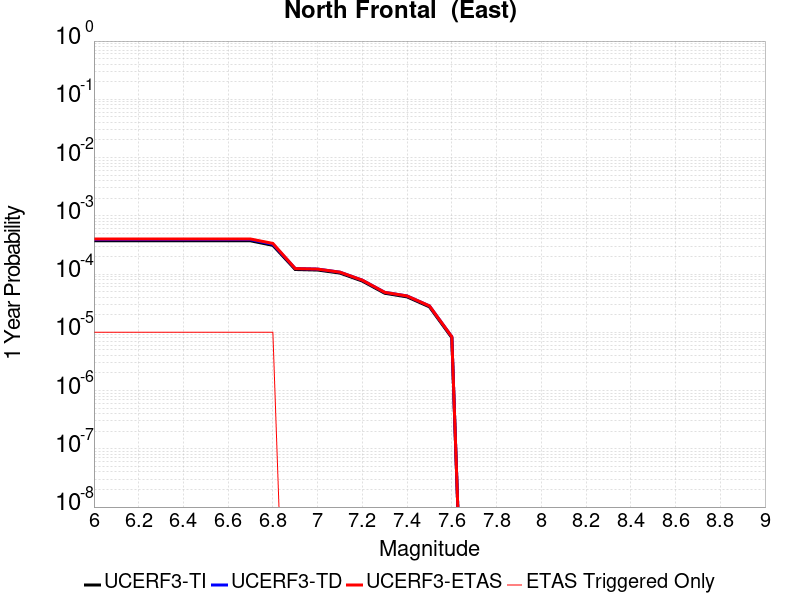 |  |

| Magnitude | 1 wk TI Prob | 1 wk TD Prob | 1 wk ETAS Prob | 1 wk ETAS/TD Gain | 1 wk ETAS Triggered Only | 1 mo TI Prob | 1 mo TD Prob | 1 mo ETAS Prob | 1 mo ETAS/TD Gain | 1 mo ETAS Triggered Only | 1 yr TI Prob | 1 yr TD Prob | 1 yr ETAS Prob | 1 yr ETAS/TD Gain | 1 yr ETAS Triggered Only | 10 yr TI Prob | 10 yr TD Prob | 10 yr ETAS Prob | 10 yr ETAS/TD Gain | 10 yr ETAS Triggered Only |
|-----|-----|-----|-----|-----|-----|-----|-----|-----|-----|-----|-----|-----|-----|-----|-----|-----|-----|-----|-----|-----|
| 6.0 | 7.135738E-6 | 7.4772242E-6 | 7.4772242E-6 | 1.0 | 0.0 | 3.0581377E-5 | 3.2044965E-5 | 3.2044965E-5 | 1.0 | 0.0 | 3.7226462E-4 | 3.9009753E-4 | 4.167538E-4 | 1.0683323 | 2.6666667E-5 | 0.0037164164 | 0.0038960855 | 0.0039226483 | 1.0068178 | 2.6666667E-5 |
| 6.1 | 7.135738E-6 | 7.4772242E-6 | 7.4772242E-6 | 1.0 | 0.0 | 3.0581377E-5 | 3.2044965E-5 | 3.2044965E-5 | 1.0 | 0.0 | 3.7226462E-4 | 3.9009753E-4 | 4.167538E-4 | 1.0683323 | 2.6666667E-5 | 0.0037164164 | 0.0038960855 | 0.0039226483 | 1.0068178 | 2.6666667E-5 |
| 6.2 | 7.135738E-6 | 7.4772242E-6 | 7.4772242E-6 | 1.0 | 0.0 | 3.0581377E-5 | 3.2044965E-5 | 3.2044965E-5 | 1.0 | 0.0 | 3.7226462E-4 | 3.9009753E-4 | 4.167538E-4 | 1.0683323 | 2.6666667E-5 | 0.0037164164 | 0.0038960855 | 0.0039226483 | 1.0068178 | 2.6666667E-5 |
| 6.3 | 7.135738E-6 | 7.4772242E-6 | 7.4772242E-6 | 1.0 | 0.0 | 3.0581377E-5 | 3.2044965E-5 | 3.2044965E-5 | 1.0 | 0.0 | 3.7226462E-4 | 3.9009753E-4 | 4.167538E-4 | 1.0683323 | 2.6666667E-5 | 0.0037164164 | 0.0038960855 | 0.0039226483 | 1.0068178 | 2.6666667E-5 |
| 6.4 | 7.135738E-6 | 7.4772242E-6 | 7.4772242E-6 | 1.0 | 0.0 | 3.0581377E-5 | 3.2044965E-5 | 3.2044965E-5 | 1.0 | 0.0 | 3.7226462E-4 | 3.9009753E-4 | 4.167538E-4 | 1.0683323 | 2.6666667E-5 | 0.0037164164 | 0.0038960855 | 0.0039226483 | 1.0068178 | 2.6666667E-5 |
| 6.5 | 7.135738E-6 | 7.4772242E-6 | 7.4772242E-6 | 1.0 | 0.0 | 3.0581377E-5 | 3.2044965E-5 | 3.2044965E-5 | 1.0 | 0.0 | 3.7226462E-4 | 3.9009753E-4 | 4.167538E-4 | 1.0683323 | 2.6666667E-5 | 0.0037164164 | 0.0038960855 | 0.0039226483 | 1.0068178 | 2.6666667E-5 |
| 6.6 | 7.135738E-6 | 7.4772242E-6 | 7.4772242E-6 | 1.0 | 0.0 | 3.0581377E-5 | 3.2044965E-5 | 3.2044965E-5 | 1.0 | 0.0 | 3.7226462E-4 | 3.9009753E-4 | 4.167538E-4 | 1.0683323 | 2.6666667E-5 | 0.0037164164 | 0.0038960855 | 0.0039226483 | 1.0068178 | 2.6666667E-5 |
| 6.7 | 7.135738E-6 | 7.4772242E-6 | 7.4772242E-6 | 1.0 | 0.0 | 3.0581377E-5 | 3.2044965E-5 | 3.2044965E-5 | 1.0 | 0.0 | 3.7226462E-4 | 3.9009753E-4 | 4.167538E-4 | 1.0683323 | 2.6666667E-5 | 0.0037164164 | 0.0038960855 | 0.0039226483 | 1.0068178 | 2.6666667E-5 |
| 6.8 | 5.959142E-6 | 6.236721E-6 | 6.236721E-6 | 1.0 | 0.0 | 2.553893E-5 | 2.6728634E-5 | 2.6728634E-5 | 1.0 | 0.0 | 3.108921E-4 | 3.253906E-4 | 3.5204858E-4 | 1.0819261 | 2.6666667E-5 | 0.0031045752 | 0.0032509149 | 0.0032774948 | 1.0081762 | 2.6666667E-5 |
| 6.9 | 2.2946929E-6 | 2.3824725E-6 | 2.3824725E-6 | 1.0 | 0.0 | 9.834361E-6 | 1.021056E-5 | 1.021056E-5 | 1.0 | 0.0 | 1.1972676E-4 | 1.2430694E-4 | 1.2430694E-4 | 1.0 | 0.0 | 0.0011966228 | 0.0012424206 | 0.0012424206 | 1.0 | 0.0 |
| 7.0 | 2.2468673E-6 | 2.3321654E-6 | 2.3321654E-6 | 1.0 | 0.0 | 9.629396E-6 | 9.994959E-6 | 9.994959E-6 | 1.0 | 0.0 | 1.1723159E-4 | 1.2168231E-4 | 1.2168231E-4 | 1.0 | 0.0 | 0.0011716976 | 0.0012162031 | 0.0012162031 | 1.0 | 0.0 |
| 7.1 | 1.9921076E-6 | 2.0646132E-6 | 2.0646132E-6 | 1.0 | 0.0 | 8.537577E-6 | 8.848315E-6 | 8.848315E-6 | 1.0 | 0.0 | 1.0394004E-4 | 1.0772334E-4 | 1.0772334E-4 | 1.0 | 0.0 | 0.0010389143 | 0.001076754 | 0.001076754 | 1.0 | 0.0 |
| 7.2 | 1.4524545E-6 | 1.504522E-6 | 1.504522E-6 | 1.0 | 0.0 | 6.2247905E-6 | 6.447937E-6 | 6.447937E-6 | 1.0 | 0.0 | 7.5784184E-5 | 7.850105E-5 | 7.850105E-5 | 1.0 | 0.0 | 7.575835E-4 | 7.8475766E-4 | 7.8475766E-4 | 1.0 | 0.0 |
| 7.3 | 8.9802575E-7 | 9.308773E-7 | 9.308773E-7 | 1.0 | 0.0 | 3.848676E-6 | 3.989469E-6 | 3.989469E-6 | 1.0 | 0.0 | 4.685662E-5 | 4.8570815E-5 | 4.8570815E-5 | 1.0 | 0.0 | 4.6846745E-4 | 4.856133E-4 | 4.856133E-4 | 1.0 | 0.0 |
| 7.4 | 7.776139E-7 | 8.060514E-7 | 8.060514E-7 | 1.0 | 0.0 | 3.3326266E-6 | 3.454502E-6 | 3.454502E-6 | 1.0 | 0.0 | 4.0573974E-5 | 4.2057858E-5 | 4.2057858E-5 | 1.0 | 0.0 | 4.0566566E-4 | 4.2050975E-4 | 4.2050975E-4 | 1.0 | 0.0 |
| 7.5 | 5.244417E-7 | 5.4412465E-7 | 5.4412465E-7 | 1.0 | 0.0 | 2.2476054E-6 | 2.331961E-6 | 2.331961E-6 | 1.0 | 0.0 | 2.7364253E-5 | 2.8391321E-5 | 2.8391321E-5 | 1.0 | 0.0 | 2.7360884E-4 | 2.8388345E-4 | 2.8388345E-4 | 1.0 | 0.0 |
| 7.6 | 1.5489647E-7 | 1.6089587E-7 | 1.6089587E-7 | 1.0 | 0.0 | 6.6384183E-7 | 6.8955364E-7 | 6.8955364E-7 | 1.0 | 0.0 | 8.082245E-6 | 8.395304E-6 | 8.395304E-6 | 1.0 | 0.0 | 8.08195E-5 | 8.395186E-5 | 8.395186E-5 | 1.0 | 0.0 |

## Pitas Point (Lower West)
*[(top)](#table-of-contents)*

| 1 Week | 1 Month | 1 Year | 10 Year |
|-----|-----|-----|-----|
|  |  |  |  |

| Magnitude | 1 wk TI Prob | 1 wk TD Prob | 1 wk ETAS Prob | 1 wk ETAS/TD Gain | 1 wk ETAS Triggered Only | 1 mo TI Prob | 1 mo TD Prob | 1 mo ETAS Prob | 1 mo ETAS/TD Gain | 1 mo ETAS Triggered Only | 1 yr TI Prob | 1 yr TD Prob | 1 yr ETAS Prob | 1 yr ETAS/TD Gain | 1 yr ETAS Triggered Only | 10 yr TI Prob | 10 yr TD Prob | 10 yr ETAS Prob | 10 yr ETAS/TD Gain | 10 yr ETAS Triggered Only |
|-----|-----|-----|-----|-----|-----|-----|-----|-----|-----|-----|-----|-----|-----|-----|-----|-----|-----|-----|-----|-----|
| 6.0 | 8.151497E-6 | 7.855829E-6 | 7.855829E-6 | 1.0 | 0.0 | 3.493452E-5 | 3.3667406E-5 | 6.0333175E-5 | 1.7920351 | 2.6666667E-5 | 4.252448E-4 | 4.098243E-4 | 4.3648004E-4 | 1.0650419 | 2.6666667E-5 | 0.0042443196 | 0.004090766 | 0.0041173236 | 1.0064921 | 2.6666667E-5 |
| 6.1 | 8.151497E-6 | 7.855829E-6 | 7.855829E-6 | 1.0 | 0.0 | 3.493452E-5 | 3.3667406E-5 | 6.0333175E-5 | 1.7920351 | 2.6666667E-5 | 4.252448E-4 | 4.098243E-4 | 4.3648004E-4 | 1.0650419 | 2.6666667E-5 | 0.0042443196 | 0.004090766 | 0.0041173236 | 1.0064921 | 2.6666667E-5 |
| 6.2 | 8.151497E-6 | 7.855829E-6 | 7.855829E-6 | 1.0 | 0.0 | 3.493452E-5 | 3.3667406E-5 | 6.0333175E-5 | 1.7920351 | 2.6666667E-5 | 4.252448E-4 | 4.098243E-4 | 4.3648004E-4 | 1.0650419 | 2.6666667E-5 | 0.0042443196 | 0.004090766 | 0.0041173236 | 1.0064921 | 2.6666667E-5 |
| 6.3 | 8.151497E-6 | 7.855829E-6 | 7.855829E-6 | 1.0 | 0.0 | 3.493452E-5 | 3.3667406E-5 | 6.0333175E-5 | 1.7920351 | 2.6666667E-5 | 4.252448E-4 | 4.098243E-4 | 4.3648004E-4 | 1.0650419 | 2.6666667E-5 | 0.0042443196 | 0.004090766 | 0.0041173236 | 1.0064921 | 2.6666667E-5 |
| 6.4 | 8.151497E-6 | 7.855829E-6 | 7.855829E-6 | 1.0 | 0.0 | 3.493452E-5 | 3.3667406E-5 | 6.0333175E-5 | 1.7920351 | 2.6666667E-5 | 4.252448E-4 | 4.098243E-4 | 4.3648004E-4 | 1.0650419 | 2.6666667E-5 | 0.0042443196 | 0.004090766 | 0.0041173236 | 1.0064921 | 2.6666667E-5 |
| 6.5 | 8.151497E-6 | 7.855829E-6 | 7.855829E-6 | 1.0 | 0.0 | 3.493452E-5 | 3.3667406E-5 | 6.0333175E-5 | 1.7920351 | 2.6666667E-5 | 4.252448E-4 | 4.098243E-4 | 4.3648004E-4 | 1.0650419 | 2.6666667E-5 | 0.0042443196 | 0.004090766 | 0.0041173236 | 1.0064921 | 2.6666667E-5 |
| 6.6 | 8.151497E-6 | 7.855829E-6 | 7.855829E-6 | 1.0 | 0.0 | 3.493452E-5 | 3.3667406E-5 | 6.0333175E-5 | 1.7920351 | 2.6666667E-5 | 4.252448E-4 | 4.098243E-4 | 4.3648004E-4 | 1.0650419 | 2.6666667E-5 | 0.0042443196 | 0.004090766 | 0.0041173236 | 1.0064921 | 2.6666667E-5 |
| 6.7 | 8.151497E-6 | 7.855829E-6 | 7.855829E-6 | 1.0 | 0.0 | 3.493452E-5 | 3.3667406E-5 | 6.0333175E-5 | 1.7920351 | 2.6666667E-5 | 4.252448E-4 | 4.098243E-4 | 4.3648004E-4 | 1.0650419 | 2.6666667E-5 | 0.0042443196 | 0.004090766 | 0.0041173236 | 1.0064921 | 2.6666667E-5 |
| 6.8 | 8.151497E-6 | 7.855829E-6 | 7.855829E-6 | 1.0 | 0.0 | 3.493452E-5 | 3.3667406E-5 | 6.0333175E-5 | 1.7920351 | 2.6666667E-5 | 4.252448E-4 | 4.098243E-4 | 4.3648004E-4 | 1.0650419 | 2.6666667E-5 | 0.0042443196 | 0.004090766 | 0.0041173236 | 1.0064921 | 2.6666667E-5 |
| 6.9 | 8.151497E-6 | 7.855829E-6 | 7.855829E-6 | 1.0 | 0.0 | 3.493452E-5 | 3.3667406E-5 | 6.0333175E-5 | 1.7920351 | 2.6666667E-5 | 4.252448E-4 | 4.098243E-4 | 4.3648004E-4 | 1.0650419 | 2.6666667E-5 | 0.0042443196 | 0.004090766 | 0.0041173236 | 1.0064921 | 2.6666667E-5 |
| 7.0 | 8.103535E-6 | 7.805258E-6 | 7.805258E-6 | 1.0 | 0.0 | 3.4728975E-5 | 3.345068E-5 | 6.0116454E-5 | 1.797167 | 2.6666667E-5 | 4.2274324E-4 | 4.0718666E-4 | 4.3384248E-4 | 1.0654633 | 2.6666667E-5 | 0.0042193993 | 0.0040644864 | 0.0040910444 | 1.0065342 | 2.6666667E-5 |
| 7.1 | 7.853298E-6 | 7.540947E-6 | 7.540947E-6 | 1.0 | 0.0 | 3.3656554E-5 | 3.231795E-5 | 5.898375E-5 | 1.8251083 | 2.6666667E-5 | 4.096915E-4 | 3.9340067E-4 | 4.2005684E-4 | 1.0677583 | 2.6666667E-5 | 0.00408937 | 0.0039271186 | 0.003953681 | 1.0067637 | 2.6666667E-5 |
| 7.2 | 7.771102E-6 | 7.453228E-6 | 7.453228E-6 | 1.0 | 0.0 | 3.33043E-5 | 3.1942018E-5 | 5.8607835E-5 | 1.8348193 | 2.6666667E-5 | 4.0540437E-4 | 3.8882537E-4 | 4.1548169E-4 | 1.068556 | 2.6666667E-5 | 0.0040466557 | 0.0038815264 | 0.0039080894 | 1.0068434 | 2.6666667E-5 |
| 7.3 | 7.3945344E-6 | 7.049329E-6 | 7.049329E-6 | 1.0 | 0.0 | 3.1690477E-5 | 3.0211062E-5 | 5.6876925E-5 | 1.8826522 | 2.6666667E-5 | 3.8576324E-4 | 3.6775824E-4 | 3.9441508E-4 | 1.0724847 | 2.6666667E-5 | 0.0038509427 | 0.0036715642 | 0.003698133 | 1.0072364 | 2.6666667E-5 |
| 7.4 | 6.964645E-6 | 6.5901736E-6 | 6.5901736E-6 | 1.0 | 0.0 | 2.9848137E-5 | 2.8243297E-5 | 2.8243297E-5 | 1.0 | 0.0 | 3.6334046E-4 | 3.4380838E-4 | 3.4380838E-4 | 1.0 | 0.0 | 0.0036274698 | 0.0034328182 | 0.0034328182 | 1.0 | 0.0 |
| 7.5 | 6.6525035E-6 | 6.2592094E-6 | 6.2592094E-6 | 1.0 | 0.0 | 2.851042E-5 | 2.682491E-5 | 2.682491E-5 | 1.0 | 0.0 | 3.4705905E-4 | 3.2654483E-4 | 3.2654483E-4 | 1.0 | 0.0 | 0.0034651754 | 0.0032607014 | 0.0032607014 | 1.0 | 0.0 |
| 7.6 | 5.613338E-6 | 5.1514285E-6 | 5.1514285E-6 | 1.0 | 0.0 | 2.405694E-5 | 2.2077365E-5 | 2.2077365E-5 | 1.0 | 0.0 | 2.928539E-4 | 2.6875906E-4 | 2.6875906E-4 | 1.0 | 0.0 | 0.0029246826 | 0.002684372 | 0.002684372 | 1.0 | 0.0 |
| 7.7 | 4.494704E-6 | 3.996944E-6 | 3.996944E-6 | 1.0 | 0.0 | 1.9262876E-5 | 1.712965E-5 | 1.712965E-5 | 1.0 | 0.0 | 2.3450027E-4 | 2.0853376E-4 | 2.0853376E-4 | 1.0 | 0.0 | 0.0023425296 | 0.002083405 | 0.002083405 | 1.0 | 0.0 |
| 7.8 | 2.6075882E-6 | 2.1836554E-6 | 2.1836554E-6 | 1.0 | 0.0 | 1.117533E-5 | 9.35849E-6 | 9.35849E-6 | 1.0 | 0.0 | 1.3605114E-4 | 1.1393371E-4 | 1.1393371E-4 | 1.0 | 0.0 | 0.0013596788 | 0.0011387577 | 0.0011387577 | 1.0 | 0.0 |
| 7.9 | 4.045984E-7 | 3.242403E-7 | 3.242403E-7 | 1.0 | 0.0 | 1.733992E-6 | 1.3896005E-6 | 1.3896005E-6 | 1.0 | 0.0 | 2.1111147E-5 | 1.6918259E-5 | 1.6918259E-5 | 1.0 | 0.0 | 2.1109142E-4 | 1.6917E-4 | 1.6917E-4 | 1.0 | 0.0 |
| 8.0 | 7.791402E-9 | 5.683553E-9 | 5.683553E-9 | 1.0 | 0.0 | 3.3391725E-8 | 2.4358085E-8 | 2.4358085E-8 | 1.0 | 0.0 | 4.0654416E-7 | 2.9655968E-7 | 2.9655968E-7 | 1.0 | 0.0 | 4.065434E-6 | 2.9655946E-6 | 2.9655946E-6 | 1.0 | 0.0 |

## Pleito
*[(top)](#table-of-contents)*

| 1 Week | 1 Month | 1 Year | 10 Year |
|-----|-----|-----|-----|
|  |  |  |  |

| Magnitude | 1 wk TI Prob | 1 wk TD Prob | 1 wk ETAS Prob | 1 wk ETAS/TD Gain | 1 wk ETAS Triggered Only | 1 mo TI Prob | 1 mo TD Prob | 1 mo ETAS Prob | 1 mo ETAS/TD Gain | 1 mo ETAS Triggered Only | 1 yr TI Prob | 1 yr TD Prob | 1 yr ETAS Prob | 1 yr ETAS/TD Gain | 1 yr ETAS Triggered Only | 10 yr TI Prob | 10 yr TD Prob | 10 yr ETAS Prob | 10 yr ETAS/TD Gain | 10 yr ETAS Triggered Only |
|-----|-----|-----|-----|-----|-----|-----|-----|-----|-----|-----|-----|-----|-----|-----|-----|-----|-----|-----|-----|-----|
| 6.0 | 1.6763008E-5 | 2.47705E-5 | 2.47705E-5 | 1.0 | 0.0 | 7.183948E-5 | 1.0615537E-4 | 1.328192E-4 | 1.2511774 | 2.6666667E-5 | 8.742947E-4 | 0.0012917474 | 0.0013183797 | 1.0206172 | 2.6666667E-5 | 0.00870863 | 0.012957253 | 0.012983574 | 1.0020313 | 2.6666667E-5 |
| 6.1 | 1.6763008E-5 | 2.47705E-5 | 2.47705E-5 | 1.0 | 0.0 | 7.183948E-5 | 1.0615537E-4 | 1.328192E-4 | 1.2511774 | 2.6666667E-5 | 8.742947E-4 | 0.0012917474 | 0.0013183797 | 1.0206172 | 2.6666667E-5 | 0.00870863 | 0.012957253 | 0.012983574 | 1.0020313 | 2.6666667E-5 |
| 6.2 | 1.6763008E-5 | 2.47705E-5 | 2.47705E-5 | 1.0 | 0.0 | 7.183948E-5 | 1.0615537E-4 | 1.328192E-4 | 1.2511774 | 2.6666667E-5 | 8.742947E-4 | 0.0012917474 | 0.0013183797 | 1.0206172 | 2.6666667E-5 | 0.00870863 | 0.012957253 | 0.012983574 | 1.0020313 | 2.6666667E-5 |
| 6.3 | 1.6763008E-5 | 2.47705E-5 | 2.47705E-5 | 1.0 | 0.0 | 7.183948E-5 | 1.0615537E-4 | 1.328192E-4 | 1.2511774 | 2.6666667E-5 | 8.742947E-4 | 0.0012917474 | 0.0013183797 | 1.0206172 | 2.6666667E-5 | 0.00870863 | 0.012957253 | 0.012983574 | 1.0020313 | 2.6666667E-5 |
| 6.4 | 1.6763008E-5 | 2.47705E-5 | 2.47705E-5 | 1.0 | 0.0 | 7.183948E-5 | 1.0615537E-4 | 1.328192E-4 | 1.2511774 | 2.6666667E-5 | 8.742947E-4 | 0.0012917474 | 0.0013183797 | 1.0206172 | 2.6666667E-5 | 0.00870863 | 0.012957253 | 0.012983574 | 1.0020313 | 2.6666667E-5 |
| 6.5 | 1.6763008E-5 | 2.47705E-5 | 2.47705E-5 | 1.0 | 0.0 | 7.183948E-5 | 1.0615537E-4 | 1.328192E-4 | 1.2511774 | 2.6666667E-5 | 8.742947E-4 | 0.0012917474 | 0.0013183797 | 1.0206172 | 2.6666667E-5 | 0.00870863 | 0.012957253 | 0.012983574 | 1.0020313 | 2.6666667E-5 |
| 6.6 | 9.910213E-6 | 1.7221182E-5 | 1.7221182E-5 | 1.0 | 0.0 | 4.247165E-5 | 7.3803E-5 | 1.00467696E-4 | 1.3612956 | 2.6666667E-5 | 5.169696E-4 | 8.9818484E-4 | 9.2482753E-4 | 1.0296628 | 2.6666667E-5 | 0.0051576863 | 0.009054025 | 0.00908045 | 1.0029186 | 2.6666667E-5 |
| 6.7 | 9.910213E-6 | 1.7221182E-5 | 1.7221182E-5 | 1.0 | 0.0 | 4.247165E-5 | 7.3803E-5 | 1.00467696E-4 | 1.3612956 | 2.6666667E-5 | 5.169696E-4 | 8.9818484E-4 | 9.2482753E-4 | 1.0296628 | 2.6666667E-5 | 0.0051576863 | 0.009054025 | 0.00908045 | 1.0029186 | 2.6666667E-5 |
| 6.8 | 8.300162E-6 | 1.5480773E-5 | 1.5480773E-5 | 1.0 | 0.0 | 3.557164E-5 | 6.634449E-5 | 9.300939E-5 | 1.4019158 | 2.6666667E-5 | 4.3299864E-4 | 8.0744625E-4 | 8.340914E-4 | 1.0329993 | 2.6666667E-5 | 0.004321559 | 0.008153455 | 0.008179904 | 1.0032439 | 2.6666667E-5 |
| 6.9 | 8.183114E-6 | 1.5351985E-5 | 1.5351985E-5 | 1.0 | 0.0 | 3.5070017E-5 | 6.579257E-5 | 9.2457485E-5 | 1.4052876 | 2.6666667E-5 | 4.2689382E-4 | 8.007316E-4 | 8.273769E-4 | 1.0332762 | 2.6666667E-5 | 0.0042607468 | 0.008086799 | 0.008113249 | 1.0032709 | 2.6666667E-5 |
| 7.0 | 7.1748823E-6 | 1.4138895E-5 | 1.4138895E-5 | 1.0 | 0.0 | 3.0749135E-5 | 6.059386E-5 | 6.059386E-5 | 1.0 | 0.0 | 3.743064E-4 | 7.3748105E-4 | 7.3748105E-4 | 1.0 | 0.0 | 0.0037367654 | 0.0074582137 | 0.0074582137 | 1.0 | 0.0 |
| 7.1 | 7.1671807E-6 | 1.4129264E-5 | 1.4129264E-5 | 1.0 | 0.0 | 3.0716128E-5 | 6.0552586E-5 | 6.0552586E-5 | 1.0 | 0.0 | 3.7390468E-4 | 7.369789E-4 | 7.369789E-4 | 1.0 | 0.0 | 0.0037327618 | 0.007453226 | 0.007453226 | 1.0 | 0.0 |
| 7.2 | 7.0649667E-6 | 1.3976534E-5 | 1.3976534E-5 | 1.0 | 0.0 | 3.0278077E-5 | 5.989806E-5 | 5.989806E-5 | 1.0 | 0.0 | 3.6857324E-4 | 7.290154E-4 | 7.290154E-4 | 1.0 | 0.0 | 0.0036796255 | 0.007373973 | 0.007373973 | 1.0 | 0.0 |
| 7.3 | 7.02082E-6 | 1.39199765E-5 | 1.39199765E-5 | 1.0 | 0.0 | 3.008888E-5 | 5.9655682E-5 | 5.9655682E-5 | 1.0 | 0.0 | 3.6627054E-4 | 7.260664E-4 | 7.260664E-4 | 1.0 | 0.0 | 0.0036566744 | 0.0073444657 | 0.0073444657 | 1.0 | 0.0 |
| 7.4 | 6.987146E-6 | 1.3879531E-5 | 1.3879531E-5 | 1.0 | 0.0 | 2.9944567E-5 | 5.948235E-5 | 5.948235E-5 | 1.0 | 0.0 | 3.6451413E-4 | 7.239575E-4 | 7.239575E-4 | 1.0 | 0.0 | 0.0036391679 | 0.007323398 | 0.007323398 | 1.0 | 0.0 |
| 7.5 | 6.9494554E-6 | 1.3836431E-5 | 1.3836431E-5 | 1.0 | 0.0 | 2.9783041E-5 | 5.9297647E-5 | 5.9297647E-5 | 1.0 | 0.0 | 3.625482E-4 | 7.217102E-4 | 7.217102E-4 | 1.0 | 0.0 | 0.0036195726 | 0.007301023 | 0.007301023 | 1.0 | 0.0 |
| 7.6 | 6.92694E-6 | 1.3795536E-5 | 1.3795536E-5 | 1.0 | 0.0 | 2.9686547E-5 | 5.9122387E-5 | 5.9122387E-5 | 1.0 | 0.0 | 3.6137376E-4 | 7.1957783E-4 | 7.1957783E-4 | 1.0 | 0.0 | 0.0036078666 | 0.0072797714 | 0.0072797714 | 1.0 | 0.0 |
| 7.7 | 6.395867E-6 | 1.2674343E-5 | 1.2674343E-5 | 1.0 | 0.0 | 2.741057E-5 | 5.4317487E-5 | 5.4317487E-5 | 1.0 | 0.0 | 3.336726E-4 | 6.6111505E-4 | 6.6111505E-4 | 1.0 | 0.0 | 0.0033317201 | 0.006698295 | 0.006698295 | 1.0 | 0.0 |
| 7.8 | 5.8664327E-6 | 1.1541453E-5 | 1.1541453E-5 | 1.0 | 0.0 | 2.5141611E-5 | 4.9462433E-5 | 4.9462433E-5 | 1.0 | 0.0 | 3.060561E-4 | 6.020389E-4 | 6.020389E-4 | 1.0 | 0.0 | 0.0030563495 | 0.006103509 | 0.006103509 | 1.0 | 0.0 |
| 7.9 | 3.7167474E-6 | 7.1174723E-6 | 7.1174723E-6 | 1.0 | 0.0 | 1.592882E-5 | 3.0503097E-5 | 3.0503097E-5 | 1.0 | 0.0 | 1.9391612E-4 | 3.7131205E-4 | 3.7131205E-4 | 1.0 | 0.0 | 0.0019374699 | 0.0037692138 | 0.0037692138 | 1.0 | 0.0 |
| 8.0 | 1.0903841E-6 | 1.2886832E-6 | 1.2886832E-6 | 1.0 | 0.0 | 4.6730665E-6 | 5.522916E-6 | 5.522916E-6 | 1.0 | 0.0 | 5.68931E-5 | 6.723944E-5 | 6.723944E-5 | 1.0 | 0.0 | 5.6878536E-4 | 6.9458556E-4 | 6.9458556E-4 | 1.0 | 0.0 |
| 8.1 | 2.6894583E-7 | 1.1072907E-7 | 1.1072907E-7 | 1.0 | 0.0 | 1.1526245E-6 | 4.7455305E-7 | 4.7455305E-7 | 1.0 | 0.0 | 1.4033113E-5 | 5.7776683E-6 | 5.7776683E-6 | 1.0 | 0.0 | 1.4032227E-4 | 6.4639265E-5 | 6.4639265E-5 | 1.0 | 0.0 |
| 8.2 | 5.2967013E-9 | 2.4608289E-9 | 2.4608289E-9 | 1.0 | 0.0 | 2.2700148E-8 | 1.054641E-8 | 1.054641E-8 | 1.0 | 0.0 | 2.7637427E-7 | 1.2840253E-7 | 1.2840253E-7 | 1.0 | 0.0 | 2.7637393E-6 | 1.46096E-6 | 1.46096E-6 | 1.0 | 0.0 |

## San Jacinto (Clark) rev
*[(top)](#table-of-contents)*

| 1 Week | 1 Month | 1 Year | 10 Year |
|-----|-----|-----|-----|
|  |  |  |  |

| Magnitude | 1 wk TI Prob | 1 wk TD Prob | 1 wk ETAS Prob | 1 wk ETAS/TD Gain | 1 wk ETAS Triggered Only | 1 mo TI Prob | 1 mo TD Prob | 1 mo ETAS Prob | 1 mo ETAS/TD Gain | 1 mo ETAS Triggered Only | 1 yr TI Prob | 1 yr TD Prob | 1 yr ETAS Prob | 1 yr ETAS/TD Gain | 1 yr ETAS Triggered Only | 10 yr TI Prob | 10 yr TD Prob | 10 yr ETAS Prob | 10 yr ETAS/TD Gain | 10 yr ETAS Triggered Only |
|-----|-----|-----|-----|-----|-----|-----|-----|-----|-----|-----|-----|-----|-----|-----|-----|-----|-----|-----|-----|-----|
| 6.0 | 4.482615E-5 | 2.1162805E-5 | 2.1162805E-5 | 1.0 | 0.0 | 1.9209793E-4 | 9.069463E-5 | 9.069463E-5 | 1.0 | 0.0 | 0.0023362834 | 0.0011036571 | 0.0011302943 | 1.0241355 | 2.6666667E-5 | 0.02311874 | 0.011508432 | 0.011534791 | 1.0022905 | 2.6666667E-5 |
| 6.1 | 4.482615E-5 | 2.1162805E-5 | 2.1162805E-5 | 1.0 | 0.0 | 1.9209793E-4 | 9.069463E-5 | 9.069463E-5 | 1.0 | 0.0 | 0.0023362834 | 0.0011036571 | 0.0011302943 | 1.0241355 | 2.6666667E-5 | 0.02311874 | 0.011508432 | 0.011534791 | 1.0022905 | 2.6666667E-5 |
| 6.2 | 4.482615E-5 | 2.1162805E-5 | 2.1162805E-5 | 1.0 | 0.0 | 1.9209793E-4 | 9.069463E-5 | 9.069463E-5 | 1.0 | 0.0 | 0.0023362834 | 0.0011036571 | 0.0011302943 | 1.0241355 | 2.6666667E-5 | 0.02311874 | 0.011508432 | 0.011534791 | 1.0022905 | 2.6666667E-5 |
| 6.3 | 4.482615E-5 | 2.1162805E-5 | 2.1162805E-5 | 1.0 | 0.0 | 1.9209793E-4 | 9.069463E-5 | 9.069463E-5 | 1.0 | 0.0 | 0.0023362834 | 0.0011036571 | 0.0011302943 | 1.0241355 | 2.6666667E-5 | 0.02311874 | 0.011508432 | 0.011534791 | 1.0022905 | 2.6666667E-5 |
| 6.4 | 4.482615E-5 | 2.1162805E-5 | 2.1162805E-5 | 1.0 | 0.0 | 1.9209793E-4 | 9.069463E-5 | 9.069463E-5 | 1.0 | 0.0 | 0.0023362834 | 0.0011036571 | 0.0011302943 | 1.0241355 | 2.6666667E-5 | 0.02311874 | 0.011508432 | 0.011534791 | 1.0022905 | 2.6666667E-5 |
| 6.5 | 3.7294863E-5 | 1.7363767E-5 | 1.7363767E-5 | 1.0 | 0.0 | 1.5982533E-4 | 7.441404E-5 | 7.441404E-5 | 1.0 | 0.0 | 0.0019441366 | 9.056189E-4 | 9.322614E-4 | 1.0294192 | 2.6666667E-5 | 0.01927216 | 0.009498186 | 0.0095246 | 1.0027809 | 2.6666667E-5 |
| 6.6 | 3.7294863E-5 | 1.7363767E-5 | 1.7363767E-5 | 1.0 | 0.0 | 1.5982533E-4 | 7.441404E-5 | 7.441404E-5 | 1.0 | 0.0 | 0.0019441366 | 9.056189E-4 | 9.322614E-4 | 1.0294192 | 2.6666667E-5 | 0.01927216 | 0.009498186 | 0.0095246 | 1.0027809 | 2.6666667E-5 |
| 6.7 | 3.6039248E-5 | 1.661182E-5 | 1.661182E-5 | 1.0 | 0.0 | 1.5444479E-4 | 7.11916E-5 | 7.11916E-5 | 1.0 | 0.0 | 0.0018787434 | 8.6641713E-4 | 8.930607E-4 | 1.0307515 | 2.6666667E-5 | 0.01862939 | 0.009100041 | 0.009126466 | 1.0029037 | 2.6666667E-5 |
| 6.8 | 3.5031844E-5 | 1.6240316E-5 | 1.6240316E-5 | 1.0 | 0.0 | 1.5012783E-4 | 6.959952E-5 | 6.959952E-5 | 1.0 | 0.0 | 0.0018262739 | 8.470488E-4 | 8.736929E-4 | 1.0314552 | 2.6666667E-5 | 0.01811338 | 0.008899899 | 0.008926329 | 1.0029696 | 2.6666667E-5 |
| 6.9 | 3.435112E-5 | 1.6070499E-5 | 1.6070499E-5 | 1.0 | 0.0 | 1.4721078E-4 | 6.887177E-5 | 6.887177E-5 | 1.0 | 0.0 | 0.0017908178 | 8.381953E-4 | 8.6483965E-4 | 1.0317878 | 2.6666667E-5 | 0.017764548 | 0.008808068 | 0.0088345 | 1.0030009 | 2.6666667E-5 |
| 7.0 | 2.8959772E-5 | 1.4343366E-5 | 1.4343366E-5 | 1.0 | 0.0 | 1.241074E-4 | 6.1470135E-5 | 6.1470135E-5 | 1.0 | 0.0 | 0.0015099603 | 7.481447E-4 | 7.7479146E-4 | 1.0356171 | 2.6666667E-5 | 0.014997416 | 0.0078715505 | 0.0078980075 | 1.0033611 | 2.6666667E-5 |
| 7.1 | 2.6002877E-5 | 1.2835043E-5 | 1.2835043E-5 | 1.0 | 0.0 | 1.11436144E-4 | 5.500618E-5 | 5.500618E-5 | 1.0 | 0.0 | 0.0013558907 | 6.694966E-4 | 6.961454E-4 | 1.0398042 | 2.6666667E-5 | 0.013476475 | 0.007049743 | 0.0070762215 | 1.0037559 | 2.6666667E-5 |
| 7.2 | 2.2544838E-5 | 1.1267972E-5 | 1.1267972E-5 | 1.0 | 0.0 | 9.661716E-5 | 4.829042E-5 | 4.829042E-5 | 1.0 | 0.0 | 0.001175679 | 5.8777875E-4 | 6.144297E-4 | 1.0453418 | 2.6666667E-5 | 0.011694785 | 0.0061956523 | 0.0062221535 | 1.0042775 | 2.6666667E-5 |
| 7.3 | 1.75334E-5 | 1.081679E-5 | 1.081679E-5 | 1.0 | 0.0 | 7.514098E-5 | 4.6356854E-5 | 4.6356854E-5 | 1.0 | 0.0 | 9.144575E-4 | 5.6424993E-4 | 5.909016E-4 | 1.0472337 | 2.6666667E-5 | 0.009107036 | 0.005936473 | 0.005962982 | 1.0044653 | 2.6666667E-5 |
| 7.4 | 1.5924552E-5 | 1.0616479E-5 | 1.0616479E-5 | 1.0 | 0.0 | 6.82463E-5 | 4.5498407E-5 | 4.5498407E-5 | 1.0 | 0.0 | 8.305819E-4 | 5.538037E-4 | 5.804556E-4 | 1.0481251 | 2.6666667E-5 | 0.008274844 | 0.005823671 | 0.0058501824 | 1.0045524 | 2.6666667E-5 |
| 7.5 | 1.3428931E-5 | 9.856627E-6 | 9.856627E-6 | 1.0 | 0.0 | 5.7551293E-5 | 4.224201E-5 | 4.224201E-5 | 1.0 | 0.0 | 7.004617E-4 | 5.1417615E-4 | 5.4082915E-4 | 1.0518363 | 2.6666667E-5 | 0.006982579 | 0.005409115 | 0.005435637 | 1.0049033 | 2.6666667E-5 |
| 7.6 | 1.0688787E-5 | 8.61931E-6 | 8.61931E-6 | 1.0 | 0.0 | 4.5808283E-5 | 3.6939382E-5 | 3.6939382E-5 | 1.0 | 0.0 | 5.5757316E-4 | 4.4964463E-4 | 4.7629932E-4 | 1.0592794 | 2.6666667E-5 | 0.005561762 | 0.004744031 | 0.004770571 | 1.0055944 | 2.6666667E-5 |
| 7.7 | 8.81236E-6 | 7.4723484E-6 | 7.4723484E-6 | 1.0 | 0.0 | 3.776671E-5 | 3.202396E-5 | 3.202396E-5 | 1.0 | 0.0 | 4.597127E-4 | 3.8982215E-4 | 4.164784E-4 | 1.0683806 | 2.6666667E-5 | 0.0045876284 | 0.004136955 | 0.004163511 | 1.0064193 | 2.6666667E-5 |
| 7.8 | 7.780431E-6 | 6.7006613E-6 | 6.7006613E-6 | 1.0 | 0.0 | 3.3344273E-5 | 2.8716804E-5 | 2.8716804E-5 | 1.0 | 0.0 | 4.0589093E-4 | 3.4957117E-4 | 3.7622853E-4 | 1.0762572 | 2.6666667E-5 | 0.0040515037 | 0.0037249678 | 0.0037515352 | 1.0071322 | 2.6666667E-5 |
| 7.9 | 6.5437994E-6 | 5.784193E-6 | 5.784193E-6 | 1.0 | 0.0 | 2.8044553E-5 | 2.4789164E-5 | 2.4789164E-5 | 1.0 | 0.0 | 3.4138895E-4 | 3.0176644E-4 | 3.2842506E-4 | 1.088342 | 2.6666667E-5 | 0.0034086495 | 0.003236521 | 0.0032631014 | 1.0082127 | 2.6666667E-5 |
| 8.0 | 5.4488164E-6 | 4.8167294E-6 | 4.8167294E-6 | 1.0 | 0.0 | 2.3351862E-5 | 2.0642963E-5 | 2.0642963E-5 | 1.0 | 0.0 | 2.8427184E-4 | 2.5129924E-4 | 2.779592E-4 | 1.1060885 | 2.6666667E-5 | 0.0028390845 | 0.0027126544 | 0.0027392488 | 1.0098038 | 2.6666667E-5 |
| 8.1 | 2.8397242E-6 | 1.3684335E-6 | 1.3684335E-6 | 1.0 | 0.0 | 1.217019E-5 | 5.864702E-6 | 5.864702E-6 | 1.0 | 0.0 | 1.4816198E-4 | 7.140042E-5 | 7.140042E-5 | 1.0 | 0.0 | 0.0014806325 | 8.12321E-4 | 8.12321E-4 | 1.0 | 0.0 |
| 8.2 | 2.030244E-6 | 6.326596E-7 | 6.326596E-7 | 1.0 | 0.0 | 8.701017E-6 | 2.7113954E-6 | 2.7113954E-6 | 1.0 | 0.0 | 1.05929736E-4 | 3.3010747E-5 | 3.3010747E-5 | 1.0 | 0.0 | 0.0010587925 | 3.9531066E-4 | 3.9531066E-4 | 1.0 | 0.0 |
| 8.3 | 1.0659804E-6 | 2.9287372E-7 | 2.9287372E-7 | 1.0 | 0.0 | 4.568479E-6 | 1.2551725E-6 | 1.2551725E-6 | 1.0 | 0.0 | 5.5619817E-5 | 1.5281621E-5 | 1.5281621E-5 | 1.0 | 0.0 | 5.5605895E-4 | 1.8588232E-4 | 1.8588232E-4 | 1.0 | 0.0 |

## Raymond
*[(top)](#table-of-contents)*

| 1 Week | 1 Month | 1 Year | 10 Year |
|-----|-----|-----|-----|
|  |  |  |  |

| Magnitude | 1 wk TI Prob | 1 wk TD Prob | 1 wk ETAS Prob | 1 wk ETAS/TD Gain | 1 wk ETAS Triggered Only | 1 mo TI Prob | 1 mo TD Prob | 1 mo ETAS Prob | 1 mo ETAS/TD Gain | 1 mo ETAS Triggered Only | 1 yr TI Prob | 1 yr TD Prob | 1 yr ETAS Prob | 1 yr ETAS/TD Gain | 1 yr ETAS Triggered Only | 10 yr TI Prob | 10 yr TD Prob | 10 yr ETAS Prob | 10 yr ETAS/TD Gain | 10 yr ETAS Triggered Only |
|-----|-----|-----|-----|-----|-----|-----|-----|-----|-----|-----|-----|-----|-----|-----|-----|-----|-----|-----|-----|-----|
| 6.0 | 1.5157413E-5 | 1.5810376E-5 | 1.5810376E-5 | 1.0 | 0.0 | 6.4958724E-5 | 6.775714E-5 | 6.775714E-5 | 1.0 | 0.0 | 7.905855E-4 | 8.24656E-4 | 8.24656E-4 | 1.0 | 0.0 | 0.007877788 | 0.008218477 | 0.008244924 | 1.003218 | 2.6666667E-5 |
| 6.1 | 1.5157413E-5 | 1.5810376E-5 | 1.5810376E-5 | 1.0 | 0.0 | 6.4958724E-5 | 6.775714E-5 | 6.775714E-5 | 1.0 | 0.0 | 7.905855E-4 | 8.24656E-4 | 8.24656E-4 | 1.0 | 0.0 | 0.007877788 | 0.008218477 | 0.008244924 | 1.003218 | 2.6666667E-5 |
| 6.2 | 1.5157413E-5 | 1.5810376E-5 | 1.5810376E-5 | 1.0 | 0.0 | 6.4958724E-5 | 6.775714E-5 | 6.775714E-5 | 1.0 | 0.0 | 7.905855E-4 | 8.24656E-4 | 8.24656E-4 | 1.0 | 0.0 | 0.007877788 | 0.008218477 | 0.008244924 | 1.003218 | 2.6666667E-5 |
| 6.3 | 1.5157413E-5 | 1.5810376E-5 | 1.5810376E-5 | 1.0 | 0.0 | 6.4958724E-5 | 6.775714E-5 | 6.775714E-5 | 1.0 | 0.0 | 7.905855E-4 | 8.24656E-4 | 8.24656E-4 | 1.0 | 0.0 | 0.007877788 | 0.008218477 | 0.008244924 | 1.003218 | 2.6666667E-5 |
| 6.4 | 1.3941944E-5 | 1.4454918E-5 | 1.4454918E-5 | 1.0 | 0.0 | 5.9749822E-5 | 6.194831E-5 | 6.194831E-5 | 1.0 | 0.0 | 7.2721124E-4 | 7.53983E-4 | 7.53983E-4 | 1.0 | 0.0 | 0.007248361 | 0.0075165825 | 0.007543049 | 1.0035211 | 2.6666667E-5 |
| 6.5 | 1.3941944E-5 | 1.4454918E-5 | 1.4454918E-5 | 1.0 | 0.0 | 5.9749822E-5 | 6.194831E-5 | 6.194831E-5 | 1.0 | 0.0 | 7.2721124E-4 | 7.53983E-4 | 7.53983E-4 | 1.0 | 0.0 | 0.007248361 | 0.0075165825 | 0.007543049 | 1.0035211 | 2.6666667E-5 |
| 6.6 | 1.0542609E-5 | 1.0671283E-5 | 1.0671283E-5 | 1.0 | 0.0 | 4.5181827E-5 | 4.57333E-5 | 4.57333E-5 | 1.0 | 0.0 | 5.499499E-4 | 5.566662E-4 | 5.566662E-4 | 1.0 | 0.0 | 0.005485909 | 0.0055532786 | 0.0055532786 | 1.0 | 0.0 |
| 6.7 | 1.0542609E-5 | 1.0671283E-5 | 1.0671283E-5 | 1.0 | 0.0 | 4.5181827E-5 | 4.57333E-5 | 4.57333E-5 | 1.0 | 0.0 | 5.499499E-4 | 5.566662E-4 | 5.566662E-4 | 1.0 | 0.0 | 0.005485909 | 0.0055532786 | 0.0055532786 | 1.0 | 0.0 |
| 6.8 | 1.0079132E-5 | 1.0176812E-5 | 1.0176812E-5 | 1.0 | 0.0 | 4.3195567E-5 | 4.361421E-5 | 4.361421E-5 | 1.0 | 0.0 | 5.257791E-4 | 5.30879E-4 | 5.30879E-4 | 1.0 | 0.0 | 0.0052453685 | 0.0052966573 | 0.0052966573 | 1.0 | 0.0 |
| 6.9 | 7.721598E-6 | 7.5490307E-6 | 7.5490307E-6 | 1.0 | 0.0 | 3.3092143E-5 | 3.2352593E-5 | 3.2352593E-5 | 1.0 | 0.0 | 4.0282236E-4 | 3.9382285E-4 | 3.9382285E-4 | 1.0 | 0.0 | 0.0040209293 | 0.003931383 | 0.003931383 | 1.0 | 0.0 |
| 7.0 | 7.137566E-6 | 6.9114235E-6 | 6.9114235E-6 | 1.0 | 0.0 | 3.058921E-5 | 2.9620056E-5 | 2.9620056E-5 | 1.0 | 0.0 | 3.7236E-4 | 3.6056558E-4 | 3.6056558E-4 | 1.0 | 0.0 | 0.0037173668 | 0.003599924 | 0.003599924 | 1.0 | 0.0 |
| 7.1 | 5.654976E-6 | 5.2996397E-6 | 5.2996397E-6 | 1.0 | 0.0 | 2.4235387E-5 | 2.2712544E-5 | 2.2712544E-5 | 1.0 | 0.0 | 2.9502588E-4 | 2.7649035E-4 | 2.7649035E-4 | 1.0 | 0.0 | 0.0029463451 | 0.0027614946 | 0.0027614946 | 1.0 | 0.0 |
| 7.2 | 4.9358455E-6 | 4.5267484E-6 | 4.5267484E-6 | 1.0 | 0.0 | 2.1153453E-5 | 1.9400206E-5 | 1.9400206E-5 | 1.0 | 0.0 | 2.5751285E-4 | 2.3617204E-4 | 2.3617204E-4 | 1.0 | 0.0 | 0.0025721465 | 0.0023592326 | 0.0023592326 | 1.0 | 0.0 |
| 7.3 | 4.2368597E-6 | 3.8056999E-6 | 3.8056999E-6 | 1.0 | 0.0 | 1.8157843E-5 | 1.6310041E-5 | 1.6310041E-5 | 1.0 | 0.0 | 2.2104931E-4 | 1.9855677E-4 | 1.9855677E-4 | 1.0 | 0.0 | 0.0022082955 | 0.0019838123 | 0.0019838123 | 1.0 | 0.0 |
| 7.4 | 3.4999923E-6 | 3.0438184E-6 | 3.0438184E-6 | 1.0 | 0.0 | 1.49998805E-5 | 1.3044872E-5 | 1.3044872E-5 | 1.0 | 0.0 | 1.8260824E-4 | 1.5880981E-4 | 1.5880981E-4 | 1.0 | 0.0 | 0.0018245826 | 0.001586979 | 0.001586979 | 1.0 | 0.0 |
| 7.5 | 2.738017E-6 | 2.3021105E-6 | 2.3021105E-6 | 1.0 | 0.0 | 1.1734306E-5 | 9.86615E-6 | 9.86615E-6 | 1.0 | 0.0 | 1.428558E-4 | 1.2011383E-4 | 1.2011383E-4 | 1.0 | 0.0 | 0.0014276401 | 0.0012005034 | 0.0012005034 | 1.0 | 0.0 |
| 7.6 | 1.8186392E-6 | 1.4423566E-6 | 1.4423566E-6 | 1.0 | 0.0 | 7.794145E-6 | 6.181514E-6 | 6.181514E-6 | 1.0 | 0.0 | 9.488958E-5 | 7.5257376E-5 | 7.5257376E-5 | 1.0 | 0.0 | 9.4849075E-4 | 7.523304E-4 | 7.523304E-4 | 1.0 | 0.0 |
| 7.7 | 1.0660348E-6 | 7.644165E-7 | 7.644165E-7 | 1.0 | 0.0 | 4.5687125E-6 | 3.2760668E-6 | 3.2760668E-6 | 1.0 | 0.0 | 5.5622655E-5 | 3.98854E-5 | 3.98854E-5 | 1.0 | 0.0 | 5.5608735E-4 | 3.9879154E-4 | 3.9879154E-4 | 1.0 | 0.0 |
| 7.8 | 6.913602E-7 | 4.320714E-7 | 4.320714E-7 | 1.0 | 0.0 | 2.962969E-6 | 1.8517333E-6 | 1.8517333E-6 | 1.0 | 0.0 | 3.607355E-5 | 2.2544626E-5 | 2.2544626E-5 | 1.0 | 0.0 | 3.6067693E-4 | 2.2543124E-4 | 2.2543124E-4 | 1.0 | 0.0 |
| 7.9 | 7.425201E-8 | 5.322516E-8 | 5.322516E-8 | 1.0 | 0.0 | 3.1822285E-7 | 2.2810782E-7 | 2.2810782E-7 | 1.0 | 0.0 | 3.874356E-6 | 2.7772105E-6 | 2.7772105E-6 | 1.0 | 0.0 | 3.8742884E-5 | 2.7771888E-5 | 2.7771888E-5 | 1.0 | 0.0 |

## Monterey Bay-Tularcitos
*[(top)](#table-of-contents)*

| 1 Week | 1 Month | 1 Year | 10 Year |
|-----|-----|-----|-----|
|  |  |  | 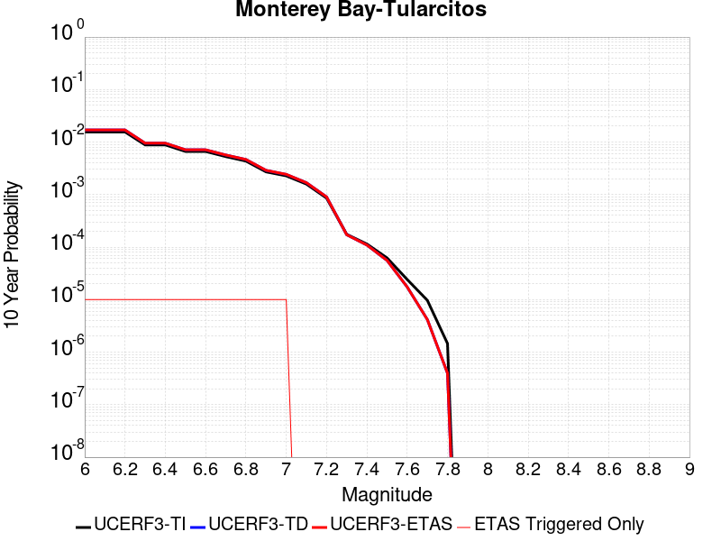 |

| Magnitude | 1 wk TI Prob | 1 wk TD Prob | 1 wk ETAS Prob | 1 wk ETAS/TD Gain | 1 wk ETAS Triggered Only | 1 mo TI Prob | 1 mo TD Prob | 1 mo ETAS Prob | 1 mo ETAS/TD Gain | 1 mo ETAS Triggered Only | 1 yr TI Prob | 1 yr TD Prob | 1 yr ETAS Prob | 1 yr ETAS/TD Gain | 1 yr ETAS Triggered Only | 10 yr TI Prob | 10 yr TD Prob | 10 yr ETAS Prob | 10 yr ETAS/TD Gain | 10 yr ETAS Triggered Only |
|-----|-----|-----|-----|-----|-----|-----|-----|-----|-----|-----|-----|-----|-----|-----|-----|-----|-----|-----|-----|-----|
| 6.0 | 3.0131365E-5 | 3.2799162E-5 | 3.2799162E-5 | 1.0 | 0.0 | 1.2912804E-4 | 1.4056086E-4 | 1.4056086E-4 | 1.0 | 0.0 | 0.001571 | 0.0017100906 | 0.0017100906 | 1.0 | 0.0 | 0.015599402 | 0.016980117 | 0.017006332 | 1.0015438 | 2.6666667E-5 |
| 6.1 | 3.0131365E-5 | 3.2799162E-5 | 3.2799162E-5 | 1.0 | 0.0 | 1.2912804E-4 | 1.4056086E-4 | 1.4056086E-4 | 1.0 | 0.0 | 0.001571 | 0.0017100906 | 0.0017100906 | 1.0 | 0.0 | 0.015599402 | 0.016980117 | 0.017006332 | 1.0015438 | 2.6666667E-5 |
| 6.2 | 3.0131365E-5 | 3.2799162E-5 | 3.2799162E-5 | 1.0 | 0.0 | 1.2912804E-4 | 1.4056086E-4 | 1.4056086E-4 | 1.0 | 0.0 | 0.001571 | 0.0017100906 | 0.0017100906 | 1.0 | 0.0 | 0.015599402 | 0.016980117 | 0.017006332 | 1.0015438 | 2.6666667E-5 |
| 6.3 | 1.6998249E-5 | 1.8330993E-5 | 1.8330993E-5 | 1.0 | 0.0 | 7.28476E-5 | 7.855914E-5 | 7.855914E-5 | 1.0 | 0.0 | 8.865586E-4 | 9.560565E-4 | 9.560565E-4 | 1.0 | 0.0 | 0.0088303005 | 0.00952136 | 0.009547772 | 1.002774 | 2.6666667E-5 |
| 6.4 | 1.6998249E-5 | 1.8330993E-5 | 1.8330993E-5 | 1.0 | 0.0 | 7.28476E-5 | 7.855914E-5 | 7.855914E-5 | 1.0 | 0.0 | 8.865586E-4 | 9.560565E-4 | 9.560565E-4 | 1.0 | 0.0 | 0.0088303005 | 0.00952136 | 0.009547772 | 1.002774 | 2.6666667E-5 |
| 6.5 | 1.27470785E-5 | 1.3693452E-5 | 1.3693452E-5 | 1.0 | 0.0 | 5.4629192E-5 | 5.868496E-5 | 5.868496E-5 | 1.0 | 0.0 | 6.649074E-4 | 7.142655E-4 | 7.142655E-4 | 1.0 | 0.0 | 0.0066292146 | 0.007120751 | 0.0071472274 | 1.0037183 | 2.6666667E-5 |
| 6.6 | 1.2739422E-5 | 1.3685539E-5 | 1.3685539E-5 | 1.0 | 0.0 | 5.4596385E-5 | 5.865105E-5 | 5.865105E-5 | 1.0 | 0.0 | 6.645082E-4 | 7.1385293E-4 | 7.1385293E-4 | 1.0 | 0.0 | 0.0066252467 | 0.007116651 | 0.007143128 | 1.0037204 | 2.6666667E-5 |
| 6.7 | 1.0160109E-5 | 1.0885862E-5 | 1.0885862E-5 | 1.0 | 0.0 | 4.35426E-5 | 4.66529E-5 | 4.66529E-5 | 1.0 | 0.0 | 5.300022E-4 | 5.678581E-4 | 5.678581E-4 | 1.0 | 0.0 | 0.005287399 | 0.005664782 | 0.005691298 | 1.0046808 | 2.6666667E-5 |
| 6.8 | 8.349859E-6 | 8.932674E-6 | 8.932674E-6 | 1.0 | 0.0 | 3.578462E-5 | 3.828236E-5 | 3.828236E-5 | 1.0 | 0.0 | 4.3559066E-4 | 4.659937E-4 | 4.659937E-4 | 1.0 | 0.0 | 0.004347378 | 0.0046507306 | 0.0046772733 | 1.0057071 | 2.6666667E-5 |
| 6.9 | 5.193639E-6 | 5.536483E-6 | 5.536483E-6 | 1.0 | 0.0 | 2.2258262E-5 | 2.3727587E-5 | 2.3727587E-5 | 1.0 | 0.0 | 2.7096065E-4 | 2.8884833E-4 | 2.8884833E-4 | 1.0 | 0.0 | 0.0027063051 | 0.00288505 | 0.0029116396 | 1.0092164 | 2.6666667E-5 |
| 7.0 | 4.359381E-6 | 4.6434106E-6 | 4.6434106E-6 | 1.0 | 0.0 | 1.8682927E-5 | 1.9900195E-5 | 1.9900195E-5 | 1.0 | 0.0 | 2.274409E-4 | 2.4226093E-4 | 2.4226093E-4 | 1.0 | 0.0 | 0.0022720827 | 0.0024202613 | 0.0024468633 | 1.0109915 | 2.6666667E-5 |
| 7.1 | 3.0398533E-6 | 3.231074E-6 | 3.231074E-6 | 1.0 | 0.0 | 1.3027877E-5 | 1.38474015E-5 | 1.38474015E-5 | 1.0 | 0.0 | 1.5860285E-4 | 1.685817E-4 | 1.685817E-4 | 1.0 | 0.0 | 0.001584897 | 0.0016847957 | 0.0016847957 | 1.0 | 0.0 |
| 7.2 | 1.642335E-6 | 1.7333325E-6 | 1.7333325E-6 | 1.0 | 0.0 | 7.0385595E-6 | 7.4285585E-6 | 7.4285585E-6 | 1.0 | 0.0 | 8.569109E-5 | 9.044101E-5 | 9.044101E-5 | 1.0 | 0.0 | 8.5658056E-4 | 9.042448E-4 | 9.042448E-4 | 1.0 | 0.0 |
| 7.3 | 3.356842E-7 | 3.295272E-7 | 3.295272E-7 | 1.0 | 0.0 | 1.4386458E-6 | 1.4122586E-6 | 1.4122586E-6 | 1.0 | 0.0 | 1.7515373E-5 | 1.7194114E-5 | 1.7194114E-5 | 1.0 | 0.0 | 1.7513991E-4 | 1.7192794E-4 | 1.7192794E-4 | 1.0 | 0.0 |
| 7.4 | 2.1973483E-7 | 2.1006697E-7 | 2.1006697E-7 | 1.0 | 0.0 | 9.417204E-7 | 9.002867E-7 | 9.002867E-7 | 1.0 | 0.0 | 1.1465385E-5 | 1.09609355E-5 | 1.09609355E-5 | 1.0 | 0.0 | 1.1464794E-4 | 1.09603985E-4 | 1.09603985E-4 | 1.0 | 0.0 |
| 7.5 | 1.1944135E-7 | 1.0696283E-7 | 1.0696283E-7 | 1.0 | 0.0 | 5.118914E-7 | 4.5841205E-7 | 4.5841205E-7 | 1.0 | 0.0 | 6.23226E-6 | 5.5811524E-6 | 5.5811524E-6 | 1.0 | 0.0 | 6.2320854E-5 | 5.5810135E-5 | 5.5810135E-5 | 1.0 | 0.0 |
| 7.6 | 4.636058E-8 | 3.3366945E-8 | 3.3366945E-8 | 1.0 | 0.0 | 1.9868818E-7 | 1.4300119E-7 | 1.4300119E-7 | 1.0 | 0.0 | 2.419026E-6 | 1.7410381E-6 | 1.7410381E-6 | 1.0 | 0.0 | 2.4189996E-5 | 1.7410246E-5 | 1.7410246E-5 | 1.0 | 0.0 |
| 7.7 | 1.8588572E-8 | 8.005146E-9 | 8.005146E-9 | 1.0 | 0.0 | 7.9665305E-8 | 3.4307767E-8 | 3.4307767E-8 | 1.0 | 0.0 | 9.699246E-7 | 4.1769698E-7 | 4.1769698E-7 | 1.0 | 0.0 | 9.699204E-6 | 4.176962E-6 | 4.176962E-6 | 1.0 | 0.0 |
| 7.8 | 2.7960154E-9 | 7.612305E-10 | 7.612305E-10 | 1.0 | 0.0 | 1.1982923E-8 | 3.2624166E-9 | 3.2624166E-9 | 1.0 | 0.0 | 1.4589209E-7 | 3.971992E-8 | 3.971992E-8 | 1.0 | 0.0 | 1.4589199E-6 | 3.9719916E-7 | 3.9719916E-7 | 1.0 | 0.0 |

## Robinson Creek
*[(top)](#table-of-contents)*

| 1 Week | 1 Month | 1 Year | 10 Year |
|-----|-----|-----|-----|
|  |  |  |  |

| Magnitude | 1 wk TI Prob | 1 wk TD Prob | 1 wk ETAS Prob | 1 wk ETAS/TD Gain | 1 wk ETAS Triggered Only | 1 mo TI Prob | 1 mo TD Prob | 1 mo ETAS Prob | 1 mo ETAS/TD Gain | 1 mo ETAS Triggered Only | 1 yr TI Prob | 1 yr TD Prob | 1 yr ETAS Prob | 1 yr ETAS/TD Gain | 1 yr ETAS Triggered Only | 10 yr TI Prob | 10 yr TD Prob | 10 yr ETAS Prob | 10 yr ETAS/TD Gain | 10 yr ETAS Triggered Only |
|-----|-----|-----|-----|-----|-----|-----|-----|-----|-----|-----|-----|-----|-----|-----|-----|-----|-----|-----|-----|-----|
| 6.0 | 1.3705327E-5 | 1.5285246E-5 | 1.5285246E-5 | 1.0 | 0.0 | 5.8735794E-5 | 6.5508204E-5 | 6.5508204E-5 | 1.0 | 0.0 | 7.1487366E-4 | 7.9756236E-4 | 7.9756236E-4 | 1.0 | 0.0 | 0.0071257832 | 0.007975623 | 0.008002077 | 1.0033169 | 2.6666667E-5 |
| 6.1 | 1.3705327E-5 | 1.5285246E-5 | 1.5285246E-5 | 1.0 | 0.0 | 5.8735794E-5 | 6.5508204E-5 | 6.5508204E-5 | 1.0 | 0.0 | 7.1487366E-4 | 7.9756236E-4 | 7.9756236E-4 | 1.0 | 0.0 | 0.0071257832 | 0.007975623 | 0.008002077 | 1.0033169 | 2.6666667E-5 |
| 6.2 | 1.3705327E-5 | 1.5285246E-5 | 1.5285246E-5 | 1.0 | 0.0 | 5.8735794E-5 | 6.5508204E-5 | 6.5508204E-5 | 1.0 | 0.0 | 7.1487366E-4 | 7.9756236E-4 | 7.9756236E-4 | 1.0 | 0.0 | 0.0071257832 | 0.007975623 | 0.008002077 | 1.0033169 | 2.6666667E-5 |
| 6.3 | 1.3705327E-5 | 1.5285246E-5 | 1.5285246E-5 | 1.0 | 0.0 | 5.8735794E-5 | 6.5508204E-5 | 6.5508204E-5 | 1.0 | 0.0 | 7.1487366E-4 | 7.9756236E-4 | 7.9756236E-4 | 1.0 | 0.0 | 0.0071257832 | 0.007975623 | 0.008002077 | 1.0033169 | 2.6666667E-5 |
| 6.4 | 1.3705327E-5 | 1.5285246E-5 | 1.5285246E-5 | 1.0 | 0.0 | 5.8735794E-5 | 6.5508204E-5 | 6.5508204E-5 | 1.0 | 0.0 | 7.1487366E-4 | 7.9756236E-4 | 7.9756236E-4 | 1.0 | 0.0 | 0.0071257832 | 0.007975623 | 0.008002077 | 1.0033169 | 2.6666667E-5 |

## San Jacinto (Superstition Mtn)
*[(top)](#table-of-contents)*

| 1 Week | 1 Month | 1 Year | 10 Year |
|-----|-----|-----|-----|
|  |  |  |  |

| Magnitude | 1 wk TI Prob | 1 wk TD Prob | 1 wk ETAS Prob | 1 wk ETAS/TD Gain | 1 wk ETAS Triggered Only | 1 mo TI Prob | 1 mo TD Prob | 1 mo ETAS Prob | 1 mo ETAS/TD Gain | 1 mo ETAS Triggered Only | 1 yr TI Prob | 1 yr TD Prob | 1 yr ETAS Prob | 1 yr ETAS/TD Gain | 1 yr ETAS Triggered Only | 10 yr TI Prob | 10 yr TD Prob | 10 yr ETAS Prob | 10 yr ETAS/TD Gain | 10 yr ETAS Triggered Only |
|-----|-----|-----|-----|-----|-----|-----|-----|-----|-----|-----|-----|-----|-----|-----|-----|-----|-----|-----|-----|-----|
| 6.0 | 6.4193904E-5 | 9.600102E-5 | 9.600102E-5 | 1.0 | 0.0 | 2.7508775E-4 | 4.1137784E-4 | 4.1137784E-4 | 1.0 | 0.0 | 0.0033440501 | 0.004998455 | 0.004998455 | 1.0 | 0.0 | 0.03294174 | 0.048827495 | 0.04885286 | 1.0005195 | 2.6666667E-5 |
| 6.1 | 6.4193904E-5 | 9.600102E-5 | 9.600102E-5 | 1.0 | 0.0 | 2.7508775E-4 | 4.1137784E-4 | 4.1137784E-4 | 1.0 | 0.0 | 0.0033440501 | 0.004998455 | 0.004998455 | 1.0 | 0.0 | 0.03294174 | 0.048827495 | 0.04885286 | 1.0005195 | 2.6666667E-5 |
| 6.2 | 5.7023593E-5 | 8.3151084E-5 | 8.3151084E-5 | 1.0 | 0.0 | 2.4436394E-4 | 3.5632253E-4 | 3.5632253E-4 | 1.0 | 0.0 | 0.002971072 | 0.004331238 | 0.004331238 | 1.0 | 0.0 | 0.029316625 | 0.04250735 | 0.042532884 | 1.0006007 | 2.6666667E-5 |
| 6.3 | 5.6940098E-5 | 8.299644E-5 | 8.299644E-5 | 1.0 | 0.0 | 2.4400617E-4 | 3.5565995E-4 | 3.5565995E-4 | 1.0 | 0.0 | 0.002966728 | 0.004323203 | 0.004323203 | 1.0 | 0.0 | 0.029274331 | 0.0424306 | 0.042456135 | 1.0006018 | 2.6666667E-5 |
| 6.4 | 5.4171585E-5 | 7.7490105E-5 | 7.7490105E-5 | 1.0 | 0.0 | 2.3214328E-4 | 3.320675E-4 | 3.320675E-4 | 1.0 | 0.0 | 0.0028226813 | 0.004037075 | 0.004037075 | 1.0 | 0.0 | 0.02787096 | 0.03971982 | 0.039745428 | 1.0006447 | 2.6666667E-5 |
| 6.5 | 4.375144E-5 | 5.6427685E-5 | 5.6427685E-5 | 1.0 | 0.0 | 1.874927E-4 | 2.4181715E-4 | 2.4181715E-4 | 1.0 | 0.0 | 0.0022803338 | 0.0029413246 | 0.0029413246 | 1.0 | 0.0 | 0.022570757 | 0.029240036 | 0.029240036 | 1.0 | 0.0 |
| 6.6 | 2.772192E-5 | 2.5494404E-5 | 2.5494404E-5 | 1.0 | 0.0 | 1.1880282E-4 | 1.0925727E-4 | 1.0925727E-4 | 1.0 | 0.0 | 0.0014454646 | 0.0013294149 | 0.0013294149 | 1.0 | 0.0 | 0.014360986 | 0.013543627 | 0.013543627 | 1.0 | 0.0 |
| 6.7 | 2.7124124E-5 | 2.4705407E-5 | 2.4705407E-5 | 1.0 | 0.0 | 1.1624106E-4 | 1.05876126E-4 | 1.05876126E-4 | 1.0 | 0.0 | 0.0014143161 | 0.0012882988 | 0.0012882988 | 1.0 | 0.0 | 0.014053487 | 0.013137068 | 0.013137068 | 1.0 | 0.0 |
| 6.8 | 2.5475807E-5 | 2.2170334E-5 | 2.2170334E-5 | 1.0 | 0.0 | 1.0917746E-4 | 9.501232E-5 | 9.501232E-5 | 1.0 | 0.0 | 0.001328425 | 0.0011561731 | 0.0011561731 | 1.0 | 0.0 | 0.0132051185 | 0.0118252365 | 0.0118252365 | 1.0 | 0.0 |
| 6.9 | 2.1162023E-5 | 1.7631666E-5 | 1.7631666E-5 | 1.0 | 0.0 | 9.069123E-5 | 7.5562115E-5 | 7.5562115E-5 | 1.0 | 0.0 | 0.0011036064 | 9.195843E-4 | 9.195843E-4 | 1.0 | 0.0 | 0.010981417 | 0.009449712 | 0.009449712 | 1.0 | 0.0 |
| 7.0 | 1.8754288E-5 | 1.6166736E-5 | 1.6166736E-5 | 1.0 | 0.0 | 8.037304E-5 | 6.9284186E-5 | 6.9284186E-5 | 1.0 | 0.0 | 9.781026E-4 | 8.4321096E-4 | 8.4321096E-4 | 1.0 | 0.0 | 0.009738087 | 0.008672746 | 0.008672746 | 1.0 | 0.0 |
| 7.1 | 1.8678527E-5 | 1.6091873E-5 | 1.6091873E-5 | 1.0 | 0.0 | 8.0048376E-5 | 6.896337E-5 | 6.896337E-5 | 1.0 | 0.0 | 9.7415317E-4 | 8.3930796E-4 | 8.3930796E-4 | 1.0 | 0.0 | 0.009698939 | 0.008633699 | 0.008633699 | 1.0 | 0.0 |
| 7.2 | 1.7804578E-5 | 1.5386398E-5 | 1.5386398E-5 | 1.0 | 0.0 | 7.6303106E-5 | 6.5940054E-5 | 6.5940054E-5 | 1.0 | 0.0 | 9.285943E-4 | 8.0252666E-4 | 8.0252666E-4 | 1.0 | 0.0 | 0.009247236 | 0.008264985 | 0.008264985 | 1.0 | 0.0 |
| 7.3 | 1.6583685E-5 | 1.4535444E-5 | 1.4535444E-5 | 1.0 | 0.0 | 7.1070994E-5 | 6.2293286E-5 | 6.2293286E-5 | 1.0 | 0.0 | 8.649459E-4 | 7.5815886E-4 | 7.5815886E-4 | 1.0 | 0.0 | 0.00861587 | 0.007820267 | 0.007820267 | 1.0 | 0.0 |
| 7.4 | 1.6387552E-5 | 1.4400321E-5 | 1.4400321E-5 | 1.0 | 0.0 | 7.023047E-5 | 6.171421E-5 | 6.171421E-5 | 1.0 | 0.0 | 8.5472054E-4 | 7.5111346E-4 | 7.5111346E-4 | 1.0 | 0.0 | 0.008514405 | 0.007749644 | 0.007749644 | 1.0 | 0.0 |
| 7.5 | 1.5790754E-5 | 1.4040957E-5 | 1.4040957E-5 | 1.0 | 0.0 | 6.767291E-5 | 6.017415E-5 | 6.017415E-5 | 1.0 | 0.0 | 8.236062E-4 | 7.32376E-4 | 7.32376E-4 | 1.0 | 0.0 | 0.008205604 | 0.007560181 | 0.007560181 | 1.0 | 0.0 |
| 7.6 | 1.4248672E-5 | 1.30597955E-5 | 1.30597955E-5 | 1.0 | 0.0 | 6.106431E-5 | 5.596936E-5 | 5.596936E-5 | 1.0 | 0.0 | 7.432043E-4 | 6.8121566E-4 | 6.8121566E-4 | 1.0 | 0.0 | 0.007407237 | 0.007042702 | 0.007042702 | 1.0 | 0.0 |
| 7.7 | 1.15449975E-5 | 1.09083485E-5 | 1.09083485E-5 | 1.0 | 0.0 | 4.947762E-5 | 4.6749232E-5 | 4.6749232E-5 | 1.0 | 0.0 | 6.022235E-4 | 5.69024E-4 | 5.69024E-4 | 1.0 | 0.0 | 0.006005941 | 0.005912628 | 0.005912628 | 1.0 | 0.0 |
| 7.8 | 9.1391985E-6 | 9.518787E-6 | 9.518787E-6 | 1.0 | 0.0 | 3.9167408E-5 | 4.0794166E-5 | 4.0794166E-5 | 1.0 | 0.0 | 4.767588E-4 | 4.9655634E-4 | 4.9655634E-4 | 1.0 | 0.0 | 0.0047573727 | 0.0051790397 | 0.0051790397 | 1.0 | 0.0 |
| 7.9 | 6.973017E-6 | 7.3861297E-6 | 7.3861297E-6 | 1.0 | 0.0 | 2.9884017E-5 | 3.165446E-5 | 3.165446E-5 | 1.0 | 0.0 | 3.6377716E-4 | 3.8532543E-4 | 3.8532543E-4 | 1.0 | 0.0 | 0.0036318225 | 0.004053871 | 0.004053871 | 1.0 | 0.0 |
| 8.0 | 5.7638235E-6 | 6.263572E-6 | 6.263572E-6 | 1.0 | 0.0 | 2.4701867E-5 | 2.6843605E-5 | 2.6843605E-5 | 1.0 | 0.0 | 3.0070372E-4 | 3.267724E-4 | 3.267724E-4 | 1.0 | 0.0 | 0.0030029714 | 0.0034553434 | 0.0034553434 | 1.0 | 0.0 |
| 8.1 | 5.1124434E-6 | 5.498948E-6 | 5.498948E-6 | 1.0 | 0.0 | 2.1910288E-5 | 2.3566712E-5 | 2.3566712E-5 | 1.0 | 0.0 | 2.6672508E-4 | 2.8688743E-4 | 2.8688743E-4 | 1.0 | 0.0 | 0.0026640517 | 0.0030420625 | 0.0030420625 | 1.0 | 0.0 |
| 8.2 | 1.1075938E-6 | 5.341373E-7 | 5.341373E-7 | 1.0 | 0.0 | 4.7468216E-6 | 2.289158E-6 | 2.289158E-6 | 1.0 | 0.0 | 5.779102E-5 | 2.7870163E-5 | 2.7870163E-5 | 1.0 | 0.0 | 5.777599E-4 | 3.1373248E-4 | 3.1373248E-4 | 1.0 | 0.0 |
| 8.3 | 1.3584393E-8 | 4.478424E-9 | 4.478424E-9 | 1.0 | 0.0 | 5.8218827E-8 | 1.9193244E-8 | 1.9193244E-8 | 1.0 | 0.0 | 7.0881396E-7 | 2.3367775E-7 | 2.3367775E-7 | 1.0 | 0.0 | 7.0881174E-6 | 2.6188773E-6 | 2.6188773E-6 | 1.0 | 0.0 |

## Rinconada 2011 CFM
*[(top)](#table-of-contents)*

| 1 Week | 1 Month | 1 Year | 10 Year |
|-----|-----|-----|-----|
|  |  |  | 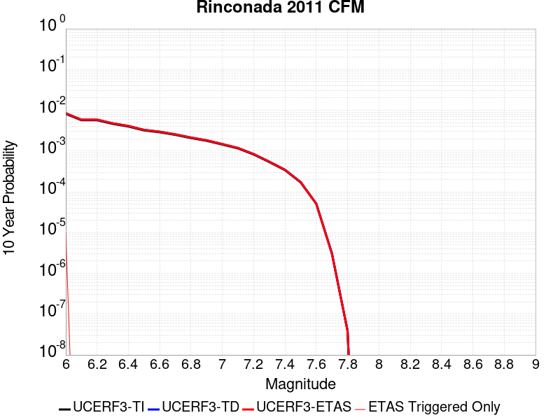 |

| Magnitude | 1 wk TI Prob | 1 wk TD Prob | 1 wk ETAS Prob | 1 wk ETAS/TD Gain | 1 wk ETAS Triggered Only | 1 mo TI Prob | 1 mo TD Prob | 1 mo ETAS Prob | 1 mo ETAS/TD Gain | 1 mo ETAS Triggered Only | 1 yr TI Prob | 1 yr TD Prob | 1 yr ETAS Prob | 1 yr ETAS/TD Gain | 1 yr ETAS Triggered Only | 10 yr TI Prob | 10 yr TD Prob | 10 yr ETAS Prob | 10 yr ETAS/TD Gain | 10 yr ETAS Triggered Only |
|-----|-----|-----|-----|-----|-----|-----|-----|-----|-----|-----|-----|-----|-----|-----|-----|-----|-----|-----|-----|-----|
| 6.0 | 1.5752368E-5 | 1.6274787E-5 | 1.6274787E-5 | 1.0 | 0.0 | 6.75084E-5 | 6.974724E-5 | 6.974724E-5 | 1.0 | 0.0 | 8.2160486E-4 | 8.48845E-4 | 8.48845E-4 | 1.0 | 0.0 | 0.008185739 | 0.008456407 | 0.008482848 | 1.0031267 | 2.6666667E-5 |
| 6.1 | 1.0966133E-5 | 1.1323078E-5 | 1.1323078E-5 | 1.0 | 0.0 | 4.6996865E-5 | 4.8526577E-5 | 4.8526577E-5 | 1.0 | 0.0 | 5.720366E-4 | 5.9065165E-4 | 5.9065165E-4 | 1.0 | 0.0 | 0.0057056635 | 0.0058909142 | 0.0058909142 | 1.0 | 0.0 |
| 6.2 | 1.0966133E-5 | 1.1323078E-5 | 1.1323078E-5 | 1.0 | 0.0 | 4.6996865E-5 | 4.8526577E-5 | 4.8526577E-5 | 1.0 | 0.0 | 5.720366E-4 | 5.9065165E-4 | 5.9065165E-4 | 1.0 | 0.0 | 0.0057056635 | 0.0058909142 | 0.0058909142 | 1.0 | 0.0 |
| 6.3 | 8.926149E-6 | 9.212811E-6 | 9.212811E-6 | 1.0 | 0.0 | 3.8254362E-5 | 3.9482882E-5 | 3.9482882E-5 | 1.0 | 0.0 | 4.6564735E-4 | 4.8059836E-4 | 4.8059836E-4 | 1.0 | 0.0 | 0.0046467283 | 0.004795635 | 0.004795635 | 1.0 | 0.0 |
| 6.4 | 7.676955E-6 | 7.920225E-6 | 7.920225E-6 | 1.0 | 0.0 | 3.290082E-5 | 3.394338E-5 | 3.394338E-5 | 1.0 | 0.0 | 4.0049385E-4 | 4.1318245E-4 | 4.1318245E-4 | 1.0 | 0.0 | 0.0039977287 | 0.004124169 | 0.004124169 | 1.0 | 0.0 |
| 6.5 | 6.1671026E-6 | 6.3589814E-6 | 6.3589814E-6 | 1.0 | 0.0 | 2.6430173E-5 | 2.7252492E-5 | 2.7252492E-5 | 1.0 | 0.0 | 3.2173982E-4 | 3.3174866E-4 | 3.3174866E-4 | 1.0 | 0.0 | 0.003212744 | 0.0033125463 | 0.0033125463 | 1.0 | 0.0 |
| 6.6 | 5.553456E-6 | 5.7248362E-6 | 5.7248362E-6 | 1.0 | 0.0 | 2.3800309E-5 | 2.4534782E-5 | 2.4534782E-5 | 1.0 | 0.0 | 2.897302E-4 | 2.986701E-4 | 2.986701E-4 | 1.0 | 0.0 | 0.0028935277 | 0.0029826954 | 0.0029826954 | 1.0 | 0.0 |
| 6.7 | 4.787857E-6 | 4.93333E-6 | 4.93333E-6 | 1.0 | 0.0 | 2.0519226E-5 | 2.114267E-5 | 2.114267E-5 | 1.0 | 0.0 | 2.4979294E-4 | 2.5738165E-4 | 2.5738165E-4 | 1.0 | 0.0 | 0.0024951235 | 0.0025708412 | 0.0025708412 | 1.0 | 0.0 |
| 6.8 | 3.9955166E-6 | 4.1134927E-6 | 4.1134927E-6 | 1.0 | 0.0 | 1.7123532E-5 | 1.7629134E-5 | 1.7629134E-5 | 1.0 | 0.0 | 2.0845905E-4 | 2.146136E-4 | 2.146136E-4 | 1.0 | 0.0 | 0.002082636 | 0.002144067 | 0.002144067 | 1.0 | 0.0 |
| 6.9 | 3.4250072E-6 | 3.5224598E-6 | 3.5224598E-6 | 1.0 | 0.0 | 1.46785205E-5 | 1.509617E-5 | 1.509617E-5 | 1.0 | 0.0 | 1.7869633E-4 | 1.8378037E-4 | 1.8378037E-4 | 1.0 | 0.0 | 0.001785527 | 0.0018362864 | 0.0018362864 | 1.0 | 0.0 |
| 7.0 | 2.7712713E-6 | 2.8467105E-6 | 2.8467105E-6 | 1.0 | 0.0 | 1.1876823E-5 | 1.2200131E-5 | 1.2200131E-5 | 1.0 | 0.0 | 1.4459073E-4 | 1.4852648E-4 | 1.4852648E-4 | 1.0 | 0.0 | 0.0014449668 | 0.0014842737 | 0.0014842737 | 1.0 | 0.0 |
| 7.1 | 2.227358E-6 | 2.2857066E-6 | 2.2857066E-6 | 1.0 | 0.0 | 9.545785E-6 | 9.795849E-6 | 9.795849E-6 | 1.0 | 0.0 | 1.16213734E-4 | 1.19257944E-4 | 1.19257944E-4 | 1.0 | 0.0 | 0.0011615298 | 0.0011919405 | 0.0011919405 | 1.0 | 0.0 |
| 7.2 | 1.581796E-6 | 1.6209067E-6 | 1.6209067E-6 | 1.0 | 0.0 | 6.779108E-6 | 6.9467246E-6 | 6.9467246E-6 | 1.0 | 0.0 | 8.253252E-5 | 8.457309E-5 | 8.457309E-5 | 1.0 | 0.0 | 8.250187E-4 | 8.4540964E-4 | 8.4540964E-4 | 1.0 | 0.0 |
| 7.3 | 1.0306567E-6 | 1.0546512E-6 | 1.0546512E-6 | 1.0 | 0.0 | 4.4170924E-6 | 4.519926E-6 | 4.519926E-6 | 1.0 | 0.0 | 5.3776774E-5 | 5.5028708E-5 | 5.5028708E-5 | 1.0 | 0.0 | 5.376376E-4 | 5.5015105E-4 | 5.5015105E-4 | 1.0 | 0.0 |
| 7.4 | 6.535541E-7 | 6.682764E-7 | 6.682764E-7 | 1.0 | 0.0 | 2.800943E-6 | 2.8640386E-6 | 2.8640386E-6 | 1.0 | 0.0 | 3.4100947E-5 | 3.4869114E-5 | 3.4869114E-5 | 1.0 | 0.0 | 3.4095717E-4 | 3.4863656E-4 | 3.4863656E-4 | 1.0 | 0.0 |
| 7.5 | 3.2656962E-7 | 3.33168E-7 | 3.33168E-7 | 1.0 | 0.0 | 1.3995833E-6 | 1.427862E-6 | 1.427862E-6 | 1.0 | 0.0 | 1.7039794E-5 | 1.7384082E-5 | 1.7384082E-5 | 1.0 | 0.0 | 1.7038487E-4 | 1.7382725E-4 | 1.7382725E-4 | 1.0 | 0.0 |
| 7.6 | 9.754343E-8 | 9.821022E-8 | 9.821022E-8 | 1.0 | 0.0 | 4.180432E-7 | 4.2090088E-7 | 4.2090088E-7 | 1.0 | 0.0 | 5.089664E-6 | 5.1244565E-6 | 5.1244565E-6 | 1.0 | 0.0 | 5.0895473E-5 | 5.124339E-5 | 5.124339E-5 | 1.0 | 0.0 |
| 7.7 | 6.0001453E-9 | 5.8490692E-9 | 5.8490692E-9 | 1.0 | 0.0 | 2.5714908E-8 | 2.506744E-8 | 2.506744E-8 | 1.0 | 0.0 | 3.1307894E-7 | 3.0519604E-7 | 3.0519604E-7 | 1.0 | 0.0 | 3.1307852E-6 | 3.0519564E-6 | 3.0519564E-6 | 1.0 | 0.0 |
| 7.8 | 7.400003E-11 | 7.4654505E-11 | 7.4654505E-11 | 1.0 | 0.0 | 3.171432E-10 | 3.1994807E-10 | 3.1994807E-10 | 1.0 | 0.0 | 3.861218E-9 | 3.8953676E-9 | 3.8953676E-9 | 1.0 | 0.0 | 3.861218E-8 | 3.8953676E-8 | 3.8953676E-8 | 1.0 | 0.0 |

## Hector Mine
*[(top)](#table-of-contents)*

| 1 Week | 1 Month | 1 Year | 10 Year |
|-----|-----|-----|-----|
|  |  |  |  |

| Magnitude | 1 wk TI Prob | 1 wk TD Prob | 1 wk ETAS Prob | 1 wk ETAS/TD Gain | 1 wk ETAS Triggered Only | 1 mo TI Prob | 1 mo TD Prob | 1 mo ETAS Prob | 1 mo ETAS/TD Gain | 1 mo ETAS Triggered Only | 1 yr TI Prob | 1 yr TD Prob | 1 yr ETAS Prob | 1 yr ETAS/TD Gain | 1 yr ETAS Triggered Only | 10 yr TI Prob | 10 yr TD Prob | 10 yr ETAS Prob | 10 yr ETAS/TD Gain | 10 yr ETAS Triggered Only |
|-----|-----|-----|-----|-----|-----|-----|-----|-----|-----|-----|-----|-----|-----|-----|-----|-----|-----|-----|-----|-----|
| 6.0 | 1.8760093E-5 | 2.796445E-6 | 2.796445E-6 | 1.0 | 0.0 | 8.039792E-5 | 1.1984732E-5 | 1.1984732E-5 | 1.0 | 0.0 | 9.78405E-4 | 1.4590833E-4 | 1.725711E-4 | 1.1827365 | 2.6666667E-5 | 0.009741086 | 0.0014585176 | 0.0014851453 | 1.0182568 | 2.6666667E-5 |
| 6.1 | 1.8760093E-5 | 2.796445E-6 | 2.796445E-6 | 1.0 | 0.0 | 8.039792E-5 | 1.1984732E-5 | 1.1984732E-5 | 1.0 | 0.0 | 9.78405E-4 | 1.4590833E-4 | 1.725711E-4 | 1.1827365 | 2.6666667E-5 | 0.009741086 | 0.0014585176 | 0.0014851453 | 1.0182568 | 2.6666667E-5 |
| 6.2 | 1.8760093E-5 | 2.796445E-6 | 2.796445E-6 | 1.0 | 0.0 | 8.039792E-5 | 1.1984732E-5 | 1.1984732E-5 | 1.0 | 0.0 | 9.78405E-4 | 1.4590833E-4 | 1.725711E-4 | 1.1827365 | 2.6666667E-5 | 0.009741086 | 0.0014585176 | 0.0014851453 | 1.0182568 | 2.6666667E-5 |
| 6.3 | 1.8760093E-5 | 2.796445E-6 | 2.796445E-6 | 1.0 | 0.0 | 8.039792E-5 | 1.1984732E-5 | 1.1984732E-5 | 1.0 | 0.0 | 9.78405E-4 | 1.4590833E-4 | 1.725711E-4 | 1.1827365 | 2.6666667E-5 | 0.009741086 | 0.0014585176 | 0.0014851453 | 1.0182568 | 2.6666667E-5 |
| 6.4 | 1.0888055E-5 | 2.796445E-6 | 2.796445E-6 | 1.0 | 0.0 | 4.666226E-5 | 1.1984732E-5 | 1.1984732E-5 | 1.0 | 0.0 | 5.679649E-4 | 1.4590833E-4 | 1.725711E-4 | 1.1827365 | 2.6666667E-5 | 0.0056651547 | 0.0014585176 | 0.0014851453 | 1.0182568 | 2.6666667E-5 |
| 6.5 | 1.0888055E-5 | 2.796445E-6 | 2.796445E-6 | 1.0 | 0.0 | 4.666226E-5 | 1.1984732E-5 | 1.1984732E-5 | 1.0 | 0.0 | 5.679649E-4 | 1.4590833E-4 | 1.725711E-4 | 1.1827365 | 2.6666667E-5 | 0.0056651547 | 0.0014585176 | 0.0014851453 | 1.0182568 | 2.6666667E-5 |
| 6.6 | 1.0730738E-5 | 2.796445E-6 | 2.796445E-6 | 1.0 | 0.0 | 4.5988065E-5 | 1.1984732E-5 | 1.1984732E-5 | 1.0 | 0.0 | 5.5976084E-4 | 1.4590833E-4 | 1.725711E-4 | 1.1827365 | 2.6666667E-5 | 0.0055835294 | 0.0014585176 | 0.0014851453 | 1.0182568 | 2.6666667E-5 |
| 6.7 | 7.881326E-6 | 2.7711246E-6 | 2.7711246E-6 | 1.0 | 0.0 | 3.3776672E-5 | 1.1876217E-5 | 1.1876217E-5 | 1.0 | 0.0 | 4.111534E-4 | 1.4458735E-4 | 1.7125015E-4 | 1.1844063 | 2.6666667E-5 | 0.0041039353 | 0.0014453249 | 0.001471953 | 1.0184237 | 2.6666667E-5 |
| 6.8 | 7.5683483E-6 | 2.7328742E-6 | 2.7328742E-6 | 1.0 | 0.0 | 3.2435375E-5 | 1.1712288E-5 | 1.1712288E-5 | 1.0 | 0.0 | 3.9482914E-4 | 1.4259177E-4 | 1.6925464E-4 | 1.1869874 | 2.6666667E-5 | 0.0039412836 | 0.0014253948 | 0.0014520235 | 1.0186816 | 2.6666667E-5 |
| 6.9 | 6.473048E-6 | 2.513948E-6 | 2.513948E-6 | 1.0 | 0.0 | 2.7741338E-5 | 1.0774041E-5 | 1.0774041E-5 | 1.0 | 0.0 | 3.3769844E-4 | 1.3117002E-4 | 1.5783319E-4 | 1.2032719 | 2.6666667E-5 | 0.0033718573 | 0.0013113155 | 0.0013379472 | 1.0203091 | 2.6666667E-5 |
| 7.0 | 4.9959954E-6 | 1.8565554E-6 | 1.8565554E-6 | 1.0 | 0.0 | 2.1411232E-5 | 7.956662E-6 | 7.956662E-6 | 1.0 | 0.0 | 2.6065056E-4 | 9.687162E-5 | 1.235357E-4 | 1.2752517 | 2.6666667E-5 | 0.0026034506 | 9.686435E-4 | 9.952843E-4 | 1.0275033 | 2.6666667E-5 |
| 7.1 | 1.2997541E-6 | 1.5602835E-7 | 1.5602835E-7 | 1.0 | 0.0 | 5.5703626E-6 | 6.686928E-7 | 6.686928E-7 | 1.0 | 0.0 | 6.7817055E-5 | 8.141308E-6 | 8.141308E-6 | 1.0 | 0.0 | 6.779636E-4 | 8.141049E-5 | 8.141049E-5 | 1.0 | 0.0 |
| 7.2 | 8.392699E-7 | 9.728028E-8 | 9.728028E-8 | 1.0 | 0.0 | 3.596866E-6 | 4.1691544E-7 | 4.1691544E-7 | 1.0 | 0.0 | 4.3790962E-5 | 5.0759354E-6 | 5.0759354E-6 | 1.0 | 0.0 | 4.3782333E-4 | 5.075839E-5 | 5.075839E-5 | 1.0 | 0.0 |
| 7.3 | 3.13015E-7 | 4.8294503E-8 | 4.8294503E-8 | 1.0 | 0.0 | 1.3414921E-6 | 2.0697642E-7 | 2.0697642E-7 | 1.0 | 0.0 | 1.6332544E-5 | 2.5199358E-6 | 2.5199358E-6 | 1.0 | 0.0 | 1.6331344E-4 | 2.5199157E-5 | 2.5199157E-5 | 1.0 | 0.0 |

## Red Mountain
*[(top)](#table-of-contents)*

| 1 Week | 1 Month | 1 Year | 10 Year |
|-----|-----|-----|-----|
|  |  |  | 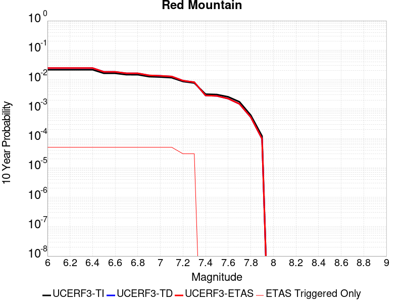 |

| Magnitude | 1 wk TI Prob | 1 wk TD Prob | 1 wk ETAS Prob | 1 wk ETAS/TD Gain | 1 wk ETAS Triggered Only | 1 mo TI Prob | 1 mo TD Prob | 1 mo ETAS Prob | 1 mo ETAS/TD Gain | 1 mo ETAS Triggered Only | 1 yr TI Prob | 1 yr TD Prob | 1 yr ETAS Prob | 1 yr ETAS/TD Gain | 1 yr ETAS Triggered Only | 10 yr TI Prob | 10 yr TD Prob | 10 yr ETAS Prob | 10 yr ETAS/TD Gain | 10 yr ETAS Triggered Only |
|-----|-----|-----|-----|-----|-----|-----|-----|-----|-----|-----|-----|-----|-----|-----|-----|-----|-----|-----|-----|-----|
| 6.0 | 4.1810763E-5 | 4.7591006E-5 | 4.7591006E-5 | 1.0 | 0.0 | 1.7917668E-4 | 2.0394645E-4 | 2.3060766E-4 | 1.1307266 | 2.6666667E-5 | 0.0021792934 | 0.0024803858 | 0.0025069863 | 1.0107243 | 2.6666667E-5 | 0.021580452 | 0.02454463 | 0.024570644 | 1.0010598 | 2.6666667E-5 |
| 6.1 | 4.1810763E-5 | 4.7591006E-5 | 4.7591006E-5 | 1.0 | 0.0 | 1.7917668E-4 | 2.0394645E-4 | 2.3060766E-4 | 1.1307266 | 2.6666667E-5 | 0.0021792934 | 0.0024803858 | 0.0025069863 | 1.0107243 | 2.6666667E-5 | 0.021580452 | 0.02454463 | 0.024570644 | 1.0010598 | 2.6666667E-5 |
| 6.2 | 4.1810763E-5 | 4.7591006E-5 | 4.7591006E-5 | 1.0 | 0.0 | 1.7917668E-4 | 2.0394645E-4 | 2.3060766E-4 | 1.1307266 | 2.6666667E-5 | 0.0021792934 | 0.0024803858 | 0.0025069863 | 1.0107243 | 2.6666667E-5 | 0.021580452 | 0.02454463 | 0.024570644 | 1.0010598 | 2.6666667E-5 |
| 6.3 | 4.1810763E-5 | 4.7591006E-5 | 4.7591006E-5 | 1.0 | 0.0 | 1.7917668E-4 | 2.0394645E-4 | 2.3060766E-4 | 1.1307266 | 2.6666667E-5 | 0.0021792934 | 0.0024803858 | 0.0025069863 | 1.0107243 | 2.6666667E-5 | 0.021580452 | 0.02454463 | 0.024570644 | 1.0010598 | 2.6666667E-5 |
| 6.4 | 4.1810763E-5 | 4.7591006E-5 | 4.7591006E-5 | 1.0 | 0.0 | 1.7917668E-4 | 2.0394645E-4 | 2.3060766E-4 | 1.1307266 | 2.6666667E-5 | 0.0021792934 | 0.0024803858 | 0.0025069863 | 1.0107243 | 2.6666667E-5 | 0.021580452 | 0.02454463 | 0.024570644 | 1.0010598 | 2.6666667E-5 |
| 6.5 | 3.154503E-5 | 3.5360477E-5 | 3.5360477E-5 | 1.0 | 0.0 | 1.3518598E-4 | 1.5153662E-4 | 1.7819925E-4 | 1.1759484 | 2.6666667E-5 | 0.0016446467 | 0.0018434891 | 0.0018701066 | 1.0144386 | 2.6666667E-5 | 0.01632528 | 0.018291617 | 0.018317796 | 1.0014312 | 2.6666667E-5 |
| 6.6 | 3.1535834E-5 | 3.5349858E-5 | 3.5349858E-5 | 1.0 | 0.0 | 1.3514658E-4 | 1.5149111E-4 | 1.7815374E-4 | 1.1760013 | 2.6666667E-5 | 0.0016441676 | 0.001842936 | 0.0018695536 | 1.014443 | 2.6666667E-5 | 0.01632056 | 0.018286178 | 0.018312357 | 1.0014316 | 2.6666667E-5 |
| 6.7 | 2.8267326E-5 | 3.146999E-5 | 3.146999E-5 | 1.0 | 0.0 | 1.2114006E-4 | 1.348649E-4 | 1.6152796E-4 | 1.197702 | 2.6666667E-5 | 0.0014738824 | 0.0016408286 | 0.0016674515 | 1.0162253 | 2.6666667E-5 | 0.014641452 | 0.016295899 | 0.01632213 | 1.0016097 | 2.6666667E-5 |
| 6.8 | 2.8212884E-5 | 3.1407875E-5 | 3.1407875E-5 | 1.0 | 0.0 | 1.20906756E-4 | 1.3459871E-4 | 1.6126179E-4 | 1.198093 | 2.6666667E-5 | 0.0014710457 | 0.0016375926 | 0.0016642156 | 1.0162574 | 2.6666667E-5 | 0.014613459 | 0.016264014 | 0.016290247 | 1.0016129 | 2.6666667E-5 |
| 6.9 | 2.4227871E-5 | 2.6707517E-5 | 2.6707517E-5 | 1.0 | 0.0 | 1.03829596E-4 | 1.1445619E-4 | 1.411198E-4 | 1.2329592 | 2.6666667E-5 | 0.0012633923 | 0.0013926893 | 0.0014193188 | 1.0191209 | 2.6666667E-5 | 0.012562336 | 0.013847304 | 0.0138736 | 1.0018991 | 2.6666667E-5 |
| 7.0 | 2.348524E-5 | 2.5836282E-5 | 2.5836282E-5 | 1.0 | 0.0 | 1.0064714E-4 | 1.1072265E-4 | 1.3738636E-4 | 1.2408154 | 2.6666667E-5 | 0.0012246901 | 0.0013472902 | 0.0013739209 | 1.0197661 | 2.6666667E-5 | 0.012179627 | 0.013398857 | 0.013425167 | 1.0019635 | 2.6666667E-5 |
| 7.1 | 2.2311642E-5 | 2.4463316E-5 | 2.4463316E-5 | 1.0 | 0.0 | 9.561782E-5 | 1.04839E-4 | 1.3150286E-4 | 1.2543316 | 2.6666667E-5 | 0.0011635252 | 0.0012757422 | 0.0013023749 | 1.0208762 | 2.6666667E-5 | 0.01157452 | 0.012691703 | 0.012718031 | 1.0020745 | 2.6666667E-5 |
| 7.2 | 1.6533986E-5 | 1.7670676E-5 | 1.7670676E-5 | 1.0 | 0.0 | 7.085802E-5 | 7.572963E-5 | 1.02394275E-4 | 1.3521032 | 2.6666667E-5 | 8.623549E-4 | 9.2168164E-4 | 9.4832375E-4 | 1.028906 | 2.6666667E-5 | 0.008590161 | 0.009184869 | 0.009211291 | 1.0028766 | 2.6666667E-5 |
| 7.3 | 1.4703092E-5 | 1.5559806E-5 | 1.5559806E-5 | 1.0 | 0.0 | 6.301173E-5 | 6.6683526E-5 | 9.334842E-5 | 1.3998722 | 2.6666667E-5 | 7.668978E-4 | 8.1163115E-4 | 8.382762E-4 | 1.0328289 | 2.6666667E-5 | 0.0076425658 | 0.008092744 | 0.008119195 | 1.0032685 | 2.6666667E-5 |
| 7.4 | 6.1331984E-6 | 5.52893E-6 | 5.52893E-6 | 1.0 | 0.0 | 2.6284872E-5 | 2.3695204E-5 | 2.3695204E-5 | 1.0 | 0.0 | 3.199713E-4 | 2.8845144E-4 | 2.8845144E-4 | 1.0 | 0.0 | 0.0031951098 | 0.0028808247 | 0.0028808247 | 1.0 | 0.0 |
| 7.5 | 5.954766E-6 | 5.338558E-6 | 5.338558E-6 | 1.0 | 0.0 | 2.5520176E-5 | 2.2879336E-5 | 2.2879336E-5 | 1.0 | 0.0 | 3.1066386E-4 | 2.7852083E-4 | 2.7852083E-4 | 1.0 | 0.0 | 0.003102299 | 0.0027817716 | 0.0027817716 | 1.0 | 0.0 |
| 7.6 | 4.9726646E-6 | 4.315341E-6 | 4.315341E-6 | 1.0 | 0.0 | 2.1311245E-5 | 1.8494187E-5 | 1.8494187E-5 | 1.0 | 0.0 | 2.5943352E-4 | 2.2514381E-4 | 2.2514381E-4 | 1.0 | 0.0 | 0.0025913084 | 0.0022491917 | 0.0022491917 | 1.0 | 0.0 |
| 7.7 | 3.3613894E-6 | 2.8526943E-6 | 2.8526943E-6 | 1.0 | 0.0 | 1.4405875E-5 | 1.2225777E-5 | 1.2225777E-5 | 1.0 | 0.0 | 1.7537741E-4 | 1.4883894E-4 | 1.4883894E-4 | 1.0 | 0.0 | 0.0017523908 | 0.0014874188 | 0.0014874188 | 1.0 | 0.0 |
| 7.8 | 1.1828961E-6 | 1.0122844E-6 | 1.0122844E-6 | 1.0 | 0.0 | 5.069545E-6 | 4.338355E-6 | 4.338355E-6 | 1.0 | 0.0 | 6.171996E-5 | 5.281822E-5 | 5.281822E-5 | 1.0 | 0.0 | 6.170282E-4 | 5.280596E-4 | 5.280596E-4 | 1.0 | 0.0 |
| 7.9 | 2.2967266E-7 | 1.8619119E-7 | 1.8619119E-7 | 1.0 | 0.0 | 9.843111E-7 | 7.9796195E-7 | 7.9796195E-7 | 1.0 | 0.0 | 1.19839215E-5 | 9.715147E-6 | 9.715147E-6 | 1.0 | 0.0 | 1.1983275E-4 | 9.714751E-5 | 9.714751E-5 | 1.0 | 0.0 |

## La Panza 2011
*[(top)](#table-of-contents)*

| 1 Week | 1 Month | 1 Year | 10 Year |
|-----|-----|-----|-----|
|  |  |  |  |

| Magnitude | 1 wk TI Prob | 1 wk TD Prob | 1 wk ETAS Prob | 1 wk ETAS/TD Gain | 1 wk ETAS Triggered Only | 1 mo TI Prob | 1 mo TD Prob | 1 mo ETAS Prob | 1 mo ETAS/TD Gain | 1 mo ETAS Triggered Only | 1 yr TI Prob | 1 yr TD Prob | 1 yr ETAS Prob | 1 yr ETAS/TD Gain | 1 yr ETAS Triggered Only | 10 yr TI Prob | 10 yr TD Prob | 10 yr ETAS Prob | 10 yr ETAS/TD Gain | 10 yr ETAS Triggered Only |
|-----|-----|-----|-----|-----|-----|-----|-----|-----|-----|-----|-----|-----|-----|-----|-----|-----|-----|-----|-----|-----|
| 6.0 | 4.6754544E-6 | 4.717608E-6 | 4.717608E-6 | 1.0 | 0.0 | 2.0037509E-5 | 2.0218175E-5 | 2.0218175E-5 | 1.0 | 0.0 | 2.4392935E-4 | 2.4613045E-4 | 2.4613045E-4 | 1.0 | 0.0 | 0.0024366176 | 0.0024587729 | 0.002485374 | 1.0108188 | 2.6666667E-5 |
| 6.1 | 4.6754544E-6 | 4.717608E-6 | 4.717608E-6 | 1.0 | 0.0 | 2.0037509E-5 | 2.0218175E-5 | 2.0218175E-5 | 1.0 | 0.0 | 2.4392935E-4 | 2.4613045E-4 | 2.4613045E-4 | 1.0 | 0.0 | 0.0024366176 | 0.0024587729 | 0.002485374 | 1.0108188 | 2.6666667E-5 |
| 6.2 | 4.6754544E-6 | 4.717608E-6 | 4.717608E-6 | 1.0 | 0.0 | 2.0037509E-5 | 2.0218175E-5 | 2.0218175E-5 | 1.0 | 0.0 | 2.4392935E-4 | 2.4613045E-4 | 2.4613045E-4 | 1.0 | 0.0 | 0.0024366176 | 0.0024587729 | 0.002485374 | 1.0108188 | 2.6666667E-5 |
| 6.3 | 4.6754544E-6 | 4.717608E-6 | 4.717608E-6 | 1.0 | 0.0 | 2.0037509E-5 | 2.0218175E-5 | 2.0218175E-5 | 1.0 | 0.0 | 2.4392935E-4 | 2.4613045E-4 | 2.4613045E-4 | 1.0 | 0.0 | 0.0024366176 | 0.0024587729 | 0.002485374 | 1.0108188 | 2.6666667E-5 |
| 6.4 | 4.6754544E-6 | 4.717608E-6 | 4.717608E-6 | 1.0 | 0.0 | 2.0037509E-5 | 2.0218175E-5 | 2.0218175E-5 | 1.0 | 0.0 | 2.4392935E-4 | 2.4613045E-4 | 2.4613045E-4 | 1.0 | 0.0 | 0.0024366176 | 0.0024587729 | 0.002485374 | 1.0108188 | 2.6666667E-5 |
| 6.5 | 2.485343E-6 | 2.5006163E-6 | 2.5006163E-6 | 1.0 | 0.0 | 1.0651426E-5 | 1.0716885E-5 | 1.0716885E-5 | 1.0 | 0.0 | 1.296734E-4 | 1.3047065E-4 | 1.3047065E-4 | 1.0 | 0.0 | 0.0012959775 | 0.001303979 | 0.001303979 | 1.0 | 0.0 |
| 6.6 | 2.485343E-6 | 2.5006163E-6 | 2.5006163E-6 | 1.0 | 0.0 | 1.0651426E-5 | 1.0716885E-5 | 1.0716885E-5 | 1.0 | 0.0 | 1.296734E-4 | 1.3047065E-4 | 1.3047065E-4 | 1.0 | 0.0 | 0.0012959775 | 0.001303979 | 0.001303979 | 1.0 | 0.0 |
| 6.7 | 1.5108508E-6 | 1.5146534E-6 | 1.5146534E-6 | 1.0 | 0.0 | 6.4750584E-6 | 6.491356E-6 | 6.491356E-6 | 1.0 | 0.0 | 7.8830984E-5 | 7.90295E-5 | 7.90295E-5 | 1.0 | 0.0 | 7.880303E-4 | 7.900248E-4 | 7.900248E-4 | 1.0 | 0.0 |
| 6.8 | 1.3865837E-6 | 1.3885259E-6 | 1.3885259E-6 | 1.0 | 0.0 | 5.942488E-6 | 5.950812E-6 | 5.950812E-6 | 1.0 | 0.0 | 7.234739E-5 | 7.244883E-5 | 7.244883E-5 | 1.0 | 0.0 | 7.232384E-4 | 7.242619E-4 | 7.242619E-4 | 1.0 | 0.0 |
| 6.9 | 9.826583E-7 | 9.796437E-7 | 9.796437E-7 | 1.0 | 0.0 | 4.2113857E-6 | 4.1984663E-6 | 4.1984663E-6 | 1.0 | 0.0 | 5.1272415E-5 | 5.1115185E-5 | 5.1115185E-5 | 1.0 | 0.0 | 5.126059E-4 | 5.1103963E-4 | 5.1103963E-4 | 1.0 | 0.0 |
| 7.0 | 6.7797646E-7 | 6.71036E-7 | 6.71036E-7 | 1.0 | 0.0 | 2.9056102E-6 | 2.8758654E-6 | 2.8758654E-6 | 1.0 | 0.0 | 3.537523E-5 | 3.501313E-5 | 3.501313E-5 | 1.0 | 0.0 | 3.5369597E-4 | 3.5007924E-4 | 3.5007924E-4 | 1.0 | 0.0 |
| 7.1 | 3.4979826E-7 | 3.3875276E-7 | 3.3875276E-7 | 1.0 | 0.0 | 1.4991346E-6 | 1.4517968E-6 | 1.4517968E-6 | 1.0 | 0.0 | 1.825181E-5 | 1.7675495E-5 | 1.7675495E-5 | 1.0 | 0.0 | 1.825031E-4 | 1.7674206E-4 | 1.7674206E-4 | 1.0 | 0.0 |
| 7.2 | 2.5088332E-7 | 2.3833275E-7 | 2.3833275E-7 | 1.0 | 0.0 | 1.0752137E-6 | 1.0214256E-6 | 1.0214256E-6 | 1.0 | 0.0 | 1.3090649E-5 | 1.2435796E-5 | 1.2435796E-5 | 1.0 | 0.0 | 1.3089878E-4 | 1.2435185E-4 | 1.2435185E-4 | 1.0 | 0.0 |
| 7.3 | 1.0159086E-7 | 8.645961E-8 | 8.645961E-8 | 1.0 | 0.0 | 4.3538932E-7 | 3.7054113E-7 | 3.7054113E-7 | 1.0 | 0.0 | 5.300852E-6 | 4.5113293E-6 | 4.5113293E-6 | 1.0 | 0.0 | 5.3007258E-5 | 4.5112418E-5 | 4.5112418E-5 | 1.0 | 0.0 |
| 7.4 | 3.5006252E-8 | 1.940863E-8 | 1.940863E-8 | 1.0 | 0.0 | 1.5002678E-7 | 8.3179835E-8 | 8.3179835E-8 | 1.0 | 0.0 | 1.8265745E-6 | 1.012714E-6 | 1.012714E-6 | 1.0 | 0.0 | 1.8265595E-5 | 1.0127096E-5 | 1.0127096E-5 | 1.0 | 0.0 |
| 7.5 | 2.592274E-8 | 1.0242307E-8 | 1.0242307E-8 | 1.0 | 0.0 | 1.1109746E-7 | 4.3895596E-8 | 4.3895596E-8 | 1.0 | 0.0 | 1.3526106E-6 | 5.3442875E-7 | 5.3442875E-7 | 1.0 | 0.0 | 1.3526024E-5 | 5.3442755E-6 | 5.3442755E-6 | 1.0 | 0.0 |
| 7.6 | 1.9016717E-8 | 5.2468647E-9 | 5.2468647E-9 | 1.0 | 0.0 | 8.150022E-8 | 2.2486562E-8 | 2.2486562E-8 | 1.0 | 0.0 | 9.922647E-7 | 2.7377385E-7 | 2.7377385E-7 | 1.0 | 0.0 | 9.922603E-6 | 2.7377353E-6 | 2.7377353E-6 | 1.0 | 0.0 |
| 7.7 | 1.17738495E-8 | 1.2407027E-9 | 1.2407027E-9 | 1.0 | 0.0 | 5.0459356E-8 | 5.317297E-9 | 5.317297E-9 | 1.0 | 0.0 | 6.1434247E-7 | 6.473808E-8 | 6.473808E-8 | 1.0 | 0.0 | 6.143408E-6 | 6.4738066E-7 | 6.4738066E-7 | 1.0 | 0.0 |
| 7.8 | 5.489079E-9 | 2.0135205E-10 | 2.0135205E-10 | 1.0 | 0.0 | 2.3524624E-8 | 8.6293683E-10 | 8.6293683E-10 | 1.0 | 0.0 | 2.8641225E-7 | 1.0506253E-8 | 1.0506253E-8 | 1.0 | 0.0 | 2.8641189E-6 | 1.0506252E-7 | 1.0506252E-7 | 1.0 | 0.0 |
| 7.9 | 2.5081048E-9 | 6.6927686E-11 | 6.6927686E-11 | 1.0 | 0.0 | 1.0749021E-8 | 2.868329E-10 | 2.868329E-10 | 1.0 | 0.0 | 1.3086932E-7 | 3.492187E-9 | 3.492187E-9 | 1.0 | 0.0 | 1.3086925E-6 | 3.4921865E-8 | 3.4921865E-8 | 1.0 | 0.0 |

## Likely 2011 CFM
*[(top)](#table-of-contents)*

| 1 Week | 1 Month | 1 Year | 10 Year |
|-----|-----|-----|-----|
|  |  |  |  |

| Magnitude | 1 wk TI Prob | 1 wk TD Prob | 1 wk ETAS Prob | 1 wk ETAS/TD Gain | 1 wk ETAS Triggered Only | 1 mo TI Prob | 1 mo TD Prob | 1 mo ETAS Prob | 1 mo ETAS/TD Gain | 1 mo ETAS Triggered Only | 1 yr TI Prob | 1 yr TD Prob | 1 yr ETAS Prob | 1 yr ETAS/TD Gain | 1 yr ETAS Triggered Only | 10 yr TI Prob | 10 yr TD Prob | 10 yr ETAS Prob | 10 yr ETAS/TD Gain | 10 yr ETAS Triggered Only |
|-----|-----|-----|-----|-----|-----|-----|-----|-----|-----|-----|-----|-----|-----|-----|-----|-----|-----|-----|-----|-----|
| 6.0 | 2.5315949E-5 | 2.7105003E-5 | 2.7105003E-5 | 1.0 | 0.0 | 1.0849241E-4 | 1.16159375E-4 | 1.16159375E-4 | 1.0 | 0.0 | 0.0013200947 | 0.0014133675 | 0.0014133675 | 1.0 | 0.0 | 0.013122803 | 0.014048441 | 0.0140747335 | 1.0018716 | 2.6666667E-5 |
| 6.1 | 2.5315949E-5 | 2.7105003E-5 | 2.7105003E-5 | 1.0 | 0.0 | 1.0849241E-4 | 1.16159375E-4 | 1.16159375E-4 | 1.0 | 0.0 | 0.0013200947 | 0.0014133675 | 0.0014133675 | 1.0 | 0.0 | 0.013122803 | 0.014048441 | 0.014048441 | 1.0 | 0.0 |
| 6.2 | 1.6375941E-5 | 1.7465996E-5 | 1.7465996E-5 | 1.0 | 0.0 | 7.0180715E-5 | 7.485219E-5 | 7.485219E-5 | 1.0 | 0.0 | 8.5411523E-4 | 9.109567E-4 | 9.109567E-4 | 1.0 | 0.0 | 0.008508399 | 0.009073513 | 0.009073513 | 1.0 | 0.0 |
| 6.3 | 1.1945543E-5 | 1.2712695E-5 | 1.2712695E-5 | 1.0 | 0.0 | 5.119418E-5 | 5.4481872E-5 | 5.4481872E-5 | 1.0 | 0.0 | 6.2311086E-4 | 6.6312024E-4 | 6.6312024E-4 | 1.0 | 0.0 | 0.0062136655 | 0.0066119707 | 0.0066119707 | 1.0 | 0.0 |
| 6.4 | 9.192729E-6 | 9.768569E-6 | 9.768569E-6 | 1.0 | 0.0 | 3.939681E-5 | 4.1864638E-5 | 4.1864638E-5 | 1.0 | 0.0 | 4.7955062E-4 | 5.095855E-4 | 5.095855E-4 | 1.0 | 0.0 | 0.004785171 | 0.0050844513 | 0.0050844513 | 1.0 | 0.0 |
| 6.5 | 7.67906E-6 | 8.152689E-6 | 8.152689E-6 | 1.0 | 0.0 | 3.2909844E-5 | 3.493964E-5 | 3.493964E-5 | 1.0 | 0.0 | 4.006037E-4 | 4.2530894E-4 | 4.2530894E-4 | 1.0 | 0.0 | 0.0039988225 | 0.004245143 | 0.004245143 | 1.0 | 0.0 |
| 6.6 | 6.4884057E-6 | 6.884806E-6 | 6.884806E-6 | 1.0 | 0.0 | 2.7807157E-5 | 2.9505987E-5 | 2.9505987E-5 | 1.0 | 0.0 | 3.3849955E-4 | 3.5917762E-4 | 3.5917762E-4 | 1.0 | 0.0 | 0.003379844 | 0.0035861158 | 0.0035861158 | 1.0 | 0.0 |
| 6.7 | 4.6060636E-6 | 4.88408E-6 | 4.88408E-6 | 1.0 | 0.0 | 1.9740122E-5 | 2.093161E-5 | 2.093161E-5 | 1.0 | 0.0 | 2.403095E-4 | 2.5481338E-4 | 2.5481338E-4 | 1.0 | 0.0 | 0.002400498 | 0.002545295 | 0.002545295 | 1.0 | 0.0 |
| 6.8 | 3.2795615E-6 | 3.477401E-6 | 3.477401E-6 | 1.0 | 0.0 | 1.4055187E-5 | 1.4903065E-5 | 1.4903065E-5 | 1.0 | 0.0 | 1.7110848E-4 | 1.8143027E-4 | 1.8143027E-4 | 1.0 | 0.0 | 0.0017097679 | 0.0018128767 | 0.0018128767 | 1.0 | 0.0 |
| 6.9 | 2.3289967E-6 | 2.4705769E-6 | 2.4705769E-6 | 1.0 | 0.0 | 9.981376E-6 | 1.0588145E-5 | 1.0588145E-5 | 1.0 | 0.0 | 1.2151648E-4 | 1.2890348E-4 | 1.2890348E-4 | 1.0 | 0.0 | 0.0012145005 | 0.0012883301 | 0.0012883301 | 1.0 | 0.0 |
| 7.0 | 1.211292E-6 | 1.2864064E-6 | 1.2864064E-6 | 1.0 | 0.0 | 5.1912407E-6 | 5.51316E-6 | 5.51316E-6 | 1.0 | 0.0 | 6.320152E-5 | 6.7120964E-5 | 6.7120964E-5 | 1.0 | 0.0 | 6.3183554E-4 | 6.710367E-4 | 6.710367E-4 | 1.0 | 0.0 |

## Coronado Bank alt1
*[(top)](#table-of-contents)*

| 1 Week | 1 Month | 1 Year | 10 Year |
|-----|-----|-----|-----|
|  |  |  |  |

| Magnitude | 1 wk TI Prob | 1 wk TD Prob | 1 wk ETAS Prob | 1 wk ETAS/TD Gain | 1 wk ETAS Triggered Only | 1 mo TI Prob | 1 mo TD Prob | 1 mo ETAS Prob | 1 mo ETAS/TD Gain | 1 mo ETAS Triggered Only | 1 yr TI Prob | 1 yr TD Prob | 1 yr ETAS Prob | 1 yr ETAS/TD Gain | 1 yr ETAS Triggered Only | 10 yr TI Prob | 10 yr TD Prob | 10 yr ETAS Prob | 10 yr ETAS/TD Gain | 10 yr ETAS Triggered Only |
|-----|-----|-----|-----|-----|-----|-----|-----|-----|-----|-----|-----|-----|-----|-----|-----|-----|-----|-----|-----|-----|
| 6.0 | 7.533492E-5 | 9.3952294E-5 | 9.3952294E-5 | 1.0 | 0.0 | 3.22824E-4 | 4.0259483E-4 | 4.0259483E-4 | 1.0 | 0.0 | 0.0039233007 | 0.004891124 | 0.004891124 | 1.0 | 0.0 | 0.03854755 | 0.047905073 | 0.047930464 | 1.00053 | 2.6666667E-5 |
| 6.1 | 4.1807285E-5 | 5.049425E-5 | 5.049425E-5 | 1.0 | 0.0 | 1.7916178E-4 | 2.1638657E-4 | 2.1638657E-4 | 1.0 | 0.0 | 0.0021791123 | 0.002631421 | 0.002631421 | 1.0 | 0.0 | 0.021578677 | 0.026011758 | 0.02603773 | 1.0009985 | 2.6666667E-5 |
| 6.2 | 4.1807285E-5 | 5.049425E-5 | 5.049425E-5 | 1.0 | 0.0 | 1.7916178E-4 | 2.1638657E-4 | 2.1638657E-4 | 1.0 | 0.0 | 0.0021791123 | 0.002631421 | 0.002631421 | 1.0 | 0.0 | 0.021578677 | 0.026011758 | 0.02603773 | 1.0009985 | 2.6666667E-5 |
| 6.3 | 3.1793104E-5 | 3.771206E-5 | 3.771206E-5 | 1.0 | 0.0 | 1.3624904E-4 | 1.6161331E-4 | 1.6161331E-4 | 1.0 | 0.0 | 0.0016575698 | 0.001965897 | 0.001965897 | 1.0 | 0.0 | 0.016452603 | 0.019488946 | 0.019488946 | 1.0 | 0.0 |
| 6.4 | 2.9878007E-5 | 3.5336663E-5 | 3.5336663E-5 | 1.0 | 0.0 | 1.2804232E-4 | 1.5143424E-4 | 1.5143424E-4 | 1.0 | 0.0 | 0.0015578003 | 0.0018421836 | 0.0018421836 | 1.0 | 0.0 | 0.015469253 | 0.018272884 | 0.018272884 | 1.0 | 0.0 |
| 6.5 | 2.4512565E-5 | 2.8764713E-5 | 2.8764713E-5 | 1.0 | 0.0 | 1.0504962E-4 | 1.2327167E-4 | 1.2327167E-4 | 1.0 | 0.0 | 0.0012782287 | 0.001499827 | 0.001499827 | 1.0 | 0.0 | 0.012709012 | 0.014900027 | 0.014900027 | 1.0 | 0.0 |
| 6.6 | 2.1317413E-5 | 2.4907233E-5 | 2.4907233E-5 | 1.0 | 0.0 | 9.135714E-5 | 1.0674105E-4 | 1.0674105E-4 | 1.0 | 0.0 | 0.0011117056 | 0.0012988199 | 0.0012988199 | 1.0 | 0.0 | 0.011061605 | 0.012914695 | 0.012914695 | 1.0 | 0.0 |
| 6.7 | 1.8585655E-5 | 2.1635356E-5 | 2.1635356E-5 | 1.0 | 0.0 | 7.9650374E-5 | 9.2719776E-5 | 9.2719776E-5 | 1.0 | 0.0 | 9.6931186E-4 | 0.0011282992 | 0.0011282992 | 1.0 | 0.0 | 0.0096509475 | 0.0112278685 | 0.0112278685 | 1.0 | 0.0 |
| 6.8 | 1.5862879E-5 | 1.8419874E-5 | 1.8419874E-5 | 1.0 | 0.0 | 6.798199E-5 | 7.894004E-5 | 7.894004E-5 | 1.0 | 0.0 | 8.273665E-4 | 9.606905E-4 | 9.606905E-4 | 1.0 | 0.0 | 0.008242928 | 0.009567357 | 0.009567357 | 1.0 | 0.0 |
| 6.9 | 1.3021509E-5 | 1.5095589E-5 | 1.5095589E-5 | 1.0 | 0.0 | 5.5805274E-5 | 6.469388E-5 | 6.469388E-5 | 1.0 | 0.0 | 6.792174E-4 | 7.8738143E-4 | 7.8738143E-4 | 1.0 | 0.0 | 0.006771452 | 0.00784774 | 0.00784774 | 1.0 | 0.0 |
| 7.0 | 1.0974371E-5 | 1.27203775E-5 | 1.27203775E-5 | 1.0 | 0.0 | 4.7032172E-5 | 5.4514865E-5 | 5.4514865E-5 | 1.0 | 0.0 | 5.7246623E-4 | 6.635339E-4 | 6.635339E-4 | 1.0 | 0.0 | 0.0057099373 | 0.006617277 | 0.006617277 | 1.0 | 0.0 |
| 7.1 | 8.766221E-6 | 1.0164053E-5 | 1.0164053E-5 | 1.0 | 0.0 | 3.7568978E-5 | 4.3559594E-5 | 4.3559594E-5 | 1.0 | 0.0 | 4.573063E-4 | 5.302262E-4 | 5.302262E-4 | 1.0 | 0.0 | 0.0045636636 | 0.005291311 | 0.005291311 | 1.0 | 0.0 |
| 7.2 | 8.026024E-7 | 8.331837E-7 | 8.331837E-7 | 1.0 | 0.0 | 3.43972E-6 | 3.5707824E-6 | 3.5707824E-6 | 1.0 | 0.0 | 4.1877785E-5 | 4.347342E-5 | 4.347342E-5 | 1.0 | 0.0 | 4.1869894E-4 | 4.3465025E-4 | 4.3465025E-4 | 1.0 | 0.0 |
| 7.3 | 3.7293114E-7 | 3.7001186E-7 | 3.7001186E-7 | 1.0 | 0.0 | 1.5982754E-6 | 1.5857643E-6 | 1.5857643E-6 | 1.0 | 0.0 | 1.9458828E-5 | 1.930651E-5 | 1.930651E-5 | 1.0 | 0.0 | 1.9457124E-4 | 1.9304838E-4 | 1.9304838E-4 | 1.0 | 0.0 |
| 7.4 | 2.0557036E-7 | 1.9674462E-7 | 1.9674462E-7 | 1.0 | 0.0 | 8.810155E-7 | 8.43191E-7 | 8.43191E-7 | 1.0 | 0.0 | 1.0726311E-5 | 1.0265802E-5 | 1.0265802E-5 | 1.0 | 0.0 | 1.0725793E-4 | 1.02653314E-4 | 1.02653314E-4 | 1.0 | 0.0 |
| 7.5 | 6.845446E-8 | 6.279388E-8 | 6.279388E-8 | 1.0 | 0.0 | 2.9337625E-7 | 2.6911658E-7 | 2.6911658E-7 | 1.0 | 0.0 | 3.5718497E-6 | 3.2764897E-6 | 3.2764897E-6 | 1.0 | 0.0 | 3.5717923E-5 | 3.2764423E-5 | 3.2764423E-5 | 1.0 | 0.0 |
| 7.6 | 6.0975145E-9 | 5.531861E-9 | 5.531861E-9 | 1.0 | 0.0 | 2.6132206E-8 | 2.3707976E-8 | 2.3707976E-8 | 1.0 | 0.0 | 3.1815955E-7 | 2.8864457E-7 | 2.8864457E-7 | 1.0 | 0.0 | 3.181591E-6 | 2.886443E-6 | 2.886443E-6 | 1.0 | 0.0 |

## Contra Costa Shear Zone (connector) 2011 CFM
*[(top)](#table-of-contents)*

| 1 Week | 1 Month | 1 Year | 10 Year |
|-----|-----|-----|-----|
|  |  |  |  |

| Magnitude | 1 wk TI Prob | 1 wk TD Prob | 1 wk ETAS Prob | 1 wk ETAS/TD Gain | 1 wk ETAS Triggered Only | 1 mo TI Prob | 1 mo TD Prob | 1 mo ETAS Prob | 1 mo ETAS/TD Gain | 1 mo ETAS Triggered Only | 1 yr TI Prob | 1 yr TD Prob | 1 yr ETAS Prob | 1 yr ETAS/TD Gain | 1 yr ETAS Triggered Only | 10 yr TI Prob | 10 yr TD Prob | 10 yr ETAS Prob | 10 yr ETAS/TD Gain | 10 yr ETAS Triggered Only |
|-----|-----|-----|-----|-----|-----|-----|-----|-----|-----|-----|-----|-----|-----|-----|-----|-----|-----|-----|-----|-----|
| 6.0 | 1.3187427E-5 | 1.4042238E-5 | 1.4042238E-5 | 1.0 | 0.0 | 5.6516317E-5 | 6.017976E-5 | 6.017976E-5 | 1.0 | 0.0 | 6.878689E-4 | 7.3246507E-4 | 7.3246507E-4 | 1.0 | 0.0 | 0.006857436 | 0.0073069604 | 0.0073334323 | 1.0036228 | 2.6666667E-5 |
| 6.1 | 1.3187427E-5 | 1.4042238E-5 | 1.4042238E-5 | 1.0 | 0.0 | 5.6516317E-5 | 6.017976E-5 | 6.017976E-5 | 1.0 | 0.0 | 6.878689E-4 | 7.3246507E-4 | 7.3246507E-4 | 1.0 | 0.0 | 0.006857436 | 0.0073069604 | 0.0073334323 | 1.0036228 | 2.6666667E-5 |
| 6.2 | 1.3187427E-5 | 1.4042238E-5 | 1.4042238E-5 | 1.0 | 0.0 | 5.6516317E-5 | 6.017976E-5 | 6.017976E-5 | 1.0 | 0.0 | 6.878689E-4 | 7.3246507E-4 | 7.3246507E-4 | 1.0 | 0.0 | 0.006857436 | 0.0073069604 | 0.0073334323 | 1.0036228 | 2.6666667E-5 |
| 6.3 | 9.315374E-6 | 9.825118E-6 | 9.825118E-6 | 1.0 | 0.0 | 3.992242E-5 | 4.210699E-5 | 4.210699E-5 | 1.0 | 0.0 | 4.8594706E-4 | 5.1253615E-4 | 5.1253615E-4 | 1.0 | 0.0 | 0.004848858 | 0.0051181475 | 0.0051446776 | 1.0051836 | 2.6666667E-5 |
| 6.4 | 9.315374E-6 | 9.825118E-6 | 9.825118E-6 | 1.0 | 0.0 | 3.992242E-5 | 4.210699E-5 | 4.210699E-5 | 1.0 | 0.0 | 4.8594706E-4 | 5.1253615E-4 | 5.1253615E-4 | 1.0 | 0.0 | 0.004848858 | 0.0051181475 | 0.0051446776 | 1.0051836 | 2.6666667E-5 |
| 6.5 | 8.492638E-6 | 8.93879E-6 | 8.93879E-6 | 1.0 | 0.0 | 3.639651E-5 | 3.8308557E-5 | 3.8308557E-5 | 1.0 | 0.0 | 4.430374E-4 | 4.6631024E-4 | 4.6631024E-4 | 1.0 | 0.0 | 0.0044215517 | 0.0046578487 | 0.0046578487 | 1.0 | 0.0 |
| 6.6 | 8.402072E-6 | 8.839589E-6 | 8.839589E-6 | 1.0 | 0.0 | 3.6008387E-5 | 3.788342E-5 | 3.788342E-5 | 1.0 | 0.0 | 4.383139E-4 | 4.611364E-4 | 4.611364E-4 | 1.0 | 0.0 | 0.0043745036 | 0.004606326 | 0.004606326 | 1.0 | 0.0 |
| 6.7 | 7.383587E-6 | 7.747175E-6 | 7.747175E-6 | 1.0 | 0.0 | 3.164356E-5 | 3.3201766E-5 | 3.3201766E-5 | 1.0 | 0.0 | 3.8519225E-4 | 4.0415864E-4 | 4.0415864E-4 | 1.0 | 0.0 | 0.0038452526 | 0.0040386417 | 0.0040386417 | 1.0 | 0.0 |
| 6.8 | 6.004921E-6 | 6.264839E-6 | 6.264839E-6 | 1.0 | 0.0 | 2.5735122E-5 | 2.6849038E-5 | 2.6849038E-5 | 1.0 | 0.0 | 3.1328006E-4 | 3.2683852E-4 | 3.2683852E-4 | 1.0 | 0.0 | 0.0031283877 | 0.0032678302 | 0.0032678302 | 1.0 | 0.0 |
| 6.9 | 5.505255E-6 | 5.717242E-6 | 5.717242E-6 | 1.0 | 0.0 | 2.3593739E-5 | 2.4502237E-5 | 2.4502237E-5 | 1.0 | 0.0 | 2.872159E-4 | 2.9827433E-4 | 2.9827433E-4 | 1.0 | 0.0 | 0.0028684495 | 0.0029829827 | 0.0029829827 | 1.0 | 0.0 |
| 7.0 | 4.891922E-6 | 5.047909E-6 | 5.047909E-6 | 1.0 | 0.0 | 2.096521E-5 | 2.1633718E-5 | 2.1633718E-5 | 1.0 | 0.0 | 2.5522153E-4 | 2.6335905E-4 | 2.6335905E-4 | 1.0 | 0.0 | 0.0025492862 | 0.0026347043 | 0.0026347043 | 1.0 | 0.0 |
| 7.1 | 4.3599E-6 | 4.4519184E-6 | 4.4519184E-6 | 1.0 | 0.0 | 1.868515E-5 | 1.9079513E-5 | 1.9079513E-5 | 1.0 | 0.0 | 2.2746796E-4 | 2.3226859E-4 | 2.3226859E-4 | 1.0 | 0.0 | 0.0022723526 | 0.0023244866 | 0.0023244866 | 1.0 | 0.0 |
| 7.2 | 3.7647926E-6 | 3.8029355E-6 | 3.8029355E-6 | 1.0 | 0.0 | 1.6134725E-5 | 1.6298194E-5 | 1.6298194E-5 | 1.0 | 0.0 | 1.9642258E-4 | 1.984127E-4 | 1.984127E-4 | 1.0 | 0.0 | 0.0019624906 | 0.0019865723 | 0.0019865723 | 1.0 | 0.0 |
| 7.3 | 2.3179882E-6 | 2.3912519E-6 | 2.3912519E-6 | 1.0 | 0.0 | 9.934198E-6 | 1.0248183E-5 | 1.0248183E-5 | 1.0 | 0.0 | 1.20942146E-4 | 1.2476453E-4 | 1.2476453E-4 | 1.0 | 0.0 | 0.0012087635 | 0.0012511397 | 0.0012511397 | 1.0 | 0.0 |
| 7.4 | 1.8378355E-6 | 1.918428E-6 | 1.918428E-6 | 1.0 | 0.0 | 7.876414E-6 | 8.221809E-6 | 8.221809E-6 | 1.0 | 0.0 | 9.5891126E-5 | 1.00095975E-4 | 1.00095975E-4 | 1.0 | 0.0 | 9.584976E-4 | 0.001004616 | 0.001004616 | 1.0 | 0.0 |
| 7.5 | 9.840493E-7 | 1.062587E-6 | 1.062587E-6 | 1.0 | 0.0 | 4.2173474E-6 | 4.5539364E-6 | 4.5539364E-6 | 1.0 | 0.0 | 5.1344992E-5 | 5.544278E-5 | 5.544278E-5 | 1.0 | 0.0 | 5.133313E-4 | 5.580351E-4 | 5.580351E-4 | 1.0 | 0.0 |
| 7.6 | 3.1602997E-7 | 3.7053934E-7 | 3.7053934E-7 | 1.0 | 0.0 | 1.3544135E-6 | 1.5880248E-6 | 1.5880248E-6 | 1.0 | 0.0 | 1.648986E-5 | 1.9334031E-5 | 1.9334031E-5 | 1.0 | 0.0 | 1.6488635E-4 | 1.968733E-4 | 1.968733E-4 | 1.0 | 0.0 |
| 7.7 | 2.2125788E-7 | 2.759856E-7 | 2.759856E-7 | 1.0 | 0.0 | 9.482477E-7 | 1.1827948E-6 | 1.1827948E-6 | 1.0 | 0.0 | 1.1544855E-5 | 1.44004325E-5 | 1.44004325E-5 | 1.0 | 0.0 | 1.1544255E-4 | 1.4750735E-4 | 1.4750735E-4 | 1.0 | 0.0 |
| 7.8 | 1.0509553E-7 | 1.4383582E-7 | 1.4383582E-7 | 1.0 | 0.0 | 4.5040935E-7 | 6.164391E-7 | 6.164391E-7 | 1.0 | 0.0 | 5.48372E-6 | 7.50512E-6 | 7.50512E-6 | 1.0 | 0.0 | 5.4835844E-5 | 7.7351564E-5 | 7.7351564E-5 | 1.0 | 0.0 |
| 7.9 | 6.029319E-8 | 9.243821E-8 | 9.243821E-8 | 1.0 | 0.0 | 2.5839938E-7 | 3.961637E-7 | 3.961637E-7 | 1.0 | 0.0 | 3.1460077E-6 | 4.8232823E-6 | 4.8232823E-6 | 1.0 | 0.0 | 3.1459633E-5 | 4.9814233E-5 | 4.9814233E-5 | 1.0 | 0.0 |
| 8.0 | 3.531068E-8 | 6.51158E-8 | 6.51158E-8 | 1.0 | 0.0 | 1.5133148E-7 | 2.7906768E-7 | 2.7906768E-7 | 1.0 | 0.0 | 1.8424593E-6 | 3.3976437E-6 | 3.3976437E-6 | 1.0 | 0.0 | 1.842444E-5 | 3.511759E-5 | 3.511759E-5 | 1.0 | 0.0 |
| 8.1 | 3.5238246E-10 | 6.2589744E-10 | 6.2589744E-10 | 1.0 | 0.0 | 1.5102107E-9 | 2.682417E-9 | 2.682417E-9 | 1.0 | 0.0 | 1.8386816E-8 | 3.265843E-8 | 3.265843E-8 | 1.0 | 0.0 | 1.8386814E-7 | 3.3455805E-7 | 3.3455805E-7 | 1.0 | 0.0 |

## San Gabriel (Extension)
*[(top)](#table-of-contents)*

| 1 Week | 1 Month | 1 Year | 10 Year |
|-----|-----|-----|-----|
|  |  |  | 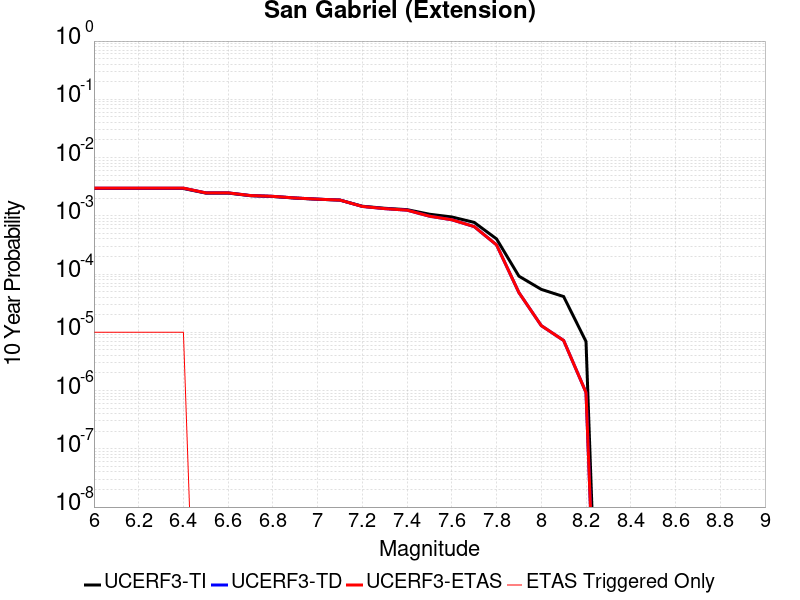 |

| Magnitude | 1 wk TI Prob | 1 wk TD Prob | 1 wk ETAS Prob | 1 wk ETAS/TD Gain | 1 wk ETAS Triggered Only | 1 mo TI Prob | 1 mo TD Prob | 1 mo ETAS Prob | 1 mo ETAS/TD Gain | 1 mo ETAS Triggered Only | 1 yr TI Prob | 1 yr TD Prob | 1 yr ETAS Prob | 1 yr ETAS/TD Gain | 1 yr ETAS Triggered Only | 10 yr TI Prob | 10 yr TD Prob | 10 yr ETAS Prob | 10 yr ETAS/TD Gain | 10 yr ETAS Triggered Only |
|-----|-----|-----|-----|-----|-----|-----|-----|-----|-----|-----|-----|-----|-----|-----|-----|-----|-----|-----|-----|-----|
| 6.0 | 5.6486106E-6 | 5.7171446E-6 | 5.7171446E-6 | 1.0 | 0.0 | 2.4208108E-5 | 2.4501825E-5 | 2.4501825E-5 | 1.0 | 0.0 | 2.9469383E-4 | 2.9827014E-4 | 2.9827014E-4 | 1.0 | 0.0 | 0.0029430336 | 0.0029788287 | 0.003005416 | 1.0089254 | 2.6666667E-5 |
| 6.1 | 5.6486106E-6 | 5.7171446E-6 | 5.7171446E-6 | 1.0 | 0.0 | 2.4208108E-5 | 2.4501825E-5 | 2.4501825E-5 | 1.0 | 0.0 | 2.9469383E-4 | 2.9827014E-4 | 2.9827014E-4 | 1.0 | 0.0 | 0.0029430336 | 0.0029788287 | 0.003005416 | 1.0089254 | 2.6666667E-5 |
| 6.2 | 5.6486106E-6 | 5.7171446E-6 | 5.7171446E-6 | 1.0 | 0.0 | 2.4208108E-5 | 2.4501825E-5 | 2.4501825E-5 | 1.0 | 0.0 | 2.9469383E-4 | 2.9827014E-4 | 2.9827014E-4 | 1.0 | 0.0 | 0.0029430336 | 0.0029788287 | 0.003005416 | 1.0089254 | 2.6666667E-5 |
| 6.3 | 5.6486106E-6 | 5.7171446E-6 | 5.7171446E-6 | 1.0 | 0.0 | 2.4208108E-5 | 2.4501825E-5 | 2.4501825E-5 | 1.0 | 0.0 | 2.9469383E-4 | 2.9827014E-4 | 2.9827014E-4 | 1.0 | 0.0 | 0.0029430336 | 0.0029788287 | 0.003005416 | 1.0089254 | 2.6666667E-5 |
| 6.4 | 5.6486106E-6 | 5.7171446E-6 | 5.7171446E-6 | 1.0 | 0.0 | 2.4208108E-5 | 2.4501825E-5 | 2.4501825E-5 | 1.0 | 0.0 | 2.9469383E-4 | 2.9827014E-4 | 2.9827014E-4 | 1.0 | 0.0 | 0.0029430336 | 0.0029788287 | 0.003005416 | 1.0089254 | 2.6666667E-5 |
| 6.5 | 4.7134554E-6 | 4.754565E-6 | 4.754565E-6 | 1.0 | 0.0 | 2.0200367E-5 | 2.0376552E-5 | 2.0376552E-5 | 1.0 | 0.0 | 2.459117E-4 | 2.4805713E-4 | 2.4805713E-4 | 1.0 | 0.0 | 0.0024563975 | 0.0024778906 | 0.0024778906 | 1.0 | 0.0 |
| 6.6 | 4.7134554E-6 | 4.754565E-6 | 4.754565E-6 | 1.0 | 0.0 | 2.0200367E-5 | 2.0376552E-5 | 2.0376552E-5 | 1.0 | 0.0 | 2.459117E-4 | 2.4805713E-4 | 2.4805713E-4 | 1.0 | 0.0 | 0.0024563975 | 0.0024778906 | 0.0024778906 | 1.0 | 0.0 |
| 6.7 | 4.2468837E-6 | 4.2743804E-6 | 4.2743804E-6 | 1.0 | 0.0 | 1.8200803E-5 | 1.8318648E-5 | 1.8318648E-5 | 1.0 | 0.0 | 2.2157225E-4 | 2.2300745E-4 | 2.2300745E-4 | 1.0 | 0.0 | 0.0022135144 | 0.0022279124 | 0.0022279124 | 1.0 | 0.0 |
| 6.8 | 4.1180615E-6 | 4.1417693E-6 | 4.1417693E-6 | 1.0 | 0.0 | 1.7648716E-5 | 1.7750324E-5 | 1.7750324E-5 | 1.0 | 0.0 | 2.1485193E-4 | 2.1608948E-4 | 2.1608948E-4 | 1.0 | 0.0 | 0.0021464431 | 0.0021588686 | 0.0021588686 | 1.0 | 0.0 |
| 6.9 | 3.863861E-6 | 3.8800836E-6 | 3.8800836E-6 | 1.0 | 0.0 | 1.65593E-5 | 1.6628828E-5 | 1.6628828E-5 | 1.0 | 0.0 | 2.0159081E-4 | 2.0243786E-4 | 2.0243786E-4 | 1.0 | 0.0 | 0.0020140803 | 0.0020226059 | 0.0020226059 | 1.0 | 0.0 |
| 7.0 | 3.6947372E-6 | 3.7059822E-6 | 3.7059822E-6 | 1.0 | 0.0 | 1.5834492E-5 | 1.5882688E-5 | 1.5882688E-5 | 1.0 | 0.0 | 1.9276788E-4 | 1.9335524E-4 | 1.9335524E-4 | 1.0 | 0.0 | 0.0019260074 | 0.0019319403 | 0.0019319403 | 1.0 | 0.0 |
| 7.1 | 3.5686835E-6 | 3.5732016E-6 | 3.5732016E-6 | 1.0 | 0.0 | 1.5294268E-5 | 1.5313635E-5 | 1.5313635E-5 | 1.0 | 0.0 | 1.861918E-4 | 1.8642822E-4 | 1.8642822E-4 | 1.0 | 0.0 | 0.0018603588 | 0.0018627879 | 0.0018627879 | 1.0 | 0.0 |
| 7.2 | 2.8023446E-6 | 2.7770893E-6 | 2.7770893E-6 | 1.0 | 0.0 | 1.2009994E-5 | 1.1901758E-5 | 1.1901758E-5 | 1.0 | 0.0 | 1.4621185E-4 | 1.4489438E-4 | 1.4489438E-4 | 1.0 | 0.0 | 0.001461157 | 0.0014480136 | 0.0014480136 | 1.0 | 0.0 |
| 7.3 | 2.5843012E-6 | 2.546262E-6 | 2.546262E-6 | 1.0 | 0.0 | 1.1075529E-5 | 1.0912507E-5 | 1.0912507E-5 | 1.0 | 0.0 | 1.3483623E-4 | 1.3285177E-4 | 1.3285177E-4 | 1.0 | 0.0 | 0.0013475444 | 0.001327737 | 0.001327737 | 1.0 | 0.0 |
| 7.4 | 2.4464468E-6 | 2.3969585E-6 | 2.3969585E-6 | 1.0 | 0.0 | 1.04847295E-5 | 1.027264E-5 | 1.027264E-5 | 1.0 | 0.0 | 1.276441E-4 | 1.250623E-4 | 1.250623E-4 | 1.0 | 0.0 | 0.0012757082 | 0.0012499326 | 0.0012499326 | 1.0 | 0.0 |
| 7.5 | 2.0420266E-6 | 1.8913017E-6 | 1.8913017E-6 | 1.0 | 0.0 | 8.751514E-6 | 8.105554E-6 | 8.105554E-6 | 1.0 | 0.0 | 1.0654447E-4 | 9.8680684E-5 | 9.8680684E-5 | 1.0 | 0.0 | 0.001064934 | 9.863758E-4 | 9.863758E-4 | 1.0 | 0.0 |
| 7.6 | 1.8326596E-6 | 1.640076E-6 | 1.640076E-6 | 1.0 | 0.0 | 7.854232E-6 | 7.0288784E-6 | 7.0288784E-6 | 1.0 | 0.0 | 9.562107E-5 | 8.557326E-5 | 8.557326E-5 | 1.0 | 0.0 | 9.5579936E-4 | 8.5540896E-4 | 8.5540896E-4 | 1.0 | 0.0 |
| 7.7 | 1.4786998E-6 | 1.2526061E-6 | 1.2526061E-6 | 1.0 | 0.0 | 6.3372695E-6 | 5.368301E-6 | 5.368301E-6 | 1.0 | 0.0 | 7.715353E-5 | 6.535712E-5 | 6.535712E-5 | 1.0 | 0.0 | 7.7126746E-4 | 6.533867E-4 | 6.533867E-4 | 1.0 | 0.0 |
| 7.8 | 7.6975533E-7 | 6.071264E-7 | 6.071264E-7 | 1.0 | 0.0 | 3.2989474E-6 | 2.601968E-6 | 2.601968E-6 | 1.0 | 0.0 | 4.0163945E-5 | 3.16785E-5 | 3.16785E-5 | 1.0 | 0.0 | 4.0156685E-4 | 3.1674592E-4 | 3.1674592E-4 | 1.0 | 0.0 |
| 7.9 | 1.7645915E-7 | 9.218553E-8 | 9.218553E-8 | 1.0 | 0.0 | 7.562533E-7 | 3.9508078E-7 | 3.9508078E-7 | 1.0 | 0.0 | 9.207345E-6 | 4.810098E-6 | 4.810098E-6 | 1.0 | 0.0 | 9.206964E-5 | 4.810463E-5 | 4.810463E-5 | 1.0 | 0.0 |
| 8.0 | 1.0463461E-7 | 2.4971815E-8 | 2.4971815E-8 | 1.0 | 0.0 | 4.4843398E-7 | 1.0702206E-7 | 1.0702206E-7 | 1.0 | 0.0 | 5.45967E-6 | 1.3029928E-6 | 1.3029928E-6 | 1.0 | 0.0 | 5.459536E-5 | 1.3034539E-5 | 1.3034539E-5 | 1.0 | 0.0 |
| 8.1 | 7.875717E-8 | 1.38816025E-8 | 1.38816025E-8 | 1.0 | 0.0 | 3.3753068E-7 | 5.949258E-8 | 5.949258E-8 | 1.0 | 0.0 | 4.109428E-6 | 7.243219E-7 | 7.243219E-7 | 1.0 | 0.0 | 4.109352E-5 | 7.247882E-6 | 7.247882E-6 | 1.0 | 0.0 |
| 8.2 | 1.33163E-8 | 1.7755355E-9 | 1.7755355E-9 | 1.0 | 0.0 | 5.7069855E-8 | 7.609438E-9 | 7.609438E-9 | 1.0 | 0.0 | 6.9482525E-7 | 9.26449E-8 | 9.26449E-8 | 1.0 | 0.0 | 6.9482307E-6 | 9.284174E-7 | 9.284174E-7 | 1.0 | 0.0 |

## Green Valley 2011 CFM
*[(top)](#table-of-contents)*

| 1 Week | 1 Month | 1 Year | 10 Year |
|-----|-----|-----|-----|
|  |  |  |  |

| Magnitude | 1 wk TI Prob | 1 wk TD Prob | 1 wk ETAS Prob | 1 wk ETAS/TD Gain | 1 wk ETAS Triggered Only | 1 mo TI Prob | 1 mo TD Prob | 1 mo ETAS Prob | 1 mo ETAS/TD Gain | 1 mo ETAS Triggered Only | 1 yr TI Prob | 1 yr TD Prob | 1 yr ETAS Prob | 1 yr ETAS/TD Gain | 1 yr ETAS Triggered Only | 10 yr TI Prob | 10 yr TD Prob | 10 yr ETAS Prob | 10 yr ETAS/TD Gain | 10 yr ETAS Triggered Only |
|-----|-----|-----|-----|-----|-----|-----|-----|-----|-----|-----|-----|-----|-----|-----|-----|-----|-----|-----|-----|-----|
| 6.0 | 9.9629346E-5 | 1.7306181E-4 | 1.7306181E-4 | 1.0 | 0.0 | 4.2691303E-4 | 7.414477E-4 | 7.414477E-4 | 1.0 | 0.0 | 0.0051852856 | 0.00898687 | 0.009013297 | 1.0029407 | 2.6666667E-5 | 0.050659515 | 0.085523866 | 0.08554825 | 1.0002851 | 2.6666667E-5 |
| 6.1 | 9.88615E-5 | 1.7153492E-4 | 1.7153492E-4 | 1.0 | 0.0 | 4.2362334E-4 | 7.349076E-4 | 7.349076E-4 | 1.0 | 0.0 | 0.0051454236 | 0.008907897 | 0.0089343265 | 1.0029669 | 2.6666667E-5 | 0.050279044 | 0.08481148 | 0.08483589 | 1.0002878 | 2.6666667E-5 |
| 6.2 | 9.696895E-5 | 1.679252E-4 | 1.679252E-4 | 1.0 | 0.0 | 4.15515E-4 | 7.1944593E-4 | 7.1944593E-4 | 1.0 | 0.0 | 0.0050471667 | 0.008721275 | 0.008721275 | 1.0 | 0.0 | 0.04934063 | 0.08312038 | 0.08312038 | 1.0 | 0.0 |
| 6.3 | 9.275224E-5 | 1.5971852E-4 | 1.5971852E-4 | 1.0 | 0.0 | 3.9744904E-4 | 6.842931E-4 | 6.842931E-4 | 1.0 | 0.0 | 0.0048282105 | 0.008296597 | 0.008296597 | 1.0 | 0.0 | 0.047246475 | 0.07925882 | 0.07925882 | 1.0 | 0.0 |
| 6.4 | 8.391499E-5 | 1.4368363E-4 | 1.4368363E-4 | 1.0 | 0.0 | 3.595861E-4 | 6.156491E-4 | 6.156491E-4 | 1.0 | 0.0 | 0.004369175 | 0.007467232 | 0.007467232 | 1.0 | 0.0 | 0.04284265 | 0.07163251 | 0.07163251 | 1.0 | 0.0 |
| 6.5 | 5.9519385E-5 | 9.9345336E-5 | 9.9345336E-5 | 1.0 | 0.0 | 2.5505814E-4 | 4.257004E-4 | 4.257004E-4 | 1.0 | 0.0 | 0.0031009112 | 0.0051684165 | 0.0051684165 | 1.0 | 0.0 | 0.030579966 | 0.050147217 | 0.050147217 | 1.0 | 0.0 |
| 6.6 | 4.5361558E-5 | 7.4029726E-5 | 7.4029726E-5 | 1.0 | 0.0 | 1.9439218E-4 | 3.1723455E-4 | 3.1723455E-4 | 1.0 | 0.0 | 0.0023641558 | 0.003854048 | 0.003854048 | 1.0 | 0.0 | 0.023391623 | 0.03766713 | 0.03766713 | 1.0 | 0.0 |
| 6.7 | 3.8808106E-5 | 6.265495E-5 | 6.265495E-5 | 1.0 | 0.0 | 1.6630985E-4 | 2.684962E-4 | 2.684962E-4 | 1.0 | 0.0 | 0.0020229418 | 0.003262755 | 0.003262755 | 1.0 | 0.0 | 0.020046256 | 0.03200691 | 0.03200691 | 1.0 | 0.0 |
| 6.8 | 2.2284667E-5 | 3.1285566E-5 | 3.1285566E-5 | 1.0 | 0.0 | 9.550222E-5 | 1.340742E-4 | 1.340742E-4 | 1.0 | 0.0 | 0.0011621192 | 0.001631124 | 0.001631124 | 1.0 | 0.0 | 0.011560607 | 0.016166156 | 0.016166156 | 1.0 | 0.0 |
| 6.9 | 1.8050168E-5 | 2.4448267E-5 | 2.4448267E-5 | 1.0 | 0.0 | 7.735557E-5 | 1.0477412E-4 | 1.0477412E-4 | 1.0 | 0.0 | 9.4139716E-4 | 0.001274882 | 0.001274882 | 1.0 | 0.0 | 0.009374191 | 0.01266794 | 0.01266794 | 1.0 | 0.0 |
| 7.0 | 1.4763166E-5 | 1.958302E-5 | 1.958302E-5 | 1.0 | 0.0 | 6.326917E-5 | 8.392455E-5 | 8.392455E-5 | 1.0 | 0.0 | 7.7002996E-4 | 0.0010213053 | 0.0010213053 | 1.0 | 0.0 | 0.007673672 | 0.010165428 | 0.010165428 | 1.0 | 0.0 |
| 7.1 | 1.2399713E-5 | 1.630385E-5 | 1.630385E-5 | 1.0 | 0.0 | 5.3140546E-5 | 6.987178E-5 | 6.987178E-5 | 1.0 | 0.0 | 6.467941E-4 | 8.5035886E-4 | 8.5035886E-4 | 1.0 | 0.0 | 0.006449148 | 0.008471329 | 0.008471329 | 1.0 | 0.0 |
| 7.2 | 1.0584195E-5 | 1.3921863E-5 | 1.3921863E-5 | 1.0 | 0.0 | 4.5360044E-5 | 5.9663773E-5 | 5.9663773E-5 | 1.0 | 0.0 | 5.521186E-4 | 7.2616595E-4 | 7.2616595E-4 | 1.0 | 0.0 | 0.0055074887 | 0.0072383475 | 0.0072383475 | 1.0 | 0.0 |
| 7.3 | 7.998173E-6 | 1.054412E-5 | 1.054412E-5 | 1.0 | 0.0 | 3.4277433E-5 | 4.5188313E-5 | 4.5188313E-5 | 1.0 | 0.0 | 4.1724785E-4 | 5.500299E-4 | 5.500299E-4 | 1.0 | 0.0 | 0.004164653 | 0.0054869517 | 0.0054869517 | 1.0 | 0.0 |
| 7.4 | 6.7571127E-6 | 8.932785E-6 | 8.932785E-6 | 1.0 | 0.0 | 2.8958733E-5 | 3.8282808E-5 | 3.8282808E-5 | 1.0 | 0.0 | 3.5251552E-4 | 4.6599447E-4 | 4.6599447E-4 | 1.0 | 0.0 | 0.0035195686 | 0.0046503763 | 0.0046503763 | 1.0 | 0.0 |
| 7.5 | 5.69878E-6 | 7.5163775E-6 | 7.5163775E-6 | 1.0 | 0.0 | 2.4423114E-5 | 3.2212654E-5 | 3.2212654E-5 | 1.0 | 0.0 | 2.9731085E-4 | 3.9211934E-4 | 3.9211934E-4 | 1.0 | 0.0 | 0.002969134 | 0.0039144265 | 0.0039144265 | 1.0 | 0.0 |
| 7.6 | 4.503664E-6 | 5.9357344E-6 | 5.9357344E-6 | 1.0 | 0.0 | 1.9301275E-5 | 2.5438618E-5 | 2.5438618E-5 | 1.0 | 0.0 | 2.3496768E-4 | 3.09672E-4 | 3.09672E-4 | 1.0 | 0.0 | 0.002347194 | 0.0030925297 | 0.0030925297 | 1.0 | 0.0 |
| 7.7 | 1.0873546E-6 | 1.4107108E-6 | 1.4107108E-6 | 1.0 | 0.0 | 4.6600826E-6 | 6.0458897E-6 | 6.0458897E-6 | 1.0 | 0.0 | 5.6735033E-5 | 7.360625E-5 | 7.360625E-5 | 1.0 | 0.0 | 5.672055E-4 | 7.3582074E-4 | 7.3582074E-4 | 1.0 | 0.0 |
| 7.8 | 4.9373917E-8 | 6.177787E-8 | 6.177787E-8 | 1.0 | 0.0 | 2.1160248E-7 | 2.6476226E-7 | 2.6476226E-7 | 1.0 | 0.0 | 2.5762572E-6 | 3.223477E-6 | 3.223477E-6 | 1.0 | 0.0 | 2.5762274E-5 | 3.223268E-5 | 3.223268E-5 | 1.0 | 0.0 |

## Camp Rock 2011
*[(top)](#table-of-contents)*

| 1 Week | 1 Month | 1 Year | 10 Year |
|-----|-----|-----|-----|
|  |  |  |  |

| Magnitude | 1 wk TI Prob | 1 wk TD Prob | 1 wk ETAS Prob | 1 wk ETAS/TD Gain | 1 wk ETAS Triggered Only | 1 mo TI Prob | 1 mo TD Prob | 1 mo ETAS Prob | 1 mo ETAS/TD Gain | 1 mo ETAS Triggered Only | 1 yr TI Prob | 1 yr TD Prob | 1 yr ETAS Prob | 1 yr ETAS/TD Gain | 1 yr ETAS Triggered Only | 10 yr TI Prob | 10 yr TD Prob | 10 yr ETAS Prob | 10 yr ETAS/TD Gain | 10 yr ETAS Triggered Only |
|-----|-----|-----|-----|-----|-----|-----|-----|-----|-----|-----|-----|-----|-----|-----|-----|-----|-----|-----|-----|-----|
| 6.0 | 1.6710783E-5 | 4.2503107E-6 | 4.2503107E-6 | 1.0 | 0.0 | 7.161568E-5 | 1.8215493E-5 | 4.4881675E-5 | 2.4639287 | 2.6666667E-5 | 8.7157206E-4 | 2.2175159E-4 | 2.4841234E-4 | 1.120228 | 2.6666667E-5 | 0.008681616 | 0.0022153559 | 0.0022419635 | 1.0120106 | 2.6666667E-5 |
| 6.1 | 1.6710783E-5 | 4.2503107E-6 | 4.2503107E-6 | 1.0 | 0.0 | 7.161568E-5 | 1.8215493E-5 | 4.4881675E-5 | 2.4639287 | 2.6666667E-5 | 8.7157206E-4 | 2.2175159E-4 | 2.4841234E-4 | 1.120228 | 2.6666667E-5 | 0.008681616 | 0.0022153559 | 0.0022419635 | 1.0120106 | 2.6666667E-5 |
| 6.2 | 1.6710783E-5 | 4.2503107E-6 | 4.2503107E-6 | 1.0 | 0.0 | 7.161568E-5 | 1.8215493E-5 | 4.4881675E-5 | 2.4639287 | 2.6666667E-5 | 8.7157206E-4 | 2.2175159E-4 | 2.4841234E-4 | 1.120228 | 2.6666667E-5 | 0.008681616 | 0.0022153559 | 0.0022419635 | 1.0120106 | 2.6666667E-5 |
| 6.3 | 1.6710783E-5 | 4.2503107E-6 | 4.2503107E-6 | 1.0 | 0.0 | 7.161568E-5 | 1.8215493E-5 | 4.4881675E-5 | 2.4639287 | 2.6666667E-5 | 8.7157206E-4 | 2.2175159E-4 | 2.4841234E-4 | 1.120228 | 2.6666667E-5 | 0.008681616 | 0.0022153559 | 0.0022419635 | 1.0120106 | 2.6666667E-5 |
| 6.4 | 7.982846E-6 | 3.6821327E-6 | 3.6821327E-6 | 1.0 | 0.0 | 3.421175E-5 | 1.5780475E-5 | 4.244672E-5 | 2.6898253 | 2.6666667E-5 | 4.1644843E-4 | 1.921107E-4 | 2.1877224E-4 | 1.1387821 | 2.6666667E-5 | 0.0041566887 | 0.0019194811 | 0.0019460965 | 1.013866 | 2.6666667E-5 |
| 6.5 | 7.982846E-6 | 3.6821327E-6 | 3.6821327E-6 | 1.0 | 0.0 | 3.421175E-5 | 1.5780475E-5 | 4.244672E-5 | 2.6898253 | 2.6666667E-5 | 4.1644843E-4 | 1.921107E-4 | 2.1877224E-4 | 1.1387821 | 2.6666667E-5 | 0.0041566887 | 0.0019194811 | 0.0019460965 | 1.013866 | 2.6666667E-5 |
| 6.6 | 7.048869E-6 | 3.4243997E-6 | 3.4243997E-6 | 1.0 | 0.0 | 3.0209088E-5 | 1.4675918E-5 | 4.134219E-5 | 2.817009 | 2.6666667E-5 | 3.677336E-4 | 1.7866497E-4 | 2.0532687E-4 | 1.1492285 | 2.6666667E-5 | 0.0036712566 | 0.0017852448 | 0.0018118639 | 1.0149106 | 2.6666667E-5 |
| 6.7 | 6.987307E-6 | 3.3623767E-6 | 3.3623767E-6 | 1.0 | 0.0 | 2.9945259E-5 | 1.4410108E-5 | 4.107639E-5 | 2.8505263 | 2.6666667E-5 | 3.6452254E-4 | 1.7542925E-4 | 2.0209124E-4 | 1.1519815 | 2.6666667E-5 | 0.0036392517 | 0.0017529388 | 0.0017795587 | 1.0151858 | 2.6666667E-5 |
| 6.8 | 6.3737602E-6 | 3.117947E-6 | 3.117947E-6 | 1.0 | 0.0 | 2.731583E-5 | 1.3362564E-5 | 4.0028874E-5 | 2.9955983 | 2.6666667E-5 | 3.3251947E-4 | 1.6267736E-4 | 1.8933968E-4 | 1.163897 | 2.6666667E-5 | 0.0033202237 | 0.0016256113 | 0.0016522346 | 1.0163774 | 2.6666667E-5 |
| 6.9 | 6.112211E-6 | 2.9331534E-6 | 2.9331534E-6 | 1.0 | 0.0 | 2.6194928E-5 | 1.2570598E-5 | 3.923693E-5 | 3.1213255 | 2.6666667E-5 | 3.1887658E-4 | 1.5303657E-4 | 1.7969916E-4 | 1.1742237 | 2.6666667E-5 | 0.003184194 | 0.0015293396 | 0.0015559655 | 1.01741 | 2.6666667E-5 |
| 7.0 | 5.5140117E-6 | 2.6419564E-6 | 2.6419564E-6 | 1.0 | 0.0 | 2.3631264E-5 | 1.1322622E-5 | 3.7988986E-5 | 3.3551404 | 2.6666667E-5 | 2.8767265E-4 | 1.3784446E-4 | 1.6450745E-4 | 1.193428 | 2.6666667E-5 | 0.0028730053 | 0.0013776148 | 0.0014042448 | 1.0193305 | 2.6666667E-5 |
| 7.1 | 4.8151105E-6 | 2.1342985E-6 | 2.1342985E-6 | 1.0 | 0.0 | 2.0636026E-5 | 9.146962E-6 | 3.5813384E-5 | 3.9153311 | 2.6666667E-5 | 2.5121463E-4 | 1.1135879E-4 | 1.380225E-4 | 1.2394395 | 2.6666667E-5 | 0.0025093083 | 0.0011130519 | 0.0011396889 | 1.0239315 | 2.6666667E-5 |
| 7.2 | 3.818335E-6 | 1.293763E-6 | 1.293763E-6 | 1.0 | 0.0 | 1.6364189E-5 | 5.5446876E-6 | 5.5446876E-6 | 1.0 | 0.0 | 1.9921579E-4 | 6.750456E-5 | 6.750456E-5 | 1.0 | 0.0 | 0.0019903728 | 6.748488E-4 | 6.748488E-4 | 1.0 | 0.0 |
| 7.3 | 2.7166698E-6 | 7.383734E-7 | 7.383734E-7 | 1.0 | 0.0 | 1.1642818E-5 | 3.1644536E-6 | 3.1644536E-6 | 1.0 | 0.0 | 1.4174209E-4 | 3.8526563E-5 | 3.8526563E-5 | 1.0 | 0.0 | 0.0014165172 | 3.8520084E-4 | 3.8520084E-4 | 1.0 | 0.0 |
| 7.4 | 2.0893426E-6 | 5.461961E-7 | 5.461961E-7 | 1.0 | 0.0 | 8.954295E-6 | 2.3408381E-6 | 2.3408381E-6 | 1.0 | 0.0 | 1.0901308E-4 | 2.8499337E-5 | 2.8499337E-5 | 1.0 | 0.0 | 0.0010895962 | 2.8495738E-4 | 2.8495738E-4 | 1.0 | 0.0 |
| 7.5 | 1.1681728E-6 | 3.6031287E-7 | 3.6031287E-7 | 1.0 | 0.0 | 5.0064455E-6 | 1.5441972E-6 | 1.5441972E-6 | 1.0 | 0.0 | 6.0951766E-5 | 1.8800443E-5 | 1.8800443E-5 | 1.0 | 0.0 | 6.093505E-4 | 1.8798899E-4 | 1.8798899E-4 | 1.0 | 0.0 |
| 7.6 | 1.3154387E-7 | 7.1198265E-8 | 7.1198265E-8 | 1.0 | 0.0 | 5.6375933E-7 | 3.051354E-7 | 3.051354E-7 | 1.0 | 0.0 | 6.863748E-6 | 3.7150185E-6 | 3.7150185E-6 | 1.0 | 0.0 | 6.863536E-5 | 3.7149723E-5 | 3.7149723E-5 | 1.0 | 0.0 |

## San Gregorio (South) 2011 CFM
*[(top)](#table-of-contents)*

| 1 Week | 1 Month | 1 Year | 10 Year |
|-----|-----|-----|-----|
|  | 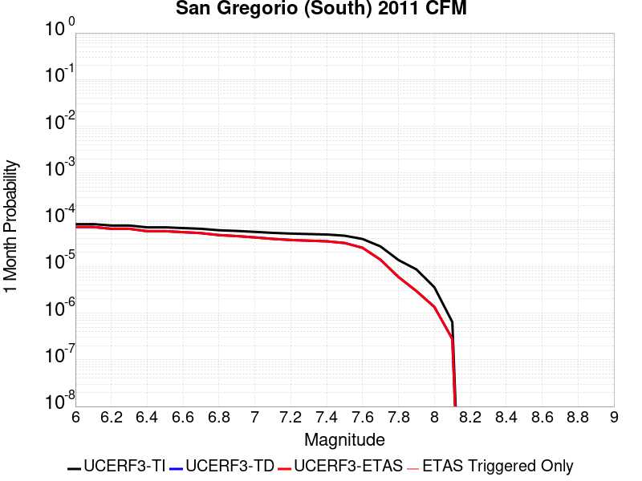 |  |  |

| Magnitude | 1 wk TI Prob | 1 wk TD Prob | 1 wk ETAS Prob | 1 wk ETAS/TD Gain | 1 wk ETAS Triggered Only | 1 mo TI Prob | 1 mo TD Prob | 1 mo ETAS Prob | 1 mo ETAS/TD Gain | 1 mo ETAS Triggered Only | 1 yr TI Prob | 1 yr TD Prob | 1 yr ETAS Prob | 1 yr ETAS/TD Gain | 1 yr ETAS Triggered Only | 10 yr TI Prob | 10 yr TD Prob | 10 yr ETAS Prob | 10 yr ETAS/TD Gain | 10 yr ETAS Triggered Only |
|-----|-----|-----|-----|-----|-----|-----|-----|-----|-----|-----|-----|-----|-----|-----|-----|-----|-----|-----|-----|-----|
| 6.0 | 1.8770423E-5 | 1.6280406E-5 | 1.6280406E-5 | 1.0 | 0.0 | 8.044219E-5 | 6.977132E-5 | 6.977132E-5 | 1.0 | 0.0 | 9.789435E-4 | 8.491386E-4 | 8.491386E-4 | 1.0 | 0.0 | 0.009746423 | 0.008471654 | 0.008498094 | 1.0031211 | 2.6666667E-5 |
| 6.1 | 1.8770423E-5 | 1.6280406E-5 | 1.6280406E-5 | 1.0 | 0.0 | 8.044219E-5 | 6.977132E-5 | 6.977132E-5 | 1.0 | 0.0 | 9.789435E-4 | 8.491386E-4 | 8.491386E-4 | 1.0 | 0.0 | 0.009746423 | 0.008471654 | 0.008498094 | 1.0031211 | 2.6666667E-5 |
| 6.2 | 1.7508692E-5 | 1.4899894E-5 | 1.4899894E-5 | 1.0 | 0.0 | 7.5035096E-5 | 6.385514E-5 | 6.385514E-5 | 1.0 | 0.0 | 9.1316935E-4 | 7.771621E-4 | 7.771621E-4 | 1.0 | 0.0 | 0.00909426 | 0.0077570733 | 0.007783533 | 1.003411 | 2.6666667E-5 |
| 6.3 | 1.7508692E-5 | 1.4899894E-5 | 1.4899894E-5 | 1.0 | 0.0 | 7.5035096E-5 | 6.385514E-5 | 6.385514E-5 | 1.0 | 0.0 | 9.1316935E-4 | 7.771621E-4 | 7.771621E-4 | 1.0 | 0.0 | 0.00909426 | 0.0077570733 | 0.007783533 | 1.003411 | 2.6666667E-5 |
| 6.4 | 1.6004591E-5 | 1.324971E-5 | 1.324971E-5 | 1.0 | 0.0 | 6.85893E-5 | 5.678324E-5 | 5.678324E-5 | 1.0 | 0.0 | 8.347548E-4 | 6.911177E-4 | 6.911177E-4 | 1.0 | 0.0 | 0.008316261 | 0.0069021136 | 0.0069021136 | 1.0 | 0.0 |
| 6.5 | 1.6004591E-5 | 1.324971E-5 | 1.324971E-5 | 1.0 | 0.0 | 6.85893E-5 | 5.678324E-5 | 5.678324E-5 | 1.0 | 0.0 | 8.347548E-4 | 6.911177E-4 | 6.911177E-4 | 1.0 | 0.0 | 0.008316261 | 0.0069021136 | 0.0069021136 | 1.0 | 0.0 |
| 6.6 | 1.5442201E-5 | 1.2634333E-5 | 1.2634333E-5 | 1.0 | 0.0 | 6.617918E-5 | 5.4146025E-5 | 5.4146025E-5 | 1.0 | 0.0 | 8.0543366E-4 | 6.590293E-4 | 6.590293E-4 | 1.0 | 0.0 | 0.008025207 | 0.006583161 | 0.006583161 | 1.0 | 0.0 |
| 6.7 | 1.489921E-5 | 1.2042835E-5 | 1.2042835E-5 | 1.0 | 0.0 | 6.3852196E-5 | 5.1611136E-5 | 5.1611136E-5 | 1.0 | 0.0 | 7.7712315E-4 | 6.281851E-4 | 6.281851E-4 | 1.0 | 0.0 | 0.0077441116 | 0.0062764906 | 0.0062764906 | 1.0 | 0.0 |
| 6.8 | 1.3876024E-5 | 1.0921772E-5 | 1.0921772E-5 | 1.0 | 0.0 | 5.9467322E-5 | 4.6806756E-5 | 4.6806756E-5 | 1.0 | 0.0 | 7.237741E-4 | 5.697236E-4 | 5.697236E-4 | 1.0 | 0.0 | 0.0072142133 | 0.0056949924 | 0.0056949924 | 1.0 | 0.0 |
| 6.9 | 1.33922495E-5 | 1.0393267E-5 | 1.0393267E-5 | 1.0 | 0.0 | 5.7394092E-5 | 4.4541815E-5 | 4.4541815E-5 | 1.0 | 0.0 | 6.9854903E-4 | 5.421619E-4 | 5.421619E-4 | 1.0 | 0.0 | 0.0069635725 | 0.0054207467 | 0.0054207467 | 1.0 | 0.0 |
| 7.0 | 1.2807324E-5 | 9.753221E-6 | 9.753221E-6 | 1.0 | 0.0 | 5.4887376E-5 | 4.179885E-5 | 4.179885E-5 | 1.0 | 0.0 | 6.680489E-4 | 5.0878234E-4 | 5.0878234E-4 | 1.0 | 0.0 | 0.006660442 | 0.005088521 | 0.005088521 | 1.0 | 0.0 |
| 7.1 | 1.2191438E-5 | 9.062097E-6 | 9.062097E-6 | 1.0 | 0.0 | 5.224797E-5 | 3.883698E-5 | 3.883698E-5 | 1.0 | 0.0 | 6.3593336E-4 | 4.7273774E-4 | 4.7273774E-4 | 1.0 | 0.0 | 0.0063411663 | 0.0047296593 | 0.0047296593 | 1.0 | 0.0 |
| 7.2 | 1.1769438E-5 | 8.582283E-6 | 8.582283E-6 | 1.0 | 0.0 | 5.0439474E-5 | 3.6780693E-5 | 3.6780693E-5 | 1.0 | 0.0 | 6.1392755E-4 | 4.47713E-4 | 4.47713E-4 | 1.0 | 0.0 | 0.0061223423 | 0.004480447 | 0.004480447 | 1.0 | 0.0 |
| 7.3 | 1.150374E-5 | 8.297709E-6 | 8.297709E-6 | 1.0 | 0.0 | 4.9300812E-5 | 3.5561126E-5 | 3.5561126E-5 | 1.0 | 0.0 | 6.0007203E-4 | 4.3287076E-4 | 4.3287076E-4 | 1.0 | 0.0 | 0.0059845424 | 0.004332595 | 0.004332595 | 1.0 | 0.0 |
| 7.4 | 1.12514E-5 | 8.043448E-6 | 8.043448E-6 | 1.0 | 0.0 | 4.8219394E-5 | 3.4471464E-5 | 3.4471464E-5 | 1.0 | 0.0 | 5.8691297E-4 | 4.1960934E-4 | 4.1960934E-4 | 1.0 | 0.0 | 0.005853653 | 0.0042004758 | 0.0042004758 | 1.0 | 0.0 |
| 7.5 | 1.059696E-5 | 7.393731E-6 | 7.393731E-6 | 1.0 | 0.0 | 4.5414752E-5 | 3.1687036E-5 | 3.1687036E-5 | 1.0 | 0.0 | 5.5278436E-4 | 3.857214E-4 | 3.857214E-4 | 1.0 | 0.0 | 0.0055141128 | 0.00386276 | 0.00386276 | 1.0 | 0.0 |
| 7.6 | 9.018592E-6 | 5.837476E-6 | 5.837476E-6 | 1.0 | 0.0 | 3.8650534E-5 | 2.5017514E-5 | 2.5017514E-5 | 1.0 | 0.0 | 4.7046866E-4 | 3.045457E-4 | 3.045457E-4 | 1.0 | 0.0 | 0.004694739 | 0.003053146 | 0.003053146 | 1.0 | 0.0 |
| 7.7 | 6.243489E-6 | 3.239967E-6 | 3.239967E-6 | 1.0 | 0.0 | 2.6757538E-5 | 1.3885499E-5 | 1.3885499E-5 | 1.0 | 0.0 | 3.257243E-4 | 1.6904285E-4 | 1.6904285E-4 | 1.0 | 0.0 | 0.003252473 | 0.001699331 | 0.001699331 | 1.0 | 0.0 |
| 7.8 | 3.1941963E-6 | 1.3812611E-6 | 1.3812611E-6 | 1.0 | 0.0 | 1.368934E-5 | 5.919677E-6 | 5.919677E-6 | 1.0 | 0.0 | 1.6665498E-4 | 7.2069684E-5 | 7.2069684E-5 | 1.0 | 0.0 | 0.0016653005 | 7.2645675E-4 | 7.2645675E-4 | 1.0 | 0.0 |
| 7.9 | 2.0098398E-6 | 6.9180976E-7 | 6.9180976E-7 | 1.0 | 0.0 | 8.6135715E-6 | 2.9648954E-6 | 2.9648954E-6 | 1.0 | 0.0 | 1.0486518E-4 | 3.6097004E-5 | 3.6097004E-5 | 1.0 | 0.0 | 0.0010481571 | 3.6582787E-4 | 3.6582787E-4 | 1.0 | 0.0 |
| 8.0 | 8.353119E-7 | 3.163282E-7 | 3.163282E-7 | 1.0 | 0.0 | 3.579903E-6 | 1.3556916E-6 | 1.3556916E-6 | 1.0 | 0.0 | 4.358445E-5 | 1.650542E-5 | 1.650542E-5 | 1.0 | 0.0 | 4.3575902E-4 | 1.6624204E-4 | 1.6624204E-4 | 1.0 | 0.0 |
| 8.1 | 1.5033264E-7 | 6.529188E-8 | 6.529188E-8 | 1.0 | 0.0 | 6.442826E-7 | 2.798223E-7 | 2.798223E-7 | 1.0 | 0.0 | 7.844113E-6 | 3.4068314E-6 | 3.4068314E-6 | 1.0 | 0.0 | 7.843835E-5 | 3.4085097E-5 | 3.4085097E-5 | 1.0 | 0.0 |

## Ventura-Pitas Point
*[(top)](#table-of-contents)*

| 1 Week | 1 Month | 1 Year | 10 Year |
|-----|-----|-----|-----|
| 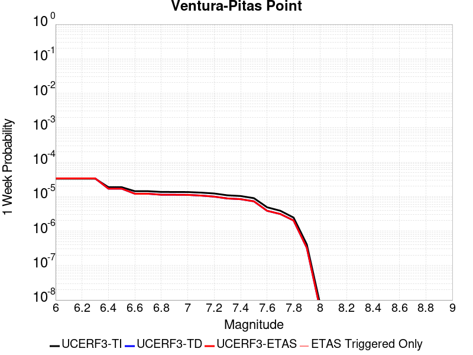 |  |  |  |

| Magnitude | 1 wk TI Prob | 1 wk TD Prob | 1 wk ETAS Prob | 1 wk ETAS/TD Gain | 1 wk ETAS Triggered Only | 1 mo TI Prob | 1 mo TD Prob | 1 mo ETAS Prob | 1 mo ETAS/TD Gain | 1 mo ETAS Triggered Only | 1 yr TI Prob | 1 yr TD Prob | 1 yr ETAS Prob | 1 yr ETAS/TD Gain | 1 yr ETAS Triggered Only | 10 yr TI Prob | 10 yr TD Prob | 10 yr ETAS Prob | 10 yr ETAS/TD Gain | 10 yr ETAS Triggered Only |
|-----|-----|-----|-----|-----|-----|-----|-----|-----|-----|-----|-----|-----|-----|-----|-----|-----|-----|-----|-----|-----|
| 6.0 | 3.3179622E-5 | 3.3735807E-5 | 3.3735807E-5 | 1.0 | 0.0 | 1.4219063E-4 | 1.4457546E-4 | 1.4457546E-4 | 1.0 | 0.0 | 0.0017297962 | 0.001759042 | 0.001759042 | 1.0 | 0.0 | 0.017163932 | 0.01747672 | 0.01750292 | 1.0014992 | 2.6666667E-5 |
| 6.1 | 3.3179622E-5 | 3.3735807E-5 | 3.3735807E-5 | 1.0 | 0.0 | 1.4219063E-4 | 1.4457546E-4 | 1.4457546E-4 | 1.0 | 0.0 | 0.0017297962 | 0.001759042 | 0.001759042 | 1.0 | 0.0 | 0.017163932 | 0.01747672 | 0.01750292 | 1.0014992 | 2.6666667E-5 |
| 6.2 | 3.3179622E-5 | 3.3735807E-5 | 3.3735807E-5 | 1.0 | 0.0 | 1.4219063E-4 | 1.4457546E-4 | 1.4457546E-4 | 1.0 | 0.0 | 0.0017297962 | 0.001759042 | 0.001759042 | 1.0 | 0.0 | 0.017163932 | 0.01747672 | 0.01750292 | 1.0014992 | 2.6666667E-5 |
| 6.3 | 3.3179622E-5 | 3.3735807E-5 | 3.3735807E-5 | 1.0 | 0.0 | 1.4219063E-4 | 1.4457546E-4 | 1.4457546E-4 | 1.0 | 0.0 | 0.0017297962 | 0.001759042 | 0.001759042 | 1.0 | 0.0 | 0.017163932 | 0.01747672 | 0.01750292 | 1.0014992 | 2.6666667E-5 |
| 6.4 | 1.8754668E-5 | 1.701988E-5 | 1.701988E-5 | 1.0 | 0.0 | 8.037467E-5 | 7.2940435E-5 | 7.2940435E-5 | 1.0 | 0.0 | 9.781223E-4 | 8.87711E-4 | 8.87711E-4 | 1.0 | 0.0 | 0.009738282 | 0.008843987 | 0.008843987 | 1.0 | 0.0 |
| 6.5 | 1.8754668E-5 | 1.701988E-5 | 1.701988E-5 | 1.0 | 0.0 | 8.037467E-5 | 7.2940435E-5 | 7.2940435E-5 | 1.0 | 0.0 | 9.781223E-4 | 8.87711E-4 | 8.87711E-4 | 1.0 | 0.0 | 0.009738282 | 0.008843987 | 0.008843987 | 1.0 | 0.0 |
| 6.6 | 1.4361558E-5 | 1.2122469E-5 | 1.2122469E-5 | 1.0 | 0.0 | 6.154808E-5 | 5.195242E-5 | 5.195242E-5 | 1.0 | 0.0 | 7.490902E-4 | 6.323394E-4 | 6.323394E-4 | 1.0 | 0.0 | 0.0074657016 | 0.0063056583 | 0.0063056583 | 1.0 | 0.0 |
| 6.7 | 1.4361558E-5 | 1.2122469E-5 | 1.2122469E-5 | 1.0 | 0.0 | 6.154808E-5 | 5.195242E-5 | 5.195242E-5 | 1.0 | 0.0 | 7.490902E-4 | 6.323394E-4 | 6.323394E-4 | 1.0 | 0.0 | 0.0074657016 | 0.0063056583 | 0.0063056583 | 1.0 | 0.0 |
| 6.8 | 1.3663846E-5 | 1.13446E-5 | 1.13446E-5 | 1.0 | 0.0 | 5.8558027E-5 | 4.8618822E-5 | 4.8618822E-5 | 1.0 | 0.0 | 7.127108E-4 | 5.917753E-4 | 5.917753E-4 | 1.0 | 0.0 | 0.007104293 | 0.0059022107 | 0.0059022107 | 1.0 | 0.0 |
| 6.9 | 1.3644157E-5 | 1.1322701E-5 | 1.1322701E-5 | 1.0 | 0.0 | 5.8473648E-5 | 4.852497E-5 | 4.852497E-5 | 1.0 | 0.0 | 7.116841E-4 | 5.9063325E-4 | 5.9063325E-4 | 1.0 | 0.0 | 0.007094092 | 0.005890851 | 0.005890851 | 1.0 | 0.0 |
| 7.0 | 1.3568845E-5 | 1.1242266E-5 | 1.1242266E-5 | 1.0 | 0.0 | 5.8150898E-5 | 4.818026E-5 | 4.818026E-5 | 1.0 | 0.0 | 7.077572E-4 | 5.8643875E-4 | 5.8643875E-4 | 1.0 | 0.0 | 0.007055073 | 0.005849127 | 0.005849127 | 1.0 | 0.0 |
| 7.1 | 1.306572E-5 | 1.0720711E-5 | 1.0720711E-5 | 1.0 | 0.0 | 5.599474E-5 | 4.5945108E-5 | 4.5945108E-5 | 1.0 | 0.0 | 6.815227E-4 | 5.5923994E-4 | 5.5923994E-4 | 1.0 | 0.0 | 0.0067943637 | 0.0055785314 | 0.0055785314 | 1.0 | 0.0 |
| 7.2 | 1.232604E-5 | 9.995298E-6 | 9.995298E-6 | 1.0 | 0.0 | 5.2824813E-5 | 4.28363E-5 | 4.28363E-5 | 1.0 | 0.0 | 6.429523E-4 | 5.2140886E-4 | 5.2140886E-4 | 1.0 | 0.0 | 0.0064109527 | 0.005202047 | 0.005202047 | 1.0 | 0.0 |
| 7.3 | 1.0917261E-5 | 8.843967E-6 | 8.843967E-6 | 1.0 | 0.0 | 4.678742E-5 | 3.7902173E-5 | 3.7902173E-5 | 1.0 | 0.0 | 5.69488E-4 | 4.6136283E-4 | 4.6136283E-4 | 1.0 | 0.0 | 0.0056803077 | 0.0046042157 | 0.0046042157 | 1.0 | 0.0 |
| 7.4 | 1.039959E-5 | 8.423679E-6 | 8.423679E-6 | 1.0 | 0.0 | 4.456891E-5 | 3.610099E-5 | 3.610099E-5 | 1.0 | 0.0 | 5.424914E-4 | 4.3944246E-4 | 4.3944246E-4 | 1.0 | 0.0 | 0.0054116896 | 0.004385897 | 0.004385897 | 1.0 | 0.0 |
| 7.5 | 9.015877E-6 | 7.297639E-6 | 7.297639E-6 | 1.0 | 0.0 | 3.86389E-5 | 3.1275227E-5 | 3.1275227E-5 | 1.0 | 0.0 | 4.7032707E-4 | 3.807108E-4 | 3.807108E-4 | 1.0 | 0.0 | 0.004693329 | 0.003800731 | 0.003800731 | 1.0 | 0.0 |
| 7.6 | 4.900162E-6 | 3.8741514E-6 | 3.8741514E-6 | 1.0 | 0.0 | 2.1000526E-5 | 1.66034E-5 | 1.66034E-5 | 1.0 | 0.0 | 2.556514E-4 | 2.0212779E-4 | 2.0212779E-4 | 1.0 | 0.0 | 0.0025535747 | 0.002019453 | 0.002019453 | 1.0 | 0.0 |
| 7.7 | 3.8850626E-6 | 3.126758E-6 | 3.126758E-6 | 1.0 | 0.0 | 1.6650163E-5 | 1.3400323E-5 | 1.3400323E-5 | 1.0 | 0.0 | 2.0269687E-4 | 1.631368E-4 | 1.631368E-4 | 1.0 | 0.0 | 0.002025121 | 0.0016301798 | 0.0016301798 | 1.0 | 0.0 |
| 7.8 | 2.4654719E-6 | 2.029892E-6 | 2.029892E-6 | 1.0 | 0.0 | 1.0566265E-5 | 8.699508E-6 | 8.699508E-6 | 1.0 | 0.0 | 1.2863669E-4 | 1.0591141E-4 | 1.0591141E-4 | 1.0 | 0.0 | 0.0012856225 | 0.001058614 | 0.001058614 | 1.0 | 0.0 |
| 7.9 | 4.095894E-7 | 3.2765047E-7 | 3.2765047E-7 | 1.0 | 0.0 | 1.7553821E-6 | 1.4042156E-6 | 1.4042156E-6 | 1.0 | 0.0 | 2.1371567E-5 | 1.7096194E-5 | 1.7096194E-5 | 1.0 | 0.0 | 2.1369511E-4 | 1.7094909E-4 | 1.7094909E-4 | 1.0 | 0.0 |
| 8.0 | 7.791402E-9 | 5.683553E-9 | 5.683553E-9 | 1.0 | 0.0 | 3.3391725E-8 | 2.4358085E-8 | 2.4358085E-8 | 1.0 | 0.0 | 4.0654416E-7 | 2.9655968E-7 | 2.9655968E-7 | 1.0 | 0.0 | 4.065434E-6 | 2.9655946E-6 | 2.9655946E-6 | 1.0 | 0.0 |

